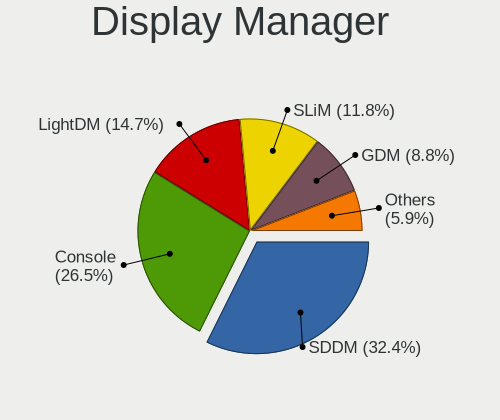
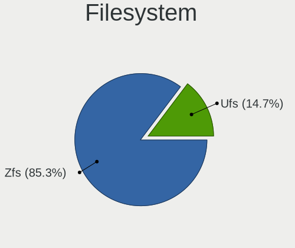
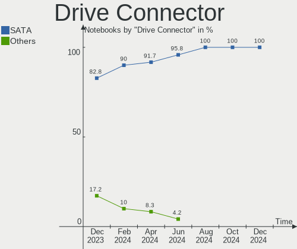
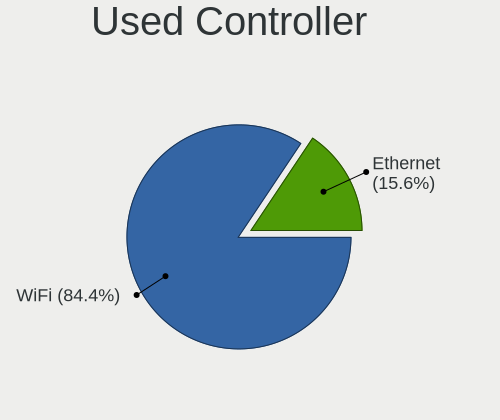
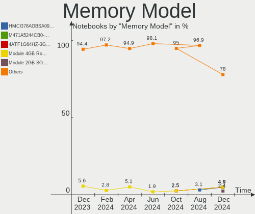

FreeBSD - Hardware Trends (Notebooks)
-------------------------------------

A project to identify most popular hardware characteristics and track their change
over time based on data collected by BSD users at https://BSD-Hardware.info.

Anyone can contribute to this report by the [hw-probe](https://github.com/linuxhw/hw-probe/blob/master/INSTALL.BSD.md) tool:

    hw-probe -all -upload

This report is for one last month. Overall report since the beginning of time: [TestDays](https://github.com/bsdhw/TestDays)

Period: Jan, 2024.

Contents
--------

* [ System ](#system)
  - [ OS                       ](#os)
  - [ OS Family                ](#os-family)
  - [ Arch                     ](#arch)
  - [ DE                       ](#de)
  - [ Display Server           ](#display-server)
  - [ Display Manager          ](#display-manager)
  - [ OS Lang                  ](#os-lang)
  - [ Boot Mode                ](#boot-mode)
  - [ Filesystem               ](#filesystem)
  - [ Part. scheme             ](#part-scheme)

* [ Board ](#board)
  - [ Vendor                   ](#vendor)
  - [ Model                    ](#model)
  - [ Model Family             ](#model-family)
  - [ MFG Year                 ](#mfg-year)
  - [ Form Factor              ](#form-factor)
  - [ Coreboot                 ](#coreboot)
  - [ RAM Size                 ](#ram-size)
  - [ RAM Used                 ](#ram-used)
  - [ Total Drives             ](#total-drives)
  - [ Has CD-ROM               ](#has-cd-rom)
  - [ Has Ethernet             ](#has-ethernet)
  - [ Has WiFi                 ](#has-wifi)
  - [ Has Bluetooth            ](#has-bluetooth)

* [ Location ](#location)
  - [ Country                  ](#country)
  - [ City                     ](#city)

* [ Drives ](#drives)
  - [ Drive Vendor             ](#drive-vendor)
  - [ Drive Model              ](#drive-model)
  - [ HDD Vendor               ](#hdd-vendor)
  - [ SSD Vendor               ](#ssd-vendor)
  - [ Drive Kind               ](#drive-kind)
  - [ Drive Connector          ](#drive-connector)
  - [ Drive Size               ](#drive-size)
  - [ Space Total              ](#space-total)
  - [ Space Used               ](#space-used)
  - [ Malfunc. Drives          ](#malfunc-drives)
  - [ Malfunc. Drive Vendor    ](#malfunc-drive-vendor)
  - [ Malfunc. HDD Vendor      ](#malfunc-hdd-vendor)
  - [ Malfunc. Drive Kind      ](#malfunc-drive-kind)
  - [ Failed Drives            ](#failed-drives)
  - [ Failed Drive Vendor      ](#failed-drive-vendor)
  - [ Drive Status             ](#drive-status)

* [ Storage controller ](#storage-controller)
  - [ Storage Vendor           ](#storage-vendor)
  - [ Storage Model            ](#storage-model)
  - [ Storage Kind             ](#storage-kind)

* [ Processor ](#processor)
  - [ CPU Vendor               ](#cpu-vendor)
  - [ CPU Model                ](#cpu-model)
  - [ CPU Model Family         ](#cpu-model-family)
  - [ CPU Cores                ](#cpu-cores)
  - [ CPU Sockets              ](#cpu-sockets)
  - [ CPU Threads              ](#cpu-threads)
  - [ CPU Microarch            ](#cpu-microarch)

* [ Graphics ](#graphics)
  - [ GPU Vendor               ](#gpu-vendor)
  - [ GPU Model                ](#gpu-model)
  - [ GPU Combo                ](#gpu-combo)
  - [ GPU Driver               ](#gpu-driver)
  - [ GPU Memory               ](#gpu-memory)

* [ Monitor ](#monitor)
  - [ Monitor Vendor           ](#monitor-vendor)
  - [ Monitor Model            ](#monitor-model)
  - [ Monitor Resolution       ](#monitor-resolution)
  - [ Monitor Diagonal         ](#monitor-diagonal)
  - [ Monitor Width            ](#monitor-width)
  - [ Aspect Ratio             ](#aspect-ratio)
  - [ Monitor Area             ](#monitor-area)
  - [ Pixel Density            ](#pixel-density)
  - [ Multiple Monitors        ](#multiple-monitors)

* [ Network ](#network)
  - [ Net Controller Vendor    ](#net-controller-vendor)
  - [ Net Controller Model     ](#net-controller-model)
  - [ Wireless Vendor          ](#wireless-vendor)
  - [ Wireless Model           ](#wireless-model)
  - [ Ethernet Vendor          ](#ethernet-vendor)
  - [ Ethernet Model           ](#ethernet-model)
  - [ Net Controller Kind      ](#net-controller-kind)
  - [ Used Controller          ](#used-controller)
  - [ NICs                     ](#nics)
  - [ IPv6                     ](#ipv6)

* [ Bluetooth ](#bluetooth)
  - [ Bluetooth Vendor         ](#bluetooth-vendor)
  - [ Bluetooth Model          ](#bluetooth-model)

* [ Sound ](#sound)
  - [ Sound Vendor             ](#sound-vendor)
  - [ Sound Model              ](#sound-model)

* [ Memory ](#memory)
  - [ Memory Vendor            ](#memory-vendor)
  - [ Memory Model             ](#memory-model)
  - [ Memory Kind              ](#memory-kind)
  - [ Memory Form Factor       ](#memory-form-factor)
  - [ Memory Size              ](#memory-size)
  - [ Memory Speed             ](#memory-speed)

* [ Printers & scanners ](#printers--scanners)
  - [ Printer Vendor           ](#printer-vendor)
  - [ Printer Model            ](#printer-model)
  - [ Scanner Vendor           ](#scanner-vendor)
  - [ Scanner Model            ](#scanner-model)

* [ Camera ](#camera)
  - [ Camera Vendor            ](#camera-vendor)
  - [ Camera Model             ](#camera-model)

* [ Security ](#security)
  - [ Fingerprint Vendor       ](#fingerprint-vendor)
  - [ Fingerprint Model        ](#fingerprint-model)
  - [ Chipcard Vendor          ](#chipcard-vendor)
  - [ Chipcard Model           ](#chipcard-model)

* [ Unsupported ](#unsupported)
  - [ Unsupported Devices      ](#unsupported-devices)
  - [ Unsupported Device Types ](#unsupported-device-types)

System
------

OS
--

Installed operating systems

| Name                 | Notebooks | Percent |
|----------------------|-----------|---------|
| FreeBSD 14.0         | 11        | 36.67%  |
| FreeBSD 14.0-p4      | 9         | 30%     |
| FreeBSD 15.0-CURRENT | 3         | 10%     |
| FreeBSD 14.0-p2      | 1         | 3.33%   |
| FreeBSD 14.0-p1      | 1         | 3.33%   |
| FreeBSD 13.2-p9      | 1         | 3.33%   |
| FreeBSD 13.2-p8      | 1         | 3.33%   |
| FreeBSD 13.2-p54     | 1         | 3.33%   |
| FreeBSD 13.2         | 1         | 3.33%   |
| FreeBSD 13.1         | 1         | 3.33%   |

OS Family
---------

OS without a version

| Name    | Notebooks | Percent |
|---------|-----------|---------|
| FreeBSD | 30        | 100%    |

Arch
----

OS architecture (x86_64, i586, etc.)

| Name  | Notebooks | Percent |
|-------|-----------|---------|
| amd64 | 30        | 100%    |

DE
--

Desktop Environment

| Name      | Notebooks | Percent |
|-----------|-----------|---------|
| KDE5      | 8         | 26.67%  |
| Console   | 7         | 23.33%  |
| XFCE      | 3         | 10%     |
| GNOME     | 3         | 10%     |
| TWM       | 2         | 6.67%   |
| Cinnamon  | 2         | 6.67%   |
| wlroots   | 1         | 3.33%   |
| Openbox   | 1         | 3.33%   |
| i3        | 1         | 3.33%   |
| DWM       | 1         | 3.33%   |
| AwesomeWM | 1         | 3.33%   |

Display Server
--------------

X11 or Wayland

| Name    | Notebooks | Percent |
|---------|-----------|---------|
| X11     | 21        | 70%     |
| Console | 7         | 23.33%  |
| Wayland | 2         | 6.67%   |

Display Manager
---------------

SDDM, LightDM, etc.

| Name    | Notebooks | Percent |
|---------|-----------|---------|
| Console | 15        | 50%     |
| SDDM    | 7         | 23.33%  |
| LightDM | 4         | 13.33%  |
| SLiM    | 2         | 6.67%   |
| GDM     | 2         | 6.67%   |

OS Lang
-------

Language

| Lang            | Notebooks | Percent |
|-----------------|-----------|---------|
| C               | 24        | 80%     |
| en_US           | 3         | 10%     |
| zh_CN           | 1         | 3.33%   |
| en_US.ISO8859-1 | 1         | 3.33%   |
| Unknown         | 1         | 3.33%   |

Boot Mode
---------

EFI or BIOS

| Mode | Notebooks | Percent |
|------|-----------|---------|
| EFI  | 28        | 93.33%  |
| BIOS | 2         | 6.67%   |

Filesystem
----------

Type of filesystem

| Type | Notebooks | Percent |
|------|-----------|---------|
| Zfs  | 15        | 50%     |
| Ufs  | 15        | 50%     |

Part. scheme
------------

Scheme of partitioning

| Type | Notebooks | Percent |
|------|-----------|---------|
| GPT  | 28        | 93.33%  |
| MBR  | 2         | 6.67%   |

Board
-----

Vendor
------

Motherboard manufacturer

| Name             | Notebooks | Percent |
|------------------|-----------|---------|
| Lenovo           | 9         | 30%     |
| Dell             | 7         | 23.33%  |
| Hewlett-Packard  | 5         | 16.67%  |
| ASUSTek Computer | 3         | 10%     |
| Razer            | 2         | 6.67%   |
| Rembrandt        | 1         | 3.33%   |
| LG Electronics   | 1         | 3.33%   |
| Apple            | 1         | 3.33%   |
| Acer             | 1         | 3.33%   |

Model
-----

Motherboard model

| Name                                  | Notebooks | Percent |
|---------------------------------------|-----------|---------|
| Rembrandt ARB928                      | 1         | 3.33%   |
| Razer Blade 16 - RZ09-0483            | 1         | 3.33%   |
| Razer Blade 14 (2022) - RZ09-0427     | 1         | 3.33%   |
| LG 16UD70R-G.AX59B                    | 1         | 3.33%   |
| Lenovo ThinkPad X220 42912Z1          | 1         | 3.33%   |
| Lenovo ThinkPad W520 4284GZ1          | 1         | 3.33%   |
| Lenovo ThinkPad T490s 20NX000MUS      | 1         | 3.33%   |
| Lenovo ThinkPad T14s Gen 4 21F60029US | 1         | 3.33%   |
| Lenovo ThinkPad E14 Gen 3 20Y7003QGE  | 1         | 3.33%   |
| Lenovo ThinkPad 11e 20D90020US        | 1         | 3.33%   |
| Lenovo ThinkBook 14 G6 IRL 21KG       | 1         | 3.33%   |
| Lenovo Legion Y9000X 2020 81TH        | 1         | 3.33%   |
| Lenovo G50-80 80E5                    | 1         | 3.33%   |
| HP ZBook 17 G2                        | 1         | 3.33%   |
| HP ProBook 650 G1                     | 1         | 3.33%   |
| HP Pavilion g6                        | 1         | 3.33%   |
| HP Laptop 15t-dy100                   | 1         | 3.33%   |
| HP 255 G7 Notebook PC                 | 1         | 3.33%   |
| Dell XPS 15 7590                      | 1         | 3.33%   |
| Dell Precision 7510                   | 1         | 3.33%   |
| Dell Latitude E7450                   | 1         | 3.33%   |
| Dell Latitude E5420                   | 1         | 3.33%   |
| Dell Latitude 7490                    | 1         | 3.33%   |
| Dell Inspiron 5555                    | 1         | 3.33%   |
| Dell Inspiron 1525                    | 1         | 3.33%   |
| ASUS X551MA                           | 1         | 3.33%   |
| ASUS X441UV                           | 1         | 3.33%   |
| ASUS TUF Gaming FX505DY_FX505DY       | 1         | 3.33%   |
| Apple MacBook5,1                      | 1         | 3.33%   |
| Acer TravelMate P645-SG               | 1         | 3.33%   |

Model Family
------------

Motherboard model prefix

| Name               | Notebooks | Percent |
|--------------------|-----------|---------|
| Lenovo ThinkPad    | 6         | 20%     |
| Dell Latitude      | 3         | 10%     |
| Razer Blade        | 2         | 6.67%   |
| Dell Inspiron      | 2         | 6.67%   |
| Rembrandt ARB928   | 1         | 3.33%   |
| LG 16UD70R-G.AX59B | 1         | 3.33%   |
| Lenovo ThinkBook   | 1         | 3.33%   |
| Lenovo Legion      | 1         | 3.33%   |
| Lenovo G50-80      | 1         | 3.33%   |
| HP ZBook           | 1         | 3.33%   |
| HP ProBook         | 1         | 3.33%   |
| HP Pavilion        | 1         | 3.33%   |
| HP Laptop          | 1         | 3.33%   |
| HP 255             | 1         | 3.33%   |
| Dell XPS           | 1         | 3.33%   |
| Dell Precision     | 1         | 3.33%   |
| ASUS X551MA        | 1         | 3.33%   |
| ASUS X441UV        | 1         | 3.33%   |
| ASUS TUF           | 1         | 3.33%   |
| Apple MacBook5     | 1         | 3.33%   |
| Acer TravelMate    | 1         | 3.33%   |

MFG Year
--------

Motherboard manufacture year

| Year | Notebooks | Percent |
|------|-----------|---------|
| 2023 | 7         | 23.33%  |
| 2019 | 6         | 20%     |
| 2020 | 3         | 10%     |
| 2016 | 3         | 10%     |
| 2014 | 2         | 6.67%   |
| 2012 | 2         | 6.67%   |
| 2011 | 2         | 6.67%   |
| 2008 | 2         | 6.67%   |
| 2021 | 1         | 3.33%   |
| 2018 | 1         | 3.33%   |
| 2015 | 1         | 3.33%   |

Form Factor
-----------

Physical design of the computer

| Name     | Notebooks | Percent |
|----------|-----------|---------|
| Notebook | 30        | 100%    |

Coreboot
--------

Have coreboot on board

| Used | Notebooks | Percent |
|------|-----------|---------|
| No   | 30        | 100%    |

RAM Size
--------

Total RAM memory

| Size in GB | Notebooks | Percent |
|------------|-----------|---------|
| 16.01-24.0 | 10        | 33.33%  |
| 8.01-16.0  | 10        | 33.33%  |
| 4.01-8.0   | 5         | 16.67%  |
| 32.01-64.0 | 3         | 10%     |
| 24.01-32.0 | 1         | 3.33%   |
| 2.01-3.0   | 1         | 3.33%   |

RAM Used
--------

Used RAM memory

| Used GB  | Notebooks | Percent |
|----------|-----------|---------|
| 0.51-1.0 | 11        | 36.67%  |
| 0.01-0.5 | 11        | 36.67%  |
| 1.01-2.0 | 8         | 26.67%  |

Total Drives
------------

Number of drives on board

| Drives | Notebooks | Percent |
|--------|-----------|---------|
| 1      | 19        | 63.33%  |
| 0      | 9         | 30%     |
| 2      | 2         | 6.67%   |

Has CD-ROM
----------

Has CD-ROM on board

| Presented | Notebooks | Percent |
|-----------|-----------|---------|
| No        | 19        | 63.33%  |
| Yes       | 11        | 36.67%  |

Has Ethernet
------------

Has Ethernet on board

| Presented | Notebooks | Percent |
|-----------|-----------|---------|
| Yes       | 23        | 76.67%  |
| No        | 7         | 23.33%  |

Has WiFi
--------

Has WiFi module

| Presented | Notebooks | Percent |
|-----------|-----------|---------|
| Yes       | 29        | 96.67%  |
| No        | 1         | 3.33%   |

Has Bluetooth
-------------

Has Bluetooth module

| Presented | Notebooks | Percent |
|-----------|-----------|---------|
| Yes       | 25        | 83.33%  |
| No        | 5         | 16.67%  |

Location
--------

Country
-------

Geographic location (country)

| Country     | Notebooks | Percent |
|-------------|-----------|---------|
| USA         | 7         | 23.33%  |
| France      | 4         | 13.33%  |
| Algeria     | 3         | 10%     |
| UK          | 2         | 6.67%   |
| Netherlands | 2         | 6.67%   |
| Germany     | 2         | 6.67%   |
| Turkey      | 1         | 3.33%   |
| Switzerland | 1         | 3.33%   |
| Sweden      | 1         | 3.33%   |
| Russia      | 1         | 3.33%   |
| Mexico      | 1         | 3.33%   |
| Japan       | 1         | 3.33%   |
| Indonesia   | 1         | 3.33%   |
| India       | 1         | 3.33%   |
| Brazil      | 1         | 3.33%   |
| Belarus     | 1         | 3.33%   |

City
----

Geographic location (city)

| City         | Notebooks | Percent |
|--------------|-----------|---------|
| Paris        | 2         | 6.67%   |
| Courbevoie   | 2         | 6.67%   |
| Westervoort  | 1         | 3.33%   |
| Vallingby    | 1         | 3.33%   |
| Tijuana      | 1         | 3.33%   |
| Spanish Fork | 1         | 3.33%   |
| Sao Paulo    | 1         | 3.33%   |
| San Jose     | 1         | 3.33%   |
| Roanoke      | 1         | 3.33%   |
| Richmond     | 1         | 3.33%   |
| Pevensey     | 1         | 3.33%   |
| Oran         | 1         | 3.33%   |
| Nuremberg    | 1         | 3.33%   |
| Mumbai       | 1         | 3.33%   |
| Moscow       | 1         | 3.33%   |
| Minsk        | 1         | 3.33%   |
| Medan        | 1         | 3.33%   |
| Mascara      | 1         | 3.33%   |
| Lewisham     | 1         | 3.33%   |
| Lausanne     | 1         | 3.33%   |
| Greenbrier   | 1         | 3.33%   |
| Concord      | 1         | 3.33%   |
| Chiyoda-ku   | 1         | 3.33%   |
| Birmingham   | 1         | 3.33%   |
| Berlin       | 1         | 3.33%   |
| Beni Saf     | 1         | 3.33%   |
| Antalya      | 1         | 3.33%   |
| Amsterdam    | 1         | 3.33%   |

Drives
------

Drive Vendor
------------

Hard drive vendors

| Vendor              | Notebooks | Drives | Percent |
|---------------------|-----------|--------|---------|
| Samsung Electronics | 5         | 6      | 23.81%  |
| SanDisk             | 3         | 3      | 14.29%  |
| Toshiba             | 2         | 2      | 9.52%   |
| Seagate             | 2         | 2      | 9.52%   |
| Kingston            | 2         | 2      | 9.52%   |
| SSSTC               | 1         | 1      | 4.76%   |
| SK hynix            | 1         | 1      | 4.76%   |
| Pioneer             | 1         | 1      | 4.76%   |
| MidasForce          | 1         | 1      | 4.76%   |
| HGST                | 1         | 2      | 4.76%   |
| Crucial             | 1         | 1      | 4.76%   |
| A-DATA Technology   | 1         | 1      | 4.76%   |

Drive Model
-----------

Hard drive models

| Model                              | Notebooks | Percent |
|------------------------------------|-----------|---------|
| Toshiba MQ04UBF100 1TB             | 1         | 4.55%   |
| Toshiba MQ01ABD100 1TB             | 1         | 4.55%   |
| SSSTC CL4-8D512 512GB              | 1         | 4.55%   |
| SK hynix SC401 SATA 256GB          | 1         | 4.55%   |
| Seagate ST500LT012-1DG142 500GB    | 1         | 4.55%   |
| Seagate ST1000LM024 HN-M101MBB 1TB | 1         | 4.55%   |
| SanDisk SSD PLUS 2000GB            | 1         | 4.55%   |
| SanDisk SDSSDA120G 120GB           | 1         | 4.55%   |
| SanDisk SD7TB3Q-256G-1006 256GB    | 1         | 4.55%   |
| Samsung SSD 980 PRO 500GB          | 1         | 4.55%   |
| Samsung SSD 860 EVO M.2 1TB        | 1         | 4.55%   |
| Samsung SSD 860 EVO 500GB          | 1         | 4.55%   |
| Samsung SSD 850 EVO 250GB          | 1         | 4.55%   |
| Samsung SSD 840 PRO Series 256GB   | 1         | 4.55%   |
| Samsung MZ7LN128HCHP-000L1 128GB   | 1         | 4.55%   |
| Pioneer APS-SL3N-128 128GB         | 1         | 4.55%   |
| MidasForce SSD 512GB               | 1         | 4.55%   |
| Kingston SKC600256G 256GB          | 1         | 4.55%   |
| Kingston SA400S37240G 240GB        | 1         | 4.55%   |
| HGST HTS721010A9E630 1TB           | 1         | 4.55%   |
| Crucial CT240BX500SSD1 240GB       | 1         | 4.55%   |
| A-DATA SU680 512GB                 | 1         | 4.55%   |

HDD Vendor
----------

Hard disk drive vendors

| Vendor  | Notebooks | Drives | Percent |
|---------|-----------|--------|---------|
| Toshiba | 2         | 2      | 40%     |
| Seagate | 2         | 2      | 40%     |
| HGST    | 1         | 2      | 20%     |

SSD Vendor
----------

Solid state drive vendors

| Vendor              | Notebooks | Drives | Percent |
|---------------------|-----------|--------|---------|
| Samsung Electronics | 5         | 5      | 33.33%  |
| SanDisk             | 3         | 3      | 20%     |
| Kingston            | 2         | 2      | 13.33%  |
| SK hynix            | 1         | 1      | 6.67%   |
| Pioneer             | 1         | 1      | 6.67%   |
| MidasForce          | 1         | 1      | 6.67%   |
| Crucial             | 1         | 1      | 6.67%   |
| A-DATA Technology   | 1         | 1      | 6.67%   |

Drive Kind
----------

HDD or SSD

| Kind | Notebooks | Drives | Percent |
|------|-----------|--------|---------|
| SSD  | 15        | 15     | 68.18%  |
| HDD  | 5         | 6      | 22.73%  |
| NVMe | 2         | 2      | 9.09%   |

Drive Connector
---------------

SATA, SAS, NVMe, etc.

| Type | Notebooks | Drives | Percent |
|------|-----------|--------|---------|
| SATA | 20        | 21     | 90.91%  |
| NVMe | 2         | 2      | 9.09%   |

Drive Size
----------

Size of hard drive

| Size in TB | Notebooks | Drives | Percent |
|------------|-----------|--------|---------|
| 0.01-0.5   | 12        | 12     | 60%     |
| 0.51-1.0   | 7         | 8      | 35%     |
| 1.01-2.0   | 1         | 1      | 5%      |

Space Total
-----------

Amount of disk space available on the file system

| Size in GB | Notebooks | Percent |
|------------|-----------|---------|
| 101-250    | 12        | 40%     |
| 251-500    | 10        | 33.33%  |
| 501-1000   | 5         | 16.67%  |
| 51-100     | 2         | 6.67%   |
| 1001-2000  | 1         | 3.33%   |

Space Used
----------

Amount of used disk space

| Used GB | Notebooks | Percent |
|---------|-----------|---------|
| 1-20    | 21        | 70%     |
| 51-100  | 4         | 13.33%  |
| 21-50   | 3         | 10%     |
| 101-250 | 2         | 6.67%   |

Malfunc. Drives
---------------

Drive models with a malfunction

| Model                           | Notebooks | Drives | Percent |
|---------------------------------|-----------|--------|---------|
| SK hynix SC401 SATA 256GB       | 1         | 1      | 50%     |
| Seagate ST500LT012-1DG142 500GB | 1         | 1      | 50%     |

Malfunc. Drive Vendor
---------------------

Vendors of faulty drives

| Vendor   | Notebooks | Drives | Percent |
|----------|-----------|--------|---------|
| SK hynix | 1         | 1      | 50%     |
| Seagate  | 1         | 1      | 50%     |

Malfunc. HDD Vendor
-------------------

Vendors of faulty HDD drives

| Vendor  | Notebooks | Drives | Percent |
|---------|-----------|--------|---------|
| Seagate | 1         | 1      | 100%    |

Malfunc. Drive Kind
-------------------

Kinds of faulty drives

| Kind | Notebooks | Drives | Percent |
|------|-----------|--------|---------|
| SSD  | 1         | 1      | 50%     |
| HDD  | 1         | 1      | 50%     |

Failed Drives
-------------

Failed drive models

Zero info for selected period =(

Failed Drive Vendor
-------------------

Failed drive vendors

Zero info for selected period =(

Drive Status
------------

Number of failed and malfunc. drives

| Status  | Notebooks | Drives | Percent |
|---------|-----------|--------|---------|
| Works   | 19        | 21     | 90.48%  |
| Malfunc | 2         | 2      | 9.52%   |

Storage controller
------------------

Storage Vendor
--------------

Storage controller vendors

| Vendor                                  | Notebooks | Percent |
|-----------------------------------------|-----------|---------|
| Intel                                   | 16        | 43.24%  |
| Samsung Electronics                     | 5         | 13.51%  |
| AMD                                     | 4         | 10.81%  |
| Solid State Storage Technology          | 2         | 5.41%   |
| Sandisk                                 | 2         | 5.41%   |
| Phison Electronics                      | 2         | 5.41%   |
| Toshiba                                 | 1         | 2.7%    |
| SK hynix                                | 1         | 2.7%    |
| Shenzhen Unionmemory Information System | 1         | 2.7%    |
| Nvidia                                  | 1         | 2.7%    |
| Micron/Crucial Technology               | 1         | 2.7%    |
| Kingston Technology Company             | 1         | 2.7%    |

Storage Model
-------------

Storage controller models

| Model                                                                          | Notebooks | Percent |
|--------------------------------------------------------------------------------|-----------|---------|
| AMD FCH SATA Controller [AHCI mode]                                            | 4         | 10.53%  |
| Intel 82801 Mobile SATA Controller [RAID mode]                                 | 3         | 7.89%   |
| Intel 6 Series/C200 Series Chipset Family 6 port Mobile SATA AHCI Controller   | 3         | 7.89%   |
| Samsung NVMe SSD Controller SM981/PM981/PM983                                  | 2         | 5.26%   |
| Intel Wildcat Point-LP SATA Controller [AHCI Mode]                             | 2         | 5.26%   |
| Intel Atom Processor E3800 Series SATA AHCI Controller                         | 2         | 5.26%   |
| Intel 8 Series/C220 Series Chipset Family 6-port SATA Controller 1 [AHCI mode] | 2         | 5.26%   |
| Toshiba XG4 NVMe SSD Controller                                                | 1         | 2.63%   |
| Solid State Storage CL4-8D512 NVMe SSD M.2 (DRAM-less)                         | 1         | 2.63%   |
| Solid State Storage CA6-8D512 NVMe SSD M.2                                     | 1         | 2.63%   |
| SK hynix PC601 NVMe Solid State Drive                                          | 1         | 2.63%   |
| Sandisk WD PC SN740 NVMe SSD 512GB (DRAM-less)                                 | 1         | 2.63%   |
| SanDisk PC SN530 NVMe SSD (DRAM-less)                                          | 1         | 2.63%   |
| Samsung NVMe SSD Controller S4LV008[Pascal]                                    | 1         | 2.63%   |
| Samsung NVMe SSD Controller PM9A1/PM9A3/980PRO                                 | 1         | 2.63%   |
| Samsung NVMe SSD Controller 980 (DRAM-less)                                    | 1         | 2.63%   |
| Phison PS5013-E13 PCIe3 NVMe Controller (DRAM-less)                            | 1         | 2.63%   |
| Phison E12 NVMe Controller                                                     | 1         | 2.63%   |
| Nvidia MCP79 AHCI Controller                                                   | 1         | 2.63%   |
| Micron/Crucial P2 [Nick P2] / P3 / P3 Plus NVMe PCIe SSD (DRAM-less)           | 1         | 2.63%   |
| Kingston Company NV1 NVMe SSD SM2263XT (DRAM-less)                             | 1         | 2.63%   |
| Intel Sunrise Point-LP SATA Controller [AHCI mode]                             | 1         | 2.63%   |
| Intel Q170/Q150/B150/H170/H110/Z170/CM236 Chipset SATA Controller [AHCI Mode]  | 1         | 2.63%   |
| Intel Cannon Lake Mobile PCH SATA AHCI Controller                              | 1         | 2.63%   |
| Intel 82801HM/HEM (ICH8M/ICH8M-E) SATA Controller [AHCI mode]                  | 1         | 2.63%   |
| Intel 82801HM/HEM (ICH8M/ICH8M-E) IDE Controller                               | 1         | 2.63%   |
| Unknown                                                                        | 1         | 2.63%   |

Storage Kind
------------

Kind of storage controller (IDE, SATA, NVMe, SAS, ...)

| Kind | Notebooks | Percent |
|------|-----------|---------|
| SATA | 18        | 50%     |
| NVMe | 14        | 38.89%  |
| RAID | 3         | 8.33%   |
| IDE  | 1         | 2.78%   |

Processor
---------

CPU Vendor
----------

Processor vendors

| Vendor | Notebooks | Percent |
|--------|-----------|---------|
| Intel  | 22        | 73.33%  |
| AMD    | 8         | 26.67%  |

CPU Model
---------

Processor models

| Model                                           | Notebooks | Percent |
|-------------------------------------------------|-----------|---------|
| Intel Core i7-9750H CPU @ 2.60GHz               | 2         | 6.67%   |
| Intel Core i5-5200U CPU @ 2.20GHz               | 2         | 6.67%   |
| Intel Core i7-8650U CPU @ 1.90GHz               | 1         | 3.33%   |
| Intel Core i7-6820HQ CPU @ 2.70GHz              | 1         | 3.33%   |
| Intel Core i7-5600U CPU @ 2.60GHz               | 1         | 3.33%   |
| Intel Core i7-4710MQ CPU @ 2.50GHz              | 1         | 3.33%   |
| Intel Core i7-2630QM CPU @ 2.00GHz              | 1         | 3.33%   |
| Intel Core i7-1065G7 CPU @ 1.30GHz              | 1         | 3.33%   |
| Intel Core i5-8265U CPU @ 1.60GHz               | 1         | 3.33%   |
| Intel Core i5-4310M CPU @ 2.70GHz               | 1         | 3.33%   |
| Intel Core i5-2520M CPU @ 2.50GHz               | 1         | 3.33%   |
| Intel Core i5-2430M CPU @ 2.40GH                | 1         | 3.33%   |
| Intel Core i3-6006U CPU @ 2.00GHz               | 1         | 3.33%   |
| Intel Core 2 Duo CPU P7350 @ 2.00GHz            | 1         | 3.33%   |
| Intel Celeron CPU N2940 @ 1.83GHz               | 1         | 3.33%   |
| Intel Celeron CPU N2830 @ 2.16GHz               | 1         | 3.33%   |
| Intel Celeron                                   | 1         | 3.33%   |
| Intel 13th Gen Core i9-13950HX                  | 1         | 3.33%   |
| Intel 13th Gen Core i7-13700H                   | 1         | 3.33%   |
| Intel 13th Gen Core i7-1355U                    | 1         | 3.33%   |
| AMD Ryzen 9 6900HX with Radeon Graphics         | 1         | 3.33%   |
| AMD Ryzen 7 7735H with Radeon Graphics          | 1         | 3.33%   |
| AMD Ryzen 5 7530U with Radeon Graphics          | 1         | 3.33%   |
| AMD Ryzen 5 5500U with Radeon Graphics          | 1         | 3.33%   |
| AMD Ryzen 5 3550H with Radeon Vega Mobile Gfx   | 1         | 3.33%   |
| AMD Ryzen 3 2200U with Radeon Vega Mobile Gfx   | 1         | 3.33%   |
| AMD A4-4300M APU with Radeon HD Graphics        | 1         | 3.33%   |
| AMD A10-8700P Radeon R6, 10 Compute Cores 4C+6G | 1         | 3.33%   |

CPU Model Family
----------------

Processor model prefix

| Model            | Notebooks | Percent |
|------------------|-----------|---------|
| Intel Core i7    | 8         | 26.67%  |
| Intel Core i5    | 6         | 20%     |
| Other            | 3         | 10%     |
| Intel Celeron    | 3         | 10%     |
| AMD Ryzen 5      | 3         | 10%     |
| Intel Core i3    | 1         | 3.33%   |
| Intel Core 2 Duo | 1         | 3.33%   |
| AMD Ryzen 9      | 1         | 3.33%   |
| AMD Ryzen 7      | 1         | 3.33%   |
| AMD Ryzen 3      | 1         | 3.33%   |
| AMD A4           | 1         | 3.33%   |
| AMD A10          | 1         | 3.33%   |

CPU Cores
---------

Number of processor cores

| Number  | Notebooks | Percent |
|---------|-----------|---------|
| 4       | 9         | 30%     |
| 2       | 9         | 30%     |
| 12      | 3         | 10%     |
| 16      | 2         | 6.67%   |
| 6       | 2         | 6.67%   |
| 32      | 1         | 3.33%   |
| 10      | 1         | 3.33%   |
| 8       | 1         | 3.33%   |
| 1       | 1         | 3.33%   |
| Unknown | 1         | 3.33%   |

CPU Sockets
-----------

Number of sockets

| Number | Notebooks | Percent |
|--------|-----------|---------|
| 1      | 29        | 96.67%  |
| 2      | 1         | 3.33%   |

CPU Threads
-----------

Threads per core (Hyper-Threading)

| Number  | Notebooks | Percent |
|---------|-----------|---------|
| 2       | 16        | 53.33%  |
| 1       | 13        | 43.33%  |
| Unknown | 1         | 3.33%   |

CPU Microarch
-------------

Microarchitecture

| Name        | Notebooks | Percent |
|-------------|-----------|---------|
| Unknown     | 6         | 20%     |
| KabyLake    | 4         | 13.33%  |
| SandyBridge | 3         | 10%     |
| Broadwell   | 3         | 10%     |
| Skylake     | 2         | 6.67%   |
| Silvermont  | 2         | 6.67%   |
| Haswell     | 2         | 6.67%   |
| Zen+        | 1         | 3.33%   |
| Zen 3       | 1         | 3.33%   |
| Zen         | 1         | 3.33%   |
| Piledriver  | 1         | 3.33%   |
| Penryn      | 1         | 3.33%   |
| IceLake     | 1         | 3.33%   |
| Excavator   | 1         | 3.33%   |
| Core        | 1         | 3.33%   |

Graphics
--------

GPU Vendor
----------

Vendors of graphics cards

| Vendor | Notebooks | Percent |
|--------|-----------|---------|
| Intel  | 19        | 52.78%  |
| AMD    | 9         | 25%     |
| Nvidia | 8         | 22.22%  |

GPU Model
---------

Graphics card models

| Model                                                                     | Notebooks | Percent |
|---------------------------------------------------------------------------|-----------|---------|
| Intel HD Graphics 5500                                                    | 3         | 7.69%   |
| Intel 2nd Generation Core Processor Family Integrated Graphics Controller | 3         | 7.69%   |
| Intel Raptor Lake-P [Iris Xe Graphics]                                    | 2         | 5.13%   |
| Intel CoffeeLake-H GT2 [UHD Graphics 630]                                 | 2         | 5.13%   |
| Intel Atom Processor Z36xxx/Z37xxx Series Graphics & Display              | 2         | 5.13%   |
| AMD Rembrandt [Radeon 680M]                                               | 2         | 5.13%   |
| Nvidia TU117M [GeForce GTX 1650 Mobile / Max-Q]                           | 1         | 2.56%   |
| Nvidia GM108M [GeForce 920MX]                                             | 1         | 2.56%   |
| Nvidia GM108M [GeForce 840M]                                              | 1         | 2.56%   |
| Nvidia GM107GLM [Quadro M2000M]                                           | 1         | 2.56%   |
| Nvidia GK107GLM [Quadro K1100M]                                           | 1         | 2.56%   |
| Nvidia GA104 [Geforce RTX 3070 Ti Laptop GPU]                             | 1         | 2.56%   |
| Nvidia C79 [GeForce 9400M]                                                | 1         | 2.56%   |
| Nvidia AD106M [GeForce RTX 4070 Max-Q / Mobile]                           | 1         | 2.56%   |
| Intel WhiskeyLake-U GT2 [UHD Graphics 620]                                | 1         | 2.56%   |
| Intel UHD Graphics 620                                                    | 1         | 2.56%   |
| Intel Skylake GT2 [HD Graphics 520]                                       | 1         | 2.56%   |
| Intel Raptor Lake-S UHD Graphics                                          | 1         | 2.56%   |
| Intel Mobile GM965/GL960 Integrated Graphics Controller (secondary)       | 1         | 2.56%   |
| Intel Mobile GM965/GL960 Integrated Graphics Controller (primary)         | 1         | 2.56%   |
| Intel Iris Plus Graphics G7                                               | 1         | 2.56%   |
| Intel 4th Gen Core Processor Integrated Graphics Controller               | 1         | 2.56%   |
| AMD Wani [Radeon R5/R6/R7 Graphics]                                       | 1         | 2.56%   |
| AMD Trinity 2 [Radeon HD 7420G]                                           | 1         | 2.56%   |
| AMD Thames [Radeon HD 7500M/7600M Series]                                 | 1         | 2.56%   |
| AMD Sun LE [Radeon HD 8550M / R5 M230]                                    | 1         | 2.56%   |
| AMD Raven Ridge [Radeon Vega Series / Radeon Vega Mobile Series]          | 1         | 2.56%   |
| AMD Picasso/Raven 2 [Radeon Vega Series / Radeon Vega Mobile Series]      | 1         | 2.56%   |
| AMD Lucienne                                                              | 1         | 2.56%   |
| AMD Barcelo                                                               | 1         | 2.56%   |
| AMD Baffin [Radeon RX 460/560D / Pro 450/455/460/555/555X/560/560X]       | 1         | 2.56%   |

GPU Combo
---------

Combinations of graphics cards

| Name           | Notebooks | Percent |
|----------------|-----------|---------|
| 1 x Intel      | 13        | 43.33%  |
| 1 x AMD        | 5         | 16.67%  |
| Intel + Nvidia | 4         | 13.33%  |
| 1 x Nvidia     | 3         | 10%     |
| 2 x AMD        | 2         | 6.67%   |
| 2 x Intel      | 1         | 3.33%   |
| Intel + AMD    | 1         | 3.33%   |
| AMD + Nvidia   | 1         | 3.33%   |

GPU Driver
----------

Free vs proprietary

| Driver      | Notebooks | Percent |
|-------------|-----------|---------|
| Free        | 27        | 90%     |
| Proprietary | 3         | 10%     |

GPU Memory
----------

Total video memory

| Size in GB | Notebooks | Percent |
|------------|-----------|---------|
| Unknown    | 24        | 80%     |
| 0.01-0.5   | 3         | 10%     |
| 3.01-4.0   | 1         | 3.33%   |
| 1.01-2.0   | 1         | 3.33%   |
| 0.51-1.0   | 1         | 3.33%   |

Monitor
-------

Monitor Vendor
--------------

Monitor vendors

| Vendor         | Notebooks | Percent |
|----------------|-----------|---------|
| Chimei Innolux | 4         | 14.81%  |
| AU Optronics   | 4         | 14.81%  |
| BOE            | 3         | 11.11%  |
| LG Display     | 2         | 7.41%   |
| HUAWEI         | 2         | 7.41%   |
| Goldstar       | 2         | 7.41%   |
| TMX            | 1         | 3.7%    |
| SDC            | 1         | 3.7%    |
| PANDA          | 1         | 3.7%    |
| LG Philips     | 1         | 3.7%    |
| Lenovo         | 1         | 3.7%    |
| InfoVision     | 1         | 3.7%    |
| HPN            | 1         | 3.7%    |
| HIC            | 1         | 3.7%    |
| Dell           | 1         | 3.7%    |
| CSO            | 1         | 3.7%    |

Monitor Model
-------------

Monitor models

| Model                                                            | Notebooks | Percent |
|------------------------------------------------------------------|-----------|---------|
| HUAWEI AD80HW HWV2402 1920x1080 530x300mm 24.0-inch              | 2         | 7.41%   |
| Goldstar 24GM77 GSM5A91 1920x1080 530x300mm 24.0-inch            | 2         | 7.41%   |
| TMX TL140BDXP02-0 TMX1400 2560x1440 310x170mm 13.9-inch          | 1         | 3.7%    |
| SDC LCD Monitor 3520x1080                                        | 1         | 3.7%    |
| PANDA LCD Monitor NCP0036 1920x1080 340x190mm 15.3-inch          | 1         | 3.7%    |
| LG Philips LCD Monitor LPL0301 1280x800 330x210mm 15.4-inch      | 1         | 3.7%    |
| LG Display LCD Monitor LGD0773 1920x1200 340x220mm 15.9-inch     | 1         | 3.7%    |
| LG Display LCD Monitor LGD02D3 1366x768 280x160mm 12.7-inch      | 1         | 3.7%    |
| Lenovo LCD Monitor LEN40B1 1600x900 340x190mm 15.3-inch          | 1         | 3.7%    |
| InfoVision LCD Monitor IVO0489 1366x768 260x140mm 11.6-inch      | 1         | 3.7%    |
| HPN LCD Monitor HP P24h G4                                       | 1         | 3.7%    |
| HIC LCD Monitor HIC0001 1920x1080 300x230mm 14.9-inch            | 1         | 3.7%    |
| Dell P2214H DELA098 1920x1080 480x270mm 21.7-inch                | 1         | 3.7%    |
| CSO LCD Monitor CSO1423 1920x1200 300x190mm 14.0-inch            | 1         | 3.7%    |
| Chimei Innolux LCD Monitor CMN15F5 1920x1080 340x190mm 15.3-inch | 1         | 3.7%    |
| Chimei Innolux LCD Monitor CMN15C3 1920x1080 340x190mm 15.3-inch | 1         | 3.7%    |
| Chimei Innolux LCD Monitor CMN15B7 1366x768 340x190mm 15.3-inch  | 1         | 3.7%    |
| Chimei Innolux LCD Monitor CMN1521 1920x1080 340x190mm 15.3-inch | 1         | 3.7%    |
| BOE LCD Monitor BOE06EE 1920x1080 310x170mm 13.9-inch            | 1         | 3.7%    |
| BOE LCD Monitor BOE0649 1920x1080 340x190mm 15.3-inch            | 1         | 3.7%    |
| BOE LCD Monitor BOE0644 1366x768 310x170mm 13.9-inch             | 1         | 3.7%    |
| AU Optronics LCD Monitor AUO403D 1920x1080 310x170mm 13.9-inch   | 1         | 3.7%    |
| AU Optronics LCD Monitor AUO38ED 1920x1080 340x190mm 15.3-inch   | 1         | 3.7%    |
| AU Optronics LCD Monitor AUO20ED 1920x1080 340x190mm 15.3-inch   | 1         | 3.7%    |
| AU Optronics LCD Monitor AUO113D 1920x1080 310x170mm 13.9-inch   | 1         | 3.7%    |

Monitor Resolution
------------------

Monitor screen resolution

| Resolution        | Notebooks | Percent |
|-------------------|-----------|---------|
| 1920x1080 (FHD)   | 11        | 50%     |
| 1366x768 (WXGA)   | 4         | 18.18%  |
| 1920x1200 (WUXGA) | 2         | 9.09%   |
| 3520x1080         | 1         | 4.55%   |
| 2560x1440 (QHD)   | 1         | 4.55%   |
| 1600x900 (HD+)    | 1         | 4.55%   |
| 1280x800 (WXGA)   | 1         | 4.55%   |
| Unknown           | 1         | 4.55%   |

Monitor Diagonal
----------------

Diagonal size in inches

| Inches  | Notebooks | Percent |
|---------|-----------|---------|
| 15      | 11        | 45.83%  |
| 13      | 5         | 20.83%  |
| 24      | 2         | 8.33%   |
| 14      | 2         | 8.33%   |
| 21      | 1         | 4.17%   |
| 12      | 1         | 4.17%   |
| 11      | 1         | 4.17%   |
| Unknown | 1         | 4.17%   |

Monitor Width
-------------

Physical width

| Width in mm | Notebooks | Percent |
|-------------|-----------|---------|
| 301-350     | 16        | 66.67%  |
| 201-300     | 4         | 16.67%  |
| 501-600     | 2         | 8.33%   |
| 401-500     | 1         | 4.17%   |
| Unknown     | 1         | 4.17%   |

Aspect Ratio
------------

Proportional relationship between the width and the height

| Ratio   | Notebooks | Percent |
|---------|-----------|---------|
| 16/9    | 17        | 77.27%  |
| 16/10   | 2         | 9.09%   |
| 4/3     | 1         | 4.55%   |
| 3/2     | 1         | 4.55%   |
| Unknown | 1         | 4.55%   |

Monitor Area
------------

Area in inch²

| Area in inch² | Notebooks | Percent |
|----------------|-----------|---------|
| 91-100         | 8         | 33.33%  |
| 81-90          | 6         | 25%     |
| 201-250        | 3         | 12.5%   |
| 101-110        | 3         | 12.5%   |
| 61-70          | 1         | 4.17%   |
| 51-60          | 1         | 4.17%   |
| 111-120        | 1         | 4.17%   |
| Unknown        | 1         | 4.17%   |

Pixel Density
-------------

Pixels per inch

| Density | Notebooks | Percent |
|---------|-----------|---------|
| 121-160 | 13        | 56.52%  |
| 101-120 | 4         | 17.39%  |
| 51-100  | 3         | 13.04%  |
| 161-240 | 2         | 8.7%    |
| Unknown | 1         | 4.35%   |

Multiple Monitors
-----------------

Total monitors connected

| Total | Notebooks | Percent |
|-------|-----------|---------|
| 1     | 15        | 50%     |
| 0     | 10        | 33.33%  |
| 2     | 3         | 10%     |
| 3     | 2         | 6.67%   |

Network
-------

Net Controller Vendor
---------------------

Controller vendors

| Vendor                   | Notebooks | Percent |
|--------------------------|-----------|---------|
| Intel                    | 20        | 46.51%  |
| Realtek Semiconductor    | 12        | 27.91%  |
| Broadcom                 | 3         | 6.98%   |
| Ralink                   | 2         | 4.65%   |
| Qualcomm Atheros         | 2         | 4.65%   |
| Samsung Electronics      | 1         | 2.33%   |
| Qualcomm                 | 1         | 2.33%   |
| Nvidia                   | 1         | 2.33%   |
| Marvell Technology Group | 1         | 2.33%   |

Net Controller Model
--------------------

Controller models

| Model                                                                  | Notebooks | Percent |
|------------------------------------------------------------------------|-----------|---------|
| Realtek RTL8111/8168/8211/8411 PCI Express Gigabit Ethernet Controller | 6         | 10.71%  |
| Realtek RTL810xE PCI Express Fast Ethernet controller                  | 4         | 7.14%   |
| Intel Wi-Fi 6 AX200                                                    | 4         | 7.14%   |
| Intel Wireless 7260                                                    | 3         | 5.36%   |
| Realtek RTL8821CE 802.11ac PCIe Wireless Network Adapter               | 2         | 3.57%   |
| Qualcomm Atheros QCA9565 / AR9565 Wireless Network Adapter             | 2         | 3.57%   |
| Intel Raptor Lake PCH CNVi WiFi                                        | 2         | 3.57%   |
| Intel Ethernet Connection (3) I218-LM                                  | 2         | 3.57%   |
| Intel Centrino Advanced-N 6205 [Taylor Peak]                           | 2         | 3.57%   |
| Intel 82579LM Gigabit Network Connection (Lewisville)                  | 2         | 3.57%   |
| Samsung GT-I9070 (network tethering, USB debugging enabled)            | 1         | 1.79%   |
| Realtek RTL8852AE 802.11ax PCIe Wireless Network Adapter               | 1         | 1.79%   |
| Realtek RTL8822CE 802.11ac PCIe Wireless Network Adapter               | 1         | 1.79%   |
| Realtek RTL8192EU 802.11b/g/n WLAN Adapter                             | 1         | 1.79%   |
| Realtek RTL8188CUS 802.11n WLAN Adapter                                | 1         | 1.79%   |
| Ralink RT5390 Wireless 802.11n 1T/1R PCIe                              | 1         | 1.79%   |
| Ralink RT3290 Wireless 802.11n 1T/1R PCIe                              | 1         | 1.79%   |
| Qualcomm ALCATEL RNDIS Interface                                       | 1         | 1.79%   |
| Nvidia MCP79 Ethernet                                                  | 1         | 1.79%   |
| Marvell Group 88E8040 PCI-E Fast Ethernet Controller                   | 1         | 1.79%   |
| Intel Wireless 8265 / 8275                                             | 1         | 1.79%   |
| Intel Wireless 8260                                                    | 1         | 1.79%   |
| Intel Wireless 7265                                                    | 1         | 1.79%   |
| Intel Wireless 3160                                                    | 1         | 1.79%   |
| Intel Wi-Fi 6E(802.11ax) AX210/AX1675* 2x2 [Typhoon Peak]              | 1         | 1.79%   |
| Intel Raptor Lake-S PCH CNVi WiFi                                      | 1         | 1.79%   |
| Intel PRO/Wireless 3945ABG [Golan] Network Connection                  | 1         | 1.79%   |
| Intel Ethernet Connection I217-V                                       | 1         | 1.79%   |
| Intel Ethernet Connection I217-LM                                      | 1         | 1.79%   |
| Intel Ethernet Connection (6) I219-V                                   | 1         | 1.79%   |
| Intel Ethernet Connection (4) I219-LM                                  | 1         | 1.79%   |
| Intel Ethernet Connection (23) I219-V                                  | 1         | 1.79%   |
| Intel Ethernet Connection (2) I219-LM                                  | 1         | 1.79%   |
| Intel Cannon Point-LP CNVi [Wireless-AC]                               | 1         | 1.79%   |
| Broadcom NetXtreme BCM5761 Gigabit Ethernet PCIe                       | 1         | 1.79%   |
| Broadcom BCM4352 802.11ac Dual Band Wireless Network Adapter           | 1         | 1.79%   |
| Broadcom BCM4322 802.11a/b/g/n Wireless LAN Controller                 | 1         | 1.79%   |

Wireless Vendor
---------------

Wireless vendors

| Vendor                | Notebooks | Percent |
|-----------------------|-----------|---------|
| Intel                 | 19        | 63.33%  |
| Realtek Semiconductor | 5         | 16.67%  |
| Ralink                | 2         | 6.67%   |
| Qualcomm Atheros      | 2         | 6.67%   |
| Broadcom              | 2         | 6.67%   |

Wireless Model
--------------

Wireless models

| Model                                                        | Notebooks | Percent |
|--------------------------------------------------------------|-----------|---------|
| Intel Wi-Fi 6 AX200                                          | 4         | 12.9%   |
| Intel Wireless 7260                                          | 3         | 9.68%   |
| Realtek RTL8821CE 802.11ac PCIe Wireless Network Adapter     | 2         | 6.45%   |
| Qualcomm Atheros QCA9565 / AR9565 Wireless Network Adapter   | 2         | 6.45%   |
| Intel Raptor Lake PCH CNVi WiFi                              | 2         | 6.45%   |
| Intel Centrino Advanced-N 6205 [Taylor Peak]                 | 2         | 6.45%   |
| Realtek RTL8852AE 802.11ax PCIe Wireless Network Adapter     | 1         | 3.23%   |
| Realtek RTL8822CE 802.11ac PCIe Wireless Network Adapter     | 1         | 3.23%   |
| Realtek RTL8192EU 802.11b/g/n WLAN Adapter                   | 1         | 3.23%   |
| Realtek RTL8188CUS 802.11n WLAN Adapter                      | 1         | 3.23%   |
| Ralink RT5390 Wireless 802.11n 1T/1R PCIe                    | 1         | 3.23%   |
| Ralink RT3290 Wireless 802.11n 1T/1R PCIe                    | 1         | 3.23%   |
| Intel Wireless 8265 / 8275                                   | 1         | 3.23%   |
| Intel Wireless 8260                                          | 1         | 3.23%   |
| Intel Wireless 7265                                          | 1         | 3.23%   |
| Intel Wireless 3160                                          | 1         | 3.23%   |
| Intel Wi-Fi 6E(802.11ax) AX210/AX1675* 2x2 [Typhoon Peak]    | 1         | 3.23%   |
| Intel Raptor Lake-S PCH CNVi WiFi                            | 1         | 3.23%   |
| Intel PRO/Wireless 3945ABG [Golan] Network Connection        | 1         | 3.23%   |
| Intel Cannon Point-LP CNVi [Wireless-AC]                     | 1         | 3.23%   |
| Broadcom BCM4352 802.11ac Dual Band Wireless Network Adapter | 1         | 3.23%   |
| Broadcom BCM4322 802.11a/b/g/n Wireless LAN Controller       | 1         | 3.23%   |

Ethernet Vendor
---------------

Ethernet vendors

| Vendor                   | Notebooks | Percent |
|--------------------------|-----------|---------|
| Realtek Semiconductor    | 10        | 40%     |
| Intel                    | 10        | 40%     |
| Samsung Electronics      | 1         | 4%      |
| Qualcomm                 | 1         | 4%      |
| Nvidia                   | 1         | 4%      |
| Marvell Technology Group | 1         | 4%      |
| Broadcom                 | 1         | 4%      |

Ethernet Model
--------------

Ethernet models

| Model                                                                  | Notebooks | Percent |
|------------------------------------------------------------------------|-----------|---------|
| Realtek RTL8111/8168/8211/8411 PCI Express Gigabit Ethernet Controller | 6         | 24%     |
| Realtek RTL810xE PCI Express Fast Ethernet controller                  | 4         | 16%     |
| Intel Ethernet Connection (3) I218-LM                                  | 2         | 8%      |
| Intel 82579LM Gigabit Network Connection (Lewisville)                  | 2         | 8%      |
| Samsung GT-I9070 (network tethering, USB debugging enabled)            | 1         | 4%      |
| Qualcomm ALCATEL RNDIS Interface                                       | 1         | 4%      |
| Nvidia MCP79 Ethernet                                                  | 1         | 4%      |
| Marvell Group 88E8040 PCI-E Fast Ethernet Controller                   | 1         | 4%      |
| Intel Ethernet Connection I217-V                                       | 1         | 4%      |
| Intel Ethernet Connection I217-LM                                      | 1         | 4%      |
| Intel Ethernet Connection (6) I219-V                                   | 1         | 4%      |
| Intel Ethernet Connection (4) I219-LM                                  | 1         | 4%      |
| Intel Ethernet Connection (23) I219-V                                  | 1         | 4%      |
| Intel Ethernet Connection (2) I219-LM                                  | 1         | 4%      |
| Broadcom NetXtreme BCM5761 Gigabit Ethernet PCIe                       | 1         | 4%      |

Net Controller Kind
-------------------

Ethernet, WiFi or modem

| Kind     | Notebooks | Percent |
|----------|-----------|---------|
| WiFi     | 29        | 55.77%  |
| Ethernet | 23        | 44.23%  |

Used Controller
---------------

Currently used network controller

| Kind     | Notebooks | Percent |
|----------|-----------|---------|
| WiFi     | 15        | 60%     |
| Ethernet | 10        | 40%     |

NICs
----

Total network controllers on board

| Total | Notebooks | Percent |
|-------|-----------|---------|
| 2     | 22        | 73.33%  |
| 1     | 8         | 26.67%  |

IPv6
----

IPv6 vs IPv4

| Used | Notebooks | Percent |
|------|-----------|---------|
| No   | 28        | 93.33%  |
| Yes  | 2         | 6.67%   |

Bluetooth
---------

Bluetooth Vendor
----------------

Controller vendors

| Vendor                          | Notebooks | Percent |
|---------------------------------|-----------|---------|
| Intel                           | 15        | 60%     |
| Realtek Semiconductor           | 4         | 16%     |
| Broadcom                        | 2         | 8%      |
| Ralink                          | 1         | 4%      |
| Qualcomm Atheros Communications | 1         | 4%      |
| IMC Networks                    | 1         | 4%      |
| Apple                           | 1         | 4%      |

Bluetooth Model
---------------

Controller models

| Model                                                       | Notebooks | Percent |
|-------------------------------------------------------------|-----------|---------|
| Intel Bluetooth wireless interface                          | 6         | 24%     |
| Intel AX200 Bluetooth                                       | 4         | 16%     |
| Realtek Bluetooth Adapter                                   | 2         | 8%      |
| Intel AX211 Bluetooth                                       | 2         | 8%      |
| Realtek  Bluetooth 4.2 Adapter                              | 1         | 4%      |
| Realtek Bluetooth 4.2 Adapter                               | 1         | 4%      |
| Ralink RT3290 Bluetooth                                     | 1         | 4%      |
| Qualcomm Atheros Dell Wireless 1707 Bluetooth 4.0 LE Device | 1         | 4%      |
| Intel Bluetooth 9460/9560 Jefferson Peak (JfP)              | 1         | 4%      |
| Intel AX210 Bluetooth                                       | 1         | 4%      |
| Intel AX201 Bluetooth                                       | 1         | 4%      |
| IMC Networks Qualcomm Atheros Bluetooth 4.0 + HS            | 1         | 4%      |
| Broadcom BCM20702A0 Bluetooth                               | 1         | 4%      |
| Broadcom BCM2045B (BDC-2.1)                                 | 1         | 4%      |
| Apple Bluetooth Host Controller                             | 1         | 4%      |

Sound
-----

Sound Vendor
------------

Sound card vendors

| Vendor   | Notebooks | Percent |
|----------|-----------|---------|
| Intel    | 21        | 60%     |
| AMD      | 8         | 22.86%  |
| Nvidia   | 5         | 14.29%  |
| Logitech | 1         | 2.86%   |

Sound Model
-----------

Sound card models

| Model                                                                      | Notebooks | Percent |
|----------------------------------------------------------------------------|-----------|---------|
| AMD Family 17h/19h HD Audio Controller                                     | 6         | 12.77%  |
| Intel Wildcat Point-LP High Definition Audio Controller                    | 3         | 6.38%   |
| Intel Broadwell-U Audio Controller                                         | 3         | 6.38%   |
| Intel 6 Series/C200 Series Chipset Family High Definition Audio Controller | 3         | 6.38%   |
| Intel Sunrise Point-LP HD Audio                                            | 2         | 4.26%   |
| Intel Raptor Lake-P/U/H cAVS                                               | 2         | 4.26%   |
| Intel Cannon Lake PCH cAVS                                                 | 2         | 4.26%   |
| Intel Atom Processor Z36xxx/Z37xxx Series High Definition Audio Controller | 2         | 4.26%   |
| Intel 8 Series/C220 Series Chipset High Definition Audio Controller        | 2         | 4.26%   |
| AMD Renoir Radeon High Definition Audio Controller                         | 2         | 4.26%   |
| AMD Rembrandt Radeon High Definition Audio Controller                      | 2         | 4.26%   |
| AMD Raven/Raven2/Fenghuang HDMI/DP Audio Controller                        | 2         | 4.26%   |
| Nvidia MCP79 High Definition Audio                                         | 1         | 2.13%   |
| Nvidia GM107 High Definition Audio Controller [GeForce 940MX]              | 1         | 2.13%   |
| Nvidia GK107 HDMI Audio Controller                                         | 1         | 2.13%   |
| Nvidia GA104 High Definition Audio Controller                              | 1         | 2.13%   |
| Logitech H600 [Wireless Headset]                                           | 1         | 2.13%   |
| Intel Xeon E3-1200 v3/4th Gen Core Processor HD Audio Controller           | 1         | 2.13%   |
| Intel Raptor Lake High Definition Audio Controller                         | 1         | 2.13%   |
| Intel Ice Lake-LP Smart Sound Technology Audio Controller                  | 1         | 2.13%   |
| Intel Cannon Point-LP High Definition Audio Controller                     | 1         | 2.13%   |
| Intel 82801H (ICH8 Family) HD Audio Controller                             | 1         | 2.13%   |
| Intel 100 Series/C230 Series Chipset Family HD Audio Controller            | 1         | 2.13%   |
| AMD Trinity HDMI Audio Controller                                          | 1         | 2.13%   |
| AMD Kabini HDMI/DP Audio                                                   | 1         | 2.13%   |
| AMD FCH Azalia Controller                                                  | 1         | 2.13%   |
| AMD Family 15h (Models 60h-6fh) Audio Controller                           | 1         | 2.13%   |
| Unknown                                                                    | 1         | 2.13%   |

Memory
------

Memory Vendor
-------------

Memory module vendors

| Vendor              | Notebooks | Percent |
|---------------------|-----------|---------|
| SK hynix            | 11        | 31.43%  |
| Samsung Electronics | 8         | 22.86%  |
| Micron Technology   | 6         | 17.14%  |
| Ramaxel Technology  | 3         | 8.57%   |
| Unknown             | 2         | 5.71%   |
| Kingston            | 2         | 5.71%   |
| Team                | 1         | 2.86%   |
| Smart               | 1         | 2.86%   |
| Crucial             | 1         | 2.86%   |

Memory Model
------------

Memory module models

| Model                                                         | Notebooks | Percent |
|---------------------------------------------------------------|-----------|---------|
| SK hynix RAM HMA81GS6CJR8N-VK 8GB SODIMM DDR4 2667MT/s        | 2         | 5.13%   |
| Samsung RAM M471B5173EB0-YK0 4GB SODIMM DDR3 1600MT/s         | 2         | 5.13%   |
| Unknown RAM Module 8GB SODIMM DDR3 1333MT/s                   | 1         | 2.56%   |
| Unknown RAM Module 1GB SODIMM DDR                             | 1         | 2.56%   |
| Team RAM Module 4GB SODIMM DDR3 1067MT/s                      | 1         | 2.56%   |
| Smart RAM SH564128FJ8NWRNSQG 4GB SODIMM DDR3 1600MT/s         | 1         | 2.56%   |
| SK hynix RAM HYMP112S64CP6-Y5 1GB SODIMM DDR 667MT/s          | 1         | 2.56%   |
| SK hynix RAM HMT451S6CFR6A-PB 4GB SODIMM DDR3 1600MT/s        | 1         | 2.56%   |
| SK hynix RAM HMT451S6BFR8A-PB 4GB SODIMM DDR3 1600MT/s        | 1         | 2.56%   |
| SK hynix RAM HMT451S6BFR8A-PB 4GB SODIMM DDR3 1333MT/s        | 1         | 2.56%   |
| SK hynix RAM HMT41GS6BFR8A-PB 8GB SODIMM DDR3 1600MT/s        | 1         | 2.56%   |
| SK hynix RAM HMT41GS6AFR8A-PB 8GB SODIMM DDR3 1600MT/s        | 1         | 2.56%   |
| SK hynix RAM HMT325S6CFR8C-PB 2GB SODIMM DDR3 1600MT/s        | 1         | 2.56%   |
| SK hynix RAM HMCG78AGBSA092N 16GB SODIMM DDR5 5600MT/s        | 1         | 2.56%   |
| SK hynix RAM HMA851S6CJR6N-VK 4GB SODIMM DDR4 2667MT/s        | 1         | 2.56%   |
| SK hynix RAM HMA451S6AFR8N-TF 4GB SODIMM DDR4 2133MT/s        | 1         | 2.56%   |
| SK hynix RAM H58G56AK6BX069 2GB Row Of Chips LPDDR5 6400MT/s  | 1         | 2.56%   |
| Samsung RAM M471B5273CM0-CH9 4GB SODIMM DDR3 1333MT/s         | 1         | 2.56%   |
| Samsung RAM M471B5173QH0-YK0 4GB SODIMM DDR3 1600MT/s         | 1         | 2.56%   |
| Samsung RAM M471B1G73QH0-YK0 8GB SODIMM DDR3 1867MT/s         | 1         | 2.56%   |
| Samsung RAM M471A1G44AB0-CTD 8GB Row Of Chips DDR4 2667MT/s   | 1         | 2.56%   |
| Samsung RAM M425R2GA3BB0-CWMOD 16GB SODIMM DDR5 5600MT/s      | 1         | 2.56%   |
| Samsung RAM M425R1GB4BB0-CQKOD 8GB Row Of Chips DDR5 4800MT/s | 1         | 2.56%   |
| Samsung RAM K4UBE3D4AA-MGCR 8GB DIMM LPDDR4 4266MT/s          | 1         | 2.56%   |
| Ramaxel RAM RMT3190ME76F8F1600 2GB SODIMM DDR3 1600MT/s       | 1         | 2.56%   |
| Ramaxel RAM RMT3170MN68F9F1600 4GB SODIMM DDR3 1600MT/s       | 1         | 2.56%   |
| Ramaxel RAM RMSA3260NA78HAF-2666 8GB SODIMM DDR4 2667MT/s     | 1         | 2.56%   |
| Ramaxel RAM RMSA3260ME78HAF-2666 8GB SODIMM DDR4 2667MT/s     | 1         | 2.56%   |
| Micron RAM MT62F1G32D4DR-031 WT 4GB SODIMM LPDDR5 6400MT/s    | 1         | 2.56%   |
| Micron RAM 8KTF51264HZ-1G6N1 4GB SODIMM DDR3 1600MT/s         | 1         | 2.56%   |
| Micron RAM 8ATF1G64HZ-2G3E1 8GB SODIMM DDR4 2400MT/s          | 1         | 2.56%   |
| Micron RAM 4ATF1G64HZ-3G2E1 8GB SODIMM DDR4 3200MT/s          | 1         | 2.56%   |
| Micron RAM 16KTF1G64HZ-1G6N1 8GB SODIMM DDR3 1600MT/s         | 1         | 2.56%   |
| Micron RAM 16ATF1G64HZ-2G1B1 8GB SODIMM DDR4 2133MT/s         | 1         | 2.56%   |
| Kingston RAM KX830D-HYC 4GB SODIMM DDR3 1333MT/s              | 1         | 2.56%   |
| Kingston RAM KHYXPX-MIE 8GB SODIMM DDR4 2667MT/s              | 1         | 2.56%   |
| Crucial RAM CT16G4SFRA32A.M8FF 16GB SODIMM DDR4 3200MT/s      | 1         | 2.56%   |

Memory Kind
-----------

Memory module kinds

| Kind   | Notebooks | Percent |
|--------|-----------|---------|
| DDR3   | 13        | 41.94%  |
| DDR4   | 10        | 32.26%  |
| DDR5   | 3         | 9.68%   |
| LPDDR5 | 2         | 6.45%   |
| LPDDR4 | 1         | 3.23%   |
| DDR2   | 1         | 3.23%   |
| DDR    | 1         | 3.23%   |

Memory Form Factor
------------------

Physical design of the memory module

| Name         | Notebooks | Percent |
|--------------|-----------|---------|
| SODIMM       | 26        | 86.67%  |
| Row Of Chips | 3         | 10%     |
| DIMM         | 1         | 3.33%   |

Memory Size
-----------

Memory module size

| Size  | Notebooks | Percent |
|-------|-----------|---------|
| 8192  | 13        | 39.39%  |
| 4096  | 13        | 39.39%  |
| 16384 | 3         | 9.09%   |
| 2048  | 3         | 9.09%   |
| 1024  | 1         | 3.03%   |

Memory Speed
------------

Memory module speed

| Speed   | Notebooks | Percent |
|---------|-----------|---------|
| 1600    | 9         | 28.13%  |
| 2667    | 6         | 18.75%  |
| 1333    | 3         | 9.38%   |
| 6400    | 2         | 6.25%   |
| 5600    | 2         | 6.25%   |
| 2133    | 2         | 6.25%   |
| 4800    | 1         | 3.13%   |
| 4266    | 1         | 3.13%   |
| 3200    | 1         | 3.13%   |
| 2400    | 1         | 3.13%   |
| 1867    | 1         | 3.13%   |
| 1067    | 1         | 3.13%   |
| 667     | 1         | 3.13%   |
| Unknown | 1         | 3.13%   |

Printers & scanners
-------------------

Printer Vendor
--------------

Printer device vendors

Zero info for selected period =(

Printer Model
-------------

Printer device models

Zero info for selected period =(

Scanner Vendor
--------------

Scanner device vendors

Zero info for selected period =(

Scanner Model
-------------

Scanner device models

Zero info for selected period =(

Camera
------

Camera Vendor
-------------

Camera device vendors

| Vendor                                 | Notebooks | Percent |
|----------------------------------------|-----------|---------|
| Microdia                               | 5         | 20%     |
| Chicony Electronics                    | 5         | 20%     |
| Realtek Semiconductor                  | 4         | 16%     |
| IMC Networks                           | 4         | 16%     |
| Lite-On Technology                     | 2         | 8%      |
| Cheng Uei Precision Industry (Foxlink) | 2         | 8%      |
| Syntek                                 | 1         | 4%      |
| Quanta                                 | 1         | 4%      |
| OmniVision Technologies                | 1         | 4%      |

Camera Model
------------

Camera device models

| Model                                                                    | Notebooks | Percent |
|--------------------------------------------------------------------------|-----------|---------|
| Microdia Integrated_Webcam_HD                                            | 2         | 8%      |
| IMC Networks Integrated RGB Camera                                       | 2         | 8%      |
| Chicony Lenovo Integrated Camera (0.3MP)                                 | 2         | 8%      |
| Chicony Integrated Camera                                                | 2         | 8%      |
| Syntek Integrated Camera                                                 | 1         | 4%      |
| Realtek USB2.0 VGA UVC WebCam                                            | 1         | 4%      |
| Realtek USB Camera                                                       | 1         | 4%      |
| Realtek LG Camera                                                        | 1         | 4%      |
| Realtek Integrated_Webcam_HD                                             | 1         | 4%      |
| Quanta HP TrueVision HD Camera                                           | 1         | 4%      |
| OmniVision OV2640 Webcam                                                 | 1         | 4%      |
| Microdia USB2.0 Camera                                                   | 1         | 4%      |
| Microdia Integrated Webcam HD                                            | 1         | 4%      |
| Microdia Integrated Webcam                                               | 1         | 4%      |
| Lite-On Realtek PC Camera                                                | 1         | 4%      |
| Lite-On Integrated Camera                                                | 1         | 4%      |
| IMC Networks Lenovo EasyCamera                                           | 1         | 4%      |
| IMC Networks Integrated Camera                                           | 1         | 4%      |
| Chicony HD WebCam                                                        | 1         | 4%      |
| Cheng Uei Precision Industry (Foxlink) HP HD Webcam                      | 1         | 4%      |
| Cheng Uei Precision Industry (Foxlink) HP EliteBook integrated HD Webcam | 1         | 4%      |

Security
--------

Fingerprint Vendor
------------------

Fingerprint sensor vendors

| Vendor                     | Notebooks | Percent |
|----------------------------|-----------|---------|
| Shenzhen Goodix Technology | 4         | 57.14%  |
| Synaptics                  | 1         | 14.29%  |
| LighTuning Technology      | 1         | 14.29%  |
| FocalTech Systems          | 1         | 14.29%  |

Fingerprint Model
-----------------

Fingerprint sensor models

| Model                                             | Notebooks | Percent |
|---------------------------------------------------|-----------|---------|
| Shenzhen Goodix Fingerprint Reader                | 3         | 42.86%  |
| Synaptics Prometheus MIS Touch Fingerprint Reader | 1         | 14.29%  |
| Shenzhen Goodix Fingerprint Reader SGX            | 1         | 14.29%  |
| LighTuning ES603 Swipe Fingerprint Sensor         | 1         | 14.29%  |
| FocalTech Systems Fingerprint Reader              | 1         | 14.29%  |

Chipcard Vendor
---------------

Chipcard module vendors

Zero info for selected period =(

Chipcard Model
--------------

Chipcard module models

Zero info for selected period =(

Unsupported
-----------

Unsupported Devices
-------------------

Total unsupported devices on board

| Total | Notebooks | Percent |
|-------|-----------|---------|
| 2     | 9         | 30%     |
| 1     | 8         | 26.67%  |
| 3     | 7         | 23.33%  |
| 0     | 5         | 16.67%  |
| 4     | 1         | 3.33%   |

Unsupported Device Types
------------------------

Types of unsupported devices

| Type                     | Notebooks | Percent |
|--------------------------|-----------|---------|
| Communication controller | 18        | 36%     |
| Bluetooth                | 14        | 28%     |
| Fingerprint reader       | 6         | 12%     |
| Net/wireless             | 5         | 10%     |
| Card reader              | 3         | 6%      |
| Sound                    | 2         | 4%      |
| Firewire controller      | 2         | 4%      |

