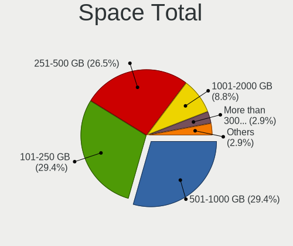
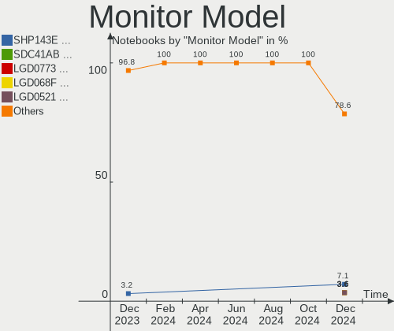
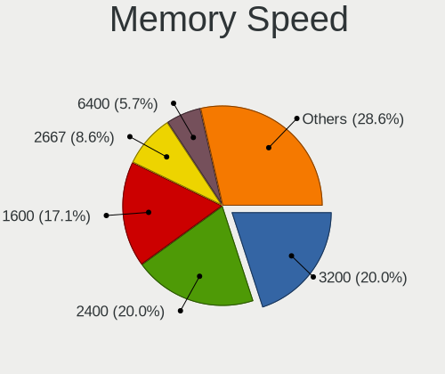

FreeBSD Hardware Trends (Notebook)
----------------------------------

A project to identify most popular hardware characteristics and track their change
over time based on data collected by FreeBSD users at https://BSD-Hardware.info.

Anyone can contribute to the study by uploading probes of their computers by
the [hw-probe](https://github.com/linuxhw/hw-probe/blob/master/INSTALL.BSD.md) tool:

    hw-probe -all -upload

Full-feature report is available here: https://bsd-hardware.info/?view=trends&formfactor=notebook

Period: Apr, 2021.

Contents
--------

- [ OS                       ](#os)
- [ OS Family                ](#os-family)
- [ Arch                     ](#arch)
- [ DE                       ](#de)
- [ Display Server           ](#display-server)
- [ Display Manager          ](#display-manager)
- [ OS Lang                  ](#os-lang)
- [ Boot Mode                ](#boot-mode)
- [ Filesystem               ](#filesystem)
- [ Part. scheme             ](#part-scheme)
- [ Country                  ](#country)
- [ City                     ](#city)
- [ Vendor                   ](#vendor)
- [ Model                    ](#model)
- [ Model Family             ](#model-family)
- [ MFG Year                 ](#mfg-year)
- [ Form Factor              ](#form-factor)
- [ Coreboot                 ](#coreboot)
- [ RAM Size                 ](#ram-size)
- [ RAM Used                 ](#ram-used)
- [ Has CD-ROM               ](#has-cd-rom)
- [ Total Drives             ](#total-drives)
- [ Has Ethernet             ](#has-ethernet)
- [ Has WiFi                 ](#has-wifi)
- [ Has Bluetooth            ](#has-bluetooth)
- [ Drive Vendor             ](#drive-vendor)
- [ Drive Model              ](#drive-model)
- [ HDD Vendor               ](#hdd-vendor)
- [ SSD Vendor               ](#ssd-vendor)
- [ Drive Kind               ](#drive-kind)
- [ Drive Connector          ](#drive-connector)
- [ Drive Size               ](#drive-size)
- [ Space Total              ](#space-total)
- [ Space Used               ](#space-used)
- [ Malfunc. Drives          ](#malfunc-drives)
- [ Malfunc. Drive Vendor    ](#malfunc-drive-vendor)
- [ Malfunc. HDD Vendor      ](#malfunc-hdd-vendor)
- [ Malfunc. Drive Kind      ](#malfunc-drive-kind)
- [ Failed Drives            ](#failed-drives)
- [ Failed Drive Vendor      ](#failed-drive-vendor)
- [ Drive Status             ](#drive-status)
- [ Storage Vendor           ](#storage-vendor)
- [ Storage Model            ](#storage-model)
- [ Storage Kind             ](#storage-kind)
- [ CPU Vendor               ](#cpu-vendor)
- [ CPU Model                ](#cpu-model)
- [ CPU Model Family         ](#cpu-model-family)
- [ CPU Cores                ](#cpu-cores)
- [ CPU Sockets              ](#cpu-sockets)
- [ CPU Threads              ](#cpu-threads)
- [ CPU Microarch            ](#cpu-microarch)
- [ GPU Vendor               ](#gpu-vendor)
- [ GPU Model                ](#gpu-model)
- [ GPU Combo                ](#gpu-combo)
- [ GPU Driver               ](#gpu-driver)
- [ GPU Memory               ](#gpu-memory)
- [ Monitor Vendor           ](#monitor-vendor)
- [ Monitor Model            ](#monitor-model)
- [ Monitor Resolution       ](#monitor-resolution)
- [ Monitor Diagonal         ](#monitor-diagonal)
- [ Monitor Width            ](#monitor-width)
- [ Aspect Ratio             ](#aspect-ratio)
- [ Monitor Area             ](#monitor-area)
- [ Pixel Density            ](#pixel-density)
- [ Multiple Monitors        ](#multiple-monitors)
- [ Net Controller Vendor    ](#net-controller-vendor)
- [ Net Controller Model     ](#net-controller-model)
- [ Wireless Vendor          ](#wireless-vendor)
- [ Wireless Model           ](#wireless-model)
- [ Ethernet Vendor          ](#ethernet-vendor)
- [ Ethernet Model           ](#ethernet-model)
- [ Net Controller Kind      ](#net-controller-kind)
- [ Used Controller          ](#used-controller)
- [ NICs                     ](#nics)
- [ IPv6                     ](#ipv6)
- [ Memory Vendor            ](#memory-vendor)
- [ Memory Model             ](#memory-model)
- [ Memory Kind              ](#memory-kind)
- [ Memory Form Factor       ](#memory-form-factor)
- [ Memory Size              ](#memory-size)
- [ Memory Speed             ](#memory-speed)
- [ Sound Vendor             ](#sound-vendor)
- [ Sound Model              ](#sound-model)
- [ Camera Vendor            ](#camera-vendor)
- [ Camera Model             ](#camera-model)
- [ Fingerprint Vendor       ](#fingerprint-vendor)
- [ Fingerprint Model        ](#fingerprint-model)
- [ Chipcard Vendor          ](#chipcard-vendor)
- [ Chipcard Model           ](#chipcard-model)
- [ Printer Vendor           ](#printer-vendor)
- [ Printer Model            ](#printer-model)
- [ Scanner Vendor           ](#scanner-vendor)
- [ Scanner Model            ](#scanner-model)
- [ Bluetooth Vendor         ](#bluetooth-vendor)
- [ Bluetooth Model          ](#bluetooth-model)
- [ Unsupported Devices      ](#unsupported-devices)
- [ Unsupported Device Types ](#unsupported-device-types)

OS
--

Installed operating systems

| Name                 | Notebooks | Percent |
|----------------------|-----------|---------|
| FreeBSD 13.0         | 22        | 44.9%   |
| FreeBSD 12.2-p6      | 7         | 14.29%  |
| FreeBSD 13.0-RC5     | 5         | 10.2%   |
| FreeBSD 14.0-CURRENT | 4         | 8.16%   |
| FreeBSD 13.0-STABLE  | 4         | 8.16%   |
| FreeBSD 12.2-p5      | 3         | 6.12%   |
| FreeBSD 13.0-RC3     | 1         | 2.04%   |
| FreeBSD 12.2-p4      | 1         | 2.04%   |
| FreeBSD 12.2-p2      | 1         | 2.04%   |
| FreeBSD 12.2         | 1         | 2.04%   |

OS Family
---------

OS without a version

| Name    | Notebooks | Percent |
|---------|-----------|---------|
| FreeBSD | 49        | 100%    |

Arch
----

OS architecture (x86_64, i586, etc.)

| Name  | Notebooks | Percent |
|-------|-----------|---------|
| amd64 | 46        | 93.88%  |
| i386  | 3         | 6.12%   |

DE
--

Desktop Environment

| Name          | Notebooks | Percent |
|---------------|-----------|---------|
| KDE5          | 13        | 26.53%  |
| XFCE          | 7         | 14.29%  |
| TWM           | 6         | 12.24%  |
| Console       | 6         | 12.24%  |
| MATE          | 3         | 6.12%   |
| i3            | 3         | 6.12%   |
| GNOME         | 3         | 6.12%   |
| Cinnamon      | 3         | 6.12%   |
| Fluxbox       | 2         | 4.08%   |
| Enlightenment | 1         | 2.04%   |
| CDE           | 1         | 2.04%   |
| AwesomeWM     | 1         | 2.04%   |

Display Server
--------------

X11 or Wayland

| Name    | Notebooks | Percent |
|---------|-----------|---------|
| X11     | 43        | 87.76%  |
| Console | 6         | 12.24%  |

Display Manager
---------------

SDDM, LightDM, etc.

| Name    | Notebooks | Percent |
|---------|-----------|---------|
| Console | 25        | 51.02%  |
| SDDM    | 13        | 26.53%  |
| SLiM    | 5         | 10.2%   |
| XDM     | 2         | 4.08%   |
| LightDM | 2         | 4.08%   |
| GDM     | 2         | 4.08%   |

OS Lang
-------

Language

| Lang             | Notebooks | Percent |
|------------------|-----------|---------|
| C                | 21        | 42.86%  |
| en_US            | 9         | 18.37%  |
| Unknown          | 7         | 14.29%  |
| en_GB            | 3         | 6.12%   |
| nb_NO            | 2         | 4.08%   |
| fr_FR            | 2         | 4.08%   |
| pl_PL            | 1         | 2.04%   |
| hu_HU.US-ASCII   | 1         | 2.04%   |
| en_US.US-ASCII   | 1         | 2.04%   |
| de_DE.ISO8859-15 | 1         | 2.04%   |
| de_CH            | 1         | 2.04%   |

Boot Mode
---------

EFI or BIOS

| Mode | Notebooks | Percent |
|------|-----------|---------|
| EFI  | 35        | 71.43%  |
| BIOS | 14        | 28.57%  |

Filesystem
----------

Type of filesystem

| Type | Notebooks | Percent |
|------|-----------|---------|
| Zfs  | 33        | 67.35%  |
| Ufs  | 16        | 32.65%  |

Part. scheme
------------

Scheme of partitioning

| Type | Notebooks | Percent |
|------|-----------|---------|
| GPT  | 44        | 89.8%   |
| MBR  | 4         | 8.16%   |
| BSD  | 1         | 2.04%   |

Country
-------

Geographic location (country)

| Country     | Notebooks | Percent |
|-------------|-----------|---------|
| USA         | 15        | 30.61%  |
| UK          | 6         | 12.24%  |
| Germany     | 4         | 8.16%   |
| France      | 3         | 6.12%   |
| Switzerland | 2         | 4.08%   |
| Norway      | 2         | 4.08%   |
| Japan       | 2         | 4.08%   |
| China       | 2         | 4.08%   |
| Thailand    | 1         | 2.04%   |
| Russia      | 1         | 2.04%   |
| Poland      | 1         | 2.04%   |
| New Zealand | 1         | 2.04%   |
| Namibia     | 1         | 2.04%   |
| India       | 1         | 2.04%   |
| Hungary     | 1         | 2.04%   |
| Croatia     | 1         | 2.04%   |
| Colombia    | 1         | 2.04%   |
| Brazil      | 1         | 2.04%   |
| Austria     | 1         | 2.04%   |
| Australia   | 1         | 2.04%   |
| Argentina   | 1         | 2.04%   |

City
----

Geographic location (city)

| City                     | Notebooks | Percent |
|--------------------------|-----------|---------|
| Glasgow                  | 2         | 4.08%   |
| Brighton                 | 2         | 4.08%   |
| Zurich                   | 1         | 2.04%   |
| Villeneuve-Saint-Georges | 1         | 2.04%   |
| Tahara                   | 1         | 2.04%   |
| São José dos Campos    | 1         | 2.04%   |
| Székesfehérvár        | 1         | 2.04%   |
| Sundebru                 | 1         | 2.04%   |
| Suginami-ku              | 1         | 2.04%   |
| Stuttgart                | 1         | 2.04%   |
| Solbergelva              | 1         | 2.04%   |
| Slavonski Brod           | 1         | 2.04%   |
| Sierra Madre             | 1         | 2.04%   |
| Rionegro                 | 1         | 2.04%   |
| Parndorf                 | 1         | 2.04%   |
| Otjiwarongo              | 1         | 2.04%   |
| New Delhi                | 1         | 2.04%   |
| Moses Lake               | 1         | 2.04%   |
| Montserrat               | 1         | 2.04%   |
| Midvale                  | 1         | 2.04%   |
| Markt Indersdorf         | 1         | 2.04%   |
| Lübeck                  | 1         | 2.04%   |
| Los Altos                | 1         | 2.04%   |
| Lexington                | 1         | 2.04%   |
| Leicester                | 1         | 2.04%   |
| Klobuck                  | 1         | 2.04%   |
| Kez                      | 1         | 2.04%   |
| Indio                    | 1         | 2.04%   |
| Harrison                 | 1         | 2.04%   |
| Fruitland                | 1         | 2.04%   |
| Frederick                | 1         | 2.04%   |
| Fontenay-sous-Bois       | 1         | 2.04%   |
| Farnham                  | 1         | 2.04%   |
| Clermont                 | 1         | 2.04%   |
| Christchurch             | 1         | 2.04%   |
| Chicago                  | 1         | 2.04%   |
| Chapel Hill              | 1         | 2.04%   |
| Changchun                | 1         | 2.04%   |
| Brooklyn                 | 1         | 2.04%   |
| Berlin                   | 1         | 2.04%   |
| Beijing                  | 1         | 2.04%   |
| Beaverton                | 1         | 2.04%   |
| Basel                    | 1         | 2.04%   |
| Bangkok                  | 1         | 2.04%   |
| Atlanta                  | 1         | 2.04%   |
| Albuquerque              | 1         | 2.04%   |
| Adelaide                 | 1         | 2.04%   |

Vendor
------

Motherboard manufacturer

| Name                | Notebooks | Percent |
|---------------------|-----------|---------|
| Lenovo              | 16        | 32.65%  |
| Dell                | 16        | 32.65%  |
| Hewlett-Packard     | 6         | 12.24%  |
| Toshiba             | 2         | 4.08%   |
| System76            | 1         | 2.04%   |
| Sony                | 1         | 2.04%   |
| Samsung Electronics | 1         | 2.04%   |
| Pegatron            | 1         | 2.04%   |
| HUAWEI              | 1         | 2.04%   |
| Clevo               | 1         | 2.04%   |
| ASUSTek Computer    | 1         | 2.04%   |
| Alienware           | 1         | 2.04%   |
| Acer                | 1         | 2.04%   |

Model
-----

Motherboard model

| Name                                     | Notebooks | Percent |
|------------------------------------------|-----------|---------|
| Dell Latitude E5420                      | 2         | 4.08%   |
| Dell Inspiron 3793                       | 2         | 4.08%   |
| Toshiba Satellite L50-C                  | 1         | 2.04%   |
| Toshiba Satellite C655D                  | 1         | 2.04%   |
| System76 Lemur Pro                       | 1         | 2.04%   |
| Sony VGN-FW290J                          | 1         | 2.04%   |
| Samsung NC10                             | 1         | 2.04%   |
| Pegatron T12Ah                           | 1         | 2.04%   |
| Lenovo ThinkPad X270 20HMS0NS00          | 1         | 2.04%   |
| Lenovo ThinkPad X270 20HMCTO1WW          | 1         | 2.04%   |
| Lenovo ThinkPad X220 4290NE3             | 1         | 2.04%   |
| Lenovo ThinkPad X1 Carbon 5th 20HQS1QC00 | 1         | 2.04%   |
| Lenovo ThinkPad T590 20N4CTO1WW          | 1         | 2.04%   |
| Lenovo ThinkPad T430 23495P8             | 1         | 2.04%   |
| Lenovo ThinkPad T420 4236NUG             | 1         | 2.04%   |
| Lenovo ThinkPad P52 20M9CTO1WW           | 1         | 2.04%   |
| Lenovo ThinkPad P14s Gen 1 20Y1CTO1WW    | 1         | 2.04%   |
| Lenovo ThinkPad L15 Gen 1 20U3CTO1WW     | 1         | 2.04%   |
| Lenovo ThinkPad Edge E320 1298RJ1        | 1         | 2.04%   |
| Lenovo ThinkPad E490 20N9001SBR          | 1         | 2.04%   |
| Lenovo ThinkPad E490 20N8CTO1WW          | 1         | 2.04%   |
| Lenovo ThinkPad E14 20RAS0F600           | 1         | 2.04%   |
| Lenovo ThinkPad A485 20MUS07E00          | 1         | 2.04%   |
| Lenovo IdeaPad Y700-15ISK 80NV           | 1         | 2.04%   |
| HUAWEI HN-WX9X                           | 1         | 2.04%   |
| HP ProBook 4530s                         | 1         | 2.04%   |
| HP Laptop 17-by0xxx                      | 1         | 2.04%   |
| HP EliteBook Folio 9470m                 | 1         | 2.04%   |
| HP EliteBook 8570p                       | 1         | 2.04%   |
| HP EliteBook 840 G3                      | 1         | 2.04%   |
| HP Compaq Presario CQ71                  | 1         | 2.04%   |
| Dell XPS 13 9360                         | 1         | 2.04%   |
| Dell Precision 5520                      | 1         | 2.04%   |
| Dell Precision 5510                      | 1         | 2.04%   |
| Dell Latitude E7440                      | 1         | 2.04%   |
| Dell Latitude E6440                      | 1         | 2.04%   |
| Dell Latitude E5570                      | 1         | 2.04%   |
| Dell Latitude E5470                      | 1         | 2.04%   |
| Dell Latitude D610                       | 1         | 2.04%   |
| Dell Latitude 5580                       | 1         | 2.04%   |
| Dell Inspiron N5050                      | 1         | 2.04%   |
| Dell Inspiron 3521                       | 1         | 2.04%   |
| Dell G5 5590                             | 1         | 2.04%   |
| Clevo W55xEU                             | 1         | 2.04%   |
| ASUS Q500A                               | 1         | 2.04%   |
| Alienware M15x                           | 1         | 2.04%   |
| Acer Extensa 2540                        | 1         | 2.04%   |

Model Family
------------

Motherboard model prefix

| Name              | Notebooks | Percent |
|-------------------|-----------|---------|
| Lenovo ThinkPad   | 15        | 30.61%  |
| Dell Latitude     | 8         | 16.33%  |
| Dell Inspiron     | 4         | 8.16%   |
| HP EliteBook      | 3         | 6.12%   |
| Toshiba Satellite | 2         | 4.08%   |
| Dell Precision    | 2         | 4.08%   |
| System76 Lemur    | 1         | 2.04%   |
| Sony VGN-FW290J   | 1         | 2.04%   |
| Samsung NC10      | 1         | 2.04%   |
| Pegatron T12Ah    | 1         | 2.04%   |
| Lenovo IdeaPad    | 1         | 2.04%   |
| HUAWEI HN-WX9X    | 1         | 2.04%   |
| HP ProBook        | 1         | 2.04%   |
| HP Laptop         | 1         | 2.04%   |
| HP Compaq         | 1         | 2.04%   |
| Dell XPS          | 1         | 2.04%   |
| Dell G5           | 1         | 2.04%   |
| Clevo W55xEU      | 1         | 2.04%   |
| ASUS Q500A        | 1         | 2.04%   |
| Alienware M15x    | 1         | 2.04%   |
| Acer Extensa      | 1         | 2.04%   |

MFG Year
--------

Motherboard manufacture year

| Year | Notebooks | Percent |
|------|-----------|---------|
| 2020 | 14        | 28.57%  |
| 2019 | 8         | 16.33%  |
| 2018 | 5         | 10.2%   |
| 2016 | 4         | 8.16%   |
| 2012 | 4         | 8.16%   |
| 2011 | 3         | 6.12%   |
| 2013 | 2         | 4.08%   |
| 2010 | 2         | 4.08%   |
| 2008 | 2         | 4.08%   |
| 2021 | 1         | 2.04%   |
| 2017 | 1         | 2.04%   |
| 2015 | 1         | 2.04%   |
| 2009 | 1         | 2.04%   |
| 2005 | 1         | 2.04%   |

Form Factor
-----------

Physical design of the computer

| Name     | Notebooks | Percent |
|----------|-----------|---------|
| Notebook | 49        | 100%    |

Coreboot
--------

Have coreboot on board

| Used | Notebooks | Percent |
|------|-----------|---------|
| No   | 48        | 97.96%  |
| Yes  | 1         | 2.04%   |

RAM Size
--------

Total RAM memory

| Size in GB | Notebooks | Percent |
|------------|-----------|---------|
| 16.01-24.0 | 17        | 34.69%  |
| 8.01-16.0  | 16        | 32.65%  |
| 4.01-8.0   | 8         | 16.33%  |
| 32.01-64.0 | 4         | 8.16%   |
| 2.01-3.0   | 2         | 4.08%   |
| 3.01-4.0   | 1         | 2.04%   |
| 24.01-32.0 | 1         | 2.04%   |

RAM Used
--------

Used RAM memory

| Used GB  | Notebooks | Percent |
|----------|-----------|---------|
| 0.51-1.0 | 23        | 46.94%  |
| 0.01-0.5 | 19        | 38.78%  |
| 1.01-2.0 | 6         | 12.24%  |
| 2.01-3.0 | 1         | 2.04%   |

Has CD-ROM
----------

Has CD-ROM on board

| Presented | Notebooks | Percent |
|-----------|-----------|---------|
| No        | 31        | 63.27%  |
| Yes       | 18        | 36.73%  |

Total Drives
------------

Number of drives on board

| Drives | Notebooks | Percent |
|--------|-----------|---------|
| 1      | 37        | 75.51%  |
| 2      | 11        | 22.45%  |
| 3      | 1         | 2.04%   |

Has Ethernet
------------

Has Ethernet on board

| Presented | Notebooks | Percent |
|-----------|-----------|---------|
| Yes       | 43        | 87.76%  |
| No        | 6         | 12.24%  |

Has WiFi
--------

Has WiFi module

| Presented | Notebooks | Percent |
|-----------|-----------|---------|
| Yes       | 48        | 97.96%  |
| No        | 1         | 2.04%   |

Has Bluetooth
-------------

Has Bluetooth module

| Presented | Notebooks | Percent |
|-----------|-----------|---------|
| Yes       | 33        | 67.35%  |
| No        | 16        | 32.65%  |

Drive Vendor
------------

Hard drive vendors

| Vendor              | Notebooks | Drives | Percent |
|---------------------|-----------|--------|---------|
| Samsung Electronics | 12        | 13     | 20.34%  |
| Toshiba             | 7         | 7      | 11.86%  |
| Seagate             | 7         | 7      | 11.86%  |
| WDC                 | 6         | 8      | 10.17%  |
| Crucial             | 6         | 6      | 10.17%  |
| SK Hynix            | 3         | 3      | 5.08%   |
| SanDisk             | 3         | 3      | 5.08%   |
| Kingston            | 3         | 3      | 5.08%   |
| Intel               | 2         | 2      | 3.39%   |
| Hitachi             | 2         | 2      | 3.39%   |
| Solid State Storage | 1         | 1      | 1.69%   |
| PNY                 | 1         | 1      | 1.69%   |
| Phison              | 1         | 1      | 1.69%   |
| LITEON              | 1         | 1      | 1.69%   |
| KingSpec            | 1         | 1      | 1.69%   |
| HGST                | 1         | 1      | 1.69%   |
| Fujitsu             | 1         | 1      | 1.69%   |
| China               | 1         | 1      | 1.69%   |

Drive Model
-----------

Hard drive models

| Model                                              | Notebooks | Percent |
|----------------------------------------------------|-----------|---------|
| Seagate ST1000LM035-1RK172 1TB                     | 3         | 4.92%   |
| Toshiba KXG50ZNV256G NVMe 256GB                    | 2         | 3.28%   |
| Kingston SA400S37480G 480GB                        | 2         | 3.28%   |
| Crucial CT500MX500SSD1 500GB                       | 2         | 3.28%   |
| WDC WDS480G2G0A-00JH30 480GB                       | 1         | 1.64%   |
| WDC WD7500BPVT-80HXZT3 752GB                       | 1         | 1.64%   |
| WDC WD5000LPCX-00VHAT0 500GB                       | 1         | 1.64%   |
| WDC WD30EZRX-00MMMB0 3TB                           | 1         | 1.64%   |
| WDC WD1600BEVT-22ZCT0 160GB                        | 1         | 1.64%   |
| WDC WD10SPZX-08Z10 1TB                             | 1         | 1.64%   |
| WDC WD10SDRW-34A0XS0 1TB                           | 1         | 1.64%   |
| Toshiba MQ01ACF050 500GB                           | 1         | 1.64%   |
| Toshiba MQ01ABF050 500GB                           | 1         | 1.64%   |
| Toshiba MK4032GAX 40GB                             | 1         | 1.64%   |
| Toshiba MK3265GSXN 320GB                           | 1         | 1.64%   |
| Toshiba KBG30ZMT512G 512GB                         | 1         | 1.64%   |
| Solid State Storage CL1-3D128-Q11 NVMe SSSTC 128GB | 1         | 1.64%   |
| SK Hynix SC300 M.2 2280 128GB                      | 1         | 1.64%   |
| SK Hynix PC300 HFS512GD9MND-5510A 512GB            | 1         | 1.64%   |
| SK Hynix BC501 NVMe 512GB                          | 1         | 1.64%   |
| Seagate ST9500420AS 500GB                          | 1         | 1.64%   |
| Seagate ST320LT007-9ZV142 320GB                    | 1         | 1.64%   |
| Seagate ST2000LM007-1R8174 2TB                     | 1         | 1.64%   |
| Seagate ST1000LM024 HN-M101MBB 1TB                 | 1         | 1.64%   |
| SanDisk SSD PLUS 240GB                             | 1         | 1.64%   |
| SanDisk SDSSDA120G 120GB                           | 1         | 1.64%   |
| SanDisk SD8SBAT128G1122 128GB                      | 1         | 1.64%   |
| Samsung SSD PM851 mSATA 256GB                      | 1         | 1.64%   |
| Samsung SSD PM841 2.5-inch 7mm 256GB               | 1         | 1.64%   |
| Samsung SSD 970 EVO Plus 2TB                       | 1         | 1.64%   |
| Samsung SSD 970 EVO Plus 250GB                     | 1         | 1.64%   |
| Samsung SSD 970 EVO 500GB                          | 1         | 1.64%   |
| Samsung SSD 970 EVO 1TB                            | 1         | 1.64%   |
| Samsung SSD 860 EVO 500GB                          | 1         | 1.64%   |
| Samsung SSD 850 PRO 512GB                          | 1         | 1.64%   |
| Samsung SSD 850 EVO 250GB                          | 1         | 1.64%   |
| Samsung MZVLW256HEHP-000L7 256GB                   | 1         | 1.64%   |
| Samsung MZVLB512HBJQ-000L7 512GB                   | 1         | 1.64%   |
| Samsung MZVLB256HAHQ-00000 256GB                   | 1         | 1.64%   |
| Samsung MZALQ128HBHQ-000L1 128GB                   | 1         | 1.64%   |
| PNY CS3030 1TB SSD                                 | 1         | 1.64%   |
| Phison PCIe SSD 2TB                                | 1         | 1.64%   |
| LITEON CV1-8B512 512GB                             | 1         | 1.64%   |
| Kingston SUV500MS480G 480GB                        | 1         | 1.64%   |
| KingSpec NT-256 256GB                              | 1         | 1.64%   |
| Intel SSDSCKKF256G8H 256GB                         | 1         | 1.64%   |
| Intel SSDPEKKF512G8L 512GB                         | 1         | 1.64%   |
| Hitachi HTS723232A7A364 320GB                      | 1         | 1.64%   |
| Hitachi HTS545032B9A300 320GB                      | 1         | 1.64%   |
| HGST HTS725050A7E630 500GB                         | 1         | 1.64%   |
| Fujitsu MJA2320BH G2 320GB                         | 1         | 1.64%   |
| Crucial CT960M500SSD1 960GB                        | 1         | 1.64%   |
| Crucial CT525MX300SSD1 528GB                       | 1         | 1.64%   |
| Crucial CT250MX500SSD1 250GB                       | 1         | 1.64%   |
| Crucial CT2000MX500SSD1 2TB                        | 1         | 1.64%   |
| China SH00M240GB                                   | 1         | 1.64%   |

HDD Vendor
----------

Hard disk drive vendors

| Vendor  | Notebooks | Drives | Percent |
|---------|-----------|--------|---------|
| Seagate | 7         | 7      | 35%     |
| WDC     | 5         | 7      | 25%     |
| Toshiba | 4         | 4      | 20%     |
| Hitachi | 2         | 2      | 10%     |
| HGST    | 1         | 1      | 5%      |
| Fujitsu | 1         | 1      | 5%      |

SSD Vendor
----------

Solid state drive vendors

| Vendor              | Notebooks | Drives | Percent |
|---------------------|-----------|--------|---------|
| Crucial             | 6         | 6      | 26.09%  |
| Samsung Electronics | 5         | 5      | 21.74%  |
| SanDisk             | 3         | 3      | 13.04%  |
| Kingston            | 3         | 3      | 13.04%  |
| WDC                 | 1         | 1      | 4.35%   |
| SK Hynix            | 1         | 1      | 4.35%   |
| LITEON              | 1         | 1      | 4.35%   |
| KingSpec            | 1         | 1      | 4.35%   |
| Intel               | 1         | 1      | 4.35%   |
| China               | 1         | 1      | 4.35%   |

Drive Kind
----------

HDD or SSD

| Kind | Notebooks | Drives | Percent |
|------|-----------|--------|---------|
| SSD  | 21        | 23     | 38.18%  |
| HDD  | 18        | 22     | 32.73%  |
| NVMe | 16        | 17     | 29.09%  |

Drive Connector
---------------

SATA, SAS, NVMe, etc.

| Type | Notebooks | Drives | Percent |
|------|-----------|--------|---------|
| SATA | 37        | 45     | 69.81%  |
| NVMe | 16        | 17     | 30.19%  |

Drive Size
----------

Size of hard drive

| Size in TB | Notebooks | Drives | Percent |
|------------|-----------|--------|---------|
| 0.01-0.5   | 27        | 31     | 67.5%   |
| 0.51-1.0   | 10        | 11     | 25%     |
| 1.01-2.0   | 2         | 2      | 5%      |
| 2.01-3.0   | 1         | 1      | 2.5%    |

Space Total
-----------

Amount of disk space available on the file system

| Size in GB | Notebooks | Percent |
|------------|-----------|---------|
| 251-500    | 22        | 44.9%   |
| 101-250    | 13        | 26.53%  |
| 501-1000   | 6         | 12.24%  |
| 51-100     | 5         | 10.2%   |
| 21-50      | 2         | 4.08%   |
| 1001-2000  | 1         | 2.04%   |

Space Used
----------

Amount of used disk space

| Used GB | Notebooks | Percent |
|---------|-----------|---------|
| 1-20    | 37        | 75.51%  |
| 51-100  | 7         | 14.29%  |
| 21-50   | 2         | 4.08%   |
| 101-250 | 2         | 4.08%   |
| 251-500 | 1         | 2.04%   |

Malfunc. Drives
---------------

Drive models with a malfunction

| Model                                            | Notebooks | Drives | Percent |
|--------------------------------------------------|-----------|--------|---------|
| WDC WD7500BPVT-80HXZT3 752GB                     | 1         | 1      | 16.67%  |
| Toshiba MK3265GSXN 320GB                         | 1         | 1      | 16.67%  |
| Samsung Electronics SSD PM841 2.5-inch 7mm 256GB | 1         | 1      | 16.67%  |
| Intel SSDSCKKF256G8H 256GB                       | 1         | 1      | 16.67%  |
| Hitachi HTS545032B9A300 320GB                    | 1         | 1      | 16.67%  |
| HGST HTS725050A7E630 500GB                       | 1         | 1      | 16.67%  |

Malfunc. Drive Vendor
---------------------

Vendors of faulty drives

| Vendor              | Notebooks | Drives | Percent |
|---------------------|-----------|--------|---------|
| WDC                 | 1         | 1      | 16.67%  |
| Toshiba             | 1         | 1      | 16.67%  |
| Samsung Electronics | 1         | 1      | 16.67%  |
| Intel               | 1         | 1      | 16.67%  |
| Hitachi             | 1         | 1      | 16.67%  |
| HGST                | 1         | 1      | 16.67%  |

Malfunc. HDD Vendor
-------------------

Vendors of faulty HDD drives

| Vendor  | Notebooks | Drives | Percent |
|---------|-----------|--------|---------|
| WDC     | 1         | 1      | 25%     |
| Toshiba | 1         | 1      | 25%     |
| Hitachi | 1         | 1      | 25%     |
| HGST    | 1         | 1      | 25%     |

Malfunc. Drive Kind
-------------------

Kinds of faulty drives

| Kind | Notebooks | Drives | Percent |
|------|-----------|--------|---------|
| HDD  | 4         | 4      | 66.67%  |
| SSD  | 2         | 2      | 33.33%  |

Failed Drives
-------------

Failed drive models

Zero info for selected period =(

Failed Drive Vendor
-------------------

Failed drive vendors

Zero info for selected period =(

Drive Status
------------

Number of failed and malfunc. drives

| Status  | Notebooks | Drives | Percent |
|---------|-----------|--------|---------|
| Works   | 45        | 56     | 88.24%  |
| Malfunc | 6         | 6      | 11.76%  |

Storage Vendor
--------------

Storage controller vendors

| Vendor                         | Notebooks | Percent |
|--------------------------------|-----------|---------|
| Intel                          | 40        | 71.43%  |
| Samsung Electronics            | 7         | 12.5%   |
| Toshiba                        | 3         | 5.36%   |
| Phison Electronics             | 2         | 3.57%   |
| AMD                            | 2         | 3.57%   |
| Solid State Storage Technology | 1         | 1.79%   |
| SK Hynix                       | 1         | 1.79%   |

Storage Model
-------------

Storage controller models

| Model                                                                            | Notebooks | Percent |
|----------------------------------------------------------------------------------|-----------|---------|
| Intel 6 Series/C200 Series Chipset Family 6 port Mobile SATA AHCI Controller     | 7         | 12.07%  |
| Intel Sunrise Point-LP SATA Controller [AHCI mode]                               | 6         | 10.34%  |
| Samsung NVMe SSD Controller SM981/PM981/PM983                                    | 5         | 8.62%   |
| Intel 82801 Mobile SATA Controller [RAID mode]                                   | 4         | 6.9%    |
| Intel 7 Series Chipset Family 6-port SATA Controller [AHCI mode]                 | 4         | 6.9%    |
| Intel 82801IBM/IEM (ICH9M/ICH9M-E) 4 port SATA Controller [AHCI mode]            | 3         | 5.17%   |
| Toshiba unknown                                                                  | 2         | 3.45%   |
| Phison E12 NVMe Controller                                                       | 2         | 3.45%   |
| Intel Q170/Q150/B150/H170/H110/Z170/CM236 Chipset SATA Controller [AHCI Mode]    | 2         | 3.45%   |
| Intel Comet Lake SATA AHCI Controller                                            | 2         | 3.45%   |
| Intel 7 Series Chipset Family 4-port SATA Controller [IDE mode]                  | 2         | 3.45%   |
| Intel 7 Series Chipset Family 2-port SATA Controller [IDE mode]                  | 2         | 3.45%   |
| Toshiba BG3 NVMe SSD Controller                                                  | 1         | 1.72%   |
| SK Hynix PC300 NVMe Solid State Drive 512GB                                      | 1         | 1.72%   |
| Samsung NVMe SSD Controller SM961/PM961/SM963                                    | 1         | 1.72%   |
| Samsung NVMe Controller                                                          | 1         | 1.72%   |
| Intel SSD Pro 7600p/760p/E 6100p Series                                          | 1         | 1.72%   |
| Intel Ice Lake-LP SATA Controller [AHCI mode]                                    | 1         | 1.72%   |
| Intel HM170/QM170 Chipset SATA Controller [AHCI Mode]                            | 1         | 1.72%   |
| Intel Cannon Point-LP SATA Controller [AHCI Mode]                                | 1         | 1.72%   |
| Intel Cannon Lake Mobile PCH SATA AHCI Controller                                | 1         | 1.72%   |
| Intel Atom/Celeron/Pentium Processor x5-E8000/J3xxx/N3xxx Series SATA Controller | 1         | 1.72%   |
| Intel 82801GBM/GHM (ICH7-M Family) SATA Controller [IDE mode]                    | 1         | 1.72%   |
| Intel 82801FBM (ICH6M) SATA Controller                                           | 1         | 1.72%   |
| Intel 8 Series/C220 Series Chipset Family 6-port SATA Controller 1 [AHCI mode]   | 1         | 1.72%   |
| Intel 5 Series/3400 Series Chipset 6 port SATA AHCI Controller                   | 1         | 1.72%   |
| AMD SB7x0/SB8x0/SB9x0 SATA Controller [AHCI mode]                                | 1         | 1.72%   |
| AMD FCH SATA Controller [AHCI mode]                                              | 1         | 1.72%   |
| Unknown                                                                          | 1         | 1.72%   |

Storage Kind
------------

Kind of storage controller (IDE, SATA, NVMe, SAS, ...)

| Kind | Notebooks | Percent |
|------|-----------|---------|
| SATA | 33        | 58.93%  |
| NVMe | 15        | 26.79%  |
| RAID | 4         | 7.14%   |
| IDE  | 4         | 7.14%   |

CPU Vendor
----------

Processor vendors

| Vendor | Notebooks | Percent |
|--------|-----------|---------|
| Intel  | 45        | 91.84%  |
| AMD    | 4         | 8.16%   |

CPU Model
---------

Processor models

| Model                                           | Notebooks | Percent |
|-------------------------------------------------|-----------|---------|
| Intel Core i7-8565U CPU @ 1.80GHz               | 3         | 6.12%   |
| Intel Core i5-10210U CPU @ 1.60GHz              | 3         | 6.12%   |
| Intel Core i7-1065G7 CPU @ 1.30GHz              | 2         | 4.08%   |
| Intel Core i5-7200U CPU @ 2.50GHz               | 2         | 4.08%   |
| Intel Core i5-6200U CPU @ 2.30GHz               | 2         | 4.08%   |
| Intel Core i5-2520M CPU @ 2.50GHz               | 2         | 4.08%   |
| Intel Pentium M                                 | 1         | 2.04%   |
| Intel Pentium CPU N3700 @ 1.60GHz               | 1         | 2.04%   |
| Intel Genuine CPU                               | 1         | 2.04%   |
| Intel CPU Version                               | 1         | 2.04%   |
| Intel Core i7-9750H CPU @ 2.60GHz               | 1         | 2.04%   |
| Intel Core i7-8750H CPU @ 2.20GHz               | 1         | 2.04%   |
| Intel Core i7-8550U CPU @ 1.80GHz               | 1         | 2.04%   |
| Intel Core i7-7820HQ CPU @ 2.90GHz              | 1         | 2.04%   |
| Intel Core i7-7600U CPU @ 2.80GHz               | 1         | 2.04%   |
| Intel Core i7-6700HQ CPU @ 2.60GHz              | 1         | 2.04%   |
| Intel Core i7-6600U CPU @ 2.60GHz               | 1         | 2.04%   |
| Intel Core i7-4600U CPU @ 2.10GHz               | 1         | 2.04%   |
| Intel Core i7-3740QM CPU @ 2.70GHz              | 1         | 2.04%   |
| Intel Core i7-3687U CPU @ 2.10GHz               | 1         | 2.04%   |
| Intel Core i7-3632QM CPU @ 2.20GHz              | 1         | 2.04%   |
| Intel Core i7-3520M CPU @ 2.90GHz               | 1         | 2.04%   |
| Intel Core i5-8250U CPU @ 1.60GHz               | 1         | 2.04%   |
| Intel Core i5-7300U CPU @ 2.60GHz               | 1         | 2.04%   |
| Intel Core i5-6440HQ CPU @ 2.60GHz              | 1         | 2.04%   |
| Intel Core i5-4300M CPU @ 2.60GHz               | 1         | 2.04%   |
| Intel Core i5-3230M CPU @ 2.60GHz               | 1         | 2.04%   |
| Intel Core i5-2520M CPU @ 2.50GH                | 1         | 2.04%   |
| Intel Core i5-2450M CPU @ 2.50GHz               | 1         | 2.04%   |
| Intel Core i5-2430M CPU @ 2.40GH                | 1         | 2.04%   |
| Intel Core i3-6006U CPU @ 2.00GHz               | 1         | 2.04%   |
| Intel Core i3-3227U CPU @ 1.90GHz               | 1         | 2.04%   |
| Intel Core i3-2330M CPU @ 2.20GHz               | 1         | 2.04%   |
| Intel Core i3-2310M CPU @ 2.10GHz               | 1         | 2.04%   |
| Intel Core 2 Duo CPU T6600 @ 2.20GHz            | 1         | 2.04%   |
| Intel Core 2 Duo CPU T5850 @ 2.16GHz            | 1         | 2.04%   |
| Intel Core 2 Duo CPU P8700 @ 2.53GHz            | 1         | 2.04%   |
| AMD Ryzen 7 PRO 4750U with Radeon Graphics      | 1         | 2.04%   |
| AMD Ryzen 7 PRO 2700U w/ Radeon Vega Mobile Gfx | 1         | 2.04%   |
| AMD Ryzen 5 3500U with Radeon Vega Mobile Gfx   | 1         | 2.04%   |
| AMD C-50 Processor                              | 1         | 2.04%   |

CPU Model Family
----------------

Processor model prefix

| Model            | Notebooks | Percent |
|------------------|-----------|---------|
| Intel Core i7    | 17        | 34.69%  |
| Intel Core i5    | 17        | 34.69%  |
| Intel Core i3    | 4         | 8.16%   |
| Intel Core 2 Duo | 3         | 6.12%   |
| AMD Ryzen 7 PRO  | 2         | 4.08%   |
| Other            | 1         | 2.04%   |
| Intel Pentium M  | 1         | 2.04%   |
| Intel Pentium    | 1         | 2.04%   |
| Intel Genuine    | 1         | 2.04%   |
| AMD Ryzen 5      | 1         | 2.04%   |
| AMD C-50         | 1         | 2.04%   |

CPU Cores
---------

Number of processor cores

| Number  | Notebooks | Percent |
|---------|-----------|---------|
| 2       | 22        | 44.9%   |
| 4       | 17        | 34.69%  |
| Unknown | 3         | 6.12%   |
| 8       | 2         | 4.08%   |
| 6       | 2         | 4.08%   |
| 1       | 2         | 4.08%   |
| 16      | 1         | 2.04%   |

CPU Sockets
-----------

Number of sockets

| Number | Notebooks | Percent |
|--------|-----------|---------|
| 1      | 49        | 100%    |

CPU Threads
-----------

Threads per core (Hyper-Threading)

| Number  | Notebooks | Percent |
|---------|-----------|---------|
| 2       | 39        | 79.59%  |
| 1       | 6         | 12.24%  |
| Unknown | 4         | 8.16%   |

CPU Microarch
-------------

Microarchitecture

| Name        | Notebooks | Percent |
|-------------|-----------|---------|
| KabyLake    | 15        | 30.61%  |
| SandyBridge | 7         | 14.29%  |
| Skylake     | 6         | 12.24%  |
| IvyBridge   | 6         | 12.24%  |
| Penryn      | 2         | 4.08%   |
| IceLake     | 2         | 4.08%   |
| Haswell     | 2         | 4.08%   |
| Zen+        | 1         | 2.04%   |
| Zen 2       | 1         | 2.04%   |
| Zen         | 1         | 2.04%   |
| Silvermont  | 1         | 2.04%   |
| P6          | 1         | 2.04%   |
| Nehalem     | 1         | 2.04%   |
| Core        | 1         | 2.04%   |
| Bonnell     | 1         | 2.04%   |
| Bobcat      | 1         | 2.04%   |

GPU Vendor
----------

Vendors of graphics cards

| Vendor | Notebooks | Percent |
|--------|-----------|---------|
| Intel  | 40        | 74.07%  |
| Nvidia | 7         | 12.96%  |
| AMD    | 7         | 12.96%  |

GPU Model
---------

Graphics card models

| Model                                                                                    | Notebooks | Percent |
|------------------------------------------------------------------------------------------|-----------|---------|
| Intel 2nd Generation Core Processor Family Integrated Graphics Controller                | 7         | 12.73%  |
| Intel 3rd Gen Core processor Graphics Controller                                         | 5         | 9.09%   |
| Intel Skylake GT2 [HD Graphics 520]                                                      | 4         | 7.27%   |
| Intel HD Graphics 620                                                                    | 4         | 7.27%   |
| Intel WhiskeyLake-U GT2 [UHD Graphics 620]                                               | 3         | 5.45%   |
| Intel CometLake-U GT2 [UHD Graphics]                                                     | 3         | 5.45%   |
| Nvidia GP108M [GeForce MX230]                                                            | 2         | 3.64%   |
| Intel UHD Graphics 620                                                                   | 2         | 3.64%   |
| Intel Mobile 4 Series Chipset Integrated Graphics Controller                             | 2         | 3.64%   |
| Intel Iris Plus Graphics G7                                                              | 2         | 3.64%   |
| Intel HD Graphics 530                                                                    | 2         | 3.64%   |
| Nvidia TU116M [GeForce GTX 1660 Ti Mobile]                                               | 1         | 1.82%   |
| Nvidia GT216M [GeForce GT 240M]                                                          | 1         | 1.82%   |
| Nvidia GP107GLM [Quadro P1000 Mobile]                                                    | 1         | 1.82%   |
| Nvidia GM107GLM [Quadro M1200 Mobile]                                                    | 1         | 1.82%   |
| Nvidia G98M [GeForce G 103M]                                                             | 1         | 1.82%   |
| Intel Mobile 945GSE Express Integrated Graphics Controller                               | 1         | 1.82%   |
| Intel Mobile 945GM/GMS/GME, 943/940GML Express Integrated Graphics Controller            | 1         | 1.82%   |
| Intel HD Graphics 630                                                                    | 1         | 1.82%   |
| Intel Haswell-ULT Integrated Graphics Controller                                         | 1         | 1.82%   |
| Intel CoffeeLake-H GT2 [UHD Graphics 630]                                                | 1         | 1.82%   |
| Intel Atom/Celeron/Pentium Processor x5-E8000/J3xxx/N3xxx Integrated Graphics Controller | 1         | 1.82%   |
| Intel 4th Gen Core Processor Integrated Graphics Controller                              | 1         | 1.82%   |
| AMD Wrestler [Radeon HD 6250]                                                            | 1         | 1.82%   |
| AMD Thames [Radeon HD 7550M/7570M/7650M]                                                 | 1         | 1.82%   |
| AMD RV370/M22 [Mobility Radeon X300]                                                     | 1         | 1.82%   |
| AMD Renoir                                                                               | 1         | 1.82%   |
| AMD Raven Ridge [Radeon Vega Series / Radeon Vega Mobile Series]                         | 1         | 1.82%   |
| AMD Picasso                                                                              | 1         | 1.82%   |
| AMD Lexa PRO [Radeon 540/540X/550/550X / RX 540X/550/550X]                               | 1         | 1.82%   |

GPU Combo
---------

Combinations of graphics cards

| Name           | Notebooks | Percent |
|----------------|-----------|---------|
| 1 x Intel      | 32        | 65.31%  |
| 1 x AMD        | 6         | 12.24%  |
| Intel + Nvidia | 4         | 8.16%   |
| 2 x Intel      | 3         | 6.12%   |
| 1 x Nvidia     | 3         | 6.12%   |
| Intel + AMD    | 1         | 2.04%   |

GPU Driver
----------

Free vs proprietary

| Driver      | Notebooks | Percent |
|-------------|-----------|---------|
| Free        | 45        | 91.84%  |
| Proprietary | 4         | 8.16%   |

GPU Memory
----------

Total video memory

| Size in GB | Notebooks | Percent |
|------------|-----------|---------|
| Unknown    | 41        | 83.67%  |
| 0.51-1.0   | 3         | 6.12%   |
| 0.01-0.5   | 3         | 6.12%   |
| 3.01-4.0   | 1         | 2.04%   |
| 1.01-2.0   | 1         | 2.04%   |

Monitor Vendor
--------------

Monitor vendors

| Vendor               | Notebooks | Percent |
|----------------------|-----------|---------|
| LG Display           | 11        | 24.44%  |
| AU Optronics         | 9         | 20%     |
| BOE                  | 5         | 11.11%  |
| Sharp                | 4         | 8.89%   |
| Chimei Innolux       | 4         | 8.89%   |
| Samsung Electronics  | 2         | 4.44%   |
| InfoVision           | 2         | 4.44%   |
| AOC                  | 2         | 4.44%   |
| Unknown              | 1         | 2.22%   |
| Philips              | 1         | 2.22%   |
| Goldstar             | 1         | 2.22%   |
| Dell                 | 1         | 2.22%   |
| CPT                  | 1         | 2.22%   |
| Ancor Communications | 1         | 2.22%   |

Monitor Model
-------------

Monitor models

| Model                                                                 | Notebooks | Percent |
|-----------------------------------------------------------------------|-----------|---------|
| Unknown LCD Monitor Sharp 3840x2160                                   | 1         | 2.22%   |
| Sharp LCD Monitor SHP1476 3840x2160 350x190mm 15.7-inch               | 1         | 2.22%   |
| Sharp LCD Monitor SHP1449 1920x1080 290x170mm 13.2-inch               | 1         | 2.22%   |
| Sharp LCD Monitor SHP143E 3840x2160 350x190mm 15.7-inch               | 1         | 2.22%   |
| Sharp LCD Monitor SHP143A 3840x2160 350x190mm 15.7-inch               | 1         | 2.22%   |
| Samsung Electronics LCD Monitor SEC4351 1366x768 340x190mm 15.3-inch  | 1         | 2.22%   |
| Samsung Electronics LCD Monitor SDC4141 1366x768 340x190mm 15.3-inch  | 1         | 2.22%   |
| Philips LCD Monitor PHL08C3 1920x1080 600x340mm 27.2-inch             | 1         | 2.22%   |
| LG Display LCD Monitor LGD04B1 1366x768 310x170mm 13.9-inch           | 1         | 2.22%   |
| LG Display LCD Monitor LGD04AF 1366x768 340x190mm 15.3-inch           | 1         | 2.22%   |
| LG Display LCD Monitor LGD03D3 1600x900 310x170mm 13.9-inch           | 1         | 2.22%   |
| LG Display LCD Monitor LGD03AB 1366x768 340x190mm 15.3-inch           | 1         | 2.22%   |
| LG Display LCD Monitor LGD0366 1600x900 310x170mm 13.9-inch           | 1         | 2.22%   |
| LG Display LCD Monitor LGD0353 1366x768 350x190mm 15.7-inch           | 1         | 2.22%   |
| LG Display LCD Monitor LGD0314 1366x768 290x160mm 13.0-inch           | 1         | 2.22%   |
| LG Display LCD Monitor LGD02DC 1366x768 340x190mm 15.3-inch           | 1         | 2.22%   |
| LG Display LCD Monitor LGD02D9 1920x1080 340x190mm 15.3-inch          | 1         | 2.22%   |
| LG Display LCD Monitor LGD0258 1600x900 350x190mm 15.7-inch           | 1         | 2.22%   |
| LG Display LCD Monitor LGD0214 1600x900 350x190mm 15.7-inch           | 1         | 2.22%   |
| InfoVision LCD Monitor IVO057D 1920x1080 310x170mm 13.9-inch          | 1         | 2.22%   |
| InfoVision LCD Monitor IVO04E5 1366x768 280x160mm 12.7-inch           | 1         | 2.22%   |
| Goldstar LG HDR WFHD GSM7714 2560x1080 800x340mm 34.2-inch            | 1         | 2.22%   |
| Dell U2718Q DELA0E9 3840x2160 610x350mm 27.7-inch                     | 1         | 2.22%   |
| CPT LCD Monitor CPT04C4 1024x600 230x140mm 10.6-inch                  | 1         | 2.22%   |
| Chimei Innolux P130ZFA-BA1 CMN8201 2160x1440 280x180mm 13.1-inch      | 1         | 2.22%   |
| Chimei Innolux LCD Monitor CMN14D5 1920x1080 310x170mm 13.9-inch      | 1         | 2.22%   |
| Chimei Innolux LCD Monitor CMN1484 1600x900 310x170mm 13.9-inch       | 1         | 2.22%   |
| Chimei Innolux LCD Monitor CMN1239 1920x1080 280x160mm 12.7-inch      | 1         | 2.22%   |
| BOE LCD Monitor BOE07BD 1920x1080 310x170mm 13.9-inch                 | 1         | 2.22%   |
| BOE LCD Monitor BOE0742 1920x1080 310x170mm 13.9-inch                 | 1         | 2.22%   |
| BOE LCD Monitor BOE06CB 1920x1080 340x190mm 15.3-inch                 | 1         | 2.22%   |
| BOE LCD Monitor BOE06BA 1920x1080 340x190mm 15.3-inch                 | 1         | 2.22%   |
| BOE LCD Monitor BOE069B 1600x900 380x210mm 17.1-inch                  | 1         | 2.22%   |
| AU Optronics LCD Monitor AUO8174 1280x800 330x210mm 15.4-inch         | 1         | 2.22%   |
| AU Optronics LCD Monitor AUO80ED 1920x1080 340x190mm 15.3-inch        | 1         | 2.22%   |
| AU Optronics LCD Monitor AUO423D 1920x1080 310x170mm 13.9-inch        | 1         | 2.22%   |
| AU Optronics LCD Monitor AUO313C 1366x768 310x170mm 13.9-inch         | 1         | 2.22%   |
| AU Optronics LCD Monitor AUO2E8D 1920x1080 340x190mm 15.3-inch        | 1         | 2.22%   |
| AU Optronics LCD Monitor AUO22EC 1366x768 340x190mm 15.3-inch         | 1         | 2.22%   |
| AU Optronics LCD Monitor AUO139D 1920x1080 380x210mm 17.1-inch        | 1         | 2.22%   |
| AU Optronics LCD Monitor AUO106C 1366x768 280x160mm 12.7-inch         | 1         | 2.22%   |
| AU Optronics LCD Monitor 1600x900                                     | 1         | 2.22%   |
| AOC 27B1 AOC2701 1920x1080 600x340mm 27.2-inch                        | 1         | 2.22%   |
| AOC 2779 AOC2779 1920x1080 600x340mm 27.2-inch                        | 1         | 2.22%   |
| Ancor Communications ASUS VE278 ACI27F6 1920x1080 600x340mm 27.2-inch | 1         | 2.22%   |

Monitor Resolution
------------------

Monitor screen resolution

| Resolution      | Notebooks | Percent |
|-----------------|-----------|---------|
| 1920x1080 (FHD) | 15        | 34.88%  |
| 1366x768 (WXGA) | 12        | 27.91%  |
| 1600x900 (HD+)  | 7         | 16.28%  |
| 3840x2160 (4K)  | 5         | 11.63%  |
| 2560x1080       | 1         | 2.33%   |
| 2160x1440       | 1         | 2.33%   |
| 1280x800 (WXGA) | 1         | 2.33%   |
| 1024x600        | 1         | 2.33%   |

Monitor Diagonal
----------------

Diagonal size in inches

| Inches  | Notebooks | Percent |
|---------|-----------|---------|
| 15      | 18        | 40.91%  |
| 13      | 13        | 29.55%  |
| 27      | 4         | 9.09%   |
| 12      | 3         | 6.82%   |
| 17      | 2         | 4.55%   |
| Unknown | 2         | 4.55%   |
| 34      | 1         | 2.27%   |
| 10      | 1         | 2.27%   |

Monitor Width
-------------

Physical width

| Width in mm | Notebooks | Percent |
|-------------|-----------|---------|
| 301-350     | 28        | 63.64%  |
| 201-300     | 7         | 15.91%  |
| 501-600     | 3         | 6.82%   |
| 351-400     | 2         | 4.55%   |
| Unknown     | 2         | 4.55%   |
| 701-800     | 1         | 2.27%   |
| 601-700     | 1         | 2.27%   |

Aspect Ratio
------------

Proportional relationship between the width and the height

| Ratio   | Notebooks | Percent |
|---------|-----------|---------|
| 16/9    | 34        | 85%     |
| 16/10   | 3         | 7.5%    |
| Unknown | 2         | 5%      |
| 21/9    | 1         | 2.5%    |

Monitor Area
------------

Area in inch²

| Area in inch² | Notebooks | Percent |
|----------------|-----------|---------|
| 91-100         | 11        | 25%     |
| 81-90          | 10        | 22.73%  |
| 101-110        | 7         | 15.91%  |
| 301-350        | 4         | 9.09%   |
| 71-80          | 3         | 6.82%   |
| 61-70          | 3         | 6.82%   |
| 121-130        | 2         | 4.55%   |
| Unknown        | 2         | 4.55%   |
| 351-500        | 1         | 2.27%   |
| 41-50          | 1         | 2.27%   |

Pixel Density
-------------

Pixels per inch

| Density       | Notebooks | Percent |
|---------------|-----------|---------|
| 121-160       | 18        | 40.91%  |
| 101-120       | 12        | 27.27%  |
| 51-100        | 6         | 13.64%  |
| More than 240 | 3         | 6.82%   |
| 161-240       | 3         | 6.82%   |
| Unknown       | 2         | 4.55%   |

Multiple Monitors
-----------------

Total monitors connected

| Total | Notebooks | Percent |
|-------|-----------|---------|
| 1     | 36        | 73.47%  |
| 0     | 7         | 14.29%  |
| 2     | 5         | 10.2%   |
| 3     | 1         | 2.04%   |

Net Controller Vendor
---------------------

Controller vendors

| Vendor                            | Notebooks | Percent |
|-----------------------------------|-----------|---------|
| Intel                             | 35        | 44.3%   |
| Realtek Semiconductor             | 24        | 30.38%  |
| Qualcomm Atheros                  | 9         | 11.39%  |
| Broadcom                          | 3         | 3.8%    |
| Marvell Technology Group          | 2         | 2.53%   |
| Hewlett-Packard                   | 2         | 2.53%   |
| TP-Link                           | 1         | 1.27%   |
| NetGear                           | 1         | 1.27%   |
| Ericsson Business Mobile Networks | 1         | 1.27%   |
| Broadcom Inc. and subsidiaries    | 1         | 1.27%   |

Net Controller Model
--------------------

Controller models

| Model                                                                                     | Notebooks | Percent |
|-------------------------------------------------------------------------------------------|-----------|---------|
| Realtek RTL8111/8168/8411 PCI Express Gigabit Ethernet Controller                         | 12        | 12.12%  |
| Intel Wireless 8265 / 8275                                                                | 7         | 7.07%   |
| Realtek RTL810xE PCI Express Fast Ethernet controller                                     | 5         | 5.05%   |
| Intel 82579LM Gigabit Network Connection (Lewisville)                                     | 5         | 5.05%   |
| Realtek RTL8188CE 802.11b/g/n WiFi Adapter                                                | 3         | 3.03%   |
| Intel Wireless 8260                                                                       | 3         | 3.03%   |
| Intel Ethernet Connection I219-LM                                                         | 3         | 3.03%   |
| Intel Centrino Advanced-N 6205 [Taylor Peak]                                              | 3         | 3.03%   |
| Realtek RTL8188EUS 802.11n Wireless Network Adapter                                       | 2         | 2.02%   |
| Qualcomm Atheros QCA9377 802.11ac Wireless Network Adapter                                | 2         | 2.02%   |
| Qualcomm Atheros AR9285 Wireless Network Adapter (PCI-Express)                            | 2         | 2.02%   |
| Intel Wireless-AC 9560 [Jefferson Peak]                                                   | 2         | 2.02%   |
| Intel Wireless-AC 9260                                                                    | 2         | 2.02%   |
| Intel WiFi Link 5100                                                                      | 2         | 2.02%   |
| Intel Wi-Fi 6 AX200                                                                       | 2         | 2.02%   |
| Intel Ethernet Connection (4) I219-V                                                      | 2         | 2.02%   |
| Intel Ethernet Connection (4) I219-LM                                                     | 2         | 2.02%   |
| Intel Comet Lake PCH-LP CNVi WiFi                                                         | 2         | 2.02%   |
| Intel Centrino Advanced-N 6235                                                            | 2         | 2.02%   |
| HP hs2350 HSPA+ Mobile Broadband Module Network Adapter                                   | 2         | 2.02%   |
| Broadcom NetXtreme BCM5761 Gigabit Ethernet PCIe                                          | 2         | 2.02%   |
| TP-Link AC600 wireless Realtek RTL8811AU [Archer T2U Nano]                                | 1         | 1.01%   |
| Realtek RTL8822CE 802.11ac PCIe Wireless Network Adapter                                  | 1         | 1.01%   |
| Realtek RTL8822BE 802.11a/b/g/n/ac WiFi adapter                                           | 1         | 1.01%   |
| Realtek RTL8821CE 802.11ac PCIe Wireless Network Adapter                                  | 1         | 1.01%   |
| Realtek Killer E2500 Gigabit Ethernet Controller                                          | 1         | 1.01%   |
| Qualcomm Atheros QCA9565 / AR9565 Wireless Network Adapter                                | 1         | 1.01%   |
| Qualcomm Atheros AR9485 Wireless Network Adapter                                          | 1         | 1.01%   |
| Qualcomm Atheros AR8152 v2.0 Fast Ethernet                                                | 1         | 1.01%   |
| Qualcomm Atheros AR8151 v2.0 Gigabit Ethernet                                             | 1         | 1.01%   |
| Qualcomm Atheros AR242x / AR542x Wireless Network Adapter (PCI-Express)                   | 1         | 1.01%   |
| NetGear A6100 AC600 DB Wireless Adapter [Realtek RTL8811AU]                               | 1         | 1.01%   |
| Marvell Group 88E8055 PCI-E Gigabit Ethernet Controller                                   | 1         | 1.01%   |
| Marvell Group 88E8040 PCI-E Fast Ethernet Controller                                      | 1         | 1.01%   |
| Intel Wireless 7260                                                                       | 1         | 1.01%   |
| Intel Wireless 3160                                                                       | 1         | 1.01%   |
| Intel Ethernet Connection I218-LM                                                         | 1         | 1.01%   |
| Intel Ethernet Connection I217-LM                                                         | 1         | 1.01%   |
| Intel Ethernet Connection (7) I219-V                                                      | 1         | 1.01%   |
| Intel Ethernet Connection (6) I219-V                                                      | 1         | 1.01%   |
| Intel Ethernet Connection (10) I219-V                                                     | 1         | 1.01%   |
| Intel Dual Band Wireless-AC 3168NGW [Stone Peak]                                          | 1         | 1.01%   |
| Intel Dual Band Wireless-AC 3165 Plus Bluetooth                                           | 1         | 1.01%   |
| Intel Centrino Wireless-N 2230                                                            | 1         | 1.01%   |
| Intel Centrino Wireless-N 135                                                             | 1         | 1.01%   |
| Intel Cannon Point-LP CNVi [Wireless-AC]                                                  | 1         | 1.01%   |
| Intel 82801FB/FBM/FR/FW/FRW (ICH6 Family) AC'97 Modem Controller                          | 1         | 1.01%   |
| Intel 82577LC Gigabit Network Connection                                                  | 1         | 1.01%   |
| Ericsson Business Mobile Networks F5521 gw Mobile Broadband Serial Port III               | 1         | 1.01%   |
| Broadcom Inc. and subsidiaries NetXtreme BCM5751 Gigabit Ethernet PCI Express             | 1         | 1.01%   |
| Broadcom Inc. and subsidiaries BCM4318 [AirForce One 54g] 802.11g Wireless LAN Controller | 1         | 1.01%   |
| Broadcom BCM43224 802.11a/b/g/n                                                           | 1         | 1.01%   |
| Broadcom BCM4313 802.11bgn Wireless Network Adapter                                       | 1         | 1.01%   |

Wireless Vendor
---------------

Wireless vendors

| Vendor                         | Notebooks | Percent |
|--------------------------------|-----------|---------|
| Intel                          | 32        | 61.54%  |
| Realtek Semiconductor          | 8         | 15.38%  |
| Qualcomm Atheros               | 7         | 13.46%  |
| Broadcom                       | 2         | 3.85%   |
| TP-Link                        | 1         | 1.92%   |
| NetGear                        | 1         | 1.92%   |
| Broadcom Inc. and subsidiaries | 1         | 1.92%   |

Wireless Model
--------------

Wireless models

| Model                                                                                     | Notebooks | Percent |
|-------------------------------------------------------------------------------------------|-----------|---------|
| Intel Wireless 8265 / 8275                                                                | 7         | 13.46%  |
| Realtek RTL8188CE 802.11b/g/n WiFi Adapter                                                | 3         | 5.77%   |
| Intel Wireless 8260                                                                       | 3         | 5.77%   |
| Intel Centrino Advanced-N 6205 [Taylor Peak]                                              | 3         | 5.77%   |
| Realtek RTL8188EUS 802.11n Wireless Network Adapter                                       | 2         | 3.85%   |
| Qualcomm Atheros QCA9377 802.11ac Wireless Network Adapter                                | 2         | 3.85%   |
| Qualcomm Atheros AR9285 Wireless Network Adapter (PCI-Express)                            | 2         | 3.85%   |
| Intel Wireless-AC 9560 [Jefferson Peak]                                                   | 2         | 3.85%   |
| Intel Wireless-AC 9260                                                                    | 2         | 3.85%   |
| Intel WiFi Link 5100                                                                      | 2         | 3.85%   |
| Intel Wi-Fi 6 AX200                                                                       | 2         | 3.85%   |
| Intel Comet Lake PCH-LP CNVi WiFi                                                         | 2         | 3.85%   |
| Intel Centrino Advanced-N 6235                                                            | 2         | 3.85%   |
| TP-Link AC600 wireless Realtek RTL8811AU [Archer T2U Nano]                                | 1         | 1.92%   |
| Realtek RTL8822CE 802.11ac PCIe Wireless Network Adapter                                  | 1         | 1.92%   |
| Realtek RTL8822BE 802.11a/b/g/n/ac WiFi adapter                                           | 1         | 1.92%   |
| Realtek RTL8821CE 802.11ac PCIe Wireless Network Adapter                                  | 1         | 1.92%   |
| Qualcomm Atheros QCA9565 / AR9565 Wireless Network Adapter                                | 1         | 1.92%   |
| Qualcomm Atheros AR9485 Wireless Network Adapter                                          | 1         | 1.92%   |
| Qualcomm Atheros AR242x / AR542x Wireless Network Adapter (PCI-Express)                   | 1         | 1.92%   |
| NetGear A6100 AC600 DB Wireless Adapter [Realtek RTL8811AU]                               | 1         | 1.92%   |
| Intel Wireless 7260                                                                       | 1         | 1.92%   |
| Intel Wireless 3160                                                                       | 1         | 1.92%   |
| Intel Dual Band Wireless-AC 3168NGW [Stone Peak]                                          | 1         | 1.92%   |
| Intel Dual Band Wireless-AC 3165 Plus Bluetooth                                           | 1         | 1.92%   |
| Intel Centrino Wireless-N 2230                                                            | 1         | 1.92%   |
| Intel Centrino Wireless-N 135                                                             | 1         | 1.92%   |
| Intel Cannon Point-LP CNVi [Wireless-AC]                                                  | 1         | 1.92%   |
| Broadcom Inc. and subsidiaries BCM4318 [AirForce One 54g] 802.11g Wireless LAN Controller | 1         | 1.92%   |
| Broadcom BCM43224 802.11a/b/g/n                                                           | 1         | 1.92%   |
| Broadcom BCM4313 802.11bgn Wireless Network Adapter                                       | 1         | 1.92%   |

Ethernet Vendor
---------------

Ethernet vendors

| Vendor                         | Notebooks | Percent |
|--------------------------------|-----------|---------|
| Realtek Semiconductor          | 18        | 41.86%  |
| Intel                          | 18        | 41.86%  |
| Qualcomm Atheros               | 2         | 4.65%   |
| Marvell Technology Group       | 2         | 4.65%   |
| Broadcom                       | 2         | 4.65%   |
| Broadcom Inc. and subsidiaries | 1         | 2.33%   |

Ethernet Model
--------------

Ethernet models

| Model                                                                         | Notebooks | Percent |
|-------------------------------------------------------------------------------|-----------|---------|
| Realtek RTL8111/8168/8411 PCI Express Gigabit Ethernet Controller             | 12        | 27.91%  |
| Realtek RTL810xE PCI Express Fast Ethernet controller                         | 5         | 11.63%  |
| Intel 82579LM Gigabit Network Connection (Lewisville)                         | 5         | 11.63%  |
| Intel Ethernet Connection I219-LM                                             | 3         | 6.98%   |
| Intel Ethernet Connection (4) I219-V                                          | 2         | 4.65%   |
| Intel Ethernet Connection (4) I219-LM                                         | 2         | 4.65%   |
| Broadcom NetXtreme BCM5761 Gigabit Ethernet PCIe                              | 2         | 4.65%   |
| Realtek Killer E2500 Gigabit Ethernet Controller                              | 1         | 2.33%   |
| Qualcomm Atheros AR8152 v2.0 Fast Ethernet                                    | 1         | 2.33%   |
| Qualcomm Atheros AR8151 v2.0 Gigabit Ethernet                                 | 1         | 2.33%   |
| Marvell Group 88E8055 PCI-E Gigabit Ethernet Controller                       | 1         | 2.33%   |
| Marvell Group 88E8040 PCI-E Fast Ethernet Controller                          | 1         | 2.33%   |
| Intel Ethernet Connection I218-LM                                             | 1         | 2.33%   |
| Intel Ethernet Connection I217-LM                                             | 1         | 2.33%   |
| Intel Ethernet Connection (7) I219-V                                          | 1         | 2.33%   |
| Intel Ethernet Connection (6) I219-V                                          | 1         | 2.33%   |
| Intel Ethernet Connection (10) I219-V                                         | 1         | 2.33%   |
| Intel 82577LC Gigabit Network Connection                                      | 1         | 2.33%   |
| Broadcom Inc. and subsidiaries NetXtreme BCM5751 Gigabit Ethernet PCI Express | 1         | 2.33%   |

Net Controller Kind
-------------------

Ethernet, WiFi or modem

| Kind     | Notebooks | Percent |
|----------|-----------|---------|
| WiFi     | 48        | 50.53%  |
| Ethernet | 43        | 45.26%  |
| Modem    | 3         | 3.16%   |
| Unknown  | 1         | 1.05%   |

Used Controller
---------------

Currently used network controller

| Kind     | Notebooks | Percent |
|----------|-----------|---------|
| WiFi     | 38        | 49.35%  |
| Ethernet | 38        | 49.35%  |
| Modem    | 1         | 1.3%    |

NICs
----

Total network controllers on board

| Total | Notebooks | Percent |
|-------|-----------|---------|
| 2     | 40        | 81.63%  |
| 1     | 7         | 14.29%  |
| 3     | 2         | 4.08%   |

IPv6
----

IPv6 vs IPv4

| Used | Notebooks | Percent |
|------|-----------|---------|
| No   | 45        | 91.84%  |
| Yes  | 4         | 8.16%   |

Memory Vendor
-------------

Memory module vendors

| Vendor              | Notebooks | Percent |
|---------------------|-----------|---------|
| Samsung Electronics | 16        | 29.63%  |
| SK Hynix            | 13        | 24.07%  |
| Micron Technology   | 7         | 12.96%  |
| Kingston            | 6         | 11.11%  |
| Crucial             | 4         | 7.41%   |
| Unknown             | 3         | 5.56%   |
| Ramaxel Technology  | 2         | 3.7%    |
| Transcend           | 1         | 1.85%   |
| PUSKILL             | 1         | 1.85%   |
| Nanya Technology    | 1         | 1.85%   |

Memory Model
------------

Memory module models

| Model                                                          | Notebooks | Percent |
|----------------------------------------------------------------|-----------|---------|
| SK Hynix RAM HMT41GS6BFR8A-PB 8GB SODIMM DDR3 1600MT/s         | 2         | 3.57%   |
| SK Hynix RAM HMA82GS6CJR8N-VK 16GB SODIMM DDR4 2667MT/s        | 2         | 3.57%   |
| SK Hynix RAM HMA81GS6JJR8N-VK 8GB SODIMM DDR4 2667MT/s         | 2         | 3.57%   |
| SK Hynix RAM HMA41GS6AFR8N-TF 8GB SODIMM DDR4 2133MT/s         | 2         | 3.57%   |
| Samsung RAM M471B5273DH0-CH9 4GB SODIMM DDR3 1334MT/s          | 2         | 3.57%   |
| Samsung RAM M471B1G73QH0-YK0 8GB SODIMM DDR3 1600MT/s          | 2         | 3.57%   |
| Samsung RAM M471B1G73DB0-YK0 8GB SODIMM DDR3 1600MT/s          | 2         | 3.57%   |
| Samsung RAM M471A1K43CB1-CTD 8GB SODIMM DDR4 2667MT/s          | 2         | 3.57%   |
| Unknown SODIMM 2GB SODIMM DDR2 533MT/s                         | 1         | 1.79%   |
| Unknown RAM Module 4GB SODIMM DDR2                             | 1         | 1.79%   |
| Unknown RAM Module 2GB SODIMM DDR2 667MT/s                     | 1         | 1.79%   |
| Transcend RAM TS2GSH64V1B 16GB SODIMM DDR4 2133MT/s            | 1         | 1.79%   |
| SK Hynix RAM HMT451S6AFR8A-PB 4GB SODIMM DDR3 1600MT/s         | 1         | 1.79%   |
| SK Hynix RAM HMT351S6EFR8C-PB 4GB SODIMM DDR3 1600MT/s         | 1         | 1.79%   |
| SK Hynix RAM HMT351S6CFR8C-PB 4GB SODIMM DDR3 1600MT/s         | 1         | 1.79%   |
| SK Hynix RAM HMT351S6BFR8C-H9 4GB SODIMM DDR3 1333MT/s         | 1         | 1.79%   |
| SK Hynix RAM HMA451S6AFR8N-TF 4GB SODIMM DDR4 2133MT/s         | 1         | 1.79%   |
| Samsung RAM Module 8GB SODIMM DDR4 2133MT/s                    | 1         | 1.79%   |
| Samsung RAM Module 1GB SODIMM DDR 667MT/s                      | 1         | 1.79%   |
| Samsung RAM M471B5773DH0-CH9 2GB SODIMM DDR3 1333MT/s          | 1         | 1.79%   |
| Samsung RAM M471B5273CM0-CH9 4GB SODIMM DDR3 1333MT/s          | 1         | 1.79%   |
| Samsung RAM M471B2873FHS-CH9 1GB SODIMM DDR3 1066MT/s          | 1         | 1.79%   |
| Samsung RAM M471A5244CB0-CWE 4GB SODIMM DDR4 3200MT/s          | 1         | 1.79%   |
| Samsung RAM M471A5244CB0-CTD 4GB SODIMM DDR4 2667MT/s          | 1         | 1.79%   |
| Samsung RAM M471A2G44AM0-CTD 16GB SODIMM DDR4 2667MT/s         | 1         | 1.79%   |
| Samsung RAM K4EBE304EB-EGCF 8GB Row Of Chips LPDDR3 1867MT/s   | 1         | 1.79%   |
| Samsung RAM K4AAG165WA-BCTD 8GB SODIMM DDR4 2667MT/s           | 1         | 1.79%   |
| Ramaxel RAM RMSA3260ME78HAF-2666 8GB SODIMM DDR4 2667MT/s      | 1         | 1.79%   |
| Ramaxel RAM RMN1740EF48D8W-800 2GB SODIMM DDR2 800MT/s         | 1         | 1.79%   |
| PUSKILL RAM PJ16TFK1GM8 16GB SODIMM DDR4 2133MT/s              | 1         | 1.79%   |
| Nanya RAM NT4GC64B8HG0NS-DI 4GB SODIMM DDR3 1600MT/s           | 1         | 1.79%   |
| Micron RAM MT52L512M32D2PF-10 4GB Row Of Chips LPDDR3 1867MT/s | 1         | 1.79%   |
| Micron RAM 8ATF1G64HZ-2G6E1 8GB SODIMM DDR4 2667MT/s           | 1         | 1.79%   |
| Micron RAM 4ATS2G64HZ-3G2B1 16GB SODIMM DDR4 3200MT/s          | 1         | 1.79%   |
| Micron RAM 16KTF1G64HZ-1G6E1 8GB SODIMM DDR3 1600MT/s          | 1         | 1.79%   |
| Micron RAM 16JSF51264HZ-1G4D1 4GB SODIMM DDR3 1333MT/s         | 1         | 1.79%   |
| Micron RAM 16ATF4G64HZ-2G6B2 32GB SODIMM DDR4 2667MT/s         | 1         | 1.79%   |
| Micron RAM 16ATF2G64HZ-2G3E1 16GB SODIMM DDR4 2400MT/s         | 1         | 1.79%   |
| Kingston RAM KX830D-HYC 4GB SODIMM DDR3 1333MT/s               | 1         | 1.79%   |
| Kingston RAM KV1RX3-HYC 2GB SODIMM DDR3 1333MT/s               | 1         | 1.79%   |
| Kingston RAM KMKYF9-MIH 8GB SODIMM DDR4 2400MT/s               | 1         | 1.79%   |
| Kingston RAM KHX2400C14S4/16G 16GB SODIMM DDR4 2400MT/s        | 1         | 1.79%   |
| Kingston RAM 99U5469-045.A00LF 4GB SODIMM DDR3 1600MT/s        | 1         | 1.79%   |
| Kingston RAM 99U5417-021.A00LF 4GB SODIMM DDR3 1600MT/s        | 1         | 1.79%   |
| Crucial RAM CT16G4SFRA32A.C8FE 16GB SODIMM DDR4 3200MT/s       | 1         | 1.79%   |
| Crucial RAM CT16G4SFD8266.M16FE 16GB SODIMM DDR4 2667MT/s      | 1         | 1.79%   |
| Crucial RAM CT16G4SFD824A.C16FHD 16GB SODIMM DDR4 2400MT/s     | 1         | 1.79%   |
| Crucial RAM CT102464BF160B.C16 8GB SODIMM DDR3 1600MT/s        | 1         | 1.79%   |

Memory Kind
-----------

Memory module kinds

| Kind   | Notebooks | Percent |
|--------|-----------|---------|
| DDR4   | 23        | 47.92%  |
| DDR3   | 18        | 37.5%   |
| DDR2   | 4         | 8.33%   |
| LPDDR3 | 2         | 4.17%   |
| DDR    | 1         | 2.08%   |

Memory Form Factor
------------------

Physical design of the memory module

| Name         | Notebooks | Percent |
|--------------|-----------|---------|
| SODIMM       | 46        | 95.83%  |
| Row Of Chips | 2         | 4.17%   |

Memory Size
-----------

Memory module size

| Size  | Notebooks | Percent |
|-------|-----------|---------|
| 8192  | 18        | 34.62%  |
| 4096  | 15        | 28.85%  |
| 16384 | 11        | 21.15%  |
| 2048  | 5         | 9.62%   |
| 1024  | 2         | 3.85%   |
| 32768 | 1         | 1.92%   |

Memory Speed
------------

Memory module speed

| Speed   | Notebooks | Percent |
|---------|-----------|---------|
| 1600    | 13        | 25%     |
| 2667    | 12        | 23.08%  |
| 2133    | 6         | 11.54%  |
| 1333    | 5         | 9.62%   |
| 2400    | 4         | 7.69%   |
| 3200    | 2         | 3.85%   |
| 1867    | 2         | 3.85%   |
| 1334    | 2         | 3.85%   |
| 667     | 2         | 3.85%   |
| 1066    | 1         | 1.92%   |
| 800     | 1         | 1.92%   |
| 533     | 1         | 1.92%   |
| Unknown | 1         | 1.92%   |

Sound Vendor
------------

Sound card vendors

| Vendor              | Notebooks | Percent |
|---------------------|-----------|---------|
| Intel               | 45        | 77.59%  |
| AMD                 | 5         | 8.62%   |
| Nvidia              | 3         | 5.17%   |
| Texas Instruments   | 2         | 3.45%   |
| Lenovo              | 1         | 1.72%   |
| JMTek               | 1         | 1.72%   |
| C-Media Electronics | 1         | 1.72%   |

Sound Model
-----------

Sound card models

| Model                                                                                             | Notebooks | Percent |
|---------------------------------------------------------------------------------------------------|-----------|---------|
| Intel Sunrise Point-LP HD Audio                                                                   | 10        | 15.87%  |
| Intel 6 Series/C200 Series Chipset Family High Definition Audio Controller                        | 7         | 11.11%  |
| Intel 7 Series/C216 Chipset Family High Definition Audio Controller                               | 6         | 9.52%   |
| Intel Comet Lake PCH-LP cAVS                                                                      | 3         | 4.76%   |
| Intel Cannon Point-LP High Definition Audio Controller                                            | 3         | 4.76%   |
| Intel 82801I (ICH9 Family) HD Audio Controller                                                    | 3         | 4.76%   |
| AMD Family 17h (Models 10h-1fh) HD Audio Controller                                               | 3         | 4.76%   |
| Intel Ice Lake-LP Smart Sound Technology Audio Controller                                         | 2         | 3.17%   |
| Intel Cannon Lake PCH cAVS                                                                        | 2         | 3.17%   |
| Intel 100 Series/C230 Series Chipset Family HD Audio Controller                                   | 2         | 3.17%   |
| AMD Raven/Raven2/Fenghuang HDMI/DP Audio Controller                                               | 2         | 3.17%   |
| Texas Instruments PCM2900C Audio CODEC                                                            | 1         | 1.59%   |
| Texas Instruments PCM2704 16-bit stereo audio DAC                                                 | 1         | 1.59%   |
| Nvidia TU116 High Definition Audio Controller                                                     | 1         | 1.59%   |
| Nvidia GT216 HDMI Audio Controller                                                                | 1         | 1.59%   |
| Nvidia GP107GL High Definition Audio Controller                                                   | 1         | 1.59%   |
| Lenovo Realtek USB Audio                                                                          | 1         | 1.59%   |
| JMTek USB PnP Audio Device                                                                        | 1         | 1.59%   |
| Intel Xeon E3-1200 v3/4th Gen Core Processor HD Audio Controller                                  | 1         | 1.59%   |
| Intel NM10/ICH7 Family High Definition Audio Controller                                           | 1         | 1.59%   |
| Intel Haswell-ULT HD Audio Controller                                                             | 1         | 1.59%   |
| Intel CM238 HD Audio Controller                                                                   | 1         | 1.59%   |
| Intel Atom/Celeron/Pentium Processor x5-E8000/J3xxx/N3xxx Series High Definition Audio Controller | 1         | 1.59%   |
| Intel 82801FB/FBM/FR/FW/FRW (ICH6 Family) AC'97 Audio Controller                                  | 1         | 1.59%   |
| Intel 8 Series/C220 Series Chipset High Definition Audio Controller                               | 1         | 1.59%   |
| Intel 8 Series HD Audio Controller                                                                | 1         | 1.59%   |
| Intel 5 Series/3400 Series Chipset High Definition Audio                                          | 1         | 1.59%   |
| C-Media Electronics Audio Adapter (Planet UP-100, Genius G-Talk)                                  | 1         | 1.59%   |
| AMD Turks HDMI Audio [Radeon HD 6500/6600 / 6700M Series]                                         | 1         | 1.59%   |
| AMD SBx00 Azalia (Intel HDA)                                                                      | 1         | 1.59%   |
| AMD Renoir Radeon High Definition Audio Controller                                                | 1         | 1.59%   |

Camera Vendor
-------------

Camera device vendors

| Vendor                                 | Notebooks | Percent |
|----------------------------------------|-----------|---------|
| Chicony Electronics                    | 12        | 30.77%  |
| Microdia                               | 5         | 12.82%  |
| IMC Networks                           | 5         | 12.82%  |
| Realtek Semiconductor                  | 4         | 10.26%  |
| Suyin                                  | 3         | 7.69%   |
| Sunplus Innovation Technology          | 3         | 7.69%   |
| Acer                                   | 2         | 5.13%   |
| Z-Star Microelectronics                | 1         | 2.56%   |
| Primax Electronics                     | 1         | 2.56%   |
| Luxvisions Innotech Limited            | 1         | 2.56%   |
| Importek                               | 1         | 2.56%   |
| Cheng Uei Precision Industry (Foxlink) | 1         | 2.56%   |

Camera Model
------------

Camera device models

| Model                                                       | Notebooks | Percent |
|-------------------------------------------------------------|-----------|---------|
| Chicony Integrated Camera                                   | 3         | 7.32%   |
| Realtek USB 2 Webcam                                        | 2         | 4.88%   |
| Microdia Integrated Webcam                                  | 2         | 4.88%   |
| IMC Networks EasyCamera                                     | 2         | 4.88%   |
| Chicony Integrated IR Camera                                | 2         | 4.88%   |
| Acer Integrated Camera                                      | 2         | 4.88%   |
| Z-Star Namuga 1.3M Webcam                                   | 1         | 2.44%   |
| Suyin Integrated Camera                                     | 1         | 2.44%   |
| Suyin HP Webcam-101                                         | 1         | 2.44%   |
| Suyin Acer Crystal Eye webcam                               | 1         | 2.44%   |
| Sunplus Laptop_Integrated_Webcam_FHD                        | 1         | 2.44%   |
| Sunplus Integrated_Webcam_HD                                | 1         | 2.44%   |
| Sunplus Dell E5570 integrated webcam                        | 1         | 2.44%   |
| Realtek Integrated_Webcam_HD                                | 1         | 2.44%   |
| Realtek Acer 640 x 480 laptop camera                        | 1         | 2.44%   |
| Primax HP HD Webcam [Fixed]                                 | 1         | 2.44%   |
| Microdia Laptop_Integrated_Webcam_2M                        | 1         | 2.44%   |
| Microdia Integrated_Webcam_HD                               | 1         | 2.44%   |
| Microdia Dell Laptop Integrated Webcam HD                   | 1         | 2.44%   |
| Luxvisions Innotech Limited Integrated Camera               | 1         | 2.44%   |
| Importek TOSHIBA Web Camera                                 | 1         | 2.44%   |
| IMC Networks USB2.0 UVC HD Webcam                           | 1         | 2.44%   |
| IMC Networks Integrated Camera                              | 1         | 2.44%   |
| IMC Networks HD Camera                                      | 1         | 2.44%   |
| Chicony TOSHIBA Web Camera - HD                             | 1         | 2.44%   |
| Chicony Ltd., Integrated Camera                             | 1         | 2.44%   |
| Chicony Lenovo Integrated Camera (0.3MP)                    | 1         | 2.44%   |
| Chicony Lenovo EasyCamera                                   | 1         | 2.44%   |
| Chicony Integrated HP HD Webcam                             | 1         | 2.44%   |
| Chicony Integrated Camera (1280x720@30)                     | 1         | 2.44%   |
| Chicony HP Universal Camera                                 | 1         | 2.44%   |
| Chicony HP TrueVision HD Camera                             | 1         | 2.44%   |
| Chicony Chicony USB2.0 Camera                               | 1         | 2.44%   |
| Cheng Uei Precision Industry (Foxlink) HP HD Webcam [Fixed] | 1         | 2.44%   |

Fingerprint Vendor
------------------

Fingerprint sensor vendors

| Vendor                     | Notebooks | Percent |
|----------------------------|-----------|---------|
| Validity Sensors           | 4         | 33.33%  |
| Synaptics                  | 3         | 25%     |
| Shenzhen Goodix Technology | 3         | 25%     |
| Upek                       | 1         | 8.33%   |
| Broadcom                   | 1         | 8.33%   |

Fingerprint Model
-----------------

Fingerprint sensor models

| Model                                                                        | Notebooks | Percent |
|------------------------------------------------------------------------------|-----------|---------|
| Validity Sensors Synaptics WBDI                                              | 2         | 16.67%  |
| Shenzhen Goodix Fingerprint Reader                                           | 2         | 16.67%  |
| Validity Sensors VFS491                                                      | 1         | 8.33%   |
| Validity Sensors VFS471 Fingerprint Reader                                   | 1         | 8.33%   |
| Upek Biometric Touchchip/Touchstrip Fingerprint Sensor                       | 1         | 8.33%   |
| Synaptics Prometheus MIS Touch Fingerprint Reader                            | 1         | 8.33%   |
| Synaptics Metallica MOH Touch Fingerprint Reader                             | 1         | 8.33%   |
| Synaptics Metallica MIS Touch Fingerprint Reader                             | 1         | 8.33%   |
| Shenzhen Goodix  FingerPrint Device                                          | 1         | 8.33%   |
| Broadcom BCM5880 Secure Applications Processor with fingerprint swipe sensor | 1         | 8.33%   |

Chipcard Vendor
---------------

Chipcard module vendors

Zero info for selected period =(

Chipcard Model
--------------

Chipcard module models

Zero info for selected period =(

Printer Vendor
--------------

Printer device vendors

Zero info for selected period =(

Printer Model
-------------

Printer device models

Zero info for selected period =(

Scanner Vendor
--------------

Scanner device vendors

Zero info for selected period =(

Scanner Model
-------------

Scanner device models

Zero info for selected period =(

Bluetooth Vendor
----------------

Controller vendors

| Vendor                          | Notebooks | Percent |
|---------------------------------|-----------|---------|
| Intel                           | 23        | 69.7%   |
| Broadcom                        | 3         | 9.09%   |
| Qualcomm Atheros Communications | 2         | 6.06%   |
| Realtek Semiconductor           | 1         | 3.03%   |
| Realtek                         | 1         | 3.03%   |
| Hewlett-Packard                 | 1         | 3.03%   |
| ASUSTek Computer                | 1         | 3.03%   |
| Alps Electric                   | 1         | 3.03%   |

Bluetooth Model
---------------

Controller models

| Model                                          | Notebooks | Percent |
|------------------------------------------------|-----------|---------|
| Intel Bluetooth wireless interface             | 11        | 33.33%  |
| Intel Bluetooth 9460/9560 Jefferson Peak (JfP) | 4         | 12.12%  |
| Intel Centrino Bluetooth Wireless Transceiver  | 3         | 9.09%   |
| Intel AX200 Bluetooth                          | 2         | 6.06%   |
| Realtek  Bluetooth 4.2 Adapter                 | 1         | 3.03%   |
| Realtek Bluetooth Radio                        | 1         | 3.03%   |
| Qualcomm Atheros Dell Wireless 1703 Bluetooth  | 1         | 3.03%   |
| Qualcomm Atheros AR9462 Bluetooth              | 1         | 3.03%   |
| Intel Wireless-AC 9260 Bluetooth Adapter       | 1         | 3.03%   |
| Intel Wireless-AC 3168 Bluetooth               | 1         | 3.03%   |
| Intel Intel Wireless Bluetooth                 | 1         | 3.03%   |
| HP Atheros AR9285 Malbec Bluetooth Adapter     | 1         | 3.03%   |
| Broadcom BCM20702 Bluetooth 4.0 [ThinkPad]     | 1         | 3.03%   |
| Broadcom BCM2045B (BDC-2.1)                    | 1         | 3.03%   |
| Broadcom BCM2045 Bluetooth                     | 1         | 3.03%   |
| ASUS BT-253 Bluetooth Adapter                  | 1         | 3.03%   |
| Alps Electric BCM2046 Bluetooth Device         | 1         | 3.03%   |

Unsupported Devices
-------------------

Total unsupported devices on board

| Total | Notebooks | Percent |
|-------|-----------|---------|
| 2     | 18        | 36.73%  |
| 3     | 11        | 22.45%  |
| 1     | 10        | 20.41%  |
| 4     | 5         | 10.2%   |
| 0     | 4         | 8.16%   |
| 5     | 1         | 2.04%   |

Unsupported Device Types
------------------------

Types of unsupported devices

| Type                     | Notebooks | Percent |
|--------------------------|-----------|---------|
| Communication controller | 41        | 41.84%  |
| Bluetooth                | 15        | 15.31%  |
| Fingerprint reader       | 12        | 12.24%  |
| Net/wireless             | 11        | 11.22%  |
| Card reader              | 9         | 9.18%   |
| Firewire controller      | 6         | 6.12%   |
| Storage                  | 2         | 2.04%   |
| Net/ethernet             | 1         | 1.02%   |
| Modem                    | 1         | 1.02%   |

