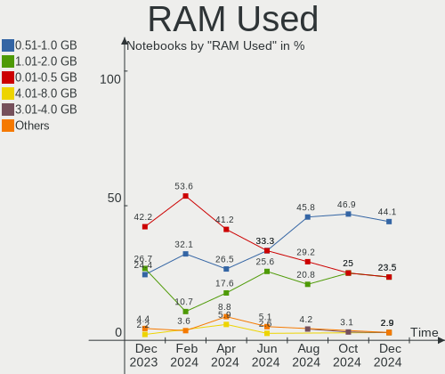
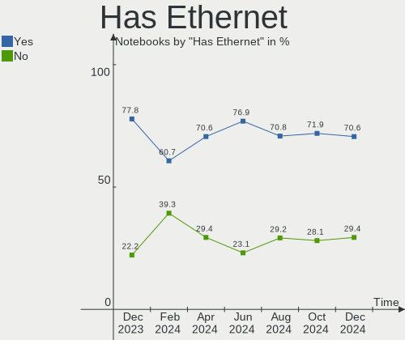
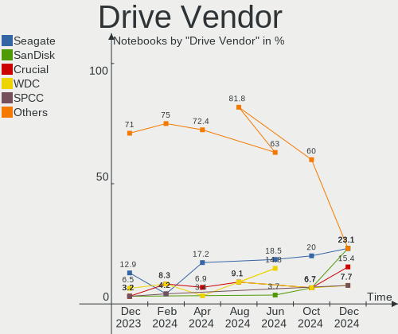
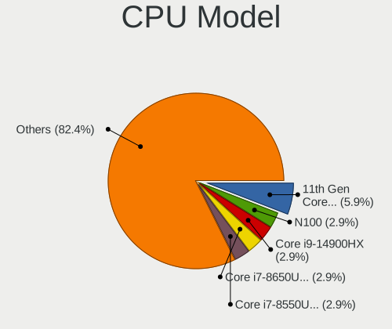
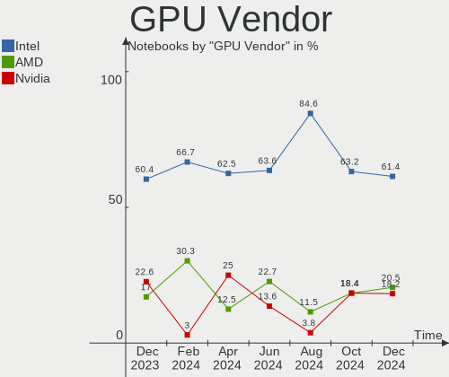
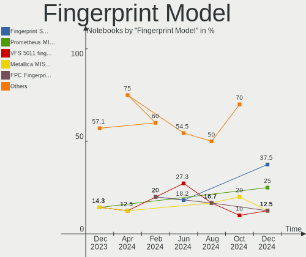

FreeBSD - Hardware Trends (Notebooks)
-------------------------------------

A project to identify most popular hardware characteristics and track their change
over time based on data collected by BSD users at https://BSD-Hardware.info.

Anyone can contribute to this report by the [hw-probe](https://github.com/linuxhw/hw-probe/blob/master/INSTALL.BSD.md) tool:

    hw-probe -all -upload

This report is for one last month. Overall report since the beginning of time: [TestCoverage](https://github.com/bsdhw/TestCoverage)

Period: Jan, 2023.

Contents
--------

* [ System ](#system)
  - [ OS                       ](#os)
  - [ OS Family                ](#os-family)
  - [ Arch                     ](#arch)
  - [ DE                       ](#de)
  - [ Display Server           ](#display-server)
  - [ Display Manager          ](#display-manager)
  - [ OS Lang                  ](#os-lang)
  - [ Boot Mode                ](#boot-mode)
  - [ Filesystem               ](#filesystem)
  - [ Part. scheme             ](#part-scheme)

* [ Board ](#board)
  - [ Vendor                   ](#vendor)
  - [ Model                    ](#model)
  - [ Model Family             ](#model-family)
  - [ MFG Year                 ](#mfg-year)
  - [ Form Factor              ](#form-factor)
  - [ Coreboot                 ](#coreboot)
  - [ RAM Size                 ](#ram-size)
  - [ RAM Used                 ](#ram-used)
  - [ Total Drives             ](#total-drives)
  - [ Has CD-ROM               ](#has-cd-rom)
  - [ Has Ethernet             ](#has-ethernet)
  - [ Has WiFi                 ](#has-wifi)
  - [ Has Bluetooth            ](#has-bluetooth)

* [ Location ](#location)
  - [ Country                  ](#country)
  - [ City                     ](#city)

* [ Drives ](#drives)
  - [ Drive Vendor             ](#drive-vendor)
  - [ Drive Model              ](#drive-model)
  - [ HDD Vendor               ](#hdd-vendor)
  - [ SSD Vendor               ](#ssd-vendor)
  - [ Drive Kind               ](#drive-kind)
  - [ Drive Connector          ](#drive-connector)
  - [ Drive Size               ](#drive-size)
  - [ Space Total              ](#space-total)
  - [ Space Used               ](#space-used)
  - [ Malfunc. Drives          ](#malfunc-drives)
  - [ Malfunc. Drive Vendor    ](#malfunc-drive-vendor)
  - [ Malfunc. HDD Vendor      ](#malfunc-hdd-vendor)
  - [ Malfunc. Drive Kind      ](#malfunc-drive-kind)
  - [ Failed Drives            ](#failed-drives)
  - [ Failed Drive Vendor      ](#failed-drive-vendor)
  - [ Drive Status             ](#drive-status)

* [ Storage controller ](#storage-controller)
  - [ Storage Vendor           ](#storage-vendor)
  - [ Storage Model            ](#storage-model)
  - [ Storage Kind             ](#storage-kind)

* [ Processor ](#processor)
  - [ CPU Vendor               ](#cpu-vendor)
  - [ CPU Model                ](#cpu-model)
  - [ CPU Model Family         ](#cpu-model-family)
  - [ CPU Cores                ](#cpu-cores)
  - [ CPU Sockets              ](#cpu-sockets)
  - [ CPU Threads              ](#cpu-threads)
  - [ CPU Microarch            ](#cpu-microarch)

* [ Graphics ](#graphics)
  - [ GPU Vendor               ](#gpu-vendor)
  - [ GPU Model                ](#gpu-model)
  - [ GPU Combo                ](#gpu-combo)
  - [ GPU Driver               ](#gpu-driver)
  - [ GPU Memory               ](#gpu-memory)

* [ Monitor ](#monitor)
  - [ Monitor Vendor           ](#monitor-vendor)
  - [ Monitor Model            ](#monitor-model)
  - [ Monitor Resolution       ](#monitor-resolution)
  - [ Monitor Diagonal         ](#monitor-diagonal)
  - [ Monitor Width            ](#monitor-width)
  - [ Aspect Ratio             ](#aspect-ratio)
  - [ Monitor Area             ](#monitor-area)
  - [ Pixel Density            ](#pixel-density)
  - [ Multiple Monitors        ](#multiple-monitors)

* [ Network ](#network)
  - [ Net Controller Vendor    ](#net-controller-vendor)
  - [ Net Controller Model     ](#net-controller-model)
  - [ Wireless Vendor          ](#wireless-vendor)
  - [ Wireless Model           ](#wireless-model)
  - [ Ethernet Vendor          ](#ethernet-vendor)
  - [ Ethernet Model           ](#ethernet-model)
  - [ Net Controller Kind      ](#net-controller-kind)
  - [ Used Controller          ](#used-controller)
  - [ NICs                     ](#nics)
  - [ IPv6                     ](#ipv6)

* [ Bluetooth ](#bluetooth)
  - [ Bluetooth Vendor         ](#bluetooth-vendor)
  - [ Bluetooth Model          ](#bluetooth-model)

* [ Sound ](#sound)
  - [ Sound Vendor             ](#sound-vendor)
  - [ Sound Model              ](#sound-model)

* [ Memory ](#memory)
  - [ Memory Vendor            ](#memory-vendor)
  - [ Memory Model             ](#memory-model)
  - [ Memory Kind              ](#memory-kind)
  - [ Memory Form Factor       ](#memory-form-factor)
  - [ Memory Size              ](#memory-size)
  - [ Memory Speed             ](#memory-speed)

* [ Printers & scanners ](#printers--scanners)
  - [ Printer Vendor           ](#printer-vendor)
  - [ Printer Model            ](#printer-model)
  - [ Scanner Vendor           ](#scanner-vendor)
  - [ Scanner Model            ](#scanner-model)

* [ Camera ](#camera)
  - [ Camera Vendor            ](#camera-vendor)
  - [ Camera Model             ](#camera-model)

* [ Security ](#security)
  - [ Fingerprint Vendor       ](#fingerprint-vendor)
  - [ Fingerprint Model        ](#fingerprint-model)
  - [ Chipcard Vendor          ](#chipcard-vendor)
  - [ Chipcard Model           ](#chipcard-model)

* [ Unsupported ](#unsupported)
  - [ Unsupported Devices      ](#unsupported-devices)
  - [ Unsupported Device Types ](#unsupported-device-types)

System
------

OS
--

Installed operating systems

| Name                 | Notebooks | Percent |
|----------------------|-----------|---------|
| FreeBSD 13.1-p5      | 19        | 57.58%  |
| FreeBSD 13.1         | 6         | 18.18%  |
| FreeBSD 13.1-STABLE  | 4         | 12.12%  |
| FreeBSD 14.0-CURRENT | 3         | 9.09%   |
| FreeBSD 13.1-p3      | 1         | 3.03%   |

OS Family
---------

OS without a version

| Name    | Notebooks | Percent |
|---------|-----------|---------|
| FreeBSD | 33        | 100%    |

Arch
----

OS architecture (x86_64, i586, etc.)

| Name  | Notebooks | Percent |
|-------|-----------|---------|
| amd64 | 32        | 96.97%  |
| i386  | 1         | 3.03%   |

DE
--

Desktop Environment

| Name    | Notebooks | Percent |
|---------|-----------|---------|
| XFCE    | 6         | 18.18%  |
| KDE5    | 6         | 18.18%  |
| MATE    | 5         | 15.15%  |
| TWM     | 4         | 12.12%  |
| i3      | 4         | 12.12%  |
| Console | 3         | 9.09%   |
| GNOME   | 2         | 6.06%   |
| sway    | 1         | 3.03%   |
| Openbox | 1         | 3.03%   |
| IceWM   | 1         | 3.03%   |

Display Server
--------------

X11 or Wayland

| Name    | Notebooks | Percent |
|---------|-----------|---------|
| X11     | 27        | 81.82%  |
| Wayland | 3         | 9.09%   |
| Console | 3         | 9.09%   |

Display Manager
---------------

SDDM, LightDM, etc.

| Name    | Notebooks | Percent |
|---------|-----------|---------|
| Console | 11        | 33.33%  |
| SDDM    | 9         | 27.27%  |
| XDM     | 4         | 12.12%  |
| SLiM    | 3         | 9.09%   |
| LightDM | 3         | 9.09%   |
| Ly      | 2         | 6.06%   |
| GDM     | 1         | 3.03%   |

OS Lang
-------

Language

| Lang    | Notebooks | Percent |
|---------|-----------|---------|
| C       | 21        | 63.64%  |
| en_US   | 7         | 21.21%  |
| Unknown | 2         | 6.06%   |
| ru_RU   | 1         | 3.03%   |
| pl_PL   | 1         | 3.03%   |
| cs_CZ   | 1         | 3.03%   |

Boot Mode
---------

EFI or BIOS

| Mode | Notebooks | Percent |
|------|-----------|---------|
| EFI  | 28        | 84.85%  |
| BIOS | 5         | 15.15%  |

Filesystem
----------

Type of filesystem

| Type | Notebooks | Percent |
|------|-----------|---------|
| Zfs  | 29        | 87.88%  |
| Ufs  | 4         | 12.12%  |

Part. scheme
------------

Scheme of partitioning

| Type | Notebooks | Percent |
|------|-----------|---------|
| GPT  | 32        | 96.97%  |
| MBR  | 1         | 3.03%   |

Board
-----

Vendor
------

Motherboard manufacturer

| Name             | Notebooks | Percent |
|------------------|-----------|---------|
| Lenovo           | 15        | 45.45%  |
| Dell             | 6         | 18.18%  |
| Hewlett-Packard  | 4         | 12.12%  |
| Acer             | 3         | 9.09%   |
| F-Plus Mobile    | 2         | 6.06%   |
| Medion           | 1         | 3.03%   |
| ASUSTek Computer | 1         | 3.03%   |
| Alienware        | 1         | 3.03%   |

Model
-----

Motherboard model

| Name                                     | Notebooks | Percent |
|------------------------------------------|-----------|---------|
| F-Plus Mobile FLAPTOP r                  | 2         | 6.06%   |
| Dell XPS 13 9310                         | 2         | 6.06%   |
| Medion S14409                            | 1         | 3.03%   |
| Lenovo ThinkPad X280 20KFCTO1WW          | 1         | 3.03%   |
| Lenovo ThinkPad X220 4291WF5             | 1         | 3.03%   |
| Lenovo ThinkPad X220 4291LF6             | 1         | 3.03%   |
| Lenovo ThinkPad X1 Carbon 5th 20HR002MAT | 1         | 3.03%   |
| Lenovo ThinkPad X1 Carbon 3rd 20BTS0LK00 | 1         | 3.03%   |
| Lenovo ThinkPad T430 23446FP             | 1         | 3.03%   |
| Lenovo ThinkPad T430 2342AG4             | 1         | 3.03%   |
| Lenovo ThinkPad T14 Gen 2a 20XKA004CD    | 1         | 3.03%   |
| Lenovo ThinkPad A485 20MVS0LG00          | 1         | 3.03%   |
| Lenovo ThinkBook 14-IIL 20SL             | 1         | 3.03%   |
| Lenovo Legion S7 15ACH6 82K8             | 1         | 3.03%   |
| Lenovo Legion 5 15ARH05 82B5             | 1         | 3.03%   |
| Lenovo IdeaPad Y700-15ISK 80NV           | 1         | 3.03%   |
| Lenovo IdeaPad 5 14ALC05 82LM            | 1         | 3.03%   |
| Lenovo B590 20208                        | 1         | 3.03%   |
| HP Pavilion Notebook                     | 1         | 3.03%   |
| HP Laptop 14s-fq1xxx                     | 1         | 3.03%   |
| HP EliteBook 8570p                       | 1         | 3.03%   |
| HP EliteBook 840 G3                      | 1         | 3.03%   |
| Dell Precision 5540                      | 1         | 3.03%   |
| Dell Latitude E6420                      | 1         | 3.03%   |
| Dell Latitude E6400                      | 1         | 3.03%   |
| Dell Inspiron 5558                       | 1         | 3.03%   |
| ASUS ASUS TUF Gaming F15 FX507ZE_FX507ZE | 1         | 3.03%   |
| Alienware m15 R4                         | 1         | 3.03%   |
| Acer TravelMate B311-31                  | 1         | 3.03%   |
| Acer Aspire one                          | 1         | 3.03%   |
| Acer Aspire A514-54                      | 1         | 3.03%   |

Model Family
------------

Motherboard model prefix

| Name                  | Notebooks | Percent |
|-----------------------|-----------|---------|
| Lenovo ThinkPad       | 9         | 27.27%  |
| Lenovo Legion         | 2         | 6.06%   |
| Lenovo IdeaPad        | 2         | 6.06%   |
| HP EliteBook          | 2         | 6.06%   |
| F-Plus Mobile FLAPTOP | 2         | 6.06%   |
| Dell XPS              | 2         | 6.06%   |
| Dell Latitude         | 2         | 6.06%   |
| Acer Aspire           | 2         | 6.06%   |
| Medion S14409         | 1         | 3.03%   |
| Lenovo ThinkBook      | 1         | 3.03%   |
| Lenovo B590           | 1         | 3.03%   |
| HP Pavilion           | 1         | 3.03%   |
| HP Laptop             | 1         | 3.03%   |
| Dell Precision        | 1         | 3.03%   |
| Dell Inspiron         | 1         | 3.03%   |
| ASUS ASUS             | 1         | 3.03%   |
| Alienware m15         | 1         | 3.03%   |
| Acer TravelMate       | 1         | 3.03%   |

MFG Year
--------

Motherboard manufacture year

| Year | Notebooks | Percent |
|------|-----------|---------|
| 2022 | 9         | 27.27%  |
| 2021 | 6         | 18.18%  |
| 2013 | 5         | 15.15%  |
| 2019 | 3         | 9.09%   |
| 2011 | 3         | 9.09%   |
| 2016 | 2         | 6.06%   |
| 2015 | 2         | 6.06%   |
| 2020 | 1         | 3.03%   |
| 2017 | 1         | 3.03%   |
| 2009 | 1         | 3.03%   |

Form Factor
-----------

Physical design of the computer

| Name     | Notebooks | Percent |
|----------|-----------|---------|
| Notebook | 33        | 100%    |

Coreboot
--------

Have coreboot on board

| Used | Notebooks | Percent |
|------|-----------|---------|
| No   | 33        | 100%    |

RAM Size
--------

Total RAM memory

| Size in GB | Notebooks | Percent |
|------------|-----------|---------|
| 16.01-24.0 | 16        | 48.48%  |
| 8.01-16.0  | 8         | 24.24%  |
| 4.01-8.0   | 4         | 12.12%  |
| 32.01-64.0 | 4         | 12.12%  |
| 0.51-1.0   | 1         | 3.03%   |

RAM Used
--------

Used RAM memory

| Used GB  | Notebooks | Percent |
|----------|-----------|---------|
| 0.51-1.0 | 12        | 36.36%  |
| 1.01-2.0 | 10        | 30.3%   |
| 0.01-0.5 | 10        | 30.3%   |
| 2.01-3.0 | 1         | 3.03%   |

Total Drives
------------

Number of drives on board

| Drives | Notebooks | Percent |
|--------|-----------|---------|
| 1      | 23        | 69.7%   |
| 2      | 7         | 21.21%  |
| 0      | 2         | 6.06%   |
| 3      | 1         | 3.03%   |

Has CD-ROM
----------

Has CD-ROM on board

| Presented | Notebooks | Percent |
|-----------|-----------|---------|
| No        | 28        | 84.85%  |
| Yes       | 5         | 15.15%  |

Has Ethernet
------------

Has Ethernet on board

| Presented | Notebooks | Percent |
|-----------|-----------|---------|
| Yes       | 24        | 72.73%  |
| No        | 9         | 27.27%  |

Has WiFi
--------

Has WiFi module

| Presented | Notebooks | Percent |
|-----------|-----------|---------|
| Yes       | 33        | 100%    |

Has Bluetooth
-------------

Has Bluetooth module

| Presented | Notebooks | Percent |
|-----------|-----------|---------|
| Yes       | 25        | 75.76%  |
| No        | 8         | 24.24%  |

Location
--------

Country
-------

Geographic location (country)

| Country   | Notebooks | Percent |
|-----------|-----------|---------|
| USA       | 4         | 12.12%  |
| Russia    | 4         | 12.12%  |
| Germany   | 3         | 9.09%   |
| France    | 3         | 9.09%   |
| Austria   | 3         | 9.09%   |
| Czechia   | 2         | 6.06%   |
| China     | 2         | 6.06%   |
| Venezuela | 1         | 3.03%   |
| UK        | 1         | 3.03%   |
| Spain     | 1         | 3.03%   |
| Romania   | 1         | 3.03%   |
| Poland    | 1         | 3.03%   |
| Mexico    | 1         | 3.03%   |
| Malta     | 1         | 3.03%   |
| Iraq      | 1         | 3.03%   |
| Iran      | 1         | 3.03%   |
| Hungary   | 1         | 3.03%   |
| Greece    | 1         | 3.03%   |
| Canada    | 1         | 3.03%   |

City
----

Geographic location (city)

| City               | Notebooks | Percent |
|--------------------|-----------|---------|
| Moscow             | 4         | 12.12%  |
| Vienna             | 3         | 9.09%   |
| Wathlingen         | 1         | 3.03%   |
| Tijuana            | 1         | 3.03%   |
| Thessaloniki       | 1         | 3.03%   |
| St. Petersburg     | 1         | 3.03%   |
| Shanghai           | 1         | 3.03%   |
| Rūdsar            | 1         | 3.03%   |
| Qormi              | 1         | 3.03%   |
| Qiqihar            | 1         | 3.03%   |
| Paris              | 1         | 3.03%   |
| Ostrozska Nova Ves | 1         | 3.03%   |
| Ostrava            | 1         | 3.03%   |
| New York           | 1         | 3.03%   |
| Navalcarnero       | 1         | 3.03%   |
| Mosul              | 1         | 3.03%   |
| Montpellier        | 1         | 3.03%   |
| London             | 1         | 3.03%   |
| Langley            | 1         | 3.03%   |
| La Victoria        | 1         | 3.03%   |
| Knoxville          | 1         | 3.03%   |
| Gdansk             | 1         | 3.03%   |
| Garchy             | 1         | 3.03%   |
| Fayetteville       | 1         | 3.03%   |
| Chiajna            | 1         | 3.03%   |
| Bielefeld          | 1         | 3.03%   |
| Berlin             | 1         | 3.03%   |
| Békéscsaba       | 1         | 3.03%   |

Drives
------

Drive Vendor
------------

Hard drive vendors

| Vendor              | Notebooks | Drives | Percent |
|---------------------|-----------|--------|---------|
| Samsung Electronics | 9         | 11     | 24.32%  |
| Crucial             | 4         | 5      | 10.81%  |
| WDC                 | 2         | 2      | 5.41%   |
| Seagate             | 2         | 2      | 5.41%   |
| KIOXIA              | 2         | 2      | 5.41%   |
| Kingston            | 2         | 2      | 5.41%   |
| Intel               | 2         | 2      | 5.41%   |
| Gigabyte Technology | 2         | 2      | 5.41%   |
| FORESEE             | 2         | 2      | 5.41%   |
| Transcend           | 1         | 1      | 2.7%    |
| Phison              | 1         | 1      | 2.7%    |
| Micron Technology   | 1         | 1      | 2.7%    |
| LITEON              | 1         | 1      | 2.7%    |
| Lenovo              | 1         | 1      | 2.7%    |
| KIOXIA-EXCERIA      | 1         | 1      | 2.7%    |
| KingSpec            | 1         | 1      | 2.7%    |
| Hitachi             | 1         | 1      | 2.7%    |
| HGST                | 1         | 1      | 2.7%    |
| A-DATA Technology   | 1         | 1      | 2.7%    |

Drive Model
-----------

Hard drive models

| Model                                   | Notebooks | Percent |
|-----------------------------------------|-----------|---------|
| Seagate ST1000LM035-1RK172 1TB          | 2         | 5.41%   |
| Samsung PM9A1 NVMe 512GB                | 2         | 5.41%   |
| FORESEE XP1000F001T 1TB                 | 2         | 5.41%   |
| WDC WD3200BEKT-22PVMT0 320GB            | 1         | 2.7%    |
| WDC WD1600BEVT-22ZCT0 160GB             | 1         | 2.7%    |
| Transcend TS512GSSD230S 512GB           | 1         | 2.7%    |
| Samsung SSD PM871b M.2 2280 128GB       | 1         | 2.7%    |
| Samsung SSD 860 EVO 1TB                 | 1         | 2.7%    |
| Samsung MZVLV256HCHP-000L2 256GB        | 1         | 2.7%    |
| Samsung MZVLB256HAHQ-000L7 256GB        | 1         | 2.7%    |
| Samsung MZVLB1T0HBLR-000L2 1TB          | 1         | 2.7%    |
| Samsung MZALQ512HBLU-00BL2 512GB        | 1         | 2.7%    |
| Samsung MZALQ256HAJD-000L2 256GB        | 1         | 2.7%    |
| Phison E12S-512G-PHISON-SSD-BICS4 512GB | 1         | 2.7%    |
| Micron 2200S NVMe 1024GB                | 1         | 2.7%    |
| LITEON L8H-256V2G-HP 256GB              | 1         | 2.7%    |
| Lenovo LS510-mSATA-240GB                | 1         | 2.7%    |
| KIOXIA-EXCERIA SATA SSD 480GB           | 1         | 2.7%    |
| KIOXIA KXG60ZNV512G NVMe 512GB          | 1         | 2.7%    |
| KIOXIA KBG40ZNV256G 256GB               | 1         | 2.7%    |
| Kingston SKC600MS256G 256GB             | 1         | 2.7%    |
| Kingston OM8PDP3256B-AA1 256GB          | 1         | 2.7%    |
| KingSpec MT-1TB                         | 1         | 2.7%    |
| Intel SSDPEKNU512GZ 512GB               | 1         | 2.7%    |
| Intel SSDPEKKF512G8L 512GB              | 1         | 2.7%    |
| Hitachi HTS725050A7E630 500GB           | 1         | 2.7%    |
| HGST HTS721010A9E630 1TB                | 1         | 2.7%    |
| Gigabyte GP-GSM2NE3256GNTD 256GB        | 1         | 2.7%    |
| Gigabyte GP-AG42TB                      | 1         | 2.7%    |
| Crucial CT500MX500SSD1 500GB            | 1         | 2.7%    |
| Crucial CT1000P1SSD8 1TB                | 1         | 2.7%    |
| Crucial CT1000MX500SSD1 1TB             | 1         | 2.7%    |
| Crucial CT1000BX500SSD1 1TB             | 1         | 2.7%    |
| A-DATA SX6000LNP 128GB                  | 1         | 2.7%    |

HDD Vendor
----------

Hard disk drive vendors

| Vendor  | Notebooks | Drives | Percent |
|---------|-----------|--------|---------|
| WDC     | 2         | 2      | 33.33%  |
| Seagate | 2         | 2      | 33.33%  |
| Hitachi | 1         | 1      | 16.67%  |
| HGST    | 1         | 1      | 16.67%  |

SSD Vendor
----------

Solid state drive vendors

| Vendor              | Notebooks | Drives | Percent |
|---------------------|-----------|--------|---------|
| Crucial             | 3         | 4      | 27.27%  |
| Samsung Electronics | 2         | 2      | 18.18%  |
| Transcend           | 1         | 1      | 9.09%   |
| LITEON              | 1         | 1      | 9.09%   |
| Lenovo              | 1         | 1      | 9.09%   |
| KIOXIA-EXCERIA      | 1         | 1      | 9.09%   |
| Kingston            | 1         | 1      | 9.09%   |
| KingSpec            | 1         | 1      | 9.09%   |

Drive Kind
----------

HDD or SSD

| Kind | Notebooks | Drives | Percent |
|------|-----------|--------|---------|
| NVMe | 19        | 22     | 54.29%  |
| SSD  | 10        | 12     | 28.57%  |
| HDD  | 6         | 6      | 17.14%  |

Drive Connector
---------------

SATA, SAS, NVMe, etc.

| Type | Notebooks | Drives | Percent |
|------|-----------|--------|---------|
| NVMe | 19        | 22     | 57.58%  |
| SATA | 14        | 18     | 42.42%  |

Drive Size
----------

Size of hard drive

| Size in TB | Notebooks | Drives | Percent |
|------------|-----------|--------|---------|
| 0.51-1.0   | 7         | 8      | 46.67%  |
| 0.01-0.5   | 7         | 9      | 46.67%  |
| 1.01-2.0   | 1         | 1      | 6.67%   |

Space Total
-----------

Amount of disk space available on the file system

| Size in GB | Notebooks | Percent |
|------------|-----------|---------|
| 101-250    | 11        | 33.33%  |
| 251-500    | 10        | 30.3%   |
| 501-1000   | 4         | 12.12%  |
| 21-50      | 3         | 9.09%   |
| 51-100     | 3         | 9.09%   |
| 2001-3000  | 1         | 3.03%   |
| 1001-2000  | 1         | 3.03%   |

Space Used
----------

Amount of used disk space

| Used GB | Notebooks | Percent |
|---------|-----------|---------|
| 1-20    | 29        | 87.88%  |
| 21-50   | 3         | 9.09%   |
| 101-250 | 1         | 3.03%   |

Malfunc. Drives
---------------

Drive models with a malfunction

| Model                         | Notebooks | Drives | Percent |
|-------------------------------|-----------|--------|---------|
| WDC WD3200BEKT-22PVMT0 320GB  | 1         | 1      | 33.33%  |
| Hitachi HTS725050A7E630 500GB | 1         | 1      | 33.33%  |
| HGST HTS721010A9E630 1TB      | 1         | 1      | 33.33%  |

Malfunc. Drive Vendor
---------------------

Vendors of faulty drives

| Vendor  | Notebooks | Drives | Percent |
|---------|-----------|--------|---------|
| WDC     | 1         | 1      | 33.33%  |
| Hitachi | 1         | 1      | 33.33%  |
| HGST    | 1         | 1      | 33.33%  |

Malfunc. HDD Vendor
-------------------

Vendors of faulty HDD drives

| Vendor  | Notebooks | Drives | Percent |
|---------|-----------|--------|---------|
| WDC     | 1         | 1      | 33.33%  |
| Hitachi | 1         | 1      | 33.33%  |
| HGST    | 1         | 1      | 33.33%  |

Malfunc. Drive Kind
-------------------

Kinds of faulty drives

| Kind | Notebooks | Drives | Percent |
|------|-----------|--------|---------|
| HDD  | 3         | 3      | 100%    |

Failed Drives
-------------

Failed drive models

Zero info for selected period =(

Failed Drive Vendor
-------------------

Failed drive vendors

Zero info for selected period =(

Drive Status
------------

Number of failed and malfunc. drives

| Status  | Notebooks | Drives | Percent |
|---------|-----------|--------|---------|
| Works   | 30        | 37     | 90.91%  |
| Malfunc | 3         | 3      | 9.09%   |

Storage controller
------------------

Storage Vendor
--------------

Storage controller vendors

| Vendor                       | Notebooks | Percent |
|------------------------------|-----------|---------|
| Intel                        | 18        | 45%     |
| Samsung Electronics          | 7         | 17.5%   |
| AMD                          | 4         | 10%     |
| Phison Electronics           | 3         | 7.5%    |
| Shenzhen Longsys Electronics | 2         | 5%      |
| Toshiba                      | 1         | 2.5%    |
| Realtek Semiconductor        | 1         | 2.5%    |
| Micron/Crucial Technology    | 1         | 2.5%    |
| Micron Technology            | 1         | 2.5%    |
| KIOXIA                       | 1         | 2.5%    |
| Kingston Technology Company  | 1         | 2.5%    |

Storage Model
-------------

Storage controller models

| Model                                                                        | Notebooks | Percent |
|------------------------------------------------------------------------------|-----------|---------|
| Unknown                                                                      | 5         | 11.63%  |
| Intel 7 Series Chipset Family 6-port SATA Controller [AHCI mode]             | 4         | 9.3%    |
| AMD FCH SATA Controller [AHCI mode]                                          | 4         | 9.3%    |
| Samsung NVMe SSD Controller SM981/PM981/PM983                                | 2         | 4.65%   |
| Samsung NVMe SSD Controller PM9A1/PM9A3/980PRO                               | 2         | 4.65%   |
| Samsung NVMe SSD Controller 980                                              | 2         | 4.65%   |
| Intel Volume Management Device NVMe RAID Controller                          | 2         | 4.65%   |
| Intel 6 Series/C200 Series Chipset Family 6 port Mobile SATA AHCI Controller | 2         | 4.65%   |
| Toshiba XG6 NVMe SSD Controller                                              | 1         | 2.33%   |
| Samsung NVMe SSD Controller SM951/PM951                                      | 1         | 2.33%   |
| Phison PS5013 E13 NVMe Controller                                            | 1         | 2.33%   |
| Phison E16 PCIe4 NVMe Controller                                             | 1         | 2.33%   |
| Phison E12 NVMe Controller                                                   | 1         | 2.33%   |
| Micron/Crucial P1 NVMe PCIe SSD                                              | 1         | 2.33%   |
| KIOXIA NVMe SSD Controller BG4                                               | 1         | 2.33%   |
| Kingston Company OM3PDP3 NVMe SSD                                            | 1         | 2.33%   |
| Intel Wildcat Point-LP SATA Controller [AHCI Mode]                           | 1         | 2.33%   |
| Intel Tiger Lake-LP SATA Controller                                          | 1         | 2.33%   |
| Intel Sunrise Point-LP SATA Controller [AHCI mode]                           | 1         | 2.33%   |
| Intel SSD Pro 7600p/760p/E 6100p Series                                      | 1         | 2.33%   |
| Intel Ice Lake-LP SATA Controller [AHCI mode]                                | 1         | 2.33%   |
| Intel HM170/QM170 Chipset SATA Controller [AHCI Mode]                        | 1         | 2.33%   |
| Intel Cannon Lake Mobile PCH SATA AHCI Controller                            | 1         | 2.33%   |
| Intel 82801IBM/IEM (ICH9M/ICH9M-E) 4 port SATA Controller [AHCI mode]        | 1         | 2.33%   |
| Intel 82801GBM/GHM (ICH7-M Family) SATA Controller [AHCI mode]               | 1         | 2.33%   |
| Intel 82801G (ICH7 Family) IDE Controller                                    | 1         | 2.33%   |
| Intel 82801 Mobile SATA Controller [RAID mode]                               | 1         | 2.33%   |
| Intel 8 Series SATA Controller 1 [AHCI mode]                                 | 1         | 2.33%   |

Storage Kind
------------

Kind of storage controller (IDE, SATA, NVMe, SAS, ...)

| Kind | Notebooks | Percent |
|------|-----------|---------|
| NVMe | 19        | 45.24%  |
| SATA | 19        | 45.24%  |
| RAID | 3         | 7.14%   |
| IDE  | 1         | 2.38%   |

Processor
---------

CPU Vendor
----------

Processor vendors

| Vendor | Notebooks | Percent |
|--------|-----------|---------|
| Intel  | 24        | 72.73%  |
| AMD    | 9         | 27.27%  |

CPU Model
---------

Processor models

| Model                                           | Notebooks | Percent |
|-------------------------------------------------|-----------|---------|
| Intel Core i5-2520M CPU @ 2.50GHz               | 2         | 6.06%   |
| Intel 11th Gen Core i7-1185G7 @ 3.00GHz         | 2         | 6.06%   |
| Intel 11th Gen Core i5-1135G7 @ 2.40GHz         | 2         | 6.06%   |
| AMD Ryzen 7 5825U with Radeon Graphics          | 2         | 6.06%   |
| AMD Ryzen 5 5500U with Radeon Graphics          | 2         | 6.06%   |
| Intel Core i9-10980HK CPU @ 2.40GHz             | 1         | 3.03%   |
| Intel Core i7-9850H CPU @ 2.60GHz               | 1         | 3.03%   |
| Intel Core i7-8550U CPU @ 1.80GHz               | 1         | 3.03%   |
| Intel Core i7-7500U CPU @ 2.70GHz               | 1         | 3.03%   |
| Intel Core i7-6700HQ CPU @ 2.60GHz              | 1         | 3.03%   |
| Intel Core i7-5600U CPU @ 2.60GHz               | 1         | 3.03%   |
| Intel Core i7-3612QM CPU @ 2.10GHz              | 1         | 3.03%   |
| Intel Core i7-3520M CPU @ 2.90GHz               | 1         | 3.03%   |
| Intel Core i5-6200U CPU @ 2.30GHz               | 1         | 3.03%   |
| Intel Core i5-4210U CPU @ 1.70GHz               | 1         | 3.03%   |
| Intel Core i5-2540M CPU @ 2.60GHz               | 1         | 3.03%   |
| Intel Core i5-2430M CPU @ 2.40GH                | 1         | 3.03%   |
| Intel Core i5-1035G1 CPU @ 1.00GHz              | 1         | 3.03%   |
| Intel Core i3-3120M CPU @ 2.50GHz               | 1         | 3.03%   |
| Intel Core 2 Duo                                | 1         | 3.03%   |
| Intel Celeron N4020 CPU @ 1.10GHz               | 1         | 3.03%   |
| Intel Atom CPU N280 @ 1.66GHz                   | 1         | 3.03%   |
| Intel 12th Gen Core i7-12700H                   | 1         | 3.03%   |
| AMD Ryzen 7 PRO 5850U with Radeon Graphics      | 1         | 3.03%   |
| AMD Ryzen 7 5800H with Radeon Graphics          | 1         | 3.03%   |
| AMD Ryzen 7 4800H with Radeon Graphics          | 1         | 3.03%   |
| AMD Ryzen 5 PRO 2500U w/ Radeon Vega Mobile Gfx | 1         | 3.03%   |
| AMD A6-6310 APU with AMD Radeon R4 Graphics     | 1         | 3.03%   |

CPU Model Family
----------------

Processor model prefix

| Model            | Notebooks | Percent |
|------------------|-----------|---------|
| Intel Core i7    | 7         | 21.21%  |
| Intel Core i5    | 7         | 21.21%  |
| Other            | 5         | 15.15%  |
| AMD Ryzen 7      | 4         | 12.12%  |
| AMD Ryzen 5      | 2         | 6.06%   |
| Intel Core i9    | 1         | 3.03%   |
| Intel Core i3    | 1         | 3.03%   |
| Intel Core 2 Duo | 1         | 3.03%   |
| Intel Celeron    | 1         | 3.03%   |
| Intel Atom       | 1         | 3.03%   |
| AMD Ryzen 7 PRO  | 1         | 3.03%   |
| AMD Ryzen 5 PRO  | 1         | 3.03%   |
| AMD A6           | 1         | 3.03%   |

CPU Cores
---------

Number of processor cores

| Number  | Notebooks | Percent |
|---------|-----------|---------|
| 2       | 12        | 36.36%  |
| 4       | 9         | 27.27%  |
| 16      | 5         | 15.15%  |
| 12      | 2         | 6.06%   |
| 8       | 2         | 6.06%   |
| 10      | 1         | 3.03%   |
| 6       | 1         | 3.03%   |
| Unknown | 1         | 3.03%   |

CPU Sockets
-----------

Number of sockets

| Number | Notebooks | Percent |
|--------|-----------|---------|
| 1      | 33        | 100%    |

CPU Threads
-----------

Threads per core (Hyper-Threading)

| Number  | Notebooks | Percent |
|---------|-----------|---------|
| 2       | 21        | 63.64%  |
| 1       | 11        | 33.33%  |
| Unknown | 1         | 3.03%   |

CPU Microarch
-------------

Microarchitecture

| Name          | Notebooks | Percent |
|---------------|-----------|---------|
| Zen 3         | 4         | 12.12%  |
| TigerLake     | 4         | 12.12%  |
| SandyBridge   | 4         | 12.12%  |
| KabyLake      | 3         | 9.09%   |
| IvyBridge     | 3         | 9.09%   |
| Unknown       | 3         | 9.09%   |
| Skylake       | 2         | 6.06%   |
| Zen 2         | 1         | 3.03%   |
| Zen           | 1         | 3.03%   |
| Puma          | 1         | 3.03%   |
| Penryn        | 1         | 3.03%   |
| IceLake       | 1         | 3.03%   |
| Haswell       | 1         | 3.03%   |
| Goldmont plus | 1         | 3.03%   |
| CometLake     | 1         | 3.03%   |
| Broadwell     | 1         | 3.03%   |
| Bonnell       | 1         | 3.03%   |

Graphics
--------

GPU Vendor
----------

Vendors of graphics cards

| Vendor | Notebooks | Percent |
|--------|-----------|---------|
| Intel  | 22        | 55%     |
| AMD    | 11        | 27.5%   |
| Nvidia | 7         | 17.5%   |

GPU Model
---------

Graphics card models

| Model                                                                         | Notebooks | Percent |
|-------------------------------------------------------------------------------|-----------|---------|
| Intel TigerLake-LP GT2 [Iris Xe Graphics]                                     | 4         | 9.76%   |
| Intel 2nd Generation Core Processor Family Integrated Graphics Controller     | 3         | 7.32%   |
| Intel 3rd Gen Core processor Graphics Controller                              | 2         | 4.88%   |
| AMD Lucienne                                                                  | 2         | 4.88%   |
| AMD Cezanne [Radeon Vega Series / Radeon Vega Mobile Series]                  | 2         | 4.88%   |
| AMD Barcelo                                                                   | 2         | 4.88%   |
| Nvidia TU117M                                                                 | 1         | 2.44%   |
| Nvidia TU117GLM [Quadro T1000 Mobile]                                         | 1         | 2.44%   |
| Nvidia GM107M [GeForce GTX 960M]                                              | 1         | 2.44%   |
| Nvidia GF108M [NVS 5400M]                                                     | 1         | 2.44%   |
| Nvidia GA107M [GeForce RTX 3050 Ti Mobile]                                    | 1         | 2.44%   |
| Nvidia GA106M [GeForce RTX 3060 Mobile / Max-Q]                               | 1         | 2.44%   |
| Nvidia GA104M [GeForce RTX 3080 Mobile / Max-Q 8GB/16GB]                      | 1         | 2.44%   |
| Intel UHD Graphics 620                                                        | 1         | 2.44%   |
| Intel Skylake GT2 [HD Graphics 520]                                           | 1         | 2.44%   |
| Intel Mobile 945GSE Express Integrated Graphics Controller                    | 1         | 2.44%   |
| Intel Mobile 945GM/GMS/GME, 943/940GML Express Integrated Graphics Controller | 1         | 2.44%   |
| Intel Mobile 4 Series Chipset Integrated Graphics Controller                  | 1         | 2.44%   |
| Intel Iris Plus Graphics G1 (Ice Lake)                                        | 1         | 2.44%   |
| Intel HD Graphics 620                                                         | 1         | 2.44%   |
| Intel HD Graphics 5500                                                        | 1         | 2.44%   |
| Intel HD Graphics 530                                                         | 1         | 2.44%   |
| Intel Haswell-ULT Integrated Graphics Controller                              | 1         | 2.44%   |
| Intel GeminiLake [UHD Graphics 600]                                           | 1         | 2.44%   |
| Intel CometLake-H GT2 [UHD Graphics]                                          | 1         | 2.44%   |
| Intel CoffeeLake-H GT2 [UHD Graphics 630]                                     | 1         | 2.44%   |
| Intel Alder Lake-P Integrated Graphics Controller                             | 1         | 2.44%   |
| AMD Thames [Radeon HD 7550M/7570M/7650M]                                      | 1         | 2.44%   |
| AMD Renoir                                                                    | 1         | 2.44%   |
| AMD Raven Ridge [Radeon Vega Series / Radeon Vega Mobile Series]              | 1         | 2.44%   |
| AMD Navi 22 [Radeon RX 6700/6700 XT/6750 XT / 6800M]                          | 1         | 2.44%   |
| AMD Mullins [Radeon R4/R5 Graphics]                                           | 1         | 2.44%   |

GPU Combo
---------

Combinations of graphics cards

| Name                     | Notebooks | Percent |
|--------------------------|-----------|---------|
| 1 x Intel                | 16        | 48.48%  |
| 1 x AMD                  | 8         | 24.24%  |
| Intel + Nvidia           | 3         | 9.09%   |
| 2 x Intel                | 2         | 6.06%   |
| AMD + Nvidia             | 2         | 6.06%   |
| 1 x Nvidia               | 1         | 3.03%   |
| Intel + AMD + 1 x Nvidia | 1         | 3.03%   |

GPU Driver
----------

Free vs proprietary

| Driver      | Notebooks | Percent |
|-------------|-----------|---------|
| Free        | 30        | 90.91%  |
| Proprietary | 3         | 9.09%   |

GPU Memory
----------

Total video memory

| Size in GB | Notebooks | Percent |
|------------|-----------|---------|
| Unknown    | 21        | 63.64%  |
| 0.51-1.0   | 5         | 15.15%  |
| 0.01-0.5   | 5         | 15.15%  |
| 7.01-8.0   | 1         | 3.03%   |
| 8.01-16.0  | 1         | 3.03%   |

Monitor
-------

Monitor Vendor
--------------

Monitor vendors

| Vendor                  | Notebooks | Percent |
|-------------------------|-----------|---------|
| AU Optronics            | 6         | 20.69%  |
| LG Display              | 5         | 17.24%  |
| BOE                     | 5         | 17.24%  |
| Sharp                   | 2         | 6.9%    |
| HKC                     | 2         | 6.9%    |
| Chimei Innolux          | 2         | 6.9%    |
| ViewSonic               | 1         | 3.45%   |
| Samsung Electronics     | 1         | 3.45%   |
| Philips                 | 1         | 3.45%   |
| LGD                     | 1         | 3.45%   |
| Chi Mei Optoelectronics | 1         | 3.45%   |
| BenQ                    | 1         | 3.45%   |
| Acer                    | 1         | 3.45%   |

Monitor Model
-------------

Monitor models

| Model                                                                    | Notebooks | Percent |
|--------------------------------------------------------------------------|-----------|---------|
| HKC LCD Monitor HKC3D05 1920x1080 340x190mm 15.3-inch                    | 2         | 6.9%    |
| AU Optronics LCD Monitor AUO408D 1920x1080 310x170mm 13.9-inch           | 2         | 6.9%    |
| ViewSonic VA2223-FHD VSC9239 1920x1080 480x270mm 21.7-inch               | 1         | 3.45%   |
| Sharp LCD Monitor SHP14F9 1920x1200 290x180mm 13.4-inch                  | 1         | 3.45%   |
| Sharp LCD Monitor SHP14B9 3840x2160 340x190mm 15.3-inch                  | 1         | 3.45%   |
| Samsung Electronics LCD Monitor SEC5442 1440x900 300x190mm 14.0-inch     | 1         | 3.45%   |
| Philips LCD Monitor PHL08C3 1920x1080 600x340mm 27.2-inch                | 1         | 3.45%   |
| LGD LCD Monitor 5760x1080                                                | 1         | 3.45%   |
| LG Display LCD Monitor LGD0533 1920x1080 340x190mm 15.3-inch             | 1         | 3.45%   |
| LG Display LCD Monitor LGD04DA 1920x1080 340x190mm 15.3-inch             | 1         | 3.45%   |
| LG Display LCD Monitor LGD0335 1366x768 310x170mm 13.9-inch              | 1         | 3.45%   |
| LG Display LCD Monitor LGD02EB 1366x768 310x170mm 13.9-inch              | 1         | 3.45%   |
| LG Display LCD Monitor LGD0258 1600x900 350x190mm 15.7-inch              | 1         | 3.45%   |
| Chimei Innolux LCD Monitor CMN14C0 1920x1080 310x170mm 13.9-inch         | 1         | 3.45%   |
| Chimei Innolux LCD Monitor CMN1132 1366x768 260x140mm 11.6-inch          | 1         | 3.45%   |
| Chi Mei Optoelectronics LCD Monitor CMO15A7 1366x768 350x190mm 15.7-inch | 1         | 3.45%   |
| BOE LCD Monitor BOE09D1 1920x1080 310x170mm 13.9-inch                    | 1         | 3.45%   |
| BOE LCD Monitor BOE0998 1920x1080 340x190mm 15.3-inch                    | 1         | 3.45%   |
| BOE LCD Monitor BOE08EE 1920x1080 310x170mm 13.9-inch                    | 1         | 3.45%   |
| BOE LCD Monitor BOE081D 1920x1080 310x170mm 13.9-inch                    | 1         | 3.45%   |
| BOE LCD Monitor BOE0791 1920x1080 310x170mm 13.9-inch                    | 1         | 3.45%   |
| BenQ LCD Monitor GL2450H                                                 | 1         | 3.45%   |
| AU Optronics LCD Monitor AUO313C 1366x768 310x170mm 13.9-inch            | 1         | 3.45%   |
| AU Optronics LCD Monitor AUO30D2 1024x600 220x130mm 10.1-inch            | 1         | 3.45%   |
| AU Optronics LCD Monitor AUO226D 1920x1080 280x160mm 12.7-inch           | 1         | 3.45%   |
| AU Optronics LCD Monitor AUO10EC 1366x768 340x190mm 15.3-inch            | 1         | 3.45%   |
| Acer K272HUL ACR0524 2560x1440 600x340mm 27.2-inch                       | 1         | 3.45%   |

Monitor Resolution
------------------

Monitor screen resolution

| Resolution        | Notebooks | Percent |
|-------------------|-----------|---------|
| 1920x1080 (FHD)   | 14        | 50%     |
| 1366x768 (WXGA)   | 6         | 21.43%  |
| 5760x1080         | 1         | 3.57%   |
| 3840x2160 (4K)    | 1         | 3.57%   |
| 2560x1440 (QHD)   | 1         | 3.57%   |
| 1920x1200 (WUXGA) | 1         | 3.57%   |
| 1600x900 (HD+)    | 1         | 3.57%   |
| 1440x900 (WXGA+)  | 1         | 3.57%   |
| 1024x600          | 1         | 3.57%   |
| Unknown           | 1         | 3.57%   |

Monitor Diagonal
----------------

Diagonal size in inches

| Inches  | Notebooks | Percent |
|---------|-----------|---------|
| 13      | 11        | 39.29%  |
| 15      | 9         | 32.14%  |
| 27      | 2         | 7.14%   |
| 21      | 1         | 3.57%   |
| 14      | 1         | 3.57%   |
| 12      | 1         | 3.57%   |
| 11      | 1         | 3.57%   |
| 10      | 1         | 3.57%   |
| Unknown | 1         | 3.57%   |

Monitor Width
-------------

Physical width

| Width in mm | Notebooks | Percent |
|-------------|-----------|---------|
| 301-350     | 19        | 67.86%  |
| 201-300     | 5         | 17.86%  |
| 501-600     | 2         | 7.14%   |
| 401-500     | 1         | 3.57%   |
| Unknown     | 1         | 3.57%   |

Aspect Ratio
------------

Proportional relationship between the width and the height

| Ratio   | Notebooks | Percent |
|---------|-----------|---------|
| 16/9    | 22        | 88%     |
| 16/10   | 2         | 8%      |
| Unknown | 1         | 4%      |

Monitor Area
------------

Area in inch²

| Area in inch² | Notebooks | Percent |
|----------------|-----------|---------|
| 81-90          | 12        | 42.86%  |
| 91-100         | 7         | 25%     |
| 301-350        | 2         | 7.14%   |
| 101-110        | 2         | 7.14%   |
| 61-70          | 1         | 3.57%   |
| 51-60          | 1         | 3.57%   |
| 41-50          | 1         | 3.57%   |
| 201-250        | 1         | 3.57%   |
| Unknown        | 1         | 3.57%   |

Pixel Density
-------------

Pixels per inch

| Density       | Notebooks | Percent |
|---------------|-----------|---------|
| 121-160       | 14        | 50%     |
| 101-120       | 8         | 28.57%  |
| 161-240       | 2         | 7.14%   |
| 51-100        | 2         | 7.14%   |
| More than 240 | 1         | 3.57%   |
| Unknown       | 1         | 3.57%   |

Multiple Monitors
-----------------

Total monitors connected

| Total | Notebooks | Percent |
|-------|-----------|---------|
| 1     | 21        | 63.64%  |
| 0     | 8         | 24.24%  |
| 2     | 4         | 12.12%  |

Network
-------

Net Controller Vendor
---------------------

Controller vendors

| Vendor                            | Notebooks | Percent |
|-----------------------------------|-----------|---------|
| Intel                             | 26        | 54.17%  |
| Realtek Semiconductor             | 12        | 25%     |
| Qualcomm Atheros                  | 2         | 4.17%   |
| Broadcom                          | 2         | 4.17%   |
| TP-Link                           | 1         | 2.08%   |
| Sierra Wireless                   | 1         | 2.08%   |
| MediaTek                          | 1         | 2.08%   |
| Hewlett-Packard                   | 1         | 2.08%   |
| Ericsson Business Mobile Networks | 1         | 2.08%   |
| Arduino SA                        | 1         | 2.08%   |

Net Controller Model
--------------------

Controller models

| Model                                                                       | Notebooks | Percent |
|-----------------------------------------------------------------------------|-----------|---------|
| Realtek RTL8111/8168/8411 PCI Express Gigabit Ethernet Controller           | 8         | 12.5%   |
| Intel 82579LM Gigabit Network Connection (Lewisville)                       | 6         | 9.38%   |
| Intel Centrino Advanced-N 6205 [Taylor Peak]                                | 4         | 6.25%   |
| Intel Wireless 7265                                                         | 3         | 4.69%   |
| Intel Wi-Fi 6 AX201                                                         | 3         | 4.69%   |
| Intel Wi-Fi 6 AX200                                                         | 3         | 4.69%   |
| Realtek RTL8852AE 802.11ax PCIe Wireless Network Adapter                    | 2         | 3.13%   |
| Realtek RTL810xE PCI Express Fast Ethernet controller                       | 2         | 3.13%   |
| Intel Wireless-AC 9260                                                      | 2         | 3.13%   |
| Intel Wireless 8265 / 8275                                                  | 2         | 3.13%   |
| Intel Ethernet Connection (4) I219-V                                        | 2         | 3.13%   |
| TP-Link AC600 wireless Realtek RTL8811AU [Archer T2U Nano]                  | 1         | 1.56%   |
| Sierra Wireless EM7455                                                      | 1         | 1.56%   |
| Realtek RTL8188EUS 802.11n Wireless Network Adapter                         | 1         | 1.56%   |
| Qualcomm Atheros QCA9565 / AR9565 Wireless Network Adapter                  | 1         | 1.56%   |
| Qualcomm Atheros AR8121/AR8113/AR8114 Gigabit or Fast Ethernet              | 1         | 1.56%   |
| Qualcomm Atheros AR242x / AR542x Wireless Network Adapter (PCI-Express)     | 1         | 1.56%   |
| MediaTek MT7921 802.11ax PCI Express Wireless Network Adapter               | 1         | 1.56%   |
| Intel Wireless 8260                                                         | 1         | 1.56%   |
| Intel Wireless 3160                                                         | 1         | 1.56%   |
| Intel WiFi Link 5100                                                        | 1         | 1.56%   |
| Intel PRO/Wireless 3945ABG [Golan] Network Connection                       | 1         | 1.56%   |
| Intel Ice Lake-LP PCH CNVi WiFi                                             | 1         | 1.56%   |
| Intel I225-K2                                                               | 1         | 1.56%   |
| Intel Gemini Lake PCH CNVi WiFi                                             | 1         | 1.56%   |
| Intel Ethernet Connection I219-V                                            | 1         | 1.56%   |
| Intel Ethernet Connection (3) I218-LM                                       | 1         | 1.56%   |
| Intel Ethernet Connection (16) I219-LM                                      | 1         | 1.56%   |
| Intel Dual Band Wireless-AC 3165 Plus Bluetooth                             | 1         | 1.56%   |
| Intel Centrino Wireless-N 2200                                              | 1         | 1.56%   |
| Intel Centrino Ultimate-N 6300                                              | 1         | 1.56%   |
| Intel Alder Lake-P PCH CNVi WiFi                                            | 1         | 1.56%   |
| Intel 82567LM Gigabit Network Connection                                    | 1         | 1.56%   |
| HP hs2350 HSPA+ Mobile Broadband Module Network Adapter                     | 1         | 1.56%   |
| Ericsson Business Mobile Networks N5321 gw Mobile Broadband Serial Port III | 1         | 1.56%   |
| Broadcom BCM43142 802.11b/g/n                                               | 1         | 1.56%   |
| Broadcom BCM4313 802.11bgn Wireless Network Adapter                         | 1         | 1.56%   |
| Arduino SA Mega 2560 R3 (CDC ACM)                                           | 1         | 1.56%   |

Wireless Vendor
---------------

Wireless vendors

| Vendor                | Notebooks | Percent |
|-----------------------|-----------|---------|
| Intel                 | 26        | 72.22%  |
| Realtek Semiconductor | 3         | 8.33%   |
| Qualcomm Atheros      | 2         | 5.56%   |
| Broadcom              | 2         | 5.56%   |
| TP-Link               | 1         | 2.78%   |
| Sierra Wireless       | 1         | 2.78%   |
| MediaTek              | 1         | 2.78%   |

Wireless Model
--------------

Wireless models

| Model                                                                   | Notebooks | Percent |
|-------------------------------------------------------------------------|-----------|---------|
| Intel Centrino Advanced-N 6205 [Taylor Peak]                            | 4         | 10.81%  |
| Intel Wireless 7265                                                     | 3         | 8.11%   |
| Intel Wi-Fi 6 AX201                                                     | 3         | 8.11%   |
| Intel Wi-Fi 6 AX200                                                     | 3         | 8.11%   |
| Realtek RTL8852AE 802.11ax PCIe Wireless Network Adapter                | 2         | 5.41%   |
| Intel Wireless-AC 9260                                                  | 2         | 5.41%   |
| Intel Wireless 8265 / 8275                                              | 2         | 5.41%   |
| TP-Link AC600 wireless Realtek RTL8811AU [Archer T2U Nano]              | 1         | 2.7%    |
| Sierra Wireless EM7455                                                  | 1         | 2.7%    |
| Realtek RTL8188EUS 802.11n Wireless Network Adapter                     | 1         | 2.7%    |
| Qualcomm Atheros QCA9565 / AR9565 Wireless Network Adapter              | 1         | 2.7%    |
| Qualcomm Atheros AR242x / AR542x Wireless Network Adapter (PCI-Express) | 1         | 2.7%    |
| MediaTek MT7921 802.11ax PCI Express Wireless Network Adapter           | 1         | 2.7%    |
| Intel Wireless 8260                                                     | 1         | 2.7%    |
| Intel Wireless 3160                                                     | 1         | 2.7%    |
| Intel WiFi Link 5100                                                    | 1         | 2.7%    |
| Intel PRO/Wireless 3945ABG [Golan] Network Connection                   | 1         | 2.7%    |
| Intel Ice Lake-LP PCH CNVi WiFi                                         | 1         | 2.7%    |
| Intel Gemini Lake PCH CNVi WiFi                                         | 1         | 2.7%    |
| Intel Dual Band Wireless-AC 3165 Plus Bluetooth                         | 1         | 2.7%    |
| Intel Centrino Wireless-N 2200                                          | 1         | 2.7%    |
| Intel Centrino Ultimate-N 6300                                          | 1         | 2.7%    |
| Intel Alder Lake-P PCH CNVi WiFi                                        | 1         | 2.7%    |
| Broadcom BCM43142 802.11b/g/n                                           | 1         | 2.7%    |
| Broadcom BCM4313 802.11bgn Wireless Network Adapter                     | 1         | 2.7%    |

Ethernet Vendor
---------------

Ethernet vendors

| Vendor                | Notebooks | Percent |
|-----------------------|-----------|---------|
| Intel                 | 13        | 54.17%  |
| Realtek Semiconductor | 10        | 41.67%  |
| Qualcomm Atheros      | 1         | 4.17%   |

Ethernet Model
--------------

Ethernet models

| Model                                                             | Notebooks | Percent |
|-------------------------------------------------------------------|-----------|---------|
| Realtek RTL8111/8168/8411 PCI Express Gigabit Ethernet Controller | 8         | 33.33%  |
| Intel 82579LM Gigabit Network Connection (Lewisville)             | 6         | 25%     |
| Realtek RTL810xE PCI Express Fast Ethernet controller             | 2         | 8.33%   |
| Intel Ethernet Connection (4) I219-V                              | 2         | 8.33%   |
| Qualcomm Atheros AR8121/AR8113/AR8114 Gigabit or Fast Ethernet    | 1         | 4.17%   |
| Intel I225-K2                                                     | 1         | 4.17%   |
| Intel Ethernet Connection I219-V                                  | 1         | 4.17%   |
| Intel Ethernet Connection (3) I218-LM                             | 1         | 4.17%   |
| Intel Ethernet Connection (16) I219-LM                            | 1         | 4.17%   |
| Intel 82567LM Gigabit Network Connection                          | 1         | 4.17%   |

Net Controller Kind
-------------------

Ethernet, WiFi or modem

| Kind     | Notebooks | Percent |
|----------|-----------|---------|
| WiFi     | 33        | 55%     |
| Ethernet | 24        | 40%     |
| Modem    | 3         | 5%      |

Used Controller
---------------

Currently used network controller

| Kind     | Notebooks | Percent |
|----------|-----------|---------|
| WiFi     | 22        | 68.75%  |
| Ethernet | 10        | 31.25%  |

NICs
----

Total network controllers on board

| Total | Notebooks | Percent |
|-------|-----------|---------|
| 2     | 21        | 63.64%  |
| 1     | 9         | 27.27%  |
| 3     | 3         | 9.09%   |

IPv6
----

IPv6 vs IPv4

| Used | Notebooks | Percent |
|------|-----------|---------|
| No   | 30        | 90.91%  |
| Yes  | 3         | 9.09%   |

Bluetooth
---------

Bluetooth Vendor
----------------

Controller vendors

| Vendor                          | Notebooks | Percent |
|---------------------------------|-----------|---------|
| Intel                           | 16        | 64%     |
| Broadcom                        | 5         | 20%     |
| Realtek Semiconductor           | 2         | 8%      |
| Qualcomm Atheros Communications | 1         | 4%      |
| Lite-On Technology              | 1         | 4%      |

Bluetooth Model
---------------

Controller models

| Model                                                       | Notebooks | Percent |
|-------------------------------------------------------------|-----------|---------|
| Intel Bluetooth wireless interface                          | 5         | 20%     |
| Intel AX201 Bluetooth                                       | 5         | 20%     |
| Intel AX200 Bluetooth                                       | 3         | 12%     |
| Realtek Bluetooth Radio                                     | 2         | 8%      |
| Intel Wireless-AC 9260 Bluetooth Adapter                    | 2         | 8%      |
| Broadcom BCM20702 Bluetooth 4.0 [ThinkPad]                  | 2         | 8%      |
| Broadcom BCM2045B (BDC-2.1)                                 | 2         | 8%      |
| Qualcomm Atheros Dell Wireless 1707 Bluetooth 4.0 LE Device | 1         | 4%      |
| Lite-On Wireless_Device                                     | 1         | 4%      |
| Intel Bluetooth 9460/9560 Jefferson Peak (JfP)              | 1         | 4%      |
| Broadcom BCM43142A0 Bluetooth 4.0                           | 1         | 4%      |

Sound
-----

Sound Vendor
------------

Sound card vendors

| Vendor            | Notebooks | Percent |
|-------------------|-----------|---------|
| Intel             | 24        | 54.55%  |
| AMD               | 11        | 25%     |
| Nvidia            | 5         | 11.36%  |
| Texas Instruments | 1         | 2.27%   |
| Lenovo            | 1         | 2.27%   |
| GN Netcom         | 1         | 2.27%   |
| ASUSTek Computer  | 1         | 2.27%   |

Sound Model
-----------

Sound card models

| Model                                                                      | Notebooks | Percent |
|----------------------------------------------------------------------------|-----------|---------|
| AMD Family 17h/19h HD Audio Controller                                     | 8         | 15.09%  |
| AMD Renoir Radeon High Definition Audio Controller                         | 5         | 9.43%   |
| Intel Tiger Lake-LP Smart Sound Technology Audio Controller                | 4         | 7.55%   |
| Intel 7 Series/C216 Chipset Family High Definition Audio Controller        | 4         | 7.55%   |
| Intel Sunrise Point-LP HD Audio                                            | 3         | 5.66%   |
| Intel 6 Series/C200 Series Chipset Family High Definition Audio Controller | 3         | 5.66%   |
| Texas Instruments PCM2706 stereo audio DAC                                 | 1         | 1.89%   |
| Nvidia TU107 GeForce GTX 1650 High Definition Audio Controller             | 1         | 1.89%   |
| Nvidia GF108 High Definition Audio Controller                              | 1         | 1.89%   |
| Nvidia GA106 High Definition Audio Controller                              | 1         | 1.89%   |
| Nvidia GA104 High Definition Audio Controller                              | 1         | 1.89%   |
| Lenovo Realtek USB Audio                                                   | 1         | 1.89%   |
| Intel Wildcat Point-LP High Definition Audio Controller                    | 1         | 1.89%   |
| Intel NM10/ICH7 Family High Definition Audio Controller                    | 1         | 1.89%   |
| Intel Ice Lake-LP Smart Sound Technology Audio Controller                  | 1         | 1.89%   |
| Intel Haswell-ULT HD Audio Controller                                      | 1         | 1.89%   |
| Intel Comet Lake PCH cAVS                                                  | 1         | 1.89%   |
| Intel Celeron/Pentium Silver Processor High Definition Audio               | 1         | 1.89%   |
| Intel Cannon Lake PCH cAVS                                                 | 1         | 1.89%   |
| Intel Broadwell-U Audio Controller                                         | 1         | 1.89%   |
| Intel Alder Lake PCH-P High Definition Audio Controller                    | 1         | 1.89%   |
| Intel 82801I (ICH9 Family) HD Audio Controller                             | 1         | 1.89%   |
| Intel 8 Series HD Audio Controller                                         | 1         | 1.89%   |
| Intel 100 Series/C230 Series Chipset Family HD Audio Controller            | 1         | 1.89%   |
| GN Netcom Jabra SPEAK 510 USB                                              | 1         | 1.89%   |
| ASUSTek Computer C-Media(R) Audio                                          | 1         | 1.89%   |
| AMD Turks HDMI Audio [Radeon HD 6500/6600 / 6700M Series]                  | 1         | 1.89%   |
| AMD Raven/Raven2/Fenghuang HDMI/DP Audio Controller                        | 1         | 1.89%   |
| AMD Navi 21/23 HDMI/DP Audio Controller                                    | 1         | 1.89%   |
| AMD Kabini HDMI/DP Audio                                                   | 1         | 1.89%   |
| AMD FCH Azalia Controller                                                  | 1         | 1.89%   |
| Unknown                                                                    | 1         | 1.89%   |

Memory
------

Memory Vendor
-------------

Memory module vendors

| Vendor              | Notebooks | Percent |
|---------------------|-----------|---------|
| Samsung Electronics | 12        | 30%     |
| Micron Technology   | 8         | 20%     |
| SK hynix            | 6         | 15%     |
| Unknown             | 4         | 10%     |
| Unknown             | 2         | 5%      |
| Nanya Technology    | 2         | 5%      |
| Ramaxel Technology  | 1         | 2.5%    |
| PUSKILL             | 1         | 2.5%    |
| Kingston            | 1         | 2.5%    |
| G.Skill             | 1         | 2.5%    |
| Crucial             | 1         | 2.5%    |
| A-DATA Technology   | 1         | 2.5%    |

Memory Model
------------

Memory module models

| Model                                                         | Notebooks | Percent |
|---------------------------------------------------------------|-----------|---------|
| Unknown                                                       | 4         | 10%     |
| Micron RAM 4ATF1G64HZ-3G2E2 8GB SODIMM DDR4 3200MT/s          | 2         | 5%      |
| Unknown RAM Module 8GB SODIMM DDR4 2400MT/s                   | 1         | 2.5%    |
| Unknown RAM Module 8GB SODIMM DDR3 1333MT/s                   | 1         | 2.5%    |
| SK hynix RAM Module 8GB SODIMM DDR4 2133MT/s                  | 1         | 2.5%    |
| SK hynix RAM Module 4GB SODIMM DDR4 2400MT/s                  | 1         | 2.5%    |
| SK hynix RAM HMT451S6BFR8A-PB 4GB SODIMM DDR3 1600MT/s        | 1         | 2.5%    |
| SK hynix RAM HMT351S6CFR8C-PB 4GB SODIMM DDR3 1600MT/s        | 1         | 2.5%    |
| SK hynix RAM HMT125S6BFR8C-G7 2GB SODIMM DDR3 1067MT/s        | 1         | 2.5%    |
| SK hynix RAM HMAB2GS6AMR6N-XN 16GB Row Of Chips DDR4 3200MT/s | 1         | 2.5%    |
| Samsung RAM Module 8GB SODIMM DDR3 1067MT/s                   | 1         | 2.5%    |
| Samsung RAM M471B5773CHS-CK0 2GB SODIMM DDR3 1600MT/s         | 1         | 2.5%    |
| Samsung RAM M471B5674-M0-YK0 4GB Chip DDR3 1600MT/s           | 1         | 2.5%    |
| Samsung RAM M471B5173BH0-CK0 4GB SODIMM DDR3 1600MT/s         | 1         | 2.5%    |
| Samsung RAM M471B1G73QH0-YK0 8GB SODIMM DDR3 1867MT/s         | 1         | 2.5%    |
| Samsung RAM M471B1G73EB0-YK0 8GB SODIMM DDR3 1600MT/s         | 1         | 2.5%    |
| Samsung RAM M471A2G44AM0-CWE 16GB SODIMM DDR4 3200MT/s        | 1         | 2.5%    |
| Samsung RAM M471A1K43EB1-CWE 8GB SODIMM DDR4 3200MT/s         | 1         | 2.5%    |
| Samsung RAM M471A1K43CB1-CTD 8GB SODIMM DDR4 2667MT/s         | 1         | 2.5%    |
| Samsung RAM M471A1G44AB0-CWE 8GB SODIMM DDR4 3200MT/s         | 1         | 2.5%    |
| Samsung RAM M471A1G44AB0-CWE 8GB Row Of Chips DDR4 3200MT/s   | 1         | 2.5%    |
| Samsung RAM K4EBE304EB-EGCF 8GB Row Of Chips LPDDR3 1867MT/s  | 1         | 2.5%    |
| Ramaxel RAM RMSA3260MB78HAF2400 8GB SODIMM DDR4 2133MT/s      | 1         | 2.5%    |
| PUSKILL RAM PJ16TFK512M8 8GB SODIMM DDR3 1600MT/s             | 1         | 2.5%    |
| Nanya RAM NT2GT64U8HD0BN-AD 2GB SODIMM DDR2 800MT/s           | 1         | 2.5%    |
| Nanya RAM Module 1GB DIMM DDR2 533MT/s                        | 1         | 2.5%    |
| Micron RAM MTC4C10163S1SC48BA1 8GB SODIMM DDR5 4800MT/s       | 1         | 2.5%    |
| Micron RAM 8KTF51264HZ-1G6E1 4GB SODIMM DDR3 1600MT/s         | 1         | 2.5%    |
| Micron RAM 4ATF51264HZ-3G2J1 4GB SODIMM DDR4 3200MT/s         | 1         | 2.5%    |
| Micron RAM 4ATF1G64HZ-3G2E1 8GB Row Of Chips DDR4 3200MT/s    | 1         | 2.5%    |
| Micron RAM 16KTF1G64HZ-1G6E1 8GB SODIMM DDR3 1600MT/s         | 1         | 2.5%    |
| Micron RAM 16JSF51264HZ-1G4D1 4GB SODIMM DDR3 1333MT/s        | 1         | 2.5%    |
| Kingston RAM KF3200C20S4/32GX 32GB SODIMM DDR4 3200MT/s       | 1         | 2.5%    |
| G.Skill RAM F4-3200C22-16GRS 16GB SODIMM DDR4 3200MT/s        | 1         | 2.5%    |
| Crucial RAM CT16G4SFRA32A.C8FF 16GB SODIMM DDR4 3200MT/s      | 1         | 2.5%    |
| A-DATA RAM Module 16GB SODIMM DDR4 2667MT/s                   | 1         | 2.5%    |

Memory Kind
-----------

Memory module kinds

| Kind   | Notebooks | Percent |
|--------|-----------|---------|
| DDR4   | 17        | 51.52%  |
| DDR3   | 10        | 30.3%   |
| LPDDR4 | 2         | 6.06%   |
| DDR2   | 2         | 6.06%   |
| LPDDR3 | 1         | 3.03%   |
| DDR5   | 1         | 3.03%   |

Memory Form Factor
------------------

Physical design of the memory module

| Name         | Notebooks | Percent |
|--------------|-----------|---------|
| SODIMM       | 26        | 76.47%  |
| Row Of Chips | 6         | 17.65%  |
| DIMM         | 1         | 2.94%   |
| Chip         | 1         | 2.94%   |

Memory Size
-----------

Memory module size

| Size  | Notebooks | Percent |
|-------|-----------|---------|
| 8192  | 16        | 42.11%  |
| 4096  | 8         | 21.05%  |
| 16384 | 7         | 18.42%  |
| 2048  | 5         | 13.16%  |
| 32768 | 1         | 2.63%   |
| 1024  | 1         | 2.63%   |

Memory Speed
------------

Memory module speed

| Speed | Notebooks | Percent |
|-------|-----------|---------|
| 3200  | 11        | 33.33%  |
| 1600  | 7         | 21.21%  |
| 4267  | 2         | 6.06%   |
| 2667  | 2         | 6.06%   |
| 2400  | 2         | 6.06%   |
| 2133  | 2         | 6.06%   |
| 1867  | 2         | 6.06%   |
| 4800  | 1         | 3.03%   |
| 1333  | 1         | 3.03%   |
| 1067  | 1         | 3.03%   |
| 800   | 1         | 3.03%   |
| 533   | 1         | 3.03%   |

Printers & scanners
-------------------

Printer Vendor
--------------

Printer device vendors

Zero info for selected period =(

Printer Model
-------------

Printer device models

Zero info for selected period =(

Scanner Vendor
--------------

Scanner device vendors

Zero info for selected period =(

Scanner Model
-------------

Scanner device models

Zero info for selected period =(

Camera
------

Camera Vendor
-------------

Camera device vendors

| Vendor                      | Notebooks | Percent |
|-----------------------------|-----------|---------|
| Microdia                    | 8         | 32%     |
| Chicony Electronics         | 6         | 24%     |
| Acer                        | 3         | 12%     |
| Syntek                      | 2         | 8%      |
| IMC Networks                | 2         | 8%      |
| Sonix Technology            | 1         | 4%      |
| Realtek Semiconductor       | 1         | 4%      |
| Quanta                      | 1         | 4%      |
| Luxvisions Innotech Limited | 1         | 4%      |

Camera Model
------------

Camera device models

| Model                                         | Notebooks | Percent |
|-----------------------------------------------|-----------|---------|
| Microdia USB Camera                           | 2         | 8%      |
| Microdia Integrated_Webcam_HD                 | 2         | 8%      |
| Microdia Integrated Webcam                    | 2         | 8%      |
| Chicony Integrated Camera                     | 2         | 8%      |
| Syntek Integrated Camera                      | 1         | 4%      |
| Syntek EasyCamera                             | 1         | 4%      |
| Sonix USB2.0 HD UVC WebCam                    | 1         | 4%      |
| Realtek Integrated_Webcam_HD                  | 1         | 4%      |
| Quanta HP TrueVision HD Camera                | 1         | 4%      |
| Microdia Sonix USB 2.0 Camera                 | 1         | 4%      |
| Microdia Integrated Webcam HD                 | 1         | 4%      |
| Luxvisions Innotech Limited Integrated Camera | 1         | 4%      |
| IMC Networks XHC Camera                       | 1         | 4%      |
| IMC Networks SunplusIT Integrated Camera      | 1         | 4%      |
| Chicony thinkpad t430s camera                 | 1         | 4%      |
| Chicony Lenovo Integrated Camera (0.3MP)      | 1         | 4%      |
| Chicony Integrated HP HD Webcam               | 1         | 4%      |
| Chicony Integrated Camera (1280x720@30)       | 1         | 4%      |
| Acer SunplusIT Integrated Camera              | 1         | 4%      |
| Acer Lenovo EasyCamera                        | 1         | 4%      |
| Acer Integrated Camera                        | 1         | 4%      |

Security
--------

Fingerprint Vendor
------------------

Fingerprint sensor vendors

| Vendor                     | Notebooks | Percent |
|----------------------------|-----------|---------|
| Shenzhen Goodix Technology | 4         | 44.44%  |
| Upek                       | 2         | 22.22%  |
| Focal-systems.Corp         | 2         | 22.22%  |
| Synaptics                  | 1         | 11.11%  |

Fingerprint Model
-----------------

Fingerprint sensor models

| Model                                                  | Notebooks | Percent |
|--------------------------------------------------------|-----------|---------|
| Upek Biometric Touchchip/Touchstrip Fingerprint Sensor | 2         | 22.22%  |
| Shenzhen Goodix FingerPrint                            | 2         | 22.22%  |
| Focal-systems.Corp FocalTech Fingerprint reader        | 2         | 22.22%  |
| Synaptics Prometheus MIS Touch Fingerprint Reader      | 1         | 11.11%  |
| Shenzhen Goodix  FingerPrint Device                    | 1         | 11.11%  |
| Shenzhen Goodix Fingerprint Reader                     | 1         | 11.11%  |

Chipcard Vendor
---------------

Chipcard module vendors

Zero info for selected period =(

Chipcard Model
--------------

Chipcard module models

Zero info for selected period =(

Unsupported
-----------

Unsupported Devices
-------------------

Total unsupported devices on board

| Total | Notebooks | Percent |
|-------|-----------|---------|
| 1     | 12        | 36.36%  |
| 2     | 10        | 30.3%   |
| 3     | 8         | 24.24%  |
| 0     | 2         | 6.06%   |
| 4     | 1         | 3.03%   |

Unsupported Device Types
------------------------

Types of unsupported devices

| Type                     | Notebooks | Percent |
|--------------------------|-----------|---------|
| Communication controller | 23        | 43.4%   |
| Bluetooth                | 13        | 24.53%  |
| Fingerprint reader       | 8         | 15.09%  |
| Net/wireless             | 4         | 7.55%   |
| Card reader              | 2         | 3.77%   |
| Storage                  | 1         | 1.89%   |
| Network                  | 1         | 1.89%   |
| Firewire controller      | 1         | 1.89%   |

