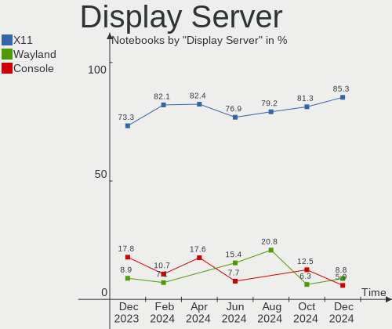
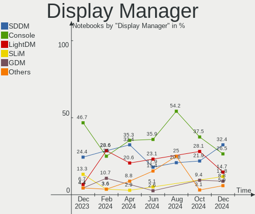
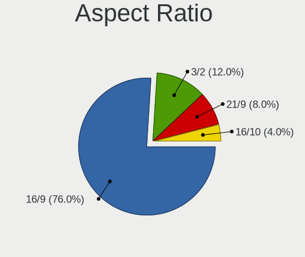
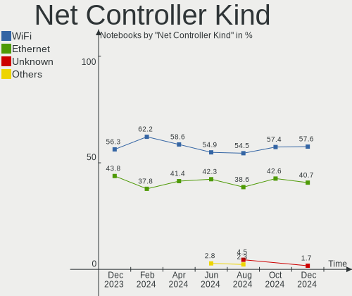

FreeBSD Hardware Trends (Notebooks)
-----------------------------------

A project to identify most popular hardware characteristics and track their change
over time based on data collected by FreeBSD users at https://BSD-Hardware.info.

Anyone can contribute to this report by the [hw-probe](https://github.com/linuxhw/hw-probe/blob/master/INSTALL.BSD.md) tool:

    hw-probe -all -upload

Full-feature report is available here: https://bsd-hardware.info/?view=trends&formfactor=notebook

Period: Sep, 2021.

Contents
--------

* [ System ](#system)
  - [ OS                       ](#os)
  - [ OS Family                ](#os-family)
  - [ Arch                     ](#arch)
  - [ DE                       ](#de)
  - [ Display Server           ](#display-server)
  - [ Display Manager          ](#display-manager)
  - [ OS Lang                  ](#os-lang)
  - [ Boot Mode                ](#boot-mode)
  - [ Filesystem               ](#filesystem)
  - [ Part. scheme             ](#part-scheme)

* [ Board ](#board)
  - [ Vendor                   ](#vendor)
  - [ Model                    ](#model)
  - [ Model Family             ](#model-family)
  - [ MFG Year                 ](#mfg-year)
  - [ Form Factor              ](#form-factor)
  - [ Coreboot                 ](#coreboot)
  - [ RAM Size                 ](#ram-size)
  - [ RAM Used                 ](#ram-used)
  - [ Total Drives             ](#total-drives)
  - [ Has CD-ROM               ](#has-cd-rom)
  - [ Has Ethernet             ](#has-ethernet)
  - [ Has WiFi                 ](#has-wifi)
  - [ Has Bluetooth            ](#has-bluetooth)

* [ Location ](#location)
  - [ Country                  ](#country)
  - [ City                     ](#city)

* [ Drives ](#drives)
  - [ Drive Vendor             ](#drive-vendor)
  - [ Drive Model              ](#drive-model)
  - [ HDD Vendor               ](#hdd-vendor)
  - [ SSD Vendor               ](#ssd-vendor)
  - [ Drive Kind               ](#drive-kind)
  - [ Drive Connector          ](#drive-connector)
  - [ Drive Size               ](#drive-size)
  - [ Space Total              ](#space-total)
  - [ Space Used               ](#space-used)
  - [ Malfunc. Drives          ](#malfunc-drives)
  - [ Malfunc. Drive Vendor    ](#malfunc-drive-vendor)
  - [ Malfunc. HDD Vendor      ](#malfunc-hdd-vendor)
  - [ Malfunc. Drive Kind      ](#malfunc-drive-kind)
  - [ Failed Drives            ](#failed-drives)
  - [ Failed Drive Vendor      ](#failed-drive-vendor)
  - [ Drive Status             ](#drive-status)

* [ Storage controller ](#storage-controller)
  - [ Storage Vendor           ](#storage-vendor)
  - [ Storage Model            ](#storage-model)
  - [ Storage Kind             ](#storage-kind)

* [ Processor ](#processor)
  - [ CPU Vendor               ](#cpu-vendor)
  - [ CPU Model                ](#cpu-model)
  - [ CPU Model Family         ](#cpu-model-family)
  - [ CPU Cores                ](#cpu-cores)
  - [ CPU Sockets              ](#cpu-sockets)
  - [ CPU Threads              ](#cpu-threads)
  - [ CPU Microarch            ](#cpu-microarch)

* [ Graphics ](#graphics)
  - [ GPU Vendor               ](#gpu-vendor)
  - [ GPU Model                ](#gpu-model)
  - [ GPU Combo                ](#gpu-combo)
  - [ GPU Driver               ](#gpu-driver)
  - [ GPU Memory               ](#gpu-memory)

* [ Monitor ](#monitor)
  - [ Monitor Vendor           ](#monitor-vendor)
  - [ Monitor Model            ](#monitor-model)
  - [ Monitor Resolution       ](#monitor-resolution)
  - [ Monitor Diagonal         ](#monitor-diagonal)
  - [ Monitor Width            ](#monitor-width)
  - [ Aspect Ratio             ](#aspect-ratio)
  - [ Monitor Area             ](#monitor-area)
  - [ Pixel Density            ](#pixel-density)
  - [ Multiple Monitors        ](#multiple-monitors)

* [ Network ](#network)
  - [ Net Controller Vendor    ](#net-controller-vendor)
  - [ Net Controller Model     ](#net-controller-model)
  - [ Wireless Vendor          ](#wireless-vendor)
  - [ Wireless Model           ](#wireless-model)
  - [ Ethernet Vendor          ](#ethernet-vendor)
  - [ Ethernet Model           ](#ethernet-model)
  - [ Net Controller Kind      ](#net-controller-kind)
  - [ Used Controller          ](#used-controller)
  - [ NICs                     ](#nics)
  - [ IPv6                     ](#ipv6)

* [ Bluetooth ](#bluetooth)
  - [ Bluetooth Vendor         ](#bluetooth-vendor)
  - [ Bluetooth Model          ](#bluetooth-model)

* [ Sound ](#sound)
  - [ Sound Vendor             ](#sound-vendor)
  - [ Sound Model              ](#sound-model)

* [ Memory ](#memory)
  - [ Memory Vendor            ](#memory-vendor)
  - [ Memory Model             ](#memory-model)
  - [ Memory Kind              ](#memory-kind)
  - [ Memory Form Factor       ](#memory-form-factor)
  - [ Memory Size              ](#memory-size)
  - [ Memory Speed             ](#memory-speed)

* [ Printers & scanners ](#printers--scanners)
  - [ Printer Vendor           ](#printer-vendor)
  - [ Printer Model            ](#printer-model)
  - [ Scanner Vendor           ](#scanner-vendor)
  - [ Scanner Model            ](#scanner-model)

* [ Camera ](#camera)
  - [ Camera Vendor            ](#camera-vendor)
  - [ Camera Model             ](#camera-model)

* [ Security ](#security)
  - [ Fingerprint Vendor       ](#fingerprint-vendor)
  - [ Fingerprint Model        ](#fingerprint-model)
  - [ Chipcard Vendor          ](#chipcard-vendor)
  - [ Chipcard Model           ](#chipcard-model)

* [ Unsupported ](#unsupported)
  - [ Unsupported Devices      ](#unsupported-devices)
  - [ Unsupported Device Types ](#unsupported-device-types)

System
------

OS
--

Installed operating systems

| Name                 | Notebooks | Percent |
|----------------------|-----------|---------|
| FreeBSD 13.0-p4      | 13        | 39.39%  |
| FreeBSD 13.0         | 11        | 33.33%  |
| FreeBSD 13.0-STABLE  | 3         | 9.09%   |
| FreeBSD 14.0-CURRENT | 2         | 6.06%   |
| FreeBSD 13.0-p3      | 2         | 6.06%   |
| FreeBSD 12.2-p10     | 2         | 6.06%   |

OS Family
---------

OS without a version

| Name    | Notebooks | Percent |
|---------|-----------|---------|
| FreeBSD | 33        | 100%    |

Arch
----

OS architecture (x86_64, i586, etc.)

| Name  | Notebooks | Percent |
|-------|-----------|---------|
| amd64 | 32        | 96.97%  |
| i386  | 1         | 3.03%   |

DE
--

Desktop Environment

| Name          | Notebooks | Percent |
|---------------|-----------|---------|
| XFCE          | 9         | 27.27%  |
| KDE5          | 8         | 24.24%  |
| TWM           | 3         | 9.09%   |
| GNOME         | 3         | 9.09%   |
| Console       | 3         | 9.09%   |
| Openbox       | 2         | 6.06%   |
| i3            | 2         | 6.06%   |
| MATE          | 1         | 3.03%   |
| Fluxbox       | 1         | 3.03%   |
| Enlightenment | 1         | 3.03%   |

Display Server
--------------

X11 or Wayland

| Name    | Notebooks | Percent |
|---------|-----------|---------|
| X11     | 29        | 87.88%  |
| Console | 3         | 9.09%   |
| Wayland | 1         | 3.03%   |

Display Manager
---------------

SDDM, LightDM, etc.

| Name    | Notebooks | Percent |
|---------|-----------|---------|
| Console | 14        | 42.42%  |
| SDDM    | 7         | 21.21%  |
| SLiM    | 5         | 15.15%  |
| LightDM | 4         | 12.12%  |
| XDM     | 2         | 6.06%   |
| GDM     | 1         | 3.03%   |

OS Lang
-------

Language

| Lang             | Notebooks | Percent |
|------------------|-----------|---------|
| C                | 18        | 54.55%  |
| en_US            | 6         | 18.18%  |
| Unknown          | 2         | 6.06%   |
| uk_UA            | 1         | 3.03%   |
| pt_PT            | 1         | 3.03%   |
| pt_BR            | 1         | 3.03%   |
| it_IT.ISO8859-15 | 1         | 3.03%   |
| fr_FR            | 1         | 3.03%   |
| fi_FI            | 1         | 3.03%   |
| de_CH            | 1         | 3.03%   |

Boot Mode
---------

EFI or BIOS

| Mode | Notebooks | Percent |
|------|-----------|---------|
| EFI  | 26        | 78.79%  |
| BIOS | 7         | 21.21%  |

Filesystem
----------

Type of filesystem

| Type | Notebooks | Percent |
|------|-----------|---------|
| Zfs  | 21        | 63.64%  |
| Ufs  | 12        | 36.36%  |

Part. scheme
------------

Scheme of partitioning

| Type | Notebooks | Percent |
|------|-----------|---------|
| GPT  | 28        | 84.85%  |
| MBR  | 5         | 15.15%  |

Board
-----

Vendor
------

Motherboard manufacturer

| Name             | Notebooks | Percent |
|------------------|-----------|---------|
| Lenovo           | 9         | 27.27%  |
| Dell             | 8         | 24.24%  |
| ASUSTek Computer | 5         | 15.15%  |
| Hewlett-Packard  | 3         | 9.09%   |
| System76         | 2         | 6.06%   |
| Apple            | 2         | 6.06%   |
| Toshiba          | 1         | 3.03%   |
| Panasonic        | 1         | 3.03%   |
| MSI              | 1         | 3.03%   |
| IBM              | 1         | 3.03%   |

Model
-----

Motherboard model

| Name                                     | Notebooks | Percent |
|------------------------------------------|-----------|---------|
| Toshiba Dakar10FW8                       | 1         | 3.03%   |
| System76 Galago Pro                      | 1         | 3.03%   |
| System76 Darter Pro                      | 1         | 3.03%   |
| Panasonic CF-F9KWHZZQ2                   | 1         | 3.03%   |
| MSI P65 Creator 8RE                      | 1         | 3.03%   |
| Lenovo ThinkPad X395 20NL000GPG          | 1         | 3.03%   |
| Lenovo ThinkPad T61 6459CTO              | 1         | 3.03%   |
| Lenovo ThinkPad T490 20N2CTO1WW          | 1         | 3.03%   |
| Lenovo ThinkPad T440s 20AR003SMN         | 1         | 3.03%   |
| Lenovo ThinkPad E15 Gen 3 20YG006GGE     | 1         | 3.03%   |
| Lenovo ThinkPad E14 Gen 3 20Y7CTO1WW     | 1         | 3.03%   |
| Lenovo IdeaPad Y700-15ISK 80NV           | 1         | 3.03%   |
| Lenovo IdeaPad 320-15AST 80XV            | 1         | 3.03%   |
| Lenovo G40-70 20369                      | 1         | 3.03%   |
| IBM ThinkPad X41 2525FAG                 | 1         | 3.03%   |
| HP Stream Notebook PC 11                 | 1         | 3.03%   |
| HP Pavilion Gaming Laptop 15-ec1xxx      | 1         | 3.03%   |
| HP 2000                                  | 1         | 3.03%   |
| Dell XPS 15 9570                         | 1         | 3.03%   |
| Dell XPS 15 9500                         | 1         | 3.03%   |
| Dell XPS 13 9343                         | 1         | 3.03%   |
| Dell Precision 7710                      | 1         | 3.03%   |
| Dell Latitude E7450                      | 1         | 3.03%   |
| Dell Latitude E6530                      | 1         | 3.03%   |
| Dell Latitude 5491                       | 1         | 3.03%   |
| Dell Latitude 5490                       | 1         | 3.03%   |
| ASUS VX7SX                               | 1         | 3.03%   |
| ASUS VivoBook_ASUSLaptop X512DA_F512DA   | 1         | 3.03%   |
| ASUS TP300LD                             | 1         | 3.03%   |
| ASUS G551JW                              | 1         | 3.03%   |
| ASUS ASUS TUF Gaming A17 FA706II_FA706II | 1         | 3.03%   |
| Apple MacBookPro5,1                      | 1         | 3.03%   |
| Apple MacBookPro13,2                     | 1         | 3.03%   |

Model Family
------------

Motherboard model prefix

| Name                   | Notebooks | Percent |
|------------------------|-----------|---------|
| Lenovo ThinkPad        | 6         | 18.18%  |
| Dell Latitude          | 4         | 12.12%  |
| Dell XPS               | 3         | 9.09%   |
| Lenovo IdeaPad         | 2         | 6.06%   |
| Toshiba Dakar10FW8     | 1         | 3.03%   |
| System76 Galago        | 1         | 3.03%   |
| System76 Darter        | 1         | 3.03%   |
| Panasonic CF-F9KWHZZQ2 | 1         | 3.03%   |
| MSI P65                | 1         | 3.03%   |
| Lenovo G40-70          | 1         | 3.03%   |
| IBM ThinkPad           | 1         | 3.03%   |
| HP Stream              | 1         | 3.03%   |
| HP Pavilion            | 1         | 3.03%   |
| HP 2000                | 1         | 3.03%   |
| Dell Precision         | 1         | 3.03%   |
| ASUS VX7SX             | 1         | 3.03%   |
| ASUS VivoBook          | 1         | 3.03%   |
| ASUS TP300LD           | 1         | 3.03%   |
| ASUS G551JW            | 1         | 3.03%   |
| ASUS ASUS              | 1         | 3.03%   |
| Apple MacBookPro5      | 1         | 3.03%   |
| Apple MacBookPro13     | 1         | 3.03%   |

MFG Year
--------

Motherboard manufacture year

| Year | Notebooks | Percent |
|------|-----------|---------|
| 2020 | 8         | 24.24%  |
| 2019 | 6         | 18.18%  |
| 2021 | 5         | 15.15%  |
| 2018 | 3         | 9.09%   |
| 2016 | 2         | 6.06%   |
| 2015 | 2         | 6.06%   |
| 2011 | 2         | 6.06%   |
| 2014 | 1         | 3.03%   |
| 2013 | 1         | 3.03%   |
| 2012 | 1         | 3.03%   |
| 2010 | 1         | 3.03%   |
| 2006 | 1         | 3.03%   |

Form Factor
-----------

Physical design of the computer

| Name     | Notebooks | Percent |
|----------|-----------|---------|
| Notebook | 33        | 100%    |

Coreboot
--------

Have coreboot on board

| Used | Notebooks | Percent |
|------|-----------|---------|
| No   | 31        | 93.94%  |
| Yes  | 2         | 6.06%   |

RAM Size
--------

Total RAM memory

| Size in GB  | Notebooks | Percent |
|-------------|-----------|---------|
| 8.01-16.0   | 13        | 39.39%  |
| 16.01-24.0  | 10        | 30.3%   |
| 32.01-64.0  | 3         | 9.09%   |
| 4.01-8.0    | 2         | 6.06%   |
| 2.01-3.0    | 2         | 6.06%   |
| 64.01-256.0 | 2         | 6.06%   |
| 24.01-32.0  | 1         | 3.03%   |

RAM Used
--------

Used RAM memory

| Used GB  | Notebooks | Percent |
|----------|-----------|---------|
| 0.51-1.0 | 13        | 39.39%  |
| 0.01-0.5 | 9         | 27.27%  |
| 1.01-2.0 | 7         | 21.21%  |
| 2.01-3.0 | 2         | 6.06%   |
| 4.01-8.0 | 1         | 3.03%   |
| 3.01-4.0 | 1         | 3.03%   |

Total Drives
------------

Number of drives on board

| Drives | Notebooks | Percent |
|--------|-----------|---------|
| 1      | 25        | 75.76%  |
| 2      | 6         | 18.18%  |
| 3      | 1         | 3.03%   |
| 0      | 1         | 3.03%   |

Has CD-ROM
----------

Has CD-ROM on board

| Presented | Notebooks | Percent |
|-----------|-----------|---------|
| No        | 26        | 78.79%  |
| Yes       | 7         | 21.21%  |

Has Ethernet
------------

Has Ethernet on board

| Presented | Notebooks | Percent |
|-----------|-----------|---------|
| Yes       | 26        | 78.79%  |
| No        | 7         | 21.21%  |

Has WiFi
--------

Has WiFi module

| Presented | Notebooks | Percent |
|-----------|-----------|---------|
| Yes       | 33        | 100%    |

Has Bluetooth
-------------

Has Bluetooth module

| Presented | Notebooks | Percent |
|-----------|-----------|---------|
| Yes       | 27        | 81.82%  |
| No        | 6         | 18.18%  |

Location
--------

Country
-------

Geographic location (country)

| Country     | Notebooks | Percent |
|-------------|-----------|---------|
| USA         | 10        | 30.3%   |
| UK          | 2         | 6.06%   |
| Spain       | 2         | 6.06%   |
| France      | 2         | 6.06%   |
| Austria     | 2         | 6.06%   |
| Ukraine     | 1         | 3.03%   |
| Switzerland | 1         | 3.03%   |
| Russia      | 1         | 3.03%   |
| Portugal    | 1         | 3.03%   |
| Poland      | 1         | 3.03%   |
| Japan       | 1         | 3.03%   |
| Italy       | 1         | 3.03%   |
| Indonesia   | 1         | 3.03%   |
| India       | 1         | 3.03%   |
| Hungary     | 1         | 3.03%   |
| Greece      | 1         | 3.03%   |
| Germany     | 1         | 3.03%   |
| Finland     | 1         | 3.03%   |
| Brazil      | 1         | 3.03%   |
| Australia   | 1         | 3.03%   |

City
----

Geographic location (city)

| City                   | Notebooks | Percent |
|------------------------|-----------|---------|
| Apex                   | 3         | 9.09%   |
| Dallas                 | 2         | 6.06%   |
| Warsaw                 | 1         | 3.03%   |
| Vienna                 | 1         | 3.03%   |
| Vadodara               | 1         | 3.03%   |
| Tyumen                 | 1         | 3.03%   |
| Tatab??nya             | 1         | 3.03%   |
| Tampere                | 1         | 3.03%   |
| Sydney                 | 1         | 3.03%   |
| San Vicent del Raspeig | 1         | 3.03%   |
| San Bernardino         | 1         | 3.03%   |
| Paris                  | 1         | 3.03%   |
| Milan                  | 1         | 3.03%   |
| Mattapoisett           | 1         | 3.03%   |
| Maia                   | 1         | 3.03%   |
| Madrid                 | 1         | 3.03%   |
| London                 | 1         | 3.03%   |
| Linz                   | 1         | 3.03%   |
| Lavras                 | 1         | 3.03%   |
| Lake Forest            | 1         | 3.03%   |
| Grapevine              | 1         | 3.03%   |
| Fujinomiya             | 1         | 3.03%   |
| Denpasar               | 1         | 3.03%   |
| Cherkasy               | 1         | 3.03%   |
| Chaudeney-sur-Moselle  | 1         | 3.03%   |
| Brooklyn               | 1         | 3.03%   |
| Basel                  | 1         | 3.03%   |
| Bardowick              | 1         | 3.03%   |
| Athens                 | 1         | 3.03%   |
| Addingham              | 1         | 3.03%   |

Drives
------

Drive Vendor
------------

Hard drive vendors

| Vendor              | Notebooks | Drives | Percent |
|---------------------|-----------|--------|---------|
| Samsung Electronics | 8         | 8      | 20%     |
| Kingston            | 5         | 5      | 12.5%   |
| Crucial             | 5         | 5      | 12.5%   |
| WDC                 | 4         | 4      | 10%     |
| Toshiba             | 3         | 3      | 7.5%    |
| Intel               | 3         | 3      | 7.5%    |
| Transcend           | 2         | 2      | 5%      |
| Seagate             | 2         | 2      | 5%      |
| TCSUNBOW            | 1         | 1      | 2.5%    |
| SK Hynix            | 1         | 1      | 2.5%    |
| PNY                 | 1         | 1      | 2.5%    |
| Phison              | 1         | 1      | 2.5%    |
| LITEON              | 1         | 1      | 2.5%    |
| KIOXIA              | 1         | 1      | 2.5%    |
| HGST                | 1         | 1      | 2.5%    |
| A-DATA Technology   | 1         | 1      | 2.5%    |

Drive Model
-----------

Hard drive models

| Model                                | Notebooks | Percent |
|--------------------------------------|-----------|---------|
| Seagate ST1000LM024 HN-M101MBB 1TB   | 2         | 5%      |
| Samsung MZALQ512HBLU-00BL1 512GB     | 2         | 5%      |
| Crucial CT1000P1SSD8 1TB             | 2         | 5%      |
| WDC WDS500G2B0C-00PXH0 500GB         | 1         | 2.5%    |
| WDC WDS250G2B0B-00YS70 250GB         | 1         | 2.5%    |
| WDC WD20SPZX-22UA7T0 2TB             | 1         | 2.5%    |
| WDC WD10JPVX-22JC3T0 1TB             | 1         | 2.5%    |
| Transcend TS512GSSD370 512GB         | 1         | 2.5%    |
| Transcend TS32GMSA370 32GB           | 1         | 2.5%    |
| Toshiba MQ01ABF050 500GB             | 1         | 2.5%    |
| Toshiba MQ01ABD100 1TB               | 1         | 2.5%    |
| Toshiba MQ01ABD032 320GB             | 1         | 2.5%    |
| TCSUNBOW X3 480GB                    | 1         | 2.5%    |
| SK Hynix SKHynix_HFS001TDE9X081N 1TB | 1         | 2.5%    |
| Samsung SSD 970 EVO Plus 500GB       | 1         | 2.5%    |
| Samsung SSD 970 EVO Plus 2TB         | 1         | 2.5%    |
| Samsung SSD 860 EVO 500GB            | 1         | 2.5%    |
| Samsung SSD 850 EVO 1TB              | 1         | 2.5%    |
| Samsung PM981a NVMe 512GB            | 1         | 2.5%    |
| Samsung MZVLB512HBJQ-000L7 512GB     | 1         | 2.5%    |
| PNY CS1311 120GB SSD                 | 1         | 2.5%    |
| Phison Sabrent Rocket Q 1TB          | 1         | 2.5%    |
| LITEON CV1-8B512 512GB               | 1         | 2.5%    |
| KIOXIA KBG40ZNV512G 512GB            | 1         | 2.5%    |
| Kingston SHFS37A120G 120GB           | 1         | 2.5%    |
| Kingston SA400S37480G 480GB          | 1         | 2.5%    |
| Kingston RBUSNS8154P3512GJ 512GB     | 1         | 2.5%    |
| Kingston RBUSNS8154P3256GJ3 256GB    | 1         | 2.5%    |
| Kingston OM8PCP3512F-AB 512GB        | 1         | 2.5%    |
| Intel SSDSC2KW256G8 256GB            | 1         | 2.5%    |
| Intel SSDSA2CW300G3 304GB            | 1         | 2.5%    |
| Intel SSDPEKKF512G8L 512GB           | 1         | 2.5%    |
| HGST HTS721010A9E630 1TB             | 1         | 2.5%    |
| Crucial CT500MX500SSD1 500GB         | 1         | 2.5%    |
| Crucial CT500MX200SSD1 500GB         | 1         | 2.5%    |
| Crucial CT1000MX500SSD1 1TB          | 1         | 2.5%    |
| A-DATA SU810NS38 SATA 256 GB         | 1         | 2.5%    |

HDD Vendor
----------

Hard disk drive vendors

| Vendor  | Notebooks | Drives | Percent |
|---------|-----------|--------|---------|
| Toshiba | 3         | 3      | 37.5%   |
| WDC     | 2         | 2      | 25%     |
| Seagate | 2         | 2      | 25%     |
| HGST    | 1         | 1      | 12.5%   |

SSD Vendor
----------

Solid state drive vendors

| Vendor              | Notebooks | Drives | Percent |
|---------------------|-----------|--------|---------|
| Crucial             | 3         | 3      | 18.75%  |
| Transcend           | 2         | 2      | 12.5%   |
| Samsung Electronics | 2         | 2      | 12.5%   |
| Kingston            | 2         | 2      | 12.5%   |
| Intel               | 2         | 2      | 12.5%   |
| WDC                 | 1         | 1      | 6.25%   |
| TCSUNBOW            | 1         | 1      | 6.25%   |
| PNY                 | 1         | 1      | 6.25%   |
| LITEON              | 1         | 1      | 6.25%   |
| A-DATA Technology   | 1         | 1      | 6.25%   |

Drive Kind
----------

HDD or SSD

| Kind | Notebooks | Drives | Percent |
|------|-----------|--------|---------|
| SSD  | 16        | 16     | 44.44%  |
| NVMe | 13        | 16     | 36.11%  |
| HDD  | 7         | 8      | 19.44%  |

Drive Connector
---------------

SATA, SAS, NVMe, etc.

| Type | Notebooks | Drives | Percent |
|------|-----------|--------|---------|
| SATA | 21        | 24     | 61.76%  |
| NVMe | 13        | 16     | 38.24%  |

Drive Size
----------

Size of hard drive

| Size in TB | Notebooks | Drives | Percent |
|------------|-----------|--------|---------|
| 0.01-0.5   | 14        | 14     | 60.87%  |
| 0.51-1.0   | 8         | 9      | 34.78%  |
| 1.01-2.0   | 1         | 1      | 4.35%   |

Space Total
-----------

Amount of disk space available on the file system

| Size in GB | Notebooks | Percent |
|------------|-----------|---------|
| 251-500    | 14        | 42.42%  |
| 501-1000   | 7         | 21.21%  |
| 21-50      | 4         | 12.12%  |
| 101-250    | 3         | 9.09%   |
| 51-100     | 3         | 9.09%   |
| 1-20       | 2         | 6.06%   |

Space Used
----------

Amount of used disk space

| Used GB | Notebooks | Percent |
|---------|-----------|---------|
| 1-20    | 27        | 81.82%  |
| 21-50   | 3         | 9.09%   |
| 251-500 | 1         | 3.03%   |
| 101-250 | 1         | 3.03%   |
| 51-100  | 1         | 3.03%   |

Malfunc. Drives
---------------

Drive models with a malfunction

| Model                     | Notebooks | Drives | Percent |
|---------------------------|-----------|--------|---------|
| Toshiba MQ01ABD032 320GB  | 1         | 1      | 33.33%  |
| Intel SSDSC2KW256G8 256GB | 1         | 1      | 33.33%  |
| Crucial CT1000P1SSD8 1TB  | 1         | 1      | 33.33%  |

Malfunc. Drive Vendor
---------------------

Vendors of faulty drives

| Vendor  | Notebooks | Drives | Percent |
|---------|-----------|--------|---------|
| Toshiba | 1         | 1      | 33.33%  |
| Intel   | 1         | 1      | 33.33%  |
| Crucial | 1         | 1      | 33.33%  |

Malfunc. HDD Vendor
-------------------

Vendors of faulty HDD drives

| Vendor  | Notebooks | Drives | Percent |
|---------|-----------|--------|---------|
| Toshiba | 1         | 1      | 100%    |

Malfunc. Drive Kind
-------------------

Kinds of faulty drives

| Kind | Notebooks | Drives | Percent |
|------|-----------|--------|---------|
| NVMe | 1         | 1      | 33.33%  |
| SSD  | 1         | 1      | 33.33%  |
| HDD  | 1         | 1      | 33.33%  |

Failed Drives
-------------

Failed drive models

Zero info for selected period =(

Failed Drive Vendor
-------------------

Failed drive vendors

Zero info for selected period =(

Drive Status
------------

Number of failed and malfunc. drives

| Status  | Notebooks | Drives | Percent |
|---------|-----------|--------|---------|
| Works   | 29        | 37     | 90.63%  |
| Malfunc | 3         | 3      | 9.38%   |

Storage controller
------------------

Storage Vendor
--------------

Storage controller vendors

| Vendor                      | Notebooks | Percent |
|-----------------------------|-----------|---------|
| Intel                       | 22        | 51.16%  |
| Samsung Electronics         | 6         | 13.95%  |
| AMD                         | 4         | 9.3%    |
| Kingston Technology Company | 3         | 6.98%   |
| Micron/Crucial Technology   | 2         | 4.65%   |
| SK Hynix                    | 1         | 2.33%   |
| Sandisk                     | 1         | 2.33%   |
| Phison Electronics          | 1         | 2.33%   |
| Nvidia                      | 1         | 2.33%   |
| KIOXIA                      | 1         | 2.33%   |
| Apple                       | 1         | 2.33%   |

Storage Model
-------------

Storage controller models

| Model                                                                          | Notebooks | Percent |
|--------------------------------------------------------------------------------|-----------|---------|
| Samsung NVMe SSD Controller SM981/PM981/PM983                                  | 4         | 9.09%   |
| Intel 7 Series Chipset Family 6-port SATA Controller [AHCI mode]               | 4         | 9.09%   |
| AMD FCH SATA Controller [AHCI mode]                                            | 4         | 9.09%   |
| Intel 8 Series SATA Controller 1 [AHCI mode]                                   | 3         | 6.82%   |
| Samsung NVMe SSD Controller 980                                                | 2         | 4.55%   |
| Micron/Crucial P1 NVMe PCIe SSD                                                | 2         | 4.55%   |
| Kingston Company U-SNS8154P3 NVMe SSD                                          | 2         | 4.55%   |
| Intel Comet Lake SATA AHCI Controller                                          | 2         | 4.55%   |
| Intel Cannon Lake Mobile PCH SATA AHCI Controller                              | 2         | 4.55%   |
| SK Hynix Gold P31 SSD                                                          | 1         | 2.27%   |
| Sandisk WD Blue SN550 NVMe SSD                                                 | 1         | 2.27%   |
| Phison E12 NVMe Controller                                                     | 1         | 2.27%   |
| Nvidia MCP79 AHCI Controller                                                   | 1         | 2.27%   |
| KIOXIA unknown                                                                 | 1         | 2.27%   |
| Intel Wildcat Point-LP SATA Controller [AHCI Mode]                             | 1         | 2.27%   |
| Intel Sunrise Point-LP SATA Controller [AHCI mode]                             | 1         | 2.27%   |
| Intel SSD Pro 7600p/760p/E 6100p Series                                        | 1         | 2.27%   |
| Intel Q170/Q150/B150/H170/H110/Z170/CM236 Chipset SATA Controller [AHCI Mode]  | 1         | 2.27%   |
| Intel HM170/QM170 Chipset SATA Controller [AHCI Mode]                          | 1         | 2.27%   |
| Intel 82801HM/HEM (ICH8M/ICH8M-E) SATA Controller [AHCI mode]                  | 1         | 2.27%   |
| Intel 82801HM/HEM (ICH8M/ICH8M-E) IDE Controller                               | 1         | 2.27%   |
| Intel 82801FBM (ICH6M) SATA Controller                                         | 1         | 2.27%   |
| Intel 82801 Mobile SATA Controller [RAID mode]                                 | 1         | 2.27%   |
| Intel 8 Series/C220 Series Chipset Family 6-port SATA Controller 1 [AHCI mode] | 1         | 2.27%   |
| Intel 6 Series/C200 Series Chipset Family 6 port Mobile SATA AHCI Controller   | 1         | 2.27%   |
| Intel 5 Series/3400 Series Chipset 6 port SATA AHCI Controller                 | 1         | 2.27%   |
| Apple S3X NVMe Controller                                                      | 1         | 2.27%   |
| Unknown                                                                        | 1         | 2.27%   |

Storage Kind
------------

Kind of storage controller (IDE, SATA, NVMe, SAS, ...)

| Kind | Notebooks | Percent |
|------|-----------|---------|
| SATA | 24        | 58.54%  |
| NVMe | 14        | 34.15%  |
| IDE  | 2         | 4.88%   |
| RAID | 1         | 2.44%   |

Processor
---------

CPU Vendor
----------

Processor vendors

| Vendor | Notebooks | Percent |
|--------|-----------|---------|
| Intel  | 26        | 78.79%  |
| AMD    | 7         | 21.21%  |

CPU Model
---------

Processor models

| Model                                           | Notebooks | Percent |
|-------------------------------------------------|-----------|---------|
| Intel Core i7-4510U CPU @ 2.00GHz               | 2         | 6.06%   |
| Intel Core i7-10510U CPU @ 1.80GHz              | 2         | 6.06%   |
| Intel Pentium M processor                       | 1         | 3.03%   |
| Intel Core i7-8850H CPU @ 2.60GHz               | 1         | 3.03%   |
| Intel Core i7-8750H CPU @ 2.20GHz               | 1         | 3.03%   |
| Intel Core i7-8665U CPU @ 1.90GHz               | 1         | 3.03%   |
| Intel Core i7-8650U CPU @ 1.90GHz               | 1         | 3.03%   |
| Intel Core i7-6820HQ CPU @ 2.70GHz              | 1         | 3.03%   |
| Intel Core i7-6700HQ CPU @ 2.60GHz              | 1         | 3.03%   |
| Intel Core i7-5600U CPU @ 2.60GHz               | 1         | 3.03%   |
| Intel Core i7-4720HQ CPU @ 2.60GHz              | 1         | 3.03%   |
| Intel Core i7-4600U CPU @ 2.10GHz               | 1         | 3.03%   |
| Intel Core i7-3630QM CPU @ 2.40GHz              | 1         | 3.03%   |
| Intel Core i7-2670QM CPU @ 2.20GHz              | 1         | 3.03%   |
| Intel Core i7-10750H CPU @ 2.60GHz              | 1         | 3.03%   |
| Intel Core i5-8300H CPU @ 2.30GHz               | 1         | 3.03%   |
| Intel Core i5-6287U CPU @ 3.10GHz               | 1         | 3.03%   |
| Intel Core i5-5300U CPU @ 2.30GHz               | 1         | 3.03%   |
| Intel Core i5 CPU M 520 @ 2.40GHz               | 1         | 3.03%   |
| Intel Core i3-3110M CPU @ 2.40GHz               | 1         | 3.03%   |
| Intel Core 2 Extreme CPU X7900 @ 2.80GHz        | 1         | 3.03%   |
| Intel Core 2 Duo CPU P8600 @ 2.40GHz            | 1         | 3.03%   |
| Intel Celeron CPU N2840 @ 2.16GHz               | 1         | 3.03%   |
| Intel Celeron CPU 847 @ 1.10GHz                 | 1         | 3.03%   |
| AMD Ryzen 7 5700U with Radeon Graphics          | 1         | 3.03%   |
| AMD Ryzen 7 4800H with Radeon Graphics          | 1         | 3.03%   |
| AMD Ryzen 5 PRO 3500U w/ Radeon Vega Mobile Gfx | 1         | 3.03%   |
| AMD Ryzen 5 5500U with Radeon Graphics          | 1         | 3.03%   |
| AMD Ryzen 5 4600H with Radeon Graphics          | 1         | 3.03%   |
| AMD Ryzen 5 3500U with Radeon Vega Mobile Gfx   | 1         | 3.03%   |
| AMD A9-9420 RADEON R5, 5 COMPUTE CORES 2C+3G    | 1         | 3.03%   |

CPU Model Family
----------------

Processor model prefix

| Model                | Notebooks | Percent |
|----------------------|-----------|---------|
| Intel Core i7        | 16        | 48.48%  |
| Intel Core i5        | 4         | 12.12%  |
| AMD Ryzen 5          | 3         | 9.09%   |
| Intel Celeron        | 2         | 6.06%   |
| AMD Ryzen 7          | 2         | 6.06%   |
| Other                | 1         | 3.03%   |
| Intel Pentium M      | 1         | 3.03%   |
| Intel Core i3        | 1         | 3.03%   |
| Intel Core 2 Extreme | 1         | 3.03%   |
| Intel Core 2 Duo     | 1         | 3.03%   |
| AMD Ryzen 5 PRO      | 1         | 3.03%   |

CPU Cores
---------

Number of processor cores

| Number  | Notebooks | Percent |
|---------|-----------|---------|
| 2       | 11        | 33.33%  |
| 4       | 10        | 30.3%   |
| 6       | 3         | 9.09%   |
| 16      | 2         | 6.06%   |
| 12      | 2         | 6.06%   |
| 8       | 2         | 6.06%   |
| Unknown | 2         | 6.06%   |
| 1       | 1         | 3.03%   |

CPU Sockets
-----------

Number of sockets

| Number | Notebooks | Percent |
|--------|-----------|---------|
| 1      | 32        | 96.97%  |
| 2      | 1         | 3.03%   |

CPU Threads
-----------

Threads per core (Hyper-Threading)

| Number  | Notebooks | Percent |
|---------|-----------|---------|
| 2       | 21        | 63.64%  |
| 1       | 9         | 27.27%  |
| Unknown | 3         | 9.09%   |

CPU Microarch
-------------

Microarchitecture

| Name        | Notebooks | Percent |
|-------------|-----------|---------|
| KabyLake    | 7         | 21.21%  |
| Haswell     | 4         | 12.12%  |
| Skylake     | 3         | 9.09%   |
| Zen+        | 2         | 6.06%   |
| Zen 2       | 2         | 6.06%   |
| SandyBridge | 2         | 6.06%   |
| IvyBridge   | 2         | 6.06%   |
| Broadwell   | 2         | 6.06%   |
| Unknown     | 2         | 6.06%   |
| Westmere    | 1         | 3.03%   |
| Silvermont  | 1         | 3.03%   |
| Penryn      | 1         | 3.03%   |
| P6          | 1         | 3.03%   |
| Excavator   | 1         | 3.03%   |
| Core        | 1         | 3.03%   |
| CometLake   | 1         | 3.03%   |

Graphics
--------

GPU Vendor
----------

Vendors of graphics cards

| Vendor | Notebooks | Percent |
|--------|-----------|---------|
| Intel  | 23        | 53.49%  |
| Nvidia | 12        | 27.91%  |
| AMD    | 8         | 18.6%   |

GPU Model
---------

Graphics card models

| Model                                                                     | Notebooks | Percent |
|---------------------------------------------------------------------------|-----------|---------|
| Intel Haswell-ULT Integrated Graphics Controller                          | 3         | 6.82%   |
| Intel CoffeeLake-H GT2 [UHD Graphics 630]                                 | 3         | 6.82%   |
| Nvidia TU117M [GeForce GTX 1650 Ti Mobile]                                | 2         | 4.55%   |
| Intel HD Graphics 5500                                                    | 2         | 4.55%   |
| Intel HD Graphics 530                                                     | 2         | 4.55%   |
| Intel CometLake-U GT2 [UHD Graphics]                                      | 2         | 4.55%   |
| Intel 3rd Gen Core processor Graphics Controller                          | 2         | 4.55%   |
| AMD Renoir                                                                | 2         | 4.55%   |
| AMD Picasso                                                               | 2         | 4.55%   |
| AMD Lucienne                                                              | 2         | 4.55%   |
| Nvidia TU117M                                                             | 1         | 2.27%   |
| Nvidia GP107M [GeForce GTX 1050 Mobile]                                   | 1         | 2.27%   |
| Nvidia GP106M [GeForce GTX 1060 Mobile]                                   | 1         | 2.27%   |
| Nvidia GM108M [GeForce MX130]                                             | 1         | 2.27%   |
| Nvidia GM107M [GeForce GTX 960M]                                          | 1         | 2.27%   |
| Nvidia GF117M [GeForce 610M/710M/810M/820M / GT 620M/625M/630M/720M]      | 1         | 2.27%   |
| Nvidia GF116M [GeForce GT 560M]                                           | 1         | 2.27%   |
| Nvidia GF108GLM [NVS 5200M]                                               | 1         | 2.27%   |
| Nvidia G96CM [GeForce 9600M GT]                                           | 1         | 2.27%   |
| Nvidia G86M [Quadro NVS 140M]                                             | 1         | 2.27%   |
| Nvidia C79 [GeForce 9400M]                                                | 1         | 2.27%   |
| Intel WhiskeyLake-U GT2 [UHD Graphics 620]                                | 1         | 2.27%   |
| Intel UHD Graphics 620                                                    | 1         | 2.27%   |
| Intel Mobile 915GM/GMS/910GML Express Graphics Controller                 | 1         | 2.27%   |
| Intel Iris Graphics 550                                                   | 1         | 2.27%   |
| Intel Core Processor Integrated Graphics Controller                       | 1         | 2.27%   |
| Intel CometLake-H GT2 [UHD Graphics]                                      | 1         | 2.27%   |
| Intel Atom Processor Z36xxx/Z37xxx Series Graphics & Display              | 1         | 2.27%   |
| Intel 4th Gen Core Processor Integrated Graphics Controller               | 1         | 2.27%   |
| Intel 2nd Generation Core Processor Family Integrated Graphics Controller | 1         | 2.27%   |
| AMD Venus XTX [Radeon HD 8890M / R9 M275X/M375X]                          | 1         | 2.27%   |
| AMD Stoney [Radeon R2/R3/R4/R5 Graphics]                                  | 1         | 2.27%   |

GPU Combo
---------

Combinations of graphics cards

| Name           | Notebooks | Percent |
|----------------|-----------|---------|
| 1 x Intel      | 14        | 42.42%  |
| Intel + Nvidia | 7         | 21.21%  |
| 1 x AMD        | 5         | 15.15%  |
| 1 x Nvidia     | 2         | 6.06%   |
| AMD + Nvidia   | 2         | 6.06%   |
| 2 x Nvidia     | 1         | 3.03%   |
| 2 x Intel      | 1         | 3.03%   |
| Intel + AMD    | 1         | 3.03%   |

GPU Driver
----------

Free vs proprietary

| Driver      | Notebooks | Percent |
|-------------|-----------|---------|
| Free        | 27        | 81.82%  |
| Proprietary | 6         | 18.18%  |

GPU Memory
----------

Total video memory

| Size in GB | Notebooks | Percent |
|------------|-----------|---------|
| Unknown    | 27        | 81.82%  |
| 0.01-0.5   | 4         | 12.12%  |
| 2.01-3.0   | 1         | 3.03%   |
| 1.01-2.0   | 1         | 3.03%   |

Monitor
-------

Monitor Vendor
--------------

Monitor vendors

| Vendor              | Notebooks | Percent |
|---------------------|-----------|---------|
| LG Display          | 6         | 17.14%  |
| AU Optronics        | 6         | 17.14%  |
| Sceptre Tech        | 4         | 11.43%  |
| Chimei Innolux      | 4         | 11.43%  |
| Sharp               | 3         | 8.57%   |
| Samsung Electronics | 3         | 8.57%   |
| BOE                 | 3         | 8.57%   |
| Hewlett-Packard     | 2         | 5.71%   |
| Philips             | 1         | 2.86%   |
| Lenovo              | 1         | 2.86%   |
| InfoVision          | 1         | 2.86%   |
| IBM                 | 1         | 2.86%   |

Monitor Model
-------------

Monitor models

| Model                                                                 | Notebooks | Percent |
|-----------------------------------------------------------------------|-----------|---------|
| Sceptre Tech Sceptre P30 SPT0BCC 2560x1080 690x290mm 29.5-inch        | 3         | 8.57%   |
| Sharp LCD Monitor SHP14D1 1920x1200 340x210mm 15.7-inch               | 1         | 2.86%   |
| Sharp LCD Monitor SHP143A 3840x2160 350x190mm 15.7-inch               | 1         | 2.86%   |
| Sharp LCD Monitor SHP1421 3200x1800 290x170mm 13.2-inch               | 1         | 2.86%   |
| Sceptre Tech Sceptre C35 SPT0DB7 3440x1440 820x350mm 35.1-inch        | 1         | 2.86%   |
| Samsung Electronics LCD Monitor SEC3150 1366x768 340x190mm 15.3-inch  | 1         | 2.86%   |
| Samsung Electronics LCD Monitor SEC314C 1920x1080 340x190mm 15.3-inch | 1         | 2.86%   |
| Samsung Electronics C34J79x SAM0F1E 3440x1440 800x330mm 34.1-inch     | 1         | 2.86%   |
| Philips LCD Monitor PHL08C3 1920x1080 600x340mm 27.2-inch             | 1         | 2.86%   |
| LG Display LCD Monitor LGD060A 1920x1080 290x170mm 13.2-inch          | 1         | 2.86%   |
| LG Display LCD Monitor LGD05E5 1920x1080 340x190mm 15.3-inch          | 1         | 2.86%   |
| LG Display LCD Monitor LGD0459 1920x1080 380x210mm 17.1-inch          | 1         | 2.86%   |
| LG Display LCD Monitor LGD034D 1366x768 340x190mm 15.3-inch           | 1         | 2.86%   |
| LG Display LCD Monitor LGD032C 1920x1080 340x190mm 15.3-inch          | 1         | 2.86%   |
| LG Display LCD Monitor LGD0258 1600x900 350x190mm 15.7-inch           | 1         | 2.86%   |
| Lenovo LEN P44w-10 LEN61D5 3840x1200 1050x330mm 43.3-inch             | 1         | 2.86%   |
| InfoVision LCD Monitor IVO0533 1366x768 290x160mm 13.0-inch           | 1         | 2.86%   |
| IBM LCD Monitor IBM2887 1680x1050 330x210mm 15.4-inch                 | 1         | 2.86%   |
| Hewlett-Packard E243i HPN3462 1920x1200 520x320mm 24.0-inch           | 1         | 2.86%   |
| Hewlett-Packard 24xw HWP3256 1920x1080 530x300mm 24.0-inch            | 1         | 2.86%   |
| Chimei Innolux LCD Monitor CMN15F5 1920x1080 340x190mm 15.3-inch      | 1         | 2.86%   |
| Chimei Innolux LCD Monitor CMN15E8 1920x1080 340x190mm 15.3-inch      | 1         | 2.86%   |
| Chimei Innolux LCD Monitor CMN15DB 1366x768 340x190mm 15.3-inch       | 1         | 2.86%   |
| Chimei Innolux LCD Monitor CMN14D4 1920x1080 310x170mm 13.9-inch      | 1         | 2.86%   |
| BOE LCD Monitor BOE0810 1920x1080 310x170mm 13.9-inch                 | 1         | 2.86%   |
| BOE LCD Monitor BOE07F1 1920x1080 340x190mm 15.3-inch                 | 1         | 2.86%   |
| BOE LCD Monitor BOE05F0 1366x768 310x170mm 13.9-inch                  | 1         | 2.86%   |
| AU Optronics LCD Monitor AUO36ED 1920x1080 340x190mm 15.3-inch        | 1         | 2.86%   |
| AU Optronics LCD Monitor AUO315C 1366x768 260x140mm 11.6-inch         | 1         | 2.86%   |
| AU Optronics LCD Monitor AUO303E 1600x900 310x170mm 13.9-inch         | 1         | 2.86%   |
| AU Optronics LCD Monitor AUO263D 1920x1080 310x170mm 13.9-inch        | 1         | 2.86%   |
| AU Optronics LCD Monitor AUO2036 2560x1440 310x170mm 13.9-inch        | 1         | 2.86%   |
| AU Optronics LCD Monitor AUO133D 1920x1080 310x170mm 13.9-inch        | 1         | 2.86%   |

Monitor Resolution
------------------

Monitor screen resolution

| Resolution         | Notebooks | Percent |
|--------------------|-----------|---------|
| 1920x1080 (FHD)    | 14        | 41.18%  |
| 1366x768 (WXGA)    | 6         | 17.65%  |
| 2560x1080          | 3         | 8.82%   |
| 3440x1440          | 2         | 5.88%   |
| 1920x1200 (WUXGA)  | 2         | 5.88%   |
| 1600x900 (HD+)     | 2         | 5.88%   |
| 3840x2160 (4K)     | 1         | 2.94%   |
| 3840x1200          | 1         | 2.94%   |
| 3200x1800 (QHD+)   | 1         | 2.94%   |
| 2560x1440 (QHD)    | 1         | 2.94%   |
| 1680x1050 (WSXGA+) | 1         | 2.94%   |

Monitor Diagonal
----------------

Diagonal size in inches

| Inches | Notebooks | Percent |
|--------|-----------|---------|
| 15     | 14        | 40%     |
| 13     | 10        | 28.57%  |
| 29     | 3         | 8.57%   |
| 24     | 2         | 5.71%   |
| 43     | 1         | 2.86%   |
| 35     | 1         | 2.86%   |
| 34     | 1         | 2.86%   |
| 27     | 1         | 2.86%   |
| 17     | 1         | 2.86%   |
| 11     | 1         | 2.86%   |

Monitor Width
-------------

Physical width

| Width in mm | Notebooks | Percent |
|-------------|-----------|---------|
| 301-350     | 21        | 60%     |
| 201-300     | 4         | 11.43%  |
| 601-700     | 3         | 8.57%   |
| 501-600     | 3         | 8.57%   |
| 801-900     | 1         | 2.86%   |
| 701-800     | 1         | 2.86%   |
| 351-400     | 1         | 2.86%   |
| 1001-1500   | 1         | 2.86%   |

Aspect Ratio
------------

Proportional relationship between the width and the height

| Ratio | Notebooks | Percent |
|-------|-----------|---------|
| 16/9  | 24        | 72.73%  |
| 21/9  | 5         | 15.15%  |
| 16/10 | 3         | 9.09%   |
| 3.18  | 1         | 3.03%   |

Monitor Area
------------

Area in inch

| Area in inch | Notebooks | Percent |
|----------------|-----------|---------|
| 91-100         | 10        | 28.57%  |
| 81-90          | 7         | 20%     |
| 301-350        | 4         | 11.43%  |
| 71-80          | 3         | 8.57%   |
| 101-110        | 3         | 8.57%   |
| 351-500        | 2         | 5.71%   |
| 51-60          | 1         | 2.86%   |
| 251-300        | 1         | 2.86%   |
| 201-250        | 1         | 2.86%   |
| 121-130        | 1         | 2.86%   |
| 111-120        | 1         | 2.86%   |
| 501-1000       | 1         | 2.86%   |

Pixel Density
-------------

Pixels per inch

| Density       | Notebooks | Percent |
|---------------|-----------|---------|
| 121-160       | 16        | 45.71%  |
| 101-120       | 8         | 22.86%  |
| 51-100        | 7         | 20%     |
| More than 240 | 2         | 5.71%   |
| 161-240       | 2         | 5.71%   |

Multiple Monitors
-----------------

Total monitors connected

| Total | Notebooks | Percent |
|-------|-----------|---------|
| 1     | 18        | 54.55%  |
| 2     | 8         | 24.24%  |
| 0     | 7         | 21.21%  |

Network
-------

Net Controller Vendor
---------------------

Controller vendors

| Vendor                | Notebooks | Percent |
|-----------------------|-----------|---------|
| Intel                 | 21        | 41.18%  |
| Realtek Semiconductor | 16        | 31.37%  |
| Qualcomm Atheros      | 5         | 9.8%    |
| Broadcom              | 3         | 5.88%   |
| TP-Link               | 2         | 3.92%   |
| Ralink                | 1         | 1.96%   |
| Nvidia                | 1         | 1.96%   |
| Lenovo                | 1         | 1.96%   |
| Google                | 1         | 1.96%   |

Net Controller Model
--------------------

Controller models

| Model                                                             | Notebooks | Percent |
|-------------------------------------------------------------------|-----------|---------|
| Realtek RTL8111/8168/8411 PCI Express Gigabit Ethernet Controller | 12        | 18.18%  |
| Realtek RTL8822CE 802.11ac PCIe Wireless Network Adapter          | 3         | 4.55%   |
| Intel Wireless 7260                                               | 3         | 4.55%   |
| TP-Link AC600 wireless Realtek RTL8811AU [Archer T2U Nano]        | 2         | 3.03%   |
| Realtek RTL8188EUS 802.11n Wireless Network Adapter               | 2         | 3.03%   |
| Realtek RTL810xE PCI Express Fast Ethernet controller             | 2         | 3.03%   |
| Intel Wireless 8265 / 8275                                        | 2         | 3.03%   |
| Intel Wi-Fi 6 AX200                                               | 2         | 3.03%   |
| Intel Comet Lake PCH-LP CNVi WiFi                                 | 2         | 3.03%   |
| Intel Cannon Lake PCH CNVi WiFi                                   | 2         | 3.03%   |
| Realtek RTL8822BE 802.11a/b/g/n/ac WiFi adapter                   | 1         | 1.52%   |
| Realtek RTL8723BU 802.11b/g/n WLAN Adapter                        | 1         | 1.52%   |
| Realtek RTL8723AE PCIe Wireless Network Adapter                   | 1         | 1.52%   |
| Ralink RT5390R 802.11bgn PCIe Wireless Network Adapter            | 1         | 1.52%   |
| Qualcomm Atheros QCA9377 802.11ac Wireless Network Adapter        | 1         | 1.52%   |
| Qualcomm Atheros QCA6174 802.11ac Wireless Network Adapter        | 1         | 1.52%   |
| Qualcomm Atheros AR9462 Wireless Network Adapter                  | 1         | 1.52%   |
| Qualcomm Atheros AR9285 Wireless Network Adapter (PCI-Express)    | 1         | 1.52%   |
| Qualcomm Atheros AR8162 Fast Ethernet                             | 1         | 1.52%   |
| Nvidia MCP79 Ethernet                                             | 1         | 1.52%   |
| Lenovo ThinkPad Dock Ethernet [Realtek RTL8153B]                  | 1         | 1.52%   |
| Intel Wireless-AC 9260                                            | 1         | 1.52%   |
| Intel Wireless 8260                                               | 1         | 1.52%   |
| Intel Wireless 7265                                               | 1         | 1.52%   |
| Intel PRO/Wireless 4965 AG or AGN [Kedron] Network Connection     | 1         | 1.52%   |
| Intel PRO/Wireless 2915ABG [Calexico2] Network Connection         | 1         | 1.52%   |
| Intel Ethernet Connection I218-LM                                 | 1         | 1.52%   |
| Intel Ethernet Connection (7) I219-LM                             | 1         | 1.52%   |
| Intel Ethernet Connection (6) I219-LM                             | 1         | 1.52%   |
| Intel Ethernet Connection (4) I219-LM                             | 1         | 1.52%   |
| Intel Ethernet Connection (3) I218-LM                             | 1         | 1.52%   |
| Intel Ethernet Connection (2) I219-LM                             | 1         | 1.52%   |
| Intel Dual Band Wireless-AC 3165 Plus Bluetooth                   | 1         | 1.52%   |
| Intel Comet Lake PCH CNVi WiFi                                    | 1         | 1.52%   |
| Intel Centrino Ultimate-N 6300                                    | 1         | 1.52%   |
| Intel Centrino Advanced-N 6200                                    | 1         | 1.52%   |
| Intel Cannon Point-LP CNVi [Wireless-AC]                          | 1         | 1.52%   |
| Intel 82801FB/FBM/FR/FW/FRW (ICH6 Family) AC'97 Modem Controller  | 1         | 1.52%   |
| Intel 82577LM Gigabit Network Connection                          | 1         | 1.52%   |
| Intel 82566MM Gigabit Network Connection                          | 1         | 1.52%   |
| Google Nexus/Pixel Device (tether)                                | 1         | 1.52%   |
| Broadcom NetXtreme BCM5751M Gigabit Ethernet PCI Express          | 1         | 1.52%   |
| Broadcom BCM43602 802.11ac Wireless LAN SoC                       | 1         | 1.52%   |
| Broadcom BCM4322 802.11a/b/g/n Wireless LAN Controller            | 1         | 1.52%   |

Wireless Vendor
---------------

Wireless vendors

| Vendor                | Notebooks | Percent |
|-----------------------|-----------|---------|
| Intel                 | 21        | 56.76%  |
| Realtek Semiconductor | 7         | 18.92%  |
| Qualcomm Atheros      | 4         | 10.81%  |
| TP-Link               | 2         | 5.41%   |
| Broadcom              | 2         | 5.41%   |
| Ralink                | 1         | 2.7%    |

Wireless Model
--------------

Wireless models

| Model                                                          | Notebooks | Percent |
|----------------------------------------------------------------|-----------|---------|
| Realtek RTL8822CE 802.11ac PCIe Wireless Network Adapter       | 3         | 7.89%   |
| Intel Wireless 7260                                            | 3         | 7.89%   |
| TP-Link AC600 wireless Realtek RTL8811AU [Archer T2U Nano]     | 2         | 5.26%   |
| Realtek RTL8188EUS 802.11n Wireless Network Adapter            | 2         | 5.26%   |
| Intel Wireless 8265 / 8275                                     | 2         | 5.26%   |
| Intel Wi-Fi 6 AX200                                            | 2         | 5.26%   |
| Intel Comet Lake PCH-LP CNVi WiFi                              | 2         | 5.26%   |
| Intel Cannon Lake PCH CNVi WiFi                                | 2         | 5.26%   |
| Realtek RTL8822BE 802.11a/b/g/n/ac WiFi adapter                | 1         | 2.63%   |
| Realtek RTL8723BU 802.11b/g/n WLAN Adapter                     | 1         | 2.63%   |
| Realtek RTL8723AE PCIe Wireless Network Adapter                | 1         | 2.63%   |
| Ralink RT5390R 802.11bgn PCIe Wireless Network Adapter         | 1         | 2.63%   |
| Qualcomm Atheros QCA9377 802.11ac Wireless Network Adapter     | 1         | 2.63%   |
| Qualcomm Atheros QCA6174 802.11ac Wireless Network Adapter     | 1         | 2.63%   |
| Qualcomm Atheros AR9462 Wireless Network Adapter               | 1         | 2.63%   |
| Qualcomm Atheros AR9285 Wireless Network Adapter (PCI-Express) | 1         | 2.63%   |
| Intel Wireless-AC 9260                                         | 1         | 2.63%   |
| Intel Wireless 8260                                            | 1         | 2.63%   |
| Intel Wireless 7265                                            | 1         | 2.63%   |
| Intel PRO/Wireless 4965 AG or AGN [Kedron] Network Connection  | 1         | 2.63%   |
| Intel PRO/Wireless 2915ABG [Calexico2] Network Connection      | 1         | 2.63%   |
| Intel Dual Band Wireless-AC 3165 Plus Bluetooth                | 1         | 2.63%   |
| Intel Comet Lake PCH CNVi WiFi                                 | 1         | 2.63%   |
| Intel Centrino Ultimate-N 6300                                 | 1         | 2.63%   |
| Intel Centrino Advanced-N 6200                                 | 1         | 2.63%   |
| Intel Cannon Point-LP CNVi [Wireless-AC]                       | 1         | 2.63%   |
| Broadcom BCM43602 802.11ac Wireless LAN SoC                    | 1         | 2.63%   |
| Broadcom BCM4322 802.11a/b/g/n Wireless LAN Controller         | 1         | 2.63%   |

Ethernet Vendor
---------------

Ethernet vendors

| Vendor                | Notebooks | Percent |
|-----------------------|-----------|---------|
| Realtek Semiconductor | 14        | 51.85%  |
| Intel                 | 8         | 29.63%  |
| Qualcomm Atheros      | 1         | 3.7%    |
| Nvidia                | 1         | 3.7%    |
| Lenovo                | 1         | 3.7%    |
| Google                | 1         | 3.7%    |
| Broadcom              | 1         | 3.7%    |

Ethernet Model
--------------

Ethernet models

| Model                                                             | Notebooks | Percent |
|-------------------------------------------------------------------|-----------|---------|
| Realtek RTL8111/8168/8411 PCI Express Gigabit Ethernet Controller | 12        | 44.44%  |
| Realtek RTL810xE PCI Express Fast Ethernet controller             | 2         | 7.41%   |
| Qualcomm Atheros AR8162 Fast Ethernet                             | 1         | 3.7%    |
| Nvidia MCP79 Ethernet                                             | 1         | 3.7%    |
| Lenovo ThinkPad Dock Ethernet [Realtek RTL8153B]                  | 1         | 3.7%    |
| Intel Ethernet Connection I218-LM                                 | 1         | 3.7%    |
| Intel Ethernet Connection (7) I219-LM                             | 1         | 3.7%    |
| Intel Ethernet Connection (6) I219-LM                             | 1         | 3.7%    |
| Intel Ethernet Connection (4) I219-LM                             | 1         | 3.7%    |
| Intel Ethernet Connection (3) I218-LM                             | 1         | 3.7%    |
| Intel Ethernet Connection (2) I219-LM                             | 1         | 3.7%    |
| Intel 82577LM Gigabit Network Connection                          | 1         | 3.7%    |
| Intel 82566MM Gigabit Network Connection                          | 1         | 3.7%    |
| Google Nexus/Pixel Device (tether)                                | 1         | 3.7%    |
| Broadcom NetXtreme BCM5751M Gigabit Ethernet PCI Express          | 1         | 3.7%    |

Net Controller Kind
-------------------

Ethernet, WiFi or modem

| Kind     | Notebooks | Percent |
|----------|-----------|---------|
| WiFi     | 33        | 55%     |
| Ethernet | 26        | 43.33%  |
| Modem    | 1         | 1.67%   |

Used Controller
---------------

Currently used network controller

| Kind     | Notebooks | Percent |
|----------|-----------|---------|
| Ethernet | 24        | 51.06%  |
| WiFi     | 23        | 48.94%  |

NICs
----

Total network controllers on board

| Total | Notebooks | Percent |
|-------|-----------|---------|
| 2     | 24        | 72.73%  |
| 1     | 9         | 27.27%  |

IPv6
----

IPv6 vs IPv4

| Used | Notebooks | Percent |
|------|-----------|---------|
| No   | 31        | 93.94%  |
| Yes  | 2         | 6.06%   |

Bluetooth
---------

Bluetooth Vendor
----------------

Controller vendors

| Vendor                          | Notebooks | Percent |
|---------------------------------|-----------|---------|
| Intel                           | 15        | 55.56%  |
| Realtek Semiconductor           | 3         | 11.11%  |
| Qualcomm Atheros Communications | 3         | 11.11%  |
| Broadcom                        | 2         | 7.41%   |
| IMC Networks                    | 1         | 3.7%    |
| ASUSTek Computer                | 1         | 3.7%    |
| Apple                           | 1         | 3.7%    |
| Alps Electric                   | 1         | 3.7%    |

Bluetooth Model
---------------

Controller models

| Model                                                      | Notebooks | Percent |
|------------------------------------------------------------|-----------|---------|
| Intel Bluetooth wireless interface                         | 6         | 22.22%  |
| Intel Bluetooth 9460/9560 Jefferson Peak (JfP)             | 5         | 18.52%  |
| Intel AX200 Bluetooth                                      | 2         | 7.41%   |
| Realtek RTL8822BE Bluetooth 4.2 Adapter                    | 1         | 3.7%    |
| Realtek  Bluetooth Adapter                                 | 1         | 3.7%    |
| Realtek  Bluetooth 4.2 Adapter                             | 1         | 3.7%    |
| Qualcomm Atheros  QCA9377 Bluetooth 4.1                    | 1         | 3.7%    |
| Qualcomm Atheros QCA61x4 Bluetooth 4.0                     | 1         | 3.7%    |
| Qualcomm Atheros Atheros AR9462 Bluetooth 3.0 + HS Adapter | 1         | 3.7%    |
| Intel Wireless-AC 9260 Bluetooth Adapter                   | 1         | 3.7%    |
| Intel AX201 Bluetooth                                      | 1         | 3.7%    |
| IMC Networks Realtek Bluetooth Adapter                     | 1         | 3.7%    |
| Broadcom BCM20702A0 Bluetooth 4.0                          | 1         | 3.7%    |
| Broadcom BCM2045B (BDC-2) [Bluetooth Controller]           | 1         | 3.7%    |
| ASUS BT-270 Bluetooth Adapter                              | 1         | 3.7%    |
| Apple Bluetooth Host Controller                            | 1         | 3.7%    |
| Alps Electric UGTZ4 Bluetooth                              | 1         | 3.7%    |

Sound
-----

Sound Vendor
------------

Sound card vendors

| Vendor                 | Notebooks | Percent |
|------------------------|-----------|---------|
| Intel                  | 25        | 62.5%   |
| AMD                    | 8         | 20%     |
| Nvidia                 | 4         | 10%     |
| Logitech               | 1         | 2.5%    |
| Lenovo                 | 1         | 2.5%    |
| Generalplus Technology | 1         | 2.5%    |

Sound Model
-----------

Sound card models

| Model                                                                      | Notebooks | Percent |
|----------------------------------------------------------------------------|-----------|---------|
| AMD Family 17h (Models 10h-1fh) HD Audio Controller                        | 6         | 11.76%  |
| Intel Haswell-ULT HD Audio Controller                                      | 3         | 5.88%   |
| Intel Cannon Lake PCH cAVS                                                 | 3         | 5.88%   |
| Intel 8 Series HD Audio Controller                                         | 3         | 5.88%   |
| Intel 7 Series/C216 Chipset Family High Definition Audio Controller        | 3         | 5.88%   |
| AMD Renoir Radeon High Definition Audio Controller                         | 3         | 5.88%   |
| Nvidia TU107 GeForce GTX 1650 High Definition Audio Controller             | 2         | 3.92%   |
| Intel Sunrise Point-LP HD Audio                                            | 2         | 3.92%   |
| Intel Comet Lake PCH-LP cAVS                                               | 2         | 3.92%   |
| Intel Broadwell-U Audio Controller                                         | 2         | 3.92%   |
| Intel 100 Series/C230 Series Chipset Family HD Audio Controller            | 2         | 3.92%   |
| AMD Raven/Raven2/Fenghuang HDMI/DP Audio Controller                        | 2         | 3.92%   |
| Nvidia MCP79 High Definition Audio                                         | 1         | 1.96%   |
| Nvidia GF116 High Definition Audio Controller                              | 1         | 1.96%   |
| Logitech H390 headset with microphone                                      | 1         | 1.96%   |
| Lenovo ThinkPad Dock Audio                                                 | 1         | 1.96%   |
| Intel Xeon E3-1200 v3/4th Gen Core Processor HD Audio Controller           | 1         | 1.96%   |
| Intel Wildcat Point-LP High Definition Audio Controller                    | 1         | 1.96%   |
| Intel Comet Lake PCH cAVS                                                  | 1         | 1.96%   |
| Intel Cannon Point-LP High Definition Audio Controller                     | 1         | 1.96%   |
| Intel Atom Processor Z36xxx/Z37xxx Series High Definition Audio Controller | 1         | 1.96%   |
| Intel 82801H (ICH8 Family) HD Audio Controller                             | 1         | 1.96%   |
| Intel 82801FB/FBM/FR/FW/FRW (ICH6 Family) AC'97 Audio Controller           | 1         | 1.96%   |
| Intel 8 Series/C220 Series Chipset High Definition Audio Controller        | 1         | 1.96%   |
| Intel 6 Series/C200 Series Chipset Family High Definition Audio Controller | 1         | 1.96%   |
| Intel 5 Series/3400 Series Chipset High Definition Audio                   | 1         | 1.96%   |
| Generalplus Technology USB Audio Device                                    | 1         | 1.96%   |
| AMD Oland/Hainan/Cape Verde/Pitcairn HDMI Audio [Radeon HD 7000 Series]    | 1         | 1.96%   |
| AMD High Definition Audio Controller                                       | 1         | 1.96%   |
| AMD Family 15h (Models 60h-6fh) Audio Controller                           | 1         | 1.96%   |

Memory
------

Memory Vendor
-------------

Memory module vendors

| Vendor              | Notebooks | Percent |
|---------------------|-----------|---------|
| SK Hynix            | 12        | 29.27%  |
| Samsung Electronics | 11        | 26.83%  |
| Unknown             | 4         | 9.76%   |
| Micron Technology   | 4         | 9.76%   |
| Kingston            | 4         | 9.76%   |
| Crucial             | 3         | 7.32%   |
| Goldkey             | 1         | 2.44%   |
| G.Skill             | 1         | 2.44%   |
| Elpida              | 1         | 2.44%   |

Memory Model
------------

Memory module models

| Model                                                     | Notebooks | Percent |
|-----------------------------------------------------------|-----------|---------|
| SK Hynix RAM HMT41GS6BFR8A-PB 8GB SODIMM DDR3 1600MT/s    | 2         | 4.35%   |
| Samsung RAM M471A4G43MB1-CTD 32GB SODIMM DDR4 2667MT/s    | 2         | 4.35%   |
| Samsung RAM M471A1K43DB1-CWE 8GB SODIMM DDR4 3200MT/s     | 2         | 4.35%   |
| Unknown RAM Module 8GB SODIMM DDR4 2133MT/s               | 1         | 2.17%   |
| Unknown RAM Module 512MB SODIMM DDR                       | 1         | 2.17%   |
| Unknown RAM Module 4GB SODIMM DDR3 800MT/s                | 1         | 2.17%   |
| Unknown RAM Module 4GB SODIMM DDR2 667MT/s                | 1         | 2.17%   |
| Unknown RAM Module 2GB SODIMM DDR                         | 1         | 2.17%   |
| SK Hynix RAM Module 4GB SODIMM DDR3 1600MT/s              | 1         | 2.17%   |
| SK Hynix RAM HMT451S6BFR8A-PB 4GB SODIMM DDR3 1600MT/s    | 1         | 2.17%   |
| SK Hynix RAM HMT425S6AFR6A-PB 2GB SODIMM DDR3 1600MT/s    | 1         | 2.17%   |
| SK Hynix RAM HMT351S6EFR8A-PB 4GB SODIMM DDR3 1333MT/s    | 1         | 2.17%   |
| SK Hynix RAM HMT351S6CFR8C-PB 4GB SODIMM DDR3 1600MT/s    | 1         | 2.17%   |
| SK Hynix RAM HMT351S6BFR8C-H9 4GB SODIMM DDR3 1333MT/s    | 1         | 2.17%   |
| SK Hynix RAM HMT325S6BFR8C-H9 2GB SODIMM DDR3 1333MT/s    | 1         | 2.17%   |
| SK Hynix RAM HMAA2GS6CJR8N-XN 16GB SODIMM DDR4 3200MT/s   | 1         | 2.17%   |
| SK Hynix RAM HMAA1GS6CJR6N-XN 8GB SODIMM DDR4 3200MT/s    | 1         | 2.17%   |
| SK Hynix RAM HMA851S6CJR6N-VK 4GB SODIMM DDR4 2667MT/s    | 1         | 2.17%   |
| SK Hynix RAM HMA851S6AFR6N-UH 4GB SODIMM DDR4 2400MT/s    | 1         | 2.17%   |
| SK Hynix RAM HMA41GS6AFR8N-TF 8GB SODIMM DDR4 2133MT/s    | 1         | 2.17%   |
| Samsung RAM M471B1G73DB0-YK0 8GB SODIMM DDR3 1600MT/s     | 1         | 2.17%   |
| Samsung RAM M471A5244CB0-CTD 4GB SODIMM DDR4 2667MT/s     | 1         | 2.17%   |
| Samsung RAM M471A2K43DB1-CTD 16GB SODIMM DDR4 2667MT/s    | 1         | 2.17%   |
| Samsung RAM M471A2K43CB1-CTD 16GB SODIMM DDR4 2667MT/s    | 1         | 2.17%   |
| Samsung RAM M471A2G44AM0-CTD 16GB SODIMM DDR4 2667MT/s    | 1         | 2.17%   |
| Samsung RAM M471A1G44AB0-CWE 8GB SODIMM DDR4 3200MT/s     | 1         | 2.17%   |
| Samsung RAM M471A1G44AB0-CTD 8GB SODIMM DDR4 2667MT/s     | 1         | 2.17%   |
| Samsung RAM K4B8G1646B-MYK0 4GB Chip DDR3 1600MT/s        | 1         | 2.17%   |
| Micron RAM Module 8GB SODIMM LPDDR3 2133MT/s              | 1         | 2.17%   |
| Micron RAM 4ATF51264HZ-3G2J1 4GB SODIMM DDR4 3200MT/s     | 1         | 2.17%   |
| Micron RAM 4ATF1G64HZ-3G2E1 8GB SODIMM DDR4 3200MT/s      | 1         | 2.17%   |
| Micron RAM 16ATF1G64HZ-2G1A2 8GB SODIMM DDR4 2133MT/s     | 1         | 2.17%   |
| Kingston RAM TSB1600D3S11ELD/2G 2GB SODIMM DDR3 1600MT/s  | 1         | 2.17%   |
| Kingston RAM MSI16D3LS1MNG/8G 8GB SODIMM DDR3 1600MT/s    | 1         | 2.17%   |
| Kingston RAM 99U5428-078.A00LF 8GB SODIMM DDR3 1600MT/s   | 1         | 2.17%   |
| Kingston RAM 99U5428-020.A00LF 8GB SODIMM DDR3 1333MT/s   | 1         | 2.17%   |
| Kingston RAM 9905428-417.A00LF 8GB SODIMM DDR3 1600MT/s   | 1         | 2.17%   |
| Goldkey RAM GKE160SO102408-2666 16GB SODIMM DDR4 2667MT/s | 1         | 2.17%   |
| G.Skill RAM F3-1600C9-4GRSL 4GB SODIMM DDR3 1600MT/s      | 1         | 2.17%   |
| Elpida RAM 8KTS51264HDZ-1G6E1 4GB Chip DDR3 1600MT/s      | 1         | 2.17%   |
| Crucial RAM Module 4GB SODIMM DDR3 1067MT/s               | 1         | 2.17%   |
| Crucial RAM CT16G4SFD824A.M16FJ 16GB SODIMM DDR4 2400MT/s | 1         | 2.17%   |
| Crucial RAM CT102464BF1339.M16 8GB SODIMM DDR3 1333MT/s   | 1         | 2.17%   |

Memory Kind
-----------

Memory module kinds

| Kind   | Notebooks | Percent |
|--------|-----------|---------|
| DDR4   | 16        | 50%     |
| DDR3   | 13        | 40.63%  |
| LPDDR3 | 1         | 3.13%   |
| DDR2   | 1         | 3.13%   |
| DDR    | 1         | 3.13%   |

Memory Form Factor
------------------

Physical design of the memory module

| Name   | Notebooks | Percent |
|--------|-----------|---------|
| SODIMM | 31        | 93.94%  |
| Chip   | 2         | 6.06%   |

Memory Size
-----------

Memory module size

| Size  | Notebooks | Percent |
|-------|-----------|---------|
| 8192  | 16        | 40%     |
| 4096  | 13        | 32.5%   |
| 16384 | 4         | 10%     |
| 2048  | 4         | 10%     |
| 32768 | 2         | 5%      |
| 512   | 1         | 2.5%    |

Memory Speed
------------

Memory module speed

| Speed   | Notebooks | Percent |
|---------|-----------|---------|
| 1600    | 10        | 27.78%  |
| 2667    | 8         | 22.22%  |
| 3200    | 5         | 13.89%  |
| 2133    | 4         | 11.11%  |
| 1333    | 3         | 8.33%   |
| 2400    | 2         | 5.56%   |
| 1067    | 1         | 2.78%   |
| 800     | 1         | 2.78%   |
| 667     | 1         | 2.78%   |
| Unknown | 1         | 2.78%   |

Printers & scanners
-------------------

Printer Vendor
--------------

Printer device vendors

Zero info for selected period =(

Printer Model
-------------

Printer device models

Zero info for selected period =(

Scanner Vendor
--------------

Scanner device vendors

Zero info for selected period =(

Scanner Model
-------------

Scanner device models

Zero info for selected period =(

Camera
------

Camera Vendor
-------------

Camera device vendors

| Vendor                        | Notebooks | Percent |
|-------------------------------|-----------|---------|
| IMC Networks                  | 5         | 19.23%  |
| Chicony Electronics           | 5         | 19.23%  |
| Realtek Semiconductor         | 4         | 15.38%  |
| Sunplus Innovation Technology | 3         | 11.54%  |
| Microdia                      | 2         | 7.69%   |
| Lite-On Technology            | 2         | 7.69%   |
| Syntek                        | 1         | 3.85%   |
| Suyin                         | 1         | 3.85%   |
| Quanta                        | 1         | 3.85%   |
| Importek                      | 1         | 3.85%   |
| Acer                          | 1         | 3.85%   |

Camera Model
------------

Camera device models

| Model                                | Notebooks | Percent |
|--------------------------------------|-----------|---------|
| Sunplus Integrated_Webcam_HD         | 2         | 7.69%   |
| Realtek Integrated_Webcam_HD         | 2         | 7.69%   |
| Lite-On Integrated Camera            | 2         | 7.69%   |
| IMC Networks USB2.0 HD UVC WebCam    | 2         | 7.69%   |
| Chicony Chicony USB2.0 Camera        | 2         | 7.69%   |
| Syntek EasyCamera                    | 1         | 3.85%   |
| Suyin Asus Integrated Webcam         | 1         | 3.85%   |
| Sunplus Dell E5570 integrated webcam | 1         | 3.85%   |
| Realtek Realtek USB2.0 PC Camera     | 1         | 3.85%   |
| Realtek Realtek PC Camera            | 1         | 3.85%   |
| Quanta HP TrueVision HD Camera       | 1         | 3.85%   |
| Microdia Webcam Vitade AF            | 1         | 3.85%   |
| Microdia Integrated Webcam           | 1         | 3.85%   |
| Importek TOSHIBA Web Camera - HD     | 1         | 3.85%   |
| IMC Networks USB2.0 UVC HD Webcam    | 1         | 3.85%   |
| IMC Networks USB2.0 UVC 2M WebCam    | 1         | 3.85%   |
| IMC Networks Integrated Camera       | 1         | 3.85%   |
| Chicony ThinkPad T490 Webcam         | 1         | 3.85%   |
| Chicony Lenovo EasyCamera            | 1         | 3.85%   |
| Chicony Integrated Camera            | 1         | 3.85%   |
| Acer Lenovo EasyCamera               | 1         | 3.85%   |

Security
--------

Fingerprint Vendor
------------------

Fingerprint sensor vendors

| Vendor                     | Notebooks | Percent |
|----------------------------|-----------|---------|
| Synaptics                  | 2         | 28.57%  |
| Shenzhen Goodix Technology | 2         | 28.57%  |
| Validity Sensors           | 1         | 14.29%  |
| STMicroelectronics         | 1         | 14.29%  |
| Elan Microelectronics      | 1         | 14.29%  |

Fingerprint Model
-----------------

Fingerprint sensor models

| Model                                             | Notebooks | Percent |
|---------------------------------------------------|-----------|---------|
| Synaptics Prometheus MIS Touch Fingerprint Reader | 2         | 28.57%  |
| Validity Sensors VFS 5011 fingerprint sensor      | 1         | 14.29%  |
| STMicroelectronics Fingerprint Reader             | 1         | 14.29%  |
| Shenzhen Goodix Fingerprint Reader                | 1         | 14.29%  |
| Shenzhen Goodix FingerPrint                       | 1         | 14.29%  |
| Elan ELAN WBF Fingerprint Sensor                  | 1         | 14.29%  |

Chipcard Vendor
---------------

Chipcard module vendors

Zero info for selected period =(

Chipcard Model
--------------

Chipcard module models

Zero info for selected period =(

Unsupported
-----------

Unsupported Devices
-------------------

Total unsupported devices on board

| Total | Notebooks | Percent |
|-------|-----------|---------|
| 1     | 11        | 33.33%  |
| 3     | 8         | 24.24%  |
| 2     | 7         | 21.21%  |
| 4     | 3         | 9.09%   |
| 0     | 3         | 9.09%   |
| 6     | 1         | 3.03%   |

Unsupported Device Types
------------------------

Types of unsupported devices

| Type                     | Notebooks | Percent |
|--------------------------|-----------|---------|
| Communication controller | 22        | 34.92%  |
| Net/wireless             | 13        | 20.63%  |
| Bluetooth                | 10        | 15.87%  |
| Card reader              | 8         | 12.7%   |
| Fingerprint reader       | 6         | 9.52%   |
| Storage/nvme             | 1         | 1.59%   |
| Sound                    | 1         | 1.59%   |
| Modem                    | 1         | 1.59%   |
| Firewire controller      | 1         | 1.59%   |

