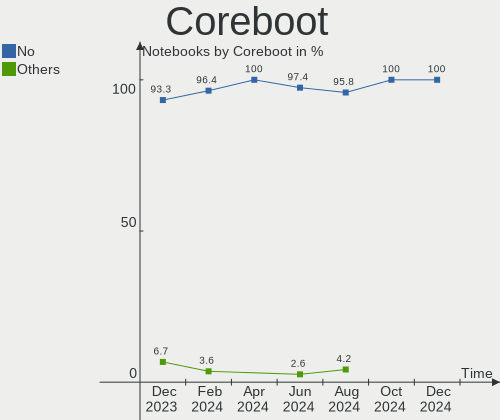
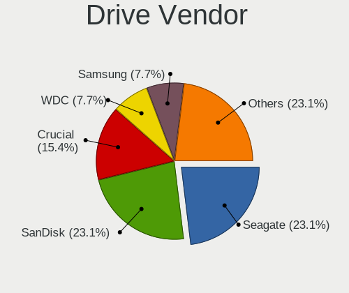
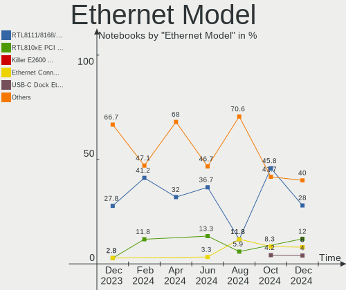
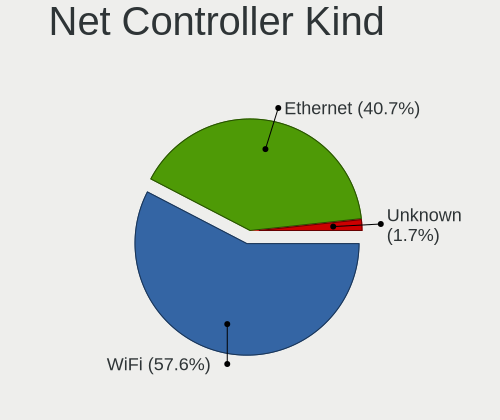
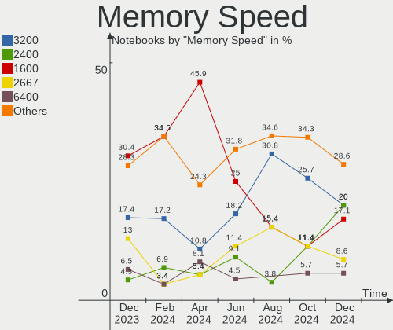

FreeBSD - Hardware Trends (Notebooks)
-------------------------------------

A project to identify most popular hardware characteristics and track their change
over time based on data collected by BSD users at https://BSD-Hardware.info.

Anyone can contribute to this report by the [hw-probe](https://github.com/linuxhw/hw-probe/blob/master/INSTALL.BSD.md) tool:

    hw-probe -all -upload

This report is for one last month. Overall report since the beginning of time: [TestCoverage](https://github.com/bsdhw/TestCoverage)

Period: Dec, 2022.

Contents
--------

* [ System ](#system)
  - [ OS                       ](#os)
  - [ OS Family                ](#os-family)
  - [ Arch                     ](#arch)
  - [ DE                       ](#de)
  - [ Display Server           ](#display-server)
  - [ Display Manager          ](#display-manager)
  - [ OS Lang                  ](#os-lang)
  - [ Boot Mode                ](#boot-mode)
  - [ Filesystem               ](#filesystem)
  - [ Part. scheme             ](#part-scheme)

* [ Board ](#board)
  - [ Vendor                   ](#vendor)
  - [ Model                    ](#model)
  - [ Model Family             ](#model-family)
  - [ MFG Year                 ](#mfg-year)
  - [ Form Factor              ](#form-factor)
  - [ Coreboot                 ](#coreboot)
  - [ RAM Size                 ](#ram-size)
  - [ RAM Used                 ](#ram-used)
  - [ Total Drives             ](#total-drives)
  - [ Has CD-ROM               ](#has-cd-rom)
  - [ Has Ethernet             ](#has-ethernet)
  - [ Has WiFi                 ](#has-wifi)
  - [ Has Bluetooth            ](#has-bluetooth)

* [ Location ](#location)
  - [ Country                  ](#country)
  - [ City                     ](#city)

* [ Drives ](#drives)
  - [ Drive Vendor             ](#drive-vendor)
  - [ Drive Model              ](#drive-model)
  - [ HDD Vendor               ](#hdd-vendor)
  - [ SSD Vendor               ](#ssd-vendor)
  - [ Drive Kind               ](#drive-kind)
  - [ Drive Connector          ](#drive-connector)
  - [ Drive Size               ](#drive-size)
  - [ Space Total              ](#space-total)
  - [ Space Used               ](#space-used)
  - [ Malfunc. Drives          ](#malfunc-drives)
  - [ Malfunc. Drive Vendor    ](#malfunc-drive-vendor)
  - [ Malfunc. HDD Vendor      ](#malfunc-hdd-vendor)
  - [ Malfunc. Drive Kind      ](#malfunc-drive-kind)
  - [ Failed Drives            ](#failed-drives)
  - [ Failed Drive Vendor      ](#failed-drive-vendor)
  - [ Drive Status             ](#drive-status)

* [ Storage controller ](#storage-controller)
  - [ Storage Vendor           ](#storage-vendor)
  - [ Storage Model            ](#storage-model)
  - [ Storage Kind             ](#storage-kind)

* [ Processor ](#processor)
  - [ CPU Vendor               ](#cpu-vendor)
  - [ CPU Model                ](#cpu-model)
  - [ CPU Model Family         ](#cpu-model-family)
  - [ CPU Cores                ](#cpu-cores)
  - [ CPU Sockets              ](#cpu-sockets)
  - [ CPU Threads              ](#cpu-threads)
  - [ CPU Microarch            ](#cpu-microarch)

* [ Graphics ](#graphics)
  - [ GPU Vendor               ](#gpu-vendor)
  - [ GPU Model                ](#gpu-model)
  - [ GPU Combo                ](#gpu-combo)
  - [ GPU Driver               ](#gpu-driver)
  - [ GPU Memory               ](#gpu-memory)

* [ Monitor ](#monitor)
  - [ Monitor Vendor           ](#monitor-vendor)
  - [ Monitor Model            ](#monitor-model)
  - [ Monitor Resolution       ](#monitor-resolution)
  - [ Monitor Diagonal         ](#monitor-diagonal)
  - [ Monitor Width            ](#monitor-width)
  - [ Aspect Ratio             ](#aspect-ratio)
  - [ Monitor Area             ](#monitor-area)
  - [ Pixel Density            ](#pixel-density)
  - [ Multiple Monitors        ](#multiple-monitors)

* [ Network ](#network)
  - [ Net Controller Vendor    ](#net-controller-vendor)
  - [ Net Controller Model     ](#net-controller-model)
  - [ Wireless Vendor          ](#wireless-vendor)
  - [ Wireless Model           ](#wireless-model)
  - [ Ethernet Vendor          ](#ethernet-vendor)
  - [ Ethernet Model           ](#ethernet-model)
  - [ Net Controller Kind      ](#net-controller-kind)
  - [ Used Controller          ](#used-controller)
  - [ NICs                     ](#nics)
  - [ IPv6                     ](#ipv6)

* [ Bluetooth ](#bluetooth)
  - [ Bluetooth Vendor         ](#bluetooth-vendor)
  - [ Bluetooth Model          ](#bluetooth-model)

* [ Sound ](#sound)
  - [ Sound Vendor             ](#sound-vendor)
  - [ Sound Model              ](#sound-model)

* [ Memory ](#memory)
  - [ Memory Vendor            ](#memory-vendor)
  - [ Memory Model             ](#memory-model)
  - [ Memory Kind              ](#memory-kind)
  - [ Memory Form Factor       ](#memory-form-factor)
  - [ Memory Size              ](#memory-size)
  - [ Memory Speed             ](#memory-speed)

* [ Printers & scanners ](#printers--scanners)
  - [ Printer Vendor           ](#printer-vendor)
  - [ Printer Model            ](#printer-model)
  - [ Scanner Vendor           ](#scanner-vendor)
  - [ Scanner Model            ](#scanner-model)

* [ Camera ](#camera)
  - [ Camera Vendor            ](#camera-vendor)
  - [ Camera Model             ](#camera-model)

* [ Security ](#security)
  - [ Fingerprint Vendor       ](#fingerprint-vendor)
  - [ Fingerprint Model        ](#fingerprint-model)
  - [ Chipcard Vendor          ](#chipcard-vendor)
  - [ Chipcard Model           ](#chipcard-model)

* [ Unsupported ](#unsupported)
  - [ Unsupported Devices      ](#unsupported-devices)
  - [ Unsupported Device Types ](#unsupported-device-types)

System
------

OS
--

Installed operating systems

| Name                 | Notebooks | Percent |
|----------------------|-----------|---------|
| FreeBSD 13.1-p5      | 16        | 59.26%  |
| FreeBSD 13.1         | 6         | 22.22%  |
| FreeBSD 14.0-CURRENT | 2         | 7.41%   |
| FreeBSD 13.1-p4      | 1         | 3.7%    |
| FreeBSD 13.1-p3      | 1         | 3.7%    |
| FreeBSD 12.4         | 1         | 3.7%    |

OS Family
---------

OS without a version

| Name    | Notebooks | Percent |
|---------|-----------|---------|
| FreeBSD | 27        | 100%    |

Arch
----

OS architecture (x86_64, i586, etc.)

| Name  | Notebooks | Percent |
|-------|-----------|---------|
| amd64 | 27        | 100%    |

DE
--

Desktop Environment

| Name    | Notebooks | Percent |
|---------|-----------|---------|
| KDE5    | 7         | 25.93%  |
| XFCE    | 5         | 18.52%  |
| i3      | 4         | 14.81%  |
| MATE    | 3         | 11.11%  |
| GNOME   | 3         | 11.11%  |
| Console | 2         | 7.41%   |
| TWM     | 1         | 3.7%    |
| LXQt    | 1         | 3.7%    |
| Fluxbox | 1         | 3.7%    |

Display Server
--------------

X11 or Wayland

| Name    | Notebooks | Percent |
|---------|-----------|---------|
| X11     | 24        | 88.89%  |
| Console | 2         | 7.41%   |
| Wayland | 1         | 3.7%    |

Display Manager
---------------

SDDM, LightDM, etc.

| Name    | Notebooks | Percent |
|---------|-----------|---------|
| SDDM    | 9         | 33.33%  |
| Console | 8         | 29.63%  |
| SLiM    | 5         | 18.52%  |
| GDM     | 3         | 11.11%  |
| XDM     | 2         | 7.41%   |

OS Lang
-------

Language

| Lang    | Notebooks | Percent |
|---------|-----------|---------|
| C       | 18        | 66.67%  |
| ru_RU   | 3         | 11.11%  |
| Unknown | 2         | 7.41%   |
| es_ES   | 1         | 3.7%    |
| en_US   | 1         | 3.7%    |
| en_BE   | 1         | 3.7%    |
| ba_RU   | 1         | 3.7%    |

Boot Mode
---------

EFI or BIOS

| Mode | Notebooks | Percent |
|------|-----------|---------|
| EFI  | 19        | 70.37%  |
| BIOS | 8         | 29.63%  |

Filesystem
----------

Type of filesystem

| Type | Notebooks | Percent |
|------|-----------|---------|
| Zfs  | 18        | 66.67%  |
| Ufs  | 9         | 33.33%  |

Part. scheme
------------

Scheme of partitioning

| Type | Notebooks | Percent |
|------|-----------|---------|
| GPT  | 27        | 100%    |

Board
-----

Vendor
------

Motherboard manufacturer

| Name             | Notebooks | Percent |
|------------------|-----------|---------|
| Lenovo           | 9         | 33.33%  |
| Dell             | 5         | 18.52%  |
| Google           | 3         | 11.11%  |
| HUAWEI           | 2         | 7.41%   |
| Hewlett-Packard  | 2         | 7.41%   |
| ASUSTek Computer | 2         | 7.41%   |
| Acer             | 2         | 7.41%   |
| Timi             | 1         | 3.7%    |
| Alienware        | 1         | 3.7%    |

Model
-----

Motherboard model

| Name                                        | Notebooks | Percent |
|---------------------------------------------|-----------|---------|
| Acer Swift SF114-34                         | 2         | 7.41%   |
| Timi Redmi Book Pro 14 2022                 | 1         | 3.7%    |
| Lenovo ThinkPad X250 20CLS5BU00             | 1         | 3.7%    |
| Lenovo ThinkPad X1 Carbon Gen 10 21CB000DUS | 1         | 3.7%    |
| Lenovo ThinkPad T530 2392AQU                | 1         | 3.7%    |
| Lenovo ThinkPad T440p 20AWS0Y40T            | 1         | 3.7%    |
| Lenovo ThinkPad A485 20MVS0LG00             | 1         | 3.7%    |
| Lenovo Legion Y530-15ICH 81FV               | 1         | 3.7%    |
| Lenovo IdeaPad L340-17IWL 81M0              | 1         | 3.7%    |
| Lenovo IdeaPad 330-15IKB 81DE               | 1         | 3.7%    |
| Lenovo B50-80 80EW                          | 1         | 3.7%    |
| HUAWEI KLVL-WXXW                            | 1         | 3.7%    |
| HUAWEI CREM-WXX9                            | 1         | 3.7%    |
| HP ProBook 440 G8 Notebook PC               | 1         | 3.7%    |
| HP EliteBook 8570p                          | 1         | 3.7%    |
| Google Peppy                                | 1         | 3.7%    |
| Google Lick                                 | 1         | 3.7%    |
| Google Lars                                 | 1         | 3.7%    |
| Dell Vostro 15-3568                         | 1         | 3.7%    |
| Dell Vostro 1400                            | 1         | 3.7%    |
| Dell Precision M4800                        | 1         | 3.7%    |
| Dell Latitude E6430                         | 1         | 3.7%    |
| Dell Latitude 5400                          | 1         | 3.7%    |
| ASUS ZenBook UX325UA_UM325UA                | 1         | 3.7%    |
| ASUS K50IN                                  | 1         | 3.7%    |
| Alienware m15 R4                            | 1         | 3.7%    |

Model Family
------------

Motherboard model prefix

| Name             | Notebooks | Percent |
|------------------|-----------|---------|
| Lenovo ThinkPad  | 5         | 18.52%  |
| Lenovo IdeaPad   | 2         | 7.41%   |
| Dell Vostro      | 2         | 7.41%   |
| Dell Latitude    | 2         | 7.41%   |
| Acer Swift       | 2         | 7.41%   |
| Timi Redmi       | 1         | 3.7%    |
| Lenovo Legion    | 1         | 3.7%    |
| Lenovo B50-80    | 1         | 3.7%    |
| HUAWEI KLVL-WXXW | 1         | 3.7%    |
| HUAWEI CREM-WXX9 | 1         | 3.7%    |
| HP ProBook       | 1         | 3.7%    |
| HP EliteBook     | 1         | 3.7%    |
| Google Peppy     | 1         | 3.7%    |
| Google Lick      | 1         | 3.7%    |
| Google Lars      | 1         | 3.7%    |
| Dell Precision   | 1         | 3.7%    |
| ASUS ZenBook     | 1         | 3.7%    |
| ASUS K50IN       | 1         | 3.7%    |
| Alienware m15    | 1         | 3.7%    |

MFG Year
--------

Motherboard manufacture year

| Year | Notebooks | Percent |
|------|-----------|---------|
| 2021 | 7         | 25.93%  |
| 2022 | 5         | 18.52%  |
| 2020 | 3         | 11.11%  |
| 2019 | 3         | 11.11%  |
| 2015 | 3         | 11.11%  |
| 2013 | 3         | 11.11%  |
| 2016 | 1         | 3.7%    |
| 2011 | 1         | 3.7%    |
| 2008 | 1         | 3.7%    |

Form Factor
-----------

Physical design of the computer

| Name     | Notebooks | Percent |
|----------|-----------|---------|
| Notebook | 27        | 100%    |

Coreboot
--------

Have coreboot on board

| Used | Notebooks | Percent |
|------|-----------|---------|
| No   | 24        | 88.89%  |
| Yes  | 3         | 11.11%  |

RAM Size
--------

Total RAM memory

| Size in GB | Notebooks | Percent |
|------------|-----------|---------|
| 16.01-24.0 | 9         | 33.33%  |
| 8.01-16.0  | 9         | 33.33%  |
| 4.01-8.0   | 7         | 25.93%  |
| 32.01-64.0 | 2         | 7.41%   |

RAM Used
--------

Used RAM memory

| Used GB  | Notebooks | Percent |
|----------|-----------|---------|
| 0.01-0.5 | 13        | 48.15%  |
| 1.01-2.0 | 7         | 25.93%  |
| 0.51-1.0 | 7         | 25.93%  |

Total Drives
------------

Number of drives on board

| Drives | Notebooks | Percent |
|--------|-----------|---------|
| 1      | 21        | 77.78%  |
| 2      | 4         | 14.81%  |
| 0      | 2         | 7.41%   |

Has CD-ROM
----------

Has CD-ROM on board

| Presented | Notebooks | Percent |
|-----------|-----------|---------|
| No        | 21        | 77.78%  |
| Yes       | 6         | 22.22%  |

Has Ethernet
------------

Has Ethernet on board

| Presented | Notebooks | Percent |
|-----------|-----------|---------|
| Yes       | 17        | 62.96%  |
| No        | 10        | 37.04%  |

Has WiFi
--------

Has WiFi module

| Presented | Notebooks | Percent |
|-----------|-----------|---------|
| Yes       | 25        | 92.59%  |
| No        | 2         | 7.41%   |

Has Bluetooth
-------------

Has Bluetooth module

| Presented | Notebooks | Percent |
|-----------|-----------|---------|
| Yes       | 21        | 77.78%  |
| No        | 6         | 22.22%  |

Location
--------

Country
-------

Geographic location (country)

| Country     | Notebooks | Percent |
|-------------|-----------|---------|
| USA         | 7         | 25.93%  |
| Russia      | 6         | 22.22%  |
| Spain       | 2         | 7.41%   |
| UK          | 1         | 3.7%    |
| Sweden      | 1         | 3.7%    |
| Slovenia    | 1         | 3.7%    |
| Romania     | 1         | 3.7%    |
| Poland      | 1         | 3.7%    |
| Netherlands | 1         | 3.7%    |
| Lithuania   | 1         | 3.7%    |
| Guatemala   | 1         | 3.7%    |
| Germany     | 1         | 3.7%    |
| France      | 1         | 3.7%    |
| Canada      | 1         | 3.7%    |
| Austria     | 1         | 3.7%    |

City
----

Geographic location (city)

| City           | Notebooks | Percent |
|----------------|-----------|---------|
| Moscow         | 5         | 18.52%  |
| Vilnius        | 1         | 3.7%    |
| Vienna         | 1         | 3.7%    |
| Trebnje        | 1         | 3.7%    |
| San Jose       | 1         | 3.7%    |
| Raleigh        | 1         | 3.7%    |
| Perm           | 1         | 3.7%    |
| North York     | 1         | 3.7%    |
| Navalcarnero   | 1         | 3.7%    |
| Henrico        | 1         | 3.7%    |
| Guatemala City | 1         | 3.7%    |
| Girard         | 1         | 3.7%    |
| Gerzat         | 1         | 3.7%    |
| Falkenstein    | 1         | 3.7%    |
| Faergelanda    | 1         | 3.7%    |
| Durham         | 1         | 3.7%    |
| Carrollton     | 1         | 3.7%    |
| Brooklyn       | 1         | 3.7%    |
| Bolszewo       | 1         | 3.7%    |
| Bognor Regis   | 1         | 3.7%    |
| Barcelona      | 1         | 3.7%    |
| Amsterdam      | 1         | 3.7%    |
| Alexandria     | 1         | 3.7%    |

Drives
------

Drive Vendor
------------

Hard drive vendors

| Vendor              | Notebooks | Drives | Percent |
|---------------------|-----------|--------|---------|
| WDC                 | 5         | 5      | 17.86%  |
| Samsung Electronics | 5         | 6      | 17.86%  |
| Kingston            | 4         | 4      | 14.29%  |
| Toshiba             | 3         | 3      | 10.71%  |
| Transcend           | 1         | 1      | 3.57%   |
| SSSTC               | 1         | 1      | 3.57%   |
| SK hynix            | 1         | 1      | 3.57%   |
| PNY                 | 1         | 1      | 3.57%   |
| Phison              | 1         | 1      | 3.57%   |
| OCZ                 | 1         | 1      | 3.57%   |
| Lexar               | 1         | 1      | 3.57%   |
| KIOXIA              | 1         | 1      | 3.57%   |
| HGST                | 1         | 1      | 3.57%   |
| Crucial             | 1         | 1      | 3.57%   |
| A-DATA Technology   | 1         | 1      | 3.57%   |

Drive Model
-----------

Hard drive models

| Model                                | Notebooks | Percent |
|--------------------------------------|-----------|---------|
| Kingston SA400S37120G 120GB          | 2         | 7.14%   |
| WDC WD10SPZX-00Z10T0 1TB             | 1         | 3.57%   |
| WDC PC SN730 SDBPNTY-512G            | 1         | 3.57%   |
| WDC PC SN530 SDBPNPZ-512G-1014 512GB | 1         | 3.57%   |
| WDC PC SN530 SDBPNPZ-256G-1014 256GB | 1         | 3.57%   |
| WDC PC SN520 NVMe 512GB              | 1         | 3.57%   |
| Transcend TS256GMTS430S 256GB        | 1         | 3.57%   |
| Toshiba MQ01ABF050 500GB             | 1         | 3.57%   |
| Toshiba MQ01ABD100 1TB               | 1         | 3.57%   |
| Toshiba MK1637GSX 160GB              | 1         | 3.57%   |
| SSSTC CL1-8D256-HP 256GB             | 1         | 3.57%   |
| SK hynix HFM512GD3JX013N 512GB       | 1         | 3.57%   |
| Samsung SSD 870 QVO 2TB              | 1         | 3.57%   |
| Samsung PM9A1 NVMe 512GB             | 1         | 3.57%   |
| Samsung MZVLB256HAHQ-000L7 256GB     | 1         | 3.57%   |
| Samsung MZVL21T0HCLR-00BL7 1TB       | 1         | 3.57%   |
| Samsung MZNLN128HAHQ-000L2 128GB     | 1         | 3.57%   |
| PNY CS900 1TB SSD                    | 1         | 3.57%   |
| Phison 311CD0512GB                   | 1         | 3.57%   |
| OCZ AGILITY3 64GB                    | 1         | 3.57%   |
| Lexar 256GB SSD                      | 1         | 3.57%   |
| KIOXIA KBG50ZNV512G 512GB            | 1         | 3.57%   |
| Kingston SNS4151S316GD 16GB          | 1         | 3.57%   |
| Kingston SA400S37240G 240GB          | 1         | 3.57%   |
| HGST HTS721010A9E630 1TB             | 1         | 3.57%   |
| Crucial CT1000MX500SSD1 1TB          | 1         | 3.57%   |
| A-DATA SP900 128GB                   | 1         | 3.57%   |

HDD Vendor
----------

Hard disk drive vendors

| Vendor  | Notebooks | Drives | Percent |
|---------|-----------|--------|---------|
| Toshiba | 3         | 3      | 60%     |
| WDC     | 1         | 1      | 20%     |
| HGST    | 1         | 1      | 20%     |

SSD Vendor
----------

Solid state drive vendors

| Vendor              | Notebooks | Drives | Percent |
|---------------------|-----------|--------|---------|
| Kingston            | 4         | 4      | 33.33%  |
| Samsung Electronics | 2         | 2      | 16.67%  |
| Transcend           | 1         | 1      | 8.33%   |
| PNY                 | 1         | 1      | 8.33%   |
| OCZ                 | 1         | 1      | 8.33%   |
| Lexar               | 1         | 1      | 8.33%   |
| Crucial             | 1         | 1      | 8.33%   |
| A-DATA Technology   | 1         | 1      | 8.33%   |

Drive Kind
----------

HDD or SSD

| Kind | Notebooks | Drives | Percent |
|------|-----------|--------|---------|
| NVMe | 11        | 12     | 42.31%  |
| SSD  | 11        | 12     | 42.31%  |
| HDD  | 4         | 5      | 15.38%  |

Drive Connector
---------------

SATA, SAS, NVMe, etc.

| Type | Notebooks | Drives | Percent |
|------|-----------|--------|---------|
| SATA | 14        | 17     | 56%     |
| NVMe | 11        | 12     | 44%     |

Drive Size
----------

Size of hard drive

| Size in TB | Notebooks | Drives | Percent |
|------------|-----------|--------|---------|
| 0.01-0.5   | 11        | 11     | 64.71%  |
| 0.51-1.0   | 5         | 5      | 29.41%  |
| 1.01-2.0   | 1         | 1      | 5.88%   |

Space Total
-----------

Amount of disk space available on the file system

| Size in GB | Notebooks | Percent |
|------------|-----------|---------|
| 101-250    | 9         | 33.33%  |
| 251-500    | 7         | 25.93%  |
| 501-1000   | 4         | 14.81%  |
| 21-50      | 3         | 11.11%  |
| 51-100     | 2         | 7.41%   |
| 1001-2000  | 1         | 3.7%    |
| 1-20       | 1         | 3.7%    |

Space Used
----------

Amount of used disk space

| Used GB | Notebooks | Percent |
|---------|-----------|---------|
| 1-20    | 20        | 74.07%  |
| 21-50   | 3         | 11.11%  |
| 51-100  | 3         | 11.11%  |
| 251-500 | 1         | 3.7%    |

Malfunc. Drives
---------------

Drive models with a malfunction

| Model                       | Notebooks | Drives | Percent |
|-----------------------------|-----------|--------|---------|
| Toshiba MK1637GSX 160GB     | 1         | 1      | 25%     |
| OCZ AGILITY3 64GB           | 1         | 1      | 25%     |
| Kingston SNS4151S316GD 16GB | 1         | 1      | 25%     |
| HGST HTS721010A9E630 1TB    | 1         | 1      | 25%     |

Malfunc. Drive Vendor
---------------------

Vendors of faulty drives

| Vendor   | Notebooks | Drives | Percent |
|----------|-----------|--------|---------|
| Toshiba  | 1         | 1      | 25%     |
| OCZ      | 1         | 1      | 25%     |
| Kingston | 1         | 1      | 25%     |
| HGST     | 1         | 1      | 25%     |

Malfunc. HDD Vendor
-------------------

Vendors of faulty HDD drives

| Vendor  | Notebooks | Drives | Percent |
|---------|-----------|--------|---------|
| Toshiba | 1         | 1      | 50%     |
| HGST    | 1         | 1      | 50%     |

Malfunc. Drive Kind
-------------------

Kinds of faulty drives

| Kind | Notebooks | Drives | Percent |
|------|-----------|--------|---------|
| SSD  | 2         | 2      | 50%     |
| HDD  | 2         | 2      | 50%     |

Failed Drives
-------------

Failed drive models

Zero info for selected period =(

Failed Drive Vendor
-------------------

Failed drive vendors

Zero info for selected period =(

Drive Status
------------

Number of failed and malfunc. drives

| Status  | Notebooks | Drives | Percent |
|---------|-----------|--------|---------|
| Works   | 23        | 25     | 85.19%  |
| Malfunc | 4         | 4      | 14.81%  |

Storage controller
------------------

Storage Vendor
--------------

Storage controller vendors

| Vendor                         | Notebooks | Percent |
|--------------------------------|-----------|---------|
| Intel                          | 15        | 51.72%  |
| SanDisk                        | 4         | 13.79%  |
| Samsung Electronics            | 3         | 10.34%  |
| AMD                            | 2         | 6.9%    |
| Solid State Storage Technology | 1         | 3.45%   |
| SK hynix                       | 1         | 3.45%   |
| Phison Electronics             | 1         | 3.45%   |
| Nvidia                         | 1         | 3.45%   |
| KIOXIA                         | 1         | 3.45%   |

Storage Model
-------------

Storage controller models

| Model                                                                          | Notebooks | Percent |
|--------------------------------------------------------------------------------|-----------|---------|
| Intel 7 Series Chipset Family 6-port SATA Controller [AHCI mode]               | 3         | 10%     |
| SanDisk WD Blue SN550 NVMe SSD                                                 | 2         | 6.67%   |
| Samsung NVMe SSD Controller PM9A1/PM9A3/980PRO                                 | 2         | 6.67%   |
| Intel Wildcat Point-LP SATA Controller [AHCI Mode]                             | 2         | 6.67%   |
| Intel Sunrise Point-LP SATA Controller [AHCI mode]                             | 2         | 6.67%   |
| Intel Cannon Point-LP SATA Controller [AHCI Mode]                              | 2         | 6.67%   |
| AMD FCH SATA Controller [AHCI mode]                                            | 2         | 6.67%   |
| Unknown                                                                        | 2         | 6.67%   |
| SK hynix Gold P31/PC711 NVMe Solid State Drive                                 | 1         | 3.33%   |
| SanDisk WD Black SN750 / PC SN730 NVMe SSD                                     | 1         | 3.33%   |
| SanDisk PC SN520 NVMe SSD                                                      | 1         | 3.33%   |
| Samsung NVMe SSD Controller SM981/PM981/PM983                                  | 1         | 3.33%   |
| Phison PS5013 E13 NVMe Controller                                              | 1         | 3.33%   |
| Nvidia MCP79 AHCI Controller                                                   | 1         | 3.33%   |
| Intel Volume Management Device NVMe RAID Controller                            | 1         | 3.33%   |
| Intel Cannon Lake Mobile PCH SATA AHCI Controller                              | 1         | 3.33%   |
| Intel 82801HM/HEM (ICH8M/ICH8M-E) SATA Controller [AHCI mode]                  | 1         | 3.33%   |
| Intel 82801HM/HEM (ICH8M/ICH8M-E) IDE Controller                               | 1         | 3.33%   |
| Intel 82801 Mobile SATA Controller [RAID mode]                                 | 1         | 3.33%   |
| Intel 8 Series/C220 Series Chipset Family 6-port SATA Controller 1 [AHCI mode] | 1         | 3.33%   |
| Intel 8 Series SATA Controller 1 [AHCI mode]                                   | 1         | 3.33%   |

Storage Kind
------------

Kind of storage controller (IDE, SATA, NVMe, SAS, ...)

| Kind | Notebooks | Percent |
|------|-----------|---------|
| SATA | 16        | 53.33%  |
| NVMe | 11        | 36.67%  |
| RAID | 2         | 6.67%   |
| IDE  | 1         | 3.33%   |

Processor
---------

CPU Vendor
----------

Processor vendors

| Vendor | Notebooks | Percent |
|--------|-----------|---------|
| Intel  | 22        | 81.48%  |
| AMD    | 5         | 18.52%  |

CPU Model
---------

Processor models

| Model                                           | Notebooks | Percent |
|-------------------------------------------------|-----------|---------|
| Intel Pentium Silver N6000 @ 1.10GHz            | 1         | 3.7%    |
| Intel Pentium Dual-Core CPU T4200 @ 2.00GHz     | 1         | 3.7%    |
| Intel Core i9-10980HK CPU @ 2.40GHz             | 1         | 3.7%    |
| Intel Core i7-8750H CPU @ 2.20GHz               | 1         | 3.7%    |
| Intel Core i7-8665U CPU @ 1.90GHz               | 1         | 3.7%    |
| Intel Core i7-4810MQ CPU @ 2.80GHz              | 1         | 3.7%    |
| Intel Core i7-4712MQ CPU @ 2.30GHz              | 1         | 3.7%    |
| Intel Core i7-3520M CPU @ 2.90GHz               | 1         | 3.7%    |
| Intel Core i5-8265U CPU @ 1.60GHz               | 1         | 3.7%    |
| Intel Core i5-8250U CPU @ 1.60GHz               | 1         | 3.7%    |
| Intel Core i5-5300U CPU @ 2.30GHz               | 1         | 3.7%    |
| Intel Core i5-5200U CPU @ 2.20GHz               | 1         | 3.7%    |
| Intel Core i5-3320M CPU @ 2.60GHz               | 1         | 3.7%    |
| Intel Core i5-3230M CPU @ 2.60GHz               | 1         | 3.7%    |
| Intel Core i3-6006U CPU @ 2.00GHz               | 1         | 3.7%    |
| Intel Core 2 Duo                                | 1         | 3.7%    |
| Intel Celeron N4500 @ 1.10GHz                   | 1         | 3.7%    |
| Intel Celeron N4020 CPU @ 1.10GHz               | 1         | 3.7%    |
| Intel Celeron CPU 3855U @ 1.60GHz               | 1         | 3.7%    |
| Intel Celeron 2957U @ 1.40GHz                   | 1         | 3.7%    |
| Intel 12th Gen Core i7-1280P                    | 1         | 3.7%    |
| Intel 11th Gen Core i5-1135G7 @ 2.40GHz         | 1         | 3.7%    |
| AMD Ryzen 7 6800H with Radeon Graphics          | 1         | 3.7%    |
| AMD Ryzen 7 5800H with Radeon Graphics          | 1         | 3.7%    |
| AMD Ryzen 7 5700U with Radeon Graphics          | 1         | 3.7%    |
| AMD Ryzen 5 PRO 2500U w/ Radeon Vega Mobile Gfx | 1         | 3.7%    |
| AMD Ryzen 5 5500U with Radeon Graphics          | 1         | 3.7%    |

CPU Model Family
----------------

Processor model prefix

| Model                   | Notebooks | Percent |
|-------------------------|-----------|---------|
| Intel Core i5           | 6         | 22.22%  |
| Intel Core i7           | 5         | 18.52%  |
| Intel Celeron           | 4         | 14.81%  |
| AMD Ryzen 7             | 3         | 11.11%  |
| Other                   | 2         | 7.41%   |
| Intel Pentium Silver    | 1         | 3.7%    |
| Intel Pentium Dual-Core | 1         | 3.7%    |
| Intel Core i9           | 1         | 3.7%    |
| Intel Core i3           | 1         | 3.7%    |
| Intel Core 2 Duo        | 1         | 3.7%    |
| AMD Ryzen 5 PRO         | 1         | 3.7%    |
| AMD Ryzen 5             | 1         | 3.7%    |

CPU Cores
---------

Number of processor cores

| Number | Notebooks | Percent |
|--------|-----------|---------|
| 2      | 12        | 44.44%  |
| 4      | 7         | 25.93%  |
| 16     | 3         | 11.11%  |
| 8      | 2         | 7.41%   |
| 12     | 1         | 3.7%    |
| 10     | 1         | 3.7%    |
| 6      | 1         | 3.7%    |

CPU Sockets
-----------

Number of sockets

| Number | Notebooks | Percent |
|--------|-----------|---------|
| 1      | 27        | 100%    |

CPU Threads
-----------

Threads per core (Hyper-Threading)

| Number | Notebooks | Percent |
|--------|-----------|---------|
| 2      | 15        | 55.56%  |
| 1      | 12        | 44.44%  |

CPU Microarch
-------------

Microarchitecture

| Name          | Notebooks | Percent |
|---------------|-----------|---------|
| Unknown       | 6         | 22.22%  |
| KabyLake      | 4         | 14.81%  |
| IvyBridge     | 3         | 11.11%  |
| Haswell       | 3         | 11.11%  |
| Skylake       | 2         | 7.41%   |
| Penryn        | 2         | 7.41%   |
| Broadwell     | 2         | 7.41%   |
| Zen 3         | 1         | 3.7%    |
| Zen           | 1         | 3.7%    |
| TigerLake     | 1         | 3.7%    |
| Goldmont plus | 1         | 3.7%    |
| CometLake     | 1         | 3.7%    |

Graphics
--------

GPU Vendor
----------

Vendors of graphics cards

| Vendor | Notebooks | Percent |
|--------|-----------|---------|
| Intel  | 20        | 64.52%  |
| AMD    | 7         | 22.58%  |
| Nvidia | 4         | 12.9%   |

GPU Model
---------

Graphics card models

| Model                                                               | Notebooks | Percent |
|---------------------------------------------------------------------|-----------|---------|
| Intel WhiskeyLake-U GT2 [UHD Graphics 620]                          | 2         | 6.25%   |
| Intel JasperLake [UHD Graphics]                                     | 2         | 6.25%   |
| Intel HD Graphics 5500                                              | 2         | 6.25%   |
| Intel 4th Gen Core Processor Integrated Graphics Controller         | 2         | 6.25%   |
| Intel 3rd Gen Core processor Graphics Controller                    | 2         | 6.25%   |
| AMD Lucienne                                                        | 2         | 6.25%   |
| Nvidia GP108M [GeForce MX230]                                       | 1         | 3.13%   |
| Nvidia GP107M [GeForce GTX 1050 Ti Mobile]                          | 1         | 3.13%   |
| Nvidia GA104M [GeForce RTX 3080 Mobile / Max-Q 8GB/16GB]            | 1         | 3.13%   |
| Nvidia C79 [GeForce G102M]                                          | 1         | 3.13%   |
| Intel UHD Graphics 620                                              | 1         | 3.13%   |
| Intel TigerLake-LP GT2 [Iris Xe Graphics]                           | 1         | 3.13%   |
| Intel Skylake GT2 [HD Graphics 520]                                 | 1         | 3.13%   |
| Intel Mobile GM965/GL960 Integrated Graphics Controller (secondary) | 1         | 3.13%   |
| Intel Mobile GM965/GL960 Integrated Graphics Controller (primary)   | 1         | 3.13%   |
| Intel HD Graphics 510                                               | 1         | 3.13%   |
| Intel Haswell-ULT Integrated Graphics Controller                    | 1         | 3.13%   |
| Intel GeminiLake [UHD Graphics 600]                                 | 1         | 3.13%   |
| Intel CometLake-H GT2 [UHD Graphics]                                | 1         | 3.13%   |
| Intel CoffeeLake-H GT2 [UHD Graphics 630]                           | 1         | 3.13%   |
| Intel Alder Lake-P Integrated Graphics Controller                   | 1         | 3.13%   |
| AMD Venus XT [Radeon HD 8870M / R9 M270X/M370X]                     | 1         | 3.13%   |
| AMD Thames [Radeon HD 7550M/7570M/7650M]                            | 1         | 3.13%   |
| AMD Rembrandt [Radeon 680M]                                         | 1         | 3.13%   |
| AMD Raven Ridge [Radeon Vega Series / Radeon Vega Mobile Series]    | 1         | 3.13%   |
| AMD Cezanne [Radeon Vega Series / Radeon Vega Mobile Series]        | 1         | 3.13%   |

GPU Combo
---------

Combinations of graphics cards

| Name           | Notebooks | Percent |
|----------------|-----------|---------|
| 1 x Intel      | 15        | 55.56%  |
| 1 x AMD        | 6         | 22.22%  |
| Intel + Nvidia | 3         | 11.11%  |
| 2 x Intel      | 1         | 3.7%    |
| 1 x Nvidia     | 1         | 3.7%    |
| Intel + AMD    | 1         | 3.7%    |

GPU Driver
----------

Free vs proprietary

| Driver      | Notebooks | Percent |
|-------------|-----------|---------|
| Free        | 25        | 92.59%  |
| Proprietary | 2         | 7.41%   |

GPU Memory
----------

Total video memory

| Size in GB | Notebooks | Percent |
|------------|-----------|---------|
| Unknown    | 21        | 77.78%  |
| 0.01-0.5   | 4         | 14.81%  |
| 7.01-8.0   | 1         | 3.7%    |
| 0.51-1.0   | 1         | 3.7%    |

Monitor
-------

Monitor Vendor
--------------

Monitor vendors

| Vendor              | Notebooks | Percent |
|---------------------|-----------|---------|
| LG Display          | 5         | 21.74%  |
| BOE                 | 4         | 17.39%  |
| Chimei Innolux      | 3         | 13.04%  |
| AU Optronics        | 3         | 13.04%  |
| Samsung Electronics | 2         | 8.7%    |
| Philips             | 1         | 4.35%   |
| Mi                  | 1         | 4.35%   |
| Lenovo              | 1         | 4.35%   |
| Hewlett-Packard     | 1         | 4.35%   |
| BenQ                | 1         | 4.35%   |
| ASUSTek Computer    | 1         | 4.35%   |

Monitor Model
-------------

Monitor models

| Model                                                                 | Notebooks | Percent |
|-----------------------------------------------------------------------|-----------|---------|
| Samsung Electronics LCD Monitor SEC3157 1280x800 300x190mm 14.0-inch  | 1         | 4.35%   |
| Samsung Electronics LCD Monitor SDC4158 1920x1080 290x170mm 13.2-inch | 1         | 4.35%   |
| Philips LCD Monitor PHL08C3 1920x1080 600x340mm 27.2-inch             | 1         | 4.35%   |
| Mi 27 NFGL XMIB004 1920x1080 600x330mm 27.0-inch                      | 1         | 4.35%   |
| LG Display LCD Monitor LGD066E 1920x1080 340x190mm 15.3-inch          | 1         | 4.35%   |
| LG Display LCD Monitor LGD046F 1920x1080 340x190mm 15.3-inch          | 1         | 4.35%   |
| LG Display LCD Monitor LGD03ED 1366x768 280x160mm 12.7-inch           | 1         | 4.35%   |
| LG Display LCD Monitor LGD033E 1366x768 310x170mm 13.9-inch           | 1         | 4.35%   |
| LG Display LCD Monitor LGD0258 1600x900 350x190mm 15.7-inch           | 1         | 4.35%   |
| Lenovo LCD Monitor LEN40B1 1600x900 340x190mm 15.3-inch               | 1         | 4.35%   |
| Hewlett-Packard 32f HPN365B 1920x1080 700x400mm 31.7-inch             | 1         | 4.35%   |
| Chimei Innolux LCD Monitor CMN15DB 1366x768 340x190mm 15.3-inch       | 1         | 4.35%   |
| Chimei Innolux LCD Monitor CMN15BD 1366x768 340x190mm 15.3-inch       | 1         | 4.35%   |
| Chimei Innolux LCD Monitor CMN14D4 1920x1080 310x170mm 13.9-inch      | 1         | 4.35%   |
| BOE LCD Monitor BOE092F 2520x1680 340x230mm 16.2-inch                 | 1         | 4.35%   |
| BOE LCD Monitor BOE0893 2160x1440 300x200mm 14.2-inch                 | 1         | 4.35%   |
| BOE LCD Monitor BOE0731 1366x768 260x140mm 11.6-inch                  | 1         | 4.35%   |
| BOE LCD Monitor BOE0674 1366x768 340x190mm 15.3-inch                  | 1         | 4.35%   |
| BenQ GL2450H BNQ78A7 1920x1080 530x300mm 24.0-inch                    | 1         | 4.35%   |
| AU Optronics LCD Monitor AUO463D 1920x1080 310x170mm 13.9-inch        | 1         | 4.35%   |
| AU Optronics LCD Monitor AUO219E 1600x900 380x210mm 17.1-inch         | 1         | 4.35%   |
| AU Optronics LCD Monitor AUO20EC 1366x768 340x190mm 15.3-inch         | 1         | 4.35%   |
| ASUSTek Computer PA278QV AUS2700 2560x1440 600x340mm 27.2-inch        | 1         | 4.35%   |

Monitor Resolution
------------------

Monitor screen resolution

| Resolution      | Notebooks | Percent |
|-----------------|-----------|---------|
| 1920x1080 (FHD) | 8         | 36.36%  |
| 1366x768 (WXGA) | 7         | 31.82%  |
| 1600x900 (HD+)  | 3         | 13.64%  |
| 2560x1440 (QHD) | 1         | 4.55%   |
| 2520x1680       | 1         | 4.55%   |
| 2160x1440       | 1         | 4.55%   |
| 1280x800 (WXGA) | 1         | 4.55%   |

Monitor Diagonal
----------------

Diagonal size in inches

| Inches | Notebooks | Percent |
|--------|-----------|---------|
| 15     | 8         | 34.78%  |
| 13     | 4         | 17.39%  |
| 27     | 3         | 13.04%  |
| 14     | 2         | 8.7%    |
| 31     | 1         | 4.35%   |
| 24     | 1         | 4.35%   |
| 17     | 1         | 4.35%   |
| 16     | 1         | 4.35%   |
| 12     | 1         | 4.35%   |
| 11     | 1         | 4.35%   |

Monitor Width
-------------

Physical width

| Width in mm | Notebooks | Percent |
|-------------|-----------|---------|
| 301-350     | 12        | 52.17%  |
| 201-300     | 5         | 21.74%  |
| 501-600     | 4         | 17.39%  |
| 601-700     | 1         | 4.35%   |
| 351-400     | 1         | 4.35%   |

Aspect Ratio
------------

Proportional relationship between the width and the height

| Ratio | Notebooks | Percent |
|-------|-----------|---------|
| 16/9  | 15        | 83.33%  |
| 3/2   | 2         | 11.11%  |
| 16/10 | 1         | 5.56%   |

Monitor Area
------------

Area in inch²

| Area in inch² | Notebooks | Percent |
|----------------|-----------|---------|
| 91-100         | 6         | 26.09%  |
| 81-90          | 4         | 17.39%  |
| 301-350        | 3         | 13.04%  |
| 101-110        | 3         | 13.04%  |
| 121-130        | 2         | 8.7%    |
| 71-80          | 1         | 4.35%   |
| 61-70          | 1         | 4.35%   |
| 51-60          | 1         | 4.35%   |
| 351-500        | 1         | 4.35%   |
| 201-250        | 1         | 4.35%   |

Pixel Density
-------------

Pixels per inch

| Density | Notebooks | Percent |
|---------|-----------|---------|
| 101-120 | 10        | 43.48%  |
| 121-160 | 6         | 26.09%  |
| 51-100  | 4         | 17.39%  |
| 161-240 | 3         | 13.04%  |

Multiple Monitors
-----------------

Total monitors connected

| Total | Notebooks | Percent |
|-------|-----------|---------|
| 1     | 13        | 48.15%  |
| 0     | 9         | 33.33%  |
| 2     | 5         | 18.52%  |

Network
-------

Net Controller Vendor
---------------------

Controller vendors

| Vendor                | Notebooks | Percent |
|-----------------------|-----------|---------|
| Intel                 | 16        | 41.03%  |
| Realtek Semiconductor | 11        | 28.21%  |
| Qualcomm Atheros      | 5         | 12.82%  |
| Broadcom              | 2         | 5.13%   |
| Xiaomi                | 1         | 2.56%   |
| Ralink Technology     | 1         | 2.56%   |
| Hewlett-Packard       | 1         | 2.56%   |
| Google                | 1         | 2.56%   |
| Edimax Technology     | 1         | 2.56%   |

Net Controller Model
--------------------

Controller models

| Model                                                                            | Notebooks | Percent |
|----------------------------------------------------------------------------------|-----------|---------|
| Realtek RTL8111/8168/8411 PCI Express Gigabit Ethernet Controller                | 8         | 16.67%  |
| Intel 82579LM Gigabit Network Connection (Lewisville)                            | 3         | 6.25%   |
| Realtek RTL8822CE 802.11ac PCIe Wireless Network Adapter                         | 2         | 4.17%   |
| Qualcomm Atheros QCA9377 802.11ac Wireless Network Adapter                       | 2         | 4.17%   |
| Intel Wireless 7265                                                              | 2         | 4.17%   |
| Intel Wi-Fi 6 AX201 160MHz                                                       | 2         | 4.17%   |
| Intel Ethernet Connection I217-LM                                                | 2         | 4.17%   |
| Intel Centrino Advanced-N 6205 [Taylor Peak]                                     | 2         | 4.17%   |
| Xiaomi Mi/Redmi series (RNDIS + ADB)                                             | 1         | 2.08%   |
| Realtek RTL8822BE 802.11a/b/g/n/ac WiFi adapter                                  | 1         | 2.08%   |
| Realtek RTL8821CE 802.11ac PCIe Wireless Network Adapter                         | 1         | 2.08%   |
| Realtek RTL8723BE PCIe Wireless Network Adapter                                  | 1         | 2.08%   |
| Ralink RT5370 Wireless Adapter                                                   | 1         | 2.08%   |
| Qualcomm Atheros AR9462 Wireless Network Adapter                                 | 1         | 2.08%   |
| Qualcomm Atheros AR9287 Wireless Network Adapter (PCI-Express)                   | 1         | 2.08%   |
| Qualcomm Atheros AR9285 Wireless Network Adapter (PCI-Express)                   | 1         | 2.08%   |
| Intel Wireless-AC 9260                                                           | 1         | 2.08%   |
| Intel Wireless 8265 / 8275                                                       | 1         | 2.08%   |
| Intel Wireless 7260                                                              | 1         | 2.08%   |
| Intel Wi-Fi 6 AX201                                                              | 1         | 2.08%   |
| Intel Wi-Fi 6 AX200                                                              | 1         | 2.08%   |
| Intel I225-K2                                                                    | 1         | 2.08%   |
| Intel Gemini Lake PCH CNVi WiFi                                                  | 1         | 2.08%   |
| Intel Ethernet Connection (6) I219-LM                                            | 1         | 2.08%   |
| Intel Ethernet Connection (3) I218-LM                                            | 1         | 2.08%   |
| Intel Cannon Point-LP CNVi [Wireless-AC]                                         | 1         | 2.08%   |
| Intel Alder Lake-P PCH CNVi WiFi                                                 | 1         | 2.08%   |
| HP hs2350 HSPA+ Mobile Broadband Module Network Adapter                          | 1         | 2.08%   |
| Google Pixel 6 CDC Network Control Model (NCM) CDC Network Data CDC Network Data | 1         | 2.08%   |
| Edimax EW-7811Un 802.11n Wireless Adapter [Realtek RTL8188CUS]                   | 1         | 2.08%   |
| Broadcom NetLink BCM5906M Fast Ethernet PCI Express                              | 1         | 2.08%   |
| Broadcom BCM4352 802.11ac Wireless Network Adapter                               | 1         | 2.08%   |
| Unknown                                                                          | 1         | 2.08%   |

Wireless Vendor
---------------

Wireless vendors

| Vendor                | Notebooks | Percent |
|-----------------------|-----------|---------|
| Intel                 | 14        | 51.85%  |
| Realtek Semiconductor | 5         | 18.52%  |
| Qualcomm Atheros      | 5         | 18.52%  |
| Ralink Technology     | 1         | 3.7%    |
| Edimax Technology     | 1         | 3.7%    |
| Broadcom              | 1         | 3.7%    |

Wireless Model
--------------

Wireless models

| Model                                                          | Notebooks | Percent |
|----------------------------------------------------------------|-----------|---------|
| Realtek RTL8822CE 802.11ac PCIe Wireless Network Adapter       | 2         | 7.41%   |
| Qualcomm Atheros QCA9377 802.11ac Wireless Network Adapter     | 2         | 7.41%   |
| Intel Wireless 7265                                            | 2         | 7.41%   |
| Intel Wi-Fi 6 AX201 160MHz                                     | 2         | 7.41%   |
| Intel Centrino Advanced-N 6205 [Taylor Peak]                   | 2         | 7.41%   |
| Realtek RTL8822BE 802.11a/b/g/n/ac WiFi adapter                | 1         | 3.7%    |
| Realtek RTL8821CE 802.11ac PCIe Wireless Network Adapter       | 1         | 3.7%    |
| Realtek RTL8723BE PCIe Wireless Network Adapter                | 1         | 3.7%    |
| Ralink RT5370 Wireless Adapter                                 | 1         | 3.7%    |
| Qualcomm Atheros AR9462 Wireless Network Adapter               | 1         | 3.7%    |
| Qualcomm Atheros AR9287 Wireless Network Adapter (PCI-Express) | 1         | 3.7%    |
| Qualcomm Atheros AR9285 Wireless Network Adapter (PCI-Express) | 1         | 3.7%    |
| Intel Wireless-AC 9260                                         | 1         | 3.7%    |
| Intel Wireless 8265 / 8275                                     | 1         | 3.7%    |
| Intel Wireless 7260                                            | 1         | 3.7%    |
| Intel Wi-Fi 6 AX201                                            | 1         | 3.7%    |
| Intel Wi-Fi 6 AX200                                            | 1         | 3.7%    |
| Intel Gemini Lake PCH CNVi WiFi                                | 1         | 3.7%    |
| Intel Cannon Point-LP CNVi [Wireless-AC]                       | 1         | 3.7%    |
| Intel Alder Lake-P PCH CNVi WiFi                               | 1         | 3.7%    |
| Edimax EW-7811Un 802.11n Wireless Adapter [Realtek RTL8188CUS] | 1         | 3.7%    |
| Broadcom BCM4352 802.11ac Wireless Network Adapter             | 1         | 3.7%    |

Ethernet Vendor
---------------

Ethernet vendors

| Vendor                | Notebooks | Percent |
|-----------------------|-----------|---------|
| Realtek Semiconductor | 8         | 44.44%  |
| Intel                 | 8         | 44.44%  |
| Xiaomi                | 1         | 5.56%   |
| Broadcom              | 1         | 5.56%   |

Ethernet Model
--------------

Ethernet models

| Model                                                             | Notebooks | Percent |
|-------------------------------------------------------------------|-----------|---------|
| Realtek RTL8111/8168/8411 PCI Express Gigabit Ethernet Controller | 8         | 44.44%  |
| Intel 82579LM Gigabit Network Connection (Lewisville)             | 3         | 16.67%  |
| Intel Ethernet Connection I217-LM                                 | 2         | 11.11%  |
| Xiaomi Mi/Redmi series (RNDIS + ADB)                              | 1         | 5.56%   |
| Intel I225-K2                                                     | 1         | 5.56%   |
| Intel Ethernet Connection (6) I219-LM                             | 1         | 5.56%   |
| Intel Ethernet Connection (3) I218-LM                             | 1         | 5.56%   |
| Broadcom NetLink BCM5906M Fast Ethernet PCI Express               | 1         | 5.56%   |

Net Controller Kind
-------------------

Ethernet, WiFi or modem

| Kind     | Notebooks | Percent |
|----------|-----------|---------|
| WiFi     | 25        | 55.56%  |
| Ethernet | 17        | 37.78%  |
| Unknown  | 2         | 4.44%   |
| Modem    | 1         | 2.22%   |

Used Controller
---------------

Currently used network controller

| Kind     | Notebooks | Percent |
|----------|-----------|---------|
| WiFi     | 13        | 56.52%  |
| Ethernet | 10        | 43.48%  |

NICs
----

Total network controllers on board

| Total | Notebooks | Percent |
|-------|-----------|---------|
| 2     | 15        | 55.56%  |
| 1     | 11        | 40.74%  |
| 3     | 1         | 3.7%    |

IPv6
----

IPv6 vs IPv4

| Used | Notebooks | Percent |
|------|-----------|---------|
| No   | 24        | 88.89%  |
| Yes  | 3         | 11.11%  |

Bluetooth
---------

Bluetooth Vendor
----------------

Controller vendors

| Vendor                          | Notebooks | Percent |
|---------------------------------|-----------|---------|
| Intel                           | 12        | 54.55%  |
| Realtek Semiconductor           | 3         | 13.64%  |
| Realtek                         | 2         | 9.09%   |
| Qualcomm Atheros Communications | 1         | 4.55%   |
| Opticis                         | 1         | 4.55%   |
| Foxconn / Hon Hai               | 1         | 4.55%   |
| Dell                            | 1         | 4.55%   |
| Creative Technology             | 1         | 4.55%   |

Bluetooth Model
---------------

Controller models

| Model                                          | Notebooks | Percent |
|------------------------------------------------|-----------|---------|
| Intel Bluetooth wireless interface             | 4         | 18.18%  |
| Intel AX201 Bluetooth                          | 3         | 13.64%  |
| Realtek Bluetooth Radio                        | 2         | 9.09%   |
| Intel Bluetooth 9460/9560 Jefferson Peak (JfP) | 2         | 9.09%   |
| Realtek RTL8822BE Bluetooth 4.2 Adapter        | 1         | 4.55%   |
| Realtek RTL8723B Bluetooth                     | 1         | 4.55%   |
| Realtek  Bluetooth Adapter                     | 1         | 4.55%   |
| Qualcomm Atheros  QCA9377 Bluetooth 4.1        | 1         | 4.55%   |
| Opticis Bluetooth Radio                        | 1         | 4.55%   |
| Intel Wireless-AC 9260 Bluetooth Adapter       | 1         | 4.55%   |
| Intel Intel Wireless Bluetooth                 | 1         | 4.55%   |
| Intel AX200 Bluetooth                          | 1         | 4.55%   |
| Foxconn / Hon Hai Bluetooth USB Module         | 1         | 4.55%   |
| Dell Broadcom BCM20702A0 Bluetooth             | 1         | 4.55%   |
| Creative Creative Bluetooth Audio W2           | 1         | 4.55%   |

Sound
-----

Sound Vendor
------------

Sound card vendors

| Vendor | Notebooks | Percent |
|--------|-----------|---------|
| Intel  | 21        | 70%     |
| AMD    | 7         | 23.33%  |
| Nvidia | 2         | 6.67%   |

Sound Model
-----------

Sound card models

| Model                                                                   | Notebooks | Percent |
|-------------------------------------------------------------------------|-----------|---------|
| AMD Family 17h/19h HD Audio Controller                                  | 4         | 10.26%  |
| Intel Sunrise Point-LP HD Audio                                         | 3         | 7.69%   |
| Intel 7 Series/C216 Chipset Family High Definition Audio Controller     | 3         | 7.69%   |
| AMD Renoir Radeon High Definition Audio Controller                      | 3         | 7.69%   |
| Intel Xeon E3-1200 v3/4th Gen Core Processor HD Audio Controller        | 2         | 5.13%   |
| Intel Wildcat Point-LP High Definition Audio Controller                 | 2         | 5.13%   |
| Intel Jasper Lake HD Audio                                              | 2         | 5.13%   |
| Intel Cannon Point-LP High Definition Audio Controller                  | 2         | 5.13%   |
| Intel Broadwell-U Audio Controller                                      | 2         | 5.13%   |
| Intel 8 Series/C220 Series Chipset High Definition Audio Controller     | 2         | 5.13%   |
| Nvidia MCP79 High Definition Audio                                      | 1         | 2.56%   |
| Nvidia GA104 High Definition Audio Controller                           | 1         | 2.56%   |
| Intel Tiger Lake-LP Smart Sound Technology Audio Controller             | 1         | 2.56%   |
| Intel Haswell-ULT HD Audio Controller                                   | 1         | 2.56%   |
| Intel Comet Lake PCH cAVS                                               | 1         | 2.56%   |
| Intel Celeron/Pentium Silver Processor High Definition Audio            | 1         | 2.56%   |
| Intel Cannon Lake PCH cAVS                                              | 1         | 2.56%   |
| Intel Alder Lake PCH-P High Definition Audio Controller                 | 1         | 2.56%   |
| Intel 82801H (ICH8 Family) HD Audio Controller                          | 1         | 2.56%   |
| Intel 8 Series HD Audio Controller                                      | 1         | 2.56%   |
| AMD Turks HDMI Audio [Radeon HD 6500/6600 / 6700M Series]               | 1         | 2.56%   |
| AMD Rembrandt Radeon High Definition Audio Controller                   | 1         | 2.56%   |
| AMD Raven/Raven2/Fenghuang HDMI/DP Audio Controller                     | 1         | 2.56%   |
| AMD Oland/Hainan/Cape Verde/Pitcairn HDMI Audio [Radeon HD 7000 Series] | 1         | 2.56%   |

Memory
------

Memory Vendor
-------------

Memory module vendors

| Vendor              | Notebooks | Percent |
|---------------------|-----------|---------|
| Samsung Electronics | 11        | 39.29%  |
| SK hynix            | 8         | 28.57%  |
| Micron Technology   | 5         | 17.86%  |
| Super Talent        | 1         | 3.57%   |
| Crucial             | 1         | 3.57%   |
| 4ea5                | 1         | 3.57%   |
| Unknown             | 1         | 3.57%   |

Memory Model
------------

Memory module models

| Model                                                          | Notebooks | Percent |
|----------------------------------------------------------------|-----------|---------|
| Samsung RAM M471B1G73QH0-YK0 8GB SODIMM DDR3 1867MT/s          | 2         | 6.67%   |
| Samsung RAM M471A1K43CB1-CTD 8GB SODIMM DDR4 2667MT/s          | 2         | 6.67%   |
| Super Talent RAM SUPERTALENT02 8GB SODIMM DDR3 1600MT/s        | 1         | 3.33%   |
| SK hynix RAM HYMP125S64CP8-S6 2GB SODIMM SDRAM 2048MT/s        | 1         | 3.33%   |
| SK hynix RAM HMT451S6AFR8A-PB 4GB SODIMM DDR3 1600MT/s         | 1         | 3.33%   |
| SK hynix RAM HMT425S6AFR6A-PB 2GB SODIMM DDR3 3200MT/s         | 1         | 3.33%   |
| SK hynix RAM HMAB2GS6AMR6N-XN 16GB Row Of Chips DDR4 3200MT/s  | 1         | 3.33%   |
| SK hynix RAM HMA82GS6DJR8N-VK 16GB SODIMM DDR4 2667MT/s        | 1         | 3.33%   |
| SK hynix RAM HCNNNBKMMLXR-NEE 4GB Row Of Chips LPDDR4 4267MT/s | 1         | 3.33%   |
| SK hynix RAM H9HCNNNCPMMLXR-NEE 8GB SODIMM LPDDR4 4266MT/s     | 1         | 3.33%   |
| SK hynix RAM H9CCNNN8JTBLAR-NUD 2GB LPDDR3 1867MT/s            | 1         | 3.33%   |
| Samsung RAM U6E3S4AA-MGCR 4GB Row Of Chips LPDDR4 4267MT/s     | 1         | 3.33%   |
| Samsung RAM Module 8GB SODIMM DDR4 3200MT/s                    | 1         | 3.33%   |
| Samsung RAM M471B5273EB0-YK0 4GB SODIMM DDR3 1600MT/s          | 1         | 3.33%   |
| Samsung RAM M471B5173QH0-YK0 4GB SODIMM DDR3 1600MT/s          | 1         | 3.33%   |
| Samsung RAM M471B5173DB0-YK0 4GB SODIMM DDR3 1600MT/s          | 1         | 3.33%   |
| Samsung RAM M471A5244CB0-CTD 4GB SODIMM DDR4 2667MT/s          | 1         | 3.33%   |
| Samsung RAM M471A5244CB0-CRC 4GB SODIMM DDR4 2400MT/s          | 1         | 3.33%   |
| Samsung RAM M471A1G44AB0-CWE 8GB Row Of Chips DDR4 3200MT/s    | 1         | 3.33%   |
| Samsung RAM K3LKCKC0BM-MGCP 4GB Row Of Chips LPDDR5 6400MT/s   | 1         | 3.33%   |
| Micron RAM MT53E512M32D2NP 2GB LPDDR4 2400MT/s                 | 1         | 3.33%   |
| Micron RAM CT102464BF160B.M16 8GB SODIMM DDR3 1600MT/s         | 1         | 3.33%   |
| Micron RAM 4ATF51264HZ-2G3B1 4GB SODIMM DDR4 2400MT/s          | 1         | 3.33%   |
| Micron RAM 4ATF1G64HZ-3G2E1 8GB Row Of Chips DDR4 3200MT/s     | 1         | 3.33%   |
| Micron RAM 16HTF25664HY-800E1 2GB SODIMM DDR 800MT/s           | 1         | 3.33%   |
| Crucial RAM CT16G4SFD8266.C16FD1 16GB SODIMM DDR4 2400MT/s     | 1         | 3.33%   |
| 4ea5 RAM MT53E512M32D2NP 2GB LPDDR4 2400MT/s                   | 1         | 3.33%   |
| Unknown                                                        | 1         | 3.33%   |

Memory Kind
-----------

Memory module kinds

| Kind   | Notebooks | Percent |
|--------|-----------|---------|
| DDR4   | 10        | 37.04%  |
| DDR3   | 8         | 29.63%  |
| LPDDR4 | 4         | 14.81%  |
| LPDDR5 | 2         | 7.41%   |
| SDRAM  | 1         | 3.7%    |
| LPDDR3 | 1         | 3.7%    |
| DDR    | 1         | 3.7%    |

Memory Form Factor
------------------

Physical design of the memory module

| Name         | Notebooks | Percent |
|--------------|-----------|---------|
| SODIMM       | 18        | 66.67%  |
| Row Of Chips | 7         | 25.93%  |
| Unknown      | 2         | 7.41%   |

Memory Size
-----------

Memory module size

| Size  | Notebooks | Percent |
|-------|-----------|---------|
| 8192  | 10        | 37.04%  |
| 4096  | 9         | 33.33%  |
| 2048  | 5         | 18.52%  |
| 16384 | 3         | 11.11%  |

Memory Speed
------------

Memory module speed

| Speed | Notebooks | Percent |
|-------|-----------|---------|
| 3200  | 5         | 17.86%  |
| 1600  | 5         | 17.86%  |
| 2667  | 4         | 14.29%  |
| 2400  | 4         | 14.29%  |
| 1867  | 3         | 10.71%  |
| 6400  | 2         | 7.14%   |
| 4267  | 2         | 7.14%   |
| 4266  | 1         | 3.57%   |
| 2048  | 1         | 3.57%   |
| 800   | 1         | 3.57%   |

Printers & scanners
-------------------

Printer Vendor
--------------

Printer device vendors

Zero info for selected period =(

Printer Model
-------------

Printer device models

Zero info for selected period =(

Scanner Vendor
--------------

Scanner device vendors

Zero info for selected period =(

Scanner Model
-------------

Scanner device models

Zero info for selected period =(

Camera
------

Camera Vendor
-------------

Camera device vendors

| Vendor                        | Notebooks | Percent |
|-------------------------------|-----------|---------|
| Chicony Electronics           | 5         | 20%     |
| Acer                          | 5         | 20%     |
| Microdia                      | 3         | 12%     |
| IMC Networks                  | 3         | 12%     |
| Syntek                        | 2         | 8%      |
| SunplusIT                     | 1         | 4%      |
| Sunplus Innovation Technology | 1         | 4%      |
| ShineTech                     | 1         | 4%      |
| Realtek Semiconductor         | 1         | 4%      |
| OmniVision Technologies       | 1         | 4%      |
| Luxvisions Innotech Limited   | 1         | 4%      |
| Lite-On Technology            | 1         | 4%      |

Camera Model
------------

Camera device models

| Model                                    | Notebooks | Percent |
|------------------------------------------|-----------|---------|
| Syntek EasyCamera                        | 2         | 8%      |
| Microdia Integrated Webcam               | 2         | 8%      |
| Chicony HD WebCam                        | 2         | 8%      |
| Acer Integrated Camera                   | 2         | 8%      |
| SunplusIT XiaoMi USB 2.0 Webcam          | 1         | 4%      |
| Sunplus Integrated Webcam                | 1         | 4%      |
| ShineTech HD Camera                      | 1         | 4%      |
| Realtek Integrated_Webcam_HD             | 1         | 4%      |
| OmniVision OV2640 Webcam                 | 1         | 4%      |
| Microdia Integrated_Webcam_HD            | 1         | 4%      |
| Luxvisions Innotech Limited HP HD Camera | 1         | 4%      |
| Lite-On Integrated Camera                | 1         | 4%      |
| IMC Networks USB2.0 HD UVC WebCam        | 1         | 4%      |
| IMC Networks HD Camera                   | 1         | 4%      |
| IMC Networks EasyCamera                  | 1         | 4%      |
| Chicony Integrated HP HD Webcam          | 1         | 4%      |
| Chicony Integrated Camera (1280x720@30)  | 1         | 4%      |
| Chicony 2.0M UVC Webcam / CNF7129        | 1         | 4%      |
| Acer ThinkPad Integrated Camera          | 1         | 4%      |
| Acer Lenovo EasyCamera                   | 1         | 4%      |
| Acer EasyCamera                          | 1         | 4%      |

Security
--------

Fingerprint Vendor
------------------

Fingerprint sensor vendors

| Vendor                     | Notebooks | Percent |
|----------------------------|-----------|---------|
| Shenzhen Goodix Technology | 2         | 40%     |
| LighTuning Technology      | 2         | 40%     |
| Validity Sensors           | 1         | 20%     |

Fingerprint Model
-----------------

Fingerprint sensor models

| Model                                       | Notebooks | Percent |
|---------------------------------------------|-----------|---------|
| Shenzhen Goodix  Fingerprint Device         | 2         | 40%     |
| LighTuning EgisTec EH575                    | 2         | 40%     |
| Validity Sensors VFS5011 Fingerprint Reader | 1         | 20%     |

Chipcard Vendor
---------------

Chipcard module vendors

Zero info for selected period =(

Chipcard Model
--------------

Chipcard module models

Zero info for selected period =(

Unsupported
-----------

Unsupported Devices
-------------------

Total unsupported devices on board

| Total | Notebooks | Percent |
|-------|-----------|---------|
| 1     | 10        | 37.04%  |
| 3     | 9         | 33.33%  |
| 4     | 3         | 11.11%  |
| 2     | 3         | 11.11%  |
| 0     | 2         | 7.41%   |

Unsupported Device Types
------------------------

Types of unsupported devices

| Type                     | Notebooks | Percent |
|--------------------------|-----------|---------|
| Communication controller | 19        | 40.43%  |
| Bluetooth                | 11        | 23.4%   |
| Net/wireless             | 6         | 12.77%  |
| Fingerprint reader       | 5         | 10.64%  |
| Card reader              | 3         | 6.38%   |
| Sound                    | 1         | 2.13%   |
| Network                  | 1         | 2.13%   |
| Firewire controller      | 1         | 2.13%   |

