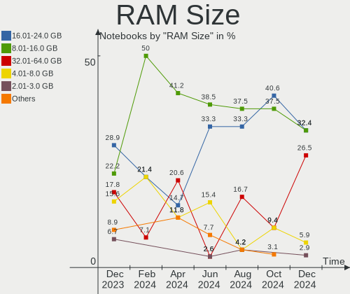
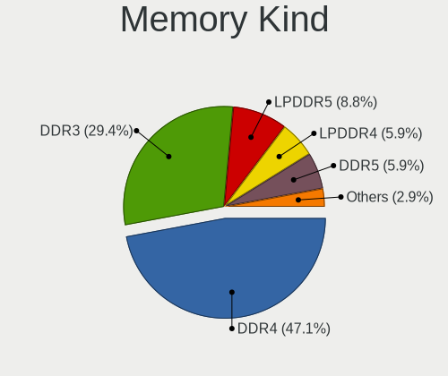

FreeBSD - Hardware Trends (Notebooks)
-------------------------------------

A project to identify most popular hardware characteristics and track their change
over time based on data collected by BSD users at https://BSD-Hardware.info.

Anyone can contribute to this report by the [hw-probe](https://github.com/linuxhw/hw-probe/blob/master/INSTALL.BSD.md) tool:

    hw-probe -all -upload

This report is for one last month. Overall report since the beginning of time: [TestDays](https://github.com/bsdhw/TestDays)

Period: Dec, 2023.

Contents
--------

* [ System ](#system)
  - [ OS                       ](#os)
  - [ OS Family                ](#os-family)
  - [ Arch                     ](#arch)
  - [ DE                       ](#de)
  - [ Display Server           ](#display-server)
  - [ Display Manager          ](#display-manager)
  - [ OS Lang                  ](#os-lang)
  - [ Boot Mode                ](#boot-mode)
  - [ Filesystem               ](#filesystem)
  - [ Part. scheme             ](#part-scheme)

* [ Board ](#board)
  - [ Vendor                   ](#vendor)
  - [ Model                    ](#model)
  - [ Model Family             ](#model-family)
  - [ MFG Year                 ](#mfg-year)
  - [ Form Factor              ](#form-factor)
  - [ Coreboot                 ](#coreboot)
  - [ RAM Size                 ](#ram-size)
  - [ RAM Used                 ](#ram-used)
  - [ Total Drives             ](#total-drives)
  - [ Has CD-ROM               ](#has-cd-rom)
  - [ Has Ethernet             ](#has-ethernet)
  - [ Has WiFi                 ](#has-wifi)
  - [ Has Bluetooth            ](#has-bluetooth)

* [ Location ](#location)
  - [ Country                  ](#country)
  - [ City                     ](#city)

* [ Drives ](#drives)
  - [ Drive Vendor             ](#drive-vendor)
  - [ Drive Model              ](#drive-model)
  - [ HDD Vendor               ](#hdd-vendor)
  - [ SSD Vendor               ](#ssd-vendor)
  - [ Drive Kind               ](#drive-kind)
  - [ Drive Connector          ](#drive-connector)
  - [ Drive Size               ](#drive-size)
  - [ Space Total              ](#space-total)
  - [ Space Used               ](#space-used)
  - [ Malfunc. Drives          ](#malfunc-drives)
  - [ Malfunc. Drive Vendor    ](#malfunc-drive-vendor)
  - [ Malfunc. HDD Vendor      ](#malfunc-hdd-vendor)
  - [ Malfunc. Drive Kind      ](#malfunc-drive-kind)
  - [ Failed Drives            ](#failed-drives)
  - [ Failed Drive Vendor      ](#failed-drive-vendor)
  - [ Drive Status             ](#drive-status)

* [ Storage controller ](#storage-controller)
  - [ Storage Vendor           ](#storage-vendor)
  - [ Storage Model            ](#storage-model)
  - [ Storage Kind             ](#storage-kind)

* [ Processor ](#processor)
  - [ CPU Vendor               ](#cpu-vendor)
  - [ CPU Model                ](#cpu-model)
  - [ CPU Model Family         ](#cpu-model-family)
  - [ CPU Cores                ](#cpu-cores)
  - [ CPU Sockets              ](#cpu-sockets)
  - [ CPU Threads              ](#cpu-threads)
  - [ CPU Microarch            ](#cpu-microarch)

* [ Graphics ](#graphics)
  - [ GPU Vendor               ](#gpu-vendor)
  - [ GPU Model                ](#gpu-model)
  - [ GPU Combo                ](#gpu-combo)
  - [ GPU Driver               ](#gpu-driver)
  - [ GPU Memory               ](#gpu-memory)

* [ Monitor ](#monitor)
  - [ Monitor Vendor           ](#monitor-vendor)
  - [ Monitor Model            ](#monitor-model)
  - [ Monitor Resolution       ](#monitor-resolution)
  - [ Monitor Diagonal         ](#monitor-diagonal)
  - [ Monitor Width            ](#monitor-width)
  - [ Aspect Ratio             ](#aspect-ratio)
  - [ Monitor Area             ](#monitor-area)
  - [ Pixel Density            ](#pixel-density)
  - [ Multiple Monitors        ](#multiple-monitors)

* [ Network ](#network)
  - [ Net Controller Vendor    ](#net-controller-vendor)
  - [ Net Controller Model     ](#net-controller-model)
  - [ Wireless Vendor          ](#wireless-vendor)
  - [ Wireless Model           ](#wireless-model)
  - [ Ethernet Vendor          ](#ethernet-vendor)
  - [ Ethernet Model           ](#ethernet-model)
  - [ Net Controller Kind      ](#net-controller-kind)
  - [ Used Controller          ](#used-controller)
  - [ NICs                     ](#nics)
  - [ IPv6                     ](#ipv6)

* [ Bluetooth ](#bluetooth)
  - [ Bluetooth Vendor         ](#bluetooth-vendor)
  - [ Bluetooth Model          ](#bluetooth-model)

* [ Sound ](#sound)
  - [ Sound Vendor             ](#sound-vendor)
  - [ Sound Model              ](#sound-model)

* [ Memory ](#memory)
  - [ Memory Vendor            ](#memory-vendor)
  - [ Memory Model             ](#memory-model)
  - [ Memory Kind              ](#memory-kind)
  - [ Memory Form Factor       ](#memory-form-factor)
  - [ Memory Size              ](#memory-size)
  - [ Memory Speed             ](#memory-speed)

* [ Printers & scanners ](#printers--scanners)
  - [ Printer Vendor           ](#printer-vendor)
  - [ Printer Model            ](#printer-model)
  - [ Scanner Vendor           ](#scanner-vendor)
  - [ Scanner Model            ](#scanner-model)

* [ Camera ](#camera)
  - [ Camera Vendor            ](#camera-vendor)
  - [ Camera Model             ](#camera-model)

* [ Security ](#security)
  - [ Fingerprint Vendor       ](#fingerprint-vendor)
  - [ Fingerprint Model        ](#fingerprint-model)
  - [ Chipcard Vendor          ](#chipcard-vendor)
  - [ Chipcard Model           ](#chipcard-model)

* [ Unsupported ](#unsupported)
  - [ Unsupported Devices      ](#unsupported-devices)
  - [ Unsupported Device Types ](#unsupported-device-types)

System
------

OS
--

Installed operating systems

| Name                 | Notebooks | Percent |
|----------------------|-----------|---------|
| FreeBSD 14.0         | 13        | 28.89%  |
| FreeBSD 14.0-p3      | 7         | 15.56%  |
| FreeBSD 14.0-p1      | 6         | 13.33%  |
| FreeBSD 14.0-p4      | 5         | 11.11%  |
| FreeBSD 14.0-p2      | 4         | 8.89%   |
| FreeBSD 15.0-CURRENT | 3         | 6.67%   |
| FreeBSD 14.0-STABLE  | 1         | 2.22%   |
| FreeBSD 14.0-BETA5   | 1         | 2.22%   |
| FreeBSD 13.2-p9      | 1         | 2.22%   |
| FreeBSD 13.2-p8      | 1         | 2.22%   |
| FreeBSD 13.2-p6      | 1         | 2.22%   |
| FreeBSD 13.2-p54     | 1         | 2.22%   |
| FreeBSD 13.2-p5      | 1         | 2.22%   |

OS Family
---------

OS without a version

| Name    | Notebooks | Percent |
|---------|-----------|---------|
| FreeBSD | 45        | 100%    |

Arch
----

OS architecture (x86_64, i586, etc.)

| Name  | Notebooks | Percent |
|-------|-----------|---------|
| amd64 | 44        | 97.78%  |
| i386  | 1         | 2.22%   |

DE
--

Desktop Environment

| Name     | Notebooks | Percent |
|----------|-----------|---------|
| XFCE     | 10        | 22.22%  |
| Console  | 10        | 22.22%  |
| KDE5     | 8         | 17.78%  |
| TWM      | 4         | 8.89%   |
| Openbox  | 3         | 6.67%   |
| MATE     | 3         | 6.67%   |
| LXQt     | 1         | 2.22%   |
| i3       | 1         | 2.22%   |
| Hyprland | 1         | 2.22%   |
| GNUstep  | 1         | 2.22%   |
| GNOME    | 1         | 2.22%   |
| dwm      | 1         | 2.22%   |
| Budgie   | 1         | 2.22%   |

Display Server
--------------

X11 or Wayland

| Name    | Notebooks | Percent |
|---------|-----------|---------|
| X11     | 33        | 73.33%  |
| Console | 8         | 17.78%  |
| Wayland | 4         | 8.89%   |

Display Manager
---------------

SDDM, LightDM, etc.

| Name    | Notebooks | Percent |
|---------|-----------|---------|
| Console | 21        | 46.67%  |
| SDDM    | 11        | 24.44%  |
| SLiM    | 6         | 13.33%  |
| LightDM | 3         | 6.67%   |
| GDM     | 2         | 4.44%   |
| XDM     | 1         | 2.22%   |
| Ly      | 1         | 2.22%   |

OS Lang
-------

Language

| Lang    | Notebooks | Percent |
|---------|-----------|---------|
| C       | 30        | 66.67%  |
| en_US   | 4         | 8.89%   |
| Unknown | 4         | 8.89%   |
| ru_RU   | 2         | 4.44%   |
| de_DE   | 2         | 4.44%   |
| it_IT   | 1         | 2.22%   |
| es_AR   | 1         | 2.22%   |
| cs_CZ   | 1         | 2.22%   |

Boot Mode
---------

EFI or BIOS

| Mode | Notebooks | Percent |
|------|-----------|---------|
| EFI  | 37        | 82.22%  |
| BIOS | 8         | 17.78%  |

Filesystem
----------

Type of filesystem

| Type | Notebooks | Percent |
|------|-----------|---------|
| Zfs  | 32        | 71.11%  |
| Ufs  | 13        | 28.89%  |

Part. scheme
------------

Scheme of partitioning

| Type    | Notebooks | Percent |
|---------|-----------|---------|
| GPT     | 41        | 91.11%  |
| MBR     | 3         | 6.67%   |
| Unknown | 1         | 2.22%   |

Board
-----

Vendor
------

Motherboard manufacturer

| Name             | Notebooks | Percent |
|------------------|-----------|---------|
| Lenovo           | 15        | 33.33%  |
| Dell             | 12        | 26.67%  |
| Hewlett-Packard  | 3         | 6.67%   |
| Google           | 3         | 6.67%   |
| Toshiba          | 2         | 4.44%   |
| ASUSTek Computer | 2         | 4.44%   |
| Apple            | 2         | 4.44%   |
| Wortmann AG      | 1         | 2.22%   |
| TULPAR           | 1         | 2.22%   |
| Rembrandt        | 1         | 2.22%   |
| CSL-Computer     | 1         | 2.22%   |
| Clevo            | 1         | 2.22%   |
| Acidanthera      | 1         | 2.22%   |

Model
-----

Motherboard model

| Name                                     | Notebooks | Percent |
|------------------------------------------|-----------|---------|
| Wortmann AG TERRA_MOBILE_1541            | 1         | 2.22%   |
| TULPAR A5 V20.3                          | 1         | 2.22%   |
| Toshiba Satellite P300                   | 1         | 2.22%   |
| Toshiba Satellite C50-B                  | 1         | 2.22%   |
| Rembrandt ARB928                         | 1         | 2.22%   |
| Lenovo ThinkPad X280 20KES5M300          | 1         | 2.22%   |
| Lenovo ThinkPad X1 Carbon 7th 20QES53R00 | 1         | 2.22%   |
| Lenovo ThinkPad X1 Carbon 2nd 20A7002FUS | 1         | 2.22%   |
| Lenovo ThinkPad W520 4284GZ1             | 1         | 2.22%   |
| Lenovo ThinkPad W520 4270CTO             | 1         | 2.22%   |
| Lenovo ThinkPad T490s 20NYS4HL1K         | 1         | 2.22%   |
| Lenovo ThinkPad T480 20L6S29E0T          | 1         | 2.22%   |
| Lenovo ThinkPad T430s 23532QG            | 1         | 2.22%   |
| Lenovo ThinkPad T14s Gen 4 21F60029US    | 1         | 2.22%   |
| Lenovo ThinkPad T14 Gen 3 21CF002UMZ     | 1         | 2.22%   |
| Lenovo ThinkPad P17 Gen 2i 20YVS1L900    | 1         | 2.22%   |
| Lenovo ThinkPad P1 20MD002MUS            | 1         | 2.22%   |
| Lenovo Legion 7 16ACHg6 82N6             | 1         | 2.22%   |
| Lenovo IdeaPad 5 15ALC05 82LN            | 1         | 2.22%   |
| Lenovo IdeaPad 330-15ARR 81D2            | 1         | 2.22%   |
| HP ZBook 17 G2                           | 1         | 2.22%   |
| HP Stream Notebook PC 11                 | 1         | 2.22%   |
| HP EliteBook 840 G6                      | 1         | 2.22%   |
| Google Parrot                            | 1         | 2.22%   |
| Google Lindar                            | 1         | 2.22%   |
| Google Kohaku                            | 1         | 2.22%   |
| Dell XPS 13 9370                         | 1         | 2.22%   |
| Dell Vostro 5470                         | 1         | 2.22%   |
| Dell Precision 7720                      | 1         | 2.22%   |
| Dell Precision 7560                      | 1         | 2.22%   |
| Dell Precision 5510                      | 1         | 2.22%   |
| Dell Latitude E6540                      | 1         | 2.22%   |
| Dell Latitude E6510                      | 1         | 2.22%   |
| Dell Latitude E6220                      | 1         | 2.22%   |
| Dell Latitude 7414                       | 1         | 2.22%   |
| Dell Latitude 3420                       | 1         | 2.22%   |
| Dell Inspiron MM061                      | 1         | 2.22%   |
| Dell Inspiron 5423                       | 1         | 2.22%   |
| CSL-Computer C15 v3                      | 1         | 2.22%   |
| Clevo W240BU                             | 1         | 2.22%   |

Model Family
------------

Motherboard model prefix

| Name                     | Notebooks | Percent |
|--------------------------|-----------|---------|
| Lenovo ThinkPad          | 12        | 26.67%  |
| Dell Latitude            | 5         | 11.11%  |
| Dell Precision           | 3         | 6.67%   |
| Toshiba Satellite        | 2         | 4.44%   |
| Lenovo IdeaPad           | 2         | 4.44%   |
| Dell Inspiron            | 2         | 4.44%   |
| Wortmann AG TERRA        | 1         | 2.22%   |
| TULPAR A5                | 1         | 2.22%   |
| Rembrandt ARB928         | 1         | 2.22%   |
| Lenovo Legion            | 1         | 2.22%   |
| HP ZBook                 | 1         | 2.22%   |
| HP Stream                | 1         | 2.22%   |
| HP EliteBook             | 1         | 2.22%   |
| Google Parrot            | 1         | 2.22%   |
| Google Lindar            | 1         | 2.22%   |
| Google Kohaku            | 1         | 2.22%   |
| Dell XPS                 | 1         | 2.22%   |
| Dell Vostro              | 1         | 2.22%   |
| CSL-Computer C15         | 1         | 2.22%   |
| Clevo W240BU             | 1         | 2.22%   |
| ASUS X555LB              | 1         | 2.22%   |
| ASUS ASUS                | 1         | 2.22%   |
| Apple MacBookPro10       | 1         | 2.22%   |
| Apple MacBookAir5        | 1         | 2.22%   |
| Acidanthera MacBookPro16 | 1         | 2.22%   |

MFG Year
--------

Motherboard manufacture year

| Year | Notebooks | Percent |
|------|-----------|---------|
| 2023 | 7         | 15.56%  |
| 2021 | 6         | 13.33%  |
| 2019 | 6         | 13.33%  |
| 2022 | 5         | 11.11%  |
| 2012 | 4         | 8.89%   |
| 2018 | 3         | 6.67%   |
| 2020 | 2         | 4.44%   |
| 2016 | 2         | 4.44%   |
| 2015 | 2         | 4.44%   |
| 2013 | 2         | 4.44%   |
| 2017 | 1         | 2.22%   |
| 2014 | 1         | 2.22%   |
| 2011 | 1         | 2.22%   |
| 2010 | 1         | 2.22%   |
| 2009 | 1         | 2.22%   |
| 2007 | 1         | 2.22%   |

Form Factor
-----------

Physical design of the computer

| Name     | Notebooks | Percent |
|----------|-----------|---------|
| Notebook | 45        | 100%    |

Coreboot
--------

Have coreboot on board

| Used | Notebooks | Percent |
|------|-----------|---------|
| No   | 42        | 93.33%  |
| Yes  | 3         | 6.67%   |

RAM Size
--------

Total RAM memory

| Size in GB  | Notebooks | Percent |
|-------------|-----------|---------|
| 16.01-24.0  | 13        | 28.89%  |
| 8.01-16.0   | 10        | 22.22%  |
| 32.01-64.0  | 8         | 17.78%  |
| 4.01-8.0    | 7         | 15.56%  |
| 2.01-3.0    | 3         | 6.67%   |
| 64.01-256.0 | 3         | 6.67%   |
| 3.01-4.0    | 1         | 2.22%   |

RAM Used
--------

Used RAM memory

| Used GB  | Notebooks | Percent |
|----------|-----------|---------|
| 0.01-0.5 | 19        | 42.22%  |
| 1.01-2.0 | 12        | 26.67%  |
| 0.51-1.0 | 11        | 24.44%  |
| 2.01-3.0 | 2         | 4.44%   |
| 4.01-8.0 | 1         | 2.22%   |

Total Drives
------------

Number of drives on board

| Drives | Notebooks | Percent |
|--------|-----------|---------|
| 1      | 23        | 51.11%  |
| 0      | 16        | 35.56%  |
| 2      | 4         | 8.89%   |
| 3      | 2         | 4.44%   |

Has CD-ROM
----------

Has CD-ROM on board

| Presented | Notebooks | Percent |
|-----------|-----------|---------|
| No        | 34        | 75.56%  |
| Yes       | 11        | 24.44%  |

Has Ethernet
------------

Has Ethernet on board

| Presented | Notebooks | Percent |
|-----------|-----------|---------|
| Yes       | 35        | 77.78%  |
| No        | 10        | 22.22%  |

Has WiFi
--------

Has WiFi module

| Presented | Notebooks | Percent |
|-----------|-----------|---------|
| Yes       | 45        | 100%    |

Has Bluetooth
-------------

Has Bluetooth module

| Presented | Notebooks | Percent |
|-----------|-----------|---------|
| Yes       | 37        | 82.22%  |
| No        | 8         | 17.78%  |

Location
--------

Country
-------

Geographic location (country)

| Country     | Notebooks | Percent |
|-------------|-----------|---------|
| USA         | 6         | 13.33%  |
| Germany     | 6         | 13.33%  |
| UK          | 4         | 8.89%   |
| Russia      | 4         | 8.89%   |
| Spain       | 3         | 6.67%   |
| Switzerland | 2         | 4.44%   |
| Netherlands | 2         | 4.44%   |
| Italy       | 2         | 4.44%   |
| Indonesia   | 2         | 4.44%   |
| China       | 2         | 4.44%   |
| Thailand    | 1         | 2.22%   |
| Romania     | 1         | 2.22%   |
| Portugal    | 1         | 2.22%   |
| Nepal       | 1         | 2.22%   |
| Luxembourg  | 1         | 2.22%   |
| Lithuania   | 1         | 2.22%   |
| India       | 1         | 2.22%   |
| France      | 1         | 2.22%   |
| Ecuador     | 1         | 2.22%   |
| Czechia     | 1         | 2.22%   |
| Brazil      | 1         | 2.22%   |
| Argentina   | 1         | 2.22%   |

City
----

Geographic location (city)

| City                     | Notebooks | Percent |
|--------------------------|-----------|---------|
| Moscow                   | 3         | 6.67%   |
| Milan                    | 2         | 4.44%   |
| Zurich                   | 1         | 2.22%   |
| Vadodara                 | 1         | 2.22%   |
| Teplice                  | 1         | 2.22%   |
| Surabaya                 | 1         | 2.22%   |
| Steckborn                | 1         | 2.22%   |
| Santa Coloma de Farners  | 1         | 2.22%   |
| Sandweiler               | 1         | 2.22%   |
| San Antonio              | 1         | 2.22%   |
| Rüsselsheim am Main     | 1         | 2.22%   |
| Roesrath                 | 1         | 2.22%   |
| Richmond                 | 1         | 2.22%   |
| Potomac                  | 1         | 2.22%   |
| Portoviejo               | 1         | 2.22%   |
| Pevensey                 | 1         | 2.22%   |
| Petropavlovsk-Kamchatsky | 1         | 2.22%   |
| Oxford                   | 1         | 2.22%   |
| Neuengors                | 1         | 2.22%   |
| Marijampolė             | 1         | 2.22%   |
| Maceió                  | 1         | 2.22%   |
| Los Realejos             | 1         | 2.22%   |
| Lisbon                   | 1         | 2.22%   |
| Le Pecq                  | 1         | 2.22%   |
| Jesus Maria              | 1         | 2.22%   |
| Jakarta                  | 1         | 2.22%   |
| Ipswich                  | 1         | 2.22%   |
| Hangzhou                 | 1         | 2.22%   |
| Haarlem                  | 1         | 2.22%   |
| Frankfurt am Main        | 1         | 2.22%   |
| Flensburg                | 1         | 2.22%   |
| Durant                   | 1         | 2.22%   |
| Chiang Mai               | 1         | 2.22%   |
| Chengdu                  | 1         | 2.22%   |
| Bucharest                | 1         | 2.22%   |
| Boynton Beach            | 1         | 2.22%   |
| Bharatpur                | 1         | 2.22%   |
| Berlin                   | 1         | 2.22%   |
| Anoka                    | 1         | 2.22%   |
| Amsterdam                | 1         | 2.22%   |

Drives
------

Drive Vendor
------------

Hard drive vendors

| Vendor              | Notebooks | Drives | Percent |
|---------------------|-----------|--------|---------|
| Samsung Electronics | 8         | 11     | 25.81%  |
| Seagate             | 4         | 4      | 12.9%   |
| Toshiba             | 3         | 3      | 9.68%   |
| WDC                 | 2         | 2      | 6.45%   |
| HGST                | 2         | 3      | 6.45%   |
| Apple               | 2         | 2      | 6.45%   |
| V-GeN               | 1         | 2      | 3.23%   |
| SSSTC               | 1         | 1      | 3.23%   |
| SPCC                | 1         | 1      | 3.23%   |
| SK hynix            | 1         | 1      | 3.23%   |
| SanDisk             | 1         | 1      | 3.23%   |
| Lenovo              | 1         | 2      | 3.23%   |
| Kingston            | 1         | 1      | 3.23%   |
| Intel               | 1         | 1      | 3.23%   |
| Fujitsu             | 1         | 1      | 3.23%   |
| Crucial             | 1         | 1      | 3.23%   |

Drive Model
-----------

Hard drive models

| Model                                 | Notebooks | Percent |
|---------------------------------------|-----------|---------|
| Toshiba MQ04ABF100 1TB                | 2         | 5.88%   |
| Samsung SSD 870 EVO 1TB               | 2         | 5.88%   |
| WDC WD5000LPLX-75ZNTT0 500GB          | 1         | 2.94%   |
| WDC WD2500BEVT-22ZCT0 250GB           | 1         | 2.94%   |
| V-GeN V-GEN11SM20AR1024ITM2 1TB       | 1         | 2.94%   |
| V-GeN V-GEN03SM22AR1024SDK 1TB        | 1         | 2.94%   |
| Toshiba THNSF5256GPUK 256GB           | 1         | 2.94%   |
| SSSTC CL4-8D512 512GB                 | 1         | 2.94%   |
| SPCC Solid State Disk 128GB           | 1         | 2.94%   |
| SK hynix HFS256G32TNF-N3A0A 256GB     | 1         | 2.94%   |
| Seagate ST9500325AS 500GB             | 1         | 2.94%   |
| Seagate ST9320423AS 320GB             | 1         | 2.94%   |
| Seagate ST9320325AS 320GB             | 1         | 2.94%   |
| Seagate ST1000LM024 HN-M101MBB 1TB    | 1         | 2.94%   |
| SanDisk SSD U100 16GB                 | 1         | 2.94%   |
| Samsung SSD PM830 mSATA 32GB          | 1         | 2.94%   |
| Samsung SSD 850 120GB                 | 1         | 2.94%   |
| Samsung SSD 840 PRO Series 256GB      | 1         | 2.94%   |
| Samsung SSD 840 EVO 250GB             | 1         | 2.94%   |
| Samsung PM9A1 NVMe 1024GB             | 1         | 2.94%   |
| Samsung MZVLW512HMJP-000L7 512GB      | 1         | 2.94%   |
| Samsung MZ7TD128HAFV-000L1 128GB      | 1         | 2.94%   |
| Lenovo Thinklife SSD ST800 256G       | 1         | 2.94%   |
| Lenovo Thinklife SSD ST600 MSATA 256G | 1         | 2.94%   |
| Kingston SKC600MS256G 256GB           | 1         | 2.94%   |
| Intel SSDPEKKF256G8L 256GB            | 1         | 2.94%   |
| HGST HTS725050A7E630 500GB            | 1         | 2.94%   |
| HGST HTS721010A9E630 1TB              | 1         | 2.94%   |
| Fujitsu MHW2120BH 120GB               | 1         | 2.94%   |
| Crucial CT1000MX500SSD1 1TB           | 1         | 2.94%   |
| Apple SSD SM512E 500GB                | 1         | 2.94%   |
| Apple SSD SM256E 256GB                | 1         | 2.94%   |

HDD Vendor
----------

Hard disk drive vendors

| Vendor  | Notebooks | Drives | Percent |
|---------|-----------|--------|---------|
| Seagate | 4         | 4      | 36.36%  |
| WDC     | 2         | 2      | 18.18%  |
| Toshiba | 2         | 2      | 18.18%  |
| HGST    | 2         | 3      | 18.18%  |
| Fujitsu | 1         | 1      | 9.09%   |

SSD Vendor
----------

Solid state drive vendors

| Vendor              | Notebooks | Drives | Percent |
|---------------------|-----------|--------|---------|
| Samsung Electronics | 6         | 7      | 40%     |
| Apple               | 2         | 2      | 13.33%  |
| V-GeN               | 1         | 2      | 6.67%   |
| SPCC                | 1         | 1      | 6.67%   |
| SK hynix            | 1         | 1      | 6.67%   |
| SanDisk             | 1         | 1      | 6.67%   |
| Lenovo              | 1         | 2      | 6.67%   |
| Kingston            | 1         | 1      | 6.67%   |
| Crucial             | 1         | 1      | 6.67%   |

Drive Kind
----------

HDD or SSD

| Kind | Notebooks | Drives | Percent |
|------|-----------|--------|---------|
| SSD  | 14        | 18     | 48.28%  |
| HDD  | 10        | 12     | 34.48%  |
| NVMe | 5         | 7      | 17.24%  |

Drive Connector
---------------

SATA, SAS, NVMe, etc.

| Type | Notebooks | Drives | Percent |
|------|-----------|--------|---------|
| SATA | 24        | 30     | 82.76%  |
| NVMe | 5         | 7      | 17.24%  |

Drive Size
----------

Size of hard drive

| Size in TB | Notebooks | Drives | Percent |
|------------|-----------|--------|---------|
| 0.01-0.5   | 18        | 20     | 69.23%  |
| 0.51-1.0   | 7         | 9      | 26.92%  |
| 1.01-2.0   | 1         | 1      | 3.85%   |

Space Total
-----------

Amount of disk space available on the file system

| Size in GB | Notebooks | Percent |
|------------|-----------|---------|
| 101-250    | 19        | 42.22%  |
| 251-500    | 13        | 28.89%  |
| 501-1000   | 5         | 11.11%  |
| 21-50      | 2         | 4.44%   |
| 1001-2000  | 2         | 4.44%   |
| 1-20       | 2         | 4.44%   |
| 51-100     | 1         | 2.22%   |
| Unknown    | 1         | 2.22%   |

Space Used
----------

Amount of used disk space

| Used GB | Notebooks | Percent |
|---------|-----------|---------|
| 1-20    | 34        | 75.56%  |
| 21-50   | 6         | 13.33%  |
| 101-250 | 2         | 4.44%   |
| 51-100  | 2         | 4.44%   |
| Unknown | 1         | 2.22%   |

Malfunc. Drives
---------------

Drive models with a malfunction

| Model                                 | Notebooks | Drives | Percent |
|---------------------------------------|-----------|--------|---------|
| Seagate ST9500325AS 500GB             | 1         | 1      | 25%     |
| Seagate ST9320325AS 320GB             | 1         | 1      | 25%     |
| Lenovo Thinklife SSD ST600 MSATA 256G | 1         | 1      | 25%     |
| Fujitsu MHW2120BH 120GB               | 1         | 1      | 25%     |

Malfunc. Drive Vendor
---------------------

Vendors of faulty drives

| Vendor  | Notebooks | Drives | Percent |
|---------|-----------|--------|---------|
| Seagate | 2         | 2      | 50%     |
| Lenovo  | 1         | 1      | 25%     |
| Fujitsu | 1         | 1      | 25%     |

Malfunc. HDD Vendor
-------------------

Vendors of faulty HDD drives

| Vendor  | Notebooks | Drives | Percent |
|---------|-----------|--------|---------|
| Seagate | 2         | 2      | 66.67%  |
| Fujitsu | 1         | 1      | 33.33%  |

Malfunc. Drive Kind
-------------------

Kinds of faulty drives

| Kind | Notebooks | Drives | Percent |
|------|-----------|--------|---------|
| HDD  | 3         | 3      | 75%     |
| SSD  | 1         | 1      | 25%     |

Failed Drives
-------------

Failed drive models

Zero info for selected period =(

Failed Drive Vendor
-------------------

Failed drive vendors

Zero info for selected period =(

Drive Status
------------

Number of failed and malfunc. drives

| Status  | Notebooks | Drives | Percent |
|---------|-----------|--------|---------|
| Works   | 26        | 33     | 86.67%  |
| Malfunc | 4         | 4      | 13.33%  |

Storage controller
------------------

Storage Vendor
--------------

Storage controller vendors

| Vendor                                  | Notebooks | Percent |
|-----------------------------------------|-----------|---------|
| Intel                                   | 23        | 46.94%  |
| SanDisk                                 | 5         | 10.2%   |
| AMD                                     | 5         | 10.2%   |
| Samsung Electronics                     | 4         | 8.16%   |
| Toshiba                                 | 2         | 4.08%   |
| Solid State Storage Technology          | 2         | 4.08%   |
| SK hynix                                | 2         | 4.08%   |
| Micron Technology                       | 2         | 4.08%   |
| Union Memory (Shenzhen)                 | 1         | 2.04%   |
| Shenzhen Unionmemory Information System | 1         | 2.04%   |
| Micron/Crucial Technology               | 1         | 2.04%   |
| Kingston Technology Company             | 1         | 2.04%   |

Storage Model
-------------

Storage controller models

| Model                                                                          | Notebooks | Percent |
|--------------------------------------------------------------------------------|-----------|---------|
| Intel 7 Series Chipset Family 6-port SATA Controller [AHCI mode]               | 5         | 9.8%    |
| AMD FCH SATA Controller [AHCI mode]                                            | 4         | 7.84%   |
| Intel 82801 Mobile SATA Controller [RAID mode]                                 | 3         | 5.88%   |
| SanDisk Ultra 3D / WD Blue SN550 NVMe SSD                                      | 2         | 3.92%   |
| SanDisk Extreme Pro / WD Black SN750 / PC SN730 / Red SN700 NVMe SSD           | 2         | 3.92%   |
| Intel 8 Series/C220 Series Chipset Family 6-port SATA Controller 1 [AHCI mode] | 2         | 3.92%   |
| Intel 8 Series SATA Controller 1 [AHCI mode]                                   | 2         | 3.92%   |
| Intel 6 Series/C200 Series Chipset Family 6 port Mobile SATA AHCI Controller   | 2         | 3.92%   |
| Unknown                                                                        | 2         | 3.92%   |
| Union Memory (Shenzhen) AM620 PCIe 3.0 NVMe SSD 128GB                          | 1         | 1.96%   |
| Toshiba XG5 NVMe SSD Controller                                                | 1         | 1.96%   |
| Toshiba XG4 NVMe SSD Controller                                                | 1         | 1.96%   |
| Solid State Storage CL4-8D512 NVMe SSD M.2 (DRAM-less)                         | 1         | 1.96%   |
| Solid State Storage CL1-3D256-Q11 NVMe SSD M.2                                 | 1         | 1.96%   |
| SK hynix Gold P31/BC711/PC711 NVMe Solid State Drive                           | 1         | 1.96%   |
| SK hynix BC501 NVMe Solid State Drive                                          | 1         | 1.96%   |
| Sandisk WD Blue SN580 NVMe SSD (DRAM-less)                                     | 1         | 1.96%   |
| SanDisk Ultra 3D / WD Blue SN570 NVMe SSD (DRAM-less)                          | 1         | 1.96%   |
| SanDisk Extreme Pro / WD Black 2018/SN750/PC SN720 NVMe SSD                    | 1         | 1.96%   |
| Samsung NVMe SSD Controller SM981/PM981/PM983                                  | 1         | 1.96%   |
| Samsung NVMe SSD Controller SM961/PM961/SM963                                  | 1         | 1.96%   |
| Samsung NVMe SSD Controller PM9A1/PM9A3/980PRO                                 | 1         | 1.96%   |
| Samsung NVMe SSD Controller 980 (DRAM-less)                                    | 1         | 1.96%   |
| Micron 3400 NVMe SSD [Hendrix]                                                 | 1         | 1.96%   |
| Micron 2550 NVMe SSD (DRAM-less)                                               | 1         | 1.96%   |
| Kingston Company NV2 NVMe SSD SM2267XT                                         | 1         | 1.96%   |
| Intel Wildcat Point-LP SATA Controller [AHCI Mode]                             | 1         | 1.96%   |
| Intel Tiger Lake-LP SATA Controller                                            | 1         | 1.96%   |
| Intel Sunrise Point-LP SATA Controller [AHCI mode]                             | 1         | 1.96%   |
| Intel SSD DC P4101/Pro 7600p/760p/E 6100p Series                               | 1         | 1.96%   |
| Intel Q170/Q150/B150/H170/H110/Z170/CM236 Chipset SATA Controller [AHCI Mode]  | 1         | 1.96%   |
| Intel Comet Lake SATA AHCI Controller                                          | 1         | 1.96%   |
| Intel Atom Processor E3800 Series SATA AHCI Controller                         | 1         | 1.96%   |
| Intel 82801IBM/IEM (ICH9M/ICH9M-E) 4 port SATA Controller [AHCI mode]          | 1         | 1.96%   |
| Intel 82801GBM/GHM (ICH7-M Family) SATA Controller [IDE mode]                  | 1         | 1.96%   |
| AMD SB7x0/SB8x0/SB9x0 SATA Controller [AHCI mode]                              | 1         | 1.96%   |

Storage Kind
------------

Kind of storage controller (IDE, SATA, NVMe, SAS, ...)

| Kind | Notebooks | Percent |
|------|-----------|---------|
| SATA | 23        | 46.94%  |
| NVMe | 22        | 44.9%   |
| RAID | 3         | 6.12%   |
| IDE  | 1         | 2.04%   |

Processor
---------

CPU Vendor
----------

Processor vendors

| Vendor | Notebooks | Percent |
|--------|-----------|---------|
| Intel  | 37        | 82.22%  |
| AMD    | 8         | 17.78%  |

CPU Model
---------

Processor models

| Model                                      | Notebooks | Percent |
|--------------------------------------------|-----------|---------|
| Intel Core i5-8365U CPU @ 1.60GHz          | 2         | 4.44%   |
| Intel Core i5-4200U CPU @ 1.60GHz          | 2         | 4.44%   |
| Intel Xeon W-11955M CPU @ 2.60GHz          | 1         | 2.22%   |
| Intel Xeon E-2176M CPU @ 2.70GHz           | 1         | 2.22%   |
| Intel Pentium M                            | 1         | 2.22%   |
| Intel N200                                 | 1         | 2.22%   |
| Intel CPU Version                          | 1         | 2.22%   |
| Intel Core i7-8665U CPU @ 1.90GHz          | 1         | 2.22%   |
| Intel Core i7-8550U CPU @ 1.80GHz          | 1         | 2.22%   |
| Intel Core i7-6820HQ CPU @ 2.70GHz         | 1         | 2.22%   |
| Intel Core i7-6600U CPU @ 2.60GHz          | 1         | 2.22%   |
| Intel Core i7-5500U CPU @ 2.40GHz          | 1         | 2.22%   |
| Intel Core i7-4800MQ CPU @ 2.70GHz         | 1         | 2.22%   |
| Intel Core i7-4710MQ CPU @ 2.50GHz         | 1         | 2.22%   |
| Intel Core i7-3520M CPU @ 2.90GHz          | 1         | 2.22%   |
| Intel Core i7-2720QM CPU @ 2.20GHz         | 1         | 2.22%   |
| Intel Core i7-2630QM CPU @ 2.00GHz         | 1         | 2.22%   |
| Intel Core i7 CPU M 640 @ 2.80GH           | 1         | 2.22%   |
| Intel Core i5-8350U CPU @ 1.70GHz          | 1         | 2.22%   |
| Intel Core i5-6300HQ CPU @ 2.30GHz         | 1         | 2.22%   |
| Intel Core i5-3427U CPU @ 1.80GHz          | 1         | 2.22%   |
| Intel Core i5-3320M CPU @ 2.60GHz          | 1         | 2.22%   |
| Intel Core i5-3230M CPU @ 2.60GHz          | 1         | 2.22%   |
| Intel Core i5-2520M CPU @ 2.50GH           | 1         | 2.22%   |
| Intel Core i5-10210U CPU @ 1.60GHz         | 1         | 2.22%   |
| Intel Core i3-8130U CPU @ 2.20GHz          | 1         | 2.22%   |
| Intel Core i3-2367M CPU @ 1.40GHz          | 1         | 2.22%   |
| Intel Celeron CPU N2840 @ 2.16GHz          | 1         | 2.22%   |
| Intel Celeron CPU N2830 @ 2.16GHz          | 1         | 2.22%   |
| Intel Celeron CPU 847 @ 1.10GHz            | 1         | 2.22%   |
| Intel 13th Gen Core i7-13700H              | 1         | 2.22%   |
| Intel 13th Gen Core i7-1355U               | 1         | 2.22%   |
| Intel 11th Gen Core i7-11850H @ 2.50GHz    | 1         | 2.22%   |
| Intel 11th Gen Core i5-1135G7 @ 2.40GHz    | 1         | 2.22%   |
| Intel 11th Gen Core i3-1115G4 @ 3.00GHz    | 1         | 2.22%   |
| AMD Ryzen 7 PRO 6850U with Radeon Graphics | 1         | 2.22%   |
| AMD Ryzen 7 7735HS with Radeon Graphics    | 1         | 2.22%   |
| AMD Ryzen 7 7735H with Radeon Graphics     | 1         | 2.22%   |
| AMD Ryzen 7 5800H with Radeon Graphics     | 1         | 2.22%   |
| AMD Ryzen 7 5700U with Radeon Graphics     | 1         | 2.22%   |

CPU Model Family
----------------

Processor model prefix

| Model           | Notebooks | Percent |
|-----------------|-----------|---------|
| Intel Core i7   | 11        | 24.44%  |
| Intel Core i5   | 11        | 24.44%  |
| Other           | 7         | 15.56%  |
| AMD Ryzen 7     | 5         | 11.11%  |
| Intel Celeron   | 3         | 6.67%   |
| Intel Xeon      | 2         | 4.44%   |
| Intel Core i3   | 2         | 4.44%   |
| Intel Pentium M | 1         | 2.22%   |
| AMD Ryzen 7 PRO | 1         | 2.22%   |
| AMD Ryzen 5     | 1         | 2.22%   |
| AMD C-50        | 1         | 2.22%   |

CPU Cores
---------

Number of processor cores

| Number | Notebooks | Percent |
|--------|-----------|---------|
| 2      | 19        | 42.22%  |
| 4      | 14        | 31.11%  |
| 16     | 5         | 11.11%  |
| 8      | 4         | 8.89%   |
| 6      | 2         | 4.44%   |
| 10     | 1         | 2.22%   |

CPU Sockets
-----------

Number of sockets

| Number | Notebooks | Percent |
|--------|-----------|---------|
| 1      | 45        | 100%    |

CPU Threads
-----------

Threads per core (Hyper-Threading)

| Number | Notebooks | Percent |
|--------|-----------|---------|
| 2      | 30        | 66.67%  |
| 1      | 15        | 33.33%  |

CPU Microarch
-------------

Microarchitecture

| Name        | Notebooks | Percent |
|-------------|-----------|---------|
| Unknown     | 9         | 20%     |
| KabyLake    | 8         | 17.78%  |
| SandyBridge | 5         | 11.11%  |
| IvyBridge   | 4         | 8.89%   |
| Haswell     | 4         | 8.89%   |
| Skylake     | 3         | 6.67%   |
| TigerLake   | 2         | 4.44%   |
| Silvermont  | 2         | 4.44%   |
| Zen+        | 1         | 2.22%   |
| Zen 3       | 1         | 2.22%   |
| Zen         | 1         | 2.22%   |
| Westmere    | 1         | 2.22%   |
| Penryn      | 1         | 2.22%   |
| P6          | 1         | 2.22%   |
| Broadwell   | 1         | 2.22%   |
| Bobcat      | 1         | 2.22%   |

Graphics
--------

GPU Vendor
----------

Vendors of graphics cards

| Vendor | Notebooks | Percent |
|--------|-----------|---------|
| Intel  | 32        | 60.38%  |
| Nvidia | 12        | 22.64%  |
| AMD    | 9         | 16.98%  |

GPU Model
---------

Graphics card models

| Model                                                                         | Notebooks | Percent |
|-------------------------------------------------------------------------------|-----------|---------|
| Intel 2nd Generation Core Processor Family Integrated Graphics Controller     | 5         | 8.93%   |
| Intel 3rd Gen Core processor Graphics Controller                              | 4         | 7.14%   |
| Intel WhiskeyLake-U GT2 [UHD Graphics 620]                                    | 3         | 5.36%   |
| Intel UHD Graphics 620                                                        | 3         | 5.36%   |
| AMD Rembrandt [Radeon 680M]                                                   | 3         | 5.36%   |
| Intel Raptor Lake-P [Iris Xe Graphics]                                        | 2         | 3.57%   |
| Intel Haswell-ULT Integrated Graphics Controller                              | 2         | 3.57%   |
| Intel Atom Processor Z36xxx/Z37xxx Series Graphics & Display                  | 2         | 3.57%   |
| Nvidia TU117GLM [T1200 Laptop GPU]                                            | 1         | 1.79%   |
| Nvidia GT218M [NVS 3100M]                                                     | 1         | 1.79%   |
| Nvidia GP107GLM [Quadro P2000 Mobile]                                         | 1         | 1.79%   |
| Nvidia GP104GLM [Quadro P3000 Mobile]                                         | 1         | 1.79%   |
| Nvidia GM108M [GeForce 940M]                                                  | 1         | 1.79%   |
| Nvidia GM107GLM [Quadro M1000M]                                               | 1         | 1.79%   |
| Nvidia GK208M [GeForce GT 740M]                                               | 1         | 1.79%   |
| Nvidia GK107GLM [Quadro K1100M]                                               | 1         | 1.79%   |
| Nvidia GF117M [GeForce 610M/710M/810M/820M / GT 620M/625M/630M/720M]          | 1         | 1.79%   |
| Nvidia GA106M [GeForce RTX 3060 Mobile / Max-Q]                               | 1         | 1.79%   |
| Nvidia GA104GLM [RTX A5000 Mobile]                                            | 1         | 1.79%   |
| Nvidia AD107M [GeForce RTX 4050 Max-Q / Mobile]                               | 1         | 1.79%   |
| Intel TigerLake-LP GT2 [Iris Xe Graphics]                                     | 1         | 1.79%   |
| Intel TigerLake-H GT1 [UHD Graphics]                                          | 1         | 1.79%   |
| Intel Tiger Lake-LP GT2 [UHD Graphics G4]                                     | 1         | 1.79%   |
| Intel Skylake GT2 [HD Graphics 520]                                           | 1         | 1.79%   |
| Intel Mobile 945GM/GMS/GME, 943/940GML Express Integrated Graphics Controller | 1         | 1.79%   |
| Intel Mobile 945GM/GMS, 943/940GML Express Integrated Graphics Controller     | 1         | 1.79%   |
| Intel HD Graphics 5500                                                        | 1         | 1.79%   |
| Intel HD Graphics 530                                                         | 1         | 1.79%   |
| Intel CometLake-U GT2 [UHD Graphics]                                          | 1         | 1.79%   |
| Intel Coffee Lake-S GT2 [UHD Graphics P630]                                   | 1         | 1.79%   |
| Intel Alder Lake-N [UHD Graphics]                                             | 1         | 1.79%   |
| Intel 4th Gen Core Processor Integrated Graphics Controller                   | 1         | 1.79%   |
| AMD Wrestler [Radeon HD 6250]                                                 | 1         | 1.79%   |
| AMD RV710/M92 [Mobility Radeon HD 4530/4570/5145/530v/540v/545v]              | 1         | 1.79%   |
| AMD Raven Ridge [Radeon Vega Series / Radeon Vega Mobile Series]              | 1         | 1.79%   |
| AMD Picasso/Raven 2 [Radeon Vega Series / Radeon Vega Mobile Series]          | 1         | 1.79%   |
| AMD Navi 33 [Radeon RX 7700S/7600/7600S/7600M XT/PRO W7600]                   | 1         | 1.79%   |
| AMD Mars XTX [Radeon HD 8790M]                                                | 1         | 1.79%   |
| AMD Lucienne                                                                  | 1         | 1.79%   |
| AMD Baffin [Radeon RX 460/560D / Pro 450/455/460/555/555X/560/560X]           | 1         | 1.79%   |

GPU Combo
---------

Combinations of graphics cards

| Name           | Notebooks | Percent |
|----------------|-----------|---------|
| 1 x Intel      | 23        | 51.11%  |
| Intel + Nvidia | 7         | 15.56%  |
| 1 x AMD        | 6         | 13.33%  |
| 1 x Nvidia     | 5         | 11.11%  |
| 2 x AMD        | 2         | 4.44%   |
| 2 x Intel      | 1         | 2.22%   |
| Intel + AMD    | 1         | 2.22%   |

GPU Driver
----------

Free vs proprietary

| Driver      | Notebooks | Percent |
|-------------|-----------|---------|
| Free        | 37        | 82.22%  |
| Proprietary | 7         | 15.56%  |
| Unknown     | 1         | 2.22%   |

GPU Memory
----------

Total video memory

| Size in GB | Notebooks | Percent |
|------------|-----------|---------|
| Unknown    | 35        | 77.78%  |
| 1.01-2.0   | 3         | 6.67%   |
| 0.01-0.5   | 3         | 6.67%   |
| 5.01-6.0   | 2         | 4.44%   |
| 3.01-4.0   | 1         | 2.22%   |
| 8.01-16.0  | 1         | 2.22%   |

Monitor
-------

Monitor Vendor
--------------

Monitor vendors

| Vendor               | Notebooks | Percent |
|----------------------|-----------|---------|
| AU Optronics         | 7         | 23.33%  |
| Chimei Innolux       | 5         | 16.67%  |
| LG Display           | 4         | 13.33%  |
| Lenovo               | 3         | 10%     |
| Sharp                | 2         | 6.67%   |
| BOE                  | 2         | 6.67%   |
| Apple                | 2         | 6.67%   |
| SDC                  | 1         | 3.33%   |
| Samsung Electronics  | 1         | 3.33%   |
| Philips              | 1         | 3.33%   |
| HKC                  | 1         | 3.33%   |
| BOE Technology Group | 1         | 3.33%   |

Monitor Model
-------------

Monitor models

| Model                                                                 | Notebooks | Percent |
|-----------------------------------------------------------------------|-----------|---------|
| Sharp LCD Monitor SHP143E 3840x2160 350x190mm 15.7-inch               | 1         | 3.23%   |
| Sharp LCD Monitor SHP1416 1366x768 310x170mm 13.9-inch                | 1         | 3.23%   |
| SDC LCD Monitor 3520x1080                                             | 1         | 3.23%   |
| Samsung Electronics LCD Monitor SDC4142 3840x2160 290x170mm 13.2-inch | 1         | 3.23%   |
| Philips LCD Monitor 271P4 3520x1080                                   | 1         | 3.23%   |
| Philips LCD Monitor 271P4                                             | 1         | 3.23%   |
| LG Display LCD Monitor LGD6616 1366x768 280x160mm 12.7-inch           | 1         | 3.23%   |
| LG Display LCD Monitor LGD0563 1920x1080 340x190mm 15.3-inch          | 1         | 3.23%   |
| LG Display LCD Monitor LGD0362 1600x900 310x170mm 13.9-inch           | 1         | 3.23%   |
| LG Display LCD Monitor LGD0259 1920x1080 350x190mm 15.7-inch          | 1         | 3.23%   |
| Lenovo LCD Monitor LEN40B2 1920x1080 340x190mm 15.3-inch              | 1         | 3.23%   |
| Lenovo LCD Monitor LEN40B1 1600x900 340x190mm 15.3-inch               | 1         | 3.23%   |
| Lenovo LCD Monitor LEN40A0 1366x768 310x170mm 13.9-inch               | 1         | 3.23%   |
| HKC LCD Monitor 24E6C 1920x1080                                       | 1         | 3.23%   |
| Chimei Innolux LCD Monitor CMN15BA 1920x1080 340x190mm 15.3-inch      | 1         | 3.23%   |
| Chimei Innolux LCD Monitor CMN1521 1920x1080 340x190mm 15.3-inch      | 1         | 3.23%   |
| Chimei Innolux LCD Monitor CMN14E4 1920x1080 310x170mm 13.9-inch      | 1         | 3.23%   |
| Chimei Innolux LCD Monitor CMN1136 1366x768 260x140mm 11.6-inch       | 1         | 3.23%   |
| Chimei Innolux LCD Monitor CMN1119 1366x768 260x140mm 11.6-inch       | 1         | 3.23%   |
| BOE Technology Group LCD Monitor 1920x1080                            | 1         | 3.23%   |
| BOE NE160WUM-NX2 BOE0B33 1920x1200 340x210mm 15.7-inch                | 1         | 3.23%   |
| BOE LCD Monitor BOE074F 1920x1080 310x170mm 13.9-inch                 | 1         | 3.23%   |
| AU Optronics LCD Monitor AUOE48D 1920x1080 340x190mm 15.3-inch        | 1         | 3.23%   |
| AU Optronics LCD Monitor AUO543D 1920x1080 310x170mm 13.9-inch        | 1         | 3.23%   |
| AU Optronics LCD Monitor AUO323D 1920x1080 310x170mm 13.9-inch        | 1         | 3.23%   |
| AU Optronics LCD Monitor AUO233C 1366x768 310x170mm 13.9-inch         | 1         | 3.23%   |
| AU Optronics LCD Monitor AUO123D 1920x1080 310x170mm 13.9-inch        | 1         | 3.23%   |
| AU Optronics LCD Monitor AUO109D 1920x1080 380x210mm 17.1-inch        | 1         | 3.23%   |
| AU Optronics LCD Monitor AUO106C 1366x768 280x160mm 12.7-inch         | 1         | 3.23%   |
| Apple Color LCD APPA014 2560x1600 290x180mm 13.4-inch                 | 1         | 3.23%   |
| Apple Color LCD APP9CF0 1440x900 290x180mm 13.4-inch                  | 1         | 3.23%   |

Monitor Resolution
------------------

Monitor screen resolution

| Resolution        | Notebooks | Percent |
|-------------------|-----------|---------|
| 1920x1080 (FHD)   | 14        | 46.67%  |
| 1366x768 (WXGA)   | 7         | 23.33%  |
| 3840x2160 (4K)    | 2         | 6.67%   |
| 1600x900 (HD+)    | 2         | 6.67%   |
| 3520x1080         | 1         | 3.33%   |
| 2560x1600         | 1         | 3.33%   |
| 1920x1200 (WUXGA) | 1         | 3.33%   |
| 1440x900 (WXGA+)  | 1         | 3.33%   |
| Unknown           | 1         | 3.33%   |

Monitor Diagonal
----------------

Diagonal size in inches

| Inches  | Notebooks | Percent |
|---------|-----------|---------|
| 13      | 12        | 41.38%  |
| 15      | 9         | 31.03%  |
| Unknown | 3         | 10.34%  |
| 12      | 2         | 6.9%    |
| 11      | 2         | 6.9%    |
| 17      | 1         | 3.45%   |

Monitor Width
-------------

Physical width

| Width in mm | Notebooks | Percent |
|-------------|-----------|---------|
| 301-350     | 18        | 62.07%  |
| 201-300     | 7         | 24.14%  |
| Unknown     | 3         | 10.34%  |
| 351-400     | 1         | 3.45%   |

Aspect Ratio
------------

Proportional relationship between the width and the height

| Ratio   | Notebooks | Percent |
|---------|-----------|---------|
| 16/9    | 23        | 79.31%  |
| 16/10   | 3         | 10.34%  |
| Unknown | 3         | 10.34%  |

Monitor Area
------------

Area in inch²

| Area in inch² | Notebooks | Percent |
|----------------|-----------|---------|
| 81-90          | 11        | 37.93%  |
| 91-100         | 5         | 17.24%  |
| 101-110        | 3         | 10.34%  |
| Unknown        | 3         | 10.34%  |
| 61-70          | 2         | 6.9%    |
| 51-60          | 2         | 6.9%    |
| 71-80          | 1         | 3.45%   |
| 121-130        | 1         | 3.45%   |
| 111-120        | 1         | 3.45%   |

Pixel Density
-------------

Pixels per inch

| Density       | Notebooks | Percent |
|---------------|-----------|---------|
| 121-160       | 19        | 65.52%  |
| 101-120       | 4         | 13.79%  |
| Unknown       | 3         | 10.34%  |
| More than 240 | 2         | 6.9%    |
| 161-240       | 1         | 3.45%   |

Multiple Monitors
-----------------

Total monitors connected

| Total | Notebooks | Percent |
|-------|-----------|---------|
| 1     | 28        | 62.22%  |
| 0     | 16        | 35.56%  |
| 2     | 1         | 2.22%   |

Network
-------

Net Controller Vendor
---------------------

Controller vendors

| Vendor                   | Notebooks | Percent |
|--------------------------|-----------|---------|
| Intel                    | 31        | 48.44%  |
| Realtek Semiconductor    | 13        | 20.31%  |
| Qualcomm Atheros         | 6         | 9.38%   |
| Broadcom                 | 5         | 7.81%   |
| MediaTek                 | 2         | 3.13%   |
| TP-Link                  | 1         | 1.56%   |
| Ralink                   | 1         | 1.56%   |
| Qualcomm Technologies    | 1         | 1.56%   |
| Marvell Technology Group | 1         | 1.56%   |
| JMicron Technology       | 1         | 1.56%   |
| Dell                     | 1         | 1.56%   |
| D-Link System            | 1         | 1.56%   |

Net Controller Model
--------------------

Controller models

| Model                                                             | Notebooks | Percent |
|-------------------------------------------------------------------|-----------|---------|
| Realtek RTL8111/8168/8411 PCI Express Gigabit Ethernet Controller | 10        | 11.63%  |
| Intel Wi-Fi 6 AX210/AX211/AX411 160MHz                            | 5         | 5.81%   |
| Intel 82579LM Gigabit Network Connection (Lewisville)             | 4         | 4.65%   |
| Intel Wireless 8265 / 8275                                        | 3         | 3.49%   |
| Intel Wireless 7260                                               | 3         | 3.49%   |
| Intel Centrino Advanced-N 6205 [Taylor Peak]                      | 3         | 3.49%   |
| Intel Cannon Point-LP CNVi [Wireless-AC]                          | 3         | 3.49%   |
| Qualcomm Atheros AR9485 Wireless Network Adapter                  | 2         | 2.33%   |
| Intel Wireless 8260                                               | 2         | 2.33%   |
| Intel Wi-Fi 6 AX201                                               | 2         | 2.33%   |
| Intel Raptor Lake PCH CNVi WiFi                                   | 2         | 2.33%   |
| Intel Ethernet Connection I217-LM                                 | 2         | 2.33%   |
| Intel Ethernet Connection (6) I219-LM                             | 2         | 2.33%   |
| TP-Link AC600 wireless Realtek RTL8811AU [Archer T2U Nano]        | 1         | 1.16%   |
| Realtek RTL8852BE PCIe 802.11ax Wireless Network Controller       | 1         | 1.16%   |
| Realtek RTL8191SEvB Wireless LAN Controller                       | 1         | 1.16%   |
| Realtek RTL8188EUS 802.11n Wireless Network Adapter               | 1         | 1.16%   |
| Realtek RTL810xE PCI Express Fast Ethernet controller             | 1         | 1.16%   |
| Ralink RT5390 Wireless 802.11n 1T/1R PCIe                         | 1         | 1.16%   |
| Qualcomm QCNFA765 Wireless Network Adapter                        | 1         | 1.16%   |
| Qualcomm Atheros QCA9565 / AR9565 Wireless Network Adapter        | 1         | 1.16%   |
| Qualcomm Atheros QCA9377 802.11ac Wireless Network Adapter        | 1         | 1.16%   |
| Qualcomm Atheros QCA6174 802.11ac Wireless Network Adapter        | 1         | 1.16%   |
| Qualcomm Atheros AR9462 Wireless Network Adapter                  | 1         | 1.16%   |
| Qualcomm Atheros AR8162 Fast Ethernet                             | 1         | 1.16%   |
| MediaTek MT7921 802.11ax PCI Express Wireless Network Adapter     | 1         | 1.16%   |
| MediaTek MT7630e 802.11bgn Wireless Network Adapter               | 1         | 1.16%   |
| Marvell Group 88E8040T PCI-E Fast Ethernet Controller             | 1         | 1.16%   |
| JMicron JMC260 PCI Express Fast Ethernet Controller               | 1         | 1.16%   |
| Intel WiFi Link 5100                                              | 1         | 1.16%   |
| Intel Wi-Fi 6 AX200                                               | 1         | 1.16%   |
| Intel Ethernet Controller I225-LM                                 | 1         | 1.16%   |
| Intel Ethernet Connection I219-LM                                 | 1         | 1.16%   |
| Intel Ethernet Connection I218-V                                  | 1         | 1.16%   |
| Intel Ethernet Connection (7) I219-LM                             | 1         | 1.16%   |
| Intel Ethernet Connection (5) I219-LM                             | 1         | 1.16%   |
| Intel Ethernet Connection (4) I219-V                              | 1         | 1.16%   |
| Intel Ethernet Connection (4) I219-LM                             | 1         | 1.16%   |
| Intel Ethernet Connection (14) I219-LM                            | 1         | 1.16%   |
| Intel Comet Lake PCH-LP CNVi WiFi                                 | 1         | 1.16%   |

Wireless Vendor
---------------

Wireless vendors

| Vendor                | Notebooks | Percent |
|-----------------------|-----------|---------|
| Intel                 | 30        | 60%     |
| Qualcomm Atheros      | 6         | 12%     |
| Broadcom              | 4         | 8%      |
| Realtek Semiconductor | 3         | 6%      |
| MediaTek              | 2         | 4%      |
| TP-Link               | 1         | 2%      |
| Ralink                | 1         | 2%      |
| Qualcomm Technologies | 1         | 2%      |
| Dell                  | 1         | 2%      |
| D-Link System         | 1         | 2%      |

Wireless Model
--------------

Wireless models

| Model                                                                      | Notebooks | Percent |
|----------------------------------------------------------------------------|-----------|---------|
| Intel Wi-Fi 6 AX210/AX211/AX411 160MHz                                     | 5         | 10%     |
| Intel Wireless 8265 / 8275                                                 | 3         | 6%      |
| Intel Wireless 7260                                                        | 3         | 6%      |
| Intel Centrino Advanced-N 6205 [Taylor Peak]                               | 3         | 6%      |
| Intel Cannon Point-LP CNVi [Wireless-AC]                                   | 3         | 6%      |
| Qualcomm Atheros AR9485 Wireless Network Adapter                           | 2         | 4%      |
| Intel Wireless 8260                                                        | 2         | 4%      |
| Intel Wi-Fi 6 AX201                                                        | 2         | 4%      |
| Intel Raptor Lake PCH CNVi WiFi                                            | 2         | 4%      |
| TP-Link AC600 wireless Realtek RTL8811AU [Archer T2U Nano]                 | 1         | 2%      |
| Realtek RTL8852BE PCIe 802.11ax Wireless Network Controller                | 1         | 2%      |
| Realtek RTL8191SEvB Wireless LAN Controller                                | 1         | 2%      |
| Realtek RTL8188EUS 802.11n Wireless Network Adapter                        | 1         | 2%      |
| Ralink RT5390 Wireless 802.11n 1T/1R PCIe                                  | 1         | 2%      |
| Qualcomm QCNFA765 Wireless Network Adapter                                 | 1         | 2%      |
| Qualcomm Atheros QCA9565 / AR9565 Wireless Network Adapter                 | 1         | 2%      |
| Qualcomm Atheros QCA9377 802.11ac Wireless Network Adapter                 | 1         | 2%      |
| Qualcomm Atheros QCA6174 802.11ac Wireless Network Adapter                 | 1         | 2%      |
| Qualcomm Atheros AR9462 Wireless Network Adapter                           | 1         | 2%      |
| MediaTek MT7921 802.11ax PCI Express Wireless Network Adapter              | 1         | 2%      |
| MediaTek MT7630e 802.11bgn Wireless Network Adapter                        | 1         | 2%      |
| Intel WiFi Link 5100                                                       | 1         | 2%      |
| Intel Wi-Fi 6 AX200                                                        | 1         | 2%      |
| Intel Comet Lake PCH-LP CNVi WiFi                                          | 1         | 2%      |
| Intel CNVi: Wi-Fi                                                          | 1         | 2%      |
| Intel Centrino Wireless-N 2230                                             | 1         | 2%      |
| Intel Centrino Advanced-N 6200                                             | 1         | 2%      |
| Intel Cannon Lake PCH CNVi WiFi                                            | 1         | 2%      |
| Dell Wireless 5808e Gobi 4G LTE Mobile Broadband DM Port                   | 1         | 2%      |
| D-Link System AirPlus G DWL-G122 Wireless Adapter(rev.C1) [Ralink RT2571W] | 1         | 2%      |
| Broadcom BCM4331 802.11a/b/g/n                                             | 1         | 2%      |
| Broadcom BCM43224 802.11a/b/g/n                                            | 1         | 2%      |
| Broadcom BCM4312 802.11b/g LP-PHY                                          | 1         | 2%      |
| Broadcom BCM4311 802.11b/g WLAN                                            | 1         | 2%      |

Ethernet Vendor
---------------

Ethernet vendors

| Vendor                   | Notebooks | Percent |
|--------------------------|-----------|---------|
| Intel                    | 18        | 51.43%  |
| Realtek Semiconductor    | 11        | 31.43%  |
| Broadcom                 | 3         | 8.57%   |
| Qualcomm Atheros         | 1         | 2.86%   |
| Marvell Technology Group | 1         | 2.86%   |
| JMicron Technology       | 1         | 2.86%   |

Ethernet Model
--------------

Ethernet models

| Model                                                             | Notebooks | Percent |
|-------------------------------------------------------------------|-----------|---------|
| Realtek RTL8111/8168/8411 PCI Express Gigabit Ethernet Controller | 10        | 27.78%  |
| Intel 82579LM Gigabit Network Connection (Lewisville)             | 4         | 11.11%  |
| Intel Ethernet Connection I217-LM                                 | 2         | 5.56%   |
| Intel Ethernet Connection (6) I219-LM                             | 2         | 5.56%   |
| Realtek RTL810xE PCI Express Fast Ethernet controller             | 1         | 2.78%   |
| Qualcomm Atheros AR8162 Fast Ethernet                             | 1         | 2.78%   |
| Marvell Group 88E8040T PCI-E Fast Ethernet Controller             | 1         | 2.78%   |
| JMicron JMC260 PCI Express Fast Ethernet Controller               | 1         | 2.78%   |
| Intel Ethernet Controller I225-LM                                 | 1         | 2.78%   |
| Intel Ethernet Connection I219-LM                                 | 1         | 2.78%   |
| Intel Ethernet Connection I218-V                                  | 1         | 2.78%   |
| Intel Ethernet Connection (7) I219-LM                             | 1         | 2.78%   |
| Intel Ethernet Connection (5) I219-LM                             | 1         | 2.78%   |
| Intel Ethernet Connection (4) I219-V                              | 1         | 2.78%   |
| Intel Ethernet Connection (4) I219-LM                             | 1         | 2.78%   |
| Intel Ethernet Connection (14) I219-LM                            | 1         | 2.78%   |
| Intel 82579V Gigabit Network Connection                           | 1         | 2.78%   |
| Intel 82577LM Gigabit Network Connection                          | 1         | 2.78%   |
| Broadcom NetXtreme BCM57786 Gigabit Ethernet PCIe                 | 1         | 2.78%   |
| Broadcom NetXtreme BCM57762 Gigabit Ethernet PCIe                 | 1         | 2.78%   |
| Broadcom NetLink BCM57785 Gigabit Ethernet PCIe                   | 1         | 2.78%   |
| Broadcom BCM4401-B0 100Base-TX                                    | 1         | 2.78%   |

Net Controller Kind
-------------------

Ethernet, WiFi or modem

| Kind     | Notebooks | Percent |
|----------|-----------|---------|
| WiFi     | 45        | 56.25%  |
| Ethernet | 35        | 43.75%  |

Used Controller
---------------

Currently used network controller

| Kind     | Notebooks | Percent |
|----------|-----------|---------|
| WiFi     | 26        | 61.9%   |
| Ethernet | 16        | 38.1%   |

NICs
----

Total network controllers on board

| Total | Notebooks | Percent |
|-------|-----------|---------|
| 2     | 33        | 73.33%  |
| 1     | 9         | 20%     |
| 4     | 1         | 2.22%   |
| 3     | 1         | 2.22%   |
| 0     | 1         | 2.22%   |

IPv6
----

IPv6 vs IPv4

| Used | Notebooks | Percent |
|------|-----------|---------|
| No   | 41        | 91.11%  |
| Yes  | 4         | 8.89%   |

Bluetooth
---------

Bluetooth Vendor
----------------

Controller vendors

| Vendor                          | Notebooks | Percent |
|---------------------------------|-----------|---------|
| Intel                           | 22        | 59.46%  |
| Qualcomm Atheros Communications | 4         | 10.81%  |
| Foxconn / Hon Hai               | 3         | 8.11%   |
| Broadcom                        | 3         | 8.11%   |
| Apple                           | 2         | 5.41%   |
| USI                             | 1         | 2.7%    |
| IMC Networks                    | 1         | 2.7%    |
| Dell                            | 1         | 2.7%    |

Bluetooth Model
---------------

Controller models

| Model                                          | Notebooks | Percent |
|------------------------------------------------|-----------|---------|
| Intel Bluetooth wireless interface             | 8         | 21.62%  |
| Intel AX210 Bluetooth                          | 5         | 13.51%  |
| Intel AX201 Bluetooth                          | 4         | 10.81%  |
| Intel Bluetooth 9460/9560 Jefferson Peak (JfP) | 3         | 8.11%   |
| Foxconn / Hon Hai Bluetooth USB Module         | 2         | 5.41%   |
| Broadcom BCM2045B (BDC-2.1)                    | 2         | 5.41%   |
| USI Qualcomm WCN685x Bluetooth Adapter         | 1         | 2.7%    |
| Qualcomm Atheros QCA9377 Bluetooth 4.1         | 1         | 2.7%    |
| Qualcomm Atheros Dell Wireless 1703 Bluetooth  | 1         | 2.7%    |
| Qualcomm Atheros Bluetooth                     | 1         | 2.7%    |
| Qualcomm Atheros AR3012 Bluetooth 4.0          | 1         | 2.7%    |
| Intel AX211 Bluetooth                          | 1         | 2.7%    |
| Intel AX200 Bluetooth                          | 1         | 2.7%    |
| IMC Networks Realtek Bluetooth Adapter         | 1         | 2.7%    |
| Foxconn / Hon Hai MediaTek Bluetooth Adapter   | 1         | 2.7%    |
| Dell DW375 Bluetooth Module                    | 1         | 2.7%    |
| Broadcom BCM20702 Bluetooth 4.0 [ThinkPad]     | 1         | 2.7%    |
| Apple Built-in Bluetooth 2.0+EDR HCI           | 1         | 2.7%    |
| Apple Bluetooth Host Controller                | 1         | 2.7%    |

Sound
-----

Sound Vendor
------------

Sound card vendors

| Vendor          | Notebooks | Percent |
|-----------------|-----------|---------|
| Intel           | 37        | 66.07%  |
| AMD             | 9         | 16.07%  |
| Nvidia          | 8         | 14.29%  |
| SteelSeries ApS | 1         | 1.79%   |
| Plantronics     | 1         | 1.79%   |

Sound Model
-----------

Sound card models

| Model                                                                      | Notebooks | Percent |
|----------------------------------------------------------------------------|-----------|---------|
| AMD Family 17h/19h HD Audio Controller                                     | 7         | 10.29%  |
| Intel 7 Series/C216 Chipset Family High Definition Audio Controller        | 6         | 8.82%   |
| Intel Sunrise Point-LP HD Audio                                            | 4         | 5.88%   |
| Intel Cannon Point-LP High Definition Audio Controller                     | 3         | 4.41%   |
| Intel 6 Series/C200 Series Chipset Family High Definition Audio Controller | 3         | 4.41%   |
| AMD Rembrandt Radeon High Definition Audio Controller                      | 3         | 4.41%   |
| Intel Tiger Lake-LP Smart Sound Technology Audio Controller                | 2         | 2.94%   |
| Intel Tiger Lake-H HD Audio Controller                                     | 2         | 2.94%   |
| Intel Raptor Lake-P/U/H cAVS                                               | 2         | 2.94%   |
| Intel Haswell-ULT HD Audio Controller                                      | 2         | 2.94%   |
| Intel Atom Processor Z36xxx/Z37xxx Series High Definition Audio Controller | 2         | 2.94%   |
| Intel 8 Series/C220 Series Chipset High Definition Audio Controller        | 2         | 2.94%   |
| Intel 8 Series HD Audio Controller                                         | 2         | 2.94%   |
| AMD Raven/Raven2/Fenghuang HDMI/DP Audio Controller                        | 2         | 2.94%   |
| SteelSeries ApS SteelSeries Siberia 350                                    | 1         | 1.47%   |
| Plantronics Plantronics Blackwire 3210 Series                              | 1         | 1.47%   |
| Nvidia TU107 GeForce GTX 1650 High Definition Audio Controller             | 1         | 1.47%   |
| Nvidia High Definition Audio Controller                                    | 1         | 1.47%   |
| Nvidia GP107GL High Definition Audio Controller                            | 1         | 1.47%   |
| Nvidia GP104 High Definition Audio Controller                              | 1         | 1.47%   |
| Nvidia GK107 HDMI Audio Controller                                         | 1         | 1.47%   |
| Nvidia GA106 High Definition Audio Controller                              | 1         | 1.47%   |
| Nvidia GA104 High Definition Audio Controller                              | 1         | 1.47%   |
| Intel Xeon E3-1200 v3/4th Gen Core Processor HD Audio Controller           | 1         | 1.47%   |
| Intel Wildcat Point-LP High Definition Audio Controller                    | 1         | 1.47%   |
| Intel NM10/ICH7 Family High Definition Audio Controller                    | 1         | 1.47%   |
| Intel Comet Lake PCH-LP cAVS                                               | 1         | 1.47%   |
| Intel CM238 HD Audio Controller                                            | 1         | 1.47%   |
| Intel Cannon Lake PCH cAVS                                                 | 1         | 1.47%   |
| Intel Broadwell-U Audio Controller                                         | 1         | 1.47%   |
| Intel Alder Lake-N HD Graphics SGPC                                        | 1         | 1.47%   |
| Intel 82801I (ICH9 Family) HD Audio Controller                             | 1         | 1.47%   |
| Intel 5 Series/3400 Series Chipset High Definition Audio                   | 1         | 1.47%   |
| Intel 100 Series/C230 Series Chipset Family HD Audio Controller            | 1         | 1.47%   |
| AMD Wrestler HDMI Audio                                                    | 1         | 1.47%   |
| AMD SBx00 Azalia (Intel HDA)                                               | 1         | 1.47%   |
| AMD Renoir Radeon High Definition Audio Controller                         | 1         | 1.47%   |
| AMD R600 HDMI Audio [Radeon HD 2900 GT/PRO/XT]                             | 1         | 1.47%   |
| AMD Navi 31 HDMI/DP Audio                                                  | 1         | 1.47%   |
| Unknown                                                                    | 1         | 1.47%   |

Memory
------

Memory Vendor
-------------

Memory module vendors

| Vendor              | Notebooks | Percent |
|---------------------|-----------|---------|
| SK hynix            | 17        | 33.33%  |
| Samsung Electronics | 13        | 25.49%  |
| Kingston            | 8         | 15.69%  |
| Micron Technology   | 4         | 7.84%   |
| Crucial             | 3         | 5.88%   |
| Unknown             | 3         | 5.88%   |
| Nanya Technology    | 1         | 1.96%   |
| Elpida              | 1         | 1.96%   |
| 2B0B00000000        | 1         | 1.96%   |

Memory Model
------------

Memory module models

| Model                                                            | Notebooks | Percent |
|------------------------------------------------------------------|-----------|---------|
| Unknown                                                          | 3         | 5.56%   |
| SK hynix RAM HMT41GS6AFR8A-PB 8GB SODIMM DDR3 1600MT/s           | 2         | 3.7%    |
| SK hynix RAM HMT351S6CFR8C-PB 4GB SODIMM DDR3 1600MT/s           | 2         | 3.7%    |
| Samsung RAM M471B5173DB0-YK0 4GB SODIMM DDR3 1600MT/s            | 2         | 3.7%    |
| SK hynix RAM Module 8GB SODIMM DDR4 2667MT/s                     | 1         | 1.85%   |
| SK hynix RAM Module 8GB Row Of Chips LPDDR3 2133MT/s             | 1         | 1.85%   |
| SK hynix RAM Module 4GB SODIMM DDR3 1600MT/s                     | 1         | 1.85%   |
| SK hynix RAM Module 2GB SODIMM DDR3 1600MT/s                     | 1         | 1.85%   |
| SK hynix RAM Module 16GB SODIMM DDR4 2667MT/s                    | 1         | 1.85%   |
| SK hynix RAM HMT451S6BFR8A-PB 4GB SODIMM DDR3 1600MT/s           | 1         | 1.85%   |
| SK hynix RAM HMT451S6AFR6A-PB N0 2GB Chip DDR3 1600MT/s          | 1         | 1.85%   |
| SK hynix RAM HMT425S6AFR6A-PB 2GB SODIMM DDR3 1600MT/s           | 1         | 1.85%   |
| SK hynix RAM HMT41GS6BFR8A-PB 8GB SODIMM DDR3 1600MT/s           | 1         | 1.85%   |
| SK hynix RAM HMAA1GS6CJR6N-XN 8GB SODIMM DDR4 3200MT/s           | 1         | 1.85%   |
| SK hynix RAM HMAA1GS6CJR6N-XN 8GB Row Of Chips DDR4 3200MT/s     | 1         | 1.85%   |
| SK hynix RAM H9JCNNNCP3MLYR-N6E 4GB DIMM LPDDR5 6400MT/s         | 1         | 1.85%   |
| SK hynix RAM H9CCNNNCLGALAR-NVD 8GB Row Of Chips LPDDR3 2133MT/s | 1         | 1.85%   |
| SK hynix RAM H58G56AK6BX069 2GB Row Of Chips LPDDR5 6400MT/s     | 1         | 1.85%   |
| Samsung RAM Module 4GB Row Of Chips LPDDR3 2133MT/s              | 1         | 1.85%   |
| Samsung RAM M474A2G43BB2-CWE 16GB SODIMM DDR4 3200MT/s           | 1         | 1.85%   |
| Samsung RAM M471B5773CHS-CH9 2GB SODIMM DDR3 1333MT/s            | 1         | 1.85%   |
| Samsung RAM M471B5273CH0-CH9 4GB SODIMM DDR3 1334MT/s            | 1         | 1.85%   |
| Samsung RAM M471B5173QH0-YK0 4GB SODIMM DDR3 1600MT/s            | 1         | 1.85%   |
| Samsung RAM M471A5244CB0-CTD 4GB SODIMM DDR4 2667MT/s            | 1         | 1.85%   |
| Samsung RAM M471A2K43DB1-CTD 16GB SODIMM DDR4 2667MT/s           | 1         | 1.85%   |
| Samsung RAM M471A2K43CB1-CTD 16GB SODIMM DDR4 2667MT/s           | 1         | 1.85%   |
| Samsung RAM M471A2G44AM0-CTD 16GB SODIMM DDR4 2667MT/s           | 1         | 1.85%   |
| Samsung RAM M471A2G43AB2-CWE 16GB SODIMM DDR4 3200MT/s           | 1         | 1.85%   |
| Samsung RAM M425R1GB4BB0-CQKOL 8GB SODIMM DDR5 4800MT/s          | 1         | 1.85%   |
| Samsung RAM M4 70T2864QZ3-CF7 1GB SODIMM DDR 800MT/s             | 1         | 1.85%   |
| Nanya RAM M2S8G64CB8HB5N-DI 8GB SODIMM DDR3 1600MT/s             | 1         | 1.85%   |
| Micron RAM MT62F1G32D4DR-031 WT 4GB SODIMM LPDDR5 6400MT/s       | 1         | 1.85%   |
| Micron RAM MT53E512M32D2NP 1GB LPDDR4 3733MT/s                   | 1         | 1.85%   |
| Micron RAM 8KTF51264HZ-1G6N1 4GB SODIMM DDR3 1600MT/s            | 1         | 1.85%   |
| Micron RAM 16KTF1G64HZ-1G6N1 8GB SODIMM DDR3 1600MT/s            | 1         | 1.85%   |
| Kingston RAM TTX760-ELF 2GB SODIMM DDR 800MT/s                   | 1         | 1.85%   |
| Kingston RAM Module 16GB SODIMM DDR4 2667MT/s                    | 1         | 1.85%   |
| Kingston RAM KF3200C20S4/32GX 32GB SODIMM DDR4 3200MT/s          | 1         | 1.85%   |
| Kingston RAM K821PJ-MIH 16GB SODIMM DDR4 2400MT/s                | 1         | 1.85%   |
| Kingston RAM HP536727-H41-ELD 4GB SODIMM DDR3 1333MT/s           | 1         | 1.85%   |

Memory Kind
-----------

Memory module kinds

| Kind    | Notebooks | Percent |
|---------|-----------|---------|
| DDR3    | 18        | 39.13%  |
| DDR4    | 17        | 36.96%  |
| LPDDR5  | 3         | 6.52%   |
| LPDDR3  | 3         | 6.52%   |
| LPDDR4  | 1         | 2.17%   |
| DDR5    | 1         | 2.17%   |
| DDR2    | 1         | 2.17%   |
| DDR     | 1         | 2.17%   |
| Unknown | 1         | 2.17%   |

Memory Form Factor
------------------

Physical design of the memory module

| Name         | Notebooks | Percent |
|--------------|-----------|---------|
| SODIMM       | 36        | 80%     |
| Row Of Chips | 5         | 11.11%  |
| Unknown      | 2         | 4.44%   |
| DIMM         | 1         | 2.22%   |
| Chip         | 1         | 2.22%   |

Memory Size
-----------

Memory module size

| Size  | Notebooks | Percent |
|-------|-----------|---------|
| 4096  | 14        | 29.79%  |
| 8192  | 11        | 23.4%   |
| 2048  | 10        | 21.28%  |
| 16384 | 7         | 14.89%  |
| 32768 | 4         | 8.51%   |
| 1024  | 1         | 2.13%   |

Memory Speed
------------

Memory module speed

| Speed | Notebooks | Percent |
|-------|-----------|---------|
| 1600  | 14        | 30.43%  |
| 3200  | 8         | 17.39%  |
| 2667  | 6         | 13.04%  |
| 2133  | 4         | 8.7%    |
| 1333  | 4         | 8.7%    |
| 6400  | 3         | 6.52%   |
| 2400  | 2         | 4.35%   |
| 800   | 2         | 4.35%   |
| 4800  | 1         | 2.17%   |
| 3733  | 1         | 2.17%   |
| 1334  | 1         | 2.17%   |

Printers & scanners
-------------------

Printer Vendor
--------------

Printer device vendors

Zero info for selected period =(

Printer Model
-------------

Printer device models

Zero info for selected period =(

Scanner Vendor
--------------

Scanner device vendors

Zero info for selected period =(

Scanner Model
-------------

Scanner device models

Zero info for selected period =(

Camera
------

Camera Vendor
-------------

Camera device vendors

| Vendor                                 | Notebooks | Percent |
|----------------------------------------|-----------|---------|
| Chicony Electronics                    | 10        | 29.41%  |
| Bison Electronics                      | 6         | 17.65%  |
| Sunplus Innovation Technology          | 5         | 14.71%  |
| Realtek Semiconductor                  | 3         | 8.82%   |
| Shenzhen Kingcome Optoelectronic       | 2         | 5.88%   |
| Apple                                  | 2         | 5.88%   |
| Ricoh                                  | 1         | 2.94%   |
| Quanta                                 | 1         | 2.94%   |
| Microdia                               | 1         | 2.94%   |
| Lite-On Technology                     | 1         | 2.94%   |
| IMC Networks                           | 1         | 2.94%   |
| Cheng Uei Precision Industry (Foxlink) | 1         | 2.94%   |

Camera Model
------------

Camera device models

| Model                                                                    | Notebooks | Percent |
|--------------------------------------------------------------------------|-----------|---------|
| Bison Integrated Camera                                                  | 6         | 16.67%  |
| Sunplus Integrated_Webcam_HD                                             | 3         | 8.33%   |
| Chicony Integrated Camera                                                | 3         | 8.33%   |
| Realtek USB 2.0 PC Camera                                                | 2         | 5.56%   |
| Chicony Lenovo Integrated Camera (0.3MP)                                 | 2         | 5.56%   |
| Apple FaceTime HD Camera (Built-in)                                      | 2         | 5.56%   |
| Sunplus MTD camera                                                       | 1         | 2.78%   |
| Sunplus Laptop_Integrated_Webcam_HD                                      | 1         | 2.78%   |
| Shenzhen Kingcome Optoelectronic USB2.0 HD UVC WebCam                    | 1         | 2.78%   |
| Shenzhen Kingcome Optoelectronic HD Webcam                               | 1         | 2.78%   |
| Ricoh Laptop_Integrated_Webcam_3M                                        | 1         | 2.78%   |
| Realtek USB Camera                                                       | 1         | 2.78%   |
| Quanta HP Universal Camera                                               | 1         | 2.78%   |
| Microdia Integrated_Webcam_HD                                            | 1         | 2.78%   |
| Lite-On TOSHIBA Web Camera - HD                                          | 1         | 2.78%   |
| IMC Networks Integrated Camera                                           | 1         | 2.78%   |
| Chicony USB 2.0 Camera                                                   | 1         | 2.78%   |
| Chicony Integrated Camera (1280x720@30)                                  | 1         | 2.78%   |
| Chicony HD WebCam                                                        | 1         | 2.78%   |
| Chicony EasyCamera                                                       | 1         | 2.78%   |
| Chicony 8M Camera                                                        | 1         | 2.78%   |
| Chicony 720p HD Camera                                                   | 1         | 2.78%   |
| Cheng Uei Precision Industry (Foxlink) HP EliteBook integrated HD Webcam | 1         | 2.78%   |
| Bison SunplusIT Integrated Camera                                        | 1         | 2.78%   |

Security
--------

Fingerprint Vendor
------------------

Fingerprint sensor vendors

| Vendor                | Notebooks | Percent |
|-----------------------|-----------|---------|
| Validity Sensors      | 2         | 28.57%  |
| Synaptics             | 2         | 28.57%  |
| Upek                  | 1         | 14.29%  |
| LighTuning Technology | 1         | 14.29%  |
| FocalTech Systems     | 1         | 14.29%  |

Fingerprint Model
-----------------

Fingerprint sensor models

| Model                                                  | Notebooks | Percent |
|--------------------------------------------------------|-----------|---------|
| Validity Sensors VFS5011 Fingerprint Reader            | 1         | 14.29%  |
| Validity Sensors VFS 5011 fingerprint sensor           | 1         | 14.29%  |
| Upek Biometric Touchchip/Touchstrip Fingerprint Sensor | 1         | 14.29%  |
| Synaptics Prometheus MIS Touch Fingerprint Reader      | 1         | 14.29%  |
| Synaptics Metallica MIS Touch Fingerprint Reader       | 1         | 14.29%  |
| LighTuning ES603 Swipe Fingerprint Sensor              | 1         | 14.29%  |
| FocalTech Systems Fingerprint Reader                   | 1         | 14.29%  |

Chipcard Vendor
---------------

Chipcard module vendors

Zero info for selected period =(

Chipcard Model
--------------

Chipcard module models

Zero info for selected period =(

Unsupported
-----------

Unsupported Devices
-------------------

Total unsupported devices on board

| Total | Notebooks | Percent |
|-------|-----------|---------|
| 2     | 17        | 37.78%  |
| 1     | 12        | 26.67%  |
| 3     | 9         | 20%     |
| 0     | 3         | 6.67%   |
| 5     | 2         | 4.44%   |
| 4     | 2         | 4.44%   |

Unsupported Device Types
------------------------

Types of unsupported devices

| Type                     | Notebooks | Percent |
|--------------------------|-----------|---------|
| Communication controller | 32        | 39.51%  |
| Bluetooth                | 19        | 23.46%  |
| Net/wireless             | 10        | 12.35%  |
| Fingerprint reader       | 7         | 8.64%   |
| Firewire controller      | 5         | 6.17%   |
| Card reader              | 4         | 4.94%   |
| Storage                  | 2         | 2.47%   |
| Sound                    | 1         | 1.23%   |
| Net/ethernet             | 1         | 1.23%   |

