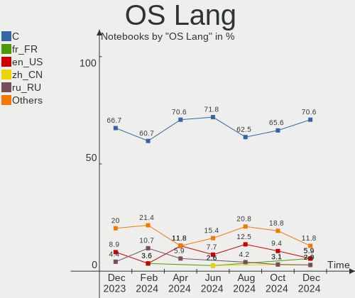
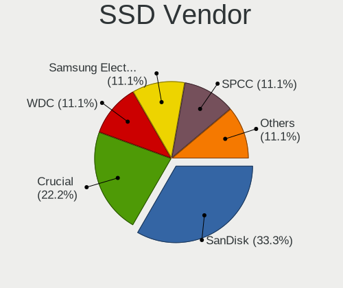
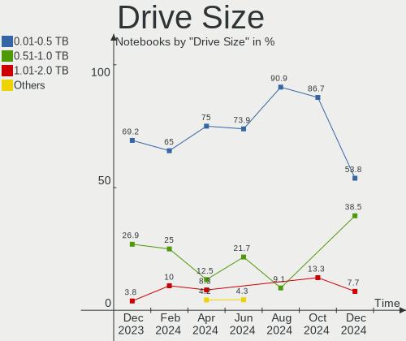
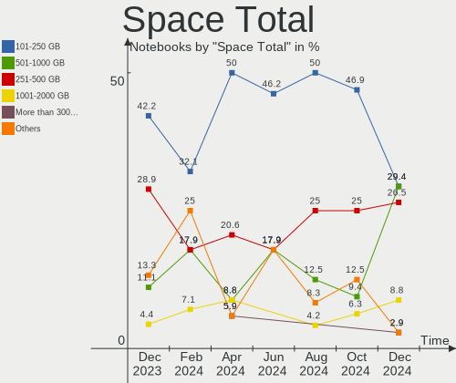
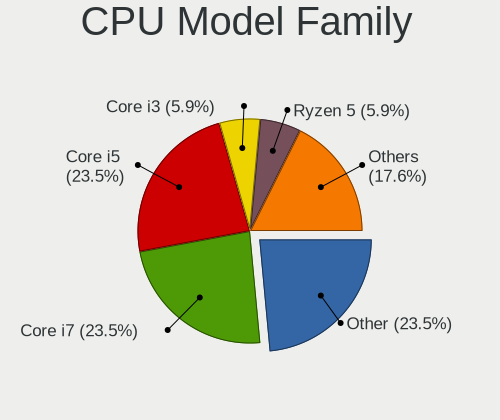
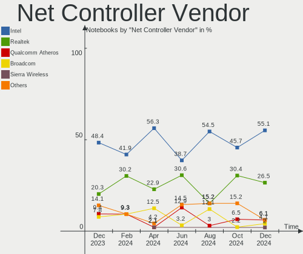
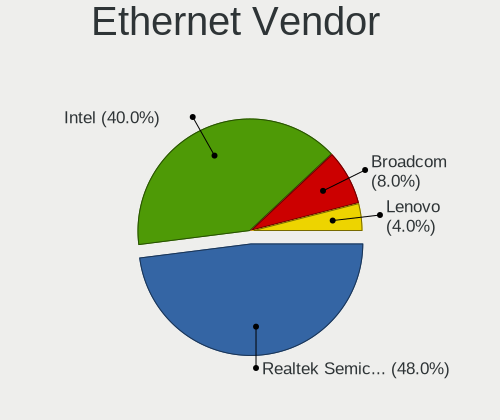
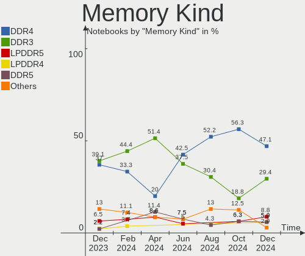
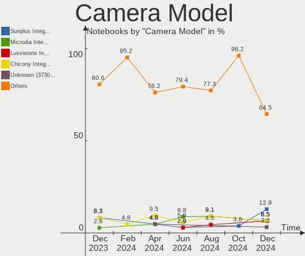

FreeBSD Hardware Trends (Notebooks)
-----------------------------------

A project to identify most popular hardware characteristics and track their change
over time based on data collected by FreeBSD users at https://BSD-Hardware.info.

Anyone can contribute to this report by the [hw-probe](https://github.com/linuxhw/hw-probe/blob/master/INSTALL.BSD.md) tool:

    hw-probe -all -upload

Full-feature report is available here: https://bsd-hardware.info/?view=trends&formfactor=notebook

Period: Oct, 2021.

Contents
--------

* [ System ](#system)
  - [ OS                       ](#os)
  - [ OS Family                ](#os-family)
  - [ Arch                     ](#arch)
  - [ DE                       ](#de)
  - [ Display Server           ](#display-server)
  - [ Display Manager          ](#display-manager)
  - [ OS Lang                  ](#os-lang)
  - [ Boot Mode                ](#boot-mode)
  - [ Filesystem               ](#filesystem)
  - [ Part. scheme             ](#part-scheme)

* [ Board ](#board)
  - [ Vendor                   ](#vendor)
  - [ Model                    ](#model)
  - [ Model Family             ](#model-family)
  - [ MFG Year                 ](#mfg-year)
  - [ Form Factor              ](#form-factor)
  - [ Coreboot                 ](#coreboot)
  - [ RAM Size                 ](#ram-size)
  - [ RAM Used                 ](#ram-used)
  - [ Total Drives             ](#total-drives)
  - [ Has CD-ROM               ](#has-cd-rom)
  - [ Has Ethernet             ](#has-ethernet)
  - [ Has WiFi                 ](#has-wifi)
  - [ Has Bluetooth            ](#has-bluetooth)

* [ Location ](#location)
  - [ Country                  ](#country)
  - [ City                     ](#city)

* [ Drives ](#drives)
  - [ Drive Vendor             ](#drive-vendor)
  - [ Drive Model              ](#drive-model)
  - [ HDD Vendor               ](#hdd-vendor)
  - [ SSD Vendor               ](#ssd-vendor)
  - [ Drive Kind               ](#drive-kind)
  - [ Drive Connector          ](#drive-connector)
  - [ Drive Size               ](#drive-size)
  - [ Space Total              ](#space-total)
  - [ Space Used               ](#space-used)
  - [ Malfunc. Drives          ](#malfunc-drives)
  - [ Malfunc. Drive Vendor    ](#malfunc-drive-vendor)
  - [ Malfunc. HDD Vendor      ](#malfunc-hdd-vendor)
  - [ Malfunc. Drive Kind      ](#malfunc-drive-kind)
  - [ Failed Drives            ](#failed-drives)
  - [ Failed Drive Vendor      ](#failed-drive-vendor)
  - [ Drive Status             ](#drive-status)

* [ Storage controller ](#storage-controller)
  - [ Storage Vendor           ](#storage-vendor)
  - [ Storage Model            ](#storage-model)
  - [ Storage Kind             ](#storage-kind)

* [ Processor ](#processor)
  - [ CPU Vendor               ](#cpu-vendor)
  - [ CPU Model                ](#cpu-model)
  - [ CPU Model Family         ](#cpu-model-family)
  - [ CPU Cores                ](#cpu-cores)
  - [ CPU Sockets              ](#cpu-sockets)
  - [ CPU Threads              ](#cpu-threads)
  - [ CPU Microarch            ](#cpu-microarch)

* [ Graphics ](#graphics)
  - [ GPU Vendor               ](#gpu-vendor)
  - [ GPU Model                ](#gpu-model)
  - [ GPU Combo                ](#gpu-combo)
  - [ GPU Driver               ](#gpu-driver)
  - [ GPU Memory               ](#gpu-memory)

* [ Monitor ](#monitor)
  - [ Monitor Vendor           ](#monitor-vendor)
  - [ Monitor Model            ](#monitor-model)
  - [ Monitor Resolution       ](#monitor-resolution)
  - [ Monitor Diagonal         ](#monitor-diagonal)
  - [ Monitor Width            ](#monitor-width)
  - [ Aspect Ratio             ](#aspect-ratio)
  - [ Monitor Area             ](#monitor-area)
  - [ Pixel Density            ](#pixel-density)
  - [ Multiple Monitors        ](#multiple-monitors)

* [ Network ](#network)
  - [ Net Controller Vendor    ](#net-controller-vendor)
  - [ Net Controller Model     ](#net-controller-model)
  - [ Wireless Vendor          ](#wireless-vendor)
  - [ Wireless Model           ](#wireless-model)
  - [ Ethernet Vendor          ](#ethernet-vendor)
  - [ Ethernet Model           ](#ethernet-model)
  - [ Net Controller Kind      ](#net-controller-kind)
  - [ Used Controller          ](#used-controller)
  - [ NICs                     ](#nics)
  - [ IPv6                     ](#ipv6)

* [ Bluetooth ](#bluetooth)
  - [ Bluetooth Vendor         ](#bluetooth-vendor)
  - [ Bluetooth Model          ](#bluetooth-model)

* [ Sound ](#sound)
  - [ Sound Vendor             ](#sound-vendor)
  - [ Sound Model              ](#sound-model)

* [ Memory ](#memory)
  - [ Memory Vendor            ](#memory-vendor)
  - [ Memory Model             ](#memory-model)
  - [ Memory Kind              ](#memory-kind)
  - [ Memory Form Factor       ](#memory-form-factor)
  - [ Memory Size              ](#memory-size)
  - [ Memory Speed             ](#memory-speed)

* [ Printers & scanners ](#printers--scanners)
  - [ Printer Vendor           ](#printer-vendor)
  - [ Printer Model            ](#printer-model)
  - [ Scanner Vendor           ](#scanner-vendor)
  - [ Scanner Model            ](#scanner-model)

* [ Camera ](#camera)
  - [ Camera Vendor            ](#camera-vendor)
  - [ Camera Model             ](#camera-model)

* [ Security ](#security)
  - [ Fingerprint Vendor       ](#fingerprint-vendor)
  - [ Fingerprint Model        ](#fingerprint-model)
  - [ Chipcard Vendor          ](#chipcard-vendor)
  - [ Chipcard Model           ](#chipcard-model)

* [ Unsupported ](#unsupported)
  - [ Unsupported Devices      ](#unsupported-devices)
  - [ Unsupported Device Types ](#unsupported-device-types)

System
------

OS
--

Installed operating systems

| Name                 | Notebooks | Percent |
|----------------------|-----------|---------|
| FreeBSD 13.0-p4      | 17        | 56.67%  |
| FreeBSD 13.0         | 7         | 23.33%  |
| FreeBSD 14.0-CURRENT | 4         | 13.33%  |
| FreeBSD 13.0-STABLE  | 1         | 3.33%   |
| FreeBSD 12.2-p4      | 1         | 3.33%   |

OS Family
---------

OS without a version

| Name    | Notebooks | Percent |
|---------|-----------|---------|
| FreeBSD | 30        | 100%    |

Arch
----

OS architecture (x86_64, i586, etc.)

| Name  | Notebooks | Percent |
|-------|-----------|---------|
| amd64 | 28        | 93.33%  |
| i386  | 2         | 6.67%   |

DE
--

Desktop Environment

| Name     | Notebooks | Percent |
|----------|-----------|---------|
| XFCE     | 9         | 30%     |
| TWM      | 5         | 16.67%  |
| KDE5     | 5         | 16.67%  |
| i3       | 4         | 13.33%  |
| GNOME    | 2         | 6.67%   |
| MATE     | 1         | 3.33%   |
| Lumina   | 1         | 3.33%   |
| Fluxbox  | 1         | 3.33%   |
| Cinnamon | 1         | 3.33%   |
| Console  | 1         | 3.33%   |

Display Server
--------------

X11 or Wayland

| Name    | Notebooks | Percent |
|---------|-----------|---------|
| X11     | 27        | 90%     |
| Console | 3         | 10%     |

Display Manager
---------------

SDDM, LightDM, etc.

| Name    | Notebooks | Percent |
|---------|-----------|---------|
| Console | 11        | 36.67%  |
| SLiM    | 8         | 26.67%  |
| SDDM    | 5         | 16.67%  |
| XDM     | 3         | 10%     |
| GDM     | 2         | 6.67%   |
| LightDM | 1         | 3.33%   |

OS Lang
-------

Language

| Lang            | Notebooks | Percent |
|-----------------|-----------|---------|
| C               | 23        | 76.67%  |
| zh_CN.GB2312    | 1         | 3.33%   |
| ru_RU           | 1         | 3.33%   |
| en_US.ISO8859-1 | 1         | 3.33%   |
| en_US           | 1         | 3.33%   |
| de_DE           | 1         | 3.33%   |
| de_CH           | 1         | 3.33%   |
| Unknown         | 1         | 3.33%   |

Boot Mode
---------

EFI or BIOS

| Mode | Notebooks | Percent |
|------|-----------|---------|
| EFI  | 23        | 76.67%  |
| BIOS | 7         | 23.33%  |

Filesystem
----------

Type of filesystem

| Type | Notebooks | Percent |
|------|-----------|---------|
| Zfs  | 22        | 73.33%  |
| Ufs  | 8         | 26.67%  |

Part. scheme
------------

Scheme of partitioning

| Type | Notebooks | Percent |
|------|-----------|---------|
| GPT  | 25        | 83.33%  |
| MBR  | 5         | 16.67%  |

Board
-----

Vendor
------

Motherboard manufacturer

| Name             | Notebooks | Percent |
|------------------|-----------|---------|
| Lenovo           | 11        | 36.67%  |
| Dell             | 5         | 16.67%  |
| ASUSTek Computer | 4         | 13.33%  |
| Acer             | 3         | 10%     |
| Framework        | 2         | 6.67%   |
| Toshiba          | 1         | 3.33%   |
| MSI              | 1         | 3.33%   |
| Hewlett-Packard  | 1         | 3.33%   |
| GPD              | 1         | 3.33%   |
| Google           | 1         | 3.33%   |

Model
-----

Motherboard model

| Name                                        | Notebooks | Percent |
|---------------------------------------------|-----------|---------|
| Framework Laptop                            | 2         | 6.67%   |
| Toshiba Dakar10FW8                          | 1         | 3.33%   |
| MSI GS65 Stealth Thin 8RF                   | 1         | 3.33%   |
| Lenovo ThinkPad X1 Extreme Gen 3 20TLA055CD | 1         | 3.33%   |
| Lenovo ThinkPad T490 20N2CTO1WW             | 1         | 3.33%   |
| Lenovo ThinkPad T470p 20J7S0PM00            | 1         | 3.33%   |
| Lenovo ThinkPad T430s 23532QG               | 1         | 3.33%   |
| Lenovo ThinkPad P53 20QNCTO1WW              | 1         | 3.33%   |
| Lenovo ThinkPad P14s Gen 1 20Y1CTO1WW       | 1         | 3.33%   |
| Lenovo ThinkPad Mini10 3507A31              | 1         | 3.33%   |
| Lenovo ThinkPad E14 Gen 3 20Y7CTO1WW        | 1         | 3.33%   |
| Lenovo IdeaPad Y700-15ISK 80NV              | 1         | 3.33%   |
| Lenovo IdeaPad 320-15ABR 80XS               | 1         | 3.33%   |
| Lenovo G580 26897SJ                         | 1         | 3.33%   |
| HP EliteBook 8570p                          | 1         | 3.33%   |
| GPD MicroPC                                 | 1         | 3.33%   |
| Google Terra                                | 1         | 3.33%   |
| Dell XPS 13 9350                            | 1         | 3.33%   |
| Dell XPS 13 9343                            | 1         | 3.33%   |
| Dell Latitude E6430                         | 1         | 3.33%   |
| Dell Inspiron 7460                          | 1         | 3.33%   |
| Dell Inspiron 3493                          | 1         | 3.33%   |
| ASUS TUF Gaming FX505DT_FX505DT             | 1         | 3.33%   |
| ASUS K53E                                   | 1         | 3.33%   |
| ASUS F83VD                                  | 1         | 3.33%   |
| ASUS A9T                                    | 1         | 3.33%   |
| Acer Aspire E5-575                          | 1         | 3.33%   |
| Acer Aspire E5-573G                         | 1         | 3.33%   |
| Acer Aspire 5315                            | 1         | 3.33%   |

Model Family
------------

Motherboard model prefix

| Name               | Notebooks | Percent |
|--------------------|-----------|---------|
| Lenovo ThinkPad    | 8         | 26.67%  |
| Acer Aspire        | 3         | 10%     |
| Lenovo IdeaPad     | 2         | 6.67%   |
| Framework Laptop   | 2         | 6.67%   |
| Dell XPS           | 2         | 6.67%   |
| Dell Inspiron      | 2         | 6.67%   |
| Toshiba Dakar10FW8 | 1         | 3.33%   |
| MSI GS65           | 1         | 3.33%   |
| Lenovo G580        | 1         | 3.33%   |
| HP EliteBook       | 1         | 3.33%   |
| GPD MicroPC        | 1         | 3.33%   |
| Google Terra       | 1         | 3.33%   |
| Dell Latitude      | 1         | 3.33%   |
| ASUS TUF           | 1         | 3.33%   |
| ASUS K53E          | 1         | 3.33%   |
| ASUS F83VD         | 1         | 3.33%   |
| ASUS A9T           | 1         | 3.33%   |

MFG Year
--------

Motherboard manufacture year

| Year | Notebooks | Percent |
|------|-----------|---------|
| 2021 | 5         | 16.67%  |
| 2020 | 4         | 13.33%  |
| 2019 | 4         | 13.33%  |
| 2018 | 4         | 13.33%  |
| 2017 | 3         | 10%     |
| 2013 | 2         | 6.67%   |
| 2010 | 2         | 6.67%   |
| 2016 | 1         | 3.33%   |
| 2015 | 1         | 3.33%   |
| 2012 | 1         | 3.33%   |
| 2011 | 1         | 3.33%   |
| 2008 | 1         | 3.33%   |
| 2005 | 1         | 3.33%   |

Form Factor
-----------

Physical design of the computer

| Name     | Notebooks | Percent |
|----------|-----------|---------|
| Notebook | 30        | 100%    |

Coreboot
--------

Have coreboot on board

| Used | Notebooks | Percent |
|------|-----------|---------|
| No   | 29        | 96.67%  |
| Yes  | 1         | 3.33%   |

RAM Size
--------

Total RAM memory

| Size in GB  | Notebooks | Percent |
|-------------|-----------|---------|
| 16.01-24.0  | 11        | 36.67%  |
| 8.01-16.0   | 7         | 23.33%  |
| 4.01-8.0    | 4         | 13.33%  |
| 32.01-64.0  | 3         | 10%     |
| 2.01-3.0    | 3         | 10%     |
| 64.01-256.0 | 1         | 3.33%   |
| 1.01-2.0    | 1         | 3.33%   |

RAM Used
--------

Used RAM memory

| Used GB  | Notebooks | Percent |
|----------|-----------|---------|
| 0.01-0.5 | 14        | 46.67%  |
| 0.51-1.0 | 8         | 26.67%  |
| 1.01-2.0 | 7         | 23.33%  |
| 2.01-3.0 | 1         | 3.33%   |

Total Drives
------------

Number of drives on board

| Drives | Notebooks | Percent |
|--------|-----------|---------|
| 1      | 20        | 66.67%  |
| 2      | 9         | 30%     |
| 0      | 1         | 3.33%   |

Has CD-ROM
----------

Has CD-ROM on board

| Presented | Notebooks | Percent |
|-----------|-----------|---------|
| No        | 20        | 66.67%  |
| Yes       | 10        | 33.33%  |

Has Ethernet
------------

Has Ethernet on board

| Presented | Notebooks | Percent |
|-----------|-----------|---------|
| Yes       | 23        | 76.67%  |
| No        | 7         | 23.33%  |

Has WiFi
--------

Has WiFi module

| Presented | Notebooks | Percent |
|-----------|-----------|---------|
| Yes       | 29        | 96.67%  |
| No        | 1         | 3.33%   |

Has Bluetooth
-------------

Has Bluetooth module

| Presented | Notebooks | Percent |
|-----------|-----------|---------|
| Yes       | 21        | 70%     |
| No        | 9         | 30%     |

Location
--------

Country
-------

Geographic location (country)

| Country     | Notebooks | Percent |
|-------------|-----------|---------|
| USA         | 7         | 23.33%  |
| Germany     | 5         | 16.67%  |
| UK          | 2         | 6.67%   |
| Indonesia   | 2         | 6.67%   |
| China       | 2         | 6.67%   |
| Ukraine     | 1         | 3.33%   |
| Switzerland | 1         | 3.33%   |
| Romania     | 1         | 3.33%   |
| Poland      | 1         | 3.33%   |
| Malaysia    | 1         | 3.33%   |
| France      | 1         | 3.33%   |
| Denmark     | 1         | 3.33%   |
| Bulgaria    | 1         | 3.33%   |
| Brazil      | 1         | 3.33%   |
| Belarus     | 1         | 3.33%   |
| Austria     | 1         | 3.33%   |
| Australia   | 1         | 3.33%   |

City
----

Geographic location (city)

| City            | Notebooks | Percent |
|-----------------|-----------|---------|
| Phoenix         | 2         | 6.67%   |
| Worthing        | 1         | 3.33%   |
| Wheatland       | 1         | 3.33%   |
| Warsaw          | 1         | 3.33%   |
| Vienna          | 1         | 3.33%   |
| Viborg          | 1         | 3.33%   |
| Vancouver       | 1         | 3.33%   |
| Therwil         | 1         | 3.33%   |
| Stuttgart       | 1         | 3.33%   |
| Strausberg      | 1         | 3.33%   |
| South Yarra     | 1         | 3.33%   |
| Shizishan       | 1         | 3.33%   |
| Rochester       | 1         | 3.33%   |
| Rennes          | 1         | 3.33%   |
| Portland        | 1         | 3.33%   |
| Offenburg       | 1         | 3.33%   |
| North Tawton    | 1         | 3.33%   |
| Munich          | 1         | 3.33%   |
| Minsk           | 1         | 3.33%   |
| Kapinovtsi      | 1         | 3.33%   |
| Juiz de Fora    | 1         | 3.33%   |
| Jakarta         | 1         | 3.33%   |
| Ivano-Frankivsk | 1         | 3.33%   |
| Guangzhou Shi   | 1         | 3.33%   |
| Cirebon         | 1         | 3.33%   |
| Bucharest       | 1         | 3.33%   |
| Bempflingen     | 1         | 3.33%   |
| Bayan Lepas     | 1         | 3.33%   |
| Baltimore       | 1         | 3.33%   |

Drives
------

Drive Vendor
------------

Hard drive vendors

| Vendor              | Notebooks | Drives | Percent |
|---------------------|-----------|--------|---------|
| WDC                 | 7         | 7      | 18.42%  |
| Samsung Electronics | 7         | 7      | 18.42%  |
| Toshiba             | 4         | 4      | 10.53%  |
| Hitachi             | 3         | 3      | 7.89%   |
| SanDisk             | 2         | 2      | 5.26%   |
| Kingston            | 2         | 2      | 5.26%   |
| HGST                | 2         | 2      | 5.26%   |
| SK Hynix            | 1         | 1      | 2.63%   |
| Seagate             | 1         | 1      | 2.63%   |
| Micron Technology   | 1         | 1      | 2.63%   |
| LITEON              | 1         | 1      | 2.63%   |
| KIOXIA              | 1         | 1      | 2.63%   |
| Intel               | 1         | 1      | 2.63%   |
| Hewlett-Packard     | 1         | 1      | 2.63%   |
| Fujitsu             | 1         | 1      | 2.63%   |
| Crucial             | 1         | 1      | 2.63%   |
| Corsair             | 1         | 1      | 2.63%   |
| BIWIN               | 1         | 1      | 2.63%   |

Drive Model
-----------

Hard drive models

| Model                                | Notebooks | Percent |
|--------------------------------------|-----------|---------|
| WDC WDS500G3X0C-00SJG0 500GB         | 1         | 2.63%   |
| WDC WDS250G2B0B-00YS70 250GB         | 1         | 2.63%   |
| WDC WD5000BPVT-22HXZT3 500GB         | 1         | 2.63%   |
| WDC WD2500BEVS-08VAT2 250GB          | 1         | 2.63%   |
| WDC WD10SPZX-75Z10T1 1TB             | 1         | 2.63%   |
| WDC PC SN730 SDBQNTY-256G-1001 256GB | 1         | 2.63%   |
| WDC PC SN730 NVMe 1024GB             | 1         | 2.63%   |
| Toshiba MQ01ABF050 500GB             | 1         | 2.63%   |
| Toshiba MQ01ABD032 320GB             | 1         | 2.63%   |
| Toshiba KXG6APNV2T04 2TB             | 1         | 2.63%   |
| Toshiba KXG60ZNV512G 512GB           | 1         | 2.63%   |
| SK Hynix SKHynix_HFS001TDE9X081N 1TB | 1         | 2.63%   |
| Seagate ST500LT012-1DG142 500GB      | 1         | 2.63%   |
| SanDisk SDSSDH32000G 2TB             | 1         | 2.63%   |
| SanDisk SD9SN8W512G 512GB            | 1         | 2.63%   |
| Samsung SSD PM851 M.2 2280 256GB     | 1         | 2.63%   |
| Samsung SSD 860 EVO 500GB            | 1         | 2.63%   |
| Samsung SSD 840 Series 120GB         | 1         | 2.63%   |
| Samsung PM951 NVMe 256GB             | 1         | 2.63%   |
| Samsung MZVLW256HEHP-000L7 256GB     | 1         | 2.63%   |
| Samsung MZVLB512HBJQ-000L7 512GB     | 1         | 2.63%   |
| Samsung MZALQ512HBLU-00BL1 512GB     | 1         | 2.63%   |
| Micron 2200V_MTFDHBA512TCK 512GB     | 1         | 2.63%   |
| LITEON CV1-8B512 512GB               | 1         | 2.63%   |
| KIOXIA KBG40ZNS512G NVMe 512GB       | 1         | 2.63%   |
| Kingston SUV500M8240G 240GB          | 1         | 2.63%   |
| Kingston SHFS37A240G 240GB           | 1         | 2.63%   |
| Intel SSDPEKKF512G8L 512GB           | 1         | 2.63%   |
| Hitachi HTS545050A7E380 500GB        | 1         | 2.63%   |
| Hitachi HTS541680J9SA00 80GB         | 1         | 2.63%   |
| Hitachi HTS421260H9AT00 64GB         | 1         | 2.63%   |
| HGST HTS721010A9E630 1TB             | 1         | 2.63%   |
| HGST HTS541010A9E680 1TB             | 1         | 2.63%   |
| HP SSD S600 120GB                    | 1         | 2.63%   |
| Fujitsu MHY2160BH 160GB              | 1         | 2.63%   |
| Crucial CT525MX300SSD1 528GB         | 1         | 2.63%   |
| Corsair Voyager GTX 256GB            | 1         | 2.63%   |
| BIWIN SSD 256GB                      | 1         | 2.63%   |

HDD Vendor
----------

Hard disk drive vendors

| Vendor  | Notebooks | Drives | Percent |
|---------|-----------|--------|---------|
| WDC     | 3         | 3      | 25%     |
| Hitachi | 3         | 3      | 25%     |
| Toshiba | 2         | 2      | 16.67%  |
| HGST    | 2         | 2      | 16.67%  |
| Seagate | 1         | 1      | 8.33%   |
| Fujitsu | 1         | 1      | 8.33%   |

SSD Vendor
----------

Solid state drive vendors

| Vendor              | Notebooks | Drives | Percent |
|---------------------|-----------|--------|---------|
| Samsung Electronics | 3         | 3      | 23.08%  |
| SanDisk             | 2         | 2      | 15.38%  |
| Kingston            | 2         | 2      | 15.38%  |
| WDC                 | 1         | 1      | 7.69%   |
| LITEON              | 1         | 1      | 7.69%   |
| Hewlett-Packard     | 1         | 1      | 7.69%   |
| Crucial             | 1         | 1      | 7.69%   |
| Corsair             | 1         | 1      | 7.69%   |
| BIWIN               | 1         | 1      | 7.69%   |

Drive Kind
----------

HDD or SSD

| Kind | Notebooks | Drives | Percent |
|------|-----------|--------|---------|
| NVMe | 11        | 13     | 33.33%  |
| SSD  | 11        | 13     | 33.33%  |
| HDD  | 11        | 12     | 33.33%  |

Drive Connector
---------------

SATA, SAS, NVMe, etc.

| Type | Notebooks | Drives | Percent |
|------|-----------|--------|---------|
| SATA | 21        | 25     | 65.63%  |
| NVMe | 11        | 13     | 34.38%  |

Drive Size
----------

Size of hard drive

| Size in TB | Notebooks | Drives | Percent |
|------------|-----------|--------|---------|
| 0.01-0.5   | 17        | 18     | 70.83%  |
| 0.51-1.0   | 6         | 6      | 25%     |
| 1.01-2.0   | 1         | 1      | 4.17%   |

Space Total
-----------

Amount of disk space available on the file system

| Size in GB | Notebooks | Percent |
|------------|-----------|---------|
| 251-500    | 12        | 40%     |
| 101-250    | 10        | 33.33%  |
| 51-100     | 5         | 16.67%  |
| 21-50      | 1         | 3.33%   |
| 1001-2000  | 1         | 3.33%   |
| 501-1000   | 1         | 3.33%   |

Space Used
----------

Amount of used disk space

| Used GB | Notebooks | Percent |
|---------|-----------|---------|
| 1-20    | 24        | 80%     |
| 21-50   | 5         | 16.67%  |
| 51-100  | 1         | 3.33%   |

Malfunc. Drives
---------------

Drive models with a malfunction

| Model                           | Notebooks | Drives | Percent |
|---------------------------------|-----------|--------|---------|
| Toshiba MQ01ABD032 320GB        | 1         | 1      | 20%     |
| Seagate ST500LT012-1DG142 500GB | 1         | 1      | 20%     |
| Hitachi HTS541680J9SA00 80GB    | 1         | 1      | 20%     |
| Hitachi HTS421260H9AT00 64GB    | 1         | 1      | 20%     |
| HGST HTS721010A9E630 1TB        | 1         | 1      | 20%     |

Malfunc. Drive Vendor
---------------------

Vendors of faulty drives

| Vendor  | Notebooks | Drives | Percent |
|---------|-----------|--------|---------|
| Hitachi | 2         | 2      | 40%     |
| Toshiba | 1         | 1      | 20%     |
| Seagate | 1         | 1      | 20%     |
| HGST    | 1         | 1      | 20%     |

Malfunc. HDD Vendor
-------------------

Vendors of faulty HDD drives

| Vendor  | Notebooks | Drives | Percent |
|---------|-----------|--------|---------|
| Hitachi | 2         | 2      | 40%     |
| Toshiba | 1         | 1      | 20%     |
| Seagate | 1         | 1      | 20%     |
| HGST    | 1         | 1      | 20%     |

Malfunc. Drive Kind
-------------------

Kinds of faulty drives

| Kind | Notebooks | Drives | Percent |
|------|-----------|--------|---------|
| HDD  | 5         | 5      | 100%    |

Failed Drives
-------------

Failed drive models

Zero info for selected period =(

Failed Drive Vendor
-------------------

Failed drive vendors

Zero info for selected period =(

Drive Status
------------

Number of failed and malfunc. drives

| Status  | Notebooks | Drives | Percent |
|---------|-----------|--------|---------|
| Works   | 25        | 33     | 83.33%  |
| Malfunc | 5         | 5      | 16.67%  |

Storage controller
------------------

Storage Vendor
--------------

Storage controller vendors

| Vendor                           | Notebooks | Percent |
|----------------------------------|-----------|---------|
| Intel                            | 19        | 55.88%  |
| Samsung Electronics              | 4         | 11.76%  |
| Sandisk                          | 3         | 8.82%   |
| Toshiba                          | 2         | 5.88%   |
| AMD                              | 2         | 5.88%   |
| SK Hynix                         | 1         | 2.94%   |
| Silicon Integrated Systems [SiS] | 1         | 2.94%   |
| Micron Technology                | 1         | 2.94%   |
| KIOXIA                           | 1         | 2.94%   |

Storage Model
-------------

Storage controller models

| Model                                                                        | Notebooks | Percent |
|------------------------------------------------------------------------------|-----------|---------|
| Intel 7 Series Chipset Family 6-port SATA Controller [AHCI mode]             | 5         | 14.29%  |
| Sandisk WD Black SN750 / PC SN730 NVMe SSD                                   | 3         | 8.57%   |
| Intel Sunrise Point-LP SATA Controller [AHCI mode]                           | 3         | 8.57%   |
| Toshiba XG6 NVMe SSD Controller                                              | 2         | 5.71%   |
| Intel Wildcat Point-LP SATA Controller [AHCI Mode]                           | 2         | 5.71%   |
| AMD FCH SATA Controller [AHCI mode]                                          | 2         | 5.71%   |
| SK Hynix Gold P31 SSD                                                        | 1         | 2.86%   |
| Silicon Integrated Systems [SiS] 5513 IDE Controller                         | 1         | 2.86%   |
| Samsung NVMe SSD Controller SM981/PM981/PM983                                | 1         | 2.86%   |
| Samsung NVMe SSD Controller SM961/PM961/SM963                                | 1         | 2.86%   |
| Samsung NVMe SSD Controller SM951/PM951                                      | 1         | 2.86%   |
| Samsung NVMe SSD Controller 980                                              | 1         | 2.86%   |
| KIOXIA unknown                                                               | 1         | 2.86%   |
| Intel SSD Pro 7600p/760p/E 6100p Series                                      | 1         | 2.86%   |
| Intel NM10/ICH7 Family SATA Controller [AHCI mode]                           | 1         | 2.86%   |
| Intel Ice Lake-LP SATA Controller [AHCI mode]                                | 1         | 2.86%   |
| Intel HM170/QM170 Chipset SATA Controller [AHCI Mode]                        | 1         | 2.86%   |
| Intel Celeron/Pentium Silver Processor SATA Controller                       | 1         | 2.86%   |
| Intel Cannon Lake Mobile PCH SATA AHCI Controller                            | 1         | 2.86%   |
| Intel 82801IBM/IEM (ICH9M/ICH9M-E) 4 port SATA Controller [AHCI mode]        | 1         | 2.86%   |
| Intel 82801HM/HEM (ICH8M/ICH8M-E) SATA Controller [AHCI mode]                | 1         | 2.86%   |
| Intel 82801HM/HEM (ICH8M/ICH8M-E) IDE Controller                             | 1         | 2.86%   |
| Intel 6 Series/C200 Series Chipset Family 6 port Mobile SATA AHCI Controller | 1         | 2.86%   |
| Unknown                                                                      | 1         | 2.86%   |

Storage Kind
------------

Kind of storage controller (IDE, SATA, NVMe, SAS, ...)

| Kind | Notebooks | Percent |
|------|-----------|---------|
| SATA | 20        | 60.61%  |
| NVMe | 11        | 33.33%  |
| IDE  | 2         | 6.06%   |

Processor
---------

CPU Vendor
----------

Processor vendors

| Vendor | Notebooks | Percent |
|--------|-----------|---------|
| Intel  | 26        | 86.67%  |
| AMD    | 4         | 13.33%  |

CPU Model
---------

Processor models

| Model                                           | Notebooks | Percent |
|-------------------------------------------------|-----------|---------|
| Intel CPU Version                               | 1         | 3.33%   |
| Intel Core i7-9750H CPU @ 2.60GHz               | 1         | 3.33%   |
| Intel Core i7-8750H CPU @ 2.20GHz               | 1         | 3.33%   |
| Intel Core i7-8665U CPU @ 1.90GHz               | 1         | 3.33%   |
| Intel Core i7-7700HQ CPU @ 2.80GHz              | 1         | 3.33%   |
| Intel Core i7-7500U CPU @ 2.70GHz               | 1         | 3.33%   |
| Intel Core i7-6700HQ CPU @ 2.60GHz              | 1         | 3.33%   |
| Intel Core i7-5600U CPU @ 2.60GHz               | 1         | 3.33%   |
| Intel Core i7-3720QM CPU @ 2.60GHz              | 1         | 3.33%   |
| Intel Core i7-3520M CPU @ 2.90GHz               | 1         | 3.33%   |
| Intel Core i7-10750H CPU @ 2.60GHz              | 1         | 3.33%   |
| Intel Core i7-1065G7 CPU @ 1.30GHz              | 1         | 3.33%   |
| Intel Core i5-6200U CPU @ 2.30GHz               | 1         | 3.33%   |
| Intel Core i5-5200U CPU @ 2.20GHz               | 1         | 3.33%   |
| Intel Core i5-3320M CPU @ 2.60GHz               | 1         | 3.33%   |
| Intel Core i5-3210M CPU @ 2.50GHz               | 1         | 3.33%   |
| Intel Core i5-2450M CPU @ 2.50GHz               | 1         | 3.33%   |
| Intel Core i3-6006U CPU @ 2.00GHz               | 1         | 3.33%   |
| Intel Celeron N4120 CPU @ 1.10GHz               | 1         | 3.33%   |
| Intel Celeron M processor 1.70GHz               | 1         | 3.33%   |
| Intel Celeron Dual-Core CPU T3300 @ 2.00GHz     | 1         | 3.33%   |
| Intel Celeron CPU N3160 @ 1.60GHz               | 1         | 3.33%   |
| Intel Celeron CPU 847 @ 1.10GHz                 | 1         | 3.33%   |
| Intel Celeron CPU 530 @ 1.73GHz                 | 1         | 3.33%   |
| Intel 11th Gen Core i7-1165G7 @ 2.80GHz         | 1         | 3.33%   |
| Intel 11th Gen Core i5-1135G7 @ 2.40GHz         | 1         | 3.33%   |
| AMD Ryzen 7 PRO 4750U with Radeon Graphics      | 1         | 3.33%   |
| AMD Ryzen 7 5700U with Radeon Graphics          | 1         | 3.33%   |
| AMD Ryzen 5 3550H with Radeon Vega Mobile Gfx   | 1         | 3.33%   |
| AMD A12-9720P RADEON R7, 12 COMPUTE CORES 4C+8G | 1         | 3.33%   |

CPU Model Family
----------------

Processor model prefix

| Model                   | Notebooks | Percent |
|-------------------------|-----------|---------|
| Intel Core i7           | 11        | 36.67%  |
| Intel Core i5           | 5         | 16.67%  |
| Intel Celeron           | 4         | 13.33%  |
| Other                   | 3         | 10%     |
| Intel Core i3           | 1         | 3.33%   |
| Intel Celeron M         | 1         | 3.33%   |
| Intel Celeron Dual-Core | 1         | 3.33%   |
| AMD Ryzen 7 PRO         | 1         | 3.33%   |
| AMD Ryzen 7             | 1         | 3.33%   |
| AMD Ryzen 5             | 1         | 3.33%   |
| AMD A12                 | 1         | 3.33%   |

CPU Cores
---------

Number of processor cores

| Number | Notebooks | Percent |
|--------|-----------|---------|
| 2      | 11        | 36.67%  |
| 4      | 10        | 33.33%  |
| 6      | 3         | 10%     |
| 1      | 3         | 10%     |
| 16     | 2         | 6.67%   |
| 8      | 1         | 3.33%   |

CPU Sockets
-----------

Number of sockets

| Number | Notebooks | Percent |
|--------|-----------|---------|
| 1      | 30        | 100%    |

CPU Threads
-----------

Threads per core (Hyper-Threading)

| Number  | Notebooks | Percent |
|---------|-----------|---------|
| 2       | 20        | 66.67%  |
| 1       | 8         | 26.67%  |
| Unknown | 2         | 6.67%   |

CPU Microarch
-------------

Microarchitecture

| Name          | Notebooks | Percent |
|---------------|-----------|---------|
| KabyLake      | 5         | 16.67%  |
| IvyBridge     | 4         | 13.33%  |
| Skylake       | 3         | 10%     |
| TigerLake     | 2         | 6.67%   |
| SandyBridge   | 2         | 6.67%   |
| Broadwell     | 2         | 6.67%   |
| Zen+          | 1         | 3.33%   |
| Zen 2         | 1         | 3.33%   |
| Silvermont    | 1         | 3.33%   |
| Penryn        | 1         | 3.33%   |
| P6            | 1         | 3.33%   |
| IceLake       | 1         | 3.33%   |
| Goldmont plus | 1         | 3.33%   |
| Excavator     | 1         | 3.33%   |
| Core          | 1         | 3.33%   |
| CometLake     | 1         | 3.33%   |
| Bonnell       | 1         | 3.33%   |
| Unknown       | 1         | 3.33%   |

Graphics
--------

GPU Vendor
----------

Vendors of graphics cards

| Vendor                           | Notebooks | Percent |
|----------------------------------|-----------|---------|
| Intel                            | 22        | 57.89%  |
| Nvidia                           | 10        | 26.32%  |
| AMD                              | 5         | 13.16%  |
| Silicon Integrated Systems [SiS] | 1         | 2.63%   |

GPU Model
---------

Graphics card models

| Model                                                                                      | Notebooks | Percent |
|--------------------------------------------------------------------------------------------|-----------|---------|
| Intel 3rd Gen Core processor Graphics Controller                                           | 3         | 7.69%   |
| Nvidia GM108M [GeForce 940MX]                                                              | 2         | 5.13%   |
| Intel TigerLake-LP GT2 [Iris Xe Graphics]                                                  | 2         | 5.13%   |
| Intel Skylake GT2 [HD Graphics 520]                                                        | 2         | 5.13%   |
| Intel HD Graphics 5500                                                                     | 2         | 5.13%   |
| Intel 2nd Generation Core Processor Family Integrated Graphics Controller                  | 2         | 5.13%   |
| Silicon Integrated Systems [SiS] 661/741/760 PCI/AGP or 662/761Gx PCIE VGA Display Adapter | 1         | 2.56%   |
| Nvidia TU117M [GeForce GTX 1650 Ti Mobile]                                                 | 1         | 2.56%   |
| Nvidia TU117M [GeForce GTX 1650 Mobile / Max-Q]                                            | 1         | 2.56%   |
| Nvidia TU117GLM [Quadro T1000 Mobile]                                                      | 1         | 2.56%   |
| Nvidia GP104M [GeForce GTX 1070 Mobile]                                                    | 1         | 2.56%   |
| Nvidia GM108M [GeForce 940M]                                                               | 1         | 2.56%   |
| Nvidia GF117M [GeForce 610M/710M/810M/820M / GT 620M/625M/630M/720M]                       | 1         | 2.56%   |
| Nvidia GF108GLM [NVS 5200M]                                                                | 1         | 2.56%   |
| Nvidia G96CM [GeForce GT 220M]                                                             | 1         | 2.56%   |
| Intel WhiskeyLake-U GT2 [UHD Graphics 620]                                                 | 1         | 2.56%   |
| Intel Mobile GM965/GL960 Integrated Graphics Controller (secondary)                        | 1         | 2.56%   |
| Intel Mobile GM965/GL960 Integrated Graphics Controller (primary)                          | 1         | 2.56%   |
| Intel Iris Plus Graphics G7                                                                | 1         | 2.56%   |
| Intel HD Graphics 630                                                                      | 1         | 2.56%   |
| Intel HD Graphics 620                                                                      | 1         | 2.56%   |
| Intel HD Graphics 530                                                                      | 1         | 2.56%   |
| Intel GeminiLake [UHD Graphics 600]                                                        | 1         | 2.56%   |
| Intel CometLake-H GT2 [UHD Graphics]                                                       | 1         | 2.56%   |
| Intel CoffeeLake-H GT2 [UHD Graphics 630]                                                  | 1         | 2.56%   |
| Intel Atom/Celeron/Pentium Processor x5-E8000/J3xxx/N3xxx Integrated Graphics Controller   | 1         | 2.56%   |
| Intel Atom Processor D4xx/D5xx/N4xx/N5xx Integrated Graphics Controller                    | 1         | 2.56%   |
| AMD Wani [Radeon R5/R6/R7 Graphics]                                                        | 1         | 2.56%   |
| AMD Thames [Radeon HD 7550M/7570M/7650M]                                                   | 1         | 2.56%   |
| AMD Renoir                                                                                 | 1         | 2.56%   |
| AMD Picasso                                                                                | 1         | 2.56%   |
| AMD Lucienne                                                                               | 1         | 2.56%   |

GPU Combo
---------

Combinations of graphics cards

| Name           | Notebooks | Percent |
|----------------|-----------|---------|
| 1 x Intel      | 13        | 43.33%  |
| Intel + Nvidia | 7         | 23.33%  |
| 1 x AMD        | 4         | 13.33%  |
| 2 x Intel      | 2         | 6.67%   |
| 1 x Nvidia     | 2         | 6.67%   |
| 1 x SiS        | 1         | 3.33%   |
| AMD + Nvidia   | 1         | 3.33%   |

GPU Driver
----------

Free vs proprietary

| Driver      | Notebooks | Percent |
|-------------|-----------|---------|
| Free        | 25        | 83.33%  |
| Proprietary | 5         | 16.67%  |

GPU Memory
----------

Total video memory

| Size in GB | Notebooks | Percent |
|------------|-----------|---------|
| Unknown    | 25        | 83.33%  |
| 0.51-1.0   | 2         | 6.67%   |
| 0.01-0.5   | 2         | 6.67%   |
| 3.01-4.0   | 1         | 3.33%   |

Monitor
-------

Monitor Vendor
--------------

Monitor vendors

| Vendor                  | Notebooks | Percent |
|-------------------------|-----------|---------|
| AU Optronics            | 6         | 21.43%  |
| Sharp                   | 4         | 14.29%  |
| Samsung Electronics     | 3         | 10.71%  |
| LG Display              | 3         | 10.71%  |
| Chimei Innolux          | 2         | 7.14%   |
| BOE                     | 2         | 7.14%   |
| AOC                     | 2         | 7.14%   |
| Philips                 | 1         | 3.57%   |
| PANDA                   | 1         | 3.57%   |
| Lenovo                  | 1         | 3.57%   |
| HJW                     | 1         | 3.57%   |
| Chi Mei Optoelectronics | 1         | 3.57%   |
| AGO                     | 1         | 3.57%   |

Monitor Model
-------------

Monitor models

| Model                                                                    | Notebooks | Percent |
|--------------------------------------------------------------------------|-----------|---------|
| Sharp LCD Monitor SHP1449 1920x1080 290x170mm 13.2-inch                  | 1         | 3.57%   |
| Sharp LCD Monitor SHP143A 3840x2160 350x190mm 15.7-inch                  | 1         | 3.57%   |
| Sharp LCD Monitor SHP1421 3200x1800 290x170mm 13.2-inch                  | 1         | 3.57%   |
| Sharp HDMI SHP1177 1920x1080 1100x620mm 49.7-inch                        | 1         | 3.57%   |
| Samsung Electronics LCD Monitor SEC544B 1600x900 310x170mm 13.9-inch     | 1         | 3.57%   |
| Samsung Electronics LCD Monitor SEC3150 1366x768 340x190mm 15.3-inch     | 1         | 3.57%   |
| Samsung Electronics C34J79x SAM0F1E 3440x1440 800x330mm 34.1-inch        | 1         | 3.57%   |
| Philips LCD Monitor PHL08C3 1920x1080 600x340mm 27.2-inch                | 1         | 3.57%   |
| PANDA LCD Monitor NCP002D 1920x1080 340x190mm 15.3-inch                  | 1         | 3.57%   |
| LG Display LCD Monitor LGD053C 1920x1080 310x170mm 13.9-inch             | 1         | 3.57%   |
| LG Display LCD Monitor LGD0362 1600x900 310x170mm 13.9-inch              | 1         | 3.57%   |
| LG Display LCD Monitor LGD0258 1600x900 350x190mm 15.7-inch              | 1         | 3.57%   |
| Lenovo LCD Monitor LEN40C1 1280x720 220x130mm 10.1-inch                  | 1         | 3.57%   |
| HJW HDMI TO USB HJW0001 1920x1080 700x390mm 31.5-inch                    | 1         | 3.57%   |
| Chimei Innolux LCD Monitor CMN14C9 1920x1080 310x170mm 13.9-inch         | 1         | 3.57%   |
| Chimei Innolux LCD Monitor CMN1372 1920x1080 290x170mm 13.2-inch         | 1         | 3.57%   |
| Chi Mei Optoelectronics LCD Monitor CMO1444 1366x768 310x170mm 13.9-inch | 1         | 3.57%   |
| BOE LCD Monitor BOE095F 2256x1504 280x190mm 13.3-inch                    | 1         | 3.57%   |
| BOE LCD Monitor BOE05BC 1366x768 340x190mm 15.3-inch                     | 1         | 3.57%   |
| AU Optronics LCD Monitor AUO80ED 1920x1080 340x190mm 15.3-inch           | 1         | 3.57%   |
| AU Optronics LCD Monitor AUO38ED 1920x1080 340x190mm 15.3-inch           | 1         | 3.57%   |
| AU Optronics LCD Monitor AUO2774 1280x800 330x210mm 15.4-inch            | 1         | 3.57%   |
| AU Optronics LCD Monitor AUO26EC 1366x768 340x190mm 15.3-inch            | 1         | 3.57%   |
| AU Optronics LCD Monitor AUO243D 1920x1080 310x170mm 13.9-inch           | 1         | 3.57%   |
| AU Optronics LCD Monitor AUO2036 2560x1440 310x170mm 13.9-inch           | 1         | 3.57%   |
| AOC Q3277 AOC3277 2560x1440 710x400mm 32.1-inch                          | 1         | 3.57%   |
| AOC 24G2W1G4 AOC2402 1920x1080 530x300mm 24.0-inch                       | 1         | 3.57%   |
| AGO LCD Monitor AGO0001 1920x1080 300x230mm 14.9-inch                    | 1         | 3.57%   |

Monitor Resolution
------------------

Monitor screen resolution

| Resolution       | Notebooks | Percent |
|------------------|-----------|---------|
| 1920x1080 (FHD)  | 12        | 44.44%  |
| 1366x768 (WXGA)  | 4         | 14.81%  |
| 1600x900 (HD+)   | 3         | 11.11%  |
| 3840x2160 (4K)   | 2         | 7.41%   |
| 3440x1440        | 1         | 3.7%    |
| 3200x1800 (QHD+) | 1         | 3.7%    |
| 2560x1440 (QHD)  | 1         | 3.7%    |
| 2256x1504        | 1         | 3.7%    |
| 1280x800 (WXGA)  | 1         | 3.7%    |
| 1280x720 (HD)    | 1         | 3.7%    |

Monitor Diagonal
----------------

Diagonal size in inches

| Inches | Notebooks | Percent |
|--------|-----------|---------|
| 13     | 11        | 39.29%  |
| 15     | 9         | 32.14%  |
| 49     | 1         | 3.57%   |
| 34     | 1         | 3.57%   |
| 32     | 1         | 3.57%   |
| 31     | 1         | 3.57%   |
| 27     | 1         | 3.57%   |
| 24     | 1         | 3.57%   |
| 14     | 1         | 3.57%   |
| 10     | 1         | 3.57%   |

Monitor Width
-------------

Physical width

| Width in mm | Notebooks | Percent |
|-------------|-----------|---------|
| 301-350     | 16        | 57.14%  |
| 201-300     | 6         | 21.43%  |
| 701-800     | 2         | 7.14%   |
| 501-600     | 2         | 7.14%   |
| 601-700     | 1         | 3.57%   |
| 1001-1500   | 1         | 3.57%   |

Aspect Ratio
------------

Proportional relationship between the width and the height

| Ratio | Notebooks | Percent |
|-------|-----------|---------|
| 16/9  | 21        | 84%     |
| 4/3   | 1         | 4%      |
| 3/2   | 1         | 4%      |
| 21/9  | 1         | 4%      |
| 16/10 | 1         | 4%      |

Monitor Area
------------

Area in inch

| Area in inch | Notebooks | Percent |
|----------------|-----------|---------|
| 81-90          | 8         | 28.57%  |
| 91-100         | 6         | 21.43%  |
| 101-110        | 4         | 14.29%  |
| 71-80          | 3         | 10.71%  |
| 351-500        | 3         | 10.71%  |
| More than 1000 | 1         | 3.57%   |
| 41-50          | 1         | 3.57%   |
| 301-350        | 1         | 3.57%   |
| 201-250        | 1         | 3.57%   |

Pixel Density
-------------

Pixels per inch

| Density       | Notebooks | Percent |
|---------------|-----------|---------|
| 121-160       | 10        | 35.71%  |
| 101-120       | 6         | 21.43%  |
| 51-100        | 5         | 17.86%  |
| 161-240       | 4         | 14.29%  |
| More than 240 | 2         | 7.14%   |
| 1-50          | 1         | 3.57%   |

Multiple Monitors
-----------------

Total monitors connected

| Total | Notebooks | Percent |
|-------|-----------|---------|
| 1     | 19        | 63.33%  |
| 0     | 6         | 20%     |
| 2     | 5         | 16.67%  |

Network
-------

Net Controller Vendor
---------------------

Controller vendors

| Vendor                           | Notebooks | Percent |
|----------------------------------|-----------|---------|
| Intel                            | 19        | 36.54%  |
| Realtek Semiconductor            | 12        | 23.08%  |
| Qualcomm Atheros                 | 9         | 17.31%  |
| TP-Link                          | 2         | 3.85%   |
| MediaTek                         | 2         | 3.85%   |
| Edimax Technology                | 2         | 3.85%   |
| Silicon Integrated Systems [SiS] | 1         | 1.92%   |
| Ralink Technology                | 1         | 1.92%   |
| Hewlett-Packard                  | 1         | 1.92%   |
| dog hunter                       | 1         | 1.92%   |
| Dell                             | 1         | 1.92%   |
| Broadcom                         | 1         | 1.92%   |

Net Controller Model
--------------------

Controller models

| Model                                                                   | Notebooks | Percent |
|-------------------------------------------------------------------------|-----------|---------|
| Realtek RTL8111/8168/8411 PCI Express Gigabit Ethernet Controller       | 10        | 15.87%  |
| Qualcomm Atheros AR9285 Wireless Network Adapter (PCI-Express)          | 3         | 4.76%   |
| Intel Wi-Fi 6 AX200                                                     | 3         | 4.76%   |
| Intel Centrino Advanced-N 6205 [Taylor Peak]                            | 3         | 4.76%   |
| Intel 82579LM Gigabit Network Connection (Lewisville)                   | 3         | 4.76%   |
| TP-Link AC600 wireless Realtek RTL8811AU [Archer T2U Nano]              | 2         | 3.17%   |
| Qualcomm Atheros QCA9377 802.11ac Wireless Network Adapter              | 2         | 3.17%   |
| Qualcomm Atheros AR8162 Fast Ethernet                                   | 2         | 3.17%   |
| Intel Wireless 8260                                                     | 2         | 3.17%   |
| Intel Wireless 7265                                                     | 2         | 3.17%   |
| Edimax EW-7811Un 802.11n Wireless Adapter [Realtek RTL8188CUS]          | 2         | 3.17%   |
| Silicon Integrated Systems [SiS] SiS900 PCI Fast Ethernet               | 1         | 1.59%   |
| Silicon Integrated Systems [SiS] AC'97 Modem Controller                 | 1         | 1.59%   |
| Realtek RTL8821CE 802.11ac PCIe Wireless Network Adapter                | 1         | 1.59%   |
| Realtek RTL8723AE PCIe Wireless Network Adapter                         | 1         | 1.59%   |
| Realtek RTL8188CUS 802.11n WLAN Adapter                                 | 1         | 1.59%   |
| Realtek RTL810xE PCI Express Fast Ethernet controller                   | 1         | 1.59%   |
| Ralink RT5370 Wireless Adapter                                          | 1         | 1.59%   |
| Qualcomm Atheros QCA6174 802.11ac Wireless Network Adapter              | 1         | 1.59%   |
| Qualcomm Atheros Killer E2500 Gigabit Ethernet Controller               | 1         | 1.59%   |
| Qualcomm Atheros AR8151 v2.0 Gigabit Ethernet                           | 1         | 1.59%   |
| Qualcomm Atheros AR8132 Fast Ethernet                                   | 1         | 1.59%   |
| Qualcomm Atheros AR242x / AR542x Wireless Network Adapter (PCI-Express) | 1         | 1.59%   |
| MediaTek 802.11 n WLAN                                                  | 1         | 1.59%   |
| Intel Wireless 8265 / 8275                                              | 1         | 1.59%   |
| Intel Wi-Fi 6 AX210/AX211/AX411 160MHz                                  | 1         | 1.59%   |
| Intel Wi-Fi 6 AX201                                                     | 1         | 1.59%   |
| Intel PRO/Wireless 5100 AGN [Shiloh] Network Connection                 | 1         | 1.59%   |
| Intel Ethernet Connection (7) I219-V                                    | 1         | 1.59%   |
| Intel Ethernet Connection (5) I219-V                                    | 1         | 1.59%   |
| Intel Dual Band Wireless-AC 3168NGW [Stone Peak]                        | 1         | 1.59%   |
| Intel Dual Band Wireless-AC 3165 Plus Bluetooth                         | 1         | 1.59%   |
| Intel Comet Lake PCH CNVi WiFi                                          | 1         | 1.59%   |
| Intel Cannon Point-LP CNVi [Wireless-AC]                                | 1         | 1.59%   |
| Intel Cannon Lake PCH CNVi WiFi                                         | 1         | 1.59%   |
| HP hs2350 HSPA+ Mobile Broadband Module Network Adapter                 | 1         | 1.59%   |
| dog hunter Arduino Leonardo ETH                                         | 1         | 1.59%   |
| Dell Dell Wireless 5560 Single-mode HSPA Mini Card with A-GPS           | 1         | 1.59%   |
| Broadcom NetLink BCM5906M Fast Ethernet PCI Express                     | 1         | 1.59%   |
| Unknown                                                                 | 1         | 1.59%   |

Wireless Vendor
---------------

Wireless vendors

| Vendor                | Notebooks | Percent |
|-----------------------|-----------|---------|
| Intel                 | 19        | 54.29%  |
| Qualcomm Atheros      | 7         | 20%     |
| TP-Link               | 2         | 5.71%   |
| Realtek Semiconductor | 2         | 5.71%   |
| Edimax Technology     | 2         | 5.71%   |
| Ralink Technology     | 1         | 2.86%   |
| MediaTek              | 1         | 2.86%   |
| Dell                  | 1         | 2.86%   |

Wireless Model
--------------

Wireless models

| Model                                                                   | Notebooks | Percent |
|-------------------------------------------------------------------------|-----------|---------|
| Qualcomm Atheros AR9285 Wireless Network Adapter (PCI-Express)          | 3         | 8.33%   |
| Intel Wi-Fi 6 AX200                                                     | 3         | 8.33%   |
| Intel Centrino Advanced-N 6205 [Taylor Peak]                            | 3         | 8.33%   |
| TP-Link AC600 wireless Realtek RTL8811AU [Archer T2U Nano]              | 2         | 5.56%   |
| Qualcomm Atheros QCA9377 802.11ac Wireless Network Adapter              | 2         | 5.56%   |
| Intel Wireless 8260                                                     | 2         | 5.56%   |
| Intel Wireless 7265                                                     | 2         | 5.56%   |
| Edimax EW-7811Un 802.11n Wireless Adapter [Realtek RTL8188CUS]          | 2         | 5.56%   |
| Realtek RTL8821CE 802.11ac PCIe Wireless Network Adapter                | 1         | 2.78%   |
| Realtek RTL8723AE PCIe Wireless Network Adapter                         | 1         | 2.78%   |
| Realtek RTL8188CUS 802.11n WLAN Adapter                                 | 1         | 2.78%   |
| Ralink RT5370 Wireless Adapter                                          | 1         | 2.78%   |
| Qualcomm Atheros QCA6174 802.11ac Wireless Network Adapter              | 1         | 2.78%   |
| Qualcomm Atheros AR242x / AR542x Wireless Network Adapter (PCI-Express) | 1         | 2.78%   |
| MediaTek 802.11 n WLAN                                                  | 1         | 2.78%   |
| Intel Wireless 8265 / 8275                                              | 1         | 2.78%   |
| Intel Wi-Fi 6 AX210/AX211/AX411 160MHz                                  | 1         | 2.78%   |
| Intel Wi-Fi 6 AX201                                                     | 1         | 2.78%   |
| Intel PRO/Wireless 5100 AGN [Shiloh] Network Connection                 | 1         | 2.78%   |
| Intel Dual Band Wireless-AC 3168NGW [Stone Peak]                        | 1         | 2.78%   |
| Intel Dual Band Wireless-AC 3165 Plus Bluetooth                         | 1         | 2.78%   |
| Intel Comet Lake PCH CNVi WiFi                                          | 1         | 2.78%   |
| Intel Cannon Point-LP CNVi [Wireless-AC]                                | 1         | 2.78%   |
| Intel Cannon Lake PCH CNVi WiFi                                         | 1         | 2.78%   |
| Dell Dell Wireless 5560 Single-mode HSPA Mini Card with A-GPS           | 1         | 2.78%   |

Ethernet Vendor
---------------

Ethernet vendors

| Vendor                           | Notebooks | Percent |
|----------------------------------|-----------|---------|
| Realtek Semiconductor            | 11        | 47.83%  |
| Qualcomm Atheros                 | 5         | 21.74%  |
| Intel                            | 5         | 21.74%  |
| Silicon Integrated Systems [SiS] | 1         | 4.35%   |
| Broadcom                         | 1         | 4.35%   |

Ethernet Model
--------------

Ethernet models

| Model                                                             | Notebooks | Percent |
|-------------------------------------------------------------------|-----------|---------|
| Realtek RTL8111/8168/8411 PCI Express Gigabit Ethernet Controller | 10        | 43.48%  |
| Intel 82579LM Gigabit Network Connection (Lewisville)             | 3         | 13.04%  |
| Qualcomm Atheros AR8162 Fast Ethernet                             | 2         | 8.7%    |
| Silicon Integrated Systems [SiS] SiS900 PCI Fast Ethernet         | 1         | 4.35%   |
| Realtek RTL810xE PCI Express Fast Ethernet controller             | 1         | 4.35%   |
| Qualcomm Atheros Killer E2500 Gigabit Ethernet Controller         | 1         | 4.35%   |
| Qualcomm Atheros AR8151 v2.0 Gigabit Ethernet                     | 1         | 4.35%   |
| Qualcomm Atheros AR8132 Fast Ethernet                             | 1         | 4.35%   |
| Intel Ethernet Connection (7) I219-V                              | 1         | 4.35%   |
| Intel Ethernet Connection (5) I219-V                              | 1         | 4.35%   |
| Broadcom NetLink BCM5906M Fast Ethernet PCI Express               | 1         | 4.35%   |

Net Controller Kind
-------------------

Ethernet, WiFi or modem

| Kind     | Notebooks | Percent |
|----------|-----------|---------|
| WiFi     | 29        | 51.79%  |
| Ethernet | 23        | 41.07%  |
| Modem    | 3         | 5.36%   |
| Unknown  | 1         | 1.79%   |

Used Controller
---------------

Currently used network controller

| Kind     | Notebooks | Percent |
|----------|-----------|---------|
| Ethernet | 22        | 50%     |
| WiFi     | 21        | 47.73%  |
| Modem    | 1         | 2.27%   |

NICs
----

Total network controllers on board

| Total | Notebooks | Percent |
|-------|-----------|---------|
| 2     | 21        | 70%     |
| 1     | 8         | 26.67%  |
| 3     | 1         | 3.33%   |

IPv6
----

IPv6 vs IPv4

| Used | Notebooks | Percent |
|------|-----------|---------|
| No   | 27        | 90%     |
| Yes  | 3         | 10%     |

Bluetooth
---------

Bluetooth Vendor
----------------

Controller vendors

| Vendor                          | Notebooks | Percent |
|---------------------------------|-----------|---------|
| Intel                           | 15        | 71.43%  |
| Qualcomm Atheros Communications | 2         | 9.52%   |
| Lite-On Technology              | 1         | 4.76%   |
| Foxconn / Hon Hai               | 1         | 4.76%   |
| Dell                            | 1         | 4.76%   |
| Broadcom                        | 1         | 4.76%   |

Bluetooth Model
---------------

Controller models

| Model                                               | Notebooks | Percent |
|-----------------------------------------------------|-----------|---------|
| Intel Bluetooth wireless interface                  | 6         | 28.57%  |
| Intel Bluetooth 9460/9560 Jefferson Peak (JfP)      | 3         | 14.29%  |
| Intel AX200 Bluetooth                               | 3         | 14.29%  |
| Qualcomm Atheros  QCA9377 Bluetooth 4.1             | 1         | 4.76%   |
| Qualcomm Atheros Dell Wireless 1820 Bluetooth 4.1LE | 1         | 4.76%   |
| Lite-On Qualcomm Atheros QCA9377 Bluetooth          | 1         | 4.76%   |
| Intel Wireless-AC 3168 Bluetooth                    | 1         | 4.76%   |
| Intel AX210 Bluetooth                               | 1         | 4.76%   |
| Intel AX201 Bluetooth                               | 1         | 4.76%   |
| Foxconn / Hon Hai Wireless_Device                   | 1         | 4.76%   |
| Dell Dell Wireless 380 Bluetooth 4.0 Module         | 1         | 4.76%   |
| Broadcom BCM20702 Bluetooth 4.0 [ThinkPad]          | 1         | 4.76%   |

Sound
-----

Sound Vendor
------------

Sound card vendors

| Vendor                           | Notebooks | Percent |
|----------------------------------|-----------|---------|
| Intel                            | 25        | 71.43%  |
| AMD                              | 5         | 14.29%  |
| Nvidia                           | 3         | 8.57%   |
| Silicon Integrated Systems [SiS] | 1         | 2.86%   |
| Logitech                         | 1         | 2.86%   |

Sound Model
-----------

Sound card models

| Model                                                                                             | Notebooks | Percent |
|---------------------------------------------------------------------------------------------------|-----------|---------|
| Intel 7 Series/C216 Chipset Family High Definition Audio Controller                               | 5         | 12.82%  |
| Nvidia TU107 GeForce GTX 1650 High Definition Audio Controller                                    | 3         | 7.69%   |
| Intel Sunrise Point-LP HD Audio                                                                   | 3         | 7.69%   |
| AMD Family 17h (Models 10h-1fh) HD Audio Controller                                               | 3         | 7.69%   |
| Intel Tiger Lake-LP Smart Sound Technology Audio Controller                                       | 2         | 5.13%   |
| Intel Cannon Lake PCH cAVS                                                                        | 2         | 5.13%   |
| Intel Broadwell-U Audio Controller                                                                | 2         | 5.13%   |
| AMD Renoir Radeon High Definition Audio Controller                                                | 2         | 5.13%   |
| Silicon Integrated Systems [SiS] SiS7012 AC'97 Sound Controller                                   | 1         | 2.56%   |
| Logitech Headset H340                                                                             | 1         | 2.56%   |
| Intel Wildcat Point-LP High Definition Audio Controller                                           | 1         | 2.56%   |
| Intel NM10/ICH7 Family High Definition Audio Controller                                           | 1         | 2.56%   |
| Intel Ice Lake-LP Smart Sound Technology Audio Controller                                         | 1         | 2.56%   |
| Intel Comet Lake PCH cAVS                                                                         | 1         | 2.56%   |
| Intel CM238 HD Audio Controller                                                                   | 1         | 2.56%   |
| Intel Celeron/Pentium Silver Processor High Definition Audio                                      | 1         | 2.56%   |
| Intel Cannon Point-LP High Definition Audio Controller                                            | 1         | 2.56%   |
| Intel Atom/Celeron/Pentium Processor x5-E8000/J3xxx/N3xxx Series High Definition Audio Controller | 1         | 2.56%   |
| Intel 82801I (ICH9 Family) HD Audio Controller                                                    | 1         | 2.56%   |
| Intel 82801H (ICH8 Family) HD Audio Controller                                                    | 1         | 2.56%   |
| Intel 6 Series/C200 Series Chipset Family High Definition Audio Controller                        | 1         | 2.56%   |
| Intel 100 Series/C230 Series Chipset Family HD Audio Controller                                   | 1         | 2.56%   |
| AMD Turks HDMI Audio [Radeon HD 6500/6600 / 6700M Series]                                         | 1         | 2.56%   |
| AMD Kabini HDMI/DP Audio                                                                          | 1         | 2.56%   |
| AMD Family 15h (Models 60h-6fh) Audio Controller                                                  | 1         | 2.56%   |

Memory
------

Memory Vendor
-------------

Memory module vendors

| Vendor              | Notebooks | Percent |
|---------------------|-----------|---------|
| Samsung Electronics | 12        | 34.29%  |
| SK Hynix            | 5         | 14.29%  |
| Micron Technology   | 4         | 11.43%  |
| Ramaxel Technology  | 2         | 5.71%   |
| Kingston            | 2         | 5.71%   |
| Elpida              | 2         | 5.71%   |
| Crucial             | 2         | 5.71%   |
| Unknown             | 2         | 5.71%   |
| Unknown (ABCD)      | 1         | 2.86%   |
| Unknown             | 1         | 2.86%   |
| Teikon              | 1         | 2.86%   |
| A-DATA Technology   | 1         | 2.86%   |

Memory Model
------------

Memory module models

| Model                                                            | Notebooks | Percent |
|------------------------------------------------------------------|-----------|---------|
| SK Hynix RAM HMT351S6CFR8C-PB 4GB SODIMM DDR3 1600MT/s           | 2         | 5.41%   |
| Samsung RAM M471B1G73QH0-YK0 8GB SODIMM DDR3 1600MT/s            | 2         | 5.41%   |
| Samsung RAM M471A2K43DB1-CTD 16GB SODIMM DDR4 2667MT/s           | 2         | 5.41%   |
| Unknown                                                          | 2         | 5.41%   |
| Unknown RAM Module 512MB SODIMM SDRAM                            | 1         | 2.7%    |
| Unknown (ABCD) RAM 123456789012345678 4GB SODIMM LPDDR4 2133MT/s | 1         | 2.7%    |
| Teikon RAM TMA81GS6AFR8N-UHSC 8GB SODIMM DDR4 2400MT/s           | 1         | 2.7%    |
| SK Hynix RAM Module 1GB DIMM DDR2 533MT/s                        | 1         | 2.7%    |
| SK Hynix RAM HMA82GS6DJR8N-XN 16GB SODIMM DDR4 3200MT/s          | 1         | 2.7%    |
| SK Hynix RAM HMA41GS6AFR8N-TF 8GB SODIMM DDR4 2133MT/s           | 1         | 2.7%    |
| Samsung RAM Module 2GB SODIMM 667MT/s                            | 1         | 2.7%    |
| Samsung RAM M471B5273CH0-CH9 4GB SODIMM DDR3 1333MT/s            | 1         | 2.7%    |
| Samsung RAM M471B1G73EB0-YK0 8GB SODIMM DDR3 1600MT/s            | 1         | 2.7%    |
| Samsung RAM M471B1G73BH0-CK0 8GB SODIMM DDR3 1600MT/s            | 1         | 2.7%    |
| Samsung RAM M471A5143SB1-CRC 4GB SODIMM DDR4 1866MT/s            | 1         | 2.7%    |
| Samsung RAM M471A2K43CB1-CTD 16GB SODIMM DDR4 2667MT/s           | 1         | 2.7%    |
| Samsung RAM M471A2G44AM0-CTD 16GB SODIMM DDR4 2667MT/s           | 1         | 2.7%    |
| Samsung RAM M471A1K43CB1-CTD 8GB SODIMM DDR4 2667MT/s            | 1         | 2.7%    |
| Samsung RAM M471A1G44AB0-CWE 8GB SODIMM DDR4 3200MT/s            | 1         | 2.7%    |
| Samsung RAM K4E8E324EB-EGCF 2GB LPDDR3 1600MT/s                  | 1         | 2.7%    |
| Ramaxel RAM RMT3150ED58E8W1600 2GB SODIMM DDR3 1600MT/s          | 1         | 2.7%    |
| Ramaxel RAM RMSA3300MH78HBF-2666 16GB SODIMM DDR4 2400MT/s       | 1         | 2.7%    |
| Micron RAM 4ATS2G64HZ-3G2B1 16GB SODIMM DDR4 3200MT/s            | 1         | 2.7%    |
| Micron RAM 4ATF51264HZ-2G3AZ 4GB SODIMM DDR4 1866MT/s            | 1         | 2.7%    |
| Micron RAM 4ATF1G64HZ-3G2E1 8GB SODIMM DDR4 3200MT/s             | 1         | 2.7%    |
| Micron RAM 16ATF2G64HZ-3G2J1 16GB SODIMM DDR4 3200MT/s           | 1         | 2.7%    |
| Kingston RAM TSB1600D3S11ELD/2G 2GB SODIMM DDR3 1600MT/s         | 1         | 2.7%    |
| Kingston RAM ACR24D4S7S1MB-4 4GB SODIMM DDR4 2400MT/s            | 1         | 2.7%    |
| Elpida RAM EDFA232A2MA-JD-F-R 4GB Chip LPDDR3 1867MT/s           | 1         | 2.7%    |
| Elpida RAM 8KTS51264HDZ-1G6E1 4GB Chip DDR3 1600MT/s             | 1         | 2.7%    |
| Crucial RAM CT8G4SFRA32A.M8FRS 8GB SODIMM DDR4 3200MT/s          | 1         | 2.7%    |
| Crucial RAM BL32G32C16S4B.M16FB1 32GB SODIMM DDR4 2667MT/s       | 1         | 2.7%    |
| A-DATA RAM Module 1GB DIMM DDR2 533MT/s                          | 1         | 2.7%    |

Memory Kind
-----------

Memory module kinds

| Kind    | Notebooks | Percent |
|---------|-----------|---------|
| DDR4    | 15        | 50%     |
| DDR3    | 8         | 26.67%  |
| LPDDR3  | 2         | 6.67%   |
| Unknown | 2         | 6.67%   |
| SDRAM   | 1         | 3.33%   |
| LPDDR4  | 1         | 3.33%   |
| DDR2    | 1         | 3.33%   |

Memory Form Factor
------------------

Physical design of the memory module

| Name    | Notebooks | Percent |
|---------|-----------|---------|
| SODIMM  | 26        | 86.67%  |
| Chip    | 2         | 6.67%   |
| DIMM    | 1         | 3.33%   |
| Unknown | 1         | 3.33%   |

Memory Size
-----------

Memory module size

| Size  | Notebooks | Percent |
|-------|-----------|---------|
| 8192  | 8         | 25%     |
| 4096  | 8         | 25%     |
| 16384 | 7         | 21.88%  |
| 2048  | 5         | 15.63%  |
| 1024  | 2         | 6.25%   |
| 32768 | 1         | 3.13%   |
| 512   | 1         | 3.13%   |

Memory Speed
------------

Memory module speed

| Speed   | Notebooks | Percent |
|---------|-----------|---------|
| 1600    | 8         | 26.67%  |
| 3200    | 5         | 16.67%  |
| 2667    | 5         | 16.67%  |
| 2400    | 3         | 10%     |
| 2133    | 2         | 6.67%   |
| 1867    | 1         | 3.33%   |
| 1866    | 1         | 3.33%   |
| 1333    | 1         | 3.33%   |
| 800     | 1         | 3.33%   |
| 667     | 1         | 3.33%   |
| 533     | 1         | 3.33%   |
| Unknown | 1         | 3.33%   |

Printers & scanners
-------------------

Printer Vendor
--------------

Printer device vendors

Zero info for selected period =(

Printer Model
-------------

Printer device models

Zero info for selected period =(

Scanner Vendor
--------------

Scanner device vendors

Zero info for selected period =(

Scanner Model
-------------

Scanner device models

Zero info for selected period =(

Camera
------

Camera Vendor
-------------

Camera device vendors

| Vendor                        | Notebooks | Percent |
|-------------------------------|-----------|---------|
| IMC Networks                  | 6         | 25%     |
| Chicony Electronics           | 6         | 25%     |
| Realtek Semiconductor         | 4         | 16.67%  |
| Microdia                      | 2         | 8.33%   |
| Acer                          | 2         | 8.33%   |
| Suyin                         | 1         | 4.17%   |
| Sunplus Innovation Technology | 1         | 4.17%   |
| Importek                      | 1         | 4.17%   |
| Cubeternet                    | 1         | 4.17%   |

Camera Model
------------

Camera device models

| Model                             | Notebooks | Percent |
|-----------------------------------|-----------|---------|
| IMC Networks USB2.0 HD UVC WebCam | 2         | 8.33%   |
| IMC Networks Integrated Camera    | 2         | 8.33%   |
| Chicony ThinkPad T490 Webcam      | 2         | 8.33%   |
| Chicony Integrated Camera         | 2         | 8.33%   |
| Suyin Lenovo Integrated Webcam    | 1         | 4.17%   |
| Sunplus HD WebCam                 | 1         | 4.17%   |
| Realtek Laptop Camera             | 1         | 4.17%   |
| Realtek Integrated_Webcam_HD      | 1         | 4.17%   |
| Realtek Integrated Webcam         | 1         | 4.17%   |
| Realtek HD WebCam                 | 1         | 4.17%   |
| Microdia Integrated_Webcam_HD     | 1         | 4.17%   |
| Microdia Integrated Webcam HD     | 1         | 4.17%   |
| Importek TOSHIBA Web Camera - HD  | 1         | 4.17%   |
| IMC Networks UVC VGA Webcam       | 1         | 4.17%   |
| IMC Networks Integrated Webcam    | 1         | 4.17%   |
| Cubeternet WebCam                 | 1         | 4.17%   |
| Chicony Lenovo EasyCamera         | 1         | 4.17%   |
| Chicony Integrated HP HD Webcam   | 1         | 4.17%   |
| Acer Lenovo Integrated Webcam     | 1         | 4.17%   |
| Acer Integrated Camera            | 1         | 4.17%   |

Security
--------

Fingerprint Vendor
------------------

Fingerprint sensor vendors

| Vendor    | Notebooks | Percent |
|-----------|-----------|---------|
| Synaptics | 2         | 100%    |

Fingerprint Model
-----------------

Fingerprint sensor models

| Model                                             | Notebooks | Percent |
|---------------------------------------------------|-----------|---------|
| Synaptics Prometheus MIS Touch Fingerprint Reader | 2         | 100%    |

Chipcard Vendor
---------------

Chipcard module vendors

Zero info for selected period =(

Chipcard Model
--------------

Chipcard module models

Zero info for selected period =(

Unsupported
-----------

Unsupported Devices
-------------------

Total unsupported devices on board

| Total | Notebooks | Percent |
|-------|-----------|---------|
| 1     | 8         | 26.67%  |
| 2     | 6         | 20%     |
| 0     | 6         | 20%     |
| 3     | 5         | 16.67%  |
| 4     | 4         | 13.33%  |
| 5     | 1         | 3.33%   |

Unsupported Device Types
------------------------

Types of unsupported devices

| Type                     | Notebooks | Percent |
|--------------------------|-----------|---------|
| Communication controller | 21        | 40.38%  |
| Net/wireless             | 11        | 21.15%  |
| Bluetooth                | 9         | 17.31%  |
| Card reader              | 5         | 9.62%   |
| Fingerprint reader       | 2         | 3.85%   |
| Network                  | 1         | 1.92%   |
| Net/ethernet             | 1         | 1.92%   |
| Modem                    | 1         | 1.92%   |
| Firewire controller      | 1         | 1.92%   |

