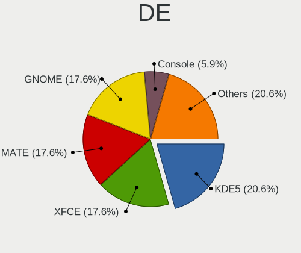
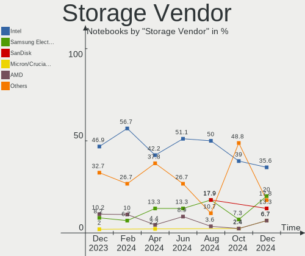
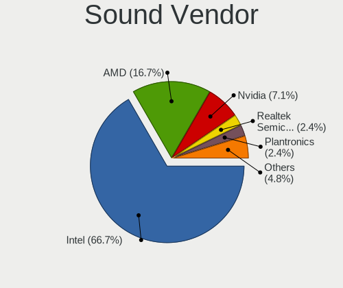
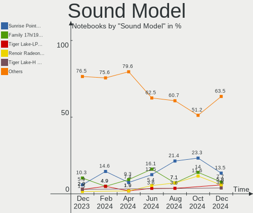

FreeBSD - Hardware Trends (Notebooks)
-------------------------------------

A project to identify most popular hardware characteristics and track their change
over time based on data collected by BSD users at https://BSD-Hardware.info.

Anyone can contribute to this report by the [hw-probe](https://github.com/linuxhw/hw-probe/blob/master/INSTALL.BSD.md) tool:

    hw-probe -all -upload

This report is for one last month. Overall report since the beginning of time: [TestCoverage](https://github.com/bsdhw/TestCoverage)

Period: May, 2022.

Contents
--------

* [ System ](#system)
  - [ OS                       ](#os)
  - [ OS Family                ](#os-family)
  - [ Arch                     ](#arch)
  - [ DE                       ](#de)
  - [ Display Server           ](#display-server)
  - [ Display Manager          ](#display-manager)
  - [ OS Lang                  ](#os-lang)
  - [ Boot Mode                ](#boot-mode)
  - [ Filesystem               ](#filesystem)
  - [ Part. scheme             ](#part-scheme)

* [ Board ](#board)
  - [ Vendor                   ](#vendor)
  - [ Model                    ](#model)
  - [ Model Family             ](#model-family)
  - [ MFG Year                 ](#mfg-year)
  - [ Form Factor              ](#form-factor)
  - [ Coreboot                 ](#coreboot)
  - [ RAM Size                 ](#ram-size)
  - [ RAM Used                 ](#ram-used)
  - [ Total Drives             ](#total-drives)
  - [ Has CD-ROM               ](#has-cd-rom)
  - [ Has Ethernet             ](#has-ethernet)
  - [ Has WiFi                 ](#has-wifi)
  - [ Has Bluetooth            ](#has-bluetooth)

* [ Location ](#location)
  - [ Country                  ](#country)
  - [ City                     ](#city)

* [ Drives ](#drives)
  - [ Drive Vendor             ](#drive-vendor)
  - [ Drive Model              ](#drive-model)
  - [ HDD Vendor               ](#hdd-vendor)
  - [ SSD Vendor               ](#ssd-vendor)
  - [ Drive Kind               ](#drive-kind)
  - [ Drive Connector          ](#drive-connector)
  - [ Drive Size               ](#drive-size)
  - [ Space Total              ](#space-total)
  - [ Space Used               ](#space-used)
  - [ Malfunc. Drives          ](#malfunc-drives)
  - [ Malfunc. Drive Vendor    ](#malfunc-drive-vendor)
  - [ Malfunc. HDD Vendor      ](#malfunc-hdd-vendor)
  - [ Malfunc. Drive Kind      ](#malfunc-drive-kind)
  - [ Failed Drives            ](#failed-drives)
  - [ Failed Drive Vendor      ](#failed-drive-vendor)
  - [ Drive Status             ](#drive-status)

* [ Storage controller ](#storage-controller)
  - [ Storage Vendor           ](#storage-vendor)
  - [ Storage Model            ](#storage-model)
  - [ Storage Kind             ](#storage-kind)

* [ Processor ](#processor)
  - [ CPU Vendor               ](#cpu-vendor)
  - [ CPU Model                ](#cpu-model)
  - [ CPU Model Family         ](#cpu-model-family)
  - [ CPU Cores                ](#cpu-cores)
  - [ CPU Sockets              ](#cpu-sockets)
  - [ CPU Threads              ](#cpu-threads)
  - [ CPU Microarch            ](#cpu-microarch)

* [ Graphics ](#graphics)
  - [ GPU Vendor               ](#gpu-vendor)
  - [ GPU Model                ](#gpu-model)
  - [ GPU Combo                ](#gpu-combo)
  - [ GPU Driver               ](#gpu-driver)
  - [ GPU Memory               ](#gpu-memory)

* [ Monitor ](#monitor)
  - [ Monitor Vendor           ](#monitor-vendor)
  - [ Monitor Model            ](#monitor-model)
  - [ Monitor Resolution       ](#monitor-resolution)
  - [ Monitor Diagonal         ](#monitor-diagonal)
  - [ Monitor Width            ](#monitor-width)
  - [ Aspect Ratio             ](#aspect-ratio)
  - [ Monitor Area             ](#monitor-area)
  - [ Pixel Density            ](#pixel-density)
  - [ Multiple Monitors        ](#multiple-monitors)

* [ Network ](#network)
  - [ Net Controller Vendor    ](#net-controller-vendor)
  - [ Net Controller Model     ](#net-controller-model)
  - [ Wireless Vendor          ](#wireless-vendor)
  - [ Wireless Model           ](#wireless-model)
  - [ Ethernet Vendor          ](#ethernet-vendor)
  - [ Ethernet Model           ](#ethernet-model)
  - [ Net Controller Kind      ](#net-controller-kind)
  - [ Used Controller          ](#used-controller)
  - [ NICs                     ](#nics)
  - [ IPv6                     ](#ipv6)

* [ Bluetooth ](#bluetooth)
  - [ Bluetooth Vendor         ](#bluetooth-vendor)
  - [ Bluetooth Model          ](#bluetooth-model)

* [ Sound ](#sound)
  - [ Sound Vendor             ](#sound-vendor)
  - [ Sound Model              ](#sound-model)

* [ Memory ](#memory)
  - [ Memory Vendor            ](#memory-vendor)
  - [ Memory Model             ](#memory-model)
  - [ Memory Kind              ](#memory-kind)
  - [ Memory Form Factor       ](#memory-form-factor)
  - [ Memory Size              ](#memory-size)
  - [ Memory Speed             ](#memory-speed)

* [ Printers & scanners ](#printers--scanners)
  - [ Printer Vendor           ](#printer-vendor)
  - [ Printer Model            ](#printer-model)
  - [ Scanner Vendor           ](#scanner-vendor)
  - [ Scanner Model            ](#scanner-model)

* [ Camera ](#camera)
  - [ Camera Vendor            ](#camera-vendor)
  - [ Camera Model             ](#camera-model)

* [ Security ](#security)
  - [ Fingerprint Vendor       ](#fingerprint-vendor)
  - [ Fingerprint Model        ](#fingerprint-model)
  - [ Chipcard Vendor          ](#chipcard-vendor)
  - [ Chipcard Model           ](#chipcard-model)

* [ Unsupported ](#unsupported)
  - [ Unsupported Devices      ](#unsupported-devices)
  - [ Unsupported Device Types ](#unsupported-device-types)

System
------

OS
--

Installed operating systems

| Name                 | Notebooks | Percent |
|----------------------|-----------|---------|
| FreeBSD 13.1         | 23        | 57.5%   |
| FreeBSD 14.0-CURRENT | 4         | 10%     |
| FreeBSD 13.1-STABLE  | 3         | 7.5%    |
| FreeBSD 13.1-RC6     | 3         | 7.5%    |
| FreeBSD 13.0         | 3         | 7.5%    |
| FreeBSD 13.0-p11     | 2         | 5%      |
| FreeBSD 13.0-STABLE  | 1         | 2.5%    |
| FreeBSD 13.0-p10     | 1         | 2.5%    |

OS Family
---------

OS without a version

| Name    | Notebooks | Percent |
|---------|-----------|---------|
| FreeBSD | 40        | 100%    |

Arch
----

OS architecture (x86_64, i586, etc.)

| Name  | Notebooks | Percent |
|-------|-----------|---------|
| amd64 | 38        | 95%     |
| i386  | 2         | 5%      |

DE
--

Desktop Environment

| Name       | Notebooks | Percent |
|------------|-----------|---------|
| KDE5       | 14        | 35%     |
| XFCE       | 8         | 20%     |
| Console    | 4         | 10%     |
| i3         | 3         | 7.5%    |
| GNOME      | 3         | 7.5%    |
| TWM        | 2         | 5%      |
| X-Cinnamon | 1         | 2.5%    |
| MATE       | 1         | 2.5%    |
| LXQt       | 1         | 2.5%    |
| LXDE       | 1         | 2.5%    |
| IceWM      | 1         | 2.5%    |
| Cinnamon   | 1         | 2.5%    |

Display Server
--------------

X11 or Wayland

| Name    | Notebooks | Percent |
|---------|-----------|---------|
| X11     | 33        | 82.5%   |
| Console | 6         | 15%     |
| Wayland | 1         | 2.5%    |

Display Manager
---------------

SDDM, LightDM, etc.

| Name    | Notebooks | Percent |
|---------|-----------|---------|
| Console | 14        | 35%     |
| SDDM    | 12        | 30%     |
| SLiM    | 8         | 20%     |
| GDM     | 3         | 7.5%    |
| LightDM | 2         | 5%      |
| PCDM    | 1         | 2.5%    |

OS Lang
-------

Language

| Lang            | Notebooks | Percent |
|-----------------|-----------|---------|
| C               | 27        | 67.5%   |
| en_US           | 4         | 10%     |
| en_US.ISO8859-1 | 2         | 5%      |
| Unknown         | 2         | 5%      |
| zh_CN           | 1         | 2.5%    |
| ru_RU           | 1         | 2.5%    |
| fr_FR           | 1         | 2.5%    |
| en_AU           | 1         | 2.5%    |
| de_CH           | 1         | 2.5%    |

Boot Mode
---------

EFI or BIOS

| Mode | Notebooks | Percent |
|------|-----------|---------|
| EFI  | 32        | 80%     |
| BIOS | 8         | 20%     |

Filesystem
----------

Type of filesystem

| Type | Notebooks | Percent |
|------|-----------|---------|
| Zfs  | 29        | 72.5%   |
| Ufs  | 11        | 27.5%   |

Part. scheme
------------

Scheme of partitioning

| Type | Notebooks | Percent |
|------|-----------|---------|
| GPT  | 37        | 92.5%   |
| MBR  | 2         | 5%      |
| BSD  | 1         | 2.5%    |

Board
-----

Vendor
------

Motherboard manufacturer

| Name             | Notebooks | Percent |
|------------------|-----------|---------|
| Dell             | 13        | 32.5%   |
| Lenovo           | 12        | 30%     |
| Acer             | 4         | 10%     |
| Hewlett-Packard  | 3         | 7.5%    |
| TUXEDO           | 2         | 5%      |
| Toshiba          | 1         | 2.5%    |
| System76         | 1         | 2.5%    |
| Notebook         | 1         | 2.5%    |
| GPD              | 1         | 2.5%    |
| ASUSTek Computer | 1         | 2.5%    |
| Unknown          | 1         | 2.5%    |

Model
-----

Motherboard model

| Name                                     | Notebooks | Percent |
|------------------------------------------|-----------|---------|
| TUXEDO InfinityBook13V3                  | 1         | 2.5%    |
| TUXEDO Aura 15 Gen1                      | 1         | 2.5%    |
| Toshiba Satellite P25                    | 1         | 2.5%    |
| System76 Galago Pro                      | 1         | 2.5%    |
| Notebook N7x0WU                          | 1         | 2.5%    |
| Lenovo ThinkPad X270 20HMCTO1WW          | 1         | 2.5%    |
| Lenovo ThinkPad X250 20CMS0FA00          | 1         | 2.5%    |
| Lenovo ThinkPad X250 20CLS02V00          | 1         | 2.5%    |
| Lenovo ThinkPad X220 42872WU             | 1         | 2.5%    |
| Lenovo ThinkPad X13 Gen 1 20UF000QRT     | 1         | 2.5%    |
| Lenovo ThinkPad X1 Carbon 3rd 20BTS0BT00 | 1         | 2.5%    |
| Lenovo ThinkPad T495s 20QKS1812F         | 1         | 2.5%    |
| Lenovo ThinkPad T420s 41732AU            | 1         | 2.5%    |
| Lenovo ThinkPad L420 7854CTO             | 1         | 2.5%    |
| Lenovo ThinkPad E490 20N8CTO1WW          | 1         | 2.5%    |
| Lenovo IdeaPad Y700-15ISK 80NV           | 1         | 2.5%    |
| Lenovo IdeaPad S510p 20298               | 1         | 2.5%    |
| HP ProBook 455 G7                        | 1         | 2.5%    |
| HP Pavilion g6                           | 1         | 2.5%    |
| HP EliteBook 8570p                       | 1         | 2.5%    |
| GPD MicroPC                              | 1         | 2.5%    |
| Dell XPS 13 9343                         | 1         | 2.5%    |
| Dell Vostro 5590                         | 1         | 2.5%    |
| Dell Precision M4800                     | 1         | 2.5%    |
| Dell Latitude E7240                      | 1         | 2.5%    |
| Dell Latitude E6540                      | 1         | 2.5%    |
| Dell Latitude E6430                      | 1         | 2.5%    |
| Dell Latitude E5570                      | 1         | 2.5%    |
| Dell Latitude 5520                       | 1         | 2.5%    |
| Dell Latitude 2100                       | 1         | 2.5%    |
| Dell Inspiron 5559                       | 1         | 2.5%    |
| Dell Inspiron 3505                       | 1         | 2.5%    |
| Dell Inspiron 15-7568                    | 1         | 2.5%    |
| Dell G5 5590                             | 1         | 2.5%    |
| ASUS 1001P                               | 1         | 2.5%    |
| Acer Aspire ES1-132                      | 1         | 2.5%    |
| Acer Aspire E5-576                       | 1         | 2.5%    |
| Acer Aspire A715-42G                     | 1         | 2.5%    |
| Acer Aspire 5742                         | 1         | 2.5%    |
| Unknown                                  | 1         | 2.5%    |

Model Family
------------

Motherboard model prefix

| Name                    | Notebooks | Percent |
|-------------------------|-----------|---------|
| Lenovo ThinkPad         | 10        | 25%     |
| Dell Latitude           | 6         | 15%     |
| Acer Aspire             | 4         | 10%     |
| Dell Inspiron           | 3         | 7.5%    |
| Lenovo IdeaPad          | 2         | 5%      |
| TUXEDO InfinityBook13V3 | 1         | 2.5%    |
| TUXEDO Aura             | 1         | 2.5%    |
| Toshiba Satellite       | 1         | 2.5%    |
| System76 Galago         | 1         | 2.5%    |
| Notebook N7x0WU         | 1         | 2.5%    |
| HP ProBook              | 1         | 2.5%    |
| HP Pavilion             | 1         | 2.5%    |
| HP EliteBook            | 1         | 2.5%    |
| GPD MicroPC             | 1         | 2.5%    |
| Dell XPS                | 1         | 2.5%    |
| Dell Vostro             | 1         | 2.5%    |
| Dell Precision          | 1         | 2.5%    |
| Dell G5                 | 1         | 2.5%    |
| ASUS 1001P              | 1         | 2.5%    |
| Unknown                 | 1         | 2.5%    |

MFG Year
--------

Motherboard manufacture year

| Year | Notebooks | Percent |
|------|-----------|---------|
| 2020 | 7         | 17.5%   |
| 2016 | 5         | 12.5%   |
| 2017 | 4         | 10%     |
| 2015 | 4         | 10%     |
| 2018 | 3         | 7.5%    |
| 2012 | 3         | 7.5%    |
| 2021 | 2         | 5%      |
| 2019 | 2         | 5%      |
| 2014 | 2         | 5%      |
| 2013 | 2         | 5%      |
| 2011 | 2         | 5%      |
| 2010 | 2         | 5%      |
| 2022 | 1         | 2.5%    |
| 2004 | 1         | 2.5%    |

Form Factor
-----------

Physical design of the computer

| Name     | Notebooks | Percent |
|----------|-----------|---------|
| Notebook | 40        | 100%    |

Coreboot
--------

Have coreboot on board

| Used | Notebooks | Percent |
|------|-----------|---------|
| No   | 39        | 97.5%   |
| Yes  | 1         | 2.5%    |

RAM Size
--------

Total RAM memory

| Size in GB  | Notebooks | Percent |
|-------------|-----------|---------|
| 8.01-16.0   | 17        | 42.5%   |
| 16.01-24.0  | 13        | 32.5%   |
| 32.01-64.0  | 3         | 7.5%    |
| 2.01-3.0    | 3         | 7.5%    |
| 4.01-8.0    | 2         | 5%      |
| 64.01-256.0 | 2         | 5%      |

RAM Used
--------

Used RAM memory

| Used GB    | Notebooks | Percent |
|------------|-----------|---------|
| 0.01-0.5   | 18        | 45%     |
| 0.51-1.0   | 13        | 32.5%   |
| 1.01-2.0   | 5         | 12.5%   |
| 2.01-3.0   | 3         | 7.5%    |
| 24.01-32.0 | 1         | 2.5%    |

Total Drives
------------

Number of drives on board

| Drives | Notebooks | Percent |
|--------|-----------|---------|
| 1      | 29        | 72.5%   |
| 2      | 11        | 27.5%   |

Has CD-ROM
----------

Has CD-ROM on board

| Presented | Notebooks | Percent |
|-----------|-----------|---------|
| No        | 29        | 72.5%   |
| Yes       | 11        | 27.5%   |

Has Ethernet
------------

Has Ethernet on board

| Presented | Notebooks | Percent |
|-----------|-----------|---------|
| Yes       | 37        | 92.5%   |
| No        | 3         | 7.5%    |

Has WiFi
--------

Has WiFi module

| Presented | Notebooks | Percent |
|-----------|-----------|---------|
| Yes       | 39        | 97.5%   |
| No        | 1         | 2.5%    |

Has Bluetooth
-------------

Has Bluetooth module

| Presented | Notebooks | Percent |
|-----------|-----------|---------|
| Yes       | 26        | 65%     |
| No        | 14        | 35%     |

Location
--------

Country
-------

Geographic location (country)

| Country     | Notebooks | Percent |
|-------------|-----------|---------|
| USA         | 11        | 27.5%   |
| UK          | 4         | 10%     |
| Russia      | 4         | 10%     |
| Japan       | 3         | 7.5%    |
| India       | 2         | 5%      |
| Germany     | 2         | 5%      |
| France      | 2         | 5%      |
| China       | 2         | 5%      |
| Switzerland | 1         | 2.5%    |
| Netherlands | 1         | 2.5%    |
| Italy       | 1         | 2.5%    |
| Hong Kong   | 1         | 2.5%    |
| Guadeloupe  | 1         | 2.5%    |
| Greece      | 1         | 2.5%    |
| Colombia    | 1         | 2.5%    |
| Brazil      | 1         | 2.5%    |
| Belgium     | 1         | 2.5%    |
| Australia   | 1         | 2.5%    |

City
----

Geographic location (city)

| City              | Notebooks | Percent |
|-------------------|-----------|---------|
| Paris             | 2         | 5%      |
| Moscow            | 2         | 5%      |
| London            | 2         | 5%      |
| Zhumadian         | 1         | 2.5%    |
| Woerdense Verlaat | 1         | 2.5%    |
| Wheatland         | 1         | 2.5%    |
| Trivandrum        | 1         | 2.5%    |
| Tomball           | 1         | 2.5%    |
| Thousand Oaks     | 1         | 2.5%    |
| Thessaloniki      | 1         | 2.5%    |
| Taito             | 1         | 2.5%    |
| St Petersburg     | 1         | 2.5%    |
| Shinjuku          | 1         | 2.5%    |
| Newbury Park      | 1         | 2.5%    |
| Nakano            | 1         | 2.5%    |
| Munich            | 1         | 2.5%    |
| Munchenstein      | 1         | 2.5%    |
| Medellín         | 1         | 2.5%    |
| Manassas          | 1         | 2.5%    |
| Lübeck           | 1         | 2.5%    |
| Lee's Summit      | 1         | 2.5%    |
| Le Gosier         | 1         | 2.5%    |
| Kislovodsk        | 1         | 2.5%    |
| Kensington        | 1         | 2.5%    |
| Indore            | 1         | 2.5%    |
| Galliera Veneta   | 1         | 2.5%    |
| Gainesville       | 1         | 2.5%    |
| Fulham            | 1         | 2.5%    |
| Diest             | 1         | 2.5%    |
| Dallas            | 1         | 2.5%    |
| Crofton           | 1         | 2.5%    |
| Charlotte         | 1         | 2.5%    |
| Central           | 1         | 2.5%    |
| Campinas          | 1         | 2.5%    |
| Brooklyn          | 1         | 2.5%    |
| Beijing           | 1         | 2.5%    |
| Adelaide          | 1         | 2.5%    |

Drives
------

Drive Vendor
------------

Hard drive vendors

| Vendor              | Notebooks | Drives | Percent |
|---------------------|-----------|--------|---------|
| Samsung Electronics | 11        | 11     | 22%     |
| WDC                 | 9         | 10     | 18%     |
| Crucial             | 5         | 5      | 10%     |
| Kingston            | 4         | 4      | 8%      |
| Seagate             | 3         | 3      | 6%      |
| SanDisk             | 2         | 2      | 4%      |
| HGST                | 2         | 2      | 4%      |
| Toshiba             | 1         | 1      | 2%      |
| T-FORCE             | 1         | 1      | 2%      |
| SK Hynix            | 1         | 1      | 2%      |
| LITEON              | 1         | 1      | 2%      |
| Lexar               | 1         | 1      | 2%      |
| KIOXIA              | 1         | 1      | 2%      |
| Intel               | 1         | 1      | 2%      |
| IBM/Hitachi         | 1         | 1      | 2%      |
| Hewlett-Packard     | 1         | 1      | 2%      |
| Gigabyte Technology | 1         | 1      | 2%      |
| CFD                 | 1         | 1      | 2%      |
| BR                  | 1         | 1      | 2%      |
| BIWIN               | 1         | 1      | 2%      |
| A-DATA Technology   | 1         | 1      | 2%      |

Drive Model
-----------

Hard drive models

| Model                                | Notebooks | Percent |
|--------------------------------------|-----------|---------|
| Seagate ST1000LM024 HN-M101MBB 1TB   | 2         | 3.92%   |
| Samsung SSD 970 EVO Plus 2TB         | 2         | 3.92%   |
| Kingston SA400S37240G 240GB          | 2         | 3.92%   |
| HGST HTS721010A9E630 1TB             | 2         | 3.92%   |
| Crucial CT1000MX500SSD1 1TB          | 2         | 3.92%   |
| WDC WDS500G2B0A-00SM50 500GB         | 1         | 1.96%   |
| WDC WDS250G2B0B-00YS70 250GB         | 1         | 1.96%   |
| WDC WDS120G2G0B-00EPW0 120GB         | 1         | 1.96%   |
| WDC WD1600BEVT-80A23T0 160GB         | 1         | 1.96%   |
| WDC WD10SPZX-75Z10T3 1TB             | 1         | 1.96%   |
| WDC WD10SPZX-21Z10T0 1TB             | 1         | 1.96%   |
| WDC WD10JPVX-22JC3T0 1TB             | 1         | 1.96%   |
| WDC WD10JPCX-24UE4T0 1TB             | 1         | 1.96%   |
| WDC PC SN730 SDBQNTY-512G-1001 512GB | 1         | 1.96%   |
| WDC PC SN530 NVMe 256GB              | 1         | 1.96%   |
| Toshiba KBG30ZMT512G 512GB           | 1         | 1.96%   |
| T-FORCE TM8FP8002T 2TB               | 1         | 1.96%   |
| SK Hynix BC501 NVMe 512GB            | 1         | 1.96%   |
| Seagate ST2000LM007-1R8174 2TB       | 1         | 1.96%   |
| SanDisk SSD PLUS 240GB               | 1         | 1.96%   |
| SanDisk SDSSDH3500G 500GB            | 1         | 1.96%   |
| Samsung SSD PM851 mSATA 512GB        | 1         | 1.96%   |
| Samsung SSD PM851 M.2 2280 256GB     | 1         | 1.96%   |
| Samsung SSD 980 1TB                  | 1         | 1.96%   |
| Samsung SSD 950 PRO 512GB            | 1         | 1.96%   |
| Samsung SSD 870 EVO 500GB            | 1         | 1.96%   |
| Samsung SSD 860 EVO 500GB            | 1         | 1.96%   |
| Samsung SSD 840 PRO Series 128GB     | 1         | 1.96%   |
| Samsung PM991 NVMe 512GB             | 1         | 1.96%   |
| Samsung MZVLW256HEHP-000L7 256GB     | 1         | 1.96%   |
| LITEON CV1-8B512 512GB               | 1         | 1.96%   |
| Lexar 256GB SSD                      | 1         | 1.96%   |
| KIOXIA KBG40ZNS512G NVMe 512GB       | 1         | 1.96%   |
| Kingston SMS200S3120G 120GB          | 1         | 1.96%   |
| Kingston RBUSNS8180S3128GI 128GB     | 1         | 1.96%   |
| Intel SSDSC2KW120H6 120GB            | 1         | 1.96%   |
| IBM/Hitachi IC25N080ATMR04-0 80GB    | 1         | 1.96%   |
| HP SSD S700 250GB                    | 1         | 1.96%   |
| Gigabyte GP-AG42TB                   | 1         | 1.96%   |
| Crucial CT500MX500SSD1 500GB         | 1         | 1.96%   |
| Crucial CT1050MX300SSD1 1TB          | 1         | 1.96%   |
| Crucial CT1000P5SSD8 1TB             | 1         | 1.96%   |
| CFD CSSD-S6M256CG3VZ 256GB           | 1         | 1.96%   |
| BR SSD 64GB                          | 1         | 1.96%   |
| BIWIN SSD 256GB                      | 1         | 1.96%   |
| A-DATA SU650NS38 240GB               | 1         | 1.96%   |

HDD Vendor
----------

Hard disk drive vendors

| Vendor      | Notebooks | Drives | Percent |
|-------------|-----------|--------|---------|
| WDC         | 5         | 5      | 45.45%  |
| Seagate     | 3         | 3      | 27.27%  |
| HGST        | 2         | 2      | 18.18%  |
| IBM/Hitachi | 1         | 1      | 9.09%   |

SSD Vendor
----------

Solid state drive vendors

| Vendor              | Notebooks | Drives | Percent |
|---------------------|-----------|--------|---------|
| Samsung Electronics | 5         | 5      | 19.23%  |
| Kingston            | 4         | 4      | 15.38%  |
| Crucial             | 4         | 4      | 15.38%  |
| WDC                 | 3         | 3      | 11.54%  |
| SanDisk             | 2         | 2      | 7.69%   |
| LITEON              | 1         | 1      | 3.85%   |
| Lexar               | 1         | 1      | 3.85%   |
| Intel               | 1         | 1      | 3.85%   |
| Hewlett-Packard     | 1         | 1      | 3.85%   |
| CFD                 | 1         | 1      | 3.85%   |
| BR                  | 1         | 1      | 3.85%   |
| BIWIN               | 1         | 1      | 3.85%   |
| A-DATA Technology   | 1         | 1      | 3.85%   |

Drive Kind
----------

HDD or SSD

| Kind | Notebooks | Drives | Percent |
|------|-----------|--------|---------|
| SSD  | 23        | 26     | 50%     |
| NVMe | 13        | 14     | 28.26%  |
| HDD  | 10        | 11     | 21.74%  |

Drive Connector
---------------

SATA, SAS, NVMe, etc.

| Type | Notebooks | Drives | Percent |
|------|-----------|--------|---------|
| SATA | 31        | 37     | 70.45%  |
| NVMe | 13        | 14     | 29.55%  |

Drive Size
----------

Size of hard drive

| Size in TB | Notebooks | Drives | Percent |
|------------|-----------|--------|---------|
| 0.01-0.5   | 20        | 23     | 60.61%  |
| 0.51-1.0   | 11        | 12     | 33.33%  |
| 1.01-2.0   | 2         | 2      | 6.06%   |

Space Total
-----------

Amount of disk space available on the file system

| Size in GB | Notebooks | Percent |
|------------|-----------|---------|
| 251-500    | 11        | 27.5%   |
| 101-250    | 10        | 25%     |
| 501-1000   | 8         | 20%     |
| 1001-2000  | 4         | 10%     |
| 51-100     | 4         | 10%     |
| 21-50      | 3         | 7.5%    |

Space Used
----------

Amount of used disk space

| Used GB | Notebooks | Percent |
|---------|-----------|---------|
| 1-20    | 26        | 65%     |
| 21-50   | 8         | 20%     |
| 51-100  | 4         | 10%     |
| 251-500 | 1         | 2.5%    |
| 101-250 | 1         | 2.5%    |

Malfunc. Drives
---------------

Drive models with a malfunction

| Model                              | Notebooks | Drives | Percent |
|------------------------------------|-----------|--------|---------|
| HGST HTS721010A9E630 1TB           | 2         | 2      | 50%     |
| Seagate ST1000LM024 HN-M101MBB 1TB | 1         | 1      | 25%     |
| IBM/Hitachi IC25N080ATMR04-0 80GB  | 1         | 1      | 25%     |

Malfunc. Drive Vendor
---------------------

Vendors of faulty drives

| Vendor      | Notebooks | Drives | Percent |
|-------------|-----------|--------|---------|
| HGST        | 2         | 2      | 50%     |
| Seagate     | 1         | 1      | 25%     |
| IBM/Hitachi | 1         | 1      | 25%     |

Malfunc. HDD Vendor
-------------------

Vendors of faulty HDD drives

| Vendor      | Notebooks | Drives | Percent |
|-------------|-----------|--------|---------|
| HGST        | 2         | 2      | 50%     |
| Seagate     | 1         | 1      | 25%     |
| IBM/Hitachi | 1         | 1      | 25%     |

Malfunc. Drive Kind
-------------------

Kinds of faulty drives

| Kind | Notebooks | Drives | Percent |
|------|-----------|--------|---------|
| HDD  | 4         | 4      | 100%    |

Failed Drives
-------------

Failed drive models

Zero info for selected period =(

Failed Drive Vendor
-------------------

Failed drive vendors

Zero info for selected period =(

Drive Status
------------

Number of failed and malfunc. drives

| Status  | Notebooks | Drives | Percent |
|---------|-----------|--------|---------|
| Works   | 37        | 47     | 90.24%  |
| Malfunc | 4         | 4      | 9.76%   |

Storage controller
------------------

Storage Vendor
--------------

Storage controller vendors

| Vendor                    | Notebooks | Percent |
|---------------------------|-----------|---------|
| Intel                     | 32        | 66.67%  |
| Samsung Electronics       | 6         | 12.5%   |
| AMD                       | 3         | 6.25%   |
| Sandisk                   | 2         | 4.17%   |
| Toshiba                   | 1         | 2.08%   |
| Realtek Semiconductor     | 1         | 2.08%   |
| Phison Electronics        | 1         | 2.08%   |
| Micron/Crucial Technology | 1         | 2.08%   |
| KIOXIA                    | 1         | 2.08%   |

Storage Model
-------------

Storage controller models

| Model                                                                          | Notebooks | Percent |
|--------------------------------------------------------------------------------|-----------|---------|
| Intel Sunrise Point-LP SATA Controller [AHCI mode]                             | 6         | 12.24%  |
| Intel Wildcat Point-LP SATA Controller [AHCI Mode]                             | 4         | 8.16%   |
| Intel 82801 Mobile SATA Controller [RAID mode]                                 | 3         | 6.12%   |
| Intel 7 Series Chipset Family 6-port SATA Controller [AHCI mode]               | 3         | 6.12%   |
| Intel 6 Series/C200 Series Chipset Family 6 port Mobile SATA AHCI Controller   | 3         | 6.12%   |
| AMD FCH SATA Controller [AHCI mode]                                            | 3         | 6.12%   |
| Samsung NVMe SSD Controller SM981/PM981/PM983                                  | 2         | 4.08%   |
| Samsung NVMe SSD Controller 980                                                | 2         | 4.08%   |
| Intel Comet Lake SATA AHCI Controller                                          | 2         | 4.08%   |
| Unknown                                                                        | 2         | 4.08%   |
| Toshiba BG3 NVMe SSD Controller                                                | 1         | 2.04%   |
| Sandisk WD Black SN750 / PC SN730 NVMe SSD                                     | 1         | 2.04%   |
| Sandisk unknown                                                                | 1         | 2.04%   |
| Samsung NVMe SSD Controller SM961/PM961/SM963                                  | 1         | 2.04%   |
| Samsung NVMe SSD Controller SM951/PM951                                        | 1         | 2.04%   |
| Phison E16 PCIe4 NVMe Controller                                               | 1         | 2.04%   |
| KIOXIA unknown                                                                 | 1         | 2.04%   |
| Intel SSD 660P Series                                                          | 1         | 2.04%   |
| Intel NM10/ICH7 Family SATA Controller [AHCI mode]                             | 1         | 2.04%   |
| Intel HM170/QM170 Chipset SATA Controller [AHCI Mode]                          | 1         | 2.04%   |
| Intel Celeron/Pentium Silver Processor SATA Controller                         | 1         | 2.04%   |
| Intel Celeron N3350/Pentium N4200/Atom E3900 Series SATA AHCI Controller       | 1         | 2.04%   |
| Intel 82801GBM/GHM (ICH7-M Family) SATA Controller [AHCI mode]                 | 1         | 2.04%   |
| Intel 82801EB/ER (ICH5/ICH5R) IDE Controller                                   | 1         | 2.04%   |
| Intel 8 Series/C220 Series Chipset Family 6-port SATA Controller 1 [AHCI mode] | 1         | 2.04%   |
| Intel 8 Series SATA Controller 1 [AHCI mode]                                   | 1         | 2.04%   |
| Intel 7 Series Chipset Family 4-port SATA Controller [IDE mode]                | 1         | 2.04%   |
| Intel 7 Series Chipset Family 2-port SATA Controller [IDE mode]                | 1         | 2.04%   |
| Intel 5 Series/3400 Series Chipset 4 port SATA AHCI Controller                 | 1         | 2.04%   |

Storage Kind
------------

Kind of storage controller (IDE, SATA, NVMe, SAS, ...)

| Kind | Notebooks | Percent |
|------|-----------|---------|
| SATA | 29        | 61.7%   |
| NVMe | 13        | 27.66%  |
| RAID | 3         | 6.38%   |
| IDE  | 2         | 4.26%   |

Processor
---------

CPU Vendor
----------

Processor vendors

| Vendor | Notebooks | Percent |
|--------|-----------|---------|
| Intel  | 34        | 85%     |
| AMD    | 6         | 15%     |

CPU Model
---------

Processor models

| Model                                           | Notebooks | Percent |
|-------------------------------------------------|-----------|---------|
| Intel Core i7-6500U CPU @ 2.50GHz               | 3         | 7.5%    |
| Intel Core i7-5600U CPU @ 2.60GHz               | 2         | 5%      |
| Intel Core i7-10510U CPU @ 1.80GHz              | 2         | 5%      |
| Intel Core i5-2520M CPU @ 2.50GHz               | 2         | 5%      |
| AMD Ryzen 7 4700U with Radeon Graphics          | 2         | 5%      |
| Intel Pentium CPU N4200 @ 1.10GHz               | 1         | 2.5%    |
| Intel Pentium 4                                 | 1         | 2.5%    |
| Intel D1                                        | 1         | 2.5%    |
| Intel Core i7-9750H CPU @ 2.60GHz               | 1         | 2.5%    |
| Intel Core i7-8565U CPU @ 1.80GHz               | 1         | 2.5%    |
| Intel Core i7-7500U CPU @ 2.70GHz               | 1         | 2.5%    |
| Intel Core i7-6700HQ CPU @ 2.60GHz              | 1         | 2.5%    |
| Intel Core i7-4810MQ CPU @ 2.80GHz              | 1         | 2.5%    |
| Intel Core i7-4610M CPU @ 3.00GHz               | 1         | 2.5%    |
| Intel Core i7-4600U CPU @ 2.10GHz               | 1         | 2.5%    |
| Intel Core i7-4500U CPU @ 1.80GHz               | 1         | 2.5%    |
| Intel Core i7-3537U CPU @ 2.00GHz               | 1         | 2.5%    |
| Intel Core i7-3520M CPU @ 2.90GHz               | 1         | 2.5%    |
| Intel Core i7-2640M CPU @ 2.80GHz               | 1         | 2.5%    |
| Intel Core i5-7200U CPU @ 2.50GHz               | 1         | 2.5%    |
| Intel Core i5-6300U CPU @ 2.40GHz               | 1         | 2.5%    |
| Intel Core i5-5300U CPU @ 2.30GHz               | 1         | 2.5%    |
| Intel Core i5-5200U CPU @ 2.20GHz               | 1         | 2.5%    |
| Intel Core i5-3320M CPU @ 2.60GHz               | 1         | 2.5%    |
| Intel Core i5-3230M CPU @ 2.60GHz               | 1         | 2.5%    |
| Intel Core i5 CPU M 460 @ 2.53GHz               | 1         | 2.5%    |
| Intel Core i3-8130U CPU @ 2.20GHz               | 1         | 2.5%    |
| Intel Celeron N4120 CPU @ 1.10GHz               | 1         | 2.5%    |
| Intel Atom CPU N450 @ 1.66GHz                   | 1         | 2.5%    |
| Intel 11th Gen Core i7-1165G7 @ 2.80GHz         | 1         | 2.5%    |
| AMD Ryzen 7 PRO 4750U with Radeon Graphics      | 1         | 2.5%    |
| AMD Ryzen 7 PRO 3700U w/ Radeon Vega Mobile Gfx | 1         | 2.5%    |
| AMD Ryzen 5 5500U with Radeon Graphics          | 1         | 2.5%    |
| AMD Ryzen 5 3450U with Radeon Vega Mobile Gfx   | 1         | 2.5%    |

CPU Model Family
----------------

Processor model prefix

| Model           | Notebooks | Percent |
|-----------------|-----------|---------|
| Intel Core i7   | 18        | 45%     |
| Intel Core i5   | 9         | 22.5%   |
| Other           | 2         | 5%      |
| AMD Ryzen 7 PRO | 2         | 5%      |
| AMD Ryzen 7     | 2         | 5%      |
| AMD Ryzen 5     | 2         | 5%      |
| Intel Pentium 4 | 1         | 2.5%    |
| Intel Pentium   | 1         | 2.5%    |
| Intel Core i3   | 1         | 2.5%    |
| Intel Celeron   | 1         | 2.5%    |
| Intel Atom      | 1         | 2.5%    |

CPU Cores
---------

Number of processor cores

| Number  | Notebooks | Percent |
|---------|-----------|---------|
| 2       | 22        | 55%     |
| 4       | 8         | 20%     |
| 8       | 4         | 10%     |
| 1       | 2         | 5%      |
| 16      | 1         | 2.5%    |
| 12      | 1         | 2.5%    |
| 6       | 1         | 2.5%    |
| Unknown | 1         | 2.5%    |

CPU Sockets
-----------

Number of sockets

| Number | Notebooks | Percent |
|--------|-----------|---------|
| 1      | 40        | 100%    |

CPU Threads
-----------

Threads per core (Hyper-Threading)

| Number  | Notebooks | Percent |
|---------|-----------|---------|
| 2       | 31        | 77.5%   |
| 1       | 8         | 20%     |
| Unknown | 1         | 2.5%    |

CPU Microarch
-------------

Microarchitecture

| Name          | Notebooks | Percent |
|---------------|-----------|---------|
| KabyLake      | 7         | 17.5%   |
| Skylake       | 5         | 12.5%   |
| IvyBridge     | 4         | 10%     |
| Haswell       | 4         | 10%     |
| Broadwell     | 4         | 10%     |
| Zen 2         | 3         | 7.5%    |
| SandyBridge   | 3         | 7.5%    |
| Zen+          | 2         | 5%      |
| Bonnell       | 2         | 5%      |
| Westmere      | 1         | 2.5%    |
| TigerLake     | 1         | 2.5%    |
| NetBurst      | 1         | 2.5%    |
| Goldmont plus | 1         | 2.5%    |
| Goldmont      | 1         | 2.5%    |
| Unknown       | 1         | 2.5%    |

Graphics
--------

GPU Vendor
----------

Vendors of graphics cards

| Vendor | Notebooks | Percent |
|--------|-----------|---------|
| Intel  | 31        | 65.96%  |
| AMD    | 10        | 21.28%  |
| Nvidia | 6         | 12.77%  |

GPU Model
---------

Graphics card models

| Model                                                                              | Notebooks | Percent |
|------------------------------------------------------------------------------------|-----------|---------|
| Intel Skylake GT2 [HD Graphics 520]                                                | 4         | 8.33%   |
| Intel HD Graphics 5500                                                             | 4         | 8.33%   |
| Intel 2nd Generation Core Processor Family Integrated Graphics Controller          | 3         | 6.25%   |
| AMD Renoir                                                                         | 3         | 6.25%   |
| Intel HD Graphics 620                                                              | 2         | 4.17%   |
| Intel Haswell-ULT Integrated Graphics Controller                                   | 2         | 4.17%   |
| Intel CometLake-U GT2 [UHD Graphics]                                               | 2         | 4.17%   |
| Intel 4th Gen Core Processor Integrated Graphics Controller                        | 2         | 4.17%   |
| Intel 3rd Gen Core processor Graphics Controller                                   | 2         | 4.17%   |
| AMD Picasso/Raven 2 [Radeon Vega Series / Radeon Vega Mobile Series]               | 2         | 4.17%   |
| Nvidia TU117M [GeForce GTX 1650 Mobile / Max-Q]                                    | 1         | 2.08%   |
| Nvidia TU116M [GeForce GTX 1660 Ti Mobile]                                         | 1         | 2.08%   |
| Nvidia NV34M [GeForce FX Go5200 64M]                                               | 1         | 2.08%   |
| Nvidia GP108M [GeForce MX250]                                                      | 1         | 2.08%   |
| Nvidia GF117M [GeForce 610M/710M/810M/820M / GT 620M/625M/630M/720M]               | 1         | 2.08%   |
| Nvidia GF108GLM [NVS 5200M]                                                        | 1         | 2.08%   |
| Intel WhiskeyLake-U GT2 [UHD Graphics 620]                                         | 1         | 2.08%   |
| Intel UHD Graphics 620                                                             | 1         | 2.08%   |
| Intel TigerLake-LP GT2 [Iris Xe Graphics]                                          | 1         | 2.08%   |
| Intel Mobile 945GSE Express Integrated Graphics Controller                         | 1         | 2.08%   |
| Intel Mobile 945GM/GMS/GME, 943/940GML Express Integrated Graphics Controller      | 1         | 2.08%   |
| Intel HD Graphics 530                                                              | 1         | 2.08%   |
| Intel GeminiLake [UHD Graphics 600]                                                | 1         | 2.08%   |
| Intel Core Processor Integrated Graphics Controller                                | 1         | 2.08%   |
| Intel CoffeeLake-H GT2 [UHD Graphics 630]                                          | 1         | 2.08%   |
| Intel Celeron N3350/Pentium N4200/Atom E3900 Series Integrated Graphics Controller | 1         | 2.08%   |
| Intel Atom Processor D4xx/D5xx/N4xx/N5xx Integrated Graphics Controller            | 1         | 2.08%   |
| AMD Venus XT [Radeon HD 8870M / R9 M270X/M370X]                                    | 1         | 2.08%   |
| AMD Thames [Radeon HD 7550M/7570M/7650M]                                           | 1         | 2.08%   |
| AMD Thames [Radeon HD 7500M/7600M Series]                                          | 1         | 2.08%   |
| AMD Sun XT [Radeon HD 8670A/8670M/8690M / R5 M330 / M430 / Radeon 520 Mobile]      | 1         | 2.08%   |
| AMD Lucienne                                                                       | 1         | 2.08%   |

GPU Combo
---------

Combinations of graphics cards

| Name           | Notebooks | Percent |
|----------------|-----------|---------|
| 1 x Intel      | 23        | 57.5%   |
| 1 x AMD        | 6         | 15%     |
| Intel + Nvidia | 3         | 7.5%    |
| Intel + AMD    | 3         | 7.5%    |
| 2 x Intel      | 2         | 5%      |
| 1 x Nvidia     | 2         | 5%      |
| AMD + Nvidia   | 1         | 2.5%    |

GPU Driver
----------

Free vs proprietary

| Driver      | Notebooks | Percent |
|-------------|-----------|---------|
| Free        | 36        | 90%     |
| Proprietary | 4         | 10%     |

GPU Memory
----------

Total video memory

| Size in GB | Notebooks | Percent |
|------------|-----------|---------|
| Unknown    | 34        | 85%     |
| 1.01-2.0   | 3         | 7.5%    |
| 0.51-1.0   | 2         | 5%      |
| 0.01-0.5   | 1         | 2.5%    |

Monitor
-------

Monitor Vendor
--------------

Monitor vendors

| Vendor              | Notebooks | Percent |
|---------------------|-----------|---------|
| LG Display          | 7         | 20%     |
| BOE                 | 6         | 17.14%  |
| AU Optronics        | 5         | 14.29%  |
| Chimei Innolux      | 4         | 11.43%  |
| Sharp               | 2         | 5.71%   |
| Samsung Electronics | 2         | 5.71%   |
| Philips             | 2         | 5.71%   |
| YTH                 | 1         | 2.86%   |
| USR                 | 1         | 2.86%   |
| Unknown (XXX)       | 1         | 2.86%   |
| Sceptre Tech        | 1         | 2.86%   |
| InfoVision          | 1         | 2.86%   |
| HannStar            | 1         | 2.86%   |
| Acer                | 1         | 2.86%   |

Monitor Model
-------------

Monitor models

| Model                                                                 | Notebooks | Percent |
|-----------------------------------------------------------------------|-----------|---------|
| YTH HS133PC YTH1330 1920x1080 250x220mm 13.1-inch                     | 1         | 2.86%   |
| USR LCD Monitor USR0100 1920x1080 510x290mm 23.1-inch                 | 1         | 2.86%   |
| Unknown (XXX) SMART TV XXX2851 3840x2160                              | 1         | 2.86%   |
| Sharp LCD Monitor SHP143A 3840x2160 350x190mm 15.7-inch               | 1         | 2.86%   |
| Sharp LCD Monitor SHP1421 3200x1800 290x170mm 13.2-inch               | 1         | 2.86%   |
| Sceptre Tech Sceptre P30 SPT0BCC 2560x1080 690x290mm 29.5-inch        | 1         | 2.86%   |
| Samsung Electronics U28E590 SAM0C4E 3840x2160 610x350mm 27.7-inch     | 1         | 2.86%   |
| Samsung Electronics LCD Monitor SDC8B4F 1920x1080 340x190mm 15.3-inch | 1         | 2.86%   |
| Philips PHL 221V8 PHLC211 1920x1080 480x270mm 21.7-inch               | 1         | 2.86%   |
| Philips LCD Monitor PHL08C3 1920x1080 600x340mm 27.2-inch             | 1         | 2.86%   |
| LG Display LCD Monitor LGD062E 1920x1080 340x190mm 15.3-inch          | 1         | 2.86%   |
| LG Display LCD Monitor LGD060A 1920x1080 290x170mm 13.2-inch          | 1         | 2.86%   |
| LG Display LCD Monitor LGD049B 1920x1080 340x190mm 15.3-inch          | 1         | 2.86%   |
| LG Display LCD Monitor LGD046F 1920x1080 340x190mm 15.3-inch          | 1         | 2.86%   |
| LG Display LCD Monitor LGD0408 1920x1080 280x160mm 12.7-inch          | 1         | 2.86%   |
| LG Display LCD Monitor LGD03DD 1366x768 340x190mm 15.3-inch           | 1         | 2.86%   |
| LG Display LCD Monitor LGD03C4 1366x768 350x190mm 15.7-inch           | 1         | 2.86%   |
| InfoVision LCD Monitor IVO057D 1920x1080 310x170mm 13.9-inch          | 1         | 2.86%   |
| HannStar LCD Monitor HSD03E9 1024x600 220x130mm 10.1-inch             | 1         | 2.86%   |
| Chimei Innolux LCD Monitor CMN15D5 1920x1080 340x190mm 15.3-inch      | 1         | 2.86%   |
| Chimei Innolux LCD Monitor CMN14D4 1920x1080 310x170mm 13.9-inch      | 1         | 2.86%   |
| Chimei Innolux LCD Monitor CMN1343 1920x1080 280x160mm 12.7-inch      | 1         | 2.86%   |
| Chimei Innolux LCD Monitor CMN1239 1920x1080 280x160mm 12.7-inch      | 1         | 2.86%   |
| BOE LCD Monitor BOE0928 1920x1080 340x190mm 15.3-inch                 | 1         | 2.86%   |
| BOE LCD Monitor BOE0742 1920x1080 310x170mm 13.9-inch                 | 1         | 2.86%   |
| BOE LCD Monitor BOE0729 1920x1080 340x190mm 15.3-inch                 | 1         | 2.86%   |
| BOE LCD Monitor BOE0691 1920x1080 280x160mm 12.7-inch                 | 1         | 2.86%   |
| BOE LCD Monitor BOE0690 1920x1080 340x190mm 15.3-inch                 | 1         | 2.86%   |
| BOE LCD Monitor BOE05B0 1366x768 310x170mm 13.9-inch                  | 1         | 2.86%   |
| AU Optronics LCD Monitor AUO26EC 1366x768 340x190mm 15.3-inch         | 1         | 2.86%   |
| AU Optronics LCD Monitor AUO23ED 1920x1080 340x190mm 15.3-inch        | 1         | 2.86%   |
| AU Optronics LCD Monitor AUO193C 1366x768 310x170mm 13.9-inch         | 1         | 2.86%   |
| AU Optronics LCD Monitor AUO123D 1920x1080 310x170mm 13.9-inch        | 1         | 2.86%   |
| AU Optronics LCD Monitor AUO106C 1366x768 280x160mm 12.7-inch         | 1         | 2.86%   |
| Acer K272HUL ACR0524 2560x1440 600x340mm 27.2-inch                    | 1         | 2.86%   |

Monitor Resolution
------------------

Monitor screen resolution

| Resolution       | Notebooks | Percent |
|------------------|-----------|---------|
| 1920x1080 (FHD)  | 21        | 61.76%  |
| 1366x768 (WXGA)  | 6         | 17.65%  |
| 3840x2160 (4K)   | 3         | 8.82%   |
| 3200x1800 (QHD+) | 1         | 2.94%   |
| 2560x1440 (QHD)  | 1         | 2.94%   |
| 2560x1080        | 1         | 2.94%   |
| 1024x600         | 1         | 2.94%   |

Monitor Diagonal
----------------

Diagonal size in inches

| Inches  | Notebooks | Percent |
|---------|-----------|---------|
| 15      | 13        | 37.14%  |
| 13      | 9         | 25.71%  |
| 12      | 5         | 14.29%  |
| 27      | 3         | 8.57%   |
| 29      | 1         | 2.86%   |
| 23      | 1         | 2.86%   |
| 21      | 1         | 2.86%   |
| 10      | 1         | 2.86%   |
| Unknown | 1         | 2.86%   |

Monitor Width
-------------

Physical width

| Width in mm | Notebooks | Percent |
|-------------|-----------|---------|
| 301-350     | 19        | 55.88%  |
| 201-300     | 8         | 23.53%  |
| 501-600     | 3         | 8.82%   |
| 601-700     | 2         | 5.88%   |
| 401-500     | 1         | 2.94%   |
| Unknown     | 1         | 2.94%   |

Aspect Ratio
------------

Proportional relationship between the width and the height

| Ratio | Notebooks | Percent |
|-------|-----------|---------|
| 16/9  | 29        | 93.55%  |
| 21/9  | 1         | 3.23%   |
| 11/10 | 1         | 3.23%   |

Monitor Area
------------

Area in inch²

| Area in inch² | Notebooks | Percent |
|----------------|-----------|---------|
| 91-100         | 10        | 28.57%  |
| 81-90          | 7         | 20%     |
| 61-70          | 5         | 14.29%  |
| 301-350        | 4         | 11.43%  |
| 101-110        | 3         | 8.57%   |
| 71-80          | 2         | 5.71%   |
| 201-250        | 2         | 5.71%   |
| 41-50          | 1         | 2.86%   |
| Unknown        | 1         | 2.86%   |

Pixel Density
-------------

Pixels per inch

| Density       | Notebooks | Percent |
|---------------|-----------|---------|
| 121-160       | 14        | 42.42%  |
| 101-120       | 7         | 21.21%  |
| 161-240       | 5         | 15.15%  |
| 51-100        | 4         | 12.12%  |
| More than 240 | 2         | 6.06%   |
| Unknown       | 1         | 3.03%   |

Multiple Monitors
-----------------

Total monitors connected

| Total | Notebooks | Percent |
|-------|-----------|---------|
| 1     | 24        | 60%     |
| 0     | 10        | 25%     |
| 2     | 6         | 15%     |

Network
-------

Net Controller Vendor
---------------------

Controller vendors

| Vendor                | Notebooks | Percent |
|-----------------------|-----------|---------|
| Intel                 | 32        | 43.24%  |
| Realtek Semiconductor | 22        | 29.73%  |
| Qualcomm Atheros      | 7         | 9.46%   |
| Broadcom              | 4         | 5.41%   |
| Xiaomi                | 1         | 1.35%   |
| TP-Link               | 1         | 1.35%   |
| Samsung Electronics   | 1         | 1.35%   |
| Ralink Technology     | 1         | 1.35%   |
| Qualcomm              | 1         | 1.35%   |
| OPPO Electronics      | 1         | 1.35%   |
| Huawei Technologies   | 1         | 1.35%   |
| Hewlett-Packard       | 1         | 1.35%   |
| Arduino SA            | 1         | 1.35%   |

Net Controller Model
--------------------

Controller models

| Model                                                                   | Notebooks | Percent |
|-------------------------------------------------------------------------|-----------|---------|
| Realtek RTL8111/8168/8411 PCI Express Gigabit Ethernet Controller       | 14        | 15.91%  |
| Realtek RTL810xE PCI Express Fast Ethernet controller                   | 4         | 4.55%   |
| Intel Wi-Fi 6 AX200                                                     | 4         | 4.55%   |
| Intel 82579LM Gigabit Network Connection (Lewisville)                   | 4         | 4.55%   |
| Intel Wireless-AC 9260                                                  | 3         | 3.41%   |
| Intel Wireless 7265                                                     | 3         | 3.41%   |
| Intel Ethernet Connection (3) I218-LM                                   | 3         | 3.41%   |
| Intel Dual Band Wireless-AC 3168NGW [Stone Peak]                        | 3         | 3.41%   |
| Intel Centrino Advanced-N 6205 [Taylor Peak]                            | 3         | 3.41%   |
| Qualcomm Atheros QCA9565 / AR9565 Wireless Network Adapter              | 2         | 2.27%   |
| Intel Wireless 8260                                                     | 2         | 2.27%   |
| Intel Ethernet Connection I217-LM                                       | 2         | 2.27%   |
| Intel Comet Lake PCH-LP CNVi WiFi                                       | 2         | 2.27%   |
| Xiaomi Mi/Redmi series (RNDIS + ADB)                                    | 1         | 1.14%   |
| TP-Link AC600 wireless Realtek RTL8811AU [Archer T2U Nano]              | 1         | 1.14%   |
| Samsung Galaxy series, misc. (tethering mode)                           | 1         | 1.14%   |
| Realtek RTL8188FTV 802.11b/g/n 1T1R 2.4G WLAN Adapter                   | 1         | 1.14%   |
| Realtek RTL8188EE Wireless Network Adapter                              | 1         | 1.14%   |
| Realtek RTL-8100/8101L/8139 PCI Fast Ethernet Adapter                   | 1         | 1.14%   |
| Realtek Killer E2500 Gigabit Ethernet Controller                        | 1         | 1.14%   |
| Realtek 802.11n WLAN Adapter                                            | 1         | 1.14%   |
| Ralink RT5370 Wireless Adapter                                          | 1         | 1.14%   |
| Qualcomm Atheros QCA9377 802.11ac Wireless Network Adapter              | 1         | 1.14%   |
| Qualcomm Atheros AR9485 Wireless Network Adapter                        | 1         | 1.14%   |
| Qualcomm Atheros AR9287 Wireless Network Adapter (PCI-Express)          | 1         | 1.14%   |
| Qualcomm Atheros AR8162 Fast Ethernet                                   | 1         | 1.14%   |
| Qualcomm Atheros AR8132 Fast Ethernet                                   | 1         | 1.14%   |
| Qualcomm Atheros AR5212/5213/2414 Wireless Network Adapter              | 1         | 1.14%   |
| Qualcomm Atheros AR2427 802.11bg Wireless Network Adapter (PCI-Express) | 1         | 1.14%   |
| Qualcomm ALCATEL Composite RNDIS Interface                              | 1         | 1.14%   |
| OPPO SDM720G-IDP _SN:8A58D65F RNDIS Control RNDIS Ethernet Data         | 1         | 1.14%   |
| Intel Wireless 8265 / 8275                                              | 1         | 1.14%   |
| Intel Wireless 7260                                                     | 1         | 1.14%   |
| Intel Wireless 3165                                                     | 1         | 1.14%   |
| Intel Wireless 3160                                                     | 1         | 1.14%   |
| Intel Wi-Fi 6 AX201                                                     | 1         | 1.14%   |
| Intel Ethernet Connection I219-LM                                       | 1         | 1.14%   |
| Intel Ethernet Connection I218-LM                                       | 1         | 1.14%   |
| Intel Ethernet Connection (4) I219-V                                    | 1         | 1.14%   |
| Intel Ethernet Connection (13) I219-V                                   | 1         | 1.14%   |
| Intel Dual Band Wireless-AC 3165 Plus Bluetooth                         | 1         | 1.14%   |
| Intel Centrino Wireless-N 1000 [Condor Peak]                            | 1         | 1.14%   |
| Intel Cannon Lake PCH CNVi WiFi                                         | 1         | 1.14%   |
| Intel 82801EB/ER (ICH5/ICH5R) AC'97 Modem Controller                    | 1         | 1.14%   |
| Huawei ME936 LTE/HSDPA+ 4G modem                                        | 1         | 1.14%   |
| HP hs2350 HSPA+ Mobile Broadband Module Network Adapter                 | 1         | 1.14%   |
| Broadcom NetXtreme BCM5764M Gigabit Ethernet PCIe                       | 1         | 1.14%   |
| Broadcom NetLink BCM57780 Gigabit Ethernet PCIe                         | 1         | 1.14%   |
| Broadcom BCM4352 802.11ac Wireless Network Adapter                      | 1         | 1.14%   |
| Broadcom BCM43228 802.11a/b/g/n                                         | 1         | 1.14%   |
| Broadcom BCM4322 802.11a/b/g/n Wireless LAN Controller                  | 1         | 1.14%   |
| Arduino SA Mega 2560 R3 (CDC ACM)                                       | 1         | 1.14%   |

Wireless Vendor
---------------

Wireless vendors

| Vendor                | Notebooks | Percent |
|-----------------------|-----------|---------|
| Intel                 | 28        | 65.12%  |
| Qualcomm Atheros      | 7         | 16.28%  |
| Realtek Semiconductor | 3         | 6.98%   |
| Broadcom              | 3         | 6.98%   |
| TP-Link               | 1         | 2.33%   |
| Ralink Technology     | 1         | 2.33%   |

Wireless Model
--------------

Wireless models

| Model                                                                   | Notebooks | Percent |
|-------------------------------------------------------------------------|-----------|---------|
| Intel Wi-Fi 6 AX200                                                     | 4         | 9.3%    |
| Intel Wireless-AC 9260                                                  | 3         | 6.98%   |
| Intel Wireless 7265                                                     | 3         | 6.98%   |
| Intel Dual Band Wireless-AC 3168NGW [Stone Peak]                        | 3         | 6.98%   |
| Intel Centrino Advanced-N 6205 [Taylor Peak]                            | 3         | 6.98%   |
| Qualcomm Atheros QCA9565 / AR9565 Wireless Network Adapter              | 2         | 4.65%   |
| Intel Wireless 8260                                                     | 2         | 4.65%   |
| Intel Comet Lake PCH-LP CNVi WiFi                                       | 2         | 4.65%   |
| TP-Link AC600 wireless Realtek RTL8811AU [Archer T2U Nano]              | 1         | 2.33%   |
| Realtek RTL8188FTV 802.11b/g/n 1T1R 2.4G WLAN Adapter                   | 1         | 2.33%   |
| Realtek RTL8188EE Wireless Network Adapter                              | 1         | 2.33%   |
| Realtek 802.11n WLAN Adapter                                            | 1         | 2.33%   |
| Ralink RT5370 Wireless Adapter                                          | 1         | 2.33%   |
| Qualcomm Atheros QCA9377 802.11ac Wireless Network Adapter              | 1         | 2.33%   |
| Qualcomm Atheros AR9485 Wireless Network Adapter                        | 1         | 2.33%   |
| Qualcomm Atheros AR9287 Wireless Network Adapter (PCI-Express)          | 1         | 2.33%   |
| Qualcomm Atheros AR5212/5213/2414 Wireless Network Adapter              | 1         | 2.33%   |
| Qualcomm Atheros AR2427 802.11bg Wireless Network Adapter (PCI-Express) | 1         | 2.33%   |
| Intel Wireless 8265 / 8275                                              | 1         | 2.33%   |
| Intel Wireless 7260                                                     | 1         | 2.33%   |
| Intel Wireless 3165                                                     | 1         | 2.33%   |
| Intel Wireless 3160                                                     | 1         | 2.33%   |
| Intel Wi-Fi 6 AX201                                                     | 1         | 2.33%   |
| Intel Dual Band Wireless-AC 3165 Plus Bluetooth                         | 1         | 2.33%   |
| Intel Centrino Wireless-N 1000 [Condor Peak]                            | 1         | 2.33%   |
| Intel Cannon Lake PCH CNVi WiFi                                         | 1         | 2.33%   |
| Broadcom BCM4352 802.11ac Wireless Network Adapter                      | 1         | 2.33%   |
| Broadcom BCM43228 802.11a/b/g/n                                         | 1         | 2.33%   |
| Broadcom BCM4322 802.11a/b/g/n Wireless LAN Controller                  | 1         | 2.33%   |

Ethernet Vendor
---------------

Ethernet vendors

| Vendor                | Notebooks | Percent |
|-----------------------|-----------|---------|
| Realtek Semiconductor | 20        | 48.78%  |
| Intel                 | 13        | 31.71%  |
| Qualcomm Atheros      | 2         | 4.88%   |
| Broadcom              | 2         | 4.88%   |
| Xiaomi                | 1         | 2.44%   |
| Samsung Electronics   | 1         | 2.44%   |
| Qualcomm              | 1         | 2.44%   |
| OPPO Electronics      | 1         | 2.44%   |

Ethernet Model
--------------

Ethernet models

| Model                                                             | Notebooks | Percent |
|-------------------------------------------------------------------|-----------|---------|
| Realtek RTL8111/8168/8411 PCI Express Gigabit Ethernet Controller | 14        | 34.15%  |
| Realtek RTL810xE PCI Express Fast Ethernet controller             | 4         | 9.76%   |
| Intel 82579LM Gigabit Network Connection (Lewisville)             | 4         | 9.76%   |
| Intel Ethernet Connection (3) I218-LM                             | 3         | 7.32%   |
| Intel Ethernet Connection I217-LM                                 | 2         | 4.88%   |
| Xiaomi Mi/Redmi series (RNDIS + ADB)                              | 1         | 2.44%   |
| Samsung Galaxy series, misc. (tethering mode)                     | 1         | 2.44%   |
| Realtek RTL-8100/8101L/8139 PCI Fast Ethernet Adapter             | 1         | 2.44%   |
| Realtek Killer E2500 Gigabit Ethernet Controller                  | 1         | 2.44%   |
| Qualcomm Atheros AR8162 Fast Ethernet                             | 1         | 2.44%   |
| Qualcomm Atheros AR8132 Fast Ethernet                             | 1         | 2.44%   |
| Qualcomm ALCATEL Composite RNDIS Interface                        | 1         | 2.44%   |
| OPPO SDM720G-IDP _SN:8A58D65F RNDIS Control RNDIS Ethernet Data   | 1         | 2.44%   |
| Intel Ethernet Connection I219-LM                                 | 1         | 2.44%   |
| Intel Ethernet Connection I218-LM                                 | 1         | 2.44%   |
| Intel Ethernet Connection (4) I219-V                              | 1         | 2.44%   |
| Intel Ethernet Connection (13) I219-V                             | 1         | 2.44%   |
| Broadcom NetXtreme BCM5764M Gigabit Ethernet PCIe                 | 1         | 2.44%   |
| Broadcom NetLink BCM57780 Gigabit Ethernet PCIe                   | 1         | 2.44%   |

Net Controller Kind
-------------------

Ethernet, WiFi or modem

| Kind     | Notebooks | Percent |
|----------|-----------|---------|
| WiFi     | 39        | 48.75%  |
| Ethernet | 37        | 46.25%  |
| Modem    | 4         | 5%      |

Used Controller
---------------

Currently used network controller

| Kind     | Notebooks | Percent |
|----------|-----------|---------|
| WiFi     | 21        | 56.76%  |
| Ethernet | 16        | 43.24%  |

NICs
----

Total network controllers on board

| Total | Notebooks | Percent |
|-------|-----------|---------|
| 2     | 36        | 90%     |
| 1     | 4         | 10%     |

IPv6
----

IPv6 vs IPv4

| Used | Notebooks | Percent |
|------|-----------|---------|
| No   | 32        | 80%     |
| Yes  | 8         | 20%     |

Bluetooth
---------

Bluetooth Vendor
----------------

Controller vendors

| Vendor                          | Notebooks | Percent |
|---------------------------------|-----------|---------|
| Intel                           | 20        | 76.92%  |
| Qualcomm Atheros Communications | 2         | 7.69%   |
| Dell                            | 2         | 7.69%   |
| Cambridge Silicon Radio         | 1         | 3.85%   |
| Broadcom                        | 1         | 3.85%   |

Bluetooth Model
---------------

Controller models

| Model                                                       | Notebooks | Percent |
|-------------------------------------------------------------|-----------|---------|
| Intel Bluetooth wireless interface                          | 8         | 30.77%  |
| Intel AX200 Bluetooth                                       | 4         | 15.38%  |
| Intel Wireless-AC 3168 Bluetooth                            | 3         | 11.54%  |
| Intel Bluetooth 9460/9560 Jefferson Peak (JfP)              | 3         | 11.54%  |
| Qualcomm Atheros Dell Wireless 1707 Bluetooth 4.0 LE Device | 1         | 3.85%   |
| Qualcomm Atheros AR3012 Bluetooth 4.0                       | 1         | 3.85%   |
| Intel Wireless-AC 9260 Bluetooth Adapter                    | 1         | 3.85%   |
| Intel AX201 Bluetooth                                       | 1         | 3.85%   |
| Dell Dell Wireless 380 Bluetooth 4.0 Module                 | 1         | 3.85%   |
| Dell Broadcom BCM20702A0 Bluetooth                          | 1         | 3.85%   |
| Cambridge Silicon Radio Bluetooth Dongle (HCI mode)         | 1         | 3.85%   |
| Broadcom BCM2045B (BDC-2.1)                                 | 1         | 3.85%   |

Sound
-----

Sound Vendor
------------

Sound card vendors

| Vendor | Notebooks | Percent |
|--------|-----------|---------|
| Intel  | 33        | 73.33%  |
| AMD    | 8         | 17.78%  |
| Nvidia | 2         | 4.44%   |
| Sony   | 1         | 2.22%   |
| Lenovo | 1         | 2.22%   |

Sound Model
-----------

Sound card models

| Model                                                                      | Notebooks | Percent |
|----------------------------------------------------------------------------|-----------|---------|
| Intel Sunrise Point-LP HD Audio                                            | 7         | 12.07%  |
| AMD Family 17h/19h HD Audio Controller                                     | 6         | 10.34%  |
| Intel Broadwell-U Audio Controller                                         | 4         | 6.9%    |
| Intel 7 Series/C216 Chipset Family High Definition Audio Controller        | 4         | 6.9%    |
| AMD Renoir Radeon High Definition Audio Controller                         | 4         | 6.9%    |
| Intel Wildcat Point-LP High Definition Audio Controller                    | 3         | 5.17%   |
| Intel 6 Series/C200 Series Chipset Family High Definition Audio Controller | 3         | 5.17%   |
| Intel Xeon E3-1200 v3/4th Gen Core Processor HD Audio Controller           | 2         | 3.45%   |
| Intel NM10/ICH7 Family High Definition Audio Controller                    | 2         | 3.45%   |
| Intel Haswell-ULT HD Audio Controller                                      | 2         | 3.45%   |
| Intel 8 Series/C220 Series Chipset High Definition Audio Controller        | 2         | 3.45%   |
| Intel 8 Series HD Audio Controller                                         | 2         | 3.45%   |
| AMD Raven/Raven2/Fenghuang HDMI/DP Audio Controller                        | 2         | 3.45%   |
| Sony UAB-80                                                                | 1         | 1.72%   |
| Nvidia TU116 High Definition Audio Controller                              | 1         | 1.72%   |
| Nvidia GF108 High Definition Audio Controller                              | 1         | 1.72%   |
| Lenovo Realtek USB Audio                                                   | 1         | 1.72%   |
| Intel Tiger Lake-LP Smart Sound Technology Audio Controller                | 1         | 1.72%   |
| Intel Comet Lake PCH-LP cAVS                                               | 1         | 1.72%   |
| Intel Celeron/Pentium Silver Processor High Definition Audio               | 1         | 1.72%   |
| Intel Celeron N3350/Pentium N4200/Atom E3900 Series Audio Cluster          | 1         | 1.72%   |
| Intel Cannon Point-LP High Definition Audio Controller                     | 1         | 1.72%   |
| Intel Cannon Lake PCH cAVS                                                 | 1         | 1.72%   |
| Intel 82801EB/ER (ICH5/ICH5R) AC'97 Audio Controller                       | 1         | 1.72%   |
| Intel 5 Series/3400 Series Chipset High Definition Audio                   | 1         | 1.72%   |
| Intel 100 Series/C230 Series Chipset Family HD Audio Controller            | 1         | 1.72%   |
| AMD Turks HDMI Audio [Radeon HD 6500/6600 / 6700M Series]                  | 1         | 1.72%   |
| AMD Oland/Hainan/Cape Verde/Pitcairn HDMI Audio [Radeon HD 7000 Series]    | 1         | 1.72%   |

Memory
------

Memory Vendor
-------------

Memory module vendors

| Vendor              | Notebooks | Percent |
|---------------------|-----------|---------|
| Samsung Electronics | 11        | 23.91%  |
| SK Hynix            | 10        | 21.74%  |
| Kingston            | 5         | 10.87%  |
| Crucial             | 4         | 8.7%    |
| Micron Technology   | 3         | 6.52%   |
| Unknown             | 2         | 4.35%   |
| KomputerBay         | 2         | 4.35%   |
| Elpida              | 2         | 4.35%   |
| Unknown (ABCD)      | 1         | 2.17%   |
| Transcend           | 1         | 2.17%   |
| Team                | 1         | 2.17%   |
| Ramaxel Technology  | 1         | 2.17%   |
| PNY                 | 1         | 2.17%   |
| Nanya Technology    | 1         | 2.17%   |
| Unknown             | 1         | 2.17%   |

Memory Model
------------

Memory module models

| Model                                                            | Notebooks | Percent |
|------------------------------------------------------------------|-----------|---------|
| SK Hynix RAM HMT451S6BFR8A-PB 4GB SODIMM DDR3 1600MT/s           | 2         | 4.26%   |
| SK Hynix RAM HMA41GS6AFR8N-TF 8GB SODIMM DDR4 2133MT/s           | 2         | 4.26%   |
| KomputerBay RAM KB_8G_D3_1333_C9 8GB SODIMM DDR3 1334MT/s        | 2         | 4.26%   |
| Crucial RAM CT102464BF160B.M16 8GB SODIMM DDR3 1600MT/s          | 2         | 4.26%   |
| Unknown RAM PartNum 0 512MB Chip DDR2 533MT/s                    | 1         | 2.13%   |
| Unknown RAM Module 2GB SODIMM DDR2 667MT/s                       | 1         | 2.13%   |
| Unknown (ABCD) RAM 123456789012345678 4GB SODIMM LPDDR4 2133MT/s | 1         | 2.13%   |
| Transcend RAM TS2GSH64V1B 16GB SODIMM DDR4 2133MT/s              | 1         | 2.13%   |
| Team RAM TEAMGROUP-SD4-3200 16GB SODIMM DDR4 3200MT/s            | 1         | 2.13%   |
| SK Hynix RAM HMT451S6AFR8A-PB 4GB SODIMM DDR3 1600MT/s           | 1         | 2.13%   |
| SK Hynix RAM HMT41GS6BFR8A-PB 8GB SODIMM DDR3 1600MT/s           | 1         | 2.13%   |
| SK Hynix RAM HMT41GS6AFR8A-PB 8GB SODIMM DDR3 1600MT/s           | 1         | 2.13%   |
| SK Hynix RAM HMAA1GS6CJR6N-XN 8GB SODIMM DDR4 3200MT/s           | 1         | 2.13%   |
| SK Hynix RAM HMA82GS6CJR8N-VK 16GB SODIMM DDR4 2667MT/s          | 1         | 2.13%   |
| SK Hynix RAM HMA81GS6JJR8N-VK 8GB SODIMM DDR4 2667MT/s           | 1         | 2.13%   |
| Samsung RAM M471B5674-M0-YK0 4GB Chip DDR3 1600MT/s              | 1         | 2.13%   |
| Samsung RAM M471B5273EB0-CK0 4GB SODIMM DDR3 1600MT/s            | 1         | 2.13%   |
| Samsung RAM M471B5273DH0-CH9 4GB SODIMM DDR3 1334MT/s            | 1         | 2.13%   |
| Samsung RAM M471B5273CH0-YK0 4GB SODIMM DDR3 1600MT/s            | 1         | 2.13%   |
| Samsung RAM M471B1G73QH0-YK0 8GB SODIMM DDR3 1867MT/s            | 1         | 2.13%   |
| Samsung RAM M471A4G43MB1-CTD 32GB SODIMM DDR4 2667MT/s           | 1         | 2.13%   |
| Samsung RAM M471A4G43AB1-CWE 32GB SODIMM DDR4 3200MT/s           | 1         | 2.13%   |
| Samsung RAM M471A2G43AB2-CWE 16GB SODIMM DDR4 3200MT/s           | 1         | 2.13%   |
| Samsung RAM M471A1K43BB1-CTD 8GB SODIMM DDR4 2667MT/s            | 1         | 2.13%   |
| Samsung RAM M471A1G44AB0-CWE 8GB SODIMM DDR4 3200MT/s            | 1         | 2.13%   |
| Samsung RAM M4 70T2864QZ3-CF7 1GB SODIMM DDR2 800MT/s            | 1         | 2.13%   |
| Samsung RAM M08GD04P1600C1 8GB SODIMM DDR3 1333MT/s              | 1         | 2.13%   |
| Ramaxel RAM RMT3170EB68F9W1600 4GB SODIMM DDR3 1600MT/s          | 1         | 2.13%   |
| PNY RAM 64C0JKHNJ 4GB SODIMM DDR3 1600MT/s                       | 1         | 2.13%   |
| Nanya RAM NT2GC64B88B0NS-CG 2GB SODIMM DDR3 1334MT/s             | 1         | 2.13%   |
| Micron RAM 8ATF1G64HZ-2G6J1 8GB SODIMM DDR4 2667MT/s             | 1         | 2.13%   |
| Micron RAM 4ATS1G64HZ-2G6E1 8GB SODIMM DDR4 2667MT/s             | 1         | 2.13%   |
| Micron RAM 16KTF1G64HZ-1G6E1 8GB SODIMM DDR3 1600MT/s            | 1         | 2.13%   |
| Kingston RAM Module 16GB SODIMM DDR4 2667MT/s                    | 1         | 2.13%   |
| Kingston RAM KFYHV1-HYC 4GB SODIMM DDR3 1600MT/s                 | 1         | 2.13%   |
| Kingston RAM KF3200C20S4/16GX 16GB SODIMM DDR4 3200MT/s          | 1         | 2.13%   |
| Kingston RAM ACR16D3LS1KBGR/4G 4GB SODIMM DDR3 1600MT/s          | 1         | 2.13%   |
| Kingston RAM 9905428-087.A00LF 8GB SODIMM DDR3 1600MT/s          | 1         | 2.13%   |
| Elpida RAM EBJ40UG8EFU0-GN-F 4GB SODIMM DDR3 1600MT/s            | 1         | 2.13%   |
| Elpida RAM 8KTS51264HDZ-1G6E1 4GB Chip DDR3 1600MT/s             | 1         | 2.13%   |
| Crucial RAM CT8G4SFD824A.C16FADP 8GB SODIMM DDR4 2400MT/s        | 1         | 2.13%   |
| Crucial RAM CT204864BF160B.C16 16GB SODIMM DDR3 1600MT/s         | 1         | 2.13%   |
| Unknown                                                          | 1         | 2.13%   |

Memory Kind
-----------

Memory module kinds

| Kind   | Notebooks | Percent |
|--------|-----------|---------|
| DDR3   | 21        | 52.5%   |
| DDR4   | 15        | 37.5%   |
| DDR2   | 2         | 5%      |
| LPDDR4 | 1         | 2.5%    |
| DDR    | 1         | 2.5%    |

Memory Form Factor
------------------

Physical design of the memory module

| Name   | Notebooks | Percent |
|--------|-----------|---------|
| SODIMM | 38        | 92.68%  |
| Chip   | 3         | 7.32%   |

Memory Size
-----------

Memory module size

| Size  | Notebooks | Percent |
|-------|-----------|---------|
| 8192  | 18        | 43.9%   |
| 4096  | 11        | 26.83%  |
| 16384 | 5         | 12.2%   |
| 32768 | 3         | 7.32%   |
| 2048  | 2         | 4.88%   |
| 1024  | 2         | 4.88%   |

Memory Speed
------------

Memory module speed

| Speed | Notebooks | Percent |
|-------|-----------|---------|
| 1600  | 15        | 36.59%  |
| 2667  | 6         | 14.63%  |
| 3200  | 5         | 12.2%   |
| 2133  | 4         | 9.76%   |
| 1334  | 4         | 9.76%   |
| 2400  | 1         | 2.44%   |
| 1867  | 1         | 2.44%   |
| 1333  | 1         | 2.44%   |
| 800   | 1         | 2.44%   |
| 667   | 1         | 2.44%   |
| 533   | 1         | 2.44%   |
| 166   | 1         | 2.44%   |

Printers & scanners
-------------------

Printer Vendor
--------------

Printer device vendors

Zero info for selected period =(

Printer Model
-------------

Printer device models

Zero info for selected period =(

Scanner Vendor
--------------

Scanner device vendors

Zero info for selected period =(

Scanner Model
-------------

Scanner device models

Zero info for selected period =(

Camera
------

Camera Vendor
-------------

Camera device vendors

| Vendor                        | Notebooks | Percent |
|-------------------------------|-----------|---------|
| Chicony Electronics           | 7         | 25%     |
| Microdia                      | 5         | 17.86%  |
| Realtek Semiconductor         | 3         | 10.71%  |
| Lite-On Technology            | 3         | 10.71%  |
| Acer                          | 3         | 10.71%  |
| Sunplus Innovation Technology | 2         | 7.14%   |
| Quanta                        | 1         | 3.57%   |
| Logitech                      | 1         | 3.57%   |
| Intel                         | 1         | 3.57%   |
| IMC Networks                  | 1         | 3.57%   |
| Genesys Logic                 | 1         | 3.57%   |

Camera Model
------------

Camera device models

| Model                                  | Notebooks | Percent |
|----------------------------------------|-----------|---------|
| Microdia Integrated Webcam             | 3         | 10.71%  |
| Acer Integrated Camera                 | 3         | 10.71%  |
| Realtek Integrated_Webcam_HD           | 2         | 7.14%   |
| Microdia Integrated_Webcam_HD          | 2         | 7.14%   |
| Lite-On Integrated Camera              | 2         | 7.14%   |
| Chicony Lenovo EasyCamera              | 2         | 7.14%   |
| Chicony Integrated Camera              | 2         | 7.14%   |
| Sunplus Laptop Integrated Webcam HD    | 1         | 3.57%   |
| Sunplus Integrated_Webcam_HD           | 1         | 3.57%   |
| Realtek Acer 640 x 480 laptop camera   | 1         | 3.57%   |
| Quanta HD WebCam                       | 1         | 3.57%   |
| Logitech HD Pro Webcam C920            | 1         | 3.57%   |
| Lite-On HP HD Camera                   | 1         | 3.57%   |
| Intel RealSense 3D Camera (Front F200) | 1         | 3.57%   |
| IMC Networks Integrated Webcam         | 1         | 3.57%   |
| Genesys Logic Camera                   | 1         | 3.57%   |
| Chicony Integrated HP HD Webcam        | 1         | 3.57%   |
| Chicony Chicony USB2.0 Camera          | 1         | 3.57%   |
| Chicony 1.3M Webcam                    | 1         | 3.57%   |

Security
--------

Fingerprint Vendor
------------------

Fingerprint sensor vendors

| Vendor                     | Notebooks | Percent |
|----------------------------|-----------|---------|
| Validity Sensors           | 2         | 40%     |
| Synaptics                  | 2         | 40%     |
| Shenzhen Goodix Technology | 1         | 20%     |

Fingerprint Model
-----------------

Fingerprint sensor models

| Model                                                     | Notebooks | Percent |
|-----------------------------------------------------------|-----------|---------|
| Validity Sensors VFS 5011 fingerprint sensor              | 1         | 20%     |
| Validity Sensors Synaptics WBDI                           | 1         | 20%     |
| Synaptics  FS7604 Touch Fingerprint Sensor with PurePrint | 1         | 20%     |
| Synaptics Prometheus MIS Touch Fingerprint Reader         | 1         | 20%     |
| Shenzhen Goodix Fingerprint Reader                        | 1         | 20%     |

Chipcard Vendor
---------------

Chipcard module vendors

Zero info for selected period =(

Chipcard Model
--------------

Chipcard module models

Zero info for selected period =(

Unsupported
-----------

Unsupported Devices
-------------------

Total unsupported devices on board

| Total | Notebooks | Percent |
|-------|-----------|---------|
| 2     | 16        | 40%     |
| 1     | 14        | 35%     |
| 3     | 5         | 12.5%   |
| 4     | 2         | 5%      |
| 0     | 2         | 5%      |
| 5     | 1         | 2.5%    |

Unsupported Device Types
------------------------

Types of unsupported devices

| Type                     | Notebooks | Percent |
|--------------------------|-----------|---------|
| Communication controller | 33        | 47.83%  |
| Bluetooth                | 16        | 23.19%  |
| Net/wireless             | 6         | 8.7%    |
| Fingerprint reader       | 5         | 7.25%   |
| Card reader              | 4         | 5.8%    |
| Sound                    | 1         | 1.45%   |
| Network                  | 1         | 1.45%   |
| Net/ethernet             | 1         | 1.45%   |
| Modem                    | 1         | 1.45%   |
| Firewire controller      | 1         | 1.45%   |

