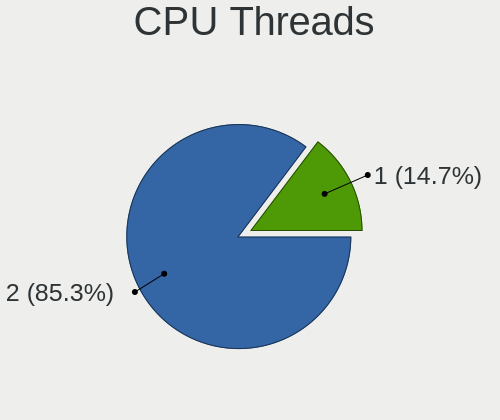
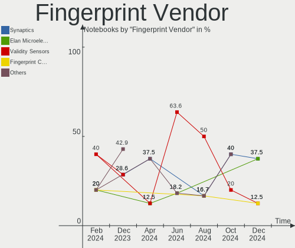
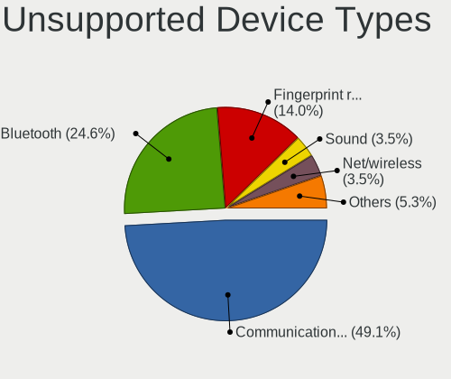

FreeBSD Hardware Trends (Notebooks)
-----------------------------------

A project to identify most popular hardware characteristics and track their change
over time based on data collected by FreeBSD users at https://BSD-Hardware.info.

Anyone can contribute to this report by the [hw-probe](https://github.com/linuxhw/hw-probe/blob/master/INSTALL.BSD.md) tool:

    hw-probe -all -upload

Full-feature report is available here: https://bsd-hardware.info/?view=trends

Period: Dec, 2021.

Contents
--------

* [ System ](#system)
  - [ OS                       ](#os)
  - [ OS Family                ](#os-family)
  - [ Arch                     ](#arch)
  - [ DE                       ](#de)
  - [ Display Server           ](#display-server)
  - [ Display Manager          ](#display-manager)
  - [ OS Lang                  ](#os-lang)
  - [ Boot Mode                ](#boot-mode)
  - [ Filesystem               ](#filesystem)
  - [ Part. scheme             ](#part-scheme)

* [ Board ](#board)
  - [ Vendor                   ](#vendor)
  - [ Model                    ](#model)
  - [ Model Family             ](#model-family)
  - [ MFG Year                 ](#mfg-year)
  - [ Form Factor              ](#form-factor)
  - [ Coreboot                 ](#coreboot)
  - [ RAM Size                 ](#ram-size)
  - [ RAM Used                 ](#ram-used)
  - [ Total Drives             ](#total-drives)
  - [ Has CD-ROM               ](#has-cd-rom)
  - [ Has Ethernet             ](#has-ethernet)
  - [ Has WiFi                 ](#has-wifi)
  - [ Has Bluetooth            ](#has-bluetooth)

* [ Location ](#location)
  - [ Country                  ](#country)
  - [ City                     ](#city)

* [ Drives ](#drives)
  - [ Drive Vendor             ](#drive-vendor)
  - [ Drive Model              ](#drive-model)
  - [ HDD Vendor               ](#hdd-vendor)
  - [ SSD Vendor               ](#ssd-vendor)
  - [ Drive Kind               ](#drive-kind)
  - [ Drive Connector          ](#drive-connector)
  - [ Drive Size               ](#drive-size)
  - [ Space Total              ](#space-total)
  - [ Space Used               ](#space-used)
  - [ Malfunc. Drives          ](#malfunc-drives)
  - [ Malfunc. Drive Vendor    ](#malfunc-drive-vendor)
  - [ Malfunc. HDD Vendor      ](#malfunc-hdd-vendor)
  - [ Malfunc. Drive Kind      ](#malfunc-drive-kind)
  - [ Failed Drives            ](#failed-drives)
  - [ Failed Drive Vendor      ](#failed-drive-vendor)
  - [ Drive Status             ](#drive-status)

* [ Storage controller ](#storage-controller)
  - [ Storage Vendor           ](#storage-vendor)
  - [ Storage Model            ](#storage-model)
  - [ Storage Kind             ](#storage-kind)

* [ Processor ](#processor)
  - [ CPU Vendor               ](#cpu-vendor)
  - [ CPU Model                ](#cpu-model)
  - [ CPU Model Family         ](#cpu-model-family)
  - [ CPU Cores                ](#cpu-cores)
  - [ CPU Sockets              ](#cpu-sockets)
  - [ CPU Threads              ](#cpu-threads)
  - [ CPU Microarch            ](#cpu-microarch)

* [ Graphics ](#graphics)
  - [ GPU Vendor               ](#gpu-vendor)
  - [ GPU Model                ](#gpu-model)
  - [ GPU Combo                ](#gpu-combo)
  - [ GPU Driver               ](#gpu-driver)
  - [ GPU Memory               ](#gpu-memory)

* [ Monitor ](#monitor)
  - [ Monitor Vendor           ](#monitor-vendor)
  - [ Monitor Model            ](#monitor-model)
  - [ Monitor Resolution       ](#monitor-resolution)
  - [ Monitor Diagonal         ](#monitor-diagonal)
  - [ Monitor Width            ](#monitor-width)
  - [ Aspect Ratio             ](#aspect-ratio)
  - [ Monitor Area             ](#monitor-area)
  - [ Pixel Density            ](#pixel-density)
  - [ Multiple Monitors        ](#multiple-monitors)

* [ Network ](#network)
  - [ Net Controller Vendor    ](#net-controller-vendor)
  - [ Net Controller Model     ](#net-controller-model)
  - [ Wireless Vendor          ](#wireless-vendor)
  - [ Wireless Model           ](#wireless-model)
  - [ Ethernet Vendor          ](#ethernet-vendor)
  - [ Ethernet Model           ](#ethernet-model)
  - [ Net Controller Kind      ](#net-controller-kind)
  - [ Used Controller          ](#used-controller)
  - [ NICs                     ](#nics)
  - [ IPv6                     ](#ipv6)

* [ Bluetooth ](#bluetooth)
  - [ Bluetooth Vendor         ](#bluetooth-vendor)
  - [ Bluetooth Model          ](#bluetooth-model)

* [ Sound ](#sound)
  - [ Sound Vendor             ](#sound-vendor)
  - [ Sound Model              ](#sound-model)

* [ Memory ](#memory)
  - [ Memory Vendor            ](#memory-vendor)
  - [ Memory Model             ](#memory-model)
  - [ Memory Kind              ](#memory-kind)
  - [ Memory Form Factor       ](#memory-form-factor)
  - [ Memory Size              ](#memory-size)
  - [ Memory Speed             ](#memory-speed)

* [ Printers & scanners ](#printers--scanners)
  - [ Printer Vendor           ](#printer-vendor)
  - [ Printer Model            ](#printer-model)
  - [ Scanner Vendor           ](#scanner-vendor)
  - [ Scanner Model            ](#scanner-model)

* [ Camera ](#camera)
  - [ Camera Vendor            ](#camera-vendor)
  - [ Camera Model             ](#camera-model)

* [ Security ](#security)
  - [ Fingerprint Vendor       ](#fingerprint-vendor)
  - [ Fingerprint Model        ](#fingerprint-model)
  - [ Chipcard Vendor          ](#chipcard-vendor)
  - [ Chipcard Model           ](#chipcard-model)

* [ Unsupported ](#unsupported)
  - [ Unsupported Devices      ](#unsupported-devices)
  - [ Unsupported Device Types ](#unsupported-device-types)

System
------

OS
--

Installed operating systems

| Name                 | Notebooks | Percent |
|----------------------|-----------|---------|
| FreeBSD 13.0-p5      | 8         | 38.1%   |
| FreeBSD 14.0-CURRENT | 5         | 23.81%  |
| FreeBSD 13.0-STABLE  | 5         | 23.81%  |
| FreeBSD 13.0-p4      | 2         | 9.52%   |
| FreeBSD 13.0         | 1         | 4.76%   |

OS Family
---------

OS without a version

| Name    | Notebooks | Percent |
|---------|-----------|---------|
| FreeBSD | 21        | 100%    |

Arch
----

OS architecture (x86_64, i586, etc.)

| Name  | Notebooks | Percent |
|-------|-----------|---------|
| amd64 | 21        | 100%    |

DE
--

Desktop Environment

| Name    | Notebooks | Percent |
|---------|-----------|---------|
| KDE5    | 6         | 28.57%  |
| XFCE    | 5         | 23.81%  |
| TWM     | 4         | 19.05%  |
| i3      | 2         | 9.52%   |
| MATE    | 1         | 4.76%   |
| LXQt    | 1         | 4.76%   |
| Fluxbox | 1         | 4.76%   |
| Console | 1         | 4.76%   |

Display Server
--------------

X11 or Wayland

| Name    | Notebooks | Percent |
|---------|-----------|---------|
| X11     | 19        | 90.48%  |
| Console | 2         | 9.52%   |

Display Manager
---------------

SDDM, LightDM, etc.

| Name    | Notebooks | Percent |
|---------|-----------|---------|
| Console | 10        | 47.62%  |
| SDDM    | 4         | 19.05%  |
| SLiM    | 3         | 14.29%  |
| XDM     | 2         | 9.52%   |
| LightDM | 2         | 9.52%   |

OS Lang
-------

Language

| Lang    | Notebooks | Percent |
|---------|-----------|---------|
| C       | 17        | 80.95%  |
| zh_CN   | 1         | 4.76%   |
| fr_FR   | 1         | 4.76%   |
| en_CA   | 1         | 4.76%   |
| Unknown | 1         | 4.76%   |

Boot Mode
---------

EFI or BIOS

| Mode | Notebooks | Percent |
|------|-----------|---------|
| EFI  | 14        | 66.67%  |
| BIOS | 7         | 33.33%  |

Filesystem
----------

Type of filesystem

| Type | Notebooks | Percent |
|------|-----------|---------|
| Zfs  | 14        | 66.67%  |
| Ufs  | 7         | 33.33%  |

Part. scheme
------------

Scheme of partitioning

| Type | Notebooks | Percent |
|------|-----------|---------|
| GPT  | 17        | 80.95%  |
| MBR  | 4         | 19.05%  |

Board
-----

Vendor
------

Motherboard manufacturer

| Name             | Notebooks | Percent |
|------------------|-----------|---------|
| Lenovo           | 11        | 52.38%  |
| Hewlett-Packard  | 4         | 19.05%  |
| ASUSTek Computer | 2         | 9.52%   |
| TOXIC by BTO     | 1         | 4.76%   |
| Toshiba          | 1         | 4.76%   |
| HUAWEI           | 1         | 4.76%   |
| Framework        | 1         | 4.76%   |

Model
-----

Motherboard model

| Name                                       | Notebooks | Percent |
|--------------------------------------------|-----------|---------|
| TOXIC by BTO 15CL872 1050TI                | 1         | 4.76%   |
| Toshiba Satellite P755                     | 1         | 4.76%   |
| Lenovo ThinkPad X280 20KF001UUS            | 1         | 4.76%   |
| Lenovo ThinkPad X270 20HMCTO1WW            | 1         | 4.76%   |
| Lenovo ThinkPad X220 42915CG               | 1         | 4.76%   |
| Lenovo ThinkPad X1 Carbon Gen 9 20XWCTO1WW | 1         | 4.76%   |
| Lenovo ThinkPad T590 20N4CTO1WW            | 1         | 4.76%   |
| Lenovo ThinkPad T470s 20HGS18V00           | 1         | 4.76%   |
| Lenovo ThinkPad L470 20J40013US            | 1         | 4.76%   |
| Lenovo ThinkPad A285 20MW000JMH            | 1         | 4.76%   |
| Lenovo ThinkBook 14 G3 ACL 21A2            | 1         | 4.76%   |
| Lenovo IdeaPad 330-15IGM 81D1              | 1         | 4.76%   |
| Lenovo IdeaPad 320S-13IKB 81AK             | 1         | 4.76%   |
| HUAWEI KLVL-WXX9                           | 1         | 4.76%   |
| HP ProBook 650 G5                          | 1         | 4.76%   |
| HP ProBook 440 G6                          | 1         | 4.76%   |
| HP EliteBook Folio 9470m                   | 1         | 4.76%   |
| HP EliteBook 8570p                         | 1         | 4.76%   |
| Framework Laptop                           | 1         | 4.76%   |
| ASUS 1215B                                 | 1         | 4.76%   |
| ASUS 1005P                                 | 1         | 4.76%   |

Model Family
------------

Motherboard model prefix

| Name                 | Notebooks | Percent |
|----------------------|-----------|---------|
| Lenovo ThinkPad      | 8         | 38.1%   |
| Lenovo IdeaPad       | 2         | 9.52%   |
| HP ProBook           | 2         | 9.52%   |
| HP EliteBook         | 2         | 9.52%   |
| TOXIC by BTO 15CL872 | 1         | 4.76%   |
| Toshiba Satellite    | 1         | 4.76%   |
| Lenovo ThinkBook     | 1         | 4.76%   |
| HUAWEI KLVL-WXX9     | 1         | 4.76%   |
| Framework Laptop     | 1         | 4.76%   |
| ASUS 1215B           | 1         | 4.76%   |
| ASUS 1005P           | 1         | 4.76%   |

MFG Year
--------

Motherboard manufacture year

| Year | Notebooks | Percent |
|------|-----------|---------|
| 2021 | 5         | 23.81%  |
| 2018 | 5         | 23.81%  |
| 2020 | 4         | 19.05%  |
| 2019 | 2         | 9.52%   |
| 2016 | 1         | 4.76%   |
| 2013 | 1         | 4.76%   |
| 2012 | 1         | 4.76%   |
| 2011 | 1         | 4.76%   |
| 2010 | 1         | 4.76%   |

Form Factor
-----------

Physical design of the computer

| Name     | Notebooks | Percent |
|----------|-----------|---------|
| Notebook | 21        | 100%    |

Coreboot
--------

Have coreboot on board

| Used | Notebooks | Percent |
|------|-----------|---------|
| No   | 21        | 100%    |

RAM Size
--------

Total RAM memory

| Size in GB | Notebooks | Percent |
|------------|-----------|---------|
| 16.01-24.0 | 8         | 38.1%   |
| 8.01-16.0  | 5         | 23.81%  |
| 4.01-8.0   | 3         | 14.29%  |
| 32.01-64.0 | 3         | 14.29%  |
| 24.01-32.0 | 1         | 4.76%   |
| 1.01-2.0   | 1         | 4.76%   |

RAM Used
--------

Used RAM memory

| Used GB    | Notebooks | Percent |
|------------|-----------|---------|
| 1.01-2.0   | 7         | 33.33%  |
| 0.51-1.0   | 7         | 33.33%  |
| 0.01-0.5   | 6         | 28.57%  |
| 32.01-64.0 | 1         | 4.76%   |

Total Drives
------------

Number of drives on board

| Drives | Notebooks | Percent |
|--------|-----------|---------|
| 1      | 16        | 76.19%  |
| 2      | 4         | 19.05%  |
| 3      | 1         | 4.76%   |

Has CD-ROM
----------

Has CD-ROM on board

| Presented | Notebooks | Percent |
|-----------|-----------|---------|
| No        | 18        | 85.71%  |
| Yes       | 3         | 14.29%  |

Has Ethernet
------------

Has Ethernet on board

| Presented | Notebooks | Percent |
|-----------|-----------|---------|
| Yes       | 18        | 85.71%  |
| No        | 3         | 14.29%  |

Has WiFi
--------

Has WiFi module

| Presented | Notebooks | Percent |
|-----------|-----------|---------|
| Yes       | 21        | 100%    |

Has Bluetooth
-------------

Has Bluetooth module

| Presented | Notebooks | Percent |
|-----------|-----------|---------|
| Yes       | 16        | 76.19%  |
| No        | 5         | 23.81%  |

Location
--------

Country
-------

Geographic location (country)

| Country     | Notebooks | Percent |
|-------------|-----------|---------|
| USA         | 3         | 14.29%  |
| Netherlands | 2         | 9.52%   |
| Germany     | 2         | 9.52%   |
| France      | 2         | 9.52%   |
| Ukraine     | 1         | 4.76%   |
| UK          | 1         | 4.76%   |
| Switzerland | 1         | 4.76%   |
| Spain       | 1         | 4.76%   |
| Russia      | 1         | 4.76%   |
| Portugal    | 1         | 4.76%   |
| Japan       | 1         | 4.76%   |
| Ireland     | 1         | 4.76%   |
| Indonesia   | 1         | 4.76%   |
| China       | 1         | 4.76%   |
| Canada      | 1         | 4.76%   |
| Austria     | 1         | 4.76%   |

City
----

Geographic location (city)

| City             | Notebooks | Percent |
|------------------|-----------|---------|
| Vienna           | 1         | 4.76%   |
| Vancouver        | 1         | 4.76%   |
| Tangerang        | 1         | 4.76%   |
| Sakitama         | 1         | 4.76%   |
| Plano            | 1         | 4.76%   |
| Palmer           | 1         | 4.76%   |
| Nizhniy Novgorod | 1         | 4.76%   |
| Montgeron        | 1         | 4.76%   |
| Madrid           | 1         | 4.76%   |
| London           | 1         | 4.76%   |
| Kyiv             | 1         | 4.76%   |
| Hyattsville      | 1         | 4.76%   |
| Hangzhou         | 1         | 4.76%   |
| Hamburg          | 1         | 4.76%   |
| Glattbrugg       | 1         | 4.76%   |
| Eindhoven        | 1         | 4.76%   |
| Dublin           | 1         | 4.76%   |
| Berlin           | 1         | 4.76%   |
| Bage-la-Ville    | 1         | 4.76%   |
| Amsterdam        | 1         | 4.76%   |
| Almada           | 1         | 4.76%   |

Drives
------

Drive Vendor
------------

Hard drive vendors

| Vendor              | Notebooks | Drives | Percent |
|---------------------|-----------|--------|---------|
| Samsung Electronics | 10        | 11     | 40%     |
| WDC                 | 6         | 7      | 24%     |
| Kingston            | 2         | 3      | 8%      |
| V-GeN               | 1         | 1      | 4%      |
| Toshiba             | 1         | 1      | 4%      |
| SK Hynix            | 1         | 1      | 4%      |
| SanDisk             | 1         | 1      | 4%      |
| Intel               | 1         | 1      | 4%      |
| HGST                | 1         | 1      | 4%      |
| Crucial             | 1         | 1      | 4%      |

Drive Model
-----------

Hard drive models

| Model                                | Notebooks | Percent |
|--------------------------------------|-----------|---------|
| WDC WDS500G3X0C-00SJG0 500GB         | 1         | 3.7%    |
| WDC WDS500G2B0C-00PXH0 500GB         | 1         | 3.7%    |
| WDC WDS100T3X0C-00SJG0 1TB           | 1         | 3.7%    |
| WDC WD1600BEVT-22A23T0 160GB         | 1         | 3.7%    |
| WDC WD10SPZX-60Z10T0 1TB             | 1         | 3.7%    |
| WDC PC SN730 SDBQNTY-1T00-1001 1TB   | 1         | 3.7%    |
| WDC PC SN530 SDBPMPZ-512G-1101 512GB | 1         | 3.7%    |
| V-GeN V-GEN06SM21AR512MTNV 512GB     | 1         | 3.7%    |
| Toshiba MQ01ABF050 500GB             | 1         | 3.7%    |
| SK Hynix HFS128G32TNF-N3A0A 128GB    | 1         | 3.7%    |
| SanDisk Ultra II 480GB               | 1         | 3.7%    |
| Samsung SSD 970 PRO 512GB            | 1         | 3.7%    |
| Samsung SSD 970 EVO Plus 2TB         | 1         | 3.7%    |
| Samsung SSD 970 EVO 500GB            | 1         | 3.7%    |
| Samsung SSD 850 EVO 500GB            | 1         | 3.7%    |
| Samsung SSD 840 PRO Series 128GB     | 1         | 3.7%    |
| Samsung MZVLW256HEHP-000L7 256GB     | 1         | 3.7%    |
| Samsung MZVLW128HEGR-000L2 128GB     | 1         | 3.7%    |
| Samsung MZVLB512HAJQ-000H1 512GB     | 1         | 3.7%    |
| Samsung MZVL21T0HCLR-00BL7 1TB       | 1         | 3.7%    |
| Samsung MZ7TY256HDHP-000L7 256GB     | 1         | 3.7%    |
| Kingston SUV500MS480G 480GB          | 1         | 3.7%    |
| Kingston SUV500MS120G 120GB          | 1         | 3.7%    |
| Kingston OM8PCP3512F-AA 512GB        | 1         | 3.7%    |
| Intel SSDPEKKF512G8L 512GB           | 1         | 3.7%    |
| HGST HTS721010A9E630 1TB             | 1         | 3.7%    |
| Crucial CT250MX500SSD1 250GB         | 1         | 3.7%    |

HDD Vendor
----------

Hard disk drive vendors

| Vendor  | Notebooks | Drives | Percent |
|---------|-----------|--------|---------|
| WDC     | 2         | 2      | 50%     |
| Toshiba | 1         | 1      | 25%     |
| HGST    | 1         | 1      | 25%     |

SSD Vendor
----------

Solid state drive vendors

| Vendor              | Notebooks | Drives | Percent |
|---------------------|-----------|--------|---------|
| Samsung Electronics | 3         | 3      | 42.86%  |
| SK Hynix            | 1         | 1      | 14.29%  |
| SanDisk             | 1         | 1      | 14.29%  |
| Kingston            | 1         | 2      | 14.29%  |
| Crucial             | 1         | 1      | 14.29%  |

Drive Kind
----------

HDD or SSD

| Kind | Notebooks | Drives | Percent |
|------|-----------|--------|---------|
| NVMe | 13        | 16     | 56.52%  |
| SSD  | 7         | 8      | 30.43%  |
| HDD  | 3         | 4      | 13.04%  |

Drive Connector
---------------

SATA, SAS, NVMe, etc.

| Type | Notebooks | Drives | Percent |
|------|-----------|--------|---------|
| NVMe | 13        | 16     | 56.52%  |
| SATA | 10        | 12     | 43.48%  |

Drive Size
----------

Size of hard drive

| Size in TB | Notebooks | Drives | Percent |
|------------|-----------|--------|---------|
| 0.01-0.5   | 9         | 10     | 81.82%  |
| 0.51-1.0   | 2         | 2      | 18.18%  |

Space Total
-----------

Amount of disk space available on the file system

| Size in GB | Notebooks | Percent |
|------------|-----------|---------|
| 251-500    | 8         | 38.1%   |
| 101-250    | 7         | 33.33%  |
| 501-1000   | 4         | 19.05%  |
| 21-50      | 1         | 4.76%   |
| 51-100     | 1         | 4.76%   |

Space Used
----------

Amount of used disk space

| Used GB | Notebooks | Percent |
|---------|-----------|---------|
| 1-20    | 15        | 71.43%  |
| 21-50   | 3         | 14.29%  |
| 101-250 | 2         | 9.52%   |
| 51-100  | 1         | 4.76%   |

Malfunc. Drives
---------------

Drive models with a malfunction

| Model                    | Notebooks | Drives | Percent |
|--------------------------|-----------|--------|---------|
| WDC WD10SPZX-60Z10T0 1TB | 1         | 1      | 50%     |
| HGST HTS721010A9E630 1TB | 1         | 1      | 50%     |

Malfunc. Drive Vendor
---------------------

Vendors of faulty drives

| Vendor | Notebooks | Drives | Percent |
|--------|-----------|--------|---------|
| WDC    | 1         | 1      | 50%     |
| HGST   | 1         | 1      | 50%     |

Malfunc. HDD Vendor
-------------------

Vendors of faulty HDD drives

| Vendor | Notebooks | Drives | Percent |
|--------|-----------|--------|---------|
| WDC    | 1         | 1      | 50%     |
| HGST   | 1         | 1      | 50%     |

Malfunc. Drive Kind
-------------------

Kinds of faulty drives

| Kind | Notebooks | Drives | Percent |
|------|-----------|--------|---------|
| HDD  | 2         | 2      | 100%    |

Failed Drives
-------------

Failed drive models

Zero info for selected period =(

Failed Drive Vendor
-------------------

Failed drive vendors

Zero info for selected period =(

Drive Status
------------

Number of failed and malfunc. drives

| Status  | Notebooks | Drives | Percent |
|---------|-----------|--------|---------|
| Works   | 21        | 26     | 91.3%   |
| Malfunc | 2         | 2      | 8.7%    |

Storage controller
------------------

Storage Vendor
--------------

Storage controller vendors

| Vendor                      | Notebooks | Percent |
|-----------------------------|-----------|---------|
| Intel                       | 12        | 41.38%  |
| Samsung Electronics         | 7         | 24.14%  |
| Sandisk                     | 5         | 17.24%  |
| AMD                         | 3         | 10.34%  |
| Silicon Motion              | 1         | 3.45%   |
| Kingston Technology Company | 1         | 3.45%   |

Storage Model
-------------

Storage controller models

| Model                                                                        | Notebooks | Percent |
|------------------------------------------------------------------------------|-----------|---------|
| Samsung NVMe SSD Controller SM981/PM981/PM983                                | 4         | 13.79%  |
| Sandisk WD Black SN750 / PC SN730 NVMe SSD                                   | 3         | 10.34%  |
| Samsung NVMe SSD Controller SM961/PM961/SM963                                | 2         | 6.9%    |
| Intel Sunrise Point-LP SATA Controller [AHCI mode]                           | 2         | 6.9%    |
| Intel Cannon Point-LP SATA Controller [AHCI Mode]                            | 2         | 6.9%    |
| Intel 6 Series/C200 Series Chipset Family 6 port Mobile SATA AHCI Controller | 2         | 6.9%    |
| AMD FCH SATA Controller [AHCI mode]                                          | 2         | 6.9%    |
| Silicon Motion SM2262/SM2262EN SSD Controller                                | 1         | 3.45%   |
| Sandisk WD Blue SN550 NVMe SSD                                               | 1         | 3.45%   |
| Samsung NVMe SSD Controller PM9A1/PM9A3/980PRO                               | 1         | 3.45%   |
| Intel SSD Pro 7600p/760p/E 6100p Series                                      | 1         | 3.45%   |
| Intel NM10/ICH7 Family SATA Controller [AHCI mode]                           | 1         | 3.45%   |
| Intel Celeron/Pentium Silver Processor SATA Controller                       | 1         | 3.45%   |
| Intel Cannon Lake Mobile PCH SATA AHCI Controller                            | 1         | 3.45%   |
| Intel 7 Series Chipset Family 6-port SATA Controller [AHCI mode]             | 1         | 3.45%   |
| Intel 7 Series Chipset Family 4-port SATA Controller [IDE mode]              | 1         | 3.45%   |
| Intel 7 Series Chipset Family 2-port SATA Controller [IDE mode]              | 1         | 3.45%   |
| AMD SB7x0/SB8x0/SB9x0 SATA Controller [AHCI mode]                            | 1         | 3.45%   |
| Unknown                                                                      | 1         | 3.45%   |

Storage Kind
------------

Kind of storage controller (IDE, SATA, NVMe, SAS, ...)

| Kind | Notebooks | Percent |
|------|-----------|---------|
| NVMe | 13        | 48.15%  |
| SATA | 13        | 48.15%  |
| IDE  | 1         | 3.7%    |

Processor
---------

CPU Vendor
----------

Processor vendors

| Vendor | Notebooks | Percent |
|--------|-----------|---------|
| Intel  | 17        | 80.95%  |
| AMD    | 4         | 19.05%  |

CPU Model
---------

Processor models

| Model                                           | Notebooks | Percent |
|-------------------------------------------------|-----------|---------|
| Intel Core i7-8565U CPU @ 1.80GHz               | 2         | 9.52%   |
| Intel Core i5-7200U CPU @ 2.50GHz               | 2         | 9.52%   |
| Intel Pentium Silver N5000 CPU @ 1.10GHz        | 1         | 4.76%   |
| Intel Core i7-8750H CPU @ 2.20GHz               | 1         | 4.76%   |
| Intel Core i7-8650U CPU @ 1.90GHz               | 1         | 4.76%   |
| Intel Core i7-7600U CPU @ 2.80GHz               | 1         | 4.76%   |
| Intel Core i7-3687U CPU @ 2.10GHz               | 1         | 4.76%   |
| Intel Core i7-3520M CPU @ 2.90GHz               | 1         | 4.76%   |
| Intel Core i7-2670QM CPU @ 2.20GHz              | 1         | 4.76%   |
| Intel Core i5-8265U CPU @ 1.60GHz               | 1         | 4.76%   |
| Intel Core i5-2520M CPU @ 2.50GHz               | 1         | 4.76%   |
| Intel Core i3-7100U CPU @ 2.40GHz               | 1         | 4.76%   |
| Intel Atom CPU N450 @ 1.66GHz                   | 1         | 4.76%   |
| Intel 11th Gen Core i7-1185G7 @ 3.00GHz         | 1         | 4.76%   |
| Intel 11th Gen Core i5-1135G7 @ 2.40GHz         | 1         | 4.76%   |
| AMD Ryzen 7 5700U with Radeon Graphics          | 1         | 4.76%   |
| AMD Ryzen 7 4800H with Radeon Graphics          | 1         | 4.76%   |
| AMD Ryzen 5 PRO 2500U w/ Radeon Vega Mobile Gfx | 1         | 4.76%   |
| AMD E-450 APU with Radeon HD Graphics           | 1         | 4.76%   |

CPU Model Family
----------------

Processor model prefix

| Model                | Notebooks | Percent |
|----------------------|-----------|---------|
| Intel Core i7        | 8         | 38.1%   |
| Intel Core i5        | 4         | 19.05%  |
| Other                | 2         | 9.52%   |
| AMD Ryzen 7          | 2         | 9.52%   |
| Intel Pentium Silver | 1         | 4.76%   |
| Intel Core i3        | 1         | 4.76%   |
| Intel Atom           | 1         | 4.76%   |
| AMD Ryzen 5 PRO      | 1         | 4.76%   |
| AMD E                | 1         | 4.76%   |

CPU Cores
---------

Number of processor cores

| Number | Notebooks | Percent |
|--------|-----------|---------|
| 4      | 8         | 38.1%   |
| 2      | 8         | 38.1%   |
| 16     | 2         | 9.52%   |
| 8      | 1         | 4.76%   |
| 6      | 1         | 4.76%   |
| 1      | 1         | 4.76%   |

CPU Sockets
-----------

Number of sockets

| Number | Notebooks | Percent |
|--------|-----------|---------|
| 1      | 21        | 100%    |

CPU Threads
-----------

Threads per core (Hyper-Threading)

| Number | Notebooks | Percent |
|--------|-----------|---------|
| 2      | 16        | 76.19%  |
| 1      | 5         | 23.81%  |

CPU Microarch
-------------

Microarchitecture

| Name          | Notebooks | Percent |
|---------------|-----------|---------|
| KabyLake      | 9         | 42.86%  |
| TigerLake     | 2         | 9.52%   |
| SandyBridge   | 2         | 9.52%   |
| IvyBridge     | 2         | 9.52%   |
| Zen 2         | 1         | 4.76%   |
| Zen           | 1         | 4.76%   |
| Goldmont plus | 1         | 4.76%   |
| Bonnell       | 1         | 4.76%   |
| Bobcat        | 1         | 4.76%   |
| Unknown       | 1         | 4.76%   |

Graphics
--------

GPU Vendor
----------

Vendors of graphics cards

| Vendor | Notebooks | Percent |
|--------|-----------|---------|
| Intel  | 16        | 69.57%  |
| AMD    | 5         | 21.74%  |
| Nvidia | 2         | 8.7%    |

GPU Model
---------

Graphics card models

| Model                                                                     | Notebooks | Percent |
|---------------------------------------------------------------------------|-----------|---------|
| Intel HD Graphics 620                                                     | 4         | 17.39%  |
| Intel WhiskeyLake-U GT2 [UHD Graphics 620]                                | 3         | 13.04%  |
| Intel TigerLake-LP GT2 [Iris Xe Graphics]                                 | 2         | 8.7%    |
| Intel 2nd Generation Core Processor Family Integrated Graphics Controller | 2         | 8.7%    |
| Nvidia GP107M [GeForce GTX 1050 Ti Mobile]                                | 1         | 4.35%   |
| Nvidia GM108M [GeForce MX130]                                             | 1         | 4.35%   |
| Intel UHD Graphics 620                                                    | 1         | 4.35%   |
| Intel GeminiLake [UHD Graphics 605]                                       | 1         | 4.35%   |
| Intel CoffeeLake-H GT2 [UHD Graphics 630]                                 | 1         | 4.35%   |
| Intel Atom Processor D4xx/D5xx/N4xx/N5xx Integrated Graphics Controller   | 1         | 4.35%   |
| Intel 3rd Gen Core processor Graphics Controller                          | 1         | 4.35%   |
| AMD Wrestler [Radeon HD 6320]                                             | 1         | 4.35%   |
| AMD Thames [Radeon HD 7550M/7570M/7650M]                                  | 1         | 4.35%   |
| AMD Renoir                                                                | 1         | 4.35%   |
| AMD Raven Ridge [Radeon Vega Series / Radeon Vega Mobile Series]          | 1         | 4.35%   |
| AMD Lucienne                                                              | 1         | 4.35%   |

GPU Combo
---------

Combinations of graphics cards

| Name           | Notebooks | Percent |
|----------------|-----------|---------|
| 1 x Intel      | 13        | 61.9%   |
| 1 x AMD        | 5         | 23.81%  |
| Intel + Nvidia | 2         | 9.52%   |
| 2 x Intel      | 1         | 4.76%   |

GPU Driver
----------

Free vs proprietary

| Driver      | Notebooks | Percent |
|-------------|-----------|---------|
| Free        | 19        | 90.48%  |
| Proprietary | 2         | 9.52%   |

GPU Memory
----------

Total video memory

| Size in GB | Notebooks | Percent |
|------------|-----------|---------|
| Unknown    | 18        | 85.71%  |
| 0.51-1.0   | 2         | 9.52%   |
| 0.01-0.5   | 1         | 4.76%   |

Monitor
-------

Monitor Vendor
--------------

Monitor vendors

| Vendor              | Notebooks | Percent |
|---------------------|-----------|---------|
| LG Display          | 5         | 23.81%  |
| BOE                 | 5         | 23.81%  |
| Chimei Innolux      | 3         | 14.29%  |
| Samsung Electronics | 2         | 9.52%   |
| AU Optronics        | 2         | 9.52%   |
| YTH                 | 1         | 4.76%   |
| Philips             | 1         | 4.76%   |
| Hewlett-Packard     | 1         | 4.76%   |
| Goldstar            | 1         | 4.76%   |

Monitor Model
-------------

Monitor models

| Model                                                                | Notebooks | Percent |
|----------------------------------------------------------------------|-----------|---------|
| Chimei Innolux LCD Monitor CMN1239 1920x1080 280x160mm 12.7-inch     | 2         | 9.52%   |
| YTH HS133PC YTH1330 1920x1080 250x220mm 13.1-inch                    | 1         | 4.76%   |
| Samsung Electronics S19C170 SAM0B01 1366x768 410x230mm 18.5-inch     | 1         | 4.76%   |
| Samsung Electronics LCD Monitor SEC5541 1366x768 340x190mm 15.3-inch | 1         | 4.76%   |
| Philips LCD Monitor PHL08C3 1920x1080 600x340mm 27.2-inch            | 1         | 4.76%   |
| LG Display LCD Monitor LGD05F1 1920x1080 310x170mm 13.9-inch         | 1         | 4.76%   |
| LG Display LCD Monitor LGD05C0 1920x1080 344x194mm 15.5-inch         | 1         | 4.76%   |
| LG Display LCD Monitor LGD0521 1920x1080 310x170mm 13.9-inch         | 1         | 4.76%   |
| LG Display LCD Monitor LGD02D8 1366x768 280x160mm 12.7-inch          | 1         | 4.76%   |
| LG Display LCD Monitor LGD0258 1600x900 350x190mm 15.7-inch          | 1         | 4.76%   |
| Hewlett-Packard M27f FHD HPN370A 1920x1080 610x360mm 27.9-inch       | 1         | 4.76%   |
| Goldstar LG HDR WFHD GSM7714 2560x1080 800x340mm 34.2-inch           | 1         | 4.76%   |
| Chimei Innolux LCD Monitor CMN1484 1600x900 310x170mm 13.9-inch      | 1         | 4.76%   |
| BOE LCD Monitor BOE095F 2256x1504 280x190mm 13.3-inch                | 1         | 4.76%   |
| BOE LCD Monitor BOE0893 2160x1440 300x200mm 14.2-inch                | 1         | 4.76%   |
| BOE LCD Monitor BOE06FA 1920x1080 290x170mm 13.2-inch                | 1         | 4.76%   |
| BOE LCD Monitor BOE06B3 1920x1080                                    | 1         | 4.76%   |
| BOE LCD Monitor BOE06A5 1366x768 340x190mm 15.3-inch                 | 1         | 4.76%   |
| AU Optronics LCD Monitor AUOD291 1920x1200 300x190mm 14.0-inch       | 1         | 4.76%   |
| AU Optronics LCD Monitor AUO71EC 1366x768 340x190mm 15.3-inch        | 1         | 4.76%   |

Monitor Resolution
------------------

Monitor screen resolution

| Resolution        | Notebooks | Percent |
|-------------------|-----------|---------|
| 1920x1080 (FHD)   | 9         | 45%     |
| 1366x768 (WXGA)   | 5         | 25%     |
| 1600x900 (HD+)    | 2         | 10%     |
| 2560x1080         | 1         | 5%      |
| 2256x1504         | 1         | 5%      |
| 2160x1440         | 1         | 5%      |
| 1920x1200 (WUXGA) | 1         | 5%      |

Monitor Diagonal
----------------

Diagonal size in inches

| Inches  | Notebooks | Percent |
|---------|-----------|---------|
| 13      | 6         | 28.57%  |
| 15      | 5         | 23.81%  |
| 12      | 3         | 14.29%  |
| 27      | 2         | 9.52%   |
| 14      | 2         | 9.52%   |
| 34      | 1         | 4.76%   |
| 18      | 1         | 4.76%   |
| Unknown | 1         | 4.76%   |

Monitor Width
-------------

Physical width

| Width in mm | Notebooks | Percent |
|-------------|-----------|---------|
| 301-350     | 8         | 40%     |
| 201-300     | 7         | 35%     |
| 701-800     | 1         | 5%      |
| 601-700     | 1         | 5%      |
| 501-600     | 1         | 5%      |
| 401-500     | 1         | 5%      |
| Unknown     | 1         | 5%      |

Aspect Ratio
------------

Proportional relationship between the width and the height

| Ratio | Notebooks | Percent |
|-------|-----------|---------|
| 16/9  | 13        | 72.22%  |
| 3/2   | 2         | 11.11%  |
| 21/9  | 1         | 5.56%   |
| 16/10 | 1         | 5.56%   |
| 11/10 | 1         | 5.56%   |

Monitor Area
------------

Area in inch²

| Area in inch² | Notebooks | Percent |
|----------------|-----------|---------|
| 81-90          | 6         | 28.57%  |
| 91-100         | 4         | 19.05%  |
| 61-70          | 3         | 14.29%  |
| 301-350        | 2         | 9.52%   |
| 101-110        | 2         | 9.52%   |
| 71-80          | 1         | 4.76%   |
| 351-500        | 1         | 4.76%   |
| 141-150        | 1         | 4.76%   |
| Unknown        | 1         | 4.76%   |

Pixel Density
-------------

Pixels per inch

| Density | Notebooks | Percent |
|---------|-----------|---------|
| 161-240 | 6         | 30%     |
| 121-160 | 5         | 25%     |
| 101-120 | 4         | 20%     |
| 51-100  | 4         | 20%     |
| Unknown | 1         | 5%      |

Multiple Monitors
-----------------

Total monitors connected

| Total | Notebooks | Percent |
|-------|-----------|---------|
| 1     | 14        | 66.67%  |
| 2     | 4         | 19.05%  |
| 0     | 3         | 14.29%  |

Network
-------

Net Controller Vendor
---------------------

Controller vendors

| Vendor                | Notebooks | Percent |
|-----------------------|-----------|---------|
| Intel                 | 16        | 48.48%  |
| Realtek Semiconductor | 7         | 21.21%  |
| Qualcomm Atheros      | 3         | 9.09%   |
| Hewlett-Packard       | 2         | 6.06%   |
| Broadcom              | 2         | 6.06%   |
| Samsung Electronics   | 1         | 3.03%   |
| Ralink Technology     | 1         | 3.03%   |
| Edimax Technology     | 1         | 3.03%   |

Net Controller Model
--------------------

Controller models

| Model                                                             | Notebooks | Percent |
|-------------------------------------------------------------------|-----------|---------|
| Realtek RTL8111/8168/8411 PCI Express Gigabit Ethernet Controller | 4         | 9.09%   |
| Intel Wireless 8265 / 8275                                        | 4         | 9.09%   |
| Intel 82579LM Gigabit Network Connection (Lewisville)             | 3         | 6.82%   |
| Realtek RTL810xE PCI Express Fast Ethernet controller             | 2         | 4.55%   |
| Intel Wireless-AC 9260                                            | 2         | 4.55%   |
| Intel Wi-Fi 6 AX200                                               | 2         | 4.55%   |
| Intel Ethernet Connection (6) I219-V                              | 2         | 4.55%   |
| Intel Ethernet Connection (4) I219-V                              | 2         | 4.55%   |
| Intel Ethernet Connection (4) I219-LM                             | 2         | 4.55%   |
| Intel Centrino Advanced-N 6205 [Taylor Peak]                      | 2         | 4.55%   |
| HP hs2350 HSPA+ Mobile Broadband Module Network Adapter           | 2         | 4.55%   |
| Samsung Galaxy series, misc. (tethering mode)                     | 1         | 2.27%   |
| Realtek RTL8188EUS 802.11n Wireless Network Adapter               | 1         | 2.27%   |
| Realtek RTL8188CE 802.11b/g/n WiFi Adapter                        | 1         | 2.27%   |
| Ralink MT7601U Wireless Adapter                                   | 1         | 2.27%   |
| Qualcomm Atheros QCA9377 802.11ac Wireless Network Adapter        | 1         | 2.27%   |
| Qualcomm Atheros AR9285 Wireless Network Adapter (PCI-Express)    | 1         | 2.27%   |
| Qualcomm Atheros AR8152 v2.0 Fast Ethernet                        | 1         | 2.27%   |
| Qualcomm Atheros AR8132 Fast Ethernet                             | 1         | 2.27%   |
| Intel Wi-Fi 6 AX210/AX211/AX411 160MHz                            | 1         | 2.27%   |
| Intel Wi-Fi 6 AX201                                               | 1         | 2.27%   |
| Intel Dual Band Wireless-AC 3165 Plus Bluetooth                   | 1         | 2.27%   |
| Intel Centrino Advanced-N 6235                                    | 1         | 2.27%   |
| Intel Cannon Point-LP CNVi [Wireless-AC]                          | 1         | 2.27%   |
| Intel Cannon Lake PCH CNVi WiFi                                   | 1         | 2.27%   |
| Edimax EW-7711MAC 802.11ac Wireless Adapter                       | 1         | 2.27%   |
| Broadcom BCM4360 802.11ac Wireless Network Adapter                | 1         | 2.27%   |
| Broadcom BCM4313 802.11bgn Wireless Network Adapter               | 1         | 2.27%   |

Wireless Vendor
---------------

Wireless vendors

| Vendor                | Notebooks | Percent |
|-----------------------|-----------|---------|
| Intel                 | 16        | 66.67%  |
| Realtek Semiconductor | 2         | 8.33%   |
| Qualcomm Atheros      | 2         | 8.33%   |
| Broadcom              | 2         | 8.33%   |
| Ralink Technology     | 1         | 4.17%   |
| Edimax Technology     | 1         | 4.17%   |

Wireless Model
--------------

Wireless models

| Model                                                          | Notebooks | Percent |
|----------------------------------------------------------------|-----------|---------|
| Intel Wireless 8265 / 8275                                     | 4         | 16.67%  |
| Intel Wireless-AC 9260                                         | 2         | 8.33%   |
| Intel Wi-Fi 6 AX200                                            | 2         | 8.33%   |
| Intel Centrino Advanced-N 6205 [Taylor Peak]                   | 2         | 8.33%   |
| Realtek RTL8188EUS 802.11n Wireless Network Adapter            | 1         | 4.17%   |
| Realtek RTL8188CE 802.11b/g/n WiFi Adapter                     | 1         | 4.17%   |
| Ralink MT7601U Wireless Adapter                                | 1         | 4.17%   |
| Qualcomm Atheros QCA9377 802.11ac Wireless Network Adapter     | 1         | 4.17%   |
| Qualcomm Atheros AR9285 Wireless Network Adapter (PCI-Express) | 1         | 4.17%   |
| Intel Wi-Fi 6 AX210/AX211/AX411 160MHz                         | 1         | 4.17%   |
| Intel Wi-Fi 6 AX201                                            | 1         | 4.17%   |
| Intel Dual Band Wireless-AC 3165 Plus Bluetooth                | 1         | 4.17%   |
| Intel Centrino Advanced-N 6235                                 | 1         | 4.17%   |
| Intel Cannon Point-LP CNVi [Wireless-AC]                       | 1         | 4.17%   |
| Intel Cannon Lake PCH CNVi WiFi                                | 1         | 4.17%   |
| Edimax EW-7711MAC 802.11ac Wireless Adapter                    | 1         | 4.17%   |
| Broadcom BCM4360 802.11ac Wireless Network Adapter             | 1         | 4.17%   |
| Broadcom BCM4313 802.11bgn Wireless Network Adapter            | 1         | 4.17%   |

Ethernet Vendor
---------------

Ethernet vendors

| Vendor                | Notebooks | Percent |
|-----------------------|-----------|---------|
| Intel                 | 9         | 50%     |
| Realtek Semiconductor | 6         | 33.33%  |
| Qualcomm Atheros      | 2         | 11.11%  |
| Samsung Electronics   | 1         | 5.56%   |

Ethernet Model
--------------

Ethernet models

| Model                                                             | Notebooks | Percent |
|-------------------------------------------------------------------|-----------|---------|
| Realtek RTL8111/8168/8411 PCI Express Gigabit Ethernet Controller | 4         | 22.22%  |
| Intel 82579LM Gigabit Network Connection (Lewisville)             | 3         | 16.67%  |
| Realtek RTL810xE PCI Express Fast Ethernet controller             | 2         | 11.11%  |
| Intel Ethernet Connection (6) I219-V                              | 2         | 11.11%  |
| Intel Ethernet Connection (4) I219-V                              | 2         | 11.11%  |
| Intel Ethernet Connection (4) I219-LM                             | 2         | 11.11%  |
| Samsung Galaxy series, misc. (tethering mode)                     | 1         | 5.56%   |
| Qualcomm Atheros AR8152 v2.0 Fast Ethernet                        | 1         | 5.56%   |
| Qualcomm Atheros AR8132 Fast Ethernet                             | 1         | 5.56%   |

Net Controller Kind
-------------------

Ethernet, WiFi or modem

| Kind     | Notebooks | Percent |
|----------|-----------|---------|
| WiFi     | 21        | 51.22%  |
| Ethernet | 18        | 43.9%   |
| Modem    | 2         | 4.88%   |

Used Controller
---------------

Currently used network controller

| Kind     | Notebooks | Percent |
|----------|-----------|---------|
| Ethernet | 17        | 53.13%  |
| WiFi     | 13        | 40.63%  |
| Modem    | 2         | 6.25%   |

NICs
----

Total network controllers on board

| Total | Notebooks | Percent |
|-------|-----------|---------|
| 2     | 17        | 80.95%  |
| 1     | 4         | 19.05%  |

IPv6
----

IPv6 vs IPv4

| Used | Notebooks | Percent |
|------|-----------|---------|
| No   | 16        | 76.19%  |
| Yes  | 5         | 23.81%  |

Bluetooth
---------

Bluetooth Vendor
----------------

Controller vendors

| Vendor                          | Notebooks | Percent |
|---------------------------------|-----------|---------|
| Intel                           | 13        | 81.25%  |
| Qualcomm Atheros Communications | 1         | 6.25%   |
| IMC Networks                    | 1         | 6.25%   |
| Apple                           | 1         | 6.25%   |

Bluetooth Model
---------------

Controller models

| Model                                          | Notebooks | Percent |
|------------------------------------------------|-----------|---------|
| Intel Bluetooth wireless interface             | 4         | 25%     |
| Intel Wireless-AC 9260 Bluetooth Adapter       | 2         | 12.5%   |
| Intel Bluetooth 9460/9560 Jefferson Peak (JfP) | 2         | 12.5%   |
| Intel AX200 Bluetooth                          | 2         | 12.5%   |
| Qualcomm Atheros  QCA9377 Bluetooth 4.1        | 1         | 6.25%   |
| Intel Centrino Bluetooth Wireless Transceiver  | 1         | 6.25%   |
| Intel AX210 Bluetooth                          | 1         | 6.25%   |
| Intel AX201 Bluetooth                          | 1         | 6.25%   |
| IMC Networks Bluetooth module                  | 1         | 6.25%   |
| Apple Apple Broadcom Built-in Bluetooth        | 1         | 6.25%   |

Sound
-----

Sound Vendor
------------

Sound card vendors

| Vendor | Notebooks | Percent |
|--------|-----------|---------|
| Intel  | 17        | 70.83%  |
| AMD    | 5         | 20.83%  |
| Sony   | 1         | 4.17%   |
| Lenovo | 1         | 4.17%   |

Sound Model
-----------

Sound card models

| Model                                                                      | Notebooks | Percent |
|----------------------------------------------------------------------------|-----------|---------|
| Intel Sunrise Point-LP HD Audio                                            | 5         | 17.86%  |
| Intel Cannon Point-LP High Definition Audio Controller                     | 3         | 10.71%  |
| AMD Family 17h (Models 10h-1fh) HD Audio Controller                        | 3         | 10.71%  |
| Intel Tiger Lake-LP Smart Sound Technology Audio Controller                | 2         | 7.14%   |
| Intel 7 Series/C216 Chipset Family High Definition Audio Controller        | 2         | 7.14%   |
| Intel 6 Series/C200 Series Chipset Family High Definition Audio Controller | 2         | 7.14%   |
| AMD Renoir Radeon High Definition Audio Controller                         | 2         | 7.14%   |
| Sony UAB-80                                                                | 1         | 3.57%   |
| Lenovo Realtek USB Audio                                                   | 1         | 3.57%   |
| Intel NM10/ICH7 Family High Definition Audio Controller                    | 1         | 3.57%   |
| Intel Celeron/Pentium Silver Processor High Definition Audio               | 1         | 3.57%   |
| Intel Cannon Lake PCH cAVS                                                 | 1         | 3.57%   |
| AMD Wrestler HDMI Audio                                                    | 1         | 3.57%   |
| AMD Turks HDMI Audio [Radeon HD 6500/6600 / 6700M Series]                  | 1         | 3.57%   |
| AMD SBx00 Azalia (Intel HDA)                                               | 1         | 3.57%   |
| AMD Raven/Raven2/Fenghuang HDMI/DP Audio Controller                        | 1         | 3.57%   |

Memory
------

Memory Vendor
-------------

Memory module vendors

| Vendor              | Notebooks | Percent |
|---------------------|-----------|---------|
| Samsung Electronics | 11        | 44%     |
| Micron Technology   | 5         | 20%     |
| Unknown             | 2         | 8%      |
| SK Hynix            | 2         | 8%      |
| Crucial             | 2         | 8%      |
| Transcend           | 1         | 4%      |
| Kingston            | 1         | 4%      |
| G.Skill             | 1         | 4%      |

Memory Model
------------

Memory module models

| Model                                                       | Notebooks | Percent |
|-------------------------------------------------------------|-----------|---------|
| Samsung RAM M471A5244CB0-CTD 4GB SODIMM DDR4 2667MT/s       | 2         | 7.41%   |
| Unknown RAM Module 8GB SODIMM DDR4 2400MT/s                 | 1         | 3.7%    |
| Unknown RAM Module 2GB SODIMM DDR2 667MT/s                  | 1         | 3.7%    |
| Transcend RAM TS2GSH64V1B 16GB SODIMM DDR4 2133MT/s         | 1         | 3.7%    |
| SK Hynix RAM HMAA1GS6CJR6N-XN 8GB SODIMM DDR4 3200MT/s      | 1         | 3.7%    |
| SK Hynix RAM HMA82GS6CJR8N-VK 16GB SODIMM DDR4 2667MT/s     | 1         | 3.7%    |
| Samsung RAM M473B5273DH0-YK0 4GB SODIMM DDR3 1333MT/s       | 1         | 3.7%    |
| Samsung RAM M471B5773DH0-CH9 2GB SODIMM 1334MT/s            | 1         | 3.7%    |
| Samsung RAM M471B5273EB0-CK0 4GB SODIMM DDR3 1600MT/s       | 1         | 3.7%    |
| Samsung RAM M471B5273DH0-CH9 4GB SODIMM DDR3 1334MT/s       | 1         | 3.7%    |
| Samsung RAM M471B1G73QH0-YK0 8GB SODIMM DDR3 1600MT/s       | 1         | 3.7%    |
| Samsung RAM M471B1G73DB0-YK0 8GB SODIMM DDR3 1600MT/s       | 1         | 3.7%    |
| Samsung RAM M471A5244BB0-CRC 4GB SODIMM DDR4 2400MT/s       | 1         | 3.7%    |
| Samsung RAM M471A2G44AM0-CTD 16GB SODIMM DDR4 2667MT/s      | 1         | 3.7%    |
| Samsung RAM M471A1G44AB0-CWE 8GB Row Of Chips DDR4 3200MT/s | 1         | 3.7%    |
| Samsung RAM M471A1G44AB0-CTD 8GB Row Of Chips DDR4 2667MT/s | 1         | 3.7%    |
| Micron RAM Module 8GB SODIMM DDR4 3200MT/s                  | 1         | 3.7%    |
| Micron RAM 8ATF1G64HZ-2G6H1 8GB SODIMM DDR4 2133MT/s        | 1         | 3.7%    |
| Micron RAM 53E2G32D4NQ-046 4GB Row Of Chips LPDDR4 4267MT/s | 1         | 3.7%    |
| Micron RAM 4ATF25664HZ-2G3B1 2GB SODIMM DDR4 2133MT/s       | 1         | 3.7%    |
| Micron RAM 16ATF4G64HZ-2G6B2 32GB SODIMM DDR4 2667MT/s      | 1         | 3.7%    |
| Kingston RAM Module 8GB SODIMM DDR4 2667MT/s                | 1         | 3.7%    |
| Kingston RAM Module 16GB SODIMM DDR4 2400MT/s               | 1         | 3.7%    |
| G.Skill RAM F4-3000C16-16GRS 16GB SODIMM DDR4 2400MT/s      | 1         | 3.7%    |
| Crucial RAM CT8G4SFRA32A.M8FRS 8GB SODIMM DDR4 3200MT/s     | 1         | 3.7%    |
| Crucial RAM CT4G3S1339M.M16FKD 4GB SODIMM DDR3 1333MT/s     | 1         | 3.7%    |

Memory Kind
-----------

Memory module kinds

| Kind   | Notebooks | Percent |
|--------|-----------|---------|
| DDR4   | 14        | 63.64%  |
| DDR3   | 6         | 27.27%  |
| LPDDR4 | 1         | 4.55%   |
| DDR2   | 1         | 4.55%   |

Memory Form Factor
------------------

Physical design of the memory module

| Name         | Notebooks | Percent |
|--------------|-----------|---------|
| SODIMM       | 20        | 86.96%  |
| Row Of Chips | 3         | 13.04%  |

Memory Size
-----------

Memory module size

| Size  | Notebooks | Percent |
|-------|-----------|---------|
| 8192  | 9         | 36%     |
| 4096  | 7         | 28%     |
| 16384 | 5         | 20%     |
| 2048  | 3         | 12%     |
| 32768 | 1         | 4%      |

Memory Speed
------------

Memory module speed

| Speed | Notebooks | Percent |
|-------|-----------|---------|
| 2667  | 6         | 24%     |
| 2400  | 4         | 16%     |
| 3200  | 3         | 12%     |
| 2133  | 3         | 12%     |
| 1600  | 3         | 12%     |
| 1334  | 2         | 8%      |
| 1333  | 2         | 8%      |
| 4267  | 1         | 4%      |
| 667   | 1         | 4%      |

Printers & scanners
-------------------

Printer Vendor
--------------

Printer device vendors

Zero info for selected period =(

Printer Model
-------------

Printer device models

Zero info for selected period =(

Scanner Vendor
--------------

Scanner device vendors

Zero info for selected period =(

Scanner Model
-------------

Scanner device models

Zero info for selected period =(

Camera
------

Camera Vendor
-------------

Camera device vendors

| Vendor                                 | Notebooks | Percent |
|----------------------------------------|-----------|---------|
| Chicony Electronics                    | 7         | 36.84%  |
| IMC Networks                           | 4         | 21.05%  |
| Cheng Uei Precision Industry (Foxlink) | 3         | 15.79%  |
| Acer                                   | 3         | 15.79%  |
| Logitech                               | 1         | 5.26%   |
| Lite-On Technology                     | 1         | 5.26%   |

Camera Model
------------

Camera device models

| Model                                                                      | Notebooks | Percent |
|----------------------------------------------------------------------------|-----------|---------|
| Acer Integrated Camera                                                     | 3         | 15.79%  |
| Chicony EasyCamera                                                         | 2         | 10.53%  |
| Cheng Uei Precision Industry (Foxlink) HP Wide Vision HD Integrated Webcam | 2         | 10.53%  |
| Logitech HD Pro Webcam C920                                                | 1         | 5.26%   |
| Lite-On Integrated Camera                                                  | 1         | 5.26%   |
| IMC Networks Integrated Webcam                                             | 1         | 5.26%   |
| IMC Networks Integrated Camera                                             | 1         | 5.26%   |
| IMC Networks HD Camera                                                     | 1         | 5.26%   |
| IMC Networks EasyCamera                                                    | 1         | 5.26%   |
| Chicony USB2.0 0.3M UVC WebCam                                             | 1         | 5.26%   |
| Chicony Integrated HP HD Webcam                                            | 1         | 5.26%   |
| Chicony Integrated Camera (1280x720@30)                                    | 1         | 5.26%   |
| Chicony Integrated Camera                                                  | 1         | 5.26%   |
| Chicony HD Webcam                                                          | 1         | 5.26%   |
| Cheng Uei Precision Industry (Foxlink) HP HD Webcam [Fixed]                | 1         | 5.26%   |

Security
--------

Fingerprint Vendor
------------------

Fingerprint sensor vendors

| Vendor                     | Notebooks | Percent |
|----------------------------|-----------|---------|
| Validity Sensors           | 3         | 42.86%  |
| Synaptics                  | 3         | 42.86%  |
| Shenzhen Goodix Technology | 1         | 14.29%  |

Fingerprint Model
-----------------

Fingerprint sensor models

| Model                                                                      | Notebooks | Percent |
|----------------------------------------------------------------------------|-----------|---------|
| Synaptics Metallica MIS Touch Fingerprint Reader                           | 2         | 28.57%  |
| Validity Sensors VFS5011 Fingerprint Reader                                | 1         | 14.29%  |
| Validity Sensors Synaptics WBDI                                            | 1         | 14.29%  |
| Validity Sensors Synaptics VFS7552 Touch Fingerprint Sensor with PurePrint | 1         | 14.29%  |
| Synaptics Prometheus MIS Touch Fingerprint Reader                          | 1         | 14.29%  |
| Shenzhen Goodix  Fingerprint Device                                        | 1         | 14.29%  |

Chipcard Vendor
---------------

Chipcard module vendors

Zero info for selected period =(

Chipcard Model
--------------

Chipcard module models

Zero info for selected period =(

Unsupported
-----------

Unsupported Devices
-------------------

Total unsupported devices on board

| Total | Notebooks | Percent |
|-------|-----------|---------|
| 1     | 6         | 28.57%  |
| 3     | 5         | 23.81%  |
| 4     | 4         | 19.05%  |
| 2     | 4         | 19.05%  |
| 5     | 1         | 4.76%   |
| 0     | 1         | 4.76%   |

Unsupported Device Types
------------------------

Types of unsupported devices

| Type                     | Notebooks | Percent |
|--------------------------|-----------|---------|
| Communication controller | 17        | 40.48%  |
| Net/wireless             | 8         | 19.05%  |
| Fingerprint reader       | 7         | 16.67%  |
| Bluetooth                | 7         | 16.67%  |
| Card reader              | 3         | 7.14%   |

