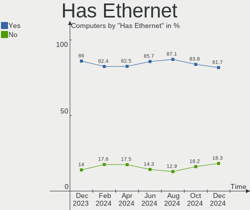
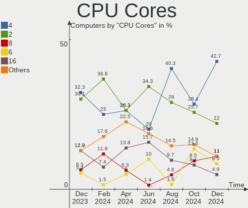
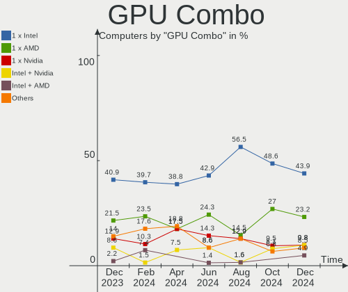
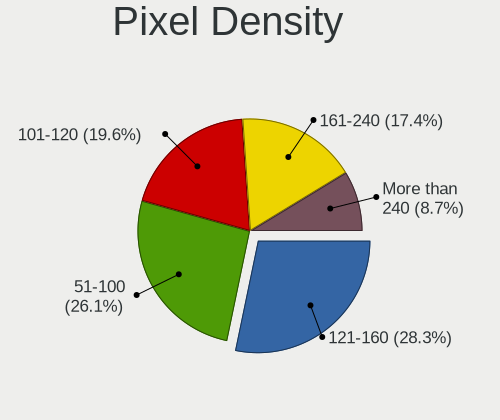
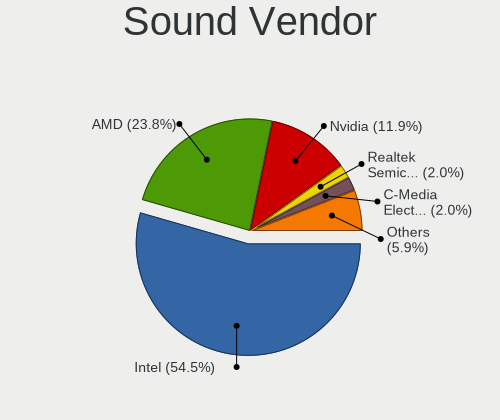

FreeBSD - Hardware Trends
-------------------------

A project to identify most popular hardware characteristics and track their change
over time based on data collected by BSD users at https://BSD-Hardware.info.

Anyone can contribute to this report by the [hw-probe](https://github.com/linuxhw/hw-probe/blob/master/INSTALL.BSD.md) tool:

    hw-probe -all -upload

This is a report for all computer types. See also reports for [desktops](/Dist/FreeBSD/Desktop/README.md) and [notebooks](/Dist/FreeBSD/Notebook/README.md).

This report is for one last month. Overall report since the beginning of time: [TestDays](https://github.com/bsdhw/TestDays)

Period: Oct, 2023.

Contents
--------

* [ System ](#system)
  - [ OS                       ](#os)
  - [ OS Family                ](#os-family)
  - [ Arch                     ](#arch)
  - [ DE                       ](#de)
  - [ Display Server           ](#display-server)
  - [ Display Manager          ](#display-manager)
  - [ OS Lang                  ](#os-lang)
  - [ Boot Mode                ](#boot-mode)
  - [ Filesystem               ](#filesystem)
  - [ Part. scheme             ](#part-scheme)

* [ Board ](#board)
  - [ Vendor                   ](#vendor)
  - [ Model                    ](#model)
  - [ Model Family             ](#model-family)
  - [ MFG Year                 ](#mfg-year)
  - [ Form Factor              ](#form-factor)
  - [ Coreboot                 ](#coreboot)
  - [ RAM Size                 ](#ram-size)
  - [ RAM Used                 ](#ram-used)
  - [ Total Drives             ](#total-drives)
  - [ Has CD-ROM               ](#has-cd-rom)
  - [ Has Ethernet             ](#has-ethernet)
  - [ Has WiFi                 ](#has-wifi)
  - [ Has Bluetooth            ](#has-bluetooth)

* [ Location ](#location)
  - [ Country                  ](#country)
  - [ City                     ](#city)

* [ Drives ](#drives)
  - [ Drive Vendor             ](#drive-vendor)
  - [ Drive Model              ](#drive-model)
  - [ HDD Vendor               ](#hdd-vendor)
  - [ SSD Vendor               ](#ssd-vendor)
  - [ Drive Kind               ](#drive-kind)
  - [ Drive Connector          ](#drive-connector)
  - [ Drive Size               ](#drive-size)
  - [ Space Total              ](#space-total)
  - [ Space Used               ](#space-used)
  - [ Malfunc. Drives          ](#malfunc-drives)
  - [ Malfunc. Drive Vendor    ](#malfunc-drive-vendor)
  - [ Malfunc. HDD Vendor      ](#malfunc-hdd-vendor)
  - [ Malfunc. Drive Kind      ](#malfunc-drive-kind)
  - [ Failed Drives            ](#failed-drives)
  - [ Failed Drive Vendor      ](#failed-drive-vendor)
  - [ Drive Status             ](#drive-status)

* [ Storage controller ](#storage-controller)
  - [ Storage Vendor           ](#storage-vendor)
  - [ Storage Model            ](#storage-model)
  - [ Storage Kind             ](#storage-kind)

* [ Processor ](#processor)
  - [ CPU Vendor               ](#cpu-vendor)
  - [ CPU Model                ](#cpu-model)
  - [ CPU Model Family         ](#cpu-model-family)
  - [ CPU Cores                ](#cpu-cores)
  - [ CPU Sockets              ](#cpu-sockets)
  - [ CPU Threads              ](#cpu-threads)
  - [ CPU Microarch            ](#cpu-microarch)

* [ Graphics ](#graphics)
  - [ GPU Vendor               ](#gpu-vendor)
  - [ GPU Model                ](#gpu-model)
  - [ GPU Combo                ](#gpu-combo)
  - [ GPU Driver               ](#gpu-driver)
  - [ GPU Memory               ](#gpu-memory)

* [ Monitor ](#monitor)
  - [ Monitor Vendor           ](#monitor-vendor)
  - [ Monitor Model            ](#monitor-model)
  - [ Monitor Resolution       ](#monitor-resolution)
  - [ Monitor Diagonal         ](#monitor-diagonal)
  - [ Monitor Width            ](#monitor-width)
  - [ Aspect Ratio             ](#aspect-ratio)
  - [ Monitor Area             ](#monitor-area)
  - [ Pixel Density            ](#pixel-density)
  - [ Multiple Monitors        ](#multiple-monitors)

* [ Network ](#network)
  - [ Net Controller Vendor    ](#net-controller-vendor)
  - [ Net Controller Model     ](#net-controller-model)
  - [ Wireless Vendor          ](#wireless-vendor)
  - [ Wireless Model           ](#wireless-model)
  - [ Ethernet Vendor          ](#ethernet-vendor)
  - [ Ethernet Model           ](#ethernet-model)
  - [ Net Controller Kind      ](#net-controller-kind)
  - [ Used Controller          ](#used-controller)
  - [ NICs                     ](#nics)
  - [ IPv6                     ](#ipv6)

* [ Bluetooth ](#bluetooth)
  - [ Bluetooth Vendor         ](#bluetooth-vendor)
  - [ Bluetooth Model          ](#bluetooth-model)

* [ Sound ](#sound)
  - [ Sound Vendor             ](#sound-vendor)
  - [ Sound Model              ](#sound-model)

* [ Memory ](#memory)
  - [ Memory Vendor            ](#memory-vendor)
  - [ Memory Model             ](#memory-model)
  - [ Memory Kind              ](#memory-kind)
  - [ Memory Form Factor       ](#memory-form-factor)
  - [ Memory Size              ](#memory-size)
  - [ Memory Speed             ](#memory-speed)

* [ Printers & scanners ](#printers--scanners)
  - [ Printer Vendor           ](#printer-vendor)
  - [ Printer Model            ](#printer-model)
  - [ Scanner Vendor           ](#scanner-vendor)
  - [ Scanner Model            ](#scanner-model)

* [ Camera ](#camera)
  - [ Camera Vendor            ](#camera-vendor)
  - [ Camera Model             ](#camera-model)

* [ Security ](#security)
  - [ Fingerprint Vendor       ](#fingerprint-vendor)
  - [ Fingerprint Model        ](#fingerprint-model)
  - [ Chipcard Vendor          ](#chipcard-vendor)
  - [ Chipcard Model           ](#chipcard-model)

* [ Unsupported ](#unsupported)
  - [ Unsupported Devices      ](#unsupported-devices)
  - [ Unsupported Device Types ](#unsupported-device-types)

System
------

OS
--

Installed operating systems

| Name                 | Computers | Percent |
|----------------------|-----------|---------|
| FreeBSD 13.2-p4      | 12        | 21.43%  |
| FreeBSD 13.2-p3      | 9         | 16.07%  |
| FreeBSD 14.0-RC2     | 8         | 14.29%  |
| FreeBSD 13.2         | 8         | 14.29%  |
| FreeBSD 15.0-CURRENT | 3         | 5.36%   |
| FreeBSD 14.0-RC3     | 3         | 5.36%   |
| FreeBSD 14.0-RC1     | 3         | 5.36%   |
| FreeBSD 14.0-STABLE  | 2         | 3.57%   |
| FreeBSD 14.0-BETA5   | 2         | 3.57%   |
| FreeBSD 14.0-BETA4   | 1         | 1.79%   |
| FreeBSD 14.0-BETA2   | 1         | 1.79%   |
| FreeBSD 13.2-STABLE  | 1         | 1.79%   |
| FreeBSD 13.2-p25     | 1         | 1.79%   |
| FreeBSD 12.4-p6      | 1         | 1.79%   |
| FreeBSD 12.3-p12     | 1         | 1.79%   |

OS Family
---------

OS without a version

| Name    | Computers | Percent |
|---------|-----------|---------|
| FreeBSD | 56        | 100%    |

Arch
----

OS architecture (x86_64, i586, etc.)

| Name  | Computers | Percent |
|-------|-----------|---------|
| amd64 | 50        | 89.29%  |
| arm64 | 5         | 8.93%   |
| i386  | 1         | 1.79%   |

DE
--

Desktop Environment

| Name    | Computers | Percent |
|---------|-----------|---------|
| Console | 21        | 37.5%   |
| KDE5    | 10        | 17.86%  |
| XFCE    | 7         | 12.5%   |
| GNOME   | 5         | 8.93%   |
| TWM     | 3         | 5.36%   |
| MATE    | 3         | 5.36%   |
| Openbox | 2         | 3.57%   |
| i3      | 2         | 3.57%   |
| Picom   | 1         | 1.79%   |
| Fluxbox | 1         | 1.79%   |
| Budgie  | 1         | 1.79%   |

Display Server
--------------

X11 or Wayland

| Name    | Computers | Percent |
|---------|-----------|---------|
| X11     | 32        | 57.14%  |
| Console | 23        | 41.07%  |
| Wayland | 1         | 1.79%   |

Display Manager
---------------

SDDM, LightDM, etc.

| Name    | Computers | Percent |
|---------|-----------|---------|
| Console | 31        | 55.36%  |
| SDDM    | 9         | 16.07%  |
| LightDM | 8         | 14.29%  |
| XDM     | 4         | 7.14%   |
| SLiM    | 2         | 3.57%   |
| GDM     | 2         | 3.57%   |

OS Lang
-------

Language

| Lang    | Computers | Percent |
|---------|-----------|---------|
| C       | 37        | 66.07%  |
| en_US   | 8         | 14.29%  |
| ru_RU   | 4         | 7.14%   |
| Unknown | 4         | 7.14%   |
| pl_PL   | 1         | 1.79%   |
| ja_JP   | 1         | 1.79%   |
| en_GB   | 1         | 1.79%   |

Boot Mode
---------

EFI or BIOS

| Mode | Computers | Percent |
|------|-----------|---------|
| EFI  | 44        | 78.57%  |
| BIOS | 12        | 21.43%  |

Filesystem
----------

Type of filesystem

| Type | Computers | Percent |
|------|-----------|---------|
| Zfs  | 41        | 73.21%  |
| Ufs  | 15        | 26.79%  |

Part. scheme
------------

Scheme of partitioning

| Type | Computers | Percent |
|------|-----------|---------|
| GPT  | 53        | 94.64%  |
| MBR  | 3         | 5.36%   |

Board
-----

Vendor
------

Motherboard manufacturer

| Name                    | Computers | Percent |
|-------------------------|-----------|---------|
| Lenovo                  | 11        | 19.64%  |
| ASUSTek Computer        | 10        | 17.86%  |
| Dell                    | 6         | 10.71%  |
| Unknown                 | 5         | 8.93%   |
| Hewlett-Packard         | 4         | 7.14%   |
| MSI                     | 3         | 5.36%   |
| Intel                   | 3         | 5.36%   |
| Raspberry Pi Foundation | 2         | 3.57%   |
| ASRock                  | 2         | 3.57%   |
| Toshiba                 | 1         | 1.79%   |
| Timi                    | 1         | 1.79%   |
| Shuttle                 | 1         | 1.79%   |
| Platform                | 1         | 1.79%   |
| GVC                     | 1         | 1.79%   |
| Google                  | 1         | 1.79%   |
| EVGA                    | 1         | 1.79%   |
| ASRockRack              | 1         | 1.79%   |
| Apple                   | 1         | 1.79%   |
| ANGXUN                  | 1         | 1.79%   |

Model
-----

Motherboard model

| Name                                     | Computers | Percent |
|------------------------------------------|-----------|---------|
| Unknown                                  | 5         | 8.93%   |
| RPi Raspberry Pi                         | 2         | 3.57%   |
| ASRock X570 Phantom Gaming 4             | 2         | 3.57%   |
| Toshiba Satellite P300                   | 1         | 1.79%   |
| Timi A34R                                | 1         | 1.79%   |
| Shuttle SZ270                            | 1         | 1.79%   |
| Platform ARB938                          | 1         | 1.79%   |
| MSI NC683AA-ABA m9500y                   | 1         | 1.79%   |
| MSI MS-7D46                              | 1         | 1.79%   |
| MSI MS-7817                              | 1         | 1.79%   |
| Lenovo ThinkPad X260 20F6006XUK          | 1         | 1.79%   |
| Lenovo ThinkPad X230 2325J67             | 1         | 1.79%   |
| Lenovo ThinkPad X1 Carbon 3rd 20BS003LFR | 1         | 1.79%   |
| Lenovo ThinkPad T490 20N3X50500          | 1         | 1.79%   |
| Lenovo ThinkPad T480 20L5000WUS          | 1         | 1.79%   |
| Lenovo ThinkPad P73 20QRCTO1WW           | 1         | 1.79%   |
| Lenovo ThinkPad E580 20KS001JUK          | 1         | 1.79%   |
| Lenovo IdeaPad 3 15ADA05 81W1            | 1         | 1.79%   |
| Lenovo G550 2958                         | 1         | 1.79%   |
| Lenovo G50-30 80G0                       | 1         | 1.79%   |
| Lenovo B40-30 80F1                       | 1         | 1.79%   |
| Intel NUC8i5BEH                          | 1         | 1.79%   |
| Intel NUC7PJYH                           | 1         | 1.79%   |
| Intel NUC11PAHi7                         | 1         | 1.79%   |
| HP ZBook 17 G2                           | 1         | 1.79%   |
| HP ProLiant DL380p Gen8                  | 1         | 1.79%   |
| HP Laptop 15s-eq3xxx                     | 1         | 1.79%   |
| HP EliteBook 840 G7 Notebook PC          | 1         | 1.79%   |
| GVC EQUIUM 3200M                         | 1         | 1.79%   |
| Google Auron_Paine                       | 1         | 1.79%   |
| EVGA X299 MICRO                          | 1         | 1.79%   |
| Dell Precision 7550                      | 1         | 1.79%   |
| Dell OptiPlex 7050                       | 1         | 1.79%   |
| Dell OptiPlex 7020                       | 1         | 1.79%   |
| Dell Inspiron 5559                       | 1         | 1.79%   |
| Dell Inspiron 13 5320                    | 1         | 1.79%   |
| Dell G16 7630                            | 1         | 1.79%   |
| ASUS ZenBook UX325UA_UM325UA             | 1         | 1.79%   |
| ASUS ROG CROSSHAIR VIII HERO             | 1         | 1.79%   |
| ASUS ProArt X670E-CREATOR WIFI           | 1         | 1.79%   |

Model Family
------------

Motherboard model prefix

| Name                      | Computers | Percent |
|---------------------------|-----------|---------|
| Lenovo ThinkPad           | 7         | 12.5%   |
| Unknown                   | 5         | 8.93%   |
| ASUS PRIME                | 3         | 5.36%   |
| RPi Raspberry             | 2         | 3.57%   |
| Dell OptiPlex             | 2         | 3.57%   |
| Dell Inspiron             | 2         | 3.57%   |
| ASUS Pro                  | 2         | 3.57%   |
| ASRock X570               | 2         | 3.57%   |
| Toshiba Satellite         | 1         | 1.79%   |
| Timi A34R                 | 1         | 1.79%   |
| Shuttle SZ270             | 1         | 1.79%   |
| Platform ARB938           | 1         | 1.79%   |
| MSI NC683AA-ABA           | 1         | 1.79%   |
| MSI MS-7D46               | 1         | 1.79%   |
| MSI MS-7817               | 1         | 1.79%   |
| Lenovo IdeaPad            | 1         | 1.79%   |
| Lenovo G550               | 1         | 1.79%   |
| Lenovo G50-30             | 1         | 1.79%   |
| Lenovo B40-30             | 1         | 1.79%   |
| Intel NUC8i5BEH           | 1         | 1.79%   |
| Intel NUC7PJYH            | 1         | 1.79%   |
| Intel NUC11PAHi7          | 1         | 1.79%   |
| HP ZBook                  | 1         | 1.79%   |
| HP ProLiant               | 1         | 1.79%   |
| HP Laptop                 | 1         | 1.79%   |
| HP EliteBook              | 1         | 1.79%   |
| GVC EQUIUM                | 1         | 1.79%   |
| Google Auron              | 1         | 1.79%   |
| EVGA X299                 | 1         | 1.79%   |
| Dell Precision            | 1         | 1.79%   |
| Dell G16                  | 1         | 1.79%   |
| ASUS ZenBook              | 1         | 1.79%   |
| ASUS ROG                  | 1         | 1.79%   |
| ASUS ProArt               | 1         | 1.79%   |
| ASUS P5Q-E                | 1         | 1.79%   |
| ASUS All                  | 1         | 1.79%   |
| ASRockRack EPYC3101D4I-2T | 1         | 1.79%   |
| Apple MacBookPro6         | 1         | 1.79%   |
| ANGXUN X79-VG2            | 1         | 1.79%   |

MFG Year
--------

Motherboard manufacture year

| Year    | Computers | Percent |
|---------|-----------|---------|
| 2021    | 8         | 14.29%  |
| 2020    | 8         | 14.29%  |
| 2023    | 7         | 12.5%   |
| 2019    | 6         | 10.71%  |
| Unknown | 6         | 10.71%  |
| 2014    | 4         | 7.14%   |
| 2022    | 3         | 5.36%   |
| 2009    | 3         | 5.36%   |
| 2018    | 2         | 3.57%   |
| 2017    | 2         | 3.57%   |
| 2016    | 2         | 3.57%   |
| 2015    | 2         | 3.57%   |
| 2012    | 2         | 3.57%   |
| 2008    | 1         | 1.79%   |

Form Factor
-----------

Physical design of the computer

| Name           | Computers | Percent |
|----------------|-----------|---------|
| Desktop        | 25        | 44.64%  |
| Notebook       | 25        | 44.64%  |
| Mini pc        | 3         | 5.36%   |
| System on chip | 2         | 3.57%   |
| Server         | 1         | 1.79%   |

Coreboot
--------

Have coreboot on board

| Used | Computers | Percent |
|------|-----------|---------|
| No   | 55        | 98.21%  |
| Yes  | 1         | 1.79%   |

RAM Size
--------

Total RAM memory

| Size in GB  | Computers | Percent |
|-------------|-----------|---------|
| 16.01-24.0  | 16        | 28.57%  |
| 32.01-64.0  | 11        | 19.64%  |
| 64.01-256.0 | 8         | 14.29%  |
| 8.01-16.0   | 8         | 14.29%  |
| 4.01-8.0    | 7         | 12.5%   |
| 3.01-4.0    | 2         | 3.57%   |
| 0.51-1.0    | 2         | 3.57%   |
| 2.01-3.0    | 1         | 1.79%   |
| 0.01-0.5    | 1         | 1.79%   |

RAM Used
--------

Used RAM memory

| Used GB  | Computers | Percent |
|----------|-----------|---------|
| 0.51-1.0 | 18        | 32.14%  |
| 1.01-2.0 | 17        | 30.36%  |
| 0.01-0.5 | 14        | 25%     |
| 2.01-3.0 | 3         | 5.36%   |
| 3.01-4.0 | 2         | 3.57%   |
| 0        | 2         | 3.57%   |

Total Drives
------------

Number of drives on board

| Drives | Computers | Percent |
|--------|-----------|---------|
| 1      | 23        | 41.07%  |
| 0      | 12        | 21.43%  |
| 3      | 8         | 14.29%  |
| 2      | 8         | 14.29%  |
| 4      | 2         | 3.57%   |
| 13     | 1         | 1.79%   |
| 6      | 1         | 1.79%   |
| 5      | 1         | 1.79%   |

Has CD-ROM
----------

Has CD-ROM on board

| Presented | Computers | Percent |
|-----------|-----------|---------|
| No        | 43        | 76.79%  |
| Yes       | 13        | 23.21%  |

Has Ethernet
------------

Has Ethernet on board

| Presented | Computers | Percent |
|-----------|-----------|---------|
| Yes       | 43        | 76.79%  |
| No        | 13        | 23.21%  |

Has WiFi
--------

Has WiFi module

| Presented | Computers | Percent |
|-----------|-----------|---------|
| Yes       | 33        | 58.93%  |
| No        | 23        | 41.07%  |

Has Bluetooth
-------------

Has Bluetooth module

| Presented | Computers | Percent |
|-----------|-----------|---------|
| No        | 30        | 53.57%  |
| Yes       | 26        | 46.43%  |

Location
--------

Country
-------

Geographic location (country)

| Country     | Computers | Percent |
|-------------|-----------|---------|
| USA         | 19        | 33.93%  |
| Russia      | 8         | 14.29%  |
| Poland      | 4         | 7.14%   |
| UK          | 3         | 5.36%   |
| Sweden      | 2         | 3.57%   |
| Spain       | 2         | 3.57%   |
| France      | 2         | 3.57%   |
| Australia   | 2         | 3.57%   |
| Turkey      | 1         | 1.79%   |
| Thailand    | 1         | 1.79%   |
| Slovakia    | 1         | 1.79%   |
| Romania     | 1         | 1.79%   |
| Portugal    | 1         | 1.79%   |
| Netherlands | 1         | 1.79%   |
| Japan       | 1         | 1.79%   |
| Italy       | 1         | 1.79%   |
| Germany     | 1         | 1.79%   |
| Croatia     | 1         | 1.79%   |
| China       | 1         | 1.79%   |
| Bulgaria    | 1         | 1.79%   |
| Brazil      | 1         | 1.79%   |
| Argentina   | 1         | 1.79%   |

City
----

Geographic location (city)

| City                     | Computers | Percent |
|--------------------------|-----------|---------|
| Salem                    | 2         | 3.57%   |
| Redmond                  | 2         | 3.57%   |
| Portland                 | 2         | 3.57%   |
| Ozersk                   | 2         | 3.57%   |
| Krasnodar                | 2         | 3.57%   |
| Chicago                  | 2         | 3.57%   |
| Zagreb                   | 1         | 1.79%   |
| Wroclaw                  | 1         | 1.79%   |
| Wenatchee                | 1         | 1.79%   |
| Warsaw                   | 1         | 1.79%   |
| Valladolid               | 1         | 1.79%   |
| Upplands Vasby           | 1         | 1.79%   |
| Troyan Municipality      | 1         | 1.79%   |
| Tosno                    | 1         | 1.79%   |
| The Hague                | 1         | 1.79%   |
| Stockholm                | 1         | 1.79%   |
| St Petersburg            | 1         | 1.79%   |
| Shanghai                 | 1         | 1.79%   |
| Sand Springs             | 1         | 1.79%   |
| Saint-Martin-d'Hères    | 1         | 1.79%   |
| Saint-Germain-en-Laye    | 1         | 1.79%   |
| Petropavlovsk-Kamchatsky | 1         | 1.79%   |
| Pepowo                   | 1         | 1.79%   |
| Pavia                    | 1         | 1.79%   |
| Orihuela Costa           | 1         | 1.79%   |
| O'Fallon                 | 1         | 1.79%   |
| Nuremberg                | 1         | 1.79%   |
| Moscow                   | 1         | 1.79%   |
| Miercurea-Ciuc           | 1         | 1.79%   |
| Melbourne                | 1         | 1.79%   |
| Macaiba                  | 1         | 1.79%   |
| Lisbon                   | 1         | 1.79%   |
| Lafayette                | 1         | 1.79%   |
| Kintnersville            | 1         | 1.79%   |
| Istanbul                 | 1         | 1.79%   |
| Hove                     | 1         | 1.79%   |
| Glasgow                  | 1         | 1.79%   |
| Gdansk                   | 1         | 1.79%   |
| Eureka                   | 1         | 1.79%   |
| Concord                  | 1         | 1.79%   |

Drives
------

Drive Vendor
------------

Hard drive vendors

| Vendor              | Computers | Drives | Percent |
|---------------------|-----------|--------|---------|
| Samsung Electronics | 14        | 21     | 21.88%  |
| WDC                 | 11        | 26     | 17.19%  |
| Seagate             | 10        | 11     | 15.63%  |
| Kingston            | 4         | 5      | 6.25%   |
| Toshiba             | 3         | 4      | 4.69%   |
| SK hynix            | 2         | 2      | 3.13%   |
| SanDisk             | 2         | 3      | 3.13%   |
| HGST                | 2         | 3      | 3.13%   |
| Hewlett-Packard     | 2         | 3      | 3.13%   |
| Crucial             | 2         | 2      | 3.13%   |
| Transcend           | 1         | 1      | 1.56%   |
| Team                | 1         | 2      | 1.56%   |
| SSSTC               | 1         | 2      | 1.56%   |
| Phison              | 1         | 1      | 1.56%   |
| Patriot             | 1         | 1      | 1.56%   |
| Netac               | 1         | 1      | 1.56%   |
| Micron Technology   | 1         | 1      | 1.56%   |
| Intel               | 1         | 1      | 1.56%   |
| Gigabyte Technology | 1         | 2      | 1.56%   |
| Fujitsu             | 1         | 1      | 1.56%   |
| Corsair             | 1         | 1      | 1.56%   |
| A-DATA Technology   | 1         | 1      | 1.56%   |

Drive Model
-----------

Hard drive models

| Model                                       | Computers | Percent |
|---------------------------------------------|-----------|---------|
| Seagate ST4000DM000-1F2168 4TB              | 2         | 2.67%   |
| Samsung SSD 980 1TB                         | 2         | 2.67%   |
| Samsung SSD 870 QVO 2TB                     | 2         | 2.67%   |
| Samsung SSD 860 EVO 1TB                     | 2         | 2.67%   |
| Samsung SSD 850 EVO 1TB                     | 2         | 2.67%   |
| WDC WDS100T3X0C-00SJG0 1TB                  | 1         | 1.33%   |
| WDC WD80EMAZ-00WJTA0 8TB                    | 1         | 1.33%   |
| WDC WD80EFZX-68UW8N0 8TB                    | 1         | 1.33%   |
| WDC WD80EFAX-68LHPN0 8TB                    | 1         | 1.33%   |
| WDC WD80EDBZ-11B0ZA0 8TB                    | 1         | 1.33%   |
| WDC WD8002FZWX-00BKUA0 8TB                  | 1         | 1.33%   |
| WDC WD40EZRZ-22GXCB0 4TB                    | 1         | 1.33%   |
| WDC WD40EZAZ-22SF3B0 4TB                    | 1         | 1.33%   |
| WDC WD40EFRX-68WT0N0 4TB                    | 1         | 1.33%   |
| WDC WD3200AVJS-00WDA0 320GB                 | 1         | 1.33%   |
| WDC WD2003FZEX-00SRLA0 2TB                  | 1         | 1.33%   |
| WDC WD15EADS-00P8B0 1.5TB                   | 1         | 1.33%   |
| WDC WD120EMFZ-11A6JA0 12TB                  | 1         | 1.33%   |
| WDC WD120EMAZ-11BLFA0 12TB                  | 1         | 1.33%   |
| WDC WD10EZEX-08WN4A0 1TB                    | 1         | 1.33%   |
| WDC WD10EZEX-00WN4A0 1TB                    | 1         | 1.33%   |
| WDC PC SN530 SDBPMPZ-256G-1101 256GB        | 1         | 1.33%   |
| Transcend TS128GMTS430S 128GB               | 1         | 1.33%   |
| Toshiba MD04ACA500 5TB                      | 1         | 1.33%   |
| Toshiba KXG5AZNV256G 256GB                  | 1         | 1.33%   |
| Toshiba HDWR11A 10TB                        | 1         | 1.33%   |
| Team TM8PS7512G 512GB                       | 1         | 1.33%   |
| SSSTC CL4-8D512 512GB                       | 1         | 1.33%   |
| SK hynix SKHynix_HFS512GDE9X084N 512GB      | 1         | 1.33%   |
| SK hynix HFM512GD3JX013N 512GB              | 1         | 1.33%   |
| Seagate ST9500325AS 500GB                   | 1         | 1.33%   |
| Seagate ST9250315AS 250GB                   | 1         | 1.33%   |
| Seagate ST4000LM024-2AN17V 4TB              | 1         | 1.33%   |
| Seagate ST2000LM003 HN-M201RAD 2TB          | 1         | 1.33%   |
| Seagate ST2000DM008-2FR102 2TB              | 1         | 1.33%   |
| Seagate ST1000LM024 HN-M101MBB 1TB          | 1         | 1.33%   |
| Seagate ST1000DM010-2EP102 1TB              | 1         | 1.33%   |
| Seagate FireCuda 520 SSD ZP500GM30002 500GB | 1         | 1.33%   |
| SanDisk SDSSDHP256G 256GB                   | 1         | 1.33%   |
| SanDisk SDSSDH3 250G                        | 1         | 1.33%   |

HDD Vendor
----------

Hard disk drive vendors

| Vendor          | Computers | Drives | Percent |
|-----------------|-----------|--------|---------|
| WDC             | 9         | 24     | 37.5%   |
| Seagate         | 9         | 10     | 37.5%   |
| Toshiba         | 2         | 3      | 8.33%   |
| HGST            | 2         | 3      | 8.33%   |
| Hewlett-Packard | 1         | 2      | 4.17%   |
| Fujitsu         | 1         | 1      | 4.17%   |

SSD Vendor
----------

Solid state drive vendors

| Vendor              | Computers | Drives | Percent |
|---------------------|-----------|--------|---------|
| Samsung Electronics | 11        | 15     | 44%     |
| Kingston            | 3         | 4      | 12%     |
| SanDisk             | 2         | 3      | 8%      |
| Transcend           | 1         | 1      | 4%      |
| Team                | 1         | 2      | 4%      |
| Patriot             | 1         | 1      | 4%      |
| Micron Technology   | 1         | 1      | 4%      |
| Intel               | 1         | 1      | 4%      |
| Hewlett-Packard     | 1         | 1      | 4%      |
| Gigabyte Technology | 1         | 2      | 4%      |
| Crucial             | 1         | 1      | 4%      |
| A-DATA Technology   | 1         | 1      | 4%      |

Drive Kind
----------

HDD or SSD

| Kind | Computers | Drives | Percent |
|------|-----------|--------|---------|
| SSD  | 23        | 33     | 40.35%  |
| HDD  | 18        | 43     | 31.58%  |
| NVMe | 16        | 19     | 28.07%  |

Drive Connector
---------------

SATA, SAS, NVMe, etc.

| Type | Computers | Drives | Percent |
|------|-----------|--------|---------|
| SATA | 35        | 76     | 68.63%  |
| NVMe | 16        | 19     | 31.37%  |

Drive Size
----------

Size of hard drive

| Size in TB | Computers | Drives | Percent |
|------------|-----------|--------|---------|
| 0.01-0.5   | 16        | 21     | 34.78%  |
| 0.51-1.0   | 13        | 20     | 28.26%  |
| 1.01-2.0   | 7         | 10     | 15.22%  |
| 3.01-4.0   | 5         | 11     | 10.87%  |
| 4.01-10.0  | 4         | 12     | 8.7%    |
| 10.01-20.0 | 1         | 2      | 2.17%   |

Space Total
-----------

Amount of disk space available on the file system

| Size in GB     | Computers | Percent |
|----------------|-----------|---------|
| 251-500        | 18        | 32.14%  |
| 501-1000       | 13        | 23.21%  |
| 101-250        | 11        | 19.64%  |
| 51-100         | 5         | 8.93%   |
| 1001-2000      | 4         | 7.14%   |
| 1-20           | 3         | 5.36%   |
| More than 3000 | 1         | 1.79%   |
| 21-50          | 1         | 1.79%   |

Space Used
----------

Amount of used disk space

| Used GB | Computers | Percent |
|---------|-----------|---------|
| 1-20    | 42        | 75%     |
| 21-50   | 6         | 10.71%  |
| 101-250 | 6         | 10.71%  |
| 251-500 | 1         | 1.79%   |
| 51-100  | 1         | 1.79%   |

Malfunc. Drives
---------------

Drive models with a malfunction

| Model                               | Computers | Drives | Percent |
|-------------------------------------|-----------|--------|---------|
| WDC WD40EFRX-68WT0N0 4TB            | 1         | 3      | 11.11%  |
| Toshiba MD04ACA500 5TB              | 1         | 1      | 11.11%  |
| Seagate ST9500325AS 500GB           | 1         | 1      | 11.11%  |
| Seagate ST9250315AS 250GB           | 1         | 1      | 11.11%  |
| Seagate ST2000LM003 HN-M201RAD 2TB  | 1         | 1      | 11.11%  |
| Samsung Electronics SSD 870 EVO 2TB | 1         | 1      | 11.11%  |
| Samsung Electronics SSD 870 EVO 1TB | 1         | 1      | 11.11%  |
| Kingston SV300S37A120G 120GB        | 1         | 1      | 11.11%  |
| HGST HTS545050A7E680 500GB          | 1         | 1      | 11.11%  |

Malfunc. Drive Vendor
---------------------

Vendors of faulty drives

| Vendor              | Computers | Drives | Percent |
|---------------------|-----------|--------|---------|
| Seagate             | 3         | 3      | 33.33%  |
| Samsung Electronics | 2         | 2      | 22.22%  |
| WDC                 | 1         | 3      | 11.11%  |
| Toshiba             | 1         | 1      | 11.11%  |
| Kingston            | 1         | 1      | 11.11%  |
| HGST                | 1         | 1      | 11.11%  |

Malfunc. HDD Vendor
-------------------

Vendors of faulty HDD drives

| Vendor  | Computers | Drives | Percent |
|---------|-----------|--------|---------|
| Seagate | 3         | 3      | 50%     |
| WDC     | 1         | 3      | 16.67%  |
| Toshiba | 1         | 1      | 16.67%  |
| HGST    | 1         | 1      | 16.67%  |

Malfunc. Drive Kind
-------------------

Kinds of faulty drives

| Kind | Computers | Drives | Percent |
|------|-----------|--------|---------|
| HDD  | 6         | 8      | 66.67%  |
| SSD  | 3         | 3      | 33.33%  |

Failed Drives
-------------

Failed drive models

Zero info for selected period =(

Failed Drive Vendor
-------------------

Failed drive vendors

Zero info for selected period =(

Drive Status
------------

Number of failed and malfunc. drives

| Status  | Computers | Drives | Percent |
|---------|-----------|--------|---------|
| Works   | 40        | 84     | 81.63%  |
| Malfunc | 9         | 11     | 18.37%  |

Storage controller
------------------

Storage Vendor
--------------

Storage controller vendors

| Vendor                         | Computers | Percent |
|--------------------------------|-----------|---------|
| Intel                          | 31        | 41.89%  |
| AMD                            | 9         | 12.16%  |
| Samsung Electronics            | 5         | 6.76%   |
| SanDisk                        | 4         | 5.41%   |
| Phison Electronics             | 4         | 5.41%   |
| SK hynix                       | 3         | 4.05%   |
| Silicon Motion                 | 2         | 2.7%    |
| Kingston Technology Company    | 2         | 2.7%    |
| Toshiba                        | 1         | 1.35%   |
| Solid State Storage Technology | 1         | 1.35%   |
| Seagate Technology             | 1         | 1.35%   |
| Realtek Semiconductor          | 1         | 1.35%   |
| O2 Micro                       | 1         | 1.35%   |
| Micron/Crucial Technology      | 1         | 1.35%   |
| Micron Technology              | 1         | 1.35%   |
| Marvell Technology Group       | 1         | 1.35%   |
| KIOXIA                         | 1         | 1.35%   |
| JMicron Technology             | 1         | 1.35%   |
| INNOGRIT                       | 1         | 1.35%   |
| Hewlett-Packard                | 1         | 1.35%   |
| Broadcom / LSI                 | 1         | 1.35%   |
| ASMedia Technology             | 1         | 1.35%   |

Storage Model
-------------

Storage controller models

| Model                                                                          | Computers | Percent |
|--------------------------------------------------------------------------------|-----------|---------|
| AMD FCH SATA Controller [AHCI mode]                                            | 7         | 8.75%   |
| SK hynix Gold P31/BC711/PC711 NVMe Solid State Drive                           | 3         | 3.75%   |
| Intel Sunrise Point-LP SATA Controller [AHCI mode]                             | 3         | 3.75%   |
| Intel 8 Series/C220 Series Chipset Family 6-port SATA Controller 1 [AHCI mode] | 3         | 3.75%   |
| Intel 200 Series PCH SATA controller [AHCI mode]                               | 3         | 3.75%   |
| Silicon Motion SM2263EN/SM2263XT (DRAM-less) NVMe SSD Controllers              | 2         | 2.5%    |
| SanDisk Extreme Pro / WD Black SN750 / PC SN730 / Red SN700 NVMe SSD           | 2         | 2.5%    |
| Samsung NVMe SSD Controller PM9A1/PM9A3/980PRO                                 | 2         | 2.5%    |
| Samsung NVMe SSD Controller 980 (DRAM-less)                                    | 2         | 2.5%    |
| Phison E16 PCIe4 NVMe Controller                                               | 2         | 2.5%    |
| Phison E12 NVMe Controller                                                     | 2         | 2.5%    |
| Intel Wildcat Point-LP SATA Controller [AHCI Mode]                             | 2         | 2.5%    |
| Intel Atom Processor E3800 Series SATA AHCI Controller                         | 2         | 2.5%    |
| Intel Alder Lake-S PCH SATA Controller [AHCI Mode]                             | 2         | 2.5%    |
| Intel 82801IBM/IEM (ICH9M/ICH9M-E) 4 port SATA Controller [AHCI mode]          | 2         | 2.5%    |
| Toshiba XG5 NVMe SSD Controller                                                | 1         | 1.25%   |
| Solid State Storage CL4-8D512 NVMe SSD M.2 (DRAM-less)                         | 1         | 1.25%   |
| Seagate FireCuda 520/IronWolf 525 SSD                                          | 1         | 1.25%   |
| Sandisk PC SN740 NVMe SSD (DRAM-less)                                          | 1         | 1.25%   |
| SanDisk PC SN530 NVMe SSD (DRAM-less)                                          | 1         | 1.25%   |
| Samsung NVMe SSD Controller SM961/PM961/SM963                                  | 1         | 1.25%   |
| Realtek RTS5765DL NVMe SSD Controller (DRAM-less)                              | 1         | 1.25%   |
| O2 Micro FORESEE E2M2 NVMe SSD                                                 | 1         | 1.25%   |
| Micron/Crucial P2 [Nick P2] / P3 / P3 Plus NVMe PCIe SSD (DRAM-less)           | 1         | 1.25%   |
| Micron 2300 NVMe SSD [Santana]                                                 | 1         | 1.25%   |
| Marvell Group 88SE6111/6121 SATA II / PATA Controller                          | 1         | 1.25%   |
| KIOXIA NVMe SSD Controller BG5 (DRAM-less)                                     | 1         | 1.25%   |
| Kingston Company NV1 NVMe SSD E13T                                             | 1         | 1.25%   |
| Kingston Company FURY Renegade NVMe SSD with heatsink                          | 1         | 1.25%   |
| JMicron JMB58x AHCI SATA controller                                            | 1         | 1.25%   |
| Intel Volume Management Device NVMe RAID Controller Intel Corporation          | 1         | 1.25%   |
| Intel Volume Management Device NVMe RAID Controller                            | 1         | 1.25%   |
| Intel Tiger Lake-LP SATA Controller                                            | 1         | 1.25%   |
| Intel product 54d3                                                             | 1         | 1.25%   |
| Intel Comet Lake SATA AHCI Controller                                          | 1         | 1.25%   |
| Intel Celeron/Pentium Silver Processor SATA Controller                         | 1         | 1.25%   |
| Intel Cannon Point-LP SATA Controller [AHCI Mode]                              | 1         | 1.25%   |
| Intel Cannon Lake Mobile PCH SATA AHCI Controller                              | 1         | 1.25%   |
| Intel C610/X99 series chipset sSATA Controller [AHCI mode]                     | 1         | 1.25%   |
| Intel C610/X99 series chipset 6-Port SATA Controller [AHCI mode]               | 1         | 1.25%   |

Storage Kind
------------

Kind of storage controller (IDE, SATA, NVMe, SAS, ...)

| Kind | Computers | Percent |
|------|-----------|---------|
| SATA | 37        | 51.39%  |
| NVMe | 27        | 37.5%   |
| IDE  | 4         | 5.56%   |
| RAID | 3         | 4.17%   |
| SAS  | 1         | 1.39%   |

Processor
---------

CPU Vendor
----------

Processor vendors

| Vendor | Computers | Percent |
|--------|-----------|---------|
| Intel  | 37        | 66.07%  |
| AMD    | 14        | 25%     |
| ARM    | 5         | 8.93%   |

CPU Model
---------

Processor models

| Model                                    | Computers | Percent |
|------------------------------------------|-----------|---------|
| ARM Cortex-A55 r2p0                      | 3         | 5.36%   |
| Intel CPU Version                        | 2         | 3.57%   |
| Intel Core i7-6500U CPU @ 2.50GHz        | 2         | 3.57%   |
| Intel Core i5-8250U CPU @ 1.60GHz        | 2         | 3.57%   |
| Intel Celeron CPU N2840 @ 2.16GHz        | 2         | 3.57%   |
| AMD Ryzen 9 3900X 12-Core Processor      | 2         | 3.57%   |
| Intel Xeon CPU E5-2670 0 @ 2.60GHz       | 1         | 1.79%   |
| Intel Xeon CPU E5-2667 v2 @ 3.30GHz      | 1         | 1.79%   |
| Intel Pentium Silver J5005 CPU @ 1.50GHz | 1         | 1.79%   |
| Intel Pentium II                         | 1         | 1.79%   |
| Intel Pentium CPU G3220 @ 3.00GHz        | 1         | 1.79%   |
| Intel N100                               | 1         | 1.79%   |
| Intel Core i9-9820X CPU @ 3.30GHz        | 1         | 1.79%   |
| Intel Core i9-10885H CPU @ 2.40GHz       | 1         | 1.79%   |
| Intel Core i7-9750H CPU @ 2.60GHz        | 1         | 1.79%   |
| Intel Core i7-5820K CPU @ 3.30GHz        | 1         | 1.79%   |
| Intel Core i7-5500U CPU @ 2.40GHz        | 1         | 1.79%   |
| Intel Core i7-4790K CPU @ 4.00GHz        | 1         | 1.79%   |
| Intel Core i7-4710MQ CPU @ 2.50GHz       | 1         | 1.79%   |
| Intel Core i7-10510U CPU @ 1.80GHz       | 1         | 1.79%   |
| Intel Core i7 CPU M 620 @ 2.67GHz        | 1         | 1.79%   |
| Intel Core i5-8365U CPU @ 1.60GHz        | 1         | 1.79%   |
| Intel Core i5-8259U CPU @ 2.30GHz        | 1         | 1.79%   |
| Intel Core i5-7500 CPU @ 3.40GHz         | 1         | 1.79%   |
| Intel Core i5-3210M CPU @ 2.50GHz        | 1         | 1.79%   |
| Intel Core i5-10400 CPU @ 2.90GHz        | 1         | 1.79%   |
| Intel Core i3-6100 CPU @ 3.70GHz         | 1         | 1.79%   |
| Intel Core 2 Quad CPU Q6600 @ 2.40GHz    | 1         | 1.79%   |
| Intel Celeron 3205U @ 1.50GHz            | 1         | 1.79%   |
| Intel 13th Gen Core i7-13700K            | 1         | 1.79%   |
| Intel 13th Gen Core i7-13650HX           | 1         | 1.79%   |
| Intel 12th Gen Core i5-1240P             | 1         | 1.79%   |
| Intel 12th Gen Core i5-12400             | 1         | 1.79%   |
| Intel 11th Gen Core i7-1165G7 @ 2.80GHz  | 1         | 1.79%   |
| Intel 11th Gen Core i5-11320H @ 3.20GHz  | 1         | 1.79%   |
| ARM Cortex-A72 r0p3                      | 1         | 1.79%   |
| ARM Cortex-A53 r0p4                      | 1         | 1.79%   |
| AMD Ryzen 9 7950X3D 16-Core Processor    | 1         | 1.79%   |
| AMD Ryzen 7 7735HS with Radeon Graphics  | 1         | 1.79%   |
| AMD Ryzen 7 5825U with Radeon Graphics   | 1         | 1.79%   |

CPU Model Family
----------------

Processor model prefix

| Model                | Computers | Percent |
|----------------------|-----------|---------|
| Other                | 9         | 16.07%  |
| Intel Core i7        | 9         | 16.07%  |
| Intel Core i5        | 7         | 12.5%   |
| AMD Ryzen 7          | 6         | 10.71%  |
| ARM Cortex           | 5         | 8.93%   |
| Intel Celeron        | 3         | 5.36%   |
| AMD Ryzen 9          | 3         | 5.36%   |
| Intel Xeon           | 2         | 3.57%   |
| Intel Pentium        | 2         | 3.57%   |
| Intel Core i9        | 2         | 3.57%   |
| Intel Pentium Silver | 1         | 1.79%   |
| Intel Core i3        | 1         | 1.79%   |
| Intel Core 2 Quad    | 1         | 1.79%   |
| AMD Ryzen 5          | 1         | 1.79%   |
| AMD Ryzen 3          | 1         | 1.79%   |
| AMD Phenom           | 1         | 1.79%   |
| AMD EPYC             | 1         | 1.79%   |
| AMD Athlon           | 1         | 1.79%   |

CPU Cores
---------

Number of processor cores

| Number  | Computers | Percent |
|---------|-----------|---------|
| 4       | 15        | 26.79%  |
| 2       | 13        | 23.21%  |
| 16      | 8         | 14.29%  |
| Unknown | 5         | 8.93%   |
| 6       | 4         | 7.14%   |
| 24      | 3         | 5.36%   |
| 8       | 3         | 5.36%   |
| 10      | 2         | 3.57%   |
| 32      | 1         | 1.79%   |
| 12      | 1         | 1.79%   |
| 1       | 1         | 1.79%   |

CPU Sockets
-----------

Number of sockets

| Number  | Computers | Percent |
|---------|-----------|---------|
| 1       | 50        | 89.29%  |
| Unknown | 5         | 8.93%   |
| 2       | 1         | 1.79%   |

CPU Threads
-----------

Threads per core (Hyper-Threading)

| Number  | Computers | Percent |
|---------|-----------|---------|
| 1       | 26        | 46.43%  |
| 2       | 24        | 42.86%  |
| Unknown | 6         | 10.71%  |

CPU Microarch
-------------

Microarchitecture

| Name          | Computers | Percent |
|---------------|-----------|---------|
| Unknown       | 14        | 25%     |
| KabyLake      | 7         | 12.5%   |
| Skylake       | 4         | 7.14%   |
| Haswell       | 4         | 7.14%   |
| Zen 2         | 3         | 5.36%   |
| Zen+          | 2         | 3.57%   |
| Zen 3         | 2         | 3.57%   |
| Zen           | 2         | 3.57%   |
| TigerLake     | 2         | 3.57%   |
| Silvermont    | 2         | 3.57%   |
| Penryn        | 2         | 3.57%   |
| IvyBridge     | 2         | 3.57%   |
| CometLake     | 2         | 3.57%   |
| Broadwell     | 2         | 3.57%   |
| Westmere      | 1         | 1.79%   |
| SandyBridge   | 1         | 1.79%   |
| P6            | 1         | 1.79%   |
| K10           | 1         | 1.79%   |
| Goldmont plus | 1         | 1.79%   |
| Core          | 1         | 1.79%   |

Graphics
--------

GPU Vendor
----------

Vendors of graphics cards

| Vendor                               | Computers | Percent |
|--------------------------------------|-----------|---------|
| Intel                                | 26        | 45.61%  |
| AMD                                  | 14        | 24.56%  |
| Nvidia                               | 13        | 22.81%  |
| ASPEED Technology                    | 2         | 3.51%   |
| NVidia / SGS Thomson (Joint Venture) | 1         | 1.75%   |
| Matrox Electronics Systems           | 1         | 1.75%   |

GPU Model
---------

Graphics card models

| Model                                                                         | Computers | Percent |
|-------------------------------------------------------------------------------|-----------|---------|
| Intel Xeon E3-1200 v3/4th Gen Core Processor Integrated Graphics Controller   | 2         | 3.45%   |
| Intel UHD Graphics 620                                                        | 2         | 3.45%   |
| Intel TigerLake-LP GT2 [Iris Xe Graphics]                                     | 2         | 3.45%   |
| Intel Skylake GT2 [HD Graphics 520]                                           | 2         | 3.45%   |
| Intel Atom Processor Z36xxx/Z37xxx Series Graphics & Display                  | 2         | 3.45%   |
| ASPEED Technology ASPEED Graphics Family                                      | 2         | 3.45%   |
| AMD Lucienne                                                                  | 2         | 3.45%   |
| AMD Lexa XT [Radeon PRO WX 3200]                                              | 2         | 3.45%   |
| Nvidia TU117M [GeForce MX450]                                                 | 1         | 1.72%   |
| Nvidia TU117GLM [Quadro T2000 Mobile / Max-Q]                                 | 1         | 1.72%   |
| Nvidia TU106GLM [Quadro RTX 3000 Mobile / Max-Q]                              | 1         | 1.72%   |
| Nvidia GT218 [NVS 300]                                                        | 1         | 1.72%   |
| Nvidia GT216M [GeForce GT 330M]                                               | 1         | 1.72%   |
| Nvidia GP108 [GeForce GT 1030]                                                | 1         | 1.72%   |
| Nvidia GP107GL [Quadro P1000]                                                 | 1         | 1.72%   |
| Nvidia GP106 [GeForce GTX 1060 3GB]                                           | 1         | 1.72%   |
| Nvidia GK208B [GeForce GT 710]                                                | 1         | 1.72%   |
| Nvidia GK107GLM [Quadro K1100M]                                               | 1         | 1.72%   |
| Nvidia GK107GL [Quadro K2000]                                                 | 1         | 1.72%   |
| Nvidia AD107M [GeForce RTX 4060 Max-Q / Mobile]                               | 1         | 1.72%   |
| Nvidia AD106 [GeForce RTX 4060 Ti]                                            | 1         | 1.72%   |
| NVidia / SGS Thomson (Joint Venture) Riva128                                  | 1         | 1.72%   |
| Matrox Electronics Systems MGA G200EH                                         | 1         | 1.72%   |
| Intel WhiskeyLake-U GT2 [UHD Graphics 620]                                    | 1         | 1.72%   |
| Intel Raptor Lake-S UHD Graphics                                              | 1         | 1.72%   |
| Intel Mobile 4 Series Chipset Integrated Graphics Controller                  | 1         | 1.72%   |
| Intel HD Graphics 630                                                         | 1         | 1.72%   |
| Intel HD Graphics 5500                                                        | 1         | 1.72%   |
| Intel HD Graphics 530                                                         | 1         | 1.72%   |
| Intel HD Graphics                                                             | 1         | 1.72%   |
| Intel GeminiLake [UHD Graphics 605]                                           | 1         | 1.72%   |
| Intel Core Processor Integrated Graphics Controller                           | 1         | 1.72%   |
| Intel CometLake-U GT2 [UHD Graphics]                                          | 1         | 1.72%   |
| Intel CometLake-S GT2 [UHD Graphics 630]                                      | 1         | 1.72%   |
| Intel CoffeeLake-U GT3e [Iris Plus Graphics 655]                              | 1         | 1.72%   |
| Intel Alder Lake-S GT1 [UHD Graphics 730]                                     | 1         | 1.72%   |
| Intel Alder Lake-P GT2 [Iris Xe Graphics]                                     | 1         | 1.72%   |
| Intel Alder Lake-N [UHD Graphics]                                             | 1         | 1.72%   |
| Intel 3rd Gen Core processor Graphics Controller                              | 1         | 1.72%   |
| AMD Sun XT [Radeon HD 8670A/8670M/8690M / R5 M330 / M430 / Radeon 520 Mobile] | 1         | 1.72%   |

GPU Combo
---------

Combinations of graphics cards

| Name                                     | Computers | Percent |
|------------------------------------------|-----------|---------|
| 1 x Intel                                | 21        | 37.5%   |
| 1 x AMD                                  | 11        | 19.64%  |
| 1 x Nvidia                               | 8         | 14.29%  |
| Other                                    | 5         | 8.93%   |
| Intel + Nvidia                           | 3         | 5.36%   |
| 2 x Intel                                | 1         | 1.79%   |
| 2 x AMD                                  | 1         | 1.79%   |
| 1 x NVidia / SGS Thomson (Joint Venture) | 1         | 1.79%   |
| Nvidia + ASPEED                          | 1         | 1.79%   |
| 1 x Matrox                               | 1         | 1.79%   |
| Intel + AMD                              | 1         | 1.79%   |
| 1 x ASPEED                               | 1         | 1.79%   |
| AMD + Nvidia                             | 1         | 1.79%   |

GPU Driver
----------

Free vs proprietary

| Driver      | Computers | Percent |
|-------------|-----------|---------|
| Free        | 43        | 76.79%  |
| Proprietary | 7         | 12.5%   |
| Unknown     | 6         | 10.71%  |

GPU Memory
----------

Total video memory

| Size in GB | Computers | Percent |
|------------|-----------|---------|
| Unknown    | 39        | 69.64%  |
| 0.01-0.5   | 6         | 10.71%  |
| 3.01-4.0   | 4         | 7.14%   |
| 1.01-2.0   | 3         | 5.36%   |
| 7.01-8.0   | 2         | 3.57%   |
| 5.01-6.0   | 1         | 1.79%   |
| 8.01-16.0  | 1         | 1.79%   |

Monitor
-------

Monitor Vendor
--------------

Monitor vendors

| Vendor               | Computers | Percent |
|----------------------|-----------|---------|
| Samsung Electronics  | 5         | 13.89%  |
| BOE                  | 5         | 13.89%  |
| Lenovo               | 3         | 8.33%   |
| Dell                 | 3         | 8.33%   |
| Chimei Innolux       | 3         | 8.33%   |
| AU Optronics         | 3         | 8.33%   |
| LG Display           | 2         | 5.56%   |
| Wacom                | 1         | 2.78%   |
| ViewSonic            | 1         | 2.78%   |
| SDC                  | 1         | 2.78%   |
| Philips              | 1         | 2.78%   |
| LG Electronics       | 1         | 2.78%   |
| Impression           | 1         | 2.78%   |
| Goldstar             | 1         | 2.78%   |
| Daewoo               | 1         | 2.78%   |
| BOE Technology Group | 1         | 2.78%   |
| BenQ                 | 1         | 2.78%   |
| Ancor Communications | 1         | 2.78%   |
| Unknown              | 1         | 2.78%   |

Monitor Model
-------------

Monitor models

| Model                                                                 | Computers | Percent |
|-----------------------------------------------------------------------|-----------|---------|
| Lenovo LEN X24A LEN60CF 1920x1080 530x300mm 24.0-inch                 | 2         | 5.56%   |
| Wacom One 13 WAC1070 1920x1080 290x170mm 13.2-inch                    | 1         | 2.78%   |
| ViewSonic VG2439 Series VSCD22B 1920x1080 520x290mm 23.4-inch         | 1         | 2.78%   |
| SDC LCD Monitor 3520x1080                                             | 1         | 2.78%   |
| Samsung Electronics SyncMaster SAM00A4 1024x768 300x230mm 14.9-inch   | 1         | 2.78%   |
| Samsung Electronics S27D590C SAM0BEA 1920x1080 600x340mm 27.2-inch    | 1         | 2.78%   |
| Samsung Electronics LCD Monitor SDC8B4F 1920x1080 340x190mm 15.3-inch | 1         | 2.78%   |
| Samsung Electronics LCD Monitor SDC4158 1920x1080 290x170mm 13.2-inch | 1         | 2.78%   |
| Samsung Electronics C27F390 SAM0D32 1920x1080 600x340mm 27.2-inch     | 1         | 2.78%   |
| Philips LCD Monitor 271P4                                             | 1         | 2.78%   |
| LG Electronics LCD Monitor LG HDR WQHD+ 3840x1600                     | 1         | 2.78%   |
| LG Display LP156WH2-TLAA LGD0230 1366x768 340x190mm 15.3-inch         | 1         | 2.78%   |
| LG Display LCD Monitor LGD06CA 1920x1080 310x170mm 13.9-inch          | 1         | 2.78%   |
| Lenovo LCD Monitor LEN40BA 1920x1080 340x190mm 15.3-inch              | 1         | 2.78%   |
| Impression *19W1*B IMP19C1 1440x900 410x260mm 19.1-inch               | 1         | 2.78%   |
| Goldstar 24GM77 GSM5A91 1920x1080 530x300mm 24.0-inch                 | 1         | 2.78%   |
| Dell U2717D DEL40EB 2560x1440 600x340mm 27.2-inch                     | 1         | 2.78%   |
| Dell P2412H DELA07D 1920x1080 530x300mm 24.0-inch                     | 1         | 2.78%   |
| Dell P2314H DEL4098 1920x1080 510x290mm 23.1-inch                     | 1         | 2.78%   |
| Daewoo HDMI DWE2100 1280x1024 470x260mm 21.1-inch                     | 1         | 2.78%   |
| Chimei Innolux LCD Monitor CMN14D4 1920x1080 310x170mm 13.9-inch      | 1         | 2.78%   |
| Chimei Innolux LCD Monitor CMN14A8 1920x1080 310x170mm 13.9-inch      | 1         | 2.78%   |
| Chimei Innolux LCD Monitor CMN1132 1366x768 260x140mm 11.6-inch       | 1         | 2.78%   |
| BOE Technology Group LCD Monitor 1920x1080                            | 1         | 2.78%   |
| BOE LCD Monitor BOE0AC1 2560x1600 340x210mm 15.7-inch                 | 1         | 2.78%   |
| BOE LCD Monitor BOE0A4E 2560x1600 290x180mm 13.4-inch                 | 1         | 2.78%   |
| BOE LCD Monitor BOE0991 1920x1080 340x190mm 15.3-inch                 | 1         | 2.78%   |
| BOE LCD Monitor BOE0812 1920x1080 340x190mm 15.3-inch                 | 1         | 2.78%   |
| BOE LCD Monitor BOE061D 1366x768 340x190mm 15.3-inch                  | 1         | 2.78%   |
| BenQ PD3200Q BNQ8026 2560x1440 710x400mm 32.1-inch                    | 1         | 2.78%   |
| AU Optronics LCD Monitor AUO2E3C 1366x768 310x170mm 13.9-inch         | 1         | 2.78%   |
| AU Optronics LCD Monitor AUO226D 1920x1080 280x160mm 12.7-inch        | 1         | 2.78%   |
| AU Optronics LCD Monitor AUO109B 3840x2160 380x210mm 17.1-inch        | 1         | 2.78%   |
| Ancor Communications ASUS VS197 ACI19F2 1366x768 410x230mm 18.5-inch  | 1         | 2.78%   |
| Unknown                                                               | 1         | 2.78%   |

Monitor Resolution
------------------

Monitor screen resolution

| Resolution       | Computers | Percent |
|------------------|-----------|---------|
| 1920x1080 (FHD)  | 17        | 50%     |
| 1366x768 (WXGA)  | 5         | 14.71%  |
| 2560x1600        | 3         | 8.82%   |
| 2560x1440 (QHD)  | 2         | 5.88%   |
| 3840x2160 (4K)   | 1         | 2.94%   |
| 3840x1600        | 1         | 2.94%   |
| 3520x1080        | 1         | 2.94%   |
| 1440x900 (WXGA+) | 1         | 2.94%   |
| 1280x1024 (SXGA) | 1         | 2.94%   |
| 1024x768 (XGA)   | 1         | 2.94%   |
| Unknown          | 1         | 2.94%   |

Monitor Diagonal
----------------

Diagonal size in inches

| Inches  | Computers | Percent |
|---------|-----------|---------|
| 15      | 7         | 20%     |
| 13      | 7         | 20%     |
| 24      | 4         | 11.43%  |
| Unknown | 4         | 11.43%  |
| 27      | 3         | 8.57%   |
| 23      | 2         | 5.71%   |
| 32      | 1         | 2.86%   |
| 21      | 1         | 2.86%   |
| 19      | 1         | 2.86%   |
| 18      | 1         | 2.86%   |
| 17      | 1         | 2.86%   |
| 14      | 1         | 2.86%   |
| 12      | 1         | 2.86%   |
| 11      | 1         | 2.86%   |

Monitor Width
-------------

Physical width

| Width in mm | Computers | Percent |
|-------------|-----------|---------|
| 301-350     | 11        | 32.35%  |
| 501-600     | 8         | 23.53%  |
| 201-300     | 6         | 17.65%  |
| Unknown     | 4         | 11.76%  |
| 401-500     | 3         | 8.82%   |
| 701-800     | 1         | 2.94%   |
| 351-400     | 1         | 2.94%   |

Aspect Ratio
------------

Proportional relationship between the width and the height

| Ratio   | Computers | Percent |
|---------|-----------|---------|
| 16/9    | 24        | 75%     |
| Unknown | 4         | 12.5%   |
| 16/10   | 3         | 9.38%   |
| 4/3     | 1         | 3.13%   |

Monitor Area
------------

Area in inch²

| Area in inch² | Computers | Percent |
|----------------|-----------|---------|
| 201-250        | 6         | 17.14%  |
| 91-100         | 6         | 17.14%  |
| 81-90          | 5         | 14.29%  |
| Unknown        | 4         | 11.43%  |
| 301-350        | 3         | 8.57%   |
| 71-80          | 2         | 5.71%   |
| 151-200        | 2         | 5.71%   |
| 61-70          | 1         | 2.86%   |
| 51-60          | 1         | 2.86%   |
| 351-500        | 1         | 2.86%   |
| 141-150        | 1         | 2.86%   |
| 121-130        | 1         | 2.86%   |
| 111-120        | 1         | 2.86%   |
| 101-110        | 1         | 2.86%   |

Pixel Density
-------------

Pixels per inch

| Density       | Computers | Percent |
|---------------|-----------|---------|
| 51-100        | 12        | 35.29%  |
| 121-160       | 8         | 23.53%  |
| 161-240       | 5         | 14.71%  |
| 101-120       | 4         | 11.76%  |
| Unknown       | 4         | 11.76%  |
| More than 240 | 1         | 2.94%   |

Multiple Monitors
-----------------

Total monitors connected

| Total | Computers | Percent |
|-------|-----------|---------|
| 1     | 27        | 48.21%  |
| 0     | 25        | 44.64%  |
| 2     | 4         | 7.14%   |

Network
-------

Net Controller Vendor
---------------------

Controller vendors

| Vendor                   | Computers | Percent |
|--------------------------|-----------|---------|
| Intel                    | 38        | 52.78%  |
| Realtek Semiconductor    | 18        | 25%     |
| Qualcomm Atheros         | 4         | 5.56%   |
| Broadcom                 | 3         | 4.17%   |
| Marvell Technology Group | 2         | 2.78%   |
| American Megatrends      | 2         | 2.78%   |
| TP-Link                  | 1         | 1.39%   |
| Sierra Wireless          | 1         | 1.39%   |
| Mellanox Technologies    | 1         | 1.39%   |
| MediaTek                 | 1         | 1.39%   |
| Aquantia                 | 1         | 1.39%   |

Net Controller Model
--------------------

Controller models

| Model                                                             | Computers | Percent |
|-------------------------------------------------------------------|-----------|---------|
| Realtek RTL8111/8168/8411 PCI Express Gigabit Ethernet Controller | 11        | 12.22%  |
| Intel I211 Gigabit Network Connection                             | 6         | 6.67%   |
| Realtek RTL8125 2.5GbE Controller                                 | 4         | 4.44%   |
| Realtek RTL8852BE PCIe 802.11ax Wireless Network Controller       | 3         | 3.33%   |
| Intel Wireless 8260                                               | 3         | 3.33%   |
| Intel Ethernet Controller I225-V                                  | 3         | 3.33%   |
| Intel Wireless 8265 / 8275                                        | 2         | 2.22%   |
| Intel Wireless 7260                                               | 2         | 2.22%   |
| Intel Wireless 3160                                               | 2         | 2.22%   |
| Intel Wi-Fi 6 AX201                                               | 2         | 2.22%   |
| Intel Ethernet Connection I217-LM                                 | 2         | 2.22%   |
| Intel Cannon Point-LP CNVi [Wireless-AC]                          | 2         | 2.22%   |
| American Megatrends Virtual Ethernet                              | 2         | 2.22%   |
| TP-Link AC600 wireless Realtek RTL8811AU [Archer T2U Nano]        | 1         | 1.11%   |
| Sierra Wireless EM7345 4G LTE                                     | 1         | 1.11%   |
| Realtek RTL8822CE 802.11ac PCIe Wireless Network Adapter          | 1         | 1.11%   |
| Realtek RTL8188EUS 802.11n Wireless Network Adapter               | 1         | 1.11%   |
| Realtek RTL810xE PCI Express Fast Ethernet controller             | 1         | 1.11%   |
| Qualcomm Atheros QCA9565 / AR9565 Wireless Network Adapter        | 1         | 1.11%   |
| Qualcomm Atheros AR9462 Wireless Network Adapter                  | 1         | 1.11%   |
| Qualcomm Atheros AR928X Wireless Network Adapter (PCI-Express)    | 1         | 1.11%   |
| Qualcomm Atheros AR9227 Wireless Network Adapter                  | 1         | 1.11%   |
| Mellanox MT27500 Family [ConnectX-3]                              | 1         | 1.11%   |
| MediaTek MT7922 802.11ax PCI Express Wireless Network Adapter     | 1         | 1.11%   |
| Marvell Group 88E8056 PCI-E Gigabit Ethernet Controller           | 1         | 1.11%   |
| Marvell Group 88E8040T PCI-E Fast Ethernet Controller             | 1         | 1.11%   |
| Marvell Group 88E8001 Gigabit Ethernet Controller                 | 1         | 1.11%   |
| Intel Wireless 7265                                               | 1         | 1.11%   |
| Intel WiFi Link 5100                                              | 1         | 1.11%   |
| Intel I350 Gigabit Network Connection                             | 1         | 1.11%   |
| Intel Gemini Lake PCH CNVi WiFi                                   | 1         | 1.11%   |
| Intel Ethernet Controller X550                                    | 1         | 1.11%   |
| Intel Ethernet Controller I226-LM                                 | 1         | 1.11%   |
| Intel Ethernet Connection I219-V                                  | 1         | 1.11%   |
| Intel Ethernet Connection (7) I219-V                              | 1         | 1.11%   |
| Intel Ethernet Connection (6) I219-V                              | 1         | 1.11%   |
| Intel Ethernet Connection (6) I219-LM                             | 1         | 1.11%   |
| Intel Ethernet Connection (5) I219-LM                             | 1         | 1.11%   |
| Intel Ethernet Connection (4) I219-V                              | 1         | 1.11%   |
| Intel Ethernet Connection (3) I218-V                              | 1         | 1.11%   |

Wireless Vendor
---------------

Wireless vendors

| Vendor                | Computers | Percent |
|-----------------------|-----------|---------|
| Intel                 | 23        | 63.89%  |
| Realtek Semiconductor | 4         | 11.11%  |
| Qualcomm Atheros      | 4         | 11.11%  |
| Broadcom              | 2         | 5.56%   |
| TP-Link               | 1         | 2.78%   |
| Sierra Wireless       | 1         | 2.78%   |
| MediaTek              | 1         | 2.78%   |

Wireless Model
--------------

Wireless models

| Model                                                          | Computers | Percent |
|----------------------------------------------------------------|-----------|---------|
| Realtek RTL8852BE PCIe 802.11ax Wireless Network Controller    | 3         | 8.11%   |
| Intel Wireless 8260                                            | 3         | 8.11%   |
| Intel Wireless 8265 / 8275                                     | 2         | 5.41%   |
| Intel Wireless 7260                                            | 2         | 5.41%   |
| Intel Wireless 3160                                            | 2         | 5.41%   |
| Intel Wi-Fi 6 AX201                                            | 2         | 5.41%   |
| Intel Cannon Point-LP CNVi [Wireless-AC]                       | 2         | 5.41%   |
| TP-Link AC600 wireless Realtek RTL8811AU [Archer T2U Nano]     | 1         | 2.7%    |
| Sierra Wireless EM7345 4G LTE                                  | 1         | 2.7%    |
| Realtek RTL8822CE 802.11ac PCIe Wireless Network Adapter       | 1         | 2.7%    |
| Realtek RTL8188EUS 802.11n Wireless Network Adapter            | 1         | 2.7%    |
| Qualcomm Atheros QCA9565 / AR9565 Wireless Network Adapter     | 1         | 2.7%    |
| Qualcomm Atheros AR9462 Wireless Network Adapter               | 1         | 2.7%    |
| Qualcomm Atheros AR928X Wireless Network Adapter (PCI-Express) | 1         | 2.7%    |
| Qualcomm Atheros AR9227 Wireless Network Adapter               | 1         | 2.7%    |
| MediaTek MT7922 802.11ax PCI Express Wireless Network Adapter  | 1         | 2.7%    |
| Intel Wireless 7265                                            | 1         | 2.7%    |
| Intel WiFi Link 5100                                           | 1         | 2.7%    |
| Intel Gemini Lake PCH CNVi WiFi                                | 1         | 2.7%    |
| Intel Dual Band Wireless-AC 3165 Plus Bluetooth                | 1         | 2.7%    |
| Intel Comet Lake PCH-LP CNVi WiFi                              | 1         | 2.7%    |
| Intel Comet Lake PCH CNVi WiFi                                 | 1         | 2.7%    |
| Intel CNVi: Wi-Fi                                              | 1         | 2.7%    |
| Intel Centrino Advanced-N 6205 [Taylor Peak]                   | 1         | 2.7%    |
| Intel Alder Lake-P PCH CNVi WiFi                               | 1         | 2.7%    |
| Intel 700 Series Chipset Family Wi-Fi                          | 1         | 2.7%    |
| Broadcom BCM43224 802.11a/b/g/n                                | 1         | 2.7%    |
| Broadcom BCM4312 802.11b/g LP-PHY                              | 1         | 2.7%    |

Ethernet Vendor
---------------

Ethernet vendors

| Vendor                   | Computers | Percent |
|--------------------------|-----------|---------|
| Intel                    | 26        | 53.06%  |
| Realtek Semiconductor    | 15        | 30.61%  |
| Broadcom                 | 3         | 6.12%   |
| Marvell Technology Group | 2         | 4.08%   |
| American Megatrends      | 2         | 4.08%   |
| Aquantia                 | 1         | 2.04%   |

Ethernet Model
--------------

Ethernet models

| Model                                                               | Computers | Percent |
|---------------------------------------------------------------------|-----------|---------|
| Realtek RTL8111/8168/8411 PCI Express Gigabit Ethernet Controller   | 11        | 21.15%  |
| Intel I211 Gigabit Network Connection                               | 6         | 11.54%  |
| Realtek RTL8125 2.5GbE Controller                                   | 4         | 7.69%   |
| Intel Ethernet Controller I225-V                                    | 3         | 5.77%   |
| Intel Ethernet Connection I217-LM                                   | 2         | 3.85%   |
| American Megatrends Virtual Ethernet                                | 2         | 3.85%   |
| Realtek RTL810xE PCI Express Fast Ethernet controller               | 1         | 1.92%   |
| Marvell Group 88E8056 PCI-E Gigabit Ethernet Controller             | 1         | 1.92%   |
| Marvell Group 88E8040T PCI-E Fast Ethernet Controller               | 1         | 1.92%   |
| Marvell Group 88E8001 Gigabit Ethernet Controller                   | 1         | 1.92%   |
| Intel I350 Gigabit Network Connection                               | 1         | 1.92%   |
| Intel Ethernet Controller X550                                      | 1         | 1.92%   |
| Intel Ethernet Controller I226-LM                                   | 1         | 1.92%   |
| Intel Ethernet Connection I219-V                                    | 1         | 1.92%   |
| Intel Ethernet Connection (7) I219-V                                | 1         | 1.92%   |
| Intel Ethernet Connection (6) I219-V                                | 1         | 1.92%   |
| Intel Ethernet Connection (6) I219-LM                               | 1         | 1.92%   |
| Intel Ethernet Connection (5) I219-LM                               | 1         | 1.92%   |
| Intel Ethernet Connection (4) I219-V                                | 1         | 1.92%   |
| Intel Ethernet Connection (3) I218-V                                | 1         | 1.92%   |
| Intel Ethernet Connection (2) I218-V                                | 1         | 1.92%   |
| Intel Ethernet Connection (17) I219-V                               | 1         | 1.92%   |
| Intel Ethernet Connection (11) I219-V                               | 1         | 1.92%   |
| Intel Ethernet Connection (11) I219-LM                              | 1         | 1.92%   |
| Intel 82579LM Gigabit Network Connection (Lewisville)               | 1         | 1.92%   |
| Intel 82574L Gigabit Network Connection                             | 1         | 1.92%   |
| Broadcom NetXtreme BCM5764M Gigabit Ethernet PCIe                   | 1         | 1.92%   |
| Broadcom NetXtreme BCM5719 Gigabit Ethernet PCIe                    | 1         | 1.92%   |
| Broadcom NetLink BCM5906M Fast Ethernet PCI Express                 | 1         | 1.92%   |
| Aquantia AQC113CS NBase-T/IEEE 802.3bz Ethernet Controller [AQtion] | 1         | 1.92%   |

Net Controller Kind
-------------------

Ethernet, WiFi or modem

| Kind     | Computers | Percent |
|----------|-----------|---------|
| Ethernet | 43        | 55.84%  |
| WiFi     | 33        | 42.86%  |
| Unknown  | 1         | 1.3%    |

Used Controller
---------------

Currently used network controller

| Kind     | Computers | Percent |
|----------|-----------|---------|
| Ethernet | 31        | 62%     |
| WiFi     | 18        | 36%     |
| Unknown  | 1         | 2%      |

NICs
----

Total network controllers on board

| Total | Computers | Percent |
|-------|-----------|---------|
| 2     | 24        | 42.86%  |
| 1     | 22        | 39.29%  |
| 3     | 5         | 8.93%   |
| 0     | 3         | 5.36%   |
| 4     | 2         | 3.57%   |

IPv6
----

IPv6 vs IPv4

| Used | Computers | Percent |
|------|-----------|---------|
| No   | 51        | 91.07%  |
| Yes  | 5         | 8.93%   |

Bluetooth
---------

Bluetooth Vendor
----------------

Controller vendors

| Vendor                          | Computers | Percent |
|---------------------------------|-----------|---------|
| Intel                           | 18        | 66.67%  |
| Realtek Semiconductor           | 4         | 14.81%  |
| Qualcomm Atheros Communications | 1         | 3.7%    |
| IMC Networks                    | 1         | 3.7%    |
| Cambridge Silicon Radio         | 1         | 3.7%    |
| Broadcom                        | 1         | 3.7%    |
| Apple                           | 1         | 3.7%    |

Bluetooth Model
---------------

Controller models

| Model                                               | Computers | Percent |
|-----------------------------------------------------|-----------|---------|
| Intel Bluetooth wireless interface                  | 9         | 33.33%  |
| Intel AX201 Bluetooth                               | 6         | 22.22%  |
| Realtek Bluetooth Adapter                           | 3         | 11.11%  |
| Intel Bluetooth 9460/9560 Jefferson Peak (JfP)      | 2         | 7.41%   |
| Realtek Wireless Bluetooth Adapter                  | 1         | 3.7%    |
| Qualcomm Atheros AR3012 Bluetooth 4.0               | 1         | 3.7%    |
| Intel AX211 Bluetooth                               | 1         | 3.7%    |
| IMC Networks Qualcomm Atheros AR9462 Bluetooth 4.0  | 1         | 3.7%    |
| Cambridge Silicon Radio Bluetooth Dongle (HCI mode) | 1         | 3.7%    |
| Broadcom BCM20702 Bluetooth 4.0 [ThinkPad]          | 1         | 3.7%    |
| Apple Bluetooth Host Controller                     | 1         | 3.7%    |

Sound
-----

Sound Vendor
------------

Sound card vendors

| Vendor                                       | Computers | Percent |
|----------------------------------------------|-----------|---------|
| Intel                                        | 35        | 53.03%  |
| AMD                                          | 15        | 22.73%  |
| Nvidia                                       | 12        | 18.18%  |
| Zoran Co. Personal Media Division (Nogatech) | 1         | 1.52%   |
| Logitech                                     | 1         | 1.52%   |
| Generalplus Technology                       | 1         | 1.52%   |
| Ensoniq                                      | 1         | 1.52%   |

Sound Model
-----------

Sound card models

| Model                                                                      | Computers | Percent |
|----------------------------------------------------------------------------|-----------|---------|
| AMD Family 17h/19h HD Audio Controller                                     | 7         | 8.75%   |
| Intel Sunrise Point-LP HD Audio                                            | 4         | 5%      |
| AMD Renoir Radeon High Definition Audio Controller                         | 4         | 5%      |
| Intel 8 Series/C220 Series Chipset High Definition Audio Controller        | 3         | 3.75%   |
| Intel 200 Series PCH HD Audio                                              | 3         | 3.75%   |
| AMD Starship/Matisse HD Audio Controller                                   | 3         | 3.75%   |
| Nvidia GK107 HDMI Audio Controller                                         | 2         | 2.5%    |
| Intel Wildcat Point-LP High Definition Audio Controller                    | 2         | 2.5%    |
| Intel Tiger Lake-LP Smart Sound Technology Audio Controller                | 2         | 2.5%    |
| Intel Comet Lake PCH cAVS                                                  | 2         | 2.5%    |
| Intel Cannon Point-LP High Definition Audio Controller                     | 2         | 2.5%    |
| Intel Broadwell-U Audio Controller                                         | 2         | 2.5%    |
| Intel Atom Processor Z36xxx/Z37xxx Series High Definition Audio Controller | 2         | 2.5%    |
| Intel Alder Lake-S HD Audio Controller                                     | 2         | 2.5%    |
| Intel 82801I (ICH9 Family) HD Audio Controller                             | 2         | 2.5%    |
| AMD Rembrandt Radeon High Definition Audio Controller                      | 2         | 2.5%    |
| AMD Baffin HDMI/DP Audio [Radeon RX 550 640SP / RX 560/560X]               | 2         | 2.5%    |
| Unknown                                                                    | 2         | 2.5%    |
| Zoran Co. Personal Media Division (Nogatech) USB Audio and HID             | 1         | 1.25%   |
| Nvidia TU107 GeForce GTX 1650 High Definition Audio Controller             | 1         | 1.25%   |
| Nvidia TU106 High Definition Audio Controller                              | 1         | 1.25%   |
| Nvidia High Definition Audio Controller                                    | 1         | 1.25%   |
| Nvidia GT216 HDMI Audio Controller                                         | 1         | 1.25%   |
| Nvidia GP108 High Definition Audio Controller                              | 1         | 1.25%   |
| Nvidia GP107GL High Definition Audio Controller                            | 1         | 1.25%   |
| Nvidia GP106 High Definition Audio Controller                              | 1         | 1.25%   |
| Nvidia GK208 HDMI/DP Audio Controller                                      | 1         | 1.25%   |
| Logitech H600 [Wireless Headset]                                           | 1         | 1.25%   |
| Intel Xeon E3-1200 v3/4th Gen Core Processor HD Audio Controller           | 1         | 1.25%   |
| Intel Modiotek USB Headset                                                 | 1         | 1.25%   |
| Intel Comet Lake PCH-LP cAVS                                               | 1         | 1.25%   |
| Intel Celeron/Pentium Silver Processor High Definition Audio               | 1         | 1.25%   |
| Intel Cannon Lake PCH cAVS                                                 | 1         | 1.25%   |
| Intel C610/X99 series chipset HD Audio Controller                          | 1         | 1.25%   |
| Intel Alder Lake-N HD Graphics SGPC                                        | 1         | 1.25%   |
| Intel Alder Lake PCH-P High Definition Audio Controller                    | 1         | 1.25%   |
| Intel 82801JI (ICH10 Family) HD Audio Controller                           | 1         | 1.25%   |
| Intel 700 Series Chipset Family Precise Touch and Stylus Port #1           | 1         | 1.25%   |
| Intel 7 Series/C216 Chipset Family High Definition Audio Controller        | 1         | 1.25%   |
| Intel 6 Series/C200 Series Chipset Family High Definition Audio Controller | 1         | 1.25%   |

Memory
------

Memory Vendor
-------------

Memory module vendors

| Vendor                                  | Computers | Percent |
|-----------------------------------------|-----------|---------|
| Samsung Electronics                     | 11        | 20%     |
| SK hynix                                | 10        | 18.18%  |
| Kingston                                | 6         | 10.91%  |
| Crucial                                 | 6         | 10.91%  |
| G.Skill                                 | 4         | 7.27%   |
| Unknown                                 | 3         | 5.45%   |
| Micron Technology                       | 3         | 5.45%   |
| Transcend                               | 2         | 3.64%   |
| Team                                    | 2         | 3.64%   |
| Unknown                                 | 2         | 3.64%   |
| Silicon Power Computer & Communications | 1         | 1.82%   |
| Ramaxel Technology                      | 1         | 1.82%   |
| Lexar Co Limited                        | 1         | 1.82%   |
| Hewlett-Packard                         | 1         | 1.82%   |
| GOODRAM                                 | 1         | 1.82%   |
| Apacer                                  | 1         | 1.82%   |

Memory Model
------------

Memory module models

| Model                                                       | Computers | Percent |
|-------------------------------------------------------------|-----------|---------|
| Kingston RAM 9965745-002.A00G 16GB DIMM DDR4 3000MT/s       | 2         | 3.28%   |
| Unknown                                                     | 2         | 3.28%   |
| Unknown RAM Module 8GB DIMM DDR4 2400MT/s                   | 1         | 1.64%   |
| Unknown RAM Module 8GB DIMM DDR3 1600MT/s                   | 1         | 1.64%   |
| Unknown RAM Module 2GB DIMM DDR 800MT/s                     | 1         | 1.64%   |
| Transcend RAM Module 2GB SODIMM DDR3 1067MT/s               | 1         | 1.64%   |
| Transcend RAM JM2666HLE-32G 32GB DIMM DDR4 2666MT/s         | 1         | 1.64%   |
| Team RAM UD5-6000 16GB DIMM DDR5 4800MT/s                   | 1         | 1.64%   |
| Team RAM TEAMGROUP-SD4-3200 32GB SODIMM DDR4 3200MT/s       | 1         | 1.64%   |
| SK hynix RAM Module 2GB SODIMM DDR3 1067MT/s                | 1         | 1.64%   |
| SK hynix RAM HYMP125U64CP8-S6 2GB DIMM DDR2 800MT/s         | 1         | 1.64%   |
| SK hynix RAM HMT425S6CFR6A-PB 2GB DDR3 1600MT/s             | 1         | 1.64%   |
| SK hynix RAM HMT41GS6BFR8A-PB 8GB SODIMM DDR3 1600MT/s      | 1         | 1.64%   |
| SK hynix RAM HMT41GS6AFR8A-PB 8GB SODIMM DDR3 1600MT/s      | 1         | 1.64%   |
| SK hynix RAM HMT351S6EFR8C-PB 4GB SODIMM DDR3 1600MT/s      | 1         | 1.64%   |
| SK hynix RAM HMT351S6CFR8C-PB 4GB SODIMM DDR3 1600MT/s      | 1         | 1.64%   |
| SK hynix RAM HMCG66AEBSA095N 8GB SODIMM DDR5 4800MT/s       | 1         | 1.64%   |
| SK hynix RAM HMA82GU6JJR8N-VK 16GB DIMM DDR4 2666MT/s       | 1         | 1.64%   |
| SK hynix RAM HMA81GU6AFR8N-UH 8GB DIMM DDR4 2400MT/s        | 1         | 1.64%   |
| SK hynix RAM HMA81GS6CJR8N-VK 8GB SODIMM DDR4 2667MT/s      | 1         | 1.64%   |
| SK hynix RAM H9HCNNNCPMMLXR-NEE 8GB SODIMM LPDDR4 4266MT/s  | 1         | 1.64%   |
| Silicon Power & RAM Module 8GB DIMM DDR4 3200MT/s           | 1         | 1.64%   |
| Samsung RAM Module 16GB SODIMM DDR4 3200MT/s                | 1         | 1.64%   |
| Samsung RAM M471B5773CHS-CH9 2GB SODIMM DDR3 1333MT/s       | 1         | 1.64%   |
| Samsung RAM M471B5674-M0-YK0 4GB Chip DDR3 1600MT/s         | 1         | 1.64%   |
| Samsung RAM M471B5673FH0-CF8 2GB SODIMM DDR3 1067MT/s       | 1         | 1.64%   |
| Samsung RAM M471B5273DH0-CK0 4GB SODIMM 1600MT/s            | 1         | 1.64%   |
| Samsung RAM M471B5273CM0-CH9 4GB SODIMM DDR3 1333MT/s       | 1         | 1.64%   |
| Samsung RAM M471A5244CB0-CTD 4GB SODIMM DDR4 2667MT/s       | 1         | 1.64%   |
| Samsung RAM M471A2K43DB1-CWE 16GB SODIMM DDR4 3200MT/s      | 1         | 1.64%   |
| Samsung RAM M471A1K43EB1-CWE 8GB SODIMM DDR4 3200MT/s       | 1         | 1.64%   |
| Samsung RAM M471A1K43CB1-CRC 8GB SODIMM DDR4 2667MT/s       | 1         | 1.64%   |
| Samsung RAM M471A1G44AB0-CWE 8GB Row Of Chips DDR4 3200MT/s | 1         | 1.64%   |
| Samsung RAM M425R2GA3BB0-CQKOL 16GB SODIMM DDR5 4800MT/s    | 1         | 1.64%   |
| Samsung RAM M393B1G70QH0 8GB DIMM DDR3 1600MT/s             | 1         | 1.64%   |
| Samsung RAM M393B1G70BH0 8GB DIMM DDR3 1600MT/s             | 1         | 1.64%   |
| Ramaxel RAM RMSA3310MJ86H9F-3200 4GB SODIMM DDR4 2400MT/s   | 1         | 1.64%   |
| Micron RAM 8ATF1G64AZ-3G2J1 8GB DIMM DDR4 3200MT/s          | 1         | 1.64%   |
| Micron RAM 4ATS1G64HZ-2G6E1 8GB SODIMM DDR4 2667MT/s        | 1         | 1.64%   |
| Micron RAM 16KTF1G64HZ-1G6N1 8GB SODIMM DDR3 1600MT/s       | 1         | 1.64%   |

Memory Kind
-----------

Memory module kinds

| Kind    | Computers | Percent |
|---------|-----------|---------|
| DDR4    | 28        | 57.14%  |
| DDR3    | 12        | 24.49%  |
| DDR5    | 4         | 8.16%   |
| LPDDR5  | 1         | 2.04%   |
| LPDDR4  | 1         | 2.04%   |
| DDR2    | 1         | 2.04%   |
| DDR     | 1         | 2.04%   |
| Unknown | 1         | 2.04%   |

Memory Form Factor
------------------

Physical design of the memory module

| Name         | Computers | Percent |
|--------------|-----------|---------|
| SODIMM       | 24        | 48.98%  |
| DIMM         | 21        | 42.86%  |
| Row Of Chips | 2         | 4.08%   |
| Chip         | 1         | 2.04%   |
| Unknown      | 1         | 2.04%   |

Memory Size
-----------

Memory module size

| Size  | Computers | Percent |
|-------|-----------|---------|
| 8192  | 20        | 39.22%  |
| 16384 | 12        | 23.53%  |
| 2048  | 9         | 17.65%  |
| 32768 | 5         | 9.8%    |
| 4096  | 5         | 9.8%    |

Memory Speed
------------

Memory module speed

| Speed | Computers | Percent |
|-------|-----------|---------|
| 3200  | 11        | 21.15%  |
| 1600  | 10        | 19.23%  |
| 2667  | 6         | 11.54%  |
| 2400  | 6         | 11.54%  |
| 4800  | 4         | 7.69%   |
| 800   | 3         | 5.77%   |
| 3000  | 2         | 3.85%   |
| 2666  | 2         | 3.85%   |
| 2133  | 2         | 3.85%   |
| 1067  | 2         | 3.85%   |
| 6400  | 1         | 1.92%   |
| 4266  | 1         | 1.92%   |
| 3600  | 1         | 1.92%   |
| 1333  | 1         | 1.92%   |

Printers & scanners
-------------------

Printer Vendor
--------------

Printer device vendors

Zero info for selected period =(

Printer Model
-------------

Printer device models

Zero info for selected period =(

Scanner Vendor
--------------

Scanner device vendors

| Vendor      | Computers | Percent |
|-------------|-----------|---------|
| Seiko Epson | 1         | 100%    |

Scanner Model
-------------

Scanner device models

| Model                                                                               | Computers | Percent |
|-------------------------------------------------------------------------------------|-----------|---------|
| Seiko Epson WF-2850 Series EPSON Scanner USB2.0 Printer EPSON Utility USB2.0 Faxout | 1         | 100%    |

Camera
------

Camera Vendor
-------------

Camera device vendors

| Vendor                                 | Computers | Percent |
|----------------------------------------|-----------|---------|
| Chicony Electronics                    | 4         | 17.39%  |
| Bison Electronics                      | 4         | 17.39%  |
| Microdia                               | 3         | 13.04%  |
| IMC Networks                           | 3         | 13.04%  |
| Realtek Semiconductor                  | 2         | 8.7%    |
| Luxvisions Innotech Limited            | 2         | 8.7%    |
| Lite-On Technology                     | 2         | 8.7%    |
| Sunplus Innovation Technology          | 1         | 4.35%   |
| Intel                                  | 1         | 4.35%   |
| Cheng Uei Precision Industry (Foxlink) | 1         | 4.35%   |

Camera Model
------------

Camera device models

| Model                                                                    | Computers | Percent |
|--------------------------------------------------------------------------|-----------|---------|
| Lite-On Integrated Camera                                                | 2         | 8.7%    |
| Bison Lenovo EasyCamera                                                  | 2         | 8.7%    |
| Sunplus XiaoMi USB 2.0 Webcam                                            | 1         | 4.35%   |
| Realtek Integrated_Webcam_HD                                             | 1         | 4.35%   |
| Realtek HD WebCam                                                        | 1         | 4.35%   |
| Microdia Lenovo EasyCamera                                               | 1         | 4.35%   |
| Microdia Integrated_Webcam_HD                                            | 1         | 4.35%   |
| Microdia Integrated_Webcam_FHD                                           | 1         | 4.35%   |
| Luxvisions Innotech Limited HP Universal Camera                          | 1         | 4.35%   |
| Luxvisions Innotech Limited HP TrueVision HD Camera                      | 1         | 4.35%   |
| Intel RealSense 3D Camera (Front F200)                                   | 1         | 4.35%   |
| IMC Networks XHC Camera                                                  | 1         | 4.35%   |
| IMC Networks Realtek PC Camera                                           | 1         | 4.35%   |
| IMC Networks Integrated Camera                                           | 1         | 4.35%   |
| Chicony USB 2.0 Camera                                                   | 1         | 4.35%   |
| Chicony Integrated Camera [ThinkPad]                                     | 1         | 4.35%   |
| Chicony Integrated Camera (1280x720@30)                                  | 1         | 4.35%   |
| Chicony Integrated Camera                                                | 1         | 4.35%   |
| Cheng Uei Precision Industry (Foxlink) HP EliteBook integrated HD Webcam | 1         | 4.35%   |
| Bison SunplusIT Integrated Camera                                        | 1         | 4.35%   |
| Bison Integrated Camera                                                  | 1         | 4.35%   |

Security
--------

Fingerprint Vendor
------------------

Fingerprint sensor vendors

| Vendor                | Computers | Percent |
|-----------------------|-----------|---------|
| Synaptics             | 3         | 50%     |
| Validity Sensors      | 2         | 33.33%  |
| Elan Microelectronics | 1         | 16.67%  |

Fingerprint Model
-----------------

Fingerprint sensor models

| Model                                            | Computers | Percent |
|--------------------------------------------------|-----------|---------|
| Validity Sensors VFS 5011 fingerprint sensor     | 2         | 33.33%  |
| Synaptics Metallica MIS Touch Fingerprint Reader | 2         | 33.33%  |
| Synaptics Metallica MOH Touch Fingerprint Reader | 1         | 16.67%  |
| Elan Fingerprint Sensor                          | 1         | 16.67%  |

Chipcard Vendor
---------------

Chipcard module vendors

Zero info for selected period =(

Chipcard Model
--------------

Chipcard module models

Zero info for selected period =(

Unsupported
-----------

Unsupported Devices
-------------------

Total unsupported devices on board

| Total | Computers | Percent |
|-------|-----------|---------|
| 1     | 21        | 37.5%   |
| 2     | 16        | 28.57%  |
| 0     | 13        | 23.21%  |
| 3     | 5         | 8.93%   |
| 4     | 1         | 1.79%   |

Unsupported Device Types
------------------------

Types of unsupported devices

| Type                     | Computers | Percent |
|--------------------------|-----------|---------|
| Communication controller | 29        | 44.62%  |
| Bluetooth                | 14        | 21.54%  |
| Fingerprint reader       | 6         | 9.23%   |
| Net/wireless             | 4         | 6.15%   |
| Net/ethernet             | 4         | 6.15%   |
| Firewire controller      | 4         | 6.15%   |
| Card reader              | 2         | 3.08%   |
| Storage                  | 1         | 1.54%   |
| Sound                    | 1         | 1.54%   |

