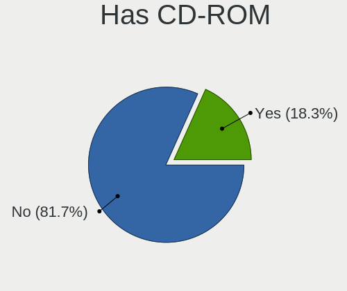
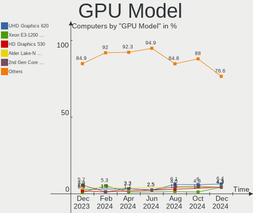
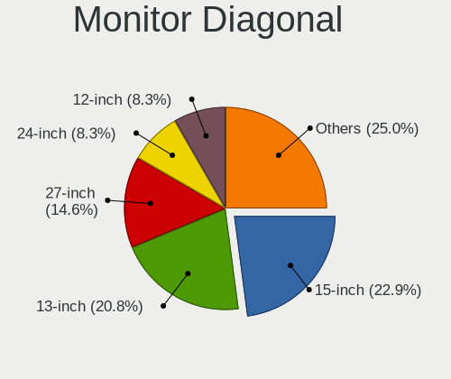

FreeBSD - Hardware Trends
-------------------------

A project to identify most popular hardware characteristics and track their change
over time based on data collected by BSD users at https://BSD-Hardware.info.

Anyone can contribute to this report by the [hw-probe](https://github.com/linuxhw/hw-probe/blob/master/INSTALL.BSD.md) tool:

    hw-probe -all -upload

This is a report for all computer types. See also reports for [desktops](/Dist/FreeBSD/Desktop/README.md) and [notebooks](/Dist/FreeBSD/Notebook/README.md).

This report is for one last month. Overall report since the beginning of time: [TestDays](https://github.com/bsdhw/TestDays)

Period: Apr, 2024.

Contents
--------

* [ System ](#system)
  - [ OS                       ](#os)
  - [ OS Family                ](#os-family)
  - [ Arch                     ](#arch)
  - [ DE                       ](#de)
  - [ Display Server           ](#display-server)
  - [ Display Manager          ](#display-manager)
  - [ OS Lang                  ](#os-lang)
  - [ Boot Mode                ](#boot-mode)
  - [ Filesystem               ](#filesystem)
  - [ Part. scheme             ](#part-scheme)

* [ Board ](#board)
  - [ Vendor                   ](#vendor)
  - [ Model                    ](#model)
  - [ Model Family             ](#model-family)
  - [ MFG Year                 ](#mfg-year)
  - [ Form Factor              ](#form-factor)
  - [ Coreboot                 ](#coreboot)
  - [ RAM Size                 ](#ram-size)
  - [ RAM Used                 ](#ram-used)
  - [ Total Drives             ](#total-drives)
  - [ Has CD-ROM               ](#has-cd-rom)
  - [ Has Ethernet             ](#has-ethernet)
  - [ Has WiFi                 ](#has-wifi)
  - [ Has Bluetooth            ](#has-bluetooth)

* [ Location ](#location)
  - [ Country                  ](#country)
  - [ City                     ](#city)

* [ Drives ](#drives)
  - [ Drive Vendor             ](#drive-vendor)
  - [ Drive Model              ](#drive-model)
  - [ HDD Vendor               ](#hdd-vendor)
  - [ SSD Vendor               ](#ssd-vendor)
  - [ Drive Kind               ](#drive-kind)
  - [ Drive Connector          ](#drive-connector)
  - [ Drive Size               ](#drive-size)
  - [ Space Total              ](#space-total)
  - [ Space Used               ](#space-used)
  - [ Malfunc. Drives          ](#malfunc-drives)
  - [ Malfunc. Drive Vendor    ](#malfunc-drive-vendor)
  - [ Malfunc. HDD Vendor      ](#malfunc-hdd-vendor)
  - [ Malfunc. Drive Kind      ](#malfunc-drive-kind)
  - [ Failed Drives            ](#failed-drives)
  - [ Failed Drive Vendor      ](#failed-drive-vendor)
  - [ Drive Status             ](#drive-status)

* [ Storage controller ](#storage-controller)
  - [ Storage Vendor           ](#storage-vendor)
  - [ Storage Model            ](#storage-model)
  - [ Storage Kind             ](#storage-kind)

* [ Processor ](#processor)
  - [ CPU Vendor               ](#cpu-vendor)
  - [ CPU Model                ](#cpu-model)
  - [ CPU Model Family         ](#cpu-model-family)
  - [ CPU Cores                ](#cpu-cores)
  - [ CPU Sockets              ](#cpu-sockets)
  - [ CPU Threads              ](#cpu-threads)
  - [ CPU Microarch            ](#cpu-microarch)

* [ Graphics ](#graphics)
  - [ GPU Vendor               ](#gpu-vendor)
  - [ GPU Model                ](#gpu-model)
  - [ GPU Combo                ](#gpu-combo)
  - [ GPU Driver               ](#gpu-driver)
  - [ GPU Memory               ](#gpu-memory)

* [ Monitor ](#monitor)
  - [ Monitor Vendor           ](#monitor-vendor)
  - [ Monitor Model            ](#monitor-model)
  - [ Monitor Resolution       ](#monitor-resolution)
  - [ Monitor Diagonal         ](#monitor-diagonal)
  - [ Monitor Width            ](#monitor-width)
  - [ Aspect Ratio             ](#aspect-ratio)
  - [ Monitor Area             ](#monitor-area)
  - [ Pixel Density            ](#pixel-density)
  - [ Multiple Monitors        ](#multiple-monitors)

* [ Network ](#network)
  - [ Net Controller Vendor    ](#net-controller-vendor)
  - [ Net Controller Model     ](#net-controller-model)
  - [ Wireless Vendor          ](#wireless-vendor)
  - [ Wireless Model           ](#wireless-model)
  - [ Ethernet Vendor          ](#ethernet-vendor)
  - [ Ethernet Model           ](#ethernet-model)
  - [ Net Controller Kind      ](#net-controller-kind)
  - [ Used Controller          ](#used-controller)
  - [ NICs                     ](#nics)
  - [ IPv6                     ](#ipv6)

* [ Bluetooth ](#bluetooth)
  - [ Bluetooth Vendor         ](#bluetooth-vendor)
  - [ Bluetooth Model          ](#bluetooth-model)

* [ Sound ](#sound)
  - [ Sound Vendor             ](#sound-vendor)
  - [ Sound Model              ](#sound-model)

* [ Memory ](#memory)
  - [ Memory Vendor            ](#memory-vendor)
  - [ Memory Model             ](#memory-model)
  - [ Memory Kind              ](#memory-kind)
  - [ Memory Form Factor       ](#memory-form-factor)
  - [ Memory Size              ](#memory-size)
  - [ Memory Speed             ](#memory-speed)

* [ Printers & scanners ](#printers--scanners)
  - [ Printer Vendor           ](#printer-vendor)
  - [ Printer Model            ](#printer-model)
  - [ Scanner Vendor           ](#scanner-vendor)
  - [ Scanner Model            ](#scanner-model)

* [ Camera ](#camera)
  - [ Camera Vendor            ](#camera-vendor)
  - [ Camera Model             ](#camera-model)

* [ Security ](#security)
  - [ Fingerprint Vendor       ](#fingerprint-vendor)
  - [ Fingerprint Model        ](#fingerprint-model)
  - [ Chipcard Vendor          ](#chipcard-vendor)
  - [ Chipcard Model           ](#chipcard-model)

* [ Unsupported ](#unsupported)
  - [ Unsupported Devices      ](#unsupported-devices)
  - [ Unsupported Device Types ](#unsupported-device-types)

System
------

OS
--

Installed operating systems

| Name                     | Computers | Percent |
|--------------------------|-----------|---------|
| FreeBSD 14.0-p6          | 38        | 47.5%   |
| FreeBSD 14.0             | 11        | 13.75%  |
| FreeBSD 15.0-CURRENT     | 6         | 7.5%    |
| FreeBSD 14.0-BETA5       | 3         | 3.75%   |
| FreeBSD 14.1-PRERELEASE  | 2         | 2.5%    |
| FreeBSD 14.0-STABLE      | 2         | 2.5%    |
| FreeBSD 14.0-p5          | 2         | 2.5%    |
| FreeBSD 13.3-p1          | 2         | 2.5%    |
| FreeBSD 13.2             | 2         | 2.5%    |
| FreeBSD 14.0-STABLE-HBSD | 1         | 1.25%   |
| FreeBSD 14.0-p4          | 1         | 1.25%   |
| FreeBSD 14.0-p2          | 1         | 1.25%   |
| FreeBSD 13.2-STABLE      | 1         | 1.25%   |
| FreeBSD 13.2-p72         | 1         | 1.25%   |
| FreeBSD 13.2-p70         | 1         | 1.25%   |
| FreeBSD 13.2-p7          | 1         | 1.25%   |
| FreeBSD 13.2-p11         | 1         | 1.25%   |
| FreeBSD 12.4             | 1         | 1.25%   |
| FreeBSD 12.1-p10         | 1         | 1.25%   |
| FreeBSD 11.1-p6          | 1         | 1.25%   |
| FreeBSD 11.1             | 1         | 1.25%   |

OS Family
---------

OS without a version

| Name    | Computers | Percent |
|---------|-----------|---------|
| FreeBSD | 80        | 100%    |

Arch
----

OS architecture (x86_64, i586, etc.)

| Name  | Computers | Percent |
|-------|-----------|---------|
| amd64 | 79        | 98.75%  |
| arm64 | 1         | 1.25%   |

DE
--

Desktop Environment

| Name       | Computers | Percent |
|------------|-----------|---------|
| Console    | 27        | 33.75%  |
| KDE5       | 15        | 18.75%  |
| XFCE       | 13        | 16.25%  |
| TWM        | 4         | 5%      |
| i3         | 4         | 5%      |
| MATE       | 3         | 3.75%   |
| GNOME      | 3         | 3.75%   |
| X-Cinnamon | 2         | 2.5%    |
| Picom      | 2         | 2.5%    |
| Openbox    | 2         | 2.5%    |
| LXQt       | 2         | 2.5%    |
| xinitrc    | 1         | 1.25%   |
| spectrwm   | 1         | 1.25%   |
| Blackbox   | 1         | 1.25%   |

Display Server
--------------

X11 or Wayland

| Name    | Computers | Percent |
|---------|-----------|---------|
| X11     | 50        | 62.5%   |
| Console | 28        | 35%     |
| Wayland | 2         | 2.5%    |

Display Manager
---------------

SDDM, LightDM, etc.

| Name    | Computers | Percent |
|---------|-----------|---------|
| Console | 38        | 47.5%   |
| SDDM    | 23        | 28.75%  |
| LightDM | 10        | 12.5%   |
| XDM     | 5         | 6.25%   |
| SLiM    | 3         | 3.75%   |
| GDM     | 1         | 1.25%   |

OS Lang
-------

Language

| Lang    | Computers | Percent |
|---------|-----------|---------|
| C       | 49        | 61.25%  |
| en_US   | 12        | 15%     |
| Unknown | 8         | 10%     |
| ru_RU   | 4         | 5%      |
| ja_JP   | 2         | 2.5%    |
| zh_TW   | 1         | 1.25%   |
| zh_CN   | 1         | 1.25%   |
| en_GB   | 1         | 1.25%   |
| en_CA   | 1         | 1.25%   |
| en_AU   | 1         | 1.25%   |

Boot Mode
---------

EFI or BIOS

| Mode | Computers | Percent |
|------|-----------|---------|
| EFI  | 62        | 77.5%   |
| BIOS | 18        | 22.5%   |

Filesystem
----------

Type of filesystem

| Type | Computers | Percent |
|------|-----------|---------|
| Zfs  | 64        | 80%     |
| Ufs  | 16        | 20%     |

Part. scheme
------------

Scheme of partitioning

| Type | Computers | Percent |
|------|-----------|---------|
| GPT  | 77        | 96.25%  |
| MBR  | 2         | 2.5%    |
| BSD  | 1         | 1.25%   |

Board
-----

Vendor
------

Motherboard manufacturer

| Name                                 | Computers | Percent |
|--------------------------------------|-----------|---------|
| Lenovo                               | 18        | 22.5%   |
| ASUSTek Computer                     | 12        | 15%     |
| Dell                                 | 8         | 10%     |
| Hewlett-Packard                      | 5         | 6.25%   |
| Apple                                | 5         | 6.25%   |
| Intel                                | 4         | 5%      |
| Gigabyte Technology                  | 4         | 5%      |
| MSI                                  | 3         | 3.75%   |
| ASRock                               | 3         | 3.75%   |
| Unknown                              | 3         | 3.75%   |
| Fujitsu                              | 2         | 2.5%    |
| ASRockRack                           | 2         | 2.5%    |
| System76                             | 1         | 1.25%   |
| Supermicro                           | 1         | 1.25%   |
| Sony                                 | 1         | 1.25%   |
| SolidRun                             | 1         | 1.25%   |
| SLIMBOOK                             | 1         | 1.25%   |
| Shenzhen Meigao Electronic Equipment | 1         | 1.25%   |
| Quantum engineering                  | 1         | 1.25%   |
| HUAWEI                               | 1         | 1.25%   |
| Foxconn                              | 1         | 1.25%   |
| AZW                                  | 1         | 1.25%   |
| Acer                                 | 1         | 1.25%   |

Model
-----

Motherboard model

| Name                                              | Computers | Percent |
|---------------------------------------------------|-----------|---------|
| Apple MacBookAir6,2                               | 4         | 5%      |
| Unknown                                           | 3         | 3.75%   |
| ASUS K43E                                         | 2         | 2.5%    |
| ASUS All Series                                   | 2         | 2.5%    |
| System76 Pangolin                                 | 1         | 1.25%   |
| Supermicro Super Server                           | 1         | 1.25%   |
| Sony VGN-FZ4000E                                  | 1         | 1.25%   |
| SolidRun CEX7 Platform                            | 1         | 1.25%   |
| SLIMBOOK PROX14-AMD                               | 1         | 1.25%   |
| Shenzhen Meigao Electronic Equipment Venus Series | 1         | 1.25%   |
| Quantum engineering HackBoard 2                   | 1         | 1.25%   |
| MSI MS-7C96                                       | 1         | 1.25%   |
| MSI MS-7B89                                       | 1         | 1.25%   |
| MSI MS-7A40                                       | 1         | 1.25%   |
| Lenovo ThinkStation P330 Tiny 30CES0YN00          | 1         | 1.25%   |
| Lenovo ThinkPad X280 20KFCTO1WW                   | 1         | 1.25%   |
| Lenovo ThinkPad X230 Tablet 3438GF4               | 1         | 1.25%   |
| Lenovo ThinkPad X1 Extreme 2nd 20QV001CPB         | 1         | 1.25%   |
| Lenovo ThinkPad X1 Carbon 6th 20KGS1TW00          | 1         | 1.25%   |
| Lenovo ThinkPad T530 23942U1                      | 1         | 1.25%   |
| Lenovo ThinkPad T460 20FMA09CGE                   | 1         | 1.25%   |
| Lenovo ThinkPad T440 20B7S01V00                   | 1         | 1.25%   |
| Lenovo ThinkPad T400 6475FA4                      | 1         | 1.25%   |
| Lenovo ThinkPad T400 6474E18                      | 1         | 1.25%   |
| Lenovo ThinkPad S5-S531 20B00003UK                | 1         | 1.25%   |
| Lenovo ThinkPad E550 20DF005VRT                   | 1         | 1.25%   |
| Lenovo ThinkPad E490 20N9S48S00                   | 1         | 1.25%   |
| Lenovo ThinkBook 16 G6+ IMH 21LE                  | 1         | 1.25%   |
| Lenovo ThinkBook 16 G5+ APH 21K0                  | 1         | 1.25%   |
| Lenovo Legion Pro 5 16ARX8 82WM                   | 1         | 1.25%   |
| Lenovo IdeaPad 500S-14ISK 80Q3                    | 1         | 1.25%   |
| Lenovo H30-50 90B9004GPH                          | 1         | 1.25%   |
| Intel MAHOBAY                                     | 1         | 1.25%   |
| Intel DP965LT AAD41694-210                        | 1         | 1.25%   |
| Intel DN2820FYK H24582-201                        | 1         | 1.25%   |
| Intel D525MW AAE93082-401                         | 1         | 1.25%   |
| HUAWEI MRGFG-XX                                   | 1         | 1.25%   |
| HP ZBook 15 G6                                    | 1         | 1.25%   |
| HP ProLiant ML310e Gen8                           | 1         | 1.25%   |
| HP ProBook 440 G2                                 | 1         | 1.25%   |

Model Family
------------

Motherboard model prefix

| Name                                       | Computers | Percent |
|--------------------------------------------|-----------|---------|
| Lenovo ThinkPad                            | 12        | 15%     |
| Apple MacBookAir6                          | 4         | 5%      |
| Dell PowerEdge                             | 3         | 3.75%   |
| Unknown                                    | 3         | 3.75%   |
| Lenovo ThinkBook                           | 2         | 2.5%    |
| Dell Precision                             | 2         | 2.5%    |
| ASUS K43E                                  | 2         | 2.5%    |
| ASUS All                                   | 2         | 2.5%    |
| System76 Pangolin                          | 1         | 1.25%   |
| Supermicro Super                           | 1         | 1.25%   |
| Sony VGN-FZ4000E                           | 1         | 1.25%   |
| SolidRun CEX7                              | 1         | 1.25%   |
| SLIMBOOK PROX14-AMD                        | 1         | 1.25%   |
| Shenzhen Meigao Electronic Equipment Venus | 1         | 1.25%   |
| Quantum engineering HackBoard              | 1         | 1.25%   |
| MSI MS-7C96                                | 1         | 1.25%   |
| MSI MS-7B89                                | 1         | 1.25%   |
| MSI MS-7A40                                | 1         | 1.25%   |
| Lenovo ThinkStation                        | 1         | 1.25%   |
| Lenovo Legion                              | 1         | 1.25%   |
| Lenovo IdeaPad                             | 1         | 1.25%   |
| Lenovo H30-50                              | 1         | 1.25%   |
| Intel MAHOBAY                              | 1         | 1.25%   |
| Intel DP965LT                              | 1         | 1.25%   |
| Intel DN2820FYK                            | 1         | 1.25%   |
| Intel D525MW                               | 1         | 1.25%   |
| HUAWEI MRGFG-XX                            | 1         | 1.25%   |
| HP ZBook                                   | 1         | 1.25%   |
| HP ProLiant                                | 1         | 1.25%   |
| HP ProBook                                 | 1         | 1.25%   |
| HP Compaq                                  | 1         | 1.25%   |
| HP 110-404ng                               | 1         | 1.25%   |
| Gigabyte Z590I                             | 1         | 1.25%   |
| Gigabyte X570                              | 1         | 1.25%   |
| Gigabyte H97M-D3H                          | 1         | 1.25%   |
| Gigabyte B460                              | 1         | 1.25%   |
| Fujitsu FARQ18004                          | 1         | 1.25%   |
| Fujitsu CELJ07001                          | 1         | 1.25%   |
| Foxconn H61MXV                             | 1         | 1.25%   |
| Dell XPS                                   | 1         | 1.25%   |

MFG Year
--------

Motherboard manufacture year

| Year | Computers | Percent |
|------|-----------|---------|
| 2023 | 16        | 20%     |
| 2018 | 9         | 11.25%  |
| 2019 | 8         | 10%     |
| 2015 | 6         | 7.5%    |
| 2011 | 6         | 7.5%    |
| 2022 | 5         | 6.25%   |
| 2016 | 5         | 6.25%   |
| 2017 | 4         | 5%      |
| 2009 | 4         | 5%      |
| 2024 | 3         | 3.75%   |
| 2014 | 3         | 3.75%   |
| 2021 | 2         | 2.5%    |
| 2020 | 2         | 2.5%    |
| 2013 | 2         | 2.5%    |
| 2012 | 2         | 2.5%    |
| 2010 | 1         | 1.25%   |
| 2008 | 1         | 1.25%   |
| 2007 | 1         | 1.25%   |

Form Factor
-----------

Physical design of the computer

| Name     | Computers | Percent |
|----------|-----------|---------|
| Desktop  | 39        | 48.75%  |
| Notebook | 34        | 42.5%   |
| Server   | 5         | 6.25%   |
| Tablet   | 1         | 1.25%   |
| Mini pc  | 1         | 1.25%   |

Coreboot
--------

Have coreboot on board

| Used | Computers | Percent |
|------|-----------|---------|
| No   | 80        | 100%    |

RAM Size
--------

Total RAM memory

| Size in GB      | Computers | Percent |
|-----------------|-----------|---------|
| 8.01-16.0       | 23        | 28.75%  |
| 32.01-64.0      | 18        | 22.5%   |
| 64.01-256.0     | 16        | 20%     |
| 4.01-8.0        | 11        | 13.75%  |
| 16.01-24.0      | 11        | 13.75%  |
| More than 256.0 | 1         | 1.25%   |

RAM Used
--------

Used RAM memory

| Used GB     | Computers | Percent |
|-------------|-----------|---------|
| 0.01-0.5    | 27        | 33.75%  |
| 1.01-2.0    | 20        | 25%     |
| 0.51-1.0    | 17        | 21.25%  |
| 2.01-3.0    | 9         | 11.25%  |
| 4.01-8.0    | 5         | 6.25%   |
| 64.01-256.0 | 1         | 1.25%   |
| 8.01-16.0   | 1         | 1.25%   |

Total Drives
------------

Number of drives on board

| Drives | Computers | Percent |
|--------|-----------|---------|
| 1      | 34        | 42.5%   |
| 0      | 18        | 22.5%   |
| 2      | 17        | 21.25%  |
| 5      | 3         | 3.75%   |
| 3      | 3         | 3.75%   |
| 14     | 2         | 2.5%    |
| 4      | 2         | 2.5%    |
| 7      | 1         | 1.25%   |

Has CD-ROM
----------

Has CD-ROM on board

| Presented | Computers | Percent |
|-----------|-----------|---------|
| No        | 65        | 81.25%  |
| Yes       | 15        | 18.75%  |

Has Ethernet
------------

Has Ethernet on board

| Presented | Computers | Percent |
|-----------|-----------|---------|
| Yes       | 66        | 82.5%   |
| No        | 14        | 17.5%   |

Has WiFi
--------

Has WiFi module

| Presented | Computers | Percent |
|-----------|-----------|---------|
| Yes       | 53        | 66.25%  |
| No        | 27        | 33.75%  |

Has Bluetooth
-------------

Has Bluetooth module

| Presented | Computers | Percent |
|-----------|-----------|---------|
| Yes       | 40        | 50%     |
| No        | 40        | 50%     |

Location
--------

Country
-------

Geographic location (country)

| Country      | Computers | Percent |
|--------------|-----------|---------|
| Russia       | 13        | 16.25%  |
| USA          | 10        | 12.5%   |
| France       | 7         | 8.75%   |
| Germany      | 6         | 7.5%    |
| UK           | 5         | 6.25%   |
| Poland       | 4         | 5%      |
| Japan        | 4         | 5%      |
| Netherlands  | 3         | 3.75%   |
| China        | 3         | 3.75%   |
| Canada       | 3         | 3.75%   |
| Australia    | 3         | 3.75%   |
| Vietnam      | 2         | 2.5%    |
| Switzerland  | 2         | 2.5%    |
| Spain        | 2         | 2.5%    |
| Brazil       | 2         | 2.5%    |
| Thailand     | 1         | 1.25%   |
| Sweden       | 1         | 1.25%   |
| South Africa | 1         | 1.25%   |
| Singapore    | 1         | 1.25%   |
| Philippines  | 1         | 1.25%   |
| Peru         | 1         | 1.25%   |
| Panama       | 1         | 1.25%   |
| Italy        | 1         | 1.25%   |
| Hong Kong    | 1         | 1.25%   |
| Bulgaria     | 1         | 1.25%   |
| Belgium      | 1         | 1.25%   |

City
----

Geographic location (city)

| City                 | Computers | Percent |
|----------------------|-----------|---------|
| Moscow               | 5         | 6.25%   |
| Colombes             | 4         | 5%      |
| Sheffield            | 3         | 3.75%   |
| Tokyo                | 2         | 2.5%    |
| St Petersburg        | 2         | 2.5%    |
| Saint-Bruno          | 2         | 2.5%    |
| Melbourne            | 2         | 2.5%    |
| Krakow               | 2         | 2.5%    |
| Hechi                | 2         | 2.5%    |
| Hanoi                | 2         | 2.5%    |
| Bonn                 | 2         | 2.5%    |
| Yurlovo              | 1         | 1.25%   |
| Yekaterinburg        | 1         | 1.25%   |
| Wroclaw              | 1         | 1.25%   |
| Voronezh             | 1         | 1.25%   |
| Vladimirskiy Poselok | 1         | 1.25%   |
| Villeurbanne         | 1         | 1.25%   |
| Viladecans           | 1         | 1.25%   |
| Ufa                  | 1         | 1.25%   |
| Stockholm            | 1         | 1.25%   |
| St. Albert           | 1         | 1.25%   |
| Sofia                | 1         | 1.25%   |
| Singapore            | 1         | 1.25%   |
| Shinchiba            | 1         | 1.25%   |
| Shenyang             | 1         | 1.25%   |
| Seattle              | 1         | 1.25%   |
| San Jose             | 1         | 1.25%   |
| San Angelo           | 1         | 1.25%   |
| Rosny-sous-Bois      | 1         | 1.25%   |
| Rho                  | 1         | 1.25%   |
| Quezon City          | 1         | 1.25%   |
| Pretoria             | 1         | 1.25%   |
| Perth                | 1         | 1.25%   |
| Pellenberg           | 1         | 1.25%   |
| Paris                | 1         | 1.25%   |
| Panama City          | 1         | 1.25%   |
| Palezieux            | 1         | 1.25%   |
| Oldenburg            | 1         | 1.25%   |
| Mission Viejo        | 1         | 1.25%   |
| Madrid               | 1         | 1.25%   |

Drives
------

Drive Vendor
------------

Hard drive vendors

| Vendor              | Computers | Drives | Percent |
|---------------------|-----------|--------|---------|
| Seagate             | 18        | 42     | 21.18%  |
| WDC                 | 14        | 17     | 16.47%  |
| Samsung Electronics | 12        | 19     | 14.12%  |
| Toshiba             | 6         | 7      | 7.06%   |
| Crucial             | 5         | 6      | 5.88%   |
| Kingston            | 4         | 5      | 4.71%   |
| Apple               | 4         | 4      | 4.71%   |
| Lexar               | 3         | 5      | 3.53%   |
| Hitachi             | 3         | 3      | 3.53%   |
| Gigabyte Technology | 3         | 3      | 3.53%   |
| Transcend           | 2         | 2      | 2.35%   |
| Intel               | 2         | 2      | 2.35%   |
| HGST                | 2         | 9      | 2.35%   |
| UMIS                | 1         | 1      | 1.18%   |
| SSSTC               | 1         | 1      | 1.18%   |
| SanDisk             | 1         | 1      | 1.18%   |
| Plextor             | 1         | 1      | 1.18%   |
| Micron Technology   | 1         | 6      | 1.18%   |
| LITEON              | 1         | 1      | 1.18%   |
| Intenso             | 1         | 1      | 1.18%   |

Drive Model
-----------

Hard drive models

| Model                            | Computers | Percent |
|----------------------------------|-----------|---------|
| Apple SSD SD0128F 121GB          | 4         | 4.04%   |
| Samsung SSD 860 EVO 250GB        | 3         | 3.03%   |
| Toshiba DT01ACA050 500GB         | 2         | 2.02%   |
| Samsung SSD 870 EVO 500GB        | 2         | 2.02%   |
| Lexar SSD NS100 512GB            | 2         | 2.02%   |
| Kingston SV300S37A120G 120GB     | 2         | 2.02%   |
| Hitachi HTS547550A9E384 500GB    | 2         | 2.02%   |
| Gigabyte GP-GSTFS31240GNTD 240GB | 2         | 2.02%   |
| WDC WDS200T2B0B-00YS70 2TB       | 1         | 1.01%   |
| WDC WDS120G2G0A-00JH30 120GB     | 1         | 1.01%   |
| WDC WD80EFZZ-68BTXN0 8TB         | 1         | 1.01%   |
| WDC WD80EFZX-68UW8N0 8TB         | 1         | 1.01%   |
| WDC WD5000LPCX-24C6HT0 500GB     | 1         | 1.01%   |
| WDC WD40EZRZ-00WN9B0 4TB         | 1         | 1.01%   |
| WDC WD40EZAZ-00SF3B0 4TB         | 1         | 1.01%   |
| WDC WD40EFPX-68C6CN0 4TB         | 1         | 1.01%   |
| WDC WD3200BPVT-55ZEST0 320GB     | 1         | 1.01%   |
| WDC WD3200AAJS-00YZCA0 320GB     | 1         | 1.01%   |
| WDC WD2500AAKX-753CA1 250GB      | 1         | 1.01%   |
| WDC WD23PURZ-85C5HY0 2TB         | 1         | 1.01%   |
| WDC WD20SMZW-11JW8S1 2TB         | 1         | 1.01%   |
| WDC WD20EFRX-68EUZN0 2TB         | 1         | 1.01%   |
| WDC WD10EZEX-75M2NA0 1TB         | 1         | 1.01%   |
| WDC WD1000DHTZ-04N21V0 1TB       | 1         | 1.01%   |
| UMIS RPEYJ1T24MKN2QWY 1TB        | 1         | 1.01%   |
| Transcend TS256GSSD370S 256GB    | 1         | 1.01%   |
| Transcend TS256GSSD230S 256GB    | 1         | 1.01%   |
| Toshiba MK6465GSX 640GB          | 1         | 1.01%   |
| Toshiba MG06ACA10TE 10TB         | 1         | 1.01%   |
| Toshiba MG03ACA100 1TB           | 1         | 1.01%   |
| Toshiba HDWG480 8TB              | 1         | 1.01%   |
| SSSTC CL4-8D512 512GB            | 1         | 1.01%   |
| Seagate ST9500325AS 500GB        | 1         | 1.01%   |
| Seagate ST8000VN004-2M2101 8TB   | 1         | 1.01%   |
| Seagate ST8000VN0022-2EL112 8TB  | 1         | 1.01%   |
| Seagate ST6000VX0023-2EF110 6TB  | 1         | 1.01%   |
| Seagate ST500LM000-SSHD-8GB      | 1         | 1.01%   |
| Seagate ST5000LM000-2AN170 5TB   | 1         | 1.01%   |
| Seagate ST4000NM0033-9ZM170 4TB  | 1         | 1.01%   |
| Seagate ST4000LM024-2AN17V 4TB   | 1         | 1.01%   |

HDD Vendor
----------

Hard disk drive vendors

| Vendor              | Computers | Drives | Percent |
|---------------------|-----------|--------|---------|
| Seagate             | 18        | 41     | 42.86%  |
| WDC                 | 12        | 15     | 28.57%  |
| Toshiba             | 6         | 7      | 14.29%  |
| Hitachi             | 3         | 3      | 7.14%   |
| HGST                | 2         | 9      | 4.76%   |
| Samsung Electronics | 1         | 1      | 2.38%   |

SSD Vendor
----------

Solid state drive vendors

| Vendor              | Computers | Drives | Percent |
|---------------------|-----------|--------|---------|
| Samsung Electronics | 11        | 15     | 26.83%  |
| Crucial             | 5         | 6      | 12.2%   |
| Kingston            | 4         | 5      | 9.76%   |
| Apple               | 4         | 4      | 9.76%   |
| Gigabyte Technology | 3         | 3      | 7.32%   |
| WDC                 | 2         | 2      | 4.88%   |
| Transcend           | 2         | 2      | 4.88%   |
| Lexar               | 2         | 3      | 4.88%   |
| Intel               | 2         | 2      | 4.88%   |
| Seagate             | 1         | 1      | 2.44%   |
| SanDisk             | 1         | 1      | 2.44%   |
| Plextor             | 1         | 1      | 2.44%   |
| Micron Technology   | 1         | 6      | 2.44%   |
| LITEON              | 1         | 1      | 2.44%   |
| Intenso             | 1         | 1      | 2.44%   |

Drive Kind
----------

HDD or SSD

| Kind | Computers | Drives | Percent |
|------|-----------|--------|---------|
| SSD  | 39        | 53     | 51.32%  |
| HDD  | 33        | 76     | 43.42%  |
| NVMe | 4         | 7      | 5.26%   |

Drive Connector
---------------

SATA, SAS, NVMe, etc.

| Type | Computers | Drives | Percent |
|------|-----------|--------|---------|
| SATA | 60        | 129    | 93.75%  |
| NVMe | 4         | 7      | 6.25%   |

Drive Size
----------

Size of hard drive

| Size in TB | Computers | Drives | Percent |
|------------|-----------|--------|---------|
| 0.01-0.5   | 40        | 51     | 51.95%  |
| 0.51-1.0   | 14        | 17     | 18.18%  |
| 1.01-2.0   | 10        | 29     | 12.99%  |
| 3.01-4.0   | 6         | 12     | 7.79%   |
| 4.01-10.0  | 5         | 17     | 6.49%   |
| 10.01-20.0 | 2         | 3      | 2.6%    |

Space Total
-----------

Amount of disk space available on the file system

| Size in GB     | Computers | Percent |
|----------------|-----------|---------|
| 101-250        | 30        | 37.5%   |
| 251-500        | 12        | 15%     |
| 501-1000       | 12        | 15%     |
| 1001-2000      | 8         | 10%     |
| More than 3000 | 5         | 6.25%   |
| 21-50          | 5         | 6.25%   |
| 51-100         | 4         | 5%      |
| 2001-3000      | 2         | 2.5%    |
| 1-20           | 1         | 1.25%   |
| Unknown        | 1         | 1.25%   |

Space Used
----------

Amount of used disk space

| Used GB   | Computers | Percent |
|-----------|-----------|---------|
| 1-20      | 58        | 72.5%   |
| 21-50     | 11        | 13.75%  |
| 51-100    | 6         | 7.5%    |
| 101-250   | 3         | 3.75%   |
| 1001-2000 | 1         | 1.25%   |
| Unknown   | 1         | 1.25%   |

Malfunc. Drives
---------------

Drive models with a malfunction

| Model                                        | Computers | Drives | Percent |
|----------------------------------------------|-----------|--------|---------|
| Kingston SV300S37A120G 120GB                 | 2         | 2      | 13.33%  |
| WDC WD40EZRZ-00WN9B0 4TB                     | 1         | 1      | 6.67%   |
| WDC WD3200AAJS-00YZCA0 320GB                 | 1         | 1      | 6.67%   |
| WDC WD10EZEX-75M2NA0 1TB                     | 1         | 1      | 6.67%   |
| Toshiba MK6465GSX 640GB                      | 1         | 1      | 6.67%   |
| Seagate ST9500325AS 500GB                    | 1         | 1      | 6.67%   |
| Seagate ST320LT007-9ZV142 320GB              | 1         | 1      | 6.67%   |
| Samsung Electronics SSD 870 EVO 1TB          | 1         | 1      | 6.67%   |
| Samsung Electronics SSD 840 PRO Series 256GB | 1         | 1      | 6.67%   |
| LITEON CV8-8E128-HP 128GB                    | 1         | 1      | 6.67%   |
| Intel SSDSA2UP020G3H 20GB                    | 1         | 1      | 6.67%   |
| Hitachi HTS545032B9A300 320GB                | 1         | 1      | 6.67%   |
| HGST HTS725050A7E630 500GB                   | 1         | 1      | 6.67%   |
| Crucial CT256MX100SSD1 256GB                 | 1         | 1      | 6.67%   |

Malfunc. Drive Vendor
---------------------

Vendors of faulty drives

| Vendor              | Computers | Drives | Percent |
|---------------------|-----------|--------|---------|
| WDC                 | 3         | 3      | 20%     |
| Seagate             | 2         | 2      | 13.33%  |
| Samsung Electronics | 2         | 2      | 13.33%  |
| Kingston            | 2         | 2      | 13.33%  |
| Toshiba             | 1         | 1      | 6.67%   |
| LITEON              | 1         | 1      | 6.67%   |
| Intel               | 1         | 1      | 6.67%   |
| Hitachi             | 1         | 1      | 6.67%   |
| HGST                | 1         | 1      | 6.67%   |
| Crucial             | 1         | 1      | 6.67%   |

Malfunc. HDD Vendor
-------------------

Vendors of faulty HDD drives

| Vendor  | Computers | Drives | Percent |
|---------|-----------|--------|---------|
| WDC     | 3         | 3      | 37.5%   |
| Seagate | 2         | 2      | 25%     |
| Toshiba | 1         | 1      | 12.5%   |
| Hitachi | 1         | 1      | 12.5%   |
| HGST    | 1         | 1      | 12.5%   |

Malfunc. Drive Kind
-------------------

Kinds of faulty drives

| Kind | Computers | Drives | Percent |
|------|-----------|--------|---------|
| HDD  | 8         | 8      | 53.33%  |
| SSD  | 7         | 7      | 46.67%  |

Failed Drives
-------------

Failed drive models

Zero info for selected period =(

Failed Drive Vendor
-------------------

Failed drive vendors

Zero info for selected period =(

Drive Status
------------

Number of failed and malfunc. drives

| Status  | Computers | Drives | Percent |
|---------|-----------|--------|---------|
| Works   | 55        | 121    | 78.57%  |
| Malfunc | 15        | 15     | 21.43%  |

Storage controller
------------------

Storage Vendor
--------------

Storage controller vendors

| Vendor                                  | Computers | Percent |
|-----------------------------------------|-----------|---------|
| Intel                                   | 50        | 41.32%  |
| AMD                                     | 15        | 12.4%   |
| Samsung Electronics                     | 13        | 10.74%  |
| Marvell Technology Group                | 7         | 5.79%   |
| SanDisk                                 | 5         | 4.13%   |
| Phison Electronics                      | 5         | 4.13%   |
| Broadcom / LSI                          | 5         | 4.13%   |
| Kingston Technology Company             | 4         | 3.31%   |
| Micron/Crucial Technology               | 2         | 1.65%   |
| ADATA Technology                        | 2         | 1.65%   |
| Transcend                               | 1         | 0.83%   |
| Toshiba                                 | 1         | 0.83%   |
| Solid State Storage Technology          | 1         | 0.83%   |
| Shenzhen Unionmemory Information System | 1         | 0.83%   |
| Shenzhen Longsys Electronics            | 1         | 0.83%   |
| Seagate Technology                      | 1         | 0.83%   |
| Netac Technology                        | 1         | 0.83%   |
| MAXIO Technology (Hangzhou)             | 1         | 0.83%   |
| Lite-On Technology                      | 1         | 0.83%   |
| KIOXIA                                  | 1         | 0.83%   |
| JMicron Technology                      | 1         | 0.83%   |
| Chelsio Communications                  | 1         | 0.83%   |
| ASMedia Technology                      | 1         | 0.83%   |

Storage Model
-------------

Storage controller models

| Model                                                                                         | Computers | Percent |
|-----------------------------------------------------------------------------------------------|-----------|---------|
| AMD FCH SATA Controller [AHCI mode]                                                           | 8         | 6.02%   |
| Samsung NVMe SSD Controller SM981/PM981/PM983                                                 | 5         | 3.76%   |
| Samsung NVMe SSD Controller PM9A1/PM9A3/980PRO                                                | 4         | 3.01%   |
| Marvell Group 88SS9183 PCIe SSD Controller                                                    | 4         | 3.01%   |
| Intel 7 Series Chipset Family 6-port SATA Controller [AHCI mode]                              | 4         | 3.01%   |
| SanDisk Extreme Pro / WD Black SN750 / PC SN730 / Red SN700 NVMe SSD                          | 3         | 2.26%   |
| Intel Sunrise Point-LP SATA Controller [AHCI mode]                                            | 3         | 2.26%   |
| Intel 9 Series Chipset Family SATA Controller [AHCI Mode]                                     | 3         | 2.26%   |
| Intel 8 Series/C220 Series Chipset Family 6-port SATA Controller 1 [AHCI mode]                | 3         | 2.26%   |
| Intel 6 Series/C200 Series Chipset Family 6 port Desktop SATA AHCI Controller                 | 3         | 2.26%   |
| Broadcom / LSI SAS2008 PCI-Express Fusion-MPT SAS-2 [Falcon]                                  | 3         | 2.26%   |
| Sandisk WD Black SN770 / PC SN740 256GB / PC SN560 (DRAM-less) NVMe SSD                       | 2         | 1.5%    |
| Samsung NVMe SSD Controller S4LV008[Pascal]                                                   | 2         | 1.5%    |
| Phison PS5021-E21 PCIe4 NVMe Controller (DRAM-less)                                           | 2         | 1.5%    |
| Kingston Company A2000 NVMe SSD SM2263EN                                                      | 2         | 1.5%    |
| Intel Wildcat Point-LP SATA Controller [AHCI Mode]                                            | 2         | 1.5%    |
| Intel SSD DC P4101/Pro 7600p/760p/E 6100p Series                                              | 2         | 1.5%    |
| Intel Q170/Q150/B150/H170/H110/Z170/CM236 Chipset SATA Controller [AHCI Mode]                 | 2         | 1.5%    |
| Intel Cannon Lake Mobile PCH SATA AHCI Controller                                             | 2         | 1.5%    |
| Intel C610/X99 series chipset sSATA Controller [AHCI mode]                                    | 2         | 1.5%    |
| Intel C610/X99 series chipset 6-Port SATA Controller [AHCI mode]                              | 2         | 1.5%    |
| Intel Atom Processor E3800 Series SATA AHCI Controller                                        | 2         | 1.5%    |
| Intel 82801IBM/IEM (ICH9M/ICH9M-E) 4 port SATA Controller [AHCI mode]                         | 2         | 1.5%    |
| Intel 6 Series/C200 Series Chipset Family 6 port Mobile SATA AHCI Controller                  | 2         | 1.5%    |
| AMD SB7x0/SB8x0/SB9x0 SATA Controller [AHCI mode]                                             | 2         | 1.5%    |
| AMD 600 Series Chipset SATA Controller                                                        | 2         | 1.5%    |
| AMD 400 Series Chipset SATA Controller                                                        | 2         | 1.5%    |
| Transcend NVMe PCIe SSD 110S/112S/120S/MTE300S/MTE400S/MTE652T2 (DRAM-less)                   | 1         | 0.75%   |
| Toshiba XG6 NVMe SSD Controller                                                               | 1         | 0.75%   |
| Solid State Storage CL4-8D512 NVMe SSD M.2 (DRAM-less)                                        | 1         | 0.75%   |
| Shenzhen Unionmemory Information System RPEYJ1T24MKN2QWY PCIe 4.0 NVMe SSD 1024GB (DRAM-less) | 1         | 0.75%   |
| Shenzhen Longsys Lexar NM790 NVME SSD (DRAM-less)                                             | 1         | 0.75%   |
| Seagate FireCuda 530 SSD                                                                      | 1         | 0.75%   |
| Samsung NVMe SSD Controller PM9B1 (DRAM-less)                                                 | 1         | 0.75%   |
| Samsung NVMe SSD Controller 980 (DRAM-less)                                                   | 1         | 0.75%   |
| Phison PS5027-E27T PCIe4 NVMe Controller (DRAM-less)                                          | 1         | 0.75%   |
| Phison PS5013-E13 PCIe3 NVMe Controller (DRAM-less)                                           | 1         | 0.75%   |
| Phison E16 PCIe4 NVMe Controller                                                              | 1         | 0.75%   |
| Netac PCIe 4 INNOGRIT based NVMe SSD                                                          | 1         | 0.75%   |
| Micron/Crucial P5 Plus NVMe PCIe SSD                                                          | 1         | 0.75%   |

Storage Kind
------------

Kind of storage controller (IDE, SATA, NVMe, SAS, ...)

| Kind | Computers | Percent |
|------|-----------|---------|
| SATA | 63        | 54.78%  |
| NVMe | 37        | 32.17%  |
| IDE  | 6         | 5.22%   |
| RAID | 4         | 3.48%   |
| SAS  | 4         | 3.48%   |
| SCSI | 1         | 0.87%   |

Processor
---------

CPU Vendor
----------

Processor vendors

| Vendor | Computers | Percent |
|--------|-----------|---------|
| Intel  | 60        | 75%     |
| AMD    | 19        | 23.75%  |
| NXP    | 1         | 1.25%   |

CPU Model
---------

Processor models

| Model                                       | Computers | Percent |
|---------------------------------------------|-----------|---------|
| Intel Core i5-4250U CPU @ 1.30GHz           | 4         | 5%      |
| Intel Core i7-8550U CPU @ 1.80GHz           | 3         | 3.75%   |
| Intel Core i7-4770 CPU @ 3.40GHz            | 2         | 2.5%    |
| Intel Core i7-2820QM CPU @ 2.30GHz          | 2         | 2.5%    |
| Intel Core i7-14700K                        | 2         | 2.5%    |
| Intel Core i5-6200U CPU @ 2.30GHz           | 2         | 2.5%    |
| Intel Core i5-5200U CPU @ 2.20GHz           | 2         | 2.5%    |
| AMD Ryzen 7 5700X 8-Core Processor          | 2         | 2.5%    |
| NXP Cortex-A72                              | 1         | 1.25%   |
| Intel Xeon Silver 4110 CPU @ 2.10GHz        | 1         | 1.25%   |
| Intel Xeon CPU E5-2683 v3 @ 2.00GHz         | 1         | 1.25%   |
| Intel Xeon CPU E5-2640 v3 @ 2.60GHz         | 1         | 1.25%   |
| Intel Xeon CPU E3-1270 V2 @ 3.50GHz         | 1         | 1.25%   |
| Intel Xeon CPU E3-1220 V2 @ 3.10GHz         | 1         | 1.25%   |
| Intel Xeon CPU D-1541 @ 2.10GHz             | 1         | 1.25%   |
| Intel Xeon                                  | 1         | 1.25%   |
| Intel Pentium Dual-Core CPU E5800 @ 3.20GHz | 1         | 1.25%   |
| Intel Genuine CPU @ 2.40GHz                 | 1         | 1.25%   |
| Intel Core Ultra 7 155H                     | 1         | 1.25%   |
| Intel Core i7-9850H CPU @ 2.60GHz           | 1         | 1.25%   |
| Intel Core i7-9750H CPU @ 2.60GHz           | 1         | 1.25%   |
| Intel Core i7-9700T CPU @ 2.00GHz           | 1         | 1.25%   |
| Intel Core i7-6700K CPU @ 4.00GHz           | 1         | 1.25%   |
| Intel Core i7-4790 CPU @ 3.60GHz            | 1         | 1.25%   |
| Intel Core i7-4770K CPU @ 3.50GHz           | 1         | 1.25%   |
| Intel Core i7-3720QM CPU @ 2.60GHz          | 1         | 1.25%   |
| Intel Core i5-9300H CPU @ 2.40GHz           | 1         | 1.25%   |
| Intel Core i5-8265U CPU @ 1.60GHz           | 1         | 1.25%   |
| Intel Core i5-4460 CPU @ 3.20GHz            | 1         | 1.25%   |
| Intel Core i5-4300U CPU @ 1.90GHz           | 1         | 1.25%   |
| Intel Core i5-3320M CPU @ 2.60GHz           | 1         | 1.25%   |
| Intel Core i5-3230M CPU @ 2.60GHz           | 1         | 1.25%   |
| Intel Core i5-2500 CPU @ 3.30GHz            | 1         | 1.25%   |
| Intel Core i5-10600K CPU @ 4.10GHz          | 1         | 1.25%   |
| Intel Core i3-6100 CPU @ 3.70GHz            | 1         | 1.25%   |
| Intel Core i3-3227U CPU @ 1.90GHz           | 1         | 1.25%   |
| Intel Core i3-2100 CPU @ 3.10GHz            | 1         | 1.25%   |
| Intel Core 2 Quad CPU Q9450 @ 2.66GHz       | 1         | 1.25%   |
| Intel Core 2 Quad CPU @ 2.40GHz             | 1         | 1.25%   |
| Intel Core 2 Duo CPU T8300 @ 2.40GHz        | 1         | 1.25%   |

CPU Model Family
----------------

Processor model prefix

| Model                   | Computers | Percent |
|-------------------------|-----------|---------|
| Intel Core i7           | 16        | 20%     |
| Intel Core i5           | 16        | 20%     |
| Other                   | 7         | 8.75%   |
| AMD Ryzen 7             | 7         | 8.75%   |
| Intel Xeon              | 6         | 7.5%    |
| AMD Ryzen 9             | 4         | 5%      |
| AMD Ryzen 5             | 4         | 5%      |
| Intel Core i3           | 3         | 3.75%   |
| Intel Core 2 Duo        | 3         | 3.75%   |
| Intel Celeron           | 3         | 3.75%   |
| Intel Core 2 Quad       | 2         | 2.5%    |
| Intel Atom              | 2         | 2.5%    |
| Intel Xeon Silver       | 1         | 1.25%   |
| Intel Pentium Dual-Core | 1         | 1.25%   |
| Intel Genuine           | 1         | 1.25%   |
| Intel Core              | 1         | 1.25%   |
| AMD FX                  | 1         | 1.25%   |
| AMD EPYC                | 1         | 1.25%   |
| AMD Athlon II           | 1         | 1.25%   |

CPU Cores
---------

Number of processor cores

| Number  | Computers | Percent |
|---------|-----------|---------|
| 4       | 21        | 26.25%  |
| 2       | 21        | 26.25%  |
| 16      | 11        | 13.75%  |
| Unknown | 6         | 7.5%    |
| 8       | 5         | 6.25%   |
| 12      | 4         | 5%      |
| 6       | 4         | 5%      |
| 32      | 2         | 2.5%    |
| 14      | 2         | 2.5%    |
| 28      | 1         | 1.25%   |
| 24      | 1         | 1.25%   |
| 22      | 1         | 1.25%   |
| 10      | 1         | 1.25%   |

CPU Sockets
-----------

Number of sockets

| Number | Computers | Percent |
|--------|-----------|---------|
| 1      | 78        | 97.5%   |
| 2      | 2         | 2.5%    |

CPU Threads
-----------

Threads per core (Hyper-Threading)

| Number  | Computers | Percent |
|---------|-----------|---------|
| 2       | 41        | 51.25%  |
| 1       | 33        | 41.25%  |
| Unknown | 6         | 7.5%    |

CPU Microarch
-------------

Microarchitecture

| Name          | Computers | Percent |
|---------------|-----------|---------|
| Unknown       | 17        | 21.25%  |
| Haswell       | 12        | 15%     |
| KabyLake      | 8         | 10%     |
| IvyBridge     | 7         | 8.75%   |
| Penryn        | 6         | 7.5%    |
| Skylake       | 5         | 6.25%   |
| SandyBridge   | 4         | 5%      |
| Zen 3         | 3         | 3.75%   |
| Zen 2         | 3         | 3.75%   |
| Silvermont    | 3         | 3.75%   |
| Broadwell     | 3         | 3.75%   |
| Zen+          | 1         | 1.25%   |
| Zen           | 1         | 1.25%   |
| TigerLake     | 1         | 1.25%   |
| Piledriver    | 1         | 1.25%   |
| K10           | 1         | 1.25%   |
| Goldmont plus | 1         | 1.25%   |
| Core          | 1         | 1.25%   |
| CometLake     | 1         | 1.25%   |
| Bonnell       | 1         | 1.25%   |

Graphics
--------

GPU Vendor
----------

Vendors of graphics cards

| Vendor                     | Computers | Percent |
|----------------------------|-----------|---------|
| Intel                      | 41        | 46.59%  |
| Nvidia                     | 21        | 23.86%  |
| AMD                        | 19        | 21.59%  |
| Matrox Electronics Systems | 4         | 4.55%   |
| ASPEED Technology          | 3         | 3.41%   |

GPU Model
---------

Graphics card models

| Model                                                                       | Computers | Percent |
|-----------------------------------------------------------------------------|-----------|---------|
| Intel Haswell-ULT Integrated Graphics Controller                            | 5         | 5.49%   |
| Intel 3rd Gen Core processor Graphics Controller                            | 4         | 4.4%    |
| Intel UHD Graphics 620                                                      | 3         | 3.3%    |
| Intel 2nd Generation Core Processor Family Integrated Graphics Controller   | 3         | 3.3%    |
| ASPEED Technology ASPEED Graphics Family                                    | 3         | 3.3%    |
| Nvidia TU117M [GeForce GTX 1650 Mobile / Max-Q]                             | 2         | 2.2%    |
| Intel Skylake GT2 [HD Graphics 520]                                         | 2         | 2.2%    |
| Intel Raptor Lake-S GT1 [UHD Graphics 770]                                  | 2         | 2.2%    |
| Intel Raptor Lake-P [Iris Xe Graphics]                                      | 2         | 2.2%    |
| Intel Mobile 4 Series Chipset Integrated Graphics Controller                | 2         | 2.2%    |
| Intel HD Graphics 5500                                                      | 2         | 2.2%    |
| Intel CoffeeLake-H GT2 [UHD Graphics 630]                                   | 2         | 2.2%    |
| Intel Atom Processor Z36xxx/Z37xxx Series Graphics & Display                | 2         | 2.2%    |
| Intel 4 Series Chipset Integrated Graphics Controller                       | 2         | 2.2%    |
| AMD Rembrandt [Radeon 680M]                                                 | 2         | 2.2%    |
| AMD Raphael                                                                 | 2         | 2.2%    |
| Nvidia TU106 [GeForce RTX 2060 SUPER]                                       | 1         | 1.1%    |
| Nvidia GP108 [GeForce GT 1030]                                              | 1         | 1.1%    |
| Nvidia GP107GL [Quadro P1000]                                               | 1         | 1.1%    |
| Nvidia GP104 [GeForce GTX 1070]                                             | 1         | 1.1%    |
| Nvidia GM108M [GeForce 940M]                                                | 1         | 1.1%    |
| Nvidia GM107GL [Quadro K2200]                                               | 1         | 1.1%    |
| Nvidia GK208B [GeForce GT 710]                                              | 1         | 1.1%    |
| Nvidia GK107M [GeForce GT 650M Mac Edition]                                 | 1         | 1.1%    |
| Nvidia GK106 [GeForce GTX 645 OEM]                                          | 1         | 1.1%    |
| Nvidia GF119 [GeForce GT 705]                                               | 1         | 1.1%    |
| Nvidia GF108M [NVS 5400M]                                                   | 1         | 1.1%    |
| Nvidia GF108 [GeForce GT 630]                                               | 1         | 1.1%    |
| Nvidia GA107M [GeForce RTX 3050 Mobile]                                     | 1         | 1.1%    |
| Nvidia GA106 [GeForce RTX 3060 Lite Hash Rate]                              | 1         | 1.1%    |
| Nvidia GA104 [GeForce RTX 3070 Ti]                                          | 1         | 1.1%    |
| Nvidia G86M [GeForce 8400M GT]                                              | 1         | 1.1%    |
| Nvidia AD107M [GeForce RTX 4050 Max-Q / Mobile]                             | 1         | 1.1%    |
| Nvidia AD106M [GeForce RTX 4070 Max-Q / Mobile]                             | 1         | 1.1%    |
| Nvidia AD104GLM [RTX 3500 Ada Generation Laptop GPU]                        | 1         | 1.1%    |
| Matrox Electronics Systems MGA G200eW WPCM450                               | 1         | 1.1%    |
| Matrox Electronics Systems MGA G200EH                                       | 1         | 1.1%    |
| Matrox Electronics Systems Integrated Matrox G200eW3 Graphics Controller    | 1         | 1.1%    |
| Matrox Electronics Systems G200eR2                                          | 1         | 1.1%    |
| Intel Xeon E3-1200 v3/4th Gen Core Processor Integrated Graphics Controller | 1         | 1.1%    |

GPU Combo
---------

Combinations of graphics cards

| Name           | Computers | Percent |
|----------------|-----------|---------|
| 1 x Intel      | 31        | 38.75%  |
| 1 x Nvidia     | 14        | 17.5%   |
| 1 x AMD        | 14        | 17.5%   |
| Intel + Nvidia | 6         | 7.5%    |
| 1 x Matrox     | 4         | 5%      |
| 2 x Intel      | 3         | 3.75%   |
| 2 x AMD        | 3         | 3.75%   |
| 1 x ASPEED     | 2         | 2.5%    |
| Other          | 1         | 1.25%   |
| Intel + ASPEED | 1         | 1.25%   |
| AMD + Nvidia   | 1         | 1.25%   |

GPU Driver
----------

Free vs proprietary

| Driver      | Computers | Percent |
|-------------|-----------|---------|
| Free        | 63        | 78.75%  |
| Proprietary | 16        | 20%     |
| Unknown     | 1         | 1.25%   |

GPU Memory
----------

Total video memory

| Size in GB | Computers | Percent |
|------------|-----------|---------|
| Unknown    | 60        | 75%     |
| 7.01-8.0   | 7         | 8.75%   |
| 1.01-2.0   | 5         | 6.25%   |
| 3.01-4.0   | 3         | 3.75%   |
| 0.51-1.0   | 2         | 2.5%    |
| 0.01-0.5   | 2         | 2.5%    |
| 8.01-16.0  | 1         | 1.25%   |

Monitor
-------

Monitor Vendor
--------------

Monitor vendors

| Vendor               | Computers | Percent |
|----------------------|-----------|---------|
| Samsung Electronics  | 9         | 18.37%  |
| AU Optronics         | 5         | 10.2%   |
| Dell                 | 4         | 8.16%   |
| Chimei Innolux       | 4         | 8.16%   |
| Apple                | 4         | 8.16%   |
| Lenovo               | 3         | 6.12%   |
| Goldstar             | 3         | 6.12%   |
| BOE                  | 3         | 6.12%   |
| Sony                 | 1         | 2.04%   |
| Sharp                | 1         | 2.04%   |
| Philips              | 1         | 2.04%   |
| MDA                  | 1         | 2.04%   |
| LG Display           | 1         | 2.04%   |
| JRY                  | 1         | 2.04%   |
| Gigabyte Technology  | 1         | 2.04%   |
| Gateway              | 1         | 2.04%   |
| Eizo                 | 1         | 2.04%   |
| DZX                  | 1         | 2.04%   |
| CSO                  | 1         | 2.04%   |
| BOE Technology Group | 1         | 2.04%   |
| BenQ                 | 1         | 2.04%   |
| AOC                  | 1         | 2.04%   |

Monitor Model
-------------

Monitor models

| Model                                                                 | Computers | Percent |
|-----------------------------------------------------------------------|-----------|---------|
| Apple Color LCD APP9CF0 1440x900 290x180mm 13.4-inch                  | 3         | 6%      |
| Samsung Electronics LCD Monitor SEC4542 1366x768 300x170mm 13.6-inch  | 2         | 4%      |
| Sony AVAMP SNY1F02 1280x720 800x450mm 36.1-inch                       | 1         | 2%      |
| Sharp LCD Monitor SHP14BA 1920x1080 340x190mm 15.3-inch               | 1         | 2%      |
| Samsung Electronics U32R59x SAM0F94 3840x2160 700x390mm 31.5-inch     | 1         | 2%      |
| Samsung Electronics U28E590 SAM0C4D 3840x2160 610x350mm 27.7-inch     | 1         | 2%      |
| Samsung Electronics SyncMaster SAM01E7 1920x1200 520x320mm 24.0-inch  | 1         | 2%      |
| Samsung Electronics SMEX2220 SAM0685 1920x1080 480x270mm 21.7-inch    | 1         | 2%      |
| Samsung Electronics S19C200 SAM09AC 1366x768 410x230mm 18.5-inch      | 1         | 2%      |
| Samsung Electronics LCD Monitor SDC4171 2880x1800 300x190mm 14.0-inch | 1         | 2%      |
| Samsung Electronics LCD Monitor S24D330 1920x1080                     | 1         | 2%      |
| Philips 200VW PHL0852 1680x1050 470x300mm 22.0-inch                   | 1         | 2%      |
| MDA N2755 MDA0270 1920x1080 600x330mm 27.0-inch                       | 1         | 2%      |
| LG Display LCD Monitor LGD02D8 1366x768 280x160mm 12.7-inch           | 1         | 2%      |
| Lenovo LCD Monitor LEN40B1 1600x900 350x190mm 15.7-inch               | 1         | 2%      |
| Lenovo LCD Monitor LEN4033 1440x900 300x190mm 14.0-inch               | 1         | 2%      |
| Lenovo LCD Monitor LEN4031 1280x800 300x190mm 14.0-inch               | 1         | 2%      |
| JRY UHD DP JRY2380 3840x2160 520x310mm 23.8-inch                      | 1         | 2%      |
| Goldstar LG ULTRAFINE GSM5BC1 3840x2160 600x340mm 27.2-inch           | 1         | 2%      |
| Goldstar LG Ultra HD GSM5B08 3840x2160 600x340mm 27.2-inch            | 1         | 2%      |
| Goldstar E2340 GSM57C7 1920x1080 510x290mm 23.1-inch                  | 1         | 2%      |
| Gigabyte Technology AORUS FI27Q GBT2706 2560x1440 610x350mm 27.7-inch | 1         | 2%      |
| Gateway HD2201 GWY08AF 1680x1050 470x300mm 22.0-inch                  | 1         | 2%      |
| Eizo S2243W ENC2139 1920x1200 480x300mm 22.3-inch                     | 1         | 2%      |
| DZX K3-2 DZX1582 1920x1080 350x190mm 15.7-inch                        | 1         | 2%      |
| Dell U2311H DELA060 1920x1080 510x290mm 23.1-inch                     | 1         | 2%      |
| Dell S2721HN DEL41F7 1920x1080 600x340mm 27.2-inch                    | 1         | 2%      |
| Dell S2522HG DELA1C1 1920x1080 540x300mm 24.3-inch                    | 1         | 2%      |
| Dell LCD Monitor P2723QE 5760x2160                                    | 1         | 2%      |
| CSO LCD Monitor CSO1615 2560x1600 340x220mm 15.9-inch                 | 1         | 2%      |
| Chimei Innolux LCD Monitor CMN1521 1920x1080 340x190mm 15.3-inch      | 1         | 2%      |
| Chimei Innolux LCD Monitor CMN14D6 1366x768 310x170mm 13.9-inch       | 1         | 2%      |
| Chimei Innolux LCD Monitor CMN14B1 1920x1080 310x170mm 13.9-inch      | 1         | 2%      |
| Chimei Innolux LCD Monitor CMN1495 1366x768 310x170mm 13.9-inch       | 1         | 2%      |
| BOE Technology Group LCD Monitor 5760x2160                            | 1         | 2%      |
| BOE LCD Monitor BOE0B7D 2560x1440 360x200mm 16.2-inch                 | 1         | 2%      |
| BOE LCD Monitor BOE0B38 2560x1600 340x210mm 15.7-inch                 | 1         | 2%      |
| BOE LCD Monitor BOE0A34 1920x1200 340x220mm 15.9-inch                 | 1         | 2%      |
| BenQ XL2430T BNQ7F3F 1920x1080 530x300mm 24.0-inch                    | 1         | 2%      |
| BenQ EX2710Q BNQ7F87 2560x1440 600x340mm 27.2-inch                    | 1         | 2%      |

Monitor Resolution
------------------

Monitor screen resolution

| Resolution         | Computers | Percent |
|--------------------|-----------|---------|
| 1920x1080 (FHD)    | 15        | 30.61%  |
| 1366x768 (WXGA)    | 7         | 14.29%  |
| 3840x2160 (4K)     | 5         | 10.2%   |
| 2560x1440 (QHD)    | 4         | 8.16%   |
| 1440x900 (WXGA+)   | 4         | 8.16%   |
| 1920x1200 (WUXGA)  | 3         | 6.12%   |
| 2880x1800          | 2         | 4.08%   |
| 2560x1600          | 2         | 4.08%   |
| 1680x1050 (WSXGA+) | 2         | 4.08%   |
| 1600x900 (HD+)     | 2         | 4.08%   |
| 5760x2160          | 1         | 2.04%   |
| 1280x800 (WXGA)    | 1         | 2.04%   |
| 1280x720 (HD)      | 1         | 2.04%   |

Monitor Diagonal
----------------

Diagonal size in inches

| Inches  | Computers | Percent |
|---------|-----------|---------|
| 15      | 9         | 18.37%  |
| 27      | 8         | 16.33%  |
| 13      | 8         | 16.33%  |
| 14      | 5         | 10.2%   |
| 24      | 3         | 6.12%   |
| 23      | 3         | 6.12%   |
| 22      | 3         | 6.12%   |
| Unknown | 3         | 6.12%   |
| 12      | 2         | 4.08%   |
| 36      | 1         | 2.04%   |
| 31      | 1         | 2.04%   |
| 21      | 1         | 2.04%   |
| 18      | 1         | 2.04%   |
| 16      | 1         | 2.04%   |

Monitor Width
-------------

Physical width

| Width in mm | Computers | Percent |
|-------------|-----------|---------|
| 301-350     | 13        | 27.66%  |
| 501-600     | 11        | 23.4%   |
| 201-300     | 10        | 21.28%  |
| 401-500     | 5         | 10.64%  |
| 601-700     | 3         | 6.38%   |
| Unknown     | 3         | 6.38%   |
| 701-800     | 1         | 2.13%   |
| 351-400     | 1         | 2.13%   |

Aspect Ratio
------------

Proportional relationship between the width and the height

| Ratio   | Computers | Percent |
|---------|-----------|---------|
| 16/9    | 26        | 59.09%  |
| 16/10   | 13        | 29.55%  |
| Unknown | 3         | 6.82%   |
| 3/2     | 2         | 4.55%   |

Monitor Area
------------

Area in inch

| Area in inch | Computers | Percent |
|----------------|-----------|---------|
| 81-90          | 13        | 27.08%  |
| 301-350        | 8         | 16.67%  |
| 201-250        | 7         | 14.58%  |
| 111-120        | 4         | 8.33%   |
| 91-100         | 4         | 8.33%   |
| Unknown        | 3         | 6.25%   |
| 61-70          | 2         | 4.17%   |
| 251-300        | 2         | 4.17%   |
| 101-110        | 2         | 4.17%   |
| 351-500        | 1         | 2.08%   |
| 141-150        | 1         | 2.08%   |
| 501-1000       | 1         | 2.08%   |

Pixel Density
-------------

Pixels per inch

| Density       | Computers | Percent |
|---------------|-----------|---------|
| 121-160       | 15        | 31.25%  |
| 101-120       | 11        | 22.92%  |
| 51-100        | 11        | 22.92%  |
| 161-240       | 6         | 12.5%   |
| Unknown       | 3         | 6.25%   |
| More than 240 | 1         | 2.08%   |
| 1-50          | 1         | 2.08%   |

Multiple Monitors
-----------------

Total monitors connected

| Total | Computers | Percent |
|-------|-----------|---------|
| 1     | 40        | 50%     |
| 0     | 34        | 42.5%   |
| 2     | 5         | 6.25%   |
| 3     | 1         | 1.25%   |

Network
-------

Net Controller Vendor
---------------------

Controller vendors

| Vendor                   | Computers | Percent |
|--------------------------|-----------|---------|
| Intel                    | 57        | 48.31%  |
| Realtek Semiconductor    | 31        | 26.27%  |
| Broadcom                 | 10        | 8.47%   |
| MediaTek                 | 4         | 3.39%   |
| Samsung Electronics      | 2         | 1.69%   |
| Qualcomm Atheros         | 2         | 1.69%   |
| Mellanox Technologies    | 2         | 1.69%   |
| American Megatrends      | 2         | 1.69%   |
| Xiaomi                   | 1         | 0.85%   |
| Sierra Wireless          | 1         | 0.85%   |
| Ralink Technology        | 1         | 0.85%   |
| QinHeng Electronics      | 1         | 0.85%   |
| Marvell Technology Group | 1         | 0.85%   |
| Chelsio Communications   | 1         | 0.85%   |
| Atmel                    | 1         | 0.85%   |
| Aquantia                 | 1         | 0.85%   |

Net Controller Model
--------------------

Controller models

| Model                                                                  | Computers | Percent |
|------------------------------------------------------------------------|-----------|---------|
| Realtek RTL8111/8168/8211/8411 PCI Express Gigabit Ethernet Controller | 21        | 14.29%  |
| Intel Wi-Fi 6 AX200                                                    | 8         | 5.44%   |
| Intel Wi-Fi 6E(802.11ax) AX210/AX1675* 2x2 [Typhoon Peak]              | 5         | 3.4%    |
| Intel Ethernet Controller I225-V                                       | 5         | 3.4%    |
| Broadcom BCM4360 802.11ac Dual Band Wireless Network Adapter           | 4         | 2.72%   |
| MediaTek MT7922 802.11ax PCI Express Wireless Network Adapter          | 3         | 2.04%   |
| Intel Wireless 8265 / 8275                                             | 3         | 2.04%   |
| Intel Wireless 7260                                                    | 3         | 2.04%   |
| Intel I350 Gigabit Network Connection                                  | 3         | 2.04%   |
| Intel Ethernet Connection (2) I218-V                                   | 3         | 2.04%   |
| Realtek RTL8723BE PCIe Wireless Network Adapter                        | 2         | 1.36%   |
| Realtek RTL8188EUS 802.11n Wireless Network Adapter                    | 2         | 1.36%   |
| Realtek RTL8125 2.5GbE Controller                                      | 2         | 1.36%   |
| Intel Wi-Fi 5(802.11ac) Wireless-AC 9x6x [Thunder Peak]                | 2         | 1.36%   |
| Intel Raptor Lake-S PCH CNVi WiFi                                      | 2         | 1.36%   |
| Intel I211 Gigabit Network Connection                                  | 2         | 1.36%   |
| Intel Ethernet Controller I226-V                                       | 2         | 1.36%   |
| Intel Ethernet Controller I219-V                                       | 2         | 1.36%   |
| Intel Ethernet Connection (7) I219-LM                                  | 2         | 1.36%   |
| Intel Ethernet Connection (4) I219-V                                   | 2         | 1.36%   |
| Intel Dual Band Wireless-AC 3168NGW [Stone Peak]                       | 2         | 1.36%   |
| Intel 82579LM Gigabit Network Connection (Lewisville)                  | 2         | 1.36%   |
| Intel 82574L Gigabit Network Connection                                | 2         | 1.36%   |
| Intel 82567LM Gigabit Network Connection                               | 2         | 1.36%   |
| American Megatrends Virtual Ethernet                                   | 2         | 1.36%   |
| Xiaomi Mi/Redmi series (RNDIS)                                         | 1         | 0.68%   |
| Sierra Wireless EM7455                                                 | 1         | 0.68%   |
| Samsung GT-I9070 (network tethering, USB debugging enabled)            | 1         | 0.68%   |
| Samsung Galaxy series, misc. (tethering mode)                          | 1         | 0.68%   |
| Realtek USB 2.5GbE Controller                                          | 1         | 0.68%   |
| Realtek RTL88x2bu [AC1200 Techkey]                                     | 1         | 0.68%   |
| Realtek RTL8192CU 802.11n WLAN Adapter                                 | 1         | 0.68%   |
| Realtek RTL8188EE Wireless Network Adapter                             | 1         | 0.68%   |
| Realtek RTL810xE PCI Express Fast Ethernet controller                  | 1         | 0.68%   |
| Ralink MT7601U Wireless Adapter                                        | 1         | 0.68%   |
| Qualcomm Atheros AR9485 Wireless Network Adapter                       | 1         | 0.68%   |
| Qualcomm Atheros AR9287 Wireless Network Adapter (PCI-Express)         | 1         | 0.68%   |
| QinHeng SONOFF Zigbee 3.0 USB Dongle Plus V2                           | 1         | 0.68%   |
| Mellanox MT27710 Family [ConnectX-4 Lx]                                | 1         | 0.68%   |
| Mellanox MT26448 [ConnectX EN 10GigE, PCIe 2.0 5GT/s]                  | 1         | 0.68%   |

Wireless Vendor
---------------

Wireless vendors

| Vendor                | Computers | Percent |
|-----------------------|-----------|---------|
| Intel                 | 38        | 64.41%  |
| Realtek Semiconductor | 7         | 11.86%  |
| Broadcom              | 6         | 10.17%  |
| MediaTek              | 4         | 6.78%   |
| Qualcomm Atheros      | 2         | 3.39%   |
| Sierra Wireless       | 1         | 1.69%   |
| Ralink Technology     | 1         | 1.69%   |

Wireless Model
--------------

Wireless models

| Model                                                          | Computers | Percent |
|----------------------------------------------------------------|-----------|---------|
| Intel Wi-Fi 6 AX200                                            | 8         | 13.56%  |
| Intel Wi-Fi 6E(802.11ax) AX210/AX1675* 2x2 [Typhoon Peak]      | 5         | 8.47%   |
| Broadcom BCM4360 802.11ac Dual Band Wireless Network Adapter   | 4         | 6.78%   |
| MediaTek MT7922 802.11ax PCI Express Wireless Network Adapter  | 3         | 5.08%   |
| Intel Wireless 8265 / 8275                                     | 3         | 5.08%   |
| Intel Wireless 7260                                            | 3         | 5.08%   |
| Realtek RTL8723BE PCIe Wireless Network Adapter                | 2         | 3.39%   |
| Realtek RTL8188EUS 802.11n Wireless Network Adapter            | 2         | 3.39%   |
| Intel Wi-Fi 5(802.11ac) Wireless-AC 9x6x [Thunder Peak]        | 2         | 3.39%   |
| Intel Raptor Lake-S PCH CNVi WiFi                              | 2         | 3.39%   |
| Intel Dual Band Wireless-AC 3168NGW [Stone Peak]               | 2         | 3.39%   |
| Sierra Wireless EM7455                                         | 1         | 1.69%   |
| Realtek RTL88x2bu [AC1200 Techkey]                             | 1         | 1.69%   |
| Realtek RTL8192CU 802.11n WLAN Adapter                         | 1         | 1.69%   |
| Realtek RTL8188EE Wireless Network Adapter                     | 1         | 1.69%   |
| Ralink MT7601U Wireless Adapter                                | 1         | 1.69%   |
| Qualcomm Atheros AR9485 Wireless Network Adapter               | 1         | 1.69%   |
| Qualcomm Atheros AR9287 Wireless Network Adapter (PCI-Express) | 1         | 1.69%   |
| MediaTek 802.11 n WLAN                                         | 1         | 1.69%   |
| Intel Wireless-AC                                              | 1         | 1.69%   |
| Intel Wireless 8260                                            | 1         | 1.69%   |
| Intel Wireless 7265                                            | 1         | 1.69%   |
| Intel Wireless 3160                                            | 1         | 1.69%   |
| Intel Ultimate N WiFi Link 5300                                | 1         | 1.69%   |
| Intel Raptor Lake PCH CNVi WiFi                                | 1         | 1.69%   |
| Intel PRO/Wireless 5100 AGN [Shiloh] Network Connection        | 1         | 1.69%   |
| Intel PRO/Wireless 4965 AG or AGN [Kedron] Network Connection  | 1         | 1.69%   |
| Intel Gemini Lake PCH CNVi WiFi                                | 1         | 1.69%   |
| Intel Dual Band Wireless-AC 3165 Plus Bluetooth                | 1         | 1.69%   |
| Intel Centrino Ultimate-N 6300                                 | 1         | 1.69%   |
| Intel Centrino Advanced-N 6205 [Taylor Peak]                   | 1         | 1.69%   |
| Intel Centrino Advanced-N 6200                                 | 1         | 1.69%   |
| Broadcom BCM4331 802.11a/b/g/n                                 | 1         | 1.69%   |
| Broadcom BCM43225 802.11b/g/n                                  | 1         | 1.69%   |

Ethernet Vendor
---------------

Ethernet vendors

| Vendor                   | Computers | Percent |
|--------------------------|-----------|---------|
| Intel                    | 37        | 48.05%  |
| Realtek Semiconductor    | 25        | 32.47%  |
| Broadcom                 | 6         | 7.79%   |
| Samsung Electronics      | 2         | 2.6%    |
| American Megatrends      | 2         | 2.6%    |
| Xiaomi                   | 1         | 1.3%    |
| MediaTek                 | 1         | 1.3%    |
| Marvell Technology Group | 1         | 1.3%    |
| Chelsio Communications   | 1         | 1.3%    |
| Aquantia                 | 1         | 1.3%    |

Ethernet Model
--------------

Ethernet models

| Model                                                                  | Computers | Percent |
|------------------------------------------------------------------------|-----------|---------|
| Realtek RTL8111/8168/8211/8411 PCI Express Gigabit Ethernet Controller | 21        | 25%     |
| Intel Ethernet Controller I225-V                                       | 5         | 5.95%   |
| Intel I350 Gigabit Network Connection                                  | 3         | 3.57%   |
| Intel Ethernet Connection (2) I218-V                                   | 3         | 3.57%   |
| Realtek RTL8125 2.5GbE Controller                                      | 2         | 2.38%   |
| Intel I211 Gigabit Network Connection                                  | 2         | 2.38%   |
| Intel Ethernet Controller I226-V                                       | 2         | 2.38%   |
| Intel Ethernet Controller I219-V                                       | 2         | 2.38%   |
| Intel Ethernet Connection (7) I219-LM                                  | 2         | 2.38%   |
| Intel Ethernet Connection (4) I219-V                                   | 2         | 2.38%   |
| Intel 82579LM Gigabit Network Connection (Lewisville)                  | 2         | 2.38%   |
| Intel 82574L Gigabit Network Connection                                | 2         | 2.38%   |
| Intel 82567LM Gigabit Network Connection                               | 2         | 2.38%   |
| American Megatrends Virtual Ethernet                                   | 2         | 2.38%   |
| Xiaomi Mi/Redmi series (RNDIS)                                         | 1         | 1.19%   |
| Samsung GT-I9070 (network tethering, USB debugging enabled)            | 1         | 1.19%   |
| Samsung Galaxy series, misc. (tethering mode)                          | 1         | 1.19%   |
| Realtek USB 2.5GbE Controller                                          | 1         | 1.19%   |
| Realtek RTL810xE PCI Express Fast Ethernet controller                  | 1         | 1.19%   |
| MediaTek USB Ethernet-RNDIS                                            | 1         | 1.19%   |
| Marvell Group 88E8036 PCI-E Fast Ethernet Controller                   | 1         | 1.19%   |
| Intel I210 Gigabit Network Connection                                  | 1         | 1.19%   |
| Intel Ethernet Controller X710 for 10GbE SFP+                          | 1         | 1.19%   |
| Intel Ethernet Controller X710 for 10GBASE-T                           | 1         | 1.19%   |
| Intel Ethernet Controller X550                                         | 1         | 1.19%   |
| Intel Ethernet Controller I226-LM                                      | 1         | 1.19%   |
| Intel Ethernet Controller I219-LM                                      | 1         | 1.19%   |
| Intel Ethernet Connection I219-V                                       | 1         | 1.19%   |
| Intel Ethernet Connection I218-LM                                      | 1         | 1.19%   |
| Intel Ethernet Connection (7) I219-V                                   | 1         | 1.19%   |
| Intel Ethernet Connection (3) I218-V                                   | 1         | 1.19%   |
| Intel Ethernet Connection (2) I219-V                                   | 1         | 1.19%   |
| Intel Ethernet Connection (2) I219-LM                                  | 1         | 1.19%   |
| Intel 82599ES 10-Gigabit SFI/SFP+ Network Connection                   | 1         | 1.19%   |
| Intel 82580 Gigabit Network Connection                                 | 1         | 1.19%   |
| Intel 82572EI Gigabit Ethernet Controller (Copper)                     | 1         | 1.19%   |
| Intel 82567LM-3 Gigabit Network Connection                             | 1         | 1.19%   |
| Intel 82566DM-2 Gigabit Network Connection                             | 1         | 1.19%   |
| Chelsio T520-CR Unified Wire Ethernet Controller                       | 1         | 1.19%   |
| Broadcom NetXtreme II BCM5716 Gigabit Ethernet                         | 1         | 1.19%   |

Net Controller Kind
-------------------

Ethernet, WiFi or modem

| Kind     | Computers | Percent |
|----------|-----------|---------|
| Ethernet | 67        | 54.03%  |
| WiFi     | 54        | 43.55%  |
| Unknown  | 2         | 1.61%   |
| Modem    | 1         | 0.81%   |

Used Controller
---------------

Currently used network controller

| Kind     | Computers | Percent |
|----------|-----------|---------|
| Ethernet | 46        | 63.01%  |
| WiFi     | 27        | 36.99%  |

NICs
----

Total network controllers on board

| Total | Computers | Percent |
|-------|-----------|---------|
| 2     | 36        | 45%     |
| 1     | 30        | 37.5%   |
| 3     | 5         | 6.25%   |
| 4     | 3         | 3.75%   |
| 0     | 3         | 3.75%   |
| 7     | 2         | 2.5%    |
| 5     | 1         | 1.25%   |

IPv6
----

IPv6 vs IPv4

| Used | Computers | Percent |
|------|-----------|---------|
| No   | 58        | 72.5%   |
| Yes  | 22        | 27.5%   |

Bluetooth
---------

Bluetooth Vendor
----------------

Controller vendors

| Vendor                  | Computers | Percent |
|-------------------------|-----------|---------|
| Intel                   | 28        | 68.29%  |
| Apple                   | 5         | 12.2%   |
| Realtek Semiconductor   | 2         | 4.88%   |
| Foxconn / Hon Hai       | 2         | 4.88%   |
| TP-Link                 | 1         | 2.44%   |
| Sino Wealth Electronic  | 1         | 2.44%   |
| MediaTek                | 1         | 2.44%   |
| Cambridge Silicon Radio | 1         | 2.44%   |

Bluetooth Model
---------------

Controller models

| Model                                               | Computers | Percent |
|-----------------------------------------------------|-----------|---------|
| Intel Bluetooth wireless interface                  | 8         | 19.51%  |
| Intel AX200 Bluetooth                               | 7         | 17.07%  |
| Intel AX210 Bluetooth                               | 5         | 12.2%   |
| Intel AX211 Bluetooth                               | 4         | 9.76%   |
| Apple Broadcom Built-in Bluetooth                   | 4         | 9.76%   |
| Realtek RTL8723B Bluetooth                          | 2         | 4.88%   |
| Intel Wireless-AC 3168 Bluetooth                    | 2         | 4.88%   |
| Foxconn / Hon Hai RZ616 Bluetooth Adapter           | 2         | 4.88%   |
| TP-Link Bluetooth 5.0 USB Adapter                   | 1         | 2.44%   |
| Sino Wealth Electronic RK Bluetooth Keyboar         | 1         | 2.44%   |
| MediaTek RZ616 Bluetooth Adapter                    | 1         | 2.44%   |
| Intel Wireless-AC 9260 Bluetooth Adapter            | 1         | 2.44%   |
| Intel Bluetooth 9460/9560 Jefferson Peak (JfP)      | 1         | 2.44%   |
| Cambridge Silicon Radio Bluetooth Dongle (HCI mode) | 1         | 2.44%   |
| Apple Bluetooth Host Controller                     | 1         | 2.44%   |

Sound
-----

Sound Vendor
------------

Sound card vendors

| Vendor              | Computers | Percent |
|---------------------|-----------|---------|
| Intel               | 51        | 51.52%  |
| AMD                 | 22        | 22.22%  |
| Nvidia              | 16        | 16.16%  |
| C-Media Electronics | 2         | 2.02%   |
| Sony                | 1         | 1.01%   |
| Shure               | 1         | 1.01%   |
| Roland              | 1         | 1.01%   |
| Plantronics         | 1         | 1.01%   |
| Kingston Technology | 1         | 1.01%   |
| Huawei Technologies | 1         | 1.01%   |
| Creative Labs       | 1         | 1.01%   |
| ASUSTek Computer    | 1         | 1.01%   |

Sound Model
-----------

Sound card models

| Model                                                                                                            | Computers | Percent |
|------------------------------------------------------------------------------------------------------------------|-----------|---------|
| AMD Family 17h/19h HD Audio Controller                                                                           | 10        | 8.13%   |
| AMD Rembrandt Radeon High Definition Audio Controller                                                            | 6         | 4.88%   |
| Intel Sunrise Point-LP HD Audio                                                                                  | 5         | 4.07%   |
| Intel Haswell-ULT HD Audio Controller                                                                            | 5         | 4.07%   |
| Intel 8 Series HD Audio Controller                                                                               | 5         | 4.07%   |
| Intel 7 Series/C216 Chipset Family High Definition Audio Controller                                              | 5         | 4.07%   |
| AMD Starship/Matisse HD Audio Controller                                                                         | 5         | 4.07%   |
| Intel Cannon Lake PCH cAVS                                                                                       | 4         | 3.25%   |
| Unknown                                                                                                          | 4         | 3.25%   |
| Intel 9 Series Chipset Family HD Audio Controller                                                                | 3         | 2.44%   |
| Intel 82801I (ICH9 Family) HD Audio Controller                                                                   | 3         | 2.44%   |
| Intel 6 Series/C200 Series Chipset Family High Definition Audio Controller                                       | 3         | 2.44%   |
| AMD Navi 31 HDMI/DP Audio                                                                                        | 3         | 2.44%   |
| Intel Wildcat Point-LP High Definition Audio Controller                                                          | 2         | 1.63%   |
| Intel Raptor Lake-P/U/H cAVS                                                                                     | 2         | 1.63%   |
| Intel Raptor Lake High Definition Audio Controller                                                               | 2         | 1.63%   |
| Intel NM10/ICH7 Family High Definition Audio Controller                                                          | 2         | 1.63%   |
| Intel Broadwell-U Audio Controller                                                                               | 2         | 1.63%   |
| Intel Atom Processor Z36xxx/Z37xxx Series High Definition Audio Controller                                       | 2         | 1.63%   |
| Intel 82801H (ICH8 Family) HD Audio Controller                                                                   | 2         | 1.63%   |
| Intel 8 Series/C220 Series Chipset High Definition Audio Controller                                              | 2         | 1.63%   |
| Intel 100 Series/C230 Series Chipset Family HD Audio Controller                                                  | 2         | 1.63%   |
| AMD SBx00 Azalia (Intel HDA)                                                                                     | 2         | 1.63%   |
| AMD Renoir Radeon High Definition Audio Controller                                                               | 2         | 1.63%   |
| AMD Navi 21/23 HDMI/DP Audio Controller                                                                          | 2         | 1.63%   |
| AMD Navi 10 HDMI Audio                                                                                           | 2         | 1.63%   |
| Sony DualSense wireless controller (PS5)                                                                         | 1         | 0.81%   |
| Shure Shure MV7 Shure MV7 MV7 Audio Out MV7 16 bit MV7 24 bit MV7 Audio In MV7 16 bit MV7 24 bit PlaylistControl | 1         | 0.81%   |
| Roland Edirol UA-5 Sound Capture                                                                                 | 1         | 0.81%   |
| Plantronics Plantronics C720-M                                                                                   | 1         | 0.81%   |
| Nvidia TU107 GeForce GTX 1650 High Definition Audio Controller                                                   | 1         | 0.81%   |
| Nvidia TU106 High Definition Audio Controller                                                                    | 1         | 0.81%   |
| Nvidia GP108 High Definition Audio Controller                                                                    | 1         | 0.81%   |
| Nvidia GP107GL High Definition Audio Controller                                                                  | 1         | 0.81%   |
| Nvidia GP104 High Definition Audio Controller                                                                    | 1         | 0.81%   |
| Nvidia GM107 High Definition Audio Controller [GeForce 940MX]                                                    | 1         | 0.81%   |
| Nvidia GK208 HDMI/DP Audio Controller                                                                            | 1         | 0.81%   |
| Nvidia GK107 HDMI Audio Controller                                                                               | 1         | 0.81%   |
| Nvidia GK106 HDMI Audio Controller                                                                               | 1         | 0.81%   |
| Nvidia GF119 HDMI Audio Controller                                                                               | 1         | 0.81%   |

Memory
------

Memory Vendor
-------------

Memory module vendors

| Vendor              | Computers | Percent |
|---------------------|-----------|---------|
| Samsung Electronics | 16        | 17.98%  |
| SK hynix            | 14        | 15.73%  |
| Kingston            | 11        | 12.36%  |
| Crucial             | 9         | 10.11%  |
| Micron Technology   | 6         | 6.74%   |
| Corsair             | 5         | 5.62%   |
| Unknown             | 5         | 5.62%   |
| G.Skill             | 4         | 4.49%   |
| Elpida              | 4         | 4.49%   |
| Unknown             | 3         | 3.37%   |
| A-DATA Technology   | 3         | 3.37%   |
| Team                | 2         | 2.25%   |
| Smart               | 2         | 2.25%   |
| Unknown (ABCD)      | 1         | 1.12%   |
| Patriot             | 1         | 1.12%   |
| Nanya Technology    | 1         | 1.12%   |
| Kllisre             | 1         | 1.12%   |
| 8CFD000080AD        | 1         | 1.12%   |

Memory Model
------------

Memory module models

| Model                                                        | Computers | Percent |
|--------------------------------------------------------------|-----------|---------|
| Unknown                                                      | 5         | 5.26%   |
| Elpida RAM Module 4GB SODIMM DDR3 1600MT/s                   | 4         | 4.21%   |
| SK hynix RAM HMT41GS6BFR8A-PB 8GB SODIMM DDR3 1600MT/s       | 3         | 3.16%   |
| Samsung RAM M391B1G73BH0-YK0 8GB DIMM DDR3 1600MT/s          | 2         | 2.11%   |
| Samsung RAM M378B1G73QH0-CK0 8GB DIMM DDR3 1600MT/s          | 2         | 2.11%   |
| Crucial RAM CT51264BF160B.C16F 4GB SODIMM DDR3 1600MT/s      | 2         | 2.11%   |
| Unknown RAM Module 8GB SODIMM DDR4 2400MT/s                  | 1         | 1.05%   |
| Unknown RAM Module 8GB DIMM DDR3 1600MT/s                    | 1         | 1.05%   |
| Unknown RAM Module 2GB SODIMM DDR2                           | 1         | 1.05%   |
| Unknown (ABCD) RAM 123456789012345678 4GB DIMM DDR4 2400MT/s | 1         | 1.05%   |
| Team RAM UD5-4800 16GB DIMM DDR5 4800MT/s                    | 1         | 1.05%   |
| Team RAM TEAMGROUP-UD4-3600 16GB DIMM DDR4 3600MT/s          | 1         | 1.05%   |
| Smart RAM SH564568FH8NZPHSCG 2GB SODIMM DDR3 1066MT/s        | 1         | 1.05%   |
| Smart RAM SF4641G8CK8IEHLSBG 8GB SODIMM DDR4 2667MT/s        | 1         | 1.05%   |
| SK hynix RAM Module 4GB SODIMM DDR3 1600MT/s                 | 1         | 1.05%   |
| SK hynix RAM HMT451S6BFR8A-PB 4GB DIMM DDR3 1600MT/s         | 1         | 1.05%   |
| SK hynix RAM HMT41GS6AFR8A-PB 8GB SODIMM DDR3 1600MT/s       | 1         | 1.05%   |
| SK hynix RAM HMT351U6EFR8C-PB 4GB DIMM DDR3 1600MT/s         | 1         | 1.05%   |
| SK hynix RAM HMT351S6EFR8C-PB 4GB SODIMM DDR3 1600MT/s       | 1         | 1.05%   |
| SK hynix RAM HMT325U6EFR8C-PB 2GB DIMM DDR3 1600MT/s         | 1         | 1.05%   |
| SK hynix RAM HMA82GS6AFR8N-UH 16GB SODIMM DDR4 2400MT/s      | 1         | 1.05%   |
| SK hynix RAM HMA82GR7AFR8N-VK 16GB DIMM DDR4 2666MT/s        | 1         | 1.05%   |
| SK hynix RAM HMA82GR7AFR4N-UH 16GB DIMM DDR4 2400MT/s        | 1         | 1.05%   |
| SK hynix RAM HMA81GS7DJR8N-VK 8192MB SODIMM DDR4 2667MT/s    | 1         | 1.05%   |
| SK hynix RAM HMA42GR7MFR4N-TF 16GB DIMM DDR4 2133MT/s        | 1         | 1.05%   |
| SK hynix RAM H9JCNNNFA5MLYR-N6E 8GB SODIMM LPDDR5 6400MT/s   | 1         | 1.05%   |
| SK hynix RAM H58G66BK7BX067 8GB Row Of Chips LPDDR5 6400MT/s | 1         | 1.05%   |
| Samsung RAM Module 4GB SODIMM DDR3 1600MT/s                  | 1         | 1.05%   |
| Samsung RAM Module 16GB SODIMM DDR4 2667MT/s                 | 1         | 1.05%   |
| Samsung RAM M471B5273CH0-CK0 4GB SODIMM DDR3 1600MT/s        | 1         | 1.05%   |
| Samsung RAM M471B5173QH0-YK0 4GB SODIMM DDR3 1600MT/s        | 1         | 1.05%   |
| Samsung RAM M471B1G73EB0-YK0 8GB SODIMM DDR3 1600MT/s        | 1         | 1.05%   |
| Samsung RAM M471B1G73DB0-YK0 8GB SODIMM DDR3 1600MT/s        | 1         | 1.05%   |
| Samsung RAM M471A2K43CB1-CTD 16GB SODIMM DDR4 2667MT/s       | 1         | 1.05%   |
| Samsung RAM M471A2K43BB1-CRC 16GB SODIMM DDR4 2400MT/s       | 1         | 1.05%   |
| Samsung RAM M425R2GA3BB0-CQKOL 16GB SODIMM DDR5 4800MT/s     | 1         | 1.05%   |
| Samsung RAM M393A4K40BB1-CRC 32GB RIMM DDR4 2400MT/s         | 1         | 1.05%   |
| Samsung RAM M378B5773CH0-CH9 2GB DIMM DDR3 1333MT/s          | 1         | 1.05%   |
| Samsung RAM M378B5273CH0-CH9 4096MB DIMM DDR3 1333MT/s       | 1         | 1.05%   |
| Samsung RAM K4E6E304EB-EGCG 4GB Row Of Chips LPDDR3 2133MT/s | 1         | 1.05%   |

Memory Kind
-----------

Memory module kinds

| Kind    | Computers | Percent |
|---------|-----------|---------|
| DDR3    | 34        | 42.5%   |
| DDR4    | 24        | 30%     |
| DDR5    | 11        | 13.75%  |
| LPDDR5  | 3         | 3.75%   |
| DDR2    | 3         | 3.75%   |
| LPDDR3  | 2         | 2.5%    |
| Unknown | 2         | 2.5%    |
| LPDDR4  | 1         | 1.25%   |

Memory Form Factor
------------------

Physical design of the memory module

| Name            | Computers | Percent |
|-----------------|-----------|---------|
| SODIMM          | 37        | 46.25%  |
| DIMM            | 37        | 46.25%  |
| Row Of Chips    | 3         | 3.75%   |
| RIMM            | 1         | 1.25%   |
| Proprietary Car | 1         | 1.25%   |
| Chip            | 1         | 1.25%   |

Memory Size
-----------

Memory module size

| Size  | Computers | Percent |
|-------|-----------|---------|
| 8192  | 21        | 25.61%  |
| 4096  | 20        | 24.39%  |
| 16384 | 18        | 21.95%  |
| 32768 | 11        | 13.41%  |
| 2048  | 10        | 12.2%   |
| 65536 | 1         | 1.22%   |
| 1024  | 1         | 1.22%   |

Memory Speed
------------

Memory module speed

| Speed   | Computers | Percent |
|---------|-----------|---------|
| 1600    | 28        | 32.94%  |
| 3200    | 8         | 9.41%   |
| 2400    | 7         | 8.24%   |
| 2667    | 6         | 7.06%   |
| 1333    | 6         | 7.06%   |
| 5600    | 5         | 5.88%   |
| 4800    | 5         | 5.88%   |
| 6400    | 4         | 4.71%   |
| 3600    | 3         | 3.53%   |
| 2133    | 3         | 3.53%   |
| 3000    | 2         | 2.35%   |
| 1066    | 2         | 2.35%   |
| 800     | 2         | 2.35%   |
| Unknown | 2         | 2.35%   |
| 2666    | 1         | 1.18%   |
| 667     | 1         | 1.18%   |

Printers & scanners
-------------------

Printer Vendor
--------------

Printer device vendors

Zero info for selected period =(

Printer Model
-------------

Printer device models

Zero info for selected period =(

Scanner Vendor
--------------

Scanner device vendors

Zero info for selected period =(

Scanner Model
-------------

Scanner device models

Zero info for selected period =(

Camera
------

Camera Vendor
-------------

Camera device vendors

| Vendor                           | Computers | Percent |
|----------------------------------|-----------|---------|
| Microdia                         | 4         | 17.39%  |
| Chicony Electronics              | 4         | 17.39%  |
| IMC Networks                     | 3         | 13.04%  |
| Syntek                           | 2         | 8.7%    |
| Bison Electronics                | 2         | 8.7%    |
| Unknown (3730304233435731375051) | 1         | 4.35%   |
| Sunplus Innovation Technology    | 1         | 4.35%   |
| Quanta                           | 1         | 4.35%   |
| Luxvisions Innotech Limited      | 1         | 4.35%   |
| Logitech                         | 1         | 4.35%   |
| Lenovo                           | 1         | 4.35%   |
| Apple                            | 1         | 4.35%   |
| ALi                              | 1         | 4.35%   |

Camera Model
------------

Camera device models

| Model                                             | Computers | Percent |
|---------------------------------------------------|-----------|---------|
| Chicony Integrated Camera                         | 2         | 8.7%    |
| Unknown (3730304233435731375051) USB Camera       | 1         | 4.35%   |
| Syntek Lenovo EasyCamera                          | 1         | 4.35%   |
| Syntek Integrated Camera                          | 1         | 4.35%   |
| Sunplus Integrated_Webcam_HD                      | 1         | 4.35%   |
| Quanta HP FHD Camera                              | 1         | 4.35%   |
| Microdia Lenovo EasyCamera                        | 1         | 4.35%   |
| Microdia Integrated_Webcam_HD                     | 1         | 4.35%   |
| Microdia Integrated_Webcam_FHD                    | 1         | 4.35%   |
| Microdia Integrated Camera                        | 1         | 4.35%   |
| Luxvisions Innotech Limited Integrated RGB Camera | 1         | 4.35%   |
| Logitech Webcam C270                              | 1         | 4.35%   |
| Lenovo Integrated Webcam                          | 1         | 4.35%   |
| IMC Networks Realtek PC Camera                    | 1         | 4.35%   |
| IMC Networks Integrated Camera                    | 1         | 4.35%   |
| IMC Networks EasyCamera                           | 1         | 4.35%   |
| Chicony HP HD Webcam                              | 1         | 4.35%   |
| Chicony HD Webcam                                 | 1         | 4.35%   |
| Bison ThinkPad P50 Integrated Camera              | 1         | 4.35%   |
| Bison SunplusIT Integrated Camera                 | 1         | 4.35%   |
| Apple FaceTime HD Camera (Built-in)               | 1         | 4.35%   |
| ALi Gateway Webcam                                | 1         | 4.35%   |

Security
--------

Fingerprint Vendor
------------------

Fingerprint sensor vendors

| Vendor                     | Computers | Percent |
|----------------------------|-----------|---------|
| Synaptics                  | 3         | 37.5%   |
| Validity Sensors           | 1         | 12.5%   |
| Shenzhen Goodix Technology | 1         | 12.5%   |
| FocalTech Systems          | 1         | 12.5%   |
| Elan Microelectronics      | 1         | 12.5%   |
| AuthenTec                  | 1         | 12.5%   |

Fingerprint Model
-----------------

Fingerprint sensor models

| Model                                            | Computers | Percent |
|--------------------------------------------------|-----------|---------|
| Validity Sensors VFS 5011 fingerprint sensor     | 1         | 12.5%   |
| Synaptics Metallica MOH Touch Fingerprint Reader | 1         | 12.5%   |
| Synaptics Metallica MIS Touch Fingerprint Reader | 1         | 12.5%   |
| Synaptics Fingerprint reader [HP G6]             | 1         | 12.5%   |
| Shenzhen Goodix Fingerprint Reader               | 1         | 12.5%   |
| FocalTech Systems Fingerprint Reader             | 1         | 12.5%   |
| Elan WBF Fingerprint Sensor                      | 1         | 12.5%   |
| AuthenTec AES2810                                | 1         | 12.5%   |

Chipcard Vendor
---------------

Chipcard module vendors

Zero info for selected period =(

Chipcard Model
--------------

Chipcard module models

Zero info for selected period =(

Unsupported
-----------

Unsupported Devices
-------------------

Total unsupported devices on board

| Total | Computers | Percent |
|-------|-----------|---------|
| 2     | 24        | 30%     |
| 1     | 24        | 30%     |
| 0     | 20        | 25%     |
| 3     | 7         | 8.75%   |
| 4     | 4         | 5%      |
| 5     | 1         | 1.25%   |

Unsupported Device Types
------------------------

Types of unsupported devices

| Type                     | Computers | Percent |
|--------------------------|-----------|---------|
| Communication controller | 51        | 51.52%  |
| Bluetooth                | 18        | 18.18%  |
| Net/wireless             | 11        | 11.11%  |
| Fingerprint reader       | 7         | 7.07%   |
| Net/ethernet             | 3         | 3.03%   |
| Firewire controller      | 3         | 3.03%   |
| Card reader              | 3         | 3.03%   |
| Storage/raid             | 1         | 1.01%   |
| Storage                  | 1         | 1.01%   |
| Network                  | 1         | 1.01%   |

