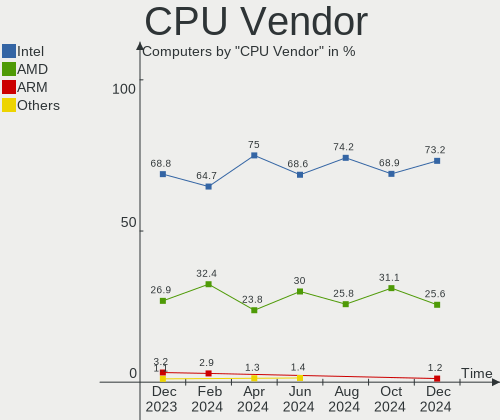
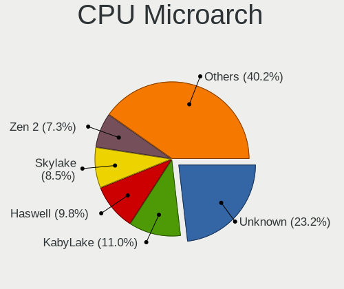
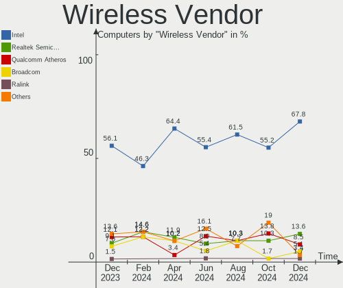

FreeBSD Hardware Trends
-----------------------

A project to identify most popular hardware characteristics and track their change
over time based on data collected by FreeBSD users at https://BSD-Hardware.info.

Anyone can contribute to this report by the [hw-probe](https://github.com/linuxhw/hw-probe/blob/master/INSTALL.BSD.md) tool:

    hw-probe -all -upload

This is a report for all computer types. See also reports for [desktops](/Dist/FreeBSD/Desktop/README.md) and [notebooks](/Dist/FreeBSD/Notebook/README.md).

Full-feature report is available here: https://bsd-hardware.info/?view=trends

Period: Oct, 2021.

Contents
--------

* [ System ](#system)
  - [ OS                       ](#os)
  - [ OS Family                ](#os-family)
  - [ Arch                     ](#arch)
  - [ DE                       ](#de)
  - [ Display Server           ](#display-server)
  - [ Display Manager          ](#display-manager)
  - [ OS Lang                  ](#os-lang)
  - [ Boot Mode                ](#boot-mode)
  - [ Filesystem               ](#filesystem)
  - [ Part. scheme             ](#part-scheme)

* [ Board ](#board)
  - [ Vendor                   ](#vendor)
  - [ Model                    ](#model)
  - [ Model Family             ](#model-family)
  - [ MFG Year                 ](#mfg-year)
  - [ Form Factor              ](#form-factor)
  - [ Coreboot                 ](#coreboot)
  - [ RAM Size                 ](#ram-size)
  - [ RAM Used                 ](#ram-used)
  - [ Total Drives             ](#total-drives)
  - [ Has CD-ROM               ](#has-cd-rom)
  - [ Has Ethernet             ](#has-ethernet)
  - [ Has WiFi                 ](#has-wifi)
  - [ Has Bluetooth            ](#has-bluetooth)

* [ Location ](#location)
  - [ Country                  ](#country)
  - [ City                     ](#city)

* [ Drives ](#drives)
  - [ Drive Vendor             ](#drive-vendor)
  - [ Drive Model              ](#drive-model)
  - [ HDD Vendor               ](#hdd-vendor)
  - [ SSD Vendor               ](#ssd-vendor)
  - [ Drive Kind               ](#drive-kind)
  - [ Drive Connector          ](#drive-connector)
  - [ Drive Size               ](#drive-size)
  - [ Space Total              ](#space-total)
  - [ Space Used               ](#space-used)
  - [ Malfunc. Drives          ](#malfunc-drives)
  - [ Malfunc. Drive Vendor    ](#malfunc-drive-vendor)
  - [ Malfunc. HDD Vendor      ](#malfunc-hdd-vendor)
  - [ Malfunc. Drive Kind      ](#malfunc-drive-kind)
  - [ Failed Drives            ](#failed-drives)
  - [ Failed Drive Vendor      ](#failed-drive-vendor)
  - [ Drive Status             ](#drive-status)

* [ Storage controller ](#storage-controller)
  - [ Storage Vendor           ](#storage-vendor)
  - [ Storage Model            ](#storage-model)
  - [ Storage Kind             ](#storage-kind)

* [ Processor ](#processor)
  - [ CPU Vendor               ](#cpu-vendor)
  - [ CPU Model                ](#cpu-model)
  - [ CPU Model Family         ](#cpu-model-family)
  - [ CPU Cores                ](#cpu-cores)
  - [ CPU Sockets              ](#cpu-sockets)
  - [ CPU Threads              ](#cpu-threads)
  - [ CPU Microarch            ](#cpu-microarch)

* [ Graphics ](#graphics)
  - [ GPU Vendor               ](#gpu-vendor)
  - [ GPU Model                ](#gpu-model)
  - [ GPU Combo                ](#gpu-combo)
  - [ GPU Driver               ](#gpu-driver)
  - [ GPU Memory               ](#gpu-memory)

* [ Monitor ](#monitor)
  - [ Monitor Vendor           ](#monitor-vendor)
  - [ Monitor Model            ](#monitor-model)
  - [ Monitor Resolution       ](#monitor-resolution)
  - [ Monitor Diagonal         ](#monitor-diagonal)
  - [ Monitor Width            ](#monitor-width)
  - [ Aspect Ratio             ](#aspect-ratio)
  - [ Monitor Area             ](#monitor-area)
  - [ Pixel Density            ](#pixel-density)
  - [ Multiple Monitors        ](#multiple-monitors)

* [ Network ](#network)
  - [ Net Controller Vendor    ](#net-controller-vendor)
  - [ Net Controller Model     ](#net-controller-model)
  - [ Wireless Vendor          ](#wireless-vendor)
  - [ Wireless Model           ](#wireless-model)
  - [ Ethernet Vendor          ](#ethernet-vendor)
  - [ Ethernet Model           ](#ethernet-model)
  - [ Net Controller Kind      ](#net-controller-kind)
  - [ Used Controller          ](#used-controller)
  - [ NICs                     ](#nics)
  - [ IPv6                     ](#ipv6)

* [ Bluetooth ](#bluetooth)
  - [ Bluetooth Vendor         ](#bluetooth-vendor)
  - [ Bluetooth Model          ](#bluetooth-model)

* [ Sound ](#sound)
  - [ Sound Vendor             ](#sound-vendor)
  - [ Sound Model              ](#sound-model)

* [ Memory ](#memory)
  - [ Memory Vendor            ](#memory-vendor)
  - [ Memory Model             ](#memory-model)
  - [ Memory Kind              ](#memory-kind)
  - [ Memory Form Factor       ](#memory-form-factor)
  - [ Memory Size              ](#memory-size)
  - [ Memory Speed             ](#memory-speed)

* [ Printers & scanners ](#printers--scanners)
  - [ Printer Vendor           ](#printer-vendor)
  - [ Printer Model            ](#printer-model)
  - [ Scanner Vendor           ](#scanner-vendor)
  - [ Scanner Model            ](#scanner-model)

* [ Camera ](#camera)
  - [ Camera Vendor            ](#camera-vendor)
  - [ Camera Model             ](#camera-model)

* [ Security ](#security)
  - [ Fingerprint Vendor       ](#fingerprint-vendor)
  - [ Fingerprint Model        ](#fingerprint-model)
  - [ Chipcard Vendor          ](#chipcard-vendor)
  - [ Chipcard Model           ](#chipcard-model)

* [ Unsupported ](#unsupported)
  - [ Unsupported Devices      ](#unsupported-devices)
  - [ Unsupported Device Types ](#unsupported-device-types)

System
------

OS
--

Installed operating systems

| Name                 | Computers | Percent |
|----------------------|-----------|---------|
| FreeBSD 13.0-p4      | 35        | 47.95%  |
| FreeBSD 13.0         | 13        | 17.81%  |
| FreeBSD 13.0-STABLE  | 9         | 12.33%  |
| FreeBSD 14.0-CURRENT | 7         | 9.59%   |
| FreeBSD 12.2-p10     | 4         | 5.48%   |
| FreeBSD 13.0-p2      | 1         | 1.37%   |
| FreeBSD 12.2-p9      | 1         | 1.37%   |
| FreeBSD 12.2-p6      | 1         | 1.37%   |
| FreeBSD 12.2-p4      | 1         | 1.37%   |
| FreeBSD 12.2         | 1         | 1.37%   |

OS Family
---------

OS without a version

| Name    | Computers | Percent |
|---------|-----------|---------|
| FreeBSD | 73        | 100%    |

Arch
----

OS architecture (x86_64, i586, etc.)

| Name  | Computers | Percent |
|-------|-----------|---------|
| amd64 | 65        | 89.04%  |
| arm64 | 6         | 8.22%   |
| i386  | 2         | 2.74%   |

DE
--

Desktop Environment

| Name     | Computers | Percent |
|----------|-----------|---------|
| Console  | 21        | 28.77%  |
| XFCE     | 14        | 19.18%  |
| KDE5     | 8         | 10.96%  |
| TWM      | 6         | 8.22%   |
| i3       | 6         | 8.22%   |
| MATE     | 5         | 6.85%   |
| Openbox  | 4         | 5.48%   |
| GNOME    | 4         | 5.48%   |
| Cinnamon | 2         | 2.74%   |
| LXQt     | 1         | 1.37%   |
| Lumina   | 1         | 1.37%   |
| Fluxbox  | 1         | 1.37%   |

Display Server
--------------

X11 or Wayland

| Name    | Computers | Percent |
|---------|-----------|---------|
| X11     | 50        | 68.49%  |
| Console | 23        | 31.51%  |

Display Manager
---------------

SDDM, LightDM, etc.

| Name    | Computers | Percent |
|---------|-----------|---------|
| Console | 40        | 54.79%  |
| SLiM    | 12        | 16.44%  |
| SDDM    | 9         | 12.33%  |
| XDM     | 5         | 6.85%   |
| GDM     | 4         | 5.48%   |
| LightDM | 3         | 4.11%   |

OS Lang
-------

Language

| Lang            | Computers | Percent |
|-----------------|-----------|---------|
| C               | 46        | 63.01%  |
| en_US           | 8         | 10.96%  |
| Unknown         | 5         | 6.85%   |
| de_DE           | 4         | 5.48%   |
| ru_RU           | 2         | 2.74%   |
| en_AU           | 2         | 2.74%   |
| zh_CN.GB2312    | 1         | 1.37%   |
| pt_BR           | 1         | 1.37%   |
| en_US.ISO8859-1 | 1         | 1.37%   |
| en_GB           | 1         | 1.37%   |
| en_CA           | 1         | 1.37%   |
| de_CH           | 1         | 1.37%   |

Boot Mode
---------

EFI or BIOS

| Mode | Computers | Percent |
|------|-----------|---------|
| EFI  | 51        | 69.86%  |
| BIOS | 22        | 30.14%  |

Filesystem
----------

Type of filesystem

| Type | Computers | Percent |
|------|-----------|---------|
| Zfs  | 53        | 72.6%   |
| Ufs  | 20        | 27.4%   |

Part. scheme
------------

Scheme of partitioning

| Type | Computers | Percent |
|------|-----------|---------|
| GPT  | 66        | 90.41%  |
| MBR  | 7         | 9.59%   |

Board
-----

Vendor
------

Motherboard manufacturer

| Name                    | Computers | Percent |
|-------------------------|-----------|---------|
| ASUSTek Computer        | 13        | 17.81%  |
| Lenovo                  | 12        | 16.44%  |
| Dell                    | 10        | 13.7%   |
| MSI                     | 5         | 6.85%   |
| Supermicro              | 4         | 5.48%   |
| Hewlett-Packard         | 4         | 5.48%   |
| Gigabyte Technology     | 4         | 5.48%   |
| Acer                    | 3         | 4.11%   |
| Unknown                 | 3         | 4.11%   |
| Framework               | 2         | 2.74%   |
| Beckhoff Automation     | 2         | 2.74%   |
| ASRock                  | 2         | 2.74%   |
| Apple                   | 2         | 2.74%   |
| Toshiba                 | 1         | 1.37%   |
| Raspberry Pi Foundation | 1         | 1.37%   |
| radxa                   | 1         | 1.37%   |
| GPD                     | 1         | 1.37%   |
| Google                  | 1         | 1.37%   |
| Edelweiss               | 1         | 1.37%   |
| ADI Engineering         | 1         | 1.37%   |

Model
-----

Motherboard model

| Name                                        | Computers | Percent |
|---------------------------------------------|-----------|---------|
| Unknown                                     | 3         | 4.11%   |
| Framework Laptop                            | 2         | 2.74%   |
| Dell PowerEdge R440                         | 2         | 2.74%   |
| Toshiba Dakar10FW8                          | 1         | 1.37%   |
| Supermicro X8DTU                            | 1         | 1.37%   |
| Supermicro X7SPA-HF                         | 1         | 1.37%   |
| Supermicro Super Server                     | 1         | 1.37%   |
| Supermicro SSG-5028R-E1CR12L-CE010          | 1         | 1.37%   |
| RPi Raspberry Pi                            | 1         | 1.37%   |
| radxa rock-pi-4                             | 1         | 1.37%   |
| MSI MS-7C36                                 | 1         | 1.37%   |
| MSI MS-7A72                                 | 1         | 1.37%   |
| MSI MS-7817                                 | 1         | 1.37%   |
| MSI MS-7693                                 | 1         | 1.37%   |
| MSI GS65 Stealth Thin 8RF                   | 1         | 1.37%   |
| Lenovo ThinkPad X1 Extreme Gen 3 20TLA055CD | 1         | 1.37%   |
| Lenovo ThinkPad T490 20N2CTO1WW             | 1         | 1.37%   |
| Lenovo ThinkPad T470p 20J7S0PM00            | 1         | 1.37%   |
| Lenovo ThinkPad T430s 23532QG               | 1         | 1.37%   |
| Lenovo ThinkPad P53 20QNCTO1WW              | 1         | 1.37%   |
| Lenovo ThinkPad P14s Gen 1 20Y1CTO1WW       | 1         | 1.37%   |
| Lenovo ThinkPad Mini10 3507A31              | 1         | 1.37%   |
| Lenovo ThinkPad E14 Gen 3 20Y7CTO1WW        | 1         | 1.37%   |
| Lenovo ThinkCentre M75q Gen 2 11JJS00200    | 1         | 1.37%   |
| Lenovo IdeaPad Y700-15ISK 80NV              | 1         | 1.37%   |
| Lenovo IdeaPad 320-15ABR 80XS               | 1         | 1.37%   |
| Lenovo G580 26897SJ                         | 1         | 1.37%   |
| HP Z420 Workstation                         | 1         | 1.37%   |
| HP ProDesk 600 G1 TWR                       | 1         | 1.37%   |
| HP ENVY x360 Convertible 15m-bp1xx          | 1         | 1.37%   |
| HP EliteBook 8570p                          | 1         | 1.37%   |
| GPD MicroPC                                 | 1         | 1.37%   |
| Google Terra                                | 1         | 1.37%   |
| Gigabyte Z77X-UD3H                          | 1         | 1.37%   |
| Gigabyte MZ32-AR0-00                        | 1         | 1.37%   |
| Gigabyte H110M-H                            | 1         | 1.37%   |
| Gigabyte B450M S2H                          | 1         | 1.37%   |
| Edelweiss TF307-MB-S-D                      | 1         | 1.37%   |
| Dell XPS 13 9350                            | 1         | 1.37%   |
| Dell XPS 13 9343                            | 1         | 1.37%   |
| Dell PowerEdge T310                         | 1         | 1.37%   |
| Dell OptiPlex 9020                          | 1         | 1.37%   |
| Dell OptiPlex 7040                          | 1         | 1.37%   |
| Dell Latitude E6430                         | 1         | 1.37%   |
| Dell Inspiron 7460                          | 1         | 1.37%   |
| Dell Inspiron 3493                          | 1         | 1.37%   |
| Beckhoff Automation CX2033-0185             | 1         | 1.37%   |
| Beckhoff Automation CBxx63                  | 1         | 1.37%   |
| ASUS TUF Gaming FX505DT_FX505DT             | 1         | 1.37%   |
| ASUS TUF B350M-PLUS GAMING                  | 1         | 1.37%   |
| ASUS SABERTOOTH 990FX R2.0                  | 1         | 1.37%   |
| ASUS ROG STRIX X470-F GAMING                | 1         | 1.37%   |
| ASUS PRIME X370-PRO                         | 1         | 1.37%   |
| ASUS P9X79                                  | 1         | 1.37%   |
| ASUS P5Q-E                                  | 1         | 1.37%   |
| ASUS P10S WS                                | 1         | 1.37%   |
| ASUS MINIPC PN50-E1                         | 1         | 1.37%   |
| ASUS K53E                                   | 1         | 1.37%   |
| ASUS F83VD                                  | 1         | 1.37%   |
| ASUS All Series                             | 1         | 1.37%   |

Model Family
------------

Motherboard model prefix

| Name                               | Computers | Percent |
|------------------------------------|-----------|---------|
| Lenovo ThinkPad                    | 8         | 10.96%  |
| Dell PowerEdge                     | 3         | 4.11%   |
| Acer Aspire                        | 3         | 4.11%   |
| Unknown                            | 3         | 4.11%   |
| Lenovo IdeaPad                     | 2         | 2.74%   |
| Framework Laptop                   | 2         | 2.74%   |
| Dell XPS                           | 2         | 2.74%   |
| Dell OptiPlex                      | 2         | 2.74%   |
| Dell Inspiron                      | 2         | 2.74%   |
| ASUS TUF                           | 2         | 2.74%   |
| Toshiba Dakar10FW8                 | 1         | 1.37%   |
| Supermicro X8DTU                   | 1         | 1.37%   |
| Supermicro X7SPA-HF                | 1         | 1.37%   |
| Supermicro Super                   | 1         | 1.37%   |
| Supermicro SSG-5028R-E1CR12L-CE010 | 1         | 1.37%   |
| RPi Raspberry                      | 1         | 1.37%   |
| radxa rock-pi-4                    | 1         | 1.37%   |
| MSI MS-7C36                        | 1         | 1.37%   |
| MSI MS-7A72                        | 1         | 1.37%   |
| MSI MS-7817                        | 1         | 1.37%   |
| MSI MS-7693                        | 1         | 1.37%   |
| MSI GS65                           | 1         | 1.37%   |
| Lenovo ThinkCentre                 | 1         | 1.37%   |
| Lenovo G580                        | 1         | 1.37%   |
| HP Z420                            | 1         | 1.37%   |
| HP ProDesk                         | 1         | 1.37%   |
| HP ENVY                            | 1         | 1.37%   |
| HP EliteBook                       | 1         | 1.37%   |
| GPD MicroPC                        | 1         | 1.37%   |
| Google Terra                       | 1         | 1.37%   |
| Gigabyte Z77X-UD3H                 | 1         | 1.37%   |
| Gigabyte MZ32-AR0-00               | 1         | 1.37%   |
| Gigabyte H110M-H                   | 1         | 1.37%   |
| Gigabyte B450M                     | 1         | 1.37%   |
| Edelweiss TF307-MB-S-D             | 1         | 1.37%   |
| Dell Latitude                      | 1         | 1.37%   |
| Beckhoff Automation CX2033-0185    | 1         | 1.37%   |
| Beckhoff Automation CBxx63         | 1         | 1.37%   |
| ASUS SABERTOOTH                    | 1         | 1.37%   |
| ASUS ROG                           | 1         | 1.37%   |
| ASUS PRIME                         | 1         | 1.37%   |
| ASUS P9X79                         | 1         | 1.37%   |
| ASUS P5Q-E                         | 1         | 1.37%   |
| ASUS P10S                          | 1         | 1.37%   |
| ASUS MINIPC                        | 1         | 1.37%   |
| ASUS K53E                          | 1         | 1.37%   |
| ASUS F83VD                         | 1         | 1.37%   |
| ASUS All                           | 1         | 1.37%   |
| ASUS A9T                           | 1         | 1.37%   |
| ASRock X570                        | 1         | 1.37%   |
| ASRock AB350                       | 1         | 1.37%   |
| Apple MacPro5                      | 1         | 1.37%   |
| Apple MacPro3                      | 1         | 1.37%   |
| ADI Engineering RCC-VE             | 1         | 1.37%   |

MFG Year
--------

Motherboard manufacture year

| Year    | Computers | Percent |
|---------|-----------|---------|
| 2021    | 12        | 16.44%  |
| 2018    | 12        | 16.44%  |
| 2019    | 11        | 15.07%  |
| 2020    | 10        | 13.7%   |
| 2017    | 4         | 5.48%   |
| 2014    | 4         | 5.48%   |
| 2016    | 3         | 4.11%   |
| 2010    | 3         | 4.11%   |
| 2008    | 3         | 4.11%   |
| Unknown | 3         | 4.11%   |
| 2015    | 2         | 2.74%   |
| 2013    | 2         | 2.74%   |
| 2012    | 2         | 2.74%   |
| 2011    | 1         | 1.37%   |
| 2005    | 1         | 1.37%   |

Form Factor
-----------

Physical design of the computer

| Name           | Computers | Percent |
|----------------|-----------|---------|
| Desktop        | 31        | 42.47%  |
| Notebook       | 30        | 41.1%   |
| Server         | 6         | 8.22%   |
| System on chip | 3         | 4.11%   |
| Mini pc        | 2         | 2.74%   |
| Convertible    | 1         | 1.37%   |

Coreboot
--------

Have coreboot on board

| Used | Computers | Percent |
|------|-----------|---------|
| No   | 71        | 97.26%  |
| Yes  | 2         | 2.74%   |

RAM Size
--------

Total RAM memory

| Size in GB  | Computers | Percent |
|-------------|-----------|---------|
| 16.01-24.0  | 21        | 28.77%  |
| 8.01-16.0   | 16        | 21.92%  |
| 32.01-64.0  | 14        | 19.18%  |
| 4.01-8.0    | 12        | 16.44%  |
| 64.01-256.0 | 4         | 5.48%   |
| 2.01-3.0    | 3         | 4.11%   |
| 3.01-4.0    | 1         | 1.37%   |
| 24.01-32.0  | 1         | 1.37%   |
| 1.01-2.0    | 1         | 1.37%   |

RAM Used
--------

Used RAM memory

| Used GB    | Computers | Percent |
|------------|-----------|---------|
| 0.01-0.5   | 27        | 36.99%  |
| 0.51-1.0   | 21        | 28.77%  |
| 1.01-2.0   | 15        | 20.55%  |
| 3.01-4.0   | 4         | 5.48%   |
| 2.01-3.0   | 3         | 4.11%   |
| 24.01-32.0 | 2         | 2.74%   |
| 32.01-64.0 | 1         | 1.37%   |

Total Drives
------------

Number of drives on board

| Drives | Computers | Percent |
|--------|-----------|---------|
| 1      | 33        | 45.21%  |
| 2      | 16        | 21.92%  |
| 0      | 7         | 9.59%   |
| 5      | 4         | 5.48%   |
| 3      | 4         | 5.48%   |
| 6      | 3         | 4.11%   |
| 4      | 2         | 2.74%   |
| 14     | 1         | 1.37%   |
| 13     | 1         | 1.37%   |
| 9      | 1         | 1.37%   |
| 7      | 1         | 1.37%   |

Has CD-ROM
----------

Has CD-ROM on board

| Presented | Computers | Percent |
|-----------|-----------|---------|
| No        | 51        | 69.86%  |
| Yes       | 22        | 30.14%  |

Has Ethernet
------------

Has Ethernet on board

| Presented | Computers | Percent |
|-----------|-----------|---------|
| Yes       | 59        | 80.82%  |
| No        | 14        | 19.18%  |

Has WiFi
--------

Has WiFi module

| Presented | Computers | Percent |
|-----------|-----------|---------|
| No        | 37        | 50.68%  |
| Yes       | 36        | 49.32%  |

Has Bluetooth
-------------

Has Bluetooth module

| Presented | Computers | Percent |
|-----------|-----------|---------|
| No        | 45        | 61.64%  |
| Yes       | 28        | 38.36%  |

Location
--------

Country
-------

Geographic location (country)

| Country     | Computers | Percent |
|-------------|-----------|---------|
| USA         | 20        | 27.4%   |
| Germany     | 10        | 13.7%   |
| Russia      | 6         | 8.22%   |
| Australia   | 5         | 6.85%   |
| France      | 4         | 5.48%   |
| Japan       | 3         | 4.11%   |
| China       | 3         | 4.11%   |
| UK          | 2         | 2.74%   |
| Switzerland | 2         | 2.74%   |
| Poland      | 2         | 2.74%   |
| Indonesia   | 2         | 2.74%   |
| Canada      | 2         | 2.74%   |
| Brazil      | 2         | 2.74%   |
| Ukraine     | 1         | 1.37%   |
| Serbia      | 1         | 1.37%   |
| Romania     | 1         | 1.37%   |
| New Zealand | 1         | 1.37%   |
| Malaysia    | 1         | 1.37%   |
| Greece      | 1         | 1.37%   |
| Denmark     | 1         | 1.37%   |
| Bulgaria    | 1         | 1.37%   |
| Belarus     | 1         | 1.37%   |
| Austria     | 1         | 1.37%   |

City
----

Geographic location (city)

| City              | Computers | Percent |
|-------------------|-----------|---------|
| Krasnodar         | 4         | 5.48%   |
| Rochester         | 3         | 4.11%   |
| Vienna            | 2         | 2.74%   |
| Seyssinet-Pariset | 2         | 2.74%   |
| Salem             | 2         | 2.74%   |
| Rietberg          | 2         | 2.74%   |
| Phoenix           | 2         | 2.74%   |
| New York          | 2         | 2.74%   |
| Morwell           | 2         | 2.74%   |
| Kirkland          | 2         | 2.74%   |
| Yokohama          | 1         | 1.37%   |
| Worthing          | 1         | 1.37%   |
| Woodburn          | 1         | 1.37%   |
| Wiesbaden         | 1         | 1.37%   |
| Wheatland         | 1         | 1.37%   |
| Wenatchee         | 1         | 1.37%   |
| Warsaw            | 1         | 1.37%   |
| Villeurbanne      | 1         | 1.37%   |
| Viborg            | 1         | 1.37%   |
| Vancouver         | 1         | 1.37%   |
| Therwil           | 1         | 1.37%   |
| Sydney            | 1         | 1.37%   |
| Stuttgart         | 1         | 1.37%   |
| Strausberg        | 1         | 1.37%   |
| St. Catharines    | 1         | 1.37%   |
| South Yarra       | 1         | 1.37%   |
| Shizishan         | 1         | 1.37%   |
| Shenzhen          | 1         | 1.37%   |
| San Antonio       | 1         | 1.37%   |
| Riehen            | 1         | 1.37%   |
| Rennes            | 1         | 1.37%   |
| Portland          | 1         | 1.37%   |
| Podolsk           | 1         | 1.37%   |
| Picton            | 1         | 1.37%   |
| Perth             | 1         | 1.37%   |
| Offenburg         | 1         | 1.37%   |
| North Tawton      | 1         | 1.37%   |
| Munich            | 1         | 1.37%   |
| Moscow            | 1         | 1.37%   |
| Minsk             | 1         | 1.37%   |
| Krakow            | 1         | 1.37%   |
| Kapinovtsi        | 1         | 1.37%   |
| Juiz de Fora      | 1         | 1.37%   |
| Jakarta           | 1         | 1.37%   |
| Ivano-Frankivsk   | 1         | 1.37%   |
| Inzai             | 1         | 1.37%   |
| Halle             | 1         | 1.37%   |
| Guangzhou Shi     | 1         | 1.37%   |
| Gisborne          | 1         | 1.37%   |
| Cirebon           | 1         | 1.37%   |
| Chiyoda-ku        | 1         | 1.37%   |
| Bucharest         | 1         | 1.37%   |
| Berlin            | 1         | 1.37%   |
| Bempflingen       | 1         | 1.37%   |
| Belo Horizonte    | 1         | 1.37%   |
| Belgrade          | 1         | 1.37%   |
| Bayan Lepas       | 1         | 1.37%   |
| Baltimore         | 1         | 1.37%   |
| Athens            | 1         | 1.37%   |
| Altamonte Springs | 1         | 1.37%   |

Drives
------

Drive Vendor
------------

Hard drive vendors

| Vendor              | Computers | Drives | Percent |
|---------------------|-----------|--------|---------|
| WDC                 | 19        | 52     | 18.45%  |
| Samsung Electronics | 14        | 18     | 13.59%  |
| Seagate             | 12        | 16     | 11.65%  |
| Toshiba             | 8         | 13     | 7.77%   |
| Kingston            | 6         | 6      | 5.83%   |
| Intel               | 6         | 10     | 5.83%   |
| Hitachi             | 6         | 7      | 5.83%   |
| HGST                | 6         | 17     | 5.83%   |
| SanDisk             | 3         | 3      | 2.91%   |
| Crucial             | 3         | 4      | 2.91%   |
| Corsair             | 3         | 3      | 2.91%   |
| A-DATA Technology   | 3         | 3      | 2.91%   |
| SK Hynix            | 2         | 2      | 1.94%   |
| Silicon Motion      | 2         | 2      | 1.94%   |
| Apacer              | 2         | 2      | 1.94%   |
| Team                | 1         | 2      | 0.97%   |
| PLEXTOR             | 1         | 1      | 0.97%   |
| Micron Technology   | 1         | 1      | 0.97%   |
| LITEON              | 1         | 1      | 0.97%   |
| KIOXIA              | 1         | 1      | 0.97%   |
| Hewlett-Packard     | 1         | 1      | 0.97%   |
| Fujitsu             | 1         | 1      | 0.97%   |
| BIWIN               | 1         | 1      | 0.97%   |

Drive Model
-----------

Hard drive models

| Model                                | Computers | Percent |
|--------------------------------------|-----------|---------|
| Kingston SA400S37240G 240GB          | 4         | 3.1%    |
| Seagate ST4000DM000-1F2168 4TB       | 3         | 2.33%   |
| WDC WD10EZEX-08WN4A0 1TB             | 2         | 1.55%   |
| Silicon Motion NE-256 256GB          | 2         | 1.55%   |
| Seagate ST1000LM048-2E7172 1TB       | 2         | 1.55%   |
| Samsung SSD 860 QVO 1TB              | 2         | 1.55%   |
| Samsung SSD 860 EVO 500GB            | 2         | 1.55%   |
| Samsung SSD 860 EVO 250GB            | 2         | 1.55%   |
| Intel SSDSC2KW256G8 256GB            | 2         | 1.55%   |
| HGST HTS721010A9E630 1TB             | 2         | 1.55%   |
| WDC WDS500G3X0C-00SJG0 500GB         | 1         | 0.78%   |
| WDC WDS250G2B0B-00YS70 250GB         | 1         | 0.78%   |
| WDC WDS250G2B0A 250GB                | 1         | 0.78%   |
| WDC WDS100T1X0E-00AFY0 1TB           | 1         | 0.78%   |
| WDC WD80EMAZ-00WJTA0 8TB             | 1         | 0.78%   |
| WDC WD80EFZX-68UW8N0 8TB             | 1         | 0.78%   |
| WDC WD80EFAX-68LHPN0 8TB             | 1         | 0.78%   |
| WDC WD80EDBZ-11B0ZA0 8TB             | 1         | 0.78%   |
| WDC WD60EZRZ-00GZ5B1 6TB             | 1         | 0.78%   |
| WDC WD6003FZBX-00K5WB0 6TB           | 1         | 0.78%   |
| WDC WD5000BPVT-22HXZT3 500GB         | 1         | 0.78%   |
| WDC WD40EZRZ-22GXCB0 4TB             | 1         | 0.78%   |
| WDC WD4002FYYZ-01B7CB0 4TB           | 1         | 0.78%   |
| WDC WD30PURX-64P6ZY0 3TB             | 1         | 0.78%   |
| WDC WD30EFRX-68EUZN0 3TB             | 1         | 0.78%   |
| WDC WD2500BEVS-08VAT2 250GB          | 1         | 0.78%   |
| WDC WD20PURZ-85GU6Y0 2TB             | 1         | 0.78%   |
| WDC WD20PURX-89P6ZY0 2TB             | 1         | 0.78%   |
| WDC WD20PURX-64P6ZY0 2TB             | 1         | 0.78%   |
| WDC WD20EURX-63T0FY0 2TB             | 1         | 0.78%   |
| WDC WD20EARX-00PASB0 2TB             | 1         | 0.78%   |
| WDC WD2002FYPS-02W3B0 2TB            | 1         | 0.78%   |
| WDC WD2000FYYZ-01UL1B1 2TB           | 1         | 0.78%   |
| WDC WD1500HLFS-01G6U4 150GB          | 1         | 0.78%   |
| WDC WD120EMFZ-11A6JA0 12TB           | 1         | 0.78%   |
| WDC WD120EMAZ-11BLFA0 12TB           | 1         | 0.78%   |
| WDC WD10SPZX-75Z10T1 1TB             | 1         | 0.78%   |
| WDC WD10EZEX-00BN5A0 1TB             | 1         | 0.78%   |
| WDC WD10EFRX-68FYTN0 1TB             | 1         | 0.78%   |
| WDC WD102KRYZ-01A5AB0 10TB           | 1         | 0.78%   |
| WDC WD1002FBYS-02A6B0 1TB            | 1         | 0.78%   |
| WDC WD1001FALS-00J7B0 1TB            | 1         | 0.78%   |
| WDC PC SN730 SDBQNTY-256G-1001 256GB | 1         | 0.78%   |
| WDC PC SN730 NVMe 1024GB             | 1         | 0.78%   |
| Toshiba MQ01ABF050 500GB             | 1         | 0.78%   |
| Toshiba MQ01ABD032 320GB             | 1         | 0.78%   |
| Toshiba MG06SCA800EY 8TB             | 1         | 0.78%   |
| Toshiba KXG6APNV2T04 2TB             | 1         | 0.78%   |
| Toshiba KXG60ZNV512G 512GB           | 1         | 0.78%   |
| Toshiba HDWD130 3TB                  | 1         | 0.78%   |
| Toshiba HDWA130 3TB                  | 1         | 0.78%   |
| Toshiba DT01ACA300 3TB               | 1         | 0.78%   |
| Toshiba DT01ACA100 1TB               | 1         | 0.78%   |
| Toshiba DT01ACA050 500GB             | 1         | 0.78%   |
| Team L5 LITE SSD 240GB               | 1         | 0.78%   |
| SK Hynix SKHynix_HFS001TDE9X081N 1TB | 1         | 0.78%   |
| SK Hynix SHGP31-1000GM-2 1TB         | 1         | 0.78%   |
| Seagate ST500LT012-1DG142 500GB      | 1         | 0.78%   |
| Seagate ST4000VX007-2DT166 4TB       | 1         | 0.78%   |
| Seagate ST4000NE0025-2EW107 4TB      | 1         | 0.78%   |

HDD Vendor
----------

Hard disk drive vendors

| Vendor              | Computers | Drives | Percent |
|---------------------|-----------|--------|---------|
| WDC                 | 15        | 46     | 31.91%  |
| Seagate             | 12        | 16     | 25.53%  |
| Toshiba             | 6         | 11     | 12.77%  |
| Hitachi             | 6         | 7      | 12.77%  |
| HGST                | 6         | 17     | 12.77%  |
| Samsung Electronics | 1         | 2      | 2.13%   |
| Fujitsu             | 1         | 1      | 2.13%   |

SSD Vendor
----------

Solid state drive vendors

| Vendor              | Computers | Drives | Percent |
|---------------------|-----------|--------|---------|
| Samsung Electronics | 8         | 10     | 21.62%  |
| Kingston            | 6         | 6      | 16.22%  |
| Intel               | 5         | 9      | 13.51%  |
| SanDisk             | 3         | 3      | 8.11%   |
| WDC                 | 2         | 2      | 5.41%   |
| Crucial             | 2         | 2      | 5.41%   |
| Corsair             | 2         | 2      | 5.41%   |
| Apacer              | 2         | 2      | 5.41%   |
| A-DATA Technology   | 2         | 2      | 5.41%   |
| Team                | 1         | 2      | 2.7%    |
| PLEXTOR             | 1         | 1      | 2.7%    |
| LITEON              | 1         | 1      | 2.7%    |
| Hewlett-Packard     | 1         | 1      | 2.7%    |
| BIWIN               | 1         | 1      | 2.7%    |

Drive Kind
----------

HDD or SSD

| Kind | Computers | Drives | Percent |
|------|-----------|--------|---------|
| HDD  | 38        | 100    | 42.22%  |
| SSD  | 32        | 44     | 35.56%  |
| NVMe | 20        | 23     | 22.22%  |

Drive Connector
---------------

SATA, SAS, NVMe, etc.

| Type | Computers | Drives | Percent |
|------|-----------|--------|---------|
| SATA | 55        | 144    | 73.33%  |
| NVMe | 20        | 23     | 26.67%  |

Drive Size
----------

Size of hard drive

| Size in TB | Computers | Drives | Percent |
|------------|-----------|--------|---------|
| 0.01-0.5   | 39        | 50     | 49.37%  |
| 0.51-1.0   | 16        | 25     | 20.25%  |
| 1.01-2.0   | 10        | 17     | 12.66%  |
| 3.01-4.0   | 6         | 13     | 7.59%   |
| 4.01-10.0  | 5         | 25     | 6.33%   |
| 2.01-3.0   | 2         | 12     | 2.53%   |
| 10.01-20.0 | 1         | 2      | 1.27%   |

Space Total
-----------

Amount of disk space available on the file system

| Size in GB     | Computers | Percent |
|----------------|-----------|---------|
| 101-250        | 22        | 30.14%  |
| 251-500        | 19        | 26.03%  |
| 51-100         | 8         | 10.96%  |
| 1-20           | 7         | 9.59%   |
| 501-1000       | 6         | 8.22%   |
| 1001-2000      | 4         | 5.48%   |
| More than 3000 | 3         | 4.11%   |
| 21-50          | 2         | 2.74%   |
| 2001-3000      | 2         | 2.74%   |

Space Used
----------

Amount of used disk space

| Used GB  | Computers | Percent |
|----------|-----------|---------|
| 1-20     | 55        | 75.34%  |
| 21-50    | 10        | 13.7%   |
| 251-500  | 3         | 4.11%   |
| 101-250  | 2         | 2.74%   |
| 51-100   | 2         | 2.74%   |
| 501-1000 | 1         | 1.37%   |

Malfunc. Drives
---------------

Drive models with a malfunction

| Model                             | Computers | Drives | Percent |
|-----------------------------------|-----------|--------|---------|
| HGST HTS721010A9E630 1TB          | 2         | 2      | 15.38%  |
| WDC WD20PURX-89P6ZY0 2TB          | 1         | 1      | 7.69%   |
| WDC WD20PURX-64P6ZY0 2TB          | 1         | 1      | 7.69%   |
| WDC WD20EURX-63T0FY0 2TB          | 1         | 1      | 7.69%   |
| WDC WD2002FYPS-02W3B0 2TB         | 1         | 1      | 7.69%   |
| Toshiba MQ01ABD032 320GB          | 1         | 1      | 7.69%   |
| Seagate ST500LT012-1DG142 500GB   | 1         | 1      | 7.69%   |
| Seagate ST2000DL003-9VT166 2TB    | 1         | 1      | 7.69%   |
| Samsung Electronics HM320JI 320GB | 1         | 1      | 7.69%   |
| Hitachi HUA722020ALA330 2TB       | 1         | 2      | 7.69%   |
| Hitachi HTS541680J9SA00 80GB      | 1         | 1      | 7.69%   |
| Hitachi HTS421260H9AT00 64GB      | 1         | 1      | 7.69%   |

Malfunc. Drive Vendor
---------------------

Vendors of faulty drives

| Vendor              | Computers | Drives | Percent |
|---------------------|-----------|--------|---------|
| WDC                 | 3         | 4      | 25%     |
| Hitachi             | 3         | 4      | 25%     |
| Seagate             | 2         | 2      | 16.67%  |
| HGST                | 2         | 2      | 16.67%  |
| Toshiba             | 1         | 1      | 8.33%   |
| Samsung Electronics | 1         | 1      | 8.33%   |

Malfunc. HDD Vendor
-------------------

Vendors of faulty HDD drives

| Vendor              | Computers | Drives | Percent |
|---------------------|-----------|--------|---------|
| WDC                 | 3         | 4      | 25%     |
| Hitachi             | 3         | 4      | 25%     |
| Seagate             | 2         | 2      | 16.67%  |
| HGST                | 2         | 2      | 16.67%  |
| Toshiba             | 1         | 1      | 8.33%   |
| Samsung Electronics | 1         | 1      | 8.33%   |

Malfunc. Drive Kind
-------------------

Kinds of faulty drives

| Kind | Computers | Drives | Percent |
|------|-----------|--------|---------|
| HDD  | 12        | 14     | 100%    |

Failed Drives
-------------

Failed drive models

| Model                        | Computers | Drives | Percent |
|------------------------------|-----------|--------|---------|
| Crucial M4-CT256M4SSD1 256GB | 1         | 1      | 100%    |

Failed Drive Vendor
-------------------

Failed drive vendors

| Vendor  | Computers | Drives | Percent |
|---------|-----------|--------|---------|
| Crucial | 1         | 1      | 100%    |

Drive Status
------------

Number of failed and malfunc. drives

| Status  | Computers | Drives | Percent |
|---------|-----------|--------|---------|
| Works   | 62        | 152    | 82.67%  |
| Malfunc | 12        | 14     | 16%     |
| Failed  | 1         | 1      | 1.33%   |

Storage controller
------------------

Storage Vendor
--------------

Storage controller vendors

| Vendor                           | Computers | Percent |
|----------------------------------|-----------|---------|
| Intel                            | 43        | 45.74%  |
| AMD                              | 14        | 14.89%  |
| Samsung Electronics              | 6         | 6.38%   |
| Broadcom / LSI                   | 5         | 5.32%   |
| ASMedia Technology               | 5         | 5.32%   |
| Sandisk                          | 4         | 4.26%   |
| Silicon Motion                   | 3         | 3.19%   |
| Toshiba                          | 2         | 2.13%   |
| SK Hynix                         | 2         | 2.13%   |
| Silicon Image                    | 2         | 2.13%   |
| Marvell Technology Group         | 2         | 2.13%   |
| Silicon Integrated Systems [SiS] | 1         | 1.06%   |
| Realtek Semiconductor            | 1         | 1.06%   |
| Phison Electronics               | 1         | 1.06%   |
| Micron/Crucial Technology        | 1         | 1.06%   |
| Micron Technology                | 1         | 1.06%   |
| KIOXIA                           | 1         | 1.06%   |

Storage Model
-------------

Storage controller models

| Model                                                                          | Computers | Percent |
|--------------------------------------------------------------------------------|-----------|---------|
| AMD FCH SATA Controller [AHCI mode]                                            | 11        | 10.09%  |
| Intel 7 Series Chipset Family 6-port SATA Controller [AHCI mode]               | 5         | 4.59%   |
| Intel Sunrise Point-LP SATA Controller [AHCI mode]                             | 4         | 3.67%   |
| Intel Q170/Q150/B150/H170/H110/Z170/CM236 Chipset SATA Controller [AHCI Mode]  | 4         | 3.67%   |
| Intel 8 Series/C220 Series Chipset Family 6-port SATA Controller 1 [AHCI mode] | 4         | 3.67%   |
| Silicon Motion SM2263EN/SM2263XT SSD Controller                                | 3         | 2.75%   |
| Sandisk WD Black SN750 / PC SN730 NVMe SSD                                     | 3         | 2.75%   |
| Intel 82801JI (ICH10 Family) SATA AHCI Controller                              | 3         | 2.75%   |
| ASMedia ASM1062 Serial ATA Controller                                          | 3         | 2.75%   |
| Unknown                                                                        | 3         | 2.75%   |
| Toshiba XG6 NVMe SSD Controller                                                | 2         | 1.83%   |
| SK Hynix Gold P31 SSD                                                          | 2         | 1.83%   |
| Samsung NVMe SSD Controller SM981/PM981/PM983                                  | 2         | 1.83%   |
| Samsung NVMe SSD Controller SM961/PM961/SM963                                  | 2         | 1.83%   |
| Intel Wildcat Point-LP SATA Controller [AHCI Mode]                             | 2         | 1.83%   |
| Intel C620 Series Chipset Family SSATA Controller [AHCI mode]                  | 2         | 1.83%   |
| Intel C620 Series Chipset Family SATA Controller [AHCI mode]                   | 2         | 1.83%   |
| Broadcom / LSI SAS3008 PCI-Express Fusion-MPT SAS-3                            | 2         | 1.83%   |
| AMD SB7x0/SB8x0/SB9x0 SATA Controller [AHCI mode]                              | 2         | 1.83%   |
| AMD 400 Series Chipset SATA Controller                                         | 2         | 1.83%   |
| AMD 300 Series Chipset SATA Controller                                         | 2         | 1.83%   |
| Silicon Integrated Systems [SiS] 5513 IDE Controller                           | 1         | 0.92%   |
| Silicon Image SiI 3512 [SATALink/SATARaid] Serial ATA Controller               | 1         | 0.92%   |
| Silicon Image SiI 3114 [SATALink/SATARaid] Serial ATA Controller               | 1         | 0.92%   |
| Sandisk WD Black SN850                                                         | 1         | 0.92%   |
| Samsung NVMe SSD Controller SM951/PM951                                        | 1         | 0.92%   |
| Samsung NVMe SSD Controller 980                                                | 1         | 0.92%   |
| Phison E16 PCIe4 NVMe Controller                                               | 1         | 0.92%   |
| Micron/Crucial P2 NVMe PCIe SSD                                                | 1         | 0.92%   |
| Marvell Group 88SE9172 SATA 6Gb/s Controller                                   | 1         | 0.92%   |
| Marvell Group 88SE6111/6121 SATA II / PATA Controller                          | 1         | 0.92%   |
| KIOXIA unknown                                                                 | 1         | 0.92%   |
| Intel SSD Pro 7600p/760p/E 6100p Series                                        | 1         | 0.92%   |
| Intel NM10/ICH7 Family SATA Controller [AHCI mode]                             | 1         | 0.92%   |
| Intel Ice Lake-LP SATA Controller [AHCI mode]                                  | 1         | 0.92%   |
| Intel HM170/QM170 Chipset SATA Controller [AHCI Mode]                          | 1         | 0.92%   |
| Intel Celeron/Pentium Silver Processor SATA Controller                         | 1         | 0.92%   |
| Intel Cannon Lake Mobile PCH SATA AHCI Controller                              | 1         | 0.92%   |
| Intel C610/X99 series chipset sSATA Controller [AHCI mode]                     | 1         | 0.92%   |
| Intel C610/X99 series chipset 6-Port SATA Controller [AHCI mode]               | 1         | 0.92%   |
| Intel C602 chipset 4-Port SATA Storage Control Unit                            | 1         | 0.92%   |
| Intel C600/X79 series chipset SATA RAID Controller                             | 1         | 0.92%   |
| Intel C600/X79 series chipset IDE-r Controller                                 | 1         | 0.92%   |
| Intel C600/X79 series chipset 6-Port SATA AHCI Controller                      | 1         | 0.92%   |
| Intel Atom Processor E3800 Series SATA AHCI Controller                         | 1         | 0.92%   |
| Intel Atom processor C2000 AHCI SATA3 Controller                               | 1         | 0.92%   |
| Intel Atom processor C2000 AHCI SATA2 Controller                               | 1         | 0.92%   |
| Intel 82801IR/IO/IH (ICH9R/DO/DH) 6 port SATA Controller [AHCI mode]           | 1         | 0.92%   |
| Intel 82801IBM/IEM (ICH9M/ICH9M-E) 4 port SATA Controller [AHCI mode]          | 1         | 0.92%   |
| Intel 82801HM/HEM (ICH8M/ICH8M-E) SATA Controller [AHCI mode]                  | 1         | 0.92%   |
| Intel 82801HM/HEM (ICH8M/ICH8M-E) IDE Controller                               | 1         | 0.92%   |
| Intel 7 Series/C210 Series Chipset Family 6-port SATA Controller [AHCI mode]   | 1         | 0.92%   |
| Intel 631xESB/632xESB SATA AHCI Controller                                     | 1         | 0.92%   |
| Intel 631xESB/632xESB IDE Controller                                           | 1         | 0.92%   |
| Intel 6 Series/C200 Series Chipset Family 6 port Mobile SATA AHCI Controller   | 1         | 0.92%   |
| Intel 5 Series/3400 Series Chipset 4 port SATA IDE Controller                  | 1         | 0.92%   |
| Intel 5 Series/3400 Series Chipset 2 port SATA IDE Controller                  | 1         | 0.92%   |
| Intel 200 Series PCH SATA controller [AHCI mode]                               | 1         | 0.92%   |
| Broadcom / LSI SAS2008 PCI-Express Fusion-MPT SAS-2 [Falcon]                   | 1         | 0.92%   |
| Broadcom / LSI SAS2004 PCI-Express Fusion-MPT SAS-2 [Spitfire]                 | 1         | 0.92%   |

Storage Kind
------------

Kind of storage controller (IDE, SATA, NVMe, SAS, ...)

| Kind | Computers | Percent |
|------|-----------|---------|
| SATA | 54        | 58.7%   |
| NVMe | 21        | 22.83%  |
| IDE  | 7         | 7.61%   |
| RAID | 5         | 5.43%   |
| SAS  | 5         | 5.43%   |

Processor
---------

CPU Vendor
----------

Processor vendors

| Vendor             | Computers | Percent |
|--------------------|-----------|---------|
| Intel              | 50        | 68.49%  |
| AMD                | 17        | 23.29%  |
| ARM                | 4         | 5.48%   |
| Baikal Electronics | 1         | 1.37%   |
| Unknown            | 1         | 1.37%   |

CPU Model
---------

Processor models

| Model                                          | Computers | Percent |
|------------------------------------------------|-----------|---------|
| ARM Cortex-A72 r0p3                            | 2         | 2.74%   |
| Intel Xeon Silver 4210R CPU @ 2.40GHz          | 1         | 1.37%   |
| Intel Xeon Silver 4208 CPU @ 2.10GHz           | 1         | 1.37%   |
| Intel Xeon CPU X5675 @ 3.07GHz                 | 1         | 1.37%   |
| Intel Xeon CPU X5670 @ 2.93GHz                 | 1         | 1.37%   |
| Intel Xeon CPU X3430 @ 2.40GHz                 | 1         | 1.37%   |
| Intel Xeon CPU E5-2650 v3 @ 2.30GHz            | 1         | 1.37%   |
| Intel Xeon CPU E5-1650 @ 3.20GHz               | 1         | 1.37%   |
| Intel Xeon CPU E3-1240 v5 @ 3.50GHz            | 1         | 1.37%   |
| Intel Xeon CPU E3-1230 v5 @ 3.40GHz            | 1         | 1.37%   |
| Intel Xeon CPU E                               | 1         | 1.37%   |
| Intel Pentium CPU G3220 @ 3.00GHz              | 1         | 1.37%   |
| Intel CPU Version                              | 1         | 1.37%   |
| Intel Core i7-9750H CPU @ 2.60GHz              | 1         | 1.37%   |
| Intel Core i7-8750H CPU @ 2.20GHz              | 1         | 1.37%   |
| Intel Core i7-8665U CPU @ 1.90GHz              | 1         | 1.37%   |
| Intel Core i7-8550U CPU @ 1.80GHz              | 1         | 1.37%   |
| Intel Core i7-7700K CPU @ 4.20GHz              | 1         | 1.37%   |
| Intel Core i7-7700HQ CPU @ 2.80GHz             | 1         | 1.37%   |
| Intel Core i7-7500U CPU @ 2.70GHz              | 1         | 1.37%   |
| Intel Core i7-6700HQ CPU @ 2.60GHz             | 1         | 1.37%   |
| Intel Core i7-6700 CPU @ 3.40GHz               | 1         | 1.37%   |
| Intel Core i7-5600U CPU @ 2.60GHz              | 1         | 1.37%   |
| Intel Core i7-3820 CPU @ 3.60GHz               | 1         | 1.37%   |
| Intel Core i7-3720QM CPU @ 2.60GHz             | 1         | 1.37%   |
| Intel Core i7-3520M CPU @ 2.90GHz              | 1         | 1.37%   |
| Intel Core i7-10750H CPU @ 2.60GHz             | 1         | 1.37%   |
| Intel Core i7-1065G7 CPU @ 1.30GHz             | 1         | 1.37%   |
| Intel Core i5-7400 CPU @ 3.00GHz               | 1         | 1.37%   |
| Intel Core i5-6200U CPU @ 2.30GHz              | 1         | 1.37%   |
| Intel Core i5-5200U CPU @ 2.20GHz              | 1         | 1.37%   |
| Intel Core i5-4590S CPU @ 3.00GHz              | 1         | 1.37%   |
| Intel Core i5-4460 CPU @ 3.20GHz               | 1         | 1.37%   |
| Intel Core i5-3470 CPU @ 3.20GHz               | 1         | 1.37%   |
| Intel Core i5-3320M CPU @ 2.60GHz              | 1         | 1.37%   |
| Intel Core i5-3210M CPU @ 2.50GHz              | 1         | 1.37%   |
| Intel Core i5-2450M CPU @ 2.50GHz              | 1         | 1.37%   |
| Intel Core i3-6006U CPU @ 2.00GHz              | 1         | 1.37%   |
| Intel Core i3-4160 CPU @ 3.60GHz               | 1         | 1.37%   |
| Intel Core 2 Quad CPU Q6600 @ 2.40GHz          | 1         | 1.37%   |
| Intel Celeron N4120 CPU @ 1.10GHz              | 1         | 1.37%   |
| Intel Celeron M processor 1.70GHz              | 1         | 1.37%   |
| Intel Celeron Dual-Core CPU T3300 @ 2.00GHz    | 1         | 1.37%   |
| Intel Celeron CPU N3160 @ 1.60GHz              | 1         | 1.37%   |
| Intel Celeron CPU 847 @ 1.10GHz                | 1         | 1.37%   |
| Intel Celeron CPU 530 @ 1.73GHz                | 1         | 1.37%   |
| Intel Atom CPU E3827 @ 1.74GHz                 | 1         | 1.37%   |
| Intel Atom CPU D510 @ 1.66GHz                  | 1         | 1.37%   |
| Intel Atom CPU C2358 @ 1.74GHz                 | 1         | 1.37%   |
| Intel 11th Gen Core i7-1165G7 @ 2.80GHz        | 1         | 1.37%   |
| Intel 11th Gen Core i5-1135G7 @ 2.40GHz        | 1         | 1.37%   |
| Baikal Electronics BE-M1000                    | 1         | 1.37%   |
| ARM Cortex-A72 r0p2                            | 1         | 1.37%   |
| ARM Cortex-A57 r1p3                            | 1         | 1.37%   |
| AMD Ryzen Embedded V1202B with Radeon Vega Gfx | 1         | 1.37%   |
| AMD Ryzen 9 5950X 16-Core Processor            | 1         | 1.37%   |
| AMD Ryzen 9 3900X 12-Core Processor            | 1         | 1.37%   |
| AMD Ryzen 7 PRO 4750U with Radeon Graphics     | 1         | 1.37%   |
| AMD Ryzen 7 5700U with Radeon Graphics         | 1         | 1.37%   |
| AMD Ryzen 7 4700U with Radeon Graphics         | 1         | 1.37%   |

CPU Model Family
----------------

Processor model prefix

| Model                   | Computers | Percent |
|-------------------------|-----------|---------|
| Intel Core i7           | 15        | 20.55%  |
| Intel Core i5           | 9         | 12.33%  |
| Intel Xeon              | 8         | 10.96%  |
| Other                   | 5         | 6.85%   |
| Intel Celeron           | 4         | 5.48%   |
| ARM Cortex              | 4         | 5.48%   |
| AMD Ryzen 7             | 4         | 5.48%   |
| Intel Atom              | 3         | 4.11%   |
| AMD Ryzen 5             | 3         | 4.11%   |
| Intel Xeon Silver       | 2         | 2.74%   |
| Intel Core i3           | 2         | 2.74%   |
| AMD Ryzen 9             | 2         | 2.74%   |
| AMD FX                  | 2         | 2.74%   |
| Intel Pentium           | 1         | 1.37%   |
| Intel Core 2 Quad       | 1         | 1.37%   |
| Intel Celeron M         | 1         | 1.37%   |
| Intel Celeron Dual-Core | 1         | 1.37%   |
| AMD Ryzen Embedded      | 1         | 1.37%   |
| AMD Ryzen 7 PRO         | 1         | 1.37%   |
| AMD Ryzen 5 PRO         | 1         | 1.37%   |
| AMD EPYC                | 1         | 1.37%   |
| AMD A12                 | 1         | 1.37%   |
| AMD A10                 | 1         | 1.37%   |

CPU Cores
---------

Number of processor cores

| Number  | Computers | Percent |
|---------|-----------|---------|
| 4       | 23        | 31.51%  |
| 2       | 17        | 23.29%  |
| 8       | 7         | 9.59%   |
| Unknown | 6         | 8.22%   |
| 16      | 5         | 6.85%   |
| 12      | 4         | 5.48%   |
| 6       | 4         | 5.48%   |
| 1       | 3         | 4.11%   |
| 10      | 2         | 2.74%   |
| 32      | 1         | 1.37%   |
| 24      | 1         | 1.37%   |

CPU Sockets
-----------

Number of sockets

| Number  | Computers | Percent |
|---------|-----------|---------|
| 1       | 66        | 90.41%  |
| Unknown | 4         | 5.48%   |
| 2       | 2         | 2.74%   |
| 4       | 1         | 1.37%   |

CPU Threads
-----------

Threads per core (Hyper-Threading)

| Number  | Computers | Percent |
|---------|-----------|---------|
| 2       | 34        | 46.58%  |
| 1       | 31        | 42.47%  |
| Unknown | 8         | 10.96%  |

CPU Microarch
-------------

Microarchitecture

| Name          | Computers | Percent |
|---------------|-----------|---------|
| Skylake       | 8         | 10.96%  |
| KabyLake      | 8         | 10.96%  |
| Unknown       | 7         | 9.59%   |
| Zen 2         | 5         | 6.85%   |
| IvyBridge     | 5         | 6.85%   |
| Haswell       | 5         | 6.85%   |
| Zen           | 4         | 5.48%   |
| SandyBridge   | 4         | 5.48%   |
| Silvermont    | 3         | 4.11%   |
| Zen+          | 2         | 2.74%   |
| Westmere      | 2         | 2.74%   |
| TigerLake     | 2         | 2.74%   |
| Piledriver    | 2         | 2.74%   |
| Penryn        | 2         | 2.74%   |
| Excavator     | 2         | 2.74%   |
| Core          | 2         | 2.74%   |
| Broadwell     | 2         | 2.74%   |
| Bonnell       | 2         | 2.74%   |
| Zen 3         | 1         | 1.37%   |
| P6            | 1         | 1.37%   |
| Nehalem       | 1         | 1.37%   |
| IceLake       | 1         | 1.37%   |
| Goldmont plus | 1         | 1.37%   |
| CometLake     | 1         | 1.37%   |

Graphics
--------

GPU Vendor
----------

Vendors of graphics cards

| Vendor                           | Computers | Percent |
|----------------------------------|-----------|---------|
| Intel                            | 32        | 41.56%  |
| Nvidia                           | 20        | 25.97%  |
| AMD                              | 17        | 22.08%  |
| Matrox Electronics Systems       | 4         | 5.19%   |
| ASPEED Technology                | 3         | 3.9%    |
| Silicon Integrated Systems [SiS] | 1         | 1.3%    |

GPU Model
---------

Graphics card models

| Model                                                                                      | Computers | Percent |
|--------------------------------------------------------------------------------------------|-----------|---------|
| AMD Ellesmere [Radeon RX 470/480/570/570X/580/580X/590]                                    | 4         | 5.13%   |
| Intel Xeon E3-1200 v3/4th Gen Core Processor Integrated Graphics Controller                | 3         | 3.85%   |
| Intel 3rd Gen Core processor Graphics Controller                                           | 3         | 3.85%   |
| ASPEED Technology ASPEED Graphics Family                                                   | 3         | 3.85%   |
| AMD Renoir                                                                                 | 3         | 3.85%   |
| Nvidia TU116 [GeForce GTX 1660 Ti]                                                         | 2         | 2.56%   |
| Nvidia GM108M [GeForce 940MX]                                                              | 2         | 2.56%   |
| Matrox Electronics Systems MGA G200eW WPCM450                                              | 2         | 2.56%   |
| Matrox Electronics Systems Integrated Matrox G200eW3 Graphics Controller                   | 2         | 2.56%   |
| Intel TigerLake-LP GT2 [Iris Xe Graphics]                                                  | 2         | 2.56%   |
| Intel Skylake GT2 [HD Graphics 520]                                                        | 2         | 2.56%   |
| Intel HD Graphics 630                                                                      | 2         | 2.56%   |
| Intel HD Graphics 5500                                                                     | 2         | 2.56%   |
| Intel HD Graphics 530                                                                      | 2         | 2.56%   |
| Intel Atom Processor D4xx/D5xx/N4xx/N5xx Integrated Graphics Controller                    | 2         | 2.56%   |
| Intel 2nd Generation Core Processor Family Integrated Graphics Controller                  | 2         | 2.56%   |
| AMD Wani [Radeon R5/R6/R7 Graphics]                                                        | 2         | 2.56%   |
| AMD Raven Ridge [Radeon Vega Series / Radeon Vega Mobile Series]                           | 2         | 2.56%   |
| Silicon Integrated Systems [SiS] 661/741/760 PCI/AGP or 662/761Gx PCIE VGA Display Adapter | 1         | 1.28%   |
| Nvidia TU117M [GeForce GTX 1650 Ti Mobile]                                                 | 1         | 1.28%   |
| Nvidia TU117M [GeForce GTX 1650 Mobile / Max-Q]                                            | 1         | 1.28%   |
| Nvidia TU117GLM [Quadro T1000 Mobile]                                                      | 1         | 1.28%   |
| Nvidia GT218 [NVS 300]                                                                     | 1         | 1.28%   |
| Nvidia GP108 [GeForce GT 1030]                                                             | 1         | 1.28%   |
| Nvidia GP106 [GeForce GTX 1060 3GB]                                                        | 1         | 1.28%   |
| Nvidia GP104M [GeForce GTX 1070 Mobile]                                                    | 1         | 1.28%   |
| Nvidia GM206 [GeForce GTX 960]                                                             | 1         | 1.28%   |
| Nvidia GM204 [GeForce GTX 970]                                                             | 1         | 1.28%   |
| Nvidia GM108M [GeForce 940M]                                                               | 1         | 1.28%   |
| Nvidia GK208B [GeForce GT 730]                                                             | 1         | 1.28%   |
| Nvidia GK208B [GeForce GT 720]                                                             | 1         | 1.28%   |
| Nvidia GF117M [GeForce 610M/710M/810M/820M / GT 620M/625M/630M/720M]                       | 1         | 1.28%   |
| Nvidia GF108GLM [NVS 5200M]                                                                | 1         | 1.28%   |
| Nvidia G98 [GeForce 8400 GS Rev. 2]                                                        | 1         | 1.28%   |
| Nvidia G96CM [GeForce GT 220M]                                                             | 1         | 1.28%   |
| Intel Xeon E3-1200 v2/3rd Gen Core processor Graphics Controller                           | 1         | 1.28%   |
| Intel WhiskeyLake-U GT2 [UHD Graphics 620]                                                 | 1         | 1.28%   |
| Intel UHD Graphics 620                                                                     | 1         | 1.28%   |
| Intel Mobile GM965/GL960 Integrated Graphics Controller (secondary)                        | 1         | 1.28%   |
| Intel Mobile GM965/GL960 Integrated Graphics Controller (primary)                          | 1         | 1.28%   |
| Intel Iris Plus Graphics G7                                                                | 1         | 1.28%   |
| Intel HD Graphics 620                                                                      | 1         | 1.28%   |
| Intel GeminiLake [UHD Graphics 600]                                                        | 1         | 1.28%   |
| Intel CometLake-H GT2 [UHD Graphics]                                                       | 1         | 1.28%   |
| Intel CoffeeLake-H GT2 [UHD Graphics 630]                                                  | 1         | 1.28%   |
| Intel Atom/Celeron/Pentium Processor x5-E8000/J3xxx/N3xxx Integrated Graphics Controller   | 1         | 1.28%   |
| Intel Atom Processor Z36xxx/Z37xxx Series Graphics & Display                               | 1         | 1.28%   |
| Intel 4th Generation Core Processor Family Integrated Graphics Controller                  | 1         | 1.28%   |
| AMD Thames [Radeon HD 7550M/7570M/7650M]                                                   | 1         | 1.28%   |
| AMD RV630 XT [Radeon HD 2600 XT]                                                           | 1         | 1.28%   |
| AMD Picasso                                                                                | 1         | 1.28%   |
| AMD Oland XT [Radeon HD 8670 / R5 340X OEM / R7 250/350/350X OEM]                          | 1         | 1.28%   |
| AMD Lucienne                                                                               | 1         | 1.28%   |
| AMD Lexa XT [Radeon PRO WX 2100]                                                           | 1         | 1.28%   |

GPU Combo
---------

Combinations of graphics cards

| Name           | Computers | Percent |
|----------------|-----------|---------|
| 1 x Intel      | 20        | 27.4%   |
| 1 x AMD        | 14        | 19.18%  |
| 1 x Nvidia     | 11        | 15.07%  |
| Intel + Nvidia | 8         | 10.96%  |
| Other          | 7         | 9.59%   |
| 1 x Matrox     | 4         | 5.48%   |
| 2 x Intel      | 3         | 4.11%   |
| 1 x ASPEED     | 2         | 2.74%   |
| 1 x SiS        | 1         | 1.37%   |
| Intel + AMD    | 1         | 1.37%   |
| AMD + Nvidia   | 1         | 1.37%   |
| AMD + ASPEED   | 1         | 1.37%   |

GPU Driver
----------

Free vs proprietary

| Driver      | Computers | Percent |
|-------------|-----------|---------|
| Free        | 54        | 73.97%  |
| Proprietary | 12        | 16.44%  |
| Unknown     | 7         | 9.59%   |

GPU Memory
----------

Total video memory

| Size in GB | Computers | Percent |
|------------|-----------|---------|
| Unknown    | 54        | 73.97%  |
| 3.01-4.0   | 6         | 8.22%   |
| 1.01-2.0   | 5         | 6.85%   |
| 0.01-0.5   | 3         | 4.11%   |
| 5.01-6.0   | 2         | 2.74%   |
| 0.51-1.0   | 2         | 2.74%   |
| 7.01-8.0   | 1         | 1.37%   |

Monitor
-------

Monitor Vendor
--------------

Monitor vendors

| Vendor                  | Computers | Percent |
|-------------------------|-----------|---------|
| AU Optronics            | 7         | 15.56%  |
| Dell                    | 5         | 11.11%  |
| Sharp                   | 4         | 8.89%   |
| Samsung Electronics     | 4         | 8.89%   |
| LG Display              | 3         | 6.67%   |
| AOC                     | 3         | 6.67%   |
| Chimei Innolux          | 2         | 4.44%   |
| BOE                     | 2         | 4.44%   |
| Unknown                 | 1         | 2.22%   |
| Philips                 | 1         | 2.22%   |
| PANDA                   | 1         | 2.22%   |
| NEC Computers           | 1         | 2.22%   |
| Lenovo                  | 1         | 2.22%   |
| Idek Iiyama             | 1         | 2.22%   |
| HJW                     | 1         | 2.22%   |
| Hewlett-Packard         | 1         | 2.22%   |
| Goldstar                | 1         | 2.22%   |
| Fujitsu Siemens         | 1         | 2.22%   |
| Chi Mei Optoelectronics | 1         | 2.22%   |
| BenQ                    | 1         | 2.22%   |
| ASUSTek Computer        | 1         | 2.22%   |
| Ancor Communications    | 1         | 2.22%   |
| AGO                     | 1         | 2.22%   |

Monitor Model
-------------

Monitor models

| Model                                                                    | Computers | Percent |
|--------------------------------------------------------------------------|-----------|---------|
| Unknown LCD Monitor KJT4K2K60DP 3840x2160                                | 1         | 2.13%   |
| Sharp LCD Monitor SHP1449 1920x1080 290x170mm 13.2-inch                  | 1         | 2.13%   |
| Sharp LCD Monitor SHP143A 3840x2160 350x190mm 15.7-inch                  | 1         | 2.13%   |
| Sharp LCD Monitor SHP1421 3200x1800 290x170mm 13.2-inch                  | 1         | 2.13%   |
| Sharp HDMI SHP1177 1920x1080 1100x620mm 49.7-inch                        | 1         | 2.13%   |
| Samsung Electronics U28E590 SAM0C4D 3840x2160 610x350mm 27.7-inch        | 1         | 2.13%   |
| Samsung Electronics LCD Monitor SEC544B 1600x900 310x170mm 13.9-inch     | 1         | 2.13%   |
| Samsung Electronics LCD Monitor SEC3150 1366x768 340x190mm 15.3-inch     | 1         | 2.13%   |
| Samsung Electronics C34J79x SAM0F1E 3440x1440 800x330mm 34.1-inch        | 1         | 2.13%   |
| Philips LCD Monitor PHL08C3 1920x1080 600x340mm 27.2-inch                | 1         | 2.13%   |
| PANDA LCD Monitor NCP002D 1920x1080 340x190mm 15.3-inch                  | 1         | 2.13%   |
| NEC Computers LCD4020 NEC66EA 1920x540 890x500mm 40.2-inch               | 1         | 2.13%   |
| LG Display LCD Monitor LGD053C 1920x1080 310x170mm 13.9-inch             | 1         | 2.13%   |
| LG Display LCD Monitor LGD0362 1600x900 310x170mm 13.9-inch              | 1         | 2.13%   |
| LG Display LCD Monitor LGD0258 1600x900 350x190mm 15.7-inch              | 1         | 2.13%   |
| Lenovo LCD Monitor LEN40C1 1280x720 220x130mm 10.1-inch                  | 1         | 2.13%   |
| Idek Iiyama LCD Monitor PLX2783H 1920x1080                               | 1         | 2.13%   |
| HJW HDMI TO USB HJW0001 1920x1080 700x390mm 31.5-inch                    | 1         | 2.13%   |
| Hewlett-Packard LP2475w HWP26F9 1920x1200 540x350mm 25.3-inch            | 1         | 2.13%   |
| Hewlett-Packard LP2475w HWP26F8 1920x1200 540x350mm 25.3-inch            | 1         | 2.13%   |
| Goldstar W2052 GSM4E88 1680x1050 470x300mm 22.0-inch                     | 1         | 2.13%   |
| Fujitsu Siemens P20-2S FUS0554 1600x1200 410x310mm 20.2-inch             | 1         | 2.13%   |
| Dell U2518D DEL413C 2560x1440 550x310mm 24.9-inch                        | 1         | 2.13%   |
| Dell U2414H DELA0A2 1920x1080 530x300mm 24.0-inch                        | 1         | 2.13%   |
| Dell U2412M DELA07B 1920x1200 520x320mm 24.0-inch                        | 1         | 2.13%   |
| Dell S2721QS DELA198 3840x2160 600x340mm 27.2-inch                       | 1         | 2.13%   |
| Dell S2721Q DELA195 3840x2160 600x340mm 27.2-inch                        | 1         | 2.13%   |
| Dell E2417H DELA0E1 1920x1080 530x300mm 24.0-inch                        | 1         | 2.13%   |
| Chimei Innolux LCD Monitor CMN14C9 1920x1080 310x170mm 13.9-inch         | 1         | 2.13%   |
| Chimei Innolux LCD Monitor CMN1372 1920x1080 290x170mm 13.2-inch         | 1         | 2.13%   |
| Chi Mei Optoelectronics LCD Monitor CMO1444 1366x768 310x170mm 13.9-inch | 1         | 2.13%   |
| BOE LCD Monitor BOE095F 2256x1504 280x190mm 13.3-inch                    | 1         | 2.13%   |
| BOE LCD Monitor BOE05BC 1366x768 340x190mm 15.3-inch                     | 1         | 2.13%   |
| BenQ GW2255 BNQ78CD 1920x1080 480x270mm 21.7-inch                        | 1         | 2.13%   |
| AU Optronics LCD Monitor AUO80ED 1920x1080 340x190mm 15.3-inch           | 1         | 2.13%   |
| AU Optronics LCD Monitor AUO38ED 1920x1080 340x190mm 15.3-inch           | 1         | 2.13%   |
| AU Optronics LCD Monitor AUO2774 1280x800 330x210mm 15.4-inch            | 1         | 2.13%   |
| AU Optronics LCD Monitor AUO26EC 1366x768 340x190mm 15.3-inch            | 1         | 2.13%   |
| AU Optronics LCD Monitor AUO243D 1920x1080 310x170mm 13.9-inch           | 1         | 2.13%   |
| AU Optronics LCD Monitor AUO22ED 1920x1080 340x190mm 15.3-inch           | 1         | 2.13%   |
| AU Optronics LCD Monitor AUO2036 2560x1440 310x170mm 13.9-inch           | 1         | 2.13%   |
| ASUSTek Computer VP247 AUS24CA 1920x1080 520x290mm 23.4-inch             | 1         | 2.13%   |
| AOC U2879G6 AOC2879 3840x2160 620x340mm 27.8-inch                        | 1         | 2.13%   |
| AOC Q3277 AOC3277 2560x1440 710x400mm 32.1-inch                          | 1         | 2.13%   |
| AOC 24G2W1G4 AOC2402 1920x1080 530x300mm 24.0-inch                       | 1         | 2.13%   |
| Ancor Communications LCD Monitor PA248 1920x1200                         | 1         | 2.13%   |
| AGO LCD Monitor AGO0001 1920x1080 300x230mm 14.9-inch                    | 1         | 2.13%   |

Monitor Resolution
------------------

Monitor screen resolution

| Resolution         | Computers | Percent |
|--------------------|-----------|---------|
| 1920x1080 (FHD)    | 18        | 41.86%  |
| 3840x2160 (4K)     | 5         | 11.63%  |
| 1366x768 (WXGA)    | 4         | 9.3%    |
| 1920x1200 (WUXGA)  | 3         | 6.98%   |
| 1600x900 (HD+)     | 3         | 6.98%   |
| 2560x1440 (QHD)    | 2         | 4.65%   |
| 3440x1440          | 1         | 2.33%   |
| 3200x1800 (QHD+)   | 1         | 2.33%   |
| 2256x1504          | 1         | 2.33%   |
| 1920x540           | 1         | 2.33%   |
| 1680x1050 (WSXGA+) | 1         | 2.33%   |
| 1600x1200          | 1         | 2.33%   |
| 1280x800 (WXGA)    | 1         | 2.33%   |
| 1280x720 (HD)      | 1         | 2.33%   |

Monitor Diagonal
----------------

Diagonal size in inches

| Inches  | Computers | Percent |
|---------|-----------|---------|
| 13      | 11        | 25.58%  |
| 15      | 10        | 23.26%  |
| 24      | 4         | 9.3%    |
| 27      | 3         | 6.98%   |
| Unknown | 3         | 6.98%   |
| 49      | 1         | 2.33%   |
| 40      | 1         | 2.33%   |
| 34      | 1         | 2.33%   |
| 32      | 1         | 2.33%   |
| 31      | 1         | 2.33%   |
| 25      | 1         | 2.33%   |
| 23      | 1         | 2.33%   |
| 22      | 1         | 2.33%   |
| 21      | 1         | 2.33%   |
| 20      | 1         | 2.33%   |
| 14      | 1         | 2.33%   |
| 10      | 1         | 2.33%   |

Monitor Width
-------------

Physical width

| Width in mm | Computers | Percent |
|-------------|-----------|---------|
| 301-350     | 17        | 38.64%  |
| 501-600     | 9         | 20.45%  |
| 201-300     | 6         | 13.64%  |
| 401-500     | 3         | 6.82%   |
| Unknown     | 3         | 6.82%   |
| 701-800     | 2         | 4.55%   |
| 601-700     | 2         | 4.55%   |
| 801-900     | 1         | 2.27%   |
| 1001-1500   | 1         | 2.27%   |

Aspect Ratio
------------

Proportional relationship between the width and the height

| Ratio   | Computers | Percent |
|---------|-----------|---------|
| 16/9    | 30        | 73.17%  |
| 16/10   | 3         | 7.32%   |
| Unknown | 3         | 7.32%   |
| 4/3     | 2         | 4.88%   |
| 3/2     | 2         | 4.88%   |
| 21/9    | 1         | 2.44%   |

Monitor Area
------------

Area in inch

| Area in inch | Computers | Percent |
|----------------|-----------|---------|
| 81-90          | 8         | 18.18%  |
| 91-100         | 7         | 15.91%  |
| 201-250        | 6         | 13.64%  |
| 101-110        | 4         | 9.09%   |
| 71-80          | 3         | 6.82%   |
| 351-500        | 3         | 6.82%   |
| 301-350        | 3         | 6.82%   |
| 251-300        | 3         | 6.82%   |
| Unknown        | 3         | 6.82%   |
| More than 1000 | 1         | 2.27%   |
| 41-50          | 1         | 2.27%   |
| 151-200        | 1         | 2.27%   |
| 501-1000       | 1         | 2.27%   |

Pixel Density
-------------

Pixels per inch

| Density       | Computers | Percent |
|---------------|-----------|---------|
| 121-160       | 12        | 27.27%  |
| 51-100        | 11        | 25%     |
| 101-120       | 8         | 18.18%  |
| 161-240       | 6         | 13.64%  |
| Unknown       | 3         | 6.82%   |
| More than 240 | 2         | 4.55%   |
| 1-50          | 2         | 4.55%   |

Multiple Monitors
-----------------

Total monitors connected

| Total | Computers | Percent |
|-------|-----------|---------|
| 1     | 33        | 45.21%  |
| 0     | 32        | 43.84%  |
| 2     | 7         | 9.59%   |
| 3     | 1         | 1.37%   |

Network
-------

Net Controller Vendor
---------------------

Controller vendors

| Vendor                           | Computers | Percent |
|----------------------------------|-----------|---------|
| Intel                            | 44        | 45.83%  |
| Realtek Semiconductor            | 24        | 25%     |
| Qualcomm Atheros                 | 10        | 10.42%  |
| Broadcom                         | 5         | 5.21%   |
| TP-Link                          | 2         | 2.08%   |
| MediaTek                         | 2         | 2.08%   |
| Edimax Technology                | 2         | 2.08%   |
| Silicon Integrated Systems [SiS] | 1         | 1.04%   |
| Ralink Technology                | 1         | 1.04%   |
| Marvell Technology Group         | 1         | 1.04%   |
| Hewlett-Packard                  | 1         | 1.04%   |
| dog hunter                       | 1         | 1.04%   |
| Dell                             | 1         | 1.04%   |
| Aquantia                         | 1         | 1.04%   |

Net Controller Model
--------------------

Controller models

| Model                                                                                         | Computers | Percent |
|-----------------------------------------------------------------------------------------------|-----------|---------|
| Realtek RTL8111/8168/8411 PCI Express Gigabit Ethernet Controller                             | 19        | 16.38%  |
| Intel Wi-Fi 6 AX200                                                                           | 6         | 5.17%   |
| Intel I211 Gigabit Network Connection                                                         | 5         | 4.31%   |
| Intel I210 Gigabit Network Connection                                                         | 4         | 3.45%   |
| Intel 82579LM Gigabit Network Connection (Lewisville)                                         | 4         | 3.45%   |
| Intel 82574L Gigabit Network Connection                                                       | 4         | 3.45%   |
| Qualcomm Atheros AR9285 Wireless Network Adapter (PCI-Express)                                | 3         | 2.59%   |
| Intel Wireless 8260                                                                           | 3         | 2.59%   |
| Intel Wireless 7265                                                                           | 3         | 2.59%   |
| Intel Centrino Advanced-N 6205 [Taylor Peak]                                                  | 3         | 2.59%   |
| Broadcom NetXtreme BCM5720 Gigabit Ethernet PCIe                                              | 3         | 2.59%   |
| TP-Link AC600 wireless Realtek RTL8811AU [Archer T2U Nano]                                    | 2         | 1.72%   |
| Qualcomm Atheros QCA9377 802.11ac Wireless Network Adapter                                    | 2         | 1.72%   |
| Qualcomm Atheros AR8162 Fast Ethernet                                                         | 2         | 1.72%   |
| Qualcomm Atheros AR8151 v2.0 Gigabit Ethernet                                                 | 2         | 1.72%   |
| Intel I350 Gigabit Network Connection                                                         | 2         | 1.72%   |
| Intel Ethernet Connection I217-LM                                                             | 2         | 1.72%   |
| Intel Dual Band Wireless-AC 3168NGW [Stone Peak]                                              | 2         | 1.72%   |
| Edimax EW-7811Un 802.11n Wireless Adapter [Realtek RTL8188CUS]                                | 2         | 1.72%   |
| Broadcom BCM57416 NetXtreme-E Dual-Media 10G RDMA Ethernet Controller                         | 2         | 1.72%   |
| Silicon Integrated Systems [SiS] SiS900 PCI Fast Ethernet                                     | 1         | 0.86%   |
| Silicon Integrated Systems [SiS] AC'97 Modem Controller                                       | 1         | 0.86%   |
| Realtek RTL8821CE 802.11ac PCIe Wireless Network Adapter                                      | 1         | 0.86%   |
| Realtek RTL8723AE PCIe Wireless Network Adapter                                               | 1         | 0.86%   |
| Realtek RTL8188CUS 802.11n WLAN Adapter                                                       | 1         | 0.86%   |
| Realtek RTL8125 2.5GbE Controller                                                             | 1         | 0.86%   |
| Realtek RTL810xE PCI Express Fast Ethernet controller                                         | 1         | 0.86%   |
| Realtek Realtek Bluetooth Adapter                                                             | 1         | 0.86%   |
| Realtek Realtek 8812AU/8821AU 802.11ac WLAN Adapter [USB Wireless Dual-Band Adapter 2.4/5Ghz] | 1         | 0.86%   |
| Ralink RT5370 Wireless Adapter                                                                | 1         | 0.86%   |
| Qualcomm Atheros QCA6174 802.11ac Wireless Network Adapter                                    | 1         | 0.86%   |
| Qualcomm Atheros Killer E2500 Gigabit Ethernet Controller                                     | 1         | 0.86%   |
| Qualcomm Atheros AR8132 Fast Ethernet                                                         | 1         | 0.86%   |
| Qualcomm Atheros AR242x / AR542x Wireless Network Adapter (PCI-Express)                       | 1         | 0.86%   |
| MediaTek 802.11 n WLAN                                                                        | 1         | 0.86%   |
| Marvell Group 88E8056 PCI-E Gigabit Ethernet Controller                                       | 1         | 0.86%   |
| Marvell Group 88E8001 Gigabit Ethernet Controller                                             | 1         | 0.86%   |
| Intel Wireless 8265 / 8275                                                                    | 1         | 0.86%   |
| Intel Wi-Fi 6 AX210/AX211/AX411 160MHz                                                        | 1         | 0.86%   |
| Intel Wi-Fi 6 AX201                                                                           | 1         | 0.86%   |
| Intel PRO/Wireless 5100 AGN [Shiloh] Network Connection                                       | 1         | 0.86%   |
| Intel Ethernet Connection I354                                                                | 1         | 0.86%   |
| Intel Ethernet Connection (7) I219-V                                                          | 1         | 0.86%   |
| Intel Ethernet Connection (5) I219-V                                                          | 1         | 0.86%   |
| Intel Ethernet Connection (2) I219-V                                                          | 1         | 0.86%   |
| Intel Ethernet Connection (2) I219-LM                                                         | 1         | 0.86%   |
| Intel Dual Band Wireless-AC 3165 Plus Bluetooth                                               | 1         | 0.86%   |
| Intel Comet Lake PCH CNVi WiFi                                                                | 1         | 0.86%   |
| Intel Cannon Point-LP CNVi [Wireless-AC]                                                      | 1         | 0.86%   |
| Intel Cannon Lake PCH CNVi WiFi                                                               | 1         | 0.86%   |
| Intel 82579V Gigabit Network Connection                                                       | 1         | 0.86%   |
| Intel 82576 Gigabit Network Connection                                                        | 1         | 0.86%   |
| Intel 82571EB/82571GB Gigabit Ethernet Controller D0/D1 (copper applications)                 | 1         | 0.86%   |
| Intel 80003ES2LAN Gigabit Ethernet Controller (Copper)                                        | 1         | 0.86%   |
| HP hs2350 HSPA+ Mobile Broadband Module Network Adapter                                       | 1         | 0.86%   |
| dog hunter Arduino Leonardo ETH                                                               | 1         | 0.86%   |
| Dell Dell Wireless 5560 Single-mode HSPA Mini Card with A-GPS                                 | 1         | 0.86%   |
| Broadcom NetXtreme II BCM5716 Gigabit Ethernet                                                | 1         | 0.86%   |
| Broadcom NetLink BCM5906M Fast Ethernet PCI Express                                           | 1         | 0.86%   |
| Aquantia AQC107 NBase-T/IEEE 802.3bz Ethernet Controller [AQtion]                             | 1         | 0.86%   |

Wireless Vendor
---------------

Wireless vendors

| Vendor                | Computers | Percent |
|-----------------------|-----------|---------|
| Intel                 | 25        | 58.14%  |
| Qualcomm Atheros      | 7         | 16.28%  |
| Realtek Semiconductor | 4         | 9.3%    |
| TP-Link               | 2         | 4.65%   |
| Edimax Technology     | 2         | 4.65%   |
| Ralink Technology     | 1         | 2.33%   |
| MediaTek              | 1         | 2.33%   |
| Dell                  | 1         | 2.33%   |

Wireless Model
--------------

Wireless models

| Model                                                                                         | Computers | Percent |
|-----------------------------------------------------------------------------------------------|-----------|---------|
| Intel Wi-Fi 6 AX200                                                                           | 6         | 13.64%  |
| Qualcomm Atheros AR9285 Wireless Network Adapter (PCI-Express)                                | 3         | 6.82%   |
| Intel Wireless 8260                                                                           | 3         | 6.82%   |
| Intel Wireless 7265                                                                           | 3         | 6.82%   |
| Intel Centrino Advanced-N 6205 [Taylor Peak]                                                  | 3         | 6.82%   |
| TP-Link AC600 wireless Realtek RTL8811AU [Archer T2U Nano]                                    | 2         | 4.55%   |
| Qualcomm Atheros QCA9377 802.11ac Wireless Network Adapter                                    | 2         | 4.55%   |
| Intel Dual Band Wireless-AC 3168NGW [Stone Peak]                                              | 2         | 4.55%   |
| Edimax EW-7811Un 802.11n Wireless Adapter [Realtek RTL8188CUS]                                | 2         | 4.55%   |
| Realtek RTL8821CE 802.11ac PCIe Wireless Network Adapter                                      | 1         | 2.27%   |
| Realtek RTL8723AE PCIe Wireless Network Adapter                                               | 1         | 2.27%   |
| Realtek RTL8188CUS 802.11n WLAN Adapter                                                       | 1         | 2.27%   |
| Realtek Realtek Bluetooth Adapter                                                             | 1         | 2.27%   |
| Realtek Realtek 8812AU/8821AU 802.11ac WLAN Adapter [USB Wireless Dual-Band Adapter 2.4/5Ghz] | 1         | 2.27%   |
| Ralink RT5370 Wireless Adapter                                                                | 1         | 2.27%   |
| Qualcomm Atheros QCA6174 802.11ac Wireless Network Adapter                                    | 1         | 2.27%   |
| Qualcomm Atheros AR242x / AR542x Wireless Network Adapter (PCI-Express)                       | 1         | 2.27%   |
| MediaTek 802.11 n WLAN                                                                        | 1         | 2.27%   |
| Intel Wireless 8265 / 8275                                                                    | 1         | 2.27%   |
| Intel Wi-Fi 6 AX210/AX211/AX411 160MHz                                                        | 1         | 2.27%   |
| Intel Wi-Fi 6 AX201                                                                           | 1         | 2.27%   |
| Intel PRO/Wireless 5100 AGN [Shiloh] Network Connection                                       | 1         | 2.27%   |
| Intel Dual Band Wireless-AC 3165 Plus Bluetooth                                               | 1         | 2.27%   |
| Intel Comet Lake PCH CNVi WiFi                                                                | 1         | 2.27%   |
| Intel Cannon Point-LP CNVi [Wireless-AC]                                                      | 1         | 2.27%   |
| Intel Cannon Lake PCH CNVi WiFi                                                               | 1         | 2.27%   |
| Dell Dell Wireless 5560 Single-mode HSPA Mini Card with A-GPS                                 | 1         | 2.27%   |

Ethernet Vendor
---------------

Ethernet vendors

| Vendor                           | Computers | Percent |
|----------------------------------|-----------|---------|
| Intel                            | 28        | 44.44%  |
| Realtek Semiconductor            | 21        | 33.33%  |
| Qualcomm Atheros                 | 6         | 9.52%   |
| Broadcom                         | 5         | 7.94%   |
| Silicon Integrated Systems [SiS] | 1         | 1.59%   |
| Marvell Technology Group         | 1         | 1.59%   |
| Aquantia                         | 1         | 1.59%   |

Ethernet Model
--------------

Ethernet models

| Model                                                                         | Computers | Percent |
|-------------------------------------------------------------------------------|-----------|---------|
| Realtek RTL8111/8168/8411 PCI Express Gigabit Ethernet Controller             | 19        | 27.94%  |
| Intel I211 Gigabit Network Connection                                         | 5         | 7.35%   |
| Intel I210 Gigabit Network Connection                                         | 4         | 5.88%   |
| Intel 82579LM Gigabit Network Connection (Lewisville)                         | 4         | 5.88%   |
| Intel 82574L Gigabit Network Connection                                       | 4         | 5.88%   |
| Broadcom NetXtreme BCM5720 Gigabit Ethernet PCIe                              | 3         | 4.41%   |
| Qualcomm Atheros AR8162 Fast Ethernet                                         | 2         | 2.94%   |
| Qualcomm Atheros AR8151 v2.0 Gigabit Ethernet                                 | 2         | 2.94%   |
| Intel I350 Gigabit Network Connection                                         | 2         | 2.94%   |
| Intel Ethernet Connection I217-LM                                             | 2         | 2.94%   |
| Broadcom BCM57416 NetXtreme-E Dual-Media 10G RDMA Ethernet Controller         | 2         | 2.94%   |
| Silicon Integrated Systems [SiS] SiS900 PCI Fast Ethernet                     | 1         | 1.47%   |
| Realtek RTL8125 2.5GbE Controller                                             | 1         | 1.47%   |
| Realtek RTL810xE PCI Express Fast Ethernet controller                         | 1         | 1.47%   |
| Qualcomm Atheros Killer E2500 Gigabit Ethernet Controller                     | 1         | 1.47%   |
| Qualcomm Atheros AR8132 Fast Ethernet                                         | 1         | 1.47%   |
| Marvell Group 88E8056 PCI-E Gigabit Ethernet Controller                       | 1         | 1.47%   |
| Marvell Group 88E8001 Gigabit Ethernet Controller                             | 1         | 1.47%   |
| Intel Ethernet Connection I354                                                | 1         | 1.47%   |
| Intel Ethernet Connection (7) I219-V                                          | 1         | 1.47%   |
| Intel Ethernet Connection (5) I219-V                                          | 1         | 1.47%   |
| Intel Ethernet Connection (2) I219-V                                          | 1         | 1.47%   |
| Intel Ethernet Connection (2) I219-LM                                         | 1         | 1.47%   |
| Intel 82579V Gigabit Network Connection                                       | 1         | 1.47%   |
| Intel 82576 Gigabit Network Connection                                        | 1         | 1.47%   |
| Intel 82571EB/82571GB Gigabit Ethernet Controller D0/D1 (copper applications) | 1         | 1.47%   |
| Intel 80003ES2LAN Gigabit Ethernet Controller (Copper)                        | 1         | 1.47%   |
| Broadcom NetXtreme II BCM5716 Gigabit Ethernet                                | 1         | 1.47%   |
| Broadcom NetLink BCM5906M Fast Ethernet PCI Express                           | 1         | 1.47%   |
| Aquantia AQC107 NBase-T/IEEE 802.3bz Ethernet Controller [AQtion]             | 1         | 1.47%   |

Net Controller Kind
-------------------

Ethernet, WiFi or modem

| Kind     | Computers | Percent |
|----------|-----------|---------|
| Ethernet | 59        | 59.6%   |
| WiFi     | 36        | 36.36%  |
| Modem    | 3         | 3.03%   |
| Unknown  | 1         | 1.01%   |

Used Controller
---------------

Currently used network controller

| Kind     | Computers | Percent |
|----------|-----------|---------|
| Ethernet | 57        | 69.51%  |
| WiFi     | 24        | 29.27%  |
| Modem    | 1         | 1.22%   |

NICs
----

Total network controllers on board

| Total | Computers | Percent |
|-------|-----------|---------|
| 2     | 33        | 45.21%  |
| 1     | 23        | 31.51%  |
| 4     | 6         | 8.22%   |
| 0     | 6         | 8.22%   |
| 3     | 5         | 6.85%   |

IPv6
----

IPv6 vs IPv4

| Used | Computers | Percent |
|------|-----------|---------|
| No   | 60        | 82.19%  |
| Yes  | 13        | 17.81%  |

Bluetooth
---------

Bluetooth Vendor
----------------

Controller vendors

| Vendor                          | Computers | Percent |
|---------------------------------|-----------|---------|
| Intel                           | 21        | 75%     |
| Qualcomm Atheros Communications | 2         | 7.14%   |
| Lite-On Technology              | 1         | 3.57%   |
| Foxconn / Hon Hai               | 1         | 3.57%   |
| Dell                            | 1         | 3.57%   |
| Broadcom                        | 1         | 3.57%   |
| Apple                           | 1         | 3.57%   |

Bluetooth Model
---------------

Controller models

| Model                                               | Computers | Percent |
|-----------------------------------------------------|-----------|---------|
| Intel Bluetooth wireless interface                  | 8         | 28.57%  |
| Intel AX200 Bluetooth                               | 6         | 21.43%  |
| Intel Bluetooth 9460/9560 Jefferson Peak (JfP)      | 3         | 10.71%  |
| Intel Wireless-AC 3168 Bluetooth                    | 2         | 7.14%   |
| Qualcomm Atheros  QCA9377 Bluetooth 4.1             | 1         | 3.57%   |
| Qualcomm Atheros Dell Wireless 1820 Bluetooth 4.1LE | 1         | 3.57%   |
| Lite-On Qualcomm Atheros QCA9377 Bluetooth          | 1         | 3.57%   |
| Intel AX210 Bluetooth                               | 1         | 3.57%   |
| Intel AX201 Bluetooth                               | 1         | 3.57%   |
| Foxconn / Hon Hai Wireless_Device                   | 1         | 3.57%   |
| Dell Dell Wireless 380 Bluetooth 4.0 Module         | 1         | 3.57%   |
| Broadcom BCM20702 Bluetooth 4.0 [ThinkPad]          | 1         | 3.57%   |
| Apple Built-in Bluetooth 2.0+EDR HCI                | 1         | 3.57%   |

Sound
-----

Sound Vendor
------------

Sound card vendors

| Vendor                           | Computers | Percent |
|----------------------------------|-----------|---------|
| Intel                            | 39        | 50%     |
| AMD                              | 20        | 25.64%  |
| Nvidia                           | 12        | 15.38%  |
| Logitech                         | 2         | 2.56%   |
| Trust                            | 1         | 1.28%   |
| Tenx Technology                  | 1         | 1.28%   |
| Silicon Integrated Systems [SiS] | 1         | 1.28%   |
| Realtek Semiconductor            | 1         | 1.28%   |
| Creative Labs                    | 1         | 1.28%   |

Sound Model
-----------

Sound card models

| Model                                                                                             | Computers | Percent |
|---------------------------------------------------------------------------------------------------|-----------|---------|
| AMD Family 17h (Models 10h-1fh) HD Audio Controller                                               | 7         | 7.69%   |
| Intel 7 Series/C216 Chipset Family High Definition Audio Controller                               | 6         | 6.59%   |
| Intel Sunrise Point-LP HD Audio                                                                   | 4         | 4.4%    |
| Intel 8 Series/C220 Series Chipset High Definition Audio Controller                               | 4         | 4.4%    |
| AMD Renoir Radeon High Definition Audio Controller                                                | 4         | 4.4%    |
| AMD Ellesmere HDMI Audio [Radeon RX 470/480 / 570/580/590]                                        | 4         | 4.4%    |
| Nvidia TU107 GeForce GTX 1650 High Definition Audio Controller                                    | 3         | 3.3%    |
| Intel 100 Series/C230 Series Chipset Family HD Audio Controller                                   | 3         | 3.3%    |
| Nvidia TU116 High Definition Audio Controller                                                     | 2         | 2.2%    |
| Nvidia GK208 HDMI/DP Audio Controller                                                             | 2         | 2.2%    |
| Intel Xeon E3-1200 v3/4th Gen Core Processor HD Audio Controller                                  | 2         | 2.2%    |
| Intel Tiger Lake-LP Smart Sound Technology Audio Controller                                       | 2         | 2.2%    |
| Intel Cannon Lake PCH cAVS                                                                        | 2         | 2.2%    |
| Intel Broadwell-U Audio Controller                                                                | 2         | 2.2%    |
| Intel 82801JI (ICH10 Family) HD Audio Controller                                                  | 2         | 2.2%    |
| AMD Starship/Matisse HD Audio Controller                                                          | 2         | 2.2%    |
| AMD SBx00 Azalia (Intel HDA)                                                                      | 2         | 2.2%    |
| AMD Raven/Raven2/Fenghuang HDMI/DP Audio Controller                                               | 2         | 2.2%    |
| AMD Kabini HDMI/DP Audio                                                                          | 2         | 2.2%    |
| AMD Family 17h (Models 00h-0fh) HD Audio Controller                                               | 2         | 2.2%    |
| AMD Family 15h (Models 60h-6fh) Audio Controller                                                  | 2         | 2.2%    |
| Trust Trust PC Headset                                                                            | 1         | 1.1%    |
| Tenx Technology USB  AUDIO                                                                        | 1         | 1.1%    |
| Silicon Integrated Systems [SiS] SiS7012 AC'97 Sound Controller                                   | 1         | 1.1%    |
| Realtek Semiconductor TX-384Khz Hifi Type-C Audio                                                 | 1         | 1.1%    |
| Nvidia High Definition Audio Controller                                                           | 1         | 1.1%    |
| Nvidia GP108 High Definition Audio Controller                                                     | 1         | 1.1%    |
| Nvidia GP106 High Definition Audio Controller                                                     | 1         | 1.1%    |
| Nvidia GM206 High Definition Audio Controller                                                     | 1         | 1.1%    |
| Nvidia GM204 High Definition Audio Controller                                                     | 1         | 1.1%    |
| Logitech Headset H340                                                                             | 1         | 1.1%    |
| Logitech H390 headset with microphone                                                             | 1         | 1.1%    |
| Intel Wildcat Point-LP High Definition Audio Controller                                           | 1         | 1.1%    |
| Intel NM10/ICH7 Family High Definition Audio Controller                                           | 1         | 1.1%    |
| Intel Ice Lake-LP Smart Sound Technology Audio Controller                                         | 1         | 1.1%    |
| Intel Comet Lake PCH cAVS                                                                         | 1         | 1.1%    |
| Intel CM238 HD Audio Controller                                                                   | 1         | 1.1%    |
| Intel Celeron/Pentium Silver Processor High Definition Audio                                      | 1         | 1.1%    |
| Intel Cannon Point-LP High Definition Audio Controller                                            | 1         | 1.1%    |
| Intel C600/X79 series chipset High Definition Audio Controller                                    | 1         | 1.1%    |
| Intel Atom/Celeron/Pentium Processor x5-E8000/J3xxx/N3xxx Series High Definition Audio Controller | 1         | 1.1%    |
| Intel Atom Processor Z36xxx/Z37xxx Series High Definition Audio Controller                        | 1         | 1.1%    |
| Intel 82801I (ICH9 Family) HD Audio Controller                                                    | 1         | 1.1%    |
| Intel 82801H (ICH8 Family) HD Audio Controller                                                    | 1         | 1.1%    |
| Intel 631xESB/632xESB High Definition Audio Controller                                            | 1         | 1.1%    |
| Intel 6 Series/C200 Series Chipset Family High Definition Audio Controller                        | 1         | 1.1%    |
| Intel 200 Series PCH HD Audio                                                                     | 1         | 1.1%    |
| Creative Labs EMU10k2/CA0100/CA0102/CA10200 [Sound Blaster Audigy Series]                         | 1         | 1.1%    |
| AMD Turks HDMI Audio [Radeon HD 6500/6600 / 6700M Series]                                         | 1         | 1.1%    |
| AMD Oland/Hainan/Cape Verde/Pitcairn HDMI Audio [Radeon HD 7000 Series]                           | 1         | 1.1%    |
| AMD Baffin HDMI/DP Audio [Radeon RX 550 640SP / RX 560/560X]                                      | 1         | 1.1%    |

Memory
------

Memory Vendor
-------------

Memory module vendors

| Vendor              | Computers | Percent |
|---------------------|-----------|---------|
| Samsung Electronics | 17        | 22.67%  |
| SK Hynix            | 13        | 17.33%  |
| Crucial             | 8         | 10.67%  |
| Micron Technology   | 7         | 9.33%   |
| Corsair             | 7         | 9.33%   |
| Kingston            | 5         | 6.67%   |
| Unknown             | 4         | 5.33%   |
| Unknown             | 3         | 4%      |
| Ramaxel Technology  | 2         | 2.67%   |
| Elpida              | 2         | 2.67%   |
| Unknown (ABCD)      | 1         | 1.33%   |
| Unknown (0x05F7)    | 1         | 1.33%   |
| Transcend           | 1         | 1.33%   |
| Teikon              | 1         | 1.33%   |
| PNY                 | 1         | 1.33%   |
| G.Skill             | 1         | 1.33%   |
| A-DATA Technology   | 1         | 1.33%   |

Memory Model
------------

Memory module models

| Model                                                            | Computers | Percent |
|------------------------------------------------------------------|-----------|---------|
| Unknown                                                          | 3         | 3.85%   |
| SK Hynix RAM HMT351S6CFR8C-PB 4GB SODIMM DDR3 1600MT/s           | 2         | 2.56%   |
| Samsung RAM M471B1G73QH0-YK0 8GB SODIMM DDR3 1600MT/s            | 2         | 2.56%   |
| Samsung RAM M471A2K43DB1-CTD 16GB SODIMM DDR4 2667MT/s           | 2         | 2.56%   |
| Unknown RAM Module 512MB SODIMM SDRAM                            | 1         | 1.28%   |
| Unknown RAM Module 2GB SODIMM DDR2 667MT/s                       | 1         | 1.28%   |
| Unknown RAM Module 2GB DIMM DDR 800MT/s                          | 1         | 1.28%   |
| Unknown RAM 2G-08-10-12-1333 2GB DIMM DDR3 1333MT/s              | 1         | 1.28%   |
| Unknown (ABCD) RAM 123456789012345678 4GB SODIMM LPDDR4 2133MT/s | 1         | 1.28%   |
| Unknown (0x05F7) RAM Module 1GB FB-DIMM DDR2 800MT/s             | 1         | 1.28%   |
| Transcend RAM TS1GLH72V1H 8GB DIMM DDR4 2133MT/s                 | 1         | 1.28%   |
| Teikon RAM TMA81GS6AFR8N-UHSC 8GB SODIMM DDR4 2400MT/s           | 1         | 1.28%   |
| SK Hynix RAM Module 1GB FB-DIMM DDR2 800MT/s                     | 1         | 1.28%   |
| SK Hynix RAM Module 1GB DIMM DDR2 533MT/s                        | 1         | 1.28%   |
| SK Hynix RAM HMT451U6BFR8C-PB 4GB DIMM DDR3 1600MT/s             | 1         | 1.28%   |
| SK Hynix RAM HMT451U6BFR8A-PB 4GB DIMM DDR3 1600MT/s             | 1         | 1.28%   |
| SK Hynix RAM HMT351U6CFR8C-H9 4GB DIMM DDR3 1333MT/s             | 1         | 1.28%   |
| SK Hynix RAM HMT31GR7BFR4C-H9 8GB DIMM 1333MT/s                  | 1         | 1.28%   |
| SK Hynix RAM HMA82GU6MFR8N-TF 16GB DIMM DDR4 2133MT/s            | 1         | 1.28%   |
| SK Hynix RAM HMA82GS6DJR8N-XN 16GB SODIMM DDR4 3200MT/s          | 1         | 1.28%   |
| SK Hynix RAM HMA82GS6CJR8N-VK 16GB SODIMM DDR4 2667MT/s          | 1         | 1.28%   |
| SK Hynix RAM HMA82GR7DJR8N-XN 16GB DIMM DDR4 3200MT/s            | 1         | 1.28%   |
| SK Hynix RAM HMA41GS6AFR8N-TF 8GB SODIMM DDR4 2133MT/s           | 1         | 1.28%   |
| Samsung RAM Module 8GB DIMM DDR3 1333MT/s                        | 1         | 1.28%   |
| Samsung RAM Module 2GB SODIMM 667MT/s                            | 1         | 1.28%   |
| Samsung RAM M471B5273CH0-CH9 4GB SODIMM DDR3 1333MT/s            | 1         | 1.28%   |
| Samsung RAM M471B1G73EB0-YK0 8GB SODIMM DDR3 1600MT/s            | 1         | 1.28%   |
| Samsung RAM M471B1G73BH0-CK0 8GB SODIMM DDR3 1600MT/s            | 1         | 1.28%   |
| Samsung RAM M471A5143SB1-CRC 4GB SODIMM DDR4 1866MT/s            | 1         | 1.28%   |
| Samsung RAM M471A2K43CB1-CTD 16GB SODIMM DDR4 2667MT/s           | 1         | 1.28%   |
| Samsung RAM M471A2G44AM0-CTD 16GB SODIMM DDR4 2667MT/s           | 1         | 1.28%   |
| Samsung RAM M471A1K43DB1-CWE 8GB SODIMM DDR4 3200MT/s            | 1         | 1.28%   |
| Samsung RAM M471A1K43CB1-CTD 8GB SODIMM DDR4 2667MT/s            | 1         | 1.28%   |
| Samsung RAM M471A1G44AB0-CWE 8GB SODIMM DDR4 3200MT/s            | 1         | 1.28%   |
| Samsung RAM M393A2K43DB3-CWE 16GB DIMM DDR4 3200MT/s             | 1         | 1.28%   |
| Samsung RAM M391B5273DH0-YH9 4GB DIMM DDR3 1333MT/s              | 1         | 1.28%   |
| Samsung RAM M391B5273CH0-YH9 4GB DIMM DDR3 1333MT/s              | 1         | 1.28%   |
| Samsung RAM M391A2K43BB1-CPB 16GB DIMM DDR4 2133MT/s             | 1         | 1.28%   |
| Samsung RAM K4E8E324EB-EGCF 2GB LPDDR3 1600MT/s                  | 1         | 1.28%   |
| Ramaxel RAM RMT3150ED58E8W1600 2GB SODIMM DDR3 1600MT/s          | 1         | 1.28%   |
| Ramaxel RAM RMSA3300MH78HBF-2666 16GB SODIMM DDR4 2400MT/s       | 1         | 1.28%   |
| PNY RAM 8GBF2X04HEEE35-12-K 8GB DIMM DDR4 2133MT/s               | 1         | 1.28%   |
| Micron RAM 4ATS2G64HZ-3G2B1 16GB SODIMM DDR4 3200MT/s            | 1         | 1.28%   |
| Micron RAM 4ATF51264HZ-2G3AZ 4GB SODIMM DDR4 1866MT/s            | 1         | 1.28%   |
| Micron RAM 4ATF1G64HZ-3G2E1 8GB SODIMM DDR4 3200MT/s             | 1         | 1.28%   |
| Micron RAM 18KDF51272PDZ1G4K 4GB DIMM DDR3 1333MT/s              | 1         | 1.28%   |
| Micron RAM 18ASF1G72PZ-2G1A2 8GB DIMM DDR4 2133MT/s              | 1         | 1.28%   |
| Micron RAM 18ASF1G72AZ-2G1B1 8GB DIMM DDR4 2133MT/s              | 1         | 1.28%   |
| Micron RAM 16ATF2G64HZ-3G2J1 16GB SODIMM DDR4 3200MT/s           | 1         | 1.28%   |
| Kingston RAM TSB1600D3S11ELD/2G 2GB SODIMM DDR3 1600MT/s         | 1         | 1.28%   |
| Kingston RAM KHX2400C15/8G 8GB DIMM DDR4 2400MT/s                | 1         | 1.28%   |
| Kingston RAM ACR24D4S7S1MB-4 4GB SODIMM DDR4 2400MT/s            | 1         | 1.28%   |
| Kingston RAM 9965745-002.A00G 16GB DIMM DDR4 3000MT/s            | 1         | 1.28%   |
| Kingston RAM 9965698-029.A00G 16GB DIMM DDR4 3200MT/s            | 1         | 1.28%   |
| G.Skill RAM F3-12800CL7-2GBRM 2GB DIMM DDR3 1600MT/s             | 1         | 1.28%   |
| Elpida RAM EDFA232A2MA-JD-F-R 4GB Chip LPDDR3 1867MT/s           | 1         | 1.28%   |
| Elpida RAM 8KTS51264HDZ-1G6E1 4GB Chip DDR3 1600MT/s             | 1         | 1.28%   |
| Crucial RAM CT8G4SFRA32A.M8FRS 8GB SODIMM DDR4 3200MT/s          | 1         | 1.28%   |
| Crucial RAM CT8G4DFS8266.C8FD1 8GB DIMM DDR4 2666MT/s            | 1         | 1.28%   |
| Crucial RAM CT8G4DFS824A.M8FE 8GB DIMM DDR4 2933MT/s             | 1         | 1.28%   |

Memory Kind
-----------

Memory module kinds

| Kind    | Computers | Percent |
|---------|-----------|---------|
| DDR4    | 35        | 53.03%  |
| DDR3    | 20        | 30.3%   |
| DDR2    | 3         | 4.55%   |
| Unknown | 3         | 4.55%   |
| LPDDR3  | 2         | 3.03%   |
| SDRAM   | 1         | 1.52%   |
| LPDDR4  | 1         | 1.52%   |
| DDR     | 1         | 1.52%   |

Memory Form Factor
------------------

Physical design of the memory module

| Name    | Computers | Percent |
|---------|-----------|---------|
| SODIMM  | 31        | 46.97%  |
| DIMM    | 31        | 46.97%  |
| Chip    | 2         | 3.03%   |
| FB-DIMM | 1         | 1.52%   |
| Unknown | 1         | 1.52%   |

Memory Size
-----------

Memory module size

| Size  | Computers | Percent |
|-------|-----------|---------|
| 8192  | 23        | 33.33%  |
| 4096  | 17        | 24.64%  |
| 16384 | 14        | 20.29%  |
| 2048  | 9         | 13.04%  |
| 1024  | 3         | 4.35%   |
| 32768 | 2         | 2.9%    |
| 512   | 1         | 1.45%   |

Memory Speed
------------

Memory module speed

| Speed   | Computers | Percent |
|---------|-----------|---------|
| 1600    | 14        | 20.59%  |
| 3200    | 10        | 14.71%  |
| 1333    | 9         | 13.24%  |
| 2133    | 8         | 11.76%  |
| 2400    | 7         | 10.29%  |
| 2667    | 6         | 8.82%   |
| 800     | 3         | 4.41%   |
| 2933    | 2         | 2.94%   |
| 667     | 2         | 2.94%   |
| 3066    | 1         | 1.47%   |
| 3000    | 1         | 1.47%   |
| 2666    | 1         | 1.47%   |
| 1867    | 1         | 1.47%   |
| 1866    | 1         | 1.47%   |
| 533     | 1         | 1.47%   |
| Unknown | 1         | 1.47%   |

Printers & scanners
-------------------

Printer Vendor
--------------

Printer device vendors

Zero info for selected period =(

Printer Model
-------------

Printer device models

Zero info for selected period =(

Scanner Vendor
--------------

Scanner device vendors

Zero info for selected period =(

Scanner Model
-------------

Scanner device models

Zero info for selected period =(

Camera
------

Camera Vendor
-------------

Camera device vendors

| Vendor                        | Computers | Percent |
|-------------------------------|-----------|---------|
| Chicony Electronics           | 7         | 25.93%  |
| IMC Networks                  | 6         | 22.22%  |
| Realtek Semiconductor         | 4         | 14.81%  |
| Microdia                      | 3         | 11.11%  |
| Acer                          | 2         | 7.41%   |
| Suyin                         | 1         | 3.7%    |
| Sunplus Innovation Technology | 1         | 3.7%    |
| Logitech                      | 1         | 3.7%    |
| Importek                      | 1         | 3.7%    |
| Cubeternet                    | 1         | 3.7%    |

Camera Model
------------

Camera device models

| Model                             | Computers | Percent |
|-----------------------------------|-----------|---------|
| IMC Networks USB2.0 HD UVC WebCam | 2         | 7.41%   |
| IMC Networks Integrated Camera    | 2         | 7.41%   |
| Chicony ThinkPad T490 Webcam      | 2         | 7.41%   |
| Chicony Integrated Camera         | 2         | 7.41%   |
| Suyin Lenovo Integrated Webcam    | 1         | 3.7%    |
| Sunplus HD WebCam                 | 1         | 3.7%    |
| Realtek Laptop Camera             | 1         | 3.7%    |
| Realtek Integrated_Webcam_HD      | 1         | 3.7%    |
| Realtek Integrated Webcam         | 1         | 3.7%    |
| Realtek HD WebCam                 | 1         | 3.7%    |
| Microdia USB 2.0 Camera           | 1         | 3.7%    |
| Microdia Integrated_Webcam_HD     | 1         | 3.7%    |
| Microdia Integrated Webcam HD     | 1         | 3.7%    |
| Logitech Webcam C270              | 1         | 3.7%    |
| Importek TOSHIBA Web Camera - HD  | 1         | 3.7%    |
| IMC Networks UVC VGA Webcam       | 1         | 3.7%    |
| IMC Networks Integrated Webcam    | 1         | 3.7%    |
| Cubeternet WebCam                 | 1         | 3.7%    |
| Chicony Realtek DMFT - RGB        | 1         | 3.7%    |
| Chicony Lenovo EasyCamera         | 1         | 3.7%    |
| Chicony Integrated HP HD Webcam   | 1         | 3.7%    |
| Acer Lenovo Integrated Webcam     | 1         | 3.7%    |
| Acer Integrated Camera            | 1         | 3.7%    |

Security
--------

Fingerprint Vendor
------------------

Fingerprint sensor vendors

| Vendor    | Computers | Percent |
|-----------|-----------|---------|
| Synaptics | 2         | 100%    |

Fingerprint Model
-----------------

Fingerprint sensor models

| Model                                             | Computers | Percent |
|---------------------------------------------------|-----------|---------|
| Synaptics Prometheus MIS Touch Fingerprint Reader | 2         | 100%    |

Chipcard Vendor
---------------

Chipcard module vendors

Zero info for selected period =(

Chipcard Model
--------------

Chipcard module models

Zero info for selected period =(

Unsupported
-----------

Unsupported Devices
-------------------

Total unsupported devices on board

| Total | Computers | Percent |
|-------|-----------|---------|
| 0     | 24        | 32.88%  |
| 1     | 21        | 28.77%  |
| 2     | 13        | 17.81%  |
| 3     | 9         | 12.33%  |
| 4     | 5         | 6.85%   |
| 5     | 1         | 1.37%   |

Unsupported Device Types
------------------------

Types of unsupported devices

| Type                     | Computers | Percent |
|--------------------------|-----------|---------|
| Communication controller | 37        | 42.53%  |
| Net/wireless             | 14        | 16.09%  |
| Bluetooth                | 13        | 14.94%  |
| Firewire controller      | 7         | 8.05%   |
| Card reader              | 6         | 6.9%    |
| Net/ethernet             | 3         | 3.45%   |
| Sound                    | 2         | 2.3%    |
| Fingerprint reader       | 2         | 2.3%    |
| Network                  | 1         | 1.15%   |
| Modem                    | 1         | 1.15%   |
| Dvb card                 | 1         | 1.15%   |

