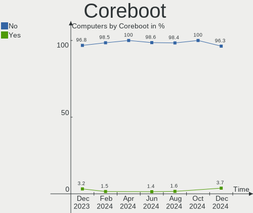
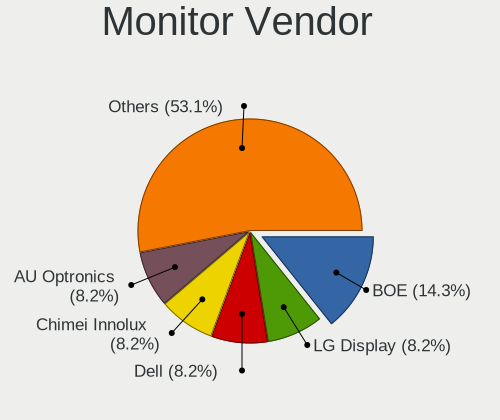

FreeBSD Hardware Trends
-----------------------

A project to identify most popular hardware characteristics and track their change
over time based on data collected by FreeBSD users at https://BSD-Hardware.info.

Anyone can contribute to this report by the [hw-probe](https://github.com/linuxhw/hw-probe/blob/master/INSTALL.BSD.md) tool:

    hw-probe -all -upload

This is a report for all computer types. See also reports for [desktops](/Dist/FreeBSD/Desktop/README.md) and [notebooks](/Dist/FreeBSD/Notebook/README.md).

Full-feature report is available here: https://bsd-hardware.info/?view=trends

Period: Jul, 2021.

Contents
--------

* [ System ](#system)
  - [ OS                       ](#os)
  - [ OS Family                ](#os-family)
  - [ Arch                     ](#arch)
  - [ DE                       ](#de)
  - [ Display Server           ](#display-server)
  - [ Display Manager          ](#display-manager)
  - [ OS Lang                  ](#os-lang)
  - [ Boot Mode                ](#boot-mode)
  - [ Filesystem               ](#filesystem)
  - [ Part. scheme             ](#part-scheme)

* [ Board ](#board)
  - [ Vendor                   ](#vendor)
  - [ Model                    ](#model)
  - [ Model Family             ](#model-family)
  - [ MFG Year                 ](#mfg-year)
  - [ Form Factor              ](#form-factor)
  - [ Coreboot                 ](#coreboot)
  - [ RAM Size                 ](#ram-size)
  - [ RAM Used                 ](#ram-used)
  - [ Total Drives             ](#total-drives)
  - [ Has CD-ROM               ](#has-cd-rom)
  - [ Has Ethernet             ](#has-ethernet)
  - [ Has WiFi                 ](#has-wifi)
  - [ Has Bluetooth            ](#has-bluetooth)

* [ Location ](#location)
  - [ Country                  ](#country)
  - [ City                     ](#city)

* [ Drives ](#drives)
  - [ Drive Vendor             ](#drive-vendor)
  - [ Drive Model              ](#drive-model)
  - [ HDD Vendor               ](#hdd-vendor)
  - [ SSD Vendor               ](#ssd-vendor)
  - [ Drive Kind               ](#drive-kind)
  - [ Drive Connector          ](#drive-connector)
  - [ Drive Size               ](#drive-size)
  - [ Space Total              ](#space-total)
  - [ Space Used               ](#space-used)
  - [ Malfunc. Drives          ](#malfunc-drives)
  - [ Malfunc. Drive Vendor    ](#malfunc-drive-vendor)
  - [ Malfunc. HDD Vendor      ](#malfunc-hdd-vendor)
  - [ Malfunc. Drive Kind      ](#malfunc-drive-kind)
  - [ Failed Drives            ](#failed-drives)
  - [ Failed Drive Vendor      ](#failed-drive-vendor)
  - [ Drive Status             ](#drive-status)

* [ Storage controller ](#storage-controller)
  - [ Storage Vendor           ](#storage-vendor)
  - [ Storage Model            ](#storage-model)
  - [ Storage Kind             ](#storage-kind)

* [ Processor ](#processor)
  - [ CPU Vendor               ](#cpu-vendor)
  - [ CPU Model                ](#cpu-model)
  - [ CPU Model Family         ](#cpu-model-family)
  - [ CPU Cores                ](#cpu-cores)
  - [ CPU Sockets              ](#cpu-sockets)
  - [ CPU Threads              ](#cpu-threads)
  - [ CPU Microarch            ](#cpu-microarch)

* [ Graphics ](#graphics)
  - [ GPU Vendor               ](#gpu-vendor)
  - [ GPU Model                ](#gpu-model)
  - [ GPU Combo                ](#gpu-combo)
  - [ GPU Driver               ](#gpu-driver)
  - [ GPU Memory               ](#gpu-memory)

* [ Monitor ](#monitor)
  - [ Monitor Vendor           ](#monitor-vendor)
  - [ Monitor Model            ](#monitor-model)
  - [ Monitor Resolution       ](#monitor-resolution)
  - [ Monitor Diagonal         ](#monitor-diagonal)
  - [ Monitor Width            ](#monitor-width)
  - [ Aspect Ratio             ](#aspect-ratio)
  - [ Monitor Area             ](#monitor-area)
  - [ Pixel Density            ](#pixel-density)
  - [ Multiple Monitors        ](#multiple-monitors)

* [ Network ](#network)
  - [ Net Controller Vendor    ](#net-controller-vendor)
  - [ Net Controller Model     ](#net-controller-model)
  - [ Wireless Vendor          ](#wireless-vendor)
  - [ Wireless Model           ](#wireless-model)
  - [ Ethernet Vendor          ](#ethernet-vendor)
  - [ Ethernet Model           ](#ethernet-model)
  - [ Net Controller Kind      ](#net-controller-kind)
  - [ Used Controller          ](#used-controller)
  - [ NICs                     ](#nics)
  - [ IPv6                     ](#ipv6)

* [ Bluetooth ](#bluetooth)
  - [ Bluetooth Vendor         ](#bluetooth-vendor)
  - [ Bluetooth Model          ](#bluetooth-model)

* [ Sound ](#sound)
  - [ Sound Vendor             ](#sound-vendor)
  - [ Sound Model              ](#sound-model)

* [ Memory ](#memory)
  - [ Memory Vendor            ](#memory-vendor)
  - [ Memory Model             ](#memory-model)
  - [ Memory Kind              ](#memory-kind)
  - [ Memory Form Factor       ](#memory-form-factor)
  - [ Memory Size              ](#memory-size)
  - [ Memory Speed             ](#memory-speed)

* [ Printers & scanners ](#printers-scanners)
  - [ Printer Vendor           ](#printer-vendor)
  - [ Printer Model            ](#printer-model)
  - [ Scanner Vendor           ](#scanner-vendor)
  - [ Scanner Model            ](#scanner-model)

* [ Camera ](#camera)
  - [ Camera Vendor            ](#camera-vendor)
  - [ Camera Model             ](#camera-model)

* [ Security ](#security)
  - [ Fingerprint Vendor       ](#fingerprint-vendor)
  - [ Fingerprint Model        ](#fingerprint-model)
  - [ Chipcard Vendor          ](#chipcard-vendor)
  - [ Chipcard Model           ](#chipcard-model)

* [ Unsupported ](#unsupported)
  - [ Unsupported Devices      ](#unsupported-devices)
  - [ Unsupported Device Types ](#unsupported-device-types)

System
------

OS
--

Installed operating systems

| Name                 | Computers | Percent |
|----------------------|-----------|---------|
| FreeBSD 13.0-p3      | 21        | 31.82%  |
| FreeBSD 13.0         | 21        | 31.82%  |
| FreeBSD 14.0-CURRENT | 8         | 12.12%  |
| FreeBSD 12.2-p9      | 5         | 7.58%   |
| FreeBSD 13.0-STABLE  | 3         | 4.55%   |
| FreeBSD 13.0-p2      | 2         | 3.03%   |
| FreeBSD 12.2-p6      | 2         | 3.03%   |
| FreeBSD 12.2-p2      | 2         | 3.03%   |
| FreeBSD 12.2         | 1         | 1.52%   |
| FreeBSD 12.1-p8      | 1         | 1.52%   |

OS Family
---------

OS without a version

| Name    | Computers | Percent |
|---------|-----------|---------|
| FreeBSD | 66        | 100%    |

Arch
----

OS architecture (x86_64, i586, etc.)

| Name    | Computers | Percent |
|---------|-----------|---------|
| amd64   | 60        | 90.91%  |
| i386    | 2         | 3.03%   |
| arm64   | 2         | 3.03%   |
| riscv   | 1         | 1.52%   |
| powerpc | 1         | 1.52%   |

DE
--

Desktop Environment

| Name         | Computers | Percent |
|--------------|-----------|---------|
| Console      | 22        | 33.33%  |
| XFCE         | 14        | 21.21%  |
| KDE5         | 11        | 16.67%  |
| TWM          | 3         | 4.55%   |
| MATE         | 3         | 4.55%   |
| GNOME        | 3         | 4.55%   |
| Fluxbox      | 3         | 4.55%   |
| LXQt         | 2         | 3.03%   |
| Openbox      | 1         | 1.52%   |
| i3           | 1         | 1.52%   |
| helloDesktop | 1         | 1.52%   |
| Cinnamon     | 1         | 1.52%   |
| AwesomeWM    | 1         | 1.52%   |

Display Server
--------------

X11 or Wayland

| Name    | Computers | Percent |
|---------|-----------|---------|
| X11     | 45        | 68.18%  |
| Console | 21        | 31.82%  |

Display Manager
---------------

SDDM, LightDM, etc.

| Name    | Computers | Percent |
|---------|-----------|---------|
| Console | 37        | 56.06%  |
| SDDM    | 12        | 18.18%  |
| XDM     | 6         | 9.09%   |
| SLiM    | 6         | 9.09%   |
| GDM     | 3         | 4.55%   |
| LightDM | 2         | 3.03%   |

OS Lang
-------

Language

| Lang             | Computers | Percent |
|------------------|-----------|---------|
| C                | 41        | 62.12%  |
| Unknown          | 8         | 12.12%  |
| en_US            | 6         | 9.09%   |
| ru_RU            | 5         | 7.58%   |
| it_IT.ISO8859-15 | 1         | 1.52%   |
| it_IT            | 1         | 1.52%   |
| fr_FR            | 1         | 1.52%   |
| fi_FI            | 1         | 1.52%   |
| en_GB            | 1         | 1.52%   |
| de_DE            | 1         | 1.52%   |

Boot Mode
---------

EFI or BIOS

| Mode | Computers | Percent |
|------|-----------|---------|
| EFI  | 45        | 68.18%  |
| BIOS | 21        | 31.82%  |

Filesystem
----------

Type of filesystem

| Type | Computers | Percent |
|------|-----------|---------|
| Zfs  | 41        | 62.12%  |
| Ufs  | 25        | 37.88%  |

Part. scheme
------------

Scheme of partitioning

| Type    | Computers | Percent |
|---------|-----------|---------|
| GPT     | 59        | 89.39%  |
| MBR     | 6         | 9.09%   |
| Unknown | 1         | 1.52%   |

Board
-----

Vendor
------

Motherboard manufacturer

| Name                    | Computers | Percent |
|-------------------------|-----------|---------|
| Lenovo                  | 11        | 16.67%  |
| Dell                    | 11        | 16.67%  |
| Hewlett-Packard         | 7         | 10.61%  |
| ASUSTek Computer        | 7         | 10.61%  |
| Gigabyte Technology     | 4         | 6.06%   |
| Supermicro              | 3         | 4.55%   |
| Cisco Systems           | 3         | 4.55%   |
| Apple                   | 3         | 4.55%   |
| Acer                    | 3         | 4.55%   |
| Unknown                 | 3         | 4.55%   |
| Intel                   | 2         | 3.03%   |
| Samsung Electronics     | 1         | 1.52%   |
| Raspberry Pi Foundation | 1         | 1.52%   |
| Pegatron                | 1         | 1.52%   |
| Notebook                | 1         | 1.52%   |
| MSI                     | 1         | 1.52%   |
| IBM                     | 1         | 1.52%   |
| HPE                     | 1         | 1.52%   |
| Avell High Performance  | 1         | 1.52%   |
| ASRock                  | 1         | 1.52%   |

Model
-----

Motherboard model

| Name                                       | Computers | Percent |
|--------------------------------------------|-----------|---------|
| Unknown                                    | 3         | 4.55%   |
| Cisco Systems UCSC-C240-M4L                | 2         | 3.03%   |
| Supermicro X7SPA-HF                        | 1         | 1.52%   |
| Supermicro Super Server                    | 1         | 1.52%   |
| Supermicro C7Z270-CG-L                     | 1         | 1.52%   |
| Samsung 340XAA/350XAA/550XAA               | 1         | 1.52%   |
| RPi Raspberry Pi                           | 1         | 1.52%   |
| Pegatron SAISHIAT2                         | 1         | 1.52%   |
| Notebook W510LU                            | 1         | 1.52%   |
| MSI MS-7817                                | 1         | 1.52%   |
| Lenovo XiaoXinPro-13ARE 2020 82DM          | 1         | 1.52%   |
| Lenovo ThinkPad X230 2325A95               | 1         | 1.52%   |
| Lenovo ThinkPad X1 Carbon Gen 8 20U9CTO1WW | 1         | 1.52%   |
| Lenovo ThinkPad W520 42763KU               | 1         | 1.52%   |
| Lenovo ThinkPad T470p 20J6A012CD           | 1         | 1.52%   |
| Lenovo ThinkPad T420 42368A3               | 1         | 1.52%   |
| Lenovo ThinkPad T410 2516DCU               | 1         | 1.52%   |
| Lenovo ThinkPad S1 Yoga 12 20DKS0AA00      | 1         | 1.52%   |
| Lenovo ThinkPad E590 20NB0012RT            | 1         | 1.52%   |
| Lenovo Rescuer-15ISK 80RQ                  | 1         | 1.52%   |
| Lenovo IdeaPad 100S-14IBR 80R9             | 1         | 1.52%   |
| Intel Skylake Platform                     | 1         | 1.52%   |
| Intel NUC6i5SYB H81131-503                 | 1         | 1.52%   |
| IBM ThinkPad T43 26686CU                   | 1         | 1.52%   |
| HPE ProLiant MicroServer Gen10             | 1         | 1.52%   |
| HP ZBook 17 G2                             | 1         | 1.52%   |
| HP Z620 Workstation                        | 1         | 1.52%   |
| HP Z420 Workstation                        | 1         | 1.52%   |
| HP ProLiant MicroServer Gen8               | 1         | 1.52%   |
| HP ProBook 440 G7                          | 1         | 1.52%   |
| HP EliteBook 8570p                         | 1         | 1.52%   |
| HP 250 G4 Notebook PC                      | 1         | 1.52%   |
| Gigabyte X570 I AORUS PRO WIFI             | 1         | 1.52%   |
| Gigabyte X570 AORUS ULTRA                  | 1         | 1.52%   |
| Gigabyte P55A-UD3                          | 1         | 1.52%   |
| Gigabyte MMLP3AP-00                        | 1         | 1.52%   |
| Dell XPS 13 9343                           | 1         | 1.52%   |
| Dell Studio XPS 9100                       | 1         | 1.52%   |
| Dell OptiPlex 7040                         | 1         | 1.52%   |
| Dell OptiPlex 5040                         | 1         | 1.52%   |
| Dell Inspiron N5110                        | 1         | 1.52%   |
| Dell Inspiron N4030                        | 1         | 1.52%   |
| Dell Inspiron 5758                         | 1         | 1.52%   |
| Dell Inspiron 5559                         | 1         | 1.52%   |
| Dell Inspiron 3521                         | 1         | 1.52%   |
| Dell Inspiron 3442                         | 1         | 1.52%   |
| Dell G5 5505                               | 1         | 1.52%   |
| Cisco Systems UCSC-C240-M3L                | 1         | 1.52%   |
| Avell High Performance A62 LIV             | 1         | 1.52%   |
| ASUS VivoBook_ASUSLaptop X512DA_F512DA     | 1         | 1.52%   |
| ASUS ROG Maximus XI HERO                   | 1         | 1.52%   |
| ASUS PRIME X370-PRO                        | 1         | 1.52%   |
| ASUS PRIME H310M-E R2.0                    | 1         | 1.52%   |
| ASUS P5Q-E                                 | 1         | 1.52%   |
| ASUS H170 PRO GAMING                       | 1         | 1.52%   |
| ASUS G74Sx                                 | 1         | 1.52%   |
| ASRock X570 Phantom Gaming 4               | 1         | 1.52%   |
| Apple MacBookPro8,1                        | 1         | 1.52%   |
| Apple iMac5,1                              | 1         | 1.52%   |
| Apple iMac12,2                             | 1         | 1.52%   |

Model Family
------------

Motherboard model prefix

| Name                        | Computers | Percent |
|-----------------------------|-----------|---------|
| Lenovo ThinkPad             | 8         | 12.12%  |
| Dell Inspiron               | 6         | 9.09%   |
| Acer Aspire                 | 3         | 4.55%   |
| Unknown                     | 3         | 4.55%   |
| Gigabyte X570               | 2         | 3.03%   |
| Dell OptiPlex               | 2         | 3.03%   |
| Cisco Systems UCSC-C240-M4L | 2         | 3.03%   |
| ASUS PRIME                  | 2         | 3.03%   |
| Supermicro X7SPA-HF         | 1         | 1.52%   |
| Supermicro Super            | 1         | 1.52%   |
| Supermicro C7Z270-CG-L      | 1         | 1.52%   |
| Samsung 340XAA              | 1         | 1.52%   |
| RPi Raspberry               | 1         | 1.52%   |
| Pegatron SAISHIAT2          | 1         | 1.52%   |
| Notebook W510LU             | 1         | 1.52%   |
| MSI MS-7817                 | 1         | 1.52%   |
| Lenovo XiaoXinPro-13ARE     | 1         | 1.52%   |
| Lenovo Rescuer-15ISK        | 1         | 1.52%   |
| Lenovo IdeaPad              | 1         | 1.52%   |
| Intel Skylake               | 1         | 1.52%   |
| Intel NUC6i5SYB             | 1         | 1.52%   |
| IBM ThinkPad                | 1         | 1.52%   |
| HPE ProLiant                | 1         | 1.52%   |
| HP ZBook                    | 1         | 1.52%   |
| HP Z620                     | 1         | 1.52%   |
| HP Z420                     | 1         | 1.52%   |
| HP ProLiant                 | 1         | 1.52%   |
| HP ProBook                  | 1         | 1.52%   |
| HP EliteBook                | 1         | 1.52%   |
| HP 250                      | 1         | 1.52%   |
| Gigabyte P55A-UD3           | 1         | 1.52%   |
| Gigabyte MMLP3AP-00         | 1         | 1.52%   |
| Dell XPS                    | 1         | 1.52%   |
| Dell Studio                 | 1         | 1.52%   |
| Dell G5                     | 1         | 1.52%   |
| Cisco Systems UCSC-C240-M3L | 1         | 1.52%   |
| Avell High Performance A62  | 1         | 1.52%   |
| ASUS VivoBook               | 1         | 1.52%   |
| ASUS ROG                    | 1         | 1.52%   |
| ASUS P5Q-E                  | 1         | 1.52%   |
| ASUS H170                   | 1         | 1.52%   |
| ASUS G74Sx                  | 1         | 1.52%   |
| ASRock X570                 | 1         | 1.52%   |
| Apple MacBookPro8           | 1         | 1.52%   |
| Apple iMac5                 | 1         | 1.52%   |
| Apple iMac12                | 1         | 1.52%   |

MFG Year
--------

Motherboard manufacture year

| Year    | Computers | Percent |
|---------|-----------|---------|
| 2019    | 13        | 19.7%   |
| 2020    | 11        | 16.67%  |
| 2018    | 10        | 15.15%  |
| 2021    | 8         | 12.12%  |
| 2016    | 6         | 9.09%   |
| 2015    | 3         | 4.55%   |
| 2013    | 2         | 3.03%   |
| 2012    | 2         | 3.03%   |
| 2011    | 2         | 3.03%   |
| 2010    | 2         | 3.03%   |
| Unknown | 2         | 3.03%   |
| 2014    | 1         | 1.52%   |
| 2009    | 1         | 1.52%   |
| 2008    | 1         | 1.52%   |
| 2007    | 1         | 1.52%   |
| 2006    | 1         | 1.52%   |

Form Factor
-----------

Physical design of the computer

| Name           | Computers | Percent |
|----------------|-----------|---------|
| Notebook       | 35        | 53.03%  |
| Desktop        | 21        | 31.82%  |
| Server         | 5         | 7.58%   |
| System on chip | 2         | 3.03%   |
| All in one     | 2         | 3.03%   |
| Mini pc        | 1         | 1.52%   |

Coreboot
--------

Have coreboot on board

| Used | Computers | Percent |
|------|-----------|---------|
| No   | 66        | 100%    |

RAM Size
--------

Total RAM memory

| Size in GB      | Computers | Percent |
|-----------------|-----------|---------|
| 8.01-16.0       | 24        | 36.36%  |
| 32.01-64.0      | 11        | 16.67%  |
| 4.01-8.0        | 9         | 13.64%  |
| 16.01-24.0      | 8         | 12.12%  |
| 2.01-3.0        | 5         | 7.58%   |
| 64.01-256.0     | 5         | 7.58%   |
| 3.01-4.0        | 2         | 3.03%   |
| More than 256.0 | 1         | 1.52%   |
| 24.01-32.0      | 1         | 1.52%   |

RAM Used
--------

Used RAM memory

| Used GB    | Computers | Percent |
|------------|-----------|---------|
| 0.01-0.5   | 30        | 45.45%  |
| 0.51-1.0   | 15        | 22.73%  |
| 1.01-2.0   | 9         | 13.64%  |
| 3.01-4.0   | 5         | 7.58%   |
| 24.01-32.0 | 2         | 3.03%   |
| 2.01-3.0   | 2         | 3.03%   |
| 32.01-64.0 | 1         | 1.52%   |
| 16.01-24.0 | 1         | 1.52%   |
| 8.01-16.0  | 1         | 1.52%   |

Total Drives
------------

Number of drives on board

| Drives | Computers | Percent |
|--------|-----------|---------|
| 1      | 33        | 50%     |
| 2      | 12        | 18.18%  |
| 0      | 5         | 7.58%   |
| 5      | 3         | 4.55%   |
| 4      | 3         | 4.55%   |
| 3      | 3         | 4.55%   |
| 12     | 2         | 3.03%   |
| 14     | 1         | 1.52%   |
| 13     | 1         | 1.52%   |
| 9      | 1         | 1.52%   |
| 7      | 1         | 1.52%   |
| 6      | 1         | 1.52%   |

Has CD-ROM
----------

Has CD-ROM on board

| Presented | Computers | Percent |
|-----------|-----------|---------|
| No        | 38        | 57.58%  |
| Yes       | 28        | 42.42%  |

Has Ethernet
------------

Has Ethernet on board

| Presented | Computers | Percent |
|-----------|-----------|---------|
| Yes       | 57        | 86.36%  |
| No        | 9         | 13.64%  |

Has WiFi
--------

Has WiFi module

| Presented | Computers | Percent |
|-----------|-----------|---------|
| Yes       | 41        | 62.12%  |
| No        | 25        | 37.88%  |

Has Bluetooth
-------------

Has Bluetooth module

| Presented | Computers | Percent |
|-----------|-----------|---------|
| Yes       | 35        | 53.03%  |
| No        | 31        | 46.97%  |

Location
--------

Country
-------

Geographic location (country)

| Country            | Computers | Percent |
|--------------------|-----------|---------|
| USA                | 20        | 30.3%   |
| Russia             | 6         | 9.09%   |
| UK                 | 5         | 7.58%   |
| Germany            | 5         | 7.58%   |
| Italy              | 3         | 4.55%   |
| Brazil             | 3         | 4.55%   |
| Iran               | 2         | 3.03%   |
| India              | 2         | 3.03%   |
| France             | 2         | 3.03%   |
| China              | 2         | 3.03%   |
| Canada             | 2         | 3.03%   |
| Austria            | 2         | 3.03%   |
| Ukraine            | 1         | 1.52%   |
| Thailand           | 1         | 1.52%   |
| Tanzania           | 1         | 1.52%   |
| Switzerland        | 1         | 1.52%   |
| Portugal           | 1         | 1.52%   |
| Norway             | 1         | 1.52%   |
| Latvia             | 1         | 1.52%   |
| Japan              | 1         | 1.52%   |
| Ireland            | 1         | 1.52%   |
| Guatemala          | 1         | 1.52%   |
| Finland            | 1         | 1.52%   |
| Dominican Republic | 1         | 1.52%   |

City
----

Geographic location (city)

| City               | Computers | Percent |
|--------------------|-----------|---------|
| Moscow             | 3         | 4.55%   |
| Lexington          | 3         | 4.55%   |
| Vienna             | 2         | 3.03%   |
| Tehran             | 2         | 3.03%   |
| Salem              | 2         | 3.03%   |
| Montreal           | 2         | 3.03%   |
| London             | 2         | 3.03%   |
| Kirkland           | 2         | 3.03%   |
| Hannibal           | 2         | 3.03%   |
| Brighton           | 2         | 3.03%   |
| Augsburg           | 2         | 3.03%   |
| Yegorlykskaya      | 1         | 1.52%   |
| Wuhan              | 1         | 1.52%   |
| Weimar             | 1         | 1.52%   |
| Vancouver          | 1         | 1.52%   |
| The Bronx          | 1         | 1.52%   |
| Teaneck            | 1         | 1.52%   |
| Tampere            | 1         | 1.52%   |
| St Petersburg      | 1         | 1.52%   |
| Seattle            | 1         | 1.52%   |
| Santo Domingo Este | 1         | 1.52%   |
| Riga               | 1         | 1.52%   |
| Resana             | 1         | 1.52%   |
| Porto União       | 1         | 1.52%   |
| Porto              | 1         | 1.52%   |
| Milan              | 1         | 1.52%   |
| Midvale            | 1         | 1.52%   |
| Kolkata            | 1         | 1.52%   |
| Kaiserslautern     | 1         | 1.52%   |
| Jilin City         | 1         | 1.52%   |
| Jeffersonville     | 1         | 1.52%   |
| Inzai              | 1         | 1.52%   |
| Hat Yai            | 1         | 1.52%   |
| Hamburg            | 1         | 1.52%   |
| Guatemala City     | 1         | 1.52%   |
| Graz               | 1         | 1.52%   |
| Fyrde              | 1         | 1.52%   |
| Eureka             | 1         | 1.52%   |
| Dnipropetrovsk     | 1         | 1.52%   |
| Dinhard            | 1         | 1.52%   |
| Dar es Salaam      | 1         | 1.52%   |
| Colmar             | 1         | 1.52%   |
| Coimbatore         | 1         | 1.52%   |
| Chelyabinsk        | 1         | 1.52%   |
| Chandler           | 1         | 1.52%   |
| Carrigaline        | 1         | 1.52%   |
| Cambridge          | 1         | 1.52%   |
| Bordeaux           | 1         | 1.52%   |
| Bologna            | 1         | 1.52%   |
| Berkeley           | 1         | 1.52%   |
| Belo Horizonte     | 1         | 1.52%   |
| Arvada             | 1         | 1.52%   |
| Araruama           | 1         | 1.52%   |

Drives
------

Drive Vendor
------------

Hard drive vendors

| Vendor              | Computers | Drives | Percent |
|---------------------|-----------|--------|---------|
| WDC                 | 20        | 42     | 21.05%  |
| Samsung Electronics | 17        | 22     | 17.89%  |
| Seagate             | 16        | 37     | 16.84%  |
| Crucial             | 9         | 9      | 9.47%   |
| HGST                | 6         | 22     | 6.32%   |
| Toshiba             | 3         | 8      | 3.16%   |
| SanDisk             | 3         | 3      | 3.16%   |
| Kingston            | 3         | 3      | 3.16%   |
| Hitachi             | 3         | 3      | 3.16%   |
| SK Hynix            | 2         | 2      | 2.11%   |
| Corsair             | 2         | 2      | 2.11%   |
| Transcend           | 1         | 1      | 1.05%   |
| Smartbuy            | 1         | 1      | 1.05%   |
| PNY                 | 1         | 2      | 1.05%   |
| Phison              | 1         | 1      | 1.05%   |
| OCZ                 | 1         | 1      | 1.05%   |
| Micron Technology   | 1         | 2      | 1.05%   |
| Intel               | 1         | 1      | 1.05%   |
| Hewlett-Packard     | 1         | 1      | 1.05%   |
| Fujitsu             | 1         | 1      | 1.05%   |
| Apple               | 1         | 1      | 1.05%   |
| A-DATA Technology   | 1         | 1      | 1.05%   |

Drive Model
-----------

Hard drive models

| Model                                   | Computers | Percent |
|-----------------------------------------|-----------|---------|
| Samsung SSD 860 EVO 500GB               | 3         | 2.63%   |
| HGST HTS725050A7E630 500GB              | 3         | 2.63%   |
| WDC WD30EFRX-68EUZN0 3TB                | 2         | 1.75%   |
| Toshiba MG04SCA20EN 2TB                 | 2         | 1.75%   |
| Seagate ST4000DM000-1F2168 4TB          | 2         | 1.75%   |
| Seagate ST2000NM0023 2TB                | 2         | 1.75%   |
| Seagate ST1000NM0023 1TB                | 2         | 1.75%   |
| Seagate ST1000LM048-2E7172 1TB          | 2         | 1.75%   |
| Samsung HM251JX 250GB                   | 2         | 1.75%   |
| Crucial CT480BX500SSD1 480GB            | 2         | 1.75%   |
| Crucial CT240BX500SSD1 240GB            | 2         | 1.75%   |
| WDC WDS480G2G0B-00EPW0 480GB            | 1         | 0.88%   |
| WDC WDS100T3XHC-00SJG0 1TB              | 1         | 0.88%   |
| WDC WDBNCE2500PNC 250GB                 | 1         | 0.88%   |
| WDC WD80EMAZ-00WJTA0 8TB                | 1         | 0.88%   |
| WDC WD80EFZX-68UW8N0 8TB                | 1         | 0.88%   |
| WDC WD80EFAX-68LHPN0 8TB                | 1         | 0.88%   |
| WDC WD60EFRX-68L0BN1 6TB                | 1         | 0.88%   |
| WDC WD5000LPVX-75V0TT0 500GB            | 1         | 0.88%   |
| WDC WD5000BEVT-75A0RT0 500GB            | 1         | 0.88%   |
| WDC WD5000AAKX-083CA0 500GB             | 1         | 0.88%   |
| WDC WD40EZRZ-22GXCB0 4TB                | 1         | 0.88%   |
| WDC WD3200BPVT-75ZEST0 320GB            | 1         | 0.88%   |
| WDC WD2500JS-40TGB0 250GB               | 1         | 0.88%   |
| WDC WD2500AAKS-60L9A0 250GB             | 1         | 0.88%   |
| WDC WD20EZRX-00D8PB0 2TB                | 1         | 0.88%   |
| WDC WD120EMFZ-11A6JA0 12TB              | 1         | 0.88%   |
| WDC WD120EMAZ-11BLFA0 12TB              | 1         | 0.88%   |
| WDC WD10SDZW-11UMGS0 1TB                | 1         | 0.88%   |
| WDC WD10JPVX-22JC3T0 1TB                | 1         | 0.88%   |
| WDC WD10EZEX-22MFCA0 1TB                | 1         | 0.88%   |
| WDC WD10EZEX-08WN4A0 1TB                | 1         | 0.88%   |
| WDC WD1001FALS-00J7B1 1TB               | 1         | 0.88%   |
| WDC WD1001FALS-00J7B0 1TB               | 1         | 0.88%   |
| WDC PC SN730 SDBPNTY-512G-1101 512GB    | 1         | 0.88%   |
| WDC PC SN730 NVMe 1024GB                | 1         | 0.88%   |
| WDC PC SN530 SDBPNPZ-512G-1014 512GB    | 1         | 0.88%   |
| Transcend TS64GSSD370S 64GB             | 1         | 0.88%   |
| Toshiba MQ04ABF100 1TB                  | 1         | 0.88%   |
| Toshiba MQ01ABD100 1TB                  | 1         | 0.88%   |
| Smartbuy SSD 64GB                       | 1         | 0.88%   |
| SK Hynix HFM256GDHTNG-8510B 256GB       | 1         | 0.88%   |
| SK Hynix BC511 HFM256GDJTNI-82A0A 256GB | 1         | 0.88%   |
| Seagate ST8000DM004-2CX188 8TB          | 1         | 0.88%   |
| Seagate ST6000VN0033-2EE110 6TB         | 1         | 0.88%   |
| Seagate ST32000641AS 2TB                | 1         | 0.88%   |
| Seagate ST3000NM0023 3TB                | 1         | 0.88%   |
| Seagate ST3000DM003-1F216N 3TB          | 1         | 0.88%   |
| Seagate ST3000DM001-1CH166 3TB          | 1         | 0.88%   |
| Seagate ST250DM000-1BD141 250GB         | 1         | 0.88%   |
| Seagate ST2000LX001-1RG174 2TB          | 1         | 0.88%   |
| Seagate ST2000LM003 HN-M201RAD 2TB      | 1         | 0.88%   |
| Seagate ST12000NM0007-2A1101 12TB       | 1         | 0.88%   |
| Seagate ST1000LM035-1RK172 1TB          | 1         | 0.88%   |
| Seagate ST1000LM024 HN-M101MBB 1TB      | 1         | 0.88%   |
| Seagate ST1000DM003-1SB102 1TB          | 1         | 0.88%   |
| Seagate ST1000DM003-1CH162 1TB          | 1         | 0.88%   |
| SanDisk SSD PLUS 480GB                  | 1         | 0.88%   |
| SanDisk SD8SBBU240G1122 240GB           | 1         | 0.88%   |
| SanDisk pSSD 256GB                      | 1         | 0.88%   |

HDD Vendor
----------

Hard disk drive vendors

| Vendor              | Computers | Drives | Percent |
|---------------------|-----------|--------|---------|
| WDC                 | 16        | 36     | 34.04%  |
| Seagate             | 16        | 37     | 34.04%  |
| HGST                | 6         | 22     | 12.77%  |
| Toshiba             | 3         | 8      | 6.38%   |
| Hitachi             | 3         | 3      | 6.38%   |
| Samsung Electronics | 2         | 2      | 4.26%   |
| Fujitsu             | 1         | 1      | 2.13%   |

SSD Vendor
----------

Solid state drive vendors

| Vendor              | Computers | Drives | Percent |
|---------------------|-----------|--------|---------|
| Samsung Electronics | 12        | 15     | 35.29%  |
| Crucial             | 8         | 8      | 23.53%  |
| SanDisk             | 3         | 3      | 8.82%   |
| WDC                 | 2         | 2      | 5.88%   |
| Transcend           | 1         | 1      | 2.94%   |
| Smartbuy            | 1         | 1      | 2.94%   |
| PNY                 | 1         | 2      | 2.94%   |
| OCZ                 | 1         | 1      | 2.94%   |
| Kingston            | 1         | 1      | 2.94%   |
| Intel               | 1         | 1      | 2.94%   |
| Hewlett-Packard     | 1         | 1      | 2.94%   |
| Corsair             | 1         | 1      | 2.94%   |
| Apple               | 1         | 1      | 2.94%   |

Drive Kind
----------

HDD or SSD

| Kind | Computers | Drives | Percent |
|------|-----------|--------|---------|
| HDD  | 36        | 109    | 46.75%  |
| SSD  | 27        | 38     | 35.06%  |
| NVMe | 14        | 19     | 18.18%  |

Drive Connector
---------------

SATA, SAS, NVMe, etc.

| Type | Computers | Drives | Percent |
|------|-----------|--------|---------|
| SATA | 52        | 147    | 78.79%  |
| NVMe | 14        | 19     | 21.21%  |

Drive Size
----------

Size of hard drive

| Size in TB | Computers | Drives | Percent |
|------------|-----------|--------|---------|
| 0.01-0.5   | 37        | 48     | 50.68%  |
| 0.51-1.0   | 16        | 31     | 21.92%  |
| 2.01-3.0   | 6         | 13     | 8.22%   |
| 1.01-2.0   | 5         | 15     | 6.85%   |
| 3.01-4.0   | 4         | 19     | 5.48%   |
| 4.01-10.0  | 3         | 17     | 4.11%   |
| 10.01-20.0 | 2         | 4      | 2.74%   |

Space Total
-----------

Amount of disk space available on the file system

| Size in GB | Computers | Percent |
|------------|-----------|---------|
| 101-250    | 18        | 27.27%  |
| 251-500    | 15        | 22.73%  |
| 1-20       | 10        | 15.15%  |
| 51-100     | 9         | 13.64%  |
| 501-1000   | 8         | 12.12%  |
| 1001-2000  | 3         | 4.55%   |
| 21-50      | 2         | 3.03%   |
| 2001-3000  | 1         | 1.52%   |

Space Used
----------

Amount of used disk space

| Used GB | Computers | Percent |
|---------|-----------|---------|
| 1-20    | 49        | 74.24%  |
| 21-50   | 11        | 16.67%  |
| 51-100  | 5         | 7.58%   |
| 101-250 | 1         | 1.52%   |

Malfunc. Drives
---------------

Drive models with a malfunction

| Model                                 | Computers | Drives | Percent |
|---------------------------------------|-----------|--------|---------|
| HGST HTS725050A7E630 500GB            | 3         | 3      | 21.43%  |
| WDC WD5000BEVT-75A0RT0 500GB          | 1         | 1      | 7.14%   |
| WDC WD5000AAKX-083CA0 500GB           | 1         | 1      | 7.14%   |
| WDC WD3200BPVT-75ZEST0 320GB          | 1         | 1      | 7.14%   |
| WDC WD30EFRX-68EUZN0 3TB              | 1         | 3      | 7.14%   |
| WDC WD2500AAKS-60L9A0 250GB           | 1         | 1      | 7.14%   |
| WDC WD1001FALS-00J7B1 1TB             | 1         | 1      | 7.14%   |
| Seagate ST2000LX001-1RG174 2TB        | 1         | 2      | 7.14%   |
| Samsung Electronics SSD 840 EVO 500GB | 1         | 1      | 7.14%   |
| Hitachi HTS541612J9SA00 120GB         | 1         | 1      | 7.14%   |
| Hewlett-Packard SSD S700 1TB          | 1         | 1      | 7.14%   |
| Crucial CT525MX300SSD4 528GB          | 1         | 1      | 7.14%   |

Malfunc. Drive Vendor
---------------------

Vendors of faulty drives

| Vendor              | Computers | Drives | Percent |
|---------------------|-----------|--------|---------|
| WDC                 | 6         | 8      | 42.86%  |
| HGST                | 3         | 3      | 21.43%  |
| Seagate             | 1         | 2      | 7.14%   |
| Samsung Electronics | 1         | 1      | 7.14%   |
| Hitachi             | 1         | 1      | 7.14%   |
| Hewlett-Packard     | 1         | 1      | 7.14%   |
| Crucial             | 1         | 1      | 7.14%   |

Malfunc. HDD Vendor
-------------------

Vendors of faulty HDD drives

| Vendor  | Computers | Drives | Percent |
|---------|-----------|--------|---------|
| WDC     | 6         | 8      | 54.55%  |
| HGST    | 3         | 3      | 27.27%  |
| Seagate | 1         | 2      | 9.09%   |
| Hitachi | 1         | 1      | 9.09%   |

Malfunc. Drive Kind
-------------------

Kinds of faulty drives

| Kind | Computers | Drives | Percent |
|------|-----------|--------|---------|
| HDD  | 11        | 14     | 78.57%  |
| SSD  | 3         | 3      | 21.43%  |

Failed Drives
-------------

Failed drive models

| Model              | Computers | Drives | Percent |
|--------------------|-----------|--------|---------|
| SanDisk pSSD 256GB | 1         | 1      | 100%    |

Failed Drive Vendor
-------------------

Failed drive vendors

| Vendor  | Computers | Drives | Percent |
|---------|-----------|--------|---------|
| SanDisk | 1         | 1      | 100%    |

Drive Status
------------

Number of failed and malfunc. drives

| Status   | Computers | Drives | Percent |
|----------|-----------|--------|---------|
| Works    | 52        | 142    | 73.24%  |
| Malfunc  | 14        | 17     | 19.72%  |
| Detected | 4         | 6      | 5.63%   |
| Failed   | 1         | 1      | 1.41%   |

Storage controller
------------------

Storage Vendor
--------------

Storage controller vendors

| Vendor                        | Computers | Percent |
|-------------------------------|-----------|---------|
| Intel                         | 50        | 56.82%  |
| AMD                           | 8         | 9.09%   |
| Samsung Electronics           | 7         | 7.95%   |
| Broadcom / LSI                | 6         | 6.82%   |
| Sandisk                       | 3         | 3.41%   |
| Marvell Technology Group      | 3         | 3.41%   |
| SK Hynix                      | 2         | 2.27%   |
| Phison Electronics            | 2         | 2.27%   |
| Micron Technology             | 2         | 2.27%   |
| Kingston Technology Company   | 2         | 2.27%   |
| Integrated Technology Express | 1         | 1.14%   |
| Broadcom                      | 1         | 1.14%   |
| ADATA Technology              | 1         | 1.14%   |

Storage Model
-------------

Storage controller models

| Model                                                                                   | Computers | Percent |
|-----------------------------------------------------------------------------------------|-----------|---------|
| AMD FCH SATA Controller [AHCI mode]                                                     | 8         | 8.16%   |
| Samsung NVMe SSD Controller SM981/PM981/PM983                                           | 6         | 6.12%   |
| Intel Sunrise Point-LP SATA Controller [AHCI mode]                                      | 4         | 4.08%   |
| Intel 6 Series/C200 Series Chipset Family 6 port Mobile SATA AHCI Controller            | 4         | 4.08%   |
| Intel Wildcat Point-LP SATA Controller [AHCI Mode]                                      | 3         | 3.06%   |
| Intel Q170/Q150/B150/H170/H110/Z170/CM236 Chipset SATA Controller [AHCI Mode]           | 3         | 3.06%   |
| Intel Atom/Celeron/Pentium Processor x5-E8000/J3xxx/N3xxx Series SATA Controller        | 3         | 3.06%   |
| Intel 7 Series Chipset Family 6-port SATA Controller [AHCI mode]                        | 3         | 3.06%   |
| Unknown                                                                                 | 3         | 3.06%   |
| Sandisk WD Black SN750 / PC SN730 NVMe SSD                                              | 2         | 2.04%   |
| Kingston Company U-SNS8154P3 NVMe SSD                                                   | 2         | 2.04%   |
| Intel HM170/QM170 Chipset SATA Controller [AHCI Mode]                                   | 2         | 2.04%   |
| Intel Comet Lake SATA AHCI Controller                                                   | 2         | 2.04%   |
| Intel C610/X99 series chipset 6-Port SATA Controller [AHCI mode]                        | 2         | 2.04%   |
| Intel C602 chipset 4-Port SATA Storage Control Unit                                     | 2         | 2.04%   |
| Intel 82801JI (ICH10 Family) SATA AHCI Controller                                       | 2         | 2.04%   |
| Intel 8 Series/C220 Series Chipset Family 6-port SATA Controller 1 [AHCI mode]          | 2         | 2.04%   |
| Intel 8 Series SATA Controller 1 [AHCI mode]                                            | 2         | 2.04%   |
| Intel 5 Series/3400 Series Chipset 4 port SATA IDE Controller                           | 2         | 2.04%   |
| Intel 5 Series/3400 Series Chipset 2 port SATA IDE Controller                           | 2         | 2.04%   |
| Intel 200 Series PCH SATA controller [AHCI mode]                                        | 2         | 2.04%   |
| Broadcom / LSI SAS2008 PCI-Express Fusion-MPT SAS-2 [Falcon]                            | 2         | 2.04%   |
| SK Hynix BC511                                                                          | 1         | 1.02%   |
| SK Hynix BC501 NVMe Solid State Drive                                                   | 1         | 1.02%   |
| Sandisk WD Black 2018/SN750 / PC SN720 NVMe SSD                                         | 1         | 1.02%   |
| Samsung NVMe SSD Controller SM961/PM961/SM963                                           | 1         | 1.02%   |
| Phison E16 PCIe4 NVMe Controller                                                        | 1         | 1.02%   |
| Phison E12 NVMe Controller                                                              | 1         | 1.02%   |
| Marvell Group 88SE9230 PCIe 2.0 x2 4-port SATA 6 Gb/s RAID Controller                   | 1         | 1.02%   |
| Marvell Group 88SE91A3 SATA-600 Controller                                              | 1         | 1.02%   |
| Marvell Group 88SE6111/6121 SATA II / PATA Controller                                   | 1         | 1.02%   |
| Intel SATA Controller [RAID mode]                                                       | 1         | 1.02%   |
| Intel Cannon Lake PCH SATA AHCI Controller                                              | 1         | 1.02%   |
| Intel C620 Series Chipset Family SATA Controller [AHCI mode]                            | 1         | 1.02%   |
| Intel C600/X79 series chipset SATA RAID Controller                                      | 1         | 1.02%   |
| Intel C600/X79 series chipset IDE-r Controller                                          | 1         | 1.02%   |
| Intel C600/X79 series chipset 6-Port SATA AHCI Controller                               | 1         | 1.02%   |
| Intel 82801IR/IO/IH (ICH9R/DO/DH) 6 port SATA Controller [AHCI mode]                    | 1         | 1.02%   |
| Intel 82801GBM/GHM (ICH7-M Family) SATA Controller [IDE mode]                           | 1         | 1.02%   |
| Intel 82801G (ICH7 Family) IDE Controller                                               | 1         | 1.02%   |
| Intel 82801FBM (ICH6M) SATA Controller                                                  | 1         | 1.02%   |
| Intel 82801 Mobile SATA Controller [RAID mode]                                          | 1         | 1.02%   |
| Intel 7 Series Chipset Family 4-port SATA Controller [IDE mode]                         | 1         | 1.02%   |
| Intel 7 Series Chipset Family 2-port SATA Controller [IDE mode]                         | 1         | 1.02%   |
| Intel 6 Series/C200 Series Chipset Family Mobile SATA Controller (IDE mode, ports 0-3)  | 1         | 1.02%   |
| Intel 6 Series/C200 Series Chipset Family Desktop SATA Controller (IDE mode, ports 4-5) | 1         | 1.02%   |
| Intel 6 Series/C200 Series Chipset Family Desktop SATA Controller (IDE mode, ports 0-3) | 1         | 1.02%   |
| Intel 6 Series/C200 Series Chipset Family 6 port Desktop SATA AHCI Controller           | 1         | 1.02%   |
| Intel 5 Series/3400 Series Chipset 6 port SATA AHCI Controller                          | 1         | 1.02%   |
| Intel 400 Series Chipset Family SATA AHCI Controller                                    | 1         | 1.02%   |
| Integrated Express IT8213 IDE Controller                                                | 1         | 1.02%   |
| Broadcom K2 SATA                                                                        | 1         | 1.02%   |
| Broadcom / LSI SAS3108 PCI-Express Fusion-MPT SAS-3                                     | 1         | 1.02%   |
| Broadcom / LSI SAS2308 PCI-Express Fusion-MPT SAS-2                                     | 1         | 1.02%   |
| Broadcom / LSI MegaRAID SAS-3 3108 [Invader]                                            | 1         | 1.02%   |
| Broadcom / LSI MegaRAID SAS 2208 [Thunderbolt]                                          | 1         | 1.02%   |
| AMD X370 Series Chipset SATA Controller                                                 | 1         | 1.02%   |

Storage Kind
------------

Kind of storage controller (IDE, SATA, NVMe, SAS, ...)

| Kind | Computers | Percent |
|------|-----------|---------|
| SATA | 49        | 56.98%  |
| NVMe | 16        | 18.6%   |
| IDE  | 10        | 11.63%  |
| SAS  | 6         | 6.98%   |
| RAID | 5         | 5.81%   |

Processor
---------

CPU Vendor
----------

Processor vendors

| Vendor  | Computers | Percent |
|---------|-----------|---------|
| Intel   | 53        | 80.3%   |
| AMD     | 9         | 13.64%  |
| Unknown | 2         | 3.03%   |
| IBM     | 1         | 1.52%   |
| ARM     | 1         | 1.52%   |

CPU Model
---------

Processor models

| Model                                  | Computers | Percent |
|----------------------------------------|-----------|---------|
|                                        | 2         | 3.03%   |
| Intel Xeon W-3245 CPU @ 3.20GHz        | 1         | 1.52%   |
| Intel Xeon CPU E5-2650 v3 @ 2.30GHz    | 1         | 1.52%   |
| Intel Xeon CPU E5-2630 v3 @ 2.40GHz    | 1         | 1.52%   |
| Intel Xeon CPU E5-2630 v2 @ 2.60GHz    | 1         | 1.52%   |
| Intel Xeon CPU E5-2620 v2 @ 2.10GHz    | 1         | 1.52%   |
| Intel Xeon CPU E5-1620 @ 3.60GHz       | 1         | 1.52%   |
| Intel Pentium M processor              | 1         | 1.52%   |
| Intel Pentium CPU N3700 @ 1.60GHz      | 1         | 1.52%   |
| Intel Core i9-9900K CPU @ 3.60GHz      | 1         | 1.52%   |
| Intel Core i7-9750H CPU @ 2.60GHz      | 1         | 1.52%   |
| Intel Core i7-8565U CPU @ 1.80GHz      | 1         | 1.52%   |
| Intel Core i7-7700 CPU @ 3.60GHz       | 1         | 1.52%   |
| Intel Core i7-6700 CPU @ 3.40GHz       | 1         | 1.52%   |
| Intel Core i7-6500U CPU @ 2.50GHz      | 1         | 1.52%   |
| Intel Core i7-5600U CPU @ 2.60GHz      | 1         | 1.52%   |
| Intel Core i7-4710MQ CPU @ 2.50GHz     | 1         | 1.52%   |
| Intel Core i7-3520M CPU @ 2.90GHz      | 1         | 1.52%   |
| Intel Core i7-2860QM CPU @ 2.50GHz     | 1         | 1.52%   |
| Intel Core i7-2760QM CPU @ 2.40GHz     | 1         | 1.52%   |
| Intel Core i7-10750H CPU @ 2.60GHz     | 1         | 1.52%   |
| Intel Core i7-10510U CPU @ 1.80GHz     | 1         | 1.52%   |
| Intel Core i7 CPU 960 @ 3.20GHz        | 1         | 1.52%   |
| Intel Core i5-8250U CPU @ 1.60GHz      | 1         | 1.52%   |
| Intel Core i5-7300HQ CPU @ 2.50GHz     | 1         | 1.52%   |
| Intel Core i5-6600K CPU @ 3.50GHz      | 1         | 1.52%   |
| Intel Core i5-6500 CPU @ 3.20GHz       | 1         | 1.52%   |
| Intel Core i5-6300HQ CPU @ 2.30GHz     | 1         | 1.52%   |
| Intel Core i5-6260U CPU @ 1.80GHz      | 1         | 1.52%   |
| Intel Core i5-6200U CPU @ 2.30GHz      | 1         | 1.52%   |
| Intel Core i5-5300U CPU @ 2.30GHz      | 1         | 1.52%   |
| Intel Core i5-4460 CPU @ 3.20GHz       | 1         | 1.52%   |
| Intel Core i5-3320M CPU @ 2.60GHz      | 1         | 1.52%   |
| Intel Core i5-2520M CPU @ 2.50GHz      | 1         | 1.52%   |
| Intel Core i5-2435M CPU @ 2.40GHz      | 1         | 1.52%   |
| Intel Core i5-2410M CPU @ 2.30GHz      | 1         | 1.52%   |
| Intel Core i5-2400 CPU @ 3.10GHz       | 1         | 1.52%   |
| Intel Core i5-10310U CPU @ 1.70GHz     | 1         | 1.52%   |
| Intel Core i5-10210U CPU @ 1.60GHz     | 1         | 1.52%   |
| Intel Core i5 CPU M 560 @ 2.67GHz      | 1         | 1.52%   |
| Intel Core i5 CPU                      | 1         | 1.52%   |
| Intel Core i3-8100 CPU @ 3.60GHz       | 1         | 1.52%   |
| Intel Core i3-5005U CPU @ 2.00GHz      | 1         | 1.52%   |
| Intel Core i3-4010U CPU @ 1.70GHz      | 1         | 1.52%   |
| Intel Core i3-4005U CPU @ 1.70GHz      | 1         | 1.52%   |
| Intel Core i3-3227U CPU @ 1.90GHz      | 1         | 1.52%   |
| Intel Core i3 CPU M 380 @ 2.53GH       | 1         | 1.52%   |
| Intel Core 2 Quad CPU Q6600 @ 2.40GHz  | 1         | 1.52%   |
| Intel Core 2 CPU T                     | 1         | 1.52%   |
| Intel Celeron CPU N3150 @ 1.60GHz      | 1         | 1.52%   |
| Intel Celeron CPU N3060 @ 1.60GHz      | 1         | 1.52%   |
| Intel Celeron CPU G1610T @ 2.30GHz     | 1         | 1.52%   |
| Intel Celeron CPU 847 @ 1.10GHz        | 1         | 1.52%   |
| Intel Atom CPU D510 @ 1.66GHz          | 1         | 1.52%   |
| IBM PowerPC 970MP                      | 1         | 1.52%   |
| ARM Cortex-A72 r0p3                    | 1         | 1.52%   |
| AMD Ryzen 9 3900X 12-Core Processor    | 1         | 1.52%   |
| AMD Ryzen 7 4800U with Radeon Graphics | 1         | 1.52%   |
| AMD Ryzen 7 4800H with Radeon Graphics | 1         | 1.52%   |
| AMD Ryzen 7 2700X Eight-Core Processor | 1         | 1.52%   |

CPU Model Family
----------------

Processor model prefix

| Model             | Computers | Percent |
|-------------------|-----------|---------|
| Intel Core i5     | 18        | 27.27%  |
| Intel Core i7     | 13        | 19.7%   |
| Intel Xeon        | 6         | 9.09%   |
| Intel Core i3     | 6         | 9.09%   |
| Intel Celeron     | 4         | 6.06%   |
| AMD Ryzen 7       | 4         | 6.06%   |
| Other             | 3         | 4.55%   |
| AMD Ryzen 5       | 2         | 3.03%   |
| Intel Pentium M   | 1         | 1.52%   |
| Intel Pentium     | 1         | 1.52%   |
| Intel Core i9     | 1         | 1.52%   |
| Intel Core 2 Quad | 1         | 1.52%   |
| Intel Core 2      | 1         | 1.52%   |
| Intel Atom        | 1         | 1.52%   |
| ARM Cortex        | 1         | 1.52%   |
| AMD Ryzen 9       | 1         | 1.52%   |
| AMD Opteron       | 1         | 1.52%   |
| AMD E2            | 1         | 1.52%   |

CPU Cores
---------

Number of processor cores

| Number  | Computers | Percent |
|---------|-----------|---------|
| 4       | 23        | 34.85%  |
| 2       | 22        | 33.33%  |
| 16      | 5         | 7.58%   |
| Unknown | 5         | 7.58%   |
| 8       | 3         | 4.55%   |
| 6       | 3         | 4.55%   |
| 12      | 2         | 3.03%   |
| 24      | 1         | 1.52%   |
| 20      | 1         | 1.52%   |
| 1       | 1         | 1.52%   |

CPU Sockets
-----------

Number of sockets

| Number  | Computers | Percent |
|---------|-----------|---------|
| 1       | 60        | 90.91%  |
| 2       | 3         | 4.55%   |
| Unknown | 3         | 4.55%   |

CPU Threads
-----------

Threads per core (Hyper-Threading)

| Number  | Computers | Percent |
|---------|-----------|---------|
| 2       | 38        | 57.58%  |
| 1       | 22        | 33.33%  |
| Unknown | 6         | 9.09%   |

CPU Microarch
-------------

Microarchitecture

| Name        | Computers | Percent |
|-------------|-----------|---------|
| KabyLake    | 10        | 15.15%  |
| Skylake     | 8         | 12.12%  |
| SandyBridge | 8         | 12.12%  |
| IvyBridge   | 6         | 9.09%   |
| Haswell     | 6         | 9.09%   |
| Unknown     | 4         | 6.06%   |
| Zen 2       | 3         | 4.55%   |
| Westmere    | 3         | 4.55%   |
| Silvermont  | 3         | 4.55%   |
| Broadwell   | 3         | 4.55%   |
| Zen+        | 2         | 3.03%   |
| Core        | 2         | 3.03%   |
| Zen 3       | 1         | 1.52%   |
| Zen         | 1         | 1.52%   |
| Puma        | 1         | 1.52%   |
| P6          | 1         | 1.52%   |
| Nehalem     | 1         | 1.52%   |
| Excavator   | 1         | 1.52%   |
| CometLake   | 1         | 1.52%   |
| Bonnell     | 1         | 1.52%   |

Graphics
--------

GPU Vendor
----------

Vendors of graphics cards

| Vendor                     | Computers | Percent |
|----------------------------|-----------|---------|
| Intel                      | 36        | 46.75%  |
| Nvidia                     | 22        | 28.57%  |
| AMD                        | 14        | 18.18%  |
| Matrox Electronics Systems | 4         | 5.19%   |
| ASPEED Technology          | 1         | 1.3%    |

GPU Model
---------

Graphics card models

| Model                                                                                    | Computers | Percent |
|------------------------------------------------------------------------------------------|-----------|---------|
| Intel 2nd Generation Core Processor Family Integrated Graphics Controller                | 5         | 6.41%   |
| Intel HD Graphics 530                                                                    | 4         | 5.13%   |
| Matrox Electronics Systems MGA G200e [Pilot] ServerEngines (SEP1)                        | 3         | 3.85%   |
| Intel HD Graphics 5500                                                                   | 3         | 3.85%   |
| Intel CometLake-U GT2 [UHD Graphics]                                                     | 3         | 3.85%   |
| Intel Atom/Celeron/Pentium Processor x5-E8000/J3xxx/N3xxx Integrated Graphics Controller | 3         | 3.85%   |
| Nvidia TU117M                                                                            | 2         | 2.56%   |
| Nvidia GK208B [GeForce GT 710]                                                           | 2         | 2.56%   |
| Intel Skylake GT2 [HD Graphics 520]                                                      | 2         | 2.56%   |
| Intel HD Graphics 630                                                                    | 2         | 2.56%   |
| Intel Haswell-ULT Integrated Graphics Controller                                         | 2         | 2.56%   |
| Intel 3rd Gen Core processor Graphics Controller                                         | 2         | 2.56%   |
| AMD Renoir                                                                               | 2         | 2.56%   |
| AMD Lexa PRO [Radeon 540/540X/550/550X / RX 540X/550/550X]                               | 2         | 2.56%   |
| Nvidia TU104 [GeForce RTX 2080 Rev. A]                                                   | 1         | 1.28%   |
| Nvidia TU104 [GeForce RTX 2070 SUPER]                                                    | 1         | 1.28%   |
| Nvidia TU102 [GeForce RTX 2080 Ti Rev. A]                                                | 1         | 1.28%   |
| Nvidia NV43 [GeForce 6600]                                                               | 1         | 1.28%   |
| Nvidia GT218 [NVS 300]                                                                   | 1         | 1.28%   |
| Nvidia GP108M [GeForce MX250]                                                            | 1         | 1.28%   |
| Nvidia GP107GL [Quadro P620]                                                             | 1         | 1.28%   |
| Nvidia GP106 [GeForce GTX 1060 3GB]                                                      | 1         | 1.28%   |
| Nvidia GM108M [GeForce MX110]                                                            | 1         | 1.28%   |
| Nvidia GM108M [GeForce 940MX]                                                            | 1         | 1.28%   |
| Nvidia GM107M [GeForce GTX 960M]                                                         | 1         | 1.28%   |
| Nvidia GK208BM [GeForce 920M]                                                            | 1         | 1.28%   |
| Nvidia GK107GLM [Quadro K1100M]                                                          | 1         | 1.28%   |
| Nvidia GK107GL [Quadro K2000]                                                            | 1         | 1.28%   |
| Nvidia GF116M [GeForce GT 560M]                                                          | 1         | 1.28%   |
| Nvidia GF108M [GeForce GT 525M]                                                          | 1         | 1.28%   |
| Nvidia GF108GLM [Quadro 1000M]                                                           | 1         | 1.28%   |
| Nvidia G98 [GeForce 8400 GS Rev. 2]                                                      | 1         | 1.28%   |
| Matrox Electronics Systems MGA G200EH                                                    | 1         | 1.28%   |
| Intel Xeon E3-1200 v3/4th Gen Core Processor Integrated Graphics Controller              | 1         | 1.28%   |
| Intel WhiskeyLake-U GT2 [UHD Graphics 620]                                               | 1         | 1.28%   |
| Intel UHD Graphics 620                                                                   | 1         | 1.28%   |
| Intel Iris Graphics 540                                                                  | 1         | 1.28%   |
| Intel Core Processor Integrated Graphics Controller                                      | 1         | 1.28%   |
| Intel CometLake-H GT2 [UHD Graphics]                                                     | 1         | 1.28%   |
| Intel CoffeeLake-S GT2 [UHD Graphics 630]                                                | 1         | 1.28%   |
| Intel CoffeeLake-H GT2 [UHD Graphics 630]                                                | 1         | 1.28%   |
| Intel Atom Processor D4xx/D5xx/N4xx/N5xx Integrated Graphics Controller                  | 1         | 1.28%   |
| Intel 4th Gen Core Processor Integrated Graphics Controller                              | 1         | 1.28%   |
| ASPEED Technology ASPEED Graphics Family                                                 | 1         | 1.28%   |
| AMD Wani [Radeon R5/R6/R7 Graphics]                                                      | 1         | 1.28%   |
| AMD Thames [Radeon HD 7550M/7570M/7650M]                                                 | 1         | 1.28%   |
| AMD Sun XT [Radeon HD 8670A/8670M/8690M / R5 M330 / M430 / Radeon 520 Mobile]            | 1         | 1.28%   |
| AMD RV530/M56-P [Mobility Radeon X1600]                                                  | 1         | 1.28%   |
| AMD RV370/M22 [Mobility Radeon X300]                                                     | 1         | 1.28%   |
| AMD Picasso                                                                              | 1         | 1.28%   |
| AMD Park [Mobility Radeon HD 5430]                                                       | 1         | 1.28%   |
| AMD Navi 10 [Radeon RX 5600 OEM/5600 XT / 5700/5700 XT]                                  | 1         | 1.28%   |
| AMD Mullins [Radeon R2 Graphics]                                                         | 1         | 1.28%   |
| AMD Cypress XT [Radeon HD 5870]                                                          | 1         | 1.28%   |
| AMD Blackcomb [Radeon HD 6970M/6990M]                                                    | 1         | 1.28%   |

GPU Combo
---------

Combinations of graphics cards

| Name            | Computers | Percent |
|-----------------|-----------|---------|
| 1 x Intel       | 23        | 34.85%  |
| 1 x Nvidia      | 12        | 18.18%  |
| 1 x AMD         | 10        | 15.15%  |
| Intel + Nvidia  | 9         | 13.64%  |
| 1 x Matrox      | 4         | 6.06%   |
| Intel + AMD     | 3         | 4.55%   |
| Other           | 2         | 3.03%   |
| 2 x Intel       | 1         | 1.52%   |
| 2 x AMD         | 1         | 1.52%   |
| Nvidia + ASPEED | 1         | 1.52%   |

GPU Driver
----------

Free vs proprietary

| Driver      | Computers | Percent |
|-------------|-----------|---------|
| Free        | 53        | 80.3%   |
| Proprietary | 11        | 16.67%  |
| Unknown     | 2         | 3.03%   |

GPU Memory
----------

Total video memory

| Size in GB | Computers | Percent |
|------------|-----------|---------|
| Unknown    | 52        | 78.79%  |
| 1.01-2.0   | 6         | 9.09%   |
| 0.51-1.0   | 3         | 4.55%   |
| 7.01-8.0   | 1         | 1.52%   |
| 3.01-4.0   | 1         | 1.52%   |
| 2.01-3.0   | 1         | 1.52%   |
| 8.01-16.0  | 1         | 1.52%   |
| 0.01-0.5   | 1         | 1.52%   |

Monitor
-------

Monitor Vendor
--------------

Monitor vendors

| Vendor              | Computers | Percent |
|---------------------|-----------|---------|
| Samsung Electronics | 9         | 18.75%  |
| AU Optronics        | 6         | 12.5%   |
| LG Display          | 4         | 8.33%   |
| Dell                | 4         | 8.33%   |
| Philips             | 3         | 6.25%   |
| Lenovo              | 3         | 6.25%   |
| Apple               | 3         | 6.25%   |
| Acer                | 3         | 6.25%   |
| Hewlett-Packard     | 2         | 4.17%   |
| BOE                 | 2         | 4.17%   |
| Unknown             | 1         | 2.08%   |
| Sharp               | 1         | 2.08%   |
| SDC                 | 1         | 2.08%   |
| PANDA               | 1         | 2.08%   |
| LGD                 | 1         | 2.08%   |
| Goldstar            | 1         | 2.08%   |
| Chimei Innolux      | 1         | 2.08%   |
| BenQ                | 1         | 2.08%   |
| AOC                 | 1         | 2.08%   |

Monitor Model
-------------

Monitor models

| Model                                                                 | Computers | Percent |
|-----------------------------------------------------------------------|-----------|---------|
| Unknown LCD Monitor SAMSUNG 5760x2160                                 | 1         | 1.96%   |
| Unknown LCD Monitor SAMSUNG                                           | 1         | 1.96%   |
| Sharp LCD Monitor SHP1420 1920x1080 290x170mm 13.2-inch               | 1         | 1.96%   |
| SDC LCD Monitor 3520x1080                                             | 1         | 1.96%   |
| Samsung Electronics U28D590 SAM0B80 3840x2160 610x350mm 27.7-inch     | 1         | 1.96%   |
| Samsung Electronics SyncMaster SAM021E 1680x1050 430x270mm 20.0-inch  | 1         | 1.96%   |
| Samsung Electronics SyncMaster SAM01BB 1280x1024 380x300mm 19.1-inch  | 1         | 1.96%   |
| Samsung Electronics SyncMaster SAM01B7 1280x1024 340x270mm 17.1-inch  | 1         | 1.96%   |
| Samsung Electronics S24F350 SAM0D20 1920x1080 520x290mm 23.4-inch     | 1         | 1.96%   |
| Samsung Electronics S22F350 SAM0D1A 1920x1080 480x270mm 21.7-inch     | 1         | 1.96%   |
| Samsung Electronics LCD Monitor SEC3849 1366x768 310x170mm 13.9-inch  | 1         | 1.96%   |
| Samsung Electronics LCD Monitor SDC8B4F 1920x1080 340x190mm 15.3-inch | 1         | 1.96%   |
| Samsung Electronics LCD Monitor SDC3754 1600x900 380x210mm 17.1-inch  | 1         | 1.96%   |
| Samsung Electronics LCD Monitor S27D850                               | 1         | 1.96%   |
| Philips PHL 243V5 PHLC0D1 1920x1080 520x290mm 23.4-inch               | 1         | 1.96%   |
| Philips LCD Monitor PHL08C3 1920x1080 600x340mm 27.2-inch             | 1         | 1.96%   |
| Philips LCD Monitor 271P4                                             | 1         | 1.96%   |
| PANDA LCD Monitor NCP004F 1920x1080 310x170mm 13.9-inch               | 1         | 1.96%   |
| LGD LCD Monitor 1920x1080                                             | 1         | 1.96%   |
| LG Display LCD Monitor LGD0437 1920x1080 280x160mm 12.7-inch          | 1         | 1.96%   |
| LG Display LCD Monitor LGD03AB 1366x768 340x190mm 15.3-inch           | 1         | 1.96%   |
| LG Display LCD Monitor LGD02DC 1366x768 340x190mm 15.3-inch           | 1         | 1.96%   |
| LG Display LCD Monitor LGD0258 1600x900 350x190mm 15.7-inch           | 1         | 1.96%   |
| Lenovo LCD Monitor LEN40BA 1920x1080 340x190mm 15.3-inch              | 1         | 1.96%   |
| Lenovo LCD Monitor LEN40B1 1600x900 340x190mm 15.3-inch               | 1         | 1.96%   |
| Lenovo LCD Monitor LEN4035 1280x800 300x190mm 14.0-inch               | 1         | 1.96%   |
| Hewlett-Packard LCD Monitor LA2306 3520x1080                          | 1         | 1.96%   |
| Hewlett-Packard LCD Monitor LA2306                                    | 1         | 1.96%   |
| Goldstar LG ULTRAWIDE GSM5AFB 2560x1080 800x340mm 34.2-inch           | 1         | 1.96%   |
| Dell ST2420L DELA068 1920x1080 530x300mm 24.0-inch                    | 1         | 1.96%   |
| Dell LCD Monitor U2412M 3840x1200                                     | 1         | 1.96%   |
| Dell LCD Monitor U2412M                                               | 1         | 1.96%   |
| Dell LCD Monitor P2314H 2560x2520                                     | 1         | 1.96%   |
| Dell E1916H DELF065 1366x768 410x230mm 18.5-inch                      | 1         | 1.96%   |
| Chimei Innolux LCD Monitor CMN1343 1920x1080 280x160mm 12.7-inch      | 1         | 1.96%   |
| BOE LCD Monitor BOE07F1 1920x1080 340x190mm 15.3-inch                 | 1         | 1.96%   |
| BOE LCD Monitor BOE0747 1920x1080 340x190mm 15.3-inch                 | 1         | 1.96%   |
| BenQ XL2730Z BNQ7F44 2560x1440 600x340mm 27.2-inch                    | 1         | 1.96%   |
| AU Optronics LCD Monitor AUODF87 1920x1080 340x190mm 15.3-inch        | 1         | 1.96%   |
| AU Optronics LCD Monitor AUO71EC 1366x768 340x190mm 15.3-inch         | 1         | 1.96%   |
| AU Optronics LCD Monitor AUO313C 1366x768 310x170mm 13.9-inch         | 1         | 1.96%   |
| AU Optronics LCD Monitor AUO243D 1920x1080 310x170mm 13.9-inch        | 1         | 1.96%   |
| AU Optronics LCD Monitor AUO235C 1366x768 260x140mm 11.6-inch         | 1         | 1.96%   |
| AU Optronics LCD Monitor AUO106C 1366x768 280x160mm 12.7-inch         | 1         | 1.96%   |
| Apple LCD Monitor APP9CC5 1280x800 290x180mm 13.4-inch                | 1         | 1.96%   |
| Apple iMac APPA007 2560x1440 600x340mm 27.2-inch                      | 1         | 1.96%   |
| Apple Color LCD APP9C59 1680x1050 430x270mm 20.0-inch                 | 1         | 1.96%   |
| AOC 936W AOC1936 1366x768 410x230mm 18.5-inch                         | 1         | 1.96%   |
| Acer X203H ACR0097 1600x900 440x250mm 19.9-inch                       | 1         | 1.96%   |
| Acer LCD Monitor XB271HU 2560x1440                                    | 1         | 1.96%   |
| Acer K272HL ACR0523 1920x1080 600x340mm 27.2-inch                     | 1         | 1.96%   |

Monitor Resolution
------------------

Monitor screen resolution

| Resolution         | Computers | Percent |
|--------------------|-----------|---------|
| 1920x1080 (FHD)    | 17        | 35.42%  |
| 1366x768 (WXGA)    | 8         | 16.67%  |
| 1600x900 (HD+)     | 4         | 8.33%   |
| Unknown            | 4         | 8.33%   |
| 2560x1440 (QHD)    | 3         | 6.25%   |
| 1680x1050 (WSXGA+) | 2         | 4.17%   |
| 1280x800 (WXGA)    | 2         | 4.17%   |
| 1280x1024 (SXGA)   | 2         | 4.17%   |
| 5760x2160          | 1         | 2.08%   |
| 3840x2160 (4K)     | 1         | 2.08%   |
| 3840x1200          | 1         | 2.08%   |
| 3520x1080          | 1         | 2.08%   |
| 2560x2520          | 1         | 2.08%   |
| 2560x1080          | 1         | 2.08%   |

Monitor Diagonal
----------------

Diagonal size in inches

| Inches  | Computers | Percent |
|---------|-----------|---------|
| 15      | 10        | 22.22%  |
| 13      | 6         | 13.33%  |
| Unknown | 6         | 13.33%  |
| 27      | 5         | 11.11%  |
| 12      | 3         | 6.67%   |
| 23      | 2         | 4.44%   |
| 20      | 2         | 4.44%   |
| 19      | 2         | 4.44%   |
| 18      | 2         | 4.44%   |
| 17      | 2         | 4.44%   |
| 34      | 1         | 2.22%   |
| 24      | 1         | 2.22%   |
| 21      | 1         | 2.22%   |
| 14      | 1         | 2.22%   |
| 11      | 1         | 2.22%   |

Monitor Width
-------------

Physical width

| Width in mm | Computers | Percent |
|-------------|-----------|---------|
| 301-350     | 15        | 34.09%  |
| 501-600     | 7         | 15.91%  |
| 201-300     | 7         | 15.91%  |
| Unknown     | 6         | 13.64%  |
| 401-500     | 5         | 11.36%  |
| 351-400     | 2         | 4.55%   |
| 701-800     | 1         | 2.27%   |
| 601-700     | 1         | 2.27%   |

Aspect Ratio
------------

Proportional relationship between the width and the height

| Ratio   | Computers | Percent |
|---------|-----------|---------|
| 16/9    | 29        | 69.05%  |
| Unknown | 6         | 14.29%  |
| 16/10   | 4         | 9.52%   |
| 5/4     | 2         | 4.76%   |
| 21/9    | 1         | 2.38%   |

Monitor Area
------------

Area in inch²

| Area in inch² | Computers | Percent |
|----------------|-----------|---------|
| 91-100         | 8         | 17.78%  |
| 81-90          | 6         | 13.33%  |
| Unknown        | 6         | 13.33%  |
| 301-350        | 5         | 11.11%  |
| 201-250        | 4         | 8.89%   |
| 151-200        | 4         | 8.89%   |
| 61-70          | 3         | 6.67%   |
| 141-150        | 3         | 6.67%   |
| 101-110        | 2         | 4.44%   |
| 71-80          | 1         | 2.22%   |
| 51-60          | 1         | 2.22%   |
| 351-500        | 1         | 2.22%   |
| 121-130        | 1         | 2.22%   |

Pixel Density
-------------

Pixels per inch

| Density | Computers | Percent |
|---------|-----------|---------|
| 101-120 | 13        | 29.55%  |
| 51-100  | 12        | 27.27%  |
| 121-160 | 10        | 22.73%  |
| Unknown | 6         | 13.64%  |
| 161-240 | 3         | 6.82%   |

Multiple Monitors
-----------------

Total monitors connected

| Total | Computers | Percent |
|-------|-----------|---------|
| 1     | 30        | 45.45%  |
| 0     | 27        | 40.91%  |
| 2     | 8         | 12.12%  |
| 3     | 1         | 1.52%   |

Network
-------

Net Controller Vendor
---------------------

Controller vendors

| Vendor                   | Computers | Percent |
|--------------------------|-----------|---------|
| Intel                    | 41        | 42.27%  |
| Realtek Semiconductor    | 25        | 25.77%  |
| Broadcom                 | 9         | 9.28%   |
| Qualcomm Atheros         | 8         | 8.25%   |
| Xiaomi                   | 2         | 2.06%   |
| Qualcomm                 | 2         | 2.06%   |
| Marvell Technology Group | 2         | 2.06%   |
| TP-Link                  | 1         | 1.03%   |
| Ralink Technology        | 1         | 1.03%   |
| LG Electronics           | 1         | 1.03%   |
| Hewlett-Packard          | 1         | 1.03%   |
| D-Link System            | 1         | 1.03%   |
| D-Link                   | 1         | 1.03%   |
| Aquantia                 | 1         | 1.03%   |
| Apple                    | 1         | 1.03%   |

Net Controller Model
--------------------

Controller models

| Model                                                                         | Computers | Percent |
|-------------------------------------------------------------------------------|-----------|---------|
| Realtek RTL8111/8168/8411 PCI Express Gigabit Ethernet Controller             | 15        | 12.5%   |
| Realtek RTL810xE PCI Express Fast Ethernet controller                         | 8         | 6.67%   |
| Intel 82579LM Gigabit Network Connection (Lewisville)                         | 6         | 5%      |
| Intel Wi-Fi 6 AX200                                                           | 4         | 3.33%   |
| Intel I350 Gigabit Network Connection                                         | 4         | 3.33%   |
| Intel I211 Gigabit Network Connection                                         | 4         | 3.33%   |
| Intel Centrino Advanced-N 6205 [Taylor Peak]                                  | 4         | 3.33%   |
| Intel Wireless 7265                                                           | 3         | 2.5%    |
| Intel 82574L Gigabit Network Connection                                       | 3         | 2.5%    |
| Realtek RTL8723BE PCIe Wireless Network Adapter                               | 2         | 1.67%   |
| Qualcomm Atheros QCA9565 / AR9565 Wireless Network Adapter                    | 2         | 1.67%   |
| Qualcomm Atheros QCA9377 802.11ac Wireless Network Adapter                    | 2         | 1.67%   |
| Qualcomm ALCATEL Composite RNDIS Interface                                    | 2         | 1.67%   |
| Intel Wireless-AC 9260                                                        | 2         | 1.67%   |
| Intel Wireless 8265 / 8275                                                    | 2         | 1.67%   |
| Intel Wireless 3160                                                           | 2         | 1.67%   |
| Intel Ethernet Connection (2) I219-V                                          | 2         | 1.67%   |
| Intel Comet Lake PCH-LP CNVi WiFi                                             | 2         | 1.67%   |
| Intel Centrino Ultimate-N 6300                                                | 2         | 1.67%   |
| Broadcom NetXtreme BCM57765 Gigabit Ethernet PCIe                             | 2         | 1.67%   |
| Broadcom NetXtreme BCM5720 Gigabit Ethernet PCIe                              | 2         | 1.67%   |
| Xiaomi Mi/Redmi series (RNDIS)                                                | 1         | 0.83%   |
| Xiaomi Mi/Redmi series (RNDIS + ADB)                                          | 1         | 0.83%   |
| TP-Link AC600 wireless Realtek RTL8811AU [Archer T2U Nano]                    | 1         | 0.83%   |
| Realtek RTL8723AE PCIe Wireless Network Adapter                               | 1         | 0.83%   |
| Realtek RTL8191SEvB Wireless LAN Controller                                   | 1         | 0.83%   |
| Realtek RTL8188EUS 802.11n Wireless Network Adapter                           | 1         | 0.83%   |
| Realtek RTL8188CE 802.11b/g/n WiFi Adapter                                    | 1         | 0.83%   |
| Ralink RT2870/RT3070 Wireless Adapter                                         | 1         | 0.83%   |
| Qualcomm Atheros AR93xx Wireless Network Adapter                              | 1         | 0.83%   |
| Qualcomm Atheros AR928X Wireless Network Adapter (PCI-Express)                | 1         | 0.83%   |
| Qualcomm Atheros AR9285 Wireless Network Adapter (PCI-Express)                | 1         | 0.83%   |
| Qualcomm Atheros AR8152 v2.0 Fast Ethernet                                    | 1         | 0.83%   |
| Marvell Group 88E8056 PCI-E Gigabit Ethernet Controller                       | 1         | 0.83%   |
| Marvell Group 88E8053 PCI-E Gigabit Ethernet Controller                       | 1         | 0.83%   |
| Marvell Group 88E8001 Gigabit Ethernet Controller                             | 1         | 0.83%   |
| LG Optimus Android Phone [USB tethering mode]                                 | 1         | 0.83%   |
| Intel Wireless 8260                                                           | 1         | 0.83%   |
| Intel Wireless 7260                                                           | 1         | 0.83%   |
| Intel PRO/Wireless 2915ABG [Calexico2] Network Connection                     | 1         | 0.83%   |
| Intel I210 Gigabit Network Connection                                         | 1         | 0.83%   |
| Intel I210 Gigabit Fiber Network Connection                                   | 1         | 0.83%   |
| Intel Ethernet Connection I219-V                                              | 1         | 0.83%   |
| Intel Ethernet Connection I217-LM                                             | 1         | 0.83%   |
| Intel Ethernet Connection (7) I219-V                                          | 1         | 0.83%   |
| Intel Ethernet Connection (5) I219-V                                          | 1         | 0.83%   |
| Intel Ethernet Connection (2) I219-LM                                         | 1         | 0.83%   |
| Intel Ethernet Connection (10) I219-LM                                        | 1         | 0.83%   |
| Intel Dual Band Wireless-AC 3165 Plus Bluetooth                               | 1         | 0.83%   |
| Intel Comet Lake PCH CNVi WiFi                                                | 1         | 0.83%   |
| Intel Cannon Lake PCH CNVi WiFi                                               | 1         | 0.83%   |
| Intel 82801FB/FBM/FR/FW/FRW (ICH6 Family) AC'97 Modem Controller              | 1         | 0.83%   |
| Intel 82577LM Gigabit Network Connection                                      | 1         | 0.83%   |
| Intel 82572EI Gigabit Ethernet Controller (Copper)                            | 1         | 0.83%   |
| Intel 82571EB/82571GB Gigabit Ethernet Controller D0/D1 (copper applications) | 1         | 0.83%   |
| HP hs2350 HSPA+ Mobile Broadband Module Network Adapter                       | 1         | 0.83%   |
| D-Link System AirPlus G DWL-G122 Wireless Adapter(rev.C1) [Ralink RT2571W]    | 1         | 0.83%   |
| D-Link DWA-125 Wireless N 150 Adapter(rev.B1) [Ralink RT5370]                 | 1         | 0.83%   |
| Broadcom NetXtreme BCM5780 Gigabit Ethernet                                   | 1         | 0.83%   |
| Broadcom NetXtreme BCM5751M Gigabit Ethernet PCI Express                      | 1         | 0.83%   |

Wireless Vendor
---------------

Wireless vendors

| Vendor                | Computers | Percent |
|-----------------------|-----------|---------|
| Intel                 | 26        | 55.32%  |
| Qualcomm Atheros      | 7         | 14.89%  |
| Realtek Semiconductor | 6         | 12.77%  |
| Broadcom              | 4         | 8.51%   |
| TP-Link               | 1         | 2.13%   |
| Ralink Technology     | 1         | 2.13%   |
| D-Link System         | 1         | 2.13%   |
| D-Link                | 1         | 2.13%   |

Wireless Model
--------------

Wireless models

| Model                                                                      | Computers | Percent |
|----------------------------------------------------------------------------|-----------|---------|
| Intel Wi-Fi 6 AX200                                                        | 4         | 8.51%   |
| Intel Centrino Advanced-N 6205 [Taylor Peak]                               | 4         | 8.51%   |
| Intel Wireless 7265                                                        | 3         | 6.38%   |
| Realtek RTL8723BE PCIe Wireless Network Adapter                            | 2         | 4.26%   |
| Qualcomm Atheros QCA9565 / AR9565 Wireless Network Adapter                 | 2         | 4.26%   |
| Qualcomm Atheros QCA9377 802.11ac Wireless Network Adapter                 | 2         | 4.26%   |
| Intel Wireless-AC 9260                                                     | 2         | 4.26%   |
| Intel Wireless 8265 / 8275                                                 | 2         | 4.26%   |
| Intel Wireless 3160                                                        | 2         | 4.26%   |
| Intel Comet Lake PCH-LP CNVi WiFi                                          | 2         | 4.26%   |
| TP-Link AC600 wireless Realtek RTL8811AU [Archer T2U Nano]                 | 1         | 2.13%   |
| Realtek RTL8723AE PCIe Wireless Network Adapter                            | 1         | 2.13%   |
| Realtek RTL8191SEvB Wireless LAN Controller                                | 1         | 2.13%   |
| Realtek RTL8188EUS 802.11n Wireless Network Adapter                        | 1         | 2.13%   |
| Realtek RTL8188CE 802.11b/g/n WiFi Adapter                                 | 1         | 2.13%   |
| Ralink RT2870/RT3070 Wireless Adapter                                      | 1         | 2.13%   |
| Qualcomm Atheros AR93xx Wireless Network Adapter                           | 1         | 2.13%   |
| Qualcomm Atheros AR928X Wireless Network Adapter (PCI-Express)             | 1         | 2.13%   |
| Qualcomm Atheros AR9285 Wireless Network Adapter (PCI-Express)             | 1         | 2.13%   |
| Intel Wireless 8260                                                        | 1         | 2.13%   |
| Intel Wireless 7260                                                        | 1         | 2.13%   |
| Intel PRO/Wireless 2915ABG [Calexico2] Network Connection                  | 1         | 2.13%   |
| Intel Dual Band Wireless-AC 3165 Plus Bluetooth                            | 1         | 2.13%   |
| Intel Comet Lake PCH CNVi WiFi                                             | 1         | 2.13%   |
| Intel Centrino Ultimate-N 6300                                             | 1         | 2.13%   |
| Intel Cannon Lake PCH CNVi WiFi                                            | 1         | 2.13%   |
| D-Link System AirPlus G DWL-G122 Wireless Adapter(rev.C1) [Ralink RT2571W] | 1         | 2.13%   |
| D-Link DWA-125 Wireless N 150 Adapter(rev.B1) [Ralink RT5370]              | 1         | 2.13%   |
| Broadcom BCM4331 802.11a/b/g/n                                             | 1         | 2.13%   |
| Broadcom BCM4321 802.11a/b/g/n                                             | 1         | 2.13%   |
| Broadcom BCM43142 802.11b/g/n                                              | 1         | 2.13%   |
| Broadcom BCM4313 802.11bgn Wireless Network Adapter                        | 1         | 2.13%   |

Ethernet Vendor
---------------

Ethernet vendors

| Vendor                   | Computers | Percent |
|--------------------------|-----------|---------|
| Intel                    | 26        | 41.27%  |
| Realtek Semiconductor    | 23        | 36.51%  |
| Broadcom                 | 6         | 9.52%   |
| Xiaomi                   | 2         | 3.17%   |
| Qualcomm                 | 2         | 3.17%   |
| Marvell Technology Group | 2         | 3.17%   |
| Qualcomm Atheros         | 1         | 1.59%   |
| Aquantia                 | 1         | 1.59%   |

Ethernet Model
--------------

Ethernet models

| Model                                                                         | Computers | Percent |
|-------------------------------------------------------------------------------|-----------|---------|
| Realtek RTL8111/8168/8411 PCI Express Gigabit Ethernet Controller             | 15        | 22.06%  |
| Realtek RTL810xE PCI Express Fast Ethernet controller                         | 8         | 11.76%  |
| Intel 82579LM Gigabit Network Connection (Lewisville)                         | 6         | 8.82%   |
| Intel I350 Gigabit Network Connection                                         | 4         | 5.88%   |
| Intel I211 Gigabit Network Connection                                         | 4         | 5.88%   |
| Intel 82574L Gigabit Network Connection                                       | 3         | 4.41%   |
| Qualcomm ALCATEL Composite RNDIS Interface                                    | 2         | 2.94%   |
| Intel Ethernet Connection (2) I219-V                                          | 2         | 2.94%   |
| Broadcom NetXtreme BCM57765 Gigabit Ethernet PCIe                             | 2         | 2.94%   |
| Broadcom NetXtreme BCM5720 Gigabit Ethernet PCIe                              | 2         | 2.94%   |
| Xiaomi Mi/Redmi series (RNDIS)                                                | 1         | 1.47%   |
| Xiaomi Mi/Redmi series (RNDIS + ADB)                                          | 1         | 1.47%   |
| Qualcomm Atheros AR8152 v2.0 Fast Ethernet                                    | 1         | 1.47%   |
| Marvell Group 88E8056 PCI-E Gigabit Ethernet Controller                       | 1         | 1.47%   |
| Marvell Group 88E8053 PCI-E Gigabit Ethernet Controller                       | 1         | 1.47%   |
| Marvell Group 88E8001 Gigabit Ethernet Controller                             | 1         | 1.47%   |
| Intel I210 Gigabit Network Connection                                         | 1         | 1.47%   |
| Intel I210 Gigabit Fiber Network Connection                                   | 1         | 1.47%   |
| Intel Ethernet Connection I219-V                                              | 1         | 1.47%   |
| Intel Ethernet Connection I217-LM                                             | 1         | 1.47%   |
| Intel Ethernet Connection (7) I219-V                                          | 1         | 1.47%   |
| Intel Ethernet Connection (5) I219-V                                          | 1         | 1.47%   |
| Intel Ethernet Connection (2) I219-LM                                         | 1         | 1.47%   |
| Intel Ethernet Connection (10) I219-LM                                        | 1         | 1.47%   |
| Intel 82577LM Gigabit Network Connection                                      | 1         | 1.47%   |
| Intel 82572EI Gigabit Ethernet Controller (Copper)                            | 1         | 1.47%   |
| Intel 82571EB/82571GB Gigabit Ethernet Controller D0/D1 (copper applications) | 1         | 1.47%   |
| Broadcom NetXtreme BCM5780 Gigabit Ethernet                                   | 1         | 1.47%   |
| Broadcom NetXtreme BCM5751M Gigabit Ethernet PCI Express                      | 1         | 1.47%   |
| Aquantia AQC107 NBase-T/IEEE 802.3bz Ethernet Controller [AQtion]             | 1         | 1.47%   |

Net Controller Kind
-------------------

Ethernet, WiFi or modem

| Kind     | Computers | Percent |
|----------|-----------|---------|
| Ethernet | 57        | 55.34%  |
| WiFi     | 41        | 39.81%  |
| Modem    | 3         | 2.91%   |
| Unknown  | 2         | 1.94%   |

Used Controller
---------------

Currently used network controller

| Kind     | Computers | Percent |
|----------|-----------|---------|
| Ethernet | 49        | 63.64%  |
| WiFi     | 26        | 33.77%  |
| Modem    | 1         | 1.3%    |
| Unknown  | 1         | 1.3%    |

NICs
----

Total network controllers on board

| Total | Computers | Percent |
|-------|-----------|---------|
| 2     | 41        | 62.12%  |
| 1     | 16        | 24.24%  |
| 4     | 3         | 4.55%   |
| 3     | 3         | 4.55%   |
| 0     | 3         | 4.55%   |

IPv6
----

IPv6 vs IPv4

| Used | Computers | Percent |
|------|-----------|---------|
| No   | 58        | 87.88%  |
| Yes  | 8         | 12.12%  |

Bluetooth
---------

Bluetooth Vendor
----------------

Controller vendors

| Vendor                          | Computers | Percent |
|---------------------------------|-----------|---------|
| Intel                           | 19        | 55.88%  |
| Qualcomm Atheros Communications | 3         | 8.82%   |
| Apple                           | 3         | 8.82%   |
| Realtek Semiconductor           | 2         | 5.88%   |
| Lite-On Technology              | 2         | 5.88%   |
| Broadcom                        | 2         | 5.88%   |
| IMC Networks                    | 1         | 2.94%   |
| Cambridge Silicon Radio         | 1         | 2.94%   |
| ASUSTek Computer                | 1         | 2.94%   |

Bluetooth Model
---------------

Controller models

| Model                                                       | Computers | Percent |
|-------------------------------------------------------------|-----------|---------|
| Intel Bluetooth wireless interface                          | 9         | 26.47%  |
| Intel AX200 Bluetooth                                       | 4         | 11.76%  |
| Intel AX201 Bluetooth                                       | 3         | 8.82%   |
| Intel Wireless-AC 9260 Bluetooth Adapter                    | 2         | 5.88%   |
| Realtek RTL8723B Bluetooth                                  | 1         | 2.94%   |
| Realtek  Bluetooth 4.0 Adapter                              | 1         | 2.94%   |
| Qualcomm Atheros  QCA9377 Bluetooth 4.1                     | 1         | 2.94%   |
| Qualcomm Atheros Dell Wireless 1707 Bluetooth 4.0 LE Device | 1         | 2.94%   |
| Qualcomm Atheros AR3011 Bluetooth                           | 1         | 2.94%   |
| Lite-On Qualcomm Atheros QCA9377 Bluetooth                  | 1         | 2.94%   |
| Lite-On Atheros AR3012 Bluetooth                            | 1         | 2.94%   |
| Intel Bluetooth 9460/9560 Jefferson Peak (JfP)              | 1         | 2.94%   |
| IMC Networks Bluetooth                                      | 1         | 2.94%   |
| Cambridge Silicon Radio Bluetooth Dongle (HCI mode)         | 1         | 2.94%   |
| Broadcom BCM43142 Bluetooth 4.0                             | 1         | 2.94%   |
| Broadcom BCM20702 Bluetooth 4.0 [ThinkPad]                  | 1         | 2.94%   |
| ASUS Broadcom BCM20702A0 Bluetooth                          | 1         | 2.94%   |
| Apple Built-in iSight (no firmware loaded)                  | 1         | 2.94%   |
| Apple Built-in Bluetooth 2.0+EDR HCI                        | 1         | 2.94%   |
| Apple Bluetooth Host Controller                             | 1         | 2.94%   |

Sound
-----

Sound Vendor
------------

Sound card vendors

| Vendor          | Computers | Percent |
|-----------------|-----------|---------|
| Intel           | 46        | 58.23%  |
| Nvidia          | 15        | 18.99%  |
| AMD             | 12        | 15.19%  |
| SteelSeries ApS | 1         | 1.27%   |
| M-Audio         | 1         | 1.27%   |
| Logitech        | 1         | 1.27%   |
| Lenovo          | 1         | 1.27%   |
| Creative Labs   | 1         | 1.27%   |
| CMX Systems     | 1         | 1.27%   |

Sound Model
-----------

Sound card models

| Model                                                                                                     | Computers | Percent |
|-----------------------------------------------------------------------------------------------------------|-----------|---------|
| Intel 6 Series/C200 Series Chipset Family High Definition Audio Controller                                | 6         | 6.74%   |
| Intel Sunrise Point-LP HD Audio                                                                           | 4         | 4.49%   |
| Intel 7 Series/C216 Chipset Family High Definition Audio Controller                                       | 4         | 4.49%   |
| Intel 100 Series/C230 Series Chipset Family HD Audio Controller                                           | 4         | 4.49%   |
| Intel Comet Lake PCH-LP cAVS                                                                              | 3         | 3.37%   |
| Intel Broadwell-U Audio Controller                                                                        | 3         | 3.37%   |
| Intel Atom/Celeron/Pentium Processor x5-E8000/J3xxx/N3xxx Series High Definition Audio Controller         | 3         | 3.37%   |
| Intel 5 Series/3400 Series Chipset High Definition Audio                                                  | 3         | 3.37%   |
| AMD Family 17h (Models 10h-1fh) HD Audio Controller                                                       | 3         | 3.37%   |
| Nvidia TU107 GeForce GTX 1650 High Definition Audio Controller                                            | 2         | 2.25%   |
| Nvidia TU104 HD Audio Controller                                                                          | 2         | 2.25%   |
| Nvidia GK208 HDMI/DP Audio Controller                                                                     | 2         | 2.25%   |
| Nvidia GK107 HDMI Audio Controller                                                                        | 2         | 2.25%   |
| Nvidia GF108 High Definition Audio Controller                                                             | 2         | 2.25%   |
| Intel Wildcat Point-LP High Definition Audio Controller                                                   | 2         | 2.25%   |
| Intel Haswell-ULT HD Audio Controller                                                                     | 2         | 2.25%   |
| Intel Cannon Lake PCH cAVS                                                                                | 2         | 2.25%   |
| Intel C600/X79 series chipset High Definition Audio Controller                                            | 2         | 2.25%   |
| Intel 8 Series/C220 Series Chipset High Definition Audio Controller                                       | 2         | 2.25%   |
| Intel 8 Series HD Audio Controller                                                                        | 2         | 2.25%   |
| AMD Starship/Matisse HD Audio Controller                                                                  | 2         | 2.25%   |
| AMD Renoir Radeon High Definition Audio Controller                                                        | 2         | 2.25%   |
| SteelSeries ApS Arctis Pro Wireless Arctis Pro Wireless Chat Arctis Pro Wireless Game Arctis Pro Wireless | 1         | 1.12%   |
| Nvidia TU102 High Definition Audio Controller                                                             | 1         | 1.12%   |
| Nvidia High Definition Audio Controller                                                                   | 1         | 1.12%   |
| Nvidia GP107GL High Definition Audio Controller                                                           | 1         | 1.12%   |
| Nvidia GP106 High Definition Audio Controller                                                             | 1         | 1.12%   |
| Nvidia GF116 High Definition Audio Controller                                                             | 1         | 1.12%   |
| M-Audio AIR HUB                                                                                           | 1         | 1.12%   |
| Logitech Headset H340                                                                                     | 1         | 1.12%   |
| Lenovo Lenovo ThinkPad OneLink Pro Dock                                                                   | 1         | 1.12%   |
| Intel Xeon E3-1200 v3/4th Gen Core Processor HD Audio Controller                                          | 1         | 1.12%   |
| Intel NM10/ICH7 Family High Definition Audio Controller                                                   | 1         | 1.12%   |
| Intel Lewisburg MROM 0                                                                                    | 1         | 1.12%   |
| Intel Comet Lake PCH cAVS                                                                                 | 1         | 1.12%   |
| Intel CM238 HD Audio Controller                                                                           | 1         | 1.12%   |
| Intel Cannon Point-LP High Definition Audio Controller                                                    | 1         | 1.12%   |
| Intel 82801JI (ICH10 Family) HD Audio Controller                                                          | 1         | 1.12%   |
| Intel 82801FB/FBM/FR/FW/FRW (ICH6 Family) AC'97 Audio Controller                                          | 1         | 1.12%   |
| Intel 200 Series PCH HD Audio                                                                             | 1         | 1.12%   |
| Creative Labs EMU20k2 [Sound Blaster X-Fi Titanium Series]                                                | 1         | 1.12%   |
| CMX Systems USB PnP Audio Device                                                                          | 1         | 1.12%   |
| AMD Turks HDMI Audio [Radeon HD 6500/6600 / 6700M Series]                                                 | 1         | 1.12%   |
| AMD Raven/Raven2/Fenghuang HDMI/DP Audio Controller                                                       | 1         | 1.12%   |
| AMD Navi 10 HDMI Audio                                                                                    | 1         | 1.12%   |
| AMD Kabini HDMI/DP Audio                                                                                  | 1         | 1.12%   |
| AMD FCH Azalia Controller                                                                                 | 1         | 1.12%   |
| AMD Family 17h (Models 00h-0fh) HD Audio Controller                                                       | 1         | 1.12%   |
| AMD Cypress HDMI Audio [Radeon HD 5830/5850/5870 / 6850/6870 Rebrand]                                     | 1         | 1.12%   |
| AMD Cedar HDMI Audio [Radeon HD 5400/6300/7300 Series]                                                    | 1         | 1.12%   |
| AMD Barts HDMI Audio [Radeon HD 6790/6850/6870 / 7720 OEM]                                                | 1         | 1.12%   |
| AMD Baffin HDMI/DP Audio [Radeon RX 550 640SP / RX 560/560X]                                              | 1         | 1.12%   |

Memory
------

Memory Vendor
-------------

Memory module vendors

| Vendor              | Computers | Percent |
|---------------------|-----------|---------|
| Samsung Electronics | 19        | 25.68%  |
| SK Hynix            | 15        | 20.27%  |
| Unknown             | 7         | 9.46%   |
| Micron Technology   | 7         | 9.46%   |
| Kingston            | 6         | 8.11%   |
| Crucial             | 6         | 8.11%   |
| Corsair             | 5         | 6.76%   |
| G.Skill             | 2         | 2.7%    |
| Elpida              | 2         | 2.7%    |
| A-DATA Technology   | 2         | 2.7%    |
| Ramaxel Technology  | 1         | 1.35%   |
| PNY                 | 1         | 1.35%   |
| Hewlett-Packard     | 1         | 1.35%   |

Memory Model
------------

Memory module models

| Model                                                      | Computers | Percent |
|------------------------------------------------------------|-----------|---------|
| Samsung RAM M471B5273CH0-CH9 4GB SODIMM 1333MT/s           | 2         | 2.53%   |
| Samsung RAM M471B1G73QH0-YK0 8GB SODIMM DDR3 1600MT/s      | 2         | 2.53%   |
| Kingston RAM 99U5428-018.A00LF 8GB SODIMM DDR3 1600MT/s    | 2         | 2.53%   |
| Unknown RAM Module 8GB DIMM DDR3 1600MT/s                  | 1         | 1.27%   |
| Unknown RAM Module 4GB SODIMM DDR4 2667MT/s                | 1         | 1.27%   |
| Unknown RAM Module 2GB SODIMM DDR2 667MT/s                 | 1         | 1.27%   |
| Unknown RAM Module 2GB DIMM DDR 800MT/s                    | 1         | 1.27%   |
| Unknown RAM Module 2GB DIMM 1333MT/s                       | 1         | 1.27%   |
| Unknown RAM Module 1GB SODIMM DDR                          | 1         | 1.27%   |
| Unknown RAM Module 1GB DIMM DDR2 667MT/s                   | 1         | 1.27%   |
| SK Hynix RAM Module 8GB Row Of Chips LPDDR3 2133MT/s       | 1         | 1.27%   |
| SK Hynix RAM Module 2GB SODIMM DDR3 1600MT/s               | 1         | 1.27%   |
| SK Hynix RAM Module 2GB DIMM DDR2 667MT/s                  | 1         | 1.27%   |
| SK Hynix RAM HMT451U6DFR8A-PB 4GB DIMM DDR3 1600MT/s       | 1         | 1.27%   |
| SK Hynix RAM HMT451S6BFR8A-PB 4GB SODIMM DDR3 1600MT/s     | 1         | 1.27%   |
| SK Hynix RAM HMT451S6AFR8C-PB 4GB SODIMM DDR3 1600MT/s     | 1         | 1.27%   |
| SK Hynix RAM HMT451S6AFR8A-PB 4GB SODIMM DDR3 1600MT/s     | 1         | 1.27%   |
| SK Hynix RAM HMT425S6AFR6A-PB 2GB SODIMM DDR3 1600MT/s     | 1         | 1.27%   |
| SK Hynix RAM HMT41GS6BFR8A-PB 8GB SODIMM DDR3 1600MT/s     | 1         | 1.27%   |
| SK Hynix RAM HMT351U6BFR8C-H9 4GB DIMM 1333MT/s            | 1         | 1.27%   |
| SK Hynix RAM HMT351S6CFR8C-H9 4GB SODIMM DDR3 1333MT/s     | 1         | 1.27%   |
| SK Hynix RAM HMT325S6BFR8C-H9 2GB SODIMM DDR3 1333MT/s     | 1         | 1.27%   |
| SK Hynix RAM HMT31GR7BFR4C-H9 8GB DIMM DDR3 1333MT/s       | 1         | 1.27%   |
| SK Hynix RAM HMA851S6AFR6N-UH 4GB SODIMM DDR4 2400MT/s     | 1         | 1.27%   |
| SK Hynix RAM HMA81GS6CJR8N-VK 8GB SODIMM DDR4 2667MT/s     | 1         | 1.27%   |
| Samsung RAM Module 2GB SODIMM DDR3 1333MT/s                | 1         | 1.27%   |
| Samsung RAM Module 16GB DIMM DDR3 1600MT/s                 | 1         | 1.27%   |
| Samsung RAM M471B5273DH0-CK0 4GB SODIMM DDR3 1600MT/s      | 1         | 1.27%   |
| Samsung RAM M471B5273DH0-CH9 4GB SODIMM DDR3 1334MT/s      | 1         | 1.27%   |
| Samsung RAM M471B5273CH0-CK0 4GB SODIMM DDR3 1600MT/s      | 1         | 1.27%   |
| Samsung RAM M471B5173QH0-YK0 4GB SODIMM DDR3 1600MT/s      | 1         | 1.27%   |
| Samsung RAM M471B5173DB0-YK0 4GB SODIMM DDR3 1600MT/s      | 1         | 1.27%   |
| Samsung RAM M471B1G73QH0-CH9 8GB SODIMM DDR3 1333MT/s      | 1         | 1.27%   |
| Samsung RAM M471A5244CB0-CTD 4GB SODIMM DDR4 2667MT/s      | 1         | 1.27%   |
| Samsung RAM M471A5244CB0-CRC 4GB SODIMM DDR4 2400MT/s      | 1         | 1.27%   |
| Samsung RAM M471A1K43CB1-CRC 8GB SODIMM DDR4 2400MT/s      | 1         | 1.27%   |
| Samsung RAM M393B1K70CHD-CH9 8GB DIMM DDR3 1333MT/s        | 1         | 1.27%   |
| Samsung RAM M393A4K40CB2-CVF 32GB DIMM DDR4 2933MT/s       | 1         | 1.27%   |
| Samsung RAM M393A4K40BB0-CPB 32GB DIMM DDR4 2133MT/s       | 1         | 1.27%   |
| Samsung RAM M393A2G40DB0-CPB 16GB DIMM DDR4 2133MT/s       | 1         | 1.27%   |
| Samsung RAM M378A2K43CB1-CRC 16GB DIMM DDR4 2400MT/s       | 1         | 1.27%   |
| Samsung RAM M378A1K43CB2-CRC 8GB DIMM DDR4 2400MT/s        | 1         | 1.27%   |
| Samsung RAM M378A1G43EB1-CPB 8GB DIMM DDR4 2133MT/s        | 1         | 1.27%   |
| Ramaxel RAM RMSA3260MB78HAF2400 8GB SODIMM DDR4 2133MT/s   | 1         | 1.27%   |
| PNY RAM 16GU2X16LIII43-12-K 16GB SODIMM DDR4 2667MT/s      | 1         | 1.27%   |
| Micron RAM Module 8GB SODIMM DDR4 3200MT/s                 | 1         | 1.27%   |
| Micron RAM 9ASF1G72AZ-2G3B1 8GB DIMM DDR4 2400MT/s         | 1         | 1.27%   |
| Micron RAM 8ATF51264AZ-2G1A2 4GB DIMM DDR4 2133MT/s        | 1         | 1.27%   |
| Micron RAM 4ATF1G64HZ-3G2E1 8GB Row Of Chips DDR4 3200MT/s | 1         | 1.27%   |
| Micron RAM 36KSF1G72PZ-1G6K1 8GB DIMM DDR3 1600MT/s        | 1         | 1.27%   |
| Micron RAM 36JSZF1G72PZ-1G4D 8GB DIMM DDR3 1333MT/s        | 1         | 1.27%   |
| Micron RAM 16KTF1G64HZ-1G6N1 8GB SODIMM DDR3 1600MT/s      | 1         | 1.27%   |
| Kingston RAM Module 4GB SODIMM DDR3 1333MT/s               | 1         | 1.27%   |
| Kingston RAM KP223C-ELF 2GB DIMM 1333MT/s                  | 1         | 1.27%   |
| Kingston RAM ACR32D4S2S1ME-8 8GB SODIMM DDR4 3200MT/s      | 1         | 1.27%   |
| Kingston RAM 9965745-002.A00G 16GB DIMM DDR4 3000MT/s      | 1         | 1.27%   |
| HP RAM Module 4GB DIMM DDR3 1600MT/s                       | 1         | 1.27%   |
| G.Skill RAM F4-4000C19-16GTZSW 16GB DIMM DDR4 3400MT/s     | 1         | 1.27%   |
| G.Skill RAM F3-1600C11-4GRSL 4GB SODIMM DDR3 1600MT/s      | 1         | 1.27%   |
| Elpida RAM EBJ81UG8EFU0-GN-F 8GB SODIMM DDR3 1600MT/s      | 1         | 1.27%   |

Memory Kind
-----------

Memory module kinds

| Kind    | Computers | Percent |
|---------|-----------|---------|
| DDR3    | 30        | 48.39%  |
| DDR4    | 25        | 40.32%  |
| DDR2    | 2         | 3.23%   |
| DDR     | 2         | 3.23%   |
| Unknown | 2         | 3.23%   |
| LPDDR3  | 1         | 1.61%   |

Memory Form Factor
------------------

Physical design of the memory module

| Name         | Computers | Percent |
|--------------|-----------|---------|
| SODIMM       | 36        | 58.06%  |
| DIMM         | 23        | 37.1%   |
| Row Of Chips | 2         | 3.23%   |
| Chip         | 1         | 1.61%   |

Memory Size
-----------

Memory module size

| Size  | Computers | Percent |
|-------|-----------|---------|
| 8192  | 22        | 32.35%  |
| 4096  | 21        | 30.88%  |
| 16384 | 10        | 14.71%  |
| 2048  | 10        | 14.71%  |
| 32768 | 3         | 4.41%   |
| 1024  | 2         | 2.94%   |

Memory Speed
------------

Memory module speed

| Speed   | Computers | Percent |
|---------|-----------|---------|
| 1600    | 21        | 32.81%  |
| 1333    | 10        | 15.63%  |
| 2133    | 8         | 12.5%   |
| 2400    | 6         | 9.38%   |
| 2667    | 5         | 7.81%   |
| 3200    | 4         | 6.25%   |
| 2933    | 2         | 3.13%   |
| 667     | 2         | 3.13%   |
| 3600    | 1         | 1.56%   |
| 3400    | 1         | 1.56%   |
| 3000    | 1         | 1.56%   |
| 1334    | 1         | 1.56%   |
| 800     | 1         | 1.56%   |
| Unknown | 1         | 1.56%   |

Printers & scanners
-------------------

Printer Vendor
--------------

Printer device vendors

Zero info for selected period =(

Printer Model
-------------

Printer device models

Zero info for selected period =(

Scanner Vendor
--------------

Scanner device vendors

Zero info for selected period =(

Scanner Model
-------------

Scanner device models

Zero info for selected period =(

Camera
------

Camera Vendor
-------------

Camera device vendors

| Vendor                                 | Computers | Percent |
|----------------------------------------|-----------|---------|
| Chicony Electronics                    | 6         | 18.18%  |
| IMC Networks                           | 4         | 12.12%  |
| Sunplus Innovation Technology          | 3         | 9.09%   |
| Realtek Semiconductor                  | 3         | 9.09%   |
| Microdia                               | 3         | 9.09%   |
| Logitech                               | 2         | 6.06%   |
| Cheng Uei Precision Industry (Foxlink) | 2         | 6.06%   |
| Apple                                  | 2         | 6.06%   |
| Acer                                   | 2         | 6.06%   |
| Syntek                                 | 1         | 3.03%   |
| Silicon Motion                         | 1         | 3.03%   |
| Lite-On Technology                     | 1         | 3.03%   |
| Lenovo                                 | 1         | 3.03%   |
| Intel                                  | 1         | 3.03%   |
| Alcor Micro                            | 1         | 3.03%   |

Camera Model
------------

Camera device models

| Model                                                                    | Computers | Percent |
|--------------------------------------------------------------------------|-----------|---------|
| Realtek Integrated_Webcam_HD                                             | 2         | 6.06%   |
| Chicony Integrated Camera                                                | 2         | 6.06%   |
| Apple FaceTime HD Camera                                                 | 2         | 6.06%   |
| Syntek Lenovo EasyCamera                                                 | 1         | 3.03%   |
| Sunplus Integrated_Webcam_HD                                             | 1         | 3.03%   |
| Sunplus Integrated Camera                                                | 1         | 3.03%   |
| Sunplus Dell HD Webcam                                                   | 1         | 3.03%   |
| Silicon Motion Web Camera                                                | 1         | 3.03%   |
| Realtek Realtek USB2.0 PC Camera                                         | 1         | 3.03%   |
| Microdia Laptop_Integrated_Webcam_0.3M                                   | 1         | 3.03%   |
| Microdia Integrated Webcam HD                                            | 1         | 3.03%   |
| Microdia Dell Laptop Integrated Webcam HD                                | 1         | 3.03%   |
| Logitech Webcam C270                                                     | 1         | 3.03%   |
| Logitech HD Webcam C525                                                  | 1         | 3.03%   |
| Lite-On HP HD Camera                                                     | 1         | 3.03%   |
| Lenovo Integrated Webcam [R5U877]                                        | 1         | 3.03%   |
| Intel Intel(R) RealSense(TM) 3D Camera (Front F200)                      | 1         | 3.03%   |
| IMC Networks USB2.0 HD UVC WebCam                                        | 1         | 3.03%   |
| IMC Networks Integrated Webcam                                           | 1         | 3.03%   |
| IMC Networks Integrated Camera                                           | 1         | 3.03%   |
| IMC Networks EasyCamera                                                  | 1         | 3.03%   |
| Chicony Lenovo Integrated Camera (0.3MP)                                 | 1         | 3.03%   |
| Chicony Integrated HP HD Webcam                                          | 1         | 3.03%   |
| Chicony HD WebCam                                                        | 1         | 3.03%   |
| Chicony Chicony USB 2.0 Camera                                           | 1         | 3.03%   |
| Cheng Uei Precision Industry (Foxlink) Realtek DMFT - RGB                | 1         | 3.03%   |
| Cheng Uei Precision Industry (Foxlink) HP EliteBook integrated HD Webcam | 1         | 3.03%   |
| Alcor Micro USB 2.0 Camera                                               | 1         | 3.03%   |
| Acer Lenovo EasyCamera                                                   | 1         | 3.03%   |
| Acer HD Webcam                                                           | 1         | 3.03%   |

Security
--------

Fingerprint Vendor
------------------

Fingerprint sensor vendors

| Vendor             | Computers | Percent |
|--------------------|-----------|---------|
| Synaptics          | 3         | 60%     |
| Validity Sensors   | 1         | 20%     |
| STMicroelectronics | 1         | 20%     |

Fingerprint Model
-----------------

Fingerprint sensor models

| Model                                                     | Computers | Percent |
|-----------------------------------------------------------|-----------|---------|
| Validity Sensors Synaptics WBDI                           | 1         | 20%     |
| Synaptics  FS7604 Touch Fingerprint Sensor with PurePrint | 1         | 20%     |
| Synaptics Prometheus MIS Touch Fingerprint Reader         | 1         | 20%     |
| Synaptics Metallica MOH Touch Fingerprint Reader          | 1         | 20%     |
| STMicroelectronics Fingerprint Reader                     | 1         | 20%     |

Chipcard Vendor
---------------

Chipcard module vendors

Zero info for selected period =(

Chipcard Model
--------------

Chipcard module models

Zero info for selected period =(

Unsupported
-----------

Unsupported Devices
-------------------

Total unsupported devices on board

| Total | Computers | Percent |
|-------|-----------|---------|
| 2     | 26        | 39.39%  |
| 1     | 19        | 28.79%  |
| 0     | 11        | 16.67%  |
| 3     | 5         | 7.58%   |
| 4     | 4         | 6.06%   |
| 5     | 1         | 1.52%   |

Unsupported Device Types
------------------------

Types of unsupported devices

| Type                     | Computers | Percent |
|--------------------------|-----------|---------|
| Communication controller | 41        | 41.84%  |
| Net/wireless             | 15        | 15.31%  |
| Bluetooth                | 13        | 13.27%  |
| Card reader              | 10        | 10.2%   |
| Firewire controller      | 9         | 9.18%   |
| Fingerprint reader       | 5         | 5.1%    |
| Net/ethernet             | 2         | 2.04%   |
| Sound                    | 1         | 1.02%   |
| Network                  | 1         | 1.02%   |
| Modem                    | 1         | 1.02%   |

