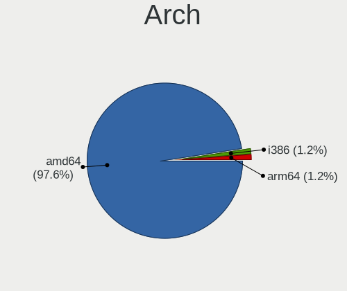
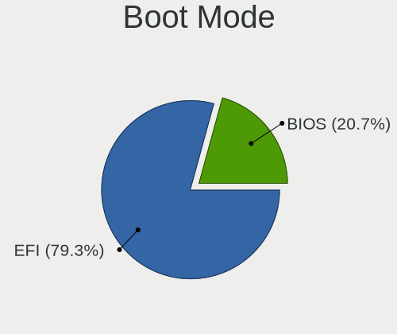
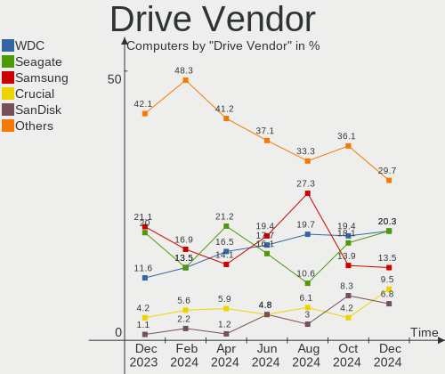
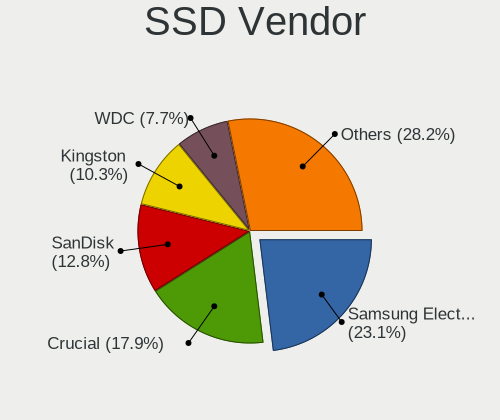
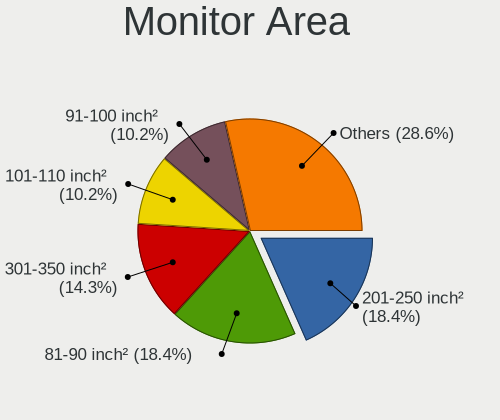
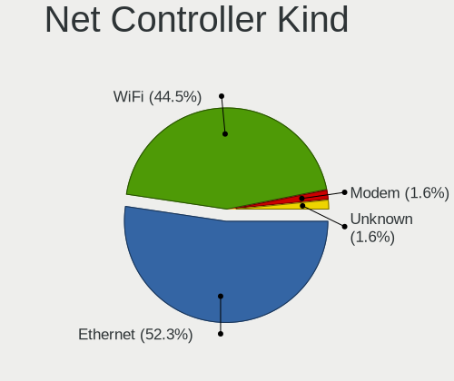

FreeBSD - Hardware Trends
-------------------------

A project to identify most popular hardware characteristics and track their change
over time based on data collected by BSD users at https://BSD-Hardware.info.

Anyone can contribute to this report by the [hw-probe](https://github.com/linuxhw/hw-probe/blob/master/INSTALL.BSD.md) tool:

    hw-probe -all -upload

This is a report for all computer types. See also reports for [desktops](/Dist/FreeBSD/Desktop/README.md) and [notebooks](/Dist/FreeBSD/Notebook/README.md).

This report is for one last month. Overall report since the beginning of time: [TestDays](https://github.com/bsdhw/TestDays)

Period: Apr, 2023.

Contents
--------

* [ System ](#system)
  - [ OS                       ](#os)
  - [ OS Family                ](#os-family)
  - [ Arch                     ](#arch)
  - [ DE                       ](#de)
  - [ Display Server           ](#display-server)
  - [ Display Manager          ](#display-manager)
  - [ OS Lang                  ](#os-lang)
  - [ Boot Mode                ](#boot-mode)
  - [ Filesystem               ](#filesystem)
  - [ Part. scheme             ](#part-scheme)

* [ Board ](#board)
  - [ Vendor                   ](#vendor)
  - [ Model                    ](#model)
  - [ Model Family             ](#model-family)
  - [ MFG Year                 ](#mfg-year)
  - [ Form Factor              ](#form-factor)
  - [ Coreboot                 ](#coreboot)
  - [ RAM Size                 ](#ram-size)
  - [ RAM Used                 ](#ram-used)
  - [ Total Drives             ](#total-drives)
  - [ Has CD-ROM               ](#has-cd-rom)
  - [ Has Ethernet             ](#has-ethernet)
  - [ Has WiFi                 ](#has-wifi)
  - [ Has Bluetooth            ](#has-bluetooth)

* [ Location ](#location)
  - [ Country                  ](#country)
  - [ City                     ](#city)

* [ Drives ](#drives)
  - [ Drive Vendor             ](#drive-vendor)
  - [ Drive Model              ](#drive-model)
  - [ HDD Vendor               ](#hdd-vendor)
  - [ SSD Vendor               ](#ssd-vendor)
  - [ Drive Kind               ](#drive-kind)
  - [ Drive Connector          ](#drive-connector)
  - [ Drive Size               ](#drive-size)
  - [ Space Total              ](#space-total)
  - [ Space Used               ](#space-used)
  - [ Malfunc. Drives          ](#malfunc-drives)
  - [ Malfunc. Drive Vendor    ](#malfunc-drive-vendor)
  - [ Malfunc. HDD Vendor      ](#malfunc-hdd-vendor)
  - [ Malfunc. Drive Kind      ](#malfunc-drive-kind)
  - [ Failed Drives            ](#failed-drives)
  - [ Failed Drive Vendor      ](#failed-drive-vendor)
  - [ Drive Status             ](#drive-status)

* [ Storage controller ](#storage-controller)
  - [ Storage Vendor           ](#storage-vendor)
  - [ Storage Model            ](#storage-model)
  - [ Storage Kind             ](#storage-kind)

* [ Processor ](#processor)
  - [ CPU Vendor               ](#cpu-vendor)
  - [ CPU Model                ](#cpu-model)
  - [ CPU Model Family         ](#cpu-model-family)
  - [ CPU Cores                ](#cpu-cores)
  - [ CPU Sockets              ](#cpu-sockets)
  - [ CPU Threads              ](#cpu-threads)
  - [ CPU Microarch            ](#cpu-microarch)

* [ Graphics ](#graphics)
  - [ GPU Vendor               ](#gpu-vendor)
  - [ GPU Model                ](#gpu-model)
  - [ GPU Combo                ](#gpu-combo)
  - [ GPU Driver               ](#gpu-driver)
  - [ GPU Memory               ](#gpu-memory)

* [ Monitor ](#monitor)
  - [ Monitor Vendor           ](#monitor-vendor)
  - [ Monitor Model            ](#monitor-model)
  - [ Monitor Resolution       ](#monitor-resolution)
  - [ Monitor Diagonal         ](#monitor-diagonal)
  - [ Monitor Width            ](#monitor-width)
  - [ Aspect Ratio             ](#aspect-ratio)
  - [ Monitor Area             ](#monitor-area)
  - [ Pixel Density            ](#pixel-density)
  - [ Multiple Monitors        ](#multiple-monitors)

* [ Network ](#network)
  - [ Net Controller Vendor    ](#net-controller-vendor)
  - [ Net Controller Model     ](#net-controller-model)
  - [ Wireless Vendor          ](#wireless-vendor)
  - [ Wireless Model           ](#wireless-model)
  - [ Ethernet Vendor          ](#ethernet-vendor)
  - [ Ethernet Model           ](#ethernet-model)
  - [ Net Controller Kind      ](#net-controller-kind)
  - [ Used Controller          ](#used-controller)
  - [ NICs                     ](#nics)
  - [ IPv6                     ](#ipv6)

* [ Bluetooth ](#bluetooth)
  - [ Bluetooth Vendor         ](#bluetooth-vendor)
  - [ Bluetooth Model          ](#bluetooth-model)

* [ Sound ](#sound)
  - [ Sound Vendor             ](#sound-vendor)
  - [ Sound Model              ](#sound-model)

* [ Memory ](#memory)
  - [ Memory Vendor            ](#memory-vendor)
  - [ Memory Model             ](#memory-model)
  - [ Memory Kind              ](#memory-kind)
  - [ Memory Form Factor       ](#memory-form-factor)
  - [ Memory Size              ](#memory-size)
  - [ Memory Speed             ](#memory-speed)

* [ Printers & scanners ](#printers--scanners)
  - [ Printer Vendor           ](#printer-vendor)
  - [ Printer Model            ](#printer-model)
  - [ Scanner Vendor           ](#scanner-vendor)
  - [ Scanner Model            ](#scanner-model)

* [ Camera ](#camera)
  - [ Camera Vendor            ](#camera-vendor)
  - [ Camera Model             ](#camera-model)

* [ Security ](#security)
  - [ Fingerprint Vendor       ](#fingerprint-vendor)
  - [ Fingerprint Model        ](#fingerprint-model)
  - [ Chipcard Vendor          ](#chipcard-vendor)
  - [ Chipcard Model           ](#chipcard-model)

* [ Unsupported ](#unsupported)
  - [ Unsupported Devices      ](#unsupported-devices)
  - [ Unsupported Device Types ](#unsupported-device-types)

System
------

OS
--

Installed operating systems

| Name                 | Computers | Percent |
|----------------------|-----------|---------|
| FreeBSD 13.2         | 32        | 48.48%  |
| FreeBSD 13.1-p7      | 13        | 19.7%   |
| FreeBSD 14.0-CURRENT | 8         | 12.12%  |
| FreeBSD 13.2-STABLE  | 4         | 6.06%   |
| FreeBSD 13.1         | 3         | 4.55%   |
| FreeBSD 13.2-RC6     | 1         | 1.52%   |
| FreeBSD 13.2-RC5     | 1         | 1.52%   |
| FreeBSD 13.2-RC3     | 1         | 1.52%   |
| FreeBSD 13.1-p5      | 1         | 1.52%   |
| FreeBSD 13.1-p2      | 1         | 1.52%   |
| FreeBSD 12.4-p2      | 1         | 1.52%   |

OS Family
---------

OS without a version

| Name    | Computers | Percent |
|---------|-----------|---------|
| FreeBSD | 66        | 100%    |

Arch
----

OS architecture (x86_64, i586, etc.)

| Name    | Computers | Percent |
|---------|-----------|---------|
| amd64   | 58        | 87.88%  |
| arm64   | 6         | 9.09%   |
| powerpc | 1         | 1.52%   |
| i386    | 1         | 1.52%   |

DE
--

Desktop Environment

| Name    | Computers | Percent |
|---------|-----------|---------|
| Console | 25        | 37.88%  |
| KDE5    | 17        | 25.76%  |
| XFCE    | 11        | 16.67%  |
| GNOME   | 6         | 9.09%   |
| TWM     | 4         | 6.06%   |
| MATE    | 1         | 1.52%   |
| LXQt    | 1         | 1.52%   |
| Fluxbox | 1         | 1.52%   |

Display Server
--------------

X11 or Wayland

| Name    | Computers | Percent |
|---------|-----------|---------|
| X11     | 39        | 59.09%  |
| Console | 26        | 39.39%  |
| Wayland | 1         | 1.52%   |

Display Manager
---------------

SDDM, LightDM, etc.

| Name    | Computers | Percent |
|---------|-----------|---------|
| Console | 35        | 53.03%  |
| SDDM    | 13        | 19.7%   |
| XDM     | 6         | 9.09%   |
| GDM     | 5         | 7.58%   |
| LightDM | 3         | 4.55%   |
| SLiM    | 2         | 3.03%   |
| Ly      | 2         | 3.03%   |

OS Lang
-------

Language

| Lang    | Computers | Percent |
|---------|-----------|---------|
| C       | 39        | 59.09%  |
| en_US   | 9         | 13.64%  |
| ru_RU   | 6         | 9.09%   |
| Unknown | 5         | 7.58%   |
| de_DE   | 2         | 3.03%   |
| zh_CN   | 1         | 1.52%   |
| fr_FR   | 1         | 1.52%   |
| es_ES   | 1         | 1.52%   |
| en_GB   | 1         | 1.52%   |
| en_AU   | 1         | 1.52%   |

Boot Mode
---------

EFI or BIOS

| Mode | Computers | Percent |
|------|-----------|---------|
| EFI  | 51        | 77.27%  |
| BIOS | 15        | 22.73%  |

Filesystem
----------

Type of filesystem

| Type | Computers | Percent |
|------|-----------|---------|
| Zfs  | 47        | 71.21%  |
| Ufs  | 19        | 28.79%  |

Part. scheme
------------

Scheme of partitioning

| Type | Computers | Percent |
|------|-----------|---------|
| GPT  | 62        | 93.94%  |
| MBR  | 4         | 6.06%   |

Board
-----

Vendor
------

Motherboard manufacturer

| Name                    | Computers | Percent |
|-------------------------|-----------|---------|
| Lenovo                  | 12        | 18.18%  |
| ASUSTek Computer        | 10        | 15.15%  |
| Hewlett-Packard         | 8         | 12.12%  |
| Dell                    | 8         | 12.12%  |
| Unknown                 | 7         | 10.61%  |
| MSI                     | 3         | 4.55%   |
| Supermicro              | 2         | 3.03%   |
| Gigabyte Technology     | 2         | 3.03%   |
| ASRock                  | 2         | 3.03%   |
| TUXEDO                  | 1         | 1.52%   |
| Raspberry Pi Foundation | 1         | 1.52%   |
| Intel Client Systems    | 1         | 1.52%   |
| Intel                   | 1         | 1.52%   |
| HMT                     | 1         | 1.52%   |
| GVC                     | 1         | 1.52%   |
| Fujitsu Siemens         | 1         | 1.52%   |
| F-Plus Mobile           | 1         | 1.52%   |
| Chuwi                   | 1         | 1.52%   |
| AZW                     | 1         | 1.52%   |
| ASRockRack              | 1         | 1.52%   |
| AMI                     | 1         | 1.52%   |

Model
-----

Motherboard model

| Name                                       | Computers | Percent |
|--------------------------------------------|-----------|---------|
| Unknown                                    | 9         | 13.64%  |
| Supermicro Super Server                    | 2         | 3.03%   |
| TUXEDO Pulse 15 Gen1                       | 1         | 1.52%   |
| RPi Raspberry Pi                           | 1         | 1.52%   |
| MSI MS-7B89                                | 1         | 1.52%   |
| MSI MS-7996                                | 1         | 1.52%   |
| MSI MS-7817                                | 1         | 1.52%   |
| Lenovo YangTianM6880N                      | 1         | 1.52%   |
| Lenovo ThinkPad X201 3626WNP               | 1         | 1.52%   |
| Lenovo ThinkPad X1 Carbon Gen 9 20XW00FSUS | 1         | 1.52%   |
| Lenovo ThinkPad W520 4270CTO               | 1         | 1.52%   |
| Lenovo ThinkPad T590 20N4001PUS            | 1         | 1.52%   |
| Lenovo ThinkPad T470s W10DG 20JTS0W800     | 1         | 1.52%   |
| Lenovo ThinkPad R61 89208RU                | 1         | 1.52%   |
| Lenovo Legion 5 15ARH05 82B5               | 1         | 1.52%   |
| Lenovo IdeaPad Gaming 3 15IHU6 82K1        | 1         | 1.52%   |
| Lenovo IdeaPad 3 14ITL05 81X7              | 1         | 1.52%   |
| Lenovo G50-30 80G0                         | 1         | 1.52%   |
| Lenovo C455                                | 1         | 1.52%   |
| Intel NUC11PHi7                            | 1         | 1.52%   |
| Intel Client Systems LAPBC510              | 1         | 1.52%   |
| HMT W041-TF-A-45                           | 1         | 1.52%   |
| HP Z820 Workstation                        | 1         | 1.52%   |
| HP Z6 G4 Workstation                       | 1         | 1.52%   |
| HP Z440 Workstation                        | 1         | 1.52%   |
| HP ProLiant DL180 G6                       | 1         | 1.52%   |
| HP OMEN by Laptop 15-dc1xxx                | 1         | 1.52%   |
| HP Laptop 14-dk1xxx                        | 1         | 1.52%   |
| HP EliteBook 8570p                         | 1         | 1.52%   |
| GVC EQUIUM 3200M                           | 1         | 1.52%   |
| Gigabyte GB-BSi3-1115G4                    | 1         | 1.52%   |
| Gigabyte B360M-D2V                         | 1         | 1.52%   |
| Fujitsu Siemens AMILO Li3710               | 1         | 1.52%   |
| F-Plus Mobile FLAPTOP r                    | 1         | 1.52%   |
| Dell Studio XPS 7100                       | 1         | 1.52%   |
| Dell Precision WorkStation T3500           | 1         | 1.52%   |
| Dell Precision 5510                        | 1         | 1.52%   |
| Dell PowerEdge R250                        | 1         | 1.52%   |
| Dell OptiPlex 960                          | 1         | 1.52%   |
| Dell Latitude 7280                         | 1         | 1.52%   |

Model Family
------------

Motherboard model prefix

| Name                          | Computers | Percent |
|-------------------------------|-----------|---------|
| Unknown                       | 9         | 13.64%  |
| Lenovo ThinkPad               | 6         | 9.09%   |
| ASUS PRIME                    | 3         | 4.55%   |
| Supermicro Super              | 2         | 3.03%   |
| Lenovo IdeaPad                | 2         | 3.03%   |
| Dell Precision                | 2         | 3.03%   |
| Dell Inspiron                 | 2         | 3.03%   |
| ASUS ROG                      | 2         | 3.03%   |
| TUXEDO Pulse                  | 1         | 1.52%   |
| RPi Raspberry                 | 1         | 1.52%   |
| MSI MS-7B89                   | 1         | 1.52%   |
| MSI MS-7996                   | 1         | 1.52%   |
| MSI MS-7817                   | 1         | 1.52%   |
| Lenovo YangTianM6880N         | 1         | 1.52%   |
| Lenovo Legion                 | 1         | 1.52%   |
| Lenovo G50-30                 | 1         | 1.52%   |
| Lenovo C455                   | 1         | 1.52%   |
| Intel NUC11PHi7               | 1         | 1.52%   |
| Intel Client Systems LAPBC510 | 1         | 1.52%   |
| HMT W041-TF-A-45              | 1         | 1.52%   |
| HP Z820                       | 1         | 1.52%   |
| HP Z6                         | 1         | 1.52%   |
| HP Z440                       | 1         | 1.52%   |
| HP ProLiant                   | 1         | 1.52%   |
| HP OMEN                       | 1         | 1.52%   |
| HP Laptop                     | 1         | 1.52%   |
| HP EliteBook                  | 1         | 1.52%   |
| GVC EQUIUM                    | 1         | 1.52%   |
| Gigabyte GB-BSi3-1115G4       | 1         | 1.52%   |
| Gigabyte B360M-D2V            | 1         | 1.52%   |
| Fujitsu Siemens AMILO         | 1         | 1.52%   |
| F-Plus Mobile FLAPTOP         | 1         | 1.52%   |
| Dell Studio                   | 1         | 1.52%   |
| Dell PowerEdge                | 1         | 1.52%   |
| Dell OptiPlex                 | 1         | 1.52%   |
| Dell Latitude                 | 1         | 1.52%   |
| AZW SER                       | 1         | 1.52%   |
| ASUS TUF                      | 1         | 1.52%   |
| ASUS Pro                      | 1         | 1.52%   |
| ASUS P8H77-V                  | 1         | 1.52%   |

MFG Year
--------

Motherboard manufacture year

| Year    | Computers | Percent |
|---------|-----------|---------|
| 2021    | 12        | 18.18%  |
| 2022    | 10        | 15.15%  |
| Unknown | 8         | 12.12%  |
| 2020    | 6         | 9.09%   |
| 2019    | 5         | 7.58%   |
| 2014    | 4         | 6.06%   |
| 2017    | 3         | 4.55%   |
| 2013    | 3         | 4.55%   |
| 2010    | 3         | 4.55%   |
| 2018    | 2         | 3.03%   |
| 2012    | 2         | 3.03%   |
| 2009    | 2         | 3.03%   |
| 2023    | 1         | 1.52%   |
| 2016    | 1         | 1.52%   |
| 2015    | 1         | 1.52%   |
| 2011    | 1         | 1.52%   |
| 2008    | 1         | 1.52%   |
| 2007    | 1         | 1.52%   |

Form Factor
-----------

Physical design of the computer

| Name           | Computers | Percent |
|----------------|-----------|---------|
| Desktop        | 31        | 46.97%  |
| Notebook       | 25        | 37.88%  |
| Server         | 5         | 7.58%   |
| Mini pc        | 3         | 4.55%   |
| System on chip | 1         | 1.52%   |
| All in one     | 1         | 1.52%   |

Coreboot
--------

Have coreboot on board

| Used | Computers | Percent |
|------|-----------|---------|
| No   | 66        | 100%    |

RAM Size
--------

Total RAM memory

| Size in GB      | Computers | Percent |
|-----------------|-----------|---------|
| 16.01-24.0      | 17        | 25.76%  |
| 8.01-16.0       | 13        | 19.7%   |
| 32.01-64.0      | 11        | 16.67%  |
| 64.01-256.0     | 9         | 13.64%  |
| 4.01-8.0        | 7         | 10.61%  |
| 3.01-4.0        | 4         | 6.06%   |
| 0.01-0.5        | 2         | 3.03%   |
| More than 256.0 | 1         | 1.52%   |
| 24.01-32.0      | 1         | 1.52%   |
| 2.01-3.0        | 1         | 1.52%   |

RAM Used
--------

Used RAM memory

| Used GB  | Computers | Percent |
|----------|-----------|---------|
| 0.51-1.0 | 23        | 34.85%  |
| 0.01-0.5 | 20        | 30.3%   |
| 1.01-2.0 | 12        | 18.18%  |
| 2.01-3.0 | 5         | 7.58%   |
| 4.01-8.0 | 3         | 4.55%   |
| 0        | 2         | 3.03%   |
| 3.01-4.0 | 1         | 1.52%   |

Total Drives
------------

Number of drives on board

| Drives | Computers | Percent |
|--------|-----------|---------|
| 1      | 26        | 39.39%  |
| 2      | 18        | 27.27%  |
| 0      | 8         | 12.12%  |
| 3      | 7         | 10.61%  |
| 4      | 2         | 3.03%   |
| 13     | 1         | 1.52%   |
| 12     | 1         | 1.52%   |
| 8      | 1         | 1.52%   |
| 6      | 1         | 1.52%   |
| 5      | 1         | 1.52%   |

Has CD-ROM
----------

Has CD-ROM on board

| Presented | Computers | Percent |
|-----------|-----------|---------|
| No        | 46        | 69.7%   |
| Yes       | 20        | 30.3%   |

Has Ethernet
------------

Has Ethernet on board

| Presented | Computers | Percent |
|-----------|-----------|---------|
| Yes       | 57        | 86.36%  |
| No        | 9         | 13.64%  |

Has WiFi
--------

Has WiFi module

| Presented | Computers | Percent |
|-----------|-----------|---------|
| Yes       | 36        | 54.55%  |
| No        | 30        | 45.45%  |

Has Bluetooth
-------------

Has Bluetooth module

| Presented | Computers | Percent |
|-----------|-----------|---------|
| No        | 36        | 54.55%  |
| Yes       | 30        | 45.45%  |

Location
--------

Country
-------

Geographic location (country)

| Country     | Computers | Percent |
|-------------|-----------|---------|
| USA         | 18        | 27.27%  |
| Russia      | 15        | 22.73%  |
| Germany     | 5         | 7.58%   |
| China       | 4         | 6.06%   |
| UK          | 3         | 4.55%   |
| Spain       | 3         | 4.55%   |
| Poland      | 3         | 4.55%   |
| Romania     | 2         | 3.03%   |
| France      | 2         | 3.03%   |
| Canada      | 2         | 3.03%   |
| Thailand    | 1         | 1.52%   |
| Sweden      | 1         | 1.52%   |
| Sri Lanka   | 1         | 1.52%   |
| Netherlands | 1         | 1.52%   |
| Japan       | 1         | 1.52%   |
| Iraq        | 1         | 1.52%   |
| Indonesia   | 1         | 1.52%   |
| Finland     | 1         | 1.52%   |
| Australia   | 1         | 1.52%   |

City
----

Geographic location (city)

| City                   | Computers | Percent |
|------------------------|-----------|---------|
| Krasnodar              | 5         | 7.58%   |
| Moscow                 | 4         | 6.06%   |
| Los Angeles            | 3         | 4.55%   |
| Shoreham-by-Sea        | 2         | 3.03%   |
| Salem                  | 2         | 3.03%   |
| Redmond                | 2         | 3.03%   |
| Ludwigsburg            | 2         | 3.03%   |
| Aachen                 | 2         | 3.03%   |
| Yekaterinburg          | 1         | 1.52%   |
| Xi'an                  | 1         | 1.52%   |
| Wenatchee              | 1         | 1.52%   |
| Vancouver              | 1         | 1.52%   |
| Valladolid             | 1         | 1.52%   |
| Toronto                | 1         | 1.52%   |
| Terrassa               | 1         | 1.52%   |
| Sydney                 | 1         | 1.52%   |
| St Petersburg          | 1         | 1.52%   |
| Sidoarjo               | 1         | 1.52%   |
| Saratov                | 1         | 1.52%   |
| Santa Cruz de Tenerife | 1         | 1.52%   |
| Richardson             | 1         | 1.52%   |
| Queens                 | 1         | 1.52%   |
| Palo Alto              | 1         | 1.52%   |
| Ozersk                 | 1         | 1.52%   |
| Orem                   | 1         | 1.52%   |
| Mosul                  | 1         | 1.52%   |
| Miercurea-Ciuc         | 1         | 1.52%   |
| Marseille              | 1         | 1.52%   |
| Malmo                  | 1         | 1.52%   |
| London                 | 1         | 1.52%   |
| Lodz                   | 1         | 1.52%   |
| Linyi                  | 1         | 1.52%   |
| Lexington              | 1         | 1.52%   |
| Lewiston               | 1         | 1.52%   |
| Lahti                  | 1         | 1.52%   |
| Kaliningrad            | 1         | 1.52%   |
| Kaatsheuvel            | 1         | 1.52%   |
| Ichikawa               | 1         | 1.52%   |
| Hull                   | 1         | 1.52%   |
| Grudziądz             | 1         | 1.52%   |

Drives
------

Drive Vendor
------------

Hard drive vendors

| Vendor              | Computers | Drives | Percent |
|---------------------|-----------|--------|---------|
| WDC                 | 21        | 39     | 22.58%  |
| Samsung Electronics | 16        | 22     | 17.2%   |
| Seagate             | 12        | 26     | 12.9%   |
| Crucial             | 8         | 10     | 8.6%    |
| Intel               | 4         | 6      | 4.3%    |
| Toshiba             | 3         | 4      | 3.23%   |
| Kingston            | 3         | 3      | 3.23%   |
| HGST                | 2         | 3      | 2.15%   |
| FORESEE             | 2         | 2      | 2.15%   |
| A-DATA Technology   | 2         | 2      | 2.15%   |
| UMIS                | 1         | 1      | 1.08%   |
| Transcend           | 1         | 1      | 1.08%   |
| Topmore             | 1         | 1      | 1.08%   |
| Team                | 1         | 1      | 1.08%   |
| SanDisk             | 1         | 1      | 1.08%   |
| PNY                 | 1         | 1      | 1.08%   |
| Patriot             | 1         | 1      | 1.08%   |
| ORICO               | 1         | 1      | 1.08%   |
| Netac               | 1         | 1      | 1.08%   |
| Mushkin             | 1         | 1      | 1.08%   |
| MSI                 | 1         | 1      | 1.08%   |
| Micron Technology   | 1         | 1      | 1.08%   |
| KIOXIA              | 1         | 1      | 1.08%   |
| Hitachi             | 1         | 1      | 1.08%   |
| Hikvision           | 1         | 1      | 1.08%   |
| Hewlett-Packard     | 1         | 2      | 1.08%   |
| GOODRAM             | 1         | 1      | 1.08%   |
| Gigabyte Technology | 1         | 1      | 1.08%   |
| Corsair             | 1         | 1      | 1.08%   |
| Apacer              | 1         | 1      | 1.08%   |

Drive Model
-----------

Hard drive models

| Model                                | Computers | Percent |
|--------------------------------------|-----------|---------|
| WDC WDS500G2B0A-00SM50 500GB         | 2         | 1.8%    |
| WDC WDS100T3X0C-00SJG0 1TB           | 2         | 1.8%    |
| WDC WDS100T1X0E-00AFY0 1TB           | 2         | 1.8%    |
| WDC WD80EFAX-68LHPN0 8TB             | 2         | 1.8%    |
| Seagate ST4000DM000-1F2168 4TB       | 2         | 1.8%    |
| Samsung SSD 870 EVO 500GB            | 2         | 1.8%    |
| Kingston SA400S37480G 480GB          | 2         | 1.8%    |
| Intel SSDSC2BB120G4 120GB            | 2         | 1.8%    |
| FORESEE XP1000F001T 1TB              | 2         | 1.8%    |
| Crucial CT1000MX500SSD1 1TB          | 2         | 1.8%    |
| WDC WDS500G1B0A-00H9H0 500GB         | 1         | 0.9%    |
| WDC WDS100T2B0C-00PXH0 1TB           | 1         | 0.9%    |
| WDC WD80EMAZ-00WJTA0 8TB             | 1         | 0.9%    |
| WDC WD80EFZX-68UW8N0 8TB             | 1         | 0.9%    |
| WDC WD80EDBZ-11B0ZA0 8TB             | 1         | 0.9%    |
| WDC WD80EDAZ-11TA3A0 8TB             | 1         | 0.9%    |
| WDC WD80EAZZ-00BKLB0 8TB             | 1         | 0.9%    |
| WDC WD5003ABYZ-011FA0 500GB          | 1         | 0.9%    |
| WDC WD5000BEVT-22ZAT0 500GB          | 1         | 0.9%    |
| WDC WD40PURZ-85TTDY0 4TB             | 1         | 0.9%    |
| WDC WD40EZRZ-22GXCB0 4TB             | 1         | 0.9%    |
| WDC WD20SDZW-11Z3CS0 2TB             | 1         | 0.9%    |
| WDC WD20NMVW-11EDZS2 2TB             | 1         | 0.9%    |
| WDC WD2002FAEX-007BA0 2TB            | 1         | 0.9%    |
| WDC WD1600BEVT-22ZCT0 160GB          | 1         | 0.9%    |
| WDC WD15EADS-00P8B0 1.5TB            | 1         | 0.9%    |
| WDC WD140EDGZ-11B2DA2 14TB           | 1         | 0.9%    |
| WDC WD120EMFZ-11A6JA0 12TB           | 1         | 0.9%    |
| WDC WD120EMAZ-11BLFA0 12TB           | 1         | 0.9%    |
| WDC WD10SPZX-08Z10 1TB               | 1         | 0.9%    |
| WDC WD10EZRZ-00HTKB0 1TB             | 1         | 0.9%    |
| WDC WD10EZEX-60M2NA0 1TB             | 1         | 0.9%    |
| WDC WD10EZEX-08WN4A0 1TB             | 1         | 0.9%    |
| WDC PC SN730 SDBQNTY-256G-1001 256GB | 1         | 0.9%    |
| WDC PC SN530 SDBPMPZ-256G-1101 256GB | 1         | 0.9%    |
| UMIS RPJTJ256MEE1OWX 256GB           | 1         | 0.9%    |
| Transcend TS120GSSD220S 120GB        | 1         | 0.9%    |
| Toshiba KXG6AZNV1T02 1TB             | 1         | 0.9%    |
| Toshiba HDWD120 2TB                  | 1         | 0.9%    |
| Toshiba HDWD110 1TB                  | 1         | 0.9%    |

HDD Vendor
----------

Hard disk drive vendors

| Vendor  | Computers | Drives | Percent |
|---------|-----------|--------|---------|
| WDC     | 14        | 29     | 45.16%  |
| Seagate | 12        | 25     | 38.71%  |
| Toshiba | 2         | 3      | 6.45%   |
| HGST    | 2         | 3      | 6.45%   |
| Hitachi | 1         | 1      | 3.23%   |

SSD Vendor
----------

Solid state drive vendors

| Vendor              | Computers | Drives | Percent |
|---------------------|-----------|--------|---------|
| Samsung Electronics | 9         | 13     | 25.71%  |
| Intel               | 4         | 6      | 11.43%  |
| Crucial             | 4         | 4      | 11.43%  |
| WDC                 | 3         | 3      | 8.57%   |
| Kingston            | 3         | 3      | 8.57%   |
| Transcend           | 1         | 1      | 2.86%   |
| PNY                 | 1         | 1      | 2.86%   |
| Patriot             | 1         | 1      | 2.86%   |
| ORICO               | 1         | 1      | 2.86%   |
| Netac               | 1         | 1      | 2.86%   |
| Mushkin             | 1         | 1      | 2.86%   |
| MSI                 | 1         | 1      | 2.86%   |
| Hikvision           | 1         | 1      | 2.86%   |
| Hewlett-Packard     | 1         | 2      | 2.86%   |
| GOODRAM             | 1         | 1      | 2.86%   |
| Apacer              | 1         | 1      | 2.86%   |
| A-DATA Technology   | 1         | 1      | 2.86%   |

Drive Kind
----------

HDD or SSD

| Kind | Computers | Drives | Percent |
|------|-----------|--------|---------|
| SSD  | 30        | 42     | 36.59%  |
| NVMe | 29        | 35     | 35.37%  |
| HDD  | 23        | 61     | 28.05%  |

Drive Connector
---------------

SATA, SAS, NVMe, etc.

| Type | Computers | Drives | Percent |
|------|-----------|--------|---------|
| SATA | 41        | 103    | 58.57%  |
| NVMe | 29        | 35     | 41.43%  |

Drive Size
----------

Size of hard drive

| Size in TB | Computers | Drives | Percent |
|------------|-----------|--------|---------|
| 0.01-0.5   | 28        | 38     | 45.9%   |
| 0.51-1.0   | 11        | 14     | 18.03%  |
| 1.01-2.0   | 8         | 15     | 13.11%  |
| 3.01-4.0   | 5         | 8      | 8.2%    |
| 4.01-10.0  | 4         | 13     | 6.56%   |
| 10.01-20.0 | 3         | 13     | 4.92%   |
| 2.01-3.0   | 2         | 2      | 3.28%   |

Space Total
-----------

Amount of disk space available on the file system

| Size in GB     | Computers | Percent |
|----------------|-----------|---------|
| 101-250        | 17        | 25.76%  |
| 251-500        | 15        | 22.73%  |
| 501-1000       | 13        | 19.7%   |
| 21-50          | 5         | 7.58%   |
| 1-20           | 4         | 6.06%   |
| 51-100         | 4         | 6.06%   |
| 1001-2000      | 3         | 4.55%   |
| More than 3000 | 2         | 3.03%   |
| 2001-3000      | 2         | 3.03%   |
| Unknown        | 1         | 1.52%   |

Space Used
----------

Amount of used disk space

| Used GB        | Computers | Percent |
|----------------|-----------|---------|
| 1-20           | 53        | 80.3%   |
| 21-50          | 4         | 6.06%   |
| 51-100         | 3         | 4.55%   |
| 251-500        | 2         | 3.03%   |
| More than 3000 | 1         | 1.52%   |
| 101-250        | 1         | 1.52%   |
| 501-1000       | 1         | 1.52%   |
| Unknown        | 1         | 1.52%   |

Malfunc. Drives
---------------

Drive models with a malfunction

| Model                                        | Computers | Drives | Percent |
|----------------------------------------------|-----------|--------|---------|
| WDC WD80EDAZ-11TA3A0 8TB                     | 1         | 1      | 16.67%  |
| WDC WD10EZRZ-00HTKB0 1TB                     | 1         | 1      | 16.67%  |
| Samsung Electronics MZNLH128HBHQ-000H1 128GB | 1         | 1      | 16.67%  |
| Intel SSDSC2BW480A4 480GB                    | 1         | 1      | 16.67%  |
| Hitachi HTS421260H9AT00 64GB                 | 1         | 1      | 16.67%  |
| HGST HTS721010A9E630 1TB                     | 1         | 1      | 16.67%  |

Malfunc. Drive Vendor
---------------------

Vendors of faulty drives

| Vendor              | Computers | Drives | Percent |
|---------------------|-----------|--------|---------|
| WDC                 | 2         | 2      | 33.33%  |
| Samsung Electronics | 1         | 1      | 16.67%  |
| Intel               | 1         | 1      | 16.67%  |
| Hitachi             | 1         | 1      | 16.67%  |
| HGST                | 1         | 1      | 16.67%  |

Malfunc. HDD Vendor
-------------------

Vendors of faulty HDD drives

| Vendor  | Computers | Drives | Percent |
|---------|-----------|--------|---------|
| WDC     | 2         | 2      | 50%     |
| Hitachi | 1         | 1      | 25%     |
| HGST    | 1         | 1      | 25%     |

Malfunc. Drive Kind
-------------------

Kinds of faulty drives

| Kind | Computers | Drives | Percent |
|------|-----------|--------|---------|
| HDD  | 4         | 4      | 66.67%  |
| SSD  | 2         | 2      | 33.33%  |

Failed Drives
-------------

Failed drive models

Zero info for selected period =(

Failed Drive Vendor
-------------------

Failed drive vendors

Zero info for selected period =(

Drive Status
------------

Number of failed and malfunc. drives

| Status   | Computers | Drives | Percent |
|----------|-----------|--------|---------|
| Works    | 54        | 130    | 88.52%  |
| Malfunc  | 6         | 6      | 9.84%   |
| Detected | 1         | 2      | 1.64%   |

Storage controller
------------------

Storage Vendor
--------------

Storage controller vendors

| Vendor                       | Computers | Percent |
|------------------------------|-----------|---------|
| Intel                        | 34        | 36.96%  |
| AMD                          | 16        | 17.39%  |
| Samsung Electronics          | 9         | 9.78%   |
| SanDisk                      | 7         | 7.61%   |
| Micron/Crucial Technology    | 4         | 4.35%   |
| Phison Electronics           | 3         | 3.26%   |
| Broadcom / LSI               | 3         | 3.26%   |
| Toshiba                      | 2         | 2.17%   |
| Silicon Motion               | 2         | 2.17%   |
| Shenzhen Longsys Electronics | 2         | 2.17%   |
| Marvell Technology Group     | 2         | 2.17%   |
| INNOGRIT                     | 2         | 2.17%   |
| Union Memory (Shenzhen)      | 1         | 1.09%   |
| Seagate Technology           | 1         | 1.09%   |
| Realtek Semiconductor        | 1         | 1.09%   |
| Micron Technology            | 1         | 1.09%   |
| Hewlett-Packard              | 1         | 1.09%   |
| ADATA Technology             | 1         | 1.09%   |

Storage Model
-------------

Storage controller models

| Model                                                                          | Computers | Percent |
|--------------------------------------------------------------------------------|-----------|---------|
| AMD FCH SATA Controller [AHCI mode]                                            | 12        | 11.65%  |
| Unknown                                                                        | 5         | 4.85%   |
| Samsung NVMe SSD Controller PM9A1/PM9A3/980PRO                                 | 4         | 3.88%   |
| Samsung NVMe SSD Controller SM961/PM961/SM963                                  | 3         | 2.91%   |
| Micron/Crucial P2 NVMe PCIe SSD                                                | 3         | 2.91%   |
| Toshiba XG6 NVMe SSD Controller                                                | 2         | 1.94%   |
| Silicon Motion SM2263EN/SM2263XT SSD Controller                                | 2         | 1.94%   |
| SanDisk WD PC SN810 / Black SN850 NVMe SSD                                     | 2         | 1.94%   |
| SanDisk WD Blue SN550 NVMe SSD                                                 | 2         | 1.94%   |
| SanDisk WD Black SN750 / PC SN730 NVMe SSD                                     | 2         | 1.94%   |
| Phison PS5013 E13 NVMe Controller                                              | 2         | 1.94%   |
| Intel Volume Management Device NVMe RAID Controller                            | 2         | 1.94%   |
| Intel Tiger Lake-LP SATA Controller                                            | 2         | 1.94%   |
| Intel Q170/Q150/B150/H170/H110/Z170/CM236 Chipset SATA Controller [AHCI Mode]  | 2         | 1.94%   |
| Intel Atom Processor E3800 Series SATA AHCI Controller                         | 2         | 1.94%   |
| Intel 82801JI (ICH10 Family) SATA AHCI Controller                              | 2         | 1.94%   |
| Intel 82801 Mobile SATA Controller [RAID mode]                                 | 2         | 1.94%   |
| Intel 8 Series/C220 Series Chipset Family 6-port SATA Controller 1 [AHCI mode] | 2         | 1.94%   |
| Intel 500 Series Chipset Family SATA AHCI Controller                           | 2         | 1.94%   |
| AMD 400 Series Chipset SATA Controller                                         | 2         | 1.94%   |
| Seagate FireCuda 530 SSD                                                       | 1         | 0.97%   |
| SanDisk WD Black 2018/SN750 / PC SN720 NVMe SSD                                | 1         | 0.97%   |
| SanDisk NVMe Controller                                                        | 1         | 0.97%   |
| Samsung NVMe SSD Controller SM981/PM981/PM983                                  | 1         | 0.97%   |
| Samsung NVMe SSD Controller 980                                                | 1         | 0.97%   |
| Realtek NVMe Controller                                                        | 1         | 0.97%   |
| Phison E16 PCIe4 NVMe Controller                                               | 1         | 0.97%   |
| Micron/Crucial P5 Plus NVMe PCIe SSD                                           | 1         | 0.97%   |
| Micron NVMe Controller                                                         | 1         | 0.97%   |
| Marvell Group 88SE9215 PCIe 2.0 x1 4-port SATA 6 Gb/s Controller               | 1         | 0.97%   |
| Marvell Group 88SE6111/6121 SATA II / PATA Controller                          | 1         | 0.97%   |
| Intel Sunrise Point-LP SATA Controller [AHCI mode]                             | 1         | 0.97%   |
| Intel SATA Controller [RAID mode]                                              | 1         | 0.97%   |
| Intel product 54d3                                                             | 1         | 0.97%   |
| Intel NM10/ICH7 Family SATA Controller [IDE mode]                              | 1         | 0.97%   |
| Intel Celeron/Pentium Silver Processor SATA Controller                         | 1         | 0.97%   |
| Intel Cannon Lake PCH SATA AHCI Controller                                     | 1         | 0.97%   |
| Intel C610/X99 series chipset sSATA Controller [RAID mode]                     | 1         | 0.97%   |
| Intel C610/X99 series chipset sSATA Controller [AHCI mode]                     | 1         | 0.97%   |
| Intel C610/X99 series chipset 6-Port SATA Controller [AHCI mode]               | 1         | 0.97%   |

Storage Kind
------------

Kind of storage controller (IDE, SATA, NVMe, SAS, ...)

| Kind | Computers | Percent |
|------|-----------|---------|
| SATA | 40        | 43.48%  |
| NVMe | 33        | 35.87%  |
| RAID | 8         | 8.7%    |
| IDE  | 8         | 8.7%    |
| SAS  | 3         | 3.26%   |

Processor
---------

CPU Vendor
----------

Processor vendors

| Vendor  | Computers | Percent |
|---------|-----------|---------|
| Intel   | 40        | 60.61%  |
| AMD     | 19        | 28.79%  |
| ARM     | 6         | 9.09%   |
| Unknown | 1         | 1.52%   |

CPU Model
---------

Processor models

| Model                                   | Computers | Percent |
|-----------------------------------------|-----------|---------|
| ARM Cortex-A55 r2p0                     | 4         | 6.06%   |
| Intel 11th Gen Core i7-1165G7 @ 2.80GHz | 2         | 3.03%   |
| AMD Ryzen 9 3900X 12-Core Processor     | 2         | 3.03%   |
| AMD Ryzen 7 4800H with Radeon Graphics  | 2         | 3.03%   |
| Intel Xeon Gold 6138 CPU @ 2.00GHz      | 1         | 1.52%   |
| Intel Xeon E-2314 CPU @ 2.80GHz         | 1         | 1.52%   |
| Intel Xeon CPU E5620 @ 2.40GHz          | 1         | 1.52%   |
| Intel Xeon CPU E5-2695 v2 @ 2.40GHz     | 1         | 1.52%   |
| Intel Xeon CPU E5-2690 v4 @ 2.60GHz     | 1         | 1.52%   |
| Intel Xeon CPU D-1521 @ 2.40GHz         | 1         | 1.52%   |
| Intel Xeon                              | 1         | 1.52%   |
| Intel Pentium II                        | 1         | 1.52%   |
| Intel Pentium CPU G3220 @ 3.00GHz       | 1         | 1.52%   |
| Intel N100                              | 1         | 1.52%   |
| Intel Core i9-10900X CPU @ 3.70GHz      | 1         | 1.52%   |
| Intel Core i7-9750H CPU @ 2.60GHz       | 1         | 1.52%   |
| Intel Core i7-8565U CPU @ 1.80GHz       | 1         | 1.52%   |
| Intel Core i7-7500U CPU @ 2.70GHz       | 1         | 1.52%   |
| Intel Core i7-3520M CPU @ 2.90GHz       | 1         | 1.52%   |
| Intel Core i7-2820QM CPU @ 2.30GHz      | 1         | 1.52%   |
| Intel Core i5-9400F CPU @ 2.90GHz       | 1         | 1.52%   |
| Intel Core i5-7300U CPU @ 2.60GHz       | 1         | 1.52%   |
| Intel Core i5-6500 CPU @ 3.20GHz        | 1         | 1.52%   |
| Intel Core i5-6300U CPU @ 2.40GHz       | 1         | 1.52%   |
| Intel Core i5-6300HQ CPU @ 2.30GHz      | 1         | 1.52%   |
| Intel Core i5-4210U CPU @ 1.70GHz       | 1         | 1.52%   |
| Intel Core i5-3570K CPU @ 3.40GHz       | 1         | 1.52%   |
| Intel Core i5-10300H CPU @ 2.50GHz      | 1         | 1.52%   |
| Intel Core i5 CPU M 560 @ 2.67GHz       | 1         | 1.52%   |
| Intel Core 2 Quad CPU Q6600 @ 2.40GHz   | 1         | 1.52%   |
| Intel Core 2 Duo CPU T7300 @ 2.00GHz    | 1         | 1.52%   |
| Intel Core 2 Duo CPU T6400 @ 2.00GHz    | 1         | 1.52%   |
| Intel Core 2 Duo CPU E7500 @ 2.93GHz    | 1         | 1.52%   |
| Intel Core 2 Duo                        | 1         | 1.52%   |
| Intel Celeron N4020 CPU @ 1.10GHz       | 1         | 1.52%   |
| Intel Celeron CPU N2840 @ 2.16GHz       | 1         | 1.52%   |
| Intel Celeron CPU J1900 @ 1.99GHz       | 1         | 1.52%   |
| Intel Celeron 6305 @ 1.80GHz            | 1         | 1.52%   |
| Intel 11th Gen Core i7-11370H @ 3.30GHz | 1         | 1.52%   |
| Intel 11th Gen Core i5-11400 @ 2.60GHz  | 1         | 1.52%   |

CPU Model Family
----------------

Processor model prefix

| Model             | Computers | Percent |
|-------------------|-----------|---------|
| Intel Core i5     | 9         | 13.64%  |
| Other             | 8         | 12.12%  |
| AMD Ryzen 7       | 7         | 10.61%  |
| Intel Xeon        | 6         | 9.09%   |
| ARM Cortex        | 6         | 9.09%   |
| Intel Core i7     | 5         | 7.58%   |
| Intel Core 2 Duo  | 4         | 6.06%   |
| Intel Celeron     | 4         | 6.06%   |
| AMD Ryzen 9       | 4         | 6.06%   |
| Intel Pentium     | 2         | 3.03%   |
| AMD EPYC          | 2         | 3.03%   |
| AMD Athlon        | 2         | 3.03%   |
| Intel Xeon Gold   | 1         | 1.52%   |
| Intel Core i9     | 1         | 1.52%   |
| Intel Core 2 Quad | 1         | 1.52%   |
| AMD Ryzen 5       | 1         | 1.52%   |
| AMD Ryzen 3       | 1         | 1.52%   |
| AMD Phenom II X6  | 1         | 1.52%   |
| AMD A6            | 1         | 1.52%   |

CPU Cores
---------

Number of processor cores

| Number  | Computers | Percent |
|---------|-----------|---------|
| 4       | 19        | 28.79%  |
| 2       | 15        | 22.73%  |
| 16      | 8         | 12.12%  |
| Unknown | 7         | 10.61%  |
| 6       | 5         | 7.58%   |
| 24      | 3         | 4.55%   |
| 32      | 2         | 3.03%   |
| 1       | 2         | 3.03%   |
| 40      | 1         | 1.52%   |
| 14      | 1         | 1.52%   |
| 12      | 1         | 1.52%   |
| 10      | 1         | 1.52%   |
| 8       | 1         | 1.52%   |

CPU Sockets
-----------

Number of sockets

| Number  | Computers | Percent |
|---------|-----------|---------|
| 1       | 56        | 84.85%  |
| Unknown | 7         | 10.61%  |
| 2       | 3         | 4.55%   |

CPU Threads
-----------

Threads per core (Hyper-Threading)

| Number  | Computers | Percent |
|---------|-----------|---------|
| 1       | 34        | 51.52%  |
| 2       | 23        | 34.85%  |
| Unknown | 9         | 13.64%  |

CPU Microarch
-------------

Microarchitecture

| Name          | Computers | Percent |
|---------------|-----------|---------|
| Unknown       | 12        | 18.18%  |
| TigerLake     | 6         | 9.09%   |
| Zen 3         | 5         | 7.58%   |
| Skylake       | 5         | 7.58%   |
| KabyLake      | 5         | 7.58%   |
| Zen 2         | 4         | 6.06%   |
| Zen+          | 3         | 4.55%   |
| Zen           | 3         | 4.55%   |
| Westmere      | 3         | 4.55%   |
| Penryn        | 3         | 4.55%   |
| IvyBridge     | 3         | 4.55%   |
| Silvermont    | 2         | 3.03%   |
| Haswell       | 2         | 3.03%   |
| Core          | 2         | 3.03%   |
| Broadwell     | 2         | 3.03%   |
| SandyBridge   | 1         | 1.52%   |
| Puma          | 1         | 1.52%   |
| P6            | 1         | 1.52%   |
| K10           | 1         | 1.52%   |
| Goldmont plus | 1         | 1.52%   |
| CometLake     | 1         | 1.52%   |

Graphics
--------

GPU Vendor
----------

Vendors of graphics cards

| Vendor                               | Computers | Percent |
|--------------------------------------|-----------|---------|
| Nvidia                               | 21        | 31.34%  |
| Intel                                | 21        | 31.34%  |
| AMD                                  | 19        | 28.36%  |
| ASPEED Technology                    | 3         | 4.48%   |
| Matrox Electronics Systems           | 2         | 2.99%   |
| NVidia / SGS Thomson (Joint Venture) | 1         | 1.49%   |

GPU Model
---------

Graphics card models

| Model                                                                       | Computers | Percent |
|-----------------------------------------------------------------------------|-----------|---------|
| Intel TigerLake-LP GT2 [Iris Xe Graphics]                                   | 4         | 5.88%   |
| ASPEED Technology ASPEED Graphics Family                                    | 3         | 4.41%   |
| AMD Picasso/Raven 2 [Radeon Vega Series / Radeon Vega Mobile Series]        | 3         | 4.41%   |
| Nvidia GA107M [GeForce RTX 3050 Ti Mobile]                                  | 2         | 2.94%   |
| Intel Tiger Lake-LP GT2 [UHD Graphics G4]                                   | 2         | 2.94%   |
| Intel HD Graphics 620                                                       | 2         | 2.94%   |
| Intel Atom Processor Z36xxx/Z37xxx Series Graphics & Display                | 2         | 2.94%   |
| AMD Cezanne [Radeon Vega Series / Radeon Vega Mobile Series]                | 2         | 2.94%   |
| Nvidia TU117M                                                               | 1         | 1.47%   |
| Nvidia TU117GLM [Quadro T400 Mobile]                                        | 1         | 1.47%   |
| Nvidia TU116M [GeForce GTX 1660 Ti Mobile]                                  | 1         | 1.47%   |
| Nvidia TU106M [GeForce RTX 2070 Mobile / Max-Q Refresh]                     | 1         | 1.47%   |
| Nvidia TU106M [GeForce RTX 2060 Mobile]                                     | 1         | 1.47%   |
| Nvidia GT218 [NVS 300]                                                      | 1         | 1.47%   |
| Nvidia GP108 [GeForce GT 1030]                                              | 1         | 1.47%   |
| Nvidia GP107 [GeForce GTX 1050 Ti]                                          | 1         | 1.47%   |
| Nvidia GP106 [GeForce GTX 1060 6GB]                                         | 1         | 1.47%   |
| Nvidia GP106 [GeForce GTX 1060 3GB]                                         | 1         | 1.47%   |
| Nvidia GM204 [GeForce GTX 970]                                              | 1         | 1.47%   |
| Nvidia GM107GLM [Quadro M1000M]                                             | 1         | 1.47%   |
| Nvidia GM107GL [Quadro K2200]                                               | 1         | 1.47%   |
| Nvidia GK106GL [Quadro K4000]                                               | 1         | 1.47%   |
| Nvidia GF119 [GeForce GT 610]                                               | 1         | 1.47%   |
| Nvidia GF117M [GeForce 610M/710M/810M/820M / GT 620M/625M/630M/720M]        | 1         | 1.47%   |
| Nvidia GF106GLM [Quadro 2000M]                                              | 1         | 1.47%   |
| Nvidia GA106 [RTX A2000]                                                    | 1         | 1.47%   |
| Nvidia G86M [Quadro NVS 140M]                                               | 1         | 1.47%   |
| NVidia / SGS Thomson (Joint Venture) Riva128                                | 1         | 1.47%   |
| Matrox Electronics Systems MGA G200e [Pilot] ServerEngines (SEP1)           | 1         | 1.47%   |
| Matrox Electronics Systems Integrated Matrox G200eW3 Graphics Controller    | 1         | 1.47%   |
| Intel Xeon E3-1200 v3/4th Gen Core Processor Integrated Graphics Controller | 1         | 1.47%   |
| Intel WhiskeyLake-U GT2 [UHD Graphics 620]                                  | 1         | 1.47%   |
| Intel Skylake GT2 [HD Graphics 520]                                         | 1         | 1.47%   |
| Intel RocketLake-S GT1 [UHD Graphics 730]                                   | 1         | 1.47%   |
| Intel Mobile 4 Series Chipset Integrated Graphics Controller                | 1         | 1.47%   |
| Intel HD Graphics 530                                                       | 1         | 1.47%   |
| Intel Haswell-ULT Integrated Graphics Controller                            | 1         | 1.47%   |
| Intel GeminiLake [UHD Graphics 600]                                         | 1         | 1.47%   |
| Intel Core Processor Integrated Graphics Controller                         | 1         | 1.47%   |
| Intel Alder Lake-N [UHD Graphics]                                           | 1         | 1.47%   |

GPU Combo
---------

Combinations of graphics cards

| Name                                     | Computers | Percent |
|------------------------------------------|-----------|---------|
| 1 x AMD                                  | 16        | 24.24%  |
| 1 x Nvidia                               | 15        | 22.73%  |
| 1 x Intel                                | 15        | 22.73%  |
| Other                                    | 6         | 9.09%   |
| Intel + Nvidia                           | 4         | 6.06%   |
| 1 x ASPEED                               | 3         | 4.55%   |
| 1 x Matrox                               | 2         | 3.03%   |
| 2 x Intel                                | 1         | 1.52%   |
| 2 x AMD                                  | 1         | 1.52%   |
| 1 x NVidia / SGS Thomson (Joint Venture) | 1         | 1.52%   |
| Intel + AMD                              | 1         | 1.52%   |
| AMD + Nvidia                             | 1         | 1.52%   |

GPU Driver
----------

Free vs proprietary

| Driver      | Computers | Percent |
|-------------|-----------|---------|
| Free        | 45        | 68.18%  |
| Proprietary | 14        | 21.21%  |
| Unknown     | 7         | 10.61%  |

GPU Memory
----------

Total video memory

| Size in GB | Computers | Percent |
|------------|-----------|---------|
| Unknown    | 41        | 62.12%  |
| 0.01-0.5   | 7         | 10.61%  |
| 3.01-4.0   | 5         | 7.58%   |
| 5.01-6.0   | 4         | 6.06%   |
| 0.51-1.0   | 3         | 4.55%   |
| 7.01-8.0   | 2         | 3.03%   |
| 1.01-2.0   | 2         | 3.03%   |
| 2.01-3.0   | 1         | 1.52%   |
| 8.01-16.0  | 1         | 1.52%   |

Monitor
-------

Monitor Vendor
--------------

Monitor vendors

| Vendor               | Computers | Percent |
|----------------------|-----------|---------|
| Unknown              | 4         | 25%     |
| Samsung Electronics  | 2         | 12.5%   |
| Seiko/Epson          | 1         | 6.25%   |
| Pioneer Electronic   | 1         | 6.25%   |
| LGD                  | 1         | 6.25%   |
| LG Electronics       | 1         | 6.25%   |
| Lenovo Group Limited | 1         | 6.25%   |
| Idek Iiyama          | 1         | 6.25%   |
| HPN                  | 1         | 6.25%   |
| Hewlett-Packard      | 1         | 6.25%   |
| BOE Technology Group | 1         | 6.25%   |
| Acer                 | 1         | 6.25%   |

Monitor Model
-------------

Monitor models

| Model                                             | Computers | Percent |
|---------------------------------------------------|-----------|---------|
| Unknown                                           | 4         | 25%     |
| Seiko/Epson LCD Monitor 1920x1200                 | 1         | 6.25%   |
| Samsung Electronics LCD Monitor S24F350 1920x1080 | 1         | 6.25%   |
| Samsung Electronics LCD Monitor S24C300 1920x1080 | 1         | 6.25%   |
| Pioneer Electronic LCD Monitor SC-1223 1920x1080  | 1         | 6.25%   |
| LGD LCD Monitor 3840x1080                         | 1         | 6.25%   |
| LG Electronics LCD Monitor LG Ultra HD            | 1         | 6.25%   |
| Lenovo Group Limited LCD Monitor 1920x1080        | 1         | 6.25%   |
| Idek Iiyama LCD Monitor PL2473HD 1920x1080        | 1         | 6.25%   |
| HPN LCD Monitor OMEN 25i                          | 1         | 6.25%   |
| Hewlett-Packard LCD Monitor Inc. OMEN 25i         | 1         | 6.25%   |
| BOE Technology Group LCD Monitor 1920x1080        | 1         | 6.25%   |
| Acer LCD Monitor QG241Y 1920x1080                 | 1         | 6.25%   |

Monitor Resolution
------------------

Monitor screen resolution

| Resolution        | Computers | Percent |
|-------------------|-----------|---------|
| 1920x1080 (FHD)   | 8         | 57.14%  |
| Unknown           | 2         | 14.29%  |
| 4480x1440         | 1         | 7.14%   |
| 3840x2160 (4K)    | 1         | 7.14%   |
| 3840x1080         | 1         | 7.14%   |
| 1920x1200 (WUXGA) | 1         | 7.14%   |

Monitor Diagonal
----------------

Diagonal size in inches

| Inches  | Computers | Percent |
|---------|-----------|---------|
| Unknown | 12        | 100%    |

Monitor Width
-------------

Physical width

| Width in mm | Computers | Percent |
|-------------|-----------|---------|
| Unknown     | 12        | 100%    |

Aspect Ratio
------------

Proportional relationship between the width and the height

| Ratio   | Computers | Percent |
|---------|-----------|---------|
| Unknown | 12        | 100%    |

Monitor Area
------------

Area in inch²

| Area in inch² | Computers | Percent |
|----------------|-----------|---------|
| Unknown        | 12        | 100%    |

Pixel Density
-------------

Pixels per inch

| Density | Computers | Percent |
|---------|-----------|---------|
| Unknown | 12        | 100%    |

Multiple Monitors
-----------------

Total monitors connected

| Total | Computers | Percent |
|-------|-----------|---------|
| 1     | 32        | 48.48%  |
| 0     | 30        | 45.45%  |
| 2     | 4         | 6.06%   |

Network
-------

Net Controller Vendor
---------------------

Controller vendors

| Vendor                   | Computers | Percent |
|--------------------------|-----------|---------|
| Intel                    | 44        | 49.44%  |
| Realtek Semiconductor    | 27        | 30.34%  |
| Qualcomm Atheros         | 6         | 6.74%   |
| Broadcom                 | 3         | 3.37%   |
| TP-Link                  | 2         | 2.25%   |
| Marvell Technology Group | 2         | 2.25%   |
| Hewlett-Packard          | 1         | 1.12%   |
| Dell                     | 1         | 1.12%   |
| Aquantia                 | 1         | 1.12%   |
| Apple                    | 1         | 1.12%   |
| American Megatrends      | 1         | 1.12%   |

Net Controller Model
--------------------

Controller models

| Model                                                                   | Computers | Percent |
|-------------------------------------------------------------------------|-----------|---------|
| Realtek RTL8111/8168/8411 PCI Express Gigabit Ethernet Controller       | 14        | 13.21%  |
| Realtek RTL8125 2.5GbE Controller                                       | 7         | 6.6%    |
| Intel Wi-Fi 6 AX201                                                     | 6         | 5.66%   |
| Intel Wi-Fi 6 AX200                                                     | 5         | 4.72%   |
| Intel I211 Gigabit Network Connection                                   | 4         | 3.77%   |
| Realtek RTL810xE PCI Express Fast Ethernet controller                   | 3         | 2.83%   |
| Intel Ethernet Controller I225-V                                        | 3         | 2.83%   |
| Intel 82579LM Gigabit Network Connection (Lewisville)                   | 3         | 2.83%   |
| Realtek RTL8821CE 802.11ac PCIe Wireless Network Adapter                | 2         | 1.89%   |
| Marvell Group 88E8056 PCI-E Gigabit Ethernet Controller                 | 2         | 1.89%   |
| Intel Wireless 8260                                                     | 2         | 1.89%   |
| Intel Wireless 7265                                                     | 2         | 1.89%   |
| Intel Centrino Ultimate-N 6300                                          | 2         | 1.89%   |
| Intel 82574L Gigabit Network Connection                                 | 2         | 1.89%   |
| TP-Link TL-WN722N v2/v3 [Realtek RTL8188EUS]                            | 1         | 0.94%   |
| TP-Link Archer T9UH v1 [Realtek RTL8814AU]                              | 1         | 0.94%   |
| Realtek RTL8188EUS 802.11n Wireless Network Adapter                     | 1         | 0.94%   |
| Realtek Killer E3000 2.5GbE Controller                                  | 1         | 0.94%   |
| Qualcomm Atheros QCA9565 / AR9565 Wireless Network Adapter              | 1         | 0.94%   |
| Qualcomm Atheros AR9485 Wireless Network Adapter                        | 1         | 0.94%   |
| Qualcomm Atheros AR928X Wireless Network Adapter (PCI-Express)          | 1         | 0.94%   |
| Qualcomm Atheros AR9227 Wireless Network Adapter                        | 1         | 0.94%   |
| Qualcomm Atheros AR8161 Gigabit Ethernet                                | 1         | 0.94%   |
| Qualcomm Atheros AR242x / AR542x Wireless Network Adapter (PCI-Express) | 1         | 0.94%   |
| Marvell Group 88E8001 Gigabit Ethernet Controller                       | 1         | 0.94%   |
| Intel Wireless 8265 / 8275                                              | 1         | 0.94%   |
| Intel Wireless 3165                                                     | 1         | 0.94%   |
| Intel Wireless 3160                                                     | 1         | 0.94%   |
| Intel Wi-Fi 6 AX210/AX211/AX411 160MHz                                  | 1         | 0.94%   |
| Intel PRO/Wireless 3945ABG [Golan] Network Connection                   | 1         | 0.94%   |
| Intel I350 Gigabit Network Connection                                   | 1         | 0.94%   |
| Intel Ethernet Controller X550                                          | 1         | 0.94%   |
| Intel Ethernet Controller I225-LM                                       | 1         | 0.94%   |
| Intel Ethernet Connection X722 for 1GbE                                 | 1         | 0.94%   |
| Intel Ethernet Connection X722                                          | 1         | 0.94%   |
| Intel Ethernet Connection X552/X557-AT 10GBASE-T                        | 1         | 0.94%   |
| Intel Ethernet Connection I219-LM                                       | 1         | 0.94%   |
| Intel Ethernet Connection (6) I219-V                                    | 1         | 0.94%   |
| Intel Ethernet Connection (4) I219-LM                                   | 1         | 0.94%   |
| Intel Ethernet Connection (3) I219-LM                                   | 1         | 0.94%   |

Wireless Vendor
---------------

Wireless vendors

| Vendor                | Computers | Percent |
|-----------------------|-----------|---------|
| Intel                 | 27        | 72.97%  |
| Qualcomm Atheros      | 5         | 13.51%  |
| Realtek Semiconductor | 3         | 8.11%   |
| TP-Link               | 2         | 5.41%   |

Wireless Model
--------------

Wireless models

| Model                                                                   | Computers | Percent |
|-------------------------------------------------------------------------|-----------|---------|
| Intel Wi-Fi 6 AX201                                                     | 6         | 16.22%  |
| Intel Wi-Fi 6 AX200                                                     | 5         | 13.51%  |
| Realtek RTL8821CE 802.11ac PCIe Wireless Network Adapter                | 2         | 5.41%   |
| Intel Wireless 8260                                                     | 2         | 5.41%   |
| Intel Wireless 7265                                                     | 2         | 5.41%   |
| Intel Centrino Ultimate-N 6300                                          | 2         | 5.41%   |
| TP-Link TL-WN722N v2/v3 [Realtek RTL8188EUS]                            | 1         | 2.7%    |
| TP-Link Archer T9UH v1 [Realtek RTL8814AU]                              | 1         | 2.7%    |
| Realtek RTL8188EUS 802.11n Wireless Network Adapter                     | 1         | 2.7%    |
| Qualcomm Atheros QCA9565 / AR9565 Wireless Network Adapter              | 1         | 2.7%    |
| Qualcomm Atheros AR9485 Wireless Network Adapter                        | 1         | 2.7%    |
| Qualcomm Atheros AR928X Wireless Network Adapter (PCI-Express)          | 1         | 2.7%    |
| Qualcomm Atheros AR9227 Wireless Network Adapter                        | 1         | 2.7%    |
| Qualcomm Atheros AR242x / AR542x Wireless Network Adapter (PCI-Express) | 1         | 2.7%    |
| Intel Wireless 8265 / 8275                                              | 1         | 2.7%    |
| Intel Wireless 3165                                                     | 1         | 2.7%    |
| Intel Wireless 3160                                                     | 1         | 2.7%    |
| Intel Wi-Fi 6 AX210/AX211/AX411 160MHz                                  | 1         | 2.7%    |
| Intel PRO/Wireless 3945ABG [Golan] Network Connection                   | 1         | 2.7%    |
| Intel Dual Band Wireless-AC 3168NGW [Stone Peak]                        | 1         | 2.7%    |
| Intel Comet Lake PCH CNVi WiFi                                          | 1         | 2.7%    |
| Intel Centrino Advanced-N 6205 [Taylor Peak]                            | 1         | 2.7%    |
| Intel Cannon Point-LP CNVi [Wireless-AC]                                | 1         | 2.7%    |
| Intel Alder Lake-N Wireless-AC                                          | 1         | 2.7%    |

Ethernet Vendor
---------------

Ethernet vendors

| Vendor                   | Computers | Percent |
|--------------------------|-----------|---------|
| Intel                    | 28        | 45.16%  |
| Realtek Semiconductor    | 25        | 40.32%  |
| Broadcom                 | 3         | 4.84%   |
| Marvell Technology Group | 2         | 3.23%   |
| Qualcomm Atheros         | 1         | 1.61%   |
| Aquantia                 | 1         | 1.61%   |
| Apple                    | 1         | 1.61%   |
| American Megatrends      | 1         | 1.61%   |

Ethernet Model
--------------

Ethernet models

| Model                                                             | Computers | Percent |
|-------------------------------------------------------------------|-----------|---------|
| Realtek RTL8111/8168/8411 PCI Express Gigabit Ethernet Controller | 14        | 20.9%   |
| Realtek RTL8125 2.5GbE Controller                                 | 7         | 10.45%  |
| Intel I211 Gigabit Network Connection                             | 4         | 5.97%   |
| Realtek RTL810xE PCI Express Fast Ethernet controller             | 3         | 4.48%   |
| Intel Ethernet Controller I225-V                                  | 3         | 4.48%   |
| Intel 82579LM Gigabit Network Connection (Lewisville)             | 3         | 4.48%   |
| Marvell Group 88E8056 PCI-E Gigabit Ethernet Controller           | 2         | 2.99%   |
| Intel 82574L Gigabit Network Connection                           | 2         | 2.99%   |
| Realtek Killer E3000 2.5GbE Controller                            | 1         | 1.49%   |
| Qualcomm Atheros AR8161 Gigabit Ethernet                          | 1         | 1.49%   |
| Marvell Group 88E8001 Gigabit Ethernet Controller                 | 1         | 1.49%   |
| Intel I350 Gigabit Network Connection                             | 1         | 1.49%   |
| Intel Ethernet Controller X550                                    | 1         | 1.49%   |
| Intel Ethernet Controller I225-LM                                 | 1         | 1.49%   |
| Intel Ethernet Connection X722 for 1GbE                           | 1         | 1.49%   |
| Intel Ethernet Connection X722                                    | 1         | 1.49%   |
| Intel Ethernet Connection X552/X557-AT 10GBASE-T                  | 1         | 1.49%   |
| Intel Ethernet Connection I219-LM                                 | 1         | 1.49%   |
| Intel Ethernet Connection (6) I219-V                              | 1         | 1.49%   |
| Intel Ethernet Connection (4) I219-LM                             | 1         | 1.49%   |
| Intel Ethernet Connection (3) I219-LM                             | 1         | 1.49%   |
| Intel Ethernet Connection (2) I219-V                              | 1         | 1.49%   |
| Intel Ethernet Connection (2) I218-LM                             | 1         | 1.49%   |
| Intel Ethernet Connection (14) I219-V                             | 1         | 1.49%   |
| Intel Ethernet Connection (13) I219-V                             | 1         | 1.49%   |
| Intel 82599ES 10-Gigabit SFI/SFP+ Network Connection              | 1         | 1.49%   |
| Intel 82577LM Gigabit Network Connection                          | 1         | 1.49%   |
| Intel 82576 Gigabit Network Connection                            | 1         | 1.49%   |
| Intel 82572EI Gigabit Ethernet Controller (Copper)                | 1         | 1.49%   |
| Intel 82567LM-3 Gigabit Network Connection                        | 1         | 1.49%   |
| Intel 82566MC Gigabit Network Connection                          | 1         | 1.49%   |
| Broadcom NetXtreme BCM5761 Gigabit Ethernet PCIe                  | 1         | 1.49%   |
| Broadcom NetXtreme BCM5720 Gigabit Ethernet PCIe                  | 1         | 1.49%   |
| Broadcom NetLink BCM57788 Gigabit Ethernet PCIe                   | 1         | 1.49%   |
| Aquantia AQC107 NBase-T/IEEE 802.3bz Ethernet Controller [AQtion] | 1         | 1.49%   |
| Apple UniNorth 2 GMAC (Sun GEM)                                   | 1         | 1.49%   |
| American Megatrends Virtual Ethernet                              | 1         | 1.49%   |

Net Controller Kind
-------------------

Ethernet, WiFi or modem

| Kind     | Computers | Percent |
|----------|-----------|---------|
| Ethernet | 57        | 60%     |
| WiFi     | 36        | 37.89%  |
| Modem    | 1         | 1.05%   |
| Unknown  | 1         | 1.05%   |

Used Controller
---------------

Currently used network controller

| Kind     | Computers | Percent |
|----------|-----------|---------|
| Ethernet | 42        | 70%     |
| WiFi     | 18        | 30%     |

NICs
----

Total network controllers on board

| Total | Computers | Percent |
|-------|-----------|---------|
| 2     | 32        | 48.48%  |
| 1     | 27        | 40.91%  |
| 3     | 4         | 6.06%   |
| 4     | 2         | 3.03%   |
| 0     | 1         | 1.52%   |

IPv6
----

IPv6 vs IPv4

| Used | Computers | Percent |
|------|-----------|---------|
| No   | 57        | 86.36%  |
| Yes  | 9         | 13.64%  |

Bluetooth
---------

Bluetooth Vendor
----------------

Controller vendors

| Vendor                          | Computers | Percent |
|---------------------------------|-----------|---------|
| Intel                           | 22        | 73.33%  |
| Realtek Semiconductor           | 2         | 6.67%   |
| Cambridge Silicon Radio         | 2         | 6.67%   |
| Broadcom                        | 2         | 6.67%   |
| Qualcomm Atheros Communications | 1         | 3.33%   |
| MediaTek                        | 1         | 3.33%   |

Bluetooth Model
---------------

Controller models

| Model                                               | Computers | Percent |
|-----------------------------------------------------|-----------|---------|
| Intel AX201 Bluetooth                               | 7         | 23.33%  |
| Intel Bluetooth wireless interface                  | 6         | 20%     |
| Intel AX200 Bluetooth                               | 5         | 16.67%  |
| Intel Bluetooth 9460/9560 Jefferson Peak (JfP)      | 2         | 6.67%   |
| Cambridge Silicon Radio Bluetooth Dongle (HCI mode) | 2         | 6.67%   |
| Realtek  Bluetooth 4.2 Adapter                      | 1         | 3.33%   |
| Realtek Bluetooth Adapter                           | 1         | 3.33%   |
| Qualcomm Atheros AR9462 Bluetooth                   | 1         | 3.33%   |
| MediaTek Bluetooth Adapter                          | 1         | 3.33%   |
| Intel Wireless-AC 3168 Bluetooth                    | 1         | 3.33%   |
| Intel AX210 Bluetooth                               | 1         | 3.33%   |
| Broadcom BCM20702A0 Bluetooth 4.0                   | 1         | 3.33%   |
| Broadcom BCM2045B (BDC-2) [Bluetooth Controller]    | 1         | 3.33%   |

Sound
-----

Sound Vendor
------------

Sound card vendors

| Vendor                                       | Computers | Percent |
|----------------------------------------------|-----------|---------|
| Intel                                        | 36        | 42.86%  |
| AMD                                          | 21        | 25%     |
| Nvidia                                       | 17        | 20.24%  |
| Tenx Technology                              | 2         | 2.38%   |
| Zoran Co. Personal Media Division (Nogatech) | 1         | 1.19%   |
| Xilinx                                       | 1         | 1.19%   |
| Texas Instruments                            | 1         | 1.19%   |
| Realtek Semiconductor                        | 1         | 1.19%   |
| Logitech                                     | 1         | 1.19%   |
| Generalplus Technology                       | 1         | 1.19%   |
| Ensoniq                                      | 1         | 1.19%   |
| C-Media Electronics                          | 1         | 1.19%   |

Sound Model
-----------

Sound card models

| Model                                                                      | Computers | Percent |
|----------------------------------------------------------------------------|-----------|---------|
| AMD Family 17h/19h HD Audio Controller                                     | 9         | 9.38%   |
| Intel Tiger Lake-LP Smart Sound Technology Audio Controller                | 6         | 6.25%   |
| AMD Starship/Matisse HD Audio Controller                                   | 4         | 4.17%   |
| AMD Renoir Radeon High Definition Audio Controller                         | 4         | 4.17%   |
| Intel Sunrise Point-LP HD Audio                                            | 3         | 3.13%   |
| AMD Raven/Raven2/Fenghuang HDMI/DP Audio Controller                        | 3         | 3.13%   |
| Tenx Technology USB  AUDIO                                                 | 2         | 2.08%   |
| Nvidia TU107 GeForce GTX 1650 High Definition Audio Controller             | 2         | 2.08%   |
| Nvidia TU106 High Definition Audio Controller                              | 2         | 2.08%   |
| Nvidia GP106 High Definition Audio Controller                              | 2         | 2.08%   |
| Intel Cannon Lake PCH cAVS                                                 | 2         | 2.08%   |
| Intel Atom Processor Z36xxx/Z37xxx Series High Definition Audio Controller | 2         | 2.08%   |
| Intel 82801JI (ICH10 Family) HD Audio Controller                           | 2         | 2.08%   |
| Intel 7 Series/C216 Chipset Family High Definition Audio Controller        | 2         | 2.08%   |
| Intel 100 Series/C230 Series Chipset Family HD Audio Controller            | 2         | 2.08%   |
| AMD Rembrandt Radeon High Definition Audio Controller                      | 2         | 2.08%   |
| Zoran Co. Personal Media Division (Nogatech) USB Audio and HID             | 1         | 1.04%   |
| Xilinx RME Hammerfall DSP MADI                                             | 1         | 1.04%   |
| Texas Instruments PCM2902 Audio Codec                                      | 1         | 1.04%   |
| Realtek Semiconductor USB Audio                                            | 1         | 1.04%   |
| Nvidia TU116 High Definition Audio Controller                              | 1         | 1.04%   |
| Nvidia High Definition Audio Controller                                    | 1         | 1.04%   |
| Nvidia GP108 High Definition Audio Controller                              | 1         | 1.04%   |
| Nvidia GP107GL High Definition Audio Controller                            | 1         | 1.04%   |
| Nvidia GM204 High Definition Audio Controller                              | 1         | 1.04%   |
| Nvidia GM107 High Definition Audio Controller [GeForce 940MX]              | 1         | 1.04%   |
| Nvidia GK106 HDMI Audio Controller                                         | 1         | 1.04%   |
| Nvidia GF119 HDMI Audio Controller                                         | 1         | 1.04%   |
| Nvidia GF106 High Definition Audio Controller                              | 1         | 1.04%   |
| Nvidia GA106 High Definition Audio Controller                              | 1         | 1.04%   |
| Logitech [G533 Wireless Headset Dongle]                                    | 1         | 1.04%   |
| Intel Tiger Lake-H HD Audio Controller                                     | 1         | 1.04%   |
| Intel NM10/ICH7 Family High Definition Audio Controller                    | 1         | 1.04%   |
| Intel Lewisburg MROM 0                                                     | 1         | 1.04%   |
| Intel Haswell-ULT HD Audio Controller                                      | 1         | 1.04%   |
| Intel Comet Lake PCH cAVS                                                  | 1         | 1.04%   |
| Intel Celeron/Pentium Silver Processor High Definition Audio               | 1         | 1.04%   |
| Intel Cannon Point-LP High Definition Audio Controller                     | 1         | 1.04%   |
| Intel C610/X99 series chipset HD Audio Controller                          | 1         | 1.04%   |
| Intel C600/X79 series chipset High Definition Audio Controller             | 1         | 1.04%   |

Memory
------

Memory Vendor
-------------

Memory module vendors

| Vendor              | Computers | Percent |
|---------------------|-----------|---------|
| Samsung Electronics | 14        | 22.58%  |
| Kingston            | 8         | 12.9%   |
| Micron Technology   | 6         | 9.68%   |
| Crucial             | 6         | 9.68%   |
| G.Skill             | 5         | 8.06%   |
| SK hynix            | 4         | 6.45%   |
| Corsair             | 4         | 6.45%   |
| Unknown             | 4         | 6.45%   |
| Unknown             | 3         | 4.84%   |
| A-DATA Technology   | 2         | 3.23%   |
| Unknown (ABCD)      | 1         | 1.61%   |
| Ramaxel Technology  | 1         | 1.61%   |
| Patriot             | 1         | 1.61%   |
| Nanya Technology    | 1         | 1.61%   |
| GOODRAM             | 1         | 1.61%   |
| Elpida              | 1         | 1.61%   |

Memory Model
------------

Memory module models

| Model                                                            | Computers | Percent |
|------------------------------------------------------------------|-----------|---------|
| Unknown                                                          | 4         | 6.15%   |
| Samsung RAM M471B1G73QH0-YK0 8GB SODIMM DDR3 1867MT/s            | 2         | 3.08%   |
| Samsung RAM M393A2K40BB2-CTD 16GB DIMM DDR4 2667MT/s             | 2         | 3.08%   |
| Kingston RAM 9965745-002.A00G 16GB DIMM DDR4 3000MT/s            | 2         | 3.08%   |
| Unknown RAM Module 2GB SODIMM DDR2 667MT/s                       | 1         | 1.54%   |
| Unknown RAM Module 2GB DIMM DDR2 800MT/s                         | 1         | 1.54%   |
| Unknown RAM Module 2GB DIMM DDR 800MT/s                          | 1         | 1.54%   |
| Unknown (ABCD) RAM 123456789012345678 4GB SODIMM LPDDR4 2133MT/s | 1         | 1.54%   |
| SK hynix RAM HMT31GR7BFR4C-H9 8GB DIMM DDR3 1333MT/s             | 1         | 1.54%   |
| SK hynix RAM HMA851S6CJR6N-XN 4GB SODIMM DDR4 3200MT/s           | 1         | 1.54%   |
| SK hynix RAM HMA81GS6DJR8N-VK 8GB SODIMM DDR4 2667MT/s           | 1         | 1.54%   |
| SK hynix RAM HMA81GS6AFR8N-UH 8GB SODIMM DDR4 2400MT/s           | 1         | 1.54%   |
| Samsung RAM M471B5273DH0-CK0 8GB SODIMM DDR3 1600MT/s            | 1         | 1.54%   |
| Samsung RAM M471B5273CH0-CH9 4GB SODIMM DDR3 1334MT/s            | 1         | 1.54%   |
| Samsung RAM M471A5244CB0-CWE 4GB SODIMM DDR4 3200MT/s            | 1         | 1.54%   |
| Samsung RAM M471A5244CB0-CRC 4GB SODIMM DDR4 2400MT/s            | 1         | 1.54%   |
| Samsung RAM M471A2K43BB1-CPB 16GB SODIMM DDR4 2133MT/s           | 1         | 1.54%   |
| Samsung RAM M471A1K43DB1-CWE 8GB SODIMM DDR4 3200MT/s            | 1         | 1.54%   |
| Samsung RAM M393B1K70BH1-CH9 8GB DIMM DDR3 1333MT/s              | 1         | 1.54%   |
| Samsung RAM M393A4K40BB2-CTD 32GB DIMM DDR4 2666MT/s             | 1         | 1.54%   |
| Samsung RAM M393A2K40CB1-CRC 16GB DIMM DDR4 2400MT/s             | 1         | 1.54%   |
| Samsung RAM M393A2K40BB1-CRC 16GB DIMM DDR4 2400MT/s             | 1         | 1.54%   |
| Samsung RAM M391A1K43DB2-CWE 8GB DIMM DDR4 3200MT/s              | 1         | 1.54%   |
| Samsung RAM M386AAG40MMB-CVF 128GB DIMM DDR4 2933MT/s            | 1         | 1.54%   |
| Ramaxel RAM RMSA3320MR78HAF-3200 8GB SODIMM DDR4 3200MT/s        | 1         | 1.54%   |
| Patriot RAM 2400 C15 Series 4GB DIMM DDR4 2133MT/s               | 1         | 1.54%   |
| Nanya RAM NT4GC72B4PB0NL-CG 4GB DIMM DDR3 1333MT/s               | 1         | 1.54%   |
| Micron RAM 9JSF51272AZ-1G9E2 4GB DIMM DDR3 1866MT/s              | 1         | 1.54%   |
| Micron RAM 53E1G32D4NQ-046 2GB Row Of Chips LPDDR4 4267MT/s      | 1         | 1.54%   |
| Micron RAM 53E1G32D2NP-046 2GB Row Of Chips LPDDR4 4267MT/s      | 1         | 1.54%   |
| Micron RAM 4ATS1G64HZ-2G6E1 8GB SODIMM DDR4 2667MT/s             | 1         | 1.54%   |
| Micron RAM 4ATF51264HZ-3G2J1 4GB Row Of Chips DDR4 3200MT/s      | 1         | 1.54%   |
| Micron RAM 36JSZF51272PZ1G4G 4GB DIMM DDR3 1333MT/s              | 1         | 1.54%   |
| Kingston RAM Module 8GB SODIMM DDR4 2400MT/s                     | 1         | 1.54%   |
| Kingston RAM Module 32GB DIMM DDR4 3200MT/s                      | 1         | 1.54%   |
| Kingston RAM Module 2GB DIMM DDR2 800MT/s                        | 1         | 1.54%   |
| Kingston RAM KHX1600C9D3/4GX 4GB DIMM DDR3 1600MT/s              | 1         | 1.54%   |
| Kingston RAM 99U5474-028.A00LF 4GB DIMM 1333MT/s                 | 1         | 1.54%   |
| Kingston RAM 9905712-035.A00G 16GB SODIMM DDR4 2667MT/s          | 1         | 1.54%   |
| Kingston RAM 9905403-011.A03LF 2GB DIMM DDR3 1333MT/s            | 1         | 1.54%   |

Memory Kind
-----------

Memory module kinds

| Kind   | Computers | Percent |
|--------|-----------|---------|
| DDR4   | 35        | 61.4%   |
| DDR3   | 12        | 21.05%  |
| DDR2   | 4         | 7.02%   |
| LPDDR4 | 3         | 5.26%   |
| DDR5   | 2         | 3.51%   |
| DDR    | 1         | 1.75%   |

Memory Form Factor
------------------

Physical design of the memory module

| Name         | Computers | Percent |
|--------------|-----------|---------|
| DIMM         | 28        | 48.28%  |
| SODIMM       | 27        | 46.55%  |
| Row Of Chips | 3         | 5.17%   |

Memory Size
-----------

Memory module size

| Size   | Computers | Percent |
|--------|-----------|---------|
| 8192   | 19        | 31.67%  |
| 16384  | 15        | 25%     |
| 4096   | 10        | 16.67%  |
| 2048   | 9         | 15%     |
| 32768  | 6         | 10%     |
| 131072 | 1         | 1.67%   |

Memory Speed
------------

Memory module speed

| Speed | Computers | Percent |
|-------|-----------|---------|
| 3200  | 16        | 27.12%  |
| 2667  | 6         | 10.17%  |
| 2400  | 6         | 10.17%  |
| 1600  | 5         | 8.47%   |
| 1333  | 4         | 6.78%   |
| 2133  | 3         | 5.08%   |
| 800   | 3         | 5.08%   |
| 4800  | 2         | 3.39%   |
| 4267  | 2         | 3.39%   |
| 3000  | 2         | 3.39%   |
| 1867  | 2         | 3.39%   |
| 4000  | 1         | 1.69%   |
| 3600  | 1         | 1.69%   |
| 2933  | 1         | 1.69%   |
| 2666  | 1         | 1.69%   |
| 1866  | 1         | 1.69%   |
| 1334  | 1         | 1.69%   |
| 667   | 1         | 1.69%   |
| 533   | 1         | 1.69%   |

Printers & scanners
-------------------

Printer Vendor
--------------

Printer device vendors

Zero info for selected period =(

Printer Model
-------------

Printer device models

Zero info for selected period =(

Scanner Vendor
--------------

Scanner device vendors

Zero info for selected period =(

Scanner Model
-------------

Scanner device models

Zero info for selected period =(

Camera
------

Camera Vendor
-------------

Camera device vendors

| Vendor                                 | Computers | Percent |
|----------------------------------------|-----------|---------|
| Chicony Electronics                    | 6         | 30%     |
| Microdia                               | 4         | 20%     |
| Sunplus Innovation Technology          | 2         | 10%     |
| Bison Electronics                      | 2         | 10%     |
| Z-Star Microelectronics                | 1         | 5%      |
| USB Camera                             | 1         | 5%      |
| Syntek                                 | 1         | 5%      |
| Luxvisions Innotech Limited            | 1         | 5%      |
| Lite-On Technology                     | 1         | 5%      |
| Cheng Uei Precision Industry (Foxlink) | 1         | 5%      |

Camera Model
------------

Camera device models

| Model                                                   | Computers | Percent |
|---------------------------------------------------------|-----------|---------|
| Microdia Integrated_Webcam_HD                           | 2         | 10%     |
| Chicony Integrated Camera                               | 2         | 10%     |
| Bison Integrated Camera                                 | 2         | 10%     |
| Z-Star Lenovo USB 2.0 UVC Camera                        | 1         | 5%      |
| USB Camera USB Camera                                   | 1         | 5%      |
| Syntek Integrated Camera                                | 1         | 5%      |
| Sunplus Integrated_Webcam_HD                            | 1         | 5%      |
| Sunplus HD WebCam                                       | 1         | 5%      |
| Microdia USB Camera                                     | 1         | 5%      |
| Microdia Lenovo EasyCamera                              | 1         | 5%      |
| Luxvisions Innotech Limited HP Wide Vision HD Camera    | 1         | 5%      |
| Lite-On Realtek DMFT RGB                                | 1         | 5%      |
| Chicony Lenovo Integrated Camera (0.3MP)                | 1         | 5%      |
| Chicony Integrated IR Camera                            | 1         | 5%      |
| Chicony Integrated HP HD Webcam                         | 1         | 5%      |
| Chicony Integrated Camera (1280x720@30)                 | 1         | 5%      |
| Cheng Uei Precision Industry (Foxlink) Realtek DMFT RGB | 1         | 5%      |

Security
--------

Fingerprint Vendor
------------------

Fingerprint sensor vendors

| Vendor            | Computers | Percent |
|-------------------|-----------|---------|
| Upek              | 2         | 50%     |
| Synaptics         | 1         | 25%     |
| FocalTech Systems | 1         | 25%     |

Fingerprint Model
-----------------

Fingerprint sensor models

| Model                                                  | Computers | Percent |
|--------------------------------------------------------|-----------|---------|
| Upek Biometric Touchchip/Touchstrip Fingerprint Sensor | 2         | 50%     |
| Synaptics Prometheus MIS Touch Fingerprint Reader      | 1         | 25%     |
| FocalTech Systems Fingerprint Reader                   | 1         | 25%     |

Chipcard Vendor
---------------

Chipcard module vendors

Zero info for selected period =(

Chipcard Model
--------------

Chipcard module models

Zero info for selected period =(

Unsupported
-----------

Unsupported Devices
-------------------

Total unsupported devices on board

| Total | Computers | Percent |
|-------|-----------|---------|
| 0     | 24        | 36.36%  |
| 1     | 18        | 27.27%  |
| 2     | 15        | 22.73%  |
| 3     | 7         | 10.61%  |
| 4     | 2         | 3.03%   |

Unsupported Device Types
------------------------

Types of unsupported devices

| Type                     | Computers | Percent |
|--------------------------|-----------|---------|
| Communication controller | 30        | 43.48%  |
| Bluetooth                | 14        | 20.29%  |
| Card reader              | 6         | 8.7%    |
| Firewire controller      | 5         | 7.25%   |
| Net/wireless             | 4         | 5.8%    |
| Net/ethernet             | 4         | 5.8%    |
| Fingerprint reader       | 4         | 5.8%    |
| Sound                    | 1         | 1.45%   |
| Network                  | 1         | 1.45%   |

