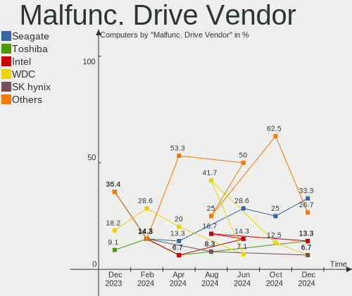
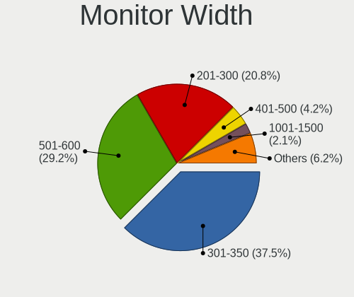

FreeBSD Hardware Trends
-----------------------

A project to identify most popular hardware characteristics and track their change
over time based on data collected by FreeBSD users at https://BSD-Hardware.info.

Anyone can contribute to this report by the [hw-probe](https://github.com/linuxhw/hw-probe/blob/master/INSTALL.BSD.md) tool:

    hw-probe -all -upload

This is a report for all computer types. See also reports for [desktops](/Dist/FreeBSD/Desktop/README.md) and [notebooks](/Dist/FreeBSD/Notebook/README.md).

Full-feature report is available here: https://bsd-hardware.info/?view=trends

Period: Aug, 2021.

Contents
--------

* [ System ](#system)
  - [ OS                       ](#os)
  - [ OS Family                ](#os-family)
  - [ Arch                     ](#arch)
  - [ DE                       ](#de)
  - [ Display Server           ](#display-server)
  - [ Display Manager          ](#display-manager)
  - [ OS Lang                  ](#os-lang)
  - [ Boot Mode                ](#boot-mode)
  - [ Filesystem               ](#filesystem)
  - [ Part. scheme             ](#part-scheme)

* [ Board ](#board)
  - [ Vendor                   ](#vendor)
  - [ Model                    ](#model)
  - [ Model Family             ](#model-family)
  - [ MFG Year                 ](#mfg-year)
  - [ Form Factor              ](#form-factor)
  - [ Coreboot                 ](#coreboot)
  - [ RAM Size                 ](#ram-size)
  - [ RAM Used                 ](#ram-used)
  - [ Total Drives             ](#total-drives)
  - [ Has CD-ROM               ](#has-cd-rom)
  - [ Has Ethernet             ](#has-ethernet)
  - [ Has WiFi                 ](#has-wifi)
  - [ Has Bluetooth            ](#has-bluetooth)

* [ Location ](#location)
  - [ Country                  ](#country)
  - [ City                     ](#city)

* [ Drives ](#drives)
  - [ Drive Vendor             ](#drive-vendor)
  - [ Drive Model              ](#drive-model)
  - [ HDD Vendor               ](#hdd-vendor)
  - [ SSD Vendor               ](#ssd-vendor)
  - [ Drive Kind               ](#drive-kind)
  - [ Drive Connector          ](#drive-connector)
  - [ Drive Size               ](#drive-size)
  - [ Space Total              ](#space-total)
  - [ Space Used               ](#space-used)
  - [ Malfunc. Drives          ](#malfunc-drives)
  - [ Malfunc. Drive Vendor    ](#malfunc-drive-vendor)
  - [ Malfunc. HDD Vendor      ](#malfunc-hdd-vendor)
  - [ Malfunc. Drive Kind      ](#malfunc-drive-kind)
  - [ Failed Drives            ](#failed-drives)
  - [ Failed Drive Vendor      ](#failed-drive-vendor)
  - [ Drive Status             ](#drive-status)

* [ Storage controller ](#storage-controller)
  - [ Storage Vendor           ](#storage-vendor)
  - [ Storage Model            ](#storage-model)
  - [ Storage Kind             ](#storage-kind)

* [ Processor ](#processor)
  - [ CPU Vendor               ](#cpu-vendor)
  - [ CPU Model                ](#cpu-model)
  - [ CPU Model Family         ](#cpu-model-family)
  - [ CPU Cores                ](#cpu-cores)
  - [ CPU Sockets              ](#cpu-sockets)
  - [ CPU Threads              ](#cpu-threads)
  - [ CPU Microarch            ](#cpu-microarch)

* [ Graphics ](#graphics)
  - [ GPU Vendor               ](#gpu-vendor)
  - [ GPU Model                ](#gpu-model)
  - [ GPU Combo                ](#gpu-combo)
  - [ GPU Driver               ](#gpu-driver)
  - [ GPU Memory               ](#gpu-memory)

* [ Monitor ](#monitor)
  - [ Monitor Vendor           ](#monitor-vendor)
  - [ Monitor Model            ](#monitor-model)
  - [ Monitor Resolution       ](#monitor-resolution)
  - [ Monitor Diagonal         ](#monitor-diagonal)
  - [ Monitor Width            ](#monitor-width)
  - [ Aspect Ratio             ](#aspect-ratio)
  - [ Monitor Area             ](#monitor-area)
  - [ Pixel Density            ](#pixel-density)
  - [ Multiple Monitors        ](#multiple-monitors)

* [ Network ](#network)
  - [ Net Controller Vendor    ](#net-controller-vendor)
  - [ Net Controller Model     ](#net-controller-model)
  - [ Wireless Vendor          ](#wireless-vendor)
  - [ Wireless Model           ](#wireless-model)
  - [ Ethernet Vendor          ](#ethernet-vendor)
  - [ Ethernet Model           ](#ethernet-model)
  - [ Net Controller Kind      ](#net-controller-kind)
  - [ Used Controller          ](#used-controller)
  - [ NICs                     ](#nics)
  - [ IPv6                     ](#ipv6)

* [ Bluetooth ](#bluetooth)
  - [ Bluetooth Vendor         ](#bluetooth-vendor)
  - [ Bluetooth Model          ](#bluetooth-model)

* [ Sound ](#sound)
  - [ Sound Vendor             ](#sound-vendor)
  - [ Sound Model              ](#sound-model)

* [ Memory ](#memory)
  - [ Memory Vendor            ](#memory-vendor)
  - [ Memory Model             ](#memory-model)
  - [ Memory Kind              ](#memory-kind)
  - [ Memory Form Factor       ](#memory-form-factor)
  - [ Memory Size              ](#memory-size)
  - [ Memory Speed             ](#memory-speed)

* [ Printers & scanners ](#printers--scanners)
  - [ Printer Vendor           ](#printer-vendor)
  - [ Printer Model            ](#printer-model)
  - [ Scanner Vendor           ](#scanner-vendor)
  - [ Scanner Model            ](#scanner-model)

* [ Camera ](#camera)
  - [ Camera Vendor            ](#camera-vendor)
  - [ Camera Model             ](#camera-model)

* [ Security ](#security)
  - [ Fingerprint Vendor       ](#fingerprint-vendor)
  - [ Fingerprint Model        ](#fingerprint-model)
  - [ Chipcard Vendor          ](#chipcard-vendor)
  - [ Chipcard Model           ](#chipcard-model)

* [ Unsupported ](#unsupported)
  - [ Unsupported Devices      ](#unsupported-devices)
  - [ Unsupported Device Types ](#unsupported-device-types)

System
------

OS
--

Installed operating systems

| Name                 | Computers | Percent |
|----------------------|-----------|---------|
| FreeBSD 13.0-p3      | 20        | 36.36%  |
| FreeBSD 13.0         | 12        | 21.82%  |
| FreeBSD 13.0-p4      | 10        | 18.18%  |
| FreeBSD 14.0-CURRENT | 5         | 9.09%   |
| FreeBSD 13.0-STABLE  | 3         | 5.45%   |
| FreeBSD 13.0-RC4     | 1         | 1.82%   |
| FreeBSD 12.2-STABLE  | 1         | 1.82%   |
| FreeBSD 12.2-p9      | 1         | 1.82%   |
| FreeBSD 12.2-p8      | 1         | 1.82%   |
| FreeBSD 12.2         | 1         | 1.82%   |

OS Family
---------

OS without a version

| Name    | Computers | Percent |
|---------|-----------|---------|
| FreeBSD | 55        | 100%    |

Arch
----

OS architecture (x86_64, i586, etc.)

| Name  | Computers | Percent |
|-------|-----------|---------|
| amd64 | 53        | 96.36%  |
| i386  | 1         | 1.82%   |
| arm64 | 1         | 1.82%   |

DE
--

Desktop Environment

| Name      | Computers | Percent |
|-----------|-----------|---------|
| Console   | 16        | 29.09%  |
| KDE5      | 14        | 25.45%  |
| XFCE      | 9         | 16.36%  |
| TWM       | 5         | 9.09%   |
| GNOME     | 3         | 5.45%   |
| MATE      | 2         | 3.64%   |
| Cinnamon  | 2         | 3.64%   |
| Picom     | 1         | 1.82%   |
| Lumina    | 1         | 1.82%   |
| i3        | 1         | 1.82%   |
| AwesomeWM | 1         | 1.82%   |

Display Server
--------------

X11 or Wayland

| Name    | Computers | Percent |
|---------|-----------|---------|
| X11     | 37        | 67.27%  |
| Console | 18        | 32.73%  |

Display Manager
---------------

SDDM, LightDM, etc.

| Name    | Computers | Percent |
|---------|-----------|---------|
| Console | 28        | 50.91%  |
| SDDM    | 13        | 23.64%  |
| XDM     | 4         | 7.27%   |
| SLiM    | 4         | 7.27%   |
| GDM     | 4         | 7.27%   |
| LightDM | 2         | 3.64%   |

OS Lang
-------

Language

| Lang            | Computers | Percent |
|-----------------|-----------|---------|
| C               | 36        | 65.45%  |
| Unknown         | 5         | 9.09%   |
| en_US           | 2         | 3.64%   |
| en_GB           | 2         | 3.64%   |
| zh_CN           | 1         | 1.82%   |
| ru_RU           | 1         | 1.82%   |
| pt_BR           | 1         | 1.82%   |
| pl_PL           | 1         | 1.82%   |
| it_IT.ISO8859-1 | 1         | 1.82%   |
| fr_FR.US-ASCII  | 1         | 1.82%   |
| fr_FR           | 1         | 1.82%   |
| es_AR           | 1         | 1.82%   |
| de_DE           | 1         | 1.82%   |
| de_CH           | 1         | 1.82%   |

Boot Mode
---------

EFI or BIOS

| Mode | Computers | Percent |
|------|-----------|---------|
| EFI  | 34        | 61.82%  |
| BIOS | 21        | 38.18%  |

Filesystem
----------

Type of filesystem

| Type | Computers | Percent |
|------|-----------|---------|
| Zfs  | 39        | 70.91%  |
| Ufs  | 16        | 29.09%  |

Part. scheme
------------

Scheme of partitioning

| Type    | Computers | Percent |
|---------|-----------|---------|
| GPT     | 51        | 92.73%  |
| MBR     | 3         | 5.45%   |
| Unknown | 1         | 1.82%   |

Board
-----

Vendor
------

Motherboard manufacturer

| Name                   | Computers | Percent |
|------------------------|-----------|---------|
| Lenovo                 | 9         | 16.36%  |
| Dell                   | 9         | 16.36%  |
| ASUSTek Computer       | 7         | 12.73%  |
| ASRock                 | 6         | 10.91%  |
| Hewlett-Packard        | 5         | 9.09%   |
| Gigabyte Technology    | 3         | 5.45%   |
| MSI                    | 2         | 3.64%   |
| Apple                  | 2         | 3.64%   |
| Toshiba                | 1         | 1.82%   |
| Supermicro             | 1         | 1.82%   |
| Samsung Electronics    | 1         | 1.82%   |
| Notebook               | 1         | 1.82%   |
| Medion                 | 1         | 1.82%   |
| Intel                  | 1         | 1.82%   |
| ECS-USA                | 1         | 1.82%   |
| Cisco Systems          | 1         | 1.82%   |
| Biostar                | 1         | 1.82%   |
| BANGHO                 | 1         | 1.82%   |
| Avell High Performance | 1         | 1.82%   |
| Unknown                | 1         | 1.82%   |

Model
-----

Motherboard model

| Name                                   | Computers | Percent |
|----------------------------------------|-----------|---------|
| Dell PowerEdge R720                    | 2         | 3.64%   |
| Unknown                                | 2         | 3.64%   |
| Toshiba Satellite L50-C                | 1         | 1.82%   |
| Supermicro X7SPA-HF                    | 1         | 1.82%   |
| Samsung 300E5M/300E5L                  | 1         | 1.82%   |
| Notebook N7x0WU                        | 1         | 1.82%   |
| MSI MS-7C02                            | 1         | 1.82%   |
| MSI MS-7817                            | 1         | 1.82%   |
| Medion MS-7616                         | 1         | 1.82%   |
| Lenovo ZhaoYang K4e-IML 81VQ           | 1         | 1.82%   |
| Lenovo XiaoXinPro-13ARE 2020 82DM      | 1         | 1.82%   |
| Lenovo ThinkPad X1 Extreme 20MF000BUS  | 1         | 1.82%   |
| Lenovo ThinkPad T61 6459CTO            | 1         | 1.82%   |
| Lenovo ThinkPad P14s Gen 1 20Y1002AFR  | 1         | 1.82%   |
| Lenovo IdeaPad Y700-15ISK 80NV         | 1         | 1.82%   |
| Lenovo IdeaCentre 5 14ARE05 90Q30008US | 1         | 1.82%   |
| Lenovo G505 20240                      | 1         | 1.82%   |
| Intel DG33BU AAD79951-408              | 1         | 1.82%   |
| HP ZBook 17 G2                         | 1         | 1.82%   |
| HP Z620 Workstation                    | 1         | 1.82%   |
| HP Z420 Workstation                    | 1         | 1.82%   |
| HP EliteOne 800 G1 AiO                 | 1         | 1.82%   |
| HP EliteBook 8570p                     | 1         | 1.82%   |
| Gigabyte X570 I AORUS PRO WIFI         | 1         | 1.82%   |
| Gigabyte X470 AORUS GAMING 5 WIFI      | 1         | 1.82%   |
| Gigabyte N3160ND3V                     | 1         | 1.82%   |
| ECS-USA GeForce6100PM-M2               | 1         | 1.82%   |
| Dell Studio XPS 8100                   | 1         | 1.82%   |
| Dell PowerEdge R710                    | 1         | 1.82%   |
| Dell OptiPlex 960                      | 1         | 1.82%   |
| Dell Latitude E7240                    | 1         | 1.82%   |
| Dell Latitude E6540                    | 1         | 1.82%   |
| Dell Inspiron N7010                    | 1         | 1.82%   |
| Dell Inspiron 3442                     | 1         | 1.82%   |
| Cisco Systems UCSC-C240-M3L            | 1         | 1.82%   |
| Biostar TH55B HD                       | 1         | 1.82%   |
| BANGHO MAX G5                          | 1         | 1.82%   |
| Avell High Performance A60 MUV         | 1         | 1.82%   |
| ASUS TUF Gaming FX505DT_FX505DT        | 1         | 1.82%   |
| ASUS ROG STRIX X570-E GAMING           | 1         | 1.82%   |
| ASUS PRIME Z590-P                      | 1         | 1.82%   |
| ASUS PRIME X370-PRO                    | 1         | 1.82%   |
| ASUS P5Q-E                             | 1         | 1.82%   |
| ASUS P5Q                               | 1         | 1.82%   |
| ASUS P4P800-VM                         | 1         | 1.82%   |
| ASRock X570 Phantom Gaming 4           | 1         | 1.82%   |
| ASRock H67M                            | 1         | 1.82%   |
| ASRock B450M-HDV                       | 1         | 1.82%   |
| ASRock B450M Pro4                      | 1         | 1.82%   |
| ASRock 990FX Killer                    | 1         | 1.82%   |
| ASRock 970 Extreme3                    | 1         | 1.82%   |
| Apple MacBookPro8,3                    | 1         | 1.82%   |
| Apple iMac10,1                         | 1         | 1.82%   |

Model Family
------------

Motherboard model prefix

| Name                        | Computers | Percent |
|-----------------------------|-----------|---------|
| Lenovo ThinkPad             | 3         | 5.45%   |
| Dell PowerEdge              | 3         | 5.45%   |
| Dell Latitude               | 2         | 3.64%   |
| Dell Inspiron               | 2         | 3.64%   |
| ASUS PRIME                  | 2         | 3.64%   |
| Unknown                     | 2         | 3.64%   |
| Toshiba Satellite           | 1         | 1.82%   |
| Supermicro X7SPA-HF         | 1         | 1.82%   |
| Samsung 300E5M              | 1         | 1.82%   |
| Notebook N7x0WU             | 1         | 1.82%   |
| MSI MS-7C02                 | 1         | 1.82%   |
| MSI MS-7817                 | 1         | 1.82%   |
| Medion MS-7616              | 1         | 1.82%   |
| Lenovo ZhaoYang             | 1         | 1.82%   |
| Lenovo XiaoXinPro-13ARE     | 1         | 1.82%   |
| Lenovo IdeaPad              | 1         | 1.82%   |
| Lenovo IdeaCentre           | 1         | 1.82%   |
| Lenovo G505                 | 1         | 1.82%   |
| Intel DG33BU                | 1         | 1.82%   |
| HP ZBook                    | 1         | 1.82%   |
| HP Z620                     | 1         | 1.82%   |
| HP Z420                     | 1         | 1.82%   |
| HP EliteOne                 | 1         | 1.82%   |
| HP EliteBook                | 1         | 1.82%   |
| Gigabyte X570               | 1         | 1.82%   |
| Gigabyte X470               | 1         | 1.82%   |
| Gigabyte N3160ND3V          | 1         | 1.82%   |
| ECS-USA GeForce6100PM-M2    | 1         | 1.82%   |
| Dell Studio                 | 1         | 1.82%   |
| Dell OptiPlex               | 1         | 1.82%   |
| Cisco Systems UCSC-C240-M3L | 1         | 1.82%   |
| Biostar TH55B               | 1         | 1.82%   |
| BANGHO MAX                  | 1         | 1.82%   |
| Avell High Performance A60  | 1         | 1.82%   |
| ASUS TUF                    | 1         | 1.82%   |
| ASUS ROG                    | 1         | 1.82%   |
| ASUS P5Q-E                  | 1         | 1.82%   |
| ASUS P5Q                    | 1         | 1.82%   |
| ASUS P4P800-VM              | 1         | 1.82%   |
| ASRock X570                 | 1         | 1.82%   |
| ASRock H67M                 | 1         | 1.82%   |
| ASRock B450M-HDV            | 1         | 1.82%   |
| ASRock B450M                | 1         | 1.82%   |
| ASRock 990FX                | 1         | 1.82%   |
| ASRock 970                  | 1         | 1.82%   |
| Apple MacBookPro8           | 1         | 1.82%   |
| Apple iMac10                | 1         | 1.82%   |

MFG Year
--------

Motherboard manufacture year

| Year    | Computers | Percent |
|---------|-----------|---------|
| 2019    | 13        | 23.64%  |
| 2018    | 6         | 10.91%  |
| 2021    | 5         | 9.09%   |
| 2020    | 5         | 9.09%   |
| 2013    | 5         | 9.09%   |
| 2016    | 4         | 7.27%   |
| 2010    | 4         | 7.27%   |
| 2015    | 3         | 5.45%   |
| 2014    | 2         | 3.64%   |
| 2011    | 2         | 3.64%   |
| 2008    | 2         | 3.64%   |
| 2009    | 1         | 1.82%   |
| 2007    | 1         | 1.82%   |
| 2004    | 1         | 1.82%   |
| Unknown | 1         | 1.82%   |

Form Factor
-----------

Physical design of the computer

| Name           | Computers | Percent |
|----------------|-----------|---------|
| Desktop        | 28        | 50.91%  |
| Notebook       | 21        | 38.18%  |
| Server         | 3         | 5.45%   |
| All in one     | 2         | 3.64%   |
| System on chip | 1         | 1.82%   |

Coreboot
--------

Have coreboot on board

| Used | Computers | Percent |
|------|-----------|---------|
| No   | 55        | 100%    |

RAM Size
--------

Total RAM memory

| Size in GB  | Computers | Percent |
|-------------|-----------|---------|
| 8.01-16.0   | 17        | 30.91%  |
| 16.01-24.0  | 12        | 21.82%  |
| 4.01-8.0    | 11        | 20%     |
| 32.01-64.0  | 8         | 14.55%  |
| 64.01-256.0 | 6         | 10.91%  |
| 1.01-2.0    | 1         | 1.82%   |

RAM Used
--------

Used RAM memory

| Used GB    | Computers | Percent |
|------------|-----------|---------|
| 0.01-0.5   | 21        | 38.18%  |
| 0.51-1.0   | 14        | 25.45%  |
| 1.01-2.0   | 10        | 18.18%  |
| 3.01-4.0   | 5         | 9.09%   |
| 4.01-8.0   | 2         | 3.64%   |
| 32.01-64.0 | 1         | 1.82%   |
| 2.01-3.0   | 1         | 1.82%   |
| 8.01-16.0  | 1         | 1.82%   |

Total Drives
------------

Number of drives on board

| Drives | Computers | Percent |
|--------|-----------|---------|
| 1      | 26        | 47.27%  |
| 2      | 15        | 27.27%  |
| 3      | 7         | 12.73%  |
| 28     | 1         | 1.82%   |
| 13     | 1         | 1.82%   |
| 12     | 1         | 1.82%   |
| 8      | 1         | 1.82%   |
| 6      | 1         | 1.82%   |
| 5      | 1         | 1.82%   |
| 0      | 1         | 1.82%   |

Has CD-ROM
----------

Has CD-ROM on board

| Presented | Computers | Percent |
|-----------|-----------|---------|
| No        | 34        | 61.82%  |
| Yes       | 21        | 38.18%  |

Has Ethernet
------------

Has Ethernet on board

| Presented | Computers | Percent |
|-----------|-----------|---------|
| Yes       | 52        | 94.55%  |
| No        | 3         | 5.45%   |

Has WiFi
--------

Has WiFi module

| Presented | Computers | Percent |
|-----------|-----------|---------|
| Yes       | 32        | 58.18%  |
| No        | 23        | 41.82%  |

Has Bluetooth
-------------

Has Bluetooth module

| Presented | Computers | Percent |
|-----------|-----------|---------|
| No        | 37        | 67.27%  |
| Yes       | 18        | 32.73%  |

Location
--------

Country
-------

Geographic location (country)

| Country     | Computers | Percent |
|-------------|-----------|---------|
| USA         | 16        | 29.09%  |
| UK          | 5         | 9.09%   |
| Brazil      | 5         | 9.09%   |
| Russia      | 4         | 7.27%   |
| Germany     | 3         | 5.45%   |
| France      | 3         | 5.45%   |
| Slovenia    | 2         | 3.64%   |
| India       | 2         | 3.64%   |
| China       | 2         | 3.64%   |
| Argentina   | 2         | 3.64%   |
| Turkey      | 1         | 1.82%   |
| Switzerland | 1         | 1.82%   |
| Serbia      | 1         | 1.82%   |
| Poland      | 1         | 1.82%   |
| Italy       | 1         | 1.82%   |
| Guadeloupe  | 1         | 1.82%   |
| Greece      | 1         | 1.82%   |
| Canada      | 1         | 1.82%   |
| Belgium     | 1         | 1.82%   |
| Bangladesh  | 1         | 1.82%   |
| Australia   | 1         | 1.82%   |

City
----

Geographic location (city)

| City              | Computers | Percent |
|-------------------|-----------|---------|
| Trebnje           | 2         | 3.64%   |
| Salem             | 2         | 3.64%   |
| London            | 2         | 3.64%   |
| Kirkland          | 2         | 3.64%   |
| Brooklyn          | 2         | 3.64%   |
| Barnaul           | 2         | 3.64%   |
| Wuhan             | 1         | 1.82%   |
| Wenatchee         | 1         | 1.82%   |
| Thessaloniki      | 1         | 1.82%   |
| Shanghai          | 1         | 1.82%   |
| Seattle           | 1         | 1.82%   |
| S??o Paulo        | 1         | 1.82%   |
| San Miguel        | 1         | 1.82%   |
| Rostov-on-Don     | 1         | 1.82%   |
| Rio de Janeiro    | 1         | 1.82%   |
| Ringwood          | 1         | 1.82%   |
| Puisieulx         | 1         | 1.82%   |
| Portland          | 1         | 1.82%   |
| Pobiedziska       | 1         | 1.82%   |
| Olin              | 1         | 1.82%   |
| Mumbai            | 1         | 1.82%   |
| Monte Grande      | 1         | 1.82%   |
| Manaus            | 1         | 1.82%   |
| Lexington         | 1         | 1.82%   |
| Le Gosier         | 1         | 1.82%   |
| Laguna Niguel     | 1         | 1.82%   |
| Kamensk-Ural'skiy | 1         | 1.82%   |
| Istanbul          | 1         | 1.82%   |
| Hamburg           | 1         | 1.82%   |
| Guelph            | 1         | 1.82%   |
| Great Yarmouth    | 1         | 1.82%   |
| Glasgow           | 1         | 1.82%   |
| Germantown        | 1         | 1.82%   |
| Gennevilliers     | 1         | 1.82%   |
| Geel              | 1         | 1.82%   |
| Gallarate         | 1         | 1.82%   |
| Fort Lauderdale   | 1         | 1.82%   |
| El Paso           | 1         | 1.82%   |
| Dhaka             | 1         | 1.82%   |
| Crici??ma         | 1         | 1.82%   |
| Coimbra           | 1         | 1.82%   |
| Chicago           | 1         | 1.82%   |
| Chennai           | 1         | 1.82%   |
| Chalon-sur-Sa??ne | 1         | 1.82%   |
| Brighton          | 1         | 1.82%   |
| Berlin            | 1         | 1.82%   |
| Belgrade          | 1         | 1.82%   |
| Basel             | 1         | 1.82%   |
| Augsburg          | 1         | 1.82%   |

Drives
------

Drive Vendor
------------

Hard drive vendors

| Vendor              | Computers | Drives | Percent |
|---------------------|-----------|--------|---------|
| Seagate             | 19        | 40     | 21.35%  |
| WDC                 | 18        | 33     | 20.22%  |
| Samsung Electronics | 13        | 16     | 14.61%  |
| Toshiba             | 7         | 10     | 7.87%   |
| Kingston            | 6         | 6      | 6.74%   |
| Micron Technology   | 5         | 5      | 5.62%   |
| HGST                | 4         | 9      | 4.49%   |
| SanDisk             | 3         | 3      | 3.37%   |
| A-DATA Technology   | 3         | 4      | 3.37%   |
| Hitachi             | 2         | 5      | 2.25%   |
| Transcend           | 1         | 1      | 1.12%   |
| SK Hynix            | 1         | 1      | 1.12%   |
| Phison              | 1         | 1      | 1.12%   |
| LITEON              | 1         | 1      | 1.12%   |
| KingDian            | 1         | 1      | 1.12%   |
| Intel               | 1         | 1      | 1.12%   |
| Hewlett-Packard     | 1         | 12     | 1.12%   |
| Crucial             | 1         | 1      | 1.12%   |
| Corsair             | 1         | 1      | 1.12%   |

Drive Model
-----------

Hard drive models

| Model                                | Computers | Percent |
|--------------------------------------|-----------|---------|
| Samsung SSD 860 EVO 500GB            | 3         | 2.8%    |
| WDC WDS120G2G0A-00JH30 120GB         | 2         | 1.87%   |
| Toshiba MQ01ABF050 500GB             | 2         | 1.87%   |
| Seagate ST8000VN004-2M2101 8TB       | 2         | 1.87%   |
| Seagate ST4000DM000-1F2168 4TB       | 2         | 1.87%   |
| Seagate ST380815AS 80GB              | 2         | 1.87%   |
| Samsung SSD 860 QVO 1TB              | 2         | 1.87%   |
| Samsung SSD 850 EVO 250GB            | 2         | 1.87%   |
| HGST HTS725050A7E630 500GB           | 2         | 1.87%   |
| WDC WDS500G2B0C-00PXH0 500GB         | 1         | 0.93%   |
| WDC WDS200T2B0A-00SM50 2TB           | 1         | 0.93%   |
| WDC WDS120G2G0B-00EPW0 120GB         | 1         | 0.93%   |
| WDC WD80EMAZ-00WJTA0 8TB             | 1         | 0.93%   |
| WDC WD80EFZX-68UW8N0 8TB             | 1         | 0.93%   |
| WDC WD80EFAX-68LHPN0 8TB             | 1         | 0.93%   |
| WDC WD80EDBZ-11B0ZA0 8TB             | 1         | 0.93%   |
| WDC WD800AAJS-60WAA0 80GB            | 1         | 0.93%   |
| WDC WD5000LPVX-22V0TT0 500GB         | 1         | 0.93%   |
| WDC WD5000AAKS-00A7B2 500GB          | 1         | 0.93%   |
| WDC WD40EZRZ-22GXCB0 4TB             | 1         | 0.93%   |
| WDC WD400BB-00JHC0 40GB              | 1         | 0.93%   |
| WDC WD30EFRX-68EUZN0 3TB             | 1         | 0.93%   |
| WDC WD3000JS-63PDB1 304GB            | 1         | 0.93%   |
| WDC WD2500BEVT-08A23T1 250GB         | 1         | 0.93%   |
| WDC WD20EZRX-00D8PB0 2TB             | 1         | 0.93%   |
| WDC WD1600JS-00NCB1 160GB            | 1         | 0.93%   |
| WDC WD120EMFZ-11A6JA0 12TB           | 1         | 0.93%   |
| WDC WD120EMAZ-11BLFA0 12TB           | 1         | 0.93%   |
| WDC WD1003FZEX-00MK2A0 1TB           | 1         | 0.93%   |
| WDC WD1001FALS-00J7B0 1TB            | 1         | 0.93%   |
| WDC WD1001FAES-75W7A0 1TB            | 1         | 0.93%   |
| WDC PC SN730 SDBPNTY-512G-1101 512GB | 1         | 0.93%   |
| WDC PC SN720 SDAQNTW-512G-1001 512GB | 1         | 0.93%   |
| Transcend TS512GSSD370 512GB         | 1         | 0.93%   |
| Toshiba MQ02ABD100H 1TB              | 1         | 0.93%   |
| Toshiba MQ01ABD100V 1TB              | 1         | 0.93%   |
| Toshiba MQ01ABD100 1TB               | 1         | 0.93%   |
| Toshiba MK1234GSX 120GB              | 1         | 0.93%   |
| Toshiba HDWE140 4TB                  | 1         | 0.93%   |
| SK Hynix SH920 mSATA 128GB           | 1         | 0.93%   |
| Seagate ST980313AS 80GB              | 1         | 0.93%   |
| Seagate ST9300605SS 304GB            | 1         | 0.93%   |
| Seagate ST9300603SS 304GB            | 1         | 0.93%   |
| Seagate ST9250827AS 250GB            | 1         | 0.93%   |
| Seagate ST500LT012-9WS142 500GB      | 1         | 0.93%   |
| Seagate ST500LT012-1DG142 500GB      | 1         | 0.93%   |
| Seagate ST500LM012 HN-M500MBB 500GB  | 1         | 0.93%   |
| Seagate ST500LM000-1EJ162-SSHD 500GB | 1         | 0.93%   |
| Seagate ST500DM002-1BD142 500GB      | 1         | 0.93%   |
| Seagate ST4000NE001-2MA101 4TB       | 1         | 0.93%   |
| Seagate ST3500630NS 500GB            | 1         | 0.93%   |
| Seagate ST3500418AS 500GB            | 1         | 0.93%   |
| Seagate ST33000650SS 3TB             | 1         | 0.93%   |
| Seagate ST3160813AS 160GB            | 1         | 0.93%   |
| Seagate ST3120814A 120GB             | 1         | 0.93%   |
| Seagate ST2000LM003 HN-M201RAD 2TB   | 1         | 0.93%   |
| Seagate ST2000DM008-2FR102 2TB       | 1         | 0.93%   |
| Seagate ST1000NM0023 1TB             | 1         | 0.93%   |
| Seagate ST1000LM035-1RK172 1TB       | 1         | 0.93%   |
| Seagate ST1000DM010-2EP102 1TB       | 1         | 0.93%   |

HDD Vendor
----------

Hard disk drive vendors

| Vendor              | Computers | Drives | Percent |
|---------------------|-----------|--------|---------|
| Seagate             | 19        | 40     | 40.43%  |
| WDC                 | 13        | 26     | 27.66%  |
| Toshiba             | 7         | 10     | 14.89%  |
| HGST                | 4         | 9      | 8.51%   |
| Hitachi             | 2         | 5      | 4.26%   |
| Samsung Electronics | 1         | 1      | 2.13%   |
| Hewlett-Packard     | 1         | 12     | 2.13%   |

SSD Vendor
----------

Solid state drive vendors

| Vendor              | Computers | Drives | Percent |
|---------------------|-----------|--------|---------|
| Samsung Electronics | 11        | 13     | 32.35%  |
| Kingston            | 6         | 6      | 17.65%  |
| WDC                 | 3         | 4      | 8.82%   |
| SanDisk             | 3         | 3      | 8.82%   |
| Micron Technology   | 3         | 3      | 8.82%   |
| A-DATA Technology   | 2         | 3      | 5.88%   |
| Transcend           | 1         | 1      | 2.94%   |
| SK Hynix            | 1         | 1      | 2.94%   |
| LITEON              | 1         | 1      | 2.94%   |
| KingDian            | 1         | 1      | 2.94%   |
| Intel               | 1         | 1      | 2.94%   |
| Crucial             | 1         | 1      | 2.94%   |

Drive Kind
----------

HDD or SSD

| Kind | Computers | Drives | Percent |
|------|-----------|--------|---------|
| HDD  | 35        | 103    | 49.3%   |
| SSD  | 26        | 38     | 36.62%  |
| NVMe | 10        | 10     | 14.08%  |

Drive Connector
---------------

SATA, SAS, NVMe, etc.

| Type | Computers | Drives | Percent |
|------|-----------|--------|---------|
| SATA | 48        | 141    | 82.76%  |
| NVMe | 10        | 10     | 17.24%  |

Drive Size
----------

Size of hard drive

| Size in TB | Computers | Drives | Percent |
|------------|-----------|--------|---------|
| 0.01-0.5   | 38        | 64     | 55.07%  |
| 0.51-1.0   | 14        | 18     | 20.29%  |
| 1.01-2.0   | 5         | 13     | 7.25%   |
| 2.01-3.0   | 4         | 23     | 5.8%    |
| 4.01-10.0  | 4         | 12     | 5.8%    |
| 3.01-4.0   | 3         | 9      | 4.35%   |
| 10.01-20.0 | 1         | 2      | 1.45%   |

Space Total
-----------

Amount of disk space available on the file system

| Size in GB | Computers | Percent |
|------------|-----------|---------|
| 101-250    | 22        | 40%     |
| 251-500    | 15        | 27.27%  |
| 501-1000   | 6         | 10.91%  |
| 1001-2000  | 4         | 7.27%   |
| 21-50      | 3         | 5.45%   |
| 2001-3000  | 2         | 3.64%   |
| 1-20       | 2         | 3.64%   |
| 51-100     | 1         | 1.82%   |

Space Used
----------

Amount of used disk space

| Used GB | Computers | Percent |
|---------|-----------|---------|
| 1-20    | 36        | 65.45%  |
| 21-50   | 10        | 18.18%  |
| 251-500 | 3         | 5.45%   |
| 101-250 | 3         | 5.45%   |
| 51-100  | 3         | 5.45%   |

Malfunc. Drives
---------------

Drive models with a malfunction

| Model                               | Computers | Drives | Percent |
|-------------------------------------|-----------|--------|---------|
| HGST HTS725050A7E630 500GB          | 2         | 2      | 10.53%  |
| WDC WDS120G2G0A-00JH30 120GB        | 1         | 1      | 5.26%   |
| WDC WD800AAJS-60WAA0 80GB           | 1         | 1      | 5.26%   |
| WDC WD2500BEVT-08A23T1 250GB        | 1         | 1      | 5.26%   |
| WDC WD1001FAES-75W7A0 1TB           | 1         | 1      | 5.26%   |
| Toshiba MQ02ABD100H 1TB             | 1         | 1      | 5.26%   |
| Toshiba MQ01ABD100 1TB              | 1         | 1      | 5.26%   |
| Toshiba HDWE140 4TB                 | 1         | 4      | 5.26%   |
| Seagate ST9250827AS 250GB           | 1         | 1      | 5.26%   |
| Seagate ST500LT012-9WS142 500GB     | 1         | 1      | 5.26%   |
| Seagate ST500LT012-1DG142 500GB     | 1         | 1      | 5.26%   |
| Seagate ST500LM012 HN-M500MBB 500GB | 1         | 1      | 5.26%   |
| Seagate ST500DM002-1BD142 500GB     | 1         | 1      | 5.26%   |
| Seagate ST3500418AS 500GB           | 1         | 1      | 5.26%   |
| Seagate ST3120814A 120GB            | 1         | 1      | 5.26%   |
| Samsung Electronics HD501LJ 500GB   | 1         | 1      | 5.26%   |
| HGST HTS721010A9E630 1TB            | 1         | 1      | 5.26%   |
| A-DATA Technology SU650 960GB       | 1         | 1      | 5.26%   |

Malfunc. Drive Vendor
---------------------

Vendors of faulty drives

| Vendor              | Computers | Drives | Percent |
|---------------------|-----------|--------|---------|
| Seagate             | 7         | 7      | 38.89%  |
| WDC                 | 4         | 4      | 22.22%  |
| Toshiba             | 3         | 6      | 16.67%  |
| HGST                | 2         | 3      | 11.11%  |
| Samsung Electronics | 1         | 1      | 5.56%   |
| A-DATA Technology   | 1         | 1      | 5.56%   |

Malfunc. HDD Vendor
-------------------

Vendors of faulty HDD drives

| Vendor              | Computers | Drives | Percent |
|---------------------|-----------|--------|---------|
| Seagate             | 7         | 7      | 43.75%  |
| WDC                 | 3         | 3      | 18.75%  |
| Toshiba             | 3         | 6      | 18.75%  |
| HGST                | 2         | 3      | 12.5%   |
| Samsung Electronics | 1         | 1      | 6.25%   |

Malfunc. Drive Kind
-------------------

Kinds of faulty drives

| Kind | Computers | Drives | Percent |
|------|-----------|--------|---------|
| HDD  | 14        | 20     | 87.5%   |
| SSD  | 2         | 2      | 12.5%   |

Failed Drives
-------------

Failed drive models

Zero info for selected period =(

Failed Drive Vendor
-------------------

Failed drive vendors

Zero info for selected period =(

Drive Status
------------

Number of failed and malfunc. drives

| Status  | Computers | Drives | Percent |
|---------|-----------|--------|---------|
| Works   | 46        | 129    | 75.41%  |
| Malfunc | 15        | 22     | 24.59%  |

Storage controller
------------------

Storage Vendor
--------------

Storage controller vendors

| Vendor                   | Computers | Percent |
|--------------------------|-----------|---------|
| Intel                    | 35        | 50%     |
| AMD                      | 13        | 18.57%  |
| Broadcom / LSI           | 5         | 7.14%   |
| Sandisk                  | 3         | 4.29%   |
| Samsung Electronics      | 2         | 2.86%   |
| Phison Electronics       | 2         | 2.86%   |
| Nvidia                   | 2         | 2.86%   |
| Micron Technology        | 2         | 2.86%   |
| Marvell Technology Group | 2         | 2.86%   |
| JMicron Technology       | 2         | 2.86%   |
| ASMedia Technology       | 1         | 1.43%   |
| ADATA Technology         | 1         | 1.43%   |

Storage Model
-------------

Storage controller models

| Model                                                                            | Computers | Percent |
|----------------------------------------------------------------------------------|-----------|---------|
| AMD FCH SATA Controller [AHCI mode]                                              | 10        | 11.24%  |
| Intel 8 Series/C220 Series Chipset Family 6-port SATA Controller 1 [AHCI mode]   | 5         | 5.62%   |
| AMD 400 Series Chipset SATA Controller                                           | 4         | 4.49%   |
| Intel Atom/Celeron/Pentium Processor x5-E8000/J3xxx/N3xxx Series SATA Controller | 3         | 3.37%   |
| Broadcom / LSI SAS2008 PCI-Express Fusion-MPT SAS-2 [Falcon]                     | 3         | 3.37%   |
| Unknown                                                                          | 3         | 3.37%   |
| Phison E16 PCIe4 NVMe Controller                                                 | 2         | 2.25%   |
| Intel Sunrise Point-LP SATA Controller [AHCI mode]                               | 2         | 2.25%   |
| Intel C602 chipset 4-Port SATA Storage Control Unit                              | 2         | 2.25%   |
| Intel C600/X79 series chipset SATA RAID Controller                               | 2         | 2.25%   |
| Intel C600/X79 series chipset 6-Port SATA AHCI Controller                        | 2         | 2.25%   |
| Intel 82801JI (ICH10 Family) SATA AHCI Controller                                | 2         | 2.25%   |
| Intel 82801IR/IO/IH (ICH9R/DO/DH) 6 port SATA Controller [AHCI mode]             | 2         | 2.25%   |
| Intel 8 Series SATA Controller 1 [AHCI mode]                                     | 2         | 2.25%   |
| Intel 5 Series/3400 Series Chipset 6 port SATA AHCI Controller                   | 2         | 2.25%   |
| Intel 5 Series/3400 Series Chipset 4 port SATA IDE Controller                    | 2         | 2.25%   |
| Intel 5 Series/3400 Series Chipset 2 port SATA IDE Controller                    | 2         | 2.25%   |
| Broadcom / LSI SAS2308 PCI-Express Fusion-MPT SAS-2                              | 2         | 2.25%   |
| AMD SB7x0/SB8x0/SB9x0 SATA Controller [AHCI mode]                                | 2         | 2.25%   |
| AMD SB7x0/SB8x0/SB9x0 IDE Controller                                             | 2         | 2.25%   |
| Sandisk WD Blue SN550 NVMe SSD                                                   | 1         | 1.12%   |
| Sandisk WD Black SN750 / PC SN730 NVMe SSD                                       | 1         | 1.12%   |
| Sandisk WD Black 2018/SN750 / PC SN720 NVMe SSD                                  | 1         | 1.12%   |
| Samsung NVMe SSD Controller SM961/PM961/SM963                                    | 1         | 1.12%   |
| Samsung NVMe Controller                                                          | 1         | 1.12%   |
| Nvidia MCP79 AHCI Controller                                                     | 1         | 1.12%   |
| Nvidia MCP61 SATA Controller                                                     | 1         | 1.12%   |
| Nvidia MCP61 IDE                                                                 | 1         | 1.12%   |
| Marvell Group 88SE6111/6121 SATA II / PATA Controller                            | 1         | 1.12%   |
| Marvell Group 88SE6101/6102 single-port PATA133 interface                        | 1         | 1.12%   |
| JMicron JMB368 IDE controller                                                    | 1         | 1.12%   |
| JMicron JMB360 AHCI Controller                                                   | 1         | 1.12%   |
| Intel SATA Controller [RAID mode]                                                | 1         | 1.12%   |
| Intel HM170/QM170 Chipset SATA Controller [AHCI Mode]                            | 1         | 1.12%   |
| Intel Comet Lake SATA AHCI Controller                                            | 1         | 1.12%   |
| Intel Cannon Lake Mobile PCH SATA AHCI Controller                                | 1         | 1.12%   |
| Intel C600/X79 series chipset IDE-r Controller                                   | 1         | 1.12%   |
| Intel 82801IB (ICH9) 2 port SATA Controller [IDE mode]                           | 1         | 1.12%   |
| Intel 82801HM/HEM (ICH8M/ICH8M-E) SATA Controller [AHCI mode]                    | 1         | 1.12%   |
| Intel 82801HM/HEM (ICH8M/ICH8M-E) IDE Controller                                 | 1         | 1.12%   |
| Intel 82801EB/ER (ICH5/ICH5R) IDE Controller                                     | 1         | 1.12%   |
| Intel 82801EB (ICH5) SATA Controller                                             | 1         | 1.12%   |
| Intel 7 Series Chipset Family 6-port SATA Controller [AHCI mode]                 | 1         | 1.12%   |
| Intel 6 Series/C200 Series Chipset Family 6 port Mobile SATA AHCI Controller     | 1         | 1.12%   |
| Intel 6 Series/C200 Series Chipset Family 6 port Desktop SATA AHCI Controller    | 1         | 1.12%   |
| Intel 500 Series Chipset Family SATA AHCI Controller                             | 1         | 1.12%   |
| Intel 4 Series Chipset PT IDER Controller                                        | 1         | 1.12%   |
| Broadcom / LSI SAS1068E PCI-Express Fusion-MPT SAS                               | 1         | 1.12%   |
| Broadcom / LSI MegaRAID SAS 2208 [Thunderbolt]                                   | 1         | 1.12%   |
| Broadcom / LSI MegaRAID SAS 2008 [Falcon]                                        | 1         | 1.12%   |
| ASMedia ASM1062 Serial ATA Controller                                            | 1         | 1.12%   |
| AMD X370 Series Chipset SATA Controller                                          | 1         | 1.12%   |
| AMD Starship/Matisse Chipset SATA Controller [AHCI mode]                         | 1         | 1.12%   |

Storage Kind
------------

Kind of storage controller (IDE, SATA, NVMe, SAS, ...)

| Kind | Computers | Percent |
|------|-----------|---------|
| SATA | 42        | 56%     |
| IDE  | 12        | 16%     |
| NVMe | 10        | 13.33%  |
| SAS  | 6         | 8%      |
| RAID | 4         | 5.33%   |
| SCSI | 1         | 1.33%   |

Processor
---------

CPU Vendor
----------

Processor vendors

| Vendor | Computers | Percent |
|--------|-----------|---------|
| Intel  | 38        | 69.09%  |
| AMD    | 16        | 29.09%  |
| ARM    | 1         | 1.82%   |

CPU Model
---------

Processor models

| Model                                         | Computers | Percent |
|-----------------------------------------------|-----------|---------|
| Intel Core i3 CPU 530 @ 2.93GHz               | 2         | 3.64%   |
| Intel Xeon CPU X5670 @ 2.93GHz                | 1         | 1.82%   |
| Intel Xeon CPU E5-2660 0 @ 2.20GHz            | 1         | 1.82%   |
| Intel Xeon CPU E5-2640 v2 @ 2.00GHz           | 1         | 1.82%   |
| Intel Xeon CPU E5-2630 v2 @ 2.60GHz           | 1         | 1.82%   |
| Intel Xeon CPU E5-2620 v2 @ 2.10GHz           | 1         | 1.82%   |
| Intel Xeon CPU E5-1650 @ 3.20GHz              | 1         | 1.82%   |
| Intel Pentium CPU N3710 @ 1.60GHz             | 1         | 1.82%   |
| Intel Pentium CPU N3700 @ 1.60GHz             | 1         | 1.82%   |
| Intel Pentium CPU G3220 @ 3.00GHz             | 1         | 1.82%   |
| Intel Pentium 4 CPU 1.80GHz                   | 1         | 1.82%   |
| Intel CPU Version                             | 1         | 1.82%   |
| Intel Core i7-9750H CPU @ 2.60GHz             | 1         | 1.82%   |
| Intel Core i7-8750H CPU @ 2.20GHz             | 1         | 1.82%   |
| Intel Core i7-6700HQ CPU @ 2.60GHz            | 1         | 1.82%   |
| Intel Core i7-4710MQ CPU @ 2.50GHz            | 1         | 1.82%   |
| Intel Core i7-4710HQ CPU @ 2.50GHz            | 1         | 1.82%   |
| Intel Core i7-4610M CPU @ 3.00GHz             | 1         | 1.82%   |
| Intel Core i7-3520M CPU @ 2.90GHz             | 1         | 1.82%   |
| Intel Core i7-2760QM CPU @ 2.40GHz            | 1         | 1.82%   |
| Intel Core i7-2600 CPU @ 3.40GHz              | 1         | 1.82%   |
| Intel Core i5-4670S CPU @ 3.10GHz             | 1         | 1.82%   |
| Intel Core i5-4310U CPU @ 2.00GHz             | 1         | 1.82%   |
| Intel Core i5-10210U CPU @ 1.60GHz            | 1         | 1.82%   |
| Intel Core i5 CPU 650 @ 3.20GHz               | 1         | 1.82%   |
| Intel Core i3-8130U CPU @ 2.20GHz             | 1         | 1.82%   |
| Intel Core i3-6006U CPU @ 2.00GHz             | 1         | 1.82%   |
| Intel Core i3-4005U CPU @ 1.70GHz             | 1         | 1.82%   |
| Intel Core 2 Quad CPU Q6600 @ 2.40GHz         | 1         | 1.82%   |
| Intel Core 2 Extreme CPU X7900 @ 2.80GHz      | 1         | 1.82%   |
| Intel Core 2 Duo CPU E8400 @ 3.00GHz          | 1         | 1.82%   |
| Intel Core 2 Duo CPU E7600 @ 3.06GHz          | 1         | 1.82%   |
| Intel Core 2 Duo CPU E7200 @ 2.53GHz          | 1         | 1.82%   |
| Intel Core 2 Duo                              | 1         | 1.82%   |
| Intel Celeron CPU N3160 @ 1.60GHz             | 1         | 1.82%   |
| Intel Atom CPU D510 @ 1.66GHz                 | 1         | 1.82%   |
| Intel 11th Gen Core i5-11600K @ 3.90GHz       | 1         | 1.82%   |
| ARM Cortex-A72 r0p3                           | 1         | 1.82%   |
| AMD Ryzen 9 5900X 12-Core Processor           | 1         | 1.82%   |
| AMD Ryzen 9 3950X 16-Core Processor           | 1         | 1.82%   |
| AMD Ryzen 9 3900X 12-Core Processor           | 1         | 1.82%   |
| AMD Ryzen 7 PRO 4750U with Radeon Graphics    | 1         | 1.82%   |
| AMD Ryzen 7 4800U with Radeon Graphics        | 1         | 1.82%   |
| AMD Ryzen 7 4700G with Radeon Graphics        | 1         | 1.82%   |
| AMD Ryzen 7 1700X Eight-Core Processor        | 1         | 1.82%   |
| AMD Ryzen 7 1700 Eight-Core Processor         | 1         | 1.82%   |
| AMD Ryzen 5 3600 6-Core Processor             | 1         | 1.82%   |
| AMD Ryzen 5 3550H with Radeon Vega Mobile Gfx | 1         | 1.82%   |
| AMD Ryzen 5 2600X Six-Core Processor          | 1         | 1.82%   |
| AMD Ryzen 3 2200G with Radeon Vega Graphics   | 1         | 1.82%   |
| AMD Phenom II X4 965 Processor                | 1         | 1.82%   |
| AMD Phenom 9650 Quad-Core Processor           | 1         | 1.82%   |
| AMD FX-8350 Eight-Core Processor              | 1         | 1.82%   |
| AMD A4-5000 APU with Radeon HD Graphics       | 1         | 1.82%   |

CPU Model Family
----------------

Processor model prefix

| Model                | Computers | Percent |
|----------------------|-----------|---------|
| Intel Core i7        | 9         | 16.36%  |
| Intel Xeon           | 6         | 10.91%  |
| Intel Core i3        | 5         | 9.09%   |
| Intel Core i5        | 4         | 7.27%   |
| Intel Core 2 Duo     | 4         | 7.27%   |
| AMD Ryzen 7          | 4         | 7.27%   |
| Intel Pentium        | 3         | 5.45%   |
| AMD Ryzen 9          | 3         | 5.45%   |
| AMD Ryzen 5          | 3         | 5.45%   |
| Other                | 2         | 3.64%   |
| Intel Pentium 4      | 1         | 1.82%   |
| Intel Core 2 Quad    | 1         | 1.82%   |
| Intel Core 2 Extreme | 1         | 1.82%   |
| Intel Celeron        | 1         | 1.82%   |
| Intel Atom           | 1         | 1.82%   |
| ARM Cortex           | 1         | 1.82%   |
| AMD Ryzen 7 PRO      | 1         | 1.82%   |
| AMD Ryzen 3          | 1         | 1.82%   |
| AMD Phenom II X4     | 1         | 1.82%   |
| AMD Phenom           | 1         | 1.82%   |
| AMD FX               | 1         | 1.82%   |
| AMD A4               | 1         | 1.82%   |

CPU Cores
---------

Number of processor cores

| Number  | Computers | Percent |
|---------|-----------|---------|
| 4       | 15        | 27.27%  |
| 2       | 14        | 25.45%  |
| 16      | 7         | 12.73%  |
| 6       | 6         | 10.91%  |
| Unknown | 4         | 7.27%   |
| 12      | 3         | 5.45%   |
| 24      | 2         | 3.64%   |
| 8       | 2         | 3.64%   |
| 32      | 1         | 1.82%   |
| 1       | 1         | 1.82%   |

CPU Sockets
-----------

Number of sockets

| Number  | Computers | Percent |
|---------|-----------|---------|
| 1       | 50        | 90.91%  |
| 2       | 4         | 7.27%   |
| Unknown | 1         | 1.82%   |

CPU Threads
-----------

Threads per core (Hyper-Threading)

| Number  | Computers | Percent |
|---------|-----------|---------|
| 2       | 26        | 47.27%  |
| 1       | 24        | 43.64%  |
| Unknown | 5         | 9.09%   |

CPU Microarch
-------------

Microarchitecture

| Name        | Computers | Percent |
|-------------|-----------|---------|
| Haswell     | 7         | 12.73%  |
| Zen 2       | 6         | 10.91%  |
| Westmere    | 5         | 9.09%   |
| SandyBridge | 4         | 7.27%   |
| Penryn      | 4         | 7.27%   |
| KabyLake    | 4         | 7.27%   |
| IvyBridge   | 4         | 7.27%   |
| Zen         | 3         | 5.45%   |
| Silvermont  | 3         | 5.45%   |
| Zen+        | 2         | 3.64%   |
| Skylake     | 2         | 3.64%   |
| K10         | 2         | 3.64%   |
| Core        | 2         | 3.64%   |
| Unknown     | 2         | 3.64%   |
| Zen 3       | 1         | 1.82%   |
| Piledriver  | 1         | 1.82%   |
| NetBurst    | 1         | 1.82%   |
| Jaguar      | 1         | 1.82%   |
| Bonnell     | 1         | 1.82%   |

Graphics
--------

GPU Vendor
----------

Vendors of graphics cards

| Vendor                     | Computers | Percent |
|----------------------------|-----------|---------|
| Nvidia                     | 20        | 32.26%  |
| Intel                      | 20        | 32.26%  |
| AMD                        | 18        | 29.03%  |
| Matrox Electronics Systems | 4         | 6.45%   |

GPU Model
---------

Graphics card models

| Model                                                                                    | Computers | Percent |
|------------------------------------------------------------------------------------------|-----------|---------|
| Intel Atom/Celeron/Pentium Processor x5-E8000/J3xxx/N3xxx Integrated Graphics Controller | 3         | 4.69%   |
| AMD Renoir                                                                               | 3         | 4.69%   |
| Nvidia GM204 [GeForce GTX 970]                                                           | 2         | 3.13%   |
| Nvidia GK208B [GeForce GT 710]                                                           | 2         | 3.13%   |
| Matrox Electronics Systems G200eR2                                                       | 2         | 3.13%   |
| Intel Xeon E3-1200 v3/4th Gen Core Processor Integrated Graphics Controller              | 2         | 3.13%   |
| Intel Haswell-ULT Integrated Graphics Controller                                         | 2         | 3.13%   |
| Intel CoffeeLake-H GT2 [UHD Graphics 630]                                                | 2         | 3.13%   |
| Intel 4th Gen Core Processor Integrated Graphics Controller                              | 2         | 3.13%   |
| Intel 2nd Generation Core Processor Family Integrated Graphics Controller                | 2         | 3.13%   |
| AMD Ellesmere [Radeon RX 470/480/570/570X/580/580X/590]                                  | 2         | 3.13%   |
| Nvidia TU117M [GeForce GTX 1650 Mobile / Max-Q]                                          | 1         | 1.56%   |
| Nvidia TU116M [GeForce GTX 1660 Ti Mobile]                                               | 1         | 1.56%   |
| Nvidia MCP7A [GeForce 9400]                                                              | 1         | 1.56%   |
| Nvidia GT218 [NVS 300]                                                                   | 1         | 1.56%   |
| Nvidia GP108 [GeForce GT 1030]                                                           | 1         | 1.56%   |
| Nvidia GP107M [GeForce GTX 1050 Ti Mobile]                                               | 1         | 1.56%   |
| Nvidia GP106 [GeForce GTX 1060 3GB]                                                      | 1         | 1.56%   |
| Nvidia GM107M [GeForce GTX 860M]                                                         | 1         | 1.56%   |
| Nvidia GK107GLM [Quadro K1100M]                                                          | 1         | 1.56%   |
| Nvidia GK107GL [Quadro K2000]                                                            | 1         | 1.56%   |
| Nvidia GF116 [GeForce GTX 550 Ti]                                                        | 1         | 1.56%   |
| Nvidia GF106 [GeForce GTS 450]                                                           | 1         | 1.56%   |
| Nvidia G98 [GeForce 8400 GS Rev. 2]                                                      | 1         | 1.56%   |
| Nvidia G92 [GeForce GTS 250]                                                             | 1         | 1.56%   |
| Nvidia G92 [GeForce GT 330]                                                              | 1         | 1.56%   |
| Nvidia G86M [Quadro NVS 140M]                                                            | 1         | 1.56%   |
| Matrox Electronics Systems MGA G200eW WPCM450                                            | 1         | 1.56%   |
| Matrox Electronics Systems MGA G200e [Pilot] ServerEngines (SEP1)                        | 1         | 1.56%   |
| Intel UHD Graphics 620                                                                   | 1         | 1.56%   |
| Intel Skylake GT2 [HD Graphics 520]                                                      | 1         | 1.56%   |
| Intel HD Graphics 530                                                                    | 1         | 1.56%   |
| Intel CometLake-U GT2 [UHD Graphics]                                                     | 1         | 1.56%   |
| Intel Atom Processor D4xx/D5xx/N4xx/N5xx Integrated Graphics Controller                  | 1         | 1.56%   |
| Intel 82G33/G31 Express Integrated Graphics Controller                                   | 1         | 1.56%   |
| Intel 82865G Integrated Graphics Controller                                              | 1         | 1.56%   |
| AMD Whistler [Radeon HD 6730M/6770M/7690M XT]                                            | 1         | 1.56%   |
| AMD Topaz XT [Radeon R7 M260/M265 / M340/M360 / M440/M445 / 530/535 / 620/625 Mobile]    | 1         | 1.56%   |
| AMD Thames [Radeon HD 7550M/7570M/7650M]                                                 | 1         | 1.56%   |
| AMD Sun PRO [Radeon HD 8570A/8570M]                                                      | 1         | 1.56%   |
| AMD RV710 [Radeon HD 4350/4550]                                                          | 1         | 1.56%   |
| AMD Raven Ridge [Radeon Vega Series / Radeon Vega Mobile Series]                         | 1         | 1.56%   |
| AMD Picasso                                                                              | 1         | 1.56%   |
| AMD Park [Mobility Radeon HD 5430/5450/5470]                                             | 1         | 1.56%   |
| AMD Lexa PRO [Radeon 540/540X/550/550X / RX 540X/550/550X]                               | 1         | 1.56%   |
| AMD Kabini [Radeon HD 8330]                                                              | 1         | 1.56%   |
| AMD Hawaii PRO [Radeon R9 290/390]                                                       | 1         | 1.56%   |
| AMD Caicos [Radeon HD 6450/7450/8450 / R5 230 OEM]                                       | 1         | 1.56%   |
| AMD Caicos XTX [Radeon HD 8490 / R5 235X OEM]                                            | 1         | 1.56%   |
| AMD Barts PRO [Radeon HD 6850]                                                           | 1         | 1.56%   |
| AMD Baffin [Radeon RX 550 640SP / RX 560/560X]                                           | 1         | 1.56%   |

GPU Combo
---------

Combinations of graphics cards

| Name           | Computers | Percent |
|----------------|-----------|---------|
| 1 x Nvidia     | 15        | 27.27%  |
| 1 x Intel      | 13        | 23.64%  |
| 1 x AMD        | 12        | 21.82%  |
| 1 x Matrox     | 4         | 7.27%   |
| Intel + Nvidia | 3         | 5.45%   |
| Intel + AMD    | 3         | 5.45%   |
| 2 x AMD        | 2         | 3.64%   |
| Other          | 1         | 1.82%   |
| 2 x Intel      | 1         | 1.82%   |
| AMD + Nvidia   | 1         | 1.82%   |

GPU Driver
----------

Free vs proprietary

| Driver      | Computers | Percent |
|-------------|-----------|---------|
| Free        | 41        | 74.55%  |
| Proprietary | 13        | 23.64%  |
| Unknown     | 1         | 1.82%   |

GPU Memory
----------

Total video memory

| Size in GB | Computers | Percent |
|------------|-----------|---------|
| Unknown    | 34        | 61.82%  |
| 3.01-4.0   | 5         | 9.09%   |
| 0.51-1.0   | 5         | 9.09%   |
| 0.01-0.5   | 5         | 9.09%   |
| 1.01-2.0   | 4         | 7.27%   |
| 7.01-8.0   | 2         | 3.64%   |

Monitor
-------

Monitor Vendor
--------------

Monitor vendors

| Vendor               | Computers | Percent |
|----------------------|-----------|---------|
| Samsung Electronics  | 5         | 13.89%  |
| LG Display           | 5         | 13.89%  |
| BOE                  | 4         | 11.11%  |
| Hewlett-Packard      | 3         | 8.33%   |
| Philips              | 2         | 5.56%   |
| IBM                  | 2         | 5.56%   |
| Goldstar             | 2         | 5.56%   |
| Dell                 | 2         | 5.56%   |
| AOC                  | 2         | 5.56%   |
| Sharp                | 1         | 2.78%   |
| SDC                  | 1         | 2.78%   |
| PANDA                | 1         | 2.78%   |
| Fujitsu Siemens      | 1         | 2.78%   |
| CKL                  | 1         | 2.78%   |
| Chimei Innolux       | 1         | 2.78%   |
| AU Optronics         | 1         | 2.78%   |
| Apple                | 1         | 2.78%   |
| Ancor Communications | 1         | 2.78%   |

Monitor Model
-------------

Monitor models

| Model                                                                | Computers | Percent |
|----------------------------------------------------------------------|-----------|---------|
| Sharp LCD Monitor SHP143A 3840x2160 350x190mm 15.7-inch              | 1         | 2.63%   |
| SDC LCD Monitor 3520x1080                                            | 1         | 2.63%   |
| Samsung Electronics SyncMaster SAM030D 1680x1050 470x300mm 22.0-inch | 1         | 2.63%   |
| Samsung Electronics SyncMaster SAM0117 1280x1024 310x230mm 15.2-inch | 1         | 2.63%   |
| Samsung Electronics S24C650 SAM09E9 1920x1080 520x290mm 23.4-inch    | 1         | 2.63%   |
| Samsung Electronics S24C650 SAM09E8 1920x1080 520x290mm 23.4-inch    | 1         | 2.63%   |
| Samsung Electronics S20C200 SAM09B4 1600x900 440x250mm 19.9-inch     | 1         | 2.63%   |
| Samsung Electronics LCD Monitor SDC4141 1366x768 340x190mm 15.3-inch | 1         | 2.63%   |
| Philips LCD Monitor PHL08C3 1920x1080 600x340mm 27.2-inch            | 1         | 2.63%   |
| Philips LCD Monitor 271P4 3520x1080                                  | 1         | 2.63%   |
| PANDA LCD Monitor NCP002D 1920x1080 340x190mm 15.3-inch              | 1         | 2.63%   |
| LG Display LCD Monitor LGD045C 1366x768 350x190mm 15.7-inch          | 1         | 2.63%   |
| LG Display LCD Monitor LGD03DD 1366x768 340x190mm 15.3-inch          | 1         | 2.63%   |
| LG Display LCD Monitor LGD033A 1366x768 340x190mm 15.3-inch          | 1         | 2.63%   |
| LG Display LCD Monitor LGD0258 1600x900 350x190mm 15.7-inch          | 1         | 2.63%   |
| LG Display LCD Monitor LGD021D 1600x900 380x210mm 17.1-inch          | 1         | 2.63%   |
| IBM LCD Monitor IBM2887 1680x1050 330x210mm 15.4-inch                | 1         | 2.63%   |
| IBM L191p IBM24CB 1280x1024 380x300mm 19.1-inch                      | 1         | 2.63%   |
| Hewlett-Packard ZR24w HWP286A 1920x1200 540x350mm 25.3-inch          | 1         | 2.63%   |
| Hewlett-Packard w2207 HWP26A9 1680x1050 470x300mm 22.0-inch          | 1         | 2.63%   |
| Hewlett-Packard HPQ 800 AIO HWP1080 1920x1080 510x290mm 23.1-inch    | 1         | 2.63%   |
| Goldstar LCD Monitor GSM5AB8 1920x1080 480x270mm 21.7-inch           | 1         | 2.63%   |
| Goldstar L1751SQ GSM43F1 1280x1024 340x270mm 17.1-inch               | 1         | 2.63%   |
| Fujitsu Siemens P20-2S FUS0554 1600x1200 410x310mm 20.2-inch         | 1         | 2.63%   |
| Dell P2414H DELA09B 1920x1080 530x300mm 24.0-inch                    | 1         | 2.63%   |
| Dell LCD Monitor U2412M 3840x1200                                    | 1         | 2.63%   |
| Dell LCD Monitor U2412M                                              | 1         | 2.63%   |
| CKL LCD Monitor CKL0001 1920x1200 1150x650mm 52.0-inch               | 1         | 2.63%   |
| Chimei Innolux LCD Monitor CMN1496 1366x768 310x170mm 13.9-inch      | 1         | 2.63%   |
| BOE LCD Monitor BOE0792 1920x1080 340x190mm 15.3-inch                | 1         | 2.63%   |
| BOE LCD Monitor BOE0729 1920x1080 340x190mm 15.3-inch                | 1         | 2.63%   |
| BOE LCD Monitor BOE0690 1920x1080 340x190mm 15.3-inch                | 1         | 2.63%   |
| BOE LCD Monitor BOE05DA 1366x768 280x160mm 12.7-inch                 | 1         | 2.63%   |
| AU Optronics LCD Monitor AUO2026 2560x1600 290x180mm 13.4-inch       | 1         | 2.63%   |
| Apple LCD Monitor Color LCD 1920x1080                                | 1         | 2.63%   |
| AOC 24G2W1G4 AOC2402 1920x1080 530x300mm 24.0-inch                   | 1         | 2.63%   |
| AOC 1970W AOC1970 1366x768 410x230mm 18.5-inch                       | 1         | 2.63%   |
| Ancor Communications LCD Monitor ASUS PB278 2560x1440                | 1         | 2.63%   |

Monitor Resolution
------------------

Monitor screen resolution

| Resolution         | Computers | Percent |
|--------------------|-----------|---------|
| 1920x1080 (FHD)    | 11        | 30.56%  |
| 1366x768 (WXGA)    | 7         | 19.44%  |
| 1680x1050 (WSXGA+) | 3         | 8.33%   |
| 1600x900 (HD+)     | 3         | 8.33%   |
| 1280x1024 (SXGA)   | 3         | 8.33%   |
| 1920x1200 (WUXGA)  | 2         | 5.56%   |
| 3840x2160 (4K)     | 1         | 2.78%   |
| 3840x1200          | 1         | 2.78%   |
| 3520x1080          | 1         | 2.78%   |
| 2560x1600          | 1         | 2.78%   |
| 2560x1440 (QHD)    | 1         | 2.78%   |
| 1600x1200          | 1         | 2.78%   |
| Unknown            | 1         | 2.78%   |

Monitor Diagonal
----------------

Diagonal size in inches

| Inches  | Computers | Percent |
|---------|-----------|---------|
| 15      | 12        | 34.29%  |
| Unknown | 4         | 11.43%  |
| 24      | 2         | 5.71%   |
| 23      | 2         | 5.71%   |
| 22      | 2         | 5.71%   |
| 19      | 2         | 5.71%   |
| 17      | 2         | 5.71%   |
| 13      | 2         | 5.71%   |
| 52      | 1         | 2.86%   |
| 27      | 1         | 2.86%   |
| 25      | 1         | 2.86%   |
| 21      | 1         | 2.86%   |
| 20      | 1         | 2.86%   |
| 18      | 1         | 2.86%   |
| 12      | 1         | 2.86%   |

Monitor Width
-------------

Physical width

| Width in mm | Computers | Percent |
|-------------|-----------|---------|
| 301-350     | 14        | 40%     |
| 501-600     | 6         | 17.14%  |
| 401-500     | 6         | 17.14%  |
| Unknown     | 4         | 11.43%  |
| 351-400     | 2         | 5.71%   |
| 201-300     | 2         | 5.71%   |
| 1001-1500   | 1         | 2.86%   |

Aspect Ratio
------------

Proportional relationship between the width and the height

| Ratio   | Computers | Percent |
|---------|-----------|---------|
| 16/9    | 21        | 61.76%  |
| 16/10   | 4         | 11.76%  |
| Unknown | 4         | 11.76%  |
| 5/4     | 2         | 5.88%   |
| 4/3     | 2         | 5.88%   |
| 3/2     | 1         | 2.94%   |

Monitor Area
------------

Area in inch

| Area in inch | Computers | Percent |
|----------------|-----------|---------|
| 201-250        | 7         | 20%     |
| 91-100         | 7         | 20%     |
| 101-110        | 4         | 11.43%  |
| Unknown        | 4         | 11.43%  |
| 151-200        | 3         | 8.57%   |
| 81-90          | 2         | 5.71%   |
| 141-150        | 2         | 5.71%   |
| More than 1000 | 1         | 2.86%   |
| 61-70          | 1         | 2.86%   |
| 301-350        | 1         | 2.86%   |
| 251-300        | 1         | 2.86%   |
| 121-130        | 1         | 2.86%   |
| 111-120        | 1         | 2.86%   |

Pixel Density
-------------

Pixels per inch

| Density       | Computers | Percent |
|---------------|-----------|---------|
| 51-100        | 14        | 40%     |
| 101-120       | 8         | 22.86%  |
| 121-160       | 6         | 17.14%  |
| Unknown       | 4         | 11.43%  |
| More than 240 | 1         | 2.86%   |
| 1-50          | 1         | 2.86%   |
| 161-240       | 1         | 2.86%   |

Multiple Monitors
-----------------

Total monitors connected

| Total | Computers | Percent |
|-------|-----------|---------|
| 1     | 30        | 54.55%  |
| 0     | 21        | 38.18%  |
| 2     | 4         | 7.27%   |

Network
-------

Net Controller Vendor
---------------------

Controller vendors

| Vendor                   | Computers | Percent |
|--------------------------|-----------|---------|
| Intel                    | 32        | 38.1%   |
| Realtek Semiconductor    | 23        | 27.38%  |
| Qualcomm Atheros         | 8         | 9.52%   |
| Broadcom                 | 5         | 5.95%   |
| Ralink Technology        | 4         | 4.76%   |
| D-Link System            | 3         | 3.57%   |
| VIA Technologies         | 1         | 1.19%   |
| TP-Link                  | 1         | 1.19%   |
| Ralink                   | 1         | 1.19%   |
| Nvidia                   | 1         | 1.19%   |
| Marvell Technology Group | 1         | 1.19%   |
| IMC Networks             | 1         | 1.19%   |
| Hewlett-Packard          | 1         | 1.19%   |
| Dell                     | 1         | 1.19%   |
| 3Com                     | 1         | 1.19%   |

Net Controller Model
--------------------

Controller models

| Model                                                                      | Computers | Percent |
|----------------------------------------------------------------------------|-----------|---------|
| Realtek RTL8111/8168/8411 PCI Express Gigabit Ethernet Controller          | 17        | 16.83%  |
| Intel I211 Gigabit Network Connection                                      | 5         | 4.95%   |
| Intel Wi-Fi 6 AX200                                                        | 4         | 3.96%   |
| Realtek RTL810xE PCI Express Fast Ethernet controller                      | 3         | 2.97%   |
| Intel Wireless 7260                                                        | 3         | 2.97%   |
| Intel Ethernet Connection I217-LM                                          | 3         | 2.97%   |
| Intel 82579LM Gigabit Network Connection (Lewisville)                      | 3         | 2.97%   |
| Intel 82574L Gigabit Network Connection                                    | 3         | 2.97%   |
| Realtek RTL8125 2.5GbE Controller                                          | 2         | 1.98%   |
| Ralink RT2870/RT3070 Wireless Adapter                                      | 2         | 1.98%   |
| Qualcomm Atheros AR9485 Wireless Network Adapter                           | 2         | 1.98%   |
| Intel Wireless-AC 9260                                                     | 2         | 1.98%   |
| Intel I350 Gigabit Network Connection                                      | 2         | 1.98%   |
| Intel 82599ES 10-Gigabit SFI/SFP+ Network Connection                       | 2         | 1.98%   |
| VIA VT6105/VT6106S [Rhine-III]                                             | 1         | 0.99%   |
| TP-Link AC600 wireless Realtek RTL8811AU [Archer T2U Nano]                 | 1         | 0.99%   |
| Realtek RTL8822CE 802.11ac PCIe Wireless Network Adapter                   | 1         | 0.99%   |
| Realtek RTL8821CE 802.11ac PCIe Wireless Network Adapter                   | 1         | 0.99%   |
| Realtek RTL8192EE PCIe Wireless Network Adapter                            | 1         | 0.99%   |
| Realtek RTL8169 PCI Gigabit Ethernet Controller                            | 1         | 0.99%   |
| Ralink RT5370 Wireless Adapter                                             | 1         | 0.99%   |
| Ralink MT7601U Wireless Adapter                                            | 1         | 0.99%   |
| Ralink RT3060 Wireless 802.11n 1T/1R                                       | 1         | 0.99%   |
| Qualcomm Atheros QCA9565 / AR9565 Wireless Network Adapter                 | 1         | 0.99%   |
| Qualcomm Atheros QCA9377 802.11ac Wireless Network Adapter                 | 1         | 0.99%   |
| Qualcomm Atheros QCA8172 Fast Ethernet                                     | 1         | 0.99%   |
| Qualcomm Atheros Killer E220x Gigabit Ethernet Controller                  | 1         | 0.99%   |
| Qualcomm Atheros AR93xx Wireless Network Adapter                           | 1         | 0.99%   |
| Qualcomm Atheros AR928X Wireless Network Adapter (PCI-Express)             | 1         | 0.99%   |
| Qualcomm Atheros AR8152 v1.1 Fast Ethernet                                 | 1         | 0.99%   |
| Qualcomm Atheros AR8121/AR8113/AR8114 Gigabit or Fast Ethernet             | 1         | 0.99%   |
| Nvidia MCP79 Ethernet                                                      | 1         | 0.99%   |
| Marvell Group 88E8056 PCI-E Gigabit Ethernet Controller                    | 1         | 0.99%   |
| Marvell Group 88E8001 Gigabit Ethernet Controller                          | 1         | 0.99%   |
| Intel Wireless 3165                                                        | 1         | 0.99%   |
| Intel Wireless 3160                                                        | 1         | 0.99%   |
| Intel PRO/Wireless 4965 AG or AGN [Kedron] Network Connection              | 1         | 0.99%   |
| Intel Ethernet Connection I218-LM                                          | 1         | 0.99%   |
| Intel Ethernet Connection (7) I219-V                                       | 1         | 0.99%   |
| Intel Dual Band Wireless-AC 3168NGW [Stone Peak]                           | 1         | 0.99%   |
| Intel Dual Band Wireless-AC 3165 Plus Bluetooth                            | 1         | 0.99%   |
| Intel Comet Lake PCH-LP CNVi WiFi                                          | 1         | 0.99%   |
| Intel Centrino Advanced-N 6205 [Taylor Peak]                               | 1         | 0.99%   |
| Intel Cannon Lake PCH CNVi WiFi                                            | 1         | 0.99%   |
| Intel 82567LM-3 Gigabit Network Connection                                 | 1         | 0.99%   |
| Intel 82566MM Gigabit Network Connection                                   | 1         | 0.99%   |
| Intel 82566DC-2 Gigabit Network Connection                                 | 1         | 0.99%   |
| Intel 82562EZ 10/100 Ethernet Controller                                   | 1         | 0.99%   |
| Intel 82541GI Gigabit Ethernet Controller                                  | 1         | 0.99%   |
| IMC Networks Mediao 802.11n WLAN [Realtek RTL8191SU]                       | 1         | 0.99%   |
| HP hs2350 HSPA+ Mobile Broadband Module Network Adapter                    | 1         | 0.99%   |
| Dell iDRAC Virtual NIC                                                     | 1         | 0.99%   |
| D-Link System DWA-125 Wireless N 150 Adapter(rev.A2) [Ralink RT3070]       | 1         | 0.99%   |
| D-Link System DL10050 Sundance Ethernet                                    | 1         | 0.99%   |
| D-Link System AirPlus G DWL-G122 Wireless Adapter(rev.C1) [Ralink RT2571W] | 1         | 0.99%   |
| Broadcom NetXtreme II BCM5709 Gigabit Ethernet                             | 1         | 0.99%   |
| Broadcom NetXtreme BCM57765 Gigabit Ethernet PCIe                          | 1         | 0.99%   |
| Broadcom NetXtreme BCM5720 Gigabit Ethernet PCIe                           | 1         | 0.99%   |
| Broadcom NetLink BCM57780 Gigabit Ethernet PCIe                            | 1         | 0.99%   |
| Broadcom BCM4331 802.11a/b/g/n                                             | 1         | 0.99%   |

Wireless Vendor
---------------

Wireless vendors

| Vendor                | Computers | Percent |
|-----------------------|-----------|---------|
| Intel                 | 17        | 45.95%  |
| Qualcomm Atheros      | 6         | 16.22%  |
| Ralink Technology     | 4         | 10.81%  |
| Realtek Semiconductor | 3         | 8.11%   |
| D-Link System         | 2         | 5.41%   |
| Broadcom              | 2         | 5.41%   |
| TP-Link               | 1         | 2.7%    |
| Ralink                | 1         | 2.7%    |
| IMC Networks          | 1         | 2.7%    |

Wireless Model
--------------

Wireless models

| Model                                                                      | Computers | Percent |
|----------------------------------------------------------------------------|-----------|---------|
| Intel Wi-Fi 6 AX200                                                        | 4         | 10.81%  |
| Intel Wireless 7260                                                        | 3         | 8.11%   |
| Ralink RT2870/RT3070 Wireless Adapter                                      | 2         | 5.41%   |
| Qualcomm Atheros AR9485 Wireless Network Adapter                           | 2         | 5.41%   |
| Intel Wireless-AC 9260                                                     | 2         | 5.41%   |
| TP-Link AC600 wireless Realtek RTL8811AU [Archer T2U Nano]                 | 1         | 2.7%    |
| Realtek RTL8822CE 802.11ac PCIe Wireless Network Adapter                   | 1         | 2.7%    |
| Realtek RTL8821CE 802.11ac PCIe Wireless Network Adapter                   | 1         | 2.7%    |
| Realtek RTL8192EE PCIe Wireless Network Adapter                            | 1         | 2.7%    |
| Ralink RT5370 Wireless Adapter                                             | 1         | 2.7%    |
| Ralink MT7601U Wireless Adapter                                            | 1         | 2.7%    |
| Ralink RT3060 Wireless 802.11n 1T/1R                                       | 1         | 2.7%    |
| Qualcomm Atheros QCA9565 / AR9565 Wireless Network Adapter                 | 1         | 2.7%    |
| Qualcomm Atheros QCA9377 802.11ac Wireless Network Adapter                 | 1         | 2.7%    |
| Qualcomm Atheros AR93xx Wireless Network Adapter                           | 1         | 2.7%    |
| Qualcomm Atheros AR928X Wireless Network Adapter (PCI-Express)             | 1         | 2.7%    |
| Intel Wireless 3165                                                        | 1         | 2.7%    |
| Intel Wireless 3160                                                        | 1         | 2.7%    |
| Intel PRO/Wireless 4965 AG or AGN [Kedron] Network Connection              | 1         | 2.7%    |
| Intel Dual Band Wireless-AC 3168NGW [Stone Peak]                           | 1         | 2.7%    |
| Intel Dual Band Wireless-AC 3165 Plus Bluetooth                            | 1         | 2.7%    |
| Intel Comet Lake PCH-LP CNVi WiFi                                          | 1         | 2.7%    |
| Intel Centrino Advanced-N 6205 [Taylor Peak]                               | 1         | 2.7%    |
| Intel Cannon Lake PCH CNVi WiFi                                            | 1         | 2.7%    |
| IMC Networks Mediao 802.11n WLAN [Realtek RTL8191SU]                       | 1         | 2.7%    |
| D-Link System DWA-125 Wireless N 150 Adapter(rev.A2) [Ralink RT3070]       | 1         | 2.7%    |
| D-Link System AirPlus G DWL-G122 Wireless Adapter(rev.C1) [Ralink RT2571W] | 1         | 2.7%    |
| Broadcom BCM4331 802.11a/b/g/n                                             | 1         | 2.7%    |
| Broadcom BCM4313 802.11bgn Wireless Network Adapter                        | 1         | 2.7%    |

Ethernet Vendor
---------------

Ethernet vendors

| Vendor                   | Computers | Percent |
|--------------------------|-----------|---------|
| Intel                    | 23        | 39.66%  |
| Realtek Semiconductor    | 22        | 37.93%  |
| Qualcomm Atheros         | 4         | 6.9%    |
| Broadcom                 | 4         | 6.9%    |
| VIA Technologies         | 1         | 1.72%   |
| Nvidia                   | 1         | 1.72%   |
| Marvell Technology Group | 1         | 1.72%   |
| D-Link System            | 1         | 1.72%   |
| 3Com                     | 1         | 1.72%   |

Ethernet Model
--------------

Ethernet models

| Model                                                             | Computers | Percent |
|-------------------------------------------------------------------|-----------|---------|
| Realtek RTL8111/8168/8411 PCI Express Gigabit Ethernet Controller | 17        | 27.87%  |
| Intel I211 Gigabit Network Connection                             | 5         | 8.2%    |
| Realtek RTL810xE PCI Express Fast Ethernet controller             | 3         | 4.92%   |
| Intel Ethernet Connection I217-LM                                 | 3         | 4.92%   |
| Intel 82579LM Gigabit Network Connection (Lewisville)             | 3         | 4.92%   |
| Intel 82574L Gigabit Network Connection                           | 3         | 4.92%   |
| Intel I350 Gigabit Network Connection                             | 2         | 3.28%   |
| Intel 82599ES 10-Gigabit SFI/SFP+ Network Connection              | 2         | 3.28%   |
| VIA VT6105/VT6106S [Rhine-III]                                    | 1         | 1.64%   |
| Realtek RTL8169 PCI Gigabit Ethernet Controller                   | 1         | 1.64%   |
| Realtek RTL8125 2.5GbE Controller                                 | 1         | 1.64%   |
| Qualcomm Atheros QCA8172 Fast Ethernet                            | 1         | 1.64%   |
| Qualcomm Atheros Killer E220x Gigabit Ethernet Controller         | 1         | 1.64%   |
| Qualcomm Atheros AR8152 v1.1 Fast Ethernet                        | 1         | 1.64%   |
| Qualcomm Atheros AR8121/AR8113/AR8114 Gigabit or Fast Ethernet    | 1         | 1.64%   |
| Nvidia MCP79 Ethernet                                             | 1         | 1.64%   |
| Marvell Group 88E8056 PCI-E Gigabit Ethernet Controller           | 1         | 1.64%   |
| Marvell Group 88E8001 Gigabit Ethernet Controller                 | 1         | 1.64%   |
| Intel Ethernet Connection I218-LM                                 | 1         | 1.64%   |
| Intel Ethernet Connection (7) I219-V                              | 1         | 1.64%   |
| Intel 82567LM-3 Gigabit Network Connection                        | 1         | 1.64%   |
| Intel 82566MM Gigabit Network Connection                          | 1         | 1.64%   |
| Intel 82566DC-2 Gigabit Network Connection                        | 1         | 1.64%   |
| Intel 82562EZ 10/100 Ethernet Controller                          | 1         | 1.64%   |
| Intel 82541GI Gigabit Ethernet Controller                         | 1         | 1.64%   |
| D-Link System DL10050 Sundance Ethernet                           | 1         | 1.64%   |
| Broadcom NetXtreme II BCM5709 Gigabit Ethernet                    | 1         | 1.64%   |
| Broadcom NetXtreme BCM57765 Gigabit Ethernet PCIe                 | 1         | 1.64%   |
| Broadcom NetXtreme BCM5720 Gigabit Ethernet PCIe                  | 1         | 1.64%   |
| Broadcom NetLink BCM57780 Gigabit Ethernet PCIe                   | 1         | 1.64%   |
| 3Com 3c905B 100BaseTX [Cyclone]                                   | 1         | 1.64%   |

Net Controller Kind
-------------------

Ethernet, WiFi or modem

| Kind     | Computers | Percent |
|----------|-----------|---------|
| Ethernet | 52        | 59.77%  |
| WiFi     | 32        | 36.78%  |
| Unknown  | 2         | 2.3%    |
| Modem    | 1         | 1.15%   |

Used Controller
---------------

Currently used network controller

| Kind     | Computers | Percent |
|----------|-----------|---------|
| Ethernet | 49        | 66.22%  |
| WiFi     | 24        | 32.43%  |
| Modem    | 1         | 1.35%   |

NICs
----

Total network controllers on board

| Total | Computers | Percent |
|-------|-----------|---------|
| 2     | 28        | 50.91%  |
| 1     | 16        | 29.09%  |
| 3     | 5         | 9.09%   |
| 4     | 3         | 5.45%   |
| 7     | 1         | 1.82%   |
| 6     | 1         | 1.82%   |
| 0     | 1         | 1.82%   |

IPv6
----

IPv6 vs IPv4

| Used | Computers | Percent |
|------|-----------|---------|
| No   | 45        | 81.82%  |
| Yes  | 10        | 18.18%  |

Bluetooth
---------

Bluetooth Vendor
----------------

Controller vendors

| Vendor                          | Computers | Percent |
|---------------------------------|-----------|---------|
| Intel                           | 11        | 61.11%  |
| Qualcomm Atheros Communications | 3         | 16.67%  |
| Apple                           | 2         | 11.11%  |
| Realtek Semiconductor           | 1         | 5.56%   |
| Broadcom                        | 1         | 5.56%   |

Bluetooth Model
---------------

Controller models

| Model                                            | Computers | Percent |
|--------------------------------------------------|-----------|---------|
| Intel AX200 Bluetooth                            | 4         | 22.22%  |
| Intel Wireless-AC 9260 Bluetooth Adapter         | 2         | 11.11%  |
| Intel Bluetooth wireless interface               | 2         | 11.11%  |
| Intel Bluetooth 9460/9560 Jefferson Peak (JfP)   | 2         | 11.11%  |
| Realtek  Bluetooth Adapter                       | 1         | 5.56%   |
| Qualcomm Atheros  QCA9377 Bluetooth 4.1          | 1         | 5.56%   |
| Qualcomm Atheros AR9462 Bluetooth                | 1         | 5.56%   |
| Qualcomm Atheros AR3012 Bluetooth 4.0            | 1         | 5.56%   |
| Intel Wireless-AC 3168 Bluetooth                 | 1         | 5.56%   |
| Broadcom BCM2045B (BDC-2) [Bluetooth Controller] | 1         | 5.56%   |
| Apple Built-in Bluetooth 2.0+EDR HCI             | 1         | 5.56%   |
| Apple Bluetooth Host Controller                  | 1         | 5.56%   |

Sound
-----

Sound Vendor
------------

Sound card vendors

| Vendor              | Computers | Percent |
|---------------------|-----------|---------|
| Intel               | 32        | 45.07%  |
| AMD                 | 20        | 28.17%  |
| Nvidia              | 16        | 22.54%  |
| M-Audio             | 1         | 1.41%   |
| Creative Labs       | 1         | 1.41%   |
| C-Media Electronics | 1         | 1.41%   |

Sound Model
-----------

Sound card models

| Model                                                                                             | Computers | Percent |
|---------------------------------------------------------------------------------------------------|-----------|---------|
| Intel 8 Series/C220 Series Chipset High Definition Audio Controller                               | 5         | 5.75%   |
| AMD Family 17h (Models 10h-1fh) HD Audio Controller                                               | 5         | 5.75%   |
| Intel 5 Series/3400 Series Chipset High Definition Audio                                          | 4         | 4.6%    |
| AMD Starship/Matisse HD Audio Controller                                                          | 4         | 4.6%    |
| Intel Xeon E3-1200 v3/4th Gen Core Processor HD Audio Controller                                  | 3         | 3.45%   |
| Intel Atom/Celeron/Pentium Processor x5-E8000/J3xxx/N3xxx Series High Definition Audio Controller | 3         | 3.45%   |
| AMD Renoir Radeon High Definition Audio Controller                                                | 3         | 3.45%   |
| Nvidia GM204 High Definition Audio Controller                                                     | 2         | 2.3%    |
| Nvidia GK208 HDMI/DP Audio Controller                                                             | 2         | 2.3%    |
| Nvidia GK107 HDMI Audio Controller                                                                | 2         | 2.3%    |
| Intel Sunrise Point-LP HD Audio                                                                   | 2         | 2.3%    |
| Intel Haswell-ULT HD Audio Controller                                                             | 2         | 2.3%    |
| Intel Cannon Lake PCH cAVS                                                                        | 2         | 2.3%    |
| Intel C600/X79 series chipset High Definition Audio Controller                                    | 2         | 2.3%    |
| Intel 82801JI (ICH10 Family) HD Audio Controller                                                  | 2         | 2.3%    |
| Intel 8 Series HD Audio Controller                                                                | 2         | 2.3%    |
| Intel 6 Series/C200 Series Chipset Family High Definition Audio Controller                        | 2         | 2.3%    |
| AMD Turks HDMI Audio [Radeon HD 6500/6600 / 6700M Series]                                         | 2         | 2.3%    |
| AMD SBx00 Azalia (Intel HDA)                                                                      | 2         | 2.3%    |
| AMD Family 17h (Models 00h-0fh) HD Audio Controller                                               | 2         | 2.3%    |
| AMD Ellesmere HDMI Audio [Radeon RX 470/480 / 570/580/590]                                        | 2         | 2.3%    |
| AMD Caicos HDMI Audio [Radeon HD 6450 / 7450/8450/8490 OEM / R5 230/235/235X OEM]                 | 2         | 2.3%    |
| AMD Baffin HDMI/DP Audio [Radeon RX 550 640SP / RX 560/560X]                                      | 2         | 2.3%    |
| Nvidia TU116 High Definition Audio Controller                                                     | 1         | 1.15%   |
| Nvidia TU107 GeForce GTX 1650 High Definition Audio Controller                                    | 1         | 1.15%   |
| Nvidia MCP79 High Definition Audio                                                                | 1         | 1.15%   |
| Nvidia MCP61 High Definition Audio                                                                | 1         | 1.15%   |
| Nvidia High Definition Audio Controller                                                           | 1         | 1.15%   |
| Nvidia GP108 High Definition Audio Controller                                                     | 1         | 1.15%   |
| Nvidia GP107GL High Definition Audio Controller                                                   | 1         | 1.15%   |
| Nvidia GP106 High Definition Audio Controller                                                     | 1         | 1.15%   |
| Nvidia GF116 High Definition Audio Controller                                                     | 1         | 1.15%   |
| Nvidia GF106 High Definition Audio Controller                                                     | 1         | 1.15%   |
| M-Audio AIR HUB                                                                                   | 1         | 1.15%   |
| Intel Tiger Lake-H HD Audio Controller                                                            | 1         | 1.15%   |
| Intel Comet Lake PCH-LP cAVS                                                                      | 1         | 1.15%   |
| Intel 82801JD/DO (ICH10 Family) HD Audio Controller                                               | 1         | 1.15%   |
| Intel 82801I (ICH9 Family) HD Audio Controller                                                    | 1         | 1.15%   |
| Intel 82801H (ICH8 Family) HD Audio Controller                                                    | 1         | 1.15%   |
| Intel 82801EB/ER (ICH5/ICH5R) AC'97 Audio Controller                                              | 1         | 1.15%   |
| Intel 7 Series/C216 Chipset Family High Definition Audio Controller                               | 1         | 1.15%   |
| Intel 100 Series/C230 Series Chipset Family HD Audio Controller                                   | 1         | 1.15%   |
| Creative Labs EMU10k1 [Sound Blaster Live! Series]                                                | 1         | 1.15%   |
| C-Media Electronics CM108 Audio Controller                                                        | 1         | 1.15%   |
| AMD RV710/730 HDMI Audio [Radeon HD 4000 series]                                                  | 1         | 1.15%   |
| AMD Raven/Raven2/Fenghuang HDMI/DP Audio Controller                                               | 1         | 1.15%   |
| AMD Kabini HDMI/DP Audio                                                                          | 1         | 1.15%   |
| AMD Hawaii HDMI Audio [Radeon R9 290/290X / 390/390X]                                             | 1         | 1.15%   |
| AMD FCH Azalia Controller                                                                         | 1         | 1.15%   |
| AMD Cedar HDMI Audio [Radeon HD 5400/6300/7300 Series]                                            | 1         | 1.15%   |
| AMD Barts HDMI Audio [Radeon HD 6790/6850/6870 / 7720 OEM]                                        | 1         | 1.15%   |

Memory
------

Memory Vendor
-------------

Memory module vendors

| Vendor                       | Computers | Percent |
|------------------------------|-----------|---------|
| SK Hynix                     | 14        | 21.21%  |
| Samsung Electronics          | 10        | 15.15%  |
| Unknown                      | 9         | 13.64%  |
| Micron Technology            | 6         | 9.09%   |
| Kingston                     | 6         | 9.09%   |
| Corsair                      | 5         | 7.58%   |
| Crucial                      | 3         | 4.55%   |
| Smart                        | 2         | 3.03%   |
| Elpida                       | 2         | 3.03%   |
| A-DATA Technology            | 2         | 3.03%   |
| Team                         | 1         | 1.52%   |
| Ramaxel Technology           | 1         | 1.52%   |
| Patriot Memory (PDP Systems) | 1         | 1.52%   |
| Magnum Tech                  | 1         | 1.52%   |
| GOODRAM                      | 1         | 1.52%   |
| G.Skill                      | 1         | 1.52%   |
| Avant                        | 1         | 1.52%   |

Memory Model
------------

Memory module models

| Model                                                                    | Computers | Percent |
|--------------------------------------------------------------------------|-----------|---------|
| SK Hynix RAM HMT41GS6BFR8A-PB 8GB SODIMM DDR3 1600MT/s                   | 3         | 4.23%   |
| Unknown RAM Module 2GB DIMM SDRAM                                        | 2         | 2.82%   |
| Samsung RAM M471B1G73QH0-YK0 8GB SODIMM DDR3 1600MT/s                    | 2         | 2.82%   |
| Corsair RAM CMK16GX4M2B3200C16 8GB DIMM DDR4 3200MT/s                    | 2         | 2.82%   |
| Unknown RAM Module 512MB DIMM SDRAM                                      | 1         | 1.41%   |
| Unknown RAM Module 4GB SODIMM DDR2 667MT/s                               | 1         | 1.41%   |
| Unknown RAM Module 4GB DIMM SDRAM                                        | 1         | 1.41%   |
| Unknown RAM Module 4GB DIMM DDR3 65535MT/s                               | 1         | 1.41%   |
| Unknown RAM Module 2GB SODIMM DDR2 667MT/s                               | 1         | 1.41%   |
| Unknown RAM Module 2GB DIMM DDR2 800MT/s                                 | 1         | 1.41%   |
| Unknown RAM Module 2GB DIMM DDR 800MT/s                                  | 1         | 1.41%   |
| Unknown RAM Module 2GB DIMM                                              | 1         | 1.41%   |
| Team RAM TEAMGROUP-UD4-3000 4GB DIMM DDR4 2400MT/s                       | 1         | 1.41%   |
| Smart RAM SH564128FJ8NWRNSQG 4GB SODIMM DDR3 1600MT/s                    | 1         | 1.41%   |
| Smart RAM SF464128CKHIWDFSEG 4GB SODIMM DDR4 2133MT/s                    | 1         | 1.41%   |
| SK Hynix RAM HMT451S6BFR8A-PB 4GB SODIMM DDR3 1600MT/s                   | 1         | 1.41%   |
| SK Hynix RAM HMT42GR7CMR4C-G7 16GB DIMM DDR3 1066MT/s                    | 1         | 1.41%   |
| SK Hynix RAM HMT351S6BFR8C-H9 4GB SODIMM DDR3 1333MT/s                   | 1         | 1.41%   |
| SK Hynix RAM HMT31GR7BFR4A-H9 8GB DIMM DDR3 1333MT/s                     | 1         | 1.41%   |
| SK Hynix RAM HMT125U6TFR8C-H9 2GB DIMM 1333MT/s                          | 1         | 1.41%   |
| SK Hynix RAM HMP125U6EFR8C-S6 2GB DIMM DDR2 800MT/s                      | 1         | 1.41%   |
| SK Hynix RAM HMAA1GS6CMR6N-VK 8GB SODIMM DDR4 2667MT/s                   | 1         | 1.41%   |
| SK Hynix RAM HMA851S6AFR6N-UH 4GB SODIMM DDR4 2400MT/s                   | 1         | 1.41%   |
| SK Hynix RAM HMA82GS6CJR8N-VK 16GB SODIMM DDR4 2667MT/s                  | 1         | 1.41%   |
| SK Hynix RAM HMA81GS6DJR8N-XN 8GB SODIMM DDR4 3200MT/s                   | 1         | 1.41%   |
| SK Hynix RAM HMA41GS6AFR8N-TF 8GB SODIMM DDR4 2133MT/s                   | 1         | 1.41%   |
| Samsung RAM Module 2GB SODIMM DDR3 1067MT/s                              | 1         | 1.41%   |
| Samsung RAM Module 16GB DIMM DDR3 1600MT/s                               | 1         | 1.41%   |
| Samsung RAM M471B5173QH0-YK0 4GB DIMM DDR3 1600MT/s                      | 1         | 1.41%   |
| Samsung RAM M471B5173DB0-YK0 4GB SODIMM DDR3 1600MT/s                    | 1         | 1.41%   |
| Samsung RAM M471A1G44AB0-CWE 8GB SODIMM DDR4 3200MT/s                    | 1         | 1.41%   |
| Samsung RAM M393B5773DH0-YK0 2GB DIMM DDR3 1600MT/s                      | 1         | 1.41%   |
| Samsung RAM M393B5273DH0-YH9 4GB DIMM DDR3 1333MT/s                      | 1         | 1.41%   |
| Samsung RAM M393B5273CH0-YH9 4GB DIMM DDR3 1333MT/s                      | 1         | 1.41%   |
| Samsung RAM M393B1K70CHD-YH9 8GB DIMM DDR3 1333MT/s                      | 1         | 1.41%   |
| Samsung RAM M393B1K70CH0-YH9 8GB DIMM DDR3 1333MT/s                      | 1         | 1.41%   |
| Samsung RAM M391B5673DZ1-CH9 2GB DIMM 1333MT/s                           | 1         | 1.41%   |
| Ramaxel RAM RMT3170EB68F9W1600 4GB SODIMM DDR3 800MT/s                   | 1         | 1.41%   |
| Patriot Memory (PDP Systems) RAM 3200 C16 Series 16GB DIMM DDR4 2400MT/s | 1         | 1.41%   |
| Micron RAM Module 2GB SODIMM DDR3 1067MT/s                               | 1         | 1.41%   |
| Micron RAM 4ATF1G64HZ-3G2E1 8GB Row Of Chips DDR4 3200MT/s               | 1         | 1.41%   |
| Micron RAM 36KSF1G72PZ-1G6K1 8GB DIMM DDR3 1600MT/s                      | 1         | 1.41%   |
| Micron RAM 18KDF51272PDZ1G4K 4GB DIMM DDR3 1333MT/s                      | 1         | 1.41%   |
| Micron RAM 16KTF1G64HZ-1G6N1 8GB SODIMM DDR3 1600MT/s                    | 1         | 1.41%   |
| Micron RAM 16ATF2G64HZ-3G2J1 16GB SODIMM DDR4 3200MT/s                   | 1         | 1.41%   |
| Magnum Tech RAM MAGNUMTECH 4GB SODIMM DDR3 1600MT/s                      | 1         | 1.41%   |
| Kingston RAM Module 1GB DIMM DDR2 800MT/s                                | 1         | 1.41%   |
| Kingston RAM KN2M64-ETB 8GB SODIMM DDR3 1600MT/s                         | 1         | 1.41%   |
| Kingston RAM KHX3600C17D4/16GX 16GB DIMM DDR4 2400MT/s                   | 1         | 1.41%   |
| Kingston RAM 99U5471-028.A00LF 4GB DIMM DDR3 667MT/s                     | 1         | 1.41%   |
| Kingston RAM 9965745-002.A00G 16GB DIMM DDR4 3000MT/s                    | 1         | 1.41%   |
| Kingston RAM 9905471-011.A00LF 4GB DIMM DDR3 1333MT/s                    | 1         | 1.41%   |
| Kingston RAM 9905458-026.A00LF 4GB DIMM DDR3 1333MT/s                    | 1         | 1.41%   |
| GOODRAM RAM GR1600S364L11/8G 8GB SODIMM DDR3 1600MT/s                    | 1         | 1.41%   |
| G.Skill RAM F3-12800CL7-2GBRM 2GB DIMM DDR3 1600MT/s                     | 1         | 1.41%   |
| Elpida RAM EBJ40UG8EFU0-GN-F 4GB SODIMM DDR3 1600MT/s                    | 1         | 1.41%   |
| Elpida RAM EBJ10UE8BDF0-DJ-F 1GB DIMM 1333MT/s                           | 1         | 1.41%   |
| Crucial RAM CT8G4SFD824A.C16FADP 8GB SODIMM DDR4 2400MT/s                | 1         | 1.41%   |
| Crucial RAM BLT16G4D30AETA.K16FB 16GB DIMM DDR4 3000MT/s                 | 1         | 1.41%   |
| Crucial RAM BL32G36C16U4B.M16FB1 32GB DIMM DDR4 3600MT/s                 | 1         | 1.41%   |

Memory Kind
-----------

Memory module kinds

| Kind    | Computers | Percent |
|---------|-----------|---------|
| DDR3    | 25        | 45.45%  |
| DDR4    | 19        | 34.55%  |
| DDR2    | 5         | 9.09%   |
| SDRAM   | 3         | 5.45%   |
| Unknown | 2         | 3.64%   |
| DDR     | 1         | 1.82%   |

Memory Form Factor
------------------

Physical design of the memory module

| Name         | Computers | Percent |
|--------------|-----------|---------|
| DIMM         | 30        | 55.56%  |
| SODIMM       | 23        | 42.59%  |
| Row Of Chips | 1         | 1.85%   |

Memory Size
-----------

Memory module size

| Size  | Computers | Percent |
|-------|-----------|---------|
| 8192  | 19        | 32.2%   |
| 4096  | 16        | 27.12%  |
| 2048  | 11        | 18.64%  |
| 16384 | 9         | 15.25%  |
| 1024  | 2         | 3.39%   |
| 32768 | 1         | 1.69%   |
| 512   | 1         | 1.69%   |

Memory Speed
------------

Memory module speed

| Speed   | Computers | Percent |
|---------|-----------|---------|
| 1600    | 14        | 24.14%  |
| 1333    | 9         | 15.52%  |
| 3200    | 5         | 8.62%   |
| 2400    | 5         | 8.62%   |
| 800     | 5         | 8.62%   |
| 2667    | 4         | 6.9%    |
| Unknown | 4         | 6.9%    |
| 3000    | 3         | 5.17%   |
| 667     | 3         | 5.17%   |
| 2133    | 2         | 3.45%   |
| 65535   | 1         | 1.72%   |
| 3600    | 1         | 1.72%   |
| 1067    | 1         | 1.72%   |
| 1066    | 1         | 1.72%   |

Printers & scanners
-------------------

Printer Vendor
--------------

Printer device vendors

| Vendor             | Computers | Percent |
|--------------------|-----------|---------|
| Seiko Epson        | 1         | 50%     |
| Brother Industries | 1         | 50%     |

Printer Model
-------------

Printer device models

| Model               | Computers | Percent |
|---------------------|-----------|---------|
| Seiko Epson Printer | 1         | 50%     |
| Brother MFC-7360N   | 1         | 50%     |

Scanner Vendor
--------------

Scanner device vendors

Zero info for selected period =(

Scanner Model
-------------

Scanner device models

Zero info for selected period =(

Camera
------

Camera Vendor
-------------

Camera device vendors

| Vendor                                 | Computers | Percent |
|----------------------------------------|-----------|---------|
| Chicony Electronics                    | 7         | 31.82%  |
| IMC Networks                           | 3         | 13.64%  |
| Syntek                                 | 2         | 9.09%   |
| Realtek Semiconductor                  | 2         | 9.09%   |
| Logitech                               | 2         | 9.09%   |
| Suyin                                  | 1         | 4.55%   |
| Silicon Motion                         | 1         | 4.55%   |
| Microdia                               | 1         | 4.55%   |
| Cheng Uei Precision Industry (Foxlink) | 1         | 4.55%   |
| ARC International                      | 1         | 4.55%   |
| Apple                                  | 1         | 4.55%   |

Camera Model
------------

Camera device models

| Model                                                                    | Computers | Percent |
|--------------------------------------------------------------------------|-----------|---------|
| IMC Networks Integrated Camera                                           | 2         | 9.09%   |
| Syntek Lenovo EasyCamera                                                 | 1         | 4.55%   |
| Syntek Integrated Camera                                                 | 1         | 4.55%   |
| Suyin Integrated_Webcam_HD                                               | 1         | 4.55%   |
| Silicon Motion Web Camera                                                | 1         | 4.55%   |
| Realtek Lenovo EasyCamera                                                | 1         | 4.55%   |
| Realtek HP 2.0MP High Definition Webcam                                  | 1         | 4.55%   |
| Microdia Integrated Webcam                                               | 1         | 4.55%   |
| Logitech Labtec Webcam Pro                                               | 1         | 4.55%   |
| Logitech HD Pro Webcam C920                                              | 1         | 4.55%   |
| IMC Networks USB2.0 HD UVC WebCam                                        | 1         | 4.55%   |
| Chicony TOSHIBA Web Camera - HD                                          | 1         | 4.55%   |
| Chicony Lenovo EasyCamera                                                | 1         | 4.55%   |
| Chicony Integrated HP HD Webcam                                          | 1         | 4.55%   |
| Chicony Integrated Camera                                                | 1         | 4.55%   |
| Chicony HD Webcam                                                        | 1         | 4.55%   |
| Chicony Chicony USB2.0 Camera                                            | 1         | 4.55%   |
| Chicony Chicony USB 2.0 Camera                                           | 1         | 4.55%   |
| Cheng Uei Precision Industry (Foxlink) HP EliteBook integrated HD Webcam | 1         | 4.55%   |
| ARC International Camera                                                 | 1         | 4.55%   |
| Apple FaceTime HD Camera                                                 | 1         | 4.55%   |

Security
--------

Fingerprint Vendor
------------------

Fingerprint sensor vendors

| Vendor    | Computers | Percent |
|-----------|-----------|---------|
| Synaptics | 2         | 100%    |

Fingerprint Model
-----------------

Fingerprint sensor models

| Model                                             | Computers | Percent |
|---------------------------------------------------|-----------|---------|
| Synaptics Prometheus MIS Touch Fingerprint Reader | 1         | 50%     |
| Synaptics Metallica MIS Touch Fingerprint Reader  | 1         | 50%     |

Chipcard Vendor
---------------

Chipcard module vendors

Zero info for selected period =(

Chipcard Model
--------------

Chipcard module models

Zero info for selected period =(

Unsupported
-----------

Unsupported Devices
-------------------

Total unsupported devices on board

| Total | Computers | Percent |
|-------|-----------|---------|
| 0     | 20        | 36.36%  |
| 1     | 19        | 34.55%  |
| 2     | 11        | 20%     |
| 4     | 2         | 3.64%   |
| 3     | 2         | 3.64%   |
| 6     | 1         | 1.82%   |

Unsupported Device Types
------------------------

Types of unsupported devices

| Type                     | Computers | Percent |
|--------------------------|-----------|---------|
| Communication controller | 25        | 46.3%   |
| Net/wireless             | 11        | 20.37%  |
| Firewire controller      | 6         | 11.11%  |
| Bluetooth                | 6         | 11.11%  |
| Card reader              | 4         | 7.41%   |
| Fingerprint reader       | 2         | 3.7%    |

