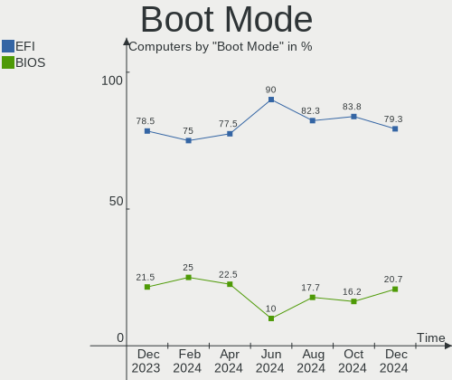
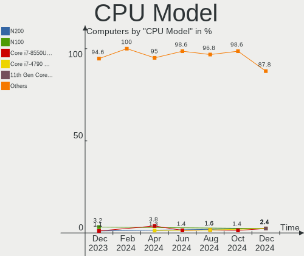
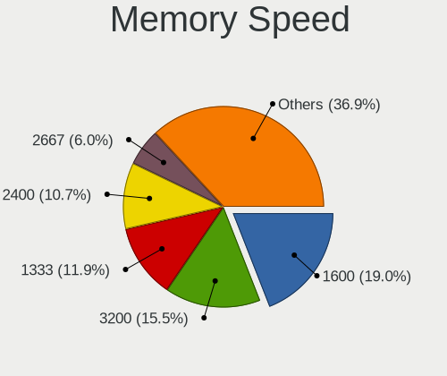

FreeBSD - Hardware Trends
-------------------------

A project to identify most popular hardware characteristics and track their change
over time based on data collected by BSD users at https://BSD-Hardware.info.

Anyone can contribute to this report by the [hw-probe](https://github.com/linuxhw/hw-probe/blob/master/INSTALL.BSD.md) tool:

    hw-probe -all -upload

This is a report for all computer types. See also reports for [desktops](/Dist/FreeBSD/Desktop/README.md) and [notebooks](/Dist/FreeBSD/Notebook/README.md).

This report is for one last month. Overall report since the beginning of time: [TestCoverage](https://github.com/bsdhw/TestCoverage)

Period: Jul, 2022.

Contents
--------

* [ System ](#system)
  - [ OS                       ](#os)
  - [ OS Family                ](#os-family)
  - [ Arch                     ](#arch)
  - [ DE                       ](#de)
  - [ Display Server           ](#display-server)
  - [ Display Manager          ](#display-manager)
  - [ OS Lang                  ](#os-lang)
  - [ Boot Mode                ](#boot-mode)
  - [ Filesystem               ](#filesystem)
  - [ Part. scheme             ](#part-scheme)

* [ Board ](#board)
  - [ Vendor                   ](#vendor)
  - [ Model                    ](#model)
  - [ Model Family             ](#model-family)
  - [ MFG Year                 ](#mfg-year)
  - [ Form Factor              ](#form-factor)
  - [ Coreboot                 ](#coreboot)
  - [ RAM Size                 ](#ram-size)
  - [ RAM Used                 ](#ram-used)
  - [ Total Drives             ](#total-drives)
  - [ Has CD-ROM               ](#has-cd-rom)
  - [ Has Ethernet             ](#has-ethernet)
  - [ Has WiFi                 ](#has-wifi)
  - [ Has Bluetooth            ](#has-bluetooth)

* [ Location ](#location)
  - [ Country                  ](#country)
  - [ City                     ](#city)

* [ Drives ](#drives)
  - [ Drive Vendor             ](#drive-vendor)
  - [ Drive Model              ](#drive-model)
  - [ HDD Vendor               ](#hdd-vendor)
  - [ SSD Vendor               ](#ssd-vendor)
  - [ Drive Kind               ](#drive-kind)
  - [ Drive Connector          ](#drive-connector)
  - [ Drive Size               ](#drive-size)
  - [ Space Total              ](#space-total)
  - [ Space Used               ](#space-used)
  - [ Malfunc. Drives          ](#malfunc-drives)
  - [ Malfunc. Drive Vendor    ](#malfunc-drive-vendor)
  - [ Malfunc. HDD Vendor      ](#malfunc-hdd-vendor)
  - [ Malfunc. Drive Kind      ](#malfunc-drive-kind)
  - [ Failed Drives            ](#failed-drives)
  - [ Failed Drive Vendor      ](#failed-drive-vendor)
  - [ Drive Status             ](#drive-status)

* [ Storage controller ](#storage-controller)
  - [ Storage Vendor           ](#storage-vendor)
  - [ Storage Model            ](#storage-model)
  - [ Storage Kind             ](#storage-kind)

* [ Processor ](#processor)
  - [ CPU Vendor               ](#cpu-vendor)
  - [ CPU Model                ](#cpu-model)
  - [ CPU Model Family         ](#cpu-model-family)
  - [ CPU Cores                ](#cpu-cores)
  - [ CPU Sockets              ](#cpu-sockets)
  - [ CPU Threads              ](#cpu-threads)
  - [ CPU Microarch            ](#cpu-microarch)

* [ Graphics ](#graphics)
  - [ GPU Vendor               ](#gpu-vendor)
  - [ GPU Model                ](#gpu-model)
  - [ GPU Combo                ](#gpu-combo)
  - [ GPU Driver               ](#gpu-driver)
  - [ GPU Memory               ](#gpu-memory)

* [ Monitor ](#monitor)
  - [ Monitor Vendor           ](#monitor-vendor)
  - [ Monitor Model            ](#monitor-model)
  - [ Monitor Resolution       ](#monitor-resolution)
  - [ Monitor Diagonal         ](#monitor-diagonal)
  - [ Monitor Width            ](#monitor-width)
  - [ Aspect Ratio             ](#aspect-ratio)
  - [ Monitor Area             ](#monitor-area)
  - [ Pixel Density            ](#pixel-density)
  - [ Multiple Monitors        ](#multiple-monitors)

* [ Network ](#network)
  - [ Net Controller Vendor    ](#net-controller-vendor)
  - [ Net Controller Model     ](#net-controller-model)
  - [ Wireless Vendor          ](#wireless-vendor)
  - [ Wireless Model           ](#wireless-model)
  - [ Ethernet Vendor          ](#ethernet-vendor)
  - [ Ethernet Model           ](#ethernet-model)
  - [ Net Controller Kind      ](#net-controller-kind)
  - [ Used Controller          ](#used-controller)
  - [ NICs                     ](#nics)
  - [ IPv6                     ](#ipv6)

* [ Bluetooth ](#bluetooth)
  - [ Bluetooth Vendor         ](#bluetooth-vendor)
  - [ Bluetooth Model          ](#bluetooth-model)

* [ Sound ](#sound)
  - [ Sound Vendor             ](#sound-vendor)
  - [ Sound Model              ](#sound-model)

* [ Memory ](#memory)
  - [ Memory Vendor            ](#memory-vendor)
  - [ Memory Model             ](#memory-model)
  - [ Memory Kind              ](#memory-kind)
  - [ Memory Form Factor       ](#memory-form-factor)
  - [ Memory Size              ](#memory-size)
  - [ Memory Speed             ](#memory-speed)

* [ Printers & scanners ](#printers--scanners)
  - [ Printer Vendor           ](#printer-vendor)
  - [ Printer Model            ](#printer-model)
  - [ Scanner Vendor           ](#scanner-vendor)
  - [ Scanner Model            ](#scanner-model)

* [ Camera ](#camera)
  - [ Camera Vendor            ](#camera-vendor)
  - [ Camera Model             ](#camera-model)

* [ Security ](#security)
  - [ Fingerprint Vendor       ](#fingerprint-vendor)
  - [ Fingerprint Model        ](#fingerprint-model)
  - [ Chipcard Vendor          ](#chipcard-vendor)
  - [ Chipcard Model           ](#chipcard-model)

* [ Unsupported ](#unsupported)
  - [ Unsupported Devices      ](#unsupported-devices)
  - [ Unsupported Device Types ](#unsupported-device-types)

System
------

OS
--

Installed operating systems

| Name                 | Computers | Percent |
|----------------------|-----------|---------|
| FreeBSD 13.1         | 41        | 74.55%  |
| FreeBSD 14.0-CURRENT | 4         | 7.27%   |
| FreeBSD 13.0         | 4         | 7.27%   |
| FreeBSD 13.0-p11     | 2         | 3.64%   |
| FreeBSD 13.1-STABLE  | 1         | 1.82%   |
| FreeBSD 12.3-STABLE  | 1         | 1.82%   |
| FreeBSD 12.3-BETA2   | 1         | 1.82%   |
| FreeBSD 12.1-p8      | 1         | 1.82%   |

OS Family
---------

OS without a version

| Name    | Computers | Percent |
|---------|-----------|---------|
| FreeBSD | 55        | 100%    |

Arch
----

OS architecture (x86_64, i586, etc.)

| Name  | Computers | Percent |
|-------|-----------|---------|
| amd64 | 53        | 96.36%  |
| arm64 | 1         | 1.82%   |
| arm   | 1         | 1.82%   |

DE
--

Desktop Environment

| Name    | Computers | Percent |
|---------|-----------|---------|
| Console | 22        | 40%     |
| XFCE    | 11        | 20%     |
| KDE5    | 9         | 16.36%  |
| GNOME   | 5         | 9.09%   |
| TWM     | 3         | 5.45%   |
| MATE    | 3         | 5.45%   |
| LXQt    | 1         | 1.82%   |
| i3      | 1         | 1.82%   |

Display Server
--------------

X11 or Wayland

| Name    | Computers | Percent |
|---------|-----------|---------|
| X11     | 33        | 60%     |
| Console | 22        | 40%     |

Display Manager
---------------

SDDM, LightDM, etc.

| Name    | Computers | Percent |
|---------|-----------|---------|
| Console | 36        | 65.45%  |
| SDDM    | 7         | 12.73%  |
| SLiM    | 6         | 10.91%  |
| XDM     | 2         | 3.64%   |
| LightDM | 2         | 3.64%   |
| GDM     | 2         | 3.64%   |

OS Lang
-------

Language

| Lang    | Computers | Percent |
|---------|-----------|---------|
| C       | 37        | 67.27%  |
| en_US   | 6         | 10.91%  |
| Unknown | 5         | 9.09%   |
| ru_RU   | 3         | 5.45%   |
| fr_FR   | 2         | 3.64%   |
| zh_TW   | 1         | 1.82%   |
| ja_JP   | 1         | 1.82%   |

Boot Mode
---------

EFI or BIOS

| Mode | Computers | Percent |
|------|-----------|---------|
| EFI  | 40        | 72.73%  |
| BIOS | 15        | 27.27%  |

Filesystem
----------

Type of filesystem

| Type | Computers | Percent |
|------|-----------|---------|
| Zfs  | 39        | 70.91%  |
| Ufs  | 16        | 29.09%  |

Part. scheme
------------

Scheme of partitioning

| Type | Computers | Percent |
|------|-----------|---------|
| GPT  | 50        | 90.91%  |
| MBR  | 5         | 9.09%   |

Board
-----

Vendor
------

Motherboard manufacturer

| Name                    | Computers | Percent |
|-------------------------|-----------|---------|
| Dell                    | 8         | 14.55%  |
| ASUSTek Computer        | 8         | 14.55%  |
| Lenovo                  | 7         | 12.73%  |
| Intel                   | 5         | 9.09%   |
| Hewlett-Packard         | 4         | 7.27%   |
| Gigabyte Technology     | 4         | 7.27%   |
| ASRock                  | 4         | 7.27%   |
| Acer                    | 3         | 5.45%   |
| Unknown                 | 2         | 3.64%   |
| Toshiba                 | 1         | 1.82%   |
| Sony                    | 1         | 1.82%   |
| Samsung Electronics     | 1         | 1.82%   |
| Raspberry Pi Foundation | 1         | 1.82%   |
| MSI                     | 1         | 1.82%   |
| MouseComputer           | 1         | 1.82%   |
| LG Electronics          | 1         | 1.82%   |
| Fujitsu                 | 1         | 1.82%   |
| BESSTAR Tech            | 1         | 1.82%   |
| Apple                   | 1         | 1.82%   |

Model
-----

Motherboard model

| Name                                    | Computers | Percent |
|-----------------------------------------|-----------|---------|
| ASUS P5Q-E                              | 2         | 3.64%   |
| Unknown                                 | 2         | 3.64%   |
| Toshiba Satellite L305D                 | 1         | 1.82%   |
| Sony VGN-NS21M_S                        | 1         | 1.82%   |
| Samsung 340XAA/350XAA/550XAA            | 1         | 1.82%   |
| RPi Raspberry Pi                        | 1         | 1.82%   |
| MSI MS-7817                             | 1         | 1.82%   |
| MouseComputer B360M                     | 1         | 1.82%   |
| LG 17Z990-R.AAC9U1                      | 1         | 1.82%   |
| Lenovo ThinkPad X260 20F6S0KA00         | 1         | 1.82%   |
| Lenovo ThinkPad T495 20NJ0010PB         | 1         | 1.82%   |
| Lenovo ThinkPad T480 20L6SB2N00         | 1         | 1.82%   |
| Lenovo ThinkPad T420 4236C92            | 1         | 1.82%   |
| Lenovo IdeaPad 5 Pro 16ACH6 82L5        | 1         | 1.82%   |
| Lenovo IdeaPad 330-15ARR 81D2           | 1         | 1.82%   |
| Lenovo G40-45 80E1                      | 1         | 1.82%   |
| Intel Q3XXG4-P V1.0                     | 1         | 1.82%   |
| Intel NUC7i3BNB J22859-303              | 1         | 1.82%   |
| Intel NUC11PHi7                         | 1         | 1.82%   |
| Intel NUC11PAHi5                        | 1         | 1.82%   |
| Intel DN2820FYK H24582-203              | 1         | 1.82%   |
| HP ProLiant ML310e Gen8 v2              | 1         | 1.82%   |
| HP Laptop 15-bs1xx                      | 1         | 1.82%   |
| HP EliteDesk 800 G1 DM                  | 1         | 1.82%   |
| HP EliteBook 8570p                      | 1         | 1.82%   |
| Gigabyte Z370M D3H                      | 1         | 1.82%   |
| Gigabyte H310M S2 2.0                   | 1         | 1.82%   |
| Gigabyte GB-BSi3-1115G4                 | 1         | 1.82%   |
| Gigabyte 970A-DS3P FX                   | 1         | 1.82%   |
| Fujitsu LIFEBOOK A555                   | 1         | 1.82%   |
| Dell Studio XPS 1340                    | 1         | 1.82%   |
| Dell Precision T3600                    | 1         | 1.82%   |
| Dell Precision 5560                     | 1         | 1.82%   |
| Dell OptiPlex 7010                      | 1         | 1.82%   |
| Dell OptiPlex 5040                      | 1         | 1.82%   |
| Dell OptiPlex 3020                      | 1         | 1.82%   |
| Dell Latitude E6420                     | 1         | 1.82%   |
| Dell Inspiron 5559                      | 1         | 1.82%   |
| BESSTAR Tech N40                        | 1         | 1.82%   |
| ASUS ZenBook UX325UA_UM325UA            | 1         | 1.82%   |
| ASUS VivoBook_ASUSLaptop E210MAB_E210MA | 1         | 1.82%   |
| ASUS ROG CROSSHAIR VIII HERO            | 1         | 1.82%   |
| ASUS PRIME X370-PRO                     | 1         | 1.82%   |
| ASUS PRIME A520M-A II                   | 1         | 1.82%   |
| ASUS Maximus VIII HERO                  | 1         | 1.82%   |
| ASRock Z490M Pro4                       | 1         | 1.82%   |
| ASRock X570 Phantom Gaming 4            | 1         | 1.82%   |
| ASRock X300M-STX                        | 1         | 1.82%   |
| ASRock B75 Pro3                         | 1         | 1.82%   |
| Apple MacBookAir5,2                     | 1         | 1.82%   |
| Acer Veriton X490G                      | 1         | 1.82%   |
| Acer Revo RN86                          | 1         | 1.82%   |
| Acer Aspire XC-895                      | 1         | 1.82%   |

Model Family
------------

Motherboard model prefix

| Name                    | Computers | Percent |
|-------------------------|-----------|---------|
| Lenovo ThinkPad         | 4         | 7.27%   |
| Dell OptiPlex           | 3         | 5.45%   |
| Lenovo IdeaPad          | 2         | 3.64%   |
| Dell Precision          | 2         | 3.64%   |
| ASUS PRIME              | 2         | 3.64%   |
| ASUS P5Q-E              | 2         | 3.64%   |
| Unknown                 | 2         | 3.64%   |
| Toshiba Satellite       | 1         | 1.82%   |
| Sony VGN-NS21M          | 1         | 1.82%   |
| Samsung 340XAA          | 1         | 1.82%   |
| RPi Raspberry           | 1         | 1.82%   |
| MSI MS-7817             | 1         | 1.82%   |
| MouseComputer B360M     | 1         | 1.82%   |
| LG 17Z990-R.AAC9U1      | 1         | 1.82%   |
| Lenovo G40-45           | 1         | 1.82%   |
| Intel Q3XXG4-P          | 1         | 1.82%   |
| Intel NUC7i3BNB         | 1         | 1.82%   |
| Intel NUC11PHi7         | 1         | 1.82%   |
| Intel NUC11PAHi5        | 1         | 1.82%   |
| Intel DN2820FYK         | 1         | 1.82%   |
| HP ProLiant             | 1         | 1.82%   |
| HP Laptop               | 1         | 1.82%   |
| HP EliteDesk            | 1         | 1.82%   |
| HP EliteBook            | 1         | 1.82%   |
| Gigabyte Z370M          | 1         | 1.82%   |
| Gigabyte H310M          | 1         | 1.82%   |
| Gigabyte GB-BSi3-1115G4 | 1         | 1.82%   |
| Gigabyte 970A-DS3P      | 1         | 1.82%   |
| Fujitsu LIFEBOOK        | 1         | 1.82%   |
| Dell Studio             | 1         | 1.82%   |
| Dell Latitude           | 1         | 1.82%   |
| Dell Inspiron           | 1         | 1.82%   |
| BESSTAR Tech N40        | 1         | 1.82%   |
| ASUS ZenBook            | 1         | 1.82%   |
| ASUS VivoBook           | 1         | 1.82%   |
| ASUS ROG                | 1         | 1.82%   |
| ASUS Maximus            | 1         | 1.82%   |
| ASRock Z490M            | 1         | 1.82%   |
| ASRock X570             | 1         | 1.82%   |
| ASRock X300M-STX        | 1         | 1.82%   |
| ASRock B75              | 1         | 1.82%   |
| Apple MacBookAir5       | 1         | 1.82%   |
| Acer Veriton            | 1         | 1.82%   |
| Acer Revo               | 1         | 1.82%   |
| Acer Aspire             | 1         | 1.82%   |

MFG Year
--------

Motherboard manufacture year

| Year    | Computers | Percent |
|---------|-----------|---------|
| 2021    | 11        | 20%     |
| 2019    | 10        | 18.18%  |
| 2016    | 6         | 10.91%  |
| 2020    | 4         | 7.27%   |
| 2018    | 4         | 7.27%   |
| 2014    | 3         | 5.45%   |
| 2011    | 3         | 5.45%   |
| 2022    | 2         | 3.64%   |
| 2017    | 2         | 3.64%   |
| 2013    | 2         | 3.64%   |
| 2009    | 2         | 3.64%   |
| 2008    | 2         | 3.64%   |
| Unknown | 2         | 3.64%   |
| 2015    | 1         | 1.82%   |
| 2010    | 1         | 1.82%   |

Form Factor
-----------

Physical design of the computer

| Name           | Computers | Percent |
|----------------|-----------|---------|
| Desktop        | 28        | 50.91%  |
| Notebook       | 22        | 40%     |
| Mini pc        | 4         | 7.27%   |
| System on chip | 1         | 1.82%   |

Coreboot
--------

Have coreboot on board

| Used | Computers | Percent |
|------|-----------|---------|
| No   | 55        | 100%    |

RAM Size
--------

Total RAM memory

| Size in GB  | Computers | Percent |
|-------------|-----------|---------|
| 16.01-24.0  | 15        | 27.27%  |
| 8.01-16.0   | 15        | 27.27%  |
| 4.01-8.0    | 12        | 21.82%  |
| 32.01-64.0  | 7         | 12.73%  |
| 64.01-256.0 | 4         | 7.27%   |
| 24.01-32.0  | 1         | 1.82%   |
| 0.01-0.5    | 1         | 1.82%   |

RAM Used
--------

Used RAM memory

| Used GB   | Computers | Percent |
|-----------|-----------|---------|
| 0.01-0.5  | 21        | 38.18%  |
| 0.51-1.0  | 14        | 25.45%  |
| 1.01-2.0  | 10        | 18.18%  |
| 2.01-3.0  | 6         | 10.91%  |
| 4.01-8.0  | 1         | 1.82%   |
| 3.01-4.0  | 1         | 1.82%   |
| 8.01-16.0 | 1         | 1.82%   |
| 0         | 1         | 1.82%   |

Total Drives
------------

Number of drives on board

| Drives | Computers | Percent |
|--------|-----------|---------|
| 1      | 29        | 52.73%  |
| 2      | 12        | 21.82%  |
| 3      | 3         | 5.45%   |
| 0      | 3         | 5.45%   |
| 8      | 2         | 3.64%   |
| 4      | 2         | 3.64%   |
| 16     | 1         | 1.82%   |
| 13     | 1         | 1.82%   |
| 11     | 1         | 1.82%   |
| 6      | 1         | 1.82%   |

Has CD-ROM
----------

Has CD-ROM on board

| Presented | Computers | Percent |
|-----------|-----------|---------|
| No        | 40        | 72.73%  |
| Yes       | 15        | 27.27%  |

Has Ethernet
------------

Has Ethernet on board

| Presented | Computers | Percent |
|-----------|-----------|---------|
| Yes       | 46        | 83.64%  |
| No        | 9         | 16.36%  |

Has WiFi
--------

Has WiFi module

| Presented | Computers | Percent |
|-----------|-----------|---------|
| Yes       | 31        | 56.36%  |
| No        | 24        | 43.64%  |

Has Bluetooth
-------------

Has Bluetooth module

| Presented | Computers | Percent |
|-----------|-----------|---------|
| No        | 37        | 67.27%  |
| Yes       | 18        | 32.73%  |

Location
--------

Country
-------

Geographic location (country)

| Country     | Computers | Percent |
|-------------|-----------|---------|
| USA         | 19        | 34.55%  |
| Russia      | 7         | 12.73%  |
| Spain       | 3         | 5.45%   |
| France      | 3         | 5.45%   |
| Taiwan      | 2         | 3.64%   |
| Japan       | 2         | 3.64%   |
| Czechia     | 2         | 3.64%   |
| UK          | 1         | 1.82%   |
| Turkey      | 1         | 1.82%   |
| Thailand    | 1         | 1.82%   |
| Slovenia    | 1         | 1.82%   |
| Poland      | 1         | 1.82%   |
| Norway      | 1         | 1.82%   |
| New Zealand | 1         | 1.82%   |
| Netherlands | 1         | 1.82%   |
| Malaysia    | 1         | 1.82%   |
| Italy       | 1         | 1.82%   |
| Germany     | 1         | 1.82%   |
| Canada      | 1         | 1.82%   |
| Brazil      | 1         | 1.82%   |
| Belgium     | 1         | 1.82%   |
| Bahamas     | 1         | 1.82%   |
| Austria     | 1         | 1.82%   |
| Australia   | 1         | 1.82%   |

City
----

Geographic location (city)

| City              | Computers | Percent |
|-------------------|-----------|---------|
| Ozersk            | 3         | 5.45%   |
| Taipei            | 2         | 3.64%   |
| Salem             | 2         | 3.64%   |
| Riverside         | 2         | 3.64%   |
| Redmond           | 2         | 3.64%   |
| Nashville         | 2         | 3.64%   |
| Madrid            | 2         | 3.64%   |
| Brno              | 2         | 3.64%   |
| Yashio            | 1         | 1.82%   |
| Wenatchee         | 1         | 1.82%   |
| Wellington        | 1         | 1.82%   |
| Vienna            | 1         | 1.82%   |
| Thousand Oaks     | 1         | 1.82%   |
| Tamm              | 1         | 1.82%   |
| Shah Alam         | 1         | 1.82%   |
| Setagaya-ku       | 1         | 1.82%   |
| Sarasota          | 1         | 1.82%   |
| Sandefjord        | 1         | 1.82%   |
| Poperinge         | 1         | 1.82%   |
| Paris             | 1         | 1.82%   |
| Omaha             | 1         | 1.82%   |
| Nassau            | 1         | 1.82%   |
| Moscow            | 1         | 1.82%   |
| Montreal          | 1         | 1.82%   |
| Messina           | 1         | 1.82%   |
| Marseille         | 1         | 1.82%   |
| London            | 1         | 1.82%   |
| Krasnodar         | 1         | 1.82%   |
| Khabarovsk        | 1         | 1.82%   |
| Katowice          | 1         | 1.82%   |
| Kamensk-Ural'skiy | 1         | 1.82%   |
| Istanbul          | 1         | 1.82%   |
| East Lansing      | 1         | 1.82%   |
| Detroit           | 1         | 1.82%   |
| Denver            | 1         | 1.82%   |
| Colmar            | 1         | 1.82%   |
| Charlotte         | 1         | 1.82%   |
| Chachoengsao      | 1         | 1.82%   |
| Bucka             | 1         | 1.82%   |
| Brooklyn          | 1         | 1.82%   |
| Brisbane          | 1         | 1.82%   |
| Bellaire          | 1         | 1.82%   |
| Bacabal           | 1         | 1.82%   |
| Asten             | 1         | 1.82%   |
| Ashburn           | 1         | 1.82%   |
| Altea             | 1         | 1.82%   |

Drives
------

Drive Vendor
------------

Hard drive vendors

| Vendor              | Computers | Drives | Percent |
|---------------------|-----------|--------|---------|
| WDC                 | 23        | 47     | 29.87%  |
| Samsung Electronics | 16        | 21     | 20.78%  |
| Toshiba             | 6         | 14     | 7.79%   |
| Seagate             | 6         | 22     | 7.79%   |
| Crucial             | 5         | 6      | 6.49%   |
| Kingston            | 4         | 4      | 5.19%   |
| SK hynix            | 2         | 2      | 2.6%    |
| Intel               | 2         | 2      | 2.6%    |
| Hitachi             | 2         | 2      | 2.6%    |
| HGST                | 2         | 2      | 2.6%    |
| Transcend           | 1         | 1      | 1.3%    |
| PNY                 | 1         | 2      | 1.3%    |
| Micron Technology   | 1         | 1      | 1.3%    |
| LITEONIT            | 1         | 1      | 1.3%    |
| Hikvision           | 1         | 1      | 1.3%    |
| Gigabyte Technology | 1         | 1      | 1.3%    |
| Corsair             | 1         | 1      | 1.3%    |
| Apple               | 1         | 1      | 1.3%    |
| A-DATA Technology   | 1         | 2      | 1.3%    |

Drive Model
-----------

Hard drive models

| Model                                | Computers | Percent |
|--------------------------------------|-----------|---------|
| WDC WD5000LPLX-00ZNTT0 500GB         | 2         | 2.08%   |
| Seagate ST4000DM000-1F2168 4TB       | 2         | 2.08%   |
| Samsung SSD 850 EVO 500GB            | 2         | 2.08%   |
| Crucial CT240BX500SSD1 240GB         | 2         | 2.08%   |
| Crucial CT1000MX500SSD1 1TB          | 2         | 2.08%   |
| WDC WDS500G3X0C-00SJG0 500GB         | 1         | 1.04%   |
| WDC WDS500G1B0A-00H9H0 500GB         | 1         | 1.04%   |
| WDC WDS100T3X0C-00SJG0 1TB           | 1         | 1.04%   |
| WDC WDS100T2B0B-00YS70 1TB           | 1         | 1.04%   |
| WDC WDS100T2B0A-00SM50 1TB           | 1         | 1.04%   |
| WDC WDS100T1X0E-00AFY0 1TB           | 1         | 1.04%   |
| WDC WDBA3V5000ANC-WRSN 500GB         | 1         | 1.04%   |
| WDC WD80EMAZ-00WJTA0 8TB             | 1         | 1.04%   |
| WDC WD80EFZX-68UW8N0 8TB             | 1         | 1.04%   |
| WDC WD80EFAX-68LHPN0 8TB             | 1         | 1.04%   |
| WDC WD80EDBZ-11B0ZA0 8TB             | 1         | 1.04%   |
| WDC WD60EFRX-68L0BN1 6TB             | 1         | 1.04%   |
| WDC WD5000LPCX-35VHAT0 500GB         | 1         | 1.04%   |
| WDC WD5000BEVT-22ZAT0 500GB          | 1         | 1.04%   |
| WDC WD40EZRZ-22GXCB0 4TB             | 1         | 1.04%   |
| WDC WD3200BPVT-22JJ5T0 320GB         | 1         | 1.04%   |
| WDC WD20NMVW-11EDZS2 2TB             | 1         | 1.04%   |
| WDC WD20NMVW-11AV3S2 2TB             | 1         | 1.04%   |
| WDC WD20EARX-00PASB0 2TB             | 1         | 1.04%   |
| WDC WD2003FYYS-18W0B0 2TB            | 1         | 1.04%   |
| WDC WD15EADS-00P8B0 1.5TB            | 1         | 1.04%   |
| WDC WD120EMFZ-11A6JA0 12TB           | 1         | 1.04%   |
| WDC WD120EMAZ-11BLFA0 12TB           | 1         | 1.04%   |
| WDC WD10JPVX-60JC3T1 1TB             | 1         | 1.04%   |
| WDC WD10EZEX-60WN4A0 1TB             | 1         | 1.04%   |
| WDC WD10EZEX-08WN4A0 1TB             | 1         | 1.04%   |
| WDC WD10EAVS-00D7B1 1TB              | 1         | 1.04%   |
| WDC WD100EMAZ-00WJTA0 10TB           | 1         | 1.04%   |
| WDC PC SN530 SDBPNPZ-256G-1014 256GB | 1         | 1.04%   |
| WDC PC SA530 SDASN8Y256G 256GB       | 1         | 1.04%   |
| Transcend TS256GMTS430S 256GB        | 1         | 1.04%   |
| Toshiba MQ01ABF050 500GB             | 1         | 1.04%   |
| Toshiba MK2002TSKB 2TB               | 1         | 1.04%   |
| Toshiba MD04ACA400 4TB               | 1         | 1.04%   |
| Toshiba MD03ACA400V 4TB              | 1         | 1.04%   |
| Toshiba HDWD120 2TB                  | 1         | 1.04%   |
| Toshiba HDWD105 500GB                | 1         | 1.04%   |
| Toshiba DT01ACA100 1TB               | 1         | 1.04%   |
| SK hynix SC308 SATA 128GB            | 1         | 1.04%   |
| SK hynix HFM512GD3JX013N 512GB       | 1         | 1.04%   |
| Seagate ST500LT012-1DG142 500GB      | 1         | 1.04%   |
| Seagate ST2000DM001-1ER164 2TB       | 1         | 1.04%   |
| Seagate ST2000DM001-1CH164 2TB       | 1         | 1.04%   |
| Seagate ST14000NM001G-2KJ103 14TB    | 1         | 1.04%   |
| Seagate ST12000VN0008-2PH103 12TB    | 1         | 1.04%   |
| Seagate ST12000VN0007-2GS116 12TB    | 1         | 1.04%   |
| Seagate ST1000LM024 HN-M101MBB 1TB   | 1         | 1.04%   |
| Seagate ST1000DL002-9TT153 1TB       | 1         | 1.04%   |
| Samsung SSD PM810 2.5-inch 128GB     | 1         | 1.04%   |
| Samsung SSD 970 PRO 1TB              | 1         | 1.04%   |
| Samsung SSD 970 EVO Plus 500GB       | 1         | 1.04%   |
| Samsung SSD 970 EVO Plus 1TB         | 1         | 1.04%   |
| Samsung SSD 970 EVO 1TB              | 1         | 1.04%   |
| Samsung SSD 960 EVO 500GB            | 1         | 1.04%   |
| Samsung SSD 870 QVO 2TB              | 1         | 1.04%   |

HDD Vendor
----------

Hard disk drive vendors

| Vendor              | Computers | Drives | Percent |
|---------------------|-----------|--------|---------|
| WDC                 | 15        | 38     | 46.88%  |
| Toshiba             | 6         | 14     | 18.75%  |
| Seagate             | 6         | 22     | 18.75%  |
| Hitachi             | 2         | 2      | 6.25%   |
| HGST                | 2         | 2      | 6.25%   |
| Samsung Electronics | 1         | 1      | 3.13%   |

SSD Vendor
----------

Solid state drive vendors

| Vendor              | Computers | Drives | Percent |
|---------------------|-----------|--------|---------|
| Samsung Electronics | 9         | 12     | 31.03%  |
| WDC                 | 4         | 4      | 13.79%  |
| Crucial             | 4         | 4      | 13.79%  |
| Kingston            | 3         | 3      | 10.34%  |
| Intel               | 2         | 2      | 6.9%    |
| Transcend           | 1         | 1      | 3.45%   |
| SK hynix            | 1         | 1      | 3.45%   |
| PNY                 | 1         | 2      | 3.45%   |
| LITEONIT            | 1         | 1      | 3.45%   |
| Hikvision           | 1         | 1      | 3.45%   |
| Apple               | 1         | 1      | 3.45%   |
| A-DATA Technology   | 1         | 2      | 3.45%   |

Drive Kind
----------

HDD or SSD

| Kind | Computers | Drives | Percent |
|------|-----------|--------|---------|
| HDD  | 27        | 79     | 38.57%  |
| SSD  | 26        | 34     | 37.14%  |
| NVMe | 17        | 20     | 24.29%  |

Drive Connector
---------------

SATA, SAS, NVMe, etc.

| Type | Computers | Drives | Percent |
|------|-----------|--------|---------|
| SATA | 43        | 113    | 71.67%  |
| NVMe | 17        | 20     | 28.33%  |

Drive Size
----------

Size of hard drive

| Size in TB | Computers | Drives | Percent |
|------------|-----------|--------|---------|
| 0.01-0.5   | 27        | 34     | 46.55%  |
| 0.51-1.0   | 16        | 18     | 27.59%  |
| 1.01-2.0   | 7         | 15     | 12.07%  |
| 3.01-4.0   | 3         | 10     | 5.17%   |
| 4.01-10.0  | 3         | 19     | 5.17%   |
| 10.01-20.0 | 2         | 17     | 3.45%   |

Space Total
-----------

Amount of disk space available on the file system

| Size in GB     | Computers | Percent |
|----------------|-----------|---------|
| 251-500        | 15        | 27.27%  |
| 501-1000       | 13        | 23.64%  |
| 101-250        | 12        | 21.82%  |
| 51-100         | 7         | 12.73%  |
| 21-50          | 4         | 7.27%   |
| More than 3000 | 1         | 1.82%   |
| 2001-3000      | 1         | 1.82%   |
| 1001-2000      | 1         | 1.82%   |
| 1-20           | 1         | 1.82%   |

Space Used
----------

Amount of used disk space

| Used GB        | Computers | Percent |
|----------------|-----------|---------|
| 1-20           | 45        | 81.82%  |
| 21-50          | 4         | 7.27%   |
| 51-100         | 3         | 5.45%   |
| More than 3000 | 1         | 1.82%   |
| 101-250        | 1         | 1.82%   |
| 501-1000       | 1         | 1.82%   |

Malfunc. Drives
---------------

Drive models with a malfunction

| Model                                        | Computers | Drives | Percent |
|----------------------------------------------|-----------|--------|---------|
| WDC WD5000LPLX-00ZNTT0 500GB                 | 1         | 1      | 8.33%   |
| WDC WD10JPVX-60JC3T1 1TB                     | 1         | 1      | 8.33%   |
| Toshiba MQ01ABF050 500GB                     | 1         | 1      | 8.33%   |
| Toshiba MK2002TSKB 2TB                       | 1         | 1      | 8.33%   |
| SK hynix SC308 SATA 128GB                    | 1         | 1      | 8.33%   |
| Seagate ST500LT012-1DG142 500GB              | 1         | 1      | 8.33%   |
| Samsung Electronics SSD PM810 2.5-inch 128GB | 1         | 1      | 8.33%   |
| Hitachi HTS727575A9E364 752GB                | 1         | 1      | 8.33%   |
| Hitachi HTS721080G9SA00 80GB                 | 1         | 1      | 8.33%   |
| HGST HTS725050A7E630 500GB                   | 1         | 1      | 8.33%   |
| HGST HTS721010A9E630 1TB                     | 1         | 1      | 8.33%   |
| A-DATA Technology SU630 240GB                | 1         | 1      | 8.33%   |

Malfunc. Drive Vendor
---------------------

Vendors of faulty drives

| Vendor              | Computers | Drives | Percent |
|---------------------|-----------|--------|---------|
| WDC                 | 2         | 2      | 16.67%  |
| Toshiba             | 2         | 2      | 16.67%  |
| Hitachi             | 2         | 2      | 16.67%  |
| HGST                | 2         | 2      | 16.67%  |
| SK hynix            | 1         | 1      | 8.33%   |
| Seagate             | 1         | 1      | 8.33%   |
| Samsung Electronics | 1         | 1      | 8.33%   |
| A-DATA Technology   | 1         | 1      | 8.33%   |

Malfunc. HDD Vendor
-------------------

Vendors of faulty HDD drives

| Vendor  | Computers | Drives | Percent |
|---------|-----------|--------|---------|
| WDC     | 2         | 2      | 22.22%  |
| Toshiba | 2         | 2      | 22.22%  |
| Hitachi | 2         | 2      | 22.22%  |
| HGST    | 2         | 2      | 22.22%  |
| Seagate | 1         | 1      | 11.11%  |

Malfunc. Drive Kind
-------------------

Kinds of faulty drives

| Kind | Computers | Drives | Percent |
|------|-----------|--------|---------|
| HDD  | 9         | 9      | 75%     |
| SSD  | 3         | 3      | 25%     |

Failed Drives
-------------

Failed drive models

Zero info for selected period =(

Failed Drive Vendor
-------------------

Failed drive vendors

Zero info for selected period =(

Drive Status
------------

Number of failed and malfunc. drives

| Status   | Computers | Drives | Percent |
|----------|-----------|--------|---------|
| Works    | 44        | 113    | 78.57%  |
| Malfunc  | 11        | 12     | 19.64%  |
| Detected | 1         | 8      | 1.79%   |

Storage controller
------------------

Storage Vendor
--------------

Storage controller vendors

| Vendor                      | Computers | Percent |
|-----------------------------|-----------|---------|
| Intel                       | 37        | 52.11%  |
| AMD                         | 9         | 12.68%  |
| Samsung Electronics         | 8         | 11.27%  |
| SanDisk                     | 4         | 5.63%   |
| Broadcom / LSI              | 3         | 4.23%   |
| Phison Electronics          | 2         | 2.82%   |
| ASMedia Technology          | 2         | 2.82%   |
| SK hynix                    | 1         | 1.41%   |
| Nvidia                      | 1         | 1.41%   |
| Micron/Crucial Technology   | 1         | 1.41%   |
| Micron Technology           | 1         | 1.41%   |
| Marvell Technology Group    | 1         | 1.41%   |
| Kingston Technology Company | 1         | 1.41%   |

Storage Model
-------------

Storage controller models

| Model                                                                            | Computers | Percent |
|----------------------------------------------------------------------------------|-----------|---------|
| AMD FCH SATA Controller [AHCI mode]                                              | 6         | 7.89%   |
| Samsung NVMe SSD Controller SM981/PM981/PM983                                    | 5         | 6.58%   |
| Intel Sunrise Point-LP SATA Controller [AHCI mode]                               | 5         | 6.58%   |
| Intel 8 Series/C220 Series Chipset Family 6-port SATA Controller 1 [AHCI mode]   | 4         | 5.26%   |
| Broadcom / LSI SAS2008 PCI-Express Fusion-MPT SAS-2 [Falcon]                     | 3         | 3.95%   |
| SanDisk WD Blue SN550 NVMe SSD                                                   | 2         | 2.63%   |
| Samsung NVMe SSD Controller SM961/PM961/SM963                                    | 2         | 2.63%   |
| Intel Wildcat Point-LP SATA Controller [AHCI Mode]                               | 2         | 2.63%   |
| Intel Q170/Q150/B150/H170/H110/Z170/CM236 Chipset SATA Controller [AHCI Mode]    | 2         | 2.63%   |
| Intel Celeron/Pentium Silver Processor SATA Controller                           | 2         | 2.63%   |
| Intel Cannon Lake PCH SATA AHCI Controller                                       | 2         | 2.63%   |
| Intel 82801JI (ICH10 Family) SATA AHCI Controller                                | 2         | 2.63%   |
| Intel 7 Series/C210 Series Chipset Family 6-port SATA Controller [AHCI mode]     | 2         | 2.63%   |
| Intel 7 Series Chipset Family 6-port SATA Controller [AHCI mode]                 | 2         | 2.63%   |
| Intel 6 Series/C200 Series Chipset Family 6 port Mobile SATA AHCI Controller     | 2         | 2.63%   |
| Intel 200 Series PCH SATA controller [AHCI mode]                                 | 2         | 2.63%   |
| ASMedia ASM1062 Serial ATA Controller                                            | 2         | 2.63%   |
| AMD SB7x0/SB8x0/SB9x0 SATA Controller [AHCI mode]                                | 2         | 2.63%   |
| SK hynix Gold P31 SSD                                                            | 1         | 1.32%   |
| SanDisk WD PC SN810 / Black SN850 NVMe SSD                                       | 1         | 1.32%   |
| SanDisk WD Black SN750 / PC SN730 NVMe SSD                                       | 1         | 1.32%   |
| SanDisk WD Black 2018/SN750 / PC SN720 NVMe SSD                                  | 1         | 1.32%   |
| Samsung NVMe SSD Controller 980                                                  | 1         | 1.32%   |
| Phison NVMe Storage Controller                                                   | 1         | 1.32%   |
| Phison E16 PCIe4 NVMe Controller                                                 | 1         | 1.32%   |
| Nvidia MCP79 AHCI Controller                                                     | 1         | 1.32%   |
| Micron/Crucial P2 NVMe PCIe SSD                                                  | 1         | 1.32%   |
| Marvell Group 88SE6111/6121 SATA II / PATA Controller                            | 1         | 1.32%   |
| Kingston Company A2000 NVMe SSD                                                  | 1         | 1.32%   |
| Intel Volume Management Device NVMe RAID Controller                              | 1         | 1.32%   |
| Intel Tiger Lake-LP SATA Controller                                              | 1         | 1.32%   |
| Intel Comet Lake SATA AHCI Controller                                            | 1         | 1.32%   |
| Intel Celeron N3350/Pentium N4200/Atom E3900 Series SATA AHCI Controller         | 1         | 1.32%   |
| Intel C602 chipset 4-Port SATA Storage Control Unit                              | 1         | 1.32%   |
| Intel C600/X79 series chipset 6-Port SATA AHCI Controller                        | 1         | 1.32%   |
| Intel Atom/Celeron/Pentium Processor x5-E8000/J3xxx/N3xxx Series SATA Controller | 1         | 1.32%   |
| Intel Atom Processor E3800 Series SATA AHCI Controller                           | 1         | 1.32%   |
| Intel 82801IBM/IEM (ICH9M/ICH9M-E) 4 port SATA Controller [AHCI mode]            | 1         | 1.32%   |
| Intel 5 Series/3400 Series Chipset PT IDER Controller                            | 1         | 1.32%   |
| Intel 5 Series/3400 Series Chipset 6 port SATA AHCI Controller                   | 1         | 1.32%   |
| Intel 400 Series Chipset Family SATA AHCI Controller                             | 1         | 1.32%   |
| AMD X370 Series Chipset SATA Controller                                          | 1         | 1.32%   |
| AMD SB7x0/SB8x0/SB9x0 IDE Controller                                             | 1         | 1.32%   |
| AMD 500 Series Chipset SATA Controller                                           | 1         | 1.32%   |
| Unknown                                                                          | 1         | 1.32%   |

Storage Kind
------------

Kind of storage controller (IDE, SATA, NVMe, SAS, ...)

| Kind | Computers | Percent |
|------|-----------|---------|
| SATA | 46        | 65.71%  |
| NVMe | 17        | 24.29%  |
| SAS  | 3         | 4.29%   |
| IDE  | 3         | 4.29%   |
| RAID | 1         | 1.43%   |

Processor
---------

CPU Vendor
----------

Processor vendors

| Vendor | Computers | Percent |
|--------|-----------|---------|
| Intel  | 41        | 74.55%  |
| AMD    | 12        | 21.82%  |
| ARM    | 2         | 3.64%   |

CPU Model
---------

Processor models

| Model                                           | Computers | Percent |
|-------------------------------------------------|-----------|---------|
| Intel Core i7-6500U CPU @ 2.50GHz               | 2         | 3.64%   |
| Intel Core i5-8400 CPU @ 2.80GHz                | 2         | 3.64%   |
| Intel Celeron N4020 CPU @ 1.10GHz               | 2         | 3.64%   |
| AMD Ryzen 9 3900X 12-Core Processor             | 2         | 3.64%   |
| Intel Xeon CPU X5460 @ 3.16GHz                  | 1         | 1.82%   |
| Intel Xeon CPU E5-2650 0 @ 2.00GH               | 1         | 1.82%   |
| Intel Xeon CPU E3-1230 v3 @ 3.30GHz             | 1         | 1.82%   |
| Intel Xeon CPU E3-1230 V2 @ 3.30GHz             | 1         | 1.82%   |
| Intel Xeon CPU E3-1220 v3 @ 3.10GHz             | 1         | 1.82%   |
| Intel Pentium Gold G5400 CPU @ 3.70GHz          | 1         | 1.82%   |
| Intel Pentium Dual CPU T3400 @ 2.16GHz          | 1         | 1.82%   |
| Intel Pentium CPU G3220 @ 3.00GHz               | 1         | 1.82%   |
| Intel Core i7-8565U CPU @ 1.80GHz               | 1         | 1.82%   |
| Intel Core i7-6700K CPU @ 4.00GHz               | 1         | 1.82%   |
| Intel Core i7-3520M CPU @ 2.90GHz               | 1         | 1.82%   |
| Intel Core i5-9400T CPU @ 1.80GHz               | 1         | 1.82%   |
| Intel Core i5-8350U CPU @ 1.70GHz               | 1         | 1.82%   |
| Intel Core i5-8250U CPU @ 1.60GHz               | 1         | 1.82%   |
| Intel Core i5-6500 CPU @ 3.20GHz                | 1         | 1.82%   |
| Intel Core i5-5250U CPU @ 1.60GHz               | 1         | 1.82%   |
| Intel Core i5-4590T CPU @ 2.00GHz               | 1         | 1.82%   |
| Intel Core i5-3570 CPU @ 3.40GHz                | 1         | 1.82%   |
| Intel Core i5-3427U CPU @ 1.80GHz               | 1         | 1.82%   |
| Intel Core i5-2540M CPU @ 2.60GH                | 1         | 1.82%   |
| Intel Core i5-2520M CPU @ 2.50GHz               | 1         | 1.82%   |
| Intel Core i5-10600K CPU @ 4.10GHz              | 1         | 1.82%   |
| Intel Core i5-10400 CPU @ 2.90GHz               | 1         | 1.82%   |
| Intel Core i3-7100U CPU @ 2.40GHz               | 1         | 1.82%   |
| Intel Core i3-5005U CPU @ 2.00GHz               | 1         | 1.82%   |
| Intel Core i3 CPU 540 @ 3.07GHz                 | 1         | 1.82%   |
| Intel Core 2 Quad CPU Q6600 @ 2.40GHz           | 1         | 1.82%   |
| Intel Core 2 Duo CPU P9500 @ 2.53GHz            | 1         | 1.82%   |
| Intel Celeron CPU N3450 @ 1.10GHz               | 1         | 1.82%   |
| Intel Celeron CPU N2830 @ 2.16GHz               | 1         | 1.82%   |
| Intel Celeron CPU 3865U @ 1.80GHz               | 1         | 1.82%   |
| Intel 11th Gen Core i7-11850H @ 2.50GHz         | 1         | 1.82%   |
| Intel 11th Gen Core i7-1165G7 @ 2.80GHz         | 1         | 1.82%   |
| Intel 11th Gen Core i5-1135G7 @ 2.40GHz         | 1         | 1.82%   |
| Intel 11th Gen Core i3-1115G4 @ 3.00GHz         | 1         | 1.82%   |
| ARM Cortex-A72 r0p3                             | 1         | 1.82%   |
| ARM ARM1176 r0p7 (ECO: 0x00000000)              | 1         | 1.82%   |
| AMD Ryzen 7 PRO 4750G with Radeon Graphics      | 1         | 1.82%   |
| AMD Ryzen 7 PRO 3700U w/ Radeon Vega Mobile Gfx | 1         | 1.82%   |
| AMD Ryzen 7 5800H with Radeon Graphics          | 1         | 1.82%   |
| AMD Ryzen 7 5700U with Radeon Graphics          | 1         | 1.82%   |
| AMD Ryzen 7 1700 Eight-Core Processor           | 1         | 1.82%   |
| AMD Ryzen 5 5600G with Radeon Graphics          | 1         | 1.82%   |
| AMD Ryzen 3 2200U with Radeon Vega Mobile Gfx   | 1         | 1.82%   |
| AMD FX-6300 Six-Core Processor                  | 1         | 1.82%   |
| AMD Athlon X2 Dual-Core QL-62                   | 1         | 1.82%   |
| AMD A8-6410 APU with AMD Radeon R5 Graphics     | 1         | 1.82%   |

CPU Model Family
----------------

Processor model prefix

| Model              | Computers | Percent |
|--------------------|-----------|---------|
| Intel Core i5      | 14        | 25.45%  |
| Other              | 5         | 9.09%   |
| Intel Xeon         | 5         | 9.09%   |
| Intel Core i7      | 5         | 9.09%   |
| Intel Celeron      | 5         | 9.09%   |
| Intel Core i3      | 3         | 5.45%   |
| AMD Ryzen 7        | 3         | 5.45%   |
| AMD Ryzen 9        | 2         | 3.64%   |
| AMD Ryzen 7 PRO    | 2         | 3.64%   |
| Intel Pentium Gold | 1         | 1.82%   |
| Intel Pentium Dual | 1         | 1.82%   |
| Intel Pentium      | 1         | 1.82%   |
| Intel Core 2 Quad  | 1         | 1.82%   |
| Intel Core 2 Duo   | 1         | 1.82%   |
| ARM Cortex         | 1         | 1.82%   |
| AMD Ryzen 5        | 1         | 1.82%   |
| AMD Ryzen 3        | 1         | 1.82%   |
| AMD FX             | 1         | 1.82%   |
| AMD Athlon X2      | 1         | 1.82%   |
| AMD A8             | 1         | 1.82%   |

CPU Cores
---------

Number of processor cores

| Number  | Computers | Percent |
|---------|-----------|---------|
| 2       | 19        | 34.55%  |
| 4       | 17        | 30.91%  |
| 6       | 6         | 10.91%  |
| 16      | 4         | 7.27%   |
| 8       | 3         | 5.45%   |
| Unknown | 3         | 5.45%   |
| 24      | 2         | 3.64%   |
| 12      | 1         | 1.82%   |

CPU Sockets
-----------

Number of sockets

| Number  | Computers | Percent |
|---------|-----------|---------|
| 1       | 53        | 96.36%  |
| Unknown | 2         | 3.64%   |

CPU Threads
-----------

Threads per core (Hyper-Threading)

| Number  | Computers | Percent |
|---------|-----------|---------|
| 1       | 28        | 50.91%  |
| 2       | 24        | 43.64%  |
| Unknown | 3         | 5.45%   |

CPU Microarch
-------------

Microarchitecture

| Name            | Computers | Percent |
|-----------------|-----------|---------|
| KabyLake        | 9         | 16.36%  |
| Skylake         | 4         | 7.27%   |
| IvyBridge       | 4         | 7.27%   |
| Haswell         | 4         | 7.27%   |
| Unknown         | 4         | 7.27%   |
| Zen 2           | 3         | 5.45%   |
| TigerLake       | 3         | 5.45%   |
| SandyBridge     | 3         | 5.45%   |
| Zen 3           | 2         | 3.64%   |
| Zen             | 2         | 3.64%   |
| Penryn          | 2         | 3.64%   |
| Goldmont plus   | 2         | 3.64%   |
| Core            | 2         | 3.64%   |
| CometLake       | 2         | 3.64%   |
| Broadwell       | 2         | 3.64%   |
| Zen+            | 1         | 1.82%   |
| Westmere        | 1         | 1.82%   |
| Silvermont      | 1         | 1.82%   |
| Puma            | 1         | 1.82%   |
| Piledriver      | 1         | 1.82%   |
| K8 & K10 hybrid | 1         | 1.82%   |
| Goldmont        | 1         | 1.82%   |

Graphics
--------

GPU Vendor
----------

Vendors of graphics cards

| Vendor                     | Computers | Percent |
|----------------------------|-----------|---------|
| Intel                      | 31        | 54.39%  |
| Nvidia                     | 13        | 22.81%  |
| AMD                        | 12        | 21.05%  |
| Matrox Electronics Systems | 1         | 1.75%   |

GPU Model
---------

Graphics card models

| Model                                                                         | Computers | Percent |
|-------------------------------------------------------------------------------|-----------|---------|
| Intel CoffeeLake-S GT2 [UHD Graphics 630]                                     | 3         | 5.08%   |
| Intel Xeon E3-1200 v3/4th Gen Core Processor Integrated Graphics Controller   | 2         | 3.39%   |
| Intel UHD Graphics 620                                                        | 2         | 3.39%   |
| Intel TigerLake-LP GT2 [Iris Xe Graphics]                                     | 2         | 3.39%   |
| Intel Skylake GT2 [HD Graphics 520]                                           | 2         | 3.39%   |
| Intel GeminiLake [UHD Graphics 600]                                           | 2         | 3.39%   |
| Intel CometLake-S GT2 [UHD Graphics 630]                                      | 2         | 3.39%   |
| Intel 2nd Generation Core Processor Family Integrated Graphics Controller     | 2         | 3.39%   |
| AMD Cezanne                                                                   | 2         | 3.39%   |
| Nvidia TU117M [GeForce GTX 1650 Mobile / Max-Q]                               | 1         | 1.69%   |
| Nvidia TU106M [GeForce RTX 2060 Mobile]                                       | 1         | 1.69%   |
| Nvidia NV43 [GeForce 6600]                                                    | 1         | 1.69%   |
| Nvidia GT218 [NVS 300]                                                        | 1         | 1.69%   |
| Nvidia GP108 [GeForce GT 1030]                                                | 1         | 1.69%   |
| Nvidia GP106 [GeForce GTX 1060 6GB]                                           | 1         | 1.69%   |
| Nvidia GP106 [GeForce GTX 1060 3GB]                                           | 1         | 1.69%   |
| Nvidia GP104 [GeForce GTX 1080]                                               | 1         | 1.69%   |
| Nvidia GK208B [GeForce GT 710]                                                | 1         | 1.69%   |
| Nvidia GF108GL [Quadro 600]                                                   | 1         | 1.69%   |
| Nvidia GF108 [GeForce GT 430]                                                 | 1         | 1.69%   |
| Nvidia GA107GLM [RTX A2000 Mobile]                                            | 1         | 1.69%   |
| Nvidia G98M [GeForce 9200M GS]                                                | 1         | 1.69%   |
| Nvidia C79 [GeForce 9400M G]                                                  | 1         | 1.69%   |
| Matrox Electronics Systems MGA G200EH                                         | 1         | 1.69%   |
| Intel WhiskeyLake-U GT2 [UHD Graphics 620]                                    | 1         | 1.69%   |
| Intel TigerLake-H GT1 [UHD Graphics]                                          | 1         | 1.69%   |
| Intel Tiger Lake UHD Graphics                                                 | 1         | 1.69%   |
| Intel Mobile 4 Series Chipset Integrated Graphics Controller                  | 1         | 1.69%   |
| Intel Kaby Lake-U GT1 Integrated Graphics Controller                          | 1         | 1.69%   |
| Intel HD Graphics 620                                                         | 1         | 1.69%   |
| Intel HD Graphics 6000                                                        | 1         | 1.69%   |
| Intel HD Graphics 5500                                                        | 1         | 1.69%   |
| Intel HD Graphics 530                                                         | 1         | 1.69%   |
| Intel HD Graphics 500                                                         | 1         | 1.69%   |
| Intel Core Processor Integrated Graphics Controller                           | 1         | 1.69%   |
| Intel CoffeeLake-S GT1 [UHD Graphics 610]                                     | 1         | 1.69%   |
| Intel Atom Processor Z36xxx/Z37xxx Series Graphics & Display                  | 1         | 1.69%   |
| Intel 3rd Gen Core processor Graphics Controller                              | 1         | 1.69%   |
| AMD Thames [Radeon HD 7550M/7570M/7650M]                                      | 1         | 1.69%   |
| AMD Sun XT [Radeon HD 8670A/8670M/8690M / R5 M330 / M430 / Radeon 520 Mobile] | 1         | 1.69%   |
| AMD Sun LE [Radeon HD 8550M / R5 M230]                                        | 1         | 1.69%   |
| AMD RS780MC [Mobility Radeon HD 3100]                                         | 1         | 1.69%   |
| AMD Renoir                                                                    | 1         | 1.69%   |
| AMD Raven Ridge [Radeon Vega Series / Radeon Vega Mobile Series]              | 1         | 1.69%   |
| AMD Picasso/Raven 2 [Radeon Vega Series / Radeon Vega Mobile Series]          | 1         | 1.69%   |
| AMD Mullins [Radeon R4/R5 Graphics]                                           | 1         | 1.69%   |
| AMD Lucienne                                                                  | 1         | 1.69%   |
| AMD Ellesmere [Radeon RX 470/480/570/570X/580/580X/590]                       | 1         | 1.69%   |
| AMD Cedar [Radeon HD 5000/6000/7350/8350 Series]                              | 1         | 1.69%   |

GPU Combo
---------

Combinations of graphics cards

| Name           | Computers | Percent |
|----------------|-----------|---------|
| 1 x Intel      | 27        | 49.09%  |
| 1 x Nvidia     | 9         | 16.36%  |
| 1 x AMD        | 9         | 16.36%  |
| Other          | 2         | 3.64%   |
| Intel + Nvidia | 2         | 3.64%   |
| 2 x Nvidia     | 1         | 1.82%   |
| 2 x Intel      | 1         | 1.82%   |
| 2 x AMD        | 1         | 1.82%   |
| 1 x Matrox     | 1         | 1.82%   |
| Intel + AMD    | 1         | 1.82%   |
| AMD + Nvidia   | 1         | 1.82%   |

GPU Driver
----------

Free vs proprietary

| Driver      | Computers | Percent |
|-------------|-----------|---------|
| Free        | 45        | 81.82%  |
| Proprietary | 7         | 12.73%  |
| Unknown     | 3         | 5.45%   |

GPU Memory
----------

Total video memory

| Size in GB | Computers | Percent |
|------------|-----------|---------|
| Unknown    | 42        | 76.36%  |
| 3.01-4.0   | 3         | 5.45%   |
| 0.51-1.0   | 3         | 5.45%   |
| 0.01-0.5   | 3         | 5.45%   |
| 5.01-6.0   | 2         | 3.64%   |
| 7.01-8.0   | 1         | 1.82%   |
| 1.01-2.0   | 1         | 1.82%   |

Monitor
-------

Monitor Vendor
--------------

Monitor vendors

| Vendor               | Computers | Percent |
|----------------------|-----------|---------|
| Samsung Electronics  | 6         | 17.14%  |
| LG Display           | 4         | 11.43%  |
| Philips              | 3         | 8.57%   |
| Chimei Innolux       | 3         | 8.57%   |
| BenQ                 | 3         | 8.57%   |
| Goldstar             | 2         | 5.71%   |
| Dell                 | 2         | 5.71%   |
| AU Optronics         | 2         | 5.71%   |
| Acer                 | 2         | 5.71%   |
| ViewSonic            | 1         | 2.86%   |
| Sceptre Tech         | 1         | 2.86%   |
| Lenovo               | 1         | 2.86%   |
| IOD                  | 1         | 2.86%   |
| Iiyama               | 1         | 2.86%   |
| ASUSTek Computer     | 1         | 2.86%   |
| Ancor Communications | 1         | 2.86%   |
| Unknown              | 1         | 2.86%   |

Monitor Model
-------------

Monitor models

| Model                                                                 | Computers | Percent |
|-----------------------------------------------------------------------|-----------|---------|
| Samsung Electronics SyncMaster SAM021E 1680x1050 430x270mm 20.0-inch  | 2         | 5.71%   |
| BenQ BL2480 BNQ802C 1920x1080 530x300mm 24.0-inch                     | 2         | 5.71%   |
| ViewSonic LCD Monitor VSCD22B 1920x1080 520x290mm 23.4-inch           | 1         | 2.86%   |
| Sceptre Tech Sceptre P30 SPT0BCC 2560x1080 690x290mm 29.5-inch        | 1         | 2.86%   |
| Samsung Electronics SMB2240W SAM0699 1680x1050 470x300mm 22.0-inch    | 1         | 2.86%   |
| Samsung Electronics LCD Monitor SEC3741 1280x800 330x210mm 15.4-inch  | 1         | 2.86%   |
| Samsung Electronics LCD Monitor SDC8B4F 1920x1080 340x190mm 15.3-inch | 1         | 2.86%   |
| Samsung Electronics LCD Monitor SDC4158 1920x1080 290x170mm 13.2-inch | 1         | 2.86%   |
| Philips PHL 223V5 PHLC0CF 1920x1080 480x270mm 21.7-inch               | 1         | 2.86%   |
| Philips LCD Monitor PHL08C3 1920x1080 600x340mm 27.2-inch             | 1         | 2.86%   |
| Philips 215i PHLC05A 1920x1080 470x260mm 21.1-inch                    | 1         | 2.86%   |
| LG Display LCD Monitor LGD05F8 2560x1600 370x230mm 17.2-inch          | 1         | 2.86%   |
| LG Display LCD Monitor LGD0353 1366x768 350x190mm 15.7-inch           | 1         | 2.86%   |
| LG Display LCD Monitor LGD02EB 1366x768 310x170mm 13.9-inch           | 1         | 2.86%   |
| LG Display LCD Monitor LGD02E2 1600x900 310x170mm 13.9-inch           | 1         | 2.86%   |
| Lenovo LEN S24e-10 LEN61CA 1920x1080 530x300mm 24.0-inch              | 1         | 2.86%   |
| IOD KH270V IOD1B3B 1920x1080 600x340mm 27.2-inch                      | 1         | 2.86%   |
| Iiyama PL2483H IVM6138 1920x1080 530x300mm 24.0-inch                  | 1         | 2.86%   |
| Goldstar LCD Monitor GSM5AB8 1920x1080 480x270mm 21.7-inch            | 1         | 2.86%   |
| Goldstar 22MP55 GSM5A26 1920x1080 480x270mm 21.7-inch                 | 1         | 2.86%   |
| Dell UP2716D DEL40DD 2560x1440 600x340mm 27.2-inch                    | 1         | 2.86%   |
| Dell LCD Monitor SP2309W 2048x1152                                    | 1         | 2.86%   |
| Chimei Innolux LCD Monitor CMN15D5 1920x1080 340x190mm 15.3-inch      | 1         | 2.86%   |
| Chimei Innolux LCD Monitor CMN15CC 1366x768 340x190mm 15.3-inch       | 1         | 2.86%   |
| Chimei Innolux LCD Monitor CMN14C9 1920x1080 310x170mm 13.9-inch      | 1         | 2.86%   |
| BenQ FP72E BNQ76DC 1280x1024 340x270mm 17.1-inch                      | 1         | 2.86%   |
| AU Optronics LCD Monitor AUO71EC 1366x768 340x190mm 15.3-inch         | 1         | 2.86%   |
| AU Optronics LCD Monitor AUO226D 1920x1080 280x160mm 12.7-inch        | 1         | 2.86%   |
| ASUSTek Computer PA248QV AUS2487 1920x1200 520x320mm 24.0-inch        | 1         | 2.86%   |
| Ancor Communications ASUS VW247 ACI2496 1920x1080 530x300mm 24.0-inch | 1         | 2.86%   |
| Acer VW237Q ACR06B9 1920x1200 490x300mm 22.6-inch                     | 1         | 2.86%   |
| Acer V193W ACR0025 1440x900 400x250mm 18.6-inch                       | 1         | 2.86%   |
| Unknown                                                               | 1         | 2.86%   |

Monitor Resolution
------------------

Monitor screen resolution

| Resolution         | Computers | Percent |
|--------------------|-----------|---------|
| 1920x1080 (FHD)    | 15        | 45.45%  |
| 1366x768 (WXGA)    | 4         | 12.12%  |
| 1680x1050 (WSXGA+) | 3         | 9.09%   |
| 2560x1440 (QHD)    | 2         | 6.06%   |
| 1920x1200 (WUXGA)  | 2         | 6.06%   |
| 2560x1600          | 1         | 3.03%   |
| 2560x1080          | 1         | 3.03%   |
| 2048x1152          | 1         | 3.03%   |
| 1600x900 (HD+)     | 1         | 3.03%   |
| 1440x900 (WXGA+)   | 1         | 3.03%   |
| 1280x800 (WXGA)    | 1         | 3.03%   |
| 1280x1024 (SXGA)   | 1         | 3.03%   |

Monitor Diagonal
----------------

Diagonal size in inches

| Inches  | Computers | Percent |
|---------|-----------|---------|
| 24      | 6         | 17.14%  |
| 15      | 6         | 17.14%  |
| 21      | 4         | 11.43%  |
| 13      | 4         | 11.43%  |
| 27      | 3         | 8.57%   |
| 22      | 2         | 5.71%   |
| 20      | 2         | 5.71%   |
| 17      | 2         | 5.71%   |
| Unknown | 2         | 5.71%   |
| 29      | 1         | 2.86%   |
| 23      | 1         | 2.86%   |
| 18      | 1         | 2.86%   |
| 12      | 1         | 2.86%   |

Monitor Width
-------------

Physical width

| Width in mm | Computers | Percent |
|-------------|-----------|---------|
| 501-600     | 10        | 29.41%  |
| 301-350     | 10        | 29.41%  |
| 401-500     | 7         | 20.59%  |
| 351-400     | 2         | 5.88%   |
| 201-300     | 2         | 5.88%   |
| Unknown     | 2         | 5.88%   |
| 601-700     | 1         | 2.94%   |

Aspect Ratio
------------

Proportional relationship between the width and the height

| Ratio   | Computers | Percent |
|---------|-----------|---------|
| 16/9    | 20        | 64.52%  |
| 16/10   | 7         | 22.58%  |
| Unknown | 2         | 6.45%   |
| 5/4     | 1         | 3.23%   |
| 21/9    | 1         | 3.23%   |

Monitor Area
------------

Area in inch

| Area in inch | Computers | Percent |
|----------------|-----------|---------|
| 201-250        | 11        | 31.43%  |
| 301-350        | 4         | 11.43%  |
| 151-200        | 4         | 11.43%  |
| 91-100         | 4         | 11.43%  |
| 81-90          | 3         | 8.57%   |
| 101-110        | 2         | 5.71%   |
| Unknown        | 2         | 5.71%   |
| 71-80          | 1         | 2.86%   |
| 61-70          | 1         | 2.86%   |
| 251-300        | 1         | 2.86%   |
| 141-150        | 1         | 2.86%   |
| 131-140        | 1         | 2.86%   |

Pixel Density
-------------

Pixels per inch

| Density | Computers | Percent |
|---------|-----------|---------|
| 51-100  | 17        | 48.57%  |
| 101-120 | 9         | 25.71%  |
| 121-160 | 4         | 11.43%  |
| 161-240 | 3         | 8.57%   |
| Unknown | 2         | 5.71%   |

Multiple Monitors
-----------------

Total monitors connected

| Total | Computers | Percent |
|-------|-----------|---------|
| 1     | 28        | 50.91%  |
| 0     | 23        | 41.82%  |
| 2     | 4         | 7.27%   |

Network
-------

Net Controller Vendor
---------------------

Controller vendors

| Vendor                   | Computers | Percent |
|--------------------------|-----------|---------|
| Intel                    | 32        | 42.11%  |
| Realtek Semiconductor    | 24        | 31.58%  |
| Qualcomm Atheros         | 5         | 6.58%   |
| Marvell Technology Group | 3         | 3.95%   |
| Broadcom                 | 3         | 3.95%   |
| Samsung Electronics      | 2         | 2.63%   |
| TP-Link                  | 1         | 1.32%   |
| Ralink Technology        | 1         | 1.32%   |
| Nvidia                   | 1         | 1.32%   |
| MediaTek                 | 1         | 1.32%   |
| LG Electronics           | 1         | 1.32%   |
| Hewlett-Packard          | 1         | 1.32%   |
| Aquantia                 | 1         | 1.32%   |

Net Controller Model
--------------------

Controller models

| Model                                                             | Computers | Percent |
|-------------------------------------------------------------------|-----------|---------|
| Realtek RTL8111/8168/8411 PCI Express Gigabit Ethernet Controller | 15        | 15.79%  |
| Intel 82579LM Gigabit Network Connection (Lewisville)             | 5         | 5.26%   |
| Intel I211 Gigabit Network Connection                             | 4         | 4.21%   |
| Realtek RTL810xE PCI Express Fast Ethernet controller             | 3         | 3.16%   |
| Qualcomm Atheros AR928X Wireless Network Adapter (PCI-Express)    | 3         | 3.16%   |
| Intel Ethernet Connection (2) I219-V                              | 3         | 3.16%   |
| Samsung Galaxy series, misc. (tethering mode)                     | 2         | 2.11%   |
| Realtek RTL8821CE 802.11ac PCIe Wireless Network Adapter          | 2         | 2.11%   |
| Realtek Realtek Bluetooth Adapter                                 | 2         | 2.11%   |
| Marvell Group 88E8056 PCI-E Gigabit Ethernet Controller           | 2         | 2.11%   |
| Marvell Group 88E8001 Gigabit Ethernet Controller                 | 2         | 2.11%   |
| Intel Wireless 8265 / 8275                                        | 2         | 2.11%   |
| Intel Wi-Fi 6 AX201                                               | 2         | 2.11%   |
| Intel Ethernet Controller I225-V                                  | 2         | 2.11%   |
| Intel Centrino Advanced-N 6205 [Taylor Peak]                      | 2         | 2.11%   |
| Intel 82574L Gigabit Network Connection                           | 2         | 2.11%   |
| TP-Link AC600 wireless Realtek RTL8811AU [Archer T2U Nano]        | 1         | 1.05%   |
| Realtek RTL8822CE 802.11ac PCIe Wireless Network Adapter          | 1         | 1.05%   |
| Realtek RTL8812AE 802.11ac PCIe Wireless Network Adapter          | 1         | 1.05%   |
| Realtek RTL8723DE Wireless Network Adapter                        | 1         | 1.05%   |
| Realtek RTL8125 2.5GbE Controller                                 | 1         | 1.05%   |
| Realtek Realtek Bluetooth 4.2 Adapter                             | 1         | 1.05%   |
| Realtek Realtek 8811CU Wireless LAN 802.11ac USB NIC              | 1         | 1.05%   |
| Ralink RT5572 Wireless Adapter                                    | 1         | 1.05%   |
| Qualcomm Atheros QCA9565 / AR9565 Wireless Network Adapter        | 1         | 1.05%   |
| Qualcomm Atheros QCA9377 802.11ac Wireless Network Adapter        | 1         | 1.05%   |
| Nvidia MCP79 Ethernet                                             | 1         | 1.05%   |
| MediaTek MT7921 802.11ax PCI Express Wireless Network Adapter     | 1         | 1.05%   |
| Marvell Group 88E8055 PCI-E Gigabit Ethernet Controller           | 1         | 1.05%   |
| LG Optimus Android Phone [USB tethering mode]                     | 1         | 1.05%   |
| Intel Wireless-AC 9260                                            | 1         | 1.05%   |
| Intel Wireless 8260                                               | 1         | 1.05%   |
| Intel Wireless 7265                                               | 1         | 1.05%   |
| Intel Wireless 7260                                               | 1         | 1.05%   |
| Intel Wireless 3160                                               | 1         | 1.05%   |
| Intel Wi-Fi 6 AX200                                               | 1         | 1.05%   |
| Intel Tiger Lake PCH CNVi WiFi                                    | 1         | 1.05%   |
| Intel Ethernet Controller I225-LM                                 | 1         | 1.05%   |
| Intel Ethernet Connection I219-V                                  | 1         | 1.05%   |
| Intel Ethernet Connection I219-LM                                 | 1         | 1.05%   |
| Intel Ethernet Connection I217-LM                                 | 1         | 1.05%   |
| Intel Ethernet Connection (7) I219-V                              | 1         | 1.05%   |
| Intel Ethernet Connection (4) I219-V                              | 1         | 1.05%   |
| Intel Ethernet Connection (13) I219-V                             | 1         | 1.05%   |
| Intel Ethernet Connection (11) I219-V                             | 1         | 1.05%   |
| Intel Centrino Ultimate-N 6300                                    | 1         | 1.05%   |
| Intel Cannon Point-LP CNVi [Wireless-AC]                          | 1         | 1.05%   |
| Intel Cannon Lake PCH CNVi WiFi                                   | 1         | 1.05%   |
| Intel 82599ES 10-Gigabit SFI/SFP+ Network Connection              | 1         | 1.05%   |
| Intel 82599 Ethernet Controller Virtual Function                  | 1         | 1.05%   |
| Intel 82578DC Gigabit Network Connection                          | 1         | 1.05%   |
| Intel 82576 Gigabit Network Connection                            | 1         | 1.05%   |
| Intel 82575EB Gigabit Network Connection                          | 1         | 1.05%   |
| HP hs2350 HSPA+ Mobile Broadband Module Network Adapter           | 1         | 1.05%   |
| Broadcom NetXtreme BCM5751 Gigabit Ethernet PCI Express           | 1         | 1.05%   |
| Broadcom NetXtreme BCM5720 Gigabit Ethernet PCIe                  | 1         | 1.05%   |
| Broadcom BCM43224 802.11a/b/g/n                                   | 1         | 1.05%   |
| Aquantia AQC107 NBase-T/IEEE 802.3bz Ethernet Controller [AQtion] | 1         | 1.05%   |

Wireless Vendor
---------------

Wireless vendors

| Vendor                | Computers | Percent |
|-----------------------|-----------|---------|
| Intel                 | 16        | 48.48%  |
| Realtek Semiconductor | 8         | 24.24%  |
| Qualcomm Atheros      | 5         | 15.15%  |
| TP-Link               | 1         | 3.03%   |
| Ralink Technology     | 1         | 3.03%   |
| MediaTek              | 1         | 3.03%   |
| Broadcom              | 1         | 3.03%   |

Wireless Model
--------------

Wireless models

| Model                                                          | Computers | Percent |
|----------------------------------------------------------------|-----------|---------|
| Qualcomm Atheros AR928X Wireless Network Adapter (PCI-Express) | 3         | 8.82%   |
| Realtek RTL8821CE 802.11ac PCIe Wireless Network Adapter       | 2         | 5.88%   |
| Realtek Realtek Bluetooth Adapter                              | 2         | 5.88%   |
| Intel Wireless 8265 / 8275                                     | 2         | 5.88%   |
| Intel Wi-Fi 6 AX201                                            | 2         | 5.88%   |
| Intel Centrino Advanced-N 6205 [Taylor Peak]                   | 2         | 5.88%   |
| TP-Link AC600 wireless Realtek RTL8811AU [Archer T2U Nano]     | 1         | 2.94%   |
| Realtek RTL8822CE 802.11ac PCIe Wireless Network Adapter       | 1         | 2.94%   |
| Realtek RTL8812AE 802.11ac PCIe Wireless Network Adapter       | 1         | 2.94%   |
| Realtek RTL8723DE Wireless Network Adapter                     | 1         | 2.94%   |
| Realtek Realtek Bluetooth 4.2 Adapter                          | 1         | 2.94%   |
| Realtek Realtek 8811CU Wireless LAN 802.11ac USB NIC           | 1         | 2.94%   |
| Ralink RT5572 Wireless Adapter                                 | 1         | 2.94%   |
| Qualcomm Atheros QCA9565 / AR9565 Wireless Network Adapter     | 1         | 2.94%   |
| Qualcomm Atheros QCA9377 802.11ac Wireless Network Adapter     | 1         | 2.94%   |
| MediaTek MT7921 802.11ax PCI Express Wireless Network Adapter  | 1         | 2.94%   |
| Intel Wireless-AC 9260                                         | 1         | 2.94%   |
| Intel Wireless 8260                                            | 1         | 2.94%   |
| Intel Wireless 7265                                            | 1         | 2.94%   |
| Intel Wireless 7260                                            | 1         | 2.94%   |
| Intel Wireless 3160                                            | 1         | 2.94%   |
| Intel Wi-Fi 6 AX200                                            | 1         | 2.94%   |
| Intel Tiger Lake PCH CNVi WiFi                                 | 1         | 2.94%   |
| Intel Centrino Ultimate-N 6300                                 | 1         | 2.94%   |
| Intel Cannon Point-LP CNVi [Wireless-AC]                       | 1         | 2.94%   |
| Intel Cannon Lake PCH CNVi WiFi                                | 1         | 2.94%   |
| Broadcom BCM43224 802.11a/b/g/n                                | 1         | 2.94%   |

Ethernet Vendor
---------------

Ethernet vendors

| Vendor                   | Computers | Percent |
|--------------------------|-----------|---------|
| Intel                    | 25        | 47.17%  |
| Realtek Semiconductor    | 19        | 35.85%  |
| Marvell Technology Group | 3         | 5.66%   |
| Samsung Electronics      | 2         | 3.77%   |
| Broadcom                 | 2         | 3.77%   |
| Nvidia                   | 1         | 1.89%   |
| Aquantia                 | 1         | 1.89%   |

Ethernet Model
--------------

Ethernet models

| Model                                                             | Computers | Percent |
|-------------------------------------------------------------------|-----------|---------|
| Realtek RTL8111/8168/8411 PCI Express Gigabit Ethernet Controller | 15        | 25.42%  |
| Intel 82579LM Gigabit Network Connection (Lewisville)             | 5         | 8.47%   |
| Intel I211 Gigabit Network Connection                             | 4         | 6.78%   |
| Realtek RTL810xE PCI Express Fast Ethernet controller             | 3         | 5.08%   |
| Intel Ethernet Connection (2) I219-V                              | 3         | 5.08%   |
| Samsung Galaxy series, misc. (tethering mode)                     | 2         | 3.39%   |
| Marvell Group 88E8056 PCI-E Gigabit Ethernet Controller           | 2         | 3.39%   |
| Marvell Group 88E8001 Gigabit Ethernet Controller                 | 2         | 3.39%   |
| Intel Ethernet Controller I225-V                                  | 2         | 3.39%   |
| Intel 82574L Gigabit Network Connection                           | 2         | 3.39%   |
| Realtek RTL8125 2.5GbE Controller                                 | 1         | 1.69%   |
| Nvidia MCP79 Ethernet                                             | 1         | 1.69%   |
| Marvell Group 88E8055 PCI-E Gigabit Ethernet Controller           | 1         | 1.69%   |
| Intel Ethernet Controller I225-LM                                 | 1         | 1.69%   |
| Intel Ethernet Connection I219-V                                  | 1         | 1.69%   |
| Intel Ethernet Connection I219-LM                                 | 1         | 1.69%   |
| Intel Ethernet Connection I217-LM                                 | 1         | 1.69%   |
| Intel Ethernet Connection (7) I219-V                              | 1         | 1.69%   |
| Intel Ethernet Connection (4) I219-V                              | 1         | 1.69%   |
| Intel Ethernet Connection (13) I219-V                             | 1         | 1.69%   |
| Intel Ethernet Connection (11) I219-V                             | 1         | 1.69%   |
| Intel 82599ES 10-Gigabit SFI/SFP+ Network Connection              | 1         | 1.69%   |
| Intel 82599 Ethernet Controller Virtual Function                  | 1         | 1.69%   |
| Intel 82578DC Gigabit Network Connection                          | 1         | 1.69%   |
| Intel 82576 Gigabit Network Connection                            | 1         | 1.69%   |
| Intel 82575EB Gigabit Network Connection                          | 1         | 1.69%   |
| Broadcom NetXtreme BCM5751 Gigabit Ethernet PCI Express           | 1         | 1.69%   |
| Broadcom NetXtreme BCM5720 Gigabit Ethernet PCIe                  | 1         | 1.69%   |
| Aquantia AQC107 NBase-T/IEEE 802.3bz Ethernet Controller [AQtion] | 1         | 1.69%   |

Net Controller Kind
-------------------

Ethernet, WiFi or modem

| Kind     | Computers | Percent |
|----------|-----------|---------|
| Ethernet | 46        | 58.23%  |
| WiFi     | 31        | 39.24%  |
| Modem    | 2         | 2.53%   |

Used Controller
---------------

Currently used network controller

| Kind     | Computers | Percent |
|----------|-----------|---------|
| Ethernet | 35        | 70%     |
| WiFi     | 15        | 30%     |

NICs
----

Total network controllers on board

| Total | Computers | Percent |
|-------|-----------|---------|
| 2     | 23        | 41.82%  |
| 1     | 21        | 38.18%  |
| 3     | 5         | 9.09%   |
| 0     | 3         | 5.45%   |
| 4     | 2         | 3.64%   |
| 7     | 1         | 1.82%   |

IPv6
----

IPv6 vs IPv4

| Used | Computers | Percent |
|------|-----------|---------|
| No   | 44        | 80%     |
| Yes  | 11        | 20%     |

Bluetooth
---------

Bluetooth Vendor
----------------

Controller vendors

| Vendor                          | Computers | Percent |
|---------------------------------|-----------|---------|
| Intel                           | 10        | 55.56%  |
| Realtek Semiconductor           | 2         | 11.11%  |
| IMC Networks                    | 2         | 11.11%  |
| Qualcomm Atheros Communications | 1         | 5.56%   |
| Foxconn / Hon Hai               | 1         | 5.56%   |
| Dell                            | 1         | 5.56%   |
| Apple                           | 1         | 5.56%   |

Bluetooth Model
---------------

Controller models

| Model                                          | Computers | Percent |
|------------------------------------------------|-----------|---------|
| Intel Bluetooth wireless interface             | 4         | 22.22%  |
| Intel AX201 Bluetooth                          | 3         | 16.67%  |
| Realtek  Bluetooth Adapter                     | 2         | 11.11%  |
| Intel Bluetooth 9460/9560 Jefferson Peak (JfP) | 2         | 11.11%  |
| Qualcomm Atheros  QCA9377 Bluetooth 4.1        | 1         | 5.56%   |
| Intel Wireless-AC 9260 Bluetooth Adapter       | 1         | 5.56%   |
| IMC Networks Realtek Bluetooth Adapter         | 1         | 5.56%   |
| IMC Networks Bluetooth Radio                   | 1         | 5.56%   |
| Foxconn / Hon Hai Wireless_Device              | 1         | 5.56%   |
| Dell DW375 Bluetooth Module                    | 1         | 5.56%   |
| Apple Built-in Bluetooth 2.0+EDR HCI           | 1         | 5.56%   |

Sound
-----

Sound Vendor
------------

Sound card vendors

| Vendor                      | Computers | Percent |
|-----------------------------|-----------|---------|
| Intel                       | 35        | 57.38%  |
| AMD                         | 13        | 21.31%  |
| Nvidia                      | 10        | 16.39%  |
| Generalplus Technology      | 1         | 1.64%   |
| FiiO Electronics Technology | 1         | 1.64%   |
| Cambridge Silicon Radio     | 1         | 1.64%   |

Sound Model
-----------

Sound card models

| Model                                                                      | Computers | Percent |
|----------------------------------------------------------------------------|-----------|---------|
| AMD Family 17h/19h HD Audio Controller                                     | 6         | 8.33%   |
| Intel Sunrise Point-LP HD Audio                                            | 5         | 6.94%   |
| Intel 7 Series/C216 Chipset Family High Definition Audio Controller        | 4         | 5.56%   |
| AMD Renoir Radeon High Definition Audio Controller                         | 4         | 5.56%   |
| Intel 8 Series/C220 Series Chipset High Definition Audio Controller        | 3         | 4.17%   |
| Nvidia GP106 High Definition Audio Controller                              | 2         | 2.78%   |
| Nvidia GF108 High Definition Audio Controller                              | 2         | 2.78%   |
| Intel Wildcat Point-LP High Definition Audio Controller                    | 2         | 2.78%   |
| Intel Tiger Lake-LP Smart Sound Technology Audio Controller                | 2         | 2.78%   |
| Intel Celeron/Pentium Silver Processor High Definition Audio               | 2         | 2.78%   |
| Intel Cannon Lake PCH cAVS                                                 | 2         | 2.78%   |
| Intel Broadwell-U Audio Controller                                         | 2         | 2.78%   |
| Intel 6 Series/C200 Series Chipset Family High Definition Audio Controller | 2         | 2.78%   |
| Intel 100 Series/C230 Series Chipset Family HD Audio Controller            | 2         | 2.78%   |
| AMD Starship/Matisse HD Audio Controller                                   | 2         | 2.78%   |
| AMD SBx00 Azalia (Intel HDA)                                               | 2         | 2.78%   |
| AMD Raven/Raven2/Fenghuang HDMI/DP Audio Controller                        | 2         | 2.78%   |
| Nvidia TU106 High Definition Audio Controller                              | 1         | 1.39%   |
| Nvidia MCP79 High Definition Audio                                         | 1         | 1.39%   |
| Nvidia High Definition Audio Controller                                    | 1         | 1.39%   |
| Nvidia GP108 High Definition Audio Controller                              | 1         | 1.39%   |
| Nvidia GP104 High Definition Audio Controller                              | 1         | 1.39%   |
| Nvidia GK208 HDMI/DP Audio Controller                                      | 1         | 1.39%   |
| Intel Xeon E3-1200 v3/4th Gen Core Processor HD Audio Controller           | 1         | 1.39%   |
| Intel Tiger Lake-H HD Audio Controller                                     | 1         | 1.39%   |
| Intel Comet Lake PCH-V cAVS                                                | 1         | 1.39%   |
| Intel Comet Lake PCH cAVS                                                  | 1         | 1.39%   |
| Intel Celeron N3350/Pentium N4200/Atom E3900 Series Audio Cluster          | 1         | 1.39%   |
| Intel Cannon Point-LP High Definition Audio Controller                     | 1         | 1.39%   |
| Intel C600/X79 series chipset High Definition Audio Controller             | 1         | 1.39%   |
| Intel Atom Processor Z36xxx/Z37xxx Series High Definition Audio Controller | 1         | 1.39%   |
| Intel 82801JI (ICH10 Family) HD Audio Controller                           | 1         | 1.39%   |
| Intel 82801I (ICH9 Family) HD Audio Controller                             | 1         | 1.39%   |
| Intel 5 Series/3400 Series Chipset High Definition Audio                   | 1         | 1.39%   |
| Intel 200 Series PCH HD Audio                                              | 1         | 1.39%   |
| Generalplus Technology USB Audio Device                                    | 1         | 1.39%   |
| FiiO Electronics Technology FiiO USB DAC-E10                               | 1         | 1.39%   |
| Cambridge Silicon Radio B10                                                | 1         | 1.39%   |
| AMD Turks HDMI Audio [Radeon HD 6500/6600 / 6700M Series]                  | 1         | 1.39%   |
| AMD Kabini HDMI/DP Audio                                                   | 1         | 1.39%   |
| AMD FCH Azalia Controller                                                  | 1         | 1.39%   |
| AMD Ellesmere HDMI Audio [Radeon RX 470/480 / 570/580/590]                 | 1         | 1.39%   |
| AMD Cedar HDMI Audio [Radeon HD 5400/6300/7300 Series]                     | 1         | 1.39%   |

Memory
------

Memory Vendor
-------------

Memory module vendors

| Vendor              | Computers | Percent |
|---------------------|-----------|---------|
| SK hynix            | 13        | 20.63%  |
| Crucial             | 7         | 11.11%  |
| Samsung Electronics | 6         | 9.52%   |
| Kingston            | 6         | 9.52%   |
| Micron Technology   | 5         | 7.94%   |
| Corsair             | 5         | 7.94%   |
| Unknown             | 5         | 7.94%   |
| Unknown             | 4         | 6.35%   |
| G.Skill             | 3         | 4.76%   |
| Unknown (ABCD)      | 2         | 3.17%   |
| Ramaxel Technology  | 1         | 1.59%   |
| Patriot             | 1         | 1.59%   |
| Nanya Technology    | 1         | 1.59%   |
| Kllisre             | 1         | 1.59%   |
| Hewlett-Packard     | 1         | 1.59%   |
| Apacer              | 1         | 1.59%   |
| A-DATA Technology   | 1         | 1.59%   |

Memory Model
------------

Memory module models

| Model                                                             | Computers | Percent |
|-------------------------------------------------------------------|-----------|---------|
| Unknown                                                           | 5         | 7.94%   |
| Unknown RAM Module 8GB DIMM DDR3 1600MT/s                         | 1         | 1.59%   |
| Unknown RAM Module 2GB SODIMM DDR2                                | 1         | 1.59%   |
| Unknown RAM Module 2GB DIMM DDR2 800MT/s                          | 1         | 1.59%   |
| Unknown RAM Module 2GB DIMM DDR 800MT/s                           | 1         | 1.59%   |
| Unknown (ABCD) RAM 123456789012345678 2GB SODIMM LPDDR3 2133MT/s  | 1         | 1.59%   |
| Unknown (ABCD) RAM 123456789012345678 1536MB DIMM LPDDR4 2400MT/s | 1         | 1.59%   |
| SK hynix RAM HYMP125S64CP8-S6 2GB SODIMM DDR 975MT/s              | 1         | 1.59%   |
| SK hynix RAM HMT451U6DFR8A-PB 4GB DIMM DDR3 1600MT/s              | 1         | 1.59%   |
| SK hynix RAM HMT451U6AFR8C-PB 4GB DIMM DDR3 1600MT/s              | 1         | 1.59%   |
| SK hynix RAM HMT451S6MFR8C-PB 4GB SODIMM DDR3 1600MT/s            | 1         | 1.59%   |
| SK hynix RAM HMT42GR7CMR4A-G7 16GB DIMM DDR3 1067MT/s             | 1         | 1.59%   |
| SK hynix RAM HMT41GS6BFR8A-PB 8GB SODIMM DDR3 1600MT/s            | 1         | 1.59%   |
| SK hynix RAM HMT325U6BFR8C 2GB DIMM DDR3 667MT/s                  | 1         | 1.59%   |
| SK hynix RAM HMA851S6AFR6N-UH 4GB SODIMM DDR4 2400MT/s            | 1         | 1.59%   |
| SK hynix RAM HMA82GS6MFR8N-TF 16GB SODIMM DDR4 2133MT/s           | 1         | 1.59%   |
| SK hynix RAM HMA82GS6JJR8N-VK 16GB SODIMM DDR4 2667MT/s           | 1         | 1.59%   |
| SK hynix RAM HMA81GS6DJR8N-XN 8GB SODIMM DDR4 3200MT/s            | 1         | 1.59%   |
| SK hynix RAM HMA81GS6AFR8N-UH 8GB SODIMM DDR4 2400MT/s            | 1         | 1.59%   |
| SK hynix RAM H9HCNNNCPMMLXR-NEE 8GB SODIMM LPDDR4 4266MT/s        | 1         | 1.59%   |
| Samsung RAM M471B1G73QH0-YK0 8GB SODIMM DDR3 1867MT/s             | 1         | 1.59%   |
| Samsung RAM M471A5244CB0-CRC 4GB SODIMM DDR4 2400MT/s             | 1         | 1.59%   |
| Samsung RAM M471A2K43BB1-CRC 16GB SODIMM DDR4 2400MT/s            | 1         | 1.59%   |
| Samsung RAM M471A1G44AB0-CWE 8GB Row Of Chips DDR4 3200MT/s       | 1         | 1.59%   |
| Samsung RAM M471A1G44AB0-CTD 8GB SODIMM DDR4 2667MT/s             | 1         | 1.59%   |
| Samsung RAM M4 70T5663QZ3-CF7 2GB SODIMM DDR2 667MT/s             | 1         | 1.59%   |
| Ramaxel RAM RMSA3260ME78HAF-2666 8GB SODIMM DDR4 2667MT/s         | 1         | 1.59%   |
| Patriot RAM PSD44G266682 4096MB DIMM DDR4 2400MT/s                | 1         | 1.59%   |
| Nanya RAM NT2GC64B88G0NS-CG 2GB SODIMM DDR3 1333MT/s              | 1         | 1.59%   |
| Micron RAM Module 8GB DIMM DDR4 3200MT/s                          | 1         | 1.59%   |
| Micron RAM Module 2GB SODIMM DDR3 1600MT/s                        | 1         | 1.59%   |
| Micron RAM 4ATF51264HZ-2G3E1 4GB SODIMM DDR4 2400MT/s             | 1         | 1.59%   |
| Micron RAM 16KTF51264HZ-1G6M1 4GB SODIMM DDR3 1600MT/s            | 1         | 1.59%   |
| Micron RAM 16ATF4G64HZ-3G2F1 32GB SODIMM DDR4 3200MT/s            | 1         | 1.59%   |
| Kllisre RAM KRE-D3U1600M/ 4GB DIMM DDR3 800MT/s                   | 1         | 1.59%   |
| Kingston RAM KHX2400C14S4/4G 4GB SODIMM DDR4 2400MT/s             | 1         | 1.59%   |
| Kingston RAM CBD24D4U7S1ME-4 4GB DIMM DDR4 2400MT/s               | 1         | 1.59%   |
| Kingston RAM ACR26D4S9S8ME-8 8GB SODIMM DDR4 2667MT/s             | 1         | 1.59%   |
| Kingston RAM ACR16D3LS1KFG/4G 4GB DIMM DDR3 1600MT/s              | 1         | 1.59%   |
| Kingston RAM 99U5469-051.A00LF 4GB SODIMM DDR3 1600MT/s           | 1         | 1.59%   |
| Kingston RAM 9965745-002.A00G 16GB DIMM DDR4 3000MT/s             | 1         | 1.59%   |
| HP RAM 647658-081 8GB DIMM DDR3 1333MT/s                          | 1         | 1.59%   |
| G.Skill RAM F4-3200C16-32GVK 32GB DIMM DDR4 2666MT/s              | 1         | 1.59%   |
| G.Skill RAM F4-2133C15-8GVR 8GB DIMM DDR4 2133MT/s                | 1         | 1.59%   |
| G.Skill RAM F3-12800CL7-2GBRM 2GB DIMM DDR3 1600MT/s              | 1         | 1.59%   |
| Crucial RAM CT8G4SFRA32A.M8FRS 8GB SODIMM DDR4 3200MT/s           | 1         | 1.59%   |
| Crucial RAM CT32G4SFD832A.C16FB 32GB SODIMM DDR4 3200MT/s         | 1         | 1.59%   |
| Crucial RAM CT16G4SFD8213.C16FBR 16GB SODIMM DDR4 2133MT/s        | 1         | 1.59%   |
| Crucial RAM CT102464BF160B.M16 8GB SODIMM DDR3 1600MT/s           | 1         | 1.59%   |
| Crucial RAM CT102464BF160B.C16 8GB SODIMM DDR3 1600MT/s           | 1         | 1.59%   |
| Crucial RAM BLS8G4D240FSBK.8FBD 8GB DIMM DDR4 2400MT/s            | 1         | 1.59%   |
| Crucial RAM BL8G32C16U4B.8FE 8GB DIMM DDR4 3200MT/s               | 1         | 1.59%   |
| Corsair RAM CMZ16GX3M2A1600C10 8GB DIMM DDR3 1600MT/s             | 1         | 1.59%   |
| Corsair RAM CMX4GX3M1A160 4GB DIMM DDR3 800MT/s                   | 1         | 1.59%   |
| Corsair RAM CMSX16GX4M2A3200C22 8GB SODIMM DDR4 3400MT/s          | 1         | 1.59%   |
| Corsair RAM CMK16GX4M2C3600C20 8GB DIMM DDR4 2133MT/s             | 1         | 1.59%   |
| Corsair RAM CMK16GX4M2B3200C16 8GB DIMM DDR4 3200MT/s             | 1         | 1.59%   |
| Apacer RAM 76.D305G.D390B 16GB SODIMM DDR4 2400MT/s               | 1         | 1.59%   |
| A-DATA RAM Module 4GB DIMM DDR3 1334MT/s                          | 1         | 1.59%   |

Memory Kind
-----------

Memory module kinds

| Kind    | Computers | Percent |
|---------|-----------|---------|
| DDR4    | 26        | 48.15%  |
| DDR3    | 20        | 37.04%  |
| LPDDR4  | 3         | 5.56%   |
| DDR2    | 3         | 5.56%   |
| DDR     | 1         | 1.85%   |
| Unknown | 1         | 1.85%   |

Memory Form Factor
------------------

Physical design of the memory module

| Name         | Computers | Percent |
|--------------|-----------|---------|
| SODIMM       | 30        | 55.56%  |
| DIMM         | 23        | 42.59%  |
| Row Of Chips | 1         | 1.85%   |

Memory Size
-----------

Memory module size

| Size  | Computers | Percent |
|-------|-----------|---------|
| 8192  | 24        | 42.11%  |
| 4096  | 15        | 26.32%  |
| 2048  | 8         | 14.04%  |
| 16384 | 7         | 12.28%  |
| 32768 | 3         | 5.26%   |

Memory Speed
------------

Memory module speed

| Speed   | Computers | Percent |
|---------|-----------|---------|
| 1600    | 13        | 22.81%  |
| 2400    | 10        | 17.54%  |
| 3200    | 8         | 14.04%  |
| 2133    | 5         | 8.77%   |
| 800     | 4         | 7.02%   |
| 2667    | 3         | 5.26%   |
| 1333    | 2         | 3.51%   |
| 667     | 2         | 3.51%   |
| 4266    | 1         | 1.75%   |
| 3400    | 1         | 1.75%   |
| 3000    | 1         | 1.75%   |
| 2666    | 1         | 1.75%   |
| 1867    | 1         | 1.75%   |
| 1334    | 1         | 1.75%   |
| 1067    | 1         | 1.75%   |
| 1066    | 1         | 1.75%   |
| 975     | 1         | 1.75%   |
| Unknown | 1         | 1.75%   |

Printers & scanners
-------------------

Printer Vendor
--------------

Printer device vendors

Zero info for selected period =(

Printer Model
-------------

Printer device models

Zero info for selected period =(

Scanner Vendor
--------------

Scanner device vendors

Zero info for selected period =(

Scanner Model
-------------

Scanner device models

Zero info for selected period =(

Camera
------

Camera Vendor
-------------

Camera device vendors

| Vendor                        | Computers | Percent |
|-------------------------------|-----------|---------|
| Chicony Electronics           | 5         | 26.32%  |
| IMC Networks                  | 4         | 21.05%  |
| Sunplus Innovation Technology | 1         | 5.26%   |
| Silicon Motion                | 1         | 5.26%   |
| Ricoh                         | 1         | 5.26%   |
| Realtek Semiconductor         | 1         | 5.26%   |
| OmniVision Technologies       | 1         | 5.26%   |
| Microdia                      | 1         | 5.26%   |
| Intel                         | 1         | 5.26%   |
| Apple                         | 1         | 5.26%   |
| Alcor Micro                   | 1         | 5.26%   |
| Acer                          | 1         | 5.26%   |

Camera Model
------------

Camera device models

| Model                                  | Computers | Percent |
|----------------------------------------|-----------|---------|
| IMC Networks EasyCamera                | 2         | 10.53%  |
| Sunplus Laptop_Integrated_Webcam_FHD   | 1         | 5.26%   |
| Silicon Motion Web Camera              | 1         | 5.26%   |
| Ricoh Integrated Webcam                | 1         | 5.26%   |
| Realtek Realtek USB2.0 PC Camera       | 1         | 5.26%   |
| OmniVision Monitor Webcam              | 1         | 5.26%   |
| Microdia JOYACCESS JA-Webcam           | 1         | 5.26%   |
| Intel RealSense 3D Camera (Front F200) | 1         | 5.26%   |
| IMC Networks USB2.0 VGA UVC WebCam     | 1         | 5.26%   |
| IMC Networks USB2.0 HD UVC WebCam      | 1         | 5.26%   |
| Chicony ThinkPad T490 Webcam           | 1         | 5.26%   |
| Chicony LG Camera                      | 1         | 5.26%   |
| Chicony Integrated HP HD Webcam        | 1         | 5.26%   |
| Chicony Integrated Camera              | 1         | 5.26%   |
| Chicony Camera                         | 1         | 5.26%   |
| Apple FaceTime HD Camera (Built-in)    | 1         | 5.26%   |
| Alcor Micro USB 2.0 Camera             | 1         | 5.26%   |
| Acer ThinkPad P50 Integrated Camera    | 1         | 5.26%   |

Security
--------

Fingerprint Vendor
------------------

Fingerprint sensor vendors

| Vendor           | Computers | Percent |
|------------------|-----------|---------|
| Validity Sensors | 1         | 50%     |
| Synaptics        | 1         | 50%     |

Fingerprint Model
-----------------

Fingerprint sensor models

| Model                                             | Computers | Percent |
|---------------------------------------------------|-----------|---------|
| Validity Sensors VFS 5011 fingerprint sensor      | 1         | 50%     |
| Synaptics Prometheus MIS Touch Fingerprint Reader | 1         | 50%     |

Chipcard Vendor
---------------

Chipcard module vendors

Zero info for selected period =(

Chipcard Model
--------------

Chipcard module models

Zero info for selected period =(

Unsupported
-----------

Unsupported Devices
-------------------

Total unsupported devices on board

| Total | Computers | Percent |
|-------|-----------|---------|
| 1     | 26        | 47.27%  |
| 2     | 12        | 21.82%  |
| 0     | 11        | 20%     |
| 3     | 3         | 5.45%   |
| 4     | 2         | 3.64%   |
| 5     | 1         | 1.82%   |

Unsupported Device Types
------------------------

Types of unsupported devices

| Type                     | Computers | Percent |
|--------------------------|-----------|---------|
| Communication controller | 36        | 53.73%  |
| Bluetooth                | 9         | 13.43%  |
| Net/wireless             | 8         | 11.94%  |
| Card reader              | 6         | 8.96%   |
| Firewire controller      | 4         | 5.97%   |
| Fingerprint reader       | 2         | 2.99%   |
| Storage                  | 1         | 1.49%   |
| Net/ethernet             | 1         | 1.49%   |

