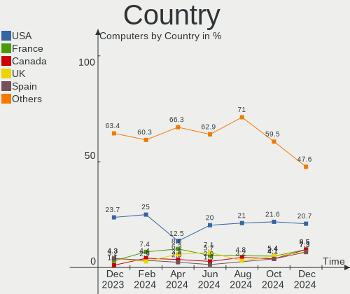
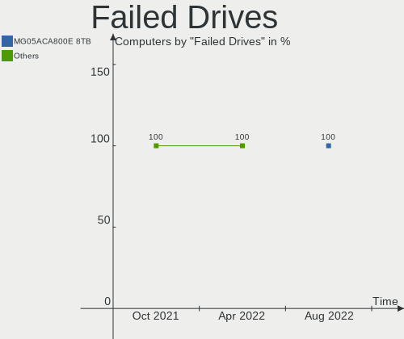
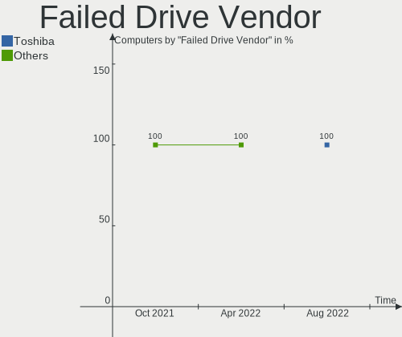
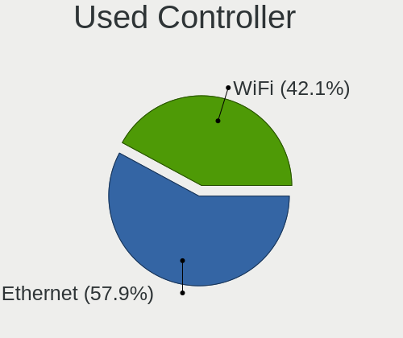

FreeBSD Hardware Trends
-----------------------

A project to identify most popular hardware characteristics and track their change
over time based on data collected by FreeBSD users at https://BSD-Hardware.info.

Anyone can contribute to this report by the [hw-probe](https://github.com/linuxhw/hw-probe/blob/master/INSTALL.BSD.md) tool:

    hw-probe -all -upload

This is a report for all computer types. See also reports for [desktops](/Dist/FreeBSD/Desktop/README.md) and [notebooks](/Dist/FreeBSD/Notebook/README.md).

This report is for one last month. Overall report since the beginning of time: [TestCoverage](https://github.com/bsdhw/TestCoverage)

Period: Apr, 2022.

Contents
--------

* [ System ](#system)
  - [ OS                       ](#os)
  - [ OS Family                ](#os-family)
  - [ Arch                     ](#arch)
  - [ DE                       ](#de)
  - [ Display Server           ](#display-server)
  - [ Display Manager          ](#display-manager)
  - [ OS Lang                  ](#os-lang)
  - [ Boot Mode                ](#boot-mode)
  - [ Filesystem               ](#filesystem)
  - [ Part. scheme             ](#part-scheme)

* [ Board ](#board)
  - [ Vendor                   ](#vendor)
  - [ Model                    ](#model)
  - [ Model Family             ](#model-family)
  - [ MFG Year                 ](#mfg-year)
  - [ Form Factor              ](#form-factor)
  - [ Coreboot                 ](#coreboot)
  - [ RAM Size                 ](#ram-size)
  - [ RAM Used                 ](#ram-used)
  - [ Total Drives             ](#total-drives)
  - [ Has CD-ROM               ](#has-cd-rom)
  - [ Has Ethernet             ](#has-ethernet)
  - [ Has WiFi                 ](#has-wifi)
  - [ Has Bluetooth            ](#has-bluetooth)

* [ Location ](#location)
  - [ Country                  ](#country)
  - [ City                     ](#city)

* [ Drives ](#drives)
  - [ Drive Vendor             ](#drive-vendor)
  - [ Drive Model              ](#drive-model)
  - [ HDD Vendor               ](#hdd-vendor)
  - [ SSD Vendor               ](#ssd-vendor)
  - [ Drive Kind               ](#drive-kind)
  - [ Drive Connector          ](#drive-connector)
  - [ Drive Size               ](#drive-size)
  - [ Space Total              ](#space-total)
  - [ Space Used               ](#space-used)
  - [ Malfunc. Drives          ](#malfunc-drives)
  - [ Malfunc. Drive Vendor    ](#malfunc-drive-vendor)
  - [ Malfunc. HDD Vendor      ](#malfunc-hdd-vendor)
  - [ Malfunc. Drive Kind      ](#malfunc-drive-kind)
  - [ Failed Drives            ](#failed-drives)
  - [ Failed Drive Vendor      ](#failed-drive-vendor)
  - [ Drive Status             ](#drive-status)

* [ Storage controller ](#storage-controller)
  - [ Storage Vendor           ](#storage-vendor)
  - [ Storage Model            ](#storage-model)
  - [ Storage Kind             ](#storage-kind)

* [ Processor ](#processor)
  - [ CPU Vendor               ](#cpu-vendor)
  - [ CPU Model                ](#cpu-model)
  - [ CPU Model Family         ](#cpu-model-family)
  - [ CPU Cores                ](#cpu-cores)
  - [ CPU Sockets              ](#cpu-sockets)
  - [ CPU Threads              ](#cpu-threads)
  - [ CPU Microarch            ](#cpu-microarch)

* [ Graphics ](#graphics)
  - [ GPU Vendor               ](#gpu-vendor)
  - [ GPU Model                ](#gpu-model)
  - [ GPU Combo                ](#gpu-combo)
  - [ GPU Driver               ](#gpu-driver)
  - [ GPU Memory               ](#gpu-memory)

* [ Monitor ](#monitor)
  - [ Monitor Vendor           ](#monitor-vendor)
  - [ Monitor Model            ](#monitor-model)
  - [ Monitor Resolution       ](#monitor-resolution)
  - [ Monitor Diagonal         ](#monitor-diagonal)
  - [ Monitor Width            ](#monitor-width)
  - [ Aspect Ratio             ](#aspect-ratio)
  - [ Monitor Area             ](#monitor-area)
  - [ Pixel Density            ](#pixel-density)
  - [ Multiple Monitors        ](#multiple-monitors)

* [ Network ](#network)
  - [ Net Controller Vendor    ](#net-controller-vendor)
  - [ Net Controller Model     ](#net-controller-model)
  - [ Wireless Vendor          ](#wireless-vendor)
  - [ Wireless Model           ](#wireless-model)
  - [ Ethernet Vendor          ](#ethernet-vendor)
  - [ Ethernet Model           ](#ethernet-model)
  - [ Net Controller Kind      ](#net-controller-kind)
  - [ Used Controller          ](#used-controller)
  - [ NICs                     ](#nics)
  - [ IPv6                     ](#ipv6)

* [ Bluetooth ](#bluetooth)
  - [ Bluetooth Vendor         ](#bluetooth-vendor)
  - [ Bluetooth Model          ](#bluetooth-model)

* [ Sound ](#sound)
  - [ Sound Vendor             ](#sound-vendor)
  - [ Sound Model              ](#sound-model)

* [ Memory ](#memory)
  - [ Memory Vendor            ](#memory-vendor)
  - [ Memory Model             ](#memory-model)
  - [ Memory Kind              ](#memory-kind)
  - [ Memory Form Factor       ](#memory-form-factor)
  - [ Memory Size              ](#memory-size)
  - [ Memory Speed             ](#memory-speed)

* [ Printers & scanners ](#printers--scanners)
  - [ Printer Vendor           ](#printer-vendor)
  - [ Printer Model            ](#printer-model)
  - [ Scanner Vendor           ](#scanner-vendor)
  - [ Scanner Model            ](#scanner-model)

* [ Camera ](#camera)
  - [ Camera Vendor            ](#camera-vendor)
  - [ Camera Model             ](#camera-model)

* [ Security ](#security)
  - [ Fingerprint Vendor       ](#fingerprint-vendor)
  - [ Fingerprint Model        ](#fingerprint-model)
  - [ Chipcard Vendor          ](#chipcard-vendor)
  - [ Chipcard Model           ](#chipcard-model)

* [ Unsupported ](#unsupported)
  - [ Unsupported Devices      ](#unsupported-devices)
  - [ Unsupported Device Types ](#unsupported-device-types)

System
------

OS
--

Installed operating systems

| Name                  | Computers | Percent |
|-----------------------|-----------|---------|
| FreeBSD 13.0-p11      | 27        | 29.67%  |
| FreeBSD 13.0-p10      | 10        | 10.99%  |
| FreeBSD 12.3          | 9         | 9.89%   |
| FreeBSD 13.0          | 6         | 6.59%   |
| FreeBSD 14.0-CURRENT  | 5         | 5.49%   |
| FreeBSD 12.3-p5       | 5         | 5.49%   |
| FreeBSD 13.0-p5       | 4         | 4.4%    |
| FreeBSD 13.1-RC4      | 3         | 3.3%    |
| FreeBSD 13.1-RC2      | 3         | 3.3%    |
| FreeBSD 13.0-p7       | 3         | 3.3%    |
| FreeBSD 12.3-STABLE   | 3         | 3.3%    |
| FreeBSD 13.1-STABLE   | 2         | 2.2%    |
| FreeBSD 13.1-RC3      | 2         | 2.2%    |
| FreeBSD 13.0-p9       | 2         | 2.2%    |
| FreeBSD 13.0-p8       | 2         | 2.2%    |
| FreeBSD 13.1-RC1      | 1         | 1.1%    |
| FreeBSD 13.0-p4       | 1         | 1.1%    |
| FreeBSD 12.3-p4       | 1         | 1.1%    |
| FreeBSD 12.3-p3       | 1         | 1.1%    |
| FreeBSD 12.1-p22-HBSD | 1         | 1.1%    |

OS Family
---------

OS without a version

| Name    | Computers | Percent |
|---------|-----------|---------|
| FreeBSD | 91        | 100%    |

Arch
----

OS architecture (x86_64, i586, etc.)

| Name  | Computers | Percent |
|-------|-----------|---------|
| amd64 | 88        | 96.7%   |
| arm64 | 3         | 3.3%    |

DE
--

Desktop Environment

| Name          | Computers | Percent |
|---------------|-----------|---------|
| Console       | 35        | 38.46%  |
| XFCE          | 14        | 15.38%  |
| KDE5          | 14        | 15.38%  |
| TWM           | 9         | 9.89%   |
| MATE          | 6         | 6.59%   |
| i3            | 3         | 3.3%    |
| GNOME         | 3         | 3.3%    |
| Openbox       | 2         | 2.2%    |
| LXQt          | 2         | 2.2%    |
| xfwm          | 1         | 1.1%    |
| Enlightenment | 1         | 1.1%    |
| AwesomeWM     | 1         | 1.1%    |

Display Server
--------------

X11 or Wayland

| Name    | Computers | Percent |
|---------|-----------|---------|
| X11     | 51        | 56.04%  |
| Console | 39        | 42.86%  |
| Wayland | 1         | 1.1%    |

Display Manager
---------------

SDDM, LightDM, etc.

| Name    | Computers | Percent |
|---------|-----------|---------|
| Console | 53        | 58.24%  |
| SDDM    | 12        | 13.19%  |
| LightDM | 9         | 9.89%   |
| SLiM    | 8         | 8.79%   |
| XDM     | 4         | 4.4%    |
| GDM     | 4         | 4.4%    |
| Ly      | 1         | 1.1%    |

OS Lang
-------

Language

| Lang             | Computers | Percent |
|------------------|-----------|---------|
| C                | 44        | 48.35%  |
| Unknown          | 21        | 23.08%  |
| en_US            | 9         | 9.89%   |
| ru_RU            | 5         | 5.49%   |
| fr_FR            | 3         | 3.3%    |
| en_GB            | 3         | 3.3%    |
| de_DE            | 2         | 2.2%    |
| ru_RU.KOI8-R     | 1         | 1.1%    |
| no_NO.ISO8859-15 | 1         | 1.1%    |
| it_IT            | 1         | 1.1%    |
| en_NZ            | 1         | 1.1%    |

Boot Mode
---------

EFI or BIOS

| Mode | Computers | Percent |
|------|-----------|---------|
| EFI  | 58        | 63.74%  |
| BIOS | 33        | 36.26%  |

Filesystem
----------

Type of filesystem

| Type | Computers | Percent |
|------|-----------|---------|
| Zfs  | 57        | 62.64%  |
| Ufs  | 34        | 37.36%  |

Part. scheme
------------

Scheme of partitioning

| Type | Computers | Percent |
|------|-----------|---------|
| GPT  | 79        | 86.81%  |
| MBR  | 11        | 12.09%  |
| BSD  | 1         | 1.1%    |

Board
-----

Vendor
------

Motherboard manufacturer

| Name                    | Computers | Percent |
|-------------------------|-----------|---------|
| Lenovo                  | 15        | 16.48%  |
| Dell                    | 13        | 14.29%  |
| Intel                   | 9         | 9.89%   |
| Hewlett-Packard         | 9         | 9.89%   |
| MSI                     | 7         | 7.69%   |
| ASUSTek Computer        | 7         | 7.69%   |
| Gigabyte Technology     | 6         | 6.59%   |
| ASRock                  | 4         | 4.4%    |
| Supermicro              | 2         | 2.2%    |
| Shuttle                 | 2         | 2.2%    |
| Apple                   | 2         | 2.2%    |
| Unknown                 | 2         | 2.2%    |
| VIT                     | 1         | 1.1%    |
| Toshiba                 | 1         | 1.1%    |
| Timi                    | 1         | 1.1%    |
| System76                | 1         | 1.1%    |
| Raspberry Pi Foundation | 1         | 1.1%    |
| Notebook                | 1         | 1.1%    |
| HUAWEI                  | 1         | 1.1%    |
| HPE                     | 1         | 1.1%    |
| Framework               | 1         | 1.1%    |
| Deciso                  | 1         | 1.1%    |
| ASRockRack              | 1         | 1.1%    |
| AMI                     | 1         | 1.1%    |
| Acer                    | 1         | 1.1%    |

Model
-----

Motherboard model

| Name                                      | Computers | Percent |
|-------------------------------------------|-----------|---------|
| Intel Nobilis                             | 7         | 7.69%   |
| Unknown                                   | 2         | 2.2%    |
| VIT M2420                                 | 1         | 1.1%    |
| Toshiba Satellite Pro T130                | 1         | 1.1%    |
| Timi TM1612                               | 1         | 1.1%    |
| System76 Lemur Pro                        | 1         | 1.1%    |
| Supermicro X9SCL/X9SCM                    | 1         | 1.1%    |
| Supermicro Super Server                   | 1         | 1.1%    |
| Shuttle SH570                             | 1         | 1.1%    |
| Shuttle DS20U                             | 1         | 1.1%    |
| RPi Raspberry Pi                          | 1         | 1.1%    |
| Notebook N7x0WU                           | 1         | 1.1%    |
| MSI MS-7C96                               | 1         | 1.1%    |
| MSI MS-7C94                               | 1         | 1.1%    |
| MSI MS-7C37                               | 1         | 1.1%    |
| MSI MS-7C36                               | 1         | 1.1%    |
| MSI MS-7B09                               | 1         | 1.1%    |
| MSI MS-7817                               | 1         | 1.1%    |
| MSI Bravo 15 A4DDR                        | 1         | 1.1%    |
| Lenovo ThinkPad X220 42872WU              | 1         | 1.1%    |
| Lenovo ThinkPad X201 3680MG1              | 1         | 1.1%    |
| Lenovo ThinkPad X1 Yoga 3rd 20LES2RG1A    | 1         | 1.1%    |
| Lenovo ThinkPad X1 Yoga 1st 20FQ000QUS    | 1         | 1.1%    |
| Lenovo ThinkPad X1 Carbon 3rd 20BS00ACMN  | 1         | 1.1%    |
| Lenovo ThinkPad T495 20NJ0000US           | 1         | 1.1%    |
| Lenovo ThinkPad T470 20HES0ES1F           | 1         | 1.1%    |
| Lenovo ThinkPad T460p 20FXS09D11          | 1         | 1.1%    |
| Lenovo ThinkPad E490 20N8CTO1WW           | 1         | 1.1%    |
| Lenovo ThinkPad 11e Yoga Gen 6 20SES0YM00 | 1         | 1.1%    |
| Lenovo ThinkCentre M92p 3209D7U           | 1         | 1.1%    |
| Lenovo ThinkCentre M920q 10RS000UUS       | 1         | 1.1%    |
| Lenovo IdeaPadFlex 5 14ALC05 82HU         | 1         | 1.1%    |
| Lenovo B570 1068FQG                       | 1         | 1.1%    |
| Lenovo B50-30 20382                       | 1         | 1.1%    |
| Intel S3420GP                             | 1         | 1.1%    |
| Intel pro396949                           | 1         | 1.1%    |
| HUAWEI NBLL-WXX9                          | 1         | 1.1%    |
| HPE ProLiant MicroServer Gen10 Plus       | 1         | 1.1%    |
| HP Z440 Workstation                       | 1         | 1.1%    |
| HP t630 Thin Client                       | 1         | 1.1%    |
| HP ProLiant MicroServer                   | 1         | 1.1%    |
| HP ProLiant DL180 G6                      | 1         | 1.1%    |
| HP Laptop 15-dw1xxx                       | 1         | 1.1%    |
| HP EliteBook 8570p                        | 1         | 1.1%    |
| HP Desktop M01-F0xxx                      | 1         | 1.1%    |
| HP Compaq dc5800 Small Form Factor        | 1         | 1.1%    |
| HP Compaq 8200 Elite SFF PC               | 1         | 1.1%    |
| Gigabyte X570 AORUS PRO                   | 1         | 1.1%    |
| Gigabyte X470 AORUS ULTRA GAMING          | 1         | 1.1%    |
| Gigabyte N3160ND3V                        | 1         | 1.1%    |
| Gigabyte H310M S2 2.0                     | 1         | 1.1%    |
| Gigabyte B560M D3H                        | 1         | 1.1%    |
| Gigabyte B450M S2H                        | 1         | 1.1%    |
| Framework Laptop                          | 1         | 1.1%    |
| Dell Vostro 1400                          | 1         | 1.1%    |
| Dell Precision M4800                      | 1         | 1.1%    |
| Dell Precision 5820 Tower                 | 1         | 1.1%    |
| Dell PowerEdge T640                       | 1         | 1.1%    |
| Dell PowerEdge T150                       | 1         | 1.1%    |
| Dell PowerEdge R7415                      | 1         | 1.1%    |

Model Family
------------

Motherboard model prefix

| Name                   | Computers | Percent |
|------------------------|-----------|---------|
| Lenovo ThinkPad        | 10        | 10.99%  |
| Intel Nobilis          | 7         | 7.69%   |
| Dell PowerEdge         | 4         | 4.4%    |
| Dell OptiPlex          | 3         | 3.3%    |
| Lenovo ThinkCentre     | 2         | 2.2%    |
| HP ProLiant            | 2         | 2.2%    |
| HP Compaq              | 2         | 2.2%    |
| Dell Precision         | 2         | 2.2%    |
| Dell Latitude          | 2         | 2.2%    |
| ASUS PRIME             | 2         | 2.2%    |
| Unknown                | 2         | 2.2%    |
| VIT M2420              | 1         | 1.1%    |
| Toshiba Satellite      | 1         | 1.1%    |
| Timi TM1612            | 1         | 1.1%    |
| System76 Lemur         | 1         | 1.1%    |
| Supermicro X9SCL       | 1         | 1.1%    |
| Supermicro Super       | 1         | 1.1%    |
| Shuttle SH570          | 1         | 1.1%    |
| Shuttle DS20U          | 1         | 1.1%    |
| RPi Raspberry          | 1         | 1.1%    |
| Notebook N7x0WU        | 1         | 1.1%    |
| MSI MS-7C96            | 1         | 1.1%    |
| MSI MS-7C94            | 1         | 1.1%    |
| MSI MS-7C37            | 1         | 1.1%    |
| MSI MS-7C36            | 1         | 1.1%    |
| MSI MS-7B09            | 1         | 1.1%    |
| MSI MS-7817            | 1         | 1.1%    |
| MSI Bravo              | 1         | 1.1%    |
| Lenovo IdeaPadFlex     | 1         | 1.1%    |
| Lenovo B570            | 1         | 1.1%    |
| Lenovo B50-30          | 1         | 1.1%    |
| Intel S3420GP          | 1         | 1.1%    |
| Intel pro396949        | 1         | 1.1%    |
| HUAWEI NBLL-WXX9       | 1         | 1.1%    |
| HPE ProLiant           | 1         | 1.1%    |
| HP Z440                | 1         | 1.1%    |
| HP t630                | 1         | 1.1%    |
| HP Laptop              | 1         | 1.1%    |
| HP EliteBook           | 1         | 1.1%    |
| HP Desktop             | 1         | 1.1%    |
| Gigabyte X570          | 1         | 1.1%    |
| Gigabyte X470          | 1         | 1.1%    |
| Gigabyte N3160ND3V     | 1         | 1.1%    |
| Gigabyte H310M         | 1         | 1.1%    |
| Gigabyte B560M         | 1         | 1.1%    |
| Gigabyte B450M         | 1         | 1.1%    |
| Framework Laptop       | 1         | 1.1%    |
| Dell Vostro            | 1         | 1.1%    |
| Dell G5                | 1         | 1.1%    |
| Deciso Netboard        | 1         | 1.1%    |
| ASUS UX305UA           | 1         | 1.1%    |
| ASUS TUF               | 1         | 1.1%    |
| ASUS ROG               | 1         | 1.1%    |
| ASUS P5Q-E             | 1         | 1.1%    |
| ASUS AT5NM10T-I        | 1         | 1.1%    |
| ASRockRack C3758D4I-4L | 1         | 1.1%    |
| ASRock X570S           | 1         | 1.1%    |
| ASRock X570            | 1         | 1.1%    |
| ASRock X370            | 1         | 1.1%    |
| ASRock AM1H-ITX        | 1         | 1.1%    |

MFG Year
--------

Motherboard manufacture year

| Year    | Computers | Percent |
|---------|-----------|---------|
| 2021    | 14        | 15.38%  |
| 2019    | 14        | 15.38%  |
| 2011    | 14        | 15.38%  |
| 2020    | 10        | 10.99%  |
| 2018    | 10        | 10.99%  |
| 2015    | 5         | 5.49%   |
| 2016    | 4         | 4.4%    |
| 2013    | 4         | 4.4%    |
| 2022    | 3         | 3.3%    |
| 2014    | 3         | 3.3%    |
| 2010    | 3         | 3.3%    |
| 2008    | 3         | 3.3%    |
| Unknown | 3         | 3.3%    |
| 2017    | 1         | 1.1%    |

Form Factor
-----------

Physical design of the computer

| Name           | Computers | Percent |
|----------------|-----------|---------|
| Desktop        | 48        | 52.75%  |
| Notebook       | 27        | 29.67%  |
| Server         | 7         | 7.69%   |
| Convertible    | 4         | 4.4%    |
| Mini pc        | 3         | 3.3%    |
| System on chip | 1         | 1.1%    |
| All in one     | 1         | 1.1%    |

Coreboot
--------

Have coreboot on board

| Used | Computers | Percent |
|------|-----------|---------|
| No   | 90        | 98.9%   |
| Yes  | 1         | 1.1%    |

RAM Size
--------

Total RAM memory

| Size in GB  | Computers | Percent |
|-------------|-----------|---------|
| 8.01-16.0   | 25        | 27.47%  |
| 4.01-8.0    | 18        | 19.78%  |
| 32.01-64.0  | 17        | 18.68%  |
| 16.01-24.0  | 15        | 16.48%  |
| 64.01-256.0 | 12        | 13.19%  |
| 0.51-1.0    | 2         | 2.2%    |
| 3.01-4.0    | 1         | 1.1%    |
| 24.01-32.0  | 1         | 1.1%    |

RAM Used
--------

Used RAM memory

| Used GB   | Computers | Percent |
|-----------|-----------|---------|
| 0.01-0.5  | 39        | 42.86%  |
| 0.51-1.0  | 22        | 24.18%  |
| 1.01-2.0  | 20        | 21.98%  |
| 2.01-3.0  | 4         | 4.4%    |
| 3.01-4.0  | 3         | 3.3%    |
| 0         | 2         | 2.2%    |
| 8.01-16.0 | 1         | 1.1%    |

Total Drives
------------

Number of drives on board

| Drives | Computers | Percent |
|--------|-----------|---------|
| 1      | 45        | 49.45%  |
| 2      | 14        | 15.38%  |
| 3      | 10        | 10.99%  |
| 4      | 7         | 7.69%   |
| 5      | 6         | 6.59%   |
| 14     | 2         | 2.2%    |
| 6      | 2         | 2.2%    |
| 0      | 2         | 2.2%    |
| 13     | 1         | 1.1%    |
| 10     | 1         | 1.1%    |
| 9      | 1         | 1.1%    |

Has CD-ROM
----------

Has CD-ROM on board

| Presented | Computers | Percent |
|-----------|-----------|---------|
| No        | 63        | 69.23%  |
| Yes       | 28        | 30.77%  |

Has Ethernet
------------

Has Ethernet on board

| Presented | Computers | Percent |
|-----------|-----------|---------|
| Yes       | 79        | 86.81%  |
| No        | 12        | 13.19%  |

Has WiFi
--------

Has WiFi module

| Presented | Computers | Percent |
|-----------|-----------|---------|
| No        | 48        | 52.75%  |
| Yes       | 43        | 47.25%  |

Has Bluetooth
-------------

Has Bluetooth module

| Presented | Computers | Percent |
|-----------|-----------|---------|
| No        | 60        | 65.93%  |
| Yes       | 31        | 34.07%  |

Location
--------

Country
-------

Geographic location (country)

| Country     | Computers | Percent |
|-------------|-----------|---------|
| USA         | 27        | 29.67%  |
| Russia      | 11        | 12.09%  |
| Germany     | 9         | 9.89%   |
| UK          | 5         | 5.49%   |
| Romania     | 5         | 5.49%   |
| Canada      | 4         | 4.4%    |
| Slovenia    | 3         | 3.3%    |
| Italy       | 3         | 3.3%    |
| France      | 3         | 3.3%    |
| Belgium     | 3         | 3.3%    |
| Sweden      | 2         | 2.2%    |
| New Zealand | 2         | 2.2%    |
| Netherlands | 2         | 2.2%    |
| Argentina   | 2         | 2.2%    |
| Portugal    | 1         | 1.1%    |
| Poland      | 1         | 1.1%    |
| Norway      | 1         | 1.1%    |
| Japan       | 1         | 1.1%    |
| India       | 1         | 1.1%    |
| Guadeloupe  | 1         | 1.1%    |
| China       | 1         | 1.1%    |
| Brazil      | 1         | 1.1%    |
| Austria     | 1         | 1.1%    |
| Australia   | 1         | 1.1%    |

City
----

Geographic location (city)

| City                  | Computers | Percent |
|-----------------------|-----------|---------|
| Grand Rapids          | 9         | 9.89%   |
| London                | 4         | 4.4%    |
| Kranj                 | 3         | 3.3%    |
| Cluj-Napoca           | 3         | 3.3%    |
| Armavir               | 3         | 3.3%    |
| Salem                 | 2         | 2.2%    |
| Redmond               | 2         | 2.2%    |
| Québec               | 2         | 2.2%    |
| Potsdam               | 2         | 2.2%    |
| Portland              | 2         | 2.2%    |
| Ospel                 | 2         | 2.2%    |
| Moscow                | 2         | 2.2%    |
| Hoeselt               | 2         | 2.2%    |
| Brooklyn              | 2         | 2.2%    |
| Wuppertal             | 1         | 1.1%    |
| Wroclaw               | 1         | 1.1%    |
| West Orange           | 1         | 1.1%    |
| Wenatchee             | 1         | 1.1%    |
| Vienna                | 1         | 1.1%    |
| Surgut                | 1         | 1.1%    |
| Stockholm             | 1         | 1.1%    |
| St. Albert            | 1         | 1.1%    |
| Shanghai              | 1         | 1.1%    |
| Setagaya-ku           | 1         | 1.1%    |
| Sao Paulo             | 1         | 1.1%    |
| San Donato Milanese   | 1         | 1.1%    |
| San Diego             | 1         | 1.1%    |
| Saint-Martin-sur-Oust | 1         | 1.1%    |
| Retie                 | 1         | 1.1%    |
| Ramenskoye            | 1         | 1.1%    |
| Poncins               | 1         | 1.1%    |
| Perm                  | 1         | 1.1%    |
| Oslo                  | 1         | 1.1%    |
| Oryol                 | 1         | 1.1%    |
| Novosibirsk           | 1         | 1.1%    |
| New Plymouth          | 1         | 1.1%    |
| Milwaukee             | 1         | 1.1%    |
| Mannheim              | 1         | 1.1%    |
| Manchester            | 1         | 1.1%    |
| Lyon                  | 1         | 1.1%    |
| Lübeck               | 1         | 1.1%    |
| Lippstadt             | 1         | 1.1%    |
| Leiria                | 1         | 1.1%    |
| Le Gosier             | 1         | 1.1%    |
| Laval                 | 1         | 1.1%    |
| Krasnodar             | 1         | 1.1%    |
| Kista                 | 1         | 1.1%    |
| Gorgonzola            | 1         | 1.1%    |
| Gilbert               | 1         | 1.1%    |
| Georgetown            | 1         | 1.1%    |
| Fürth                | 1         | 1.1%    |
| Fremont               | 1         | 1.1%    |
| Delhi                 | 1         | 1.1%    |
| Coronel Pringles      | 1         | 1.1%    |
| City of London        | 1         | 1.1%    |
| Christchurch          | 1         | 1.1%    |
| Canberra              | 1         | 1.1%    |
| Bucharest             | 1         | 1.1%    |
| Berwick               | 1         | 1.1%    |
| Berlin                | 1         | 1.1%    |

Drives
------

Drive Vendor
------------

Hard drive vendors

| Vendor              | Computers | Drives | Percent |
|---------------------|-----------|--------|---------|
| WDC                 | 39        | 69     | 27.27%  |
| Samsung Electronics | 22        | 32     | 15.38%  |
| Seagate             | 17        | 37     | 11.89%  |
| Toshiba             | 13        | 27     | 9.09%   |
| Crucial             | 10        | 12     | 6.99%   |
| Kingston            | 9         | 9      | 6.29%   |
| Intel               | 4         | 5      | 2.8%    |
| HGST                | 4         | 4      | 2.8%    |
| SK Hynix            | 3         | 3      | 2.1%    |
| Hitachi             | 3         | 14     | 2.1%    |
| Corsair             | 3         | 3      | 2.1%    |
| SanDisk             | 2         | 2      | 1.4%    |
| Micron Technology   | 2         | 2      | 1.4%    |
| WD MediaMax         | 1         | 1      | 0.7%    |
| UMIS                | 1         | 1      | 0.7%    |
| Transcend           | 1         | 1      | 0.7%    |
| SSSTC               | 1         | 1      | 0.7%    |
| SPCC                | 1         | 1      | 0.7%    |
| PNY                 | 1         | 1      | 0.7%    |
| OCZ                 | 1         | 1      | 0.7%    |
| Mushkin             | 1         | 1      | 0.7%    |
| LSI                 | 1         | 4      | 0.7%    |
| KIOXIA-EXCERIA      | 1         | 1      | 0.7%    |
| Hewlett-Packard     | 1         | 1      | 0.7%    |
| Gigabyte Technology | 1         | 1      | 0.7%    |

Drive Model
-----------

Hard drive models

| Model                                | Computers | Percent |
|--------------------------------------|-----------|---------|
| WDC WD800JD-75MSA3 80GB              | 9         | 5.33%   |
| Kingston SA400S37240G 240GB          | 3         | 1.78%   |
| WDC WDS200T2B0A-00SM50 2TB           | 2         | 1.18%   |
| WDC WDS100T1X0E-00AFY0 1TB           | 2         | 1.18%   |
| WDC WD20EFRX-68EUZN0 2TB             | 2         | 1.18%   |
| Toshiba DT01ACA100 1TB               | 2         | 1.18%   |
| Seagate ST4000DM000-1F2168 4TB       | 2         | 1.18%   |
| Samsung SSD 970 EVO 500GB            | 2         | 1.18%   |
| Samsung SSD 870 EVO 1TB              | 2         | 1.18%   |
| Samsung SSD 860 EVO 500GB            | 2         | 1.18%   |
| Samsung HD204UI 2TB                  | 2         | 1.18%   |
| HGST HTS721010A9E630 1TB             | 2         | 1.18%   |
| Crucial CT1000BX500SSD1 1TB          | 2         | 1.18%   |
| WDC WDS500G1B0A-00H9H0 500GB         | 1         | 0.59%   |
| WDC WDS250G2B0A-00SM50 250GB         | 1         | 0.59%   |
| WDC WDS250G2B0A 250GB                | 1         | 0.59%   |
| WDC WDS120G2G0B-00EPW0 120GB         | 1         | 0.59%   |
| WDC WDS120G2G0A-00JH30 120GB         | 1         | 0.59%   |
| WDC WDS100T2B0B-00YS70 1TB           | 1         | 0.59%   |
| WDC WDBRPG5000ANC-WRSN 500GB         | 1         | 0.59%   |
| WDC WD80EMAZ-00WJTA0 8TB             | 1         | 0.59%   |
| WDC WD80EFZX-68UW8N0 8TB             | 1         | 0.59%   |
| WDC WD80EFAX-68LHPN0 8TB             | 1         | 0.59%   |
| WDC WD80EDBZ-11B0ZA0 8TB             | 1         | 0.59%   |
| WDC WD800JD-08MSA1 80GB              | 1         | 0.59%   |
| WDC WD60EZRZ-00GZ5B1 6TB             | 1         | 0.59%   |
| WDC WD5000LPVX-22V0TT0 500GB         | 1         | 0.59%   |
| WDC WD5000BPVT-24HXZT3 500GB         | 1         | 0.59%   |
| WDC WD5000AAKS-75A7B0 500GB          | 1         | 0.59%   |
| WDC WD40EZRZ-22GXCB0 4TB             | 1         | 0.59%   |
| WDC WD40EFRX-68WT0N0 4TB             | 1         | 0.59%   |
| WDC WD40EFRX-68N32N0 4TB             | 1         | 0.59%   |
| WDC WD30EZRX-00AZ6B0 3TB             | 1         | 0.59%   |
| WDC WD30EFRX-68EUZN0 3TB             | 1         | 0.59%   |
| WDC WD30EFRX-68AX9N0 3TB             | 1         | 0.59%   |
| WDC WD30EFAX-68JH4N0 3TB             | 1         | 0.59%   |
| WDC WD20NMVW-11AV3S2 2TB             | 1         | 0.59%   |
| WDC WD15EADS-00P8B0 1.5TB            | 1         | 0.59%   |
| WDC WD120EMFZ-11A6JA0 12TB           | 1         | 0.59%   |
| WDC WD120EMAZ-11BLFA0 12TB           | 1         | 0.59%   |
| WDC WD10JMVW-11AJGS3 1TB             | 1         | 0.59%   |
| WDC WD1005FBYZ-01YCBB3 1TB           | 1         | 0.59%   |
| WDC WD1003FZEX-00K3CA0 1TB           | 1         | 0.59%   |
| WDC WD1003FBYX-01Y7B1 1TB            | 1         | 0.59%   |
| WDC WD1002FAEX-007BA0 1TB            | 1         | 0.59%   |
| WDC PC SN730 SDBPNTY-512G-1027 512GB | 1         | 0.59%   |
| WDC PC SN720 SDAQNTW-512G-1001 512GB | 1         | 0.59%   |
| WDC PC SN520 NVMe 256GB              | 1         | 0.59%   |
| WD MediaMax WL1500GSA6472B 1.5TB     | 1         | 0.59%   |
| UMIS RPJTJ128MEE1MWX 128GB           | 1         | 0.59%   |
| Transcend TS256GMTS952T2 256GB       | 1         | 0.59%   |
| Toshiba THNSFJ256GDNU 256GB          | 1         | 0.59%   |
| Toshiba THNSF5256GPUK 256GB          | 1         | 0.59%   |
| Toshiba MQ01ABF050 500GB             | 1         | 0.59%   |
| Toshiba MK3261GSYN 320GB             | 1         | 0.59%   |
| Toshiba MK1637GSX 160GB              | 1         | 0.59%   |
| Toshiba MG04SCA40ENY 4TB             | 1         | 0.59%   |
| Toshiba KBG30ZMT512G 512GB           | 1         | 0.59%   |
| Toshiba HDWR11A 10TB                 | 1         | 0.59%   |
| Toshiba HDWN180 8TB                  | 1         | 0.59%   |

HDD Vendor
----------

Hard disk drive vendors

| Vendor              | Computers | Drives | Percent |
|---------------------|-----------|--------|---------|
| WDC                 | 28        | 55     | 41.79%  |
| Seagate             | 16        | 36     | 23.88%  |
| Toshiba             | 10        | 24     | 14.93%  |
| HGST                | 4         | 4      | 5.97%   |
| Samsung Electronics | 3         | 4      | 4.48%   |
| Hitachi             | 3         | 14     | 4.48%   |
| WD MediaMax         | 1         | 1      | 1.49%   |
| LSI                 | 1         | 4      | 1.49%   |
| Hewlett-Packard     | 1         | 1      | 1.49%   |

SSD Vendor
----------

Solid state drive vendors

| Vendor              | Computers | Drives | Percent |
|---------------------|-----------|--------|---------|
| Samsung Electronics | 12        | 17     | 23.53%  |
| Crucial             | 9         | 11     | 17.65%  |
| WDC                 | 7         | 8      | 13.73%  |
| Kingston            | 7         | 7      | 13.73%  |
| Intel               | 3         | 4      | 5.88%   |
| SK Hynix            | 2         | 2      | 3.92%   |
| SanDisk             | 2         | 2      | 3.92%   |
| Micron Technology   | 2         | 2      | 3.92%   |
| Corsair             | 2         | 2      | 3.92%   |
| Transcend           | 1         | 1      | 1.96%   |
| Toshiba             | 1         | 1      | 1.96%   |
| SSSTC               | 1         | 1      | 1.96%   |
| OCZ                 | 1         | 1      | 1.96%   |
| Gigabyte Technology | 1         | 1      | 1.96%   |

Drive Kind
----------

HDD or SSD

| Kind | Computers | Drives | Percent |
|------|-----------|--------|---------|
| HDD  | 53        | 143    | 42.74%  |
| SSD  | 42        | 60     | 33.87%  |
| NVMe | 29        | 31     | 23.39%  |

Drive Connector
---------------

SATA, SAS, NVMe, etc.

| Type | Computers | Drives | Percent |
|------|-----------|--------|---------|
| SATA | 75        | 203    | 72.12%  |
| NVMe | 29        | 31     | 27.88%  |

Drive Size
----------

Size of hard drive

| Size in TB | Computers | Drives | Percent |
|------------|-----------|--------|---------|
| 0.01-0.5   | 54        | 70     | 50%     |
| 0.51-1.0   | 19        | 25     | 17.59%  |
| 1.01-2.0   | 15        | 29     | 13.89%  |
| 3.01-4.0   | 9         | 30     | 8.33%   |
| 4.01-10.0  | 6         | 23     | 5.56%   |
| 2.01-3.0   | 2         | 12     | 1.85%   |
| 10.01-20.0 | 2         | 10     | 1.85%   |
| 20.01-50.0 | 1         | 4      | 0.93%   |

Space Total
-----------

Amount of disk space available on the file system

| Size in GB     | Computers | Percent |
|----------------|-----------|---------|
| 251-500        | 25        | 27.47%  |
| 101-250        | 21        | 23.08%  |
| 51-100         | 14        | 15.38%  |
| 501-1000       | 8         | 8.79%   |
| 1001-2000      | 7         | 7.69%   |
| 21-50          | 6         | 6.59%   |
| 2001-3000      | 4         | 4.4%    |
| More than 3000 | 3         | 3.3%    |
| 1-20           | 2         | 2.2%    |
| Unknown        | 1         | 1.1%    |

Space Used
----------

Amount of used disk space

| Used GB   | Computers | Percent |
|-----------|-----------|---------|
| 1-20      | 60        | 65.93%  |
| 21-50     | 11        | 12.09%  |
| 51-100    | 9         | 9.89%   |
| 101-250   | 4         | 4.4%    |
| 501-1000  | 4         | 4.4%    |
| 2001-3000 | 1         | 1.1%    |
| 1001-2000 | 1         | 1.1%    |
| Unknown   | 1         | 1.1%    |

Malfunc. Drives
---------------

Drive models with a malfunction

| Model                               | Computers | Drives | Percent |
|-------------------------------------|-----------|--------|---------|
| Samsung Electronics SSD 870 EVO 1TB | 2         | 2      | 9.52%   |
| WDC WD20EFRX-68EUZN0 2TB            | 1         | 3      | 4.76%   |
| Toshiba MK3261GSYN 320GB            | 1         | 1      | 4.76%   |
| Toshiba MK1637GSX 160GB             | 1         | 1      | 4.76%   |
| SSSTC CVB-8D128-HP 128GB            | 1         | 1      | 4.76%   |
| SK Hynix SC308 SATA 128GB           | 1         | 1      | 4.76%   |
| Seagate ST500LT012-1DG142 500GB     | 1         | 1      | 4.76%   |
| Seagate ST4000LM024-2AN17V 4TB      | 1         | 1      | 4.76%   |
| Seagate ST3500413AS 500GB           | 1         | 1      | 4.76%   |
| Seagate ST2000LM003 HN-M201RAD 2TB  | 1         | 1      | 4.76%   |
| Seagate ST2000DM006-2DM164 2TB      | 1         | 1      | 4.76%   |
| Samsung Electronics HD204UI 2TB     | 1         | 1      | 4.76%   |
| Kingston SA400S37240G 240GB         | 1         | 1      | 4.76%   |
| Hitachi HUA722020ALA331 2TB         | 1         | 2      | 4.76%   |
| HGST HUS726040ALE610 4TB            | 1         | 1      | 4.76%   |
| HGST HTS725050A7E630 500GB          | 1         | 1      | 4.76%   |
| HGST HTS721010A9E630 1TB            | 1         | 1      | 4.76%   |
| Crucial M4-CT064M4SSD2 64GB         | 1         | 1      | 4.76%   |
| Crucial CT480M500SSD1 480GB         | 1         | 1      | 4.76%   |
| Corsair Force 3 SSD 180GB           | 1         | 1      | 4.76%   |

Malfunc. Drive Vendor
---------------------

Vendors of faulty drives

| Vendor              | Computers | Drives | Percent |
|---------------------|-----------|--------|---------|
| Seagate             | 5         | 5      | 23.81%  |
| Samsung Electronics | 3         | 3      | 14.29%  |
| HGST                | 3         | 3      | 14.29%  |
| Toshiba             | 2         | 2      | 9.52%   |
| Crucial             | 2         | 2      | 9.52%   |
| WDC                 | 1         | 3      | 4.76%   |
| SSSTC               | 1         | 1      | 4.76%   |
| SK Hynix            | 1         | 1      | 4.76%   |
| Kingston            | 1         | 1      | 4.76%   |
| Hitachi             | 1         | 2      | 4.76%   |
| Corsair             | 1         | 1      | 4.76%   |

Malfunc. HDD Vendor
-------------------

Vendors of faulty HDD drives

| Vendor              | Computers | Drives | Percent |
|---------------------|-----------|--------|---------|
| Seagate             | 5         | 5      | 38.46%  |
| HGST                | 3         | 3      | 23.08%  |
| Toshiba             | 2         | 2      | 15.38%  |
| WDC                 | 1         | 3      | 7.69%   |
| Samsung Electronics | 1         | 1      | 7.69%   |
| Hitachi             | 1         | 2      | 7.69%   |

Malfunc. Drive Kind
-------------------

Kinds of faulty drives

| Kind | Computers | Drives | Percent |
|------|-----------|--------|---------|
| HDD  | 13        | 16     | 61.9%   |
| SSD  | 8         | 8      | 38.1%   |

Failed Drives
-------------

Failed drive models

| Model                       | Computers | Drives | Percent |
|-----------------------------|-----------|--------|---------|
| Hitachi HUS724040ALE641 4TB | 1         | 7      | 100%    |

Failed Drive Vendor
-------------------

Failed drive vendors

| Vendor  | Computers | Drives | Percent |
|---------|-----------|--------|---------|
| Hitachi | 1         | 7      | 100%    |

Drive Status
------------

Number of failed and malfunc. drives

| Status   | Computers | Drives | Percent |
|----------|-----------|--------|---------|
| Works    | 81        | 198    | 78.64%  |
| Malfunc  | 19        | 24     | 18.45%  |
| Detected | 2         | 5      | 1.94%   |
| Failed   | 1         | 7      | 0.97%   |

Storage controller
------------------

Storage Vendor
--------------

Storage controller vendors

| Vendor                      | Computers | Percent |
|-----------------------------|-----------|---------|
| Intel                       | 57        | 45.97%  |
| AMD                         | 20        | 16.13%  |
| Samsung Electronics         | 11        | 8.87%   |
| Sandisk                     | 6         | 4.84%   |
| Broadcom / LSI              | 6         | 4.84%   |
| ASMedia Technology          | 5         | 4.03%   |
| Toshiba                     | 3         | 2.42%   |
| Phison Electronics          | 2         | 1.61%   |
| Marvell Technology Group    | 2         | 1.61%   |
| Kingston Technology Company | 2         | 1.61%   |
| JMicron Technology          | 2         | 1.61%   |
| Union Memory (Shenzhen)     | 1         | 0.81%   |
| SK Hynix                    | 1         | 0.81%   |
| Silicon Motion              | 1         | 0.81%   |
| Seagate Technology          | 1         | 0.81%   |
| Micron/Crucial Technology   | 1         | 0.81%   |
| KIOXIA                      | 1         | 0.81%   |
| Hewlett-Packard             | 1         | 0.81%   |
| ADATA Technology            | 1         | 0.81%   |

Storage Model
-------------

Storage controller models

| Model                                                                                   | Computers | Percent |
|-----------------------------------------------------------------------------------------|-----------|---------|
| AMD FCH SATA Controller [AHCI mode]                                                     | 17        | 11.72%  |
| Intel 6 Series/C200 Series Chipset Family 6 port Desktop SATA AHCI Controller           | 6         | 4.14%   |
| Samsung NVMe SSD Controller SM981/PM981/PM983                                           | 5         | 3.45%   |
| ASMedia ASM1062 Serial ATA Controller                                                   | 5         | 3.45%   |
| Samsung NVMe SSD Controller PM9A1/PM9A3/980PRO                                          | 4         | 2.76%   |
| Intel 6 Series/C200 Series Chipset Family 6 port Mobile SATA AHCI Controller            | 4         | 2.76%   |
| Samsung NVMe SSD Controller SM961/PM961/SM963                                           | 3         | 2.07%   |
| Intel Sunrise Point-LP SATA Controller [AHCI mode]                                      | 3         | 2.07%   |
| Intel Cannon Lake PCH SATA AHCI Controller                                              | 3         | 2.07%   |
| Intel 8 Series/C220 Series Chipset Family 6-port SATA Controller 1 [AHCI mode]          | 3         | 2.07%   |
| Intel 6 Series/C200 Series Chipset Family Desktop SATA Controller (IDE mode, ports 0-3) | 3         | 2.07%   |
| Intel 500 Series Chipset Family SATA AHCI Controller                                    | 3         | 2.07%   |
| Intel 200 Series PCH SATA controller [AHCI mode]                                        | 3         | 2.07%   |
| Broadcom / LSI SAS2008 PCI-Express Fusion-MPT SAS-2 [Falcon]                            | 3         | 2.07%   |
| Toshiba XG4 NVMe SSD Controller                                                         | 2         | 1.38%   |
| Sandisk WD PC SN810 / Black SN850 NVMe SSD                                              | 2         | 1.38%   |
| Sandisk WD Black SN750 / PC SN730 NVMe SSD                                              | 2         | 1.38%   |
| Intel Q170/Q150/B150/H170/H110/Z170/CM236 Chipset SATA Controller [AHCI Mode]           | 2         | 1.38%   |
| Intel Comet Lake SATA AHCI Controller                                                   | 2         | 1.38%   |
| Intel Celeron/Pentium Silver Processor SATA Controller                                  | 2         | 1.38%   |
| Intel C610/X99 series chipset sSATA Controller [AHCI mode]                              | 2         | 1.38%   |
| Intel C610/X99 series chipset 6-Port SATA Controller [AHCI mode]                        | 2         | 1.38%   |
| Intel 82801JI (ICH10 Family) SATA AHCI Controller                                       | 2         | 1.38%   |
| Intel 82801HM/HEM (ICH8M/ICH8M-E) SATA Controller [AHCI mode]                           | 2         | 1.38%   |
| Intel 82801HM/HEM (ICH8M/ICH8M-E) IDE Controller                                        | 2         | 1.38%   |
| Intel 7 Series/C210 Series Chipset Family 6-port SATA Controller [AHCI mode]            | 2         | 1.38%   |
| Intel 6 Series/C200 Series Chipset Family Desktop SATA Controller (IDE mode, ports 4-5) | 2         | 1.38%   |
| Intel 5 Series/3400 Series Chipset 6 port SATA AHCI Controller                          | 2         | 1.38%   |
| AMD X370 Series Chipset SATA Controller                                                 | 2         | 1.38%   |
| AMD 500 Series Chipset SATA Controller                                                  | 2         | 1.38%   |
| AMD 400 Series Chipset SATA Controller                                                  | 2         | 1.38%   |
| Union Memory (Shenzhen) Memory unknown                                                  | 1         | 0.69%   |
| Toshiba BG3 NVMe SSD Controller                                                         | 1         | 0.69%   |
| SK Hynix Gold P31 SSD                                                                   | 1         | 0.69%   |
| Silicon Motion SM2263EN/SM2263XT SSD Controller                                         | 1         | 0.69%   |
| Seagate FireCuda 520 SSD                                                                | 1         | 0.69%   |
| Sandisk WD Black 2018/SN750 / PC SN720 NVMe SSD                                         | 1         | 0.69%   |
| Sandisk PC SN520 NVMe SSD                                                               | 1         | 0.69%   |
| Phison E16 PCIe4 NVMe Controller                                                        | 1         | 0.69%   |
| Phison E12 NVMe Controller                                                              | 1         | 0.69%   |
| Micron/Crucial P2 NVMe PCIe SSD                                                         | 1         | 0.69%   |
| Marvell Group 88SE9215 PCIe 2.0 x1 4-port SATA 6 Gb/s Controller                        | 1         | 0.69%   |
| Marvell Group 88SE6111/6121 SATA II / PATA Controller                                   | 1         | 0.69%   |
| KIOXIA NVMe SSD                                                                         | 1         | 0.69%   |
| Kingston Company A2000 NVMe SSD                                                         | 1         | 0.69%   |
| JMicron JMB362 SATA Controller                                                          | 1         | 0.69%   |
| JMicron JMB360 AHCI Controller                                                          | 1         | 0.69%   |
| Intel Wildcat Point-LP SATA Controller [AHCI Mode]                                      | 1         | 0.69%   |
| Intel Volume Management Device NVMe RAID Controller                                     | 1         | 0.69%   |
| Intel SSD 660P Series                                                                   | 1         | 0.69%   |
| Intel NM10/ICH7 Family SATA Controller [AHCI mode]                                      | 1         | 0.69%   |
| Intel HM170/QM170 Chipset SATA Controller [AHCI Mode]                                   | 1         | 0.69%   |
| Intel C620 Series Chipset Family SSATA Controller [AHCI mode]                           | 1         | 0.69%   |
| Intel C620 Series Chipset Family SATA Controller [AHCI mode]                            | 1         | 0.69%   |
| Intel C600/X79 series chipset SATA RAID Controller                                      | 1         | 0.69%   |
| Intel Atom/Celeron/Pentium Processor x5-E8000/J3xxx/N3xxx Series SATA Controller        | 1         | 0.69%   |
| Intel Atom Processor E3800 Series SATA AHCI Controller                                  | 1         | 0.69%   |
| Intel Atom Processor C3000 Series SATA Controller 1                                     | 1         | 0.69%   |
| Intel Atom Processor C3000 Series SATA Controller 0                                     | 1         | 0.69%   |
| Intel 82801IBM/IEM (ICH9M/ICH9M-E) 4 port SATA Controller [AHCI mode]                   | 1         | 0.69%   |

Storage Kind
------------

Kind of storage controller (IDE, SATA, NVMe, SAS, ...)

| Kind | Computers | Percent |
|------|-----------|---------|
| SATA | 71        | 58.68%  |
| NVMe | 31        | 25.62%  |
| IDE  | 11        | 9.09%   |
| RAID | 4         | 3.31%   |
| SAS  | 4         | 3.31%   |

Processor
---------

CPU Vendor
----------

Processor vendors

| Vendor | Computers | Percent |
|--------|-----------|---------|
| Intel  | 64        | 70.33%  |
| AMD    | 24        | 26.37%  |
| ARM    | 3         | 3.3%    |

CPU Model
---------

Processor models

| Model                                    | Computers | Percent |
|------------------------------------------|-----------|---------|
| Intel Core i5-2320 CPU @ 3.00GHz         | 3         | 3.3%    |
| Intel Pentium CPU G620 @ 2.60GHz         | 2         | 2.2%    |
| Intel Core i7-2720QM CPU @ 2.20GHz       | 2         | 2.2%    |
| Intel Core 2 Quad CPU Q6600 @ 2.40GHz    | 2         | 2.2%    |
| ARM Cortex-A53 r0p4                      | 2         | 2.2%    |
| AMD Ryzen 9 5950X 16-Core Processor      | 2         | 2.2%    |
| AMD Ryzen 9 3900X 12-Core Processor      | 2         | 2.2%    |
| AMD Ryzen 7 5800X 8-Core Processor       | 2         | 2.2%    |
| Intel Xeon W-2255 CPU @ 3.70GHz          | 1         | 1.1%    |
| Intel Xeon Silver 4214R CPU @ 2.40GHz    | 1         | 1.1%    |
| Intel Xeon E-2334 CPU @ 3.40GHz          | 1         | 1.1%    |
| Intel Xeon E-2224 CPU @ 3.40GHz          | 1         | 1.1%    |
| Intel Xeon CPU X3450 @ 2.67GHz           | 1         | 1.1%    |
| Intel Xeon CPU E5620 @ 2.40GHz           | 1         | 1.1%    |
| Intel Xeon CPU E5-1650 v3 @ 3.50GHz      | 1         | 1.1%    |
| Intel Xeon CPU E5-1620 v3 @ 3.50GHz      | 1         | 1.1%    |
| Intel Xeon CPU E3-1230 V2 @ 3.30GHz      | 1         | 1.1%    |
| Intel Pentium Silver N5000 CPU @ 1.10GHz | 1         | 1.1%    |
| Intel Pentium Gold G5400 CPU @ 3.70GHz   | 1         | 1.1%    |
| Intel Pentium CPU G3220 @ 3.00GHz        | 1         | 1.1%    |
| Intel Pentium CPU G2020 @ 2.90GHz        | 1         | 1.1%    |
| Intel CPU Version                        | 1         | 1.1%    |
| Intel Core m3-8100Y CPU @ 1.10GHz        | 1         | 1.1%    |
| Intel Core m3-6Y30 CPU @ 0.90GHz         | 1         | 1.1%    |
| Intel Core i7-9700K CPU @ 3.60GHz        | 1         | 1.1%    |
| Intel Core i7-8700T CPU @ 2.40GHz        | 1         | 1.1%    |
| Intel Core i7-8650U CPU @ 1.90GHz        | 1         | 1.1%    |
| Intel Core i7-8565U CPU @ 1.80GHz        | 1         | 1.1%    |
| Intel Core i7-6500U CPU @ 2.50GHz        | 1         | 1.1%    |
| Intel Core i7-5500U CPU @ 2.40GHz        | 1         | 1.1%    |
| Intel Core i7-4910MQ CPU @ 2.90GHz       | 1         | 1.1%    |
| Intel Core i7-4712MQ CPU @ 2.30GHz       | 1         | 1.1%    |
| Intel Core i7-3520M CPU @ 2.90GHz        | 1         | 1.1%    |
| Intel Core i5-9400 CPU @ 2.90GHz         | 1         | 1.1%    |
| Intel Core i5-7300U CPU @ 2.60GHz        | 1         | 1.1%    |
| Intel Core i5-6600 CPU @ 3.30GHz         | 1         | 1.1%    |
| Intel Core i5-6500 CPU @ 3.20GHz         | 1         | 1.1%    |
| Intel Core i5-6440HQ CPU @ 2.60GHz       | 1         | 1.1%    |
| Intel Core i5-6200U CPU @ 2.30GHz        | 1         | 1.1%    |
| Intel Core i5-3570 CPU @ 3.40GHz         | 1         | 1.1%    |
| Intel Core i5-3470 CPU @ 3.20GHz         | 1         | 1.1%    |
| Intel Core i5-2540M CPU @ 2.60GH         | 1         | 1.1%    |
| Intel Core i5-2520M CPU @ 2.50GHz        | 1         | 1.1%    |
| Intel Core i5-2500 CPU @ 3.30GHz         | 1         | 1.1%    |
| Intel Core i5-2400 CPU @ 3.10GHz         | 1         | 1.1%    |
| Intel Core i5-10400 CPU @ 2.90GHz        | 1         | 1.1%    |
| Intel Core i5-10210U CPU @ 1.60GHz       | 1         | 1.1%    |
| Intel Core i5 CPU M 520 @ 2.40GHz        | 1         | 1.1%    |
| Intel Core i3-9100F CPU @ 3.60GHz        | 1         | 1.1%    |
| Intel Core i3-8130U CPU @ 2.20GHz        | 1         | 1.1%    |
| Intel Core i3-2330M CPU @ 2.20GHz        | 1         | 1.1%    |
| Intel Core i3 CPU 540 @ 3.07GHz          | 1         | 1.1%    |
| Intel Core 2 Duo CPU T7300 @ 2.00GHz     | 1         | 1.1%    |
| Intel Core 2 Duo                         | 1         | 1.1%    |
| Intel Celeron N4120 CPU @ 1.10GHz        | 1         | 1.1%    |
| Intel Celeron CPU N3160 @ 1.60GHz        | 1         | 1.1%    |
| Intel Celeron CPU N2840 @ 2.16GHz        | 1         | 1.1%    |
| Intel Celeron CPU J1900 @ 1.99GHz        | 1         | 1.1%    |
| Intel Celeron CPU 5205U @ 1.90GHz        | 1         | 1.1%    |
| Intel Atom CPU D525 @ 1.80GHz            | 1         | 1.1%    |

CPU Model Family
----------------

Processor model prefix

| Model                  | Computers | Percent |
|------------------------|-----------|---------|
| Intel Core i5          | 18        | 19.78%  |
| Intel Core i7          | 11        | 12.09%  |
| Intel Xeon             | 8         | 8.79%   |
| AMD Ryzen 7            | 8         | 8.79%   |
| Intel Celeron          | 5         | 5.49%   |
| Intel Pentium          | 4         | 4.4%    |
| Intel Core i3          | 4         | 4.4%    |
| AMD Ryzen 9            | 4         | 4.4%    |
| Other                  | 3         | 3.3%    |
| ARM Cortex             | 3         | 3.3%    |
| Intel Core m3          | 2         | 2.2%    |
| Intel Core 2 Quad      | 2         | 2.2%    |
| Intel Core 2 Duo       | 2         | 2.2%    |
| Intel Atom             | 2         | 2.2%    |
| AMD Ryzen 5            | 2         | 2.2%    |
| AMD EPYC               | 2         | 2.2%    |
| Intel Xeon Silver      | 1         | 1.1%    |
| Intel Pentium Silver   | 1         | 1.1%    |
| Intel Pentium Gold     | 1         | 1.1%    |
| AMD Turion II Neo      | 1         | 1.1%    |
| AMD Ryzen Threadripper | 1         | 1.1%    |
| AMD Ryzen 7 PRO        | 1         | 1.1%    |
| AMD Ryzen 5 PRO        | 1         | 1.1%    |
| AMD Ryzen 3            | 1         | 1.1%    |
| AMD Opteron            | 1         | 1.1%    |
| AMD Embedded           | 1         | 1.1%    |
| AMD Athlon             | 1         | 1.1%    |

CPU Cores
---------

Number of processor cores

| Number  | Computers | Percent |
|---------|-----------|---------|
| 4       | 34        | 37.36%  |
| 2       | 24        | 26.37%  |
| 16      | 10        | 10.99%  |
| 8       | 6         | 6.59%   |
| 6       | 5         | 5.49%   |
| Unknown | 4         | 4.4%    |
| 32      | 3         | 3.3%    |
| 24      | 2         | 2.2%    |
| 12      | 2         | 2.2%    |
| 10      | 1         | 1.1%    |

CPU Sockets
-----------

Number of sockets

| Number  | Computers | Percent |
|---------|-----------|---------|
| 1       | 86        | 94.51%  |
| Unknown | 3         | 3.3%    |
| 2       | 2         | 2.2%    |

CPU Threads
-----------

Threads per core (Hyper-Threading)

| Number  | Computers | Percent |
|---------|-----------|---------|
| 1       | 53        | 58.24%  |
| 2       | 34        | 37.36%  |
| Unknown | 4         | 4.4%    |

CPU Microarch
-------------

Microarchitecture

| Name          | Computers | Percent |
|---------------|-----------|---------|
| KabyLake      | 13        | 14.29%  |
| SandyBridge   | 12        | 13.19%  |
| Skylake       | 8         | 8.79%   |
| Zen 2         | 7         | 7.69%   |
| Zen           | 6         | 6.59%   |
| Unknown       | 6         | 6.59%   |
| IvyBridge     | 5         | 5.49%   |
| Haswell       | 5         | 5.49%   |
| Zen 3         | 4         | 4.4%    |
| Westmere      | 3         | 3.3%    |
| Silvermont    | 3         | 3.3%    |
| Core          | 3         | 3.3%    |
| Zen+          | 2         | 2.2%    |
| Penryn        | 2         | 2.2%    |
| Goldmont plus | 2         | 2.2%    |
| TigerLake     | 1         | 1.1%    |
| Piledriver    | 1         | 1.1%    |
| Nehalem       | 1         | 1.1%    |
| K10           | 1         | 1.1%    |
| Jaguar        | 1         | 1.1%    |
| Goldmont      | 1         | 1.1%    |
| Excavator     | 1         | 1.1%    |
| CometLake     | 1         | 1.1%    |
| Broadwell     | 1         | 1.1%    |
| Bonnell       | 1         | 1.1%    |

Graphics
--------

GPU Vendor
----------

Vendors of graphics cards

| Vendor                     | Computers | Percent |
|----------------------------|-----------|---------|
| Intel                      | 38        | 43.18%  |
| AMD                        | 21        | 23.86%  |
| Nvidia                     | 19        | 21.59%  |
| Matrox Electronics Systems | 8         | 9.09%   |
| ASPEED Technology          | 2         | 2.27%   |

GPU Model
---------

Graphics card models

| Model                                                                                    | Computers | Percent |
|------------------------------------------------------------------------------------------|-----------|---------|
| Intel 2nd Generation Core Processor Family Integrated Graphics Controller                | 7         | 7.78%   |
| AMD RV730 XT [Radeon HD 4670]                                                            | 7         | 7.78%   |
| Nvidia TU116 [GeForce GTX 1660 Ti]                                                       | 3         | 3.33%   |
| Matrox Electronics Systems Integrated Matrox G200eW3 Graphics Controller                 | 3         | 3.33%   |
| Intel HD Graphics 530                                                                    | 3         | 3.33%   |
| AMD Renoir                                                                               | 3         | 3.33%   |
| Nvidia GT218 [NVS 300]                                                                   | 2         | 2.22%   |
| Nvidia GP108 [GeForce GT 1030]                                                           | 2         | 2.22%   |
| Nvidia GK208B [GeForce GT 710]                                                           | 2         | 2.22%   |
| Matrox Electronics Systems MGA G200eW WPCM450                                            | 2         | 2.22%   |
| Matrox Electronics Systems MGA G200e [Pilot] ServerEngines (SEP1)                        | 2         | 2.22%   |
| Intel UHD Graphics 620                                                                   | 2         | 2.22%   |
| Intel Skylake GT2 [HD Graphics 520]                                                      | 2         | 2.22%   |
| Intel Atom Processor Z36xxx/Z37xxx Series Graphics & Display                             | 2         | 2.22%   |
| ASPEED Technology ASPEED Graphics Family                                                 | 2         | 2.22%   |
| Nvidia GT218 [GeForce 210]                                                               | 1         | 1.11%   |
| Nvidia GP106 [GeForce GTX 1060 3GB]                                                      | 1         | 1.11%   |
| Nvidia GP104 [GeForce GTX 1080]                                                          | 1         | 1.11%   |
| Nvidia GP102 [GeForce GTX 1080 Ti]                                                       | 1         | 1.11%   |
| Nvidia GM206 [GeForce GTX 960]                                                           | 1         | 1.11%   |
| Nvidia GK106GLM [Quadro K2100M]                                                          | 1         | 1.11%   |
| Nvidia GK104GL [Quadro K4200]                                                            | 1         | 1.11%   |
| Nvidia GA106 [RTX A2000]                                                                 | 1         | 1.11%   |
| Nvidia GA106 [RTX A2000 12GB]                                                            | 1         | 1.11%   |
| Nvidia GA106 [GeForce RTX 3060]                                                          | 1         | 1.11%   |
| Matrox Electronics Systems MGA G200eH3                                                   | 1         | 1.11%   |
| Intel Xeon E3-1200 v3/4th Gen Core Processor Integrated Graphics Controller              | 1         | 1.11%   |
| Intel Xeon E3-1200 v2/3rd Gen Core processor Graphics Controller                         | 1         | 1.11%   |
| Intel WhiskeyLake-U GT2 [UHD Graphics 620]                                               | 1         | 1.11%   |
| Intel UHD Graphics 615                                                                   | 1         | 1.11%   |
| Intel TigerLake-LP GT2 [Iris Xe Graphics]                                                | 1         | 1.11%   |
| Intel Mobile GM965/GL960 Integrated Graphics Controller (secondary)                      | 1         | 1.11%   |
| Intel Mobile GM965/GL960 Integrated Graphics Controller (primary)                        | 1         | 1.11%   |
| Intel Mobile 4 Series Chipset Integrated Graphics Controller                             | 1         | 1.11%   |
| Intel HD Graphics 620                                                                    | 1         | 1.11%   |
| Intel HD Graphics 5500                                                                   | 1         | 1.11%   |
| Intel HD Graphics 515                                                                    | 1         | 1.11%   |
| Intel GeminiLake [UHD Graphics 605]                                                      | 1         | 1.11%   |
| Intel GeminiLake [UHD Graphics 600]                                                      | 1         | 1.11%   |
| Intel Core Processor Integrated Graphics Controller                                      | 1         | 1.11%   |
| Intel CometLake-U GT2 [UHD Graphics]                                                     | 1         | 1.11%   |
| Intel CometLake-S GT2 [UHD Graphics 630]                                                 | 1         | 1.11%   |
| Intel Comet Lake UHD Graphics                                                            | 1         | 1.11%   |
| Intel CoffeeLake-S GT2 [UHD Graphics 630]                                                | 1         | 1.11%   |
| Intel CoffeeLake-S GT1 [UHD Graphics 610]                                                | 1         | 1.11%   |
| Intel Atom/Celeron/Pentium Processor x5-E8000/J3xxx/N3xxx Integrated Graphics Controller | 1         | 1.11%   |
| Intel Atom Processor D4xx/D5xx/N4xx/N5xx Integrated Graphics Controller                  | 1         | 1.11%   |
| Intel 82Q33 Express Integrated Graphics Controller                                       | 1         | 1.11%   |
| Intel 4th Gen Core Processor Integrated Graphics Controller                              | 1         | 1.11%   |
| AMD Whistler [Radeon HD 6630M/6650M/6750M/7670M/7690M]                                   | 1         | 1.11%   |
| AMD Wani [Radeon R5/R6/R7 Graphics]                                                      | 1         | 1.11%   |
| AMD Thames [Radeon HD 7550M/7570M/7650M]                                                 | 1         | 1.11%   |
| AMD RV610/M74 [Mobility Radeon HD 2400 XT]                                               | 1         | 1.11%   |
| AMD RS880M [Mobility Radeon HD 4225/4250]                                                | 1         | 1.11%   |
| AMD Raven Ridge [Radeon Vega Series / Radeon Vega Mobile Series]                         | 1         | 1.11%   |
| AMD Picasso/Raven 2 [Radeon Vega Series / Radeon Vega Mobile Series]                     | 1         | 1.11%   |
| AMD Navi 24 [Radeon RX 6400 / 6500 XT]                                                   | 1         | 1.11%   |
| AMD Navi 14 [Radeon RX 5500/5500M / Pro 5500M]                                           | 1         | 1.11%   |
| AMD Lucienne                                                                             | 1         | 1.11%   |
| AMD Cedar [Radeon HD 5000/6000/7350/8350 Series]                                         | 1         | 1.11%   |

GPU Combo
---------

Combinations of graphics cards

| Name        | Computers | Percent |
|-------------|-----------|---------|
| 1 x Intel   | 34        | 37.36%  |
| 1 x Nvidia  | 19        | 20.88%  |
| 1 x AMD     | 19        | 20.88%  |
| 1 x Matrox  | 8         | 8.79%   |
| Other       | 4         | 4.4%    |
| 2 x Intel   | 3         | 3.3%    |
| 1 x ASPEED  | 2         | 2.2%    |
| 2 x AMD     | 1         | 1.1%    |
| Intel + AMD | 1         | 1.1%    |

GPU Driver
----------

Free vs proprietary

| Driver      | Computers | Percent |
|-------------|-----------|---------|
| Free        | 74        | 81.32%  |
| Proprietary | 13        | 14.29%  |
| Unknown     | 4         | 4.4%    |

GPU Memory
----------

Total video memory

| Size in GB | Computers | Percent |
|------------|-----------|---------|
| Unknown    | 70        | 76.92%  |
| 1.01-2.0   | 6         | 6.59%   |
| 5.01-6.0   | 4         | 4.4%    |
| 0.51-1.0   | 3         | 3.3%    |
| 0.01-0.5   | 3         | 3.3%    |
| 3.01-4.0   | 2         | 2.2%    |
| 8.01-16.0  | 2         | 2.2%    |
| 7.01-8.0   | 1         | 1.1%    |

Monitor
-------

Monitor Vendor
--------------

Monitor vendors

| Vendor              | Computers | Percent |
|---------------------|-----------|---------|
| Samsung Electronics | 9         | 16.98%  |
| Chimei Innolux      | 5         | 9.43%   |
| BOE                 | 5         | 9.43%   |
| AU Optronics        | 4         | 7.55%   |
| LG Display          | 3         | 5.66%   |
| Lenovo              | 3         | 5.66%   |
| Goldstar            | 3         | 5.66%   |
| Eizo                | 3         | 5.66%   |
| Dell                | 3         | 5.66%   |
| Philips             | 2         | 3.77%   |
| Acer                | 2         | 3.77%   |
| ViewSonic           | 1         | 1.89%   |
| Unknown             | 1         | 1.89%   |
| Toshiba             | 1         | 1.89%   |
| Sharp               | 1         | 1.89%   |
| NEC Computers       | 1         | 1.89%   |
| LG Electronics      | 1         | 1.89%   |
| Iiyama              | 1         | 1.89%   |
| Hewlett-Packard     | 1         | 1.89%   |
| BenQ                | 1         | 1.89%   |
| Apple               | 1         | 1.89%   |
| AOC                 | 1         | 1.89%   |

Monitor Model
-------------

Monitor models

| Model                                                                  | Computers | Percent |
|------------------------------------------------------------------------|-----------|---------|
| AU Optronics LCD Monitor AUO403D 1920x1080 310x170mm 13.9-inch         | 2         | 3.57%   |
| ViewSonic LCD Monitor VSC2528 1920x1080 520x290mm 23.4-inch            | 1         | 1.79%   |
| Unknown LCD Monitor KJT4K2K60DP 3840x2160                              | 1         | 1.79%   |
| Toshiba LCD Monitor LCD0905 1366x768 290x170mm 13.2-inch               | 1         | 1.79%   |
| Sharp LCD Monitor SHP1430 3840x2160 350x190mm 15.7-inch                | 1         | 1.79%   |
| Samsung Electronics SyncMaster SAM060B 1920x1080 510x290mm 23.1-inch   | 1         | 1.79%   |
| Samsung Electronics SyncMaster SAM021E 1680x1050 430x270mm 20.0-inch   | 1         | 1.79%   |
| Samsung Electronics LCD Monitor SEC3157 1280x800 300x190mm 14.0-inch   | 1         | 1.79%   |
| Samsung Electronics LCD Monitor SEC3047 1366x768 280x160mm 12.7-inch   | 1         | 1.79%   |
| Samsung Electronics LCD Monitor SE790C 3440x1440                       | 1         | 1.79%   |
| Samsung Electronics LCD Monitor SDC364D 1920x1080 310x170mm 13.9-inch  | 1         | 1.79%   |
| Samsung Electronics LCD Monitor SAM7002 3840x2160 1210x680mm 54.6-inch | 1         | 1.79%   |
| Samsung Electronics LCD Monitor SAM0A7D 1920x1080 1020x570mm 46.0-inch | 1         | 1.79%   |
| Samsung Electronics LCD Monitor S24R35x 1920x1080                      | 1         | 1.79%   |
| Philips LCD Monitor PHL08C3 1920x1080 600x340mm 27.2-inch              | 1         | 1.79%   |
| Philips LCD Monitor PHL086D 1440x900 400x250mm 18.6-inch               | 1         | 1.79%   |
| NEC Computers LCD24WMCX NEC6720 1920x1200 520x320mm 24.0-inch          | 1         | 1.79%   |
| LG Electronics LCD Monitor LG Ultra HD 3840x2160                       | 1         | 1.79%   |
| LG Display LCD Monitor LGD05A7 2560x1440 310x170mm 13.9-inch           | 1         | 1.79%   |
| LG Display LCD Monitor LGD0499 2560x1440 310x170mm 13.9-inch           | 1         | 1.79%   |
| LG Display LCD Monitor LGD046D 1920x1080 310x170mm 13.9-inch           | 1         | 1.79%   |
| Lenovo Q24h-10 LEN66A8 2560x1440 530x300mm 24.0-inch                   | 1         | 1.79%   |
| Lenovo LEN S24e-10 LEN61CA 1920x1080 530x300mm 24.0-inch               | 1         | 1.79%   |
| Lenovo LCD Monitor LEN4011 1280x800 260x160mm 12.0-inch                | 1         | 1.79%   |
| Iiyama PLE2403WS IVM5604 1920x1200 520x330mm 24.2-inch                 | 1         | 1.79%   |
| Hewlett-Packard Z24nf HWP3209 1920x1080 530x300mm 24.0-inch            | 1         | 1.79%   |
| Goldstar MP59G GSM5B34 1920x1080 480x270mm 21.7-inch                   | 1         | 1.79%   |
| Goldstar LG Ultra HD GSM5B09 3840x2160 600x340mm 27.2-inch             | 1         | 1.79%   |
| Goldstar E2411 GSM583B 1920x1080 530x300mm 24.0-inch                   | 1         | 1.79%   |
| Eizo S2202W ENC1975 1680x1050 480x300mm 22.3-inch                      | 1         | 1.79%   |
| Eizo S2201W ENC1916 1680x1050 480x300mm 22.3-inch                      | 1         | 1.79%   |
| Eizo LCD Monitor S2202W 3360x1050                                      | 1         | 1.79%   |
| Eizo LCD Monitor S2201W 3360x1050                                      | 1         | 1.79%   |
| Eizo EV2730Q ENC2651 1920x1920 480x480mm 26.7-inch                     | 1         | 1.79%   |
| Dell S2721QS DELA196 3840x2160 600x340mm 27.2-inch                     | 1         | 1.79%   |
| Dell S2716DG DELA0D1 2560x1440 600x340mm 27.2-inch                     | 1         | 1.79%   |
| Dell E2014H DELD03B 1600x900 430x240mm 19.4-inch                       | 1         | 1.79%   |
| Chimei Innolux LCD Monitor CMN1542 1366x768 340x190mm 15.3-inch        | 1         | 1.79%   |
| Chimei Innolux LCD Monitor CMN14D5 1920x1080 310x170mm 13.9-inch       | 1         | 1.79%   |
| Chimei Innolux LCD Monitor CMN14A8 1920x1080 310x170mm 13.9-inch       | 1         | 1.79%   |
| Chimei Innolux LCD Monitor CMN1406 1920x1080 310x170mm 13.9-inch       | 1         | 1.79%   |
| Chimei Innolux LCD Monitor CMN1138 1366x768 260x140mm 11.6-inch        | 1         | 1.79%   |
| BOE LCD Monitor BOE095F 2256x1504 280x190mm 13.3-inch                  | 1         | 1.79%   |
| BOE LCD Monitor BOE0877 1920x1080 310x170mm 13.9-inch                  | 1         | 1.79%   |
| BOE LCD Monitor BOE0742 1920x1080 310x170mm 13.9-inch                  | 1         | 1.79%   |
| BOE LCD Monitor BOE0729 1920x1080 340x190mm 15.3-inch                  | 1         | 1.79%   |
| BOE LCD Monitor BOE0691 1920x1080 280x160mm 12.7-inch                  | 1         | 1.79%   |
| BenQ G900HD BNQ7816 1366x768 410x230mm 18.5-inch                       | 1         | 1.79%   |
| AU Optronics LCD Monitor AUOD0ED 1920x1080 340x190mm 15.3-inch         | 1         | 1.79%   |
| AU Optronics LCD Monitor AUO103D 1920x1080 310x170mm 13.9-inch         | 1         | 1.79%   |
| Apple Cinema HD APP9223 1920x1200 490x310mm 22.8-inch                  | 1         | 1.79%   |
| AOC LCD Monitor 2460X 5760x1200                                        | 1         | 1.79%   |
| AOC LCD Monitor 2460X                                                  | 1         | 1.79%   |
| Acer V247Y ACR06BB 1920x1080 530x300mm 24.0-inch                       | 1         | 1.79%   |
| Acer EB321HQU ACR0507 2560x1440 700x390mm 31.5-inch                    | 1         | 1.79%   |

Monitor Resolution
------------------

Monitor screen resolution

| Resolution         | Computers | Percent |
|--------------------|-----------|---------|
| 1920x1080 (FHD)    | 22        | 41.51%  |
| 3840x2160 (4K)     | 6         | 11.32%  |
| 2560x1440 (QHD)    | 5         | 9.43%   |
| 1366x768 (WXGA)    | 5         | 9.43%   |
| 1920x1200 (WUXGA)  | 3         | 5.66%   |
| 1680x1050 (WSXGA+) | 2         | 3.77%   |
| 1280x800 (WXGA)    | 2         | 3.77%   |
| 5760x1200          | 1         | 1.89%   |
| 3440x1440          | 1         | 1.89%   |
| 3360x1050          | 1         | 1.89%   |
| 2256x1504          | 1         | 1.89%   |
| 1920x1920          | 1         | 1.89%   |
| 1600x900 (HD+)     | 1         | 1.89%   |
| 1440x900 (WXGA+)   | 1         | 1.89%   |
| Unknown            | 1         | 1.89%   |

Monitor Diagonal
----------------

Diagonal size in inches

| Inches  | Computers | Percent |
|---------|-----------|---------|
| 13      | 14        | 26.42%  |
| 24      | 7         | 13.21%  |
| Unknown | 6         | 11.32%  |
| 27      | 4         | 7.55%   |
| 15      | 4         | 7.55%   |
| 12      | 3         | 5.66%   |
| 23      | 2         | 3.77%   |
| 22      | 2         | 3.77%   |
| 18      | 2         | 3.77%   |
| 54      | 1         | 1.89%   |
| 46      | 1         | 1.89%   |
| 31      | 1         | 1.89%   |
| 26      | 1         | 1.89%   |
| 21      | 1         | 1.89%   |
| 20      | 1         | 1.89%   |
| 19      | 1         | 1.89%   |
| 14      | 1         | 1.89%   |
| 11      | 1         | 1.89%   |

Monitor Width
-------------

Physical width

| Width in mm | Computers | Percent |
|-------------|-----------|---------|
| 301-350     | 16        | 30.19%  |
| 501-600     | 13        | 24.53%  |
| 401-500     | 7         | 13.21%  |
| 201-300     | 7         | 13.21%  |
| Unknown     | 6         | 11.32%  |
| 1001-1500   | 2         | 3.77%   |
| 601-700     | 1         | 1.89%   |
| 351-400     | 1         | 1.89%   |

Aspect Ratio
------------

Proportional relationship between the width and the height

| Ratio   | Computers | Percent |
|---------|-----------|---------|
| 16/9    | 34        | 68%     |
| 16/10   | 8         | 16%     |
| Unknown | 6         | 12%     |
| 3/2     | 1         | 2%      |
| 1.00    | 1         | 2%      |

Monitor Area
------------

Area in inch²

| Area in inch² | Computers | Percent |
|----------------|-----------|---------|
| 81-90          | 14        | 26.42%  |
| 201-250        | 10        | 18.87%  |
| Unknown        | 6         | 11.32%  |
| 301-350        | 4         | 7.55%   |
| 61-70          | 3         | 5.66%   |
| 151-200        | 3         | 5.66%   |
| 91-100         | 3         | 5.66%   |
| 351-500        | 2         | 3.77%   |
| 251-300        | 2         | 3.77%   |
| More than 1000 | 1         | 1.89%   |
| 71-80          | 1         | 1.89%   |
| 51-60          | 1         | 1.89%   |
| 141-150        | 1         | 1.89%   |
| 101-110        | 1         | 1.89%   |
| 501-1000       | 1         | 1.89%   |

Pixel Density
-------------

Pixels per inch

| Density       | Computers | Percent |
|---------------|-----------|---------|
| 51-100        | 16        | 31.37%  |
| 121-160       | 15        | 29.41%  |
| 161-240       | 6         | 11.76%  |
| 101-120       | 6         | 11.76%  |
| Unknown       | 6         | 11.76%  |
| More than 240 | 1         | 1.96%   |
| 1-50          | 1         | 1.96%   |

Multiple Monitors
-----------------

Total monitors connected

| Total | Computers | Percent |
|-------|-----------|---------|
| 0     | 43        | 47.25%  |
| 1     | 40        | 43.96%  |
| 2     | 7         | 7.69%   |
| 3     | 1         | 1.1%    |

Network
-------

Net Controller Vendor
---------------------

Controller vendors

| Vendor                   | Computers | Percent |
|--------------------------|-----------|---------|
| Intel                    | 67        | 52.76%  |
| Realtek Semiconductor    | 27        | 21.26%  |
| Qualcomm Atheros         | 8         | 6.3%    |
| Broadcom                 | 8         | 6.3%    |
| TP-Link                  | 3         | 2.36%   |
| Marvell Technology Group | 2         | 1.57%   |
| Hewlett-Packard          | 2         | 1.57%   |
| Sierra Wireless          | 1         | 0.79%   |
| Ralink                   | 1         | 0.79%   |
| Microchip Technology     | 1         | 0.79%   |
| Mellanox Technologies    | 1         | 0.79%   |
| LG Electronics           | 1         | 0.79%   |
| Lenovo                   | 1         | 0.79%   |
| Edimax Technology        | 1         | 0.79%   |
| Arduino SA               | 1         | 0.79%   |
| Aquantia                 | 1         | 0.79%   |
| AMD                      | 1         | 0.79%   |

Net Controller Model
--------------------

Controller models

| Model                                                                         | Computers | Percent |
|-------------------------------------------------------------------------------|-----------|---------|
| Realtek RTL8111/8168/8411 PCI Express Gigabit Ethernet Controller             | 21        | 13.38%  |
| Intel I211 Gigabit Network Connection                                         | 9         | 5.73%   |
| Intel 82579V Gigabit Network Connection                                       | 7         | 4.46%   |
| Intel 82579LM Gigabit Network Connection (Lewisville)                         | 6         | 3.82%   |
| Intel I210 Gigabit Network Connection                                         | 5         | 3.18%   |
| Intel 82574L Gigabit Network Connection                                       | 5         | 3.18%   |
| Qualcomm Atheros AR93xx Wireless Network Adapter                              | 3         | 1.91%   |
| Intel Wireless-AC 9260                                                        | 3         | 1.91%   |
| Intel Wireless 8265 / 8275                                                    | 3         | 1.91%   |
| Intel Wireless 8260                                                           | 3         | 1.91%   |
| Intel Wi-Fi 6 AX200                                                           | 3         | 1.91%   |
| Intel Dual Band Wireless-AC 3168NGW [Stone Peak]                              | 3         | 1.91%   |
| Realtek RTL8822CE 802.11ac PCIe Wireless Network Adapter                      | 2         | 1.27%   |
| Realtek RTL8821CE 802.11ac PCIe Wireless Network Adapter                      | 2         | 1.27%   |
| Realtek RTL8125 2.5GbE Controller                                             | 2         | 1.27%   |
| Qualcomm Atheros AR9285 Wireless Network Adapter (PCI-Express)                | 2         | 1.27%   |
| Intel Wireless 7265                                                           | 2         | 1.27%   |
| Intel I350 Gigabit Network Connection                                         | 2         | 1.27%   |
| Intel Ethernet Connection I217-LM                                             | 2         | 1.27%   |
| Intel Ethernet Connection (4) I219-LM                                         | 2         | 1.27%   |
| Intel Ethernet Connection (2) I219-LM                                         | 2         | 1.27%   |
| Intel Ethernet 10G 2P X520 Adapter                                            | 2         | 1.27%   |
| Intel Centrino Advanced-N 6205 [Taylor Peak]                                  | 2         | 1.27%   |
| Intel 82576 Gigabit Network Connection                                        | 2         | 1.27%   |
| Intel 82572EI Gigabit Ethernet Controller (Copper)                            | 2         | 1.27%   |
| Intel 82571EB/82571GB Gigabit Ethernet Controller D0/D1 (copper applications) | 2         | 1.27%   |
| Broadcom NetXtreme BCM5720 Gigabit Ethernet PCIe                              | 2         | 1.27%   |
| TP-Link TL-WN823N v2/v3 [Realtek RTL8192EU]                                   | 1         | 0.64%   |
| TP-Link TL-WN822N Version 4 RTL8192EU                                         | 1         | 0.64%   |
| TP-Link AC600 wireless Realtek RTL8811AU [Archer T2U Nano]                    | 1         | 0.64%   |
| Sierra Wireless Sierra Wireless EM7345 4G LTE                                 | 1         | 0.64%   |
| Realtek RTL88x2bu [AC1200 Techkey]                                            | 1         | 0.64%   |
| Realtek RTL8812AE 802.11ac PCIe Wireless Network Adapter                      | 1         | 0.64%   |
| Realtek RTL-8100/8101L/8139 PCI Fast Ethernet Adapter                         | 1         | 0.64%   |
| Realtek Killer E3000 2.5GbE Controller                                        | 1         | 0.64%   |
| Realtek Killer E2500 Gigabit Ethernet Controller                              | 1         | 0.64%   |
| Ralink RT2790 Wireless 802.11n 1T/2R PCIe                                     | 1         | 0.64%   |
| Qualcomm Atheros AR9462 Wireless Network Adapter                              | 1         | 0.64%   |
| Qualcomm Atheros AR928X Wireless Network Adapter (PCI-Express)                | 1         | 0.64%   |
| Qualcomm Atheros AR8151 v2.0 Gigabit Ethernet                                 | 1         | 0.64%   |
| Qualcomm Atheros AR8132 Fast Ethernet                                         | 1         | 0.64%   |
| Microchip TrueRNG                                                             | 1         | 0.64%   |
| Mellanox MT26448 [ConnectX EN 10GigE, PCIe 2.0 5GT/s]                         | 1         | 0.64%   |
| Marvell Group 88E8058 PCI-E Gigabit Ethernet Controller                       | 1         | 0.64%   |
| Marvell Group 88E8056 PCI-E Gigabit Ethernet Controller                       | 1         | 0.64%   |
| Marvell Group 88E8001 Gigabit Ethernet Controller                             | 1         | 0.64%   |
| LG Optimus Android Phone [USB tethering mode]                                 | 1         | 0.64%   |
| Lenovo USB-C Dock Ethernet                                                    | 1         | 0.64%   |
| Intel WiMAX Connection 2400m                                                  | 1         | 0.64%   |
| Intel Wi-Fi 6 AX210/AX211/AX411 160MHz                                        | 1         | 0.64%   |
| Intel Gemini Lake PCH CNVi WiFi                                               | 1         | 0.64%   |
| Intel Ethernet Controller 10-Gigabit X540-AT2                                 | 1         | 0.64%   |
| Intel Ethernet Connection X553 1GbE                                           | 1         | 0.64%   |
| Intel Ethernet Connection I219-V                                              | 1         | 0.64%   |
| Intel Ethernet Connection (7) I219-LM                                         | 1         | 0.64%   |
| Intel Ethernet Connection (5) I219-LM                                         | 1         | 0.64%   |
| Intel Ethernet Connection (3) I218-V                                          | 1         | 0.64%   |
| Intel Ethernet Connection (2) I219-V                                          | 1         | 0.64%   |
| Intel Ethernet Connection (2) I218-LM                                         | 1         | 0.64%   |
| Intel Ethernet Connection (14) I219-V                                         | 1         | 0.64%   |

Wireless Vendor
---------------

Wireless vendors

| Vendor                | Computers | Percent |
|-----------------------|-----------|---------|
| Intel                 | 26        | 54.17%  |
| Qualcomm Atheros      | 7         | 14.58%  |
| Realtek Semiconductor | 6         | 12.5%   |
| TP-Link               | 3         | 6.25%   |
| Broadcom              | 3         | 6.25%   |
| Sierra Wireless       | 1         | 2.08%   |
| Ralink                | 1         | 2.08%   |
| Edimax Technology     | 1         | 2.08%   |

Wireless Model
--------------

Wireless models

| Model                                                          | Computers | Percent |
|----------------------------------------------------------------|-----------|---------|
| Qualcomm Atheros AR93xx Wireless Network Adapter               | 3         | 6.25%   |
| Intel Wireless-AC 9260                                         | 3         | 6.25%   |
| Intel Wireless 8265 / 8275                                     | 3         | 6.25%   |
| Intel Wireless 8260                                            | 3         | 6.25%   |
| Intel Wi-Fi 6 AX200                                            | 3         | 6.25%   |
| Intel Dual Band Wireless-AC 3168NGW [Stone Peak]               | 3         | 6.25%   |
| Realtek RTL8822CE 802.11ac PCIe Wireless Network Adapter       | 2         | 4.17%   |
| Realtek RTL8821CE 802.11ac PCIe Wireless Network Adapter       | 2         | 4.17%   |
| Qualcomm Atheros AR9285 Wireless Network Adapter (PCI-Express) | 2         | 4.17%   |
| Intel Wireless 7265                                            | 2         | 4.17%   |
| Intel Centrino Advanced-N 6205 [Taylor Peak]                   | 2         | 4.17%   |
| TP-Link TL-WN823N v2/v3 [Realtek RTL8192EU]                    | 1         | 2.08%   |
| TP-Link TL-WN822N Version 4 RTL8192EU                          | 1         | 2.08%   |
| TP-Link AC600 wireless Realtek RTL8811AU [Archer T2U Nano]     | 1         | 2.08%   |
| Sierra Wireless Sierra Wireless EM7345 4G LTE                  | 1         | 2.08%   |
| Realtek RTL88x2bu [AC1200 Techkey]                             | 1         | 2.08%   |
| Realtek RTL8812AE 802.11ac PCIe Wireless Network Adapter       | 1         | 2.08%   |
| Ralink RT2790 Wireless 802.11n 1T/2R PCIe                      | 1         | 2.08%   |
| Qualcomm Atheros AR9462 Wireless Network Adapter               | 1         | 2.08%   |
| Qualcomm Atheros AR928X Wireless Network Adapter (PCI-Express) | 1         | 2.08%   |
| Intel Wi-Fi 6 AX210/AX211/AX411 160MHz                         | 1         | 2.08%   |
| Intel Gemini Lake PCH CNVi WiFi                                | 1         | 2.08%   |
| Intel Comet Lake PCH-LP CNVi WiFi                              | 1         | 2.08%   |
| Intel Centrino Wireless-N 1000 [Condor Peak]                   | 1         | 2.08%   |
| Intel Centrino Ultimate-N 6300                                 | 1         | 2.08%   |
| Intel Centrino Advanced-N + WiMAX 6250 [Kilmer Peak]           | 1         | 2.08%   |
| Intel Cannon Lake PCH CNVi WiFi                                | 1         | 2.08%   |
| Edimax EW-7811Un 802.11n Wireless Adapter [Realtek RTL8188CUS] | 1         | 2.08%   |
| Broadcom BCM4331 802.11a/b/g/n                                 | 1         | 2.08%   |
| Broadcom BCM4321 802.11a/b/g/n                                 | 1         | 2.08%   |
| Broadcom BCM43142 802.11b/g/n                                  | 1         | 2.08%   |

Ethernet Vendor
---------------

Ethernet vendors

| Vendor                   | Computers | Percent |
|--------------------------|-----------|---------|
| Intel                    | 53        | 58.89%  |
| Realtek Semiconductor    | 24        | 26.67%  |
| Broadcom                 | 6         | 6.67%   |
| Qualcomm Atheros         | 2         | 2.22%   |
| Marvell Technology Group | 2         | 2.22%   |
| Lenovo                   | 1         | 1.11%   |
| Aquantia                 | 1         | 1.11%   |
| AMD                      | 1         | 1.11%   |

Ethernet Model
--------------

Ethernet models

| Model                                                                         | Computers | Percent |
|-------------------------------------------------------------------------------|-----------|---------|
| Realtek RTL8111/8168/8411 PCI Express Gigabit Ethernet Controller             | 21        | 20.79%  |
| Intel I211 Gigabit Network Connection                                         | 9         | 8.91%   |
| Intel 82579V Gigabit Network Connection                                       | 7         | 6.93%   |
| Intel 82579LM Gigabit Network Connection (Lewisville)                         | 6         | 5.94%   |
| Intel I210 Gigabit Network Connection                                         | 5         | 4.95%   |
| Intel 82574L Gigabit Network Connection                                       | 5         | 4.95%   |
| Realtek RTL8125 2.5GbE Controller                                             | 2         | 1.98%   |
| Intel I350 Gigabit Network Connection                                         | 2         | 1.98%   |
| Intel Ethernet Connection I217-LM                                             | 2         | 1.98%   |
| Intel Ethernet Connection (4) I219-LM                                         | 2         | 1.98%   |
| Intel Ethernet Connection (2) I219-LM                                         | 2         | 1.98%   |
| Intel Ethernet 10G 2P X520 Adapter                                            | 2         | 1.98%   |
| Intel 82576 Gigabit Network Connection                                        | 2         | 1.98%   |
| Intel 82572EI Gigabit Ethernet Controller (Copper)                            | 2         | 1.98%   |
| Intel 82571EB/82571GB Gigabit Ethernet Controller D0/D1 (copper applications) | 2         | 1.98%   |
| Broadcom NetXtreme BCM5720 Gigabit Ethernet PCIe                              | 2         | 1.98%   |
| Realtek RTL-8100/8101L/8139 PCI Fast Ethernet Adapter                         | 1         | 0.99%   |
| Realtek Killer E2500 Gigabit Ethernet Controller                              | 1         | 0.99%   |
| Qualcomm Atheros AR8151 v2.0 Gigabit Ethernet                                 | 1         | 0.99%   |
| Qualcomm Atheros AR8132 Fast Ethernet                                         | 1         | 0.99%   |
| Marvell Group 88E8058 PCI-E Gigabit Ethernet Controller                       | 1         | 0.99%   |
| Marvell Group 88E8056 PCI-E Gigabit Ethernet Controller                       | 1         | 0.99%   |
| Marvell Group 88E8001 Gigabit Ethernet Controller                             | 1         | 0.99%   |
| Lenovo USB-C Dock Ethernet                                                    | 1         | 0.99%   |
| Intel Ethernet Controller 10-Gigabit X540-AT2                                 | 1         | 0.99%   |
| Intel Ethernet Connection X553 1GbE                                           | 1         | 0.99%   |
| Intel Ethernet Connection I219-V                                              | 1         | 0.99%   |
| Intel Ethernet Connection (7) I219-LM                                         | 1         | 0.99%   |
| Intel Ethernet Connection (5) I219-LM                                         | 1         | 0.99%   |
| Intel Ethernet Connection (3) I218-V                                          | 1         | 0.99%   |
| Intel Ethernet Connection (2) I219-V                                          | 1         | 0.99%   |
| Intel Ethernet Connection (2) I218-LM                                         | 1         | 0.99%   |
| Intel Ethernet Connection (14) I219-V                                         | 1         | 0.99%   |
| Intel Ethernet Connection (14) I219-LM                                        | 1         | 0.99%   |
| Intel Ethernet Connection (10) I219-LM                                        | 1         | 0.99%   |
| Intel 82578DC Gigabit Network Connection                                      | 1         | 0.99%   |
| Intel 82577LM Gigabit Network Connection                                      | 1         | 0.99%   |
| Intel 82566DM-2 Gigabit Network Connection                                    | 1         | 0.99%   |
| Broadcom NetXtreme II BCM5716 Gigabit Ethernet                                | 1         | 0.99%   |
| Broadcom NetXtreme BCM57765 Gigabit Ethernet PCIe                             | 1         | 0.99%   |
| Broadcom NetXtreme BCM5723 Gigabit Ethernet PCIe                              | 1         | 0.99%   |
| Broadcom NetLink BCM5906M Fast Ethernet PCI Express                           | 1         | 0.99%   |
| Aquantia AQC107 NBase-T/IEEE 802.3bz Ethernet Controller [AQtion]             | 1         | 0.99%   |
| AMD Family 17h Processor 10 Gb Ethernet Controller Port 0                     | 1         | 0.99%   |

Net Controller Kind
-------------------

Ethernet, WiFi or modem

| Kind     | Computers | Percent |
|----------|-----------|---------|
| Ethernet | 79        | 60.77%  |
| WiFi     | 43        | 33.08%  |
| Modem    | 4         | 3.08%   |
| Unknown  | 4         | 3.08%   |

Used Controller
---------------

Currently used network controller

| Kind     | Computers | Percent |
|----------|-----------|---------|
| Ethernet | 59        | 75.64%  |
| WiFi     | 19        | 24.36%  |

NICs
----

Total network controllers on board

| Total | Computers | Percent |
|-------|-----------|---------|
| 2     | 40        | 43.96%  |
| 1     | 33        | 36.26%  |
| 3     | 8         | 8.79%   |
| 6     | 3         | 3.3%    |
| 0     | 3         | 3.3%    |
| 5     | 2         | 2.2%    |
| 4     | 2         | 2.2%    |

IPv6
----

IPv6 vs IPv4

| Used | Computers | Percent |
|------|-----------|---------|
| No   | 73        | 80.22%  |
| Yes  | 18        | 19.78%  |

Bluetooth
---------

Bluetooth Vendor
----------------

Controller vendors

| Vendor                   | Computers | Percent |
|--------------------------|-----------|---------|
| Intel                    | 17        | 54.84%  |
| Realtek Semiconductor    | 3         | 9.68%   |
| IMC Networks             | 2         | 6.45%   |
| Cambridge Silicon Radio  | 2         | 6.45%   |
| Broadcom                 | 2         | 6.45%   |
| Toshiba                  | 1         | 3.23%   |
| Realtek                  | 1         | 3.23%   |
| Micro Star International | 1         | 3.23%   |
| Foxconn / Hon Hai        | 1         | 3.23%   |
| Apple                    | 1         | 3.23%   |

Bluetooth Model
---------------

Controller models

| Model                                                    | Computers | Percent |
|----------------------------------------------------------|-----------|---------|
| Intel Bluetooth wireless interface                       | 6         | 19.35%  |
| Intel Wireless-AC 3168 Bluetooth                         | 3         | 9.68%   |
| Intel Bluetooth 9460/9560 Jefferson Peak (JfP)           | 3         | 9.68%   |
| Realtek  Bluetooth 4.2 Adapter                           | 2         | 6.45%   |
| Intel Wireless-AC 9260 Bluetooth Adapter                 | 2         | 6.45%   |
| Intel AX200 Bluetooth                                    | 2         | 6.45%   |
| Cambridge Silicon Radio Bluetooth Dongle (HCI mode)      | 2         | 6.45%   |
| Toshiba ASKEY Bluetooth Controller BTU1030               | 1         | 3.23%   |
| Realtek  Bluetooth Adapter                               | 1         | 3.23%   |
| Realtek Bluetooth Radio                                  | 1         | 3.23%   |
| Micro Star International MS-6970 BToes Bluetooth adapter | 1         | 3.23%   |
| Intel AX210 Bluetooth                                    | 1         | 3.23%   |
| IMC Networks Qualcomm Atheros AR9462 Bluetooth 4.0       | 1         | 3.23%   |
| IMC Networks Asus Integrated Bluetooth module [AR3011]   | 1         | 3.23%   |
| Foxconn / Hon Hai Broadcom Bluetooth 2.1 Device          | 1         | 3.23%   |
| Broadcom BCM43142A0 Bluetooth Module                     | 1         | 3.23%   |
| Broadcom BCM2045B (BDC-2.1)                              | 1         | 3.23%   |
| Apple Bluetooth Host Controller                          | 1         | 3.23%   |

Sound
-----

Sound Vendor
------------

Sound card vendors

| Vendor                                          | Computers | Percent |
|-------------------------------------------------|-----------|---------|
| Intel                                           | 54        | 47.37%  |
| AMD                                             | 30        | 26.32%  |
| Nvidia                                          | 19        | 16.67%  |
| Creative Labs                                   | 3         | 2.63%   |
| Realtek Semiconductor                           | 2         | 1.75%   |
| Logitech                                        | 2         | 1.75%   |
| Lenovo                                          | 2         | 1.75%   |
| Licensed by Sony Computer Entertainment America | 1         | 0.88%   |
| C-Media Electronics                             | 1         | 0.88%   |

Sound Model
-----------

Sound card models

| Model                                                                                                                                                                                      | Computers | Percent |
|--------------------------------------------------------------------------------------------------------------------------------------------------------------------------------------------|-----------|---------|
| Intel 6 Series/C200 Series Chipset Family High Definition Audio Controller                                                                                                                 | 12        | 9.68%   |
| AMD Starship/Matisse HD Audio Controller                                                                                                                                                   | 8         | 6.45%   |
| Intel Sunrise Point-LP HD Audio                                                                                                                                                            | 7         | 5.65%   |
| AMD RV710/730 HDMI Audio [Radeon HD 4000 series]                                                                                                                                           | 7         | 5.65%   |
| AMD Family 17h/19h HD Audio Controller                                                                                                                                                     | 5         | 4.03%   |
| Intel 200 Series PCH HD Audio                                                                                                                                                              | 4         | 3.23%   |
| AMD Family 17h (Models 00h-0fh) HD Audio Controller                                                                                                                                        | 4         | 3.23%   |
| Nvidia TU116 High Definition Audio Controller                                                                                                                                              | 3         | 2.42%   |
| Nvidia High Definition Audio Controller                                                                                                                                                    | 3         | 2.42%   |
| Intel 8 Series/C220 Series Chipset High Definition Audio Controller                                                                                                                        | 3         | 2.42%   |
| Intel 7 Series/C216 Chipset Family High Definition Audio Controller                                                                                                                        | 3         | 2.42%   |
| Intel 100 Series/C230 Series Chipset Family HD Audio Controller                                                                                                                            | 3         | 2.42%   |
| AMD Renoir Radeon High Definition Audio Controller                                                                                                                                         | 3         | 2.42%   |
| Unknown                                                                                                                                                                                    | 3         | 2.42%   |
| Realtek Semiconductor Realtek USB Audio                                                                                                                                                    | 2         | 1.61%   |
| Nvidia GP108 High Definition Audio Controller                                                                                                                                              | 2         | 1.61%   |
| Nvidia GK208 HDMI/DP Audio Controller                                                                                                                                                      | 2         | 1.61%   |
| Intel Comet Lake PCH-LP cAVS                                                                                                                                                               | 2         | 1.61%   |
| Intel Celeron/Pentium Silver Processor High Definition Audio                                                                                                                               | 2         | 1.61%   |
| Intel Cannon Lake PCH cAVS                                                                                                                                                                 | 2         | 1.61%   |
| Intel Atom Processor Z36xxx/Z37xxx Series High Definition Audio Controller                                                                                                                 | 2         | 1.61%   |
| Intel 82801I (ICH9 Family) HD Audio Controller                                                                                                                                             | 2         | 1.61%   |
| Intel 82801H (ICH8 Family) HD Audio Controller                                                                                                                                             | 2         | 1.61%   |
| Intel 5 Series/3400 Series Chipset High Definition Audio                                                                                                                                   | 2         | 1.61%   |
| Creative Labs EMU10k2/CA0100/CA0102/CA10200 [Sound Blaster Audigy Series]                                                                                                                  | 2         | 1.61%   |
| AMD Turks HDMI Audio [Radeon HD 6500/6600 / 6700M Series]                                                                                                                                  | 2         | 1.61%   |
| AMD Raven/Raven2/Fenghuang HDMI/DP Audio Controller                                                                                                                                        | 2         | 1.61%   |
| Nvidia GP106 High Definition Audio Controller                                                                                                                                              | 1         | 0.81%   |
| Nvidia GP104 High Definition Audio Controller                                                                                                                                              | 1         | 0.81%   |
| Nvidia GP102 HDMI Audio Controller                                                                                                                                                         | 1         | 0.81%   |
| Nvidia GM206 High Definition Audio Controller                                                                                                                                              | 1         | 0.81%   |
| Nvidia GK106 HDMI Audio Controller                                                                                                                                                         | 1         | 0.81%   |
| Nvidia GK104 HDMI Audio Controller                                                                                                                                                         | 1         | 0.81%   |
| Logitech H600 [Wireless Headset]                                                                                                                                                           | 1         | 0.81%   |
| Logitech Blue Microphones Yeti Stereo Microphone Yeti Stereo Microphone Yeti Stereo Microphone Yeti Stereo Microphone Yeti Stereo Microphone Yeti Stereo Microphone Yeti Stereo Microphone | 1         | 0.81%   |
| Licensed by Sony Computer Entertainment America Wireless Stereo Headset                                                                                                                    | 1         | 0.81%   |
| Lenovo ThinkPad USB-C Dock Gen2 USB Audio                                                                                                                                                  | 1         | 0.81%   |
| Lenovo Lenovo ThinkPad OneLink Pro Dock                                                                                                                                                    | 1         | 0.81%   |
| Intel Xeon E3-1200 v3/4th Gen Core Processor HD Audio Controller                                                                                                                           | 1         | 0.81%   |
| Intel Wildcat Point-LP High Definition Audio Controller                                                                                                                                    | 1         | 0.81%   |
| Intel Tiger Lake-LP Smart Sound Technology Audio Controller                                                                                                                                | 1         | 0.81%   |
| Intel Tiger Lake-H HD Audio Controller                                                                                                                                                     | 1         | 0.81%   |
| Intel NM10/ICH7 Family High Definition Audio Controller                                                                                                                                    | 1         | 0.81%   |
| Intel Cannon Point-LP High Definition Audio Controller                                                                                                                                     | 1         | 0.81%   |
| Intel C610/X99 series chipset HD Audio Controller                                                                                                                                          | 1         | 0.81%   |
| Intel Broadwell-U Audio Controller                                                                                                                                                         | 1         | 0.81%   |
| Intel Atom/Celeron/Pentium Processor x5-E8000/J3xxx/N3xxx Series High Definition Audio Controller                                                                                          | 1         | 0.81%   |
| Intel 82801JI (ICH10 Family) HD Audio Controller                                                                                                                                           | 1         | 0.81%   |
| Creative Labs Sound Core3D [Sound Blaster Recon3D / Z-Series]                                                                                                                              | 1         | 0.81%   |
| C-Media Electronics Anua Mic CM 900                                                                                                                                                        | 1         | 0.81%   |
| AMD Navi 21/23 HDMI/DP Audio Controller                                                                                                                                                    | 1         | 0.81%   |
| AMD Navi 10 HDMI Audio                                                                                                                                                                     | 1         | 0.81%   |
| AMD Kabini HDMI/DP Audio                                                                                                                                                                   | 1         | 0.81%   |
| AMD FCH Azalia Controller                                                                                                                                                                  | 1         | 0.81%   |
| AMD Family 15h (Models 60h-6fh) Audio Controller                                                                                                                                           | 1         | 0.81%   |
| AMD Cedar HDMI Audio [Radeon HD 5400/6300/7300 Series]                                                                                                                                     | 1         | 0.81%   |
| AMD Baffin HDMI/DP Audio [Radeon RX 550 640SP / RX 560/560X]                                                                                                                               | 1         | 0.81%   |

Memory
------

Memory Vendor
-------------

Memory module vendors

| Vendor                 | Computers | Percent |
|------------------------|-----------|---------|
| Samsung Electronics    | 24        | 25%     |
| SK Hynix               | 13        | 13.54%  |
| Kingston               | 12        | 12.5%   |
| Crucial                | 9         | 9.38%   |
| Unknown                | 6         | 6.25%   |
| Corsair                | 6         | 6.25%   |
| G.Skill                | 5         | 5.21%   |
| Micron Technology      | 4         | 4.17%   |
| Super Talent           | 2         | 2.08%   |
| Ramaxel Technology     | 2         | 2.08%   |
| Unknown                | 2         | 2.08%   |
| Unknown (0x0191)       | 1         | 1.04%   |
| Unknown (000000000C01) | 1         | 1.04%   |
| Transcend              | 1         | 1.04%   |
| Team                   | 1         | 1.04%   |
| Neo Forza              | 1         | 1.04%   |
| Kreton                 | 1         | 1.04%   |
| HPE                    | 1         | 1.04%   |
| Elpida                 | 1         | 1.04%   |
| Avant                  | 1         | 1.04%   |
| A-DATA Technology      | 1         | 1.04%   |
| 06F100000C01           | 1         | 1.04%   |

Memory Model
------------

Memory module models

| Model                                                        | Computers | Percent |
|--------------------------------------------------------------|-----------|---------|
| Kingston RAM 9905471-001.A01LF 2GB DIMM DDR3 1333MT/s        | 3         | 3%      |
| Super Talent RAM SUPERTALENT02 4GB DIMM DDR3 1333MT/s        | 2         | 2%      |
| SK Hynix RAM HMA82GR7DJR8N-XN 16GB DIMM DDR4 3200MT/s        | 2         | 2%      |
| Samsung RAM M471B5773CHS-CH9 2GB SODIMM DDR3 1333MT/s        | 2         | 2%      |
| Samsung RAM M471B5273DH0-CH9 4GB SODIMM DDR3 1334MT/s        | 2         | 2%      |
| Kingston RAM 99U5458-005.A01LF 4GB DIMM DDR3 1333MT/s        | 2         | 2%      |
| Unknown                                                      | 2         | 2%      |
| Unknown RAM Module 4GB SODIMM DDR3 800MT/s                   | 1         | 1%      |
| Unknown RAM Module 4GB DIMM DDR3 65535MT/s                   | 1         | 1%      |
| Unknown RAM Module 2GB DIMM DDR2 800MT/s                     | 1         | 1%      |
| Unknown RAM Module 2GB DIMM DDR 800MT/s                      | 1         | 1%      |
| Unknown RAM Module 2GB DIMM 1333MT/s                         | 1         | 1%      |
| Unknown RAM 3000 C16 Series 4096MB DIMM DDR4 2933MT/s        | 1         | 1%      |
| Unknown (0x0191) RAM DATARAM 64408 8GB DIMM 1333MT/s         | 1         | 1%      |
| Unknown (000000000C01) RAM Module 32GB DIMM DDR4 3200MT/s    | 1         | 1%      |
| Transcend RAM TS1GLH64V6B3 8GB SODIMM DDR4 1333MT/s          | 1         | 1%      |
| Team RAM TEAMGROUP-SD4-3200 32GB SODIMM DDR4 3200MT/s        | 1         | 1%      |
| SK Hynix RAM Module 4GB DIMM DDR3 1333MT/s                   | 1         | 1%      |
| SK Hynix RAM HMT451U6DFR8A-PB 4GB DIMM DDR3 1600MT/s         | 1         | 1%      |
| SK Hynix RAM HMT451U6AFR8C-PB 4GB DIMM DDR3 1600MT/s         | 1         | 1%      |
| SK Hynix RAM HMT41GU7AFR8A-PB 8GB DIMM DDR3 1600MT/s         | 1         | 1%      |
| SK Hynix RAM HMT351U6CFR8C-PB 4GB DIMM DDR3 1600MT/s         | 1         | 1%      |
| SK Hynix RAM HMT351S6CFR8C-H9 4GB SODIMM DDR3 1333MT/s       | 1         | 1%      |
| SK Hynix RAM HMAA1GS6CMR6N-VK 8GB SODIMM DDR4 2400MT/s       | 1         | 1%      |
| SK Hynix RAM HMA82GS6CJR8N-VK 16GB SODIMM DDR4 2667MT/s      | 1         | 1%      |
| SK Hynix RAM HMA81GU6JJR8N-VK 8GB DIMM DDR4 2666MT/s         | 1         | 1%      |
| SK Hynix RAM HMA451U6AFR8N-TF 4GB DIMM DDR4 2133MT/s         | 1         | 1%      |
| SK Hynix RAM HMA41GR7MFR4N-TF 8GB DIMM DDR4 2133MT/s         | 1         | 1%      |
| Samsung RAM Module 8GB DIMM DDR4 2667MT/s                    | 1         | 1%      |
| Samsung RAM Module 2GB SODIMM LPDDR3 1867MT/s                | 1         | 1%      |
| Samsung RAM Module 2GB SODIMM DDR2 667MT/s                   | 1         | 1%      |
| Samsung RAM M471B5674-M0-YK0 4GB Chip DDR3 1600MT/s          | 1         | 1%      |
| Samsung RAM M471B5273CH0-CH9 4GB SODIMM DDR3 1334MT/s        | 1         | 1%      |
| Samsung RAM M471B5173QH0-YK0 4GB DIMM DDR3 1600MT/s          | 1         | 1%      |
| Samsung RAM M471B1G73QH0-YK0 8GB SODIMM DDR3 1600MT/s        | 1         | 1%      |
| Samsung RAM M471B1G73EB0-YK0 8GB SODIMM DDR3 1600MT/s        | 1         | 1%      |
| Samsung RAM M471A5244CB0-CWE 4GB SODIMM DDR4 3200MT/s        | 1         | 1%      |
| Samsung RAM M471A5244CB0-CWE 4GB Row Of Chips DDR4 3200MT/s  | 1         | 1%      |
| Samsung RAM M471A5244BB0-CRC 4GB SODIMM DDR4 2400MT/s        | 1         | 1%      |
| Samsung RAM M471A1K43DB1-CTD 8GB SODIMM DDR4 2667MT/s        | 1         | 1%      |
| Samsung RAM M471A1K43BB1-CRC 8GB SODIMM DDR4 2400MT/s        | 1         | 1%      |
| Samsung RAM M471A1G44AB0-CTD 8GB Row Of Chips DDR4 2667MT/s  | 1         | 1%      |
| Samsung RAM M393B1K70DH0-YK0 8GB DIMM DDR3 1600MT/s          | 1         | 1%      |
| Samsung RAM M393B1K70DH0-CK0 8GB DIMM DDR3 1600MT/s          | 1         | 1%      |
| Samsung RAM M393A2K43BB1-CRC 16GB DIMM DDR4 2400MT/s         | 1         | 1%      |
| Samsung RAM M393A1G40DB0-CPB 8GB DIMM DDR4 2133MT/s          | 1         | 1%      |
| Samsung RAM K4EBE304EB-EGCG 8GB Row Of Chips LPDDR3 2133MT/s | 1         | 1%      |
| Samsung RAM K4E6E304EE-EGCF 4GB SODIMM LPDDR3 1867MT/s       | 1         | 1%      |
| Samsung RAM K4E6E304EE-EGCF 4GB Chip LPDDR3 1867MT/s         | 1         | 1%      |
| Samsung RAM K4E6E304ED-EGCG 4GB Row Of Chips LPDDR3 1867MT/s | 1         | 1%      |
| Samsung RAM K4AAG165WA-BCTD 8GB SODIMM DDR4 2667MT/s         | 1         | 1%      |
| Ramaxel RAM RMT3170MP68F9F1600 4GB DIMM DDR3 1600MT/s        | 1         | 1%      |
| Ramaxel RAM RMT3020EC58E9F1333 4GB SODIMM DDR3 1333MT/s      | 1         | 1%      |
| Neo Forza RAM NMSO480E82-2666E 8GB SODIMM DDR4 2667MT/s      | 1         | 1%      |
| Micron RAM CT102464BF160B.M16 8GB SODIMM DDR3 1600MT/s       | 1         | 1%      |
| Micron RAM 8KTF25664HZ-1G4M1 2GB SODIMM DDR3 1333MT/s        | 1         | 1%      |
| Micron RAM 18ASF2G72PDZ-2G6E1 16GB DIMM DDR4 2667MT/s        | 1         | 1%      |
| Micron RAM 16HTF25664HY-800E1 2GB SODIMM DDR 800MT/s         | 1         | 1%      |
| Kreton RAM 51624xxxx68x45xxxx 2GB DIMM DDR2 800MT/s          | 1         | 1%      |
| Kingston RAM KHX3200C16D4/8GX 8GB DIMM DDR4 3200MT/s         | 1         | 1%      |

Memory Kind
-----------

Memory module kinds

| Kind    | Computers | Percent |
|---------|-----------|---------|
| DDR4    | 45        | 51.72%  |
| DDR3    | 31        | 35.63%  |
| LPDDR3  | 5         | 5.75%   |
| DDR2    | 2         | 2.3%    |
| DDR     | 2         | 2.3%    |
| Unknown | 2         | 2.3%    |

Memory Form Factor
------------------

Physical design of the memory module

| Name         | Computers | Percent |
|--------------|-----------|---------|
| DIMM         | 52        | 58.43%  |
| SODIMM       | 30        | 33.71%  |
| Row Of Chips | 4         | 4.49%   |
| Chip         | 3         | 3.37%   |

Memory Size
-----------

Memory module size

| Size  | Computers | Percent |
|-------|-----------|---------|
| 8192  | 29        | 32.58%  |
| 4096  | 24        | 26.97%  |
| 16384 | 16        | 17.98%  |
| 2048  | 12        | 13.48%  |
| 32768 | 8         | 8.99%   |

Memory Speed
------------

Memory module speed

| Speed | Computers | Percent |
|-------|-----------|---------|
| 1600  | 16        | 17.58%  |
| 1333  | 16        | 17.58%  |
| 2667  | 12        | 13.19%  |
| 3200  | 11        | 12.09%  |
| 2400  | 9         | 9.89%   |
| 2133  | 6         | 6.59%   |
| 2666  | 4         | 4.4%    |
| 800   | 4         | 4.4%    |
| 1867  | 3         | 3.3%    |
| 1334  | 3         | 3.3%    |
| 3000  | 2         | 2.2%    |
| 65535 | 1         | 1.1%    |
| 3600  | 1         | 1.1%    |
| 3534  | 1         | 1.1%    |
| 3066  | 1         | 1.1%    |
| 667   | 1         | 1.1%    |

Printers & scanners
-------------------

Printer Vendor
--------------

Printer device vendors

Zero info for selected period =(

Printer Model
-------------

Printer device models

Zero info for selected period =(

Scanner Vendor
--------------

Scanner device vendors

Zero info for selected period =(

Scanner Model
-------------

Scanner device models

Zero info for selected period =(

Camera
------

Camera Vendor
-------------

Camera device vendors

| Vendor                                 | Computers | Percent |
|----------------------------------------|-----------|---------|
| Chicony Electronics                    | 14        | 46.67%  |
| Acer                                   | 3         | 10%     |
| Lenovo                                 | 2         | 6.67%   |
| Suyin                                  | 1         | 3.33%   |
| Quanta                                 | 1         | 3.33%   |
| Pixart Imaging                         | 1         | 3.33%   |
| OmniVision Technologies                | 1         | 3.33%   |
| Microdia                               | 1         | 3.33%   |
| Logitech                               | 1         | 3.33%   |
| IMC Networks                           | 1         | 3.33%   |
| Cheng Uei Precision Industry (Foxlink) | 1         | 3.33%   |
| ARC International                      | 1         | 3.33%   |
| Apple                                  | 1         | 3.33%   |
| Alcor Micro                            | 1         | 3.33%   |

Camera Model
------------

Camera device models

| Model                                                         | Computers | Percent |
|---------------------------------------------------------------|-----------|---------|
| Chicony Integrated Camera                                     | 6         | 20%     |
| Chicony Chicony USB2.0 Camera                                 | 2         | 6.67%   |
| Suyin Asus Integrated Webcam                                  | 1         | 3.33%   |
| Quanta ov9734_techfront_camera                                | 1         | 3.33%   |
| Pixart Imaging USB_2.0_Webcam                                 | 1         | 3.33%   |
| OmniVision OV2640 Webcam                                      | 1         | 3.33%   |
| Microdia Integrated Webcam                                    | 1         | 3.33%   |
| Logitech Webcam C930e                                         | 1         | 3.33%   |
| Lenovo Lenovo 500 RGB Camera                                  | 1         | 3.33%   |
| Lenovo Integrated Webcam                                      | 1         | 3.33%   |
| IMC Networks Integrated Camera                                | 1         | 3.33%   |
| Chicony XiaoMi USB 2.0 Webcam                                 | 1         | 3.33%   |
| Chicony Sonix ST50220 USB Video Camera                        | 1         | 3.33%   |
| Chicony Lenovo Integrated Camera (0.3MP)                      | 1         | 3.33%   |
| Chicony Integrated HP HD Webcam                               | 1         | 3.33%   |
| Chicony HP TrueVision HD Camera                               | 1         | 3.33%   |
| Chicony HD WebCam                                             | 1         | 3.33%   |
| Cheng Uei Precision Industry (Foxlink) USB2.0 UVC 1.3M WebCam | 1         | 3.33%   |
| ARC International Camera                                      | 1         | 3.33%   |
| Apple FaceTime HD Camera                                      | 1         | 3.33%   |
| Alcor Micro WebCam\S6000                                      | 1         | 3.33%   |
| Acer Lenovo EasyCamera                                        | 1         | 3.33%   |
| Acer Integrated Camera                                        | 1         | 3.33%   |
| Acer HD Webcam                                                | 1         | 3.33%   |

Security
--------

Fingerprint Vendor
------------------

Fingerprint sensor vendors

| Vendor                     | Computers | Percent |
|----------------------------|-----------|---------|
| Validity Sensors           | 5         | 38.46%  |
| Upek                       | 2         | 15.38%  |
| Synaptics                  | 2         | 15.38%  |
| LighTuning Technology      | 2         | 15.38%  |
| Shenzhen Goodix Technology | 1         | 7.69%   |
| Broadcom                   | 1         | 7.69%   |

Fingerprint Model
-----------------

Fingerprint sensor models

| Model                                                                        | Computers | Percent |
|------------------------------------------------------------------------------|-----------|---------|
| Validity Sensors VFS7500 Touch Fingerprint Sensor                            | 2         | 15.38%  |
| Upek Biometric Touchchip/Touchstrip Fingerprint Sensor                       | 2         | 15.38%  |
| Validity Sensors VFS5011 Fingerprint Reader                                  | 1         | 7.69%   |
| Validity Sensors VFS 5011 fingerprint sensor                                 | 1         | 7.69%   |
| Validity Sensors Synaptics WBDI                                              | 1         | 7.69%   |
| Synaptics Prometheus MIS Touch Fingerprint Reader                            | 1         | 7.69%   |
| Synaptics Metallica MIS Touch Fingerprint Reader                             | 1         | 7.69%   |
| Shenzhen Goodix  Fingerprint Device                                          | 1         | 7.69%   |
| LighTuning ES603 Swipe Fingerprint Sensor                                    | 1         | 7.69%   |
| LighTuning EgisTec Touch Fingerprint Sensor                                  | 1         | 7.69%   |
| Broadcom BCM5880 Secure Applications Processor with fingerprint swipe sensor | 1         | 7.69%   |

Chipcard Vendor
---------------

Chipcard module vendors

Zero info for selected period =(

Chipcard Model
--------------

Chipcard module models

Zero info for selected period =(

Unsupported
-----------

Unsupported Devices
-------------------

Total unsupported devices on board

| Total | Computers | Percent |
|-------|-----------|---------|
| 1     | 31        | 34.07%  |
| 0     | 28        | 30.77%  |
| 2     | 19        | 20.88%  |
| 3     | 10        | 10.99%  |
| 4     | 3         | 3.3%    |

Unsupported Device Types
------------------------

Types of unsupported devices

| Type                     | Computers | Percent |
|--------------------------|-----------|---------|
| Communication controller | 53        | 53.54%  |
| Fingerprint reader       | 13        | 13.13%  |
| Bluetooth                | 11        | 11.11%  |
| Net/wireless             | 6         | 6.06%   |
| Firewire controller      | 6         | 6.06%   |
| Net/ethernet             | 4         | 4.04%   |
| Card reader              | 3         | 3.03%   |
| Storage                  | 1         | 1.01%   |
| Network                  | 1         | 1.01%   |
| Dvb card                 | 1         | 1.01%   |

