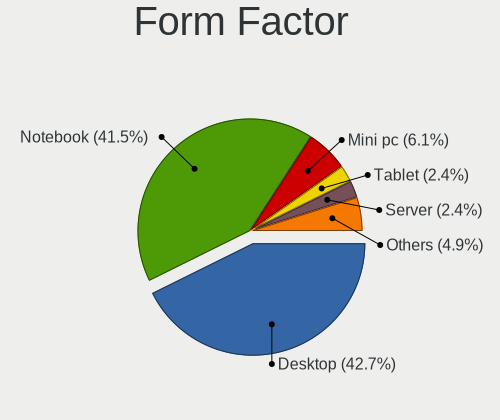
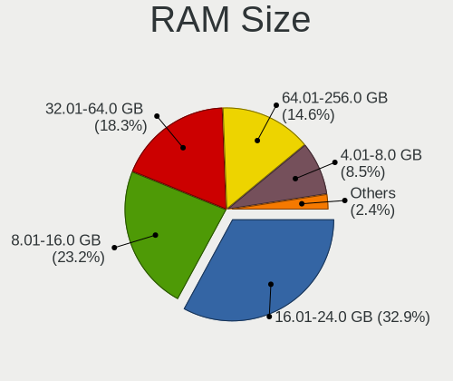

FreeBSD - Hardware Trends
-------------------------

A project to identify most popular hardware characteristics and track their change
over time based on data collected by BSD users at https://BSD-Hardware.info.

Anyone can contribute to this report by the [hw-probe](https://github.com/linuxhw/hw-probe/blob/master/INSTALL.BSD.md) tool:

    hw-probe -all -upload

This is a report for all computer types. See also reports for [desktops](/Dist/FreeBSD/Desktop/README.md) and [notebooks](/Dist/FreeBSD/Notebook/README.md).

This report is for one last month. Overall report since the beginning of time: [TestDays](https://github.com/bsdhw/TestDays)

Period: Dec, 2023.

Contents
--------

* [ System ](#system)
  - [ OS                       ](#os)
  - [ OS Family                ](#os-family)
  - [ Arch                     ](#arch)
  - [ DE                       ](#de)
  - [ Display Server           ](#display-server)
  - [ Display Manager          ](#display-manager)
  - [ OS Lang                  ](#os-lang)
  - [ Boot Mode                ](#boot-mode)
  - [ Filesystem               ](#filesystem)
  - [ Part. scheme             ](#part-scheme)

* [ Board ](#board)
  - [ Vendor                   ](#vendor)
  - [ Model                    ](#model)
  - [ Model Family             ](#model-family)
  - [ MFG Year                 ](#mfg-year)
  - [ Form Factor              ](#form-factor)
  - [ Coreboot                 ](#coreboot)
  - [ RAM Size                 ](#ram-size)
  - [ RAM Used                 ](#ram-used)
  - [ Total Drives             ](#total-drives)
  - [ Has CD-ROM               ](#has-cd-rom)
  - [ Has Ethernet             ](#has-ethernet)
  - [ Has WiFi                 ](#has-wifi)
  - [ Has Bluetooth            ](#has-bluetooth)

* [ Location ](#location)
  - [ Country                  ](#country)
  - [ City                     ](#city)

* [ Drives ](#drives)
  - [ Drive Vendor             ](#drive-vendor)
  - [ Drive Model              ](#drive-model)
  - [ HDD Vendor               ](#hdd-vendor)
  - [ SSD Vendor               ](#ssd-vendor)
  - [ Drive Kind               ](#drive-kind)
  - [ Drive Connector          ](#drive-connector)
  - [ Drive Size               ](#drive-size)
  - [ Space Total              ](#space-total)
  - [ Space Used               ](#space-used)
  - [ Malfunc. Drives          ](#malfunc-drives)
  - [ Malfunc. Drive Vendor    ](#malfunc-drive-vendor)
  - [ Malfunc. HDD Vendor      ](#malfunc-hdd-vendor)
  - [ Malfunc. Drive Kind      ](#malfunc-drive-kind)
  - [ Failed Drives            ](#failed-drives)
  - [ Failed Drive Vendor      ](#failed-drive-vendor)
  - [ Drive Status             ](#drive-status)

* [ Storage controller ](#storage-controller)
  - [ Storage Vendor           ](#storage-vendor)
  - [ Storage Model            ](#storage-model)
  - [ Storage Kind             ](#storage-kind)

* [ Processor ](#processor)
  - [ CPU Vendor               ](#cpu-vendor)
  - [ CPU Model                ](#cpu-model)
  - [ CPU Model Family         ](#cpu-model-family)
  - [ CPU Cores                ](#cpu-cores)
  - [ CPU Sockets              ](#cpu-sockets)
  - [ CPU Threads              ](#cpu-threads)
  - [ CPU Microarch            ](#cpu-microarch)

* [ Graphics ](#graphics)
  - [ GPU Vendor               ](#gpu-vendor)
  - [ GPU Model                ](#gpu-model)
  - [ GPU Combo                ](#gpu-combo)
  - [ GPU Driver               ](#gpu-driver)
  - [ GPU Memory               ](#gpu-memory)

* [ Monitor ](#monitor)
  - [ Monitor Vendor           ](#monitor-vendor)
  - [ Monitor Model            ](#monitor-model)
  - [ Monitor Resolution       ](#monitor-resolution)
  - [ Monitor Diagonal         ](#monitor-diagonal)
  - [ Monitor Width            ](#monitor-width)
  - [ Aspect Ratio             ](#aspect-ratio)
  - [ Monitor Area             ](#monitor-area)
  - [ Pixel Density            ](#pixel-density)
  - [ Multiple Monitors        ](#multiple-monitors)

* [ Network ](#network)
  - [ Net Controller Vendor    ](#net-controller-vendor)
  - [ Net Controller Model     ](#net-controller-model)
  - [ Wireless Vendor          ](#wireless-vendor)
  - [ Wireless Model           ](#wireless-model)
  - [ Ethernet Vendor          ](#ethernet-vendor)
  - [ Ethernet Model           ](#ethernet-model)
  - [ Net Controller Kind      ](#net-controller-kind)
  - [ Used Controller          ](#used-controller)
  - [ NICs                     ](#nics)
  - [ IPv6                     ](#ipv6)

* [ Bluetooth ](#bluetooth)
  - [ Bluetooth Vendor         ](#bluetooth-vendor)
  - [ Bluetooth Model          ](#bluetooth-model)

* [ Sound ](#sound)
  - [ Sound Vendor             ](#sound-vendor)
  - [ Sound Model              ](#sound-model)

* [ Memory ](#memory)
  - [ Memory Vendor            ](#memory-vendor)
  - [ Memory Model             ](#memory-model)
  - [ Memory Kind              ](#memory-kind)
  - [ Memory Form Factor       ](#memory-form-factor)
  - [ Memory Size              ](#memory-size)
  - [ Memory Speed             ](#memory-speed)

* [ Printers & scanners ](#printers--scanners)
  - [ Printer Vendor           ](#printer-vendor)
  - [ Printer Model            ](#printer-model)
  - [ Scanner Vendor           ](#scanner-vendor)
  - [ Scanner Model            ](#scanner-model)

* [ Camera ](#camera)
  - [ Camera Vendor            ](#camera-vendor)
  - [ Camera Model             ](#camera-model)

* [ Security ](#security)
  - [ Fingerprint Vendor       ](#fingerprint-vendor)
  - [ Fingerprint Model        ](#fingerprint-model)
  - [ Chipcard Vendor          ](#chipcard-vendor)
  - [ Chipcard Model           ](#chipcard-model)

* [ Unsupported ](#unsupported)
  - [ Unsupported Devices      ](#unsupported-devices)
  - [ Unsupported Device Types ](#unsupported-device-types)

System
------

OS
--

Installed operating systems

| Name                 | Computers | Percent |
|----------------------|-----------|---------|
| FreeBSD 14.0         | 25        | 26.88%  |
| FreeBSD 14.0-p4      | 13        | 13.98%  |
| FreeBSD 14.0-p2      | 11        | 11.83%  |
| FreeBSD 14.0-p1      | 9         | 9.68%   |
| FreeBSD 14.0-p3      | 8         | 8.6%    |
| FreeBSD 13.2-p5      | 5         | 5.38%   |
| FreeBSD 15.0-CURRENT | 4         | 4.3%    |
| FreeBSD 14.0-STABLE  | 2         | 2.15%   |
| FreeBSD 13.2-p6      | 2         | 2.15%   |
| FreeBSD 14.0-BETA5   | 1         | 1.08%   |
| FreeBSD 13.2-p9      | 1         | 1.08%   |
| FreeBSD 13.2-p8      | 1         | 1.08%   |
| FreeBSD 13.2-p54     | 1         | 1.08%   |
| FreeBSD 13.2-p3      | 1         | 1.08%   |
| FreeBSD 13.2         | 1         | 1.08%   |
| FreeBSD 13.1         | 1         | 1.08%   |
| FreeBSD 12.4-p9      | 1         | 1.08%   |
| FreeBSD 12.4-p6      | 1         | 1.08%   |
| FreeBSD 12.4-p5      | 1         | 1.08%   |
| FreeBSD 12.4-p3      | 1         | 1.08%   |
| FreeBSD 12.4-p2      | 1         | 1.08%   |
| FreeBSD 12.4-p1      | 1         | 1.08%   |
| FreeBSD 12.4         | 1         | 1.08%   |

OS Family
---------

OS without a version

| Name    | Computers | Percent |
|---------|-----------|---------|
| FreeBSD | 93        | 100%    |

Arch
----

OS architecture (x86_64, i586, etc.)

| Name    | Computers | Percent |
|---------|-----------|---------|
| amd64   | 87        | 93.55%  |
| arm64   | 3         | 3.23%   |
| i386    | 2         | 2.15%   |
| powerpc | 1         | 1.08%   |

DE
--

Desktop Environment

| Name     | Computers | Percent |
|----------|-----------|---------|
| Console  | 32        | 34.41%  |
| KDE5     | 19        | 20.43%  |
| XFCE     | 13        | 13.98%  |
| TWM      | 7         | 7.53%   |
| MATE     | 5         | 5.38%   |
| GNOME    | 4         | 4.3%    |
| Openbox  | 3         | 3.23%   |
| LXQt     | 2         | 2.15%   |
| i3       | 2         | 2.15%   |
| ICEWM    | 1         | 1.08%   |
| Hyprland | 1         | 1.08%   |
| GNUstep  | 1         | 1.08%   |
| fvwm2    | 1         | 1.08%   |
| dwm      | 1         | 1.08%   |
| Budgie   | 1         | 1.08%   |

Display Server
--------------

X11 or Wayland

| Name    | Computers | Percent |
|---------|-----------|---------|
| X11     | 55        | 59.14%  |
| Console | 31        | 33.33%  |
| Wayland | 7         | 7.53%   |

Display Manager
---------------

SDDM, LightDM, etc.

| Name    | Computers | Percent |
|---------|-----------|---------|
| Console | 49        | 52.69%  |
| SDDM    | 23        | 24.73%  |
| LightDM | 8         | 8.6%    |
| SLiM    | 6         | 6.45%   |
| XDM     | 3         | 3.23%   |
| GDM     | 3         | 3.23%   |
| Ly      | 1         | 1.08%   |

OS Lang
-------

Language

| Lang    | Computers | Percent |
|---------|-----------|---------|
| C       | 63        | 67.74%  |
| en_US   | 10        | 10.75%  |
| Unknown | 10        | 10.75%  |
| de_DE   | 3         | 3.23%   |
| ru_RU   | 2         | 2.15%   |
| ru      | 1         | 1.08%   |
| ko_KR   | 1         | 1.08%   |
| it_IT   | 1         | 1.08%   |
| es_AR   | 1         | 1.08%   |
| cs_CZ   | 1         | 1.08%   |

Boot Mode
---------

EFI or BIOS

| Mode | Computers | Percent |
|------|-----------|---------|
| EFI  | 73        | 78.49%  |
| BIOS | 20        | 21.51%  |

Filesystem
----------

Type of filesystem

| Type | Computers | Percent |
|------|-----------|---------|
| Zfs  | 63        | 67.74%  |
| Ufs  | 30        | 32.26%  |

Part. scheme
------------

Scheme of partitioning

| Type    | Computers | Percent |
|---------|-----------|---------|
| GPT     | 81        | 87.1%   |
| MBR     | 10        | 10.75%  |
| Unknown | 2         | 2.15%   |

Board
-----

Vendor
------

Motherboard manufacturer

| Name                    | Computers | Percent |
|-------------------------|-----------|---------|
| Dell                    | 22        | 23.66%  |
| Lenovo                  | 16        | 17.2%   |
| ASUSTek Computer        | 14        | 15.05%  |
| MSI                     | 5         | 5.38%   |
| Hewlett-Packard         | 4         | 4.3%    |
| Google                  | 3         | 3.23%   |
| ASRock                  | 3         | 3.23%   |
| Apple                   | 3         | 3.23%   |
| Toshiba                 | 2         | 2.15%   |
| Raspberry Pi Foundation | 2         | 2.15%   |
| Gigabyte Technology     | 2         | 2.15%   |
| AZW                     | 2         | 2.15%   |
| Unknown                 | 2         | 2.15%   |
| Wortmann AG             | 1         | 1.08%   |
| TULPAR                  | 1         | 1.08%   |
| Rembrandt               | 1         | 1.08%   |
| MECHREVO                | 1         | 1.08%   |
| Intel                   | 1         | 1.08%   |
| EVGA                    | 1         | 1.08%   |
| ECS                     | 1         | 1.08%   |
| CSL-Computer            | 1         | 1.08%   |
| Clevo                   | 1         | 1.08%   |
| Chuwi                   | 1         | 1.08%   |
| ASRockRack              | 1         | 1.08%   |
| Acidanthera             | 1         | 1.08%   |
| Acer                    | 1         | 1.08%   |

Model
-----

Motherboard model

| Name                                     | Computers | Percent |
|------------------------------------------|-----------|---------|
| RPi Raspberry Pi                         | 2         | 2.15%   |
| Dell PowerEdge R330                      | 2         | 2.15%   |
| Dell OptiPlex 7050                       | 2         | 2.15%   |
| AZW EQ                                   | 2         | 2.15%   |
| Unknown                                  | 2         | 2.15%   |
| Wortmann AG TERRA_MOBILE_1541            | 1         | 1.08%   |
| TULPAR A5 V20.3                          | 1         | 1.08%   |
| Toshiba Satellite P300                   | 1         | 1.08%   |
| Toshiba Satellite C50-B                  | 1         | 1.08%   |
| Rembrandt ARB928                         | 1         | 1.08%   |
| MSI NC683AA-ABA m9500y                   | 1         | 1.08%   |
| MSI MS-7C96                              | 1         | 1.08%   |
| MSI MS-7C37                              | 1         | 1.08%   |
| MSI MS-7817                              | 1         | 1.08%   |
| MSI MS-7529                              | 1         | 1.08%   |
| MECHREVO F7BSC V1.0                      | 1         | 1.08%   |
| Lenovo ThinkPad X280 20KES5M300          | 1         | 1.08%   |
| Lenovo ThinkPad X1 Carbon 7th 20QES53R00 | 1         | 1.08%   |
| Lenovo ThinkPad X1 Carbon 2nd 20A7002FUS | 1         | 1.08%   |
| Lenovo ThinkPad W520 4284GZ1             | 1         | 1.08%   |
| Lenovo ThinkPad W520 4270CTO             | 1         | 1.08%   |
| Lenovo ThinkPad T490s 20NYS4HL1K         | 1         | 1.08%   |
| Lenovo ThinkPad T480 20L6S29E0T          | 1         | 1.08%   |
| Lenovo ThinkPad T430s 23532QG            | 1         | 1.08%   |
| Lenovo ThinkPad T14s Gen 4 21F60029US    | 1         | 1.08%   |
| Lenovo ThinkPad T14 Gen 3 21CF002UMZ     | 1         | 1.08%   |
| Lenovo ThinkPad P17 Gen 2i 20YVS1L900    | 1         | 1.08%   |
| Lenovo ThinkPad P1 20MD002MUS            | 1         | 1.08%   |
| Lenovo ThinkCentre M700 10GRCTO1WW       | 1         | 1.08%   |
| Lenovo Legion 7 16ACHg6 82N6             | 1         | 1.08%   |
| Lenovo IdeaPad 5 15ALC05 82LN            | 1         | 1.08%   |
| Lenovo IdeaPad 330-15ARR 81D2            | 1         | 1.08%   |
| Intel NUC12WSHi3                         | 1         | 1.08%   |
| HP ZBook 17 G2                           | 1         | 1.08%   |
| HP Stream Notebook PC 11                 | 1         | 1.08%   |
| HP EliteBook 840 G6                      | 1         | 1.08%   |
| HP Compaq Elite 8300 SFF                 | 1         | 1.08%   |
| Google Parrot                            | 1         | 1.08%   |
| Google Lindar                            | 1         | 1.08%   |
| Google Kohaku                            | 1         | 1.08%   |

Model Family
------------

Motherboard model prefix

| Name               | Computers | Percent |
|--------------------|-----------|---------|
| Lenovo ThinkPad    | 12        | 12.9%   |
| Dell PowerEdge     | 5         | 5.38%   |
| Dell Latitude      | 5         | 5.38%   |
| Dell Precision     | 4         | 4.3%    |
| Dell OptiPlex      | 3         | 3.23%   |
| Dell Inspiron      | 3         | 3.23%   |
| ASUS TUF           | 3         | 3.23%   |
| Toshiba Satellite  | 2         | 2.15%   |
| RPi Raspberry      | 2         | 2.15%   |
| Lenovo IdeaPad     | 2         | 2.15%   |
| AZW EQ             | 2         | 2.15%   |
| ASUS ROG           | 2         | 2.15%   |
| ASUS Pro           | 2         | 2.15%   |
| ASUS PRIME         | 2         | 2.15%   |
| Unknown            | 2         | 2.15%   |
| Wortmann AG TERRA  | 1         | 1.08%   |
| TULPAR A5          | 1         | 1.08%   |
| Rembrandt ARB928   | 1         | 1.08%   |
| MSI NC683AA-ABA    | 1         | 1.08%   |
| MSI MS-7C96        | 1         | 1.08%   |
| MSI MS-7C37        | 1         | 1.08%   |
| MSI MS-7817        | 1         | 1.08%   |
| MSI MS-7529        | 1         | 1.08%   |
| MECHREVO F7BSC     | 1         | 1.08%   |
| Lenovo ThinkCentre | 1         | 1.08%   |
| Lenovo Legion      | 1         | 1.08%   |
| Intel NUC12WSHi3   | 1         | 1.08%   |
| HP ZBook           | 1         | 1.08%   |
| HP Stream          | 1         | 1.08%   |
| HP EliteBook       | 1         | 1.08%   |
| HP Compaq          | 1         | 1.08%   |
| Google Parrot      | 1         | 1.08%   |
| Google Lindar      | 1         | 1.08%   |
| Google Kohaku      | 1         | 1.08%   |
| Gigabyte H61M-S2PV | 1         | 1.08%   |
| Gigabyte B650      | 1         | 1.08%   |
| EVGA X570          | 1         | 1.08%   |
| ECS MCP61M-M3      | 1         | 1.08%   |
| Dell XPS           | 1         | 1.08%   |
| Dell Vostro        | 1         | 1.08%   |

MFG Year
--------

Motherboard manufacture year

| Year    | Computers | Percent |
|---------|-----------|---------|
| 2021    | 14        | 15.05%  |
| 2019    | 13        | 13.98%  |
| 2023    | 12        | 12.9%   |
| 2012    | 10        | 10.75%  |
| 2022    | 9         | 9.68%   |
| 2020    | 4         | 4.3%    |
| 2018    | 4         | 4.3%    |
| 2010    | 4         | 4.3%    |
| 2009    | 4         | 4.3%    |
| Unknown | 4         | 4.3%    |
| 2017    | 3         | 3.23%   |
| 2013    | 3         | 3.23%   |
| 2016    | 2         | 2.15%   |
| 2015    | 2         | 2.15%   |
| 2014    | 2         | 2.15%   |
| 2011    | 1         | 1.08%   |
| 2008    | 1         | 1.08%   |
| 2007    | 1         | 1.08%   |

Form Factor
-----------

Physical design of the computer

| Name           | Computers | Percent |
|----------------|-----------|---------|
| Notebook       | 45        | 48.39%  |
| Desktop        | 37        | 39.78%  |
| Mini pc        | 4         | 4.3%    |
| Server         | 4         | 4.3%    |
| System on chip | 2         | 2.15%   |
| Convertible    | 1         | 1.08%   |

Coreboot
--------

Have coreboot on board

| Used | Computers | Percent |
|------|-----------|---------|
| No   | 90        | 96.77%  |
| Yes  | 3         | 3.23%   |

RAM Size
--------

Total RAM memory

| Size in GB  | Computers | Percent |
|-------------|-----------|---------|
| 32.01-64.0  | 19        | 20.43%  |
| 16.01-24.0  | 19        | 20.43%  |
| 8.01-16.0   | 18        | 19.35%  |
| 64.01-256.0 | 15        | 16.13%  |
| 4.01-8.0    | 14        | 15.05%  |
| 2.01-3.0    | 4         | 4.3%    |
| 3.01-4.0    | 2         | 2.15%   |
| 24.01-32.0  | 1         | 1.08%   |
| 0.51-1.0    | 1         | 1.08%   |

RAM Used
--------

Used RAM memory

| Used GB  | Computers | Percent |
|----------|-----------|---------|
| 0.01-0.5 | 33        | 35.48%  |
| 1.01-2.0 | 26        | 27.96%  |
| 0.51-1.0 | 22        | 23.66%  |
| 2.01-3.0 | 5         | 5.38%   |
| 3.01-4.0 | 4         | 4.3%    |
| 4.01-8.0 | 2         | 2.15%   |
| 0        | 1         | 1.08%   |

Total Drives
------------

Number of drives on board

| Drives | Computers | Percent |
|--------|-----------|---------|
| 1      | 38        | 40.86%  |
| 0      | 27        | 29.03%  |
| 2      | 11        | 11.83%  |
| 3      | 10        | 10.75%  |
| 4      | 4         | 4.3%    |
| 13     | 1         | 1.08%   |
| 12     | 1         | 1.08%   |
| 6      | 1         | 1.08%   |

Has CD-ROM
----------

Has CD-ROM on board

| Presented | Computers | Percent |
|-----------|-----------|---------|
| No        | 64        | 68.82%  |
| Yes       | 29        | 31.18%  |

Has Ethernet
------------

Has Ethernet on board

| Presented | Computers | Percent |
|-----------|-----------|---------|
| Yes       | 80        | 86.02%  |
| No        | 13        | 13.98%  |

Has WiFi
--------

Has WiFi module

| Presented | Computers | Percent |
|-----------|-----------|---------|
| Yes       | 60        | 64.52%  |
| No        | 33        | 35.48%  |

Has Bluetooth
-------------

Has Bluetooth module

| Presented | Computers | Percent |
|-----------|-----------|---------|
| Yes       | 52        | 55.91%  |
| No        | 41        | 44.09%  |

Location
--------

Country
-------

Geographic location (country)

| Country     | Computers | Percent |
|-------------|-----------|---------|
| USA         | 22        | 23.66%  |
| Germany     | 10        | 10.75%  |
| Russia      | 6         | 6.45%   |
| Mexico      | 6         | 6.45%   |
| China       | 5         | 5.38%   |
| UK          | 4         | 4.3%    |
| Spain       | 4         | 4.3%    |
| Indonesia   | 3         | 3.23%   |
| France      | 3         | 3.23%   |
| Thailand    | 2         | 2.15%   |
| Switzerland | 2         | 2.15%   |
| Romania     | 2         | 2.15%   |
| Netherlands | 2         | 2.15%   |
| Luxembourg  | 2         | 2.15%   |
| Italy       | 2         | 2.15%   |
| Czechia     | 2         | 2.15%   |
| Brazil      | 2         | 2.15%   |
| Venezuela   | 1         | 1.08%   |
| Taiwan      | 1         | 1.08%   |
| South Korea | 1         | 1.08%   |
| Portugal    | 1         | 1.08%   |
| Nepal       | 1         | 1.08%   |
| Lithuania   | 1         | 1.08%   |
| Japan       | 1         | 1.08%   |
| India       | 1         | 1.08%   |
| Greece      | 1         | 1.08%   |
| Ecuador     | 1         | 1.08%   |
| Chile       | 1         | 1.08%   |
| Canada      | 1         | 1.08%   |
| Bulgaria    | 1         | 1.08%   |
| Argentina   | 1         | 1.08%   |

City
----

Geographic location (city)

| City                     | Computers | Percent |
|--------------------------|-----------|---------|
| San Luis Potosí City    | 6         | 6.45%   |
| Moscow                   | 3         | 3.23%   |
| Sandweiler               | 2         | 2.15%   |
| San Antonio              | 2         | 2.15%   |
| Salem                    | 2         | 2.15%   |
| Rüsselsheim am Main     | 2         | 2.15%   |
| Redmond                  | 2         | 2.15%   |
| Milan                    | 2         | 2.15%   |
| Frankfurt am Main        | 2         | 2.15%   |
| Zurich                   | 1         | 1.08%   |
| Yokohama                 | 1         | 1.08%   |
| Wenatchee                | 1         | 1.08%   |
| Vadodara                 | 1         | 1.08%   |
| Uiwang-si                | 1         | 1.08%   |
| Timișoara               | 1         | 1.08%   |
| Thessaloniki             | 1         | 1.08%   |
| Teplice                  | 1         | 1.08%   |
| Taipei                   | 1         | 1.08%   |
| Sutton                   | 1         | 1.08%   |
| Surabaya                 | 1         | 1.08%   |
| Sterling                 | 1         | 1.08%   |
| Steckborn                | 1         | 1.08%   |
| Stavropol                | 1         | 1.08%   |
| Sorocaba                 | 1         | 1.08%   |
| Songjiang                | 1         | 1.08%   |
| Solden                   | 1         | 1.08%   |
| Shoreham                 | 1         | 1.08%   |
| Shijiazhuang             | 1         | 1.08%   |
| Santiago                 | 1         | 1.08%   |
| Santa Coloma de Farners  | 1         | 1.08%   |
| Roesrath                 | 1         | 1.08%   |
| Richmond                 | 1         | 1.08%   |
| Prague                   | 1         | 1.08%   |
| Potomac                  | 1         | 1.08%   |
| Portoviejo               | 1         | 1.08%   |
| Pevensey                 | 1         | 1.08%   |
| Petropavlovsk-Kamchatsky | 1         | 1.08%   |
| Oxford                   | 1         | 1.08%   |
| Orléans                 | 1         | 1.08%   |
| O'Fallon                 | 1         | 1.08%   |

Drives
------

Drive Vendor
------------

Hard drive vendors

| Vendor              | Computers | Drives | Percent |
|---------------------|-----------|--------|---------|
| Samsung Electronics | 20        | 33     | 21.05%  |
| Seagate             | 19        | 30     | 20%     |
| WDC                 | 11        | 21     | 11.58%  |
| Toshiba             | 8         | 8      | 8.42%   |
| Kingston            | 5         | 6      | 5.26%   |
| Crucial             | 4         | 4      | 4.21%   |
| Intel               | 3         | 4      | 3.16%   |
| Apple               | 3         | 3      | 3.16%   |
| SK hynix            | 2         | 2      | 2.11%   |
| Hitachi             | 2         | 2      | 2.11%   |
| HGST                | 2         | 3      | 2.11%   |
| Fujitsu             | 2         | 2      | 2.11%   |
| Corsair             | 2         | 2      | 2.11%   |
| WD MediaMax         | 1         | 1      | 1.05%   |
| V-GeN               | 1         | 2      | 1.05%   |
| SSSTC               | 1         | 1      | 1.05%   |
| SPCC                | 1         | 1      | 1.05%   |
| SanDisk             | 1         | 1      | 1.05%   |
| Phison              | 1         | 1      | 1.05%   |
| Patriot             | 1         | 1      | 1.05%   |
| OWC                 | 1         | 3      | 1.05%   |
| MidasForce          | 1         | 2      | 1.05%   |
| Lenovo              | 1         | 2      | 1.05%   |
| AirDisk             | 1         | 1      | 1.05%   |
| aigo                | 1         | 1      | 1.05%   |

Drive Model
-----------

Hard drive models

| Model                                  | Computers | Percent |
|----------------------------------------|-----------|---------|
| Samsung SSD 870 EVO 1TB                | 3         | 2.59%   |
| Kingston SA400S37480G 480GB            | 3         | 2.59%   |
| WDC WD40EZRZ-22GXCB0 4TB               | 2         | 1.72%   |
| Toshiba MQ04ABF100 1TB                 | 2         | 1.72%   |
| Seagate ST4000DM000-1F2168 4TB         | 2         | 1.72%   |
| Seagate ST2000DM008-2FR102 2TB         | 2         | 1.72%   |
| Samsung SSD 860 QVO 1TB                | 2         | 1.72%   |
| Crucial CT500MX500SSD1 500GB           | 2         | 1.72%   |
| WDC WD80EMAZ-00WJTA0 8TB               | 1         | 0.86%   |
| WDC WD80EFZX-68UW8N0 8TB               | 1         | 0.86%   |
| WDC WD80EFAX-68LHPN0 8TB               | 1         | 0.86%   |
| WDC WD80EDBZ-11B0ZA0 8TB               | 1         | 0.86%   |
| WDC WD5000LPLX-75ZNTT0 500GB           | 1         | 0.86%   |
| WDC WD5000AAKX-00ERMA0 500GB           | 1         | 0.86%   |
| WDC WD4005FZBX-00K5WB0 4TB             | 1         | 0.86%   |
| WDC WD3200AVJS-00WDA0 320GB            | 1         | 0.86%   |
| WDC WD2500BEVT-22ZCT0 250GB            | 1         | 0.86%   |
| WDC WD15EADS-00P8B0 1.5TB              | 1         | 0.86%   |
| WDC WD120EMFZ-11A6JA0 12TB             | 1         | 0.86%   |
| WDC WD120EMAZ-11BLFA0 12TB             | 1         | 0.86%   |
| WDC WD10JPVX-00JC3T0 1TB               | 1         | 0.86%   |
| WDC WD10EZEX-00RKKA0 1TB               | 1         | 0.86%   |
| WDC WD10EALX-009BA0 1TB                | 1         | 0.86%   |
| WD MediaMax WL1500GSA6472B 1.5TB       | 1         | 0.86%   |
| V-GeN V-GEN11SM20AR1024ITM2 1TB        | 1         | 0.86%   |
| V-GeN V-GEN03SM22AR1024SDK 1TB         | 1         | 0.86%   |
| Toshiba THNSF5256GPUK 256GB            | 1         | 0.86%   |
| Toshiba MQ01ABD100 1TB                 | 1         | 0.86%   |
| Toshiba HDWR180 8TB                    | 1         | 0.86%   |
| Toshiba HDWG480 8TB                    | 1         | 0.86%   |
| Toshiba DT01ACA100 1TB                 | 1         | 0.86%   |
| Toshiba DT01ABA200V 2TB                | 1         | 0.86%   |
| SSSTC CL4-8D512 512GB                  | 1         | 0.86%   |
| SPCC Solid State Disk 128GB            | 1         | 0.86%   |
| SK hynix SKHynix_HFS512GDE9X084N 512GB | 1         | 0.86%   |
| SK hynix HFS256G32TNF-N3A0A 256GB      | 1         | 0.86%   |
| Seagate ST9500325AS 500GB              | 1         | 0.86%   |
| Seagate ST940110A 40GB                 | 1         | 0.86%   |
| Seagate ST9320423AS 320GB              | 1         | 0.86%   |
| Seagate ST9320325AS 320GB              | 1         | 0.86%   |

HDD Vendor
----------

Hard disk drive vendors

| Vendor              | Computers | Drives | Percent |
|---------------------|-----------|--------|---------|
| Seagate             | 18        | 29     | 39.13%  |
| WDC                 | 11        | 21     | 23.91%  |
| Toshiba             | 7         | 7      | 15.22%  |
| Samsung Electronics | 2         | 3      | 4.35%   |
| Hitachi             | 2         | 2      | 4.35%   |
| HGST                | 2         | 3      | 4.35%   |
| Fujitsu             | 2         | 2      | 4.35%   |
| WD MediaMax         | 1         | 1      | 2.17%   |
| Apple               | 1         | 1      | 2.17%   |

SSD Vendor
----------

Solid state drive vendors

| Vendor              | Computers | Drives | Percent |
|---------------------|-----------|--------|---------|
| Samsung Electronics | 16        | 25     | 40%     |
| Kingston            | 4         | 5      | 10%     |
| Crucial             | 4         | 4      | 10%     |
| Intel               | 2         | 3      | 5%      |
| Apple               | 2         | 2      | 5%      |
| V-GeN               | 1         | 2      | 2.5%    |
| SPCC                | 1         | 1      | 2.5%    |
| SK hynix            | 1         | 1      | 2.5%    |
| Seagate             | 1         | 1      | 2.5%    |
| SanDisk             | 1         | 1      | 2.5%    |
| Patriot             | 1         | 1      | 2.5%    |
| OWC                 | 1         | 3      | 2.5%    |
| MidasForce          | 1         | 2      | 2.5%    |
| Lenovo              | 1         | 2      | 2.5%    |
| Corsair             | 1         | 1      | 2.5%    |
| AirDisk             | 1         | 1      | 2.5%    |
| aigo                | 1         | 1      | 2.5%    |

Drive Kind
----------

HDD or SSD

| Kind | Computers | Drives | Percent |
|------|-----------|--------|---------|
| SSD  | 36        | 56     | 44.44%  |
| HDD  | 36        | 69     | 44.44%  |
| NVMe | 9         | 12     | 11.11%  |

Drive Connector
---------------

SATA, SAS, NVMe, etc.

| Type | Computers | Drives | Percent |
|------|-----------|--------|---------|
| SATA | 61        | 125    | 87.14%  |
| NVMe | 9         | 12     | 12.86%  |

Drive Size
----------

Size of hard drive

| Size in TB | Computers | Drives | Percent |
|------------|-----------|--------|---------|
| 0.01-0.5   | 36        | 47     | 42.35%  |
| 0.51-1.0   | 24        | 32     | 28.24%  |
| 1.01-2.0   | 12        | 15     | 14.12%  |
| 3.01-4.0   | 6         | 8      | 7.06%   |
| 4.01-10.0  | 5         | 20     | 5.88%   |
| 10.01-20.0 | 2         | 3      | 2.35%   |

Space Total
-----------

Amount of disk space available on the file system

| Size in GB     | Computers | Percent |
|----------------|-----------|---------|
| 251-500        | 29        | 31.18%  |
| 101-250        | 25        | 26.88%  |
| 501-1000       | 18        | 19.35%  |
| 21-50          | 6         | 6.45%   |
| 1001-2000      | 5         | 5.38%   |
| 51-100         | 5         | 5.38%   |
| More than 3000 | 2         | 2.15%   |
| 1-20           | 2         | 2.15%   |
| Unknown        | 1         | 1.08%   |

Space Used
----------

Amount of used disk space

| Used GB        | Computers | Percent |
|----------------|-----------|---------|
| 1-20           | 67        | 72.04%  |
| 21-50          | 15        | 16.13%  |
| 51-100         | 4         | 4.3%    |
| 101-250        | 3         | 3.23%   |
| More than 3000 | 1         | 1.08%   |
| 251-500        | 1         | 1.08%   |
| 1001-2000      | 1         | 1.08%   |
| Unknown        | 1         | 1.08%   |

Malfunc. Drives
---------------

Drive models with a malfunction

| Model                                 | Computers | Drives | Percent |
|---------------------------------------|-----------|--------|---------|
| WDC WD5000AAKX-00ERMA0 500GB          | 1         | 1      | 8.33%   |
| WDC WD10EZEX-00RKKA0 1TB              | 1         | 1      | 8.33%   |
| WDC WD10EALX-009BA0 1TB               | 1         | 1      | 8.33%   |
| Toshiba MQ01ABD100 1TB                | 1         | 1      | 8.33%   |
| Seagate ST9500325AS 500GB             | 1         | 1      | 8.33%   |
| Seagate ST9320325AS 320GB             | 1         | 1      | 8.33%   |
| Seagate ST4000VN000-1H4168 4TB        | 1         | 1      | 8.33%   |
| Seagate ST320LT012-1DG14C 320GB       | 1         | 2      | 8.33%   |
| Samsung Electronics HD204UI 2TB       | 1         | 1      | 8.33%   |
| Lenovo Thinklife SSD ST600 MSATA 256G | 1         | 1      | 8.33%   |
| Hitachi HUA722020ALA330 2TB           | 1         | 1      | 8.33%   |
| Fujitsu MHW2120BH 120GB               | 1         | 1      | 8.33%   |

Malfunc. Drive Vendor
---------------------

Vendors of faulty drives

| Vendor              | Computers | Drives | Percent |
|---------------------|-----------|--------|---------|
| Seagate             | 4         | 5      | 36.36%  |
| WDC                 | 2         | 3      | 18.18%  |
| Toshiba             | 1         | 1      | 9.09%   |
| Samsung Electronics | 1         | 1      | 9.09%   |
| Lenovo              | 1         | 1      | 9.09%   |
| Hitachi             | 1         | 1      | 9.09%   |
| Fujitsu             | 1         | 1      | 9.09%   |

Malfunc. HDD Vendor
-------------------

Vendors of faulty HDD drives

| Vendor              | Computers | Drives | Percent |
|---------------------|-----------|--------|---------|
| Seagate             | 4         | 5      | 40%     |
| WDC                 | 2         | 3      | 20%     |
| Toshiba             | 1         | 1      | 10%     |
| Samsung Electronics | 1         | 1      | 10%     |
| Hitachi             | 1         | 1      | 10%     |
| Fujitsu             | 1         | 1      | 10%     |

Malfunc. Drive Kind
-------------------

Kinds of faulty drives

| Kind | Computers | Drives | Percent |
|------|-----------|--------|---------|
| HDD  | 10        | 12     | 90.91%  |
| SSD  | 1         | 1      | 9.09%   |

Failed Drives
-------------

Failed drive models

Zero info for selected period =(

Failed Drive Vendor
-------------------

Failed drive vendors

Zero info for selected period =(

Drive Status
------------

Number of failed and malfunc. drives

| Status  | Computers | Drives | Percent |
|---------|-----------|--------|---------|
| Works   | 60        | 124    | 84.51%  |
| Malfunc | 11        | 13     | 15.49%  |

Storage controller
------------------

Storage Vendor
--------------

Storage controller vendors

| Vendor                                  | Computers | Percent |
|-----------------------------------------|-----------|---------|
| Intel                                   | 50        | 39.06%  |
| AMD                                     | 20        | 15.63%  |
| SanDisk                                 | 10        | 7.81%   |
| Samsung Electronics                     | 9         | 7.03%   |
| Broadcom / LSI                          | 6         | 4.69%   |
| SK hynix                                | 4         | 3.13%   |
| Micron/Crucial Technology               | 4         | 3.13%   |
| Kingston Technology Company             | 4         | 3.13%   |
| ASMedia Technology                      | 4         | 3.13%   |
| Toshiba                                 | 2         | 1.56%   |
| Solid State Storage Technology          | 2         | 1.56%   |
| Phison Electronics                      | 2         | 1.56%   |
| Micron Technology                       | 2         | 1.56%   |
| Marvell Technology Group                | 2         | 1.56%   |
| KIOXIA                                  | 2         | 1.56%   |
| Union Memory (Shenzhen)                 | 1         | 0.78%   |
| Shenzhen Unionmemory Information System | 1         | 0.78%   |
| Shenzhen Longsys Electronics            | 1         | 0.78%   |
| Nvidia                                  | 1         | 0.78%   |
| Unknown                                 | 1         | 0.78%   |

Storage Model
-------------

Storage controller models

| Model                                                                          | Computers | Percent |
|--------------------------------------------------------------------------------|-----------|---------|
| AMD FCH SATA Controller [AHCI mode]                                            | 16        | 11.27%  |
| Intel 7 Series Chipset Family 6-port SATA Controller [AHCI mode]               | 6         | 4.23%   |
| Samsung NVMe SSD Controller 980 (DRAM-less)                                    | 4         | 2.82%   |
| Intel Q170/Q150/B150/H170/H110/Z170/CM236 Chipset SATA Controller [AHCI Mode]  | 4         | 2.82%   |
| Intel 8 Series/C220 Series Chipset Family 6-port SATA Controller 1 [AHCI mode] | 4         | 2.82%   |
| SK hynix Gold P31/BC711/PC711 NVMe Solid State Drive                           | 3         | 2.11%   |
| Sandisk WD Black SN770 / PC SN740 256GB / PC SN560 (DRAM-less) NVMe SSD        | 3         | 2.11%   |
| SanDisk Ultra 3D / WD Blue SN550 NVMe SSD                                      | 3         | 2.11%   |
| SanDisk Extreme Pro / WD Black SN750 / PC SN730 / Red SN700 NVMe SSD           | 3         | 2.11%   |
| Intel 82801 Mobile SATA Controller [RAID mode]                                 | 3         | 2.11%   |
| ASMedia ASM1062 Serial ATA Controller                                          | 3         | 2.11%   |
| Unknown                                                                        | 3         | 2.11%   |
| Samsung NVMe SSD Controller SM961/PM961/SM963                                  | 2         | 1.41%   |
| Micron/Crucial P1 NVMe PCIe SSD[Frampton]                                      | 2         | 1.41%   |
| KIOXIA NVMe SSD                                                                | 2         | 1.41%   |
| Kingston Company NV2 NVMe SSD SM2267XT                                         | 2         | 1.41%   |
| Intel unknown                                                                  | 2         | 1.41%   |
| Intel 82801JI (ICH10 Family) 4 port SATA IDE Controller #1                     | 2         | 1.41%   |
| Intel 82801JI (ICH10 Family) 2 port SATA IDE Controller #2                     | 2         | 1.41%   |
| Intel 8 Series SATA Controller 1 [AHCI mode]                                   | 2         | 1.41%   |
| Intel 7 Series/C210 Series Chipset Family 4-port SATA Controller [IDE mode]    | 2         | 1.41%   |
| Intel 7 Series/C210 Series Chipset Family 2-port SATA Controller [IDE mode]    | 2         | 1.41%   |
| Intel 6 Series/C200 Series Chipset Family 6 port Mobile SATA AHCI Controller   | 2         | 1.41%   |
| Intel 500 Series Chipset Family SATA AHCI Controller                           | 2         | 1.41%   |
| Intel 400 Series Chipset Family SATA AHCI Controller                           | 2         | 1.41%   |
| Broadcom / LSI MegaRAID SAS-3 3008 [Fury]                                      | 2         | 1.41%   |
| Broadcom / LSI MegaRAID SAS 1078                                               | 2         | 1.41%   |
| AMD SB7x0/SB8x0/SB9x0 SATA Controller [AHCI mode]                              | 2         | 1.41%   |
| AMD 500 Series Chipset SATA Controller                                         | 2         | 1.41%   |
| Union Memory (Shenzhen) AM620 PCIe 3.0 NVMe SSD 128GB                          | 1         | 0.7%    |
| Toshiba XG5 NVMe SSD Controller                                                | 1         | 0.7%    |
| Toshiba XG4 NVMe SSD Controller                                                | 1         | 0.7%    |
| Solid State Storage CL4-8D512 NVMe SSD M.2 (DRAM-less)                         | 1         | 0.7%    |
| Solid State Storage CL1-3D256-Q11 NVMe SSD M.2                                 | 1         | 0.7%    |
| SK hynix BC501 NVMe Solid State Drive                                          | 1         | 0.7%    |
| Shenzhen Longsys unknown                                                       | 1         | 0.7%    |
| Sandisk WD Blue SN580 NVMe SSD (DRAM-less)                                     | 1         | 0.7%    |
| SanDisk Ultra 3D / WD Blue SN570 NVMe SSD (DRAM-less)                          | 1         | 0.7%    |
| SanDisk Extreme Pro / WD Black 2018/SN750/PC SN720 NVMe SSD                    | 1         | 0.7%    |
| Samsung NVMe SSD Controller SM981/PM981/PM983                                  | 1         | 0.7%    |

Storage Kind
------------

Kind of storage controller (IDE, SATA, NVMe, SAS, ...)

| Kind | Computers | Percent |
|------|-----------|---------|
| SATA | 58        | 47.93%  |
| NVMe | 42        | 34.71%  |
| IDE  | 11        | 9.09%   |
| RAID | 8         | 6.61%   |
| SAS  | 2         | 1.65%   |

Processor
---------

CPU Vendor
----------

Processor vendors

| Vendor  | Computers | Percent |
|---------|-----------|---------|
| Intel   | 64        | 68.82%  |
| AMD     | 25        | 26.88%  |
| ARM     | 3         | 3.23%   |
| Unknown | 1         | 1.08%   |

CPU Model
---------

Processor models

| Model                                       | Computers | Percent |
|---------------------------------------------|-----------|---------|
| Intel N100                                  | 3         | 3.23%   |
| Intel Xeon CPU E5502 @ 1.87GHz              | 2         | 2.15%   |
| Intel Xeon CPU E3-1270 v6 @ 3.80GHz         | 2         | 2.15%   |
| Intel Core i7-7700 CPU @ 3.60GHz            | 2         | 2.15%   |
| Intel Core i5-8365U CPU @ 1.60GHz           | 2         | 2.15%   |
| Intel Core i5-4200U CPU @ 1.60GHz           | 2         | 2.15%   |
| ARM Cortex-A72 r0p3                         | 2         | 2.15%   |
| AMD Ryzen 9 3900X 12-Core Processor         | 2         | 2.15%   |
| Intel Xeon W-11955M CPU @ 2.60GHz           | 1         | 1.08%   |
| Intel Xeon E-2176M CPU @ 2.70GHz            | 1         | 1.08%   |
| Intel Xeon CPU E5-2699 v3 @ 2.30GHz         | 1         | 1.08%   |
| Intel Xeon CPU E5-2696 v4 @ 2.20GHz         | 1         | 1.08%   |
| Intel Xeon CPU E3-1225 v3 @ 3.20GHz         | 1         | 1.08%   |
| Intel Pentium M                             | 1         | 1.08%   |
| Intel Pentium Dual-Core CPU E5200 @ 2.50GHz | 1         | 1.08%   |
| Intel Pentium CPU G640 @ 2.80GHz            | 1         | 1.08%   |
| Intel Pentium CPU G3220 @ 3.00GHz           | 1         | 1.08%   |
| Intel N200                                  | 1         | 1.08%   |
| Intel CPU Version                           | 1         | 1.08%   |
| Intel Core i7-8665U CPU @ 1.90GHz           | 1         | 1.08%   |
| Intel Core i7-8550U CPU @ 1.80GHz           | 1         | 1.08%   |
| Intel Core i7-6820HQ CPU @ 2.70GHz          | 1         | 1.08%   |
| Intel Core i7-6600U CPU @ 2.60GHz           | 1         | 1.08%   |
| Intel Core i7-5500U CPU @ 2.40GHz           | 1         | 1.08%   |
| Intel Core i7-4800MQ CPU @ 2.70GHz          | 1         | 1.08%   |
| Intel Core i7-4710MQ CPU @ 2.50GHz          | 1         | 1.08%   |
| Intel Core i7-3770 CPU @ 3.40GHz            | 1         | 1.08%   |
| Intel Core i7-3520M CPU @ 2.90GHz           | 1         | 1.08%   |
| Intel Core i7-2720QM CPU @ 2.20GHz          | 1         | 1.08%   |
| Intel Core i7-2630QM CPU @ 2.00GHz          | 1         | 1.08%   |
| Intel Core i7-10700K CPU @ 3.80GHz          | 1         | 1.08%   |
| Intel Core i7-10700 CPU @ 2.90GHz           | 1         | 1.08%   |
| Intel Core i7 CPU M 640 @ 2.80GH            | 1         | 1.08%   |
| Intel Core i5-8500 CPU @ 3.00GHz            | 1         | 1.08%   |
| Intel Core i5-8350U CPU @ 1.70GHz           | 1         | 1.08%   |
| Intel Core i5-6300HQ CPU @ 2.30GHz          | 1         | 1.08%   |
| Intel Core i5-3470 CPU @ 3.20GHz            | 1         | 1.08%   |
| Intel Core i5-3427U CPU @ 1.80GHz           | 1         | 1.08%   |
| Intel Core i5-3320M CPU @ 2.60GHz           | 1         | 1.08%   |
| Intel Core i5-3230M CPU @ 2.60GHz           | 1         | 1.08%   |

CPU Model Family
----------------

Processor model prefix

| Model                   | Computers | Percent |
|-------------------------|-----------|---------|
| Intel Core i7           | 16        | 17.2%   |
| Intel Core i5           | 15        | 16.13%  |
| Other                   | 13        | 13.98%  |
| AMD Ryzen 7             | 11        | 11.83%  |
| Intel Xeon              | 9         | 9.68%   |
| Intel Core i3           | 5         | 5.38%   |
| AMD Ryzen 9             | 4         | 4.3%    |
| Intel Celeron           | 3         | 3.23%   |
| ARM Cortex              | 3         | 3.23%   |
| Intel Pentium           | 2         | 2.15%   |
| AMD Ryzen 7 PRO         | 2         | 2.15%   |
| Intel Pentium M         | 1         | 1.08%   |
| Intel Pentium Dual-Core | 1         | 1.08%   |
| Intel Core 2 Quad       | 1         | 1.08%   |
| AMD Ryzen Threadripper  | 1         | 1.08%   |
| AMD Ryzen 5             | 1         | 1.08%   |
| AMD Ryzen 3             | 1         | 1.08%   |
| AMD Phenom              | 1         | 1.08%   |
| AMD EPYC                | 1         | 1.08%   |
| AMD C-50                | 1         | 1.08%   |
| AMD Athlon II X2        | 1         | 1.08%   |

CPU Cores
---------

Number of processor cores

| Number  | Computers | Percent |
|---------|-----------|---------|
| 4       | 30        | 32.26%  |
| 2       | 28        | 30.11%  |
| 16      | 12        | 12.9%   |
| 8       | 6         | 6.45%   |
| 6       | 5         | 5.38%   |
| 32      | 3         | 3.23%   |
| Unknown | 3         | 3.23%   |
| 24      | 2         | 2.15%   |
| 36      | 1         | 1.08%   |
| 22      | 1         | 1.08%   |
| 10      | 1         | 1.08%   |
| 1       | 1         | 1.08%   |

CPU Sockets
-----------

Number of sockets

| Number  | Computers | Percent |
|---------|-----------|---------|
| 1       | 87        | 93.55%  |
| Unknown | 4         | 4.3%    |
| 2       | 2         | 2.15%   |

CPU Threads
-----------

Threads per core (Hyper-Threading)

| Number  | Computers | Percent |
|---------|-----------|---------|
| 2       | 45        | 48.39%  |
| 1       | 44        | 47.31%  |
| Unknown | 4         | 4.3%    |

CPU Microarch
-------------

Microarchitecture

| Name        | Computers | Percent |
|-------------|-----------|---------|
| Unknown     | 19        | 20.43%  |
| KabyLake    | 13        | 13.98%  |
| IvyBridge   | 7         | 7.53%   |
| Haswell     | 7         | 7.53%   |
| SandyBridge | 6         | 6.45%   |
| Zen 3       | 5         | 5.38%   |
| Zen 2       | 4         | 4.3%    |
| Zen         | 4         | 4.3%    |
| Skylake     | 4         | 4.3%    |
| CometLake   | 4         | 4.3%    |
| Zen+        | 2         | 2.15%   |
| Westmere    | 2         | 2.15%   |
| TigerLake   | 2         | 2.15%   |
| Silvermont  | 2         | 2.15%   |
| Penryn      | 2         | 2.15%   |
| Nehalem     | 2         | 2.15%   |
| K10         | 2         | 2.15%   |
| Broadwell   | 2         | 2.15%   |
| P6          | 1         | 1.08%   |
| Excavator   | 1         | 1.08%   |
| Core        | 1         | 1.08%   |
| Bobcat      | 1         | 1.08%   |

Graphics
--------

GPU Vendor
----------

Vendors of graphics cards

| Vendor                     | Computers | Percent |
|----------------------------|-----------|---------|
| Intel                      | 49        | 47.57%  |
| AMD                        | 25        | 24.27%  |
| Nvidia                     | 23        | 22.33%  |
| Matrox Electronics Systems | 4         | 3.88%   |
| ASPEED Technology          | 2         | 1.94%   |

GPU Model
---------

Graphics card models

| Model                                                                       | Computers | Percent |
|-----------------------------------------------------------------------------|-----------|---------|
| Intel 2nd Generation Core Processor Family Integrated Graphics Controller   | 6         | 5.66%   |
| Intel 3rd Gen Core processor Graphics Controller                            | 5         | 4.72%   |
| Intel Alder Lake-N [UHD Graphics]                                           | 4         | 3.77%   |
| Intel WhiskeyLake-U GT2 [UHD Graphics 620]                                  | 3         | 2.83%   |
| Intel UHD Graphics 620                                                      | 3         | 2.83%   |
| Intel CometLake-S GT2 [UHD Graphics 630]                                    | 3         | 2.83%   |
| AMD Rembrandt [Radeon 680M]                                                 | 3         | 2.83%   |
| Nvidia GP107 [GeForce GTX 1050 Ti]                                          | 2         | 1.89%   |
| Matrox Electronics Systems MGA G200eW WPCM450                               | 2         | 1.89%   |
| Matrox Electronics Systems G200eR2                                          | 2         | 1.89%   |
| Intel Raptor Lake-P [Iris Xe Graphics]                                      | 2         | 1.89%   |
| Intel HD Graphics 630                                                       | 2         | 1.89%   |
| Intel HD Graphics 530                                                       | 2         | 1.89%   |
| Intel Haswell-ULT Integrated Graphics Controller                            | 2         | 1.89%   |
| Intel Atom Processor Z36xxx/Z37xxx Series Graphics & Display                | 2         | 1.89%   |
| ASPEED Technology ASPEED Graphics Family                                    | 2         | 1.89%   |
| AMD Navi 10 [Radeon RX 5600 OEM/5600 XT / 5700/5700 XT]                     | 2         | 1.89%   |
| AMD Ellesmere [Radeon RX 470/480/570/570X/580/580X/590]                     | 2         | 1.89%   |
| Nvidia TU117GLM [T1200 Laptop GPU]                                          | 1         | 0.94%   |
| Nvidia TU117 [GeForce GTX 1650]                                             | 1         | 0.94%   |
| Nvidia GT218M [NVS 3100M]                                                   | 1         | 0.94%   |
| Nvidia GT218 [NVS 300]                                                      | 1         | 0.94%   |
| Nvidia GP108 [GeForce GT 1030]                                              | 1         | 0.94%   |
| Nvidia GP107GLM [Quadro P2000 Mobile]                                       | 1         | 0.94%   |
| Nvidia GP106 [GeForce GTX 1060 3GB]                                         | 1         | 0.94%   |
| Nvidia GP104GLM [Quadro P3000 Mobile]                                       | 1         | 0.94%   |
| Nvidia GP104 [GeForce GTX 1080]                                             | 1         | 0.94%   |
| Nvidia GM108M [GeForce 940M]                                                | 1         | 0.94%   |
| Nvidia GM107GLM [Quadro M1000M]                                             | 1         | 0.94%   |
| Nvidia GK208M [GeForce GT 740M]                                             | 1         | 0.94%   |
| Nvidia GK208 [GeForce GT 630 Rev. 2]                                        | 1         | 0.94%   |
| Nvidia GK107GLM [Quadro K1100M]                                             | 1         | 0.94%   |
| Nvidia GF117M [GeForce 610M/710M/810M/820M / GT 620M/625M/630M/720M]        | 1         | 0.94%   |
| Nvidia GA106M [GeForce RTX 3060 Mobile / Max-Q]                             | 1         | 0.94%   |
| Nvidia GA104GLM [RTX A5000 Mobile]                                          | 1         | 0.94%   |
| Nvidia GA104 [GeForce RTX 3060 Ti Lite Hash Rate]                           | 1         | 0.94%   |
| Nvidia C61 [GeForce 6150SE nForce 430]                                      | 1         | 0.94%   |
| Nvidia AD107M [GeForce RTX 4050 Max-Q / Mobile]                             | 1         | 0.94%   |
| Nvidia AD103 [GeForce RTX 4080]                                             | 1         | 0.94%   |
| Intel Xeon E3-1200 v3/4th Gen Core Processor Integrated Graphics Controller | 1         | 0.94%   |

GPU Combo
---------

Combinations of graphics cards

| Name            | Computers | Percent |
|-----------------|-----------|---------|
| 1 x Intel       | 38        | 40.86%  |
| 1 x AMD         | 20        | 21.51%  |
| 1 x Nvidia      | 12        | 12.9%   |
| Intel + Nvidia  | 8         | 8.6%    |
| 1 x Matrox      | 4         | 4.3%    |
| Other           | 3         | 3.23%   |
| 2 x AMD         | 2         | 2.15%   |
| Intel + AMD     | 2         | 2.15%   |
| 2 x Intel       | 1         | 1.08%   |
| Nvidia + ASPEED | 1         | 1.08%   |
| 1 x ASPEED      | 1         | 1.08%   |
| AMD + Nvidia    | 1         | 1.08%   |

GPU Driver
----------

Free vs proprietary

| Driver      | Computers | Percent |
|-------------|-----------|---------|
| Free        | 74        | 79.57%  |
| Proprietary | 14        | 15.05%  |
| Unknown     | 5         | 5.38%   |

GPU Memory
----------

Total video memory

| Size in GB | Computers | Percent |
|------------|-----------|---------|
| Unknown    | 68        | 73.12%  |
| 0.01-0.5   | 6         | 6.45%   |
| 7.01-8.0   | 4         | 4.3%    |
| 3.01-4.0   | 4         | 4.3%    |
| 1.01-2.0   | 4         | 4.3%    |
| 8.01-16.0  | 4         | 4.3%    |
| 5.01-6.0   | 2         | 2.15%   |
| 0.51-1.0   | 1         | 1.08%   |

Monitor
-------

Monitor Vendor
--------------

Monitor vendors

| Vendor               | Computers | Percent |
|----------------------|-----------|---------|
| AU Optronics         | 7         | 13.73%  |
| Dell                 | 5         | 9.8%    |
| Chimei Innolux       | 5         | 9.8%    |
| Samsung Electronics  | 4         | 7.84%   |
| LG Display           | 4         | 7.84%   |
| Lenovo               | 4         | 7.84%   |
| BOE                  | 3         | 5.88%   |
| Sharp                | 2         | 3.92%   |
| Hewlett-Packard      | 2         | 3.92%   |
| Apple                | 2         | 3.92%   |
| Acer                 | 2         | 3.92%   |
| SDC                  | 1         | 1.96%   |
| Philips              | 1         | 1.96%   |
| MSI                  | 1         | 1.96%   |
| ITE                  | 1         | 1.96%   |
| Idek Iiyama          | 1         | 1.96%   |
| HKC                  | 1         | 1.96%   |
| Gigabyte Technology  | 1         | 1.96%   |
| BOE Technology Group | 1         | 1.96%   |
| Ancor Communications | 1         | 1.96%   |
| AGO                  | 1         | 1.96%   |
| Unknown              | 1         | 1.96%   |

Monitor Model
-------------

Monitor models

| Model                                                                 | Computers | Percent |
|-----------------------------------------------------------------------|-----------|---------|
| Sharp LCD Monitor SHP143E 3840x2160 350x190mm 15.7-inch               | 1         | 1.89%   |
| Sharp LCD Monitor SHP1416 1366x768 310x170mm 13.9-inch                | 1         | 1.89%   |
| SDC LCD Monitor 3520x1080                                             | 1         | 1.89%   |
| Samsung Electronics SyncMaster SAM0587 1920x1200 520x320mm 24.0-inch  | 1         | 1.89%   |
| Samsung Electronics SyncMaster SAM00A4 1024x768 300x230mm 14.9-inch   | 1         | 1.89%   |
| Samsung Electronics S24C31x SAM7311 1920x1080 520x310mm 23.8-inch     | 1         | 1.89%   |
| Samsung Electronics LCD Monitor SDC4142 3840x2160 290x170mm 13.2-inch | 1         | 1.89%   |
| Philips LCD Monitor 271P4 3520x1080                                   | 1         | 1.89%   |
| Philips LCD Monitor 271P4                                             | 1         | 1.89%   |
| MSI G241 MSI3BA4 1920x1080 530x300mm 24.0-inch                        | 1         | 1.89%   |
| LG Display LCD Monitor LGD6616 1366x768 280x160mm 12.7-inch           | 1         | 1.89%   |
| LG Display LCD Monitor LGD0563 1920x1080 340x190mm 15.3-inch          | 1         | 1.89%   |
| LG Display LCD Monitor LGD0362 1600x900 310x170mm 13.9-inch           | 1         | 1.89%   |
| LG Display LCD Monitor LGD0259 1920x1080 350x190mm 15.7-inch          | 1         | 1.89%   |
| Lenovo LEN T24i-20 LEN61F7 1920x1080 530x300mm 24.0-inch              | 1         | 1.89%   |
| Lenovo LCD Monitor LEN40B2 1920x1080 340x190mm 15.3-inch              | 1         | 1.89%   |
| Lenovo LCD Monitor LEN40B1 1600x900 340x190mm 15.3-inch               | 1         | 1.89%   |
| Lenovo LCD Monitor LEN40A0 1366x768 310x170mm 13.9-inch               | 1         | 1.89%   |
| ITE DP2VGA  V205 ITE6512 1920x1080 600x340mm 27.2-inch                | 1         | 1.89%   |
| Idek Iiyama LCD Monitor PL2710HD(D) 8960x1440                         | 1         | 1.89%   |
| HKC LCD Monitor 24E6C 1920x1080                                       | 1         | 1.89%   |
| Hewlett-Packard Z24i HWP309F 1920x1200 520x320mm 24.0-inch            | 1         | 1.89%   |
| Hewlett-Packard X24ih HPN36D9 1920x1080 530x300mm 24.0-inch           | 1         | 1.89%   |
| Gigabyte Technology M27Q P GBT2718 2560x1440 600x340mm 27.2-inch      | 1         | 1.89%   |
| Dell U2414H DELA0A4 1920x1080 530x300mm 24.0-inch                     | 1         | 1.89%   |
| Dell S3222HG DELD113 1920x1080 700x400mm 31.7-inch                    | 1         | 1.89%   |
| Dell P2219H DELA115 1920x1080 480x270mm 21.7-inch                     | 1         | 1.89%   |
| Dell AW2521HFA DELA161 1920x1080 540x300mm 24.3-inch                  | 1         | 1.89%   |
| Dell 2408WFP DELA02C 1920x1200 520x320mm 24.0-inch                    | 1         | 1.89%   |
| Chimei Innolux LCD Monitor CMN15BA 1920x1080 340x190mm 15.3-inch      | 1         | 1.89%   |
| Chimei Innolux LCD Monitor CMN1521 1920x1080 340x190mm 15.3-inch      | 1         | 1.89%   |
| Chimei Innolux LCD Monitor CMN14E4 1920x1080 310x170mm 13.9-inch      | 1         | 1.89%   |
| Chimei Innolux LCD Monitor CMN1136 1366x768 260x140mm 11.6-inch       | 1         | 1.89%   |
| Chimei Innolux LCD Monitor CMN1119 1366x768 260x140mm 11.6-inch       | 1         | 1.89%   |
| BOE Technology Group LCD Monitor 1920x1080                            | 1         | 1.89%   |
| BOE NE160WUM-NX2 BOE0B33 1920x1200 340x210mm 15.7-inch                | 1         | 1.89%   |
| BOE LCD Monitor BOE0751 1366x768 260x140mm 11.6-inch                  | 1         | 1.89%   |
| BOE LCD Monitor BOE074F 1920x1080 310x170mm 13.9-inch                 | 1         | 1.89%   |
| AU Optronics LCD Monitor AUOE48D 1920x1080 340x190mm 15.3-inch        | 1         | 1.89%   |
| AU Optronics LCD Monitor AUO543D 1920x1080 310x170mm 13.9-inch        | 1         | 1.89%   |

Monitor Resolution
------------------

Monitor screen resolution

| Resolution        | Computers | Percent |
|-------------------|-----------|---------|
| 1920x1080 (FHD)   | 24        | 47.06%  |
| 1366x768 (WXGA)   | 8         | 15.69%  |
| 1920x1200 (WUXGA) | 4         | 7.84%   |
| Unknown           | 3         | 5.88%   |
| 3840x2160 (4K)    | 2         | 3.92%   |
| 2560x1440 (QHD)   | 2         | 3.92%   |
| 1600x900 (HD+)    | 2         | 3.92%   |
| 8960x1440         | 1         | 1.96%   |
| 3840x1080         | 1         | 1.96%   |
| 3520x1080         | 1         | 1.96%   |
| 2560x1600         | 1         | 1.96%   |
| 1440x900 (WXGA+)  | 1         | 1.96%   |
| 1024x768 (XGA)    | 1         | 1.96%   |

Monitor Diagonal
----------------

Diagonal size in inches

| Inches  | Computers | Percent |
|---------|-----------|---------|
| 13      | 12        | 24.49%  |
| 15      | 9         | 18.37%  |
| 24      | 8         | 16.33%  |
| Unknown | 5         | 10.2%   |
| 27      | 3         | 6.12%   |
| 11      | 3         | 6.12%   |
| 31      | 2         | 4.08%   |
| 14      | 2         | 4.08%   |
| 12      | 2         | 4.08%   |
| 23      | 1         | 2.04%   |
| 21      | 1         | 2.04%   |
| 17      | 1         | 2.04%   |

Monitor Width
-------------

Physical width

| Width in mm | Computers | Percent |
|-------------|-----------|---------|
| 301-350     | 18        | 37.5%   |
| 501-600     | 11        | 22.92%  |
| 201-300     | 10        | 20.83%  |
| Unknown     | 5         | 10.42%  |
| 601-700     | 2         | 4.17%   |
| 401-500     | 1         | 2.08%   |
| 351-400     | 1         | 2.08%   |

Aspect Ratio
------------

Proportional relationship between the width and the height

| Ratio   | Computers | Percent |
|---------|-----------|---------|
| 16/9    | 35        | 72.92%  |
| 16/10   | 6         | 12.5%   |
| Unknown | 5         | 10.42%  |
| 4/3     | 2         | 4.17%   |

Monitor Area
------------

Area in inch²

| Area in inch² | Computers | Percent |
|----------------|-----------|---------|
| 81-90          | 11        | 22.92%  |
| 201-250        | 5         | 10.42%  |
| 101-110        | 5         | 10.42%  |
| 91-100         | 5         | 10.42%  |
| Unknown        | 5         | 10.42%  |
| 251-300        | 4         | 8.33%   |
| 51-60          | 3         | 6.25%   |
| 301-350        | 3         | 6.25%   |
| 61-70          | 2         | 4.17%   |
| 351-500        | 2         | 4.17%   |
| 71-80          | 1         | 2.08%   |
| 121-130        | 1         | 2.08%   |
| 111-120        | 1         | 2.08%   |

Pixel Density
-------------

Pixels per inch

| Density       | Computers | Percent |
|---------------|-----------|---------|
| 121-160       | 21        | 42.86%  |
| 51-100        | 13        | 26.53%  |
| 101-120       | 7         | 14.29%  |
| Unknown       | 5         | 10.2%   |
| More than 240 | 2         | 4.08%   |
| 161-240       | 1         | 2.04%   |

Multiple Monitors
-----------------

Total monitors connected

| Total | Computers | Percent |
|-------|-----------|---------|
| 0     | 45        | 48.39%  |
| 1     | 43        | 46.24%  |
| 2     | 5         | 5.38%   |

Network
-------

Net Controller Vendor
---------------------

Controller vendors

| Vendor                            | Computers | Percent |
|-----------------------------------|-----------|---------|
| Intel                             | 56        | 43.75%  |
| Realtek Semiconductor             | 34        | 26.56%  |
| Broadcom                          | 10        | 7.81%   |
| Qualcomm Atheros                  | 8         | 6.25%   |
| TP-Link                           | 3         | 2.34%   |
| MediaTek                          | 2         | 1.56%   |
| Marvell Technology Group          | 2         | 1.56%   |
| Dell                              | 2         | 1.56%   |
| Xiaomi                            | 1         | 0.78%   |
| Sundance Technology Inc / IC Plus | 1         | 0.78%   |
| Samsung Electronics               | 1         | 0.78%   |
| Ralink                            | 1         | 0.78%   |
| Qualcomm Technologies             | 1         | 0.78%   |
| OPPO Electronics                  | 1         | 0.78%   |
| JMicron Technology                | 1         | 0.78%   |
| D-Link System                     | 1         | 0.78%   |
| ASUSTek Computer                  | 1         | 0.78%   |
| Apple                             | 1         | 0.78%   |
| American Megatrends               | 1         | 0.78%   |

Net Controller Model
--------------------

Controller models

| Model                                                             | Computers | Percent |
|-------------------------------------------------------------------|-----------|---------|
| Realtek RTL8111/8168/8411 PCI Express Gigabit Ethernet Controller | 23        | 14.11%  |
| Realtek RTL8125 2.5GbE Controller                                 | 7         | 4.29%   |
| Intel Wi-Fi 6 AX210/AX211/AX411 160MHz                            | 6         | 3.68%   |
| Intel I211 Gigabit Network Connection                             | 5         | 3.07%   |
| Intel 82579LM Gigabit Network Connection (Lewisville)             | 5         | 3.07%   |
| Intel Ethernet Controller I225-V                                  | 4         | 2.45%   |
| Intel Ethernet Connection I217-LM                                 | 4         | 2.45%   |
| Intel CNVi: Wi-Fi                                                 | 4         | 2.45%   |
| Intel Wireless 8265 / 8275                                        | 3         | 1.84%   |
| Intel Wireless 7260                                               | 3         | 1.84%   |
| Intel Ethernet Connection (5) I219-LM                             | 3         | 1.84%   |
| Intel Centrino Advanced-N 6205 [Taylor Peak]                      | 3         | 1.84%   |
| Intel Cannon Point-LP CNVi [Wireless-AC]                          | 3         | 1.84%   |
| TP-Link AC600 wireless Realtek RTL8811AU [Archer T2U Nano]        | 2         | 1.23%   |
| Realtek RTL810xE PCI Express Fast Ethernet controller             | 2         | 1.23%   |
| Qualcomm Atheros QCA9565 / AR9565 Wireless Network Adapter        | 2         | 1.23%   |
| Qualcomm Atheros AR9485 Wireless Network Adapter                  | 2         | 1.23%   |
| Qualcomm Atheros AR9462 Wireless Network Adapter                  | 2         | 1.23%   |
| Intel Wireless 8260                                               | 2         | 1.23%   |
| Intel Wi-Fi 6 AX201                                               | 2         | 1.23%   |
| Intel Raptor Lake PCH CNVi WiFi                                   | 2         | 1.23%   |
| Intel I210 Gigabit Network Connection                             | 2         | 1.23%   |
| Intel Ethernet Connection (7) I219-LM                             | 2         | 1.23%   |
| Intel Ethernet Connection (6) I219-LM                             | 2         | 1.23%   |
| Intel Ethernet Connection (12) I219-V                             | 2         | 1.23%   |
| Broadcom NetXtreme BCM5720 Gigabit Ethernet PCIe                  | 2         | 1.23%   |
| Broadcom BCM4331 802.11a/b/g/n                                    | 2         | 1.23%   |
| Xiaomi Mi/Redmi series (RNDIS)                                    | 1         | 0.61%   |
| TP-Link TL-WN823N v2/v3 [Realtek RTL8192EU]                       | 1         | 0.61%   |
| TP-Link TL-WN722N v2/v3 [Realtek RTL8188EUS]                      | 1         | 0.61%   |
| Sundance Inc / IC Plus IP1000 Family Gigabit Ethernet             | 1         | 0.61%   |
| Samsung Galaxy series, misc. (tethering mode)                     | 1         | 0.61%   |
| Realtek RTL8852BE PCIe 802.11ax Wireless Network Controller       | 1         | 0.61%   |
| Realtek RTL8192EE PCIe Wireless Network Adapter                   | 1         | 0.61%   |
| Realtek RTL8191SEvB Wireless LAN Controller                       | 1         | 0.61%   |
| Realtek RTL8188EUS 802.11n Wireless Network Adapter               | 1         | 0.61%   |
| Realtek RTL8188CUS 802.11n WLAN Adapter                           | 1         | 0.61%   |
| Realtek RTL-8100/8101L/8139 PCI Fast Ethernet Adapter             | 1         | 0.61%   |
| Ralink RT5390 Wireless 802.11n 1T/1R PCIe                         | 1         | 0.61%   |
| Qualcomm QCNFA765 Wireless Network Adapter                        | 1         | 0.61%   |

Wireless Vendor
---------------

Wireless vendors

| Vendor                | Computers | Percent |
|-----------------------|-----------|---------|
| Intel                 | 37        | 56.92%  |
| Qualcomm Atheros      | 8         | 12.31%  |
| Realtek Semiconductor | 5         | 7.69%   |
| Broadcom              | 5         | 7.69%   |
| TP-Link               | 3         | 4.62%   |
| MediaTek              | 2         | 3.08%   |
| Ralink                | 1         | 1.54%   |
| Qualcomm Technologies | 1         | 1.54%   |
| Dell                  | 1         | 1.54%   |
| D-Link System         | 1         | 1.54%   |
| ASUSTek Computer      | 1         | 1.54%   |

Wireless Model
--------------

Wireless models

| Model                                                                      | Computers | Percent |
|----------------------------------------------------------------------------|-----------|---------|
| Intel Wi-Fi 6 AX210/AX211/AX411 160MHz                                     | 6         | 9.09%   |
| Intel CNVi: Wi-Fi                                                          | 4         | 6.06%   |
| Intel Wireless 8265 / 8275                                                 | 3         | 4.55%   |
| Intel Wireless 7260                                                        | 3         | 4.55%   |
| Intel Centrino Advanced-N 6205 [Taylor Peak]                               | 3         | 4.55%   |
| Intel Cannon Point-LP CNVi [Wireless-AC]                                   | 3         | 4.55%   |
| TP-Link AC600 wireless Realtek RTL8811AU [Archer T2U Nano]                 | 2         | 3.03%   |
| Qualcomm Atheros QCA9565 / AR9565 Wireless Network Adapter                 | 2         | 3.03%   |
| Qualcomm Atheros AR9485 Wireless Network Adapter                           | 2         | 3.03%   |
| Qualcomm Atheros AR9462 Wireless Network Adapter                           | 2         | 3.03%   |
| Intel Wireless 8260                                                        | 2         | 3.03%   |
| Intel Wi-Fi 6 AX201                                                        | 2         | 3.03%   |
| Intel Raptor Lake PCH CNVi WiFi                                            | 2         | 3.03%   |
| Broadcom BCM4331 802.11a/b/g/n                                             | 2         | 3.03%   |
| TP-Link TL-WN823N v2/v3 [Realtek RTL8192EU]                                | 1         | 1.52%   |
| TP-Link TL-WN722N v2/v3 [Realtek RTL8188EUS]                               | 1         | 1.52%   |
| Realtek RTL8852BE PCIe 802.11ax Wireless Network Controller                | 1         | 1.52%   |
| Realtek RTL8192EE PCIe Wireless Network Adapter                            | 1         | 1.52%   |
| Realtek RTL8191SEvB Wireless LAN Controller                                | 1         | 1.52%   |
| Realtek RTL8188EUS 802.11n Wireless Network Adapter                        | 1         | 1.52%   |
| Realtek RTL8188CUS 802.11n WLAN Adapter                                    | 1         | 1.52%   |
| Ralink RT5390 Wireless 802.11n 1T/1R PCIe                                  | 1         | 1.52%   |
| Qualcomm QCNFA765 Wireless Network Adapter                                 | 1         | 1.52%   |
| Qualcomm Atheros QCA9377 802.11ac Wireless Network Adapter                 | 1         | 1.52%   |
| Qualcomm Atheros QCA6174 802.11ac Wireless Network Adapter                 | 1         | 1.52%   |
| MediaTek MT7921 802.11ax PCI Express Wireless Network Adapter              | 1         | 1.52%   |
| MediaTek MT7630e 802.11bgn Wireless Network Adapter                        | 1         | 1.52%   |
| Intel WiFi Link 5100                                                       | 1         | 1.52%   |
| Intel Wi-Fi 6 AX200                                                        | 1         | 1.52%   |
| Intel Dual Band Wireless-AC 3168NGW [Stone Peak]                           | 1         | 1.52%   |
| Intel Dual Band Wireless-AC 3165 Plus Bluetooth                            | 1         | 1.52%   |
| Intel Comet Lake PCH-LP CNVi WiFi                                          | 1         | 1.52%   |
| Intel Centrino Wireless-N 2230                                             | 1         | 1.52%   |
| Intel Centrino Advanced-N 6200                                             | 1         | 1.52%   |
| Intel Cannon Lake PCH CNVi WiFi                                            | 1         | 1.52%   |
| Intel Alder Lake-P PCH CNVi WiFi                                           | 1         | 1.52%   |
| Dell Wireless 5808e Gobi 4G LTE Mobile Broadband DM Port                   | 1         | 1.52%   |
| D-Link System AirPlus G DWL-G122 Wireless Adapter(rev.C1) [Ralink RT2571W] | 1         | 1.52%   |
| Broadcom BCM43224 802.11a/b/g/n                                            | 1         | 1.52%   |
| Broadcom BCM4312 802.11b/g LP-PHY                                          | 1         | 1.52%   |

Ethernet Vendor
---------------

Ethernet vendors

| Vendor                            | Computers | Percent |
|-----------------------------------|-----------|---------|
| Intel                             | 39        | 44.83%  |
| Realtek Semiconductor             | 30        | 34.48%  |
| Broadcom                          | 8         | 9.2%    |
| Marvell Technology Group          | 2         | 2.3%    |
| Xiaomi                            | 1         | 1.15%   |
| Sundance Technology Inc / IC Plus | 1         | 1.15%   |
| Samsung Electronics               | 1         | 1.15%   |
| Qualcomm Atheros                  | 1         | 1.15%   |
| OPPO Electronics                  | 1         | 1.15%   |
| JMicron Technology                | 1         | 1.15%   |
| Apple                             | 1         | 1.15%   |
| American Megatrends               | 1         | 1.15%   |

Ethernet Model
--------------

Ethernet models

| Model                                                             | Computers | Percent |
|-------------------------------------------------------------------|-----------|---------|
| Realtek RTL8111/8168/8411 PCI Express Gigabit Ethernet Controller | 23        | 24.21%  |
| Realtek RTL8125 2.5GbE Controller                                 | 7         | 7.37%   |
| Intel I211 Gigabit Network Connection                             | 5         | 5.26%   |
| Intel 82579LM Gigabit Network Connection (Lewisville)             | 5         | 5.26%   |
| Intel Ethernet Controller I225-V                                  | 4         | 4.21%   |
| Intel Ethernet Connection I217-LM                                 | 4         | 4.21%   |
| Intel Ethernet Connection (5) I219-LM                             | 3         | 3.16%   |
| Realtek RTL810xE PCI Express Fast Ethernet controller             | 2         | 2.11%   |
| Intel I210 Gigabit Network Connection                             | 2         | 2.11%   |
| Intel Ethernet Connection (7) I219-LM                             | 2         | 2.11%   |
| Intel Ethernet Connection (6) I219-LM                             | 2         | 2.11%   |
| Intel Ethernet Connection (12) I219-V                             | 2         | 2.11%   |
| Broadcom NetXtreme BCM5720 Gigabit Ethernet PCIe                  | 2         | 2.11%   |
| Xiaomi Mi/Redmi series (RNDIS)                                    | 1         | 1.05%   |
| Sundance Inc / IC Plus IP1000 Family Gigabit Ethernet             | 1         | 1.05%   |
| Samsung Galaxy series, misc. (tethering mode)                     | 1         | 1.05%   |
| Realtek RTL-8100/8101L/8139 PCI Fast Ethernet Adapter             | 1         | 1.05%   |
| Qualcomm Atheros AR8162 Fast Ethernet                             | 1         | 1.05%   |
| OPPO OnePlus Android ADB Interface                                | 1         | 1.05%   |
| Marvell Group 88E8056 PCI-E Gigabit Ethernet Controller           | 1         | 1.05%   |
| Marvell Group 88E8040T PCI-E Fast Ethernet Controller             | 1         | 1.05%   |
| Marvell Group 88E8001 Gigabit Ethernet Controller                 | 1         | 1.05%   |
| JMicron JMC260 PCI Express Fast Ethernet Controller               | 1         | 1.05%   |
| Intel Ethernet Controller X550                                    | 1         | 1.05%   |
| Intel Ethernet Controller I225-LM                                 | 1         | 1.05%   |
| Intel Ethernet Connection I219-LM                                 | 1         | 1.05%   |
| Intel Ethernet Connection I218-V                                  | 1         | 1.05%   |
| Intel Ethernet Connection (4) I219-V                              | 1         | 1.05%   |
| Intel Ethernet Connection (4) I219-LM                             | 1         | 1.05%   |
| Intel Ethernet Connection (14) I219-LM                            | 1         | 1.05%   |
| Intel 82580 Gigabit Network Connection                            | 1         | 1.05%   |
| Intel 82579V Gigabit Network Connection                           | 1         | 1.05%   |
| Intel 82578DC Gigabit Network Connection                          | 1         | 1.05%   |
| Intel 82577LM Gigabit Network Connection                          | 1         | 1.05%   |
| Intel 82576 Gigabit Network Connection                            | 1         | 1.05%   |
| Intel 82574L Gigabit Network Connection                           | 1         | 1.05%   |
| Broadcom NetXtreme II BCM5716 Gigabit Ethernet                    | 1         | 1.05%   |
| Broadcom NetXtreme II BCM5709 Gigabit Ethernet                    | 1         | 1.05%   |
| Broadcom NetXtreme BCM57786 Gigabit Ethernet PCIe                 | 1         | 1.05%   |
| Broadcom NetXtreme BCM57766 Gigabit Ethernet PCIe                 | 1         | 1.05%   |

Net Controller Kind
-------------------

Ethernet, WiFi or modem

| Kind     | Computers | Percent |
|----------|-----------|---------|
| Ethernet | 80        | 56.34%  |
| WiFi     | 60        | 42.25%  |
| Unknown  | 2         | 1.41%   |

Used Controller
---------------

Currently used network controller

| Kind     | Computers | Percent |
|----------|-----------|---------|
| Ethernet | 55        | 65.48%  |
| WiFi     | 29        | 34.52%  |

NICs
----

Total network controllers on board

| Total | Computers | Percent |
|-------|-----------|---------|
| 2     | 48        | 51.61%  |
| 1     | 30        | 32.26%  |
| 3     | 9         | 9.68%   |
| 0     | 3         | 3.23%   |
| 4     | 2         | 2.15%   |
| 5     | 1         | 1.08%   |

IPv6
----

IPv6 vs IPv4

| Used | Computers | Percent |
|------|-----------|---------|
| No   | 83        | 89.25%  |
| Yes  | 10        | 10.75%  |

Bluetooth
---------

Bluetooth Vendor
----------------

Controller vendors

| Vendor                          | Computers | Percent |
|---------------------------------|-----------|---------|
| Intel                           | 30        | 56.6%   |
| Qualcomm Atheros Communications | 5         | 9.43%   |
| Foxconn / Hon Hai               | 3         | 5.66%   |
| Broadcom                        | 3         | 5.66%   |
| Apple                           | 3         | 5.66%   |
| Realtek Semiconductor           | 2         | 3.77%   |
| IMC Networks                    | 2         | 3.77%   |
| Cambridge Silicon Radio         | 2         | 3.77%   |
| USI                             | 1         | 1.89%   |
| Dell                            | 1         | 1.89%   |
| Unknown                         | 1         | 1.89%   |

Bluetooth Model
---------------

Controller models

| Model                                                       | Computers | Percent |
|-------------------------------------------------------------|-----------|---------|
| Intel Bluetooth wireless interface                          | 9         | 16.98%  |
| Intel AX201 Bluetooth                                       | 7         | 13.21%  |
| Intel AX210 Bluetooth                                       | 6         | 11.32%  |
| Intel Bluetooth 9460/9560 Jefferson Peak (JfP)              | 3         | 5.66%   |
| Realtek Bluetooth Adapter                                   | 2         | 3.77%   |
| Intel AX211 Bluetooth                                       | 2         | 3.77%   |
| Intel AX200 Bluetooth                                       | 2         | 3.77%   |
| Foxconn / Hon Hai Bluetooth USB Module                      | 2         | 3.77%   |
| Cambridge Silicon Radio Bluetooth Dongle (HCI mode)         | 2         | 3.77%   |
| Broadcom BCM2045B (BDC-2.1)                                 | 2         | 3.77%   |
| USI Qualcomm WCN685x Bluetooth Adapter                      | 1         | 1.89%   |
| Qualcomm Atheros QCA9377 Bluetooth 4.1                      | 1         | 1.89%   |
| Qualcomm Atheros Dell Wireless 1707 Bluetooth 4.0 LE Device | 1         | 1.89%   |
| Qualcomm Atheros Dell Wireless 1703 Bluetooth               | 1         | 1.89%   |
| Qualcomm Atheros Bluetooth                                  | 1         | 1.89%   |
| Qualcomm Atheros AR3012 Bluetooth 4.0                       | 1         | 1.89%   |
| Intel Wireless-AC 3168 Bluetooth                            | 1         | 1.89%   |
| IMC Networks Realtek Bluetooth Adapter                      | 1         | 1.89%   |
| IMC Networks Qualcomm Atheros AR9462 Bluetooth 4.0          | 1         | 1.89%   |
| Foxconn / Hon Hai MediaTek Bluetooth Adapter                | 1         | 1.89%   |
| Dell DW375 Bluetooth Module                                 | 1         | 1.89%   |
| Broadcom BCM20702 Bluetooth 4.0 [ThinkPad]                  | 1         | 1.89%   |
| Apple Built-in Bluetooth 2.0+EDR HCI                        | 1         | 1.89%   |
| Apple Broadcom Built-in Bluetooth                           | 1         | 1.89%   |
| Apple Bluetooth Host Controller                             | 1         | 1.89%   |
| Unknown                                                     | 1         | 1.89%   |

Sound
-----

Sound Vendor
------------

Sound card vendors

| Vendor                 | Computers | Percent |
|------------------------|-----------|---------|
| Intel                  | 56        | 51.85%  |
| AMD                    | 25        | 23.15%  |
| Nvidia                 | 19        | 17.59%  |
| Logitech               | 2         | 1.85%   |
| Universal Audio        | 1         | 0.93%   |
| SteelSeries ApS        | 1         | 0.93%   |
| Plantronics            | 1         | 0.93%   |
| Generalplus Technology | 1         | 0.93%   |
| Focusrite-Novation     | 1         | 0.93%   |
| Audient                | 1         | 0.93%   |

Sound Model
-----------

Sound card models

| Model                                                                      | Computers | Percent |
|----------------------------------------------------------------------------|-----------|---------|
| AMD Family 17h/19h HD Audio Controller                                     | 11        | 8.46%   |
| Intel 7 Series/C216 Chipset Family High Definition Audio Controller        | 8         | 6.15%   |
| AMD Starship/Matisse HD Audio Controller                                   | 6         | 4.62%   |
| Intel Sunrise Point-LP HD Audio                                            | 4         | 3.08%   |
| Intel Alder Lake-N HD Graphics SGPC                                        | 4         | 3.08%   |
| Intel 8 Series/C220 Series Chipset High Definition Audio Controller        | 4         | 3.08%   |
| AMD Rembrandt Radeon High Definition Audio Controller                      | 4         | 3.08%   |
| Nvidia GP107GL High Definition Audio Controller                            | 3         | 2.31%   |
| Intel Cannon Point-LP High Definition Audio Controller                     | 3         | 2.31%   |
| Intel 6 Series/C200 Series Chipset Family High Definition Audio Controller | 3         | 2.31%   |
| AMD Renoir Radeon High Definition Audio Controller                         | 3         | 2.31%   |
| Nvidia TU107 GeForce GTX 1650 High Definition Audio Controller             | 2         | 1.54%   |
| Nvidia High Definition Audio Controller                                    | 2         | 1.54%   |
| Nvidia GP104 High Definition Audio Controller                              | 2         | 1.54%   |
| Nvidia GA104 High Definition Audio Controller                              | 2         | 1.54%   |
| Intel Tiger Lake-LP Smart Sound Technology Audio Controller                | 2         | 1.54%   |
| Intel Tiger Lake-H HD Audio Controller                                     | 2         | 1.54%   |
| Intel Raptor Lake-P/U/H cAVS                                               | 2         | 1.54%   |
| Intel NM10/ICH7 Family High Definition Audio Controller                    | 2         | 1.54%   |
| Intel Haswell-ULT HD Audio Controller                                      | 2         | 1.54%   |
| Intel Cannon Lake PCH cAVS                                                 | 2         | 1.54%   |
| Intel C610/X99 series chipset HD Audio Controller                          | 2         | 1.54%   |
| Intel Atom Processor Z36xxx/Z37xxx Series High Definition Audio Controller | 2         | 1.54%   |
| Intel 8 Series HD Audio Controller                                         | 2         | 1.54%   |
| Intel 5 Series/3400 Series Chipset High Definition Audio                   | 2         | 1.54%   |
| Intel 200 Series PCH HD Audio                                              | 2         | 1.54%   |
| Intel 100 Series/C230 Series Chipset Family HD Audio Controller            | 2         | 1.54%   |
| AMD SBx00 Azalia (Intel HDA)                                               | 2         | 1.54%   |
| AMD Raven/Raven2/Fenghuang HDMI/DP Audio Controller                        | 2         | 1.54%   |
| AMD Navi 21/23 HDMI/DP Audio Controller                                    | 2         | 1.54%   |
| AMD Navi 10 HDMI Audio                                                     | 2         | 1.54%   |
| AMD Ellesmere HDMI Audio [Radeon RX 470/480 / 570/580/590]                 | 2         | 1.54%   |
| Unknown                                                                    | 2         | 1.54%   |
| Universal Audio Volt 176                                                   | 1         | 0.77%   |
| SteelSeries ApS SteelSeries Siberia 350                                    | 1         | 0.77%   |
| Plantronics Plantronics Blackwire 3210 Series                              | 1         | 0.77%   |
| Nvidia MCP61 High Definition Audio                                         | 1         | 0.77%   |
| Nvidia GP108 High Definition Audio Controller                              | 1         | 0.77%   |
| Nvidia GP106 High Definition Audio Controller                              | 1         | 0.77%   |
| Nvidia GK208 HDMI/DP Audio Controller                                      | 1         | 0.77%   |

Memory
------

Memory Vendor
-------------

Memory module vendors

| Vendor              | Computers | Percent |
|---------------------|-----------|---------|
| SK hynix            | 25        | 24.75%  |
| Samsung Electronics | 16        | 15.84%  |
| Kingston            | 14        | 13.86%  |
| Crucial             | 11        | 10.89%  |
| Micron Technology   | 8         | 7.92%   |
| Corsair             | 5         | 4.95%   |
| Unknown             | 5         | 4.95%   |
| G.Skill             | 4         | 3.96%   |
| Unknown             | 3         | 2.97%   |
| Elpida              | 2         | 1.98%   |
| A-DATA Technology   | 2         | 1.98%   |
| Transcend           | 1         | 0.99%   |
| Silicon Power       | 1         | 0.99%   |
| Ramaxel Technology  | 1         | 0.99%   |
| Nanya Technology    | 1         | 0.99%   |
| ASint Technology    | 1         | 0.99%   |
| 2B0B00000000        | 1         | 0.99%   |

Memory Model
------------

Memory module models

| Model                                                            | Computers | Percent |
|------------------------------------------------------------------|-----------|---------|
| Unknown                                                          | 5         | 4.76%   |
| SK hynix RAM HMT41GS6AFR8A-PB 8GB SODIMM DDR3 1600MT/s           | 2         | 1.9%    |
| SK hynix RAM HMT351S6CFR8C-PB 4GB SODIMM DDR3 1600MT/s           | 2         | 1.9%    |
| Samsung RAM M471B5173DB0-YK0 4GB SODIMM DDR3 1600MT/s            | 2         | 1.9%    |
| Samsung RAM M378A4G43MB1-CTD 32GB DIMM DDR4 2666MT/s             | 2         | 1.9%    |
| Kingston RAM 9965745-002.A00G 16GB DIMM DDR4 3000MT/s            | 2         | 1.9%    |
| Crucial RAM CT16G56C46S5.M8G1 16GB SODIMM DDR5 5600MT/s          | 2         | 1.9%    |
| Unknown RAM Module 2GB DIMM SDRAM 667MT/s                        | 1         | 0.95%   |
| Unknown RAM Module 2GB DIMM DDR3 1067MT/s                        | 1         | 0.95%   |
| Unknown RAM Module 2GB DIMM DDR 800MT/s                          | 1         | 0.95%   |
| Transcend RAM JM1333KLN-2G 2GB DIMM 1333MT/s                     | 1         | 0.95%   |
| SK hynix RAM Module 8GB SODIMM DDR4 2667MT/s                     | 1         | 0.95%   |
| SK hynix RAM Module 8GB Row Of Chips LPDDR3 2133MT/s             | 1         | 0.95%   |
| SK hynix RAM Module 4GB SODIMM DDR3 1600MT/s                     | 1         | 0.95%   |
| SK hynix RAM Module 2GB SODIMM DDR3 1600MT/s                     | 1         | 0.95%   |
| SK hynix RAM Module 16GB SODIMM DDR4 2667MT/s                    | 1         | 0.95%   |
| SK hynix RAM HYMP125U64CP8-S6 2GB DIMM DDR2 800MT/s              | 1         | 0.95%   |
| SK hynix RAM HMT451U7AFR8A-PB 4GB DIMM DDR3 1600MT/s             | 1         | 0.95%   |
| SK hynix RAM HMT451U6AFR8C-PB 4GB DIMM DDR3 1600MT/s             | 1         | 0.95%   |
| SK hynix RAM HMT451S6BFR8A-PB 4GB SODIMM DDR3 1600MT/s           | 1         | 0.95%   |
| SK hynix RAM HMT451S6AFR6A-PB N0 2GB Chip DDR3 1600MT/s          | 1         | 0.95%   |
| SK hynix RAM HMT425S6AFR6A-PB 2GB SODIMM DDR3 1600MT/s           | 1         | 0.95%   |
| SK hynix RAM HMT41GS6BFR8A-PB 8GB SODIMM DDR3 1600MT/s           | 1         | 0.95%   |
| SK hynix RAM HMT112U7BFR8C-G7 1GB DIMM DDR3 1066MT/s             | 1         | 0.95%   |
| SK hynix RAM HMAA1GS6CJR6N-XN 8GB SODIMM DDR4 3200MT/s           | 1         | 0.95%   |
| SK hynix RAM HMAA1GS6CJR6N-XN 8GB Row Of Chips DDR4 3200MT/s     | 1         | 0.95%   |
| SK hynix RAM HMA851S6DJR6N-VK 4GB SODIMM DDR4 1866MT/s           | 1         | 0.95%   |
| SK hynix RAM HMA82GU7MFR8N-TF 16GB DIMM DDR4 2133MT/s            | 1         | 0.95%   |
| SK hynix RAM HMA82GU7AFR8N-UH 16GB DIMM DDR4 2400MT/s            | 1         | 0.95%   |
| SK hynix RAM HMA81GR7AFR8N-UH 8GB RIMM DDR4 2400MT/s             | 1         | 0.95%   |
| SK hynix RAM H9JCNNNCP3MLYR-N6E 4GB DIMM LPDDR5 6400MT/s         | 1         | 0.95%   |
| SK hynix RAM H9CCNNNCLGALAR-NVD 8GB Row Of Chips LPDDR3 2133MT/s | 1         | 0.95%   |
| SK hynix RAM H58G56AK6BX069 2GB Row Of Chips LPDDR5 6400MT/s     | 1         | 0.95%   |
| Silicon Power RAM SP016GBLFU266F02 16GB DIMM DDR4 2133MT/s       | 1         | 0.95%   |
| Samsung RAM Module 4GB Row Of Chips LPDDR3 2133MT/s              | 1         | 0.95%   |
| Samsung RAM M474A2G43BB2-CWE 16GB SODIMM DDR4 3200MT/s           | 1         | 0.95%   |
| Samsung RAM M471B5773CHS-CH9 2GB SODIMM DDR3 1333MT/s            | 1         | 0.95%   |
| Samsung RAM M471B5273CH0-CH9 4GB SODIMM DDR3 1334MT/s            | 1         | 0.95%   |
| Samsung RAM M471B5173QH0-YK0 4GB SODIMM DDR3 1600MT/s            | 1         | 0.95%   |
| Samsung RAM M471A5244CB0-CTD 4GB SODIMM DDR4 2667MT/s            | 1         | 0.95%   |

Memory Kind
-----------

Memory module kinds

| Kind    | Computers | Percent |
|---------|-----------|---------|
| DDR4    | 43        | 47.78%  |
| DDR3    | 28        | 31.11%  |
| DDR5    | 5         | 5.56%   |
| LPDDR5  | 4         | 4.44%   |
| LPDDR3  | 3         | 3.33%   |
| DDR2    | 2         | 2.22%   |
| DDR     | 2         | 2.22%   |
| SDRAM   | 1         | 1.11%   |
| LPDDR4  | 1         | 1.11%   |
| Unknown | 1         | 1.11%   |

Memory Form Factor
------------------

Physical design of the memory module

| Name         | Computers | Percent |
|--------------|-----------|---------|
| SODIMM       | 42        | 47.19%  |
| DIMM         | 37        | 41.57%  |
| Row Of Chips | 6         | 6.74%   |
| Unknown      | 2         | 2.25%   |
| RIMM         | 1         | 1.12%   |
| Chip         | 1         | 1.12%   |

Memory Size
-----------

Memory module size

| Size  | Computers | Percent |
|-------|-----------|---------|
| 16384 | 22        | 23.16%  |
| 4096  | 21        | 22.11%  |
| 8192  | 19        | 20%     |
| 2048  | 18        | 18.95%  |
| 32768 | 12        | 12.63%  |
| 1024  | 2         | 2.11%   |
| 3072  | 1         | 1.05%   |

Memory Speed
------------

Memory module speed

| Speed | Computers | Percent |
|-------|-----------|---------|
| 1600  | 19        | 20.88%  |
| 3200  | 12        | 13.19%  |
| 2667  | 10        | 10.99%  |
| 2133  | 9         | 9.89%   |
| 2400  | 8         | 8.79%   |
| 1333  | 6         | 6.59%   |
| 6400  | 4         | 4.4%    |
| 800   | 4         | 4.4%    |
| 4800  | 3         | 3.3%    |
| 2666  | 3         | 3.3%    |
| 5600  | 2         | 2.2%    |
| 3600  | 2         | 2.2%    |
| 3000  | 2         | 2.2%    |
| 1334  | 2         | 2.2%    |
| 3733  | 1         | 1.1%    |
| 1866  | 1         | 1.1%    |
| 1067  | 1         | 1.1%    |
| 1066  | 1         | 1.1%    |
| 667   | 1         | 1.1%    |

Printers & scanners
-------------------

Printer Vendor
--------------

Printer device vendors

| Vendor              | Computers | Percent |
|---------------------|-----------|---------|
| Prolific Technology | 1         | 100%    |

Printer Model
-------------

Printer device models

| Model                         | Computers | Percent |
|-------------------------------|-----------|---------|
| Prolific PL2305 Parallel Port | 1         | 100%    |

Scanner Vendor
--------------

Scanner device vendors

Zero info for selected period =(

Scanner Model
-------------

Scanner device models

Zero info for selected period =(

Camera
------

Camera Vendor
-------------

Camera device vendors

| Vendor                                 | Computers | Percent |
|----------------------------------------|-----------|---------|
| Chicony Electronics                    | 10        | 28.57%  |
| Sunplus Innovation Technology          | 6         | 17.14%  |
| Bison Electronics                      | 6         | 17.14%  |
| Realtek Semiconductor                  | 3         | 8.57%   |
| Shenzhen Kingcome Optoelectronic       | 2         | 5.71%   |
| Apple                                  | 2         | 5.71%   |
| Ricoh                                  | 1         | 2.86%   |
| Quanta                                 | 1         | 2.86%   |
| Microdia                               | 1         | 2.86%   |
| Lite-On Technology                     | 1         | 2.86%   |
| IMC Networks                           | 1         | 2.86%   |
| Cheng Uei Precision Industry (Foxlink) | 1         | 2.86%   |

Camera Model
------------

Camera device models

| Model                                                                    | Computers | Percent |
|--------------------------------------------------------------------------|-----------|---------|
| Bison Integrated Camera                                                  | 6         | 16.22%  |
| Sunplus Integrated_Webcam_HD                                             | 4         | 10.81%  |
| Chicony Integrated Camera                                                | 3         | 8.11%   |
| Realtek USB 2.0 PC Camera                                                | 2         | 5.41%   |
| Chicony Lenovo Integrated Camera (0.3MP)                                 | 2         | 5.41%   |
| Apple FaceTime HD Camera (Built-in)                                      | 2         | 5.41%   |
| Sunplus MTD camera                                                       | 1         | 2.7%    |
| Sunplus Laptop_Integrated_Webcam_HD                                      | 1         | 2.7%    |
| Shenzhen Kingcome Optoelectronic USB2.0 HD UVC WebCam                    | 1         | 2.7%    |
| Shenzhen Kingcome Optoelectronic HD Webcam                               | 1         | 2.7%    |
| Ricoh Laptop_Integrated_Webcam_3M                                        | 1         | 2.7%    |
| Realtek USB Camera                                                       | 1         | 2.7%    |
| Quanta HP Universal Camera                                               | 1         | 2.7%    |
| Microdia Integrated_Webcam_HD                                            | 1         | 2.7%    |
| Lite-On TOSHIBA Web Camera - HD                                          | 1         | 2.7%    |
| IMC Networks Integrated Camera                                           | 1         | 2.7%    |
| Chicony USB 2.0 Camera                                                   | 1         | 2.7%    |
| Chicony Integrated Camera (1280x720@30)                                  | 1         | 2.7%    |
| Chicony HD WebCam                                                        | 1         | 2.7%    |
| Chicony EasyCamera                                                       | 1         | 2.7%    |
| Chicony 8M Camera                                                        | 1         | 2.7%    |
| Chicony 720p HD Camera                                                   | 1         | 2.7%    |
| Cheng Uei Precision Industry (Foxlink) HP EliteBook integrated HD Webcam | 1         | 2.7%    |
| Bison SunplusIT Integrated Camera                                        | 1         | 2.7%    |

Security
--------

Fingerprint Vendor
------------------

Fingerprint sensor vendors

| Vendor                | Computers | Percent |
|-----------------------|-----------|---------|
| Validity Sensors      | 2         | 28.57%  |
| Synaptics             | 2         | 28.57%  |
| Upek                  | 1         | 14.29%  |
| LighTuning Technology | 1         | 14.29%  |
| FocalTech Systems     | 1         | 14.29%  |

Fingerprint Model
-----------------

Fingerprint sensor models

| Model                                                  | Computers | Percent |
|--------------------------------------------------------|-----------|---------|
| Validity Sensors VFS5011 Fingerprint Reader            | 1         | 14.29%  |
| Validity Sensors VFS 5011 fingerprint sensor           | 1         | 14.29%  |
| Upek Biometric Touchchip/Touchstrip Fingerprint Sensor | 1         | 14.29%  |
| Synaptics Prometheus MIS Touch Fingerprint Reader      | 1         | 14.29%  |
| Synaptics Metallica MIS Touch Fingerprint Reader       | 1         | 14.29%  |
| LighTuning ES603 Swipe Fingerprint Sensor              | 1         | 14.29%  |
| FocalTech Systems Fingerprint Reader                   | 1         | 14.29%  |

Chipcard Vendor
---------------

Chipcard module vendors

Zero info for selected period =(

Chipcard Model
--------------

Chipcard module models

Zero info for selected period =(

Unsupported
-----------

Unsupported Devices
-------------------

Total unsupported devices on board

| Total | Computers | Percent |
|-------|-----------|---------|
| 2     | 27        | 29.03%  |
| 1     | 27        | 29.03%  |
| 0     | 23        | 24.73%  |
| 3     | 10        | 10.75%  |
| 4     | 4         | 4.3%    |
| 5     | 2         | 2.15%   |

Unsupported Device Types
------------------------

Types of unsupported devices

| Type                     | Computers | Percent |
|--------------------------|-----------|---------|
| Communication controller | 54        | 44.26%  |
| Bluetooth                | 25        | 20.49%  |
| Net/wireless             | 13        | 10.66%  |
| Firewire controller      | 7         | 5.74%   |
| Fingerprint reader       | 7         | 5.74%   |
| Net/ethernet             | 6         | 4.92%   |
| Card reader              | 4         | 3.28%   |
| Storage                  | 2         | 1.64%   |
| Sound                    | 2         | 1.64%   |
| Network                  | 1         | 0.82%   |
| Dvb card                 | 1         | 0.82%   |

