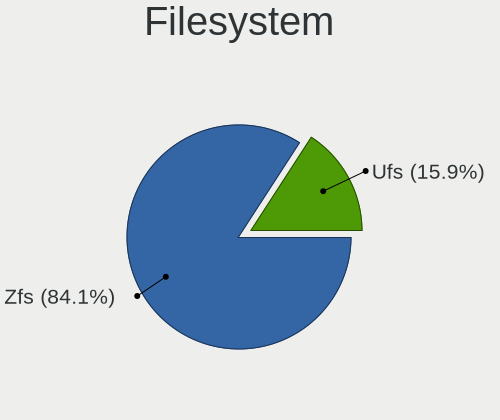
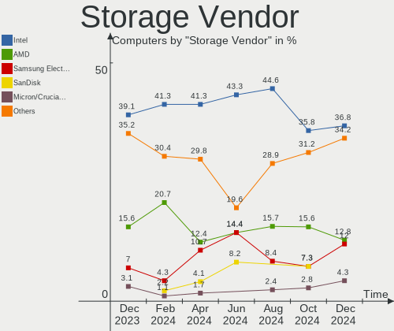
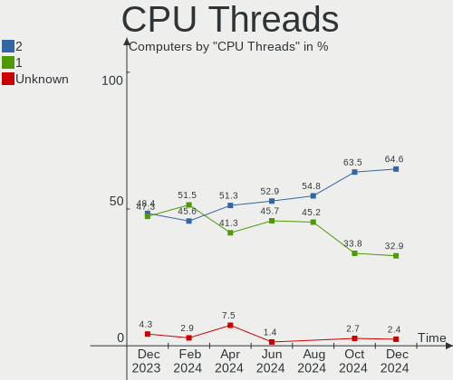
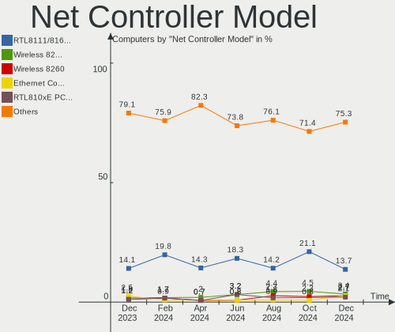

FreeBSD - Hardware Trends
-------------------------

A project to identify most popular hardware characteristics and track their change
over time based on data collected by BSD users at https://BSD-Hardware.info.

Anyone can contribute to this report by the [hw-probe](https://github.com/linuxhw/hw-probe/blob/master/INSTALL.BSD.md) tool:

    hw-probe -all -upload

This is a report for all computer types. See also reports for [desktops](/Dist/FreeBSD/Desktop/README.md) and [notebooks](/Dist/FreeBSD/Notebook/README.md).

This report is for one last month. Overall report since the beginning of time: [TestDays](https://github.com/bsdhw/TestDays)

Period: Feb, 2023.

Contents
--------

* [ System ](#system)
  - [ OS                       ](#os)
  - [ OS Family                ](#os-family)
  - [ Arch                     ](#arch)
  - [ DE                       ](#de)
  - [ Display Server           ](#display-server)
  - [ Display Manager          ](#display-manager)
  - [ OS Lang                  ](#os-lang)
  - [ Boot Mode                ](#boot-mode)
  - [ Filesystem               ](#filesystem)
  - [ Part. scheme             ](#part-scheme)

* [ Board ](#board)
  - [ Vendor                   ](#vendor)
  - [ Model                    ](#model)
  - [ Model Family             ](#model-family)
  - [ MFG Year                 ](#mfg-year)
  - [ Form Factor              ](#form-factor)
  - [ Coreboot                 ](#coreboot)
  - [ RAM Size                 ](#ram-size)
  - [ RAM Used                 ](#ram-used)
  - [ Total Drives             ](#total-drives)
  - [ Has CD-ROM               ](#has-cd-rom)
  - [ Has Ethernet             ](#has-ethernet)
  - [ Has WiFi                 ](#has-wifi)
  - [ Has Bluetooth            ](#has-bluetooth)

* [ Location ](#location)
  - [ Country                  ](#country)
  - [ City                     ](#city)

* [ Drives ](#drives)
  - [ Drive Vendor             ](#drive-vendor)
  - [ Drive Model              ](#drive-model)
  - [ HDD Vendor               ](#hdd-vendor)
  - [ SSD Vendor               ](#ssd-vendor)
  - [ Drive Kind               ](#drive-kind)
  - [ Drive Connector          ](#drive-connector)
  - [ Drive Size               ](#drive-size)
  - [ Space Total              ](#space-total)
  - [ Space Used               ](#space-used)
  - [ Malfunc. Drives          ](#malfunc-drives)
  - [ Malfunc. Drive Vendor    ](#malfunc-drive-vendor)
  - [ Malfunc. HDD Vendor      ](#malfunc-hdd-vendor)
  - [ Malfunc. Drive Kind      ](#malfunc-drive-kind)
  - [ Failed Drives            ](#failed-drives)
  - [ Failed Drive Vendor      ](#failed-drive-vendor)
  - [ Drive Status             ](#drive-status)

* [ Storage controller ](#storage-controller)
  - [ Storage Vendor           ](#storage-vendor)
  - [ Storage Model            ](#storage-model)
  - [ Storage Kind             ](#storage-kind)

* [ Processor ](#processor)
  - [ CPU Vendor               ](#cpu-vendor)
  - [ CPU Model                ](#cpu-model)
  - [ CPU Model Family         ](#cpu-model-family)
  - [ CPU Cores                ](#cpu-cores)
  - [ CPU Sockets              ](#cpu-sockets)
  - [ CPU Threads              ](#cpu-threads)
  - [ CPU Microarch            ](#cpu-microarch)

* [ Graphics ](#graphics)
  - [ GPU Vendor               ](#gpu-vendor)
  - [ GPU Model                ](#gpu-model)
  - [ GPU Combo                ](#gpu-combo)
  - [ GPU Driver               ](#gpu-driver)
  - [ GPU Memory               ](#gpu-memory)

* [ Monitor ](#monitor)
  - [ Monitor Vendor           ](#monitor-vendor)
  - [ Monitor Model            ](#monitor-model)
  - [ Monitor Resolution       ](#monitor-resolution)
  - [ Monitor Diagonal         ](#monitor-diagonal)
  - [ Monitor Width            ](#monitor-width)
  - [ Aspect Ratio             ](#aspect-ratio)
  - [ Monitor Area             ](#monitor-area)
  - [ Pixel Density            ](#pixel-density)
  - [ Multiple Monitors        ](#multiple-monitors)

* [ Network ](#network)
  - [ Net Controller Vendor    ](#net-controller-vendor)
  - [ Net Controller Model     ](#net-controller-model)
  - [ Wireless Vendor          ](#wireless-vendor)
  - [ Wireless Model           ](#wireless-model)
  - [ Ethernet Vendor          ](#ethernet-vendor)
  - [ Ethernet Model           ](#ethernet-model)
  - [ Net Controller Kind      ](#net-controller-kind)
  - [ Used Controller          ](#used-controller)
  - [ NICs                     ](#nics)
  - [ IPv6                     ](#ipv6)

* [ Bluetooth ](#bluetooth)
  - [ Bluetooth Vendor         ](#bluetooth-vendor)
  - [ Bluetooth Model          ](#bluetooth-model)

* [ Sound ](#sound)
  - [ Sound Vendor             ](#sound-vendor)
  - [ Sound Model              ](#sound-model)

* [ Memory ](#memory)
  - [ Memory Vendor            ](#memory-vendor)
  - [ Memory Model             ](#memory-model)
  - [ Memory Kind              ](#memory-kind)
  - [ Memory Form Factor       ](#memory-form-factor)
  - [ Memory Size              ](#memory-size)
  - [ Memory Speed             ](#memory-speed)

* [ Printers & scanners ](#printers--scanners)
  - [ Printer Vendor           ](#printer-vendor)
  - [ Printer Model            ](#printer-model)
  - [ Scanner Vendor           ](#scanner-vendor)
  - [ Scanner Model            ](#scanner-model)

* [ Camera ](#camera)
  - [ Camera Vendor            ](#camera-vendor)
  - [ Camera Model             ](#camera-model)

* [ Security ](#security)
  - [ Fingerprint Vendor       ](#fingerprint-vendor)
  - [ Fingerprint Model        ](#fingerprint-model)
  - [ Chipcard Vendor          ](#chipcard-vendor)
  - [ Chipcard Model           ](#chipcard-model)

* [ Unsupported ](#unsupported)
  - [ Unsupported Devices      ](#unsupported-devices)
  - [ Unsupported Device Types ](#unsupported-device-types)

System
------

OS
--

Installed operating systems

| Name                    | Computers | Percent |
|-------------------------|-----------|---------|
| FreeBSD 13.1            | 18        | 30.51%  |
| FreeBSD 13.1-p5         | 10        | 16.95%  |
| FreeBSD 13.1-p7         | 7         | 11.86%  |
| FreeBSD 13.1-p6         | 6         | 10.17%  |
| FreeBSD 14.0-CURRENT    | 4         | 6.78%   |
| FreeBSD 13.2-BETA2      | 4         | 6.78%   |
| FreeBSD 13.1-STABLE     | 4         | 6.78%   |
| FreeBSD 13.2-PRERELEASE | 1         | 1.69%   |
| FreeBSD 13.1-p3         | 1         | 1.69%   |
| FreeBSD 13.1-p2         | 1         | 1.69%   |
| FreeBSD 12.4            | 1         | 1.69%   |
| FreeBSD 12.3-p1         | 1         | 1.69%   |
| FreeBSD 12.3            | 1         | 1.69%   |

OS Family
---------

OS without a version

| Name    | Computers | Percent |
|---------|-----------|---------|
| FreeBSD | 59        | 100%    |

Arch
----

OS architecture (x86_64, i586, etc.)

| Name    | Computers | Percent |
|---------|-----------|---------|
| amd64   | 56        | 94.92%  |
| i386    | 2         | 3.39%   |
| powerpc | 1         | 1.69%   |

DE
--

Desktop Environment

| Name          | Computers | Percent |
|---------------|-----------|---------|
| XFCE          | 19        | 32.2%   |
| Console       | 16        | 27.12%  |
| KDE5          | 8         | 13.56%  |
| MATE          | 7         | 11.86%  |
| Openbox       | 2         | 3.39%   |
| Enlightenment | 2         | 3.39%   |
| TWM           | 1         | 1.69%   |
| LXQt          | 1         | 1.69%   |
| GNOME         | 1         | 1.69%   |
| DWM           | 1         | 1.69%   |
| AwesomeWM     | 1         | 1.69%   |

Display Server
--------------

X11 or Wayland

| Name    | Computers | Percent |
|---------|-----------|---------|
| X11     | 41        | 69.49%  |
| Console | 16        | 27.12%  |
| Wayland | 1         | 1.69%   |
| Tty     | 1         | 1.69%   |

Display Manager
---------------

SDDM, LightDM, etc.

| Name    | Computers | Percent |
|---------|-----------|---------|
| Console | 26        | 44.07%  |
| LightDM | 11        | 18.64%  |
| SDDM    | 10        | 16.95%  |
| SLiM    | 7         | 11.86%  |
| XDM     | 2         | 3.39%   |
| Ly      | 2         | 3.39%   |
| GDM     | 1         | 1.69%   |

OS Lang
-------

Language

| Lang           | Computers | Percent |
|----------------|-----------|---------|
| C              | 36        | 61.02%  |
| en_US          | 9         | 15.25%  |
| Unknown        | 5         | 8.47%   |
| ru_RU          | 4         | 6.78%   |
| ko_KR          | 1         | 1.69%   |
| en_IE.US-ASCII | 1         | 1.69%   |
| de_DE          | 1         | 1.69%   |
| de_CH          | 1         | 1.69%   |
| cs_CZ          | 1         | 1.69%   |

Boot Mode
---------

EFI or BIOS

| Mode | Computers | Percent |
|------|-----------|---------|
| EFI  | 49        | 83.05%  |
| BIOS | 10        | 16.95%  |

Filesystem
----------

Type of filesystem

| Type | Computers | Percent |
|------|-----------|---------|
| Zfs  | 42        | 71.19%  |
| Ufs  | 17        | 28.81%  |

Part. scheme
------------

Scheme of partitioning

| Type | Computers | Percent |
|------|-----------|---------|
| GPT  | 55        | 93.22%  |
| MBR  | 4         | 6.78%   |

Board
-----

Vendor
------

Motherboard manufacturer

| Name                | Computers | Percent |
|---------------------|-----------|---------|
| Lenovo              | 14        | 23.73%  |
| ASUSTek Computer    | 13        | 22.03%  |
| Hewlett-Packard     | 6         | 10.17%  |
| Gigabyte Technology | 4         | 6.78%   |
| Intel               | 3         | 5.08%   |
| ASRock              | 3         | 5.08%   |
| MSI                 | 2         | 3.39%   |
| Dell                | 2         | 3.39%   |
| Acer                | 2         | 3.39%   |
| TUXEDO              | 1         | 1.69%   |
| Toshiba             | 1         | 1.69%   |
| Seeed Studio        | 1         | 1.69%   |
| Samsung Electronics | 1         | 1.69%   |
| Panasonic           | 1         | 1.69%   |
| Fujitsu             | 1         | 1.69%   |
| ASRockRack          | 1         | 1.69%   |
| Apple               | 1         | 1.69%   |
| Alienware           | 1         | 1.69%   |
| Unknown             | 1         | 1.69%   |

Model
-----

Motherboard model

| Name                                       | Computers | Percent |
|--------------------------------------------|-----------|---------|
| TUXEDO InfinityBook Pro 14 Gen6            | 1         | 1.69%   |
| Toshiba PORTEGE Z930                       | 1         | 1.69%   |
| Seeed Studio ODYSSEY-X86J4105              | 1         | 1.69%   |
| Samsung 700T1C                             | 1         | 1.69%   |
| Panasonic CF-30KAPAXAM                     | 1         | 1.69%   |
| MSI MS-7B89                                | 1         | 1.69%   |
| MSI MS-7817                                | 1         | 1.69%   |
| Lenovo ThinkPad X280 20KFCTO1WW            | 1         | 1.69%   |
| Lenovo ThinkPad X1 Carbon Gen 9 20XXS5J00X | 1         | 1.69%   |
| Lenovo ThinkPad X1 Carbon 7th 20QES53R00   | 1         | 1.69%   |
| Lenovo ThinkPad T530 24297XG               | 1         | 1.69%   |
| Lenovo ThinkPad T480s 20L7002CUS           | 1         | 1.69%   |
| Lenovo ThinkPad T460p 20FW0018AD           | 1         | 1.69%   |
| Lenovo ThinkPad T460 20FMS04200            | 1         | 1.69%   |
| Lenovo ThinkPad T430 2347FV6               | 1         | 1.69%   |
| Lenovo ThinkPad R60e 0658W2M               | 1         | 1.69%   |
| Lenovo ThinkPad P14s Gen 3 21AK000GUK      | 1         | 1.69%   |
| Lenovo IdeaPad Y700-15ISK 80NV             | 1         | 1.69%   |
| Lenovo IdeaPad Gaming 3 15IHU6 82K1        | 1         | 1.69%   |
| Lenovo IdeaPad 5 14ITL05 82FE              | 1         | 1.69%   |
| Lenovo H515 10125                          | 1         | 1.69%   |
| Intel NUC7PJYH                             | 1         | 1.69%   |
| Intel NUC5PPYB H76558-102                  | 1         | 1.69%   |
| Intel DN2820FYK H24582-203                 | 1         | 1.69%   |
| HP Z440 Workstation                        | 1         | 1.69%   |
| HP Victus by Laptop 16-e0xxx               | 1         | 1.69%   |
| HP ProBook 450 G2                          | 1         | 1.69%   |
| HP Pavilion Laptop 14-bf0xx                | 1         | 1.69%   |
| HP Pavilion dv6                            | 1         | 1.69%   |
| HP EliteBook 8570p                         | 1         | 1.69%   |
| Gigabyte Z87X-OC                           | 1         | 1.69%   |
| Gigabyte Z490 VISION G                     | 1         | 1.69%   |
| Gigabyte X670E AORUS MASTER                | 1         | 1.69%   |
| Gigabyte H61M-S2V-B3                       | 1         | 1.69%   |
| Fujitsu ESPRIMO Q956                       | 1         | 1.69%   |
| Dell Precision Tower 5810                  | 1         | 1.69%   |
| Dell Inspiron 5567                         | 1         | 1.69%   |
| ASUS X541SA                                | 1         | 1.69%   |
| ASUS TUF Gaming B450M-PRO S                | 1         | 1.69%   |
| ASUS STRIX Z270F GAMING                    | 1         | 1.69%   |

Model Family
------------

Motherboard model prefix

| Name                          | Computers | Percent |
|-------------------------------|-----------|---------|
| Lenovo ThinkPad               | 10        | 16.95%  |
| Lenovo IdeaPad                | 3         | 5.08%   |
| HP Pavilion                   | 2         | 3.39%   |
| ASUS ROG                      | 2         | 3.39%   |
| ASUS PRIME                    | 2         | 3.39%   |
| ASUS ASUS                     | 2         | 3.39%   |
| ASRock X570                   | 2         | 3.39%   |
| Acer Aspire                   | 2         | 3.39%   |
| TUXEDO InfinityBook           | 1         | 1.69%   |
| Toshiba PORTEGE               | 1         | 1.69%   |
| Seeed Studio ODYSSEY-X86J4105 | 1         | 1.69%   |
| Samsung 700T1C                | 1         | 1.69%   |
| Panasonic CF-30KAPAXAM        | 1         | 1.69%   |
| MSI MS-7B89                   | 1         | 1.69%   |
| MSI MS-7817                   | 1         | 1.69%   |
| Lenovo H515                   | 1         | 1.69%   |
| Intel NUC7PJYH                | 1         | 1.69%   |
| Intel NUC5PPYB                | 1         | 1.69%   |
| Intel DN2820FYK               | 1         | 1.69%   |
| HP Z440                       | 1         | 1.69%   |
| HP Victus                     | 1         | 1.69%   |
| HP ProBook                    | 1         | 1.69%   |
| HP EliteBook                  | 1         | 1.69%   |
| Gigabyte Z87X-OC              | 1         | 1.69%   |
| Gigabyte Z490                 | 1         | 1.69%   |
| Gigabyte X670E                | 1         | 1.69%   |
| Gigabyte H61M-S2V-B3          | 1         | 1.69%   |
| Fujitsu ESPRIMO               | 1         | 1.69%   |
| Dell Precision                | 1         | 1.69%   |
| Dell Inspiron                 | 1         | 1.69%   |
| ASUS X541SA                   | 1         | 1.69%   |
| ASUS TUF                      | 1         | 1.69%   |
| ASUS STRIX                    | 1         | 1.69%   |
| ASUS P8Z68                    | 1         | 1.69%   |
| ASUS P7P55D                   | 1         | 1.69%   |
| ASUS P5Q-E                    | 1         | 1.69%   |
| ASUS H170I-PRO                | 1         | 1.69%   |
| ASRockRack EPYC3101D4I-2T     | 1         | 1.69%   |
| ASRock A520M-ITX              | 1         | 1.69%   |
| Apple Macmini3                | 1         | 1.69%   |

MFG Year
--------

Motherboard manufacture year

| Year    | Computers | Percent |
|---------|-----------|---------|
| 2022    | 7         | 11.86%  |
| 2019    | 7         | 11.86%  |
| 2021    | 6         | 10.17%  |
| 2020    | 6         | 10.17%  |
| 2016    | 6         | 10.17%  |
| 2013    | 5         | 8.47%   |
| 2018    | 4         | 6.78%   |
| 2009    | 4         | 6.78%   |
| 2017    | 3         | 5.08%   |
| 2014    | 3         | 5.08%   |
| 2012    | 2         | 3.39%   |
| 2023    | 1         | 1.69%   |
| 2015    | 1         | 1.69%   |
| 2011    | 1         | 1.69%   |
| 2008    | 1         | 1.69%   |
| 2006    | 1         | 1.69%   |
| Unknown | 1         | 1.69%   |

Form Factor
-----------

Physical design of the computer

| Name     | Computers | Percent |
|----------|-----------|---------|
| Notebook | 29        | 49.15%  |
| Desktop  | 27        | 45.76%  |
| Mini pc  | 3         | 5.08%   |

Coreboot
--------

Have coreboot on board

| Used | Computers | Percent |
|------|-----------|---------|
| No   | 59        | 100%    |

RAM Size
--------

Total RAM memory

| Size in GB  | Computers | Percent |
|-------------|-----------|---------|
| 16.01-24.0  | 22        | 37.29%  |
| 4.01-8.0    | 11        | 18.64%  |
| 32.01-64.0  | 8         | 13.56%  |
| 64.01-256.0 | 7         | 11.86%  |
| 8.01-16.0   | 7         | 11.86%  |
| 24.01-32.0  | 2         | 3.39%   |
| 0.51-1.0    | 2         | 3.39%   |

RAM Used
--------

Used RAM memory

| Used GB  | Computers | Percent |
|----------|-----------|---------|
| 0.51-1.0 | 24        | 40.68%  |
| 0.01-0.5 | 17        | 28.81%  |
| 1.01-2.0 | 15        | 25.42%  |
| 4.01-8.0 | 1         | 1.69%   |
| 3.01-4.0 | 1         | 1.69%   |
| 2.01-3.0 | 1         | 1.69%   |

Total Drives
------------

Number of drives on board

| Drives | Computers | Percent |
|--------|-----------|---------|
| 1      | 31        | 52.54%  |
| 2      | 13        | 22.03%  |
| 4      | 5         | 8.47%   |
| 3      | 3         | 5.08%   |
| 0      | 3         | 5.08%   |
| 13     | 1         | 1.69%   |
| 9      | 1         | 1.69%   |
| 7      | 1         | 1.69%   |
| 5      | 1         | 1.69%   |

Has CD-ROM
----------

Has CD-ROM on board

| Presented | Computers | Percent |
|-----------|-----------|---------|
| No        | 45        | 76.27%  |
| Yes       | 14        | 23.73%  |

Has Ethernet
------------

Has Ethernet on board

| Presented | Computers | Percent |
|-----------|-----------|---------|
| Yes       | 55        | 93.22%  |
| No        | 4         | 6.78%   |

Has WiFi
--------

Has WiFi module

| Presented | Computers | Percent |
|-----------|-----------|---------|
| Yes       | 42        | 71.19%  |
| No        | 17        | 28.81%  |

Has Bluetooth
-------------

Has Bluetooth module

| Presented | Computers | Percent |
|-----------|-----------|---------|
| No        | 31        | 52.54%  |
| Yes       | 28        | 47.46%  |

Location
--------

Country
-------

Geographic location (country)

| Country      | Computers | Percent |
|--------------|-----------|---------|
| USA          | 17        | 28.81%  |
| Russia       | 8         | 13.56%  |
| Germany      | 7         | 11.86%  |
| UK           | 2         | 3.39%   |
| Romania      | 2         | 3.39%   |
| Poland       | 2         | 3.39%   |
| Greece       | 2         | 3.39%   |
| France       | 2         | 3.39%   |
| Czechia      | 2         | 3.39%   |
| Chile        | 2         | 3.39%   |
| Vietnam      | 1         | 1.69%   |
| Turkey       | 1         | 1.69%   |
| Thailand     | 1         | 1.69%   |
| Switzerland  | 1         | 1.69%   |
| Sweden       | 1         | 1.69%   |
| Sri Lanka    | 1         | 1.69%   |
| Spain        | 1         | 1.69%   |
| South Korea  | 1         | 1.69%   |
| Saudi Arabia | 1         | 1.69%   |
| China        | 1         | 1.69%   |
| Canada       | 1         | 1.69%   |
| Austria      | 1         | 1.69%   |
| Australia    | 1         | 1.69%   |

City
----

Geographic location (city)

| City               | Computers | Percent |
|--------------------|-----------|---------|
| Ozersk             | 3         | 5.08%   |
| Moscow             | 3         | 5.08%   |
| Salem              | 2         | 3.39%   |
| Redmond            | 2         | 3.39%   |
| Zurich             | 1         | 1.69%   |
| West Kelowna       | 1         | 1.69%   |
| Wenatchee          | 1         | 1.69%   |
| Wappingers Falls   | 1         | 1.69%   |
| Waldsee            | 1         | 1.69%   |
| Villapresente      | 1         | 1.69%   |
| Vienna             | 1         | 1.69%   |
| Valparaíso        | 1         | 1.69%   |
| Uiwang-si          | 1         | 1.69%   |
| Tucson             | 1         | 1.69%   |
| Timișoara         | 1         | 1.69%   |
| Stockholm          | 1         | 1.69%   |
| Santiago           | 1         | 1.69%   |
| Ruislip            | 1         | 1.69%   |
| Rostov-on-Don      | 1         | 1.69%   |
| Rosny-sous-Bois    | 1         | 1.69%   |
| Riyadh             | 1         | 1.69%   |
| Radzionkow         | 1         | 1.69%   |
| Qiqihar            | 1         | 1.69%   |
| Poplar Grove       | 1         | 1.69%   |
| Perth              | 1         | 1.69%   |
| Pátrai            | 1         | 1.69%   |
| Palo Alto          | 1         | 1.69%   |
| Ostrozska Nova Ves | 1         | 1.69%   |
| Ostrava            | 1         | 1.69%   |
| Osnabrück         | 1         | 1.69%   |
| Nuremberg          | 1         | 1.69%   |
| Noblesville        | 1         | 1.69%   |
| Newport            | 1         | 1.69%   |
| Munich             | 1         | 1.69%   |
| Mt. Pleasant       | 1         | 1.69%   |
| Marcq-en-Baroeul   | 1         | 1.69%   |
| Ludwigsburg        | 1         | 1.69%   |
| London             | 1         | 1.69%   |
| Little Compton     | 1         | 1.69%   |
| Kazan’           | 1         | 1.69%   |

Drives
------

Drive Vendor
------------

Hard drive vendors

| Vendor              | Computers | Drives | Percent |
|---------------------|-----------|--------|---------|
| WDC                 | 17        | 29     | 20.48%  |
| Samsung Electronics | 15        | 21     | 18.07%  |
| Seagate             | 10        | 19     | 12.05%  |
| Kingston            | 5         | 5      | 6.02%   |
| Intel               | 4         | 5      | 4.82%   |
| Crucial             | 4         | 6      | 4.82%   |
| Toshiba             | 3         | 4      | 3.61%   |
| SanDisk             | 3         | 3      | 3.61%   |
| HGST                | 2         | 2      | 2.41%   |
| Gigabyte Technology | 2         | 2      | 2.41%   |
| XPG                 | 1         | 1      | 1.2%    |
| Transcend           | 1         | 1      | 1.2%    |
| Team                | 1         | 1      | 1.2%    |
| T-FORCE             | 1         | 1      | 1.2%    |
| SK hynix            | 1         | 1      | 1.2%    |
| PNY                 | 1         | 1      | 1.2%    |
| Patriot             | 1         | 1      | 1.2%    |
| Netac               | 1         | 1      | 1.2%    |
| Micron Technology   | 1         | 1      | 1.2%    |
| LITEON              | 1         | 1      | 1.2%    |
| KingSpec            | 1         | 1      | 1.2%    |
| Kimtigo             | 1         | 1      | 1.2%    |
| Intenso             | 1         | 1      | 1.2%    |
| HPT                 | 1         | 8      | 1.2%    |
| Hitachi             | 1         | 1      | 1.2%    |
| FORESEE             | 1         | 1      | 1.2%    |
| Corsair             | 1         | 1      | 1.2%    |
| A-DATA Technology   | 1         | 1      | 1.2%    |

Drive Model
-----------

Hard drive models

| Model                                | Computers | Percent |
|--------------------------------------|-----------|---------|
| WDC WD5000LPLX-00ZNTT0 500GB         | 2         | 1.96%   |
| Seagate ST4000DM000-1F2168 4TB       | 2         | 1.96%   |
| Kingston SA400S37240G 240GB          | 2         | 1.96%   |
| Intel SSDPEKNU512GZ 512GB            | 2         | 1.96%   |
| HGST HTS721010A9E630 1TB             | 2         | 1.96%   |
| XPG GAMMIX S5 1TB                    | 1         | 0.98%   |
| WDC WDS100T3X0C-00SJG0 1TB           | 1         | 0.98%   |
| WDC WD80EMAZ-00WJTA0 8TB             | 1         | 0.98%   |
| WDC WD80EFZX-68UW8N0 8TB             | 1         | 0.98%   |
| WDC WD80EFAX-68LHPN0 8TB             | 1         | 0.98%   |
| WDC WD80EDBZ-11B0ZA0 8TB             | 1         | 0.98%   |
| WDC WD40PURZ-85AKKY0 4TB             | 1         | 0.98%   |
| WDC WD40EZRZ-22GXCB0 4TB             | 1         | 0.98%   |
| WDC WD40EZRZ-00GXCB0 4TB             | 1         | 0.98%   |
| WDC WD40EFAX-68JH4N1 4TB             | 1         | 0.98%   |
| WDC WD30EURX-63T0FY0 3TB             | 1         | 0.98%   |
| WDC WD20SDRW-11VUUS0 2TB             | 1         | 0.98%   |
| WDC WD20EARS-00MVWB1 2TB             | 1         | 0.98%   |
| WDC WD1600JS-23MHB0 160GB            | 1         | 0.98%   |
| WDC WD1600BEVT-22ZCT0 160GB          | 1         | 0.98%   |
| WDC WD15EADS-00P8B0 1.5TB            | 1         | 0.98%   |
| WDC WD120EMFZ-11A6JA0 12TB           | 1         | 0.98%   |
| WDC WD120EMAZ-11BLFA0 12TB           | 1         | 0.98%   |
| WDC WD10SPZX-08Z10 1TB               | 1         | 0.98%   |
| WDC WD10EZEX-21WN4A0 1TB             | 1         | 0.98%   |
| WDC WD10EZEX-08RKKA0 1TB             | 1         | 0.98%   |
| WDC WD10EALX-759BA1 1TB              | 1         | 0.98%   |
| WDC PC SN530 SDBPNPZ-512G-1002 512GB | 1         | 0.98%   |
| WDC PC SN530 SDBPMPZ-256G-1101 256GB | 1         | 0.98%   |
| Transcend TS128GMTS800 128GB         | 1         | 0.98%   |
| Toshiba MQ01ACF050 500GB             | 1         | 0.98%   |
| Toshiba MQ01ABD100 1TB               | 1         | 0.98%   |
| Toshiba KXG50ZNV1T02 NVMe 1024GB     | 1         | 0.98%   |
| Team T253X5480G 480GB                | 1         | 0.98%   |
| T-FORCE TM8FP7001T 1TB               | 1         | 0.98%   |
| SK hynix SKHynix_HFS001TDE9X081N 1TB | 1         | 0.98%   |
| Seagate ST500LT012-1DG142 500GB      | 1         | 0.98%   |
| Seagate ST4000VN008-2DR166 4TB       | 1         | 0.98%   |
| Seagate ST4000NM0035-1V4107 4TB      | 1         | 0.98%   |
| Seagate ST4000LM024-2AN17V 4TB       | 1         | 0.98%   |

HDD Vendor
----------

Hard disk drive vendors

| Vendor  | Computers | Drives | Percent |
|---------|-----------|--------|---------|
| WDC     | 15        | 26     | 48.39%  |
| Seagate | 10        | 19     | 32.26%  |
| Toshiba | 2         | 2      | 6.45%   |
| HGST    | 2         | 2      | 6.45%   |
| HPT     | 1         | 8      | 3.23%   |
| Hitachi | 1         | 1      | 3.23%   |

SSD Vendor
----------

Solid state drive vendors

| Vendor              | Computers | Drives | Percent |
|---------------------|-----------|--------|---------|
| Samsung Electronics | 10        | 15     | 31.25%  |
| Kingston            | 4         | 4      | 12.5%   |
| SanDisk             | 3         | 3      | 9.38%   |
| Crucial             | 3         | 5      | 9.38%   |
| Intel               | 2         | 3      | 6.25%   |
| Transcend           | 1         | 1      | 3.13%   |
| Team                | 1         | 1      | 3.13%   |
| PNY                 | 1         | 1      | 3.13%   |
| Patriot             | 1         | 1      | 3.13%   |
| LITEON              | 1         | 1      | 3.13%   |
| KingSpec            | 1         | 1      | 3.13%   |
| Intenso             | 1         | 1      | 3.13%   |
| Gigabyte Technology | 1         | 1      | 3.13%   |
| FORESEE             | 1         | 1      | 3.13%   |
| A-DATA Technology   | 1         | 1      | 3.13%   |

Drive Kind
----------

HDD or SSD

| Kind | Computers | Drives | Percent |
|------|-----------|--------|---------|
| SSD  | 28        | 40     | 37.33%  |
| HDD  | 26        | 58     | 34.67%  |
| NVMe | 21        | 23     | 28%     |

Drive Connector
---------------

SATA, SAS, NVMe, etc.

| Type | Computers | Drives | Percent |
|------|-----------|--------|---------|
| SATA | 44        | 98     | 67.69%  |
| NVMe | 21        | 23     | 32.31%  |

Drive Size
----------

Size of hard drive

| Size in TB | Computers | Drives | Percent |
|------------|-----------|--------|---------|
| 0.01-0.5   | 29        | 35     | 49.15%  |
| 0.51-1.0   | 13        | 24     | 22.03%  |
| 1.01-2.0   | 7         | 12     | 11.86%  |
| 3.01-4.0   | 6         | 10     | 10.17%  |
| 10.01-20.0 | 2         | 8      | 3.39%   |
| 2.01-3.0   | 1         | 1      | 1.69%   |
| 4.01-10.0  | 1         | 8      | 1.69%   |

Space Total
-----------

Amount of disk space available on the file system

| Size in GB     | Computers | Percent |
|----------------|-----------|---------|
| 251-500        | 19        | 32.2%   |
| 101-250        | 19        | 32.2%   |
| 501-1000       | 9         | 15.25%  |
| 51-100         | 4         | 6.78%   |
| 21-50          | 3         | 5.08%   |
| More than 3000 | 2         | 3.39%   |
| 1001-2000      | 2         | 3.39%   |
| 2001-3000      | 1         | 1.69%   |

Space Used
----------

Amount of used disk space

| Used GB        | Computers | Percent |
|----------------|-----------|---------|
| 1-20           | 47        | 79.66%  |
| 21-50          | 7         | 11.86%  |
| 101-250        | 2         | 3.39%   |
| More than 3000 | 1         | 1.69%   |
| 2001-3000      | 1         | 1.69%   |
| 51-100         | 1         | 1.69%   |

Malfunc. Drives
---------------

Drive models with a malfunction

| Model                          | Computers | Drives | Percent |
|--------------------------------|-----------|--------|---------|
| WDC WD5000LPLX-00ZNTT0 500GB   | 1         | 1      | 20%     |
| Seagate ST1000DX001-1CM162 1TB | 1         | 1      | 20%     |
| Seagate ST1000DM003-1CH162 1TB | 1         | 1      | 20%     |
| Kingston SV300S37A240G 240GB   | 1         | 1      | 20%     |
| HGST HTS721010A9E630 1TB       | 1         | 1      | 20%     |

Malfunc. Drive Vendor
---------------------

Vendors of faulty drives

| Vendor   | Computers | Drives | Percent |
|----------|-----------|--------|---------|
| Seagate  | 2         | 2      | 40%     |
| WDC      | 1         | 1      | 20%     |
| Kingston | 1         | 1      | 20%     |
| HGST     | 1         | 1      | 20%     |

Malfunc. HDD Vendor
-------------------

Vendors of faulty HDD drives

| Vendor  | Computers | Drives | Percent |
|---------|-----------|--------|---------|
| Seagate | 2         | 2      | 50%     |
| WDC     | 1         | 1      | 25%     |
| HGST    | 1         | 1      | 25%     |

Malfunc. Drive Kind
-------------------

Kinds of faulty drives

| Kind | Computers | Drives | Percent |
|------|-----------|--------|---------|
| HDD  | 4         | 4      | 80%     |
| SSD  | 1         | 1      | 20%     |

Failed Drives
-------------

Failed drive models

Zero info for selected period =(

Failed Drive Vendor
-------------------

Failed drive vendors

Zero info for selected period =(

Drive Status
------------

Number of failed and malfunc. drives

| Status   | Computers | Drives | Percent |
|----------|-----------|--------|---------|
| Works    | 54        | 108    | 90%     |
| Malfunc  | 5         | 5      | 8.33%   |
| Detected | 1         | 8      | 1.67%   |

Storage controller
------------------

Storage Vendor
--------------

Storage controller vendors

| Vendor                      | Computers | Percent |
|-----------------------------|-----------|---------|
| Intel                       | 38        | 47.5%   |
| AMD                         | 11        | 13.75%  |
| Samsung Electronics         | 6         | 7.5%    |
| SanDisk                     | 5         | 6.25%   |
| Marvell Technology Group    | 4         | 5%      |
| Silicon Motion              | 3         | 3.75%   |
| Phison Electronics          | 3         | 3.75%   |
| JMicron Technology          | 2         | 2.5%    |
| Toshiba                     | 1         | 1.25%   |
| SK hynix                    | 1         | 1.25%   |
| Nvidia                      | 1         | 1.25%   |
| Micron/Crucial Technology   | 1         | 1.25%   |
| Kingston Technology Company | 1         | 1.25%   |
| HighPoint Technologies      | 1         | 1.25%   |
| Broadcom / LSI              | 1         | 1.25%   |
| ADATA Technology            | 1         | 1.25%   |

Storage Model
-------------

Storage controller models

| Model                                                                            | Computers | Percent |
|----------------------------------------------------------------------------------|-----------|---------|
| AMD FCH SATA Controller [AHCI mode]                                              | 8         | 8.99%   |
| Intel 7 Series Chipset Family 6-port SATA Controller [AHCI mode]                 | 5         | 5.62%   |
| Silicon Motion SM2263EN/SM2263XT SSD Controller                                  | 3         | 3.37%   |
| Intel Sunrise Point-LP SATA Controller [AHCI mode]                               | 3         | 3.37%   |
| Unknown                                                                          | 3         | 3.37%   |
| SanDisk WD Black SN750 / PC SN730 NVMe SSD                                       | 2         | 2.25%   |
| Samsung NVMe SSD Controller SM981/PM981/PM983                                    | 2         | 2.25%   |
| Samsung NVMe SSD Controller 980                                                  | 2         | 2.25%   |
| Phison E16 PCIe4 NVMe Controller                                                 | 2         | 2.25%   |
| Intel Volume Management Device NVMe RAID Controller                              | 2         | 2.25%   |
| Intel Tiger Lake-LP SATA Controller                                              | 2         | 2.25%   |
| Intel Q170/Q150/B150/H170/H110/Z170/CM236 Chipset SATA Controller [AHCI Mode]    | 2         | 2.25%   |
| Intel HM170/QM170 Chipset SATA Controller [AHCI Mode]                            | 2         | 2.25%   |
| Intel Celeron/Pentium Silver Processor SATA Controller                           | 2         | 2.25%   |
| Intel C610/X99 series chipset sSATA Controller [AHCI mode]                       | 2         | 2.25%   |
| Intel Atom/Celeron/Pentium Processor x5-E8000/J3xxx/N3xxx Series SATA Controller | 2         | 2.25%   |
| Intel 8 Series/C220 Series Chipset Family 6-port SATA Controller 1 [AHCI mode]   | 2         | 2.25%   |
| Intel 6 Series/C200 Series Chipset Family 6 port Desktop SATA AHCI Controller    | 2         | 2.25%   |
| AMD 400 Series Chipset SATA Controller                                           | 2         | 2.25%   |
| Toshiba XG5 NVMe SSD Controller                                                  | 1         | 1.12%   |
| SK hynix Gold P31/PC711 NVMe Solid State Drive                                   | 1         | 1.12%   |
| SanDisk WD Blue SN550 NVMe SSD                                                   | 1         | 1.12%   |
| Sandisk unknown                                                                  | 1         | 1.12%   |
| SanDisk PC SN530                                                                 | 1         | 1.12%   |
| Samsung NVMe SSD Controller SM961/PM961/SM963                                    | 1         | 1.12%   |
| Samsung NVMe SSD Controller PM9A1/PM9A3/980PRO                                   | 1         | 1.12%   |
| Phison PS5013 E13 NVMe Controller                                                | 1         | 1.12%   |
| Nvidia MCP79 AHCI Controller                                                     | 1         | 1.12%   |
| Micron/Crucial P1 NVMe PCIe SSD                                                  | 1         | 1.12%   |
| Marvell Group 88SE9235 PCIe 2.0 x2 4-port SATA 6 Gb/s Controller                 | 1         | 1.12%   |
| Marvell Group 88SE9215 PCIe 2.0 x1 4-port SATA 6 Gb/s Controller                 | 1         | 1.12%   |
| Marvell Group 88SE9128 PCIe SATA 6 Gb/s RAID controller with HyperDuo            | 1         | 1.12%   |
| Marvell Group 88SE6111/6121 SATA II / PATA Controller                            | 1         | 1.12%   |
| Kingston Company A2000 NVMe SSD                                                  | 1         | 1.12%   |
| JMicron JMB363 SATA/IDE Controller                                               | 1         | 1.12%   |
| JMicron JMB362 SATA Controller                                                   | 1         | 1.12%   |
| Intel Wildcat Point-LP SATA Controller [AHCI Mode]                               | 1         | 1.12%   |
| Intel Comet Lake SATA AHCI Controller                                            | 1         | 1.12%   |
| Intel Cannon Lake PCH SATA AHCI Controller                                       | 1         | 1.12%   |
| Intel Cannon Lake Mobile PCH SATA AHCI Controller                                | 1         | 1.12%   |

Storage Kind
------------

Kind of storage controller (IDE, SATA, NVMe, SAS, ...)

| Kind | Computers | Percent |
|------|-----------|---------|
| SATA | 48        | 59.26%  |
| NVMe | 23        | 28.4%   |
| IDE  | 5         | 6.17%   |
| RAID | 4         | 4.94%   |
| SAS  | 1         | 1.23%   |

Processor
---------

CPU Vendor
----------

Processor vendors

| Vendor | Computers | Percent |
|--------|-----------|---------|
| Intel  | 46        | 77.97%  |
| AMD    | 12        | 20.34%  |
| IBM    | 1         | 1.69%   |

CPU Model
---------

Processor models

| Model                                    | Computers | Percent |
|------------------------------------------|-----------|---------|
| Intel Core i5-10400 CPU @ 2.90GHz        | 2         | 3.39%   |
| Intel 11th Gen Core i7-1165G7 @ 2.80GHz  | 2         | 3.39%   |
| Intel 11th Gen Core i7-11370H @ 3.30GHz  | 2         | 3.39%   |
| AMD Ryzen 9 3900X 12-Core Processor      | 2         | 3.39%   |
| Intel Xeon CPU E5-1650 v3 @ 3.50GHz      | 1         | 1.69%   |
| Intel Xeon CPU E5-1620 v3 @ 3.50GHz      | 1         | 1.69%   |
| Intel Xeon CPU                           | 1         | 1.69%   |
| Intel Pentium Silver J5005 CPU @ 1.50GHz | 1         | 1.69%   |
| Intel Pentium CPU N3710 @ 1.60GHz        | 1         | 1.69%   |
| Intel Pentium CPU N3700 @ 1.60GHz        | 1         | 1.69%   |
| Intel Pentium CPU G3220 @ 3.00GHz        | 1         | 1.69%   |
| Intel Core i9-9900K CPU @ 3.60GHz        | 1         | 1.69%   |
| Intel Core i7-8750H CPU @ 2.20GHz        | 1         | 1.69%   |
| Intel Core i7-8550U CPU @ 1.80GHz        | 1         | 1.69%   |
| Intel Core i7-7500U CPU @ 2.70GHz        | 1         | 1.69%   |
| Intel Core i7-6700K CPU @ 4.00GHz        | 1         | 1.69%   |
| Intel Core i7-6700HQ CPU @ 2.60GHz       | 1         | 1.69%   |
| Intel Core i7-4770K CPU @ 3.50GHz        | 1         | 1.69%   |
| Intel Core i7-3630QM CPU @ 2.40GHz       | 1         | 1.69%   |
| Intel Core i7-3612QM CPU @ 2.10GHz       | 1         | 1.69%   |
| Intel Core i7-3520M CPU @ 2.90GHz        | 1         | 1.69%   |
| Intel Core i7 CPU M 640 @ 2.80GHz        | 1         | 1.69%   |
| Intel Core i7 CPU 860 @ 2.80GHz          | 1         | 1.69%   |
| Intel Core i5-8365U CPU @ 1.60GHz        | 1         | 1.69%   |
| Intel Core i5-8350U CPU @ 1.70GHz        | 1         | 1.69%   |
| Intel Core i5-6500T CPU @ 2.50GHz        | 1         | 1.69%   |
| Intel Core i5-6500 CPU @ 3.20GHz         | 1         | 1.69%   |
| Intel Core i5-6300U CPU @ 2.40GHz        | 1         | 1.69%   |
| Intel Core i5-6300HQ CPU @ 2.30GHz       | 1         | 1.69%   |
| Intel Core i5-5200U CPU @ 2.20GHz        | 1         | 1.69%   |
| Intel Core i5-3437U CPU @ 1.90GHz        | 1         | 1.69%   |
| Intel Core i5-3317U CPU @ 1.70GHz        | 1         | 1.69%   |
| Intel Core i5-2500K CPU @ 3.30GHz        | 1         | 1.69%   |
| Intel Core i3-7100U CPU @ 2.40GHz        | 1         | 1.69%   |
| Intel Core 2 Quad CPU Q6600 @ 2.40GHz    | 1         | 1.69%   |
| Intel Core 2 Duo CPU P8700 @ 2.53GHz     | 1         | 1.69%   |
| Intel Core 2 Duo CPU L9300 @ 1.60GHz     | 1         | 1.69%   |
| Intel Celeron M CPU                      | 1         | 1.69%   |
| Intel Celeron J4105 CPU @ 1.50GHz        | 1         | 1.69%   |
| Intel Celeron CPU N2830 @ 2.16GHz        | 1         | 1.69%   |

CPU Model Family
----------------

Processor model prefix

| Model                | Computers | Percent |
|----------------------|-----------|---------|
| Intel Core i5        | 12        | 20.34%  |
| Intel Core i7        | 11        | 18.64%  |
| Other                | 8         | 13.56%  |
| AMD Ryzen 9          | 4         | 6.78%   |
| Intel Xeon           | 3         | 5.08%   |
| Intel Pentium        | 3         | 5.08%   |
| AMD Ryzen 7          | 3         | 5.08%   |
| Intel Core 2 Duo     | 2         | 3.39%   |
| Intel Celeron        | 2         | 3.39%   |
| AMD Ryzen 5          | 2         | 3.39%   |
| Intel Pentium Silver | 1         | 1.69%   |
| Intel Core i9        | 1         | 1.69%   |
| Intel Core i3        | 1         | 1.69%   |
| Intel Core 2 Quad    | 1         | 1.69%   |
| Intel Celeron M      | 1         | 1.69%   |
| Intel Atom           | 1         | 1.69%   |
| AMD EPYC             | 1         | 1.69%   |
| AMD E2               | 1         | 1.69%   |
| AMD Athlon           | 1         | 1.69%   |

CPU Cores
---------

Number of processor cores

| Number  | Computers | Percent |
|---------|-----------|---------|
| 4       | 28        | 47.46%  |
| 2       | 10        | 16.95%  |
| 16      | 4         | 6.78%   |
| 6       | 4         | 6.78%   |
| Unknown | 4         | 6.78%   |
| 32      | 2         | 3.39%   |
| 24      | 2         | 3.39%   |
| 12      | 2         | 3.39%   |
| 10      | 1         | 1.69%   |
| 8       | 1         | 1.69%   |
| 1       | 1         | 1.69%   |

CPU Sockets
-----------

Number of sockets

| Number  | Computers | Percent |
|---------|-----------|---------|
| 1       | 57        | 96.61%  |
| 2       | 1         | 1.69%   |
| Unknown | 1         | 1.69%   |

CPU Threads
-----------

Threads per core (Hyper-Threading)

| Number  | Computers | Percent |
|---------|-----------|---------|
| 2       | 29        | 49.15%  |
| 1       | 25        | 42.37%  |
| Unknown | 5         | 8.47%   |

CPU Microarch
-------------

Microarchitecture

| Name          | Computers | Percent |
|---------------|-----------|---------|
| KabyLake      | 7         | 11.86%  |
| Skylake       | 6         | 10.17%  |
| Zen 2         | 5         | 8.47%   |
| TigerLake     | 5         | 8.47%   |
| IvyBridge     | 5         | 8.47%   |
| Haswell       | 4         | 6.78%   |
| Unknown       | 4         | 6.78%   |
| Silvermont    | 3         | 5.08%   |
| Zen 3         | 2         | 3.39%   |
| Zen           | 2         | 3.39%   |
| SandyBridge   | 2         | 3.39%   |
| Penryn        | 2         | 3.39%   |
| Goldmont plus | 2         | 3.39%   |
| CometLake     | 2         | 3.39%   |
| Zen+          | 1         | 1.69%   |
| Westmere      | 1         | 1.69%   |
| P6            | 1         | 1.69%   |
| Nehalem       | 1         | 1.69%   |
| Jaguar        | 1         | 1.69%   |
| Core          | 1         | 1.69%   |
| Broadwell     | 1         | 1.69%   |
| Bonnell       | 1         | 1.69%   |

Graphics
--------

GPU Vendor
----------

Vendors of graphics cards

| Vendor            | Computers | Percent |
|-------------------|-----------|---------|
| Intel             | 35        | 50.72%  |
| Nvidia            | 19        | 27.54%  |
| AMD               | 13        | 18.84%  |
| ASPEED Technology | 2         | 2.9%    |

GPU Model
---------

Graphics card models

| Model                                                                                    | Computers | Percent |
|------------------------------------------------------------------------------------------|-----------|---------|
| Intel TigerLake-LP GT2 [Iris Xe Graphics]                                                | 5         | 7.04%   |
| Intel HD Graphics 530                                                                    | 5         | 7.04%   |
| Nvidia GA107M [GeForce RTX 3050 Ti Mobile]                                               | 3         | 4.23%   |
| Intel 3rd Gen Core processor Graphics Controller                                         | 3         | 4.23%   |
| Nvidia TU117 [GeForce GTX 1650]                                                          | 2         | 2.82%   |
| Nvidia GP108 [GeForce GT 1030]                                                           | 2         | 2.82%   |
| Intel Xeon E3-1200 v3/4th Gen Core Processor Integrated Graphics Controller              | 2         | 2.82%   |
| Intel UHD Graphics 620                                                                   | 2         | 2.82%   |
| Intel Mobile 945GM/GMS/GME, 943/940GML Express Integrated Graphics Controller            | 2         | 2.82%   |
| Intel HD Graphics 620                                                                    | 2         | 2.82%   |
| Intel Atom/Celeron/Pentium Processor x5-E8000/J3xxx/N3xxx Integrated Graphics Controller | 2         | 2.82%   |
| Intel Alder Lake-P Integrated Graphics Controller                                        | 2         | 2.82%   |
| ASPEED Technology ASPEED Graphics Family                                                 | 2         | 2.82%   |
| AMD Renoir                                                                               | 2         | 2.82%   |
| Nvidia TU117M [GeForce GTX 1650 Ti Mobile]                                               | 1         | 1.41%   |
| Nvidia TU117GLM [T550 Laptop GPU]                                                        | 1         | 1.41%   |
| Nvidia TU106 [GeForce RTX 2070]                                                          | 1         | 1.41%   |
| Nvidia GT218 [NVS 300]                                                                   | 1         | 1.41%   |
| Nvidia GP107 [GeForce GTX 1050]                                                          | 1         | 1.41%   |
| Nvidia GP106 [GeForce GTX 1060 3GB]                                                      | 1         | 1.41%   |
| Nvidia GP104M [GeForce GTX 1070 Mobile]                                                  | 1         | 1.41%   |
| Nvidia GP104 [GeForce GTX 1080]                                                          | 1         | 1.41%   |
| Nvidia GM107GL [Quadro K620]                                                             | 1         | 1.41%   |
| Nvidia GF119 [NVS 310]                                                                   | 1         | 1.41%   |
| Nvidia GF108M [NVS 5400M]                                                                | 1         | 1.41%   |
| Nvidia C79 [GeForce 9400]                                                                | 1         | 1.41%   |
| Intel WhiskeyLake-U GT2 [UHD Graphics 620]                                               | 1         | 1.41%   |
| Intel Skylake GT2 [HD Graphics 520]                                                      | 1         | 1.41%   |
| Intel Mobile 945GSE Express Integrated Graphics Controller                               | 1         | 1.41%   |
| Intel Mobile 945GM/GMS, 943/940GML Express Integrated Graphics Controller                | 1         | 1.41%   |
| Intel Mobile 4 Series Chipset Integrated Graphics Controller                             | 1         | 1.41%   |
| Intel HD Graphics 5500                                                                   | 1         | 1.41%   |
| Intel GeminiLake [UHD Graphics 605]                                                      | 1         | 1.41%   |
| Intel GeminiLake [UHD Graphics 600]                                                      | 1         | 1.41%   |
| Intel Core Processor Integrated Graphics Controller                                      | 1         | 1.41%   |
| Intel CoffeeLake-H GT2 [UHD Graphics 630]                                                | 1         | 1.41%   |
| Intel Atom Processor Z36xxx/Z37xxx Series Graphics & Display                             | 1         | 1.41%   |
| Intel 2nd Generation Core Processor Family Integrated Graphics Controller                | 1         | 1.41%   |
| AMD Topaz XT [Radeon R7 M260/M265 / M340/M360 / M440/M445 / 530/535 / 620/625 Mobile]    | 1         | 1.41%   |
| AMD Thames [Radeon HD 7550M/7570M/7650M]                                                 | 1         | 1.41%   |

GPU Combo
---------

Combinations of graphics cards

| Name           | Computers | Percent |
|----------------|-----------|---------|
| 1 x Intel      | 25        | 42.37%  |
| 1 x Nvidia     | 11        | 18.64%  |
| 1 x AMD        | 8         | 13.56%  |
| Intel + Nvidia | 5         | 8.47%   |
| 2 x Intel      | 3         | 5.08%   |
| AMD + Nvidia   | 3         | 5.08%   |
| Intel + AMD    | 2         | 3.39%   |
| 1 x ASPEED     | 2         | 3.39%   |

GPU Driver
----------

Free vs proprietary

| Driver      | Computers | Percent |
|-------------|-----------|---------|
| Free        | 47        | 79.66%  |
| Proprietary | 12        | 20.34%  |

GPU Memory
----------

Total video memory

| Size in GB | Computers | Percent |
|------------|-----------|---------|
| Unknown    | 46        | 77.97%  |
| 7.01-8.0   | 3         | 5.08%   |
| 3.01-4.0   | 3         | 5.08%   |
| 0.51-1.0   | 3         | 5.08%   |
| 1.01-2.0   | 2         | 3.39%   |
| 0.01-0.5   | 2         | 3.39%   |

Monitor
-------

Monitor Vendor
--------------

Monitor vendors

| Vendor               | Computers | Percent |
|----------------------|-----------|---------|
| LG Electronics       | 2         | 20%     |
| Samsung Electronics  | 1         | 10%     |
| LG Display           | 1         | 10%     |
| Idek Iiyama          | 1         | 10%     |
| Dell                 | 1         | 10%     |
| AU Optronics         | 1         | 10%     |
| AOC                  | 1         | 10%     |
| Ancor Communications | 1         | 10%     |
| Acer                 | 1         | 10%     |

Monitor Model
-------------

Monitor models

| Model                                                        | Computers | Percent |
|--------------------------------------------------------------|-----------|---------|
| Samsung Electronics LCD Monitor S22C300 1920x1080            | 1         | 10%     |
| LG Electronics LCD Monitor LG FULL HD 1920x1080              | 1         | 10%     |
| LG Electronics LCD Monitor 23MP55 1920x1080                  | 1         | 10%     |
| LG Display LCD Monitor LGD04F9 1920x1080 310x170mm 13.9-inch | 1         | 10%     |
| Idek Iiyama LCD Monitor PL2792UH 3840x2160                   | 1         | 10%     |
| Dell LCD Monitor SE2719H 1920x1080                           | 1         | 10%     |
| AU Optronics LCD Monitor 1920x1080                           | 1         | 10%     |
| AOC LCD Monitor Q27G2G3R3B 2560x1440                         | 1         | 10%     |
| Ancor Communications LCD Monitor PA249 1920x1200             | 1         | 10%     |
| Acer LCD Monitor VG270U                                      | 1         | 10%     |

Monitor Resolution
------------------

Monitor screen resolution

| Resolution        | Computers | Percent |
|-------------------|-----------|---------|
| 1920x1080 (FHD)   | 6         | 60%     |
| 3840x2160 (4K)    | 1         | 10%     |
| 2560x1440 (QHD)   | 1         | 10%     |
| 1920x1200 (WUXGA) | 1         | 10%     |
| Unknown           | 1         | 10%     |

Monitor Diagonal
----------------

Diagonal size in inches

| Inches  | Computers | Percent |
|---------|-----------|---------|
| Unknown | 8         | 88.89%  |
| 13      | 1         | 11.11%  |

Monitor Width
-------------

Physical width

| Width in mm | Computers | Percent |
|-------------|-----------|---------|
| Unknown     | 8         | 88.89%  |
| 301-350     | 1         | 11.11%  |

Aspect Ratio
------------

Proportional relationship between the width and the height

| Ratio   | Computers | Percent |
|---------|-----------|---------|
| Unknown | 8         | 88.89%  |
| 16/9    | 1         | 11.11%  |

Monitor Area
------------

Area in inch²

| Area in inch² | Computers | Percent |
|----------------|-----------|---------|
| Unknown        | 8         | 88.89%  |
| 81-90          | 1         | 11.11%  |

Pixel Density
-------------

Pixels per inch

| Density | Computers | Percent |
|---------|-----------|---------|
| Unknown | 8         | 88.89%  |
| 121-160 | 1         | 11.11%  |

Multiple Monitors
-----------------

Total monitors connected

| Total | Computers | Percent |
|-------|-----------|---------|
| 1     | 31        | 52.54%  |
| 0     | 24        | 40.68%  |
| 2     | 4         | 6.78%   |

Network
-------

Net Controller Vendor
---------------------

Controller vendors

| Vendor                            | Computers | Percent |
|-----------------------------------|-----------|---------|
| Intel                             | 42        | 49.41%  |
| Realtek Semiconductor             | 25        | 29.41%  |
| Qualcomm Atheros                  | 6         | 7.06%   |
| Broadcom                          | 3         | 3.53%   |
| TP-Link                           | 1         | 1.18%   |
| Qualcomm Atheros Communications   | 1         | 1.18%   |
| Nvidia                            | 1         | 1.18%   |
| NetGear                           | 1         | 1.18%   |
| Mellanox Technologies             | 1         | 1.18%   |
| Marvell Technology Group          | 1         | 1.18%   |
| Hewlett-Packard                   | 1         | 1.18%   |
| Ericsson Business Mobile Networks | 1         | 1.18%   |
| American Megatrends               | 1         | 1.18%   |

Net Controller Model
--------------------

Controller models

| Model                                                                         | Computers | Percent |
|-------------------------------------------------------------------------------|-----------|---------|
| Realtek RTL8111/8168/8411 PCI Express Gigabit Ethernet Controller             | 19        | 17.27%  |
| Intel Wi-Fi 6 AX201                                                           | 5         | 4.55%   |
| Intel I211 Gigabit Network Connection                                         | 5         | 4.55%   |
| Intel 82579LM Gigabit Network Connection (Lewisville)                         | 4         | 3.64%   |
| Realtek RTL810xE PCI Express Fast Ethernet controller                         | 3         | 2.73%   |
| Intel Centrino Advanced-N 6205 [Taylor Peak]                                  | 3         | 2.73%   |
| Realtek RTL8125 2.5GbE Controller                                             | 2         | 1.82%   |
| Intel Wireless 8265 / 8275                                                    | 2         | 1.82%   |
| Intel Wireless 8260                                                           | 2         | 1.82%   |
| Intel Wi-Fi 6 AX200                                                           | 2         | 1.82%   |
| Intel Ethernet Controller I225-V                                              | 2         | 1.82%   |
| Intel Ethernet Connection (2) I219-V                                          | 2         | 1.82%   |
| Intel Ethernet Connection (2) I219-LM                                         | 2         | 1.82%   |
| Intel Dual Band Wireless-AC 3168NGW [Stone Peak]                              | 2         | 1.82%   |
| Intel Centrino Advanced-N 6235                                                | 2         | 1.82%   |
| Intel Alder Lake-P PCH CNVi WiFi                                              | 2         | 1.82%   |
| TP-Link TP-Link Wireless MU-MIMO USB Adapter                                  | 1         | 0.91%   |
| Realtek RTL8852AE 802.11ax PCIe Wireless Network Adapter                      | 1         | 0.91%   |
| Realtek RTL8822CE 802.11ac PCIe Wireless Network Adapter                      | 1         | 0.91%   |
| Realtek RTL8192CE PCIe Wireless Network Adapter                               | 1         | 0.91%   |
| Realtek RTL8188EUS 802.11n Wireless Network Adapter                           | 1         | 0.91%   |
| Realtek RTL8188EE Wireless Network Adapter                                    | 1         | 0.91%   |
| Qualcomm Atheros QCA6174 802.11ac Wireless Network Adapter                    | 1         | 0.91%   |
| Qualcomm Atheros Killer E2500 Gigabit Ethernet Controller                     | 1         | 0.91%   |
| Qualcomm Atheros TP-Link TL-WN322G v3 / TL-WN422G v2 802.11g [Atheros AR9271] | 1         | 0.91%   |
| Qualcomm Atheros AR9485 Wireless Network Adapter                              | 1         | 0.91%   |
| Qualcomm Atheros AR9285 Wireless Network Adapter (PCI-Express)                | 1         | 0.91%   |
| Qualcomm Atheros AR8121/AR8113/AR8114 Gigabit or Fast Ethernet                | 1         | 0.91%   |
| Qualcomm Atheros AR5212 802.11abg NIC                                         | 1         | 0.91%   |
| Qualcomm Atheros AR242x / AR542x Wireless Network Adapter (PCI-Express)       | 1         | 0.91%   |
| Nvidia MCP79 Ethernet                                                         | 1         | 0.91%   |
| NetGear A6100 AC600 DB Wireless Adapter [Realtek RTL8811AU]                   | 1         | 0.91%   |
| Mellanox MT27500 Family [ConnectX-3]                                          | 1         | 0.91%   |
| Marvell Group 88E8056 PCI-E Gigabit Ethernet Controller                       | 1         | 0.91%   |
| Marvell Group 88E8001 Gigabit Ethernet Controller                             | 1         | 0.91%   |
| Intel Wireless-AC 9260                                                        | 1         | 0.91%   |
| Intel Wireless 7260                                                           | 1         | 0.91%   |
| Intel Wireless 3165                                                           | 1         | 0.91%   |
| Intel WiFi Link 5100                                                          | 1         | 0.91%   |
| Intel Wi-Fi 6 AX210/AX211/AX411 160MHz                                        | 1         | 0.91%   |

Wireless Vendor
---------------

Wireless vendors

| Vendor                          | Computers | Percent |
|---------------------------------|-----------|---------|
| Intel                           | 29        | 67.44%  |
| Realtek Semiconductor           | 5         | 11.63%  |
| Qualcomm Atheros                | 5         | 11.63%  |
| TP-Link                         | 1         | 2.33%   |
| Qualcomm Atheros Communications | 1         | 2.33%   |
| NetGear                         | 1         | 2.33%   |
| Broadcom                        | 1         | 2.33%   |

Wireless Model
--------------

Wireless models

| Model                                                                         | Computers | Percent |
|-------------------------------------------------------------------------------|-----------|---------|
| Intel Wi-Fi 6 AX201                                                           | 5         | 11.63%  |
| Intel Centrino Advanced-N 6205 [Taylor Peak]                                  | 3         | 6.98%   |
| Intel Wireless 8265 / 8275                                                    | 2         | 4.65%   |
| Intel Wireless 8260                                                           | 2         | 4.65%   |
| Intel Wi-Fi 6 AX200                                                           | 2         | 4.65%   |
| Intel Dual Band Wireless-AC 3168NGW [Stone Peak]                              | 2         | 4.65%   |
| Intel Centrino Advanced-N 6235                                                | 2         | 4.65%   |
| Intel Alder Lake-P PCH CNVi WiFi                                              | 2         | 4.65%   |
| TP-Link TP-Link Wireless MU-MIMO USB Adapter                                  | 1         | 2.33%   |
| Realtek RTL8852AE 802.11ax PCIe Wireless Network Adapter                      | 1         | 2.33%   |
| Realtek RTL8822CE 802.11ac PCIe Wireless Network Adapter                      | 1         | 2.33%   |
| Realtek RTL8192CE PCIe Wireless Network Adapter                               | 1         | 2.33%   |
| Realtek RTL8188EUS 802.11n Wireless Network Adapter                           | 1         | 2.33%   |
| Realtek RTL8188EE Wireless Network Adapter                                    | 1         | 2.33%   |
| Qualcomm Atheros QCA6174 802.11ac Wireless Network Adapter                    | 1         | 2.33%   |
| Qualcomm Atheros TP-Link TL-WN322G v3 / TL-WN422G v2 802.11g [Atheros AR9271] | 1         | 2.33%   |
| Qualcomm Atheros AR9485 Wireless Network Adapter                              | 1         | 2.33%   |
| Qualcomm Atheros AR9285 Wireless Network Adapter (PCI-Express)                | 1         | 2.33%   |
| Qualcomm Atheros AR5212 802.11abg NIC                                         | 1         | 2.33%   |
| Qualcomm Atheros AR242x / AR542x Wireless Network Adapter (PCI-Express)       | 1         | 2.33%   |
| NetGear A6100 AC600 DB Wireless Adapter [Realtek RTL8811AU]                   | 1         | 2.33%   |
| Intel Wireless-AC 9260                                                        | 1         | 2.33%   |
| Intel Wireless 7260                                                           | 1         | 2.33%   |
| Intel Wireless 3165                                                           | 1         | 2.33%   |
| Intel WiFi Link 5100                                                          | 1         | 2.33%   |
| Intel Wi-Fi 6 AX210/AX211/AX411 160MHz                                        | 1         | 2.33%   |
| Intel Gemini Lake PCH CNVi WiFi                                               | 1         | 2.33%   |
| Intel Dual Band Wireless-AC 3165 Plus Bluetooth                               | 1         | 2.33%   |
| Intel Cannon Point-LP CNVi [Wireless-AC]                                      | 1         | 2.33%   |
| Intel Cannon Lake PCH CNVi WiFi                                               | 1         | 2.33%   |
| Broadcom BCM4321 802.11a/b/g/n                                                | 1         | 2.33%   |

Ethernet Vendor
---------------

Ethernet vendors

| Vendor                   | Computers | Percent |
|--------------------------|-----------|---------|
| Intel                    | 30        | 49.18%  |
| Realtek Semiconductor    | 24        | 39.34%  |
| Qualcomm Atheros         | 2         | 3.28%   |
| Broadcom                 | 2         | 3.28%   |
| Nvidia                   | 1         | 1.64%   |
| Marvell Technology Group | 1         | 1.64%   |
| American Megatrends      | 1         | 1.64%   |

Ethernet Model
--------------

Ethernet models

| Model                                                             | Computers | Percent |
|-------------------------------------------------------------------|-----------|---------|
| Realtek RTL8111/8168/8411 PCI Express Gigabit Ethernet Controller | 19        | 29.69%  |
| Intel I211 Gigabit Network Connection                             | 5         | 7.81%   |
| Intel 82579LM Gigabit Network Connection (Lewisville)             | 4         | 6.25%   |
| Realtek RTL810xE PCI Express Fast Ethernet controller             | 3         | 4.69%   |
| Realtek RTL8125 2.5GbE Controller                                 | 2         | 3.13%   |
| Intel Ethernet Controller I225-V                                  | 2         | 3.13%   |
| Intel Ethernet Connection (2) I219-V                              | 2         | 3.13%   |
| Intel Ethernet Connection (2) I219-LM                             | 2         | 3.13%   |
| Qualcomm Atheros Killer E2500 Gigabit Ethernet Controller         | 1         | 1.56%   |
| Qualcomm Atheros AR8121/AR8113/AR8114 Gigabit or Fast Ethernet    | 1         | 1.56%   |
| Nvidia MCP79 Ethernet                                             | 1         | 1.56%   |
| Marvell Group 88E8056 PCI-E Gigabit Ethernet Controller           | 1         | 1.56%   |
| Marvell Group 88E8001 Gigabit Ethernet Controller                 | 1         | 1.56%   |
| Intel Ethernet Controller X550                                    | 1         | 1.56%   |
| Intel Ethernet Controller 10-Gigabit X540-AT2                     | 1         | 1.56%   |
| Intel Ethernet Connection I219-LM                                 | 1         | 1.56%   |
| Intel Ethernet Connection I217-V                                  | 1         | 1.56%   |
| Intel Ethernet Connection I217-LM                                 | 1         | 1.56%   |
| Intel Ethernet Connection (7) I219-V                              | 1         | 1.56%   |
| Intel Ethernet Connection (6) I219-LM                             | 1         | 1.56%   |
| Intel Ethernet Connection (4) I219-V                              | 1         | 1.56%   |
| Intel Ethernet Connection (4) I219-LM                             | 1         | 1.56%   |
| Intel Ethernet Connection (2) I218-LM                             | 1         | 1.56%   |
| Intel Ethernet Connection (16) I219-V                             | 1         | 1.56%   |
| Intel Ethernet Connection (16) I219-LM                            | 1         | 1.56%   |
| Intel 82599 10 Gigabit Network Connection                         | 1         | 1.56%   |
| Intel 82579V Gigabit Network Connection                           | 1         | 1.56%   |
| Intel 82574L Gigabit Network Connection                           | 1         | 1.56%   |
| Intel 82572EI Gigabit Ethernet Controller (Copper)                | 1         | 1.56%   |
| Intel 82567LM Gigabit Network Connection                          | 1         | 1.56%   |
| Broadcom NetXtreme BCM5751M Gigabit Ethernet PCI Express          | 1         | 1.56%   |
| Broadcom NetXtreme BCM5719 Gigabit Ethernet PCIe                  | 1         | 1.56%   |
| American Megatrends Virtual Ethernet                              | 1         | 1.56%   |

Net Controller Kind
-------------------

Ethernet, WiFi or modem

| Kind     | Computers | Percent |
|----------|-----------|---------|
| Ethernet | 55        | 55%     |
| WiFi     | 42        | 42%     |
| Modem    | 2         | 2%      |
| Unknown  | 1         | 1%      |

Used Controller
---------------

Currently used network controller

| Kind     | Computers | Percent |
|----------|-----------|---------|
| Ethernet | 36        | 65.45%  |
| WiFi     | 19        | 34.55%  |

NICs
----

Total network controllers on board

| Total | Computers | Percent |
|-------|-----------|---------|
| 2     | 36        | 61.02%  |
| 1     | 18        | 30.51%  |
| 3     | 4         | 6.78%   |
| 5     | 1         | 1.69%   |

IPv6
----

IPv6 vs IPv4

| Used | Computers | Percent |
|------|-----------|---------|
| No   | 48        | 81.36%  |
| Yes  | 11        | 18.64%  |

Bluetooth
---------

Bluetooth Vendor
----------------

Controller vendors

| Vendor                          | Computers | Percent |
|---------------------------------|-----------|---------|
| Intel                           | 20        | 71.43%  |
| Realtek Semiconductor           | 1         | 3.57%   |
| Qualcomm Atheros Communications | 1         | 3.57%   |
| Lite-On Technology              | 1         | 3.57%   |
| Cambridge Silicon Radio         | 1         | 3.57%   |
| Broadcom                        | 1         | 3.57%   |
| ASUSTek Computer                | 1         | 3.57%   |
| Apple                           | 1         | 3.57%   |
| Alps Electric                   | 1         | 3.57%   |

Bluetooth Model
---------------

Controller models

| Model                                               | Computers | Percent |
|-----------------------------------------------------|-----------|---------|
| Intel Bluetooth wireless interface                  | 6         | 21.43%  |
| Intel AX201 Bluetooth                               | 4         | 14.29%  |
| Intel Bluetooth 9460/9560 Jefferson Peak (JfP)      | 3         | 10.71%  |
| Intel AX200 Bluetooth                               | 2         | 7.14%   |
| Realtek Bluetooth Radio                             | 1         | 3.57%   |
| Qualcomm Atheros AR3011 Bluetooth (no firmware)     | 1         | 3.57%   |
| Lite-On Realtek Bluetooth Adapter                   | 1         | 3.57%   |
| Intel Wireless-AC 9260 Bluetooth Adapter            | 1         | 3.57%   |
| Intel Wireless-AC 3168 Bluetooth                    | 1         | 3.57%   |
| Intel Intel Wireless Bluetooth                      | 1         | 3.57%   |
| Intel Centrino Bluetooth Wireless Transceiver       | 1         | 3.57%   |
| Intel AX210 Bluetooth                               | 1         | 3.57%   |
| Cambridge Silicon Radio Bluetooth Dongle (HCI mode) | 1         | 3.57%   |
| Broadcom BCM20702 Bluetooth 4.0 [ThinkPad]          | 1         | 3.57%   |
| ASUS Qualcomm Bluetooth 4.1                         | 1         | 3.57%   |
| Apple Bluetooth USB Host Controller                 | 1         | 3.57%   |
| Alps Electric UGTZ4 Bluetooth                       | 1         | 3.57%   |

Sound
-----

Sound Vendor
------------

Sound card vendors

| Vendor              | Computers | Percent |
|---------------------|-----------|---------|
| Intel               | 43        | 55.13%  |
| Nvidia              | 16        | 20.51%  |
| AMD                 | 14        | 17.95%  |
| Logitech            | 1         | 1.28%   |
| Kingston Technology | 1         | 1.28%   |
| C-Media Electronics | 1         | 1.28%   |
| ASUSTek Computer    | 1         | 1.28%   |
| Apple               | 1         | 1.28%   |

Sound Model
-----------

Sound card models

| Model                                                                                             | Computers | Percent |
|---------------------------------------------------------------------------------------------------|-----------|---------|
| Intel Tiger Lake-LP Smart Sound Technology Audio Controller                                       | 5         | 5.75%   |
| Intel Sunrise Point-LP HD Audio                                                                   | 5         | 5.75%   |
| Intel 7 Series/C216 Chipset Family High Definition Audio Controller                               | 5         | 5.75%   |
| Intel 100 Series/C230 Series Chipset Family HD Audio Controller                                   | 4         | 4.6%    |
| AMD Starship/Matisse HD Audio Controller                                                          | 4         | 4.6%    |
| AMD Family 17h/19h HD Audio Controller                                                            | 4         | 4.6%    |
| Nvidia TU107 GeForce GTX 1650 High Definition Audio Controller                                    | 3         | 3.45%   |
| AMD Renoir Radeon High Definition Audio Controller                                                | 3         | 3.45%   |
| Nvidia GP108 High Definition Audio Controller                                                     | 2         | 2.3%    |
| Intel NM10/ICH7 Family High Definition Audio Controller                                           | 2         | 2.3%    |
| Intel Celeron/Pentium Silver Processor High Definition Audio                                      | 2         | 2.3%    |
| Intel Cannon Lake PCH cAVS                                                                        | 2         | 2.3%    |
| Intel Atom/Celeron/Pentium Processor x5-E8000/J3xxx/N3xxx Series High Definition Audio Controller | 2         | 2.3%    |
| Intel Alder Lake PCH-P High Definition Audio Controller                                           | 2         | 2.3%    |
| Intel 8 Series/C220 Series Chipset High Definition Audio Controller                               | 2         | 2.3%    |
| Intel 6 Series/C200 Series Chipset Family High Definition Audio Controller                        | 2         | 2.3%    |
| Intel 5 Series/3400 Series Chipset High Definition Audio                                          | 2         | 2.3%    |
| AMD Navi 21/23 HDMI/DP Audio Controller                                                           | 2         | 2.3%    |
| Unknown                                                                                           | 2         | 2.3%    |
| Nvidia TU106 High Definition Audio Controller                                                     | 1         | 1.15%   |
| Nvidia MCP79 High Definition Audio                                                                | 1         | 1.15%   |
| Nvidia High Definition Audio Controller                                                           | 1         | 1.15%   |
| Nvidia GP107GL High Definition Audio Controller                                                   | 1         | 1.15%   |
| Nvidia GP106 High Definition Audio Controller                                                     | 1         | 1.15%   |
| Nvidia GP104 High Definition Audio Controller                                                     | 1         | 1.15%   |
| Nvidia GM107 High Definition Audio Controller [GeForce 940MX]                                     | 1         | 1.15%   |
| Nvidia GF119 HDMI Audio Controller                                                                | 1         | 1.15%   |
| Nvidia GF108 High Definition Audio Controller                                                     | 1         | 1.15%   |
| Logitech G432 Gaming Headset                                                                      | 1         | 1.15%   |
| Kingston Technology HyperX 7.1 Audio                                                              | 1         | 1.15%   |
| Intel Xeon E3-1200 v3/4th Gen Core Processor HD Audio Controller                                  | 1         | 1.15%   |
| Intel Wildcat Point-LP High Definition Audio Controller                                           | 1         | 1.15%   |
| Intel Comet Lake PCH-V cAVS                                                                       | 1         | 1.15%   |
| Intel Comet Lake PCH cAVS                                                                         | 1         | 1.15%   |
| Intel Cannon Point-LP High Definition Audio Controller                                            | 1         | 1.15%   |
| Intel C610/X99 series chipset HD Audio Controller                                                 | 1         | 1.15%   |
| Intel Broadwell-U Audio Controller                                                                | 1         | 1.15%   |
| Intel Atom Processor Z36xxx/Z37xxx Series High Definition Audio Controller                        | 1         | 1.15%   |
| Intel 82801JI (ICH10 Family) HD Audio Controller                                                  | 1         | 1.15%   |
| Intel 82801I (ICH9 Family) HD Audio Controller                                                    | 1         | 1.15%   |

Memory
------

Memory Vendor
-------------

Memory module vendors

| Vendor              | Computers | Percent |
|---------------------|-----------|---------|
| Samsung Electronics | 16        | 24.24%  |
| SK hynix            | 12        | 18.18%  |
| Kingston            | 9         | 13.64%  |
| Unknown             | 6         | 9.09%   |
| Crucial             | 5         | 7.58%   |
| Micron Technology   | 4         | 6.06%   |
| G.Skill             | 3         | 4.55%   |
| Ramaxel Technology  | 2         | 3.03%   |
| Corsair             | 2         | 3.03%   |
| Unknown (ABCD)      | 1         | 1.52%   |
| Unknown (8A5D)      | 1         | 1.52%   |
| Team                | 1         | 1.52%   |
| Patriot             | 1         | 1.52%   |
| Nanya Technology    | 1         | 1.52%   |
| GOODRAM             | 1         | 1.52%   |
| Golden Empire       | 1         | 1.52%   |

Memory Model
------------

Memory module models

| Model                                                             | Computers | Percent |
|-------------------------------------------------------------------|-----------|---------|
| Samsung RAM M471B1G73QH0-YK0 8GB SODIMM DDR3 1867MT/s             | 2         | 2.94%   |
| Samsung RAM M471A1K43BB1-CRC 8GB SODIMM DDR4 2400MT/s             | 2         | 2.94%   |
| Kingston RAM 9965745-002.A00G 16GB DIMM DDR4 3000MT/s             | 2         | 2.94%   |
| Unknown RAM Module 8GB SODIMM DDR4 2400MT/s                       | 1         | 1.47%   |
| Unknown RAM Module 4GB DIMM DDR 1333MT/s                          | 1         | 1.47%   |
| Unknown RAM Module 4GB DIMM 1333MT/s                              | 1         | 1.47%   |
| Unknown RAM Module 2GB SODIMM DDR2                                | 1         | 1.47%   |
| Unknown RAM Module 2GB DIMM DDR 800MT/s                           | 1         | 1.47%   |
| Unknown RAM Module 1GB SODIMM DDR2                                | 1         | 1.47%   |
| Unknown (ABCD) RAM 123456789012345678 1536MB DIMM LPDDR4 2400MT/s | 1         | 1.47%   |
| Unknown (8A5D) RAM SKIHOTAR-8GB-2666 8GB SODIMM DDR4 2133MT/s     | 1         | 1.47%   |
| Team RAM TEAMGROUP-UD4-3600 32GB DIMM DDR4 3600MT/s               | 1         | 1.47%   |
| SK hynix RAM Module 8GB Row Of Chips LPDDR3 2133MT/s              | 1         | 1.47%   |
| SK hynix RAM HMT451S6CFR6A-PB 4GB SODIMM DDR3 1600MT/s            | 1         | 1.47%   |
| SK hynix RAM HMT451S6BFR8A-PB 4GB SODIMM DDR3 1600MT/s            | 1         | 1.47%   |
| SK hynix RAM HMT41GS6MFR8C-PB 8GB SODIMM DDR3 1600MT/s            | 1         | 1.47%   |
| SK hynix RAM HMT41GS6BFR8A-PB 8GB SODIMM DDR3 1600MT/s            | 1         | 1.47%   |
| SK hynix RAM HMT351S6CFR8C-PB 4GB SODIMM DDR3 1600MT/s            | 1         | 1.47%   |
| SK hynix RAM HMAA4GS6CJR8N-XN 32GB SODIMM DDR4 3200MT/s           | 1         | 1.47%   |
| SK hynix RAM HMA851S6AFR6N-UH 4GB SODIMM DDR4 2400MT/s            | 1         | 1.47%   |
| SK hynix RAM HMA81GS6AFR8N-UH 8GB SODIMM DDR4 2400MT/s            | 1         | 1.47%   |
| SK hynix RAM HMA81GR7AFR8N-UH 8GB RIMM DDR4 2400MT/s              | 1         | 1.47%   |
| SK hynix RAM HMA42GR7MFR4N-TF 16GB DIMM DDR4 2133MT/s             | 1         | 1.47%   |
| SK hynix RAM HMA41GS6AFR8N-TF 8GB SODIMM DDR4 2133MT/s            | 1         | 1.47%   |
| Samsung RAM UBE3D4AA-MGCR 2GB Row Of Chips LPDDR4 4267MT/s        | 1         | 1.47%   |
| Samsung RAM Module 2GB SODIMM DDR3 1067MT/s                       | 1         | 1.47%   |
| Samsung RAM M471B5773CHS-CK0 2GB DDR3 1600MT/s                    | 1         | 1.47%   |
| Samsung RAM M471B5273DH0-CH9 4GB SODIMM DDR3 1334MT/s             | 1         | 1.47%   |
| Samsung RAM M471B5273CH0-CH9 4GB SODIMM DDR3 1334MT/s             | 1         | 1.47%   |
| Samsung RAM M471B5173QH0-YK0 4GB SODIMM DDR3 1600MT/s             | 1         | 1.47%   |
| Samsung RAM M471A2K43EB1-CWE 16GB SODIMM DDR4 3200MT/s            | 1         | 1.47%   |
| Samsung RAM M471A2G44BM0-CWE 16GB SODIMM DDR4 3200MT/s            | 1         | 1.47%   |
| Samsung RAM M471A1K43EB1-CWE 8GB SODIMM DDR4 3200MT/s             | 1         | 1.47%   |
| Samsung RAM M471A1G44BB0-CWE 8GB SODIMM DDR4 3200MT/s             | 1         | 1.47%   |
| Samsung RAM M471A1G44AB0-CWE 8GB Row Of Chips DDR4 3200MT/s       | 1         | 1.47%   |
| Samsung RAM M471A1G43DB0-CPB 8GB Chip DDR4 2133MT/s               | 1         | 1.47%   |
| Samsung RAM M378A4G43MB1-CTD 32GB DIMM DDR4 2666MT/s              | 1         | 1.47%   |
| Samsung RAM FRD4AA8Z3Z1ABZZ02 16GB DIMM DDR4 2667MT/s             | 1         | 1.47%   |
| Ramaxel RAM RMSA3320MR78HAF-3200 8GB SODIMM DDR4 3200MT/s         | 1         | 1.47%   |
| Ramaxel RAM RMR5030EF68F9W1600 4GB DIMM DDR3 1600MT/s             | 1         | 1.47%   |

Memory Kind
-----------

Memory module kinds

| Kind    | Computers | Percent |
|---------|-----------|---------|
| DDR4    | 32        | 54.24%  |
| DDR3    | 16        | 27.12%  |
| DDR2    | 3         | 5.08%   |
| LPDDR4  | 2         | 3.39%   |
| DDR5    | 2         | 3.39%   |
| DDR     | 2         | 3.39%   |
| LPDDR3  | 1         | 1.69%   |
| Unknown | 1         | 1.69%   |

Memory Form Factor
------------------

Physical design of the memory module

| Name         | Computers | Percent |
|--------------|-----------|---------|
| SODIMM       | 30        | 49.18%  |
| DIMM         | 25        | 40.98%  |
| Row Of Chips | 3         | 4.92%   |
| RIMM         | 1         | 1.64%   |
| Chip         | 1         | 1.64%   |
| Unknown      | 1         | 1.64%   |

Memory Size
-----------

Memory module size

| Size  | Computers | Percent |
|-------|-----------|---------|
| 8192  | 24        | 38.71%  |
| 16384 | 13        | 20.97%  |
| 4096  | 12        | 19.35%  |
| 2048  | 6         | 9.68%   |
| 32768 | 5         | 8.06%   |
| 1024  | 2         | 3.23%   |

Memory Speed
------------

Memory module speed

| Speed   | Computers | Percent |
|---------|-----------|---------|
| 1600    | 13        | 20.63%  |
| 2400    | 11        | 17.46%  |
| 3200    | 10        | 15.87%  |
| 2133    | 6         | 9.52%   |
| 3000    | 3         | 4.76%   |
| 2667    | 3         | 4.76%   |
| 3600    | 2         | 3.17%   |
| 2666    | 2         | 3.17%   |
| 1867    | 2         | 3.17%   |
| 1333    | 2         | 3.17%   |
| Unknown | 2         | 3.17%   |
| 5200    | 1         | 1.59%   |
| 4800    | 1         | 1.59%   |
| 4267    | 1         | 1.59%   |
| 1334    | 1         | 1.59%   |
| 1067    | 1         | 1.59%   |
| 800     | 1         | 1.59%   |
| 533     | 1         | 1.59%   |

Printers & scanners
-------------------

Printer Vendor
--------------

Printer device vendors

Zero info for selected period =(

Printer Model
-------------

Printer device models

Zero info for selected period =(

Scanner Vendor
--------------

Scanner device vendors

Zero info for selected period =(

Scanner Model
-------------

Scanner device models

Zero info for selected period =(

Camera
------

Camera Vendor
-------------

Camera device vendors

| Vendor                        | Computers | Percent |
|-------------------------------|-----------|---------|
| Chicony Electronics           | 11        | 44%     |
| IMC Networks                  | 4         | 16%     |
| Microdia                      | 2         | 8%      |
| Bison Electronics             | 2         | 8%      |
| Syntek                        | 1         | 4%      |
| Sunplus Innovation Technology | 1         | 4%      |
| Sonix Technology              | 1         | 4%      |
| Silicon Motion                | 1         | 4%      |
| Realtek Semiconductor         | 1         | 4%      |
| Luxvisions Innotech Limited   | 1         | 4%      |

Camera Model
------------

Camera device models

| Model                                             | Computers | Percent |
|---------------------------------------------------|-----------|---------|
| IMC Networks Integrated Camera                    | 2         | 7.69%   |
| Chicony Integrated Camera                         | 2         | 7.69%   |
| Syntek Integrated Camera                          | 1         | 3.85%   |
| Sunplus Integrated_Webcam_FHD                     | 1         | 3.85%   |
| Sonix USB2.0 HD UVC WebCam                        | 1         | 3.85%   |
| Silicon Motion WebCam SC-50AFL11C54N              | 1         | 3.85%   |
| Silicon Motion Realtek USB2.0 PC Camera           | 1         | 3.85%   |
| Realtek Realtek USB2.0 PC Camera                  | 1         | 3.85%   |
| Microdia Sonix USB 2.0 Camera                     | 1         | 3.85%   |
| Microdia Integrated_Webcam_HD                     | 1         | 3.85%   |
| Luxvisions Innotech Limited Integrated RGB Camera | 1         | 3.85%   |
| IMC Networks USB2.0 VGA UVC WebCam                | 1         | 3.85%   |
| IMC Networks USB2.0 HD UVC WebCam                 | 1         | 3.85%   |
| Chicony TOSHIBA Web Camera - HD                   | 1         | 3.85%   |
| Chicony Realtek DMFT - RGB                        | 1         | 3.85%   |
| Chicony Lenovo EasyCamera                         | 1         | 3.85%   |
| Chicony Integrated IR Camera                      | 1         | 3.85%   |
| Chicony Integrated HP HD Webcam                   | 1         | 3.85%   |
| Chicony Integrated Camera [ThinkPad]              | 1         | 3.85%   |
| Chicony Integrated Camera (1280x720@30)           | 1         | 3.85%   |
| Chicony HP Wide Vision HD Camera                  | 1         | 3.85%   |
| Chicony HP HD Webcam                              | 1         | 3.85%   |
| Bison SunplusIT Integrated Camera                 | 1         | 3.85%   |
| Bison Integrated Camera                           | 1         | 3.85%   |

Security
--------

Fingerprint Vendor
------------------

Fingerprint sensor vendors

| Vendor           | Computers | Percent |
|------------------|-----------|---------|
| Validity Sensors | 1         | 33.33%  |
| Synaptics        | 1         | 33.33%  |
| AuthenTec        | 1         | 33.33%  |

Fingerprint Model
-----------------

Fingerprint sensor models

| Model                                             | Computers | Percent |
|---------------------------------------------------|-----------|---------|
| Validity Sensors VFS7500 Touch Fingerprint Sensor | 1         | 33.33%  |
| Synaptics Metallica MIS Touch Fingerprint Reader  | 1         | 33.33%  |
| AuthenTec AuthenTec Inc. AES1660                  | 1         | 33.33%  |

Chipcard Vendor
---------------

Chipcard module vendors

Zero info for selected period =(

Chipcard Model
--------------

Chipcard module models

Zero info for selected period =(

Unsupported
-----------

Unsupported Devices
-------------------

Total unsupported devices on board

| Total | Computers | Percent |
|-------|-----------|---------|
| 1     | 20        | 33.9%   |
| 0     | 16        | 27.12%  |
| 2     | 14        | 23.73%  |
| 3     | 6         | 10.17%  |
| 4     | 3         | 5.08%   |

Unsupported Device Types
------------------------

Types of unsupported devices

| Type                     | Computers | Percent |
|--------------------------|-----------|---------|
| Communication controller | 35        | 48.61%  |
| Bluetooth                | 16        | 22.22%  |
| Firewire controller      | 6         | 8.33%   |
| Card reader              | 6         | 8.33%   |
| Net/wireless             | 4         | 5.56%   |
| Fingerprint reader       | 4         | 5.56%   |
| Net/ethernet             | 1         | 1.39%   |

