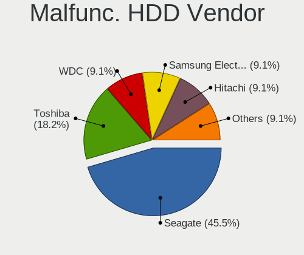
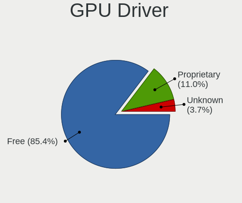
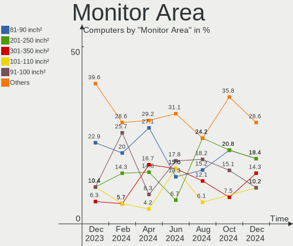
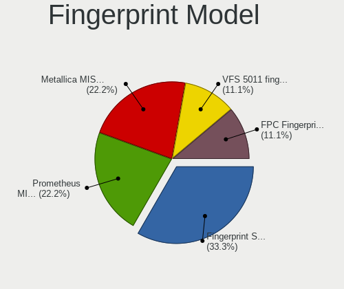

FreeBSD - Hardware Trends
-------------------------

A project to identify most popular hardware characteristics and track their change
over time based on data collected by BSD users at https://BSD-Hardware.info.

Anyone can contribute to this report by the [hw-probe](https://github.com/linuxhw/hw-probe/blob/master/INSTALL.BSD.md) tool:

    hw-probe -all -upload

This is a report for all computer types. See also reports for [desktops](/Dist/FreeBSD/Desktop/README.md) and [notebooks](/Dist/FreeBSD/Notebook/README.md).

This report is for one last month. Overall report since the beginning of time: [TestDays](https://github.com/bsdhw/TestDays)

Period: Jul, 2023.

Contents
--------

* [ System ](#system)
  - [ OS                       ](#os)
  - [ OS Family                ](#os-family)
  - [ Arch                     ](#arch)
  - [ DE                       ](#de)
  - [ Display Server           ](#display-server)
  - [ Display Manager          ](#display-manager)
  - [ OS Lang                  ](#os-lang)
  - [ Boot Mode                ](#boot-mode)
  - [ Filesystem               ](#filesystem)
  - [ Part. scheme             ](#part-scheme)

* [ Board ](#board)
  - [ Vendor                   ](#vendor)
  - [ Model                    ](#model)
  - [ Model Family             ](#model-family)
  - [ MFG Year                 ](#mfg-year)
  - [ Form Factor              ](#form-factor)
  - [ Coreboot                 ](#coreboot)
  - [ RAM Size                 ](#ram-size)
  - [ RAM Used                 ](#ram-used)
  - [ Total Drives             ](#total-drives)
  - [ Has CD-ROM               ](#has-cd-rom)
  - [ Has Ethernet             ](#has-ethernet)
  - [ Has WiFi                 ](#has-wifi)
  - [ Has Bluetooth            ](#has-bluetooth)

* [ Location ](#location)
  - [ Country                  ](#country)
  - [ City                     ](#city)

* [ Drives ](#drives)
  - [ Drive Vendor             ](#drive-vendor)
  - [ Drive Model              ](#drive-model)
  - [ HDD Vendor               ](#hdd-vendor)
  - [ SSD Vendor               ](#ssd-vendor)
  - [ Drive Kind               ](#drive-kind)
  - [ Drive Connector          ](#drive-connector)
  - [ Drive Size               ](#drive-size)
  - [ Space Total              ](#space-total)
  - [ Space Used               ](#space-used)
  - [ Malfunc. Drives          ](#malfunc-drives)
  - [ Malfunc. Drive Vendor    ](#malfunc-drive-vendor)
  - [ Malfunc. HDD Vendor      ](#malfunc-hdd-vendor)
  - [ Malfunc. Drive Kind      ](#malfunc-drive-kind)
  - [ Failed Drives            ](#failed-drives)
  - [ Failed Drive Vendor      ](#failed-drive-vendor)
  - [ Drive Status             ](#drive-status)

* [ Storage controller ](#storage-controller)
  - [ Storage Vendor           ](#storage-vendor)
  - [ Storage Model            ](#storage-model)
  - [ Storage Kind             ](#storage-kind)

* [ Processor ](#processor)
  - [ CPU Vendor               ](#cpu-vendor)
  - [ CPU Model                ](#cpu-model)
  - [ CPU Model Family         ](#cpu-model-family)
  - [ CPU Cores                ](#cpu-cores)
  - [ CPU Sockets              ](#cpu-sockets)
  - [ CPU Threads              ](#cpu-threads)
  - [ CPU Microarch            ](#cpu-microarch)

* [ Graphics ](#graphics)
  - [ GPU Vendor               ](#gpu-vendor)
  - [ GPU Model                ](#gpu-model)
  - [ GPU Combo                ](#gpu-combo)
  - [ GPU Driver               ](#gpu-driver)
  - [ GPU Memory               ](#gpu-memory)

* [ Monitor ](#monitor)
  - [ Monitor Vendor           ](#monitor-vendor)
  - [ Monitor Model            ](#monitor-model)
  - [ Monitor Resolution       ](#monitor-resolution)
  - [ Monitor Diagonal         ](#monitor-diagonal)
  - [ Monitor Width            ](#monitor-width)
  - [ Aspect Ratio             ](#aspect-ratio)
  - [ Monitor Area             ](#monitor-area)
  - [ Pixel Density            ](#pixel-density)
  - [ Multiple Monitors        ](#multiple-monitors)

* [ Network ](#network)
  - [ Net Controller Vendor    ](#net-controller-vendor)
  - [ Net Controller Model     ](#net-controller-model)
  - [ Wireless Vendor          ](#wireless-vendor)
  - [ Wireless Model           ](#wireless-model)
  - [ Ethernet Vendor          ](#ethernet-vendor)
  - [ Ethernet Model           ](#ethernet-model)
  - [ Net Controller Kind      ](#net-controller-kind)
  - [ Used Controller          ](#used-controller)
  - [ NICs                     ](#nics)
  - [ IPv6                     ](#ipv6)

* [ Bluetooth ](#bluetooth)
  - [ Bluetooth Vendor         ](#bluetooth-vendor)
  - [ Bluetooth Model          ](#bluetooth-model)

* [ Sound ](#sound)
  - [ Sound Vendor             ](#sound-vendor)
  - [ Sound Model              ](#sound-model)

* [ Memory ](#memory)
  - [ Memory Vendor            ](#memory-vendor)
  - [ Memory Model             ](#memory-model)
  - [ Memory Kind              ](#memory-kind)
  - [ Memory Form Factor       ](#memory-form-factor)
  - [ Memory Size              ](#memory-size)
  - [ Memory Speed             ](#memory-speed)

* [ Printers & scanners ](#printers--scanners)
  - [ Printer Vendor           ](#printer-vendor)
  - [ Printer Model            ](#printer-model)
  - [ Scanner Vendor           ](#scanner-vendor)
  - [ Scanner Model            ](#scanner-model)

* [ Camera ](#camera)
  - [ Camera Vendor            ](#camera-vendor)
  - [ Camera Model             ](#camera-model)

* [ Security ](#security)
  - [ Fingerprint Vendor       ](#fingerprint-vendor)
  - [ Fingerprint Model        ](#fingerprint-model)
  - [ Chipcard Vendor          ](#chipcard-vendor)
  - [ Chipcard Model           ](#chipcard-model)

* [ Unsupported ](#unsupported)
  - [ Unsupported Devices      ](#unsupported-devices)
  - [ Unsupported Device Types ](#unsupported-device-types)

System
------

OS
--

Installed operating systems

| Name                 | Computers | Percent |
|----------------------|-----------|---------|
| FreeBSD 13.2         | 29        | 46.03%  |
| FreeBSD 13.2-p1      | 15        | 23.81%  |
| FreeBSD 13.1-p8      | 10        | 15.87%  |
| FreeBSD 14.0-CURRENT | 3         | 4.76%   |
| FreeBSD 13.1         | 2         | 3.17%   |
| FreeBSD 13.2-STABLE  | 1         | 1.59%   |
| FreeBSD 13.1-p7      | 1         | 1.59%   |
| FreeBSD 13.1-p5      | 1         | 1.59%   |
| FreeBSD 12.4         | 1         | 1.59%   |

OS Family
---------

OS without a version

| Name    | Computers | Percent |
|---------|-----------|---------|
| FreeBSD | 63        | 100%    |

Arch
----

OS architecture (x86_64, i586, etc.)

| Name  | Computers | Percent |
|-------|-----------|---------|
| amd64 | 60        | 95.24%  |
| arm64 | 3         | 4.76%   |

DE
--

Desktop Environment

| Name         | Computers | Percent |
|--------------|-----------|---------|
| Console      | 19        | 30.16%  |
| KDE5         | 9         | 14.29%  |
| GNOME        | 9         | 14.29%  |
| XFCE         | 6         | 9.52%   |
| TWM          | 6         | 9.52%   |
| LXQt         | 5         | 7.94%   |
| Openbox      | 2         | 3.17%   |
| Window Maker | 1         | 1.59%   |
| stumpwm      | 1         | 1.59%   |
| Picom        | 1         | 1.59%   |
| LXDE         | 1         | 1.59%   |
| i3           | 1         | 1.59%   |
| DWM          | 1         | 1.59%   |
| Budgie       | 1         | 1.59%   |

Display Server
--------------

X11 or Wayland

| Name    | Computers | Percent |
|---------|-----------|---------|
| X11     | 35        | 55.56%  |
| Console | 23        | 36.51%  |
| Wayland | 5         | 7.94%   |

Display Manager
---------------

SDDM, LightDM, etc.

| Name    | Computers | Percent |
|---------|-----------|---------|
| Console | 31        | 49.21%  |
| SDDM    | 11        | 17.46%  |
| LightDM | 10        | 15.87%  |
| GDM     | 5         | 7.94%   |
| XDM     | 3         | 4.76%   |
| SLiM    | 3         | 4.76%   |

OS Lang
-------

Language

| Lang    | Computers | Percent |
|---------|-----------|---------|
| C       | 45        | 71.43%  |
| en_US   | 7         | 11.11%  |
| Unknown | 6         | 9.52%   |
| ru_RU   | 1         | 1.59%   |
| pl_PL   | 1         | 1.59%   |
| it_IT   | 1         | 1.59%   |
| fi_FI   | 1         | 1.59%   |
| es_MX   | 1         | 1.59%   |

Boot Mode
---------

EFI or BIOS

| Mode | Computers | Percent |
|------|-----------|---------|
| EFI  | 52        | 82.54%  |
| BIOS | 11        | 17.46%  |

Filesystem
----------

Type of filesystem

| Type | Computers | Percent |
|------|-----------|---------|
| Zfs  | 38        | 60.32%  |
| Ufs  | 25        | 39.68%  |

Part. scheme
------------

Scheme of partitioning

| Type | Computers | Percent |
|------|-----------|---------|
| GPT  | 60        | 95.24%  |
| MBR  | 3         | 4.76%   |

Board
-----

Vendor
------

Motherboard manufacturer

| Name                    | Computers | Percent |
|-------------------------|-----------|---------|
| Lenovo                  | 11        | 17.46%  |
| Gigabyte Technology     | 10        | 15.87%  |
| ASUSTek Computer        | 7         | 11.11%  |
| Hewlett-Packard         | 6         | 9.52%   |
| MSI                     | 4         | 6.35%   |
| ASRock                  | 4         | 6.35%   |
| Dell                    | 3         | 4.76%   |
| Intel                   | 2         | 3.17%   |
| AZW                     | 2         | 3.17%   |
| Unknown                 | 2         | 3.17%   |
| Samsung Electronics     | 1         | 1.59%   |
| Raspberry Pi Foundation | 1         | 1.59%   |
| Radxa                   | 1         | 1.59%   |
| NOBLEX                  | 1         | 1.59%   |
| HUAWEI                  | 1         | 1.59%   |
| HPE                     | 1         | 1.59%   |
| HONOR                   | 1         | 1.59%   |
| Getac                   | 1         | 1.59%   |
| Fujitsu                 | 1         | 1.59%   |
| Chuwi                   | 1         | 1.59%   |
| ASRockRack              | 1         | 1.59%   |
| Acer                    | 1         | 1.59%   |

Model
-----

Motherboard model

| Name                                     | Computers | Percent |
|------------------------------------------|-----------|---------|
| Gigabyte B360N WIFI                      | 5         | 7.94%   |
| Gigabyte H270N-WIFI                      | 2         | 3.17%   |
| AZW SER                                  | 2         | 3.17%   |
| ASRock J3455B-ITX                        | 2         | 3.17%   |
| Unknown                                  | 2         | 3.17%   |
| Samsung 100NZB                           | 1         | 1.59%   |
| RPi Raspberry Pi                         | 1         | 1.59%   |
| Radxa rock-pi-n10a                       | 1         | 1.59%   |
| NOBLEX SF20BA                            | 1         | 1.59%   |
| MSI MS-7D16                              | 1         | 1.59%   |
| MSI MS-7D15                              | 1         | 1.59%   |
| MSI MS-7B85                              | 1         | 1.59%   |
| MSI MS-7817                              | 1         | 1.59%   |
| Lenovo ThinkPad X250 20CLS13Q06          | 1         | 1.59%   |
| Lenovo ThinkPad X1C 5th W10DG 20K3A03CAU | 1         | 1.59%   |
| Lenovo ThinkPad W520 4284GZ1             | 1         | 1.59%   |
| Lenovo ThinkPad T590 20N4001PUS          | 1         | 1.59%   |
| Lenovo ThinkPad T480s 20L8S45W00         | 1         | 1.59%   |
| Lenovo ThinkPad T470s 20HGS3AX02         | 1         | 1.59%   |
| Lenovo ThinkPad T440s 20ARS1BK08         | 1         | 1.59%   |
| Lenovo ThinkPad T440p 20AWS1HL00         | 1         | 1.59%   |
| Lenovo ThinkPad L15 Gen 1 20U8S2TM02     | 1         | 1.59%   |
| Lenovo ThinkPad E15 Gen 2 20TDS0G500     | 1         | 1.59%   |
| Lenovo G550 2958                         | 1         | 1.59%   |
| Intel HM570                              | 1         | 1.59%   |
| Intel DQ67SW                             | 1         | 1.59%   |
| HUAWEI MRG-WXX                           | 1         | 1.59%   |
| HPE ProLiant DL360 Gen10                 | 1         | 1.59%   |
| HONOR NMH-WCX9                           | 1         | 1.59%   |
| HP Slimline Desktop PC 270-p0xx          | 1         | 1.59%   |
| HP ProBook x360 11 G7 Education Edition  | 1         | 1.59%   |
| HP Laptop 14-cf2xxx                      | 1         | 1.59%   |
| HP EliteBook 8570p                       | 1         | 1.59%   |
| HP EliteBook 6930p                       | 1         | 1.59%   |
| HP Compaq Elite 8300 SFF                 | 1         | 1.59%   |
| Gigabyte X470 AORUS ULTRA GAMING         | 1         | 1.59%   |
| Gigabyte M85M-US2H                       | 1         | 1.59%   |
| Gigabyte H77M-D3H                        | 1         | 1.59%   |
| Getac F110G2                             | 1         | 1.59%   |
| Fujitsu ESPRIMO P420                     | 1         | 1.59%   |

Model Family
------------

Motherboard model prefix

| Name                      | Computers | Percent |
|---------------------------|-----------|---------|
| Lenovo ThinkPad           | 10        | 15.87%  |
| Gigabyte B360N            | 5         | 7.94%   |
| ASUS PRIME                | 4         | 6.35%   |
| HP EliteBook              | 2         | 3.17%   |
| Gigabyte H270N-WIFI       | 2         | 3.17%   |
| Dell Precision            | 2         | 3.17%   |
| AZW SER                   | 2         | 3.17%   |
| ASRock J3455B-ITX         | 2         | 3.17%   |
| Unknown                   | 2         | 3.17%   |
| Samsung 100NZB            | 1         | 1.59%   |
| RPi Raspberry             | 1         | 1.59%   |
| Radxa rock-pi-n10a        | 1         | 1.59%   |
| NOBLEX SF20BA             | 1         | 1.59%   |
| MSI MS-7D16               | 1         | 1.59%   |
| MSI MS-7D15               | 1         | 1.59%   |
| MSI MS-7B85               | 1         | 1.59%   |
| MSI MS-7817               | 1         | 1.59%   |
| Lenovo G550               | 1         | 1.59%   |
| Intel HM570               | 1         | 1.59%   |
| Intel DQ67SW              | 1         | 1.59%   |
| HUAWEI MRG-WXX            | 1         | 1.59%   |
| HPE ProLiant              | 1         | 1.59%   |
| HONOR NMH-WCX9            | 1         | 1.59%   |
| HP Slimline               | 1         | 1.59%   |
| HP ProBook                | 1         | 1.59%   |
| HP Laptop                 | 1         | 1.59%   |
| HP Compaq                 | 1         | 1.59%   |
| Gigabyte X470             | 1         | 1.59%   |
| Gigabyte M85M-US2H        | 1         | 1.59%   |
| Gigabyte H77M-D3H         | 1         | 1.59%   |
| Getac F110G2              | 1         | 1.59%   |
| Fujitsu ESPRIMO           | 1         | 1.59%   |
| Dell OptiPlex             | 1         | 1.59%   |
| Chuwi LarkBox             | 1         | 1.59%   |
| ASUS ROG                  | 1         | 1.59%   |
| ASUS P8P67                | 1         | 1.59%   |
| ASUS P5Q-E                | 1         | 1.59%   |
| ASRockRack EPYC3101D4I-2T | 1         | 1.59%   |
| ASRock Z690               | 1         | 1.59%   |
| ASRock X570               | 1         | 1.59%   |

MFG Year
--------

Motherboard manufacture year

| Year    | Computers | Percent |
|---------|-----------|---------|
| 2022    | 11        | 17.46%  |
| 2018    | 7         | 11.11%  |
| 2019    | 6         | 9.52%   |
| 2017    | 6         | 9.52%   |
| 2023    | 5         | 7.94%   |
| 2015    | 4         | 6.35%   |
| 2012    | 4         | 6.35%   |
| 2021    | 3         | 4.76%   |
| 2014    | 3         | 4.76%   |
| 2013    | 3         | 4.76%   |
| 2020    | 2         | 3.17%   |
| 2016    | 2         | 3.17%   |
| 2009    | 2         | 3.17%   |
| Unknown | 2         | 3.17%   |
| 2011    | 1         | 1.59%   |
| 2010    | 1         | 1.59%   |
| 2008    | 1         | 1.59%   |

Form Factor
-----------

Physical design of the computer

| Name           | Computers | Percent |
|----------------|-----------|---------|
| Desktop        | 36        | 57.14%  |
| Notebook       | 21        | 33.33%  |
| Mini pc        | 3         | 4.76%   |
| System on chip | 1         | 1.59%   |
| Convertible    | 1         | 1.59%   |
| Server         | 1         | 1.59%   |

Coreboot
--------

Have coreboot on board

| Used | Computers | Percent |
|------|-----------|---------|
| No   | 63        | 100%    |

RAM Size
--------

Total RAM memory

| Size in GB  | Computers | Percent |
|-------------|-----------|---------|
| 16.01-24.0  | 26        | 41.27%  |
| 32.01-64.0  | 11        | 17.46%  |
| 8.01-16.0   | 11        | 17.46%  |
| 4.01-8.0    | 9         | 14.29%  |
| 64.01-256.0 | 3         | 4.76%   |
| 3.01-4.0    | 2         | 3.17%   |
| 2.01-3.0    | 1         | 1.59%   |

RAM Used
--------

Used RAM memory

| Used GB    | Computers | Percent |
|------------|-----------|---------|
| 0.51-1.0   | 34        | 53.97%  |
| 0.01-0.5   | 15        | 23.81%  |
| 1.01-2.0   | 9         | 14.29%  |
| 4.01-8.0   | 3         | 4.76%   |
| 32.01-64.0 | 1         | 1.59%   |
| 3.01-4.0   | 1         | 1.59%   |

Total Drives
------------

Number of drives on board

| Drives | Computers | Percent |
|--------|-----------|---------|
| 1      | 29        | 46.03%  |
| 2      | 15        | 23.81%  |
| 3      | 7         | 11.11%  |
| 0      | 6         | 9.52%   |
| 30     | 1         | 1.59%   |
| 13     | 1         | 1.59%   |
| 10     | 1         | 1.59%   |
| 6      | 1         | 1.59%   |
| 5      | 1         | 1.59%   |
| 4      | 1         | 1.59%   |

Has CD-ROM
----------

Has CD-ROM on board

| Presented | Computers | Percent |
|-----------|-----------|---------|
| No        | 49        | 77.78%  |
| Yes       | 14        | 22.22%  |

Has Ethernet
------------

Has Ethernet on board

| Presented | Computers | Percent |
|-----------|-----------|---------|
| Yes       | 56        | 88.89%  |
| No        | 7         | 11.11%  |

Has WiFi
--------

Has WiFi module

| Presented | Computers | Percent |
|-----------|-----------|---------|
| Yes       | 41        | 65.08%  |
| No        | 22        | 34.92%  |

Has Bluetooth
-------------

Has Bluetooth module

| Presented | Computers | Percent |
|-----------|-----------|---------|
| Yes       | 33        | 52.38%  |
| No        | 30        | 47.62%  |

Location
--------

Country
-------

Geographic location (country)

| Country     | Computers | Percent |
|-------------|-----------|---------|
| USA         | 13        | 20.63%  |
| Poland      | 10        | 15.87%  |
| Russia      | 7         | 11.11%  |
| UK          | 4         | 6.35%   |
| Australia   | 4         | 6.35%   |
| Argentina   | 4         | 6.35%   |
| Italy       | 3         | 4.76%   |
| Netherlands | 2         | 3.17%   |
| India       | 2         | 3.17%   |
| Germany     | 2         | 3.17%   |
| Canada      | 2         | 3.17%   |
| Thailand    | 1         | 1.59%   |
| Sweden      | 1         | 1.59%   |
| Spain       | 1         | 1.59%   |
| Mexico      | 1         | 1.59%   |
| Kazakhstan  | 1         | 1.59%   |
| Ireland     | 1         | 1.59%   |
| Indonesia   | 1         | 1.59%   |
| Hong Kong   | 1         | 1.59%   |
| Finland     | 1         | 1.59%   |
| China       | 1         | 1.59%   |

City
----

Geographic location (city)

| City                  | Computers | Percent |
|-----------------------|-----------|---------|
| Lublin                | 6         | 9.52%   |
| Sydney                | 5         | 7.94%   |
| St Petersburg         | 4         | 6.35%   |
| Gmina Świebodzin     | 3         | 4.76%   |
| Salem                 | 2         | 3.17%   |
| Redmond               | 2         | 3.17%   |
| Munfordville          | 2         | 3.17%   |
| Zgierz                | 1         | 1.59%   |
| Yuzhong Chengguanzhen | 1         | 1.59%   |
| Wenatchee             | 1         | 1.59%   |
| Wauwatosa             | 1         | 1.59%   |
| Wandsworth            | 1         | 1.59%   |
| Wanchai               | 1         | 1.59%   |
| Veracruz              | 1         | 1.59%   |
| Vancouver             | 1         | 1.59%   |
| Sulzbach-Rosenberg    | 1         | 1.59%   |
| Stavropol             | 1         | 1.59%   |
| San Miguel            | 1         | 1.59%   |
| Pittsfield            | 1         | 1.59%   |
| Pinneberg             | 1         | 1.59%   |
| Philadelphia          | 1         | 1.59%   |
| Ozersk                | 1         | 1.59%   |
| Oxford                | 1         | 1.59%   |
| Oulx                  | 1         | 1.59%   |
| New York              | 1         | 1.59%   |
| Moscow                | 1         | 1.59%   |
| Milano                | 1         | 1.59%   |
| Kochi                 | 1         | 1.59%   |
| Hyderabad             | 1         | 1.59%   |
| Hurst                 | 1         | 1.59%   |
| Helsinki              | 1         | 1.59%   |
| Helmond               | 1         | 1.59%   |
| Godella               | 1         | 1.59%   |
| East Grinstead        | 1         | 1.59%   |
| Dublin                | 1         | 1.59%   |
| Coronel Pringles      | 1         | 1.59%   |
| Córdoba              | 1         | 1.59%   |
| Concord               | 1         | 1.59%   |
| Carlisle              | 1         | 1.59%   |
| Borlänge             | 1         | 1.59%   |

Drives
------

Drive Vendor
------------

Hard drive vendors

| Vendor              | Computers | Drives | Percent |
|---------------------|-----------|--------|---------|
| WDC                 | 22        | 48     | 23.4%   |
| Samsung Electronics | 18        | 24     | 19.15%  |
| Seagate             | 12        | 27     | 12.77%  |
| Crucial             | 7         | 9      | 7.45%   |
| Intel               | 6         | 6      | 6.38%   |
| Kingston            | 4         | 5      | 4.26%   |
| SK hynix            | 3         | 3      | 3.19%   |
| Micron Technology   | 2         | 2      | 2.13%   |
| Hitachi             | 2         | 2      | 2.13%   |
| HGST                | 2         | 3      | 2.13%   |
| Corsair             | 2         | 2      | 2.13%   |
| A-DATA Technology   | 2         | 2      | 2.13%   |
| Verbatim            | 1         | 1      | 1.06%   |
| Toshiba             | 1         | 2      | 1.06%   |
| Team                | 1         | 1      | 1.06%   |
| T-FORCE             | 1         | 1      | 1.06%   |
| Silicon Motion      | 1         | 1      | 1.06%   |
| SanDisk             | 1         | 1      | 1.06%   |
| OCZ                 | 1         | 1      | 1.06%   |
| Netac               | 1         | 1      | 1.06%   |
| MidasForce          | 1         | 1      | 1.06%   |
| Hewlett-Packard     | 1         | 4      | 1.06%   |
| GLOWAY              | 1         | 1      | 1.06%   |
| AirDisk             | 1         | 1      | 1.06%   |

Drive Model
-----------

Hard drive models

| Model                                  | Computers | Percent |
|----------------------------------------|-----------|---------|
| WDC WDS500G1R0A-68A4W0 500GB           | 6         | 4.92%   |
| WDC WD5000LPLX-22ZNTT0 500GB           | 5         | 4.1%    |
| Samsung SSD 870 QVO 1TB                | 3         | 2.46%   |
| WDC WD80EMAZ-00WJTA0 8TB               | 2         | 1.64%   |
| WDC WD5000LPLX-00ZNTT0 500GB           | 2         | 1.64%   |
| WDC WD10JPLX-00MBPT0 1TB               | 2         | 1.64%   |
| Seagate ST4000LM024-2U817V 4TB         | 2         | 1.64%   |
| Seagate ST4000LM024-2AN17V 4TB         | 2         | 1.64%   |
| Seagate ST4000DM000-1F2168 4TB         | 2         | 1.64%   |
| Seagate ST1000LM024 HN-M101MBB 1TB     | 2         | 1.64%   |
| Samsung SSD 970 EVO Plus 2TB           | 2         | 1.64%   |
| Kingston SA400S37480G 480GB            | 2         | 1.64%   |
| Crucial CT500P2SSD8 500GB              | 2         | 1.64%   |
| A-DATA LEGEND 710 256GB                | 2         | 1.64%   |
| WDC WDS120G2G0A-00JH30 120GB           | 1         | 0.82%   |
| WDC WDS100T3X0C-00SJG0 1TB             | 1         | 0.82%   |
| WDC WDS100T2B0C-00PXH0 1TB             | 1         | 0.82%   |
| WDC WDS100T2B0A-00SM50 1TB             | 1         | 0.82%   |
| WDC WD80EFZX-68UW8N0 8TB               | 1         | 0.82%   |
| WDC WD80EFAX-68LHPN0 8TB               | 1         | 0.82%   |
| WDC WD80EDBZ-11B0ZA0 8TB               | 1         | 0.82%   |
| WDC WD7500BPKT-00PK4T0 752GB           | 1         | 0.82%   |
| WDC WD5003ABYX-01WERA1 500GB           | 1         | 0.82%   |
| WDC WD5000LUCT-63C26Y0 500GB           | 1         | 0.82%   |
| WDC WD40EZRZ-22GXCB0 4TB               | 1         | 0.82%   |
| WDC WD30EFRX-68EUZN0 3TB               | 1         | 0.82%   |
| WDC WD20NPVX-00EA4T0 2TB               | 1         | 0.82%   |
| WDC WD15EADS-00P8B0 1.5TB              | 1         | 0.82%   |
| WDC WD120EMFZ-11A6JA0 12TB             | 1         | 0.82%   |
| WDC WD120EMAZ-11BLFA0 12TB             | 1         | 0.82%   |
| WDC WD10SPZX-60Z10T0 1TB               | 1         | 0.82%   |
| WDC WD10EZEX-60WN4A0 1TB               | 1         | 0.82%   |
| WDC PC SN730 SDBQNTY-256G-1001 256GB   | 1         | 0.82%   |
| WDC PC SN530 SDBPNPZ-512G-1036 512GB   | 1         | 0.82%   |
| Verbatim Vi550 S3 SSD 256GB            | 1         | 0.82%   |
| Toshiba HDWG11A 10TB                   | 1         | 0.82%   |
| Team TM8PS7512G 512GB                  | 1         | 0.82%   |
| T-FORCE SSD 500GB                      | 1         | 0.82%   |
| SK hynix SKHynix_HFS512GDE9X084N 512GB | 1         | 0.82%   |
| SK hynix SC311 SATA 128GB              | 1         | 0.82%   |

HDD Vendor
----------

Hard disk drive vendors

| Vendor          | Computers | Drives | Percent |
|-----------------|-----------|--------|---------|
| WDC             | 17        | 35     | 48.57%  |
| Seagate         | 12        | 27     | 34.29%  |
| Hitachi         | 2         | 2      | 5.71%   |
| HGST            | 2         | 3      | 5.71%   |
| Toshiba         | 1         | 2      | 2.86%   |
| Hewlett-Packard | 1         | 4      | 2.86%   |

SSD Vendor
----------

Solid state drive vendors

| Vendor              | Computers | Drives | Percent |
|---------------------|-----------|--------|---------|
| Samsung Electronics | 12        | 15     | 26.67%  |
| WDC                 | 8         | 9      | 17.78%  |
| Crucial             | 6         | 7      | 13.33%  |
| Kingston            | 4         | 5      | 8.89%   |
| Intel               | 3         | 3      | 6.67%   |
| Verbatim            | 1         | 1      | 2.22%   |
| Team                | 1         | 1      | 2.22%   |
| T-FORCE             | 1         | 1      | 2.22%   |
| SK hynix            | 1         | 1      | 2.22%   |
| SanDisk             | 1         | 1      | 2.22%   |
| OCZ                 | 1         | 1      | 2.22%   |
| Netac               | 1         | 1      | 2.22%   |
| MidasForce          | 1         | 1      | 2.22%   |
| Micron Technology   | 1         | 1      | 2.22%   |
| GLOWAY              | 1         | 1      | 2.22%   |
| Corsair             | 1         | 1      | 2.22%   |
| AirDisk             | 1         | 1      | 2.22%   |

Drive Kind
----------

HDD or SSD

| Kind | Computers | Drives | Percent |
|------|-----------|--------|---------|
| SSD  | 35        | 51     | 42.68%  |
| HDD  | 26        | 73     | 31.71%  |
| NVMe | 21        | 25     | 25.61%  |

Drive Connector
---------------

SATA, SAS, NVMe, etc.

| Type | Computers | Drives | Percent |
|------|-----------|--------|---------|
| SATA | 46        | 124    | 68.66%  |
| NVMe | 21        | 25     | 31.34%  |

Drive Size
----------

Size of hard drive

| Size in TB | Computers | Drives | Percent |
|------------|-----------|--------|---------|
| 0.01-0.5   | 34        | 48     | 50.75%  |
| 0.51-1.0   | 14        | 23     | 20.9%   |
| 3.01-4.0   | 7         | 8      | 10.45%  |
| 1.01-2.0   | 5         | 10     | 7.46%   |
| 4.01-10.0  | 4         | 21     | 5.97%   |
| 10.01-20.0 | 2         | 6      | 2.99%   |
| 2.01-3.0   | 1         | 8      | 1.49%   |

Space Total
-----------

Amount of disk space available on the file system

| Size in GB     | Computers | Percent |
|----------------|-----------|---------|
| 251-500        | 17        | 26.98%  |
| 501-1000       | 17        | 26.98%  |
| 101-250        | 13        | 20.63%  |
| 51-100         | 8         | 12.7%   |
| More than 3000 | 2         | 3.17%   |
| 21-50          | 2         | 3.17%   |
| 1-20           | 2         | 3.17%   |
| 2001-3000      | 1         | 1.59%   |
| 1001-2000      | 1         | 1.59%   |

Space Used
----------

Amount of used disk space

| Used GB        | Computers | Percent |
|----------------|-----------|---------|
| 1-20           | 43        | 68.25%  |
| 101-250        | 6         | 9.52%   |
| 251-500        | 5         | 7.94%   |
| 21-50          | 5         | 7.94%   |
| 51-100         | 2         | 3.17%   |
| More than 3000 | 1         | 1.59%   |
| 501-1000       | 1         | 1.59%   |

Malfunc. Drives
---------------

Drive models with a malfunction

| Model                             | Computers | Drives | Percent |
|-----------------------------------|-----------|--------|---------|
| WDC WD5000LPLX-22ZNTT0 500GB      | 2         | 2      | 16.67%  |
| WDC WD7500BPKT-00PK4T0 752GB      | 1         | 1      | 8.33%   |
| WDC WD30EFRX-68EUZN0 3TB          | 1         | 6      | 8.33%   |
| WDC WD20NPVX-00EA4T0 2TB          | 1         | 2      | 8.33%   |
| Seagate ST9500325ASG 500GB        | 1         | 1      | 8.33%   |
| Seagate ST9250315AS 250GB         | 1         | 1      | 8.33%   |
| Seagate ST2000LM015-2E8174 2TB    | 1         | 2      | 8.33%   |
| Seagate ST10000DM0004-2GR11L 10TB | 1         | 4      | 8.33%   |
| Hitachi HUA722020ALA330 2TB       | 1         | 1      | 8.33%   |
| HGST HTS721010A9E630 1TB          | 1         | 1      | 8.33%   |
| Crucial CT525MX300SSD1 528GB      | 1         | 1      | 8.33%   |

Malfunc. Drive Vendor
---------------------

Vendors of faulty drives

| Vendor  | Computers | Drives | Percent |
|---------|-----------|--------|---------|
| WDC     | 4         | 11     | 36.36%  |
| Seagate | 4         | 8      | 36.36%  |
| Hitachi | 1         | 1      | 9.09%   |
| HGST    | 1         | 1      | 9.09%   |
| Crucial | 1         | 1      | 9.09%   |

Malfunc. HDD Vendor
-------------------

Vendors of faulty HDD drives

| Vendor  | Computers | Drives | Percent |
|---------|-----------|--------|---------|
| WDC     | 4         | 11     | 40%     |
| Seagate | 4         | 8      | 40%     |
| Hitachi | 1         | 1      | 10%     |
| HGST    | 1         | 1      | 10%     |

Malfunc. Drive Kind
-------------------

Kinds of faulty drives

| Kind | Computers | Drives | Percent |
|------|-----------|--------|---------|
| HDD  | 8         | 21     | 88.89%  |
| SSD  | 1         | 1      | 11.11%  |

Failed Drives
-------------

Failed drive models

Zero info for selected period =(

Failed Drive Vendor
-------------------

Failed drive vendors

Zero info for selected period =(

Drive Status
------------

Number of failed and malfunc. drives

| Status  | Computers | Drives | Percent |
|---------|-----------|--------|---------|
| Works   | 55        | 127    | 85.94%  |
| Malfunc | 9         | 22     | 14.06%  |

Storage controller
------------------

Storage Vendor
--------------

Storage controller vendors

| Vendor                    | Computers | Percent |
|---------------------------|-----------|---------|
| Intel                     | 40        | 50%     |
| Samsung Electronics       | 8         | 10%     |
| AMD                       | 8         | 10%     |
| SanDisk                   | 4         | 5%      |
| Marvell Technology Group  | 4         | 5%      |
| SK hynix                  | 2         | 2.5%    |
| Micron/Crucial Technology | 2         | 2.5%    |
| Micron Technology         | 2         | 2.5%    |
| Broadcom / LSI            | 2         | 2.5%    |
| ADATA Technology          | 2         | 2.5%    |
| Adaptec                   | 2         | 2.5%    |
| Silicon Motion            | 1         | 1.25%   |
| Phison Electronics        | 1         | 1.25%   |
| Nvidia                    | 1         | 1.25%   |
| JMicron Technology        | 1         | 1.25%   |

Storage Model
-------------

Storage controller models

| Model                                                                          | Computers | Percent |
|--------------------------------------------------------------------------------|-----------|---------|
| AMD FCH SATA Controller [AHCI mode]                                            | 8         | 8.7%    |
| Intel Cannon Lake PCH SATA AHCI Controller                                     | 5         | 5.43%   |
| Samsung NVMe SSD Controller SM981/PM981/PM983                                  | 4         | 4.35%   |
| Intel 8 Series/C220 Series Chipset Family 6-port SATA Controller 1 [AHCI mode] | 3         | 3.26%   |
| Intel 500 Series Chipset Family SATA AHCI Controller                           | 3         | 3.26%   |
| Intel 200 Series PCH SATA controller [AHCI mode]                               | 3         | 3.26%   |
| SK hynix Gold P31/BC711/PC711 NVMe Solid State Drive                           | 2         | 2.17%   |
| SanDisk WD Blue SN550 NVMe SSD                                                 | 2         | 2.17%   |
| SanDisk WD Black SN750 / PC SN730 NVMe SSD                                     | 2         | 2.17%   |
| Samsung NVMe SSD Controller SM961/PM961/SM963                                  | 2         | 2.17%   |
| Samsung NVMe SSD Controller 980                                                | 2         | 2.17%   |
| Micron/Crucial P2 [Nick P2] / P3 / P3 Plus NVMe PCIe SSD (DRAM-less)           | 2         | 2.17%   |
| Micron 2400 NVMe SSD (DRAM-less)                                               | 2         | 2.17%   |
| Marvell Group 88SE9230 PCIe 2.0 x2 4-port SATA 6 Gb/s RAID Controller          | 2         | 2.17%   |
| Intel Wildcat Point-LP SATA Controller [AHCI Mode]                             | 2         | 2.17%   |
| Intel Sunrise Point-LP SATA Controller [AHCI mode]                             | 2         | 2.17%   |
| Intel SSD 660P Series                                                          | 2         | 2.17%   |
| Intel Celeron N3350/Pentium N4200/Atom E3900 Series SATA AHCI Controller       | 2         | 2.17%   |
| Intel Alder Lake-S PCH SATA Controller [AHCI Mode]                             | 2         | 2.17%   |
| Intel 82801IBM/IEM (ICH9M/ICH9M-E) 4 port SATA Controller [AHCI mode]          | 2         | 2.17%   |
| Intel 6 Series/C200 Series Chipset Family 6 port Desktop SATA AHCI Controller  | 2         | 2.17%   |
| Broadcom / LSI SAS2008 PCI-Express Fusion-MPT SAS-2 [Falcon]                   | 2         | 2.17%   |
| AMD 400 Series Chipset SATA Controller                                         | 2         | 2.17%   |
| ADATA ADATA XPG GAMMIXS1 1L Media (256 GB SSD)                                 | 2         | 2.17%   |
| Phison E16 PCIe4 NVMe Controller                                               | 1         | 1.09%   |
| Nvidia MCP78S [GeForce 8200] IDE                                               | 1         | 1.09%   |
| Nvidia MCP78S [GeForce 8200] AHCI Controller                                   | 1         | 1.09%   |
| Marvell Group 88SE9172 SATA 6Gb/s Controller                                   | 1         | 1.09%   |
| Marvell Group 88SE6111/6121 SATA II / PATA Controller                          | 1         | 1.09%   |
| JMicron JMB58x AHCI SATA controller                                            | 1         | 1.09%   |
| Intel Volume Management Device NVMe RAID Controller                            | 1         | 1.09%   |
| Intel Tiger Lake SATA AHCI Controller                                          | 1         | 1.09%   |
| Intel SSD 670p Series [Keystone Harbor]                                        | 1         | 1.09%   |
| Intel SATA Controller [RAID mode]                                              | 1         | 1.09%   |
| Intel product 54d3                                                             | 1         | 1.09%   |
| Intel NM10/ICH7 Family SATA Controller [AHCI mode]                             | 1         | 1.09%   |
| Intel C620 Series Chipset Family SSATA Controller [AHCI mode]                  | 1         | 1.09%   |
| Intel C602 chipset 4-Port SATA Storage Control Unit                            | 1         | 1.09%   |
| Intel C600/X79 series chipset 6-Port SATA AHCI Controller                      | 1         | 1.09%   |
| Intel Atom Processor E3800 Series SATA AHCI Controller                         | 1         | 1.09%   |

Storage Kind
------------

Kind of storage controller (IDE, SATA, NVMe, SAS, ...)

| Kind | Computers | Percent |
|------|-----------|---------|
| SATA | 46        | 58.97%  |
| NVMe | 22        | 28.21%  |
| IDE  | 4         | 5.13%   |
| RAID | 3         | 3.85%   |
| SAS  | 3         | 3.85%   |

Processor
---------

CPU Vendor
----------

Processor vendors

| Vendor | Computers | Percent |
|--------|-----------|---------|
| Intel  | 48        | 76.19%  |
| AMD    | 12        | 19.05%  |
| ARM    | 3         | 4.76%   |

CPU Model
---------

Processor models

| Model                                 | Computers | Percent |
|---------------------------------------|-----------|---------|
| Intel Core i3-8300T CPU @ 3.20GHz     | 4         | 6.35%   |
| Intel Pentium CPU G4600T @ 3.00GHz    | 2         | 3.17%   |
| Intel Core i5-3470 CPU @ 3.20GHz      | 2         | 3.17%   |
| Intel Celeron CPU J3455 @ 1.50GHz     | 2         | 3.17%   |
| AMD Ryzen 9 3900X 12-Core Processor   | 2         | 3.17%   |
| Intel Xeon Silver 4112 CPU @ 2.60GHz  | 1         | 1.59%   |
| Intel Xeon CPU E5-1620 0 @ 3.60GH     | 1         | 1.59%   |
| Intel Pentium CPU G3220 @ 3.00GHz     | 1         | 1.59%   |
| Intel N100                            | 1         | 1.59%   |
| Intel Genuine CPU 0000 @ 1.80GHz      | 1         | 1.59%   |
| Intel CPU Version                     | 1         | 1.59%   |
| Intel Core i7-9700T CPU @ 2.00GHz     | 1         | 1.59%   |
| Intel Core i7-8565U CPU @ 1.80GHz     | 1         | 1.59%   |
| Intel Core i7-8550U CPU @ 1.80GHz     | 1         | 1.59%   |
| Intel Core i7-5500U CPU @ 2.40GHz     | 1         | 1.59%   |
| Intel Core i7-4790 CPU @ 3.60GHz      | 1         | 1.59%   |
| Intel Core i7-3520M CPU @ 2.90GHz     | 1         | 1.59%   |
| Intel Core i7-2630QM CPU @ 2.00GHz    | 1         | 1.59%   |
| Intel Core i7-2600K CPU @ 3.40GHz     | 1         | 1.59%   |
| Intel Core i7-10875H CPU @ 2.30GHz    | 1         | 1.59%   |
| Intel Core i5-8350U CPU @ 1.70GHz     | 1         | 1.59%   |
| Intel Core i5-7300U CPU @ 2.60GHz     | 1         | 1.59%   |
| Intel Core i5-6200U CPU @ 2.30GHz     | 1         | 1.59%   |
| Intel Core i5-5300U CPU @ 2.30GHz     | 1         | 1.59%   |
| Intel Core i5-4300U CPU @ 1.90GHz     | 1         | 1.59%   |
| Intel Core i5-4300M CPU @ 2.60GHz     | 1         | 1.59%   |
| Intel Core i5-2400 CPU @ 3.10GHz      | 1         | 1.59%   |
| Intel Core i5-10600K CPU @ 4.10GHz    | 1         | 1.59%   |
| Intel Core i5-10400F CPU @ 2.90GHz    | 1         | 1.59%   |
| Intel Core i3-8100T CPU @ 3.10GHz     | 1         | 1.59%   |
| Intel Core i3-7100 CPU @ 3.90GHz      | 1         | 1.59%   |
| Intel Core i3-10100F CPU @ 3.60GHz    | 1         | 1.59%   |
| Intel Core 2 Quad CPU Q6600 @ 2.40GHz | 1         | 1.59%   |
| Intel Core 2 Duo CPU P8600 @ 2.40GHz  | 1         | 1.59%   |
| Intel Celeron N4500 @ 1.10GHz         | 1         | 1.59%   |
| Intel Celeron N4120 CPU @ 1.10GHz     | 1         | 1.59%   |
| Intel Celeron CPU N3060 @ 1.60GHz     | 1         | 1.59%   |
| Intel Celeron CPU N2840 @ 2.16GHz     | 1         | 1.59%   |
| Intel Atom CPU N2600 @ 1.60GHz        | 1         | 1.59%   |
| Intel 12th Gen Core i7-12700K         | 1         | 1.59%   |

CPU Model Family
----------------

Processor model prefix

| Model             | Computers | Percent |
|-------------------|-----------|---------|
| Intel Core i5     | 11        | 17.46%  |
| Intel Core i7     | 9         | 14.29%  |
| Intel Core i3     | 7         | 11.11%  |
| Other             | 6         | 9.52%   |
| Intel Celeron     | 6         | 9.52%   |
| AMD Ryzen 7       | 4         | 6.35%   |
| Intel Pentium     | 3         | 4.76%   |
| ARM Cortex        | 3         | 4.76%   |
| AMD Ryzen 9       | 2         | 3.17%   |
| AMD Ryzen 3       | 2         | 3.17%   |
| Intel Xeon Silver | 1         | 1.59%   |
| Intel Xeon        | 1         | 1.59%   |
| Intel Genuine     | 1         | 1.59%   |
| Intel Core 2 Quad | 1         | 1.59%   |
| Intel Core 2 Duo  | 1         | 1.59%   |
| Intel Atom        | 1         | 1.59%   |
| AMD Ryzen 7 PRO   | 1         | 1.59%   |
| AMD Ryzen 5       | 1         | 1.59%   |
| AMD EPYC          | 1         | 1.59%   |
| AMD Athlon X2     | 1         | 1.59%   |

CPU Cores
---------

Number of processor cores

| Number  | Computers | Percent |
|---------|-----------|---------|
| 4       | 27        | 42.86%  |
| 2       | 17        | 26.98%  |
| 16      | 5         | 7.94%   |
| Unknown | 4         | 6.35%   |
| 8       | 3         | 4.76%   |
| 6       | 3         | 4.76%   |
| 24      | 2         | 3.17%   |
| 12      | 1         | 1.59%   |
| 10      | 1         | 1.59%   |

CPU Sockets
-----------

Number of sockets

| Number  | Computers | Percent |
|---------|-----------|---------|
| 1       | 59        | 93.65%  |
| Unknown | 3         | 4.76%   |
| 2       | 1         | 1.59%   |

CPU Threads
-----------

Threads per core (Hyper-Threading)

| Number  | Computers | Percent |
|---------|-----------|---------|
| 1       | 31        | 49.21%  |
| 2       | 28        | 44.44%  |
| Unknown | 4         | 6.35%   |

CPU Microarch
-------------

Microarchitecture

| Name          | Computers | Percent |
|---------------|-----------|---------|
| KabyLake      | 13        | 20.63%  |
| Unknown       | 10        | 15.87%  |
| Zen 2         | 4         | 6.35%   |
| SandyBridge   | 4         | 6.35%   |
| Haswell       | 4         | 6.35%   |
| CometLake     | 4         | 6.35%   |
| Zen           | 3         | 4.76%   |
| IvyBridge     | 3         | 4.76%   |
| TigerLake     | 2         | 3.17%   |
| Skylake       | 2         | 3.17%   |
| Silvermont    | 2         | 3.17%   |
| Penryn        | 2         | 3.17%   |
| Goldmont      | 2         | 3.17%   |
| Broadwell     | 2         | 3.17%   |
| Zen+          | 1         | 1.59%   |
| Zen 3         | 1         | 1.59%   |
| K10           | 1         | 1.59%   |
| Goldmont plus | 1         | 1.59%   |
| Core          | 1         | 1.59%   |
| Bonnell       | 1         | 1.59%   |

Graphics
--------

GPU Vendor
----------

Vendors of graphics cards

| Vendor                     | Computers | Percent |
|----------------------------|-----------|---------|
| Intel                      | 37        | 58.73%  |
| AMD                        | 13        | 20.63%  |
| Nvidia                     | 11        | 17.46%  |
| Matrox Electronics Systems | 1         | 1.59%   |
| ASPEED Technology          | 1         | 1.59%   |

GPU Model
---------

Graphics card models

| Model                                                                                    | Computers | Percent |
|------------------------------------------------------------------------------------------|-----------|---------|
| Intel CoffeeLake-S GT2 [UHD Graphics 630]                                                | 6         | 9.52%   |
| Intel HD Graphics 630                                                                    | 3         | 4.76%   |
| Intel Xeon E3-1200 v3/4th Gen Core Processor Integrated Graphics Controller              | 2         | 3.17%   |
| Intel UHD Graphics 620                                                                   | 2         | 3.17%   |
| Intel TigerLake-LP GT2 [Iris Xe Graphics]                                                | 2         | 3.17%   |
| Intel Mobile 4 Series Chipset Integrated Graphics Controller                             | 2         | 3.17%   |
| Intel HD Graphics 5500                                                                   | 2         | 3.17%   |
| Intel HD Graphics 500                                                                    | 2         | 3.17%   |
| AMD Renoir                                                                               | 2         | 3.17%   |
| Nvidia TU117GLM [Quadro T2000 Mobile / Max-Q]                                            | 1         | 1.59%   |
| Nvidia TU117 [GeForce GTX 1650]                                                          | 1         | 1.59%   |
| Nvidia GT218 [NVS 300]                                                                   | 1         | 1.59%   |
| Nvidia GT218 [GeForce 210]                                                               | 1         | 1.59%   |
| Nvidia GP108 [GeForce GT 1030]                                                           | 1         | 1.59%   |
| Nvidia GP107M [GeForce MX350]                                                            | 1         | 1.59%   |
| Nvidia GP106 [GeForce GTX 1060 3GB]                                                      | 1         | 1.59%   |
| Nvidia GM107GL [Quadro K2200]                                                            | 1         | 1.59%   |
| Nvidia GF119 [GeForce GT 520]                                                            | 1         | 1.59%   |
| Nvidia GF108GLM [Quadro 1000M]                                                           | 1         | 1.59%   |
| Nvidia C77 [GeForce 8100 / nForce 720a]                                                  | 1         | 1.59%   |
| Matrox Electronics Systems MGA G200eH3                                                   | 1         | 1.59%   |
| Intel WhiskeyLake-U GT2 [UHD Graphics 620]                                               | 1         | 1.59%   |
| Intel TigerLake-H GT1 [UHD Graphics]                                                     | 1         | 1.59%   |
| Intel Skylake GT2 [HD Graphics 520]                                                      | 1         | 1.59%   |
| Intel JasperLake [UHD Graphics]                                                          | 1         | 1.59%   |
| Intel HD Graphics 620                                                                    | 1         | 1.59%   |
| Intel Haswell-ULT Integrated Graphics Controller                                         | 1         | 1.59%   |
| Intel GeminiLake [UHD Graphics 600]                                                      | 1         | 1.59%   |
| Intel CometLake-S GT2 [UHD Graphics 630]                                                 | 1         | 1.59%   |
| Intel CometLake-H GT2 [UHD Graphics]                                                     | 1         | 1.59%   |
| Intel Atom/Celeron/Pentium Processor x5-E8000/J3xxx/N3xxx Integrated Graphics Controller | 1         | 1.59%   |
| Intel Atom Processor Z36xxx/Z37xxx Series Graphics & Display                             | 1         | 1.59%   |
| Intel Atom Processor D2xxx/N2xxx Integrated Graphics Controller                          | 1         | 1.59%   |
| Intel Alder Lake-S GT1 [UHD Graphics 730]                                                | 1         | 1.59%   |
| Intel Alder Lake-N [UHD Graphics]                                                        | 1         | 1.59%   |
| Intel 4th Gen Core Processor Integrated Graphics Controller                              | 1         | 1.59%   |
| Intel 2nd Generation Core Processor Family Integrated Graphics Controller                | 1         | 1.59%   |
| ASPEED Technology ASPEED Graphics Family                                                 | 1         | 1.59%   |
| AMD Vega 10 XL/XT [Radeon RX Vega 56/64]                                                 | 1         | 1.59%   |
| AMD Thames [Radeon HD 7550M/7570M/7650M]                                                 | 1         | 1.59%   |

GPU Combo
---------

Combinations of graphics cards

| Name           | Computers | Percent |
|----------------|-----------|---------|
| 1 x Intel      | 33        | 52.38%  |
| 1 x AMD        | 13        | 20.63%  |
| 1 x Nvidia     | 8         | 12.7%   |
| Other          | 3         | 4.76%   |
| 2 x Intel      | 2         | 3.17%   |
| Intel + Nvidia | 2         | 3.17%   |
| 1 x Matrox     | 1         | 1.59%   |
| 1 x ASPEED     | 1         | 1.59%   |

GPU Driver
----------

Free vs proprietary

| Driver      | Computers | Percent |
|-------------|-----------|---------|
| Free        | 53        | 84.13%  |
| Proprietary | 6         | 9.52%   |
| Unknown     | 4         | 6.35%   |

GPU Memory
----------

Total video memory

| Size in GB | Computers | Percent |
|------------|-----------|---------|
| Unknown    | 48        | 76.19%  |
| 7.01-8.0   | 3         | 4.76%   |
| 3.01-4.0   | 3         | 4.76%   |
| 0.51-1.0   | 3         | 4.76%   |
| 0.01-0.5   | 3         | 4.76%   |
| 2.01-3.0   | 1         | 1.59%   |
| 1.01-2.0   | 1         | 1.59%   |
| 8.01-16.0  | 1         | 1.59%   |

Monitor
-------

Monitor Vendor
--------------

Monitor vendors

| Vendor              | Computers | Percent |
|---------------------|-----------|---------|
| Iiyama              | 7         | 18.42%  |
| Samsung Electronics | 4         | 10.53%  |
| BOE                 | 4         | 10.53%  |
| Philips             | 3         | 7.89%   |
| LG Display          | 3         | 7.89%   |
| Lenovo              | 2         | 5.26%   |
| Hewlett-Packard     | 2         | 5.26%   |
| Goldstar            | 2         | 5.26%   |
| Sharp               | 1         | 2.63%   |
| Mi                  | 1         | 2.63%   |
| KDC                 | 1         | 2.63%   |
| HKC                 | 1         | 2.63%   |
| Dell                | 1         | 2.63%   |
| CSO                 | 1         | 2.63%   |
| Chimei Innolux      | 1         | 2.63%   |
| AU Optronics        | 1         | 2.63%   |
| Apple               | 1         | 2.63%   |
| AOC                 | 1         | 2.63%   |
| Acer                | 1         | 2.63%   |

Monitor Model
-------------

Monitor models

| Model                                                               | Computers | Percent |
|---------------------------------------------------------------------|-----------|---------|
| Iiyama PL2775HD IVM6604 1920x1080 600x340mm 27.2-inch               | 6         | 15.38%  |
| Sharp LCD Monitor SHP14D1 1920x1200 340x210mm 15.7-inch             | 1         | 2.56%   |
| Samsung Electronics LS24A40xU SAM71D1 1920x1080 530x300mm 24.0-inch | 1         | 2.56%   |
| Samsung Electronics LCD Monitor SyncMaster 1920x1200                | 1         | 2.56%   |
| Samsung Electronics LCD Monitor B2430L 1920x1080                    | 1         | 2.56%   |
| Samsung Electronics C27JG5x SAM0FDB 2560x1440 600x340mm 27.2-inch   | 1         | 2.56%   |
| Philips PHL 276E8V PHLC18F 3840x2160 600x340mm 27.2-inch            | 1         | 2.56%   |
| Philips PHL 241E1 PHLC207 1920x1080 530x300mm 24.0-inch             | 1         | 2.56%   |
| Philips 271P4 PHL08C3 1920x1080 600x340mm 27.2-inch                 | 1         | 2.56%   |
| Mi 27 NFGL XMIB004 1920x1080 600x330mm 27.0-inch                    | 1         | 2.56%   |
| LG Display LP156WH2-TLAA LGD0230 1366x768 340x190mm 15.3-inch       | 1         | 2.56%   |
| LG Display LCD Monitor LGD040A 1920x1080 310x170mm 13.9-inch        | 1         | 2.56%   |
| LG Display LCD Monitor LGD0258 1600x900 350x190mm 15.7-inch         | 1         | 2.56%   |
| Lenovo LEN S22e-19 LEN61C9 1920x1080 480x270mm 21.7-inch            | 1         | 2.56%   |
| Lenovo LCD Monitor LEN40BA 1920x1080 340x190mm 15.3-inch            | 1         | 2.56%   |
| KDC LCD Monitor KDC05F1 1366x768 280x170mm 12.9-inch                | 1         | 2.56%   |
| Iiyama PLE2607WS IVM5608 1920x1080 550x340mm 25.5-inch              | 1         | 2.56%   |
| HKC 27E6QC HKC274F 2560x1440 600x330mm 27.0-inch                    | 1         | 2.56%   |
| Hewlett-Packard E221c HWP3092 1920x1080 500x290mm 22.8-inch         | 1         | 2.56%   |
| Hewlett-Packard 20kd HWP332F 1440x900 420x260mm 19.4-inch           | 1         | 2.56%   |
| Goldstar LG ULTRAWIDE GSM59F1 2560x1080 670x280mm 28.6-inch         | 1         | 2.56%   |
| Goldstar 34GK950F GSM7727 3440x1440 800x330mm 34.1-inch             | 1         | 2.56%   |
| Dell P2418HZ DELD0AF 1920x1080 530x300mm 24.0-inch                  | 1         | 2.56%   |
| Dell P2219H DELA115 1920x1080 480x270mm 21.7-inch                   | 1         | 2.56%   |
| CSO LCD Monitor CSO1408 3120x2080 300x200mm 14.2-inch               | 1         | 2.56%   |
| Chimei Innolux LCD Monitor CMN1415 1920x1080 310x170mm 13.9-inch    | 1         | 2.56%   |
| BOE LCD Monitor BOE09DD 1366x768 260x140mm 11.6-inch                | 1         | 2.56%   |
| BOE LCD Monitor BOE092C 1366x768 310x170mm 13.9-inch                | 1         | 2.56%   |
| BOE LCD Monitor BOE074F 1920x1080 310x170mm 13.9-inch               | 1         | 2.56%   |
| BOE LCD Monitor BOE05E0 1366x768 280x160mm 12.7-inch                | 1         | 2.56%   |
| AU Optronics LCD Monitor AUO243D 1920x1080 310x170mm 13.9-inch      | 1         | 2.56%   |
| Apple Color LCD APPA010 1366x768 260x140mm 11.6-inch                | 1         | 2.56%   |
| AOC G2460 AOC2460 1920x1080 530x300mm 24.0-inch                     | 1         | 2.56%   |
| Acer LCD Monitor V243HL 1920x1080                                   | 1         | 2.56%   |

Monitor Resolution
------------------

Monitor screen resolution

| Resolution        | Computers | Percent |
|-------------------|-----------|---------|
| 1920x1080 (FHD)   | 21        | 56.76%  |
| 1366x768 (WXGA)   | 6         | 16.22%  |
| 2560x1440 (QHD)   | 2         | 5.41%   |
| 1920x1200 (WUXGA) | 2         | 5.41%   |
| 3840x2160 (4K)    | 1         | 2.7%    |
| 3440x1440         | 1         | 2.7%    |
| 3120x2080         | 1         | 2.7%    |
| 2560x1080         | 1         | 2.7%    |
| 1600x900 (HD+)    | 1         | 2.7%    |
| 1440x900 (WXGA+)  | 1         | 2.7%    |

Monitor Diagonal
----------------

Diagonal size in inches

| Inches  | Computers | Percent |
|---------|-----------|---------|
| 27      | 11        | 28.21%  |
| 13      | 5         | 12.82%  |
| 24      | 4         | 10.26%  |
| 15      | 4         | 10.26%  |
| Unknown | 3         | 7.69%   |
| 34      | 2         | 5.13%   |
| 21      | 2         | 5.13%   |
| 12      | 2         | 5.13%   |
| 11      | 2         | 5.13%   |
| 25      | 1         | 2.56%   |
| 22      | 1         | 2.56%   |
| 19      | 1         | 2.56%   |
| 14      | 1         | 2.56%   |

Monitor Width
-------------

Physical width

| Width in mm | Computers | Percent |
|-------------|-----------|---------|
| 501-600     | 15        | 39.47%  |
| 301-350     | 9         | 23.68%  |
| 201-300     | 5         | 13.16%  |
| 401-500     | 4         | 10.53%  |
| Unknown     | 3         | 7.89%   |
| 701-800     | 2         | 5.26%   |

Aspect Ratio
------------

Proportional relationship between the width and the height

| Ratio   | Computers | Percent |
|---------|-----------|---------|
| 16/9    | 25        | 71.43%  |
| 16/10   | 4         | 11.43%  |
| Unknown | 3         | 8.57%   |
| 21/9    | 2         | 5.71%   |
| 3/2     | 1         | 2.86%   |

Monitor Area
------------

Area in inch²

| Area in inch² | Computers | Percent |
|----------------|-----------|---------|
| 301-350        | 11        | 28.95%  |
| 201-250        | 6         | 15.79%  |
| 81-90          | 5         | 13.16%  |
| 91-100         | 3         | 7.89%   |
| Unknown        | 3         | 7.89%   |
| 51-60          | 2         | 5.26%   |
| 351-500        | 2         | 5.26%   |
| 71-80          | 1         | 2.63%   |
| 61-70          | 1         | 2.63%   |
| 251-300        | 1         | 2.63%   |
| 151-200        | 1         | 2.63%   |
| 111-120        | 1         | 2.63%   |
| 101-110        | 1         | 2.63%   |

Pixel Density
-------------

Pixels per inch

| Density       | Computers | Percent |
|---------------|-----------|---------|
| 51-100        | 16        | 41.03%  |
| 121-160       | 10        | 25.64%  |
| 101-120       | 8         | 20.51%  |
| Unknown       | 3         | 7.69%   |
| More than 240 | 1         | 2.56%   |
| 161-240       | 1         | 2.56%   |

Multiple Monitors
-----------------

Total monitors connected

| Total | Computers | Percent |
|-------|-----------|---------|
| 1     | 29        | 46.03%  |
| 0     | 29        | 46.03%  |
| 2     | 5         | 7.94%   |

Network
-------

Net Controller Vendor
---------------------

Controller vendors

| Vendor                        | Computers | Percent |
|-------------------------------|-----------|---------|
| Intel                         | 46        | 54.12%  |
| Realtek Semiconductor         | 25        | 29.41%  |
| Qualcomm Atheros              | 3         | 3.53%   |
| Broadcom                      | 2         | 2.35%   |
| Sierra Wireless               | 1         | 1.18%   |
| Qualcomm Technologies         | 1         | 1.18%   |
| OnePlus Technology (Shenzhen) | 1         | 1.18%   |
| Nvidia                        | 1         | 1.18%   |
| Mellanox Technologies         | 1         | 1.18%   |
| Marvell Technology Group      | 1         | 1.18%   |
| Hewlett-Packard               | 1         | 1.18%   |
| Google                        | 1         | 1.18%   |
| American Megatrends           | 1         | 1.18%   |

Net Controller Model
--------------------

Controller models

| Model                                                             | Computers | Percent |
|-------------------------------------------------------------------|-----------|---------|
| Realtek RTL8111/8168/8411 PCI Express Gigabit Ethernet Controller | 17        | 14.41%  |
| Intel I211 Gigabit Network Connection                             | 11        | 9.32%   |
| Realtek RTL8125 2.5GbE Controller                                 | 7         | 5.93%   |
| Intel Wireless 8265 / 8275                                        | 5         | 4.24%   |
| Intel Ethernet Connection (7) I219-V                              | 5         | 4.24%   |
| Intel Cannon Lake PCH CNVi WiFi                                   | 5         | 4.24%   |
| Intel 82579LM Gigabit Network Connection (Lewisville)             | 5         | 4.24%   |
| Intel Wi-Fi 6 AX200                                               | 4         | 3.39%   |
| Intel 82576 Gigabit Network Connection                            | 3         | 2.54%   |
| Realtek RTL8821CE 802.11ac PCIe Wireless Network Adapter          | 2         | 1.69%   |
| Intel Wireless 8260                                               | 2         | 1.69%   |
| Intel Wireless 7265                                               | 2         | 1.69%   |
| Intel Wireless 7260                                               | 2         | 1.69%   |
| Intel Wi-Fi 6 AX201                                               | 2         | 1.69%   |
| Intel Ethernet Connection (4) I219-LM                             | 2         | 1.69%   |
| Intel Ethernet Connection (2) I219-V                              | 2         | 1.69%   |
| Intel Centrino Advanced-N 6205 [Taylor Peak]                      | 2         | 1.69%   |
| Intel 82574L Gigabit Network Connection                           | 2         | 1.69%   |
| Sierra Wireless EM7305 Modem                                      | 1         | 0.85%   |
| Realtek RTL8192CE PCIe Wireless Network Adapter                   | 1         | 0.85%   |
| Realtek RTL810xE PCI Express Fast Ethernet controller             | 1         | 0.85%   |
| Realtek Killer E3000 2.5GbE Controller                            | 1         | 0.85%   |
| Qualcomm QCNFA765 Wireless Network Adapter                        | 1         | 0.85%   |
| Qualcomm Atheros QCA9565 / AR9565 Wireless Network Adapter        | 1         | 0.85%   |
| Qualcomm Atheros QCA9377 802.11ac Wireless Network Adapter        | 1         | 0.85%   |
| Qualcomm Atheros AR8151 v2.0 Gigabit Ethernet                     | 1         | 0.85%   |
| OnePlus (Shenzhen) Android Remote NDIS Device                     | 1         | 0.85%   |
| Nvidia MCP77 Ethernet                                             | 1         | 0.85%   |
| Mellanox MT27500 Family [ConnectX-3]                              | 1         | 0.85%   |
| Marvell Group 88E8056 PCI-E Gigabit Ethernet Controller           | 1         | 0.85%   |
| Marvell Group 88E8001 Gigabit Ethernet Controller                 | 1         | 0.85%   |
| Intel Wireless-AC 9260                                            | 1         | 0.85%   |
| Intel Wireless 3165                                               | 1         | 0.85%   |
| Intel WiFi Link 5100                                              | 1         | 0.85%   |
| Intel Wi-Fi 6 AX201 160MHz                                        | 1         | 0.85%   |
| Intel Tiger Lake PCH CNVi WiFi                                    | 1         | 0.85%   |
| Intel Ethernet Controller X550                                    | 1         | 0.85%   |
| Intel Ethernet Connection I219-V                                  | 1         | 0.85%   |
| Intel Ethernet Connection I218-LM                                 | 1         | 0.85%   |
| Intel Ethernet Connection I217-LM                                 | 1         | 0.85%   |

Wireless Vendor
---------------

Wireless vendors

| Vendor                | Computers | Percent |
|-----------------------|-----------|---------|
| Intel                 | 34        | 82.93%  |
| Realtek Semiconductor | 3         | 7.32%   |
| Qualcomm Atheros      | 2         | 4.88%   |
| Qualcomm Technologies | 1         | 2.44%   |
| Broadcom              | 1         | 2.44%   |

Wireless Model
--------------

Wireless models

| Model                                                      | Computers | Percent |
|------------------------------------------------------------|-----------|---------|
| Intel Wireless 8265 / 8275                                 | 5         | 12.2%   |
| Intel Cannon Lake PCH CNVi WiFi                            | 5         | 12.2%   |
| Intel Wi-Fi 6 AX200                                        | 4         | 9.76%   |
| Realtek RTL8821CE 802.11ac PCIe Wireless Network Adapter   | 2         | 4.88%   |
| Intel Wireless 8260                                        | 2         | 4.88%   |
| Intel Wireless 7265                                        | 2         | 4.88%   |
| Intel Wireless 7260                                        | 2         | 4.88%   |
| Intel Wi-Fi 6 AX201                                        | 2         | 4.88%   |
| Intel Centrino Advanced-N 6205 [Taylor Peak]               | 2         | 4.88%   |
| Realtek RTL8192CE PCIe Wireless Network Adapter            | 1         | 2.44%   |
| Qualcomm QCNFA765 Wireless Network Adapter                 | 1         | 2.44%   |
| Qualcomm Atheros QCA9565 / AR9565 Wireless Network Adapter | 1         | 2.44%   |
| Qualcomm Atheros QCA9377 802.11ac Wireless Network Adapter | 1         | 2.44%   |
| Intel Wireless-AC 9260                                     | 1         | 2.44%   |
| Intel Wireless 3165                                        | 1         | 2.44%   |
| Intel WiFi Link 5100                                       | 1         | 2.44%   |
| Intel Wi-Fi 6 AX201 160MHz                                 | 1         | 2.44%   |
| Intel Tiger Lake PCH CNVi WiFi                             | 1         | 2.44%   |
| Intel Comet Lake PCH CNVi WiFi                             | 1         | 2.44%   |
| Intel CNVi: Wi-Fi                                          | 1         | 2.44%   |
| Intel Centrino Wireless-N 105                              | 1         | 2.44%   |
| Intel Centrino Advanced-N 6200                             | 1         | 2.44%   |
| Intel Cannon Point-LP CNVi [Wireless-AC]                   | 1         | 2.44%   |
| Broadcom BCM4312 802.11b/g LP-PHY                          | 1         | 2.44%   |

Ethernet Vendor
---------------

Ethernet vendors

| Vendor                        | Computers | Percent |
|-------------------------------|-----------|---------|
| Intel                         | 32        | 50.79%  |
| Realtek Semiconductor         | 23        | 36.51%  |
| Broadcom                      | 2         | 3.17%   |
| Qualcomm Atheros              | 1         | 1.59%   |
| OnePlus Technology (Shenzhen) | 1         | 1.59%   |
| Nvidia                        | 1         | 1.59%   |
| Marvell Technology Group      | 1         | 1.59%   |
| Google                        | 1         | 1.59%   |
| American Megatrends           | 1         | 1.59%   |

Ethernet Model
--------------

Ethernet models

| Model                                                             | Computers | Percent |
|-------------------------------------------------------------------|-----------|---------|
| Realtek RTL8111/8168/8411 PCI Express Gigabit Ethernet Controller | 17        | 23.61%  |
| Intel I211 Gigabit Network Connection                             | 11        | 15.28%  |
| Realtek RTL8125 2.5GbE Controller                                 | 5         | 6.94%   |
| Intel Ethernet Connection (7) I219-V                              | 5         | 6.94%   |
| Intel 82579LM Gigabit Network Connection (Lewisville)             | 5         | 6.94%   |
| Intel 82576 Gigabit Network Connection                            | 3         | 4.17%   |
| Intel Ethernet Connection (4) I219-LM                             | 2         | 2.78%   |
| Intel Ethernet Connection (2) I219-V                              | 2         | 2.78%   |
| Intel 82574L Gigabit Network Connection                           | 2         | 2.78%   |
| Realtek RTL810xE PCI Express Fast Ethernet controller             | 1         | 1.39%   |
| Realtek Killer E3000 2.5GbE Controller                            | 1         | 1.39%   |
| Qualcomm Atheros AR8151 v2.0 Gigabit Ethernet                     | 1         | 1.39%   |
| OnePlus (Shenzhen) Android Remote NDIS Device                     | 1         | 1.39%   |
| Nvidia MCP77 Ethernet                                             | 1         | 1.39%   |
| Marvell Group 88E8056 PCI-E Gigabit Ethernet Controller           | 1         | 1.39%   |
| Marvell Group 88E8001 Gigabit Ethernet Controller                 | 1         | 1.39%   |
| Intel Ethernet Controller X550                                    | 1         | 1.39%   |
| Intel Ethernet Connection I219-V                                  | 1         | 1.39%   |
| Intel Ethernet Connection I218-LM                                 | 1         | 1.39%   |
| Intel Ethernet Connection I217-LM                                 | 1         | 1.39%   |
| Intel Ethernet Connection (6) I219-V                              | 1         | 1.39%   |
| Intel Ethernet Connection (3) I218-LM                             | 1         | 1.39%   |
| Intel Ethernet Connection (14) I219-V                             | 1         | 1.39%   |
| Intel Ethernet Connection (10) I219-V                             | 1         | 1.39%   |
| Intel 82567LM Gigabit Network Connection                          | 1         | 1.39%   |
| Google Nexus/Pixel Device (tether)                                | 1         | 1.39%   |
| Broadcom NetXtreme BCM5719 Gigabit Ethernet PCIe                  | 1         | 1.39%   |
| Broadcom NetLink BCM5906M Fast Ethernet PCI Express               | 1         | 1.39%   |
| American Megatrends Virtual Ethernet                              | 1         | 1.39%   |

Net Controller Kind
-------------------

Ethernet, WiFi or modem

| Kind     | Computers | Percent |
|----------|-----------|---------|
| Ethernet | 56        | 54.9%   |
| WiFi     | 41        | 40.2%   |
| Unknown  | 4         | 3.92%   |
| Modem    | 1         | 0.98%   |

Used Controller
---------------

Currently used network controller

| Kind     | Computers | Percent |
|----------|-----------|---------|
| Ethernet | 41        | 73.21%  |
| WiFi     | 15        | 26.79%  |

NICs
----

Total network controllers on board

| Total | Computers | Percent |
|-------|-----------|---------|
| 2     | 30        | 47.62%  |
| 1     | 17        | 26.98%  |
| 3     | 13        | 20.63%  |
| 0     | 2         | 3.17%   |
| 5     | 1         | 1.59%   |

IPv6
----

IPv6 vs IPv4

| Used | Computers | Percent |
|------|-----------|---------|
| No   | 58        | 92.06%  |
| Yes  | 5         | 7.94%   |

Bluetooth
---------

Bluetooth Vendor
----------------

Controller vendors

| Vendor                  | Computers | Percent |
|-------------------------|-----------|---------|
| Intel                   | 27        | 81.82%  |
| Realtek Semiconductor   | 2         | 6.06%   |
| Lite-On Technology      | 1         | 3.03%   |
| Foxconn / Hon Hai       | 1         | 3.03%   |
| Cambridge Silicon Radio | 1         | 3.03%   |
| Broadcom                | 1         | 3.03%   |

Bluetooth Model
---------------

Controller models

| Model                                                | Computers | Percent |
|------------------------------------------------------|-----------|---------|
| Intel Bluetooth wireless interface                   | 11        | 33.33%  |
| Intel Bluetooth 9460/9560 Jefferson Peak (JfP)       | 8         | 24.24%  |
| Intel AX200 Bluetooth                                | 4         | 12.12%  |
| Intel AX201 Bluetooth                                | 3         | 9.09%   |
| Realtek  Bluetooth 4.2 Adapter                       | 2         | 6.06%   |
| Lite-On Atheros AR3012 Bluetooth                     | 1         | 3.03%   |
| Intel Wireless-AC 9260 Bluetooth Adapter             | 1         | 3.03%   |
| Foxconn / Hon Hai Qualcomm WCN685x Bluetooth Adapter | 1         | 3.03%   |
| Cambridge Silicon Radio Bluetooth Dongle (HCI mode)  | 1         | 3.03%   |
| Broadcom BCM2045B (BDC-2.1)                          | 1         | 3.03%   |

Sound
-----

Sound Vendor
------------

Sound card vendors

| Vendor              | Computers | Percent |
|---------------------|-----------|---------|
| Intel               | 45        | 61.64%  |
| AMD                 | 15        | 20.55%  |
| Nvidia              | 8         | 10.96%  |
| Samsung Electronics | 1         | 1.37%   |
| Samson Technologies | 1         | 1.37%   |
| Plantronics         | 1         | 1.37%   |
| Corsair             | 1         | 1.37%   |
| C-Media Electronics | 1         | 1.37%   |

Sound Model
-----------

Sound card models

| Model                                                                                             | Computers | Percent |
|---------------------------------------------------------------------------------------------------|-----------|---------|
| Intel Cannon Lake PCH cAVS                                                                        | 6         | 7.14%   |
| AMD Family 17h/19h HD Audio Controller                                                            | 5         | 5.95%   |
| Intel Sunrise Point-LP HD Audio                                                                   | 4         | 4.76%   |
| AMD Renoir Radeon High Definition Audio Controller                                                | 4         | 4.76%   |
| Intel Smart Sound Technology (SST) Audio Controller                                               | 3         | 3.57%   |
| Intel 8 Series/C220 Series Chipset High Definition Audio Controller                               | 3         | 3.57%   |
| Intel 200 Series PCH HD Audio                                                                     | 3         | 3.57%   |
| Nvidia High Definition Audio Controller                                                           | 2         | 2.38%   |
| Intel Wildcat Point-LP High Definition Audio Controller                                           | 2         | 2.38%   |
| Intel Tiger Lake-LP Smart Sound Technology Audio Controller                                       | 2         | 2.38%   |
| Intel Celeron N3350/Pentium N4200/Atom E3900 Series Audio Cluster                                 | 2         | 2.38%   |
| Intel Broadwell-U Audio Controller                                                                | 2         | 2.38%   |
| Intel Alder Lake-S HD Audio Controller                                                            | 2         | 2.38%   |
| Intel 82801I (ICH9 Family) HD Audio Controller                                                    | 2         | 2.38%   |
| Intel 7 Series/C216 Chipset Family High Definition Audio Controller                               | 2         | 2.38%   |
| Intel 6 Series/C200 Series Chipset Family High Definition Audio Controller                        | 2         | 2.38%   |
| AMD Starship/Matisse HD Audio Controller                                                          | 2         | 2.38%   |
| AMD Navi 21/23 HDMI/DP Audio Controller                                                           | 2         | 2.38%   |
| AMD Family 17h (Models 00h-0fh) HD Audio Controller                                               | 2         | 2.38%   |
| Samsung Electronics Samsung Type-C to 3.5pi gender adapter                                        | 1         | 1.19%   |
| Samson Technologies GoMic compact condenser mic                                                   | 1         | 1.19%   |
| Plantronics Plantronics Blackwire 3225 Series                                                     | 1         | 1.19%   |
| Nvidia TU107 GeForce GTX 1650 High Definition Audio Controller                                    | 1         | 1.19%   |
| Nvidia MCP72XE/MCP72P/MCP78U/MCP78S High Definition Audio                                         | 1         | 1.19%   |
| Nvidia GP108 High Definition Audio Controller                                                     | 1         | 1.19%   |
| Nvidia GP106 High Definition Audio Controller                                                     | 1         | 1.19%   |
| Nvidia GM107 High Definition Audio Controller [GeForce 940MX]                                     | 1         | 1.19%   |
| Nvidia GF119 HDMI Audio Controller                                                                | 1         | 1.19%   |
| Intel Xeon E3-1200 v3/4th Gen Core Processor HD Audio Controller                                  | 1         | 1.19%   |
| Intel Tiger Lake-H HD Audio Controller                                                            | 1         | 1.19%   |
| Intel NM10/ICH7 Family High Definition Audio Controller                                           | 1         | 1.19%   |
| Intel Jasper Lake HD Audio                                                                        | 1         | 1.19%   |
| Intel Haswell-ULT HD Audio Controller                                                             | 1         | 1.19%   |
| Intel Comet Lake PCH cAVS                                                                         | 1         | 1.19%   |
| Intel Celeron/Pentium Silver Processor High Definition Audio                                      | 1         | 1.19%   |
| Intel Cannon Point-LP High Definition Audio Controller                                            | 1         | 1.19%   |
| Intel C600/X79 series chipset High Definition Audio Controller                                    | 1         | 1.19%   |
| Intel Atom/Celeron/Pentium Processor x5-E8000/J3xxx/N3xxx Series High Definition Audio Controller | 1         | 1.19%   |
| Intel Atom Processor Z36xxx/Z37xxx Series High Definition Audio Controller                        | 1         | 1.19%   |
| Intel Alder Lake-N HD Graphics SGPC                                                               | 1         | 1.19%   |

Memory
------

Memory Vendor
-------------

Memory module vendors

| Vendor                       | Computers | Percent |
|------------------------------|-----------|---------|
| Kingston                     | 15        | 23.08%  |
| Samsung Electronics          | 12        | 18.46%  |
| Micron Technology            | 8         | 12.31%  |
| Crucial                      | 5         | 7.69%   |
| SK hynix                     | 4         | 6.15%   |
| G.Skill                      | 4         | 6.15%   |
| Corsair                      | 4         | 6.15%   |
| Unknown                      | 2         | 3.08%   |
| Patriot Memory (PDP Systems) | 2         | 3.08%   |
| Transcend                    | 1         | 1.54%   |
| Nanya Technology             | 1         | 1.54%   |
| Magnum Tech                  | 1         | 1.54%   |
| HPE                          | 1         | 1.54%   |
| GOODRAM                      | 1         | 1.54%   |
| Goldkey                      | 1         | 1.54%   |
| Apacer                       | 1         | 1.54%   |
| AMD                          | 1         | 1.54%   |
| Unknown                      | 1         | 1.54%   |

Memory Model
------------

Memory module models

| Model                                                                   | Computers | Percent |
|-------------------------------------------------------------------------|-----------|---------|
| Kingston RAM KHX2400C15/8G 8GB DIMM DDR4 2400MT/s                       | 4         | 5.88%   |
| Samsung RAM M471B5273DH0-CK0 4GB SODIMM DDR3 1600MT/s                   | 2         | 2.94%   |
| Samsung RAM M471B5173EB0-YK0 4GB SODIMM DDR3 1600MT/s                   | 2         | 2.94%   |
| Kingston RAM KHX1866C11S3L/4G 4GB SODIMM DDR3 1866MT/s                  | 2         | 2.94%   |
| Kingston RAM 9965745-002.A00G 16GB DIMM DDR4 3000MT/s                   | 2         | 2.94%   |
| G.Skill RAM F4-2400C15-16GIS 16GB DIMM DDR4 2400MT/s                    | 2         | 2.94%   |
| Unknown RAM Module 2GB DIMM DDR 800MT/s                                 | 1         | 1.47%   |
| Unknown RAM Module 2GB DIMM 800MT/s                                     | 1         | 1.47%   |
| Transcend RAM TS1GSK64W6H 8GB SODIMM DDR3 1600MT/s                      | 1         | 1.47%   |
| SK hynix RAM Module 4GB Row Of Chips LPDDR4 4267MT/s                    | 1         | 1.47%   |
| SK hynix RAM HMT851S6AMR6A-PB 4GB Chip DDR3 1600MT/s                    | 1         | 1.47%   |
| SK hynix RAM HMT451U6AFR8C-PB 4GB DIMM DDR3 1600MT/s                    | 1         | 1.47%   |
| SK hynix RAM HMA82GS6DJR8N-XN 16GB DIMM DDR4 3200MT/s                   | 1         | 1.47%   |
| Samsung RAM M471B5673FH0-CF8 2GB SODIMM 1067MT/s                        | 1         | 1.47%   |
| Samsung RAM M471B5173QH0-YK0 4GB SODIMM DDR3 1600MT/s                   | 1         | 1.47%   |
| Samsung RAM M471B1G73QH0-YK0 8GB SODIMM DDR3 1867MT/s                   | 1         | 1.47%   |
| Samsung RAM M471B1G73EB0-YK0 8GB SODIMM DDR3 1600MT/s                   | 1         | 1.47%   |
| Samsung RAM M471A5244CB0-CWE 4GB SODIMM DDR4 3200MT/s                   | 1         | 1.47%   |
| Samsung RAM M471A2K43DB1-CWE 16GB SODIMM DDR4 3200MT/s                  | 1         | 1.47%   |
| Samsung RAM M471A1K43BB1-CRC 16GB SODIMM DDR4 2400MT/s                  | 1         | 1.47%   |
| Samsung RAM M4 70T5663QZ3-CF7 2GB SODIMM DDR2 2048MT/s                  | 1         | 1.47%   |
| Samsung RAM M393B5273DH0-CK0 4GB DIMM DDR3 1600MT/s                     | 1         | 1.47%   |
| Samsung RAM M378A5244CB0-CRC 4GB DIMM DDR4 2666MT/s                     | 1         | 1.47%   |
| Patriot Memory (PDP Systems) RAM PSD416G320081 16GB DIMM DDR4 3200MT/s  | 1         | 1.47%   |
| Patriot Memory (PDP Systems) RAM 2666 C16 Series 8GB DIMM DDR4 2133MT/s | 1         | 1.47%   |
| Nanya RAM M2F8G64CC8HD5N-DI 8GB DIMM DDR3 1600MT/s                      | 1         | 1.47%   |
| Micron RAM MTA4ATF1G64HZ-3G2E2 8GB Row Of Chips DDR4 3200MT/s           | 1         | 1.47%   |
| Micron RAM Module 3GB Row Of Chips LPDDR5 6400MT/s                      | 1         | 1.47%   |
| Micron RAM L512M32D2PF107WT:B 4GB Row Of Chips LPDDR3 1867MT/s          | 1         | 1.47%   |
| Micron RAM 8KTF51264HZ-1G6N1 4GB SODIMM DDR3 1600MT/s                   | 1         | 1.47%   |
| Micron RAM 8ATF2G64HZ-3G2F1 16GB SODIMM DDR4 3200MT/s                   | 1         | 1.47%   |
| Micron RAM 53E1G32D2NP-046 2GB Row Of Chips LPDDR4 4267MT/s             | 1         | 1.47%   |
| Micron RAM 4ATS1G64HZ-2G6E1 8GB SODIMM DDR4 2667MT/s                    | 1         | 1.47%   |
| Micron RAM 4ATS1G64HZ-2G3A1 8GB SODIMM DDR4 2133MT/s                    | 1         | 1.47%   |
| Magnum Tech RAM MAGNUMTECH 2GB SODIMM DDR3 1600MT/s                     | 1         | 1.47%   |
| Kingston RAM KHX3200C16D4/8GX 8GB DIMM DDR4 3200MT/s                    | 1         | 1.47%   |
| Kingston RAM KHX2666C13/16GX 16GB DIMM DDR4 2667MT/s                    | 1         | 1.47%   |
| Kingston RAM KHX2400C14S4/16G 16GB SODIMM DDR4 2400MT/s                 | 1         | 1.47%   |
| Kingston RAM KF3600C16D4/8GX 8GB DIMM DDR4 3600MT/s                     | 1         | 1.47%   |
| Kingston RAM K531R8-ETB 4GB DIMM DDR3 1600MT/s                          | 1         | 1.47%   |

Memory Kind
-----------

Memory module kinds

| Kind    | Computers | Percent |
|---------|-----------|---------|
| DDR4    | 33        | 55%     |
| DDR3    | 19        | 31.67%  |
| LPDDR4  | 2         | 3.33%   |
| SDRAM   | 1         | 1.67%   |
| LPDDR5  | 1         | 1.67%   |
| LPDDR3  | 1         | 1.67%   |
| DDR5    | 1         | 1.67%   |
| DDR     | 1         | 1.67%   |
| Unknown | 1         | 1.67%   |

Memory Form Factor
------------------

Physical design of the memory module

| Name         | Computers | Percent |
|--------------|-----------|---------|
| DIMM         | 31        | 50.82%  |
| SODIMM       | 24        | 39.34%  |
| Row Of Chips | 5         | 8.2%    |
| Chip         | 1         | 1.64%   |

Memory Size
-----------

Memory module size

| Size  | Computers | Percent |
|-------|-----------|---------|
| 8192  | 22        | 34.38%  |
| 16384 | 17        | 26.56%  |
| 4096  | 16        | 25%     |
| 2048  | 6         | 9.38%   |
| 32768 | 2         | 3.13%   |
| 3072  | 1         | 1.56%   |

Memory Speed
------------

Memory module speed

| Speed | Computers | Percent |
|-------|-----------|---------|
| 1600  | 15        | 23.81%  |
| 3200  | 10        | 15.87%  |
| 2400  | 8         | 12.7%   |
| 2667  | 4         | 6.35%   |
| 2666  | 4         | 6.35%   |
| 3000  | 3         | 4.76%   |
| 2133  | 3         | 4.76%   |
| 4267  | 2         | 3.17%   |
| 3600  | 2         | 3.17%   |
| 1867  | 2         | 3.17%   |
| 1866  | 2         | 3.17%   |
| 800   | 2         | 3.17%   |
| 6400  | 1         | 1.59%   |
| 4800  | 1         | 1.59%   |
| 2933  | 1         | 1.59%   |
| 2048  | 1         | 1.59%   |
| 1333  | 1         | 1.59%   |
| 1067  | 1         | 1.59%   |

Printers & scanners
-------------------

Printer Vendor
--------------

Printer device vendors

Zero info for selected period =(

Printer Model
-------------

Printer device models

Zero info for selected period =(

Scanner Vendor
--------------

Scanner device vendors

Zero info for selected period =(

Scanner Model
-------------

Scanner device models

Zero info for selected period =(

Camera
------

Camera Vendor
-------------

Camera device vendors

| Vendor                      | Computers | Percent |
|-----------------------------|-----------|---------|
| Chicony Electronics         | 9         | 42.86%  |
| IMC Networks                | 3         | 14.29%  |
| Realtek Semiconductor       | 2         | 9.52%   |
| Bison Electronics           | 2         | 9.52%   |
| Trust                       | 1         | 4.76%   |
| Silicon Motion              | 1         | 4.76%   |
| Qtech                       | 1         | 4.76%   |
| Luxvisions Innotech Limited | 1         | 4.76%   |
| Lite-On Technology          | 1         | 4.76%   |

Camera Model
------------

Camera device models

| Model                                         | Computers | Percent |
|-----------------------------------------------|-----------|---------|
| Chicony Integrated Camera (1280x720@30)       | 2         | 9.52%   |
| Chicony Integrated Camera                     | 2         | 9.52%   |
| Trust Trust QHD Webcam                        | 1         | 4.76%   |
| Silicon Motion Realtek USB 2.0 PC Camera      | 1         | 4.76%   |
| Realtek PC Camera                             | 1         | 4.76%   |
| Realtek HD WebCam                             | 1         | 4.76%   |
| Qtech USB Camera                              | 1         | 4.76%   |
| Luxvisions Innotech Limited Integrated Camera | 1         | 4.76%   |
| Lite-On Integrated Camera                     | 1         | 4.76%   |
| IMC Networks SunplusIT Integrated Camera      | 1         | 4.76%   |
| IMC Networks ov9734_azurewave_camera          | 1         | 4.76%   |
| IMC Networks Integrated Camera                | 1         | 4.76%   |
| Chicony USB 2.0 Camera                        | 1         | 4.76%   |
| Chicony Lenovo Integrated Camera (0.3MP)      | 1         | 4.76%   |
| Chicony Integrated HP HD Webcam               | 1         | 4.76%   |
| Chicony HP TrueVision HD Camera               | 1         | 4.76%   |
| Chicony HD camera                             | 1         | 4.76%   |
| Bison Lenovo EasyCamera                       | 1         | 4.76%   |
| Bison Integrated Camera                       | 1         | 4.76%   |

Security
--------

Fingerprint Vendor
------------------

Fingerprint sensor vendors

| Vendor                     | Computers | Percent |
|----------------------------|-----------|---------|
| Shenzhen Goodix Technology | 3         | 42.86%  |
| Validity Sensors           | 2         | 28.57%  |
| Synaptics                  | 1         | 14.29%  |
| AuthenTec                  | 1         | 14.29%  |

Fingerprint Model
-----------------

Fingerprint sensor models

| Model                                             | Computers | Percent |
|---------------------------------------------------|-----------|---------|
| Shenzhen Goodix  Fingerprint Device               | 2         | 28.57%  |
| Validity Sensors VFS 5011 fingerprint sensor      | 1         | 14.29%  |
| Validity Sensors Synaptics WBDI                   | 1         | 14.29%  |
| Synaptics Prometheus MIS Touch Fingerprint Reader | 1         | 14.29%  |
| Shenzhen Goodix Fingerprint Reader                | 1         | 14.29%  |
| AuthenTec AES2810                                 | 1         | 14.29%  |

Chipcard Vendor
---------------

Chipcard module vendors

Zero info for selected period =(

Chipcard Model
--------------

Chipcard module models

Zero info for selected period =(

Unsupported
-----------

Unsupported Devices
-------------------

Total unsupported devices on board

| Total | Computers | Percent |
|-------|-----------|---------|
| 1     | 26        | 41.27%  |
| 0     | 15        | 23.81%  |
| 2     | 13        | 20.63%  |
| 3     | 6         | 9.52%   |
| 4     | 2         | 3.17%   |
| 5     | 1         | 1.59%   |

Unsupported Device Types
------------------------

Types of unsupported devices

| Type                     | Computers | Percent |
|--------------------------|-----------|---------|
| Communication controller | 40        | 53.33%  |
| Bluetooth                | 14        | 18.67%  |
| Fingerprint reader       | 7         | 9.33%   |
| Firewire controller      | 4         | 5.33%   |
| Net/wireless             | 3         | 4%      |
| Net/ethernet             | 3         | 4%      |
| Network                  | 2         | 2.67%   |
| Card reader              | 2         | 2.67%   |

