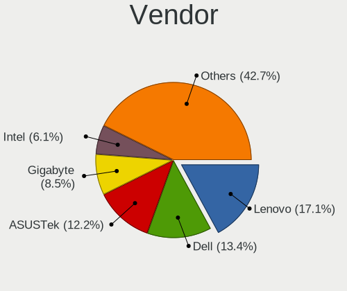
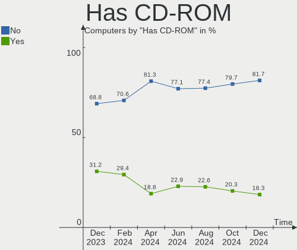
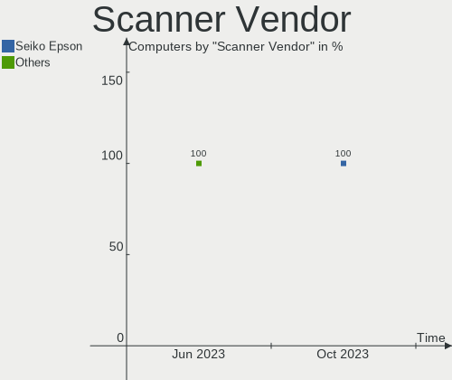

FreeBSD Hardware Trends
-----------------------

A project to identify most popular hardware characteristics and track their change
over time based on data collected by FreeBSD users at https://BSD-Hardware.info.

Anyone can contribute to the study by uploading probes of their computers by
the [hw-probe](https://github.com/linuxhw/hw-probe/blob/master/INSTALL.BSD.md) tool:

    hw-probe -all -upload

This is a report for all computer types. See also reports for [desktops](/Dist/FreeBSD/Desktop/README.md) and [notebooks](/Dist/FreeBSD/Notebook/README.md).

Full-feature report is available here: https://bsd-hardware.info/?view=trends

Period: Dec, 2020.

Contents
--------

- [ OS                       ](#os)
- [ OS Family                ](#os-family)
- [ Arch                     ](#arch)
- [ DE                       ](#de)
- [ Display Server           ](#display-server)
- [ Display Manager          ](#display-manager)
- [ OS Lang                  ](#os-lang)
- [ Boot Mode                ](#boot-mode)
- [ Filesystem               ](#filesystem)
- [ Part. scheme             ](#part-scheme)
- [ Country                  ](#country)
- [ City                     ](#city)
- [ Vendor                   ](#vendor)
- [ Model                    ](#model)
- [ Model Family             ](#model-family)
- [ MFG Year                 ](#mfg-year)
- [ Form Factor              ](#form-factor)
- [ Coreboot                 ](#coreboot)
- [ RAM Size                 ](#ram-size)
- [ RAM Used                 ](#ram-used)
- [ Has CD-ROM               ](#has-cd-rom)
- [ Total Drives             ](#total-drives)
- [ Has Ethernet             ](#has-ethernet)
- [ Drive Vendor             ](#drive-vendor)
- [ Drive Model              ](#drive-model)
- [ HDD Vendor               ](#hdd-vendor)
- [ SSD Vendor               ](#ssd-vendor)
- [ Drive Kind               ](#drive-kind)
- [ Drive Connector          ](#drive-connector)
- [ Drive Size               ](#drive-size)
- [ Space Total              ](#space-total)
- [ Space Used               ](#space-used)
- [ Malfunc. Drives          ](#malfunc-drives)
- [ Malfunc. Drive Vendor    ](#malfunc-drive-vendor)
- [ Malfunc. HDD Vendor      ](#malfunc-hdd-vendor)
- [ Malfunc. Drive Kind      ](#malfunc-drive-kind)
- [ Failed Drives            ](#failed-drives)
- [ Failed Drive Vendor      ](#failed-drive-vendor)
- [ Drive Status             ](#drive-status)
- [ Storage Vendor           ](#storage-vendor)
- [ Storage Model            ](#storage-model)
- [ Storage Kind             ](#storage-kind)
- [ CPU Vendor               ](#cpu-vendor)
- [ CPU Model                ](#cpu-model)
- [ CPU Model Family         ](#cpu-model-family)
- [ CPU Cores                ](#cpu-cores)
- [ CPU Sockets              ](#cpu-sockets)
- [ CPU Threads              ](#cpu-threads)
- [ CPU Microarch            ](#cpu-microarch)
- [ GPU Vendor               ](#gpu-vendor)
- [ GPU Model                ](#gpu-model)
- [ GPU Combo                ](#gpu-combo)
- [ GPU Driver               ](#gpu-driver)
- [ GPU Memory               ](#gpu-memory)
- [ Monitor Vendor           ](#monitor-vendor)
- [ Monitor Model            ](#monitor-model)
- [ Monitor Resolution       ](#monitor-resolution)
- [ Monitor Diagonal         ](#monitor-diagonal)
- [ Monitor Width            ](#monitor-width)
- [ Aspect Ratio             ](#aspect-ratio)
- [ Monitor Area             ](#monitor-area)
- [ Pixel Density            ](#pixel-density)
- [ Multiple Monitors        ](#multiple-monitors)
- [ Net Controller Vendor    ](#net-controller-vendor)
- [ Net Controller Model     ](#net-controller-model)
- [ Wireless Vendor          ](#wireless-vendor)
- [ Wireless Model           ](#wireless-model)
- [ Ethernet Vendor          ](#ethernet-vendor)
- [ Ethernet Model           ](#ethernet-model)
- [ Net Controller Kind      ](#net-controller-kind)
- [ Used Controller          ](#used-controller)
- [ NICs                     ](#nics)
- [ Memory Vendor            ](#memory-vendor)
- [ Memory Model             ](#memory-model)
- [ Memory Kind              ](#memory-kind)
- [ Memory Form Factor       ](#memory-form-factor)
- [ Memory Size              ](#memory-size)
- [ Memory Speed             ](#memory-speed)
- [ Sound Vendor             ](#sound-vendor)
- [ Sound Model              ](#sound-model)
- [ Camera Vendor            ](#camera-vendor)
- [ Camera Model             ](#camera-model)
- [ Fingerprint Vendor       ](#fingerprint-vendor)
- [ Fingerprint Model        ](#fingerprint-model)
- [ Chipcard Vendor          ](#chipcard-vendor)
- [ Chipcard Model           ](#chipcard-model)
- [ Printer Vendor           ](#printer-vendor)
- [ Printer Model            ](#printer-model)
- [ Scanner Vendor           ](#scanner-vendor)
- [ Scanner Model            ](#scanner-model)
- [ Bluetooth Vendor         ](#bluetooth-vendor)
- [ Bluetooth Model          ](#bluetooth-model)
- [ Unsupported Devices      ](#unsupported-devices)
- [ Unsupported Device Types ](#unsupported-device-types)

OS
--

Installed operating systems

| Name                 | Computers | Percent |
|----------------------|-----------|---------|
| FreeBSD 12.2-p2      | 50        | 37.59%  |
| FreeBSD 12.2         | 34        | 25.56%  |
| FreeBSD 13.0-CURRENT | 11        | 8.27%   |
| FreeBSD 12.2-p1      | 9         | 6.77%   |
| FreeBSD 12.1-p12     | 6         | 4.51%   |
| FreeBSD 12.1-p10     | 5         | 3.76%   |
| FreeBSD 12.2-STABLE  | 3         | 2.26%   |
| FreeBSD 12.2-RC3     | 3         | 2.26%   |
| FreeBSD 12.1-STABLE  | 3         | 2.26%   |
| FreeBSD 12.1         | 3         | 2.26%   |
| FreeBSD 12.1-p9      | 2         | 1.5%    |
| FreeBSD 12.1-p11     | 2         | 1.5%    |
| FreeBSD 12.1-p3      | 1         | 0.75%   |
| FreeBSD 11.4-p5      | 1         | 0.75%   |

OS Family
---------

OS without a version

| Name    | Computers | Percent |
|---------|-----------|---------|
| FreeBSD | 133       | 100%    |

Arch
----

OS architecture (x86_64, i586, etc.)

| Name  | Computers | Percent |
|-------|-----------|---------|
| amd64 | 126       | 94.74%  |
| i386  | 6         | 4.51%   |
| arm64 | 1         | 0.75%   |

DE
--

Desktop Environment

| Name      | Computers | Percent |
|-----------|-----------|---------|
| Console   | 59        | 44.36%  |
| XFCE      | 16        | 12.03%  |
| GNOME     | 11        | 8.27%   |
| TWM       | 9         | 6.77%   |
| MATE      | 9         | 6.77%   |
| KDE5      | 9         | 6.77%   |
| Openbox   | 4         | 3.01%   |
| i3        | 4         | 3.01%   |
| CDE       | 3         | 2.26%   |
| Cinnamon  | 2         | 1.5%    |
| AwesomeWM | 2         | 1.5%    |
| spectrwm  | 1         | 0.75%   |
| LXDE      | 1         | 0.75%   |
| Lumina    | 1         | 0.75%   |
| KDE       | 1         | 0.75%   |
| GNUstep   | 1         | 0.75%   |

Display Server
--------------

X11 or Wayland

| Name    | Computers | Percent |
|---------|-----------|---------|
| X11     | 70        | 52.63%  |
| Console | 63        | 47.37%  |

Display Manager
---------------

SDDM, LightDM, etc.

| Name    | Computers | Percent |
|---------|-----------|---------|
| Console | 84        | 63.16%  |
| SDDM    | 17        | 12.78%  |
| XDM     | 9         | 6.77%   |
| SLiM    | 9         | 6.77%   |
| LightDM | 6         | 4.51%   |
| GDM     | 6         | 4.51%   |
| Ly      | 2         | 1.5%    |

OS Lang
-------

Language

| Lang            | Computers | Percent |
|-----------------|-----------|---------|
| Unknown         | 65        | 48.87%  |
| en_US           | 35        | 26.32%  |
| ru_RU           | 6         | 4.51%   |
| C               | 6         | 4.51%   |
| C               | 6         | 4.51%   |
| de_DE           | 3         | 2.26%   |
| nb_NO           | 2         | 1.5%    |
| en_SG           | 2         | 1.5%    |
| en_GB           | 2         | 1.5%    |
| pt_BR           | 1         | 0.75%   |
| fr_FR           | 1         | 0.75%   |
| fi_FI           | 1         | 0.75%   |
| en_IE           | 1         | 0.75%   |
| en_GB.US-ASCII  | 1         | 0.75%   |
| en_GB.ISO8859-1 | 1         | 0.75%   |

Boot Mode
---------

EFI or BIOS

| Mode | Computers | Percent |
|------|-----------|---------|
| EFI  | 72        | 54.14%  |
| BIOS | 61        | 45.86%  |

Filesystem
----------

Type of filesystem

| Type | Computers | Percent |
|------|-----------|---------|
| Zfs  | 90        | 67.67%  |
| Ufs  | 42        | 31.58%  |
| Xfs  | 1         | 0.75%   |

Part. scheme
------------

Scheme of partitioning

| Type    | Computers | Percent |
|---------|-----------|---------|
| GPT     | 116       | 87.22%  |
| MBR     | 15        | 11.28%  |
| BSD     | 1         | 0.75%   |
| Unknown | 1         | 0.75%   |

Country
-------

Geographic location (country)

| Country        | Computers | Percent |
|----------------|-----------|---------|
| USA            | 42        | 31.58%  |
| Germany        | 12        | 9.02%   |
| UK             | 9         | 6.77%   |
| Russia         | 9         | 6.77%   |
| Australia      | 7         | 5.26%   |
| Norway         | 6         | 4.51%   |
| Poland         | 5         | 3.76%   |
| Canada         | 5         | 3.76%   |
| Greece         | 4         | 3.01%   |
| Ukraine        | 3         | 2.26%   |
| Singapore      | 3         | 2.26%   |
| Argentina      | 3         | 2.26%   |
| Switzerland    | 2         | 1.5%    |
| Japan          | 2         | 1.5%    |
| Denmark        | 2         | 1.5%    |
| Czech Republic | 2         | 1.5%    |
| Brazil         | 2         | 1.5%    |
| Austria        | 2         | 1.5%    |
| Taiwan         | 1         | 0.75%   |
| Spain          | 1         | 0.75%   |
| Slovakia       | 1         | 0.75%   |
| Philippines    | 1         | 0.75%   |
| Malaysia       | 1         | 0.75%   |
| Ireland        | 1         | 0.75%   |
| India          | 1         | 0.75%   |
| Hungary        | 1         | 0.75%   |
| Guadeloupe     | 1         | 0.75%   |
| France         | 1         | 0.75%   |
| Finland        | 1         | 0.75%   |
| Belgium        | 1         | 0.75%   |
| Bangladesh     | 1         | 0.75%   |

City
----

Geographic location (city)

| City                 | Computers | Percent |
|----------------------|-----------|---------|
| Sydney               | 4         | 3.01%   |
| Krasnoyarsk          | 4         | 3.01%   |
| City of Saint Peters | 4         | 3.01%   |
| Singapore            | 3         | 2.26%   |
| Portland             | 3         | 2.26%   |
| Warsaw               | 2         | 1.5%    |
| Toronto              | 2         | 1.5%    |
| Salem                | 2         | 1.5%    |
| Rustington           | 2         | 1.5%    |
| Raleigh              | 2         | 1.5%    |
| Moscow               | 2         | 1.5%    |
| London               | 2         | 1.5%    |
| Kalvag               | 2         | 1.5%    |
| Glasgow              | 2         | 1.5%    |
| Berlin               | 2         | 1.5%    |
| Athens               | 2         | 1.5%    |
| Český Těšín     | 1         | 0.75%   |
| Zaporizhia           | 1         | 0.75%   |
| Williamsport         | 1         | 0.75%   |
| Washington           | 1         | 0.75%   |
| Versmold             | 1         | 0.75%   |
| Vari                 | 1         | 0.75%   |
| Urbana               | 1         | 0.75%   |
| Tychy                | 1         | 0.75%   |
| Tromsø              | 1         | 0.75%   |
| Tolyatti             | 1         | 0.75%   |
| Tokyo                | 1         | 0.75%   |
| The Bronx            | 1         | 0.75%   |
| Taoyuan District     | 1         | 0.75%   |
| São Paulo           | 1         | 0.75%   |
| Szigetszentmiklos    | 1         | 0.75%   |
| Stavanger            | 1         | 0.75%   |
| St Petersburg        | 1         | 0.75%   |
| St Kilda             | 1         | 0.75%   |
| Soreide              | 1         | 0.75%   |
| Somerset             | 1         | 0.75%   |
| Sokal'               | 1         | 0.75%   |
| Smyrna               | 1         | 0.75%   |
| Shinnston            | 1         | 0.75%   |
| Seraing              | 1         | 0.75%   |
| Santa Rosa           | 1         | 0.75%   |
| San Marcos           | 1         | 0.75%   |
| Rotherham            | 1         | 0.75%   |
| Romont               | 1         | 0.75%   |
| Rohr                 | 1         | 0.75%   |
| Redmond              | 1         | 0.75%   |
| Rauland              | 1         | 0.75%   |
| Porto Alegre         | 1         | 0.75%   |
| Platte City          | 1         | 0.75%   |
| Plano                | 1         | 0.75%   |
| Ozersk               | 1         | 0.75%   |
| Omaha                | 1         | 0.75%   |
| Nova Bana            | 1         | 0.75%   |
| Nikaia               | 1         | 0.75%   |
| Munich               | 1         | 0.75%   |
| Montreal             | 1         | 0.75%   |
| Menai                | 1         | 0.75%   |
| Maszewo              | 1         | 0.75%   |
| Marrickville         | 1         | 0.75%   |
| Mansfield            | 1         | 0.75%   |

Vendor
------

Motherboard manufacturer

| Name                | Computers | Percent |
|---------------------|-----------|---------|
| Lenovo              | 23        | 17.29%  |
| Supermicro          | 16        | 12.03%  |
| Dell                | 14        | 10.53%  |
| Hewlett-Packard     | 13        | 9.77%   |
| ASUSTek Computer    | 12        | 9.02%   |
| Gigabyte Technology | 8         | 6.02%   |
| ASRock              | 8         | 6.02%   |
| MSI                 | 6         | 4.51%   |
| Acer                | 6         | 4.51%   |
| Intel               | 4         | 3.01%   |
| Toshiba             | 2         | 1.5%    |
| Samsung Electronics | 2         | 1.5%    |
| ASRockRack          | 2         | 1.5%    |
| Apple               | 2         | 1.5%    |
| Unknown             | 2         | 1.5%    |
| Wistron             | 1         | 0.75%   |
| TYAN Computer       | 1         | 0.75%   |
| Sony                | 1         | 0.75%   |
| Pegatron            | 1         | 0.75%   |
| PC Specialist       | 1         | 0.75%   |
| Panasonic           | 1         | 0.75%   |
| Notebook            | 1         | 0.75%   |
| HPE                 | 1         | 0.75%   |
| HARDKERNEL          | 1         | 0.75%   |
| Foxconn             | 1         | 0.75%   |
| Eluktronics         | 1         | 0.75%   |
| Centerm             | 1         | 0.75%   |
| AMI                 | 1         | 0.75%   |

Model
-----

Motherboard model

| Name                                     | Computers | Percent |
|------------------------------------------|-----------|---------|
| Supermicro Super Server                  | 5         | 3.76%   |
| HP ProLiant MicroServer                  | 2         | 1.5%    |
| Dell PowerEdge R610                      | 2         | 1.5%    |
| ASUS All Series                          | 2         | 1.5%    |
| Unknown                                  | 2         | 1.5%    |
| Wistron ProLiant ML110 G6                | 1         | 0.75%   |
| TYAN Intel 440BX/GX Rev. 4               | 1         | 0.75%   |
| Toshiba Satellite L50-C                  | 1         | 0.75%   |
| Toshiba Satellite C655D                  | 1         | 0.75%   |
| Supermicro X9SPV-F/LN4F                  | 1         | 0.75%   |
| Supermicro X8STi                         | 1         | 0.75%   |
| Supermicro X7SPA-HF                      | 1         | 0.75%   |
| Supermicro X10SLL-F                      | 1         | 0.75%   |
| Supermicro X10SLH-F/X10SLM+-F            | 1         | 0.75%   |
| Supermicro X10SAE                        | 1         | 0.75%   |
| Supermicro SYS-5019S-ML                  | 1         | 0.75%   |
| Supermicro SYS-5018R-M                   | 1         | 0.75%   |
| Supermicro Icebreaker 4824               | 1         | 0.75%   |
| Supermicro C7Z270-CG-L                   | 1         | 0.75%   |
| Supermicro A1SAi                         | 1         | 0.75%   |
| Sony SVP1321V9RB                         | 1         | 0.75%   |
| Samsung N145P/N250P/N260P                | 1         | 0.75%   |
| Samsung N140                             | 1         | 0.75%   |
| Pegatron T12Ah                           | 1         | 0.75%   |
| PC Specialist Recoil II                  | 1         | 0.75%   |
| Panasonic CFMX4-1                        | 1         | 0.75%   |
| Notebook N7x0WU                          | 1         | 0.75%   |
| MSI X460/X460DX                          | 1         | 0.75%   |
| MSI MS-7B48                              | 1         | 0.75%   |
| MSI MS-7846                              | 1         | 0.75%   |
| MSI MS-7757                              | 1         | 0.75%   |
| MSI MS-7576                              | 1         | 0.75%   |
| MSI GP60 2PE                             | 1         | 0.75%   |
| Lenovo Y50-70 20378                      | 1         | 0.75%   |
| Lenovo ThinkPad X250 20CLS8S900          | 1         | 0.75%   |
| Lenovo ThinkPad X250 20CLS02000          | 1         | 0.75%   |
| Lenovo ThinkPad X230 23244A9             | 1         | 0.75%   |
| Lenovo ThinkPad X200s 7470A98            | 1         | 0.75%   |
| Lenovo ThinkPad X1 Extreme 20MF000BUS    | 1         | 0.75%   |
| Lenovo ThinkPad X1 Carbon 6th 20KG0022US | 1         | 0.75%   |
| Lenovo ThinkPad X1 Carbon 4th 20FC0019AU | 1         | 0.75%   |
| Lenovo ThinkPad W500 4063HK6             | 1         | 0.75%   |
| Lenovo ThinkPad T490 20N3X50500          | 1         | 0.75%   |
| Lenovo ThinkPad T460p 20FXCTO1WW         | 1         | 0.75%   |
| Lenovo ThinkPad T460 20FMS2J000          | 1         | 0.75%   |
| Lenovo ThinkPad T450s 20BWS05G0T         | 1         | 0.75%   |
| Lenovo ThinkPad T420s 417153U            | 1         | 0.75%   |
| Lenovo ThinkPad T420 4180AJ3             | 1         | 0.75%   |
| Lenovo ThinkPad R400 7439X13             | 1         | 0.75%   |
| Lenovo ThinkPad P53 20QQS3R100           | 1         | 0.75%   |
| Lenovo ThinkPad E590 20NB005MUS          | 1         | 0.75%   |
| Lenovo ThinkCentre M700 10GRCTO1WW       | 1         | 0.75%   |
| Lenovo IdeaPad Slim 7 14IIL05 82A4       | 1         | 0.75%   |
| Lenovo IdeaPad S340-15IWL 81N8           | 1         | 0.75%   |
| Lenovo IdeaPad 320-15ISK 80XH            | 1         | 0.75%   |
| Lenovo G50-80 80E5                       | 1         | 0.75%   |
| Intel S5000PSL                           | 1         | 0.75%   |
| Intel Q3XXG4-P V1.0                      | 1         | 0.75%   |
| Intel NUC8i5BEH                          | 1         | 0.75%   |
| Intel NUC5i5RYB H40999-506               | 1         | 0.75%   |

Model Family
------------

Motherboard model prefix

| Name                    | Computers | Percent |
|-------------------------|-----------|---------|
| Lenovo ThinkPad         | 17        | 12.78%  |
| Supermicro Super        | 5         | 3.76%   |
| Dell PowerEdge          | 5         | 3.76%   |
| HP ProLiant             | 4         | 3.01%   |
| Acer Aspire             | 4         | 3.01%   |
| Lenovo IdeaPad          | 3         | 2.26%   |
| HP Compaq               | 3         | 2.26%   |
| Dell OptiPlex           | 3         | 2.26%   |
| ASUS PRIME              | 3         | 2.26%   |
| Toshiba Satellite       | 2         | 1.5%    |
| Dell XPS                | 2         | 1.5%    |
| Dell Latitude           | 2         | 1.5%    |
| ASUS TUF                | 2         | 1.5%    |
| ASUS All                | 2         | 1.5%    |
| ASRock X570             | 2         | 1.5%    |
| Unknown                 | 2         | 1.5%    |
| Wistron ProLiant        | 1         | 0.75%   |
| TYAN Intel              | 1         | 0.75%   |
| Supermicro X9SPV-F      | 1         | 0.75%   |
| Supermicro X8STi        | 1         | 0.75%   |
| Supermicro X7SPA-HF     | 1         | 0.75%   |
| Supermicro X10SLL-F     | 1         | 0.75%   |
| Supermicro X10SLH-F     | 1         | 0.75%   |
| Supermicro X10SAE       | 1         | 0.75%   |
| Supermicro SYS-5019S-ML | 1         | 0.75%   |
| Supermicro SYS-5018R-M  | 1         | 0.75%   |
| Supermicro Icebreaker   | 1         | 0.75%   |
| Supermicro C7Z270-CG-L  | 1         | 0.75%   |
| Supermicro A1SAi        | 1         | 0.75%   |
| Sony SVP1321V9RB        | 1         | 0.75%   |
| Samsung N145P           | 1         | 0.75%   |
| Samsung N140            | 1         | 0.75%   |
| Pegatron T12Ah          | 1         | 0.75%   |
| PC Specialist Recoil    | 1         | 0.75%   |
| Panasonic CFMX4-1       | 1         | 0.75%   |
| Notebook N7x0WU         | 1         | 0.75%   |
| MSI X460                | 1         | 0.75%   |
| MSI MS-7B48             | 1         | 0.75%   |
| MSI MS-7846             | 1         | 0.75%   |
| MSI MS-7757             | 1         | 0.75%   |
| MSI MS-7576             | 1         | 0.75%   |
| MSI GP60                | 1         | 0.75%   |
| Lenovo Y50-70           | 1         | 0.75%   |
| Lenovo ThinkCentre      | 1         | 0.75%   |
| Lenovo G50-80           | 1         | 0.75%   |
| Intel S5000PSL          | 1         | 0.75%   |
| Intel Q3XXG4-P          | 1         | 0.75%   |
| Intel NUC8i5BEH         | 1         | 0.75%   |
| Intel NUC5i5RYB         | 1         | 0.75%   |
| HPE ProLiant            | 1         | 0.75%   |
| HP Z600                 | 1         | 0.75%   |
| HP Z420                 | 1         | 0.75%   |
| HP ProDesk              | 1         | 0.75%   |
| HP EliteBook            | 1         | 0.75%   |
| HP 655                  | 1         | 0.75%   |
| HP 2000                 | 1         | 0.75%   |
| HARDKERNEL ODROID-H2    | 1         | 0.75%   |
| Gigabyte Z97P-D3        | 1         | 0.75%   |
| Gigabyte Z68P-DS3       | 1         | 0.75%   |
| Gigabyte X79-UD3        | 1         | 0.75%   |

MFG Year
--------

Motherboard manufacture year

| Year    | Computers | Percent |
|---------|-----------|---------|
| 2019    | 20        | 15.04%  |
| 2020    | 19        | 14.29%  |
| 2018    | 19        | 14.29%  |
| 2015    | 12        | 9.02%   |
| 2010    | 10        | 7.52%   |
| 2011    | 9         | 6.77%   |
| 2016    | 8         | 6.02%   |
| 2014    | 8         | 6.02%   |
| 2013    | 8         | 6.02%   |
| 2017    | 6         | 4.51%   |
| 2012    | 6         | 4.51%   |
| Unknown | 3         | 2.26%   |
| 2009    | 2         | 1.5%    |
| 2008    | 2         | 1.5%    |
| 2004    | 1         | 0.75%   |

Form Factor
-----------

Physical design of the computer

| Name        | Computers | Percent |
|-------------|-----------|---------|
| Desktop     | 62        | 46.62%  |
| Notebook    | 47        | 35.34%  |
| Server      | 17        | 12.78%  |
| Mini pc     | 3         | 2.26%   |
| All in one  | 2         | 1.5%    |
| Other       | 1         | 0.75%   |
| Convertible | 1         | 0.75%   |

Coreboot
--------

Have coreboot on board

| Used | Computers | Percent |
|------|-----------|---------|
| No   | 131       | 98.5%   |
| Yes  | 2         | 1.5%    |

RAM Size
--------

Total RAM memory

| Size in GB      | Computers | Percent |
|-----------------|-----------|---------|
| 16.01-24.0      | 37        | 27.82%  |
| 8.01-16.0       | 31        | 23.31%  |
| 32.01-64.0      | 25        | 18.8%   |
| 4.01-8.0        | 15        | 11.28%  |
| 64.01-256.0     | 8         | 6.02%   |
| 24.01-32.0      | 5         | 3.76%   |
| 2.01-3.0        | 5         | 3.76%   |
| 0.51-1.0        | 5         | 3.76%   |
| More than 256.0 | 1         | 0.75%   |
| 3.01-4.0        | 1         | 0.75%   |

RAM Used
--------

Used RAM memory

| Used GB         | Computers | Percent |
|-----------------|-----------|---------|
| 0.51-1.0        | 41        | 30.83%  |
| 0.01-0.5        | 40        | 30.08%  |
| 1.01-2.0        | 20        | 15.04%  |
| 4.01-8.0        | 8         | 6.02%   |
| 2.01-3.0        | 5         | 3.76%   |
| 8.01-16.0       | 5         | 3.76%   |
| 24.01-32.0      | 4         | 3.01%   |
| 16.01-24.0      | 4         | 3.01%   |
| 3.01-4.0        | 2         | 1.5%    |
| 64.01-256.0     | 2         | 1.5%    |
| More than 256.0 | 1         | 0.75%   |
| 32.01-64.0      | 1         | 0.75%   |

Has CD-ROM
----------

Has CD-ROM on board

| Presented | Computers | Percent |
|-----------|-----------|---------|
| No        | 100       | 75.19%  |
| Yes       | 33        | 24.81%  |

Total Drives
------------

Number of drives on board

| Drives | Computers | Percent |
|--------|-----------|---------|
| 1      | 51        | 38.35%  |
| 2      | 22        | 16.54%  |
| 4      | 13        | 9.77%   |
| 3      | 12        | 9.02%   |
| 5      | 9         | 6.77%   |
| 6      | 6         | 4.51%   |
| 8      | 4         | 3.01%   |
| 7      | 4         | 3.01%   |
| 0      | 4         | 3.01%   |
| 14     | 2         | 1.5%    |
| 12     | 2         | 1.5%    |
| 10     | 2         | 1.5%    |
| 17     | 1         | 0.75%   |
| 13     | 1         | 0.75%   |

Has Ethernet
------------

Has Ethernet on board

| Presented | Computers | Percent |
|-----------|-----------|---------|
| Yes       | 127       | 95.49%  |
| No        | 6         | 4.51%   |

Drive Vendor
------------

Hard drive vendors

| Vendor              | Computers | Drives | Percent |
|---------------------|-----------|--------|---------|
| WDC                 | 53        | 136    | 23.56%  |
| Seagate             | 28        | 69     | 12.44%  |
| Samsung Electronics | 27        | 40     | 12%     |
| Toshiba             | 13        | 20     | 5.78%   |
| Intel               | 12        | 16     | 5.33%   |
| SanDisk             | 11        | 12     | 4.89%   |
| Kingston            | 10        | 10     | 4.44%   |
| Crucial             | 9         | 9      | 4%      |
| Hitachi             | 8         | 21     | 3.56%   |
| HGST                | 6         | 17     | 2.67%   |
| Hewlett-Packard     | 5         | 13     | 2.22%   |
| SK Hynix            | 4         | 4      | 1.78%   |
| Phison              | 4         | 5      | 1.78%   |
| Mushkin             | 3         | 4      | 1.33%   |
| Micron Technology   | 3         | 6      | 1.33%   |
| KingSpec            | 3         | 3      | 1.33%   |
| A-DATA Technology   | 3         | 4      | 1.33%   |
| Transcend           | 2         | 2      | 0.89%   |
| PNY                 | 2         | 3      | 0.89%   |
| Apacer              | 2         | 2      | 0.89%   |
| Zheino              | 1         | 1      | 0.44%   |
| WD MediaMax         | 1         | 3      | 0.44%   |
| Team                | 1         | 1      | 0.44%   |
| SPCC                | 1         | 1      | 0.44%   |
| Silicon Motion      | 1         | 1      | 0.44%   |
| SATADOM             | 1         | 2      | 0.44%   |
| QUANTUM             | 1         | 1      | 0.44%   |
| PLEXTOR             | 1         | 1      | 0.44%   |
| OWC                 | 1         | 4      | 0.44%   |
| MAXTOR              | 1         | 4      | 0.44%   |
| Lenovo              | 1         | 1      | 0.44%   |
| Hoodisk             | 1         | 1      | 0.44%   |
| Hikvision           | 1         | 1      | 0.44%   |
| Fujitsu             | 1         | 1      | 0.44%   |
| Corsair             | 1         | 1      | 0.44%   |
| Apple               | 1         | 1      | 0.44%   |
| Adaptec             | 1         | 7      | 0.44%   |

Drive Model
-----------

Hard drive models

| Model                           | Computers | Percent |
|---------------------------------|-----------|---------|
| WDC WD40EFRX-68N32N0 4TB        | 6         | 2.15%   |
| Seagate ST4000DM000-1F2168 4TB  | 5         | 1.79%   |
| WDC WD40EFRX-68WT0N0 4TB        | 4         | 1.43%   |
| Samsung HD204UI 2TB             | 4         | 1.43%   |
| WDC WDS240G2G0A-00JH30 240GB    | 3         | 1.08%   |
| WDC WD30EFRX-68EUZN0 3TB        | 3         | 1.08%   |
| Seagate ST8000VN0022-2EL112 8TB | 3         | 1.08%   |
| WDC WDS500G2B0B-00YS70 500GB    | 2         | 0.72%   |
| WDC WD40EZRZ-22GXCB0 4TB        | 2         | 0.72%   |
| WDC WD20EZRX-00D8PB0 2TB        | 2         | 0.72%   |
| WDC WD20EARX-00PASB0 2TB        | 2         | 0.72%   |
| WDC WD100EMAZ-00WJTA0 10TB      | 2         | 0.72%   |
| Toshiba MQ01ABF050 500GB        | 2         | 0.72%   |
| Toshiba DT01ACA100 1TB          | 2         | 0.72%   |
| Seagate ST4000VN008-2DR166 4TB  | 2         | 0.72%   |
| Seagate ST4000DM004-2CV104 4TB  | 2         | 0.72%   |
| Seagate ST3500413AS 500GB       | 2         | 0.72%   |
| Seagate ST2000DM001-1CH164 2TB  | 2         | 0.72%   |
| SanDisk SDSSDA240G 240GB        | 2         | 0.72%   |
| Samsung SSD 970 EVO Plus 1TB    | 2         | 0.72%   |
| Samsung SSD 860 EVO 500GB       | 2         | 0.72%   |
| Samsung SSD 860 EVO 250GB       | 2         | 0.72%   |
| Kingston SV300S37A120G 120GB    | 2         | 0.72%   |
| Kingston SA400S37120G 120GB     | 2         | 0.72%   |
| Intel MEMPEK1W016GA 16GB        | 2         | 0.72%   |
| Hitachi HUA722020ALA330 2TB     | 2         | 0.72%   |
| Crucial M4-CT064M4SSD2 64GB     | 2         | 0.72%   |
| Crucial CT500MX500SSD1 500GB    | 2         | 0.72%   |
| Zheino CHN-mSATAM3-256 256GB    | 1         | 0.36%   |
| WDC WDS500G2B0A-00SM50 500GB    | 1         | 0.36%   |
| WDC WDS256G1X0C-00ENX0 256GB    | 1         | 0.36%   |
| WDC WDS250G2B0A-00SM50 250GB    | 1         | 0.36%   |
| WDC WDS240G2G0B-00EPW0 240GB    | 1         | 0.36%   |
| WDC WDS120G2G0B-00EPW0 120GB    | 1         | 0.36%   |
| WDC WDS100T3X0C-00SJG0 1TB      | 1         | 0.36%   |
| WDC WDBNCE2500PNC 250GB         | 1         | 0.36%   |
| WDC WD80PURZ-85YNPY0 8TB        | 1         | 0.36%   |
| WDC WD80EMAZ-00WJTA0 8TB        | 1         | 0.36%   |
| WDC WD80EFZX-68UW8N0 8TB        | 1         | 0.36%   |
| WDC WD80EFAX-68LHPN0 8TB        | 1         | 0.36%   |
| WDC WD80EFAX-68KNBN0 8TB        | 1         | 0.36%   |
| WDC WD800JB-00JJC0 80GB         | 1         | 0.36%   |
| WDC WD800EB-00DJF0 80GB         | 1         | 0.36%   |
| WDC WD7500BPKX-22HPJT0 752GB    | 1         | 0.36%   |
| WDC WD60EZRZ-00GZ5B1 6TB        | 1         | 0.36%   |
| WDC WD60EFRX-68MYMN1 6TB        | 1         | 0.36%   |
| WDC WD6002FRYZ-01WD5B1 6TB      | 1         | 0.36%   |
| WDC WD5000LPLX-60ZNTT1 500GB    | 1         | 0.36%   |
| WDC WD5000BPKT-00PK4T0 500GB    | 1         | 0.36%   |
| WDC WD5000BEKT-22KA9T0 500GB    | 1         | 0.36%   |
| WDC WD5000AAKX-221CA1 500GB     | 1         | 0.36%   |
| WDC WD5000AAKX-001CA0 500GB     | 1         | 0.36%   |
| WDC WD40NMZW-11GX6S1 4TB        | 1         | 0.36%   |
| WDC WD4003FFBX-68MU3N0 4TB      | 1         | 0.36%   |
| WDC WD3200KS-00PFB0 320GB       | 1         | 0.36%   |
| WDC WD3200BPVT-75JJ5T0 320GB    | 1         | 0.36%   |
| WDC WD3200BEVS-08VAT2 320GB     | 1         | 0.36%   |
| WDC WD30EZRX-00MMMB0 3TB        | 1         | 0.36%   |
| WDC WD30EFRX-68N32N0 3TB        | 1         | 0.36%   |
| WDC WD2500BEVT-75ZCT2 250GB     | 1         | 0.36%   |

HDD Vendor
----------

Hard disk drive vendors

| Vendor              | Computers | Drives | Percent |
|---------------------|-----------|--------|---------|
| WDC                 | 46        | 119    | 40%     |
| Seagate             | 28        | 69     | 24.35%  |
| Toshiba             | 11        | 18     | 9.57%   |
| Hitachi             | 8         | 21     | 6.96%   |
| Samsung Electronics | 6         | 14     | 5.22%   |
| HGST                | 6         | 17     | 5.22%   |
| Hewlett-Packard     | 4         | 12     | 3.48%   |
| WD MediaMax         | 1         | 3      | 0.87%   |
| QUANTUM             | 1         | 1      | 0.87%   |
| MAXTOR              | 1         | 4      | 0.87%   |
| Fujitsu             | 1         | 1      | 0.87%   |
| Apple               | 1         | 1      | 0.87%   |
| Adaptec             | 1         | 7      | 0.87%   |

SSD Vendor
----------

Solid state drive vendors

| Vendor              | Computers | Drives | Percent |
|---------------------|-----------|--------|---------|
| Samsung Electronics | 17        | 19     | 19.1%   |
| SanDisk             | 11        | 12     | 12.36%  |
| Kingston            | 10        | 10     | 11.24%  |
| WDC                 | 9         | 11     | 10.11%  |
| Intel               | 9         | 11     | 10.11%  |
| Crucial             | 8         | 8      | 8.99%   |
| KingSpec            | 3         | 3      | 3.37%   |
| Transcend           | 2         | 2      | 2.25%   |
| SK Hynix            | 2         | 2      | 2.25%   |
| Mushkin             | 2         | 2      | 2.25%   |
| Micron Technology   | 2         | 5      | 2.25%   |
| Apacer              | 2         | 2      | 2.25%   |
| A-DATA Technology   | 2         | 3      | 2.25%   |
| Zheino              | 1         | 1      | 1.12%   |
| Team                | 1         | 1      | 1.12%   |
| SPCC                | 1         | 1      | 1.12%   |
| SATADOM             | 1         | 2      | 1.12%   |
| PNY                 | 1         | 2      | 1.12%   |
| PLEXTOR             | 1         | 1      | 1.12%   |
| Phison              | 1         | 2      | 1.12%   |
| OWC                 | 1         | 4      | 1.12%   |
| Hoodisk             | 1         | 1      | 1.12%   |
| Hikvision           | 1         | 1      | 1.12%   |

Drive Kind
----------

HDD or SSD

| Kind | Computers | Drives | Percent |
|------|-----------|--------|---------|
| HDD  | 81        | 287    | 44.51%  |
| SSD  | 74        | 106    | 40.66%  |
| NVMe | 27        | 35     | 14.84%  |

Drive Connector
---------------

SATA, SAS, NVMe, etc.

| Type | Computers | Drives | Percent |
|------|-----------|--------|---------|
| SATA | 118       | 393    | 81.38%  |
| NVMe | 27        | 35     | 18.62%  |

Drive Size
----------

Size of hard drive

| Size in TB | Computers | Drives | Percent |
|------------|-----------|--------|---------|
| 0.01-0.5   | 95        | 151    | 53.98%  |
| 0.51-1.0   | 23        | 53     | 13.07%  |
| 3.01-4.0   | 18        | 63     | 10.23%  |
| 1.01-2.0   | 17        | 53     | 9.66%   |
| 4.01-10.0  | 15        | 51     | 8.52%   |
| 2.01-3.0   | 6         | 16     | 3.41%   |
| 10.01-20.0 | 2         | 6      | 1.14%   |

Space Total
-----------

Amount of disk space available on the file system

| Size in GB     | Computers | Percent |
|----------------|-----------|---------|
| 101-250        | 49        | 36.84%  |
| 251-500        | 30        | 22.56%  |
| 501-1000       | 15        | 11.28%  |
| 51-100         | 13        | 9.77%   |
| 1-20           | 12        | 9.02%   |
| 21-50          | 6         | 4.51%   |
| More than 3000 | 3         | 2.26%   |
| 1001-2000      | 3         | 2.26%   |
| 2001-3000      | 2         | 1.5%    |

Space Used
----------

Amount of used disk space

| Used GB   | Computers | Percent |
|-----------|-----------|---------|
| 1-20      | 103       | 77.44%  |
| 21-50     | 13        | 9.77%   |
| 51-100    | 10        | 7.52%   |
| 101-250   | 4         | 3.01%   |
| 501-1000  | 2         | 1.5%    |
| 1001-2000 | 1         | 0.75%   |

Malfunc. Drives
---------------

Drive models with a malfunction

| Model                                      | Computers | Drives | Percent |
|--------------------------------------------|-----------|--------|---------|
| WDC WDS240G2G0A-00JH30 240GB               | 2         | 2      | 4.65%   |
| WDC WD30EFRX-68EUZN0 3TB                   | 2         | 7      | 4.65%   |
| Seagate ST3500413AS 500GB                  | 2         | 2      | 4.65%   |
| WDC WD800JB-00JJC0 80GB                    | 1         | 1      | 2.33%   |
| WDC WD6002FRYZ-01WD5B1 6TB                 | 1         | 1      | 2.33%   |
| WDC WD5000AAKX-221CA1 500GB                | 1         | 1      | 2.33%   |
| WDC WD40EFRX-68WT0N0 4TB                   | 1         | 1      | 2.33%   |
| WDC WD3200BPVT-75JJ5T0 320GB               | 1         | 1      | 2.33%   |
| WDC WD2500AAKS-60L9A0 250GB                | 1         | 1      | 2.33%   |
| WDC WD20EARX-008FB0 2TB                    | 1         | 1      | 2.33%   |
| WDC WD2000JB-00GVC0 200GB                  | 1         | 1      | 2.33%   |
| WDC WD1200JS-00MHB1 120GB                  | 1         | 1      | 2.33%   |
| WDC WD1200BB-00HTA0 120GB                  | 1         | 2      | 2.33%   |
| WDC WD1003FBYX-88 LEN 1TB                  | 1         | 1      | 2.33%   |
| WD MediaMax WL2000GSA6454 2TB              | 1         | 3      | 2.33%   |
| Toshiba MQ01ABF050 500GB                   | 1         | 1      | 2.33%   |
| Toshiba MK3265GSXN 320GB                   | 1         | 1      | 2.33%   |
| Seagate ST4000DM000-1F2168 4TB             | 1         | 1      | 2.33%   |
| Seagate ST3500418AS 500GB                  | 1         | 2      | 2.33%   |
| Seagate ST32000542AS 2TB                   | 1         | 1      | 2.33%   |
| Seagate ST31000528AS 1TB                   | 1         | 1      | 2.33%   |
| Seagate ST3000VN007-2E4166 3TB             | 1         | 1      | 2.33%   |
| Seagate ST2000DL003-9VT166 2TB             | 1         | 1      | 2.33%   |
| Seagate ST2000DL001-9VT156 2TB             | 1         | 1      | 2.33%   |
| SanDisk SSD PLUS 240GB                     | 1         | 1      | 2.33%   |
| Samsung Electronics HD642JJ 640GB          | 1         | 1      | 2.33%   |
| Micron Technology M500_MTFDDAK960MAV 960GB | 1         | 4      | 2.33%   |
| Micron Technology 1100_MTFDDAV256TBN 256GB | 1         | 1      | 2.33%   |
| Maxtor 6Y080P0 82GB                        | 1         | 1      | 2.33%   |
| MAXTOR 6L080J4 80GB                        | 1         | 3      | 2.33%   |
| Kingston SV300S37A120G 120GB               | 1         | 1      | 2.33%   |
| Intel SSDSC2CW120A3 120GB                  | 1         | 1      | 2.33%   |
| Intel SSDSC2BA200G3T 200GB                 | 1         | 2      | 2.33%   |
| Intel SSDSA2M160G2GC 160GB                 | 1         | 1      | 2.33%   |
| Hitachi HTS547550A9E384 500GB              | 1         | 1      | 2.33%   |
| Hitachi HDS721010CLA332 1TB                | 1         | 1      | 2.33%   |
| HGST HTS725050A7E630 500GB                 | 1         | 1      | 2.33%   |
| Apacer AS330 240GB                         | 1         | 1      | 2.33%   |
| A-DATA Technology SU630 240GB              | 1         | 1      | 2.33%   |
| A-DATA Technology SP610 128GB              | 1         | 1      | 2.33%   |

Malfunc. Drive Vendor
---------------------

Vendors of faulty drives

| Vendor              | Computers | Drives | Percent |
|---------------------|-----------|--------|---------|
| WDC                 | 15        | 21     | 38.46%  |
| Seagate             | 7         | 10     | 17.95%  |
| Intel               | 3         | 4      | 7.69%   |
| Toshiba             | 2         | 2      | 5.13%   |
| Micron Technology   | 2         | 5      | 5.13%   |
| Hitachi             | 2         | 2      | 5.13%   |
| WD MediaMax         | 1         | 3      | 2.56%   |
| SanDisk             | 1         | 1      | 2.56%   |
| Samsung Electronics | 1         | 1      | 2.56%   |
| MAXTOR              | 1         | 4      | 2.56%   |
| Kingston            | 1         | 1      | 2.56%   |
| HGST                | 1         | 1      | 2.56%   |
| Apacer              | 1         | 1      | 2.56%   |
| A-DATA Technology   | 1         | 2      | 2.56%   |

Malfunc. HDD Vendor
-------------------

Vendors of faulty HDD drives

| Vendor              | Computers | Drives | Percent |
|---------------------|-----------|--------|---------|
| WDC                 | 13        | 19     | 46.43%  |
| Seagate             | 7         | 10     | 25%     |
| Toshiba             | 2         | 2      | 7.14%   |
| Hitachi             | 2         | 2      | 7.14%   |
| WD MediaMax         | 1         | 3      | 3.57%   |
| Samsung Electronics | 1         | 1      | 3.57%   |
| MAXTOR              | 1         | 4      | 3.57%   |
| HGST                | 1         | 1      | 3.57%   |

Malfunc. Drive Kind
-------------------

Kinds of faulty drives

| Kind | Computers | Drives | Percent |
|------|-----------|--------|---------|
| HDD  | 26        | 42     | 70.27%  |
| SSD  | 11        | 16     | 29.73%  |

Failed Drives
-------------

Failed drive models

Zero info for selected period =(

Failed Drive Vendor
-------------------

Failed drive vendors

Zero info for selected period =(

Drive Status
------------

Number of failed and malfunc. drives

| Status   | Computers | Drives | Percent |
|----------|-----------|--------|---------|
| Works    | 118       | 351    | 74.21%  |
| Malfunc  | 36        | 58     | 22.64%  |
| Detected | 5         | 19     | 3.14%   |

Storage Vendor
--------------

Storage controller vendors

| Vendor                      | Computers | Percent |
|-----------------------------|-----------|---------|
| Intel                       | 96        | 52.46%  |
| AMD                         | 26        | 14.21%  |
| Broadcom / LSI              | 15        | 8.2%    |
| Samsung Electronics         | 6         | 3.28%   |
| ASMedia Technology          | 6         | 3.28%   |
| Sandisk                     | 5         | 2.73%   |
| Phison Electronics          | 5         | 2.73%   |
| Silicon Motion              | 4         | 2.19%   |
| Marvell Technology Group    | 4         | 2.19%   |
| Adaptec                     | 3         | 1.64%   |
| Toshiba                     | 2         | 1.09%   |
| SK Hynix                    | 2         | 1.09%   |
| Silicon Image               | 2         | 1.09%   |
| Micron Technology           | 2         | 1.09%   |
| VIA Technologies            | 1         | 0.55%   |
| Lenovo                      | 1         | 0.55%   |
| Kingston Technology Company | 1         | 0.55%   |
| Hewlett-Packard             | 1         | 0.55%   |
| 3ware                       | 1         | 0.55%   |

Storage Model
-------------

Storage controller models

| Model                                                                          | Computers | Percent |
|--------------------------------------------------------------------------------|-----------|---------|
| AMD FCH SATA Controller [AHCI mode]                                            | 13        | 6.16%   |
| Intel 8 Series/C220 Series Chipset Family 6-port SATA Controller 1 [AHCI mode] | 11        | 5.21%   |
| AMD SB7x0/SB8x0/SB9x0 SATA Controller [AHCI mode]                              | 10        | 4.74%   |
| Broadcom / LSI SAS2008 PCI-Express Fusion-MPT SAS-2 [Falcon]                   | 8         | 3.79%   |
| Intel Wildcat Point-LP SATA Controller [AHCI Mode]                             | 7         | 3.32%   |
| AMD SB7x0/SB8x0/SB9x0 IDE Controller                                           | 6         | 2.84%   |
| Intel Q170/Q150/B150/H170/H110/Z170/CM236 Chipset SATA Controller [AHCI Mode]  | 5         | 2.37%   |
| Intel C600/X79 series chipset 6-Port SATA AHCI Controller                      | 5         | 2.37%   |
| ASMedia ASM1062 Serial ATA Controller                                          | 5         | 2.37%   |
| Unknown                                                                        | 5         | 2.37%   |
| Samsung NVMe SSD Controller SM981/PM981/PM983                                  | 4         | 1.9%    |
| Phison E12 NVMe Controller                                                     | 4         | 1.9%    |
| Intel Sunrise Point-LP SATA Controller [AHCI mode]                             | 4         | 1.9%    |
| Intel 82801IBM/IEM (ICH9M/ICH9M-E) 4 port SATA Controller [AHCI mode]          | 4         | 1.9%    |
| Intel 8 Series SATA Controller 1 [AHCI mode]                                   | 4         | 1.9%    |
| Intel 7 Series/C210 Series Chipset Family 6-port SATA Controller [AHCI mode]   | 4         | 1.9%    |
| Intel 7 Series Chipset Family 6-port SATA Controller [AHCI mode]               | 4         | 1.9%    |
| Intel 200 Series PCH SATA controller [AHCI mode]                               | 4         | 1.9%    |
| Marvell Group 88SE9172 SATA 6Gb/s Controller                                   | 3         | 1.42%   |
| Intel SATA Controller [RAID mode]                                              | 3         | 1.42%   |
| Intel Cannon Point-LP SATA Controller [AHCI Mode]                              | 3         | 1.42%   |
| Intel C610/X99 series chipset 6-Port SATA Controller [AHCI mode]               | 3         | 1.42%   |
| Intel 9 Series Chipset Family SATA Controller [AHCI Mode]                      | 3         | 1.42%   |
| Intel 6 Series/C200 Series Chipset Family 6 port Mobile SATA AHCI Controller   | 3         | 1.42%   |
| Intel 6 Series/C200 Series Chipset Family 6 port Desktop SATA AHCI Controller  | 3         | 1.42%   |
| Broadcom / LSI SAS3008 PCI-Express Fusion-MPT SAS-3                            | 3         | 1.42%   |
| AMD FCH SATA Controller D                                                      | 3         | 1.42%   |
| Silicon Motion SM2263EN/SM2263XT SSD Controller                                | 2         | 0.95%   |
| Silicon Motion SM2262/SM2262EN SSD Controller                                  | 2         | 0.95%   |
| Sandisk WD Black 2018 / PC SN720 NVMe SSD                                      | 2         | 0.95%   |
| Intel NVMe Optane Memory Series                                                | 2         | 0.95%   |
| Intel NM10/ICH7 Family SATA Controller [IDE mode]                              | 2         | 0.95%   |
| Intel Cannon Lake Mobile PCH SATA AHCI Controller                              | 2         | 0.95%   |
| Intel C610/X99 series chipset sSATA Controller [AHCI mode]                     | 2         | 0.95%   |
| Intel C602 chipset 4-Port SATA Storage Control Unit                            | 2         | 0.95%   |
| Intel Atom processor C2000 AHCI SATA3 Controller                               | 2         | 0.95%   |
| Intel Atom processor C2000 AHCI SATA2 Controller                               | 2         | 0.95%   |
| Intel 82801JI (ICH10 Family) SATA AHCI Controller                              | 2         | 0.95%   |
| Intel 82801IR/IO/IH (ICH9R/DO/DH) 6 port SATA Controller [AHCI mode]           | 2         | 0.95%   |
| Intel 82801GBM/GHM (ICH7-M Family) SATA Controller [IDE mode]                  | 2         | 0.95%   |
| Broadcom / LSI MegaRAID SAS 1078                                               | 2         | 0.95%   |
| VIA VT6415 PATA IDE Host Controller                                            | 1         | 0.47%   |
| Toshiba unknown                                                                | 1         | 0.47%   |
| Toshiba NVMe Controller                                                        | 1         | 0.47%   |
| SK Hynix hynix unknown                                                         | 1         | 0.47%   |
| Silicon Image SiI 3112 [SATALink/SATARaid] Serial ATA Controller               | 1         | 0.47%   |
| Silicon Image AAR-1220SA Serial ATA HostRAID Controller                        | 1         | 0.47%   |
| Sandisk WD Blue SN550 NVMe SSD                                                 | 1         | 0.47%   |
| Sandisk WD Black SN750 / PC SN730 NVMe SSD                                     | 1         | 0.47%   |
| Sandisk WD Black NVMe SSD                                                      | 1         | 0.47%   |
| Samsung NVMe SSD Controller SM961/PM961/SM963                                  | 1         | 0.47%   |
| Samsung NVMe SSD Controller SM951/PM951                                        | 1         | 0.47%   |
| Phison E16 PCIe4 NVMe Controller                                               | 1         | 0.47%   |
| Marvell Group 88SE9230 PCIe SATA 6Gb/s Controller                              | 1         | 0.47%   |
| Marvell Group 88SE912x SATA 6Gb/s Controller [IDE mode]                        | 1         | 0.47%   |
| Kingston Company HyperX Predator PCIe AHCI SSD                                 | 1         | 0.47%   |
| Intel SSD 660P Series                                                          | 1         | 0.47%   |
| Intel Optane SSD 900P Series                                                   | 1         | 0.47%   |
| Intel NM10/ICH7 Family SATA Controller [AHCI mode]                             | 1         | 0.47%   |
| Intel Celeron/Pentium Silver Processor SATA Controller                         | 1         | 0.47%   |

Storage Kind
------------

Kind of storage controller (IDE, SATA, NVMe, SAS, ...)

| Kind | Computers | Percent |
|------|-----------|---------|
| SATA | 110       | 60.11%  |
| NVMe | 28        | 15.3%   |
| IDE  | 18        | 9.84%   |
| SAS  | 14        | 7.65%   |
| RAID | 12        | 6.56%   |
| SCSI | 1         | 0.55%   |

CPU Vendor
----------

Processor vendors

| Vendor | Computers | Percent |
|--------|-----------|---------|
| Intel  | 106       | 79.7%   |
| AMD    | 25        | 18.8%   |
| i      | 1         | 0.75%   |
| ARM    | 1         | 0.75%   |

CPU Model
---------

Processor models

| Model                                       | Computers | Percent |
|---------------------------------------------|-----------|---------|
| Intel Core i5-5300U CPU @ 2.30GHz           | 3         | 2.26%   |
| AMD Ryzen 3 3200G with Radeon Vega Graphics | 3         | 2.26%   |
| Intel Xeon CPU E3-1240L v5 @ 2.10GHz        | 2         | 1.5%    |
| Intel Core i7-8750H CPU @ 2.20GHz           | 2         | 1.5%    |
| Intel Core i7-1065G7 CPU @ 1.30GHz          | 2         | 1.5%    |
| Intel Core i5-3470 CPU @ 3.20GHz            | 2         | 1.5%    |
| Intel Core i3-4030U CPU @ 1.90GHz           | 2         | 1.5%    |
| AMD Turion II Neo N40L Dual-Core Processor  | 2         | 1.5%    |
| AMD FX-8350 Eight-Core Processor            | 2         | 1.5%    |
| AMD E2-1800 APU with Radeon HD Graphics     | 2         | 1.5%    |
| Intel Xeon E-2276G CPU @ 3.80GHz            | 1         | 0.75%   |
| Intel Xeon CPU X5560 @ 2.80GHz              | 1         | 0.75%   |
| Intel Xeon CPU X5550 @ 2.67GHz              | 1         | 0.75%   |
| Intel Xeon CPU W3530 @ 2.80GHz              | 1         | 0.75%   |
| Intel Xeon CPU E5630 @ 2.53GHz              | 1         | 0.75%   |
| Intel Xeon CPU E5540 @ 2.53GHz              | 1         | 0.75%   |
| Intel Xeon CPU E5520 @ 2.27GHz              | 1         | 0.75%   |
| Intel Xeon CPU E5345 @ 2.33GHz              | 1         | 0.75%   |
| Intel Xeon CPU E5-2650L v3 @ 1.80GHz        | 1         | 0.75%   |
| Intel Xeon CPU E5-2650L @ 1.80GHz           | 1         | 0.75%   |
| Intel Xeon CPU E5-2650 v2 @ 2.60GHz         | 1         | 0.75%   |
| Intel Xeon CPU E5-2630L v3 @ 1.80GHz        | 1         | 0.75%   |
| Intel Xeon CPU E5-2620 v3 @ 2.40GHz         | 1         | 0.75%   |
| Intel Xeon CPU E5-2403 v2 @ 1.80GHz         | 1         | 0.75%   |
| Intel Xeon CPU E5-1620 @ 3.60GHz            | 1         | 0.75%   |
| Intel Xeon CPU E3-1245 v3 @ 3.40GHz         | 1         | 0.75%   |
| Intel Xeon CPU E3-1231 v3 @ 3.40GHz         | 1         | 0.75%   |
| Intel Xeon CPU E3-1230 v3 @ 3.30GHz         | 1         | 0.75%   |
| Intel Xeon CPU E3-1220 v6 @ 3.00GHz         | 1         | 0.75%   |
| Intel Xeon CPU E3-1220 V2 @ 3.10GHz         | 1         | 0.75%   |
| Intel Xeon CPU D-1541 @ 2.10GHz             | 1         | 0.75%   |
| Intel Xeon CPU D-1540 @ 2.00GHz             | 1         | 0.75%   |
| Intel Xeon                                  | 1         | 0.75%   |
| Intel Pentium D CPU 3.00GHz                 | 1         | 0.75%   |
| Intel Pentium CPU N4200 @ 1.10GHz           | 1         | 0.75%   |
| Intel Pentium CPU N3700 @ 1.60GHz           | 1         | 0.75%   |
| Intel Pentium CPU G6950 @ 2.80GHz           | 1         | 0.75%   |
| Intel Pentium CPU G3220 @ 3.00GHz           | 1         | 0.75%   |
| Intel Pentium CPU 967 @ 1.30GHz             | 1         | 0.75%   |
| Intel Pentium 4                             | 1         | 0.75%   |
| Intel CPU Version                           | 1         | 0.75%   |
| Intel Core i9-8950HK CPU @ 2.90GHz          | 1         | 0.75%   |
| Intel Core i9-7940X CPU @ 3.10GHz           | 1         | 0.75%   |
| Intel Core i7-9850H CPU @ 2.60GHz           | 1         | 0.75%   |
| Intel Core i7-8700 CPU @ 3.20GHz            | 1         | 0.75%   |
| Intel Core i7-8550U CPU @ 1.80GHz           | 1         | 0.75%   |
| Intel Core i7-7700 CPU @ 3.60GHz            | 1         | 0.75%   |
| Intel Core i7-6820HQ CPU @ 2.70GHz          | 1         | 0.75%   |
| Intel Core i7-6700 CPU @ 3.40GHz            | 1         | 0.75%   |
| Intel Core i7-6600U CPU @ 2.60GHz           | 1         | 0.75%   |
| Intel Core i7-5600U CPU @ 2.60GHz           | 1         | 0.75%   |
| Intel Core i7-5500U CPU @ 2.40GHz           | 1         | 0.75%   |
| Intel Core i7-4790K CPU @ 4.00GHz           | 1         | 0.75%   |
| Intel Core i7-4770K CPU @ 3.50GHz           | 1         | 0.75%   |
| Intel Core i7-4720HQ CPU @ 2.60GHz          | 1         | 0.75%   |
| Intel Core i7-4700HQ CPU @ 2.40GHz          | 1         | 0.75%   |
| Intel Core i7-4600U CPU @ 2.10GHz           | 1         | 0.75%   |
| Intel Core i7-3930K CPU @ 3.20GHz           | 1         | 0.75%   |
| Intel Core i7-3770K CPU @ 3.50GHz           | 1         | 0.75%   |
| Intel Core i7-3555LE CPU @ 2.50GHz          | 1         | 0.75%   |

CPU Model Family
----------------

Processor model prefix

| Model             | Computers | Percent |
|-------------------|-----------|---------|
| Intel Xeon        | 25        | 18.8%   |
| Intel Core i5     | 25        | 18.8%   |
| Intel Core i7     | 22        | 16.54%  |
| Intel Core i3     | 8         | 6.02%   |
| Intel Pentium     | 5         | 3.76%   |
| Intel Celeron     | 5         | 3.76%   |
| Intel Atom        | 5         | 3.76%   |
| Intel Core 2 Duo  | 4         | 3.01%   |
| AMD Ryzen 3       | 4         | 3.01%   |
| Other             | 3         | 2.26%   |
| Intel Core i9     | 2         | 1.5%    |
| AMD Turion II Neo | 2         | 1.5%    |
| AMD Ryzen 9       | 2         | 1.5%    |
| AMD Ryzen 7       | 2         | 1.5%    |
| AMD Ryzen 5       | 2         | 1.5%    |
| AMD FX            | 2         | 1.5%    |
| AMD E2            | 2         | 1.5%    |
| Intel Pentium D   | 1         | 0.75%   |
| Intel Pentium 4   | 1         | 0.75%   |
| Intel Celeron D   | 1         | 0.75%   |
| ARM Cortex        | 1         | 0.75%   |
| AMD Phenom II X6  | 1         | 0.75%   |
| AMD Phenom        | 1         | 0.75%   |
| AMD Opteron       | 1         | 0.75%   |
| AMD EPYC          | 1         | 0.75%   |
| AMD E             | 1         | 0.75%   |
| AMD C-70          | 1         | 0.75%   |
| AMD C-50          | 1         | 0.75%   |
| AMD Athlon        | 1         | 0.75%   |
| AMD A8            | 1         | 0.75%   |

CPU Cores
---------

Number of processor cores

| Number  | Computers | Percent |
|---------|-----------|---------|
| 4       | 44        | 33.08%  |
| 2       | 40        | 30.08%  |
| 8       | 14        | 10.53%  |
| 6       | 11        | 8.27%   |
| Unknown | 7         | 5.26%   |
| 16      | 6         | 4.51%   |
| 1       | 6         | 4.51%   |
| 32      | 1         | 0.75%   |
| 24      | 1         | 0.75%   |
| 14      | 1         | 0.75%   |
| 12      | 1         | 0.75%   |
| 3       | 1         | 0.75%   |

CPU Sockets
-----------

Number of sockets

| Number  | Computers | Percent |
|---------|-----------|---------|
| 1       | 124       | 93.23%  |
| 2       | 8         | 6.02%   |
| Unknown | 1         | 0.75%   |

CPU Threads
-----------

Threads per core (Hyper-Threading)

| Number  | Computers | Percent |
|---------|-----------|---------|
| 2       | 72        | 54.14%  |
| 1       | 53        | 39.85%  |
| Unknown | 8         | 6.02%   |

CPU Microarch
-------------

Microarchitecture

| Name          | Computers | Percent |
|---------------|-----------|---------|
| Haswell       | 21        | 15.79%  |
| KabyLake      | 16        | 12.03%  |
| IvyBridge     | 11        | 8.27%   |
| Skylake       | 9         | 6.77%   |
| Broadwell     | 9         | 6.77%   |
| SandyBridge   | 8         | 6.02%   |
| Zen 2         | 6         | 4.51%   |
| Zen+          | 5         | 3.76%   |
| Penryn        | 5         | 3.76%   |
| Nehalem       | 5         | 3.76%   |
| Bonnell       | 5         | 3.76%   |
| Bobcat        | 5         | 3.76%   |
| Silvermont    | 4         | 3.01%   |
| K10           | 4         | 3.01%   |
| Westmere      | 3         | 2.26%   |
| NetBurst      | 3         | 2.26%   |
| Unknown       | 3         | 2.26%   |
| Piledriver    | 2         | 1.5%    |
| IceLake       | 2         | 1.5%    |
| Zen           | 1         | 0.75%   |
| K10 Llano     | 1         | 0.75%   |
| Goldmont plus | 1         | 0.75%   |
| Goldmont      | 1         | 0.75%   |
| Core          | 1         | 0.75%   |
| CometLake     | 1         | 0.75%   |
| Bulldozer     | 1         | 0.75%   |

GPU Vendor
----------

Vendors of graphics cards

| Vendor                     | Computers | Percent |
|----------------------------|-----------|---------|
| Intel                      | 66        | 46.15%  |
| Nvidia                     | 28        | 19.58%  |
| AMD                        | 24        | 16.78%  |
| ASPEED Technology          | 15        | 10.49%  |
| Matrox Electronics Systems | 10        | 6.99%   |

GPU Model
---------

Graphics card models

| Model                                                                              | Computers | Percent |
|------------------------------------------------------------------------------------|-----------|---------|
| ASPEED Technology ASPEED Graphics Family                                           | 15        | 10.34%  |
| Matrox Electronics Systems MGA G200eW WPCM450                                      | 6         | 4.14%   |
| Intel Xeon E3-1200 v3/4th Gen Core Processor Integrated Graphics Controller        | 6         | 4.14%   |
| Intel HD Graphics 5500                                                             | 6         | 4.14%   |
| Intel Haswell-ULT Integrated Graphics Controller                                   | 5         | 3.45%   |
| AMD Picasso                                                                        | 5         | 3.45%   |
| Intel Xeon E3-1200 v2/3rd Gen Core processor Graphics Controller                   | 4         | 2.76%   |
| Intel Mobile 4 Series Chipset Integrated Graphics Controller                       | 4         | 2.76%   |
| Intel 2nd Generation Core Processor Family Integrated Graphics Controller          | 4         | 2.76%   |
| Nvidia GK208B [GeForce GT 710]                                                     | 3         | 2.07%   |
| Intel UHD Graphics 630 (Mobile)                                                    | 3         | 2.07%   |
| Intel UHD Graphics 620 (Whiskey Lake)                                              | 3         | 2.07%   |
| Intel HD Graphics 530                                                              | 3         | 2.07%   |
| Nvidia GP107M [GeForce GTX 1050 Ti Mobile]                                         | 2         | 1.38%   |
| Nvidia GF114 [GeForce GTX 560 Ti]                                                  | 2         | 1.38%   |
| Intel UHD Graphics 620                                                             | 2         | 1.38%   |
| Intel Skylake GT2 [HD Graphics 520]                                                | 2         | 1.38%   |
| Intel Mobile 945GSE Express Integrated Graphics Controller                         | 2         | 1.38%   |
| Intel Mobile 945GM/GMS/GME, 943/940GML Express Integrated Graphics Controller      | 2         | 1.38%   |
| Intel Iris Plus Graphics G7                                                        | 2         | 1.38%   |
| Intel Atom Processor D4xx/D5xx/N4xx/N5xx Integrated Graphics Controller            | 2         | 1.38%   |
| Intel 4th Gen Core Processor Integrated Graphics Controller                        | 2         | 1.38%   |
| AMD Wrestler [Radeon HD 7340]                                                      | 2         | 1.38%   |
| AMD RS880M [Mobility Radeon HD 4225/4250]                                          | 2         | 1.38%   |
| AMD ES1000                                                                         | 2         | 1.38%   |
| Nvidia TU117M [GeForce GTX 1650 Mobile / Max-Q]                                    | 1         | 0.69%   |
| Nvidia TU117GLM [Quadro T1000 Mobile]                                              | 1         | 0.69%   |
| Nvidia TU116 [GeForce GTX 1660]                                                    | 1         | 0.69%   |
| Nvidia TU104 [GeForce RTX 2080 Rev. A]                                             | 1         | 0.69%   |
| Nvidia NV34 [GeForce FX 5200]                                                      | 1         | 0.69%   |
| Nvidia GT218 [GeForce 210]                                                         | 1         | 0.69%   |
| Nvidia GP108 [GeForce GT 1030]                                                     | 1         | 0.69%   |
| Nvidia GP107M [GeForce MX350]                                                      | 1         | 0.69%   |
| Nvidia GP106M [GeForce GTX 1060 Mobile]                                            | 1         | 0.69%   |
| Nvidia GP106 [GeForce GTX 1060 3GB]                                                | 1         | 0.69%   |
| Nvidia GM204 [GeForce GTX 970]                                                     | 1         | 0.69%   |
| Nvidia GM108M [GeForce 940MX]                                                      | 1         | 0.69%   |
| Nvidia GM108M [GeForce 840M]                                                       | 1         | 0.69%   |
| Nvidia GM107M [GeForce GTX 860M]                                                   | 1         | 0.69%   |
| Nvidia GK208BM [GeForce 920M]                                                      | 1         | 0.69%   |
| Nvidia GK107M [GeForce GTX 660M Mac Edition]                                       | 1         | 0.69%   |
| Nvidia GK107GL [Quadro K2000]                                                      | 1         | 0.69%   |
| Nvidia GK107 [GeForce GTX 650]                                                     | 1         | 0.69%   |
| Nvidia GF108M [GeForce GT 540M]                                                    | 1         | 0.69%   |
| Nvidia G98 [Quadro NVS 295]                                                        | 1         | 0.69%   |
| Nvidia G96C [GeForce 9500 GT]                                                      | 1         | 0.69%   |
| Matrox Electronics Systems MGA G200eH3                                             | 1         | 0.69%   |
| Matrox Electronics Systems MGA G200EH                                              | 1         | 0.69%   |
| Matrox Electronics Systems MGA G200e [Pilot] ServerEngines (SEP1)                  | 1         | 0.69%   |
| Matrox Electronics Systems G200eR2                                                 | 1         | 0.69%   |
| Intel Xeon E3-1200 v3 Processor Integrated Graphics Controller                     | 1         | 0.69%   |
| Intel UHD Graphics 630 (Desktop)                                                   | 1         | 0.69%   |
| Intel UHD Graphics 630                                                             | 1         | 0.69%   |
| Intel UHD Graphics 605                                                             | 1         | 0.69%   |
| Intel Iris Plus Graphics 655                                                       | 1         | 0.69%   |
| Intel HD Graphics 630                                                              | 1         | 0.69%   |
| Intel HD Graphics 6000                                                             | 1         | 0.69%   |
| Intel HD Graphics 520                                                              | 1         | 0.69%   |
| Intel Core Processor Integrated Graphics Controller                                | 1         | 0.69%   |
| Intel Celeron N3350/Pentium N4200/Atom E3900 Series Integrated Graphics Controller | 1         | 0.69%   |

GPU Combo
---------

Combinations of graphics cards

| Name           | Computers | Percent |
|----------------|-----------|---------|
| 1 x Intel      | 47        | 35.34%  |
| 1 x AMD        | 23        | 17.29%  |
| 1 x Nvidia     | 16        | 12.03%  |
| 1 x ASPEED     | 15        | 11.28%  |
| 1 x Matrox     | 10        | 7.52%   |
| Intel + Nvidia | 10        | 7.52%   |
| 2 x Intel      | 9         | 6.77%   |
| Other          | 2         | 1.5%    |
| AMD + Nvidia   | 1         | 0.75%   |

GPU Driver
----------

Free vs proprietary

| Driver      | Computers | Percent |
|-------------|-----------|---------|
| Free        | 115       | 86.47%  |
| Proprietary | 15        | 11.28%  |
| Unknown     | 3         | 2.26%   |

GPU Memory
----------

Total video memory

| Size in GB | Computers | Percent |
|------------|-----------|---------|
| Unknown    | 108       | 81.2%   |
| 1.01-2.0   | 10        | 7.52%   |
| 0.01-0.5   | 6         | 4.51%   |
| 0.51-1.0   | 3         | 2.26%   |
| 5.01-6.0   | 2         | 1.5%    |
| 3.01-4.0   | 2         | 1.5%    |
| 7.01-8.0   | 1         | 0.75%   |
| 2.01-3.0   | 1         | 0.75%   |

Monitor Vendor
--------------

Monitor vendors

| Vendor              | Computers | Percent |
|---------------------|-----------|---------|
| Samsung Electronics | 12        | 16.44%  |
| LG Display          | 9         | 12.33%  |
| Dell                | 7         | 9.59%   |
| AU Optronics        | 6         | 8.22%   |
| Goldstar            | 5         | 6.85%   |
| Sharp               | 3         | 4.11%   |
| Chimei Innolux      | 3         | 4.11%   |
| BOE                 | 3         | 4.11%   |
| Acer                | 3         | 4.11%   |
| ViewSonic           | 2         | 2.74%   |
| Philips             | 2         | 2.74%   |
| PANDA               | 2         | 2.74%   |
| Lenovo              | 2         | 2.74%   |
| Hewlett-Packard     | 2         | 2.74%   |
| Eizo                | 2         | 2.74%   |
| BenQ                | 2         | 2.74%   |
| Apple               | 2         | 2.74%   |
| Vizio               | 1         | 1.37%   |
| Toshiba             | 1         | 1.37%   |
| NEC Computers       | 1         | 1.37%   |
| LG Electronics      | 1         | 1.37%   |
| JDI                 | 1         | 1.37%   |
| InnoLux Display     | 1         | 1.37%   |

Monitor Model
-------------

Monitor models

| Model                                                                  | Computers | Percent |
|------------------------------------------------------------------------|-----------|---------|
| Vizio E65-F1 VIZ1035 3840x2160 1430x800mm 64.5-inch                    | 1         | 1.32%   |
| ViewSonic N2635w-3M VSC1B24 1360x768 580x330mm 26.3-inch               | 1         | 1.32%   |
| ViewSonic LCD Monitor VSCE02C 1920x1080 480x270mm 21.7-inch            | 1         | 1.32%   |
| Toshiba TV TSB010E 1920x1080 1040x590mm 47.1-inch                      | 1         | 1.32%   |
| Sharp LQ156M1JW01 SHP14C3 1920x1080 340x190mm 15.3-inch                | 1         | 1.32%   |
| Sharp LCD Monitor SHP14CB 1920x1200 290x180mm 13.4-inch                | 1         | 1.32%   |
| Sharp LCD Monitor SHP148D 3840x2160 340x190mm 15.3-inch                | 1         | 1.32%   |
| Samsung Electronics SyncMaster SAM011F 1280x1024 380x300mm 19.1-inch   | 1         | 1.32%   |
| Samsung Electronics SyncMaster SAM00A4 1024x768 300x230mm 14.9-inch    | 1         | 1.32%   |
| Samsung Electronics SMS19A300B SAM0788 1366x768 410x230mm 18.5-inch    | 1         | 1.32%   |
| Samsung Electronics S24F350 SAM0D20 1920x1080 520x290mm 23.4-inch      | 1         | 1.32%   |
| Samsung Electronics S20B300 SAM08A8 1600x900 440x250mm 19.9-inch       | 1         | 1.32%   |
| Samsung Electronics LCD Monitor SEC324C 1600x900 310x170mm 13.9-inch   | 1         | 1.32%   |
| Samsung Electronics LCD Monitor SEC315A 1366x768 340x190mm 15.3-inch   | 1         | 1.32%   |
| Samsung Electronics LCD Monitor SEC3047 1366x768 280x160mm 12.7-inch   | 1         | 1.32%   |
| Samsung Electronics LCD Monitor SDC4141 1366x768 340x190mm 15.3-inch   | 1         | 1.32%   |
| Samsung Electronics LCD Monitor SAM0FA2 3840x2160 1420x800mm 64.2-inch | 1         | 1.32%   |
| Samsung Electronics LCD Monitor SAM04FB 1920x1080                      | 1         | 1.32%   |
| Samsung Electronics LCD Monitor S27D850 2560x2520                      | 1         | 1.32%   |
| Philips PHL 275S1 PHL094B 2560x1440 600x340mm 27.2-inch                | 1         | 1.32%   |
| Philips LCD Monitor PHL08C3 1920x1080 600x340mm 27.2-inch              | 1         | 1.32%   |
| PANDA LM116LF3L02 NCP000A 1920x1080 260x150mm 11.8-inch                | 1         | 1.32%   |
| PANDA LCD Monitor NCP002D 1920x1080 340x190mm 15.3-inch                | 1         | 1.32%   |
| NEC Computers LCD24WMCX NEC6720 1920x1200 520x320mm 24.0-inch          | 1         | 1.32%   |
| LG Electronics LCD Monitor LG ULTRAWIDE 3640x1920                      | 1         | 1.32%   |
| LG Electronics LCD Monitor 23MP55                                      | 1         | 1.32%   |
| LG Display LCD Monitor LGD04A9 1920x1080 310x170mm 13.9-inch           | 1         | 1.32%   |
| LG Display LCD Monitor LGD04A4 1920x1080 310x170mm 13.9-inch           | 1         | 1.32%   |
| LG Display LCD Monitor LGD049A 2560x1440 310x170mm 13.9-inch           | 1         | 1.32%   |
| LG Display LCD Monitor LGD03CD 1366x768 280x160mm 12.7-inch            | 1         | 1.32%   |
| LG Display LCD Monitor LGD02F1 1366x768 340x190mm 15.3-inch            | 1         | 1.32%   |
| LG Display LCD Monitor LGD02DC 1366x768 340x190mm 15.3-inch            | 1         | 1.32%   |
| LG Display LCD Monitor LGD0259 1920x1080 350x190mm 15.7-inch           | 1         | 1.32%   |
| LG Display LCD Monitor LGD0258 1600x900 350x190mm 15.7-inch            | 1         | 1.32%   |
| LG Display LCD Monitor LGD01DD 1600x900 380x210mm 17.1-inch            | 1         | 1.32%   |
| Lenovo LCD Monitor LEN4035 1280x800 300x190mm 14.0-inch                | 1         | 1.32%   |
| Lenovo LCD Monitor LEN4011 1280x800 260x160mm 12.0-inch                | 1         | 1.32%   |
| JDI LAM125M007D JDI1402 1920x1080 280x160mm 12.7-inch                  | 1         | 1.32%   |
| InnoLux Display BT101IW03V1 INL000D 1024x600 220x120mm 9.9-inch        | 1         | 1.32%   |
| Hewlett-Packard W2071d HWP299C 1600x900 440x250mm 19.9-inch            | 1         | 1.32%   |
| Hewlett-Packard LCD Monitor LA2306                                     | 1         | 1.32%   |
| Goldstar MP59G GSM5B34 1920x1080 480x270mm 21.7-inch                   | 1         | 1.32%   |
| Goldstar LG Ultra HD GSM5B08 3840x2160 600x340mm 27.2-inch             | 1         | 1.32%   |
| Goldstar LG HDR WFHD GSM7714 2560x1080 800x340mm 34.2-inch             | 1         | 1.32%   |
| Goldstar 22MP55 GSM5A26 1920x1080 480x270mm 21.7-inch                  | 1         | 1.32%   |
| Goldstar 22EN33 GSM597C 1920x1080 480x270mm 21.7-inch                  | 1         | 1.32%   |
| Eizo L767 ENC1687 1280x1024 380x300mm 19.1-inch                        | 1         | 1.32%   |
| Eizo EV2456 ENC2796 1920x1200 520x330mm 24.2-inch                      | 1         | 1.32%   |
| Dell U2212HM DELD048 1920x1080 480x270mm 21.7-inch                     | 1         | 1.32%   |
| Dell S2409W DELA039 1920x1080 530x300mm 24.0-inch                      | 1         | 1.32%   |
| Dell P2419H DELD0D9 1920x1080 530x300mm 24.0-inch                      | 1         | 1.32%   |
| Dell P1911 DELA073 1440x900 410x260mm 19.1-inch                        | 1         | 1.32%   |
| Dell E2011H DEL406C 1600x900 440x250mm 19.9-inch                       | 1         | 1.32%   |
| Dell E198WFP DELF005 1440x900 410x260mm 19.1-inch                      | 1         | 1.32%   |
| Dell E196FP DELA015 1280x1024 340x270mm 17.1-inch                      | 1         | 1.32%   |
| Chimei Innolux LCD Monitor CMN15CB 1920x1080 340x190mm 15.3-inch       | 1         | 1.32%   |
| Chimei Innolux LCD Monitor CMN14D4 1920x1080 310x170mm 13.9-inch       | 1         | 1.32%   |
| Chimei Innolux LCD Monitor CMN1132 1366x768 260x140mm 11.6-inch        | 1         | 1.32%   |
| BOE LCD Monitor BOE0792 1920x1080 340x190mm 15.3-inch                  | 1         | 1.32%   |
| BOE LCD Monitor BOE0729 1920x1080 340x190mm 15.3-inch                  | 1         | 1.32%   |

Monitor Resolution
------------------

Monitor screen resolution

| Resolution        | Computers | Percent |
|-------------------|-----------|---------|
| 1920x1080 (FHD)   | 26        | 36.11%  |
| 1366x768 (WXGA)   | 12        | 16.67%  |
| 1600x900 (HD+)    | 6         | 8.33%   |
| 3840x2160 (4K)    | 4         | 5.56%   |
| 2560x1440 (QHD)   | 4         | 5.56%   |
| 1920x1200 (WUXGA) | 3         | 4.17%   |
| 1280x800 (WXGA)   | 3         | 4.17%   |
| 1280x1024 (SXGA)  | 3         | 4.17%   |
| 1440x900 (WXGA+)  | 2         | 2.78%   |
| 1024x768 (XGA)    | 2         | 2.78%   |
| Unknown           | 2         | 2.78%   |
| 3640x1920         | 1         | 1.39%   |
| 2560x2520         | 1         | 1.39%   |
| 2560x1080         | 1         | 1.39%   |
| 1360x768          | 1         | 1.39%   |
| 1024x600          | 1         | 1.39%   |

Monitor Diagonal
----------------

Diagonal size in inches

| Inches  | Computers | Percent |
|---------|-----------|---------|
| 15      | 17        | 23.29%  |
| 13      | 8         | 10.96%  |
| 19      | 7         | 9.59%   |
| 27      | 6         | 8.22%   |
| 24      | 6         | 8.22%   |
| 21      | 6         | 8.22%   |
| 12      | 5         | 6.85%   |
| Unknown | 3         | 4.11%   |
| 64      | 2         | 2.74%   |
| 23      | 2         | 2.74%   |
| 17      | 2         | 2.74%   |
| 14      | 2         | 2.74%   |
| 11      | 2         | 2.74%   |
| 47      | 1         | 1.37%   |
| 34      | 1         | 1.37%   |
| 26      | 1         | 1.37%   |
| 18      | 1         | 1.37%   |
| 9       | 1         | 1.37%   |

Monitor Width
-------------

Physical width

| Width in mm | Computers | Percent |
|-------------|-----------|---------|
| 301-350     | 25        | 34.25%  |
| 501-600     | 15        | 20.55%  |
| 401-500     | 12        | 16.44%  |
| 201-300     | 11        | 15.07%  |
| 351-400     | 3         | 4.11%   |
| 1001-1500   | 3         | 4.11%   |
| Unknown     | 3         | 4.11%   |
| 701-800     | 1         | 1.37%   |

Aspect Ratio
------------

Proportional relationship between the width and the height

| Ratio   | Computers | Percent |
|---------|-----------|---------|
| 16/9    | 49        | 75.38%  |
| 16/10   | 8         | 12.31%  |
| 5/4     | 3         | 4.62%   |
| 4/3     | 2         | 3.08%   |
| Unknown | 2         | 3.08%   |
| 21/9    | 1         | 1.54%   |

Monitor Area
------------

Area in inch²

| Area in inch² | Computers | Percent |
|----------------|-----------|---------|
| 91-100         | 13        | 17.81%  |
| 201-250        | 11        | 15.07%  |
| 81-90          | 9         | 12.33%  |
| 151-200        | 7         | 9.59%   |
| 301-350        | 6         | 8.22%   |
| 61-70          | 5         | 6.85%   |
| 251-300        | 4         | 5.48%   |
| 101-110        | 4         | 5.48%   |
| Unknown        | 3         | 4.11%   |
| More than 1000 | 2         | 2.74%   |
| 51-60          | 2         | 2.74%   |
| 141-150        | 2         | 2.74%   |
| 351-500        | 1         | 1.37%   |
| 41-50          | 1         | 1.37%   |
| 121-130        | 1         | 1.37%   |
| 111-120        | 1         | 1.37%   |
| 501-1000       | 1         | 1.37%   |

Pixel Density
-------------

Pixels per inch

| Density       | Computers | Percent |
|---------------|-----------|---------|
| 51-100        | 24        | 34.29%  |
| 121-160       | 18        | 25.71%  |
| 101-120       | 18        | 25.71%  |
| 161-240       | 5         | 7.14%   |
| Unknown       | 3         | 4.29%   |
| More than 240 | 1         | 1.43%   |
| 1-50          | 1         | 1.43%   |

Multiple Monitors
-----------------

Total monitors connected

| Total | Computers | Percent |
|-------|-----------|---------|
| 0     | 69        | 51.88%  |
| 1     | 50        | 37.59%  |
| 2     | 14        | 10.53%  |

Net Controller Vendor
---------------------

Controller vendors

| Vendor                         | Computers | Percent |
|--------------------------------|-----------|---------|
| Intel                          | 82        | 46.86%  |
| Realtek Semiconductor          | 44        | 25.14%  |
| Broadcom Inc. and subsidiaries | 16        | 9.14%   |
| Qualcomm Atheros               | 15        | 8.57%   |
| Ralink Technology              | 3         | 1.71%   |
| Ralink                         | 2         | 1.14%   |
| U.S. Robotics                  | 1         | 0.57%   |
| Sierra Wireless                | 1         | 0.57%   |
| Marvell Technology Group       | 1         | 0.57%   |
| Insyde Software                | 1         | 0.57%   |
| Hewlett-Packard                | 1         | 0.57%   |
| Emulex                         | 1         | 0.57%   |
| D-Link System                  | 1         | 0.57%   |
| D-Link                         | 1         | 0.57%   |
| Aquantia                       | 1         | 0.57%   |
| ADMtek                         | 1         | 0.57%   |
| Accton Technology              | 1         | 0.57%   |
| AboCom Systems                 | 1         | 0.57%   |
| 3Com                           | 1         | 0.57%   |

Net Controller Model
--------------------

Controller models

| Model                                                                         | Computers | Percent |
|-------------------------------------------------------------------------------|-----------|---------|
| Realtek RTL8111/8168/8411 PCI Express Gigabit Ethernet Controller             | 34        | 16.04%  |
| Intel I210 Gigabit Network Connection                                         | 8         | 3.77%   |
| Intel 82579LM Gigabit Network Connection (Lewisville)                         | 8         | 3.77%   |
| Intel I350 Gigabit Network Connection                                         | 7         | 3.3%    |
| Intel Wireless 7265                                                           | 6         | 2.83%   |
| Intel I211 Gigabit Network Connection                                         | 6         | 2.83%   |
| Intel 82574L Gigabit Network Connection                                       | 6         | 2.83%   |
| Realtek RTL810xE PCI Express Fast Ethernet controller                         | 5         | 2.36%   |
| Qualcomm Atheros AR9285 Wireless Network Adapter (PCI-Express)                | 4         | 1.89%   |
| Intel Ethernet Connection I217-LM                                             | 4         | 1.89%   |
| Intel Ethernet Connection (3) I218-LM                                         | 4         | 1.89%   |
| Intel Centrino Advanced-N 6205 [Taylor Peak]                                  | 4         | 1.89%   |
| Qualcomm Atheros AR9462 Wireless Network Adapter                              | 3         | 1.42%   |
| Intel Wireless-AC 9560 [Jefferson Peak]                                       | 3         | 1.42%   |
| Intel Wireless 8265 / 8275                                                    | 3         | 1.42%   |
| Intel Wireless 8260                                                           | 3         | 1.42%   |
| Intel Wireless 3160                                                           | 3         | 1.42%   |
| Intel 82571EB/82571GB Gigabit Ethernet Controller D0/D1 (copper applications) | 3         | 1.42%   |
| Intel 82567LM Gigabit Network Connection                                      | 3         | 1.42%   |
| Broadcom Inc. and subsidiaries NetXtreme II BCM5709 Gigabit Ethernet          | 3         | 1.42%   |
| Broadcom Inc. and subsidiaries NetXtreme BCM5723 Gigabit Ethernet PCIe        | 3         | 1.42%   |
| Broadcom Inc. and subsidiaries NetXtreme BCM5720 2-port Gigabit Ethernet PCIe | 3         | 1.42%   |
| Realtek RTL8188EUS 802.11n Wireless Network Adapter                           | 2         | 0.94%   |
| Ralink RT5370 Wireless Adapter                                                | 2         | 0.94%   |
| Qualcomm Atheros QCA9565 / AR9565 Wireless Network Adapter                    | 2         | 0.94%   |
| Intel Wireless-AC 9260                                                        | 2         | 0.94%   |
| Intel Wireless 7260                                                           | 2         | 0.94%   |
| Intel Wi-Fi 6 AX200                                                           | 2         | 0.94%   |
| Intel Ethernet Connection I219-LM                                             | 2         | 0.94%   |
| Intel Ethernet Connection (7) I219-V                                          | 2         | 0.94%   |
| Intel Ethernet Connection (2) I219-V                                          | 2         | 0.94%   |
| Intel Ethernet Connection (2) I219-LM                                         | 2         | 0.94%   |
| Intel Dual Band Wireless-AC 3165 Plus Bluetooth                               | 2         | 0.94%   |
| Intel Cannon Point-LP CNVi [Wireless-AC]                                      | 2         | 0.94%   |
| Intel 82579V Gigabit Network Connection                                       | 2         | 0.94%   |
| Broadcom Inc. and subsidiaries NetXtreme BCM5764M Gigabit Ethernet PCIe       | 2         | 0.94%   |
| U.S. Robotics USR997902 10/100/1000 Mbps PCI Network Card                     | 1         | 0.47%   |
| Sierra Wireless EM7305 Modem                                                  | 1         | 0.47%   |
| Realtek RTL8188EE Wireless Network Adapter                                    | 1         | 0.47%   |
| Realtek RTL8188CE 802.11b/g/n WiFi Adapter                                    | 1         | 0.47%   |
| Realtek RTL8169 PCI Gigabit Ethernet Controller                               | 1         | 0.47%   |
| Realtek RTL-8100/8101L/8139 PCI Fast Ethernet Adapter                         | 1         | 0.47%   |
| Realtek RTL-8029(AS)                                                          | 1         | 0.47%   |
| Ralink MT7601U Wireless Adapter                                               | 1         | 0.47%   |
| Ralink RT5390 Wireless 802.11n 1T/1R PCIe                                     | 1         | 0.47%   |
| Ralink RT3090 Wireless 802.11n 1T/1R PCIe                                     | 1         | 0.47%   |
| Qualcomm Atheros QCA9377 802.11ac Wireless Network Adapter                    | 1         | 0.47%   |
| Qualcomm Atheros QCA6174 802.11ac Wireless Network Adapter                    | 1         | 0.47%   |
| Qualcomm Atheros Killer E220x Gigabit Ethernet Controller                     | 1         | 0.47%   |
| Qualcomm Atheros AR9485 Wireless Network Adapter                              | 1         | 0.47%   |
| Qualcomm Atheros AR9287 Wireless Network Adapter (PCI-Express)                | 1         | 0.47%   |
| Qualcomm Atheros AR8152 v2.0 Fast Ethernet                                    | 1         | 0.47%   |
| Qualcomm Atheros AR8131 Gigabit Ethernet                                      | 1         | 0.47%   |
| Marvell Group 88E8040 PCI-E Fast Ethernet Controller                          | 1         | 0.47%   |
| Intel WiFi Link 5100                                                          | 1         | 0.47%   |
| Intel Ultimate N WiFi Link 5300                                               | 1         | 0.47%   |
| Intel PRO/Wireless 5100 AGN [Shiloh] Network Connection                       | 1         | 0.47%   |
| Intel Killer Wi-Fi 6 AX1650i 160MHz Wireless Network Adapter (201NGW)         | 1         | 0.47%   |
| Intel I210 Gigabit Fiber Network Connection                                   | 1         | 0.47%   |
| Intel Ethernet Connection X553 1GbE                                           | 1         | 0.47%   |

Wireless Vendor
---------------

Wireless vendors

| Vendor                         | Computers | Percent |
|--------------------------------|-----------|---------|
| Intel                          | 38        | 59.38%  |
| Qualcomm Atheros               | 13        | 20.31%  |
| Realtek Semiconductor          | 4         | 6.25%   |
| Ralink Technology              | 3         | 4.69%   |
| Broadcom Inc. and subsidiaries | 3         | 4.69%   |
| Ralink                         | 2         | 3.13%   |
| AboCom Systems                 | 1         | 1.56%   |

Wireless Model
--------------

Wireless models

| Model                                                                        | Computers | Percent |
|------------------------------------------------------------------------------|-----------|---------|
| Intel Wireless 7265                                                          | 6         | 9.38%   |
| Qualcomm Atheros AR9285 Wireless Network Adapter (PCI-Express)               | 4         | 6.25%   |
| Intel Centrino Advanced-N 6205 [Taylor Peak]                                 | 4         | 6.25%   |
| Qualcomm Atheros AR9462 Wireless Network Adapter                             | 3         | 4.69%   |
| Intel Wireless-AC 9560 [Jefferson Peak]                                      | 3         | 4.69%   |
| Intel Wireless 8265 / 8275                                                   | 3         | 4.69%   |
| Intel Wireless 8260                                                          | 3         | 4.69%   |
| Intel Wireless 3160                                                          | 3         | 4.69%   |
| Realtek RTL8188EUS 802.11n Wireless Network Adapter                          | 2         | 3.13%   |
| Ralink RT5370 Wireless Adapter                                               | 2         | 3.13%   |
| Qualcomm Atheros QCA9565 / AR9565 Wireless Network Adapter                   | 2         | 3.13%   |
| Intel Wireless-AC 9260                                                       | 2         | 3.13%   |
| Intel Wireless 7260                                                          | 2         | 3.13%   |
| Intel Wi-Fi 6 AX200                                                          | 2         | 3.13%   |
| Intel Dual Band Wireless-AC 3165 Plus Bluetooth                              | 2         | 3.13%   |
| Intel Cannon Point-LP CNVi [Wireless-AC]                                     | 2         | 3.13%   |
| Realtek RTL8188EE Wireless Network Adapter                                   | 1         | 1.56%   |
| Realtek RTL8188CE 802.11b/g/n WiFi Adapter                                   | 1         | 1.56%   |
| Ralink MT7601U Wireless Adapter                                              | 1         | 1.56%   |
| Ralink RT5390 Wireless 802.11n 1T/1R PCIe                                    | 1         | 1.56%   |
| Ralink RT3090 Wireless 802.11n 1T/1R PCIe                                    | 1         | 1.56%   |
| Qualcomm Atheros QCA9377 802.11ac Wireless Network Adapter                   | 1         | 1.56%   |
| Qualcomm Atheros QCA6174 802.11ac Wireless Network Adapter                   | 1         | 1.56%   |
| Qualcomm Atheros AR9485 Wireless Network Adapter                             | 1         | 1.56%   |
| Qualcomm Atheros AR9287 Wireless Network Adapter (PCI-Express)               | 1         | 1.56%   |
| Intel WiFi Link 5100                                                         | 1         | 1.56%   |
| Intel Ultimate N WiFi Link 5300                                              | 1         | 1.56%   |
| Intel PRO/Wireless 5100 AGN [Shiloh] Network Connection                      | 1         | 1.56%   |
| Intel Killer Wi-Fi 6 AX1650i 160MHz Wireless Network Adapter (201NGW)        | 1         | 1.56%   |
| Intel Dual Band Wireless-AC 3168NGW [Stone Peak]                             | 1         | 1.56%   |
| Intel Centrino Wireless-N 1030 [Rainbow Peak]                                | 1         | 1.56%   |
| Broadcom Inc. and subsidiaries BCM4331 802.11a/b/g/n                         | 1         | 1.56%   |
| Broadcom Inc. and subsidiaries BCM4322 802.11a/b/g/n Wireless LAN Controller | 1         | 1.56%   |
| Broadcom Inc. and subsidiaries BCM4306 802.11b/g Wireless LAN Controller     | 1         | 1.56%   |
| AboCom Systems RT2573                                                        | 1         | 1.56%   |

Ethernet Vendor
---------------

Ethernet vendors

| Vendor                         | Computers | Percent |
|--------------------------------|-----------|---------|
| Intel                          | 67        | 49.63%  |
| Realtek Semiconductor          | 41        | 30.37%  |
| Broadcom Inc. and subsidiaries | 15        | 11.11%  |
| Qualcomm Atheros               | 3         | 2.22%   |
| U.S. Robotics                  | 1         | 0.74%   |
| Marvell Technology Group       | 1         | 0.74%   |
| Insyde Software                | 1         | 0.74%   |
| Emulex                         | 1         | 0.74%   |
| D-Link System                  | 1         | 0.74%   |
| Aquantia                       | 1         | 0.74%   |
| ADMtek                         | 1         | 0.74%   |
| Accton Technology              | 1         | 0.74%   |
| 3Com                           | 1         | 0.74%   |

Ethernet Model
--------------

Ethernet models

| Model                                                                         | Computers | Percent |
|-------------------------------------------------------------------------------|-----------|---------|
| Realtek RTL8111/8168/8411 PCI Express Gigabit Ethernet Controller             | 34        | 23.45%  |
| Intel I210 Gigabit Network Connection                                         | 8         | 5.52%   |
| Intel 82579LM Gigabit Network Connection (Lewisville)                         | 8         | 5.52%   |
| Intel I350 Gigabit Network Connection                                         | 7         | 4.83%   |
| Intel I211 Gigabit Network Connection                                         | 6         | 4.14%   |
| Intel 82574L Gigabit Network Connection                                       | 6         | 4.14%   |
| Realtek RTL810xE PCI Express Fast Ethernet controller                         | 5         | 3.45%   |
| Intel Ethernet Connection I217-LM                                             | 4         | 2.76%   |
| Intel Ethernet Connection (3) I218-LM                                         | 4         | 2.76%   |
| Intel 82571EB/82571GB Gigabit Ethernet Controller D0/D1 (copper applications) | 3         | 2.07%   |
| Intel 82567LM Gigabit Network Connection                                      | 3         | 2.07%   |
| Broadcom Inc. and subsidiaries NetXtreme II BCM5709 Gigabit Ethernet          | 3         | 2.07%   |
| Broadcom Inc. and subsidiaries NetXtreme BCM5723 Gigabit Ethernet PCIe        | 3         | 2.07%   |
| Broadcom Inc. and subsidiaries NetXtreme BCM5720 2-port Gigabit Ethernet PCIe | 3         | 2.07%   |
| Intel Ethernet Connection I219-LM                                             | 2         | 1.38%   |
| Intel Ethernet Connection (7) I219-V                                          | 2         | 1.38%   |
| Intel Ethernet Connection (2) I219-V                                          | 2         | 1.38%   |
| Intel Ethernet Connection (2) I219-LM                                         | 2         | 1.38%   |
| Intel 82579V Gigabit Network Connection                                       | 2         | 1.38%   |
| Broadcom Inc. and subsidiaries NetXtreme BCM5764M Gigabit Ethernet PCIe       | 2         | 1.38%   |
| U.S. Robotics USR997902 10/100/1000 Mbps PCI Network Card                     | 1         | 0.69%   |
| Realtek RTL8169 PCI Gigabit Ethernet Controller                               | 1         | 0.69%   |
| Realtek RTL-8100/8101L/8139 PCI Fast Ethernet Adapter                         | 1         | 0.69%   |
| Realtek RTL-8029(AS)                                                          | 1         | 0.69%   |
| Qualcomm Atheros Killer E220x Gigabit Ethernet Controller                     | 1         | 0.69%   |
| Qualcomm Atheros AR8152 v2.0 Fast Ethernet                                    | 1         | 0.69%   |
| Qualcomm Atheros AR8131 Gigabit Ethernet                                      | 1         | 0.69%   |
| Marvell Group 88E8040 PCI-E Fast Ethernet Controller                          | 1         | 0.69%   |
| Intel I210 Gigabit Fiber Network Connection                                   | 1         | 0.69%   |
| Intel Ethernet Connection X553 1GbE                                           | 1         | 0.69%   |
| Intel Ethernet Connection X552/X557-AT 10GBASE-T                              | 1         | 0.69%   |
| Intel Ethernet Connection X552 10 GbE SFP+                                    | 1         | 0.69%   |
| Intel Ethernet Connection I354                                                | 1         | 0.69%   |
| Intel Ethernet Connection I218-LM                                             | 1         | 0.69%   |
| Intel Ethernet Connection I217-V                                              | 1         | 0.69%   |
| Intel Ethernet Connection (7) I219-LM                                         | 1         | 0.69%   |
| Intel Ethernet Connection (6) I219-V                                          | 1         | 0.69%   |
| Intel Ethernet Connection (6) I219-LM                                         | 1         | 0.69%   |
| Intel Ethernet Connection (4) I219-V                                          | 1         | 0.69%   |
| Intel Ethernet Connection (3) I218-V                                          | 1         | 0.69%   |
| Intel Ethernet Connection (2) I218-V                                          | 1         | 0.69%   |
| Intel 82599ES 10-Gigabit SFI/SFP+ Network Connection                          | 1         | 0.69%   |
| Intel 82580 Gigabit Network Connection                                        | 1         | 0.69%   |
| Intel 82566DM-2 Gigabit Network Connection                                    | 1         | 0.69%   |
| Intel 80003ES2LAN Gigabit Ethernet Controller (Copper)                        | 1         | 0.69%   |
| Insyde Software RNDIS/Ethernet Gadget                                         | 1         | 0.69%   |
| Emulex OneConnect 10Gb NIC (be3)                                              | 1         | 0.69%   |
| D-Link System DGE-528T Gigabit Ethernet Adapter                               | 1         | 0.69%   |
| Broadcom Inc. and subsidiaries NetXtreme BCM57766 Gigabit Ethernet PCIe       | 1         | 0.69%   |
| Broadcom Inc. and subsidiaries NetXtreme BCM5722 Gigabit Ethernet PCI Express | 1         | 0.69%   |
| Broadcom Inc. and subsidiaries NetLink BCM57781 Gigabit Ethernet PCIe         | 1         | 0.69%   |
| Broadcom Inc. and subsidiaries BCM4401-B0 100Base-TX                          | 1         | 0.69%   |
| Aquantia AQC107 NBase-T/IEEE 802.3bz Ethernet Controller [AQtion]             | 1         | 0.69%   |
| ADMtek NC100 Network Everywhere Fast Ethernet 10/100                          | 1         | 0.69%   |
| Accton SMC2-1211TX                                                            | 1         | 0.69%   |
| 3Com 3c905B 100BaseTX [Cyclone]                                               | 1         | 0.69%   |

Net Controller Kind
-------------------

Ethernet, WiFi or modem

| Kind     | Computers | Percent |
|----------|-----------|---------|
| Ethernet | 127       | 67.2%   |
| WiFi     | 59        | 31.22%  |
| Unknown  | 2         | 1.06%   |
| Modem    | 1         | 0.53%   |

Used Controller
---------------

Currently used network controller

| Kind     | Computers | Percent |
|----------|-----------|---------|
| Ethernet | 123       | 69.89%  |
| WiFi     | 51        | 28.98%  |
| Modem    | 1         | 0.57%   |
| Unknown  | 1         | 0.57%   |

NICs
----

Total network controllers on board

| Total | Computers | Percent |
|-------|-----------|---------|
| 2     | 69        | 51.88%  |
| 1     | 62        | 46.62%  |
| 3     | 1         | 0.75%   |
| 0     | 1         | 0.75%   |

Memory Vendor
-------------

Memory module vendors

| Vendor              | Computers | Percent |
|---------------------|-----------|---------|
| Samsung Electronics | 33        | 23.74%  |
| Unknown             | 21        | 15.11%  |
| SK Hynix            | 19        | 13.67%  |
| Micron Technology   | 13        | 9.35%   |
| Kingston            | 13        | 9.35%   |
| Crucial             | 11        | 7.91%   |
| Corsair             | 5         | 3.6%    |
| Team                | 2         | 1.44%   |
| PNY                 | 2         | 1.44%   |
| Patriot             | 2         | 1.44%   |
| Nanya Technology    | 2         | 1.44%   |
| G.Skill             | 2         | 1.44%   |
| Elpida              | 2         | 1.44%   |
| A-DATA Technology   | 2         | 1.44%   |
| Unknown (ABCD)      | 1         | 0.72%   |
| Transcend           | 1         | 0.72%   |
| Toshiba             | 1         | 0.72%   |
| Tigo                | 1         | 0.72%   |
| Ramaxel Technology  | 1         | 0.72%   |
| Miron               | 1         | 0.72%   |
| InnoDisk            | 1         | 0.72%   |
| HPE                 | 1         | 0.72%   |
| Hewlett-Packard     | 1         | 0.72%   |
| 48spaces            | 1         | 0.72%   |

Memory Model
------------

Memory module models

| Model                                                               | Computers | Percent |
|---------------------------------------------------------------------|-----------|---------|
| Samsung RAM M471B1G73EB0-YK0 8192MB SODIMM DDR3 1600MT/s            | 4         | 2.53%   |
| SK Hynix RAM HMT41GS6BFR8A-PB 8GB SODIMM DDR3 1600MT/s              | 3         | 1.9%    |
| Unknown RAM Module 8GB DIMM 1333MT/s                                | 2         | 1.27%   |
| Unknown RAM Module 4096MB DIMM 1333MT/s                             | 2         | 1.27%   |
| Samsung RAM M471B5273DH0-CH9 4096MB SODIMM DDR3 1334MT/s            | 2         | 1.27%   |
| Kingston RAM KHX2400C15/8G 8GB DIMM DDR4 2400MT/s                   | 2         | 1.27%   |
| Unknown SODIMM 2048MB SODIMM DDR2 533MT/s                           | 1         | 0.63%   |
| Unknown RAM PartNum 0 512MB Chip DDR2 533MT/s                       | 1         | 0.63%   |
| Unknown RAM Module 8GB Row Of Chips LPDDR4 4267MT/s                 | 1         | 0.63%   |
| Unknown RAM Module 8GB DIMM DDR4 2133MT/s                           | 1         | 0.63%   |
| Unknown RAM Module 8192MB SODIMM DDR3 1600MT/s                      | 1         | 0.63%   |
| Unknown RAM Module 8192MB DIMM DDR3 1600MT/s                        | 1         | 0.63%   |
| Unknown RAM Module 8192MB DIMM 1600MT/s                             | 1         | 0.63%   |
| Unknown RAM Module 4GB DIMM SDRAM 1066MT/s                          | 1         | 0.63%   |
| Unknown RAM Module 4GB DIMM SDRAM                                   | 1         | 0.63%   |
| Unknown RAM Module 4GB DIMM DDR3 1066MT/s                           | 1         | 0.63%   |
| Unknown RAM Module 4GB DIMM 1333MT/s                                | 1         | 0.63%   |
| Unknown RAM Module 2GB SODIMM DDR2 667MT/s                          | 1         | 0.63%   |
| Unknown RAM Module 2048MB SODIMM DDR3                               | 1         | 0.63%   |
| Unknown RAM Module 2048MB SODIMM DDR2 667MT/s                       | 1         | 0.63%   |
| Unknown RAM Module 2048MB DIMM DDR3 1333MT/s                        | 1         | 0.63%   |
| Unknown RAM Module 2048MB DIMM DDR2 667MT/s                         | 1         | 0.63%   |
| Unknown RAM Module 1GB DIMM SDRAM                                   | 1         | 0.63%   |
| Unknown RAM Module 1GB DIMM 1333MT/s                                | 1         | 0.63%   |
| Unknown RAM Module 16384MB DIMM DDR3 1067MT/s                       | 1         | 0.63%   |
| Unknown RAM Module 16384MB DIMM DDR3 1066MT/s                       | 1         | 0.63%   |
| Unknown RAM Module 1024MB DIMM DDR2 667MT/s                         | 1         | 0.63%   |
| Unknown (ABCD) RAM 123456789012345678 16384MB DIMM DDR4 2400MT/s    | 1         | 0.63%   |
| Transcend RAM TS512MLK64V3N 4096MB DIMM DDR3 1333MT/s               | 1         | 0.63%   |
| Toshiba RAM 9965525-138.A00LF 8192MB DIMM DDR3 1600MT/s             | 1         | 0.63%   |
| Tigo RAM Module 1GB DIMM DDR3 667MT/s                               | 1         | 0.63%   |
| Team RAM TEAMGROUP-SD4-2400 8192MB SODIMM DDR4 2400MT/s             | 1         | 0.63%   |
| Team RAM TEAMGROUP-SD3-1600 8GB SODIMM DDR3 1600MT/s                | 1         | 0.63%   |
| SK Hynix RAM Module 8GB DIMM DDR4 2133MT/s                          | 1         | 0.63%   |
| SK Hynix RAM Module 4096MB SODIMM DDR3 1600MT/s                     | 1         | 0.63%   |
| SK Hynix RAM HMT425S6AFR6A-PB 2048MB SODIMM DDR3 1600MT/s           | 1         | 0.63%   |
| SK Hynix RAM HMT41GU7BFR8A-PB 8192MB DIMM DDR3 1600MT/s             | 1         | 0.63%   |
| SK Hynix RAM HMT351S6CFR8C-H9 4096MB SODIMM DDR3 1333MT/s           | 1         | 0.63%   |
| SK Hynix RAM HMT351S6BFR8C-H9 4096MB SODIMM DDR3 1333MT/s           | 1         | 0.63%   |
| SK Hynix RAM HMT325S6BFR8C-H9 2GB SODIMM DDR3 1066MT/s              | 1         | 0.63%   |
| SK Hynix RAM HMT31GR7BFR4C-H9 8192MB DIMM DDR3 1333MT/s             | 1         | 0.63%   |
| SK Hynix RAM HMT151R7BFR4C-H9 4GB DIMM DDR3 1333MT/s                | 1         | 0.63%   |
| SK Hynix RAM HMA82GS6CJR8N-VK 16GB SODIMM DDR4 2667MT/s             | 1         | 0.63%   |
| SK Hynix RAM HMA81GS6JJR8N-VK 8GB SODIMM DDR4 2667MT/s              | 1         | 0.63%   |
| SK Hynix RAM HMA81GS6DJR8N-XN 8192MB SODIMM DDR4 3200MT/s           | 1         | 0.63%   |
| SK Hynix RAM HMA81GS6CJR8N-VK 8192MB SODIMM DDR4 2667MT/s           | 1         | 0.63%   |
| SK Hynix RAM HMA81GS6CJR8N-VK 8192MB SODIMM DDR4 2666MT/s           | 1         | 0.63%   |
| SK Hynix RAM HMA81GS6AFR8N-UH 8GB SODIMM DDR4 2400MT/s              | 1         | 0.63%   |
| SK Hynix RAM HMA42GR7MFR4N-TFT1 16GB RIMM 2133MT/s                  | 1         | 0.63%   |
| SK Hynix RAM H9HCNNNCPMALHR-NEE 8192MB Row Of Chips LPDDR4 4267MT/s | 1         | 0.63%   |
| Samsung RAM M471B5773DH0-CH9 2048MB SODIMM DDR3 1333MT/s            | 1         | 0.63%   |
| Samsung RAM M471B5773CHS-CH9 2048MB SODIMM DDR3 1333MT/s            | 1         | 0.63%   |
| Samsung RAM M471B5673FH0-CF8 2048MB SODIMM DDR3 1066MT/s            | 1         | 0.63%   |
| Samsung RAM M471B5273DH0-CK0 4GB SODIMM DDR3 1600MT/s               | 1         | 0.63%   |
| Samsung RAM M471B2873FHS-CH9 1024MB SODIMM DDR3 1066MT/s            | 1         | 0.63%   |
| Samsung RAM M471B1G73QH0-YK0 8192MB SODIMM DDR3 1600MT/s            | 1         | 0.63%   |
| Samsung RAM M471B1G73DB0-YK0 8192MB SODIMM DDR3 1600MT/s            | 1         | 0.63%   |
| Samsung RAM M471A5244CB0-CRC 4GB SODIMM DDR4 2400MT/s               | 1         | 0.63%   |
| Samsung RAM M471A2K43BB1-CPB 16384MB Chip DDR4 2133MT/s             | 1         | 0.63%   |
| Samsung RAM M471A1K43CB1-CRC 8192MB SODIMM DDR4 2400MT/s            | 1         | 0.63%   |

Memory Kind
-----------

Memory module kinds

| Kind    | Computers | Percent |
|---------|-----------|---------|
| DDR3    | 62        | 49.21%  |
| DDR4    | 40        | 31.75%  |
| DDR2    | 8         | 6.35%   |
| Unknown | 7         | 5.56%   |
| SDRAM   | 3         | 2.38%   |
| LPDDR4  | 3         | 2.38%   |
| LPDDR3  | 2         | 1.59%   |
| DDR     | 1         | 0.79%   |

Memory Form Factor
------------------

Physical design of the memory module

| Name         | Computers | Percent |
|--------------|-----------|---------|
| DIMM         | 70        | 55.12%  |
| SODIMM       | 50        | 39.37%  |
| Row Of Chips | 3         | 2.36%   |
| Chip         | 3         | 2.36%   |
| RIMM         | 1         | 0.79%   |

Memory Size
-----------

Memory module size

| Size  | Computers | Percent |
|-------|-----------|---------|
| 8192  | 59        | 41.84%  |
| 4096  | 31        | 21.99%  |
| 16384 | 24        | 17.02%  |
| 2048  | 18        | 12.77%  |
| 1024  | 7         | 4.96%   |
| 32768 | 2         | 1.42%   |

Memory Speed
------------

Memory module speed

| Speed   | Computers | Percent |
|---------|-----------|---------|
| 1600    | 32        | 24.43%  |
| 1333    | 25        | 19.08%  |
| 2133    | 14        | 10.69%  |
| 2400    | 13        | 9.92%   |
| 2667    | 11        | 8.4%    |
| 1066    | 8         | 6.11%   |
| 667     | 7         | 5.34%   |
| 3200    | 3         | 2.29%   |
| 2666    | 3         | 2.29%   |
| 533     | 3         | 2.29%   |
| Unknown | 3         | 2.29%   |
| 4267    | 2         | 1.53%   |
| 1334    | 2         | 1.53%   |
| 3600    | 1         | 0.76%   |
| 3000    | 1         | 0.76%   |
| 1867    | 1         | 0.76%   |
| 1067    | 1         | 0.76%   |
| 800     | 1         | 0.76%   |

Sound Vendor
------------

Sound card vendors

| Vendor                | Computers | Percent |
|-----------------------|-----------|---------|
| Intel                 | 74        | 61.16%  |
| AMD                   | 24        | 19.83%  |
| Nvidia                | 17        | 14.05%  |
| Texas Instruments     | 1         | 0.83%   |
| Realtek Semiconductor | 1         | 0.83%   |
| M-Audio               | 1         | 0.83%   |
| Creative Labs         | 1         | 0.83%   |
| Blue Microphones      | 1         | 0.83%   |
| Apple                 | 1         | 0.83%   |

Sound Model
-----------

Sound card models

| Model                                                                                             | Computers | Percent |
|---------------------------------------------------------------------------------------------------|-----------|---------|
| AMD SBx00 Azalia (Intel HDA)                                                                      | 9         | 5.84%   |
| Intel Xeon E3-1200 v3/4th Gen Core Processor HD Audio Controller                                  | 7         | 4.55%   |
| Intel Wildcat Point-LP High Definition Audio Controller                                           | 7         | 4.55%   |
| Intel Broadwell-U Audio Controller                                                                | 7         | 4.55%   |
| Intel 8 Series/C220 Series Chipset High Definition Audio Controller                               | 7         | 4.55%   |
| Intel 7 Series/C216 Chipset Family High Definition Audio Controller                               | 7         | 4.55%   |
| AMD Family 17h (Models 10h-1fh) HD Audio Controller                                               | 7         | 4.55%   |
| Intel Sunrise Point-LP HD Audio                                                                   | 5         | 3.25%   |
| Intel NM10/ICH7 Family High Definition Audio Controller                                           | 5         | 3.25%   |
| Intel Haswell-ULT HD Audio Controller                                                             | 5         | 3.25%   |
| Intel Cannon Lake PCH cAVS                                                                        | 5         | 3.25%   |
| Intel 82801I (ICH9 Family) HD Audio Controller                                                    | 5         | 3.25%   |
| Intel 8 Series HD Audio Controller                                                                | 5         | 3.25%   |
| Intel 6 Series/C200 Series Chipset Family High Definition Audio Controller                        | 5         | 3.25%   |
| AMD Raven/Raven2/Fenghuang HDMI/DP Audio Controller                                               | 5         | 3.25%   |
| AMD Starship/Matisse HD Audio Controller                                                          | 4         | 2.6%    |
| Nvidia GK208 HDMI/DP Audio Controller                                                             | 3         | 1.95%   |
| Nvidia GK107 HDMI Audio Controller                                                                | 3         | 1.95%   |
| Intel Cannon Point-LP High Definition Audio Controller                                            | 3         | 1.95%   |
| Intel 200 Series PCH HD Audio                                                                     | 3         | 1.95%   |
| Intel 100 Series/C230 Series Chipset Family HD Audio Controller                                   | 3         | 1.95%   |
| AMD Wrestler HDMI Audio                                                                           | 3         | 1.95%   |
| Nvidia TU107 GeForce GTX 1650 High Definition Audio Controller                                    | 2         | 1.3%    |
| Nvidia GF114 HDMI Audio Controller                                                                | 2         | 1.3%    |
| Intel Ice Lake-LP Smart Sound Technology Audio Controller                                         | 2         | 1.3%    |
| Intel 9 Series Chipset Family HD Audio Controller                                                 | 2         | 1.3%    |
| Intel 82801JI (ICH10 Family) HD Audio Controller                                                  | 2         | 1.3%    |
| AMD FCH Azalia Controller                                                                         | 2         | 1.3%    |
| AMD Ellesmere HDMI Audio [Radeon RX 470/480 / 570/580/590]                                        | 2         | 1.3%    |
| Texas Instruments PCM2900C Audio CODEC                                                            | 1         | 0.65%   |
| Realtek Semiconductor USB Audio Maono Elf retrieving string failed                                | 1         | 0.65%   |
| Nvidia TU116 High Definition Audio Controller                                                     | 1         | 0.65%   |
| Nvidia TU104 HD Audio Controller                                                                  | 1         | 0.65%   |
| Nvidia High Definition Audio Controller                                                           | 1         | 0.65%   |
| Nvidia GP108 High Definition Audio Controller                                                     | 1         | 0.65%   |
| Nvidia GP107GL High Definition Audio Controller                                                   | 1         | 0.65%   |
| Nvidia GP106 High Definition Audio Controller                                                     | 1         | 0.65%   |
| Nvidia GM204 High Definition Audio Controller                                                     | 1         | 0.65%   |
| M-Audio M-Audio Fast Track                                                                        | 1         | 0.65%   |
| Intel USB PnP Sound Device                                                                        | 1         | 0.65%   |
| Intel Celeron/Pentium Silver Processor High Definition Audio                                      | 1         | 0.65%   |
| Intel Celeron N3350/Pentium N4200/Atom E3900 Series Audio Cluster                                 | 1         | 0.65%   |
| Intel C600/X79 series chipset High Definition Audio Controller                                    | 1         | 0.65%   |
| Intel Atom/Celeron/Pentium Processor x5-E8000/J3xxx/N3xxx Series High Definition Audio Controller | 1         | 0.65%   |
| Intel Atom Processor Z36xxx/Z37xxx Series High Definition Audio Controller                        | 1         | 0.65%   |
| Intel 82801DB/DBL/DBM (ICH4/ICH4-L/ICH4-M) AC'97 Audio Controller                                 | 1         | 0.65%   |
| Intel 5 Series/3400 Series Chipset High Definition Audio                                          | 1         | 0.65%   |
| Creative Labs EMU10k1 [Sound Blaster Live! Series]                                                | 1         | 0.65%   |
| Blue Microphones Yeti Stereo Microphone                                                           | 1         | 0.65%   |
| Apple Apple USB audio device                                                                      | 1         | 0.65%   |
| AMD Turks HDMI Audio [Radeon HD 6500/6600 / 6700M Series]                                         | 1         | 0.65%   |
| AMD RS880 HDMI Audio [Radeon HD 4200 Series]                                                      | 1         | 0.65%   |
| AMD Renoir Radeon High Definition Audio Controller                                                | 1         | 0.65%   |
| AMD BeaverCreek HDMI Audio [Radeon HD 6500D and 6400G-6600G series]                               | 1         | 0.65%   |
| AMD Baffin HDMI/DP Audio [Radeon RX 550 640SP / RX 560/560X]                                      | 1         | 0.65%   |
| Unknown                                                                                           | 1         | 0.65%   |

Camera Vendor
-------------

Camera device vendors

| Vendor                        | Computers | Percent |
|-------------------------------|-----------|---------|
| Chicony Electronics           | 14        | 31.11%  |
| Suyin                         | 4         | 8.89%   |
| Microdia                      | 4         | 8.89%   |
| IMC Networks                  | 4         | 8.89%   |
| Acer                          | 4         | 8.89%   |
| Realtek Semiconductor         | 3         | 6.67%   |
| Lite-On Technology            | 3         | 6.67%   |
| Z-Star Microelectronics       | 1         | 2.22%   |
| Syntek                        | 1         | 2.22%   |
| Sunplus Innovation Technology | 1         | 2.22%   |
| Silicon Motion                | 1         | 2.22%   |
| Primax Electronics            | 1         | 2.22%   |
| Logitech                      | 1         | 2.22%   |
| Importek                      | 1         | 2.22%   |
| Cubeternet                    | 1         | 2.22%   |
| Apple                         | 1         | 2.22%   |

Camera Model
------------

Camera device models

| Model                               | Computers | Percent |
|-------------------------------------|-----------|---------|
| Chicony Integrated Camera           | 7         | 15.56%  |
| Chicony HD WebCam                   | 4         | 8.89%   |
| Lite-On Integrated Camera           | 3         | 6.67%   |
| Acer Integrated Camera              | 2         | 4.44%   |
| Z-Star Webcam                       | 1         | 2.22%   |
| Syntek Lenovo EasyCamera            | 1         | 2.22%   |
| Suyin Integrated_Webcam_HD          | 1         | 2.22%   |
| Suyin Integrated Webcam             | 1         | 2.22%   |
| Suyin Acer Crystal Eye webcam       | 1         | 2.22%   |
| Suyin 1.3M HD Webcam                | 1         | 2.22%   |
| Sunplus HD WebCam                   | 1         | 2.22%   |
| Silicon Motion WebCam SCX Series    | 1         | 2.22%   |
| Realtek USB Webcam                  | 1         | 2.22%   |
| Realtek Realtek PC Camera           | 1         | 2.22%   |
| Realtek Integrated_Webcam_FHD       | 1         | 2.22%   |
| Primax HP HD Webcam [Fixed]         | 1         | 2.22%   |
| Microdia Webcam Vitade AF           | 1         | 2.22%   |
| Microdia Lenovo EasyCamera          | 1         | 2.22%   |
| Microdia Integrated_Webcam_HD       | 1         | 2.22%   |
| Microdia Integrated Webcam          | 1         | 2.22%   |
| Logitech Webcam C310                | 1         | 2.22%   |
| Importek TOSHIBA Web Camera         | 1         | 2.22%   |
| IMC Networks USB2.0 HD UVC WebCam   | 1         | 2.22%   |
| IMC Networks Integrated Webcam      | 1         | 2.22%   |
| IMC Networks Integrated Camera      | 1         | 2.22%   |
| IMC Networks EasyCamera             | 1         | 2.22%   |
| Cubeternet GL-UPC822 UVC WebCam     | 1         | 2.22%   |
| Chicony TOSHIBA Web Camera - HD     | 1         | 2.22%   |
| Chicony Integrated HP HD Webcam     | 1         | 2.22%   |
| Chicony Chicony USB2.0 Camera       | 1         | 2.22%   |
| Apple FaceTime HD camera            | 1         | 2.22%   |
| Acer USB HD Webcam                  | 1         | 2.22%   |
| Acer ThinkPad P50 Integrated Camera | 1         | 2.22%   |

Fingerprint Vendor
------------------

Fingerprint sensor vendors

| Vendor                     | Computers | Percent |
|----------------------------|-----------|---------|
| Validity Sensors           | 3         | 37.5%   |
| Synaptics                  | 3         | 37.5%   |
| Shenzhen Goodix Technology | 1         | 12.5%   |
| Broadcom                   | 1         | 12.5%   |

Fingerprint Model
-----------------

Fingerprint sensor models

| Model                                                                        | Computers | Percent |
|------------------------------------------------------------------------------|-----------|---------|
| Validity Sensors VFS 5011 fingerprint sensor                                 | 2         | 25%     |
| Synaptics Metallica MIS Touch Fingerprint Reader                             | 2         | 25%     |
| Validity Sensors VFS7500 Touch Fingerprint Sensor                            | 1         | 12.5%   |
| Synaptics Prometheus MIS Touch Fingerprint Reader                            | 1         | 12.5%   |
| Shenzhen Goodix Fingerprint Reader                                           | 1         | 12.5%   |
| Broadcom BCM5880 Secure Applications Processor with fingerprint swipe sensor | 1         | 12.5%   |

Chipcard Vendor
---------------

Chipcard module vendors

Zero info for selected period =(

Chipcard Model
--------------

Chipcard module models

Zero info for selected period =(

Printer Vendor
--------------

Printer device vendors

Zero info for selected period =(

Printer Model
-------------

Printer device models

Zero info for selected period =(

Scanner Vendor
--------------

Scanner device vendors

| Vendor          | Computers | Percent |
|-----------------|-----------|---------|
| Hewlett-Packard | 1         | 100%    |

Scanner Model
-------------

Scanner device models

| Model                  | Computers | Percent |
|------------------------|-----------|---------|
| HP ScanJet 5300c/5370c | 1         | 100%    |

Bluetooth Vendor
----------------

Controller vendors

| Vendor                          | Computers | Percent |
|---------------------------------|-----------|---------|
| Intel                           | 19        | 51.35%  |
| Qualcomm Atheros Communications | 5         | 13.51%  |
| Broadcom                        | 5         | 13.51%  |
| Foxconn / Hon Hai               | 3         | 8.11%   |
| ASUSTek Computer                | 2         | 5.41%   |
| Apple                           | 2         | 5.41%   |
| Cambridge Silicon Radio         | 1         | 2.7%    |

Bluetooth Model
---------------

Controller models

| Model                                                       | Computers | Percent |
|-------------------------------------------------------------|-----------|---------|
| Intel Bluetooth wireless interface                          | 9         | 24.32%  |
| Intel Bluetooth 9460/9560 Jefferson Peak (JfP)              | 4         | 10.81%  |
| Foxconn / Hon Hai Bluetooth USB Module                      | 3         | 8.11%   |
| Intel Wireless-AC 9260 Bluetooth Adapter                    | 2         | 5.41%   |
| Intel AX200 Bluetooth                                       | 2         | 5.41%   |
| Broadcom BCM2045B (BDC-2.1)                                 | 2         | 5.41%   |
| Qualcomm Atheros  QCA9377 Bluetooth 4.1                     | 1         | 2.7%    |
| Qualcomm Atheros  QCA61x4 Bluetooth 4.1                     | 1         | 2.7%    |
| Qualcomm Atheros Dell Wireless 1802 Bluetooth 4.0 LE        | 1         | 2.7%    |
| Qualcomm Atheros Dell Wireless 1707 Bluetooth 4.0 LE Device | 1         | 2.7%    |
| Qualcomm Atheros Bluetooth                                  | 1         | 2.7%    |
| Intel Wireless-AC 3168 Bluetooth                            | 1         | 2.7%    |
| Intel Intel Wireless Bluetooth                              | 1         | 2.7%    |
| Cambridge Silicon Radio Bluetooth Dongle (HCI mode)         | 1         | 2.7%    |
| Broadcom Bluetooth                                          | 1         | 2.7%    |
| Broadcom BCM20702A0 Bluetooth 4.0                           | 1         | 2.7%    |
| Broadcom BCM20702 Bluetooth 4.0 [ThinkPad]                  | 1         | 2.7%    |
| ASUS BT-253 Bluetooth Adapter                               | 1         | 2.7%    |
| ASUS Broadcom BCM20702A0 Bluetooth                          | 1         | 2.7%    |
| Apple Built-in Bluetooth 2.0+EDR HCI                        | 1         | 2.7%    |
| Apple Apple Broadcom Built-in Bluetooth                     | 1         | 2.7%    |

Unsupported Devices
-------------------

Total unsupported devices on board

| Total | Computers | Percent |
|-------|-----------|---------|
| 0     | 42        | 31.58%  |
| 1     | 40        | 30.08%  |
| 2     | 31        | 23.31%  |
| 3     | 12        | 9.02%   |
| 4     | 4         | 3.01%   |
| 6     | 2         | 1.5%    |
| 5     | 2         | 1.5%    |

Unsupported Device Types
------------------------

Types of unsupported devices

| Type                     | Computers | Percent |
|--------------------------|-----------|---------|
| Communication controller | 80        | 54.05%  |
| Card reader              | 24        | 16.22%  |
| Bluetooth                | 13        | 8.78%   |
| Firewire controller      | 10        | 6.76%   |
| Net/wireless             | 8         | 5.41%   |
| Fingerprint reader       | 7         | 4.73%   |
| Sound                    | 4         | 2.7%    |
| Network                  | 1         | 0.68%   |
| Net/ethernet             | 1         | 0.68%   |

