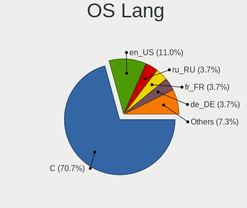
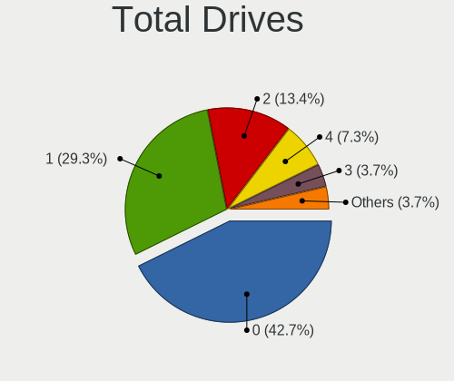
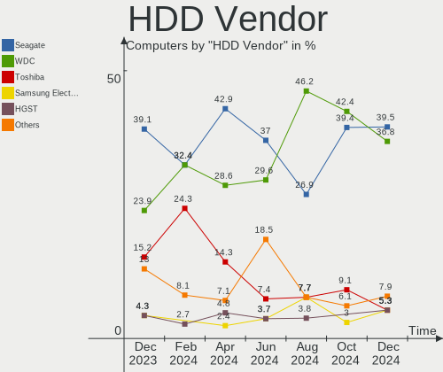
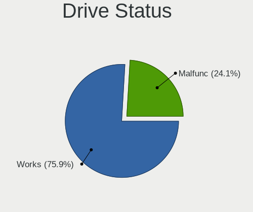
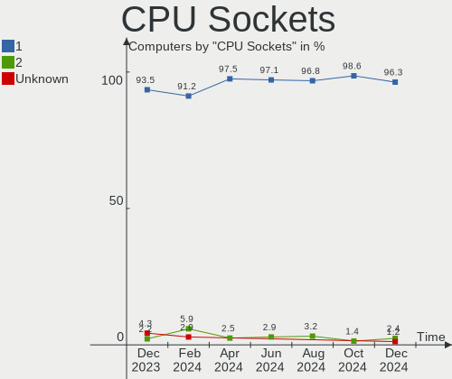
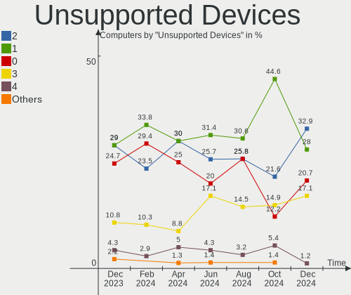
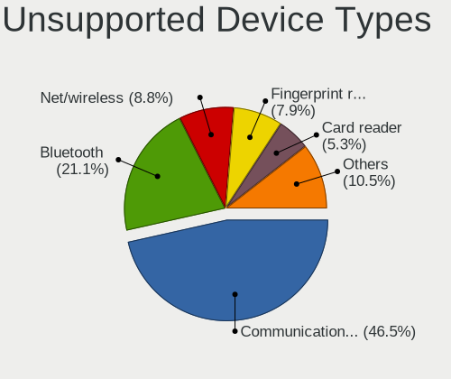

FreeBSD - Hardware Trends
-------------------------

A project to identify most popular hardware characteristics and track their change
over time based on data collected by BSD users at https://BSD-Hardware.info.

Anyone can contribute to this report by the [hw-probe](https://github.com/linuxhw/hw-probe/blob/master/INSTALL.BSD.md) tool:

    hw-probe -all -upload

This is a report for all computer types. See also reports for [desktops](/Dist/FreeBSD/Desktop/README.md) and [notebooks](/Dist/FreeBSD/Notebook/README.md).

This report is for one last month. Overall report since the beginning of time: [TestCoverage](https://github.com/bsdhw/TestCoverage)

Period: Jan, 2023.

Contents
--------

* [ System ](#system)
  - [ OS                       ](#os)
  - [ OS Family                ](#os-family)
  - [ Arch                     ](#arch)
  - [ DE                       ](#de)
  - [ Display Server           ](#display-server)
  - [ Display Manager          ](#display-manager)
  - [ OS Lang                  ](#os-lang)
  - [ Boot Mode                ](#boot-mode)
  - [ Filesystem               ](#filesystem)
  - [ Part. scheme             ](#part-scheme)

* [ Board ](#board)
  - [ Vendor                   ](#vendor)
  - [ Model                    ](#model)
  - [ Model Family             ](#model-family)
  - [ MFG Year                 ](#mfg-year)
  - [ Form Factor              ](#form-factor)
  - [ Coreboot                 ](#coreboot)
  - [ RAM Size                 ](#ram-size)
  - [ RAM Used                 ](#ram-used)
  - [ Total Drives             ](#total-drives)
  - [ Has CD-ROM               ](#has-cd-rom)
  - [ Has Ethernet             ](#has-ethernet)
  - [ Has WiFi                 ](#has-wifi)
  - [ Has Bluetooth            ](#has-bluetooth)

* [ Location ](#location)
  - [ Country                  ](#country)
  - [ City                     ](#city)

* [ Drives ](#drives)
  - [ Drive Vendor             ](#drive-vendor)
  - [ Drive Model              ](#drive-model)
  - [ HDD Vendor               ](#hdd-vendor)
  - [ SSD Vendor               ](#ssd-vendor)
  - [ Drive Kind               ](#drive-kind)
  - [ Drive Connector          ](#drive-connector)
  - [ Drive Size               ](#drive-size)
  - [ Space Total              ](#space-total)
  - [ Space Used               ](#space-used)
  - [ Malfunc. Drives          ](#malfunc-drives)
  - [ Malfunc. Drive Vendor    ](#malfunc-drive-vendor)
  - [ Malfunc. HDD Vendor      ](#malfunc-hdd-vendor)
  - [ Malfunc. Drive Kind      ](#malfunc-drive-kind)
  - [ Failed Drives            ](#failed-drives)
  - [ Failed Drive Vendor      ](#failed-drive-vendor)
  - [ Drive Status             ](#drive-status)

* [ Storage controller ](#storage-controller)
  - [ Storage Vendor           ](#storage-vendor)
  - [ Storage Model            ](#storage-model)
  - [ Storage Kind             ](#storage-kind)

* [ Processor ](#processor)
  - [ CPU Vendor               ](#cpu-vendor)
  - [ CPU Model                ](#cpu-model)
  - [ CPU Model Family         ](#cpu-model-family)
  - [ CPU Cores                ](#cpu-cores)
  - [ CPU Sockets              ](#cpu-sockets)
  - [ CPU Threads              ](#cpu-threads)
  - [ CPU Microarch            ](#cpu-microarch)

* [ Graphics ](#graphics)
  - [ GPU Vendor               ](#gpu-vendor)
  - [ GPU Model                ](#gpu-model)
  - [ GPU Combo                ](#gpu-combo)
  - [ GPU Driver               ](#gpu-driver)
  - [ GPU Memory               ](#gpu-memory)

* [ Monitor ](#monitor)
  - [ Monitor Vendor           ](#monitor-vendor)
  - [ Monitor Model            ](#monitor-model)
  - [ Monitor Resolution       ](#monitor-resolution)
  - [ Monitor Diagonal         ](#monitor-diagonal)
  - [ Monitor Width            ](#monitor-width)
  - [ Aspect Ratio             ](#aspect-ratio)
  - [ Monitor Area             ](#monitor-area)
  - [ Pixel Density            ](#pixel-density)
  - [ Multiple Monitors        ](#multiple-monitors)

* [ Network ](#network)
  - [ Net Controller Vendor    ](#net-controller-vendor)
  - [ Net Controller Model     ](#net-controller-model)
  - [ Wireless Vendor          ](#wireless-vendor)
  - [ Wireless Model           ](#wireless-model)
  - [ Ethernet Vendor          ](#ethernet-vendor)
  - [ Ethernet Model           ](#ethernet-model)
  - [ Net Controller Kind      ](#net-controller-kind)
  - [ Used Controller          ](#used-controller)
  - [ NICs                     ](#nics)
  - [ IPv6                     ](#ipv6)

* [ Bluetooth ](#bluetooth)
  - [ Bluetooth Vendor         ](#bluetooth-vendor)
  - [ Bluetooth Model          ](#bluetooth-model)

* [ Sound ](#sound)
  - [ Sound Vendor             ](#sound-vendor)
  - [ Sound Model              ](#sound-model)

* [ Memory ](#memory)
  - [ Memory Vendor            ](#memory-vendor)
  - [ Memory Model             ](#memory-model)
  - [ Memory Kind              ](#memory-kind)
  - [ Memory Form Factor       ](#memory-form-factor)
  - [ Memory Size              ](#memory-size)
  - [ Memory Speed             ](#memory-speed)

* [ Printers & scanners ](#printers--scanners)
  - [ Printer Vendor           ](#printer-vendor)
  - [ Printer Model            ](#printer-model)
  - [ Scanner Vendor           ](#scanner-vendor)
  - [ Scanner Model            ](#scanner-model)

* [ Camera ](#camera)
  - [ Camera Vendor            ](#camera-vendor)
  - [ Camera Model             ](#camera-model)

* [ Security ](#security)
  - [ Fingerprint Vendor       ](#fingerprint-vendor)
  - [ Fingerprint Model        ](#fingerprint-model)
  - [ Chipcard Vendor          ](#chipcard-vendor)
  - [ Chipcard Model           ](#chipcard-model)

* [ Unsupported ](#unsupported)
  - [ Unsupported Devices      ](#unsupported-devices)
  - [ Unsupported Device Types ](#unsupported-device-types)

System
------

OS
--

Installed operating systems

| Name                 | Computers | Percent |
|----------------------|-----------|---------|
| FreeBSD 13.1-p5      | 43        | 54.43%  |
| FreeBSD 13.1         | 10        | 12.66%  |
| FreeBSD 13.1-STABLE  | 9         | 11.39%  |
| FreeBSD 14.0-CURRENT | 7         | 8.86%   |
| FreeBSD 12.3         | 3         | 3.8%    |
| FreeBSD 12.4         | 2         | 2.53%   |
| FreeBSD 12.3-STABLE  | 2         | 2.53%   |
| FreeBSD 13.1-p3      | 1         | 1.27%   |
| FreeBSD 13.0-p7      | 1         | 1.27%   |
| FreeBSD 12.3-p7      | 1         | 1.27%   |

OS Family
---------

OS without a version

| Name    | Computers | Percent |
|---------|-----------|---------|
| FreeBSD | 79        | 100%    |

Arch
----

OS architecture (x86_64, i586, etc.)

| Name  | Computers | Percent |
|-------|-----------|---------|
| amd64 | 75        | 94.94%  |
| i386  | 2         | 2.53%   |
| arm64 | 2         | 2.53%   |

DE
--

Desktop Environment

| Name          | Computers | Percent |
|---------------|-----------|---------|
| Console       | 32        | 40.51%  |
| XFCE          | 11        | 13.92%  |
| KDE5          | 9         | 11.39%  |
| MATE          | 6         | 7.59%   |
| TWM           | 5         | 6.33%   |
| i3            | 5         | 6.33%   |
| Openbox       | 3         | 3.8%    |
| GNOME         | 3         | 3.8%    |
| sway          | 1         | 1.27%   |
| Lumina        | 1         | 1.27%   |
| IceWM         | 1         | 1.27%   |
| Enlightenment | 1         | 1.27%   |
| DWM           | 1         | 1.27%   |

Display Server
--------------

X11 or Wayland

| Name    | Computers | Percent |
|---------|-----------|---------|
| X11     | 43        | 54.43%  |
| Console | 33        | 41.77%  |
| Wayland | 3         | 3.8%    |

Display Manager
---------------

SDDM, LightDM, etc.

| Name    | Computers | Percent |
|---------|-----------|---------|
| Console | 48        | 60.76%  |
| SDDM    | 10        | 12.66%  |
| XDM     | 6         | 7.59%   |
| SLiM    | 6         | 7.59%   |
| Ly      | 4         | 5.06%   |
| LightDM | 4         | 5.06%   |
| GDM     | 1         | 1.27%   |

OS Lang
-------

Language

| Lang         | Computers | Percent |
|--------------|-----------|---------|
| C            | 49        | 62.03%  |
| Unknown      | 9         | 11.39%  |
| en_US        | 8         | 10.13%  |
| ru_RU        | 4         | 5.06%   |
| en_GB        | 2         | 2.53%   |
| en_CA        | 2         | 2.53%   |
| en_AU        | 2         | 2.53%   |
| ru_RU.KOI8-R | 1         | 1.27%   |
| pl_PL        | 1         | 1.27%   |
| cs_CZ        | 1         | 1.27%   |

Boot Mode
---------

EFI or BIOS

| Mode | Computers | Percent |
|------|-----------|---------|
| EFI  | 55        | 69.62%  |
| BIOS | 24        | 30.38%  |

Filesystem
----------

Type of filesystem

| Type | Computers | Percent |
|------|-----------|---------|
| Zfs  | 57        | 72.15%  |
| Ufs  | 22        | 27.85%  |

Part. scheme
------------

Scheme of partitioning

| Type | Computers | Percent |
|------|-----------|---------|
| GPT  | 72        | 91.14%  |
| MBR  | 7         | 8.86%   |

Board
-----

Vendor
------

Motherboard manufacturer

| Name                    | Computers | Percent |
|-------------------------|-----------|---------|
| Lenovo                  | 15        | 18.99%  |
| ASUSTek Computer        | 13        | 16.46%  |
| Dell                    | 8         | 10.13%  |
| Hewlett-Packard         | 7         | 8.86%   |
| Supermicro              | 5         | 6.33%   |
| Unknown                 | 5         | 6.33%   |
| MSI                     | 3         | 3.8%    |
| Intel                   | 3         | 3.8%    |
| ASRock                  | 3         | 3.8%    |
| Acer                    | 3         | 3.8%    |
| Fujitsu                 | 2         | 2.53%   |
| F-Plus Mobile           | 2         | 2.53%   |
| ASRockRack              | 2         | 2.53%   |
| Shuttle                 | 1         | 1.27%   |
| Raspberry Pi Foundation | 1         | 1.27%   |
| Medion                  | 1         | 1.27%   |
| IBM                     | 1         | 1.27%   |
| Gigabyte Technology     | 1         | 1.27%   |
| AZW                     | 1         | 1.27%   |
| Alienware               | 1         | 1.27%   |
| ADI Engineering         | 1         | 1.27%   |

Model
-----

Motherboard model

| Name                                     | Computers | Percent |
|------------------------------------------|-----------|---------|
| Unknown                                  | 5         | 6.33%   |
| Supermicro Super Server                  | 3         | 3.8%    |
| Intel Nobilis                            | 2         | 2.53%   |
| Fujitsu PRIMERGY RX200 S6                | 2         | 2.53%   |
| F-Plus Mobile FLAPTOP r                  | 2         | 2.53%   |
| Dell XPS 13 9310                         | 2         | 2.53%   |
| ASUS TUF Gaming Z690-PLUS WIFI D4        | 2         | 2.53%   |
| ASRock X570 Phantom Gaming 4             | 2         | 2.53%   |
| Supermicro SYS-6028R-TRT                 | 1         | 1.27%   |
| Supermicro SYS-6028R-T                   | 1         | 1.27%   |
| Shuttle DS20U                            | 1         | 1.27%   |
| RPi Raspberry Pi                         | 1         | 1.27%   |
| MSI MS-7D28                              | 1         | 1.27%   |
| MSI MS-7C91                              | 1         | 1.27%   |
| MSI MS-7817                              | 1         | 1.27%   |
| Medion S14409                            | 1         | 1.27%   |
| Lenovo ThinkPad X280 20KFCTO1WW          | 1         | 1.27%   |
| Lenovo ThinkPad X220 4291WF5             | 1         | 1.27%   |
| Lenovo ThinkPad X220 4291LF6             | 1         | 1.27%   |
| Lenovo ThinkPad X1 Carbon 5th 20HR002MAT | 1         | 1.27%   |
| Lenovo ThinkPad X1 Carbon 3rd 20BTS0LK00 | 1         | 1.27%   |
| Lenovo ThinkPad T430 23446FP             | 1         | 1.27%   |
| Lenovo ThinkPad T430 2342AG4             | 1         | 1.27%   |
| Lenovo ThinkPad T14 Gen 2a 20XKA004CD    | 1         | 1.27%   |
| Lenovo ThinkPad A485 20MVS0LG00          | 1         | 1.27%   |
| Lenovo ThinkBook 14-IIL 20SL             | 1         | 1.27%   |
| Lenovo Legion S7 15ACH6 82K8             | 1         | 1.27%   |
| Lenovo Legion 5 15ARH05 82B5             | 1         | 1.27%   |
| Lenovo IdeaPad Y700-15ISK 80NV           | 1         | 1.27%   |
| Lenovo IdeaPad 5 14ALC05 82LM            | 1         | 1.27%   |
| Lenovo B590 20208                        | 1         | 1.27%   |
| Intel DH77KC AAG39641-400                | 1         | 1.27%   |
| IBM 9210MML                              | 1         | 1.27%   |
| HP ProLiant MicroServer Gen8             | 1         | 1.27%   |
| HP ProLiant DL160 Gen9                   | 1         | 1.27%   |
| HP Pavilion Notebook                     | 1         | 1.27%   |
| HP Laptop 14s-fq1xxx                     | 1         | 1.27%   |
| HP EliteDesk 800 G1 SFF                  | 1         | 1.27%   |
| HP EliteBook 8570p                       | 1         | 1.27%   |
| HP EliteBook 840 G3                      | 1         | 1.27%   |

Model Family
------------

Motherboard model prefix

| Name                     | Computers | Percent |
|--------------------------|-----------|---------|
| Lenovo ThinkPad          | 9         | 11.39%  |
| Unknown                  | 5         | 6.33%   |
| Supermicro Super         | 3         | 3.8%    |
| ASUS ROG                 | 3         | 3.8%    |
| Lenovo Legion            | 2         | 2.53%   |
| Lenovo IdeaPad           | 2         | 2.53%   |
| Intel Nobilis            | 2         | 2.53%   |
| HP ProLiant              | 2         | 2.53%   |
| HP EliteBook             | 2         | 2.53%   |
| Fujitsu PRIMERGY         | 2         | 2.53%   |
| F-Plus Mobile FLAPTOP    | 2         | 2.53%   |
| Dell XPS                 | 2         | 2.53%   |
| Dell OptiPlex            | 2         | 2.53%   |
| Dell Latitude            | 2         | 2.53%   |
| ASUS TUF                 | 2         | 2.53%   |
| ASUS PRIME               | 2         | 2.53%   |
| ASRock X570              | 2         | 2.53%   |
| Acer Aspire              | 2         | 2.53%   |
| Supermicro SYS-6028R-TRT | 1         | 1.27%   |
| Supermicro SYS-6028R-T   | 1         | 1.27%   |
| Shuttle DS20U            | 1         | 1.27%   |
| RPi Raspberry            | 1         | 1.27%   |
| MSI MS-7D28              | 1         | 1.27%   |
| MSI MS-7C91              | 1         | 1.27%   |
| MSI MS-7817              | 1         | 1.27%   |
| Medion S14409            | 1         | 1.27%   |
| Lenovo ThinkBook         | 1         | 1.27%   |
| Lenovo B590              | 1         | 1.27%   |
| Intel DH77KC             | 1         | 1.27%   |
| IBM 9210MML              | 1         | 1.27%   |
| HP Pavilion              | 1         | 1.27%   |
| HP Laptop                | 1         | 1.27%   |
| HP EliteDesk             | 1         | 1.27%   |
| Gigabyte B550            | 1         | 1.27%   |
| Dell Precision           | 1         | 1.27%   |
| Dell Inspiron            | 1         | 1.27%   |
| AZW SEi                  | 1         | 1.27%   |
| ASUS WS-C621E-SAGE       | 1         | 1.27%   |
| ASUS Pro                 | 1         | 1.27%   |
| ASUS P5Q-E               | 1         | 1.27%   |

MFG Year
--------

Motherboard manufacture year

| Year    | Computers | Percent |
|---------|-----------|---------|
| 2021    | 15        | 18.99%  |
| 2022    | 13        | 16.46%  |
| 2019    | 10        | 12.66%  |
| 2013    | 9         | 11.39%  |
| 2017    | 5         | 6.33%   |
| 2015    | 4         | 5.06%   |
| 2011    | 4         | 5.06%   |
| 2020    | 3         | 3.8%    |
| 2014    | 3         | 3.8%    |
| 2010    | 3         | 3.8%    |
| Unknown | 3         | 3.8%    |
| 2018    | 2         | 2.53%   |
| 2016    | 2         | 2.53%   |
| 2009    | 1         | 1.27%   |
| 2008    | 1         | 1.27%   |
| 2006    | 1         | 1.27%   |

Form Factor
-----------

Physical design of the computer

| Name           | Computers | Percent |
|----------------|-----------|---------|
| Desktop        | 37        | 46.84%  |
| Notebook       | 33        | 41.77%  |
| Server         | 7         | 8.86%   |
| System on chip | 1         | 1.27%   |
| Mini pc        | 1         | 1.27%   |

Coreboot
--------

Have coreboot on board

| Used | Computers | Percent |
|------|-----------|---------|
| No   | 78        | 98.73%  |
| Yes  | 1         | 1.27%   |

RAM Size
--------

Total RAM memory

| Size in GB      | Computers | Percent |
|-----------------|-----------|---------|
| 16.01-24.0      | 24        | 30.38%  |
| 32.01-64.0      | 18        | 22.78%  |
| 8.01-16.0       | 13        | 16.46%  |
| 64.01-256.0     | 10        | 12.66%  |
| 4.01-8.0        | 8         | 10.13%  |
| 0.51-1.0        | 3         | 3.8%    |
| 3.01-4.0        | 2         | 2.53%   |
| More than 256.0 | 1         | 1.27%   |

RAM Used
--------

Used RAM memory

| Used GB    | Computers | Percent |
|------------|-----------|---------|
| 1.01-2.0   | 23        | 29.11%  |
| 0.01-0.5   | 22        | 27.85%  |
| 0.51-1.0   | 19        | 24.05%  |
| 3.01-4.0   | 5         | 6.33%   |
| 2.01-3.0   | 5         | 6.33%   |
| 4.01-8.0   | 2         | 2.53%   |
| 16.01-24.0 | 1         | 1.27%   |
| 8.01-16.0  | 1         | 1.27%   |
| 0          | 1         | 1.27%   |

Total Drives
------------

Number of drives on board

| Drives | Computers | Percent |
|--------|-----------|---------|
| 1      | 40        | 50.63%  |
| 2      | 14        | 17.72%  |
| 3      | 12        | 15.19%  |
| 0      | 5         | 6.33%   |
| 4      | 3         | 3.8%    |
| 16     | 1         | 1.27%   |
| 13     | 1         | 1.27%   |
| 10     | 1         | 1.27%   |
| 7      | 1         | 1.27%   |
| 5      | 1         | 1.27%   |

Has CD-ROM
----------

Has CD-ROM on board

| Presented | Computers | Percent |
|-----------|-----------|---------|
| No        | 58        | 73.42%  |
| Yes       | 21        | 26.58%  |

Has Ethernet
------------

Has Ethernet on board

| Presented | Computers | Percent |
|-----------|-----------|---------|
| Yes       | 68        | 86.08%  |
| No        | 11        | 13.92%  |

Has WiFi
--------

Has WiFi module

| Presented | Computers | Percent |
|-----------|-----------|---------|
| Yes       | 42        | 53.16%  |
| No        | 37        | 46.84%  |

Has Bluetooth
-------------

Has Bluetooth module

| Presented | Computers | Percent |
|-----------|-----------|---------|
| No        | 45        | 56.96%  |
| Yes       | 34        | 43.04%  |

Location
--------

Country
-------

Geographic location (country)

| Country     | Computers | Percent |
|-------------|-----------|---------|
| USA         | 19        | 24.05%  |
| Russia      | 12        | 15.19%  |
| Germany     | 9         | 11.39%  |
| Canada      | 6         | 7.59%   |
| UK          | 4         | 5.06%   |
| France      | 3         | 3.8%    |
| Austria     | 3         | 3.8%    |
| Australia   | 3         | 3.8%    |
| Greece      | 2         | 2.53%   |
| Czechia     | 2         | 2.53%   |
| China       | 2         | 2.53%   |
| Venezuela   | 1         | 1.27%   |
| Thailand    | 1         | 1.27%   |
| Spain       | 1         | 1.27%   |
| Serbia      | 1         | 1.27%   |
| Romania     | 1         | 1.27%   |
| Poland      | 1         | 1.27%   |
| Netherlands | 1         | 1.27%   |
| Mexico      | 1         | 1.27%   |
| Malta       | 1         | 1.27%   |
| Iraq        | 1         | 1.27%   |
| Iran        | 1         | 1.27%   |
| India       | 1         | 1.27%   |
| Hungary     | 1         | 1.27%   |
| Finland     | 1         | 1.27%   |

City
----

Geographic location (city)

| City               | Computers | Percent |
|--------------------|-----------|---------|
| Moscow             | 8         | 10.13%  |
| Vienna             | 3         | 3.8%    |
| Grand Rapids       | 3         | 3.8%    |
| Austin             | 3         | 3.8%    |
| Salem              | 2         | 2.53%   |
| Remseck am Neckar  | 2         | 2.53%   |
| Redmond            | 2         | 2.53%   |
| Novokuznetsk       | 2         | 2.53%   |
| London             | 2         | 2.53%   |
| Langley            | 2         | 2.53%   |
| Herne Bay          | 2         | 2.53%   |
| Berlin             | 2         | 2.53%   |
| Adelaide           | 2         | 2.53%   |
| Wenatchee          | 1         | 1.27%   |
| Wathlingen         | 1         | 1.27%   |
| Tijuana            | 1         | 1.27%   |
| Thessaloniki       | 1         | 1.27%   |
| St. Petersburg     | 1         | 1.27%   |
| Shanghai           | 1         | 1.27%   |
| Seattle            | 1         | 1.27%   |
| Santa Ana          | 1         | 1.27%   |
| Saarbrücken       | 1         | 1.27%   |
| Rūdsar            | 1         | 1.27%   |
| Roxby Downs        | 1         | 1.27%   |
| Quedlinburg        | 1         | 1.27%   |
| Qormi              | 1         | 1.27%   |
| Qiqihar            | 1         | 1.27%   |
| Paris              | 1         | 1.27%   |
| Ostrozska Nova Ves | 1         | 1.27%   |
| Ostrava            | 1         | 1.27%   |
| New York           | 1         | 1.27%   |
| Navi Mumbai        | 1         | 1.27%   |
| Navalcarnero       | 1         | 1.27%   |
| Mosul              | 1         | 1.27%   |
| Montpellier        | 1         | 1.27%   |
| Lamont             | 1         | 1.27%   |
| La Victoria        | 1         | 1.27%   |
| Krasnodar          | 1         | 1.27%   |
| Knoxville          | 1         | 1.27%   |
| Ivanovo            | 1         | 1.27%   |

Drives
------

Drive Vendor
------------

Hard drive vendors

| Vendor              | Computers | Drives | Percent |
|---------------------|-----------|--------|---------|
| Samsung Electronics | 23        | 39     | 21.3%   |
| WDC                 | 18        | 47     | 16.67%  |
| Seagate             | 12        | 17     | 11.11%  |
| Intel               | 9         | 11     | 8.33%   |
| Kingston            | 8         | 11     | 7.41%   |
| Crucial             | 7         | 9      | 6.48%   |
| HGST                | 3         | 5      | 2.78%   |
| FORESEE             | 3         | 3      | 2.78%   |
| Corsair             | 3         | 3      | 2.78%   |
| Supermicro          | 2         | 2      | 1.85%   |
| Phison              | 2         | 2      | 1.85%   |
| KIOXIA              | 2         | 2      | 1.85%   |
| Gigabyte Technology | 2         | 2      | 1.85%   |
| A-DATA Technology   | 2         | 2      | 1.85%   |
| Transcend           | 1         | 1      | 0.93%   |
| Toshiba             | 1         | 1      | 0.93%   |
| Silicon Motion      | 1         | 1      | 0.93%   |
| SanDisk             | 1         | 1      | 0.93%   |
| Plextor             | 1         | 1      | 0.93%   |
| Micron Technology   | 1         | 1      | 0.93%   |
| LITEON              | 1         | 1      | 0.93%   |
| Lenovo              | 1         | 1      | 0.93%   |
| KIOXIA-EXCERIA      | 1         | 1      | 0.93%   |
| KingSpec            | 1         | 1      | 0.93%   |
| Hitachi             | 1         | 1      | 0.93%   |
| Hewlett-Packard     | 1         | 1      | 0.93%   |

Drive Model
-----------

Hard drive models

| Model                          | Computers | Percent |
|--------------------------------|-----------|---------|
| WDC WD800JD-75MSA3 80GB        | 3         | 2.26%   |
| Seagate ST4000DM000-1F2168 4TB | 3         | 2.26%   |
| Samsung SSD 850 EVO 1TB        | 3         | 2.26%   |
| Supermicro SSD 128GB           | 2         | 1.5%    |
| Seagate ST1000LM035-1RK172 1TB | 2         | 1.5%    |
| Samsung SSD 980 PRO 2TB        | 2         | 1.5%    |
| Samsung SSD 970 EVO Plus 1TB   | 2         | 1.5%    |
| Samsung SSD 850 EVO 250GB      | 2         | 1.5%    |
| Samsung PM9A1 NVMe 512GB       | 2         | 1.5%    |
| FORESEE XP1000F001T 1TB        | 2         | 1.5%    |
| WDC WUH721816AL5204 16TB       | 1         | 0.75%   |
| WDC WDS200T1XHE-00AFY0 2TB     | 1         | 0.75%   |
| WDC WDS100T3X0C-00SJG0 1TB     | 1         | 0.75%   |
| WDC WD80EMAZ-00WJTA0 8TB       | 1         | 0.75%   |
| WDC WD80EFZX-68UW8N0 8TB       | 1         | 0.75%   |
| WDC WD80EFAX-68LHPN0 8TB       | 1         | 0.75%   |
| WDC WD80EDBZ-11B0ZA0 8TB       | 1         | 0.75%   |
| WDC WD6003FRYZ-01F0DB0 6TB     | 1         | 0.75%   |
| WDC WD6002FZWX-00GBGB0 6TB     | 1         | 0.75%   |
| WDC WD40EZRZ-22GXCB0 4TB       | 1         | 0.75%   |
| WDC WD4003FRYZ-01F0DB0 4TB     | 1         | 0.75%   |
| WDC WD4002FYYZ-01B7CB1 4TB     | 1         | 0.75%   |
| WDC WD4002FYYZ-01B7CB0 4TB     | 1         | 0.75%   |
| WDC WD4000FYYZ-01UL1B3 4TB     | 1         | 0.75%   |
| WDC WD4000FYYZ-01UL1B0 4TB     | 1         | 0.75%   |
| WDC WD3200BEKT-22PVMT0 320GB   | 1         | 0.75%   |
| WDC WD30EFRX-68EUZN0 3TB       | 1         | 0.75%   |
| WDC WD20EARX-00PASB0 2TB       | 1         | 0.75%   |
| WDC WD2003FZEX-00Z4SA0 2TB     | 1         | 0.75%   |
| WDC WD161KFGX-68AFPN0 16TB     | 1         | 0.75%   |
| WDC WD1600BEVT-22ZCT0 160GB    | 1         | 0.75%   |
| WDC WD15EADS-00P8B0 1.5TB      | 1         | 0.75%   |
| WDC WD120EMFZ-11A6JA0 12TB     | 1         | 0.75%   |
| WDC WD120EMAZ-11BLFA0 12TB     | 1         | 0.75%   |
| WDC WD10JFCX-68N6GN0 1TB       | 1         | 0.75%   |
| WDC WD10EZEX-08WN4A0 1TB       | 1         | 0.75%   |
| WDC WD10EFRX-68JCSN0 1TB       | 1         | 0.75%   |
| WDC WD1003FZEX-00MK2A0 1TB     | 1         | 0.75%   |
| WDC PC SN730 NVMe 1024GB       | 1         | 0.75%   |
| Transcend TS512GSSD230S 512GB  | 1         | 0.75%   |

HDD Vendor
----------

Hard disk drive vendors

| Vendor          | Computers | Drives | Percent |
|-----------------|-----------|--------|---------|
| WDC             | 16        | 44     | 48.48%  |
| Seagate         | 12        | 17     | 36.36%  |
| HGST            | 3         | 5      | 9.09%   |
| Hitachi         | 1         | 1      | 3.03%   |
| Hewlett-Packard | 1         | 1      | 3.03%   |

SSD Vendor
----------

Solid state drive vendors

| Vendor              | Computers | Drives | Percent |
|---------------------|-----------|--------|---------|
| Samsung Electronics | 12        | 19     | 30.77%  |
| Intel               | 6         | 8      | 15.38%  |
| Crucial             | 6         | 8      | 15.38%  |
| Kingston            | 4         | 4      | 10.26%  |
| Supermicro          | 2         | 2      | 5.13%   |
| Transcend           | 1         | 1      | 2.56%   |
| Toshiba             | 1         | 1      | 2.56%   |
| SanDisk             | 1         | 1      | 2.56%   |
| Plextor             | 1         | 1      | 2.56%   |
| LITEON              | 1         | 1      | 2.56%   |
| Lenovo              | 1         | 1      | 2.56%   |
| KIOXIA-EXCERIA      | 1         | 1      | 2.56%   |
| KingSpec            | 1         | 1      | 2.56%   |
| Corsair             | 1         | 1      | 2.56%   |

Drive Kind
----------

HDD or SSD

| Kind | Computers | Drives | Percent |
|------|-----------|--------|---------|
| NVMe | 37        | 49     | 37%     |
| SSD  | 32        | 50     | 32%     |
| HDD  | 31        | 68     | 31%     |

Drive Connector
---------------

SATA, SAS, NVMe, etc.

| Type | Computers | Drives | Percent |
|------|-----------|--------|---------|
| SATA | 52        | 118    | 58.43%  |
| NVMe | 37        | 49     | 41.57%  |

Drive Size
----------

Size of hard drive

| Size in TB | Computers | Drives | Percent |
|------------|-----------|--------|---------|
| 0.01-0.5   | 28        | 42     | 40%     |
| 0.51-1.0   | 16        | 20     | 22.86%  |
| 1.01-2.0   | 10        | 15     | 14.29%  |
| 3.01-4.0   | 7         | 15     | 10%     |
| 4.01-10.0  | 5         | 13     | 7.14%   |
| 10.01-20.0 | 3         | 12     | 4.29%   |
| 2.01-3.0   | 1         | 1      | 1.43%   |

Space Total
-----------

Amount of disk space available on the file system

| Size in GB | Computers | Percent |
|------------|-----------|---------|
| 101-250    | 23        | 29.11%  |
| 251-500    | 19        | 24.05%  |
| 501-1000   | 14        | 17.72%  |
| 51-100     | 7         | 8.86%   |
| 21-50      | 5         | 6.33%   |
| 1001-2000  | 4         | 5.06%   |
| 2001-3000  | 3         | 3.8%    |
| 1-20       | 3         | 3.8%    |
| Unknown    | 1         | 1.27%   |

Space Used
----------

Amount of used disk space

| Used GB  | Computers | Percent |
|----------|-----------|---------|
| 1-20     | 64        | 81.01%  |
| 21-50    | 8         | 10.13%  |
| 501-1000 | 3         | 3.8%    |
| 101-250  | 2         | 2.53%   |
| 51-100   | 1         | 1.27%   |
| Unknown  | 1         | 1.27%   |

Malfunc. Drives
---------------

Drive models with a malfunction

| Model                                 | Computers | Drives | Percent |
|---------------------------------------|-----------|--------|---------|
| WDC WD4000FYYZ-01UL1B0 4TB            | 1         | 1      | 11.11%  |
| WDC WD3200BEKT-22PVMT0 320GB          | 1         | 1      | 11.11%  |
| Seagate ST500DM002-1ER14C 500GB       | 1         | 1      | 11.11%  |
| Samsung Electronics SSD 850 EVO 250GB | 1         | 1      | 11.11%  |
| Hitachi HTS725050A7E630 500GB         | 1         | 1      | 11.11%  |
| HGST HTS721010A9E630 1TB              | 1         | 1      | 11.11%  |
| Hewlett-Packard VB0250EAVER 250GB     | 1         | 1      | 11.11%  |
| Corsair Force LS SSD 64GB             | 1         | 1      | 11.11%  |
| A-DATA Technology SX8200PNP 1TB       | 1         | 1      | 11.11%  |

Malfunc. Drive Vendor
---------------------

Vendors of faulty drives

| Vendor              | Computers | Drives | Percent |
|---------------------|-----------|--------|---------|
| WDC                 | 2         | 2      | 22.22%  |
| Seagate             | 1         | 1      | 11.11%  |
| Samsung Electronics | 1         | 1      | 11.11%  |
| Hitachi             | 1         | 1      | 11.11%  |
| HGST                | 1         | 1      | 11.11%  |
| Hewlett-Packard     | 1         | 1      | 11.11%  |
| Corsair             | 1         | 1      | 11.11%  |
| A-DATA Technology   | 1         | 1      | 11.11%  |

Malfunc. HDD Vendor
-------------------

Vendors of faulty HDD drives

| Vendor          | Computers | Drives | Percent |
|-----------------|-----------|--------|---------|
| WDC             | 2         | 2      | 33.33%  |
| Seagate         | 1         | 1      | 16.67%  |
| Hitachi         | 1         | 1      | 16.67%  |
| HGST            | 1         | 1      | 16.67%  |
| Hewlett-Packard | 1         | 1      | 16.67%  |

Malfunc. Drive Kind
-------------------

Kinds of faulty drives

| Kind | Computers | Drives | Percent |
|------|-----------|--------|---------|
| HDD  | 6         | 6      | 66.67%  |
| SSD  | 2         | 2      | 22.22%  |
| NVMe | 1         | 1      | 11.11%  |

Failed Drives
-------------

Failed drive models

Zero info for selected period =(

Failed Drive Vendor
-------------------

Failed drive vendors

Zero info for selected period =(

Drive Status
------------

Number of failed and malfunc. drives

| Status  | Computers | Drives | Percent |
|---------|-----------|--------|---------|
| Works   | 72        | 158    | 90%     |
| Malfunc | 8         | 9      | 10%     |

Storage controller
------------------

Storage Vendor
--------------

Storage controller vendors

| Vendor                       | Computers | Percent |
|------------------------------|-----------|---------|
| Intel                        | 47        | 41.96%  |
| AMD                          | 16        | 14.29%  |
| Samsung Electronics          | 14        | 12.5%   |
| Phison Electronics           | 6         | 5.36%   |
| Broadcom / LSI               | 5         | 4.46%   |
| Kingston Technology Company  | 4         | 3.57%   |
| ASMedia Technology           | 4         | 3.57%   |
| Silicon Motion               | 2         | 1.79%   |
| Shenzhen Longsys Electronics | 2         | 1.79%   |
| SanDisk                      | 2         | 1.79%   |
| Chelsio Communications       | 2         | 1.79%   |
| Toshiba                      | 1         | 0.89%   |
| Realtek Semiconductor        | 1         | 0.89%   |
| Micron/Crucial Technology    | 1         | 0.89%   |
| Micron Technology            | 1         | 0.89%   |
| Marvell Technology Group     | 1         | 0.89%   |
| KIOXIA                       | 1         | 0.89%   |
| Hewlett-Packard              | 1         | 0.89%   |
| ADATA Technology             | 1         | 0.89%   |

Storage Model
-------------

Storage controller models

| Model                                                                          | Computers | Percent |
|--------------------------------------------------------------------------------|-----------|---------|
| AMD FCH SATA Controller [AHCI mode]                                            | 11        | 8.15%   |
| Unknown                                                                        | 8         | 5.93%   |
| Samsung NVMe SSD Controller SM981/PM981/PM983                                  | 7         | 5.19%   |
| Samsung NVMe SSD Controller PM9A1/PM9A3/980PRO                                 | 5         | 3.7%    |
| Samsung NVMe SSD Controller 980                                                | 4         | 2.96%   |
| Intel Volume Management Device NVMe RAID Controller                            | 4         | 2.96%   |
| Intel C610/X99 series chipset sSATA Controller [AHCI mode]                     | 4         | 2.96%   |
| Intel C610/X99 series chipset 6-Port SATA Controller [AHCI mode]               | 4         | 2.96%   |
| Intel 8 Series/C220 Series Chipset Family 6-port SATA Controller 1 [AHCI mode] | 4         | 2.96%   |
| Intel 7 Series Chipset Family 6-port SATA Controller [AHCI mode]               | 4         | 2.96%   |
| Phison E16 PCIe4 NVMe Controller                                               | 3         | 2.22%   |
| Intel Alder Lake-S PCH SATA Controller [AHCI Mode]                             | 3         | 2.22%   |
| Broadcom / LSI SAS2008 PCI-Express Fusion-MPT SAS-2 [Falcon]                   | 3         | 2.22%   |
| ASMedia ASM1062 Serial ATA Controller                                          | 3         | 2.22%   |
| Silicon Motion SM2263EN/SM2263XT SSD Controller                                | 2         | 1.48%   |
| SanDisk WD Black SN750 / PC SN730 NVMe SSD                                     | 2         | 1.48%   |
| Phison E12 NVMe Controller                                                     | 2         | 1.48%   |
| Intel Sunrise Point-LP SATA Controller [AHCI mode]                             | 2         | 1.48%   |
| Intel Comet Lake SATA AHCI Controller                                          | 2         | 1.48%   |
| Intel Cannon Lake PCH SATA AHCI Controller                                     | 2         | 1.48%   |
| Intel 82801JI (ICH10 Family) SATA AHCI Controller                              | 2         | 1.48%   |
| Intel 6 Series/C200 Series Chipset Family 6 port Mobile SATA AHCI Controller   | 2         | 1.48%   |
| Intel 6 Series/C200 Series Chipset Family 6 port Desktop SATA AHCI Controller  | 2         | 1.48%   |
| Chelsio T62100-SO-CR Unified Wire Storage Controller                           | 2         | 1.48%   |
| Broadcom / LSI SAS3008 PCI-Express Fusion-MPT SAS-3                            | 2         | 1.48%   |
| AMD SB7x0/SB8x0/SB9x0 IDE Controller                                           | 2         | 1.48%   |
| AMD 500 Series Chipset SATA Controller                                         | 2         | 1.48%   |
| Toshiba XG6 NVMe SSD Controller                                                | 1         | 0.74%   |
| SanDisk WD PC SN810 / Black SN850 NVMe SSD                                     | 1         | 0.74%   |
| Samsung NVMe SSD Controller SM961/PM961/SM963                                  | 1         | 0.74%   |
| Samsung NVMe SSD Controller SM951/PM951                                        | 1         | 0.74%   |
| Phison PS5013 E13 NVMe Controller                                              | 1         | 0.74%   |
| Micron/Crucial P1 NVMe PCIe SSD                                                | 1         | 0.74%   |
| Marvell Group 88SE6111/6121 SATA II / PATA Controller                          | 1         | 0.74%   |
| KIOXIA NVMe SSD Controller BG4                                                 | 1         | 0.74%   |
| Kingston Company OM3PDP3 NVMe SSD                                              | 1         | 0.74%   |
| Intel Wildcat Point-LP SATA Controller [AHCI Mode]                             | 1         | 0.74%   |
| Intel Tiger Lake-LP SATA Controller                                            | 1         | 0.74%   |
| Intel SSD Pro 7600p/760p/E 6100p Series                                        | 1         | 0.74%   |
| Intel Q170/Q150/B150/H170/H110/Z170/CM236 Chipset SATA Controller [AHCI Mode]  | 1         | 0.74%   |

Storage Kind
------------

Kind of storage controller (IDE, SATA, NVMe, SAS, ...)

| Kind | Computers | Percent |
|------|-----------|---------|
| SATA | 55        | 48.67%  |
| NVMe | 37        | 32.74%  |
| IDE  | 8         | 7.08%   |
| RAID | 7         | 6.19%   |
| SAS  | 4         | 3.54%   |
| SCSI | 2         | 1.77%   |

Processor
---------

CPU Vendor
----------

Processor vendors

| Vendor | Computers | Percent |
|--------|-----------|---------|
| Intel  | 55        | 69.62%  |
| AMD    | 22        | 27.85%  |
| ARM    | 2         | 2.53%   |

CPU Model
---------

Processor models

| Model                                   | Computers | Percent |
|-----------------------------------------|-----------|---------|
| Intel Xeon CPU E5-2697A v4 @ 2.60GHz    | 3         | 3.8%    |
| Intel Xeon CPU X5690                    | 2         | 2.53%   |
| Intel Core i5-2520M CPU @ 2.50GHz       | 2         | 2.53%   |
| Intel 11th Gen Core i7-1185G7 @ 3.00GHz | 2         | 2.53%   |
| Intel 11th Gen Core i5-1135G7 @ 2.40GHz | 2         | 2.53%   |
| AMD Ryzen 9 5950X 16-Core Processor     | 2         | 2.53%   |
| AMD Ryzen 9 3900X 12-Core Processor     | 2         | 2.53%   |
| AMD Ryzen 7 5825U with Radeon Graphics  | 2         | 2.53%   |
| AMD Ryzen 5 5500U with Radeon Graphics  | 2         | 2.53%   |
| Intel Xeon Gold 5120 CPU @ 2.20GHz      | 1         | 1.27%   |
| Intel Xeon CPU E5-2673 v3 @ 2.40GHz     | 1         | 1.27%   |
| Intel Xeon CPU E5-2620 v4 @ 2.10GHz     | 1         | 1.27%   |
| Intel Xeon CPU E3-1246 v3 @ 3.50GHz     | 1         | 1.27%   |
| Intel Xeon CPU E3-1240 v5 @ 3.50GHz     | 1         | 1.27%   |
| Intel Xeon CPU D-1521 @ 2.40GHz         | 1         | 1.27%   |
| Intel Pentium CPU G3220 @ 3.00GHz       | 1         | 1.27%   |
| Intel Pentium 4 CPU 3.20GHz             | 1         | 1.27%   |
| Intel Geode GX-MMX                      | 1         | 1.27%   |
| Intel Core i9-9900K CPU @ 3.60GHz       | 1         | 1.27%   |
| Intel Core i9-10980HK CPU @ 2.40GHz     | 1         | 1.27%   |
| Intel Core i7-9850H CPU @ 2.60GHz       | 1         | 1.27%   |
| Intel Core i7-8550U CPU @ 1.80GHz       | 1         | 1.27%   |
| Intel Core i7-7500U CPU @ 2.70GHz       | 1         | 1.27%   |
| Intel Core i7-6700HQ CPU @ 2.60GHz      | 1         | 1.27%   |
| Intel Core i7-5600U CPU @ 2.60GHz       | 1         | 1.27%   |
| Intel Core i7-3612QM CPU @ 2.10GHz      | 1         | 1.27%   |
| Intel Core i7-3520M CPU @ 2.90GHz       | 1         | 1.27%   |
| Intel Core i5-9600K CPU @ 3.70GHz       | 1         | 1.27%   |
| Intel Core i5-7500 CPU @ 3.40GHz        | 1         | 1.27%   |
| Intel Core i5-7200U CPU @ 2.50GHz       | 1         | 1.27%   |
| Intel Core i5-6200U CPU @ 2.30GHz       | 1         | 1.27%   |
| Intel Core i5-4590 CPU @ 3.30GHz        | 1         | 1.27%   |
| Intel Core i5-4570 CPU @ 3.20GHz        | 1         | 1.27%   |
| Intel Core i5-4210U CPU @ 1.70GHz       | 1         | 1.27%   |
| Intel Core i5-3570 CPU @ 3.40GHz        | 1         | 1.27%   |
| Intel Core i5-2540M CPU @ 2.60GHz       | 1         | 1.27%   |
| Intel Core i5-2430M CPU @ 2.40GH        | 1         | 1.27%   |
| Intel Core i5-2300 CPU @ 2.80GHz        | 1         | 1.27%   |
| Intel Core i5-1035G1 CPU @ 1.00GHz      | 1         | 1.27%   |
| Intel Core i3-3120M CPU @ 2.50GHz       | 1         | 1.27%   |

CPU Model Family
----------------

Processor model prefix

| Model                  | Computers | Percent |
|------------------------|-----------|---------|
| Intel Core i5          | 14        | 17.72%  |
| Intel Xeon             | 10        | 12.66%  |
| Other                  | 9         | 11.39%  |
| Intel Core i7          | 7         | 8.86%   |
| AMD Ryzen 9            | 5         | 6.33%   |
| AMD Ryzen 7            | 5         | 6.33%   |
| AMD Ryzen 5            | 4         | 5.06%   |
| Intel Celeron          | 3         | 3.8%    |
| Intel Core i9          | 2         | 2.53%   |
| Intel Core i3          | 2         | 2.53%   |
| Intel Core 2 Duo       | 2         | 2.53%   |
| Intel Atom             | 2         | 2.53%   |
| ARM Cortex             | 2         | 2.53%   |
| AMD Ryzen 5 PRO        | 2         | 2.53%   |
| Intel Xeon Gold        | 1         | 1.27%   |
| Intel Pentium 4        | 1         | 1.27%   |
| Intel Pentium          | 1         | 1.27%   |
| Intel Core 2 Quad      | 1         | 1.27%   |
| AMD Ryzen Threadripper | 1         | 1.27%   |
| AMD Ryzen 7 PRO        | 1         | 1.27%   |
| AMD Phenom II X4       | 1         | 1.27%   |
| AMD FX                 | 1         | 1.27%   |
| AMD EPYC               | 1         | 1.27%   |
| AMD A6                 | 1         | 1.27%   |

CPU Cores
---------

Number of processor cores

| Number  | Computers | Percent |
|---------|-----------|---------|
| 4       | 21        | 26.58%  |
| 2       | 18        | 22.78%  |
| 16      | 10        | 12.66%  |
| 12      | 8         | 10.13%  |
| Unknown | 5         | 6.33%   |
| 8       | 4         | 5.06%   |
| 32      | 3         | 3.8%    |
| 24      | 3         | 3.8%    |
| 10      | 2         | 2.53%   |
| 6       | 2         | 2.53%   |
| 64      | 1         | 1.27%   |
| 28      | 1         | 1.27%   |
| 1       | 1         | 1.27%   |

CPU Sockets
-----------

Number of sockets

| Number  | Computers | Percent |
|---------|-----------|---------|
| 1       | 72        | 91.14%  |
| 2       | 5         | 6.33%   |
| Unknown | 2         | 2.53%   |

CPU Threads
-----------

Threads per core (Hyper-Threading)

| Number  | Computers | Percent |
|---------|-----------|---------|
| 2       | 38        | 48.1%   |
| 1       | 36        | 45.57%  |
| Unknown | 5         | 6.33%   |

CPU Microarch
-------------

Microarchitecture

| Name          | Computers | Percent |
|---------------|-----------|---------|
| KabyLake      | 9         | 11.39%  |
| Unknown       | 9         | 11.39%  |
| Zen 3         | 8         | 10.13%  |
| Haswell       | 6         | 7.59%   |
| Broadwell     | 6         | 7.59%   |
| Zen 2         | 5         | 6.33%   |
| SandyBridge   | 5         | 6.33%   |
| IvyBridge     | 5         | 6.33%   |
| TigerLake     | 4         | 5.06%   |
| Skylake       | 4         | 5.06%   |
| Zen           | 3         | 3.8%    |
| Westmere      | 2         | 2.53%   |
| Penryn        | 2         | 2.53%   |
| Silvermont    | 1         | 1.27%   |
| Puma          | 1         | 1.27%   |
| Piledriver    | 1         | 1.27%   |
| NetBurst      | 1         | 1.27%   |
| K10           | 1         | 1.27%   |
| IceLake       | 1         | 1.27%   |
| Goldmont plus | 1         | 1.27%   |
| Geode         | 1         | 1.27%   |
| Core          | 1         | 1.27%   |
| CometLake     | 1         | 1.27%   |
| Bonnell       | 1         | 1.27%   |

Graphics
--------

GPU Vendor
----------

Vendors of graphics cards

| Vendor                     | Computers | Percent |
|----------------------------|-----------|---------|
| Intel                      | 36        | 41.38%  |
| Nvidia                     | 21        | 24.14%  |
| AMD                        | 18        | 20.69%  |
| ASPEED Technology          | 8         | 9.2%    |
| Matrox Electronics Systems | 4         | 4.6%    |

GPU Model
---------

Graphics card models

| Model                                                                         | Computers | Percent |
|-------------------------------------------------------------------------------|-----------|---------|
| ASPEED Technology ASPEED Graphics Family                                      | 8         | 9.09%   |
| Intel TigerLake-LP GT2 [Iris Xe Graphics]                                     | 4         | 4.55%   |
| Intel 2nd Generation Core Processor Family Integrated Graphics Controller     | 4         | 4.55%   |
| Intel Xeon E3-1200 v3/4th Gen Core Processor Integrated Graphics Controller   | 3         | 3.41%   |
| AMD Cezanne [Radeon Vega Series / Radeon Vega Mobile Series]                  | 3         | 3.41%   |
| Nvidia GP108 [GeForce GT 1030]                                                | 2         | 2.27%   |
| Matrox Electronics Systems MGA G200EH                                         | 2         | 2.27%   |
| Matrox Electronics Systems MGA G200e [Pilot] ServerEngines (SEP1)             | 2         | 2.27%   |
| Intel HD Graphics 620                                                         | 2         | 2.27%   |
| Intel AlderLake-S GT1                                                         | 2         | 2.27%   |
| Intel 3rd Gen Core processor Graphics Controller                              | 2         | 2.27%   |
| AMD Navi 22 [Radeon RX 6700/6700 XT/6750 XT / 6800M]                          | 2         | 2.27%   |
| AMD Lucienne                                                                  | 2         | 2.27%   |
| AMD Barcelo                                                                   | 2         | 2.27%   |
| Nvidia TU117M                                                                 | 1         | 1.14%   |
| Nvidia TU117GLM [Quadro T1000 Mobile]                                         | 1         | 1.14%   |
| Nvidia TU104 [GeForce RTX 2080 SUPER]                                         | 1         | 1.14%   |
| Nvidia TU102 [GeForce RTX 2080 Ti Rev. A]                                     | 1         | 1.14%   |
| Nvidia GT218 [NVS 300]                                                        | 1         | 1.14%   |
| Nvidia GT218 [GeForce 8400 GS Rev. 3]                                         | 1         | 1.14%   |
| Nvidia GP106 [GeForce GTX 1060 3GB]                                           | 1         | 1.14%   |
| Nvidia GM206 [GeForce GTX 950]                                                | 1         | 1.14%   |
| Nvidia GM204 [GeForce GTX 970]                                                | 1         | 1.14%   |
| Nvidia GM107M [GeForce GTX 960M]                                              | 1         | 1.14%   |
| Nvidia GK208B [GeForce GT 710]                                                | 1         | 1.14%   |
| Nvidia GK104 [GeForce GTX 760]                                                | 1         | 1.14%   |
| Nvidia GF108M [NVS 5400M]                                                     | 1         | 1.14%   |
| Nvidia GA107M [GeForce RTX 3050 Ti Mobile]                                    | 1         | 1.14%   |
| Nvidia GA106M [GeForce RTX 3060 Mobile / Max-Q]                               | 1         | 1.14%   |
| Nvidia GA104M [GeForce RTX 3080 Mobile / Max-Q 8GB/16GB]                      | 1         | 1.14%   |
| Nvidia GA104 [GeForce RTX 3060 Ti]                                            | 1         | 1.14%   |
| Nvidia GA102 [GeForce RTX 3080]                                               | 1         | 1.14%   |
| Nvidia GA102 [GeForce RTX 3080 Ti]                                            | 1         | 1.14%   |
| Intel Xeon E3-1200 v3 Processor Integrated Graphics Controller                | 1         | 1.14%   |
| Intel UHD Graphics 620                                                        | 1         | 1.14%   |
| Intel Skylake GT2 [HD Graphics 520]                                           | 1         | 1.14%   |
| Intel Mobile 945GSE Express Integrated Graphics Controller                    | 1         | 1.14%   |
| Intel Mobile 945GM/GMS/GME, 943/940GML Express Integrated Graphics Controller | 1         | 1.14%   |
| Intel Mobile 4 Series Chipset Integrated Graphics Controller                  | 1         | 1.14%   |
| Intel Iris Plus Graphics G1 (Ice Lake)                                        | 1         | 1.14%   |

GPU Combo
---------

Combinations of graphics cards

| Name                     | Computers | Percent |
|--------------------------|-----------|---------|
| 1 x Intel                | 25        | 31.65%  |
| 1 x AMD                  | 14        | 17.72%  |
| 1 x Nvidia               | 13        | 16.46%  |
| 1 x ASPEED               | 7         | 8.86%   |
| 2 x Intel                | 4         | 5.06%   |
| 1 x Matrox               | 4         | 5.06%   |
| Intel + Nvidia           | 4         | 5.06%   |
| Other                    | 3         | 3.8%    |
| AMD + Nvidia             | 2         | 2.53%   |
| Nvidia + ASPEED          | 1         | 1.27%   |
| Intel + AMD + 1 x Nvidia | 1         | 1.27%   |
| Intel + AMD              | 1         | 1.27%   |

GPU Driver
----------

Free vs proprietary

| Driver      | Computers | Percent |
|-------------|-----------|---------|
| Free        | 64        | 81.01%  |
| Proprietary | 12        | 15.19%  |
| Unknown     | 3         | 3.8%    |

GPU Memory
----------

Total video memory

| Size in GB | Computers | Percent |
|------------|-----------|---------|
| Unknown    | 59        | 74.68%  |
| 0.01-0.5   | 6         | 7.59%   |
| 0.51-1.0   | 5         | 6.33%   |
| 7.01-8.0   | 3         | 3.8%    |
| 8.01-16.0  | 3         | 3.8%    |
| 1.01-2.0   | 2         | 2.53%   |
| 3.01-4.0   | 1         | 1.27%   |

Monitor
-------

Monitor Vendor
--------------

Monitor vendors

| Vendor                  | Computers | Percent |
|-------------------------|-----------|---------|
| AU Optronics            | 6         | 14.29%  |
| LG Display              | 5         | 11.9%   |
| Dell                    | 5         | 11.9%   |
| BOE                     | 5         | 11.9%   |
| Sharp                   | 2         | 4.76%   |
| Samsung Electronics     | 2         | 4.76%   |
| HKC                     | 2         | 4.76%   |
| Chimei Innolux          | 2         | 4.76%   |
| BenQ                    | 2         | 4.76%   |
| Acer                    | 2         | 4.76%   |
| ViewSonic               | 1         | 2.38%   |
| Sony                    | 1         | 2.38%   |
| Philips                 | 1         | 2.38%   |
| LGD                     | 1         | 2.38%   |
| LG Electronics          | 1         | 2.38%   |
| Hewlett-Packard         | 1         | 2.38%   |
| Chi Mei Optoelectronics | 1         | 2.38%   |
| AOC                     | 1         | 2.38%   |
| Ancor Communications    | 1         | 2.38%   |

Monitor Model
-------------

Monitor models

| Model                                                                    | Computers | Percent |
|--------------------------------------------------------------------------|-----------|---------|
| HKC LCD Monitor HKC3D05 1920x1080 340x190mm 15.3-inch                    | 2         | 4.65%   |
| AU Optronics LCD Monitor AUO408D 1920x1080 310x170mm 13.9-inch           | 2         | 4.65%   |
| ViewSonic VA2223-FHD VSC9239 1920x1080 480x270mm 21.7-inch               | 1         | 2.33%   |
| Sony TV  *30 SNY05D1 3840x2160 1660x930mm 74.9-inch                      | 1         | 2.33%   |
| Sharp LCD Monitor SHP14F9 1920x1200 290x180mm 13.4-inch                  | 1         | 2.33%   |
| Sharp LCD Monitor SHP14B9 3840x2160 340x190mm 15.3-inch                  | 1         | 2.33%   |
| Samsung Electronics S24C550 SAM0A4B 1920x1080 520x290mm 23.4-inch        | 1         | 2.33%   |
| Samsung Electronics LCD Monitor SEC5442 1440x900 300x190mm 14.0-inch     | 1         | 2.33%   |
| Philips LCD Monitor PHL08C3 1920x1080 600x340mm 27.2-inch                | 1         | 2.33%   |
| LGD LCD Monitor 5760x1080                                                | 1         | 2.33%   |
| LG Electronics LCD Monitor LG ULTRAGEAR 2560x1440                        | 1         | 2.33%   |
| LG Display LCD Monitor LGD0533 1920x1080 340x190mm 15.3-inch             | 1         | 2.33%   |
| LG Display LCD Monitor LGD04DA 1920x1080 340x190mm 15.3-inch             | 1         | 2.33%   |
| LG Display LCD Monitor LGD0335 1366x768 310x170mm 13.9-inch              | 1         | 2.33%   |
| LG Display LCD Monitor LGD02EB 1366x768 310x170mm 13.9-inch              | 1         | 2.33%   |
| LG Display LCD Monitor LGD0258 1600x900 350x190mm 15.7-inch              | 1         | 2.33%   |
| Hewlett-Packard w1907 HWP26A3 1440x900 410x260mm 19.1-inch               | 1         | 2.33%   |
| Dell UP2718Q DEL4116 3840x2160 600x340mm 27.2-inch                       | 1         | 2.33%   |
| Dell U3417W DELA0E0 3440x1440 800x330mm 34.1-inch                        | 1         | 2.33%   |
| Dell SE2722H DELD116 1920x1080 600x340mm 27.2-inch                       | 1         | 2.33%   |
| Dell S3221QS DELD107 3840x2160 700x400mm 31.7-inch                       | 1         | 2.33%   |
| Dell LCD Monitor P2217H 1920x1080                                        | 1         | 2.33%   |
| Chimei Innolux LCD Monitor CMN14C0 1920x1080 310x170mm 13.9-inch         | 1         | 2.33%   |
| Chimei Innolux LCD Monitor CMN1132 1366x768 260x140mm 11.6-inch          | 1         | 2.33%   |
| Chi Mei Optoelectronics LCD Monitor CMO15A7 1366x768 350x190mm 15.7-inch | 1         | 2.33%   |
| BOE LCD Monitor BOE09D1 1920x1080 310x170mm 13.9-inch                    | 1         | 2.33%   |
| BOE LCD Monitor BOE0998 1920x1080 340x190mm 15.3-inch                    | 1         | 2.33%   |
| BOE LCD Monitor BOE08EE 1920x1080 310x170mm 13.9-inch                    | 1         | 2.33%   |
| BOE LCD Monitor BOE081D 1920x1080 310x170mm 13.9-inch                    | 1         | 2.33%   |
| BOE LCD Monitor BOE0791 1920x1080 310x170mm 13.9-inch                    | 1         | 2.33%   |
| BenQ LCD Monitor GL2450H                                                 | 1         | 2.33%   |
| BenQ LCD Monitor BNQ78CA 1920x1080 600x340mm 27.2-inch                   | 1         | 2.33%   |
| AU Optronics LCD Monitor AUO313C 1366x768 310x170mm 13.9-inch            | 1         | 2.33%   |
| AU Optronics LCD Monitor AUO30D2 1024x600 220x130mm 10.1-inch            | 1         | 2.33%   |
| AU Optronics LCD Monitor AUO226D 1920x1080 280x160mm 12.7-inch           | 1         | 2.33%   |
| AU Optronics LCD Monitor AUO10EC 1366x768 340x190mm 15.3-inch            | 1         | 2.33%   |
| AOC 2470W AOC2470 1920x1080 520x290mm 23.4-inch                          | 1         | 2.33%   |
| Ancor Communications LCD Monitor ASUS PB278 2560x1440                    | 1         | 2.33%   |
| Acer K272HUL ACR0524 2560x1440 600x340mm 27.2-inch                       | 1         | 2.33%   |
| Acer G277HL ACR042D 1920x1080 600x340mm 27.2-inch                        | 1         | 2.33%   |

Monitor Resolution
------------------

Monitor screen resolution

| Resolution        | Computers | Percent |
|-------------------|-----------|---------|
| 1920x1080 (FHD)   | 19        | 47.5%   |
| 1366x768 (WXGA)   | 6         | 15%     |
| 3840x2160 (4K)    | 4         | 10%     |
| 2560x1440 (QHD)   | 3         | 7.5%    |
| 1440x900 (WXGA+)  | 2         | 5%      |
| 5760x1080         | 1         | 2.5%    |
| 3440x1440         | 1         | 2.5%    |
| 1920x1200 (WUXGA) | 1         | 2.5%    |
| 1600x900 (HD+)    | 1         | 2.5%    |
| 1024x600          | 1         | 2.5%    |
| Unknown           | 1         | 2.5%    |

Monitor Diagonal
----------------

Diagonal size in inches

| Inches  | Computers | Percent |
|---------|-----------|---------|
| 13      | 11        | 27.5%   |
| 15      | 9         | 22.5%   |
| 27      | 6         | 15%     |
| Unknown | 4         | 10%     |
| 74      | 1         | 2.5%    |
| 34      | 1         | 2.5%    |
| 31      | 1         | 2.5%    |
| 23      | 1         | 2.5%    |
| 21      | 1         | 2.5%    |
| 19      | 1         | 2.5%    |
| 14      | 1         | 2.5%    |
| 12      | 1         | 2.5%    |
| 11      | 1         | 2.5%    |
| 10      | 1         | 2.5%    |

Monitor Width
-------------

Physical width

| Width in mm | Computers | Percent |
|-------------|-----------|---------|
| 301-350     | 19        | 47.5%   |
| 501-600     | 7         | 17.5%   |
| 201-300     | 5         | 12.5%   |
| Unknown     | 4         | 10%     |
| 401-500     | 2         | 5%      |
| 701-800     | 1         | 2.5%    |
| 601-700     | 1         | 2.5%    |
| 1501-2000   | 1         | 2.5%    |

Aspect Ratio
------------

Proportional relationship between the width and the height

| Ratio   | Computers | Percent |
|---------|-----------|---------|
| 16/9    | 29        | 78.38%  |
| Unknown | 4         | 10.81%  |
| 16/10   | 3         | 8.11%   |
| 21/9    | 1         | 2.7%    |

Monitor Area
------------

Area in inch²

| Area in inch² | Computers | Percent |
|----------------|-----------|---------|
| 81-90          | 12        | 30%     |
| 91-100         | 7         | 17.5%   |
| 301-350        | 6         | 15%     |
| Unknown        | 4         | 10%     |
| 351-500        | 2         | 5%      |
| 201-250        | 2         | 5%      |
| 101-110        | 2         | 5%      |
| More than 1000 | 1         | 2.5%    |
| 61-70          | 1         | 2.5%    |
| 51-60          | 1         | 2.5%    |
| 41-50          | 1         | 2.5%    |
| 151-200        | 1         | 2.5%    |

Pixel Density
-------------

Pixels per inch

| Density       | Computers | Percent |
|---------------|-----------|---------|
| 121-160       | 15        | 37.5%   |
| 101-120       | 9         | 22.5%   |
| 51-100        | 8         | 20%     |
| Unknown       | 4         | 10%     |
| 161-240       | 3         | 7.5%    |
| More than 240 | 1         | 2.5%    |

Multiple Monitors
-----------------

Total monitors connected

| Total | Computers | Percent |
|-------|-----------|---------|
| 0     | 42        | 53.16%  |
| 1     | 31        | 39.24%  |
| 2     | 6         | 7.59%   |

Network
-------

Net Controller Vendor
---------------------

Controller vendors

| Vendor                            | Computers | Percent |
|-----------------------------------|-----------|---------|
| Intel                             | 59        | 54.63%  |
| Realtek Semiconductor             | 26        | 24.07%  |
| Qualcomm Atheros                  | 4         | 3.7%    |
| Mellanox Technologies             | 3         | 2.78%   |
| Broadcom                          | 3         | 2.78%   |
| Chelsio Communications            | 2         | 1.85%   |
| American Megatrends               | 2         | 1.85%   |
| VIA Technologies                  | 1         | 0.93%   |
| TP-Link                           | 1         | 0.93%   |
| Sierra Wireless                   | 1         | 0.93%   |
| MediaTek                          | 1         | 0.93%   |
| Marvell Technology Group          | 1         | 0.93%   |
| Hewlett-Packard                   | 1         | 0.93%   |
| Ericsson Business Mobile Networks | 1         | 0.93%   |
| Arduino SA                        | 1         | 0.93%   |
| Aquantia                          | 1         | 0.93%   |

Net Controller Model
--------------------

Controller models

| Model                                                                   | Computers | Percent |
|-------------------------------------------------------------------------|-----------|---------|
| Realtek RTL8111/8168/8411 PCI Express Gigabit Ethernet Controller       | 16        | 11.35%  |
| Intel I211 Gigabit Network Connection                                   | 7         | 4.96%   |
| Realtek RTL8125 2.5GbE Controller                                       | 6         | 4.26%   |
| Intel I210 Gigabit Network Connection                                   | 6         | 4.26%   |
| Intel 82579LM Gigabit Network Connection (Lewisville)                   | 6         | 4.26%   |
| Intel Wi-Fi 6 AX200                                                     | 5         | 3.55%   |
| Intel Centrino Advanced-N 6205 [Taylor Peak]                            | 4         | 2.84%   |
| Intel 82599ES 10-Gigabit SFI/SFP+ Network Connection                    | 4         | 2.84%   |
| Intel Wireless 7265                                                     | 3         | 2.13%   |
| Intel Wi-Fi 6 AX201                                                     | 3         | 2.13%   |
| Intel Ethernet Controller I225-V                                        | 3         | 2.13%   |
| Realtek RTL8852AE 802.11ax PCIe Wireless Network Adapter                | 2         | 1.42%   |
| Realtek RTL810xE PCI Express Fast Ethernet controller                   | 2         | 1.42%   |
| Mellanox MT27520 Family [ConnectX-3 Pro]                                | 2         | 1.42%   |
| Intel Wireless-AC 9260                                                  | 2         | 1.42%   |
| Intel Wireless 8265 / 8275                                              | 2         | 1.42%   |
| Intel I350 Gigabit Network Connection                                   | 2         | 1.42%   |
| Intel Ethernet Controller X550                                          | 2         | 1.42%   |
| Intel Ethernet Controller 10-Gigabit X540-AT2                           | 2         | 1.42%   |
| Intel Ethernet Connection I217-LM                                       | 2         | 1.42%   |
| Intel Ethernet Connection (4) I219-V                                    | 2         | 1.42%   |
| Intel Alder Lake-S PCH CNVi WiFi                                        | 2         | 1.42%   |
| Intel 82579V Gigabit Network Connection                                 | 2         | 1.42%   |
| Intel 82575EB Gigabit Network Connection                                | 2         | 1.42%   |
| Chelsio T62100-SO-CR Unified Wire Ethernet Controller                   | 2         | 1.42%   |
| American Megatrends Virtual Ethernet                                    | 2         | 1.42%   |
| VIA VT6105/VT6106S [Rhine-III]                                          | 1         | 0.71%   |
| TP-Link AC600 wireless Realtek RTL8811AU [Archer T2U Nano]              | 1         | 0.71%   |
| Sierra Wireless EM7455                                                  | 1         | 0.71%   |
| Realtek RTL8822CE 802.11ac PCIe Wireless Network Adapter                | 1         | 0.71%   |
| Realtek RTL8188EUS 802.11n Wireless Network Adapter                     | 1         | 0.71%   |
| Qualcomm Atheros QCA9565 / AR9565 Wireless Network Adapter              | 1         | 0.71%   |
| Qualcomm Atheros AR9462 Wireless Network Adapter                        | 1         | 0.71%   |
| Qualcomm Atheros AR8121/AR8113/AR8114 Gigabit or Fast Ethernet          | 1         | 0.71%   |
| Qualcomm Atheros AR5212 802.11abg NIC                                   | 1         | 0.71%   |
| Qualcomm Atheros AR242x / AR542x Wireless Network Adapter (PCI-Express) | 1         | 0.71%   |
| Mellanox MT27500 Family [ConnectX-3]                                    | 1         | 0.71%   |
| MediaTek MT7921 802.11ax PCI Express Wireless Network Adapter           | 1         | 0.71%   |
| Marvell Group 88E8056 PCI-E Gigabit Ethernet Controller                 | 1         | 0.71%   |
| Marvell Group 88E8001 Gigabit Ethernet Controller                       | 1         | 0.71%   |

Wireless Vendor
---------------

Wireless vendors

| Vendor                | Computers | Percent |
|-----------------------|-----------|---------|
| Intel                 | 32        | 71.11%  |
| Realtek Semiconductor | 4         | 8.89%   |
| Qualcomm Atheros      | 4         | 8.89%   |
| Broadcom              | 2         | 4.44%   |
| TP-Link               | 1         | 2.22%   |
| Sierra Wireless       | 1         | 2.22%   |
| MediaTek              | 1         | 2.22%   |

Wireless Model
--------------

Wireless models

| Model                                                                   | Computers | Percent |
|-------------------------------------------------------------------------|-----------|---------|
| Intel Wi-Fi 6 AX200                                                     | 5         | 10.87%  |
| Intel Centrino Advanced-N 6205 [Taylor Peak]                            | 4         | 8.7%    |
| Intel Wireless 7265                                                     | 3         | 6.52%   |
| Intel Wi-Fi 6 AX201                                                     | 3         | 6.52%   |
| Realtek RTL8852AE 802.11ax PCIe Wireless Network Adapter                | 2         | 4.35%   |
| Intel Wireless-AC 9260                                                  | 2         | 4.35%   |
| Intel Wireless 8265 / 8275                                              | 2         | 4.35%   |
| Intel Alder Lake-S PCH CNVi WiFi                                        | 2         | 4.35%   |
| TP-Link AC600 wireless Realtek RTL8811AU [Archer T2U Nano]              | 1         | 2.17%   |
| Sierra Wireless EM7455                                                  | 1         | 2.17%   |
| Realtek RTL8822CE 802.11ac PCIe Wireless Network Adapter                | 1         | 2.17%   |
| Realtek RTL8188EUS 802.11n Wireless Network Adapter                     | 1         | 2.17%   |
| Qualcomm Atheros QCA9565 / AR9565 Wireless Network Adapter              | 1         | 2.17%   |
| Qualcomm Atheros AR9462 Wireless Network Adapter                        | 1         | 2.17%   |
| Qualcomm Atheros AR5212 802.11abg NIC                                   | 1         | 2.17%   |
| Qualcomm Atheros AR242x / AR542x Wireless Network Adapter (PCI-Express) | 1         | 2.17%   |
| MediaTek MT7921 802.11ax PCI Express Wireless Network Adapter           | 1         | 2.17%   |
| Intel Wireless 8260                                                     | 1         | 2.17%   |
| Intel Wireless 3165                                                     | 1         | 2.17%   |
| Intel Wireless 3160                                                     | 1         | 2.17%   |
| Intel WiFi Link 5100                                                    | 1         | 2.17%   |
| Intel PRO/Wireless 3945ABG [Golan] Network Connection                   | 1         | 2.17%   |
| Intel Ice Lake-LP PCH CNVi WiFi                                         | 1         | 2.17%   |
| Intel Gemini Lake PCH CNVi WiFi                                         | 1         | 2.17%   |
| Intel Dual Band Wireless-AC 3165 Plus Bluetooth                         | 1         | 2.17%   |
| Intel Centrino Wireless-N 2200                                          | 1         | 2.17%   |
| Intel Centrino Ultimate-N 6300                                          | 1         | 2.17%   |
| Intel Cannon Lake PCH CNVi WiFi                                         | 1         | 2.17%   |
| Intel Alder Lake-P PCH CNVi WiFi                                        | 1         | 2.17%   |
| Broadcom BCM43142 802.11b/g/n                                           | 1         | 2.17%   |
| Broadcom BCM4313 802.11bgn Wireless Network Adapter                     | 1         | 2.17%   |

Ethernet Vendor
---------------

Ethernet vendors

| Vendor                   | Computers | Percent |
|--------------------------|-----------|---------|
| Intel                    | 45        | 58.44%  |
| Realtek Semiconductor    | 23        | 29.87%  |
| Chelsio Communications   | 2         | 2.6%    |
| American Megatrends      | 2         | 2.6%    |
| VIA Technologies         | 1         | 1.3%    |
| Qualcomm Atheros         | 1         | 1.3%    |
| Marvell Technology Group | 1         | 1.3%    |
| Broadcom                 | 1         | 1.3%    |
| Aquantia                 | 1         | 1.3%    |

Ethernet Model
--------------

Ethernet models

| Model                                                             | Computers | Percent |
|-------------------------------------------------------------------|-----------|---------|
| Realtek RTL8111/8168/8411 PCI Express Gigabit Ethernet Controller | 16        | 18.18%  |
| Intel I211 Gigabit Network Connection                             | 7         | 7.95%   |
| Intel I210 Gigabit Network Connection                             | 6         | 6.82%   |
| Intel 82579LM Gigabit Network Connection (Lewisville)             | 6         | 6.82%   |
| Realtek RTL8125 2.5GbE Controller                                 | 5         | 5.68%   |
| Intel 82599ES 10-Gigabit SFI/SFP+ Network Connection              | 4         | 4.55%   |
| Intel Ethernet Controller I225-V                                  | 3         | 3.41%   |
| Realtek RTL810xE PCI Express Fast Ethernet controller             | 2         | 2.27%   |
| Intel I350 Gigabit Network Connection                             | 2         | 2.27%   |
| Intel Ethernet Controller X550                                    | 2         | 2.27%   |
| Intel Ethernet Controller 10-Gigabit X540-AT2                     | 2         | 2.27%   |
| Intel Ethernet Connection I217-LM                                 | 2         | 2.27%   |
| Intel Ethernet Connection (4) I219-V                              | 2         | 2.27%   |
| Intel 82579V Gigabit Network Connection                           | 2         | 2.27%   |
| Intel 82575EB Gigabit Network Connection                          | 2         | 2.27%   |
| Chelsio T62100-SO-CR Unified Wire Ethernet Controller             | 2         | 2.27%   |
| American Megatrends Virtual Ethernet                              | 2         | 2.27%   |
| VIA VT6105/VT6106S [Rhine-III]                                    | 1         | 1.14%   |
| Qualcomm Atheros AR8121/AR8113/AR8114 Gigabit or Fast Ethernet    | 1         | 1.14%   |
| Marvell Group 88E8056 PCI-E Gigabit Ethernet Controller           | 1         | 1.14%   |
| Marvell Group 88E8001 Gigabit Ethernet Controller                 | 1         | 1.14%   |
| Intel I225-K2                                                     | 1         | 1.14%   |
| Intel Ethernet Connection X552/X557-AT 10GBASE-T                  | 1         | 1.14%   |
| Intel Ethernet Connection I354                                    | 1         | 1.14%   |
| Intel Ethernet Connection I219-V                                  | 1         | 1.14%   |
| Intel Ethernet Connection (7) I219-V                              | 1         | 1.14%   |
| Intel Ethernet Connection (3) I218-LM                             | 1         | 1.14%   |
| Intel Ethernet Connection (2) I218-V                              | 1         | 1.14%   |
| Intel Ethernet Connection (16) I219-LM                            | 1         | 1.14%   |
| Intel Ethernet Connection (10) I219-LM                            | 1         | 1.14%   |
| Intel Ethernet 10G 2P X520 Adapter                                | 1         | 1.14%   |
| Intel 82583V Gigabit Network Connection                           | 1         | 1.14%   |
| Intel 82574L Gigabit Network Connection                           | 1         | 1.14%   |
| Intel 82573E Gigabit Ethernet Controller (Copper)                 | 1         | 1.14%   |
| Intel 82567LM-3 Gigabit Network Connection                        | 1         | 1.14%   |
| Intel 82567LM Gigabit Network Connection                          | 1         | 1.14%   |
| Broadcom NetXtreme BCM5720 Gigabit Ethernet PCIe                  | 1         | 1.14%   |
| Aquantia AQC107 NBase-T/IEEE 802.3bz Ethernet Controller [AQtion] | 1         | 1.14%   |

Net Controller Kind
-------------------

Ethernet, WiFi or modem

| Kind     | Computers | Percent |
|----------|-----------|---------|
| Ethernet | 68        | 58.12%  |
| WiFi     | 42        | 35.9%   |
| Unknown  | 4         | 3.42%   |
| Modem    | 3         | 2.56%   |

Used Controller
---------------

Currently used network controller

| Kind     | Computers | Percent |
|----------|-----------|---------|
| Ethernet | 54        | 70.13%  |
| WiFi     | 23        | 29.87%  |

NICs
----

Total network controllers on board

| Total | Computers | Percent |
|-------|-----------|---------|
| 2     | 33        | 41.77%  |
| 1     | 27        | 34.18%  |
| 3     | 9         | 11.39%  |
| 4     | 4         | 5.06%   |
| 10    | 2         | 2.53%   |
| 5     | 2         | 2.53%   |
| 6     | 1         | 1.27%   |
| 0     | 1         | 1.27%   |

IPv6
----

IPv6 vs IPv4

| Used | Computers | Percent |
|------|-----------|---------|
| No   | 65        | 82.28%  |
| Yes  | 14        | 17.72%  |

Bluetooth
---------

Bluetooth Vendor
----------------

Controller vendors

| Vendor                          | Computers | Percent |
|---------------------------------|-----------|---------|
| Intel                           | 22        | 62.86%  |
| Broadcom                        | 5         | 14.29%  |
| Realtek Semiconductor           | 2         | 5.71%   |
| IMC Networks                    | 2         | 5.71%   |
| Cambridge Silicon Radio         | 2         | 5.71%   |
| Qualcomm Atheros Communications | 1         | 2.86%   |
| Lite-On Technology              | 1         | 2.86%   |

Bluetooth Model
---------------

Controller models

| Model                                                       | Computers | Percent |
|-------------------------------------------------------------|-----------|---------|
| Intel Bluetooth wireless interface                          | 6         | 17.14%  |
| Intel AX201 Bluetooth                                       | 6         | 17.14%  |
| Intel AX200 Bluetooth                                       | 5         | 14.29%  |
| Realtek Bluetooth Radio                                     | 2         | 5.71%   |
| Intel Wireless-AC 9260 Bluetooth Adapter                    | 2         | 5.71%   |
| Intel Bluetooth 9460/9560 Jefferson Peak (JfP)              | 2         | 5.71%   |
| Cambridge Silicon Radio Bluetooth Dongle (HCI mode)         | 2         | 5.71%   |
| Broadcom BCM20702 Bluetooth 4.0 [ThinkPad]                  | 2         | 5.71%   |
| Broadcom BCM2045B (BDC-2.1)                                 | 2         | 5.71%   |
| Qualcomm Atheros Dell Wireless 1707 Bluetooth 4.0 LE Device | 1         | 2.86%   |
| Lite-On Wireless_Device                                     | 1         | 2.86%   |
| Intel Intel Wireless Bluetooth                              | 1         | 2.86%   |
| IMC Networks Realtek Bluetooth Adapter                      | 1         | 2.86%   |
| IMC Networks Qualcomm Atheros AR9462 Bluetooth 4.0          | 1         | 2.86%   |
| Broadcom BCM43142A0 Bluetooth 4.0                           | 1         | 2.86%   |

Sound
-----

Sound Vendor
------------

Sound card vendors

| Vendor                   | Computers | Percent |
|--------------------------|-----------|---------|
| Intel                    | 41        | 44.09%  |
| AMD                      | 23        | 24.73%  |
| Nvidia                   | 19        | 20.43%  |
| ASUSTek Computer         | 2         | 2.15%   |
| Texas Instruments        | 1         | 1.08%   |
| Micro Star International | 1         | 1.08%   |
| Lenovo                   | 1         | 1.08%   |
| Kingston Technology      | 1         | 1.08%   |
| GN Netcom                | 1         | 1.08%   |
| Focusrite-Novation       | 1         | 1.08%   |
| C-Media Electronics      | 1         | 1.08%   |
| BEHRINGER International  | 1         | 1.08%   |

Sound Model
-----------

Sound card models

| Model                                                                      | Computers | Percent |
|----------------------------------------------------------------------------|-----------|---------|
| AMD Family 17h/19h HD Audio Controller                                     | 9         | 8.33%   |
| AMD Starship/Matisse HD Audio Controller                                   | 7         | 6.48%   |
| AMD Renoir Radeon High Definition Audio Controller                         | 6         | 5.56%   |
| Intel 7 Series/C216 Chipset Family High Definition Audio Controller        | 5         | 4.63%   |
| Intel Tiger Lake-LP Smart Sound Technology Audio Controller                | 4         | 3.7%    |
| Intel 6 Series/C200 Series Chipset Family High Definition Audio Controller | 4         | 3.7%    |
| Intel Sunrise Point-LP HD Audio                                            | 3         | 2.78%   |
| Intel Cannon Lake PCH cAVS                                                 | 3         | 2.78%   |
| Intel 8 Series/C220 Series Chipset High Definition Audio Controller        | 3         | 2.78%   |
| AMD Navi 21/23 HDMI/DP Audio Controller                                    | 3         | 2.78%   |
| Nvidia High Definition Audio Controller                                    | 2         | 1.85%   |
| Nvidia GP108 High Definition Audio Controller                              | 2         | 1.85%   |
| Nvidia GA104 High Definition Audio Controller                              | 2         | 1.85%   |
| Nvidia GA102 High Definition Audio Controller                              | 2         | 1.85%   |
| Intel Xeon E3-1200 v3/4th Gen Core Processor HD Audio Controller           | 2         | 1.85%   |
| Intel NM10/ICH7 Family High Definition Audio Controller                    | 2         | 1.85%   |
| Intel Comet Lake PCH-LP cAVS                                               | 2         | 1.85%   |
| Intel Alder Lake-S HD Audio Controller                                     | 2         | 1.85%   |
| AMD SBx00 Azalia (Intel HDA)                                               | 2         | 1.85%   |
| Unknown                                                                    | 2         | 1.85%   |
| Texas Instruments PCM2706 stereo audio DAC                                 | 1         | 0.93%   |
| Nvidia TU107 GeForce GTX 1650 High Definition Audio Controller             | 1         | 0.93%   |
| Nvidia TU104 HD Audio Controller                                           | 1         | 0.93%   |
| Nvidia TU102 High Definition Audio Controller                              | 1         | 0.93%   |
| Nvidia GP106 High Definition Audio Controller                              | 1         | 0.93%   |
| Nvidia GM206 High Definition Audio Controller                              | 1         | 0.93%   |
| Nvidia GM204 High Definition Audio Controller                              | 1         | 0.93%   |
| Nvidia GK208 HDMI/DP Audio Controller                                      | 1         | 0.93%   |
| Nvidia GK104 HDMI Audio Controller                                         | 1         | 0.93%   |
| Nvidia GF108 High Definition Audio Controller                              | 1         | 0.93%   |
| Nvidia GA106 High Definition Audio Controller                              | 1         | 0.93%   |
| Micro Star International USB Audio                                         | 1         | 0.93%   |
| Lenovo Realtek USB Audio                                                   | 1         | 0.93%   |
| Kingston Technology HyperX QuadCast S                                      | 1         | 0.93%   |
| Intel Wildcat Point-LP High Definition Audio Controller                    | 1         | 0.93%   |
| Intel Lewisburg MROM 0                                                     | 1         | 0.93%   |
| Intel Ice Lake-LP Smart Sound Technology Audio Controller                  | 1         | 0.93%   |
| Intel Haswell-ULT HD Audio Controller                                      | 1         | 0.93%   |
| Intel Comet Lake PCH cAVS                                                  | 1         | 0.93%   |
| Intel Celeron/Pentium Silver Processor High Definition Audio               | 1         | 0.93%   |

Memory
------

Memory Vendor
-------------

Memory module vendors

| Vendor              | Computers | Percent |
|---------------------|-----------|---------|
| Samsung Electronics | 15        | 17.24%  |
| Kingston            | 15        | 17.24%  |
| Micron Technology   | 12        | 13.79%  |
| Unknown             | 9         | 10.34%  |
| G.Skill             | 9         | 10.34%  |
| SK hynix            | 8         | 9.2%    |
| Unknown             | 6         | 6.9%    |
| Ramaxel Technology  | 2         | 2.3%    |
| Nanya Technology    | 2         | 2.3%    |
| Crucial             | 2         | 2.3%    |
| Corsair             | 2         | 2.3%    |
| Super Talent        | 1         | 1.15%   |
| PUSKILL             | 1         | 1.15%   |
| Hewlett-Packard     | 1         | 1.15%   |
| Avant               | 1         | 1.15%   |
| A-DATA Technology   | 1         | 1.15%   |

Memory Model
------------

Memory module models

| Model                                                         | Computers | Percent |
|---------------------------------------------------------------|-----------|---------|
| Unknown                                                       | 6         | 6.67%   |
| Unknown RAM Module 8GB DIMM DDR3 1333MT/s                     | 3         | 3.33%   |
| Kingston RAM KF3200C16D4/16GX 16GB DIMM DDR4 3200MT/s         | 3         | 3.33%   |
| Micron RAM 4ATF1G64HZ-3G2E2 8GB SODIMM DDR4 3200MT/s          | 2         | 2.22%   |
| Kingston RAM 9965745-002.A00G 16GB DIMM DDR4 3000MT/s         | 2         | 2.22%   |
| Unknown RAM Module 8GB SODIMM DDR4 2400MT/s                   | 1         | 1.11%   |
| Unknown RAM Module 8GB SODIMM DDR3 1333MT/s                   | 1         | 1.11%   |
| Unknown RAM Module 4GB DIMM DDR3 1600MT/s                     | 1         | 1.11%   |
| Unknown RAM Module 4GB DIMM 1600MT/s                          | 1         | 1.11%   |
| Unknown RAM Module 2GB DIMM DDR 800MT/s                       | 1         | 1.11%   |
| Unknown RAM Module 1GB DIMM DDR 400MT/s                       | 1         | 1.11%   |
| Super Talent RAM SUPERTALENT02 4GB DIMM DDR3 1600MT/s         | 1         | 1.11%   |
| SK hynix RAM Module 8GB SODIMM DDR4 2133MT/s                  | 1         | 1.11%   |
| SK hynix RAM Module 4GB SODIMM DDR4 2400MT/s                  | 1         | 1.11%   |
| SK hynix RAM HMT451U6BFR8C-PB 4GB DIMM DDR3 1600MT/s          | 1         | 1.11%   |
| SK hynix RAM HMT451U6BFR8A-PB 4GB DIMM DDR3 1600MT/s          | 1         | 1.11%   |
| SK hynix RAM HMT451S6BFR8A-PB 4GB SODIMM DDR3 1600MT/s        | 1         | 1.11%   |
| SK hynix RAM HMT351S6CFR8C-PB 4GB SODIMM DDR3 1600MT/s        | 1         | 1.11%   |
| SK hynix RAM HMT125S6BFR8C-G7 2GB SODIMM DDR3 1067MT/s        | 1         | 1.11%   |
| SK hynix RAM HMAB2GS6AMR6N-XN 16GB Row Of Chips DDR4 3200MT/s | 1         | 1.11%   |
| SK hynix RAM HMA81GU6JJR8N-VK 8GB DIMM DDR4 2667MT/s          | 1         | 1.11%   |
| Samsung RAM Module 8GB SODIMM DDR3 1067MT/s                   | 1         | 1.11%   |
| Samsung RAM M471B5773CHS-CK0 2GB SODIMM DDR3 1600MT/s         | 1         | 1.11%   |
| Samsung RAM M471B5674-M0-YK0 4GB Chip DDR3 1600MT/s           | 1         | 1.11%   |
| Samsung RAM M471B5173BH0-CK0 4GB SODIMM DDR3 1600MT/s         | 1         | 1.11%   |
| Samsung RAM M471B1G73QH0-YK0 8GB SODIMM DDR3 1867MT/s         | 1         | 1.11%   |
| Samsung RAM M471B1G73EB0-YK0 8GB SODIMM DDR3 1600MT/s         | 1         | 1.11%   |
| Samsung RAM M471A2G44AM0-CWE 16GB SODIMM DDR4 3200MT/s        | 1         | 1.11%   |
| Samsung RAM M471A1K43EB1-CWE 8GB SODIMM DDR4 3200MT/s         | 1         | 1.11%   |
| Samsung RAM M471A1K43CB1-CTD 8GB SODIMM DDR4 2667MT/s         | 1         | 1.11%   |
| Samsung RAM M471A1G44AB0-CWE 8GB SODIMM DDR4 3200MT/s         | 1         | 1.11%   |
| Samsung RAM M471A1G44AB0-CWE 8GB Row Of Chips DDR4 3200MT/s   | 1         | 1.11%   |
| Samsung RAM M393A2K40BB2-CTD 16GB DIMM DDR4 2667MT/s          | 1         | 1.11%   |
| Samsung RAM M393A2K40BB1-CRC 16GB DIMM DDR4 2400MT/s          | 1         | 1.11%   |
| Samsung RAM M391A2K43BB1-CPB 16GB DIMM DDR4 2133MT/s          | 1         | 1.11%   |
| Samsung RAM K4EBE304EB-EGCF 8GB Row Of Chips LPDDR3 1867MT/s  | 1         | 1.11%   |
| Ramaxel RAM RMSA3260MB78HAF2400 8GB SODIMM DDR4 2133MT/s      | 1         | 1.11%   |
| Ramaxel RAM RMR5030MN68F9F1600 4GB DIMM DDR3 1600MT/s         | 1         | 1.11%   |
| PUSKILL RAM PJ16TFK512M8 8GB SODIMM DDR3 1600MT/s             | 1         | 1.11%   |
| Nanya RAM NT2GT64U8HD0BN-AD 2GB SODIMM DDR2 800MT/s           | 1         | 1.11%   |

Memory Kind
-----------

Memory module kinds

| Kind    | Computers | Percent |
|---------|-----------|---------|
| DDR4    | 44        | 57.89%  |
| DDR3    | 20        | 26.32%  |
| DDR2    | 3         | 3.95%   |
| LPDDR4  | 2         | 2.63%   |
| DDR5    | 2         | 2.63%   |
| DDR     | 2         | 2.63%   |
| Unknown | 2         | 2.63%   |
| LPDDR3  | 1         | 1.32%   |

Memory Form Factor
------------------

Physical design of the memory module

| Name         | Computers | Percent |
|--------------|-----------|---------|
| DIMM         | 40        | 51.95%  |
| SODIMM       | 30        | 38.96%  |
| Row Of Chips | 6         | 7.79%   |
| Chip         | 1         | 1.3%    |

Memory Size
-----------

Memory module size

| Size  | Computers | Percent |
|-------|-----------|---------|
| 8192  | 28        | 33.73%  |
| 16384 | 23        | 27.71%  |
| 4096  | 15        | 18.07%  |
| 2048  | 8         | 9.64%   |
| 32768 | 5         | 6.02%   |
| 1024  | 2         | 2.41%   |
| 512   | 1         | 1.2%    |
| 8     | 1         | 1.2%    |

Memory Speed
------------

Memory module speed

| Speed   | Computers | Percent |
|---------|-----------|---------|
| 3200    | 20        | 25.32%  |
| 1600    | 14        | 17.72%  |
| 2400    | 8         | 10.13%  |
| 2133    | 6         | 7.59%   |
| 1333    | 6         | 7.59%   |
| 2667    | 5         | 6.33%   |
| 800     | 3         | 3.8%    |
| 4267    | 2         | 2.53%   |
| 3000    | 2         | 2.53%   |
| 1867    | 2         | 2.53%   |
| 6400    | 1         | 1.27%   |
| 4800    | 1         | 1.27%   |
| 3600    | 1         | 1.27%   |
| 3500    | 1         | 1.27%   |
| 2933    | 1         | 1.27%   |
| 2666    | 1         | 1.27%   |
| 1067    | 1         | 1.27%   |
| 667     | 1         | 1.27%   |
| 533     | 1         | 1.27%   |
| 400     | 1         | 1.27%   |
| Unknown | 1         | 1.27%   |

Printers & scanners
-------------------

Printer Vendor
--------------

Printer device vendors

Zero info for selected period =(

Printer Model
-------------

Printer device models

Zero info for selected period =(

Scanner Vendor
--------------

Scanner device vendors

| Vendor      | Computers | Percent |
|-------------|-----------|---------|
| Seiko Epson | 1         | 100%    |

Scanner Model
-------------

Scanner device models

| Model                                                                               | Computers | Percent |
|-------------------------------------------------------------------------------------|-----------|---------|
| Seiko Epson WF-2850 Series EPSON Scanner USB2.0 Printer EPSON Utility USB2.0 Faxout | 1         | 100%    |

Camera
------

Camera Vendor
-------------

Camera device vendors

| Vendor                      | Computers | Percent |
|-----------------------------|-----------|---------|
| Microdia                    | 9         | 32.14%  |
| Chicony Electronics         | 6         | 21.43%  |
| Acer                        | 3         | 10.71%  |
| Syntek                      | 2         | 7.14%   |
| Logitech                    | 2         | 7.14%   |
| IMC Networks                | 2         | 7.14%   |
| Sonix Technology            | 1         | 3.57%   |
| Realtek Semiconductor       | 1         | 3.57%   |
| Quanta                      | 1         | 3.57%   |
| Luxvisions Innotech Limited | 1         | 3.57%   |

Camera Model
------------

Camera device models

| Model                                         | Computers | Percent |
|-----------------------------------------------|-----------|---------|
| Microdia USB Camera                           | 2         | 7.14%   |
| Microdia Integrated_Webcam_HD                 | 2         | 7.14%   |
| Microdia Integrated Webcam                    | 2         | 7.14%   |
| Chicony Integrated Camera                     | 2         | 7.14%   |
| Syntek Integrated Camera                      | 1         | 3.57%   |
| Syntek EasyCamera                             | 1         | 3.57%   |
| Sonix USB2.0 HD UVC WebCam                    | 1         | 3.57%   |
| Realtek Integrated_Webcam_HD                  | 1         | 3.57%   |
| Quanta HP TrueVision HD Camera                | 1         | 3.57%   |
| Microdia USB 2.0 Camera                       | 1         | 3.57%   |
| Microdia Sonix USB 2.0 Camera                 | 1         | 3.57%   |
| Microdia Integrated Webcam HD                 | 1         | 3.57%   |
| Luxvisions Innotech Limited Integrated Camera | 1         | 3.57%   |
| Logitech C505 HD Webcam                       | 1         | 3.57%   |
| Logitech BRIO Ultra HD Webcam                 | 1         | 3.57%   |
| IMC Networks XHC Camera                       | 1         | 3.57%   |
| IMC Networks SunplusIT Integrated Camera      | 1         | 3.57%   |
| Chicony thinkpad t430s camera                 | 1         | 3.57%   |
| Chicony Lenovo Integrated Camera (0.3MP)      | 1         | 3.57%   |
| Chicony Integrated HP HD Webcam               | 1         | 3.57%   |
| Chicony Integrated Camera (1280x720@30)       | 1         | 3.57%   |
| Acer SunplusIT Integrated Camera              | 1         | 3.57%   |
| Acer Lenovo EasyCamera                        | 1         | 3.57%   |
| Acer Integrated Camera                        | 1         | 3.57%   |

Security
--------

Fingerprint Vendor
------------------

Fingerprint sensor vendors

| Vendor                     | Computers | Percent |
|----------------------------|-----------|---------|
| Shenzhen Goodix Technology | 4         | 40%     |
| Focal-systems.Corp         | 3         | 30%     |
| Upek                       | 2         | 20%     |
| Synaptics                  | 1         | 10%     |

Fingerprint Model
-----------------

Fingerprint sensor models

| Model                                                  | Computers | Percent |
|--------------------------------------------------------|-----------|---------|
| Focal-systems.Corp FocalTech Fingerprint reader        | 3         | 30%     |
| Upek Biometric Touchchip/Touchstrip Fingerprint Sensor | 2         | 20%     |
| Shenzhen Goodix FingerPrint                            | 2         | 20%     |
| Synaptics Prometheus MIS Touch Fingerprint Reader      | 1         | 10%     |
| Shenzhen Goodix  FingerPrint Device                    | 1         | 10%     |
| Shenzhen Goodix Fingerprint Reader                     | 1         | 10%     |

Chipcard Vendor
---------------

Chipcard module vendors

Zero info for selected period =(

Chipcard Model
--------------

Chipcard module models

Zero info for selected period =(

Unsupported
-----------

Unsupported Devices
-------------------

Total unsupported devices on board

| Total | Computers | Percent |
|-------|-----------|---------|
| 1     | 30        | 37.97%  |
| 0     | 19        | 24.05%  |
| 2     | 16        | 20.25%  |
| 3     | 13        | 16.46%  |
| 4     | 1         | 1.27%   |

Unsupported Device Types
------------------------

Types of unsupported devices

| Type                     | Computers | Percent |
|--------------------------|-----------|---------|
| Communication controller | 45        | 48.91%  |
| Bluetooth                | 18        | 19.57%  |
| Fingerprint reader       | 9         | 9.78%   |
| Net/wireless             | 4         | 4.35%   |
| Firewire controller      | 4         | 4.35%   |
| Net/ethernet             | 3         | 3.26%   |
| Card reader              | 3         | 3.26%   |
| Network                  | 2         | 2.17%   |
| Dvb card                 | 2         | 2.17%   |
| Storage                  | 1         | 1.09%   |
| Sound                    | 1         | 1.09%   |

