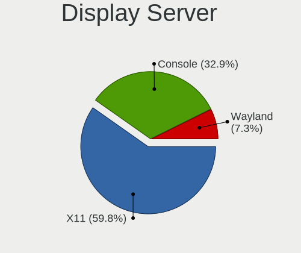
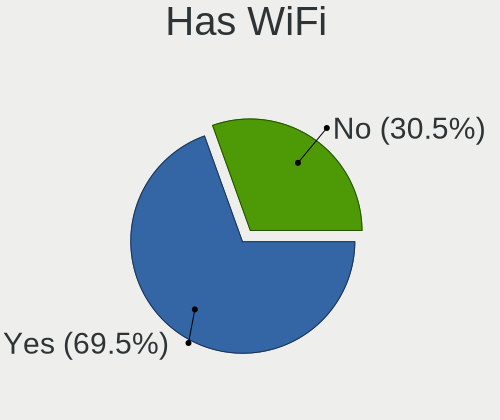
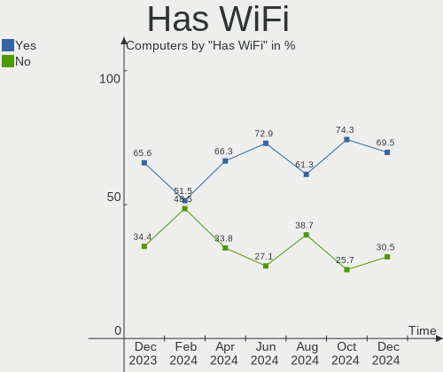
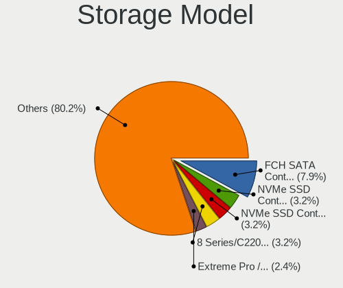
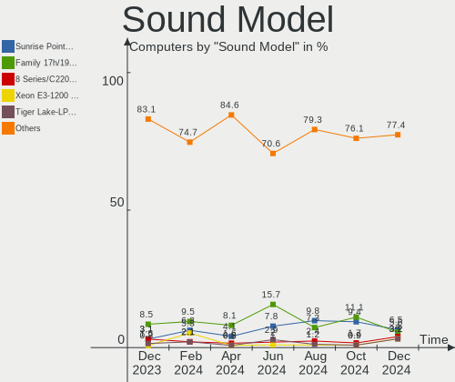
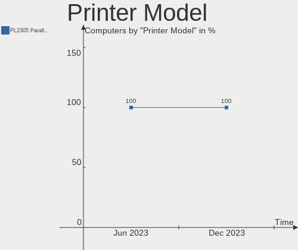

FreeBSD - Hardware Trends
-------------------------

A project to identify most popular hardware characteristics and track their change
over time based on data collected by BSD users at https://BSD-Hardware.info.

Anyone can contribute to this report by the [hw-probe](https://github.com/linuxhw/hw-probe/blob/master/INSTALL.BSD.md) tool:

    hw-probe -all -upload

This is a report for all computer types. See also reports for [desktops](/Dist/FreeBSD/Desktop/README.md) and [notebooks](/Dist/FreeBSD/Notebook/README.md).

This report is for one last month. Overall report since the beginning of time: [TestDays](https://github.com/bsdhw/TestDays)

Period: Mar, 2023.

Contents
--------

* [ System ](#system)
  - [ OS                       ](#os)
  - [ OS Family                ](#os-family)
  - [ Arch                     ](#arch)
  - [ DE                       ](#de)
  - [ Display Server           ](#display-server)
  - [ Display Manager          ](#display-manager)
  - [ OS Lang                  ](#os-lang)
  - [ Boot Mode                ](#boot-mode)
  - [ Filesystem               ](#filesystem)
  - [ Part. scheme             ](#part-scheme)

* [ Board ](#board)
  - [ Vendor                   ](#vendor)
  - [ Model                    ](#model)
  - [ Model Family             ](#model-family)
  - [ MFG Year                 ](#mfg-year)
  - [ Form Factor              ](#form-factor)
  - [ Coreboot                 ](#coreboot)
  - [ RAM Size                 ](#ram-size)
  - [ RAM Used                 ](#ram-used)
  - [ Total Drives             ](#total-drives)
  - [ Has CD-ROM               ](#has-cd-rom)
  - [ Has Ethernet             ](#has-ethernet)
  - [ Has WiFi                 ](#has-wifi)
  - [ Has Bluetooth            ](#has-bluetooth)

* [ Location ](#location)
  - [ Country                  ](#country)
  - [ City                     ](#city)

* [ Drives ](#drives)
  - [ Drive Vendor             ](#drive-vendor)
  - [ Drive Model              ](#drive-model)
  - [ HDD Vendor               ](#hdd-vendor)
  - [ SSD Vendor               ](#ssd-vendor)
  - [ Drive Kind               ](#drive-kind)
  - [ Drive Connector          ](#drive-connector)
  - [ Drive Size               ](#drive-size)
  - [ Space Total              ](#space-total)
  - [ Space Used               ](#space-used)
  - [ Malfunc. Drives          ](#malfunc-drives)
  - [ Malfunc. Drive Vendor    ](#malfunc-drive-vendor)
  - [ Malfunc. HDD Vendor      ](#malfunc-hdd-vendor)
  - [ Malfunc. Drive Kind      ](#malfunc-drive-kind)
  - [ Failed Drives            ](#failed-drives)
  - [ Failed Drive Vendor      ](#failed-drive-vendor)
  - [ Drive Status             ](#drive-status)

* [ Storage controller ](#storage-controller)
  - [ Storage Vendor           ](#storage-vendor)
  - [ Storage Model            ](#storage-model)
  - [ Storage Kind             ](#storage-kind)

* [ Processor ](#processor)
  - [ CPU Vendor               ](#cpu-vendor)
  - [ CPU Model                ](#cpu-model)
  - [ CPU Model Family         ](#cpu-model-family)
  - [ CPU Cores                ](#cpu-cores)
  - [ CPU Sockets              ](#cpu-sockets)
  - [ CPU Threads              ](#cpu-threads)
  - [ CPU Microarch            ](#cpu-microarch)

* [ Graphics ](#graphics)
  - [ GPU Vendor               ](#gpu-vendor)
  - [ GPU Model                ](#gpu-model)
  - [ GPU Combo                ](#gpu-combo)
  - [ GPU Driver               ](#gpu-driver)
  - [ GPU Memory               ](#gpu-memory)

* [ Monitor ](#monitor)
  - [ Monitor Vendor           ](#monitor-vendor)
  - [ Monitor Model            ](#monitor-model)
  - [ Monitor Resolution       ](#monitor-resolution)
  - [ Monitor Diagonal         ](#monitor-diagonal)
  - [ Monitor Width            ](#monitor-width)
  - [ Aspect Ratio             ](#aspect-ratio)
  - [ Monitor Area             ](#monitor-area)
  - [ Pixel Density            ](#pixel-density)
  - [ Multiple Monitors        ](#multiple-monitors)

* [ Network ](#network)
  - [ Net Controller Vendor    ](#net-controller-vendor)
  - [ Net Controller Model     ](#net-controller-model)
  - [ Wireless Vendor          ](#wireless-vendor)
  - [ Wireless Model           ](#wireless-model)
  - [ Ethernet Vendor          ](#ethernet-vendor)
  - [ Ethernet Model           ](#ethernet-model)
  - [ Net Controller Kind      ](#net-controller-kind)
  - [ Used Controller          ](#used-controller)
  - [ NICs                     ](#nics)
  - [ IPv6                     ](#ipv6)

* [ Bluetooth ](#bluetooth)
  - [ Bluetooth Vendor         ](#bluetooth-vendor)
  - [ Bluetooth Model          ](#bluetooth-model)

* [ Sound ](#sound)
  - [ Sound Vendor             ](#sound-vendor)
  - [ Sound Model              ](#sound-model)

* [ Memory ](#memory)
  - [ Memory Vendor            ](#memory-vendor)
  - [ Memory Model             ](#memory-model)
  - [ Memory Kind              ](#memory-kind)
  - [ Memory Form Factor       ](#memory-form-factor)
  - [ Memory Size              ](#memory-size)
  - [ Memory Speed             ](#memory-speed)

* [ Printers & scanners ](#printers--scanners)
  - [ Printer Vendor           ](#printer-vendor)
  - [ Printer Model            ](#printer-model)
  - [ Scanner Vendor           ](#scanner-vendor)
  - [ Scanner Model            ](#scanner-model)

* [ Camera ](#camera)
  - [ Camera Vendor            ](#camera-vendor)
  - [ Camera Model             ](#camera-model)

* [ Security ](#security)
  - [ Fingerprint Vendor       ](#fingerprint-vendor)
  - [ Fingerprint Model        ](#fingerprint-model)
  - [ Chipcard Vendor          ](#chipcard-vendor)
  - [ Chipcard Model           ](#chipcard-model)

* [ Unsupported ](#unsupported)
  - [ Unsupported Devices      ](#unsupported-devices)
  - [ Unsupported Device Types ](#unsupported-device-types)

System
------

OS
--

Installed operating systems

| Name                 | Computers | Percent |
|----------------------|-----------|---------|
| FreeBSD 13.1-p7      | 37        | 50%     |
| FreeBSD 13.1         | 9         | 12.16%  |
| FreeBSD 14.0-CURRENT | 7         | 9.46%   |
| FreeBSD 13.1-p5      | 5         | 6.76%   |
| FreeBSD 13.2-STABLE  | 3         | 4.05%   |
| FreeBSD 13.2-RC3     | 3         | 4.05%   |
| FreeBSD 12.4-STABLE  | 2         | 2.7%    |
| FreeBSD 13.2-RC5     | 1         | 1.35%   |
| FreeBSD 13.2-RC1     | 1         | 1.35%   |
| FreeBSD 13.1-STABLE  | 1         | 1.35%   |
| FreeBSD 13.1-p4      | 1         | 1.35%   |
| FreeBSD 13.1-p2      | 1         | 1.35%   |
| FreeBSD 13.0-p7      | 1         | 1.35%   |
| FreeBSD 12.4-p2      | 1         | 1.35%   |
| FreeBSD 12.2-p11     | 1         | 1.35%   |

OS Family
---------

OS without a version

| Name    | Computers | Percent |
|---------|-----------|---------|
| FreeBSD | 74        | 100%    |

Arch
----

OS architecture (x86_64, i586, etc.)

| Name  | Computers | Percent |
|-------|-----------|---------|
| amd64 | 69        | 93.24%  |
| arm64 | 3         | 4.05%   |
| i386  | 2         | 2.7%    |

DE
--

Desktop Environment

| Name       | Computers | Percent |
|------------|-----------|---------|
| Console    | 29        | 39.19%  |
| KDE5       | 17        | 22.97%  |
| XFCE       | 14        | 18.92%  |
| TWM        | 4         | 5.41%   |
| GNOME      | 3         | 4.05%   |
| AwesomeWM  | 2         | 2.7%    |
| X-Cinnamon | 1         | 1.35%   |
| MATE       | 1         | 1.35%   |
| Lumina     | 1         | 1.35%   |
| i3         | 1         | 1.35%   |
| dwm        | 1         | 1.35%   |

Display Server
--------------

X11 or Wayland

| Name    | Computers | Percent |
|---------|-----------|---------|
| X11     | 45        | 60.81%  |
| Console | 27        | 36.49%  |
| Wayland | 2         | 2.7%    |

Display Manager
---------------

SDDM, LightDM, etc.

| Name    | Computers | Percent |
|---------|-----------|---------|
| Console | 36        | 48.65%  |
| SDDM    | 15        | 20.27%  |
| SLiM    | 9         | 12.16%  |
| LightDM | 5         | 6.76%   |
| GDM     | 5         | 6.76%   |
| XDM     | 3         | 4.05%   |
| Ly      | 1         | 1.35%   |

OS Lang
-------

Language

| Lang            | Computers | Percent |
|-----------------|-----------|---------|
| C               | 48        | 64.86%  |
| fr_FR           | 6         | 8.11%   |
| en_US           | 6         | 8.11%   |
| Unknown         | 6         | 8.11%   |
| ru_RU           | 5         | 6.76%   |
| zh_CN           | 1         | 1.35%   |
| en_GB.ISO8859-1 | 1         | 1.35%   |
| de_DE           | 1         | 1.35%   |

Boot Mode
---------

EFI or BIOS

| Mode | Computers | Percent |
|------|-----------|---------|
| EFI  | 52        | 70.27%  |
| BIOS | 22        | 29.73%  |

Filesystem
----------

Type of filesystem

| Type   | Computers | Percent |
|--------|-----------|---------|
| Zfs    | 54        | 72.97%  |
| Ufs    | 17        | 22.97%  |
| Cd9660 | 2         | 2.7%    |
| Nfs    | 1         | 1.35%   |

Part. scheme
------------

Scheme of partitioning

| Type    | Computers | Percent |
|---------|-----------|---------|
| GPT     | 67        | 90.54%  |
| MBR     | 5         | 6.76%   |
| BSD     | 1         | 1.35%   |
| Unknown | 1         | 1.35%   |

Board
-----

Vendor
------

Motherboard manufacturer

| Name                    | Computers | Percent |
|-------------------------|-----------|---------|
| Lenovo                  | 11        | 14.86%  |
| Hewlett-Packard         | 10        | 13.51%  |
| ASUSTek Computer        | 9         | 12.16%  |
| Dell                    | 7         | 9.46%   |
| ASRock                  | 7         | 9.46%   |
| Intel                   | 3         | 4.05%   |
| Acer                    | 3         | 4.05%   |
| Raspberry Pi Foundation | 2         | 2.7%    |
| MSI                     | 2         | 2.7%    |
| Google                  | 2         | 2.7%    |
| ASRockRack              | 2         | 2.7%    |
| Apple                   | 2         | 2.7%    |
| Alienware               | 2         | 2.7%    |
| Supermicro              | 1         | 1.35%   |
| SolidRun                | 1         | 1.35%   |
| Shuttle                 | 1         | 1.35%   |
| Samsung Electronics     | 1         | 1.35%   |
| IP3 Technology          | 1         | 1.35%   |
| HUAWEI                  | 1         | 1.35%   |
| Huanan                  | 1         | 1.35%   |
| HMT                     | 1         | 1.35%   |
| GVC                     | 1         | 1.35%   |
| Gigabyte Technology     | 1         | 1.35%   |
| eMachines               | 1         | 1.35%   |
| Biostar                 | 1         | 1.35%   |

Model
-----

Motherboard model

| Name                                     | Computers | Percent |
|------------------------------------------|-----------|---------|
| HP Compaq 6200 Pro MT PC                 | 3         | 4.05%   |
| RPi Raspberry Pi                         | 2         | 2.7%    |
| HP Compaq Elite 8300 SFF                 | 2         | 2.7%    |
| Apple iMac10,1                           | 2         | 2.7%    |
| Supermicro X7DWE                         | 1         | 1.35%   |
| SolidRun CEX7 Platform                   | 1         | 1.35%   |
| Shuttle XH110                            | 1         | 1.35%   |
| Samsung 750XEE                           | 1         | 1.35%   |
| MSI MS-7B86                              | 1         | 1.35%   |
| MSI MS-7817                              | 1         | 1.35%   |
| Lenovo ThinkPad X230 2324A14             | 1         | 1.35%   |
| Lenovo ThinkPad X220 4286CTO             | 1         | 1.35%   |
| Lenovo ThinkPad X1 Extreme 20MF000QUS    | 1         | 1.35%   |
| Lenovo ThinkPad X1 Carbon 6th 20KHCTO1WW | 1         | 1.35%   |
| Lenovo ThinkPad T495 20NKS0HN1N          | 1         | 1.35%   |
| Lenovo ThinkPad T480 20L6S29E0T          | 1         | 1.35%   |
| Lenovo ThinkPad T16 Gen 1 21BVCTO1WW     | 1         | 1.35%   |
| Lenovo ThinkPad P52s 20LBS0FH00          | 1         | 1.35%   |
| Lenovo ThinkPad E495 20NEA00QUS          | 1         | 1.35%   |
| Lenovo ThinkPad E14 Gen 3 20Y7003SGE     | 1         | 1.35%   |
| Lenovo IdeaPad 5 15ALC05 82LN            | 1         | 1.35%   |
| IP3 ACN1S                                | 1         | 1.35%   |
| Intel SandyBridge Platform               | 1         | 1.35%   |
| Intel Jasper Lake Client Platform        | 1         | 1.35%   |
| Intel D510MO AAE76523-403                | 1         | 1.35%   |
| HUAWEI HVY-WXX9                          | 1         | 1.35%   |
| Huanan X99-QD4 V1.0                      | 1         | 1.35%   |
| HMT W041-TF-A-45                         | 1         | 1.35%   |
| HP Z440 Workstation                      | 1         | 1.35%   |
| HP t620 Quad Core TC                     | 1         | 1.35%   |
| HP ProBook 450 G8 Notebook PC            | 1         | 1.35%   |
| HP Compaq Pro 6300 MT                    | 1         | 1.35%   |
| HP Compaq dc7800 Small Form Factor       | 1         | 1.35%   |
| GVC EQUIUM 3200M                         | 1         | 1.35%   |
| Google Stout                             | 1         | 1.35%   |
| Google Kohaku                            | 1         | 1.35%   |
| Gigabyte B360M-D2V                       | 1         | 1.35%   |
| eMachines eM350                          | 1         | 1.35%   |
| Dell Precision 7720                      | 1         | 1.35%   |
| Dell PowerEdge T20                       | 1         | 1.35%   |

Model Family
------------

Motherboard model prefix

| Name               | Computers | Percent |
|--------------------|-----------|---------|
| Lenovo ThinkPad    | 10        | 13.51%  |
| HP Compaq          | 7         | 9.46%   |
| RPi Raspberry      | 2         | 2.7%    |
| Dell PowerEdge     | 2         | 2.7%    |
| Dell Inspiron      | 2         | 2.7%    |
| ASUS ASUS          | 2         | 2.7%    |
| Apple iMac10       | 2         | 2.7%    |
| Supermicro X7DWE   | 1         | 1.35%   |
| SolidRun CEX7      | 1         | 1.35%   |
| Shuttle XH110      | 1         | 1.35%   |
| Samsung 750XEE     | 1         | 1.35%   |
| MSI MS-7B86        | 1         | 1.35%   |
| MSI MS-7817        | 1         | 1.35%   |
| Lenovo IdeaPad     | 1         | 1.35%   |
| IP3 ACN1S          | 1         | 1.35%   |
| Intel SandyBridge  | 1         | 1.35%   |
| Intel Jasper       | 1         | 1.35%   |
| Intel D510MO       | 1         | 1.35%   |
| HUAWEI HVY-WXX9    | 1         | 1.35%   |
| Huanan X99-QD4     | 1         | 1.35%   |
| HMT W041-TF-A-45   | 1         | 1.35%   |
| HP Z440            | 1         | 1.35%   |
| HP t620            | 1         | 1.35%   |
| HP ProBook         | 1         | 1.35%   |
| GVC EQUIUM         | 1         | 1.35%   |
| Google Stout       | 1         | 1.35%   |
| Google Kohaku      | 1         | 1.35%   |
| Gigabyte B360M-D2V | 1         | 1.35%   |
| eMachines eM350    | 1         | 1.35%   |
| Dell Precision     | 1         | 1.35%   |
| Dell Latitude      | 1         | 1.35%   |
| Dell Edge          | 1         | 1.35%   |
| Biostar TH67B      | 1         | 1.35%   |
| ASUS TUF           | 1         | 1.35%   |
| ASUS ROG           | 1         | 1.35%   |
| ASUS PRO           | 1         | 1.35%   |
| ASUS PRIME         | 1         | 1.35%   |
| ASUS P5Q-E         | 1         | 1.35%   |
| ASUS M5A97         | 1         | 1.35%   |
| ASUS 1001P         | 1         | 1.35%   |

MFG Year
--------

Motherboard manufacture year

| Year    | Computers | Percent |
|---------|-----------|---------|
| 2022    | 18        | 24.32%  |
| 2019    | 7         | 9.46%   |
| 2012    | 6         | 8.11%   |
| 2011    | 6         | 8.11%   |
| 2021    | 5         | 6.76%   |
| 2020    | 5         | 6.76%   |
| 2014    | 5         | 6.76%   |
| 2023    | 4         | 5.41%   |
| 2018    | 4         | 5.41%   |
| 2009    | 3         | 4.05%   |
| 2008    | 3         | 4.05%   |
| 2016    | 2         | 2.7%    |
| 2015    | 2         | 2.7%    |
| 2010    | 2         | 2.7%    |
| 2017    | 1         | 1.35%   |
| Unknown | 1         | 1.35%   |

Form Factor
-----------

Physical design of the computer

| Name           | Computers | Percent |
|----------------|-----------|---------|
| Desktop        | 36        | 48.65%  |
| Notebook       | 32        | 43.24%  |
| System on chip | 2         | 2.7%    |
| All in one     | 2         | 2.7%    |
| Mini pc        | 1         | 1.35%   |
| Server         | 1         | 1.35%   |

Coreboot
--------

Have coreboot on board

| Used | Computers | Percent |
|------|-----------|---------|
| No   | 72        | 97.3%   |
| Yes  | 2         | 2.7%    |

RAM Size
--------

Total RAM memory

| Size in GB  | Computers | Percent |
|-------------|-----------|---------|
| 16.01-24.0  | 18        | 24.32%  |
| 8.01-16.0   | 17        | 22.97%  |
| 64.01-256.0 | 11        | 14.86%  |
| 4.01-8.0    | 10        | 13.51%  |
| 32.01-64.0  | 10        | 13.51%  |
| 2.01-3.0    | 3         | 4.05%   |
| 24.01-32.0  | 2         | 2.7%    |
| 3.01-4.0    | 1         | 1.35%   |
| 1.01-2.0    | 1         | 1.35%   |
| 0.01-0.5    | 1         | 1.35%   |

RAM Used
--------

Used RAM memory

| Used GB  | Computers | Percent |
|----------|-----------|---------|
| 0.51-1.0 | 25        | 33.78%  |
| 0.01-0.5 | 24        | 32.43%  |
| 1.01-2.0 | 15        | 20.27%  |
| 2.01-3.0 | 6         | 8.11%   |
| 3.01-4.0 | 3         | 4.05%   |
| 0        | 1         | 1.35%   |

Total Drives
------------

Number of drives on board

| Drives | Computers | Percent |
|--------|-----------|---------|
| 1      | 38        | 51.35%  |
| 2      | 14        | 18.92%  |
| 5      | 5         | 6.76%   |
| 3      | 5         | 6.76%   |
| 0      | 5         | 6.76%   |
| 4      | 4         | 5.41%   |
| 58     | 1         | 1.35%   |
| 13     | 1         | 1.35%   |
| 6      | 1         | 1.35%   |

Has CD-ROM
----------

Has CD-ROM on board

| Presented | Computers | Percent |
|-----------|-----------|---------|
| No        | 55        | 74.32%  |
| Yes       | 19        | 25.68%  |

Has Ethernet
------------

Has Ethernet on board

| Presented | Computers | Percent |
|-----------|-----------|---------|
| Yes       | 63        | 85.14%  |
| No        | 11        | 14.86%  |

Has WiFi
--------

Has WiFi module

| Presented | Computers | Percent |
|-----------|-----------|---------|
| Yes       | 40        | 54.05%  |
| No        | 34        | 45.95%  |

Has Bluetooth
-------------

Has Bluetooth module

| Presented | Computers | Percent |
|-----------|-----------|---------|
| No        | 41        | 55.41%  |
| Yes       | 33        | 44.59%  |

Location
--------

Country
-------

Geographic location (country)

| Country   | Computers | Percent |
|-----------|-----------|---------|
| USA       | 21        | 28.38%  |
| Canada    | 10        | 13.51%  |
| Russia    | 8         | 10.81%  |
| Germany   | 7         | 9.46%   |
| France    | 7         | 9.46%   |
| UK        | 5         | 6.76%   |
| Thailand  | 2         | 2.7%    |
| Sri Lanka | 2         | 2.7%    |
| Finland   | 2         | 2.7%    |
| China     | 2         | 2.7%    |
| Austria   | 2         | 2.7%    |
| Ukraine   | 1         | 1.35%   |
| Taiwan    | 1         | 1.35%   |
| Spain     | 1         | 1.35%   |
| Romania   | 1         | 1.35%   |
| Greece    | 1         | 1.35%   |
| Czechia   | 1         | 1.35%   |

City
----

Geographic location (city)

| City              | Computers | Percent |
|-------------------|-----------|---------|
| Montreal          | 7         | 9.46%   |
| Moscow            | 3         | 4.05%   |
| Melun             | 3         | 4.05%   |
| Vienna            | 2         | 2.7%    |
| Salem             | 2         | 2.7%    |
| Redmond           | 2         | 2.7%    |
| Pierrefonds       | 2         | 2.7%    |
| New York          | 2         | 2.7%    |
| Ludwigsburg       | 2         | 2.7%    |
| Fremont           | 2         | 2.7%    |
| Avon Park         | 2         | 2.7%    |
| Wenatchee         | 1         | 1.35%   |
| Voznesensk        | 1         | 1.35%   |
| Valladolid        | 1         | 1.35%   |
| Taipei            | 1         | 1.35%   |
| St. Albert        | 1         | 1.35%   |
| Shoreham-by-Sea   | 1         | 1.35%   |
| Shanghai          | 1         | 1.35%   |
| Saratov           | 1         | 1.35%   |
| Saint-Raphaël    | 1         | 1.35%   |
| Ruislip           | 1         | 1.35%   |
| Rio Dell          | 1         | 1.35%   |
| Petting           | 1         | 1.35%   |
| Perkasie          | 1         | 1.35%   |
| Overath           | 1         | 1.35%   |
| Novosibirsk       | 1         | 1.35%   |
| Nantes            | 1         | 1.35%   |
| Mulhouse          | 1         | 1.35%   |
| Miercurea-Ciuc    | 1         | 1.35%   |
| Lymington         | 1         | 1.35%   |
| London            | 1         | 1.35%   |
| Lake View         | 1         | 1.35%   |
| Kelaniya          | 1         | 1.35%   |
| Kamensk-Ural'skiy | 1         | 1.35%   |
| Horse Cave        | 1         | 1.35%   |
| Helsinki          | 1         | 1.35%   |
| Harrisburg        | 1         | 1.35%   |
| Greenbrier        | 1         | 1.35%   |
| Gifhorn           | 1         | 1.35%   |
| Espoo             | 1         | 1.35%   |

Drives
------

Drive Vendor
------------

Hard drive vendors

| Vendor              | Computers | Drives | Percent |
|---------------------|-----------|--------|---------|
| WDC                 | 20        | 38     | 18.87%  |
| Seagate             | 15        | 22     | 14.15%  |
| Samsung Electronics | 14        | 20     | 13.21%  |
| Crucial             | 12        | 14     | 11.32%  |
| Toshiba             | 7         | 18     | 6.6%    |
| Intel               | 6         | 14     | 5.66%   |
| SanDisk             | 3         | 3      | 2.83%   |
| Micron Technology   | 3         | 3      | 2.83%   |
| Kingston            | 3         | 4      | 2.83%   |
| HGST                | 3         | 37     | 2.83%   |
| Corsair             | 3         | 3      | 2.83%   |
| SSSTC               | 2         | 2      | 1.89%   |
| walram              | 1         | 1      | 0.94%   |
| UMIS                | 1         | 1      | 0.94%   |
| SK hynix            | 1         | 1      | 0.94%   |
| OEM                 | 1         | 1      | 0.94%   |
| Netac               | 1         | 1      | 0.94%   |
| MSI                 | 1         | 1      | 0.94%   |
| KIOXIA-EXCERIA      | 1         | 2      | 0.94%   |
| KINGBANK            | 1         | 1      | 0.94%   |
| HPT                 | 1         | 1      | 0.94%   |
| HPE                 | 1         | 5      | 0.94%   |
| Hoodisk             | 1         | 1      | 0.94%   |
| Hitachi             | 1         | 1      | 0.94%   |
| Hikvision           | 1         | 1      | 0.94%   |
| Fanxiang            | 1         | 2      | 0.94%   |
| China               | 1         | 1      | 0.94%   |

Drive Model
-----------

Hard drive models

| Model                                | Computers | Percent |
|--------------------------------------|-----------|---------|
| WDC WD80EFAX-68LHPN0 8TB             | 2         | 1.61%   |
| Toshiba HDWQ140 4TB                  | 2         | 1.61%   |
| Seagate ST4000DM000-1F2168 4TB       | 2         | 1.61%   |
| Seagate ST2000LM007-1R8174 2TB       | 2         | 1.61%   |
| Seagate ST2000DM008-2FR102 2TB       | 2         | 1.61%   |
| Crucial CT240BX500SSD1 240GB         | 2         | 1.61%   |
| Crucial CT1000MX500SSD1 1TB          | 2         | 1.61%   |
| WDC WDS500G1B0A-00H9H0 500GB         | 1         | 0.81%   |
| WDC WDS100T3X0C-00SJG0 1TB           | 1         | 0.81%   |
| WDC WD80EMAZ-00WJTA0 8TB             | 1         | 0.81%   |
| WDC WD80EFZX-68UW8N0 8TB             | 1         | 0.81%   |
| WDC WD80EDBZ-11B0ZA0 8TB             | 1         | 0.81%   |
| WDC WD80EDAZ-11TA3A0 8TB             | 1         | 0.81%   |
| WDC WD80EAZZ-00BKLB0 8TB             | 1         | 0.81%   |
| WDC WD7500BPKX-75HPJT0 752GB         | 1         | 0.81%   |
| WDC WD5000AAKX-60U6AA0 500GB         | 1         | 0.81%   |
| WDC WD5000AAKX-07U6AA1 500GB         | 1         | 0.81%   |
| WDC WD5000AAKS-40V2B0 500GB          | 1         | 0.81%   |
| WDC WD40EZRZ-22GXCB0 4TB             | 1         | 0.81%   |
| WDC WD30EFRX-68EUZN0 3TB             | 1         | 0.81%   |
| WDC WD20SPZX-00UA7T0 2TB             | 1         | 0.81%   |
| WDC WD20EZRZ-22Z5HB0 2TB             | 1         | 0.81%   |
| WDC WD20EZRZ-00Z5HB0 2TB             | 1         | 0.81%   |
| WDC WD20EFRX-68EUZN0 2TB             | 1         | 0.81%   |
| WDC WD20EFRX-68AX9N0 2TB             | 1         | 0.81%   |
| WDC WD20EARX-00PASB0 2TB             | 1         | 0.81%   |
| WDC WD15EADS-00P8B0 1.5TB            | 1         | 0.81%   |
| WDC WD140EDGZ-11B2DA2 14TB           | 1         | 0.81%   |
| WDC WD120EMFZ-11A6JA0 12TB           | 1         | 0.81%   |
| WDC WD120EMAZ-11BLFA0 12TB           | 1         | 0.81%   |
| WDC WD10SPZX-24Z10 1TB               | 1         | 0.81%   |
| WDC WD10JPVX-22JC3T0 1TB             | 1         | 0.81%   |
| WDC WD10EZRZ-00HTKB0 1TB             | 1         | 0.81%   |
| WDC WD10EZEX-08WN4A0 1TB             | 1         | 0.81%   |
| WDC WD1001FALS-00J7B1 1TB            | 1         | 0.81%   |
| WDC PC SN730 SDBQNTY-256G-1001 256GB | 1         | 0.81%   |
| WDC PC SN730 SDBPNTY-512G-1027 512GB | 1         | 0.81%   |
| walram SSD 120G                      | 1         | 0.81%   |
| UMIS RPJTJ512MEE1OWX 512GB           | 1         | 0.81%   |
| Toshiba MQ01ABF050 500GB             | 1         | 0.81%   |

HDD Vendor
----------

Hard disk drive vendors

| Vendor  | Computers | Drives | Percent |
|---------|-----------|--------|---------|
| WDC     | 16        | 34     | 37.21%  |
| Seagate | 14        | 21     | 32.56%  |
| Toshiba | 7         | 18     | 16.28%  |
| HGST    | 3         | 37     | 6.98%   |
| HPT     | 1         | 1      | 2.33%   |
| HPE     | 1         | 5      | 2.33%   |
| Hitachi | 1         | 1      | 2.33%   |

SSD Vendor
----------

Solid state drive vendors

| Vendor              | Computers | Drives | Percent |
|---------------------|-----------|--------|---------|
| Samsung Electronics | 10        | 15     | 27.03%  |
| Crucial             | 9         | 10     | 24.32%  |
| Intel               | 4         | 12     | 10.81%  |
| SanDisk             | 3         | 3      | 8.11%   |
| Kingston            | 2         | 3      | 5.41%   |
| WDC                 | 1         | 1      | 2.7%    |
| walram              | 1         | 1      | 2.7%    |
| Seagate             | 1         | 1      | 2.7%    |
| Netac               | 1         | 1      | 2.7%    |
| MSI                 | 1         | 1      | 2.7%    |
| Hikvision           | 1         | 1      | 2.7%    |
| Fanxiang            | 1         | 2      | 2.7%    |
| Corsair             | 1         | 1      | 2.7%    |
| China               | 1         | 1      | 2.7%    |

Drive Kind
----------

HDD or SSD

| Kind | Computers | Drives | Percent |
|------|-----------|--------|---------|
| SSD  | 34        | 53     | 36.17%  |
| HDD  | 34        | 117    | 36.17%  |
| NVMe | 26        | 29     | 27.66%  |

Drive Connector
---------------

SATA, SAS, NVMe, etc.

| Type | Computers | Drives | Percent |
|------|-----------|--------|---------|
| SATA | 51        | 170    | 66.23%  |
| NVMe | 26        | 29     | 33.77%  |

Drive Size
----------

Size of hard drive

| Size in TB | Computers | Drives | Percent |
|------------|-----------|--------|---------|
| 0.01-0.5   | 32        | 48     | 42.67%  |
| 0.51-1.0   | 15        | 19     | 20%     |
| 1.01-2.0   | 13        | 22     | 17.33%  |
| 3.01-4.0   | 8         | 61     | 10.67%  |
| 2.01-3.0   | 3         | 6      | 4%      |
| 10.01-20.0 | 2         | 3      | 2.67%   |
| 4.01-10.0  | 2         | 11     | 2.67%   |

Space Total
-----------

Amount of disk space available on the file system

| Size in GB     | Computers | Percent |
|----------------|-----------|---------|
| 101-250        | 19        | 25.68%  |
| 251-500        | 15        | 20.27%  |
| 501-1000       | 12        | 16.22%  |
| 1001-2000      | 7         | 9.46%   |
| 51-100         | 7         | 9.46%   |
| 21-50          | 5         | 6.76%   |
| 1-20           | 5         | 6.76%   |
| More than 3000 | 3         | 4.05%   |
| 2001-3000      | 1         | 1.35%   |

Space Used
----------

Amount of used disk space

| Used GB   | Computers | Percent |
|-----------|-----------|---------|
| 1-20      | 58        | 78.38%  |
| 21-50     | 9         | 12.16%  |
| 51-100    | 3         | 4.05%   |
| 1001-2000 | 2         | 2.7%    |
| 101-250   | 1         | 1.35%   |
| 501-1000  | 1         | 1.35%   |

Malfunc. Drives
---------------

Drive models with a malfunction

| Model                                 | Computers | Drives | Percent |
|---------------------------------------|-----------|--------|---------|
| WDC WD80EDAZ-11TA3A0 8TB              | 1         | 1      | 7.14%   |
| WDC WD5000AAKX-60U6AA0 500GB          | 1         | 1      | 7.14%   |
| WDC WD10EZRZ-00HTKB0 1TB              | 1         | 1      | 7.14%   |
| walram SSD 120G                       | 1         | 1      | 7.14%   |
| Toshiba MK1665GSX 160GB               | 1         | 1      | 7.14%   |
| Seagate ST4000VN008-2DR166 4TB        | 1         | 2      | 7.14%   |
| Seagate ST3500418ASQ 500GB            | 1         | 1      | 7.14%   |
| SanDisk SSD PLUS 240 GB               | 1         | 1      | 7.14%   |
| Samsung Electronics SSD 870 EVO 250GB | 1         | 3      | 7.14%   |
| Kingston SV300S37A60G 64GB            | 1         | 2      | 7.14%   |
| Intel SSDSA2M160G2LE 160GB            | 1         | 1      | 7.14%   |
| Hitachi HUA722020ALA330 2TB           | 1         | 1      | 7.14%   |
| Fanxiang S101-240GB                   | 1         | 1      | 7.14%   |
| Crucial CT240M500SSD1 240GB           | 1         | 1      | 7.14%   |

Malfunc. Drive Vendor
---------------------

Vendors of faulty drives

| Vendor              | Computers | Drives | Percent |
|---------------------|-----------|--------|---------|
| WDC                 | 3         | 3      | 21.43%  |
| Seagate             | 2         | 3      | 14.29%  |
| walram              | 1         | 1      | 7.14%   |
| Toshiba             | 1         | 1      | 7.14%   |
| SanDisk             | 1         | 1      | 7.14%   |
| Samsung Electronics | 1         | 3      | 7.14%   |
| Kingston            | 1         | 2      | 7.14%   |
| Intel               | 1         | 1      | 7.14%   |
| Hitachi             | 1         | 1      | 7.14%   |
| Fanxiang            | 1         | 1      | 7.14%   |
| Crucial             | 1         | 1      | 7.14%   |

Malfunc. HDD Vendor
-------------------

Vendors of faulty HDD drives

| Vendor  | Computers | Drives | Percent |
|---------|-----------|--------|---------|
| WDC     | 3         | 3      | 42.86%  |
| Seagate | 2         | 3      | 28.57%  |
| Toshiba | 1         | 1      | 14.29%  |
| Hitachi | 1         | 1      | 14.29%  |

Malfunc. Drive Kind
-------------------

Kinds of faulty drives

| Kind | Computers | Drives | Percent |
|------|-----------|--------|---------|
| SSD  | 7         | 10     | 50%     |
| HDD  | 7         | 8      | 50%     |

Failed Drives
-------------

Failed drive models

Zero info for selected period =(

Failed Drive Vendor
-------------------

Failed drive vendors

Zero info for selected period =(

Drive Status
------------

Number of failed and malfunc. drives

| Status   | Computers | Drives | Percent |
|----------|-----------|--------|---------|
| Works    | 64        | 176    | 81.01%  |
| Malfunc  | 13        | 18     | 16.46%  |
| Detected | 2         | 5      | 2.53%   |

Storage controller
------------------

Storage Vendor
--------------

Storage controller vendors

| Vendor                                  | Computers | Percent |
|-----------------------------------------|-----------|---------|
| Intel                                   | 44        | 45.36%  |
| AMD                                     | 14        | 14.43%  |
| Samsung Electronics                     | 7         | 7.22%   |
| Sandisk                                 | 5         | 5.15%   |
| Broadcom / LSI                          | 4         | 4.12%   |
| Phison Electronics                      | 3         | 3.09%   |
| Micron/Crucial Technology               | 3         | 3.09%   |
| Micron Technology                       | 3         | 3.09%   |
| Solid State Storage Technology          | 2         | 2.06%   |
| Silicon Motion                          | 2         | 2.06%   |
| Nvidia                                  | 2         | 2.06%   |
| Marvell Technology Group                | 2         | 2.06%   |
| SK hynix                                | 1         | 1.03%   |
| Shenzhen Unionmemory Information System | 1         | 1.03%   |
| KIOXIA                                  | 1         | 1.03%   |
| Kingston Technology Company             | 1         | 1.03%   |
| HighPoint Technologies                  | 1         | 1.03%   |
| ADATA Technology                        | 1         | 1.03%   |

Storage Model
-------------

Storage controller models

| Model                                                                          | Computers | Percent |
|--------------------------------------------------------------------------------|-----------|---------|
| AMD FCH SATA Controller [AHCI mode]                                            | 9         | 8.65%   |
| Intel 6 Series/C200 Series Chipset Family 6 port Desktop SATA AHCI Controller  | 5         | 4.81%   |
| Unknown                                                                        | 5         | 4.81%   |
| Intel NM10/ICH7 Family SATA Controller [AHCI mode]                             | 4         | 3.85%   |
| SanDisk WD Black SN750 / PC SN730 NVMe SSD                                     | 3         | 2.88%   |
| Micron NVMe Storage Controller                                                 | 3         | 2.88%   |
| Intel 8 Series/C220 Series Chipset Family 6-port SATA Controller 1 [AHCI mode] | 3         | 2.88%   |
| Silicon Motion SM2263EN/SM2263XT SSD Controller                                | 2         | 1.92%   |
| Samsung NVMe SSD Controller SM981/PM981/PM983                                  | 2         | 1.92%   |
| Samsung NVMe SSD Controller SM961/PM961/SM963                                  | 2         | 1.92%   |
| Samsung NVMe SSD Controller 980                                                | 2         | 1.92%   |
| Nvidia MCP79 AHCI Controller                                                   | 2         | 1.92%   |
| Micron/Crucial P2 NVMe PCIe SSD                                                | 2         | 1.92%   |
| Intel Sunrise Point-LP SATA Controller [AHCI mode]                             | 2         | 1.92%   |
| Intel Q170/Q150/B150/H170/H110/Z170/CM236 Chipset SATA Controller [AHCI Mode]  | 2         | 1.92%   |
| Intel Comet Lake SATA AHCI Controller                                          | 2         | 1.92%   |
| Intel Cannon Lake PCH SATA AHCI Controller                                     | 2         | 1.92%   |
| Intel Atom Processor E3800 Series SATA AHCI Controller                         | 2         | 1.92%   |
| Intel Alder Lake-S PCH SATA Controller [AHCI Mode]                             | 2         | 1.92%   |
| Intel 82801 Mobile SATA Controller [RAID mode]                                 | 2         | 1.92%   |
| Intel 7 Series/C210 Series Chipset Family 6-port SATA Controller [AHCI mode]   | 2         | 1.92%   |
| Intel 7 Series Chipset Family 6-port SATA Controller [AHCI mode]               | 2         | 1.92%   |
| Intel 400 Series Chipset Family SATA AHCI Controller                           | 2         | 1.92%   |
| Broadcom / LSI SAS2008 PCI-Express Fusion-MPT SAS-2 [Falcon]                   | 2         | 1.92%   |
| AMD SB7x0/SB8x0/SB9x0 SATA Controller [AHCI mode]                              | 2         | 1.92%   |
| AMD 500 Series Chipset SATA Controller                                         | 2         | 1.92%   |
| SK hynix Platinum P41 NVMe Solid State Drive 2TB                               | 1         | 0.96%   |
| Sandisk Western Digital WD Black SN850X NVMe SSD                               | 1         | 0.96%   |
| Samsung NVMe SSD Controller PM9A1/PM9A3/980PRO                                 | 1         | 0.96%   |
| Phison PS5013 E13 NVMe Controller                                              | 1         | 0.96%   |
| Phison E16 PCIe4 NVMe Controller                                               | 1         | 0.96%   |
| Phison E12 NVMe Controller                                                     | 1         | 0.96%   |
| Micron/Crucial P5 Plus NVMe PCIe SSD                                           | 1         | 0.96%   |
| Marvell Group 88SE9123 PCIe SATA 6.0 Gb/s controller                           | 1         | 0.96%   |
| Marvell Group 88SE6111/6121 SATA II / PATA Controller                          | 1         | 0.96%   |
| KIOXIA NVMe SSD                                                                | 1         | 0.96%   |
| Intel Volume Management Device NVMe RAID Controller                            | 1         | 0.96%   |
| Intel SSD Pro 7600p/760p/E 6100p Series                                        | 1         | 0.96%   |
| Intel SSD 660P Series                                                          | 1         | 0.96%   |
| Intel Jasper Lake SATA AHCI Controller                                         | 1         | 0.96%   |

Storage Kind
------------

Kind of storage controller (IDE, SATA, NVMe, SAS, ...)

| Kind | Computers | Percent |
|------|-----------|---------|
| SATA | 50        | 53.76%  |
| NVMe | 29        | 31.18%  |
| IDE  | 6         | 6.45%   |
| RAID | 4         | 4.3%    |
| SAS  | 3         | 3.23%   |
| SCSI | 1         | 1.08%   |

Processor
---------

CPU Vendor
----------

Processor vendors

| Vendor | Computers | Percent |
|--------|-----------|---------|
| Intel  | 50        | 67.57%  |
| AMD    | 21        | 28.38%  |
| ARM    | 2         | 2.7%    |
| NXP    | 1         | 1.35%   |

CPU Model
---------

Processor models

| Model                                  | Computers | Percent |
|----------------------------------------|-----------|---------|
| Intel Core i3-2100 CPU @ 3.10GHz       | 3         | 4.05%   |
| Intel Pentium CPU G3220 @ 3.00GHz      | 2         | 2.7%    |
| Intel Core i5-8350U CPU @ 1.70GHz      | 2         | 2.7%    |
| Intel Core i5-3470 CPU @ 3.20GHz       | 2         | 2.7%    |
| Intel Core 2 Duo CPU E7600 @ 3.06GHz   | 2         | 2.7%    |
| Intel Atom CPU N450 @ 1.66GHz          | 2         | 2.7%    |
| ARM Cortex-A72 r0p3                    | 2         | 2.7%    |
| AMD Ryzen 9 3900X 12-Core Processor    | 2         | 2.7%    |
| AMD Ryzen 5 5600G with Radeon Graphics | 2         | 2.7%    |
| NXP Cortex-A72                         | 1         | 1.35%   |
| Intel Xeon E-2124 CPU @ 3.30GHz        | 1         | 1.35%   |
| Intel Xeon CPU E5472 @ 3.00GHz         | 1         | 1.35%   |
| Intel Xeon CPU E5-2670 v3 @ 2.30GHz    | 1         | 1.35%   |
| Intel Xeon CPU E5-2640 v4 @ 2.40GHz    | 1         | 1.35%   |
| Intel Xeon CPU E3-1265L V2 @ 2.50GHz   | 1         | 1.35%   |
| Intel Xeon CPU E3-1230 V2 @ 3.30GH     | 1         | 1.35%   |
| Intel Pentium M                        | 1         | 1.35%   |
| Intel Pentium II                       | 1         | 1.35%   |
| Intel Pentium CPU N3540 @ 2.16GHz      | 1         | 1.35%   |
| Intel Core i7-8850H CPU @ 2.60GHz      | 1         | 1.35%   |
| Intel Core i7-8650U CPU @ 1.90GHz      | 1         | 1.35%   |
| Intel Core i7-7820HQ CPU @ 2.90GHz     | 1         | 1.35%   |
| Intel Core i7-7500U CPU @ 2.70GHz      | 1         | 1.35%   |
| Intel Core i7-6500U CPU @ 2.50GHz      | 1         | 1.35%   |
| Intel Core i7-4700MQ CPU @ 2.40GHz     | 1         | 1.35%   |
| Intel Core i7-2620M CPU @ 2.70GHz      | 1         | 1.35%   |
| Intel Core i7-10700 CPU @ 2.90GHz      | 1         | 1.35%   |
| Intel Core i5-9400F CPU @ 2.90GHz      | 1         | 1.35%   |
| Intel Core i5-8300H CPU @ 2.30GHz      | 1         | 1.35%   |
| Intel Core i5-3320M CPU @ 2.60GHz      | 1         | 1.35%   |
| Intel Core i5-10300H CPU @ 2.50GHz     | 1         | 1.35%   |
| Intel Core i5-10210U CPU @ 1.60GHz     | 1         | 1.35%   |
| Intel Core i3-7100 CPU @ 3.90GHz       | 1         | 1.35%   |
| Intel Core i3-3240 CPU @ 3.40GHz       | 1         | 1.35%   |
| Intel Core i3-10100 CPU @ 3.60GHz      | 1         | 1.35%   |
| Intel Core 2 Quad CPU Q9300 @ 2.50GHz  | 1         | 1.35%   |
| Intel Core 2 Quad CPU Q6600 @ 2.40GHz  | 1         | 1.35%   |
| Intel Celeron N5100 @ 1.10GHz          | 1         | 1.35%   |
| Intel Celeron CPU 1007U @ 1.50GHz      | 1         | 1.35%   |
| Intel Atom CPU N2600 @ 1.60GHz         | 1         | 1.35%   |

CPU Model Family
----------------

Processor model prefix

| Model             | Computers | Percent |
|-------------------|-----------|---------|
| Intel Core i5     | 9         | 12.16%  |
| Intel Core i7     | 8         | 10.81%  |
| AMD Ryzen 5       | 8         | 10.81%  |
| Other             | 6         | 8.11%   |
| Intel Xeon        | 6         | 8.11%   |
| Intel Core i3     | 6         | 8.11%   |
| Intel Atom        | 5         | 6.76%   |
| Intel Pentium     | 4         | 5.41%   |
| AMD Ryzen 9       | 3         | 4.05%   |
| AMD Ryzen 7       | 3         | 4.05%   |
| Intel Core 2 Quad | 2         | 2.7%    |
| Intel Core 2 Duo  | 2         | 2.7%    |
| Intel Celeron     | 2         | 2.7%    |
| ARM Cortex        | 2         | 2.7%    |
| AMD Ryzen 5 PRO   | 2         | 2.7%    |
| AMD EPYC          | 2         | 2.7%    |
| Intel Pentium M   | 1         | 1.35%   |
| AMD GX            | 1         | 1.35%   |
| AMD FX            | 1         | 1.35%   |
| AMD E             | 1         | 1.35%   |

CPU Cores
---------

Number of processor cores

| Number  | Computers | Percent |
|---------|-----------|---------|
| 4       | 21        | 28.38%  |
| 2       | 16        | 21.62%  |
| 12      | 10        | 13.51%  |
| Unknown | 6         | 8.11%   |
| 8       | 5         | 6.76%   |
| 32      | 3         | 4.05%   |
| 16      | 3         | 4.05%   |
| 6       | 3         | 4.05%   |
| 1       | 3         | 4.05%   |
| 24      | 2         | 2.7%    |
| 64      | 1         | 1.35%   |
| 10      | 1         | 1.35%   |

CPU Sockets
-----------

Number of sockets

| Number  | Computers | Percent |
|---------|-----------|---------|
| 1       | 69        | 93.24%  |
| 2       | 3         | 4.05%   |
| Unknown | 2         | 2.7%    |

CPU Threads
-----------

Threads per core (Hyper-Threading)

| Number  | Computers | Percent |
|---------|-----------|---------|
| 1       | 38        | 51.35%  |
| 2       | 29        | 39.19%  |
| Unknown | 7         | 9.46%   |

CPU Microarch
-------------

Microarchitecture

| Name        | Computers | Percent |
|-------------|-----------|---------|
| KabyLake    | 11        | 14.86%  |
| Unknown     | 10        | 13.51%  |
| Zen 3       | 7         | 9.46%   |
| IvyBridge   | 7         | 9.46%   |
| Zen 2       | 4         | 5.41%   |
| SandyBridge | 4         | 5.41%   |
| Penryn      | 4         | 5.41%   |
| Haswell     | 4         | 5.41%   |
| Bonnell     | 4         | 5.41%   |
| Zen         | 3         | 4.05%   |
| CometLake   | 3         | 4.05%   |
| Zen+        | 2         | 2.7%    |
| Silvermont  | 2         | 2.7%    |
| P6          | 2         | 2.7%    |
| TigerLake   | 1         | 1.35%   |
| Skylake     | 1         | 1.35%   |
| Piledriver  | 1         | 1.35%   |
| Jaguar      | 1         | 1.35%   |
| Core        | 1         | 1.35%   |
| Broadwell   | 1         | 1.35%   |
| Bobcat      | 1         | 1.35%   |

Graphics
--------

GPU Vendor
----------

Vendors of graphics cards

| Vendor                               | Computers | Percent |
|--------------------------------------|-----------|---------|
| Intel                                | 37        | 46.84%  |
| Nvidia                               | 19        | 24.05%  |
| AMD                                  | 19        | 24.05%  |
| Silicon Motion                       | 1         | 1.27%   |
| NVidia / SGS Thomson (Joint Venture) | 1         | 1.27%   |
| Matrox Electronics Systems           | 1         | 1.27%   |
| ASPEED Technology                    | 1         | 1.27%   |

GPU Model
---------

Graphics card models

| Model                                                                         | Computers | Percent |
|-------------------------------------------------------------------------------|-----------|---------|
| AMD Cezanne [Radeon Vega Series / Radeon Vega Mobile Series]                  | 6         | 7.5%    |
| Intel 2nd Generation Core Processor Family Integrated Graphics Controller     | 4         | 5%      |
| Intel UHD Graphics 620                                                        | 3         | 3.75%   |
| Intel Atom Processor D4xx/D5xx/N4xx/N5xx Integrated Graphics Controller       | 3         | 3.75%   |
| Nvidia MCP7A [GeForce 9400]                                                   | 2         | 2.5%    |
| Nvidia GP108 [GeForce GT 1030]                                                | 2         | 2.5%    |
| Intel Xeon E3-1200 v3/4th Gen Core Processor Integrated Graphics Controller   | 2         | 2.5%    |
| Intel Xeon E3-1200 v2/3rd Gen Core processor Graphics Controller              | 2         | 2.5%    |
| Intel HD Graphics 630                                                         | 2         | 2.5%    |
| Intel CometLake-S GT2 [UHD Graphics 630]                                      | 2         | 2.5%    |
| Intel CoffeeLake-H GT2 [UHD Graphics 630]                                     | 2         | 2.5%    |
| Intel Atom Processor Z36xxx/Z37xxx Series Graphics & Display                  | 2         | 2.5%    |
| Intel 3rd Gen Core processor Graphics Controller                              | 2         | 2.5%    |
| AMD Picasso/Raven 2 [Radeon Vega Series / Radeon Vega Mobile Series]          | 2         | 2.5%    |
| AMD Lucienne                                                                  | 2         | 2.5%    |
| Silicon Motion SM712 LynxEM+                                                  | 1         | 1.25%   |
| Nvidia TU117M                                                                 | 1         | 1.25%   |
| Nvidia TU117 [GeForce GTX 1650]                                               | 1         | 1.25%   |
| Nvidia TU106 [GeForce RTX 2060 Rev. A]                                        | 1         | 1.25%   |
| Nvidia GT218 [NVS 300]                                                        | 1         | 1.25%   |
| Nvidia GP108GLM [Quadro P500 Mobile]                                          | 1         | 1.25%   |
| Nvidia GP107M [GeForce GTX 1050 Ti Mobile]                                    | 1         | 1.25%   |
| Nvidia GP107M [GeForce GTX 1050 Mobile]                                       | 1         | 1.25%   |
| Nvidia GP107 [GeForce GTX 1050 Ti]                                            | 1         | 1.25%   |
| Nvidia GP106 [GeForce GTX 1060 3GB]                                           | 1         | 1.25%   |
| Nvidia GP104GLM [Quadro P3000 Mobile]                                         | 1         | 1.25%   |
| Nvidia GM107GL [Quadro K2200]                                                 | 1         | 1.25%   |
| Nvidia GK106M [GeForce GTX 765M]                                              | 1         | 1.25%   |
| Nvidia GA107M [GeForce RTX 3050 Ti Mobile]                                    | 1         | 1.25%   |
| Nvidia GA106 [RTX A2000]                                                      | 1         | 1.25%   |
| Nvidia AD102 [GeForce RTX 4090]                                               | 1         | 1.25%   |
| NVidia / SGS Thomson (Joint Venture) Riva128                                  | 1         | 1.25%   |
| Matrox Electronics Systems Integrated Matrox G200eW3 Graphics Controller      | 1         | 1.25%   |
| Intel Xeon E3-1200 v2/Ivy Bridge Graphics Controller                          | 1         | 1.25%   |
| Intel TigerLake-LP GT2 [Iris Xe Graphics]                                     | 1         | 1.25%   |
| Intel Skylake GT2 [HD Graphics 520]                                           | 1         | 1.25%   |
| Intel Mobile 945GM/GMS/GME, 943/940GML Express Integrated Graphics Controller | 1         | 1.25%   |
| Intel Mobile 945GM/GMS, 943/940GML Express Integrated Graphics Controller     | 1         | 1.25%   |
| Intel JasperLake [UHD Graphics]                                               | 1         | 1.25%   |
| Intel HD Graphics 620                                                         | 1         | 1.25%   |

GPU Combo
---------

Combinations of graphics cards

| Name                                     | Computers | Percent |
|------------------------------------------|-----------|---------|
| 1 x Intel                                | 26        | 35.14%  |
| 1 x AMD                                  | 16        | 21.62%  |
| 1 x Nvidia                               | 12        | 16.22%  |
| Intel + Nvidia                           | 6         | 8.11%   |
| Other                                    | 4         | 5.41%   |
| 2 x Intel                                | 3         | 4.05%   |
| Intel + AMD                              | 2         | 2.7%    |
| 1 x Silicon Motion                       | 1         | 1.35%   |
| 1 x NVidia / SGS Thomson (Joint Venture) | 1         | 1.35%   |
| 1 x Matrox                               | 1         | 1.35%   |
| 1 x ASPEED                               | 1         | 1.35%   |
| AMD + Nvidia                             | 1         | 1.35%   |

GPU Driver
----------

Free vs proprietary

| Driver      | Computers | Percent |
|-------------|-----------|---------|
| Free        | 59        | 79.73%  |
| Proprietary | 9         | 12.16%  |
| Unknown     | 6         | 8.11%   |

GPU Memory
----------

Total video memory

| Size in GB | Computers | Percent |
|------------|-----------|---------|
| Unknown    | 57        | 77.03%  |
| 0.01-0.5   | 7         | 9.46%   |
| 1.01-2.0   | 3         | 4.05%   |
| 7.01-8.0   | 2         | 2.7%    |
| 5.01-6.0   | 2         | 2.7%    |
| 3.01-4.0   | 2         | 2.7%    |
| 0.51-1.0   | 1         | 1.35%   |

Monitor
-------

Monitor Vendor
--------------

Monitor vendors

| Vendor               | Computers | Percent |
|----------------------|-----------|---------|
| Apple                | 2         | 25%     |
| Philips              | 1         | 12.5%   |
| LG Electronics       | 1         | 12.5%   |
| Lenovo Group Limited | 1         | 12.5%   |
| Dell                 | 1         | 12.5%   |
| Acer                 | 1         | 12.5%   |
| Unknown              | 1         | 12.5%   |

Monitor Model
-------------

Monitor models

| Model                                                  | Computers | Percent |
|--------------------------------------------------------|-----------|---------|
| Apple LCD Monitor Color LCD 1920x1080                  | 2         | 22.22%  |
| Philips LCD Monitor PHL 326E8F 2560x1440               | 1         | 11.11%  |
| LG Electronics LCD Monitor LG Ultra HD                 | 1         | 11.11%  |
| Lenovo Group Limited LCD Monitor LEN P27h-10 2560x1440 | 1         | 11.11%  |
| Dell LCD Monitor P2418HZ 3840x1080                     | 1         | 11.11%  |
| Dell LCD Monitor P2219H                                | 1         | 11.11%  |
| Acer LCD Monitor QG241Y 1920x1080                      | 1         | 11.11%  |
| Unknown                                                | 1         | 11.11%  |

Monitor Resolution
------------------

Monitor screen resolution

| Resolution      | Computers | Percent |
|-----------------|-----------|---------|
| 1920x1080 (FHD) | 3         | 33.33%  |
| 2560x1440 (QHD) | 2         | 22.22%  |
| Unknown         | 2         | 22.22%  |
| 3840x2160 (4K)  | 1         | 11.11%  |
| 3840x1080       | 1         | 11.11%  |

Monitor Diagonal
----------------

Diagonal size in inches

| Inches  | Computers | Percent |
|---------|-----------|---------|
| Unknown | 7         | 100%    |

Monitor Width
-------------

Physical width

| Width in mm | Computers | Percent |
|-------------|-----------|---------|
| Unknown     | 7         | 100%    |

Aspect Ratio
------------

Proportional relationship between the width and the height

| Ratio   | Computers | Percent |
|---------|-----------|---------|
| Unknown | 7         | 100%    |

Monitor Area
------------

Area in inch²

| Area in inch² | Computers | Percent |
|----------------|-----------|---------|
| Unknown        | 7         | 100%    |

Pixel Density
-------------

Pixels per inch

| Density | Computers | Percent |
|---------|-----------|---------|
| Unknown | 7         | 100%    |

Multiple Monitors
-----------------

Total monitors connected

| Total | Computers | Percent |
|-------|-----------|---------|
| 0     | 37        | 50%     |
| 1     | 35        | 47.3%   |
| 2     | 2         | 2.7%    |

Network
-------

Net Controller Vendor
---------------------

Controller vendors

| Vendor                        | Computers | Percent |
|-------------------------------|-----------|---------|
| Intel                         | 45        | 42.06%  |
| Realtek Semiconductor         | 37        | 34.58%  |
| Qualcomm Atheros              | 9         | 8.41%   |
| Broadcom                      | 5         | 4.67%   |
| Nvidia                        | 2         | 1.87%   |
| Marvell Technology Group      | 2         | 1.87%   |
| TP-Link                       | 1         | 0.93%   |
| Shenzhen Goodix Technology    | 1         | 0.93%   |
| OnePlus Technology (Shenzhen) | 1         | 0.93%   |
| MediaTek                      | 1         | 0.93%   |
| Dresden Elektronik            | 1         | 0.93%   |
| D-Link System                 | 1         | 0.93%   |
| American Megatrends           | 1         | 0.93%   |

Net Controller Model
--------------------

Controller models

| Model                                                                   | Computers | Percent |
|-------------------------------------------------------------------------|-----------|---------|
| Realtek RTL8111/8168/8411 PCI Express Gigabit Ethernet Controller       | 25        | 20%     |
| Intel 82579LM Gigabit Network Connection (Lewisville)                   | 9         | 7.2%    |
| Intel I211 Gigabit Network Connection                                   | 5         | 4%      |
| Intel Wi-Fi 6 AX210/AX211/AX411 160MHz                                  | 4         | 3.2%    |
| Realtek RTL810xE PCI Express Fast Ethernet controller                   | 3         | 2.4%    |
| Intel Wireless 8265 / 8275                                              | 3         | 2.4%    |
| Intel Ethernet Connection (4) I219-LM                                   | 3         | 2.4%    |
| Intel 82574L Gigabit Network Connection                                 | 3         | 2.4%    |
| Realtek RTL8125 2.5GbE Controller                                       | 2         | 1.6%    |
| Realtek Killer E3000 2.5GbE Controller                                  | 2         | 1.6%    |
| Qualcomm Atheros AR9462 Wireless Network Adapter                        | 2         | 1.6%    |
| Qualcomm Atheros AR928X Wireless Network Adapter (PCI-Express)          | 2         | 1.6%    |
| Qualcomm Atheros AR8132 Fast Ethernet                                   | 2         | 1.6%    |
| Nvidia MCP79 Ethernet                                                   | 2         | 1.6%    |
| Intel Wireless-AC 9260                                                  | 2         | 1.6%    |
| Intel Wi-Fi 6 AX200                                                     | 2         | 1.6%    |
| Intel Ethernet Controller X550                                          | 2         | 1.6%    |
| Intel Cannon Lake PCH CNVi WiFi                                         | 2         | 1.6%    |
| Intel Alder Lake-P PCH CNVi WiFi                                        | 2         | 1.6%    |
| Broadcom NetXtreme BCM5720 Gigabit Ethernet PCIe                        | 2         | 1.6%    |
| TP-Link TL-WN722N v2/v3 [Realtek RTL8188EUS]                            | 1         | 0.8%    |
| Shenzhen Goodix Unknow device                                           | 1         | 0.8%    |
| Realtek RTL8852AE 802.11ax PCIe Wireless Network Adapter                | 1         | 0.8%    |
| Realtek RTL8822CE 802.11ac PCIe Wireless Network Adapter                | 1         | 0.8%    |
| Realtek RTL8821CE 802.11ac PCIe Wireless Network Adapter                | 1         | 0.8%    |
| Realtek RTL8188EUS 802.11n Wireless Network Adapter                     | 1         | 0.8%    |
| Realtek RTL8169 PCI Gigabit Ethernet Controller                         | 1         | 0.8%    |
| Realtek RTL-8100/8101L/8139 PCI Fast Ethernet Adapter                   | 1         | 0.8%    |
| Realtek 8811CU Wireless LAN 802.11ac USB NIC                            | 1         | 0.8%    |
| Qualcomm Atheros QCA9565 / AR9565 Wireless Network Adapter              | 1         | 0.8%    |
| Qualcomm Atheros Killer E220x Gigabit Ethernet Controller               | 1         | 0.8%    |
| Qualcomm Atheros AR9485 Wireless Network Adapter                        | 1         | 0.8%    |
| Qualcomm Atheros AR9227 Wireless Network Adapter                        | 1         | 0.8%    |
| Qualcomm Atheros AR2427 802.11bg Wireless Network Adapter (PCI-Express) | 1         | 0.8%    |
| OnePlus (Shenzhen) Android Remote NDIS Device                           | 1         | 0.8%    |
| MediaTek MT7921 802.11ax PCI Express Wireless Network Adapter           | 1         | 0.8%    |
| Marvell Group 88W8897 [AVASTAR] 802.11ac Wireless                       | 1         | 0.8%    |
| Marvell Group 88E8056 PCI-E Gigabit Ethernet Controller                 | 1         | 0.8%    |
| Marvell Group 88E8001 Gigabit Ethernet Controller                       | 1         | 0.8%    |
| Intel Wireless 7265                                                     | 1         | 0.8%    |

Wireless Vendor
---------------

Wireless vendors

| Vendor                   | Computers | Percent |
|--------------------------|-----------|---------|
| Intel                    | 24        | 57.14%  |
| Qualcomm Atheros         | 8         | 19.05%  |
| Realtek Semiconductor    | 5         | 11.9%   |
| TP-Link                  | 1         | 2.38%   |
| MediaTek                 | 1         | 2.38%   |
| Marvell Technology Group | 1         | 2.38%   |
| D-Link System            | 1         | 2.38%   |
| Broadcom                 | 1         | 2.38%   |

Wireless Model
--------------

Wireless models

| Model                                                                      | Computers | Percent |
|----------------------------------------------------------------------------|-----------|---------|
| Intel Wi-Fi 6 AX210/AX211/AX411 160MHz                                     | 4         | 9.52%   |
| Intel Wireless 8265 / 8275                                                 | 3         | 7.14%   |
| Qualcomm Atheros AR9462 Wireless Network Adapter                           | 2         | 4.76%   |
| Qualcomm Atheros AR928X Wireless Network Adapter (PCI-Express)             | 2         | 4.76%   |
| Intel Wireless-AC 9260                                                     | 2         | 4.76%   |
| Intel Wi-Fi 6 AX200                                                        | 2         | 4.76%   |
| Intel Cannon Lake PCH CNVi WiFi                                            | 2         | 4.76%   |
| Intel Alder Lake-P PCH CNVi WiFi                                           | 2         | 4.76%   |
| TP-Link TL-WN722N v2/v3 [Realtek RTL8188EUS]                               | 1         | 2.38%   |
| Realtek RTL8852AE 802.11ax PCIe Wireless Network Adapter                   | 1         | 2.38%   |
| Realtek RTL8822CE 802.11ac PCIe Wireless Network Adapter                   | 1         | 2.38%   |
| Realtek RTL8821CE 802.11ac PCIe Wireless Network Adapter                   | 1         | 2.38%   |
| Realtek RTL8188EUS 802.11n Wireless Network Adapter                        | 1         | 2.38%   |
| Realtek 8811CU Wireless LAN 802.11ac USB NIC                               | 1         | 2.38%   |
| Qualcomm Atheros QCA9565 / AR9565 Wireless Network Adapter                 | 1         | 2.38%   |
| Qualcomm Atheros AR9485 Wireless Network Adapter                           | 1         | 2.38%   |
| Qualcomm Atheros AR9227 Wireless Network Adapter                           | 1         | 2.38%   |
| Qualcomm Atheros AR2427 802.11bg Wireless Network Adapter (PCI-Express)    | 1         | 2.38%   |
| MediaTek MT7921 802.11ax PCI Express Wireless Network Adapter              | 1         | 2.38%   |
| Marvell Group 88W8897 [AVASTAR] 802.11ac Wireless                          | 1         | 2.38%   |
| Intel Wireless 7265                                                        | 1         | 2.38%   |
| Intel Wireless 7260                                                        | 1         | 2.38%   |
| Intel Wireless 3165                                                        | 1         | 2.38%   |
| Intel Wireless 3160                                                        | 1         | 2.38%   |
| Intel Wi-Fi 6 AX201                                                        | 1         | 2.38%   |
| Intel PRO/Wireless 3945ABG [Golan] Network Connection                      | 1         | 2.38%   |
| Intel Dual Band Wireless-AC 3168NGW [Stone Peak]                           | 1         | 2.38%   |
| Intel Comet Lake PCH-LP CNVi WiFi                                          | 1         | 2.38%   |
| Intel Centrino Ultimate-N 6300                                             | 1         | 2.38%   |
| D-Link System AirPlus G DWL-G122 Wireless Adapter(rev.C1) [Ralink RT2571W] | 1         | 2.38%   |
| Broadcom BCM4313 802.11bgn Wireless Network Adapter                        | 1         | 2.38%   |

Ethernet Vendor
---------------

Ethernet vendors

| Vendor                        | Computers | Percent |
|-------------------------------|-----------|---------|
| Realtek Semiconductor         | 33        | 44%     |
| Intel                         | 30        | 40%     |
| Broadcom                      | 4         | 5.33%   |
| Qualcomm Atheros              | 3         | 4%      |
| Nvidia                        | 2         | 2.67%   |
| OnePlus Technology (Shenzhen) | 1         | 1.33%   |
| Marvell Technology Group      | 1         | 1.33%   |
| American Megatrends           | 1         | 1.33%   |

Ethernet Model
--------------

Ethernet models

| Model                                                             | Computers | Percent |
|-------------------------------------------------------------------|-----------|---------|
| Realtek RTL8111/8168/8411 PCI Express Gigabit Ethernet Controller | 25        | 31.25%  |
| Intel 82579LM Gigabit Network Connection (Lewisville)             | 9         | 11.25%  |
| Intel I211 Gigabit Network Connection                             | 5         | 6.25%   |
| Realtek RTL810xE PCI Express Fast Ethernet controller             | 3         | 3.75%   |
| Intel Ethernet Connection (4) I219-LM                             | 3         | 3.75%   |
| Intel 82574L Gigabit Network Connection                           | 3         | 3.75%   |
| Realtek RTL8125 2.5GbE Controller                                 | 2         | 2.5%    |
| Qualcomm Atheros AR8132 Fast Ethernet                             | 2         | 2.5%    |
| Nvidia MCP79 Ethernet                                             | 2         | 2.5%    |
| Intel Ethernet Controller X550                                    | 2         | 2.5%    |
| Broadcom NetXtreme BCM5720 Gigabit Ethernet PCIe                  | 2         | 2.5%    |
| Realtek RTL8169 PCI Gigabit Ethernet Controller                   | 1         | 1.25%   |
| Realtek RTL-8100/8101L/8139 PCI Fast Ethernet Adapter             | 1         | 1.25%   |
| Realtek Killer E3000 2.5GbE Controller                            | 1         | 1.25%   |
| Qualcomm Atheros Killer E220x Gigabit Ethernet Controller         | 1         | 1.25%   |
| OnePlus (Shenzhen) Android Remote NDIS Device                     | 1         | 1.25%   |
| Marvell Group 88E8056 PCI-E Gigabit Ethernet Controller           | 1         | 1.25%   |
| Marvell Group 88E8001 Gigabit Ethernet Controller                 | 1         | 1.25%   |
| Intel Ethernet Connection I217-LM                                 | 1         | 1.25%   |
| Intel Ethernet Connection (7) I219-LM                             | 1         | 1.25%   |
| Intel Ethernet Connection (5) I219-LM                             | 1         | 1.25%   |
| Intel Ethernet Connection (2) I219-LM                             | 1         | 1.25%   |
| Intel Ethernet Connection (2) I218-LM                             | 1         | 1.25%   |
| Intel Ethernet Connection (16) I219-V                             | 1         | 1.25%   |
| Intel Ethernet Connection (12) I219-V                             | 1         | 1.25%   |
| Intel Ethernet Connection (11) I219-V                             | 1         | 1.25%   |
| Intel 82580 Gigabit Network Connection                            | 1         | 1.25%   |
| Intel 82566DM-2 Gigabit Network Connection                        | 1         | 1.25%   |
| Intel 82557/8/9/0/1 Ethernet Pro 100                              | 1         | 1.25%   |
| Intel 80003ES2LAN Gigabit Ethernet Controller (Copper)            | 1         | 1.25%   |
| Broadcom NetXtreme BCM5761 Gigabit Ethernet PCIe                  | 1         | 1.25%   |
| Broadcom NetXtreme BCM5752 Gigabit Ethernet PCI Express           | 1         | 1.25%   |
| American Megatrends Virtual Ethernet                              | 1         | 1.25%   |

Net Controller Kind
-------------------

Ethernet, WiFi or modem

| Kind     | Computers | Percent |
|----------|-----------|---------|
| Ethernet | 63        | 59.43%  |
| WiFi     | 40        | 37.74%  |
| Unknown  | 2         | 1.89%   |
| Modem    | 1         | 0.94%   |

Used Controller
---------------

Currently used network controller

| Kind     | Computers | Percent |
|----------|-----------|---------|
| Ethernet | 46        | 67.65%  |
| WiFi     | 22        | 32.35%  |

NICs
----

Total network controllers on board

| Total | Computers | Percent |
|-------|-----------|---------|
| 2     | 38        | 51.35%  |
| 1     | 25        | 33.78%  |
| 3     | 6         | 8.11%   |
| 0     | 3         | 4.05%   |
| 8     | 1         | 1.35%   |
| 5     | 1         | 1.35%   |

IPv6
----

IPv6 vs IPv4

| Used | Computers | Percent |
|------|-----------|---------|
| No   | 59        | 79.73%  |
| Yes  | 15        | 20.27%  |

Bluetooth
---------

Bluetooth Vendor
----------------

Controller vendors

| Vendor                          | Computers | Percent |
|---------------------------------|-----------|---------|
| Intel                           | 20        | 58.82%  |
| Realtek Semiconductor           | 3         | 8.82%   |
| Broadcom                        | 3         | 8.82%   |
| Qualcomm Atheros Communications | 2         | 5.88%   |
| Cambridge Silicon Radio         | 2         | 5.88%   |
| Apple                           | 2         | 5.88%   |
| Foxconn / Hon Hai               | 1         | 2.94%   |
| ASUSTek Computer                | 1         | 2.94%   |

Bluetooth Model
---------------

Controller models

| Model                                               | Computers | Percent |
|-----------------------------------------------------|-----------|---------|
| Intel Bluetooth wireless interface                  | 5         | 14.71%  |
| Intel AX210 Bluetooth                               | 4         | 11.76%  |
| Realtek Bluetooth Adapter                           | 3         | 8.82%   |
| Intel AX201 Bluetooth                               | 3         | 8.82%   |
| Qualcomm Atheros AR3012 Bluetooth 4.0               | 2         | 5.88%   |
| Intel Wireless-AC 9260 Bluetooth Adapter            | 2         | 5.88%   |
| Intel Bluetooth 9460/9560 Jefferson Peak (JfP)      | 2         | 5.88%   |
| Intel AX200 Bluetooth                               | 2         | 5.88%   |
| Cambridge Silicon Radio Bluetooth Dongle (HCI mode) | 2         | 5.88%   |
| Apple Built-in Bluetooth 2.0+EDR HCI                | 2         | 5.88%   |
| Intel Wireless-AC 3168 Bluetooth                    | 1         | 2.94%   |
| Intel Wireless Bluetooth                            | 1         | 2.94%   |
| Foxconn / Hon Hai Bluetooth USB Module              | 1         | 2.94%   |
| Broadcom BCM20702A0 Bluetooth 4.0                   | 1         | 2.94%   |
| Broadcom BCM20702 Bluetooth 4.0 [ThinkPad]          | 1         | 2.94%   |
| Broadcom BCM2035 Bluetooth dongle                   | 1         | 2.94%   |
| ASUS Broadcom BCM20702A0 Bluetooth                  | 1         | 2.94%   |

Sound
-----

Sound Vendor
------------

Sound card vendors

| Vendor        | Computers | Percent |
|---------------|-----------|---------|
| Intel         | 40        | 50.63%  |
| AMD           | 19        | 24.05%  |
| Nvidia        | 16        | 20.25%  |
| Logitech      | 1         | 1.27%   |
| Ensoniq       | 1         | 1.27%   |
| Creative Labs | 1         | 1.27%   |
| Corsair       | 1         | 1.27%   |

Sound Model
-----------

Sound card models

| Model                                                                                           | Computers | Percent |
|-------------------------------------------------------------------------------------------------|-----------|---------|
| AMD Family 17h/19h HD Audio Controller                                                          | 11        | 11.7%   |
| AMD Renoir Radeon High Definition Audio Controller                                              | 9         | 9.57%   |
| Intel Sunrise Point-LP HD Audio                                                                 | 5         | 5.32%   |
| Intel NM10/ICH7 Family High Definition Audio Controller                                         | 5         | 5.32%   |
| Intel 7 Series/C216 Chipset Family High Definition Audio Controller                             | 4         | 4.26%   |
| Intel 6 Series/C200 Series Chipset Family High Definition Audio Controller                      | 4         | 4.26%   |
| AMD Starship/Matisse HD Audio Controller                                                        | 4         | 4.26%   |
| Nvidia GP107GL High Definition Audio Controller                                                 | 3         | 3.19%   |
| Intel Cannon Lake PCH cAVS                                                                      | 3         | 3.19%   |
| Intel 8 Series/C220 Series Chipset High Definition Audio Controller                             | 3         | 3.19%   |
| Nvidia TU107 GeForce GTX 1650 High Definition Audio Controller                                  | 2         | 2.13%   |
| Nvidia MCP79 High Definition Audio                                                              | 2         | 2.13%   |
| Nvidia GP108 High Definition Audio Controller                                                   | 2         | 2.13%   |
| Intel Comet Lake PCH cAVS                                                                       | 2         | 2.13%   |
| Intel Atom Processor Z36xxx/Z37xxx Series High Definition Audio Controller                      | 2         | 2.13%   |
| Intel Alder Lake-S HD Audio Controller                                                          | 2         | 2.13%   |
| Intel Alder Lake PCH-P High Definition Audio Controller                                         | 2         | 2.13%   |
| AMD Raven/Raven2/Fenghuang HDMI/DP Audio Controller                                             | 2         | 2.13%   |
| Nvidia TU106 High Definition Audio Controller                                                   | 1         | 1.06%   |
| Nvidia High Definition Audio Controller                                                         | 1         | 1.06%   |
| Nvidia GP106 High Definition Audio Controller                                                   | 1         | 1.06%   |
| Nvidia GM107 High Definition Audio Controller [GeForce 940MX]                                   | 1         | 1.06%   |
| Nvidia GA106 High Definition Audio Controller                                                   | 1         | 1.06%   |
| Nvidia AD102 High Definition Audio Controller                                                   | 1         | 1.06%   |
| Logitech Yeti Nano HIDpp                                                                        | 1         | 1.06%   |
| Intel Xeon E3-1200 v3/4th Gen Core Processor HD Audio Controller                                | 1         | 1.06%   |
| Intel Tiger Lake-LP Smart Sound Technology Audio Controller                                     | 1         | 1.06%   |
| Intel Jasper Lake HD Audio                                                                      | 1         | 1.06%   |
| Intel Comet Lake PCH-LP cAVS                                                                    | 1         | 1.06%   |
| Intel CM238 HD Audio Controller                                                                 | 1         | 1.06%   |
| Intel C610/X99 series chipset HD Audio Controller                                               | 1         | 1.06%   |
| Intel 82801JI (ICH10 Family) HD Audio Controller                                                | 1         | 1.06%   |
| Intel 82801I (ICH9 Family) HD Audio Controller                                                  | 1         | 1.06%   |
| Intel 100 Series/C230 Series Chipset Family HD Audio Controller                                 | 1         | 1.06%   |
| Ensoniq 5880B / Creative Labs CT5880                                                            | 1         | 1.06%   |
| Creative Labs CA0132 Sound Core3D [Sound Blaster Recon3D / Z-Series / Sound BlasterX AE-5 Plus] | 1         | 1.06%   |
| Corsair VOID PRO Surround USB Sound Adapter                                                     | 1         | 1.06%   |
| AMD SBx00 Azalia (Intel HDA)                                                                    | 1         | 1.06%   |
| AMD Oland/Hainan/Cape Verde/Pitcairn HDMI Audio [Radeon HD 7000 Series]                         | 1         | 1.06%   |
| AMD Navi 21/23 HDMI/DP Audio Controller                                                         | 1         | 1.06%   |

Memory
------

Memory Vendor
-------------

Memory module vendors

| Vendor              | Computers | Percent |
|---------------------|-----------|---------|
| Samsung Electronics | 19        | 22.89%  |
| SK hynix            | 14        | 16.87%  |
| Kingston            | 12        | 14.46%  |
| Micron Technology   | 11        | 13.25%  |
| G.Skill             | 5         | 6.02%   |
| Corsair             | 5         | 6.02%   |
| Unknown             | 4         | 4.82%   |
| Ramaxel Technology  | 3         | 3.61%   |
| Crucial             | 3         | 3.61%   |
| Unknown             | 2         | 2.41%   |
| GOODRAM             | 2         | 2.41%   |
| Avant               | 1         | 1.2%    |
| Atermiter           | 1         | 1.2%    |
| A-DATA Technology   | 1         | 1.2%    |

Memory Model
------------

Memory module models

| Model                                                         | Computers | Percent |
|---------------------------------------------------------------|-----------|---------|
| Unknown                                                       | 4         | 4.44%   |
| SK hynix RAM HMT41GS6AFR8A-PB 8GB SODIMM DDR3 1600MT/s        | 2         | 2.22%   |
| Samsung RAM Module 2GB SODIMM DDR3 1067MT/s                   | 2         | 2.22%   |
| Ramaxel RAM RMSA3260ME78HAF-2666 8GB SODIMM DDR4 2667MT/s     | 2         | 2.22%   |
| Kingston RAM 9965745-002.A00G 16GB DIMM DDR4 3000MT/s         | 2         | 2.22%   |
| Unknown RAM Module 2GB SODIMM DDR2 667MT/s                    | 1         | 1.11%   |
| Unknown RAM Module 2GB DIMM DDR 800MT/s                       | 1         | 1.11%   |
| SK hynix RAM Module 2GB DIMM DDR3 1333MT/s                    | 1         | 1.11%   |
| SK hynix RAM HMT851S6CMR6A-PB 4GB DIMM DDR3 1600MT/s          | 1         | 1.11%   |
| SK hynix RAM HMT451U7AFR8A-PB 4GB DIMM DDR3 1600MT/s          | 1         | 1.11%   |
| SK hynix RAM HMT451U6AFR8C-PB 4GB DIMM DDR3 1600MT/s          | 1         | 1.11%   |
| SK hynix RAM HMT425U6AFR6A-PB 2GB DIMM DDR3 1600MT/s          | 1         | 1.11%   |
| SK hynix RAM HMP31GF7AFR4C-Y5D5 8GB DIMM DDR2 FB-DIMM 667MT/s | 1         | 1.11%   |
| SK hynix RAM HMAB2GS6CMR6N-XN 16GB SODIMM DDR4 3200MT/s       | 1         | 1.11%   |
| SK hynix RAM HMAA1GS6CJR6N-XN 8GB SODIMM DDR4 3200MT/s        | 1         | 1.11%   |
| SK hynix RAM HMA82GS6CJR8N-VK 16GB SODIMM DDR4 2667MT/s       | 1         | 1.11%   |
| SK hynix RAM HMA82GS6AFR8N-UH 16GB SODIMM DDR4 2400MT/s       | 1         | 1.11%   |
| SK hynix RAM HMA82GR7JJR8N-VK 16GB DIMM DDR4 2667MT/s         | 1         | 1.11%   |
| SK hynix RAM HMA81GU7CJR8N-VK 8GB DIMM DDR4 2666MT/s          | 1         | 1.11%   |
| SK hynix RAM HMA81GS6AFR8N-UH 8GB SODIMM DDR4 2400MT/s        | 1         | 1.11%   |
| Samsung RAM Module 4GB SODIMM DDR4 3200MT/s                   | 1         | 1.11%   |
| Samsung RAM Module 4GB Row Of Chips LPDDR3 2133MT/s           | 1         | 1.11%   |
| Samsung RAM Module 2GB DIMM DDR3 1333MT/s                     | 1         | 1.11%   |
| Samsung RAM M471B5273DH0-CH9 4GB SODIMM DDR3 1334MT/s         | 1         | 1.11%   |
| Samsung RAM M471B5173DB0-YK0 4GB SODIMM DDR3 1600MT/s         | 1         | 1.11%   |
| Samsung RAM M471B1G73DH0-BK0 8GB SODIMM DDR3 1600MT/s         | 1         | 1.11%   |
| Samsung RAM M471A5244CB0-CWE 4GB Row Of Chips DDR4 3200MT/s   | 1         | 1.11%   |
| Samsung RAM M471A2K43DB1-CWE 16GB SODIMM DDR4 3200MT/s        | 1         | 1.11%   |
| Samsung RAM M471A2K43CB1-CTD 16GB SODIMM DDR4 2667MT/s        | 1         | 1.11%   |
| Samsung RAM M471A1K43DB1-CTD 8GB SODIMM DDR4 2667MT/s         | 1         | 1.11%   |
| Samsung RAM M471A1K43BB0-CPB 8GB SODIMM DDR4 2133MT/s         | 1         | 1.11%   |
| Samsung RAM M4 70T5663EH3-CF7 2GB SODIMM DDR 800MT/s          | 1         | 1.11%   |
| Samsung RAM M393A2K40CB2-CTD 16GB DIMM DDR4 2666MT/s          | 1         | 1.11%   |
| Samsung RAM M393A2K40CB1-CRC 16GB DIMM DDR4 2400MT/s          | 1         | 1.11%   |
| Samsung RAM M393A2K40BB2-CTD 16GB DIMM DDR4 2667MT/s          | 1         | 1.11%   |
| Samsung RAM M393A2K40BB1-CRC 16GB DIMM DDR4 2400MT/s          | 1         | 1.11%   |
| Samsung RAM M378B5773CH0-CH9 2GB DIMM DDR3 1333MT/s           | 1         | 1.11%   |
| Samsung RAM M378A4G43MB1-CTD 32GB DIMM DDR4 2666MT/s          | 1         | 1.11%   |
| Samsung RAM K4UBE3D4AA-MGCR 2GB Row Of Chips LPDDR4 4267MT/s  | 1         | 1.11%   |
| Ramaxel RAM RMR5030EB68F9W1600 4GB DIMM DDR3 1600MT/s         | 1         | 1.11%   |

Memory Kind
-----------

Memory module kinds

| Kind         | Computers | Percent |
|--------------|-----------|---------|
| DDR4         | 35        | 50%     |
| DDR3         | 25        | 35.71%  |
| DDR2         | 5         | 7.14%   |
| LPDDR3       | 2         | 2.86%   |
| LPDDR4       | 1         | 1.43%   |
| DDR2 FB-DIMM | 1         | 1.43%   |
| DDR          | 1         | 1.43%   |

Memory Form Factor
------------------

Physical design of the memory module

| Name         | Computers | Percent |
|--------------|-----------|---------|
| SODIMM       | 33        | 47.14%  |
| DIMM         | 32        | 45.71%  |
| Row Of Chips | 5         | 7.14%   |

Memory Size
-----------

Memory module size

| Size  | Computers | Percent |
|-------|-----------|---------|
| 8192  | 24        | 32.88%  |
| 4096  | 16        | 21.92%  |
| 2048  | 13        | 17.81%  |
| 16384 | 12        | 16.44%  |
| 32768 | 7         | 9.59%   |
| 1024  | 1         | 1.37%   |

Memory Speed
------------

Memory module speed

| Speed | Computers | Percent |
|-------|-----------|---------|
| 1600  | 14        | 18.67%  |
| 2667  | 12        | 16%     |
| 3200  | 11        | 14.67%  |
| 1333  | 7         | 9.33%   |
| 2400  | 6         | 8%      |
| 2666  | 4         | 5.33%   |
| 2133  | 4         | 5.33%   |
| 667   | 4         | 5.33%   |
| 3000  | 3         | 4%      |
| 1067  | 3         | 4%      |
| 800   | 3         | 4%      |
| 4267  | 1         | 1.33%   |
| 4000  | 1         | 1.33%   |
| 1596  | 1         | 1.33%   |
| 1334  | 1         | 1.33%   |

Printers & scanners
-------------------

Printer Vendor
--------------

Printer device vendors

| Vendor      | Computers | Percent |
|-------------|-----------|---------|
| Dymo-CoStar | 1         | 100%    |

Printer Model
-------------

Printer device models

| Model                       | Computers | Percent |
|-----------------------------|-----------|---------|
| Dymo-CoStar LabelWriter 450 | 1         | 100%    |

Scanner Vendor
--------------

Scanner device vendors

Zero info for selected period =(

Scanner Model
-------------

Scanner device models

Zero info for selected period =(

Camera
------

Camera Vendor
-------------

Camera device vendors

| Vendor                                 | Computers | Percent |
|----------------------------------------|-----------|---------|
| Chicony Electronics                    | 5         | 17.24%  |
| Bison Electronics                      | 5         | 17.24%  |
| Microdia                               | 3         | 10.34%  |
| IMC Networks                           | 3         | 10.34%  |
| Syntek                                 | 2         | 6.9%    |
| Sunplus Innovation Technology          | 2         | 6.9%    |
| Trust                                  | 1         | 3.45%   |
| Shenzhen Kingcome Optoelectronic       | 1         | 3.45%   |
| Realtek Semiconductor                  | 1         | 3.45%   |
| Quanta                                 | 1         | 3.45%   |
| Luxvisions Innotech Limited            | 1         | 3.45%   |
| Intel                                  | 1         | 3.45%   |
| Goodong Industry                       | 1         | 3.45%   |
| Cheng Uei Precision Industry (Foxlink) | 1         | 3.45%   |
| ALi                                    | 1         | 3.45%   |

Camera Model
------------

Camera device models

| Model                                            | Computers | Percent |
|--------------------------------------------------|-----------|---------|
| Syntek Integrated Camera                         | 2         | 6.25%   |
| Microdia Integrated_Webcam_HD                    | 2         | 6.25%   |
| IMC Networks Integrated Camera                   | 2         | 6.25%   |
| Chicony Integrated Camera                        | 2         | 6.25%   |
| Bison SunplusIT Integrated Camera                | 2         | 6.25%   |
| Bison Integrated Camera                          | 2         | 6.25%   |
| Trust Canyon CNS-CWC6 Webcam                     | 1         | 3.13%   |
| Sunplus Laptop_Integrated_Webcam_FHD             | 1         | 3.13%   |
| Sunplus HD WebCam                                | 1         | 3.13%   |
| Shenzhen Kingcome Optoelectronic 720p HD Camera  | 1         | 3.13%   |
| Realtek HD WebCam                                | 1         | 3.13%   |
| Quanta HD Webcam                                 | 1         | 3.13%   |
| Microdia Webcam Vitade AF                        | 1         | 3.13%   |
| Luxvisions Innotech Limited HP HD Camera         | 1         | 3.13%   |
| Intel RealSense 3D Camera (Front F200)           | 1         | 3.13%   |
| IMC Networks Integrated Webcam                   | 1         | 3.13%   |
| Goodong Industry USB2.0 HD UVC WebCam            | 1         | 3.13%   |
| Chicony WebCam                                   | 1         | 3.13%   |
| Chicony Lenovo Integrated Camera (0.3MP)         | 1         | 3.13%   |
| Chicony Integrated IR Camera                     | 1         | 3.13%   |
| Chicony 8M Camera                                | 1         | 3.13%   |
| Chicony 720p HD Camera                           | 1         | 3.13%   |
| Cheng Uei Precision Industry (Foxlink) HD Camera | 1         | 3.13%   |
| Bison ThinkPad Integrated Camera                 | 1         | 3.13%   |
| Bison Lenovo Integrated Webcam                   | 1         | 3.13%   |
| ALi WebCam                                       | 1         | 3.13%   |

Security
--------

Fingerprint Vendor
------------------

Fingerprint sensor vendors

| Vendor                     | Computers | Percent |
|----------------------------|-----------|---------|
| Synaptics                  | 4         | 57.14%  |
| Shenzhen Goodix Technology | 1         | 14.29%  |
| FocalTech Systems          | 1         | 14.29%  |
| Elan Microelectronics      | 1         | 14.29%  |

Fingerprint Model
-----------------

Fingerprint sensor models

| Model                                             | Computers | Percent |
|---------------------------------------------------|-----------|---------|
| Synaptics Metallica MIS Touch Fingerprint Reader  | 3         | 42.86%  |
| Synaptics Prometheus MIS Touch Fingerprint Reader | 1         | 14.29%  |
| Shenzhen Goodix Fingerprint Reader                | 1         | 14.29%  |
| FocalTech Systems FocalTech Fingerprint Device    | 1         | 14.29%  |
| Elan Fingerprint Sensor                           | 1         | 14.29%  |

Chipcard Vendor
---------------

Chipcard module vendors

Zero info for selected period =(

Chipcard Model
--------------

Chipcard module models

Zero info for selected period =(

Unsupported
-----------

Unsupported Devices
-------------------

Total unsupported devices on board

| Total | Computers | Percent |
|-------|-----------|---------|
| 1     | 27        | 36.49%  |
| 0     | 27        | 36.49%  |
| 3     | 8         | 10.81%  |
| 2     | 8         | 10.81%  |
| 4     | 3         | 4.05%   |
| 5     | 1         | 1.35%   |

Unsupported Device Types
------------------------

Types of unsupported devices

| Type                     | Computers | Percent |
|--------------------------|-----------|---------|
| Communication controller | 33        | 44%     |
| Bluetooth                | 19        | 25.33%  |
| Fingerprint reader       | 7         | 9.33%   |
| Net/wireless             | 5         | 6.67%   |
| Card reader              | 5         | 6.67%   |
| Network                  | 2         | 2.67%   |
| Firewire controller      | 2         | 2.67%   |
| Sound                    | 1         | 1.33%   |
| Net/ethernet             | 1         | 1.33%   |

