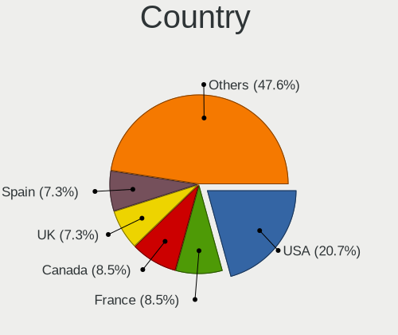
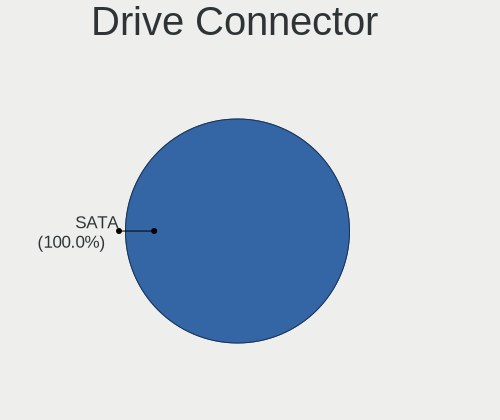
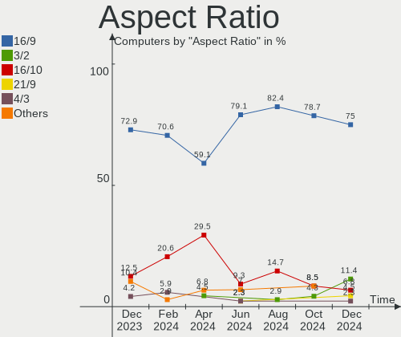
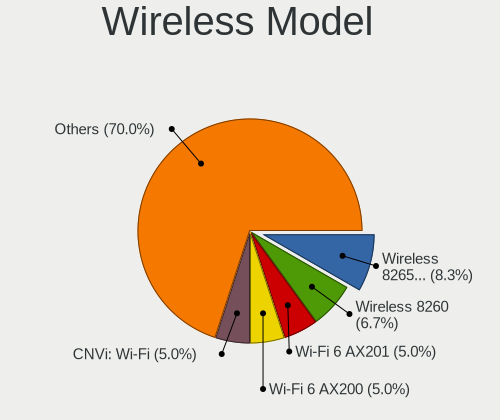
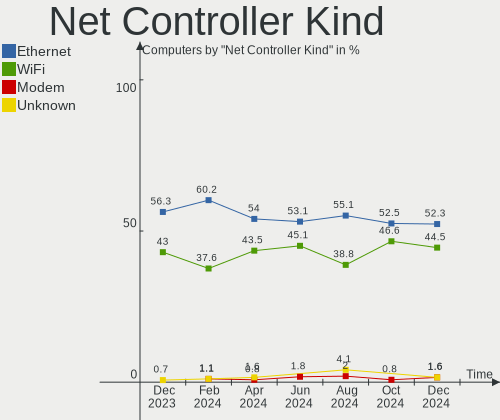
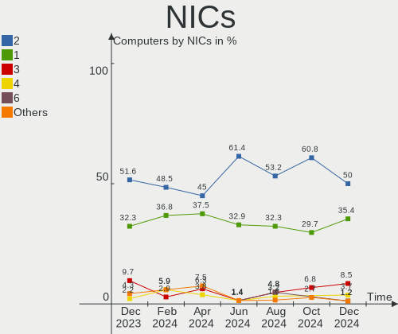
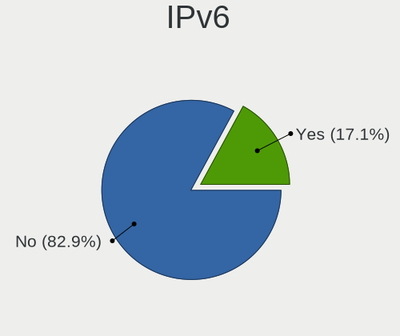

FreeBSD - Hardware Trends
-------------------------

A project to identify most popular hardware characteristics and track their change
over time based on data collected by BSD users at https://BSD-Hardware.info.

Anyone can contribute to this report by the [hw-probe](https://github.com/linuxhw/hw-probe/blob/master/INSTALL.BSD.md) tool:

    hw-probe -all -upload

This is a report for all computer types. See also reports for [desktops](/Dist/FreeBSD/Desktop/README.md) and [notebooks](/Dist/FreeBSD/Notebook/README.md).

This report is for one last month. Overall report since the beginning of time: [TestCoverage](https://github.com/bsdhw/TestCoverage)

Period: Dec, 2022.

Contents
--------

* [ System ](#system)
  - [ OS                       ](#os)
  - [ OS Family                ](#os-family)
  - [ Arch                     ](#arch)
  - [ DE                       ](#de)
  - [ Display Server           ](#display-server)
  - [ Display Manager          ](#display-manager)
  - [ OS Lang                  ](#os-lang)
  - [ Boot Mode                ](#boot-mode)
  - [ Filesystem               ](#filesystem)
  - [ Part. scheme             ](#part-scheme)

* [ Board ](#board)
  - [ Vendor                   ](#vendor)
  - [ Model                    ](#model)
  - [ Model Family             ](#model-family)
  - [ MFG Year                 ](#mfg-year)
  - [ Form Factor              ](#form-factor)
  - [ Coreboot                 ](#coreboot)
  - [ RAM Size                 ](#ram-size)
  - [ RAM Used                 ](#ram-used)
  - [ Total Drives             ](#total-drives)
  - [ Has CD-ROM               ](#has-cd-rom)
  - [ Has Ethernet             ](#has-ethernet)
  - [ Has WiFi                 ](#has-wifi)
  - [ Has Bluetooth            ](#has-bluetooth)

* [ Location ](#location)
  - [ Country                  ](#country)
  - [ City                     ](#city)

* [ Drives ](#drives)
  - [ Drive Vendor             ](#drive-vendor)
  - [ Drive Model              ](#drive-model)
  - [ HDD Vendor               ](#hdd-vendor)
  - [ SSD Vendor               ](#ssd-vendor)
  - [ Drive Kind               ](#drive-kind)
  - [ Drive Connector          ](#drive-connector)
  - [ Drive Size               ](#drive-size)
  - [ Space Total              ](#space-total)
  - [ Space Used               ](#space-used)
  - [ Malfunc. Drives          ](#malfunc-drives)
  - [ Malfunc. Drive Vendor    ](#malfunc-drive-vendor)
  - [ Malfunc. HDD Vendor      ](#malfunc-hdd-vendor)
  - [ Malfunc. Drive Kind      ](#malfunc-drive-kind)
  - [ Failed Drives            ](#failed-drives)
  - [ Failed Drive Vendor      ](#failed-drive-vendor)
  - [ Drive Status             ](#drive-status)

* [ Storage controller ](#storage-controller)
  - [ Storage Vendor           ](#storage-vendor)
  - [ Storage Model            ](#storage-model)
  - [ Storage Kind             ](#storage-kind)

* [ Processor ](#processor)
  - [ CPU Vendor               ](#cpu-vendor)
  - [ CPU Model                ](#cpu-model)
  - [ CPU Model Family         ](#cpu-model-family)
  - [ CPU Cores                ](#cpu-cores)
  - [ CPU Sockets              ](#cpu-sockets)
  - [ CPU Threads              ](#cpu-threads)
  - [ CPU Microarch            ](#cpu-microarch)

* [ Graphics ](#graphics)
  - [ GPU Vendor               ](#gpu-vendor)
  - [ GPU Model                ](#gpu-model)
  - [ GPU Combo                ](#gpu-combo)
  - [ GPU Driver               ](#gpu-driver)
  - [ GPU Memory               ](#gpu-memory)

* [ Monitor ](#monitor)
  - [ Monitor Vendor           ](#monitor-vendor)
  - [ Monitor Model            ](#monitor-model)
  - [ Monitor Resolution       ](#monitor-resolution)
  - [ Monitor Diagonal         ](#monitor-diagonal)
  - [ Monitor Width            ](#monitor-width)
  - [ Aspect Ratio             ](#aspect-ratio)
  - [ Monitor Area             ](#monitor-area)
  - [ Pixel Density            ](#pixel-density)
  - [ Multiple Monitors        ](#multiple-monitors)

* [ Network ](#network)
  - [ Net Controller Vendor    ](#net-controller-vendor)
  - [ Net Controller Model     ](#net-controller-model)
  - [ Wireless Vendor          ](#wireless-vendor)
  - [ Wireless Model           ](#wireless-model)
  - [ Ethernet Vendor          ](#ethernet-vendor)
  - [ Ethernet Model           ](#ethernet-model)
  - [ Net Controller Kind      ](#net-controller-kind)
  - [ Used Controller          ](#used-controller)
  - [ NICs                     ](#nics)
  - [ IPv6                     ](#ipv6)

* [ Bluetooth ](#bluetooth)
  - [ Bluetooth Vendor         ](#bluetooth-vendor)
  - [ Bluetooth Model          ](#bluetooth-model)

* [ Sound ](#sound)
  - [ Sound Vendor             ](#sound-vendor)
  - [ Sound Model              ](#sound-model)

* [ Memory ](#memory)
  - [ Memory Vendor            ](#memory-vendor)
  - [ Memory Model             ](#memory-model)
  - [ Memory Kind              ](#memory-kind)
  - [ Memory Form Factor       ](#memory-form-factor)
  - [ Memory Size              ](#memory-size)
  - [ Memory Speed             ](#memory-speed)

* [ Printers & scanners ](#printers--scanners)
  - [ Printer Vendor           ](#printer-vendor)
  - [ Printer Model            ](#printer-model)
  - [ Scanner Vendor           ](#scanner-vendor)
  - [ Scanner Model            ](#scanner-model)

* [ Camera ](#camera)
  - [ Camera Vendor            ](#camera-vendor)
  - [ Camera Model             ](#camera-model)

* [ Security ](#security)
  - [ Fingerprint Vendor       ](#fingerprint-vendor)
  - [ Fingerprint Model        ](#fingerprint-model)
  - [ Chipcard Vendor          ](#chipcard-vendor)
  - [ Chipcard Model           ](#chipcard-model)

* [ Unsupported ](#unsupported)
  - [ Unsupported Devices      ](#unsupported-devices)
  - [ Unsupported Device Types ](#unsupported-device-types)

System
------

OS
--

Installed operating systems

| Name                 | Computers | Percent |
|----------------------|-----------|---------|
| FreeBSD 13.1-p5      | 34        | 54.84%  |
| FreeBSD 13.1         | 12        | 19.35%  |
| FreeBSD 14.0-CURRENT | 5         | 8.06%   |
| FreeBSD 13.1-STABLE  | 5         | 8.06%   |
| FreeBSD 13.1-p2      | 2         | 3.23%   |
| FreeBSD 12.4         | 2         | 3.23%   |
| FreeBSD 13.1-p4      | 1         | 1.61%   |
| FreeBSD 13.1-p3      | 1         | 1.61%   |

OS Family
---------

OS without a version

| Name    | Computers | Percent |
|---------|-----------|---------|
| FreeBSD | 62        | 100%    |

Arch
----

OS architecture (x86_64, i586, etc.)

| Name  | Computers | Percent |
|-------|-----------|---------|
| amd64 | 60        | 96.77%  |
| arm64 | 2         | 3.23%   |

DE
--

Desktop Environment

| Name          | Computers | Percent |
|---------------|-----------|---------|
| Console       | 20        | 32.26%  |
| KDE5          | 11        | 17.74%  |
| XFCE          | 10        | 16.13%  |
| GNOME         | 5         | 8.06%   |
| MATE          | 4         | 6.45%   |
| i3            | 4         | 6.45%   |
| TWM           | 3         | 4.84%   |
| LXQt          | 2         | 3.23%   |
| Fluxbox       | 1         | 1.61%   |
| Enlightenment | 1         | 1.61%   |
| bspwm         | 1         | 1.61%   |

Display Server
--------------

X11 or Wayland

| Name    | Computers | Percent |
|---------|-----------|---------|
| X11     | 40        | 64.52%  |
| Console | 20        | 32.26%  |
| Wayland | 2         | 3.23%   |

Display Manager
---------------

SDDM, LightDM, etc.

| Name    | Computers | Percent |
|---------|-----------|---------|
| Console | 29        | 46.77%  |
| SDDM    | 13        | 20.97%  |
| SLiM    | 8         | 12.9%   |
| LightDM | 5         | 8.06%   |
| XDM     | 4         | 6.45%   |
| GDM     | 3         | 4.84%   |

OS Lang
-------

Language

| Lang    | Computers | Percent |
|---------|-----------|---------|
| C       | 42        | 67.74%  |
| en_US   | 7         | 11.29%  |
| Unknown | 6         | 9.68%   |
| ru_RU   | 3         | 4.84%   |
| zh_CN   | 1         | 1.61%   |
| es_ES   | 1         | 1.61%   |
| en_BE   | 1         | 1.61%   |
| ba_RU   | 1         | 1.61%   |

Boot Mode
---------

EFI or BIOS

| Mode | Computers | Percent |
|------|-----------|---------|
| EFI  | 46        | 74.19%  |
| BIOS | 16        | 25.81%  |

Filesystem
----------

Type of filesystem

| Type | Computers | Percent |
|------|-----------|---------|
| Zfs  | 48        | 77.42%  |
| Ufs  | 14        | 22.58%  |

Part. scheme
------------

Scheme of partitioning

| Type | Computers | Percent |
|------|-----------|---------|
| GPT  | 62        | 100%    |

Board
-----

Vendor
------

Motherboard manufacturer

| Name                       | Computers | Percent |
|----------------------------|-----------|---------|
| ASUSTek Computer           | 11        | 17.74%  |
| Lenovo                     | 10        | 16.13%  |
| Dell                       | 7         | 11.29%  |
| Hewlett-Packard            | 6         | 9.68%   |
| Google                     | 3         | 4.84%   |
| Acer                       | 3         | 4.84%   |
| Supermicro                 | 2         | 3.23%   |
| MSI                        | 2         | 3.23%   |
| HUAWEI                     | 2         | 3.23%   |
| ASRock                     | 2         | 3.23%   |
| Unknown                    | 2         | 3.23%   |
| Timi                       | 1         | 1.61%   |
| ShenZhen MinWin Technology | 1         | 1.61%   |
| Inventec                   | 1         | 1.61%   |
| Intel                      | 1         | 1.61%   |
| Huanan                     | 1         | 1.61%   |
| Gigabyte Technology        | 1         | 1.61%   |
| Fanless Mini PC            | 1         | 1.61%   |
| Biostar                    | 1         | 1.61%   |
| BESSTAR Tech               | 1         | 1.61%   |
| ASRockRack                 | 1         | 1.61%   |
| Apple                      | 1         | 1.61%   |
| Alienware                  | 1         | 1.61%   |

Model
-----

Motherboard model

| Name                                        | Computers | Percent |
|---------------------------------------------|-----------|---------|
| HP ProLiant MicroServer Gen8                | 2         | 3.23%   |
| ASUS PRIME B550-PLUS                        | 2         | 3.23%   |
| Acer Swift SF114-34                         | 2         | 3.23%   |
| Unknown                                     | 2         | 3.23%   |
| Timi Redmi Book Pro 14 2022                 | 1         | 1.61%   |
| Supermicro X9DR3-F                          | 1         | 1.61%   |
| Supermicro SSG-5028R-E1CR12L-CE010          | 1         | 1.61%   |
| ShenZhen MinWin MW-NANO-APL-4L              | 1         | 1.61%   |
| MSI MS-7A62                                 | 1         | 1.61%   |
| MSI MS-7817                                 | 1         | 1.61%   |
| Lenovo ThinkPad X250 20CLS5BU00             | 1         | 1.61%   |
| Lenovo ThinkPad X1 Carbon Gen 10 21CB000DUS | 1         | 1.61%   |
| Lenovo ThinkPad T530 2392AQU                | 1         | 1.61%   |
| Lenovo ThinkPad T440p 20AWS0Y40T            | 1         | 1.61%   |
| Lenovo ThinkPad A485 20MVS0LG00             | 1         | 1.61%   |
| Lenovo ThinkCentre M700 10GRCTO1WW          | 1         | 1.61%   |
| Lenovo Legion Y530-15ICH 81FV               | 1         | 1.61%   |
| Lenovo IdeaPad L340-17IWL 81M0              | 1         | 1.61%   |
| Lenovo IdeaPad 330-15IKB 81DE               | 1         | 1.61%   |
| Lenovo B50-80 80EW                          | 1         | 1.61%   |
| Inventec Dell Thin Client Desktop 5060      | 1         | 1.61%   |
| Intel NUC11ATKC4                            | 1         | 1.61%   |
| HUAWEI KLVL-WXXW                            | 1         | 1.61%   |
| HUAWEI CREM-WXX9                            | 1         | 1.61%   |
| Huanan X99-F8D V2.4                         | 1         | 1.61%   |
| HP ProLiant MicroServer                     | 1         | 1.61%   |
| HP ProDesk 400 G4 SFF                       | 1         | 1.61%   |
| HP ProBook 440 G8 Notebook PC               | 1         | 1.61%   |
| HP EliteBook 8570p                          | 1         | 1.61%   |
| Google Peppy                                | 1         | 1.61%   |
| Google Lick                                 | 1         | 1.61%   |
| Google Lars                                 | 1         | 1.61%   |
| Gigabyte B550M AORUS PRO-P                  | 1         | 1.61%   |
| Fanless Mini PC Quieter 3                   | 1         | 1.61%   |
| Dell Vostro 15-3568                         | 1         | 1.61%   |
| Dell Vostro 1400                            | 1         | 1.61%   |
| Dell Precision WorkStation T3500            | 1         | 1.61%   |
| Dell Precision M4800                        | 1         | 1.61%   |
| Dell PowerEdge R640                         | 1         | 1.61%   |
| Dell Latitude E6430                         | 1         | 1.61%   |

Model Family
------------

Motherboard model prefix

| Name                               | Computers | Percent |
|------------------------------------|-----------|---------|
| Lenovo ThinkPad                    | 5         | 8.06%   |
| ASUS PRIME                         | 4         | 6.45%   |
| HP ProLiant                        | 3         | 4.84%   |
| ASUS ROG                           | 3         | 4.84%   |
| Lenovo IdeaPad                     | 2         | 3.23%   |
| Dell Vostro                        | 2         | 3.23%   |
| Dell Precision                     | 2         | 3.23%   |
| Dell Latitude                      | 2         | 3.23%   |
| Acer Swift                         | 2         | 3.23%   |
| Unknown                            | 2         | 3.23%   |
| Timi Redmi                         | 1         | 1.61%   |
| Supermicro X9DR3-F                 | 1         | 1.61%   |
| Supermicro SSG-5028R-E1CR12L-CE010 | 1         | 1.61%   |
| ShenZhen MinWin MW-NANO-APL-4L     | 1         | 1.61%   |
| MSI MS-7A62                        | 1         | 1.61%   |
| MSI MS-7817                        | 1         | 1.61%   |
| Lenovo ThinkCentre                 | 1         | 1.61%   |
| Lenovo Legion                      | 1         | 1.61%   |
| Lenovo B50-80                      | 1         | 1.61%   |
| Inventec Dell                      | 1         | 1.61%   |
| Intel NUC11ATKC4                   | 1         | 1.61%   |
| HUAWEI KLVL-WXXW                   | 1         | 1.61%   |
| HUAWEI CREM-WXX9                   | 1         | 1.61%   |
| Huanan X99-F8D                     | 1         | 1.61%   |
| HP ProDesk                         | 1         | 1.61%   |
| HP ProBook                         | 1         | 1.61%   |
| HP EliteBook                       | 1         | 1.61%   |
| Google Peppy                       | 1         | 1.61%   |
| Google Lick                        | 1         | 1.61%   |
| Google Lars                        | 1         | 1.61%   |
| Gigabyte B550M                     | 1         | 1.61%   |
| Fanless Mini PC Quieter            | 1         | 1.61%   |
| Dell PowerEdge                     | 1         | 1.61%   |
| Biostar A68N-5600E                 | 1         | 1.61%   |
| BESSTAR Tech UM350                 | 1         | 1.61%   |
| ASUS ZenBook                       | 1         | 1.61%   |
| ASUS P8H77-V                       | 1         | 1.61%   |
| ASUS P5Q-E                         | 1         | 1.61%   |
| ASUS K50IN                         | 1         | 1.61%   |
| ASRockRack EPYC3101D4I-2T          | 1         | 1.61%   |

MFG Year
--------

Motherboard manufacture year

| Year    | Computers | Percent |
|---------|-----------|---------|
| 2021    | 10        | 16.13%  |
| 2020    | 10        | 16.13%  |
| 2022    | 9         | 14.52%  |
| 2019    | 9         | 14.52%  |
| 2013    | 5         | 8.06%   |
| 2016    | 4         | 6.45%   |
| 2015    | 3         | 4.84%   |
| 2011    | 3         | 4.84%   |
| 2017    | 2         | 3.23%   |
| 2014    | 2         | 3.23%   |
| 2008    | 2         | 3.23%   |
| Unknown | 2         | 3.23%   |
| 2010    | 1         | 1.61%   |

Form Factor
-----------

Physical design of the computer

| Name       | Computers | Percent |
|------------|-----------|---------|
| Desktop    | 30        | 48.39%  |
| Notebook   | 27        | 43.55%  |
| Mini pc    | 3         | 4.84%   |
| All in one | 1         | 1.61%   |
| Server     | 1         | 1.61%   |

Coreboot
--------

Have coreboot on board

| Used | Computers | Percent |
|------|-----------|---------|
| No   | 59        | 95.16%  |
| Yes  | 3         | 4.84%   |

RAM Size
--------

Total RAM memory

| Size in GB      | Computers | Percent |
|-----------------|-----------|---------|
| 16.01-24.0      | 19        | 30.65%  |
| 8.01-16.0       | 13        | 20.97%  |
| 4.01-8.0        | 12        | 19.35%  |
| 32.01-64.0      | 7         | 11.29%  |
| 64.01-256.0     | 7         | 11.29%  |
| 3.01-4.0        | 2         | 3.23%   |
| More than 256.0 | 1         | 1.61%   |
| 24.01-32.0      | 1         | 1.61%   |

RAM Used
--------

Used RAM memory

| Used GB    | Computers | Percent |
|------------|-----------|---------|
| 0.51-1.0   | 22        | 35.48%  |
| 0.01-0.5   | 19        | 30.65%  |
| 1.01-2.0   | 15        | 24.19%  |
| 2.01-3.0   | 3         | 4.84%   |
| 3.01-4.0   | 2         | 3.23%   |
| 24.01-32.0 | 1         | 1.61%   |

Total Drives
------------

Number of drives on board

| Drives | Computers | Percent |
|--------|-----------|---------|
| 1      | 31        | 50%     |
| 2      | 8         | 12.9%   |
| 3      | 7         | 11.29%  |
| 4      | 5         | 8.06%   |
| 0      | 5         | 8.06%   |
| 13     | 1         | 1.61%   |
| 10     | 1         | 1.61%   |
| 8      | 1         | 1.61%   |
| 7      | 1         | 1.61%   |
| 6      | 1         | 1.61%   |
| 5      | 1         | 1.61%   |

Has CD-ROM
----------

Has CD-ROM on board

| Presented | Computers | Percent |
|-----------|-----------|---------|
| No        | 46        | 74.19%  |
| Yes       | 16        | 25.81%  |

Has Ethernet
------------

Has Ethernet on board

| Presented | Computers | Percent |
|-----------|-----------|---------|
| Yes       | 52        | 83.87%  |
| No        | 10        | 16.13%  |

Has WiFi
--------

Has WiFi module

| Presented | Computers | Percent |
|-----------|-----------|---------|
| Yes       | 35        | 56.45%  |
| No        | 27        | 43.55%  |

Has Bluetooth
-------------

Has Bluetooth module

| Presented | Computers | Percent |
|-----------|-----------|---------|
| Yes       | 32        | 51.61%  |
| No        | 30        | 48.39%  |

Location
--------

Country
-------

Geographic location (country)

| Country     | Computers | Percent |
|-------------|-----------|---------|
| USA         | 14        | 22.58%  |
| Russia      | 11        | 17.74%  |
| Spain       | 4         | 6.45%   |
| Switzerland | 3         | 4.84%   |
| Germany     | 3         | 4.84%   |
| France      | 3         | 4.84%   |
| Canada      | 3         | 4.84%   |
| UK          | 2         | 3.23%   |
| Thailand    | 2         | 3.23%   |
| Sweden      | 2         | 3.23%   |
| Netherlands | 2         | 3.23%   |
| Mexico      | 2         | 3.23%   |
| Australia   | 2         | 3.23%   |
| Slovenia    | 1         | 1.61%   |
| Romania     | 1         | 1.61%   |
| Poland      | 1         | 1.61%   |
| Lithuania   | 1         | 1.61%   |
| Guatemala   | 1         | 1.61%   |
| Greece      | 1         | 1.61%   |
| China       | 1         | 1.61%   |
| Belgium     | 1         | 1.61%   |
| Austria     | 1         | 1.61%   |

City
----

Geographic location (city)

| City                | Computers | Percent |
|---------------------|-----------|---------|
| Moscow              | 6         | 9.68%   |
| Redmond             | 2         | 3.23%   |
| Krasnodar           | 2         | 3.23%   |
| Bangkok             | 2         | 3.23%   |
| Wenzhou             | 1         | 1.61%   |
| Wenatchee           | 1         | 1.61%   |
| Vilnius             | 1         | 1.61%   |
| Vienna              | 1         | 1.61%   |
| Twickenham          | 1         | 1.61%   |
| Trebnje             | 1         | 1.61%   |
| Toronto             | 1         | 1.61%   |
| Tlalpan             | 1         | 1.61%   |
| Sydney              | 1         | 1.61%   |
| Stolberg            | 1         | 1.61%   |
| Stockholm           | 1         | 1.61%   |
| St Petersburg       | 1         | 1.61%   |
| Siggenthal Station  | 1         | 1.61%   |
| San Jose            | 1         | 1.61%   |
| Salem               | 1         | 1.61%   |
| Raleigh             | 1         | 1.61%   |
| Perm                | 1         | 1.61%   |
| Nuremberg           | 1         | 1.61%   |
| North York          | 1         | 1.61%   |
| Nootdorp            | 1         | 1.61%   |
| New York            | 1         | 1.61%   |
| Navalcarnero        | 1         | 1.61%   |
| Henrico             | 1         | 1.61%   |
| Guatemala City      | 1         | 1.61%   |
| Grenoble            | 1         | 1.61%   |
| Girard              | 1         | 1.61%   |
| Gerzat              | 1         | 1.61%   |
| Geneva              | 1         | 1.61%   |
| Fremont             | 1         | 1.61%   |
| Falkenstein         | 1         | 1.61%   |
| Faergelanda         | 1         | 1.61%   |
| Durham              | 1         | 1.61%   |
| Dietikon            | 1         | 1.61%   |
| Couhe               | 1         | 1.61%   |
| Ciudad Lopez Mateos | 1         | 1.61%   |
| Chelyabinsk         | 1         | 1.61%   |

Drives
------

Drive Vendor
------------

Hard drive vendors

| Vendor              | Computers | Drives | Percent |
|---------------------|-----------|--------|---------|
| WDC                 | 21        | 52     | 23.33%  |
| Samsung Electronics | 19        | 27     | 21.11%  |
| Seagate             | 14        | 21     | 15.56%  |
| Kingston            | 8         | 9      | 8.89%   |
| Crucial             | 7         | 8      | 7.78%   |
| Toshiba             | 4         | 5      | 4.44%   |
| PNY                 | 3         | 3      | 3.33%   |
| Transcend           | 2         | 2      | 2.22%   |
| HGST                | 2         | 2      | 2.22%   |
| SSSTC               | 1         | 1      | 1.11%   |
| SK hynix            | 1         | 1      | 1.11%   |
| Silicon Motion      | 1         | 1      | 1.11%   |
| Phison              | 1         | 1      | 1.11%   |
| OCZ                 | 1         | 1      | 1.11%   |
| Lexar               | 1         | 1      | 1.11%   |
| KIOXIA              | 1         | 1      | 1.11%   |
| Intel               | 1         | 1      | 1.11%   |
| Corsair             | 1         | 1      | 1.11%   |
| A-DATA Technology   | 1         | 1      | 1.11%   |

Drive Model
-----------

Hard drive models

| Model                                | Computers | Percent |
|--------------------------------------|-----------|---------|
| WDC WD30EFRX-68EUZN0 3TB             | 3         | 2.63%   |
| Kingston SA400S37120G 120GB          | 3         | 2.63%   |
| WDC WD40EZRZ-22GXCB0 4TB             | 2         | 1.75%   |
| Seagate ST4000DM000-1F2168 4TB       | 2         | 1.75%   |
| Seagate ST2000DM008-2FR102 2TB       | 2         | 1.75%   |
| Samsung SSD 870 QVO 2TB              | 2         | 1.75%   |
| Samsung SSD 860 EVO 500GB            | 2         | 1.75%   |
| Kingston SA400S37240G 240GB          | 2         | 1.75%   |
| Crucial CT500MX500SSD1 500GB         | 2         | 1.75%   |
| WDC WDS500G1R0A-68A4W0 500GB         | 1         | 0.88%   |
| WDC WDS120G2G0A-00JH30 120GB         | 1         | 0.88%   |
| WDC WDS100T3X0C-00SJG0 1TB           | 1         | 0.88%   |
| WDC WDS100T2G0A-00JH30 1TB           | 1         | 0.88%   |
| WDC WD80EMAZ-00WJTA0 8TB             | 1         | 0.88%   |
| WDC WD80EFZX-68UW8N0 8TB             | 1         | 0.88%   |
| WDC WD80EFAX-68LHPN0 8TB             | 1         | 0.88%   |
| WDC WD80EDBZ-11B0ZA0 8TB             | 1         | 0.88%   |
| WDC WD800AAJS-00PSA0 80GB            | 1         | 0.88%   |
| WDC WD8004FRYZ-01VAEB0 8TB           | 1         | 0.88%   |
| WDC WD8003FFBX-68B9AN0 8TB           | 1         | 0.88%   |
| WDC WD6400AAKS-22A7B2 640GB          | 1         | 0.88%   |
| WDC WD60EFRX-68L0BN1 6TB             | 1         | 0.88%   |
| WDC WD5000BPKT-00PK4T0 500GB         | 1         | 0.88%   |
| WDC WD40EFZX-68AWUN0 4TB             | 1         | 0.88%   |
| WDC WD30EFRX-68AX9N0 3TB             | 1         | 0.88%   |
| WDC WD20EZRX-00D8PB0 2TB             | 1         | 0.88%   |
| WDC WD20EZAZ-00GGJB0 2TB             | 1         | 0.88%   |
| WDC WD20EARX-00PASB0 2TB             | 1         | 0.88%   |
| WDC WD20EARX-008FB0 2TB              | 1         | 0.88%   |
| WDC WD15EADS-00P8B0 1.5TB            | 1         | 0.88%   |
| WDC WD120EMFZ-11A6JA0 12TB           | 1         | 0.88%   |
| WDC WD120EMAZ-11BLFA0 12TB           | 1         | 0.88%   |
| WDC WD10SPZX-00Z10T0 1TB             | 1         | 0.88%   |
| WDC WD10EZEX-22MFCA0 1TB             | 1         | 0.88%   |
| WDC WD10EFRX-68PJCN0 1TB             | 1         | 0.88%   |
| WDC WD10EFRX-68FYTN0 1TB             | 1         | 0.88%   |
| WDC WD100EZAZ-11TDBA0 10TB           | 1         | 0.88%   |
| WDC PC SN730 SDBPNTY-512G            | 1         | 0.88%   |
| WDC PC SN530 SDBPNPZ-512G-1014 512GB | 1         | 0.88%   |
| WDC PC SN530 SDBPNPZ-256G-1014 256GB | 1         | 0.88%   |

HDD Vendor
----------

Hard disk drive vendors

| Vendor              | Computers | Drives | Percent |
|---------------------|-----------|--------|---------|
| WDC                 | 14        | 43     | 40%     |
| Seagate             | 14        | 21     | 40%     |
| Toshiba             | 4         | 5      | 11.43%  |
| HGST                | 2         | 2      | 5.71%   |
| Samsung Electronics | 1         | 1      | 2.86%   |

SSD Vendor
----------

Solid state drive vendors

| Vendor              | Computers | Drives | Percent |
|---------------------|-----------|--------|---------|
| Samsung Electronics | 12        | 17     | 32.43%  |
| Kingston            | 7         | 7      | 18.92%  |
| Crucial             | 5         | 6      | 13.51%  |
| WDC                 | 3         | 4      | 8.11%   |
| PNY                 | 3         | 3      | 8.11%   |
| Transcend           | 2         | 2      | 5.41%   |
| OCZ                 | 1         | 1      | 2.7%    |
| Lexar               | 1         | 1      | 2.7%    |
| Intel               | 1         | 1      | 2.7%    |
| Corsair             | 1         | 1      | 2.7%    |
| A-DATA Technology   | 1         | 1      | 2.7%    |

Drive Kind
----------

HDD or SSD

| Kind | Computers | Drives | Percent |
|------|-----------|--------|---------|
| SSD  | 32        | 44     | 41.56%  |
| HDD  | 24        | 72     | 31.17%  |
| NVMe | 21        | 23     | 27.27%  |

Drive Connector
---------------

SATA, SAS, NVMe, etc.

| Type | Computers | Drives | Percent |
|------|-----------|--------|---------|
| SATA | 42        | 116    | 66.67%  |
| NVMe | 21        | 23     | 33.33%  |

Drive Size
----------

Size of hard drive

| Size in TB | Computers | Drives | Percent |
|------------|-----------|--------|---------|
| 0.01-0.5   | 29        | 38     | 43.28%  |
| 0.51-1.0   | 12        | 19     | 17.91%  |
| 1.01-2.0   | 11        | 21     | 16.42%  |
| 3.01-4.0   | 6         | 9      | 8.96%   |
| 2.01-3.0   | 4         | 8      | 5.97%   |
| 4.01-10.0  | 4         | 19     | 5.97%   |
| 10.01-20.0 | 1         | 2      | 1.49%   |

Space Total
-----------

Amount of disk space available on the file system

| Size in GB     | Computers | Percent |
|----------------|-----------|---------|
| 251-500        | 17        | 27.42%  |
| 101-250        | 16        | 25.81%  |
| 501-1000       | 11        | 17.74%  |
| 21-50          | 5         | 8.06%   |
| 51-100         | 4         | 6.45%   |
| 1-20           | 3         | 4.84%   |
| More than 3000 | 2         | 3.23%   |
| 2001-3000      | 2         | 3.23%   |
| 1001-2000      | 2         | 3.23%   |

Space Used
----------

Amount of used disk space

| Used GB   | Computers | Percent |
|-----------|-----------|---------|
| 1-20      | 47        | 75.81%  |
| 21-50     | 8         | 12.9%   |
| 51-100    | 5         | 8.06%   |
| 251-500   | 1         | 1.61%   |
| 1001-2000 | 1         | 1.61%   |

Malfunc. Drives
---------------

Drive models with a malfunction

| Model                               | Computers | Drives | Percent |
|-------------------------------------|-----------|--------|---------|
| WDC WD6400AAKS-22A7B2 640GB         | 1         | 1      | 8.33%   |
| WDC WD30EFRX-68EUZN0 3TB            | 1         | 1      | 8.33%   |
| WDC WD20EARX-008FB0 2TB             | 1         | 1      | 8.33%   |
| Toshiba MK1637GSX 160GB             | 1         | 1      | 8.33%   |
| Seagate ST8000VN004-2M2101 8TB      | 1         | 1      | 8.33%   |
| Seagate ST2000VN004-2E4164 2TB      | 1         | 2      | 8.33%   |
| Samsung Electronics SSD 870 EVO 1TB | 1         | 1      | 8.33%   |
| Samsung Electronics HD204UI 2TB     | 1         | 1      | 8.33%   |
| OCZ AGILITY3 64GB                   | 1         | 1      | 8.33%   |
| Kingston SNS4151S316GD 16GB         | 1         | 1      | 8.33%   |
| Kingston SA400S37120G 120GB         | 1         | 1      | 8.33%   |
| HGST HTS721010A9E630 1TB            | 1         | 1      | 8.33%   |

Malfunc. Drive Vendor
---------------------

Vendors of faulty drives

| Vendor              | Computers | Drives | Percent |
|---------------------|-----------|--------|---------|
| WDC                 | 3         | 3      | 25%     |
| Seagate             | 2         | 3      | 16.67%  |
| Samsung Electronics | 2         | 2      | 16.67%  |
| Kingston            | 2         | 2      | 16.67%  |
| Toshiba             | 1         | 1      | 8.33%   |
| OCZ                 | 1         | 1      | 8.33%   |
| HGST                | 1         | 1      | 8.33%   |

Malfunc. HDD Vendor
-------------------

Vendors of faulty HDD drives

| Vendor              | Computers | Drives | Percent |
|---------------------|-----------|--------|---------|
| WDC                 | 3         | 3      | 37.5%   |
| Seagate             | 2         | 3      | 25%     |
| Toshiba             | 1         | 1      | 12.5%   |
| Samsung Electronics | 1         | 1      | 12.5%   |
| HGST                | 1         | 1      | 12.5%   |

Malfunc. Drive Kind
-------------------

Kinds of faulty drives

| Kind | Computers | Drives | Percent |
|------|-----------|--------|---------|
| HDD  | 7         | 9      | 63.64%  |
| SSD  | 4         | 4      | 36.36%  |

Failed Drives
-------------

Failed drive models

Zero info for selected period =(

Failed Drive Vendor
-------------------

Failed drive vendors

Zero info for selected period =(

Drive Status
------------

Number of failed and malfunc. drives

| Status  | Computers | Drives | Percent |
|---------|-----------|--------|---------|
| Works   | 55        | 126    | 83.33%  |
| Malfunc | 11        | 13     | 16.67%  |

Storage controller
------------------

Storage Vendor
--------------

Storage controller vendors

| Vendor                         | Computers | Percent |
|--------------------------------|-----------|---------|
| Intel                          | 35        | 41.67%  |
| AMD                            | 15        | 17.86%  |
| Samsung Electronics            | 8         | 9.52%   |
| SanDisk                        | 6         | 7.14%   |
| Broadcom / LSI                 | 5         | 5.95%   |
| Silicon Motion                 | 2         | 2.38%   |
| Micron/Crucial Technology      | 2         | 2.38%   |
| Kingston Technology Company    | 2         | 2.38%   |
| JMicron Technology             | 2         | 2.38%   |
| Solid State Storage Technology | 1         | 1.19%   |
| SK hynix                       | 1         | 1.19%   |
| Silicon Image                  | 1         | 1.19%   |
| Phison Electronics             | 1         | 1.19%   |
| Nvidia                         | 1         | 1.19%   |
| Marvell Technology Group       | 1         | 1.19%   |
| KIOXIA                         | 1         | 1.19%   |

Storage Model
-------------

Storage controller models

| Model                                                                          | Computers | Percent |
|--------------------------------------------------------------------------------|-----------|---------|
| AMD FCH SATA Controller [AHCI mode]                                            | 10        | 10.64%  |
| Samsung NVMe SSD Controller PM9A1/PM9A3/980PRO                                 | 4         | 4.26%   |
| AMD 500 Series Chipset SATA Controller                                         | 4         | 4.26%   |
| Intel 8 Series/C220 Series Chipset Family 6-port SATA Controller 1 [AHCI mode] | 3         | 3.19%   |
| Intel 7 Series Chipset Family 6-port SATA Controller [AHCI mode]               | 3         | 3.19%   |
| Broadcom / LSI SAS2008 PCI-Express Fusion-MPT SAS-2 [Falcon]                   | 3         | 3.19%   |
| Silicon Motion SM2263EN/SM2263XT SSD Controller                                | 2         | 2.13%   |
| SanDisk WD Blue SN550 NVMe SSD                                                 | 2         | 2.13%   |
| SanDisk WD Black SN750 / PC SN730 NVMe SSD                                     | 2         | 2.13%   |
| Samsung NVMe SSD Controller SM981/PM981/PM983                                  | 2         | 2.13%   |
| Micron/Crucial P2 NVMe PCIe SSD                                                | 2         | 2.13%   |
| JMicron JMB58x AHCI SATA controller                                            | 2         | 2.13%   |
| Intel Wildcat Point-LP SATA Controller [AHCI Mode]                             | 2         | 2.13%   |
| Intel Sunrise Point-LP SATA Controller [AHCI mode]                             | 2         | 2.13%   |
| Intel Jasper Lake SATA AHCI Controller                                         | 2         | 2.13%   |
| Intel Cannon Point-LP SATA Controller [AHCI Mode]                              | 2         | 2.13%   |
| Intel C610/X99 series chipset sSATA Controller [AHCI mode]                     | 2         | 2.13%   |
| Intel 6 Series/C200 Series Chipset Family 6 port Desktop SATA AHCI Controller  | 2         | 2.13%   |
| Intel 200 Series PCH SATA controller [AHCI mode]                               | 2         | 2.13%   |
| Unknown                                                                        | 2         | 2.13%   |
| SK hynix Gold P31/PC711 NVMe Solid State Drive                                 | 1         | 1.06%   |
| Silicon Image AAR-1220SA Serial ATA HostRAID Controller                        | 1         | 1.06%   |
| SanDisk WD Blue SN570 NVMe SSD                                                 | 1         | 1.06%   |
| SanDisk PC SN520 NVMe SSD                                                      | 1         | 1.06%   |
| Samsung NVMe SSD Controller SM961/PM961/SM963                                  | 1         | 1.06%   |
| Samsung NVMe SSD Controller 980                                                | 1         | 1.06%   |
| Phison PS5013 E13 NVMe Controller                                              | 1         | 1.06%   |
| Nvidia MCP79 AHCI Controller                                                   | 1         | 1.06%   |
| Marvell Group 88SE6111/6121 SATA II / PATA Controller                          | 1         | 1.06%   |
| Kingston Company OM3PDP3 NVMe SSD                                              | 1         | 1.06%   |
| Kingston Company A2000 NVMe SSD                                                | 1         | 1.06%   |
| Intel Volume Management Device NVMe RAID Controller                            | 1         | 1.06%   |
| Intel Q170/Q150/B150/H170/H110/Z170/CM236 Chipset SATA Controller [AHCI Mode]  | 1         | 1.06%   |
| Intel Celeron N3350/Pentium N4200/Atom E3900 Series SATA AHCI Controller       | 1         | 1.06%   |
| Intel Cannon Lake Mobile PCH SATA AHCI Controller                              | 1         | 1.06%   |
| Intel C620 Series Chipset Family SSATA Controller [AHCI mode]                  | 1         | 1.06%   |
| Intel C620 Series Chipset Family SATA Controller [AHCI mode]                   | 1         | 1.06%   |
| Intel C610/X99 series chipset 6-Port SATA Controller [AHCI mode]               | 1         | 1.06%   |
| Intel C602 chipset 4-Port SATA Storage Control Unit                            | 1         | 1.06%   |
| Intel C600/X79 series chipset 6-Port SATA AHCI Controller                      | 1         | 1.06%   |

Storage Kind
------------

Kind of storage controller (IDE, SATA, NVMe, SAS, ...)

| Kind | Computers | Percent |
|------|-----------|---------|
| SATA | 48        | 57.14%  |
| NVMe | 23        | 27.38%  |
| SAS  | 5         | 5.95%   |
| RAID | 4         | 4.76%   |
| IDE  | 4         | 4.76%   |

Processor
---------

CPU Vendor
----------

Processor vendors

| Vendor | Computers | Percent |
|--------|-----------|---------|
| Intel  | 42        | 67.74%  |
| AMD    | 18        | 29.03%  |
| ARM    | 2         | 3.23%   |

CPU Model
---------

Processor models

| Model                                       | Computers | Percent |
|---------------------------------------------|-----------|---------|
| Intel Core i7-7700 CPU @ 3.60GHz            | 2         | 3.23%   |
| Intel Celeron N5105 @ 2.00GHz               | 2         | 3.23%   |
| ARM Cortex-A55 r2p0                         | 2         | 3.23%   |
| Intel Xeon Gold 6240R CPU @ 2.40GHz         | 1         | 1.61%   |
| Intel Xeon CPU E5-2697 v2 @ 2.70GHz         | 1         | 1.61%   |
| Intel Xeon CPU E5-2680 v4 @ 2.40GHz         | 1         | 1.61%   |
| Intel Xeon CPU E5-2650 v3 @ 2.30GHz         | 1         | 1.61%   |
| Intel Xeon CPU E3-1220L V2 @ 2.30GHz        | 1         | 1.61%   |
| Intel Xeon CPU E3-1220 V2 @ 3.10GHz         | 1         | 1.61%   |
| Intel Xeon                                  | 1         | 1.61%   |
| Intel Pentium Silver N6000 @ 1.10GHz        | 1         | 1.61%   |
| Intel Pentium Dual-Core CPU T4200 @ 2.00GHz | 1         | 1.61%   |
| Intel Pentium CPU G3220 @ 3.00GHz           | 1         | 1.61%   |
| Intel Core i9-10980HK CPU @ 2.40GHz         | 1         | 1.61%   |
| Intel Core i7-8750H CPU @ 2.20GHz           | 1         | 1.61%   |
| Intel Core i7-8665U CPU @ 1.90GHz           | 1         | 1.61%   |
| Intel Core i7-4810MQ CPU @ 2.80GHz          | 1         | 1.61%   |
| Intel Core i7-4712MQ CPU @ 2.30GHz          | 1         | 1.61%   |
| Intel Core i7-3520M CPU @ 2.90GHz           | 1         | 1.61%   |
| Intel Core i5-8265U CPU @ 1.60GHz           | 1         | 1.61%   |
| Intel Core i5-8250U CPU @ 1.60GHz           | 1         | 1.61%   |
| Intel Core i5-5300U CPU @ 2.30GHz           | 1         | 1.61%   |
| Intel Core i5-5200U CPU @ 2.20GHz           | 1         | 1.61%   |
| Intel Core i5-4570 CPU @ 3.20GHz            | 1         | 1.61%   |
| Intel Core i5-3320M CPU @ 2.60GHz           | 1         | 1.61%   |
| Intel Core i5-3230M CPU @ 2.60GHz           | 1         | 1.61%   |
| Intel Core i5-10400 CPU @ 2.90GHz           | 1         | 1.61%   |
| Intel Core i5 CPU 650 @ 3.20GHz             | 1         | 1.61%   |
| Intel Core i3-6100 CPU @ 3.70GHz            | 1         | 1.61%   |
| Intel Core i3-6006U CPU @ 2.00GHz           | 1         | 1.61%   |
| Intel Core i3-3220 CPU @ 3.30GHz            | 1         | 1.61%   |
| Intel Core 2 Quad CPU Q6600 @ 2.40GHz       | 1         | 1.61%   |
| Intel Core 2 Duo                            | 1         | 1.61%   |
| Intel Celeron N4500 @ 1.10GHz               | 1         | 1.61%   |
| Intel Celeron N4020 CPU @ 1.10GHz           | 1         | 1.61%   |
| Intel Celeron CPU J3455 @ 1.50GHz           | 1         | 1.61%   |
| Intel Celeron CPU 3855U @ 1.60GHz           | 1         | 1.61%   |
| Intel Celeron 2957U @ 1.40GHz               | 1         | 1.61%   |
| Intel 12th Gen Core i7-1280P                | 1         | 1.61%   |
| Intel 12th Gen Core i5-12400                | 1         | 1.61%   |

CPU Model Family
----------------

Processor model prefix

| Model                   | Computers | Percent |
|-------------------------|-----------|---------|
| Intel Core i5           | 9         | 14.52%  |
| AMD Ryzen 7             | 9         | 14.52%  |
| Intel Core i7           | 7         | 11.29%  |
| Intel Celeron           | 7         | 11.29%  |
| Intel Xeon              | 6         | 9.68%   |
| Other                   | 4         | 6.45%   |
| Intel Core i3           | 3         | 4.84%   |
| ARM Cortex              | 2         | 3.23%   |
| AMD Ryzen 5             | 2         | 3.23%   |
| Intel Xeon Gold         | 1         | 1.61%   |
| Intel Pentium Silver    | 1         | 1.61%   |
| Intel Pentium Dual-Core | 1         | 1.61%   |
| Intel Pentium           | 1         | 1.61%   |
| Intel Core i9           | 1         | 1.61%   |
| Intel Core 2 Quad       | 1         | 1.61%   |
| Intel Core 2 Duo        | 1         | 1.61%   |
| AMD Turion II Neo       | 1         | 1.61%   |
| AMD Ryzen 9             | 1         | 1.61%   |
| AMD Ryzen 7 PRO         | 1         | 1.61%   |
| AMD Ryzen 5 PRO         | 1         | 1.61%   |
| AMD GX                  | 1         | 1.61%   |
| AMD EPYC                | 1         | 1.61%   |

CPU Cores
---------

Number of processor cores

| Number  | Computers | Percent |
|---------|-----------|---------|
| 4       | 18        | 29.03%  |
| 2       | 18        | 29.03%  |
| 16      | 10        | 16.13%  |
| 6       | 4         | 6.45%   |
| 8       | 3         | 4.84%   |
| 24      | 2         | 3.23%   |
| 10      | 2         | 3.23%   |
| Unknown | 2         | 3.23%   |
| 48      | 1         | 1.61%   |
| 28      | 1         | 1.61%   |
| 12      | 1         | 1.61%   |

CPU Sockets
-----------

Number of sockets

| Number  | Computers | Percent |
|---------|-----------|---------|
| 1       | 57        | 91.94%  |
| 2       | 3         | 4.84%   |
| Unknown | 2         | 3.23%   |

CPU Threads
-----------

Threads per core (Hyper-Threading)

| Number  | Computers | Percent |
|---------|-----------|---------|
| 1       | 32        | 51.61%  |
| 2       | 28        | 45.16%  |
| Unknown | 2         | 3.23%   |

CPU Microarch
-------------

Microarchitecture

| Name          | Computers | Percent |
|---------------|-----------|---------|
| Unknown       | 11        | 17.74%  |
| IvyBridge     | 7         | 11.29%  |
| KabyLake      | 6         | 9.68%   |
| Haswell       | 6         | 9.68%   |
| Zen 3         | 4         | 6.45%   |
| Skylake       | 4         | 6.45%   |
| Zen 2         | 3         | 4.84%   |
| Zen           | 3         | 4.84%   |
| Broadwell     | 3         | 4.84%   |
| Zen+          | 2         | 3.23%   |
| Westmere      | 2         | 3.23%   |
| Puma          | 2         | 3.23%   |
| Penryn        | 2         | 3.23%   |
| CometLake     | 2         | 3.23%   |
| TigerLake     | 1         | 1.61%   |
| K10           | 1         | 1.61%   |
| Goldmont plus | 1         | 1.61%   |
| Goldmont      | 1         | 1.61%   |
| Core          | 1         | 1.61%   |

Graphics
--------

GPU Vendor
----------

Vendors of graphics cards

| Vendor                     | Computers | Percent |
|----------------------------|-----------|---------|
| Intel                      | 29        | 45.31%  |
| AMD                        | 19        | 29.69%  |
| Nvidia                     | 11        | 17.19%  |
| Matrox Electronics Systems | 3         | 4.69%   |
| ASPEED Technology          | 2         | 3.13%   |

GPU Model
---------

Graphics card models

| Model                                                                       | Computers | Percent |
|-----------------------------------------------------------------------------|-----------|---------|
| Intel JasperLake [UHD Graphics]                                             | 4         | 6.06%   |
| Matrox Electronics Systems MGA G200EH                                       | 2         | 3.03%   |
| Intel WhiskeyLake-U GT2 [UHD Graphics 620]                                  | 2         | 3.03%   |
| Intel HD Graphics 5500                                                      | 2         | 3.03%   |
| Intel 4th Gen Core Processor Integrated Graphics Controller                 | 2         | 3.03%   |
| Intel 3rd Gen Core processor Graphics Controller                            | 2         | 3.03%   |
| ASPEED Technology ASPEED Graphics Family                                    | 2         | 3.03%   |
| AMD Mullins [Radeon R4/R5 Graphics]                                         | 2         | 3.03%   |
| AMD Lucienne                                                                | 2         | 3.03%   |
| AMD Ellesmere [Radeon RX 470/480/570/570X/580/580X/590]                     | 2         | 3.03%   |
| AMD Cezanne [Radeon Vega Series / Radeon Vega Mobile Series]                | 2         | 3.03%   |
| Nvidia TU116 [GeForce GTX 1660 Ti]                                          | 1         | 1.52%   |
| Nvidia GT218 [NVS 300]                                                      | 1         | 1.52%   |
| Nvidia GP108M [GeForce MX230]                                               | 1         | 1.52%   |
| Nvidia GP108 [GeForce GT 1030]                                              | 1         | 1.52%   |
| Nvidia GP107M [GeForce GTX 1050 Ti Mobile]                                  | 1         | 1.52%   |
| Nvidia GP106 [GeForce GTX 1060 6GB]                                         | 1         | 1.52%   |
| Nvidia GK208B [GeForce GT 710]                                              | 1         | 1.52%   |
| Nvidia GK107M [GeForce GT 755M Mac Edition]                                 | 1         | 1.52%   |
| Nvidia GF108 [GeForce GT 430]                                               | 1         | 1.52%   |
| Nvidia GA106 [GeForce RTX 3060 Lite Hash Rate]                              | 1         | 1.52%   |
| Nvidia GA104M [GeForce RTX 3080 Mobile / Max-Q 8GB/16GB]                    | 1         | 1.52%   |
| Nvidia C79 [GeForce G102M]                                                  | 1         | 1.52%   |
| Matrox Electronics Systems Integrated Matrox G200eW3 Graphics Controller    | 1         | 1.52%   |
| Intel Xeon E3-1200 v3/4th Gen Core Processor Integrated Graphics Controller | 1         | 1.52%   |
| Intel Xeon E3-1200 v2/3rd Gen Core processor Graphics Controller            | 1         | 1.52%   |
| Intel UHD Graphics 620                                                      | 1         | 1.52%   |
| Intel TigerLake-LP GT2 [Iris Xe Graphics]                                   | 1         | 1.52%   |
| Intel Skylake GT2 [HD Graphics 520]                                         | 1         | 1.52%   |
| Intel Mobile GM965/GL960 Integrated Graphics Controller (secondary)         | 1         | 1.52%   |
| Intel Mobile GM965/GL960 Integrated Graphics Controller (primary)           | 1         | 1.52%   |
| Intel HD Graphics 630                                                       | 1         | 1.52%   |
| Intel HD Graphics 530                                                       | 1         | 1.52%   |
| Intel HD Graphics 510                                                       | 1         | 1.52%   |
| Intel HD Graphics 500                                                       | 1         | 1.52%   |
| Intel Haswell-ULT Integrated Graphics Controller                            | 1         | 1.52%   |
| Intel GeminiLake [UHD Graphics 600]                                         | 1         | 1.52%   |
| Intel CometLake-S GT2 [UHD Graphics 630]                                    | 1         | 1.52%   |
| Intel CometLake-H GT2 [UHD Graphics]                                        | 1         | 1.52%   |
| Intel CoffeeLake-H GT2 [UHD Graphics 630]                                   | 1         | 1.52%   |

GPU Combo
---------

Combinations of graphics cards

| Name           | Computers | Percent |
|----------------|-----------|---------|
| 1 x Intel      | 24        | 38.71%  |
| 1 x AMD        | 18        | 29.03%  |
| 1 x Nvidia     | 7         | 11.29%  |
| Other          | 3         | 4.84%   |
| 1 x Matrox     | 3         | 4.84%   |
| Intel + Nvidia | 3         | 4.84%   |
| 1 x ASPEED     | 2         | 3.23%   |
| 2 x Intel      | 1         | 1.61%   |
| Intel + AMD    | 1         | 1.61%   |

GPU Driver
----------

Free vs proprietary

| Driver      | Computers | Percent |
|-------------|-----------|---------|
| Free        | 54        | 87.1%   |
| Proprietary | 5         | 8.06%   |
| Unknown     | 3         | 4.84%   |

GPU Memory
----------

Total video memory

| Size in GB | Computers | Percent |
|------------|-----------|---------|
| Unknown    | 44        | 70.97%  |
| 0.01-0.5   | 6         | 9.68%   |
| 0.51-1.0   | 5         | 8.06%   |
| 7.01-8.0   | 3         | 4.84%   |
| 5.01-6.0   | 2         | 3.23%   |
| 3.01-4.0   | 1         | 1.61%   |
| 1.01-2.0   | 1         | 1.61%   |

Monitor
-------

Monitor Vendor
--------------

Monitor vendors

| Vendor              | Computers | Percent |
|---------------------|-----------|---------|
| Samsung Electronics | 6         | 14.63%  |
| LG Display          | 5         | 12.2%   |
| Hewlett-Packard     | 4         | 9.76%   |
| BOE                 | 4         | 9.76%   |
| Chimei Innolux      | 3         | 7.32%   |
| AU Optronics        | 3         | 7.32%   |
| ASUSTek Computer    | 3         | 7.32%   |
| Philips             | 2         | 4.88%   |
| Dell                | 2         | 4.88%   |
| BenQ                | 2         | 4.88%   |
| SGT                 | 1         | 2.44%   |
| Mi                  | 1         | 2.44%   |
| Lenovo              | 1         | 2.44%   |
| Idek Iiyama         | 1         | 2.44%   |
| Goldstar            | 1         | 2.44%   |
| Apple               | 1         | 2.44%   |
| Acer                | 1         | 2.44%   |

Monitor Model
-------------

Monitor models

| Model                                                                 | Computers | Percent |
|-----------------------------------------------------------------------|-----------|---------|
| SGT LC156LF1L_03 SGT1560 1920x1080 300x260mm 15.6-inch                | 1         | 2.44%   |
| Samsung Electronics U32E850 SAM0CE3 3840x2160 700x390mm 31.5-inch     | 1         | 2.44%   |
| Samsung Electronics SyncMaster SAM027F 1680x1050 470x300mm 22.0-inch  | 1         | 2.44%   |
| Samsung Electronics LCD Monitor SEC3157 1280x800 300x190mm 14.0-inch  | 1         | 2.44%   |
| Samsung Electronics LCD Monitor SDC4158 1920x1080 290x170mm 13.2-inch | 1         | 2.44%   |
| Samsung Electronics LCD Monitor SAM04FB 1920x1080                     | 1         | 2.44%   |
| Samsung Electronics C24F390 SAM0D2C 1920x1080 520x290mm 23.4-inch     | 1         | 2.44%   |
| Philips PHL 221V8 PHLC211 1920x1080 480x270mm 21.7-inch               | 1         | 2.44%   |
| Philips LCD Monitor PHL08C3 1920x1080 600x340mm 27.2-inch             | 1         | 2.44%   |
| Mi 27 NFGL XMIB004 1920x1080 600x330mm 27.0-inch                      | 1         | 2.44%   |
| LG Display LCD Monitor LGD066E 1920x1080 340x190mm 15.3-inch          | 1         | 2.44%   |
| LG Display LCD Monitor LGD046F 1920x1080 340x190mm 15.3-inch          | 1         | 2.44%   |
| LG Display LCD Monitor LGD03ED 1366x768 280x160mm 12.7-inch           | 1         | 2.44%   |
| LG Display LCD Monitor LGD033E 1366x768 310x170mm 13.9-inch           | 1         | 2.44%   |
| LG Display LCD Monitor LGD0258 1600x900 350x190mm 15.7-inch           | 1         | 2.44%   |
| Lenovo LCD Monitor LEN40B1 1600x900 340x190mm 15.3-inch               | 1         | 2.44%   |
| Idek Iiyama LCD Monitor PLX2783H 1920x1080                            | 1         | 2.44%   |
| Hewlett-Packard LCD Monitor 22es 1920x1080                            | 1         | 2.44%   |
| Hewlett-Packard 32f HPN365B 1920x1080 700x400mm 31.7-inch             | 1         | 2.44%   |
| Hewlett-Packard 27er HWP3325 1920x1080 600x340mm 27.2-inch            | 1         | 2.44%   |
| Hewlett-Packard 24fw HPN3545 1920x1080 530x300mm 24.0-inch            | 1         | 2.44%   |
| Goldstar 22EN33 GSM597C 1920x1080 480x270mm 21.7-inch                 | 1         | 2.44%   |
| Dell U2719DC DEL417C 2560x1440 600x340mm 27.2-inch                    | 1         | 2.44%   |
| Dell LCD Monitor DEL4048 1280x1024 380x300mm 19.1-inch                | 1         | 2.44%   |
| Chimei Innolux LCD Monitor CMN15DB 1366x768 340x190mm 15.3-inch       | 1         | 2.44%   |
| Chimei Innolux LCD Monitor CMN15BD 1366x768 340x190mm 15.3-inch       | 1         | 2.44%   |
| Chimei Innolux LCD Monitor CMN14D4 1920x1080 310x170mm 13.9-inch      | 1         | 2.44%   |
| BOE LCD Monitor BOE092F 2520x1680 340x230mm 16.2-inch                 | 1         | 2.44%   |
| BOE LCD Monitor BOE0893 2160x1440 300x200mm 14.2-inch                 | 1         | 2.44%   |
| BOE LCD Monitor BOE0731 1366x768 260x140mm 11.6-inch                  | 1         | 2.44%   |
| BOE LCD Monitor BOE0674 1366x768 340x190mm 15.3-inch                  | 1         | 2.44%   |
| BenQ GL2450H BNQ78A7 1920x1080 530x300mm 24.0-inch                    | 1         | 2.44%   |
| BenQ G900HD BNQ7816 1366x768 410x230mm 18.5-inch                      | 1         | 2.44%   |
| AU Optronics LCD Monitor AUO463D 1920x1080 310x170mm 13.9-inch        | 1         | 2.44%   |
| AU Optronics LCD Monitor AUO219E 1600x900 380x210mm 17.1-inch         | 1         | 2.44%   |
| AU Optronics LCD Monitor AUO20EC 1366x768 340x190mm 15.3-inch         | 1         | 2.44%   |
| ASUSTek Computer VP247 AUS24CA 1920x1080 520x290mm 23.4-inch          | 1         | 2.44%   |
| ASUSTek Computer ROG PG259QN AUS25B4 1920x1080 540x300mm 24.3-inch    | 1         | 2.44%   |
| ASUSTek Computer PA278QV AUS2700 2560x1440 600x340mm 27.2-inch        | 1         | 2.44%   |
| Apple iMac APPB005 2560x1440 600x340mm 27.2-inch                      | 1         | 2.44%   |

Monitor Resolution
------------------

Monitor screen resolution

| Resolution         | Computers | Percent |
|--------------------|-----------|---------|
| 1920x1080 (FHD)    | 18        | 47.37%  |
| 1366x768 (WXGA)    | 8         | 21.05%  |
| 2560x1440 (QHD)    | 3         | 7.89%   |
| 1600x900 (HD+)     | 3         | 7.89%   |
| 3840x2160 (4K)     | 1         | 2.63%   |
| 2520x1680          | 1         | 2.63%   |
| 2160x1440          | 1         | 2.63%   |
| 1680x1050 (WSXGA+) | 1         | 2.63%   |
| 1280x800 (WXGA)    | 1         | 2.63%   |
| 1280x1024 (SXGA)   | 1         | 2.63%   |

Monitor Diagonal
----------------

Diagonal size in inches

| Inches  | Computers | Percent |
|---------|-----------|---------|
| 15      | 9         | 21.95%  |
| 27      | 6         | 14.63%  |
| 13      | 4         | 9.76%   |
| 24      | 3         | 7.32%   |
| 23      | 3         | 7.32%   |
| Unknown | 3         | 7.32%   |
| 31      | 2         | 4.88%   |
| 21      | 2         | 4.88%   |
| 14      | 2         | 4.88%   |
| 22      | 1         | 2.44%   |
| 19      | 1         | 2.44%   |
| 18      | 1         | 2.44%   |
| 17      | 1         | 2.44%   |
| 16      | 1         | 2.44%   |
| 12      | 1         | 2.44%   |
| 11      | 1         | 2.44%   |

Monitor Width
-------------

Physical width

| Width in mm | Computers | Percent |
|-------------|-----------|---------|
| 301-350     | 12        | 30%     |
| 501-600     | 11        | 27.5%   |
| 201-300     | 6         | 15%     |
| 401-500     | 4         | 10%     |
| Unknown     | 3         | 7.5%    |
| 601-700     | 2         | 5%      |
| 351-400     | 2         | 5%      |

Aspect Ratio
------------

Proportional relationship between the width and the height

| Ratio   | Computers | Percent |
|---------|-----------|---------|
| 16/9    | 26        | 76.47%  |
| 3/2     | 2         | 5.88%   |
| 16/10   | 2         | 5.88%   |
| Unknown | 2         | 5.88%   |
| 6/5     | 1         | 2.94%   |
| 5/4     | 1         | 2.94%   |

Monitor Area
------------

Area in inch

| Area in inch | Computers | Percent |
|----------------|-----------|---------|
| 201-250        | 7         | 17.5%   |
| 301-350        | 6         | 15%     |
| 91-100         | 6         | 15%     |
| 81-90          | 4         | 10%     |
| 121-130        | 3         | 7.5%    |
| 101-110        | 3         | 7.5%    |
| Unknown        | 3         | 7.5%    |
| 351-500        | 2         | 5%      |
| 71-80          | 1         | 2.5%    |
| 61-70          | 1         | 2.5%    |
| 51-60          | 1         | 2.5%    |
| 251-300        | 1         | 2.5%    |
| 151-200        | 1         | 2.5%    |
| 141-150        | 1         | 2.5%    |

Pixel Density
-------------

Pixels per inch

| Density | Computers | Percent |
|---------|-----------|---------|
| 101-120 | 14        | 35%     |
| 51-100  | 12        | 30%     |
| 121-160 | 8         | 20%     |
| 161-240 | 3         | 7.5%    |
| Unknown | 3         | 7.5%    |

Multiple Monitors
-----------------

Total monitors connected

| Total | Computers | Percent |
|-------|-----------|---------|
| 1     | 30        | 48.39%  |
| 0     | 26        | 41.94%  |
| 2     | 6         | 9.68%   |

Network
-------

Net Controller Vendor
---------------------

Controller vendors

| Vendor                   | Computers | Percent |
|--------------------------|-----------|---------|
| Intel                    | 33        | 39.76%  |
| Realtek Semiconductor    | 28        | 33.73%  |
| Broadcom                 | 8         | 9.64%   |
| Qualcomm Atheros         | 6         | 7.23%   |
| Xiaomi                   | 1         | 1.2%    |
| Ralink Technology        | 1         | 1.2%    |
| QLogic                   | 1         | 1.2%    |
| Marvell Technology Group | 1         | 1.2%    |
| Hewlett-Packard          | 1         | 1.2%    |
| Google                   | 1         | 1.2%    |
| Edimax Technology        | 1         | 1.2%    |
| American Megatrends      | 1         | 1.2%    |

Net Controller Model
--------------------

Controller models

| Model                                                             | Computers | Percent |
|-------------------------------------------------------------------|-----------|---------|
| Realtek RTL8111/8168/8411 PCI Express Gigabit Ethernet Controller | 21        | 20.59%  |
| Realtek RTL8125 2.5GbE Controller                                 | 5         | 4.9%    |
| Intel Wireless 7265                                               | 4         | 3.92%   |
| Intel Wi-Fi 6 AX201 160MHz                                        | 4         | 3.92%   |
| Intel Wi-Fi 6 AX200                                               | 4         | 3.92%   |
| Intel I211 Gigabit Network Connection                             | 4         | 3.92%   |
| Intel 82579LM Gigabit Network Connection (Lewisville)             | 3         | 2.94%   |
| Broadcom NetXtreme BCM5720 Gigabit Ethernet PCIe                  | 3         | 2.94%   |
| Realtek RTL8822CE 802.11ac PCIe Wireless Network Adapter          | 2         | 1.96%   |
| Qualcomm Atheros QCA9377 802.11ac Wireless Network Adapter        | 2         | 1.96%   |
| Intel I350 Gigabit Network Connection                             | 2         | 1.96%   |
| Intel Ethernet Controller I225-V                                  | 2         | 1.96%   |
| Intel Ethernet Connection I217-LM                                 | 2         | 1.96%   |
| Intel Centrino Advanced-N 6205 [Taylor Peak]                      | 2         | 1.96%   |
| Xiaomi Mi/Redmi series (RNDIS + ADB)                              | 1         | 0.98%   |
| Realtek RTL8822BE 802.11a/b/g/n/ac WiFi adapter                   | 1         | 0.98%   |
| Realtek RTL8821CE 802.11ac PCIe Wireless Network Adapter          | 1         | 0.98%   |
| Realtek RTL8723BE PCIe Wireless Network Adapter                   | 1         | 0.98%   |
| Ralink RT5370 Wireless Adapter                                    | 1         | 0.98%   |
| Qualcomm Atheros Killer E2500 Gigabit Ethernet Controller         | 1         | 0.98%   |
| Qualcomm Atheros AR9462 Wireless Network Adapter                  | 1         | 0.98%   |
| Qualcomm Atheros AR9287 Wireless Network Adapter (PCI-Express)    | 1         | 0.98%   |
| Qualcomm Atheros AR9285 Wireless Network Adapter (PCI-Express)    | 1         | 0.98%   |
| QLogic FastLinQ QL41000 Series 10/25/40/50GbE Controller          | 1         | 0.98%   |
| Marvell Group 88E8056 PCI-E Gigabit Ethernet Controller           | 1         | 0.98%   |
| Marvell Group 88E8001 Gigabit Ethernet Controller                 | 1         | 0.98%   |
| Intel Wireless-AC 9260                                            | 1         | 0.98%   |
| Intel Wireless 8265 / 8275                                        | 1         | 0.98%   |
| Intel Wireless 8260                                               | 1         | 0.98%   |
| Intel Wireless 7260                                               | 1         | 0.98%   |
| Intel Wi-Fi 6 AX201                                               | 1         | 0.98%   |
| Intel I225-K2                                                     | 1         | 0.98%   |
| Intel Gemini Lake PCH CNVi WiFi                                   | 1         | 0.98%   |
| Intel Ethernet Controller X550                                    | 1         | 0.98%   |
| Intel Ethernet Connection (6) I219-LM                             | 1         | 0.98%   |
| Intel Ethernet Connection (3) I218-LM                             | 1         | 0.98%   |
| Intel Ethernet Connection (17) I219-V                             | 1         | 0.98%   |
| Intel Dual Band Wireless-AC 3165 Plus Bluetooth                   | 1         | 0.98%   |
| Intel Cannon Point-LP CNVi [Wireless-AC]                          | 1         | 0.98%   |
| Intel Alder Lake-S PCH CNVi WiFi                                  | 1         | 0.98%   |

Wireless Vendor
---------------

Wireless vendors

| Vendor                | Computers | Percent |
|-----------------------|-----------|---------|
| Intel                 | 23        | 62.16%  |
| Realtek Semiconductor | 5         | 13.51%  |
| Qualcomm Atheros      | 5         | 13.51%  |
| Broadcom              | 2         | 5.41%   |
| Ralink Technology     | 1         | 2.7%    |
| Edimax Technology     | 1         | 2.7%    |

Wireless Model
--------------

Wireless models

| Model                                                          | Computers | Percent |
|----------------------------------------------------------------|-----------|---------|
| Intel Wireless 7265                                            | 4         | 10.53%  |
| Intel Wi-Fi 6 AX201 160MHz                                     | 4         | 10.53%  |
| Intel Wi-Fi 6 AX200                                            | 4         | 10.53%  |
| Realtek RTL8822CE 802.11ac PCIe Wireless Network Adapter       | 2         | 5.26%   |
| Qualcomm Atheros QCA9377 802.11ac Wireless Network Adapter     | 2         | 5.26%   |
| Intel Centrino Advanced-N 6205 [Taylor Peak]                   | 2         | 5.26%   |
| Realtek RTL8822BE 802.11a/b/g/n/ac WiFi adapter                | 1         | 2.63%   |
| Realtek RTL8821CE 802.11ac PCIe Wireless Network Adapter       | 1         | 2.63%   |
| Realtek RTL8723BE PCIe Wireless Network Adapter                | 1         | 2.63%   |
| Ralink RT5370 Wireless Adapter                                 | 1         | 2.63%   |
| Qualcomm Atheros AR9462 Wireless Network Adapter               | 1         | 2.63%   |
| Qualcomm Atheros AR9287 Wireless Network Adapter (PCI-Express) | 1         | 2.63%   |
| Qualcomm Atheros AR9285 Wireless Network Adapter (PCI-Express) | 1         | 2.63%   |
| Intel Wireless-AC 9260                                         | 1         | 2.63%   |
| Intel Wireless 8265 / 8275                                     | 1         | 2.63%   |
| Intel Wireless 8260                                            | 1         | 2.63%   |
| Intel Wireless 7260                                            | 1         | 2.63%   |
| Intel Wi-Fi 6 AX201                                            | 1         | 2.63%   |
| Intel Gemini Lake PCH CNVi WiFi                                | 1         | 2.63%   |
| Intel Dual Band Wireless-AC 3165 Plus Bluetooth                | 1         | 2.63%   |
| Intel Cannon Point-LP CNVi [Wireless-AC]                       | 1         | 2.63%   |
| Intel Alder Lake-S PCH CNVi WiFi                               | 1         | 2.63%   |
| Intel Alder Lake-P PCH CNVi WiFi                               | 1         | 2.63%   |
| Edimax EW-7811Un 802.11n Wireless Adapter [Realtek RTL8188CUS] | 1         | 2.63%   |
| Broadcom BCM4360 802.11ac Wireless Network Adapter             | 1         | 2.63%   |
| Broadcom BCM4352 802.11ac Wireless Network Adapter             | 1         | 2.63%   |

Ethernet Vendor
---------------

Ethernet vendors

| Vendor                   | Computers | Percent |
|--------------------------|-----------|---------|
| Realtek Semiconductor    | 25        | 43.1%   |
| Intel                    | 21        | 36.21%  |
| Broadcom                 | 7         | 12.07%  |
| Xiaomi                   | 1         | 1.72%   |
| Qualcomm Atheros         | 1         | 1.72%   |
| QLogic                   | 1         | 1.72%   |
| Marvell Technology Group | 1         | 1.72%   |
| American Megatrends      | 1         | 1.72%   |

Ethernet Model
--------------

Ethernet models

| Model                                                                         | Computers | Percent |
|-------------------------------------------------------------------------------|-----------|---------|
| Realtek RTL8111/8168/8411 PCI Express Gigabit Ethernet Controller             | 21        | 34.43%  |
| Realtek RTL8125 2.5GbE Controller                                             | 5         | 8.2%    |
| Intel I211 Gigabit Network Connection                                         | 4         | 6.56%   |
| Intel 82579LM Gigabit Network Connection (Lewisville)                         | 3         | 4.92%   |
| Broadcom NetXtreme BCM5720 Gigabit Ethernet PCIe                              | 3         | 4.92%   |
| Intel I350 Gigabit Network Connection                                         | 2         | 3.28%   |
| Intel Ethernet Controller I225-V                                              | 2         | 3.28%   |
| Intel Ethernet Connection I217-LM                                             | 2         | 3.28%   |
| Xiaomi Mi/Redmi series (RNDIS + ADB)                                          | 1         | 1.64%   |
| Qualcomm Atheros Killer E2500 Gigabit Ethernet Controller                     | 1         | 1.64%   |
| QLogic FastLinQ QL41000 Series 10/25/40/50GbE Controller                      | 1         | 1.64%   |
| Marvell Group 88E8056 PCI-E Gigabit Ethernet Controller                       | 1         | 1.64%   |
| Marvell Group 88E8001 Gigabit Ethernet Controller                             | 1         | 1.64%   |
| Intel I225-K2                                                                 | 1         | 1.64%   |
| Intel Ethernet Controller X550                                                | 1         | 1.64%   |
| Intel Ethernet Connection (6) I219-LM                                         | 1         | 1.64%   |
| Intel Ethernet Connection (3) I218-LM                                         | 1         | 1.64%   |
| Intel Ethernet Connection (17) I219-V                                         | 1         | 1.64%   |
| Intel 82578DM Gigabit Network Connection                                      | 1         | 1.64%   |
| Intel 82574L Gigabit Network Connection                                       | 1         | 1.64%   |
| Intel 82571EB/82571GB Gigabit Ethernet Controller D0/D1 (copper applications) | 1         | 1.64%   |
| Broadcom NetXtreme BCM57766 Gigabit Ethernet PCIe                             | 1         | 1.64%   |
| Broadcom NetXtreme BCM5761 Gigabit Ethernet PCIe                              | 1         | 1.64%   |
| Broadcom NetXtreme BCM5723 Gigabit Ethernet PCIe                              | 1         | 1.64%   |
| Broadcom NetLink BCM5906M Fast Ethernet PCI Express                           | 1         | 1.64%   |
| Broadcom BCM57412 NetXtreme-E 10Gb RDMA Ethernet Controller                   | 1         | 1.64%   |
| American Megatrends Virtual Ethernet                                          | 1         | 1.64%   |

Net Controller Kind
-------------------

Ethernet, WiFi or modem

| Kind     | Computers | Percent |
|----------|-----------|---------|
| Ethernet | 52        | 57.78%  |
| WiFi     | 35        | 38.89%  |
| Unknown  | 2         | 2.22%   |
| Modem    | 1         | 1.11%   |

Used Controller
---------------

Currently used network controller

| Kind     | Computers | Percent |
|----------|-----------|---------|
| Ethernet | 42        | 72.41%  |
| WiFi     | 16        | 27.59%  |

NICs
----

Total network controllers on board

| Total | Computers | Percent |
|-------|-----------|---------|
| 2     | 28        | 45.16%  |
| 1     | 26        | 41.94%  |
| 3     | 4         | 6.45%   |
| 4     | 3         | 4.84%   |
| 6     | 1         | 1.61%   |

IPv6
----

IPv6 vs IPv4

| Used | Computers | Percent |
|------|-----------|---------|
| No   | 48        | 77.42%  |
| Yes  | 14        | 22.58%  |

Bluetooth
---------

Bluetooth Vendor
----------------

Controller vendors

| Vendor                          | Computers | Percent |
|---------------------------------|-----------|---------|
| Intel                           | 21        | 63.64%  |
| Realtek Semiconductor           | 3         | 9.09%   |
| Realtek                         | 2         | 6.06%   |
| Qualcomm Atheros Communications | 1         | 3.03%   |
| Opticis                         | 1         | 3.03%   |
| Foxconn / Hon Hai               | 1         | 3.03%   |
| Dell                            | 1         | 3.03%   |
| Creative Technology             | 1         | 3.03%   |
| Cambridge Silicon Radio         | 1         | 3.03%   |
| Apple                           | 1         | 3.03%   |

Bluetooth Model
---------------

Controller models

| Model                                               | Computers | Percent |
|-----------------------------------------------------|-----------|---------|
| Intel Bluetooth wireless interface                  | 7         | 21.21%  |
| Intel Bluetooth 9460/9560 Jefferson Peak (JfP)      | 4         | 12.12%  |
| Intel AX201 Bluetooth                               | 4         | 12.12%  |
| Intel AX200 Bluetooth                               | 4         | 12.12%  |
| Realtek Bluetooth Radio                             | 2         | 6.06%   |
| Realtek RTL8822BE Bluetooth 4.2 Adapter             | 1         | 3.03%   |
| Realtek RTL8723B Bluetooth                          | 1         | 3.03%   |
| Realtek  Bluetooth Adapter                          | 1         | 3.03%   |
| Qualcomm Atheros  QCA9377 Bluetooth 4.1             | 1         | 3.03%   |
| Opticis Bluetooth Radio                             | 1         | 3.03%   |
| Intel Wireless-AC 9260 Bluetooth Adapter            | 1         | 3.03%   |
| Intel Intel Wireless Bluetooth                      | 1         | 3.03%   |
| Foxconn / Hon Hai Bluetooth USB Module              | 1         | 3.03%   |
| Dell Broadcom BCM20702A0 Bluetooth                  | 1         | 3.03%   |
| Creative Creative Bluetooth Audio W2                | 1         | 3.03%   |
| Cambridge Silicon Radio Bluetooth Dongle (HCI mode) | 1         | 3.03%   |
| Apple Apple Broadcom Built-in Bluetooth             | 1         | 3.03%   |

Sound
-----

Sound Vendor
------------

Sound card vendors

| Vendor              | Computers | Percent |
|---------------------|-----------|---------|
| Intel               | 36        | 50.7%   |
| AMD                 | 21        | 29.58%  |
| Nvidia              | 9         | 12.68%  |
| JMTek               | 1         | 1.41%   |
| Focusrite-Novation  | 1         | 1.41%   |
| C-Media Electronics | 1         | 1.41%   |
| Blue Microphones    | 1         | 1.41%   |
| ASUSTek Computer    | 1         | 1.41%   |

Sound Model
-----------

Sound card models

| Model                                                               | Computers | Percent |
|---------------------------------------------------------------------|-----------|---------|
| AMD Family 17h/19h HD Audio Controller                              | 7         | 8.05%   |
| AMD Renoir Radeon High Definition Audio Controller                  | 5         | 5.75%   |
| Intel Jasper Lake HD Audio                                          | 4         | 4.6%    |
| Intel 8 Series/C220 Series Chipset High Definition Audio Controller | 4         | 4.6%    |
| Intel 7 Series/C216 Chipset Family High Definition Audio Controller | 4         | 4.6%    |
| AMD Starship/Matisse HD Audio Controller                            | 4         | 4.6%    |
| Intel Sunrise Point-LP HD Audio                                     | 3         | 3.45%   |
| Intel Xeon E3-1200 v3/4th Gen Core Processor HD Audio Controller    | 2         | 2.3%    |
| Intel Wildcat Point-LP High Definition Audio Controller             | 2         | 2.3%    |
| Intel Cannon Point-LP High Definition Audio Controller              | 2         | 2.3%    |
| Intel Broadwell-U Audio Controller                                  | 2         | 2.3%    |
| Intel 82801JI (ICH10 Family) HD Audio Controller                    | 2         | 2.3%    |
| Intel 200 Series PCH HD Audio                                       | 2         | 2.3%    |
| AMD Turks HDMI Audio [Radeon HD 6500/6600 / 6700M Series]           | 2         | 2.3%    |
| AMD Raven/Raven2/Fenghuang HDMI/DP Audio Controller                 | 2         | 2.3%    |
| AMD Kabini HDMI/DP Audio                                            | 2         | 2.3%    |
| AMD Ellesmere HDMI Audio [Radeon RX 470/480 / 570/580/590]          | 2         | 2.3%    |
| Nvidia TU116 High Definition Audio Controller                       | 1         | 1.15%   |
| Nvidia MCP79 High Definition Audio                                  | 1         | 1.15%   |
| Nvidia High Definition Audio Controller                             | 1         | 1.15%   |
| Nvidia GP108 High Definition Audio Controller                       | 1         | 1.15%   |
| Nvidia GP106 High Definition Audio Controller                       | 1         | 1.15%   |
| Nvidia GK208 HDMI/DP Audio Controller                               | 1         | 1.15%   |
| Nvidia GK107 HDMI Audio Controller                                  | 1         | 1.15%   |
| Nvidia GF108 High Definition Audio Controller                       | 1         | 1.15%   |
| Nvidia GA106 High Definition Audio Controller                       | 1         | 1.15%   |
| Nvidia GA104 High Definition Audio Controller                       | 1         | 1.15%   |
| JMTek Lioncast USB Gaming Headset                                   | 1         | 1.15%   |
| Intel Tiger Lake-LP Smart Sound Technology Audio Controller         | 1         | 1.15%   |
| Intel Haswell-ULT HD Audio Controller                               | 1         | 1.15%   |
| Intel Comet Lake PCH-V cAVS                                         | 1         | 1.15%   |
| Intel Comet Lake PCH cAVS                                           | 1         | 1.15%   |
| Intel Celeron/Pentium Silver Processor High Definition Audio        | 1         | 1.15%   |
| Intel Celeron N3350/Pentium N4200/Atom E3900 Series Audio Cluster   | 1         | 1.15%   |
| Intel Cannon Lake PCH cAVS                                          | 1         | 1.15%   |
| Intel C610/X99 series chipset HD Audio Controller                   | 1         | 1.15%   |
| Intel Alder Lake-S HD Audio Controller                              | 1         | 1.15%   |
| Intel Alder Lake PCH-P High Definition Audio Controller             | 1         | 1.15%   |
| Intel 82801H (ICH8 Family) HD Audio Controller                      | 1         | 1.15%   |
| Intel 8 Series HD Audio Controller                                  | 1         | 1.15%   |

Memory
------

Memory Vendor
-------------

Memory module vendors

| Vendor              | Computers | Percent |
|---------------------|-----------|---------|
| Samsung Electronics | 18        | 26.47%  |
| SK hynix            | 12        | 17.65%  |
| Micron Technology   | 7         | 10.29%  |
| Corsair             | 7         | 10.29%  |
| Kingston            | 6         | 8.82%   |
| Crucial             | 4         | 5.88%   |
| G.Skill             | 3         | 4.41%   |
| Unknown             | 2         | 2.94%   |
| Hewlett-Packard     | 2         | 2.94%   |
| Super Talent        | 1         | 1.47%   |
| Ramaxel Technology  | 1         | 1.47%   |
| Nanya Technology    | 1         | 1.47%   |
| Elpida              | 1         | 1.47%   |
| A-DATA Technology   | 1         | 1.47%   |
| 4ea5                | 1         | 1.47%   |
| Unknown             | 1         | 1.47%   |

Memory Model
------------

Memory module models

| Model                                                          | Computers | Percent |
|----------------------------------------------------------------|-----------|---------|
| Samsung RAM M471B1G73QH0-YK0 8GB SODIMM DDR3 1867MT/s          | 2         | 2.78%   |
| Samsung RAM M471A1K43CB1-CTD 8GB SODIMM DDR4 2667MT/s          | 2         | 2.78%   |
| Kingston RAM 9965745-002.A00G 16GB DIMM DDR4 3000MT/s          | 2         | 2.78%   |
| HP RAM 669239-081 8GB DIMM DDR3 1600MT/s                       | 2         | 2.78%   |
| Unknown RAM Module 4GB DIMM 1333MT/s                           | 1         | 1.39%   |
| Unknown RAM Module 2GB DIMM DDR 800MT/s                        | 1         | 1.39%   |
| Super Talent RAM SUPERTALENT02 8GB SODIMM DDR3 1600MT/s        | 1         | 1.39%   |
| SK hynix RAM Module 8GB Row Of Chips LPDDR4 3200MT/s           | 1         | 1.39%   |
| SK hynix RAM HYMP125S64CP8-S6 2GB SODIMM SDRAM 2048MT/s        | 1         | 1.39%   |
| SK hynix RAM HMT451S6AFR8A-PB 4GB SODIMM DDR3 1600MT/s         | 1         | 1.39%   |
| SK hynix RAM HMT42GR7AFR4A 16GB DIMM DDR3 1600MT/s             | 1         | 1.39%   |
| SK hynix RAM HMT425S6AFR6A-PB 2GB SODIMM DDR3 3200MT/s         | 1         | 1.39%   |
| SK hynix RAM HMT112U6AFP8C-H9 1GB DIMM DDR3 1333MT/s           | 1         | 1.39%   |
| SK hynix RAM HMAB2GS6AMR6N-XN 16GB Row Of Chips DDR4 3200MT/s  | 1         | 1.39%   |
| SK hynix RAM HMAA8GR7AJR4N-XN 64GB DIMM DDR4 3200MT/s          | 1         | 1.39%   |
| SK hynix RAM HMA82GS6DJR8N-VK 16GB SODIMM DDR4 2667MT/s        | 1         | 1.39%   |
| SK hynix RAM HCNNNBKMMLXR-NEE 4GB Row Of Chips LPDDR4 4267MT/s | 1         | 1.39%   |
| SK hynix RAM H9HCNNNCPMMLXR-NEE 8GB SODIMM LPDDR4 4266MT/s     | 1         | 1.39%   |
| SK hynix RAM H9CCNNN8JTBLAR-NUD 2GB LPDDR3 1867MT/s            | 1         | 1.39%   |
| Samsung RAM U6E3S4AA-MGCR 4GB Row Of Chips LPDDR4 4267MT/s     | 1         | 1.39%   |
| Samsung RAM Module 8GB SODIMM DDR4 3200MT/s                    | 1         | 1.39%   |
| Samsung RAM Module 4GB SODIMM DDR3 1600MT/s                    | 1         | 1.39%   |
| Samsung RAM Module 2GB DIMM DDR3 1334MT/s                      | 1         | 1.39%   |
| Samsung RAM M471B5273EB0-YK0 4GB SODIMM DDR3 1600MT/s          | 1         | 1.39%   |
| Samsung RAM M471B5173QH0-YK0 4GB SODIMM DDR3 1600MT/s          | 1         | 1.39%   |
| Samsung RAM M471B5173DB0-YK0 4GB SODIMM DDR3 1600MT/s          | 1         | 1.39%   |
| Samsung RAM M471B5173BH0-YK0 4GB SODIMM DDR3 1600MT/s          | 1         | 1.39%   |
| Samsung RAM M471B1G73DH0-YK0 8GB SODIMM DDR3 1600MT/s          | 1         | 1.39%   |
| Samsung RAM M471A5244CB0-CTD 4GB SODIMM DDR4 2667MT/s          | 1         | 1.39%   |
| Samsung RAM M471A5244CB0-CRC 4GB SODIMM DDR4 2400MT/s          | 1         | 1.39%   |
| Samsung RAM M471A4G43AB1-CWE 32GB SODIMM DDR4 3200MT/s         | 1         | 1.39%   |
| Samsung RAM M471A1G44AB0-CWE 8GB Row Of Chips DDR4 3200MT/s    | 1         | 1.39%   |
| Samsung RAM M393A2G40EB1-CPB 16GB DIMM DDR4 2133MT/s           | 1         | 1.39%   |
| Samsung RAM M391B5673GB0-CH9 2GB DIMM DDR3 1333MT/s            | 1         | 1.39%   |
| Samsung RAM M391B5673FH0-CH9 2GB DIMM DDR3 1333MT/s            | 1         | 1.39%   |
| Samsung RAM K3LKCKC0BM-MGCP 4GB Row Of Chips LPDDR5 6400MT/s   | 1         | 1.39%   |
| Ramaxel RAM RMUA5090KB78HAF2133 8GB DIMM DDR4 2133MT/s         | 1         | 1.39%   |
| Nanya RAM Module 2GB DIMM DDR3 1334MT/s                        | 1         | 1.39%   |
| Micron RAM MT53E512M32D2NP 2GB LPDDR4 2400MT/s                 | 1         | 1.39%   |
| Micron RAM CT102464BF160B.M16 8GB SODIMM DDR3 1600MT/s         | 1         | 1.39%   |

Memory Kind
-----------

Memory module kinds

| Kind    | Computers | Percent |
|---------|-----------|---------|
| DDR4    | 29        | 48.33%  |
| DDR3    | 19        | 31.67%  |
| LPDDR4  | 5         | 8.33%   |
| LPDDR5  | 2         | 3.33%   |
| DDR     | 2         | 3.33%   |
| SDRAM   | 1         | 1.67%   |
| LPDDR3  | 1         | 1.67%   |
| Unknown | 1         | 1.67%   |

Memory Form Factor
------------------

Physical design of the memory module

| Name         | Computers | Percent |
|--------------|-----------|---------|
| DIMM         | 26        | 43.33%  |
| SODIMM       | 24        | 40%     |
| Row Of Chips | 8         | 13.33%  |
| Unknown      | 2         | 3.33%   |

Memory Size
-----------

Memory module size

| Size  | Computers | Percent |
|-------|-----------|---------|
| 8192  | 21        | 33.33%  |
| 16384 | 13        | 20.63%  |
| 4096  | 13        | 20.63%  |
| 2048  | 11        | 17.46%  |
| 32768 | 3         | 4.76%   |
| 65536 | 1         | 1.59%   |
| 1024  | 1         | 1.59%   |

Memory Speed
------------

Memory module speed

| Speed | Computers | Percent |
|-------|-----------|---------|
| 1600  | 13        | 20.97%  |
| 3200  | 12        | 19.35%  |
| 2133  | 6         | 9.68%   |
| 2667  | 5         | 8.06%   |
| 2400  | 4         | 6.45%   |
| 1333  | 4         | 6.45%   |
| 3000  | 3         | 4.84%   |
| 1867  | 3         | 4.84%   |
| 6400  | 2         | 3.23%   |
| 4267  | 2         | 3.23%   |
| 2666  | 2         | 3.23%   |
| 800   | 2         | 3.23%   |
| 4266  | 1         | 1.61%   |
| 2933  | 1         | 1.61%   |
| 2048  | 1         | 1.61%   |
| 1334  | 1         | 1.61%   |

Printers & scanners
-------------------

Printer Vendor
--------------

Printer device vendors

Zero info for selected period =(

Printer Model
-------------

Printer device models

Zero info for selected period =(

Scanner Vendor
--------------

Scanner device vendors

Zero info for selected period =(

Scanner Model
-------------

Scanner device models

Zero info for selected period =(

Camera
------

Camera Vendor
-------------

Camera device vendors

| Vendor                        | Computers | Percent |
|-------------------------------|-----------|---------|
| Chicony Electronics           | 5         | 17.24%  |
| Acer                          | 5         | 17.24%  |
| Microdia                      | 3         | 10.34%  |
| Logitech                      | 3         | 10.34%  |
| IMC Networks                  | 3         | 10.34%  |
| Syntek                        | 2         | 6.9%    |
| SunplusIT                     | 1         | 3.45%   |
| Sunplus Innovation Technology | 1         | 3.45%   |
| ShineTech                     | 1         | 3.45%   |
| Realtek Semiconductor         | 1         | 3.45%   |
| OmniVision Technologies       | 1         | 3.45%   |
| Luxvisions Innotech Limited   | 1         | 3.45%   |
| Lite-On Technology            | 1         | 3.45%   |
| Apple                         | 1         | 3.45%   |

Camera Model
------------

Camera device models

| Model                                    | Computers | Percent |
|------------------------------------------|-----------|---------|
| Syntek EasyCamera                        | 2         | 6.9%    |
| Microdia Integrated Webcam               | 2         | 6.9%    |
| Chicony HD WebCam                        | 2         | 6.9%    |
| Acer Integrated Camera                   | 2         | 6.9%    |
| SunplusIT XiaoMi USB 2.0 Webcam          | 1         | 3.45%   |
| Sunplus Integrated Webcam                | 1         | 3.45%   |
| ShineTech HD Camera                      | 1         | 3.45%   |
| Realtek Integrated_Webcam_HD             | 1         | 3.45%   |
| OmniVision OV2640 Webcam                 | 1         | 3.45%   |
| Microdia Integrated_Webcam_HD            | 1         | 3.45%   |
| Luxvisions Innotech Limited HP HD Camera | 1         | 3.45%   |
| Logitech Webcam C270                     | 1         | 3.45%   |
| Logitech C922 Pro Stream Webcam          | 1         | 3.45%   |
| Logitech C920 PRO HD Webcam              | 1         | 3.45%   |
| Lite-On Integrated Camera                | 1         | 3.45%   |
| IMC Networks USB2.0 HD UVC WebCam        | 1         | 3.45%   |
| IMC Networks HD Camera                   | 1         | 3.45%   |
| IMC Networks EasyCamera                  | 1         | 3.45%   |
| Chicony Integrated HP HD Webcam          | 1         | 3.45%   |
| Chicony Integrated Camera (1280x720@30)  | 1         | 3.45%   |
| Chicony 2.0M UVC Webcam / CNF7129        | 1         | 3.45%   |
| Apple FaceTime HD Camera (Built-in)      | 1         | 3.45%   |
| Acer ThinkPad Integrated Camera          | 1         | 3.45%   |
| Acer Lenovo EasyCamera                   | 1         | 3.45%   |
| Acer EasyCamera                          | 1         | 3.45%   |

Security
--------

Fingerprint Vendor
------------------

Fingerprint sensor vendors

| Vendor                     | Computers | Percent |
|----------------------------|-----------|---------|
| Shenzhen Goodix Technology | 2         | 40%     |
| LighTuning Technology      | 2         | 40%     |
| Validity Sensors           | 1         | 20%     |

Fingerprint Model
-----------------

Fingerprint sensor models

| Model                                       | Computers | Percent |
|---------------------------------------------|-----------|---------|
| Shenzhen Goodix  Fingerprint Device         | 2         | 40%     |
| LighTuning EgisTec EH575                    | 2         | 40%     |
| Validity Sensors VFS5011 Fingerprint Reader | 1         | 20%     |

Chipcard Vendor
---------------

Chipcard module vendors

Zero info for selected period =(

Chipcard Model
--------------

Chipcard module models

Zero info for selected period =(

Unsupported
-----------

Unsupported Devices
-------------------

Total unsupported devices on board

| Total | Computers | Percent |
|-------|-----------|---------|
| 1     | 22        | 35.48%  |
| 0     | 16        | 25.81%  |
| 3     | 11        | 17.74%  |
| 2     | 8         | 12.9%   |
| 4     | 5         | 8.06%   |

Unsupported Device Types
------------------------

Types of unsupported devices

| Type                     | Computers | Percent |
|--------------------------|-----------|---------|
| Communication controller | 35        | 46.05%  |
| Bluetooth                | 19        | 25%     |
| Net/wireless             | 7         | 9.21%   |
| Fingerprint reader       | 5         | 6.58%   |
| Card reader              | 3         | 3.95%   |
| Network                  | 2         | 2.63%   |
| Net/ethernet             | 2         | 2.63%   |
| Firewire controller      | 2         | 2.63%   |
| Sound                    | 1         | 1.32%   |

