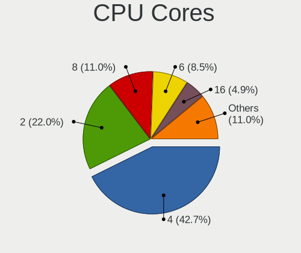
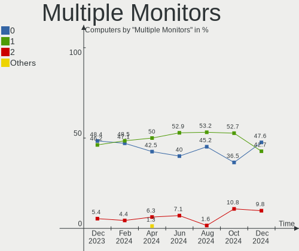

FreeBSD - Hardware Trends
-------------------------

A project to identify most popular hardware characteristics and track their change
over time based on data collected by BSD users at https://BSD-Hardware.info.

Anyone can contribute to this report by the [hw-probe](https://github.com/linuxhw/hw-probe/blob/master/INSTALL.BSD.md) tool:

    hw-probe -all -upload

This is a report for all computer types. See also reports for [desktops](/Dist/FreeBSD/Desktop/README.md) and [notebooks](/Dist/FreeBSD/Notebook/README.md).

This report is for one last month. Overall report since the beginning of time: [TestCoverage](https://github.com/bsdhw/TestCoverage)

Period: Oct, 2022.

Contents
--------

* [ System ](#system)
  - [ OS                       ](#os)
  - [ OS Family                ](#os-family)
  - [ Arch                     ](#arch)
  - [ DE                       ](#de)
  - [ Display Server           ](#display-server)
  - [ Display Manager          ](#display-manager)
  - [ OS Lang                  ](#os-lang)
  - [ Boot Mode                ](#boot-mode)
  - [ Filesystem               ](#filesystem)
  - [ Part. scheme             ](#part-scheme)

* [ Board ](#board)
  - [ Vendor                   ](#vendor)
  - [ Model                    ](#model)
  - [ Model Family             ](#model-family)
  - [ MFG Year                 ](#mfg-year)
  - [ Form Factor              ](#form-factor)
  - [ Coreboot                 ](#coreboot)
  - [ RAM Size                 ](#ram-size)
  - [ RAM Used                 ](#ram-used)
  - [ Total Drives             ](#total-drives)
  - [ Has CD-ROM               ](#has-cd-rom)
  - [ Has Ethernet             ](#has-ethernet)
  - [ Has WiFi                 ](#has-wifi)
  - [ Has Bluetooth            ](#has-bluetooth)

* [ Location ](#location)
  - [ Country                  ](#country)
  - [ City                     ](#city)

* [ Drives ](#drives)
  - [ Drive Vendor             ](#drive-vendor)
  - [ Drive Model              ](#drive-model)
  - [ HDD Vendor               ](#hdd-vendor)
  - [ SSD Vendor               ](#ssd-vendor)
  - [ Drive Kind               ](#drive-kind)
  - [ Drive Connector          ](#drive-connector)
  - [ Drive Size               ](#drive-size)
  - [ Space Total              ](#space-total)
  - [ Space Used               ](#space-used)
  - [ Malfunc. Drives          ](#malfunc-drives)
  - [ Malfunc. Drive Vendor    ](#malfunc-drive-vendor)
  - [ Malfunc. HDD Vendor      ](#malfunc-hdd-vendor)
  - [ Malfunc. Drive Kind      ](#malfunc-drive-kind)
  - [ Failed Drives            ](#failed-drives)
  - [ Failed Drive Vendor      ](#failed-drive-vendor)
  - [ Drive Status             ](#drive-status)

* [ Storage controller ](#storage-controller)
  - [ Storage Vendor           ](#storage-vendor)
  - [ Storage Model            ](#storage-model)
  - [ Storage Kind             ](#storage-kind)

* [ Processor ](#processor)
  - [ CPU Vendor               ](#cpu-vendor)
  - [ CPU Model                ](#cpu-model)
  - [ CPU Model Family         ](#cpu-model-family)
  - [ CPU Cores                ](#cpu-cores)
  - [ CPU Sockets              ](#cpu-sockets)
  - [ CPU Threads              ](#cpu-threads)
  - [ CPU Microarch            ](#cpu-microarch)

* [ Graphics ](#graphics)
  - [ GPU Vendor               ](#gpu-vendor)
  - [ GPU Model                ](#gpu-model)
  - [ GPU Combo                ](#gpu-combo)
  - [ GPU Driver               ](#gpu-driver)
  - [ GPU Memory               ](#gpu-memory)

* [ Monitor ](#monitor)
  - [ Monitor Vendor           ](#monitor-vendor)
  - [ Monitor Model            ](#monitor-model)
  - [ Monitor Resolution       ](#monitor-resolution)
  - [ Monitor Diagonal         ](#monitor-diagonal)
  - [ Monitor Width            ](#monitor-width)
  - [ Aspect Ratio             ](#aspect-ratio)
  - [ Monitor Area             ](#monitor-area)
  - [ Pixel Density            ](#pixel-density)
  - [ Multiple Monitors        ](#multiple-monitors)

* [ Network ](#network)
  - [ Net Controller Vendor    ](#net-controller-vendor)
  - [ Net Controller Model     ](#net-controller-model)
  - [ Wireless Vendor          ](#wireless-vendor)
  - [ Wireless Model           ](#wireless-model)
  - [ Ethernet Vendor          ](#ethernet-vendor)
  - [ Ethernet Model           ](#ethernet-model)
  - [ Net Controller Kind      ](#net-controller-kind)
  - [ Used Controller          ](#used-controller)
  - [ NICs                     ](#nics)
  - [ IPv6                     ](#ipv6)

* [ Bluetooth ](#bluetooth)
  - [ Bluetooth Vendor         ](#bluetooth-vendor)
  - [ Bluetooth Model          ](#bluetooth-model)

* [ Sound ](#sound)
  - [ Sound Vendor             ](#sound-vendor)
  - [ Sound Model              ](#sound-model)

* [ Memory ](#memory)
  - [ Memory Vendor            ](#memory-vendor)
  - [ Memory Model             ](#memory-model)
  - [ Memory Kind              ](#memory-kind)
  - [ Memory Form Factor       ](#memory-form-factor)
  - [ Memory Size              ](#memory-size)
  - [ Memory Speed             ](#memory-speed)

* [ Printers & scanners ](#printers--scanners)
  - [ Printer Vendor           ](#printer-vendor)
  - [ Printer Model            ](#printer-model)
  - [ Scanner Vendor           ](#scanner-vendor)
  - [ Scanner Model            ](#scanner-model)

* [ Camera ](#camera)
  - [ Camera Vendor            ](#camera-vendor)
  - [ Camera Model             ](#camera-model)

* [ Security ](#security)
  - [ Fingerprint Vendor       ](#fingerprint-vendor)
  - [ Fingerprint Model        ](#fingerprint-model)
  - [ Chipcard Vendor          ](#chipcard-vendor)
  - [ Chipcard Model           ](#chipcard-model)

* [ Unsupported ](#unsupported)
  - [ Unsupported Devices      ](#unsupported-devices)
  - [ Unsupported Device Types ](#unsupported-device-types)

System
------

OS
--

Installed operating systems

| Name                 | Computers | Percent |
|----------------------|-----------|---------|
| FreeBSD 13.1-p2      | 26        | 50%     |
| FreeBSD 13.1         | 16        | 30.77%  |
| FreeBSD 14.0-CURRENT | 2         | 3.85%   |
| FreeBSD 13.1-p1      | 2         | 3.85%   |
| FreeBSD 13.1-STABLE  | 1         | 1.92%   |
| FreeBSD 13.0-p12     | 1         | 1.92%   |
| FreeBSD 13.0-p10     | 1         | 1.92%   |
| FreeBSD 13.0         | 1         | 1.92%   |
| FreeBSD 12.4-BETA1   | 1         | 1.92%   |
| FreeBSD 12.3         | 1         | 1.92%   |

OS Family
---------

OS without a version

| Name    | Computers | Percent |
|---------|-----------|---------|
| FreeBSD | 52        | 100%    |

Arch
----

OS architecture (x86_64, i586, etc.)

| Name  | Computers | Percent |
|-------|-----------|---------|
| amd64 | 48        | 92.31%  |
| i386  | 3         | 5.77%   |
| arm64 | 1         | 1.92%   |

DE
--

Desktop Environment

| Name    | Computers | Percent |
|---------|-----------|---------|
| Console | 17        | 32.69%  |
| TWM     | 12        | 23.08%  |
| KDE5    | 8         | 15.38%  |
| XFCE    | 7         | 13.46%  |
| MATE    | 3         | 5.77%   |
| GNOME   | 3         | 5.77%   |
| LXQt    | 1         | 1.92%   |
| LXDE    | 1         | 1.92%   |

Display Server
--------------

X11 or Wayland

| Name    | Computers | Percent |
|---------|-----------|---------|
| X11     | 33        | 63.46%  |
| Console | 18        | 34.62%  |
| Wayland | 1         | 1.92%   |

Display Manager
---------------

SDDM, LightDM, etc.

| Name    | Computers | Percent |
|---------|-----------|---------|
| Console | 35        | 67.31%  |
| SDDM    | 8         | 15.38%  |
| LightDM | 3         | 5.77%   |
| XDM     | 2         | 3.85%   |
| SLiM    | 2         | 3.85%   |
| GDM     | 2         | 3.85%   |

OS Lang
-------

Language

| Lang    | Computers | Percent |
|---------|-----------|---------|
| C       | 35        | 67.31%  |
| en_US   | 5         | 9.62%   |
| Unknown | 3         | 5.77%   |
| fr_FR   | 2         | 3.85%   |
| fi_FI   | 2         | 3.85%   |
| de_DE   | 2         | 3.85%   |
| ru_RU   | 1         | 1.92%   |
| it_IT   | 1         | 1.92%   |
| en_CA   | 1         | 1.92%   |

Boot Mode
---------

EFI or BIOS

| Mode | Computers | Percent |
|------|-----------|---------|
| EFI  | 33        | 63.46%  |
| BIOS | 19        | 36.54%  |

Filesystem
----------

Type of filesystem

| Type | Computers | Percent |
|------|-----------|---------|
| Zfs  | 40        | 76.92%  |
| Ufs  | 12        | 23.08%  |

Part. scheme
------------

Scheme of partitioning

| Type | Computers | Percent |
|------|-----------|---------|
| GPT  | 49        | 94.23%  |
| MBR  | 3         | 5.77%   |

Board
-----

Vendor
------

Motherboard manufacturer

| Name             | Computers | Percent |
|------------------|-----------|---------|
| Lenovo           | 11        | 21.15%  |
| Dell             | 8         | 15.38%  |
| Hewlett-Packard  | 6         | 11.54%  |
| ASUSTek Computer | 5         | 9.62%   |
| ASRock           | 4         | 7.69%   |
| Acer             | 3         | 5.77%   |
| MSI              | 2         | 3.85%   |
| IBM              | 2         | 3.85%   |
| ASRockRack       | 2         | 3.85%   |
| Unknown          | 2         | 3.85%   |
| TYAN Computer    | 1         | 1.92%   |
| TUXEDO           | 1         | 1.92%   |
| Toshiba          | 1         | 1.92%   |
| Supermicro       | 1         | 1.92%   |
| Intel            | 1         | 1.92%   |
| HPE              | 1         | 1.92%   |
| Fujitsu          | 1         | 1.92%   |

Model
-----

Motherboard model

| Name                                        | Computers | Percent |
|---------------------------------------------|-----------|---------|
| Dell Precision M4500                        | 2         | 3.85%   |
| Unknown                                     | 2         | 3.85%   |
| TYAN Intel 440BX/GX Rev. 4                  | 1         | 1.92%   |
| TUXEDO Aura 15 Gen1                         | 1         | 1.92%   |
| Toshiba NB300                               | 1         | 1.92%   |
| Supermicro MBD-X8DT6-A-IS018                | 1         | 1.92%   |
| MSI MS-7D08                                 | 1         | 1.92%   |
| MSI MS-7817                                 | 1         | 1.92%   |
| Lenovo XiaoXinPro-13API 2019 81XD           | 1         | 1.92%   |
| Lenovo ThinkPad X1 Carbon Gen 10 21CBCTO1WW | 1         | 1.92%   |
| Lenovo ThinkPad T590 20N4CTO1WW             | 1         | 1.92%   |
| Lenovo ThinkPad T470p 20J7S0BR00            | 1         | 1.92%   |
| Lenovo ThinkPad T460 20FMS10N00             | 1         | 1.92%   |
| Lenovo ThinkPad T440s 20AR003SMN            | 1         | 1.92%   |
| Lenovo ThinkPad T430 23446FP                | 1         | 1.92%   |
| Lenovo ThinkCentre M900 10FLS3XG00          | 1         | 1.92%   |
| Lenovo ThinkCentre M70q 11DUSBYK00          | 1         | 1.92%   |
| Lenovo Legion 5 15IMH05 82AU                | 1         | 1.92%   |
| Lenovo IdeaPad 3 15ALC6 82KU                | 1         | 1.92%   |
| Intel NUC8i5BEH                             | 1         | 1.92%   |
| IBM System x3550 M2 -[7946AC1]-             | 1         | 1.92%   |
| IBM 9210MML                                 | 1         | 1.92%   |
| HPE ProLiant ML30 Gen10                     | 1         | 1.92%   |
| HP Z440 Workstation                         | 1         | 1.92%   |
| HP Z420 Workstation                         | 1         | 1.92%   |
| HP ENVY Laptop 13-aq0xxx                    | 1         | 1.92%   |
| HP EliteDesk 800 G1 TWR                     | 1         | 1.92%   |
| HP Compaq 6735s                             | 1         | 1.92%   |
| HP 255 G8 Notebook PC                       | 1         | 1.92%   |
| Fujitsu D3401-H2 S26361-D3401-H2            | 1         | 1.92%   |
| Dell Precision M4800                        | 1         | 1.92%   |
| Dell Precision 5510                         | 1         | 1.92%   |
| Dell OptiPlex 7770 AIO                      | 1         | 1.92%   |
| Dell Inspiron 7720                          | 1         | 1.92%   |
| Dell Inspiron 15 5510                       | 1         | 1.92%   |
| Dell Dimension 2400                         | 1         | 1.92%   |
| ASUS ROG CROSSHAIR VIII HERO                | 1         | 1.92%   |
| ASUS PRIME X370-PRO                         | 1         | 1.92%   |
| ASUS Pentino G-Series                       | 1         | 1.92%   |
| ASUS P8B75-M                                | 1         | 1.92%   |

Model Family
------------

Motherboard model prefix

| Name                         | Computers | Percent |
|------------------------------|-----------|---------|
| Lenovo ThinkPad              | 6         | 11.54%  |
| Dell Precision               | 4         | 7.69%   |
| Lenovo ThinkCentre           | 2         | 3.85%   |
| Dell Inspiron                | 2         | 3.85%   |
| Unknown                      | 2         | 3.85%   |
| TYAN Intel                   | 1         | 1.92%   |
| TUXEDO Aura                  | 1         | 1.92%   |
| Toshiba NB300                | 1         | 1.92%   |
| Supermicro MBD-X8DT6-A-IS018 | 1         | 1.92%   |
| MSI MS-7D08                  | 1         | 1.92%   |
| MSI MS-7817                  | 1         | 1.92%   |
| Lenovo XiaoXinPro-13API      | 1         | 1.92%   |
| Lenovo Legion                | 1         | 1.92%   |
| Lenovo IdeaPad               | 1         | 1.92%   |
| Intel NUC8i5BEH              | 1         | 1.92%   |
| IBM System                   | 1         | 1.92%   |
| IBM 9210MML                  | 1         | 1.92%   |
| HPE ProLiant                 | 1         | 1.92%   |
| HP Z440                      | 1         | 1.92%   |
| HP Z420                      | 1         | 1.92%   |
| HP ENVY                      | 1         | 1.92%   |
| HP EliteDesk                 | 1         | 1.92%   |
| HP Compaq                    | 1         | 1.92%   |
| HP 255                       | 1         | 1.92%   |
| Fujitsu D3401-H2             | 1         | 1.92%   |
| Dell OptiPlex                | 1         | 1.92%   |
| Dell Dimension               | 1         | 1.92%   |
| ASUS ROG                     | 1         | 1.92%   |
| ASUS PRIME                   | 1         | 1.92%   |
| ASUS Pentino                 | 1         | 1.92%   |
| ASUS P8B75-M                 | 1         | 1.92%   |
| ASUS P5Q-E                   | 1         | 1.92%   |
| ASRockRack EPYC3101D4I-2T    | 1         | 1.92%   |
| ASRockRack EP2C612D16FM      | 1         | 1.92%   |
| ASRock Z77                   | 1         | 1.92%   |
| ASRock X570                  | 1         | 1.92%   |
| ASRock X399                  | 1         | 1.92%   |
| ASRock G41C-GS               | 1         | 1.92%   |
| Acer TravelMate              | 1         | 1.92%   |
| Acer Revo                    | 1         | 1.92%   |

MFG Year
--------

Motherboard manufacture year

| Year    | Computers | Percent |
|---------|-----------|---------|
| 2020    | 8         | 15.38%  |
| 2019    | 5         | 9.62%   |
| 2015    | 5         | 9.62%   |
| 2022    | 4         | 7.69%   |
| 2021    | 4         | 7.69%   |
| 2013    | 4         | 7.69%   |
| 2010    | 4         | 7.69%   |
| 2018    | 3         | 5.77%   |
| 2017    | 3         | 5.77%   |
| 2014    | 3         | 5.77%   |
| Unknown | 3         | 5.77%   |
| 2008    | 2         | 3.85%   |
| 2016    | 1         | 1.92%   |
| 2012    | 1         | 1.92%   |
| 2006    | 1         | 1.92%   |
| 2003    | 1         | 1.92%   |

Form Factor
-----------

Physical design of the computer

| Name       | Computers | Percent |
|------------|-----------|---------|
| Desktop    | 25        | 48.08%  |
| Notebook   | 22        | 42.31%  |
| Mini pc    | 2         | 3.85%   |
| Server     | 2         | 3.85%   |
| All in one | 1         | 1.92%   |

Coreboot
--------

Have coreboot on board

| Used | Computers | Percent |
|------|-----------|---------|
| No   | 52        | 100%    |

RAM Size
--------

Total RAM memory

| Size in GB  | Computers | Percent |
|-------------|-----------|---------|
| 8.01-16.0   | 16        | 30.77%  |
| 32.01-64.0  | 12        | 23.08%  |
| 16.01-24.0  | 8         | 15.38%  |
| 64.01-256.0 | 6         | 11.54%  |
| 4.01-8.0    | 3         | 5.77%   |
| 0.51-1.0    | 3         | 5.77%   |
| 2.01-3.0    | 2         | 3.85%   |
| 3.01-4.0    | 1         | 1.92%   |
| 24.01-32.0  | 1         | 1.92%   |

RAM Used
--------

Used RAM memory

| Used GB    | Computers | Percent |
|------------|-----------|---------|
| 0.01-0.5   | 18        | 34.62%  |
| 1.01-2.0   | 15        | 28.85%  |
| 0.51-1.0   | 13        | 25%     |
| 2.01-3.0   | 4         | 7.69%   |
| 3.01-4.0   | 1         | 1.92%   |
| 24.01-32.0 | 1         | 1.92%   |

Total Drives
------------

Number of drives on board

| Drives | Computers | Percent |
|--------|-----------|---------|
| 1      | 27        | 51.92%  |
| 2      | 8         | 15.38%  |
| 3      | 5         | 9.62%   |
| 6      | 3         | 5.77%   |
| 4      | 3         | 5.77%   |
| 5      | 2         | 3.85%   |
| 0      | 2         | 3.85%   |
| 13     | 1         | 1.92%   |
| 10     | 1         | 1.92%   |

Has CD-ROM
----------

Has CD-ROM on board

| Presented | Computers | Percent |
|-----------|-----------|---------|
| No        | 36        | 69.23%  |
| Yes       | 16        | 30.77%  |

Has Ethernet
------------

Has Ethernet on board

| Presented | Computers | Percent |
|-----------|-----------|---------|
| Yes       | 44        | 84.62%  |
| No        | 8         | 15.38%  |

Has WiFi
--------

Has WiFi module

| Presented | Computers | Percent |
|-----------|-----------|---------|
| Yes       | 26        | 50%     |
| No        | 26        | 50%     |

Has Bluetooth
-------------

Has Bluetooth module

| Presented | Computers | Percent |
|-----------|-----------|---------|
| No        | 29        | 55.77%  |
| Yes       | 23        | 44.23%  |

Location
--------

Country
-------

Geographic location (country)

| Country     | Computers | Percent |
|-------------|-----------|---------|
| USA         | 15        | 28.85%  |
| France      | 8         | 15.38%  |
| Finland     | 4         | 7.69%   |
| Germany     | 3         | 5.77%   |
| Canada      | 3         | 5.77%   |
| Venezuela   | 2         | 3.85%   |
| Poland      | 2         | 3.85%   |
| UK          | 1         | 1.92%   |
| Thailand    | 1         | 1.92%   |
| Spain       | 1         | 1.92%   |
| Russia      | 1         | 1.92%   |
| Portugal    | 1         | 1.92%   |
| New Zealand | 1         | 1.92%   |
| Malta       | 1         | 1.92%   |
| Lithuania   | 1         | 1.92%   |
| Italy       | 1         | 1.92%   |
| Guadeloupe  | 1         | 1.92%   |
| Denmark     | 1         | 1.92%   |
| China       | 1         | 1.92%   |
| Belarus     | 1         | 1.92%   |
| Australia   | 1         | 1.92%   |
| Argentina   | 1         | 1.92%   |

City
----

Geographic location (city)

| City                 | Computers | Percent |
|----------------------|-----------|---------|
| Paris                | 3         | 5.77%   |
| City of Saint Peters | 3         | 5.77%   |
| Salem                | 2         | 3.85%   |
| Redmond              | 2         | 3.85%   |
| Portland             | 2         | 3.85%   |
| Maracaibo            | 2         | 3.85%   |
| Lahti                | 2         | 3.85%   |
| Carry-le-Rouet       | 2         | 3.85%   |
| Wenatchee            | 1         | 1.92%   |
| Wellington           | 1         | 1.92%   |
| Vitoria-Gasteiz      | 1         | 1.92%   |
| Vilnius              | 1         | 1.92%   |
| Vancouver            | 1         | 1.92%   |
| Turku                | 1         | 1.92%   |
| Swieqi               | 1         | 1.92%   |
| Souraide             | 1         | 1.92%   |
| Sherbrooke           | 1         | 1.92%   |
| Roubaix              | 1         | 1.92%   |
| Roselle              | 1         | 1.92%   |
| Reading              | 1         | 1.92%   |
| Radzionkow           | 1         | 1.92%   |
| Pontecagnano         | 1         | 1.92%   |
| Ozersk               | 1         | 1.92%   |
| Minsk                | 1         | 1.92%   |
| Lubin                | 1         | 1.92%   |
| Le Gosier            | 1         | 1.92%   |
| Kongens Lyngby       | 1         | 1.92%   |
| Kingsburg            | 1         | 1.92%   |
| Helsinki             | 1         | 1.92%   |
| Hamburg              | 1         | 1.92%   |
| Freiburg im Breisgau | 1         | 1.92%   |
| Ezy-sur-Eure         | 1         | 1.92%   |
| Commerce City        | 1         | 1.92%   |
| Chengxiang           | 1         | 1.92%   |
| Chaloem Phra Kiat    | 1         | 1.92%   |
| Cambridge            | 1         | 1.92%   |
| Buenos Aires         | 1         | 1.92%   |
| Blacksburg           | 1         | 1.92%   |
| Berlin               | 1         | 1.92%   |
| Aveiro               | 1         | 1.92%   |

Drives
------

Drive Vendor
------------

Hard drive vendors

| Vendor              | Computers | Drives | Percent |
|---------------------|-----------|--------|---------|
| WDC                 | 17        | 40     | 22.08%  |
| Samsung Electronics | 16        | 28     | 20.78%  |
| Seagate             | 9         | 14     | 11.69%  |
| Kingston            | 7         | 8      | 9.09%   |
| Toshiba             | 5         | 9      | 6.49%   |
| Hitachi             | 4         | 5      | 5.19%   |
| Crucial             | 4         | 4      | 5.19%   |
| Intel               | 3         | 4      | 3.9%    |
| UMIS                | 1         | 1      | 1.3%    |
| SK hynix            | 1         | 1      | 1.3%    |
| SanDisk             | 1         | 1      | 1.3%    |
| QUANTUM             | 1         | 1      | 1.3%    |
| Phison              | 1         | 1      | 1.3%    |
| Micron Technology   | 1         | 1      | 1.3%    |
| Maxtor              | 1         | 1      | 1.3%    |
| Lexar               | 1         | 1      | 1.3%    |
| KIOXIA              | 1         | 1      | 1.3%    |
| KingSpec            | 1         | 1      | 1.3%    |
| Intenso             | 1         | 1      | 1.3%    |
| Corsair             | 1         | 1      | 1.3%    |

Drive Model
-----------

Hard drive models

| Model                                  | Computers | Percent |
|----------------------------------------|-----------|---------|
| WDC WD3200BPVT-80JJ5T0 320GB           | 2         | 2.08%   |
| Seagate ST4000DM000-1F2168 4TB         | 2         | 2.08%   |
| Seagate ST1000DM003-1CH162 1TB         | 2         | 2.08%   |
| Samsung SSD 970 EVO Plus 2TB           | 2         | 2.08%   |
| Samsung SSD 970 EVO Plus 1TB           | 2         | 2.08%   |
| Samsung SSD 860 QVO 1TB                | 2         | 2.08%   |
| Kingston SA400S37240G 240GB            | 2         | 2.08%   |
| Crucial CT250MX500SSD1 250GB           | 2         | 2.08%   |
| WDC WDS100T3X0C-00SJG0 1TB             | 1         | 1.04%   |
| WDC WDS100T2B0C-00PXH0 1TB             | 1         | 1.04%   |
| WDC WDS100T2B0A-00SM50 1TB             | 1         | 1.04%   |
| WDC WD80EZAZ-11TDBA0 8TB               | 1         | 1.04%   |
| WDC WD80EMAZ-00WJTA0 8TB               | 1         | 1.04%   |
| WDC WD80EFZX-68UW8N0 8TB               | 1         | 1.04%   |
| WDC WD80EFAX-68LHPN0 8TB               | 1         | 1.04%   |
| WDC WD80EDBZ-11B0ZA0 8TB               | 1         | 1.04%   |
| WDC WD80EDAZ-11TA3A0 8TB               | 1         | 1.04%   |
| WDC WD5000LPLX-08ZNTT0 500GB           | 1         | 1.04%   |
| WDC WD40NMZW-11GX6S1 4TB               | 1         | 1.04%   |
| WDC WD40EZRZ-22GXCB0 4TB               | 1         | 1.04%   |
| WDC WD30EFRX-68EUZN0 3TB               | 1         | 1.04%   |
| WDC WD30EFRX-68AX9N0 3TB               | 1         | 1.04%   |
| WDC WD20NMVW-11AV3S3 2TB               | 1         | 1.04%   |
| WDC WD20NMVW-11AV3S2 2TB               | 1         | 1.04%   |
| WDC WD15EADS-00P8B0 1.5TB              | 1         | 1.04%   |
| WDC WD120EMFZ-11A6JA0 12TB             | 1         | 1.04%   |
| WDC WD120EMAZ-11BLFA0 12TB             | 1         | 1.04%   |
| WDC WD10EZEX-00BN5A0 1TB               | 1         | 1.04%   |
| WDC WD10EFRX-68FYTN0 1TB               | 1         | 1.04%   |
| WDC WD1003FZEX-00K3CA0 1TB             | 1         | 1.04%   |
| WDC WD1000DHTZ-04N21V0 1TB             | 1         | 1.04%   |
| WDC AC313000R 16GB                     | 1         | 1.04%   |
| UMIS RPJTJ256MEE1OWX 256GB             | 1         | 1.04%   |
| Toshiba MQ01ABF032 320GB               | 1         | 1.04%   |
| Toshiba MK2555GSX 250GB                | 1         | 1.04%   |
| Toshiba MG08ACA16TE 16TB               | 1         | 1.04%   |
| Toshiba KXG50ZNV512G 512GB             | 1         | 1.04%   |
| Toshiba DT01ACA100 1TB                 | 1         | 1.04%   |
| SK hynix SKHynix_HFS256GDE9X081N 256GB | 1         | 1.04%   |
| Seagate ST4000NM0033-9ZM170 4TB        | 1         | 1.04%   |

HDD Vendor
----------

Hard disk drive vendors

| Vendor              | Computers | Drives | Percent |
|---------------------|-----------|--------|---------|
| WDC                 | 14        | 35     | 41.18%  |
| Seagate             | 9         | 14     | 26.47%  |
| Toshiba             | 4         | 7      | 11.76%  |
| Hitachi             | 4         | 5      | 11.76%  |
| Samsung Electronics | 1         | 1      | 2.94%   |
| QUANTUM             | 1         | 1      | 2.94%   |
| Maxtor              | 1         | 1      | 2.94%   |

SSD Vendor
----------

Solid state drive vendors

| Vendor              | Computers | Drives | Percent |
|---------------------|-----------|--------|---------|
| Samsung Electronics | 8         | 15     | 32%     |
| Kingston            | 6         | 7      | 24%     |
| Crucial             | 4         | 4      | 16%     |
| WDC                 | 1         | 3      | 4%      |
| SanDisk             | 1         | 1      | 4%      |
| Phison              | 1         | 1      | 4%      |
| Lexar               | 1         | 1      | 4%      |
| KingSpec            | 1         | 1      | 4%      |
| Intenso             | 1         | 1      | 4%      |
| Intel               | 1         | 1      | 4%      |

Drive Kind
----------

HDD or SSD

| Kind | Computers | Drives | Percent |
|------|-----------|--------|---------|
| HDD  | 25        | 64     | 36.23%  |
| SSD  | 23        | 35     | 33.33%  |
| NVMe | 21        | 25     | 30.43%  |

Drive Connector
---------------

SATA, SAS, NVMe, etc.

| Type | Computers | Drives | Percent |
|------|-----------|--------|---------|
| SATA | 37        | 99     | 63.79%  |
| NVMe | 21        | 25     | 36.21%  |

Drive Size
----------

Size of hard drive

| Size in TB | Computers | Drives | Percent |
|------------|-----------|--------|---------|
| 0.01-0.5   | 23        | 35     | 46%     |
| 0.51-1.0   | 11        | 22     | 22%     |
| 3.01-4.0   | 5         | 8      | 10%     |
| 1.01-2.0   | 5         | 9      | 10%     |
| 2.01-3.0   | 2         | 4      | 4%      |
| 10.01-20.0 | 2         | 6      | 4%      |
| 4.01-10.0  | 2         | 15     | 4%      |

Space Total
-----------

Amount of disk space available on the file system

| Size in GB     | Computers | Percent |
|----------------|-----------|---------|
| 101-250        | 22        | 42.31%  |
| 251-500        | 12        | 23.08%  |
| 501-1000       | 10        | 19.23%  |
| 21-50          | 3         | 5.77%   |
| More than 3000 | 2         | 3.85%   |
| 2001-3000      | 1         | 1.92%   |
| 1001-2000      | 1         | 1.92%   |
| 51-100         | 1         | 1.92%   |

Space Used
----------

Amount of used disk space

| Used GB        | Computers | Percent |
|----------------|-----------|---------|
| 1-20           | 37        | 71.15%  |
| 21-50          | 6         | 11.54%  |
| 101-250        | 4         | 7.69%   |
| 51-100         | 3         | 5.77%   |
| More than 3000 | 1         | 1.92%   |
| 251-500        | 1         | 1.92%   |

Malfunc. Drives
---------------

Drive models with a malfunction

| Model                              | Computers | Drives | Percent |
|------------------------------------|-----------|--------|---------|
| WDC WD3200BPVT-80JJ5T0 320GB       | 2         | 2      | 15.38%  |
| Toshiba MQ01ABF032 320GB           | 1         | 1      | 7.69%   |
| Seagate ST4000NM0033-9ZM170 4TB    | 1         | 2      | 7.69%   |
| Seagate ST1000LM024 HN-M101MBB 1TB | 1         | 1      | 7.69%   |
| Seagate ST1000DM003-1CH162 1TB     | 1         | 1      | 7.69%   |
| Samsung Electronics HD501LJ 500GB  | 1         | 1      | 7.69%   |
| Phison NETLIST SSD 8GB-001         | 1         | 1      | 7.69%   |
| Maxtor 6E030L0 32GB                | 1         | 1      | 7.69%   |
| Kingston SVP200S37A120G 120GB      | 1         | 1      | 7.69%   |
| Kingston SV300S37A120G 120GB       | 1         | 1      | 7.69%   |
| Kingston SH103S3240G 240GB         | 1         | 1      | 7.69%   |
| Hitachi HTS545025B9A300 250GB      | 1         | 1      | 7.69%   |

Malfunc. Drive Vendor
---------------------

Vendors of faulty drives

| Vendor              | Computers | Drives | Percent |
|---------------------|-----------|--------|---------|
| Seagate             | 3         | 4      | 25%     |
| WDC                 | 2         | 2      | 16.67%  |
| Kingston            | 2         | 3      | 16.67%  |
| Toshiba             | 1         | 1      | 8.33%   |
| Samsung Electronics | 1         | 1      | 8.33%   |
| Phison              | 1         | 1      | 8.33%   |
| Maxtor              | 1         | 1      | 8.33%   |
| Hitachi             | 1         | 1      | 8.33%   |

Malfunc. HDD Vendor
-------------------

Vendors of faulty HDD drives

| Vendor              | Computers | Drives | Percent |
|---------------------|-----------|--------|---------|
| Seagate             | 3         | 4      | 33.33%  |
| WDC                 | 2         | 2      | 22.22%  |
| Toshiba             | 1         | 1      | 11.11%  |
| Samsung Electronics | 1         | 1      | 11.11%  |
| Maxtor              | 1         | 1      | 11.11%  |
| Hitachi             | 1         | 1      | 11.11%  |

Malfunc. Drive Kind
-------------------

Kinds of faulty drives

| Kind | Computers | Drives | Percent |
|------|-----------|--------|---------|
| HDD  | 8         | 10     | 72.73%  |
| SSD  | 3         | 4      | 27.27%  |

Failed Drives
-------------

Failed drive models

Zero info for selected period =(

Failed Drive Vendor
-------------------

Failed drive vendors

Zero info for selected period =(

Drive Status
------------

Number of failed and malfunc. drives

| Status   | Computers | Drives | Percent |
|----------|-----------|--------|---------|
| Works    | 42        | 103    | 75%     |
| Malfunc  | 11        | 14     | 19.64%  |
| Detected | 3         | 7      | 5.36%   |

Storage controller
------------------

Storage Vendor
--------------

Storage controller vendors

| Vendor                      | Computers | Percent |
|-----------------------------|-----------|---------|
| Intel                       | 38        | 50.67%  |
| Samsung Electronics         | 10        | 13.33%  |
| AMD                         | 8         | 10.67%  |
| Sandisk                     | 4         | 5.33%   |
| Broadcom / LSI              | 3         | 4%      |
| Kingston Technology Company | 2         | 2.67%   |
| ASMedia Technology          | 2         | 2.67%   |
| Adaptec                     | 2         | 2.67%   |
| Union Memory (Shenzhen)     | 1         | 1.33%   |
| Toshiba                     | 1         | 1.33%   |
| SK hynix                    | 1         | 1.33%   |
| Phison Electronics          | 1         | 1.33%   |
| Marvell Technology Group    | 1         | 1.33%   |
| KIOXIA                      | 1         | 1.33%   |

Storage Model
-------------

Storage controller models

| Model                                                                          | Computers | Percent |
|--------------------------------------------------------------------------------|-----------|---------|
| Samsung NVMe SSD Controller SM981/PM981/PM983                                  | 7         | 7.95%   |
| AMD FCH SATA Controller [AHCI mode]                                            | 7         | 7.95%   |
| Intel Q170/Q150/B150/H170/H110/Z170/CM236 Chipset SATA Controller [AHCI Mode]  | 3         | 3.41%   |
| Samsung NVMe SSD Controller 980                                                | 2         | 2.27%   |
| Intel SATA Controller [RAID mode]                                              | 2         | 2.27%   |
| Intel NM10/ICH7 Family SATA Controller [IDE mode]                              | 2         | 2.27%   |
| Intel Cannon Lake PCH SATA AHCI Controller                                     | 2         | 2.27%   |
| Intel C610/X99 series chipset sSATA Controller [AHCI mode]                     | 2         | 2.27%   |
| Intel C610/X99 series chipset 6-Port SATA Controller [AHCI mode]               | 2         | 2.27%   |
| Intel 82801JI (ICH10 Family) SATA AHCI Controller                              | 2         | 2.27%   |
| Intel 82801 Mobile SATA Controller [RAID mode]                                 | 2         | 2.27%   |
| Intel 8 Series/C220 Series Chipset Family 6-port SATA Controller 1 [AHCI mode] | 2         | 2.27%   |
| Intel 7 Series Chipset Family 6-port SATA Controller [AHCI mode]               | 2         | 2.27%   |
| Intel 5 Series/3400 Series Chipset 6 port SATA AHCI Controller                 | 2         | 2.27%   |
| Broadcom / LSI SAS2008 PCI-Express Fusion-MPT SAS-2 [Falcon]                   | 2         | 2.27%   |
| ASMedia ASM1062 Serial ATA Controller                                          | 2         | 2.27%   |
| Unknown                                                                        | 2         | 2.27%   |
| Toshiba unknown                                                                | 1         | 1.14%   |
| SK hynix Gold P31 SSD                                                          | 1         | 1.14%   |
| SanDisk WD Blue SN570 NVMe SSD                                                 | 1         | 1.14%   |
| SanDisk WD Blue SN550 NVMe SSD                                                 | 1         | 1.14%   |
| SanDisk WD Black SN750 / PC SN730 NVMe SSD                                     | 1         | 1.14%   |
| Samsung NVMe SSD Controller SM961/PM961/SM963                                  | 1         | 1.14%   |
| Phison E16 PCIe4 NVMe Controller                                               | 1         | 1.14%   |
| Marvell Group 88SE6111/6121 SATA II / PATA Controller                          | 1         | 1.14%   |
| KIOXIA NVMe SSD Controller BG4                                                 | 1         | 1.14%   |
| Kingston Company OM3PDP3 NVMe SSD                                              | 1         | 1.14%   |
| Kingston Company A2000 NVMe SSD                                                | 1         | 1.14%   |
| Intel Volume Management Device NVMe RAID Controller                            | 1         | 1.14%   |
| Intel Tiger Lake-LP SATA Controller                                            | 1         | 1.14%   |
| Intel Sunrise Point-LP SATA Controller [AHCI mode]                             | 1         | 1.14%   |
| Intel SSD 660P Series                                                          | 1         | 1.14%   |
| Intel Optane SSD 900P Series                                                   | 1         | 1.14%   |
| Intel NVMe Optane Memory Series                                                | 1         | 1.14%   |
| Intel NM10/ICH7 Family SATA Controller [AHCI mode]                             | 1         | 1.14%   |
| Intel HM170/QM170 Chipset SATA Controller [AHCI Mode]                          | 1         | 1.14%   |
| Intel Comet Lake SATA AHCI Controller                                          | 1         | 1.14%   |
| Intel Celeron/Pentium Silver Processor SATA Controller                         | 1         | 1.14%   |
| Intel Cannon Point-LP SATA Controller [AHCI Mode]                              | 1         | 1.14%   |
| Intel C602 chipset 4-Port SATA Storage Control Unit                            | 1         | 1.14%   |

Storage Kind
------------

Kind of storage controller (IDE, SATA, NVMe, SAS, ...)

| Kind | Computers | Percent |
|------|-----------|---------|
| SATA | 37        | 47.44%  |
| NVMe | 22        | 28.21%  |
| IDE  | 8         | 10.26%  |
| RAID | 6         | 7.69%   |
| SAS  | 4         | 5.13%   |
| SCSI | 1         | 1.28%   |

Processor
---------

CPU Vendor
----------

Processor vendors

| Vendor | Computers | Percent |
|--------|-----------|---------|
| Intel  | 40        | 76.92%  |
| AMD    | 10        | 19.23%  |
| i      | 1         | 1.92%   |
| ARM    | 1         | 1.92%   |

CPU Model
---------

Processor models

| Model                                   | Computers | Percent |
|-----------------------------------------|-----------|---------|
| Intel Core i7-8565U CPU @ 1.80GHz       | 2         | 3.85%   |
| Intel Core i7-3770 CPU @ 3.40GHz        | 2         | 3.85%   |
| Intel Core i5 CPU M 560 @ 2.67GH        | 2         | 3.85%   |
| AMD Ryzen 9 3900X 12-Core Processor     | 2         | 3.85%   |
| Intel Xeon E-2276G CPU @ 3.80GHz        | 1         | 1.92%   |
| Intel Xeon CPU X5650 @ 2.67GHz          | 1         | 1.92%   |
| Intel Xeon CPU L5640 @ 2.27GHz          | 1         | 1.92%   |
| Intel Xeon CPU E5-2683 v4 @ 2.10GHz     | 1         | 1.92%   |
| Intel Xeon CPU E5-2650 v3 @ 2.30GHz     | 1         | 1.92%   |
| Intel Xeon CPU E5-1620 @ 3.60GHz        | 1         | 1.92%   |
| Intel Pentium D CPU 3.00GHz             | 1         | 1.92%   |
| Intel Pentium CPU G3220 @ 3.00GHz       | 1         | 1.92%   |
| Intel Pentium 4 CPU 3.20GHz             | 1         | 1.92%   |
| Intel Core i7-7700HQ CPU @ 2.80GHz      | 1         | 1.92%   |
| Intel Core i7-7700 CPU @ 3.60GHz        | 1         | 1.92%   |
| Intel Core i7-4810MQ CPU @ 2.80GHz      | 1         | 1.92%   |
| Intel Core i7-4600U CPU @ 2.10GHz       | 1         | 1.92%   |
| Intel Core i7-3630QM CPU @ 2.40GHz      | 1         | 1.92%   |
| Intel Core i7-3612QM CPU @ 2.10GHz      | 1         | 1.92%   |
| Intel Core i7-10750H CPU @ 2.60GHz      | 1         | 1.92%   |
| Intel Core i5-9500 CPU @ 3.00GHz        | 1         | 1.92%   |
| Intel Core i5-9400T CPU @ 1.80GHz       | 1         | 1.92%   |
| Intel Core i5-8259U CPU @ 2.30GHz       | 1         | 1.92%   |
| Intel Core i5-6500T CPU @ 2.50GHz       | 1         | 1.92%   |
| Intel Core i5-6300U CPU @ 2.40GHz       | 1         | 1.92%   |
| Intel Core i5-6300HQ CPU @ 2.30GHz      | 1         | 1.92%   |
| Intel Core i5-4670 CPU @ 3.40GHz        | 1         | 1.92%   |
| Intel Core i5-3470 CPU @ 3.20GHz        | 1         | 1.92%   |
| Intel Core i3-10100T CPU @ 3.00GHz      | 1         | 1.92%   |
| Intel Core 2 Quad CPU Q6600 @ 2.40GHz   | 1         | 1.92%   |
| Intel Celeron J4105 CPU @ 1.50GHz       | 1         | 1.92%   |
| Intel Celeron CPU N2840 @ 2.16GHz       | 1         | 1.92%   |
| Intel Celeron                           | 1         | 1.92%   |
| Intel A0                                | 1         | 1.92%   |
| Intel 12th Gen Core i7-1280P            | 1         | 1.92%   |
| Intel 11th Gen Core i7-11370H @ 3.30GHz | 1         | 1.92%   |
| Intel 11th Gen Core i5-11600K @ 3.90GHz | 1         | 1.92%   |
| Intel 11th Gen Core i5-1135G7 @ 2.40GHz | 1         | 1.92%   |
| i Pentium II                            | 1         | 1.92%   |
| ARM Cortex-A53 r0p4                     | 1         | 1.92%   |

CPU Model Family
----------------

Processor model prefix

| Model                  | Computers | Percent |
|------------------------|-----------|---------|
| Intel Core i7          | 11        | 21.15%  |
| Intel Core i5          | 10        | 19.23%  |
| Other                  | 6         | 11.54%  |
| Intel Xeon             | 6         | 11.54%  |
| Intel Celeron          | 3         | 5.77%   |
| AMD Ryzen 9            | 2         | 3.85%   |
| AMD Ryzen 7            | 2         | 3.85%   |
| AMD Ryzen 5            | 2         | 3.85%   |
| Intel Pentium D        | 1         | 1.92%   |
| Intel Pentium 4        | 1         | 1.92%   |
| Intel Pentium          | 1         | 1.92%   |
| Intel Core i3          | 1         | 1.92%   |
| Intel Core 2 Quad      | 1         | 1.92%   |
| ARM Cortex             | 1         | 1.92%   |
| AMD Sempron            | 1         | 1.92%   |
| AMD Ryzen Threadripper | 1         | 1.92%   |
| AMD Ryzen 3            | 1         | 1.92%   |
| AMD EPYC               | 1         | 1.92%   |

CPU Cores
---------

Number of processor cores

| Number  | Computers | Percent |
|---------|-----------|---------|
| 4       | 21        | 40.38%  |
| 2       | 7         | 13.46%  |
| 6       | 5         | 9.62%   |
| 12      | 3         | 5.77%   |
| 8       | 3         | 5.77%   |
| 1       | 3         | 5.77%   |
| Unknown | 3         | 5.77%   |
| 24      | 2         | 3.85%   |
| 20      | 2         | 3.85%   |
| 16      | 2         | 3.85%   |
| 32      | 1         | 1.92%   |

CPU Sockets
-----------

Number of sockets

| Number  | Computers | Percent |
|---------|-----------|---------|
| 1       | 47        | 90.38%  |
| 2       | 4         | 7.69%   |
| Unknown | 1         | 1.92%   |

CPU Threads
-----------

Threads per core (Hyper-Threading)

| Number  | Computers | Percent |
|---------|-----------|---------|
| 2       | 26        | 50%     |
| 1       | 22        | 42.31%  |
| Unknown | 4         | 7.69%   |

CPU Microarch
-------------

Microarchitecture

| Name            | Computers | Percent |
|-----------------|-----------|---------|
| KabyLake        | 8         | 15.38%  |
| Unknown         | 6         | 11.54%  |
| IvyBridge       | 5         | 9.62%   |
| Haswell         | 5         | 9.62%   |
| Westmere        | 4         | 7.69%   |
| Zen 2           | 3         | 5.77%   |
| Skylake         | 3         | 5.77%   |
| NetBurst        | 3         | 5.77%   |
| Zen+            | 2         | 3.85%   |
| Zen             | 2         | 3.85%   |
| TigerLake       | 2         | 3.85%   |
| CometLake       | 2         | 3.85%   |
| Silvermont      | 1         | 1.92%   |
| SandyBridge     | 1         | 1.92%   |
| K8 & K10 hybrid | 1         | 1.92%   |
| Goldmont plus   | 1         | 1.92%   |
| Core            | 1         | 1.92%   |
| Broadwell       | 1         | 1.92%   |
| Bonnell         | 1         | 1.92%   |

Graphics
--------

GPU Vendor
----------

Vendors of graphics cards

| Vendor                     | Computers | Percent |
|----------------------------|-----------|---------|
| Intel                      | 30        | 50.85%  |
| Nvidia                     | 15        | 25.42%  |
| AMD                        | 9         | 15.25%  |
| Matrox Electronics Systems | 3         | 5.08%   |
| ASPEED Technology          | 2         | 3.39%   |

GPU Model
---------

Graphics card models

| Model                                                                       | Computers | Percent |
|-----------------------------------------------------------------------------|-----------|---------|
| Nvidia GT216GLM [Quadro FX 880M]                                            | 2         | 3.39%   |
| Intel Xeon E3-1200 v3/4th Gen Core Processor Integrated Graphics Controller | 2         | 3.39%   |
| Intel WhiskeyLake-U GT2 [UHD Graphics 620]                                  | 2         | 3.39%   |
| Intel TigerLake-LP GT2 [Iris Xe Graphics]                                   | 2         | 3.39%   |
| Intel IvyBridge GT2 [HD Graphics 4000]                                      | 2         | 3.39%   |
| Intel HD Graphics 630                                                       | 2         | 3.39%   |
| Intel HD Graphics 530                                                       | 2         | 3.39%   |
| Intel CoffeeLake-S GT2 [UHD Graphics 630]                                   | 2         | 3.39%   |
| Intel 3rd Gen Core processor Graphics Controller                            | 2         | 3.39%   |
| ASPEED Technology ASPEED Graphics Family                                    | 2         | 3.39%   |
| AMD Lucienne                                                                | 2         | 3.39%   |
| Nvidia TU117M                                                               | 1         | 1.69%   |
| Nvidia TU104 [GeForce RTX 2080 Rev. A]                                      | 1         | 1.69%   |
| Nvidia GT218 [NVS 300]                                                      | 1         | 1.69%   |
| Nvidia GP108BM [GeForce MX250]                                              | 1         | 1.69%   |
| Nvidia GP108 [GeForce GT 1030]                                              | 1         | 1.69%   |
| Nvidia GP106 [GeForce GTX 1060 3GB]                                         | 1         | 1.69%   |
| Nvidia GP104GL [Quadro P4000]                                               | 1         | 1.69%   |
| Nvidia GM108M [GeForce 940MX]                                               | 1         | 1.69%   |
| Nvidia GM107GLM [Quadro M1000M]                                             | 1         | 1.69%   |
| Nvidia GK208B [GeForce GT 710]                                              | 1         | 1.69%   |
| Nvidia GK107M [GeForce GT 650M]                                             | 1         | 1.69%   |
| Nvidia GK106 [GeForce GTX 660]                                              | 1         | 1.69%   |
| Nvidia GF110 [GeForce GTX 580]                                              | 1         | 1.69%   |
| Matrox Electronics Systems MGA G200eW WPCM450                               | 1         | 1.69%   |
| Matrox Electronics Systems MGA G200EV                                       | 1         | 1.69%   |
| Matrox Electronics Systems MGA G200eH3                                      | 1         | 1.69%   |
| Intel Xeon E3-1200 v2/3rd Gen Core processor Graphics Controller            | 1         | 1.69%   |
| Intel Skylake GT2 [HD Graphics 520]                                         | 1         | 1.69%   |
| Intel RocketLake-S GT1 [UHD Graphics 750]                                   | 1         | 1.69%   |
| Intel Haswell-ULT Integrated Graphics Controller                            | 1         | 1.69%   |
| Intel GeminiLake [UHD Graphics 600]                                         | 1         | 1.69%   |
| Intel CometLake-S GT2 [UHD Graphics 630]                                    | 1         | 1.69%   |
| Intel CoffeeLake-U GT3e [Iris Plus Graphics 655]                            | 1         | 1.69%   |
| Intel Atom Processor Z36xxx/Z37xxx Series Graphics & Display                | 1         | 1.69%   |
| Intel Atom Processor D4xx/D5xx/N4xx/N5xx Integrated Graphics Controller     | 1         | 1.69%   |
| Intel Alder Lake-P Integrated Graphics Controller                           | 1         | 1.69%   |
| Intel 82945G/GZ Integrated Graphics Controller                              | 1         | 1.69%   |
| Intel 82845G/GL[Brookdale-G]/GE Chipset Integrated Graphics Device          | 1         | 1.69%   |
| Intel 4th Gen Core Processor Integrated Graphics Controller                 | 1         | 1.69%   |

GPU Combo
---------

Combinations of graphics cards

| Name            | Computers | Percent |
|-----------------|-----------|---------|
| 1 x Intel       | 21        | 40.38%  |
| 1 x Nvidia      | 8         | 15.38%  |
| 1 x AMD         | 8         | 15.38%  |
| Intel + Nvidia  | 6         | 11.54%  |
| 1 x Matrox      | 3         | 5.77%   |
| 2 x Intel       | 2         | 3.85%   |
| Other           | 1         | 1.92%   |
| Nvidia + ASPEED | 1         | 1.92%   |
| Intel + AMD     | 1         | 1.92%   |
| 1 x ASPEED      | 1         | 1.92%   |

GPU Driver
----------

Free vs proprietary

| Driver      | Computers | Percent |
|-------------|-----------|---------|
| Free        | 42        | 80.77%  |
| Proprietary | 9         | 17.31%  |
| Unknown     | 1         | 1.92%   |

GPU Memory
----------

Total video memory

| Size in GB | Computers | Percent |
|------------|-----------|---------|
| Unknown    | 43        | 82.69%  |
| 0.51-1.0   | 3         | 5.77%   |
| 1.01-2.0   | 2         | 3.85%   |
| 7.01-8.0   | 1         | 1.92%   |
| 3.01-4.0   | 1         | 1.92%   |
| 2.01-3.0   | 1         | 1.92%   |
| 0.01-0.5   | 1         | 1.92%   |

Monitor
-------

Monitor Vendor
--------------

Monitor vendors

| Vendor               | Computers | Percent |
|----------------------|-----------|---------|
| AU Optronics         | 7         | 18.42%  |
| Goldstar             | 4         | 10.53%  |
| Samsung Electronics  | 3         | 7.89%   |
| LGD                  | 3         | 7.89%   |
| Dell                 | 3         | 7.89%   |
| LG Display           | 2         | 5.26%   |
| Chimei Innolux       | 2         | 5.26%   |
| BOE                  | 2         | 5.26%   |
| AOC                  | 2         | 5.26%   |
| ViewSonic            | 1         | 2.63%   |
| Toshiba              | 1         | 2.63%   |
| Sharp                | 1         | 2.63%   |
| Philips              | 1         | 2.63%   |
| Lenovo               | 1         | 2.63%   |
| Iiyama               | 1         | 2.63%   |
| Hewlett-Packard      | 1         | 2.63%   |
| CSO                  | 1         | 2.63%   |
| BenQ                 | 1         | 2.63%   |
| Ancor Communications | 1         | 2.63%   |

Monitor Model
-------------

Monitor models

| Model                                                                 | Computers | Percent |
|-----------------------------------------------------------------------|-----------|---------|
| LGD LCD Monitor 1600x900                                              | 2         | 4.88%   |
| ViewSonic LCD Monitor VSCD22B 1920x1080 520x290mm 23.4-inch           | 1         | 2.44%   |
| Toshiba TV TSB0200 1920x1080 530x300mm 24.0-inch                      | 1         | 2.44%   |
| Sharp LCD Monitor SHP143E 3840x2160 350x190mm 15.7-inch               | 1         | 2.44%   |
| Samsung Electronics SyncMaster SAM00A4 1024x768 300x230mm 14.9-inch   | 1         | 2.44%   |
| Samsung Electronics LCD Monitor SEC544E 1024x600 220x130mm 10.1-inch  | 1         | 2.44%   |
| Samsung Electronics LCD Monitor S27D850                               | 1         | 2.44%   |
| Philips PHL 439P1 PHL0973 3840x2160 940x530mm 42.5-inch               | 1         | 2.44%   |
| LGD LCD Monitor 1920x1080                                             | 1         | 2.44%   |
| LG Display LCD Monitor LGD046F 1920x1080 340x190mm 15.3-inch          | 1         | 2.44%   |
| LG Display LCD Monitor LGD02DA 1920x1080 380x210mm 17.1-inch          | 1         | 2.44%   |
| Lenovo LEN T32h-20 LEN61F1 2560x1440 700x390mm 31.5-inch              | 1         | 2.44%   |
| Iiyama PL2773HD IVM6606 1920x1080 600x340mm 27.2-inch                 | 1         | 2.44%   |
| Hewlett-Packard LA2306 HWP294B 1920x1080 510x290mm 23.1-inch          | 1         | 2.44%   |
| Hewlett-Packard E243i HPN3462 1920x1200 520x320mm 24.0-inch           | 1         | 2.44%   |
| Goldstar W2261 GSM56CF 1920x1080 530x300mm 24.0-inch                  | 1         | 2.44%   |
| Goldstar MP59G GSM5B35 1920x1080 600x340mm 27.2-inch                  | 1         | 2.44%   |
| Goldstar MP59G GSM5B34 1920x1080 480x270mm 21.7-inch                  | 1         | 2.44%   |
| Goldstar LG ULTRAWIDE GSM59F2 2560x1080 800x340mm 34.2-inch           | 1         | 2.44%   |
| Goldstar 34GL750 GSM773B 2560x1080 800x340mm 34.2-inch                | 1         | 2.44%   |
| Dell LCD Monitor U2412M 3840x1200                                     | 1         | 2.44%   |
| Dell LCD Monitor U2412M                                               | 1         | 2.44%   |
| Dell LCD Monitor P2314H 2560x2520                                     | 1         | 2.44%   |
| Dell LCD Monitor DEL93F4 1920x1080 600x350mm 27.3-inch                | 1         | 2.44%   |
| CSO LCD Monitor CSO076D 2560x1600 290x180mm 13.4-inch                 | 1         | 2.44%   |
| Chimei Innolux LCD Monitor CMN152E 1920x1080 340x190mm 15.3-inch      | 1         | 2.44%   |
| Chimei Innolux LCD Monitor CMN14B1 1920x1080 310x170mm 13.9-inch      | 1         | 2.44%   |
| BOE LCD Monitor BOE081D 1920x1080 310x170mm 13.9-inch                 | 1         | 2.44%   |
| BOE LCD Monitor BOE06E2 1920x1080 310x170mm 13.9-inch                 | 1         | 2.44%   |
| BenQ EW3270U BNQ7950 3840x2160 700x390mm 31.5-inch                    | 1         | 2.44%   |
| AU Optronics LCD Monitor AUOB79F 1920x1080 340x190mm 15.3-inch        | 1         | 2.44%   |
| AU Optronics LCD Monitor AUO572D 1920x1080 290x170mm 13.2-inch        | 1         | 2.44%   |
| AU Optronics LCD Monitor AUO313C 1366x768 310x170mm 13.9-inch         | 1         | 2.44%   |
| AU Optronics LCD Monitor AUO303E 1600x900 310x170mm 13.9-inch         | 1         | 2.44%   |
| AU Optronics LCD Monitor AUO243D 1920x1080 310x170mm 13.9-inch        | 1         | 2.44%   |
| AU Optronics LCD Monitor AUO235C 1366x768 260x140mm 11.6-inch         | 1         | 2.44%   |
| AU Optronics LCD Monitor AUO20ED 1920x1080 340x190mm 15.3-inch        | 1         | 2.44%   |
| AOC 24P1X AOC2401 1920x1200 520x320mm 24.0-inch                       | 1         | 2.44%   |
| AOC 2369M AOC2369 1920x1080 510x290mm 23.1-inch                       | 1         | 2.44%   |
| Ancor Communications ASUS VE278 ACI27F6 1920x1080 600x340mm 27.2-inch | 1         | 2.44%   |

Monitor Resolution
------------------

Monitor screen resolution

| Resolution        | Computers | Percent |
|-------------------|-----------|---------|
| 1920x1080 (FHD)   | 20        | 51.28%  |
| 3840x2160 (4K)    | 3         | 7.69%   |
| 1600x900 (HD+)    | 3         | 7.69%   |
| 2560x1080         | 2         | 5.13%   |
| 1366x768 (WXGA)   | 2         | 5.13%   |
| Unknown           | 2         | 5.13%   |
| 3840x1200         | 1         | 2.56%   |
| 2560x2520         | 1         | 2.56%   |
| 2560x1600         | 1         | 2.56%   |
| 2560x1440 (QHD)   | 1         | 2.56%   |
| 1920x1200 (WUXGA) | 1         | 2.56%   |
| 1024x768 (XGA)    | 1         | 2.56%   |
| 1024x600          | 1         | 2.56%   |

Monitor Diagonal
----------------

Diagonal size in inches

| Inches  | Computers | Percent |
|---------|-----------|---------|
| 13      | 8         | 20.51%  |
| 15      | 5         | 12.82%  |
| Unknown | 5         | 12.82%  |
| 27      | 4         | 10.26%  |
| 24      | 4         | 10.26%  |
| 23      | 3         | 7.69%   |
| 34      | 2         | 5.13%   |
| 31      | 2         | 5.13%   |
| 42      | 1         | 2.56%   |
| 21      | 1         | 2.56%   |
| 17      | 1         | 2.56%   |
| 14      | 1         | 2.56%   |
| 11      | 1         | 2.56%   |
| 10      | 1         | 2.56%   |

Monitor Width
-------------

Physical width

| Width in mm | Computers | Percent |
|-------------|-----------|---------|
| 301-350     | 11        | 28.95%  |
| 501-600     | 10        | 26.32%  |
| 201-300     | 5         | 13.16%  |
| Unknown     | 5         | 13.16%  |
| 701-800     | 2         | 5.26%   |
| 601-700     | 2         | 5.26%   |
| 401-500     | 1         | 2.63%   |
| 351-400     | 1         | 2.63%   |
| 901-1000    | 1         | 2.63%   |

Aspect Ratio
------------

Proportional relationship between the width and the height

| Ratio   | Computers | Percent |
|---------|-----------|---------|
| 16/9    | 25        | 71.43%  |
| Unknown | 5         | 14.29%  |
| 21/9    | 2         | 5.71%   |
| 16/10   | 2         | 5.71%   |
| 4/3     | 1         | 2.86%   |

Monitor Area
------------

Area in inch

| Area in inch | Computers | Percent |
|----------------|-----------|---------|
| 81-90          | 7         | 17.95%  |
| 201-250        | 7         | 17.95%  |
| Unknown        | 5         | 12.82%  |
| 351-500        | 4         | 10.26%  |
| 301-350        | 4         | 10.26%  |
| 101-110        | 3         | 7.69%   |
| 91-100         | 3         | 7.69%   |
| 71-80          | 1         | 2.56%   |
| 51-60          | 1         | 2.56%   |
| 41-50          | 1         | 2.56%   |
| 251-300        | 1         | 2.56%   |
| 121-130        | 1         | 2.56%   |
| 501-1000       | 1         | 2.56%   |

Pixel Density
-------------

Pixels per inch

| Density       | Computers | Percent |
|---------------|-----------|---------|
| 51-100        | 14        | 36.84%  |
| 121-160       | 12        | 31.58%  |
| Unknown       | 5         | 13.16%  |
| 101-120       | 4         | 10.53%  |
| 161-240       | 2         | 5.26%   |
| More than 240 | 1         | 2.63%   |

Multiple Monitors
-----------------

Total monitors connected

| Total | Computers | Percent |
|-------|-----------|---------|
| 1     | 27        | 51.92%  |
| 0     | 19        | 36.54%  |
| 2     | 5         | 9.62%   |
| 3     | 1         | 1.92%   |

Network
-------

Net Controller Vendor
---------------------

Controller vendors

| Vendor                   | Computers | Percent |
|--------------------------|-----------|---------|
| Intel                    | 37        | 48.05%  |
| Realtek Semiconductor    | 15        | 19.48%  |
| Broadcom                 | 9         | 11.69%  |
| Qualcomm Atheros         | 2         | 2.6%    |
| Marvell Technology Group | 2         | 2.6%    |
| TP-Link                  | 1         | 1.3%    |
| Sierra Wireless          | 1         | 1.3%    |
| Sagem                    | 1         | 1.3%    |
| Ralink Technology        | 1         | 1.3%    |
| MYRICOM                  | 1         | 1.3%    |
| MediaTek                 | 1         | 1.3%    |
| Huawei Technologies      | 1         | 1.3%    |
| Google                   | 1         | 1.3%    |
| Aquantia                 | 1         | 1.3%    |
| American Megatrends      | 1         | 1.3%    |
| ADMtek                   | 1         | 1.3%    |
| 3Com                     | 1         | 1.3%    |

Net Controller Model
--------------------

Controller models

| Model                                                             | Computers | Percent |
|-------------------------------------------------------------------|-----------|---------|
| Realtek RTL8111/8168/8411 PCI Express Gigabit Ethernet Controller | 11        | 12.64%  |
| Intel I211 Gigabit Network Connection                             | 4         | 4.6%    |
| Intel 82574L Gigabit Network Connection                           | 3         | 3.45%   |
| Realtek RTL810xE PCI Express Fast Ethernet controller             | 2         | 2.3%    |
| Intel Wireless 8260                                               | 2         | 2.3%    |
| Intel Wi-Fi 6 AX200                                               | 2         | 2.3%    |
| Intel Ethernet Connection I217-LM                                 | 2         | 2.3%    |
| Intel Ethernet Connection (6) I219-V                              | 2         | 2.3%    |
| Intel Ethernet Connection (2) I219-LM                             | 2         | 2.3%    |
| Intel Cannon Point-LP CNVi [Wireless-AC]                          | 2         | 2.3%    |
| Intel Cannon Lake PCH CNVi WiFi                                   | 2         | 2.3%    |
| Intel 82579LM Gigabit Network Connection (Lewisville)             | 2         | 2.3%    |
| Broadcom BCM43224 802.11a/b/g/n                                   | 2         | 2.3%    |
| TP-Link TL-WN722N v2/v3 [Realtek RTL8188EUS]                      | 1         | 1.15%   |
| Sierra Wireless EM7455                                            | 1         | 1.15%   |
| Sagem XG-76NA 802.11bg                                            | 1         | 1.15%   |
| Realtek RTL8821CE 802.11ac PCIe Wireless Network Adapter          | 1         | 1.15%   |
| Realtek RTL8188CUS 802.11n WLAN Adapter                           | 1         | 1.15%   |
| Realtek RTL8125 2.5GbE Controller                                 | 1         | 1.15%   |
| Ralink RT5370 Wireless Adapter                                    | 1         | 1.15%   |
| Qualcomm Atheros QCA6174 802.11ac Wireless Network Adapter        | 1         | 1.15%   |
| Qualcomm Atheros AR9285 Wireless Network Adapter (PCI-Express)    | 1         | 1.15%   |
| MYRICOM Myri-10G Dual-Protocol NIC                                | 1         | 1.15%   |
| MediaTek MT7921 802.11ax PCI Express Wireless Network Adapter     | 1         | 1.15%   |
| Marvell Group 88E8056 PCI-E Gigabit Ethernet Controller           | 1         | 1.15%   |
| Marvell Group 88E8042 PCI-E Fast Ethernet Controller              | 1         | 1.15%   |
| Marvell Group 88E8001 Gigabit Ethernet Controller                 | 1         | 1.15%   |
| Intel Wireless 8265 / 8275                                        | 1         | 1.15%   |
| Intel Wireless 7260                                               | 1         | 1.15%   |
| Intel Wi-Fi 6 AX210/AX211/AX411 160MHz                            | 1         | 1.15%   |
| Intel Wi-Fi 6 AX201                                               | 1         | 1.15%   |
| Intel I210 Gigabit Network Connection                             | 1         | 1.15%   |
| Intel Ethernet Controller X550                                    | 1         | 1.15%   |
| Intel Ethernet Controller I225-V                                  | 1         | 1.15%   |
| Intel Ethernet Connection I219-LM                                 | 1         | 1.15%   |
| Intel Ethernet Connection I218-LM                                 | 1         | 1.15%   |
| Intel Ethernet Connection (7) I219-LM                             | 1         | 1.15%   |
| Intel Ethernet Connection (5) I219-V                              | 1         | 1.15%   |
| Intel Ethernet Connection (2) I218-LM                             | 1         | 1.15%   |
| Intel Ethernet Connection (11) I219-V                             | 1         | 1.15%   |

Wireless Vendor
---------------

Wireless vendors

| Vendor                | Computers | Percent |
|-----------------------|-----------|---------|
| Intel                 | 17        | 54.84%  |
| Broadcom              | 5         | 16.13%  |
| Realtek Semiconductor | 2         | 6.45%   |
| Qualcomm Atheros      | 2         | 6.45%   |
| TP-Link               | 1         | 3.23%   |
| Sierra Wireless       | 1         | 3.23%   |
| Sagem                 | 1         | 3.23%   |
| Ralink Technology     | 1         | 3.23%   |
| MediaTek              | 1         | 3.23%   |

Wireless Model
--------------

Wireless models

| Model                                                          | Computers | Percent |
|----------------------------------------------------------------|-----------|---------|
| Intel Wireless 8260                                            | 2         | 6.45%   |
| Intel Wi-Fi 6 AX200                                            | 2         | 6.45%   |
| Intel Cannon Point-LP CNVi [Wireless-AC]                       | 2         | 6.45%   |
| Intel Cannon Lake PCH CNVi WiFi                                | 2         | 6.45%   |
| Broadcom BCM43224 802.11a/b/g/n                                | 2         | 6.45%   |
| TP-Link TL-WN722N v2/v3 [Realtek RTL8188EUS]                   | 1         | 3.23%   |
| Sierra Wireless EM7455                                         | 1         | 3.23%   |
| Sagem XG-76NA 802.11bg                                         | 1         | 3.23%   |
| Realtek RTL8821CE 802.11ac PCIe Wireless Network Adapter       | 1         | 3.23%   |
| Realtek RTL8188CUS 802.11n WLAN Adapter                        | 1         | 3.23%   |
| Ralink RT5370 Wireless Adapter                                 | 1         | 3.23%   |
| Qualcomm Atheros QCA6174 802.11ac Wireless Network Adapter     | 1         | 3.23%   |
| Qualcomm Atheros AR9285 Wireless Network Adapter (PCI-Express) | 1         | 3.23%   |
| MediaTek MT7921 802.11ax PCI Express Wireless Network Adapter  | 1         | 3.23%   |
| Intel Wireless 8265 / 8275                                     | 1         | 3.23%   |
| Intel Wireless 7260                                            | 1         | 3.23%   |
| Intel Wi-Fi 6 AX210/AX211/AX411 160MHz                         | 1         | 3.23%   |
| Intel Wi-Fi 6 AX201                                            | 1         | 3.23%   |
| Intel Dual Band Wireless-AC 3168NGW [Stone Peak]               | 1         | 3.23%   |
| Intel Comet Lake PCH CNVi WiFi                                 | 1         | 3.23%   |
| Intel Centrino Wireless-N 2230                                 | 1         | 3.23%   |
| Intel Centrino Advanced-N 6205 [Taylor Peak]                   | 1         | 3.23%   |
| Intel Alder Lake-P PCH CNVi WiFi                               | 1         | 3.23%   |
| Broadcom BCM4352 802.11ac Wireless Network Adapter             | 1         | 3.23%   |
| Broadcom BCM43228 802.11a/b/g/n                                | 1         | 3.23%   |
| Broadcom BCM4312 802.11b/g LP-PHY                              | 1         | 3.23%   |

Ethernet Vendor
---------------

Ethernet vendors

| Vendor                   | Computers | Percent |
|--------------------------|-----------|---------|
| Intel                    | 28        | 51.85%  |
| Realtek Semiconductor    | 14        | 25.93%  |
| Broadcom                 | 4         | 7.41%   |
| Marvell Technology Group | 2         | 3.7%    |
| MYRICOM                  | 1         | 1.85%   |
| Google                   | 1         | 1.85%   |
| Aquantia                 | 1         | 1.85%   |
| American Megatrends      | 1         | 1.85%   |
| ADMtek                   | 1         | 1.85%   |
| 3Com                     | 1         | 1.85%   |

Ethernet Model
--------------

Ethernet models

| Model                                                             | Computers | Percent |
|-------------------------------------------------------------------|-----------|---------|
| Realtek RTL8111/8168/8411 PCI Express Gigabit Ethernet Controller | 11        | 20%     |
| Intel I211 Gigabit Network Connection                             | 4         | 7.27%   |
| Intel 82574L Gigabit Network Connection                           | 3         | 5.45%   |
| Realtek RTL810xE PCI Express Fast Ethernet controller             | 2         | 3.64%   |
| Intel Ethernet Connection I217-LM                                 | 2         | 3.64%   |
| Intel Ethernet Connection (6) I219-V                              | 2         | 3.64%   |
| Intel Ethernet Connection (2) I219-LM                             | 2         | 3.64%   |
| Intel 82579LM Gigabit Network Connection (Lewisville)             | 2         | 3.64%   |
| Realtek RTL8125 2.5GbE Controller                                 | 1         | 1.82%   |
| MYRICOM Myri-10G Dual-Protocol NIC                                | 1         | 1.82%   |
| Marvell Group 88E8056 PCI-E Gigabit Ethernet Controller           | 1         | 1.82%   |
| Marvell Group 88E8042 PCI-E Fast Ethernet Controller              | 1         | 1.82%   |
| Marvell Group 88E8001 Gigabit Ethernet Controller                 | 1         | 1.82%   |
| Intel I210 Gigabit Network Connection                             | 1         | 1.82%   |
| Intel Ethernet Controller X550                                    | 1         | 1.82%   |
| Intel Ethernet Controller I225-V                                  | 1         | 1.82%   |
| Intel Ethernet Connection I219-LM                                 | 1         | 1.82%   |
| Intel Ethernet Connection I218-LM                                 | 1         | 1.82%   |
| Intel Ethernet Connection (7) I219-LM                             | 1         | 1.82%   |
| Intel Ethernet Connection (5) I219-V                              | 1         | 1.82%   |
| Intel Ethernet Connection (2) I218-LM                             | 1         | 1.82%   |
| Intel Ethernet Connection (11) I219-V                             | 1         | 1.82%   |
| Intel 82599ES 10-Gigabit SFI/SFP+ Network Connection              | 1         | 1.82%   |
| Intel 82579V Gigabit Network Connection                           | 1         | 1.82%   |
| Intel 82573E Gigabit Ethernet Controller (Copper)                 | 1         | 1.82%   |
| Intel 82546GB Gigabit Ethernet Controller                         | 1         | 1.82%   |
| Google Nexus/Pixel Device (tether)                                | 1         | 1.82%   |
| Broadcom NetXtreme II BCM5709 Gigabit Ethernet                    | 1         | 1.82%   |
| Broadcom NetXtreme BCM5720 Gigabit Ethernet PCIe                  | 1         | 1.82%   |
| Broadcom NetLink BCM57781 Gigabit Ethernet PCIe                   | 1         | 1.82%   |
| Broadcom BCM4401 100Base-T                                        | 1         | 1.82%   |
| Aquantia AQC107 NBase-T/IEEE 802.3bz Ethernet Controller [AQtion] | 1         | 1.82%   |
| American Megatrends Virtual Ethernet                              | 1         | 1.82%   |
| ADMtek NC100 Network Everywhere Fast Ethernet 10/100              | 1         | 1.82%   |
| 3Com 3c905B 100BaseTX [Cyclone]                                   | 1         | 1.82%   |

Net Controller Kind
-------------------

Ethernet, WiFi or modem

| Kind     | Computers | Percent |
|----------|-----------|---------|
| Ethernet | 44        | 61.97%  |
| WiFi     | 26        | 36.62%  |
| Modem    | 1         | 1.41%   |

Used Controller
---------------

Currently used network controller

| Kind     | Computers | Percent |
|----------|-----------|---------|
| Ethernet | 36        | 73.47%  |
| WiFi     | 13        | 26.53%  |

NICs
----

Total network controllers on board

| Total | Computers | Percent |
|-------|-----------|---------|
| 2     | 24        | 46.15%  |
| 1     | 21        | 40.38%  |
| 3     | 5         | 9.62%   |
| 4     | 1         | 1.92%   |
| 0     | 1         | 1.92%   |

IPv6
----

IPv6 vs IPv4

| Used | Computers | Percent |
|------|-----------|---------|
| No   | 42        | 80.77%  |
| Yes  | 10        | 19.23%  |

Bluetooth
---------

Bluetooth Vendor
----------------

Controller vendors

| Vendor                          | Computers | Percent |
|---------------------------------|-----------|---------|
| Intel                           | 17        | 73.91%  |
| Realtek Semiconductor           | 1         | 4.35%   |
| Qualcomm Atheros Communications | 1         | 4.35%   |
| Lite-On Technology              | 1         | 4.35%   |
| Foxconn / Hon Hai               | 1         | 4.35%   |
| Dell                            | 1         | 4.35%   |
| Broadcom                        | 1         | 4.35%   |

Bluetooth Model
---------------

Controller models

| Model                                          | Computers | Percent |
|------------------------------------------------|-----------|---------|
| Intel Bluetooth 9460/9560 Jefferson Peak (JfP) | 5         | 21.74%  |
| Intel Bluetooth wireless interface             | 4         | 17.39%  |
| Intel AX201 Bluetooth                          | 2         | 8.7%    |
| Intel AX200 Bluetooth                          | 2         | 8.7%    |
| Realtek  Bluetooth 4.2 Adapter                 | 1         | 4.35%   |
| Qualcomm Atheros QCA61x4 Bluetooth 4.0         | 1         | 4.35%   |
| Lite-On Wireless_Device                        | 1         | 4.35%   |
| Intel Wireless-AC 3168 Bluetooth               | 1         | 4.35%   |
| Intel Intel Wireless Bluetooth                 | 1         | 4.35%   |
| Intel Centrino Bluetooth Wireless Transceiver  | 1         | 4.35%   |
| Intel AX210 Bluetooth                          | 1         | 4.35%   |
| Foxconn / Hon Hai Broadcom Bluetooth 4.0 USB   | 1         | 4.35%   |
| Dell Broadcom BCM20702A0 Bluetooth             | 1         | 4.35%   |
| Broadcom BCM20702 Bluetooth 4.0 [ThinkPad]     | 1         | 4.35%   |

Sound
-----

Sound Vendor
------------

Sound card vendors

| Vendor                   | Computers | Percent |
|--------------------------|-----------|---------|
| Intel                    | 33        | 55%     |
| Nvidia                   | 11        | 18.33%  |
| AMD                      | 11        | 18.33%  |
| GN Netcom                | 2         | 3.33%   |
| Micro Star International | 1         | 1.67%   |
| Lenovo                   | 1         | 1.67%   |
| Creative Labs            | 1         | 1.67%   |

Sound Model
-----------

Sound card models

| Model                                                                      | Computers | Percent |
|----------------------------------------------------------------------------|-----------|---------|
| Intel 7 Series/C216 Chipset Family High Definition Audio Controller        | 5         | 7.46%   |
| AMD Family 17h/19h HD Audio Controller                                     | 4         | 5.97%   |
| Intel NM10/ICH7 Family High Definition Audio Controller                    | 3         | 4.48%   |
| Intel 8 Series/C220 Series Chipset High Definition Audio Controller        | 3         | 4.48%   |
| AMD Renoir Radeon High Definition Audio Controller                         | 3         | 4.48%   |
| Nvidia GT216 HDMI Audio Controller                                         | 2         | 2.99%   |
| Intel Xeon E3-1200 v3/4th Gen Core Processor HD Audio Controller           | 2         | 2.99%   |
| Intel Tiger Lake-LP Smart Sound Technology Audio Controller                | 2         | 2.99%   |
| Intel Comet Lake PCH cAVS                                                  | 2         | 2.99%   |
| Intel Cannon Point-LP High Definition Audio Controller                     | 2         | 2.99%   |
| Intel Cannon Lake PCH cAVS                                                 | 2         | 2.99%   |
| Intel 5 Series/3400 Series Chipset High Definition Audio                   | 2         | 2.99%   |
| Intel 100 Series/C230 Series Chipset Family HD Audio Controller            | 2         | 2.99%   |
| AMD Starship/Matisse HD Audio Controller                                   | 2         | 2.99%   |
| Nvidia TU107 GeForce GTX 1650 High Definition Audio Controller             | 1         | 1.49%   |
| Nvidia TU104 HD Audio Controller                                           | 1         | 1.49%   |
| Nvidia High Definition Audio Controller                                    | 1         | 1.49%   |
| Nvidia GP108 High Definition Audio Controller                              | 1         | 1.49%   |
| Nvidia GP106 High Definition Audio Controller                              | 1         | 1.49%   |
| Nvidia GP104 High Definition Audio Controller                              | 1         | 1.49%   |
| Nvidia GK208 HDMI/DP Audio Controller                                      | 1         | 1.49%   |
| Nvidia GK106 HDMI Audio Controller                                         | 1         | 1.49%   |
| Nvidia GF110 High Definition Audio Controller                              | 1         | 1.49%   |
| Micro Star International USB Audio                                         | 1         | 1.49%   |
| Lenovo Realtek USB Audio                                                   | 1         | 1.49%   |
| Intel Sunrise Point-LP HD Audio                                            | 1         | 1.49%   |
| Intel Haswell-ULT HD Audio Controller                                      | 1         | 1.49%   |
| Intel CM238 HD Audio Controller                                            | 1         | 1.49%   |
| Intel Celeron/Pentium Silver Processor High Definition Audio               | 1         | 1.49%   |
| Intel C610/X99 series chipset HD Audio Controller                          | 1         | 1.49%   |
| Intel C600/X79 series chipset High Definition Audio Controller             | 1         | 1.49%   |
| Intel Atom Processor Z36xxx/Z37xxx Series High Definition Audio Controller | 1         | 1.49%   |
| Intel Alder Lake PCH-P High Definition Audio Controller                    | 1         | 1.49%   |
| Intel 82801JI (ICH10 Family) HD Audio Controller                           | 1         | 1.49%   |
| Intel 82801DB/DBL/DBM (ICH4/ICH4-L/ICH4-M) AC'97 Audio Controller          | 1         | 1.49%   |
| Intel 8 Series HD Audio Controller                                         | 1         | 1.49%   |
| GN Netcom Jabra Speak 710                                                  | 1         | 1.49%   |
| GN Netcom Jabra SPEAK 510 USB                                              | 1         | 1.49%   |
| Creative Labs EMU10k1 [Sound Blaster Live! Series]                         | 1         | 1.49%   |
| AMD SBx00 Azalia (Intel HDA)                                               | 1         | 1.49%   |

Memory
------

Memory Vendor
-------------

Memory module vendors

| Vendor              | Computers | Percent |
|---------------------|-----------|---------|
| Samsung Electronics | 14        | 23.33%  |
| SK hynix            | 13        | 21.67%  |
| Micron Technology   | 7         | 11.67%  |
| Kingston            | 7         | 11.67%  |
| Unknown             | 4         | 6.67%   |
| G.Skill             | 4         | 6.67%   |
| Corsair             | 4         | 6.67%   |
| Crucial             | 2         | 3.33%   |
| Ramaxel Technology  | 1         | 1.67%   |
| Patriot             | 1         | 1.67%   |
| HPE                 | 1         | 1.67%   |
| Elpida              | 1         | 1.67%   |
| Unknown             | 1         | 1.67%   |

Memory Model
------------

Memory module models

| Model                                                        | Computers | Percent |
|--------------------------------------------------------------|-----------|---------|
| SK hynix RAM HMT351S6BFR8C-H9 4GB SODIMM DDR3 1334MT/s       | 2         | 3.08%   |
| Kingston RAM 9965745-002.A00G 16GB DIMM DDR4 3000MT/s        | 2         | 3.08%   |
| Unknown RAM Module 4GB DIMM SDRAM                            | 1         | 1.54%   |
| Unknown RAM Module 2GB SODIMM DDR2 667MT/s                   | 1         | 1.54%   |
| Unknown RAM Module 2GB DIMM DDR 800MT/s                      | 1         | 1.54%   |
| Unknown RAM Module 1GB DIMM DDR 400MT/s                      | 1         | 1.54%   |
| SK hynix RAM HMT451S6AFR8A-PB 4GB SODIMM DDR3 1600MT/s       | 1         | 1.54%   |
| SK hynix RAM HMT41GS6BFR8A-PB 8GB SODIMM DDR3 1600MT/s       | 1         | 1.54%   |
| SK hynix RAM HMT351U6BFR8C-H9 4GB DIMM DDR3 1333MT/s         | 1         | 1.54%   |
| SK hynix RAM HMT31GR7EFR4A-H9 8GB DIMM 1333MT/s              | 1         | 1.54%   |
| SK hynix RAM HMT31GR7BFR4C-H9 8GB DIMM DDR3 1333MT/s         | 1         | 1.54%   |
| SK hynix RAM HMT125R7BFR8C-H9 2GB DIMM 1067MT/s              | 1         | 1.54%   |
| SK hynix RAM HMT125R7AFP8C-H9 2GB DIMM 1067MT/s              | 1         | 1.54%   |
| SK hynix RAM HMAA1GS6CMR6N-VK 8GB Row Of Chips DDR4 2667MT/s | 1         | 1.54%   |
| SK hynix RAM HMAA1GS6CJR6N-XN 8GB SODIMM DDR4 3200MT/s       | 1         | 1.54%   |
| SK hynix RAM HMA851S6DJR6N-XN 4GB SODIMM DDR4 3200MT/s       | 1         | 1.54%   |
| SK hynix RAM HMA851S6DJR6N-XN 4GB Row Of Chips DDR4 3200MT/s | 1         | 1.54%   |
| SK hynix RAM HMA81GS6CJR8N-VK 8GB SODIMM DDR4 2667MT/s       | 1         | 1.54%   |
| SK hynix RAM HMA451R7MFR8N-TF 4GB RIMM DDR4 2133MT/s         | 1         | 1.54%   |
| SK hynix RAM HMA42GR7AFR4N-TF 16GB DIMM DDR4 2133MT/s        | 1         | 1.54%   |
| Samsung RAM M471B5273EB0-CK0 4GB SODIMM DDR3 1600MT/s        | 1         | 1.54%   |
| Samsung RAM M471B5173DB0-YK0 4GB SODIMM DDR3 1600MT/s        | 1         | 1.54%   |
| Samsung RAM M471A5244CB0-CWE 4GB SODIMM DDR4 3200MT/s        | 1         | 1.54%   |
| Samsung RAM M471A4G43AB1-CWE 32GB SODIMM DDR4 3200MT/s       | 1         | 1.54%   |
| Samsung RAM M471A2G44AM0-CTD 16GB SODIMM DDR4 2667MT/s       | 1         | 1.54%   |
| Samsung RAM M471A1K43EB1-CWE 8GB SODIMM DDR4 3200MT/s        | 1         | 1.54%   |
| Samsung RAM M471A1K43DB1-CWE 8GB SODIMM DDR4 3200MT/s        | 1         | 1.54%   |
| Samsung RAM M471A1K43CB1-CTD 8GB SODIMM DDR4 2667MT/s        | 1         | 1.54%   |
| Samsung RAM M471A1G43DB0-CPB 8GB SODIMM DDR4 2133MT/s        | 1         | 1.54%   |
| Samsung RAM M393B5170FH0-CH9 4GB DIMM 1333MT/s               | 1         | 1.54%   |
| Samsung RAM M393B5170EH1-CH9 4GB DIMM 1333MT/s               | 1         | 1.54%   |
| Samsung RAM M393B1K70CHD-CH9 8GB DIMM DDR3 1333MT/s          | 1         | 1.54%   |
| Samsung RAM M378B5273DH0-CH9 4GB DIMM DDR3 1333MT/s          | 1         | 1.54%   |
| Samsung RAM K4B8G1646B-MYK0 4GB Chip DDR3 1600MT/s           | 1         | 1.54%   |
| Samsung RAM K3LKCKC0BM-MGCP 4GB Row Of Chips LPDDR5 6400MT/s | 1         | 1.54%   |
| Ramaxel RAM RMSA3320MJ78HAF-3200 8GB SODIMM DDR4 3200MT/s    | 1         | 1.54%   |
| Patriot RAM 1600 CL9 Series 8GB DIMM DDR3 1600MT/s           | 1         | 1.54%   |
| Micron RAM 9JSF25672PZ-1G4D1 2GB DIMM DDR3 1333MT/s          | 1         | 1.54%   |
| Micron RAM 8ATF1G64HZ-3G2R1 8GB SODIMM DDR4 3200MT/s         | 1         | 1.54%   |
| Micron RAM 8ATF1G64HZ-2G3E1 8GB SODIMM DDR4 2400MT/s         | 1         | 1.54%   |

Memory Kind
-----------

Memory module kinds

| Kind    | Computers | Percent |
|---------|-----------|---------|
| DDR4    | 26        | 52%     |
| DDR3    | 16        | 32%     |
| SDRAM   | 2         | 4%      |
| DDR2    | 2         | 4%      |
| DDR     | 2         | 4%      |
| LPDDR5  | 1         | 2%      |
| Unknown | 1         | 2%      |

Memory Form Factor
------------------

Physical design of the memory module

| Name         | Computers | Percent |
|--------------|-----------|---------|
| SODIMM       | 25        | 49.02%  |
| DIMM         | 21        | 41.18%  |
| Row Of Chips | 3         | 5.88%   |
| RIMM         | 1         | 1.96%   |
| Chip         | 1         | 1.96%   |

Memory Size
-----------

Memory module size

| Size  | Computers | Percent |
|-------|-----------|---------|
| 8192  | 18        | 32.14%  |
| 4096  | 16        | 28.57%  |
| 16384 | 8         | 14.29%  |
| 2048  | 7         | 12.5%   |
| 32768 | 4         | 7.14%   |
| 1024  | 2         | 3.57%   |
| 512   | 1         | 1.79%   |

Memory Speed
------------

Memory module speed

| Speed   | Computers | Percent |
|---------|-----------|---------|
| 3200    | 9         | 17.65%  |
| 1600    | 9         | 17.65%  |
| 2667    | 6         | 11.76%  |
| 2133    | 5         | 9.8%    |
| 1333    | 5         | 9.8%    |
| 3000    | 2         | 3.92%   |
| 2666    | 2         | 3.92%   |
| 2400    | 2         | 3.92%   |
| 1334    | 2         | 3.92%   |
| 667     | 2         | 3.92%   |
| 6400    | 1         | 1.96%   |
| 1867    | 1         | 1.96%   |
| 1067    | 1         | 1.96%   |
| 800     | 1         | 1.96%   |
| 400     | 1         | 1.96%   |
| 266     | 1         | 1.96%   |
| Unknown | 1         | 1.96%   |

Printers & scanners
-------------------

Printer Vendor
--------------

Printer device vendors

Zero info for selected period =(

Printer Model
-------------

Printer device models

Zero info for selected period =(

Scanner Vendor
--------------

Scanner device vendors

Zero info for selected period =(

Scanner Model
-------------

Scanner device models

Zero info for selected period =(

Camera
------

Camera Vendor
-------------

Camera device vendors

| Vendor                        | Computers | Percent |
|-------------------------------|-----------|---------|
| Sunplus Innovation Technology | 3         | 15%     |
| Microdia                      | 3         | 15%     |
| Lite-On Technology            | 3         | 15%     |
| Chicony Electronics           | 3         | 15%     |
| IMC Networks                  | 2         | 10%     |
| Syntek                        | 1         | 5%      |
| Suyin                         | 1         | 5%      |
| Realtek Semiconductor         | 1         | 5%      |
| Luxvisions Innotech Limited   | 1         | 5%      |
| ARC International             | 1         | 5%      |
| Acer                          | 1         | 5%      |

Camera Model
------------

Camera device models

| Model                                         | Computers | Percent |
|-----------------------------------------------|-----------|---------|
| Chicony Integrated Camera                     | 2         | 10%     |
| Syntek Integrated Camera                      | 1         | 5%      |
| Suyin USB 2.0 Camera                          | 1         | 5%      |
| Sunplus Integrated_Webcam_HD                  | 1         | 5%      |
| Sunplus Integrated_Webcam_FHD                 | 1         | 5%      |
| Sunplus HD WebCam                             | 1         | 5%      |
| Realtek Integrated_Webcam_HD                  | 1         | 5%      |
| Microdia Laptop_Integrated_Webcam_HD          | 1         | 5%      |
| Microdia Integrated Webcam                    | 1         | 5%      |
| Microdia HP Integrated Webcam                 | 1         | 5%      |
| Luxvisions Innotech Limited Integrated Camera | 1         | 5%      |
| Lite-On Realtek PC Camera                     | 1         | 5%      |
| Lite-On Integrated Camera                     | 1         | 5%      |
| Lite-On HP Wide Vision HD Camera              | 1         | 5%      |
| IMC Networks Integrated Camera                | 1         | 5%      |
| IMC Networks EasyCamera                       | 1         | 5%      |
| Chicony thinkpad t430s camera                 | 1         | 5%      |
| ARC International Camera                      | 1         | 5%      |
| Acer ThinkPad P50 Integrated Camera           | 1         | 5%      |

Security
--------

Fingerprint Vendor
------------------

Fingerprint sensor vendors

| Vendor           | Computers | Percent |
|------------------|-----------|---------|
| Validity Sensors | 3         | 60%     |
| Synaptics        | 2         | 40%     |

Fingerprint Model
-----------------

Fingerprint sensor models

| Model                                             | Computers | Percent |
|---------------------------------------------------|-----------|---------|
| Validity Sensors VFS 5011 fingerprint sensor      | 2         | 40%     |
| Validity Sensors Synaptics WBDI                   | 1         | 20%     |
| Synaptics Prometheus MIS Touch Fingerprint Reader | 1         | 20%     |
| Unknown                                           | 1         | 20%     |

Chipcard Vendor
---------------

Chipcard module vendors

Zero info for selected period =(

Chipcard Model
--------------

Chipcard module models

Zero info for selected period =(

Unsupported
-----------

Unsupported Devices
-------------------

Total unsupported devices on board

| Total | Computers | Percent |
|-------|-----------|---------|
| 1     | 20        | 38.46%  |
| 0     | 13        | 25%     |
| 2     | 9         | 17.31%  |
| 3     | 8         | 15.38%  |
| 4     | 2         | 3.85%   |

Unsupported Device Types
------------------------

Types of unsupported devices

| Type                     | Computers | Percent |
|--------------------------|-----------|---------|
| Communication controller | 29        | 46.03%  |
| Bluetooth                | 12        | 19.05%  |
| Net/wireless             | 5         | 7.94%   |
| Fingerprint reader       | 5         | 7.94%   |
| Firewire controller      | 4         | 6.35%   |
| Network                  | 2         | 3.17%   |
| Net/ethernet             | 2         | 3.17%   |
| Card reader              | 2         | 3.17%   |
| Sound                    | 1         | 1.59%   |
| Dvb card                 | 1         | 1.59%   |

