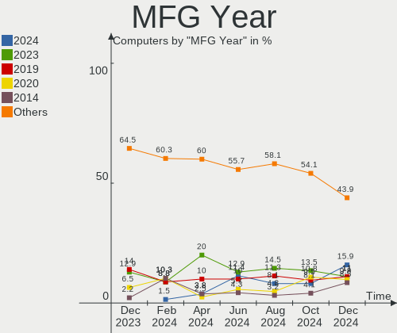
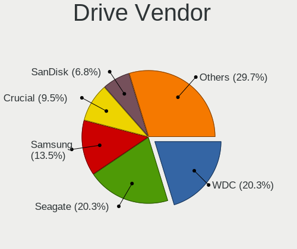
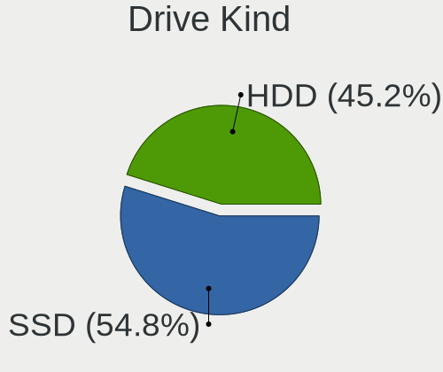

FreeBSD Hardware Trends
-----------------------

A project to identify most popular hardware characteristics and track their change
over time based on data collected by FreeBSD users at https://BSD-Hardware.info.

Anyone can contribute to the study by uploading probes of their computers by
the [hw-probe](https://github.com/linuxhw/hw-probe/blob/master/INSTALL.BSD.md) tool:

    hw-probe -all -upload

This is a report for all computer types. See also reports for [desktops](/Dist/FreeBSD/Desktop/README.md) and [notebooks](/Dist/FreeBSD/Notebook/README.md).

Full-feature report is available here: https://bsd-hardware.info/?view=trends

Period: Oct, 2020.

Contents
--------

- [ OS                       ](#os)
- [ OS Family                ](#os-family)
- [ Arch                     ](#arch)
- [ DE                       ](#de)
- [ Display Server           ](#display-server)
- [ Display Manager          ](#display-manager)
- [ OS Lang                  ](#os-lang)
- [ Boot Mode                ](#boot-mode)
- [ Filesystem               ](#filesystem)
- [ Part. scheme             ](#part-scheme)
- [ Country                  ](#country)
- [ City                     ](#city)
- [ Vendor                   ](#vendor)
- [ Model                    ](#model)
- [ Model Family             ](#model-family)
- [ MFG Year                 ](#mfg-year)
- [ Form Factor              ](#form-factor)
- [ Coreboot                 ](#coreboot)
- [ RAM Size                 ](#ram-size)
- [ RAM Used                 ](#ram-used)
- [ Has CD-ROM               ](#has-cd-rom)
- [ Total Drives             ](#total-drives)
- [ Has Ethernet             ](#has-ethernet)
- [ Drive Vendor             ](#drive-vendor)
- [ HDD Vendor               ](#hdd-vendor)
- [ SSD Vendor               ](#ssd-vendor)
- [ Drive Model              ](#drive-model)
- [ Drive Kind               ](#drive-kind)
- [ Drive Connector          ](#drive-connector)
- [ Drive Size               ](#drive-size)
- [ Space Total              ](#space-total)
- [ Space Used               ](#space-used)
- [ Malfunc. Drives          ](#malfunc-drives)
- [ Malfunc. Drive Vendor    ](#malfunc-drive-vendor)
- [ Malfunc. HDD Vendor      ](#malfunc-hdd-vendor)
- [ Malfunc. Drive Kind      ](#malfunc-drive-kind)
- [ Failed Drives            ](#failed-drives)
- [ Failed Drive Vendor      ](#failed-drive-vendor)
- [ Drive Status             ](#drive-status)
- [ Storage Vendor           ](#storage-vendor)
- [ Storage Model            ](#storage-model)
- [ Storage Kind             ](#storage-kind)
- [ CPU Vendor               ](#cpu-vendor)
- [ CPU Model                ](#cpu-model)
- [ CPU Model Family         ](#cpu-model-family)
- [ CPU Cores                ](#cpu-cores)
- [ CPU Sockets              ](#cpu-sockets)
- [ CPU Threads              ](#cpu-threads)
- [ CPU Microarch            ](#cpu-microarch)
- [ GPU Vendor               ](#gpu-vendor)
- [ GPU Model                ](#gpu-model)
- [ GPU Combo                ](#gpu-combo)
- [ GPU Driver               ](#gpu-driver)
- [ GPU Memory               ](#gpu-memory)
- [ Monitor Vendor           ](#monitor-vendor)
- [ Monitor Model            ](#monitor-model)
- [ Monitor Resolution       ](#monitor-resolution)
- [ Monitor Diagonal         ](#monitor-diagonal)
- [ Monitor Width            ](#monitor-width)
- [ Aspect Ratio             ](#aspect-ratio)
- [ Monitor Area             ](#monitor-area)
- [ Pixel Density            ](#pixel-density)
- [ Multiple Monitors        ](#multiple-monitors)
- [ Net Controller Vendor    ](#net-controller-vendor)
- [ Net Controller Model     ](#net-controller-model)
- [ Wireless Vendor          ](#wireless-vendor)
- [ Wireless Model           ](#wireless-model)
- [ Ethernet Vendor          ](#ethernet-vendor)
- [ Ethernet Model           ](#ethernet-model)
- [ Net Controller Kind      ](#net-controller-kind)
- [ Used Controller          ](#used-controller)
- [ NICs                     ](#nics)
- [ Memory Vendor            ](#memory-vendor)
- [ Memory Model             ](#memory-model)
- [ Memory Kind              ](#memory-kind)
- [ Memory Form Factor       ](#memory-form-factor)
- [ Memory Size              ](#memory-size)
- [ Memory Speed             ](#memory-speed)
- [ Sound Vendor             ](#sound-vendor)
- [ Sound Model              ](#sound-model)
- [ Camera Vendor            ](#camera-vendor)
- [ Camera Model             ](#camera-model)
- [ Fingerprint Vendor       ](#fingerprint-vendor)
- [ Fingerprint Model        ](#fingerprint-model)
- [ Chipcard Vendor          ](#chipcard-vendor)
- [ Chipcard Model           ](#chipcard-model)
- [ Printer Vendor           ](#printer-vendor)
- [ Printer Model            ](#printer-model)
- [ Scanner Vendor           ](#scanner-vendor)
- [ Scanner Model            ](#scanner-model)
- [ Bluetooth Vendor         ](#bluetooth-vendor)
- [ Bluetooth Model          ](#bluetooth-model)
- [ Unsupported Devices      ](#unsupported-devices)
- [ Unsupported Device Types ](#unsupported-device-types)

OS
--

Installed operating systems

| Name                 | Computers | Percent |
|----------------------|-----------|---------|
| FreeBSD 12.1-p10     | 55        | 40.44%  |
| FreeBSD 12.2         | 34        | 25%     |
| FreeBSD 12.1         | 13        | 9.56%   |
| FreeBSD 13.0-CURRENT | 6         | 4.41%   |
| FreeBSD 12.1-p7      | 4         | 2.94%   |
| FreeBSD 12.1-STABLE  | 3         | 2.21%   |
| FreeBSD 12.1-p9      | 3         | 2.21%   |
| FreeBSD 12.1-p6      | 3         | 2.21%   |
| FreeBSD 12.1-p1      | 3         | 2.21%   |
| FreeBSD 11.4-p4      | 3         | 2.21%   |
| FreeBSD 12.2-RC3     | 2         | 1.47%   |
| FreeBSD 12.0         | 2         | 1.47%   |
| FreeBSD 12.2-STABLE  | 1         | 0.74%   |
| FreeBSD 12.1-p8      | 1         | 0.74%   |
| FreeBSD 12.1-p3      | 1         | 0.74%   |
| FreeBSD 11.3-p5      | 1         | 0.74%   |
| FreeBSD 11.3         | 1         | 0.74%   |

OS Family
---------

OS without a version

| Name    | Computers | Percent |
|---------|-----------|---------|
| FreeBSD | 136       | 100%    |

Arch
----

OS architecture (x86_64, i586, etc.)

| Name  | Computers | Percent |
|-------|-----------|---------|
| amd64 | 127       | 93.38%  |
| i386  | 5         | 3.68%   |
| arm64 | 3         | 2.21%   |
| arm   | 1         | 0.74%   |

DE
--

Desktop Environment

| Name      | Computers | Percent |
|-----------|-----------|---------|
| Console   | 73        | 53.68%  |
| XFCE      | 22        | 16.18%  |
| TWM       | 10        | 7.35%   |
| i3        | 10        | 7.35%   |
| GNOME     | 9         | 6.62%   |
| openbox   | 4         | 2.94%   |
| MATE      | 2         | 1.47%   |
| LXDE      | 2         | 1.47%   |
| KDE5      | 2         | 1.47%   |
| CDE       | 1         | 0.74%   |
| AwesomeWM | 1         | 0.74%   |

Display Server
--------------

X11 or Wayland

| Name    | Computers | Percent |
|---------|-----------|---------|
| Console | 82        | 60.29%  |
| X11     | 54        | 39.71%  |

Display Manager
---------------

SDDM, LightDM, etc.

| Name    | Computers | Percent |
|---------|-----------|---------|
| Console | 100       | 73.53%  |
| SLiM    | 14        | 10.29%  |
| SDDM    | 9         | 6.62%   |
| XDM     | 6         | 4.41%   |
| GDM     | 4         | 2.94%   |
| LightDM | 3         | 2.21%   |

OS Lang
-------

Language

| Lang             | Computers | Percent |
|------------------|-----------|---------|
| Unknown          | 74        | 54.41%  |
| en_US            | 33        | 24.26%  |
| de_DE            | 5         | 3.68%   |
| el_GR            | 4         | 2.94%   |
| C                | 4         | 2.94%   |
| en_CA            | 3         | 2.21%   |
| nb_NO            | 2         | 1.47%   |
| en_IE            | 2         | 1.47%   |
| sl_SI            | 1         | 0.74%   |
| ru_RU            | 1         | 0.74%   |
| pl_PL            | 1         | 0.74%   |
| it_IT            | 1         | 0.74%   |
| fr_FR            | 1         | 0.74%   |
| fi_FI.ISO8859-15 | 1         | 0.74%   |
| es_ES            | 1         | 0.74%   |
| en_GB            | 1         | 0.74%   |
| en_AU            | 1         | 0.74%   |

Boot Mode
---------

EFI or BIOS

| Mode | Computers | Percent |
|------|-----------|---------|
| BIOS | 69        | 50.74%  |
| EFI  | 67        | 49.26%  |

Filesystem
----------

Type of filesystem

| Type | Computers | Percent |
|------|-----------|---------|
| Zfs  | 86        | 63.24%  |
| Ufs  | 50        | 36.76%  |

Part. scheme
------------

Scheme of partitioning

| Type | Computers | Percent |
|------|-----------|---------|
| GPT  | 116       | 85.29%  |
| MBR  | 20        | 14.71%  |

Country
-------

Geographic location (country)

| Country            | Computers | Percent |
|--------------------|-----------|---------|
| USA                | 24        | 17.65%  |
| Poland             | 18        | 13.24%  |
| Germany            | 11        | 8.09%   |
| Norway             | 7         | 5.15%   |
| Australia          | 6         | 4.41%   |
| Netherlands        | 5         | 3.68%   |
| Canada             | 5         | 3.68%   |
| Russia             | 4         | 2.94%   |
| Greece             | 4         | 2.94%   |
| Ukraine            | 3         | 2.21%   |
| UK                 | 3         | 2.21%   |
| Japan              | 3         | 2.21%   |
| Italy              | 3         | 2.21%   |
| Ireland            | 3         | 2.21%   |
| Indonesia          | 3         | 2.21%   |
| France             | 3         | 2.21%   |
| Croatia            | 3         | 2.21%   |
| Serbia             | 2         | 1.47%   |
| Romania            | 2         | 1.47%   |
| Hungary            | 2         | 1.47%   |
| Finland            | 2         | 1.47%   |
| China              | 2         | 1.47%   |
| Bulgaria           | 2         | 1.47%   |
| Austria            | 2         | 1.47%   |
| Sweden             | 1         | 0.74%   |
| Spain              | 1         | 0.74%   |
| South Africa       | 1         | 0.74%   |
| Slovenia           | 1         | 0.74%   |
| Singapore          | 1         | 0.74%   |
| Nicaragua          | 1         | 0.74%   |
| New Zealand        | 1         | 0.74%   |
| Korea, Republic of | 1         | 0.74%   |
| Iran               | 1         | 0.74%   |
| Honduras           | 1         | 0.74%   |
| Estonia            | 1         | 0.74%   |
| Denmark            | 1         | 0.74%   |
| Colombia           | 1         | 0.74%   |
| Brazil             | 1         | 0.74%   |

City
----

Geographic location (city)

| City          | Computers | Percent |
|---------------|-----------|---------|
| Gdynia        | 11        | 8.09%   |
| Berlin        | 4         | 2.94%   |
| Zagreb        | 3         | 2.21%   |
| Voyenenga     | 3         | 2.21%   |
| Sydney        | 3         | 2.21%   |
| Amsterdam     | 3         | 2.21%   |
| Victoria      | 2         | 1.47%   |
| Subotica      | 2         | 1.47%   |
| Shenzhen      | 2         | 1.47%   |
| Sassuolo      | 2         | 1.47%   |
| Paisley       | 2         | 1.47%   |
| Moscow        | 2         | 1.47%   |
| Longmont      | 2         | 1.47%   |
| Langenhagen   | 2         | 1.47%   |
| Kansas City   | 2         | 1.47%   |
| Jakarta       | 2         | 1.47%   |
| Igoumenitsa   | 2         | 1.47%   |
| Dublin        | 2         | 1.47%   |
| Crows Nest    | 2         | 1.47%   |
| Banino        | 2         | 1.47%   |
| Athens        | 2         | 1.47%   |
| Zgierz        | 1         | 0.74%   |
| Warsaw        | 1         | 0.74%   |
| Villeurbanne  | 1         | 0.74%   |
| Vienna        | 1         | 0.74%   |
| Ujkigyos      | 1         | 0.74%   |
| Tyreso Strand | 1         | 0.74%   |
| Toledo        | 1         | 0.74%   |
| Tokyo         | 1         | 0.74%   |
| Tehran        | 1         | 0.74%   |
| Tegucigalpa   | 1         | 0.74%   |
| Tatabánya    | 1         | 0.74%   |
| Tampere       | 1         | 0.74%   |
| Tallinn       | 1         | 0.74%   |
| Svilengrad    | 1         | 0.74%   |
| Stryn         | 1         | 0.74%   |
| Stramproy     | 1         | 0.74%   |
| St. John's    | 1         | 0.74%   |
| St Petersburg | 1         | 0.74%   |
| St Louis      | 1         | 0.74%   |
| Springfield   | 1         | 0.74%   |
| Sofia         | 1         | 0.74%   |
| Singapore     | 1         | 0.74%   |
| Sibiu         | 1         | 0.74%   |
| Seville       | 1         | 0.74%   |
| Secaucus      | 1         | 0.74%   |
| Schwabach     | 1         | 0.74%   |
| Santa Rosa    | 1         | 0.74%   |
| Sallanches    | 1         | 0.74%   |
| Saint John    | 1         | 0.74%   |
| Rotorua       | 1         | 0.74%   |
| Rockville     | 1         | 0.74%   |
| Rockford      | 1         | 0.74%   |
| Rochester     | 1         | 0.74%   |
| Regensburg    | 1         | 0.74%   |
| Redmond       | 1         | 0.74%   |
| Porto Alegre  | 1         | 0.74%   |
| Paris         | 1         | 0.74%   |
| Padstow       | 1         | 0.74%   |
| Ottawa        | 1         | 0.74%   |

Vendor
------

Motherboard manufacturer

| Name                | Computers | Percent |
|---------------------|-----------|---------|
| Dell                | 25        | 18.38%  |
| Lenovo              | 20        | 14.71%  |
| Hewlett-Packard     | 17        | 12.5%   |
| ASUSTek Computer    | 11        | 8.09%   |
| Intel               | 9         | 6.62%   |
| ASRock              | 9         | 6.62%   |
| Supermicro          | 8         | 5.88%   |
| Gigabyte Technology | 8         | 5.88%   |
| Unknown             | 4         | 2.94%   |
| MSI                 | 3         | 2.21%   |
| Fujitsu             | 3         | 2.21%   |
| Acer                | 3         | 2.21%   |
| Toshiba             | 2         | 1.47%   |
| ASRockRack          | 2         | 1.47%   |
| System76            | 1         | 0.74%   |
| Sun Microsystems    | 1         | 0.74%   |
| Sony                | 1         | 0.74%   |
| Shuttle             | 1         | 0.74%   |
| Schenker            | 1         | 0.74%   |
| PC Engines          | 1         | 0.74%   |
| HUAWEI              | 1         | 0.74%   |
| HPE                 | 1         | 0.74%   |
| Compaq              | 1         | 0.74%   |
| AZW                 | 1         | 0.74%   |
| AMD                 | 1         | 0.74%   |
| ADI Engineering     | 1         | 0.74%   |

Model
-----

Motherboard model

| Name                                     | Computers | Percent |
|------------------------------------------|-----------|---------|
| Dell OEM-R 720xd                         | 8         | 5.88%   |
| Unknown                                  | 5         | 3.68%   |
| HP ProLiant MicroServer Gen8             | 3         | 2.21%   |
| HP ProLiant DL380 Gen9                   | 2         | 1.47%   |
| Fujitsu ESPRIMO E510                     | 2         | 1.47%   |
| ASUS H110I-PLUS                          | 2         | 1.47%   |
| ASUS All Series                          | 2         | 1.47%   |
| Toshiba Satellite L50-C                  | 1         | 0.74%   |
| Toshiba Satellite C655D                  | 1         | 0.74%   |
| System76 Lemur Pro                       | 1         | 0.74%   |
| Supermicro X8DT3                         | 1         | 0.74%   |
| Supermicro X7SPA-HF                      | 1         | 0.74%   |
| Supermicro X10SL7-F                      | 1         | 0.74%   |
| Supermicro X10SAE                        | 1         | 0.74%   |
| Supermicro SYS-6018R-WTR                 | 1         | 0.74%   |
| Supermicro Super Server                  | 1         | 0.74%   |
| Supermicro H8DGU                         | 1         | 0.74%   |
| Supermicro C7Z270-CG-L                   | 1         | 0.74%   |
| Sun Microsystems SUN FIRE X4150          | 1         | 0.74%   |
| Sony SVP1321V9RB                         | 1         | 0.74%   |
| Shuttle XH270                            | 1         | 0.74%   |
| Schenker N13xWU                          | 1         | 0.74%   |
| PC Engines apu2                          | 1         | 0.74%   |
| MSI MS-7C02                              | 1         | 0.74%   |
| MSI MS-7B22                              | 1         | 0.74%   |
| MSI MS-6533                              | 1         | 0.74%   |
| Lenovo Y50-70 20378                      | 1         | 0.74%   |
| Lenovo ThinkPad X61 7675A29              | 1         | 0.74%   |
| Lenovo ThinkPad X230 23257Y1             | 1         | 0.74%   |
| Lenovo ThinkPad X230 23254S6             | 1         | 0.74%   |
| Lenovo ThinkPad X230 2320JXM             | 1         | 0.74%   |
| Lenovo ThinkPad X220 4291OQ6             | 1         | 0.74%   |
| Lenovo ThinkPad X1 Carbon 5th 20HRCTO1WW | 1         | 0.74%   |
| Lenovo ThinkPad W520 4284W5L             | 1         | 0.74%   |
| Lenovo ThinkPad T495s 20QKS1812F         | 1         | 0.74%   |
| Lenovo ThinkPad T495 20NJS0KP00          | 1         | 0.74%   |
| Lenovo ThinkPad T490 20N3X50500          | 1         | 0.74%   |
| Lenovo ThinkPad T480 20L5S1S000          | 1         | 0.74%   |
| Lenovo ThinkPad T430 23501B3             | 1         | 0.74%   |
| Lenovo ThinkPad T410 2537AT1             | 1         | 0.74%   |
| Lenovo ThinkPad E495 20NE0001US          | 1         | 0.74%   |
| Lenovo ThinkPad E490 20N8CTO1WW          | 1         | 0.74%   |
| Lenovo ThinkCentre M91p 0266B8U          | 1         | 0.74%   |
| Lenovo ThinkCentre M58p 7220W5B          | 1         | 0.74%   |
| Lenovo IdeaPad S540-15IWL GTX 81SW       | 1         | 0.74%   |
| Lenovo 70TT0008EA ThinkServer TS460      | 1         | 0.74%   |
| Intel X79 V2.81A                         | 1         | 0.74%   |
| Intel TERRA Server                       | 1         | 0.74%   |
| Intel S1200BTL                           | 1         | 0.74%   |
| Intel NUC6CAYH                           | 1         | 0.74%   |
| Intel NUC5i5MYBE H47797-205              | 1         | 0.74%   |
| Intel GT5449E                            | 1         | 0.74%   |
| Intel DH61CR AAG14064-210                | 1         | 0.74%   |
| Intel DH61CR AAG14064-208                | 1         | 0.74%   |
| Intel D53427RKE G87971-406               | 1         | 0.74%   |
| HUAWEI MACH-WX9                          | 1         | 0.74%   |
| HPE ProLiant MicroServer Gen10 Plus      | 1         | 0.74%   |
| HP Z420 Workstation                      | 1         | 0.74%   |
| HP Vectra                                | 1         | 0.74%   |
| HP t620 PLUS Quad Core TC                | 1         | 0.74%   |

Model Family
------------

Motherboard model prefix

| Name                     | Computers | Percent |
|--------------------------|-----------|---------|
| Lenovo ThinkPad          | 15        | 11.03%  |
| HP ProLiant              | 8         | 5.88%   |
| Dell OEM-R               | 8         | 5.88%   |
| Dell PowerEdge           | 7         | 5.15%   |
| Unknown                  | 5         | 3.68%   |
| Dell Precision           | 3         | 2.21%   |
| Dell OptiPlex            | 3         | 2.21%   |
| Toshiba Satellite        | 2         | 1.47%   |
| Lenovo ThinkCentre       | 2         | 1.47%   |
| Intel DH61CR             | 2         | 1.47%   |
| Fujitsu ESPRIMO          | 2         | 1.47%   |
| Dell Inspiron            | 2         | 1.47%   |
| ASUS H110I-PLUS          | 2         | 1.47%   |
| ASUS All                 | 2         | 1.47%   |
| Acer Aspire              | 2         | 1.47%   |
| System76 Lemur           | 1         | 0.74%   |
| Supermicro X8DT3         | 1         | 0.74%   |
| Supermicro X7SPA-HF      | 1         | 0.74%   |
| Supermicro X10SL7-F      | 1         | 0.74%   |
| Supermicro X10SAE        | 1         | 0.74%   |
| Supermicro SYS-6018R-WTR | 1         | 0.74%   |
| Supermicro Super         | 1         | 0.74%   |
| Supermicro H8DGU         | 1         | 0.74%   |
| Supermicro C7Z270-CG-L   | 1         | 0.74%   |
| Sun Microsystems SUN     | 1         | 0.74%   |
| Sony SVP1321V9RB         | 1         | 0.74%   |
| Shuttle XH270            | 1         | 0.74%   |
| Schenker N13xWU          | 1         | 0.74%   |
| PC Engines apu2          | 1         | 0.74%   |
| MSI MS-7C02              | 1         | 0.74%   |
| MSI MS-7B22              | 1         | 0.74%   |
| MSI MS-6533              | 1         | 0.74%   |
| Lenovo Y50-70            | 1         | 0.74%   |
| Lenovo IdeaPad           | 1         | 0.74%   |
| Lenovo 70TT0008EA        | 1         | 0.74%   |
| Intel X79                | 1         | 0.74%   |
| Intel TERRA              | 1         | 0.74%   |
| Intel S1200BTL           | 1         | 0.74%   |
| Intel NUC6CAYH           | 1         | 0.74%   |
| Intel NUC5i5MYBE         | 1         | 0.74%   |
| Intel GT5449E            | 1         | 0.74%   |
| Intel D53427RKE          | 1         | 0.74%   |
| HUAWEI MACH-WX9          | 1         | 0.74%   |
| HPE ProLiant             | 1         | 0.74%   |
| HP Z420                  | 1         | 0.74%   |
| HP Vectra                | 1         | 0.74%   |
| HP t620                  | 1         | 0.74%   |
| HP ProBook               | 1         | 0.74%   |
| HP Pavilion              | 1         | 0.74%   |
| HP ENVY                  | 1         | 0.74%   |
| HP Compaq                | 1         | 0.74%   |
| HP 870-244               | 1         | 0.74%   |
| HP 635                   | 1         | 0.74%   |
| Gigabyte Z97X-UD3H-BK    | 1         | 0.74%   |
| Gigabyte Z77X-UD5H       | 1         | 0.74%   |
| Gigabyte Z68A-D3H-B3     | 1         | 0.74%   |
| Gigabyte R272-Z31-00     | 1         | 0.74%   |
| Gigabyte H61M-S1         | 1         | 0.74%   |
| Gigabyte F2A55M-DS2      | 1         | 0.74%   |
| Gigabyte 990FXA-UD3      | 1         | 0.74%   |

MFG Year
--------

Motherboard manufacture year

| Year    | Computers | Percent |
|---------|-----------|---------|
| 2018    | 20        | 14.71%  |
| 2019    | 18        | 13.24%  |
| 2015    | 16        | 11.76%  |
| 2020    | 12        | 8.82%   |
| 2012    | 11        | 8.09%   |
| 2014    | 10        | 7.35%   |
| 2013    | 10        | 7.35%   |
| 2017    | 7         | 5.15%   |
| 2010    | 7         | 5.15%   |
| 2011    | 6         | 4.41%   |
| Unknown | 6         | 4.41%   |
| 2016    | 5         | 3.68%   |
| 2007    | 4         | 2.94%   |
| 2009    | 2         | 1.47%   |
| 2003    | 1         | 0.74%   |
| 2001    | 1         | 0.74%   |

Form Factor
-----------

Physical design of the computer

| Name        | Computers | Percent |
|-------------|-----------|---------|
| Desktop     | 69        | 50.74%  |
| Notebook    | 35        | 25.74%  |
| Server      | 29        | 21.32%  |
| Mini pc     | 2         | 1.47%   |
| Convertible | 1         | 0.74%   |

Coreboot
--------

Have coreboot on board

| Used | Computers | Percent |
|------|-----------|---------|
| No   | 131       | 96.32%  |
| Yes  | 5         | 3.68%   |

RAM Size
--------

Total RAM memory

| Size in GB      | Computers | Percent |
|-----------------|-----------|---------|
| 8.01-16.0       | 35        | 25.74%  |
| 16.01-24.0      | 34        | 25%     |
| 32.01-64.0      | 20        | 14.71%  |
| 64.01-256.0     | 15        | 11.03%  |
| 4.01-8.0        | 13        | 9.56%   |
| 0.01-1.0        | 7         | 5.15%   |
| 24.01-32.0      | 4         | 2.94%   |
| 3.01-4.0        | 3         | 2.21%   |
| 2.01-3.0        | 3         | 2.21%   |
| More than 256.0 | 2         | 1.47%   |

RAM Used
--------

Used RAM memory

| Used GB     | Computers | Percent |
|-------------|-----------|---------|
| 0.01-1.0    | 75        | 55.15%  |
| 1.01-2.0    | 20        | 14.71%  |
| 4.01-8.0    | 8         | 5.88%   |
| 2.01-3.0    | 8         | 5.88%   |
| 3.01-4.0    | 6         | 4.41%   |
| 8.01-16.0   | 6         | 4.41%   |
| 16.01-24.0  | 4         | 2.94%   |
| 0           | 4         | 2.94%   |
| 64.01-256.0 | 3         | 2.21%   |
| 32.01-64.0  | 1         | 0.74%   |
| 24.01-32.0  | 1         | 0.74%   |

Has CD-ROM
----------

Has CD-ROM on board

| Presented | Computers | Percent |
|-----------|-----------|---------|
| No        | 98        | 72.06%  |
| Yes       | 38        | 27.94%  |

Total Drives
------------

Number of drives on board

| Drives | Computers | Percent |
|--------|-----------|---------|
| 1      | 44        | 32.35%  |
| 2      | 31        | 22.79%  |
| 4      | 12        | 8.82%   |
| 3      | 12        | 8.82%   |
| 0      | 12        | 8.82%   |
| 5      | 7         | 5.15%   |
| 6      | 5         | 3.68%   |
| 12     | 3         | 2.21%   |
| 7      | 3         | 2.21%   |
| 8      | 2         | 1.47%   |
| 63     | 1         | 0.74%   |
| 25     | 1         | 0.74%   |
| 14     | 1         | 0.74%   |
| 11     | 1         | 0.74%   |
| 10     | 1         | 0.74%   |

Has Ethernet
------------

Has Ethernet on board

| Presented | Computers | Percent |
|-----------|-----------|---------|
| Yes       | 126       | 92.65%  |
| No        | 10        | 7.35%   |

Drive Vendor
------------

Hard drive vendors

| Vendor              | Computers | Drives | Percent |
|---------------------|-----------|--------|---------|
| WDC                 | 47        | 102    | 21.66%  |
| Seagate             | 36        | 62     | 16.59%  |
| Samsung Electronics | 24        | 36     | 11.06%  |
| Toshiba             | 14        | 27     | 6.45%   |
| Intel               | 13        | 15     | 5.99%   |
| Hitachi             | 12        | 23     | 5.53%   |
| Kingston            | 9         | 11     | 4.15%   |
| HGST                | 8         | 20     | 3.69%   |
| Crucial             | 8         | 10     | 3.69%   |
| SanDisk             | 7         | 9      | 3.23%   |
| SPCC                | 3         | 4      | 1.38%   |
| MAXTOR              | 3         | 4      | 1.38%   |
| Hewlett-Packard     | 3         | 90     | 1.38%   |
| A-DATA Technology   | 3         | 3      | 1.38%   |
| Union Memory        | 2         | 2      | 0.92%   |
| Transcend           | 2         | 2      | 0.92%   |
| SK Hynix            | 2         | 2      | 0.92%   |
| PNY                 | 2         | 3      | 0.92%   |
| NETAPP              | 2         | 7      | 0.92%   |
| Micron Technology   | 2         | 2      | 0.92%   |
| Corsair             | 2         | 2      | 0.92%   |
| China               | 2         | 2      | 0.92%   |
| ZTC                 | 1         | 1      | 0.46%   |
| Vaseky              | 1         | 1      | 0.46%   |
| Team                | 1         | 1      | 0.46%   |
| Phison              | 1         | 1      | 0.46%   |
| ORICO               | 1         | 1      | 0.46%   |
| OCZ                 | 1         | 1      | 0.46%   |
| LSI                 | 1         | 1      | 0.46%   |
| HPE                 | 1         | 4      | 0.46%   |
| FREEBSD             | 1         | 1      | 0.46%   |
| FORESEE             | 1         | 1      | 0.46%   |
| Biwin               | 1         | 1      | 0.46%   |

HDD Vendor
----------

Hard disk drive vendors

| Vendor              | Computers | Drives | Percent |
|---------------------|-----------|--------|---------|
| WDC                 | 41        | 93     | 35.04%  |
| Seagate             | 36        | 62     | 30.77%  |
| Hitachi             | 12        | 23     | 10.26%  |
| Toshiba             | 11        | 24     | 9.4%    |
| HGST                | 8         | 20     | 6.84%   |
| Maxtor              | 3         | 4      | 2.56%   |
| Hewlett-Packard     | 3         | 90     | 2.56%   |
| Samsung Electronics | 2         | 2      | 1.71%   |
| HPE                 | 1         | 4      | 0.85%   |

SSD Vendor
----------

Solid state drive vendors

| Vendor              | Computers | Drives | Percent |
|---------------------|-----------|--------|---------|
| Samsung Electronics | 19        | 31     | 23.75%  |
| Intel               | 11        | 13     | 13.75%  |
| Kingston            | 9         | 11     | 11.25%  |
| SanDisk             | 7         | 9      | 8.75%   |
| Crucial             | 7         | 9      | 8.75%   |
| WDC                 | 5         | 8      | 6.25%   |
| Transcend           | 2         | 2      | 2.5%    |
| PNY                 | 2         | 3      | 2.5%    |
| NETAPP              | 2         | 7      | 2.5%    |
| China               | 2         | 2      | 2.5%    |
| A-DATA Technology   | 2         | 2      | 2.5%    |
| ZTC                 | 1         | 1      | 1.25%   |
| Vaseky              | 1         | 1      | 1.25%   |
| Toshiba             | 1         | 1      | 1.25%   |
| Team                | 1         | 1      | 1.25%   |
| SPCC                | 1         | 1      | 1.25%   |
| SK Hynix            | 1         | 1      | 1.25%   |
| ORICO               | 1         | 1      | 1.25%   |
| OCZ                 | 1         | 1      | 1.25%   |
| Micron Technology   | 1         | 1      | 1.25%   |
| LSI                 | 1         | 1      | 1.25%   |
| FREEBSD             | 1         | 1      | 1.25%   |
| FORESEE             | 1         | 1      | 1.25%   |

Drive Model
-----------

Hard drive models

| Model                    | Computers | Percent |
|--------------------------|-----------|---------|
| ST1000DM010-2EP102 1TB   | 4         | 1.57%   |
| SA400S37120G 120GB       | 4         | 1.57%   |
| WD60EFRX-68L0BN1 6TB     | 3         | 1.18%   |
| WD30EFRX-68EUZN0 3TB     | 3         | 1.18%   |
| ST8000DM004-2CX188 8TB   | 3         | 1.18%   |
| ST4000DM000-1F2168 4TB   | 3         | 1.18%   |
| ST3000DM001-1CH166 3TB   | 3         | 1.18%   |
| SSD 850 EVO 250GB        | 3         | 1.18%   |
| RAID 1(1+0) 73GB         | 3         | 1.18%   |
| X446_RALS200MCHT 200GB   | 2         | 0.79%   |
| WDS240G2G0B-00EPW0 240GB | 2         | 0.79%   |
| WDS240G2G0A-00JH30 240GB | 2         | 0.79%   |
| WD40EFRX-68N32N0 4TB     | 2         | 0.79%   |
| WD20EFRX-68EUZN0 2TB     | 2         | 0.79%   |
| ST8000AS0002-1NA17Z 8TB  | 2         | 0.79%   |
| ST500DM002-1BD142 500GB  | 2         | 0.79%   |
| ST4000DM004-2CV104 4TB   | 2         | 0.79%   |
| ST2000DL003-9VT166 2TB   | 2         | 0.79%   |
| SSD 860 EVO 250GB        | 2         | 0.79%   |
| RAID 0 6TB               | 2         | 0.79%   |
| MQ04ABF100 1TB           | 2         | 0.79%   |
| HTS543232A7A384 320GB    | 2         | 0.79%   |
| CT525MX300SSD1 528GB     | 2         | 0.79%   |
| CT250MX500SSD1 250GB     | 2         | 0.79%   |
| CS900 120GB SSD          | 2         | 0.79%   |
| WDS120G1G0A-00SS50 120GB | 1         | 0.39%   |
| WD80EZAZ-11TDBA0 8TB     | 1         | 0.39%   |
| WD80EMAZ-00WJTA0 8TB     | 1         | 0.39%   |
| WD80EFZX-68UW8N0 8TB     | 1         | 0.39%   |
| WD80EFAX-68LHPN0 8TB     | 1         | 0.39%   |
| WD800BB-00HEA0 80GB      | 1         | 0.39%   |
| WD8001FFWX-68J1UN0 8TB   | 1         | 0.39%   |
| WD7500BMVW-11AJGS4 752GB | 1         | 0.39%   |
| WD5000LPCX-24VHAT0 500GB | 1         | 0.39%   |
| WD5000BMVV-11A1CS0 500GB | 1         | 0.39%   |
| WD5000AAKX-60U6AA0 500GB | 1         | 0.39%   |
| WD40PURZ-85TTDY0 4TB     | 1         | 0.39%   |
| WD40EZRZ-22GXCB0 4TB     | 1         | 0.39%   |
| WD40EZRX-00SPEB0 4TB     | 1         | 0.39%   |
| WD400BB-00GFA0 40GB      | 1         | 0.39%   |
| WD4003FFBX-68MU3N0 4TB   | 1         | 0.39%   |
| WD3750LMCW-11D9GS3 375GB | 1         | 0.39%   |
| WD3200BEKT-75PVMT1 320GB | 1         | 0.39%   |
| WD3200AAKX-00ERMA0 320GB | 1         | 0.39%   |
| WD30EZRX-00DC0B0 3TB     | 1         | 0.39%   |
| WD2500KS-00MJB0 250GB    | 1         | 0.39%   |
| WD2500AAKX-19U6AA0 250GB | 1         | 0.39%   |
| WD2500AAKX-07U6AA0 250GB | 1         | 0.39%   |
| WD2500AAJS-08L7A0 250GB  | 1         | 0.39%   |
| WD20SDZW-11JJ8S0 2TB     | 1         | 0.39%   |
| WD20NMVW-59EDZS7 2TB     | 1         | 0.39%   |
| WD20EZRX-00D8PB0 2TB     | 1         | 0.39%   |
| WD2003FYYS-007BA0 2TB    | 1         | 0.39%   |
| WD2001FASS-00W2B0 2TB    | 1         | 0.39%   |
| WD2001FASS-00U0B0 2TB    | 1         | 0.39%   |
| WD1600BEVT-22ZCT0 160GB  | 1         | 0.39%   |
| WD120EFAX-68UNTN0 12TB   | 1         | 0.39%   |
| WD1200BEVT-22ZCT0 120GB  | 1         | 0.39%   |
| WD10SPZX-24Z10 1TB       | 1         | 0.39%   |
| WD10SPZX-00Z10T0 1TB     | 1         | 0.39%   |

Drive Kind
----------

HDD or SSD

| Kind | Computers | Drives | Percent |
|------|-----------|--------|---------|
| HDD  | 89        | 322    | 49.44%  |
| SSD  | 71        | 109    | 39.44%  |
| NVMe | 20        | 21     | 11.11%  |

Drive Connector
---------------

SATA, SAS, NVMe, etc.

| Type | Computers | Drives | Percent |
|------|-----------|--------|---------|
| SATA | 114       | 431    | 85.07%  |
| NVMe | 20        | 21     | 14.93%  |

Drive Size
----------

Size of hard drive

| Size in TB | Computers | Drives | Percent |
|------------|-----------|--------|---------|
| 0.01-0.5   | 88        | 132    | 48.89%  |
| 0.51-1.0   | 30        | 53     | 16.67%  |
| 1.01-2.0   | 18        | 41     | 10%     |
| 4.01-10.0  | 17        | 126    | 9.44%   |
| 3.01-4.0   | 15        | 45     | 8.33%   |
| 2.01-3.0   | 11        | 33     | 6.11%   |
| 10.01-20.0 | 1         | 1      | 0.56%   |

Space Total
-----------

Amount of disk space available on the file system

| Size in GB     | Computers | Percent |
|----------------|-----------|---------|
| 101-250        | 44        | 32.35%  |
| 251-500        | 32        | 23.53%  |
| 51-100         | 21        | 15.44%  |
| 501-1000       | 10        | 7.35%   |
| 21-50          | 9         | 6.62%   |
| 1-20           | 6         | 4.41%   |
| More than 3000 | 5         | 3.68%   |
| 1001-2000      | 5         | 3.68%   |
| 2001-3000      | 4         | 2.94%   |

Space Used
----------

Amount of used disk space

| Used GB        | Computers | Percent |
|----------------|-----------|---------|
| 1-20           | 97        | 71.32%  |
| 21-50          | 19        | 13.97%  |
| 101-250        | 8         | 5.88%   |
| 51-100         | 7         | 5.15%   |
| More than 3000 | 3         | 2.21%   |
| 251-500        | 1         | 0.74%   |
| 501-1000       | 1         | 0.74%   |

Malfunc. Drives
---------------

Drive models with a malfunction

| Model                   | Computers | Drives | Percent |
|-------------------------|-----------|--------|---------|
| WD800BB-00HEA0 80GB     | 1         | 1      | 3.13%   |
| WD60EFRX-68L0BN1 6TB    | 1         | 6      | 3.13%   |
| WD30EFRX-68EUZN0 3TB    | 1         | 3      | 3.13%   |
| WD2001FASS-00W2B0 2TB   | 1         | 1      | 3.13%   |
| WD10EZEX-60M2NA0 1TB    | 1         | 1      | 3.13%   |
| ST9120822AS 120GB       | 1         | 1      | 3.13%   |
| ST320LT007-9ZV142 320GB | 1         | 1      | 3.13%   |
| ST3160815A 160GB        | 1         | 1      | 3.13%   |
| ST3000DM008-2DM166 3TB  | 1         | 1      | 3.13%   |
| ST3000DM001-1CH166 3TB  | 1         | 1      | 3.13%   |
| ST2000NM0011 2TB        | 1         | 1      | 3.13%   |
| ST2000DM001-9YN164 2TB  | 1         | 1      | 3.13%   |
| ST2000DL003-9VT166 2TB  | 1         | 2      | 3.13%   |
| ST1000DM010-2EP102 1TB  | 1         | 1      | 3.13%   |
| SSDSC2CW060A3 64GB      | 1         | 1      | 3.13%   |
| SSDSC2CT240A3 240GB     | 1         | 1      | 3.13%   |
| SSDSC2BF180A4L 180GB    | 1         | 1      | 3.13%   |
| SSDSC2BA200G3T 200GB    | 1         | 2      | 3.13%   |
| SSDSA2M040G2GC 40GB     | 1         | 1      | 3.13%   |
| SNS4151S316G 16GB       | 1         | 1      | 3.13%   |
| SMS200S3120G 120GB      | 1         | 1      | 3.13%   |
| SC210 mSATA 256GB       | 1         | 1      | 3.13%   |
| MK3265GSXN 320GB        | 1         | 1      | 3.13%   |
| HUS722T2TALA604 2TB     | 1         | 1      | 3.13%   |
| HTS725050A7E630 500GB   | 1         | 1      | 3.13%   |
| HTS721060G9SA00 64GB    | 1         | 1      | 3.13%   |
| HTS545050A7E380 500GB   | 1         | 1      | 3.13%   |
| HTS543232A7A384 320GB   | 1         | 1      | 3.13%   |
| HDS721010KLA330 1TB     | 1         | 1      | 3.13%   |
| CT525MX300SSD1 528GB    | 1         | 1      | 3.13%   |
| CT480M500SSD1 480GB     | 1         | 1      | 3.13%   |
| 6Y080P0 82GB            | 1         | 2      | 3.13%   |

Malfunc. Drive Vendor
---------------------

Vendors of faulty drives

| Vendor   | Computers | Drives | Percent |
|----------|-----------|--------|---------|
| Seagate  | 8         | 10     | 25.81%  |
| WDC      | 5         | 12     | 16.13%  |
| Intel    | 5         | 6      | 16.13%  |
| Hitachi  | 4         | 4      | 12.9%   |
| Kingston | 2         | 2      | 6.45%   |
| HGST     | 2         | 2      | 6.45%   |
| Crucial  | 2         | 2      | 6.45%   |
| Toshiba  | 1         | 1      | 3.23%   |
| SK Hynix | 1         | 1      | 3.23%   |
| Maxtor   | 1         | 2      | 3.23%   |

Malfunc. HDD Vendor
-------------------

Vendors of faulty HDD drives

| Vendor  | Computers | Drives | Percent |
|---------|-----------|--------|---------|
| Seagate | 8         | 10     | 38.1%   |
| WDC     | 5         | 12     | 23.81%  |
| Hitachi | 4         | 4      | 19.05%  |
| HGST    | 2         | 2      | 9.52%   |
| Toshiba | 1         | 1      | 4.76%   |
| Maxtor  | 1         | 2      | 4.76%   |

Malfunc. Drive Kind
-------------------

Kinds of faulty drives

| Kind | Computers | Drives | Percent |
|------|-----------|--------|---------|
| HDD  | 20        | 31     | 66.67%  |
| SSD  | 10        | 11     | 33.33%  |

Failed Drives
-------------

Failed drive models

| Model        | Computers | Drives | Percent |
|--------------|-----------|--------|---------|
| 6E040L0 41GB | 1         | 1      | 100%    |

Failed Drive Vendor
-------------------

Failed drive vendors

| Vendor | Computers | Drives | Percent |
|--------|-----------|--------|---------|
| Maxtor | 1         | 1      | 100%    |

Drive Status
------------

Number of failed and malfunc. drives

| Status   | Computers | Drives | Percent |
|----------|-----------|--------|---------|
| Works    | 108       | 315    | 76.06%  |
| Malfunc  | 28        | 42     | 19.72%  |
| Detected | 5         | 94     | 3.52%   |
| Failed   | 1         | 1      | 0.7%    |

Storage Vendor
--------------

Storage controller vendors

| Vendor                           | Computers | Percent |
|----------------------------------|-----------|---------|
| Intel                            | 91        | 52.6%   |
| Broadcom / LSI                   | 28        | 16.18%  |
| AMD                              | 21        | 12.14%  |
| Phison Electronics               | 5         | 2.89%   |
| Marvell Technology Group         | 4         | 2.31%   |
| Hewlett-Packard                  | 4         | 2.31%   |
| ASMedia Technology               | 4         | 2.31%   |
| Samsung Electronics              | 3         | 1.73%   |
| Union Memory (Shenzhen)          | 2         | 1.16%   |
| Toshiba                          | 2         | 1.16%   |
| VIA Technologies                 | 1         | 0.58%   |
| SK Hynix                         | 1         | 0.58%   |
| Silicon Motion                   | 1         | 0.58%   |
| Silicon Integrated Systems [SiS] | 1         | 0.58%   |
| Sandisk                          | 1         | 0.58%   |
| Realtek Semiconductor            | 1         | 0.58%   |
| Micron/Crucial Technology        | 1         | 0.58%   |
| Micron Technology                | 1         | 0.58%   |
| JMicron Technology               | 1         | 0.58%   |

Storage Model
-------------

Storage controller models

| Model                                                                             | Computers | Percent |
|-----------------------------------------------------------------------------------|-----------|---------|
| FCH SATA Controller [AHCI mode]                                                   | 12        | 5.97%   |
| 6 Series/C200 Series Chipset Family 6 port Desktop SATA AHCI Controller           | 12        | 5.97%   |
| SAS2008 PCI-Express Fusion-MPT SAS-2 [Falcon]                                     | 10        | 4.98%   |
| MegaRAID SAS 2208 [Thunderbolt]                                                   | 8         | 3.98%   |
| 8 Series/C220 Series Chipset Family 6-port SATA Controller 1 [AHCI mode]          | 8         | 3.98%   |
| SB7x0/SB8x0/SB9x0 SATA Controller [AHCI mode]                                     | 7         | 3.48%   |
| Unknown                                                                           | 7         | 3.48%   |
| 7 Series Chipset Family 6-port SATA Controller [AHCI mode]                        | 6         | 2.99%   |
| Q170/Q150/B150/H170/H110/Z170/CM236 Chipset SATA Controller [AHCI Mode]           | 5         | 2.49%   |
| 7 Series/C210 Series Chipset Family 6-port SATA Controller [AHCI mode]            | 5         | 2.49%   |
| ASM1062 Serial ATA Controller                                                     | 4         | 1.99%   |
| 6 Series/C200 Series Chipset Family 6 port Mobile SATA AHCI Controller            | 4         | 1.99%   |
| NVMe SSD Controller SM981/PM981/PM983                                             | 3         | 1.49%   |
| E12 NVMe Controller                                                               | 3         | 1.49%   |
| Celeron N3350/Pentium N4200/Atom E3900 Series SATA AHCI Controller                | 3         | 1.49%   |
| Cannon Lake PCH SATA AHCI Controller                                              | 3         | 1.49%   |
| C610/X99 series chipset sSATA Controller [AHCI mode]                              | 3         | 1.49%   |
| C600/X79 series chipset SATA RAID Controller                                      | 3         | 1.49%   |
| 82801G (ICH7 Family) IDE Controller                                               | 3         | 1.49%   |
| 8 Series SATA Controller 1 [AHCI mode]                                            | 3         | 1.49%   |
| 631xESB/632xESB IDE Controller                                                    | 3         | 1.49%   |
| 5 Series/3400 Series Chipset 6 port SATA AHCI Controller                          | 3         | 1.49%   |
| 200 Series PCH SATA controller [AHCI mode]                                        | 3         | 1.49%   |
| Sunrise Point-LP SATA Controller [AHCI mode]                                      | 2         | 1%      |
| Smart Array Gen9 Controllers                                                      | 2         | 1%      |
| Smart Array G6 controllers                                                        | 2         | 1%      |
| SB7x0/SB8x0/SB9x0 IDE Controller                                                  | 2         | 1%      |
| SAS3008 PCI-Express Fusion-MPT SAS-3                                              | 2         | 1%      |
| MegaRAID SAS-3 3008 [Fury]                                                        | 2         | 1%      |
| FCH SATA Controller [IDE mode]                                                    | 2         | 1%      |
| FCH SATA Controller D                                                             | 2         | 1%      |
| C610/X99 series chipset 6-Port SATA Controller [AHCI mode]                        | 2         | 1%      |
| C600/X79 series chipset 6-Port SATA AHCI Controller                               | 2         | 1%      |
| Atom/Celeron/Pentium Processor x5-E8000/J3xxx/N3xxx Series SATA Controller        | 2         | 1%      |
| 88SE9172 SATA 6Gb/s Controller                                                    | 2         | 1%      |
| 82801JI (ICH10 Family) 4 port SATA IDE Controller #1                              | 2         | 1%      |
| 6 Series/C200 Series Chipset Family Desktop SATA Controller (IDE mode, ports 4-5) | 2         | 1%      |
| 6 Series/C200 Series Chipset Family Desktop SATA Controller (IDE mode, ports 0-3) | 2         | 1%      |
| 400 Series Chipset SATA Controller                                                | 2         | 1%      |
| X370 Series Chipset SATA Controller                                               | 1         | 0.5%    |
| Wildcat Point-LP SATA Controller [AHCI Mode]                                      | 1         | 0.5%    |
| WD Black 2019/PC SN750 NVMe SSD                                                   | 1         | 0.5%    |
| VT6415 PATA IDE Host Controller                                                   | 1         | 0.5%    |
| unknown                                                                           | 1         | 0.5%    |
| SSD Pro 7600p/760p/E 6100p Series                                                 | 1         | 0.5%    |
| SAS2308 PCI-Express Fusion-MPT SAS-2                                              | 1         | 0.5%    |
| SAS1068E PCI-Express Fusion-MPT SAS                                               | 1         | 0.5%    |
| SAS1068 PCI-X Fusion-MPT SAS                                                      | 1         | 0.5%    |
| PCIe Data Center SSD                                                              | 1         | 0.5%    |
| NVMe Storage Controller                                                           | 1         | 0.5%    |
| NM10/ICH7 Family SATA Controller [IDE mode]                                       | 1         | 0.5%    |
| MegaRAID Tri-Mode SAS3508                                                         | 1         | 0.5%    |
| MegaRAID SAS 2108 [Liberator]                                                     | 1         | 0.5%    |
| MegaRAID SAS 1078                                                                 | 1         | 0.5%    |
| JMB363 SATA/IDE Controller                                                        | 1         | 0.5%    |
| FCH IDE Controller                                                                | 1         | 0.5%    |
| E16 PCIe4 NVMe Controller                                                         | 1         | 0.5%    |
| Cannon Point-LP SATA Controller [AHCI Mode]                                       | 1         | 0.5%    |
| C620 Series Chipset Family SSATA Controller [AHCI mode]                           | 1         | 0.5%    |
| C620 Series Chipset Family SATA Controller [AHCI mode]                            | 1         | 0.5%    |

Storage Kind
------------

Kind of storage controller (IDE, SATA, NVMe, SAS, ...)

| Kind | Computers | Percent |
|------|-----------|---------|
| SATA | 96        | 54.86%  |
| RAID | 21        | 12%     |
| IDE  | 21        | 12%     |
| NVMe | 20        | 11.43%  |
| SAS  | 15        | 8.57%   |
| SCSI | 2         | 1.14%   |

CPU Vendor
----------

Processor vendors

| Vendor | Computers | Percent |
|--------|-----------|---------|
| Intel  | 107       | 78.68%  |
| AMD    | 25        | 18.38%  |
| ARM    | 4         | 2.94%   |

CPU Model
---------

Processor models

| Model                                           | Computers | Percent |
|-------------------------------------------------|-----------|---------|
| Intel Xeon CPU E5-2650 v2 @ 2.60GHz             | 9         | 6.62%   |
| Intel Core i3-3220 CPU @ 3.30GHz                | 4         | 2.94%   |
| AMD Ryzen 5 2400G with Radeon Vega Graphics     | 3         | 2.21%   |
| Intel Xeon CPU E3-1220 v5 @ 3.00GHz             | 2         | 1.47%   |
| Intel Pentium CPU G4560 @ 3.50GHz               | 2         | 1.47%   |
| Intel Core i7-8565U CPU @ 1.80GHz               | 2         | 1.47%   |
| Intel Core i7-8550U CPU @ 1.80GHz               | 2         | 1.47%   |
| Intel Core i7-7700 CPU @ 3.60GHz                | 2         | 1.47%   |
| Intel Core i7-3770 CPU @ 3.40GHz                | 2         | 1.47%   |
| Intel Core i5-8250U CPU @ 1.60GHz               | 2         | 1.47%   |
| Intel Celeron CPU J3455 @ 1.50GHz               | 2         | 1.47%   |
| Intel Celeron CPU G1610T @ 2.30GHz              | 2         | 1.47%   |
| ARM Cortex-A53 r0p4                             | 2         | 1.47%   |
| AMD Ryzen 7 PRO 3700U w/ Radeon Vega Mobile Gfx | 2         | 1.47%   |
| Intel Xeon Gold 5220R CPU @ 2.20GHz             | 1         | 0.74%   |
| Intel Xeon E-2224 CPU @ 3.40GHz                 | 1         | 0.74%   |
| Intel Xeon CPU X5460 @ 3.16GHz                  | 1         | 0.74%   |
| Intel Xeon CPU X3430 @ 2.40GHz                  | 1         | 0.74%   |
| Intel Xeon CPU E5640 @ 2.67GHz                  | 1         | 0.74%   |
| Intel Xeon CPU E5504 @ 2.00GHz                  | 1         | 0.74%   |
| Intel Xeon CPU E5450 @ 3.00GHz                  | 1         | 0.74%   |
| Intel Xeon CPU E5310 @ 1.60GHz                  | 1         | 0.74%   |
| Intel Xeon CPU E5-2683 v4 @ 2.10GHz             | 1         | 0.74%   |
| Intel Xeon CPU E5-2670 v3 @ 2.30GHz             | 1         | 0.74%   |
| Intel Xeon CPU E5-2650L v3 @ 1.80GHz            | 1         | 0.74%   |
| Intel Xeon CPU E5-2650 v3 @ 2.30GHz             | 1         | 0.74%   |
| Intel Xeon CPU E5-2623 v3 @ 3.00GHz             | 1         | 0.74%   |
| Intel Xeon CPU E5-2620 v3 @ 2.40GHz             | 1         | 0.74%   |
| Intel Xeon CPU E5-2620 0 @ 2.00GHz              | 1         | 0.74%   |
| Intel Xeon CPU E5-1620 v2 @ 3.70GHz             | 1         | 0.74%   |
| Intel Xeon CPU E31225 @ 3.10GH                  | 1         | 0.74%   |
| Intel Xeon CPU E3-1285L v4 @ 3.40GHz            | 1         | 0.74%   |
| Intel Xeon CPU E3-1230 V2 @ 3.30GH              | 1         | 0.74%   |
| Intel Xeon CPU E3-1220L v3 @ 1.10GHz            | 1         | 0.74%   |
| Intel Xeon CPU E3-1220 V2 @ 3.10GHz             | 1         | 0.74%   |
| Intel Xeon CPU D-1520 @ 2.20GHz                 | 1         | 0.74%   |
| Intel Pentium M                                 | 1         | 0.74%   |
| Intel Pentium III                               | 1         | 0.74%   |
| Intel Pentium II                                | 1         | 0.74%   |
| Intel Pentium CPU N3700 @ 1.60GHz               | 1         | 0.74%   |
| Intel Pentium CPU G860 @ 3.00GHz                | 1         | 0.74%   |
| Intel Pentium CPU G2020T @ 2.50GHz              | 1         | 0.74%   |
| Intel Pentium CPU 967 @ 1.30GHz                 | 1         | 0.74%   |
| Intel Pentium 4                                 | 1         | 0.74%   |
| Intel Core i7-7500U CPU @ 2.70GHz               | 1         | 0.74%   |
| Intel Core i7-4910MQ CPU @ 2.90GHz              | 1         | 0.74%   |
| Intel Core i7-4790K CPU @ 4.00GHz               | 1         | 0.74%   |
| Intel Core i7-4770 CPU @ 3.40GHz                | 1         | 0.74%   |
| Intel Core i7-4720HQ CPU @ 2.60GHz              | 1         | 0.74%   |
| Intel Core i7-3770S CPU @ 3.10GHz               | 1         | 0.74%   |
| Intel Core i7-3770K CPU @ 3.50GHz               | 1         | 0.74%   |
| Intel Core i7-2820QM CPU @ 2.30GHz              | 1         | 0.74%   |
| Intel Core i7-2640M CPU @ 2.80GHz               | 1         | 0.74%   |
| Intel Core i7 CPU 920 @ 2.67GHz                 | 1         | 0.74%   |
| Intel Core i5-8600 CPU @ 3.10GHz                | 1         | 0.74%   |
| Intel Core i5-8365U CPU @ 1.60GHz               | 1         | 0.74%   |
| Intel Core i5-7500T CPU @ 2.70GHz               | 1         | 0.74%   |
| Intel Core i5-5300U CPU @ 2.30GHz               | 1         | 0.74%   |
| Intel Core i5-4570T CPU @ 2.90GHz               | 1         | 0.74%   |
| Intel Core i5-4310U CPU @ 2.00GHz               | 1         | 0.74%   |

CPU Model Family
----------------

Processor model prefix

| Model                  | Computers | Percent |
|------------------------|-----------|---------|
| Intel Xeon             | 32        | 23.53%  |
| Intel Core i5          | 20        | 14.71%  |
| Intel Core i7          | 18        | 13.24%  |
| Intel Core i3          | 11        | 8.09%   |
| Intel Celeron          | 8         | 5.88%   |
| Intel Pentium          | 7         | 5.15%   |
| AMD Ryzen 5            | 7         | 5.15%   |
| ARM Cortex             | 4         | 2.94%   |
| Intel Core 2 Duo       | 3         | 2.21%   |
| Intel Atom             | 3         | 2.21%   |
| AMD Turion II Neo      | 2         | 1.47%   |
| AMD Ryzen 7 PRO        | 2         | 1.47%   |
| AMD Opteron            | 2         | 1.47%   |
| AMD GX                 | 2         | 1.47%   |
| AMD FX                 | 2         | 1.47%   |
| Intel Xeon Gold        | 1         | 0.74%   |
| Intel Pentium M        | 1         | 0.74%   |
| Intel Pentium III      | 1         | 0.74%   |
| Intel Pentium 4        | 1         | 0.74%   |
| Intel Core 2           | 1         | 0.74%   |
| AMD Ryzen Threadripper | 1         | 0.74%   |
| AMD Ryzen 7            | 1         | 0.74%   |
| AMD Ryzen 3            | 1         | 0.74%   |
| AMD EPYC               | 1         | 0.74%   |
| AMD E                  | 1         | 0.74%   |
| AMD C-50               | 1         | 0.74%   |
| AMD A4                 | 1         | 0.74%   |
| AMD A10                | 1         | 0.74%   |

CPU Cores
---------

Number of processor cores

| Number  | Computers | Percent |
|---------|-----------|---------|
| 4       | 45        | 33.09%  |
| 2       | 42        | 30.88%  |
| 8       | 15        | 11.03%  |
| 16      | 9         | 6.62%   |
| Unknown | 8         | 5.88%   |
| 12      | 6         | 4.41%   |
| 1       | 3         | 2.21%   |
| 24      | 2         | 1.47%   |
| 6       | 2         | 1.47%   |
| 128     | 1         | 0.74%   |
| 64      | 1         | 0.74%   |
| 32      | 1         | 0.74%   |
| 20      | 1         | 0.74%   |

CPU Sockets
-----------

Number of sockets

| Number  | Computers | Percent |
|---------|-----------|---------|
| 1       | 112       | 82.35%  |
| 2       | 20        | 14.71%  |
| Unknown | 4         | 2.94%   |

CPU Threads
-----------

Threads per core (Hyper-Threading)

| Number  | Computers | Percent |
|---------|-----------|---------|
| 2       | 70        | 51.47%  |
| 1       | 55        | 40.44%  |
| Unknown | 11        | 8.09%   |

CPU Microarch
-------------

Microarchitecture

| Name          | Computers | Percent |
|---------------|-----------|---------|
| IvyBridge     | 28        | 20.59%  |
| KabyLake      | 17        | 12.5%   |
| Haswell       | 16        | 11.76%  |
| SandyBridge   | 12        | 8.82%   |
| Zen 2         | 5         | 3.68%   |
| Core          | 5         | 3.68%   |
| Zen+          | 4         | 2.94%   |
| Zen           | 4         | 2.94%   |
| Skylake       | 4         | 2.94%   |
| Piledriver    | 4         | 2.94%   |
| Broadwell     | 4         | 2.94%   |
| Unknown       | 4         | 2.94%   |
| Westmere      | 3         | 2.21%   |
| Silvermont    | 3         | 2.21%   |
| Penryn        | 3         | 2.21%   |
| Nehalem       | 3         | 2.21%   |
| K10           | 3         | 2.21%   |
| Goldmont      | 3         | 2.21%   |
| P6            | 2         | 1.47%   |
| Jaguar        | 2         | 1.47%   |
| Bonnell       | 2         | 1.47%   |
| Bobcat        | 2         | 1.47%   |
| Puma          | 1         | 0.74%   |
| NetBurst      | 1         | 0.74%   |
| Goldmont plus | 1         | 0.74%   |

GPU Vendor
----------

Vendors of graphics cards

| Vendor                     | Computers | Percent |
|----------------------------|-----------|---------|
| Intel                      | 59        | 43.38%  |
| Matrox Electronics Systems | 24        | 17.65%  |
| AMD                        | 23        | 16.91%  |
| Nvidia                     | 21        | 15.44%  |
| ASPEED Technology          | 8         | 5.88%   |
| S3 Graphics                | 1         | 0.74%   |

GPU Model
---------

Graphics card models

| Model                                                                              | Computers | Percent |
|------------------------------------------------------------------------------------|-----------|---------|
| 2nd Generation Core Processor Family Integrated Graphics Controller                | 10        | 7.19%   |
| G200eR2                                                                            | 9         | 6.47%   |
| ASPEED Graphics Family                                                             | 8         | 5.76%   |
| Xeon E3-1200 v2/3rd Gen Core processor Graphics Controller                         | 6         | 4.32%   |
| MGA G200EH                                                                         | 6         | 4.32%   |
| MGA G200eW WPCM450                                                                 | 5         | 3.6%    |
| 3rd Gen Core processor Graphics Controller                                         | 5         | 3.6%    |
| UHD Graphics 620                                                                   | 4         | 2.88%   |
| Raven Ridge [Radeon Vega Series / Radeon Vega Mobile Series]                       | 4         | 2.88%   |
| Picasso                                                                            | 4         | 2.88%   |
| Haswell-ULT Integrated Graphics Controller                                         | 4         | 2.88%   |
| Xeon E3-1200 v3/4th Gen Core Processor Integrated Graphics Controller              | 3         | 2.16%   |
| UHD Graphics 620 (Whiskey Lake)                                                    | 3         | 2.16%   |
| HD Graphics 500                                                                    | 3         | 2.16%   |
| GK208B [GeForce GT 710]                                                            | 3         | 2.16%   |
| ES1000                                                                             | 3         | 2.16%   |
| TU117M [GeForce GTX 1650 Mobile / Max-Q]                                           | 2         | 1.44%   |
| RS880M [Mobility Radeon HD 4225/4250]                                              | 2         | 1.44%   |
| MGA G200e [Pilot] ServerEngines (SEP1)                                             | 2         | 1.44%   |
| HD Graphics 610                                                                    | 2         | 1.44%   |
| GP107 [GeForce GTX 1050 Ti]                                                        | 2         | 1.44%   |
| GF119 [GeForce GT 610]                                                             | 2         | 1.44%   |
| Atom/Celeron/Pentium Processor x5-E8000/J3xxx/N3xxx Integrated Graphics Controller | 2         | 1.44%   |
| 82945G/GZ Integrated Graphics Controller                                           | 2         | 1.44%   |
| Wrestler [Radeon HD 6310]                                                          | 1         | 0.72%   |
| Wrestler [Radeon HD 6250]                                                          | 1         | 0.72%   |
| Whistler [Radeon HD 6630M/6650M/6750M/7670M/7690M]                                 | 1         | 0.72%   |
| UHD Graphics 630 (Desktop)                                                         | 1         | 0.72%   |
| UHD Graphics 605                                                                   | 1         | 0.72%   |
| UHD Graphics                                                                       | 1         | 0.72%   |
| TU116 [GeForce GTX 1660 SUPER]                                                     | 1         | 0.72%   |
| RV710/M92 [Mobility Radeon HD 4350/4550]                                           | 1         | 0.72%   |
| RV515/M54 [Mobility Radeon X1400]                                                  | 1         | 0.72%   |
| RV280 [Radeon 9200 PRO] (Secondary)                                                | 1         | 0.72%   |
| RV280 [Radeon 9200 PRO / 9250]                                                     | 1         | 0.72%   |
| Rage 3 [Rage XL PCI]                                                               | 1         | 0.72%   |
| NV18 [GeForce4 MX 440 AGP 8x]                                                      | 1         | 0.72%   |
| Mobile GM965/GL960 Integrated Graphics Controller (secondary)                      | 1         | 0.72%   |
| Mobile GM965/GL960 Integrated Graphics Controller (primary)                        | 1         | 0.72%   |
| Mobile 945GSE Express Integrated Graphics Controller                               | 1         | 0.72%   |
| Mobile 945GM/GMS/GME, 943/940GML Express Integrated Graphics Controller            | 1         | 0.72%   |
| MGA G200eH3                                                                        | 1         | 0.72%   |
| Kabini [Radeon HD 8400E]                                                           | 1         | 0.72%   |
| Kabini [Radeon HD 8330]                                                            | 1         | 0.72%   |
| Iris Pro Graphics P6300                                                            | 1         | 0.72%   |
| Integrated Matrox G200eW3 Graphics Controller                                      | 1         | 0.72%   |
| HD Graphics 630                                                                    | 1         | 0.72%   |
| HD Graphics 620                                                                    | 1         | 0.72%   |
| HD Graphics 5500                                                                   | 1         | 0.72%   |
| HD Graphics 530                                                                    | 1         | 0.72%   |
| GT218 [GeForce 8400 GS Rev. 3]                                                     | 1         | 0.72%   |
| GP108M [GeForce MX150]                                                             | 1         | 0.72%   |
| GP104 [GeForce GTX 1070]                                                           | 1         | 0.72%   |
| GM107 [GeForce GTX 750]                                                            | 1         | 0.72%   |
| GK106GLM [Quadro K2100M]                                                           | 1         | 0.72%   |
| GK106GL [Quadro K4000]                                                             | 1         | 0.72%   |
| GF114 [GeForce GTX 560]                                                            | 1         | 0.72%   |
| GF106GL [Quadro 2000]                                                              | 1         | 0.72%   |
| G98 [Quadro NVS 295]                                                               | 1         | 0.72%   |
| G94 [GeForce 9600 GT]                                                              | 1         | 0.72%   |

GPU Combo
---------

Combinations of graphics cards

| Name            | Computers | Percent |
|-----------------|-----------|---------|
| 1 x Intel       | 51        | 37.5%   |
| 1 x Matrox      | 24        | 17.65%  |
| 1 x AMD         | 19        | 13.97%  |
| 1 x Nvidia      | 14        | 10.29%  |
| Other           | 7         | 5.15%   |
| 1 x ASPEED      | 7         | 5.15%   |
| 2 x Intel       | 4         | 2.94%   |
| Intel + Nvidia  | 3         | 2.21%   |
| AMD + Nvidia    | 2         | 1.47%   |
| 2 x Nvidia      | 1         | 0.74%   |
| 2 x AMD         | 1         | 0.74%   |
| 1 x S3 Graphics | 1         | 0.74%   |
| Nvidia + ASPEED | 1         | 0.74%   |
| Intel + AMD     | 1         | 0.74%   |

GPU Driver
----------

Free vs proprietary

| Driver      | Computers | Percent |
|-------------|-----------|---------|
| Free        | 116       | 85.29%  |
| Proprietary | 13        | 9.56%   |
| Unknown     | 7         | 5.15%   |

GPU Memory
----------

Total video memory

| Size in GB | Computers | Percent |
|------------|-----------|---------|
| Unknown    | 114       | 83.82%  |
| 1.01-2.0   | 11        | 8.09%   |
| 0.51-1.0   | 3         | 2.21%   |
| 0.01-0.5   | 3         | 2.21%   |
| 3.01-4.0   | 2         | 1.47%   |
| 7.01-8.0   | 1         | 0.74%   |
| 5.01-6.0   | 1         | 0.74%   |
| 2.01-3.0   | 1         | 0.74%   |

Monitor Vendor
--------------

Monitor vendors

| Vendor               | Computers | Percent |
|----------------------|-----------|---------|
| Dell                 | 8         | 12.7%   |
| LG Display           | 7         | 11.11%  |
| AU Optronics         | 6         | 9.52%   |
| Samsung Electronics  | 5         | 7.94%   |
| BOE                  | 5         | 7.94%   |
| Lenovo               | 4         | 6.35%   |
| Chimei Innolux       | 3         | 4.76%   |
| Ancor Communications | 3         | 4.76%   |
| LG Electronics       | 2         | 3.17%   |
| Iiyama               | 2         | 3.17%   |
| BenQ                 | 2         | 3.17%   |
| AOC                  | 2         | 3.17%   |
| Sony                 | 1         | 1.59%   |
| Sharp                | 1         | 1.59%   |
| Philips              | 1         | 1.59%   |
| PANDA                | 1         | 1.59%   |
| Panasonic            | 1         | 1.59%   |
| LG Philips           | 1         | 1.59%   |
| JDI                  | 1         | 1.59%   |
| InfoVision           | 1         | 1.59%   |
| HPN                  | 1         | 1.59%   |
| Hewlett-Packard      | 1         | 1.59%   |
| Goldstar             | 1         | 1.59%   |
| Gateway              | 1         | 1.59%   |
| Envision             | 1         | 1.59%   |
| Acer                 | 1         | 1.59%   |

Monitor Model
-------------

Monitor models

| Model                                              | Computers | Percent |
|----------------------------------------------------|-----------|---------|
| LCD Monitor BOE0742 1920x1080 310x170mm 13.9-inch  | 2         | 3.03%   |
| 1707FP DEL4012 1280x1024 340x270mm 17.1-inch       | 2         | 3.03%   |
| VVX13F009G00 MEI96A2 1920x1080 290x170mm 13.2-inch | 1         | 1.52%   |
| VS248 ACI2498 1920x1080 530x300mm 24.0-inch        | 1         | 1.52%   |
| VG248 ACI24E1 1920x1080 530x300mm 24.0-inch        | 1         | 1.52%   |
| VE247 ACI2493 1920x1080 530x300mm 24.0-inch        | 1         | 1.52%   |
| U3417W DELA0DF 3440x1440 800x330mm 34.1-inch       | 1         | 1.52%   |
| U32R59x SAM0F94 3840x2160 700x390mm 31.5-inch      | 1         | 1.52%   |
| U2415 DELA0BA 1920x1200 520x320mm 24.0-inch        | 1         | 1.52%   |
| U2212HM DELD046 1920x1080 480x270mm 21.7-inch      | 1         | 1.52%   |
| SE2216H DELF070 1920x1080 480x270mm 21.7-inch      | 1         | 1.52%   |
| SDM-X72 SNY1D70 1280x1024 340x270mm 17.1-inch      | 1         | 1.52%   |
| S24E310 SAM0C2E 1920x1080 520x290mm 23.4-inch      | 1         | 1.52%   |
| R221Q ACR0503 1920x1080 480x270mm 21.7-inch        | 1         | 1.52%   |
| PL2495W IVM613B 1920x1200 520x320mm 24.0-inch      | 1         | 1.52%   |
| PL2493H IVM6141 1920x1080 530x300mm 24.0-inch      | 1         | 1.52%   |
| P2720D DELD100 2560x1440 600x340mm 27.2-inch       | 1         | 1.52%   |
| P2214H DELA098 1920x1080 480x270mm 21.7-inch       | 1         | 1.52%   |
| LM133LF5L01 NCP0020 1920x1080 290x170mm 13.2-inch  | 1         | 1.52%   |
| LG FULL HD GSM5B55 1920x1080 480x270mm 21.7-inch   | 1         | 1.52%   |
| LCD Monitor SHP1430 3840x2160 350x190mm 15.7-inch  | 1         | 1.52%   |
| LCD Monitor SEC3047 1366x768 280x160mm 12.7-inch   | 1         | 1.52%   |
| LCD Monitor SDC4141 1366x768 340x190mm 15.3-inch   | 1         | 1.52%   |
| LCD Monitor SAM0C39 1920x1080 890x500mm 40.2-inch  | 1         | 1.52%   |
| LCD Monitor LPLC400 1440x900 330x210mm 15.4-inch   | 1         | 1.52%   |
| LCD Monitor LGD0456 1366x768 340x190mm 15.3-inch   | 1         | 1.52%   |
| LCD Monitor LGD033B 1366x768 340x190mm 15.3-inch   | 1         | 1.52%   |
| LCD Monitor LGD033A 1366x768 340x190mm 15.3-inch   | 1         | 1.52%   |
| LCD Monitor LGD02F1 1366x768 340x190mm 15.3-inch   | 1         | 1.52%   |
| LCD Monitor LGD02E3 1366x768 340x190mm 15.3-inch   | 1         | 1.52%   |
| LCD Monitor LGD02DC 1366x768 340x190mm 15.3-inch   | 1         | 1.52%   |
| LCD Monitor LGD02D8 1366x768 280x160mm 12.7-inch   | 1         | 1.52%   |
| LCD Monitor LG FULL HD 2648x1024                   | 1         | 1.52%   |
| LCD Monitor LEN40B2 1920x1080 340x190mm 15.3-inch  | 1         | 1.52%   |
| LCD Monitor LEN40A3 1920x1080 310x170mm 13.9-inch  | 1         | 1.52%   |
| LCD Monitor LEN4036 1440x900 300x190mm 14.0-inch   | 1         | 1.52%   |
| LCD Monitor LEN4000 1024x768 250x180mm 12.1-inch   | 1         | 1.52%   |
| LCD Monitor L1753S                                 | 1         | 1.52%   |
| LCD Monitor JDI422A 3000x2000 290x200mm 13.9-inch  | 1         | 1.52%   |
| LCD Monitor IVO057D 1920x1080 310x170mm 13.9-inch  | 1         | 1.52%   |
| LCD Monitor HP E233 1920x1080                      | 1         | 1.52%   |
| LCD Monitor CMN15E8 1920x1080 340x190mm 15.3-inch  | 1         | 1.52%   |
| LCD Monitor CMN14D4 1920x1080 310x170mm 13.9-inch  | 1         | 1.52%   |
| LCD Monitor CMN1132 1366x768 260x140mm 11.6-inch   | 1         | 1.52%   |
| LCD Monitor BOE0791 1920x1080 310x170mm 13.9-inch  | 1         | 1.52%   |
| LCD Monitor BOE06F9 1920x1080 340x190mm 15.3-inch  | 1         | 1.52%   |
| LCD Monitor BOE05DA 1366x768 280x160mm 12.7-inch   | 1         | 1.52%   |
| LCD Monitor AUO573D 1920x1080 310x170mm 13.9-inch  | 1         | 1.52%   |
| LCD Monitor AUO36ED 1920x1080 340x190mm 15.3-inch  | 1         | 1.52%   |
| LCD Monitor AUO31EC 1366x768 340x190mm 15.3-inch   | 1         | 1.52%   |
| LCD Monitor AUO313D 1920x1080 310x170mm 13.9-inch  | 1         | 1.52%   |
| LCD Monitor AUO30D2 1024x600 220x130mm 10.1-inch   | 1         | 1.52%   |
| LCD Monitor AUO106C 1366x768 280x160mm 12.7-inch   | 1         | 1.52%   |
| LCD Monitor 47LG6000 1920x1080                     | 1         | 1.52%   |
| LCD Monitor 2260W 1920x1080                        | 1         | 1.52%   |
| L1753S GSM446F 1280x1024 340x270mm 17.1-inch       | 1         | 1.52%   |
| GW2765 BNQ78D6 2560x1440 600x340mm 27.2-inch       | 1         | 1.52%   |
| GW2320 BNQ78D3 1920x1080 510x290mm 23.1-inch       | 1         | 1.52%   |
| FPD1760 GWY06DB 1280x1024 340x270mm 17.1-inch      | 1         | 1.52%   |
| EN7410 EPI1CF2 1280x1024 310x230mm 15.2-inch       | 1         | 1.52%   |

Monitor Resolution
------------------

Monitor screen resolution

| Resolution        | Computers | Percent |
|-------------------|-----------|---------|
| 1920x1080 (FHD)   | 29        | 46.03%  |
| 1366x768 (WXGA)   | 13        | 20.63%  |
| 1280x1024 (SXGA)  | 7         | 11.11%  |
| 2560x1440 (QHD)   | 3         | 4.76%   |
| 3840x2160 (4K)    | 2         | 3.17%   |
| 1440x900 (WXGA+)  | 2         | 3.17%   |
| 3440x1440         | 1         | 1.59%   |
| 3000x2000         | 1         | 1.59%   |
| 2648x1024         | 1         | 1.59%   |
| 1920x1200 (WUXGA) | 1         | 1.59%   |
| 1024x768 (XGA)    | 1         | 1.59%   |
| 1024x600          | 1         | 1.59%   |
| Unknown           | 1         | 1.59%   |

Monitor Diagonal
----------------

Diagonal size in inches

| Inches  | Computers | Percent |
|---------|-----------|---------|
| 15      | 15        | 23.81%  |
| 13      | 11        | 17.46%  |
| 21      | 6         | 9.52%   |
| 17      | 6         | 9.52%   |
| 24      | 5         | 7.94%   |
| 12      | 5         | 7.94%   |
| Unknown | 4         | 6.35%   |
| 27      | 3         | 4.76%   |
| 23      | 2         | 3.17%   |
| 40      | 1         | 1.59%   |
| 34      | 1         | 1.59%   |
| 31      | 1         | 1.59%   |
| 14      | 1         | 1.59%   |
| 11      | 1         | 1.59%   |
| 10      | 1         | 1.59%   |

Monitor Width
-------------

Physical width

| Width in mm | Computers | Percent |
|-------------|-----------|---------|
| 301-350     | 29        | 46.03%  |
| 201-300     | 11        | 17.46%  |
| 501-600     | 10        | 15.87%  |
| 401-500     | 6         | 9.52%   |
| Unknown     | 4         | 6.35%   |
| 801-900     | 1         | 1.59%   |
| 701-800     | 1         | 1.59%   |
| 601-700     | 1         | 1.59%   |

Aspect Ratio
------------

Proportional relationship between the width and the height

| Ratio   | Computers | Percent |
|---------|-----------|---------|
| 16/9    | 44        | 72.13%  |
| 5/4     | 6         | 9.84%   |
| Unknown | 4         | 6.56%   |
| 4/3     | 3         | 4.92%   |
| 16/10   | 3         | 4.92%   |
| 21/9    | 1         | 1.64%   |

Monitor Area
------------

Area in inch²

| Area in inch² | Computers | Percent |
|----------------|-----------|---------|
| 201-250        | 12        | 19.05%  |
| 91-100         | 12        | 19.05%  |
| 81-90          | 10        | 15.87%  |
| 141-150        | 6         | 9.52%   |
| 61-70          | 5         | 7.94%   |
| Unknown        | 4         | 6.35%   |
| 301-350        | 3         | 4.76%   |
| 71-80          | 2         | 3.17%   |
| 351-500        | 2         | 3.17%   |
| 101-110        | 2         | 3.17%   |
| 51-60          | 1         | 1.59%   |
| 41-50          | 1         | 1.59%   |
| 251-300        | 1         | 1.59%   |
| 111-120        | 1         | 1.59%   |
| 501-1000       | 1         | 1.59%   |

Pixel Density
-------------

Pixels per inch

| Density       | Computers | Percent |
|---------------|-----------|---------|
| 101-120       | 21        | 33.87%  |
| 121-160       | 19        | 30.65%  |
| 51-100        | 14        | 22.58%  |
| Unknown       | 4         | 6.45%   |
| More than 240 | 2         | 3.23%   |
| 161-240       | 2         | 3.23%   |

Multiple Monitors
-----------------

Total monitors connected

| Total | Computers | Percent |
|-------|-----------|---------|
| 0     | 79        | 58.09%  |
| 1     | 49        | 36.03%  |
| 2     | 8         | 5.88%   |

Net Controller Vendor
---------------------

Controller vendors

| Vendor                            | Computers | Percent |
|-----------------------------------|-----------|---------|
| Intel                             | 80        | 44.69%  |
| Realtek Semiconductor             | 47        | 26.26%  |
| Broadcom Inc. and subsidiaries    | 27        | 15.08%  |
| Qualcomm Atheros                  | 15        | 8.38%   |
| Van Ooijen Technische Informatica | 1         | 0.56%   |
| Tehuti Networks                   | 1         | 0.56%   |
| Ralink Technology                 | 1         | 0.56%   |
| Mellanox Technologies             | 1         | 0.56%   |
| Marvell Technology Group          | 1         | 0.56%   |
| Linksys                           | 1         | 0.56%   |
| Hewlett-Packard                   | 1         | 0.56%   |
| Ericsson Business Mobile Networks | 1         | 0.56%   |
| Emulex                            | 1         | 0.56%   |
| 3Com                              | 1         | 0.56%   |

Net Controller Model
--------------------

Controller models

| Model                                                                   | Computers | Percent |
|-------------------------------------------------------------------------|-----------|---------|
| RTL8111/8168/8411 PCI Express Gigabit Ethernet Controller               | 38        | 18.63%  |
| NetXtreme BCM5720 2-port Gigabit Ethernet PCIe                          | 14        | 6.86%   |
| 82579LM Gigabit Network Connection (Lewisville)                         | 12        | 5.88%   |
| I350 Gigabit Network Connection                                         | 6         | 2.94%   |
| I211 Gigabit Network Connection                                         | 6         | 2.94%   |
| I210 Gigabit Network Connection                                         | 6         | 2.94%   |
| 82571EB/82571GB Gigabit Ethernet Controller D0/D1 (copper applications) | 6         | 2.94%   |
| Wireless 8265 / 8275                                                    | 5         | 2.45%   |
| Wireless-AC 9260                                                        | 4         | 1.96%   |
| Wireless 7260                                                           | 4         | 1.96%   |
| Ethernet Connection I217-LM                                             | 4         | 1.96%   |
| RTL810xE PCI Express Fast Ethernet controller                           | 3         | 1.47%   |
| Centrino Advanced-N 6205 [Taylor Peak]                                  | 3         | 1.47%   |
| AR9462 Wireless Network Adapter                                         | 3         | 1.47%   |
| 82579V Gigabit Network Connection                                       | 3         | 1.47%   |
| 82576 Gigabit Network Connection                                        | 3         | 1.47%   |
| 82574L Gigabit Network Connection                                       | 3         | 1.47%   |
| Wireless 7265                                                           | 2         | 0.98%   |
| RTL8821CE 802.11ac PCIe Wireless Network Adapter                        | 2         | 0.98%   |
| RTL-8100/8101L/8139 PCI Fast Ethernet Adapter                           | 2         | 0.98%   |
| NetXtreme II BCM5716 Gigabit Ethernet                                   | 2         | 0.98%   |
| NetXtreme II BCM5709 Gigabit Ethernet                                   | 2         | 0.98%   |
| NetXtreme BCM5751 Gigabit Ethernet PCI Express                          | 2         | 0.98%   |
| NetXtreme BCM5719 Gigabit Ethernet PCIe                                 | 2         | 0.98%   |
| Ethernet Connection (7) I219-V                                          | 2         | 0.98%   |
| Ethernet Connection (4) I219-V                                          | 2         | 0.98%   |
| Dual Band Wireless-AC 3168NGW [Stone Peak]                              | 2         | 0.98%   |
| Centrino Ultimate-N 6300                                                | 2         | 0.98%   |
| Cannon Point-LP CNVi [Wireless-AC]                                      | 2         | 0.98%   |
| AR9285 Wireless Network Adapter (PCI-Express)                           | 2         | 0.98%   |
| AR8161 Gigabit Ethernet                                                 | 2         | 0.98%   |
| 82557/8/9/0/1 Ethernet Pro 100                                          | 2         | 0.98%   |
| WUSB54G v4 802.11g Adapter [Ralink RT2500USB]                           | 1         | 0.49%   |
| Wireless 3165                                                           | 1         | 0.49%   |
| Wireless 3160                                                           | 1         | 0.49%   |
| Wi-Fi 6 AX200                                                           | 1         | 0.49%   |
| Virtual NIC                                                             | 1         | 0.49%   |
| TN9710P 10GBase-T/NBASE-T Ethernet Adapter                              | 1         | 0.49%   |
| RTL8188EUS 802.11n Wireless Network Adapter                             | 1         | 0.49%   |
| RTL8188CE 802.11b/g/n WiFi Adapter                                      | 1         | 0.49%   |
| RTL8125 2.5GbE Controller                                               | 1         | 0.49%   |
| RTL-8110SC/8169SC Gigabit Ethernet                                      | 1         | 0.49%   |
| RT5370 Wireless Adapter                                                 | 1         | 0.49%   |
| QCA9565 / AR9565 Wireless Network Adapter                               | 1         | 0.49%   |
| PRO/Wireless 4965 AG or AGN [Kedron] Network Connection                 | 1         | 0.49%   |
| OneConnect OCe10100/OCe10102 Series 10 GbE                              | 1         | 0.49%   |
| NM10/ICH7 Family LAN Controller                                         | 1         | 0.49%   |
| NetXtreme II BCM5708 Gigabit Ethernet                                   | 1         | 0.49%   |
| NetXtreme BCM5723 Gigabit Ethernet PCIe                                 | 1         | 0.49%   |
| NetXtreme BCM5722 Gigabit Ethernet PCI Express                          | 1         | 0.49%   |
| MT27500 Family [ConnectX-3]                                             | 1         | 0.49%   |
| I210 Gigabit Fiber Network Connection                                   | 1         | 0.49%   |
| H5321 gw Mobile Broadband Module                                        | 1         | 0.49%   |
| Ethernet Connection X552/X557-AT 10GBASE-T                              | 1         | 0.49%   |
| Ethernet Connection I354                                                | 1         | 0.49%   |
| Ethernet Connection I218-LM                                             | 1         | 0.49%   |
| Ethernet Connection I217-V                                              | 1         | 0.49%   |
| Ethernet Connection (6) I219-LM                                         | 1         | 0.49%   |
| Ethernet Connection (3) I218-LM                                         | 1         | 0.49%   |
| Ethernet Connection (2) I219-V                                          | 1         | 0.49%   |

Wireless Vendor
---------------

Wireless vendors

| Vendor                         | Computers | Percent |
|--------------------------------|-----------|---------|
| Intel                          | 30        | 60%     |
| Qualcomm Atheros               | 12        | 24%     |
| Realtek Semiconductor          | 4         | 8%      |
| Broadcom Inc. and subsidiaries | 2         | 4%      |
| Ralink Technology              | 1         | 2%      |
| Linksys                        | 1         | 2%      |

Wireless Model
--------------

Wireless models

| Model                                                   | Computers | Percent |
|---------------------------------------------------------|-----------|---------|
| Wireless 8265 / 8275                                    | 5         | 10%     |
| Wireless-AC 9260                                        | 4         | 8%      |
| Wireless 7260                                           | 4         | 8%      |
| Centrino Advanced-N 6205 [Taylor Peak]                  | 3         | 6%      |
| AR9462 Wireless Network Adapter                         | 3         | 6%      |
| Wireless 7265                                           | 2         | 4%      |
| RTL8821CE 802.11ac PCIe Wireless Network Adapter        | 2         | 4%      |
| Dual Band Wireless-AC 3168NGW [Stone Peak]              | 2         | 4%      |
| Centrino Ultimate-N 6300                                | 2         | 4%      |
| Cannon Point-LP CNVi [Wireless-AC]                      | 2         | 4%      |
| AR9285 Wireless Network Adapter (PCI-Express)           | 2         | 4%      |
| WUSB54G v4 802.11g Adapter [Ralink RT2500USB]           | 1         | 2%      |
| Wireless 3165                                           | 1         | 2%      |
| Wireless 3160                                           | 1         | 2%      |
| Wi-Fi 6 AX200                                           | 1         | 2%      |
| RTL8188EUS 802.11n Wireless Network Adapter             | 1         | 2%      |
| RTL8188CE 802.11b/g/n WiFi Adapter                      | 1         | 2%      |
| RT5370 Wireless Adapter                                 | 1         | 2%      |
| QCA9565 / AR9565 Wireless Network Adapter               | 1         | 2%      |
| PRO/Wireless 4965 AG or AGN [Kedron] Network Connection | 1         | 2%      |
| Comet Lake PCH-LP CNVi WiFi                             | 1         | 2%      |
| Centrino Wireless-N 1030 [Rainbow Peak]                 | 1         | 2%      |
| BCM4313 802.11bgn Wireless Network Adapter              | 1         | 2%      |
| BCM4311 802.11b/g WLAN                                  | 1         | 2%      |
| AR958x 802.11abgn Wireless Network Adapter              | 1         | 2%      |
| AR9485 Wireless Network Adapter                         | 1         | 2%      |
| AR93xx Wireless Network Adapter                         | 1         | 2%      |
| AR928X Wireless Network Adapter (PCI-Express)           | 1         | 2%      |
| AR9287 Wireless Network Adapter (PCI-Express)           | 1         | 2%      |
| AR242x / AR542x Wireless Network Adapter (PCI-Express)  | 1         | 2%      |

Ethernet Vendor
---------------

Ethernet vendors

| Vendor                         | Computers | Percent |
|--------------------------------|-----------|---------|
| Intel                          | 63        | 44.68%  |
| Realtek Semiconductor          | 44        | 31.21%  |
| Broadcom Inc. and subsidiaries | 26        | 18.44%  |
| Qualcomm Atheros               | 4         | 2.84%   |
| Tehuti Networks                | 1         | 0.71%   |
| Marvell Technology Group       | 1         | 0.71%   |
| Emulex                         | 1         | 0.71%   |
| 3Com                           | 1         | 0.71%   |

Ethernet Model
--------------

Ethernet models

| Model                                                                   | Computers | Percent |
|-------------------------------------------------------------------------|-----------|---------|
| RTL8111/8168/8411 PCI Express Gigabit Ethernet Controller               | 38        | 25.5%   |
| NetXtreme BCM5720 2-port Gigabit Ethernet PCIe                          | 14        | 9.4%    |
| 82579LM Gigabit Network Connection (Lewisville)                         | 12        | 8.05%   |
| I350 Gigabit Network Connection                                         | 6         | 4.03%   |
| I211 Gigabit Network Connection                                         | 6         | 4.03%   |
| I210 Gigabit Network Connection                                         | 6         | 4.03%   |
| 82571EB/82571GB Gigabit Ethernet Controller D0/D1 (copper applications) | 6         | 4.03%   |
| Ethernet Connection I217-LM                                             | 4         | 2.68%   |
| RTL810xE PCI Express Fast Ethernet controller                           | 3         | 2.01%   |
| 82579V Gigabit Network Connection                                       | 3         | 2.01%   |
| 82576 Gigabit Network Connection                                        | 3         | 2.01%   |
| 82574L Gigabit Network Connection                                       | 3         | 2.01%   |
| RTL-8100/8101L/8139 PCI Fast Ethernet Adapter                           | 2         | 1.34%   |
| NetXtreme II BCM5716 Gigabit Ethernet                                   | 2         | 1.34%   |
| NetXtreme II BCM5709 Gigabit Ethernet                                   | 2         | 1.34%   |
| NetXtreme BCM5751 Gigabit Ethernet PCI Express                          | 2         | 1.34%   |
| NetXtreme BCM5719 Gigabit Ethernet PCIe                                 | 2         | 1.34%   |
| Ethernet Connection (7) I219-V                                          | 2         | 1.34%   |
| Ethernet Connection (4) I219-V                                          | 2         | 1.34%   |
| AR8161 Gigabit Ethernet                                                 | 2         | 1.34%   |
| 82557/8/9/0/1 Ethernet Pro 100                                          | 2         | 1.34%   |
| TN9710P 10GBase-T/NBASE-T Ethernet Adapter                              | 1         | 0.67%   |
| RTL-8110SC/8169SC Gigabit Ethernet                                      | 1         | 0.67%   |
| OneConnect OCe10100/OCe10102 Series 10 GbE                              | 1         | 0.67%   |
| NM10/ICH7 Family LAN Controller                                         | 1         | 0.67%   |
| NetXtreme II BCM5708 Gigabit Ethernet                                   | 1         | 0.67%   |
| NetXtreme BCM5723 Gigabit Ethernet PCIe                                 | 1         | 0.67%   |
| NetXtreme BCM5722 Gigabit Ethernet PCI Express                          | 1         | 0.67%   |
| I210 Gigabit Fiber Network Connection                                   | 1         | 0.67%   |
| Ethernet Connection X552/X557-AT 10GBASE-T                              | 1         | 0.67%   |
| Ethernet Connection I354                                                | 1         | 0.67%   |
| Ethernet Connection I218-LM                                             | 1         | 0.67%   |
| Ethernet Connection I217-V                                              | 1         | 0.67%   |
| Ethernet Connection (6) I219-LM                                         | 1         | 0.67%   |
| Ethernet Connection (3) I218-LM                                         | 1         | 0.67%   |
| Ethernet Connection (2) I219-V                                          | 1         | 0.67%   |
| BCM4401-B0 100Base-TX                                                   | 1         | 0.67%   |
| AR8152 v2.0 Fast Ethernet                                               | 1         | 0.67%   |
| AR8132 Fast Ethernet                                                    | 1         | 0.67%   |
| 88E8056 PCI-E Gigabit Ethernet Controller                               | 1         | 0.67%   |
| 82580 Gigabit Network Connection                                        | 1         | 0.67%   |
| 82577LM Gigabit Network Connection                                      | 1         | 0.67%   |
| 82577LC Gigabit Network Connection                                      | 1         | 0.67%   |
| 82567LM-3 Gigabit Network Connection                                    | 1         | 0.67%   |
| 82566MM Gigabit Network Connection                                      | 1         | 0.67%   |
| 82541PI Gigabit Ethernet Controller                                     | 1         | 0.67%   |
| 80003ES2LAN Gigabit Ethernet Controller (Copper)                        | 1         | 0.67%   |
| 3c905C-TX/TX-M [Tornado]                                                | 1         | 0.67%   |

Net Controller Kind
-------------------

Ethernet, WiFi or modem

| Kind     | Computers | Percent |
|----------|-----------|---------|
| Ethernet | 126       | 70%     |
| WiFi     | 49        | 27.22%  |
| Unknown  | 3         | 1.67%   |
| Modem    | 2         | 1.11%   |

Used Controller
---------------

Currently used network controller

| Kind     | Computers | Percent |
|----------|-----------|---------|
| Ethernet | 123       | 75%     |
| WiFi     | 40        | 24.39%  |
| Modem    | 1         | 0.61%   |

NICs
----

Total network controllers on board

| Total | Computers | Percent |
|-------|-----------|---------|
| 1     | 71        | 52.21%  |
| 2     | 54        | 39.71%  |
| 3     | 6         | 4.41%   |
| 0     | 4         | 2.94%   |
| 4     | 1         | 0.74%   |

Memory Vendor
-------------

Memory module vendors

| Vendor              | Computers | Percent |
|---------------------|-----------|---------|
| Samsung Electronics | 34        | 22.82%  |
| SK Hynix            | 24        | 16.11%  |
| Unknown             | 23        | 15.44%  |
| Kingston            | 18        | 12.08%  |
| Micron Technology   | 12        | 8.05%   |
| Corsair             | 7         | 4.7%    |
| Crucial             | 6         | 4.03%   |
| Hewlett-Packard     | 4         | 2.68%   |
| Ramaxel Technology  | 3         | 2.01%   |
| Nanya Technology    | 3         | 2.01%   |
| G.Skill             | 3         | 2.01%   |
| GOODRAM             | 2         | 1.34%   |
| Elpida              | 2         | 1.34%   |
| A-DATA Technology   | 2         | 1.34%   |
| Unknown (ABCD)      | 1         | 0.67%   |
| Unknown (AB)        | 1         | 0.67%   |
| Team                | 1         | 0.67%   |
| Patriot             | 1         | 0.67%   |
| HPE                 | 1         | 0.67%   |
| Avant               | 1         | 0.67%   |

Memory Model
------------

Memory module models

| Model                                                  | Computers | Percent |
|--------------------------------------------------------|-----------|---------|
| RAM M393B1G70QH0-YK0 8192MB DIMM DDR3 1600MT/s         | 8         | 4.73%   |
| RAM Module 8192MB DIMM DDR3 1600MT/s                   | 4         | 2.37%   |
| RAM Module 2048MB SODIMM DDR2 667MT/s                  | 2         | 1.18%   |
| RAM Module 128MB DIMM DRAM                             | 2         | 1.18%   |
| RAM M378B5273DH0-CK0 4096MB DIMM DDR3 1333MT/s         | 2         | 1.18%   |
| RAM M378B5273CH0-CK0 4096MB DIMM DDR3 1600MT/s         | 2         | 1.18%   |
| RAM HMT41GS6BFR8A-PB 8GB SODIMM DDR3 1600MT/s          | 2         | 1.18%   |
| RAM HMT351S6CFR8C-H9 4096MB SODIMM DDR3 1333MT/s       | 2         | 1.18%   |
| RAM 99U5474-028.A00LF 4096MB DIMM DDR3 1333MT/s        | 2         | 1.18%   |
| RAM 4ATS1G64HZ-2G6E1 8192MB SODIMM DDR4 2667MT/s       | 2         | 1.18%   |
| RAM TEAMGROUP-SD3-1600 8192MB SODIMM DDR3 1600MT/s     | 1         | 0.59%   |
| RAM RMT3020EC58E9F1333 4GB SODIMM DDR3 1333MT/s        | 1         | 0.59%   |
| RAM RMSA3270ME86H9F-2666 4GB SODIMM DDR4 2400MT/s      | 1         | 0.59%   |
| RAM RMSA3260ME78HAF-2666 8192MB SODIMM DDR4 2400MT/s   | 1         | 0.59%   |
| RAM PSD38G16002 8192MB DIMM DDR3 1600MT/s              | 1         | 0.59%   |
| RAM NT4GC64B8HG0NS-DI 4096MB SODIMM DDR3 1600MT/s      | 1         | 0.59%   |
| RAM NT4GC64B8HG0NS-CG 4096MB SODIMM DDR3 1334MT/s      | 1         | 0.59%   |
| RAM MT52L1G32D4PG-093 8GB Row Of Chips LPDDR3 2133MT/s | 1         | 0.59%   |
| RAM Module 8GB DIMM DDR3 1866MT/s                      | 1         | 0.59%   |
| RAM Module 8192MB SODIMM DDR3 1600MT/s                 | 1         | 0.59%   |
| RAM Module 8192MB DIMM DDR3 1333MT/s                   | 1         | 0.59%   |
| RAM Module 8192MB DIMM 2133MT/s                        | 1         | 0.59%   |
| RAM Module 64MB DIMM DRAM                              | 1         | 0.59%   |
| RAM Module 512MB DIMM SDRAM                            | 1         | 0.59%   |
| RAM Module 4GB DIMM 1333MT/s                           | 1         | 0.59%   |
| RAM Module 4096MB FB-DIMM DDR2 667MT/s                 | 1         | 0.59%   |
| RAM Module 4096MB DIMM DDR3 1333MT/s                   | 1         | 0.59%   |
| RAM Module 4096MB DIMM 1600MT/s                        | 1         | 0.59%   |
| RAM Module 32MB DIMM DRAM                              | 1         | 0.59%   |
| RAM Module 2048MB SODIMM DDR3                          | 1         | 0.59%   |
| RAM Module 2048MB FB-DIMM DDR2 667MT/s                 | 1         | 0.59%   |
| RAM Module 2048MB DIMM LPDDR4 2133MT/s                 | 1         | 0.59%   |
| RAM Module 2048MB DIMM DDR3 667MT/s                    | 1         | 0.59%   |
| RAM Module 2048MB DIMM DDR3 1333MT/s                   | 1         | 0.59%   |
| RAM Module 2048MB DIMM DDR2 1067MT/s                   | 1         | 0.59%   |
| RAM Module 2048MB DIMM 1066MT/s                        | 1         | 0.59%   |
| RAM Module 16GB DIMM DDR4 2133MT/s                     | 1         | 0.59%   |
| RAM Module 16384MB SODIMM DDR4 2400MT/s                | 1         | 0.59%   |
| RAM Module 1024MB SODIMM DDR2 533MT/s                  | 1         | 0.59%   |
| RAM Module 1024MB DIMM DDR2 533MT/s                    | 1         | 0.59%   |
| RAM Module 1024MB DIMM 667MT/s                         | 1         | 0.59%   |
| RAM M471B5773DH0-CH9 2048MB SODIMM DDR3 1333MT/s       | 1         | 0.59%   |
| RAM M471B5773CHS-CH9 2048MB SODIMM DDR3 1333MT/s       | 1         | 0.59%   |
| RAM M471B5273DH0-CH9 4096MB SODIMM DDR3 1334MT/s       | 1         | 0.59%   |
| RAM M471B5273CH0-CH9 4GB SODIMM DDR3 1333MT/s          | 1         | 0.59%   |
| RAM M471B5173QH0-YK0 4096MB SODIMM DDR3 1600MT/s       | 1         | 0.59%   |
| RAM M471B5173DB0-YK0 4096MB SODIMM DDR3 1600MT/s       | 1         | 0.59%   |
| RAM M471B2873FHS-CH9 1024MB SODIMM DDR3 1066MT/s       | 1         | 0.59%   |
| RAM M471B1G73QH0-CH9 8192MB SODIMM DDR3 1333MT/s       | 1         | 0.59%   |
| RAM M471B1G73EB0-YK0 8GB SODIMM DDR3 1600MT/s          | 1         | 0.59%   |
| RAM M471A5244CB0-CTD 4GB SODIMM DDR4 2400MT/s          | 1         | 0.59%   |
| RAM M471A5244CB0-CRC 4096MB SODIMM DDR4 2400MT/s       | 1         | 0.59%   |
| RAM M471A5244BB0-CRC 4096MB SODIMM DDR4 2400MT/s       | 1         | 0.59%   |
| RAM M471A2G44AM0-CTD 16GB SODIMM DDR4 2667MT/s         | 1         | 0.59%   |
| RAM M471A1K43CB1-CRC 8192MB SODIMM DDR4 2400MT/s       | 1         | 0.59%   |
| RAM M393A8G40MB2-CVF 64GB DIMM DDR4 2933MT/s           | 1         | 0.59%   |
| RAM M393A4K40BB1-CRC 32GB RIMM DDR4 2400MT/s           | 1         | 0.59%   |
| RAM M393A1G43DB0-CPB 8192MB RIMM DDR4 2133MT/s         | 1         | 0.59%   |
| RAM M392B1K70CM0-CH9 8192MB DIMM DDR3 1333MT/s         | 1         | 0.59%   |
| RAM M391B5273DH0-CK0 4096MB DIMM DDR3 1600MT/s         | 1         | 0.59%   |

Memory Kind
-----------

Memory module kinds

| Kind    | Computers | Percent |
|---------|-----------|---------|
| DDR3    | 67        | 53.17%  |
| DDR4    | 38        | 30.16%  |
| DDR2    | 7         | 5.56%   |
| Unknown | 7         | 5.56%   |
| LPDDR3  | 2         | 1.59%   |
| DRAM    | 2         | 1.59%   |
| SDRAM   | 1         | 0.79%   |
| LPDDR4  | 1         | 0.79%   |
| DDR     | 1         | 0.79%   |

Memory Form Factor
------------------

Physical design of the memory module

| Name         | Computers | Percent |
|--------------|-----------|---------|
| DIMM         | 81        | 64.29%  |
| SODIMM       | 40        | 31.75%  |
| Row Of Chips | 2         | 1.59%   |
| FB-DIMM      | 2         | 1.59%   |
| RIMM         | 1         | 0.79%   |

Memory Size
-----------

Memory module size

| Size  | Computers | Percent |
|-------|-----------|---------|
| 8192  | 60        | 41.96%  |
| 4096  | 36        | 25.17%  |
| 2048  | 17        | 11.89%  |
| 16384 | 15        | 10.49%  |
| 1024  | 6         | 4.2%    |
| 32768 | 3         | 2.1%    |
| 128   | 2         | 1.4%    |
| 65536 | 1         | 0.7%    |
| 512   | 1         | 0.7%    |
| 64    | 1         | 0.7%    |
| 32    | 1         | 0.7%    |

Memory Speed
------------

Memory module speed

| Speed   | Computers | Percent |
|---------|-----------|---------|
| 1600    | 38        | 28.36%  |
| 1333    | 28        | 20.9%   |
| 2400    | 15        | 11.19%  |
| 2133    | 13        | 9.7%    |
| 667     | 7         | 5.22%   |
| 2667    | 6         | 4.48%   |
| 3200    | 4         | 2.99%   |
| Unknown | 4         | 2.99%   |
| 2933    | 3         | 2.24%   |
| 1066    | 3         | 2.24%   |
| 2666    | 2         | 1.49%   |
| 2134    | 2         | 1.49%   |
| 800     | 2         | 1.49%   |
| 533     | 2         | 1.49%   |
| 3000    | 1         | 0.75%   |
| 1867    | 1         | 0.75%   |
| 1866    | 1         | 0.75%   |
| 1334    | 1         | 0.75%   |
| 1067    | 1         | 0.75%   |

Sound Vendor
------------

Sound card vendors

| Vendor                           | Computers | Percent |
|----------------------------------|-----------|---------|
| Intel                            | 58        | 56.86%  |
| AMD                              | 21        | 20.59%  |
| Nvidia                           | 17        | 16.67%  |
| C-Media Electronics              | 2         | 1.96%   |
| BEHRINGER International          | 2         | 1.96%   |
| Silicon Integrated Systems [SiS] | 1         | 0.98%   |
| Blue Microphones                 | 1         | 0.98%   |

Sound Model
-----------

Sound card models

| Model                                                                                       | Computers | Percent |
|---------------------------------------------------------------------------------------------|-----------|---------|
| 7 Series/C216 Chipset Family High Definition Audio Controller                               | 10        | 8.33%   |
| 6 Series/C200 Series Chipset Family High Definition Audio Controller                        | 10        | 8.33%   |
| Raven/Raven2/Fenghuang HDMI/DP Audio Controller                                             | 7         | 5.83%   |
| Family 17h (Models 10h-1fh) HD Audio Controller                                             | 7         | 5.83%   |
| 8 Series/C220 Series Chipset High Definition Audio Controller                               | 6         | 5%      |
| Sunrise Point-LP HD Audio                                                                   | 5         | 4.17%   |
| SBx00 Azalia (Intel HDA)                                                                    | 5         | 4.17%   |
| Xeon E3-1200 v3/4th Gen Core Processor HD Audio Controller                                  | 4         | 3.33%   |
| Starship/Matisse HD Audio Controller                                                        | 4         | 3.33%   |
| Haswell-ULT HD Audio Controller                                                             | 4         | 3.33%   |
| 8 Series HD Audio Controller                                                                | 4         | 3.33%   |
| NM10/ICH7 Family High Definition Audio Controller                                           | 3         | 2.5%    |
| GK208 HDMI/DP Audio Controller                                                              | 3         | 2.5%    |
| Cannon Point-LP High Definition Audio Controller                                            | 3         | 2.5%    |
| TU107 GeForce GTX 1650 High Definition Audio Controller                                     | 2         | 1.67%   |
| GP107GL High Definition Audio Controller                                                    | 2         | 1.67%   |
| GK106 HDMI Audio Controller                                                                 | 2         | 1.67%   |
| GF119 HDMI Audio Controller                                                                 | 2         | 1.67%   |
| FCH Azalia Controller                                                                       | 2         | 1.67%   |
| Celeron N3350/Pentium N4200/Atom E3900 Series Audio Cluster                                 | 2         | 1.67%   |
| C600/X79 series chipset High Definition Audio Controller                                    | 2         | 1.67%   |
| Broadwell-U Audio Controller                                                                | 2         | 1.67%   |
| 5 Series/3400 Series Chipset High Definition Audio                                          | 2         | 1.67%   |
| 100 Series/C230 Series Chipset Family HD Audio Controller                                   | 2         | 1.67%   |
| Yeti Stereo Microphone                                                                      | 1         | 0.83%   |
| X18/XR18                                                                                    | 1         | 0.83%   |
| Wrestler HDMI Audio                                                                         | 1         | 0.83%   |
| Wildcat Point-LP High Definition Audio Controller                                           | 1         | 0.83%   |
| TU116 High Definition Audio Controller                                                      | 1         | 0.83%   |
| SiS7012 AC'97 Sound Controller                                                              | 1         | 0.83%   |
| RV710/730 HDMI Audio [Radeon HD 4000 series]                                                | 1         | 0.83%   |
| RS880 HDMI Audio [Radeon HD 4200 Series]                                                    | 1         | 0.83%   |
| Oland/Hainan/Cape Verde/Pitcairn HDMI Audio [Radeon HD 7000 Series]                         | 1         | 0.83%   |
| Kabini HDMI/DP Audio                                                                        | 1         | 0.83%   |
| High Definition Audio Controller                                                            | 1         | 0.83%   |
| GP104 High Definition Audio Controller                                                      | 1         | 0.83%   |
| GM107 High Definition Audio Controller [GeForce 940MX]                                      | 1         | 0.83%   |
| GF114 HDMI Audio Controller                                                                 | 1         | 0.83%   |
| GF106 High Definition Audio Controller                                                      | 1         | 0.83%   |
| Comet Lake PCH-LP cAVS                                                                      | 1         | 0.83%   |
| Cannon Lake PCH cAVS                                                                        | 1         | 0.83%   |
| C610/X99 series chipset HD Audio Controller                                                 | 1         | 0.83%   |
| C-1U                                                                                        | 1         | 0.83%   |
| Audio Adapter (Unitek Y-247A)                                                               | 1         | 0.83%   |
| ATR2USB                                                                                     | 1         | 0.83%   |
| Atom/Celeron/Pentium Processor x5-E8000/J3xxx/N3xxx Series High Definition Audio Controller | 1         | 0.83%   |
| 82801JD/DO (ICH10 Family) HD Audio Controller                                               | 1         | 0.83%   |
| 82801H (ICH8 Family) HD Audio Controller                                                    | 1         | 0.83%   |
| 82801AA AC'97 Audio Controller                                                              | 1         | 0.83%   |

Camera Vendor
-------------

Camera device vendors

| Vendor                                 | Computers | Percent |
|----------------------------------------|-----------|---------|
| Chicony Electronics                    | 10        | 32.26%  |
| Suyin                                  | 3         | 9.68%   |
| Microdia                               | 3         | 9.68%   |
| Lite-On Technology                     | 3         | 9.68%   |
| Logitech                               | 2         | 6.45%   |
| IMC Networks                           | 2         | 6.45%   |
| Syntek                                 | 1         | 3.23%   |
| Sunplus Innovation Technology          | 1         | 3.23%   |
| Ricoh                                  | 1         | 3.23%   |
| Realtek Semiconductor                  | 1         | 3.23%   |
| Lenovo                                 | 1         | 3.23%   |
| Importek                               | 1         | 3.23%   |
| Cheng Uei Precision Industry (Foxlink) | 1         | 3.23%   |
| Acer                                   | 1         | 3.23%   |

Camera Model
------------

Camera device models

| Model                                    | Computers | Percent |
|------------------------------------------|-----------|---------|
| Integrated Camera                        | 4         | 12.9%   |
| Integrated Webcam                        | 3         | 9.68%   |
| Webcam C270                              | 1         | 3.23%   |
| USB2.0 HD UVC WebCam                     | 1         | 3.23%   |
| USB Webcam                               | 1         | 3.23%   |
| TOSHIBA Web Camera - HD                  | 1         | 3.23%   |
| TOSHIBA Web Camera                       | 1         | 3.23%   |
| ThinkPad T490 Webcam                     | 1         | 3.23%   |
| Thinkpad T430 camera                     | 1         | 3.23%   |
| ThinkPad Integrated Camera               | 1         | 3.23%   |
| RGBIR Camera                             | 1         | 3.23%   |
| Realtek DMFT - RGB                       | 1         | 3.23%   |
| Lenovo EasyCamera                        | 1         | 3.23%   |
| Integrated_Webcam_HD                     | 1         | 3.23%   |
| Integrated Webcam [R5U877]               | 1         | 3.23%   |
| Integrated Camera [ThinkPad]             | 1         | 3.23%   |
| Integrated Camera (1280x720@30)          | 1         | 3.23%   |
| HP Laptop Integrated Webcam [2 MP Fixed] | 1         | 3.23%   |
| HP Integrated Webcam                     | 1         | 3.23%   |
| HD WebCam                                | 1         | 3.23%   |
| HD Pro Webcam C920                       | 1         | 3.23%   |
| HD Camera                                | 1         | 3.23%   |
| Fujitsu Integrated Camera                | 1         | 3.23%   |
| Chicony USB2.0 Camera                    | 1         | 3.23%   |
| Acer CrystalEye Webcam                   | 1         | 3.23%   |
| 1.3M HD Webcam                           | 1         | 3.23%   |

Fingerprint Vendor
------------------

Fingerprint sensor vendors

| Vendor                     | Computers | Percent |
|----------------------------|-----------|---------|
| Validity Sensors           | 3         | 50%     |
| Synaptics                  | 1         | 16.67%  |
| STMicroelectronics         | 1         | 16.67%  |
| Shenzhen Goodix Technology | 1         | 16.67%  |

Fingerprint Model
-----------------

Fingerprint sensor models

| Model                                  | Computers | Percent |
|----------------------------------------|-----------|---------|
| Fingerprint Reader                     | 2         | 33.33%  |
| VFS5011 Fingerprint Reader             | 1         | 16.67%  |
| VFS451 Fingerprint Reader              | 1         | 16.67%  |
| Synaptics WBDI                         | 1         | 16.67%  |
| Metallica MIS Touch Fingerprint Reader | 1         | 16.67%  |

Chipcard Vendor
---------------

Chipcard module vendors

Zero info for selected period =(

Chipcard Model
--------------

Chipcard module models

Zero info for selected period =(

Printer Vendor
--------------

Printer device vendors

Zero info for selected period =(

Printer Model
-------------

Printer device models

Zero info for selected period =(

Scanner Vendor
--------------

Scanner device vendors

Zero info for selected period =(

Scanner Model
-------------

Scanner device models

Zero info for selected period =(

Bluetooth Vendor
----------------

Controller vendors

| Vendor                          | Computers | Percent |
|---------------------------------|-----------|---------|
| Intel                           | 18        | 60%     |
| Qualcomm Atheros Communications | 2         | 6.67%   |
| Hewlett-Packard                 | 2         | 6.67%   |
| Foxconn / Hon Hai               | 2         | 6.67%   |
| Broadcom                        | 2         | 6.67%   |
| Realtek Semiconductor           | 1         | 3.33%   |
| IMC Networks                    | 1         | 3.33%   |
| Dell                            | 1         | 3.33%   |
| ASUSTek Computer                | 1         | 3.33%   |

Bluetooth Model
---------------

Controller models

| Model                                      | Computers | Percent |
|--------------------------------------------|-----------|---------|
| Bluetooth wireless interface               | 9         | 30%     |
| Bluetooth 9460/9560 Jefferson Peak (JfP)   | 3         | 10%     |
| Wireless-AC 9260 Bluetooth Adapter         | 2         | 6.67%   |
| Wireless-AC 3168 Bluetooth                 | 2         | 6.67%   |
| Bluetooth USB Module                       | 2         | 6.67%   |
| Wireless 355 Bluetooth                     | 1         | 3.33%   |
| Realtek Bluetooth Adapter                  | 1         | 3.33%   |
| Realtek Bluetooth 4.2 Adapter              | 1         | 3.33%   |
| Centrino Advanced-N 6230 Bluetooth adapter | 1         | 3.33%   |
| Broadcom BCM20702A0 Bluetooth              | 1         | 3.33%   |
| Broadcom 2070 Bluetooth Combo              | 1         | 3.33%   |
| BCM20702 Bluetooth 4.0 [ThinkPad]          | 1         | 3.33%   |
| BCM2045B (BDC-2) [Bluetooth Controller]    | 1         | 3.33%   |
| AX200 Bluetooth                            | 1         | 3.33%   |
| Atheros AR9462 Bluetooth 3.0 + HS Adapter  | 1         | 3.33%   |
| Atheros AR9285 Malbec Bluetooth Adapter    | 1         | 3.33%   |
| AR9462 Bluetooth                           | 1         | 3.33%   |

Unsupported Devices
-------------------

Total unsupported devices on board

| Total | Computers | Percent |
|-------|-----------|---------|
| 1     | 49        | 36.03%  |
| 0     | 43        | 31.62%  |
| 2     | 33        | 24.26%  |
| 3     | 7         | 5.15%   |
| 4     | 4         | 2.94%   |

Unsupported Device Types
------------------------

Types of unsupported devices

| Type                     | Computers | Percent |
|--------------------------|-----------|---------|
| Communication controller | 79        | 59.85%  |
| Card reader              | 16        | 12.12%  |
| Bluetooth                | 12        | 9.09%   |
| Firewire controller      | 10        | 7.58%   |
| Net/wireless             | 7         | 5.3%    |
| Fingerprint reader       | 6         | 4.55%   |
| Sound                    | 1         | 0.76%   |
| Network                  | 1         | 0.76%   |

