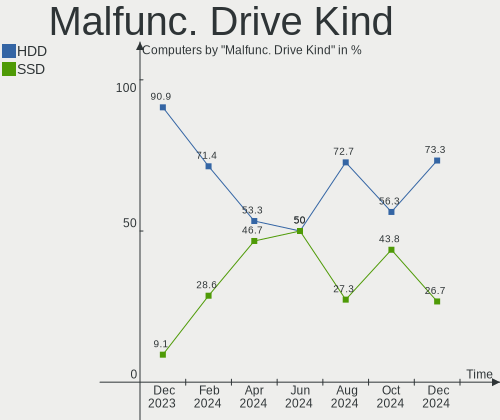
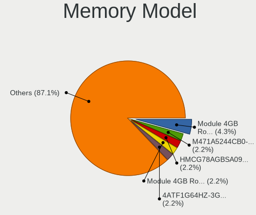
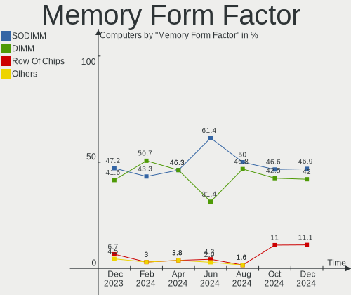

FreeBSD - Hardware Trends
-------------------------

A project to identify most popular hardware characteristics and track their change
over time based on data collected by BSD users at https://BSD-Hardware.info.

Anyone can contribute to this report by the [hw-probe](https://github.com/linuxhw/hw-probe/blob/master/INSTALL.BSD.md) tool:

    hw-probe -all -upload

This is a report for all computer types. See also reports for [desktops](/Dist/FreeBSD/Desktop/README.md) and [notebooks](/Dist/FreeBSD/Notebook/README.md).

This report is for one last month. Overall report since the beginning of time: [TestDays](https://github.com/bsdhw/TestDays)

Period: Jan, 2024.

Contents
--------

* [ System ](#system)
  - [ OS                       ](#os)
  - [ OS Family                ](#os-family)
  - [ Arch                     ](#arch)
  - [ DE                       ](#de)
  - [ Display Server           ](#display-server)
  - [ Display Manager          ](#display-manager)
  - [ OS Lang                  ](#os-lang)
  - [ Boot Mode                ](#boot-mode)
  - [ Filesystem               ](#filesystem)
  - [ Part. scheme             ](#part-scheme)

* [ Board ](#board)
  - [ Vendor                   ](#vendor)
  - [ Model                    ](#model)
  - [ Model Family             ](#model-family)
  - [ MFG Year                 ](#mfg-year)
  - [ Form Factor              ](#form-factor)
  - [ Coreboot                 ](#coreboot)
  - [ RAM Size                 ](#ram-size)
  - [ RAM Used                 ](#ram-used)
  - [ Total Drives             ](#total-drives)
  - [ Has CD-ROM               ](#has-cd-rom)
  - [ Has Ethernet             ](#has-ethernet)
  - [ Has WiFi                 ](#has-wifi)
  - [ Has Bluetooth            ](#has-bluetooth)

* [ Location ](#location)
  - [ Country                  ](#country)
  - [ City                     ](#city)

* [ Drives ](#drives)
  - [ Drive Vendor             ](#drive-vendor)
  - [ Drive Model              ](#drive-model)
  - [ HDD Vendor               ](#hdd-vendor)
  - [ SSD Vendor               ](#ssd-vendor)
  - [ Drive Kind               ](#drive-kind)
  - [ Drive Connector          ](#drive-connector)
  - [ Drive Size               ](#drive-size)
  - [ Space Total              ](#space-total)
  - [ Space Used               ](#space-used)
  - [ Malfunc. Drives          ](#malfunc-drives)
  - [ Malfunc. Drive Vendor    ](#malfunc-drive-vendor)
  - [ Malfunc. HDD Vendor      ](#malfunc-hdd-vendor)
  - [ Malfunc. Drive Kind      ](#malfunc-drive-kind)
  - [ Failed Drives            ](#failed-drives)
  - [ Failed Drive Vendor      ](#failed-drive-vendor)
  - [ Drive Status             ](#drive-status)

* [ Storage controller ](#storage-controller)
  - [ Storage Vendor           ](#storage-vendor)
  - [ Storage Model            ](#storage-model)
  - [ Storage Kind             ](#storage-kind)

* [ Processor ](#processor)
  - [ CPU Vendor               ](#cpu-vendor)
  - [ CPU Model                ](#cpu-model)
  - [ CPU Model Family         ](#cpu-model-family)
  - [ CPU Cores                ](#cpu-cores)
  - [ CPU Sockets              ](#cpu-sockets)
  - [ CPU Threads              ](#cpu-threads)
  - [ CPU Microarch            ](#cpu-microarch)

* [ Graphics ](#graphics)
  - [ GPU Vendor               ](#gpu-vendor)
  - [ GPU Model                ](#gpu-model)
  - [ GPU Combo                ](#gpu-combo)
  - [ GPU Driver               ](#gpu-driver)
  - [ GPU Memory               ](#gpu-memory)

* [ Monitor ](#monitor)
  - [ Monitor Vendor           ](#monitor-vendor)
  - [ Monitor Model            ](#monitor-model)
  - [ Monitor Resolution       ](#monitor-resolution)
  - [ Monitor Diagonal         ](#monitor-diagonal)
  - [ Monitor Width            ](#monitor-width)
  - [ Aspect Ratio             ](#aspect-ratio)
  - [ Monitor Area             ](#monitor-area)
  - [ Pixel Density            ](#pixel-density)
  - [ Multiple Monitors        ](#multiple-monitors)

* [ Network ](#network)
  - [ Net Controller Vendor    ](#net-controller-vendor)
  - [ Net Controller Model     ](#net-controller-model)
  - [ Wireless Vendor          ](#wireless-vendor)
  - [ Wireless Model           ](#wireless-model)
  - [ Ethernet Vendor          ](#ethernet-vendor)
  - [ Ethernet Model           ](#ethernet-model)
  - [ Net Controller Kind      ](#net-controller-kind)
  - [ Used Controller          ](#used-controller)
  - [ NICs                     ](#nics)
  - [ IPv6                     ](#ipv6)

* [ Bluetooth ](#bluetooth)
  - [ Bluetooth Vendor         ](#bluetooth-vendor)
  - [ Bluetooth Model          ](#bluetooth-model)

* [ Sound ](#sound)
  - [ Sound Vendor             ](#sound-vendor)
  - [ Sound Model              ](#sound-model)

* [ Memory ](#memory)
  - [ Memory Vendor            ](#memory-vendor)
  - [ Memory Model             ](#memory-model)
  - [ Memory Kind              ](#memory-kind)
  - [ Memory Form Factor       ](#memory-form-factor)
  - [ Memory Size              ](#memory-size)
  - [ Memory Speed             ](#memory-speed)

* [ Printers & scanners ](#printers--scanners)
  - [ Printer Vendor           ](#printer-vendor)
  - [ Printer Model            ](#printer-model)
  - [ Scanner Vendor           ](#scanner-vendor)
  - [ Scanner Model            ](#scanner-model)

* [ Camera ](#camera)
  - [ Camera Vendor            ](#camera-vendor)
  - [ Camera Model             ](#camera-model)

* [ Security ](#security)
  - [ Fingerprint Vendor       ](#fingerprint-vendor)
  - [ Fingerprint Model        ](#fingerprint-model)
  - [ Chipcard Vendor          ](#chipcard-vendor)
  - [ Chipcard Model           ](#chipcard-model)

* [ Unsupported ](#unsupported)
  - [ Unsupported Devices      ](#unsupported-devices)
  - [ Unsupported Device Types ](#unsupported-device-types)

System
------

OS
--

Installed operating systems

| Name                 | Computers | Percent |
|----------------------|-----------|---------|
| FreeBSD 14.0-p4      | 23        | 33.82%  |
| FreeBSD 14.0         | 14        | 20.59%  |
| FreeBSD 15.0-CURRENT | 6         | 8.82%   |
| FreeBSD 13.2-p9      | 5         | 7.35%   |
| FreeBSD 14.0-p2      | 4         | 5.88%   |
| FreeBSD 13.2         | 4         | 5.88%   |
| FreeBSD 14.0-STABLE  | 2         | 2.94%   |
| FreeBSD 14.0-p3      | 1         | 1.47%   |
| FreeBSD 14.0-p1      | 1         | 1.47%   |
| FreeBSD 14.0-BETA5   | 1         | 1.47%   |
| FreeBSD 13.2-STABLE  | 1         | 1.47%   |
| FreeBSD 13.2-p8      | 1         | 1.47%   |
| FreeBSD 13.2-p54     | 1         | 1.47%   |
| FreeBSD 13.2-p5      | 1         | 1.47%   |
| FreeBSD 13.2-p1      | 1         | 1.47%   |
| FreeBSD 13.1-p2      | 1         | 1.47%   |
| FreeBSD 13.1         | 1         | 1.47%   |

OS Family
---------

OS without a version

| Name    | Computers | Percent |
|---------|-----------|---------|
| FreeBSD | 68        | 100%    |

Arch
----

OS architecture (x86_64, i586, etc.)

| Name    | Computers | Percent |
|---------|-----------|---------|
| amd64   | 62        | 91.18%  |
| arm64   | 3         | 4.41%   |
| powerpc | 1         | 1.47%   |
| i386    | 1         | 1.47%   |
| arm     | 1         | 1.47%   |

DE
--

Desktop Environment

| Name      | Computers | Percent |
|-----------|-----------|---------|
| Console   | 29        | 42.65%  |
| KDE5      | 12        | 17.65%  |
| XFCE      | 7         | 10.29%  |
| GNOME     | 4         | 5.88%   |
| TWM       | 3         | 4.41%   |
| i3        | 3         | 4.41%   |
| wlroots   | 2         | 2.94%   |
| MATE      | 2         | 2.94%   |
| Cinnamon  | 2         | 2.94%   |
| Openbox   | 1         | 1.47%   |
| LXQt      | 1         | 1.47%   |
| DWM       | 1         | 1.47%   |
| AwesomeWM | 1         | 1.47%   |

Display Server
--------------

X11 or Wayland

| Name    | Computers | Percent |
|---------|-----------|---------|
| X11     | 35        | 51.47%  |
| Console | 30        | 44.12%  |
| Wayland | 3         | 4.41%   |

Display Manager
---------------

SDDM, LightDM, etc.

| Name    | Computers | Percent |
|---------|-----------|---------|
| Console | 42        | 61.76%  |
| SDDM    | 11        | 16.18%  |
| LightDM | 6         | 8.82%   |
| SLiM    | 5         | 7.35%   |
| GDM     | 3         | 4.41%   |
| XDM     | 1         | 1.47%   |

OS Lang
-------

Language

| Lang            | Computers | Percent |
|-----------------|-----------|---------|
| C               | 51        | 75%     |
| en_US           | 8         | 11.76%  |
| Unknown         | 3         | 4.41%   |
| pl_PL           | 2         | 2.94%   |
| zh_CN           | 1         | 1.47%   |
| ru_RU           | 1         | 1.47%   |
| fr_FR           | 1         | 1.47%   |
| en_US.ISO8859-1 | 1         | 1.47%   |

Boot Mode
---------

EFI or BIOS

| Mode | Computers | Percent |
|------|-----------|---------|
| EFI  | 55        | 80.88%  |
| BIOS | 13        | 19.12%  |

Filesystem
----------

Type of filesystem

| Type | Computers | Percent |
|------|-----------|---------|
| Zfs  | 38        | 55.88%  |
| Ufs  | 30        | 44.12%  |

Part. scheme
------------

Scheme of partitioning

| Type | Computers | Percent |
|------|-----------|---------|
| GPT  | 62        | 91.18%  |
| MBR  | 5         | 7.35%   |
| BSD  | 1         | 1.47%   |

Board
-----

Vendor
------

Motherboard manufacturer

| Name                    | Computers | Percent |
|-------------------------|-----------|---------|
| ASUSTek Computer        | 14        | 20.59%  |
| Dell                    | 11        | 16.18%  |
| Lenovo                  | 9         | 13.24%  |
| Hewlett-Packard         | 7         | 10.29%  |
| ASRock                  | 4         | 5.88%   |
| Razer                   | 2         | 2.94%   |
| Raspberry Pi Foundation | 2         | 2.94%   |
| MSI                     | 2         | 2.94%   |
| Gigabyte Technology     | 2         | 2.94%   |
| Unknown                 | 2         | 2.94%   |
| Supermicro              | 1         | 1.47%   |
| SolidRun                | 1         | 1.47%   |
| Roqos                   | 1         | 1.47%   |
| Rembrandt               | 1         | 1.47%   |
| LG Electronics          | 1         | 1.47%   |
| HC Technology.          | 1         | 1.47%   |
| Fujitsu                 | 1         | 1.47%   |
| Fanless Mini PC         | 1         | 1.47%   |
| AZW                     | 1         | 1.47%   |
| ASRockRack              | 1         | 1.47%   |
| Apple                   | 1         | 1.47%   |
| Alienware               | 1         | 1.47%   |
| Acer                    | 1         | 1.47%   |

Model
-----

Motherboard model

| Name                                  | Computers | Percent |
|---------------------------------------|-----------|---------|
| RPi Raspberry Pi                      | 2         | 2.94%   |
| Unknown                               | 2         | 2.94%   |
| Supermicro Super Server               | 1         | 1.47%   |
| SolidRun CEX7 Platform                | 1         | 1.47%   |
| Roqos Core RC10                       | 1         | 1.47%   |
| Rembrandt ARB928                      | 1         | 1.47%   |
| Razer Blade 16 - RZ09-0483            | 1         | 1.47%   |
| Razer Blade 14 (2022) - RZ09-0427     | 1         | 1.47%   |
| MSI MS-7B86                           | 1         | 1.47%   |
| MSI MS-7817                           | 1         | 1.47%   |
| LG 16UD70R-G.AX59B                    | 1         | 1.47%   |
| Lenovo ThinkPad X220 42912Z1          | 1         | 1.47%   |
| Lenovo ThinkPad W520 4284GZ1          | 1         | 1.47%   |
| Lenovo ThinkPad T490s 20NX000MUS      | 1         | 1.47%   |
| Lenovo ThinkPad T14s Gen 4 21F60029US | 1         | 1.47%   |
| Lenovo ThinkPad E14 Gen 3 20Y7003QGE  | 1         | 1.47%   |
| Lenovo ThinkPad 11e 20D90020US        | 1         | 1.47%   |
| Lenovo ThinkBook 14 G6 IRL 21KG       | 1         | 1.47%   |
| Lenovo Legion Y9000X 2020 81TH        | 1         | 1.47%   |
| Lenovo G50-80 80E5                    | 1         | 1.47%   |
| HP ZBook 17 G2                        | 1         | 1.47%   |
| HP t5740                              | 1         | 1.47%   |
| HP ProLiant DL180 G6                  | 1         | 1.47%   |
| HP ProBook 650 G1                     | 1         | 1.47%   |
| HP Pavilion g6                        | 1         | 1.47%   |
| HP Laptop 15t-dy100                   | 1         | 1.47%   |
| HP 255 G7 Notebook PC                 | 1         | 1.47%   |
| HC Technology. HCAR5000-MI            | 1         | 1.47%   |
| Gigabyte Z690 UD DDR4                 | 1         | 1.47%   |
| Gigabyte H87-D3H                      | 1         | 1.47%   |
| Fujitsu ESPRIMO Q556/2                | 1         | 1.47%   |
| Fanless Mini PC Quieter2              | 1         | 1.47%   |
| Dell XPS 15 7590                      | 1         | 1.47%   |
| Dell Precision 7510                   | 1         | 1.47%   |
| Dell OptiPlex 7050                    | 1         | 1.47%   |
| Dell OptiPlex 5040                    | 1         | 1.47%   |
| Dell OptiPlex 3040                    | 1         | 1.47%   |
| Dell Latitude E7450                   | 1         | 1.47%   |
| Dell Latitude E5420                   | 1         | 1.47%   |
| Dell Latitude 7490                    | 1         | 1.47%   |

Model Family
------------

Motherboard model prefix

| Name                       | Computers | Percent |
|----------------------------|-----------|---------|
| Lenovo ThinkPad            | 6         | 8.82%   |
| ASUS ROG                   | 4         | 5.88%   |
| Dell OptiPlex              | 3         | 4.41%   |
| Dell Latitude              | 3         | 4.41%   |
| ASUS TUF                   | 3         | 4.41%   |
| Razer Blade                | 2         | 2.94%   |
| RPi Raspberry              | 2         | 2.94%   |
| Dell Inspiron              | 2         | 2.94%   |
| Unknown                    | 2         | 2.94%   |
| Supermicro Super           | 1         | 1.47%   |
| SolidRun CEX7              | 1         | 1.47%   |
| Roqos Core                 | 1         | 1.47%   |
| Rembrandt ARB928           | 1         | 1.47%   |
| MSI MS-7B86                | 1         | 1.47%   |
| MSI MS-7817                | 1         | 1.47%   |
| LG 16UD70R-G.AX59B         | 1         | 1.47%   |
| Lenovo ThinkBook           | 1         | 1.47%   |
| Lenovo Legion              | 1         | 1.47%   |
| Lenovo G50-80              | 1         | 1.47%   |
| HP ZBook                   | 1         | 1.47%   |
| HP t5740                   | 1         | 1.47%   |
| HP ProLiant                | 1         | 1.47%   |
| HP ProBook                 | 1         | 1.47%   |
| HP Pavilion                | 1         | 1.47%   |
| HP Laptop                  | 1         | 1.47%   |
| HP 255                     | 1         | 1.47%   |
| HC Technology. HCAR5000-MI | 1         | 1.47%   |
| Gigabyte Z690              | 1         | 1.47%   |
| Gigabyte H87-D3H           | 1         | 1.47%   |
| Fujitsu ESPRIMO            | 1         | 1.47%   |
| Fanless Mini PC Quieter2   | 1         | 1.47%   |
| Dell XPS                   | 1         | 1.47%   |
| Dell Precision             | 1         | 1.47%   |
| Dell Edge                  | 1         | 1.47%   |
| AZW SER                    | 1         | 1.47%   |
| ASUS X551MA                | 1         | 1.47%   |
| ASUS X441UV                | 1         | 1.47%   |
| ASUS Pro                   | 1         | 1.47%   |
| ASUS PRIME                 | 1         | 1.47%   |
| ASUS P5Q-E                 | 1         | 1.47%   |

MFG Year
--------

Motherboard manufacture year

| Year    | Computers | Percent |
|---------|-----------|---------|
| 2023    | 14        | 20.59%  |
| 2019    | 11        | 16.18%  |
| 2020    | 6         | 8.82%   |
| 2016    | 6         | 8.82%   |
| 2022    | 4         | 5.88%   |
| Unknown | 4         | 5.88%   |
| 2021    | 3         | 4.41%   |
| 2018    | 3         | 4.41%   |
| 2014    | 3         | 4.41%   |
| 2012    | 3         | 4.41%   |
| 2011    | 3         | 4.41%   |
| 2008    | 3         | 4.41%   |
| 2017    | 2         | 2.94%   |
| 2015    | 1         | 1.47%   |
| 2013    | 1         | 1.47%   |
| 2009    | 1         | 1.47%   |

Form Factor
-----------

Physical design of the computer

| Name           | Computers | Percent |
|----------------|-----------|---------|
| Desktop        | 30        | 44.12%  |
| Notebook       | 30        | 44.12%  |
| Mini pc        | 4         | 5.88%   |
| System on chip | 2         | 2.94%   |
| Server         | 2         | 2.94%   |

Coreboot
--------

Have coreboot on board

| Used | Computers | Percent |
|------|-----------|---------|
| No   | 67        | 98.53%  |
| Yes  | 1         | 1.47%   |

RAM Size
--------

Total RAM memory

| Size in GB  | Computers | Percent |
|-------------|-----------|---------|
| 16.01-24.0  | 18        | 26.47%  |
| 8.01-16.0   | 16        | 23.53%  |
| 32.01-64.0  | 11        | 16.18%  |
| 4.01-8.0    | 9         | 13.24%  |
| 64.01-256.0 | 9         | 13.24%  |
| 3.01-4.0    | 1         | 1.47%   |
| 24.01-32.0  | 1         | 1.47%   |
| 2.01-3.0    | 1         | 1.47%   |
| 0.51-1.0    | 1         | 1.47%   |
| 0.01-0.5    | 1         | 1.47%   |

RAM Used
--------

Used RAM memory

| Used GB  | Computers | Percent |
|----------|-----------|---------|
| 0.01-0.5 | 21        | 30.88%  |
| 1.01-2.0 | 20        | 29.41%  |
| 0.51-1.0 | 18        | 26.47%  |
| 3.01-4.0 | 3         | 4.41%   |
| 2.01-3.0 | 3         | 4.41%   |
| 0        | 2         | 2.94%   |
| 4.01-8.0 | 1         | 1.47%   |

Total Drives
------------

Number of drives on board

| Drives | Computers | Percent |
|--------|-----------|---------|
| 1      | 32        | 47.06%  |
| 0      | 18        | 26.47%  |
| 2      | 8         | 11.76%  |
| 3      | 5         | 7.35%   |
| 5      | 2         | 2.94%   |
| 4      | 2         | 2.94%   |
| 13     | 1         | 1.47%   |

Has CD-ROM
----------

Has CD-ROM on board

| Presented | Computers | Percent |
|-----------|-----------|---------|
| No        | 50        | 73.53%  |
| Yes       | 18        | 26.47%  |

Has Ethernet
------------

Has Ethernet on board

| Presented | Computers | Percent |
|-----------|-----------|---------|
| Yes       | 57        | 83.82%  |
| No        | 11        | 16.18%  |

Has WiFi
--------

Has WiFi module

| Presented | Computers | Percent |
|-----------|-----------|---------|
| Yes       | 43        | 63.24%  |
| No        | 25        | 36.76%  |

Has Bluetooth
-------------

Has Bluetooth module

| Presented | Computers | Percent |
|-----------|-----------|---------|
| Yes       | 35        | 51.47%  |
| No        | 33        | 48.53%  |

Location
--------

Country
-------

Geographic location (country)

| Country     | Computers | Percent |
|-------------|-----------|---------|
| USA         | 19        | 27.94%  |
| France      | 6         | 8.82%   |
| UK          | 5         | 7.35%   |
| Russia      | 5         | 7.35%   |
| Canada      | 4         | 5.88%   |
| Netherlands | 3         | 4.41%   |
| Algeria     | 3         | 4.41%   |
| Poland      | 2         | 2.94%   |
| Ireland     | 2         | 2.94%   |
| Germany     | 2         | 2.94%   |
| Czechia     | 2         | 2.94%   |
| Belarus     | 2         | 2.94%   |
| Turkey      | 1         | 1.47%   |
| Thailand    | 1         | 1.47%   |
| Switzerland | 1         | 1.47%   |
| Sweden      | 1         | 1.47%   |
| Slovenia    | 1         | 1.47%   |
| Mexico      | 1         | 1.47%   |
| Japan       | 1         | 1.47%   |
| Indonesia   | 1         | 1.47%   |
| India       | 1         | 1.47%   |
| Hungary     | 1         | 1.47%   |
| Colombia    | 1         | 1.47%   |
| Brazil      | 1         | 1.47%   |
| Austria     | 1         | 1.47%   |

City
----

Geographic location (city)

| City           | Computers | Percent |
|----------------|-----------|---------|
| Yekaterinburg  | 2         | 2.94%   |
| Spanish Fork   | 2         | 2.94%   |
| Salem          | 2         | 2.94%   |
| Rpety          | 2         | 2.94%   |
| Redmond        | 2         | 2.94%   |
| Paris          | 2         | 2.94%   |
| Moscow         | 2         | 2.94%   |
| Midleton       | 2         | 2.94%   |
| Lewisham       | 2         | 2.94%   |
| Courbevoie     | 2         | 2.94%   |
| Atlanta        | 2         | 2.94%   |
| Amsterdam      | 2         | 2.94%   |
| Ypsilanti      | 1         | 1.47%   |
| Witow          | 1         | 1.47%   |
| Westervoort    | 1         | 1.47%   |
| Wenatchee      | 1         | 1.47%   |
| Virginia Beach | 1         | 1.47%   |
| Vienna         | 1         | 1.47%   |
| Vancouver      | 1         | 1.47%   |
| Vallingby      | 1         | 1.47%   |
| Toronto        | 1         | 1.47%   |
| Tijuana        | 1         | 1.47%   |
| Sydenham       | 1         | 1.47%   |
| Seattle        | 1         | 1.47%   |
| Sao Paulo      | 1         | 1.47%   |
| San Mateo      | 1         | 1.47%   |
| San Jose       | 1         | 1.47%   |
| Salford        | 1         | 1.47%   |
| Roanoke        | 1         | 1.47%   |
| Richmond       | 1         | 1.47%   |
| Pevensey       | 1         | 1.47%   |
| Oran           | 1         | 1.47%   |
| Nuremberg      | 1         | 1.47%   |
| Mumbai         | 1         | 1.47%   |
| Mogilev        | 1         | 1.47%   |
| Minsk          | 1         | 1.47%   |
| Medellín      | 1         | 1.47%   |
| Medan          | 1         | 1.47%   |
| Mascara        | 1         | 1.47%   |
| Lyon           | 1         | 1.47%   |

Drives
------

Drive Vendor
------------

Hard drive vendors

| Vendor              | Computers | Drives | Percent |
|---------------------|-----------|--------|---------|
| Samsung Electronics | 16        | 22     | 23.19%  |
| Seagate             | 11        | 13     | 15.94%  |
| WDC                 | 7         | 19     | 10.14%  |
| Crucial             | 5         | 6      | 7.25%   |
| SK hynix            | 4         | 4      | 5.8%    |
| Intel               | 4         | 5      | 5.8%    |
| HGST                | 4         | 6      | 5.8%    |
| Toshiba             | 3         | 3      | 4.35%   |
| SanDisk             | 3         | 3      | 4.35%   |
| Kingston            | 2         | 2      | 2.9%    |
| Hewlett-Packard     | 2         | 3      | 2.9%    |
| Team                | 1         | 1      | 1.45%   |
| SSSTC               | 1         | 1      | 1.45%   |
| Pioneer             | 1         | 1      | 1.45%   |
| MidasForce          | 1         | 1      | 1.45%   |
| Lexar               | 1         | 1      | 1.45%   |
| Foxline             | 1         | 1      | 1.45%   |
| Corsair             | 1         | 1      | 1.45%   |
| A-DATA Technology   | 1         | 1      | 1.45%   |

Drive Model
-----------

Hard drive models

| Model                                       | Computers | Percent |
|---------------------------------------------|-----------|---------|
| Seagate ST4000DM000-1F2168 4TB              | 2         | 2.5%    |
| Seagate ST1000LM024 HN-M101MBB 1TB          | 2         | 2.5%    |
| Samsung SSD 870 QVO 2TB                     | 2         | 2.5%    |
| Samsung SSD 860 QVO 1TB                     | 2         | 2.5%    |
| Samsung SSD 860 EVO 500GB                   | 2         | 2.5%    |
| Samsung SSD 850 EVO 250GB                   | 2         | 2.5%    |
| Crucial CT240BX500SSD1 240GB                | 2         | 2.5%    |
| WDC WUH721414ALE6L4 14TB                    | 1         | 1.25%   |
| WDC WD80EMAZ-00WJTA0 8TB                    | 1         | 1.25%   |
| WDC WD80EFZX-68UW8N0 8TB                    | 1         | 1.25%   |
| WDC WD80EFAX-68LHPN0 8TB                    | 1         | 1.25%   |
| WDC WD80EDBZ-11B0ZA0 8TB                    | 1         | 1.25%   |
| WDC WD40NDZW-11BCSS0 4TB                    | 1         | 1.25%   |
| WDC WD40EZRZ-22GXCB0 4TB                    | 1         | 1.25%   |
| WDC WD40EZRZ-00GXCB0 4TB                    | 1         | 1.25%   |
| WDC WD40EFRX-68WT0N0 4TB                    | 1         | 1.25%   |
| WDC WD15EADS-00P8B0 1.5TB                   | 1         | 1.25%   |
| WDC WD120EMFZ-11A6JA0 12TB                  | 1         | 1.25%   |
| WDC WD120EMAZ-11BLFA0 12TB                  | 1         | 1.25%   |
| WDC WD10EZEX-75WN4A0 1TB                    | 1         | 1.25%   |
| WDC WD1002FAEX-00Z3A0 1TB                   | 1         | 1.25%   |
| WDC WD1001FALS-00J7B1 1TB                   | 1         | 1.25%   |
| Toshiba MQ04UBF100 1TB                      | 1         | 1.25%   |
| Toshiba MQ01ABD100 1TB                      | 1         | 1.25%   |
| Toshiba HDWR180 8TB                         | 1         | 1.25%   |
| Team T253X1120G 120GB                       | 1         | 1.25%   |
| SSSTC CL4-8D512 512GB                       | 1         | 1.25%   |
| SK hynix SKHynix_HFS512GDE9X084N 512GB      | 1         | 1.25%   |
| SK hynix SC401 SATA 256GB                   | 1         | 1.25%   |
| SK hynix SC311 SATA 128GB                   | 1         | 1.25%   |
| SK hynix SC308 SATA 128GB                   | 1         | 1.25%   |
| Seagate ST8000DM004-2U9188 8TB              | 1         | 1.25%   |
| Seagate ST500LT012-1DG142 500GB             | 1         | 1.25%   |
| Seagate ST4000LM024-2AN17V 4TB              | 1         | 1.25%   |
| Seagate ST2000DM008-2FR102 2TB              | 1         | 1.25%   |
| Seagate ST18000NM000J-2TV103 18TB           | 1         | 1.25%   |
| Seagate ST1000DM003-1SB10C 1TB              | 1         | 1.25%   |
| Seagate FireCuda 120 SSD ZA500GM10001 500GB | 1         | 1.25%   |
| SanDisk SSD PLUS 2000GB                     | 1         | 1.25%   |
| SanDisk SDSSDA120G 120GB                    | 1         | 1.25%   |

HDD Vendor
----------

Hard disk drive vendors

| Vendor          | Computers | Drives | Percent |
|-----------------|-----------|--------|---------|
| Seagate         | 10        | 12     | 40%     |
| WDC             | 7         | 19     | 28%     |
| HGST            | 4         | 6      | 16%     |
| Toshiba         | 3         | 3      | 12%     |
| Hewlett-Packard | 1         | 2      | 4%      |

SSD Vendor
----------

Solid state drive vendors

| Vendor              | Computers | Drives | Percent |
|---------------------|-----------|--------|---------|
| Samsung Electronics | 14        | 18     | 35.9%   |
| Crucial             | 5         | 6      | 12.82%  |
| Intel               | 4         | 5      | 10.26%  |
| SK hynix            | 3         | 3      | 7.69%   |
| SanDisk             | 3         | 3      | 7.69%   |
| Kingston            | 2         | 2      | 5.13%   |
| Team                | 1         | 1      | 2.56%   |
| Seagate             | 1         | 1      | 2.56%   |
| Pioneer             | 1         | 1      | 2.56%   |
| MidasForce          | 1         | 1      | 2.56%   |
| Lexar               | 1         | 1      | 2.56%   |
| Hewlett-Packard     | 1         | 1      | 2.56%   |
| Foxline             | 1         | 1      | 2.56%   |
| A-DATA Technology   | 1         | 1      | 2.56%   |

Drive Kind
----------

HDD or SSD

| Kind | Computers | Drives | Percent |
|------|-----------|--------|---------|
| SSD  | 37        | 45     | 58.73%  |
| HDD  | 20        | 42     | 31.75%  |
| NVMe | 6         | 7      | 9.52%   |

Drive Connector
---------------

SATA, SAS, NVMe, etc.

| Type | Computers | Drives | Percent |
|------|-----------|--------|---------|
| SATA | 49        | 87     | 89.09%  |
| NVMe | 6         | 7      | 10.91%  |

Drive Size
----------

Size of hard drive

| Size in TB | Computers | Drives | Percent |
|------------|-----------|--------|---------|
| 0.01-0.5   | 28        | 34     | 45.16%  |
| 0.51-1.0   | 15        | 18     | 24.19%  |
| 1.01-2.0   | 7         | 12     | 11.29%  |
| 3.01-4.0   | 5         | 8      | 8.06%   |
| 4.01-10.0  | 4         | 11     | 6.45%   |
| 10.01-20.0 | 3         | 4      | 4.84%   |

Space Total
-----------

Amount of disk space available on the file system

| Size in GB     | Computers | Percent |
|----------------|-----------|---------|
| 101-250        | 24        | 35.29%  |
| 251-500        | 18        | 26.47%  |
| 501-1000       | 11        | 16.18%  |
| 51-100         | 6         | 8.82%   |
| 1001-2000      | 5         | 7.35%   |
| More than 3000 | 2         | 2.94%   |
| 1-20           | 2         | 2.94%   |

Space Used
----------

Amount of used disk space

| Used GB        | Computers | Percent |
|----------------|-----------|---------|
| 1-20           | 48        | 70.59%  |
| 21-50          | 10        | 14.71%  |
| 51-100         | 4         | 5.88%   |
| 101-250        | 3         | 4.41%   |
| More than 3000 | 2         | 2.94%   |
| 501-1000       | 1         | 1.47%   |

Malfunc. Drives
---------------

Drive models with a malfunction

| Model                           | Computers | Drives | Percent |
|---------------------------------|-----------|--------|---------|
| WDC WD40EFRX-68WT0N0 4TB        | 1         | 1      | 14.29%  |
| SK hynix SC401 SATA 256GB       | 1         | 1      | 14.29%  |
| SK hynix SC308 SATA 128GB       | 1         | 1      | 14.29%  |
| Seagate ST500LT012-1DG142 500GB | 1         | 1      | 14.29%  |
| Lexar CFAST 64GB CARD           | 1         | 1      | 14.29%  |
| HGST HTS725050A7E630 500GB      | 1         | 1      | 14.29%  |
| Crucial CT525MX300SSD1 528GB    | 1         | 1      | 14.29%  |

Malfunc. Drive Vendor
---------------------

Vendors of faulty drives

| Vendor   | Computers | Drives | Percent |
|----------|-----------|--------|---------|
| SK hynix | 2         | 2      | 28.57%  |
| WDC      | 1         | 1      | 14.29%  |
| Seagate  | 1         | 1      | 14.29%  |
| Lexar    | 1         | 1      | 14.29%  |
| HGST     | 1         | 1      | 14.29%  |
| Crucial  | 1         | 1      | 14.29%  |

Malfunc. HDD Vendor
-------------------

Vendors of faulty HDD drives

| Vendor  | Computers | Drives | Percent |
|---------|-----------|--------|---------|
| WDC     | 1         | 1      | 33.33%  |
| Seagate | 1         | 1      | 33.33%  |
| HGST    | 1         | 1      | 33.33%  |

Malfunc. Drive Kind
-------------------

Kinds of faulty drives

| Kind | Computers | Drives | Percent |
|------|-----------|--------|---------|
| SSD  | 4         | 4      | 57.14%  |
| HDD  | 3         | 3      | 42.86%  |

Failed Drives
-------------

Failed drive models

Zero info for selected period =(

Failed Drive Vendor
-------------------

Failed drive vendors

Zero info for selected period =(

Drive Status
------------

Number of failed and malfunc. drives

| Status   | Computers | Drives | Percent |
|----------|-----------|--------|---------|
| Works    | 44        | 85     | 86.27%  |
| Malfunc  | 6         | 7      | 11.76%  |
| Detected | 1         | 2      | 1.96%   |

Storage controller
------------------

Storage Vendor
--------------

Storage controller vendors

| Vendor                                  | Computers | Percent |
|-----------------------------------------|-----------|---------|
| Intel                                   | 35        | 37.63%  |
| AMD                                     | 16        | 17.2%   |
| Samsung Electronics                     | 13        | 13.98%  |
| SanDisk                                 | 5         | 5.38%   |
| Micron/Crucial Technology               | 4         | 4.3%    |
| Phison Electronics                      | 3         | 3.23%   |
| Solid State Storage Technology          | 2         | 2.15%   |
| SK hynix                                | 2         | 2.15%   |
| Marvell Technology Group                | 2         | 2.15%   |
| Broadcom / LSI                          | 2         | 2.15%   |
| Toshiba                                 | 1         | 1.08%   |
| Shenzhen Unionmemory Information System | 1         | 1.08%   |
| Shenzhen Longsys Electronics            | 1         | 1.08%   |
| Nvidia                                  | 1         | 1.08%   |
| Micron Technology                       | 1         | 1.08%   |
| MAXIO Technology (Hangzhou)             | 1         | 1.08%   |
| Kingston Technology Company             | 1         | 1.08%   |
| Hewlett-Packard                         | 1         | 1.08%   |
| ASMedia Technology                      | 1         | 1.08%   |

Storage Model
-------------

Storage controller models

| Model                                                                          | Computers | Percent |
|--------------------------------------------------------------------------------|-----------|---------|
| AMD FCH SATA Controller [AHCI mode]                                            | 13        | 13.13%  |
| Samsung NVMe SSD Controller SM981/PM981/PM983                                  | 6         | 6.06%   |
| Intel 8 Series/C220 Series Chipset Family 6-port SATA Controller 1 [AHCI mode] | 5         | 5.05%   |
| Intel Q170/Q150/B150/H170/H110/Z170/CM236 Chipset SATA Controller [AHCI Mode]  | 4         | 4.04%   |
| Intel Atom Processor E3800 Series SATA AHCI Controller                         | 4         | 4.04%   |
| Micron/Crucial P2 [Nick P2] / P3 / P3 Plus NVMe PCIe SSD (DRAM-less)           | 3         | 3.03%   |
| Intel SATA Controller [RAID mode]                                              | 3         | 3.03%   |
| Intel 82801 Mobile SATA Controller [RAID mode]                                 | 3         | 3.03%   |
| Intel 6 Series/C200 Series Chipset Family 6 port Mobile SATA AHCI Controller   | 3         | 3.03%   |
| Samsung NVMe SSD Controller SM961/PM961/SM963                                  | 2         | 2.02%   |
| Samsung NVMe SSD Controller PM9A1/PM9A3/980PRO                                 | 2         | 2.02%   |
| Samsung NVMe SSD Controller 980 (DRAM-less)                                    | 2         | 2.02%   |
| Intel Wildcat Point-LP SATA Controller [AHCI Mode]                             | 2         | 2.02%   |
| Broadcom / LSI SAS2008 PCI-Express Fusion-MPT SAS-2 [Falcon]                   | 2         | 2.02%   |
| AMD 500 Series Chipset SATA Controller                                         | 2         | 2.02%   |
| AMD 400 Series Chipset SATA Controller                                         | 2         | 2.02%   |
| Toshiba XG4 NVMe SSD Controller                                                | 1         | 1.01%   |
| Solid State Storage CL4-8D512 NVMe SSD M.2 (DRAM-less)                         | 1         | 1.01%   |
| Solid State Storage CA6-8D512 NVMe SSD M.2                                     | 1         | 1.01%   |
| SK hynix PC601 NVMe Solid State Drive                                          | 1         | 1.01%   |
| SK hynix Gold P31/BC711/PC711 NVMe Solid State Drive                           | 1         | 1.01%   |
| Shenzhen Longsys Lexar NM790 NVME SSD (DRAM-less)                              | 1         | 1.01%   |
| Sandisk WD PC SN740 NVMe SSD 512GB (DRAM-less)                                 | 1         | 1.01%   |
| SanDisk WD Blue SN500 / PC SN520 x2 M.2 2280 NVMe SSD                          | 1         | 1.01%   |
| Sandisk WD Black SN770 / PC SN740 256GB / PC SN560 (DRAM-less) NVMe SSD        | 1         | 1.01%   |
| SanDisk PC SN530 NVMe SSD (DRAM-less)                                          | 1         | 1.01%   |
| SanDisk Extreme Pro / WD Black SN750 / PC SN730 / Red SN700 NVMe SSD           | 1         | 1.01%   |
| Samsung NVMe SSD Controller S4LV008[Pascal]                                    | 1         | 1.01%   |
| Phison PS5013-E13 PCIe3 NVMe Controller (DRAM-less)                            | 1         | 1.01%   |
| Phison E16 PCIe4 NVMe Controller                                               | 1         | 1.01%   |
| Phison E12 NVMe Controller                                                     | 1         | 1.01%   |
| Nvidia MCP79 AHCI Controller                                                   | 1         | 1.01%   |
| Micron/Crucial P5 Plus NVMe PCIe SSD                                           | 1         | 1.01%   |
| Micron 2400 NVMe SSD (DRAM-less)                                               | 1         | 1.01%   |
| MAXIO (Hangzhou) NVMe SSD Controller MAP1202 (DRAM-less)                       | 1         | 1.01%   |
| Marvell Group 88SE9235 PCIe 2.0 x2 4-port SATA 6 Gb/s Controller               | 1         | 1.01%   |
| Marvell Group 88SE6111/6121 SATA II / PATA Controller                          | 1         | 1.01%   |
| Kingston Company NV1 NVMe SSD SM2263XT (DRAM-less)                             | 1         | 1.01%   |
| Intel Sunrise Point-LP SATA Controller [AHCI mode]                             | 1         | 1.01%   |
| Intel Celeron/Pentium Silver Processor SATA Controller                         | 1         | 1.01%   |

Storage Kind
------------

Kind of storage controller (IDE, SATA, NVMe, SAS, ...)

| Kind | Computers | Percent |
|------|-----------|---------|
| SATA | 45        | 50.56%  |
| NVMe | 31        | 34.83%  |
| RAID | 7         | 7.87%   |
| IDE  | 4         | 4.49%   |
| SAS  | 2         | 2.25%   |

Processor
---------

CPU Vendor
----------

Processor vendors

| Vendor | Computers | Percent |
|--------|-----------|---------|
| Intel  | 42        | 61.76%  |
| AMD    | 21        | 30.88%  |
| ARM    | 3         | 4.41%   |
| NXP    | 1         | 1.47%   |
| IBM    | 1         | 1.47%   |

CPU Model
---------

Processor models

| Model                                 | Computers | Percent |
|---------------------------------------|-----------|---------|
| Intel Core i7-9750H CPU @ 2.60GHz     | 2         | 2.94%   |
| Intel Core i5-7500T CPU @ 2.70GHz     | 2         | 2.94%   |
| Intel Core i5-5200U CPU @ 2.20GHz     | 2         | 2.94%   |
| AMD Ryzen 9 3900X 12-Core Processor   | 2         | 2.94%   |
| NXP Cortex-A72                        | 1         | 1.47%   |
| Intel Xeon CPU E5620 @ 2.40GHz        | 1         | 1.47%   |
| Intel Xeon CPU E3-1245 v3 @ 3.40GHz   | 1         | 1.47%   |
| Intel Xeon CPU D-1521 @ 2.40GHz       | 1         | 1.47%   |
| Intel Pentium CPU G3220 @ 3.00GHz     | 1         | 1.47%   |
| Intel Core i9-9900K CPU @ 3.60GHz     | 1         | 1.47%   |
| Intel Core i7-8650U CPU @ 1.90GHz     | 1         | 1.47%   |
| Intel Core i7-7700 CPU @ 3.60GHz      | 1         | 1.47%   |
| Intel Core i7-6820HQ CPU @ 2.70GHz    | 1         | 1.47%   |
| Intel Core i7-5600U CPU @ 2.60GHz     | 1         | 1.47%   |
| Intel Core i7-4710MQ CPU @ 2.50GHz    | 1         | 1.47%   |
| Intel Core i7-3770 CPU @ 3.40GHz      | 1         | 1.47%   |
| Intel Core i7-2630QM CPU @ 2.00GHz    | 1         | 1.47%   |
| Intel Core i7-1065G7 CPU @ 1.30GHz    | 1         | 1.47%   |
| Intel Core i5-8265U CPU @ 1.60GHz     | 1         | 1.47%   |
| Intel Core i5-6500 CPU @ 3.20GHz      | 1         | 1.47%   |
| Intel Core i5-4310M CPU @ 2.70GHz     | 1         | 1.47%   |
| Intel Core i5-2520M CPU @ 2.50GHz     | 1         | 1.47%   |
| Intel Core i5-2430M CPU @ 2.40GH      | 1         | 1.47%   |
| Intel Core i3-8100 CPU @ 3.60GHz      | 1         | 1.47%   |
| Intel Core i3-6100T CPU @ 3.20GHz     | 1         | 1.47%   |
| Intel Core i3-6006U CPU @ 2.00GHz     | 1         | 1.47%   |
| Intel Core 2 Quad CPU Q6600 @ 2.40GHz | 1         | 1.47%   |
| Intel Core 2 Duo CPU P7350 @ 2.00GHz  | 1         | 1.47%   |
| Intel Celeron J4125 CPU @ 2.00GHz     | 1         | 1.47%   |
| Intel Celeron G6900                   | 1         | 1.47%   |
| Intel Celeron CPU N2940 @ 1.83GHz     | 1         | 1.47%   |
| Intel Celeron CPU N2830 @ 2.16GHz     | 1         | 1.47%   |
| Intel Celeron                         | 1         | 1.47%   |
| Intel Atom CPU N280 @ 1.66GHz         | 1         | 1.47%   |
| Intel Atom CPU E3845 @ 1.91GHz        | 1         | 1.47%   |
| Intel Atom CPU E3827 @ 1.74GHz        | 1         | 1.47%   |
| Intel 13th Gen Core i9-13950HX        | 1         | 1.47%   |
| Intel 13th Gen Core i7-13700K         | 1         | 1.47%   |
| Intel 13th Gen Core i7-13700H         | 1         | 1.47%   |
| Intel 13th Gen Core i7-1355U          | 1         | 1.47%   |

CPU Model Family
----------------

Processor model prefix

| Model                  | Computers | Percent |
|------------------------|-----------|---------|
| Intel Core i7          | 10        | 14.71%  |
| Intel Core i5          | 9         | 13.24%  |
| Other                  | 8         | 11.76%  |
| AMD Ryzen 5            | 6         | 8.82%   |
| Intel Celeron          | 5         | 7.35%   |
| AMD Ryzen 9            | 5         | 7.35%   |
| AMD Ryzen 7            | 4         | 5.88%   |
| Intel Xeon             | 3         | 4.41%   |
| Intel Core i3          | 3         | 4.41%   |
| Intel Atom             | 3         | 4.41%   |
| ARM Cortex             | 2         | 2.94%   |
| AMD Ryzen 3            | 2         | 2.94%   |
| Intel Pentium          | 1         | 1.47%   |
| Intel Core i9          | 1         | 1.47%   |
| Intel Core 2 Quad      | 1         | 1.47%   |
| Intel Core 2 Duo       | 1         | 1.47%   |
| AMD Ryzen Threadripper | 1         | 1.47%   |
| AMD EPYC               | 1         | 1.47%   |
| AMD A4                 | 1         | 1.47%   |
| AMD A10                | 1         | 1.47%   |

CPU Cores
---------

Number of processor cores

| Number  | Computers | Percent |
|---------|-----------|---------|
| 4       | 22        | 32.35%  |
| 2       | 13        | 19.12%  |
| Unknown | 6         | 8.82%   |
| 16      | 5         | 7.35%   |
| 12      | 5         | 7.35%   |
| 24      | 4         | 5.88%   |
| 8       | 4         | 5.88%   |
| 6       | 3         | 4.41%   |
| 32      | 2         | 2.94%   |
| 1       | 2         | 2.94%   |
| 64      | 1         | 1.47%   |
| 10      | 1         | 1.47%   |

CPU Sockets
-----------

Number of sockets

| Number  | Computers | Percent |
|---------|-----------|---------|
| 1       | 62        | 91.18%  |
| Unknown | 4         | 5.88%   |
| 2       | 2         | 2.94%   |

CPU Threads
-----------

Threads per core (Hyper-Threading)

| Number  | Computers | Percent |
|---------|-----------|---------|
| 1       | 37        | 54.41%  |
| 2       | 25        | 36.76%  |
| Unknown | 6         | 8.82%   |

CPU Microarch
-------------

Microarchitecture

| Name          | Computers | Percent |
|---------------|-----------|---------|
| Unknown       | 17        | 25%     |
| KabyLake      | 9         | 13.24%  |
| Zen 3         | 4         | 5.88%   |
| Zen           | 4         | 5.88%   |
| Skylake       | 4         | 5.88%   |
| Silvermont    | 4         | 5.88%   |
| Haswell       | 4         | 5.88%   |
| Broadwell     | 4         | 5.88%   |
| Zen 2         | 3         | 4.41%   |
| SandyBridge   | 3         | 4.41%   |
| Zen+          | 2         | 2.94%   |
| Core          | 2         | 2.94%   |
| Westmere      | 1         | 1.47%   |
| Piledriver    | 1         | 1.47%   |
| Penryn        | 1         | 1.47%   |
| IvyBridge     | 1         | 1.47%   |
| IceLake       | 1         | 1.47%   |
| Goldmont plus | 1         | 1.47%   |
| Excavator     | 1         | 1.47%   |
| Bonnell       | 1         | 1.47%   |

Graphics
--------

GPU Vendor
----------

Vendors of graphics cards

| Vendor                     | Computers | Percent |
|----------------------------|-----------|---------|
| Intel                      | 34        | 47.89%  |
| AMD                        | 19        | 26.76%  |
| Nvidia                     | 14        | 19.72%  |
| ASPEED Technology          | 3         | 4.23%   |
| Matrox Electronics Systems | 1         | 1.41%   |

GPU Model
---------

Graphics card models

| Model                                                                       | Computers | Percent |
|-----------------------------------------------------------------------------|-----------|---------|
| Intel Atom Processor Z36xxx/Z37xxx Series Graphics & Display                | 4         | 5.33%   |
| Intel HD Graphics 630                                                       | 3         | 4%      |
| Intel HD Graphics 5500                                                      | 3         | 4%      |
| Intel 2nd Generation Core Processor Family Integrated Graphics Controller   | 3         | 4%      |
| ASPEED Technology ASPEED Graphics Family                                    | 3         | 4%      |
| AMD Rembrandt [Radeon 680M]                                                 | 3         | 4%      |
| Nvidia GP108 [GeForce GT 1030]                                              | 2         | 2.67%   |
| Intel Raptor Lake-P [Iris Xe Graphics]                                      | 2         | 2.67%   |
| Intel HD Graphics 530                                                       | 2         | 2.67%   |
| Intel CoffeeLake-S GT2 [UHD Graphics 630]                                   | 2         | 2.67%   |
| Intel CoffeeLake-H GT2 [UHD Graphics 630]                                   | 2         | 2.67%   |
| AMD Raven Ridge [Radeon Vega Series / Radeon Vega Mobile Series]            | 2         | 2.67%   |
| AMD Navi 31 [Radeon RX 7900 XT/7900 XTX/7900M]                              | 2         | 2.67%   |
| AMD Cezanne [Radeon Vega Series / Radeon Vega Mobile Series]                | 2         | 2.67%   |
| Nvidia TU117M [GeForce GTX 1650 Mobile / Max-Q]                             | 1         | 1.33%   |
| Nvidia GT218 [NVS 300]                                                      | 1         | 1.33%   |
| Nvidia GP106GL [Quadro P2000]                                               | 1         | 1.33%   |
| Nvidia GP106 [GeForce GTX 1060 3GB]                                         | 1         | 1.33%   |
| Nvidia GP104 [GeForce GTX 1080]                                             | 1         | 1.33%   |
| Nvidia GM108M [GeForce 920MX]                                               | 1         | 1.33%   |
| Nvidia GM108M [GeForce 840M]                                                | 1         | 1.33%   |
| Nvidia GM107GLM [Quadro M2000M]                                             | 1         | 1.33%   |
| Nvidia GK107GLM [Quadro K1100M]                                             | 1         | 1.33%   |
| Nvidia GA104 [Geforce RTX 3070 Ti Laptop GPU]                               | 1         | 1.33%   |
| Nvidia C79 [GeForce 9400M]                                                  | 1         | 1.33%   |
| Nvidia AD106M [GeForce RTX 4070 Max-Q / Mobile]                             | 1         | 1.33%   |
| Matrox Electronics Systems MGA G200e [Pilot] ServerEngines (SEP1)           | 1         | 1.33%   |
| Intel Xeon E3-1200 v3/4th Gen Core Processor Integrated Graphics Controller | 1         | 1.33%   |
| Intel Xeon E3-1200 v3 Processor Integrated Graphics Controller              | 1         | 1.33%   |
| Intel WhiskeyLake-U GT2 [UHD Graphics 620]                                  | 1         | 1.33%   |
| Intel UHD Graphics 620                                                      | 1         | 1.33%   |
| Intel Skylake GT2 [HD Graphics 520]                                         | 1         | 1.33%   |
| Intel Raptor Lake-S UHD Graphics                                            | 1         | 1.33%   |
| Intel Mobile GM965/GL960 Integrated Graphics Controller (secondary)         | 1         | 1.33%   |
| Intel Mobile GM965/GL960 Integrated Graphics Controller (primary)           | 1         | 1.33%   |
| Intel Mobile 4 Series Chipset Integrated Graphics Controller                | 1         | 1.33%   |
| Intel IvyBridge GT2 [HD Graphics 4000]                                      | 1         | 1.33%   |
| Intel Iris Plus Graphics G7                                                 | 1         | 1.33%   |
| Intel GeminiLake [UHD Graphics 600]                                         | 1         | 1.33%   |
| Intel Alder Lake-S GT1 [UHD Graphics 710]                                   | 1         | 1.33%   |

GPU Combo
---------

Combinations of graphics cards

| Name           | Computers | Percent |
|----------------|-----------|---------|
| 1 x Intel      | 26        | 38.24%  |
| 1 x AMD        | 14        | 20.59%  |
| 1 x Nvidia     | 8         | 11.76%  |
| Intel + Nvidia | 5         | 7.35%   |
| Other          | 4         | 5.88%   |
| 2 x AMD        | 3         | 4.41%   |
| 1 x ASPEED     | 3         | 4.41%   |
| 2 x Intel      | 2         | 2.94%   |
| 1 x Matrox     | 1         | 1.47%   |
| Intel + AMD    | 1         | 1.47%   |
| AMD + Nvidia   | 1         | 1.47%   |

GPU Driver
----------

Free vs proprietary

| Driver      | Computers | Percent |
|-------------|-----------|---------|
| Free        | 58        | 85.29%  |
| Proprietary | 5         | 7.35%   |
| Unknown     | 5         | 7.35%   |

GPU Memory
----------

Total video memory

| Size in GB | Computers | Percent |
|------------|-----------|---------|
| Unknown    | 52        | 76.47%  |
| 0.01-0.5   | 6         | 8.82%   |
| 7.01-8.0   | 3         | 4.41%   |
| 3.01-4.0   | 2         | 2.94%   |
| 0.51-1.0   | 2         | 2.94%   |
| 4.01-5.0   | 1         | 1.47%   |
| 16.01-24.0 | 1         | 1.47%   |
| 1.01-2.0   | 1         | 1.47%   |

Monitor
-------

Monitor Vendor
--------------

Monitor vendors

| Vendor              | Computers | Percent |
|---------------------|-----------|---------|
| Dell                | 8         | 20%     |
| Chimei Innolux      | 4         | 10%     |
| AU Optronics        | 4         | 10%     |
| Goldstar            | 3         | 7.5%    |
| BOE                 | 3         | 7.5%    |
| LG Display          | 2         | 5%      |
| HUAWEI              | 2         | 5%      |
| TMX                 | 1         | 2.5%    |
| SDC                 | 1         | 2.5%    |
| Samsung Electronics | 1         | 2.5%    |
| RTK                 | 1         | 2.5%    |
| PANDA               | 1         | 2.5%    |
| LG Philips          | 1         | 2.5%    |
| Lenovo              | 1         | 2.5%    |
| InfoVision          | 1         | 2.5%    |
| HPN                 | 1         | 2.5%    |
| HKC                 | 1         | 2.5%    |
| HIC                 | 1         | 2.5%    |
| Hewlett-Packard     | 1         | 2.5%    |
| CSO                 | 1         | 2.5%    |
| AOC                 | 1         | 2.5%    |

Monitor Model
-------------

Monitor models

| Model                                                                | Computers | Percent |
|----------------------------------------------------------------------|-----------|---------|
| HUAWEI AD80HW HWV2402 1920x1080 530x300mm 24.0-inch                  | 2         | 4.55%   |
| Goldstar 24GM77 GSM5A91 1920x1080 530x300mm 24.0-inch                | 2         | 4.55%   |
| Dell U3011 DEL4065 2560x1600 640x400mm 29.7-inch                     | 2         | 4.55%   |
| TMX TL140BDXP02-0 TMX1400 2560x1440 310x170mm 13.9-inch              | 1         | 2.27%   |
| SDC LCD Monitor 3520x1080                                            | 1         | 2.27%   |
| Samsung Electronics SyncMaster SAM030D 1680x1050 470x300mm 22.0-inch | 1         | 2.27%   |
| RTK FHD RTK0039 1920x1080 300x190mm 14.0-inch                        | 1         | 2.27%   |
| PANDA LCD Monitor NCP0036 1920x1080 340x190mm 15.3-inch              | 1         | 2.27%   |
| LG Philips LCD Monitor LPL0301 1280x800 330x210mm 15.4-inch          | 1         | 2.27%   |
| LG Display LCD Monitor LGD0773 1920x1200 340x220mm 15.9-inch         | 1         | 2.27%   |
| LG Display LCD Monitor LGD02D3 1366x768 280x160mm 12.7-inch          | 1         | 2.27%   |
| Lenovo LCD Monitor LEN40B1 1600x900 340x190mm 15.3-inch              | 1         | 2.27%   |
| InfoVision LCD Monitor IVO0489 1366x768 260x140mm 11.6-inch          | 1         | 2.27%   |
| HPN LCD Monitor HP P24h G4                                           | 1         | 2.27%   |
| HKC 27E6QC HKC274F 2560x1440 600x330mm 27.0-inch                     | 1         | 2.27%   |
| HIC LCD Monitor HIC0001 1920x1080 300x230mm 14.9-inch                | 1         | 2.27%   |
| Hewlett-Packard LA2405x HWP301E 1920x1200 520x320mm 24.0-inch        | 1         | 2.27%   |
| Goldstar LG ULTRAGEAR GSM5B73 1920x1080 530x300mm 24.0-inch          | 1         | 2.27%   |
| Dell U3417W DELA0DE 3440x1440 800x330mm 34.1-inch                    | 1         | 2.27%   |
| Dell U2917W DEL40F9 2560x1080 670x280mm 28.6-inch                    | 1         | 2.27%   |
| Dell U2311H DELA060 1920x1080 510x290mm 23.1-inch                    | 1         | 2.27%   |
| Dell P2214H DELA098 1920x1080 480x270mm 21.7-inch                    | 1         | 2.27%   |
| Dell LCD Monitor U2718Q 5120x1440                                    | 1         | 2.27%   |
| Dell LCD Monitor U2718Q                                              | 1         | 2.27%   |
| Dell LCD Monitor U2412M                                              | 1         | 2.27%   |
| Dell LCD Monitor SE3223Q                                             | 1         | 2.27%   |
| Dell LCD Monitor 2209WA 7860x2400                                    | 1         | 2.27%   |
| Dell LCD Monitor 2209WA                                              | 1         | 2.27%   |
| CSO LCD Monitor CSO1423 1920x1200 300x190mm 14.0-inch                | 1         | 2.27%   |
| Chimei Innolux LCD Monitor CMN15F5 1920x1080 340x190mm 15.3-inch     | 1         | 2.27%   |
| Chimei Innolux LCD Monitor CMN15C3 1920x1080 340x190mm 15.3-inch     | 1         | 2.27%   |
| Chimei Innolux LCD Monitor CMN15B7 1366x768 340x190mm 15.3-inch      | 1         | 2.27%   |
| Chimei Innolux LCD Monitor CMN1521 1920x1080 340x190mm 15.3-inch     | 1         | 2.27%   |
| BOE LCD Monitor BOE06EE 1920x1080 310x170mm 13.9-inch                | 1         | 2.27%   |
| BOE LCD Monitor BOE0649 1920x1080 340x190mm 15.3-inch                | 1         | 2.27%   |
| BOE LCD Monitor BOE0644 1366x768 310x170mm 13.9-inch                 | 1         | 2.27%   |
| AU Optronics LCD Monitor AUO403D 1920x1080 310x170mm 13.9-inch       | 1         | 2.27%   |
| AU Optronics LCD Monitor AUO38ED 1920x1080 340x190mm 15.3-inch       | 1         | 2.27%   |
| AU Optronics LCD Monitor AUO20ED 1920x1080 340x190mm 15.3-inch       | 1         | 2.27%   |
| AU Optronics LCD Monitor AUO113D 1920x1080 310x170mm 13.9-inch       | 1         | 2.27%   |

Monitor Resolution
------------------

Monitor screen resolution

| Resolution         | Computers | Percent |
|--------------------|-----------|---------|
| 1920x1080 (FHD)    | 15        | 40.54%  |
| 1366x768 (WXGA)    | 4         | 10.81%  |
| 1920x1200 (WUXGA)  | 3         | 8.11%   |
| Unknown            | 3         | 8.11%   |
| 2560x1600          | 2         | 5.41%   |
| 2560x1440 (QHD)    | 2         | 5.41%   |
| 7860x2400          | 1         | 2.7%    |
| 5120x1440          | 1         | 2.7%    |
| 3520x1080          | 1         | 2.7%    |
| 3440x1440          | 1         | 2.7%    |
| 2560x1080          | 1         | 2.7%    |
| 1680x1050 (WSXGA+) | 1         | 2.7%    |
| 1600x900 (HD+)     | 1         | 2.7%    |
| 1280x800 (WXGA)    | 1         | 2.7%    |

Monitor Diagonal
----------------

Diagonal size in inches

| Inches  | Computers | Percent |
|---------|-----------|---------|
| 15      | 11        | 29.73%  |
| 13      | 5         | 13.51%  |
| 24      | 4         | 10.81%  |
| 14      | 3         | 8.11%   |
| Unknown | 3         | 8.11%   |
| 29      | 2         | 5.41%   |
| 27      | 2         | 5.41%   |
| 34      | 1         | 2.7%    |
| 28      | 1         | 2.7%    |
| 23      | 1         | 2.7%    |
| 22      | 1         | 2.7%    |
| 21      | 1         | 2.7%    |
| 12      | 1         | 2.7%    |
| 11      | 1         | 2.7%    |

Monitor Width
-------------

Physical width

| Width in mm | Computers | Percent |
|-------------|-----------|---------|
| 301-350     | 16        | 43.24%  |
| 501-600     | 7         | 18.92%  |
| 201-300     | 5         | 13.51%  |
| 601-700     | 3         | 8.11%   |
| Unknown     | 3         | 8.11%   |
| 401-500     | 2         | 5.41%   |
| 701-800     | 1         | 2.7%    |

Aspect Ratio
------------

Proportional relationship between the width and the height

| Ratio   | Computers | Percent |
|---------|-----------|---------|
| 16/9    | 21        | 60%     |
| 16/10   | 7         | 20%     |
| Unknown | 3         | 8.57%   |
| 21/9    | 2         | 5.71%   |
| 4/3     | 1         | 2.86%   |
| 3/2     | 1         | 2.86%   |

Monitor Area
------------

Area in inch²

| Area in inch² | Computers | Percent |
|----------------|-----------|---------|
| 91-100         | 8         | 21.62%  |
| 81-90          | 7         | 18.92%  |
| 201-250        | 6         | 16.22%  |
| 351-500        | 3         | 8.11%   |
| 101-110        | 3         | 8.11%   |
| Unknown        | 3         | 8.11%   |
| 301-350        | 2         | 5.41%   |
| 251-300        | 2         | 5.41%   |
| 61-70          | 1         | 2.7%    |
| 51-60          | 1         | 2.7%    |
| 111-120        | 1         | 2.7%    |

Pixel Density
-------------

Pixels per inch

| Density | Computers | Percent |
|---------|-----------|---------|
| 121-160 | 14        | 38.89%  |
| 51-100  | 9         | 25%     |
| 101-120 | 8         | 22.22%  |
| Unknown | 3         | 8.33%   |
| 161-240 | 2         | 5.56%   |

Multiple Monitors
-----------------

Total monitors connected

| Total | Computers | Percent |
|-------|-----------|---------|
| 0     | 34        | 50%     |
| 1     | 27        | 39.71%  |
| 2     | 4         | 5.88%   |
| 3     | 2         | 2.94%   |
| 4     | 1         | 1.47%   |

Network
-------

Net Controller Vendor
---------------------

Controller vendors

| Vendor                   | Computers | Percent |
|--------------------------|-----------|---------|
| Intel                    | 44        | 46.32%  |
| Realtek Semiconductor    | 27        | 28.42%  |
| Broadcom                 | 5         | 5.26%   |
| Qualcomm Atheros         | 4         | 4.21%   |
| Marvell Technology Group | 3         | 3.16%   |
| Ralink                   | 2         | 2.11%   |
| ASUSTek Computer         | 2         | 2.11%   |
| TP-Link                  | 1         | 1.05%   |
| Samsung Electronics      | 1         | 1.05%   |
| Qualcomm                 | 1         | 1.05%   |
| Nvidia                   | 1         | 1.05%   |
| MediaTek                 | 1         | 1.05%   |
| LG Electronics           | 1         | 1.05%   |
| American Megatrends      | 1         | 1.05%   |
| Accton Technology        | 1         | 1.05%   |

Net Controller Model
--------------------

Controller models

| Model                                                                  | Computers | Percent |
|------------------------------------------------------------------------|-----------|---------|
| Realtek RTL8111/8168/8211/8411 PCI Express Gigabit Ethernet Controller | 16        | 14.16%  |
| Intel Wi-Fi 6 AX200                                                    | 7         | 6.19%   |
| Realtek RTL8125 2.5GbE Controller                                      | 5         | 4.42%   |
| Realtek RTL810xE PCI Express Fast Ethernet controller                  | 4         | 3.54%   |
| Intel I211 Gigabit Network Connection                                  | 4         | 3.54%   |
| Intel Wireless 7265                                                    | 3         | 2.65%   |
| Intel Wireless 7260                                                    | 3         | 2.65%   |
| Intel Ethernet Connection (2) I219-V                                   | 3         | 2.65%   |
| Realtek RTL8821CE 802.11ac PCIe Wireless Network Adapter               | 2         | 1.77%   |
| Qualcomm Atheros QCA9565 / AR9565 Wireless Network Adapter             | 2         | 1.77%   |
| Intel Raptor Lake PCH CNVi WiFi                                        | 2         | 1.77%   |
| Intel Ethernet Controller X550                                         | 2         | 1.77%   |
| Intel Ethernet Controller I225-V                                       | 2         | 1.77%   |
| Intel Ethernet Connection I217-V                                       | 2         | 1.77%   |
| Intel Ethernet Connection (3) I218-LM                                  | 2         | 1.77%   |
| Intel Centrino Advanced-N 6205 [Taylor Peak]                           | 2         | 1.77%   |
| Intel 82579LM Gigabit Network Connection (Lewisville)                  | 2         | 1.77%   |
| TP-Link TL-WN821N v5/v6 [RTL8192EU]                                    | 1         | 0.88%   |
| Samsung GT-I9070 (network tethering, USB debugging enabled)            | 1         | 0.88%   |
| Realtek RTL8852BE PCIe 802.11ax Wireless Network Controller            | 1         | 0.88%   |
| Realtek RTL8852AE 802.11ax PCIe Wireless Network Adapter               | 1         | 0.88%   |
| Realtek RTL8822CE 802.11ac PCIe Wireless Network Adapter               | 1         | 0.88%   |
| Realtek RTL8192EU 802.11b/g/n WLAN Adapter                             | 1         | 0.88%   |
| Realtek RTL8188CUS 802.11n WLAN Adapter                                | 1         | 0.88%   |
| Ralink RT5390 Wireless 802.11n 1T/1R PCIe                              | 1         | 0.88%   |
| Ralink RT3290 Wireless 802.11n 1T/1R PCIe                              | 1         | 0.88%   |
| Qualcomm Atheros QCA986x/988x 802.11ac Wireless Network Adapter        | 1         | 0.88%   |
| Qualcomm Atheros Killer E2400 Gigabit Ethernet Controller              | 1         | 0.88%   |
| Qualcomm Atheros AR9287 Wireless Network Adapter (PCI-Express)         | 1         | 0.88%   |
| Qualcomm ALCATEL RNDIS Interface                                       | 1         | 0.88%   |
| Nvidia MCP79 Ethernet                                                  | 1         | 0.88%   |
| MediaTek MT7922 802.11ax PCI Express Wireless Network Adapter          | 1         | 0.88%   |
| Marvell Group 88W8897 [AVASTAR] 802.11ac Wireless                      | 1         | 0.88%   |
| Marvell Group 88E8056 PCI-E Gigabit Ethernet Controller                | 1         | 0.88%   |
| Marvell Group 88E8040 PCI-E Fast Ethernet Controller                   | 1         | 0.88%   |
| Marvell Group 88E8001 Gigabit Ethernet Controller                      | 1         | 0.88%   |
| LG Optimus Android Phone [USB tethering mode]                          | 1         | 0.88%   |
| Intel Wireless 8265 / 8275                                             | 1         | 0.88%   |
| Intel Wireless 8260                                                    | 1         | 0.88%   |
| Intel Wireless 3165                                                    | 1         | 0.88%   |

Wireless Vendor
---------------

Wireless vendors

| Vendor                   | Computers | Percent |
|--------------------------|-----------|---------|
| Intel                    | 26        | 59.09%  |
| Realtek Semiconductor    | 6         | 13.64%  |
| Qualcomm Atheros         | 3         | 6.82%   |
| Ralink                   | 2         | 4.55%   |
| Broadcom                 | 2         | 4.55%   |
| ASUSTek Computer         | 2         | 4.55%   |
| TP-Link                  | 1         | 2.27%   |
| MediaTek                 | 1         | 2.27%   |
| Marvell Technology Group | 1         | 2.27%   |

Wireless Model
--------------

Wireless models

| Model                                                           | Computers | Percent |
|-----------------------------------------------------------------|-----------|---------|
| Intel Wi-Fi 6 AX200                                             | 7         | 15.22%  |
| Intel Wireless 7265                                             | 3         | 6.52%   |
| Intel Wireless 7260                                             | 3         | 6.52%   |
| Realtek RTL8821CE 802.11ac PCIe Wireless Network Adapter        | 2         | 4.35%   |
| Qualcomm Atheros QCA9565 / AR9565 Wireless Network Adapter      | 2         | 4.35%   |
| Intel Raptor Lake PCH CNVi WiFi                                 | 2         | 4.35%   |
| Intel Centrino Advanced-N 6205 [Taylor Peak]                    | 2         | 4.35%   |
| TP-Link TL-WN821N v5/v6 [RTL8192EU]                             | 1         | 2.17%   |
| Realtek RTL8852BE PCIe 802.11ax Wireless Network Controller     | 1         | 2.17%   |
| Realtek RTL8852AE 802.11ax PCIe Wireless Network Adapter        | 1         | 2.17%   |
| Realtek RTL8822CE 802.11ac PCIe Wireless Network Adapter        | 1         | 2.17%   |
| Realtek RTL8192EU 802.11b/g/n WLAN Adapter                      | 1         | 2.17%   |
| Realtek RTL8188CUS 802.11n WLAN Adapter                         | 1         | 2.17%   |
| Ralink RT5390 Wireless 802.11n 1T/1R PCIe                       | 1         | 2.17%   |
| Ralink RT3290 Wireless 802.11n 1T/1R PCIe                       | 1         | 2.17%   |
| Qualcomm Atheros QCA986x/988x 802.11ac Wireless Network Adapter | 1         | 2.17%   |
| Qualcomm Atheros AR9287 Wireless Network Adapter (PCI-Express)  | 1         | 2.17%   |
| MediaTek MT7922 802.11ax PCI Express Wireless Network Adapter   | 1         | 2.17%   |
| Marvell Group 88W8897 [AVASTAR] 802.11ac Wireless               | 1         | 2.17%   |
| Intel Wireless 8265 / 8275                                      | 1         | 2.17%   |
| Intel Wireless 8260                                             | 1         | 2.17%   |
| Intel Wireless 3165                                             | 1         | 2.17%   |
| Intel Wireless 3160                                             | 1         | 2.17%   |
| Intel Wi-Fi 6E(802.11ax) AX210/AX1675* 2x2 [Typhoon Peak]       | 1         | 2.17%   |
| Intel Tiger Lake PCH CNVi WiFi                                  | 1         | 2.17%   |
| Intel Raptor Lake-S PCH CNVi WiFi                               | 1         | 2.17%   |
| Intel PRO/Wireless 3945ABG [Golan] Network Connection           | 1         | 2.17%   |
| Intel Cannon Point-LP CNVi [Wireless-AC]                        | 1         | 2.17%   |
| Broadcom BCM4352 802.11ac Dual Band Wireless Network Adapter    | 1         | 2.17%   |
| Broadcom BCM4322 802.11a/b/g/n Wireless LAN Controller          | 1         | 2.17%   |
| ASUS USB-AC53 Nano USB Wieless Adapter                          | 1         | 2.17%   |
| ASUS Realtek 8188EUS [USB-N10 Nano]                             | 1         | 2.17%   |

Ethernet Vendor
---------------

Ethernet vendors

| Vendor                   | Computers | Percent |
|--------------------------|-----------|---------|
| Intel                    | 29        | 44.62%  |
| Realtek Semiconductor    | 25        | 38.46%  |
| Broadcom                 | 3         | 4.62%   |
| Marvell Technology Group | 2         | 3.08%   |
| Samsung Electronics      | 1         | 1.54%   |
| Qualcomm Atheros         | 1         | 1.54%   |
| Qualcomm                 | 1         | 1.54%   |
| Nvidia                   | 1         | 1.54%   |
| American Megatrends      | 1         | 1.54%   |
| Accton Technology        | 1         | 1.54%   |

Ethernet Model
--------------

Ethernet models

| Model                                                                  | Computers | Percent |
|------------------------------------------------------------------------|-----------|---------|
| Realtek RTL8111/8168/8211/8411 PCI Express Gigabit Ethernet Controller | 16        | 24.24%  |
| Realtek RTL8125 2.5GbE Controller                                      | 5         | 7.58%   |
| Realtek RTL810xE PCI Express Fast Ethernet controller                  | 4         | 6.06%   |
| Intel I211 Gigabit Network Connection                                  | 4         | 6.06%   |
| Intel Ethernet Connection (2) I219-V                                   | 3         | 4.55%   |
| Intel Ethernet Controller X550                                         | 2         | 3.03%   |
| Intel Ethernet Controller I225-V                                       | 2         | 3.03%   |
| Intel Ethernet Connection I217-V                                       | 2         | 3.03%   |
| Intel Ethernet Connection (3) I218-LM                                  | 2         | 3.03%   |
| Intel 82579LM Gigabit Network Connection (Lewisville)                  | 2         | 3.03%   |
| Samsung GT-I9070 (network tethering, USB debugging enabled)            | 1         | 1.52%   |
| Qualcomm Atheros Killer E2400 Gigabit Ethernet Controller              | 1         | 1.52%   |
| Qualcomm ALCATEL RNDIS Interface                                       | 1         | 1.52%   |
| Nvidia MCP79 Ethernet                                                  | 1         | 1.52%   |
| Marvell Group 88E8056 PCI-E Gigabit Ethernet Controller                | 1         | 1.52%   |
| Marvell Group 88E8040 PCI-E Fast Ethernet Controller                   | 1         | 1.52%   |
| Marvell Group 88E8001 Gigabit Ethernet Controller                      | 1         | 1.52%   |
| Intel Ethernet Controller I226-V                                       | 1         | 1.52%   |
| Intel Ethernet Controller 10G X550T                                    | 1         | 1.52%   |
| Intel Ethernet Connection X552/X557-AT 10GBASE-T                       | 1         | 1.52%   |
| Intel Ethernet Connection I217-LM                                      | 1         | 1.52%   |
| Intel Ethernet Connection (6) I219-V                                   | 1         | 1.52%   |
| Intel Ethernet Connection (5) I219-LM                                  | 1         | 1.52%   |
| Intel Ethernet Connection (4) I219-LM                                  | 1         | 1.52%   |
| Intel Ethernet Connection (23) I219-V                                  | 1         | 1.52%   |
| Intel Ethernet Connection (2) I219-LM                                  | 1         | 1.52%   |
| Intel Ethernet Connection (17) I219-V                                  | 1         | 1.52%   |
| Intel 82576 Gigabit Network Connection                                 | 1         | 1.52%   |
| Intel 82574L Gigabit Network Connection                                | 1         | 1.52%   |
| Broadcom NetXtreme BCM5761 Gigabit Ethernet PCIe                       | 1         | 1.52%   |
| Broadcom NetXtreme BCM5719 Gigabit Ethernet PCIe                       | 1         | 1.52%   |
| Broadcom NetLink BCM57780 Gigabit Ethernet PCIe                        | 1         | 1.52%   |
| American Megatrends Virtual Ethernet                                   | 1         | 1.52%   |
| Accton EN-1216 Ethernet Adapter                                        | 1         | 1.52%   |

Net Controller Kind
-------------------

Ethernet, WiFi or modem

| Kind     | Computers | Percent |
|----------|-----------|---------|
| Ethernet | 57        | 56.44%  |
| WiFi     | 43        | 42.57%  |
| Modem    | 1         | 0.99%   |

Used Controller
---------------

Currently used network controller

| Kind     | Computers | Percent |
|----------|-----------|---------|
| Ethernet | 43        | 72.88%  |
| WiFi     | 16        | 27.12%  |

NICs
----

Total network controllers on board

| Total | Computers | Percent |
|-------|-----------|---------|
| 2     | 33        | 48.53%  |
| 1     | 24        | 35.29%  |
| 3     | 6         | 8.82%   |
| 0     | 4         | 5.88%   |
| 4     | 1         | 1.47%   |

IPv6
----

IPv6 vs IPv4

| Used | Computers | Percent |
|------|-----------|---------|
| No   | 59        | 86.76%  |
| Yes  | 9         | 13.24%  |

Bluetooth
---------

Bluetooth Vendor
----------------

Controller vendors

| Vendor                          | Computers | Percent |
|---------------------------------|-----------|---------|
| Intel                           | 22        | 62.86%  |
| Realtek Semiconductor           | 5         | 14.29%  |
| Broadcom                        | 2         | 5.71%   |
| Ralink                          | 1         | 2.86%   |
| Qualcomm Atheros Communications | 1         | 2.86%   |
| IMC Networks                    | 1         | 2.86%   |
| Foxconn / Hon Hai               | 1         | 2.86%   |
| ASUSTek Computer                | 1         | 2.86%   |
| Apple                           | 1         | 2.86%   |

Bluetooth Model
---------------

Controller models

| Model                                                       | Computers | Percent |
|-------------------------------------------------------------|-----------|---------|
| Intel Bluetooth wireless interface                          | 9         | 25.71%  |
| Intel AX200 Bluetooth                                       | 7         | 20%     |
| Realtek Bluetooth Adapter                                   | 3         | 8.57%   |
| Intel AX211 Bluetooth                                       | 2         | 5.71%   |
| Intel AX201 Bluetooth                                       | 2         | 5.71%   |
| Realtek  Bluetooth 4.2 Adapter                              | 1         | 2.86%   |
| Realtek Bluetooth 4.2 Adapter                               | 1         | 2.86%   |
| Ralink RT3290 Bluetooth                                     | 1         | 2.86%   |
| Qualcomm Atheros Dell Wireless 1707 Bluetooth 4.0 LE Device | 1         | 2.86%   |
| Intel Bluetooth 9460/9560 Jefferson Peak (JfP)              | 1         | 2.86%   |
| Intel AX210 Bluetooth                                       | 1         | 2.86%   |
| IMC Networks Qualcomm Atheros Bluetooth 4.0 + HS            | 1         | 2.86%   |
| Foxconn / Hon Hai RZ616 Bluetooth Adapter                   | 1         | 2.86%   |
| Broadcom BCM20702A0 Bluetooth                               | 1         | 2.86%   |
| Broadcom BCM2045B (BDC-2.1)                                 | 1         | 2.86%   |
| ASUS Broadcom BCM20702A0 Bluetooth                          | 1         | 2.86%   |
| Apple Bluetooth Host Controller                             | 1         | 2.86%   |

Sound
-----

Sound Vendor
------------

Sound card vendors

| Vendor              | Computers | Percent |
|---------------------|-----------|---------|
| Intel               | 37        | 48.68%  |
| AMD                 | 21        | 27.63%  |
| Nvidia              | 11        | 14.47%  |
| C-Media Electronics | 5         | 6.58%   |
| Logitech            | 1         | 1.32%   |
| ASUSTek Computer    | 1         | 1.32%   |

Sound Model
-----------

Sound card models

| Model                                                                      | Computers | Percent |
|----------------------------------------------------------------------------|-----------|---------|
| AMD Family 17h/19h HD Audio Controller                                     | 11        | 11.34%  |
| AMD Renoir Radeon High Definition Audio Controller                         | 5         | 5.15%   |
| Intel Atom Processor Z36xxx/Z37xxx Series High Definition Audio Controller | 4         | 4.12%   |
| Intel 8 Series/C220 Series Chipset High Definition Audio Controller        | 4         | 4.12%   |
| Intel 200 Series PCH HD Audio                                              | 4         | 4.12%   |
| Intel 100 Series/C230 Series Chipset Family HD Audio Controller            | 4         | 4.12%   |
| AMD Starship/Matisse HD Audio Controller                                   | 4         | 4.12%   |
| AMD Rembrandt Radeon High Definition Audio Controller                      | 4         | 4.12%   |
| Intel Wildcat Point-LP High Definition Audio Controller                    | 3         | 3.09%   |
| Intel Broadwell-U Audio Controller                                         | 3         | 3.09%   |
| Intel 6 Series/C200 Series Chipset Family High Definition Audio Controller | 3         | 3.09%   |
| AMD Raven/Raven2/Fenghuang HDMI/DP Audio Controller                        | 3         | 3.09%   |
| Nvidia GP108 High Definition Audio Controller                              | 2         | 2.06%   |
| Nvidia GP106 High Definition Audio Controller                              | 2         | 2.06%   |
| Intel Xeon E3-1200 v3/4th Gen Core Processor HD Audio Controller           | 2         | 2.06%   |
| Intel Sunrise Point-LP HD Audio                                            | 2         | 2.06%   |
| Intel Raptor Lake-P/U/H cAVS                                               | 2         | 2.06%   |
| Intel Cannon Lake PCH cAVS                                                 | 2         | 2.06%   |
| AMD Navi 31 HDMI/DP Audio                                                  | 2         | 2.06%   |
| Nvidia MCP79 High Definition Audio                                         | 1         | 1.03%   |
| Nvidia High Definition Audio Controller                                    | 1         | 1.03%   |
| Nvidia GP104 High Definition Audio Controller                              | 1         | 1.03%   |
| Nvidia GM107 High Definition Audio Controller [GeForce 940MX]              | 1         | 1.03%   |
| Nvidia GK107 HDMI Audio Controller                                         | 1         | 1.03%   |
| Nvidia GA104 High Definition Audio Controller                              | 1         | 1.03%   |
| Logitech H600 [Wireless Headset]                                           | 1         | 1.03%   |
| Intel Tiger Lake-H HD Audio Controller                                     | 1         | 1.03%   |
| Intel Raptor Lake High Definition Audio Controller                         | 1         | 1.03%   |
| Intel Ice Lake-LP Smart Sound Technology Audio Controller                  | 1         | 1.03%   |
| Intel Celeron/Pentium Silver Processor High Definition Audio               | 1         | 1.03%   |
| Intel Cannon Point-LP High Definition Audio Controller                     | 1         | 1.03%   |
| Intel 82801JI (ICH10 Family) HD Audio Controller                           | 1         | 1.03%   |
| Intel 82801I (ICH9 Family) HD Audio Controller                             | 1         | 1.03%   |
| Intel 82801H (ICH8 Family) HD Audio Controller                             | 1         | 1.03%   |
| Intel 7 Series/C216 Chipset Family High Definition Audio Controller        | 1         | 1.03%   |
| C-Media Electronics USB Audio Class 1.0 and 2.0 Device                     | 1         | 1.03%   |
| C-Media Electronics CM106 Like Sound Device                                | 1         | 1.03%   |
| C-Media Electronics CAD Audio                                              | 1         | 1.03%   |
| C-Media Electronics Blue Snowball                                          | 1         | 1.03%   |
| C-Media Electronics Audio Adapter (Unitek Y-247A)                          | 1         | 1.03%   |

Memory
------

Memory Vendor
-------------

Memory module vendors

| Vendor                       | Computers | Percent |
|------------------------------|-----------|---------|
| SK hynix                     | 14        | 20%     |
| Samsung Electronics          | 13        | 18.57%  |
| Micron Technology            | 8         | 11.43%  |
| Kingston                     | 6         | 8.57%   |
| G.Skill                      | 6         | 8.57%   |
| Crucial                      | 6         | 8.57%   |
| Unknown                      | 4         | 5.71%   |
| Ramaxel Technology           | 3         | 4.29%   |
| Corsair                      | 2         | 2.86%   |
| Unknown (ABCD)               | 1         | 1.43%   |
| Team                         | 1         | 1.43%   |
| Smart                        | 1         | 1.43%   |
| Patriot Memory (PDP Systems) | 1         | 1.43%   |
| Patriot                      | 1         | 1.43%   |
| Nanya Technology             | 1         | 1.43%   |
| Lexar Co Limited             | 1         | 1.43%   |
| ASint Technology             | 1         | 1.43%   |

Memory Model
------------

Memory module models

| Model                                                         | Computers | Percent |
|---------------------------------------------------------------|-----------|---------|
| SK hynix RAM HMA81GS6CJR8N-VK 8GB SODIMM DDR4 2667MT/s        | 2         | 2.67%   |
| Samsung RAM M471B5173EB0-YK0 4GB SODIMM DDR3 1600MT/s         | 2         | 2.67%   |
| Kingston RAM 9965745-002.A00G 16GB DIMM DDR4 3000MT/s         | 2         | 2.67%   |
| Unknown RAM Module 8GB SODIMM DDR3 1600MT/s                   | 1         | 1.33%   |
| Unknown RAM Module 8GB SODIMM DDR3 1333MT/s                   | 1         | 1.33%   |
| Unknown RAM Module 2GB DIMM DDR 800MT/s                       | 1         | 1.33%   |
| Unknown RAM Module 1GB SODIMM DDR                             | 1         | 1.33%   |
| Unknown (ABCD) RAM 123456789012345678 4GB DIMM DDR4 2400MT/s  | 1         | 1.33%   |
| Team RAM Module 4GB SODIMM DDR3 1067MT/s                      | 1         | 1.33%   |
| Smart RAM SH564128FJ8NWRNSQG 4GB SODIMM DDR3 1600MT/s         | 1         | 1.33%   |
| SK hynix RAM HYMP112S64CP6-Y5 1GB SODIMM DDR 667MT/s          | 1         | 1.33%   |
| SK hynix RAM HMT851S6CMR6A-PB 4GB DIMM DDR3 1600MT/s          | 1         | 1.33%   |
| SK hynix RAM HMT451U6DFR8A-PB 4GB DIMM DDR3 1600MT/s          | 1         | 1.33%   |
| SK hynix RAM HMT451S6CFR6A-PB 4GB SODIMM DDR3 1600MT/s        | 1         | 1.33%   |
| SK hynix RAM HMT451S6BFR8A-PB 4GB SODIMM DDR3 1600MT/s        | 1         | 1.33%   |
| SK hynix RAM HMT451S6BFR8A-PB 4GB SODIMM DDR3 1333MT/s        | 1         | 1.33%   |
| SK hynix RAM HMT41GS6BFR8A-PB 8GB SODIMM DDR3 1600MT/s        | 1         | 1.33%   |
| SK hynix RAM HMT41GS6AFR8A-PB 8GB SODIMM DDR3 1600MT/s        | 1         | 1.33%   |
| SK hynix RAM HMT325S6CFR8C-PB 2GB SODIMM DDR3 1600MT/s        | 1         | 1.33%   |
| SK hynix RAM HMT31GR7BFR4C-H9 8GB DIMM DDR3 1333MT/s          | 1         | 1.33%   |
| SK hynix RAM HMCG78AGBSA092N 16GB SODIMM DDR5 5600MT/s        | 1         | 1.33%   |
| SK hynix RAM HMA851S6CJR6N-VK 4GB SODIMM DDR4 2667MT/s        | 1         | 1.33%   |
| SK hynix RAM HMA451S6AFR8N-TF 4GB SODIMM DDR4 2133MT/s        | 1         | 1.33%   |
| SK hynix RAM H58G56AK6BX069 2GB Row Of Chips LPDDR5 6400MT/s  | 1         | 1.33%   |
| Samsung RAM M471B5273CM0-CH9 4GB SODIMM DDR3 1333MT/s         | 1         | 1.33%   |
| Samsung RAM M471B5273CH0-CK0 4GB SODIMM DDR2                  | 1         | 1.33%   |
| Samsung RAM M471B5173QH0-YK0 4GB SODIMM DDR3 1600MT/s         | 1         | 1.33%   |
| Samsung RAM M471B1G73QH0-YK0 8GB SODIMM DDR3 1867MT/s         | 1         | 1.33%   |
| Samsung RAM M471A2K43CB1-CRC 16GB SODIMM DDR4 2400MT/s        | 1         | 1.33%   |
| Samsung RAM M471A1G44AB0-CTD 8GB Row Of Chips DDR4 2667MT/s   | 1         | 1.33%   |
| Samsung RAM M425R2GA3BB0-CWMOD 16GB SODIMM DDR5 5600MT/s      | 1         | 1.33%   |
| Samsung RAM M425R1GB4BB0-CQKOD 8GB Row Of Chips DDR5 4800MT/s | 1         | 1.33%   |
| Samsung RAM M393B1K70BH1-CH9 8GB DIMM DDR3 1333MT/s           | 1         | 1.33%   |
| Samsung RAM M393A2K40BB2-CTD 16GB DIMM DDR4 2667MT/s          | 1         | 1.33%   |
| Samsung RAM M378A1G43TB1-CTD 8GB DIMM DDR4 3200MT/s           | 1         | 1.33%   |
| Samsung RAM K4UBE3D4AA-MGCR 8GB DIMM LPDDR4 4266MT/s          | 1         | 1.33%   |
| Ramaxel RAM RMT3190ME76F8F1600 2GB SODIMM DDR3 1600MT/s       | 1         | 1.33%   |
| Ramaxel RAM RMT3170MN68F9F1600 4GB SODIMM DDR3 1600MT/s       | 1         | 1.33%   |
| Ramaxel RAM RMSA3260NA78HAF-2666 8GB SODIMM DDR4 2667MT/s     | 1         | 1.33%   |
| Ramaxel RAM RMSA3260ME78HAF-2666 8GB SODIMM DDR4 2667MT/s     | 1         | 1.33%   |

Memory Kind
-----------

Memory module kinds

| Kind   | Computers | Percent |
|--------|-----------|---------|
| DDR4   | 30        | 47.62%  |
| DDR3   | 21        | 33.33%  |
| DDR5   | 5         | 7.94%   |
| LPDDR5 | 2         | 3.17%   |
| LPDDR4 | 2         | 3.17%   |
| DDR    | 2         | 3.17%   |
| DDR2   | 1         | 1.59%   |

Memory Form Factor
------------------

Physical design of the memory module

| Name         | Computers | Percent |
|--------------|-----------|---------|
| SODIMM       | 34        | 54.84%  |
| DIMM         | 25        | 40.32%  |
| Row Of Chips | 3         | 4.84%   |

Memory Size
-----------

Memory module size

| Size  | Computers | Percent |
|-------|-----------|---------|
| 8192  | 21        | 31.82%  |
| 4096  | 20        | 30.3%   |
| 16384 | 12        | 18.18%  |
| 32768 | 7         | 10.61%  |
| 2048  | 5         | 7.58%   |
| 1024  | 1         | 1.52%   |

Memory Speed
------------

Memory module speed

| Speed   | Computers | Percent |
|---------|-----------|---------|
| 1600    | 16        | 25%     |
| 3200    | 11        | 17.19%  |
| 2667    | 9         | 14.06%  |
| 2400    | 6         | 9.38%   |
| 1333    | 4         | 6.25%   |
| 4800    | 3         | 4.69%   |
| 6400    | 2         | 3.13%   |
| 5600    | 2         | 3.13%   |
| 3000    | 2         | 3.13%   |
| 2133    | 2         | 3.13%   |
| 4266    | 1         | 1.56%   |
| 3600    | 1         | 1.56%   |
| 1867    | 1         | 1.56%   |
| 1067    | 1         | 1.56%   |
| 800     | 1         | 1.56%   |
| 667     | 1         | 1.56%   |
| Unknown | 1         | 1.56%   |

Printers & scanners
-------------------

Printer Vendor
--------------

Printer device vendors

Zero info for selected period =(

Printer Model
-------------

Printer device models

Zero info for selected period =(

Scanner Vendor
--------------

Scanner device vendors

Zero info for selected period =(

Scanner Model
-------------

Scanner device models

Zero info for selected period =(

Camera
------

Camera Vendor
-------------

Camera device vendors

| Vendor                                 | Computers | Percent |
|----------------------------------------|-----------|---------|
| Microdia                               | 5         | 20%     |
| Chicony Electronics                    | 5         | 20%     |
| Realtek Semiconductor                  | 4         | 16%     |
| IMC Networks                           | 4         | 16%     |
| Lite-On Technology                     | 2         | 8%      |
| Cheng Uei Precision Industry (Foxlink) | 2         | 8%      |
| Syntek                                 | 1         | 4%      |
| Quanta                                 | 1         | 4%      |
| OmniVision Technologies                | 1         | 4%      |

Camera Model
------------

Camera device models

| Model                                                                    | Computers | Percent |
|--------------------------------------------------------------------------|-----------|---------|
| Microdia Integrated_Webcam_HD                                            | 2         | 8%      |
| IMC Networks Integrated RGB Camera                                       | 2         | 8%      |
| Chicony Lenovo Integrated Camera (0.3MP)                                 | 2         | 8%      |
| Chicony Integrated Camera                                                | 2         | 8%      |
| Syntek Integrated Camera                                                 | 1         | 4%      |
| Realtek USB2.0 VGA UVC WebCam                                            | 1         | 4%      |
| Realtek USB Camera                                                       | 1         | 4%      |
| Realtek LG Camera                                                        | 1         | 4%      |
| Realtek Integrated_Webcam_HD                                             | 1         | 4%      |
| Quanta HP TrueVision HD Camera                                           | 1         | 4%      |
| OmniVision OV2640 Webcam                                                 | 1         | 4%      |
| Microdia USB2.0 Camera                                                   | 1         | 4%      |
| Microdia Integrated Webcam HD                                            | 1         | 4%      |
| Microdia Integrated Webcam                                               | 1         | 4%      |
| Lite-On Realtek PC Camera                                                | 1         | 4%      |
| Lite-On Integrated Camera                                                | 1         | 4%      |
| IMC Networks Lenovo EasyCamera                                           | 1         | 4%      |
| IMC Networks Integrated Camera                                           | 1         | 4%      |
| Chicony HD WebCam                                                        | 1         | 4%      |
| Cheng Uei Precision Industry (Foxlink) HP HD Webcam                      | 1         | 4%      |
| Cheng Uei Precision Industry (Foxlink) HP EliteBook integrated HD Webcam | 1         | 4%      |

Security
--------

Fingerprint Vendor
------------------

Fingerprint sensor vendors

| Vendor                     | Computers | Percent |
|----------------------------|-----------|---------|
| Shenzhen Goodix Technology | 4         | 57.14%  |
| Synaptics                  | 1         | 14.29%  |
| LighTuning Technology      | 1         | 14.29%  |
| FocalTech Systems          | 1         | 14.29%  |

Fingerprint Model
-----------------

Fingerprint sensor models

| Model                                             | Computers | Percent |
|---------------------------------------------------|-----------|---------|
| Shenzhen Goodix Fingerprint Reader                | 3         | 42.86%  |
| Synaptics Prometheus MIS Touch Fingerprint Reader | 1         | 14.29%  |
| Shenzhen Goodix Fingerprint Reader SGX            | 1         | 14.29%  |
| LighTuning ES603 Swipe Fingerprint Sensor         | 1         | 14.29%  |
| FocalTech Systems Fingerprint Reader              | 1         | 14.29%  |

Chipcard Vendor
---------------

Chipcard module vendors

Zero info for selected period =(

Chipcard Model
--------------

Chipcard module models

Zero info for selected period =(

Unsupported
-----------

Unsupported Devices
-------------------

Total unsupported devices on board

| Total | Computers | Percent |
|-------|-----------|---------|
| 1     | 23        | 33.82%  |
| 0     | 20        | 29.41%  |
| 2     | 15        | 22.06%  |
| 3     | 9         | 13.24%  |
| 4     | 1         | 1.47%   |

Unsupported Device Types
------------------------

Types of unsupported devices

| Type                     | Computers | Percent |
|--------------------------|-----------|---------|
| Communication controller | 33        | 41.77%  |
| Bluetooth                | 18        | 22.78%  |
| Net/wireless             | 11        | 13.92%  |
| Fingerprint reader       | 6         | 7.59%   |
| Card reader              | 4         | 5.06%   |
| Firewire controller      | 3         | 3.8%    |
| Sound                    | 2         | 2.53%   |
| Net/ethernet             | 2         | 2.53%   |

