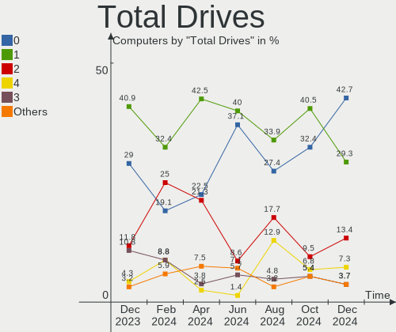
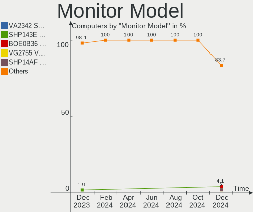
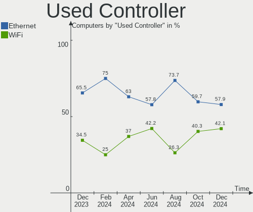
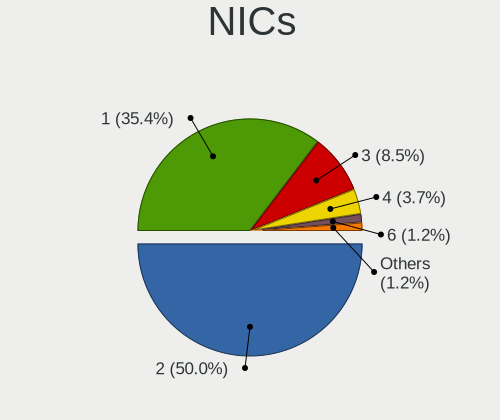
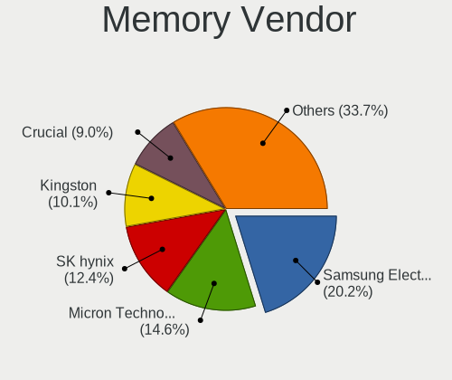
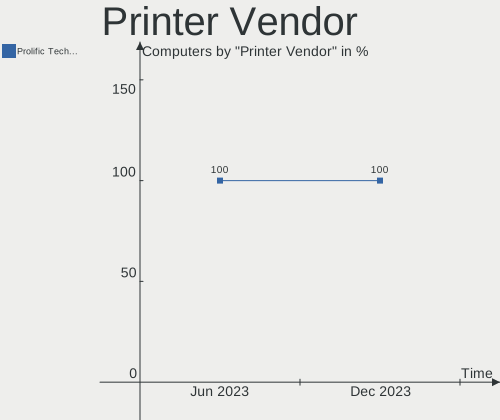

FreeBSD Hardware Trends
-----------------------

A project to identify most popular hardware characteristics and track their change
over time based on data collected by FreeBSD users at https://BSD-Hardware.info.

Anyone can contribute to the study by uploading probes of their computers by
the [hw-probe](https://github.com/linuxhw/hw-probe/blob/master/INSTALL.BSD.md) tool:

    hw-probe -all -upload

This is a report for all computer types. See also reports for [desktops](/Dist/FreeBSD/Desktop/README.md) and [notebooks](/Dist/FreeBSD/Notebook/README.md).

Full-feature report is available here: https://bsd-hardware.info/?view=trends

Period: May, 2021.

Contents
--------

- [ OS                       ](#os)
- [ OS Family                ](#os-family)
- [ Arch                     ](#arch)
- [ DE                       ](#de)
- [ Display Server           ](#display-server)
- [ Display Manager          ](#display-manager)
- [ OS Lang                  ](#os-lang)
- [ Boot Mode                ](#boot-mode)
- [ Filesystem               ](#filesystem)
- [ Part. scheme             ](#part-scheme)
- [ Country                  ](#country)
- [ City                     ](#city)
- [ Vendor                   ](#vendor)
- [ Model                    ](#model)
- [ Model Family             ](#model-family)
- [ MFG Year                 ](#mfg-year)
- [ Form Factor              ](#form-factor)
- [ Coreboot                 ](#coreboot)
- [ RAM Size                 ](#ram-size)
- [ RAM Used                 ](#ram-used)
- [ Has CD-ROM               ](#has-cd-rom)
- [ Total Drives             ](#total-drives)
- [ Has Ethernet             ](#has-ethernet)
- [ Has WiFi                 ](#has-wifi)
- [ Has Bluetooth            ](#has-bluetooth)
- [ Drive Vendor             ](#drive-vendor)
- [ Drive Model              ](#drive-model)
- [ HDD Vendor               ](#hdd-vendor)
- [ SSD Vendor               ](#ssd-vendor)
- [ Drive Kind               ](#drive-kind)
- [ Drive Connector          ](#drive-connector)
- [ Drive Size               ](#drive-size)
- [ Space Total              ](#space-total)
- [ Space Used               ](#space-used)
- [ Malfunc. Drives          ](#malfunc-drives)
- [ Malfunc. Drive Vendor    ](#malfunc-drive-vendor)
- [ Malfunc. HDD Vendor      ](#malfunc-hdd-vendor)
- [ Malfunc. Drive Kind      ](#malfunc-drive-kind)
- [ Failed Drives            ](#failed-drives)
- [ Failed Drive Vendor      ](#failed-drive-vendor)
- [ Drive Status             ](#drive-status)
- [ Storage Vendor           ](#storage-vendor)
- [ Storage Model            ](#storage-model)
- [ Storage Kind             ](#storage-kind)
- [ CPU Vendor               ](#cpu-vendor)
- [ CPU Model                ](#cpu-model)
- [ CPU Model Family         ](#cpu-model-family)
- [ CPU Cores                ](#cpu-cores)
- [ CPU Sockets              ](#cpu-sockets)
- [ CPU Threads              ](#cpu-threads)
- [ CPU Microarch            ](#cpu-microarch)
- [ GPU Vendor               ](#gpu-vendor)
- [ GPU Model                ](#gpu-model)
- [ GPU Combo                ](#gpu-combo)
- [ GPU Driver               ](#gpu-driver)
- [ GPU Memory               ](#gpu-memory)
- [ Monitor Vendor           ](#monitor-vendor)
- [ Monitor Model            ](#monitor-model)
- [ Monitor Resolution       ](#monitor-resolution)
- [ Monitor Diagonal         ](#monitor-diagonal)
- [ Monitor Width            ](#monitor-width)
- [ Aspect Ratio             ](#aspect-ratio)
- [ Monitor Area             ](#monitor-area)
- [ Pixel Density            ](#pixel-density)
- [ Multiple Monitors        ](#multiple-monitors)
- [ Net Controller Vendor    ](#net-controller-vendor)
- [ Net Controller Model     ](#net-controller-model)
- [ Wireless Vendor          ](#wireless-vendor)
- [ Wireless Model           ](#wireless-model)
- [ Ethernet Vendor          ](#ethernet-vendor)
- [ Ethernet Model           ](#ethernet-model)
- [ Net Controller Kind      ](#net-controller-kind)
- [ Used Controller          ](#used-controller)
- [ NICs                     ](#nics)
- [ IPv6                     ](#ipv6)
- [ Memory Vendor            ](#memory-vendor)
- [ Memory Model             ](#memory-model)
- [ Memory Kind              ](#memory-kind)
- [ Memory Form Factor       ](#memory-form-factor)
- [ Memory Size              ](#memory-size)
- [ Memory Speed             ](#memory-speed)
- [ Sound Vendor             ](#sound-vendor)
- [ Sound Model              ](#sound-model)
- [ Camera Vendor            ](#camera-vendor)
- [ Camera Model             ](#camera-model)
- [ Fingerprint Vendor       ](#fingerprint-vendor)
- [ Fingerprint Model        ](#fingerprint-model)
- [ Chipcard Vendor          ](#chipcard-vendor)
- [ Chipcard Model           ](#chipcard-model)
- [ Printer Vendor           ](#printer-vendor)
- [ Printer Model            ](#printer-model)
- [ Scanner Vendor           ](#scanner-vendor)
- [ Scanner Model            ](#scanner-model)
- [ Bluetooth Vendor         ](#bluetooth-vendor)
- [ Bluetooth Model          ](#bluetooth-model)
- [ Unsupported Devices      ](#unsupported-devices)
- [ Unsupported Device Types ](#unsupported-device-types)

OS
--

Installed operating systems

| Name                  | Computers | Percent |
|-----------------------|-----------|---------|
| FreeBSD 13.0          | 54        | 65.06%  |
| FreeBSD 14.0-CURRENT  | 8         | 9.64%   |
| FreeBSD 13.0-p1       | 5         | 6.02%   |
| FreeBSD 12.2-p6       | 5         | 6.02%   |
| FreeBSD 12.2-STABLE   | 2         | 2.41%   |
| FreeBSD 12.2-p4       | 2         | 2.41%   |
| FreeBSD 11.4-p9       | 2         | 2.41%   |
| FreeBSD 13.0-STABLE   | 1         | 1.2%    |
| FreeBSD 12.2-p3       | 1         | 1.2%    |
| FreeBSD 12.2-p2       | 1         | 1.2%    |
| FreeBSD 12.1-p16-HBSD | 1         | 1.2%    |
| FreeBSD 12.1          | 1         | 1.2%    |

OS Family
---------

OS without a version

| Name    | Computers | Percent |
|---------|-----------|---------|
| FreeBSD | 83        | 100%    |

Arch
----

OS architecture (x86_64, i586, etc.)

| Name  | Computers | Percent |
|-------|-----------|---------|
| amd64 | 73        | 87.95%  |
| arm64 | 6         | 7.23%   |
| i386  | 3         | 3.61%   |
| arm   | 1         | 1.2%    |

DE
--

Desktop Environment

| Name      | Computers | Percent |
|-----------|-----------|---------|
| Console   | 21        | 25.3%   |
| KDE5      | 16        | 19.28%  |
| XFCE      | 14        | 16.87%  |
| GNOME     | 12        | 14.46%  |
| TWM       | 6         | 7.23%   |
| MATE      | 6         | 7.23%   |
| AwesomeWM | 2         | 2.41%   |
| Openbox   | 1         | 1.2%    |
| LXQt      | 1         | 1.2%    |
| i3        | 1         | 1.2%    |
| GNUstep   | 1         | 1.2%    |
| Fluxbox   | 1         | 1.2%    |
| Cinnamon  | 1         | 1.2%    |

Display Server
--------------

X11 or Wayland

| Name    | Computers | Percent |
|---------|-----------|---------|
| X11     | 59        | 71.08%  |
| Console | 23        | 27.71%  |
| Wayland | 1         | 1.2%    |

Display Manager
---------------

SDDM, LightDM, etc.

| Name    | Computers | Percent |
|---------|-----------|---------|
| Console | 38        | 45.78%  |
| SDDM    | 15        | 18.07%  |
| GDM     | 10        | 12.05%  |
| SLiM    | 8         | 9.64%   |
| XDM     | 7         | 8.43%   |
| LightDM | 4         | 4.82%   |
| Ly      | 1         | 1.2%    |

OS Lang
-------

Language

| Lang    | Computers | Percent |
|---------|-----------|---------|
| C       | 47        | 56.63%  |
| en_US   | 10        | 12.05%  |
| Unknown | 9         | 10.84%  |
| fr_FR   | 4         | 4.82%   |
| ru_RU   | 2         | 2.41%   |
| nb_NO   | 2         | 2.41%   |
| es_ES   | 2         | 2.41%   |
| en_GB   | 2         | 2.41%   |
| uk_UA   | 1         | 1.2%    |
| sv_SE   | 1         | 1.2%    |
| ja_JP   | 1         | 1.2%    |
| de_DE   | 1         | 1.2%    |
| de_CH   | 1         | 1.2%    |

Boot Mode
---------

EFI or BIOS

| Mode | Computers | Percent |
|------|-----------|---------|
| EFI  | 57        | 68.67%  |
| BIOS | 26        | 31.33%  |

Filesystem
----------

Type of filesystem

| Type | Computers | Percent |
|------|-----------|---------|
| Zfs  | 53        | 63.86%  |
| Ufs  | 30        | 36.14%  |

Part. scheme
------------

Scheme of partitioning

| Type | Computers | Percent |
|------|-----------|---------|
| GPT  | 75        | 90.36%  |
| MBR  | 8         | 9.64%   |

Country
-------

Geographic location (country)

| Country     | Computers | Percent |
|-------------|-----------|---------|
| USA         | 25        | 30.12%  |
| UK          | 7         | 8.43%   |
| Switzerland | 5         | 6.02%   |
| Netherlands | 5         | 6.02%   |
| Germany     | 5         | 6.02%   |
| France      | 4         | 4.82%   |
| Ukraine     | 3         | 3.61%   |
| Thailand    | 3         | 3.61%   |
| Russia      | 3         | 3.61%   |
| Sweden      | 2         | 2.41%   |
| Mexico      | 2         | 2.41%   |
| Ireland     | 2         | 2.41%   |
| Guadeloupe  | 2         | 2.41%   |
| Colombia    | 2         | 2.41%   |
| Vietnam     | 1         | 1.2%    |
| Spain       | 1         | 1.2%    |
| Romania     | 1         | 1.2%    |
| Qatar       | 1         | 1.2%    |
| Poland      | 1         | 1.2%    |
| Norway      | 1         | 1.2%    |
| Nepal       | 1         | 1.2%    |
| Lithuania   | 1         | 1.2%    |
| Japan       | 1         | 1.2%    |
| Finland     | 1         | 1.2%    |
| Czechia     | 1         | 1.2%    |
| Brazil      | 1         | 1.2%    |
| Austria     | 1         | 1.2%    |

City
----

Geographic location (city)

| City                   | Computers | Percent |
|------------------------|-----------|---------|
| Seattle                | 4         | 4.82%   |
| Alphen aan den Rijn    | 3         | 3.61%   |
| San Diego              | 2         | 2.41%   |
| Redmond                | 2         | 2.41%   |
| Menlo Park             | 2         | 2.41%   |
| Le Gosier              | 2         | 2.41%   |
| Kyiv                   | 2         | 2.41%   |
| Buchs                  | 2         | 2.41%   |
| Brighton               | 2         | 2.41%   |
| Wenatchee              | 1         | 1.2%    |
| Wausau                 | 1         | 1.2%    |
| Warsaw                 | 1         | 1.2%    |
| Vilnius                | 1         | 1.2%    |
| Valladolid             | 1         | 1.2%    |
| Vacaville              | 1         | 1.2%    |
| Tuddal                 | 1         | 1.2%    |
| Trang                  | 1         | 1.2%    |
| Tacoma                 | 1         | 1.2%    |
| Sollentuna             | 1         | 1.2%    |
| San Francisco          | 1         | 1.2%    |
| San Antonio            | 1         | 1.2%    |
| Rionegro               | 1         | 1.2%    |
| Prague                 | 1         | 1.2%    |
| Ozersk                 | 1         | 1.2%    |
| Orléans               | 1         | 1.2%    |
| Oklahoma City          | 1         | 1.2%    |
| Nuremberg              | 1         | 1.2%    |
| Noisy-le-Grand         | 1         | 1.2%    |
| Naples                 | 1         | 1.2%    |
| Moscow                 | 1         | 1.2%    |
| Montería              | 1         | 1.2%    |
| Monterrey              | 1         | 1.2%    |
| Louisville             | 1         | 1.2%    |
| Kathmandu              | 1         | 1.2%    |
| João Pessoa           | 1         | 1.2%    |
| Hoerby                 | 1         | 1.2%    |
| Helsinki               | 1         | 1.2%    |
| Hebden Bridge          | 1         | 1.2%    |
| Hat Yai                | 1         | 1.2%    |
| Hanoi                  | 1         | 1.2%    |
| Hamburg                | 1         | 1.2%    |
| Guadalajara            | 1         | 1.2%    |
| Graz                   | 1         | 1.2%    |
| Gloucester             | 1         | 1.2%    |
| Glasgow                | 1         | 1.2%    |
| Geneva                 | 1         | 1.2%    |
| Gallatin               | 1         | 1.2%    |
| Fruitland              | 1         | 1.2%    |
| Fleury-Merogis         | 1         | 1.2%    |
| Federal Way            | 1         | 1.2%    |
| Eilenburg              | 1         | 1.2%    |
| Dublin                 | 1         | 1.2%    |
| Doha                   | 1         | 1.2%    |
| Corcelles-pres-Payerne | 1         | 1.2%    |
| Cologne                | 1         | 1.2%    |
| Cobh                   | 1         | 1.2%    |
| Chiang Mai             | 1         | 1.2%    |
| Chelyabinsk            | 1         | 1.2%    |
| Chattanooga            | 1         | 1.2%    |
| Castleford             | 1         | 1.2%    |

Vendor
------

Motherboard manufacturer

| Name                | Computers | Percent |
|---------------------|-----------|---------|
| Lenovo              | 12        | 14.46%  |
| ASUSTek Computer    | 12        | 14.46%  |
| Dell                | 9         | 10.84%  |
| MSI                 | 7         | 8.43%   |
| Hewlett-Packard     | 7         | 8.43%   |
| Unknown             | 7         | 8.43%   |
| Gigabyte Technology | 6         | 7.23%   |
| Acer                | 4         | 4.82%   |
| Supermicro          | 3         | 3.61%   |
| ASRock              | 3         | 3.61%   |
| Notebook            | 2         | 2.41%   |
| Fujitsu             | 2         | 2.41%   |
| Toshiba             | 1         | 1.2%    |
| System76            | 1         | 1.2%    |
| Shuttle             | 1         | 1.2%    |
| Pegatron            | 1         | 1.2%    |
| Packard Bell        | 1         | 1.2%    |
| Intel               | 1         | 1.2%    |
| GVC                 | 1         | 1.2%    |
| EVGA                | 1         | 1.2%    |
| Apple               | 1         | 1.2%    |

Model
-----

Motherboard model

| Name                                | Computers | Percent |
|-------------------------------------|-----------|---------|
| Unknown                             | 7         | 8.43%   |
| Fujitsu PRIMERGY RX2530 M5          | 2         | 2.41%   |
| ASUS P8H77-M PRO                    | 2         | 2.41%   |
| Toshiba TECRA M11                   | 1         | 1.2%    |
| System76 Gazelle                    | 1         | 1.2%    |
| Supermicro X7SPA-HF                 | 1         | 1.2%    |
| Supermicro X7DCL                    | 1         | 1.2%    |
| Supermicro NSMPX-5500               | 1         | 1.2%    |
| Shuttle SH87R                       | 1         | 1.2%    |
| Pegatron T12Ah                      | 1         | 1.2%    |
| Packard Bell AOA110                 | 1         | 1.2%    |
| Notebook NL5xRU                     | 1         | 1.2%    |
| Notebook N7x0WU                     | 1         | 1.2%    |
| MSI MS-7C80                         | 1         | 1.2%    |
| MSI MS-7C02                         | 1         | 1.2%    |
| MSI MS-7B09                         | 1         | 1.2%    |
| MSI MS-7823                         | 1         | 1.2%    |
| MSI MS-7817                         | 1         | 1.2%    |
| MSI MS-7677                         | 1         | 1.2%    |
| MSI GL65 Leopard 10SFSK             | 1         | 1.2%    |
| Lenovo Z51-70 80K6                  | 1         | 1.2%    |
| Lenovo ThinkStation P720 30BAS1HX00 | 1         | 1.2%    |
| Lenovo ThinkPad X270 20HM004JBR     | 1         | 1.2%    |
| Lenovo ThinkPad X220 4291PU5        | 1         | 1.2%    |
| Lenovo ThinkPad X220 4290NE3        | 1         | 1.2%    |
| Lenovo ThinkPad T490 20N3X50500     | 1         | 1.2%    |
| Lenovo ThinkPad T450s 20BWS0L600    | 1         | 1.2%    |
| Lenovo ThinkPad T440p 20AW0049LL    | 1         | 1.2%    |
| Lenovo ThinkPad P73 20QRCTO1WW      | 1         | 1.2%    |
| Lenovo ThinkPad A485 20MVS0FD00     | 1         | 1.2%    |
| Lenovo Legion 5P 15IMH05H 82AW      | 1         | 1.2%    |
| Lenovo IdeaPad Y700-15ISK 80NV      | 1         | 1.2%    |
| Intel NUC7i5BNK                     | 1         | 1.2%    |
| HP Z220 CMT Workstation             | 1         | 1.2%    |
| HP Slim Desktop 290-p0xxx           | 1         | 1.2%    |
| HP ProLiant MicroServer Gen8        | 1         | 1.2%    |
| HP ProLiant BL460c G6               | 1         | 1.2%    |
| HP Pavilion Laptop 15-cc0xx         | 1         | 1.2%    |
| HP Laptop 17-by0xxx                 | 1         | 1.2%    |
| HP EliteBook 8570p                  | 1         | 1.2%    |
| GVC EQUIUM 3200M                    | 1         | 1.2%    |
| Gigabyte Z97X-UD3H                  | 1         | 1.2%    |
| Gigabyte X58A-UD5                   | 1         | 1.2%    |
| Gigabyte X470 AORUS GAMING 5 WIFI   | 1         | 1.2%    |
| Gigabyte H81M-S2PV                  | 1         | 1.2%    |
| Gigabyte B85-HD3                    | 1         | 1.2%    |
| Gigabyte B550I AORUS PRO AX         | 1         | 1.2%    |
| EVGA X299 FTW K                     | 1         | 1.2%    |
| Dell Vostro 5568                    | 1         | 1.2%    |
| Dell Precision Tower 7910           | 1         | 1.2%    |
| Dell PowerEdge R210 II              | 1         | 1.2%    |
| Dell Latitude E6410                 | 1         | 1.2%    |
| Dell Latitude E5550                 | 1         | 1.2%    |
| Dell Latitude D620                  | 1         | 1.2%    |
| Dell Latitude 5500                  | 1         | 1.2%    |
| Dell Inspiron N5050                 | 1         | 1.2%    |
| Dell G5 5505                        | 1         | 1.2%    |
| ASUS UX31A                          | 1         | 1.2%    |
| ASUS TUF GAMING X570-PRO            | 1         | 1.2%    |
| ASUS TUF GAMING X570-PLUS           | 1         | 1.2%    |

Model Family
------------

Motherboard model prefix

| Name                  | Computers | Percent |
|-----------------------|-----------|---------|
| Lenovo ThinkPad       | 8         | 9.64%   |
| Unknown               | 7         | 8.43%   |
| Dell Latitude         | 4         | 4.82%   |
| HP ProLiant           | 2         | 2.41%   |
| Fujitsu PRIMERGY      | 2         | 2.41%   |
| ASUS TUF              | 2         | 2.41%   |
| ASUS P8H77-M          | 2         | 2.41%   |
| Acer Aspire           | 2         | 2.41%   |
| Toshiba TECRA         | 1         | 1.2%    |
| System76 Gazelle      | 1         | 1.2%    |
| Supermicro X7SPA-HF   | 1         | 1.2%    |
| Supermicro X7DCL      | 1         | 1.2%    |
| Supermicro NSMPX-5500 | 1         | 1.2%    |
| Shuttle SH87R         | 1         | 1.2%    |
| Pegatron T12Ah        | 1         | 1.2%    |
| Packard Bell AOA110   | 1         | 1.2%    |
| Notebook NL5xRU       | 1         | 1.2%    |
| Notebook N7x0WU       | 1         | 1.2%    |
| MSI MS-7C80           | 1         | 1.2%    |
| MSI MS-7C02           | 1         | 1.2%    |
| MSI MS-7B09           | 1         | 1.2%    |
| MSI MS-7823           | 1         | 1.2%    |
| MSI MS-7817           | 1         | 1.2%    |
| MSI MS-7677           | 1         | 1.2%    |
| MSI GL65              | 1         | 1.2%    |
| Lenovo Z51-70         | 1         | 1.2%    |
| Lenovo ThinkStation   | 1         | 1.2%    |
| Lenovo Legion         | 1         | 1.2%    |
| Lenovo IdeaPad        | 1         | 1.2%    |
| Intel NUC7i5BNK       | 1         | 1.2%    |
| HP Z220               | 1         | 1.2%    |
| HP Slim               | 1         | 1.2%    |
| HP Pavilion           | 1         | 1.2%    |
| HP Laptop             | 1         | 1.2%    |
| HP EliteBook          | 1         | 1.2%    |
| GVC EQUIUM            | 1         | 1.2%    |
| Gigabyte Z97X-UD3H    | 1         | 1.2%    |
| Gigabyte X58A-UD5     | 1         | 1.2%    |
| Gigabyte X470         | 1         | 1.2%    |
| Gigabyte H81M-S2PV    | 1         | 1.2%    |
| Gigabyte B85-HD3      | 1         | 1.2%    |
| Gigabyte B550I        | 1         | 1.2%    |
| EVGA X299             | 1         | 1.2%    |
| Dell Vostro           | 1         | 1.2%    |
| Dell Precision        | 1         | 1.2%    |
| Dell PowerEdge        | 1         | 1.2%    |
| Dell Inspiron         | 1         | 1.2%    |
| Dell G5               | 1         | 1.2%    |
| ASUS UX31A            | 1         | 1.2%    |
| ASUS ROG              | 1         | 1.2%    |
| ASUS P7H55-M          | 1         | 1.2%    |
| ASUS P5Q-E            | 1         | 1.2%    |
| ASUS MINIPC           | 1         | 1.2%    |
| ASUS G750JM           | 1         | 1.2%    |
| ASUS All              | 1         | 1.2%    |
| ASUS 1015PX           | 1         | 1.2%    |
| ASRock Z170M          | 1         | 1.2%    |
| ASRock X570           | 1         | 1.2%    |
| ASRock J3455-ITX      | 1         | 1.2%    |
| Apple MacBookPro6     | 1         | 1.2%    |

MFG Year
--------

Motherboard manufacture year

| Year    | Computers | Percent |
|---------|-----------|---------|
| 2020    | 23        | 27.71%  |
| 2019    | 8         | 9.64%   |
| Unknown | 8         | 9.64%   |
| 2012    | 7         | 8.43%   |
| 2015    | 5         | 6.02%   |
| 2014    | 5         | 6.02%   |
| 2008    | 5         | 6.02%   |
| 2017    | 4         | 4.82%   |
| 2016    | 4         | 4.82%   |
| 2011    | 4         | 4.82%   |
| 2018    | 3         | 3.61%   |
| 2013    | 3         | 3.61%   |
| 2021    | 2         | 2.41%   |
| 2010    | 1         | 1.2%    |
| 2009    | 1         | 1.2%    |

Form Factor
-----------

Physical design of the computer

| Name           | Computers | Percent |
|----------------|-----------|---------|
| Notebook       | 36        | 43.37%  |
| Desktop        | 33        | 39.76%  |
| System on chip | 7         | 8.43%   |
| Server         | 5         | 6.02%   |
| Mini pc        | 2         | 2.41%   |

Coreboot
--------

Have coreboot on board

| Used | Computers | Percent |
|------|-----------|---------|
| No   | 83        | 100%    |

RAM Size
--------

Total RAM memory

| Size in GB  | Computers | Percent |
|-------------|-----------|---------|
| 8.01-16.0   | 26        | 31.33%  |
| 64.01-256.0 | 15        | 18.07%  |
| 32.01-64.0  | 13        | 15.66%  |
| 16.01-24.0  | 13        | 15.66%  |
| 4.01-8.0    | 6         | 7.23%   |
| 0.51-1.0    | 3         | 3.61%   |
| 3.01-4.0    | 2         | 2.41%   |
| 24.01-32.0  | 2         | 2.41%   |
| 2.01-3.0    | 1         | 1.2%    |
| 1.01-2.0    | 1         | 1.2%    |
| 0.01-0.5    | 1         | 1.2%    |

RAM Used
--------

Used RAM memory

| Used GB     | Computers | Percent |
|-------------|-----------|---------|
| 0.01-0.5    | 29        | 34.94%  |
| 0.51-1.0    | 20        | 24.1%   |
| 1.01-2.0    | 12        | 14.46%  |
| 3.01-4.0    | 6         | 7.23%   |
| 2.01-3.0    | 5         | 6.02%   |
| 4.01-8.0    | 2         | 2.41%   |
| 32.01-64.0  | 2         | 2.41%   |
| 24.01-32.0  | 2         | 2.41%   |
| 16.01-24.0  | 2         | 2.41%   |
| 0           | 2         | 2.41%   |
| 64.01-256.0 | 1         | 1.2%    |

Has CD-ROM
----------

Has CD-ROM on board

| Presented | Computers | Percent |
|-----------|-----------|---------|
| No        | 56        | 67.47%  |
| Yes       | 27        | 32.53%  |

Total Drives
------------

Number of drives on board

| Drives | Computers | Percent |
|--------|-----------|---------|
| 1      | 33        | 39.76%  |
| 2      | 21        | 25.3%   |
| 3      | 10        | 12.05%  |
| 0      | 8         | 9.64%   |
| 4      | 3         | 3.61%   |
| 8      | 2         | 2.41%   |
| 7      | 2         | 2.41%   |
| 6      | 2         | 2.41%   |
| 5      | 2         | 2.41%   |

Has Ethernet
------------

Has Ethernet on board

| Presented | Computers | Percent |
|-----------|-----------|---------|
| Yes       | 75        | 90.36%  |
| No        | 8         | 9.64%   |

Has WiFi
--------

Has WiFi module

| Presented | Computers | Percent |
|-----------|-----------|---------|
| Yes       | 51        | 61.45%  |
| No        | 32        | 38.55%  |

Has Bluetooth
-------------

Has Bluetooth module

| Presented | Computers | Percent |
|-----------|-----------|---------|
| No        | 48        | 57.83%  |
| Yes       | 35        | 42.17%  |

Drive Vendor
------------

Hard drive vendors

| Vendor              | Computers | Drives | Percent |
|---------------------|-----------|--------|---------|
| Seagate             | 19        | 39     | 16.1%   |
| Samsung Electronics | 19        | 35     | 16.1%   |
| WDC                 | 17        | 24     | 14.41%  |
| Toshiba             | 10        | 16     | 8.47%   |
| Crucial             | 7         | 7      | 5.93%   |
| Kingston            | 6         | 7      | 5.08%   |
| SanDisk             | 5         | 5      | 4.24%   |
| Intel               | 3         | 3      | 2.54%   |
| Hitachi             | 3         | 3      | 2.54%   |
| A-DATA Technology   | 3         | 3      | 2.54%   |
| PLEXTOR             | 2         | 2      | 1.69%   |
| Phison              | 2         | 2      | 1.69%   |
| LITEON              | 2         | 2      | 1.69%   |
| HGST                | 2         | 3      | 1.69%   |
| FTS                 | 2         | 2      | 1.69%   |
| Verbatim            | 1         | 1      | 0.85%   |
| Transcend           | 1         | 1      | 0.85%   |
| SPCC                | 1         | 1      | 0.85%   |
| SK Hynix            | 1         | 1      | 0.85%   |
| Silicon Motion      | 1         | 1      | 0.85%   |
| PNY                 | 1         | 1      | 0.85%   |
| OWC                 | 1         | 1      | 0.85%   |
| Micron Technology   | 1         | 1      | 0.85%   |
| Lenovo              | 1         | 1      | 0.85%   |
| KingDian            | 1         | 1      | 0.85%   |
| Hewlett-Packard     | 1         | 2      | 0.85%   |
| GOODRAM             | 1         | 1      | 0.85%   |
| Gigabyte Technology | 1         | 1      | 0.85%   |
| Fujitsu             | 1         | 1      | 0.85%   |
| Corsair             | 1         | 1      | 0.85%   |
| China               | 1         | 1      | 0.85%   |

Drive Model
-----------

Hard drive models

| Model                                | Computers | Percent |
|--------------------------------------|-----------|---------|
| Seagate ST4000DM000-1F2168 4TB       | 3         | 2.24%   |
| Samsung SSD 970 EVO Plus 1TB         | 3         | 2.24%   |
| Samsung MZVLB256HBHQ-000L7 256GB     | 3         | 2.24%   |
| Toshiba MQ01ABD100 1TB               | 2         | 1.49%   |
| Toshiba HDWE160 6TB                  | 2         | 1.49%   |
| Seagate ST8000VN004-2M2101 8TB       | 2         | 1.49%   |
| Samsung SSD 970 EVO 1TB              | 2         | 1.49%   |
| Samsung SSD 960 EVO 250GB            | 2         | 1.49%   |
| Samsung SSD 850 EVO 250GB            | 2         | 1.49%   |
| Kingston SMS200S3120G 120GB          | 2         | 1.49%   |
| FTS PRAID EP580i 2.8TB               | 2         | 1.49%   |
| Crucial CT500MX500SSD1 500GB         | 2         | 1.49%   |
| WDC WDS500G2B0C-00PXH0 500GB         | 1         | 0.75%   |
| WDC WDS480G2G0A-00JH30 480GB         | 1         | 0.75%   |
| WDC WDS250G2B0C-00PXH0 250GB         | 1         | 0.75%   |
| WDC WDS120G2G0B-00EPW0 120GB         | 1         | 0.75%   |
| WDC WDS100T2B0B-00YS70 1TB           | 1         | 0.75%   |
| WDC WD40EZRZ-22GXCB0 4TB             | 1         | 0.75%   |
| WDC WD30EZRX-00AZ6B0 3TB             | 1         | 0.75%   |
| WDC WD30EFRX-68EUZN0 3TB             | 1         | 0.75%   |
| WDC WD20EFRX-68EUZN0 2TB             | 1         | 0.75%   |
| WDC WD20EARX-00PASB0 2TB             | 1         | 0.75%   |
| WDC WD2000FYYZ-01UL1B2 2TB           | 1         | 0.75%   |
| WDC WD1600BEVT-11ZCT0 160GB          | 1         | 0.75%   |
| WDC WD10JQLX-22JFGT0 1TB             | 1         | 0.75%   |
| WDC WD10JPLX-00MBPT1 1TB             | 1         | 0.75%   |
| WDC WD10EADS-00P8B0 1TB              | 1         | 0.75%   |
| WDC WD1001FALS-00J7B0 1TB            | 1         | 0.75%   |
| WDC PC SN730 NVMe 1024GB             | 1         | 0.75%   |
| WDC PC SN520 NVMe 256GB              | 1         | 0.75%   |
| Verbatim Vi550 S3 SSD 256GB          | 1         | 0.75%   |
| Transcend TS256GMTS430S 256GB        | 1         | 0.75%   |
| Toshiba MQ04ABF100 1TB               | 1         | 0.75%   |
| Toshiba MQ02ABD100H 1TB              | 1         | 0.75%   |
| Toshiba MQ01ABF050 500GB             | 1         | 0.75%   |
| Toshiba HDWE140 4TB                  | 1         | 0.75%   |
| Toshiba HDWD110 1TB                  | 1         | 0.75%   |
| Toshiba DT01ACA100 1TB               | 1         | 0.75%   |
| SPCC SPCCSolidStateDisk 256GB        | 1         | 0.75%   |
| SK Hynix HFM256GDJTNG-8310A 256GB    | 1         | 0.75%   |
| Silicon Motion NE-256 256GB          | 1         | 0.75%   |
| Seagate ST9250827AS 250GB            | 1         | 0.75%   |
| Seagate ST500LM000-1EJ162-SSHD 500GB | 1         | 0.75%   |
| Seagate ST5000LM000-2AN170 5TB       | 1         | 0.75%   |
| Seagate ST4000VN000-1H4168 4TB       | 1         | 0.75%   |
| Seagate ST4000NE001-2MA101 4TB       | 1         | 0.75%   |
| Seagate ST4000DM004-2CV104 4TB       | 1         | 0.75%   |
| Seagate ST3250620AS 250GB            | 1         | 0.75%   |
| Seagate ST31000524AS 1TB             | 1         | 0.75%   |
| Seagate ST3000VX000-1ES166 3TB       | 1         | 0.75%   |
| Seagate ST2000VN000-1HJ164 2TB       | 1         | 0.75%   |
| Seagate ST2000NM0033-9ZM175 2TB      | 1         | 0.75%   |
| Seagate ST2000NE0025-2FL101 2TB      | 1         | 0.75%   |
| Seagate ST2000LM015-2E8174 2TB       | 1         | 0.75%   |
| Seagate ST2000DM006-2DM164 2TB       | 1         | 0.75%   |
| Seagate ST12000VN0008-2PH103 12TB    | 1         | 0.75%   |
| Seagate ST1000LM049-2GH172 1TB       | 1         | 0.75%   |
| Seagate ST1000LM024 HN-M101MBB 1TB   | 1         | 0.75%   |
| Seagate ST1000LM014-1EJ164 1TB       | 1         | 0.75%   |
| SanDisk X600 2.5 7MM SATA 256GB      | 1         | 0.75%   |

HDD Vendor
----------

Hard disk drive vendors

| Vendor              | Computers | Drives | Percent |
|---------------------|-----------|--------|---------|
| Seagate             | 19        | 39     | 40.43%  |
| WDC                 | 10        | 17     | 21.28%  |
| Toshiba             | 10        | 16     | 21.28%  |
| Hitachi             | 3         | 3      | 6.38%   |
| HGST                | 2         | 3      | 4.26%   |
| Samsung Electronics | 1         | 2      | 2.13%   |
| Hewlett-Packard     | 1         | 2      | 2.13%   |
| Fujitsu             | 1         | 1      | 2.13%   |

SSD Vendor
----------

Solid state drive vendors

| Vendor              | Computers | Drives | Percent |
|---------------------|-----------|--------|---------|
| Samsung Electronics | 11        | 15     | 22.45%  |
| Crucial             | 6         | 6      | 12.24%  |
| SanDisk             | 5         | 5      | 10.2%   |
| Kingston            | 5         | 6      | 10.2%   |
| WDC                 | 3         | 3      | 6.12%   |
| LITEON              | 2         | 2      | 4.08%   |
| FTS                 | 2         | 2      | 4.08%   |
| A-DATA Technology   | 2         | 2      | 4.08%   |
| Verbatim            | 1         | 1      | 2.04%   |
| Transcend           | 1         | 1      | 2.04%   |
| SPCC                | 1         | 1      | 2.04%   |
| PNY                 | 1         | 1      | 2.04%   |
| OWC                 | 1         | 1      | 2.04%   |
| Micron Technology   | 1         | 1      | 2.04%   |
| Lenovo              | 1         | 1      | 2.04%   |
| KingDian            | 1         | 1      | 2.04%   |
| Intel               | 1         | 1      | 2.04%   |
| GOODRAM             | 1         | 1      | 2.04%   |
| Gigabyte Technology | 1         | 1      | 2.04%   |
| Corsair             | 1         | 1      | 2.04%   |
| China               | 1         | 1      | 2.04%   |

Drive Kind
----------

HDD or SSD

| Kind | Computers | Drives | Percent |
|------|-----------|--------|---------|
| HDD  | 40        | 83     | 38.83%  |
| SSD  | 39        | 54     | 37.86%  |
| NVMe | 24        | 33     | 23.3%   |

Drive Connector
---------------

SATA, SAS, NVMe, etc.

| Type | Computers | Drives | Percent |
|------|-----------|--------|---------|
| SATA | 66        | 137    | 73.33%  |
| NVMe | 24        | 33     | 26.67%  |

Drive Size
----------

Size of hard drive

| Size in TB | Computers | Drives | Percent |
|------------|-----------|--------|---------|
| 0.01-0.5   | 35        | 51     | 41.67%  |
| 0.51-1.0   | 20        | 28     | 23.81%  |
| 1.01-2.0   | 10        | 16     | 11.9%   |
| 3.01-4.0   | 6         | 12     | 7.14%   |
| 2.01-3.0   | 6         | 9      | 7.14%   |
| 4.01-10.0  | 6         | 15     | 7.14%   |
| 10.01-20.0 | 1         | 6      | 1.19%   |

Space Total
-----------

Amount of disk space available on the file system

| Size in GB     | Computers | Percent |
|----------------|-----------|---------|
| 101-250        | 26        | 31.33%  |
| 501-1000       | 13        | 15.66%  |
| 251-500        | 9         | 10.84%  |
| 51-100         | 9         | 10.84%  |
| 21-50          | 8         | 9.64%   |
| 1-20           | 8         | 9.64%   |
| 1001-2000      | 7         | 8.43%   |
| 2001-3000      | 2         | 2.41%   |
| More than 3000 | 1         | 1.2%    |

Space Used
----------

Amount of used disk space

| Used GB   | Computers | Percent |
|-----------|-----------|---------|
| 1-20      | 66        | 79.52%  |
| 21-50     | 10        | 12.05%  |
| 51-100    | 3         | 3.61%   |
| 101-250   | 2         | 2.41%   |
| 251-500   | 1         | 1.2%    |
| 1001-2000 | 1         | 1.2%    |

Malfunc. Drives
---------------

Drive models with a malfunction

| Model                                 | Computers | Drives | Percent |
|---------------------------------------|-----------|--------|---------|
| WDC WD20EARX-00PASB0 2TB              | 1         | 1      | 7.14%   |
| WDC WD2000FYYZ-01UL1B2 2TB            | 1         | 2      | 7.14%   |
| WDC WD10EADS-00P8B0 1TB               | 1         | 1      | 7.14%   |
| Toshiba MQ02ABD100H 1TB               | 1         | 1      | 7.14%   |
| Seagate ST9250827AS 250GB             | 1         | 1      | 7.14%   |
| Seagate ST3250620AS 250GB             | 1         | 1      | 7.14%   |
| Seagate ST31000524AS 1TB              | 1         | 1      | 7.14%   |
| Seagate ST1000LM014-1EJ164 1TB        | 1         | 1      | 7.14%   |
| Samsung Electronics SSD 840 EVO 120GB | 1         | 1      | 7.14%   |
| Hitachi HTS543225A7A384 250GB         | 1         | 1      | 7.14%   |
| HGST HTS725050A7E630 500GB            | 1         | 1      | 7.14%   |
| HGST HDN726060ALE614 6TB              | 1         | 2      | 7.14%   |
| Crucial CT250MX200SSD1 250GB          | 1         | 1      | 7.14%   |
| Corsair Force 3 SSD 180GB             | 1         | 1      | 7.14%   |

Malfunc. Drive Vendor
---------------------

Vendors of faulty drives

| Vendor              | Computers | Drives | Percent |
|---------------------|-----------|--------|---------|
| Seagate             | 3         | 4      | 25%     |
| WDC                 | 2         | 4      | 16.67%  |
| HGST                | 2         | 3      | 16.67%  |
| Toshiba             | 1         | 1      | 8.33%   |
| Samsung Electronics | 1         | 1      | 8.33%   |
| Hitachi             | 1         | 1      | 8.33%   |
| Crucial             | 1         | 1      | 8.33%   |
| Corsair             | 1         | 1      | 8.33%   |

Malfunc. HDD Vendor
-------------------

Vendors of faulty HDD drives

| Vendor  | Computers | Drives | Percent |
|---------|-----------|--------|---------|
| Seagate | 3         | 4      | 33.33%  |
| WDC     | 2         | 4      | 22.22%  |
| HGST    | 2         | 3      | 22.22%  |
| Toshiba | 1         | 1      | 11.11%  |
| Hitachi | 1         | 1      | 11.11%  |

Malfunc. Drive Kind
-------------------

Kinds of faulty drives

| Kind | Computers | Drives | Percent |
|------|-----------|--------|---------|
| HDD  | 8         | 13     | 72.73%  |
| SSD  | 3         | 3      | 27.27%  |

Failed Drives
-------------

Failed drive models

Zero info for selected period =(

Failed Drive Vendor
-------------------

Failed drive vendors

Zero info for selected period =(

Drive Status
------------

Number of failed and malfunc. drives

| Status   | Computers | Drives | Percent |
|----------|-----------|--------|---------|
| Works    | 67        | 149    | 81.71%  |
| Malfunc  | 11        | 16     | 13.41%  |
| Detected | 4         | 5      | 4.88%   |

Storage Vendor
--------------

Storage controller vendors

| Vendor                        | Computers | Percent |
|-------------------------------|-----------|---------|
| Intel                         | 63        | 55.26%  |
| AMD                           | 13        | 11.4%   |
| Samsung Electronics           | 11        | 9.65%   |
| Broadcom / LSI                | 5         | 4.39%   |
| Sandisk                       | 4         | 3.51%   |
| Marvell Technology Group      | 4         | 3.51%   |
| ASMedia Technology            | 3         | 2.63%   |
| Phison Electronics            | 2         | 1.75%   |
| Lite-On Technology            | 2         | 1.75%   |
| SK Hynix                      | 1         | 0.88%   |
| Silicon Motion                | 1         | 0.88%   |
| Micron Technology             | 1         | 0.88%   |
| JMicron Technology            | 1         | 0.88%   |
| Integrated Technology Express | 1         | 0.88%   |
| Hewlett-Packard               | 1         | 0.88%   |
| ADATA Technology              | 1         | 0.88%   |

Storage Model
-------------

Storage controller models

| Model                                                                          | Computers | Percent |
|--------------------------------------------------------------------------------|-----------|---------|
| AMD FCH SATA Controller [AHCI mode]                                            | 12        | 9.52%   |
| Samsung NVMe SSD Controller SM981/PM981/PM983                                  | 8         | 6.35%   |
| Intel 8 Series/C220 Series Chipset Family 6-port SATA Controller 1 [AHCI mode] | 7         | 5.56%   |
| Intel Sunrise Point-LP SATA Controller [AHCI mode]                             | 5         | 3.97%   |
| Intel Wildcat Point-LP SATA Controller [AHCI Mode]                             | 3         | 2.38%   |
| Intel Cannon Lake Mobile PCH SATA AHCI Controller                              | 3         | 2.38%   |
| Intel C620 Series Chipset Family SSATA Controller [AHCI mode]                  | 3         | 2.38%   |
| Intel 7 Series Chipset Family 6-port SATA Controller [AHCI mode]               | 3         | 2.38%   |
| Intel 6 Series/C200 Series Chipset Family 6 port Mobile SATA AHCI Controller   | 3         | 2.38%   |
| Intel 6 Series/C200 Series Chipset Family 6 port Desktop SATA AHCI Controller  | 3         | 2.38%   |
| ASMedia ASM1062 Serial ATA Controller                                          | 3         | 2.38%   |
| AMD 400 Series Chipset SATA Controller                                         | 3         | 2.38%   |
| Sandisk WD Blue SN550 NVMe SSD                                                 | 2         | 1.59%   |
| Samsung NVMe SSD Controller SM961/PM961/SM963                                  | 2         | 1.59%   |
| Lite-On M8Pe Series NVMe SSD                                                   | 2         | 1.59%   |
| Intel C620 Series Chipset Family SATA Controller [AHCI mode]                   | 2         | 1.59%   |
| Intel 9 Series Chipset Family SATA Controller [AHCI Mode]                      | 2         | 1.59%   |
| Intel 82801IR/IO/IH (ICH9R/DO/DH) 6 port SATA Controller [AHCI mode]           | 2         | 1.59%   |
| Intel 82801GBM/GHM (ICH7-M Family) SATA Controller [IDE mode]                  | 2         | 1.59%   |
| Intel 82801 Mobile SATA Controller [RAID mode]                                 | 2         | 1.59%   |
| Intel 7 Series/C210 Series Chipset Family 4-port SATA Controller [IDE mode]    | 2         | 1.59%   |
| Intel 7 Series/C210 Series Chipset Family 2-port SATA Controller [IDE mode]    | 2         | 1.59%   |
| Intel 5 Series/3400 Series Chipset 6 port SATA AHCI Controller                 | 2         | 1.59%   |
| Intel 5 Series/3400 Series Chipset 4 port SATA AHCI Controller                 | 2         | 1.59%   |
| Broadcom / LSI MegaRAID Tri-Mode SAS3516                                       | 2         | 1.59%   |
| Unknown                                                                        | 2         | 1.59%   |
| SK Hynix BC501 NVMe Solid State Drive 512GB                                    | 1         | 0.79%   |
| Silicon Motion SM2263EN/SM2263XT SSD Controller                                | 1         | 0.79%   |
| Sandisk WD Black SN750 / PC SN730 NVMe SSD                                     | 1         | 0.79%   |
| Sandisk PC SN520 NVMe SSD                                                      | 1         | 0.79%   |
| Samsung NVMe SSD Controller PM9A1/PM9A3/980PRO                                 | 1         | 0.79%   |
| Phison E12 NVMe Controller                                                     | 1         | 0.79%   |
| Marvell Group 88SE9172 SATA III 6Gb/s RAID Controller                          | 1         | 0.79%   |
| Marvell Group 88SE9172 SATA 6Gb/s Controller                                   | 1         | 0.79%   |
| Marvell Group 88SE9123 PCIe SATA 6.0 Gb/s controller                           | 1         | 0.79%   |
| Marvell Group 88SE6111/6121 SATA II / PATA Controller                          | 1         | 0.79%   |
| JMicron JMB368 IDE controller                                                  | 1         | 0.79%   |
| Intel SSD Pro 7600p/760p/E 6100p Series                                        | 1         | 0.79%   |
| Intel SSD 660P Series                                                          | 1         | 0.79%   |
| Intel SATA Controller [RAID mode]                                              | 1         | 0.79%   |
| Intel Q170/Q150/B150/H170/H110/Z170/CM236 Chipset SATA Controller [AHCI Mode]  | 1         | 0.79%   |
| Intel NVMe Optane Memory Series                                                | 1         | 0.79%   |
| Intel NM10/ICH7 Family SATA Controller [AHCI mode]                             | 1         | 0.79%   |
| Intel HM170/QM170 Chipset SATA Controller [AHCI Mode]                          | 1         | 0.79%   |
| Intel Comet Lake SATA AHCI Controller                                          | 1         | 0.79%   |
| Intel Celeron N3350/Pentium N4200/Atom E3900 Series SATA AHCI Controller       | 1         | 0.79%   |
| Intel Cannon Point-LP SATA Controller [AHCI Mode]                              | 1         | 0.79%   |
| Intel Cannon Lake PCH SATA AHCI Controller                                     | 1         | 0.79%   |
| Intel C620 Series Chipset Family IDE Redirection                               | 1         | 0.79%   |
| Intel C600/X79 series chipset SATA RAID Controller                             | 1         | 0.79%   |
| Intel 82801JI (ICH10 Family) SATA AHCI Controller                              | 1         | 0.79%   |
| Intel 82801JI (ICH10 Family) 4 port SATA IDE Controller #1                     | 1         | 0.79%   |
| Intel 82801JI (ICH10 Family) 2 port SATA IDE Controller #2                     | 1         | 0.79%   |
| Intel 82801IR/IO/IH (ICH9R/DO/DH) 4 port SATA Controller [IDE mode]            | 1         | 0.79%   |
| Intel 82801IBM/IEM (ICH9M/ICH9M-E) 4 port SATA Controller [AHCI mode]          | 1         | 0.79%   |
| Intel 82801I (ICH9 Family) 2 port SATA Controller [IDE mode]                   | 1         | 0.79%   |
| Intel 82371AB/EB/MB PIIX4 IDE                                                  | 1         | 0.79%   |
| Intel 8 Series SATA Controller 1 [AHCI mode]                                   | 1         | 0.79%   |
| Intel 400 Series Chipset Family SATA AHCI Controller                           | 1         | 0.79%   |
| Intel 200 Series PCH SATA controller [AHCI mode]                               | 1         | 0.79%   |

Storage Kind
------------

Kind of storage controller (IDE, SATA, NVMe, SAS, ...)

| Kind | Computers | Percent |
|------|-----------|---------|
| SATA | 64        | 59.81%  |
| NVMe | 24        | 22.43%  |
| IDE  | 10        | 9.35%   |
| RAID | 7         | 6.54%   |
| SAS  | 1         | 0.93%   |
| SCSI | 1         | 0.93%   |

CPU Vendor
----------

Processor vendors

| Vendor | Computers | Percent |
|--------|-----------|---------|
| Intel  | 63        | 75.9%   |
| AMD    | 13        | 15.66%  |
| ARM    | 7         | 8.43%   |

CPU Model
---------

Processor models

| Model                                 | Computers | Percent |
|---------------------------------------|-----------|---------|
| ARM Cortex-A72 r0p3                   | 3         | 3.61%   |
| Intel Xeon Silver 4210 CPU @ 2.20GHz  | 2         | 2.41%   |
| Intel Core i7-9750H CPU @ 2.60GHz     | 2         | 2.41%   |
| Intel Core i7-3770 CPU @ 3.40GHz      | 2         | 2.41%   |
| Intel Core i5-8365U CPU @ 1.60GHz     | 2         | 2.41%   |
| Intel Core i5-5300U CPU @ 2.30GHz     | 2         | 2.41%   |
| Intel Core i5-2520M CPU @ 2.50GHz     | 2         | 2.41%   |
| AMD Ryzen 9 5900X 12-Core Processor   | 2         | 2.41%   |
| AMD Ryzen 7 2700 Eight-Core Processor | 2         | 2.41%   |
| Intel Xeon Silver 4214 CPU @ 2.20GHz  | 1         | 1.2%    |
| Intel Xeon CPU X3440 @ 2.53GHz        | 1         | 1.2%    |
| Intel Xeon CPU L5410 @ 2.33GHz        | 1         | 1.2%    |
| Intel Xeon CPU E5520 @ 2.27GHz        | 1         | 1.2%    |
| Intel Xeon CPU E5410 @ 2.33GHz        | 1         | 1.2%    |
| Intel Xeon CPU E5-2630 v3 @ 2.40GHz   | 1         | 1.2%    |
| Intel Xeon CPU E31260L @ 2.40GHz      | 1         | 1.2%    |
| Intel Xeon CPU E3-1246 v3 @ 3.50GHz   | 1         | 1.2%    |
| Intel Pentium M                       | 1         | 1.2%    |
| Intel Pentium II                      | 1         | 1.2%    |
| Intel Pentium CPU G630T @ 2.30GHz     | 1         | 1.2%    |
| Intel Pentium CPU G3420 @ 3.20GHz     | 1         | 1.2%    |
| Intel Pentium CPU G3220 @ 3.00GHz     | 1         | 1.2%    |
| Intel Pentium CPU G2020 @ 2.90GHz     | 1         | 1.2%    |
| Intel Pentium CPU 967 @ 1.30GHz       | 1         | 1.2%    |
| Intel Core i9-9900X CPU @ 3.50GHz     | 1         | 1.2%    |
| Intel Core i7-8700 CPU @ 3.20GHz      | 1         | 1.2%    |
| Intel Core i7-7600U CPU @ 2.80GHz     | 1         | 1.2%    |
| Intel Core i7-7500U CPU @ 2.70GHz     | 1         | 1.2%    |
| Intel Core i7-6700K CPU @ 4.00GHz     | 1         | 1.2%    |
| Intel Core i7-6700HQ CPU @ 2.60GHz    | 1         | 1.2%    |
| Intel Core i7-4790S CPU @ 3.20GHz     | 1         | 1.2%    |
| Intel Core i7-4790K CPU @ 4.00GHz     | 1         | 1.2%    |
| Intel Core i7-4770T CPU @ 2.50GHz     | 1         | 1.2%    |
| Intel Core i7-4700HQ CPU @ 2.40GHz    | 1         | 1.2%    |
| Intel Core i7-3520M CPU @ 2.90GHz     | 1         | 1.2%    |
| Intel Core i7-10750H CPU @ 2.60GHz    | 1         | 1.2%    |
| Intel Core i7-10700K CPU @ 3.80GHz    | 1         | 1.2%    |
| Intel Core i7 CPU M 620 @ 2.67GHz     | 1         | 1.2%    |
| Intel Core i7 CPU                     | 1         | 1.2%    |
| Intel Core i5-9300H CPU @ 2.40GHz     | 1         | 1.2%    |
| Intel Core i5-8250U CPU @ 1.60GHz     | 1         | 1.2%    |
| Intel Core i5-7260U CPU @ 2.20GHz     | 1         | 1.2%    |
| Intel Core i5-7200U CPU @ 2.50GHz     | 1         | 1.2%    |
| Intel Core i5-5200U CPU @ 2.20GHz     | 1         | 1.2%    |
| Intel Core i5-4440 CPU @ 3.10GHz      | 1         | 1.2%    |
| Intel Core i5-4300M CPU @ 2.60GHz     | 1         | 1.2%    |
| Intel Core i5-3317U CPU @ 1.70GHz     | 1         | 1.2%    |
| Intel Core i5-2450M CPU @ 2.50GHz     | 1         | 1.2%    |
| Intel Core i5-10300H CPU @ 2.50GHz    | 1         | 1.2%    |
| Intel Core i5 CPU M 560 @ 2.67GH      | 1         | 1.2%    |
| Intel Core i3-8130U CPU @ 2.20GHz     | 1         | 1.2%    |
| Intel Core i3-4005U CPU @ 1.70GHz     | 1         | 1.2%    |
| Intel Core i3 CPU M 330 @ 2.13GHz     | 1         | 1.2%    |
| Intel Core 2 Quad CPU Q6600 @ 2.40GHz | 1         | 1.2%    |
| Intel Core 2 Duo CPU P8700 @ 2.53GHz  | 1         | 1.2%    |
| Intel Celeron CPU J3455 @ 1.50GHz     | 1         | 1.2%    |
| Intel Celeron CPU G1610T @ 2.30GHz    | 1         | 1.2%    |
| Intel Atom CPU N570 @ 1.66GHz         | 1         | 1.2%    |
| Intel Atom CPU N270 @ 1.60GHz         | 1         | 1.2%    |
| Intel Atom CPU D510 @ 1.66GHz         | 1         | 1.2%    |

CPU Model Family
----------------

Processor model prefix

| Model                  | Computers | Percent |
|------------------------|-----------|---------|
| Intel Core i7          | 18        | 21.69%  |
| Intel Core i5          | 17        | 20.48%  |
| Intel Xeon             | 7         | 8.43%   |
| Intel Pentium          | 6         | 7.23%   |
| ARM Cortex             | 6         | 7.23%   |
| AMD Ryzen 7            | 6         | 7.23%   |
| AMD Ryzen 9            | 4         | 4.82%   |
| Intel Xeon Silver      | 3         | 3.61%   |
| Intel Core i3          | 3         | 3.61%   |
| Intel Atom             | 3         | 3.61%   |
| Intel Celeron          | 2         | 2.41%   |
| Other                  | 1         | 1.2%    |
| Intel Pentium M        | 1         | 1.2%    |
| Intel Core i9          | 1         | 1.2%    |
| Intel Core 2 Quad      | 1         | 1.2%    |
| Intel Core 2 Duo       | 1         | 1.2%    |
| AMD Ryzen Threadripper | 1         | 1.2%    |
| AMD Ryzen 7 PRO        | 1         | 1.2%    |
| AMD Ryzen 5            | 1         | 1.2%    |

CPU Cores
---------

Number of processor cores

| Number  | Computers | Percent |
|---------|-----------|---------|
| 2       | 27        | 32.53%  |
| 4       | 19        | 22.89%  |
| Unknown | 11        | 13.25%  |
| 16      | 6         | 7.23%   |
| 6       | 6         | 7.23%   |
| 8       | 5         | 6.02%   |
| 24      | 3         | 3.61%   |
| 20      | 2         | 2.41%   |
| 32      | 1         | 1.2%    |
| 12      | 1         | 1.2%    |
| 10      | 1         | 1.2%    |
| 1       | 1         | 1.2%    |

CPU Sockets
-----------

Number of sockets

| Number  | Computers | Percent |
|---------|-----------|---------|
| 1       | 71        | 85.54%  |
| Unknown | 7         | 8.43%   |
| 2       | 5         | 6.02%   |

CPU Threads
-----------

Threads per core (Hyper-Threading)

| Number  | Computers | Percent |
|---------|-----------|---------|
| 2       | 48        | 57.83%  |
| 1       | 23        | 27.71%  |
| Unknown | 12        | 14.46%  |

CPU Microarch
-------------

Microarchitecture

| Name        | Computers | Percent |
|-------------|-----------|---------|
| KabyLake    | 12        | 14.46%  |
| Haswell     | 11        | 13.25%  |
| Unknown     | 7         | 8.43%   |
| Skylake     | 6         | 7.23%   |
| SandyBridge | 6         | 7.23%   |
| IvyBridge   | 6         | 7.23%   |
| Zen 2       | 5         | 6.02%   |
| Westmere    | 4         | 4.82%   |
| Zen 3       | 3         | 3.61%   |
| Zen         | 3         | 3.61%   |
| Penryn      | 3         | 3.61%   |
| CometLake   | 3         | 3.61%   |
| Broadwell   | 3         | 3.61%   |
| Bonnell     | 3         | 3.61%   |
| Zen+        | 2         | 2.41%   |
| Nehalem     | 2         | 2.41%   |
| Core        | 2         | 2.41%   |
| P6          | 1         | 1.2%    |
| Goldmont    | 1         | 1.2%    |

GPU Vendor
----------

Vendors of graphics cards

| Vendor                                       | Computers | Percent |
|----------------------------------------------|-----------|---------|
| Intel                                        | 42        | 50.6%   |
| Nvidia                                       | 19        | 22.89%  |
| AMD                                          | 16        | 19.28%  |
| Matrox Electronics Systems                   | 4         | 4.82%   |
| XGI Technology (eXtreme Graphics Innovation) | 1         | 1.2%    |
| NVidia / SGS Thomson (Joint Venture)         | 1         | 1.2%    |

GPU Model
---------

Graphics card models

| Model                                                                         | Computers | Percent |
|-------------------------------------------------------------------------------|-----------|---------|
| Intel Xeon E3-1200 v3/4th Gen Core Processor Integrated Graphics Controller   | 4         | 4.65%   |
| Intel 2nd Generation Core Processor Family Integrated Graphics Controller     | 4         | 4.65%   |
| Nvidia GP108 [GeForce GT 1030]                                                | 3         | 3.49%   |
| Intel Xeon E3-1200 v2/3rd Gen Core processor Graphics Controller              | 3         | 3.49%   |
| Intel HD Graphics 620                                                         | 3         | 3.49%   |
| Intel HD Graphics 5500                                                        | 3         | 3.49%   |
| Intel Core Processor Integrated Graphics Controller                           | 3         | 3.49%   |
| AMD Renoir                                                                    | 3         | 3.49%   |
| Nvidia TU116M [GeForce GTX 1660 Ti Mobile]                                    | 2         | 2.33%   |
| Matrox Electronics Systems MGA G200e [Pilot] ServerEngines (SEP1)             | 2         | 2.33%   |
| Intel WhiskeyLake-U GT2 [UHD Graphics 620]                                    | 2         | 2.33%   |
| Intel UHD Graphics 620                                                        | 2         | 2.33%   |
| Intel Mobile 945GM/GMS/GME, 943/940GML Express Integrated Graphics Controller | 2         | 2.33%   |
| Intel HD Graphics 530                                                         | 2         | 2.33%   |
| Intel CoffeeLake-H GT2 [UHD Graphics 630]                                     | 2         | 2.33%   |
| Intel Atom Processor D4xx/D5xx/N4xx/N5xx Integrated Graphics Controller       | 2         | 2.33%   |
| Intel 4th Gen Core Processor Integrated Graphics Controller                   | 2         | 2.33%   |
| AMD Vega 10 XL/XT [Radeon RX Vega 56/64]                                      | 2         | 2.33%   |
| AMD ES1000                                                                    | 2         | 2.33%   |
| AMD Ellesmere [Radeon RX 470/480/570/570X/580/580X/590]                       | 2         | 2.33%   |
| XGI Technology (eXtreme Graphics Innovation) Z9s/Z9m (XG21 core)              | 1         | 1.16%   |
| Nvidia TU117M [GeForce GTX 1650 Mobile / Max-Q]                               | 1         | 1.16%   |
| Nvidia TU117GLM [Quadro T2000 Mobile / Max-Q]                                 | 1         | 1.16%   |
| Nvidia TU104M [GeForce RTX 2070 SUPER Mobile / Max-Q]                         | 1         | 1.16%   |
| Nvidia GT218 [GeForce 210]                                                    | 1         | 1.16%   |
| Nvidia GT216M [GeForce GT 330M]                                               | 1         | 1.16%   |
| Nvidia GM107M [GeForce GTX 860M]                                              | 1         | 1.16%   |
| Nvidia GK208B [GeForce GT 710]                                                | 1         | 1.16%   |
| Nvidia GF119 [GeForce GT 610]                                                 | 1         | 1.16%   |
| Nvidia GF119 [GeForce GT 520]                                                 | 1         | 1.16%   |
| Nvidia GF110 [GeForce GTX 580]                                                | 1         | 1.16%   |
| Nvidia GA104 [GeForce RTX 3070]                                               | 1         | 1.16%   |
| Nvidia GA102 [GeForce RTX 3080]                                               | 1         | 1.16%   |
| Nvidia G98 [GeForce 8400 GS Rev. 2]                                           | 1         | 1.16%   |
| Nvidia G84GL [Quadro FX 1700]                                                 | 1         | 1.16%   |
| NVidia / SGS Thomson (Joint Venture) Riva128                                  | 1         | 1.16%   |
| Matrox Electronics Systems MGA G200eW WPCM450                                 | 1         | 1.16%   |
| Matrox Electronics Systems MGA G200EH                                         | 1         | 1.16%   |
| Intel Xeon E3-1200 v3 Processor Integrated Graphics Controller                | 1         | 1.16%   |
| Intel Mobile 945GSE Express Integrated Graphics Controller                    | 1         | 1.16%   |
| Intel Mobile 945GM/GMS, 943/940GML Express Integrated Graphics Controller     | 1         | 1.16%   |
| Intel Mobile 4 Series Chipset Integrated Graphics Controller                  | 1         | 1.16%   |
| Intel Iris Plus Graphics 640                                                  | 1         | 1.16%   |
| Intel HD Graphics 500                                                         | 1         | 1.16%   |
| Intel Haswell-ULT Integrated Graphics Controller                              | 1         | 1.16%   |
| Intel CometLake-S GT2 [UHD Graphics 630]                                      | 1         | 1.16%   |
| Intel CometLake-H GT2 [UHD Graphics]                                          | 1         | 1.16%   |
| Intel 3rd Gen Core processor Graphics Controller                              | 1         | 1.16%   |
| AMD Venus XTX [Radeon HD 8890M / R9 M275X/M375X]                              | 1         | 1.16%   |
| AMD Thames [Radeon HD 7550M/7570M/7650M]                                      | 1         | 1.16%   |
| AMD Raven Ridge [Radeon Vega Series / Radeon Vega Mobile Series]              | 1         | 1.16%   |
| AMD Oland [Radeon HD 8570 / R5 430 OEM / R7 240/340 / Radeon 520 OEM]         | 1         | 1.16%   |
| AMD Navi 22 [Radeon RX 6700/6700 XT / 6800M]                                  | 1         | 1.16%   |
| AMD Navi 10 [Radeon RX 5600 OEM/5600 XT / 5700/5700 XT]                       | 1         | 1.16%   |
| AMD Lexa PRO [Radeon 540/540X/550/550X / RX 540X/550/550X]                    | 1         | 1.16%   |
| AMD Baffin [Radeon RX 550 640SP / RX 560/560X]                                | 1         | 1.16%   |

GPU Combo
---------

Combinations of graphics cards

| Name                                     | Computers | Percent |
|------------------------------------------|-----------|---------|
| 1 x Intel                                | 29        | 34.94%  |
| 1 x Nvidia                               | 13        | 15.66%  |
| 1 x AMD                                  | 13        | 15.66%  |
| Other                                    | 8         | 9.64%   |
| Intel + Nvidia                           | 6         | 7.23%   |
| 2 x Intel                                | 5         | 6.02%   |
| 1 x Matrox                               | 4         | 4.82%   |
| Intel + AMD                              | 2         | 2.41%   |
| 2 x AMD                                  | 1         | 1.2%    |
| 1 x XGI                                  | 1         | 1.2%    |
| 1 x NVidia / SGS Thomson (Joint Venture) | 1         | 1.2%    |

GPU Driver
----------

Free vs proprietary

| Driver      | Computers | Percent |
|-------------|-----------|---------|
| Free        | 62        | 74.7%   |
| Proprietary | 12        | 14.46%  |
| Unknown     | 9         | 10.84%  |

GPU Memory
----------

Total video memory

| Size in GB | Computers | Percent |
|------------|-----------|---------|
| Unknown    | 65        | 78.31%  |
| 1.01-2.0   | 4         | 4.82%   |
| 0.51-1.0   | 4         | 4.82%   |
| 7.01-8.0   | 3         | 3.61%   |
| 3.01-4.0   | 3         | 3.61%   |
| 0.01-0.5   | 2         | 2.41%   |
| 5.01-6.0   | 1         | 1.2%    |
| 8.01-16.0  | 1         | 1.2%    |

Monitor Vendor
--------------

Monitor vendors

| Vendor               | Computers | Percent |
|----------------------|-----------|---------|
| AU Optronics         | 11        | 20.37%  |
| Samsung Electronics  | 6         | 11.11%  |
| Goldstar             | 6         | 11.11%  |
| Chimei Innolux       | 5         | 9.26%   |
| BOE                  | 5         | 9.26%   |
| LG Display           | 4         | 7.41%   |
| Ancor Communications | 3         | 5.56%   |
| Philips              | 2         | 3.7%    |
| LG Electronics       | 2         | 3.7%    |
| Iiyama               | 2         | 3.7%    |
| Dell                 | 2         | 3.7%    |
| Sharp                | 1         | 1.85%   |
| NEC Computers        | 1         | 1.85%   |
| Hewlett-Packard      | 1         | 1.85%   |
| HannStar             | 1         | 1.85%   |
| BenQ                 | 1         | 1.85%   |
| AOC                  | 1         | 1.85%   |

Monitor Model
-------------

Monitor models

| Model                                                                  | Computers | Percent |
|------------------------------------------------------------------------|-----------|---------|
| Sharp LCD Monitor SHP143A 3840x2160 350x190mm 15.7-inch                | 1         | 1.85%   |
| Samsung Electronics SyncMaster SAM027D 1680x1050 430x270mm 20.0-inch   | 1         | 1.85%   |
| Samsung Electronics S27D590 SAM0B49 1920x1080 600x340mm 27.2-inch      | 1         | 1.85%   |
| Samsung Electronics S24E510C SAM0C61 1920x1080 520x300mm 23.6-inch     | 1         | 1.85%   |
| Samsung Electronics LCD Monitor SEC3047 1366x768 280x160mm 12.7-inch   | 1         | 1.85%   |
| Samsung Electronics LCD Monitor SAM7016 3840x2160 1210x680mm 54.6-inch | 1         | 1.85%   |
| Samsung Electronics LCD Monitor SAM0D4F 1920x1080 1020x570mm 46.0-inch | 1         | 1.85%   |
| Philips PHL 273V7 PHLC156 1920x1080 600x340mm 27.2-inch                | 1         | 1.85%   |
| Philips LCD Monitor PHL08C3 1920x1080 600x340mm 27.2-inch              | 1         | 1.85%   |
| NEC Computers EA294WMi NEC68CF 2560x1080 670x280mm 28.6-inch           | 1         | 1.85%   |
| LG Electronics LCD Monitor LX20D 1600x1200                             | 1         | 1.85%   |
| LG Electronics LCD Monitor LG Ultra HD 3840x2160                       | 1         | 1.85%   |
| LG Display LCD Monitor LGD05E5 1920x1080 340x190mm 15.3-inch           | 1         | 1.85%   |
| LG Display LCD Monitor LGD0521 1920x1080 310x170mm 13.9-inch           | 1         | 1.85%   |
| LG Display LCD Monitor LGD0437 1920x1080 280x160mm 12.7-inch           | 1         | 1.85%   |
| LG Display LCD Monitor LGD0258 1600x900 350x190mm 15.7-inch            | 1         | 1.85%   |
| Iiyama PLX2483H IVM6114 1920x1080 530x300mm 24.0-inch                  | 1         | 1.85%   |
| Iiyama PL2209HD IVM560B 1920x1080 480x270mm 21.7-inch                  | 1         | 1.85%   |
| Hewlett-Packard ZR24w HWP286A 1920x1200 540x350mm 25.3-inch            | 1         | 1.85%   |
| HannStar HSD100IFW1 HSD03E9 1024x600 220x130mm 10.1-inch               | 1         | 1.85%   |
| Goldstar W2246 GSM5784 1920x1080 480x270mm 21.7-inch                   | 1         | 1.85%   |
| Goldstar LG Ultra HD GSM5B09 3840x2160 600x340mm 27.2-inch             | 1         | 1.85%   |
| Goldstar LG Ultra HD GSM5B08 3840x2160 600x340mm 27.2-inch             | 1         | 1.85%   |
| Goldstar LG TV GSMC0A0 3840x2160                                       | 1         | 1.85%   |
| Goldstar LG FULL HD GSM5B54 1920x1080 480x270mm 21.7-inch              | 1         | 1.85%   |
| Goldstar 27GL850 GSM5B7F 2560x1440 600x340mm 27.2-inch                 | 1         | 1.85%   |
| Dell S2340M DELD05A 1920x1080 510x290mm 23.1-inch                      | 1         | 1.85%   |
| Dell LCD Monitor U3011 2560x1600                                       | 1         | 1.85%   |
| Chimei Innolux LCD Monitor CMN15C4 1920x1080 340x190mm 15.3-inch       | 1         | 1.85%   |
| Chimei Innolux LCD Monitor CMN1509 1920x1080 340x190mm 15.3-inch       | 1         | 1.85%   |
| Chimei Innolux LCD Monitor CMN14D4 1920x1080 310x170mm 13.9-inch       | 1         | 1.85%   |
| Chimei Innolux LCD Monitor CMN14D2 1920x1080 310x170mm 13.9-inch       | 1         | 1.85%   |
| Chimei Innolux LCD Monitor CMN1348 1920x1080 280x160mm 12.7-inch       | 1         | 1.85%   |
| BOE LCD Monitor BOE0729 1920x1080 340x190mm 15.3-inch                  | 1         | 1.85%   |
| BOE LCD Monitor BOE06E2 1920x1080 310x170mm 13.9-inch                  | 1         | 1.85%   |
| BOE LCD Monitor BOE06A4 1366x768 340x190mm 15.3-inch                   | 1         | 1.85%   |
| BOE LCD Monitor BOE069B 1600x900 380x210mm 17.1-inch                   | 1         | 1.85%   |
| BOE LCD Monitor BOE0620 1366x768 340x190mm 15.3-inch                   | 1         | 1.85%   |
| BenQ GW2270 BNQ78DB 1920x1080 480x270mm 21.7-inch                      | 1         | 1.85%   |
| AU Optronics LCD Monitor AUO8174 1280x800 330x210mm 15.4-inch          | 1         | 1.85%   |
| AU Optronics LCD Monitor AUO80ED 1920x1080 340x190mm 15.3-inch         | 1         | 1.85%   |
| AU Optronics LCD Monitor AUO5544 1280x800 300x190mm 14.0-inch          | 1         | 1.85%   |
| AU Optronics LCD Monitor AUO38ED 1920x1080 340x190mm 15.3-inch         | 1         | 1.85%   |
| AU Optronics LCD Monitor AUO31EC 1366x768 340x190mm 15.3-inch          | 1         | 1.85%   |
| AU Optronics LCD Monitor AUO22EC 1366x768 340x190mm 15.3-inch          | 1         | 1.85%   |
| AU Optronics LCD Monitor AUO219D 1920x1080 380x210mm 17.1-inch         | 1         | 1.85%   |
| AU Optronics LCD Monitor AUO11EC 1366x768 340x190mm 15.3-inch          | 1         | 1.85%   |
| AU Optronics LCD Monitor AUO11C2 1024x600 200x110mm 9.0-inch           | 1         | 1.85%   |
| AU Optronics LCD Monitor AUO109B 3840x2160 380x210mm 17.1-inch         | 1         | 1.85%   |
| AU Optronics LCD Monitor AUO106C 1366x768 280x160mm 12.7-inch          | 1         | 1.85%   |
| AOC Q3277 AOC3277 2560x1440 710x400mm 32.1-inch                        | 1         | 1.85%   |
| Ancor Communications VG248 ACI24A5 1920x1080 530x300mm 24.0-inch       | 1         | 1.85%   |
| Ancor Communications LCD Monitor PA249 1920x1200                       | 1         | 1.85%   |
| Ancor Communications ASUS VN247 ACI24C3 1920x1080 520x290mm 23.4-inch  | 1         | 1.85%   |

Monitor Resolution
------------------

Monitor screen resolution

| Resolution         | Computers | Percent |
|--------------------|-----------|---------|
| 1920x1080 (FHD)    | 24        | 46.15%  |
| 3840x2160 (4K)     | 8         | 15.38%  |
| 1366x768 (WXGA)    | 7         | 13.46%  |
| 1920x1200 (WUXGA)  | 2         | 3.85%   |
| 1600x900 (HD+)     | 2         | 3.85%   |
| 1280x800 (WXGA)    | 2         | 3.85%   |
| 1024x600           | 2         | 3.85%   |
| 2560x1600          | 1         | 1.92%   |
| 2560x1440 (QHD)    | 1         | 1.92%   |
| 2560x1080          | 1         | 1.92%   |
| 1680x1050 (WSXGA+) | 1         | 1.92%   |
| 1600x1200          | 1         | 1.92%   |

Monitor Diagonal
----------------

Diagonal size in inches

| Inches  | Computers | Percent |
|---------|-----------|---------|
| 15      | 14        | 25.93%  |
| 27      | 6         | 11.11%  |
| Unknown | 5         | 9.26%   |
| 21      | 4         | 7.41%   |
| 13      | 4         | 7.41%   |
| 12      | 4         | 7.41%   |
| 23      | 3         | 5.56%   |
| 17      | 3         | 5.56%   |
| 24      | 2         | 3.7%    |
| 54      | 1         | 1.85%   |
| 46      | 1         | 1.85%   |
| 32      | 1         | 1.85%   |
| 28      | 1         | 1.85%   |
| 25      | 1         | 1.85%   |
| 20      | 1         | 1.85%   |
| 14      | 1         | 1.85%   |
| 10      | 1         | 1.85%   |
| 9       | 1         | 1.85%   |

Monitor Width
-------------

Physical width

| Width in mm | Computers | Percent |
|-------------|-----------|---------|
| 301-350     | 18        | 34.62%  |
| 501-600     | 10        | 19.23%  |
| 201-300     | 6         | 11.54%  |
| 401-500     | 5         | 9.62%   |
| Unknown     | 5         | 9.62%   |
| 351-400     | 3         | 5.77%   |
| 1001-1500   | 2         | 3.85%   |
| 701-800     | 1         | 1.92%   |
| 601-700     | 1         | 1.92%   |
| 101-200     | 1         | 1.92%   |

Aspect Ratio
------------

Proportional relationship between the width and the height

| Ratio   | Computers | Percent |
|---------|-----------|---------|
| 16/9    | 40        | 81.63%  |
| Unknown | 4         | 8.16%   |
| 16/10   | 3         | 6.12%   |
| 3/2     | 1         | 2.04%   |
| 21/9    | 1         | 2.04%   |

Monitor Area
------------

Area in inch²

| Area in inch² | Computers | Percent |
|----------------|-----------|---------|
| 91-100         | 11        | 21.15%  |
| 201-250        | 7         | 13.46%  |
| 301-350        | 6         | 11.54%  |
| 81-90          | 5         | 9.62%   |
| Unknown        | 5         | 9.62%   |
| 61-70          | 4         | 7.69%   |
| 121-130        | 3         | 5.77%   |
| 101-110        | 3         | 5.77%   |
| 251-300        | 2         | 3.85%   |
| More than 1000 | 1         | 1.92%   |
| 351-500        | 1         | 1.92%   |
| 41-50          | 1         | 1.92%   |
| 1-40           | 1         | 1.92%   |
| 151-200        | 1         | 1.92%   |
| 501-1000       | 1         | 1.92%   |

Pixel Density
-------------

Pixels per inch

| Density       | Computers | Percent |
|---------------|-----------|---------|
| 121-160       | 14        | 26.42%  |
| 101-120       | 14        | 26.42%  |
| 51-100        | 13        | 24.53%  |
| Unknown       | 5         | 9.43%   |
| 161-240       | 4         | 7.55%   |
| More than 240 | 2         | 3.77%   |
| 1-50          | 1         | 1.89%   |

Multiple Monitors
-----------------

Total monitors connected

| Total | Computers | Percent |
|-------|-----------|---------|
| 1     | 45        | 54.22%  |
| 0     | 33        | 39.76%  |
| 2     | 4         | 4.82%   |
| 3     | 1         | 1.2%    |

Net Controller Vendor
---------------------

Controller vendors

| Vendor                            | Computers | Percent |
|-----------------------------------|-----------|---------|
| Intel                             | 51        | 42.15%  |
| Realtek Semiconductor             | 38        | 31.4%   |
| Qualcomm Atheros                  | 11        | 9.09%   |
| Broadcom                          | 8         | 6.61%   |
| TP-Link                           | 3         | 2.48%   |
| Mellanox Technologies             | 2         | 1.65%   |
| Ralink Technology                 | 1         | 0.83%   |
| NetGear                           | 1         | 0.83%   |
| Marvell Technology Group          | 1         | 0.83%   |
| Hewlett-Packard                   | 1         | 0.83%   |
| Ericsson Business Mobile Networks | 1         | 0.83%   |
| Emulex                            | 1         | 0.83%   |
| Edimax Technology                 | 1         | 0.83%   |
| ADMtek                            | 1         | 0.83%   |

Net Controller Model
--------------------

Controller models

| Model                                                                   | Computers | Percent |
|-------------------------------------------------------------------------|-----------|---------|
| Realtek RTL8111/8168/8411 PCI Express Gigabit Ethernet Controller       | 32        | 21.19%  |
| Intel Wi-Fi 6 AX200                                                     | 8         | 5.3%    |
| Intel Wireless 8265 / 8275                                              | 4         | 2.65%   |
| Intel I211 Gigabit Network Connection                                   | 4         | 2.65%   |
| Intel 82579LM Gigabit Network Connection (Lewisville)                   | 4         | 2.65%   |
| Realtek RTL8125 2.5GbE Controller                                       | 3         | 1.99%   |
| Intel Wireless-AC 9260                                                  | 3         | 1.99%   |
| Intel 82574L Gigabit Network Connection                                 | 3         | 1.99%   |
| Realtek RTL8821CE 802.11ac PCIe Wireless Network Adapter                | 2         | 1.32%   |
| Realtek RTL810xE PCI Express Fast Ethernet controller                   | 2         | 1.32%   |
| Qualcomm Atheros Killer E2500 Gigabit Ethernet Controller               | 2         | 1.32%   |
| Qualcomm Atheros AR9285 Wireless Network Adapter (PCI-Express)          | 2         | 1.32%   |
| Mellanox MT27500 Family [ConnectX-3]                                    | 2         | 1.32%   |
| Intel Wireless 7265                                                     | 2         | 1.32%   |
| Intel I350 Gigabit Network Connection                                   | 2         | 1.32%   |
| Intel I210 Gigabit Network Connection                                   | 2         | 1.32%   |
| Intel Ethernet Connection X722 for 1GbE                                 | 2         | 1.32%   |
| Intel Ethernet Connection I217-LM                                       | 2         | 1.32%   |
| Intel Ethernet Connection (7) I219-V                                    | 2         | 1.32%   |
| Intel Ethernet Connection (6) I219-LM                                   | 2         | 1.32%   |
| Intel Ethernet Connection (3) I218-LM                                   | 2         | 1.32%   |
| Intel Ethernet Connection (2) I219-V                                    | 2         | 1.32%   |
| Intel Dual Band Wireless-AC 3168NGW [Stone Peak]                        | 2         | 1.32%   |
| Intel Comet Lake PCH CNVi WiFi                                          | 2         | 1.32%   |
| Intel Centrino Advanced-N 6205 [Taylor Peak]                            | 2         | 1.32%   |
| Intel Cannon Point-LP CNVi [Wireless-AC]                                | 2         | 1.32%   |
| TP-Link TL-WN722N v2/v3 [Realtek RTL8188EUS]                            | 1         | 0.66%   |
| TP-Link Archer T3U [Realtek RTL8812BU]                                  | 1         | 0.66%   |
| TP-Link AC600 wireless Realtek RTL8811AU [Archer T2U Nano]              | 1         | 0.66%   |
| Realtek RTL8188EUS 802.11n Wireless Network Adapter                     | 1         | 0.66%   |
| Realtek RTL8188CE 802.11b/g/n WiFi Adapter                              | 1         | 0.66%   |
| Ralink RT5370 Wireless Adapter                                          | 1         | 0.66%   |
| Qualcomm Atheros QCA9565 / AR9565 Wireless Network Adapter              | 1         | 0.66%   |
| Qualcomm Atheros QCA8171 Gigabit Ethernet                               | 1         | 0.66%   |
| Qualcomm Atheros AR9485 Wireless Network Adapter                        | 1         | 0.66%   |
| Qualcomm Atheros AR9462 Wireless Network Adapter                        | 1         | 0.66%   |
| Qualcomm Atheros AR9287 Wireless Network Adapter (PCI-Express)          | 1         | 0.66%   |
| Qualcomm Atheros AR9227 Wireless Network Adapter                        | 1         | 0.66%   |
| Qualcomm Atheros AR8152 v2.0 Fast Ethernet                              | 1         | 0.66%   |
| Qualcomm Atheros AR242x / AR542x Wireless Network Adapter (PCI-Express) | 1         | 0.66%   |
| NetGear A6100 AC600 DB Wireless Adapter [Realtek RTL8811AU]             | 1         | 0.66%   |
| Marvell Group 88E8056 PCI-E Gigabit Ethernet Controller                 | 1         | 0.66%   |
| Marvell Group 88E8001 Gigabit Ethernet Controller                       | 1         | 0.66%   |
| Intel Wireless 8260                                                     | 1         | 0.66%   |
| Intel Wireless 7260                                                     | 1         | 0.66%   |
| Intel Wireless 3165                                                     | 1         | 0.66%   |
| Intel Wireless 3160                                                     | 1         | 0.66%   |
| Intel WiFi Link 5100                                                    | 1         | 0.66%   |
| Intel PRO/Wireless 3945ABG [Golan] Network Connection                   | 1         | 0.66%   |
| Intel Ethernet Controller I225-V                                        | 1         | 0.66%   |
| Intel Ethernet Connection I217-V                                        | 1         | 0.66%   |
| Intel Ethernet Connection (4) I219-V                                    | 1         | 0.66%   |
| Intel Ethernet Connection (4) I219-LM                                   | 1         | 0.66%   |
| Intel Ethernet Connection (3) I219-LM                                   | 1         | 0.66%   |
| Intel Dual Band Wireless-AC 3165 Plus Bluetooth                         | 1         | 0.66%   |
| Intel Centrino Advanced-N 6235                                          | 1         | 0.66%   |
| Intel Centrino Advanced-N 6200                                          | 1         | 0.66%   |
| Intel 82580 Gigabit Network Connection                                  | 1         | 0.66%   |
| Intel 82577LM Gigabit Network Connection                                | 1         | 0.66%   |
| Intel 82577LC Gigabit Network Connection                                | 1         | 0.66%   |

Wireless Vendor
---------------

Wireless vendors

| Vendor                | Computers | Percent |
|-----------------------|-----------|---------|
| Intel                 | 34        | 60.71%  |
| Qualcomm Atheros      | 8         | 14.29%  |
| Realtek Semiconductor | 4         | 7.14%   |
| Broadcom              | 4         | 7.14%   |
| TP-Link               | 3         | 5.36%   |
| Ralink Technology     | 1         | 1.79%   |
| NetGear               | 1         | 1.79%   |
| Edimax Technology     | 1         | 1.79%   |

Wireless Model
--------------

Wireless models

| Model                                                                   | Computers | Percent |
|-------------------------------------------------------------------------|-----------|---------|
| Intel Wi-Fi 6 AX200                                                     | 8         | 14.29%  |
| Intel Wireless 8265 / 8275                                              | 4         | 7.14%   |
| Intel Wireless-AC 9260                                                  | 3         | 5.36%   |
| Realtek RTL8821CE 802.11ac PCIe Wireless Network Adapter                | 2         | 3.57%   |
| Qualcomm Atheros AR9285 Wireless Network Adapter (PCI-Express)          | 2         | 3.57%   |
| Intel Wireless 7265                                                     | 2         | 3.57%   |
| Intel Dual Band Wireless-AC 3168NGW [Stone Peak]                        | 2         | 3.57%   |
| Intel Comet Lake PCH CNVi WiFi                                          | 2         | 3.57%   |
| Intel Centrino Advanced-N 6205 [Taylor Peak]                            | 2         | 3.57%   |
| Intel Cannon Point-LP CNVi [Wireless-AC]                                | 2         | 3.57%   |
| TP-Link TL-WN722N v2/v3 [Realtek RTL8188EUS]                            | 1         | 1.79%   |
| TP-Link Archer T3U [Realtek RTL8812BU]                                  | 1         | 1.79%   |
| TP-Link AC600 wireless Realtek RTL8811AU [Archer T2U Nano]              | 1         | 1.79%   |
| Realtek RTL8188EUS 802.11n Wireless Network Adapter                     | 1         | 1.79%   |
| Realtek RTL8188CE 802.11b/g/n WiFi Adapter                              | 1         | 1.79%   |
| Ralink RT5370 Wireless Adapter                                          | 1         | 1.79%   |
| Qualcomm Atheros QCA9565 / AR9565 Wireless Network Adapter              | 1         | 1.79%   |
| Qualcomm Atheros AR9485 Wireless Network Adapter                        | 1         | 1.79%   |
| Qualcomm Atheros AR9462 Wireless Network Adapter                        | 1         | 1.79%   |
| Qualcomm Atheros AR9287 Wireless Network Adapter (PCI-Express)          | 1         | 1.79%   |
| Qualcomm Atheros AR9227 Wireless Network Adapter                        | 1         | 1.79%   |
| Qualcomm Atheros AR242x / AR542x Wireless Network Adapter (PCI-Express) | 1         | 1.79%   |
| NetGear A6100 AC600 DB Wireless Adapter [Realtek RTL8811AU]             | 1         | 1.79%   |
| Intel Wireless 8260                                                     | 1         | 1.79%   |
| Intel Wireless 7260                                                     | 1         | 1.79%   |
| Intel Wireless 3165                                                     | 1         | 1.79%   |
| Intel Wireless 3160                                                     | 1         | 1.79%   |
| Intel WiFi Link 5100                                                    | 1         | 1.79%   |
| Intel PRO/Wireless 3945ABG [Golan] Network Connection                   | 1         | 1.79%   |
| Intel Dual Band Wireless-AC 3165 Plus Bluetooth                         | 1         | 1.79%   |
| Intel Centrino Advanced-N 6235                                          | 1         | 1.79%   |
| Intel Centrino Advanced-N 6200                                          | 1         | 1.79%   |
| Edimax EW-7811Un 802.11n Wireless Adapter [Realtek RTL8188CUS]          | 1         | 1.79%   |
| Broadcom BCM43602 802.11ac Wireless LAN SoC                             | 1         | 1.79%   |
| Broadcom BCM4352 802.11ac Wireless Network Adapter                      | 1         | 1.79%   |
| Broadcom BCM43224 802.11a/b/g/n                                         | 1         | 1.79%   |
| Broadcom BCM4313 802.11bgn Wireless Network Adapter                     | 1         | 1.79%   |

Ethernet Vendor
---------------

Ethernet vendors

| Vendor                   | Computers | Percent |
|--------------------------|-----------|---------|
| Realtek Semiconductor    | 35        | 44.3%   |
| Intel                    | 32        | 40.51%  |
| Broadcom                 | 5         | 6.33%   |
| Qualcomm Atheros         | 4         | 5.06%   |
| Marvell Technology Group | 1         | 1.27%   |
| Emulex                   | 1         | 1.27%   |
| ADMtek                   | 1         | 1.27%   |

Ethernet Model
--------------

Ethernet models

| Model                                                             | Computers | Percent |
|-------------------------------------------------------------------|-----------|---------|
| Realtek RTL8111/8168/8411 PCI Express Gigabit Ethernet Controller | 32        | 35.96%  |
| Intel I211 Gigabit Network Connection                             | 4         | 4.49%   |
| Intel 82579LM Gigabit Network Connection (Lewisville)             | 4         | 4.49%   |
| Intel 82574L Gigabit Network Connection                           | 3         | 3.37%   |
| Realtek RTL810xE PCI Express Fast Ethernet controller             | 2         | 2.25%   |
| Qualcomm Atheros Killer E2500 Gigabit Ethernet Controller         | 2         | 2.25%   |
| Intel I350 Gigabit Network Connection                             | 2         | 2.25%   |
| Intel I210 Gigabit Network Connection                             | 2         | 2.25%   |
| Intel Ethernet Connection X722 for 1GbE                           | 2         | 2.25%   |
| Intel Ethernet Connection I217-LM                                 | 2         | 2.25%   |
| Intel Ethernet Connection (7) I219-V                              | 2         | 2.25%   |
| Intel Ethernet Connection (6) I219-LM                             | 2         | 2.25%   |
| Intel Ethernet Connection (3) I218-LM                             | 2         | 2.25%   |
| Intel Ethernet Connection (2) I219-V                              | 2         | 2.25%   |
| Realtek RTL8125 2.5GbE Controller                                 | 1         | 1.12%   |
| Qualcomm Atheros QCA8171 Gigabit Ethernet                         | 1         | 1.12%   |
| Qualcomm Atheros AR8152 v2.0 Fast Ethernet                        | 1         | 1.12%   |
| Marvell Group 88E8056 PCI-E Gigabit Ethernet Controller           | 1         | 1.12%   |
| Marvell Group 88E8001 Gigabit Ethernet Controller                 | 1         | 1.12%   |
| Intel Ethernet Controller I225-V                                  | 1         | 1.12%   |
| Intel Ethernet Connection I217-V                                  | 1         | 1.12%   |
| Intel Ethernet Connection (4) I219-V                              | 1         | 1.12%   |
| Intel Ethernet Connection (4) I219-LM                             | 1         | 1.12%   |
| Intel Ethernet Connection (3) I219-LM                             | 1         | 1.12%   |
| Intel 82580 Gigabit Network Connection                            | 1         | 1.12%   |
| Intel 82577LM Gigabit Network Connection                          | 1         | 1.12%   |
| Intel 82577LC Gigabit Network Connection                          | 1         | 1.12%   |
| Intel 82576 Gigabit Network Connection                            | 1         | 1.12%   |
| Intel 82575EB Gigabit Network Connection                          | 1         | 1.12%   |
| Intel 82573L Gigabit Ethernet Controller                          | 1         | 1.12%   |
| Intel 82573E Gigabit Ethernet Controller (Copper)                 | 1         | 1.12%   |
| Intel 82572EI Gigabit Ethernet Controller (Copper)                | 1         | 1.12%   |
| Intel 82557/8/9/0/1 Ethernet Pro 100                              | 1         | 1.12%   |
| Emulex OneConnect 10Gb NIC (be3)                                  | 1         | 1.12%   |
| Broadcom NetXtreme II BCM57711E 10-Gigabit PCIe                   | 1         | 1.12%   |
| Broadcom NetXtreme II BCM5716 Gigabit Ethernet                    | 1         | 1.12%   |
| Broadcom NetXtreme BCM5764M Gigabit Ethernet PCIe                 | 1         | 1.12%   |
| Broadcom NetXtreme BCM5752 Gigabit Ethernet PCI Express           | 1         | 1.12%   |
| Broadcom NetXtreme BCM5720 Gigabit Ethernet PCIe                  | 1         | 1.12%   |
| ADMtek NC100 Network Everywhere Fast Ethernet 10/100              | 1         | 1.12%   |

Net Controller Kind
-------------------

Ethernet, WiFi or modem

| Kind     | Computers | Percent |
|----------|-----------|---------|
| Ethernet | 75        | 56.82%  |
| WiFi     | 51        | 38.64%  |
| Unknown  | 5         | 3.79%   |
| Modem    | 1         | 0.76%   |

Used Controller
---------------

Currently used network controller

| Kind     | Computers | Percent |
|----------|-----------|---------|
| Ethernet | 72        | 65.45%  |
| WiFi     | 36        | 32.73%  |
| Modem    | 1         | 0.91%   |
| Unknown  | 1         | 0.91%   |

NICs
----

Total network controllers on board

| Total | Computers | Percent |
|-------|-----------|---------|
| 2     | 52        | 62.65%  |
| 1     | 13        | 15.66%  |
| 3     | 7         | 8.43%   |
| 0     | 6         | 7.23%   |
| 6     | 4         | 4.82%   |
| 4     | 1         | 1.2%    |

IPv6
----

IPv6 vs IPv4

| Used | Computers | Percent |
|------|-----------|---------|
| No   | 62        | 74.7%   |
| Yes  | 21        | 25.3%   |

Memory Vendor
-------------

Memory module vendors

| Vendor              | Computers | Percent |
|---------------------|-----------|---------|
| SK Hynix            | 16        | 19.05%  |
| Samsung Electronics | 16        | 19.05%  |
| Kingston            | 13        | 15.48%  |
| Unknown             | 10        | 11.9%   |
| Crucial             | 10        | 11.9%   |
| Corsair             | 5         | 5.95%   |
| Micron Technology   | 3         | 3.57%   |
| G.Skill             | 3         | 3.57%   |
| Qimonda             | 2         | 2.38%   |
| Team                | 1         | 1.19%   |
| Smart               | 1         | 1.19%   |
| Silicon Power       | 1         | 1.19%   |
| Elpida              | 1         | 1.19%   |
| AMD                 | 1         | 1.19%   |
| 7F61000000000000    | 1         | 1.19%   |

Memory Model
------------

Memory module models

| Model                                                    | Computers | Percent |
|----------------------------------------------------------|-----------|---------|
| Unknown RAM Module 8GB DIMM DDR3 1600MT/s                | 2         | 2.25%   |
| Unknown RAM Module 2GB SODIMM DDR2 667MT/s               | 2         | 2.25%   |
| SK Hynix RAM HMT451S6BFR8A-PB 4GB SODIMM DDR3 1600MT/s   | 2         | 2.25%   |
| SK Hynix RAM HMA82GR7CJR4N-WM 16GB DIMM DDR4 2933MT/s    | 2         | 2.25%   |
| Samsung RAM M471B5273DH0-CH9 4GB SODIMM DDR3 1334MT/s    | 2         | 2.25%   |
| Samsung RAM M471B1G73QH0-YK0 8GB SODIMM DDR3 1600MT/s    | 2         | 2.25%   |
| Samsung RAM M471A1K43CB1-CRC 8GB SODIMM DDR4 2400MT/s    | 2         | 2.25%   |
| Kingston RAM 99U5428-018.A00LF 8GB SODIMM DDR3 1600MT/s  | 2         | 2.25%   |
| Unknown RAM Module 8GB DIMM DDR3 1067MT/s                | 1         | 1.12%   |
| Unknown RAM Module 4GB DIMM 400MT/s                      | 1         | 1.12%   |
| Unknown RAM Module 2GB SODIMM 667MT/s                    | 1         | 1.12%   |
| Unknown RAM Module 2GB DIMM DDR 800MT/s                  | 1         | 1.12%   |
| Unknown RAM Module 2GB DIMM DDR 1333MT/s                 | 1         | 1.12%   |
| Unknown RAM Module 16GB DIMM DDR4 2133MT/s               | 1         | 1.12%   |
| Team RAM TEAMGROUP-UD4-3200 32GB DIMM DDR4 3200MT/s      | 1         | 1.12%   |
| Smart RAM SF4641G8CK8IWGKSEG 8GB SODIMM DDR4 2133MT/s    | 1         | 1.12%   |
| SK Hynix RAM Module 512MB SODIMM DDR2 533MT/s            | 1         | 1.12%   |
| SK Hynix RAM Module 4GB SODIMM DDR3 1067MT/s             | 1         | 1.12%   |
| SK Hynix RAM HYMP125S64CP8-S6 2GB SODIMM DDR 975MT/s     | 1         | 1.12%   |
| SK Hynix RAM HMT41GS6BFR8A-PB 8GB SODIMM DDR3 1600MT/s   | 1         | 1.12%   |
| SK Hynix RAM HMT351S6CFR8C-H9 4GB SODIMM DDR3 1333MT/s   | 1         | 1.12%   |
| SK Hynix RAM HMT351S6BFR8C-H9 4GB SODIMM DDR3 1333MT/s   | 1         | 1.12%   |
| SK Hynix RAM HMA851S6CJR6N-VK 4GB SODIMM DDR4 2667MT/s   | 1         | 1.12%   |
| SK Hynix RAM HMA82GS6JJR8N-VK 16GB SODIMM DDR4 2667MT/s  | 1         | 1.12%   |
| SK Hynix RAM HMA81GS6JJR8N-VK 8GB SODIMM DDR4 2667MT/s   | 1         | 1.12%   |
| SK Hynix RAM HMA81GS6CJR8N-VK 8GB SODIMM DDR4 2667MT/s   | 1         | 1.12%   |
| SK Hynix RAM HMA81GS6AFR8N-UH 8GB SODIMM DDR4 2400MT/s   | 1         | 1.12%   |
| SK Hynix RAM HMA42GR7MFR4N-TF 16GB RIMM DDR4 2133MT/s    | 1         | 1.12%   |
| SK Hynix RAM HMA41GS6AFR8N-TF 8GB SODIMM DDR4 2133MT/s   | 1         | 1.12%   |
| Silicon Power RAM DCLT4GN128O 4GB DIMM DDR3 1333MT/s     | 1         | 1.12%   |
| Samsung RAM Module 1GB SODIMM DDR2 533MT/s               | 1         | 1.12%   |
| Samsung RAM M471B5173QH0-YK0 4GB SODIMM DDR3 1600MT/s    | 1         | 1.12%   |
| Samsung RAM M471B5173DB0-YK0 4GB SODIMM DDR3 1600MT/s    | 1         | 1.12%   |
| Samsung RAM M471B1G73EB0-YK0 8GB SODIMM DDR3 1600MT/s    | 1         | 1.12%   |
| Samsung RAM M471A4G43MB1-CTD 32GB SODIMM DDR4 2667MT/s   | 1         | 1.12%   |
| Samsung RAM M471A2K43EB1-CTD 16GB SODIMM DDR4 2667MT/s   | 1         | 1.12%   |
| Samsung RAM M471A1K43CB1-CTD 8GB SODIMM DDR4 2667MT/s    | 1         | 1.12%   |
| Samsung RAM M393A4K40CB2-CVF 32GB DIMM DDR4 2933MT/s     | 1         | 1.12%   |
| Samsung RAM M391B1G73BH0-YK0 8GB DIMM DDR3 1600MT/s      | 1         | 1.12%   |
| Samsung RAM M391A4G43MB1-CTD 32GB DIMM DDR4 3200MT/s     | 1         | 1.12%   |
| Samsung RAM K4B8G1646B-MYK0 4GB SODIMM DDR3 1600MT/s     | 1         | 1.12%   |
| Qimonda RAM Module 2048MB DIMM DDR2 667MT/s              | 1         | 1.12%   |
| Qimonda RAM 64T128021HDL3SB 1GB SODIMM DDR 667MT/s       | 1         | 1.12%   |
| Micron RAM 8ATF1G64HZ-3G2J1 8GB SODIMM DDR4 3200MT/s     | 1         | 1.12%   |
| Micron RAM 4ATS1G64HZ-2G6E1 8GB SODIMM DDR4 2667MT/s     | 1         | 1.12%   |
| Micron RAM 16JTF1G64AZ-1G6D1 8GB DIMM DDR3 1600MT/s      | 1         | 1.12%   |
| Kingston RAM SNY1600S11-4G-EDEG 4GB SODIMM DDR3 1067MT/s | 1         | 1.12%   |
| Kingston RAM Module 8GB DIMM DDR4 2666MT/s               | 1         | 1.12%   |
| Kingston RAM LV32D4S2S8HD-8 8GB SODIMM DDR4 2933MT/s     | 1         | 1.12%   |
| Kingston RAM KHX2666C16/8G 8GB DIMM DDR4 2667MT/s        | 1         | 1.12%   |
| Kingston RAM KHX2400C15/16G 16GB DIMM DDR4 2400MT/s      | 1         | 1.12%   |
| Kingston RAM KHX16LC9/8GX 8GB DIMM DDR3 1600MT/s         | 1         | 1.12%   |
| Kingston RAM KHX1600C9D3/8GX 8GB DIMM DDR3 1333MT/s      | 1         | 1.12%   |
| Kingston RAM KHX1600C9D3/4GX 4GB DIMM DDR3 1600MT/s      | 1         | 1.12%   |
| Kingston RAM 99U5663-007.A00G 16GB SODIMM DDR4 2667MT/s  | 1         | 1.12%   |
| Kingston RAM 99P5471-041.A00LF 8GB DIMM DDR3 1600MT/s    | 1         | 1.12%   |
| Kingston RAM 9965525-118.A00LF 8GB DIMM DDR3 1600MT/s    | 1         | 1.12%   |
| Kingston RAM 9905702-027.A00G 8GB DIMM DDR4 2666MT/s     | 1         | 1.12%   |
| G.Skill RAM F4-3200C16-32GVK 32GB DIMM DDR4 2666MT/s     | 1         | 1.12%   |
| G.Skill RAM F4-3000C16-16GISB 16GB DIMM DDR4 2133MT/s    | 1         | 1.12%   |

Memory Kind
-----------

Memory module kinds

| Kind    | Computers | Percent |
|---------|-----------|---------|
| DDR4    | 35        | 46.05%  |
| DDR3    | 30        | 39.47%  |
| DDR2    | 6         | 7.89%   |
| DDR     | 3         | 3.95%   |
| Unknown | 2         | 2.63%   |

Memory Form Factor
------------------

Physical design of the memory module

| Name   | Computers | Percent |
|--------|-----------|---------|
| SODIMM | 40        | 53.33%  |
| DIMM   | 34        | 45.33%  |
| RIMM   | 1         | 1.33%   |

Memory Size
-----------

Memory module size

| Size  | Computers | Percent |
|-------|-----------|---------|
| 8192  | 33        | 40.24%  |
| 4096  | 17        | 20.73%  |
| 16384 | 11        | 13.41%  |
| 32768 | 9         | 10.98%  |
| 2048  | 9         | 10.98%  |
| 1024  | 2         | 2.44%   |
| 512   | 1         | 1.22%   |

Memory Speed
------------

Memory module speed

| Speed | Computers | Percent |
|-------|-----------|---------|
| 1600  | 22        | 27.85%  |
| 2667  | 13        | 16.46%  |
| 2400  | 6         | 7.59%   |
| 667   | 6         | 7.59%   |
| 3200  | 5         | 6.33%   |
| 2133  | 5         | 6.33%   |
| 2933  | 4         | 5.06%   |
| 1333  | 4         | 5.06%   |
| 1067  | 4         | 5.06%   |
| 2666  | 2         | 2.53%   |
| 1334  | 2         | 2.53%   |
| 3600  | 1         | 1.27%   |
| 3000  | 1         | 1.27%   |
| 975   | 1         | 1.27%   |
| 800   | 1         | 1.27%   |
| 533   | 1         | 1.27%   |
| 400   | 1         | 1.27%   |

Sound Vendor
------------

Sound card vendors

| Vendor                               | Computers | Percent |
|--------------------------------------|-----------|---------|
| Intel                                | 52        | 57.14%  |
| AMD                                  | 18        | 19.78%  |
| Nvidia                               | 16        | 17.58%  |
| Thesycon Systemsoftware & Consulting | 1         | 1.1%    |
| Realtek Semiconductor                | 1         | 1.1%    |
| GN Netcom                            | 1         | 1.1%    |
| Ensoniq                              | 1         | 1.1%    |
| BEHRINGER International              | 1         | 1.1%    |

Sound Model
-----------

Sound card models

| Model                                                                      | Computers | Percent |
|----------------------------------------------------------------------------|-----------|---------|
| Intel Sunrise Point-LP HD Audio                                            | 6         | 5.5%    |
| Intel 8 Series/C220 Series Chipset High Definition Audio Controller        | 6         | 5.5%    |
| Intel 7 Series/C216 Chipset Family High Definition Audio Controller        | 6         | 5.5%    |
| Intel Xeon E3-1200 v3/4th Gen Core Processor HD Audio Controller           | 5         | 4.59%   |
| AMD Starship/Matisse HD Audio Controller                                   | 5         | 4.59%   |
| Intel Cannon Lake PCH cAVS                                                 | 4         | 3.67%   |
| Intel 6 Series/C200 Series Chipset Family High Definition Audio Controller | 4         | 3.67%   |
| Intel 5 Series/3400 Series Chipset High Definition Audio                   | 4         | 3.67%   |
| AMD Family 17h (Models 10h-1fh) HD Audio Controller                        | 4         | 3.67%   |
| AMD Family 17h (Models 00h-0fh) HD Audio Controller                        | 4         | 3.67%   |
| Nvidia GP108 High Definition Audio Controller                              | 3         | 2.75%   |
| Intel Wildcat Point-LP High Definition Audio Controller                    | 3         | 2.75%   |
| Intel Comet Lake PCH cAVS                                                  | 3         | 2.75%   |
| Intel Broadwell-U Audio Controller                                         | 3         | 2.75%   |
| AMD Renoir Radeon High Definition Audio Controller                         | 3         | 2.75%   |
| Nvidia TU116 High Definition Audio Controller                              | 2         | 1.83%   |
| Nvidia TU107 GeForce GTX 1650 High Definition Audio Controller             | 2         | 1.83%   |
| Nvidia GF119 HDMI Audio Controller                                         | 2         | 1.83%   |
| Intel NM10/ICH7 Family High Definition Audio Controller                    | 2         | 1.83%   |
| Intel Cannon Point-LP High Definition Audio Controller                     | 2         | 1.83%   |
| Intel 9 Series Chipset Family HD Audio Controller                          | 2         | 1.83%   |
| Intel 82801JI (ICH10 Family) HD Audio Controller                           | 2         | 1.83%   |
| Intel 82801I (ICH9 Family) HD Audio Controller                             | 2         | 1.83%   |
| Intel 100 Series/C230 Series Chipset Family HD Audio Controller            | 2         | 1.83%   |
| AMD Vega 10 HDMI Audio [Radeon Vega 56/64]                                 | 2         | 1.83%   |
| AMD Ellesmere HDMI Audio [Radeon RX 470/480 / 570/580/590]                 | 2         | 1.83%   |
| AMD Baffin HDMI/DP Audio [Radeon RX 550 640SP / RX 560/560X]               | 2         | 1.83%   |
| Thesycon Systemsoftware & Consulting Topping DX3 Pro Audio Control         | 1         | 0.92%   |
| Realtek Semiconductor TX-384Khz Hifi Type-C Audio                          | 1         | 0.92%   |
| Nvidia TU104 HD Audio Controller                                           | 1         | 0.92%   |
| Nvidia High Definition Audio Controller                                    | 1         | 0.92%   |
| Nvidia GT216 HDMI Audio Controller                                         | 1         | 0.92%   |
| Nvidia GK208 HDMI/DP Audio Controller                                      | 1         | 0.92%   |
| Nvidia GF110 High Definition Audio Controller                              | 1         | 0.92%   |
| Nvidia GA104 High Definition Audio Controller                              | 1         | 0.92%   |
| Nvidia GA102 High Definition Audio Controller                              | 1         | 0.92%   |
| Intel Lewisburg MROM 0                                                     | 1         | 0.92%   |
| Intel Haswell-ULT HD Audio Controller                                      | 1         | 0.92%   |
| Intel Celeron N3350/Pentium N4200/Atom E3900 Series Audio Cluster          | 1         | 0.92%   |
| Intel 8 Series HD Audio Controller                                         | 1         | 0.92%   |
| Intel 200 Series PCH HD Audio                                              | 1         | 0.92%   |
| GN Netcom Jabra SPEAK 410 USB                                              | 1         | 0.92%   |
| Ensoniq 5880B / Creative Labs CT5880                                       | 1         | 0.92%   |
| BEHRINGER International UMC202HD 192k                                      | 1         | 0.92%   |
| AMD Turks HDMI Audio [Radeon HD 6500/6600 / 6700M Series]                  | 1         | 0.92%   |
| AMD Raven/Raven2/Fenghuang HDMI/DP Audio Controller                        | 1         | 0.92%   |
| AMD Oland/Hainan/Cape Verde/Pitcairn HDMI Audio [Radeon HD 7000 Series]    | 1         | 0.92%   |
| AMD Navi 21 HDMI Audio [Radeon RX 6800/6800 XT / 6900 XT]                  | 1         | 0.92%   |
| AMD Navi 10 HDMI Audio                                                     | 1         | 0.92%   |

Camera Vendor
-------------

Camera device vendors

| Vendor                        | Computers | Percent |
|-------------------------------|-----------|---------|
| Chicony Electronics           | 17        | 54.84%  |
| Logitech                      | 4         | 12.9%   |
| Suyin                         | 2         | 6.45%   |
| Sunplus Innovation Technology | 2         | 6.45%   |
| IMC Networks                  | 2         | 6.45%   |
| Valve Software                | 1         | 3.23%   |
| Realtek Semiconductor         | 1         | 3.23%   |
| Quanta                        | 1         | 3.23%   |
| Lite-On Technology            | 1         | 3.23%   |

Camera Model
------------

Camera device models

| Model                                    | Computers | Percent |
|------------------------------------------|-----------|---------|
| Chicony Integrated Camera                | 3         | 9.68%   |
| Logitech HD Pro Webcam C920              | 2         | 6.45%   |
| Chicony USB2.0 HD UVC WebCam             | 2         | 6.45%   |
| Chicony Lenovo Integrated Camera (0.3MP) | 2         | 6.45%   |
| Chicony Lenovo EasyCamera                | 2         | 6.45%   |
| Chicony HD WebCam                        | 2         | 6.45%   |
| Valve Software 3D Camera                 | 1         | 3.23%   |
| Suyin Acer Crystal Eye webcam            | 1         | 3.23%   |
| Suyin 1.3M HD Webcam                     | 1         | 3.23%   |
| Sunplus Laptop Integrated Webcam HD      | 1         | 3.23%   |
| Sunplus Integrated_Webcam_HD             | 1         | 3.23%   |
| Realtek Integrated_Webcam_HD             | 1         | 3.23%   |
| Quanta HD Webcam                         | 1         | 3.23%   |
| Logitech Webcam C170                     | 1         | 3.23%   |
| Logitech Labtec Webcam Pro               | 1         | 3.23%   |
| Lite-On Integrated Camera                | 1         | 3.23%   |
| IMC Networks UVC VGA Webcam              | 1         | 3.23%   |
| IMC Networks Integrated Camera           | 1         | 3.23%   |
| Chicony Integrated HP HD Webcam          | 1         | 3.23%   |
| Chicony Integrated Camera (1280x720@30)  | 1         | 3.23%   |
| Chicony HP Wide Vision HD Camera         | 1         | 3.23%   |
| Chicony HP TrueVision HD Camera          | 1         | 3.23%   |
| Chicony Chicony USB2.0 Camera            | 1         | 3.23%   |
| Chicony Chicony USB 2.0 Camera           | 1         | 3.23%   |

Fingerprint Vendor
------------------

Fingerprint sensor vendors

| Vendor           | Computers | Percent |
|------------------|-----------|---------|
| Validity Sensors | 3         | 50%     |
| Synaptics        | 1         | 16.67%  |
| Broadcom         | 1         | 16.67%  |
| AuthenTec        | 1         | 16.67%  |

Fingerprint Model
-----------------

Fingerprint sensor models

| Model                                                                        | Computers | Percent |
|------------------------------------------------------------------------------|-----------|---------|
| Validity Sensors VFS 5011 fingerprint sensor                                 | 2         | 33.33%  |
| Validity Sensors Synaptics WBDI                                              | 1         | 16.67%  |
| Synaptics Metallica MIS Touch Fingerprint Reader                             | 1         | 16.67%  |
| Broadcom BCM5880 Secure Applications Processor with fingerprint swipe sensor | 1         | 16.67%  |
| AuthenTec AuthenTec Inc. AES1660                                             | 1         | 16.67%  |

Chipcard Vendor
---------------

Chipcard module vendors

Zero info for selected period =(

Chipcard Model
--------------

Chipcard module models

Zero info for selected period =(

Printer Vendor
--------------

Printer device vendors

| Vendor | Computers | Percent |
|--------|-----------|---------|
| Canon  | 1         | 100%    |

Printer Model
-------------

Printer device models

| Model         | Computers | Percent |
|---------------|-----------|---------|
| Canon LBP2900 | 1         | 100%    |

Scanner Vendor
--------------

Scanner device vendors

| Vendor | Computers | Percent |
|--------|-----------|---------|
| Canon  | 1         | 100%    |

Scanner Model
-------------

Scanner device models

| Model                   | Computers | Percent |
|-------------------------|-----------|---------|
| Canon CanoScan LiDE 110 | 1         | 100%    |

Bluetooth Vendor
----------------

Controller vendors

| Vendor                          | Computers | Percent |
|---------------------------------|-----------|---------|
| Intel                           | 25        | 69.44%  |
| Realtek Semiconductor           | 2         | 5.56%   |
| Foxconn / Hon Hai               | 2         | 5.56%   |
| Apple                           | 2         | 5.56%   |
| Qualcomm Atheros Communications | 1         | 2.78%   |
| IMC Networks                    | 1         | 2.78%   |
| Dell                            | 1         | 2.78%   |
| Broadcom                        | 1         | 2.78%   |
| ASUSTek Computer                | 1         | 2.78%   |

Bluetooth Model
---------------

Controller models

| Model                                          | Computers | Percent |
|------------------------------------------------|-----------|---------|
| Intel Bluetooth wireless interface             | 8         | 22.22%  |
| Intel AX200 Bluetooth                          | 7         | 19.44%  |
| Intel Wireless-AC 9260 Bluetooth Adapter       | 3         | 8.33%   |
| Realtek  Bluetooth 4.2 Adapter                 | 2         | 5.56%   |
| Intel Wireless-AC 3168 Bluetooth               | 2         | 5.56%   |
| Intel Intel Wireless Bluetooth                 | 2         | 5.56%   |
| Intel Bluetooth 9460/9560 Jefferson Peak (JfP) | 2         | 5.56%   |
| Foxconn / Hon Hai Bluetooth USB Module         | 2         | 5.56%   |
| Apple Bluetooth Host Controller                | 2         | 5.56%   |
| Qualcomm Atheros Dell Wireless 1703 Bluetooth  | 1         | 2.78%   |
| Intel Centrino Bluetooth Wireless Transceiver  | 1         | 2.78%   |
| IMC Networks Bluetooth Module                  | 1         | 2.78%   |
| Dell DW375 Bluetooth Module                    | 1         | 2.78%   |
| Broadcom BCM20702A0 Bluetooth 4.0              | 1         | 2.78%   |
| ASUS BT-253 Bluetooth Adapter                  | 1         | 2.78%   |

Unsupported Devices
-------------------

Total unsupported devices on board

| Total | Computers | Percent |
|-------|-----------|---------|
| 1     | 26        | 31.33%  |
| 0     | 22        | 26.51%  |
| 2     | 19        | 22.89%  |
| 3     | 11        | 13.25%  |
| 4     | 3         | 3.61%   |
| 5     | 2         | 2.41%   |

Unsupported Device Types
------------------------

Types of unsupported devices

| Type                     | Computers | Percent |
|--------------------------|-----------|---------|
| Communication controller | 48        | 45.71%  |
| Net/wireless             | 16        | 15.24%  |
| Bluetooth                | 14        | 13.33%  |
| Card reader              | 9         | 8.57%   |
| Firewire controller      | 6         | 5.71%   |
| Fingerprint reader       | 6         | 5.71%   |
| Sound                    | 2         | 1.9%    |
| Network                  | 2         | 1.9%    |
| Storage/ide              | 1         | 0.95%   |
| Net/ethernet             | 1         | 0.95%   |

