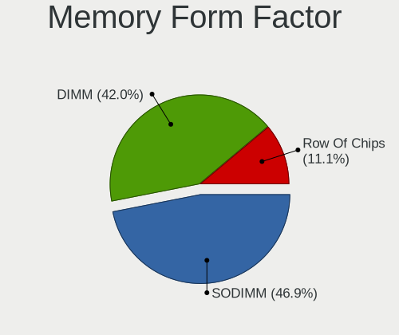

FreeBSD Hardware Trends
-----------------------

A project to identify most popular hardware characteristics and track their change
over time based on data collected by FreeBSD users at https://BSD-Hardware.info.

Anyone can contribute to the study by uploading probes of their computers by
the [hw-probe](https://github.com/linuxhw/hw-probe/blob/master/INSTALL.BSD.md) tool:

    hw-probe -all -upload

This is a report for all computer types. See also reports for [desktops](/Dist/FreeBSD/Desktop/README.md) and [notebooks](/Dist/FreeBSD/Notebook/README.md).

Full-feature report is available here: https://bsd-hardware.info/?view=trends

Period: Jun, 2021.

Contents
--------

- [ OS                       ](#os)
- [ OS Family                ](#os-family)
- [ Arch                     ](#arch)
- [ DE                       ](#de)
- [ Display Server           ](#display-server)
- [ Display Manager          ](#display-manager)
- [ OS Lang                  ](#os-lang)
- [ Boot Mode                ](#boot-mode)
- [ Filesystem               ](#filesystem)
- [ Part. scheme             ](#part-scheme)
- [ Country                  ](#country)
- [ City                     ](#city)
- [ Vendor                   ](#vendor)
- [ Model                    ](#model)
- [ Model Family             ](#model-family)
- [ MFG Year                 ](#mfg-year)
- [ Form Factor              ](#form-factor)
- [ Coreboot                 ](#coreboot)
- [ RAM Size                 ](#ram-size)
- [ RAM Used                 ](#ram-used)
- [ Has CD-ROM               ](#has-cd-rom)
- [ Total Drives             ](#total-drives)
- [ Has Ethernet             ](#has-ethernet)
- [ Has WiFi                 ](#has-wifi)
- [ Has Bluetooth            ](#has-bluetooth)
- [ Drive Vendor             ](#drive-vendor)
- [ Drive Model              ](#drive-model)
- [ HDD Vendor               ](#hdd-vendor)
- [ SSD Vendor               ](#ssd-vendor)
- [ Drive Kind               ](#drive-kind)
- [ Drive Connector          ](#drive-connector)
- [ Drive Size               ](#drive-size)
- [ Space Total              ](#space-total)
- [ Space Used               ](#space-used)
- [ Malfunc. Drives          ](#malfunc-drives)
- [ Malfunc. Drive Vendor    ](#malfunc-drive-vendor)
- [ Malfunc. HDD Vendor      ](#malfunc-hdd-vendor)
- [ Malfunc. Drive Kind      ](#malfunc-drive-kind)
- [ Failed Drives            ](#failed-drives)
- [ Failed Drive Vendor      ](#failed-drive-vendor)
- [ Drive Status             ](#drive-status)
- [ Storage Vendor           ](#storage-vendor)
- [ Storage Model            ](#storage-model)
- [ Storage Kind             ](#storage-kind)
- [ CPU Vendor               ](#cpu-vendor)
- [ CPU Model                ](#cpu-model)
- [ CPU Model Family         ](#cpu-model-family)
- [ CPU Cores                ](#cpu-cores)
- [ CPU Sockets              ](#cpu-sockets)
- [ CPU Threads              ](#cpu-threads)
- [ CPU Microarch            ](#cpu-microarch)
- [ GPU Vendor               ](#gpu-vendor)
- [ GPU Model                ](#gpu-model)
- [ GPU Combo                ](#gpu-combo)
- [ GPU Driver               ](#gpu-driver)
- [ GPU Memory               ](#gpu-memory)
- [ Monitor Vendor           ](#monitor-vendor)
- [ Monitor Model            ](#monitor-model)
- [ Monitor Resolution       ](#monitor-resolution)
- [ Monitor Diagonal         ](#monitor-diagonal)
- [ Monitor Width            ](#monitor-width)
- [ Aspect Ratio             ](#aspect-ratio)
- [ Monitor Area             ](#monitor-area)
- [ Pixel Density            ](#pixel-density)
- [ Multiple Monitors        ](#multiple-monitors)
- [ Net Controller Vendor    ](#net-controller-vendor)
- [ Net Controller Model     ](#net-controller-model)
- [ Wireless Vendor          ](#wireless-vendor)
- [ Wireless Model           ](#wireless-model)
- [ Ethernet Vendor          ](#ethernet-vendor)
- [ Ethernet Model           ](#ethernet-model)
- [ Net Controller Kind      ](#net-controller-kind)
- [ Used Controller          ](#used-controller)
- [ NICs                     ](#nics)
- [ IPv6                     ](#ipv6)
- [ Memory Vendor            ](#memory-vendor)
- [ Memory Model             ](#memory-model)
- [ Memory Kind              ](#memory-kind)
- [ Memory Form Factor       ](#memory-form-factor)
- [ Memory Size              ](#memory-size)
- [ Memory Speed             ](#memory-speed)
- [ Sound Vendor             ](#sound-vendor)
- [ Sound Model              ](#sound-model)
- [ Camera Vendor            ](#camera-vendor)
- [ Camera Model             ](#camera-model)
- [ Fingerprint Vendor       ](#fingerprint-vendor)
- [ Fingerprint Model        ](#fingerprint-model)
- [ Chipcard Vendor          ](#chipcard-vendor)
- [ Chipcard Model           ](#chipcard-model)
- [ Printer Vendor           ](#printer-vendor)
- [ Printer Model            ](#printer-model)
- [ Scanner Vendor           ](#scanner-vendor)
- [ Scanner Model            ](#scanner-model)
- [ Bluetooth Vendor         ](#bluetooth-vendor)
- [ Bluetooth Model          ](#bluetooth-model)
- [ Unsupported Devices      ](#unsupported-devices)
- [ Unsupported Device Types ](#unsupported-device-types)

OS
--

Installed operating systems

| Name                 | Computers | Percent |
|----------------------|-----------|---------|
| FreeBSD 13.0-p2      | 29        | 35.37%  |
| FreeBSD 13.0         | 20        | 24.39%  |
| FreeBSD 14.0-CURRENT | 7         | 8.54%   |
| FreeBSD 13.0-STABLE  | 7         | 8.54%   |
| FreeBSD 12.2-STABLE  | 5         | 6.1%    |
| FreeBSD 13.0-p1      | 4         | 4.88%   |
| FreeBSD 12.2-p8      | 4         | 4.88%   |
| FreeBSD 12.2         | 2         | 2.44%   |
| FreeBSD 13.0-p3      | 1         | 1.22%   |
| FreeBSD 12.1-p8      | 1         | 1.22%   |
| FreeBSD 12.1-p10     | 1         | 1.22%   |
| FreeBSD 11.4         | 1         | 1.22%   |

OS Family
---------

OS without a version

| Name    | Computers | Percent |
|---------|-----------|---------|
| FreeBSD | 82        | 100%    |

Arch
----

OS architecture (x86_64, i586, etc.)

| Name  | Computers | Percent |
|-------|-----------|---------|
| amd64 | 77        | 93.9%   |
| i386  | 3         | 3.66%   |
| arm64 | 2         | 2.44%   |

DE
--

Desktop Environment

| Name     | Computers | Percent |
|----------|-----------|---------|
| Console  | 23        | 28.05%  |
| XFCE     | 15        | 18.29%  |
| KDE5     | 12        | 14.63%  |
| GNOME    | 7         | 8.54%   |
| TWM      | 5         | 6.1%    |
| MATE     | 5         | 6.1%    |
| LXQt     | 3         | 3.66%   |
| Openbox  | 2         | 2.44%   |
| Lumina   | 2         | 2.44%   |
| i3       | 2         | 2.44%   |
| Fluxbox  | 2         | 2.44%   |
| Cinnamon | 2         | 2.44%   |
| DWM      | 1         | 1.22%   |
| CDE      | 1         | 1.22%   |

Display Server
--------------

X11 or Wayland

| Name    | Computers | Percent |
|---------|-----------|---------|
| X11     | 59        | 71.95%  |
| Console | 23        | 28.05%  |

Display Manager
---------------

SDDM, LightDM, etc.

| Name    | Computers | Percent |
|---------|-----------|---------|
| Console | 45        | 54.88%  |
| SDDM    | 14        | 17.07%  |
| SLiM    | 8         | 9.76%   |
| XDM     | 7         | 8.54%   |
| GDM     | 5         | 6.1%    |
| LightDM | 3         | 3.66%   |

OS Lang
-------

Language

| Lang    | Computers | Percent |
|---------|-----------|---------|
| C       | 45        | 54.88%  |
| Unknown | 12        | 14.63%  |
| en_US   | 9         | 10.98%  |
| de_DE   | 5         | 6.1%    |
| ru_RU   | 2         | 2.44%   |
| fr_FR   | 2         | 2.44%   |
| en_CA   | 2         | 2.44%   |
| zh_TW   | 1         | 1.22%   |
| zh_CN   | 1         | 1.22%   |
| pl_PL   | 1         | 1.22%   |
| en_GB   | 1         | 1.22%   |
| de_CH   | 1         | 1.22%   |

Boot Mode
---------

EFI or BIOS

| Mode | Computers | Percent |
|------|-----------|---------|
| EFI  | 54        | 65.85%  |
| BIOS | 28        | 34.15%  |

Filesystem
----------

Type of filesystem

| Type | Computers | Percent |
|------|-----------|---------|
| Zfs  | 55        | 67.07%  |
| Ufs  | 27        | 32.93%  |

Part. scheme
------------

Scheme of partitioning

| Type | Computers | Percent |
|------|-----------|---------|
| GPT  | 74        | 90.24%  |
| MBR  | 7         | 8.54%   |
| BSD  | 1         | 1.22%   |

Country
-------

Geographic location (country)

| Country      | Computers | Percent |
|--------------|-----------|---------|
| USA          | 25        | 30.49%  |
| Russia       | 7         | 8.54%   |
| UK           | 5         | 6.1%    |
| Netherlands  | 5         | 6.1%    |
| Japan        | 5         | 6.1%    |
| Germany      | 4         | 4.88%   |
| Brazil       | 4         | 4.88%   |
| Switzerland  | 3         | 3.66%   |
| Poland       | 3         | 3.66%   |
| France       | 3         | 3.66%   |
| India        | 2         | 2.44%   |
| Canada       | 2         | 2.44%   |
| Austria      | 2         | 2.44%   |
| Thailand     | 1         | 1.22%   |
| Taiwan       | 1         | 1.22%   |
| Sweden       | 1         | 1.22%   |
| Spain        | 1         | 1.22%   |
| South Africa | 1         | 1.22%   |
| Lithuania    | 1         | 1.22%   |
| Israel       | 1         | 1.22%   |
| Guadeloupe   | 1         | 1.22%   |
| China        | 1         | 1.22%   |
| Chile        | 1         | 1.22%   |
| Australia    | 1         | 1.22%   |
| Albania      | 1         | 1.22%   |

City
----

Geographic location (city)

| City                   | Computers | Percent |
|------------------------|-----------|---------|
| Brooklyn               | 4         | 4.88%   |
| Morris                 | 3         | 3.66%   |
| Kamensk-Ural'skiy      | 3         | 3.66%   |
| Inzai                  | 3         | 3.66%   |
| Moscow                 | 2         | 2.44%   |
| Lexington              | 2         | 2.44%   |
| Kirkland               | 2         | 2.44%   |
| Hamburg                | 2         | 2.44%   |
| Amsterdam              | 2         | 2.44%   |
| Yokohama               | 1         | 1.22%   |
| Wenatchee              | 1         | 1.22%   |
| Warsaw                 | 1         | 1.22%   |
| Vilnius                | 1         | 1.22%   |
| Vienna                 | 1         | 1.22%   |
| Thrissur               | 1         | 1.22%   |
| Teteghem               | 1         | 1.22%   |
| São Paulo             | 1         | 1.22%   |
| Stuttgart              | 1         | 1.22%   |
| Stockholm              | 1         | 1.22%   |
| St. Marys              | 1         | 1.22%   |
| Slough                 | 1         | 1.22%   |
| Shenzhen               | 1         | 1.22%   |
| Seattle                | 1         | 1.22%   |
| Sarandë               | 1         | 1.22%   |
| Sapporo                | 1         | 1.22%   |
| Salzburg               | 1         | 1.22%   |
| Salem                  | 1         | 1.22%   |
| Rugby                  | 1         | 1.22%   |
| Rio de Janeiro         | 1         | 1.22%   |
| Poulsbo                | 1         | 1.22%   |
| Portland               | 1         | 1.22%   |
| Piloezinhos            | 1         | 1.22%   |
| Nunoa                  | 1         | 1.22%   |
| Novosibirsk            | 1         | 1.22%   |
| Noisy-le-Grand         | 1         | 1.22%   |
| Niagara Falls          | 1         | 1.22%   |
| New York               | 1         | 1.22%   |
| Nazareth               | 1         | 1.22%   |
| Mumbai                 | 1         | 1.22%   |
| Minot                  | 1         | 1.22%   |
| Minneapolis            | 1         | 1.22%   |
| Melle                  | 1         | 1.22%   |
| Madrid                 | 1         | 1.22%   |
| Lyon                   | 1         | 1.22%   |
| London                 | 1         | 1.22%   |
| Lent                   | 1         | 1.22%   |
| Le Gosier              | 1         | 1.22%   |
| Laval                  | 1         | 1.22%   |
| Krasnik                | 1         | 1.22%   |
| Khabarovsk             | 1         | 1.22%   |
| Hsinchu                | 1         | 1.22%   |
| Hoofddorp              | 1         | 1.22%   |
| Hannibal               | 1         | 1.22%   |
| Gambrills              | 1         | 1.22%   |
| Frederick              | 1         | 1.22%   |
| Ferndorf               | 1         | 1.22%   |
| Dinhard                | 1         | 1.22%   |
| Częstochowa           | 1         | 1.22%   |
| Corcelles-pres-Payerne | 1         | 1.22%   |
| Coppell                | 1         | 1.22%   |

Vendor
------

Motherboard manufacturer

| Name                    | Computers | Percent |
|-------------------------|-----------|---------|
| Lenovo                  | 18        | 21.95%  |
| Dell                    | 12        | 14.63%  |
| ASUSTek Computer        | 12        | 14.63%  |
| MSI                     | 5         | 6.1%    |
| ASRock                  | 5         | 6.1%    |
| Acer                    | 4         | 4.88%   |
| Hewlett-Packard         | 3         | 3.66%   |
| Gigabyte Technology     | 3         | 3.66%   |
| Toshiba                 | 2         | 2.44%   |
| Supermicro              | 2         | 2.44%   |
| Intel                   | 2         | 2.44%   |
| Apple                   | 2         | 2.44%   |
| Wistron                 | 1         | 1.22%   |
| SLIMBOOK                | 1         | 1.22%   |
| Samsung Electronics     | 1         | 1.22%   |
| Raspberry Pi Foundation | 1         | 1.22%   |
| Pine Microsystems       | 1         | 1.22%   |
| Panasonic               | 1         | 1.22%   |
| Notebook                | 1         | 1.22%   |
| LG Electronics          | 1         | 1.22%   |
| IBM                     | 1         | 1.22%   |
| HPE                     | 1         | 1.22%   |
| GVC                     | 1         | 1.22%   |
| Biostar                 | 1         | 1.22%   |

Model
-----

Motherboard model

| Name                                       | Computers | Percent |
|--------------------------------------------|-----------|---------|
| Supermicro X7SPA-HF                        | 2         | 2.44%   |
| Lenovo ThinkPad T60 20076PU                | 2         | 2.44%   |
| ASUS P5Q-E                                 | 2         | 2.44%   |
| Wistron ProLiant ML110 G6                  | 1         | 1.22%   |
| Toshiba Satellite C655D                    | 1         | 1.22%   |
| Toshiba PORTEGE X20W-D                     | 1         | 1.22%   |
| Samsung NC10                               | 1         | 1.22%   |
| RPi rpi                                    | 1         | 1.22%   |
| Pine Microsystems Rockpro64                | 1         | 1.22%   |
| Panasonic CFQV9-1                          | 1         | 1.22%   |
| Notebook N7x0WU                            | 1         | 1.22%   |
| MSI MS-7C36                                | 1         | 1.22%   |
| MSI MS-7B22                                | 1         | 1.22%   |
| MSI MS-7A32                                | 1         | 1.22%   |
| MSI MS-7918                                | 1         | 1.22%   |
| MSI MS-7817                                | 1         | 1.22%   |
| LG E500-GP01A9                             | 1         | 1.22%   |
| Lenovo Yoga 500-14IBD 80N4                 | 1         | 1.22%   |
| Lenovo ThinkStation P330 30CY008AGE        | 1         | 1.22%   |
| Lenovo ThinkPad X270 20HMS0MA18            | 1         | 1.22%   |
| Lenovo ThinkPad X220 4291ON5               | 1         | 1.22%   |
| Lenovo ThinkPad X1 Carbon Gen 8 20U9001PUS | 1         | 1.22%   |
| Lenovo ThinkPad W520 42763KU               | 1         | 1.22%   |
| Lenovo ThinkPad T450s 20BWS0L600           | 1         | 1.22%   |
| Lenovo ThinkPad T430 2349GCU               | 1         | 1.22%   |
| Lenovo ThinkPad T420 4237A12               | 1         | 1.22%   |
| Lenovo ThinkPad T420 4236NHG               | 1         | 1.22%   |
| Lenovo ThinkPad T410 2518A37               | 1         | 1.22%   |
| Lenovo ThinkPad E490 20N8CTO1WW            | 1         | 1.22%   |
| Lenovo ThinkPad E14 20RBCTO1WW             | 1         | 1.22%   |
| Lenovo IdeaPad Y700-15ISK 80NV             | 1         | 1.22%   |
| Lenovo IdeaPad 330-15ARR 81D2              | 1         | 1.22%   |
| Lenovo IdeaCentre 510A-15ICB 90HV0005US    | 1         | 1.22%   |
| Intel S2600WTTR                            | 1         | 1.22%   |
| Intel NUC7i7BNB J31145-302                 | 1         | 1.22%   |
| IBM ThinkPad T42 2374K46                   | 1         | 1.22%   |
| HPE ProLiant MicroServer Gen10             | 1         | 1.22%   |
| HP ProLiant ML310 G5p                      | 1         | 1.22%   |
| HP ENVY x2 Detachable PC 13                | 1         | 1.22%   |
| HP EliteBook 8570p                         | 1         | 1.22%   |
| GVC EQUIUM 3200M                           | 1         | 1.22%   |
| Gigabyte X570 I AORUS PRO WIFI             | 1         | 1.22%   |
| Gigabyte X470 AORUS GAMING 5 WIFI          | 1         | 1.22%   |
| Gigabyte A320M-S2H                         | 1         | 1.22%   |
| Dell Vostro 5490                           | 1         | 1.22%   |
| Dell Vostro 5481                           | 1         | 1.22%   |
| Dell Studio 1558                           | 1         | 1.22%   |
| Dell PowerEdge T40                         | 1         | 1.22%   |
| Dell PowerEdge R710                        | 1         | 1.22%   |
| Dell PowerEdge R630                        | 1         | 1.22%   |
| Dell OptiPlex 5040                         | 1         | 1.22%   |
| Dell Latitude E6440                        | 1         | 1.22%   |
| Dell Latitude E4300                        | 1         | 1.22%   |
| Dell Inspiron 5567                         | 1         | 1.22%   |
| Dell Inspiron 15-7579                      | 1         | 1.22%   |
| Dell G5 5505                               | 1         | 1.22%   |
| Biostar TH67B                              | 1         | 1.22%   |
| ASUS X556UAK                               | 1         | 1.22%   |
| ASUS TUF B450M-PRO GAMING                  | 1         | 1.22%   |
| ASUS PRIME Z590M-PLUS                      | 1         | 1.22%   |

Model Family
------------

Motherboard model prefix

| Name                                | Computers | Percent |
|-------------------------------------|-----------|---------|
| Lenovo ThinkPad                     | 13        | 15.85%  |
| ASUS PRIME                          | 5         | 6.1%    |
| Acer Aspire                         | 4         | 4.88%   |
| Dell PowerEdge                      | 3         | 3.66%   |
| Supermicro X7SPA-HF                 | 2         | 2.44%   |
| Lenovo IdeaPad                      | 2         | 2.44%   |
| Dell Vostro                         | 2         | 2.44%   |
| Dell Latitude                       | 2         | 2.44%   |
| Dell Inspiron                       | 2         | 2.44%   |
| ASUS P5Q-E                          | 2         | 2.44%   |
| Wistron ProLiant                    | 1         | 1.22%   |
| Toshiba Satellite                   | 1         | 1.22%   |
| Toshiba PORTEGE                     | 1         | 1.22%   |
| Samsung NC10                        | 1         | 1.22%   |
| RPi rpi                             | 1         | 1.22%   |
| Pine Microsystems Rockpro64         | 1         | 1.22%   |
| Panasonic CFQV9-1                   | 1         | 1.22%   |
| Notebook N7x0WU                     | 1         | 1.22%   |
| MSI MS-7C36                         | 1         | 1.22%   |
| MSI MS-7B22                         | 1         | 1.22%   |
| MSI MS-7A32                         | 1         | 1.22%   |
| MSI MS-7918                         | 1         | 1.22%   |
| MSI MS-7817                         | 1         | 1.22%   |
| LG E500-GP01A9                      | 1         | 1.22%   |
| Lenovo Yoga                         | 1         | 1.22%   |
| Lenovo ThinkStation                 | 1         | 1.22%   |
| Lenovo IdeaCentre                   | 1         | 1.22%   |
| Intel S2600WTTR                     | 1         | 1.22%   |
| Intel NUC7i7BNB                     | 1         | 1.22%   |
| IBM ThinkPad                        | 1         | 1.22%   |
| HPE ProLiant                        | 1         | 1.22%   |
| HP ProLiant                         | 1         | 1.22%   |
| HP ENVY                             | 1         | 1.22%   |
| HP EliteBook                        | 1         | 1.22%   |
| GVC EQUIUM                          | 1         | 1.22%   |
| Gigabyte X570                       | 1         | 1.22%   |
| Gigabyte X470                       | 1         | 1.22%   |
| Gigabyte A320M-S2H                  | 1         | 1.22%   |
| Dell Studio                         | 1         | 1.22%   |
| Dell OptiPlex                       | 1         | 1.22%   |
| Dell G5                             | 1         | 1.22%   |
| Biostar TH67B                       | 1         | 1.22%   |
| ASUS X556UAK                        | 1         | 1.22%   |
| ASUS TUF                            | 1         | 1.22%   |
| ASUS P5K                            | 1         | 1.22%   |
| ASUS G74Sx                          | 1         | 1.22%   |
| ASUS All                            | 1         | 1.22%   |
| ASRock X399M                        | 1         | 1.22%   |
| ASRock X370                         | 1         | 1.22%   |
| ASRock B550                         | 1         | 1.22%   |
| ASRock B450M                        | 1         | 1.22%   |
| ASRock AMZ-FREENASMINI-DISKLESS-IXN | 1         | 1.22%   |
| Apple MacBookPro9                   | 1         | 1.22%   |
| Apple iMac5                         | 1         | 1.22%   |
| Unknown                             | 1         | 1.22%   |

MFG Year
--------

Motherboard manufacture year

| Year    | Computers | Percent |
|---------|-----------|---------|
| 2019    | 19        | 23.17%  |
| 2020    | 18        | 21.95%  |
| 2018    | 7         | 8.54%   |
| 2012    | 7         | 8.54%   |
| 2011    | 5         | 6.1%    |
| 2021    | 4         | 4.88%   |
| 2017    | 4         | 4.88%   |
| 2009    | 4         | 4.88%   |
| 2014    | 3         | 3.66%   |
| 2016    | 2         | 2.44%   |
| 2008    | 2         | 2.44%   |
| 2006    | 2         | 2.44%   |
| Unknown | 2         | 2.44%   |
| 2015    | 1         | 1.22%   |
| 2010    | 1         | 1.22%   |
| 2007    | 1         | 1.22%   |

Form Factor
-----------

Physical design of the computer

| Name           | Computers | Percent |
|----------------|-----------|---------|
| Notebook       | 39        | 47.56%  |
| Desktop        | 34        | 41.46%  |
| Server         | 4         | 4.88%   |
| Convertible    | 2         | 2.44%   |
| System on chip | 1         | 1.22%   |
| Mini pc        | 1         | 1.22%   |
| All in one     | 1         | 1.22%   |

Coreboot
--------

Have coreboot on board

| Used | Computers | Percent |
|------|-----------|---------|
| No   | 82        | 100%    |

RAM Size
--------

Total RAM memory

| Size in GB  | Computers | Percent |
|-------------|-----------|---------|
| 8.01-16.0   | 25        | 30.49%  |
| 16.01-24.0  | 20        | 24.39%  |
| 4.01-8.0    | 13        | 15.85%  |
| 32.01-64.0  | 11        | 13.41%  |
| 64.01-256.0 | 7         | 8.54%   |
| 3.01-4.0    | 2         | 2.44%   |
| 2.01-3.0    | 2         | 2.44%   |
| 0.51-1.0    | 1         | 1.22%   |
| 0.01-0.5    | 1         | 1.22%   |

RAM Used
--------

Used RAM memory

| Used GB     | Computers | Percent |
|-------------|-----------|---------|
| 0.01-0.5    | 30        | 36.59%  |
| 0.51-1.0    | 25        | 30.49%  |
| 1.01-2.0    | 9         | 10.98%  |
| 3.01-4.0    | 4         | 4.88%   |
| 4.01-8.0    | 3         | 3.66%   |
| 8.01-16.0   | 3         | 3.66%   |
| 32.01-64.0  | 2         | 2.44%   |
| 2.01-3.0    | 2         | 2.44%   |
| 24.01-32.0  | 1         | 1.22%   |
| 64.01-256.0 | 1         | 1.22%   |
| 16.01-24.0  | 1         | 1.22%   |
| 0           | 1         | 1.22%   |

Has CD-ROM
----------

Has CD-ROM on board

| Presented | Computers | Percent |
|-----------|-----------|---------|
| No        | 53        | 64.63%  |
| Yes       | 29        | 35.37%  |

Total Drives
------------

Number of drives on board

| Drives | Computers | Percent |
|--------|-----------|---------|
| 1      | 38        | 46.34%  |
| 2      | 18        | 21.95%  |
| 3      | 10        | 12.2%   |
| 7      | 3         | 3.66%   |
| 6      | 3         | 3.66%   |
| 4      | 3         | 3.66%   |
| 10     | 2         | 2.44%   |
| 0      | 2         | 2.44%   |
| 14     | 1         | 1.22%   |
| 13     | 1         | 1.22%   |
| 5      | 1         | 1.22%   |

Has Ethernet
------------

Has Ethernet on board

| Presented | Computers | Percent |
|-----------|-----------|---------|
| Yes       | 76        | 92.68%  |
| No        | 6         | 7.32%   |

Has WiFi
--------

Has WiFi module

| Presented | Computers | Percent |
|-----------|-----------|---------|
| Yes       | 50        | 60.98%  |
| No        | 32        | 39.02%  |

Has Bluetooth
-------------

Has Bluetooth module

| Presented | Computers | Percent |
|-----------|-----------|---------|
| No        | 42        | 51.22%  |
| Yes       | 40        | 48.78%  |

Drive Vendor
------------

Hard drive vendors

| Vendor              | Computers | Drives | Percent |
|---------------------|-----------|--------|---------|
| Samsung Electronics | 24        | 32     | 18.75%  |
| WDC                 | 22        | 60     | 17.19%  |
| Seagate             | 22        | 49     | 17.19%  |
| Toshiba             | 11        | 13     | 8.59%   |
| Kingston            | 8         | 10     | 6.25%   |
| Crucial             | 8         | 8      | 6.25%   |
| Intel               | 5         | 6      | 3.91%   |
| SK Hynix            | 4         | 4      | 3.13%   |
| HGST                | 4         | 4      | 3.13%   |
| OWC                 | 3         | 3      | 2.34%   |
| Hitachi             | 3         | 3      | 2.34%   |
| SanDisk             | 2         | 2      | 1.56%   |
| Zheino              | 1         | 1      | 0.78%   |
| Transcend           | 1         | 1      | 0.78%   |
| Phison              | 1         | 1      | 0.78%   |
| Micron Technology   | 1         | 1      | 0.78%   |
| MAXTOR              | 1         | 1      | 0.78%   |
| LITEONIT            | 1         | 1      | 0.78%   |
| LITEON              | 1         | 1      | 0.78%   |
| KingDian            | 1         | 1      | 0.78%   |
| Hewlett-Packard     | 1         | 1      | 0.78%   |
| Apacer              | 1         | 1      | 0.78%   |
| AMD                 | 1         | 1      | 0.78%   |
| A-DATA Technology   | 1         | 2      | 0.78%   |

Drive Model
-----------

Hard drive models

| Model                                | Computers | Percent |
|--------------------------------------|-----------|---------|
| Seagate ST4000DM000-1F2168 4TB       | 4         | 2.55%   |
| Kingston SA400S37240G 240GB          | 4         | 2.55%   |
| Samsung SSD 850 PRO 512GB            | 3         | 1.91%   |
| Samsung SSD 850 EVO 250GB            | 3         | 1.91%   |
| WDC PC SN730 SDBQNTY-512G-1001 512GB | 2         | 1.27%   |
| Toshiba MQ01ABF050 500GB             | 2         | 1.27%   |
| Seagate ST500LM000-1EJ162-SSHD 500GB | 2         | 1.27%   |
| Seagate ST4000VN008-2DR166 4TB       | 2         | 1.27%   |
| Samsung SSD 960 EVO 500GB            | 2         | 1.27%   |
| Samsung SSD 860 EVO 500GB            | 2         | 1.27%   |
| Samsung SSD 860 EVO 1TB              | 2         | 1.27%   |
| HGST HTS725050A7E630 500GB           | 2         | 1.27%   |
| Crucial CT500MX500SSD1 500GB         | 2         | 1.27%   |
| Zheino CHN-mSATAQ3-120 120GB         | 1         | 0.64%   |
| WDC WDS500G2B0B-00YS70 500GB         | 1         | 0.64%   |
| WDC WDS500G2B0A-00SM50 500GB         | 1         | 0.64%   |
| WDC WDS500G2B0A 500GB                | 1         | 0.64%   |
| WDC WDS500G1X0E-00AFY0 500GB         | 1         | 0.64%   |
| WDC WDS240G2G0A-00JH30 240GB         | 1         | 0.64%   |
| WDC WDS120G2G0B-00EPW0 120GB         | 1         | 0.64%   |
| WDC WDS100T3X0C-00SJG0 1TB           | 1         | 0.64%   |
| WDC WDS100T2X0C-00L350 1TB           | 1         | 0.64%   |
| WDC WDS100T1X0E-00AFY0 1TB           | 1         | 0.64%   |
| WDC WD80EMAZ-00WJTA0 8TB             | 1         | 0.64%   |
| WDC WD80EFZX-68UW8N0 8TB             | 1         | 0.64%   |
| WDC WD80EFAX-68LHPN0 8TB             | 1         | 0.64%   |
| WDC WD80EFAX-68KNBN0 8TB             | 1         | 0.64%   |
| WDC WD8003FFBX-68B9AN0 8TB           | 1         | 0.64%   |
| WDC WD60EZRZ-00GZ5B1 6TB             | 1         | 0.64%   |
| WDC WD40PURZ-85TTDY0 4TB             | 1         | 0.64%   |
| WDC WD40EZRZ-22GXCB0 4TB             | 1         | 0.64%   |
| WDC WD40EFRX-68N32N0 4TB             | 1         | 0.64%   |
| WDC WD4003FFBX-68MU3N0 4TB           | 1         | 0.64%   |
| WDC WD120EMFZ-11A6JA0 12TB           | 1         | 0.64%   |
| WDC WD120EMAZ-11BLFA0 12TB           | 1         | 0.64%   |
| WDC WD10SPZX-08Z10 1TB               | 1         | 0.64%   |
| WDC WD10JPVX-00JC3T0 1TB             | 1         | 0.64%   |
| WDC WD10JFCX-68N6GN0 1TB             | 1         | 0.64%   |
| WDC WD10EZEX-00RKKA0 1TB             | 1         | 0.64%   |
| WDC WD10EARS-00Y5B1 1TB              | 1         | 0.64%   |
| WDC WD10EACS-65D6B0 1TB              | 1         | 0.64%   |
| WDC WD101KFBX-68R56N0 10TB           | 1         | 0.64%   |
| WDC WD1001FALS-00J7B0 1TB            | 1         | 0.64%   |
| WDC PC SN730 NVMe 1024GB             | 1         | 0.64%   |
| WDC PC SN520 SDAPNUW-256G-1006 256GB | 1         | 0.64%   |
| Transcend TS256GMTS430S 256GB        | 1         | 0.64%   |
| Toshiba THNSNK512GVN8 512GB          | 1         | 0.64%   |
| Toshiba MQ02ABF050H 500GB            | 1         | 0.64%   |
| Toshiba MQ02ABD100H 1TB              | 1         | 0.64%   |
| Toshiba MQ01ACF032 320GB             | 1         | 0.64%   |
| Toshiba MQ01ABD100 1TB               | 1         | 0.64%   |
| Toshiba MQ01ABD050 500GB             | 1         | 0.64%   |
| Toshiba MK5061GSY 500GB              | 1         | 0.64%   |
| Toshiba MK3265GSXN 320GB             | 1         | 0.64%   |
| Toshiba MD04ACA400 4TB               | 1         | 0.64%   |
| Toshiba DT01ACA300 3TB               | 1         | 0.64%   |
| SK Hynix SHGS31-500GS-2 500GB        | 1         | 0.64%   |
| SK Hynix SC308 SATA 256GB            | 1         | 0.64%   |
| SK Hynix HFS128G39TND-N210A 128GB    | 1         | 0.64%   |
| SK Hynix BC511 NVMe 256GB            | 1         | 0.64%   |

HDD Vendor
----------

Hard disk drive vendors

| Vendor              | Computers | Drives | Percent |
|---------------------|-----------|--------|---------|
| Seagate             | 22        | 48     | 36.67%  |
| WDC                 | 15        | 43     | 25%     |
| Toshiba             | 10        | 12     | 16.67%  |
| Samsung Electronics | 4         | 7      | 6.67%   |
| HGST                | 4         | 4      | 6.67%   |
| Hitachi             | 3         | 3      | 5%      |
| MAXTOR              | 1         | 1      | 1.67%   |
| Hewlett-Packard     | 1         | 1      | 1.67%   |

SSD Vendor
----------

Solid state drive vendors

| Vendor              | Computers | Drives | Percent |
|---------------------|-----------|--------|---------|
| Samsung Electronics | 17        | 19     | 29.31%  |
| Kingston            | 7         | 9      | 12.07%  |
| Crucial             | 6         | 6      | 10.34%  |
| Intel               | 5         | 6      | 8.62%   |
| WDC                 | 4         | 7      | 6.9%    |
| SK Hynix            | 3         | 3      | 5.17%   |
| OWC                 | 3         | 3      | 5.17%   |
| SanDisk             | 2         | 2      | 3.45%   |
| Zheino              | 1         | 1      | 1.72%   |
| Transcend           | 1         | 1      | 1.72%   |
| Toshiba             | 1         | 1      | 1.72%   |
| Seagate             | 1         | 1      | 1.72%   |
| Micron Technology   | 1         | 1      | 1.72%   |
| LITEONIT            | 1         | 1      | 1.72%   |
| LITEON              | 1         | 1      | 1.72%   |
| KingDian            | 1         | 1      | 1.72%   |
| Apacer              | 1         | 1      | 1.72%   |
| AMD                 | 1         | 1      | 1.72%   |
| A-DATA Technology   | 1         | 1      | 1.72%   |

Drive Kind
----------

HDD or SSD

| Kind | Computers | Drives | Percent |
|------|-----------|--------|---------|
| HDD  | 45        | 119    | 42.45%  |
| SSD  | 44        | 66     | 41.51%  |
| NVMe | 17        | 22     | 16.04%  |

Drive Connector
---------------

SATA, SAS, NVMe, etc.

| Type | Computers | Drives | Percent |
|------|-----------|--------|---------|
| SATA | 73        | 185    | 81.11%  |
| NVMe | 17        | 22     | 18.89%  |

Drive Size
----------

Size of hard drive

| Size in TB | Computers | Drives | Percent |
|------------|-----------|--------|---------|
| 0.01-0.5   | 49        | 88     | 52.13%  |
| 0.51-1.0   | 22        | 33     | 23.4%   |
| 4.01-10.0  | 8         | 31     | 8.51%   |
| 3.01-4.0   | 7         | 19     | 7.45%   |
| 1.01-2.0   | 5         | 8      | 5.32%   |
| 2.01-3.0   | 2         | 4      | 2.13%   |
| 10.01-20.0 | 1         | 2      | 1.06%   |

Space Total
-----------

Amount of disk space available on the file system

| Size in GB     | Computers | Percent |
|----------------|-----------|---------|
| 101-250        | 27        | 32.93%  |
| 251-500        | 18        | 21.95%  |
| 501-1000       | 11        | 13.41%  |
| 21-50          | 8         | 9.76%   |
| 1-20           | 6         | 7.32%   |
| 1001-2000      | 4         | 4.88%   |
| Unknown        | 3         | 3.66%   |
| 2001-3000      | 2         | 2.44%   |
| 51-100         | 2         | 2.44%   |
| More than 3000 | 1         | 1.22%   |

Space Used
----------

Amount of used disk space

| Used GB  | Computers | Percent |
|----------|-----------|---------|
| 1-20     | 58        | 70.73%  |
| 21-50    | 12        | 14.63%  |
| 51-100   | 4         | 4.88%   |
| 101-250  | 3         | 3.66%   |
| Unknown  | 3         | 3.66%   |
| 251-500  | 1         | 1.22%   |
| 501-1000 | 1         | 1.22%   |

Malfunc. Drives
---------------

Drive models with a malfunction

| Model                             | Computers | Drives | Percent |
|-----------------------------------|-----------|--------|---------|
| HGST HTS725050A7E630 500GB        | 2         | 2      | 12.5%   |
| Toshiba THNSNK512GVN8 512GB       | 1         | 1      | 6.25%   |
| Toshiba MQ02ABD100H 1TB           | 1         | 1      | 6.25%   |
| Toshiba MK3265GSXN 320GB          | 1         | 1      | 6.25%   |
| SK Hynix HFS128G39TND-N210A 128GB | 1         | 1      | 6.25%   |
| Seagate ST9640320AS 640GB         | 1         | 1      | 6.25%   |
| Seagate ST380013AS 80GB           | 1         | 2      | 6.25%   |
| Seagate ST3500418AS 500GB         | 1         | 2      | 6.25%   |
| Seagate ST320LT007-9ZV142 320GB   | 1         | 1      | 6.25%   |
| Seagate ST31500341AS 1.5TB        | 1         | 1      | 6.25%   |
| Seagate ST2000LX001-1RG174 2TB    | 1         | 2      | 6.25%   |
| Samsung Electronics HM160HI 160GB | 1         | 1      | 6.25%   |
| MAXTOR STM3160815AS 160GB         | 1         | 1      | 6.25%   |
| Intel SSDSC2BB120G6R 120GB        | 1         | 1      | 6.25%   |
| Hitachi HTS541612J9SA00 120GB     | 1         | 1      | 6.25%   |

Malfunc. Drive Vendor
---------------------

Vendors of faulty drives

| Vendor              | Computers | Drives | Percent |
|---------------------|-----------|--------|---------|
| Seagate             | 5         | 9      | 33.33%  |
| Toshiba             | 3         | 3      | 20%     |
| HGST                | 2         | 2      | 13.33%  |
| SK Hynix            | 1         | 1      | 6.67%   |
| Samsung Electronics | 1         | 1      | 6.67%   |
| MAXTOR              | 1         | 1      | 6.67%   |
| Intel               | 1         | 1      | 6.67%   |
| Hitachi             | 1         | 1      | 6.67%   |

Malfunc. HDD Vendor
-------------------

Vendors of faulty HDD drives

| Vendor              | Computers | Drives | Percent |
|---------------------|-----------|--------|---------|
| Seagate             | 5         | 9      | 41.67%  |
| Toshiba             | 2         | 2      | 16.67%  |
| HGST                | 2         | 2      | 16.67%  |
| Samsung Electronics | 1         | 1      | 8.33%   |
| MAXTOR              | 1         | 1      | 8.33%   |
| Hitachi             | 1         | 1      | 8.33%   |

Malfunc. Drive Kind
-------------------

Kinds of faulty drives

| Kind | Computers | Drives | Percent |
|------|-----------|--------|---------|
| HDD  | 12        | 16     | 80%     |
| SSD  | 3         | 3      | 20%     |

Failed Drives
-------------

Failed drive models

Zero info for selected period =(

Failed Drive Vendor
-------------------

Failed drive vendors

Zero info for selected period =(

Drive Status
------------

Number of failed and malfunc. drives

| Status   | Computers | Drives | Percent |
|----------|-----------|--------|---------|
| Works    | 73        | 186    | 82.02%  |
| Malfunc  | 14        | 19     | 15.73%  |
| Detected | 2         | 2      | 2.25%   |

Storage Vendor
--------------

Storage controller vendors

| Vendor                      | Computers | Percent |
|-----------------------------|-----------|---------|
| Intel                       | 64        | 57.66%  |
| AMD                         | 16        | 14.41%  |
| Sandisk                     | 7         | 6.31%   |
| Samsung Electronics         | 6         | 5.41%   |
| Marvell Technology Group    | 4         | 3.6%    |
| Broadcom / LSI              | 4         | 3.6%    |
| ASMedia Technology          | 2         | 1.8%    |
| SK Hynix                    | 1         | 0.9%    |
| Phison Electronics          | 1         | 0.9%    |
| Micron/Crucial Technology   | 1         | 0.9%    |
| Micron Technology           | 1         | 0.9%    |
| Kingston Technology Company | 1         | 0.9%    |
| Hewlett-Packard             | 1         | 0.9%    |
| Chelsio Communications      | 1         | 0.9%    |
| ADATA Technology            | 1         | 0.9%    |

Storage Model
-------------

Storage controller models

| Model                                                                          | Computers | Percent |
|--------------------------------------------------------------------------------|-----------|---------|
| AMD FCH SATA Controller [AHCI mode]                                            | 14        | 10.69%  |
| Intel Sunrise Point-LP SATA Controller [AHCI mode]                             | 6         | 4.58%   |
| Intel 7 Series Chipset Family 6-port SATA Controller [AHCI mode]               | 5         | 3.82%   |
| Intel 6 Series/C200 Series Chipset Family 6 port Mobile SATA AHCI Controller   | 5         | 3.82%   |
| Sandisk WD Black SN750 / PC SN730 NVMe SSD                                     | 4         | 3.05%   |
| Intel Wildcat Point-LP SATA Controller [AHCI Mode]                             | 4         | 3.05%   |
| Intel Comet Lake SATA AHCI Controller                                          | 4         | 3.05%   |
| Intel Cannon Lake PCH SATA AHCI Controller                                     | 4         | 3.05%   |
| AMD 400 Series Chipset SATA Controller                                         | 4         | 3.05%   |
| Samsung NVMe SSD Controller SM981/PM981/PM983                                  | 3         | 2.29%   |
| Samsung NVMe SSD Controller SM961/PM961/SM963                                  | 3         | 2.29%   |
| Intel C610/X99 series chipset sSATA Controller [AHCI mode]                     | 3         | 2.29%   |
| Intel C610/X99 series chipset 6-Port SATA Controller [AHCI mode]               | 3         | 2.29%   |
| Intel 82801G (ICH7 Family) IDE Controller                                      | 3         | 2.29%   |
| AMD X370 Series Chipset SATA Controller                                        | 3         | 2.29%   |
| Sandisk WD Black SN850                                                         | 2         | 1.53%   |
| Marvell Group 88SE9230 PCIe 2.0 x2 4-port SATA 6 Gb/s RAID Controller          | 2         | 1.53%   |
| Marvell Group 88SE6111/6121 SATA II / PATA Controller                          | 2         | 1.53%   |
| Intel 82801JI (ICH10 Family) SATA AHCI Controller                              | 2         | 1.53%   |
| Intel 82801IR/IO/IH (ICH9R/DO/DH) 6 port SATA Controller [AHCI mode]           | 2         | 1.53%   |
| Intel 82801GBM/GHM (ICH7-M Family) SATA Controller [IDE mode]                  | 2         | 1.53%   |
| Intel 82801GBM/GHM (ICH7-M Family) SATA Controller [AHCI mode]                 | 2         | 1.53%   |
| Intel 82801 Mobile SATA Controller [RAID mode]                                 | 2         | 1.53%   |
| Intel 8 Series/C220 Series Chipset Family 6-port SATA Controller 1 [AHCI mode] | 2         | 1.53%   |
| Intel 500 Series Chipset Family SATA AHCI Controller                           | 2         | 1.53%   |
| Intel 5 Series/3400 Series Chipset 6 port SATA AHCI Controller                 | 2         | 1.53%   |
| Broadcom / LSI SAS2008 PCI-Express Fusion-MPT SAS-2 [Falcon]                   | 2         | 1.53%   |
| ASMedia ASM1062 Serial ATA Controller                                          | 2         | 1.53%   |
| SK Hynix BC511                                                                 | 1         | 0.76%   |
| Sandisk WD Blue SN500 / PC SN520 NVMe SSD                                      | 1         | 0.76%   |
| Sandisk WD Black 2018/SN750 / PC SN720 NVMe SSD                                | 1         | 0.76%   |
| Phison E12 NVMe Controller                                                     | 1         | 0.76%   |
| Micron/Crucial P2 NVMe PCIe SSD                                                | 1         | 0.76%   |
| Marvell Group 88SE9172 SATA 6Gb/s Controller                                   | 1         | 0.76%   |
| Kingston Company A2000 NVMe SSD                                                | 1         | 0.76%   |
| Intel SSD 600P Series                                                          | 1         | 0.76%   |
| Intel Q170/Q150/B150/H170/H110/Z170/CM236 Chipset SATA Controller [AHCI Mode]  | 1         | 0.76%   |
| Intel HM170/QM170 Chipset SATA Controller [AHCI Mode]                          | 1         | 0.76%   |
| Intel Celeron N3350/Pentium N4200/Atom E3900 Series SATA AHCI Controller       | 1         | 0.76%   |
| Intel Cannon Point-LP SATA Controller [AHCI Mode]                              | 1         | 0.76%   |
| Intel Atom processor C2000 AHCI SATA3 Controller                               | 1         | 0.76%   |
| Intel Atom processor C2000 AHCI SATA2 Controller                               | 1         | 0.76%   |
| Intel 9 Series Chipset Family SATA Controller [AHCI Mode]                      | 1         | 0.76%   |
| Intel 82801IR/IO/IH (ICH9R/DO/DH) 4 port SATA Controller [IDE mode]            | 1         | 0.76%   |
| Intel 82801IBM/IEM (ICH9M/ICH9M-E) 2 port SATA Controller [IDE mode]           | 1         | 0.76%   |
| Intel 82801IB (ICH9) 4 port SATA Controller [AHCI mode]                        | 1         | 0.76%   |
| Intel 82801IB (ICH9) 2 port SATA Controller [IDE mode]                         | 1         | 0.76%   |
| Intel 82801I (ICH9 Family) 2 port SATA Controller [IDE mode]                   | 1         | 0.76%   |
| Intel 82801HM/HEM (ICH8M/ICH8M-E) SATA Controller [AHCI mode]                  | 1         | 0.76%   |
| Intel 82801HM/HEM (ICH8M/ICH8M-E) IDE Controller                               | 1         | 0.76%   |
| Intel 82801DBM (ICH4-M) IDE Controller                                         | 1         | 0.76%   |
| Intel 82371AB/EB/MB PIIX4 IDE                                                  | 1         | 0.76%   |
| Intel 6 Series/C200 Series Chipset Family 6 port Desktop SATA AHCI Controller  | 1         | 0.76%   |
| Intel 5 Series/3400 Series Chipset 4 port SATA AHCI Controller                 | 1         | 0.76%   |
| Intel 200 Series PCH SATA controller [AHCI mode]                               | 1         | 0.76%   |
| HP Smart Array Controller                                                      | 1         | 0.76%   |
| Chelsio T420-CR Unified Wire Storage Controller                                | 1         | 0.76%   |
| Broadcom / LSI SAS2004 PCI-Express Fusion-MPT SAS-2 [Spitfire]                 | 1         | 0.76%   |
| Broadcom / LSI MegaRAID SAS-3 3008 [Fury]                                      | 1         | 0.76%   |
| AMD X399 Series Chipset SATA Controller                                        | 1         | 0.76%   |

Storage Kind
------------

Kind of storage controller (IDE, SATA, NVMe, SAS, ...)

| Kind | Computers | Percent |
|------|-----------|---------|
| SATA | 70        | 64.81%  |
| NVMe | 18        | 16.67%  |
| IDE  | 12        | 11.11%  |
| RAID | 4         | 3.7%    |
| SAS  | 3         | 2.78%   |
| SCSI | 1         | 0.93%   |

CPU Vendor
----------

Processor vendors

| Vendor  | Computers | Percent |
|---------|-----------|---------|
| Intel   | 64        | 78.05%  |
| AMD     | 16        | 19.51%  |
| ARM     | 1         | 1.22%   |
| Unknown | 1         | 1.22%   |

CPU Model
---------

Processor models

| Model                                          | Computers | Percent |
|------------------------------------------------|-----------|---------|
| Intel Core i5-10210U CPU @ 1.60GHz             | 4         | 4.88%   |
| AMD Ryzen 5 2600 Six-Core Processor            | 3         | 3.66%   |
| Intel CPU Version                              | 2         | 2.44%   |
| Intel Core i7-7500U CPU @ 2.70GHz              | 2         | 2.44%   |
| Intel Core i5-8265U CPU @ 1.60GHz              | 2         | 2.44%   |
| Intel Core i5-7200U CPU @ 2.50GHz              | 2         | 2.44%   |
| Intel Core i5-2520M CPU @ 2.50GHz              | 2         | 2.44%   |
| Intel Core 2 CPU                               | 2         | 2.44%   |
| AMD Ryzen 5 5600X 6-Core Processor             | 2         | 2.44%   |
| Intel Xeon E-2224G CPU @ 3.50GHz               | 1         | 1.22%   |
| Intel Xeon CPU X5650 @ 2.67GHz                 | 1         | 1.22%   |
| Intel Xeon CPU X5460 @ 3.16GHz                 | 1         | 1.22%   |
| Intel Xeon CPU E5-2630 v3 @ 2.40GHz            | 1         | 1.22%   |
| Intel Xeon CPU E5-2620 v4 @ 2.10GHz            | 1         | 1.22%   |
| Intel Xeon CPU E3-1265L V2 @ 2.50GHz           | 1         | 1.22%   |
| Intel Xeon                                     | 1         | 1.22%   |
| Intel Processor 5Y70 CPU @ 1.10GHz             | 1         | 1.22%   |
| Intel Pentium M processor                      | 1         | 1.22%   |
| Intel Pentium II                               | 1         | 1.22%   |
| Intel Pentium CPU N4200 @ 1.10GHz              | 1         | 1.22%   |
| Intel Pentium CPU G3220 @ 3.00GHz              | 1         | 1.22%   |
| Intel Core i7-9700K CPU @ 3.60GHz              | 1         | 1.22%   |
| Intel Core i7-8700 CPU @ 3.20GHz               | 1         | 1.22%   |
| Intel Core i7-7567U CPU @ 3.50GHz              | 1         | 1.22%   |
| Intel Core i7-6800K CPU @ 3.40GHz              | 1         | 1.22%   |
| Intel Core i7-6700HQ CPU @ 2.60GHz             | 1         | 1.22%   |
| Intel Core i7-3720QM CPU @ 2.60GHz             | 1         | 1.22%   |
| Intel Core i7-3520M CPU @ 2.90GHz              | 1         | 1.22%   |
| Intel Core i7-2860QM CPU @ 2.50GHz             | 1         | 1.22%   |
| Intel Core i7-2760QM CPU @ 2.40GHz             | 1         | 1.22%   |
| Intel Core i7-10810U CPU @ 1.10GHz             | 1         | 1.22%   |
| Intel Core i5-8250U CPU @ 1.60GHz              | 1         | 1.22%   |
| Intel Core i5-7300U CPU @ 2.60GHz              | 1         | 1.22%   |
| Intel Core i5-6500 CPU @ 3.20GHz               | 1         | 1.22%   |
| Intel Core i5-5300U CPU @ 2.30GHz              | 1         | 1.22%   |
| Intel Core i5-5200U CPU @ 2.20GHz              | 1         | 1.22%   |
| Intel Core i5-4690K CPU @ 3.50GHz              | 1         | 1.22%   |
| Intel Core i5-4300M CPU @ 2.60GHz              | 1         | 1.22%   |
| Intel Core i5-3320M CPU @ 2.60GHz              | 1         | 1.22%   |
| Intel Core i5-3210M CPU @ 2.50GHz              | 1         | 1.22%   |
| Intel Core i5-2540M CPU @ 2.60GHz              | 1         | 1.22%   |
| Intel Core i5 CPU M 520 @ 2.40GHz              | 1         | 1.22%   |
| Intel Core i3-8130U CPU @ 2.20GHz              | 1         | 1.22%   |
| Intel Core i3-8100 CPU @ 3.60GHz               | 1         | 1.22%   |
| Intel Core i3-5005U CPU @ 2.00GHz              | 1         | 1.22%   |
| Intel Core 2 Quad CPU Q6600 @ 2.40GHz          | 1         | 1.22%   |
| Intel Core 2 Duo CPU T7100 @ 1.80GHz           | 1         | 1.22%   |
| Intel Core 2 Duo CPU E7300 @ 2.66GHz           | 1         | 1.22%   |
| Intel Core 2 Duo                               | 1         | 1.22%   |
| Intel Core 2 CPU T                             | 1         | 1.22%   |
| Intel Celeron CPU G3900 @ 2.80GHz              | 1         | 1.22%   |
| Intel Celeron CPU G1101 @ 2.27GHz              | 1         | 1.22%   |
| Intel Atom CPU D525 @ 1.80GHz                  | 1         | 1.22%   |
| Intel Atom CPU D510 @ 1.66GHz                  | 1         | 1.22%   |
| Intel Atom CPU C2750 @ 2.40GHz                 | 1         | 1.22%   |
| Intel 11th Gen Core i9-11900T @ 1.50GHz        | 1         | 1.22%   |
| Intel 11th Gen Core i5-11600K @ 3.90GHz        | 1         | 1.22%   |
| ARM Cortex-A72 r0p3                            | 1         | 1.22%   |
| AMD Ryzen Threadripper 2920X 12-Core Processor | 1         | 1.22%   |
| AMD Ryzen 9 5950X 16-Core Processor            | 1         | 1.22%   |

CPU Model Family
----------------

Processor model prefix

| Model                  | Computers | Percent |
|------------------------|-----------|---------|
| Intel Core i5          | 21        | 25.61%  |
| Intel Core i7          | 12        | 14.63%  |
| Intel Xeon             | 7         | 8.54%   |
| Other                  | 6         | 7.32%   |
| AMD Ryzen 5            | 6         | 7.32%   |
| AMD Ryzen 7            | 4         | 4.88%   |
| Intel Pentium          | 3         | 3.66%   |
| Intel Core i3          | 3         | 3.66%   |
| Intel Core 2 Duo       | 3         | 3.66%   |
| Intel Core 2           | 3         | 3.66%   |
| Intel Atom             | 3         | 3.66%   |
| Intel Celeron          | 2         | 2.44%   |
| AMD Ryzen 3            | 2         | 2.44%   |
| Intel Pentium M        | 1         | 1.22%   |
| Intel Core 2 Quad      | 1         | 1.22%   |
| ARM Cortex             | 1         | 1.22%   |
| AMD Ryzen Threadripper | 1         | 1.22%   |
| AMD Ryzen 9            | 1         | 1.22%   |
| AMD Opteron            | 1         | 1.22%   |
| AMD C-50               | 1         | 1.22%   |

CPU Cores
---------

Number of processor cores

| Number  | Computers | Percent |
|---------|-----------|---------|
| 2       | 28        | 34.15%  |
| 4       | 22        | 26.83%  |
| Unknown | 7         | 8.54%   |
| 16      | 6         | 7.32%   |
| 12      | 5         | 6.1%    |
| 6       | 5         | 6.1%    |
| 8       | 4         | 4.88%   |
| 1       | 3         | 3.66%   |
| 32      | 1         | 1.22%   |
| 24      | 1         | 1.22%   |

CPU Sockets
-----------

Number of sockets

| Number  | Computers | Percent |
|---------|-----------|---------|
| 1       | 78        | 95.12%  |
| 2       | 3         | 3.66%   |
| Unknown | 1         | 1.22%   |

CPU Threads
-----------

Threads per core (Hyper-Threading)

| Number  | Computers | Percent |
|---------|-----------|---------|
| 2       | 43        | 52.44%  |
| 1       | 30        | 36.59%  |
| Unknown | 9         | 10.98%  |

CPU Microarch
-------------

Microarchitecture

| Name        | Computers | Percent |
|-------------|-----------|---------|
| KabyLake    | 18        | 21.95%  |
| Core        | 6         | 7.32%   |
| Broadwell   | 6         | 7.32%   |
| Zen+        | 5         | 6.1%    |
| Zen         | 5         | 6.1%    |
| SandyBridge | 5         | 6.1%    |
| IvyBridge   | 5         | 6.1%    |
| Westmere    | 4         | 4.88%   |
| Haswell     | 4         | 4.88%   |
| Unknown     | 4         | 4.88%   |
| Zen 3       | 3         | 3.66%   |
| Skylake     | 3         | 3.66%   |
| Penryn      | 3         | 3.66%   |
| Bonnell     | 3         | 3.66%   |
| P6          | 2         | 2.44%   |
| Zen 2       | 1         | 1.22%   |
| Silvermont  | 1         | 1.22%   |
| Goldmont    | 1         | 1.22%   |
| Excavator   | 1         | 1.22%   |
| CometLake   | 1         | 1.22%   |
| Bobcat      | 1         | 1.22%   |

GPU Vendor
----------

Vendors of graphics cards

| Vendor                               | Computers | Percent |
|--------------------------------------|-----------|---------|
| Intel                                | 43        | 50%     |
| Nvidia                               | 22        | 25.58%  |
| AMD                                  | 14        | 16.28%  |
| Matrox Electronics Systems           | 5         | 5.81%   |
| NVidia / SGS Thomson (Joint Venture) | 1         | 1.16%   |
| ASPEED Technology                    | 1         | 1.16%   |

GPU Model
---------

Graphics card models

| Model                                                                              | Computers | Percent |
|------------------------------------------------------------------------------------|-----------|---------|
| Intel HD Graphics 620                                                              | 5         | 5.62%   |
| Intel CometLake-U GT2 [UHD Graphics]                                               | 4         | 4.49%   |
| Intel 3rd Gen Core processor Graphics Controller                                   | 4         | 4.49%   |
| Intel HD Graphics 5500                                                             | 3         | 3.37%   |
| Intel 2nd Generation Core Processor Family Integrated Graphics Controller          | 3         | 3.37%   |
| Nvidia GP108 [GeForce GT 1030]                                                     | 2         | 2.25%   |
| Nvidia GP107 [GeForce GTX 1050 Ti]                                                 | 2         | 2.25%   |
| Nvidia GM206 [GeForce GTX 960]                                                     | 2         | 2.25%   |
| Matrox Electronics Systems MGA G200eW WPCM450                                      | 2         | 2.25%   |
| Matrox Electronics Systems MGA G200e [Pilot] ServerEngines (SEP1)                  | 2         | 2.25%   |
| Intel WhiskeyLake-U GT2 [UHD Graphics 620]                                         | 2         | 2.25%   |
| Intel UHD Graphics 620                                                             | 2         | 2.25%   |
| Intel RocketLake-S GT1 [UHD Graphics 750]                                          | 2         | 2.25%   |
| Intel HD Graphics 530                                                              | 2         | 2.25%   |
| AMD RV515/M54 [Mobility Radeon X1400]                                              | 2         | 2.25%   |
| AMD Raven Ridge [Radeon Vega Series / Radeon Vega Mobile Series]                   | 2         | 2.25%   |
| Nvidia TU104 [GeForce RTX 2080 Rev. A]                                             | 1         | 1.12%   |
| Nvidia NV43 [GeForce 6600]                                                         | 1         | 1.12%   |
| Nvidia GT218M [NVS 3100M]                                                          | 1         | 1.12%   |
| Nvidia GT218 [NVS 300]                                                             | 1         | 1.12%   |
| Nvidia GP108M [GeForce MX230]                                                      | 1         | 1.12%   |
| Nvidia GP106GL [Quadro P2000]                                                      | 1         | 1.12%   |
| Nvidia GP104 [GeForce GTX 1070]                                                    | 1         | 1.12%   |
| Nvidia GM108M [GeForce MX130]                                                      | 1         | 1.12%   |
| Nvidia GM108M [GeForce 940M]                                                       | 1         | 1.12%   |
| Nvidia GM107 [GeForce GTX 750 Ti]                                                  | 1         | 1.12%   |
| Nvidia GK208B [GeForce GT 710]                                                     | 1         | 1.12%   |
| Nvidia GK107M [GeForce GT 650M Mac Edition]                                        | 1         | 1.12%   |
| Nvidia GF116M [GeForce GT 560M]                                                    | 1         | 1.12%   |
| Nvidia GF108GLM [Quadro 1000M]                                                     | 1         | 1.12%   |
| Nvidia G98 [GeForce 8400 GS Rev. 2]                                                | 1         | 1.12%   |
| Nvidia G72 [GeForce 7200 GS / 7300 SE]                                             | 1         | 1.12%   |
| NVidia / SGS Thomson (Joint Venture) Riva128                                       | 1         | 1.12%   |
| Matrox Electronics Systems G200eR2                                                 | 1         | 1.12%   |
| Intel Xeon E3-1200 v3/4th Gen Core Processor Integrated Graphics Controller        | 1         | 1.12%   |
| Intel Xeon E3-1200 v2/Ivy Bridge Graphics Controller                               | 1         | 1.12%   |
| Intel Mobile GM965/GL960 Integrated Graphics Controller (secondary)                | 1         | 1.12%   |
| Intel Mobile GM965/GL960 Integrated Graphics Controller (primary)                  | 1         | 1.12%   |
| Intel Mobile 945GSE Express Integrated Graphics Controller                         | 1         | 1.12%   |
| Intel Mobile 945GM/GMS/GME, 943/940GML Express Integrated Graphics Controller      | 1         | 1.12%   |
| Intel Mobile 4 Series Chipset Integrated Graphics Controller                       | 1         | 1.12%   |
| Intel Iris Plus Graphics 650                                                       | 1         | 1.12%   |
| Intel HD Graphics 5300                                                             | 1         | 1.12%   |
| Intel HD Graphics 510                                                              | 1         | 1.12%   |
| Intel Core Processor Integrated Graphics Controller                                | 1         | 1.12%   |
| Intel CometLake-S GT2 [UHD Graphics 630]                                           | 1         | 1.12%   |
| Intel Comet Lake UHD Graphics                                                      | 1         | 1.12%   |
| Intel CoffeeLake-S GT2 [UHD Graphics P630]                                         | 1         | 1.12%   |
| Intel CoffeeLake-S GT2 [UHD Graphics 630]                                          | 1         | 1.12%   |
| Intel Celeron N3350/Pentium N4200/Atom E3900 Series Integrated Graphics Controller | 1         | 1.12%   |
| Intel Atom Processor D4xx/D5xx/N4xx/N5xx Integrated Graphics Controller            | 1         | 1.12%   |
| Intel 4th Gen Core Processor Integrated Graphics Controller                        | 1         | 1.12%   |
| ASPEED Technology ASPEED Graphics Family                                           | 1         | 1.12%   |
| AMD Wrestler [Radeon HD 6250]                                                      | 1         | 1.12%   |
| AMD Wani [Radeon R5/R6/R7 Graphics]                                                | 1         | 1.12%   |
| AMD Thames [Radeon HD 7550M/7570M/7650M]                                           | 1         | 1.12%   |
| AMD RV530/M56-P [Mobility Radeon X1600]                                            | 1         | 1.12%   |
| AMD RV200/M7 [Mobility Radeon 7500]                                                | 1         | 1.12%   |
| AMD Renoir                                                                         | 1         | 1.12%   |
| AMD Navi 10 [Radeon RX 5600 OEM/5600 XT / 5700/5700 XT]                            | 1         | 1.12%   |

GPU Combo
---------

Combinations of graphics cards

| Name                                     | Computers | Percent |
|------------------------------------------|-----------|---------|
| 1 x Intel                                | 33        | 40.24%  |
| 1 x Nvidia                               | 17        | 20.73%  |
| 1 x AMD                                  | 13        | 15.85%  |
| 1 x Matrox                               | 5         | 6.1%    |
| Intel + Nvidia                           | 5         | 6.1%    |
| 2 x Intel                                | 4         | 4.88%   |
| Other                                    | 2         | 2.44%   |
| 2 x AMD                                  | 1         | 1.22%   |
| 1 x NVidia / SGS Thomson (Joint Venture) | 1         | 1.22%   |
| 1 x ASPEED                               | 1         | 1.22%   |

GPU Driver
----------

Free vs proprietary

| Driver      | Computers | Percent |
|-------------|-----------|---------|
| Free        | 65        | 79.27%  |
| Proprietary | 15        | 18.29%  |
| Unknown     | 2         | 2.44%   |

GPU Memory
----------

Total video memory

| Size in GB | Computers | Percent |
|------------|-----------|---------|
| Unknown    | 60        | 73.17%  |
| 0.01-0.5   | 7         | 8.54%   |
| 1.01-2.0   | 6         | 7.32%   |
| 0.51-1.0   | 3         | 3.66%   |
| 7.01-8.0   | 2         | 2.44%   |
| 3.01-4.0   | 2         | 2.44%   |
| 4.01-5.0   | 1         | 1.22%   |
| 2.01-3.0   | 1         | 1.22%   |

Monitor Vendor
--------------

Monitor vendors

| Vendor              | Computers | Percent |
|---------------------|-----------|---------|
| AU Optronics        | 9         | 16.07%  |
| Samsung Electronics | 6         | 10.71%  |
| LG Display          | 5         | 8.93%   |
| Goldstar            | 4         | 7.14%   |
| Dell                | 4         | 7.14%   |
| Chimei Innolux      | 4         | 7.14%   |
| BOE                 | 4         | 7.14%   |
| ASUSTek Computer    | 3         | 5.36%   |
| Sharp               | 2         | 3.57%   |
| Lenovo              | 2         | 3.57%   |
| Hewlett-Packard     | 2         | 3.57%   |
| Acer                | 2         | 3.57%   |
| Unknown             | 1         | 1.79%   |
| Sony                | 1         | 1.79%   |
| Sceptre Tech        | 1         | 1.79%   |
| Philips             | 1         | 1.79%   |
| LGD                 | 1         | 1.79%   |
| Iiyama              | 1         | 1.79%   |
| CPT                 | 1         | 1.79%   |
| Apple               | 1         | 1.79%   |
| AOC                 | 1         | 1.79%   |

Monitor Model
-------------

Monitor models

| Model                                                                | Computers | Percent |
|----------------------------------------------------------------------|-----------|---------|
| Unknown LCD Monitor KJT4K2K60DP 3840x2160                            | 1         | 1.69%   |
| Sony LCD Monitor TV  *00 3840x2160                                   | 1         | 1.69%   |
| Sharp LCD Monitor SHP1451 1920x1080 280x160mm 12.7-inch              | 1         | 1.69%   |
| Sharp LCD Monitor SHP143A 3840x2160 350x190mm 15.7-inch              | 1         | 1.69%   |
| Sceptre Tech Sceptre E20 SPT080D 1600x900 410x280mm 19.5-inch        | 1         | 1.69%   |
| Samsung Electronics U28D590 SAM0B80 3840x2160 610x350mm 27.7-inch    | 1         | 1.69%   |
| Samsung Electronics SyncMaster SAM021E 1680x1050 430x270mm 20.0-inch | 1         | 1.69%   |
| Samsung Electronics S24F350 SAM0D20 1920x1080 520x290mm 23.4-inch    | 1         | 1.69%   |
| Samsung Electronics S24D390 SAM0B65 1920x1080 520x290mm 23.4-inch    | 1         | 1.69%   |
| Samsung Electronics S24C650 SAM09E8 1920x1080 520x290mm 23.4-inch    | 1         | 1.69%   |
| Samsung Electronics S24C650 SAM09E7 1920x1080 520x290mm 23.4-inch    | 1         | 1.69%   |
| Philips LCD Monitor PHL08C3 1920x1080 600x340mm 27.2-inch            | 1         | 1.69%   |
| LGD LCD Monitor 1920x1080                                            | 1         | 1.69%   |
| LG Display LCD Monitor LGD05FA 1920x1080 310x170mm 13.9-inch         | 1         | 1.69%   |
| LG Display LCD Monitor LGD03D3 1600x900 310x170mm 13.9-inch          | 1         | 1.69%   |
| LG Display LCD Monitor LGD0362 1600x900 310x170mm 13.9-inch          | 1         | 1.69%   |
| LG Display LCD Monitor LGD02DC 1366x768 340x190mm 15.3-inch          | 1         | 1.69%   |
| LG Display LCD Monitor LGD0258 1600x900 350x190mm 15.7-inch          | 1         | 1.69%   |
| Lenovo LCD Monitor LEN40B1 1600x900 340x190mm 15.3-inch              | 1         | 1.69%   |
| Lenovo LCD Monitor LEN4022 1400x1050 290x210mm 14.1-inch             | 1         | 1.69%   |
| Iiyama PL2283H IVM562E 1920x1080 500x290mm 22.8-inch                 | 1         | 1.69%   |
| Iiyama PL2273HD IVM561A 1920x1080 480x270mm 21.7-inch                | 1         | 1.69%   |
| Hewlett-Packard LA2306 HWP2949 1920x1080 510x290mm 23.1-inch         | 1         | 1.69%   |
| Hewlett-Packard L200hx HWP298F 1600x900 450x250mm 20.3-inch          | 1         | 1.69%   |
| Goldstar LG Ultra HD GSM5B09 3840x2160 600x340mm 27.2-inch           | 1         | 1.69%   |
| Goldstar LG HDR 4K GSM7707 3840x2160 600x340mm 27.2-inch             | 1         | 1.69%   |
| Goldstar 23EA53 GSM59A8 1920x1080 510x290mm 23.1-inch                | 1         | 1.69%   |
| Goldstar 22EA53 GSM59A4 1920x1080 480x270mm 21.7-inch                | 1         | 1.69%   |
| Dell U2415 DELA0BA 1920x1200 520x320mm 24.0-inch                     | 1         | 1.69%   |
| Dell U2414H DELA0A2 1920x1080 530x300mm 24.0-inch                    | 1         | 1.69%   |
| Dell U2312HM DEL4073 1920x1080 510x290mm 23.1-inch                   | 1         | 1.69%   |
| Dell SE2216H DELF070 1920x1080 480x270mm 21.7-inch                   | 1         | 1.69%   |
| CPT LCD Monitor CPT04C4 1024x600 230x140mm 10.6-inch                 | 1         | 1.69%   |
| Chimei Innolux LCD Monitor CMN15D5 1920x1080 340x190mm 15.3-inch     | 1         | 1.69%   |
| Chimei Innolux LCD Monitor CMN14D6 1366x768 310x170mm 13.9-inch      | 1         | 1.69%   |
| Chimei Innolux LCD Monitor CMN14D2 1920x1080 310x170mm 13.9-inch     | 1         | 1.69%   |
| Chimei Innolux LCD Monitor CMN1239 1920x1080 280x160mm 12.7-inch     | 1         | 1.69%   |
| BOE LCD Monitor BOE0806 1920x1080 310x170mm 13.9-inch                | 1         | 1.69%   |
| BOE LCD Monitor BOE07F7 1920x1080 310x170mm 13.9-inch                | 1         | 1.69%   |
| BOE LCD Monitor BOE0729 1920x1080 340x190mm 15.3-inch                | 1         | 1.69%   |
| BOE LCD Monitor BOE0609 1366x768 260x150mm 11.8-inch                 | 1         | 1.69%   |
| AU Optronics LCD Monitor AUO573D 1920x1080 310x170mm 13.9-inch       | 1         | 1.69%   |
| AU Optronics LCD Monitor AUO5024 1280x800 290x180mm 13.4-inch        | 1         | 1.69%   |
| AU Optronics LCD Monitor AUO45ED 1920x1080 340x190mm 15.3-inch       | 1         | 1.69%   |
| AU Optronics LCD Monitor AUO38ED 1920x1080 340x190mm 15.3-inch       | 1         | 1.69%   |
| AU Optronics LCD Monitor AUO313C 1366x768 310x170mm 13.9-inch        | 1         | 1.69%   |
| AU Optronics LCD Monitor AUO26EC 1366x768 340x190mm 15.3-inch        | 1         | 1.69%   |
| AU Optronics LCD Monitor AUO22EC 1366x768 340x190mm 15.3-inch        | 1         | 1.69%   |
| AU Optronics LCD Monitor AUO116D 2880x1920 250x170mm 11.9-inch       | 1         | 1.69%   |
| AU Optronics LCD Monitor AUO10ED 1920x1080 340x190mm 15.3-inch       | 1         | 1.69%   |
| ASUSTek Computer VG32V AUS32A3 2560x1440 700x390mm 31.5-inch         | 1         | 1.69%   |
| ASUSTek Computer VG27A AUS2723 2560x1440 600x340mm 27.2-inch         | 1         | 1.69%   |
| ASUSTek Computer VG245 AUS24A1 1920x1080 530x300mm 24.0-inch         | 1         | 1.69%   |
| Apple Color LCD APP9C5A 1680x1050 430x270mm 20.0-inch                | 1         | 1.69%   |
| AOC 2350 AOC2350 1920x1080 510x290mm 23.1-inch                       | 1         | 1.69%   |
| Acer LCD Monitor X233H 5760x1080                                     | 1         | 1.69%   |
| Acer LCD Monitor X233H                                               | 1         | 1.69%   |
| Acer LCD Monitor K272HL 5760x1080                                    | 1         | 1.69%   |
| Acer K202HQL ACR03E0 1600x900 430x240mm 19.4-inch                    | 1         | 1.69%   |

Monitor Resolution
------------------

Monitor screen resolution

| Resolution         | Computers | Percent |
|--------------------|-----------|---------|
| 1920x1080 (FHD)    | 24        | 45.28%  |
| 3840x2160 (4K)     | 6         | 11.32%  |
| 1600x900 (HD+)     | 6         | 11.32%  |
| 1366x768 (WXGA)    | 6         | 11.32%  |
| 2560x1440 (QHD)    | 2         | 3.77%   |
| 1680x1050 (WSXGA+) | 2         | 3.77%   |
| 5760x1080          | 1         | 1.89%   |
| 2880x1920          | 1         | 1.89%   |
| 1920x1200 (WUXGA)  | 1         | 1.89%   |
| 1400x1050          | 1         | 1.89%   |
| 1280x800 (WXGA)    | 1         | 1.89%   |
| 1024x600           | 1         | 1.89%   |
| Unknown            | 1         | 1.89%   |

Monitor Diagonal
----------------

Diagonal size in inches

| Inches  | Computers | Percent |
|---------|-----------|---------|
| 15      | 11        | 20%     |
| 13      | 10        | 18.18%  |
| 23      | 7         | 12.73%  |
| 27      | 5         | 9.09%   |
| Unknown | 4         | 7.27%   |
| 24      | 3         | 5.45%   |
| 21      | 3         | 5.45%   |
| 20      | 3         | 5.45%   |
| 12      | 2         | 3.64%   |
| 11      | 2         | 3.64%   |
| 31      | 1         | 1.82%   |
| 22      | 1         | 1.82%   |
| 19      | 1         | 1.82%   |
| 14      | 1         | 1.82%   |
| 10      | 1         | 1.82%   |

Monitor Width
-------------

Physical width

| Width in mm | Computers | Percent |
|-------------|-----------|---------|
| 301-350     | 20        | 38.46%  |
| 501-600     | 12        | 23.08%  |
| 401-500     | 7         | 13.46%  |
| 201-300     | 7         | 13.46%  |
| Unknown     | 4         | 7.69%   |
| 601-700     | 2         | 3.85%   |

Aspect Ratio
------------

Proportional relationship between the width and the height

| Ratio   | Computers | Percent |
|---------|-----------|---------|
| 16/9    | 37        | 75.51%  |
| 16/10   | 5         | 10.2%   |
| Unknown | 4         | 8.16%   |
| 3/2     | 2         | 4.08%   |
| 4/3     | 1         | 2.04%   |

Monitor Area
------------

Area in inch²

| Area in inch² | Computers | Percent |
|----------------|-----------|---------|
| 201-250        | 11        | 20.75%  |
| 81-90          | 10        | 18.87%  |
| 91-100         | 9         | 16.98%  |
| 301-350        | 5         | 9.43%   |
| 151-200        | 4         | 7.55%   |
| Unknown        | 4         | 7.55%   |
| 61-70          | 3         | 5.66%   |
| 101-110        | 3         | 5.66%   |
| 51-60          | 1         | 1.89%   |
| 351-500        | 1         | 1.89%   |
| 41-50          | 1         | 1.89%   |
| 251-300        | 1         | 1.89%   |

Pixel Density
-------------

Pixels per inch

| Density       | Computers | Percent |
|---------------|-----------|---------|
| 121-160       | 15        | 28.3%   |
| 51-100        | 15        | 28.3%   |
| 101-120       | 13        | 24.53%  |
| 161-240       | 4         | 7.55%   |
| Unknown       | 4         | 7.55%   |
| More than 240 | 2         | 3.77%   |

Multiple Monitors
-----------------

Total monitors connected

| Total | Computers | Percent |
|-------|-----------|---------|
| 1     | 40        | 48.78%  |
| 0     | 31        | 37.8%   |
| 2     | 10        | 12.2%   |
| 3     | 1         | 1.22%   |

Net Controller Vendor
---------------------

Controller vendors

| Vendor                   | Computers | Percent |
|--------------------------|-----------|---------|
| Intel                    | 58        | 49.15%  |
| Realtek Semiconductor    | 28        | 23.73%  |
| Qualcomm Atheros         | 9         | 7.63%   |
| Broadcom                 | 9         | 7.63%   |
| Marvell Technology Group | 4         | 3.39%   |
| TP-Link                  | 3         | 2.54%   |
| Edimax Technology        | 2         | 1.69%   |
| LG Electronics           | 1         | 0.85%   |
| Hewlett-Packard          | 1         | 0.85%   |
| Chelsio Communications   | 1         | 0.85%   |
| Arduino SA               | 1         | 0.85%   |
| Aquantia                 | 1         | 0.85%   |

Net Controller Model
--------------------

Controller models

| Model                                                                   | Computers | Percent |
|-------------------------------------------------------------------------|-----------|---------|
| Realtek RTL8111/8168/8411 PCI Express Gigabit Ethernet Controller       | 24        | 15.89%  |
| Intel I211 Gigabit Network Connection                                   | 7         | 4.64%   |
| Intel Centrino Advanced-N 6205 [Taylor Peak]                            | 6         | 3.97%   |
| Intel 82579LM Gigabit Network Connection (Lewisville)                   | 6         | 3.97%   |
| Intel Comet Lake PCH-LP CNVi WiFi                                       | 5         | 3.31%   |
| Intel 82574L Gigabit Network Connection                                 | 5         | 3.31%   |
| Intel Wireless 8265 / 8275                                              | 4         | 2.65%   |
| Intel Wi-Fi 6 AX200                                                     | 4         | 2.65%   |
| Intel Dual Band Wireless-AC 3168NGW [Stone Peak]                        | 4         | 2.65%   |
| Intel Wireless 7265                                                     | 3         | 1.99%   |
| TP-Link AC600 wireless Realtek RTL8811AU [Archer T2U Nano]              | 2         | 1.32%   |
| Realtek RTL810xE PCI Express Fast Ethernet controller                   | 2         | 1.32%   |
| Qualcomm Atheros AR242x / AR542x Wireless Network Adapter (PCI-Express) | 2         | 1.32%   |
| Marvell Group 88E8056 PCI-E Gigabit Ethernet Controller                 | 2         | 1.32%   |
| Marvell Group 88E8001 Gigabit Ethernet Controller                       | 2         | 1.32%   |
| Intel Wireless-AC 9260                                                  | 2         | 1.32%   |
| Intel Wireless 3165                                                     | 2         | 1.32%   |
| Intel PRO/Wireless 3945ABG [Golan] Network Connection                   | 2         | 1.32%   |
| Intel Ethernet Connection (7) I219-V                                    | 2         | 1.32%   |
| Intel Ethernet Connection (7) I219-LM                                   | 2         | 1.32%   |
| Intel Ethernet Connection (2) I219-V                                    | 2         | 1.32%   |
| Intel 82573L Gigabit Ethernet Controller                                | 2         | 1.32%   |
| Broadcom NetXtreme BCM5720 Gigabit Ethernet PCIe                        | 2         | 1.32%   |
| TP-Link TP-LINK Wireless USB Adapter                                    | 1         | 0.66%   |
| Realtek RTL8821CE 802.11ac PCIe Wireless Network Adapter                | 1         | 0.66%   |
| Realtek RTL8188SU 802.11n WLAN Adapter                                  | 1         | 0.66%   |
| Realtek RTL8188EUS 802.11n Wireless Network Adapter                     | 1         | 0.66%   |
| Realtek RTL8188CE 802.11b/g/n WiFi Adapter                              | 1         | 0.66%   |
| Realtek RTL8125 2.5GbE Controller                                       | 1         | 0.66%   |
| Qualcomm Atheros QCA9565 / AR9565 Wireless Network Adapter              | 1         | 0.66%   |
| Qualcomm Atheros Killer E220x Gigabit Ethernet Controller               | 1         | 0.66%   |
| Qualcomm Atheros Attansic L1 Gigabit Ethernet                           | 1         | 0.66%   |
| Qualcomm Atheros AR9462 Wireless Network Adapter                        | 1         | 0.66%   |
| Qualcomm Atheros AR9227 Wireless Network Adapter                        | 1         | 0.66%   |
| Qualcomm Atheros AR8152 v2.0 Fast Ethernet                              | 1         | 0.66%   |
| Qualcomm Atheros AR5212 802.11abg NIC                                   | 1         | 0.66%   |
| Marvell Group 88E8053 PCI-E Gigabit Ethernet Controller                 | 1         | 0.66%   |
| Marvell Group 88E8040 PCI-E Fast Ethernet Controller                    | 1         | 0.66%   |
| LG Optimus Android Phone [USB tethering mode]                           | 1         | 0.66%   |
| Intel Wireless 8260                                                     | 1         | 0.66%   |
| Intel Wireless 7260                                                     | 1         | 0.66%   |
| Intel Wireless 3160                                                     | 1         | 0.66%   |
| Intel Ultimate N WiFi Link 5300                                         | 1         | 0.66%   |
| Intel I210 Gigabit Network Connection                                   | 1         | 0.66%   |
| Intel Ethernet Controller 10-Gigabit X540-AT2                           | 1         | 0.66%   |
| Intel Ethernet Connection I217-LM                                       | 1         | 0.66%   |
| Intel Ethernet Connection (4) I219-V                                    | 1         | 0.66%   |
| Intel Ethernet Connection (4) I219-LM                                   | 1         | 0.66%   |
| Intel Ethernet Connection (3) I218-LM                                   | 1         | 0.66%   |
| Intel Ethernet Connection (2) I218-V                                    | 1         | 0.66%   |
| Intel Ethernet Connection (14) I219-V                                   | 1         | 0.66%   |
| Intel Ethernet Connection (10) I219-V                                   | 1         | 0.66%   |
| Intel Ethernet Connection (10) I219-LM                                  | 1         | 0.66%   |
| Intel Dual Band Wireless-AC 3165 Plus Bluetooth                         | 1         | 0.66%   |
| Intel Centrino Ultimate-N 6300                                          | 1         | 0.66%   |
| Intel Centrino Advanced-N 6235                                          | 1         | 0.66%   |
| Intel Cannon Point-LP CNVi [Wireless-AC]                                | 1         | 0.66%   |
| Intel 82801DB/DBL/DBM (ICH4/ICH4-L/ICH4-M) AC'97 Modem Controller       | 1         | 0.66%   |
| Intel 82580 Gigabit Network Connection                                  | 1         | 0.66%   |
| Intel 82577LM Gigabit Network Connection                                | 1         | 0.66%   |

Wireless Vendor
---------------

Wireless vendors

| Vendor                | Computers | Percent |
|-----------------------|-----------|---------|
| Intel                 | 39        | 68.42%  |
| Qualcomm Atheros      | 6         | 10.53%  |
| Realtek Semiconductor | 4         | 7.02%   |
| TP-Link               | 3         | 5.26%   |
| Broadcom              | 3         | 5.26%   |
| Edimax Technology     | 2         | 3.51%   |

Wireless Model
--------------

Wireless models

| Model                                                                   | Computers | Percent |
|-------------------------------------------------------------------------|-----------|---------|
| Intel Centrino Advanced-N 6205 [Taylor Peak]                            | 6         | 10.53%  |
| Intel Comet Lake PCH-LP CNVi WiFi                                       | 5         | 8.77%   |
| Intel Wireless 8265 / 8275                                              | 4         | 7.02%   |
| Intel Wi-Fi 6 AX200                                                     | 4         | 7.02%   |
| Intel Dual Band Wireless-AC 3168NGW [Stone Peak]                        | 4         | 7.02%   |
| Intel Wireless 7265                                                     | 3         | 5.26%   |
| TP-Link AC600 wireless Realtek RTL8811AU [Archer T2U Nano]              | 2         | 3.51%   |
| Qualcomm Atheros AR242x / AR542x Wireless Network Adapter (PCI-Express) | 2         | 3.51%   |
| Intel Wireless-AC 9260                                                  | 2         | 3.51%   |
| Intel Wireless 3165                                                     | 2         | 3.51%   |
| Intel PRO/Wireless 3945ABG [Golan] Network Connection                   | 2         | 3.51%   |
| TP-Link TP-LINK Wireless USB Adapter                                    | 1         | 1.75%   |
| Realtek RTL8821CE 802.11ac PCIe Wireless Network Adapter                | 1         | 1.75%   |
| Realtek RTL8188SU 802.11n WLAN Adapter                                  | 1         | 1.75%   |
| Realtek RTL8188EUS 802.11n Wireless Network Adapter                     | 1         | 1.75%   |
| Realtek RTL8188CE 802.11b/g/n WiFi Adapter                              | 1         | 1.75%   |
| Qualcomm Atheros QCA9565 / AR9565 Wireless Network Adapter              | 1         | 1.75%   |
| Qualcomm Atheros AR9462 Wireless Network Adapter                        | 1         | 1.75%   |
| Qualcomm Atheros AR9227 Wireless Network Adapter                        | 1         | 1.75%   |
| Qualcomm Atheros AR5212 802.11abg NIC                                   | 1         | 1.75%   |
| Intel Wireless 8260                                                     | 1         | 1.75%   |
| Intel Wireless 7260                                                     | 1         | 1.75%   |
| Intel Wireless 3160                                                     | 1         | 1.75%   |
| Intel Ultimate N WiFi Link 5300                                         | 1         | 1.75%   |
| Intel Dual Band Wireless-AC 3165 Plus Bluetooth                         | 1         | 1.75%   |
| Intel Centrino Advanced-N 6235                                          | 1         | 1.75%   |
| Intel Cannon Point-LP CNVi [Wireless-AC]                                | 1         | 1.75%   |
| Edimax EW-7811Un 802.11n Wireless Adapter [Realtek RTL8188CUS]          | 1         | 1.75%   |
| Edimax Edimax AC600 Wireless LAN USB Adapter                            | 1         | 1.75%   |
| Broadcom BCM4331 802.11a/b/g/n                                          | 1         | 1.75%   |
| Broadcom BCM4321 802.11a/b/g/n                                          | 1         | 1.75%   |
| Broadcom BCM43142 802.11b/g/n                                           | 1         | 1.75%   |

Ethernet Vendor
---------------

Ethernet vendors

| Vendor                   | Computers | Percent |
|--------------------------|-----------|---------|
| Intel                    | 39        | 47.56%  |
| Realtek Semiconductor    | 27        | 32.93%  |
| Broadcom                 | 7         | 8.54%   |
| Marvell Technology Group | 4         | 4.88%   |
| Qualcomm Atheros         | 3         | 3.66%   |
| Chelsio Communications   | 1         | 1.22%   |
| Aquantia                 | 1         | 1.22%   |

Ethernet Model
--------------

Ethernet models

| Model                                                             | Computers | Percent |
|-------------------------------------------------------------------|-----------|---------|
| Realtek RTL8111/8168/8411 PCI Express Gigabit Ethernet Controller | 24        | 27.27%  |
| Intel I211 Gigabit Network Connection                             | 7         | 7.95%   |
| Intel 82579LM Gigabit Network Connection (Lewisville)             | 6         | 6.82%   |
| Intel 82574L Gigabit Network Connection                           | 5         | 5.68%   |
| Realtek RTL810xE PCI Express Fast Ethernet controller             | 2         | 2.27%   |
| Marvell Group 88E8056 PCI-E Gigabit Ethernet Controller           | 2         | 2.27%   |
| Marvell Group 88E8001 Gigabit Ethernet Controller                 | 2         | 2.27%   |
| Intel Ethernet Connection (7) I219-V                              | 2         | 2.27%   |
| Intel Ethernet Connection (7) I219-LM                             | 2         | 2.27%   |
| Intel Ethernet Connection (2) I219-V                              | 2         | 2.27%   |
| Intel 82573L Gigabit Ethernet Controller                          | 2         | 2.27%   |
| Broadcom NetXtreme BCM5720 Gigabit Ethernet PCIe                  | 2         | 2.27%   |
| Realtek RTL8125 2.5GbE Controller                                 | 1         | 1.14%   |
| Qualcomm Atheros Killer E220x Gigabit Ethernet Controller         | 1         | 1.14%   |
| Qualcomm Atheros Attansic L1 Gigabit Ethernet                     | 1         | 1.14%   |
| Qualcomm Atheros AR8152 v2.0 Fast Ethernet                        | 1         | 1.14%   |
| Marvell Group 88E8053 PCI-E Gigabit Ethernet Controller           | 1         | 1.14%   |
| Marvell Group 88E8040 PCI-E Fast Ethernet Controller              | 1         | 1.14%   |
| Intel I210 Gigabit Network Connection                             | 1         | 1.14%   |
| Intel Ethernet Controller 10-Gigabit X540-AT2                     | 1         | 1.14%   |
| Intel Ethernet Connection I217-LM                                 | 1         | 1.14%   |
| Intel Ethernet Connection (4) I219-V                              | 1         | 1.14%   |
| Intel Ethernet Connection (4) I219-LM                             | 1         | 1.14%   |
| Intel Ethernet Connection (3) I218-LM                             | 1         | 1.14%   |
| Intel Ethernet Connection (2) I218-V                              | 1         | 1.14%   |
| Intel Ethernet Connection (14) I219-V                             | 1         | 1.14%   |
| Intel Ethernet Connection (10) I219-V                             | 1         | 1.14%   |
| Intel Ethernet Connection (10) I219-LM                            | 1         | 1.14%   |
| Intel 82580 Gigabit Network Connection                            | 1         | 1.14%   |
| Intel 82577LM Gigabit Network Connection                          | 1         | 1.14%   |
| Intel 82576 Gigabit Network Connection                            | 1         | 1.14%   |
| Intel 82575GB Gigabit Network Connection                          | 1         | 1.14%   |
| Intel 82571EB/82571GB Gigabit Ethernet Controller (Copper)        | 1         | 1.14%   |
| Intel 82567LM Gigabit Network Connection                          | 1         | 1.14%   |
| Intel 82540EP Gigabit Ethernet Controller (Mobile)                | 1         | 1.14%   |
| Chelsio T420-CR Unified Wire Ethernet Controller                  | 1         | 1.14%   |
| Broadcom NetXtreme II BCM5709 Gigabit Ethernet                    | 1         | 1.14%   |
| Broadcom NetXtreme BCM57765 Gigabit Ethernet PCIe                 | 1         | 1.14%   |
| Broadcom NetXtreme BCM5723 Gigabit Ethernet PCIe                  | 1         | 1.14%   |
| Broadcom NetXtreme BCM5715 Gigabit Ethernet                       | 1         | 1.14%   |
| Broadcom NetLink BCM57785 Gigabit Ethernet PCIe                   | 1         | 1.14%   |
| Aquantia AQC107 NBase-T/IEEE 802.3bz Ethernet Controller [AQtion] | 1         | 1.14%   |

Net Controller Kind
-------------------

Ethernet, WiFi or modem

| Kind     | Computers | Percent |
|----------|-----------|---------|
| Ethernet | 77        | 57.46%  |
| WiFi     | 51        | 38.06%  |
| Modem    | 4         | 2.99%   |
| Unknown  | 2         | 1.49%   |

Used Controller
---------------

Currently used network controller

| Kind     | Computers | Percent |
|----------|-----------|---------|
| Ethernet | 73        | 62.93%  |
| WiFi     | 41        | 35.34%  |
| Modem    | 1         | 0.86%   |
| Unknown  | 1         | 0.86%   |

NICs
----

Total network controllers on board

| Total | Computers | Percent |
|-------|-----------|---------|
| 2     | 48        | 58.54%  |
| 1     | 20        | 24.39%  |
| 3     | 5         | 6.1%    |
| 4     | 3         | 3.66%   |
| 5     | 2         | 2.44%   |
| 0     | 2         | 2.44%   |
| 8     | 1         | 1.22%   |
| 6     | 1         | 1.22%   |

IPv6
----

IPv6 vs IPv4

| Used | Computers | Percent |
|------|-----------|---------|
| No   | 74        | 90.24%  |
| Yes  | 8         | 9.76%   |

Memory Vendor
-------------

Memory module vendors

| Vendor                       | Computers | Percent |
|------------------------------|-----------|---------|
| Samsung Electronics          | 19        | 21.84%  |
| Unknown                      | 15        | 17.24%  |
| Kingston                     | 11        | 12.64%  |
| SK Hynix                     | 10        | 11.49%  |
| Micron Technology            | 8         | 9.2%    |
| Crucial                      | 8         | 9.2%    |
| Corsair                      | 6         | 6.9%    |
| G.Skill                      | 4         | 4.6%    |
| Smart                        | 1         | 1.15%   |
| Ramaxel Technology           | 1         | 1.15%   |
| Patriot Memory (PDP Systems) | 1         | 1.15%   |
| Patriot                      | 1         | 1.15%   |
| Golden Empire                | 1         | 1.15%   |
| A-DATA Technology            | 1         | 1.15%   |

Memory Model
------------

Memory module models

| Model                                                                    | Computers | Percent |
|--------------------------------------------------------------------------|-----------|---------|
| Unknown RAM Module 2GB SODIMM DDR2                                       | 2         | 2.17%   |
| Samsung RAM M471B5273DH0-CH9 4GB SODIMM DDR3 1334MT/s                    | 2         | 2.17%   |
| Samsung RAM M471A2K43DB1-CTD 16GB SODIMM DDR4 2667MT/s                   | 2         | 2.17%   |
| Micron RAM 18ASF2G72AZ-2G6D1 16GB DIMM DDR4 2667MT/s                     | 2         | 2.17%   |
| Unknown SODIMM 1GB SODIMM DDR2 533MT/s                                   | 1         | 1.09%   |
| Unknown RAM Module 8GB SODIMM DDR3 1600MT/s                              | 1         | 1.09%   |
| Unknown RAM Module 8192MB DIMM DDR3 1600MT/s                             | 1         | 1.09%   |
| Unknown RAM Module 2GB SODIMM DDR3 800MT/s                               | 1         | 1.09%   |
| Unknown RAM Module 2GB SODIMM DDR2 667MT/s                               | 1         | 1.09%   |
| Unknown RAM Module 2GB DIMM DDR3 1332MT/s                                | 1         | 1.09%   |
| Unknown RAM Module 2GB DIMM DDR2 800MT/s                                 | 1         | 1.09%   |
| Unknown RAM Module 2GB DIMM DDR 800MT/s                                  | 1         | 1.09%   |
| Unknown RAM Module 2GB DIMM DDR 667MT/s                                  | 1         | 1.09%   |
| Unknown RAM Module 1GB SODIMM DDR2                                       | 1         | 1.09%   |
| Unknown RAM Module 1GB SODIMM DDR                                        | 1         | 1.09%   |
| Unknown RAM Module 1GB DIMM DDR2 800MT/s                                 | 1         | 1.09%   |
| Unknown RAM 2400 C15 Series 16GB DIMM DDR4 2133MT/s                      | 1         | 1.09%   |
| Smart RAM SF4641G8CK8IEHLSBG 8GB SODIMM DDR4 2667MT/s                    | 1         | 1.09%   |
| SK Hynix RAM HMT451U6DFR8A-PB 4GB DIMM DDR3 1600MT/s                     | 1         | 1.09%   |
| SK Hynix RAM HMT41GU6MFR8C-PB 8192MB DIMM DDR3 1600MT/s                  | 1         | 1.09%   |
| SK Hynix RAM HMT41GU6BFR8C-PB 8192MB DIMM DDR3 1600MT/s                  | 1         | 1.09%   |
| SK Hynix RAM HMT351S6CFR8C-PB 4GB SODIMM DDR3 1600MT/s                   | 1         | 1.09%   |
| SK Hynix RAM HMT351S6BFR8C-H9 4GB SODIMM DDR3 1333MT/s                   | 1         | 1.09%   |
| SK Hynix RAM HMT325S6BFR8C-H9 2GB SODIMM DDR3 1333MT/s                   | 1         | 1.09%   |
| SK Hynix RAM HMA851S6AFR6N-UH 4GB SODIMM DDR4 2400MT/s                   | 1         | 1.09%   |
| SK Hynix RAM HMA82GS6AFR8N-UH 16GB SODIMM DDR4 2400MT/s                  | 1         | 1.09%   |
| SK Hynix RAM HMA82GR7AFR8N-UH 16GB DIMM DDR4 2400MT/s                    | 1         | 1.09%   |
| SK Hynix RAM HMA81GU7DJR8N-VK 8GB DIMM DDR4 2666MT/s                     | 1         | 1.09%   |
| SK Hynix RAM HMA42GR7AFR4N-TF 16GB DIMM DDR4 2133MT/s                    | 1         | 1.09%   |
| SK Hynix RAM HMA41GS6AFR8N-TF 8GB SODIMM DDR4 2133MT/s                   | 1         | 1.09%   |
| Samsung RAM Module 8GB Row Of Chips LPDDR3 2133MT/s                      | 1         | 1.09%   |
| Samsung RAM Module 2GB DIMM DDR2 667MT/s                                 | 1         | 1.09%   |
| Samsung RAM M471B5773DH0-CH9 2GB SODIMM DDR3 1333MT/s                    | 1         | 1.09%   |
| Samsung RAM M471B5673EH1-CF8 2GB SODIMM DDR3 1067MT/s                    | 1         | 1.09%   |
| Samsung RAM M471B5673DZ1-CF8 2GB SODIMM DDR3 1066MT/s                    | 1         | 1.09%   |
| Samsung RAM M471B5273CH0-CH9 4GB SODIMM DDR3 1333MT/s                    | 1         | 1.09%   |
| Samsung RAM M471B5173QH0-YK0 4GB SODIMM DDR3 1600MT/s                    | 1         | 1.09%   |
| Samsung RAM M471B2873FHS-CH9 1GB SODIMM DDR3 1066MT/s                    | 1         | 1.09%   |
| Samsung RAM M471B1G73QH0-YK0 8GB SODIMM DDR3 1600MT/s                    | 1         | 1.09%   |
| Samsung RAM M471B1G73EB0-YK0 8GB SODIMM DDR3 1600MT/s                    | 1         | 1.09%   |
| Samsung RAM M471A5143EB0-CPB 4GB SODIMM DDR4 2133MT/s                    | 1         | 1.09%   |
| Samsung RAM M471A2K43CB1-CRC 16GB SODIMM DDR4 2400MT/s                   | 1         | 1.09%   |
| Samsung RAM M471A1K43BB1-CRC 8GB SODIMM DDR4 2400MT/s                    | 1         | 1.09%   |
| Samsung RAM M378A2K43DB1-CTD 16GB DIMM DDR4 2667MT/s                     | 1         | 1.09%   |
| Samsung RAM M378A1K43BB1-CPB 8GB DIMM DDR4 2133MT/s                      | 1         | 1.09%   |
| Samsung RAM K4E6E304ED 4GB SODIMM DDR3 1600MT/s                          | 1         | 1.09%   |
| Samsung RAM K4B8G1646B-MYK0 4GB SODIMM DDR3 1600MT/s                     | 1         | 1.09%   |
| Ramaxel RAM RMT3170MN68F9F1600 4GB SODIMM DDR3 1600MT/s                  | 1         | 1.09%   |
| Patriot RAM PSD34G13332S 4GB SODIMM DDR3 1334MT/s                        | 1         | 1.09%   |
| Patriot Memory (PDP Systems) RAM 3200 C16 Series 16GB DIMM DDR4 2400MT/s | 1         | 1.09%   |
| Micron RAM Module 4GB Row Of Chips LPDDR3 1600MT/s                       | 1         | 1.09%   |
| Micron RAM Module 16GB DIMM DDR4 2400MT/s                                | 1         | 1.09%   |
| Micron RAM 9ASF1G72AZ-2G3B1 8GB DIMM DDR4 2400MT/s                       | 1         | 1.09%   |
| Micron RAM 8ATF1G64AZ-3G2J1 8GB DIMM DDR4 3200MT/s                       | 1         | 1.09%   |
| Micron RAM 4ATF51264HZ-2G3B1 4GB SODIMM DDR4 2400MT/s                    | 1         | 1.09%   |
| Micron RAM 4ATF51264AZ-3G2J1 4GB DIMM DDR4 3200MT/s                      | 1         | 1.09%   |
| Micron RAM 36JSZF51272PZ1G4G1 4GB DIMM DDR3 1333MT/s                     | 1         | 1.09%   |
| Kingston RAM KY7N41-MIE 8GB DIMM DDR4 2666MT/s                           | 1         | 1.09%   |
| Kingston RAM KHX3200C16D4/32GX 32GB DIMM DDR4 3200MT/s                   | 1         | 1.09%   |
| Kingston RAM KHX2400C14S4/4G 4GB SODIMM DDR4 2400MT/s                    | 1         | 1.09%   |

Memory Kind
-----------

Memory module kinds

| Kind   | Computers | Percent |
|--------|-----------|---------|
| DDR4   | 38        | 48.72%  |
| DDR3   | 27        | 34.62%  |
| DDR2   | 8         | 10.26%  |
| DDR    | 3         | 3.85%   |
| LPDDR3 | 2         | 2.56%   |

Memory Form Factor
------------------

Physical design of the memory module

| Name         | Computers | Percent |
|--------------|-----------|---------|
| SODIMM       | 41        | 52.56%  |
| DIMM         | 35        | 44.87%  |
| Row Of Chips | 2         | 2.56%   |

Memory Size
-----------

Memory module size

| Size  | Computers | Percent |
|-------|-----------|---------|
| 8192  | 24        | 29.27%  |
| 4096  | 20        | 24.39%  |
| 16384 | 17        | 20.73%  |
| 2048  | 13        | 15.85%  |
| 1024  | 5         | 6.1%    |
| 32768 | 3         | 3.66%   |

Memory Speed
------------

Memory module speed

| Speed   | Computers | Percent |
|---------|-----------|---------|
| 1600    | 16        | 19.28%  |
| 2400    | 11        | 13.25%  |
| 2133    | 10        | 12.05%  |
| 2667    | 9         | 10.84%  |
| 1333    | 7         | 8.43%   |
| 2666    | 4         | 4.82%   |
| 800     | 4         | 4.82%   |
| Unknown | 4         | 4.82%   |
| 3200    | 3         | 3.61%   |
| 1334    | 3         | 3.61%   |
| 667     | 3         | 3.61%   |
| 3000    | 2         | 2.41%   |
| 1066    | 2         | 2.41%   |
| 3066    | 1         | 1.2%    |
| 2933    | 1         | 1.2%    |
| 1332    | 1         | 1.2%    |
| 1067    | 1         | 1.2%    |
| 533     | 1         | 1.2%    |

Sound Vendor
------------

Sound card vendors

| Vendor                               | Computers | Percent |
|--------------------------------------|-----------|---------|
| Intel                                | 53        | 58.89%  |
| Nvidia                               | 16        | 17.78%  |
| AMD                                  | 15        | 16.67%  |
| Thesycon Systemsoftware & Consulting | 1         | 1.11%   |
| Texas Instruments                    | 1         | 1.11%   |
| SteelSeries ApS                      | 1         | 1.11%   |
| Ensoniq                              | 1         | 1.11%   |
| Corsair                              | 1         | 1.11%   |
| C-Media Electronics                  | 1         | 1.11%   |

Sound Model
-----------

Sound card models

| Model                                                                                 | Computers | Percent |
|---------------------------------------------------------------------------------------|-----------|---------|
| Intel Sunrise Point-LP HD Audio                                                       | 8         | 7.84%   |
| AMD Family 17h (Models 00h-0fh) HD Audio Controller                                   | 6         | 5.88%   |
| Intel Comet Lake PCH-LP cAVS                                                          | 5         | 4.9%    |
| Intel 7 Series/C216 Chipset Family High Definition Audio Controller                   | 5         | 4.9%    |
| Intel 6 Series/C200 Series Chipset Family High Definition Audio Controller            | 5         | 4.9%    |
| Intel Wildcat Point-LP High Definition Audio Controller                               | 4         | 3.92%   |
| Intel NM10/ICH7 Family High Definition Audio Controller                               | 4         | 3.92%   |
| Intel Broadwell-U Audio Controller                                                    | 4         | 3.92%   |
| AMD Family 17h (Models 10h-1fh) HD Audio Controller                                   | 4         | 3.92%   |
| Intel Cannon Lake PCH cAVS                                                            | 3         | 2.94%   |
| AMD Starship/Matisse HD Audio Controller                                              | 3         | 2.94%   |
| Nvidia High Definition Audio Controller                                               | 2         | 1.96%   |
| Nvidia GP108 High Definition Audio Controller                                         | 2         | 1.96%   |
| Nvidia GP107GL High Definition Audio Controller                                       | 2         | 1.96%   |
| Nvidia GM206 High Definition Audio Controller                                         | 2         | 1.96%   |
| Intel Tiger Lake-H HD Audio Controller                                                | 2         | 1.96%   |
| Intel Cannon Point-LP High Definition Audio Controller                                | 2         | 1.96%   |
| Intel 82801I (ICH9 Family) HD Audio Controller                                        | 2         | 1.96%   |
| Intel 8 Series/C220 Series Chipset High Definition Audio Controller                   | 2         | 1.96%   |
| Intel 5 Series/3400 Series Chipset High Definition Audio                              | 2         | 1.96%   |
| Intel 100 Series/C230 Series Chipset Family HD Audio Controller                       | 2         | 1.96%   |
| AMD Raven/Raven2/Fenghuang HDMI/DP Audio Controller                                   | 2         | 1.96%   |
| Thesycon Systemsoftware & Consulting Topping DX3 Pro Audio Control                    | 1         | 0.98%   |
| Texas Instruments PCM2900C Audio CODEC                                                | 1         | 0.98%   |
| SteelSeries ApS SteelSeries Arctis 7 Arctis 7 Chat Arctis 7 Game SteelSeries Arctis 7 | 1         | 0.98%   |
| Nvidia TU104 HD Audio Controller                                                      | 1         | 0.98%   |
| Nvidia GP106 High Definition Audio Controller                                         | 1         | 0.98%   |
| Nvidia GP104 High Definition Audio Controller                                         | 1         | 0.98%   |
| Nvidia GM107 High Definition Audio Controller [GeForce 940MX]                         | 1         | 0.98%   |
| Nvidia GK208 HDMI/DP Audio Controller                                                 | 1         | 0.98%   |
| Nvidia GK107 HDMI Audio Controller                                                    | 1         | 0.98%   |
| Nvidia GF116 High Definition Audio Controller                                         | 1         | 0.98%   |
| Nvidia GF108 High Definition Audio Controller                                         | 1         | 0.98%   |
| Intel Xeon E3-1200 v3/4th Gen Core Processor HD Audio Controller                      | 1         | 0.98%   |
| Intel Celeron N3350/Pentium N4200/Atom E3900 Series Audio Cluster                     | 1         | 0.98%   |
| Intel C610/X99 series chipset HD Audio Controller                                     | 1         | 0.98%   |
| Intel 9 Series Chipset Family HD Audio Controller                                     | 1         | 0.98%   |
| Intel 82801JI (ICH10 Family) HD Audio Controller                                      | 1         | 0.98%   |
| Intel 82801H (ICH8 Family) HD Audio Controller                                        | 1         | 0.98%   |
| Intel 82801DB/DBL/DBM (ICH4/ICH4-L/ICH4-M) AC'97 Audio Controller                     | 1         | 0.98%   |
| Intel 200 Series PCH HD Audio                                                         | 1         | 0.98%   |
| Ensoniq 5880B / Creative Labs CT5880                                                  | 1         | 0.98%   |
| Corsair Corsair VOID PRO Wireless Gaming Headset                                      | 1         | 0.98%   |
| C-Media Electronics Audio Adapter (Unitek Y-247A)                                     | 1         | 0.98%   |
| AMD Turks HDMI Audio [Radeon HD 6500/6600 / 6700M Series]                             | 1         | 0.98%   |
| AMD SBx00 Azalia (Intel HDA)                                                          | 1         | 0.98%   |
| AMD Renoir Radeon High Definition Audio Controller                                    | 1         | 0.98%   |
| AMD Navi 10 HDMI Audio                                                                | 1         | 0.98%   |
| AMD Ellesmere HDMI Audio [Radeon RX 470/480 / 570/580/590]                            | 1         | 0.98%   |
| AMD Caicos HDMI Audio [Radeon HD 6450 / 7450/8450/8490 OEM / R5 230/235/235X OEM]     | 1         | 0.98%   |
| AMD Baffin HDMI/DP Audio [Radeon RX 550 640SP / RX 560/560X]                          | 1         | 0.98%   |

Camera Vendor
-------------

Camera device vendors

| Vendor                        | Computers | Percent |
|-------------------------------|-----------|---------|
| Chicony Electronics           | 11        | 30.56%  |
| Realtek Semiconductor         | 4         | 11.11%  |
| Microdia                      | 4         | 11.11%  |
| IMC Networks                  | 4         | 11.11%  |
| Acer                          | 3         | 8.33%   |
| Sunplus Innovation Technology | 2         | 5.56%   |
| Logitech                      | 2         | 5.56%   |
| Z-Star Microelectronics       | 1         | 2.78%   |
| Quanta                        | 1         | 2.78%   |
| Lite-On Technology            | 1         | 2.78%   |
| Lenovo                        | 1         | 2.78%   |
| Importek                      | 1         | 2.78%   |
| Apple                         | 1         | 2.78%   |

Camera Model
------------

Camera device models

| Model                                    | Computers | Percent |
|------------------------------------------|-----------|---------|
| Realtek Integrated Webcam HD             | 2         | 5.56%   |
| Microdia Integrated Webcam               | 2         | 5.56%   |
| Logitech Webcam C270                     | 2         | 5.56%   |
| IMC Networks Integrated Camera           | 2         | 5.56%   |
| Chicony Lenovo Integrated Camera (0.3MP) | 2         | 5.56%   |
| Chicony Integrated Camera                | 2         | 5.56%   |
| Chicony Chicony USB2.0 Camera            | 2         | 5.56%   |
| Z-Star Namuga 1.3M Webcam                | 1         | 2.78%   |
| Sunplus Integrated_Webcam_HD             | 1         | 2.78%   |
| Sunplus HD WebCam                        | 1         | 2.78%   |
| Realtek Integrated_Webcam_HD             | 1         | 2.78%   |
| Realtek Acer 640 x 480 laptop camera     | 1         | 2.78%   |
| Quanta HD Webcam                         | 1         | 2.78%   |
| Microdia Sonix USB 2.0 Camera            | 1         | 2.78%   |
| Microdia Integrated_Webcam_HD            | 1         | 2.78%   |
| Lite-On Integrated Camera                | 1         | 2.78%   |
| Lenovo Integrated Webcam [R5U877]        | 1         | 2.78%   |
| Importek TOSHIBA Web Camera              | 1         | 2.78%   |
| IMC Networks Integrated Webcam           | 1         | 2.78%   |
| IMC Networks EasyCamera                  | 1         | 2.78%   |
| Chicony USB2.0 VGA UVC WebCam            | 1         | 2.78%   |
| Chicony Realtek DMFT - RGB               | 1         | 2.78%   |
| Chicony Lenovo EasyCamera                | 1         | 2.78%   |
| Chicony Integrated HP HD Webcam          | 1         | 2.78%   |
| Chicony HP HD Webcam [Fixed]             | 1         | 2.78%   |
| Apple FaceTime HD Camera                 | 1         | 2.78%   |
| Acer USB HD Webcam                       | 1         | 2.78%   |
| Acer Lenovo EasyCamera                   | 1         | 2.78%   |
| Acer Integrated Camera                   | 1         | 2.78%   |

Fingerprint Vendor
------------------

Fingerprint sensor vendors

| Vendor                     | Computers | Percent |
|----------------------------|-----------|---------|
| Shenzhen Goodix Technology | 3         | 30%     |
| Validity Sensors           | 2         | 20%     |
| Upek                       | 2         | 20%     |
| STMicroelectronics         | 2         | 20%     |
| Synaptics                  | 1         | 10%     |

Fingerprint Model
-----------------

Fingerprint sensor models

| Model                                                  | Computers | Percent |
|--------------------------------------------------------|-----------|---------|
| Upek Biometric Touchchip/Touchstrip Fingerprint Sensor | 2         | 20%     |
| STMicroelectronics Fingerprint Reader                  | 2         | 20%     |
| Shenzhen Goodix Fingerprint Reader                     | 2         | 20%     |
| Validity Sensors VFS 5011 fingerprint sensor           | 1         | 10%     |
| Validity Sensors Synaptics WBDI                        | 1         | 10%     |
| Synaptics Prometheus MIS Touch Fingerprint Reader      | 1         | 10%     |
| Shenzhen Goodix  FingerPrint Device                    | 1         | 10%     |

Chipcard Vendor
---------------

Chipcard module vendors

Zero info for selected period =(

Chipcard Model
--------------

Chipcard module models

Zero info for selected period =(

Printer Vendor
--------------

Printer device vendors

Zero info for selected period =(

Printer Model
-------------

Printer device models

Zero info for selected period =(

Scanner Vendor
--------------

Scanner device vendors

Zero info for selected period =(

Scanner Model
-------------

Scanner device models

Zero info for selected period =(

Bluetooth Vendor
----------------

Controller vendors

| Vendor                  | Computers | Percent |
|-------------------------|-----------|---------|
| Intel                   | 25        | 62.5%   |
| Broadcom                | 6         | 15%     |
| Cambridge Silicon Radio | 4         | 10%     |
| Apple                   | 2         | 5%      |
| Realtek Semiconductor   | 1         | 2.5%    |
| Lite-On Technology      | 1         | 2.5%    |
| Foxconn / Hon Hai       | 1         | 2.5%    |

Bluetooth Model
---------------

Controller models

| Model                                               | Computers | Percent |
|-----------------------------------------------------|-----------|---------|
| Intel Bluetooth wireless interface                  | 11        | 27.5%   |
| Intel Wireless-AC 3168 Bluetooth                    | 4         | 10%     |
| Cambridge Silicon Radio Bluetooth Dongle (HCI mode) | 4         | 10%     |
| Intel Bluetooth 9460/9560 Jefferson Peak (JfP)      | 3         | 7.5%    |
| Intel AX200 Bluetooth                               | 3         | 7.5%    |
| Intel Intel Wireless Bluetooth                      | 2         | 5%      |
| Broadcom BCM2045B (BDC-2.1)                         | 2         | 5%      |
| Broadcom BCM2045B (BDC-2) [Bluetooth Controller]    | 2         | 5%      |
| Realtek  Bluetooth Adapter                          | 1         | 2.5%    |
| Lite-On Qualcomm Atheros Bluetooth 4.0              | 1         | 2.5%    |
| Intel Wireless-AC 9260 Bluetooth Adapter            | 1         | 2.5%    |
| Intel Centrino Bluetooth Wireless Transceiver       | 1         | 2.5%    |
| Foxconn / Hon Hai Bluetooth USB Module              | 1         | 2.5%    |
| Broadcom BCM20702 Bluetooth 4.0 [ThinkPad]          | 1         | 2.5%    |
| Broadcom BCM2045 Bluetooth                          | 1         | 2.5%    |
| Apple Built-in iSight (no firmware loaded)          | 1         | 2.5%    |
| Apple Apple Broadcom Built-in Bluetooth             | 1         | 2.5%    |

Unsupported Devices
-------------------

Total unsupported devices on board

| Total | Computers | Percent |
|-------|-----------|---------|
| 1     | 27        | 32.93%  |
| 2     | 21        | 25.61%  |
| 0     | 20        | 24.39%  |
| 3     | 8         | 9.76%   |
| 4     | 5         | 6.1%    |
| 5     | 1         | 1.22%   |

Unsupported Device Types
------------------------

Types of unsupported devices

| Type                     | Computers | Percent |
|--------------------------|-----------|---------|
| Communication controller | 48        | 45.28%  |
| Bluetooth                | 15        | 14.15%  |
| Net/wireless             | 13        | 12.26%  |
| Fingerprint reader       | 10        | 9.43%   |
| Firewire controller      | 8         | 7.55%   |
| Card reader              | 7         | 6.6%    |
| Storage                  | 1         | 0.94%   |
| Sound                    | 1         | 0.94%   |
| Network                  | 1         | 0.94%   |
| Modem                    | 1         | 0.94%   |
| Dvb card                 | 1         | 0.94%   |

