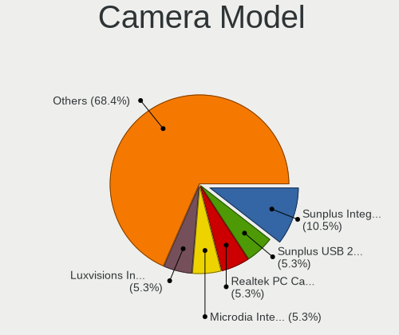

FreeBSD Hardware Trends
-----------------------

A project to identify most popular hardware characteristics and track their change
over time based on data collected by FreeBSD users at https://BSD-Hardware.info.

Anyone can contribute to the study by uploading probes of their computers by
the [hw-probe](https://github.com/linuxhw/hw-probe/blob/master/INSTALL.BSD.md) tool:

    hw-probe -all -upload

This is a report for all computer types. See also reports for [desktops](/Dist/FreeBSD/Desktop/README.md) and [notebooks](/Dist/FreeBSD/Notebook/README.md).

Full-feature report is available here: https://bsd-hardware.info/?view=trends

Period: Jan, 2021.

Contents
--------

- [ OS                       ](#os)
- [ OS Family                ](#os-family)
- [ Arch                     ](#arch)
- [ DE                       ](#de)
- [ Display Server           ](#display-server)
- [ Display Manager          ](#display-manager)
- [ OS Lang                  ](#os-lang)
- [ Boot Mode                ](#boot-mode)
- [ Filesystem               ](#filesystem)
- [ Part. scheme             ](#part-scheme)
- [ Country                  ](#country)
- [ City                     ](#city)
- [ Vendor                   ](#vendor)
- [ Model                    ](#model)
- [ Model Family             ](#model-family)
- [ MFG Year                 ](#mfg-year)
- [ Form Factor              ](#form-factor)
- [ Coreboot                 ](#coreboot)
- [ RAM Size                 ](#ram-size)
- [ RAM Used                 ](#ram-used)
- [ Has CD-ROM               ](#has-cd-rom)
- [ Total Drives             ](#total-drives)
- [ Has Ethernet             ](#has-ethernet)
- [ Drive Vendor             ](#drive-vendor)
- [ Drive Model              ](#drive-model)
- [ HDD Vendor               ](#hdd-vendor)
- [ SSD Vendor               ](#ssd-vendor)
- [ Drive Kind               ](#drive-kind)
- [ Drive Connector          ](#drive-connector)
- [ Drive Size               ](#drive-size)
- [ Space Total              ](#space-total)
- [ Space Used               ](#space-used)
- [ Malfunc. Drives          ](#malfunc-drives)
- [ Malfunc. Drive Vendor    ](#malfunc-drive-vendor)
- [ Malfunc. HDD Vendor      ](#malfunc-hdd-vendor)
- [ Malfunc. Drive Kind      ](#malfunc-drive-kind)
- [ Failed Drives            ](#failed-drives)
- [ Failed Drive Vendor      ](#failed-drive-vendor)
- [ Drive Status             ](#drive-status)
- [ Storage Vendor           ](#storage-vendor)
- [ Storage Model            ](#storage-model)
- [ Storage Kind             ](#storage-kind)
- [ CPU Vendor               ](#cpu-vendor)
- [ CPU Model                ](#cpu-model)
- [ CPU Model Family         ](#cpu-model-family)
- [ CPU Cores                ](#cpu-cores)
- [ CPU Sockets              ](#cpu-sockets)
- [ CPU Threads              ](#cpu-threads)
- [ CPU Microarch            ](#cpu-microarch)
- [ GPU Vendor               ](#gpu-vendor)
- [ GPU Model                ](#gpu-model)
- [ GPU Combo                ](#gpu-combo)
- [ GPU Driver               ](#gpu-driver)
- [ GPU Memory               ](#gpu-memory)
- [ Monitor Vendor           ](#monitor-vendor)
- [ Monitor Model            ](#monitor-model)
- [ Monitor Resolution       ](#monitor-resolution)
- [ Monitor Diagonal         ](#monitor-diagonal)
- [ Monitor Width            ](#monitor-width)
- [ Aspect Ratio             ](#aspect-ratio)
- [ Monitor Area             ](#monitor-area)
- [ Pixel Density            ](#pixel-density)
- [ Multiple Monitors        ](#multiple-monitors)
- [ Net Controller Vendor    ](#net-controller-vendor)
- [ Net Controller Model     ](#net-controller-model)
- [ Wireless Vendor          ](#wireless-vendor)
- [ Wireless Model           ](#wireless-model)
- [ Ethernet Vendor          ](#ethernet-vendor)
- [ Ethernet Model           ](#ethernet-model)
- [ Net Controller Kind      ](#net-controller-kind)
- [ Used Controller          ](#used-controller)
- [ NICs                     ](#nics)
- [ Memory Vendor            ](#memory-vendor)
- [ Memory Model             ](#memory-model)
- [ Memory Kind              ](#memory-kind)
- [ Memory Form Factor       ](#memory-form-factor)
- [ Memory Size              ](#memory-size)
- [ Memory Speed             ](#memory-speed)
- [ Sound Vendor             ](#sound-vendor)
- [ Sound Model              ](#sound-model)
- [ Camera Vendor            ](#camera-vendor)
- [ Camera Model             ](#camera-model)
- [ Fingerprint Vendor       ](#fingerprint-vendor)
- [ Fingerprint Model        ](#fingerprint-model)
- [ Chipcard Vendor          ](#chipcard-vendor)
- [ Chipcard Model           ](#chipcard-model)
- [ Printer Vendor           ](#printer-vendor)
- [ Printer Model            ](#printer-model)
- [ Scanner Vendor           ](#scanner-vendor)
- [ Scanner Model            ](#scanner-model)
- [ Bluetooth Vendor         ](#bluetooth-vendor)
- [ Bluetooth Model          ](#bluetooth-model)
- [ Unsupported Devices      ](#unsupported-devices)
- [ Unsupported Device Types ](#unsupported-device-types)

OS
--

Installed operating systems

| Name                 | Computers | Percent |
|----------------------|-----------|---------|
| FreeBSD 12.2-p2      | 37        | 42.53%  |
| FreeBSD 12.2-STABLE  | 10        | 11.49%  |
| FreeBSD 12.2         | 10        | 11.49%  |
| FreeBSD 13.0-CURRENT | 7         | 8.05%   |
| FreeBSD 12.1-p12     | 5         | 5.75%   |
| FreeBSD 11.4-p6      | 5         | 5.75%   |
| FreeBSD 12.2-p3      | 3         | 3.45%   |
| FreeBSD 14.0-CURRENT | 2         | 2.3%    |
| FreeBSD 13.0-ALPHA2  | 1         | 1.15%   |
| FreeBSD 13.0-ALPHA1  | 1         | 1.15%   |
| FreeBSD 12.2-p1      | 1         | 1.15%   |
| FreeBSD 12.1-p7      | 1         | 1.15%   |
| FreeBSD 12.1-p10     | 1         | 1.15%   |
| FreeBSD 12.1--HBSD   | 1         | 1.15%   |
| FreeBSD 12.1         | 1         | 1.15%   |
| FreeBSD 11.4-STABLE  | 1         | 1.15%   |

OS Family
---------

OS without a version

| Name    | Computers | Percent |
|---------|-----------|---------|
| FreeBSD | 87        | 100%    |

Arch
----

OS architecture (x86_64, i586, etc.)

| Name  | Computers | Percent |
|-------|-----------|---------|
| amd64 | 84        | 96.55%  |
| i386  | 2         | 2.3%    |
| arm64 | 1         | 1.15%   |

DE
--

Desktop Environment

| Name          | Computers | Percent |
|---------------|-----------|---------|
| Console       | 29        | 33.33%  |
| KDE5          | 21        | 24.14%  |
| XFCE          | 10        | 11.49%  |
| MATE          | 9         | 10.34%  |
| TWM           | 6         | 6.9%    |
| GNOME         | 4         | 4.6%    |
| Openbox       | 3         | 3.45%   |
| i3            | 2         | 2.3%    |
| LXDE          | 1         | 1.15%   |
| Enlightenment | 1         | 1.15%   |
| Cinnamon      | 1         | 1.15%   |

Display Server
--------------

X11 or Wayland

| Name    | Computers | Percent |
|---------|-----------|---------|
| X11     | 58        | 66.67%  |
| Console | 29        | 33.33%  |

Display Manager
---------------

SDDM, LightDM, etc.

| Name    | Computers | Percent |
|---------|-----------|---------|
| Console | 44        | 50.57%  |
| SDDM    | 18        | 20.69%  |
| LightDM | 10        | 11.49%  |
| SLiM    | 9         | 10.34%  |
| XDM     | 5         | 5.75%   |
| GDM     | 1         | 1.15%   |

OS Lang
-------

Language

| Lang           | Computers | Percent |
|----------------|-----------|---------|
| Unknown        | 47        | 54.02%  |
| en_US          | 17        | 19.54%  |
| C              | 10        | 11.49%  |
| en_GB          | 3         | 3.45%   |
| ru_RU          | 2         | 2.3%    |
| de_DE          | 2         | 2.3%    |
| zh_CN          | 1         | 1.15%   |
| uk_UA          | 1         | 1.15%   |
| fr_FR          | 1         | 1.15%   |
| en_US.US-ASCII | 1         | 1.15%   |
| en_NZ.US-ASCII | 1         | 1.15%   |
| de_AT          | 1         | 1.15%   |

Boot Mode
---------

EFI or BIOS

| Mode | Computers | Percent |
|------|-----------|---------|
| EFI  | 50        | 57.47%  |
| BIOS | 37        | 42.53%  |

Filesystem
----------

Type of filesystem

| Type    | Computers | Percent |
|---------|-----------|---------|
| Zfs     | 52        | 59.77%  |
| Ufs     | 34        | 39.08%  |
| Unknown | 1         | 1.15%   |

Part. scheme
------------

Scheme of partitioning

| Type | Computers | Percent |
|------|-----------|---------|
| GPT  | 78        | 89.66%  |
| MBR  | 9         | 10.34%  |

Country
-------

Geographic location (country)

| Country        | Computers | Percent |
|----------------|-----------|---------|
| USA            | 20        | 22.99%  |
| Germany        | 11        | 12.64%  |
| Canada         | 9         | 10.34%  |
| Ukraine        | 5         | 5.75%   |
| Japan          | 4         | 4.6%    |
| Italy          | 4         | 4.6%    |
| Czech Republic | 4         | 4.6%    |
| Sweden         | 3         | 3.45%   |
| Netherlands    | 3         | 3.45%   |
| UK             | 2         | 2.3%    |
| Switzerland    | 2         | 2.3%    |
| Russia         | 2         | 2.3%    |
| Indonesia      | 2         | 2.3%    |
| Finland        | 2         | 2.3%    |
| China          | 2         | 2.3%    |
| Austria        | 2         | 2.3%    |
| Thailand       | 1         | 1.15%   |
| New Zealand    | 1         | 1.15%   |
| Lithuania      | 1         | 1.15%   |
| Ireland        | 1         | 1.15%   |
| India          | 1         | 1.15%   |
| Hong Kong      | 1         | 1.15%   |
| France         | 1         | 1.15%   |
| Denmark        | 1         | 1.15%   |
| Australia      | 1         | 1.15%   |
| Argentina      | 1         | 1.15%   |

City
----

Geographic location (city)

| City               | Computers | Percent |
|--------------------|-----------|---------|
| Linköping         | 3         | 3.45%   |
| Kyiv               | 3         | 3.45%   |
| Zaporizhia         | 2         | 2.3%    |
| The Bronx          | 2         | 2.3%    |
| Tecumseh           | 2         | 2.3%    |
| Sumida             | 2         | 2.3%    |
| Prague             | 2         | 2.3%    |
| Munich             | 2         | 2.3%    |
| Montreal           | 2         | 2.3%    |
| Milan              | 2         | 2.3%    |
| Lübeck            | 2         | 2.3%    |
| Jakarta            | 2         | 2.3%    |
| Glasgow            | 2         | 2.3%    |
| Chicago            | 2         | 2.3%    |
| Brno               | 2         | 2.3%    |
| Šiauliai          | 1         | 1.15%   |
| Zurich             | 1         | 1.15%   |
| Winnipeg           | 1         | 1.15%   |
| Williamsport       | 1         | 1.15%   |
| Warrensburg        | 1         | 1.15%   |
| Tuusula            | 1         | 1.15%   |
| Turin              | 1         | 1.15%   |
| Tucson             | 1         | 1.15%   |
| Tokyo              | 1         | 1.15%   |
| Stramproy          | 1         | 1.15%   |
| South Burlington   | 1         | 1.15%   |
| Skokie             | 1         | 1.15%   |
| Shizuoka           | 1         | 1.15%   |
| Segrate            | 1         | 1.15%   |
| Saint Paul         | 1         | 1.15%   |
| Redmond            | 1         | 1.15%   |
| Podolsk            | 1         | 1.15%   |
| Perth              | 1         | 1.15%   |
| Oceanside          | 1         | 1.15%   |
| Oberkirch          | 1         | 1.15%   |
| Oak Ridge          | 1         | 1.15%   |
| Nueve de Julio     | 1         | 1.15%   |
| Novosibirsk        | 1         | 1.15%   |
| Newmarket          | 1         | 1.15%   |
| Mont-Saint-Hilaire | 1         | 1.15%   |
| Millinocket        | 1         | 1.15%   |
| Metzingen          | 1         | 1.15%   |
| Mars               | 1         | 1.15%   |
| Markt Indersdorf   | 1         | 1.15%   |
| Lodi               | 1         | 1.15%   |
| Lawrence           | 1         | 1.15%   |
| Kunming            | 1         | 1.15%   |
| Kouvola            | 1         | 1.15%   |
| Koblenz            | 1         | 1.15%   |
| Kingston           | 1         | 1.15%   |
| Innsbruck          | 1         | 1.15%   |
| Hillsboro          | 1         | 1.15%   |
| Guangzhou          | 1         | 1.15%   |
| Groningen          | 1         | 1.15%   |
| Graz               | 1         | 1.15%   |
| Grand Junction     | 1         | 1.15%   |
| Galway             | 1         | 1.15%   |
| Dieppe             | 1         | 1.15%   |
| Copenhagen         | 1         | 1.15%   |
| Clover             | 1         | 1.15%   |

Vendor
------

Motherboard manufacturer

| Name                           | Computers | Percent |
|--------------------------------|-----------|---------|
| Lenovo                         | 14        | 16.09%  |
| ASUSTek Computer               | 11        | 12.64%  |
| Supermicro                     | 10        | 11.49%  |
| Hewlett-Packard                | 9         | 10.34%  |
| Dell                           | 8         | 9.2%    |
| MSI                            | 5         | 5.75%   |
| Gigabyte Technology            | 4         | 4.6%    |
| Acer                           | 3         | 3.45%   |
| Toshiba                        | 2         | 2.3%    |
| Apple                          | 2         | 2.3%    |
| Unknown                        | 2         | 2.3%    |
| TUXEDO                         | 1         | 1.15%   |
| System76                       | 1         | 1.15%   |
| Sun Microsystems               | 1         | 1.15%   |
| Sony                           | 1         | 1.15%   |
| Scaleway                       | 1         | 1.15%   |
| Matsushita Electric Industrial | 1         | 1.15%   |
| Intel                          | 1         | 1.15%   |
| Huanan                         | 1         | 1.15%   |
| HPE                            | 1         | 1.15%   |
| Gateway                        | 1         | 1.15%   |
| Fujitsu                        | 1         | 1.15%   |
| EVGA                           | 1         | 1.15%   |
| Clevo                          | 1         | 1.15%   |
| BANGHO                         | 1         | 1.15%   |
| ASRockRack                     | 1         | 1.15%   |
| ASRock                         | 1         | 1.15%   |
| Alienware                      | 1         | 1.15%   |

Model
-----

Motherboard model

| Name                                       | Computers | Percent |
|--------------------------------------------|-----------|---------|
| Supermicro X7SPA-HF                        | 2         | 2.3%    |
| Supermicro Super Server                    | 2         | 2.3%    |
| ASUS All Series                            | 2         | 2.3%    |
| Unknown                                    | 2         | 2.3%    |
| TUXEDO Pulse 14 Gen1                       | 1         | 1.15%   |
| Toshiba Satellite L50-C                    | 1         | 1.15%   |
| Toshiba KIRA                               | 1         | 1.15%   |
| System76 Bonobo Extreme                    | 1         | 1.15%   |
| Supermicro X8STi                           | 1         | 1.15%   |
| Supermicro X8DTH-i/6/iF/6F                 | 1         | 1.15%   |
| Supermicro X8DT6                           | 1         | 1.15%   |
| Supermicro X7SLA                           | 1         | 1.15%   |
| Supermicro PIO-628U-TR4T+-ST031            | 1         | 1.15%   |
| Supermicro C7Z170-OCE                      | 1         | 1.15%   |
| Sun Microsystems Ultra 24                  | 1         | 1.15%   |
| Sony VGN-FW290J                            | 1         | 1.15%   |
| Scaleway Standard PC (i440FX + PIIX, 1996) | 1         | 1.15%   |
| MSI MS-7C36                                | 1         | 1.15%   |
| MSI MS-7A32                                | 1         | 1.15%   |
| MSI MS-7758                                | 1         | 1.15%   |
| MSI MS-7522                                | 1         | 1.15%   |
| MSI MS-7235                                | 1         | 1.15%   |
| Matsushita Electric Industrial CF-T2BW1AXR | 1         | 1.15%   |
| Lenovo ThinkStation P340 Tiny 30DFCTO1WW   | 1         | 1.15%   |
| Lenovo ThinkPad X270 20HMCTO1WW            | 1         | 1.15%   |
| Lenovo ThinkPad X230 Tablet 34383C8        | 1         | 1.15%   |
| Lenovo ThinkPad X220 4286CTO               | 1         | 1.15%   |
| Lenovo ThinkPad X201 3626HMG               | 1         | 1.15%   |
| Lenovo ThinkPad X1 Yoga 3rd 20LD003JGE     | 1         | 1.15%   |
| Lenovo ThinkPad T570 20HAS0DP00            | 1         | 1.15%   |
| Lenovo ThinkPad T520 4239CTO               | 1         | 1.15%   |
| Lenovo ThinkPad T490 20N2CTO1WW            | 1         | 1.15%   |
| Lenovo ThinkPad SL510 2847Q9G              | 1         | 1.15%   |
| Lenovo ThinkPad P50 20EQS0U60C             | 1         | 1.15%   |
| Lenovo ThinkPad E590 20NB005MUS            | 1         | 1.15%   |
| Lenovo ThinkPad E490 20N8CTO1WW            | 1         | 1.15%   |
| Lenovo 41875PG                             | 1         | 1.15%   |
| Intel NUC5i5RYB H40999-503                 | 1         | 1.15%   |
| Huanan X99-TF                              | 1         | 1.15%   |
| HPE ProLiant MicroServer Gen10 Plus        | 1         | 1.15%   |
| HP ZBook 17 G4                             | 1         | 1.15%   |
| HP t620 PLUS Quad Core TC                  | 1         | 1.15%   |
| HP ProLiant DL385 G2                       | 1         | 1.15%   |
| HP ProLiant DL380 Gen9                     | 1         | 1.15%   |
| HP ProLiant DL320 G5                       | 1         | 1.15%   |
| HP Laptop 17-ca1xxx                        | 1         | 1.15%   |
| HP EliteBook 840 G3                        | 1         | 1.15%   |
| HP EliteBook 2530p                         | 1         | 1.15%   |
| HP 110-243w                                | 1         | 1.15%   |
| Gigabyte Z97X-UD5H                         | 1         | 1.15%   |
| Gigabyte X470 AORUS ULTRA GAMING           | 1         | 1.15%   |
| Gigabyte B75M-D3H                          | 1         | 1.15%   |
| Gigabyte AUTOCONT INTEGRA                  | 1         | 1.15%   |
| Gateway DX4870                             | 1         | 1.15%   |
| Fujitsu LIFEBOOK E753                      | 1         | 1.15%   |
| EVGA X299 MICRO                            | 1         | 1.15%   |
| Dell Vostro V131                           | 1         | 1.15%   |
| Dell Vostro 1510                           | 1         | 1.15%   |
| Dell PowerEdge R740xd                      | 1         | 1.15%   |
| Dell PowerEdge R730xd                      | 1         | 1.15%   |

Model Family
------------

Motherboard model prefix

| Name                                       | Computers | Percent |
|--------------------------------------------|-----------|---------|
| Lenovo ThinkPad                            | 12        | 13.79%  |
| HP ProLiant                                | 3         | 3.45%   |
| Acer Aspire                                | 3         | 3.45%   |
| Supermicro X7SPA-HF                        | 2         | 2.3%    |
| Supermicro Super                           | 2         | 2.3%    |
| HP EliteBook                               | 2         | 2.3%    |
| Dell Vostro                                | 2         | 2.3%    |
| Dell PowerEdge                             | 2         | 2.3%    |
| Dell Latitude                              | 2         | 2.3%    |
| ASUS SABERTOOTH                            | 2         | 2.3%    |
| ASUS All                                   | 2         | 2.3%    |
| Unknown                                    | 2         | 2.3%    |
| TUXEDO Pulse                               | 1         | 1.15%   |
| Toshiba Satellite                          | 1         | 1.15%   |
| Toshiba KIRA                               | 1         | 1.15%   |
| System76 Bonobo                            | 1         | 1.15%   |
| Supermicro X8STi                           | 1         | 1.15%   |
| Supermicro X8DTH-i                         | 1         | 1.15%   |
| Supermicro X8DT6                           | 1         | 1.15%   |
| Supermicro X7SLA                           | 1         | 1.15%   |
| Supermicro PIO-628U-TR4T+-ST031            | 1         | 1.15%   |
| Supermicro C7Z170-OCE                      | 1         | 1.15%   |
| Sun Microsystems Ultra                     | 1         | 1.15%   |
| Sony VGN-FW290J                            | 1         | 1.15%   |
| Scaleway Standard                          | 1         | 1.15%   |
| MSI MS-7C36                                | 1         | 1.15%   |
| MSI MS-7A32                                | 1         | 1.15%   |
| MSI MS-7758                                | 1         | 1.15%   |
| MSI MS-7522                                | 1         | 1.15%   |
| MSI MS-7235                                | 1         | 1.15%   |
| Matsushita Electric Industrial CF-T2BW1AXR | 1         | 1.15%   |
| Lenovo ThinkStation                        | 1         | 1.15%   |
| Lenovo 41875PG                             | 1         | 1.15%   |
| Intel NUC5i5RYB                            | 1         | 1.15%   |
| Huanan X99-TF                              | 1         | 1.15%   |
| HPE ProLiant                               | 1         | 1.15%   |
| HP ZBook                                   | 1         | 1.15%   |
| HP t620                                    | 1         | 1.15%   |
| HP Laptop                                  | 1         | 1.15%   |
| HP 110-243w                                | 1         | 1.15%   |
| Gigabyte Z97X-UD5H                         | 1         | 1.15%   |
| Gigabyte X470                              | 1         | 1.15%   |
| Gigabyte B75M-D3H                          | 1         | 1.15%   |
| Gigabyte AUTOCONT                          | 1         | 1.15%   |
| Gateway DX4870                             | 1         | 1.15%   |
| Fujitsu LIFEBOOK                           | 1         | 1.15%   |
| EVGA X299                                  | 1         | 1.15%   |
| Dell OptiPlex                              | 1         | 1.15%   |
| Dell Inspiron                              | 1         | 1.15%   |
| Clevo W55xEU                               | 1         | 1.15%   |
| BANGHO MAX                                 | 1         | 1.15%   |
| ASUS Z170                                  | 1         | 1.15%   |
| ASUS TUF                                   | 1         | 1.15%   |
| ASUS TRILINE                               | 1         | 1.15%   |
| ASUS ROG                                   | 1         | 1.15%   |
| ASUS PRIME                                 | 1         | 1.15%   |
| ASUS PowerServe                            | 1         | 1.15%   |
| ASUS M4A87TD                               | 1         | 1.15%   |
| ASRockRack B450D4U-V1L                     | 1         | 1.15%   |
| ASRock X570                                | 1         | 1.15%   |

MFG Year
--------

Motherboard manufacture year

| Year    | Computers | Percent |
|---------|-----------|---------|
| 2020    | 19        | 21.84%  |
| 2019    | 13        | 14.94%  |
| 2010    | 8         | 9.2%    |
| 2015    | 6         | 6.9%    |
| 2012    | 6         | 6.9%    |
| 2018    | 5         | 5.75%   |
| 2017    | 5         | 5.75%   |
| 2013    | 5         | 5.75%   |
| 2009    | 4         | 4.6%    |
| 2016    | 3         | 3.45%   |
| 2014    | 3         | 3.45%   |
| 2011    | 3         | 3.45%   |
| 2008    | 3         | 3.45%   |
| 2007    | 2         | 2.3%    |
| 2003    | 1         | 1.15%   |
| Unknown | 1         | 1.15%   |

Form Factor
-----------

Physical design of the computer

| Name        | Computers | Percent |
|-------------|-----------|---------|
| Desktop     | 36        | 41.38%  |
| Notebook    | 36        | 41.38%  |
| Server      | 11        | 12.64%  |
| Mini pc     | 2         | 2.3%    |
| Tablet      | 1         | 1.15%   |
| Convertible | 1         | 1.15%   |

Coreboot
--------

Have coreboot on board

| Used | Computers | Percent |
|------|-----------|---------|
| No   | 87        | 100%    |

RAM Size
--------

Total RAM memory

| Size in GB      | Computers | Percent |
|-----------------|-----------|---------|
| 16.01-24.0      | 21        | 24.14%  |
| 8.01-16.0       | 16        | 18.39%  |
| 32.01-64.0      | 14        | 16.09%  |
| 4.01-8.0        | 12        | 13.79%  |
| 64.01-256.0     | 10        | 11.49%  |
| 2.01-3.0        | 4         | 4.6%    |
| More than 256.0 | 3         | 3.45%   |
| 3.01-4.0        | 3         | 3.45%   |
| 24.01-32.0      | 3         | 3.45%   |
| 1.01-2.0        | 1         | 1.15%   |

RAM Used
--------

Used RAM memory

| Used GB     | Computers | Percent |
|-------------|-----------|---------|
| 0.01-0.5    | 27        | 31.03%  |
| 0.51-1.0    | 24        | 27.59%  |
| 1.01-2.0    | 19        | 21.84%  |
| 2.01-3.0    | 4         | 4.6%    |
| 64.01-256.0 | 4         | 4.6%    |
| 3.01-4.0    | 3         | 3.45%   |
| 24.01-32.0  | 3         | 3.45%   |
| 8.01-16.0   | 2         | 2.3%    |
| 4.01-8.0    | 1         | 1.15%   |

Has CD-ROM
----------

Has CD-ROM on board

| Presented | Computers | Percent |
|-----------|-----------|---------|
| No        | 60        | 68.97%  |
| Yes       | 27        | 31.03%  |

Total Drives
------------

Number of drives on board

| Drives | Computers | Percent |
|--------|-----------|---------|
| 1      | 40        | 45.98%  |
| 2      | 12        | 13.79%  |
| 4      | 7         | 8.05%   |
| 3      | 7         | 8.05%   |
| 0      | 5         | 5.75%   |
| 11     | 3         | 3.45%   |
| 8      | 3         | 3.45%   |
| 5      | 3         | 3.45%   |
| 6      | 2         | 2.3%    |
| 40     | 1         | 1.15%   |
| 25     | 1         | 1.15%   |
| 18     | 1         | 1.15%   |
| 12     | 1         | 1.15%   |
| 7      | 1         | 1.15%   |

Has Ethernet
------------

Has Ethernet on board

| Presented | Computers | Percent |
|-----------|-----------|---------|
| Yes       | 83        | 95.4%   |
| No        | 4         | 4.6%    |

Drive Vendor
------------

Hard drive vendors

| Vendor              | Computers | Drives | Percent |
|---------------------|-----------|--------|---------|
| Samsung Electronics | 31        | 43     | 22.3%   |
| WDC                 | 22        | 62     | 15.83%  |
| Seagate             | 16        | 39     | 11.51%  |
| Toshiba             | 8         | 11     | 5.76%   |
| HGST                | 8         | 32     | 5.76%   |
| Crucial             | 8         | 9      | 5.76%   |
| Intel               | 7         | 16     | 5.04%   |
| Kingston            | 6         | 8      | 4.32%   |
| SanDisk             | 4         | 5      | 2.88%   |
| Hitachi             | 4         | 38     | 2.88%   |
| Transcend           | 3         | 4      | 2.16%   |
| Hewlett-Packard     | 3         | 8      | 2.16%   |
| Fujitsu             | 2         | 2      | 1.44%   |
| EMTEC               | 2         | 2      | 1.44%   |
| Team                | 1         | 1      | 0.72%   |
| SPCC                | 1         | 1      | 0.72%   |
| SMI                 | 1         | 1      | 0.72%   |
| PNY                 | 1         | 1      | 0.72%   |
| Phison              | 1         | 1      | 0.72%   |
| MaxDigital          | 1         | 1      | 0.72%   |
| LITEONIT            | 1         | 1      | 0.72%   |
| KIOXIA              | 1         | 1      | 0.72%   |
| KingSpec            | 1         | 1      | 0.72%   |
| HPE                 | 1         | 6      | 0.72%   |
| Dell                | 1         | 2      | 0.72%   |
| Corsair             | 1         | 1      | 0.72%   |
| China               | 1         | 1      | 0.72%   |
| Apple               | 1         | 1      | 0.72%   |
| Apacer              | 1         | 1      | 0.72%   |

Drive Model
-----------

Hard drive models

| Model                                | Computers | Percent |
|--------------------------------------|-----------|---------|
| Samsung SSD 860 EVO 250GB            | 4         | 2.27%   |
| Samsung SSD 850 EVO 250GB            | 4         | 2.27%   |
| WDC WD40EFRX-68N32N0 4TB             | 3         | 1.7%    |
| Seagate ST5000DM000-1FK178 5TB       | 2         | 1.14%   |
| Seagate ST1000LM024 HN-M101MBB 1TB   | 2         | 1.14%   |
| Samsung SSD 860 EVO 500GB            | 2         | 1.14%   |
| Samsung SSD 850 PRO 512GB            | 2         | 1.14%   |
| Samsung SSD 850 PRO 128GB            | 2         | 1.14%   |
| Intel SSDSA2M080G2GC 80GB            | 2         | 1.14%   |
| Intel SSDPEDMW400G4 400GB            | 2         | 1.14%   |
| HGST HDN728080ALE604 8TB             | 2         | 1.14%   |
| Crucial CT2000MX500SSD1 2TB          | 2         | 1.14%   |
| Crucial CT1000MX500SSD1 1TB          | 2         | 1.14%   |
| WDC WDS500G2B0C-00PXH0 500GB         | 1         | 0.57%   |
| WDC WDS250G3X0C-00SJG0 250GB         | 1         | 0.57%   |
| WDC WDS100T3X0C-00SJG0 1TB           | 1         | 0.57%   |
| WDC WDS100T1R0A-68A4W0 1TB           | 1         | 0.57%   |
| WDC WD80EZZX-11CSGA0 8TB             | 1         | 0.57%   |
| WDC WD80EZAZ-11TDBA0 8TB             | 1         | 0.57%   |
| WDC WD80EFZX-68UW8N0 8TB             | 1         | 0.57%   |
| WDC WD80EFAX-68LHPN0 8TB             | 1         | 0.57%   |
| WDC WD7500BPKX-75HPJT0 752GB         | 1         | 0.57%   |
| WDC WD60EZRZ-00GZ5B1 6TB             | 1         | 0.57%   |
| WDC WD50NDZW-11MR8S1 5TB             | 1         | 0.57%   |
| WDC WD5003AZEX-00MK2A0 500GB         | 1         | 0.57%   |
| WDC WD5003AZEX-00K3CA0 500GB         | 1         | 0.57%   |
| WDC WD5003AZEX-00K1GA0 500GB         | 1         | 0.57%   |
| WDC WD5000AAKX-00ERMA0 500GB         | 1         | 0.57%   |
| WDC WD40NMZW-59GX6S1 4TB             | 1         | 0.57%   |
| WDC WD40NMZW-11GX6S1 4TB             | 1         | 0.57%   |
| WDC WD40EZRZ-22GXCB0 4TB             | 1         | 0.57%   |
| WDC WD40EFRX-68WT0N0 4TB             | 1         | 0.57%   |
| WDC WD4003FFBX-68MU3N0 4TB           | 1         | 0.57%   |
| WDC WD30EFRX-68EUZN0 3TB             | 1         | 0.57%   |
| WDC WD20SPZX-22UA7T0 2TB             | 1         | 0.57%   |
| WDC WD20NMVW-11AV3S2 2TB             | 1         | 0.57%   |
| WDC WD20EZRX-00DC0B0 2TB             | 1         | 0.57%   |
| WDC WD1600BEVT-22ZCT0 160GB          | 1         | 0.57%   |
| WDC WD120EMFZ-11A6JA0 12TB           | 1         | 0.57%   |
| WDC WD120EDAZ-11F3RA0 12TB           | 1         | 0.57%   |
| WDC WD10JPVX-22JC3T0 1TB             | 1         | 0.57%   |
| WDC WD10EZEX-08M2NA0 1TB             | 1         | 0.57%   |
| WDC WD10EARX-22N0YB0 1TB             | 1         | 0.57%   |
| WDC WD1000DHTZ-04N21V1 1TB           | 1         | 0.57%   |
| WDC PC SN720 SDAQNTW-512G-1001 512GB | 1         | 0.57%   |
| Transcend TS8GSSD500 8GB             | 1         | 0.57%   |
| Transcend TS32GSSD370 32GB           | 1         | 0.57%   |
| Transcend TS120GMTS820S 120GB        | 1         | 0.57%   |
| Toshiba THNSNF256GMCS 256GB          | 1         | 0.57%   |
| Toshiba MQ01ABF050 500GB             | 1         | 0.57%   |
| Toshiba MQ01ABD075 752GB             | 1         | 0.57%   |
| Toshiba MK5065GSXF 500GB             | 1         | 0.57%   |
| Toshiba MD04ACA400 4TB               | 1         | 0.57%   |
| Toshiba KPM5XVUG960G 960GB           | 1         | 0.57%   |
| Toshiba KPM5XMUG400G 400GB           | 1         | 0.57%   |
| Toshiba KBG30ZMT512G 512GB           | 1         | 0.57%   |
| Toshiba HDWN180 8TB                  | 1         | 0.57%   |
| Team T253X2512G 512GB                | 1         | 0.57%   |
| SPCC M.2 PCIE SSD 256GB              | 1         | 0.57%   |
| SMI SSD DISK 506GB                   | 1         | 0.57%   |

HDD Vendor
----------

Hard disk drive vendors

| Vendor              | Computers | Drives | Percent |
|---------------------|-----------|--------|---------|
| WDC                 | 20        | 57     | 33.33%  |
| Seagate             | 16        | 39     | 26.67%  |
| HGST                | 8         | 32     | 13.33%  |
| Toshiba             | 5         | 7      | 8.33%   |
| Hitachi             | 4         | 38     | 6.67%   |
| Samsung Electronics | 2         | 2      | 3.33%   |
| Hewlett-Packard     | 2         | 6      | 3.33%   |
| Fujitsu             | 2         | 2      | 3.33%   |
| MaxDigital          | 1         | 1      | 1.67%   |

SSD Vendor
----------

Solid state drive vendors

| Vendor              | Computers | Drives | Percent |
|---------------------|-----------|--------|---------|
| Samsung Electronics | 22        | 30     | 34.92%  |
| Crucial             | 8         | 9      | 12.7%   |
| Kingston            | 5         | 7      | 7.94%   |
| Intel               | 5         | 13     | 7.94%   |
| SanDisk             | 4         | 5      | 6.35%   |
| Transcend           | 3         | 4      | 4.76%   |
| Toshiba             | 2         | 3      | 3.17%   |
| EMTEC               | 2         | 2      | 3.17%   |
| WDC                 | 1         | 1      | 1.59%   |
| Team                | 1         | 1      | 1.59%   |
| SMI                 | 1         | 1      | 1.59%   |
| PNY                 | 1         | 1      | 1.59%   |
| LITEONIT            | 1         | 1      | 1.59%   |
| KingSpec            | 1         | 1      | 1.59%   |
| HPE                 | 1         | 6      | 1.59%   |
| Dell                | 1         | 2      | 1.59%   |
| Corsair             | 1         | 1      | 1.59%   |
| China               | 1         | 1      | 1.59%   |
| Apple               | 1         | 1      | 1.59%   |
| Apacer              | 1         | 1      | 1.59%   |

Drive Kind
----------

HDD or SSD

| Kind | Computers | Drives | Percent |
|------|-----------|--------|---------|
| SSD  | 53        | 91     | 45.3%   |
| HDD  | 45        | 184    | 38.46%  |
| NVMe | 19        | 25     | 16.24%  |

Drive Connector
---------------

SATA, SAS, NVMe, etc.

| Type | Computers | Drives | Percent |
|------|-----------|--------|---------|
| SATA | 75        | 275    | 79.79%  |
| NVMe | 19        | 25     | 20.21%  |

Drive Size
----------

Size of hard drive

| Size in TB | Computers | Drives | Percent |
|------------|-----------|--------|---------|
| 0.01-0.5   | 55        | 93     | 47.83%  |
| 0.51-1.0   | 26        | 42     | 22.61%  |
| 4.01-10.0  | 11        | 40     | 9.57%   |
| 3.01-4.0   | 10        | 55     | 8.7%    |
| 1.01-2.0   | 9         | 21     | 7.83%   |
| 2.01-3.0   | 3         | 17     | 2.61%   |
| 10.01-20.0 | 1         | 7      | 0.87%   |

Space Total
-----------

Amount of disk space available on the file system

| Size in GB | Computers | Percent |
|------------|-----------|---------|
| 101-250    | 29        | 33.33%  |
| 251-500    | 21        | 24.14%  |
| 501-1000   | 12        | 13.79%  |
| 51-100     | 9         | 10.34%  |
| 21-50      | 7         | 8.05%   |
| 1001-2000  | 3         | 3.45%   |
| 1-20       | 3         | 3.45%   |
| Unknown    | 2         | 2.3%    |
| 2001-3000  | 1         | 1.15%   |

Space Used
----------

Amount of used disk space

| Used GB  | Computers | Percent |
|----------|-----------|---------|
| 1-20     | 58        | 66.67%  |
| 21-50    | 11        | 12.64%  |
| 51-100   | 7         | 8.05%   |
| 101-250  | 4         | 4.6%    |
| 251-500  | 3         | 3.45%   |
| 501-1000 | 2         | 2.3%    |
| Unknown  | 2         | 2.3%    |

Malfunc. Drives
---------------

Drive models with a malfunction

| Model                                 | Computers | Drives | Percent |
|---------------------------------------|-----------|--------|---------|
| Intel SSDSA2M080G2GC 80GB             | 2         | 2      | 12.5%   |
| WDC WD10EARX-22N0YB0 1TB              | 1         | 1      | 6.25%   |
| Toshiba MQ01ABD075 752GB              | 1         | 1      | 6.25%   |
| SMI SSD DISK 506GB                    | 1         | 1      | 6.25%   |
| Seagate ST9500420AS 500GB             | 1         | 1      | 6.25%   |
| Seagate ST3500413AS 500GB             | 1         | 2      | 6.25%   |
| Seagate ST1000LM024 HN-M101MBB 1TB    | 1         | 1      | 6.25%   |
| Seagate ST1000DM003-9YN162 1TB        | 1         | 1      | 6.25%   |
| SanDisk SSD PLUS 240GB                | 1         | 1      | 6.25%   |
| Samsung Electronics SSD 850 EVO 500GB | 1         | 1      | 6.25%   |
| Samsung Electronics HD103UJ 1TB       | 1         | 1      | 6.25%   |
| Hitachi HTS545032B9A300 320GB         | 1         | 1      | 6.25%   |
| Hitachi HDS5C3030ALA630 3TB           | 1         | 14     | 6.25%   |
| Fujitsu MHS2040AT D 40GB              | 1         | 1      | 6.25%   |
| Crucial CT480M500SSD1 480GB           | 1         | 1      | 6.25%   |

Malfunc. Drive Vendor
---------------------

Vendors of faulty drives

| Vendor              | Computers | Drives | Percent |
|---------------------|-----------|--------|---------|
| Seagate             | 4         | 5      | 25%     |
| Samsung Electronics | 2         | 2      | 12.5%   |
| Intel               | 2         | 2      | 12.5%   |
| Hitachi             | 2         | 15     | 12.5%   |
| WDC                 | 1         | 1      | 6.25%   |
| Toshiba             | 1         | 1      | 6.25%   |
| SMI                 | 1         | 1      | 6.25%   |
| SanDisk             | 1         | 1      | 6.25%   |
| Fujitsu             | 1         | 1      | 6.25%   |
| Crucial             | 1         | 1      | 6.25%   |

Malfunc. HDD Vendor
-------------------

Vendors of faulty HDD drives

| Vendor              | Computers | Drives | Percent |
|---------------------|-----------|--------|---------|
| Seagate             | 4         | 5      | 40%     |
| Hitachi             | 2         | 15     | 20%     |
| WDC                 | 1         | 1      | 10%     |
| Toshiba             | 1         | 1      | 10%     |
| Samsung Electronics | 1         | 1      | 10%     |
| Fujitsu             | 1         | 1      | 10%     |

Malfunc. Drive Kind
-------------------

Kinds of faulty drives

| Kind | Computers | Drives | Percent |
|------|-----------|--------|---------|
| HDD  | 10        | 24     | 62.5%   |
| SSD  | 6         | 6      | 37.5%   |

Failed Drives
-------------

Failed drive models

Zero info for selected period =(

Failed Drive Vendor
-------------------

Failed drive vendors

Zero info for selected period =(

Drive Status
------------

Number of failed and malfunc. drives

| Status   | Computers | Drives | Percent |
|----------|-----------|--------|---------|
| Works    | 76        | 263    | 80%     |
| Malfunc  | 16        | 30     | 16.84%  |
| Detected | 3         | 7      | 3.16%   |

Storage Vendor
--------------

Storage controller vendors

| Vendor                      | Computers | Percent |
|-----------------------------|-----------|---------|
| Intel                       | 64        | 50.79%  |
| AMD                         | 15        | 11.9%   |
| Samsung Electronics         | 9         | 7.14%   |
| Broadcom / LSI              | 7         | 5.56%   |
| ASMedia Technology          | 6         | 4.76%   |
| Sandisk                     | 5         | 3.97%   |
| Marvell Technology Group    | 4         | 3.17%   |
| Silicon Motion              | 2         | 1.59%   |
| JMicron Technology          | 2         | 1.59%   |
| Hewlett-Packard             | 2         | 1.59%   |
| Chelsio Communications      | 2         | 1.59%   |
| Toshiba                     | 1         | 0.79%   |
| Red Hat                     | 1         | 0.79%   |
| Phison Electronics          | 1         | 0.79%   |
| Nvidia                      | 1         | 0.79%   |
| KIOXIA                      | 1         | 0.79%   |
| Kingston Technology Company | 1         | 0.79%   |
| Broadcom                    | 1         | 0.79%   |
| Adaptec                     | 1         | 0.79%   |

Storage Model
-------------

Storage controller models

| Model                                                                            | Computers | Percent |
|----------------------------------------------------------------------------------|-----------|---------|
| AMD FCH SATA Controller [AHCI mode]                                              | 11        | 7.33%   |
| ASMedia ASM1062 Serial ATA Controller                                            | 6         | 4%      |
| Samsung NVMe SSD Controller SM981/PM981/PM983                                    | 5         | 3.33%   |
| Intel C610/X99 series chipset sSATA Controller [AHCI mode]                       | 5         | 3.33%   |
| Intel 82801JI (ICH10 Family) SATA AHCI Controller                                | 5         | 3.33%   |
| Intel 7 Series Chipset Family 6-port SATA Controller [AHCI mode]                 | 5         | 3.33%   |
| Intel Q170/Q150/B150/H170/H110/Z170/CM236 Chipset SATA Controller [AHCI Mode]    | 4         | 2.67%   |
| Intel C610/X99 series chipset 6-Port SATA Controller [AHCI mode]                 | 4         | 2.67%   |
| Intel 7 Series/C210 Series Chipset Family 6-port SATA Controller [AHCI mode]     | 4         | 2.67%   |
| Sandisk WD Black 2018 / PC SN720 NVMe SSD                                        | 3         | 2%      |
| Intel Sunrise Point-LP SATA Controller [AHCI mode]                               | 3         | 2%      |
| Intel 82801IR/IO/IH (ICH9R/DO/DH) 6 port SATA Controller [AHCI mode]             | 3         | 2%      |
| Intel 82801IBM/IEM (ICH9M/ICH9M-E) 4 port SATA Controller [AHCI mode]            | 3         | 2%      |
| Intel 82801G (ICH7 Family) IDE Controller                                        | 3         | 2%      |
| Intel 8 Series/C220 Series Chipset Family 6-port SATA Controller 1 [AHCI mode]   | 3         | 2%      |
| Intel 6 Series/C200 Series Chipset Family 6 port Mobile SATA AHCI Controller     | 3         | 2%      |
| Broadcom / LSI SAS3008 PCI-Express Fusion-MPT SAS-3                              | 3         | 2%      |
| AMD 400 Series Chipset SATA Controller                                           | 3         | 2%      |
| Silicon Motion SM2263EN/SM2263XT SSD Controller                                  | 2         | 1.33%   |
| Sandisk WD Blue SN550 NVMe SSD                                                   | 2         | 1.33%   |
| Samsung NVMe SSD Controller SM961/PM961/SM963                                    | 2         | 1.33%   |
| Marvell Group 88SE9230 PCIe 2.0 x2 4-port SATA 6 Gb/s RAID Controller            | 2         | 1.33%   |
| Intel PCIe Data Center SSD                                                       | 2         | 1.33%   |
| Intel 9 Series Chipset Family SATA Controller [AHCI Mode]                        | 2         | 1.33%   |
| Intel 82801HM/HEM (ICH8M/ICH8M-E) SATA Controller [AHCI mode]                    | 2         | 1.33%   |
| Intel 82801HM/HEM (ICH8M/ICH8M-E) IDE Controller                                 | 2         | 1.33%   |
| Intel 400 Series Chipset Family SATA AHCI Controller                             | 2         | 1.33%   |
| Broadcom / LSI SAS2008 PCI-Express Fusion-MPT SAS-2 [Falcon]                     | 2         | 1.33%   |
| AMD SB7x0/SB8x0/SB9x0 SATA Controller [AHCI mode]                                | 2         | 1.33%   |
| Unknown                                                                          | 2         | 1.33%   |
| Toshiba BG3 NVMe SSD Controller                                                  | 1         | 0.67%   |
| Silicon Motion SM2262/SM2262EN SSD Controller                                    | 1         | 0.67%   |
| Samsung SM951 AHCI                                                               | 1         | 0.67%   |
| Samsung NVMe SSD Controller PM9A1/980PRO                                         | 1         | 0.67%   |
| Red Hat Virtio SCSI                                                              | 1         | 0.67%   |
| Red Hat Virtio block device                                                      | 1         | 0.67%   |
| Phison E12 NVMe Controller                                                       | 1         | 0.67%   |
| Nvidia MCP79 AHCI Controller                                                     | 1         | 0.67%   |
| Marvell Group 88SE9172 SATA 6Gb/s Controller                                     | 1         | 0.67%   |
| Marvell Group 88SE6111/6121 SATA II / PATA Controller                            | 1         | 0.67%   |
| Kingston Company A2000 NVMe SSD                                                  | 1         | 0.67%   |
| JMicron JMB363 SATA/IDE Controller                                               | 1         | 0.67%   |
| JMicron JMB361 AHCI/IDE                                                          | 1         | 0.67%   |
| Intel Wildcat Point-LP SATA Controller [AHCI Mode]                               | 1         | 0.67%   |
| Intel SSD 660P Series                                                            | 1         | 0.67%   |
| Intel NM10/ICH7 Family SATA Controller [AHCI mode]                               | 1         | 0.67%   |
| Intel Mobile 4 Series Chipset PT IDER Controller                                 | 1         | 0.67%   |
| Intel Celeron N3350/Pentium N4200/Atom E3900 Series SATA AHCI Controller         | 1         | 0.67%   |
| Intel Cannon Point-LP SATA Controller [AHCI Mode]                                | 1         | 0.67%   |
| Intel Cannon Lake PCH SATA AHCI Controller                                       | 1         | 0.67%   |
| Intel C620 Series Chipset Family SSATA Controller [AHCI mode]                    | 1         | 0.67%   |
| Intel C620 Series Chipset Family SATA Controller [AHCI mode]                     | 1         | 0.67%   |
| Intel C600/X79 series chipset 6-Port SATA AHCI Controller                        | 1         | 0.67%   |
| Intel Atom/Celeron/Pentium Processor x5-E8000/J3xxx/N3xxx Series SATA Controller | 1         | 0.67%   |
| Intel Atom Processor C3000 Series SATA Controller 1                              | 1         | 0.67%   |
| Intel Atom Processor C3000 Series SATA Controller 0                              | 1         | 0.67%   |
| Intel 82801HR/HO/HH (ICH8R/DO/DH) 2 port SATA Controller [IDE mode]              | 1         | 0.67%   |
| Intel 82801H (ICH8 Family) 4 port SATA Controller [IDE mode]                     | 1         | 0.67%   |
| Intel 82801GR/GDH (ICH7R/ICH7DH) SATA Controller [RAID mode]                     | 1         | 0.67%   |
| Intel 82801GBM/GHM (ICH7-M Family) SATA Controller [IDE mode]                    | 1         | 0.67%   |

Storage Kind
------------

Kind of storage controller (IDE, SATA, NVMe, SAS, ...)

| Kind | Computers | Percent |
|------|-----------|---------|
| SATA | 72        | 59.5%   |
| NVMe | 20        | 16.53%  |
| IDE  | 14        | 11.57%  |
| SAS  | 6         | 4.96%   |
| SCSI | 6         | 4.96%   |
| RAID | 3         | 2.48%   |

CPU Vendor
----------

Processor vendors

| Vendor | Computers | Percent |
|--------|-----------|---------|
| Intel  | 68        | 78.16%  |
| AMD    | 17        | 19.54%  |
| QEMU   | 1         | 1.15%   |
| ARM    | 1         | 1.15%   |

CPU Model
---------

Processor models

| Model                                    | Computers | Percent |
|------------------------------------------|-----------|---------|
| Intel CPU Version                        | 3         | 3.45%   |
| Intel Core i7-8565U CPU @ 1.80GHz        | 2         | 2.3%    |
| Intel Core i7-4790K CPU @ 4.00GHz        | 2         | 2.3%    |
| Intel Core i5-7200U CPU @ 2.50GHz        | 2         | 2.3%    |
| Intel Atom CPU 330 @ 1.60GHz             | 2         | 2.3%    |
| QEMU pc-i440fx-bionic                    | 1         | 1.15%   |
| Intel Xeon Silver 4116 CPU @ 2.10GHz     | 1         | 1.15%   |
| Intel Xeon E-2224 CPU @ 3.40GHz          | 1         | 1.15%   |
| Intel Xeon CPU X5670 @ 2.93GHz           | 1         | 1.15%   |
| Intel Xeon CPU W3520 @ 2.67GHz           | 1         | 1.15%   |
| Intel Xeon CPU E5645 @ 2.40GHz           | 1         | 1.15%   |
| Intel Xeon CPU E5-2695 v2 @ 2.40GHz      | 1         | 1.15%   |
| Intel Xeon CPU E5-2678 v3 @ 2.50GHz      | 1         | 1.15%   |
| Intel Xeon CPU E5-2630L v3 @ 1.80GHz     | 1         | 1.15%   |
| Intel Xeon CPU E5-2623 v4 @ 2.60GHz      | 1         | 1.15%   |
| Intel Xeon CPU E5-2620 v4 @ 2.10GHz      | 1         | 1.15%   |
| Intel Xeon CPU D-1518 @ 2.20GHz          | 1         | 1.15%   |
| Intel Xeon                               | 1         | 1.15%   |
| Intel Pentium M processor 1000MHz        | 1         | 1.15%   |
| Intel Pentium Dual CPU T3200 @ 2.00GHz   | 1         | 1.15%   |
| Intel Pentium CPU N3700 @ 1.60GHz        | 1         | 1.15%   |
| Intel Pentium CPU 967 @ 1.30GHz          | 1         | 1.15%   |
| Intel Core i9-9820X CPU @ 3.30GHz        | 1         | 1.15%   |
| Intel Core i9-10900 CPU @ 2.80GHz        | 1         | 1.15%   |
| Intel Core i7-8550U CPU @ 1.80GHz        | 1         | 1.15%   |
| Intel Core i7-7700K CPU @ 4.20GHz        | 1         | 1.15%   |
| Intel Core i7-7700HQ CPU @ 2.80GHz       | 1         | 1.15%   |
| Intel Core i7-6820HQ CPU @ 2.70GHz       | 1         | 1.15%   |
| Intel Core i7-5820K CPU @ 3.30GHz        | 1         | 1.15%   |
| Intel Core i7-4980HQ CPU @ 2.80GHz       | 1         | 1.15%   |
| Intel Core i7-4900MQ CPU @ 2.80GHz       | 1         | 1.15%   |
| Intel Core i7-4700MQ CPU @ 2.40GHz       | 1         | 1.15%   |
| Intel Core i7-3770K CPU @ 3.50GHz        | 1         | 1.15%   |
| Intel Core i7-3632QM CPU @ 2.20GHz       | 1         | 1.15%   |
| Intel Core i7-3537U CPU @ 2.00GHz        | 1         | 1.15%   |
| Intel Core i7-2760QM CPU @ 2.40GHz       | 1         | 1.15%   |
| Intel Core i7 CPU 930 @ 2.80GHz          | 1         | 1.15%   |
| Intel Core i5-8265U CPU @ 1.60GHz        | 1         | 1.15%   |
| Intel Core i5-7300U CPU @ 2.60GHz        | 1         | 1.15%   |
| Intel Core i5-6600 CPU @ 3.30GHz         | 1         | 1.15%   |
| Intel Core i5-6300U CPU @ 2.40GHz        | 1         | 1.15%   |
| Intel Core i5-5250U CPU @ 1.60GHz        | 1         | 1.15%   |
| Intel Core i5-4590T CPU @ 2.00GHz        | 1         | 1.15%   |
| Intel Core i5-4300U CPU @ 1.90GHz        | 1         | 1.15%   |
| Intel Core i5-3570 CPU @ 3.40GHz         | 1         | 1.15%   |
| Intel Core i5-3337U CPU @ 1.80GHz        | 1         | 1.15%   |
| Intel Core i5-3330 CPU @ 3.00GHz         | 1         | 1.15%   |
| Intel Core i5-3320M CPU @ 2.60GHz        | 1         | 1.15%   |
| Intel Core i5-3230M CPU @ 2.60GHz        | 1         | 1.15%   |
| Intel Core i5-2430M CPU @ 2.40GHz        | 1         | 1.15%   |
| Intel Core i5-10500T CPU @ 2.30GHz       | 1         | 1.15%   |
| Intel Core i5 CPU M 520 @ 2.40GHz        | 1         | 1.15%   |
| Intel Core i3-2120 CPU @ 3.30GHz         | 1         | 1.15%   |
| Intel Core 2 Quad CPU Q6600 @ 2.40GHz    | 1         | 1.15%   |
| Intel Core 2 Extreme CPU X9650 @ 3.00GHz | 1         | 1.15%   |
| Intel Core 2 Duo CPU T8300 @ 2.40GHz     | 1         | 1.15%   |
| Intel Core 2 Duo CPU L9400 @ 1.86GHz     | 1         | 1.15%   |
| Intel Core 2 Duo CPU E8500 @ 3.16GHz     | 1         | 1.15%   |
| Intel Celeron CPU N3350 @ 1.10GHz        | 1         | 1.15%   |
| Intel Celeron CPU 867 @ 1.30GHz          | 1         | 1.15%   |

CPU Model Family
----------------

Processor model prefix

| Model                | Computers | Percent |
|----------------------|-----------|---------|
| Intel Core i7        | 17        | 19.54%  |
| Intel Core i5        | 17        | 19.54%  |
| Intel Xeon           | 11        | 12.64%  |
| Other                | 5         | 5.75%   |
| Intel Atom           | 5         | 5.75%   |
| AMD Ryzen 7          | 4         | 4.6%    |
| Intel Core 2 Duo     | 3         | 3.45%   |
| AMD Ryzen 9          | 3         | 3.45%   |
| AMD Ryzen 5          | 3         | 3.45%   |
| Intel Pentium        | 2         | 2.3%    |
| Intel Core i9        | 2         | 2.3%    |
| Intel Celeron        | 2         | 2.3%    |
| Intel Xeon Silver    | 1         | 1.15%   |
| Intel Pentium M      | 1         | 1.15%   |
| Intel Pentium Dual   | 1         | 1.15%   |
| Intel Core i3        | 1         | 1.15%   |
| Intel Core 2 Quad    | 1         | 1.15%   |
| Intel Core 2 Extreme | 1         | 1.15%   |
| ARM Cortex           | 1         | 1.15%   |
| AMD Phenom II X6     | 1         | 1.15%   |
| AMD Phenom II X4     | 1         | 1.15%   |
| AMD Opteron          | 1         | 1.15%   |
| AMD GX               | 1         | 1.15%   |
| AMD E2               | 1         | 1.15%   |
| AMD A4               | 1         | 1.15%   |

CPU Cores
---------

Number of processor cores

| Number  | Computers | Percent |
|---------|-----------|---------|
| 4       | 31        | 35.63%  |
| 2       | 24        | 27.59%  |
| 16      | 5         | 5.75%   |
| 6       | 5         | 5.75%   |
| Unknown | 5         | 5.75%   |
| 24      | 4         | 4.6%    |
| 12      | 4         | 4.6%    |
| 8       | 3         | 3.45%   |
| 1       | 3         | 3.45%   |
| 10      | 2         | 2.3%    |
| 32      | 1         | 1.15%   |

CPU Sockets
-----------

Number of sockets

| Number  | Computers | Percent |
|---------|-----------|---------|
| 1       | 77        | 88.51%  |
| 2       | 8         | 9.2%    |
| 6       | 1         | 1.15%   |
| Unknown | 1         | 1.15%   |

CPU Threads
-----------

Threads per core (Hyper-Threading)

| Number  | Computers | Percent |
|---------|-----------|---------|
| 2       | 49        | 56.32%  |
| 1       | 32        | 36.78%  |
| Unknown | 6         | 6.9%    |

CPU Microarch
-------------

Microarchitecture

| Name        | Computers | Percent |
|-------------|-----------|---------|
| KabyLake    | 10        | 11.49%  |
| Haswell     | 10        | 11.49%  |
| IvyBridge   | 9         | 10.34%  |
| Zen 2       | 5         | 5.75%   |
| Skylake     | 5         | 5.75%   |
| SandyBridge | 5         | 5.75%   |
| Penryn      | 5         | 5.75%   |
| Bonnell     | 5         | 5.75%   |
| Core        | 4         | 4.6%    |
| Broadwell   | 4         | 4.6%    |
| Unknown     | 4         | 4.6%    |
| Zen+        | 3         | 3.45%   |
| Westmere    | 3         | 3.45%   |
| Nehalem     | 2         | 2.3%    |
| K8 Hammer   | 2         | 2.3%    |
| K10         | 2         | 2.3%    |
| Jaguar      | 2         | 2.3%    |
| CometLake   | 2         | 2.3%    |
| Zen         | 1         | 1.15%   |
| Silvermont  | 1         | 1.15%   |
| Puma        | 1         | 1.15%   |
| P6          | 1         | 1.15%   |
| Goldmont    | 1         | 1.15%   |

GPU Vendor
----------

Vendors of graphics cards

| Vendor                     | Computers | Percent |
|----------------------------|-----------|---------|
| Intel                      | 40        | 45.45%  |
| Nvidia                     | 23        | 26.14%  |
| AMD                        | 14        | 15.91%  |
| Matrox Electronics Systems | 7         | 7.95%   |
| ASPEED Technology          | 4         | 4.55%   |

GPU Model
---------

Graphics card models

| Model                                                                                    | Computers | Percent |
|------------------------------------------------------------------------------------------|-----------|---------|
| Intel 3rd Gen Core processor Graphics Controller                                         | 5         | 5.43%   |
| Intel 2nd Generation Core Processor Family Integrated Graphics Controller                | 4         | 4.35%   |
| ASPEED Technology ASPEED Graphics Family                                                 | 4         | 4.35%   |
| Nvidia GK208B [GeForce GT 710]                                                           | 3         | 3.26%   |
| Matrox Electronics Systems MGA G200eW WPCM450                                            | 3         | 3.26%   |
| Intel WhiskeyLake-U GT2 [UHD Graphics 620]                                               | 3         | 3.26%   |
| Intel Mobile 4 Series Chipset Integrated Graphics Controller                             | 3         | 3.26%   |
| Intel HD Graphics 620                                                                    | 3         | 3.26%   |
| Nvidia TU116 [GeForce GTX 1660 Ti]                                                       | 2         | 2.17%   |
| Nvidia GT218 [GeForce 210]                                                               | 2         | 2.17%   |
| Intel Xeon E3-1200 v3/4th Gen Core Processor Integrated Graphics Controller              | 2         | 2.17%   |
| Intel Mobile GM965/GL960 Integrated Graphics Controller (secondary)                      | 2         | 2.17%   |
| Intel Mobile GM965/GL960 Integrated Graphics Controller (primary)                        | 2         | 2.17%   |
| Intel CometLake-S GT2 [UHD Graphics 630]                                                 | 2         | 2.17%   |
| AMD ES1000                                                                               | 2         | 2.17%   |
| AMD Ellesmere [Radeon RX 470/480/570/570X/580/580X/590]                                  | 2         | 2.17%   |
| Nvidia TU116 [GeForce GTX 1660 SUPER]                                                    | 1         | 1.09%   |
| Nvidia GP108 [GeForce GT 1030]                                                           | 1         | 1.09%   |
| Nvidia GP106 [GeForce GTX 1060 3GB]                                                      | 1         | 1.09%   |
| Nvidia GP104GLM [Quadro P4000 Mobile]                                                    | 1         | 1.09%   |
| Nvidia GM206 [GeForce GTX 960]                                                           | 1         | 1.09%   |
| Nvidia GM206 [GeForce GTX 950]                                                           | 1         | 1.09%   |
| Nvidia GM204 [GeForce GTX 970]                                                           | 1         | 1.09%   |
| Nvidia GM107GLM [Quadro M1000M]                                                          | 1         | 1.09%   |
| Nvidia GM107GL [Quadro K2200]                                                            | 1         | 1.09%   |
| Nvidia GK208 [GeForce GT 640 Rev. 2]                                                     | 1         | 1.09%   |
| Nvidia GK106M [GeForce GTX 765M]                                                         | 1         | 1.09%   |
| Nvidia GK104M [GeForce GTX 780M]                                                         | 1         | 1.09%   |
| Nvidia GK104 [GeForce GTX 760]                                                           | 1         | 1.09%   |
| Nvidia GF119 [GeForce GT 610]                                                            | 1         | 1.09%   |
| Nvidia GF119 [GeForce GT 520]                                                            | 1         | 1.09%   |
| Nvidia G86 [Quadro NVS 290]                                                              | 1         | 1.09%   |
| Nvidia C79 [ION]                                                                         | 1         | 1.09%   |
| Matrox Electronics Systems MGA G200eH3                                                   | 1         | 1.09%   |
| Matrox Electronics Systems MGA G200EH                                                    | 1         | 1.09%   |
| Matrox Electronics Systems Integrated Matrox G200eW3 Graphics Controller                 | 1         | 1.09%   |
| Matrox Electronics Systems G200eR2                                                       | 1         | 1.09%   |
| Intel Xeon E3-1200 v2/3rd Gen Core processor Graphics Controller                         | 1         | 1.09%   |
| Intel UHD Graphics 620                                                                   | 1         | 1.09%   |
| Intel Skylake GT2 [HD Graphics 520]                                                      | 1         | 1.09%   |
| Intel Mobile 945GSE Express Integrated Graphics Controller                               | 1         | 1.09%   |
| Intel Mobile 945GM/GMS/GME, 943/940GML Express Integrated Graphics Controller            | 1         | 1.09%   |
| Intel HD Graphics 6000                                                                   | 1         | 1.09%   |
| Intel HD Graphics 530                                                                    | 1         | 1.09%   |
| Intel HD Graphics 500                                                                    | 1         | 1.09%   |
| Intel Haswell-ULT Integrated Graphics Controller                                         | 1         | 1.09%   |
| Intel Crystal Well Integrated Graphics Controller                                        | 1         | 1.09%   |
| Intel Core Processor Integrated Graphics Controller                                      | 1         | 1.09%   |
| Intel Atom/Celeron/Pentium Processor x5-E8000/J3xxx/N3xxx Integrated Graphics Controller | 1         | 1.09%   |
| Intel Atom Processor D4xx/D5xx/N4xx/N5xx Integrated Graphics Controller                  | 1         | 1.09%   |
| Intel 82945G/GZ Integrated Graphics Controller                                           | 1         | 1.09%   |
| Intel 82852/855GM Integrated Graphics Device                                             | 1         | 1.09%   |
| Intel 4th Gen Core Processor Integrated Graphics Controller                              | 1         | 1.09%   |
| Intel 4 Series Chipset Integrated Graphics Controller                                    | 1         | 1.09%   |
| AMD Vega 20 [Radeon VII]                                                                 | 1         | 1.09%   |
| AMD RS690M [Radeon Xpress 1200/1250/1270]                                                | 1         | 1.09%   |
| AMD Renoir                                                                               | 1         | 1.09%   |
| AMD Picasso                                                                              | 1         | 1.09%   |
| AMD Mullins [Radeon R2 Graphics]                                                         | 1         | 1.09%   |
| AMD Mars [Radeon HD 8730M]                                                               | 1         | 1.09%   |

GPU Combo
---------

Combinations of graphics cards

| Name           | Computers | Percent |
|----------------|-----------|---------|
| 1 x Intel      | 30        | 34.48%  |
| 1 x Nvidia     | 20        | 22.99%  |
| 1 x AMD        | 13        | 14.94%  |
| 2 x Intel      | 7         | 8.05%   |
| 1 x Matrox     | 7         | 8.05%   |
| 1 x ASPEED     | 4         | 4.6%    |
| Other          | 2         | 2.3%    |
| Intel + Nvidia | 2         | 2.3%    |
| 2 x Nvidia     | 1         | 1.15%   |
| Intel + AMD    | 1         | 1.15%   |

GPU Driver
----------

Free vs proprietary

| Driver      | Computers | Percent |
|-------------|-----------|---------|
| Free        | 65        | 74.71%  |
| Proprietary | 19        | 21.84%  |
| Unknown     | 3         | 3.45%   |

GPU Memory
----------

Total video memory

| Size in GB | Computers | Percent |
|------------|-----------|---------|
| Unknown    | 62        | 71.26%  |
| 1.01-2.0   | 8         | 9.2%    |
| 0.51-1.0   | 6         | 6.9%    |
| 5.01-6.0   | 3         | 3.45%   |
| 3.01-4.0   | 3         | 3.45%   |
| 0.01-0.5   | 2         | 2.3%    |
| 7.01-8.0   | 1         | 1.15%   |
| 2.01-3.0   | 1         | 1.15%   |
| 8.01-16.0  | 1         | 1.15%   |

Monitor Vendor
--------------

Monitor vendors

| Vendor                  | Computers | Percent |
|-------------------------|-----------|---------|
| Samsung Electronics     | 8         | 15.38%  |
| LG Display              | 6         | 11.54%  |
| AU Optronics            | 6         | 11.54%  |
| Goldstar                | 3         | 5.77%   |
| Unknown                 | 2         | 3.85%   |
| Sony                    | 2         | 3.85%   |
| Dell                    | 2         | 3.85%   |
| Chimei Innolux          | 2         | 3.85%   |
| Chi Mei Optoelectronics | 2         | 3.85%   |
| BOE                     | 2         | 3.85%   |
| Apple                   | 2         | 3.85%   |
| AOC                     | 2         | 3.85%   |
| Ancor Communications    | 2         | 3.85%   |
| ViewSonic               | 1         | 1.92%   |
| Sharp                   | 1         | 1.92%   |
| Philips                 | 1         | 1.92%   |
| Orion                   | 1         | 1.92%   |
| NEC Computers           | 1         | 1.92%   |
| LG Electronics          | 1         | 1.92%   |
| Lenovo                  | 1         | 1.92%   |
| Hitachi                 | 1         | 1.92%   |
| Eizo                    | 1         | 1.92%   |
| BenQ                    | 1         | 1.92%   |
| Acer                    | 1         | 1.92%   |

Monitor Model
-------------

Monitor models

| Model                                                                    | Computers | Percent |
|--------------------------------------------------------------------------|-----------|---------|
| ViewSonic LCD Monitor VX2451 SERIES 1920x1080                            | 1         | 1.92%   |
| Unknown LCD Monitor Sony SDM-HS95D 1280x1024                             | 1         | 1.92%   |
| Unknown LCD Monitor KJT4K2K60DP 3840x2160                                | 1         | 1.92%   |
| Sony TV SNY4B03 1920x1080 930x520mm 41.9-inch                            | 1         | 1.92%   |
| Sony LCD Monitor TV XV 1920x1080                                         | 1         | 1.92%   |
| Sharp LQ133T1JX03 SHP140F 2560x1440 290x170mm 13.2-inch                  | 1         | 1.92%   |
| Samsung Electronics U32J59x SAM0F35 3840x2160 700x390mm 31.5-inch        | 1         | 1.92%   |
| Samsung Electronics S27D590 SAM0BE9 1920x1080 600x340mm 27.2-inch        | 1         | 1.92%   |
| Samsung Electronics LCD Monitor SEC5441 1280x800 330x210mm 15.4-inch     | 1         | 1.92%   |
| Samsung Electronics LCD Monitor SEC4541 1280x800 260x160mm 12.0-inch     | 1         | 1.92%   |
| Samsung Electronics LCD Monitor SDC4852 1366x768 340x190mm 15.3-inch     | 1         | 1.92%   |
| Samsung Electronics LCD Monitor SDC4141 1366x768 340x190mm 15.3-inch     | 1         | 1.92%   |
| Samsung Electronics LCD Monitor S27C750 1920x1080                        | 1         | 1.92%   |
| Samsung Electronics CF791 SAM0DC3 3440x1440 800x330mm 34.1-inch          | 1         | 1.92%   |
| Philips LCD Monitor PHL08C3 1920x1080 600x340mm 27.2-inch                | 1         | 1.92%   |
| Orion LCD Monitor ORN1207 1920x1080                                      | 1         | 1.92%   |
| NEC Computers LCD Monitor EA241WM 1920x1200                              | 1         | 1.92%   |
| LG Electronics LCD Monitor E2360 1920x1080                               | 1         | 1.92%   |
| LG Display LCD Monitor LGD059E 1920x1080 380x210mm 17.1-inch             | 1         | 1.92%   |
| LG Display LCD Monitor LGD0541 1920x1080 340x190mm 15.3-inch             | 1         | 1.92%   |
| LG Display LCD Monitor LGD0456 1366x768 340x190mm 15.3-inch              | 1         | 1.92%   |
| LG Display LCD Monitor LGD0353 1366x768 350x190mm 15.7-inch              | 1         | 1.92%   |
| LG Display LCD Monitor LGD02D8 1366x768 280x160mm 12.7-inch              | 1         | 1.92%   |
| LG Display LCD Monitor LGD02D3 1366x768 280x160mm 12.7-inch              | 1         | 1.92%   |
| Lenovo LCD Monitor LEN4011 1280x800 260x160mm 12.0-inch                  | 1         | 1.92%   |
| Hitachi HDMI HEC0088 1920x540 1100x560mm 48.6-inch                       | 1         | 1.92%   |
| Goldstar W2242 GSM5678 1680x1050 490x320mm 23.0-inch                     | 1         | 1.92%   |
| Goldstar LG Ultra HD GSM5B08 3840x2160 600x340mm 27.2-inch               | 1         | 1.92%   |
| Goldstar 34GN850 GSM774B 3440x1440 800x330mm 34.1-inch                   | 1         | 1.92%   |
| Eizo LCD Monitor S1901 1280x1024                                         | 1         | 1.92%   |
| Dell P2717H DEL40F7 1920x1080 600x340mm 27.2-inch                        | 1         | 1.92%   |
| Dell P2715Q DEL40BD 3840x2160 600x340mm 27.2-inch                        | 1         | 1.92%   |
| Chimei Innolux LCD Monitor CMN14F2 1920x1080 310x170mm 13.9-inch         | 1         | 1.92%   |
| Chimei Innolux LCD Monitor CMN1239 1920x1080 280x160mm 12.7-inch         | 1         | 1.92%   |
| Chi Mei Optoelectronics LCD Monitor CMO1554 1280x800 330x210mm 15.4-inch | 1         | 1.92%   |
| Chi Mei Optoelectronics LCD Monitor 1920x1080                            | 1         | 1.92%   |
| BOE LCD Monitor BOE0742 1920x1080 310x170mm 13.9-inch                    | 1         | 1.92%   |
| BOE LCD Monitor BOE0704 1366x768 340x190mm 15.3-inch                     | 1         | 1.92%   |
| BenQ GW2283 BNQ78E9 1920x1080 480x270mm 21.7-inch                        | 1         | 1.92%   |
| AU Optronics LCD Monitor AUO45EC 1366x768 340x190mm 15.3-inch            | 1         | 1.92%   |
| AU Optronics LCD Monitor AUO333D 1920x1080 310x170mm 13.9-inch           | 1         | 1.92%   |
| AU Optronics LCD Monitor AUO31EC 1366x768 340x190mm 15.3-inch            | 1         | 1.92%   |
| AU Optronics LCD Monitor AUO2036 2560x1440 310x170mm 13.9-inch           | 1         | 1.92%   |
| AU Optronics LCD Monitor AUO123D 1920x1080 310x170mm 13.9-inch           | 1         | 1.92%   |
| AU Optronics LCD Monitor 1920x1080                                       | 1         | 1.92%   |
| Apple Color LCD APPA02E 2880x1800 330x210mm 15.4-inch                    | 1         | 1.92%   |
| Apple Color LCD APP9C5C 1280x800 290x180mm 13.4-inch                     | 1         | 1.92%   |
| AOC Q3277 AOC3277 2560x1440 710x400mm 32.1-inch                          | 1         | 1.92%   |
| AOC LCD Monitor 2279WH 1920x1080                                         | 1         | 1.92%   |
| Ancor Communications VX279 ACI27E4 1920x1080 600x340mm 27.2-inch         | 1         | 1.92%   |
| Ancor Communications LCD Monitor ASUS VW266H 1920x1200                   | 1         | 1.92%   |
| Acer XB271HU ACR0490 2560x1440 600x340mm 27.2-inch                       | 1         | 1.92%   |

Monitor Resolution
------------------

Monitor screen resolution

| Resolution         | Computers | Percent |
|--------------------|-----------|---------|
| 1920x1080 (FHD)    | 22        | 42.31%  |
| 1366x768 (WXGA)    | 8         | 15.38%  |
| 3840x2160 (4K)     | 5         | 9.62%   |
| 1280x800 (WXGA)    | 5         | 9.62%   |
| 2560x1440 (QHD)    | 3         | 5.77%   |
| 3440x1440          | 2         | 3.85%   |
| 1920x1200 (WUXGA)  | 2         | 3.85%   |
| 1280x1024 (SXGA)   | 2         | 3.85%   |
| 2880x1800          | 1         | 1.92%   |
| 1920x540           | 1         | 1.92%   |
| 1680x1050 (WSXGA+) | 1         | 1.92%   |

Monitor Diagonal
----------------

Diagonal size in inches

| Inches  | Computers | Percent |
|---------|-----------|---------|
| Unknown | 13        | 25%     |
| 15      | 11        | 21.15%  |
| 27      | 7         | 13.46%  |
| 13      | 7         | 13.46%  |
| 12      | 5         | 9.62%   |
| 34      | 2         | 3.85%   |
| 48      | 1         | 1.92%   |
| 41      | 1         | 1.92%   |
| 32      | 1         | 1.92%   |
| 31      | 1         | 1.92%   |
| 23      | 1         | 1.92%   |
| 21      | 1         | 1.92%   |
| 17      | 1         | 1.92%   |

Monitor Width
-------------

Physical width

| Width in mm | Computers | Percent |
|-------------|-----------|---------|
| 301-350     | 16        | 30.77%  |
| Unknown     | 13        | 25%     |
| 501-600     | 7         | 13.46%  |
| 201-300     | 7         | 13.46%  |
| 701-800     | 3         | 5.77%   |
| 401-500     | 2         | 3.85%   |
| 601-700     | 1         | 1.92%   |
| 351-400     | 1         | 1.92%   |
| 1001-1500   | 1         | 1.92%   |
| 901-1000    | 1         | 1.92%   |

Aspect Ratio
------------

Proportional relationship between the width and the height

| Ratio   | Computers | Percent |
|---------|-----------|---------|
| 16/9    | 29        | 56.86%  |
| Unknown | 12        | 23.53%  |
| 16/10   | 6         | 11.76%  |
| 21/9    | 2         | 3.92%   |
| 3/2     | 1         | 1.96%   |
| 1.96    | 1         | 1.96%   |

Monitor Area
------------

Area in inch²

| Area in inch² | Computers | Percent |
|----------------|-----------|---------|
| Unknown        | 13        | 25%     |
| 301-350        | 7         | 13.46%  |
| 91-100         | 7         | 13.46%  |
| 81-90          | 6         | 11.54%  |
| 61-70          | 5         | 9.62%   |
| 351-500        | 4         | 7.69%   |
| 101-110        | 4         | 7.69%   |
| 201-250        | 2         | 3.85%   |
| 501-1000       | 2         | 3.85%   |
| 71-80          | 1         | 1.92%   |
| 121-130        | 1         | 1.92%   |

Pixel Density
-------------

Pixels per inch

| Density | Computers | Percent |
|---------|-----------|---------|
| Unknown | 13        | 25.49%  |
| 121-160 | 11        | 21.57%  |
| 101-120 | 11        | 21.57%  |
| 51-100  | 10        | 19.61%  |
| 161-240 | 5         | 9.8%    |
| 1-50    | 1         | 1.96%   |

Multiple Monitors
-----------------

Total monitors connected

| Total | Computers | Percent |
|-------|-----------|---------|
| 1     | 48        | 55.17%  |
| 0     | 36        | 41.38%  |
| 2     | 3         | 3.45%   |

Net Controller Vendor
---------------------

Controller vendors

| Vendor                         | Computers | Percent |
|--------------------------------|-----------|---------|
| Intel                          | 62        | 49.6%   |
| Realtek Semiconductor          | 31        | 24.8%   |
| Qualcomm Atheros               | 10        | 8%      |
| Broadcom Inc. and subsidiaries | 8         | 6.4%    |
| Mellanox Technologies          | 2         | 1.6%    |
| Marvell Technology Group       | 2         | 1.6%    |
| Hewlett-Packard                | 2         | 1.6%    |
| Chelsio Communications         | 2         | 1.6%    |
| TP-Link                        | 1         | 0.8%    |
| Red Hat                        | 1         | 0.8%    |
| Ralink Technology              | 1         | 0.8%    |
| Nvidia                         | 1         | 0.8%    |
| Dell                           | 1         | 0.8%    |
| Aquantia                       | 1         | 0.8%    |

Net Controller Model
--------------------

Controller models

| Model                                                                   | Computers | Percent |
|-------------------------------------------------------------------------|-----------|---------|
| Realtek RTL8111/8168/8411 PCI Express Gigabit Ethernet Controller       | 24        | 15.58%  |
| Intel 82574L Gigabit Network Connection                                 | 6         | 3.9%    |
| Intel Wireless 8265 / 8275                                              | 5         | 3.25%   |
| Intel I211 Gigabit Network Connection                                   | 5         | 3.25%   |
| Realtek RTL810xE PCI Express Fast Ethernet controller                   | 4         | 2.6%    |
| Qualcomm Atheros AR9462 Wireless Network Adapter                        | 4         | 2.6%    |
| Intel 82579LM Gigabit Network Connection (Lewisville)                   | 4         | 2.6%    |
| Intel Wi-Fi 6 AX200                                                     | 3         | 1.95%   |
| Intel I350 Gigabit Network Connection                                   | 3         | 1.95%   |
| Intel I210 Gigabit Network Connection                                   | 3         | 1.95%   |
| Intel Ethernet Controller X710 for 10GbE SFP+                           | 3         | 1.95%   |
| Intel Ethernet Connection (4) I219-V                                    | 3         | 1.95%   |
| Realtek RTL-8100/8101L/8139 PCI Fast Ethernet Adapter                   | 2         | 1.3%    |
| Qualcomm Atheros Killer E220x Gigabit Ethernet Controller               | 2         | 1.3%    |
| Intel Wireless-AC 9260                                                  | 2         | 1.3%    |
| Intel Wireless 8260                                                     | 2         | 1.3%    |
| Intel Wireless 7260                                                     | 2         | 1.3%    |
| Intel Ethernet Connection (2) I219-V                                    | 2         | 1.3%    |
| Intel Ethernet Connection (2) I219-LM                                   | 2         | 1.3%    |
| Intel Ethernet Connection (2) I218-V                                    | 2         | 1.3%    |
| Intel Ethernet Connection (11) I219-LM                                  | 2         | 1.3%    |
| Intel Centrino Advanced-N 6235                                          | 2         | 1.3%    |
| Intel 82579V Gigabit Network Connection                                 | 2         | 1.3%    |
| Intel 82576 Gigabit Network Connection                                  | 2         | 1.3%    |
| TP-Link Archer T2U PLUS [RTL8821AU]                                     | 1         | 0.65%   |
| Red Hat Virtio network device                                           | 1         | 0.65%   |
| Realtek RTL8821CE 802.11ac PCIe Wireless Network Adapter                | 1         | 0.65%   |
| Realtek RTL8188CE 802.11b/g/n WiFi Adapter                              | 1         | 0.65%   |
| Realtek RTL8125 2.5GbE Controller                                       | 1         | 0.65%   |
| Realtek RTL-8110SC/8169SC Gigabit Ethernet                              | 1         | 0.65%   |
| Ralink RT5572 Wireless Adapter                                          | 1         | 0.65%   |
| Qualcomm Atheros QCA9565 / AR9565 Wireless Network Adapter              | 1         | 0.65%   |
| Qualcomm Atheros AR9485 Wireless Network Adapter                        | 1         | 0.65%   |
| Qualcomm Atheros AR9287 Wireless Network Adapter (PCI-Express)          | 1         | 0.65%   |
| Qualcomm Atheros AR9227 Wireless Network Adapter                        | 1         | 0.65%   |
| Qualcomm Atheros AR242x / AR542x Wireless Network Adapter (PCI-Express) | 1         | 0.65%   |
| Nvidia MCP79 Ethernet                                                   | 1         | 0.65%   |
| Mellanox MT27500 Family [ConnectX-3]                                    | 1         | 0.65%   |
| Mellanox MT26448 [ConnectX EN 10GigE, PCIe 2.0 5GT/s]                   | 1         | 0.65%   |
| Marvell Group 88E8058 PCI-E Gigabit Ethernet Controller                 | 1         | 0.65%   |
| Marvell Group 88E8055 PCI-E Gigabit Ethernet Controller                 | 1         | 0.65%   |
| Intel Wireless 7265                                                     | 1         | 0.65%   |
| Intel Wireless 3160                                                     | 1         | 0.65%   |
| Intel WiFi Link 5100                                                    | 1         | 0.65%   |
| Intel PRO/Wireless 5100 AGN [Shiloh] Network Connection                 | 1         | 0.65%   |
| Intel PRO/Wireless 4965 AG or AGN [Kedron] Network Connection           | 1         | 0.65%   |
| Intel PRO/Wireless 2915ABG [Calexico2] Network Connection               | 1         | 0.65%   |
| Intel Ethernet Controller 10-Gigabit X540-AT2                           | 1         | 0.65%   |
| Intel Ethernet Connection X553 1GbE                                     | 1         | 0.65%   |
| Intel Ethernet Connection X552/X557-AT 10GBASE-T                        | 1         | 0.65%   |
| Intel Ethernet Connection I219-LM                                       | 1         | 0.65%   |
| Intel Ethernet Connection I218-LM                                       | 1         | 0.65%   |
| Intel Ethernet Connection I217-V                                        | 1         | 0.65%   |
| Intel Ethernet Connection (6) I219-V                                    | 1         | 0.65%   |
| Intel Ethernet Connection (4) I219-LM                                   | 1         | 0.65%   |
| Intel Ethernet Connection (3) I218-V                                    | 1         | 0.65%   |
| Intel Dual Band Wireless-AC 3168NGW [Stone Peak]                        | 1         | 0.65%   |
| Intel Comet Lake PCH CNVi WiFi                                          | 1         | 0.65%   |
| Intel Centrino Wireless-N 2230                                          | 1         | 0.65%   |
| Intel Centrino Wireless-N 135                                           | 1         | 0.65%   |

Wireless Vendor
---------------

Wireless vendors

| Vendor                         | Computers | Percent |
|--------------------------------|-----------|---------|
| Intel                          | 31        | 64.58%  |
| Qualcomm Atheros               | 9         | 18.75%  |
| Broadcom Inc. and subsidiaries | 3         | 6.25%   |
| Realtek Semiconductor          | 2         | 4.17%   |
| TP-Link                        | 1         | 2.08%   |
| Ralink Technology              | 1         | 2.08%   |
| Dell                           | 1         | 2.08%   |

Wireless Model
--------------

Wireless models

| Model                                                                   | Computers | Percent |
|-------------------------------------------------------------------------|-----------|---------|
| Intel Wireless 8265 / 8275                                              | 5         | 10.42%  |
| Qualcomm Atheros AR9462 Wireless Network Adapter                        | 4         | 8.33%   |
| Intel Wi-Fi 6 AX200                                                     | 3         | 6.25%   |
| Intel Wireless-AC 9260                                                  | 2         | 4.17%   |
| Intel Wireless 8260                                                     | 2         | 4.17%   |
| Intel Wireless 7260                                                     | 2         | 4.17%   |
| Intel Centrino Advanced-N 6235                                          | 2         | 4.17%   |
| TP-Link Archer T2U PLUS [RTL8821AU]                                     | 1         | 2.08%   |
| Realtek RTL8821CE 802.11ac PCIe Wireless Network Adapter                | 1         | 2.08%   |
| Realtek RTL8188CE 802.11b/g/n WiFi Adapter                              | 1         | 2.08%   |
| Ralink RT5572 Wireless Adapter                                          | 1         | 2.08%   |
| Qualcomm Atheros QCA9565 / AR9565 Wireless Network Adapter              | 1         | 2.08%   |
| Qualcomm Atheros AR9485 Wireless Network Adapter                        | 1         | 2.08%   |
| Qualcomm Atheros AR9287 Wireless Network Adapter (PCI-Express)          | 1         | 2.08%   |
| Qualcomm Atheros AR9227 Wireless Network Adapter                        | 1         | 2.08%   |
| Qualcomm Atheros AR242x / AR542x Wireless Network Adapter (PCI-Express) | 1         | 2.08%   |
| Intel Wireless 7265                                                     | 1         | 2.08%   |
| Intel Wireless 3160                                                     | 1         | 2.08%   |
| Intel WiFi Link 5100                                                    | 1         | 2.08%   |
| Intel PRO/Wireless 5100 AGN [Shiloh] Network Connection                 | 1         | 2.08%   |
| Intel PRO/Wireless 4965 AG or AGN [Kedron] Network Connection           | 1         | 2.08%   |
| Intel PRO/Wireless 2915ABG [Calexico2] Network Connection               | 1         | 2.08%   |
| Intel Dual Band Wireless-AC 3168NGW [Stone Peak]                        | 1         | 2.08%   |
| Intel Comet Lake PCH CNVi WiFi                                          | 1         | 2.08%   |
| Intel Centrino Wireless-N 2230                                          | 1         | 2.08%   |
| Intel Centrino Wireless-N 135                                           | 1         | 2.08%   |
| Intel Centrino Wireless-N 1030 [Rainbow Peak]                           | 1         | 2.08%   |
| Intel Centrino Wireless-N 1000 [Condor Peak]                            | 1         | 2.08%   |
| Intel Centrino Ultimate-N 6300                                          | 1         | 2.08%   |
| Intel Centrino Advanced-N 6205 [Taylor Peak]                            | 1         | 2.08%   |
| Intel Cannon Point-LP CNVi [Wireless-AC]                                | 1         | 2.08%   |
| Dell Dell Wireless 5550 HSPA+ Mini-Card Network Adapter                 | 1         | 2.08%   |
| Broadcom Inc. and subsidiaries BCM43602 802.11ac Wireless LAN SoC       | 1         | 2.08%   |
| Broadcom Inc. and subsidiaries BCM4321 802.11a/b/g/n                    | 1         | 2.08%   |
| Broadcom Inc. and subsidiaries BCM4312 802.11b/g LP-PHY                 | 1         | 2.08%   |

Ethernet Vendor
---------------

Ethernet vendors

| Vendor                         | Computers | Percent |
|--------------------------------|-----------|---------|
| Intel                          | 48        | 52.17%  |
| Realtek Semiconductor          | 30        | 32.61%  |
| Broadcom Inc. and subsidiaries | 6         | 6.52%   |
| Qualcomm Atheros               | 2         | 2.17%   |
| Marvell Technology Group       | 2         | 2.17%   |
| Chelsio Communications         | 2         | 2.17%   |
| Nvidia                         | 1         | 1.09%   |
| Aquantia                       | 1         | 1.09%   |

Ethernet Model
--------------

Ethernet models

| Model                                                                         | Computers | Percent |
|-------------------------------------------------------------------------------|-----------|---------|
| Realtek RTL8111/8168/8411 PCI Express Gigabit Ethernet Controller             | 24        | 24.24%  |
| Intel 82574L Gigabit Network Connection                                       | 6         | 6.06%   |
| Intel I211 Gigabit Network Connection                                         | 5         | 5.05%   |
| Realtek RTL810xE PCI Express Fast Ethernet controller                         | 4         | 4.04%   |
| Intel 82579LM Gigabit Network Connection (Lewisville)                         | 4         | 4.04%   |
| Intel I350 Gigabit Network Connection                                         | 3         | 3.03%   |
| Intel I210 Gigabit Network Connection                                         | 3         | 3.03%   |
| Intel Ethernet Controller X710 for 10GbE SFP+                                 | 3         | 3.03%   |
| Intel Ethernet Connection (4) I219-V                                          | 3         | 3.03%   |
| Realtek RTL-8100/8101L/8139 PCI Fast Ethernet Adapter                         | 2         | 2.02%   |
| Qualcomm Atheros Killer E220x Gigabit Ethernet Controller                     | 2         | 2.02%   |
| Intel Ethernet Connection (2) I219-V                                          | 2         | 2.02%   |
| Intel Ethernet Connection (2) I219-LM                                         | 2         | 2.02%   |
| Intel Ethernet Connection (2) I218-V                                          | 2         | 2.02%   |
| Intel Ethernet Connection (11) I219-LM                                        | 2         | 2.02%   |
| Intel 82579V Gigabit Network Connection                                       | 2         | 2.02%   |
| Intel 82576 Gigabit Network Connection                                        | 2         | 2.02%   |
| Realtek RTL8125 2.5GbE Controller                                             | 1         | 1.01%   |
| Realtek RTL-8110SC/8169SC Gigabit Ethernet                                    | 1         | 1.01%   |
| Nvidia MCP79 Ethernet                                                         | 1         | 1.01%   |
| Marvell Group 88E8058 PCI-E Gigabit Ethernet Controller                       | 1         | 1.01%   |
| Marvell Group 88E8055 PCI-E Gigabit Ethernet Controller                       | 1         | 1.01%   |
| Intel Ethernet Controller 10-Gigabit X540-AT2                                 | 1         | 1.01%   |
| Intel Ethernet Connection X553 1GbE                                           | 1         | 1.01%   |
| Intel Ethernet Connection X552/X557-AT 10GBASE-T                              | 1         | 1.01%   |
| Intel Ethernet Connection I219-LM                                             | 1         | 1.01%   |
| Intel Ethernet Connection I218-LM                                             | 1         | 1.01%   |
| Intel Ethernet Connection I217-V                                              | 1         | 1.01%   |
| Intel Ethernet Connection (6) I219-V                                          | 1         | 1.01%   |
| Intel Ethernet Connection (4) I219-LM                                         | 1         | 1.01%   |
| Intel Ethernet Connection (3) I218-V                                          | 1         | 1.01%   |
| Intel 82599ES 10-Gigabit SFI/SFP+ Network Connection                          | 1         | 1.01%   |
| Intel 82577LM Gigabit Network Connection                                      | 1         | 1.01%   |
| Intel 82571EB/82571GB Gigabit Ethernet Controller D0/D1 (copper applications) | 1         | 1.01%   |
| Intel 82567LM Gigabit Network Connection                                      | 1         | 1.01%   |
| Intel 82566DM-2 Gigabit Network Connection                                    | 1         | 1.01%   |
| Chelsio T540-CR Unified Wire Ethernet Controller                              | 1         | 1.01%   |
| Chelsio T420-CR Unified Wire Ethernet Controller                              | 1         | 1.01%   |
| Broadcom Inc. and subsidiaries NetXtreme II BCM5708 Gigabit Ethernet          | 1         | 1.01%   |
| Broadcom Inc. and subsidiaries NetXtreme BCM57762 Gigabit Ethernet PCIe       | 1         | 1.01%   |
| Broadcom Inc. and subsidiaries NetXtreme BCM5720 2-port Gigabit Ethernet PCIe | 1         | 1.01%   |
| Broadcom Inc. and subsidiaries NetXtreme BCM5719 Gigabit Ethernet PCIe        | 1         | 1.01%   |
| Broadcom Inc. and subsidiaries NetXtreme BCM5714 Gigabit Ethernet             | 1         | 1.01%   |
| Broadcom Inc. and subsidiaries NetLink BCM5906M Fast Ethernet PCI Express     | 1         | 1.01%   |
| Aquantia AQC107 NBase-T/IEEE 802.3bz Ethernet Controller [AQtion]             | 1         | 1.01%   |

Net Controller Kind
-------------------

Ethernet, WiFi or modem

| Kind     | Computers | Percent |
|----------|-----------|---------|
| Ethernet | 83        | 61.48%  |
| WiFi     | 45        | 33.33%  |
| Unknown  | 5         | 3.7%    |
| Modem    | 2         | 1.48%   |

Used Controller
---------------

Currently used network controller

| Kind     | Computers | Percent |
|----------|-----------|---------|
| Ethernet | 81        | 65.85%  |
| WiFi     | 39        | 31.71%  |
| Unknown  | 3         | 2.44%   |

NICs
----

Total network controllers on board

| Total | Computers | Percent |
|-------|-----------|---------|
| 2     | 53        | 60.92%  |
| 1     | 18        | 20.69%  |
| 3     | 5         | 5.75%   |
| 4     | 4         | 4.6%    |
| 8     | 3         | 3.45%   |
| 6     | 3         | 3.45%   |
| 0     | 1         | 1.15%   |

Memory Vendor
-------------

Memory module vendors

| Vendor              | Computers | Percent |
|---------------------|-----------|---------|
| SK Hynix            | 19        | 18.27%  |
| Unknown             | 16        | 15.38%  |
| Samsung Electronics | 16        | 15.38%  |
| Kingston            | 15        | 14.42%  |
| Micron Technology   | 9         | 8.65%   |
| Corsair             | 7         | 6.73%   |
| Crucial             | 5         | 4.81%   |
| Team                | 3         | 2.88%   |
| G.Skill             | 3         | 2.88%   |
| Transcend           | 2         | 1.92%   |
| Ramaxel Technology  | 2         | 1.92%   |
| V-Color             | 1         | 0.96%   |
| QEMU                | 1         | 0.96%   |
| Nanya Technology    | 1         | 0.96%   |
| HPE                 | 1         | 0.96%   |
| Hewlett-Packard     | 1         | 0.96%   |
| Avant               | 1         | 0.96%   |
| A-DATA Technology   | 1         | 0.96%   |

Memory Model
------------

Memory module models

| Model                                                     | Computers | Percent |
|-----------------------------------------------------------|-----------|---------|
| Unknown RAM Module 2GB SODIMM DDR2                        | 2         | 1.79%   |
| Unknown RAM Module 2GB DIMM SDRAM                         | 2         | 1.79%   |
| SK Hynix RAM HMT351S6CFR8C-H9 4GB SODIMM DDR3 1333MT/s    | 2         | 1.79%   |
| G.Skill RAM F4-3200C16-16GVK 16GB DIMM DDR4 3200MT/s      | 2         | 1.79%   |
| V-Color RAM VCOLOR-TD2G16C9-H8 2GB DIMM 1333MT/s          | 1         | 0.89%   |
| Unknown RAM Module 8GB DIMM DDR4 2400MT/s                 | 1         | 0.89%   |
| Unknown RAM Module 8GB DIMM DDR4 2133MT/s                 | 1         | 0.89%   |
| Unknown RAM Module 8192MB DIMM DDR3 1333MT/s              | 1         | 0.89%   |
| Unknown RAM Module 512MB SODIMM DDR2 533MT/s              | 1         | 0.89%   |
| Unknown RAM Module 4GB DIMM DDR2 667MT/s                  | 1         | 0.89%   |
| Unknown RAM Module 4GB DIMM 1333MT/s                      | 1         | 0.89%   |
| Unknown RAM Module 2GB SODIMM DDR3 800MT/s                | 1         | 0.89%   |
| Unknown RAM Module 2GB SODIMM DDR2 667MT/s                | 1         | 0.89%   |
| Unknown RAM Module 2GB DIMM DDR2 667MT/s                  | 1         | 0.89%   |
| Unknown RAM Module 2048MB SODIMM DDR2 667MT/s             | 1         | 0.89%   |
| Unknown RAM Module 2048MB SODIMM DDR2 533MT/s             | 1         | 0.89%   |
| Unknown RAM Module 2048MB DIMM DDR2 667MT/s               | 1         | 0.89%   |
| Unknown RAM Module 1GB SODIMM DDR2                        | 1         | 0.89%   |
| Unknown RAM Module 1GB SODIMM DDR                         | 1         | 0.89%   |
| Unknown RAM Module 1GB DIMM DDR 667MT/s                   | 1         | 0.89%   |
| Transcend RAM TS2GSH64V1B 16GB SODIMM DDR4 2133MT/s       | 1         | 0.89%   |
| Transcend RAM TS1GLK64W6H 8GB DIMM DDR3 1333MT/s          | 1         | 0.89%   |
| Team RAM TEAMGROUP-SD4-2400 8192MB SODIMM DDR4 2400MT/s   | 1         | 0.89%   |
| Team RAM Ind-1600 4096MB SODIMM DDR3 1600MT/s             | 1         | 0.89%   |
| Team RAM Elite-1600 8GB DIMM DDR3 1333MT/s                | 1         | 0.89%   |
| SK Hynix RAM Module 8GB SODIMM DDR3 1600MT/s              | 1         | 0.89%   |
| SK Hynix RAM Module 1GB SODIMM DDR2 667MT/s               | 1         | 0.89%   |
| SK Hynix RAM HYMP125S64CP8-Y5 2GB SODIMM DDR2 667MT/s     | 1         | 0.89%   |
| SK Hynix RAM HYMP112S64CP6-Y5 1GB SODIMM DDR2 667MT/s     | 1         | 0.89%   |
| SK Hynix RAM HMT451S6BFR8A-PB 4GB SODIMM DDR3 1600MT/s    | 1         | 0.89%   |
| SK Hynix RAM HMT42GR7MFR4C-PB 16GB DIMM DDR3 1333MT/s     | 1         | 0.89%   |
| SK Hynix RAM HMT41GV7BMR8C-G7 8GB DIMM DDR3 1067MT/s      | 1         | 0.89%   |
| SK Hynix RAM HMT41GS6BFR8A-PB 8GB SODIMM DDR3 1600MT/s    | 1         | 0.89%   |
| SK Hynix RAM HMT41GS6AFR8A-PB 8192MB SODIMM DDR3 1600MT/s | 1         | 0.89%   |
| SK Hynix RAM HMT351S6EFR8C-PB 4GB SODIMM DDR3 1600MT/s    | 1         | 0.89%   |
| SK Hynix RAM HMT351S6EFR8A-PB 4GB SODIMM DDR3 1600MT/s    | 1         | 0.89%   |
| SK Hynix RAM HMT351S6BFR8C-H9 4GB SODIMM DDR3 1333MT/s    | 1         | 0.89%   |
| SK Hynix RAM HMT325S6BFR8C-G7 2048MB SODIMM DDR3 1066MT/s | 1         | 0.89%   |
| SK Hynix RAM HMT125S6TFR8C-G7 2GB SODIMM 800MT/s          | 1         | 0.89%   |
| SK Hynix RAM HMA84GR7AFR4N-VK 32GB DIMM DDR4 2666MT/s     | 1         | 0.89%   |
| SK Hynix RAM HMA82GS6DJR8N-XN 16GB SODIMM DDR4 3200MT/s   | 1         | 0.89%   |
| SK Hynix RAM HMA82GS6CJR8N-VK 16GB SODIMM DDR4 2667MT/s   | 1         | 0.89%   |
| SK Hynix RAM HMA81GS6AFR8N-UH 8GB SODIMM DDR4 2400MT/s    | 1         | 0.89%   |
| SK Hynix RAM DMT351E6CFR8C-H9 4GB DIMM DDR3 1333MT/s      | 1         | 0.89%   |
| Samsung RAM Module 8192MB SODIMM DDR4 2133MT/s            | 1         | 0.89%   |
| Samsung RAM M471B5673FH0-CH9 2GB SODIMM DDR3 1333MT/s     | 1         | 0.89%   |
| Samsung RAM M471B5173QH0-YK0 4GB SODIMM DDR3 1600MT/s     | 1         | 0.89%   |
| Samsung RAM M471B5173BH0-CK0 4GB DDR3 1333MT/s            | 1         | 0.89%   |
| Samsung RAM M471B2873FHS-CF8 1GB SODIMM 800MT/s           | 1         | 0.89%   |
| Samsung RAM M471A4G43AB1-CWE 32GB SODIMM DDR4 3200MT/s    | 1         | 0.89%   |
| Samsung RAM M471A2K43DB1-CWE 16GB SODIMM DDR4 3200MT/s    | 1         | 0.89%   |
| Samsung RAM M471A2G44AM0-CTD 16GB SODIMM DDR4 2667MT/s    | 1         | 0.89%   |
| Samsung RAM M471A1K43BB0-CPB 8192MB SODIMM DDR4 2133MT/s  | 1         | 0.89%   |
| Samsung RAM M393B5173FHD-CF8 4GB DIMM DDR3 800MT/s        | 1         | 0.89%   |
| Samsung RAM M393B2G70BH0-CK0 16GB DIMM DDR3 1600MT/s      | 1         | 0.89%   |
| Samsung RAM M393A5143DB0-CPB 4GB DIMM DDR4 2133MT/s       | 1         | 0.89%   |
| Samsung RAM M393A2G40DB1-CRC 16GB DIMM DDR4 2400MT/s      | 1         | 0.89%   |
| Samsung RAM M391A4G43MB1-CTD 32GB DIMM DDR4 2666MT/s      | 1         | 0.89%   |
| Samsung RAM M391A1G43EB1-CRC 8GB DIMM DDR4 2400MT/s       | 1         | 0.89%   |
| Samsung RAM M378B1G73DB0-CK0 8GB DIMM DDR3 1600MT/s       | 1         | 0.89%   |

Memory Kind
-----------

Memory module kinds

| Kind    | Computers | Percent |
|---------|-----------|---------|
| DDR4    | 32        | 37.21%  |
| DDR3    | 32        | 37.21%  |
| DDR2    | 10        | 11.63%  |
| Unknown | 4         | 4.65%   |
| SDRAM   | 3         | 3.49%   |
| DDR     | 2         | 2.33%   |
| RAM     | 1         | 1.16%   |
| LPDDR3  | 1         | 1.16%   |
| DRAM    | 1         | 1.16%   |

Memory Form Factor
------------------

Physical design of the memory module

| Name         | Computers | Percent |
|--------------|-----------|---------|
| SODIMM       | 42        | 49.41%  |
| DIMM         | 41        | 48.24%  |
| Row Of Chips | 1         | 1.18%   |
| Unknown      | 1         | 1.18%   |

Memory Size
-----------

Memory module size

| Size  | Computers | Percent |
|-------|-----------|---------|
| 8192  | 32        | 32.65%  |
| 4096  | 21        | 21.43%  |
| 2048  | 17        | 17.35%  |
| 16384 | 15        | 15.31%  |
| 1024  | 6         | 6.12%   |
| 32768 | 5         | 5.1%    |
| 15360 | 1         | 1.02%   |
| 512   | 1         | 1.02%   |

Memory Speed
------------

Memory module speed

| Speed   | Computers | Percent |
|---------|-----------|---------|
| 1600    | 17        | 18.89%  |
| 1333    | 15        | 16.67%  |
| 2400    | 8         | 8.89%   |
| 2133    | 8         | 8.89%   |
| 667     | 8         | 8.89%   |
| 3200    | 7         | 7.78%   |
| Unknown | 6         | 6.67%   |
| 2667    | 4         | 4.44%   |
| 800     | 4         | 4.44%   |
| 2933    | 3         | 3.33%   |
| 2666    | 3         | 3.33%   |
| 3534    | 1         | 1.11%   |
| 3066    | 1         | 1.11%   |
| 2048    | 1         | 1.11%   |
| 1800    | 1         | 1.11%   |
| 1067    | 1         | 1.11%   |
| 1066    | 1         | 1.11%   |
| 533     | 1         | 1.11%   |

Sound Vendor
------------

Sound card vendors

| Vendor              | Computers | Percent |
|---------------------|-----------|---------|
| Intel               | 51        | 53.13%  |
| Nvidia              | 19        | 19.79%  |
| AMD                 | 16        | 16.67%  |
| Texas Instruments   | 2         | 2.08%   |
| Logitech            | 2         | 2.08%   |
| C-Media Electronics | 2         | 2.08%   |
| Yamaha              | 1         | 1.04%   |
| Sony                | 1         | 1.04%   |
| Blue Microphones    | 1         | 1.04%   |
| AudioQuest          | 1         | 1.04%   |

Sound Model
-----------

Sound card models

| Model                                                                                             | Computers | Percent |
|---------------------------------------------------------------------------------------------------|-----------|---------|
| Intel 7 Series/C216 Chipset Family High Definition Audio Controller                               | 10        | 9.01%   |
| AMD Starship/Matisse HD Audio Controller                                                          | 6         | 5.41%   |
| Intel Sunrise Point-LP HD Audio                                                                   | 5         | 4.5%    |
| Nvidia GK208 HDMI/DP Audio Controller                                                             | 4         | 3.6%    |
| Intel 82801I (ICH9 Family) HD Audio Controller                                                    | 4         | 3.6%    |
| Intel 8 Series/C220 Series Chipset High Definition Audio Controller                               | 4         | 3.6%    |
| Nvidia TU116 High Definition Audio Controller                                                     | 3         | 2.7%    |
| Intel Xeon E3-1200 v3/4th Gen Core Processor HD Audio Controller                                  | 3         | 2.7%    |
| Intel Cannon Point-LP High Definition Audio Controller                                            | 3         | 2.7%    |
| Intel 82801H (ICH8 Family) HD Audio Controller                                                    | 3         | 2.7%    |
| Intel 6 Series/C200 Series Chipset Family High Definition Audio Controller                        | 3         | 2.7%    |
| Intel 100 Series/C230 Series Chipset Family HD Audio Controller                                   | 3         | 2.7%    |
| AMD SBx00 Azalia (Intel HDA)                                                                      | 3         | 2.7%    |
| AMD Kabini HDMI/DP Audio                                                                          | 3         | 2.7%    |
| Nvidia High Definition Audio Controller                                                           | 2         | 1.8%    |
| Nvidia GM206 High Definition Audio Controller                                                     | 2         | 1.8%    |
| Nvidia GK104 HDMI Audio Controller                                                                | 2         | 1.8%    |
| Nvidia GF119 HDMI Audio Controller                                                                | 2         | 1.8%    |
| Intel Comet Lake PCH cAVS                                                                         | 2         | 1.8%    |
| Intel C610/X99 series chipset HD Audio Controller                                                 | 2         | 1.8%    |
| Intel 82801JI (ICH10 Family) HD Audio Controller                                                  | 2         | 1.8%    |
| AMD FCH Azalia Controller                                                                         | 2         | 1.8%    |
| AMD Family 17h (Models 10h-1fh) HD Audio Controller                                               | 2         | 1.8%    |
| AMD Ellesmere HDMI Audio [Radeon RX 470/480 / 570/580/590]                                        | 2         | 1.8%    |
| Yamaha Steinberg UR12                                                                             | 1         | 0.9%    |
| Texas Instruments PCM2902 Audio Codec                                                             | 1         | 0.9%    |
| Texas Instruments PCM2900 Audio Codec                                                             | 1         | 0.9%    |
| Sony UAB-80                                                                                       | 1         | 0.9%    |
| Nvidia MCP79 High Definition Audio                                                                | 1         | 0.9%    |
| Nvidia GP108 High Definition Audio Controller                                                     | 1         | 0.9%    |
| Nvidia GP106 High Definition Audio Controller                                                     | 1         | 0.9%    |
| Nvidia GM204 High Definition Audio Controller                                                     | 1         | 0.9%    |
| Nvidia GM107 High Definition Audio Controller [GeForce 940MX]                                     | 1         | 0.9%    |
| Logitech Headset H340                                                                             | 1         | 0.9%    |
| Logitech H600 [Wireless Headset]                                                                  | 1         | 0.9%    |
| Intel Wildcat Point-LP High Definition Audio Controller                                           | 1         | 0.9%    |
| Intel NM10/ICH7 Family High Definition Audio Controller                                           | 1         | 0.9%    |
| Intel Haswell-ULT HD Audio Controller                                                             | 1         | 0.9%    |
| Intel Crystal Well HD Audio Controller                                                            | 1         | 0.9%    |
| Intel CM238 HD Audio Controller                                                                   | 1         | 0.9%    |
| Intel Celeron N3350/Pentium N4200/Atom E3900 Series Audio Cluster                                 | 1         | 0.9%    |
| Intel Broadwell-U Audio Controller                                                                | 1         | 0.9%    |
| Intel Atom/Celeron/Pentium Processor x5-E8000/J3xxx/N3xxx Series High Definition Audio Controller | 1         | 0.9%    |
| Intel 9 Series Chipset Family HD Audio Controller                                                 | 1         | 0.9%    |
| Intel 82801DB/DBL/DBM (ICH4/ICH4-L/ICH4-M) AC'97 Audio Controller                                 | 1         | 0.9%    |
| Intel 8 Series HD Audio Controller                                                                | 1         | 0.9%    |
| Intel 5 Series/3400 Series Chipset High Definition Audio                                          | 1         | 0.9%    |
| Intel 200 Series PCH HD Audio                                                                     | 1         | 0.9%    |
| C-Media Electronics USB Audio Class 1.0 and 2.0 Device Driver With MS Effect                      | 1         | 0.9%    |
| C-Media Electronics Audio Adapter (Planet UP-100, Genius G-Talk)                                  | 1         | 0.9%    |
| Blue Microphones Yeti Stereo Microphone                                                           | 1         | 0.9%    |
| AudioQuest DragonFly                                                                              | 1         | 0.9%    |
| AMD Vega 20 HDMI Audio [Radeon VII]                                                               | 1         | 0.9%    |
| AMD Renoir Radeon High Definition Audio Controller                                                | 1         | 0.9%    |
| AMD Raven/Raven2/Fenghuang HDMI/DP Audio Controller                                               | 1         | 0.9%    |
| AMD Family 17h (Models 00h-0fh) HD Audio Controller                                               | 1         | 0.9%    |
| AMD Caicos HDMI Audio [Radeon HD 6450 / 7450/8450/8490 OEM / R5 230/235/235X OEM]                 | 1         | 0.9%    |
| AMD Baffin HDMI/DP Audio [Radeon RX 550 640SP / RX 560/560X]                                      | 1         | 0.9%    |

Camera Vendor
-------------

Camera device vendors

| Vendor                        | Computers | Percent |
|-------------------------------|-----------|---------|
| Chicony Electronics           | 10        | 38.46%  |
| Microdia                      | 3         | 11.54%  |
| Acer                          | 3         | 11.54%  |
| Sunplus Innovation Technology | 2         | 7.69%   |
| Logitech                      | 2         | 7.69%   |
| Lite-On Technology            | 2         | 7.69%   |
| Suyin                         | 1         | 3.85%   |
| Realtek Semiconductor         | 1         | 3.85%   |
| Lenovo                        | 1         | 3.85%   |
| IMC Networks                  | 1         | 3.85%   |

Camera Model
------------

Camera device models

| Model                                     | Computers | Percent |
|-------------------------------------------|-----------|---------|
| Logitech HD Pro Webcam C920               | 2         | 7.69%   |
| Chicony Integrated Camera                 | 2         | 7.69%   |
| Chicony HD Webcam                         | 2         | 7.69%   |
| Acer Integrated Camera                    | 2         | 7.69%   |
| Suyin 1.3M HD Webcam                      | 1         | 3.85%   |
| Sunplus Laptop_Integrated_Webcam_FHD      | 1         | 3.85%   |
| Sunplus Laptop Integrated Webcam HD       | 1         | 3.85%   |
| Realtek Realtek USB2.0 PC Camera          | 1         | 3.85%   |
| Microdia Laptop_Integrated_Webcam_HD      | 1         | 3.85%   |
| Microdia HP Integrated Webcam             | 1         | 3.85%   |
| Microdia Dell Laptop Integrated Webcam HD | 1         | 3.85%   |
| Lite-On Realtek PC Camera                 | 1         | 3.85%   |
| Lite-On HP HD Camera                      | 1         | 3.85%   |
| Lenovo Integrated Webcam                  | 1         | 3.85%   |
| IMC Networks EasyCamera                   | 1         | 3.85%   |
| Chicony TOSHIBA Web Camera - HD           | 1         | 3.85%   |
| Chicony ThinkPad T490 Webcam              | 1         | 3.85%   |
| Chicony Lenovo Integrated Camera (0.3MP)  | 1         | 3.85%   |
| Chicony HP HD Camera                      | 1         | 3.85%   |
| Chicony FJ Camera                         | 1         | 3.85%   |
| Chicony Chicony USB2.0 Camera             | 1         | 3.85%   |
| Acer BisonCam, NB Pro                     | 1         | 3.85%   |

Fingerprint Vendor
------------------

Fingerprint sensor vendors

| Vendor           | Computers | Percent |
|------------------|-----------|---------|
| Validity Sensors | 5         | 50%     |
| Upek             | 2         | 20%     |
| AuthenTec        | 2         | 20%     |
| Synaptics        | 1         | 10%     |

Fingerprint Model
-----------------

Fingerprint sensor models

| Model                                                  | Computers | Percent |
|--------------------------------------------------------|-----------|---------|
| Validity Sensors Synaptics WBDI                        | 2         | 20%     |
| Upek Biometric Touchchip/Touchstrip Fingerprint Sensor | 2         | 20%     |
| Validity Sensors VFS7500 Touch Fingerprint Sensor      | 1         | 10%     |
| Validity Sensors VFS5011 Fingerprint Reader            | 1         | 10%     |
| Validity Sensors VFS495 Fingerprint Reader             | 1         | 10%     |
| Synaptics Metallica MIS Touch Fingerprint Reader       | 1         | 10%     |
| AuthenTec AuthenTec Inc. AES2660                       | 1         | 10%     |
| AuthenTec AES2810                                      | 1         | 10%     |

Chipcard Vendor
---------------

Chipcard module vendors

Zero info for selected period =(

Chipcard Model
--------------

Chipcard module models

Zero info for selected period =(

Printer Vendor
--------------

Printer device vendors

Zero info for selected period =(

Printer Model
-------------

Printer device models

Zero info for selected period =(

Scanner Vendor
--------------

Scanner device vendors

Zero info for selected period =(

Scanner Model
-------------

Scanner device models

Zero info for selected period =(

Bluetooth Vendor
----------------

Controller vendors

| Vendor                          | Computers | Percent |
|---------------------------------|-----------|---------|
| Intel                           | 18        | 54.55%  |
| Broadcom                        | 4         | 12.12%  |
| Qualcomm Atheros Communications | 2         | 6.06%   |
| Lite-On Technology              | 2         | 6.06%   |
| Realtek Semiconductor           | 1         | 3.03%   |
| Hewlett-Packard                 | 1         | 3.03%   |
| Foxconn / Hon Hai               | 1         | 3.03%   |
| Dell                            | 1         | 3.03%   |
| Cambridge Silicon Radio         | 1         | 3.03%   |
| Apple                           | 1         | 3.03%   |
| Alps Electric                   | 1         | 3.03%   |

Bluetooth Model
---------------

Controller models

| Model                                               | Computers | Percent |
|-----------------------------------------------------|-----------|---------|
| Intel Bluetooth wireless interface                  | 9         | 27.27%  |
| Broadcom BCM2045B (BDC-2.1)                         | 3         | 9.09%   |
| Intel Centrino Bluetooth Wireless Transceiver       | 2         | 6.06%   |
| Intel AX200 Bluetooth                               | 2         | 6.06%   |
| Realtek  Bluetooth 4.2 Adapter                      | 1         | 3.03%   |
| Qualcomm Atheros AR3012 Bluetooth 4.0               | 1         | 3.03%   |
| Qualcomm Atheros AR3011 Bluetooth (no firmware)     | 1         | 3.03%   |
| Lite-On Bluetooth USB Module                        | 1         | 3.03%   |
| Lite-On Atheros AR3012 Bluetooth                    | 1         | 3.03%   |
| Intel Wireless-AC 9260 Bluetooth Adapter            | 1         | 3.03%   |
| Intel Wireless-AC 3168 Bluetooth                    | 1         | 3.03%   |
| Intel Intel Wireless Bluetooth                      | 1         | 3.03%   |
| Intel Centrino Advanced-N 6230 Bluetooth adapter    | 1         | 3.03%   |
| Intel Bluetooth 9460/9560 Jefferson Peak (JfP)      | 1         | 3.03%   |
| HP Bluetooth 2.0 Interface [Broadcom BCM2045]       | 1         | 3.03%   |
| Foxconn / Hon Hai Bluetooth USB Module              | 1         | 3.03%   |
| Dell Wireless 360 Bluetooth                         | 1         | 3.03%   |
| Cambridge Silicon Radio Bluetooth Dongle (HCI mode) | 1         | 3.03%   |
| Broadcom BCM20702 Bluetooth 4.0 [ThinkPad]          | 1         | 3.03%   |
| Apple Bluetooth Host Controller                     | 1         | 3.03%   |
| Alps Electric BCM2046 Bluetooth Device              | 1         | 3.03%   |

Unsupported Devices
-------------------

Total unsupported devices on board

| Total | Computers | Percent |
|-------|-----------|---------|
| 0     | 27        | 31.03%  |
| 1     | 26        | 29.89%  |
| 2     | 19        | 21.84%  |
| 3     | 12        | 13.79%  |
| 4     | 3         | 3.45%   |

Unsupported Device Types
------------------------

Types of unsupported devices

| Type                     | Computers | Percent |
|--------------------------|-----------|---------|
| Communication controller | 48        | 48%     |
| Card reader              | 12        | 12%     |
| Bluetooth                | 12        | 12%     |
| Fingerprint reader       | 10        | 10%     |
| Net/wireless             | 8         | 8%      |
| Firewire controller      | 5         | 5%      |
| Net/ethernet             | 2         | 2%      |
| Storage                  | 1         | 1%      |
| Network                  | 1         | 1%      |
| Modem                    | 1         | 1%      |

