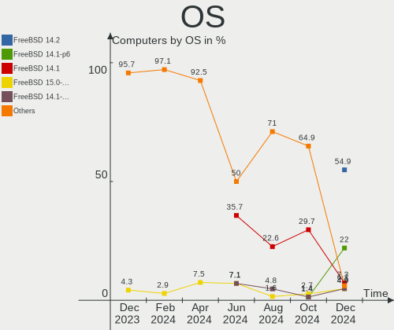
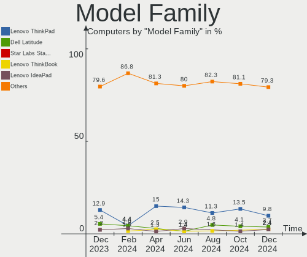
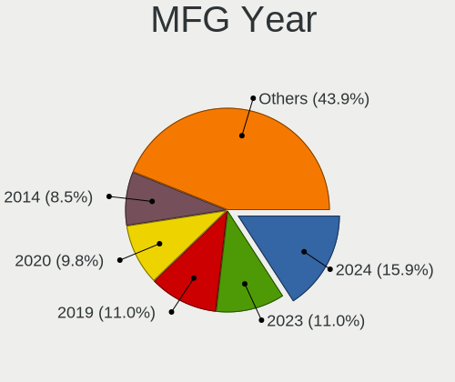
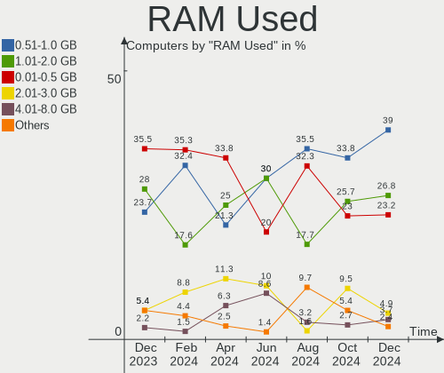
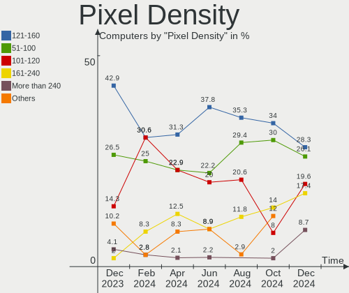

FreeBSD Hardware Trends
-----------------------

A project to identify most popular hardware characteristics and track their change
over time based on data collected by FreeBSD users at https://BSD-Hardware.info.

Anyone can contribute to the study by uploading probes of their computers by
the [hw-probe](https://github.com/linuxhw/hw-probe/blob/master/INSTALL.BSD.md) tool:

    hw-probe -all -upload

This is a report for all computer types. See also reports for [desktops](/Dist/FreeBSD/Desktop/README.md) and [notebooks](/Dist/FreeBSD/Notebook/README.md).

Full-feature report is available here: https://bsd-hardware.info/?view=trends

Period: May, 2020.

Contents
--------

- [ OS                       ](#os)
- [ OS Family                ](#os-family)
- [ Arch                     ](#arch)
- [ DE                       ](#de)
- [ Display Server           ](#display-server)
- [ Display Manager          ](#display-manager)
- [ OS Lang                  ](#os-lang)
- [ Boot Mode                ](#boot-mode)
- [ Filesystem               ](#filesystem)
- [ Part. scheme             ](#part-scheme)
- [ Country                  ](#country)
- [ City                     ](#city)
- [ Vendor                   ](#vendor)
- [ Model                    ](#model)
- [ Model Family             ](#model-family)
- [ MFG Year                 ](#mfg-year)
- [ Form Factor              ](#form-factor)
- [ Coreboot                 ](#coreboot)
- [ RAM Size                 ](#ram-size)
- [ RAM Used                 ](#ram-used)
- [ Drive Vendor             ](#drive-vendor)
- [ Drive Model              ](#drive-model)
- [ Drive Kind               ](#drive-kind)
- [ Drive Connector          ](#drive-connector)
- [ Drive Size               ](#drive-size)
- [ Space Total              ](#space-total)
- [ Space Used               ](#space-used)
- [ Malfunc. Drives          ](#malfunc-drives)
- [ Malfunc. Drive Vendor    ](#malfunc-drive-vendor)
- [ Malfunc. Drive Kind      ](#malfunc-drive-kind)
- [ Failed Drives            ](#failed-drives)
- [ Failed Drive Vendor      ](#failed-drive-vendor)
- [ Drive Status             ](#drive-status)
- [ Storage Vendor           ](#storage-vendor)
- [ Storage Model            ](#storage-model)
- [ Storage Kind             ](#storage-kind)
- [ CPU Vendor               ](#cpu-vendor)
- [ CPU Model                ](#cpu-model)
- [ CPU Model Family         ](#cpu-model-family)
- [ CPU Cores                ](#cpu-cores)
- [ CPU Sockets              ](#cpu-sockets)
- [ CPU Threads              ](#cpu-threads)
- [ CPU Microarch            ](#cpu-microarch)
- [ GPU Vendor               ](#gpu-vendor)
- [ GPU Model                ](#gpu-model)
- [ GPU Combo                ](#gpu-combo)
- [ GPU Driver               ](#gpu-driver)
- [ GPU Memory               ](#gpu-memory)
- [ Monitor Vendor           ](#monitor-vendor)
- [ Monitor Model            ](#monitor-model)
- [ Monitor Resolution       ](#monitor-resolution)
- [ Monitor Diagonal         ](#monitor-diagonal)
- [ Monitor Width            ](#monitor-width)
- [ Aspect Ratio             ](#aspect-ratio)
- [ Monitor Area             ](#monitor-area)
- [ Pixel Density            ](#pixel-density)
- [ Multiple Monitors        ](#multiple-monitors)
- [ Net Controller Vendor    ](#net-controller-vendor)
- [ Net Controller Model     ](#net-controller-model)
- [ Net Controller Kind      ](#net-controller-kind)
- [ Used Controller          ](#used-controller)
- [ NICs                     ](#nics)
- [ Unsupported Devices      ](#unsupported-devices)
- [ Unsupported Device Types ](#unsupported-device-types)

OS
--

Installed operating systems

| Name                 | Computers | Percent |
|----------------------|-----------|---------|
| FreeBSD 12.1-p5      | 50        | 46.73%  |
| FreeBSD 12.1-STABLE  | 16        | 14.95%  |
| FreeBSD 13.0-CURRENT | 8         | 7.48%   |
| FreeBSD 12.1-p4      | 8         | 7.48%   |
| FreeBSD 12.1-p3      | 5         | 4.67%   |
| FreeBSD 10.4-p13     | 4         | 3.74%   |
| FreeBSD 12.1-p2      | 3         | 2.8%    |
| FreeBSD 12.1         | 2         | 1.87%   |
| FreeBSD 11.3-p5      | 2         | 1.87%   |
| FreeBSD 8.4          | 1         | 0.93%   |
| FreeBSD 12.1-p1      | 1         | 0.93%   |
| FreeBSD 12.0-p3      | 1         | 0.93%   |
| FreeBSD 12.0-p10     | 1         | 0.93%   |
| FreeBSD 11.3-STABLE  | 1         | 0.93%   |
| FreeBSD 11.3-p9      | 1         | 0.93%   |
| FreeBSD 11.3-p6      | 1         | 0.93%   |
| FreeBSD 10.3-p29     | 1         | 0.93%   |
| FreeBSD 10.3-p16     | 1         | 0.93%   |

OS Family
---------

OS without a version

| Name    | Computers | Percent |
|---------|-----------|---------|
| FreeBSD | 107       | 100%    |

Arch
----

OS architecture (x86_64, i586, etc.)

| Name  | Computers | Percent |
|-------|-----------|---------|
| amd64 | 102       | 95.33%  |
| i386  | 3         | 2.8%    |
| arm64 | 1         | 0.93%   |
| arm   | 1         | 0.93%   |

DE
--

Desktop Environment

| Name     | Computers | Percent |
|----------|-----------|---------|
| Terminal | 74        | 69.16%  |
| XFCE     | 16        | 14.95%  |
| GNOME    | 10        | 9.35%   |
| KDE5     | 3         | 2.8%    |
| LXQt     | 1         | 0.93%   |
| LXDE     | 1         | 0.93%   |
| Lumina   | 1         | 0.93%   |
| KDE      | 1         | 0.93%   |

Display Server
--------------

X11 or Wayland

| Name     | Computers | Percent |
|----------|-----------|---------|
| X11      | 53        | 49.53%  |
| Terminal | 53        | 49.53%  |
| Wayland  | 1         | 0.93%   |

Display Manager
---------------

SDDM, LightDM, etc.

| Name     | Computers | Percent |
|----------|-----------|---------|
| Terminal | 70        | 65.42%  |
| SLiM     | 13        | 12.15%  |
| SDDM     | 11        | 10.28%  |
| XDM      | 7         | 6.54%   |
| LightDM  | 4         | 3.74%   |
| GDM      | 2         | 1.87%   |

OS Lang
-------

Language

| Lang         | Computers | Percent |
|--------------|-----------|---------|
| Unknown      | 42        | 39.25%  |
| ru_RU        | 28        | 26.17%  |
| en_US        | 21        | 19.63%  |
| ja_JP        | 5         | 4.67%   |
| de_DE        | 4         | 3.74%   |
| en_GB        | 3         | 2.8%    |
| ru_RU.KOI8-R | 1         | 0.93%   |
| fr_FR        | 1         | 0.93%   |
| en_IE        | 1         | 0.93%   |
| cs_CZ        | 1         | 0.93%   |

Boot Mode
---------

EFI or BIOS

| Mode | Computers | Percent |
|------|-----------|---------|
| BIOS | 57        | 53.27%  |
| EFI  | 50        | 46.73%  |

Filesystem
----------

Type of filesystem

| Type | Computers | Percent |
|------|-----------|---------|
| Zfs  | 65        | 60.75%  |
| Ufs  | 42        | 39.25%  |

Part. scheme
------------

Scheme of partitioning

| Type | Computers | Percent |
|------|-----------|---------|
| GPT  | 95        | 88.79%  |
| MBR  | 11        | 10.28%  |
| BSD  | 1         | 0.93%   |

Country
-------

Geographic location (country)

| Country     | Computers | Percent |
|-------------|-----------|---------|
| Russia      | 34        | 31.78%  |
| USA         | 15        | 14.02%  |
| Germany     | 14        | 13.08%  |
| France      | 7         | 6.54%   |
| Japan       | 5         | 4.67%   |
| Canada      | 5         | 4.67%   |
| Ukraine     | 4         | 3.74%   |
| Austria     | 4         | 3.74%   |
| Netherlands | 3         | 2.8%    |
| UK          | 2         | 1.87%   |
| Switzerland | 2         | 1.87%   |
| Finland     | 2         | 1.87%   |
| Spain       | 1         | 0.93%   |
| Romania     | 1         | 0.93%   |
| Portugal    | 1         | 0.93%   |
| Latvia      | 1         | 0.93%   |
| Kazakhstan  | 1         | 0.93%   |
| Italy       | 1         | 0.93%   |
| Ireland     | 1         | 0.93%   |
| Indonesia   | 1         | 0.93%   |
| Belgium     | 1         | 0.93%   |
| Armenia     | 1         | 0.93%   |

City
----

Geographic location (city)

| City                | Computers | Percent |
|---------------------|-----------|---------|
| Moscow              | 19        | 17.76%  |
| Vienna              | 4         | 3.74%   |
| Ekaterinburg        | 4         | 3.74%   |
| Stuttgart           | 2         | 1.87%   |
| Neuss               | 2         | 1.87%   |
| Millinocket         | 2         | 1.87%   |
| Limonest            | 2         | 1.87%   |
| Kyiv                | 2         | 1.87%   |
| Helsinki            | 2         | 1.87%   |
| Hamilton            | 2         | 1.87%   |
| Eindhoven           | 2         | 1.87%   |
| Chiyoda             | 2         | 1.87%   |
| Bellevue            | 2         | 1.87%   |
| Abakan              | 2         | 1.87%   |
| Zurich              | 1         | 0.93%   |
| Yverdon-les-Bains   | 1         | 0.93%   |
| Yerevan             | 1         | 0.93%   |
| Walthamstow         | 1         | 0.93%   |
| Waldbrunn           | 1         | 0.93%   |
| Vol'sk              | 1         | 0.93%   |
| Vitry-sur-Seine     | 1         | 0.93%   |
| Vancouver           | 1         | 0.93%   |
| Tokyo               | 1         | 0.93%   |
| St Petersburg       | 1         | 0.93%   |
| Slijk-Ewijk         | 1         | 0.93%   |
| Seattle             | 1         | 0.93%   |
| Sayville            | 1         | 0.93%   |
| Saratov             | 1         | 0.93%   |
| Riga                | 1         | 0.93%   |
| Revonnas            | 1         | 0.93%   |
| Regensburg          | 1         | 0.93%   |
| Peterborough        | 1         | 0.93%   |
| Penza               | 1         | 0.93%   |
| Oradea              | 1         | 0.93%   |
| Omsk                | 1         | 0.93%   |
| Nuremberg           | 1         | 0.93%   |
| Novosibirsk         | 1         | 0.93%   |
| Northeim            | 1         | 0.93%   |
| Nishinomiya         | 1         | 0.93%   |
| Mykolayiv           | 1         | 0.93%   |
| Modane              | 1         | 0.93%   |
| Madrid              | 1         | 0.93%   |
| Lviv                | 1         | 0.93%   |
| Los Angeles         | 1         | 0.93%   |
| Leander             | 1         | 0.93%   |
| Kobe                | 1         | 0.93%   |
| Kirov               | 1         | 0.93%   |
| Karlsruhe           | 1         | 0.93%   |
| Kaliningrad         | 1         | 0.93%   |
| Issy-les-Moulineaux | 1         | 0.93%   |
| Idstein             | 1         | 0.93%   |
| Hoffman             | 1         | 0.93%   |
| Georgetown          | 1         | 0.93%   |
| Dublin              | 1         | 0.93%   |
| Denver              | 1         | 0.93%   |
| Concord             | 1         | 0.93%   |
| Cluses              | 1         | 0.93%   |
| Chicago             | 1         | 0.93%   |
| Cheshunt            | 1         | 0.93%   |
| Chemnitz            | 1         | 0.93%   |

Vendor
------

Motherboard manufacturer

| Name                | Computers | Percent |
|---------------------|-----------|---------|
| ASUSTek Computer    | 20        | 18.69%  |
| Lenovo              | 18        | 16.82%  |
| Gigabyte Technology | 14        | 13.08%  |
| Dell                | 10        | 9.35%   |
| Intel               | 8         | 7.48%   |
| Hewlett-Packard     | 8         | 7.48%   |
| MSI                 | 6         | 5.61%   |
| Supermicro          | 5         | 4.67%   |
| ASRock              | 4         | 3.74%   |
| Unknown             | 4         | 3.74%   |
| Acer                | 3         | 2.8%    |
| VIA Technologies    | 1         | 0.93%   |
| TUXEDO              | 1         | 0.93%   |
| Sony                | 1         | 0.93%   |
| Schenker            | 1         | 0.93%   |
| MiTAC               | 1         | 0.93%   |
| Fujitsu             | 1         | 0.93%   |
| Apple               | 1         | 0.93%   |

Model
-----

Motherboard model

| Name                                       | Computers | Percent |
|--------------------------------------------|-----------|---------|
| Unknown                                    | 4         | 3.74%   |
| Supermicro SSG-6029P-E1CR12L               | 2         | 1.87%   |
| Lenovo ThinkPad T410s 291245G              | 2         | 1.87%   |
| Dell XPS 13 9360                           | 2         | 1.87%   |
| ASUS P6T SE                                | 2         | 1.87%   |
| ASUS All Series                            | 2         | 1.87%   |
| VIA Technologies VT8623-8235               | 1         | 0.93%   |
| TUXEDO N13xWU                              | 1         | 0.93%   |
| Supermicro X9DBL-3F/X9DBL-iF               | 1         | 0.93%   |
| Supermicro X7SPA-HF                        | 1         | 0.93%   |
| Supermicro Super Server                    | 1         | 0.93%   |
| Sony VPCM12M1E                             | 1         | 0.93%   |
| Schenker SCHENKER_COMPACT15_17_SCO15_17M19 | 1         | 0.93%   |
| MSI MS-7B90                                | 1         | 0.93%   |
| MSI MS-7B89                                | 1         | 0.93%   |
| MSI MS-7887                                | 1         | 0.93%   |
| MSI MS-7817                                | 1         | 0.93%   |
| MSI MS-7693                                | 1         | 0.93%   |
| MSI MS-7255                                | 1         | 0.93%   |
| MiTAC PH12SI                               | 1         | 0.93%   |
| Lenovo ThinkPad X60 1707YF8                | 1         | 0.93%   |
| Lenovo ThinkPad X270 20HNCTO1WW            | 1         | 0.93%   |
| Lenovo ThinkPad X240 20AMA52RUK            | 1         | 0.93%   |
| Lenovo ThinkPad X230 2325V4M               | 1         | 0.93%   |
| Lenovo ThinkPad X220 42902WU               | 1         | 0.93%   |
| Lenovo ThinkPad X1 Carbon 5th 20HRCTO1WW   | 1         | 0.93%   |
| Lenovo ThinkPad X1 Carbon 4th 20FCS1DW00   | 1         | 0.93%   |
| Lenovo ThinkPad X1 Carbon 3460AWU          | 1         | 0.93%   |
| Lenovo ThinkPad T60 2007J3G                | 1         | 0.93%   |
| Lenovo ThinkPad T460p 20FXS0H700           | 1         | 0.93%   |
| Lenovo ThinkPad T440p 20AWS07F00           | 1         | 0.93%   |
| Lenovo ThinkPad T430s 23539LU              | 1         | 0.93%   |
| Lenovo ThinkPad T420 4180B39               | 1         | 0.93%   |
| Lenovo ThinkPad T410 2537H21               | 1         | 0.93%   |
| Lenovo IdeaPad Z570 HuronRiver Platform    | 1         | 0.93%   |
| Lenovo IdeaPad 320-15ISK 80XH              | 1         | 0.93%   |
| Intel S3420GP                              | 1         | 0.93%   |
| Intel S1200RP                              | 1         | 0.93%   |
| Intel NUC7CJYH                             | 1         | 0.93%   |
| Intel NUC6i5SYB H81131-503                 | 1         | 0.93%   |
| Intel MP Server                            | 1         | 0.93%   |
| Intel Intel powered classmate PC           | 1         | 0.93%   |
| Intel DG41RQ AAE54511-205                  | 1         | 0.93%   |
| Intel D54250WYK H13922-303                 | 1         | 0.93%   |
| HP ZBook 15                                | 1         | 0.93%   |
| HP Z620 Workstation                        | 1         | 0.93%   |
| HP Z600 Workstation                        | 1         | 0.93%   |
| HP t620 PLUS Quad Core TC                  | 1         | 0.93%   |
| HP ProLiant DL365 G5                       | 1         | 0.93%   |
| HP EliteBook 8560w                         | 1         | 0.93%   |
| HP EliteBook 840 G3                        | 1         | 0.93%   |
| HP Compaq 8100 Elite CMT PC                | 1         | 0.93%   |
| Gigabyte Z68P-DS3                          | 1         | 0.93%   |
| Gigabyte Z68MA-D2H-B3                      | 1         | 0.93%   |
| Gigabyte X570 AORUS ELITE                  | 1         | 0.93%   |
| Gigabyte H77N-WIFI                         | 1         | 0.93%   |
| Gigabyte GB-BXi7-5500                      | 1         | 0.93%   |
| Gigabyte GA-MA78GM-UD2H                    | 1         | 0.93%   |
| Gigabyte F2A75M-HD2                        | 1         | 0.93%   |
| Gigabyte EX58-UD4                          | 1         | 0.93%   |

Model Family
------------

Motherboard model prefix

| Name                         | Computers | Percent |
|------------------------------|-----------|---------|
| Lenovo ThinkPad              | 16        | 14.95%  |
| Unknown                      | 4         | 3.74%   |
| Gigabyte B450M               | 3         | 2.8%    |
| Dell Latitude                | 3         | 2.8%    |
| Supermicro SSG-6029P-E1CR12L | 2         | 1.87%   |
| Lenovo IdeaPad               | 2         | 1.87%   |
| HP EliteBook                 | 2         | 1.87%   |
| Dell XPS                     | 2         | 1.87%   |
| Dell PowerEdge               | 2         | 1.87%   |
| Dell OptiPlex                | 2         | 1.87%   |
| ASUS P6T                     | 2         | 1.87%   |
| ASUS All                     | 2         | 1.87%   |
| Acer Aspire                  | 2         | 1.87%   |
| VIA Technologies VT8623-8235 | 1         | 0.93%   |
| TUXEDO N13xWU                | 1         | 0.93%   |
| Supermicro X9DBL-3F          | 1         | 0.93%   |
| Supermicro X7SPA-HF          | 1         | 0.93%   |
| Supermicro Super             | 1         | 0.93%   |
| Sony VPCM12M1E               | 1         | 0.93%   |
| Schenker SCHENKER            | 1         | 0.93%   |
| MSI MS-7B90                  | 1         | 0.93%   |
| MSI MS-7B89                  | 1         | 0.93%   |
| MSI MS-7887                  | 1         | 0.93%   |
| MSI MS-7817                  | 1         | 0.93%   |
| MSI MS-7693                  | 1         | 0.93%   |
| MSI MS-7255                  | 1         | 0.93%   |
| MiTAC PH12SI                 | 1         | 0.93%   |
| Intel S3420GP                | 1         | 0.93%   |
| Intel S1200RP                | 1         | 0.93%   |
| Intel NUC7CJYH               | 1         | 0.93%   |
| Intel NUC6i5SYB              | 1         | 0.93%   |
| Intel MP                     | 1         | 0.93%   |
| Intel Intel                  | 1         | 0.93%   |
| Intel DG41RQ                 | 1         | 0.93%   |
| Intel D54250WYK              | 1         | 0.93%   |
| HP ZBook                     | 1         | 0.93%   |
| HP Z620                      | 1         | 0.93%   |
| HP Z600                      | 1         | 0.93%   |
| HP t620                      | 1         | 0.93%   |
| HP ProLiant                  | 1         | 0.93%   |
| HP Compaq                    | 1         | 0.93%   |
| Gigabyte Z68P-DS3            | 1         | 0.93%   |
| Gigabyte Z68MA-D2H-B3        | 1         | 0.93%   |
| Gigabyte X570                | 1         | 0.93%   |
| Gigabyte H77N-WIFI           | 1         | 0.93%   |
| Gigabyte GB-BXi7-5500        | 1         | 0.93%   |
| Gigabyte GA-MA78GM-UD2H      | 1         | 0.93%   |
| Gigabyte F2A75M-HD2          | 1         | 0.93%   |
| Gigabyte EX58-UD4            | 1         | 0.93%   |
| Gigabyte C1007UN-D           | 1         | 0.93%   |
| Gigabyte AB350-Gaming        | 1         | 0.93%   |
| Gigabyte 945GM-S2            | 1         | 0.93%   |
| Fujitsu PRIMERGY             | 1         | 0.93%   |
| Dell Inspiron                | 1         | 0.93%   |
| ASUS X71SL                   | 1         | 0.93%   |
| ASUS U47A                    | 1         | 0.93%   |
| ASUS PRIME                   | 1         | 0.93%   |
| ASUS P8Z77-V                 | 1         | 0.93%   |
| ASUS P8H61                   | 1         | 0.93%   |
| ASUS P5Q-E                   | 1         | 0.93%   |

MFG Year
--------

Motherboard manufacture year

| Year    | Computers | Percent |
|---------|-----------|---------|
| 2019    | 17        | 15.89%  |
| 2018    | 12        | 11.21%  |
| 2013    | 9         | 8.41%   |
| 2014    | 8         | 7.48%   |
| 2016    | 7         | 6.54%   |
| 2012    | 7         | 6.54%   |
| 2010    | 7         | 6.54%   |
| 2017    | 6         | 5.61%   |
| 2007    | 6         | 5.61%   |
| 2015    | 5         | 4.67%   |
| 2011    | 5         | 4.67%   |
| 2009    | 5         | 4.67%   |
| 2008    | 4         | 3.74%   |
| 2020    | 3         | 2.8%    |
| Unknown | 3         | 2.8%    |
| 2006    | 1         | 0.93%   |
| 2005    | 1         | 0.93%   |
| 2004    | 1         | 0.93%   |

Form Factor
-----------

Physical design of the computer

| Name     | Computers | Percent |
|----------|-----------|---------|
| Desktop  | 57        | 53.27%  |
| Notebook | 38        | 35.51%  |
| Server   | 9         | 8.41%   |
| Mini pc  | 3         | 2.8%    |

Coreboot
--------

Have coreboot on board

| Used | Computers | Percent |
|------|-----------|---------|
| No   | 107       | 100%    |

RAM Size
--------

Total RAM memory

| Size in GB  | Computers | Percent |
|-------------|-----------|---------|
| 8.01-16.0   | 30        | 28.04%  |
| 16.01-24.0  | 29        | 27.1%   |
| 32.01-64.0  | 15        | 14.02%  |
| 4.01-8.0    | 12        | 11.21%  |
| 0.01-1.0    | 5         | 4.67%   |
| 64.01-256.0 | 4         | 3.74%   |
| 1.01-2.0    | 4         | 3.74%   |
| 3.01-4.0    | 3         | 2.8%    |
| 2.01-3.0    | 3         | 2.8%    |
| 24.01-32.0  | 1         | 0.93%   |
| Unknown     | 1         | 0.93%   |

RAM Used
--------

Used RAM memory

| Used GB    | Computers | Percent |
|------------|-----------|---------|
| 0.01-1.0   | 61        | 57.01%  |
| 1.01-2.0   | 14        | 13.08%  |
| 4.01-8.0   | 12        | 11.21%  |
| 8.01-16.0  | 6         | 5.61%   |
| 3.01-4.0   | 4         | 3.74%   |
| 24.01-32.0 | 4         | 3.74%   |
| 16.01-24.0 | 2         | 1.87%   |
| 32.01-64.0 | 1         | 0.93%   |
| 2.01-3.0   | 1         | 0.93%   |
| 0          | 1         | 0.93%   |
| Unknown    | 1         | 0.93%   |

Drive Vendor
------------

Hard drive vendors

| Vendor              | Computers | Drives | Percent |
|---------------------|-----------|--------|---------|
| WDC                 | 33        | 78     | 22.15%  |
| Seagate             | 26        | 42     | 17.45%  |
| Samsung Electronics | 25        | 36     | 16.78%  |
| Crucial             | 9         | 9      | 6.04%   |
| Toshiba             | 8         | 14     | 5.37%   |
| Hitachi             | 7         | 9      | 4.7%    |
| Intel               | 5         | 6      | 3.36%   |
| HGST                | 5         | 10     | 3.36%   |
| SanDisk             | 4         | 5      | 2.68%   |
| Kingston            | 4         | 6      | 2.68%   |
| Micron Technology   | 3         | 5      | 2.01%   |
| SPCC                | 2         | 2      | 1.34%   |
| LITEON              | 2         | 2      | 1.34%   |
| Corsair             | 2         | 2      | 1.34%   |
| Verbatim            | 1         | 1      | 0.67%   |
| Transcend           | 1         | 1      | 0.67%   |
| SuperMicro          | 1         | 1      | 0.67%   |
| PLEXTOR             | 1         | 1      | 0.67%   |
| OCZ                 | 1         | 1      | 0.67%   |
| KingSpec            | 1         | 1      | 0.67%   |
| Hoodisk             | 1         | 1      | 0.67%   |
| Hewlett-Packard     | 1         | 1      | 0.67%   |
| Fujitsu             | 1         | 1      | 0.67%   |
| Areca               | 1         | 2      | 0.67%   |
| Apple               | 1         | 1      | 0.67%   |
| AEGO                | 1         | 1      | 0.67%   |
| Adaptec             | 1         | 5      | 0.67%   |
| A-DATA Technology   | 1         | 1      | 0.67%   |

Drive Model
-----------

Hard drive models

| Model                    | Computers | Percent |
|--------------------------|-----------|---------|
| ST3300657SS 304GB        | 4         | 2.12%   |
| SSD 850 EVO 250GB        | 4         | 2.12%   |
| WD40EFRX-68N32N0 4TB     | 3         | 1.59%   |
| WD20EZRZ-00Z5HB0 2TB     | 3         | 1.59%   |
| WD15EADS-00P8B0 1.5TB    | 3         | 1.59%   |
| ST2000DM001-1CH164 2TB   | 3         | 1.59%   |
| WD20EARX-00PASB0 2TB     | 2         | 1.06%   |
| WD2002FYPS-01U1B0 2TB    | 2         | 1.06%   |
| ST4000DM000-1F2168 4TB   | 2         | 1.06%   |
| ST2000LM015-2E8174 2TB   | 2         | 1.06%   |
| SSD 850 EVO 1TB          | 2         | 1.06%   |
| MQ04ABF100 1TB           | 2         | 1.06%   |
| LCH-128V2S 128GB         | 2         | 1.06%   |
| HTS721010A9E630 1TB      | 2         | 1.06%   |
| HTS541075A7E630 752GB    | 2         | 1.06%   |
| HD501LJ 500GB            | 2         | 1.06%   |
| DT01ACA100 1TB           | 2         | 1.06%   |
| CT240M500SSD3 240GB      | 2         | 1.06%   |
| 5100_MTFDDAK240TCB 240GB | 2         | 1.06%   |
| WDS500G1B0A-00H9H0 500GB | 1         | 0.53%   |
| WDS480G2G0A-00JH30 480GB | 1         | 0.53%   |
| WD80EFZX-68UW8N0 8TB     | 1         | 0.53%   |
| WD7500AYYS-01RCA0 752GB  | 1         | 0.53%   |
| WD60EFAX-68SHWN0 6TB     | 1         | 0.53%   |
| WD6002FRYZ-01WD5B1 6TB   | 1         | 0.53%   |
| WD5003AZEX-00MK2A0 500GB | 1         | 0.53%   |
| WD5003AZEX-00K1GA0 500GB | 1         | 0.53%   |
| WD5000LPLX-00ZNTT0 500GB | 1         | 0.53%   |
| WD5000BPVT-24HXZT3 500GB | 1         | 0.53%   |
| WD5000AAKX-08U6AA0 500GB | 1         | 0.53%   |
| WD5000AAKS-00A7B0 500GB  | 1         | 0.53%   |
| WD40EZRZ-75GXCB0 4TB     | 1         | 0.53%   |
| WD40EZRZ-22GXCB0 4TB     | 1         | 0.53%   |
| WD40EFRX-68WT0N0 4TB     | 1         | 0.53%   |
| WD4002FFWX-68TZ4N0 4TB   | 1         | 0.53%   |
| WD30EZRX-00SPEB0 3TB     | 1         | 0.53%   |
| WD30EZRX-00DC0B0 3TB     | 1         | 0.53%   |
| WD30EZRX-00D8PB0 3TB     | 1         | 0.53%   |
| WD30EFRX-68EUZN0 3TB     | 1         | 0.53%   |
| WD2500BEVT-22A23T0 250GB | 1         | 0.53%   |
| WD20NMVW-11EDZS7 2TB     | 1         | 0.53%   |
| WD20NMVW-11AV3S2 2TB     | 1         | 0.53%   |
| WD20EZRX-00DC0B0 2TB     | 1         | 0.53%   |
| WD20EZRX-00D8PB0 2TB     | 1         | 0.53%   |
| WD20EARS-00MVWB0 2TB     | 1         | 0.53%   |
| WD2003FZEX-00SRLA0 2TB   | 1         | 0.53%   |
| WD2003FYYS-02W0B0 2TB    | 1         | 0.53%   |
| WD1600JD-00GBB0 160GB    | 1         | 0.53%   |
| WD10SDZW-11UMGS0 1TB     | 1         | 0.53%   |
| WD10EZRZ-00HTKB0 1TB     | 1         | 0.53%   |
| WD10EZRX-00L4HB0 1TB     | 1         | 0.53%   |
| WD10EZEX-60WN4A0 1TB     | 1         | 0.53%   |
| WD10EZEX-21WN4A0 1TB     | 1         | 0.53%   |
| WD10EZEX-08M2NA0 1TB     | 1         | 0.53%   |
| WD10EZEX-07WN4A0 1TB     | 1         | 0.53%   |
| WD10EZEX-00BN5A0 1TB     | 1         | 0.53%   |
| WD10EARX-00N0YB0 1TB     | 1         | 0.53%   |
| WD10EALX-009BA0 1TB      | 1         | 0.53%   |
| WD100EMAZ-00WJTA0 10TB   | 1         | 0.53%   |
| WD1002FBYS-02A6B0 1TB    | 1         | 0.53%   |

Drive Kind
----------

HDD or SSD

| Kind | Computers | Drives | Percent |
|------|-----------|--------|---------|
| HDD  | 66        | 164    | 54.1%   |
| SSD  | 52        | 77     | 42.62%  |
| NVMe | 4         | 4      | 3.28%   |

Drive Connector
---------------

SATA, SAS, NVMe, etc.

| Type | Computers | Drives | Percent |
|------|-----------|--------|---------|
| SATA | 93        | 241    | 95.88%  |
| NVMe | 4         | 4      | 4.12%   |

Drive Size
----------

Size of hard drive

| Size in TB | Computers | Drives | Percent |
|------------|-----------|--------|---------|
| 0.01-0.5   | 73        | 111    | 50%     |
| 0.51-1.0   | 27        | 45     | 18.49%  |
| 1.01-2.0   | 23        | 43     | 15.75%  |
| 3.01-4.0   | 12        | 21     | 8.22%   |
| 4.01-10.0  | 7         | 19     | 4.79%   |
| 2.01-3.0   | 4         | 6      | 2.74%   |

Space Total
-----------

Amount of disk space available on the file system

| Size in GB     | Computers | Percent |
|----------------|-----------|---------|
| 251-500        | 32        | 29.91%  |
| 101-250        | 27        | 25.23%  |
| 21-50          | 9         | 8.41%   |
| 51-100         | 9         | 8.41%   |
| 501-1000       | 8         | 7.48%   |
| 1001-2000      | 6         | 5.61%   |
| Unknown        | 5         | 4.67%   |
| More than 3000 | 4         | 3.74%   |
| 2001-3000      | 4         | 3.74%   |
| 1-20           | 3         | 2.8%    |

Space Used
----------

Amount of used disk space

| Used GB        | Computers | Percent |
|----------------|-----------|---------|
| 1-20           | 56        | 52.34%  |
| 21-50          | 18        | 16.82%  |
| 51-100         | 11        | 10.28%  |
| 251-500        | 6         | 5.61%   |
| Unknown        | 5         | 4.67%   |
| 501-1000       | 4         | 3.74%   |
| More than 3000 | 3         | 2.8%    |
| 101-250        | 2         | 1.87%   |
| 1001-2000      | 2         | 1.87%   |

Malfunc. Drives
---------------

Drive models with a malfunction

| Model                    | Computers | Drives | Percent |
|--------------------------|-----------|--------|---------|
| WD2002FYPS-01U1B0 2TB    | 2         | 2      | 8%      |
| WD15EADS-00P8B0 1.5TB    | 2         | 2      | 8%      |
| HD501LJ 500GB            | 2         | 4      | 8%      |
| WD6002FRYZ-01WD5B1 6TB   | 1         | 1      | 4%      |
| WD5003AZEX-00MK2A0 500GB | 1         | 1      | 4%      |
| WD40EFRX-68N32N0 4TB     | 1         | 3      | 4%      |
| WD2003FZEX-00SRLA0 2TB   | 1         | 1      | 4%      |
| ST9500420AS 500GB        | 1         | 1      | 4%      |
| ST500LM021-1KJ152 500GB  | 1         | 1      | 4%      |
| ST3500514NS 500GB        | 1         | 1      | 4%      |
| ST2000DM008-2FR102 2TB   | 1         | 1      | 4%      |
| ST2000DM001-1CH164 2TB   | 1         | 1      | 4%      |
| SSDSCKKF256G8H 256GB     | 1         | 1      | 4%      |
| SSDSC2BB480G7 480GB      | 1         | 1      | 4%      |
| SSDSA2M080G2GC 80GB      | 1         | 1      | 4%      |
| SSD 960 EVO 1TB          | 1         | 1      | 4%      |
| SSD 850 EVO mSATA 1TB    | 1         | 1      | 4%      |
| SSD 850 EVO 1TB          | 1         | 1      | 4%      |
| MQ04ABF100 1TB           | 1         | 1      | 4%      |
| HTS541075A7E630 752GB    | 1         | 1      | 4%      |
| HTS421260H9AT00 64GB     | 1         | 1      | 4%      |
| CT525MX300SSD1 528GB     | 1         | 1      | 4%      |

Malfunc. Drive Vendor
---------------------

Vendors of faulty drives

| Vendor              | Computers | Drives | Percent |
|---------------------|-----------|--------|---------|
| WDC                 | 6         | 10     | 27.27%  |
| Seagate             | 5         | 5      | 22.73%  |
| Samsung Electronics | 4         | 7      | 18.18%  |
| Intel               | 3         | 3      | 13.64%  |
| Toshiba             | 1         | 1      | 4.55%   |
| Hitachi             | 1         | 1      | 4.55%   |
| HGST                | 1         | 1      | 4.55%   |
| Crucial             | 1         | 1      | 4.55%   |

Malfunc. Drive Kind
-------------------

Kinds of faulty drives

| Kind | Computers | Drives | Percent |
|------|-----------|--------|---------|
| HDD  | 16        | 22     | 72.73%  |
| SSD  | 5         | 6      | 22.73%  |
| NVMe | 1         | 1      | 4.55%   |

Failed Drives
-------------

Failed drive models

Zero info for selected period =(

Failed Drive Vendor
-------------------

Failed drive vendors

Zero info for selected period =(

Drive Status
------------

Number of failed and malfunc. drives

| Status   | Computers | Drives | Percent |
|----------|-----------|--------|---------|
| Works    | 85        | 210    | 77.98%  |
| Malfunc  | 22        | 29     | 20.18%  |
| Detected | 2         | 6      | 1.83%   |

Storage Vendor
--------------

Storage controller vendors

| Vendor                           | Computers | Percent |
|----------------------------------|-----------|---------|
| Intel                            | 80        | 56.34%  |
| AMD                              | 16        | 11.27%  |
| Samsung Electronics              | 6         | 4.23%   |
| Marvell Technology Group         | 6         | 4.23%   |
| ASMedia Technology               | 6         | 4.23%   |
| Areca Technology                 | 6         | 4.23%   |
| VIA Technologies                 | 3         | 2.11%   |
| JMicron Technology               | 3         | 2.11%   |
| Broadcom / LSI                   | 3         | 2.11%   |
| Silicon Integrated Systems [SiS] | 2         | 1.41%   |
| Phison Electronics               | 2         | 1.41%   |
| Toshiba                          | 1         | 0.7%    |
| SK Hynix                         | 1         | 0.7%    |
| Silicon Image                    | 1         | 0.7%    |
| Nvidia                           | 1         | 0.7%    |
| Lite-On Technology               | 1         | 0.7%    |
| Hewlett-Packard                  | 1         | 0.7%    |
| Broadcom                         | 1         | 0.7%    |
| ADATA Technology                 | 1         | 0.7%    |
| Adaptec                          | 1         | 0.7%    |

Storage Model
-------------

Storage controller models

| Model                                                                    | Computers | Percent |
|--------------------------------------------------------------------------|-----------|---------|
| FCH SATA Controller [AHCI mode]                                          | 11        | 6.63%   |
| 8 Series/C220 Series Chipset Family 6-port SATA Controller 1 [AHCI mode] | 7         | 4.22%   |
| ASM1062 Serial ATA Controller                                            | 6         | 3.61%   |
| 7 Series Chipset Family 6-port SATA Controller [AHCI mode]               | 6         | 3.61%   |
| 6 Series/C200 Series Chipset Family 6 port Mobile SATA AHCI Controller   | 6         | 3.61%   |
| 400 Series Chipset SATA Controller                                       | 6         | 3.61%   |
| SB7x0/SB8x0/SB9x0 SATA Controller [AHCI mode]                            | 5         | 3.01%   |
| 82801JI (ICH10 Family) SATA AHCI Controller                              | 5         | 3.01%   |
| 6 Series/C200 Series Chipset Family 6 port Desktop SATA AHCI Controller  | 5         | 3.01%   |
| 5 Series/3400 Series Chipset 6 port SATA AHCI Controller                 | 5         | 3.01%   |
| Sunrise Point-LP SATA Controller [AHCI mode]                             | 4         | 2.41%   |
| Q170/Q150/B150/H170/H110/Z170/CM236 Chipset SATA Controller [AHCI Mode]  | 4         | 2.41%   |
| ARC-1300ix-16 16-Port PCI-Express to SAS Non-RAID Host Adapter           | 4         | 2.41%   |
| 82801G (ICH7 Family) IDE Controller                                      | 4         | 2.41%   |
| NVMe SSD Controller SM981/PM981/PM983                                    | 3         | 1.81%   |
| JMB363 SATA/IDE Controller                                               | 3         | 1.81%   |
| 7 Series/C210 Series Chipset Family 6-port SATA Controller [AHCI mode]   | 3         | 1.81%   |
| Wildcat Point-LP SATA Controller [AHCI Mode]                             | 2         | 1.2%    |
| SB7x0/SB8x0/SB9x0 IDE Controller                                         | 2         | 1.2%    |
| SATA Controller [RAID mode]                                              | 2         | 1.2%    |
| SAS3008 PCI-Express Fusion-MPT SAS-3                                     | 2         | 1.2%    |
| NVMe SSD Controller SM961/PM961                                          | 2         | 1.2%    |
| NM10/ICH7 Family SATA Controller [IDE mode]                              | 2         | 1.2%    |
| NM10/ICH7 Family SATA Controller [AHCI mode]                             | 2         | 1.2%    |
| HM170/QM170 Chipset SATA Controller [AHCI Mode]                          | 2         | 1.2%    |
| E12 NVMe Controller                                                      | 2         | 1.2%    |
| C620 Series Chipset Family SSATA Controller [AHCI mode]                  | 2         | 1.2%    |
| C620 Series Chipset Family SATA Controller [AHCI mode]                   | 2         | 1.2%    |
| C602 chipset 4-Port SATA Storage Control Unit                            | 2         | 1.2%    |
| Atom Processor E3800 Series SATA AHCI Controller                         | 2         | 1.2%    |
| 92xx SATA 6G Controller                                                  | 2         | 1.2%    |
| 88SE6111/6121 SATA II / PATA Controller                                  | 2         | 1.2%    |
| 82801IR/IO/IH (ICH9R/DO/DH) 6 port SATA Controller [AHCI mode]           | 2         | 1.2%    |
| 82801GBM/GHM (ICH7-M Family) SATA Controller [AHCI mode]                 | 2         | 1.2%    |
| 8 Series SATA Controller 1 [AHCI mode]                                   | 2         | 1.2%    |
| 5513 IDE Controller                                                      | 2         | 1.2%    |
| 5 Series/3400 Series Chipset 4 port SATA AHCI Controller                 | 2         | 1.2%    |
| XPG SX8200 Pro PCIe Gen3x4 M.2 2280 Solid State Drive                    | 1         | 0.6%    |
| XG4 NVMe SSD Controller                                                  | 1         | 0.6%    |
| X399 Series Chipset SATA Controller                                      | 1         | 0.6%    |
| VT82C586A/B/VT82C686/A/B/VT823x/A/C PIPC Bus Master IDE                  | 1         | 0.6%    |
| VT6421 IDE/SATA Controller                                               | 1         | 0.6%    |
| SSD 660P Series                                                          | 1         | 0.6%    |
| Smart Array Controller                                                   | 1         | 0.6%    |
| SiI 3114 [SATALink/SATARaid] Serial ATA Controller                       | 1         | 0.6%    |
| Series 6 - 6G SAS/PCIe 2                                                 | 1         | 0.6%    |
| Serial ATA Controller                                                    | 1         | 0.6%    |
| SC300 512GB M.2 2280 SATA Solid State Drive                              | 1         | 0.6%    |
| SATA Controller / IDE mode                                               | 1         | 0.6%    |
| SAS2008 PCI-Express Fusion-MPT SAS-2 [Falcon]                            | 1         | 0.6%    |
| PCIe Data Center SSD                                                     | 1         | 0.6%    |
| NVMe SSD Controller SM951/PM951                                          | 1         | 0.6%    |
| MCP78S [GeForce 8200] IDE                                                | 1         | 0.6%    |
| MCP78S [GeForce 8200] AHCI Controller                                    | 1         | 0.6%    |
| M8Pe Series NVMe SSD                                                     | 1         | 0.6%    |
| FCH IDE Controller                                                       | 1         | 0.6%    |
| Celeron N3350/Pentium N4200/Atom E3900 Series SATA AHCI Controller       | 1         | 0.6%    |
| Cannon Lake Mobile PCH SATA AHCI Controller                              | 1         | 0.6%    |
| C600/X79 series chipset SATA RAID Controller                             | 1         | 0.6%    |
| C600/X79 series chipset 6-Port SATA AHCI Controller                      | 1         | 0.6%    |

Storage Kind
------------

Kind of storage controller (IDE, SATA, NVMe, SAS, ...)

| Kind | Computers | Percent |
|------|-----------|---------|
| SATA | 87        | 60.84%  |
| IDE  | 25        | 17.48%  |
| NVMe | 14        | 9.79%   |
| RAID | 8         | 5.59%   |
| SAS  | 5         | 3.5%    |
| SCSI | 4         | 2.8%    |

CPU Vendor
----------

Processor vendors

| Vendor | Computers | Percent |
|--------|-----------|---------|
| Intel  | 86        | 80.37%  |
| AMD    | 18        | 16.82%  |
| ARM    | 2         | 1.87%   |
| VIA    | 1         | 0.93%   |

CPU Model
---------

Processor models

| Model                                     | Computers | Percent |
|-------------------------------------------|-----------|---------|
| Intel Core 2 Quad CPU Q6600 @ 2.40GHz     | 3         | 2.8%    |
| Intel Xeon Bronze 3104 CPU @ 1.70GHz      | 2         | 1.87%   |
| Intel Core i7-7500U CPU @ 2.70GHz         | 2         | 1.87%   |
| Intel Core i7-4770 CPU @ 3.40GHz          | 2         | 1.87%   |
| Intel Core i7-3770 CPU @ 3.40GHz          | 2         | 1.87%   |
| Intel Core i7 CPU 920 @ 2.67GHz           | 2         | 1.87%   |
| Intel Core i5-3320M CPU @ 2.60GHz         | 2         | 1.87%   |
| Intel Core i5-2540M CPU @ 2.60GHz         | 2         | 1.87%   |
| Intel Core i5 CPU M 560 @ 2.67GHz         | 2         | 1.87%   |
| Intel Core 2 CPU                          | 2         | 1.87%   |
| Intel Celeron CPU J1900 @ 1.99GHz         | 2         | 1.87%   |
| AMD AMD Ryzen 7 2700 Eight-Core Processor | 2         | 1.87%   |
| VIA C3                                    | 1         | 0.93%   |
| Intel Xeon CPU X3430 @ 2.40GHz            | 1         | 0.93%   |
| Intel Xeon CPU E5630 @ 2.53GHz            | 1         | 0.93%   |
| Intel Xeon CPU E5504 @ 2.00GHz            | 1         | 0.93%   |
| Intel Xeon CPU E5-2690 @ 2.90GHz          | 1         | 0.93%   |
| Intel Xeon CPU E5-2407 v2 @ 2.40GHz       | 1         | 0.93%   |
| Intel Xeon CPU E31220 @ 3.10GHz           | 1         | 0.93%   |
| Intel Xeon CPU E3-1241 v3 @ 3.50GH        | 1         | 0.93%   |
| Intel Xeon CPU E3-1240 v5 @ 3.50GHz       | 1         | 0.93%   |
| Intel Xeon CPU E3-1220 v6 @ 3.00GHz       | 1         | 0.93%   |
| Intel Xeon CPU 2.66GHz                    | 1         | 0.93%   |
| Intel Pentium D CPU                       | 1         | 0.93%   |
| Intel Pentium CPU J4205 @ 1.50GHz         | 1         | 0.93%   |
| Intel Pentium CPU G3220 @ 3.00GHz         | 1         | 0.93%   |
| Intel Pentium CPU G2120 @ 3.10GHz         | 1         | 0.93%   |
| Intel Pentium 4 CPU 3.00GHz               | 1         | 0.93%   |
| Intel Pentium 3805U @ 1.90GHz             | 1         | 0.93%   |
| Intel Core i7-9750H CPU @ 2.60GHz         | 1         | 0.93%   |
| Intel Core i7-7700K CPU @ 4.20GHz         | 1         | 0.93%   |
| Intel Core i7-7700HQ CPU @ 2.80GHz        | 1         | 0.93%   |
| Intel Core i7-7600U CPU @ 2.80GHz         | 1         | 0.93%   |
| Intel Core i7-6820HQ CPU @ 2.70GHz        | 1         | 0.93%   |
| Intel Core i7-6600U CPU @ 2.60GHz         | 1         | 0.93%   |
| Intel Core i7-5500U CPU @ 2.40GHz         | 1         | 0.93%   |
| Intel Core i7-4900MQ CPU @ 2.80GHz        | 1         | 0.93%   |
| Intel Core i7-3667U CPU @ 2.00GHz         | 1         | 0.93%   |
| Intel Core i7-3630QM CPU @ 2.40GHz        | 1         | 0.93%   |
| Intel Core i7-2700K CPU @ 3.50GHz         | 1         | 0.93%   |
| Intel Core i7-2640M CPU @ 2.80GHz         | 1         | 0.93%   |
| Intel Core i7-2620M CPU @ 2.70GHz         | 1         | 0.93%   |
| Intel Core i7-2600K CPU @ 3.40GHz         | 1         | 0.93%   |
| Intel Core i7 CPU                         | 1         | 0.93%   |
| Intel Core i5-8250U CPU @ 1.60GHz         | 1         | 0.93%   |
| Intel Core i5-7200U CPU @ 2.50GHz         | 1         | 0.93%   |
| Intel Core i5-6440HQ CPU @ 2.60GHz        | 1         | 0.93%   |
| Intel Core i5-6260U CPU @ 1.80GHz         | 1         | 0.93%   |
| Intel Core i5-6200U CPU @ 2.30GHz         | 1         | 0.93%   |
| Intel Core i5-4570S CPU @ 2.90GHz         | 1         | 0.93%   |
| Intel Core i5-4340M CPU @ 2.90GHz         | 1         | 0.93%   |
| Intel Core i5-4300U CPU @ 1.90GHz         | 1         | 0.93%   |
| Intel Core i5-4250U CPU @ 1.30GHz         | 1         | 0.93%   |
| Intel Core i5-3570 CPU                    | 1         | 0.93%   |
| Intel Core i5-3470 CPU @ 3.20GHz          | 1         | 0.93%   |
| Intel Core i5-2540M CPU @ 2.60GH          | 1         | 0.93%   |
| Intel Core i5-2520M CPU @ 2.50GHz         | 1         | 0.93%   |
| Intel Core i5-2430M CPU @ 2.40GHz         | 1         | 0.93%   |
| Intel Core i5 CPU M 520 @ 2.40GHz         | 1         | 0.93%   |
| Intel Core i5 CPU M 430 @ 2.27GH          | 1         | 0.93%   |

CPU Model Family
----------------

Processor model prefix

| Model             | Computers | Percent |
|-------------------|-----------|---------|
| Intel Core i7     | 23        | 21.5%   |
| Intel Core i5     | 22        | 20.56%  |
| Other             | 14        | 13.08%  |
| Intel Xeon        | 10        | 9.35%   |
| Intel Celeron     | 6         | 5.61%   |
| Intel Pentium     | 4         | 3.74%   |
| Intel Core i3     | 4         | 3.74%   |
| Intel Core 2      | 4         | 3.74%   |
| Intel Core 2 Quad | 3         | 2.8%    |
| AMD FX            | 3         | 2.8%    |
| Intel Xeon Bronze | 2         | 1.87%   |
| Intel Core 2 Duo  | 2         | 1.87%   |
| Intel Atom        | 2         | 1.87%   |
| AMD Phenom        | 2         | 1.87%   |
| Intel Pentium D   | 1         | 0.93%   |
| Intel Pentium 4   | 1         | 0.93%   |
| Intel Celeron M   | 1         | 0.93%   |
| AMD Sempron       | 1         | 0.93%   |
| AMD GX            | 1         | 0.93%   |
| AMD Athlon X4     | 1         | 0.93%   |

CPU Cores
---------

Number of processor cores

| Number  | Computers | Percent |
|---------|-----------|---------|
| 2       | 36        | 33.64%  |
| 4       | 35        | 32.71%  |
| Unknown | 15        | 14.02%  |
| 16      | 6         | 5.61%   |
| 8       | 6         | 5.61%   |
| 6       | 3         | 2.8%    |
| 1       | 3         | 2.8%    |
| 32      | 2         | 1.87%   |
| 12      | 1         | 0.93%   |

CPU Sockets
-----------

Number of sockets

| Number  | Computers | Percent |
|---------|-----------|---------|
| 1       | 99        | 92.52%  |
| 2       | 5         | 4.67%   |
| Unknown | 3         | 2.8%    |

CPU Threads
-----------

Threads per core (Hyper-Threading)

| Number  | Computers | Percent |
|---------|-----------|---------|
| 2       | 52        | 48.6%   |
| 1       | 39        | 36.45%  |
| Unknown | 16        | 14.95%  |

CPU Microarch
-------------

Microarchitecture

| Name          | Computers | Percent |
|---------------|-----------|---------|
| SandyBridge   | 11        | 10.28%  |
| IvyBridge     | 11        | 10.28%  |
| Haswell       | 10        | 9.35%   |
| Skylake       | 9         | 8.41%   |
| KabyLake      | 9         | 8.41%   |
| Core          | 7         | 6.54%   |
| Unknown       | 6         | 5.61%   |
| Westmere      | 5         | 4.67%   |
| Nehalem       | 5         | 4.67%   |
| Zen+          | 4         | 3.74%   |
| Piledriver    | 4         | 3.74%   |
| K10           | 4         | 3.74%   |
| Zen           | 3         | 2.8%    |
| Silvermont    | 3         | 2.8%    |
| NetBurst      | 3         | 2.8%    |
| Bonnell       | 3         | 2.8%    |
| Zen 2         | 2         | 1.87%   |
| Penryn        | 2         | 1.87%   |
| Broadwell     | 2         | 1.87%   |
| P6            | 1         | 0.93%   |
| Jaguar        | 1         | 0.93%   |
| Goldmont plus | 1         | 0.93%   |
| Goldmont      | 1         | 0.93%   |

GPU Vendor
----------

Vendors of graphics cards

| Vendor                           | Computers | Percent |
|----------------------------------|-----------|---------|
| Intel                            | 53        | 49.53%  |
| Nvidia                           | 27        | 25.23%  |
| AMD                              | 16        | 14.95%  |
| Matrox Electronics Systems       | 5         | 4.67%   |
| ASPEED Technology                | 3         | 2.8%    |
| VIA Technologies                 | 2         | 1.87%   |
| Silicon Integrated Systems [SiS] | 1         | 0.93%   |

GPU Model
---------

Graphics card models

| Model                                                                   | Computers | Percent |
|-------------------------------------------------------------------------|-----------|---------|
| Xeon E3-1200 v2/3rd Gen Core processor Graphics Controller              | 5         | 4.59%   |
| Core Processor Integrated Graphics Controller                           | 5         | 4.59%   |
| 3rd Gen Core processor Graphics Controller                              | 5         | 4.59%   |
| 2nd Generation Core Processor Family Integrated Graphics Controller     | 5         | 4.59%   |
| HD Graphics 620                                                         | 4         | 3.67%   |
| G98 [GeForce 8400 GS Rev. 2]                                            | 4         | 3.67%   |
| Ellesmere [Radeon RX 470/480/570/570X/580/580X/590]                     | 4         | 3.67%   |
| GK107 [GeForce GT 640]                                                  | 3         | 2.75%   |
| ES1000                                                                  | 3         | 2.75%   |
| ASPEED Graphics Family                                                  | 3         | 2.75%   |
| Xeon E3-1200 v3/4th Gen Core Processor Integrated Graphics Controller   | 2         | 1.83%   |
| Skylake GT2 [HD Graphics 520]                                           | 2         | 1.83%   |
| MGA G200eW WPCM450                                                      | 2         | 1.83%   |
| MGA G200e [Pilot] ServerEngines (SEP1)                                  | 2         | 1.83%   |
| HD Graphics 630                                                         | 2         | 1.83%   |
| HD Graphics 530                                                         | 2         | 1.83%   |
| Haswell-ULT Integrated Graphics Controller                              | 2         | 1.83%   |
| GM107 [GeForce GTX 750 Ti]                                              | 2         | 1.83%   |
| Atom Processor Z36xxx/Z37xxx Series Graphics & Display                  | 2         | 1.83%   |
| Atom Processor D4xx/D5xx/N4xx/N5xx Integrated Graphics Controller       | 2         | 1.83%   |
| 4th Gen Core Processor Integrated Graphics Controller                   | 2         | 1.83%   |
| Whistler [Radeon HD 6630M/6650M/6750M/7670M/7690M]                      | 1         | 0.92%   |
| VT8623 [Apollo CLE266] integrated CastleRock graphics                   | 1         | 0.92%   |
| Vega 20 [Radeon VII]                                                    | 1         | 0.92%   |
| Vega 10 XL/XT [Radeon RX Vega 56/64]                                    | 1         | 0.92%   |
| UHD Graphics 630 (Mobile)                                               | 1         | 0.92%   |
| UHD Graphics 620                                                        | 1         | 0.92%   |
| UHD Graphics 605                                                        | 1         | 0.92%   |
| TU106M [GeForce RTX 2070 Mobile]                                        | 1         | 0.92%   |
| RV710/M92 [Mobility Radeon HD 4530/4570/545v]                           | 1         | 0.92%   |
| RV515/M52 [Mobility Radeon X1300]                                       | 1         | 0.92%   |
| RV370 [Radeon X300]                                                     | 1         | 0.92%   |
| RV370 [Radeon X300 SE]                                                  | 1         | 0.92%   |
| RS780L [Radeon 3000]                                                    | 1         | 0.92%   |
| RS780 [Radeon HD 3200]                                                  | 1         | 0.92%   |
| NV18 [GeForce4 MX 4000]                                                 | 1         | 0.92%   |
| Mobile 945GM/GMS/GME, 943/940GML Express Integrated Graphics Controller | 1         | 0.92%   |
| Mobile 945GM/GMS, 943/940GML Express Integrated Graphics Controller     | 1         | 0.92%   |
| Kabini [Radeon HD 8400E]                                                | 1         | 0.92%   |
| Iris Graphics 540                                                       | 1         | 0.92%   |
| HD Graphics 5500                                                        | 1         | 0.92%   |
| HD Graphics 520                                                         | 1         | 0.92%   |
| HD Graphics                                                             | 1         | 0.92%   |
| GP108 [GeForce GT 1030]                                                 | 1         | 0.92%   |
| GP107M [GeForce GTX 1050 Ti Mobile]                                     | 1         | 0.92%   |
| GP107 [GeForce GTX 1050 Ti]                                             | 1         | 0.92%   |
| GM206 [GeForce GTX 960]                                                 | 1         | 0.92%   |
| GM108M [GeForce 940MX]                                                  | 1         | 0.92%   |
| GK208B [GeForce GT 710]                                                 | 1         | 0.92%   |
| GK107 [GeForce GTX 650]                                                 | 1         | 0.92%   |
| GK106GL [Quadro K4000]                                                  | 1         | 0.92%   |
| GF119M [NVS 4200M]                                                      | 1         | 0.92%   |
| GF119 [GeForce GT 610]                                                  | 1         | 0.92%   |
| GF117M [GeForce 610M/710M/810M/820M / GT 620M/625M/630M/720M]           | 1         | 0.92%   |
| GF108GLM [Quadro 1000M]                                                 | 1         | 0.92%   |
| GF108GLM [NVS 5200M]                                                    | 1         | 0.92%   |
| GF108 [GeForce GT 630]                                                  | 1         | 0.92%   |
| G98M [GeForce 9300M GS]                                                 | 1         | 0.92%   |
| G200eR2                                                                 | 1         | 0.92%   |
| CN896/VN896/P4M900 [Chrome 9 HC]                                        | 1         | 0.92%   |

GPU Combo
---------

Combinations of graphics cards

| Name            | Computers | Percent |
|-----------------|-----------|---------|
| 1 x Intel       | 43        | 40.19%  |
| 1 x Nvidia      | 22        | 20.56%  |
| 1 x AMD         | 16        | 14.95%  |
| 1 x Matrox      | 6         | 5.61%   |
| Intel + Nvidia  | 6         | 5.61%   |
| 2 x Intel       | 4         | 3.74%   |
| Other           | 2         | 1.87%   |
| 1 x VIA         | 2         | 1.87%   |
| 1 x ASPEED      | 2         | 1.87%   |
| 2 x AMD         | 1         | 0.93%   |
| 1 x SiS         | 1         | 0.93%   |
| Nvidia + ASPEED | 1         | 0.93%   |
| Intel + AMD     | 1         | 0.93%   |

GPU Driver
----------

Free vs proprietary

| Driver  | Computers | Percent |
|---------|-----------|---------|
| Free    | 105       | 98.13%  |
| Unknown | 2         | 1.87%   |

GPU Memory
----------

Total video memory

| Size in GB | Computers | Percent |
|------------|-----------|---------|
| Unknown    | 78        | 72.9%   |
| 1.01-2.0   | 13        | 12.15%  |
| 3.01-4.0   | 4         | 3.74%   |
| 0.51-1.0   | 4         | 3.74%   |
| 7.01-8.0   | 3         | 2.8%    |
| 0.01-0.5   | 3         | 2.8%    |
| 2.01-3.0   | 1         | 0.93%   |
| 8.01-16.0  | 1         | 0.93%   |

Monitor Vendor
--------------

Monitor vendors

| Vendor                  | Computers | Percent |
|-------------------------|-----------|---------|
| Lenovo                  | 8         | 15.09%  |
| LG Display              | 7         | 13.21%  |
| AU Optronics            | 7         | 13.21%  |
| Samsung Electronics     | 5         | 9.43%   |
| Dell                    | 5         | 9.43%   |
| Ancor Communications    | 4         | 7.55%   |
| NEC Computers           | 2         | 3.77%   |
| Chimei Innolux          | 2         | 3.77%   |
| BenQ                    | 2         | 3.77%   |
| AOC                     | 2         | 3.77%   |
| Acer                    | 2         | 3.77%   |
| Sharp                   | 1         | 1.89%   |
| Philips                 | 1         | 1.89%   |
| Goldstar                | 1         | 1.89%   |
| Eizo                    | 1         | 1.89%   |
| CPT                     | 1         | 1.89%   |
| Chi Mei Optoelectronics | 1         | 1.89%   |
| BOE                     | 1         | 1.89%   |

Monitor Model
-------------

Monitor models

| Model                                             | Computers | Percent |
|---------------------------------------------------|-----------|---------|
| LCD Monitor LEN4036 1440x900 300x190mm 14.0-inch  | 3         | 5.66%   |
| U2414H DELA0A2 1920x1080 530x300mm 24.0-inch      | 2         | 3.77%   |
| FE791SB NEC61D7 1600x1200 330x240mm 16.1-inch     | 2         | 3.77%   |
| XB271HU A ACR052F 2560x1440 600x340mm 27.2-inch   | 1         | 1.89%   |
| U2312HM DEL4071 1920x1080 510x290mm 23.1-inch     | 1         | 1.89%   |
| SyncMaster SAM037C 1680x1050 470x300mm 22.0-inch  | 1         | 1.89%   |
| SyncMaster SAM011E 1280x1024 340x270mm 17.1-inch  | 1         | 1.89%   |
| SW2700 BNQ7F47 2560x1440 600x340mm 27.2-inch      | 1         | 1.89%   |
| R240HY ACR046F 1920x1080 530x300mm 24.0-inch      | 1         | 1.89%   |
| PHL 328E1 PHLC204 3840x2160 700x390mm 31.5-inch   | 1         | 1.89%   |
| LG FULL HD GSM5B55 1920x1080 480x270mm 21.7-inch  | 1         | 1.89%   |
| LEN P27q-10 LEN61A8 2560x1440 600x340mm 27.2-inch | 1         | 1.89%   |
| LCD Monitor U2414H 1920x1080                      | 1         | 1.89%   |
| LCD Monitor U2414H                                | 1         | 1.89%   |
| LCD Monitor SyncMaster 3520x1200                  | 1         | 1.89%   |
| LCD Monitor SHP1449 1920x1080 290x170mm 13.2-inch | 1         | 1.89%   |
| LCD Monitor SDCA029 3840x2160 340x190mm 15.3-inch | 1         | 1.89%   |
| LCD Monitor SDC364D 1920x1080 310x170mm 13.9-inch | 1         | 1.89%   |
| LCD Monitor MX27AQ 2560x1440                      | 1         | 1.89%   |
| LCD Monitor LGD046F 1920x1080 340x190mm 15.3-inch | 1         | 1.89%   |
| LCD Monitor LGD03ED 1366x768 280x160mm 12.7-inch  | 1         | 1.89%   |
| LCD Monitor LGD0382 1600x900 310x170mm 13.9-inch  | 1         | 1.89%   |
| LCD Monitor LGD0362 1600x900 310x170mm 13.9-inch  | 1         | 1.89%   |
| LCD Monitor LGD02EB 1366x768 310x170mm 13.9-inch  | 1         | 1.89%   |
| LCD Monitor LGD02E2 1600x900 310x170mm 13.9-inch  | 1         | 1.89%   |
| LCD Monitor LGD02D8 1366x768 280x160mm 12.7-inch  | 1         | 1.89%   |
| LCD Monitor LEN40B0 1366x768 340x190mm 15.3-inch  | 1         | 1.89%   |
| LCD Monitor LEN4043 1400x1050 300x230mm 14.9-inch | 1         | 1.89%   |
| LCD Monitor LEN4000 1024x768 250x180mm 12.1-inch  | 1         | 1.89%   |
| LCD Monitor LEN0990 1440x900 410x260mm 19.1-inch  | 1         | 1.89%   |
| LCD Monitor COR0207 1366x768 310x170mm 13.9-inch  | 1         | 1.89%   |
| LCD Monitor CMO1457 1366x768 310x170mm 13.9-inch  | 1         | 1.89%   |
| LCD Monitor CMN15C2 1920x1080 340x190mm 15.3-inch | 1         | 1.89%   |
| LCD Monitor CMN1375 1920x1080 290x170mm 13.2-inch | 1         | 1.89%   |
| LCD Monitor BOE0714 1920x1080 310x170mm 13.9-inch | 1         | 1.89%   |
| LCD Monitor AUO40EC 1366x768 340x190mm 15.3-inch  | 1         | 1.89%   |
| LCD Monitor AUO333C 1366x768 310x170mm 13.9-inch  | 1         | 1.89%   |
| LCD Monitor AUO313D 1920x1080 310x170mm 13.9-inch | 1         | 1.89%   |
| LCD Monitor AUO226D 1920x1080 280x160mm 12.7-inch | 1         | 1.89%   |
| LCD Monitor AUO173D 1920x1080 310x170mm 13.9-inch | 1         | 1.89%   |
| LCD Monitor AUO106C 1366x768 280x160mm 12.7-inch  | 1         | 1.89%   |
| LCD Monitor ACI22F1 1680x1050 470x300mm 22.0-inch | 1         | 1.89%   |
| LCD Monitor 2236 1920x1080                        | 1         | 1.89%   |
| LCD Monitor 1920x1080                             | 1         | 1.89%   |
| FX2431 ENC2036 1920x1200 520x330mm 24.2-inch      | 1         | 1.89%   |
| EW3270U BNQ7950 3840x2160 700x390mm 31.5-inch     | 1         | 1.89%   |
| ASUS VS229 ACI22C2 1920x1080 480x270mm 21.7-inch  | 1         | 1.89%   |
| ASUS MX239 ACI23C2 1920x1080 530x310mm 24.2-inch  | 1         | 1.89%   |
| 2360 AOC2360 1920x1080 510x290mm 23.1-inch        | 1         | 1.89%   |

Monitor Resolution
------------------

Monitor screen resolution

| Resolution         | Computers | Percent |
|--------------------|-----------|---------|
| 1920x1080 (FHD)    | 20        | 37.74%  |
| 1366x768 (WXGA)    | 9         | 16.98%  |
| 2560x1440 (QHD)    | 4         | 7.55%   |
| 1440x900 (WXGA+)   | 4         | 7.55%   |
| 3840x2160 (4K)     | 3         | 5.66%   |
| 1600x900 (HD+)     | 3         | 5.66%   |
| 1680x1050 (WSXGA+) | 2         | 3.77%   |
| 1600x1200          | 2         | 3.77%   |
| 3520x1200          | 1         | 1.89%   |
| 1920x1200 (WUXGA)  | 1         | 1.89%   |
| 1400x1050          | 1         | 1.89%   |
| 1280x1024 (SXGA)   | 1         | 1.89%   |
| 1024x768 (XGA)     | 1         | 1.89%   |
| Unknown            | 1         | 1.89%   |

Monitor Diagonal
----------------

Diagonal size in inches

| Inches  | Computers | Percent |
|---------|-----------|---------|
| 13      | 13        | 25%     |
| 24      | 5         | 9.62%   |
| 15      | 5         | 9.62%   |
| 12      | 5         | 9.62%   |
| Unknown | 5         | 9.62%   |
| 14      | 4         | 7.69%   |
| 27      | 3         | 5.77%   |
| 31      | 2         | 3.85%   |
| 23      | 2         | 3.85%   |
| 22      | 2         | 3.85%   |
| 21      | 2         | 3.85%   |
| 16      | 2         | 3.85%   |
| 19      | 1         | 1.92%   |
| 17      | 1         | 1.92%   |

Monitor Width
-------------

Physical width

| Width in mm | Computers | Percent |
|-------------|-----------|---------|
| 301-350     | 19        | 37.25%  |
| 201-300     | 11        | 21.57%  |
| 501-600     | 10        | 19.61%  |
| Unknown     | 5         | 9.8%    |
| 401-500     | 4         | 7.84%   |
| 601-700     | 2         | 3.92%   |

Aspect Ratio
------------

Proportional relationship between the width and the height

| Ratio   | Computers | Percent |
|---------|-----------|---------|
| 16/9    | 32        | 66.67%  |
| 16/10   | 6         | 12.5%   |
| Unknown | 5         | 10.42%  |
| 4/3     | 4         | 8.33%   |
| 5/4     | 1         | 2.08%   |

Monitor Area
------------

Area in inch

| Area in inch | Computers | Percent |
|----------------|-----------|---------|
| 81-90          | 14        | 26.92%  |
| 201-250        | 9         | 17.31%  |
| 61-70          | 5         | 9.62%   |
| 91-100         | 5         | 9.62%   |
| Unknown        | 5         | 9.62%   |
| 301-350        | 3         | 5.77%   |
| 71-80          | 2         | 3.85%   |
| 351-500        | 2         | 3.85%   |
| 251-300        | 2         | 3.85%   |
| 121-130        | 2         | 3.85%   |
| 151-200        | 1         | 1.92%   |
| 141-150        | 1         | 1.92%   |
| 101-110        | 1         | 1.92%   |

Pixel Density
-------------

Pixels per inch

| Density       | Computers | Percent |
|---------------|-----------|---------|
| 121-160       | 19        | 37.25%  |
| 101-120       | 13        | 25.49%  |
| 51-100        | 10        | 19.61%  |
| Unknown       | 5         | 9.8%    |
| 161-240       | 3         | 5.88%   |
| More than 240 | 1         | 1.96%   |

Multiple Monitors
-----------------

Total monitors connected

| Total | Computers | Percent |
|-------|-----------|---------|
| 0     | 54        | 50.47%  |
| 1     | 47        | 43.93%  |
| 2     | 5         | 4.67%   |
| 3     | 1         | 0.93%   |

Net Controller Vendor
---------------------

Controller vendors

| Vendor                           | Computers | Percent |
|----------------------------------|-----------|---------|
| Intel                            | 63        | 45.32%  |
| Realtek Semiconductor            | 40        | 28.78%  |
| Qualcomm Atheros                 | 13        | 9.35%   |
| Broadcom Inc. and subsidiaries   | 7         | 5.04%   |
| Marvell Technology Group         | 3         | 2.16%   |
| VIA Technologies                 | 2         | 1.44%   |
| Silicon Integrated Systems [SiS] | 2         | 1.44%   |
| JMicron Technology               | 2         | 1.44%   |
| Realtek                          | 1         | 0.72%   |
| Ralink                           | 1         | 0.72%   |
| Nvidia                           | 1         | 0.72%   |
| Hewlett-Packard                  | 1         | 0.72%   |
| D-Link System                    | 1         | 0.72%   |
| Atmel                            | 1         | 0.72%   |
| Atheros                          | 1         | 0.72%   |

Net Controller Model
--------------------

Controller models

| Model                                                                   | Computers | Percent |
|-------------------------------------------------------------------------|-----------|---------|
| RTL8111/8168/8411 PCI Express Gigabit Ethernet Controller               | 35        | 20.35%  |
| 82579LM Gigabit Network Connection (Lewisville)                         | 8         | 4.65%   |
| 82574L Gigabit Network Connection                                       | 8         | 4.65%   |
| Wireless 8265 / 8275                                                    | 6         | 3.49%   |
| Centrino Advanced-N 6205 [Taylor Peak]                                  | 6         | 3.49%   |
| Wireless 8260                                                           | 4         | 2.33%   |
| Centrino Ultimate-N 6300                                                | 4         | 2.33%   |
| Wireless 7260                                                           | 3         | 1.74%   |
| RTL810xE PCI Express Fast Ethernet controller                           | 3         | 1.74%   |
| RTL-8100/8101L/8139 PCI Fast Ethernet Adapter                           | 3         | 1.74%   |
| I211 Gigabit Network Connection                                         | 3         | 1.74%   |
| I210 Gigabit Network Connection                                         | 3         | 1.74%   |
| Ethernet Connection I217-LM                                             | 3         | 1.74%   |
| Ethernet Connection (2) I219-LM                                         | 3         | 1.74%   |
| AR9285 Wireless Network Adapter (PCI-Express)                           | 3         | 1.74%   |
| 82577LM Gigabit Network Connection                                      | 3         | 1.74%   |
| 82571EB/82571GB Gigabit Ethernet Controller D0/D1 (copper applications) | 3         | 1.74%   |
| 82557/8/9/0/1 Ethernet Pro 100                                          | 3         | 1.74%   |
| VT6102/VT6103 [Rhine-II]                                                | 2         | 1.16%   |
| NetXtreme BCM5721 Gigabit Ethernet PCI Express                          | 2         | 1.16%   |
| Killer E220x Gigabit Ethernet Controller                                | 2         | 1.16%   |
| I350 Gigabit Network Connection                                         | 2         | 1.16%   |
| Ethernet Connection X722 for 10GBASE-T                                  | 2         | 1.16%   |
| Ethernet Connection I219-V                                              | 2         | 1.16%   |
| Centrino Advanced-N 6200                                                | 2         | 1.16%   |
| 88E8056 PCI-E Gigabit Ethernet Controller                               | 2         | 1.16%   |
| 82578DM Gigabit Network Connection                                      | 2         | 1.16%   |
| 82573L Gigabit Ethernet Controller                                      | 2         | 1.16%   |
| Wireless-AC 9260                                                        | 1         | 0.58%   |
| Wireless-AC 1550i Wireless Network Adapter (9560NGW)                    | 1         | 0.58%   |
| Wireless 7265                                                           | 1         | 0.58%   |
| Wireless 3160                                                           | 1         | 0.58%   |
| Wi-Fi 6 AX200                                                           | 1         | 0.58%   |
| VT6105/VT6106S [Rhine-III]                                              | 1         | 0.58%   |
| SiS900 PCI Fast Ethernet                                                | 1         | 0.58%   |
| RTL8191SEvB Wireless LAN Controller                                     | 1         | 0.58%   |
| RTL8139 Ethernet                                                        | 1         | 0.58%   |
| RT3090 Wireless 802.11n 1T/1R PCIe                                      | 1         | 0.58%   |
| PRO/Wireless 3945ABG [Golan] Network Connection                         | 1         | 0.58%   |
| NetXtreme II BCM5709 Gigabit Ethernet                                   | 1         | 0.58%   |
| NetXtreme II BCM5708 Gigabit Ethernet                                   | 1         | 0.58%   |
| NetXtreme BCM57765 Gigabit Ethernet PCIe                                | 1         | 0.58%   |
| NetXtreme BCM5764M Gigabit Ethernet PCIe                                | 1         | 0.58%   |
| NetXtreme BCM5720 2-port Gigabit Ethernet PCIe                          | 1         | 0.58%   |
| MCP77 Ethernet                                                          | 1         | 0.58%   |
| LUFA CDC Demo Application                                               | 1         | 0.58%   |
| Killer E2500 Gigabit Ethernet Controller                                | 1         | 0.58%   |
| JMC260 PCI Express Fast Ethernet Controller                             | 1         | 0.58%   |
| JMC250 PCI Express Gigabit Ethernet Controller                          | 1         | 0.58%   |
| hs2340 HSPA+ mobile broadband                                           | 1         | 0.58%   |
| Ethernet Connection I219-LM                                             | 1         | 0.58%   |
| Ethernet Connection I218-V                                              | 1         | 0.58%   |
| Ethernet Connection I218-LM                                             | 1         | 0.58%   |
| Ethernet Connection I217-V                                              | 1         | 0.58%   |
| Ethernet Connection (4) I219-V                                          | 1         | 0.58%   |
| Ethernet Connection (4) I219-LM                                         | 1         | 0.58%   |
| Dual Band Wireless-AC 3165 Plus Bluetooth                               | 1         | 0.58%   |
| Centrino Wireless-N 2230                                                | 1         | 0.58%   |
| Centrino Advanced-N 6235                                                | 1         | 0.58%   |
| BCM4331 802.11a/b/g/n                                                   | 1         | 0.58%   |

Net Controller Kind
-------------------

Ethernet, WiFi or modem

| Kind     | Computers | Percent |
|----------|-----------|---------|
| Ethernet | 103       | 68.21%  |
| WiFi     | 45        | 29.8%   |
| Modem    | 3         | 1.99%   |

Used Controller
---------------

Currently used network controller

| Kind     | Computers | Percent |
|----------|-----------|---------|
| Ethernet | 75        | 73.53%  |
| WiFi     | 27        | 26.47%  |

NICs
----

Total network controllers on board

| Total | Computers | Percent |
|-------|-----------|---------|
| 2     | 56        | 52.34%  |
| 1     | 43        | 40.19%  |
| 3     | 5         | 4.67%   |
| 0     | 3         | 2.8%    |

Unsupported Devices
-------------------

Total unsupported devices on board

| Total | Computers | Percent |
|-------|-----------|---------|
| 0     | 40        | 37.38%  |
| 1     | 29        | 27.1%   |
| 2     | 19        | 17.76%  |
| 3     | 15        | 14.02%  |
| 4     | 4         | 3.74%   |

Unsupported Device Types
------------------------

Types of unsupported devices

| Type                     | Computers | Percent |
|--------------------------|-----------|---------|
| Communication controller | 57        | 47.9%   |
| Card reader              | 20        | 16.81%  |
| Fingerprint reader       | 14        | 11.76%  |
| Firewire controller      | 8         | 6.72%   |
| Network                  | 7         | 5.88%   |
| Bluetooth                | 5         | 4.2%    |
| Sound                    | 4         | 3.36%   |
| Storage                  | 1         | 0.84%   |
| Net/wireless             | 1         | 0.84%   |
| Modem                    | 1         | 0.84%   |
| Graphics card            | 1         | 0.84%   |

