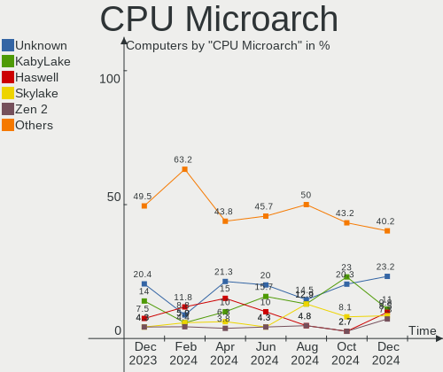
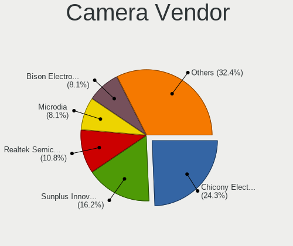

FreeBSD - Hardware Trends
-------------------------

A project to identify most popular hardware characteristics and track their change
over time based on data collected by BSD users at https://BSD-Hardware.info.

Anyone can contribute to this report by the [hw-probe](https://github.com/linuxhw/hw-probe/blob/master/INSTALL.BSD.md) tool:

    hw-probe -all -upload

This is a report for all computer types. See also reports for [desktops](/Dist/FreeBSD/Desktop/README.md) and [notebooks](/Dist/FreeBSD/Notebook/README.md).

This report is for one last month. Overall report since the beginning of time: [TestCoverage](https://github.com/bsdhw/TestCoverage)

Period: Jun, 2022.

Contents
--------

* [ System ](#system)
  - [ OS                       ](#os)
  - [ OS Family                ](#os-family)
  - [ Arch                     ](#arch)
  - [ DE                       ](#de)
  - [ Display Server           ](#display-server)
  - [ Display Manager          ](#display-manager)
  - [ OS Lang                  ](#os-lang)
  - [ Boot Mode                ](#boot-mode)
  - [ Filesystem               ](#filesystem)
  - [ Part. scheme             ](#part-scheme)

* [ Board ](#board)
  - [ Vendor                   ](#vendor)
  - [ Model                    ](#model)
  - [ Model Family             ](#model-family)
  - [ MFG Year                 ](#mfg-year)
  - [ Form Factor              ](#form-factor)
  - [ Coreboot                 ](#coreboot)
  - [ RAM Size                 ](#ram-size)
  - [ RAM Used                 ](#ram-used)
  - [ Total Drives             ](#total-drives)
  - [ Has CD-ROM               ](#has-cd-rom)
  - [ Has Ethernet             ](#has-ethernet)
  - [ Has WiFi                 ](#has-wifi)
  - [ Has Bluetooth            ](#has-bluetooth)

* [ Location ](#location)
  - [ Country                  ](#country)
  - [ City                     ](#city)

* [ Drives ](#drives)
  - [ Drive Vendor             ](#drive-vendor)
  - [ Drive Model              ](#drive-model)
  - [ HDD Vendor               ](#hdd-vendor)
  - [ SSD Vendor               ](#ssd-vendor)
  - [ Drive Kind               ](#drive-kind)
  - [ Drive Connector          ](#drive-connector)
  - [ Drive Size               ](#drive-size)
  - [ Space Total              ](#space-total)
  - [ Space Used               ](#space-used)
  - [ Malfunc. Drives          ](#malfunc-drives)
  - [ Malfunc. Drive Vendor    ](#malfunc-drive-vendor)
  - [ Malfunc. HDD Vendor      ](#malfunc-hdd-vendor)
  - [ Malfunc. Drive Kind      ](#malfunc-drive-kind)
  - [ Failed Drives            ](#failed-drives)
  - [ Failed Drive Vendor      ](#failed-drive-vendor)
  - [ Drive Status             ](#drive-status)

* [ Storage controller ](#storage-controller)
  - [ Storage Vendor           ](#storage-vendor)
  - [ Storage Model            ](#storage-model)
  - [ Storage Kind             ](#storage-kind)

* [ Processor ](#processor)
  - [ CPU Vendor               ](#cpu-vendor)
  - [ CPU Model                ](#cpu-model)
  - [ CPU Model Family         ](#cpu-model-family)
  - [ CPU Cores                ](#cpu-cores)
  - [ CPU Sockets              ](#cpu-sockets)
  - [ CPU Threads              ](#cpu-threads)
  - [ CPU Microarch            ](#cpu-microarch)

* [ Graphics ](#graphics)
  - [ GPU Vendor               ](#gpu-vendor)
  - [ GPU Model                ](#gpu-model)
  - [ GPU Combo                ](#gpu-combo)
  - [ GPU Driver               ](#gpu-driver)
  - [ GPU Memory               ](#gpu-memory)

* [ Monitor ](#monitor)
  - [ Monitor Vendor           ](#monitor-vendor)
  - [ Monitor Model            ](#monitor-model)
  - [ Monitor Resolution       ](#monitor-resolution)
  - [ Monitor Diagonal         ](#monitor-diagonal)
  - [ Monitor Width            ](#monitor-width)
  - [ Aspect Ratio             ](#aspect-ratio)
  - [ Monitor Area             ](#monitor-area)
  - [ Pixel Density            ](#pixel-density)
  - [ Multiple Monitors        ](#multiple-monitors)

* [ Network ](#network)
  - [ Net Controller Vendor    ](#net-controller-vendor)
  - [ Net Controller Model     ](#net-controller-model)
  - [ Wireless Vendor          ](#wireless-vendor)
  - [ Wireless Model           ](#wireless-model)
  - [ Ethernet Vendor          ](#ethernet-vendor)
  - [ Ethernet Model           ](#ethernet-model)
  - [ Net Controller Kind      ](#net-controller-kind)
  - [ Used Controller          ](#used-controller)
  - [ NICs                     ](#nics)
  - [ IPv6                     ](#ipv6)

* [ Bluetooth ](#bluetooth)
  - [ Bluetooth Vendor         ](#bluetooth-vendor)
  - [ Bluetooth Model          ](#bluetooth-model)

* [ Sound ](#sound)
  - [ Sound Vendor             ](#sound-vendor)
  - [ Sound Model              ](#sound-model)

* [ Memory ](#memory)
  - [ Memory Vendor            ](#memory-vendor)
  - [ Memory Model             ](#memory-model)
  - [ Memory Kind              ](#memory-kind)
  - [ Memory Form Factor       ](#memory-form-factor)
  - [ Memory Size              ](#memory-size)
  - [ Memory Speed             ](#memory-speed)

* [ Printers & scanners ](#printers--scanners)
  - [ Printer Vendor           ](#printer-vendor)
  - [ Printer Model            ](#printer-model)
  - [ Scanner Vendor           ](#scanner-vendor)
  - [ Scanner Model            ](#scanner-model)

* [ Camera ](#camera)
  - [ Camera Vendor            ](#camera-vendor)
  - [ Camera Model             ](#camera-model)

* [ Security ](#security)
  - [ Fingerprint Vendor       ](#fingerprint-vendor)
  - [ Fingerprint Model        ](#fingerprint-model)
  - [ Chipcard Vendor          ](#chipcard-vendor)
  - [ Chipcard Model           ](#chipcard-model)

* [ Unsupported ](#unsupported)
  - [ Unsupported Devices      ](#unsupported-devices)
  - [ Unsupported Device Types ](#unsupported-device-types)

System
------

OS
--

Installed operating systems

| Name                 | Computers | Percent |
|----------------------|-----------|---------|
| FreeBSD 13.1         | 47        | 81.03%  |
| FreeBSD 14.0-CURRENT | 3         | 5.17%   |
| FreeBSD 13.1-STABLE  | 2         | 3.45%   |
| FreeBSD 13.0-p11     | 2         | 3.45%   |
| FreeBSD 12.3         | 2         | 3.45%   |
| FreeBSD 13.0-p6      | 1         | 1.72%   |
| FreeBSD 12.3-STABLE  | 1         | 1.72%   |

OS Family
---------

OS without a version

| Name    | Computers | Percent |
|---------|-----------|---------|
| FreeBSD | 58        | 100%    |

Arch
----

OS architecture (x86_64, i586, etc.)

| Name  | Computers | Percent |
|-------|-----------|---------|
| amd64 | 55        | 94.83%  |
| i386  | 2         | 3.45%   |
| arm64 | 1         | 1.72%   |

DE
--

Desktop Environment

| Name     | Computers | Percent |
|----------|-----------|---------|
| Console  | 19        | 32.76%  |
| KDE5     | 11        | 18.97%  |
| XFCE     | 8         | 13.79%  |
| TWM      | 6         | 10.34%  |
| i3       | 4         | 6.9%    |
| MATE     | 3         | 5.17%   |
| Openbox  | 2         | 3.45%   |
| GNOME    | 2         | 3.45%   |
| LXQt     | 1         | 1.72%   |
| LXDE     | 1         | 1.72%   |
| Cinnamon | 1         | 1.72%   |

Display Server
--------------

X11 or Wayland

| Name    | Computers | Percent |
|---------|-----------|---------|
| X11     | 37        | 63.79%  |
| Console | 19        | 32.76%  |
| Wayland | 2         | 3.45%   |

Display Manager
---------------

SDDM, LightDM, etc.

| Name    | Computers | Percent |
|---------|-----------|---------|
| Console | 29        | 50%     |
| SDDM    | 10        | 17.24%  |
| SLiM    | 9         | 15.52%  |
| XDM     | 4         | 6.9%    |
| LightDM | 3         | 5.17%   |
| GDM     | 3         | 5.17%   |

OS Lang
-------

Language

| Lang    | Computers | Percent |
|---------|-----------|---------|
| C       | 44        | 75.86%  |
| ru_RU   | 3         | 5.17%   |
| en_US   | 3         | 5.17%   |
| Unknown | 3         | 5.17%   |
| zh_CN   | 2         | 3.45%   |
| fr_FR   | 2         | 3.45%   |
| de_DE   | 1         | 1.72%   |

Boot Mode
---------

EFI or BIOS

| Mode | Computers | Percent |
|------|-----------|---------|
| EFI  | 43        | 74.14%  |
| BIOS | 15        | 25.86%  |

Filesystem
----------

Type of filesystem

| Type | Computers | Percent |
|------|-----------|---------|
| Zfs  | 41        | 70.69%  |
| Ufs  | 17        | 29.31%  |

Part. scheme
------------

Scheme of partitioning

| Type | Computers | Percent |
|------|-----------|---------|
| GPT  | 53        | 91.38%  |
| MBR  | 5         | 8.62%   |

Board
-----

Vendor
------

Motherboard manufacturer

| Name                    | Computers | Percent |
|-------------------------|-----------|---------|
| Dell                    | 11        | 18.97%  |
| ASUSTek Computer        | 10        | 17.24%  |
| Lenovo                  | 9         | 15.52%  |
| Hewlett-Packard         | 5         | 8.62%   |
| MSI                     | 4         | 6.9%    |
| Gigabyte Technology     | 3         | 5.17%   |
| ASRock                  | 3         | 5.17%   |
| Intel                   | 2         | 3.45%   |
| Apple                   | 2         | 3.45%   |
| Acer                    | 2         | 3.45%   |
| Toshiba                 | 1         | 1.72%   |
| Supermicro              | 1         | 1.72%   |
| Sony                    | 1         | 1.72%   |
| Samsung Electronics     | 1         | 1.72%   |
| Raspberry Pi Foundation | 1         | 1.72%   |
| Fujitsu Siemens         | 1         | 1.72%   |
| Fujitsu                 | 1         | 1.72%   |

Model
-----

Motherboard model

| Name                                 | Computers | Percent |
|--------------------------------------|-----------|---------|
| MSI MS-7817                          | 2         | 3.45%   |
| ASUS All Series                      | 2         | 3.45%   |
| Toshiba Satellite A300               | 1         | 1.72%   |
| Supermicro Icebreaker 4824           | 1         | 1.72%   |
| Sony VGN-NS21M_S                     | 1         | 1.72%   |
| Samsung R530/R730/R540               | 1         | 1.72%   |
| RPi Raspberry Pi                     | 1         | 1.72%   |
| MSI MS-B120                          | 1         | 1.72%   |
| MSI MS-7D09                          | 1         | 1.72%   |
| Lenovo ThinkPad X270 20HN001HUS      | 1         | 1.72%   |
| Lenovo ThinkPad X220 4286CTO         | 1         | 1.72%   |
| Lenovo ThinkPad W520 4282AD4         | 1         | 1.72%   |
| Lenovo ThinkPad T590 20N4CTO1WW      | 1         | 1.72%   |
| Lenovo ThinkPad T14 Gen 1 20S0CTO1WW | 1         | 1.72%   |
| Lenovo ThinkPad R60e 0658W2M         | 1         | 1.72%   |
| Lenovo ThinkCentre M53 10DES00F00    | 1         | 1.72%   |
| Lenovo IdeaPadFlex 5 14ITL05 82LT    | 1         | 1.72%   |
| Lenovo IdeaPad 130-15AST 81H5        | 1         | 1.72%   |
| Intel NUC7i5BNK                      | 1         | 1.72%   |
| Intel D945GCLF2 AAE46416-104         | 1         | 1.72%   |
| HP Laptop 15s-fq1xxx                 | 1         | 1.72%   |
| HP EliteBook 8570p                   | 1         | 1.72%   |
| HP EliteBook 850 G7 Notebook PC      | 1         | 1.72%   |
| HP Desktop M01-F0xxx                 | 1         | 1.72%   |
| HP Compaq dc7900 Small Form Factor   | 1         | 1.72%   |
| Gigabyte H61MA-D3V                   | 1         | 1.72%   |
| Gigabyte F2A75M-D3H                  | 1         | 1.72%   |
| Gigabyte B550M AORUS PRO-P           | 1         | 1.72%   |
| Fujitsu Siemens AMILO Li3710         | 1         | 1.72%   |
| Fujitsu LIFEBOOK A555                | 1         | 1.72%   |
| Dell Precision M4800                 | 1         | 1.72%   |
| Dell Precision 7820 Tower            | 1         | 1.72%   |
| Dell OptiPlex 3080                   | 1         | 1.72%   |
| Dell Latitude E5500                  | 1         | 1.72%   |
| Dell Latitude E5420                  | 1         | 1.72%   |
| Dell Latitude 7490                   | 1         | 1.72%   |
| Dell Latitude 7390                   | 1         | 1.72%   |
| Dell Latitude 5521                   | 1         | 1.72%   |
| Dell Latitude 5410                   | 1         | 1.72%   |
| Dell Inspiron 5559                   | 1         | 1.72%   |
| Dell Inspiron 3668                   | 1         | 1.72%   |
| ASUS ZenBook UX461FA_UX461FA         | 1         | 1.72%   |
| ASUS ZenBook UX391FA_UX391FA         | 1         | 1.72%   |
| ASUS X441UV                          | 1         | 1.72%   |
| ASUS ROG STRIX X570-F GAMING         | 1         | 1.72%   |
| ASUS ROG CROSSHAIR VIII HERO         | 1         | 1.72%   |
| ASUS PRIME Z590-P                    | 1         | 1.72%   |
| ASUS PRIME X370-PRO                  | 1         | 1.72%   |
| ASUS P5Q-E                           | 1         | 1.72%   |
| ASRock X570 Phantom Gaming 4         | 1         | 1.72%   |
| ASRock P67 Professional              | 1         | 1.72%   |
| ASRock B550 Phantom Gaming-ITX/ax    | 1         | 1.72%   |
| Apple Macmini5,1                     | 1         | 1.72%   |
| Apple MacBookPro11,4                 | 1         | 1.72%   |
| Acer Nitro AN515-55                  | 1         | 1.72%   |
| Acer Aspire A114-33                  | 1         | 1.72%   |

Model Family
------------

Motherboard model prefix

| Name                  | Computers | Percent |
|-----------------------|-----------|---------|
| Lenovo ThinkPad       | 6         | 10.34%  |
| Dell Latitude         | 6         | 10.34%  |
| MSI MS-7817           | 2         | 3.45%   |
| HP EliteBook          | 2         | 3.45%   |
| Dell Precision        | 2         | 3.45%   |
| Dell Inspiron         | 2         | 3.45%   |
| ASUS ZenBook          | 2         | 3.45%   |
| ASUS ROG              | 2         | 3.45%   |
| ASUS PRIME            | 2         | 3.45%   |
| ASUS All              | 2         | 3.45%   |
| Toshiba Satellite     | 1         | 1.72%   |
| Supermicro Icebreaker | 1         | 1.72%   |
| Sony VGN-NS21M        | 1         | 1.72%   |
| Samsung R530          | 1         | 1.72%   |
| RPi Raspberry         | 1         | 1.72%   |
| MSI MS-B120           | 1         | 1.72%   |
| MSI MS-7D09           | 1         | 1.72%   |
| Lenovo ThinkCentre    | 1         | 1.72%   |
| Lenovo IdeaPadFlex    | 1         | 1.72%   |
| Lenovo IdeaPad        | 1         | 1.72%   |
| Intel NUC7i5BNK       | 1         | 1.72%   |
| Intel D945GCLF2       | 1         | 1.72%   |
| HP Laptop             | 1         | 1.72%   |
| HP Desktop            | 1         | 1.72%   |
| HP Compaq             | 1         | 1.72%   |
| Gigabyte H61MA-D3V    | 1         | 1.72%   |
| Gigabyte F2A75M-D3H   | 1         | 1.72%   |
| Gigabyte B550M        | 1         | 1.72%   |
| Fujitsu Siemens AMILO | 1         | 1.72%   |
| Fujitsu LIFEBOOK      | 1         | 1.72%   |
| Dell OptiPlex         | 1         | 1.72%   |
| ASUS X441UV           | 1         | 1.72%   |
| ASUS P5Q-E            | 1         | 1.72%   |
| ASRock X570           | 1         | 1.72%   |
| ASRock P67            | 1         | 1.72%   |
| ASRock B550           | 1         | 1.72%   |
| Apple Macmini5        | 1         | 1.72%   |
| Apple MacBookPro11    | 1         | 1.72%   |
| Acer Nitro            | 1         | 1.72%   |
| Acer Aspire           | 1         | 1.72%   |

MFG Year
--------

Motherboard manufacture year

| Year | Computers | Percent |
|------|-----------|---------|
| 2020 | 12        | 20.69%  |
| 2021 | 7         | 12.07%  |
| 2022 | 4         | 6.9%    |
| 2019 | 4         | 6.9%    |
| 2014 | 4         | 6.9%    |
| 2013 | 4         | 6.9%    |
| 2011 | 4         | 6.9%    |
| 2018 | 3         | 5.17%   |
| 2017 | 3         | 5.17%   |
| 2009 | 3         | 5.17%   |
| 2008 | 3         | 5.17%   |
| 2015 | 2         | 3.45%   |
| 2012 | 2         | 3.45%   |
| 2016 | 1         | 1.72%   |
| 2010 | 1         | 1.72%   |
| 2006 | 1         | 1.72%   |

Form Factor
-----------

Physical design of the computer

| Name           | Computers | Percent |
|----------------|-----------|---------|
| Notebook       | 28        | 48.28%  |
| Desktop        | 22        | 37.93%  |
| Mini pc        | 4         | 6.9%    |
| Convertible    | 2         | 3.45%   |
| System on chip | 1         | 1.72%   |
| Server         | 1         | 1.72%   |

Coreboot
--------

Have coreboot on board

| Used | Computers | Percent |
|------|-----------|---------|
| No   | 58        | 100%    |

RAM Size
--------

Total RAM memory

| Size in GB  | Computers | Percent |
|-------------|-----------|---------|
| 8.01-16.0   | 17        | 29.31%  |
| 16.01-24.0  | 16        | 27.59%  |
| 4.01-8.0    | 7         | 12.07%  |
| 32.01-64.0  | 7         | 12.07%  |
| 64.01-256.0 | 5         | 8.62%   |
| 2.01-3.0    | 2         | 3.45%   |
| 0.51-1.0    | 2         | 3.45%   |
| 3.01-4.0    | 1         | 1.72%   |
| 24.01-32.0  | 1         | 1.72%   |

RAM Used
--------

Used RAM memory

| Used GB   | Computers | Percent |
|-----------|-----------|---------|
| 0.01-0.5  | 25        | 43.1%   |
| 0.51-1.0  | 20        | 34.48%  |
| 1.01-2.0  | 8         | 13.79%  |
| 3.01-4.0  | 2         | 3.45%   |
| 2.01-3.0  | 2         | 3.45%   |
| 8.01-16.0 | 1         | 1.72%   |

Total Drives
------------

Number of drives on board

| Drives | Computers | Percent |
|--------|-----------|---------|
| 1      | 35        | 60.34%  |
| 3      | 6         | 10.34%  |
| 2      | 5         | 8.62%   |
| 4      | 4         | 6.9%    |
| 0      | 2         | 3.45%   |
| 18     | 1         | 1.72%   |
| 15     | 1         | 1.72%   |
| 13     | 1         | 1.72%   |
| 10     | 1         | 1.72%   |
| 8      | 1         | 1.72%   |
| 6      | 1         | 1.72%   |

Has CD-ROM
----------

Has CD-ROM on board

| Presented | Computers | Percent |
|-----------|-----------|---------|
| No        | 38        | 65.52%  |
| Yes       | 20        | 34.48%  |

Has Ethernet
------------

Has Ethernet on board

| Presented | Computers | Percent |
|-----------|-----------|---------|
| Yes       | 51        | 87.93%  |
| No        | 7         | 12.07%  |

Has WiFi
--------

Has WiFi module

| Presented | Computers | Percent |
|-----------|-----------|---------|
| Yes       | 37        | 63.79%  |
| No        | 21        | 36.21%  |

Has Bluetooth
-------------

Has Bluetooth module

| Presented | Computers | Percent |
|-----------|-----------|---------|
| No        | 32        | 55.17%  |
| Yes       | 26        | 44.83%  |

Location
--------

Country
-------

Geographic location (country)

| Country     | Computers | Percent |
|-------------|-----------|---------|
| USA         | 17        | 29.31%  |
| Russia      | 8         | 13.79%  |
| France      | 5         | 8.62%   |
| Germany     | 3         | 5.17%   |
| UK          | 2         | 3.45%   |
| Spain       | 2         | 3.45%   |
| Netherlands | 2         | 3.45%   |
| Hong Kong   | 2         | 3.45%   |
| Austria     | 2         | 3.45%   |
| Uruguay     | 1         | 1.72%   |
| Turkey      | 1         | 1.72%   |
| Poland      | 1         | 1.72%   |
| Philippines | 1         | 1.72%   |
| New Zealand | 1         | 1.72%   |
| Latvia      | 1         | 1.72%   |
| India       | 1         | 1.72%   |
| Hungary     | 1         | 1.72%   |
| Greece      | 1         | 1.72%   |
| Croatia     | 1         | 1.72%   |
| China       | 1         | 1.72%   |
| Canada      | 1         | 1.72%   |
| Bulgaria    | 1         | 1.72%   |
| Brazil      | 1         | 1.72%   |
| Australia   | 1         | 1.72%   |

City
----

Geographic location (city)

| City                     | Computers | Percent |
|--------------------------|-----------|---------|
| Moscow                   | 4         | 6.9%    |
| Vienna                   | 2         | 3.45%   |
| Tamm                     | 2         | 3.45%   |
| Salem                    | 2         | 3.45%   |
| Redmond                  | 2         | 3.45%   |
| Omaha                    | 2         | 3.45%   |
| Central                  | 2         | 3.45%   |
| Zagreb                   | 1         | 1.72%   |
| Xi'an                    | 1         | 1.72%   |
| Wenatchee                | 1         | 1.72%   |
| Wellington               | 1         | 1.72%   |
| Warsaw                   | 1         | 1.72%   |
| Villeneuve-Saint-Georges | 1         | 1.72%   |
| Vaulx-en-Velin           | 1         | 1.72%   |
| Toronto                  | 1         | 1.72%   |
| Tiel                     | 1         | 1.72%   |
| Thousand Oaks            | 1         | 1.72%   |
| Sydney                   | 1         | 1.72%   |
| St Petersburg            | 1         | 1.72%   |
| Sofia                    | 1         | 1.72%   |
| Sao Paulo                | 1         | 1.72%   |
| San Pablo City           | 1         | 1.72%   |
| San Francisco            | 1         | 1.72%   |
| Riga                     | 1         | 1.72%   |
| Rialto                   | 1         | 1.72%   |
| Pluvigner                | 1         | 1.72%   |
| Paris                    | 1         | 1.72%   |
| Ozersk                   | 1         | 1.72%   |
| Northeim                 | 1         | 1.72%   |
| New York                 | 1         | 1.72%   |
| Mumbai                   | 1         | 1.72%   |
| Montevideo               | 1         | 1.72%   |
| Manassas                 | 1         | 1.72%   |
| Madrid                   | 1         | 1.72%   |
| London                   | 1         | 1.72%   |
| Krasnodar                | 1         | 1.72%   |
| Istanbul                 | 1         | 1.72%   |
| Harrisburg               | 1         | 1.72%   |
| Green Valley             | 1         | 1.72%   |
| Durham                   | 1         | 1.72%   |
| Dronten                  | 1         | 1.72%   |
| Chelyabinsk              | 1         | 1.72%   |
| Budapest                 | 1         | 1.72%   |
| Brighton                 | 1         | 1.72%   |
| Borrego Springs          | 1         | 1.72%   |
| Bellingham               | 1         | 1.72%   |
| Barcelona                | 1         | 1.72%   |
| Athens                   | 1         | 1.72%   |
| Asnieres-sur-Seine       | 1         | 1.72%   |

Drives
------

Drive Vendor
------------

Hard drive vendors

| Vendor              | Computers | Drives | Percent |
|---------------------|-----------|--------|---------|
| WDC                 | 21        | 47     | 25%     |
| Samsung Electronics | 16        | 25     | 19.05%  |
| Seagate             | 12        | 34     | 14.29%  |
| Toshiba             | 6         | 11     | 7.14%   |
| Intel               | 5         | 6      | 5.95%   |
| Crucial             | 5         | 7      | 5.95%   |
| Transcend           | 2         | 2      | 2.38%   |
| KIOXIA              | 2         | 2      | 2.38%   |
| Kingston            | 2         | 2      | 2.38%   |
| Apple               | 2         | 2      | 2.38%   |
| SK hynix            | 1         | 1      | 1.19%   |
| SanDisk             | 1         | 1      | 1.19%   |
| OCZ                 | 1         | 1      | 1.19%   |
| Netac               | 1         | 1      | 1.19%   |
| Lexar               | 1         | 1      | 1.19%   |
| Lenovo              | 1         | 1      | 1.19%   |
| Hitachi             | 1         | 1      | 1.19%   |
| HGST                | 1         | 1      | 1.19%   |
| Gigabyte Technology | 1         | 1      | 1.19%   |
| Corsair             | 1         | 1      | 1.19%   |
| A-DATA Technology   | 1         | 2      | 1.19%   |

Drive Model
-----------

Hard drive models

| Model                                   | Computers | Percent |
|-----------------------------------------|-----------|---------|
| WDC WD30EFRX-68EUZN0 3TB                | 2         | 1.87%   |
| WDC WD10EZEX-08WN4A0 1TB                | 2         | 1.87%   |
| Seagate ST4000DM000-1F2168 4TB          | 2         | 1.87%   |
| WDC WDS500G2X0C-00L350 500GB            | 1         | 0.93%   |
| WDC WDS250G2B0A-00SM50 250GB            | 1         | 0.93%   |
| WDC WD80EZZX-11CSGA0 8TB                | 1         | 0.93%   |
| WDC WD80EZAZ-11TDBA0 8TB                | 1         | 0.93%   |
| WDC WD80EMZZ-00TBGA0 8TB                | 1         | 0.93%   |
| WDC WD80EMAZ-00WJTA0 8TB                | 1         | 0.93%   |
| WDC WD80EFZX-68UW8N0 8TB                | 1         | 0.93%   |
| WDC WD80EFAX-68LHPN0 8TB                | 1         | 0.93%   |
| WDC WD80EDBZ-11B0ZA0 8TB                | 1         | 0.93%   |
| WDC WD40EZRZ-22GXCB0 4TB                | 1         | 0.93%   |
| WDC WD3200BPVT-22JJ5T0 320GB            | 1         | 0.93%   |
| WDC WD3200BEKT-60PVMT0 320GB            | 1         | 0.93%   |
| WDC WD30EFRX-68N32N0 3TB                | 1         | 0.93%   |
| WDC WD30EFRX-68AX9N0 3TB                | 1         | 0.93%   |
| WDC WD2500BEVT-24A23T0 250GB            | 1         | 0.93%   |
| WDC WD20NMVW-11AV3S2 2TB                | 1         | 0.93%   |
| WDC WD1600BEVT-75ZCT2 160GB             | 1         | 0.93%   |
| WDC WD1600BEVT-22ZCT0 160GB             | 1         | 0.93%   |
| WDC WD1600AAJS-60M0A0 160GB             | 1         | 0.93%   |
| WDC WD15EADS-00P8B0 1.5TB               | 1         | 0.93%   |
| WDC WD140EFGX-68B0GN0 14TB              | 1         | 0.93%   |
| WDC WD120EMFZ-11A6JA0 12TB              | 1         | 0.93%   |
| WDC WD120EMAZ-11BLFA0 12TB              | 1         | 0.93%   |
| WDC WD10EZEX-75WN4A1 1TB                | 1         | 0.93%   |
| WDC WD10EZEX-60WN4A0 1TB                | 1         | 0.93%   |
| WDC WD10EZEX-60M2NA0 1TB                | 1         | 0.93%   |
| WDC WD100EMAZ-00WJTA0 10TB              | 1         | 0.93%   |
| WDC WD1002FAEX-00Z3A0 1TB               | 1         | 0.93%   |
| WDC PC SN530 SDBPNPZ-256G-1014 256GB    | 1         | 0.93%   |
| Transcend TS1TMTE110S 1TB               | 1         | 0.93%   |
| Transcend TS128GMSA370 128GB            | 1         | 0.93%   |
| Toshiba MQ04ABF100 1TB                  | 1         | 0.93%   |
| Toshiba MQ01ABD100 1TB                  | 1         | 0.93%   |
| Toshiba MK2546GSX 250GB                 | 1         | 0.93%   |
| Toshiba KSG60ZMV256G M.2 2280 256GB     | 1         | 0.93%   |
| Toshiba HDWD110 1TB                     | 1         | 0.93%   |
| Toshiba DT01ACA300 3TB                  | 1         | 0.93%   |
| Toshiba DT01ABA300 3TB                  | 1         | 0.93%   |
| SK hynix BC511 HFM512GDJTNI-82A0A 512GB | 1         | 0.93%   |
| Seagate ST8000VN0022-2EL112 8TB         | 1         | 0.93%   |
| Seagate ST8000AS0002-1NA17Z 8TB         | 1         | 0.93%   |
| Seagate ST500LM012 HN-M500MBB 500GB     | 1         | 0.93%   |
| Seagate ST5000LM000-2U8170 5TB          | 1         | 0.93%   |
| Seagate ST5000LM000-2AN170 5TB          | 1         | 0.93%   |
| Seagate ST4000VN008-2DR166 4TB          | 1         | 0.93%   |
| Seagate ST4000NM0035-1V4107 4TB         | 1         | 0.93%   |
| Seagate ST4000NM0035 4TB                | 1         | 0.93%   |
| Seagate ST320011A 20GB                  | 1         | 0.93%   |
| Seagate ST31000524AS 1TB                | 1         | 0.93%   |
| Seagate ST3000NM0005-1V410N 3TB         | 1         | 0.93%   |
| Seagate ST1000LM049-2GH172 1TB          | 1         | 0.93%   |
| Seagate ST1000DM010-2EP102 1TB          | 1         | 0.93%   |
| Seagate ST1000DM003-1SB102 1TB          | 1         | 0.93%   |
| SanDisk SSD PLUS 120GB                  | 1         | 0.93%   |
| Samsung SSD 980 PRO 500GB               | 1         | 0.93%   |
| Samsung SSD 980 PRO 1TB                 | 1         | 0.93%   |
| Samsung SSD 970 EVO Plus 2TB            | 1         | 0.93%   |

HDD Vendor
----------

Hard disk drive vendors

| Vendor              | Computers | Drives | Percent |
|---------------------|-----------|--------|---------|
| WDC                 | 18        | 44     | 46.15%  |
| Seagate             | 12        | 34     | 30.77%  |
| Toshiba             | 5         | 10     | 12.82%  |
| Samsung Electronics | 1         | 4      | 2.56%   |
| Hitachi             | 1         | 1      | 2.56%   |
| HGST                | 1         | 1      | 2.56%   |
| Apple               | 1         | 1      | 2.56%   |

SSD Vendor
----------

Solid state drive vendors

| Vendor              | Computers | Drives | Percent |
|---------------------|-----------|--------|---------|
| Samsung Electronics | 8         | 12     | 30.77%  |
| Intel               | 4         | 5      | 15.38%  |
| Crucial             | 4         | 4      | 15.38%  |
| WDC                 | 1         | 1      | 3.85%   |
| Transcend           | 1         | 1      | 3.85%   |
| Toshiba             | 1         | 1      | 3.85%   |
| SanDisk             | 1         | 1      | 3.85%   |
| OCZ                 | 1         | 1      | 3.85%   |
| Lexar               | 1         | 1      | 3.85%   |
| Lenovo              | 1         | 1      | 3.85%   |
| Gigabyte Technology | 1         | 1      | 3.85%   |
| Apple               | 1         | 1      | 3.85%   |
| A-DATA Technology   | 1         | 2      | 3.85%   |

Drive Kind
----------

HDD or SSD

| Kind | Computers | Drives | Percent |
|------|-----------|--------|---------|
| HDD  | 30        | 95     | 41.1%   |
| SSD  | 24        | 32     | 32.88%  |
| NVMe | 19        | 23     | 26.03%  |

Drive Connector
---------------

SATA, SAS, NVMe, etc.

| Type | Computers | Drives | Percent |
|------|-----------|--------|---------|
| SATA | 42        | 127    | 68.85%  |
| NVMe | 19        | 23     | 31.15%  |

Drive Size
----------

Size of hard drive

| Size in TB | Computers | Drives | Percent |
|------------|-----------|--------|---------|
| 0.01-0.5   | 26        | 33     | 44.07%  |
| 0.51-1.0   | 18        | 25     | 30.51%  |
| 3.01-4.0   | 4         | 7      | 6.78%   |
| 2.01-3.0   | 3         | 16     | 5.08%   |
| 1.01-2.0   | 3         | 9      | 5.08%   |
| 4.01-10.0  | 3         | 33     | 5.08%   |
| 10.01-20.0 | 2         | 4      | 3.39%   |

Space Total
-----------

Amount of disk space available on the file system

| Size in GB | Computers | Percent |
|------------|-----------|---------|
| 101-250    | 23        | 39.66%  |
| 251-500    | 11        | 18.97%  |
| 501-1000   | 8         | 13.79%  |
| 51-100     | 6         | 10.34%  |
| 21-50      | 4         | 6.9%    |
| 2001-3000  | 3         | 5.17%   |
| 1-20       | 2         | 3.45%   |
| 1001-2000  | 1         | 1.72%   |

Space Used
----------

Amount of used disk space

| Used GB  | Computers | Percent |
|----------|-----------|---------|
| 1-20     | 47        | 81.03%  |
| 21-50    | 8         | 13.79%  |
| 251-500  | 1         | 1.72%   |
| 501-1000 | 1         | 1.72%   |
| 51-100   | 1         | 1.72%   |

Malfunc. Drives
---------------

Drive models with a malfunction

| Model                               | Computers | Drives | Percent |
|-------------------------------------|-----------|--------|---------|
| WDC WD3200BEKT-60PVMT0 320GB        | 1         | 1      | 11.11%  |
| WDC WD30EFRX-68EUZN0 3TB            | 1         | 3      | 11.11%  |
| WDC WD2500BEVT-24A23T0 250GB        | 1         | 1      | 11.11%  |
| WDC WD1600AAJS-60M0A0 160GB         | 1         | 1      | 11.11%  |
| Toshiba MQ01ABD100 1TB              | 1         | 1      | 11.11%  |
| Toshiba MK2546GSX 250GB             | 1         | 1      | 11.11%  |
| Seagate ST500LM012 HN-M500MBB 500GB | 1         | 1      | 11.11%  |
| HGST HTS721010A9E630 1TB            | 1         | 1      | 11.11%  |
| A-DATA Technology SU630 240GB       | 1         | 1      | 11.11%  |

Malfunc. Drive Vendor
---------------------

Vendors of faulty drives

| Vendor            | Computers | Drives | Percent |
|-------------------|-----------|--------|---------|
| WDC               | 3         | 6      | 37.5%   |
| Toshiba           | 2         | 2      | 25%     |
| Seagate           | 1         | 1      | 12.5%   |
| HGST              | 1         | 1      | 12.5%   |
| A-DATA Technology | 1         | 1      | 12.5%   |

Malfunc. HDD Vendor
-------------------

Vendors of faulty HDD drives

| Vendor  | Computers | Drives | Percent |
|---------|-----------|--------|---------|
| WDC     | 3         | 6      | 42.86%  |
| Toshiba | 2         | 2      | 28.57%  |
| Seagate | 1         | 1      | 14.29%  |
| HGST    | 1         | 1      | 14.29%  |

Malfunc. Drive Kind
-------------------

Kinds of faulty drives

| Kind | Computers | Drives | Percent |
|------|-----------|--------|---------|
| HDD  | 6         | 10     | 85.71%  |
| SSD  | 1         | 1      | 14.29%  |

Failed Drives
-------------

Failed drive models

Zero info for selected period =(

Failed Drive Vendor
-------------------

Failed drive vendors

Zero info for selected period =(

Drive Status
------------

Number of failed and malfunc. drives

| Status   | Computers | Drives | Percent |
|----------|-----------|--------|---------|
| Works    | 49        | 130    | 81.67%  |
| Malfunc  | 7         | 11     | 11.67%  |
| Detected | 4         | 9      | 6.67%   |

Storage controller
------------------

Storage Vendor
--------------

Storage controller vendors

| Vendor                      | Computers | Percent |
|-----------------------------|-----------|---------|
| Intel                       | 40        | 51.28%  |
| Samsung Electronics         | 9         | 11.54%  |
| AMD                         | 8         | 10.26%  |
| Marvell Technology Group    | 3         | 3.85%   |
| Broadcom / LSI              | 3         | 3.85%   |
| SanDisk                     | 2         | 2.56%   |
| Micron/Crucial Technology   | 2         | 2.56%   |
| Kingston Technology Company | 2         | 2.56%   |
| ASMedia Technology          | 2         | 2.56%   |
| Toshiba                     | 1         | 1.28%   |
| SK hynix                    | 1         | 1.28%   |
| Silicon Motion              | 1         | 1.28%   |
| Silicon Image               | 1         | 1.28%   |
| Phison Electronics          | 1         | 1.28%   |
| KIOXIA                      | 1         | 1.28%   |
| Unknown                     | 1         | 1.28%   |

Storage Model
-------------

Storage controller models

| Model                                                                            | Computers | Percent |
|----------------------------------------------------------------------------------|-----------|---------|
| AMD FCH SATA Controller [AHCI mode]                                              | 6         | 6.98%   |
| Samsung NVMe SSD Controller SM981/PM981/PM983                                    | 4         | 4.65%   |
| Intel 6 Series/C200 Series Chipset Family 6 port Mobile SATA AHCI Controller     | 4         | 4.65%   |
| Samsung NVMe SSD Controller PM9A1/PM9A3/980PRO                                   | 3         | 3.49%   |
| Intel Sunrise Point-LP SATA Controller [AHCI mode]                               | 3         | 3.49%   |
| Intel 82801IBM/IEM (ICH9M/ICH9M-E) 4 port SATA Controller [AHCI mode]            | 3         | 3.49%   |
| Intel 82801 Mobile SATA Controller [RAID mode]                                   | 3         | 3.49%   |
| Intel 8 Series/C220 Series Chipset Family 6-port SATA Controller 1 [AHCI mode]   | 3         | 3.49%   |
| Intel 500 Series Chipset Family SATA AHCI Controller                             | 3         | 3.49%   |
| Broadcom / LSI SAS2008 PCI-Express Fusion-MPT SAS-2 [Falcon]                     | 3         | 3.49%   |
| Samsung NVMe SSD Controller SM961/PM961/SM963                                    | 2         | 2.33%   |
| Micron/Crucial P2 NVMe PCIe SSD                                                  | 2         | 2.33%   |
| Intel 6 Series/C200 Series Chipset Family 6 port Desktop SATA AHCI Controller    | 2         | 2.33%   |
| Intel 400 Series Chipset Family SATA AHCI Controller                             | 2         | 2.33%   |
| AMD 500 Series Chipset SATA Controller                                           | 2         | 2.33%   |
| Toshiba XG6 NVMe SSD Controller                                                  | 1         | 1.16%   |
| SK hynix BC511                                                                   | 1         | 1.16%   |
| Silicon Motion SM2263EN/SM2263XT SSD Controller                                  | 1         | 1.16%   |
| Silicon Image SiI 3124 PCI-X Serial ATA Controller                               | 1         | 1.16%   |
| SanDisk WD Blue SN550 NVMe SSD                                                   | 1         | 1.16%   |
| SanDisk WD Black 2018/SN750 / PC SN720 NVMe SSD                                  | 1         | 1.16%   |
| Samsung SM951 AHCI                                                               | 1         | 1.16%   |
| Phison E16 PCIe4 NVMe Controller                                                 | 1         | 1.16%   |
| Marvell Group 88SE9172 SATA 6Gb/s Controller                                     | 1         | 1.16%   |
| Marvell Group 88SE9120 SATA 6Gb/s Controller                                     | 1         | 1.16%   |
| Marvell Group 88SE6111/6121 SATA II / PATA Controller                            | 1         | 1.16%   |
| KIOXIA unknown                                                                   | 1         | 1.16%   |
| Kingston Company U-SNS8154P3 NVMe SSD                                            | 1         | 1.16%   |
| Kingston Company KC2000 NVMe SSD                                                 | 1         | 1.16%   |
| Intel Wildcat Point-LP SATA Controller [AHCI Mode]                               | 1         | 1.16%   |
| Intel Volume Management Device NVMe RAID Controller                              | 1         | 1.16%   |
| Intel SSD 660P Series                                                            | 1         | 1.16%   |
| Intel Q170/Q150/B150/H170/H110/Z170/CM236 Chipset SATA Controller [AHCI Mode]    | 1         | 1.16%   |
| Intel NM10/ICH7 Family SATA Controller [IDE mode]                                | 1         | 1.16%   |
| Intel Jasper Lake SATA AHCI Controller                                           | 1         | 1.16%   |
| Intel Comet Lake SATA AHCI Controller                                            | 1         | 1.16%   |
| Intel C620 Series Chipset Family IDE Redirection                                 | 1         | 1.16%   |
| Intel C602 chipset 4-Port SATA Storage Control Unit                              | 1         | 1.16%   |
| Intel C600/X79 series chipset SATA RAID Controller                               | 1         | 1.16%   |
| Intel C600/X79 series chipset 6-Port SATA AHCI Controller                        | 1         | 1.16%   |
| Intel Atom/Celeron/Pentium Processor x5-E8000/J3xxx/N3xxx Series SATA Controller | 1         | 1.16%   |
| Intel Atom Processor E3800 Series SATA AHCI Controller                           | 1         | 1.16%   |
| Intel 9 Series Chipset Family SATA Controller [AHCI Mode]                        | 1         | 1.16%   |
| Intel 82801JI (ICH10 Family) SATA AHCI Controller                                | 1         | 1.16%   |
| Intel 82801JD/DO (ICH10 Family) SATA AHCI Controller                             | 1         | 1.16%   |
| Intel 82801HM/HEM (ICH8M/ICH8M-E) SATA Controller [AHCI mode]                    | 1         | 1.16%   |
| Intel 82801HM/HEM (ICH8M/ICH8M-E) IDE Controller                                 | 1         | 1.16%   |
| Intel 82801GBM/GHM (ICH7-M Family) SATA Controller [IDE mode]                    | 1         | 1.16%   |
| Intel 7 Series Chipset Family 6-port SATA Controller [AHCI mode]                 | 1         | 1.16%   |
| Intel 5 Series/3400 Series Chipset 4 port SATA AHCI Controller                   | 1         | 1.16%   |
| Intel 4 Series Chipset PT IDER Controller                                        | 1         | 1.16%   |
| Intel 200 Series PCH SATA controller [AHCI mode]                                 | 1         | 1.16%   |
| ASMedia ASM1166 Serial ATA Controller                                            | 1         | 1.16%   |
| ASMedia ASM1062 Serial ATA Controller                                            | 1         | 1.16%   |
| AMD X370 Series Chipset SATA Controller                                          | 1         | 1.16%   |
| Unknown                                                                          | 1         | 1.16%   |

Storage Kind
------------

Kind of storage controller (IDE, SATA, NVMe, SAS, ...)

| Kind | Computers | Percent |
|------|-----------|---------|
| SATA | 43        | 56.58%  |
| NVMe | 19        | 25%     |
| IDE  | 6         | 7.89%   |
| RAID | 5         | 6.58%   |
| SAS  | 3         | 3.95%   |

Processor
---------

CPU Vendor
----------

Processor vendors

| Vendor | Computers | Percent |
|--------|-----------|---------|
| Intel  | 49        | 84.48%  |
| AMD    | 8         | 13.79%  |
| ARM    | 1         | 1.72%   |

CPU Model
---------

Processor models

| Model                                        | Computers | Percent |
|----------------------------------------------|-----------|---------|
| Intel Core i7-8565U CPU @ 1.80GHz            | 2         | 3.45%   |
| AMD Ryzen 9 3900X 12-Core Processor          | 2         | 3.45%   |
| Intel Xeon Silver 4210R CPU @ 2.40GHz        | 1         | 1.72%   |
| Intel Xeon CPU E5-2650 v2 @ 2.60GHz          | 1         | 1.72%   |
| Intel Pentium Silver N6000 @ 1.10GHz         | 1         | 1.72%   |
| Intel Pentium Dual CPU T3400 @ 2.16GHz       | 1         | 1.72%   |
| Intel Pentium CPU G3220 @ 3.00GHz            | 1         | 1.72%   |
| Intel Genuine CPU                            | 1         | 1.72%   |
| Intel CPU Version                            | 1         | 1.72%   |
| Intel Core i7-7700 CPU @ 3.60GHz             | 1         | 1.72%   |
| Intel Core i7-7500U CPU @ 2.70GHz            | 1         | 1.72%   |
| Intel Core i7-6500U CPU @ 2.50GHz            | 1         | 1.72%   |
| Intel Core i7-4980HQ CPU @ 2.80GHz           | 1         | 1.72%   |
| Intel Core i7-4810MQ CPU @ 2.80GHz           | 1         | 1.72%   |
| Intel Core i7-4790K CPU @ 4.00GHz            | 1         | 1.72%   |
| Intel Core i7-3520M CPU @ 2.90GHz            | 1         | 1.72%   |
| Intel Core i7-2760QM CPU @ 2.40GHz           | 1         | 1.72%   |
| Intel Core i7-2620M CPU @ 2.70GHz            | 1         | 1.72%   |
| Intel Core i7-2600K CPU @ 3.40GHz            | 1         | 1.72%   |
| Intel Core i7-10700K CPU @ 3.80GHz           | 1         | 1.72%   |
| Intel Core i7-10510U CPU @ 1.80GHz           | 1         | 1.72%   |
| Intel Core i5-9400 CPU @ 2.90GHz             | 1         | 1.72%   |
| Intel Core i5-8350U CPU @ 1.70GHz            | 1         | 1.72%   |
| Intel Core i5-8265U CPU @ 1.60GHz            | 1         | 1.72%   |
| Intel Core i5-7300U CPU @ 2.60GHz            | 1         | 1.72%   |
| Intel Core i5-7260U CPU @ 2.20GHz            | 1         | 1.72%   |
| Intel Core i5-4690 CPU @ 3.50GHz             | 1         | 1.72%   |
| Intel Core i5-4570 CPU @ 3.20GHz             | 1         | 1.72%   |
| Intel Core i5-3470 CPU @ 3.20GHz             | 1         | 1.72%   |
| Intel Core i5-2520M CPU @ 2.50GH             | 1         | 1.72%   |
| Intel Core i5-2415M CPU @ 2.30GHz            | 1         | 1.72%   |
| Intel Core i5-1035G1 CPU @ 1.00GHz           | 1         | 1.72%   |
| Intel Core i5-10310U CPU @ 1.70GHz           | 1         | 1.72%   |
| Intel Core i5-10300H CPU @ 2.50GHz           | 1         | 1.72%   |
| Intel Core i5-10210U CPU @ 1.60GHz           | 1         | 1.72%   |
| Intel Core i3-6006U CPU @ 2.00GHz            | 1         | 1.72%   |
| Intel Core i3-5005U CPU @ 2.00GHz            | 1         | 1.72%   |
| Intel Core i3-10100 CPU @ 3.60GHz            | 1         | 1.72%   |
| Intel Core 2 Quad CPU Q6600 @ 2.40GHz        | 1         | 1.72%   |
| Intel Core 2 Duo CPU T6400 @ 2.00GHz         | 1         | 1.72%   |
| Intel Core 2 Duo CPU E8500 @ 3.16GHz         | 1         | 1.72%   |
| Intel Core 2 Duo                             | 1         | 1.72%   |
| Intel Celeron M CPU                          | 1         | 1.72%   |
| Intel Celeron CPU N3150 @ 1.60GHz            | 1         | 1.72%   |
| Intel Celeron CPU J1800 @ 2.41GHz            | 1         | 1.72%   |
| Intel Atom CPU 330 @ 1.60GHz                 | 1         | 1.72%   |
| Intel 11th Gen Core i7-11850H @ 2.50GHz      | 1         | 1.72%   |
| Intel 11th Gen Core i7-11700 @ 2.50GHz       | 1         | 1.72%   |
| Intel 11th Gen Core i7-1165G7 @ 2.80GHz      | 1         | 1.72%   |
| ARM Cortex-A72 r0p3                          | 1         | 1.72%   |
| AMD Ryzen 9 5900X 12-Core Processor          | 1         | 1.72%   |
| AMD Ryzen 7 1700 Eight-Core Processor        | 1         | 1.72%   |
| AMD Ryzen 5 5600G with Radeon Graphics       | 1         | 1.72%   |
| AMD Ryzen 3 3300X 4-Core Processor           | 1         | 1.72%   |
| AMD E2-9000 RADEON R2, 4 COMPUTE CORES 2C+2G | 1         | 1.72%   |
| AMD A10-5800K APU with Radeon HD Graphics    | 1         | 1.72%   |

CPU Model Family
----------------

Processor model prefix

| Model                | Computers | Percent |
|----------------------|-----------|---------|
| Intel Core i7        | 14        | 24.14%  |
| Intel Core i5        | 14        | 24.14%  |
| Other                | 4         | 6.9%    |
| Intel Core i3        | 3         | 5.17%   |
| Intel Core 2 Duo     | 3         | 5.17%   |
| AMD Ryzen 9          | 3         | 5.17%   |
| Intel Celeron        | 2         | 3.45%   |
| Intel Xeon Silver    | 1         | 1.72%   |
| Intel Xeon           | 1         | 1.72%   |
| Intel Pentium Silver | 1         | 1.72%   |
| Intel Pentium Dual   | 1         | 1.72%   |
| Intel Pentium        | 1         | 1.72%   |
| Intel Genuine        | 1         | 1.72%   |
| Intel Core 2 Quad    | 1         | 1.72%   |
| Intel Celeron M      | 1         | 1.72%   |
| Intel Atom           | 1         | 1.72%   |
| ARM Cortex           | 1         | 1.72%   |
| AMD Ryzen 7          | 1         | 1.72%   |
| AMD Ryzen 5          | 1         | 1.72%   |
| AMD Ryzen 3          | 1         | 1.72%   |
| AMD E2               | 1         | 1.72%   |
| AMD A10              | 1         | 1.72%   |

CPU Cores
---------

Number of processor cores

| Number  | Computers | Percent |
|---------|-----------|---------|
| 4       | 24        | 41.38%  |
| 2       | 17        | 29.31%  |
| 8       | 4         | 6.9%    |
| Unknown | 4         | 6.9%    |
| 24      | 3         | 5.17%   |
| 16      | 2         | 3.45%   |
| 20      | 1         | 1.72%   |
| 12      | 1         | 1.72%   |
| 6       | 1         | 1.72%   |
| 1       | 1         | 1.72%   |

CPU Sockets
-----------

Number of sockets

| Number  | Computers | Percent |
|---------|-----------|---------|
| 1       | 55        | 94.83%  |
| 2       | 2         | 3.45%   |
| Unknown | 1         | 1.72%   |

CPU Threads
-----------

Threads per core (Hyper-Threading)

| Number  | Computers | Percent |
|---------|-----------|---------|
| 2       | 33        | 56.9%   |
| 1       | 20        | 34.48%  |
| Unknown | 5         | 8.62%   |

CPU Microarch
-------------

Microarchitecture

| Name        | Computers | Percent |
|-------------|-----------|---------|
| KabyLake    | 12        | 20.69%  |
| Haswell     | 6         | 10.34%  |
| SandyBridge | 5         | 8.62%   |
| Core        | 4         | 6.9%    |
| Unknown     | 4         | 6.9%    |
| Zen 2       | 3         | 5.17%   |
| Skylake     | 3         | 5.17%   |
| IvyBridge   | 3         | 5.17%   |
| CometLake   | 3         | 5.17%   |
| Zen 3       | 2         | 3.45%   |
| Silvermont  | 2         | 3.45%   |
| Penryn      | 2         | 3.45%   |
| Zen         | 1         | 1.72%   |
| Westmere    | 1         | 1.72%   |
| TigerLake   | 1         | 1.72%   |
| Piledriver  | 1         | 1.72%   |
| P6          | 1         | 1.72%   |
| IceLake     | 1         | 1.72%   |
| Excavator   | 1         | 1.72%   |
| Broadwell   | 1         | 1.72%   |
| Bonnell     | 1         | 1.72%   |

Graphics
--------

GPU Vendor
----------

Vendors of graphics cards

| Vendor                     | Computers | Percent |
|----------------------------|-----------|---------|
| Intel                      | 40        | 63.49%  |
| Nvidia                     | 11        | 17.46%  |
| AMD                        | 11        | 17.46%  |
| Matrox Electronics Systems | 1         | 1.59%   |

GPU Model
---------

Graphics card models

| Model                                                                                    | Computers | Percent |
|------------------------------------------------------------------------------------------|-----------|---------|
| Intel Xeon E3-1200 v3/4th Gen Core Processor Integrated Graphics Controller              | 4         | 6.06%   |
| Intel 2nd Generation Core Processor Family Integrated Graphics Controller                | 4         | 6.06%   |
| Intel WhiskeyLake-U GT2 [UHD Graphics 620]                                               | 3         | 4.55%   |
| Intel Mobile 4 Series Chipset Integrated Graphics Controller                             | 3         | 4.55%   |
| Intel CometLake-U GT2 [UHD Graphics]                                                     | 3         | 4.55%   |
| Nvidia GP108 [GeForce GT 1030]                                                           | 2         | 3.03%   |
| Intel Skylake GT2 [HD Graphics 520]                                                      | 2         | 3.03%   |
| Intel HD Graphics 620                                                                    | 2         | 3.03%   |
| AMD Caicos XTX [Radeon HD 8490 / R5 235X OEM]                                            | 2         | 3.03%   |
| Nvidia TU117M [GeForce MX450]                                                            | 1         | 1.52%   |
| Nvidia TU117M                                                                            | 1         | 1.52%   |
| Nvidia GT218 [NVS 300]                                                                   | 1         | 1.52%   |
| Nvidia GP107 [GeForce GTX 1050]                                                          | 1         | 1.52%   |
| Nvidia GP106 [GeForce GTX 1060 3GB]                                                      | 1         | 1.52%   |
| Nvidia GP104 [GeForce GTX 1070]                                                          | 1         | 1.52%   |
| Nvidia GM108M [GeForce 920MX]                                                            | 1         | 1.52%   |
| Nvidia GK208B [GeForce GT 730]                                                           | 1         | 1.52%   |
| Nvidia GK208B [GeForce GT 710]                                                           | 1         | 1.52%   |
| Matrox Electronics Systems MGA G200eW WPCM450                                            | 1         | 1.52%   |
| Intel Xeon E3-1200 v2/3rd Gen Core processor Graphics Controller                         | 1         | 1.52%   |
| Intel UHD Graphics 620                                                                   | 1         | 1.52%   |
| Intel TigerLake-LP GT2 [Iris Xe Graphics]                                                | 1         | 1.52%   |
| Intel TigerLake-H GT1 [UHD Graphics]                                                     | 1         | 1.52%   |
| Intel RocketLake-S GT1 [UHD Graphics 750]                                                | 1         | 1.52%   |
| Intel Mobile GM965/GL960 Integrated Graphics Controller (secondary)                      | 1         | 1.52%   |
| Intel Mobile GM965/GL960 Integrated Graphics Controller (primary)                        | 1         | 1.52%   |
| Intel Mobile 945GM/GMS/GME, 943/940GML Express Integrated Graphics Controller            | 1         | 1.52%   |
| Intel Mobile 945GM/GMS, 943/940GML Express Integrated Graphics Controller                | 1         | 1.52%   |
| Intel JasperLake [UHD Graphics]                                                          | 1         | 1.52%   |
| Intel Iris Plus Graphics G1 (Ice Lake)                                                   | 1         | 1.52%   |
| Intel Iris Plus Graphics 640                                                             | 1         | 1.52%   |
| Intel HD Graphics 5500                                                                   | 1         | 1.52%   |
| Intel Crystal Well Integrated Graphics Controller                                        | 1         | 1.52%   |
| Intel Core Processor Integrated Graphics Controller                                      | 1         | 1.52%   |
| Intel CometLake-S GT2 [UHD Graphics 630]                                                 | 1         | 1.52%   |
| Intel CometLake-H GT2 [UHD Graphics]                                                     | 1         | 1.52%   |
| Intel Atom/Celeron/Pentium Processor x5-E8000/J3xxx/N3xxx Integrated Graphics Controller | 1         | 1.52%   |
| Intel Atom Processor Z36xxx/Z37xxx Series Graphics & Display                             | 1         | 1.52%   |
| Intel 82945G/GZ Integrated Graphics Controller                                           | 1         | 1.52%   |
| Intel 4th Gen Core Processor Integrated Graphics Controller                              | 1         | 1.52%   |
| AMD Venus XT [Radeon HD 8870M / R9 M270X/M370X]                                          | 1         | 1.52%   |
| AMD Thames [Radeon HD 7550M/7570M/7650M]                                                 | 1         | 1.52%   |
| AMD Sun XT [Radeon HD 8670A/8670M/8690M / R5 M330 / M430 / Radeon 520 Mobile]            | 1         | 1.52%   |
| AMD Stoney [Radeon R2/R3/R4/R5 Graphics]                                                 | 1         | 1.52%   |
| AMD RV370 [Radeon X300/X550/X1050 Series] (Secondary)                                    | 1         | 1.52%   |
| AMD RV370 [Radeon X300/X550/X1050 Series]                                                | 1         | 1.52%   |
| AMD Redwood XT [Radeon HD 5670/5690/5730]                                                | 1         | 1.52%   |
| AMD Lexa XT [Radeon PRO WX 2100]                                                         | 1         | 1.52%   |
| AMD Cezanne                                                                              | 1         | 1.52%   |
| AMD Cedar [Radeon HD 5000/6000/7350/8350 Series]                                         | 1         | 1.52%   |

GPU Combo
---------

Combinations of graphics cards

| Name           | Computers | Percent |
|----------------|-----------|---------|
| 1 x Intel      | 29        | 50%     |
| 1 x AMD        | 8         | 13.79%  |
| 1 x Nvidia     | 7         | 12.07%  |
| 2 x Intel      | 5         | 8.62%   |
| Intel + Nvidia | 4         | 6.9%    |
| Intel + AMD    | 2         | 3.45%   |
| Other          | 1         | 1.72%   |
| 2 x AMD        | 1         | 1.72%   |
| 1 x Matrox     | 1         | 1.72%   |

GPU Driver
----------

Free vs proprietary

| Driver      | Computers | Percent |
|-------------|-----------|---------|
| Free        | 53        | 91.38%  |
| Proprietary | 4         | 6.9%    |
| Unknown     | 1         | 1.72%   |

GPU Memory
----------

Total video memory

| Size in GB | Computers | Percent |
|------------|-----------|---------|
| Unknown    | 50        | 86.21%  |
| 0.51-1.0   | 4         | 6.9%    |
| 1.01-2.0   | 2         | 3.45%   |
| 0.01-0.5   | 2         | 3.45%   |

Monitor
-------

Monitor Vendor
--------------

Monitor vendors

| Vendor               | Computers | Percent |
|----------------------|-----------|---------|
| BOE                  | 6         | 15.38%  |
| Samsung Electronics  | 5         | 12.82%  |
| LG Display           | 5         | 12.82%  |
| AU Optronics         | 4         | 10.26%  |
| Philips              | 3         | 7.69%   |
| Chimei Innolux       | 2         | 5.13%   |
| ViewSonic            | 1         | 2.56%   |
| Vestel Elektronik    | 1         | 2.56%   |
| Lenovo               | 1         | 2.56%   |
| JDI                  | 1         | 2.56%   |
| Goldstar             | 1         | 2.56%   |
| Dell                 | 1         | 2.56%   |
| CSO                  | 1         | 2.56%   |
| CPT                  | 1         | 2.56%   |
| Compal               | 1         | 2.56%   |
| BenQ                 | 1         | 2.56%   |
| Apple                | 1         | 2.56%   |
| AOC                  | 1         | 2.56%   |
| Ancor Communications | 1         | 2.56%   |
| Acer                 | 1         | 2.56%   |

Monitor Model
-------------

Monitor models

| Model                                                                  | Computers | Percent |
|------------------------------------------------------------------------|-----------|---------|
| ViewSonic LCD Monitor VSCD22B 1920x1080 520x290mm 23.4-inch            | 1         | 2.5%    |
| Vestel Elektronik 32W_LCD_TV VES3700 1920x1080 710x400mm 32.1-inch     | 1         | 2.5%    |
| Samsung Electronics LCD Monitor SEC5441 1280x800 330x210mm 15.4-inch   | 1         | 2.5%    |
| Samsung Electronics LCD Monitor SEC3245 1366x768 340x190mm 15.3-inch   | 1         | 2.5%    |
| Samsung Electronics LCD Monitor SDC8B4F 1920x1080 340x190mm 15.3-inch  | 1         | 2.5%    |
| Samsung Electronics LCD Monitor SAM0F13 3840x2160 1420x800mm 64.2-inch | 1         | 2.5%    |
| Samsung Electronics LCD Monitor S24R35x 1920x1080                      | 1         | 2.5%    |
| Philips PHL 439P1 PHL0973 3840x2160 940x530mm 42.5-inch                | 1         | 2.5%    |
| Philips PHL 276E7 PHLC108 1920x1080 600x340mm 27.2-inch                | 1         | 2.5%    |
| Philips LCD Monitor PHL08C3 1920x1080 600x340mm 27.2-inch              | 1         | 2.5%    |
| LG Display LCD Monitor LGD6E01 1366x768 340x190mm 15.3-inch            | 1         | 2.5%    |
| LG Display LCD Monitor LGD064C 1920x1080 340x190mm 15.3-inch           | 1         | 2.5%    |
| LG Display LCD Monitor LGD046F 1920x1080 340x190mm 15.3-inch           | 1         | 2.5%    |
| LG Display LCD Monitor LGD0353 1366x768 350x190mm 15.7-inch            | 1         | 2.5%    |
| LG Display LCD Monitor LGD02D3 1366x768 280x160mm 12.7-inch            | 1         | 2.5%    |
| Lenovo LCD Monitor LEN40B2 1920x1080 340x190mm 15.3-inch               | 1         | 2.5%    |
| JDI LCD Monitor JDI385A 3840x2160 290x170mm 13.2-inch                  | 1         | 2.5%    |
| Goldstar LG ULTRAGEAR GSM776E 2560x1440 700x390mm 31.5-inch            | 1         | 2.5%    |
| Dell E151FPp DEL7006 1024x768 300x230mm 14.9-inch                      | 1         | 2.5%    |
| CSO LCD Monitor CSO1400 3840x2160 310x170mm 13.9-inch                  | 1         | 2.5%    |
| CPT LCD Monitor CPT1401 1280x800 330x210mm 15.4-inch                   | 1         | 2.5%    |
| Compal LCD Monitor WOR2760 2560x1440 600x340mm 27.2-inch               | 1         | 2.5%    |
| Chimei Innolux LCD Monitor CMN1493 1366x768 310x170mm 13.9-inch        | 1         | 2.5%    |
| Chimei Innolux LCD Monitor CMN1239 1920x1080 280x160mm 12.7-inch       | 1         | 2.5%    |
| BOE LCD Monitor BOE0928 1920x1080 340x190mm 15.3-inch                  | 1         | 2.5%    |
| BOE LCD Monitor BOE08D6 1920x1080 310x170mm 13.9-inch                  | 1         | 2.5%    |
| BOE LCD Monitor BOE07BB 1920x1080 310x170mm 13.9-inch                  | 1         | 2.5%    |
| BOE LCD Monitor BOE075A 1366x768 310x170mm 13.9-inch                   | 1         | 2.5%    |
| BOE LCD Monitor BOE06EE 1920x1080 310x170mm 13.9-inch                  | 1         | 2.5%    |
| BOE LCD Monitor BOE0675 1366x768 340x190mm 15.3-inch                   | 1         | 2.5%    |
| BenQ LCD Monitor PD3200Q                                               | 1         | 2.5%    |
| BenQ LCD Monitor GW2765                                                | 1         | 2.5%    |
| AU Optronics LCD Monitor AUO61ED 1920x1080 340x190mm 15.3-inch         | 1         | 2.5%    |
| AU Optronics LCD Monitor AUO462D 1920x1080 290x170mm 13.2-inch         | 1         | 2.5%    |
| AU Optronics LCD Monitor AUO313E 1600x900 310x170mm 13.9-inch          | 1         | 2.5%    |
| AU Optronics LCD Monitor AUO20ED 1920x1080 340x190mm 15.3-inch         | 1         | 2.5%    |
| Apple Color LCD APPA02E 2880x1800 330x210mm 15.4-inch                  | 1         | 2.5%    |
| AOC U28P2G6B AOC2802 3840x2160 620x340mm 27.8-inch                     | 1         | 2.5%    |
| Ancor Communications ASUS VW193D ACI19D5 1440x900 410x260mm 19.1-inch  | 1         | 2.5%    |
| Acer RG270 ACR061E 1920x1080 600x340mm 27.2-inch                       | 1         | 2.5%    |

Monitor Resolution
------------------

Monitor screen resolution

| Resolution       | Computers | Percent |
|------------------|-----------|---------|
| 1920x1080 (FHD)  | 17        | 43.59%  |
| 1366x768 (WXGA)  | 8         | 20.51%  |
| 3840x2160 (4K)   | 5         | 12.82%  |
| 2560x1440 (QHD)  | 2         | 5.13%   |
| 2880x1800        | 1         | 2.56%   |
| 1920x540         | 1         | 2.56%   |
| 1600x900 (HD+)   | 1         | 2.56%   |
| 1440x900 (WXGA+) | 1         | 2.56%   |
| 1280x800 (WXGA)  | 1         | 2.56%   |
| 1024x768 (XGA)   | 1         | 2.56%   |
| Unknown          | 1         | 2.56%   |

Monitor Diagonal
----------------

Diagonal size in inches

| Inches  | Computers | Percent |
|---------|-----------|---------|
| 15      | 14        | 35.9%   |
| 13      | 9         | 23.08%  |
| 27      | 5         | 12.82%  |
| 42      | 2         | 5.13%   |
| 12      | 2         | 5.13%   |
| Unknown | 2         | 5.13%   |
| 64      | 1         | 2.56%   |
| 31      | 1         | 2.56%   |
| 23      | 1         | 2.56%   |
| 19      | 1         | 2.56%   |
| 14      | 1         | 2.56%   |

Monitor Width
-------------

Physical width

| Width in mm | Computers | Percent |
|-------------|-----------|---------|
| 301-350     | 21        | 53.85%  |
| 501-600     | 5         | 12.82%  |
| 201-300     | 5         | 12.82%  |
| 601-700     | 2         | 5.13%   |
| 901-1000    | 2         | 5.13%   |
| Unknown     | 2         | 5.13%   |
| 401-500     | 1         | 2.56%   |
| 1001-1500   | 1         | 2.56%   |

Aspect Ratio
------------

Proportional relationship between the width and the height

| Ratio   | Computers | Percent |
|---------|-----------|---------|
| 16/9    | 30        | 81.08%  |
| 16/10   | 4         | 10.81%  |
| Unknown | 2         | 5.41%   |
| 4/3     | 1         | 2.7%    |

Monitor Area
------------

Area in inch

| Area in inch | Computers | Percent |
|----------------|-----------|---------|
| 91-100         | 9         | 23.08%  |
| 81-90          | 7         | 17.95%  |
| 101-110        | 6         | 15.38%  |
| 301-350        | 5         | 12.82%  |
| 71-80          | 2         | 5.13%   |
| 61-70          | 2         | 5.13%   |
| 501-1000       | 2         | 5.13%   |
| Unknown        | 2         | 5.13%   |
| More than 1000 | 1         | 2.56%   |
| 351-500        | 1         | 2.56%   |
| 201-250        | 1         | 2.56%   |
| 151-200        | 1         | 2.56%   |

Pixel Density
-------------

Pixels per inch

| Density       | Computers | Percent |
|---------------|-----------|---------|
| 121-160       | 13        | 33.33%  |
| 51-100        | 12        | 30.77%  |
| 101-120       | 7         | 17.95%  |
| 161-240       | 3         | 7.69%   |
| More than 240 | 2         | 5.13%   |
| Unknown       | 2         | 5.13%   |

Multiple Monitors
-----------------

Total monitors connected

| Total | Computers | Percent |
|-------|-----------|---------|
| 1     | 36        | 62.07%  |
| 0     | 19        | 32.76%  |
| 2     | 3         | 5.17%   |

Network
-------

Net Controller Vendor
---------------------

Controller vendors

| Vendor                   | Computers | Percent |
|--------------------------|-----------|---------|
| Intel                    | 33        | 41.25%  |
| Realtek Semiconductor    | 24        | 30%     |
| Qualcomm Atheros         | 8         | 10%     |
| Broadcom                 | 7         | 8.75%   |
| Marvell Technology Group | 4         | 5%      |
| Ralink Technology        | 2         | 2.5%    |
| HMD Global               | 1         | 1.25%   |
| Hewlett-Packard          | 1         | 1.25%   |

Net Controller Model
--------------------

Controller models

| Model                                                                   | Computers | Percent |
|-------------------------------------------------------------------------|-----------|---------|
| Realtek RTL8111/8168/8411 PCI Express Gigabit Ethernet Controller       | 14        | 13.86%  |
| Realtek RTL810xE PCI Express Fast Ethernet controller                   | 4         | 3.96%   |
| Intel Wireless 8265 / 8275                                              | 4         | 3.96%   |
| Intel I211 Gigabit Network Connection                                   | 4         | 3.96%   |
| Realtek RTL8125 2.5GbE Controller                                       | 3         | 2.97%   |
| Qualcomm Atheros QCA9565 / AR9565 Wireless Network Adapter              | 3         | 2.97%   |
| Intel Comet Lake PCH-LP CNVi WiFi                                       | 3         | 2.97%   |
| Intel 82579LM Gigabit Network Connection (Lewisville)                   | 3         | 2.97%   |
| Realtek RTL8821CE 802.11ac PCIe Wireless Network Adapter                | 2         | 1.98%   |
| Realtek RTL8188EUS 802.11n Wireless Network Adapter                     | 2         | 1.98%   |
| Intel Wi-Fi 6 AX210/AX211/AX411 160MHz                                  | 2         | 1.98%   |
| Intel Ethernet Controller I225-V                                        | 2         | 1.98%   |
| Intel Ethernet Connection (4) I219-V                                    | 2         | 1.98%   |
| Intel Ethernet Connection (4) I219-LM                                   | 2         | 1.98%   |
| Intel Ethernet Connection (10) I219-V                                   | 2         | 1.98%   |
| Intel Centrino Advanced-N 6205 [Taylor Peak]                            | 2         | 1.98%   |
| Intel Cannon Point-LP CNVi [Wireless-AC]                                | 2         | 1.98%   |
| Intel 82574L Gigabit Network Connection                                 | 2         | 1.98%   |
| Broadcom BCM4352 802.11ac Wireless Network Adapter                      | 2         | 1.98%   |
| Realtek RTL8188EE Wireless Network Adapter                              | 1         | 0.99%   |
| Realtek RTL8188CE 802.11b/g/n WiFi Adapter                              | 1         | 0.99%   |
| Realtek Killer E2600 Gigabit Ethernet Controller                        | 1         | 0.99%   |
| Ralink RT5370 Wireless Adapter                                          | 1         | 0.99%   |
| Ralink MT7601U Wireless Adapter                                         | 1         | 0.99%   |
| Qualcomm Atheros AR9485 Wireless Network Adapter                        | 1         | 0.99%   |
| Qualcomm Atheros AR928X Wireless Network Adapter (PCI-Express)          | 1         | 0.99%   |
| Qualcomm Atheros AR9285 Wireless Network Adapter (PCI-Express)          | 1         | 0.99%   |
| Qualcomm Atheros AR5212 802.11abg NIC                                   | 1         | 0.99%   |
| Qualcomm Atheros AR242x / AR542x Wireless Network Adapter (PCI-Express) | 1         | 0.99%   |
| Marvell Group 88E8056 PCI-E Gigabit Ethernet Controller                 | 1         | 0.99%   |
| Marvell Group 88E8055 PCI-E Gigabit Ethernet Controller                 | 1         | 0.99%   |
| Marvell Group 88E8040T PCI-E Fast Ethernet Controller                   | 1         | 0.99%   |
| Marvell Group 88E8040 PCI-E Fast Ethernet Controller                    | 1         | 0.99%   |
| Marvell Group 88E8001 Gigabit Ethernet Controller                       | 1         | 0.99%   |
| Intel Wireless 7265                                                     | 1         | 0.99%   |
| Intel Wireless 3160                                                     | 1         | 0.99%   |
| Intel Wi-Fi 6 AX201 160MHz                                              | 1         | 0.99%   |
| Intel Wi-Fi 6 AX201                                                     | 1         | 0.99%   |
| Intel Wi-Fi 6 AX200                                                     | 1         | 0.99%   |
| Intel PRO/Wireless 3945ABG [Golan] Network Connection                   | 1         | 0.99%   |
| Intel Ice Lake-LP PCH CNVi WiFi                                         | 1         | 0.99%   |
| Intel I350 Gigabit Network Connection                                   | 1         | 0.99%   |
| Intel Ethernet Connection I217-LM                                       | 1         | 0.99%   |
| Intel Ethernet Connection (6) I219-V                                    | 1         | 0.99%   |
| Intel Ethernet Connection (3) I219-LM                                   | 1         | 0.99%   |
| Intel Ethernet Connection (2) I218-V                                    | 1         | 0.99%   |
| Intel Ethernet Connection (14) I219-LM                                  | 1         | 0.99%   |
| Intel Comet Lake PCH CNVi WiFi                                          | 1         | 0.99%   |
| Intel 82575GB Gigabit Network Connection                                | 1         | 0.99%   |
| Intel 82571EB/82571GB Gigabit Ethernet Controller (Copper)              | 1         | 0.99%   |
| Intel 82567LM-3 Gigabit Network Connection                              | 1         | 0.99%   |
| HMD Global Nokia 5.3 RNDIS Control RNDIS Ethernet Data                  | 1         | 0.99%   |
| HP hs2350 HSPA+ Mobile Broadband Module Network Adapter                 | 1         | 0.99%   |
| Broadcom NetXtreme BCM57765 Gigabit Ethernet PCIe                       | 1         | 0.99%   |
| Broadcom NetXtreme BCM5761e Gigabit Ethernet PCIe                       | 1         | 0.99%   |
| Broadcom NetXtreme BCM5761 Gigabit Ethernet PCIe                        | 1         | 0.99%   |
| Broadcom NetXtreme BCM5751M Gigabit Ethernet PCI Express                | 1         | 0.99%   |
| Broadcom BCM43602 802.11ac Wireless LAN SoC                             | 1         | 0.99%   |
| Broadcom BCM4331 802.11a/b/g/n                                          | 1         | 0.99%   |
| Broadcom BCM43228 802.11a/b/g/n                                         | 1         | 0.99%   |

Wireless Vendor
---------------

Wireless vendors

| Vendor                | Computers | Percent |
|-----------------------|-----------|---------|
| Intel                 | 21        | 50%     |
| Qualcomm Atheros      | 8         | 19.05%  |
| Realtek Semiconductor | 6         | 14.29%  |
| Broadcom              | 5         | 11.9%   |
| Ralink Technology     | 2         | 4.76%   |

Wireless Model
--------------

Wireless models

| Model                                                                   | Computers | Percent |
|-------------------------------------------------------------------------|-----------|---------|
| Intel Wireless 8265 / 8275                                              | 4         | 9.52%   |
| Qualcomm Atheros QCA9565 / AR9565 Wireless Network Adapter              | 3         | 7.14%   |
| Intel Comet Lake PCH-LP CNVi WiFi                                       | 3         | 7.14%   |
| Realtek RTL8821CE 802.11ac PCIe Wireless Network Adapter                | 2         | 4.76%   |
| Realtek RTL8188EUS 802.11n Wireless Network Adapter                     | 2         | 4.76%   |
| Intel Wi-Fi 6 AX210/AX211/AX411 160MHz                                  | 2         | 4.76%   |
| Intel Centrino Advanced-N 6205 [Taylor Peak]                            | 2         | 4.76%   |
| Intel Cannon Point-LP CNVi [Wireless-AC]                                | 2         | 4.76%   |
| Broadcom BCM4352 802.11ac Wireless Network Adapter                      | 2         | 4.76%   |
| Realtek RTL8188EE Wireless Network Adapter                              | 1         | 2.38%   |
| Realtek RTL8188CE 802.11b/g/n WiFi Adapter                              | 1         | 2.38%   |
| Ralink RT5370 Wireless Adapter                                          | 1         | 2.38%   |
| Ralink MT7601U Wireless Adapter                                         | 1         | 2.38%   |
| Qualcomm Atheros AR9485 Wireless Network Adapter                        | 1         | 2.38%   |
| Qualcomm Atheros AR928X Wireless Network Adapter (PCI-Express)          | 1         | 2.38%   |
| Qualcomm Atheros AR9285 Wireless Network Adapter (PCI-Express)          | 1         | 2.38%   |
| Qualcomm Atheros AR5212 802.11abg NIC                                   | 1         | 2.38%   |
| Qualcomm Atheros AR242x / AR542x Wireless Network Adapter (PCI-Express) | 1         | 2.38%   |
| Intel Wireless 7265                                                     | 1         | 2.38%   |
| Intel Wireless 3160                                                     | 1         | 2.38%   |
| Intel Wi-Fi 6 AX201 160MHz                                              | 1         | 2.38%   |
| Intel Wi-Fi 6 AX201                                                     | 1         | 2.38%   |
| Intel Wi-Fi 6 AX200                                                     | 1         | 2.38%   |
| Intel PRO/Wireless 3945ABG [Golan] Network Connection                   | 1         | 2.38%   |
| Intel Ice Lake-LP PCH CNVi WiFi                                         | 1         | 2.38%   |
| Intel Comet Lake PCH CNVi WiFi                                          | 1         | 2.38%   |
| Broadcom BCM43602 802.11ac Wireless LAN SoC                             | 1         | 2.38%   |
| Broadcom BCM4331 802.11a/b/g/n                                          | 1         | 2.38%   |
| Broadcom BCM43228 802.11a/b/g/n                                         | 1         | 2.38%   |

Ethernet Vendor
---------------

Ethernet vendors

| Vendor                   | Computers | Percent |
|--------------------------|-----------|---------|
| Intel                    | 24        | 43.64%  |
| Realtek Semiconductor    | 22        | 40%     |
| Marvell Technology Group | 4         | 7.27%   |
| Broadcom                 | 4         | 7.27%   |
| HMD Global               | 1         | 1.82%   |

Ethernet Model
--------------

Ethernet models

| Model                                                             | Computers | Percent |
|-------------------------------------------------------------------|-----------|---------|
| Realtek RTL8111/8168/8411 PCI Express Gigabit Ethernet Controller | 14        | 24.14%  |
| Realtek RTL810xE PCI Express Fast Ethernet controller             | 4         | 6.9%    |
| Intel I211 Gigabit Network Connection                             | 4         | 6.9%    |
| Realtek RTL8125 2.5GbE Controller                                 | 3         | 5.17%   |
| Intel 82579LM Gigabit Network Connection (Lewisville)             | 3         | 5.17%   |
| Intel Ethernet Controller I225-V                                  | 2         | 3.45%   |
| Intel Ethernet Connection (4) I219-V                              | 2         | 3.45%   |
| Intel Ethernet Connection (4) I219-LM                             | 2         | 3.45%   |
| Intel Ethernet Connection (10) I219-V                             | 2         | 3.45%   |
| Intel 82574L Gigabit Network Connection                           | 2         | 3.45%   |
| Realtek Killer E2600 Gigabit Ethernet Controller                  | 1         | 1.72%   |
| Marvell Group 88E8056 PCI-E Gigabit Ethernet Controller           | 1         | 1.72%   |
| Marvell Group 88E8055 PCI-E Gigabit Ethernet Controller           | 1         | 1.72%   |
| Marvell Group 88E8040T PCI-E Fast Ethernet Controller             | 1         | 1.72%   |
| Marvell Group 88E8040 PCI-E Fast Ethernet Controller              | 1         | 1.72%   |
| Marvell Group 88E8001 Gigabit Ethernet Controller                 | 1         | 1.72%   |
| Intel I350 Gigabit Network Connection                             | 1         | 1.72%   |
| Intel Ethernet Connection I217-LM                                 | 1         | 1.72%   |
| Intel Ethernet Connection (6) I219-V                              | 1         | 1.72%   |
| Intel Ethernet Connection (3) I219-LM                             | 1         | 1.72%   |
| Intel Ethernet Connection (2) I218-V                              | 1         | 1.72%   |
| Intel Ethernet Connection (14) I219-LM                            | 1         | 1.72%   |
| Intel 82575GB Gigabit Network Connection                          | 1         | 1.72%   |
| Intel 82571EB/82571GB Gigabit Ethernet Controller (Copper)        | 1         | 1.72%   |
| Intel 82567LM-3 Gigabit Network Connection                        | 1         | 1.72%   |
| HMD Global Nokia 5.3 RNDIS Control RNDIS Ethernet Data            | 1         | 1.72%   |
| Broadcom NetXtreme BCM57765 Gigabit Ethernet PCIe                 | 1         | 1.72%   |
| Broadcom NetXtreme BCM5761e Gigabit Ethernet PCIe                 | 1         | 1.72%   |
| Broadcom NetXtreme BCM5761 Gigabit Ethernet PCIe                  | 1         | 1.72%   |
| Broadcom NetXtreme BCM5751M Gigabit Ethernet PCI Express          | 1         | 1.72%   |

Net Controller Kind
-------------------

Ethernet, WiFi or modem

| Kind     | Computers | Percent |
|----------|-----------|---------|
| Ethernet | 51        | 57.3%   |
| WiFi     | 37        | 41.57%  |
| Modem    | 1         | 1.12%   |

Used Controller
---------------

Currently used network controller

| Kind     | Computers | Percent |
|----------|-----------|---------|
| Ethernet | 34        | 61.82%  |
| WiFi     | 21        | 38.18%  |

NICs
----

Total network controllers on board

| Total | Computers | Percent |
|-------|-----------|---------|
| 2     | 34        | 58.62%  |
| 1     | 18        | 31.03%  |
| 5     | 2         | 3.45%   |
| 3     | 2         | 3.45%   |
| 0     | 2         | 3.45%   |

IPv6
----

IPv6 vs IPv4

| Used | Computers | Percent |
|------|-----------|---------|
| No   | 50        | 86.21%  |
| Yes  | 8         | 13.79%  |

Bluetooth
---------

Bluetooth Vendor
----------------

Controller vendors

| Vendor                          | Computers | Percent |
|---------------------------------|-----------|---------|
| Intel                           | 15        | 55.56%  |
| Realtek Semiconductor           | 3         | 11.11%  |
| Qualcomm Atheros Communications | 3         | 11.11%  |
| Dell                            | 2         | 7.41%   |
| Apple                           | 2         | 7.41%   |
| IMC Networks                    | 1         | 3.7%    |
| ASUSTek Computer                | 1         | 3.7%    |

Bluetooth Model
---------------

Controller models

| Model                                                       | Computers | Percent |
|-------------------------------------------------------------|-----------|---------|
| Intel Bluetooth wireless interface                          | 5         | 18.52%  |
| Intel AX201 Bluetooth                                       | 5         | 18.52%  |
| Intel Bluetooth 9460/9560 Jefferson Peak (JfP)              | 4         | 14.81%  |
| Apple Bluetooth Host Controller                             | 2         | 7.41%   |
| Realtek RTL8723B Bluetooth                                  | 1         | 3.7%    |
| Realtek  Bluetooth Adapter                                  | 1         | 3.7%    |
| Realtek  Bluetooth 4.2 Adapter                              | 1         | 3.7%    |
| Qualcomm Atheros Dell Wireless 1707 Bluetooth 4.0 LE Device | 1         | 3.7%    |
| Qualcomm Atheros Dell Wireless 1703 Bluetooth               | 1         | 3.7%    |
| Qualcomm Atheros AR9462 Bluetooth                           | 1         | 3.7%    |
| Intel AX200 Bluetooth                                       | 1         | 3.7%    |
| IMC Networks Qualcomm Atheros Bluetooth 4.0 + HS            | 1         | 3.7%    |
| Dell DW375 Bluetooth Module                                 | 1         | 3.7%    |
| Dell Broadcom BCM20702A0 Bluetooth                          | 1         | 3.7%    |
| ASUS Bluetooth USB module                                   | 1         | 3.7%    |

Sound
-----

Sound Vendor
------------

Sound card vendors

| Vendor          | Computers | Percent |
|-----------------|-----------|---------|
| Intel           | 43        | 63.24%  |
| AMD             | 12        | 17.65%  |
| Nvidia          | 9         | 13.24%  |
| SteelSeries ApS | 2         | 2.94%   |
| Plantronics     | 1         | 1.47%   |
| Lenovo          | 1         | 1.47%   |

Sound Model
-----------

Sound card models

| Model                                                                             | Computers | Percent |
|-----------------------------------------------------------------------------------|-----------|---------|
| Intel Sunrise Point-LP HD Audio                                                   | 6         | 7.69%   |
| Intel 8 Series/C220 Series Chipset High Definition Audio Controller               | 5         | 6.41%   |
| Intel Xeon E3-1200 v3/4th Gen Core Processor HD Audio Controller                  | 4         | 5.13%   |
| Intel 6 Series/C200 Series Chipset Family High Definition Audio Controller        | 4         | 5.13%   |
| AMD Starship/Matisse HD Audio Controller                                          | 4         | 5.13%   |
| Intel Comet Lake PCH-LP cAVS                                                      | 3         | 3.85%   |
| Intel Cannon Point-LP High Definition Audio Controller                            | 3         | 3.85%   |
| Intel 82801I (ICH9 Family) HD Audio Controller                                    | 3         | 3.85%   |
| SteelSeries ApS SteelSeries Siberia 350                                           | 2         | 2.56%   |
| Nvidia GP108 High Definition Audio Controller                                     | 2         | 2.56%   |
| Nvidia GK208 HDMI/DP Audio Controller                                             | 2         | 2.56%   |
| Intel Tiger Lake-H HD Audio Controller                                            | 2         | 2.56%   |
| Intel NM10/ICH7 Family High Definition Audio Controller                           | 2         | 2.56%   |
| AMD Caicos HDMI Audio [Radeon HD 6450 / 7450/8450/8490 OEM / R5 230/235/235X OEM] | 2         | 2.56%   |
| Plantronics Plantronics Blackwire 315.1                                           | 1         | 1.28%   |
| Nvidia TU107 GeForce GTX 1650 High Definition Audio Controller                    | 1         | 1.28%   |
| Nvidia High Definition Audio Controller                                           | 1         | 1.28%   |
| Nvidia GP107GL High Definition Audio Controller                                   | 1         | 1.28%   |
| Nvidia GP106 High Definition Audio Controller                                     | 1         | 1.28%   |
| Nvidia GP104 High Definition Audio Controller                                     | 1         | 1.28%   |
| Lenovo Realtek USB Audio                                                          | 1         | 1.28%   |
| Intel Wildcat Point-LP High Definition Audio Controller                           | 1         | 1.28%   |
| Intel Tiger Lake-LP Smart Sound Technology Audio Controller                       | 1         | 1.28%   |
| Intel Lewisburg MROM 0                                                            | 1         | 1.28%   |
| Intel Jasper Lake HD Audio                                                        | 1         | 1.28%   |
| Intel Ice Lake-LP Smart Sound Technology Audio Controller                         | 1         | 1.28%   |
| Intel Crystal Well HD Audio Controller                                            | 1         | 1.28%   |
| Intel Comet Lake PCH-V cAVS                                                       | 1         | 1.28%   |
| Intel Comet Lake PCH cAVS                                                         | 1         | 1.28%   |
| Intel Broadwell-U Audio Controller                                                | 1         | 1.28%   |
| Intel 9 Series Chipset Family HD Audio Controller                                 | 1         | 1.28%   |
| Intel 82801JI (ICH10 Family) HD Audio Controller                                  | 1         | 1.28%   |
| Intel 82801H (ICH8 Family) HD Audio Controller                                    | 1         | 1.28%   |
| Intel 7 Series/C216 Chipset Family High Definition Audio Controller               | 1         | 1.28%   |
| Intel 5 Series/3400 Series Chipset High Definition Audio                          | 1         | 1.28%   |
| Intel 200 Series PCH HD Audio                                                     | 1         | 1.28%   |
| Intel 100 Series/C230 Series Chipset Family HD Audio Controller                   | 1         | 1.28%   |
| AMD Turks HDMI Audio [Radeon HD 6500/6600 / 6700M Series]                         | 1         | 1.28%   |
| AMD Renoir Radeon High Definition Audio Controller                                | 1         | 1.28%   |
| AMD Redwood HDMI Audio [Radeon HD 5000 Series]                                    | 1         | 1.28%   |
| AMD Oland/Hainan/Cape Verde/Pitcairn HDMI Audio [Radeon HD 7000 Series]           | 1         | 1.28%   |
| AMD High Definition Audio Controller                                              | 1         | 1.28%   |
| AMD FCH Azalia Controller                                                         | 1         | 1.28%   |
| AMD Family 17h/19h HD Audio Controller                                            | 1         | 1.28%   |
| AMD Family 15h (Models 60h-6fh) Audio Controller                                  | 1         | 1.28%   |
| AMD Cedar HDMI Audio [Radeon HD 5400/6300/7300 Series]                            | 1         | 1.28%   |
| AMD Baffin HDMI/DP Audio [Radeon RX 550 640SP / RX 560/560X]                      | 1         | 1.28%   |
| Unknown                                                                           | 1         | 1.28%   |

Memory
------

Memory Vendor
-------------

Memory module vendors

| Vendor                       | Computers | Percent |
|------------------------------|-----------|---------|
| Samsung Electronics          | 16        | 25.4%   |
| SK hynix                     | 13        | 20.63%  |
| Micron Technology            | 6         | 9.52%   |
| Kingston                     | 6         | 9.52%   |
| Corsair                      | 6         | 9.52%   |
| Unknown                      | 5         | 7.94%   |
| G.Skill                      | 3         | 4.76%   |
| Crucial                      | 3         | 4.76%   |
| Qimonda                      | 1         | 1.59%   |
| Patriot Memory (PDP Systems) | 1         | 1.59%   |
| Kingmax Semiconductor        | 1         | 1.59%   |
| Elpida                       | 1         | 1.59%   |
| A-DATA Technology            | 1         | 1.59%   |

Memory Model
------------

Memory module models

| Model                                                                   | Computers | Percent |
|-------------------------------------------------------------------------|-----------|---------|
| Unknown                                                                 | 5         | 7.69%   |
| SK hynix RAM HMA81GS6DJR8N-XN 8GB SODIMM DDR4 3200MT/s                  | 2         | 3.08%   |
| SK hynix RAM HMA81GS6AFR8N-UH 8GB SODIMM DDR4 2400MT/s                  | 2         | 3.08%   |
| Samsung RAM M471B5273DH0-CH9 4GB SODIMM DDR3 1334MT/s                   | 2         | 3.08%   |
| SK hynix RAM Module 8GB SODIMM DDR3 1600MT/s                            | 1         | 1.54%   |
| SK hynix RAM Module 16GB SODIMM DDR4 3200MT/s                           | 1         | 1.54%   |
| SK hynix RAM HYMP125S64CP8-S6 2GB SODIMM DDR2 975MT/s                   | 1         | 1.54%   |
| SK hynix RAM HMT451S6BFR8A-PB 4GB DIMM DDR3 1600MT/s                    | 1         | 1.54%   |
| SK hynix RAM HMT451S6AFR8A-PB 4GB SODIMM DDR3 1600MT/s                  | 1         | 1.54%   |
| SK hynix RAM HMT41GS6BFR8A-PB 8GB SODIMM DDR3 1600MT/s                  | 1         | 1.54%   |
| SK hynix RAM HMA82GS6AFR8N-UH 16GB SODIMM DDR4 2400MT/s                 | 1         | 1.54%   |
| SK hynix RAM HMA81GU6AFR8N-UH 8GB DIMM DDR4 2400MT/s                    | 1         | 1.54%   |
| SK hynix RAM HMA451S6AFR8N-TF 4GB SODIMM DDR4 2133MT/s                  | 1         | 1.54%   |
| Samsung RAM Module 8GB DIMM DDR4 2667MT/s                               | 1         | 1.54%   |
| Samsung RAM Module 1GB SODIMM DDR3 1333MT/s                             | 1         | 1.54%   |
| Samsung RAM M471B5773DH0-CH9 2GB SODIMM DDR3 1334MT/s                   | 1         | 1.54%   |
| Samsung RAM M471B1G73QH0-YK0 8GB SODIMM DDR3 1867MT/s                   | 1         | 1.54%   |
| Samsung RAM M471A5244CB0-CWE 4GB SODIMM DDR4 3200MT/s                   | 1         | 1.54%   |
| Samsung RAM M471A5244BB0-CWE 4GB SODIMM DDR4 3200MT/s                   | 1         | 1.54%   |
| Samsung RAM M471A2K43DB1-CWE 16GB SODIMM DDR4 3200MT/s                  | 1         | 1.54%   |
| Samsung RAM M471A2G44AM0-CWE 16GB SODIMM DDR4 3200MT/s                  | 1         | 1.54%   |
| Samsung RAM M471A2G44AM0-CTD 16GB SODIMM DDR4 2667MT/s                  | 1         | 1.54%   |
| Samsung RAM M471A2G43BB2-CWE 16GB SODIMM DDR4 3200MT/s                  | 1         | 1.54%   |
| Samsung RAM M393B2G70DB0 16GB DIMM DDR3 1333MT/s                        | 1         | 1.54%   |
| Samsung RAM M391B5273DH0-YH9 4GB DIMM DDR3 1333MT/s                     | 1         | 1.54%   |
| Samsung RAM M378B5273DH0-CH9 4GB DIMM DDR3 1333MT/s                     | 1         | 1.54%   |
| Samsung RAM M378A1K43CB2-CTD 8GB DIMM DDR4 2666MT/s                     | 1         | 1.54%   |
| Samsung RAM M3 78T5663EH3-CF7 2GB DIMM DDR2 800MT/s                     | 1         | 1.54%   |
| Qimonda RAM 64T128000EU2.5C2 1GB DIMM DDR2 800MT/s                      | 1         | 1.54%   |
| Patriot Memory (PDP Systems) RAM 3733 C17 Series 8GB DIMM DDR4 2133MT/s | 1         | 1.54%   |
| Micron RAM MT52L512M32D2PF-09 4GB Row Of Chips LPDDR3 2133MT/s          | 1         | 1.54%   |
| Micron RAM MT52L1G32D4PG-093 8GB Row Of Chips LPDDR3 2133MT/s           | 1         | 1.54%   |
| Micron RAM Module 8GB SODIMM DDR4 2133MT/s                              | 1         | 1.54%   |
| Micron RAM 4ATF51264AZ-2G3B1 4GB DIMM DDR4 2400MT/s                     | 1         | 1.54%   |
| Micron RAM 18ASF2G72PDZ-3G2E1 16GB DIMM DDR4 3200MT/s                   | 1         | 1.54%   |
| Micron RAM 16ATF4G64HZ-2G6B2 32GB SODIMM DDR4 2667MT/s                  | 1         | 1.54%   |
| Kingston RAM KHX3200C16D4/32GX 32GB DIMM DDR4 3200MT/s                  | 1         | 1.54%   |
| Kingston RAM KHX1866C10D3/ 8GB DIMM DDR3 933MT/s                        | 1         | 1.54%   |
| Kingston RAM KHX1600C10D3/8G 4GB DIMM DDR3 1600MT/s                     | 1         | 1.54%   |
| Kingston RAM 99U5663-007.A00G 16GB SODIMM DDR4 2667MT/s                 | 1         | 1.54%   |
| Kingston RAM 9965745-002.A00G 16GB DIMM DDR4 3000MT/s                   | 1         | 1.54%   |
| Kingston RAM 9905624-008.A00G 8GB SODIMM DDR4 2133MT/s                  | 1         | 1.54%   |
| Kingmax RAM GSLG42F-18--------- 8GB SODIMM DDR4 1866MT/s                | 1         | 1.54%   |
| G.Skill RAM F4-3600C16-8GVKC 8GB DIMM DDR4 2133MT/s                     | 1         | 1.54%   |
| G.Skill RAM F4-3200C16-32GVK 32GB DIMM DDR4 2666MT/s                    | 1         | 1.54%   |
| G.Skill RAM F3-12800CL7-2GBRM 2GB DIMM DDR3 1600MT/s                    | 1         | 1.54%   |
| Elpida RAM EBJ81UG8EFU0-GN-F 8GB SODIMM DDR3 1600MT/s                   | 1         | 1.54%   |
| Elpida RAM EBJ81UG8BBU0-GN-F 8GB SODIMM DDR3 1600MT/s                   | 1         | 1.54%   |
| Crucial RAM CT51264BF160B.C16F 4GB DIMM DDR3 1600MT/s                   | 1         | 1.54%   |
| Crucial RAM CT102464BF160B.M16 8GB SODIMM DDR3 1600MT/s                 | 1         | 1.54%   |
| Crucial RAM BLS8G3D1609DS1S00. 8GB DIMM DDR3 1600MT/s                   | 1         | 1.54%   |
| Corsair RAM Module 2GB DIMM DDR2 533MT/s                                | 1         | 1.54%   |
| Corsair RAM CMSX8GX4M1A2400C16 8GB SODIMM DDR4 2400MT/s                 | 1         | 1.54%   |
| Corsair RAM CML8GX3M2A1600C9 4GB DIMM DDR3 1600MT/s                     | 1         | 1.54%   |
| Corsair RAM CMK32GX4M2E3200C16 16GB DIMM DDR4 2133MT/s                  | 1         | 1.54%   |
| Corsair RAM CMK32GX4M2D3600C18 16GB DIMM DDR4 3600MT/s                  | 1         | 1.54%   |
| Corsair RAM CMK16GX4M2B3200C16 8GB DIMM DDR4 3200MT/s                   | 1         | 1.54%   |
| A-DATA RAM Module 8GB DIMM DDR3 1600MT/s                                | 1         | 1.54%   |

Memory Kind
-----------

Memory module kinds

| Kind   | Computers | Percent |
|--------|-----------|---------|
| DDR4   | 27        | 47.37%  |
| DDR3   | 20        | 35.09%  |
| DDR2   | 7         | 12.28%  |
| LPDDR3 | 2         | 3.51%   |
| DDR    | 1         | 1.75%   |

Memory Form Factor
------------------

Physical design of the memory module

| Name         | Computers | Percent |
|--------------|-----------|---------|
| SODIMM       | 30        | 52.63%  |
| DIMM         | 25        | 43.86%  |
| Row Of Chips | 2         | 3.51%   |

Memory Size
-----------

Memory module size

| Size  | Computers | Percent |
|-------|-----------|---------|
| 8192  | 23        | 37.1%   |
| 4096  | 13        | 20.97%  |
| 16384 | 11        | 17.74%  |
| 2048  | 8         | 12.9%   |
| 1024  | 4         | 6.45%   |
| 32768 | 3         | 4.84%   |

Memory Speed
------------

Memory module speed

| Speed   | Computers | Percent |
|---------|-----------|---------|
| 1600    | 11        | 19.3%   |
| 3200    | 10        | 17.54%  |
| 2133    | 7         | 12.28%  |
| 2400    | 4         | 7.02%   |
| 1333    | 4         | 7.02%   |
| 2667    | 3         | 5.26%   |
| 1334    | 3         | 5.26%   |
| 2666    | 2         | 3.51%   |
| 800     | 2         | 3.51%   |
| 667     | 2         | 3.51%   |
| Unknown | 2         | 3.51%   |
| 3600    | 1         | 1.75%   |
| 3000    | 1         | 1.75%   |
| 1867    | 1         | 1.75%   |
| 1866    | 1         | 1.75%   |
| 975     | 1         | 1.75%   |
| 933     | 1         | 1.75%   |
| 533     | 1         | 1.75%   |

Printers & scanners
-------------------

Printer Vendor
--------------

Printer device vendors

| Vendor          | Computers | Percent |
|-----------------|-----------|---------|
| Hewlett-Packard | 1         | 100%    |

Printer Model
-------------

Printer device models

| Model            | Computers | Percent |
|------------------|-----------|---------|
| HP LaserJet 1012 | 1         | 100%    |

Scanner Vendor
--------------

Scanner device vendors

| Vendor | Computers | Percent |
|--------|-----------|---------|
| Canon  | 1         | 100%    |

Scanner Model
-------------

Scanner device models

| Model                   | Computers | Percent |
|-------------------------|-----------|---------|
| Canon CanoScan LiDE 220 | 1         | 100%    |

Camera
------

Camera Vendor
-------------

Camera device vendors

| Vendor                        | Computers | Percent |
|-------------------------------|-----------|---------|
| Chicony Electronics           | 8         | 34.78%  |
| IMC Networks                  | 4         | 17.39%  |
| Sunplus Innovation Technology | 3         | 13.04%  |
| Realtek Semiconductor         | 2         | 8.7%    |
| SHENZHEN EMEET TECHNOLOGY     | 1         | 4.35%   |
| Quanta                        | 1         | 4.35%   |
| Microdia                      | 1         | 4.35%   |
| Intel                         | 1         | 4.35%   |
| DigiTech                      | 1         | 4.35%   |
| Acer                          | 1         | 4.35%   |

Camera Model
------------

Camera device models

| Model                                          | Computers | Percent |
|------------------------------------------------|-----------|---------|
| Sunplus Integrated_Webcam_HD                   | 2         | 8.7%    |
| IMC Networks EasyCamera                        | 2         | 8.7%    |
| Chicony Lenovo Integrated Camera (0.3MP)       | 2         | 8.7%    |
| Chicony Integrated Camera                      | 2         | 8.7%    |
| Sunplus Laptop_Integrated_Webcam_FHD           | 1         | 4.35%   |
| SHENZHEN EMEET TECHNOLOGY HD Webcam eMeet C960 | 1         | 4.35%   |
| Realtek Integrated_Webcam_HD                   | 1         | 4.35%   |
| Realtek Integrated Webcam HD                   | 1         | 4.35%   |
| Quanta VGA WebCam                              | 1         | 4.35%   |
| Microdia Integrated Webcam                     | 1         | 4.35%   |
| Intel RealSense 3D Camera (Front F200)         | 1         | 4.35%   |
| IMC Networks USB2.0 HD UVC WebCam              | 1         | 4.35%   |
| IMC Networks HP TrueVision HD Camera           | 1         | 4.35%   |
| DigiTech WebCam SCB-0350M                      | 1         | 4.35%   |
| Chicony USB2.0 VGA UVC WebCam                  | 1         | 4.35%   |
| Chicony USB 2.0 Camera                         | 1         | 4.35%   |
| Chicony Integrated HP HD Webcam                | 1         | 4.35%   |
| Chicony HP HD Camera                           | 1         | 4.35%   |
| Acer Integrated Camera                         | 1         | 4.35%   |

Security
--------

Fingerprint Vendor
------------------

Fingerprint sensor vendors

| Vendor                     | Computers | Percent |
|----------------------------|-----------|---------|
| Synaptics                  | 3         | 60%     |
| Validity Sensors           | 1         | 20%     |
| Shenzhen Goodix Technology | 1         | 20%     |

Fingerprint Model
-----------------

Fingerprint sensor models

| Model                                                     | Computers | Percent |
|-----------------------------------------------------------|-----------|---------|
| Validity Sensors Synaptics WBDI                           | 1         | 20%     |
| Synaptics  FS7604 Touch Fingerprint Sensor with PurePrint | 1         | 20%     |
| Synaptics Prometheus MIS Touch Fingerprint Reader         | 1         | 20%     |
| Synaptics product 0x00be                                  | 1         | 20%     |
| Shenzhen Goodix Fingerprint Reader                        | 1         | 20%     |

Chipcard Vendor
---------------

Chipcard module vendors

Zero info for selected period =(

Chipcard Model
--------------

Chipcard module models

Zero info for selected period =(

Unsupported
-----------

Unsupported Devices
-------------------

Total unsupported devices on board

| Total | Computers | Percent |
|-------|-----------|---------|
| 1     | 17        | 29.31%  |
| 2     | 15        | 25.86%  |
| 0     | 13        | 22.41%  |
| 3     | 9         | 15.52%  |
| 4     | 3         | 5.17%   |
| 5     | 1         | 1.72%   |

Unsupported Device Types
------------------------

Types of unsupported devices

| Type                     | Computers | Percent |
|--------------------------|-----------|---------|
| Communication controller | 38        | 47.5%   |
| Bluetooth                | 13        | 16.25%  |
| Firewire controller      | 7         | 8.75%   |
| Net/wireless             | 6         | 7.5%    |
| Card reader              | 6         | 7.5%    |
| Fingerprint reader       | 4         | 5%      |
| Storage                  | 2         | 2.5%    |
| Net/ethernet             | 2         | 2.5%    |
| Storage/ide              | 1         | 1.25%   |
| Sound                    | 1         | 1.25%   |

