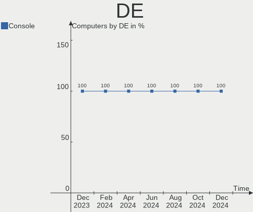
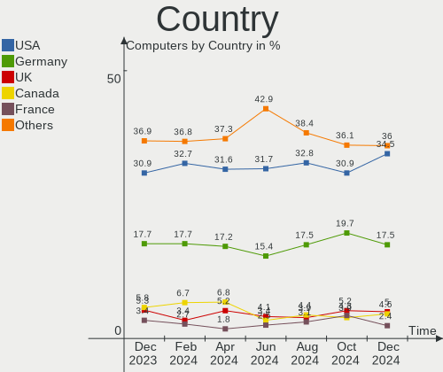
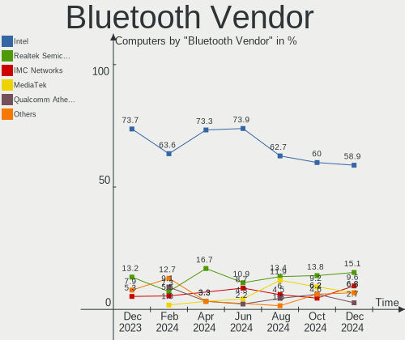

OPNsense - Hardware Trends
--------------------------

A project to identify most popular hardware characteristics and track their change
over time based on data collected by BSD users at https://BSD-Hardware.info.

Anyone can contribute to this report by the [hw-probe](https://github.com/linuxhw/hw-probe/blob/master/INSTALL.BSD.md) tool:

    hw-probe -all -upload

This report is for one last month. Overall report since the beginning of time: [TestDays](https://github.com/bsdhw/TestDays)

Period: Jan, 2024.

Contents
--------

* [ System ](#system)
  - [ OS                       ](#os)
  - [ OS Family                ](#os-family)
  - [ Arch                     ](#arch)
  - [ DE                       ](#de)
  - [ Display Server           ](#display-server)
  - [ Display Manager          ](#display-manager)
  - [ OS Lang                  ](#os-lang)
  - [ Boot Mode                ](#boot-mode)
  - [ Filesystem               ](#filesystem)
  - [ Part. scheme             ](#part-scheme)

* [ Board ](#board)
  - [ Vendor                   ](#vendor)
  - [ Model                    ](#model)
  - [ Model Family             ](#model-family)
  - [ MFG Year                 ](#mfg-year)
  - [ Form Factor              ](#form-factor)
  - [ Coreboot                 ](#coreboot)
  - [ RAM Size                 ](#ram-size)
  - [ RAM Used                 ](#ram-used)
  - [ Total Drives             ](#total-drives)
  - [ Has CD-ROM               ](#has-cd-rom)
  - [ Has Ethernet             ](#has-ethernet)
  - [ Has WiFi                 ](#has-wifi)
  - [ Has Bluetooth            ](#has-bluetooth)

* [ Location ](#location)
  - [ Country                  ](#country)
  - [ City                     ](#city)

* [ Drives ](#drives)
  - [ Drive Vendor             ](#drive-vendor)
  - [ Drive Model              ](#drive-model)
  - [ HDD Vendor               ](#hdd-vendor)
  - [ SSD Vendor               ](#ssd-vendor)
  - [ Drive Kind               ](#drive-kind)
  - [ Drive Connector          ](#drive-connector)
  - [ Drive Size               ](#drive-size)
  - [ Space Total              ](#space-total)
  - [ Space Used               ](#space-used)
  - [ Malfunc. Drives          ](#malfunc-drives)
  - [ Malfunc. Drive Vendor    ](#malfunc-drive-vendor)
  - [ Malfunc. HDD Vendor      ](#malfunc-hdd-vendor)
  - [ Malfunc. Drive Kind      ](#malfunc-drive-kind)
  - [ Failed Drives            ](#failed-drives)
  - [ Failed Drive Vendor      ](#failed-drive-vendor)
  - [ Drive Status             ](#drive-status)

* [ Storage controller ](#storage-controller)
  - [ Storage Vendor           ](#storage-vendor)
  - [ Storage Model            ](#storage-model)
  - [ Storage Kind             ](#storage-kind)

* [ Processor ](#processor)
  - [ CPU Vendor               ](#cpu-vendor)
  - [ CPU Model                ](#cpu-model)
  - [ CPU Model Family         ](#cpu-model-family)
  - [ CPU Cores                ](#cpu-cores)
  - [ CPU Sockets              ](#cpu-sockets)
  - [ CPU Threads              ](#cpu-threads)
  - [ CPU Microarch            ](#cpu-microarch)

* [ Graphics ](#graphics)
  - [ GPU Vendor               ](#gpu-vendor)
  - [ GPU Model                ](#gpu-model)
  - [ GPU Combo                ](#gpu-combo)
  - [ GPU Driver               ](#gpu-driver)
  - [ GPU Memory               ](#gpu-memory)

* [ Monitor ](#monitor)
  - [ Monitor Vendor           ](#monitor-vendor)
  - [ Monitor Model            ](#monitor-model)
  - [ Monitor Resolution       ](#monitor-resolution)
  - [ Monitor Diagonal         ](#monitor-diagonal)
  - [ Monitor Width            ](#monitor-width)
  - [ Aspect Ratio             ](#aspect-ratio)
  - [ Monitor Area             ](#monitor-area)
  - [ Pixel Density            ](#pixel-density)
  - [ Multiple Monitors        ](#multiple-monitors)

* [ Network ](#network)
  - [ Net Controller Vendor    ](#net-controller-vendor)
  - [ Net Controller Model     ](#net-controller-model)
  - [ Wireless Vendor          ](#wireless-vendor)
  - [ Wireless Model           ](#wireless-model)
  - [ Ethernet Vendor          ](#ethernet-vendor)
  - [ Ethernet Model           ](#ethernet-model)
  - [ Net Controller Kind      ](#net-controller-kind)
  - [ Used Controller          ](#used-controller)
  - [ NICs                     ](#nics)
  - [ IPv6                     ](#ipv6)

* [ Bluetooth ](#bluetooth)
  - [ Bluetooth Vendor         ](#bluetooth-vendor)
  - [ Bluetooth Model          ](#bluetooth-model)

* [ Sound ](#sound)
  - [ Sound Vendor             ](#sound-vendor)
  - [ Sound Model              ](#sound-model)

* [ Memory ](#memory)
  - [ Memory Vendor            ](#memory-vendor)
  - [ Memory Model             ](#memory-model)
  - [ Memory Kind              ](#memory-kind)
  - [ Memory Form Factor       ](#memory-form-factor)
  - [ Memory Size              ](#memory-size)
  - [ Memory Speed             ](#memory-speed)

* [ Printers & scanners ](#printers--scanners)
  - [ Printer Vendor           ](#printer-vendor)
  - [ Printer Model            ](#printer-model)
  - [ Scanner Vendor           ](#scanner-vendor)
  - [ Scanner Model            ](#scanner-model)

* [ Camera ](#camera)
  - [ Camera Vendor            ](#camera-vendor)
  - [ Camera Model             ](#camera-model)

* [ Security ](#security)
  - [ Fingerprint Vendor       ](#fingerprint-vendor)
  - [ Fingerprint Model        ](#fingerprint-model)
  - [ Chipcard Vendor          ](#chipcard-vendor)
  - [ Chipcard Model           ](#chipcard-model)

* [ Unsupported ](#unsupported)
  - [ Unsupported Devices      ](#unsupported-devices)
  - [ Unsupported Device Types ](#unsupported-device-types)

System
------

OS
--

Installed operating systems

| Name             | Computers | Percent |
|------------------|-----------|---------|
| OPNsense 23.7.12 | 148       | 37.47%  |
| OPNsense 23.7.11 | 146       | 36.96%  |
| OPNsense 23.7.10 | 60        | 15.19%  |
| OPNsense 24.1    | 24        | 6.08%   |
| OPNsense 23.1.11 | 5         | 1.27%   |
| OPNsense 23.7.9  | 3         | 0.76%   |
| OPNsense 23.10.1 | 3         | 0.76%   |
| OPNsense 23.7.7  | 1         | 0.25%   |
| OPNsense 23.7.4  | 1         | 0.25%   |
| OPNsense 23.7.1  | 1         | 0.25%   |
| OPNsense 22.7    | 1         | 0.25%   |
| OPNsense 22.1.10 | 1         | 0.25%   |
| OPNsense 21.7.8  | 1         | 0.25%   |

OS Family
---------

OS without a version

| Name     | Computers | Percent |
|----------|-----------|---------|
| OPNsense | 395       | 100%    |

Arch
----

OS architecture (x86_64, i586, etc.)

| Name  | Computers | Percent |
|-------|-----------|---------|
| amd64 | 393       | 99.49%  |
| arm64 | 2         | 0.51%   |

DE
--

Desktop Environment

| Name    | Computers | Percent |
|---------|-----------|---------|
| Console | 395       | 100%    |

Display Server
--------------

X11 or Wayland

| Name    | Computers | Percent |
|---------|-----------|---------|
| Console | 395       | 100%    |

Display Manager
---------------

SDDM, LightDM, etc.

| Name    | Computers | Percent |
|---------|-----------|---------|
| Console | 395       | 100%    |

OS Lang
-------

Language

| Lang    | Computers | Percent |
|---------|-----------|---------|
| Unknown | 384       | 97.22%  |
| C       | 11        | 2.78%   |

Boot Mode
---------

EFI or BIOS

| Mode | Computers | Percent |
|------|-----------|---------|
| EFI  | 387       | 97.97%  |
| BIOS | 8         | 2.03%   |

Filesystem
----------

Type of filesystem

| Type | Computers | Percent |
|------|-----------|---------|
| Ufs  | 206       | 52.15%  |
| Zfs  | 189       | 47.85%  |

Part. scheme
------------

Scheme of partitioning

| Type    | Computers | Percent |
|---------|-----------|---------|
| GPT     | 390       | 98.73%  |
| MBR     | 3         | 0.76%   |
| BSD     | 1         | 0.25%   |
| Unknown | 1         | 0.25%   |

Board
-----

Vendor
------

Motherboard manufacturer

| Name                    | Computers | Percent |
|-------------------------|-----------|---------|
| Unknown                 | 79        | 20%     |
| Hewlett-Packard         | 32        | 8.1%    |
| Dell                    | 28        | 7.09%   |
| Supermicro              | 20        | 5.06%   |
| Intel                   | 19        | 4.81%   |
| Protectli               | 18        | 4.56%   |
| ASUSTek Computer        | 18        | 4.56%   |
| Lenovo                  | 16        | 4.05%   |
| PC Engines              | 13        | 3.29%   |
| Gigabyte Technology     | 12        | 3.04%   |
| Sophos                  | 11        | 2.78%   |
| Techvision              | 10        | 2.53%   |
| Fujitsu                 | 10        | 2.53%   |
| ASRock                  | 10        | 2.53%   |
| AMI                     | 9         | 2.28%   |
| AZW                     | 8         | 2.03%   |
| CWWK                    | 7         | 1.77%   |
| AWOW                    | 6         | 1.52%   |
| ZOTAC                   | 5         | 1.27%   |
| MW                      | 4         | 1.01%   |
| MSI                     | 4         | 1.01%   |
| BESSTAR Tech            | 4         | 1.01%   |
| GoWin Solution          | 3         | 0.76%   |
| Deciso                  | 3         | 0.76%   |
| CncTion                 | 3         | 0.76%   |
| Yanling                 | 2         | 0.51%   |
| OEM                     | 2         | 0.51%   |
| Foxconn                 | 2         | 0.51%   |
| ASRockRack              | 2         | 0.51%   |
| Apple                   | 2         | 0.51%   |
| ZX                      | 1         | 0.25%   |
| YANYU                   | 1         | 0.25%   |
| Standard                | 1         | 0.25%   |
| Silver Peak Systems     | 1         | 0.25%   |
| Silicom                 | 1         | 0.25%   |
| Shuttle                 | 1         | 0.25%   |
| SHANGZHAOYUAN           | 1         | 0.25%   |
| Seco                    | 1         | 0.25%   |
| Raspberry Pi Foundation | 1         | 0.25%   |
| NU591                   | 1         | 0.25%   |

Model
-----

Motherboard model

| Name                       | Computers | Percent |
|----------------------------|-----------|---------|
| Unknown                    | 82        | 20.76%  |
| Techvision TVI7309X        | 10        | 2.53%   |
| Supermicro Super Server    | 9         | 2.28%   |
| PC Engines APU2            | 8         | 2.03%   |
| Sophos SG                  | 7         | 1.77%   |
| AZW EQ                     | 7         | 1.77%   |
| Fujitsu FUTRO S920         | 6         | 1.52%   |
| PC Engines apu4            | 5         | 1.27%   |
| AMI Aptio CRB              | 5         | 1.27%   |
| Protectli FW4C             | 4         | 1.01%   |
| MW GMLK-2_5G4L             | 4         | 1.01%   |
| HP t730 Thin Client        | 4         | 1.01%   |
| ZOTAC ZBOX-CI329NANO       | 3         | 0.76%   |
| Sophos XG                  | 3         | 0.76%   |
| Protectli FW6              | 3         | 0.76%   |
| Protectli FW4B             | 3         | 0.76%   |
| Protectli FW2B             | 3         | 0.76%   |
| Intel Q3XXG4-P V1.0        | 3         | 0.76%   |
| CWWK CW-AD4L-N V1          | 3         | 0.76%   |
| Supermicro X10SLH-N6-ST031 | 2         | 0.51%   |
| Protectli VP2420           | 2         | 0.51%   |
| OEM 1.0                    | 2         | 0.51%   |
| Intel CRESCENTBAY          | 2         | 0.51%   |
| HP Slim Desktop 290-p0xxx  | 2         | 0.51%   |
| HP ProLiant DL360 G7       | 2         | 0.51%   |
| GoWin Solution R86S        | 2         | 0.51%   |
| Foxconn Pro3500 Series     | 2         | 0.51%   |
| Dell PowerEdge R610        | 2         | 0.51%   |
| Dell OptiPlex 7050         | 2         | 0.51%   |
| Dell OptiPlex 7010         | 2         | 0.51%   |
| Dell Inspiron 660s         | 2         | 0.51%   |
| Deciso NetBoard-A20        | 2         | 0.51%   |
| CWWK CW-J6-6L              | 2         | 0.51%   |
| CncTion N4505-4L           | 2         | 0.51%   |
| BESSTAR Tech GK41          | 2         | 0.51%   |
| AWOW AZ51                  | 2         | 0.51%   |
| AWOW AK10                  | 2         | 0.51%   |
| ASUS TUF Gaming X570-PLUS  | 2         | 0.51%   |
| ASUS PRIME A320M-K         | 2         | 0.51%   |
| ASUS All Series            | 2         | 0.51%   |

Model Family
------------

Motherboard model prefix

| Name                       | Computers | Percent |
|----------------------------|-----------|---------|
| Unknown                    | 82        | 20.76%  |
| Dell OptiPlex              | 14        | 3.54%   |
| Lenovo ThinkCentre         | 13        | 3.29%   |
| Techvision TVI7309X        | 10        | 2.53%   |
| Supermicro Super           | 9         | 2.28%   |
| Dell PowerEdge             | 9         | 2.28%   |
| PC Engines APU2            | 8         | 2.03%   |
| HP ProLiant                | 8         | 2.03%   |
| Sophos SG                  | 7         | 1.77%   |
| HP Compaq                  | 7         | 1.77%   |
| Fujitsu FUTRO              | 7         | 1.77%   |
| AZW EQ                     | 7         | 1.77%   |
| HP EliteDesk               | 6         | 1.52%   |
| ASUS PRIME                 | 6         | 1.52%   |
| PC Engines apu4            | 5         | 1.27%   |
| AMI Aptio                  | 5         | 1.27%   |
| Protectli FW4C             | 4         | 1.01%   |
| MW GMLK-2                  | 4         | 1.01%   |
| HP t730                    | 4         | 1.01%   |
| ZOTAC ZBOX-CI329NANO       | 3         | 0.76%   |
| Sophos XG                  | 3         | 0.76%   |
| Protectli FW6              | 3         | 0.76%   |
| Protectli FW4B             | 3         | 0.76%   |
| Protectli FW2B             | 3         | 0.76%   |
| Intel Q3XXG4-P             | 3         | 0.76%   |
| Fujitsu PRIMERGY           | 3         | 0.76%   |
| Dell Inspiron              | 3         | 0.76%   |
| CWWK CW-AD4L-N             | 3         | 0.76%   |
| ASUS TUF                   | 3         | 0.76%   |
| Supermicro X10SLH-N6-ST031 | 2         | 0.51%   |
| Protectli VP2420           | 2         | 0.51%   |
| OEM 1.0                    | 2         | 0.51%   |
| Intel CRESCENTBAY          | 2         | 0.51%   |
| HP Slim                    | 2         | 0.51%   |
| HP ProDesk                 | 2         | 0.51%   |
| GoWin Solution R86S        | 2         | 0.51%   |
| Gigabyte B550              | 2         | 0.51%   |
| Foxconn Pro3500            | 2         | 0.51%   |
| Deciso NetBoard-A20        | 2         | 0.51%   |
| CWWK CW-J6-6L              | 2         | 0.51%   |

MFG Year
--------

Motherboard manufacture year

| Year | Computers | Percent |
|------|-----------|---------|
| 2023 | 86        | 21.77%  |
| 2022 | 66        | 16.71%  |
| 2018 | 40        | 10.13%  |
| 2021 | 31        | 7.85%   |
| 2016 | 23        | 5.82%   |
| 2019 | 22        | 5.57%   |
| 2015 | 21        | 5.32%   |
| 2012 | 20        | 5.06%   |
| 2017 | 19        | 4.81%   |
| 2020 | 16        | 4.05%   |
| 2014 | 16        | 4.05%   |
| 2013 | 13        | 3.29%   |
| 2011 | 10        | 2.53%   |
| 2009 | 6         | 1.52%   |
| 2010 | 4         | 1.01%   |
| 2008 | 1         | 0.25%   |
| 2007 | 1         | 0.25%   |

Form Factor
-----------

Physical design of the computer

| Name           | Computers | Percent |
|----------------|-----------|---------|
| Desktop        | 298       | 75.44%  |
| Mini pc        | 38        | 9.62%   |
| Server         | 36        | 9.11%   |
| Firewall       | 12        | 3.04%   |
| Notebook       | 9         | 2.28%   |
| System on chip | 1         | 0.25%   |
| All in one     | 1         | 0.25%   |

Coreboot
--------

Have coreboot on board

| Used | Computers | Percent |
|------|-----------|---------|
| No   | 378       | 95.7%   |
| Yes  | 17        | 4.3%    |

RAM Size
--------

Total RAM memory

| Size in GB      | Computers | Percent |
|-----------------|-----------|---------|
| 8.01-16.0       | 161       | 40.76%  |
| 16.01-24.0      | 111       | 28.1%   |
| 4.01-8.0        | 50        | 12.66%  |
| 32.01-64.0      | 41        | 10.38%  |
| 64.01-256.0     | 17        | 4.3%    |
| 2.01-3.0        | 8         | 2.03%   |
| 24.01-32.0      | 3         | 0.76%   |
| 3.01-4.0        | 2         | 0.51%   |
| More than 256.0 | 1         | 0.25%   |
| 0.51-1.0        | 1         | 0.25%   |

RAM Used
--------

Used RAM memory

| Used GB   | Computers | Percent |
|-----------|-----------|---------|
| 0.01-0.5  | 165       | 41.77%  |
| 0.51-1.0  | 163       | 41.27%  |
| 1.01-2.0  | 45        | 11.39%  |
| 2.01-3.0  | 14        | 3.54%   |
| 3.01-4.0  | 4         | 1.01%   |
| 4.01-8.0  | 2         | 0.51%   |
| 8.01-16.0 | 1         | 0.25%   |
| 0         | 1         | 0.25%   |

Total Drives
------------

Number of drives on board

| Drives | Computers | Percent |
|--------|-----------|---------|
| 1      | 306       | 77.47%  |
| 0      | 52        | 13.16%  |
| 2      | 29        | 7.34%   |
| 4      | 4         | 1.01%   |
| 3      | 3         | 0.76%   |
| 6      | 1         | 0.25%   |

Has CD-ROM
----------

Has CD-ROM on board

| Presented | Computers | Percent |
|-----------|-----------|---------|
| No        | 361       | 91.39%  |
| Yes       | 34        | 8.61%   |

Has Ethernet
------------

Has Ethernet on board

| Presented | Computers | Percent |
|-----------|-----------|---------|
| Yes       | 394       | 99.75%  |
| No        | 1         | 0.25%   |

Has WiFi
--------

Has WiFi module

| Presented | Computers | Percent |
|-----------|-----------|---------|
| No        | 317       | 80.25%  |
| Yes       | 78        | 19.75%  |

Has Bluetooth
-------------

Has Bluetooth module

| Presented | Computers | Percent |
|-----------|-----------|---------|
| No        | 337       | 85.32%  |
| Yes       | 58        | 14.68%  |

Location
--------

Country
-------

Geographic location (country)

| Country         | Computers | Percent |
|-----------------|-----------|---------|
| USA             | 116       | 29.37%  |
| Germany         | 72        | 18.23%  |
| Canada          | 21        | 5.32%   |
| UK              | 19        | 4.81%   |
| France          | 14        | 3.54%   |
| Netherlands     | 13        | 3.29%   |
| Australia       | 11        | 2.78%   |
| Sweden          | 9         | 2.28%   |
| Poland          | 9         | 2.28%   |
| Russia          | 7         | 1.77%   |
| Romania         | 7         | 1.77%   |
| Italy           | 7         | 1.77%   |
| Brazil          | 7         | 1.77%   |
| South Korea     | 6         | 1.52%   |
| Norway          | 5         | 1.27%   |
| New Zealand     | 5         | 1.27%   |
| Austria         | 5         | 1.27%   |
| Turkey          | 4         | 1.01%   |
| Switzerland     | 4         | 1.01%   |
| Spain           | 4         | 1.01%   |
| Indonesia       | 4         | 1.01%   |
| Finland         | 4         | 1.01%   |
| The Netherlands | 3         | 0.76%   |
| Bulgaria        | 3         | 0.76%   |
| Belgium         | 3         | 0.76%   |
| Thailand        | 2         | 0.51%   |
| South Africa    | 2         | 0.51%   |
| Slovakia        | 2         | 0.51%   |
| Portugal        | 2         | 0.51%   |
| Ireland         | 2         | 0.51%   |
| Greece          | 2         | 0.51%   |
| China           | 2         | 0.51%   |
| Tunisia         | 1         | 0.25%   |
| Taiwan          | 1         | 0.25%   |
| Mexico          | 1         | 0.25%   |
| Malaysia        | 1         | 0.25%   |
| Lithuania       | 1         | 0.25%   |
| Latvia          | 1         | 0.25%   |
| Japan           | 1         | 0.25%   |
| India           | 1         | 0.25%   |

City
----

Geographic location (city)

| City         | Computers | Percent |
|--------------|-----------|---------|
| Cologne      | 6         | 1.52%   |
| Toronto      | 4         | 1.01%   |
| Sydney       | 4         | 1.01%   |
| Seattle      | 4         | 1.01%   |
| Munich       | 4         | 1.01%   |
| Moscow       | 4         | 1.01%   |
| Leipzig      | 4         | 1.01%   |
| Auckland     | 4         | 1.01%   |
| Vienna       | 3         | 0.76%   |
| Sofia        | 3         | 0.76%   |
| Hamburg      | 3         | 0.76%   |
| Edmonton     | 3         | 0.76%   |
| Düsseldorf  | 3         | 0.76%   |
| Brooklyn     | 3         | 0.76%   |
| Berlin       | 3         | 0.76%   |
| Vancouver    | 2         | 0.51%   |
| Trondheim    | 2         | 0.51%   |
| Tallahassee  | 2         | 0.51%   |
| Stockholm    | 2         | 0.51%   |
| Sao Paulo    | 2         | 0.51%   |
| Rocky Point  | 2         | 0.51%   |
| Philadelphia | 2         | 0.51%   |
| Paris        | 2         | 0.51%   |
| Oslo         | 2         | 0.51%   |
| Oakland      | 2         | 0.51%   |
| Milan        | 2         | 0.51%   |
| Longueuil    | 2         | 0.51%   |
| London       | 2         | 0.51%   |
| Johannesburg | 2         | 0.51%   |
| Jakarta      | 2         | 0.51%   |
| Houston      | 2         | 0.51%   |
| Hanover      | 2         | 0.51%   |
| Fulda        | 2         | 0.51%   |
| Cheonan      | 2         | 0.51%   |
| Calhoun      | 2         | 0.51%   |
| Brussels     | 2         | 0.51%   |
| Brisbane     | 2         | 0.51%   |
| Augsburg     | 2         | 0.51%   |
| Amsterdam    | 2         | 0.51%   |
| Albany       | 2         | 0.51%   |

Drives
------

Drive Vendor
------------

Hard drive vendors

| Vendor              | Computers | Drives | Percent |
|---------------------|-----------|--------|---------|
| Samsung Electronics | 54        | 60     | 14.75%  |
| Kingston            | 42        | 43     | 11.48%  |
| Transcend           | 20        | 22     | 5.46%   |
| Crucial             | 20        | 22     | 5.46%   |
| Intel               | 19        | 23     | 5.19%   |
| WDC                 | 16        | 17     | 4.37%   |
| China               | 15        | 16     | 4.1%    |
| SanDisk             | 13        | 13     | 3.55%   |
| Silicon Motion      | 11        | 11     | 3.01%   |
| SK hynix            | 10        | 11     | 2.73%   |
| A-DATA Technology   | 10        | 10     | 2.73%   |
| Toshiba             | 9         | 10     | 2.46%   |
| Seagate             | 9         | 11     | 2.46%   |
| PNY                 | 9         | 10     | 2.46%   |
| Hewlett-Packard     | 7         | 12     | 1.91%   |
| Patriot             | 6         | 6      | 1.64%   |
| BIWIN               | 6         | 6      | 1.64%   |
| SPCC                | 5         | 6      | 1.37%   |
| Phison              | 5         | 6      | 1.37%   |
| FORESEE             | 5         | 5      | 1.37%   |
| Team                | 4         | 4      | 1.09%   |
| OCZ                 | 4         | 4      | 1.09%   |
| LITEON              | 4         | 4      | 1.09%   |
| Hoodisk             | 4         | 4      | 1.09%   |
| ShiJi               | 3         | 3      | 0.82%   |
| KingSpec            | 3         | 3      | 0.82%   |
| Kimtigo             | 3         | 3      | 0.82%   |
| Protectli           | 2         | 2      | 0.55%   |
| Netac               | 2         | 2      | 0.55%   |
| LITEONIT            | 2         | 2      | 0.55%   |
| Lexar               | 2         | 2      | 0.55%   |
| KIOXIA              | 2         | 2      | 0.55%   |
| Kingsand            | 2         | 2      | 0.55%   |
| Innodisk            | 2         | 2      | 0.55%   |
| Hitachi             | 2         | 2      | 0.55%   |
| Gigabyte Technology | 2         | 2      | 0.55%   |
| Fanxiang            | 2         | 2      | 0.55%   |
| Dogfish             | 2         | 2      | 0.55%   |
| ATP                 | 2         | 2      | 0.55%   |
| Apacer              | 2         | 2      | 0.55%   |

Drive Model
-----------

Hard drive models

| Model                            | Computers | Percent |
|----------------------------------|-----------|---------|
| Kingston SKC600MS256G 256GB      | 10        | 2.7%    |
| Samsung SSD 980 500GB            | 5         | 1.35%   |
| Phison PCIe SSD 512GB            | 5         | 1.35%   |
| Kingston SA400S37120G 120GB      | 5         | 1.35%   |
| SPCC M.2 PCIe SSD 128GB          | 4         | 1.08%   |
| Kingston SMS200S360G 64GB        | 4         | 1.08%   |
| Kingston SMS200S330G 32GB        | 4         | 1.08%   |
| Transcend TS64GSSD370 64GB       | 3         | 0.81%   |
| Silicon Motion NVME SSD 128GB    | 3         | 0.81%   |
| Samsung SSD 980 PRO 1TB          | 3         | 0.81%   |
| Samsung SSD 870 EVO 500GB        | 3         | 0.81%   |
| Samsung SSD 850 EVO 250GB        | 3         | 0.81%   |
| Kimtigo SSD 128GB                | 3         | 0.81%   |
| Hoodisk SSD 128GB                | 3         | 0.81%   |
| Crucial M4-CT128M4SSD2 128GB     | 3         | 0.81%   |
| Crucial CT500P3SSD8 500GB        | 3         | 0.81%   |
| Crucial CT240BX500SSD1 240GB     | 3         | 0.81%   |
| BIWIN NA80Y1M10-512G             | 3         | 0.81%   |
| Transcend TS64GSSD420K 64GB      | 2         | 0.54%   |
| Transcend TS120GMTS420S 120GB    | 2         | 0.54%   |
| Toshiba KXG60ZNV256G NVMe 256GB  | 2         | 0.54%   |
| Team TM8PS7256G 256GB            | 2         | 0.54%   |
| Silicon Motion GV-128-2242 128GB | 2         | 0.54%   |
| SanDisk SDSSDP128G 128GB         | 2         | 0.54%   |
| Samsung SSD 980 250GB            | 2         | 0.54%   |
| Samsung SSD 970 EVO Plus 500GB   | 2         | 0.54%   |
| Samsung MZ7LN128HCHP-000H1 128GB | 2         | 0.54%   |
| PNY CS900 250GB SSD              | 2         | 0.54%   |
| PNY CS900 120GB SSD              | 2         | 0.54%   |
| Patriot M.2 P310 240GB           | 2         | 0.54%   |
| Patriot Burst Elite 120GB        | 2         | 0.54%   |
| Kingston SV300S37A120G 120GB     | 2         | 0.54%   |
| Kingston SMS200S3120G 120GB      | 2         | 0.54%   |
| Kingston SHFS37A120G 120GB       | 2         | 0.54%   |
| Kingston SEDC1000BM8240G 240GB   | 2         | 0.54%   |
| Kingston SA2000M8250G 250GB      | 2         | 0.54%   |
| KingSpec P4-120 120GB            | 2         | 0.54%   |
| Kingsand T600 128G               | 2         | 0.54%   |
| Intel SSDSC2KW128G8 128GB        | 2         | 0.54%   |
| Intel SSDPEKNU512GZ 512GB        | 2         | 0.54%   |

HDD Vendor
----------

Hard disk drive vendors

| Vendor              | Computers | Drives | Percent |
|---------------------|-----------|--------|---------|
| WDC                 | 9         | 10     | 32.14%  |
| Seagate             | 7         | 8      | 25%     |
| Hewlett-Packard     | 4         | 8      | 14.29%  |
| Toshiba             | 3         | 4      | 10.71%  |
| Hitachi             | 2         | 2      | 7.14%   |
| Samsung Electronics | 1         | 1      | 3.57%   |
| LSI                 | 1         | 1      | 3.57%   |
| China               | 1         | 1      | 3.57%   |

SSD Vendor
----------

Solid state drive vendors

| Vendor              | Computers | Drives | Percent |
|---------------------|-----------|--------|---------|
| Kingston            | 36        | 37     | 15.93%  |
| Samsung Electronics | 23        | 27     | 10.18%  |
| Transcend           | 19        | 20     | 8.41%   |
| Intel               | 14        | 18     | 6.19%   |
| China               | 14        | 15     | 6.19%   |
| SanDisk             | 13        | 13     | 5.75%   |
| Crucial             | 13        | 15     | 5.75%   |
| A-DATA Technology   | 10        | 10     | 4.42%   |
| PNY                 | 7         | 8      | 3.1%    |
| WDC                 | 4         | 4      | 1.77%   |
| Patriot             | 4         | 4      | 1.77%   |
| OCZ                 | 4         | 4      | 1.77%   |
| LITEON              | 4         | 4      | 1.77%   |
| Hoodisk             | 4         | 4      | 1.77%   |
| Team                | 3         | 3      | 1.33%   |
| SK hynix            | 3         | 3      | 1.33%   |
| KingSpec            | 3         | 3      | 1.33%   |
| Toshiba             | 2         | 2      | 0.88%   |
| ShiJi               | 2         | 2      | 0.88%   |
| Protectli           | 2         | 2      | 0.88%   |
| LITEONIT            | 2         | 2      | 0.88%   |
| Lexar               | 2         | 2      | 0.88%   |
| Kingsand            | 2         | 2      | 0.88%   |
| Innodisk            | 2         | 2      | 0.88%   |
| Gigabyte Technology | 2         | 2      | 0.88%   |
| Dogfish             | 2         | 2      | 0.88%   |
| ATP                 | 2         | 2      | 0.88%   |
| Apacer              | 2         | 2      | 0.88%   |
| VICKTER             | 1         | 1      | 0.44%   |
| VICK                | 1         | 1      | 0.44%   |
| Verbatim            | 1         | 1      | 0.44%   |
| Vaseky              | 1         | 1      | 0.44%   |
| V-GeN               | 1         | 1      | 0.44%   |
| tecmiyo             | 1         | 1      | 0.44%   |
| SUNEAST             | 1         | 2      | 0.44%   |
| SPCC                | 1         | 1      | 0.44%   |
| Smartbuy            | 1         | 1      | 0.44%   |
| Seagate             | 1         | 2      | 0.44%   |
| OWC                 | 1         | 1      | 0.44%   |
| Netac               | 1         | 1      | 0.44%   |

Drive Kind
----------

HDD or SSD

| Kind | Computers | Drives | Percent |
|------|-----------|--------|---------|
| SSD  | 218       | 243    | 60.72%  |
| NVMe | 113       | 118    | 31.48%  |
| HDD  | 28        | 35     | 7.8%    |

Drive Connector
---------------

SATA, SAS, NVMe, etc.

| Type | Computers | Drives | Percent |
|------|-----------|--------|---------|
| SATA | 240       | 278    | 67.99%  |
| NVMe | 113       | 118    | 32.01%  |

Drive Size
----------

Size of hard drive

| Size in TB | Computers | Drives | Percent |
|------------|-----------|--------|---------|
| 0.01-0.5   | 225       | 253    | 91.46%  |
| 0.51-1.0   | 15        | 18     | 6.1%    |
| 1.01-2.0   | 5         | 6      | 2.03%   |
| 3.01-4.0   | 1         | 1      | 0.41%   |

Space Total
-----------

Amount of disk space available on the file system

| Size in GB     | Computers | Percent |
|----------------|-----------|---------|
| 101-250        | 214       | 54.18%  |
| 251-500        | 66        | 16.71%  |
| 51-100         | 38        | 9.62%   |
| 21-50          | 32        | 8.1%    |
| 1-20           | 20        | 5.06%   |
| 501-1000       | 16        | 4.05%   |
| 1001-2000      | 8         | 2.03%   |
| More than 3000 | 1         | 0.25%   |

Space Used
----------

Amount of used disk space

| Used GB | Computers | Percent |
|---------|-----------|---------|
| 1-20    | 378       | 95.7%   |
| 21-50   | 15        | 3.8%    |
| 101-250 | 1         | 0.25%   |
| 51-100  | 1         | 0.25%   |

Malfunc. Drives
---------------

Drive models with a malfunction

| Model                                   | Computers | Drives | Percent |
|-----------------------------------------|-----------|--------|---------|
| Kingston SMS200S330G 32GB               | 2         | 2      | 5.41%   |
| Kingston SMS200S3120G 120GB             | 2         | 2      | 5.41%   |
| WDC WD7500BPKX-00HPJT0 752GB            | 1         | 2      | 2.7%    |
| WDC WD6400AAKS-22A7B2 640GB             | 1         | 1      | 2.7%    |
| WDC WD10EZEX-60M2NA0 1TB                | 1         | 1      | 2.7%    |
| Toshiba THNSNK128GCS8 SATA 128GB        | 1         | 1      | 2.7%    |
| tecmiyo SSD MSATA 64GB                  | 1         | 1      | 2.7%    |
| SUNEAST SE900 SSD 256GB                 | 1         | 2      | 2.7%    |
| SK hynix SC313 HFS256G32TNF-N3A0A 256GB | 1         | 1      | 2.7%    |
| ShiJi SSD 32GB                          | 1         | 1      | 2.7%    |
| Seagate ST9250610NS 250GB               | 1         | 1      | 2.7%    |
| Seagate ST3160318AS 160GB               | 1         | 1      | 2.7%    |
| SanDisk SSD U100 64GB                   | 1         | 1      | 2.7%    |
| SanDisk SD7SB3Q128G 128GB               | 1         | 1      | 2.7%    |
| Samsung Electronics SSD 970 EVO 250GB   | 1         | 1      | 2.7%    |
| Plextor PX-512M8PeG 512GB               | 1         | 1      | 2.7%    |
| Patriot Pyro SE 120GB                   | 1         | 1      | 2.7%    |
| Patriot Burst Elite 120GB               | 1         | 1      | 2.7%    |
| OCZ VERTEX460 480GB                     | 1         | 1      | 2.7%    |
| Micron Technology M550_mSATA_256GB      | 1         | 1      | 2.7%    |
| Kingston SV300S37A120G 120GB            | 1         | 1      | 2.7%    |
| Kingston SMS200S360G 64GB               | 1         | 1      | 2.7%    |
| Kingston SHFS37A120G 120GB              | 1         | 1      | 2.7%    |
| KingSpec P4-120 120GB                   | 1         | 1      | 2.7%    |
| KingDian S100 32GB                      | 1         | 1      | 2.7%    |
| Intel SSDSC2KW128G8 128GB               | 1         | 1      | 2.7%    |
| Intel SSDSC2CW060A3 64GB                | 1         | 1      | 2.7%    |
| Intel SSDSC2BF180A4H 180GB              | 1         | 1      | 2.7%    |
| Intel SSDSA2M120G2GC 120GB              | 1         | 1      | 2.7%    |
| HP Phison PSSBN016GA27MC1 16GB          | 1         | 1      | 2.7%    |
| Hitachi HUA722050CLA330 500GB           | 1         | 1      | 2.7%    |
| Hewlett-Packard SSD S700 Pro 128GB      | 1         | 2      | 2.7%    |
| Crucial CT120M500SSD1 120GB             | 1         | 1      | 2.7%    |
| China SATA SSD 32GB                     | 1         | 1      | 2.7%    |
| China CF 2GB                            | 1         | 1      | 2.7%    |

Malfunc. Drive Vendor
---------------------

Vendors of faulty drives

| Vendor              | Computers | Drives | Percent |
|---------------------|-----------|--------|---------|
| Kingston            | 7         | 7      | 18.92%  |
| Intel               | 4         | 4      | 10.81%  |
| WDC                 | 3         | 4      | 8.11%   |
| Seagate             | 2         | 2      | 5.41%   |
| SanDisk             | 2         | 2      | 5.41%   |
| Patriot             | 2         | 2      | 5.41%   |
| China               | 2         | 2      | 5.41%   |
| Toshiba             | 1         | 1      | 2.7%    |
| tecmiyo             | 1         | 1      | 2.7%    |
| SUNEAST             | 1         | 2      | 2.7%    |
| SK hynix            | 1         | 1      | 2.7%    |
| ShiJi               | 1         | 1      | 2.7%    |
| Samsung Electronics | 1         | 1      | 2.7%    |
| Plextor             | 1         | 1      | 2.7%    |
| OCZ                 | 1         | 1      | 2.7%    |
| Micron Technology   | 1         | 1      | 2.7%    |
| KingSpec            | 1         | 1      | 2.7%    |
| KingDian            | 1         | 1      | 2.7%    |
| HP Phison           | 1         | 1      | 2.7%    |
| Hitachi             | 1         | 1      | 2.7%    |
| Hewlett-Packard     | 1         | 2      | 2.7%    |
| Crucial             | 1         | 1      | 2.7%    |

Malfunc. HDD Vendor
-------------------

Vendors of faulty HDD drives

| Vendor  | Computers | Drives | Percent |
|---------|-----------|--------|---------|
| WDC     | 3         | 4      | 42.86%  |
| Seagate | 2         | 2      | 28.57%  |
| Hitachi | 1         | 1      | 14.29%  |
| China   | 1         | 1      | 14.29%  |

Malfunc. Drive Kind
-------------------

Kinds of faulty drives

| Kind | Computers | Drives | Percent |
|------|-----------|--------|---------|
| SSD  | 28        | 30     | 75.68%  |
| HDD  | 7         | 8      | 18.92%  |
| NVMe | 2         | 2      | 5.41%   |

Failed Drives
-------------

Failed drive models

| Model                         | Computers | Drives | Percent |
|-------------------------------|-----------|--------|---------|
| SanDisk SD7TB6S256G1001 256GB | 1         | 1      | 50%     |
| Kingston SMS200S330G 32GB     | 1         | 1      | 50%     |

Failed Drive Vendor
-------------------

Failed drive vendors

| Vendor   | Computers | Drives | Percent |
|----------|-----------|--------|---------|
| SanDisk  | 1         | 1      | 50%     |
| Kingston | 1         | 1      | 50%     |

Drive Status
------------

Number of failed and malfunc. drives

| Status   | Computers | Drives | Percent |
|----------|-----------|--------|---------|
| Works    | 304       | 347    | 87.11%  |
| Malfunc  | 37        | 40     | 10.6%   |
| Detected | 6         | 7      | 1.72%   |
| Failed   | 2         | 2      | 0.57%   |

Storage controller
------------------

Storage Vendor
--------------

Storage controller vendors

| Vendor                       | Computers | Percent |
|------------------------------|-----------|---------|
| Intel                        | 320       | 61.66%  |
| AMD                          | 50        | 9.63%   |
| Samsung Electronics          | 32        | 6.17%   |
| Silicon Motion               | 20        | 3.85%   |
| MAXIO Technology (Hangzhou)  | 13        | 2.5%    |
| Broadcom / LSI               | 11        | 2.12%   |
| Sandisk                      | 10        | 1.93%   |
| SK hynix                     | 7         | 1.35%   |
| Phison Electronics           | 7         | 1.35%   |
| Micron/Crucial Technology    | 6         | 1.16%   |
| Kingston Technology Company  | 6         | 1.16%   |
| Hosin Global Electronics     | 6         | 1.16%   |
| Shenzhen Longsys Electronics | 5         | 0.96%   |
| Toshiba                      | 4         | 0.77%   |
| Hewlett-Packard              | 4         | 0.77%   |
| ASMedia Technology           | 4         | 0.77%   |
| Realtek Semiconductor        | 3         | 0.58%   |
| KIOXIA                       | 2         | 0.39%   |
| JMicron Technology           | 2         | 0.39%   |
| Yangtze Memory Technologies  | 1         | 0.19%   |
| Transcend                    | 1         | 0.19%   |
| Seagate Technology           | 1         | 0.19%   |
| Netac Technology             | 1         | 0.19%   |
| Micron Technology            | 1         | 0.19%   |
| Lite-On Technology           | 1         | 0.19%   |
| Chelsio Communications       | 1         | 0.19%   |

Storage Model
-------------

Storage controller models

| Model                                                                            | Computers | Percent |
|----------------------------------------------------------------------------------|-----------|---------|
| Intel unknown                                                                    | 38        | 6.77%   |
| AMD FCH SATA Controller [AHCI mode]                                              | 36        | 6.42%   |
| Intel Celeron/Pentium Silver Processor SATA Controller                           | 30        | 5.35%   |
| Intel Jasper Lake SATA AHCI Controller                                           | 25        | 4.46%   |
| Intel 8 Series/C220 Series Chipset Family 6-port SATA Controller 1 [AHCI mode]   | 23        | 4.1%    |
| Silicon Motion SM2263EN/SM2263XT (DRAM-less) NVMe SSD Controllers                | 20        | 3.57%   |
| Intel Cannon Lake PCH SATA AHCI Controller                                       | 20        | 3.57%   |
| Intel Atom/Celeron/Pentium Processor x5-E8000/J3xxx/N3xxx Series SATA Controller | 15        | 2.67%   |
| Intel 6 Series/C200 Series Chipset Family 6 port Desktop SATA AHCI Controller    | 15        | 2.67%   |
| Samsung NVMe SSD Controller 980 (DRAM-less)                                      | 13        | 2.32%   |
| MAXIO (Hangzhou) NVMe SSD Controller MAP1202 (DRAM-less)                         | 13        | 2.32%   |
| Intel Q170/Q150/B150/H170/H110/Z170/CM236 Chipset SATA Controller [AHCI Mode]    | 12        | 2.14%   |
| Intel Atom Processor E3800 Series SATA AHCI Controller                           | 12        | 2.14%   |
| Samsung NVMe SSD Controller SM981/PM981/PM983                                    | 10        | 1.78%   |
| Intel 200 Series PCH SATA controller [AHCI mode]                                 | 9         | 1.6%    |
| Intel Celeron N3350/Pentium N4200/Atom E3900 Series SATA AHCI Controller         | 8         | 1.43%   |
| Unknown                                                                          | 8         | 1.43%   |
| Intel Wildcat Point-LP SATA Controller [AHCI Mode]                               | 7         | 1.25%   |
| Intel Sunrise Point-LP SATA Controller [AHCI mode]                               | 7         | 1.25%   |
| Intel Alder Lake-S PCH SATA Controller [AHCI Mode]                               | 7         | 1.25%   |
| Intel Alder Lake-P SATA AHCI Controller                                          | 7         | 1.25%   |
| Intel Elkhart Lake SATA AHCI                                                     | 6         | 1.07%   |
| Intel Atom Processor C3000 Series SATA Controller 0                              | 6         | 1.07%   |
| Intel 7 Series/C210 Series Chipset Family 6-port SATA Controller [AHCI mode]     | 6         | 1.07%   |
| Samsung NVMe SSD Controller PM9A1/PM9A3/980PRO                                   | 5         | 0.89%   |
| Phison PS5015-E15 PCIe3 NVMe Controller (DRAM-less)                              | 5         | 0.89%   |
| Micron/Crucial P2 [Nick P2] / P3 / P3 Plus NVMe PCIe SSD (DRAM-less)             | 5         | 0.89%   |
| Intel NM10/ICH7 Family SATA Controller [IDE mode]                                | 5         | 0.89%   |
| Intel Atom Processor C3000 Series SATA Controller 1                              | 5         | 0.89%   |
| Intel 8 Series SATA Controller 1 [AHCI mode]                                     | 5         | 0.89%   |
| AMD SB7x0/SB8x0/SB9x0 SATA Controller [AHCI mode]                                | 5         | 0.89%   |
| AMD 400 Series Chipset SATA Controller                                           | 5         | 0.89%   |
| SK hynix Gold P31/BC711/PC711 NVMe Solid State Drive                             | 4         | 0.71%   |
| Intel Comet Lake SATA AHCI Controller                                            | 4         | 0.71%   |
| Intel C620 Series Chipset Family SSATA Controller [AHCI mode]                    | 4         | 0.71%   |
| Intel C620 Series Chipset Family SATA Controller [AHCI mode]                     | 4         | 0.71%   |
| Intel C600/X79 series chipset 6-Port SATA AHCI Controller                        | 4         | 0.71%   |
| Intel Atom processor C2000 AHCI SATA3 Controller                                 | 4         | 0.71%   |
| Intel 82801JI (ICH10 Family) 4 port SATA IDE Controller #1                       | 4         | 0.71%   |
| Intel 82801G (ICH7 Family) IDE Controller                                        | 4         | 0.71%   |

Storage Kind
------------

Kind of storage controller (IDE, SATA, NVMe, SAS, ...)

| Kind | Computers | Percent |
|------|-----------|---------|
| SATA | 351       | 66.73%  |
| NVMe | 130       | 24.71%  |
| IDE  | 26        | 4.94%   |
| RAID | 12        | 2.28%   |
| SCSI | 4         | 0.76%   |
| SAS  | 3         | 0.57%   |

Processor
---------

CPU Vendor
----------

Processor vendors

| Vendor | Computers | Percent |
|--------|-----------|---------|
| Intel  | 342       | 86.58%  |
| AMD    | 51        | 12.91%  |
| ARM    | 2         | 0.51%   |

CPU Model
---------

Processor models

| Model                                    | Computers | Percent |
|------------------------------------------|-----------|---------|
| Intel N100                               | 42        | 10.63%  |
| Intel Celeron J4125 CPU @ 2.00GHz        | 22        | 5.57%   |
| Intel Celeron N5105 @ 2.00GHz            | 19        | 4.81%   |
| AMD GX-412TC SOC                         | 13        | 3.29%   |
| Intel Celeron CPU J1900 @ 1.99GHz        | 9         | 2.28%   |
| Intel Core i3-N305                       | 7         | 1.77%   |
| Intel Celeron CPU J3160 @ 1.60GHz        | 5         | 1.27%   |
| AMD GX-415GA SOC with Radeon HD Graphics | 5         | 1.27%   |
| Intel Pentium Silver N6005 @ 2.00GHz     | 4         | 1.01%   |
| Intel Pentium CPU J3710 @ 1.60GHz        | 4         | 1.01%   |
| Intel Core i5-9500 CPU @ 3.00GHz         | 4         | 1.01%   |
| Intel Core i3-8100T CPU @ 3.10GHz        | 4         | 1.01%   |
| Intel Celeron J6412 @ 2.00GHz            | 4         | 1.01%   |
| Intel Atom CPU C3758 @ 2.20GHz           | 4         | 1.01%   |
| AMD RX-427BB with AMD Radeon R7 Graphics | 4         | 1.01%   |
| Intel Xeon CPU E5645 @ 2.40GHz           | 3         | 0.76%   |
| Intel Pentium Gold 8505                  | 3         | 0.76%   |
| Intel N95                                | 3         | 0.76%   |
| Intel Core i5-6500 CPU @ 3.20GHz         | 3         | 0.76%   |
| Intel Core i5-4570 CPU @ 3.20GHz         | 3         | 0.76%   |
| Intel Celeron N4100 CPU @ 1.10GHz        | 3         | 0.76%   |
| Intel Celeron N4000 CPU @ 1.10GHz        | 3         | 0.76%   |
| Intel Celeron CPU J3455 @ 1.50GHz        | 3         | 0.76%   |
| Intel Celeron CPU J3060 @ 1.60GHz        | 3         | 0.76%   |
| Intel Atom CPU C3558 @ 2.20GHz           | 3         | 0.76%   |
| Intel Xeon D-2146NT CPU @ 2.30GHz        | 2         | 0.51%   |
| Intel Xeon CPU E3-1270 v3 @ 3.50GHz      | 2         | 0.51%   |
| Intel Xeon CPU E3-1220 v3 @ 3.10GHz      | 2         | 0.51%   |
| Intel Pentium Gold G5400 CPU @ 3.70GHz   | 2         | 0.51%   |
| Intel Core i7-7500U CPU @ 2.70GHz        | 2         | 0.51%   |
| Intel Core i7-6700 CPU @ 3.40GHz         | 2         | 0.51%   |
| Intel Core i7-4770 CPU @ 3.40GHz         | 2         | 0.51%   |
| Intel Core i7-3770 CPU @ 3.40GHz         | 2         | 0.51%   |
| Intel Core i5-8500T CPU @ 2.10GHz        | 2         | 0.51%   |
| Intel Core i5-6400 CPU @ 2.70GHz         | 2         | 0.51%   |
| Intel Core i5-5300U CPU @ 2.30GHz        | 2         | 0.51%   |
| Intel Core i5-5257U CPU @ 2.70GHz        | 2         | 0.51%   |
| Intel Core i5-4670K CPU @ 3.40GHz        | 2         | 0.51%   |
| Intel Core i5-4210U CPU @ 1.70GHz        | 2         | 0.51%   |
| Intel Core i5-3470 CPU @ 3.20GHz         | 2         | 0.51%   |

CPU Model Family
----------------

Processor model prefix

| Model                   | Computers | Percent |
|-------------------------|-----------|---------|
| Intel Celeron           | 90        | 22.78%  |
| Other                   | 63        | 15.95%  |
| Intel Core i5           | 58        | 14.68%  |
| Intel Xeon              | 40        | 10.13%  |
| Intel Core i3           | 27        | 6.84%   |
| Intel Atom              | 22        | 5.57%   |
| AMD GX                  | 22        | 5.57%   |
| Intel Core i7           | 17        | 4.3%    |
| Intel Pentium           | 11        | 2.78%   |
| Intel Pentium Silver    | 5         | 1.27%   |
| Intel Pentium Gold      | 5         | 1.27%   |
| AMD Ryzen 5             | 5         | 1.27%   |
| Intel Core 2 Duo        | 3         | 0.76%   |
| AMD Ryzen 3             | 3         | 0.76%   |
| AMD G                   | 3         | 0.76%   |
| AMD EPYC                | 3         | 0.76%   |
| Intel Xeon Silver       | 2         | 0.51%   |
| ARM Cortex              | 2         | 0.51%   |
| AMD Ryzen 9             | 2         | 0.51%   |
| AMD Ryzen 7             | 2         | 0.51%   |
| AMD Ryzen 5 PRO         | 2         | 0.51%   |
| AMD Athlon              | 2         | 0.51%   |
| Intel Pentium Dual-Core | 1         | 0.25%   |
| Intel Pentium Dual      | 1         | 0.25%   |
| Intel Core 2 Quad       | 1         | 0.25%   |
| AMD Turion II Neo       | 1         | 0.25%   |
| AMD FX                  | 1         | 0.25%   |
| AMD Athlon II X3        | 1         | 0.25%   |

CPU Cores
---------

Number of processor cores

| Number  | Computers | Percent |
|---------|-----------|---------|
| 4       | 243       | 61.52%  |
| 2       | 77        | 19.49%  |
| 8       | 23        | 5.82%   |
| 6       | 21        | 5.32%   |
| 12      | 11        | 2.78%   |
| 10      | 5         | 1.27%   |
| 16      | 4         | 1.01%   |
| Unknown | 4         | 1.01%   |
| 3       | 2         | 0.51%   |
| 32      | 1         | 0.25%   |
| 24      | 1         | 0.25%   |
| 20      | 1         | 0.25%   |
| 14      | 1         | 0.25%   |
| 1       | 1         | 0.25%   |

CPU Sockets
-----------

Number of sockets

| Number  | Computers | Percent |
|---------|-----------|---------|
| 1       | 385       | 97.47%  |
| 2       | 8         | 2.03%   |
| Unknown | 2         | 0.51%   |

CPU Threads
-----------

Threads per core (Hyper-Threading)

| Number  | Computers | Percent |
|---------|-----------|---------|
| 1       | 289       | 73.16%  |
| 2       | 102       | 25.82%  |
| Unknown | 4         | 1.01%   |

CPU Microarch
-------------

Microarchitecture

| Name          | Computers | Percent |
|---------------|-----------|---------|
| Unknown       | 106       | 26.84%  |
| KabyLake      | 40        | 10.13%  |
| Silvermont    | 32        | 8.1%    |
| Haswell       | 32        | 8.1%    |
| Goldmont plus | 30        | 7.59%   |
| Skylake       | 18        | 4.56%   |
| SandyBridge   | 16        | 4.05%   |
| Goldmont      | 16        | 4.05%   |
| IvyBridge     | 15        | 3.8%    |
| Puma          | 14        | 3.54%   |
| Broadwell     | 10        | 2.53%   |
| Westmere      | 9         | 2.28%   |
| Jaguar        | 8         | 2.03%   |
| Zen           | 7         | 1.77%   |
| Penryn        | 6         | 1.52%   |
| Zen+          | 5         | 1.27%   |
| Zen 3         | 5         | 1.27%   |
| Steamroller   | 4         | 1.01%   |
| Bonnell       | 4         | 1.01%   |
| TigerLake     | 3         | 0.76%   |
| CometLake     | 3         | 0.76%   |
| Bobcat        | 3         | 0.76%   |
| Zen 2         | 2         | 0.51%   |
| Nehalem       | 2         | 0.51%   |
| K10           | 2         | 0.51%   |
| Core          | 2         | 0.51%   |
| Piledriver    | 1         | 0.25%   |

Graphics
--------

GPU Vendor
----------

Vendors of graphics cards

| Vendor                     | Computers | Percent |
|----------------------------|-----------|---------|
| Intel                      | 287       | 77.36%  |
| AMD                        | 33        | 8.89%   |
| ASPEED Technology          | 29        | 7.82%   |
| Matrox Electronics Systems | 18        | 4.85%   |
| Nvidia                     | 4         | 1.08%   |

GPU Model
---------

Graphics card models

| Model                                                                                    | Computers | Percent |
|------------------------------------------------------------------------------------------|-----------|---------|
| Intel Alder Lake-N [UHD Graphics]                                                        | 52        | 13.98%  |
| Intel GeminiLake [UHD Graphics 600]                                                      | 29        | 7.8%    |
| ASPEED Technology ASPEED Graphics Family                                                 | 29        | 7.8%    |
| Intel JasperLake [UHD Graphics]                                                          | 27        | 7.26%   |
| Intel CoffeeLake-S GT2 [UHD Graphics 630]                                                | 17        | 4.57%   |
| Intel Xeon E3-1200 v3/4th Gen Core Processor Integrated Graphics Controller              | 15        | 4.03%   |
| Intel Atom/Celeron/Pentium Processor x5-E8000/J3xxx/N3xxx Integrated Graphics Controller | 15        | 4.03%   |
| Intel Atom Processor Z36xxx/Z37xxx Series Graphics & Display                             | 12        | 3.23%   |
| Intel HD Graphics 530                                                                    | 9         | 2.42%   |
| Intel 2nd Generation Core Processor Family Integrated Graphics Controller                | 9         | 2.42%   |
| Matrox Electronics Systems MGA G200eW WPCM450                                            | 7         | 1.88%   |
| Intel HD Graphics 500                                                                    | 7         | 1.88%   |
| Intel Xeon E3-1200 v2/3rd Gen Core processor Graphics Controller                         | 6         | 1.61%   |
| Intel Elkhart Lake [UHD Graphics Gen11 16EU]                                             | 6         | 1.61%   |
| Matrox Electronics Systems MGA G200e [Pilot] ServerEngines (SEP1)                        | 5         | 1.34%   |
| Intel HD Graphics 630                                                                    | 5         | 1.34%   |
| Intel HD Graphics 620                                                                    | 5         | 1.34%   |
| Intel Haswell-ULT Integrated Graphics Controller                                         | 5         | 1.34%   |
| Intel 4 Series Chipset Integrated Graphics Controller                                    | 5         | 1.34%   |
| AMD Kabini [Radeon HD 8330E]                                                             | 5         | 1.34%   |
| Intel CoffeeLake-S GT1 [UHD Graphics 610]                                                | 4         | 1.08%   |
| Intel Alder Lake-UP3 GT1 [UHD Graphics]                                                  | 4         | 1.08%   |
| Intel Alder Lake-S GT1 [UHD Graphics 730]                                                | 4         | 1.08%   |
| AMD Raven Ridge [Radeon Vega Series / Radeon Vega Mobile Series]                         | 4         | 1.08%   |
| AMD Picasso/Raven 2 [Radeon Vega Series / Radeon Vega Mobile Series]                     | 4         | 1.08%   |
| AMD Kaveri [Radeon R7 Graphics]                                                          | 4         | 1.08%   |
| AMD ES1000                                                                               | 4         | 1.08%   |
| AMD Cezanne [Radeon Vega Series / Radeon Vega Mobile Series]                             | 4         | 1.08%   |
| Matrox Electronics Systems MGA G200EH                                                    | 3         | 0.81%   |
| Intel IvyBridge GT2 [HD Graphics 4000]                                                   | 3         | 0.81%   |
| Intel HD Graphics 5500                                                                   | 3         | 0.81%   |
| Intel 4th Generation Core Processor Family Integrated Graphics Controller                | 3         | 0.81%   |
| Intel 3rd Gen Core processor Graphics Controller                                         | 3         | 0.81%   |
| Matrox Electronics Systems G200eR2                                                       | 2         | 0.54%   |
| Intel UHD Graphics 620                                                                   | 2         | 0.54%   |
| Intel Tiger Lake-LP GT2 [UHD Graphics G4]                                                | 2         | 0.54%   |
| Intel Iris Graphics 6100                                                                 | 2         | 0.54%   |
| Intel HD Graphics                                                                        | 2         | 0.54%   |
| Intel Core Processor Integrated Graphics Controller                                      | 2         | 0.54%   |
| Intel Atom Processor D4xx/D5xx/N4xx/N5xx Integrated Graphics Controller                  | 2         | 0.54%   |

GPU Combo
---------

Combinations of graphics cards

| Name           | Computers | Percent |
|----------------|-----------|---------|
| 1 x Intel      | 281       | 71.14%  |
| 1 x AMD        | 32        | 8.1%    |
| 1 x ASPEED     | 27        | 6.84%   |
| Other          | 26        | 6.58%   |
| 1 x Matrox     | 18        | 4.56%   |
| 2 x Intel      | 4         | 1.01%   |
| 1 x Nvidia     | 4         | 1.01%   |
| Intel + ASPEED | 2         | 0.51%   |
| 2 x AMD        | 1         | 0.25%   |

GPU Driver
----------

Free vs proprietary

| Driver  | Computers | Percent |
|---------|-----------|---------|
| Free    | 369       | 93.42%  |
| Unknown | 26        | 6.58%   |

GPU Memory
----------

Total video memory

| Size in GB | Computers | Percent |
|------------|-----------|---------|
| Unknown    | 395       | 100%    |

Monitor
-------

Monitor Vendor
--------------

Monitor vendors

Zero info for selected period =(

Monitor Model
-------------

Monitor models

Zero info for selected period =(

Monitor Resolution
------------------

Monitor screen resolution

Zero info for selected period =(

Monitor Diagonal
----------------

Diagonal size in inches

Zero info for selected period =(

Monitor Width
-------------

Physical width

Zero info for selected period =(

Aspect Ratio
------------

Proportional relationship between the width and the height

Zero info for selected period =(

Monitor Area
------------

Area in inch²

Zero info for selected period =(

Pixel Density
-------------

Pixels per inch

Zero info for selected period =(

Multiple Monitors
-----------------

Total monitors connected

| Total | Computers | Percent |
|-------|-----------|---------|
| 0     | 395       | 100%    |

Network
-------

Net Controller Vendor
---------------------

Controller vendors

| Vendor                     | Computers | Percent |
|----------------------------|-----------|---------|
| Intel                      | 348       | 68.1%   |
| Realtek Semiconductor      | 96        | 18.79%  |
| Broadcom                   | 27        | 5.28%   |
| Qualcomm Atheros           | 11        | 2.15%   |
| Mellanox Technologies      | 7         | 1.37%   |
| Ralink Technology          | 3         | 0.59%   |
| Insyde Software            | 2         | 0.39%   |
| IMC Networks               | 2         | 0.39%   |
| Huawei Technologies        | 2         | 0.39%   |
| Chelsio Communications     | 2         | 0.39%   |
| American Megatrends        | 2         | 0.39%   |
| AMD                        | 2         | 0.39%   |
| ZTE WCDMA Technologies MSM | 1         | 0.2%    |
| Solarflare Communications  | 1         | 0.2%    |
| Samsung Electronics        | 1         | 0.2%    |
| MediaTek                   | 1         | 0.2%    |
| Dell                       | 1         | 0.2%    |
| D-Link System              | 1         | 0.2%    |
| Arduino SA                 | 1         | 0.2%    |

Net Controller Model
--------------------

Controller models

| Model                                                                         | Computers | Percent |
|-------------------------------------------------------------------------------|-----------|---------|
| Realtek RTL8111/8168/8211/8411 PCI Express Gigabit Ethernet Controller        | 80        | 11.75%  |
| Intel Ethernet Controller I226-V                                              | 73        | 10.72%  |
| Intel Ethernet Controller I225-V                                              | 53        | 7.78%   |
| Intel I211 Gigabit Network Connection                                         | 43        | 6.31%   |
| Intel I210 Gigabit Network Connection                                         | 31        | 4.55%   |
| Intel I350 Gigabit Network Connection                                         | 29        | 4.26%   |
| Intel 82599ES 10-Gigabit SFI/SFP+ Network Connection                          | 19        | 2.79%   |
| Intel Ethernet Controller 10-Gigabit X540-AT2                                 | 18        | 2.64%   |
| Intel 82574L Gigabit Network Connection                                       | 18        | 2.64%   |
| Realtek RTL8125 2.5GbE Controller                                             | 14        | 2.06%   |
| Intel Ethernet Controller X550                                                | 11        | 1.62%   |
| Intel 82576 Gigabit Network Connection                                        | 10        | 1.47%   |
| Intel Ethernet Connection (7) I219-V                                          | 9         | 1.32%   |
| Intel 82571EB/82571GB Gigabit Ethernet Controller (Copper)                    | 9         | 1.32%   |
| Broadcom NetXtreme II BCM5709 Gigabit Ethernet                                | 9         | 1.32%   |
| Intel Ethernet Connection I217-LM                                             | 8         | 1.17%   |
| Intel 82583V Gigabit Network Connection                                       | 8         | 1.17%   |
| Intel 82580 Gigabit Network Connection                                        | 8         | 1.17%   |
| Intel 82579LM Gigabit Network Connection (Lewisville)                         | 8         | 1.17%   |
| Realtek RTL8821CE 802.11ac PCIe Wireless Network Adapter                      | 7         | 1.03%   |
| Intel Wireless 7265                                                           | 7         | 1.03%   |
| Realtek RTL8111/8168/8411 PCI Express Gigabit Ethernet Controller             | 6         | 0.88%   |
| Intel Ethernet Connection (7) I219-LM                                         | 6         | 0.88%   |
| Intel CNVi: Wi-Fi                                                             | 6         | 0.88%   |
| Broadcom NetXtreme BCM5720 Gigabit Ethernet PCIe                              | 6         | 0.88%   |
| Mellanox MT27500 Family [ConnectX-3]                                          | 5         | 0.73%   |
| Intel Ethernet Connection X553 1GbE                                           | 5         | 0.73%   |
| Intel Ethernet Connection (2) I219-LM                                         | 5         | 0.73%   |
| Intel 82571EB/82571GB Gigabit Ethernet Controller D0/D1 (copper applications) | 5         | 0.73%   |
| Intel Wi-Fi 6 AX200                                                           | 4         | 0.59%   |
| Intel Ethernet Controller I225-LM                                             | 4         | 0.59%   |
| Intel Ethernet Connection X722 for 10GbE SFP+                                 | 4         | 0.59%   |
| Intel Ethernet Connection X553 10 GbE SFP+                                    | 4         | 0.59%   |
| Intel Ethernet Connection I354                                                | 4         | 0.59%   |
| Intel Ethernet Connection (5) I219-LM                                         | 4         | 0.59%   |
| Intel 82575GB Gigabit Network Connection                                      | 4         | 0.59%   |
| Intel 82575EB Gigabit Network Connection                                      | 4         | 0.59%   |
| Intel Wireless 8265 / 8275                                                    | 3         | 0.44%   |
| Intel Wireless 3165                                                           | 3         | 0.44%   |
| Intel Wi-Fi 6 AX201 160MHz                                                    | 3         | 0.44%   |

Wireless Vendor
---------------

Wireless vendors

| Vendor                | Computers | Percent |
|-----------------------|-----------|---------|
| Intel                 | 48        | 61.54%  |
| Realtek Semiconductor | 12        | 15.38%  |
| Qualcomm Atheros      | 9         | 11.54%  |
| Ralink Technology     | 3         | 3.85%   |
| Broadcom              | 3         | 3.85%   |
| IMC Networks          | 2         | 2.56%   |
| MediaTek              | 1         | 1.28%   |

Wireless Model
--------------

Wireless models

| Model                                                           | Computers | Percent |
|-----------------------------------------------------------------|-----------|---------|
| Realtek RTL8821CE 802.11ac PCIe Wireless Network Adapter        | 7         | 8.86%   |
| Intel Wireless 7265                                             | 7         | 8.86%   |
| Intel CNVi: Wi-Fi                                               | 6         | 7.59%   |
| Intel Wi-Fi 6 AX200                                             | 4         | 5.06%   |
| Intel Wireless 8265 / 8275                                      | 3         | 3.8%    |
| Intel Wireless 3165                                             | 3         | 3.8%    |
| Intel Wi-Fi 6 AX201 160MHz                                      | 3         | 3.8%    |
| Intel Gemini Lake PCH CNVi WiFi                                 | 3         | 3.8%    |
| Intel Dual Band Wireless-AC 3168NGW [Stone Peak]                | 3         | 3.8%    |
| Realtek RTL8188EE Wireless Network Adapter                      | 2         | 2.53%   |
| Qualcomm Atheros QCA986x/988x 802.11ac Wireless Network Adapter | 2         | 2.53%   |
| Qualcomm Atheros QCA9377 802.11ac Wireless Network Adapter      | 2         | 2.53%   |
| Qualcomm Atheros AR9485 Wireless Network Adapter                | 2         | 2.53%   |
| Intel Wireless 8260                                             | 2         | 2.53%   |
| Intel Wi-Fi 6E(802.11ax) AX210/AX1675* 2x2 [Typhoon Peak]       | 2         | 2.53%   |
| Intel Centrino Advanced-N 6205 [Taylor Peak]                    | 2         | 2.53%   |
| IMC Networks 802.11 n/g/b Wireless LAN USB Mini-Card            | 2         | 2.53%   |
| Broadcom BCM4331 802.11a/b/g/n                                  | 2         | 2.53%   |
| Realtek RTL88x2bu [AC1200 Techkey]                              | 1         | 1.27%   |
| Realtek RTL8852BE PCIe 802.11ax Wireless Network Controller     | 1         | 1.27%   |
| Realtek RTL8812AU 802.11a/b/g/n/ac 2T2R DB WLAN Adapter         | 1         | 1.27%   |
| Realtek RTL8188CUS 802.11n WLAN Adapter                         | 1         | 1.27%   |
| Ralink RT5572 Wireless Adapter                                  | 1         | 1.27%   |
| Ralink RT5370 Wireless Adapter                                  | 1         | 1.27%   |
| Ralink RT2870 Wireless Adapter                                  | 1         | 1.27%   |
| Qualcomm Atheros AR928X Wireless Network Adapter (PCI-Express)  | 1         | 1.27%   |
| Qualcomm Atheros AR9287 Wireless Network Adapter (PCI-Express)  | 1         | 1.27%   |
| Qualcomm Atheros AR9285 Wireless Network Adapter (PCI-Express)  | 1         | 1.27%   |
| MediaTek MT7921K (RZ608) Wi-Fi 6E 80MHz                         | 1         | 1.27%   |
| Intel Wireless 7260                                             | 1         | 1.27%   |
| Intel Wi-Fi 5(802.11ac) Wireless-AC 9x6x [Thunder Peak]         | 1         | 1.27%   |
| Intel Raptor Lake-S PCH CNVi WiFi                               | 1         | 1.27%   |
| Intel Raptor Lake PCH CNVi WiFi                                 | 1         | 1.27%   |
| Intel PRO/Wireless 4965 AG or AGN [Kedron] Network Connection   | 1         | 1.27%   |
| Intel Centrino Wireless-N 135                                   | 1         | 1.27%   |
| Intel Centrino Advanced-N 6235                                  | 1         | 1.27%   |
| Intel Cannon Lake PCH CNVi WiFi                                 | 1         | 1.27%   |
| Intel Alder Lake-S PCH CNVi WiFi                                | 1         | 1.27%   |
| Intel Alder Lake-P PCH CNVi WiFi                                | 1         | 1.27%   |
| Broadcom BCM43224 802.11a/b/g/n                                 | 1         | 1.27%   |

Ethernet Vendor
---------------

Ethernet vendors

| Vendor                    | Computers | Percent |
|---------------------------|-----------|---------|
| Intel                     | 332       | 71.55%  |
| Realtek Semiconductor     | 94        | 20.26%  |
| Broadcom                  | 26        | 5.6%    |
| Qualcomm Atheros          | 2         | 0.43%   |
| Insyde Software           | 2         | 0.43%   |
| American Megatrends       | 2         | 0.43%   |
| AMD                       | 2         | 0.43%   |
| Solarflare Communications | 1         | 0.22%   |
| Samsung Electronics       | 1         | 0.22%   |
| D-Link System             | 1         | 0.22%   |
| Chelsio Communications    | 1         | 0.22%   |

Ethernet Model
--------------

Ethernet models

| Model                                                                         | Computers | Percent |
|-------------------------------------------------------------------------------|-----------|---------|
| Realtek RTL8111/8168/8211/8411 PCI Express Gigabit Ethernet Controller        | 80        | 13.63%  |
| Intel Ethernet Controller I226-V                                              | 73        | 12.44%  |
| Intel Ethernet Controller I225-V                                              | 53        | 9.03%   |
| Intel I211 Gigabit Network Connection                                         | 43        | 7.33%   |
| Intel I210 Gigabit Network Connection                                         | 31        | 5.28%   |
| Intel I350 Gigabit Network Connection                                         | 29        | 4.94%   |
| Intel 82599ES 10-Gigabit SFI/SFP+ Network Connection                          | 19        | 3.24%   |
| Intel Ethernet Controller 10-Gigabit X540-AT2                                 | 18        | 3.07%   |
| Intel 82574L Gigabit Network Connection                                       | 18        | 3.07%   |
| Realtek RTL8125 2.5GbE Controller                                             | 14        | 2.39%   |
| Intel Ethernet Controller X550                                                | 11        | 1.87%   |
| Intel 82576 Gigabit Network Connection                                        | 10        | 1.7%    |
| Intel Ethernet Connection (7) I219-V                                          | 9         | 1.53%   |
| Intel 82571EB/82571GB Gigabit Ethernet Controller (Copper)                    | 9         | 1.53%   |
| Broadcom NetXtreme II BCM5709 Gigabit Ethernet                                | 9         | 1.53%   |
| Intel Ethernet Connection I217-LM                                             | 8         | 1.36%   |
| Intel 82583V Gigabit Network Connection                                       | 8         | 1.36%   |
| Intel 82580 Gigabit Network Connection                                        | 8         | 1.36%   |
| Intel 82579LM Gigabit Network Connection (Lewisville)                         | 8         | 1.36%   |
| Realtek RTL8111/8168/8411 PCI Express Gigabit Ethernet Controller             | 6         | 1.02%   |
| Intel Ethernet Connection (7) I219-LM                                         | 6         | 1.02%   |
| Broadcom NetXtreme BCM5720 Gigabit Ethernet PCIe                              | 6         | 1.02%   |
| Intel Ethernet Connection X553 1GbE                                           | 5         | 0.85%   |
| Intel Ethernet Connection (2) I219-LM                                         | 5         | 0.85%   |
| Intel 82571EB/82571GB Gigabit Ethernet Controller D0/D1 (copper applications) | 5         | 0.85%   |
| Intel Ethernet Controller I225-LM                                             | 4         | 0.68%   |
| Intel Ethernet Connection X722 for 10GbE SFP+                                 | 4         | 0.68%   |
| Intel Ethernet Connection X553 10 GbE SFP+                                    | 4         | 0.68%   |
| Intel Ethernet Connection I354                                                | 4         | 0.68%   |
| Intel Ethernet Connection (5) I219-LM                                         | 4         | 0.68%   |
| Intel 82575GB Gigabit Network Connection                                      | 4         | 0.68%   |
| Intel 82575EB Gigabit Network Connection                                      | 4         | 0.68%   |
| Intel Ethernet Connection X722 for 10GBASE-T                                  | 3         | 0.51%   |
| Broadcom NetXtreme II BCM5716 Gigabit Ethernet                                | 3         | 0.51%   |
| Realtek RTL810xE PCI Express Fast Ethernet controller                         | 2         | 0.34%   |
| Intel I210 Gigabit Fiber Network Connection                                   | 2         | 0.34%   |
| Intel Ethernet Controller XXV710 for 25GbE SFP28                              | 2         | 0.34%   |
| Intel Ethernet Controller X710 for 10GbE SFP+                                 | 2         | 0.34%   |
| Intel Ethernet Connection (2) I218-V                                          | 2         | 0.34%   |
| Intel 82579V Gigabit Network Connection                                       | 2         | 0.34%   |

Net Controller Kind
-------------------

Ethernet, WiFi or modem

| Kind     | Computers | Percent |
|----------|-----------|---------|
| Ethernet | 394       | 81.07%  |
| WiFi     | 78        | 16.05%  |
| Unknown  | 12        | 2.47%   |
| Modem    | 2         | 0.41%   |

Used Controller
---------------

Currently used network controller

| Kind     | Computers | Percent |
|----------|-----------|---------|
| Ethernet | 390       | 100%    |

NICs
----

Total network controllers on board

| Total | Computers | Percent |
|-------|-----------|---------|
| 4     | 134       | 33.92%  |
| 3     | 76        | 19.24%  |
| 6     | 51        | 12.91%  |
| 2     | 51        | 12.91%  |
| 5     | 35        | 8.86%   |
| 8     | 19        | 4.81%   |
| 1     | 10        | 2.53%   |
| 10    | 7         | 1.77%   |
| 9     | 4         | 1.01%   |
| 7     | 3         | 0.76%   |
| 17    | 1         | 0.25%   |
| 16    | 1         | 0.25%   |
| 14    | 1         | 0.25%   |
| 12    | 1         | 0.25%   |
| 0     | 1         | 0.25%   |

IPv6
----

IPv6 vs IPv4

| Used | Computers | Percent |
|------|-----------|---------|
| No   | 300       | 75.95%  |
| Yes  | 95        | 24.05%  |

Bluetooth
---------

Bluetooth Vendor
----------------

Controller vendors

| Vendor                | Computers | Percent |
|-----------------------|-----------|---------|
| Intel                 | 43        | 74.14%  |
| Realtek Semiconductor | 8         | 13.79%  |
| IMC Networks          | 3         | 5.17%   |
| MediaTek              | 2         | 3.45%   |
| Apple                 | 2         | 3.45%   |

Bluetooth Model
---------------

Controller models

| Model                                          | Computers | Percent |
|------------------------------------------------|-----------|---------|
| Intel Bluetooth wireless interface             | 14        | 24.14%  |
| Intel AX201 Bluetooth                          | 12        | 20.69%  |
| Realtek Bluetooth Adapter                      | 5         | 8.62%   |
| Intel Bluetooth 9460/9560 Jefferson Peak (JfP) | 4         | 6.9%    |
| Intel AX200 Bluetooth                          | 4         | 6.9%    |
| Intel Wireless-AC 3168 Bluetooth               | 3         | 5.17%   |
| Realtek  Bluetooth 4.2 Adapter                 | 2         | 3.45%   |
| Intel Centrino Bluetooth Wireless Transceiver  | 2         | 3.45%   |
| Intel AX210 Bluetooth                          | 2         | 3.45%   |
| IMC Networks Qualcomm Atheros Bluetooth 4.1    | 2         | 3.45%   |
| Apple Bluetooth Host Controller                | 2         | 3.45%   |
| Realtek Bluetooth 4.2 Adapter                  | 1         | 1.72%   |
| MediaTek RZ608 Bluetooth Adapter               | 1         | 1.72%   |
| MediaTek Bluetooth Adapter                     | 1         | 1.72%   |
| Intel Wireless-AC 9260 Bluetooth Adapter       | 1         | 1.72%   |
| Intel AX211 Bluetooth                          | 1         | 1.72%   |
| IMC Networks Realtek Bluetooth Adapter         | 1         | 1.72%   |

Sound
-----

Sound Vendor
------------

Sound card vendors

| Vendor                                       | Computers | Percent |
|----------------------------------------------|-----------|---------|
| Intel                                        | 249       | 84.41%  |
| AMD                                          | 31        | 10.51%  |
| Zoran Co. Personal Media Division (Nogatech) | 4         | 1.36%   |
| Nvidia                                       | 4         | 1.36%   |
| C-Media Electronics                          | 3         | 1.02%   |
| MosArt Semiconductor                         | 2         | 0.68%   |
| KTMicro                                      | 1         | 0.34%   |
| Giga-Byte Technology                         | 1         | 0.34%   |

Sound Model
-----------

Sound card models

| Model                                                                                             | Computers | Percent |
|---------------------------------------------------------------------------------------------------|-----------|---------|
| Intel Alder Lake-N PCH High Definition Audio Controller                                           | 50        | 14.84%  |
| Intel Celeron/Pentium Silver Processor High Definition Audio                                      | 29        | 8.61%   |
| Intel Jasper Lake HD Audio                                                                        | 27        | 8.01%   |
| Intel Xeon E3-1200 v3/4th Gen Core Processor HD Audio Controller                                  | 14        | 4.15%   |
| Intel Atom/Celeron/Pentium Processor x5-E8000/J3xxx/N3xxx Series High Definition Audio Controller | 14        | 4.15%   |
| Intel Cannon Lake PCH cAVS                                                                        | 13        | 3.86%   |
| Intel 8 Series/C220 Series Chipset High Definition Audio Controller                               | 12        | 3.56%   |
| Intel Atom Processor Z36xxx/Z37xxx Series High Definition Audio Controller                        | 10        | 2.97%   |
| Intel 6 Series/C200 Series Chipset Family High Definition Audio Controller                        | 10        | 2.97%   |
| Intel 7 Series/C216 Chipset Family High Definition Audio Controller                               | 9         | 2.67%   |
| AMD FCH Azalia Controller                                                                         | 9         | 2.67%   |
| AMD Family 17h/19h HD Audio Controller                                                            | 9         | 2.67%   |
| AMD Raven/Raven2/Fenghuang HDMI/DP Audio Controller                                               | 8         | 2.37%   |
| AMD Kabini HDMI/DP Audio                                                                          | 8         | 2.37%   |
| Intel Wildcat Point-LP High Definition Audio Controller                                           | 6         | 1.78%   |
| Intel Elkhart Lake High Density Audio bus interface                                               | 6         | 1.78%   |
| Intel Broadwell-U Audio Controller                                                                | 6         | 1.78%   |
| Intel Alder Lake-S HD Audio Controller                                                            | 6         | 1.78%   |
| Intel 200 Series PCH HD Audio                                                                     | 6         | 1.78%   |
| Intel 100 Series/C230 Series Chipset Family HD Audio Controller                                   | 6         | 1.78%   |
| Intel Sunrise Point-LP HD Audio                                                                   | 5         | 1.48%   |
| Intel Haswell-ULT HD Audio Controller                                                             | 5         | 1.48%   |
| Intel Celeron N3350/Pentium N4200/Atom E3900 Series Audio Cluster                                 | 5         | 1.48%   |
| Intel Alder Lake PCH-P High Definition Audio Controller                                           | 5         | 1.48%   |
| Intel 8 Series HD Audio Controller                                                                | 5         | 1.48%   |
| Zoran Co. Personal Media Division (Nogatech) USB Audio and HID                                    | 4         | 1.19%   |
| Intel NM10/ICH7 Family High Definition Audio Controller                                           | 4         | 1.19%   |
| AMD SBx00 Azalia (Intel HDA)                                                                      | 4         | 1.19%   |
| AMD Renoir Radeon High Definition Audio Controller                                                | 4         | 1.19%   |
| AMD Kaveri HDMI/DP Audio Controller                                                               | 4         | 1.19%   |
| Intel Tiger Lake-LP Smart Sound Technology Audio Controller                                       | 3         | 0.89%   |
| Intel Comet Lake PCH-LP cAVS                                                                      | 3         | 0.89%   |
| MosArt Semiconductor MosArt USB Audio Device                                                      | 2         | 0.59%   |
| Intel Cannon Point-LP High Definition Audio Controller                                            | 2         | 0.59%   |
| Intel 82801JD/DO (ICH10 Family) HD Audio Controller                                               | 2         | 0.59%   |
| Intel 5 Series/3400 Series Chipset High Definition Audio                                          | 2         | 0.59%   |
| C-Media Electronics Audio Adapter (Unitek Y-247A)                                                 | 2         | 0.59%   |
| AMD Wrestler HDMI Audio                                                                           | 2         | 0.59%   |
| Nvidia GM204 High Definition Audio Controller                                                     | 1         | 0.3%    |
| Nvidia GK208 HDMI/DP Audio Controller                                                             | 1         | 0.3%    |

Memory
------

Memory Vendor
-------------

Memory module vendors

| Vendor                                  | Computers | Percent |
|-----------------------------------------|-----------|---------|
| Samsung Electronics                     | 83        | 20.39%  |
| Crucial                                 | 56        | 13.76%  |
| SK hynix                                | 40        | 9.83%   |
| Unknown                                 | 35        | 8.6%    |
| Kingston                                | 34        | 8.35%   |
| Micron Technology                       | 33        | 8.11%   |
| G.Skill                                 | 20        | 4.91%   |
| Corsair                                 | 13        | 3.19%   |
| Unknown                                 | 13        | 3.19%   |
| A-DATA Technology                       | 11        | 2.7%    |
| Team                                    | 6         | 1.47%   |
| Unknown (ABCD)                          | 5         | 1.23%   |
| Ramaxel Technology                      | 5         | 1.23%   |
| Kimtigo                                 | 5         | 1.23%   |
| Apacer                                  | 4         | 0.98%   |
| Transcend                               | 3         | 0.74%   |
| Nanya Technology                        | 3         | 0.74%   |
| Mushkin                                 | 3         | 0.74%   |
| ATP                                     | 3         | 0.74%   |
| Wodposit                                | 2         | 0.49%   |
| SK_Hynix                                | 2         | 0.49%   |
| Silicon Power                           | 2         | 0.49%   |
| Hewlett-Packard                         | 2         | 0.49%   |
| GOODRAM                                 | 2         | 0.49%   |
| Unknown (89EC)                          | 1         | 0.25%   |
| Unifosa                                 | 1         | 0.25%   |
| Toshiba                                 | 1         | 0.25%   |
| Timetec                                 | 1         | 0.25%   |
| tigo                                    | 1         | 0.25%   |
| Silicon Power Computer & Communications | 1         | 0.25%   |
| PUSKILL                                 | 1         | 0.25%   |
| Patriot                                 | 1         | 0.25%   |
| Netac                                   | 1         | 0.25%   |
| Kimtigo Semiconductor (HK) Limited      | 1         | 0.25%   |
| Juhor                                   | 1         | 0.25%   |
| INNOVATION PC                           | 1         | 0.25%   |
| Innodisk                                | 1         | 0.25%   |
| Hikvision                               | 1         | 0.25%   |
| Goldenmars                              | 1         | 0.25%   |
| Golden Empire                           | 1         | 0.25%   |

Memory Model
------------

Memory module models

| Model                                                        | Computers | Percent |
|--------------------------------------------------------------|-----------|---------|
| Unknown                                                      | 13        | 3.07%   |
| Unknown RAM Module 4GB SODIMM DDR3 1333MT/s                  | 8         | 1.89%   |
| Crucial RAM CT16G48C40S5.M8A1 16GB SODIMM DDR5 4800MT/s      | 8         | 1.89%   |
| Samsung RAM M425R1GB4BB0-CQKOL 8GB SODIMM DDR5 4800MT/s      | 6         | 1.42%   |
| Unknown (ABCD) RAM 123456789012345678 4GB DIMM DDR4 2400MT/s | 5         | 1.18%   |
| Samsung RAM M471B1G73QH0-YK0 8GB DIMM DDR3 1600MT/s          | 5         | 1.18%   |
| Crucial RAM CT16G56C46S5.M8G1 16GB SODIMM DDR5 5600MT/s      | 5         | 1.18%   |
| Unknown RAM Module 4GB DIMM DDR3 1333MT/s                    | 4         | 0.94%   |
| Samsung RAM Module 2GB Row Of Chips LPDDR5 6400MT/s          | 4         | 0.94%   |
| Samsung RAM M471A1K43CB1-CTD 8GB SODIMM DDR4 2667MT/s        | 4         | 0.94%   |
| Unknown RAM Module 4GB SODIMM DDR3 667MT/s                   | 3         | 0.71%   |
| Unknown RAM Module 4GB DIMM 1333MT/s                         | 3         | 0.71%   |
| SK hynix RAM HMCG78MEBSA092N 16GB SODIMM DDR5 4800MT/s       | 3         | 0.71%   |
| SK hynix RAM HMA851S6AFR6N-UH 4GB SODIMM DDR4 2400MT/s       | 3         | 0.71%   |
| Samsung RAM M471B5173QH0-YK0 4GB SODIMM DDR3 1600MT/s        | 3         | 0.71%   |
| Samsung RAM M471B5173EB0-YK0 4GB SODIMM DDR3 1600MT/s        | 3         | 0.71%   |
| Samsung RAM M471A1K43DB1-CWE 8GB SODIMM DDR4 3200MT/s        | 3         | 0.71%   |
| Micron RAM Module 4GB Row Of Chips LPDDR5 6400MT/s           | 3         | 0.71%   |
| Kimtigo RAM KT8GS3EDF 8GB SODIMM DDR3 1600MT/s               | 3         | 0.71%   |
| Crucial RAM CT8G48C40S5.M4A1 8GB SODIMM DDR5 4800MT/s        | 3         | 0.71%   |
| Crucial RAM CT32G4SFD832A.M16FE 32GB SODIMM DDR4 3200MT/s    | 3         | 0.71%   |
| Crucial RAM CT102464BF160B.C16 8GB DIMM DDR3 1600MT/s        | 3         | 0.71%   |
| Unknown RAM Module 8GB SODIMM DDR3 1600MT/s                  | 2         | 0.47%   |
| Unknown RAM Module 8GB DIMM DDR4 2400MT/s                    | 2         | 0.47%   |
| Unknown RAM Module 8GB DIMM DDR3 1600MT/s                    | 2         | 0.47%   |
| Unknown RAM Module 2GB DIMM SDRAM                            | 2         | 0.47%   |
| Team RAM TEAMGROUP-SD4-3200 16GB DIMM DDR4 3200MT/s          | 2         | 0.47%   |
| SK hynix RAM HMT451S6BFR8A-PB 4GB SODIMM DDR3 1600MT/s       | 2         | 0.47%   |
| SK hynix RAM HMCG66MEBSA095N 8GB SODIMM DDR5 4800MT/s        | 2         | 0.47%   |
| SK hynix RAM HMA851U6AFR6N-UH 4GB DIMM DDR4 2400MT/s         | 2         | 0.47%   |
| SK hynix RAM HMA81GU6AFR8N-UH 8GB DIMM DDR4 2400MT/s         | 2         | 0.47%   |
| Samsung RAM M471B5173DB0-YK0 4GB SODIMM DDR3 1600MT/s        | 2         | 0.47%   |
| Samsung RAM M471B1G73QHO-YK0 8GB SODIMM DDR3 1600MT/s        | 2         | 0.47%   |
| Samsung RAM M471B1G73EB0-YK0 8GB DIMM DDR3 1600MT/s          | 2         | 0.47%   |
| Samsung RAM M471A5244CB0-CTD 4GB SODIMM DDR4 2667MT/s        | 2         | 0.47%   |
| Samsung RAM M471A1K43DB1-CTD 8GB SODIMM DDR4 2667MT/s        | 2         | 0.47%   |
| Samsung RAM M471A1K43CB1-CWE 8GB SODIMM DDR4 3200MT/s        | 2         | 0.47%   |
| Samsung RAM M425R2GA3BB0-CQKOL 16GB SODIMM DDR5 4800MT/s     | 2         | 0.47%   |
| Micron RAM 8JTF51264AZ-1G6E1 4GB DIMM DDR3 1600MT/s          | 2         | 0.47%   |
| Micron RAM 8ATF1G64HZ-3G2R1 8GB SODIMM DDR4 3200MT/s         | 2         | 0.47%   |

Memory Kind
-----------

Memory module kinds

| Kind    | Computers | Percent |
|---------|-----------|---------|
| DDR4    | 164       | 42.82%  |
| DDR3    | 142       | 37.08%  |
| DDR5    | 46        | 12.01%  |
| LPDDR5  | 10        | 2.61%   |
| LPDDR4  | 9         | 2.35%   |
| DDR2    | 6         | 1.57%   |
| Unknown | 4         | 1.04%   |
| SDRAM   | 2         | 0.52%   |

Memory Form Factor
------------------

Physical design of the memory module

| Name         | Computers | Percent |
|--------------|-----------|---------|
| SODIMM       | 187       | 48.83%  |
| DIMM         | 182       | 47.52%  |
| Row Of Chips | 13        | 3.39%   |
| Unknown      | 1         | 0.26%   |

Memory Size
-----------

Memory module size

| Size  | Computers | Percent |
|-------|-----------|---------|
| 8192  | 158       | 39.8%   |
| 4096  | 102       | 25.69%  |
| 16384 | 79        | 19.9%   |
| 2048  | 35        | 8.82%   |
| 32768 | 19        | 4.79%   |
| 1024  | 4         | 1.01%   |

Memory Speed
------------

Memory module speed

| Speed   | Computers | Percent |
|---------|-----------|---------|
| 1600    | 95        | 24.17%  |
| 3200    | 62        | 15.78%  |
| 2400    | 49        | 12.47%  |
| 1333    | 42        | 10.69%  |
| 4800    | 36        | 9.16%   |
| 2667    | 35        | 8.91%   |
| 2133    | 15        | 3.82%   |
| 6400    | 10        | 2.54%   |
| 5600    | 8         | 2.04%   |
| 2666    | 7         | 1.78%   |
| 800     | 6         | 1.53%   |
| 3600    | 4         | 1.02%   |
| 3000    | 4         | 1.02%   |
| 1066    | 3         | 0.76%   |
| 667     | 3         | 0.76%   |
| Unknown | 3         | 0.76%   |
| 1867    | 2         | 0.51%   |
| 1067    | 2         | 0.51%   |
| 5200    | 1         | 0.25%   |
| 4267    | 1         | 0.25%   |
| 4000    | 1         | 0.25%   |
| 2933    | 1         | 0.25%   |
| 2800    | 1         | 0.25%   |
| 1400    | 1         | 0.25%   |
| 1033    | 1         | 0.25%   |

Printers & scanners
-------------------

Printer Vendor
--------------

Printer device vendors

Zero info for selected period =(

Printer Model
-------------

Printer device models

Zero info for selected period =(

Scanner Vendor
--------------

Scanner device vendors

Zero info for selected period =(

Scanner Model
-------------

Scanner device models

Zero info for selected period =(

Camera
------

Camera Vendor
-------------

Camera device vendors

Zero info for selected period =(

Camera Model
------------

Camera device models

Zero info for selected period =(

Security
--------

Fingerprint Vendor
------------------

Fingerprint sensor vendors

Zero info for selected period =(

Fingerprint Model
-----------------

Fingerprint sensor models

Zero info for selected period =(

Chipcard Vendor
---------------

Chipcard module vendors

Zero info for selected period =(

Chipcard Model
--------------

Chipcard module models

Zero info for selected period =(

Unsupported
-----------

Unsupported Devices
-------------------

Total unsupported devices on board

| Total | Computers | Percent |
|-------|-----------|---------|
| 1     | 195       | 49.37%  |
| 0     | 112       | 28.35%  |
| 2     | 57        | 14.43%  |
| 3     | 21        | 5.32%   |
| 4     | 10        | 2.53%   |

Unsupported Device Types
------------------------

Types of unsupported devices

| Type                     | Computers | Percent |
|--------------------------|-----------|---------|
| Communication controller | 273       | 80.06%  |
| Bluetooth                | 38        | 11.14%  |
| Net/wireless             | 15        | 4.4%    |
| Card reader              | 8         | 2.35%   |
| Network                  | 3         | 0.88%   |
| Firewire controller      | 3         | 0.88%   |
| Net/ethernet             | 1         | 0.29%   |

