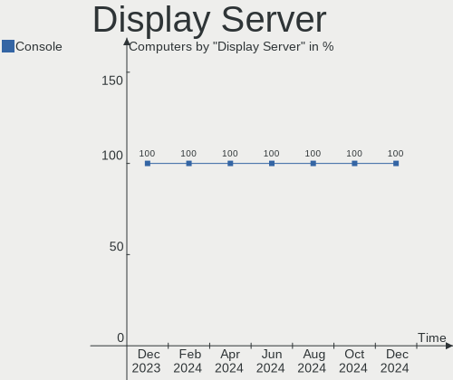
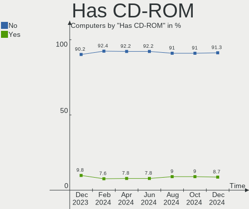
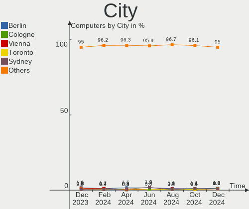
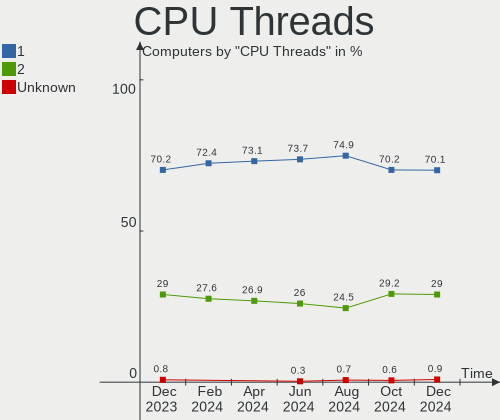
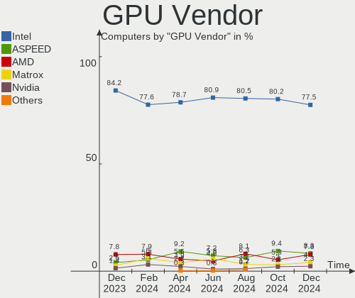
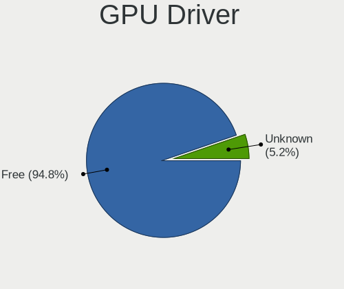
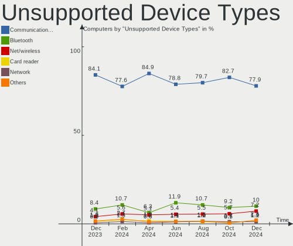

OPNsense - Hardware Trends
--------------------------

A project to identify most popular hardware characteristics and track their change
over time based on data collected by BSD users at https://BSD-Hardware.info.

Anyone can contribute to this report by the [hw-probe](https://github.com/linuxhw/hw-probe/blob/master/INSTALL.BSD.md) tool:

    hw-probe -all -upload

This report is for one last month. Overall report since the beginning of time: [TestDays](https://github.com/bsdhw/TestDays)

Period: Apr, 2023.

Contents
--------

* [ System ](#system)
  - [ OS                       ](#os)
  - [ OS Family                ](#os-family)
  - [ Arch                     ](#arch)
  - [ DE                       ](#de)
  - [ Display Server           ](#display-server)
  - [ Display Manager          ](#display-manager)
  - [ OS Lang                  ](#os-lang)
  - [ Boot Mode                ](#boot-mode)
  - [ Filesystem               ](#filesystem)
  - [ Part. scheme             ](#part-scheme)

* [ Board ](#board)
  - [ Vendor                   ](#vendor)
  - [ Model                    ](#model)
  - [ Model Family             ](#model-family)
  - [ MFG Year                 ](#mfg-year)
  - [ Form Factor              ](#form-factor)
  - [ Coreboot                 ](#coreboot)
  - [ RAM Size                 ](#ram-size)
  - [ RAM Used                 ](#ram-used)
  - [ Total Drives             ](#total-drives)
  - [ Has CD-ROM               ](#has-cd-rom)
  - [ Has Ethernet             ](#has-ethernet)
  - [ Has WiFi                 ](#has-wifi)
  - [ Has Bluetooth            ](#has-bluetooth)

* [ Location ](#location)
  - [ Country                  ](#country)
  - [ City                     ](#city)

* [ Drives ](#drives)
  - [ Drive Vendor             ](#drive-vendor)
  - [ Drive Model              ](#drive-model)
  - [ HDD Vendor               ](#hdd-vendor)
  - [ SSD Vendor               ](#ssd-vendor)
  - [ Drive Kind               ](#drive-kind)
  - [ Drive Connector          ](#drive-connector)
  - [ Drive Size               ](#drive-size)
  - [ Space Total              ](#space-total)
  - [ Space Used               ](#space-used)
  - [ Malfunc. Drives          ](#malfunc-drives)
  - [ Malfunc. Drive Vendor    ](#malfunc-drive-vendor)
  - [ Malfunc. HDD Vendor      ](#malfunc-hdd-vendor)
  - [ Malfunc. Drive Kind      ](#malfunc-drive-kind)
  - [ Failed Drives            ](#failed-drives)
  - [ Failed Drive Vendor      ](#failed-drive-vendor)
  - [ Drive Status             ](#drive-status)

* [ Storage controller ](#storage-controller)
  - [ Storage Vendor           ](#storage-vendor)
  - [ Storage Model            ](#storage-model)
  - [ Storage Kind             ](#storage-kind)

* [ Processor ](#processor)
  - [ CPU Vendor               ](#cpu-vendor)
  - [ CPU Model                ](#cpu-model)
  - [ CPU Model Family         ](#cpu-model-family)
  - [ CPU Cores                ](#cpu-cores)
  - [ CPU Sockets              ](#cpu-sockets)
  - [ CPU Threads              ](#cpu-threads)
  - [ CPU Microarch            ](#cpu-microarch)

* [ Graphics ](#graphics)
  - [ GPU Vendor               ](#gpu-vendor)
  - [ GPU Model                ](#gpu-model)
  - [ GPU Combo                ](#gpu-combo)
  - [ GPU Driver               ](#gpu-driver)
  - [ GPU Memory               ](#gpu-memory)

* [ Monitor ](#monitor)
  - [ Monitor Vendor           ](#monitor-vendor)
  - [ Monitor Model            ](#monitor-model)
  - [ Monitor Resolution       ](#monitor-resolution)
  - [ Monitor Diagonal         ](#monitor-diagonal)
  - [ Monitor Width            ](#monitor-width)
  - [ Aspect Ratio             ](#aspect-ratio)
  - [ Monitor Area             ](#monitor-area)
  - [ Pixel Density            ](#pixel-density)
  - [ Multiple Monitors        ](#multiple-monitors)

* [ Network ](#network)
  - [ Net Controller Vendor    ](#net-controller-vendor)
  - [ Net Controller Model     ](#net-controller-model)
  - [ Wireless Vendor          ](#wireless-vendor)
  - [ Wireless Model           ](#wireless-model)
  - [ Ethernet Vendor          ](#ethernet-vendor)
  - [ Ethernet Model           ](#ethernet-model)
  - [ Net Controller Kind      ](#net-controller-kind)
  - [ Used Controller          ](#used-controller)
  - [ NICs                     ](#nics)
  - [ IPv6                     ](#ipv6)

* [ Bluetooth ](#bluetooth)
  - [ Bluetooth Vendor         ](#bluetooth-vendor)
  - [ Bluetooth Model          ](#bluetooth-model)

* [ Sound ](#sound)
  - [ Sound Vendor             ](#sound-vendor)
  - [ Sound Model              ](#sound-model)

* [ Memory ](#memory)
  - [ Memory Vendor            ](#memory-vendor)
  - [ Memory Model             ](#memory-model)
  - [ Memory Kind              ](#memory-kind)
  - [ Memory Form Factor       ](#memory-form-factor)
  - [ Memory Size              ](#memory-size)
  - [ Memory Speed             ](#memory-speed)

* [ Printers & scanners ](#printers--scanners)
  - [ Printer Vendor           ](#printer-vendor)
  - [ Printer Model            ](#printer-model)
  - [ Scanner Vendor           ](#scanner-vendor)
  - [ Scanner Model            ](#scanner-model)

* [ Camera ](#camera)
  - [ Camera Vendor            ](#camera-vendor)
  - [ Camera Model             ](#camera-model)

* [ Security ](#security)
  - [ Fingerprint Vendor       ](#fingerprint-vendor)
  - [ Fingerprint Model        ](#fingerprint-model)
  - [ Chipcard Vendor          ](#chipcard-vendor)
  - [ Chipcard Model           ](#chipcard-model)

* [ Unsupported ](#unsupported)
  - [ Unsupported Devices      ](#unsupported-devices)
  - [ Unsupported Device Types ](#unsupported-device-types)

System
------

OS
--

Installed operating systems

| Name             | Computers | Percent |
|------------------|-----------|---------|
| OPNsense 23.1.5  | 200       | 56.98%  |
| OPNsense 23.1.6  | 121       | 34.47%  |
| OPNsense 23.7    | 10        | 2.85%   |
| OPNsense 22.7.11 | 5         | 1.42%   |
| OPNsense 23.1.4  | 4         | 1.14%   |
| OPNsense 23.1    | 3         | 0.85%   |
| OPNsense 23.4    | 2         | 0.57%   |
| OPNsense 23.1.3  | 2         | 0.57%   |
| OPNsense 23.1.1  | 1         | 0.28%   |
| OPNsense 22.7.9  | 1         | 0.28%   |
| OPNsense 22.7.10 | 1         | 0.28%   |
| OPNsense 22.10.2 | 1         | 0.28%   |

OS Family
---------

OS without a version

| Name     | Computers | Percent |
|----------|-----------|---------|
| OPNsense | 351       | 100%    |

Arch
----

OS architecture (x86_64, i586, etc.)

| Name  | Computers | Percent |
|-------|-----------|---------|
| amd64 | 351       | 100%    |

DE
--

Desktop Environment

| Name    | Computers | Percent |
|---------|-----------|---------|
| Console | 351       | 100%    |

Display Server
--------------

X11 or Wayland

| Name    | Computers | Percent |
|---------|-----------|---------|
| Console | 351       | 100%    |

Display Manager
---------------

SDDM, LightDM, etc.

| Name    | Computers | Percent |
|---------|-----------|---------|
| Console | 351       | 100%    |

OS Lang
-------

Language

| Lang    | Computers | Percent |
|---------|-----------|---------|
| Unknown | 346       | 98.58%  |
| C       | 5         | 1.42%   |

Boot Mode
---------

EFI or BIOS

| Mode | Computers | Percent |
|------|-----------|---------|
| EFI  | 341       | 97.15%  |
| BIOS | 10        | 2.85%   |

Filesystem
----------

Type of filesystem

| Type   | Computers | Percent |
|--------|-----------|---------|
| Ufs    | 200       | 56.98%  |
| Zfs    | 150       | 42.74%  |
| Cd9660 | 1         | 0.28%   |

Part. scheme
------------

Scheme of partitioning

| Type    | Computers | Percent |
|---------|-----------|---------|
| GPT     | 342       | 97.44%  |
| MBR     | 5         | 1.42%   |
| Unknown | 4         | 1.14%   |

Board
-----

Vendor
------

Motherboard manufacturer

| Name                       | Computers | Percent |
|----------------------------|-----------|---------|
| Unknown                    | 43        | 12.25%  |
| Dell                       | 31        | 8.83%   |
| Hewlett-Packard            | 27        | 7.69%   |
| ASUSTek Computer           | 26        | 7.41%   |
| Supermicro                 | 25        | 7.12%   |
| Protectli                  | 21        | 5.98%   |
| Intel                      | 21        | 5.98%   |
| Techvision                 | 18        | 5.13%   |
| Sophos                     | 13        | 3.7%    |
| PC Engines                 | 13        | 3.7%    |
| Lenovo                     | 13        | 3.7%    |
| Gigabyte Technology        | 10        | 2.85%   |
| Fujitsu                    | 9         | 2.56%   |
| ASRock                     | 8         | 2.28%   |
| MW                         | 7         | 1.99%   |
| Deciso                     | 6         | 1.71%   |
| AMI                        | 6         | 1.71%   |
| MSI                        | 4         | 1.14%   |
| CWWK                       | 4         | 1.14%   |
| CncTion                    | 4         | 1.14%   |
| Shuttle                    | 3         | 0.85%   |
| AZW                        | 3         | 0.85%   |
| Acer                       | 3         | 0.85%   |
| ZOTAC                      | 2         | 0.57%   |
| IceWhale Technology        | 2         | 0.57%   |
| GoWin Solution             | 2         | 0.57%   |
| BYTENUC                    | 2         | 0.57%   |
| AWOW                       | 2         | 0.57%   |
| Apple                      | 2         | 0.57%   |
| YENTEK                     | 1         | 0.28%   |
| SIEMENS                    | 1         | 0.28%   |
| ShenZhen MinWin Technology | 1         | 0.28%   |
| ReachingTech               | 1         | 0.28%   |
| PICO PC                    | 1         | 0.28%   |
| Pegatron                   | 1         | 0.28%   |
| MiTAC                      | 1         | 0.28%   |
| maiyunda                   | 1         | 0.28%   |
| Lanner                     | 1         | 0.28%   |
| Kontron                    | 1         | 0.28%   |
| Intel GMLV114              | 1         | 0.28%   |

Model
-----

Motherboard model

| Name                                | Computers | Percent |
|-------------------------------------|-----------|---------|
| Unknown                             | 44        | 12.54%  |
| Techvision TVI7309X                 | 18        | 5.13%   |
| Sophos SG                           | 9         | 2.56%   |
| Protectli FW4B                      | 9         | 2.56%   |
| Fujitsu FUTRO S920                  | 8         | 2.28%   |
| PC Engines APU2                     | 7         | 1.99%   |
| MW GMLK-2_5G4L                      | 7         | 1.99%   |
| Intel Q3XXG4-P V1.0                 | 7         | 1.99%   |
| Supermicro Super Server             | 6         | 1.71%   |
| AMI Aptio CRB                       | 5         | 1.42%   |
| Protectli FW4C                      | 4         | 1.14%   |
| Protectli VP2410                    | 3         | 0.85%   |
| Intel MAHOBAY                       | 3         | 0.85%   |
| HP t730 Thin Client                 | 3         | 0.85%   |
| HP EliteDesk 800 G4 SFF             | 3         | 0.85%   |
| Dell OptiPlex 7020                  | 3         | 0.85%   |
| Dell OptiPlex 3060                  | 3         | 0.85%   |
| Supermicro X10SLH-N6-ST031          | 2         | 0.57%   |
| Supermicro A1SAi                    | 2         | 0.57%   |
| Sophos XG                           | 2         | 0.57%   |
| Sophos UTM                          | 2         | 0.57%   |
| Protectli VP2420                    | 2         | 0.57%   |
| Protectli FW6                       | 2         | 0.57%   |
| PC Engines apu4                     | 2         | 0.57%   |
| PC Engines apu1                     | 2         | 0.57%   |
| IceWhale ZimaBoard 832 ZMB          | 2         | 0.57%   |
| HP ProDesk 600 G3 SFF               | 2         | 0.57%   |
| HP ProDesk 600 G1 SFF               | 2         | 0.57%   |
| HP EliteDesk 800 G1 SFF             | 2         | 0.57%   |
| GoWin Solution R86S                 | 2         | 0.57%   |
| Dell Wyse 5070 Extended Thin Client | 2         | 0.57%   |
| Dell OptiPlex 9020                  | 2         | 0.57%   |
| Dell OptiPlex 7040                  | 2         | 0.57%   |
| Dell OptiPlex 7010                  | 2         | 0.57%   |
| Deciso NetBoard-A20                 | 2         | 0.57%   |
| Deciso Netboard A10 GEN2 Model G    | 2         | 0.57%   |
| CWWK CW-MBX-AD12                    | 2         | 0.57%   |
| CncTion N5105-4L-I226               | 2         | 0.57%   |
| BYTENUC AZ51                        | 2         | 0.57%   |
| AZW EQ                              | 2         | 0.57%   |

Model Family
------------

Motherboard model prefix

| Name                       | Computers | Percent |
|----------------------------|-----------|---------|
| Unknown                    | 44        | 12.54%  |
| Techvision TVI7309X        | 18        | 5.13%   |
| Dell OptiPlex              | 17        | 4.84%   |
| Lenovo ThinkCentre         | 13        | 3.7%    |
| HP ProDesk                 | 11        | 3.13%   |
| Sophos SG                  | 9         | 2.56%   |
| Protectli FW4B             | 9         | 2.56%   |
| HP EliteDesk               | 8         | 2.28%   |
| Fujitsu FUTRO              | 8         | 2.28%   |
| PC Engines APU2            | 7         | 1.99%   |
| MW GMLK-2                  | 7         | 1.99%   |
| Intel Q3XXG4-P             | 7         | 1.99%   |
| Supermicro Super           | 6         | 1.71%   |
| Dell PowerEdge             | 6         | 1.71%   |
| AMI Aptio                  | 5         | 1.42%   |
| Protectli FW4C             | 4         | 1.14%   |
| Protectli VP2410           | 3         | 0.85%   |
| Intel MAHOBAY              | 3         | 0.85%   |
| HP t730                    | 3         | 0.85%   |
| Dell Wyse                  | 3         | 0.85%   |
| Dell Precision             | 3         | 0.85%   |
| Deciso Netboard            | 3         | 0.85%   |
| ASUS TUF                   | 3         | 0.85%   |
| ASUS PRIME                 | 3         | 0.85%   |
| Supermicro X10SLH-N6-ST031 | 2         | 0.57%   |
| Supermicro A1SAi           | 2         | 0.57%   |
| Sophos XG                  | 2         | 0.57%   |
| Sophos UTM                 | 2         | 0.57%   |
| Protectli VP2420           | 2         | 0.57%   |
| Protectli FW6              | 2         | 0.57%   |
| PC Engines apu4            | 2         | 0.57%   |
| PC Engines apu1            | 2         | 0.57%   |
| IceWhale ZimaBoard         | 2         | 0.57%   |
| HP ProLiant                | 2         | 0.57%   |
| GoWin Solution R86S        | 2         | 0.57%   |
| Deciso NetBoard-A20        | 2         | 0.57%   |
| CWWK CW-MBX-AD12           | 2         | 0.57%   |
| CncTion N5105-4L-I226      | 2         | 0.57%   |
| BYTENUC AZ51               | 2         | 0.57%   |
| AZW EQ                     | 2         | 0.57%   |

MFG Year
--------

Motherboard manufacture year

| Year | Computers | Percent |
|------|-----------|---------|
| 2022 | 77        | 21.94%  |
| 2018 | 39        | 11.11%  |
| 2021 | 32        | 9.12%   |
| 2014 | 31        | 8.83%   |
| 2016 | 29        | 8.26%   |
| 2019 | 27        | 7.69%   |
| 2020 | 26        | 7.41%   |
| 2013 | 17        | 4.84%   |
| 2017 | 16        | 4.56%   |
| 2015 | 14        | 3.99%   |
| 2023 | 12        | 3.42%   |
| 2012 | 9         | 2.56%   |
| 2011 | 8         | 2.28%   |
| 2010 | 6         | 1.71%   |
| 2008 | 5         | 1.42%   |
| 2009 | 3         | 0.85%   |

Form Factor
-----------

Physical design of the computer

| Name     | Computers | Percent |
|----------|-----------|---------|
| Desktop  | 282       | 80.34%  |
| Mini pc  | 24        | 6.84%   |
| Server   | 22        | 6.27%   |
| Firewall | 13        | 3.7%    |
| Notebook | 10        | 2.85%   |

Coreboot
--------

Have coreboot on board

| Used | Computers | Percent |
|------|-----------|---------|
| No   | 330       | 94.02%  |
| Yes  | 21        | 5.98%   |

RAM Size
--------

Total RAM memory

| Size in GB  | Computers | Percent |
|-------------|-----------|---------|
| 8.01-16.0   | 149       | 42.45%  |
| 16.01-24.0  | 88        | 25.07%  |
| 4.01-8.0    | 59        | 16.81%  |
| 32.01-64.0  | 31        | 8.83%   |
| 2.01-3.0    | 12        | 3.42%   |
| 64.01-256.0 | 9         | 2.56%   |
| 24.01-32.0  | 2         | 0.57%   |
| 3.01-4.0    | 1         | 0.28%   |

RAM Used
--------

Used RAM memory

| Used GB   | Computers | Percent |
|-----------|-----------|---------|
| 0.01-0.5  | 190       | 54.13%  |
| 0.51-1.0  | 117       | 33.33%  |
| 1.01-2.0  | 36        | 10.26%  |
| 2.01-3.0  | 4         | 1.14%   |
| 3.01-4.0  | 3         | 0.85%   |
| 8.01-16.0 | 1         | 0.28%   |

Total Drives
------------

Number of drives on board

| Drives | Computers | Percent |
|--------|-----------|---------|
| 1      | 295       | 84.05%  |
| 0      | 29        | 8.26%   |
| 2      | 24        | 6.84%   |
| 4      | 2         | 0.57%   |
| 3      | 1         | 0.28%   |

Has CD-ROM
----------

Has CD-ROM on board

| Presented | Computers | Percent |
|-----------|-----------|---------|
| No        | 318       | 90.6%   |
| Yes       | 33        | 9.4%    |

Has Ethernet
------------

Has Ethernet on board

| Presented | Computers | Percent |
|-----------|-----------|---------|
| Yes       | 351       | 100%    |

Has WiFi
--------

Has WiFi module

| Presented | Computers | Percent |
|-----------|-----------|---------|
| No        | 290       | 82.62%  |
| Yes       | 61        | 17.38%  |

Has Bluetooth
-------------

Has Bluetooth module

| Presented | Computers | Percent |
|-----------|-----------|---------|
| No        | 311       | 88.6%   |
| Yes       | 40        | 11.4%   |

Location
--------

Country
-------

Geographic location (country)

| Country      | Computers | Percent |
|--------------|-----------|---------|
| USA          | 108       | 30.77%  |
| Germany      | 59        | 16.81%  |
| Canada       | 17        | 4.84%   |
| UK           | 15        | 4.27%   |
| France       | 15        | 4.27%   |
| Austria      | 11        | 3.13%   |
| Italy        | 10        | 2.85%   |
| Poland       | 9         | 2.56%   |
| Australia    | 9         | 2.56%   |
| Netherlands  | 8         | 2.28%   |
| Switzerland  | 7         | 1.99%   |
| Brazil       | 7         | 1.99%   |
| Russia       | 6         | 1.71%   |
| Romania      | 5         | 1.42%   |
| Denmark      | 5         | 1.42%   |
| Belgium      | 5         | 1.42%   |
| Sweden       | 4         | 1.14%   |
| Portugal     | 4         | 1.14%   |
| Norway       | 4         | 1.14%   |
| Singapore    | 3         | 0.85%   |
| China        | 3         | 0.85%   |
| Vietnam      | 2         | 0.57%   |
| Taiwan       | 2         | 0.57%   |
| Spain        | 2         | 0.57%   |
| South Korea  | 2         | 0.57%   |
| Mexico       | 2         | 0.57%   |
| Israel       | 2         | 0.57%   |
| Isle of Man  | 2         | 0.57%   |
| Hungary      | 2         | 0.57%   |
| Finland      | 2         | 0.57%   |
| Czechia      | 2         | 0.57%   |
| Turkey       | 1         | 0.28%   |
| Sri Lanka    | 1         | 0.28%   |
| South Africa | 1         | 0.28%   |
| Slovakia     | 1         | 0.28%   |
| Paraguay     | 1         | 0.28%   |
| New Zealand  | 1         | 0.28%   |
| Malaysia     | 1         | 0.28%   |
| Luxembourg   | 1         | 0.28%   |
| Indonesia    | 1         | 0.28%   |

City
----

Geographic location (city)

| City                | Computers | Percent |
|---------------------|-----------|---------|
| Phoenix             | 7         | 1.99%   |
| Berlin              | 7         | 1.99%   |
| Sydney              | 3         | 0.85%   |
| Singapore           | 3         | 0.85%   |
| Rome                | 3         | 0.85%   |
| Paris               | 3         | 0.85%   |
| Oslo                | 3         | 0.85%   |
| Melbourne           | 3         | 0.85%   |
| Edmonton            | 3         | 0.85%   |
| Zurich              | 2         | 0.57%   |
| Warsaw              | 2         | 0.57%   |
| Vienna              | 2         | 0.57%   |
| Vantaa              | 2         | 0.57%   |
| Trieste             | 2         | 0.57%   |
| Tel Aviv            | 2         | 0.57%   |
| South San Francisco | 2         | 0.57%   |
| Sao Paulo           | 2         | 0.57%   |
| Rockford            | 2         | 0.57%   |
| Regina              | 2         | 0.57%   |
| Raleigh             | 2         | 0.57%   |
| New York            | 2         | 0.57%   |
| Munich              | 2         | 0.57%   |
| Mesa                | 2         | 0.57%   |
| Mannheim            | 2         | 0.57%   |
| Madrid              | 2         | 0.57%   |
| London              | 2         | 0.57%   |
| Lisbon              | 2         | 0.57%   |
| Klagenfurt          | 2         | 0.57%   |
| Isle of Man         | 2         | 0.57%   |
| Irvington           | 2         | 0.57%   |
| Houston             | 2         | 0.57%   |
| Hoofddorp           | 2         | 0.57%   |
| Hanover             | 2         | 0.57%   |
| Gifhorn             | 2         | 0.57%   |
| Daly City           | 2         | 0.57%   |
| Copenhagen          | 2         | 0.57%   |
| Cologne             | 2         | 0.57%   |
| Calgary             | 2         | 0.57%   |
| Budapest            | 2         | 0.57%   |
| Bucharest           | 2         | 0.57%   |

Drives
------

Drive Vendor
------------

Hard drive vendors

| Vendor              | Computers | Drives | Percent |
|---------------------|-----------|--------|---------|
| Samsung Electronics | 50        | 53     | 14.84%  |
| Kingston            | 37        | 39     | 10.98%  |
| WDC                 | 23        | 24     | 6.82%   |
| Transcend           | 23        | 24     | 6.82%   |
| Crucial             | 21        | 23     | 6.23%   |
| China               | 16        | 17     | 4.75%   |
| Intel               | 14        | 14     | 4.15%   |
| Seagate             | 13        | 15     | 3.86%   |
| SPCC                | 9         | 9      | 2.67%   |
| Fanxiang            | 9         | 9      | 2.67%   |
| Toshiba             | 8         | 9      | 2.37%   |
| Hoodisk             | 8         | 8      | 2.37%   |
| Silicon Motion      | 7         | 7      | 2.08%   |
| SanDisk             | 6         | 6      | 1.78%   |
| Protectli           | 6         | 6      | 1.78%   |
| A-DATA Technology   | 6         | 7      | 1.78%   |
| SK hynix            | 4         | 4      | 1.19%   |
| PNY                 | 4         | 4      | 1.19%   |
| Patriot             | 4         | 4      | 1.19%   |
| KeepData            | 4         | 4      | 1.19%   |
| Dogfish             | 4         | 4      | 1.19%   |
| BAITITON            | 4         | 4      | 1.19%   |
| Team                | 3         | 3      | 0.89%   |
| Phison              | 3         | 3      | 0.89%   |
| Lexar               | 3         | 3      | 0.89%   |
| Innodisk            | 3         | 3      | 0.89%   |
| Hitachi             | 3         | 3      | 0.89%   |
| Hewlett-Packard     | 3         | 4      | 0.89%   |
| FORESEE             | 3         | 3      | 0.89%   |
| BORY                | 3         | 3      | 0.89%   |
| Apacer              | 3         | 3      | 0.89%   |
| Verbatim            | 2         | 4      | 0.59%   |
| OCZ                 | 2         | 2      | 0.59%   |
| KingSpec            | 2         | 3      | 0.59%   |
| Kimtigo             | 2         | 2      | 0.59%   |
| Corsair             | 2         | 2      | 0.59%   |
| VICKTER             | 1         | 1      | 0.3%    |
| Vaseky              | 1         | 1      | 0.3%    |
| TCSUNBOW            | 1         | 1      | 0.3%    |
| SSSTC               | 1         | 1      | 0.3%    |

Drive Model
-----------

Hard drive models

| Model                             | Computers | Percent |
|-----------------------------------|-----------|---------|
| Kingston SA400S37240G 240GB       | 8         | 2.35%   |
| Kingston SV300S37A120G 120GB      | 5         | 1.47%   |
| Fanxiang S501 128GB               | 5         | 1.47%   |
| Crucial CT240BX500SSD1 240GB      | 5         | 1.47%   |
| Samsung SSD 850 EVO mSATA 250GB   | 4         | 1.18%   |
| KeepData GIM128 128GB             | 4         | 1.18%   |
| Crucial CT120BX500SSD1 120GB      | 4         | 1.18%   |
| China SATA SSD 16GB               | 4         | 1.18%   |
| Transcend TS64GMTS400SD 64GB      | 3         | 0.88%   |
| Transcend TS64GMSA230S 64GB       | 3         | 0.88%   |
| SPCC Solid State Disk 128GB       | 3         | 0.88%   |
| Samsung SSD 970 EVO Plus 250GB    | 3         | 0.88%   |
| Samsung SSD 870 EVO 250GB         | 3         | 0.88%   |
| Samsung SSD 860 EVO 500GB         | 3         | 0.88%   |
| Protectli 120GB M.2               | 3         | 0.88%   |
| Kingston OM8PGP4512Q-A0 512GB     | 3         | 0.88%   |
| Hoodisk SSD 64GB                  | 3         | 0.88%   |
| Hoodisk SSD 128GB                 | 3         | 0.88%   |
| BAITITON BT58SSD08M 128GB         | 3         | 0.88%   |
| Verbatim Vi550 S3 256GB           | 2         | 0.59%   |
| Transcend TS32GMSA370 32GB        | 2         | 0.59%   |
| Transcend TS256GMTE710T 256GB     | 2         | 0.59%   |
| Transcend TS256GMSA230S 256GB     | 2         | 0.59%   |
| Transcend TS16GMSA370 16GB        | 2         | 0.59%   |
| Transcend TS128GMSA370 128GB      | 2         | 0.59%   |
| SPCC Solid State Disk 64GB        | 2         | 0.59%   |
| SPCC M.2 PCIe SSD 256GB           | 2         | 0.59%   |
| Silicon Motion NS256GSSD530 256GB | 2         | 0.59%   |
| Silicon Motion 256GB              | 2         | 0.59%   |
| Seagate ST500DM002-1BD142 500GB   | 2         | 0.59%   |
| Samsung SSD PM851 mSATA 128GB     | 2         | 0.59%   |
| Samsung SSD 970 EVO Plus 500GB    | 2         | 0.59%   |
| Samsung SSD 850 PRO 256GB         | 2         | 0.59%   |
| Samsung SSD 840 PRO Series 256GB  | 2         | 0.59%   |
| PNY CS900 120GB SSD               | 2         | 0.59%   |
| Phison 311CD0128GB                | 2         | 0.59%   |
| Kingston SUV500MS120G 120GB       | 2         | 0.59%   |
| Kingston SMS200S360G 64GB         | 2         | 0.59%   |
| Kingston SKC600MS256G 256GB       | 2         | 0.59%   |
| Kingston SA400S37120G 120GB       | 2         | 0.59%   |

HDD Vendor
----------

Hard disk drive vendors

| Vendor          | Computers | Drives | Percent |
|-----------------|-----------|--------|---------|
| WDC             | 13        | 13     | 40.63%  |
| Seagate         | 11        | 12     | 34.38%  |
| Hitachi         | 3         | 3      | 9.38%   |
| Toshiba         | 2         | 3      | 6.25%   |
| Lexar           | 1         | 1      | 3.13%   |
| HGST            | 1         | 1      | 3.13%   |
| Hewlett-Packard | 1         | 2      | 3.13%   |

SSD Vendor
----------

Solid state drive vendors

| Vendor              | Computers | Drives | Percent |
|---------------------|-----------|--------|---------|
| Samsung Electronics | 36        | 39     | 15.45%  |
| Kingston            | 28        | 30     | 12.02%  |
| Transcend           | 21        | 22     | 9.01%   |
| Crucial             | 18        | 19     | 7.73%   |
| China               | 16        | 17     | 6.87%   |
| Intel               | 12        | 12     | 5.15%   |
| Hoodisk             | 8         | 8      | 3.43%   |
| SPCC                | 6         | 6      | 2.58%   |
| Protectli           | 6         | 6      | 2.58%   |
| WDC                 | 5         | 6      | 2.15%   |
| SanDisk             | 5         | 5      | 2.15%   |
| A-DATA Technology   | 5         | 6      | 2.15%   |
| KeepData            | 4         | 4      | 1.72%   |
| Dogfish             | 4         | 4      | 1.72%   |
| BAITITON            | 4         | 4      | 1.72%   |
| SK hynix            | 3         | 3      | 1.29%   |
| PNY                 | 3         | 3      | 1.29%   |
| Innodisk            | 3         | 3      | 1.29%   |
| FORESEE             | 3         | 3      | 1.29%   |
| BORY                | 3         | 3      | 1.29%   |
| Apacer              | 3         | 3      | 1.29%   |
| Verbatim            | 2         | 4      | 0.86%   |
| Toshiba             | 2         | 2      | 0.86%   |
| Team                | 2         | 2      | 0.86%   |
| Seagate             | 2         | 3      | 0.86%   |
| Patriot             | 2         | 2      | 0.86%   |
| OCZ                 | 2         | 2      | 0.86%   |
| Lexar               | 2         | 2      | 0.86%   |
| KingSpec            | 2         | 3      | 0.86%   |
| Corsair             | 2         | 2      | 0.86%   |
| VICKTER             | 1         | 1      | 0.43%   |
| Vaseky              | 1         | 1      | 0.43%   |
| TCSUNBOW            | 1         | 1      | 0.43%   |
| SSSTC               | 1         | 1      | 0.43%   |
| Silicon Power       | 1         | 1      | 0.43%   |
| Silicon             | 1         | 1      | 0.43%   |
| Qunion              | 1         | 1      | 0.43%   |
| Micron Technology   | 1         | 1      | 0.43%   |
| LITEONIT            | 1         | 1      | 0.43%   |
| LITEON              | 1         | 1      | 0.43%   |

Drive Kind
----------

HDD or SSD

| Kind | Computers | Drives | Percent |
|------|-----------|--------|---------|
| SSD  | 225       | 247    | 69.23%  |
| NVMe | 72        | 73     | 22.15%  |
| HDD  | 28        | 35     | 8.62%   |

Drive Connector
---------------

SATA, SAS, NVMe, etc.

| Type | Computers | Drives | Percent |
|------|-----------|--------|---------|
| SATA | 252       | 282    | 77.78%  |
| NVMe | 72        | 73     | 22.22%  |

Drive Size
----------

Size of hard drive

| Size in TB | Computers | Drives | Percent |
|------------|-----------|--------|---------|
| 0.01-0.5   | 235       | 261    | 92.52%  |
| 0.51-1.0   | 14        | 16     | 5.51%   |
| 1.01-2.0   | 4         | 4      | 1.57%   |
| 2.01-3.0   | 1         | 1      | 0.39%   |

Space Total
-----------

Amount of disk space available on the file system

| Size in GB | Computers | Percent |
|------------|-----------|---------|
| 101-250    | 190       | 54.13%  |
| 251-500    | 54        | 15.38%  |
| 51-100     | 39        | 11.11%  |
| 21-50      | 33        | 9.4%    |
| 1-20       | 18        | 5.13%   |
| 501-1000   | 11        | 3.13%   |
| 1001-2000  | 5         | 1.42%   |
| Unknown    | 1         | 0.28%   |

Space Used
----------

Amount of used disk space

| Used GB | Computers | Percent |
|---------|-----------|---------|
| 1-20    | 337       | 96.01%  |
| 21-50   | 10        | 2.85%   |
| 51-100  | 2         | 0.57%   |
| 101-250 | 1         | 0.28%   |
| Unknown | 1         | 0.28%   |

Malfunc. Drives
---------------

Drive models with a malfunction

| Model                                        | Computers | Drives | Percent |
|----------------------------------------------|-----------|--------|---------|
| Kingston SV300S37A120G 120GB                 | 2         | 2      | 5.71%   |
| WDC WD6400AAKS-22A7B2 640GB                  | 1         | 1      | 2.86%   |
| WDC WD5003AZEX-00K1GA0 500GB                 | 1         | 1      | 2.86%   |
| WDC WD5000AAKX-603CA0 500GB                  | 1         | 1      | 2.86%   |
| WDC WD2500AAKX-083CA1 250GB                  | 1         | 1      | 2.86%   |
| WDC WD1600AAJS-75M0A0 160GB                  | 1         | 1      | 2.86%   |
| Transcend TS128GMSA230S 128GB                | 1         | 1      | 2.86%   |
| SSSTC CVB-8D128-HP 128GB                     | 1         | 1      | 2.86%   |
| SPCC Solid State Disk 128GB                  | 1         | 1      | 2.86%   |
| SK hynix HFS120G32TND-N1A2A 120GB            | 1         | 1      | 2.86%   |
| Seagate ST9160821AS 160GB                    | 1         | 1      | 2.86%   |
| Seagate ST9100821AS 100GB                    | 1         | 1      | 2.86%   |
| Seagate ST500NM0011 500GB                    | 1         | 1      | 2.86%   |
| Seagate ST500LM000-SSHD-8GB                  | 1         | 1      | 2.86%   |
| Seagate ST500DM002-1BD142 500GB              | 1         | 1      | 2.86%   |
| Seagate ST3300831AS 304GB                    | 1         | 1      | 2.86%   |
| Seagate ST250DM000-1BD141 250GB              | 1         | 1      | 2.86%   |
| SanDisk SSD U100 64GB                        | 1         | 1      | 2.86%   |
| Samsung Electronics SSD PM810 2.5-inch 256GB | 1         | 1      | 2.86%   |
| Samsung Electronics SSD 850 PRO 256GB        | 1         | 2      | 2.86%   |
| Samsung Electronics MZ7PA128HMCD-010H1 128GB | 1         | 1      | 2.86%   |
| Kingston SV300S3240G 240GB                   | 1         | 1      | 2.86%   |
| Kingston SMS200S360G 64GB                    | 1         | 1      | 2.86%   |
| Kingston SMS200S3120G 120GB                  | 1         | 1      | 2.86%   |
| Kingston SA400S37240G 240GB                  | 1         | 1      | 2.86%   |
| KeepData GIM128 128GB                        | 1         | 1      | 2.86%   |
| Intel SSDSC2BW120H6 120GB                    | 1         | 1      | 2.86%   |
| Dogfish SSD 128GB                            | 1         | 1      | 2.86%   |
| Crucial CT512M550SSD1 512GB                  | 1         | 2      | 2.86%   |
| Crucial CT1050MX300SSD4 1TB                  | 1         | 1      | 2.86%   |
| China SATA SSD 32GB                          | 1         | 1      | 2.86%   |
| BORY M500 16G                                | 1         | 1      | 2.86%   |
| Apple SSD TS256C 256GB                       | 1         | 1      | 2.86%   |
| Apacer 32GB SATA Flash Drive                 | 1         | 1      | 2.86%   |

Malfunc. Drive Vendor
---------------------

Vendors of faulty drives

| Vendor              | Computers | Drives | Percent |
|---------------------|-----------|--------|---------|
| Seagate             | 6         | 7      | 17.65%  |
| Kingston            | 6         | 6      | 17.65%  |
| WDC                 | 5         | 5      | 14.71%  |
| Samsung Electronics | 3         | 4      | 8.82%   |
| Crucial             | 2         | 3      | 5.88%   |
| Transcend           | 1         | 1      | 2.94%   |
| SSSTC               | 1         | 1      | 2.94%   |
| SPCC                | 1         | 1      | 2.94%   |
| SK hynix            | 1         | 1      | 2.94%   |
| SanDisk             | 1         | 1      | 2.94%   |
| KeepData            | 1         | 1      | 2.94%   |
| Intel               | 1         | 1      | 2.94%   |
| Dogfish             | 1         | 1      | 2.94%   |
| China               | 1         | 1      | 2.94%   |
| BORY                | 1         | 1      | 2.94%   |
| Apple               | 1         | 1      | 2.94%   |
| Apacer              | 1         | 1      | 2.94%   |

Malfunc. HDD Vendor
-------------------

Vendors of faulty HDD drives

| Vendor  | Computers | Drives | Percent |
|---------|-----------|--------|---------|
| Seagate | 6         | 7      | 54.55%  |
| WDC     | 5         | 5      | 45.45%  |

Malfunc. Drive Kind
-------------------

Kinds of faulty drives

| Kind | Computers | Drives | Percent |
|------|-----------|--------|---------|
| SSD  | 23        | 25     | 69.7%   |
| HDD  | 10        | 12     | 30.3%   |

Failed Drives
-------------

Failed drive models

| Model                     | Computers | Drives | Percent |
|---------------------------|-----------|--------|---------|
| Kingston SMS200S360G 64GB | 1         | 1      | 100%    |

Failed Drive Vendor
-------------------

Failed drive vendors

| Vendor   | Computers | Drives | Percent |
|----------|-----------|--------|---------|
| Kingston | 1         | 1      | 100%    |

Drive Status
------------

Number of failed and malfunc. drives

| Status   | Computers | Drives | Percent |
|----------|-----------|--------|---------|
| Works    | 287       | 313    | 88.58%  |
| Malfunc  | 33        | 37     | 10.19%  |
| Detected | 3         | 4      | 0.93%   |
| Failed   | 1         | 1      | 0.31%   |

Storage controller
------------------

Storage Vendor
--------------

Storage controller vendors

| Vendor                      | Computers | Percent |
|-----------------------------|-----------|---------|
| Intel                       | 290       | 67.76%  |
| AMD                         | 46        | 10.75%  |
| Silicon Motion              | 16        | 3.74%   |
| Samsung Electronics         | 14        | 3.27%   |
| SanDisk                     | 13        | 3.04%   |
| Kingston Technology Company | 9         | 2.1%    |
| Phison Electronics          | 7         | 1.64%   |
| MAXIO Technology (Hangzhou) | 7         | 1.64%   |
| Micron/Crucial Technology   | 4         | 0.93%   |
| Broadcom / LSI              | 4         | 0.93%   |
| Toshiba                     | 3         | 0.7%    |
| JMicron Technology          | 3         | 0.7%    |
| Transcend                   | 2         | 0.47%   |
| Netac Technology            | 2         | 0.47%   |
| Hewlett-Packard             | 2         | 0.47%   |
| SK hynix                    | 1         | 0.23%   |
| Marvell Technology Group    | 1         | 0.23%   |
| KIOXIA                      | 1         | 0.23%   |
| Chelsio Communications      | 1         | 0.23%   |
| ADATA Technology            | 1         | 0.23%   |
| Adaptec                     | 1         | 0.23%   |

Storage Model
-------------

Storage controller models

| Model                                                                            | Computers | Percent |
|----------------------------------------------------------------------------------|-----------|---------|
| Intel Jasper Lake SATA AHCI Controller                                           | 34        | 7.19%   |
| Intel 8 Series/C220 Series Chipset Family 6-port SATA Controller 1 [AHCI mode]   | 33        | 6.98%   |
| AMD FCH SATA Controller [AHCI mode]                                              | 33        | 6.98%   |
| Intel Celeron/Pentium Silver Processor SATA Controller                           | 28        | 5.92%   |
| Intel Q170/Q150/B150/H170/H110/Z170/CM236 Chipset SATA Controller [AHCI Mode]    | 19        | 4.02%   |
| Silicon Motion SM2263EN/SM2263XT SSD Controller                                  | 16        | 3.38%   |
| Intel Atom/Celeron/Pentium Processor x5-E8000/J3xxx/N3xxx Series SATA Controller | 16        | 3.38%   |
| Intel Cannon Lake PCH SATA AHCI Controller                                       | 15        | 3.17%   |
| Unknown                                                                          | 12        | 2.54%   |
| Intel SATA Controller [RAID mode]                                                | 10        | 2.11%   |
| Intel Sunrise Point-LP SATA Controller [AHCI mode]                               | 8         | 1.69%   |
| Intel Celeron N3350/Pentium N4200/Atom E3900 Series SATA AHCI Controller         | 8         | 1.69%   |
| Intel 200 Series PCH SATA controller [AHCI mode]                                 | 8         | 1.69%   |
| Samsung NVMe SSD Controller SM981/PM981/PM983                                    | 7         | 1.48%   |
| MAXIO (Hangzhou) NVMe SSD Controller MAP1202                                     | 7         | 1.48%   |
| Intel Atom Processor E3800 Series SATA AHCI Controller                           | 7         | 1.48%   |
| Intel 6 Series/C200 Series Chipset Family 6 port Desktop SATA AHCI Controller    | 7         | 1.48%   |
| AMD SB7x0/SB8x0/SB9x0 SATA Controller [AHCI mode]                                | 7         | 1.48%   |
| Phison PS5013 E13 NVMe Controller                                                | 6         | 1.27%   |
| Intel Wildcat Point-LP SATA Controller [AHCI Mode]                               | 6         | 1.27%   |
| Intel Atom Processor C3000 Series SATA Controller 0                              | 6         | 1.27%   |
| Intel 7 Series/C210 Series Chipset Family 6-port SATA Controller [AHCI mode]     | 6         | 1.27%   |
| SanDisk WD Blue SN570 NVMe SSD 1TB                                               | 5         | 1.06%   |
| Intel NM10/ICH7 Family SATA Controller [IDE mode]                                | 5         | 1.06%   |
| Intel Atom Processor C3000 Series SATA Controller 1                              | 5         | 1.06%   |
| Intel 82801G (ICH7 Family) IDE Controller                                        | 5         | 1.06%   |
| Intel 8 Series SATA Controller 1 [AHCI mode]                                     | 5         | 1.06%   |
| Intel Elkhart Lake SATA AHCI                                                     | 4         | 0.85%   |
| Intel Comet Lake SATA AHCI Controller                                            | 4         | 0.85%   |
| Intel C620 Series Chipset Family SSATA Controller [AHCI mode]                    | 4         | 0.85%   |
| Intel C620 Series Chipset Family SATA Controller [AHCI mode]                     | 4         | 0.85%   |
| Intel Atom processor C2000 AHCI SATA3 Controller                                 | 4         | 0.85%   |
| Intel Atom processor C2000 AHCI SATA2 Controller                                 | 4         | 0.85%   |
| Intel 82801HM/HEM (ICH8M/ICH8M-E) IDE Controller                                 | 4         | 0.85%   |
| Micron/Crucial P2 NVMe PCIe SSD                                                  | 3         | 0.63%   |
| Intel Tiger Lake-LP SATA Controller                                              | 3         | 0.63%   |
| Intel Cannon Point-LP SATA Controller [AHCI Mode]                                | 3         | 0.63%   |
| Intel 9 Series Chipset Family SATA Controller [AHCI Mode]                        | 3         | 0.63%   |
| Intel 82801IB (ICH9) 2 port SATA Controller [IDE mode]                           | 3         | 0.63%   |
| Intel 82801HM/HEM (ICH8M/ICH8M-E) SATA Controller [AHCI mode]                    | 3         | 0.63%   |

Storage Kind
------------

Kind of storage controller (IDE, SATA, NVMe, SAS, ...)

| Kind | Computers | Percent |
|------|-----------|---------|
| SATA | 301       | 68.56%  |
| NVMe | 81        | 18.45%  |
| IDE  | 33        | 7.52%   |
| RAID | 23        | 5.24%   |
| SCSI | 1         | 0.23%   |

Processor
---------

CPU Vendor
----------

Processor vendors

| Vendor | Computers | Percent |
|--------|-----------|---------|
| Intel  | 302       | 86.04%  |
| AMD    | 49        | 13.96%  |

CPU Model
---------

Processor models

| Model                                    | Computers | Percent |
|------------------------------------------|-----------|---------|
| Intel Celeron N5105 @ 2.00GHz            | 28        | 7.98%   |
| Intel Celeron J4125 CPU @ 2.00GHz        | 23        | 6.55%   |
| AMD GX-412TC SOC                         | 10        | 2.85%   |
| Intel Celeron CPU J3160 @ 1.60GHz        | 9         | 2.56%   |
| Intel Pentium Silver N6005 @ 2.00GHz     | 8         | 2.28%   |
| Intel Celeron CPU J1900 @ 1.99GHz        | 6         | 1.71%   |
| AMD GX-415GA SOC with Radeon HD Graphics | 6         | 1.71%   |
| Intel Core i5-6500 CPU @ 3.20GHz         | 5         | 1.42%   |
| Intel Core i5-4590 CPU @ 3.30GHz         | 5         | 1.42%   |
| Intel Pentium CPU J3710 @ 1.60GHz        | 4         | 1.14%   |
| Intel Core i5-8500 CPU @ 3.00GHz         | 4         | 1.14%   |
| Intel Core i5-5200U CPU @ 2.20GHz        | 4         | 1.14%   |
| Intel Core i3-4160 CPU @ 3.60GHz         | 4         | 1.14%   |
| Intel Celeron N5100 @ 1.10GHz            | 4         | 1.14%   |
| Intel Atom Processor E3940 @ 1.60GHz     | 4         | 1.14%   |
| Intel Atom CPU D525 @ 1.80GHz            | 4         | 1.14%   |
| Intel Atom CPU C3558 @ 2.20GHz           | 4         | 1.14%   |
| Intel Xeon D-2123IT CPU @ 2.20GHz        | 3         | 0.85%   |
| Intel Pentium CPU G3420 @ 3.20GHz        | 3         | 0.85%   |
| Intel Core i7-4790 CPU @ 3.60GHz         | 3         | 0.85%   |
| Intel Core i5-4570 CPU @ 3.20GHz         | 3         | 0.85%   |
| Intel Core i5-4460 CPU @ 3.20GHz         | 3         | 0.85%   |
| Intel Core i3-8100 CPU @ 3.60GHz         | 3         | 0.85%   |
| Intel Celeron CPU N3450 @ 1.10GHz        | 3         | 0.85%   |
| AMD RX-427BB with AMD Radeon R7 Graphics | 3         | 0.85%   |
| AMD G-T40E Processor                     | 3         | 0.85%   |
| Intel Xeon D-2146NT CPU @ 2.30GHz        | 2         | 0.57%   |
| Intel Xeon CPU E5530 @ 2.40GHz           | 2         | 0.57%   |
| Intel Pentium Silver J5005 CPU @ 1.50GHz | 2         | 0.57%   |
| Intel Pentium CPU G4560 @ 3.50GHz        | 2         | 0.57%   |
| Intel N100                               | 2         | 0.57%   |
| Intel Core i7-8700 CPU @ 3.20GHz         | 2         | 0.57%   |
| Intel Core i7-8550U CPU @ 1.80GHz        | 2         | 0.57%   |
| Intel Core i7-7700T CPU @ 2.90GHz        | 2         | 0.57%   |
| Intel Core i7-7700 CPU @ 3.60GHz         | 2         | 0.57%   |
| Intel Core i7-6700 CPU @ 3.40GHz         | 2         | 0.57%   |
| Intel Core i7-3770 CPU @ 3.40GHz         | 2         | 0.57%   |
| Intel Core i5-9400 CPU @ 2.90GHz         | 2         | 0.57%   |
| Intel Core i5-7200U CPU @ 2.50GHz        | 2         | 0.57%   |
| Intel Core i5-6500T CPU @ 2.50GHz        | 2         | 0.57%   |

CPU Model Family
----------------

Processor model prefix

| Model                   | Computers | Percent |
|-------------------------|-----------|---------|
| Intel Celeron           | 93        | 26.5%   |
| Intel Core i5           | 58        | 16.52%  |
| Intel Core i7           | 30        | 8.55%   |
| Intel Xeon              | 29        | 8.26%   |
| Intel Core i3           | 23        | 6.55%   |
| AMD GX                  | 23        | 6.55%   |
| Intel Atom              | 21        | 5.98%   |
| Other                   | 15        | 4.27%   |
| Intel Pentium           | 15        | 4.27%   |
| Intel Pentium Silver    | 10        | 2.85%   |
| Intel Core 2 Duo        | 7         | 1.99%   |
| AMD Ryzen 7             | 4         | 1.14%   |
| AMD EPYC                | 4         | 1.14%   |
| AMD G                   | 3         | 0.85%   |
| Intel Pentium Dual-Core | 2         | 0.57%   |
| AMD Ryzen 5 PRO         | 2         | 0.57%   |
| AMD Ryzen 5             | 2         | 0.57%   |
| AMD FX                  | 2         | 0.57%   |
| Intel Pentium Gold      | 1         | 0.28%   |
| Intel Core 2 Quad       | 1         | 0.28%   |
| AMD Ryzen Embedded      | 1         | 0.28%   |
| AMD Ryzen 3 PRO         | 1         | 0.28%   |
| AMD Ryzen 3             | 1         | 0.28%   |
| AMD Phenom II X4        | 1         | 0.28%   |
| AMD E                   | 1         | 0.28%   |
| AMD Athlon II X2        | 1         | 0.28%   |

CPU Cores
---------

Number of processor cores

| Number  | Computers | Percent |
|---------|-----------|---------|
| 4       | 229       | 65.24%  |
| 2       | 76        | 21.65%  |
| 6       | 17        | 4.84%   |
| 8       | 13        | 3.7%    |
| 16      | 6         | 1.71%   |
| 12      | 5         | 1.42%   |
| Unknown | 3         | 0.85%   |
| 10      | 1         | 0.28%   |
| 1       | 1         | 0.28%   |

CPU Sockets
-----------

Number of sockets

| Number | Computers | Percent |
|--------|-----------|---------|
| 1      | 348       | 99.15%  |
| 2      | 3         | 0.85%   |

CPU Threads
-----------

Threads per core (Hyper-Threading)

| Number  | Computers | Percent |
|---------|-----------|---------|
| 1       | 240       | 68.38%  |
| 2       | 108       | 30.77%  |
| Unknown | 3         | 0.85%   |

CPU Microarch
-------------

Microarchitecture

| Name          | Computers | Percent |
|---------------|-----------|---------|
| Unknown       | 55        | 15.67%  |
| Haswell       | 43        | 12.25%  |
| KabyLake      | 42        | 11.97%  |
| Silvermont    | 28        | 7.98%   |
| Goldmont plus | 28        | 7.98%   |
| Skylake       | 24        | 6.84%   |
| Puma          | 15        | 4.27%   |
| IvyBridge     | 15        | 4.27%   |
| Goldmont      | 15        | 4.27%   |
| Broadwell     | 11        | 3.13%   |
| Penryn        | 10        | 2.85%   |
| SandyBridge   | 8         | 2.28%   |
| Jaguar        | 8         | 2.28%   |
| Zen           | 6         | 1.71%   |
| Nehalem       | 6         | 1.71%   |
| CometLake     | 5         | 1.42%   |
| Bonnell       | 5         | 1.42%   |
| Bobcat        | 4         | 1.14%   |
| Zen 3         | 3         | 0.85%   |
| Zen 2         | 3         | 0.85%   |
| TigerLake     | 3         | 0.85%   |
| Steamroller   | 3         | 0.85%   |
| Zen+          | 2         | 0.57%   |
| Westmere      | 2         | 0.57%   |
| Piledriver    | 2         | 0.57%   |
| K10           | 2         | 0.57%   |
| Core          | 2         | 0.57%   |
| IceLake       | 1         | 0.28%   |

Graphics
--------

GPU Vendor
----------

Vendors of graphics cards

| Vendor                                       | Computers | Percent |
|----------------------------------------------|-----------|---------|
| Intel                                        | 249       | 75%     |
| ASPEED Technology                            | 34        | 10.24%  |
| AMD                                          | 32        | 9.64%   |
| Matrox Electronics Systems                   | 9         | 2.71%   |
| Nvidia                                       | 7         | 2.11%   |
| XGI Technology (eXtreme Graphics Innovation) | 1         | 0.3%    |

GPU Model
---------

Graphics card models

| Model                                                                                    | Computers | Percent |
|------------------------------------------------------------------------------------------|-----------|---------|
| Intel JasperLake [UHD Graphics]                                                          | 40        | 11.98%  |
| ASPEED Technology ASPEED Graphics Family                                                 | 34        | 10.18%  |
| Intel Xeon E3-1200 v3/4th Gen Core Processor Integrated Graphics Controller              | 26        | 7.78%   |
| Intel GeminiLake [UHD Graphics 600]                                                      | 26        | 7.78%   |
| Intel Atom/Celeron/Pentium Processor x5-E8000/J3xxx/N3xxx Integrated Graphics Controller | 17        | 5.09%   |
| Intel CoffeeLake-S GT2 [UHD Graphics 630]                                                | 15        | 4.49%   |
| Intel HD Graphics 530                                                                    | 11        | 3.29%   |
| Intel HD Graphics 500                                                                    | 8         | 2.4%    |
| Intel Xeon E3-1200 v2/3rd Gen Core processor Graphics Controller                         | 7         | 2.1%    |
| Intel HD Graphics 630                                                                    | 7         | 2.1%    |
| Intel Atom Processor Z36xxx/Z37xxx Series Graphics & Display                             | 7         | 2.1%    |
| Intel 2nd Generation Core Processor Family Integrated Graphics Controller                | 7         | 2.1%    |
| Intel HD Graphics 5500                                                                   | 6         | 1.8%    |
| AMD Kabini [Radeon HD 8330E]                                                             | 6         | 1.8%    |
| Intel 4 Series Chipset Integrated Graphics Controller                                    | 5         | 1.5%    |
| Matrox Electronics Systems MGA G200eW WPCM450                                            | 4         | 1.2%    |
| Intel HD Graphics 610                                                                    | 4         | 1.2%    |
| Intel Haswell-ULT Integrated Graphics Controller                                         | 4         | 1.2%    |
| Intel Elkhart Lake [UHD Graphics Gen11 16EU]                                             | 4         | 1.2%    |
| Intel Atom Processor D4xx/D5xx/N4xx/N5xx Integrated Graphics Controller                  | 4         | 1.2%    |
| Intel 4th Generation Core Processor Family Integrated Graphics Controller                | 4         | 1.2%    |
| Matrox Electronics Systems G200eR2                                                       | 3         | 0.9%    |
| Intel WhiskeyLake-U GT2 [UHD Graphics 620]                                               | 3         | 0.9%    |
| Intel TigerLake-LP GT2 [Iris Xe Graphics]                                                | 3         | 0.9%    |
| Intel HD Graphics 620                                                                    | 3         | 0.9%    |
| Intel HD Graphics 510                                                                    | 3         | 0.9%    |
| Intel Alder Lake-N [UHD Graphics]                                                        | 3         | 0.9%    |
| Intel 3rd Gen Core processor Graphics Controller                                         | 3         | 0.9%    |
| AMD Renoir                                                                               | 3         | 0.9%    |
| AMD Kaveri [Radeon R7 Graphics]                                                          | 3         | 0.9%    |
| Intel UHD Graphics 620                                                                   | 2         | 0.6%    |
| Intel IvyBridge GT2 [HD Graphics 4000]                                                   | 2         | 0.6%    |
| Intel GeminiLake [UHD Graphics 605]                                                      | 2         | 0.6%    |
| Intel CometLake-U GT2 [UHD Graphics]                                                     | 2         | 0.6%    |
| Intel CometLake-S GT2 [UHD Graphics 630]                                                 | 2         | 0.6%    |
| Intel Alder Lake-S GT1 [UHD Graphics 710]                                                | 2         | 0.6%    |
| Intel 82G33/G31 Express Integrated Graphics Controller                                   | 2         | 0.6%    |
| AMD Mullins [Radeon R4/R5 Graphics]                                                      | 2         | 0.6%    |
| AMD Cezanne [Radeon Vega Series / Radeon Vega Mobile Series]                             | 2         | 0.6%    |
| AMD Cedar [Radeon HD 5000/6000/7350/8350 Series]                                         | 2         | 0.6%    |

GPU Combo
---------

Combinations of graphics cards

| Name           | Computers | Percent |
|----------------|-----------|---------|
| 1 x Intel      | 237       | 67.52%  |
| 1 x ASPEED     | 33        | 9.4%    |
| 1 x AMD        | 29        | 8.26%   |
| Other          | 23        | 6.55%   |
| 1 x Matrox     | 9         | 2.56%   |
| 2 x Intel      | 8         | 2.28%   |
| 1 x Nvidia     | 7         | 1.99%   |
| Intel + AMD    | 2         | 0.57%   |
| 2 x AMD        | 1         | 0.28%   |
| 1 x XGI        | 1         | 0.28%   |
| Intel + ASPEED | 1         | 0.28%   |

GPU Driver
----------

Free vs proprietary

| Driver  | Computers | Percent |
|---------|-----------|---------|
| Free    | 328       | 93.45%  |
| Unknown | 23        | 6.55%   |

GPU Memory
----------

Total video memory

| Size in GB | Computers | Percent |
|------------|-----------|---------|
| Unknown    | 351       | 100%    |

Monitor
-------

Monitor Vendor
--------------

Monitor vendors

Zero info for selected period =(

Monitor Model
-------------

Monitor models

Zero info for selected period =(

Monitor Resolution
------------------

Monitor screen resolution

Zero info for selected period =(

Monitor Diagonal
----------------

Diagonal size in inches

Zero info for selected period =(

Monitor Width
-------------

Physical width

Zero info for selected period =(

Aspect Ratio
------------

Proportional relationship between the width and the height

Zero info for selected period =(

Monitor Area
------------

Area in inch

Zero info for selected period =(

Pixel Density
-------------

Pixels per inch

Zero info for selected period =(

Multiple Monitors
-----------------

Total monitors connected

| Total | Computers | Percent |
|-------|-----------|---------|
| 0     | 351       | 100%    |

Network
-------

Net Controller Vendor
---------------------

Controller vendors

| Vendor                          | Computers | Percent |
|---------------------------------|-----------|---------|
| Intel                           | 299       | 62.82%  |
| Realtek Semiconductor           | 102       | 21.43%  |
| Broadcom                        | 25        | 5.25%   |
| Qualcomm Atheros                | 9         | 1.89%   |
| Mellanox Technologies           | 8         | 1.68%   |
| IMC Networks                    | 4         | 0.84%   |
| TP-Link                         | 3         | 0.63%   |
| Solarflare Communications       | 3         | 0.63%   |
| Marvell Technology Group        | 3         | 0.63%   |
| AMD                             | 3         | 0.63%   |
| Ralink Technology               | 2         | 0.42%   |
| NetXen Incorporated             | 2         | 0.42%   |
| Chelsio Communications          | 2         | 0.42%   |
| Aquantia                        | 2         | 0.42%   |
| VIA Technologies                | 1         | 0.21%   |
| U-Blox                          | 1         | 0.21%   |
| T & A Mobile Phones             | 1         | 0.21%   |
| Ralink                          | 1         | 0.21%   |
| Qualcomm Atheros Communications | 1         | 0.21%   |
| Mercucys                        | 1         | 0.21%   |
| Linksys                         | 1         | 0.21%   |
| ICS Advent                      | 1         | 0.21%   |
| 3Com                            | 1         | 0.21%   |

Net Controller Model
--------------------

Controller models

| Model                                                                         | Computers | Percent |
|-------------------------------------------------------------------------------|-----------|---------|
| Realtek RTL8111/8168/8411 PCI Express Gigabit Ethernet Controller             | 88        | 14.36%  |
| Intel Ethernet Controller I226-V                                              | 44        | 7.18%   |
| Intel I210 Gigabit Network Connection                                         | 41        | 6.69%   |
| Intel I211 Gigabit Network Connection                                         | 39        | 6.36%   |
| Intel Ethernet Controller I225-V                                              | 36        | 5.87%   |
| Intel I350 Gigabit Network Connection                                         | 26        | 4.24%   |
| Intel 82599ES 10-Gigabit SFI/SFP+ Network Connection                          | 20        | 3.26%   |
| Intel 82574L Gigabit Network Connection                                       | 17        | 2.77%   |
| Intel Ethernet Connection I217-LM                                             | 16        | 2.61%   |
| Intel 82583V Gigabit Network Connection                                       | 12        | 1.96%   |
| Intel 82576 Gigabit Network Connection                                        | 12        | 1.96%   |
| Intel Ethernet Connection (2) I219-LM                                         | 9         | 1.47%   |
| Intel Ethernet Controller 10-Gigabit X540-AT2                                 | 8         | 1.31%   |
| Intel 82580 Gigabit Network Connection                                        | 8         | 1.31%   |
| Intel 82571EB/82571GB Gigabit Ethernet Controller D0/D1 (copper applications) | 8         | 1.31%   |
| Realtek RTL8125 2.5GbE Controller                                             | 7         | 1.14%   |
| Mellanox MT27500 Family [ConnectX-3]                                          | 7         | 1.14%   |
| Intel Ethernet Connection (7) I219-LM                                         | 7         | 1.14%   |
| Intel Ethernet Connection X553 1GbE                                           | 6         | 0.98%   |
| Realtek RTL8821CE 802.11ac PCIe Wireless Network Adapter                      | 5         | 0.82%   |
| Intel Wireless 3165                                                           | 5         | 0.82%   |
| Intel Ethernet Connection X722 for 10GbE SFP+                                 | 5         | 0.82%   |
| Intel Ethernet Connection X722 for 10GBASE-T                                  | 5         | 0.82%   |
| Intel 82579LM Gigabit Network Connection (Lewisville)                         | 5         | 0.82%   |
| Intel 82575EB Gigabit Network Connection                                      | 5         | 0.82%   |
| Broadcom NetXtreme II BCM5709 Gigabit Ethernet                                | 5         | 0.82%   |
| Broadcom NetXtreme BCM5720 Gigabit Ethernet PCIe                              | 5         | 0.82%   |
| Realtek RTL810xE PCI Express Fast Ethernet controller                         | 4         | 0.65%   |
| Intel Wi-Fi 6 AX201 160MHz                                                    | 4         | 0.65%   |
| Intel Ethernet Controller X710 for 10GbE SFP+                                 | 4         | 0.65%   |
| Intel Ethernet Controller X550                                                | 4         | 0.65%   |
| Intel Ethernet Controller I225-LM                                             | 4         | 0.65%   |
| Intel Ethernet Connection I354                                                | 4         | 0.65%   |
| Intel Ethernet Connection (2) I219-V                                          | 4         | 0.65%   |
| Intel 82571EB/82571GB Gigabit Ethernet Controller (Copper)                    | 4         | 0.65%   |
| IMC Networks 802.11 n/g/b Wireless LAN USB Mini-Card                          | 4         | 0.65%   |
| Broadcom NetXtreme II BCM57810 10 Gigabit Ethernet                            | 4         | 0.65%   |
| Intel Wi-Fi 6 AX210/AX211/AX411 160MHz                                        | 3         | 0.49%   |
| Intel Wi-Fi 6 AX200                                                           | 3         | 0.49%   |
| Intel I210 Gigabit Fiber Network Connection                                   | 3         | 0.49%   |

Wireless Vendor
---------------

Wireless vendors

| Vendor                          | Computers | Percent |
|---------------------------------|-----------|---------|
| Intel                           | 30        | 46.88%  |
| Realtek Semiconductor           | 10        | 15.63%  |
| Qualcomm Atheros                | 9         | 14.06%  |
| IMC Networks                    | 4         | 6.25%   |
| TP-Link                         | 3         | 4.69%   |
| Broadcom                        | 3         | 4.69%   |
| Ralink Technology               | 2         | 3.13%   |
| Ralink                          | 1         | 1.56%   |
| Qualcomm Atheros Communications | 1         | 1.56%   |
| Mercucys                        | 1         | 1.56%   |

Wireless Model
--------------

Wireless models

| Model                                                           | Computers | Percent |
|-----------------------------------------------------------------|-----------|---------|
| Realtek RTL8821CE 802.11ac PCIe Wireless Network Adapter        | 5         | 7.81%   |
| Intel Wireless 3165                                             | 5         | 7.81%   |
| Intel Wi-Fi 6 AX201 160MHz                                      | 4         | 6.25%   |
| IMC Networks 802.11 n/g/b Wireless LAN USB Mini-Card            | 4         | 6.25%   |
| Intel Wi-Fi 6 AX210/AX211/AX411 160MHz                          | 3         | 4.69%   |
| Intel Wi-Fi 6 AX200                                             | 3         | 4.69%   |
| Qualcomm Atheros QCA986x/988x 802.11ac Wireless Network Adapter | 2         | 3.13%   |
| Qualcomm Atheros QCA6174 802.11ac Wireless Network Adapter      | 2         | 3.13%   |
| Intel Wireless 8265 / 8275                                      | 2         | 3.13%   |
| Intel Wireless 7260                                             | 2         | 3.13%   |
| Intel Centrino Advanced-N 6235                                  | 2         | 3.13%   |
| Intel Cannon Lake PCH CNVi WiFi                                 | 2         | 3.13%   |
| Intel Alder Lake-N Wireless-AC                                  | 2         | 3.13%   |
| TP-Link Wireless MU-MIMO USB Adapter                            | 1         | 1.56%   |
| TP-Link Archer T2U PLUS [RTL8821AU]                             | 1         | 1.56%   |
| TP-Link AC600 wireless Realtek RTL8811AU [Archer T2U Nano]      | 1         | 1.56%   |
| Realtek RTL88x2bu [AC1200 Techkey]                              | 1         | 1.56%   |
| Realtek RTL8822CE 802.11ac PCIe Wireless Network Adapter        | 1         | 1.56%   |
| Realtek RTL8192CU 802.11n WLAN Adapter                          | 1         | 1.56%   |
| Realtek RTL8188EUS 802.11n Wireless Network Adapter             | 1         | 1.56%   |
| Realtek RTL8188CE 802.11b/g/n WiFi Adapter                      | 1         | 1.56%   |
| Ralink RT5572 Wireless Adapter                                  | 1         | 1.56%   |
| Ralink MT7601U Wireless Adapter                                 | 1         | 1.56%   |
| Ralink RT2561/RT61 802.11g PCI                                  | 1         | 1.56%   |
| Qualcomm Atheros AR9170 802.11n                                 | 1         | 1.56%   |
| Qualcomm Atheros AR9485 Wireless Network Adapter                | 1         | 1.56%   |
| Qualcomm Atheros AR93xx Wireless Network Adapter                | 1         | 1.56%   |
| Qualcomm Atheros AR928X Wireless Network Adapter (PCI-Express)  | 1         | 1.56%   |
| Qualcomm Atheros AR9287 Wireless Network Adapter (PCI-Express)  | 1         | 1.56%   |
| Qualcomm Atheros AR5212/5213/2414 Wireless Network Adapter      | 1         | 1.56%   |
| Mercucys MERCUSYS Wireless USB Adapter                          | 1         | 1.56%   |
| Intel Wireless 8260                                             | 1         | 1.56%   |
| Intel Wireless 7265                                             | 1         | 1.56%   |
| Intel Wireless 3160                                             | 1         | 1.56%   |
| Intel Ultimate N WiFi Link 5300                                 | 1         | 1.56%   |
| Intel Tiger Lake PCH CNVi WiFi                                  | 1         | 1.56%   |
| Broadcom BCM4360 802.11ac Wireless Network Adapter              | 1         | 1.56%   |
| Broadcom BCM4331 802.11a/b/g/n                                  | 1         | 1.56%   |
| Broadcom BCM43142 802.11b/g/n                                   | 1         | 1.56%   |

Ethernet Vendor
---------------

Ethernet vendors

| Vendor                    | Computers | Percent |
|---------------------------|-----------|---------|
| Intel                     | 291       | 67.99%  |
| Realtek Semiconductor     | 95        | 22.2%   |
| Broadcom                  | 25        | 5.84%   |
| Solarflare Communications | 3         | 0.7%    |
| Marvell Technology Group  | 3         | 0.7%    |
| AMD                       | 3         | 0.7%    |
| Aquantia                  | 2         | 0.47%   |
| VIA Technologies          | 1         | 0.23%   |
| T & A Mobile Phones       | 1         | 0.23%   |
| Linksys                   | 1         | 0.23%   |
| ICS Advent                | 1         | 0.23%   |
| Chelsio Communications    | 1         | 0.23%   |
| 3Com                      | 1         | 0.23%   |

Ethernet Model
--------------

Ethernet models

| Model                                                                         | Computers | Percent |
|-------------------------------------------------------------------------------|-----------|---------|
| Realtek RTL8111/8168/8411 PCI Express Gigabit Ethernet Controller             | 88        | 16.48%  |
| Intel Ethernet Controller I226-V                                              | 44        | 8.24%   |
| Intel I210 Gigabit Network Connection                                         | 41        | 7.68%   |
| Intel I211 Gigabit Network Connection                                         | 39        | 7.3%    |
| Intel Ethernet Controller I225-V                                              | 36        | 6.74%   |
| Intel I350 Gigabit Network Connection                                         | 26        | 4.87%   |
| Intel 82599ES 10-Gigabit SFI/SFP+ Network Connection                          | 20        | 3.75%   |
| Intel 82574L Gigabit Network Connection                                       | 17        | 3.18%   |
| Intel Ethernet Connection I217-LM                                             | 16        | 3%      |
| Intel 82583V Gigabit Network Connection                                       | 12        | 2.25%   |
| Intel 82576 Gigabit Network Connection                                        | 12        | 2.25%   |
| Intel Ethernet Connection (2) I219-LM                                         | 9         | 1.69%   |
| Intel Ethernet Controller 10-Gigabit X540-AT2                                 | 8         | 1.5%    |
| Intel 82580 Gigabit Network Connection                                        | 8         | 1.5%    |
| Intel 82571EB/82571GB Gigabit Ethernet Controller D0/D1 (copper applications) | 8         | 1.5%    |
| Realtek RTL8125 2.5GbE Controller                                             | 7         | 1.31%   |
| Intel Ethernet Connection (7) I219-LM                                         | 7         | 1.31%   |
| Intel Ethernet Connection X553 1GbE                                           | 6         | 1.12%   |
| Intel Ethernet Connection X722 for 10GbE SFP+                                 | 5         | 0.94%   |
| Intel Ethernet Connection X722 for 10GBASE-T                                  | 5         | 0.94%   |
| Intel 82579LM Gigabit Network Connection (Lewisville)                         | 5         | 0.94%   |
| Intel 82575EB Gigabit Network Connection                                      | 5         | 0.94%   |
| Broadcom NetXtreme II BCM5709 Gigabit Ethernet                                | 5         | 0.94%   |
| Broadcom NetXtreme BCM5720 Gigabit Ethernet PCIe                              | 5         | 0.94%   |
| Realtek RTL810xE PCI Express Fast Ethernet controller                         | 4         | 0.75%   |
| Intel Ethernet Controller X710 for 10GbE SFP+                                 | 4         | 0.75%   |
| Intel Ethernet Controller X550                                                | 4         | 0.75%   |
| Intel Ethernet Controller I225-LM                                             | 4         | 0.75%   |
| Intel Ethernet Connection I354                                                | 4         | 0.75%   |
| Intel Ethernet Connection (2) I219-V                                          | 4         | 0.75%   |
| Intel 82571EB/82571GB Gigabit Ethernet Controller (Copper)                    | 4         | 0.75%   |
| Broadcom NetXtreme II BCM57810 10 Gigabit Ethernet                            | 4         | 0.75%   |
| Intel I210 Gigabit Fiber Network Connection                                   | 3         | 0.56%   |
| Intel Ethernet Connection (5) I219-LM                                         | 3         | 0.56%   |
| Broadcom NetXtreme BCM5719 Gigabit Ethernet PCIe                              | 3         | 0.56%   |
| AMD Family 17h Processor 10 Gb Ethernet Controller Port 0                     | 3         | 0.56%   |
| Solarflare SFC9020 10G Ethernet Controller                                    | 2         | 0.37%   |
| Realtek RTL8169 PCI Gigabit Ethernet Controller                               | 2         | 0.37%   |
| Realtek RTL-8100/8101L/8139 PCI Fast Ethernet Adapter                         | 2         | 0.37%   |
| Intel Ethernet Connection X552/X557-AT 10GBASE-T                              | 2         | 0.37%   |

Net Controller Kind
-------------------

Ethernet, WiFi or modem

| Kind     | Computers | Percent |
|----------|-----------|---------|
| Ethernet | 351       | 82.39%  |
| WiFi     | 61        | 14.32%  |
| Unknown  | 13        | 3.05%   |
| Modem    | 1         | 0.23%   |

Used Controller
---------------

Currently used network controller

| Kind     | Computers | Percent |
|----------|-----------|---------|
| Ethernet | 345       | 100%    |

NICs
----

Total network controllers on board

| Total | Computers | Percent |
|-------|-----------|---------|
| 4     | 113       | 32.19%  |
| 3     | 67        | 19.09%  |
| 2     | 51        | 14.53%  |
| 6     | 43        | 12.25%  |
| 5     | 34        | 9.69%   |
| 8     | 12        | 3.42%   |
| 7     | 10        | 2.85%   |
| 1     | 9         | 2.56%   |
| 9     | 5         | 1.42%   |
| 10    | 2         | 0.57%   |
| 20    | 1         | 0.28%   |
| 17    | 1         | 0.28%   |
| 16    | 1         | 0.28%   |
| 13    | 1         | 0.28%   |
| 12    | 1         | 0.28%   |

IPv6
----

IPv6 vs IPv4

| Used | Computers | Percent |
|------|-----------|---------|
| No   | 276       | 78.63%  |
| Yes  | 75        | 21.37%  |

Bluetooth
---------

Bluetooth Vendor
----------------

Controller vendors

| Vendor                          | Computers | Percent |
|---------------------------------|-----------|---------|
| Intel                           | 28        | 70%     |
| Realtek Semiconductor           | 5         | 12.5%   |
| Qualcomm Atheros Communications | 2         | 5%      |
| Apple                           | 2         | 5%      |
| IMC Networks                    | 1         | 2.5%    |
| Broadcom                        | 1         | 2.5%    |
| ASUSTek Computer                | 1         | 2.5%    |

Bluetooth Model
---------------

Controller models

| Model                                          | Computers | Percent |
|------------------------------------------------|-----------|---------|
| Intel Bluetooth wireless interface             | 10        | 25%     |
| Intel AX201 Bluetooth                          | 7         | 17.5%   |
| Realtek Bluetooth Adapter                      | 5         | 12.5%   |
| Intel AX210 Bluetooth                          | 3         | 7.5%    |
| Intel AX200 Bluetooth                          | 3         | 7.5%    |
| Qualcomm Atheros AR3012 Bluetooth 4.0          | 2         | 5%      |
| Intel Centrino Bluetooth Wireless Transceiver  | 2         | 5%      |
| Intel Bluetooth 9460/9560 Jefferson Peak (JfP) | 2         | 5%      |
| Apple Bluetooth Host Controller                | 2         | 5%      |
| Intel Wireless-AC 9260 Bluetooth Adapter       | 1         | 2.5%    |
| IMC Networks Realtek Bluetooth Adapter         | 1         | 2.5%    |
| Broadcom BCM43142 Bluetooth 4.0                | 1         | 2.5%    |
| ASUS Qualcomm Bluetooth 4.1                    | 1         | 2.5%    |

Sound
-----

Sound Vendor
------------

Sound card vendors

| Vendor                                       | Computers | Percent |
|----------------------------------------------|-----------|---------|
| Intel                                        | 223       | 81.68%  |
| AMD                                          | 36        | 13.19%  |
| Nvidia                                       | 6         | 2.2%    |
| Zoran Co. Personal Media Division (Nogatech) | 3         | 1.1%    |
| MosArt Semiconductor                         | 2         | 0.73%   |
| Creative Labs                                | 1         | 0.37%   |
| C-Media Electronics                          | 1         | 0.37%   |
| Apple                                        | 1         | 0.37%   |

Sound Model
-----------

Sound card models

| Model                                                                                             | Computers | Percent |
|---------------------------------------------------------------------------------------------------|-----------|---------|
| Intel Jasper Lake HD Audio                                                                        | 40        | 12.78%  |
| Intel Xeon E3-1200 v3/4th Gen Core Processor HD Audio Controller                                  | 28        | 8.95%   |
| Intel Celeron/Pentium Silver Processor High Definition Audio                                      | 25        | 7.99%   |
| Intel 8 Series/C220 Series Chipset High Definition Audio Controller                               | 20        | 6.39%   |
| Intel Atom/Celeron/Pentium Processor x5-E8000/J3xxx/N3xxx Series High Definition Audio Controller | 15        | 4.79%   |
| Intel 100 Series/C230 Series Chipset Family HD Audio Controller                                   | 15        | 4.79%   |
| Intel Cannon Lake PCH cAVS                                                                        | 12        | 3.83%   |
| Intel 7 Series/C216 Chipset Family High Definition Audio Controller                               | 9         | 2.88%   |
| AMD Kabini HDMI/DP Audio                                                                          | 9         | 2.88%   |
| AMD FCH Azalia Controller                                                                         | 9         | 2.88%   |
| Intel Wildcat Point-LP High Definition Audio Controller                                           | 7         | 2.24%   |
| Intel 200 Series PCH HD Audio                                                                     | 7         | 2.24%   |
| Intel Atom Processor Z36xxx/Z37xxx Series High Definition Audio Controller                        | 6         | 1.92%   |
| Intel Sunrise Point-LP HD Audio                                                                   | 5         | 1.6%    |
| Intel Broadwell-U Audio Controller                                                                | 5         | 1.6%    |
| Intel 6 Series/C200 Series Chipset Family High Definition Audio Controller                        | 5         | 1.6%    |
| AMD Renoir Radeon High Definition Audio Controller                                                | 5         | 1.6%    |
| Intel Haswell-ULT HD Audio Controller                                                             | 4         | 1.28%   |
| Intel Elkhart Lake High Density Audio bus interface                                               | 4         | 1.28%   |
| Intel Celeron N3350/Pentium N4200/Atom E3900 Series Audio Cluster                                 | 4         | 1.28%   |
| Intel Cannon Point-LP High Definition Audio Controller                                            | 4         | 1.28%   |
| Intel 8 Series HD Audio Controller                                                                | 4         | 1.28%   |
| AMD SBx00 Azalia (Intel HDA)                                                                      | 4         | 1.28%   |
| AMD Family 17h/19h HD Audio Controller                                                            | 4         | 1.28%   |
| AMD Family 17h (Models 00h-0fh) HD Audio Controller                                               | 4         | 1.28%   |
| Zoran Co. Personal Media Division (Nogatech) USB Audio and HID                                    | 3         | 0.96%   |
| Intel Tiger Lake-LP Smart Sound Technology Audio Controller                                       | 3         | 0.96%   |
| Intel NM10/ICH7 Family High Definition Audio Controller                                           | 3         | 0.96%   |
| Intel Comet Lake PCH-LP cAVS                                                                      | 3         | 0.96%   |
| Intel Alder Lake-N HD Graphics SGPC                                                               | 3         | 0.96%   |
| Intel 82801I (ICH9 Family) HD Audio Controller                                                    | 3         | 0.96%   |
| AMD Kaveri HDMI/DP Audio Controller                                                               | 3         | 0.96%   |
| Nvidia GK208 HDMI/DP Audio Controller                                                             | 2         | 0.64%   |
| MosArt Semiconductor MosArt USB Audio Device                                                      | 2         | 0.64%   |
| Intel Alder Lake-S HD Audio Controller                                                            | 2         | 0.64%   |
| Intel Alder Lake PCH-P High Definition Audio Controller                                           | 2         | 0.64%   |
| Intel 9 Series Chipset Family HD Audio Controller                                                 | 2         | 0.64%   |
| Intel 82801JD/DO (ICH10 Family) HD Audio Controller                                               | 2         | 0.64%   |
| AMD RS780 HDMI Audio [Radeon 3000/3100 / HD 3200/3300]                                            | 2         | 0.64%   |
| AMD Cedar HDMI Audio [Radeon HD 5400/6300/7300 Series]                                            | 2         | 0.64%   |

Memory
------

Memory Vendor
-------------

Memory module vendors

| Vendor                                  | Computers | Percent |
|-----------------------------------------|-----------|---------|
| SK hynix                                | 49        | 13.39%  |
| Samsung Electronics                     | 49        | 13.39%  |
| Kingston                                | 45        | 12.3%   |
| Micron Technology                       | 40        | 10.93%  |
| Crucial                                 | 40        | 10.93%  |
| Unknown                                 | 30        | 8.2%    |
| G.Skill                                 | 15        | 4.1%    |
| Unknown                                 | 12        | 3.28%   |
| Corsair                                 | 11        | 3.01%   |
| Unknown (ABCD)                          | 7         | 1.91%   |
| Transcend                               | 7         | 1.91%   |
| Ramaxel Technology                      | 7         | 1.91%   |
| Team                                    | 6         | 1.64%   |
| Kimtigo                                 | 5         | 1.37%   |
| A-DATA Technology                       | 5         | 1.37%   |
| Toshiba                                 | 3         | 0.82%   |
| Silicon Power Computer & Communications | 2         | 0.55%   |
| Silicon Power                           | 2         | 0.55%   |
| PNY                                     | 2         | 0.55%   |
| Patriot                                 | 2         | 0.55%   |
| Lexar                                   | 2         | 0.55%   |
| ATP                                     | 2         | 0.55%   |
| Apacer                                  | 2         | 0.55%   |
| Wodposit                                | 1         | 0.27%   |
| Wilk                                    | 1         | 0.27%   |
| Vasekey                                 | 1         | 0.27%   |
| Unknown (AB)                            | 1         | 0.27%   |
| Unknown (8A02)                          | 1         | 0.27%   |
| Unknown (09C7)                          | 1         | 0.27%   |
| Timetec                                 | 1         | 0.27%   |
| tigo                                    | 1         | 0.27%   |
| Teikon                                  | 1         | 0.27%   |
| OCZ                                     | 1         | 0.27%   |
| NOT SUPPORT                             | 1         | 0.27%   |
| Nanya Technology                        | 1         | 0.27%   |
| Lexar Co Limited                        | 1         | 0.27%   |
| KingSpec                                | 1         | 0.27%   |
| Juhor                                   | 1         | 0.27%   |
| Intersil                                | 1         | 0.27%   |
| Innodisk                                | 1         | 0.27%   |

Memory Model
------------

Memory module models

| Model                                                          | Computers | Percent |
|----------------------------------------------------------------|-----------|---------|
| Unknown                                                        | 12        | 3.22%   |
| Unknown RAM Module 4GB SODIMM DDR3 1333MT/s                    | 7         | 1.88%   |
| Unknown (ABCD) RAM 123456789012345678 2GB DIMM LPDDR4 2400MT/s | 7         | 1.88%   |
| SK hynix RAM HMA81GS6AFR8N-UH 8GB SODIMM DDR4 2400MT/s         | 5         | 1.34%   |
| Unknown RAM Module 8GB 1600MT/s                                | 4         | 1.07%   |
| Micron RAM MTA8ATF1G64HZ-3G2J1 8GB SODIMM DDR4 3200MT/s        | 4         | 1.07%   |
| Kimtigo RAM KT8GS3EDF 8GB SODIMM DDR3 1600MT/s                 | 4         | 1.07%   |
| G.Skill RAM Module 16GB DIMM DDR4 2133MT/s                     | 4         | 1.07%   |
| Transcend RAM TS1GLH64V6BL 8GB SODIMM DDR4 2667MT/s            | 3         | 0.8%    |
| SK hynix RAM HMT451S6BFR8A-PB 4GB SODIMM DDR3 1600MT/s         | 3         | 0.8%    |
| Samsung RAM M471B5173QH0-YK0 4GB SODIMM DDR3 1600MT/s          | 3         | 0.8%    |
| Samsung RAM M471B1G73DB0-YK0 8GB DIMM DDR3 1600MT/s            | 3         | 0.8%    |
| Samsung RAM M471A1K43EB1-CWE 8GB SODIMM DDR4 3200MT/s          | 3         | 0.8%    |
| Samsung RAM M378B5173EB0-YK0 4GB DIMM DDR3 1600MT/s            | 3         | 0.8%    |
| Micron RAM Module 8GB SODIMM DDR4 3200MT/s                     | 3         | 0.8%    |
| Micron RAM 8ATF1G64HZ-3G2R1 8GB SODIMM DDR4 3200MT/s           | 3         | 0.8%    |
| Unknown RAM Module 2GB SODIMM DDR3 1333MT/s                    | 2         | 0.54%   |
| Unknown RAM Module 2GB DIMM DDR3 1333MT/s                      | 2         | 0.54%   |
| Unknown RAM Module 2GB DIMM DDR2 800MT/s                       | 2         | 0.54%   |
| Unknown RAM Module 1GB DIMM SDRAM                              | 2         | 0.54%   |
| Team RAM TEAMGROUP-UD4-3200 32GB DIMM DDR4 3200MT/s            | 2         | 0.54%   |
| Team RAM TEAMGROUP-UD3-1600 8GB DIMM DDR3 1600MT/s             | 2         | 0.54%   |
| SK hynix RAM HMT451U6BFR8A-PB 4GB DIMM DDR3 1600MT/s           | 2         | 0.54%   |
| SK hynix RAM HMT351U6CFR8C-PB 4GB DIMM DDR3 1600MT/s           | 2         | 0.54%   |
| SK hynix RAM HMA851S6CJR6N-VK 4GB SODIMM DDR4 2667MT/s         | 2         | 0.54%   |
| SK hynix RAM HMA81GU6AFR8N-UH 8GB DIMM DDR4 2400MT/s           | 2         | 0.54%   |
| Samsung RAM M471B5273DH0-CH9 4GB SODIMM DDR3 1334MT/s          | 2         | 0.54%   |
| Samsung RAM M378B5173DB0-CK0 4GB DIMM DDR3 1600MT/s            | 2         | 0.54%   |
| Samsung RAM M378A1K43CB2-CTD 8GB DIMM DDR4 2667MT/s            | 2         | 0.54%   |
| Samsung RAM 3UH7H70AM~AGCL 8GB Row Of Chips LPDDR4 2933MT/s    | 2         | 0.54%   |
| Micron RAM Module 8GB Row Of Chips LPDDR4 3200MT/s             | 2         | 0.54%   |
| Micron RAM Module 16GB SODIMM DDR4 3200MT/s                    | 2         | 0.54%   |
| Micron RAM 8JTF51264AZ-1G6E1 4GB DIMM DDR3 1600MT/s            | 2         | 0.54%   |
| Micron RAM 16KTF51264HZ-1G6M1 4GB SODIMM DDR3 1600MT/s         | 2         | 0.54%   |
| Micron RAM 16JTF1G64AZ-1G6E1 8GB DIMM DDR3 1600MT/s            | 2         | 0.54%   |
| Lexar RAM LD4AS008G-3200ST 8GB SODIMM DDR4 2400MT/s            | 2         | 0.54%   |
| Kingston RAM KHX2400C14S4/8G 8GB SODIMM DDR4 2400MT/s          | 2         | 0.54%   |
| Kingston RAM 99U5428-018.A00LF 8GB DIMM DDR3 1600MT/s          | 2         | 0.54%   |
| G.Skill RAM F4-3200C22-8GRS 8GB SODIMM DDR4 3200MT/s           | 2         | 0.54%   |
| G.Skill RAM F4-3200C18-16GRS 16GB SODIMM DDR4 2400MT/s         | 2         | 0.54%   |

Memory Kind
-----------

Memory module kinds

| Kind    | Computers | Percent |
|---------|-----------|---------|
| DDR4    | 164       | 48.81%  |
| DDR3    | 129       | 38.39%  |
| LPDDR4  | 14        | 4.17%   |
| Unknown | 10        | 2.98%   |
| DDR2    | 9         | 2.68%   |
| SDRAM   | 4         | 1.19%   |
| DDR5    | 4         | 1.19%   |
| LPDDR3  | 1         | 0.3%    |
| DDR     | 1         | 0.3%    |

Memory Form Factor
------------------

Physical design of the memory module

| Name         | Computers | Percent |
|--------------|-----------|---------|
| DIMM         | 169       | 50.6%   |
| SODIMM       | 153       | 45.81%  |
| Row Of Chips | 6         | 1.8%    |
| Unknown      | 5         | 1.5%    |
| RIMM         | 1         | 0.3%    |

Memory Size
-----------

Memory module size

| Size  | Computers | Percent |
|-------|-----------|---------|
| 8192  | 137       | 39.37%  |
| 4096  | 104       | 29.89%  |
| 16384 | 58        | 16.67%  |
| 2048  | 34        | 9.77%   |
| 32768 | 10        | 2.87%   |
| 1024  | 5         | 1.44%   |

Memory Speed
------------

Memory module speed

| Speed   | Computers | Percent |
|---------|-----------|---------|
| 1600    | 92        | 26.51%  |
| 2400    | 56        | 16.14%  |
| 3200    | 51        | 14.7%   |
| 2667    | 38        | 10.95%  |
| 1333    | 36        | 10.37%  |
| 2133    | 32        | 9.22%   |
| 800     | 11        | 3.17%   |
| 2666    | 5         | 1.44%   |
| 4800    | 4         | 1.15%   |
| Unknown | 4         | 1.15%   |
| 1067    | 3         | 0.86%   |
| 667     | 3         | 0.86%   |
| 2933    | 2         | 0.58%   |
| 1866    | 2         | 0.58%   |
| 1334    | 2         | 0.58%   |
| 1066    | 2         | 0.58%   |
| 4267    | 1         | 0.29%   |
| 3733    | 1         | 0.29%   |
| 3600    | 1         | 0.29%   |
| 1867    | 1         | 0.29%   |

Printers & scanners
-------------------

Printer Vendor
--------------

Printer device vendors

Zero info for selected period =(

Printer Model
-------------

Printer device models

Zero info for selected period =(

Scanner Vendor
--------------

Scanner device vendors

Zero info for selected period =(

Scanner Model
-------------

Scanner device models

Zero info for selected period =(

Camera
------

Camera Vendor
-------------

Camera device vendors

| Vendor | Computers | Percent |
|--------|-----------|---------|
| Apple  | 1         | 100%    |

Camera Model
------------

Camera device models

| Model                    | Computers | Percent |
|--------------------------|-----------|---------|
| Apple FaceTime HD Camera | 1         | 100%    |

Security
--------

Fingerprint Vendor
------------------

Fingerprint sensor vendors

Zero info for selected period =(

Fingerprint Model
-----------------

Fingerprint sensor models

Zero info for selected period =(

Chipcard Vendor
---------------

Chipcard module vendors

Zero info for selected period =(

Chipcard Model
--------------

Chipcard module models

Zero info for selected period =(

Unsupported
-----------

Unsupported Devices
-------------------

Total unsupported devices on board

| Total | Computers | Percent |
|-------|-----------|---------|
| 1     | 178       | 50.71%  |
| 0     | 98        | 27.92%  |
| 2     | 49        | 13.96%  |
| 3     | 19        | 5.41%   |
| 4     | 5         | 1.42%   |
| 8     | 1         | 0.28%   |
| 6     | 1         | 0.28%   |

Unsupported Device Types
------------------------

Types of unsupported devices

| Type                     | Computers | Percent |
|--------------------------|-----------|---------|
| Communication controller | 239       | 78.1%   |
| Bluetooth                | 28        | 9.15%   |
| Net/wireless             | 18        | 5.88%   |
| Net/ethernet             | 7         | 2.29%   |
| Network                  | 5         | 1.63%   |
| Card reader              | 3         | 0.98%   |
| Storage/raid             | 2         | 0.65%   |
| Sound                    | 2         | 0.65%   |
| Firewire controller      | 2         | 0.65%   |

