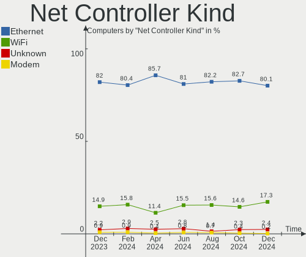

OPNsense - Hardware Trends
--------------------------

A project to identify most popular hardware characteristics and track their change
over time based on data collected by BSD users at https://BSD-Hardware.info.

Anyone can contribute to this report by the [hw-probe](https://github.com/linuxhw/hw-probe/blob/master/INSTALL.BSD.md) tool:

    hw-probe -all -upload

This report is for one last month. Overall report since the beginning of time: [TestDays](https://github.com/bsdhw/TestDays)

Period: Jun, 2023.

Contents
--------

* [ System ](#system)
  - [ OS                       ](#os)
  - [ OS Family                ](#os-family)
  - [ Arch                     ](#arch)
  - [ DE                       ](#de)
  - [ Display Server           ](#display-server)
  - [ Display Manager          ](#display-manager)
  - [ OS Lang                  ](#os-lang)
  - [ Boot Mode                ](#boot-mode)
  - [ Filesystem               ](#filesystem)
  - [ Part. scheme             ](#part-scheme)

* [ Board ](#board)
  - [ Vendor                   ](#vendor)
  - [ Model                    ](#model)
  - [ Model Family             ](#model-family)
  - [ MFG Year                 ](#mfg-year)
  - [ Form Factor              ](#form-factor)
  - [ Coreboot                 ](#coreboot)
  - [ RAM Size                 ](#ram-size)
  - [ RAM Used                 ](#ram-used)
  - [ Total Drives             ](#total-drives)
  - [ Has CD-ROM               ](#has-cd-rom)
  - [ Has Ethernet             ](#has-ethernet)
  - [ Has WiFi                 ](#has-wifi)
  - [ Has Bluetooth            ](#has-bluetooth)

* [ Location ](#location)
  - [ Country                  ](#country)
  - [ City                     ](#city)

* [ Drives ](#drives)
  - [ Drive Vendor             ](#drive-vendor)
  - [ Drive Model              ](#drive-model)
  - [ HDD Vendor               ](#hdd-vendor)
  - [ SSD Vendor               ](#ssd-vendor)
  - [ Drive Kind               ](#drive-kind)
  - [ Drive Connector          ](#drive-connector)
  - [ Drive Size               ](#drive-size)
  - [ Space Total              ](#space-total)
  - [ Space Used               ](#space-used)
  - [ Malfunc. Drives          ](#malfunc-drives)
  - [ Malfunc. Drive Vendor    ](#malfunc-drive-vendor)
  - [ Malfunc. HDD Vendor      ](#malfunc-hdd-vendor)
  - [ Malfunc. Drive Kind      ](#malfunc-drive-kind)
  - [ Failed Drives            ](#failed-drives)
  - [ Failed Drive Vendor      ](#failed-drive-vendor)
  - [ Drive Status             ](#drive-status)

* [ Storage controller ](#storage-controller)
  - [ Storage Vendor           ](#storage-vendor)
  - [ Storage Model            ](#storage-model)
  - [ Storage Kind             ](#storage-kind)

* [ Processor ](#processor)
  - [ CPU Vendor               ](#cpu-vendor)
  - [ CPU Model                ](#cpu-model)
  - [ CPU Model Family         ](#cpu-model-family)
  - [ CPU Cores                ](#cpu-cores)
  - [ CPU Sockets              ](#cpu-sockets)
  - [ CPU Threads              ](#cpu-threads)
  - [ CPU Microarch            ](#cpu-microarch)

* [ Graphics ](#graphics)
  - [ GPU Vendor               ](#gpu-vendor)
  - [ GPU Model                ](#gpu-model)
  - [ GPU Combo                ](#gpu-combo)
  - [ GPU Driver               ](#gpu-driver)
  - [ GPU Memory               ](#gpu-memory)

* [ Monitor ](#monitor)
  - [ Monitor Vendor           ](#monitor-vendor)
  - [ Monitor Model            ](#monitor-model)
  - [ Monitor Resolution       ](#monitor-resolution)
  - [ Monitor Diagonal         ](#monitor-diagonal)
  - [ Monitor Width            ](#monitor-width)
  - [ Aspect Ratio             ](#aspect-ratio)
  - [ Monitor Area             ](#monitor-area)
  - [ Pixel Density            ](#pixel-density)
  - [ Multiple Monitors        ](#multiple-monitors)

* [ Network ](#network)
  - [ Net Controller Vendor    ](#net-controller-vendor)
  - [ Net Controller Model     ](#net-controller-model)
  - [ Wireless Vendor          ](#wireless-vendor)
  - [ Wireless Model           ](#wireless-model)
  - [ Ethernet Vendor          ](#ethernet-vendor)
  - [ Ethernet Model           ](#ethernet-model)
  - [ Net Controller Kind      ](#net-controller-kind)
  - [ Used Controller          ](#used-controller)
  - [ NICs                     ](#nics)
  - [ IPv6                     ](#ipv6)

* [ Bluetooth ](#bluetooth)
  - [ Bluetooth Vendor         ](#bluetooth-vendor)
  - [ Bluetooth Model          ](#bluetooth-model)

* [ Sound ](#sound)
  - [ Sound Vendor             ](#sound-vendor)
  - [ Sound Model              ](#sound-model)

* [ Memory ](#memory)
  - [ Memory Vendor            ](#memory-vendor)
  - [ Memory Model             ](#memory-model)
  - [ Memory Kind              ](#memory-kind)
  - [ Memory Form Factor       ](#memory-form-factor)
  - [ Memory Size              ](#memory-size)
  - [ Memory Speed             ](#memory-speed)

* [ Printers & scanners ](#printers--scanners)
  - [ Printer Vendor           ](#printer-vendor)
  - [ Printer Model            ](#printer-model)
  - [ Scanner Vendor           ](#scanner-vendor)
  - [ Scanner Model            ](#scanner-model)

* [ Camera ](#camera)
  - [ Camera Vendor            ](#camera-vendor)
  - [ Camera Model             ](#camera-model)

* [ Security ](#security)
  - [ Fingerprint Vendor       ](#fingerprint-vendor)
  - [ Fingerprint Model        ](#fingerprint-model)
  - [ Chipcard Vendor          ](#chipcard-vendor)
  - [ Chipcard Model           ](#chipcard-model)

* [ Unsupported ](#unsupported)
  - [ Unsupported Devices      ](#unsupported-devices)
  - [ Unsupported Device Types ](#unsupported-device-types)

System
------

OS
--

Installed operating systems

| Name             | Computers | Percent |
|------------------|-----------|---------|
| OPNsense 23.1.9  | 152       | 56.51%  |
| OPNsense 23.1.10 | 60        | 22.3%   |
| OPNsense 23.1.11 | 20        | 7.43%   |
| OPNsense 23.1.7  | 11        | 4.09%   |
| OPNsense 23.1.8  | 9         | 3.35%   |
| OPNsense 23.4    | 5         | 1.86%   |
| OPNsense 23.7    | 2         | 0.74%   |
| OPNsense 23.4.1  | 2         | 0.74%   |
| OPNsense 23.1.6  | 2         | 0.74%   |
| OPNsense 22.7.11 | 2         | 0.74%   |
| OPNsense 23.1.3  | 1         | 0.37%   |
| OPNsense 23.1.1  | 1         | 0.37%   |
| OPNsense 22.7.9  | 1         | 0.37%   |
| OPNsense 22.7.6  | 1         | 0.37%   |

OS Family
---------

OS without a version

| Name     | Computers | Percent |
|----------|-----------|---------|
| OPNsense | 269       | 100%    |

Arch
----

OS architecture (x86_64, i586, etc.)

| Name  | Computers | Percent |
|-------|-----------|---------|
| amd64 | 269       | 100%    |

DE
--

Desktop Environment

| Name    | Computers | Percent |
|---------|-----------|---------|
| Console | 268       | 99.63%  |
| TWM     | 1         | 0.37%   |

Display Server
--------------

X11 or Wayland

| Name    | Computers | Percent |
|---------|-----------|---------|
| Console | 268       | 99.63%  |
| Wayland | 1         | 0.37%   |

Display Manager
---------------

SDDM, LightDM, etc.

| Name    | Computers | Percent |
|---------|-----------|---------|
| Console | 268       | 99.63%  |
| SLiM    | 1         | 0.37%   |

OS Lang
-------

Language

| Lang    | Computers | Percent |
|---------|-----------|---------|
| Unknown | 263       | 97.77%  |
| C       | 5         | 1.86%   |
| en_US   | 1         | 0.37%   |

Boot Mode
---------

EFI or BIOS

| Mode | Computers | Percent |
|------|-----------|---------|
| EFI  | 264       | 98.14%  |
| BIOS | 5         | 1.86%   |

Filesystem
----------

Type of filesystem

| Type | Computers | Percent |
|------|-----------|---------|
| Ufs  | 152       | 56.51%  |
| Zfs  | 117       | 43.49%  |

Part. scheme
------------

Scheme of partitioning

| Type    | Computers | Percent |
|---------|-----------|---------|
| GPT     | 266       | 98.88%  |
| MBR     | 2         | 0.74%   |
| Unknown | 1         | 0.37%   |

Board
-----

Vendor
------

Motherboard manufacturer

| Name                | Computers | Percent |
|---------------------|-----------|---------|
| Unknown             | 44        | 16.36%  |
| Dell                | 26        | 9.67%   |
| Hewlett-Packard     | 22        | 8.18%   |
| Intel               | 19        | 7.06%   |
| Protectli           | 16        | 5.95%   |
| Techvision          | 12        | 4.46%   |
| Lenovo              | 12        | 4.46%   |
| Fujitsu             | 11        | 4.09%   |
| ASUSTek Computer    | 10        | 3.72%   |
| Supermicro          | 9         | 3.35%   |
| Deciso              | 7         | 2.6%    |
| ASRock              | 7         | 2.6%    |
| PC Engines          | 6         | 2.23%   |
| Gigabyte Technology | 6         | 2.23%   |
| CWWK                | 6         | 2.23%   |
| AMI                 | 6         | 2.23%   |
| Sophos              | 5         | 1.86%   |
| CncTion             | 4         | 1.49%   |
| BESSTAR Tech        | 4         | 1.49%   |
| MW                  | 3         | 1.12%   |
| MSI                 | 3         | 1.12%   |
| AZW                 | 3         | 1.12%   |
| Acer                | 3         | 1.12%   |
| YANYU               | 2         | 0.74%   |
| Hardkernel          | 2         | 0.74%   |
| Yanling             | 1         | 0.37%   |
| Wortmann AG         | 1         | 0.37%   |
| WlanCN              | 1         | 0.37%   |
| Shuttle             | 1         | 0.37%   |
| Samsung Electronics | 1         | 0.37%   |
| Pegatron            | 1         | 0.37%   |
| NetGear             | 1         | 0.37%   |
| maiyunda            | 1         | 0.37%   |
| Lanner              | 1         | 0.37%   |
| LANCOM Systems      | 1         | 0.37%   |
| IP3 Tech            | 1         | 0.37%   |
| Inventec            | 1         | 0.37%   |
| IceWhale Technology | 1         | 0.37%   |
| HPE                 | 1         | 0.37%   |
| GuoGuang            | 1         | 0.37%   |

Model
-----

Motherboard model

| Name                               | Computers | Percent |
|------------------------------------|-----------|---------|
| Unknown                            | 45        | 16.73%  |
| Techvision TVI7309X                | 12        | 4.46%   |
| Fujitsu FUTRO S920                 | 8         | 2.97%   |
| Protectli FW6                      | 7         | 2.6%    |
| AMI Aptio CRB                      | 6         | 2.23%   |
| Protectli VP2420                   | 4         | 1.49%   |
| Protectli FW4B                     | 4         | 1.49%   |
| Intel Q3XXG4-P V1.0                | 4         | 1.49%   |
| Dell OptiPlex 9020                 | 4         | 1.49%   |
| Supermicro Super Server            | 3         | 1.12%   |
| Sophos SG                          | 3         | 1.12%   |
| PC Engines apu4                    | 3         | 1.12%   |
| PC Engines APU2                    | 3         | 1.12%   |
| MW GMLK-2_5G4L                     | 3         | 1.12%   |
| AZW EQ                             | 3         | 1.12%   |
| Intel Jasper Lake Client Platform  | 2         | 0.74%   |
| HP Z240 SFF Workstation            | 2         | 0.74%   |
| HP t620 PLUS Quad Core TC          | 2         | 0.74%   |
| HP ProLiant DL360 Gen9             | 2         | 0.74%   |
| Hardkernel ODROID-H3               | 2         | 0.74%   |
| Gigabyte C1037UN                   | 2         | 0.74%   |
| Dell OptiPlex 7050                 | 2         | 0.74%   |
| Dell OptiPlex 7040                 | 2         | 0.74%   |
| Dell OptiPlex 3050                 | 2         | 0.74%   |
| Dell OptiPlex 3040                 | 2         | 0.74%   |
| Deciso NetBoard-A20                | 2         | 0.74%   |
| Deciso NetBoard-A10                | 2         | 0.74%   |
| CWWK CW-MBX-AD12                   | 2         | 0.74%   |
| CWWK CW-AD4L-N V1                  | 2         | 0.74%   |
| BESSTAR Tech GK41                  | 2         | 0.74%   |
| Acer Aspire XC-1660G               | 2         | 0.74%   |
| YANYU N39SL                        | 1         | 0.37%   |
| YANYU H67SL                        | 1         | 0.37%   |
| Yanling LES plus                   | 1         | 0.37%   |
| Wortmann AG terra Nettop 2700      | 1         | 0.37%   |
| WlanCN 6000 Series                 | 1         | 0.37%   |
| Supermicro X10SLL-F                | 1         | 0.37%   |
| Supermicro X10SLH-N6-ST031         | 1         | 0.37%   |
| Supermicro X10SL7-F                | 1         | 0.37%   |
| Supermicro SYS-5019D-FN8TP-2-NC041 | 1         | 0.37%   |

Model Family
------------

Motherboard model prefix

| Name                 | Computers | Percent |
|----------------------|-----------|---------|
| Unknown              | 45        | 16.73%  |
| Dell OptiPlex        | 18        | 6.69%   |
| Techvision TVI7309X  | 12        | 4.46%   |
| Fujitsu FUTRO        | 9         | 3.35%   |
| Lenovo ThinkCentre   | 8         | 2.97%   |
| Protectli FW6        | 7         | 2.6%    |
| AMI Aptio            | 6         | 2.23%   |
| HP EliteDesk         | 5         | 1.86%   |
| Protectli VP2420     | 4         | 1.49%   |
| Protectli FW4B       | 4         | 1.49%   |
| Intel Q3XXG4-P       | 4         | 1.49%   |
| HP ProDesk           | 4         | 1.49%   |
| HP Compaq            | 4         | 1.49%   |
| Dell PowerEdge       | 4         | 1.49%   |
| Supermicro Super     | 3         | 1.12%   |
| Sophos SG            | 3         | 1.12%   |
| PC Engines apu4      | 3         | 1.12%   |
| PC Engines APU2      | 3         | 1.12%   |
| MW GMLK-2            | 3         | 1.12%   |
| HP ProLiant          | 3         | 1.12%   |
| AZW EQ               | 3         | 1.12%   |
| Acer Aspire          | 3         | 1.12%   |
| Lenovo ThinkPad      | 2         | 0.74%   |
| Intel Jasper         | 2         | 0.74%   |
| HP Z240              | 2         | 0.74%   |
| HP t620              | 2         | 0.74%   |
| Hardkernel ODROID-H3 | 2         | 0.74%   |
| Gigabyte C1037UN     | 2         | 0.74%   |
| Fujitsu PRIMERGY     | 2         | 0.74%   |
| Dell Wyse            | 2         | 0.74%   |
| Dell Inspiron        | 2         | 0.74%   |
| Deciso NetBoard-A20  | 2         | 0.74%   |
| Deciso NetBoard-A10  | 2         | 0.74%   |
| CWWK CW-MBX-AD12     | 2         | 0.74%   |
| CWWK CW-AD4L-N       | 2         | 0.74%   |
| BESSTAR Tech GK41    | 2         | 0.74%   |
| ASUS PRIME           | 2         | 0.74%   |
| YANYU N39SL          | 1         | 0.37%   |
| YANYU H67SL          | 1         | 0.37%   |
| Yanling LES          | 1         | 0.37%   |

MFG Year
--------

Motherboard manufacture year

| Year | Computers | Percent |
|------|-----------|---------|
| 2022 | 55        | 20.45%  |
| 2018 | 30        | 11.15%  |
| 2021 | 26        | 9.67%   |
| 2014 | 24        | 8.92%   |
| 2016 | 21        | 7.81%   |
| 2017 | 19        | 7.06%   |
| 2019 | 18        | 6.69%   |
| 2023 | 14        | 5.2%    |
| 2012 | 14        | 5.2%    |
| 2013 | 13        | 4.83%   |
| 2020 | 10        | 3.72%   |
| 2015 | 9         | 3.35%   |
| 2011 | 7         | 2.6%    |
| 2008 | 5         | 1.86%   |
| 2010 | 2         | 0.74%   |
| 2009 | 2         | 0.74%   |

Form Factor
-----------

Physical design of the computer

| Name     | Computers | Percent |
|----------|-----------|---------|
| Desktop  | 211       | 78.44%  |
| Mini pc  | 20        | 7.43%   |
| Server   | 17        | 6.32%   |
| Notebook | 14        | 5.2%    |
| Firewall | 7         | 2.6%    |

Coreboot
--------

Have coreboot on board

| Used | Computers | Percent |
|------|-----------|---------|
| No   | 262       | 97.4%   |
| Yes  | 7         | 2.6%    |

RAM Size
--------

Total RAM memory

| Size in GB  | Computers | Percent |
|-------------|-----------|---------|
| 8.01-16.0   | 111       | 41.26%  |
| 16.01-24.0  | 82        | 30.48%  |
| 4.01-8.0    | 44        | 16.36%  |
| 32.01-64.0  | 15        | 5.58%   |
| 2.01-3.0    | 7         | 2.6%    |
| 64.01-256.0 | 7         | 2.6%    |
| 3.01-4.0    | 1         | 0.37%   |
| 24.01-32.0  | 1         | 0.37%   |
| 0.51-1.0    | 1         | 0.37%   |

RAM Used
--------

Used RAM memory

| Used GB   | Computers | Percent |
|-----------|-----------|---------|
| 0.01-0.5  | 140       | 52.04%  |
| 0.51-1.0  | 98        | 36.43%  |
| 1.01-2.0  | 21        | 7.81%   |
| 2.01-3.0  | 6         | 2.23%   |
| 4.01-8.0  | 2         | 0.74%   |
| 3.01-4.0  | 1         | 0.37%   |
| 8.01-16.0 | 1         | 0.37%   |

Total Drives
------------

Number of drives on board

| Drives | Computers | Percent |
|--------|-----------|---------|
| 1      | 223       | 82.9%   |
| 0      | 25        | 9.29%   |
| 2      | 19        | 7.06%   |
| 3      | 2         | 0.74%   |

Has CD-ROM
----------

Has CD-ROM on board

| Presented | Computers | Percent |
|-----------|-----------|---------|
| No        | 231       | 85.87%  |
| Yes       | 38        | 14.13%  |

Has Ethernet
------------

Has Ethernet on board

| Presented | Computers | Percent |
|-----------|-----------|---------|
| Yes       | 269       | 100%    |

Has WiFi
--------

Has WiFi module

| Presented | Computers | Percent |
|-----------|-----------|---------|
| No        | 219       | 81.41%  |
| Yes       | 50        | 18.59%  |

Has Bluetooth
-------------

Has Bluetooth module

| Presented | Computers | Percent |
|-----------|-----------|---------|
| No        | 240       | 89.22%  |
| Yes       | 29        | 10.78%  |

Location
--------

Country
-------

Geographic location (country)

| Country       | Computers | Percent |
|---------------|-----------|---------|
| USA           | 88        | 32.71%  |
| Germany       | 46        | 17.1%   |
| UK            | 16        | 5.95%   |
| Canada        | 16        | 5.95%   |
| Australia     | 11        | 4.09%   |
| Netherlands   | 10        | 3.72%   |
| France        | 8         | 2.97%   |
| Brazil        | 8         | 2.97%   |
| Poland        | 7         | 2.6%    |
| Sweden        | 4         | 1.49%   |
| Italy         | 4         | 1.49%   |
| Belgium       | 4         | 1.49%   |
| Romania       | 3         | 1.12%   |
| Israel        | 3         | 1.12%   |
| Hungary       | 3         | 1.12%   |
| Czechia       | 3         | 1.12%   |
| Vietnam       | 2         | 0.74%   |
| Switzerland   | 2         | 0.74%   |
| Spain         | 2         | 0.74%   |
| South Korea   | 2         | 0.74%   |
| Slovakia      | 2         | 0.74%   |
| Russia        | 2         | 0.74%   |
| Denmark       | 2         | 0.74%   |
| China         | 2         | 0.74%   |
| Austria       | 2         | 0.74%   |
| Argentina     | 2         | 0.74%   |
| Turkey        | 1         | 0.37%   |
| South Africa  | 1         | 0.37%   |
| Singapore     | 1         | 0.37%   |
| Portugal      | 1         | 0.37%   |
| Norway        | 1         | 0.37%   |
| New Zealand   | 1         | 0.37%   |
| New Caledonia | 1         | 0.37%   |
| Mexico        | 1         | 0.37%   |
| Malaysia      | 1         | 0.37%   |
| Luxembourg    | 1         | 0.37%   |
| Lithuania     | 1         | 0.37%   |
| Latvia        | 1         | 0.37%   |
| India         | 1         | 0.37%   |
| Finland       | 1         | 0.37%   |

City
----

Geographic location (city)

| City              | Computers | Percent |
|-------------------|-----------|---------|
| Melbourne         | 5         | 1.86%   |
| Cologne           | 5         | 1.86%   |
| Sydney            | 4         | 1.49%   |
| Montreal          | 4         | 1.49%   |
| Denver            | 4         | 1.49%   |
| Berlin            | 4         | 1.49%   |
| Seattle           | 3         | 1.12%   |
| Frankfurt am Main | 3         | 1.12%   |
| Wuppertal         | 2         | 0.74%   |
| Toronto           | 2         | 0.74%   |
| The Hague         | 2         | 0.74%   |
| Tel Aviv          | 2         | 0.74%   |
| Stuttgart         | 2         | 0.74%   |
| Springville       | 2         | 0.74%   |
| San Jose          | 2         | 0.74%   |
| Pittsburgh        | 2         | 0.74%   |
| Munich            | 2         | 0.74%   |
| Martins Ferry     | 2         | 0.74%   |
| London            | 2         | 0.74%   |
| Lakeland          | 2         | 0.74%   |
| Krakow            | 2         | 0.74%   |
| Edmonton          | 2         | 0.74%   |
| Düsseldorf       | 2         | 0.74%   |
| Columbus          | 2         | 0.74%   |
| Cheltenham        | 2         | 0.74%   |
| Brookfield        | 2         | 0.74%   |
| Borgerhout        | 2         | 0.74%   |
| Zeist             | 1         | 0.37%   |
| Wroclaw           | 1         | 0.37%   |
| Worcester         | 1         | 0.37%   |
| Wooster           | 1         | 0.37%   |
| Woking            | 1         | 0.37%   |
| Witkow            | 1         | 0.37%   |
| Wiesmoor          | 1         | 0.37%   |
| White Haven       | 1         | 0.37%   |
| West Stockwith    | 1         | 0.37%   |
| Warburg           | 1         | 0.37%   |
| Walsdorf          | 1         | 0.37%   |
| Waedenswil        | 1         | 0.37%   |
| Vilnius           | 1         | 0.37%   |

Drives
------

Drive Vendor
------------

Hard drive vendors

| Vendor              | Computers | Drives | Percent |
|---------------------|-----------|--------|---------|
| Samsung Electronics | 42        | 43     | 16.41%  |
| Kingston            | 27        | 30     | 10.55%  |
| Transcend           | 20        | 20     | 7.81%   |
| WDC                 | 17        | 18     | 6.64%   |
| Intel               | 13        | 13     | 5.08%   |
| China               | 10        | 11     | 3.91%   |
| SanDisk             | 9         | 9      | 3.52%   |
| Crucial             | 9         | 9      | 3.52%   |
| Hoodisk             | 7         | 7      | 2.73%   |
| SPCC                | 5         | 5      | 1.95%   |
| SK hynix            | 5         | 5      | 1.95%   |
| Seagate             | 5         | 5      | 1.95%   |
| A-DATA Technology   | 5         | 6      | 1.95%   |
| Micron Technology   | 4         | 4      | 1.56%   |
| Lexar               | 4         | 4      | 1.56%   |
| Gigabyte Technology | 4         | 4      | 1.56%   |
| FORESEE             | 4         | 4      | 1.56%   |
| Apacer              | 4         | 5      | 1.56%   |
| Vaseky              | 3         | 3      | 1.17%   |
| Protectli           | 3         | 3      | 1.17%   |
| Phison              | 3         | 3      | 1.17%   |
| Patriot             | 3         | 5      | 1.17%   |
| Innodisk            | 3         | 3      | 1.17%   |
| Hitachi             | 3         | 3      | 1.17%   |
| Hewlett-Packard     | 3         | 5      | 1.17%   |
| Advantech           | 3         | 3      | 1.17%   |
| Toshiba             | 2         | 2      | 0.78%   |
| Team                | 2         | 2      | 0.78%   |
| PNY                 | 2         | 2      | 0.78%   |
| OCZ                 | 2         | 2      | 0.78%   |
| LITEONIT            | 2         | 2      | 0.78%   |
| Kston               | 2         | 2      | 0.78%   |
| Intenso             | 2         | 2      | 0.78%   |
| Fanxiang            | 2         | 2      | 0.78%   |
| Dogfish             | 2         | 2      | 0.78%   |
| YMTC                | 1         | 1      | 0.39%   |
| VICKTER             | 1         | 1      | 0.39%   |
| Verbatim            | 1         | 1      | 0.39%   |
| Supermicro          | 1         | 1      | 0.39%   |
| Silicon Motion      | 1         | 1      | 0.39%   |

Drive Model
-----------

Hard drive models

| Model                                | Computers | Percent |
|--------------------------------------|-----------|---------|
| Kingston SA400S37240G 240GB          | 6         | 2.32%   |
| Transcend TS128GMSA230S 128GB        | 4         | 1.54%   |
| Kingston SA400S37120G 120GB          | 4         | 1.54%   |
| China SATA SSD 16GB                  | 4         | 1.54%   |
| Transcend TS256GMTS952T2 256GB       | 3         | 1.16%   |
| SPCC Solid State Disk 128GB          | 3         | 1.16%   |
| Kingston SKC600MS256G 256GB          | 3         | 1.16%   |
| Kingston SA400S37480G 480GB          | 3         | 1.16%   |
| Innodisk DEMSR- 08GB mSATA 3ME3      | 3         | 1.16%   |
| Hoodisk SSD 32GB                     | 3         | 1.16%   |
| WDC PC SN530 SDBPNPZ-256G-1114 256GB | 2         | 0.77%   |
| Transcend TS256GMTE652T2 256GB       | 2         | 0.77%   |
| Seagate ST3500413AS 500GB            | 2         | 0.77%   |
| SanDisk SSD PLUS 240GB               | 2         | 0.77%   |
| Samsung SSD PM871 2.5 7mm 128GB      | 2         | 0.77%   |
| Samsung SSD 960 PRO 512GB            | 2         | 0.77%   |
| Samsung SSD 860 EVO 500GB            | 2         | 0.77%   |
| Samsung SSD 840 PRO Series 128GB     | 2         | 0.77%   |
| Samsung SSD 840 EVO 250GB            | 2         | 0.77%   |
| Samsung MZVLB256HBHQ-000H1 256GB     | 2         | 0.77%   |
| Samsung MZVLB256HAHQ-000L7 256GB     | 2         | 0.77%   |
| Protectli 120GB M.2                  | 2         | 0.77%   |
| Phison PCIe SSD 128GB                | 2         | 0.77%   |
| Kston SSD 128GB                      | 2         | 0.77%   |
| Hoodisk SSD 64GB                     | 2         | 0.77%   |
| Gigabyte GP-GSTFS31120GNTD 120GB     | 2         | 0.77%   |
| FORESEE 64GB SSD                     | 2         | 0.77%   |
| Crucial CT480BX500SSD1 480GB         | 2         | 0.77%   |
| China IM128-P130 128GB               | 2         | 0.77%   |
| Advantech SQF-S25M4-64G-S9C 64GB     | 2         | 0.77%   |
| A-DATA SU800 256GB                   | 2         | 0.77%   |
| YMTC PC005 256GB                     | 1         | 0.39%   |
| WDC WDS500G3X0C-00SJG0 500GB         | 1         | 0.39%   |
| WDC WDS250G2B0B-00YS70 250GB         | 1         | 0.39%   |
| WDC WD6400AAKS-22A7B2 640GB          | 1         | 0.39%   |
| WDC WD5000AZLX-60K2TA0 500GB         | 1         | 0.39%   |
| WDC WD5000AAKX-08U6AA0 500GB         | 1         | 0.39%   |
| WDC WD3200LPVX-08V0TT5 320GB         | 1         | 0.39%   |
| WDC WD3200LPCX-00VHAT0 320GB         | 1         | 0.39%   |
| WDC WD2500BEKT-60F3T1 250GB          | 1         | 0.39%   |

HDD Vendor
----------

Hard disk drive vendors

| Vendor              | Computers | Drives | Percent |
|---------------------|-----------|--------|---------|
| WDC                 | 9         | 10     | 40.91%  |
| Seagate             | 4         | 4      | 18.18%  |
| Hitachi             | 3         | 3      | 13.64%  |
| Hewlett-Packard     | 2         | 3      | 9.09%   |
| Samsung Electronics | 1         | 1      | 4.55%   |
| Lexar               | 1         | 1      | 4.55%   |
| Fujitsu             | 1         | 1      | 4.55%   |
| Apple               | 1         | 1      | 4.55%   |

SSD Vendor
----------

Solid state drive vendors

| Vendor              | Computers | Drives | Percent |
|---------------------|-----------|--------|---------|
| Samsung Electronics | 27        | 27     | 15.17%  |
| Kingston            | 24        | 27     | 13.48%  |
| Transcend           | 16        | 16     | 8.99%   |
| Intel               | 10        | 10     | 5.62%   |
| China               | 10        | 11     | 5.62%   |
| SanDisk             | 9         | 9      | 5.06%   |
| Hoodisk             | 7         | 7      | 3.93%   |
| Crucial             | 7         | 7      | 3.93%   |
| A-DATA Technology   | 5         | 6      | 2.81%   |
| SPCC                | 4         | 4      | 2.25%   |
| FORESEE             | 4         | 4      | 2.25%   |
| Apacer              | 4         | 5      | 2.25%   |
| Vaseky              | 3         | 3      | 1.69%   |
| SK hynix            | 3         | 3      | 1.69%   |
| Protectli           | 3         | 3      | 1.69%   |
| Micron Technology   | 3         | 3      | 1.69%   |
| Innodisk            | 3         | 3      | 1.69%   |
| Advantech           | 3         | 3      | 1.69%   |
| Team                | 2         | 2      | 1.12%   |
| OCZ                 | 2         | 2      | 1.12%   |
| LITEONIT            | 2         | 2      | 1.12%   |
| Lexar               | 2         | 2      | 1.12%   |
| Kston               | 2         | 2      | 1.12%   |
| Intenso             | 2         | 2      | 1.12%   |
| Gigabyte Technology | 2         | 2      | 1.12%   |
| Dogfish             | 2         | 2      | 1.12%   |
| WDC                 | 1         | 1      | 0.56%   |
| VICKTER             | 1         | 1      | 0.56%   |
| Verbatim            | 1         | 1      | 0.56%   |
| Supermicro          | 1         | 1      | 0.56%   |
| Silicon             | 1         | 1      | 0.56%   |
| SHAREVDI            | 1         | 1      | 0.56%   |
| PNY                 | 1         | 1      | 0.56%   |
| Patriot             | 1         | 3      | 0.56%   |
| NTC                 | 1         | 1      | 0.56%   |
| LuminouTek          | 1         | 1      | 0.56%   |
| INDMEM              | 1         | 1      | 0.56%   |
| Indilinx            | 1         | 1      | 0.56%   |
| Hewlett-Packard     | 1         | 2      | 0.56%   |
| GK                  | 1         | 1      | 0.56%   |

Drive Kind
----------

HDD or SSD

| Kind | Computers | Drives | Percent |
|------|-----------|--------|---------|
| SSD  | 174       | 188    | 69.05%  |
| NVMe | 56        | 57     | 22.22%  |
| HDD  | 22        | 24     | 8.73%   |

Drive Connector
---------------

SATA, SAS, NVMe, etc.

| Type | Computers | Drives | Percent |
|------|-----------|--------|---------|
| SATA | 193       | 212    | 77.51%  |
| NVMe | 56        | 57     | 22.49%  |

Drive Size
----------

Size of hard drive

| Size in TB | Computers | Drives | Percent |
|------------|-----------|--------|---------|
| 0.01-0.5   | 178       | 193    | 90.82%  |
| 0.51-1.0   | 16        | 16     | 8.16%   |
| 1.01-2.0   | 2         | 3      | 1.02%   |

Space Total
-----------

Amount of disk space available on the file system

| Size in GB | Computers | Percent |
|------------|-----------|---------|
| 101-250    | 152       | 56.51%  |
| 251-500    | 38        | 14.13%  |
| 51-100     | 25        | 9.29%   |
| 21-50      | 18        | 6.69%   |
| 1-20       | 16        | 5.95%   |
| 501-1000   | 15        | 5.58%   |
| 1001-2000  | 5         | 1.86%   |

Space Used
----------

Amount of used disk space

| Used GB | Computers | Percent |
|---------|-----------|---------|
| 1-20    | 256       | 95.17%  |
| 21-50   | 11        | 4.09%   |
| 51-100  | 2         | 0.74%   |

Malfunc. Drives
---------------

Drive models with a malfunction

| Model                                        | Computers | Drives | Percent |
|----------------------------------------------|-----------|--------|---------|
| WDC WD6400AAKS-22A7B2 640GB                  | 1         | 1      | 5.56%   |
| WDC WD1600BEVS-07RST0 160GB                  | 1         | 1      | 5.56%   |
| Transcend TS128GMSA230S 128GB                | 1         | 1      | 5.56%   |
| SPCC Solid State Disk 512GB                  | 1         | 1      | 5.56%   |
| SK hynix SC210 mSATA 256GB                   | 1         | 1      | 5.56%   |
| Seagate ST500DM002-1BD142 500GB              | 1         | 1      | 5.56%   |
| Samsung Electronics SSD 960 PRO 512GB        | 1         | 1      | 5.56%   |
| Samsung Electronics SSD 840 PRO Series 256GB | 1         | 1      | 5.56%   |
| Samsung Electronics HD502HJ 500GB            | 1         | 1      | 5.56%   |
| Kingston SV300S37A120G 120GB                 | 1         | 1      | 5.56%   |
| Kingston SNS4151S316G 16GB                   | 1         | 1      | 5.56%   |
| Kingston SHFS37A120G 120GB                   | 1         | 1      | 5.56%   |
| Intel SSDSC2BF180A4L 180GB                   | 1         | 1      | 5.56%   |
| Intel SSDSC2BB480G4 480GB                    | 1         | 1      | 5.56%   |
| Intel SSDSA2M160G2GC 160GB                   | 1         | 1      | 5.56%   |
| Hitachi HTS727550A9E364 500GB                | 1         | 1      | 5.56%   |
| GK SM2244LTAB ,TC58TEG6DDKTA00 8GB           | 1         | 1      | 5.56%   |
| Apacer 16GB SATA Flash Drive                 | 1         | 1      | 5.56%   |

Malfunc. Drive Vendor
---------------------

Vendors of faulty drives

| Vendor              | Computers | Drives | Percent |
|---------------------|-----------|--------|---------|
| Samsung Electronics | 3         | 3      | 16.67%  |
| Kingston            | 3         | 3      | 16.67%  |
| Intel               | 3         | 3      | 16.67%  |
| WDC                 | 2         | 2      | 11.11%  |
| Transcend           | 1         | 1      | 5.56%   |
| SPCC                | 1         | 1      | 5.56%   |
| SK hynix            | 1         | 1      | 5.56%   |
| Seagate             | 1         | 1      | 5.56%   |
| Hitachi             | 1         | 1      | 5.56%   |
| GK                  | 1         | 1      | 5.56%   |
| Apacer              | 1         | 1      | 5.56%   |

Malfunc. HDD Vendor
-------------------

Vendors of faulty HDD drives

| Vendor              | Computers | Drives | Percent |
|---------------------|-----------|--------|---------|
| WDC                 | 2         | 2      | 40%     |
| Seagate             | 1         | 1      | 20%     |
| Samsung Electronics | 1         | 1      | 20%     |
| Hitachi             | 1         | 1      | 20%     |

Malfunc. Drive Kind
-------------------

Kinds of faulty drives

| Kind | Computers | Drives | Percent |
|------|-----------|--------|---------|
| SSD  | 12        | 12     | 66.67%  |
| HDD  | 5         | 5      | 27.78%  |
| NVMe | 1         | 1      | 5.56%   |

Failed Drives
-------------

Failed drive models

| Model                           | Computers | Drives | Percent |
|---------------------------------|-----------|--------|---------|
| Supermicro SSD 16GB             | 1         | 1      | 50%     |
| SanDisk SD9SN8W-256G-1006 256GB | 1         | 1      | 50%     |

Failed Drive Vendor
-------------------

Failed drive vendors

| Vendor     | Computers | Drives | Percent |
|------------|-----------|--------|---------|
| Supermicro | 1         | 1      | 50%     |
| SanDisk    | 1         | 1      | 50%     |

Drive Status
------------

Number of failed and malfunc. drives

| Status   | Computers | Drives | Percent |
|----------|-----------|--------|---------|
| Works    | 223       | 242    | 89.56%  |
| Malfunc  | 18        | 18     | 7.23%   |
| Detected | 6         | 7      | 2.41%   |
| Failed   | 2         | 2      | 0.8%    |

Storage controller
------------------

Storage Vendor
--------------

Storage controller vendors

| Vendor                           | Computers | Percent |
|----------------------------------|-----------|---------|
| Intel                            | 220       | 66.87%  |
| AMD                              | 36        | 10.94%  |
| Samsung Electronics              | 15        | 4.56%   |
| Sandisk                          | 12        | 3.65%   |
| Phison Electronics               | 6         | 1.82%   |
| MAXIO Technology (Hangzhou)      | 6         | 1.82%   |
| Transcend                        | 4         | 1.22%   |
| Silicon Motion                   | 4         | 1.22%   |
| Toshiba                          | 3         | 0.91%   |
| Kingston Technology Company      | 3         | 0.91%   |
| Hewlett-Packard                  | 3         | 0.91%   |
| ASMedia Technology               | 3         | 0.91%   |
| SK hynix                         | 2         | 0.61%   |
| Micron/Crucial Technology        | 2         | 0.61%   |
| Marvell Technology Group         | 2         | 0.61%   |
| Broadcom / LSI                   | 2         | 0.61%   |
| Yangtze Memory Technologies      | 1         | 0.3%    |
| Silicon Integrated Systems [SiS] | 1         | 0.3%    |
| Shenzhen Longsys Electronics     | 1         | 0.3%    |
| Seagate Technology               | 1         | 0.3%    |
| Micron Technology                | 1         | 0.3%    |
| JMicron Technology               | 1         | 0.3%    |

Storage Model
-------------

Storage controller models

| Model                                                                            | Computers | Percent |
|----------------------------------------------------------------------------------|-----------|---------|
| AMD FCH SATA Controller [AHCI mode]                                              | 31        | 8.81%   |
| Intel Celeron/Pentium Silver Processor SATA Controller                           | 25        | 7.1%    |
| Intel Jasper Lake SATA AHCI Controller                                           | 23        | 6.53%   |
| Intel 8 Series/C220 Series Chipset Family 6-port SATA Controller 1 [AHCI mode]   | 18        | 5.11%   |
| Intel Sunrise Point-LP SATA Controller [AHCI mode]                               | 14        | 3.98%   |
| Intel Q170/Q150/B150/H170/H110/Z170/CM236 Chipset SATA Controller [AHCI Mode]    | 11        | 3.13%   |
| Unknown                                                                          | 11        | 3.13%   |
| Intel Cannon Lake PCH SATA AHCI Controller                                       | 10        | 2.84%   |
| Intel Atom/Celeron/Pentium Processor x5-E8000/J3xxx/N3xxx Series SATA Controller | 9         | 2.56%   |
| Intel 6 Series/C200 Series Chipset Family 6 port Desktop SATA AHCI Controller    | 9         | 2.56%   |
| Samsung NVMe SSD Controller SM981/PM981/PM983                                    | 8         | 2.27%   |
| Intel Elkhart Lake SATA AHCI                                                     | 8         | 2.27%   |
| Intel Atom Processor E3800 Series SATA AHCI Controller                           | 7         | 1.99%   |
| Intel 7 Series/C210 Series Chipset Family 6-port SATA Controller [AHCI mode]     | 7         | 1.99%   |
| Intel 200 Series PCH SATA controller [AHCI mode]                                 | 7         | 1.99%   |
| MAXIO (Hangzhou) NVMe SSD Controller MAP1202                                     | 6         | 1.7%    |
| Intel Wildcat Point-LP SATA Controller [AHCI Mode]                               | 6         | 1.7%    |
| Samsung NVMe SSD Controller SM961/PM961/SM963                                    | 5         | 1.42%   |
| Intel SATA Controller [RAID mode]                                                | 5         | 1.42%   |
| Intel Atom processor C2000 AHCI SATA3 Controller                                 | 5         | 1.42%   |
| Intel Atom processor C2000 AHCI SATA2 Controller                                 | 5         | 1.42%   |
| Intel 7 Series Chipset Family 6-port SATA Controller [AHCI mode]                 | 5         | 1.42%   |
| Silicon Motion SM2263EN/SM2263XT SSD Controller                                  | 4         | 1.14%   |
| Intel Tiger Lake-LP SATA Controller                                              | 4         | 1.14%   |
| Intel Cannon Point-LP SATA Controller [AHCI Mode]                                | 4         | 1.14%   |
| Intel 8 Series SATA Controller 1 [AHCI mode]                                     | 4         | 1.14%   |
| SanDisk WD Blue SN570 NVMe SSD 1TB                                               | 3         | 0.85%   |
| SanDisk WD Blue SN550 NVMe SSD                                                   | 3         | 0.85%   |
| Phison PS5013 E13 NVMe Controller                                                | 3         | 0.85%   |
| Intel NM10/ICH7 Family SATA Controller [AHCI mode]                               | 3         | 0.85%   |
| Intel Celeron N3350/Pentium N4200/Atom E3900 Series SATA AHCI Controller         | 3         | 0.85%   |
| ASMedia ASM1062 Serial ATA Controller                                            | 3         | 0.85%   |
| Toshiba BG3 NVMe SSD Controller                                                  | 2         | 0.57%   |
| SanDisk WD Blue SN500 / PC SN520 NVMe SSD                                        | 2         | 0.57%   |
| SanDisk WD Black SN750 / PC SN730 NVMe SSD                                       | 2         | 0.57%   |
| Samsung NVMe SSD Controller SM951/PM951                                          | 2         | 0.57%   |
| Micron/Crucial P2 NVMe PCIe SSD                                                  | 2         | 0.57%   |
| Intel NM10/ICH7 Family SATA Controller [IDE mode]                                | 2         | 0.57%   |
| Intel Comet Lake SATA AHCI Controller                                            | 2         | 0.57%   |
| Intel C610/X99 series chipset 6-Port SATA Controller [AHCI mode]                 | 2         | 0.57%   |

Storage Kind
------------

Kind of storage controller (IDE, SATA, NVMe, SAS, ...)

| Kind | Computers | Percent |
|------|-----------|---------|
| SATA | 239       | 72.64%  |
| NVMe | 62        | 18.84%  |
| IDE  | 15        | 4.56%   |
| RAID | 10        | 3.04%   |
| SAS  | 3         | 0.91%   |

Processor
---------

CPU Vendor
----------

Processor vendors

| Vendor | Computers | Percent |
|--------|-----------|---------|
| Intel  | 229       | 85.13%  |
| AMD    | 40        | 14.87%  |

CPU Model
---------

Processor models

| Model                                     | Computers | Percent |
|-------------------------------------------|-----------|---------|
| Intel Celeron J4125 CPU @ 2.00GHz         | 19        | 7.06%   |
| Intel Celeron N5105 @ 2.00GHz             | 18        | 6.69%   |
| Intel Pentium Silver N6005 @ 2.00GHz      | 6         | 2.23%   |
| Intel Core i5-6500 CPU @ 3.20GHz          | 6         | 2.23%   |
| Intel Celeron CPU J1900 @ 1.99GHz         | 6         | 2.23%   |
| AMD GX-415GA SOC with Radeon HD Graphics  | 6         | 2.23%   |
| AMD GX-412TC SOC                          | 6         | 2.23%   |
| Intel Core i5-7500 CPU @ 3.40GHz          | 5         | 1.86%   |
| Intel Celeron CPU J3160 @ 1.60GHz         | 5         | 1.86%   |
| Intel N100                                | 4         | 1.49%   |
| Intel Core i5-4590 CPU @ 3.30GHz          | 4         | 1.49%   |
| Intel Celeron J6413 @ 1.80GHz             | 4         | 1.49%   |
| Intel Celeron J6412 @ 2.00GHz             | 4         | 1.49%   |
| AMD EPYC 3201 8-Core Processor            | 4         | 1.49%   |
| Intel Core i5-8250U CPU @ 1.60GHz         | 3         | 1.12%   |
| Intel Core i5-7200U CPU @ 2.50GHz         | 3         | 1.12%   |
| Intel Core i5-3470 CPU @ 3.20GHz          | 3         | 1.12%   |
| Intel Core i3-7100 CPU @ 3.90GHz          | 3         | 1.12%   |
| Intel Celeron CPU 1037U @ 1.80GHz         | 3         | 1.12%   |
| AMD Ryzen Embedded V1500B                 | 3         | 1.12%   |
| Intel Xeon CPU E3-1220 v3 @ 3.10GHz       | 2         | 0.74%   |
| Intel Pentium Silver J5005 CPU @ 1.50GHz  | 2         | 0.74%   |
| Intel Pentium CPU N3700 @ 1.60GHz         | 2         | 0.74%   |
| Intel Pentium CPU G3420 @ 3.20GHz         | 2         | 0.74%   |
| Intel Core i7-6700 CPU @ 3.40GHz          | 2         | 0.74%   |
| Intel Core i5-8500 CPU @ 3.00GHz          | 2         | 0.74%   |
| Intel Core i5-6200U CPU @ 2.30GHz         | 2         | 0.74%   |
| Intel Core i5-4570 CPU @ 3.20GHz          | 2         | 0.74%   |
| Intel Core i5-3570 CPU @ 3.40GHz          | 2         | 0.74%   |
| Intel Core i3-N305                        | 2         | 0.74%   |
| Intel Core i3-6100 CPU @ 3.70GHz          | 2         | 0.74%   |
| Intel Core i3-10105 CPU @ 3.70GHz         | 2         | 0.74%   |
| Intel Celeron N5095 @ 2.00GHz             | 2         | 0.74%   |
| Intel Celeron CPU 3865U @ 1.80GHz         | 2         | 0.74%   |
| Intel Celeron CPU 3765U @ 1.90GHz         | 2         | 0.74%   |
| Intel Atom CPU C2758 @ 2.40GHz            | 2         | 0.74%   |
| AMD GX-420CA SOC with Radeon HD Graphics  | 2         | 0.74%   |
| AMD GX-222GC SOC with Radeon R5E Graphics | 2         | 0.74%   |
| Intel Xeon E-2314 CPU @ 2.80GHz           | 1         | 0.37%   |
| Intel Xeon D-2123IT CPU @ 2.20GHz         | 1         | 0.37%   |

CPU Model Family
----------------

Processor model prefix

| Model                   | Computers | Percent |
|-------------------------|-----------|---------|
| Intel Celeron           | 79        | 29.37%  |
| Intel Core i5           | 56        | 20.82%  |
| Intel Xeon              | 21        | 7.81%   |
| AMD GX                  | 18        | 6.69%   |
| Intel Core i3           | 15        | 5.58%   |
| Other                   | 14        | 5.2%    |
| Intel Atom              | 13        | 4.83%   |
| Intel Pentium Silver    | 10        | 3.72%   |
| Intel Core i7           | 10        | 3.72%   |
| Intel Pentium           | 8         | 2.97%   |
| AMD EPYC                | 5         | 1.86%   |
| AMD Ryzen Embedded      | 3         | 1.12%   |
| Intel Core 2 Quad       | 2         | 0.74%   |
| AMD Ryzen 7             | 2         | 0.74%   |
| AMD Ryzen 3             | 2         | 0.74%   |
| AMD A10                 | 2         | 0.74%   |
| Intel Pentium Dual-Core | 1         | 0.37%   |
| Intel Genuine           | 1         | 0.37%   |
| Intel Core 2            | 1         | 0.37%   |
| AMD Ryzen 5 PRO         | 1         | 0.37%   |
| AMD Ryzen 5             | 1         | 0.37%   |
| AMD G                   | 1         | 0.37%   |
| AMD FX                  | 1         | 0.37%   |
| AMD Athlon              | 1         | 0.37%   |
| AMD A4                  | 1         | 0.37%   |

CPU Cores
---------

Number of processor cores

| Number  | Computers | Percent |
|---------|-----------|---------|
| 4       | 174       | 64.68%  |
| 2       | 60        | 22.3%   |
| 8       | 17        | 6.32%   |
| 6       | 10        | 3.72%   |
| 16      | 3         | 1.12%   |
| 10      | 2         | 0.74%   |
| Unknown | 2         | 0.74%   |
| 12      | 1         | 0.37%   |

CPU Sockets
-----------

Number of sockets

| Number  | Computers | Percent |
|---------|-----------|---------|
| 1       | 266       | 98.88%  |
| 2       | 2         | 0.74%   |
| Unknown | 1         | 0.37%   |

CPU Threads
-----------

Threads per core (Hyper-Threading)

| Number  | Computers | Percent |
|---------|-----------|---------|
| 1       | 206       | 76.58%  |
| 2       | 61        | 22.68%  |
| Unknown | 2         | 0.74%   |

CPU Microarch
-------------

Microarchitecture

| Name          | Computers | Percent |
|---------------|-----------|---------|
| Unknown       | 48        | 17.84%  |
| KabyLake      | 34        | 12.64%  |
| Haswell       | 26        | 9.67%   |
| Goldmont plus | 25        | 9.29%   |
| Silvermont    | 21        | 7.81%   |
| Skylake       | 17        | 6.32%   |
| IvyBridge     | 16        | 5.95%   |
| Zen           | 12        | 4.46%   |
| Puma          | 11        | 4.09%   |
| SandyBridge   | 9         | 3.35%   |
| Jaguar        | 9         | 3.35%   |
| Broadwell     | 8         | 2.97%   |
| Goldmont      | 5         | 1.86%   |
| Bonnell       | 5         | 1.86%   |
| TigerLake     | 4         | 1.49%   |
| CometLake     | 4         | 1.49%   |
| Steamroller   | 3         | 1.12%   |
| Core          | 3         | 1.12%   |
| Penryn        | 2         | 0.74%   |
| Nehalem       | 2         | 0.74%   |
| Zen+          | 1         | 0.37%   |
| Zen 2         | 1         | 0.37%   |
| Westmere      | 1         | 0.37%   |
| Piledriver    | 1         | 0.37%   |
| Bobcat        | 1         | 0.37%   |

Graphics
--------

GPU Vendor
----------

Vendors of graphics cards

| Vendor                           | Computers | Percent |
|----------------------------------|-----------|---------|
| Intel                            | 198       | 79.84%  |
| AMD                              | 27        | 10.89%  |
| Matrox Electronics Systems       | 9         | 3.63%   |
| ASPEED Technology                | 9         | 3.63%   |
| Nvidia                           | 4         | 1.61%   |
| Silicon Integrated Systems [SiS] | 1         | 0.4%    |

GPU Model
---------

Graphics card models

| Model                                                                                    | Computers | Percent |
|------------------------------------------------------------------------------------------|-----------|---------|
| Intel JasperLake [UHD Graphics]                                                          | 28        | 11.24%  |
| Intel GeminiLake [UHD Graphics 600]                                                      | 22        | 8.84%   |
| Intel Xeon E3-1200 v3/4th Gen Core Processor Integrated Graphics Controller              | 12        | 4.82%   |
| Intel CoffeeLake-S GT2 [UHD Graphics 630]                                                | 10        | 4.02%   |
| Intel HD Graphics 530                                                                    | 9         | 3.61%   |
| Intel Atom/Celeron/Pentium Processor x5-E8000/J3xxx/N3xxx Integrated Graphics Controller | 9         | 3.61%   |
| ASPEED Technology ASPEED Graphics Family                                                 | 9         | 3.61%   |
| Intel HD Graphics 630                                                                    | 8         | 3.21%   |
| Intel Elkhart Lake [UHD Graphics Gen11 16EU]                                             | 8         | 3.21%   |
| Intel Atom Processor Z36xxx/Z37xxx Series Graphics & Display                             | 7         | 2.81%   |
| Intel Xeon E3-1200 v2/3rd Gen Core processor Graphics Controller                         | 6         | 2.41%   |
| Intel Alder Lake-N [UHD Graphics]                                                        | 6         | 2.41%   |
| Intel 2nd Generation Core Processor Family Integrated Graphics Controller                | 6         | 2.41%   |
| AMD Kabini [Radeon HD 8330E]                                                             | 6         | 2.41%   |
| Intel 3rd Gen Core processor Graphics Controller                                         | 5         | 2.01%   |
| Intel TigerLake-LP GT2 [Iris Xe Graphics]                                                | 4         | 1.61%   |
| Intel HD Graphics 620                                                                    | 4         | 1.61%   |
| Intel HD Graphics 610                                                                    | 4         | 1.61%   |
| Intel Haswell-ULT Integrated Graphics Controller                                         | 4         | 1.61%   |
| Matrox Electronics Systems MGA G200eW WPCM450                                            | 3         | 1.2%    |
| Intel Xeon E3-1200 v3 Processor Integrated Graphics Controller                           | 3         | 1.2%    |
| Intel UHD Graphics 620                                                                   | 3         | 1.2%    |
| Intel IvyBridge GT2 [HD Graphics 4000]                                                   | 3         | 1.2%    |
| Intel HD Graphics 500                                                                    | 3         | 1.2%    |
| Intel HD Graphics                                                                        | 3         | 1.2%    |
| Intel GeminiLake [UHD Graphics 605]                                                      | 3         | 1.2%    |
| AMD Mullins [Radeon R4/R5 Graphics]                                                      | 3         | 1.2%    |
| Nvidia GK208B [GeForce GT 710]                                                           | 2         | 0.8%    |
| Matrox Electronics Systems MGA G200EH                                                    | 2         | 0.8%    |
| Matrox Electronics Systems MGA G200e [Pilot] ServerEngines (SEP1)                        | 2         | 0.8%    |
| Intel WhiskeyLake-U GT2 [UHD Graphics 620]                                               | 2         | 0.8%    |
| Intel Skylake GT2 [HD Graphics 520]                                                      | 2         | 0.8%    |
| Intel HD Graphics 510                                                                    | 2         | 0.8%    |
| Intel CometLake-S GT2 [UHD Graphics 630]                                                 | 2         | 0.8%    |
| Intel Atom Processor D4xx/D5xx/N4xx/N5xx Integrated Graphics Controller                  | 2         | 0.8%    |
| Intel Atom Processor D2xxx/N2xxx Integrated Graphics Controller                          | 2         | 0.8%    |
| Intel 4th Generation Core Processor Family Integrated Graphics Controller                | 2         | 0.8%    |
| Intel 4 Series Chipset Integrated Graphics Controller                                    | 2         | 0.8%    |
| AMD Raven Ridge [Radeon Vega Series / Radeon Vega Mobile Series]                         | 2         | 0.8%    |
| AMD Kaveri [Radeon R7 Graphics]                                                          | 2         | 0.8%    |

GPU Combo
---------

Combinations of graphics cards

| Name           | Computers | Percent |
|----------------|-----------|---------|
| 1 x Intel      | 193       | 71.75%  |
| 1 x AMD        | 26        | 9.67%   |
| Other          | 23        | 8.55%   |
| 1 x Matrox     | 9         | 3.35%   |
| 1 x ASPEED     | 8         | 2.97%   |
| 2 x Intel      | 3         | 1.12%   |
| 1 x Nvidia     | 3         | 1.12%   |
| 2 x AMD        | 1         | 0.37%   |
| 1 x SiS        | 1         | 0.37%   |
| Intel + Nvidia | 1         | 0.37%   |
| Intel + ASPEED | 1         | 0.37%   |

GPU Driver
----------

Free vs proprietary

| Driver  | Computers | Percent |
|---------|-----------|---------|
| Free    | 246       | 91.45%  |
| Unknown | 23        | 8.55%   |

GPU Memory
----------

Total video memory

| Size in GB | Computers | Percent |
|------------|-----------|---------|
| Unknown    | 269       | 100%    |

Monitor
-------

Monitor Vendor
--------------

Monitor vendors

| Vendor | Computers | Percent |
|--------|-----------|---------|
| Dell   | 1         | 100%    |

Monitor Model
-------------

Monitor models

| Model                                             | Computers | Percent |
|---------------------------------------------------|-----------|---------|
| Dell S2309W DELA041 1920x1080 510x290mm 23.1-inch | 1         | 100%    |

Monitor Resolution
------------------

Monitor screen resolution

| Resolution      | Computers | Percent |
|-----------------|-----------|---------|
| 1920x1080 (FHD) | 1         | 100%    |

Monitor Diagonal
----------------

Diagonal size in inches

| Inches | Computers | Percent |
|--------|-----------|---------|
| 23     | 1         | 100%    |

Monitor Width
-------------

Physical width

| Width in mm | Computers | Percent |
|-------------|-----------|---------|
| 501-600     | 1         | 100%    |

Aspect Ratio
------------

Proportional relationship between the width and the height

| Ratio | Computers | Percent |
|-------|-----------|---------|
| 16/9  | 1         | 100%    |

Monitor Area
------------

Area in inch²

| Area in inch² | Computers | Percent |
|----------------|-----------|---------|
| 201-250        | 1         | 100%    |

Pixel Density
-------------

Pixels per inch

| Density | Computers | Percent |
|---------|-----------|---------|
| 51-100  | 1         | 100%    |

Multiple Monitors
-----------------

Total monitors connected

| Total | Computers | Percent |
|-------|-----------|---------|
| 0     | 268       | 99.63%  |
| 1     | 1         | 0.37%   |

Network
-------

Net Controller Vendor
---------------------

Controller vendors

| Vendor                            | Computers | Percent |
|-----------------------------------|-----------|---------|
| Intel                             | 230       | 61.83%  |
| Realtek Semiconductor             | 73        | 19.62%  |
| Broadcom                          | 21        | 5.65%   |
| Qualcomm Atheros                  | 14        | 3.76%   |
| AMD                               | 7         | 1.88%   |
| Mellanox Technologies             | 4         | 1.08%   |
| U-Blox                            | 3         | 0.81%   |
| IMC Networks                      | 3         | 0.81%   |
| TRENDnet                          | 2         | 0.54%   |
| Ralink Technology                 | 2         | 0.54%   |
| Sundance Technology Inc / IC Plus | 1         | 0.27%   |
| Solarflare Communications         | 1         | 0.27%   |
| Silicom                           | 1         | 0.27%   |
| Sequans Communications            | 1         | 0.27%   |
| Samsung Electronics               | 1         | 0.27%   |
| Novatel Wireless                  | 1         | 0.27%   |
| MediaTek                          | 1         | 0.27%   |
| Linksys                           | 1         | 0.27%   |
| Google                            | 1         | 0.27%   |
| Emulex                            | 1         | 0.27%   |
| Edimax Technology                 | 1         | 0.27%   |
| D-Link System                     | 1         | 0.27%   |
| 3Com                              | 1         | 0.27%   |

Net Controller Model
--------------------

Controller models

| Model                                                                         | Computers | Percent |
|-------------------------------------------------------------------------------|-----------|---------|
| Realtek RTL8111/8168/8411 PCI Express Gigabit Ethernet Controller             | 63        | 13.55%  |
| Intel I211 Gigabit Network Connection                                         | 42        | 9.03%   |
| Intel Ethernet Controller I226-V                                              | 33        | 7.1%    |
| Intel I210 Gigabit Network Connection                                         | 30        | 6.45%   |
| Intel Ethernet Controller I225-V                                              | 29        | 6.24%   |
| Intel I350 Gigabit Network Connection                                         | 17        | 3.66%   |
| Intel 82579LM Gigabit Network Connection (Lewisville)                         | 10        | 2.15%   |
| Intel 82574L Gigabit Network Connection                                       | 10        | 2.15%   |
| Intel Ethernet Connection I217-LM                                             | 9         | 1.94%   |
| Intel 82571EB/82571GB Gigabit Ethernet Controller D0/D1 (copper applications) | 9         | 1.94%   |
| Realtek RTL8125 2.5GbE Controller                                             | 8         | 1.72%   |
| Intel 82580 Gigabit Network Connection                                        | 8         | 1.72%   |
| Intel 82599ES 10-Gigabit SFI/SFP+ Network Connection                          | 7         | 1.51%   |
| Intel 82583V Gigabit Network Connection                                       | 7         | 1.51%   |
| AMD Family 17h Processor 10 Gb Ethernet Controller Port 0                     | 7         | 1.51%   |
| Intel 82576 Gigabit Network Connection                                        | 6         | 1.29%   |
| Intel 82575EB Gigabit Network Connection                                      | 6         | 1.29%   |
| Intel Ethernet Connection I354                                                | 5         | 1.08%   |
| Intel Ethernet Connection (7) I219-LM                                         | 5         | 1.08%   |
| Intel Ethernet Connection (2) I219-LM                                         | 5         | 1.08%   |
| Realtek RTL8821CE 802.11ac PCIe Wireless Network Adapter                      | 4         | 0.86%   |
| Intel Ethernet Controller X550                                                | 4         | 0.86%   |
| Intel 82571EB/82571GB Gigabit Ethernet Controller (Copper)                    | 4         | 0.86%   |
| Broadcom NetXtreme II BCM5709 Gigabit Ethernet                                | 4         | 0.86%   |
| Qualcomm Atheros QCA9377 802.11ac Wireless Network Adapter                    | 3         | 0.65%   |
| Intel Ethernet Controller 10-Gigabit X540-AT2                                 | 3         | 0.65%   |
| Intel Ethernet Connection I218-LM                                             | 3         | 0.65%   |
| Intel Ethernet Connection (7) I219-V                                          | 3         | 0.65%   |
| Intel Ethernet 10G 2P X520 Adapter                                            | 3         | 0.65%   |
| Intel Alder Lake-N Wireless-AC                                                | 3         | 0.65%   |
| IMC Networks 802.11 n/g/b Wireless LAN USB Mini-Card                          | 3         | 0.65%   |
| Broadcom NetXtreme II BCM57810 10 Gigabit Ethernet                            | 3         | 0.65%   |
| Broadcom NetXtreme BCM5719 Gigabit Ethernet PCIe                              | 3         | 0.65%   |
| U-Blox [u-blox 7]                                                             | 2         | 0.43%   |
| TRENDnet TRENDnet USB 5G Adapter ethernet                                     | 2         | 0.43%   |
| Realtek RTL8822CE 802.11ac PCIe Wireless Network Adapter                      | 2         | 0.43%   |
| Realtek RTL8169 PCI Gigabit Ethernet Controller                               | 2         | 0.43%   |
| Realtek RTL-8100/8101L/8139 PCI Fast Ethernet Adapter                         | 2         | 0.43%   |
| Ralink RT2870/RT3070 Wireless Adapter                                         | 2         | 0.43%   |
| Qualcomm Atheros QCA986x/988x 802.11ac Wireless Network Adapter               | 2         | 0.43%   |

Wireless Vendor
---------------

Wireless vendors

| Vendor                | Computers | Percent |
|-----------------------|-----------|---------|
| Intel                 | 20        | 37.74%  |
| Qualcomm Atheros      | 11        | 20.75%  |
| Realtek Semiconductor | 9         | 16.98%  |
| Broadcom              | 5         | 9.43%   |
| IMC Networks          | 3         | 5.66%   |
| Ralink Technology     | 2         | 3.77%   |
| MediaTek              | 1         | 1.89%   |
| Linksys               | 1         | 1.89%   |
| Edimax Technology     | 1         | 1.89%   |

Wireless Model
--------------

Wireless models

| Model                                                           | Computers | Percent |
|-----------------------------------------------------------------|-----------|---------|
| Realtek RTL8821CE 802.11ac PCIe Wireless Network Adapter        | 4         | 7.27%   |
| Qualcomm Atheros QCA9377 802.11ac Wireless Network Adapter      | 3         | 5.45%   |
| Intel Alder Lake-N Wireless-AC                                  | 3         | 5.45%   |
| IMC Networks 802.11 n/g/b Wireless LAN USB Mini-Card            | 3         | 5.45%   |
| Realtek RTL8822CE 802.11ac PCIe Wireless Network Adapter        | 2         | 3.64%   |
| Ralink RT2870/RT3070 Wireless Adapter                           | 2         | 3.64%   |
| Qualcomm Atheros QCA986x/988x 802.11ac Wireless Network Adapter | 2         | 3.64%   |
| Qualcomm Atheros AR93xx Wireless Network Adapter                | 2         | 3.64%   |
| Qualcomm Atheros AR9287 Wireless Network Adapter (PCI-Express)  | 2         | 3.64%   |
| Intel Wireless 7260                                             | 2         | 3.64%   |
| Intel Wi-Fi 6 AX210/AX211/AX411 160MHz                          | 2         | 3.64%   |
| Intel Wi-Fi 6 AX200                                             | 2         | 3.64%   |
| Intel Centrino Advanced-N 6205 [Taylor Peak]                    | 2         | 3.64%   |
| Broadcom BCM43224 802.11a/b/g/n                                 | 2         | 3.64%   |
| Realtek RTL88x2bu [AC1200 Techkey]                              | 1         | 1.82%   |
| Realtek RTL8821AE 802.11ac PCIe Wireless Network Adapter        | 1         | 1.82%   |
| Realtek RTL8812AE 802.11ac PCIe Wireless Network Adapter        | 1         | 1.82%   |
| Realtek RTL8188CE 802.11b/g/n WiFi Adapter                      | 1         | 1.82%   |
| Realtek 8811CU Wireless LAN 802.11ac USB NIC                    | 1         | 1.82%   |
| Qualcomm Atheros AR9462 Wireless Network Adapter                | 1         | 1.82%   |
| Qualcomm Atheros AR928X Wireless Network Adapter (PCI-Express)  | 1         | 1.82%   |
| MediaTek MT7921K (RZ608) Wi-Fi 6E 80MHz                         | 1         | 1.82%   |
| Linksys WUSB54G v4 802.11g Adapter [Ralink RT2500USB]           | 1         | 1.82%   |
| Intel Wireless 8265 / 8275                                      | 1         | 1.82%   |
| Intel Wireless 3165                                             | 1         | 1.82%   |
| Intel Tiger Lake PCH CNVi WiFi                                  | 1         | 1.82%   |
| Intel PRO/Wireless 4965 AG or AGN [Kedron] Network Connection   | 1         | 1.82%   |
| Intel Dual Band Wireless-AC 3168NGW [Stone Peak]                | 1         | 1.82%   |
| Intel Dual Band Wireless-AC 3165 Plus Bluetooth                 | 1         | 1.82%   |
| Intel Comet Lake PCH-LP CNVi WiFi                               | 1         | 1.82%   |
| Intel Centrino Wireless-N 2230                                  | 1         | 1.82%   |
| Intel Centrino Advanced-N 6200                                  | 1         | 1.82%   |
| Edimax EW-7811Un 802.11n Wireless Adapter [Realtek RTL8188CUS]  | 1         | 1.82%   |
| Broadcom BCM4360 802.11ac Wireless Network Adapter              | 1         | 1.82%   |
| Broadcom BCM43228 802.11a/b/g/n                                 | 1         | 1.82%   |
| Broadcom BCM4313 802.11bgn Wireless Network Adapter             | 1         | 1.82%   |

Ethernet Vendor
---------------

Ethernet vendors

| Vendor                            | Computers | Percent |
|-----------------------------------|-----------|---------|
| Intel                             | 227       | 67.76%  |
| Realtek Semiconductor             | 71        | 21.19%  |
| Broadcom                          | 17        | 5.07%   |
| AMD                               | 7         | 2.09%   |
| Qualcomm Atheros                  | 3         | 0.9%    |
| TRENDnet                          | 2         | 0.6%    |
| Sundance Technology Inc / IC Plus | 1         | 0.3%    |
| Solarflare Communications         | 1         | 0.3%    |
| Silicom                           | 1         | 0.3%    |
| Samsung Electronics               | 1         | 0.3%    |
| Novatel Wireless                  | 1         | 0.3%    |
| Emulex                            | 1         | 0.3%    |
| D-Link System                     | 1         | 0.3%    |
| 3Com                              | 1         | 0.3%    |

Ethernet Model
--------------

Ethernet models

| Model                                                                         | Computers | Percent |
|-------------------------------------------------------------------------------|-----------|---------|
| Realtek RTL8111/8168/8411 PCI Express Gigabit Ethernet Controller             | 63        | 15.79%  |
| Intel I211 Gigabit Network Connection                                         | 42        | 10.53%  |
| Intel Ethernet Controller I226-V                                              | 33        | 8.27%   |
| Intel I210 Gigabit Network Connection                                         | 30        | 7.52%   |
| Intel Ethernet Controller I225-V                                              | 29        | 7.27%   |
| Intel I350 Gigabit Network Connection                                         | 17        | 4.26%   |
| Intel 82579LM Gigabit Network Connection (Lewisville)                         | 10        | 2.51%   |
| Intel 82574L Gigabit Network Connection                                       | 10        | 2.51%   |
| Intel Ethernet Connection I217-LM                                             | 9         | 2.26%   |
| Intel 82571EB/82571GB Gigabit Ethernet Controller D0/D1 (copper applications) | 9         | 2.26%   |
| Realtek RTL8125 2.5GbE Controller                                             | 8         | 2.01%   |
| Intel 82580 Gigabit Network Connection                                        | 8         | 2.01%   |
| Intel 82599ES 10-Gigabit SFI/SFP+ Network Connection                          | 7         | 1.75%   |
| Intel 82583V Gigabit Network Connection                                       | 7         | 1.75%   |
| AMD Family 17h Processor 10 Gb Ethernet Controller Port 0                     | 7         | 1.75%   |
| Intel 82576 Gigabit Network Connection                                        | 6         | 1.5%    |
| Intel 82575EB Gigabit Network Connection                                      | 6         | 1.5%    |
| Intel Ethernet Connection I354                                                | 5         | 1.25%   |
| Intel Ethernet Connection (7) I219-LM                                         | 5         | 1.25%   |
| Intel Ethernet Connection (2) I219-LM                                         | 5         | 1.25%   |
| Intel Ethernet Controller X550                                                | 4         | 1%      |
| Intel 82571EB/82571GB Gigabit Ethernet Controller (Copper)                    | 4         | 1%      |
| Broadcom NetXtreme II BCM5709 Gigabit Ethernet                                | 4         | 1%      |
| Intel Ethernet Controller 10-Gigabit X540-AT2                                 | 3         | 0.75%   |
| Intel Ethernet Connection I218-LM                                             | 3         | 0.75%   |
| Intel Ethernet Connection (7) I219-V                                          | 3         | 0.75%   |
| Intel Ethernet 10G 2P X520 Adapter                                            | 3         | 0.75%   |
| Broadcom NetXtreme II BCM57810 10 Gigabit Ethernet                            | 3         | 0.75%   |
| Broadcom NetXtreme BCM5719 Gigabit Ethernet PCIe                              | 3         | 0.75%   |
| TRENDnet TRENDnet USB 5G Adapter ethernet                                     | 2         | 0.5%    |
| Realtek RTL8169 PCI Gigabit Ethernet Controller                               | 2         | 0.5%    |
| Realtek RTL-8100/8101L/8139 PCI Fast Ethernet Adapter                         | 2         | 0.5%    |
| Intel I210 Gigabit Fiber Network Connection                                   | 2         | 0.5%    |
| Intel Ethernet Controller X710 for 10GbE SFP+                                 | 2         | 0.5%    |
| Intel Ethernet Controller X710 for 10GBASE-T                                  | 2         | 0.5%    |
| Intel Ethernet Connection X553 1GbE                                           | 2         | 0.5%    |
| Intel Ethernet Connection (5) I219-LM                                         | 2         | 0.5%    |
| Broadcom NetXtreme II BCM5716 Gigabit Ethernet                                | 2         | 0.5%    |
| Broadcom NetXtreme BCM5720 Gigabit Ethernet PCIe                              | 2         | 0.5%    |
| Sundance Inc / IC Plus IC Plus IP100A Integrated 10/100 Ethernet MAC + PHY    | 1         | 0.25%   |

Net Controller Kind
-------------------

Ethernet, WiFi or modem

| Kind     | Computers | Percent |
|----------|-----------|---------|
| Ethernet | 269       | 81.52%  |
| WiFi     | 50        | 15.15%  |
| Unknown  | 8         | 2.42%   |
| Modem    | 3         | 0.91%   |

Used Controller
---------------

Currently used network controller

| Kind     | Computers | Percent |
|----------|-----------|---------|
| Ethernet | 269       | 100%    |

NICs
----

Total network controllers on board

| Total | Computers | Percent |
|-------|-----------|---------|
| 4     | 81        | 30.11%  |
| 3     | 56        | 20.82%  |
| 6     | 41        | 15.24%  |
| 2     | 33        | 12.27%  |
| 5     | 26        | 9.67%   |
| 7     | 13        | 4.83%   |
| 1     | 8         | 2.97%   |
| 8     | 5         | 1.86%   |
| 9     | 3         | 1.12%   |
| 10    | 2         | 0.74%   |
| 14    | 1         | 0.37%   |

IPv6
----

IPv6 vs IPv4

| Used | Computers | Percent |
|------|-----------|---------|
| No   | 201       | 74.72%  |
| Yes  | 68        | 25.28%  |

Bluetooth
---------

Bluetooth Vendor
----------------

Controller vendors

| Vendor                | Computers | Percent |
|-----------------------|-----------|---------|
| Intel                 | 16        | 53.33%  |
| Realtek Semiconductor | 5         | 16.67%  |
| IMC Networks          | 5         | 16.67%  |
| MediaTek              | 1         | 3.33%   |
| Lite-On Technology    | 1         | 3.33%   |
| Broadcom              | 1         | 3.33%   |
| Apple                 | 1         | 3.33%   |

Bluetooth Model
---------------

Controller models

| Model                                                | Computers | Percent |
|------------------------------------------------------|-----------|---------|
| Intel Bluetooth wireless interface                   | 5         | 16.67%  |
| Intel AX201 Bluetooth                                | 5         | 16.67%  |
| Realtek Bluetooth Adapter                            | 4         | 13.33%  |
| IMC Networks Qualcomm Atheros Bluetooth 4.1          | 3         | 10%     |
| Intel AX210 Bluetooth                                | 2         | 6.67%   |
| Intel AX200 Bluetooth                                | 2         | 6.67%   |
| Realtek  Bluetooth 4.2 Adapter                       | 1         | 3.33%   |
| MediaTek RZ608 Bluetooth Adapter                     | 1         | 3.33%   |
| Lite-On Bluetooth USB Module                         | 1         | 3.33%   |
| Intel Wireless-AC 3168 Bluetooth                     | 1         | 3.33%   |
| Intel Centrino Bluetooth Wireless Transceiver        | 1         | 3.33%   |
| IMC Networks Realtek Bluetooth Adapter               | 1         | 3.33%   |
| IMC Networks Realtek Bluetooth 4.0 + High Speed Chip | 1         | 3.33%   |
| Broadcom BCM2070 Bluetooth 2.1+EDR USB Device        | 1         | 3.33%   |
| Apple Bluetooth Host Controller                      | 1         | 3.33%   |

Sound
-----

Sound Vendor
------------

Sound card vendors

| Vendor                                       | Computers | Percent |
|----------------------------------------------|-----------|---------|
| Intel                                        | 172       | 81.52%  |
| AMD                                          | 31        | 14.69%  |
| Nvidia                                       | 4         | 1.9%    |
| C-Media Electronics                          | 2         | 0.95%   |
| Zoran Co. Personal Media Division (Nogatech) | 1         | 0.47%   |
| Silicon Integrated Systems [SiS]             | 1         | 0.47%   |

Sound Model
-----------

Sound card models

| Model                                                                                             | Computers | Percent |
|---------------------------------------------------------------------------------------------------|-----------|---------|
| Intel Jasper Lake HD Audio                                                                        | 28        | 11.38%  |
| Intel Celeron/Pentium Silver Processor High Definition Audio                                      | 20        | 8.13%   |
| Intel Xeon E3-1200 v3/4th Gen Core Processor HD Audio Controller                                  | 15        | 6.1%    |
| Intel 8 Series/C220 Series Chipset High Definition Audio Controller                               | 13        | 5.28%   |
| Intel 7 Series/C216 Chipset Family High Definition Audio Controller                               | 13        | 5.28%   |
| AMD Kabini HDMI/DP Audio                                                                          | 13        | 5.28%   |
| AMD FCH Azalia Controller                                                                         | 11        | 4.47%   |
| Intel Sunrise Point-LP HD Audio                                                                   | 10        | 4.07%   |
| Intel Cannon Lake PCH cAVS                                                                        | 9         | 3.66%   |
| Intel Elkhart Lake High Density Audio bus interface                                               | 8         | 3.25%   |
| Intel Atom/Celeron/Pentium Processor x5-E8000/J3xxx/N3xxx Series High Definition Audio Controller | 8         | 3.25%   |
| Intel 100 Series/C230 Series Chipset Family HD Audio Controller                                   | 8         | 3.25%   |
| Intel 200 Series PCH HD Audio                                                                     | 7         | 2.85%   |
| Intel Wildcat Point-LP High Definition Audio Controller                                           | 6         | 2.44%   |
| Intel Broadwell-U Audio Controller                                                                | 6         | 2.44%   |
| Intel Atom Processor Z36xxx/Z37xxx Series High Definition Audio Controller                        | 6         | 2.44%   |
| AMD Family 17h (Models 00h-0fh) HD Audio Controller                                               | 6         | 2.44%   |
| Intel Alder Lake-N HD Graphics SGPC                                                               | 5         | 2.03%   |
| Intel 6 Series/C200 Series Chipset Family High Definition Audio Controller                        | 5         | 2.03%   |
| AMD Family 17h/19h HD Audio Controller                                                            | 5         | 2.03%   |
| Intel Cannon Point-LP High Definition Audio Controller                                            | 4         | 1.63%   |
| Intel 8 Series HD Audio Controller                                                                | 4         | 1.63%   |
| Nvidia GK208 HDMI/DP Audio Controller                                                             | 3         | 1.22%   |
| Intel NM10/ICH7 Family High Definition Audio Controller                                           | 3         | 1.22%   |
| Intel Haswell-ULT HD Audio Controller                                                             | 3         | 1.22%   |
| AMD Raven/Raven2/Fenghuang HDMI/DP Audio Controller                                               | 3         | 1.22%   |
| Intel Tiger Lake-LP Smart Sound Technology Audio Controller                                       | 2         | 0.81%   |
| Intel Alder Lake PCH-P High Definition Audio Controller                                           | 2         | 0.81%   |
| C-Media Electronics Audio Adapter (Unitek Y-247A)                                                 | 2         | 0.81%   |
| AMD SBx00 Azalia (Intel HDA)                                                                      | 2         | 0.81%   |
| AMD Kaveri HDMI/DP Audio Controller                                                               | 2         | 0.81%   |
| Zoran Co. Personal Media Division (Nogatech) USB Audio and HID                                    | 1         | 0.41%   |
| Silicon Integrated Systems [SiS] Azalia Audio Controller                                          | 1         | 0.41%   |
| Nvidia GP107GL High Definition Audio Controller                                                   | 1         | 0.41%   |
| Intel Smart Sound Technology (SST) Audio Controller                                               | 1         | 0.41%   |
| Intel Comet Lake PCH-LP cAVS                                                                      | 1         | 0.41%   |
| Intel Comet Lake PCH cAVS                                                                         | 1         | 0.41%   |
| Intel Celeron N3350/Pentium N4200/Atom E3900 Series Audio Cluster                                 | 1         | 0.41%   |
| Intel Alder Lake-S HD Audio Controller                                                            | 1         | 0.41%   |
| Intel 9 Series Chipset Family HD Audio Controller                                                 | 1         | 0.41%   |

Memory
------

Memory Vendor
-------------

Memory module vendors

| Vendor                       | Computers | Percent |
|------------------------------|-----------|---------|
| Samsung Electronics          | 55        | 19.71%  |
| Crucial                      | 38        | 13.62%  |
| SK hynix                     | 36        | 12.9%   |
| Kingston                     | 28        | 10.04%  |
| Micron Technology            | 21        | 7.53%   |
| Unknown                      | 18        | 6.45%   |
| Transcend                    | 15        | 5.38%   |
| Corsair                      | 10        | 3.58%   |
| G.Skill                      | 8         | 2.87%   |
| Unknown                      | 8         | 2.87%   |
| Patriot                      | 5         | 1.79%   |
| Unknown (ABCD)               | 4         | 1.43%   |
| Kimtigo                      | 4         | 1.43%   |
| A-DATA Technology            | 3         | 1.08%   |
| Nanya Technology             | 2         | 0.72%   |
| GOODRAM                      | 2         | 0.72%   |
| Essencore Limited            | 2         | 0.72%   |
| Wodposit                     | 1         | 0.36%   |
| Wilk                         | 1         | 0.36%   |
| Uroad                        | 1         | 0.36%   |
| Unknown (07FB)               | 1         | 0.36%   |
| Toshiba                      | 1         | 0.36%   |
| Timetec                      | 1         | 0.36%   |
| Team                         | 1         | 0.36%   |
| Smart Modular                | 1         | 0.36%   |
| Smart                        | 1         | 0.36%   |
| Silicon Power                | 1         | 0.36%   |
| Shenzhen Jinge Information   | 1         | 0.36%   |
| Patriot Memory (PDP Systems) | 1         | 0.36%   |
| Mushkin                      | 1         | 0.36%   |
| Hewlett-Packard              | 1         | 0.36%   |
| Elpida                       | 1         | 0.36%   |
| CSX                          | 1         | 0.36%   |
| ATP                          | 1         | 0.36%   |
| Apacer                       | 1         | 0.36%   |
| A-DA                         | 1         | 0.36%   |
| 48spaces                     | 1         | 0.36%   |

Memory Model
------------

Memory module models

| Model                                                            | Computers | Percent |
|------------------------------------------------------------------|-----------|---------|
| Unknown                                                          | 8         | 2.78%   |
| Transcend RAM TS1GLH64V6BL 8GB SODIMM DDR4 2667MT/s              | 5         | 1.74%   |
| Unknown (ABCD) RAM 123456789012345678 4GB DIMM DDR4 2400MT/s     | 4         | 1.39%   |
| Unknown RAM Module 4GB SODIMM DDR3 1333MT/s                      | 3         | 1.04%   |
| SK hynix RAM HMT451S6BFR8A-PB 4GB SODIMM DDR3 1600MT/s           | 3         | 1.04%   |
| Samsung RAM M471B5173QH0-YK0 4GB SODIMM DDR3 1600MT/s            | 3         | 1.04%   |
| Samsung RAM M471A5244CB0-CRC 4GB SODIMM DDR4 2400MT/s            | 3         | 1.04%   |
| Samsung RAM M471A1K43CB1-CTD 8GB SODIMM DDR4 2667MT/s            | 3         | 1.04%   |
| Samsung RAM M378B5173DB0-CK0 4GB DIMM DDR3 1600MT/s              | 3         | 1.04%   |
| Samsung RAM M378A5244CB0-CRC 4GB DIMM DDR4 2666MT/s              | 3         | 1.04%   |
| Micron RAM 8JTF51264AZ-1G6E1 4GB DIMM DDR3 1600MT/s              | 3         | 1.04%   |
| Crucial RAM CT8G4SFRA32A.M4FF 8GB SODIMM DDR4 3200MT/s           | 3         | 1.04%   |
| Unknown RAM Module 2GB DIMM DDR3 1333MT/s                        | 2         | 0.69%   |
| Unknown RAM Module 1GB DIMM SDRAM                                | 2         | 0.69%   |
| Transcend RAM AQD-SD3L4GN16-S G 4GB SODIMM DDR3 1600MT/s         | 2         | 0.69%   |
| SK hynix RAM Module 8GB DIMM DDR4 2133MT/s                       | 2         | 0.69%   |
| SK hynix RAM HMT41GS6BFR8A-PB 8GB SODIMM DDR3 1600MT/s           | 2         | 0.69%   |
| Samsung RAM M471B5173EB0-YK0 4GB SODIMM DDR3 1600MT/s            | 2         | 0.69%   |
| Samsung RAM M471A5244CB0-CTD 4GB SODIMM DDR4 2667MT/s            | 2         | 0.69%   |
| Samsung RAM M471A4G43MB1-CTD 32GB SODIMM DDR4 2667MT/s           | 2         | 0.69%   |
| Samsung RAM M471A1K43DB1-CWE 8GB SODIMM DDR4 3200MT/s            | 2         | 0.69%   |
| Samsung RAM M378B1G73DB0-CK0 8GB DIMM DDR3 1600MT/s              | 2         | 0.69%   |
| Samsung RAM 53D512M64D4RQ-046 4GB Row Of Chips LPDDR4 3200MT/s   | 2         | 0.69%   |
| Micron RAM 8KTF51264AZ-1G6E1 4GB DIMM DDR3 1600MT/s              | 2         | 0.69%   |
| Micron RAM 8ATF1G64HZ-3G2R1 8GB SODIMM DDR4 3200MT/s             | 2         | 0.69%   |
| Kingston RAM Module 8GB DIMM DDR4 3200MT/s                       | 2         | 0.69%   |
| Kingston RAM 9905678-024.A00G 4GB DIMM DDR4 2133MT/s             | 2         | 0.69%   |
| Essencore Limited RAM KD48GS880-32N2200 8GB SODIMM DDR4 3200MT/s | 2         | 0.69%   |
| Crucial RAM CT8G4SFRA266.M8FR 8GB SODIMM DDR4 2667MT/s           | 2         | 0.69%   |
| Crucial RAM CT16G48C40S5.M8A1 16GB SODIMM DDR5 4800MT/s          | 2         | 0.69%   |
| Crucial RAM CT16G48C40S5.C8A1 16GB SODIMM DDR5 4800MT/s          | 2         | 0.69%   |
| Crucial RAM CT102464BF160B.M16 8GB SODIMM DDR3 1600MT/s          | 2         | 0.69%   |
| Crucial RAM CT102464BF160B.C16 8GB SODIMM DDR3 1600MT/s          | 2         | 0.69%   |
| Corsair RAM CMSX16GX4M1A2666C18 16GB SODIMM DDR4 2667MT/s        | 2         | 0.69%   |
| Wodposit RAM WPBH26D408SWA-8G 8GB SODIMM DDR4 2400MT/s           | 1         | 0.35%   |
| Wilk RAM GR2666S464L19S/8G 8GB SODIMM DDR4 2667MT/s              | 1         | 0.35%   |
| Uroad RAM WJD4G8M16N12800 4GB DIMM DDR3 1600MT/s                 | 1         | 0.35%   |
| Unknown RAM Module 8GB SODIMM DDR4 2400MT/s                      | 1         | 0.35%   |
| Unknown RAM Module 8GB SODIMM DDR3 1600MT/s                      | 1         | 0.35%   |
| Unknown RAM Module 8GB DIMM DDR4 2133MT/s                        | 1         | 0.35%   |

Memory Kind
-----------

Memory module kinds

| Kind    | Computers | Percent |
|---------|-----------|---------|
| DDR4    | 136       | 51.91%  |
| DDR3    | 103       | 39.31%  |
| LPDDR4  | 7         | 2.67%   |
| DDR5    | 7         | 2.67%   |
| DDR2    | 5         | 1.91%   |
| SDRAM   | 2         | 0.76%   |
| LPDDR3  | 1         | 0.38%   |
| Unknown | 1         | 0.38%   |

Memory Form Factor
------------------

Physical design of the memory module

| Name         | Computers | Percent |
|--------------|-----------|---------|
| SODIMM       | 138       | 52.87%  |
| DIMM         | 118       | 45.21%  |
| Row Of Chips | 3         | 1.15%   |
| FB-DIMM      | 1         | 0.38%   |
| Unknown      | 1         | 0.38%   |

Memory Size
-----------

Memory module size

| Size  | Computers | Percent |
|-------|-----------|---------|
| 8192  | 111       | 41.57%  |
| 4096  | 89        | 33.33%  |
| 16384 | 33        | 12.36%  |
| 2048  | 17        | 6.37%   |
| 32768 | 11        | 4.12%   |
| 1024  | 5         | 1.87%   |
| 65536 | 1         | 0.37%   |

Memory Speed
------------

Memory module speed

| Speed   | Computers | Percent |
|---------|-----------|---------|
| 1600    | 83        | 30.86%  |
| 3200    | 42        | 15.61%  |
| 2667    | 36        | 13.38%  |
| 2400    | 35        | 13.01%  |
| 2133    | 21        | 7.81%   |
| 1333    | 21        | 7.81%   |
| 4800    | 6         | 2.23%   |
| 667     | 6         | 2.23%   |
| 2666    | 5         | 1.86%   |
| 800     | 5         | 1.86%   |
| 3000    | 2         | 0.74%   |
| 1066    | 2         | 0.74%   |
| Unknown | 2         | 0.74%   |
| 5600    | 1         | 0.37%   |
| 2933    | 1         | 0.37%   |
| 1867    | 1         | 0.37%   |

Printers & scanners
-------------------

Printer Vendor
--------------

Printer device vendors

Zero info for selected period =(

Printer Model
-------------

Printer device models

Zero info for selected period =(

Scanner Vendor
--------------

Scanner device vendors

Zero info for selected period =(

Scanner Model
-------------

Scanner device models

Zero info for selected period =(

Camera
------

Camera Vendor
-------------

Camera device vendors

| Vendor              | Computers | Percent |
|---------------------|-----------|---------|
| Silicon Motion      | 1         | 33.33%  |
| Lite-On Technology  | 1         | 33.33%  |
| Chicony Electronics | 1         | 33.33%  |

Camera Model
------------

Camera device models

| Model                                | Computers | Percent |
|--------------------------------------|-----------|---------|
| Silicon Motion WebCam SCB-0385N      | 1         | 33.33%  |
| Lite-On Integrated Camera            | 1         | 33.33%  |
| Chicony Integrated Camera [ThinkPad] | 1         | 33.33%  |

Security
--------

Fingerprint Vendor
------------------

Fingerprint sensor vendors

Zero info for selected period =(

Fingerprint Model
-----------------

Fingerprint sensor models

Zero info for selected period =(

Chipcard Vendor
---------------

Chipcard module vendors

Zero info for selected period =(

Chipcard Model
--------------

Chipcard module models

Zero info for selected period =(

Unsupported
-----------

Unsupported Devices
-------------------

Total unsupported devices on board

| Total | Computers | Percent |
|-------|-----------|---------|
| 1     | 144       | 53.53%  |
| 0     | 76        | 28.25%  |
| 2     | 33        | 12.27%  |
| 3     | 11        | 4.09%   |
| 4     | 5         | 1.86%   |

Unsupported Device Types
------------------------

Types of unsupported devices

| Type                     | Computers | Percent |
|--------------------------|-----------|---------|
| Communication controller | 184       | 79.31%  |
| Net/wireless             | 20        | 8.62%   |
| Bluetooth                | 15        | 6.47%   |
| Net/ethernet             | 4         | 1.72%   |
| Network                  | 3         | 1.29%   |
| Card reader              | 3         | 1.29%   |
| Storage/raid             | 1         | 0.43%   |
| Sound                    | 1         | 0.43%   |
| Firewire controller      | 1         | 0.43%   |

