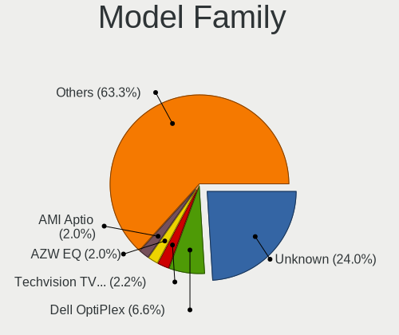
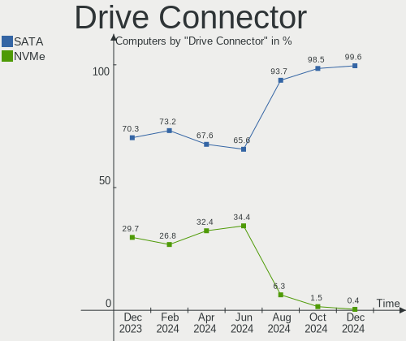
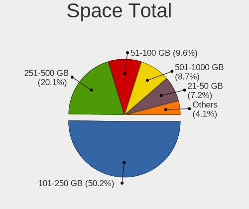
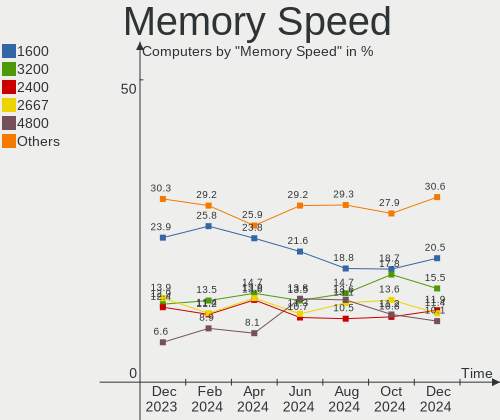

OPNsense - Hardware Trends
--------------------------

A project to identify most popular hardware characteristics and track their change
over time based on data collected by BSD users at https://BSD-Hardware.info.

Anyone can contribute to this report by the [hw-probe](https://github.com/linuxhw/hw-probe/blob/master/INSTALL.BSD.md) tool:

    hw-probe -all -upload

This report is for one last month. Overall report since the beginning of time: [TestDays](https://github.com/bsdhw/TestDays)

Period: Mar, 2023.

Contents
--------

* [ System ](#system)
  - [ OS                       ](#os)
  - [ OS Family                ](#os-family)
  - [ Arch                     ](#arch)
  - [ DE                       ](#de)
  - [ Display Server           ](#display-server)
  - [ Display Manager          ](#display-manager)
  - [ OS Lang                  ](#os-lang)
  - [ Boot Mode                ](#boot-mode)
  - [ Filesystem               ](#filesystem)
  - [ Part. scheme             ](#part-scheme)

* [ Board ](#board)
  - [ Vendor                   ](#vendor)
  - [ Model                    ](#model)
  - [ Model Family             ](#model-family)
  - [ MFG Year                 ](#mfg-year)
  - [ Form Factor              ](#form-factor)
  - [ Coreboot                 ](#coreboot)
  - [ RAM Size                 ](#ram-size)
  - [ RAM Used                 ](#ram-used)
  - [ Total Drives             ](#total-drives)
  - [ Has CD-ROM               ](#has-cd-rom)
  - [ Has Ethernet             ](#has-ethernet)
  - [ Has WiFi                 ](#has-wifi)
  - [ Has Bluetooth            ](#has-bluetooth)

* [ Location ](#location)
  - [ Country                  ](#country)
  - [ City                     ](#city)

* [ Drives ](#drives)
  - [ Drive Vendor             ](#drive-vendor)
  - [ Drive Model              ](#drive-model)
  - [ HDD Vendor               ](#hdd-vendor)
  - [ SSD Vendor               ](#ssd-vendor)
  - [ Drive Kind               ](#drive-kind)
  - [ Drive Connector          ](#drive-connector)
  - [ Drive Size               ](#drive-size)
  - [ Space Total              ](#space-total)
  - [ Space Used               ](#space-used)
  - [ Malfunc. Drives          ](#malfunc-drives)
  - [ Malfunc. Drive Vendor    ](#malfunc-drive-vendor)
  - [ Malfunc. HDD Vendor      ](#malfunc-hdd-vendor)
  - [ Malfunc. Drive Kind      ](#malfunc-drive-kind)
  - [ Failed Drives            ](#failed-drives)
  - [ Failed Drive Vendor      ](#failed-drive-vendor)
  - [ Drive Status             ](#drive-status)

* [ Storage controller ](#storage-controller)
  - [ Storage Vendor           ](#storage-vendor)
  - [ Storage Model            ](#storage-model)
  - [ Storage Kind             ](#storage-kind)

* [ Processor ](#processor)
  - [ CPU Vendor               ](#cpu-vendor)
  - [ CPU Model                ](#cpu-model)
  - [ CPU Model Family         ](#cpu-model-family)
  - [ CPU Cores                ](#cpu-cores)
  - [ CPU Sockets              ](#cpu-sockets)
  - [ CPU Threads              ](#cpu-threads)
  - [ CPU Microarch            ](#cpu-microarch)

* [ Graphics ](#graphics)
  - [ GPU Vendor               ](#gpu-vendor)
  - [ GPU Model                ](#gpu-model)
  - [ GPU Combo                ](#gpu-combo)
  - [ GPU Driver               ](#gpu-driver)
  - [ GPU Memory               ](#gpu-memory)

* [ Monitor ](#monitor)
  - [ Monitor Vendor           ](#monitor-vendor)
  - [ Monitor Model            ](#monitor-model)
  - [ Monitor Resolution       ](#monitor-resolution)
  - [ Monitor Diagonal         ](#monitor-diagonal)
  - [ Monitor Width            ](#monitor-width)
  - [ Aspect Ratio             ](#aspect-ratio)
  - [ Monitor Area             ](#monitor-area)
  - [ Pixel Density            ](#pixel-density)
  - [ Multiple Monitors        ](#multiple-monitors)

* [ Network ](#network)
  - [ Net Controller Vendor    ](#net-controller-vendor)
  - [ Net Controller Model     ](#net-controller-model)
  - [ Wireless Vendor          ](#wireless-vendor)
  - [ Wireless Model           ](#wireless-model)
  - [ Ethernet Vendor          ](#ethernet-vendor)
  - [ Ethernet Model           ](#ethernet-model)
  - [ Net Controller Kind      ](#net-controller-kind)
  - [ Used Controller          ](#used-controller)
  - [ NICs                     ](#nics)
  - [ IPv6                     ](#ipv6)

* [ Bluetooth ](#bluetooth)
  - [ Bluetooth Vendor         ](#bluetooth-vendor)
  - [ Bluetooth Model          ](#bluetooth-model)

* [ Sound ](#sound)
  - [ Sound Vendor             ](#sound-vendor)
  - [ Sound Model              ](#sound-model)

* [ Memory ](#memory)
  - [ Memory Vendor            ](#memory-vendor)
  - [ Memory Model             ](#memory-model)
  - [ Memory Kind              ](#memory-kind)
  - [ Memory Form Factor       ](#memory-form-factor)
  - [ Memory Size              ](#memory-size)
  - [ Memory Speed             ](#memory-speed)

* [ Printers & scanners ](#printers--scanners)
  - [ Printer Vendor           ](#printer-vendor)
  - [ Printer Model            ](#printer-model)
  - [ Scanner Vendor           ](#scanner-vendor)
  - [ Scanner Model            ](#scanner-model)

* [ Camera ](#camera)
  - [ Camera Vendor            ](#camera-vendor)
  - [ Camera Model             ](#camera-model)

* [ Security ](#security)
  - [ Fingerprint Vendor       ](#fingerprint-vendor)
  - [ Fingerprint Model        ](#fingerprint-model)
  - [ Chipcard Vendor          ](#chipcard-vendor)
  - [ Chipcard Model           ](#chipcard-model)

* [ Unsupported ](#unsupported)
  - [ Unsupported Devices      ](#unsupported-devices)
  - [ Unsupported Device Types ](#unsupported-device-types)

System
------

OS
--

Installed operating systems

| Name             | Computers | Percent |
|------------------|-----------|---------|
| OPNsense 23.1.3  | 105       | 30.35%  |
| OPNsense 23.1.4  | 93        | 26.88%  |
| OPNsense 23.1.1  | 65        | 18.79%  |
| OPNsense 23.1.2  | 24        | 6.94%   |
| OPNsense 23.1.5  | 21        | 6.07%   |
| OPNsense 23.1    | 11        | 3.18%   |
| OPNsense 22.7.11 | 8         | 2.31%   |
| OPNsense 23.7    | 7         | 2.02%   |
| OPNsense 22.10.2 | 7         | 2.02%   |
| OPNsense 22.1.10 | 2         | 0.58%   |
| OPNsense 21.1.9  | 1         | 0.29%   |
| OPNsense 20.7.5  | 1         | 0.29%   |
| OPNsense 20.7    | 1         | 0.29%   |

OS Family
---------

OS without a version

| Name     | Computers | Percent |
|----------|-----------|---------|
| OPNsense | 346       | 100%    |

Arch
----

OS architecture (x86_64, i586, etc.)

| Name  | Computers | Percent |
|-------|-----------|---------|
| amd64 | 346       | 100%    |

DE
--

Desktop Environment

| Name    | Computers | Percent |
|---------|-----------|---------|
| Console | 346       | 100%    |

Display Server
--------------

X11 or Wayland

| Name    | Computers | Percent |
|---------|-----------|---------|
| Console | 346       | 100%    |

Display Manager
---------------

SDDM, LightDM, etc.

| Name    | Computers | Percent |
|---------|-----------|---------|
| Console | 346       | 100%    |

OS Lang
-------

Language

| Lang    | Computers | Percent |
|---------|-----------|---------|
| Unknown | 338       | 97.69%  |
| C       | 8         | 2.31%   |

Boot Mode
---------

EFI or BIOS

| Mode | Computers | Percent |
|------|-----------|---------|
| EFI  | 341       | 98.55%  |
| BIOS | 5         | 1.45%   |

Filesystem
----------

Type of filesystem

| Type | Computers | Percent |
|------|-----------|---------|
| Ufs  | 206       | 59.54%  |
| Zfs  | 140       | 40.46%  |

Part. scheme
------------

Scheme of partitioning

| Type    | Computers | Percent |
|---------|-----------|---------|
| GPT     | 342       | 98.84%  |
| MBR     | 3         | 0.87%   |
| Unknown | 1         | 0.29%   |

Board
-----

Vendor
------

Motherboard manufacturer

| Name                       | Computers | Percent |
|----------------------------|-----------|---------|
| Unknown                    | 43        | 12.43%  |
| Dell                       | 41        | 11.85%  |
| Hewlett-Packard            | 31        | 8.96%   |
| Intel                      | 24        | 6.94%   |
| ASUSTek Computer           | 21        | 6.07%   |
| Protectli                  | 20        | 5.78%   |
| Techvision                 | 19        | 5.49%   |
| Supermicro                 | 15        | 4.34%   |
| ASRock                     | 15        | 4.34%   |
| Lenovo                     | 13        | 3.76%   |
| Fujitsu                    | 11        | 3.18%   |
| Gigabyte Technology        | 8         | 2.31%   |
| Sophos                     | 7         | 2.02%   |
| AMI                        | 6         | 1.73%   |
| MW                         | 5         | 1.45%   |
| PC Engines                 | 4         | 1.16%   |
| MSI                        | 4         | 1.16%   |
| Acer                       | 4         | 1.16%   |
| Deciso                     | 3         | 0.87%   |
| CncTion                    | 3         | 0.87%   |
| GoWin Solution             | 2         | 0.58%   |
| CheckPoint                 | 2         | 0.58%   |
| BESSTAR Tech               | 2         | 0.58%   |
| AWOW                       | 2         | 0.58%   |
| ASRockRack                 | 2         | 0.58%   |
| Apple                      | 2         | 0.58%   |
| ZOTAC                      | 1         | 0.29%   |
| YENTEK                     | 1         | 0.29%   |
| YANYU                      | 1         | 0.29%   |
| WeiBu                      | 1         | 0.29%   |
| Stonesoft                  | 1         | 0.29%   |
| Silicom                    | 1         | 0.29%   |
| SiComputer                 | 1         | 0.29%   |
| Shuttle                    | 1         | 0.29%   |
| ShenZhen MinWin Technology | 1         | 0.29%   |
| Seeed Studio               | 1         | 0.29%   |
| Positivo                   | 1         | 0.29%   |
| Pegatron                   | 1         | 0.29%   |
| PAIQ                       | 1         | 0.29%   |
| NF692                      | 1         | 0.29%   |

Model
-----

Motherboard model

| Name                                | Computers | Percent |
|-------------------------------------|-----------|---------|
| Unknown                             | 44        | 12.72%  |
| Techvision TVI7309X                 | 19        | 5.49%   |
| Protectli FW4B                      | 9         | 2.6%    |
| Fujitsu FUTRO S920                  | 7         | 2.02%   |
| Sophos SG                           | 6         | 1.73%   |
| Intel Q3XXG4-P V1.0                 | 6         | 1.73%   |
| Supermicro Super Server             | 5         | 1.45%   |
| MW GMLK-2_5G4L                      | 5         | 1.45%   |
| Dell PowerEdge R210 II              | 5         | 1.45%   |
| Dell Wyse 5070 Extended Thin Client | 4         | 1.16%   |
| ASUS All Series                     | 4         | 1.16%   |
| Protectli VP2410                    | 3         | 0.87%   |
| Protectli FW6                       | 3         | 0.87%   |
| Protectli FW4C                      | 3         | 0.87%   |
| PC Engines APU2                     | 3         | 0.87%   |
| Intel DENLOW_WS                     | 3         | 0.87%   |
| HP t620 PLUS Quad Core TC           | 3         | 0.87%   |
| HP ProDesk 600 G1 SFF               | 3         | 0.87%   |
| Dell OptiPlex 3020                  | 3         | 0.87%   |
| Supermicro SYS-5029P-WTR            | 2         | 0.58%   |
| Protectli VP2420                    | 2         | 0.58%   |
| HP t730 Thin Client                 | 2         | 0.58%   |
| HP ProLiant DL360 G7                | 2         | 0.58%   |
| HP Compaq 8200 Elite SFF PC         | 2         | 0.58%   |
| GoWin Solution R86S                 | 2         | 0.58%   |
| Dell PowerEdge R710                 | 2         | 0.58%   |
| Dell PowerEdge R320                 | 2         | 0.58%   |
| Dell PowerEdge R210                 | 2         | 0.58%   |
| Dell OptiPlex 9010                  | 2         | 0.58%   |
| Dell OptiPlex 7060                  | 2         | 0.58%   |
| Dell OptiPlex 7020                  | 2         | 0.58%   |
| Deciso OPNsense Appliance           | 2         | 0.58%   |
| CncTion N5105-4L                    | 2         | 0.58%   |
| ASUS P11C-M Series                  | 2         | 0.58%   |
| ASRock J5040-ITX                    | 2         | 0.58%   |
| AMI Aptio CRB                       | 2         | 0.58%   |
| ZOTAC ZBOX-ID91                     | 1         | 0.29%   |
| YENTEK R250                         | 1         | 0.29%   |
| YANYU H17SL                         | 1         | 0.29%   |
| WeiBu ADL-N                         | 1         | 0.29%   |

Model Family
------------

Motherboard model prefix

| Name                     | Computers | Percent |
|--------------------------|-----------|---------|
| Unknown                  | 44        | 12.72%  |
| Techvision TVI7309X      | 19        | 5.49%   |
| Dell PowerEdge           | 17        | 4.91%   |
| Dell OptiPlex            | 16        | 4.62%   |
| Protectli FW4B           | 9         | 2.6%    |
| Lenovo ThinkCentre       | 8         | 2.31%   |
| Fujitsu FUTRO            | 7         | 2.02%   |
| Sophos SG                | 6         | 1.73%   |
| Intel Q3XXG4-P           | 6         | 1.73%   |
| Supermicro Super         | 5         | 1.45%   |
| MW GMLK-2                | 5         | 1.45%   |
| HP ProDesk               | 5         | 1.45%   |
| HP ProLiant              | 4         | 1.16%   |
| HP EliteDesk             | 4         | 1.16%   |
| HP Compaq                | 4         | 1.16%   |
| Dell Wyse                | 4         | 1.16%   |
| ASUS All                 | 4         | 1.16%   |
| Protectli VP2410         | 3         | 0.87%   |
| Protectli FW6            | 3         | 0.87%   |
| Protectli FW4C           | 3         | 0.87%   |
| PC Engines APU2          | 3         | 0.87%   |
| Intel DENLOW             | 3         | 0.87%   |
| HP t730                  | 3         | 0.87%   |
| HP t620                  | 3         | 0.87%   |
| Acer Aspire              | 3         | 0.87%   |
| Supermicro SYS-5029P-WTR | 2         | 0.58%   |
| Protectli VP2420         | 2         | 0.58%   |
| GoWin Solution R86S      | 2         | 0.58%   |
| Dell Inspiron            | 2         | 0.58%   |
| Deciso OPNsense          | 2         | 0.58%   |
| CncTion N5105-4L         | 2         | 0.58%   |
| ASUS P5G41T-M            | 2         | 0.58%   |
| ASUS P11C-M              | 2         | 0.58%   |
| ASUS M5A78L-M            | 2         | 0.58%   |
| ASRock J5040-ITX         | 2         | 0.58%   |
| AMI Aptio                | 2         | 0.58%   |
| ZOTAC ZBOX-ID91          | 1         | 0.29%   |
| YENTEK R250              | 1         | 0.29%   |
| YANYU H17SL              | 1         | 0.29%   |
| WeiBu ADL-N              | 1         | 0.29%   |

MFG Year
--------

Motherboard manufacture year

| Year | Computers | Percent |
|------|-----------|---------|
| 2022 | 83        | 23.99%  |
| 2019 | 34        | 9.83%   |
| 2018 | 34        | 9.83%   |
| 2021 | 32        | 9.25%   |
| 2016 | 30        | 8.67%   |
| 2014 | 30        | 8.67%   |
| 2020 | 21        | 6.07%   |
| 2012 | 17        | 4.91%   |
| 2017 | 16        | 4.62%   |
| 2015 | 12        | 3.47%   |
| 2011 | 12        | 3.47%   |
| 2013 | 9         | 2.6%    |
| 2010 | 9         | 2.6%    |
| 2023 | 3         | 0.87%   |
| 2009 | 2         | 0.58%   |
| 2008 | 2         | 0.58%   |

Form Factor
-----------

Physical design of the computer

| Name           | Computers | Percent |
|----------------|-----------|---------|
| Desktop        | 269       | 77.75%  |
| Server         | 37        | 10.69%  |
| Mini pc        | 23        | 6.65%   |
| Firewall       | 8         | 2.31%   |
| Notebook       | 8         | 2.31%   |
| System on chip | 1         | 0.29%   |

Coreboot
--------

Have coreboot on board

| Used | Computers | Percent |
|------|-----------|---------|
| No   | 339       | 97.98%  |
| Yes  | 7         | 2.02%   |

RAM Size
--------

Total RAM memory

| Size in GB  | Computers | Percent |
|-------------|-----------|---------|
| 8.01-16.0   | 157       | 45.38%  |
| 16.01-24.0  | 85        | 24.57%  |
| 4.01-8.0    | 49        | 14.16%  |
| 32.01-64.0  | 34        | 9.83%   |
| 2.01-3.0    | 8         | 2.31%   |
| 64.01-256.0 | 7         | 2.02%   |
| 24.01-32.0  | 5         | 1.45%   |
| 3.01-4.0    | 1         | 0.29%   |

RAM Used
--------

Used RAM memory

| Used GB   | Computers | Percent |
|-----------|-----------|---------|
| 0.01-0.5  | 178       | 51.45%  |
| 0.51-1.0  | 120       | 34.68%  |
| 1.01-2.0  | 34        | 9.83%   |
| 2.01-3.0  | 9         | 2.6%    |
| 3.01-4.0  | 3         | 0.87%   |
| 4.01-8.0  | 1         | 0.29%   |
| 8.01-16.0 | 1         | 0.29%   |

Total Drives
------------

Number of drives on board

| Drives | Computers | Percent |
|--------|-----------|---------|
| 1      | 274       | 79.19%  |
| 2      | 34        | 9.83%   |
| 0      | 29        | 8.38%   |
| 3      | 6         | 1.73%   |
| 4      | 2         | 0.58%   |
| 6      | 1         | 0.29%   |

Has CD-ROM
----------

Has CD-ROM on board

| Presented | Computers | Percent |
|-----------|-----------|---------|
| No        | 298       | 86.13%  |
| Yes       | 48        | 13.87%  |

Has Ethernet
------------

Has Ethernet on board

| Presented | Computers | Percent |
|-----------|-----------|---------|
| Yes       | 346       | 100%    |

Has WiFi
--------

Has WiFi module

| Presented | Computers | Percent |
|-----------|-----------|---------|
| No        | 284       | 82.08%  |
| Yes       | 62        | 17.92%  |

Has Bluetooth
-------------

Has Bluetooth module

| Presented | Computers | Percent |
|-----------|-----------|---------|
| No        | 309       | 89.31%  |
| Yes       | 37        | 10.69%  |

Location
--------

Country
-------

Geographic location (country)

| Country      | Computers | Percent |
|--------------|-----------|---------|
| USA          | 124       | 35.84%  |
| Germany      | 64        | 18.5%   |
| France       | 16        | 4.62%   |
| UK           | 13        | 3.76%   |
| Canada       | 13        | 3.76%   |
| Poland       | 9         | 2.6%    |
| Italy        | 8         | 2.31%   |
| Brazil       | 7         | 2.02%   |
| Australia    | 7         | 2.02%   |
| Sweden       | 6         | 1.73%   |
| Russia       | 6         | 1.73%   |
| Netherlands  | 6         | 1.73%   |
| South Korea  | 5         | 1.45%   |
| Belgium      | 5         | 1.45%   |
| South Africa | 4         | 1.16%   |
| Norway       | 4         | 1.16%   |
| Indonesia    | 4         | 1.16%   |
| Austria      | 4         | 1.16%   |
| Switzerland  | 3         | 0.87%   |
| Portugal     | 3         | 0.87%   |
| New Zealand  | 3         | 0.87%   |
| Denmark      | 3         | 0.87%   |
| Taiwan       | 2         | 0.58%   |
| Malaysia     | 2         | 0.58%   |
| Luxembourg   | 2         | 0.58%   |
| Bulgaria     | 2         | 0.58%   |
| Vietnam      | 1         | 0.29%   |
| Turkey       | 1         | 0.29%   |
| Tunisia      | 1         | 0.29%   |
| Spain        | 1         | 0.29%   |
| Slovakia     | 1         | 0.29%   |
| Singapore    | 1         | 0.29%   |
| Moldova      | 1         | 0.29%   |
| Mexico       | 1         | 0.29%   |
| Lithuania    | 1         | 0.29%   |
| Latvia       | 1         | 0.29%   |
| Japan        | 1         | 0.29%   |
| Hungary      | 1         | 0.29%   |
| Hong Kong    | 1         | 0.29%   |
| Greece       | 1         | 0.29%   |

City
----

Geographic location (city)

| City              | Computers | Percent |
|-------------------|-----------|---------|
| Paris             | 5         | 1.45%   |
| London            | 4         | 1.16%   |
| Hamburg           | 4         | 1.16%   |
| Warsaw            | 3         | 0.87%   |
| Vienna            | 3         | 0.87%   |
| Sydney            | 3         | 0.87%   |
| Seattle           | 3         | 0.87%   |
| Portland          | 3         | 0.87%   |
| Munich            | 3         | 0.87%   |
| Jakarta           | 3         | 0.87%   |
| Cologne           | 3         | 0.87%   |
| Titusville        | 2         | 0.58%   |
| Solingen          | 2         | 0.58%   |
| Silver Spring     | 2         | 0.58%   |
| Plymouth          | 2         | 0.58%   |
| Moscow            | 2         | 0.58%   |
| Minneapolis       | 2         | 0.58%   |
| Melbourne         | 2         | 0.58%   |
| Marietta          | 2         | 0.58%   |
| Los Angeles       | 2         | 0.58%   |
| Kraaifontein      | 2         | 0.58%   |
| Indianapolis      | 2         | 0.58%   |
| Houston           | 2         | 0.58%   |
| Hendersonville    | 2         | 0.58%   |
| Glenview          | 2         | 0.58%   |
| Gdynia            | 2         | 0.58%   |
| Frankfurt am Main | 2         | 0.58%   |
| Erfurt            | 2         | 0.58%   |
| Daly City         | 2         | 0.58%   |
| Dallas            | 2         | 0.58%   |
| Chicago           | 2         | 0.58%   |
| Charlotte         | 2         | 0.58%   |
| Cape Town         | 2         | 0.58%   |
| Calgary           | 2         | 0.58%   |
| Brasília         | 2         | 0.58%   |
| Bochum            | 2         | 0.58%   |
| Berlin            | 2         | 0.58%   |
| Bedford           | 2         | 0.58%   |
| Zwijndrecht       | 1         | 0.29%   |
| Zusmarshausen     | 1         | 0.29%   |

Drives
------

Drive Vendor
------------

Hard drive vendors

| Vendor              | Computers | Drives | Percent |
|---------------------|-----------|--------|---------|
| Samsung Electronics | 37        | 46     | 10.88%  |
| Kingston            | 31        | 32     | 9.12%   |
| Seagate             | 22        | 26     | 6.47%   |
| WDC                 | 19        | 22     | 5.59%   |
| Transcend           | 19        | 21     | 5.59%   |
| China               | 17        | 20     | 5%      |
| Hoodisk             | 16        | 16     | 4.71%   |
| Intel               | 15        | 16     | 4.41%   |
| Crucial             | 12        | 15     | 3.53%   |
| SanDisk             | 10        | 10     | 2.94%   |
| A-DATA Technology   | 10        | 11     | 2.94%   |
| Protectli           | 9         | 9      | 2.65%   |
| Apacer              | 8         | 8      | 2.35%   |
| SK hynix            | 7         | 7      | 2.06%   |
| Micron Technology   | 7         | 7      | 2.06%   |
| Innodisk            | 7         | 7      | 2.06%   |
| Fanxiang            | 7         | 8      | 2.06%   |
| PNY                 | 6         | 6      | 1.76%   |
| Hewlett-Packard     | 6         | 7      | 1.76%   |
| Dogfish             | 5         | 5      | 1.47%   |
| Toshiba             | 4         | 5      | 1.18%   |
| SPCC                | 4         | 4      | 1.18%   |
| Phison              | 4         | 4      | 1.18%   |
| OCZ                 | 4         | 4      | 1.18%   |
| HGST                | 4         | 4      | 1.18%   |
| Team                | 3         | 4      | 0.88%   |
| ShiJi               | 3         | 3      | 0.88%   |
| Hitachi             | 3         | 3      | 0.88%   |
| Corsair             | 3         | 4      | 0.88%   |
| Silicon Motion      | 2         | 2      | 0.59%   |
| Patriot             | 2         | 2      | 0.59%   |
| Maxtor              | 2         | 2      | 0.59%   |
| FORESEE             | 2         | 2      | 0.59%   |
| BORY                | 2         | 2      | 0.59%   |
| BIWIN               | 2         | 2      | 0.59%   |
| BAITITON            | 2         | 2      | 0.59%   |
| Zheino              | 1         | 1      | 0.29%   |
| Verbatim            | 1         | 1      | 0.29%   |
| Vaseky              | 1         | 1      | 0.29%   |
| TCSUNBOW            | 1         | 1      | 0.29%   |

Drive Model
-----------

Hard drive models

| Model                           | Computers | Percent |
|---------------------------------|-----------|---------|
| Kingston SA400S37120G 120GB     | 8         | 2.3%    |
| Samsung SSD 850 EVO 250GB       | 6         | 1.72%   |
| Hoodisk SSD 64GB                | 5         | 1.44%   |
| SK hynix SC311 SATA 128GB       | 4         | 1.15%   |
| Protectli 120GB M.2             | 4         | 1.15%   |
| Kingston SA400S37240G 240GB     | 4         | 1.15%   |
| Hoodisk SSD 32GB                | 4         | 1.15%   |
| Hoodisk SSD 128GB               | 4         | 1.15%   |
| Transcend TS128GMSA230S 128GB   | 3         | 0.86%   |
| Seagate ST500DM002-1BD142 500GB | 3         | 0.86%   |
| Samsung SSD 870 EVO 500GB       | 3         | 0.86%   |
| Phison Sabrent 1TB              | 3         | 0.86%   |
| Kingston SV300S37A120G 120GB    | 3         | 0.86%   |
| Innodisk DEMSR- 08GB mSATA 3ME3 | 3         | 0.86%   |
| Fanxiang S501 128GB             | 3         | 0.86%   |
| Crucial CT120BX500SSD1 120GB    | 3         | 0.86%   |
| Apacer 16GB SATA Flash Drive    | 3         | 0.86%   |
| Transcend TS256GMTS952T2 256GB  | 2         | 0.57%   |
| SPCC M.2 PCIe SSD 256GB         | 2         | 0.57%   |
| SK hynix SC308 SATA 256GB       | 2         | 0.57%   |
| ShiJi SSD 128GB                 | 2         | 0.57%   |
| Seagate ST31000524AS 1TB        | 2         | 0.57%   |
| SanDisk SSD PLUS 240GB          | 2         | 0.57%   |
| SanDisk SDSA6MM-016G-1006 16GB  | 2         | 0.57%   |
| Samsung SSD 970 EVO Plus 250GB  | 2         | 0.57%   |
| Samsung SSD 860 EVO 500GB       | 2         | 0.57%   |
| Samsung SSD 860 EVO 250GB       | 2         | 0.57%   |
| Protectli 64GB mSATA            | 2         | 0.57%   |
| PNY CS900 250GB SSD             | 2         | 0.57%   |
| PNY CS900 120GB SSD             | 2         | 0.57%   |
| Kingston SNV2S500G 500GB        | 2         | 0.57%   |
| Innodisk DEMSR- 16GB mSATA 3ME3 | 2         | 0.57%   |
| HGST HTS725050A7E630 500GB      | 2         | 0.57%   |
| HP RAID 0 146GB                 | 2         | 0.57%   |
| HP MB1000GCEEK 1TB              | 2         | 0.57%   |
| FORESEE 64GB SSD                | 2         | 0.57%   |
| Fanxiang S500PRO 256GB          | 2         | 0.57%   |
| Dogfish SSD 128GB               | 2         | 0.57%   |
| Crucial CT250MX500SSD1 250GB    | 2         | 0.57%   |
| China SATA SSD 16GB             | 2         | 0.57%   |

HDD Vendor
----------

Hard disk drive vendors

| Vendor              | Computers | Drives | Percent |
|---------------------|-----------|--------|---------|
| Seagate             | 21        | 25     | 42%     |
| WDC                 | 12        | 14     | 24%     |
| Hewlett-Packard     | 5         | 6      | 10%     |
| HGST                | 3         | 3      | 6%      |
| Toshiba             | 2         | 3      | 4%      |
| Samsung Electronics | 2         | 2      | 4%      |
| Maxtor              | 2         | 2      | 4%      |
| Hitachi             | 2         | 2      | 4%      |
| LSI                 | 1         | 1      | 2%      |

SSD Vendor
----------

Solid state drive vendors

| Vendor              | Computers | Drives | Percent |
|---------------------|-----------|--------|---------|
| Samsung Electronics | 28        | 36     | 11.72%  |
| Kingston            | 25        | 26     | 10.46%  |
| Transcend           | 17        | 19     | 7.11%   |
| China               | 17        | 20     | 7.11%   |
| Hoodisk             | 16        | 16     | 6.69%   |
| Crucial             | 12        | 14     | 5.02%   |
| SanDisk             | 10        | 10     | 4.18%   |
| Intel               | 10        | 11     | 4.18%   |
| A-DATA Technology   | 10        | 11     | 4.18%   |
| Protectli           | 9         | 9      | 3.77%   |
| Apacer              | 8         | 8      | 3.35%   |
| Innodisk            | 7         | 7      | 2.93%   |
| WDC                 | 6         | 6      | 2.51%   |
| SK hynix            | 6         | 6      | 2.51%   |
| PNY                 | 5         | 5      | 2.09%   |
| Micron Technology   | 5         | 5      | 2.09%   |
| Dogfish             | 5         | 5      | 2.09%   |
| OCZ                 | 4         | 4      | 1.67%   |
| ShiJi               | 3         | 3      | 1.26%   |
| FORESEE             | 2         | 2      | 0.84%   |
| BORY                | 2         | 2      | 0.84%   |
| BIWIN               | 2         | 2      | 0.84%   |
| BAITITON            | 2         | 2      | 0.84%   |
| Zheino              | 1         | 1      | 0.42%   |
| Verbatim            | 1         | 1      | 0.42%   |
| Vaseky              | 1         | 1      | 0.42%   |
| Toshiba             | 1         | 1      | 0.42%   |
| Team                | 1         | 1      | 0.42%   |
| TCSUNBOW            | 1         | 1      | 0.42%   |
| T-FORCE             | 1         | 1      | 0.42%   |
| SSSTC               | 1         | 2      | 0.42%   |
| SPCC                | 1         | 1      | 0.42%   |
| Smartbuy            | 1         | 1      | 0.42%   |
| RECADATA            | 1         | 1      | 0.42%   |
| Patriot             | 1         | 1      | 0.42%   |
| LITEON              | 1         | 1      | 0.42%   |
| Lexar               | 1         | 1      | 0.42%   |
| KUIJIA              | 1         | 1      | 0.42%   |
| KIOXIA-EXCERIA      | 1         | 1      | 0.42%   |
| KingDian            | 1         | 1      | 0.42%   |

Drive Kind
----------

HDD or SSD

| Kind | Computers | Drives | Percent |
|------|-----------|--------|---------|
| SSD  | 227       | 259    | 69.21%  |
| NVMe | 53        | 57     | 16.16%  |
| HDD  | 48        | 58     | 14.63%  |

Drive Connector
---------------

SATA, SAS, NVMe, etc.

| Type | Computers | Drives | Percent |
|------|-----------|--------|---------|
| SATA | 269       | 317    | 83.54%  |
| NVMe | 53        | 57     | 16.46%  |

Drive Size
----------

Size of hard drive

| Size in TB | Computers | Drives | Percent |
|------------|-----------|--------|---------|
| 0.01-0.5   | 238       | 273    | 85.92%  |
| 0.51-1.0   | 27        | 31     | 9.75%   |
| 1.01-2.0   | 11        | 12     | 3.97%   |
| 2.01-3.0   | 1         | 1      | 0.36%   |

Space Total
-----------

Amount of disk space available on the file system

| Size in GB | Computers | Percent |
|------------|-----------|---------|
| 101-250    | 174       | 50.29%  |
| 251-500    | 50        | 14.45%  |
| 21-50      | 35        | 10.12%  |
| 51-100     | 31        | 8.96%   |
| 501-1000   | 27        | 7.8%    |
| 1-20       | 22        | 6.36%   |
| 1001-2000  | 5         | 1.45%   |
| 2001-3000  | 2         | 0.58%   |

Space Used
----------

Amount of used disk space

| Used GB | Computers | Percent |
|---------|-----------|---------|
| 1-20    | 327       | 94.51%  |
| 21-50   | 14        | 4.05%   |
| 51-100  | 4         | 1.16%   |
| 101-250 | 1         | 0.29%   |

Malfunc. Drives
---------------

Drive models with a malfunction

| Model                               | Computers | Drives | Percent |
|-------------------------------------|-----------|--------|---------|
| Seagate ST31000524AS 1TB            | 2         | 2      | 6.06%   |
| WDC WDS240G2G0A-00JH30 240GB        | 1         | 1      | 3.03%   |
| WDC WD7500BPKX-00HPJT0 752GB        | 1         | 2      | 3.03%   |
| WDC WD10JPVX-00JC3T0 1TB            | 1         | 1      | 3.03%   |
| Toshiba DT01ACA100 1TB              | 1         | 1      | 3.03%   |
| SK hynix SC308 SATA 256GB           | 1         | 1      | 3.03%   |
| Seagate ST500NM0011 500GB           | 1         | 1      | 3.03%   |
| Seagate ST2000LX001-1RG174 2TB      | 1         | 1      | 3.03%   |
| SanDisk SSD U100 64GB               | 1         | 1      | 3.03%   |
| Samsung Electronics HM250JI 250GB   | 1         | 1      | 3.03%   |
| Patriot Burst Elite 120GB           | 1         | 1      | 3.03%   |
| Kingston SV300S37A60G 64GB          | 1         | 1      | 3.03%   |
| Kingston SV300S37A120G 120GB        | 1         | 1      | 3.03%   |
| Kingston SNS4151S316G 16GB          | 1         | 1      | 3.03%   |
| Kingston SA400S37120G 120GB         | 1         | 1      | 3.03%   |
| Kingston RBU-SNS8350DES3128GP 128GB | 1         | 1      | 3.03%   |
| KingDian S100 32GB                  | 1         | 1      | 3.03%   |
| Intel SSDSC2CT120A3 120GB           | 1         | 1      | 3.03%   |
| Intel SSDSC2BA400G4 400GB           | 1         | 1      | 3.03%   |
| Intel SSDSA2M080G2GC 80GB           | 1         | 1      | 3.03%   |
| Intel SSDMCEAC060B3 64GB            | 1         | 1      | 3.03%   |
| Hitachi HDS721616PLA380 164GB       | 1         | 1      | 3.03%   |
| HGST HUSKY SSD 128GB                | 1         | 1      | 3.03%   |
| HGST HTS725050A7E630 500GB          | 1         | 1      | 3.03%   |
| Dogfish SSD 128GB                   | 1         | 1      | 3.03%   |
| Crucial CT480BX500SSD1 480GB        | 1         | 1      | 3.03%   |
| Crucial CT128M550SSD3 128GB         | 1         | 1      | 3.03%   |
| Crucial CT120M500SSD1 120GB         | 1         | 1      | 3.03%   |
| BAITITON BT58SSD08M 128GB           | 1         | 1      | 3.03%   |
| Apacer 8GB SATA Flash Drive         | 1         | 1      | 3.03%   |
| Apacer 16GB SATA Flash Drive        | 1         | 1      | 3.03%   |
| A-DATA Technology SU800 1TB         | 1         | 1      | 3.03%   |

Malfunc. Drive Vendor
---------------------

Vendors of faulty drives

| Vendor              | Computers | Drives | Percent |
|---------------------|-----------|--------|---------|
| Kingston            | 5         | 5      | 15.15%  |
| Seagate             | 4         | 4      | 12.12%  |
| Intel               | 4         | 4      | 12.12%  |
| WDC                 | 3         | 4      | 9.09%   |
| Crucial             | 3         | 3      | 9.09%   |
| HGST                | 2         | 2      | 6.06%   |
| Apacer              | 2         | 2      | 6.06%   |
| Toshiba             | 1         | 1      | 3.03%   |
| SK hynix            | 1         | 1      | 3.03%   |
| SanDisk             | 1         | 1      | 3.03%   |
| Samsung Electronics | 1         | 1      | 3.03%   |
| Patriot             | 1         | 1      | 3.03%   |
| KingDian            | 1         | 1      | 3.03%   |
| Hitachi             | 1         | 1      | 3.03%   |
| Dogfish             | 1         | 1      | 3.03%   |
| BAITITON            | 1         | 1      | 3.03%   |
| A-DATA Technology   | 1         | 1      | 3.03%   |

Malfunc. HDD Vendor
-------------------

Vendors of faulty HDD drives

| Vendor              | Computers | Drives | Percent |
|---------------------|-----------|--------|---------|
| Seagate             | 4         | 4      | 40%     |
| WDC                 | 2         | 3      | 20%     |
| Toshiba             | 1         | 1      | 10%     |
| Samsung Electronics | 1         | 1      | 10%     |
| Hitachi             | 1         | 1      | 10%     |
| HGST                | 1         | 1      | 10%     |

Malfunc. Drive Kind
-------------------

Kinds of faulty drives

| Kind | Computers | Drives | Percent |
|------|-----------|--------|---------|
| SSD  | 23        | 23     | 69.7%   |
| HDD  | 10        | 11     | 30.3%   |

Failed Drives
-------------

Failed drive models

Zero info for selected period =(

Failed Drive Vendor
-------------------

Failed drive vendors

Zero info for selected period =(

Drive Status
------------

Number of failed and malfunc. drives

| Status   | Computers | Drives | Percent |
|----------|-----------|--------|---------|
| Works    | 283       | 334    | 87.89%  |
| Malfunc  | 33        | 34     | 10.25%  |
| Detected | 6         | 6      | 1.86%   |

Storage controller
------------------

Storage Vendor
--------------

Storage controller vendors

| Vendor                      | Computers | Percent |
|-----------------------------|-----------|---------|
| Intel                       | 291       | 69.45%  |
| AMD                         | 44        | 10.5%   |
| Broadcom / LSI              | 14        | 3.34%   |
| Silicon Motion              | 9         | 2.15%   |
| Samsung Electronics         | 8         | 1.91%   |
| Phison Electronics          | 8         | 1.91%   |
| SanDisk                     | 7         | 1.67%   |
| Kingston Technology Company | 6         | 1.43%   |
| ASMedia Technology          | 6         | 1.43%   |
| MAXIO Technology (Hangzhou) | 4         | 0.95%   |
| Micron Technology           | 3         | 0.72%   |
| Hewlett-Packard             | 3         | 0.72%   |
| Transcend                   | 2         | 0.48%   |
| Realtek Semiconductor       | 2         | 0.48%   |
| Toshiba                     | 1         | 0.24%   |
| SK hynix                    | 1         | 0.24%   |
| Silicon Image               | 1         | 0.24%   |
| Seagate Technology          | 1         | 0.24%   |
| Netac Technology            | 1         | 0.24%   |
| Micron/Crucial Technology   | 1         | 0.24%   |
| Marvell Technology Group    | 1         | 0.24%   |
| KIOXIA                      | 1         | 0.24%   |
| JMicron Technology          | 1         | 0.24%   |
| HGST                        | 1         | 0.24%   |
| Dell                        | 1         | 0.24%   |
| Chelsio Communications      | 1         | 0.24%   |

Storage Model
-------------

Storage controller models

| Model                                                                            | Computers | Percent |
|----------------------------------------------------------------------------------|-----------|---------|
| Intel Celeron/Pentium Silver Processor SATA Controller                           | 36        | 7.79%   |
| Intel 8 Series/C220 Series Chipset Family 6-port SATA Controller 1 [AHCI mode]   | 34        | 7.36%   |
| AMD FCH SATA Controller [AHCI mode]                                              | 33        | 7.14%   |
| Intel Jasper Lake SATA AHCI Controller                                           | 32        | 6.93%   |
| Intel Atom/Celeron/Pentium Processor x5-E8000/J3xxx/N3xxx Series SATA Controller | 18        | 3.9%    |
| Intel 6 Series/C200 Series Chipset Family 6 port Desktop SATA AHCI Controller    | 14        | 3.03%   |
| Intel Q170/Q150/B150/H170/H110/Z170/CM236 Chipset SATA Controller [AHCI Mode]    | 13        | 2.81%   |
| Intel Atom Processor E3800 Series SATA AHCI Controller                           | 11        | 2.38%   |
| Unknown                                                                          | 11        | 2.38%   |
| Intel Sunrise Point-LP SATA Controller [AHCI mode]                               | 10        | 2.16%   |
| Silicon Motion SM2263EN/SM2263XT SSD Controller                                  | 9         | 1.95%   |
| Intel SATA Controller [RAID mode]                                                | 9         | 1.95%   |
| Intel Cannon Lake PCH SATA AHCI Controller                                       | 9         | 1.95%   |
| Intel Celeron N3350/Pentium N4200/Atom E3900 Series SATA AHCI Controller         | 8         | 1.73%   |
| Intel C620 Series Chipset Family SSATA Controller [AHCI mode]                    | 7         | 1.52%   |
| Intel 8 Series SATA Controller 1 [AHCI mode]                                     | 7         | 1.52%   |
| Intel C620 Series Chipset Family SATA Controller [AHCI mode]                     | 6         | 1.3%    |
| Intel C600/X79 series chipset 6-Port SATA AHCI Controller                        | 6         | 1.3%    |
| ASMedia ASM1062 Serial ATA Controller                                            | 6         | 1.3%    |
| Samsung NVMe SSD Controller SM981/PM981/PM983                                    | 5         | 1.08%   |
| Intel 9 Series Chipset Family SATA Controller [AHCI Mode]                        | 5         | 1.08%   |
| Intel 82801IB (ICH9) 2 port SATA Controller [IDE mode]                           | 5         | 1.08%   |
| Intel 7 Series/C210 Series Chipset Family 6-port SATA Controller [AHCI mode]     | 5         | 1.08%   |
| Intel 200 Series PCH SATA controller [AHCI mode]                                 | 5         | 1.08%   |
| AMD SB7x0/SB8x0/SB9x0 SATA Controller [AHCI mode]                                | 5         | 1.08%   |
| AMD FCH IDE Controller                                                           | 5         | 1.08%   |
| Phison PS5013 E13 NVMe Controller                                                | 4         | 0.87%   |
| MAXIO (Hangzhou) NVMe SSD Controller MAP1202                                     | 4         | 0.87%   |
| Intel Atom processor C2000 AHCI SATA3 Controller                                 | 4         | 0.87%   |
| Intel 82801G (ICH7 Family) IDE Controller                                        | 4         | 0.87%   |
| Intel 5 Series/3400 Series Chipset 6 port SATA AHCI Controller                   | 4         | 0.87%   |
| SanDisk WD Blue SN570 NVMe SSD 1TB                                               | 3         | 0.65%   |
| Phison E12 NVMe Controller                                                       | 3         | 0.65%   |
| Intel Wildcat Point-LP SATA Controller [AHCI Mode]                               | 3         | 0.65%   |
| Intel Tiger Lake-LP SATA Controller                                              | 3         | 0.65%   |
| Intel NM10/ICH7 Family SATA Controller [IDE mode]                                | 3         | 0.65%   |
| Intel Elkhart Lake SATA AHCI                                                     | 3         | 0.65%   |
| Intel C610/X99 series chipset 6-Port SATA Controller [AHCI mode]                 | 3         | 0.65%   |
| Intel Atom Processor C3000 Series SATA Controller 1                              | 3         | 0.65%   |
| Intel Atom Processor C3000 Series SATA Controller 0                              | 3         | 0.65%   |

Storage Kind
------------

Kind of storage controller (IDE, SATA, NVMe, SAS, ...)

| Kind | Computers | Percent |
|------|-----------|---------|
| SATA | 304       | 71.36%  |
| NVMe | 61        | 14.32%  |
| IDE  | 29        | 6.81%   |
| RAID | 25        | 5.87%   |
| SAS  | 5         | 1.17%   |
| SCSI | 2         | 0.47%   |

Processor
---------

CPU Vendor
----------

Processor vendors

| Vendor | Computers | Percent |
|--------|-----------|---------|
| Intel  | 301       | 86.99%  |
| AMD    | 45        | 13.01%  |

CPU Model
---------

Processor models

| Model                                    | Computers | Percent |
|------------------------------------------|-----------|---------|
| Intel Celeron N5105 @ 2.00GHz            | 26        | 7.51%   |
| Intel Celeron J4125 CPU @ 2.00GHz        | 26        | 7.51%   |
| Intel Celeron CPU J3160 @ 1.60GHz        | 12        | 3.47%   |
| Intel Pentium Silver N6005 @ 2.00GHz     | 7         | 2.02%   |
| Intel Celeron CPU J1900 @ 1.99GHz        | 6         | 1.73%   |
| Intel Pentium Silver J5005 CPU @ 1.50GHz | 5         | 1.45%   |
| Intel Core i5-4590 CPU @ 3.30GHz         | 5         | 1.45%   |
| Intel Celeron N5100 @ 1.10GHz            | 5         | 1.45%   |
| AMD GX-415GA SOC with Radeon HD Graphics | 5         | 1.45%   |
| Intel Core i3-4160 CPU @ 3.60GHz         | 4         | 1.16%   |
| Intel Atom CPU E3845 @ 1.91GHz           | 4         | 1.16%   |
| AMD GX-420CA SOC with Radeon HD Graphics | 4         | 1.16%   |
| AMD GX-412TC SOC                         | 4         | 1.16%   |
| Intel Pentium CPU J3710 @ 1.60GHz        | 3         | 0.87%   |
| Intel Core i7-7500U CPU @ 2.70GHz        | 3         | 0.87%   |
| Intel Core i7-3770 CPU @ 3.40GHz         | 3         | 0.87%   |
| Intel Core i5-8500T CPU @ 2.10GHz        | 3         | 0.87%   |
| Intel Core i5-6500 CPU @ 3.20GHz         | 3         | 0.87%   |
| Intel Core i3-4130 CPU @ 3.40GHz         | 3         | 0.87%   |
| Intel Core i3-4010U CPU @ 1.70GHz        | 3         | 0.87%   |
| Intel Celeron CPU J3455 @ 1.50GHz        | 3         | 0.87%   |
| Intel Atom CPU C3558 @ 2.20GHz           | 3         | 0.87%   |
| AMD RX-427BB with AMD Radeon R7 Graphics | 3         | 0.87%   |
| Intel Xeon Gold 6126 CPU @ 2.60GHz       | 2         | 0.58%   |
| Intel Xeon CPU X3430 @ 2.40GHz           | 2         | 0.58%   |
| Intel Xeon CPU E5-2407 0 @ 2.20GHz       | 2         | 0.58%   |
| Intel Xeon CPU E31230 @ 3.20GHz          | 2         | 0.58%   |
| Intel Xeon CPU E3-1230 v5 @ 3.40GHz      | 2         | 0.58%   |
| Intel Xeon CPU E3-1220 v5 @ 3.00GHz      | 2         | 0.58%   |
| Intel Pentium Silver J5040 CPU @ 2.00GHz | 2         | 0.58%   |
| Intel Pentium Dual CPU E2180 @ 2.00GHz   | 2         | 0.58%   |
| Intel Pentium CPU N3700 @ 1.60GHz        | 2         | 0.58%   |
| Intel Core i7-8550U CPU @ 1.80GHz        | 2         | 0.58%   |
| Intel Core i7-7700 CPU @ 3.60GHz         | 2         | 0.58%   |
| Intel Core i7-4770S CPU @ 3.10GHz        | 2         | 0.58%   |
| Intel Core i7-4770 CPU @ 3.40GHz         | 2         | 0.58%   |
| Intel Core i7 CPU 870 @ 2.93GHz          | 2         | 0.58%   |
| Intel Core i5-4590T CPU @ 2.00GHz        | 2         | 0.58%   |
| Intel Core i5-4570 CPU @ 3.20GHz         | 2         | 0.58%   |
| Intel Core i5-2520M CPU @ 2.50GHz        | 2         | 0.58%   |

CPU Model Family
----------------

Processor model prefix

| Model                   | Computers | Percent |
|-------------------------|-----------|---------|
| Intel Celeron           | 93        | 26.88%  |
| Intel Xeon              | 50        | 14.45%  |
| Intel Core i5           | 45        | 13.01%  |
| Intel Core i7           | 29        | 8.38%   |
| Intel Core i3           | 26        | 7.51%   |
| Intel Atom              | 17        | 4.91%   |
| AMD GX                  | 16        | 4.62%   |
| Intel Pentium Silver    | 14        | 4.05%   |
| Other                   | 10        | 2.89%   |
| Intel Pentium           | 10        | 2.89%   |
| Intel Core 2 Quad       | 4         | 1.16%   |
| AMD Ryzen 7             | 4         | 1.16%   |
| Intel Pentium Dual      | 3         | 0.87%   |
| AMD Ryzen 5             | 3         | 0.87%   |
| AMD FX                  | 3         | 0.87%   |
| Intel Xeon Gold         | 2         | 0.58%   |
| Intel Core 2 Duo        | 2         | 0.58%   |
| AMD Ryzen Embedded      | 2         | 0.58%   |
| AMD Ryzen 5 PRO         | 2         | 0.58%   |
| AMD EPYC                | 2         | 0.58%   |
| Intel Pentium Dual-Core | 1         | 0.29%   |
| AMD Ryzen 3             | 1         | 0.29%   |
| AMD G                   | 1         | 0.29%   |
| AMD Embedded            | 1         | 0.29%   |
| AMD E                   | 1         | 0.29%   |
| AMD Athlon              | 1         | 0.29%   |
| AMD A8                  | 1         | 0.29%   |
| AMD A6                  | 1         | 0.29%   |
| AMD A4                  | 1         | 0.29%   |

CPU Cores
---------

Number of processor cores

| Number  | Computers | Percent |
|---------|-----------|---------|
| 4       | 227       | 65.61%  |
| 2       | 66        | 19.08%  |
| 6       | 19        | 5.49%   |
| 8       | 16        | 4.62%   |
| 12      | 11        | 3.18%   |
| 16      | 4         | 1.16%   |
| Unknown | 2         | 0.58%   |
| 36      | 1         | 0.29%   |

CPU Sockets
-----------

Number of sockets

| Number | Computers | Percent |
|--------|-----------|---------|
| 1      | 337       | 97.4%   |
| 2      | 9         | 2.6%    |

CPU Threads
-----------

Threads per core (Hyper-Threading)

| Number  | Computers | Percent |
|---------|-----------|---------|
| 1       | 232       | 67.05%  |
| 2       | 112       | 32.37%  |
| Unknown | 2         | 0.58%   |

CPU Microarch
-------------

Microarchitecture

| Name          | Computers | Percent |
|---------------|-----------|---------|
| Haswell       | 47        | 13.58%  |
| Unknown       | 46        | 13.29%  |
| Goldmont plus | 36        | 10.4%   |
| KabyLake      | 35        | 10.12%  |
| Silvermont    | 33        | 9.54%   |
| Skylake       | 21        | 6.07%   |
| SandyBridge   | 19        | 5.49%   |
| Goldmont      | 12        | 3.47%   |
| Jaguar        | 11        | 3.18%   |
| IvyBridge     | 11        | 3.18%   |
| Nehalem       | 8         | 2.31%   |
| Puma          | 7         | 2.02%   |
| Penryn        | 7         | 2.02%   |
| Westmere      | 6         | 1.73%   |
| Broadwell     | 6         | 1.73%   |
| Zen 2         | 5         | 1.45%   |
| Zen 3         | 4         | 1.16%   |
| Zen           | 4         | 1.16%   |
| Steamroller   | 4         | 1.16%   |
| CometLake     | 4         | 1.16%   |
| TigerLake     | 3         | 0.87%   |
| Piledriver    | 3         | 0.87%   |
| Core          | 3         | 0.87%   |
| Bonnell       | 3         | 0.87%   |
| K10 Llano     | 2         | 0.58%   |
| Bobcat        | 2         | 0.58%   |
| Zen+          | 1         | 0.29%   |
| NetBurst      | 1         | 0.29%   |
| Excavator     | 1         | 0.29%   |
| Bulldozer     | 1         | 0.29%   |

Graphics
--------

GPU Vendor
----------

Vendors of graphics cards

| Vendor                                       | Computers | Percent |
|----------------------------------------------|-----------|---------|
| Intel                                        | 233       | 70.18%  |
| AMD                                          | 39        | 11.75%  |
| Matrox Electronics Systems                   | 25        | 7.53%   |
| ASPEED Technology                            | 24        | 7.23%   |
| Nvidia                                       | 10        | 3.01%   |
| XGI Technology (eXtreme Graphics Innovation) | 1         | 0.3%    |

GPU Model
---------

Graphics card models

| Model                                                                                    | Computers | Percent |
|------------------------------------------------------------------------------------------|-----------|---------|
| Intel JasperLake [UHD Graphics]                                                          | 39        | 11.71%  |
| Intel GeminiLake [UHD Graphics 600]                                                      | 29        | 8.71%   |
| Intel Xeon E3-1200 v3/4th Gen Core Processor Integrated Graphics Controller              | 24        | 7.21%   |
| ASPEED Technology ASPEED Graphics Family                                                 | 24        | 7.21%   |
| Intel Atom/Celeron/Pentium Processor x5-E8000/J3xxx/N3xxx Integrated Graphics Controller | 18        | 5.41%   |
| Matrox Electronics Systems MGA G200eW WPCM450                                            | 12        | 3.6%    |
| Intel CoffeeLake-S GT2 [UHD Graphics 630]                                                | 12        | 3.6%    |
| Intel Atom Processor Z36xxx/Z37xxx Series Graphics & Display                             | 11        | 3.3%    |
| Intel 2nd Generation Core Processor Family Integrated Graphics Controller                | 10        | 3%      |
| Intel HD Graphics 500                                                                    | 7         | 2.1%    |
| Intel GeminiLake [UHD Graphics 605]                                                      | 7         | 2.1%    |
| Intel 4th Generation Core Processor Family Integrated Graphics Controller                | 7         | 2.1%    |
| Intel HD Graphics 630                                                                    | 6         | 1.8%    |
| Intel HD Graphics 620                                                                    | 6         | 1.8%    |
| Matrox Electronics Systems MGA G200e [Pilot] ServerEngines (SEP1)                        | 5         | 1.5%    |
| Matrox Electronics Systems G200eR2                                                       | 5         | 1.5%    |
| Intel HD Graphics 530                                                                    | 5         | 1.5%    |
| Intel Haswell-ULT Integrated Graphics Controller                                         | 5         | 1.5%    |
| Intel 4 Series Chipset Integrated Graphics Controller                                    | 5         | 1.5%    |
| AMD Kabini [Radeon HD 8330E]                                                             | 5         | 1.5%    |
| Intel Xeon E3-1200 v2/3rd Gen Core processor Graphics Controller                         | 4         | 1.2%    |
| AMD Kabini [Radeon HD 8400E]                                                             | 4         | 1.2%    |
| AMD Cezanne [Radeon Vega Series / Radeon Vega Mobile Series]                             | 4         | 1.2%    |
| Nvidia GK208B [GeForce GT 710]                                                           | 3         | 0.9%    |
| Intel UHD Graphics 620                                                                   | 3         | 0.9%    |
| Intel TigerLake-LP GT2 [Iris Xe Graphics]                                                | 3         | 0.9%    |
| Intel IvyBridge GT2 [HD Graphics 4000]                                                   | 3         | 0.9%    |
| Intel HD Graphics 5500                                                                   | 3         | 0.9%    |
| Intel Elkhart Lake [UHD Graphics Gen11 16EU]                                             | 3         | 0.9%    |
| Intel CometLake-S GT2 [UHD Graphics 630]                                                 | 3         | 0.9%    |
| AMD Mullins [Radeon R4/R5 Graphics]                                                      | 3         | 0.9%    |
| AMD Kaveri [Radeon R7 Graphics]                                                          | 3         | 0.9%    |
| Matrox Electronics Systems MGA G200EH                                                    | 2         | 0.6%    |
| Intel Xeon E3-1200 v3 Processor Integrated Graphics Controller                           | 2         | 0.6%    |
| Intel Haswell-ULT Integrated Graphics Controller [HD Graphics]                           | 2         | 0.6%    |
| Intel Atom Processor D4xx/D5xx/N4xx/N5xx Integrated Graphics Controller                  | 2         | 0.6%    |
| Intel 82Q33 Express Integrated Graphics Controller                                       | 2         | 0.6%    |
| AMD RS780L [Radeon 3000]                                                                 | 2         | 0.6%    |
| AMD Renoir                                                                               | 2         | 0.6%    |
| AMD ES1000                                                                               | 2         | 0.6%    |

GPU Combo
---------

Combinations of graphics cards

| Name           | Computers | Percent |
|----------------|-----------|---------|
| 1 x Intel      | 223       | 64.45%  |
| 1 x AMD        | 38        | 10.98%  |
| 1 x Matrox     | 25        | 7.23%   |
| 1 x ASPEED     | 23        | 6.65%   |
| Other          | 18        | 5.2%    |
| 1 x Nvidia     | 8         | 2.31%   |
| 2 x Intel      | 6         | 1.73%   |
| Intel + Nvidia | 2         | 0.58%   |
| 1 x XGI        | 1         | 0.29%   |
| Intel + ASPEED | 1         | 0.29%   |
| Intel + AMD    | 1         | 0.29%   |

GPU Driver
----------

Free vs proprietary

| Driver  | Computers | Percent |
|---------|-----------|---------|
| Free    | 328       | 94.8%   |
| Unknown | 18        | 5.2%    |

GPU Memory
----------

Total video memory

| Size in GB | Computers | Percent |
|------------|-----------|---------|
| Unknown    | 346       | 100%    |

Monitor
-------

Monitor Vendor
--------------

Monitor vendors

Zero info for selected period =(

Monitor Model
-------------

Monitor models

Zero info for selected period =(

Monitor Resolution
------------------

Monitor screen resolution

Zero info for selected period =(

Monitor Diagonal
----------------

Diagonal size in inches

Zero info for selected period =(

Monitor Width
-------------

Physical width

Zero info for selected period =(

Aspect Ratio
------------

Proportional relationship between the width and the height

Zero info for selected period =(

Monitor Area
------------

Area in inch²

Zero info for selected period =(

Pixel Density
-------------

Pixels per inch

Zero info for selected period =(

Multiple Monitors
-----------------

Total monitors connected

| Total | Computers | Percent |
|-------|-----------|---------|
| 0     | 346       | 100%    |

Network
-------

Net Controller Vendor
---------------------

Controller vendors

| Vendor                          | Computers | Percent |
|---------------------------------|-----------|---------|
| Intel                           | 296       | 61.8%   |
| Realtek Semiconductor           | 95        | 19.83%  |
| Broadcom                        | 29        | 6.05%   |
| Qualcomm Atheros                | 15        | 3.13%   |
| Mellanox Technologies           | 7         | 1.46%   |
| Solarflare Communications       | 4         | 0.84%   |
| Ralink Technology               | 4         | 0.84%   |
| IMC Networks                    | 4         | 0.84%   |
| Dell                            | 3         | 0.63%   |
| AMD                             | 3         | 0.63%   |
| MediaTek                        | 2         | 0.42%   |
| D-Link System                   | 2         | 0.42%   |
| Chelsio Communications          | 2         | 0.42%   |
| Aquantia                        | 2         | 0.42%   |
| ZTE WCDMA Technologies MSM      | 1         | 0.21%   |
| TP-Link                         | 1         | 0.21%   |
| Ralink                          | 1         | 0.21%   |
| Qualcomm Atheros Communications | 1         | 0.21%   |
| QLogic                          | 1         | 0.21%   |
| Novatel Wireless                | 1         | 0.21%   |
| Marvell Technology Group        | 1         | 0.21%   |
| Insyde Software                 | 1         | 0.21%   |
| IBM                             | 1         | 0.21%   |
| Huawei Technologies             | 1         | 0.21%   |
| Emulex                          | 1         | 0.21%   |

Net Controller Model
--------------------

Controller models

| Model                                                                         | Computers | Percent |
|-------------------------------------------------------------------------------|-----------|---------|
| Realtek RTL8111/8168/8411 PCI Express Gigabit Ethernet Controller             | 84        | 13.91%  |
| Intel I211 Gigabit Network Connection                                         | 45        | 7.45%   |
| Intel I210 Gigabit Network Connection                                         | 43        | 7.12%   |
| Intel Ethernet Controller I225-V                                              | 43        | 7.12%   |
| Intel I350 Gigabit Network Connection                                         | 33        | 5.46%   |
| Intel Ethernet Controller I226-V                                              | 30        | 4.97%   |
| Intel 82574L Gigabit Network Connection                                       | 21        | 3.48%   |
| Intel 82580 Gigabit Network Connection                                        | 16        | 2.65%   |
| Intel 82576 Gigabit Network Connection                                        | 15        | 2.48%   |
| Intel 82571EB/82571GB Gigabit Ethernet Controller D0/D1 (copper applications) | 13        | 2.15%   |
| Intel Ethernet Connection I217-LM                                             | 10        | 1.66%   |
| Intel 82579LM Gigabit Network Connection (Lewisville)                         | 10        | 1.66%   |
| Intel 82599ES 10-Gigabit SFI/SFP+ Network Connection                          | 8         | 1.32%   |
| Intel 82571EB/82571GB Gigabit Ethernet Controller (Copper)                    | 8         | 1.32%   |
| Intel Ethernet Connection (2) I219-LM                                         | 7         | 1.16%   |
| Broadcom NetXtreme II BCM5716 Gigabit Ethernet                                | 7         | 1.16%   |
| Broadcom NetXtreme II BCM5709 Gigabit Ethernet                                | 7         | 1.16%   |
| Mellanox MT27500 Family [ConnectX-3]                                          | 6         | 0.99%   |
| Realtek RTL8125 2.5GbE Controller                                             | 5         | 0.83%   |
| Intel Wi-Fi 6 AX210/AX211/AX411 160MHz                                        | 5         | 0.83%   |
| Broadcom NetXtreme BCM5719 Gigabit Ethernet PCIe                              | 5         | 0.83%   |
| Intel Ethernet Connection X722 for 10GbE SFP+                                 | 4         | 0.66%   |
| Intel Ethernet Connection X722 for 10GBASE-T                                  | 4         | 0.66%   |
| Intel Ethernet Connection I354                                                | 4         | 0.66%   |
| Intel Ethernet Connection (7) I219-LM                                         | 4         | 0.66%   |
| Intel Centrino Advanced-N 6235                                                | 4         | 0.66%   |
| Intel 82583V Gigabit Network Connection                                       | 4         | 0.66%   |
| IMC Networks 802.11 n/g/b Wireless LAN USB Mini-Card                          | 4         | 0.66%   |
| Broadcom NetXtreme BCM5720 Gigabit Ethernet PCIe                              | 4         | 0.66%   |
| Solarflare SFC9120 10G Ethernet Controller                                    | 3         | 0.5%    |
| Realtek RTL8821CE 802.11ac PCIe Wireless Network Adapter                      | 3         | 0.5%    |
| Realtek RTL8188EUS 802.11n Wireless Network Adapter                           | 3         | 0.5%    |
| Realtek RTL810xE PCI Express Fast Ethernet controller                         | 3         | 0.5%    |
| Qualcomm Atheros QCA986x/988x 802.11ac Wireless Network Adapter               | 3         | 0.5%    |
| Intel Wireless 8265 / 8275                                                    | 3         | 0.5%    |
| Intel I210 Gigabit Fiber Network Connection                                   | 3         | 0.5%    |
| Intel Ethernet Controller X710 for 10GbE SFP+                                 | 3         | 0.5%    |
| Intel Ethernet Controller X550                                                | 3         | 0.5%    |
| Intel Ethernet Controller 10-Gigabit X540-AT2                                 | 3         | 0.5%    |
| Intel Ethernet Connection X553 1GbE                                           | 3         | 0.5%    |

Wireless Vendor
---------------

Wireless vendors

| Vendor                          | Computers | Percent |
|---------------------------------|-----------|---------|
| Intel                           | 28        | 44.44%  |
| Qualcomm Atheros                | 12        | 19.05%  |
| Realtek Semiconductor           | 8         | 12.7%   |
| Ralink Technology               | 4         | 6.35%   |
| IMC Networks                    | 4         | 6.35%   |
| Broadcom                        | 3         | 4.76%   |
| TP-Link                         | 1         | 1.59%   |
| Ralink                          | 1         | 1.59%   |
| Qualcomm Atheros Communications | 1         | 1.59%   |
| MediaTek                        | 1         | 1.59%   |

Wireless Model
--------------

Wireless models

| Model                                                           | Computers | Percent |
|-----------------------------------------------------------------|-----------|---------|
| Intel Wi-Fi 6 AX210/AX211/AX411 160MHz                          | 5         | 7.94%   |
| Intel Centrino Advanced-N 6235                                  | 4         | 6.35%   |
| IMC Networks 802.11 n/g/b Wireless LAN USB Mini-Card            | 4         | 6.35%   |
| Realtek RTL8821CE 802.11ac PCIe Wireless Network Adapter        | 3         | 4.76%   |
| Realtek RTL8188EUS 802.11n Wireless Network Adapter             | 3         | 4.76%   |
| Qualcomm Atheros QCA986x/988x 802.11ac Wireless Network Adapter | 3         | 4.76%   |
| Intel Wireless 8265 / 8275                                      | 3         | 4.76%   |
| Qualcomm Atheros QCA9377 802.11ac Wireless Network Adapter      | 2         | 3.17%   |
| Qualcomm Atheros QCA6174 802.11ac Wireless Network Adapter      | 2         | 3.17%   |
| Qualcomm Atheros AR9287 Wireless Network Adapter (PCI-Express)  | 2         | 3.17%   |
| Intel Wireless 3165                                             | 2         | 3.17%   |
| Intel Wireless 3160                                             | 2         | 3.17%   |
| Intel Wi-Fi 6 AX201 160MHz                                      | 2         | 3.17%   |
| Intel Dual Band Wireless-AC 3168NGW [Stone Peak]                | 2         | 3.17%   |
| TP-Link TL-WN823N v2/v3 [Realtek RTL8192EU]                     | 1         | 1.59%   |
| Realtek RTL8852BE PCIe 802.11ax Wireless Network Controller     | 1         | 1.59%   |
| Realtek RTL8188EE Wireless Network Adapter                      | 1         | 1.59%   |
| Ralink RT5370 Wireless Adapter                                  | 1         | 1.59%   |
| Ralink RT3572 Wireless Adapter                                  | 1         | 1.59%   |
| Ralink RT2870/RT3070 Wireless Adapter                           | 1         | 1.59%   |
| Ralink MT7601U Wireless Adapter                                 | 1         | 1.59%   |
| Ralink RT5390 Wireless 802.11n 1T/1R PCIe                       | 1         | 1.59%   |
| Qualcomm Atheros QCA9565 / AR9565 Wireless Network Adapter      | 1         | 1.59%   |
| Qualcomm Atheros AR9271 802.11n                                 | 1         | 1.59%   |
| Qualcomm Atheros AR928X Wireless Network Adapter (PCI-Express)  | 1         | 1.59%   |
| Qualcomm Atheros AR9227 Wireless Network Adapter                | 1         | 1.59%   |
| MediaTek MT7921K (RZ608) Wi-Fi 6E 80MHz                         | 1         | 1.59%   |
| Intel Wireless-AC 9260                                          | 1         | 1.59%   |
| Intel Wireless 7265                                             | 1         | 1.59%   |
| Intel Wireless 7260                                             | 1         | 1.59%   |
| Intel Wi-Fi 6 AX200                                             | 1         | 1.59%   |
| Intel Gemini Lake PCH CNVi WiFi                                 | 1         | 1.59%   |
| Intel Centrino Wireless-N 2230                                  | 1         | 1.59%   |
| Intel Centrino Wireless-N 105                                   | 1         | 1.59%   |
| Intel Centrino Wireless-N 1000 [Condor Peak]                    | 1         | 1.59%   |
| Broadcom BCM4352 802.11ac Wireless Network Adapter              | 1         | 1.59%   |
| Broadcom BCM43227 802.11b/g/n                                   | 1         | 1.59%   |
| Broadcom BCM43224 802.11a/b/g/n                                 | 1         | 1.59%   |

Ethernet Vendor
---------------

Ethernet vendors

| Vendor                     | Computers | Percent |
|----------------------------|-----------|---------|
| Intel                      | 287       | 67.37%  |
| Realtek Semiconductor      | 91        | 21.36%  |
| Broadcom                   | 26        | 6.1%    |
| Solarflare Communications  | 4         | 0.94%   |
| Qualcomm Atheros           | 3         | 0.7%    |
| AMD                        | 3         | 0.7%    |
| D-Link System              | 2         | 0.47%   |
| Aquantia                   | 2         | 0.47%   |
| ZTE WCDMA Technologies MSM | 1         | 0.23%   |
| QLogic                     | 1         | 0.23%   |
| Novatel Wireless           | 1         | 0.23%   |
| Marvell Technology Group   | 1         | 0.23%   |
| Insyde Software            | 1         | 0.23%   |
| Huawei Technologies        | 1         | 0.23%   |
| Emulex                     | 1         | 0.23%   |
| Chelsio Communications     | 1         | 0.23%   |

Ethernet Model
--------------

Ethernet models

| Model                                                                         | Computers | Percent |
|-------------------------------------------------------------------------------|-----------|---------|
| Realtek RTL8111/8168/8411 PCI Express Gigabit Ethernet Controller             | 84        | 16%     |
| Intel I211 Gigabit Network Connection                                         | 45        | 8.57%   |
| Intel I210 Gigabit Network Connection                                         | 43        | 8.19%   |
| Intel Ethernet Controller I225-V                                              | 43        | 8.19%   |
| Intel I350 Gigabit Network Connection                                         | 33        | 6.29%   |
| Intel Ethernet Controller I226-V                                              | 30        | 5.71%   |
| Intel 82574L Gigabit Network Connection                                       | 21        | 4%      |
| Intel 82580 Gigabit Network Connection                                        | 16        | 3.05%   |
| Intel 82576 Gigabit Network Connection                                        | 15        | 2.86%   |
| Intel 82571EB/82571GB Gigabit Ethernet Controller D0/D1 (copper applications) | 13        | 2.48%   |
| Intel Ethernet Connection I217-LM                                             | 10        | 1.9%    |
| Intel 82579LM Gigabit Network Connection (Lewisville)                         | 10        | 1.9%    |
| Intel 82599ES 10-Gigabit SFI/SFP+ Network Connection                          | 8         | 1.52%   |
| Intel 82571EB/82571GB Gigabit Ethernet Controller (Copper)                    | 8         | 1.52%   |
| Intel Ethernet Connection (2) I219-LM                                         | 7         | 1.33%   |
| Broadcom NetXtreme II BCM5716 Gigabit Ethernet                                | 7         | 1.33%   |
| Broadcom NetXtreme II BCM5709 Gigabit Ethernet                                | 7         | 1.33%   |
| Realtek RTL8125 2.5GbE Controller                                             | 5         | 0.95%   |
| Broadcom NetXtreme BCM5719 Gigabit Ethernet PCIe                              | 5         | 0.95%   |
| Intel Ethernet Connection X722 for 10GbE SFP+                                 | 4         | 0.76%   |
| Intel Ethernet Connection X722 for 10GBASE-T                                  | 4         | 0.76%   |
| Intel Ethernet Connection I354                                                | 4         | 0.76%   |
| Intel Ethernet Connection (7) I219-LM                                         | 4         | 0.76%   |
| Intel 82583V Gigabit Network Connection                                       | 4         | 0.76%   |
| Broadcom NetXtreme BCM5720 Gigabit Ethernet PCIe                              | 4         | 0.76%   |
| Solarflare SFC9120 10G Ethernet Controller                                    | 3         | 0.57%   |
| Realtek RTL810xE PCI Express Fast Ethernet controller                         | 3         | 0.57%   |
| Intel I210 Gigabit Fiber Network Connection                                   | 3         | 0.57%   |
| Intel Ethernet Controller X710 for 10GbE SFP+                                 | 3         | 0.57%   |
| Intel Ethernet Controller X550                                                | 3         | 0.57%   |
| Intel Ethernet Controller 10-Gigabit X540-AT2                                 | 3         | 0.57%   |
| Intel Ethernet Connection X553 1GbE                                           | 3         | 0.57%   |
| AMD Family 17h Processor 10 Gb Ethernet Controller Port 0                     | 3         | 0.57%   |
| Realtek RTL8169 PCI Gigabit Ethernet Controller                               | 2         | 0.38%   |
| Qualcomm Atheros QCA8171 Gigabit Ethernet                                     | 2         | 0.38%   |
| Intel Ethernet Connection X553 10 GbE SFP+                                    | 2         | 0.38%   |
| Intel Ethernet Connection (7) I219-V                                          | 2         | 0.38%   |
| Intel Ethernet Connection (5) I219-LM                                         | 2         | 0.38%   |
| Intel Ethernet Connection (2) I218-V                                          | 2         | 0.38%   |
| Intel Ethernet 10G 2P X520 Adapter                                            | 2         | 0.38%   |

Net Controller Kind
-------------------

Ethernet, WiFi or modem

| Kind     | Computers | Percent |
|----------|-----------|---------|
| Ethernet | 346       | 81.6%   |
| WiFi     | 62        | 14.62%  |
| Unknown  | 14        | 3.3%    |
| Modem    | 2         | 0.47%   |

Used Controller
---------------

Currently used network controller

| Kind     | Computers | Percent |
|----------|-----------|---------|
| Ethernet | 344       | 100%    |

NICs
----

Total network controllers on board

| Total | Computers | Percent |
|-------|-----------|---------|
| 4     | 112       | 32.37%  |
| 2     | 52        | 15.03%  |
| 3     | 51        | 14.74%  |
| 5     | 47        | 13.58%  |
| 6     | 42        | 12.14%  |
| 9     | 9         | 2.6%    |
| 1     | 9         | 2.6%    |
| 8     | 8         | 2.31%   |
| 7     | 7         | 2.02%   |
| 10    | 6         | 1.73%   |
| 14    | 1         | 0.29%   |
| 13    | 1         | 0.29%   |
| 12    | 1         | 0.29%   |

IPv6
----

IPv6 vs IPv4

| Used | Computers | Percent |
|------|-----------|---------|
| No   | 266       | 76.88%  |
| Yes  | 80        | 23.12%  |

Bluetooth
---------

Bluetooth Vendor
----------------

Controller vendors

| Vendor                          | Computers | Percent |
|---------------------------------|-----------|---------|
| Intel                           | 26        | 68.42%  |
| Realtek Semiconductor           | 5         | 13.16%  |
| Qualcomm Atheros Communications | 3         | 7.89%   |
| IMC Networks                    | 2         | 5.26%   |
| MediaTek                        | 1         | 2.63%   |
| Apple                           | 1         | 2.63%   |

Bluetooth Model
---------------

Controller models

| Model                                          | Computers | Percent |
|------------------------------------------------|-----------|---------|
| Intel Bluetooth wireless interface             | 9         | 23.68%  |
| Intel Centrino Bluetooth Wireless Transceiver  | 6         | 15.79%  |
| Intel AX210 Bluetooth                          | 5         | 13.16%  |
| Realtek Bluetooth Adapter                      | 4         | 10.53%  |
| Qualcomm Atheros AR3012 Bluetooth 4.0          | 2         | 5.26%   |
| Intel Wireless-AC 3168 Bluetooth               | 2         | 5.26%   |
| Intel AX201 Bluetooth                          | 2         | 5.26%   |
| Realtek  Bluetooth 4.2 Adapter                 | 1         | 2.63%   |
| Qualcomm Atheros AR3012 Bluetooth              | 1         | 2.63%   |
| MediaTek RZ608 Bluetooth Adapter               | 1         | 2.63%   |
| Intel Wireless-AC 9260 Bluetooth Adapter       | 1         | 2.63%   |
| Intel Bluetooth 9460/9560 Jefferson Peak (JfP) | 1         | 2.63%   |
| IMC Networks Qualcomm Atheros Bluetooth 4.1    | 1         | 2.63%   |
| IMC Networks Bluetooth Module                  | 1         | 2.63%   |
| Apple Built-in Bluetooth 2.0+EDR HCI           | 1         | 2.63%   |

Sound
-----

Sound Vendor
------------

Sound card vendors

| Vendor                                       | Computers | Percent |
|----------------------------------------------|-----------|---------|
| Intel                                        | 203       | 79.3%   |
| AMD                                          | 41        | 16.02%  |
| Nvidia                                       | 8         | 3.13%   |
| C-Media Electronics                          | 2         | 0.78%   |
| Zoran Co. Personal Media Division (Nogatech) | 1         | 0.39%   |
| MosArt Semiconductor                         | 1         | 0.39%   |

Sound Model
-----------

Sound card models

| Model                                                                                             | Computers | Percent |
|---------------------------------------------------------------------------------------------------|-----------|---------|
| Intel Jasper Lake HD Audio                                                                        | 38        | 12.5%   |
| Intel Celeron/Pentium Silver Processor High Definition Audio                                      | 32        | 10.53%  |
| Intel Xeon E3-1200 v3/4th Gen Core Processor HD Audio Controller                                  | 28        | 9.21%   |
| Intel 8 Series/C220 Series Chipset High Definition Audio Controller                               | 18        | 5.92%   |
| Intel Atom/Celeron/Pentium Processor x5-E8000/J3xxx/N3xxx Series High Definition Audio Controller | 16        | 5.26%   |
| AMD FCH Azalia Controller                                                                         | 15        | 4.93%   |
| AMD Kabini HDMI/DP Audio                                                                          | 13        | 4.28%   |
| Intel Cannon Lake PCH cAVS                                                                        | 9         | 2.96%   |
| Intel 6 Series/C200 Series Chipset Family High Definition Audio Controller                        | 9         | 2.96%   |
| Intel Sunrise Point-LP HD Audio                                                                   | 8         | 2.63%   |
| Intel Haswell-ULT HD Audio Controller                                                             | 6         | 1.97%   |
| Intel Atom Processor Z36xxx/Z37xxx Series High Definition Audio Controller                        | 6         | 1.97%   |
| Intel 8 Series HD Audio Controller                                                                | 6         | 1.97%   |
| Intel 100 Series/C230 Series Chipset Family HD Audio Controller                                   | 6         | 1.97%   |
| AMD Renoir Radeon High Definition Audio Controller                                                | 6         | 1.97%   |
| AMD Family 17h/19h HD Audio Controller                                                            | 6         | 1.97%   |
| Intel Celeron N3350/Pentium N4200/Atom E3900 Series Audio Cluster                                 | 5         | 1.64%   |
| Intel 7 Series/C216 Chipset Family High Definition Audio Controller                               | 5         | 1.64%   |
| Intel 200 Series PCH HD Audio                                                                     | 5         | 1.64%   |
| Nvidia GK208 HDMI/DP Audio Controller                                                             | 4         | 1.32%   |
| Intel NM10/ICH7 Family High Definition Audio Controller                                           | 4         | 1.32%   |
| AMD Kaveri HDMI/DP Audio Controller                                                               | 4         | 1.32%   |
| Intel Tiger Lake-LP Smart Sound Technology Audio Controller                                       | 3         | 0.99%   |
| Intel Elkhart Lake High Density Audio bus interface                                               | 3         | 0.99%   |
| Intel Broadwell-U Audio Controller                                                                | 3         | 0.99%   |
| Intel 82801I (ICH9 Family) HD Audio Controller                                                    | 3         | 0.99%   |
| AMD Starship/Matisse HD Audio Controller                                                          | 3         | 0.99%   |
| AMD SBx00 Azalia (Intel HDA)                                                                      | 3         | 0.99%   |
| AMD Family 17h (Models 00h-0fh) HD Audio Controller                                               | 3         | 0.99%   |
| Nvidia High Definition Audio Controller                                                           | 2         | 0.66%   |
| Intel Wildcat Point-LP High Definition Audio Controller                                           | 2         | 0.66%   |
| Intel Comet Lake PCH-LP cAVS                                                                      | 2         | 0.66%   |
| Intel 9 Series Chipset Family HD Audio Controller                                                 | 2         | 0.66%   |
| Intel 82801H (ICH8 Family) HD Audio Controller                                                    | 2         | 0.66%   |
| Intel 5 Series/3400 Series Chipset High Definition Audio                                          | 2         | 0.66%   |
| AMD Wrestler HDMI Audio                                                                           | 2         | 0.66%   |
| Zoran Co. Personal Media Division (Nogatech) USB Audio and HID                                    | 1         | 0.33%   |
| Nvidia GK107 HDMI Audio Controller                                                                | 1         | 0.33%   |
| Nvidia GF108 High Definition Audio Controller                                                     | 1         | 0.33%   |
| MosArt Semiconductor MosArt USB Audio Device                                                      | 1         | 0.33%   |

Memory
------

Memory Vendor
-------------

Memory module vendors

| Vendor                                  | Computers | Percent |
|-----------------------------------------|-----------|---------|
| Samsung Electronics                     | 68        | 18.13%  |
| SK hynix                                | 53        | 14.13%  |
| Micron Technology                       | 46        | 12.27%  |
| Kingston                                | 45        | 12%     |
| Crucial                                 | 38        | 10.13%  |
| Unknown                                 | 26        | 6.93%   |
| Corsair                                 | 15        | 4%      |
| Unknown                                 | 15        | 4%      |
| A-DATA Technology                       | 9         | 2.4%    |
| Transcend                               | 7         | 1.87%   |
| Unknown (ABCD)                          | 5         | 1.33%   |
| Ramaxel Technology                      | 5         | 1.33%   |
| G.Skill                                 | 5         | 1.33%   |
| Team                                    | 4         | 1.07%   |
| Nanya Technology                        | 3         | 0.8%    |
| Smart                                   | 2         | 0.53%   |
| SK_Hynix                                | 2         | 0.53%   |
| PNY                                     | 2         | 0.53%   |
| Patriot                                 | 2         | 0.53%   |
| Mushkin                                 | 2         | 0.53%   |
| Kimtigo                                 | 2         | 0.53%   |
| Hewlett-Packard                         | 2         | 0.53%   |
| Apacer                                  | 2         | 0.53%   |
| Unknown (0B49)                          | 1         | 0.27%   |
| Toshiba                                 | 1         | 0.27%   |
| Timetec                                 | 1         | 0.27%   |
| Teikon                                  | 1         | 0.27%   |
| Silicon Power Computer & Communications | 1         | 0.27%   |
| Silicon Power                           | 1         | 0.27%   |
| Qimonda                                 | 1         | 0.27%   |
| OCZ                                     | 1         | 0.27%   |
| NOT SUPPORT                             | 1         | 0.27%   |
| Netac                                   | 1         | 0.27%   |
| J&A Information                         | 1         | 0.27%   |
| Heoriady                                | 1         | 0.27%   |
| GOODRAM                                 | 1         | 0.27%   |
| Goldenmars                              | 1         | 0.27%   |
| Avant                                   | 1         | 0.27%   |

Memory Model
------------

Memory module models

| Model                                                          | Computers | Percent |
|----------------------------------------------------------------|-----------|---------|
| Unknown                                                        | 15        | 3.73%   |
| Unknown (ABCD) RAM 123456789012345678 2GB DIMM LPDDR4 2400MT/s | 5         | 1.24%   |
| Unknown RAM Module 4GB DIMM DDR3 1600MT/s                      | 4         | 1%      |
| SK hynix RAM HMA851S6DJR6N-XN 4GB SODIMM DDR4 3200MT/s         | 4         | 1%      |
| SK hynix RAM HMA81GS6AFR8N-UH 8GB SODIMM DDR4 2400MT/s         | 4         | 1%      |
| Samsung RAM M471B1G73QH0-YK0 8GB DIMM DDR3 1600MT/s            | 4         | 1%      |
| Samsung RAM M471A2K43CB1-CTD 16GB SODIMM DDR4 2667MT/s         | 4         | 1%      |
| Unknown RAM Module 4GB SODIMM DDR3 1333MT/s                    | 3         | 0.75%   |
| Unknown RAM Module 2GB DIMM DDR3 1333MT/s                      | 3         | 0.75%   |
| SK hynix RAM HMT451S6BFR8A-PB 4GB SODIMM DDR3 1600MT/s         | 3         | 0.75%   |
| SK hynix RAM HMT351U6CFR8C-PB 4GB DIMM DDR3                    | 3         | 0.75%   |
| Samsung RAM M471B5173QH0-YK0 4GB SODIMM DDR3 1600MT/s          | 3         | 0.75%   |
| Samsung RAM M471A1K43CB1-CTD 8GB SODIMM DDR4 2667MT/s          | 3         | 0.75%   |
| Samsung RAM M378B5173EB0-YK0 4GB DIMM DDR3 1600MT/s            | 3         | 0.75%   |
| Crucial RAM CT16G4SFRA32A.M8FF 16GB SODIMM DDR4 3200MT/s       | 3         | 0.75%   |
| Unknown RAM Module 8GB 1600MT/s                                | 2         | 0.5%    |
| Unknown RAM Module 4GB DIMM DDR3 1333MT/s                      | 2         | 0.5%    |
| Unknown RAM Module 4GB DIMM DDR2 800MT/s                       | 2         | 0.5%    |
| Unknown RAM Module 2GB DIMM SDRAM                              | 2         | 0.5%    |
| Unknown RAM Module 2GB DIMM DDR2 800MT/s                       | 2         | 0.5%    |
| Unknown RAM Module 2GB DIMM                                    | 2         | 0.5%    |
| Team RAM TEAMGROUP-SD4-3200 32GB SODIMM DDR4 3200MT/s          | 2         | 0.5%    |
| SK hynix RAM Module 4GB DIMM DDR3 1333MT/s                     | 2         | 0.5%    |
| SK hynix RAM HMT41GS6BFR8A-PB 8GB SODIMM DDR3 1600MT/s         | 2         | 0.5%    |
| SK hynix RAM HMT351U6EFR8C-PB 4GB DIMM DDR3 1600MT/s           | 2         | 0.5%    |
| Samsung RAM M471B5674EB0-YK0 2GB SODIMM DDR3 1600MT/s          | 2         | 0.5%    |
| Samsung RAM M471B5273DH0-CK0 4GB SODIMM DDR3 1600MT/s          | 2         | 0.5%    |
| Samsung RAM M471B5173EB0-YK0 4GB DIMM DDR3 1600MT/s            | 2         | 0.5%    |
| Samsung RAM M471B1G73EB0-YK0 8GB DIMM DDR3 1600MT/s            | 2         | 0.5%    |
| Samsung RAM M471A5244CB0-CWE 4GB SODIMM DDR4 3200MT/s          | 2         | 0.5%    |
| Samsung RAM M471A1G44AB0-CWE 8GB SODIMM DDR4 3200MT/s          | 2         | 0.5%    |
| Samsung RAM M393B1K70CH0-YH9 8GB DIMM DDR3 1333MT/s            | 2         | 0.5%    |
| Samsung RAM M378B5173DB0-CK0 4GB DIMM DDR3 1600MT/s            | 2         | 0.5%    |
| Micron RAM MTA8ATF1G64HZ-3G2J1 8GB SODIMM DDR4 3200MT/s        | 2         | 0.5%    |
| Micron RAM 8KTF51264HZ-1G9P1 4GB SODIMM DDR3 1867MT/s          | 2         | 0.5%    |
| Micron RAM 8KTF51264HZ-1G6N1 4GB SODIMM DDR3 1600MT/s          | 2         | 0.5%    |
| Micron RAM 8JTF51264AZ-1G6E1 4GB DIMM DDR3 1600MT/s            | 2         | 0.5%    |
| Micron RAM 8ATF1G64HZ-3G2R1 8GB SODIMM DDR4 3200MT/s           | 2         | 0.5%    |
| Micron RAM 4ATF1G64HZ-3G2E2 8GB SODIMM DDR4 3200MT/s           | 2         | 0.5%    |
| Micron RAM 18ASF1G72PDZ-2G6E1 8GB DIMM DDR4 2666MT/s           | 2         | 0.5%    |

Memory Kind
-----------

Memory module kinds

| Kind    | Computers | Percent |
|---------|-----------|---------|
| DDR4    | 155       | 46.13%  |
| DDR3    | 148       | 44.05%  |
| LPDDR4  | 12        | 3.57%   |
| Unknown | 10        | 2.98%   |
| DDR2    | 9         | 2.68%   |
| SDRAM   | 2         | 0.6%    |

Memory Form Factor
------------------

Physical design of the memory module

| Name         | Computers | Percent |
|--------------|-----------|---------|
| DIMM         | 181       | 53.87%  |
| SODIMM       | 146       | 43.45%  |
| Row Of Chips | 6         | 1.79%   |
| Unknown      | 3         | 0.89%   |

Memory Size
-----------

Memory module size

| Size  | Computers | Percent |
|-------|-----------|---------|
| 8192  | 144       | 40.56%  |
| 4096  | 113       | 31.83%  |
| 16384 | 48        | 13.52%  |
| 2048  | 35        | 9.86%   |
| 32768 | 10        | 2.82%   |
| 1024  | 5         | 1.41%   |

Memory Speed
------------

Memory module speed

| Speed   | Computers | Percent |
|---------|-----------|---------|
| 1600    | 107       | 30.14%  |
| 3200    | 53        | 14.93%  |
| 2400    | 46        | 12.96%  |
| 1333    | 42        | 11.83%  |
| 2667    | 35        | 9.86%   |
| 2133    | 19        | 5.35%   |
| 2666    | 11        | 3.1%    |
| 800     | 10        | 2.82%   |
| 3000    | 5         | 1.41%   |
| 1867    | 4         | 1.13%   |
| Unknown | 4         | 1.13%   |
| 1866    | 3         | 0.85%   |
| 1067    | 3         | 0.85%   |
| 667     | 3         | 0.85%   |
| 4267    | 2         | 0.56%   |
| 2933    | 2         | 0.56%   |
| 1066    | 2         | 0.56%   |
| 4000    | 1         | 0.28%   |
| 3600    | 1         | 0.28%   |
| 1200    | 1         | 0.28%   |
| 400     | 1         | 0.28%   |

Printers & scanners
-------------------

Printer Vendor
--------------

Printer device vendors

Zero info for selected period =(

Printer Model
-------------

Printer device models

Zero info for selected period =(

Scanner Vendor
--------------

Scanner device vendors

Zero info for selected period =(

Scanner Model
-------------

Scanner device models

Zero info for selected period =(

Camera
------

Camera Vendor
-------------

Camera device vendors

| Vendor              | Computers | Percent |
|---------------------|-----------|---------|
| Logitech            | 1         | 50%     |
| Chicony Electronics | 1         | 50%     |

Camera Model
------------

Camera device models

| Model                                   | Computers | Percent |
|-----------------------------------------|-----------|---------|
| Logitech Webcam C270                    | 1         | 50%     |
| Chicony Integrated Camera (1280x720@30) | 1         | 50%     |

Security
--------

Fingerprint Vendor
------------------

Fingerprint sensor vendors

| Vendor           | Computers | Percent |
|------------------|-----------|---------|
| Validity Sensors | 1         | 50%     |
| Synaptics        | 1         | 50%     |

Fingerprint Model
-----------------

Fingerprint sensor models

| Model                                            | Computers | Percent |
|--------------------------------------------------|-----------|---------|
| Validity Sensors VFS495 Fingerprint Reader       | 1         | 50%     |
| Synaptics Metallica MIS Touch Fingerprint Reader | 1         | 50%     |

Chipcard Vendor
---------------

Chipcard module vendors

Zero info for selected period =(

Chipcard Model
--------------

Chipcard module models

Zero info for selected period =(

Unsupported
-----------

Unsupported Devices
-------------------

Total unsupported devices on board

| Total | Computers | Percent |
|-------|-----------|---------|
| 1     | 174       | 50.29%  |
| 0     | 105       | 30.35%  |
| 2     | 35        | 10.12%  |
| 3     | 27        | 7.8%    |
| 4     | 5         | 1.45%   |

Unsupported Device Types
------------------------

Types of unsupported devices

| Type                     | Computers | Percent |
|--------------------------|-----------|---------|
| Communication controller | 223       | 77.43%  |
| Bluetooth                | 23        | 7.99%   |
| Net/wireless             | 16        | 5.56%   |
| Card reader              | 10        | 3.47%   |
| Network                  | 5         | 1.74%   |
| Firewire controller      | 4         | 1.39%   |
| Net/ethernet             | 3         | 1.04%   |
| Sound                    | 2         | 0.69%   |
| Fingerprint reader       | 2         | 0.69%   |

