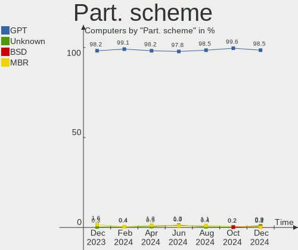
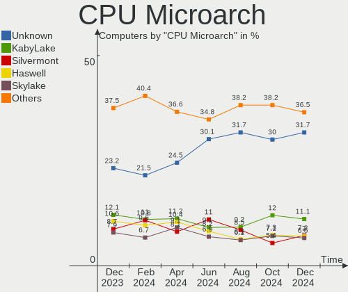
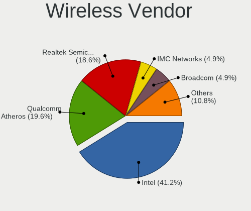

OPNsense Hardware Trends
------------------------

A project to identify most popular hardware characteristics and track their change
over time based on data collected by OPNsense users at https://BSD-Hardware.info.

Anyone can contribute to this report by the [hw-probe](https://github.com/linuxhw/hw-probe/blob/master/INSTALL.BSD.md) tool:

    hw-probe -all -upload

Full-feature report is available here: https://bsd-hardware.info/?view=trends

Period: Oct, 2021.

Contents
--------

* [ System ](#system)
  - [ OS                       ](#os)
  - [ OS Family                ](#os-family)
  - [ Arch                     ](#arch)
  - [ DE                       ](#de)
  - [ Display Server           ](#display-server)
  - [ Display Manager          ](#display-manager)
  - [ OS Lang                  ](#os-lang)
  - [ Boot Mode                ](#boot-mode)
  - [ Filesystem               ](#filesystem)
  - [ Part. scheme             ](#part-scheme)

* [ Board ](#board)
  - [ Vendor                   ](#vendor)
  - [ Model                    ](#model)
  - [ Model Family             ](#model-family)
  - [ MFG Year                 ](#mfg-year)
  - [ Form Factor              ](#form-factor)
  - [ Coreboot                 ](#coreboot)
  - [ RAM Size                 ](#ram-size)
  - [ RAM Used                 ](#ram-used)
  - [ Total Drives             ](#total-drives)
  - [ Has CD-ROM               ](#has-cd-rom)
  - [ Has Ethernet             ](#has-ethernet)
  - [ Has WiFi                 ](#has-wifi)
  - [ Has Bluetooth            ](#has-bluetooth)

* [ Location ](#location)
  - [ Country                  ](#country)
  - [ City                     ](#city)

* [ Drives ](#drives)
  - [ Drive Vendor             ](#drive-vendor)
  - [ Drive Model              ](#drive-model)
  - [ HDD Vendor               ](#hdd-vendor)
  - [ SSD Vendor               ](#ssd-vendor)
  - [ Drive Kind               ](#drive-kind)
  - [ Drive Connector          ](#drive-connector)
  - [ Drive Size               ](#drive-size)
  - [ Space Total              ](#space-total)
  - [ Space Used               ](#space-used)
  - [ Malfunc. Drives          ](#malfunc-drives)
  - [ Malfunc. Drive Vendor    ](#malfunc-drive-vendor)
  - [ Malfunc. HDD Vendor      ](#malfunc-hdd-vendor)
  - [ Malfunc. Drive Kind      ](#malfunc-drive-kind)
  - [ Failed Drives            ](#failed-drives)
  - [ Failed Drive Vendor      ](#failed-drive-vendor)
  - [ Drive Status             ](#drive-status)

* [ Storage controller ](#storage-controller)
  - [ Storage Vendor           ](#storage-vendor)
  - [ Storage Model            ](#storage-model)
  - [ Storage Kind             ](#storage-kind)

* [ Processor ](#processor)
  - [ CPU Vendor               ](#cpu-vendor)
  - [ CPU Model                ](#cpu-model)
  - [ CPU Model Family         ](#cpu-model-family)
  - [ CPU Cores                ](#cpu-cores)
  - [ CPU Sockets              ](#cpu-sockets)
  - [ CPU Threads              ](#cpu-threads)
  - [ CPU Microarch            ](#cpu-microarch)

* [ Graphics ](#graphics)
  - [ GPU Vendor               ](#gpu-vendor)
  - [ GPU Model                ](#gpu-model)
  - [ GPU Combo                ](#gpu-combo)
  - [ GPU Driver               ](#gpu-driver)
  - [ GPU Memory               ](#gpu-memory)

* [ Monitor ](#monitor)
  - [ Monitor Vendor           ](#monitor-vendor)
  - [ Monitor Model            ](#monitor-model)
  - [ Monitor Resolution       ](#monitor-resolution)
  - [ Monitor Diagonal         ](#monitor-diagonal)
  - [ Monitor Width            ](#monitor-width)
  - [ Aspect Ratio             ](#aspect-ratio)
  - [ Monitor Area             ](#monitor-area)
  - [ Pixel Density            ](#pixel-density)
  - [ Multiple Monitors        ](#multiple-monitors)

* [ Network ](#network)
  - [ Net Controller Vendor    ](#net-controller-vendor)
  - [ Net Controller Model     ](#net-controller-model)
  - [ Wireless Vendor          ](#wireless-vendor)
  - [ Wireless Model           ](#wireless-model)
  - [ Ethernet Vendor          ](#ethernet-vendor)
  - [ Ethernet Model           ](#ethernet-model)
  - [ Net Controller Kind      ](#net-controller-kind)
  - [ Used Controller          ](#used-controller)
  - [ NICs                     ](#nics)
  - [ IPv6                     ](#ipv6)

* [ Bluetooth ](#bluetooth)
  - [ Bluetooth Vendor         ](#bluetooth-vendor)
  - [ Bluetooth Model          ](#bluetooth-model)

* [ Sound ](#sound)
  - [ Sound Vendor             ](#sound-vendor)
  - [ Sound Model              ](#sound-model)

* [ Memory ](#memory)
  - [ Memory Vendor            ](#memory-vendor)
  - [ Memory Model             ](#memory-model)
  - [ Memory Kind              ](#memory-kind)
  - [ Memory Form Factor       ](#memory-form-factor)
  - [ Memory Size              ](#memory-size)
  - [ Memory Speed             ](#memory-speed)

* [ Printers & scanners ](#printers--scanners)
  - [ Printer Vendor           ](#printer-vendor)
  - [ Printer Model            ](#printer-model)
  - [ Scanner Vendor           ](#scanner-vendor)
  - [ Scanner Model            ](#scanner-model)

* [ Camera ](#camera)
  - [ Camera Vendor            ](#camera-vendor)
  - [ Camera Model             ](#camera-model)

* [ Security ](#security)
  - [ Fingerprint Vendor       ](#fingerprint-vendor)
  - [ Fingerprint Model        ](#fingerprint-model)
  - [ Chipcard Vendor          ](#chipcard-vendor)
  - [ Chipcard Model           ](#chipcard-model)

* [ Unsupported ](#unsupported)
  - [ Unsupported Devices      ](#unsupported-devices)
  - [ Unsupported Device Types ](#unsupported-device-types)

System
------

OS
--

Installed operating systems

| Name                   | Computers | Percent |
|------------------------|-----------|---------|
| OPNsense 21.7.3        | 161       | 74.88%  |
| OPNsense 21.7.4        | 35        | 16.28%  |
| OPNsense 21.7.2        | 5         | 2.33%   |
| OPNsense 21.7          | 3         | 1.4%    |
| OPNsense 21.1.9        | 3         | 1.4%    |
| OPNsense 21.7.1        | 2         | 0.93%   |
| OPNsense 20.7.8        | 2         | 0.93%   |
| OPNsense 12.1-p20-HBSD | 2         | 0.93%   |
| OPNsense 21.1.5        | 1         | 0.47%   |
| OPNsense 21.1          | 1         | 0.47%   |

OS Family
---------

OS without a version

| Name     | Computers | Percent |
|----------|-----------|---------|
| OPNsense | 215       | 100%    |

Arch
----

OS architecture (x86_64, i586, etc.)

| Name  | Computers | Percent |
|-------|-----------|---------|
| amd64 | 214       | 99.53%  |
| arm64 | 1         | 0.47%   |

DE
--

Desktop Environment

| Name    | Computers | Percent |
|---------|-----------|---------|
| Console | 215       | 100%    |

Display Server
--------------

X11 or Wayland

| Name    | Computers | Percent |
|---------|-----------|---------|
| Console | 215       | 100%    |

Display Manager
---------------

SDDM, LightDM, etc.

| Name    | Computers | Percent |
|---------|-----------|---------|
| Console | 215       | 100%    |

OS Lang
-------

Language

| Lang    | Computers | Percent |
|---------|-----------|---------|
| Unknown | 215       | 100%    |

Boot Mode
---------

EFI or BIOS

| Mode | Computers | Percent |
|------|-----------|---------|
| EFI  | 197       | 91.63%  |
| BIOS | 18        | 8.37%   |

Filesystem
----------

Type of filesystem

| Type | Computers | Percent |
|------|-----------|---------|
| Ufs  | 162       | 75.35%  |
| Zfs  | 53        | 24.65%  |

Part. scheme
------------

Scheme of partitioning

| Type    | Computers | Percent |
|---------|-----------|---------|
| GPT     | 200       | 93.02%  |
| MBR     | 11        | 5.12%   |
| Unknown | 4         | 1.86%   |

Board
-----

Vendor
------

Motherboard manufacturer

| Name                                       | Computers | Percent |
|--------------------------------------------|-----------|---------|
| Hewlett-Packard                            | 24        | 11.16%  |
| Dell                                       | 21        | 9.77%   |
| Unknown                                    | 21        | 9.77%   |
| Supermicro                                 | 20        | 9.3%    |
| Intel                                      | 17        | 7.91%   |
| Protectli                                  | 11        | 5.12%   |
| PC Engines                                 | 11        | 5.12%   |
| Lenovo                                     | 9         | 4.19%   |
| ASRock                                     | 9         | 4.19%   |
| MSI                                        | 7         | 3.26%   |
| Gigabyte Technology                        | 7         | 3.26%   |
| BESSTAR Tech                               | 5         | 2.33%   |
| ASUSTek Computer                           | 5         | 2.33%   |
| Sophos                                     | 4         | 1.86%   |
| Fujitsu                                    | 4         | 1.86%   |
| Deciso                                     | 4         | 1.86%   |
| Acer                                       | 4         | 1.86%   |
| AMI                                        | 3         | 1.4%    |
| ZOTAC                                      | 2         | 0.93%   |
| Winston Marriot                            | 2         | 0.93%   |
| Shuttle                                    | 2         | 0.93%   |
| SeeedStudio                                | 2         | 0.93%   |
| HPE                                        | 2         | 0.93%   |
| HARDKERNEL                                 | 2         | 0.93%   |
| AZW                                        | 2         | 0.93%   |
| AOpen                                      | 2         | 0.93%   |
| AAEON                                      | 2         | 0.93%   |
| Silicom                                    | 1         | 0.47%   |
| ShenZhen MinWin Technology                 | 1         | 0.47%   |
| Raspberry Pi Foundation                    | 1         | 0.47%   |
| Pegatron                                   | 1         | 0.47%   |
| Kontron Europe                             | 1         | 0.47%   |
| Foxconn                                    | 1         | 0.47%   |
| ECS                                        | 1         | 0.47%   |
| Colorful YuGong Technology And Development | 1         | 0.47%   |
| Barracuda Networks                         | 1         | 0.47%   |
| ASRockRack                                 | 1         | 0.47%   |
| AEWIN                                      | 1         | 0.47%   |

Model
-----

Motherboard model

| Name                                              | Computers | Percent |
|---------------------------------------------------|-----------|---------|
| Unknown                                           | 21        | 9.77%   |
| Intel Q3XXG4-P V1.0                               | 10        | 4.65%   |
| PC Engines APU2                                   | 7         | 3.26%   |
| Protectli FW4B                                    | 6         | 2.79%   |
| Dell PowerEdge R210 II                            | 4         | 1.86%   |
| Deciso Netboard A20                               | 4         | 1.86%   |
| Sophos SG                                         | 3         | 1.4%    |
| Protectli FW6                                     | 3         | 1.4%    |
| Supermicro X9SCI/X9SCA                            | 2         | 0.93%   |
| Supermicro X8SIL                                  | 2         | 0.93%   |
| Supermicro X10SLM+-LN4F                           | 2         | 0.93%   |
| Supermicro X10SLH-N6-ST031                        | 2         | 0.93%   |
| Supermicro Super Server                           | 2         | 0.93%   |
| Supermicro A1SAi                                  | 2         | 0.93%   |
| SeeedStudio ODYSSEY-X86J4105                      | 2         | 0.93%   |
| PC Engines APU                                    | 2         | 0.93%   |
| HPE ProLiant MicroServer Gen10                    | 2         | 0.93%   |
| HP ProLiant DL360 G7                              | 2         | 0.93%   |
| HP EliteDesk 800 G1 SFF                           | 2         | 0.93%   |
| HARDKERNEL ODROID-H2                              | 2         | 0.93%   |
| Gigabyte J1900N-D3V                               | 2         | 0.93%   |
| Dell OptiPlex 7010                                | 2         | 0.93%   |
| BESSTAR Tech GK41                                 | 2         | 0.93%   |
| AZW GK55                                          | 2         | 0.93%   |
| AMI Aptio CRB                                     | 2         | 0.93%   |
| ZOTAC ZBOX-RI323NANO                              | 1         | 0.47%   |
| ZOTAC ZBOX-CI329NANO                              | 1         | 0.47%   |
| Winston Marriot PICO PC  PICOPC                   | 1         | 0.47%   |
| Winston Marriot PICO PC                           | 1         | 0.47%   |
| Supermicro X9SAE                                  | 1         | 0.47%   |
| Supermicro X7SPA-HF                               | 1         | 0.47%   |
| Supermicro X10SRA                                 | 1         | 0.47%   |
| Supermicro X10SL7-F                               | 1         | 0.47%   |
| Supermicro TS-150                                 | 1         | 0.47%   |
| Supermicro PIO-518D-N6TRF-ST031                   | 1         | 0.47%   |
| Supermicro AS -5019D-FTN4                         | 1         | 0.47%   |
| Supermicro 1HE Intel Single-CPU RI1102H-XE Server | 1         | 0.47%   |
| Sophos XG                                         | 1         | 0.47%   |
| Silicom Minnowboard Turbot D0/D1 PLATFORM         | 1         | 0.47%   |
| Shuttle DS81D                                     | 1         | 0.47%   |
| Shuttle DH170                                     | 1         | 0.47%   |
| ShenZhen MinWin MW-NANO-APL-4L                    | 1         | 0.47%   |
| RPi Raspberry Pi                                  | 1         | 0.47%   |
| Protectli FW6E                                    | 1         | 0.47%   |
| Protectli FW4A                                    | 1         | 0.47%   |
| Pegatron Pro 3405 Series                          | 1         | 0.47%   |
| PC Engines apu6                                   | 1         | 0.47%   |
| PC Engines apu4                                   | 1         | 0.47%   |
| MSI MS-9A45                                       | 1         | 0.47%   |
| MSI MS-7C82                                       | 1         | 0.47%   |
| MSI MS-7C08                                       | 1         | 0.47%   |
| MSI MS-7B31                                       | 1         | 0.47%   |
| MSI MS-7850                                       | 1         | 0.47%   |
| MSI MS-7821                                       | 1         | 0.47%   |
| MSI MS-7721                                       | 1         | 0.47%   |
| Lenovo ThinkSystem ST50 7Y48CTO1WW                | 1         | 0.47%   |
| Lenovo ThinkCentre M93p 10AA0020CN                | 1         | 0.47%   |
| Lenovo ThinkCentre M93p 10A9000SUS                | 1         | 0.47%   |
| Lenovo ThinkCentre M90n-1 11AH000UUS              | 1         | 0.47%   |
| Lenovo ThinkCentre M82 2929AZ6                    | 1         | 0.47%   |

Model Family
------------

Motherboard model prefix

| Name                            | Computers | Percent |
|---------------------------------|-----------|---------|
| Unknown                         | 21        | 9.77%   |
| Intel Q3XXG4-P                  | 10        | 4.65%   |
| HP ProLiant                     | 10        | 4.65%   |
| Dell PowerEdge                  | 10        | 4.65%   |
| Dell OptiPlex                   | 10        | 4.65%   |
| Lenovo ThinkCentre              | 8         | 3.72%   |
| PC Engines APU2                 | 7         | 3.26%   |
| Protectli FW4B                  | 6         | 2.79%   |
| HP ProDesk                      | 5         | 2.33%   |
| Deciso Netboard                 | 4         | 1.86%   |
| Sophos SG                       | 3         | 1.4%    |
| Protectli FW6                   | 3         | 1.4%    |
| HP EliteDesk                    | 3         | 1.4%    |
| HP Compaq                       | 3         | 1.4%    |
| Winston Marriot PICO            | 2         | 0.93%   |
| Supermicro X9SCI                | 2         | 0.93%   |
| Supermicro X8SIL                | 2         | 0.93%   |
| Supermicro X10SLM+-LN4F         | 2         | 0.93%   |
| Supermicro X10SLH-N6-ST031      | 2         | 0.93%   |
| Supermicro Super                | 2         | 0.93%   |
| Supermicro A1SAi                | 2         | 0.93%   |
| SeeedStudio ODYSSEY-X86J4105    | 2         | 0.93%   |
| PC Engines APU                  | 2         | 0.93%   |
| HPE ProLiant                    | 2         | 0.93%   |
| HARDKERNEL ODROID-H2            | 2         | 0.93%   |
| Gigabyte J1900N-D3V             | 2         | 0.93%   |
| Fujitsu FUTRO                   | 2         | 0.93%   |
| Fujitsu ESPRIMO                 | 2         | 0.93%   |
| BESSTAR Tech GK41               | 2         | 0.93%   |
| AZW GK55                        | 2         | 0.93%   |
| ASUS PRIME                      | 2         | 0.93%   |
| AMI Aptio                       | 2         | 0.93%   |
| Acer Veriton                    | 2         | 0.93%   |
| Acer Aspire                     | 2         | 0.93%   |
| ZOTAC ZBOX-RI323NANO            | 1         | 0.47%   |
| ZOTAC ZBOX-CI329NANO            | 1         | 0.47%   |
| Supermicro X9SAE                | 1         | 0.47%   |
| Supermicro X7SPA-HF             | 1         | 0.47%   |
| Supermicro X10SRA               | 1         | 0.47%   |
| Supermicro X10SL7-F             | 1         | 0.47%   |
| Supermicro TS-150               | 1         | 0.47%   |
| Supermicro PIO-518D-N6TRF-ST031 | 1         | 0.47%   |
| Supermicro AS                   | 1         | 0.47%   |
| Supermicro 1HE                  | 1         | 0.47%   |
| Sophos XG                       | 1         | 0.47%   |
| Silicom Minnowboard             | 1         | 0.47%   |
| Shuttle DS81D                   | 1         | 0.47%   |
| Shuttle DH170                   | 1         | 0.47%   |
| ShenZhen MinWin MW-NANO-APL-4L  | 1         | 0.47%   |
| RPi Raspberry                   | 1         | 0.47%   |
| Protectli FW6E                  | 1         | 0.47%   |
| Protectli FW4A                  | 1         | 0.47%   |
| Pegatron Pro                    | 1         | 0.47%   |
| PC Engines apu6                 | 1         | 0.47%   |
| PC Engines apu4                 | 1         | 0.47%   |
| MSI MS-9A45                     | 1         | 0.47%   |
| MSI MS-7C82                     | 1         | 0.47%   |
| MSI MS-7C08                     | 1         | 0.47%   |
| MSI MS-7B31                     | 1         | 0.47%   |
| MSI MS-7850                     | 1         | 0.47%   |

MFG Year
--------

Motherboard manufacture year

| Year | Computers | Percent |
|------|-----------|---------|
| 2020 | 40        | 18.6%   |
| 2018 | 36        | 16.74%  |
| 2021 | 30        | 13.95%  |
| 2019 | 29        | 13.49%  |
| 2014 | 16        | 7.44%   |
| 2011 | 13        | 6.05%   |
| 2015 | 11        | 5.12%   |
| 2016 | 10        | 4.65%   |
| 2017 | 8         | 3.72%   |
| 2012 | 8         | 3.72%   |
| 2013 | 7         | 3.26%   |
| 2009 | 2         | 0.93%   |
| 2007 | 2         | 0.93%   |
| 2010 | 1         | 0.47%   |
| 2008 | 1         | 0.47%   |
| 2006 | 1         | 0.47%   |

Form Factor
-----------

Physical design of the computer

| Name           | Computers | Percent |
|----------------|-----------|---------|
| Desktop        | 159       | 73.95%  |
| Server         | 29        | 13.49%  |
| Mini pc        | 14        | 6.51%   |
| Notebook       | 6         | 2.79%   |
| Firewall       | 5         | 2.33%   |
| System on chip | 1         | 0.47%   |
| All in one     | 1         | 0.47%   |

Coreboot
--------

Have coreboot on board

| Used | Computers | Percent |
|------|-----------|---------|
| No   | 198       | 92.09%  |
| Yes  | 17        | 7.91%   |

RAM Size
--------

Total RAM memory

| Size in GB  | Computers | Percent |
|-------------|-----------|---------|
| 8.01-16.0   | 93        | 43.26%  |
| 16.01-24.0  | 53        | 24.65%  |
| 4.01-8.0    | 40        | 18.6%   |
| 32.01-64.0  | 13        | 6.05%   |
| 2.01-3.0    | 6         | 2.79%   |
| 24.01-32.0  | 3         | 1.4%    |
| 64.01-256.0 | 3         | 1.4%    |
| 1.01-2.0    | 2         | 0.93%   |
| 3.01-4.0    | 1         | 0.47%   |
| 0.51-1.0    | 1         | 0.47%   |

RAM Used
--------

Used RAM memory

| Used GB    | Computers | Percent |
|------------|-----------|---------|
| 0.01-0.5   | 111       | 51.63%  |
| 0.51-1.0   | 67        | 31.16%  |
| 1.01-2.0   | 16        | 7.44%   |
| 2.01-3.0   | 6         | 2.79%   |
| 3.01-4.0   | 5         | 2.33%   |
| 8.01-16.0  | 5         | 2.33%   |
| 4.01-8.0   | 4         | 1.86%   |
| 16.01-24.0 | 1         | 0.47%   |

Total Drives
------------

Number of drives on board

| Drives | Computers | Percent |
|--------|-----------|---------|
| 1      | 167       | 77.67%  |
| 0      | 24        | 11.16%  |
| 2      | 20        | 9.3%    |
| 4      | 3         | 1.4%    |
| 3      | 1         | 0.47%   |

Has CD-ROM
----------

Has CD-ROM on board

| Presented | Computers | Percent |
|-----------|-----------|---------|
| No        | 181       | 84.19%  |
| Yes       | 34        | 15.81%  |

Has Ethernet
------------

Has Ethernet on board

| Presented | Computers | Percent |
|-----------|-----------|---------|
| Yes       | 214       | 99.53%  |
| No        | 1         | 0.47%   |

Has WiFi
--------

Has WiFi module

| Presented | Computers | Percent |
|-----------|-----------|---------|
| No        | 176       | 81.86%  |
| Yes       | 39        | 18.14%  |

Has Bluetooth
-------------

Has Bluetooth module

| Presented | Computers | Percent |
|-----------|-----------|---------|
| No        | 199       | 92.56%  |
| Yes       | 16        | 7.44%   |

Location
--------

Country
-------

Geographic location (country)

| Country            | Computers | Percent |
|--------------------|-----------|---------|
| USA                | 76        | 35.35%  |
| Germany            | 42        | 19.53%  |
| France             | 10        | 4.65%   |
| UK                 | 8         | 3.72%   |
| Switzerland        | 8         | 3.72%   |
| Netherlands        | 8         | 3.72%   |
| China              | 7         | 3.26%   |
| Austria            | 7         | 3.26%   |
| Canada             | 6         | 2.79%   |
| Poland             | 5         | 2.33%   |
| Australia          | 5         | 2.33%   |
| Sweden             | 3         | 1.4%    |
| Denmark            | 3         | 1.4%    |
| Portugal           | 2         | 0.93%   |
| Italy              | 2         | 0.93%   |
| Turkey             | 1         | 0.47%   |
| Thailand           | 1         | 0.47%   |
| Taiwan             | 1         | 0.47%   |
| Spain              | 1         | 0.47%   |
| South Korea        | 1         | 0.47%   |
| Slovenia           | 1         | 0.47%   |
| Slovakia           | 1         | 0.47%   |
| Singapore          | 1         | 0.47%   |
| Saudi Arabia       | 1         | 0.47%   |
| Russia             | 1         | 0.47%   |
| Romania            | 1         | 0.47%   |
| Qatar              | 1         | 0.47%   |
| Peru               | 1         | 0.47%   |
| Japan              | 1         | 0.47%   |
| Indonesia          | 1         | 0.47%   |
| Hungary            | 1         | 0.47%   |
| Finland            | 1         | 0.47%   |
| Dominican Republic | 1         | 0.47%   |
| Czechia            | 1         | 0.47%   |
| Chile              | 1         | 0.47%   |
| Bulgaria           | 1         | 0.47%   |
| Belarus            | 1         | 0.47%   |
| Argentina          | 1         | 0.47%   |

City
----

Geographic location (city)

| City                      | Computers | Percent |
|---------------------------|-----------|---------|
| Munich                    | 3         | 1.4%    |
| Gordola                   | 3         | 1.4%    |
| Berlin                    | 3         | 1.4%    |
| West Valley City          | 2         | 0.93%   |
| Warsaw                    | 2         | 0.93%   |
| Vienna                    | 2         | 0.93%   |
| Tumba                     | 2         | 0.93%   |
| Trenton                   | 2         | 0.93%   |
| Stoke-on-Trent            | 2         | 0.93%   |
| Paris                     | 2         | 0.93%   |
| North Richland Hills      | 2         | 0.93%   |
| New York                  | 2         | 0.93%   |
| Minneapolis               | 2         | 0.93%   |
| Kongens Lyngby            | 2         | 0.93%   |
| Irvine                    | 2         | 0.93%   |
| Denver                    | 2         | 0.93%   |
| Buchholz in der Nordheide | 2         | 0.93%   |
| Beijing                   | 2         | 0.93%   |
| Barrington                | 2         | 0.93%   |
| Auburn                    | 2         | 0.93%   |
| Zoetermeer                | 1         | 0.47%   |
| Zaltbommel                | 1         | 0.47%   |
| Wolverhampton             | 1         | 0.47%   |
| Winter Springs            | 1         | 0.47%   |
| Winnipeg                  | 1         | 0.47%   |
| Villejuif                 | 1         | 0.47%   |
| V?¤ster??s                | 1         | 0.47%   |
| Upper Norwood             | 1         | 0.47%   |
| Udon Thani                | 1         | 0.47%   |
| Tychy                     | 1         | 0.47%   |
| Tulsa                     | 1         | 0.47%   |
| Tekirda??                 | 1         | 0.47%   |
| Tainan City               | 1         | 0.47%   |
| Tacoma                    | 1         | 0.47%   |
| Sz?©kesfeh?©rv??r         | 1         | 0.47%   |
| Sydney                    | 1         | 0.47%   |
| Sutton                    | 1         | 0.47%   |
| Steyr                     | 1         | 0.47%   |
| Sterling Heights          | 1         | 0.47%   |
| Springfield               | 1         | 0.47%   |
| Spaubeek                  | 1         | 0.47%   |
| Solrod                    | 1         | 0.47%   |
| Siegendorf im Burgenland  | 1         | 0.47%   |
| Shenzhen                  | 1         | 0.47%   |
| Shanghai                  | 1         | 0.47%   |
| Setagaya-ku               | 1         | 0.47%   |
| Seattle                   | 1         | 0.47%   |
| Sarnia                    | 1         | 0.47%   |
| Saratoga Springs          | 1         | 0.47%   |
| Santo Domingo Oeste       | 1         | 0.47%   |
| Sankt P?¶lten             | 1         | 0.47%   |
| San Mateo                 | 1         | 0.47%   |
| San Jose                  | 1         | 0.47%   |
| San Francisco             | 1         | 0.47%   |
| San Diego                 | 1         | 0.47%   |
| San Antonio               | 1         | 0.47%   |
| Salzburg                  | 1         | 0.47%   |
| Sainte-Foy-les-Lyon       | 1         | 0.47%   |
| Rumlang                   | 1         | 0.47%   |
| Royal Oak                 | 1         | 0.47%   |

Drives
------

Drive Vendor
------------

Hard drive vendors

| Vendor              | Computers | Drives | Percent |
|---------------------|-----------|--------|---------|
| Samsung Electronics | 25        | 28     | 12.63%  |
| Kingston            | 18        | 19     | 9.09%   |
| Intel               | 15        | 18     | 7.58%   |
| WDC                 | 13        | 15     | 6.57%   |
| SanDisk             | 12        | 12     | 6.06%   |
| Crucial             | 11        | 14     | 5.56%   |
| Transcend           | 8         | 8      | 4.04%   |
| Phison              | 8         | 8      | 4.04%   |
| Toshiba             | 7         | 8      | 3.54%   |
| Seagate             | 7         | 8      | 3.54%   |
| Hoodisk             | 7         | 7      | 3.54%   |
| Hewlett-Packard     | 7         | 9      | 3.54%   |
| PNY                 | 4         | 4      | 2.02%   |
| Micron Technology   | 4         | 4      | 2.02%   |
| SPCC                | 3         | 3      | 1.52%   |
| OCZ                 | 3         | 3      | 1.52%   |
| Intenso             | 3         | 3      | 1.52%   |
| HGST                | 3         | 9      | 1.52%   |
| FORESEE             | 3         | 3      | 1.52%   |
| Dogfish             | 3         | 3      | 1.52%   |
| Corsair             | 3         | 3      | 1.52%   |
| BIWIN               | 3         | 3      | 1.52%   |
| SK Hynix            | 2         | 2      | 1.01%   |
| Protectli           | 2         | 2      | 1.01%   |
| Patriot             | 2         | 2      | 1.01%   |
| LITEONIT            | 2         | 2      | 1.01%   |
| Kston               | 2         | 2      | 1.01%   |
| KingSpec            | 2         | 2      | 1.01%   |
| China               | 2         | 2      | 1.01%   |
| VisionTek           | 1         | 1      | 0.51%   |
| V-GeN               | 1         | 1      | 0.51%   |
| Silicon Motion      | 1         | 1      | 0.51%   |
| SATADOM             | 1         | 1      | 0.51%   |
| Netac               | 1         | 1      | 0.51%   |
| Mushkin             | 1         | 1      | 0.51%   |
| Indilinx            | 1         | 1      | 0.51%   |
| HPE                 | 1         | 2      | 0.51%   |
| Hitachi             | 1         | 1      | 0.51%   |
| Fordisk             | 1         | 1      | 0.51%   |
| BAITITON            | 1         | 1      | 0.51%   |
| Apacer              | 1         | 1      | 0.51%   |
| Advantech           | 1         | 1      | 0.51%   |
| A-DATA Technology   | 1         | 1      | 0.51%   |

Drive Model
-----------

Hard drive models

| Model                                          | Computers | Percent |
|------------------------------------------------|-----------|---------|
| HP RAID 1(1+0) 450GB                           | 6         | 3%      |
| Phison SATA SSD 16GB                           | 5         | 2.5%    |
| Transcend TS256GMTS952T2 256GB                 | 4         | 2%      |
| Hoodisk SSD 128GB                              | 4         | 2%      |
| Transcend TS128GMSA230S 128GB                  | 3         | 1.5%    |
| Samsung SSD 870 EVO 250GB                      | 3         | 1.5%    |
| Samsung MZ7LN128HCHP-000H1 128GB               | 3         | 1.5%    |
| PNY CS900 120GB SSD                            | 3         | 1.5%    |
| Toshiba DT01ACA100 1TB                         | 2         | 1%      |
| SPCC Solid State Disk 128GB                    | 2         | 1%      |
| Seagate ST500DM002-1BD142 500GB                | 2         | 1%      |
| SanDisk SSD PLUS 240GB                         | 2         | 1%      |
| Samsung SSD 840 EVO 120GB                      | 2         | 1%      |
| Protectli 120GB mSATA                          | 2         | 1%      |
| Kston SSD 128GB                                | 2         | 1%      |
| Kingston SV300S37A120G 120GB                   | 2         | 1%      |
| Kingston SUV500MS120G 120GB                    | 2         | 1%      |
| Intel SSDSC2BW120H6 120GB                      | 2         | 1%      |
| Intel SSDSC2BB080G6 80GB                       | 2         | 1%      |
| Hoodisk SSD 64GB                               | 2         | 1%      |
| HGST HUS726060ALE614 6TB                       | 2         | 1%      |
| FORESEE 64GB SSD                               | 2         | 1%      |
| Dogfish SSD 256GB                              | 2         | 1%      |
| Crucial CT275MX300SSD1 275GB                   | 2         | 1%      |
| Crucial CT240BX500SSD1 240GB                   | 2         | 1%      |
| Crucial CT120BX500SSD1 120GB                   | 2         | 1%      |
| BIWIN SSD 128GB                                | 2         | 1%      |
| WDC WDS500G2B0A-00SM50 500GB                   | 1         | 0.5%    |
| WDC WDS250G2B0A-00SM50 250GB                   | 1         | 0.5%    |
| WDC WDS250G1B0C-00S6U0 250GB                   | 1         | 0.5%    |
| WDC WDS120G2G0A-00JH30 120GB                   | 1         | 0.5%    |
| WDC WD4000AAKS-00C8A0 400GB                    | 1         | 0.5%    |
| WDC WD3200BPVT-22JJ5T0 320GB                   | 1         | 0.5%    |
| WDC WD2502ABYS-18B7A0 250GB                    | 1         | 0.5%    |
| WDC WD2500JS-75NCB2 250GB                      | 1         | 0.5%    |
| WDC WD2500AAKX-75U6AA0 250GB                   | 1         | 0.5%    |
| WDC WD1600BEKT-66F3T2 160GB                    | 1         | 0.5%    |
| WDC WD1600AAJS-22L7A0 160GB                    | 1         | 0.5%    |
| WDC WD10SPZX-00Z10T0 1TB                       | 1         | 0.5%    |
| WDC PC SN520 SDAPMUW-128G-1001 128GB           | 1         | 0.5%    |
| VisionTek mSATA 120GB                          | 1         | 0.5%    |
| V-GeN V-GEN08AS19FS120IT 120GB                 | 1         | 0.5%    |
| Transcend TS64GMSA370 64GB                     | 1         | 0.5%    |
| Toshiba THNSNH512GBST                          | 1         | 0.5%    |
| Toshiba THNSN5256GPUK NVMe 256GB               | 1         | 0.5%    |
| Toshiba MQ01ABF050 500GB                       | 1         | 0.5%    |
| Toshiba MQ01ABD100 1TB                         | 1         | 0.5%    |
| Toshiba DT01ACA200 2TB                         | 1         | 0.5%    |
| SPCC Solid State Disk 256GB                    | 1         | 0.5%    |
| SK Hynix SHGS31-500GS-2 500GB                  | 1         | 0.5%    |
| SK Hynix HFS256G39TND-N210A 256GB              | 1         | 0.5%    |
| Silicon Motion Asgard AN2 500NVMe-M.2-80 500GB | 1         | 0.5%    |
| Seagate ZA240NM10001 240GB                     | 1         | 0.5%    |
| Seagate ST9320423AS 320GB                      | 1         | 0.5%    |
| Seagate ST3500630NS 500GB                      | 1         | 0.5%    |
| Seagate ST3320820AS 320GB                      | 1         | 0.5%    |
| Seagate ST2000VN004-2E4164 2TB                 | 1         | 0.5%    |
| SATADOM ML 3SE 64GB                            | 1         | 0.5%    |
| SanDisk SSD PLUS 240 GB                        | 1         | 0.5%    |
| SanDisk SSD PLUS 120GB                         | 1         | 0.5%    |

HDD Vendor
----------

Hard disk drive vendors

| Vendor          | Computers | Drives | Percent |
|-----------------|-----------|--------|---------|
| WDC             | 8         | 10     | 25.81%  |
| Hewlett-Packard | 7         | 9      | 22.58%  |
| Seagate         | 6         | 7      | 19.35%  |
| Toshiba         | 5         | 6      | 16.13%  |
| HGST            | 3         | 9      | 9.68%   |
| HPE             | 1         | 2      | 3.23%   |
| Hitachi         | 1         | 1      | 3.23%   |

SSD Vendor
----------

Solid state drive vendors

| Vendor              | Computers | Drives | Percent |
|---------------------|-----------|--------|---------|
| Samsung Electronics | 20        | 23     | 13.07%  |
| Kingston            | 15        | 16     | 9.8%    |
| Intel               | 15        | 18     | 9.8%    |
| SanDisk             | 12        | 12     | 7.84%   |
| Crucial             | 10        | 13     | 6.54%   |
| Transcend           | 8         | 8      | 5.23%   |
| Phison              | 8         | 8      | 5.23%   |
| Hoodisk             | 7         | 7      | 4.58%   |
| PNY                 | 4         | 4      | 2.61%   |
| Micron Technology   | 4         | 4      | 2.61%   |
| WDC                 | 3         | 3      | 1.96%   |
| SPCC                | 3         | 3      | 1.96%   |
| OCZ                 | 3         | 3      | 1.96%   |
| Intenso             | 3         | 3      | 1.96%   |
| FORESEE             | 3         | 3      | 1.96%   |
| Dogfish             | 3         | 3      | 1.96%   |
| BIWIN               | 3         | 3      | 1.96%   |
| SK Hynix            | 2         | 2      | 1.31%   |
| Protectli           | 2         | 2      | 1.31%   |
| Patriot             | 2         | 2      | 1.31%   |
| LITEONIT            | 2         | 2      | 1.31%   |
| Kston               | 2         | 2      | 1.31%   |
| KingSpec            | 2         | 2      | 1.31%   |
| Corsair             | 2         | 2      | 1.31%   |
| China               | 2         | 2      | 1.31%   |
| VisionTek           | 1         | 1      | 0.65%   |
| V-GeN               | 1         | 1      | 0.65%   |
| Toshiba             | 1         | 1      | 0.65%   |
| Seagate             | 1         | 1      | 0.65%   |
| SATADOM             | 1         | 1      | 0.65%   |
| Netac               | 1         | 1      | 0.65%   |
| Mushkin             | 1         | 1      | 0.65%   |
| Indilinx            | 1         | 1      | 0.65%   |
| Fordisk             | 1         | 1      | 0.65%   |
| BAITITON            | 1         | 1      | 0.65%   |
| Apacer              | 1         | 1      | 0.65%   |
| Advantech           | 1         | 1      | 0.65%   |
| A-DATA Technology   | 1         | 1      | 0.65%   |

Drive Kind
----------

HDD or SSD

| Kind | Computers | Drives | Percent |
|------|-----------|--------|---------|
| SSD  | 150       | 163    | 76.92%  |
| HDD  | 31        | 44     | 15.9%   |
| NVMe | 14        | 14     | 7.18%   |

Drive Connector
---------------

SATA, SAS, NVMe, etc.

| Type | Computers | Drives | Percent |
|------|-----------|--------|---------|
| SATA | 178       | 207    | 92.71%  |
| NVMe | 14        | 14     | 7.29%   |

Drive Size
----------

Size of hard drive

| Size in TB | Computers | Drives | Percent |
|------------|-----------|--------|---------|
| 0.01-0.5   | 165       | 187    | 92.7%   |
| 0.51-1.0   | 9         | 9      | 5.06%   |
| 1.01-2.0   | 2         | 3      | 1.12%   |
| 4.01-10.0  | 2         | 8      | 1.12%   |

Space Total
-----------

Amount of disk space available on the file system

| Size in GB     | Computers | Percent |
|----------------|-----------|---------|
| 101-250        | 105       | 48.84%  |
| 51-100         | 32        | 14.88%  |
| 251-500        | 24        | 11.16%  |
| 21-50          | 21        | 9.77%   |
| 1-20           | 18        | 8.37%   |
| 501-1000       | 9         | 4.19%   |
| 1001-2000      | 4         | 1.86%   |
| More than 3000 | 2         | 0.93%   |

Space Used
----------

Amount of used disk space

| Used GB | Computers | Percent |
|---------|-----------|---------|
| 1-20    | 204       | 94.88%  |
| 21-50   | 7         | 3.26%   |
| 101-250 | 2         | 0.93%   |
| 51-100  | 2         | 0.93%   |

Malfunc. Drives
---------------

Drive models with a malfunction

| Model                           | Computers | Drives | Percent |
|---------------------------------|-----------|--------|---------|
| Crucial CT275MX300SSD1 275GB    | 2         | 2      | 9.52%   |
| WDC WD4000AAKS-00C8A0 400GB     | 1         | 1      | 4.76%   |
| WDC WD1600BEKT-66F3T2 160GB     | 1         | 1      | 4.76%   |
| WDC WD1600AAJS-22L7A0 160GB     | 1         | 1      | 4.76%   |
| VisionTek mSATA 120GB           | 1         | 1      | 4.76%   |
| V-GeN V-GEN08AS19FS120IT 120GB  | 1         | 1      | 4.76%   |
| Toshiba MQ01ABD100 1TB          | 1         | 1      | 4.76%   |
| Seagate ST500DM002-1BD142 500GB | 1         | 1      | 4.76%   |
| SanDisk SSD P4 16GB             | 1         | 1      | 4.76%   |
| SanDisk SD8TB8U-256G-1006 256GB | 1         | 1      | 4.76%   |
| Kingston SMS200S3120G 120GB     | 1         | 1      | 4.76%   |
| Intel SSDSC2BW120H6 120GB       | 1         | 1      | 4.76%   |
| Intel SSDSC2BF240A5 240GB       | 1         | 1      | 4.76%   |
| Intel SSDSA2M160G2GC 160GB      | 1         | 1      | 4.76%   |
| Intel SSDSA2M080G2GN 80GB       | 1         | 1      | 4.76%   |
| Intel SSDMCEAC060B3 64GB        | 1         | 1      | 4.76%   |
| Intel SSDMAEMC040G2 40GB        | 1         | 1      | 4.76%   |
| Crucial CT480M500SSD1 480GB     | 1         | 2      | 4.76%   |
| Crucial CT128M550SSD3 128GB     | 1         | 1      | 4.76%   |
| BIWIN SSD 32GB                  | 1         | 1      | 4.76%   |

Malfunc. Drive Vendor
---------------------

Vendors of faulty drives

| Vendor    | Computers | Drives | Percent |
|-----------|-----------|--------|---------|
| Intel     | 6         | 6      | 28.57%  |
| Crucial   | 4         | 5      | 19.05%  |
| WDC       | 3         | 3      | 14.29%  |
| SanDisk   | 2         | 2      | 9.52%   |
| VisionTek | 1         | 1      | 4.76%   |
| V-GeN     | 1         | 1      | 4.76%   |
| Toshiba   | 1         | 1      | 4.76%   |
| Seagate   | 1         | 1      | 4.76%   |
| Kingston  | 1         | 1      | 4.76%   |
| BIWIN     | 1         | 1      | 4.76%   |

Malfunc. HDD Vendor
-------------------

Vendors of faulty HDD drives

| Vendor  | Computers | Drives | Percent |
|---------|-----------|--------|---------|
| WDC     | 3         | 3      | 60%     |
| Toshiba | 1         | 1      | 20%     |
| Seagate | 1         | 1      | 20%     |

Malfunc. Drive Kind
-------------------

Kinds of faulty drives

| Kind | Computers | Drives | Percent |
|------|-----------|--------|---------|
| SSD  | 16        | 17     | 76.19%  |
| HDD  | 5         | 5      | 23.81%  |

Failed Drives
-------------

Failed drive models

| Model                                      | Computers | Drives | Percent |
|--------------------------------------------|-----------|--------|---------|
| WDC WD10SPZX-00Z10T0 1TB                   | 1         | 1      | 33.33%  |
| Micron Technology 1100_MTFDDAV256TBN 256GB | 1         | 1      | 33.33%  |
| Intel SSDSC2BW120H6 120GB                  | 1         | 1      | 33.33%  |

Failed Drive Vendor
-------------------

Failed drive vendors

| Vendor            | Computers | Drives | Percent |
|-------------------|-----------|--------|---------|
| WDC               | 1         | 1      | 33.33%  |
| Micron Technology | 1         | 1      | 33.33%  |
| Intel             | 1         | 1      | 33.33%  |

Drive Status
------------

Number of failed and malfunc. drives

| Status   | Computers | Drives | Percent |
|----------|-----------|--------|---------|
| Works    | 161       | 185    | 82.99%  |
| Malfunc  | 21        | 22     | 10.82%  |
| Detected | 9         | 11     | 4.64%   |
| Failed   | 3         | 3      | 1.55%   |

Storage controller
------------------

Storage Vendor
--------------

Storage controller vendors

| Vendor                      | Computers | Percent |
|-----------------------------|-----------|---------|
| Intel                       | 175       | 70.28%  |
| AMD                         | 34        | 13.65%  |
| Hewlett-Packard             | 7         | 2.81%   |
| Broadcom / LSI              | 6         | 2.41%   |
| Samsung Electronics         | 5         | 2.01%   |
| Chelsio Communications      | 4         | 1.61%   |
| Kingston Technology Company | 3         | 1.2%    |
| ASMedia Technology          | 3         | 1.2%    |
| Sandisk                     | 2         | 0.8%    |
| Marvell Technology Group    | 2         | 0.8%    |
| VIA Technologies            | 1         | 0.4%    |
| Toshiba                     | 1         | 0.4%    |
| Silicon Motion              | 1         | 0.4%    |
| Silicon Image               | 1         | 0.4%    |
| Phison Electronics          | 1         | 0.4%    |
| Nvidia                      | 1         | 0.4%    |
| Micron/Crucial Technology   | 1         | 0.4%    |
| ATP ELECTRONICS             | 1         | 0.4%    |

Storage Model
-------------

Storage controller models

| Model                                                                                   | Computers | Percent |
|-----------------------------------------------------------------------------------------|-----------|---------|
| Intel 8 Series/C220 Series Chipset Family 6-port SATA Controller 1 [AHCI mode]          | 26        | 9.63%   |
| AMD FCH SATA Controller [AHCI mode]                                                     | 23        | 8.52%   |
| Intel Celeron/Pentium Silver Processor SATA Controller                                  | 14        | 5.19%   |
| Intel Sunrise Point-LP SATA Controller [AHCI mode]                                      | 13        | 4.81%   |
| Intel 6 Series/C200 Series Chipset Family 6 port Desktop SATA AHCI Controller           | 12        | 4.44%   |
| Intel Atom/Celeron/Pentium Processor x5-E8000/J3xxx/N3xxx Series SATA Controller        | 10        | 3.7%    |
| Intel Atom Processor E3800 Series SATA AHCI Controller                                  | 10        | 3.7%    |
| Intel Wildcat Point-LP SATA Controller [AHCI Mode]                                      | 9         | 3.33%   |
| Intel Q170/Q150/B150/H170/H110/Z170/CM236 Chipset SATA Controller [AHCI Mode]           | 9         | 3.33%   |
| AMD FCH SATA Controller [IDE mode]                                                      | 6         | 2.22%   |
| Intel Cannon Lake PCH SATA AHCI Controller                                              | 5         | 1.85%   |
| Intel 8 Series SATA Controller 1 [AHCI mode]                                            | 5         | 1.85%   |
| Intel 7 Series/C210 Series Chipset Family 6-port SATA Controller [AHCI mode]            | 5         | 1.85%   |
| Intel 5 Series/3400 Series Chipset 6 port SATA AHCI Controller                          | 5         | 1.85%   |
| Intel NM10/ICH7 Family SATA Controller [IDE mode]                                       | 4         | 1.48%   |
| Intel Celeron N3350/Pentium N4200/Atom E3900 Series SATA AHCI Controller                | 4         | 1.48%   |
| Intel Cannon Point-LP SATA Controller [AHCI Mode]                                       | 4         | 1.48%   |
| Intel 82801G (ICH7 Family) IDE Controller                                               | 4         | 1.48%   |
| HP Smart Array G6 controllers                                                           | 4         | 1.48%   |
| Intel SATA Controller [RAID mode]                                                       | 3         | 1.11%   |
| Intel Atom processor C2000 AHCI SATA3 Controller                                        | 3         | 1.11%   |
| ASMedia ASM1062 Serial ATA Controller                                                   | 3         | 1.11%   |
| AMD SB7x0/SB8x0/SB9x0 SATA Controller [AHCI mode]                                       | 3         | 1.11%   |
| Samsung NVMe SSD Controller SM981/PM981/PM983                                           | 2         | 0.74%   |
| Samsung NVMe SSD Controller 980                                                         | 2         | 0.74%   |
| Marvell Group 88SE9230 PCIe 2.0 x2 4-port SATA 6 Gb/s RAID Controller                   | 2         | 0.74%   |
| Intel NM10/ICH7 Family SATA Controller [AHCI mode]                                      | 2         | 0.74%   |
| Intel C610/X99 series chipset sSATA Controller [AHCI mode]                              | 2         | 0.74%   |
| Intel C600/X79 series chipset 6-Port SATA AHCI Controller                               | 2         | 0.74%   |
| Intel C600/X79 series chipset 4-Port SATA IDE Controller                                | 2         | 0.74%   |
| Intel Atom Processor C3000 Series SATA Controller 1                                     | 2         | 0.74%   |
| Intel Atom processor C2000 AHCI SATA2 Controller                                        | 2         | 0.74%   |
| Intel 82801JI (ICH10 Family) 4 port SATA IDE Controller #1                              | 2         | 0.74%   |
| Intel 82801JD/DO (ICH10 Family) SATA AHCI Controller                                    | 2         | 0.74%   |
| Intel 82801IR/IO/IH (ICH9R/DO/DH) 6 port SATA Controller [AHCI mode]                    | 2         | 0.74%   |
| Intel 6 Series/C200 Series Chipset Family Desktop SATA Controller (IDE mode, ports 4-5) | 2         | 0.74%   |
| Intel 6 Series/C200 Series Chipset Family Desktop SATA Controller (IDE mode, ports 0-3) | 2         | 0.74%   |
| Intel 500 Series Chipset Family SATA AHCI Controller                                    | 2         | 0.74%   |
| Intel 400 Series Chipset Family SATA AHCI Controller                                    | 2         | 0.74%   |
| Intel 200 Series PCH SATA controller [AHCI mode]                                        | 2         | 0.74%   |
| HP Smart Array Gen8 Controllers                                                         | 2         | 0.74%   |
| Chelsio T520-SO Unified Wire Storage Controller                                         | 2         | 0.74%   |
| Broadcom / LSI SAS1068E PCI-Express Fusion-MPT SAS                                      | 2         | 0.74%   |
| Broadcom / LSI MegaRAID SAS 2208 [Thunderbolt]                                          | 2         | 0.74%   |
| AMD Starship/Matisse Chipset SATA Controller [AHCI mode]                                | 2         | 0.74%   |
| AMD FCH SATA Controller D                                                               | 2         | 0.74%   |
| Unknown                                                                                 | 2         | 0.74%   |
| VIA VT6415 PATA IDE Host Controller                                                     | 1         | 0.37%   |
| Toshiba XG4 NVMe SSD Controller                                                         | 1         | 0.37%   |
| Silicon Motion SM2263EN/SM2263XT SSD Controller                                         | 1         | 0.37%   |
| Silicon Image PCI0680 Ultra ATA-133 Host Controller                                     | 1         | 0.37%   |
| Sandisk WD Blue SN500 / PC SN520 NVMe SSD                                               | 1         | 0.37%   |
| Sandisk PC SN520 NVMe SSD                                                               | 1         | 0.37%   |
| Samsung NVMe SSD Controller PM9A1/PM9A3/980PRO                                          | 1         | 0.37%   |
| Phison E12 NVMe Controller                                                              | 1         | 0.37%   |
| Nvidia MCP73 IDE Controller                                                             | 1         | 0.37%   |
| Nvidia GeForce 7100/nForce 630i SATA                                                    | 1         | 0.37%   |
| Micron/Crucial NVMe Controller                                                          | 1         | 0.37%   |
| Kingston Company OM3PDP3 NVMe SSD                                                       | 1         | 0.37%   |
| Kingston Company A2000 NVMe SSD                                                         | 1         | 0.37%   |

Storage Kind
------------

Kind of storage controller (IDE, SATA, NVMe, SAS, ...)

| Kind | Computers | Percent |
|------|-----------|---------|
| SATA | 186       | 75.3%   |
| IDE  | 24        | 9.72%   |
| NVMe | 15        | 6.07%   |
| RAID | 14        | 5.67%   |
| SCSI | 6         | 2.43%   |
| SAS  | 2         | 0.81%   |

Processor
---------

CPU Vendor
----------

Processor vendors

| Vendor  | Computers | Percent |
|---------|-----------|---------|
| Intel   | 180       | 83.72%  |
| AMD     | 34        | 15.81%  |
| Unknown | 1         | 0.47%   |

CPU Model
---------

Processor models

| Model                                    | Computers | Percent |
|------------------------------------------|-----------|---------|
| Intel Celeron CPU J3160 @ 1.60GHz        | 9         | 4.19%   |
| AMD GX-412TC SOC                         | 9         | 4.19%   |
| Intel Celeron J4125 CPU @ 2.00GHz        | 7         | 3.26%   |
| Intel Celeron CPU J1900 @ 1.99GHz        | 7         | 3.26%   |
| Intel Core i5-6500 CPU @ 3.20GHz         | 4         | 1.86%   |
| Intel Core i5-3470 CPU @ 3.20GHz         | 4         | 1.86%   |
| Intel Xeon CPU X3430 @ 2.40GHz           | 3         | 1.4%    |
| Intel Xeon CPU E3-1231 v3 @ 3.40GHz      | 3         | 1.4%    |
| Intel Xeon CPU E3-1220 v3 @ 3.10GHz      | 3         | 1.4%    |
| Intel Core i5-7200U CPU @ 2.50GHz        | 3         | 1.4%    |
| Intel Core i5-5300U CPU @ 2.30GHz        | 3         | 1.4%    |
| Intel Atom CPU E3845 @ 1.91GHz           | 3         | 1.4%    |
| Intel Xeon CPU E31220 @ 3.10GHz          | 2         | 0.93%   |
| Intel Pentium Silver J5005 CPU @ 1.50GHz | 2         | 0.93%   |
| Intel Core i7-8565U CPU @ 1.80GHz        | 2         | 0.93%   |
| Intel Core i7-8550U CPU @ 1.80GHz        | 2         | 0.93%   |
| Intel Core i7-5550U CPU @ 2.00GHz        | 2         | 0.93%   |
| Intel Core i7-4790S CPU @ 3.20GHz        | 2         | 0.93%   |
| Intel Core i7-4790 CPU @ 3.60GHz         | 2         | 0.93%   |
| Intel Core i7-3770 CPU @ 3.40GHz         | 2         | 0.93%   |
| Intel Core i5-5250U CPU @ 1.60GHz        | 2         | 0.93%   |
| Intel Core i5-4670K CPU @ 3.40GHz        | 2         | 0.93%   |
| Intel Core i5-4590 CPU @ 3.30GHz         | 2         | 0.93%   |
| Intel Core i5-2400 CPU @ 3.10GHz         | 2         | 0.93%   |
| Intel Core i5-2400 CPU @ 3.10GH          | 2         | 0.93%   |
| Intel Core i3-7100U CPU @ 2.40GHz        | 2         | 0.93%   |
| Intel Core i3-4130 CPU @ 3.40GHz         | 2         | 0.93%   |
| Intel Core i3-2120 CPU @ 3.30GHz         | 2         | 0.93%   |
| Intel Core i3-10105 CPU @ 3.70GHz        | 2         | 0.93%   |
| Intel Core 2 Duo                         | 2         | 0.93%   |
| Intel Celeron J4115 CPU @ 1.80GHz        | 2         | 0.93%   |
| Intel Celeron J4105 CPU @ 1.50GHz        | 2         | 0.93%   |
| Intel Celeron CPU J3455 @ 1.50GHz        | 2         | 0.93%   |
| AMD Opteron X3421 APU                    | 2         | 0.93%   |
| AMD G-T40E Processor                     | 2         | 0.93%   |
| AMD EPYC 3201 8-Core Processor           | 2         | 0.93%   |
| AMD EPYC 3101 4-Core Processor           | 2         | 0.93%   |
| Intel Xeon E-2124G CPU @ 3.40GHz         | 1         | 0.47%   |
| Intel Xeon D-2123IT CPU @ 2.20GHz        | 1         | 0.47%   |
| Intel Xeon CPU X5660 @ 2.80GHz           | 1         | 0.47%   |
| Intel Xeon CPU X5550 @ 2.67GHz           | 1         | 0.47%   |
| Intel Xeon CPU X3470 @ 2.93GHz           | 1         | 0.47%   |
| Intel Xeon CPU E5649 @ 2.53GHz           | 1         | 0.47%   |
| Intel Xeon CPU E5645 @ 2.40GHz           | 1         | 0.47%   |
| Intel Xeon CPU E5-2689 0 @ 2.60GHz       | 1         | 0.47%   |
| Intel Xeon CPU E5-2640 0 @ 2.50GHz       | 1         | 0.47%   |
| Intel Xeon CPU E5-2630 v3 @ 2.40GHz      | 1         | 0.47%   |
| Intel Xeon CPU E5-2609 0 @ 2.40GHz       | 1         | 0.47%   |
| Intel Xeon CPU E5-2420 v2 @ 2.20GHz      | 1         | 0.47%   |
| Intel Xeon CPU E5-1650 v3 @ 3.50GHz      | 1         | 0.47%   |
| Intel Xeon CPU E31270 @ 3.40GHz          | 1         | 0.47%   |
| Intel Xeon CPU E3-1290 V2 @ 3.70GHz      | 1         | 0.47%   |
| Intel Xeon CPU E3-1270 v3 @ 3.50GHz      | 1         | 0.47%   |
| Intel Xeon CPU E3-1240 v3 @ 3.40GHz      | 1         | 0.47%   |
| Intel Xeon CPU E3-1225 v5 @ 3.30GHz      | 1         | 0.47%   |
| Intel Xeon CPU E3-1225 v3 @ 3.20GHz      | 1         | 0.47%   |
| Intel Xeon CPU E3-1220L V2 @ 2.30GHz     | 1         | 0.47%   |
| Intel Xeon CPU E3-1220 v5 @ 3.00GHz      | 1         | 0.47%   |
| Intel Xeon CPU E3-1220 V2 @ 3.10GHz      | 1         | 0.47%   |
| Intel Xeon CPU D-1537 @ 1.70GHz          | 1         | 0.47%   |

CPU Model Family
----------------

Processor model prefix

| Model                   | Computers | Percent |
|-------------------------|-----------|---------|
| Intel Core i5           | 42        | 19.53%  |
| Intel Celeron           | 41        | 19.07%  |
| Intel Xeon              | 36        | 16.74%  |
| Intel Core i3           | 19        | 8.84%   |
| Intel Core i7           | 16        | 7.44%   |
| Intel Atom              | 12        | 5.58%   |
| AMD GX                  | 11        | 5.12%   |
| AMD EPYC                | 5         | 2.33%   |
| Other                   | 4         | 1.86%   |
| Intel Pentium Dual-Core | 3         | 1.4%    |
| AMD Ryzen 5             | 3         | 1.4%    |
| AMD G                   | 3         | 1.4%    |
| Intel Pentium Silver    | 2         | 0.93%   |
| Intel Pentium           | 2         | 0.93%   |
| Intel Core 2 Duo        | 2         | 0.93%   |
| AMD Opteron             | 2         | 0.93%   |
| Intel Pentium Gold      | 1         | 0.47%   |
| Intel Pentium D         | 1         | 0.47%   |
| Intel Genuine           | 1         | 0.47%   |
| Intel Core 2 Quad       | 1         | 0.47%   |
| AMD Ryzen Embedded      | 1         | 0.47%   |
| AMD Ryzen 7             | 1         | 0.47%   |
| AMD Ryzen 5 PRO         | 1         | 0.47%   |
| AMD E2                  | 1         | 0.47%   |
| AMD E1                  | 1         | 0.47%   |
| AMD Athlon              | 1         | 0.47%   |
| AMD A4                  | 1         | 0.47%   |
| AMD A10                 | 1         | 0.47%   |

CPU Cores
---------

Number of processor cores

| Number  | Computers | Percent |
|---------|-----------|---------|
| 4       | 124       | 57.67%  |
| 2       | 61        | 28.37%  |
| 8       | 10        | 4.65%   |
| 6       | 8         | 3.72%   |
| 12      | 6         | 2.79%   |
| 16      | 2         | 0.93%   |
| 1       | 2         | 0.93%   |
| Unknown | 2         | 0.93%   |

CPU Sockets
-----------

Number of sockets

| Number | Computers | Percent |
|--------|-----------|---------|
| 1      | 208       | 96.74%  |
| 2      | 7         | 3.26%   |

CPU Threads
-----------

Threads per core (Hyper-Threading)

| Number  | Computers | Percent |
|---------|-----------|---------|
| 1       | 136       | 63.26%  |
| 2       | 77        | 35.81%  |
| Unknown | 2         | 0.93%   |

CPU Microarch
-------------

Microarchitecture

| Name          | Computers | Percent |
|---------------|-----------|---------|
| Haswell       | 34        | 15.81%  |
| KabyLake      | 25        | 11.63%  |
| Silvermont    | 23        | 10.7%   |
| Skylake       | 14        | 6.51%   |
| Goldmont plus | 14        | 6.51%   |
| SandyBridge   | 13        | 6.05%   |
| IvyBridge     | 12        | 5.58%   |
| Broadwell     | 11        | 5.12%   |
| Puma          | 9         | 4.19%   |
| Zen           | 8         | 3.72%   |
| Goldmont      | 6         | 2.79%   |
| Westmere      | 5         | 2.33%   |
| Nehalem       | 5         | 2.33%   |
| Penryn        | 4         | 1.86%   |
| Core          | 4         | 1.86%   |
| Bonnell       | 4         | 1.86%   |
| Jaguar        | 3         | 1.4%    |
| CometLake     | 3         | 1.4%    |
| Bobcat        | 3         | 1.4%    |
| Zen+          | 2         | 0.93%   |
| Steamroller   | 2         | 0.93%   |
| Piledriver    | 2         | 0.93%   |
| Excavator     | 2         | 0.93%   |
| Unknown       | 2         | 0.93%   |
| Zen 3         | 1         | 0.47%   |
| Zen 2         | 1         | 0.47%   |
| NetBurst      | 1         | 0.47%   |
| K10 Llano     | 1         | 0.47%   |
| IceLake       | 1         | 0.47%   |

Graphics
--------

GPU Vendor
----------

Vendors of graphics cards

| Vendor                     | Computers | Percent |
|----------------------------|-----------|---------|
| Intel                      | 131       | 66.5%   |
| AMD                        | 23        | 11.68%  |
| Matrox Electronics Systems | 19        | 9.64%   |
| ASPEED Technology          | 17        | 8.63%   |
| Nvidia                     | 7         | 3.55%   |

GPU Model
---------

Graphics card models

| Model                                                                                    | Computers | Percent |
|------------------------------------------------------------------------------------------|-----------|---------|
| ASPEED Technology ASPEED Graphics Family                                                 | 17        | 8.63%   |
| Intel Xeon E3-1200 v3/4th Gen Core Processor Integrated Graphics Controller              | 13        | 6.6%    |
| Intel GeminiLake [UHD Graphics 600]                                                      | 12        | 6.09%   |
| Matrox Electronics Systems MGA G200eW WPCM450                                            | 11        | 5.58%   |
| Intel Atom/Celeron/Pentium Processor x5-E8000/J3xxx/N3xxx Integrated Graphics Controller | 10        | 5.08%   |
| Intel Atom Processor Z36xxx/Z37xxx Series Graphics & Display                             | 10        | 5.08%   |
| Intel Xeon E3-1200 v2/3rd Gen Core processor Graphics Controller                         | 7         | 3.55%   |
| Intel HD Graphics 530                                                                    | 7         | 3.55%   |
| Intel 2nd Generation Core Processor Family Integrated Graphics Controller                | 7         | 3.55%   |
| Intel HD Graphics 620                                                                    | 6         | 3.05%   |
| Matrox Electronics Systems MGA G200EH                                                    | 5         | 2.54%   |
| Intel WhiskeyLake-U GT2 [UHD Graphics 620]                                               | 5         | 2.54%   |
| Intel CometLake-S GT2 [UHD Graphics 630]                                                 | 5         | 2.54%   |
| AMD ES1000                                                                               | 5         | 2.54%   |
| Intel HD Graphics 6000                                                                   | 4         | 2.03%   |
| Intel HD Graphics 5500                                                                   | 4         | 2.03%   |
| Intel 4 Series Chipset Integrated Graphics Controller                                    | 4         | 2.03%   |
| Nvidia GK208B [GeForce GT 710]                                                           | 3         | 1.52%   |
| Matrox Electronics Systems G200eR2                                                       | 3         | 1.52%   |
| Intel HD Graphics 510                                                                    | 3         | 1.52%   |
| Intel HD Graphics 500                                                                    | 3         | 1.52%   |
| Intel Haswell-ULT Integrated Graphics Controller                                         | 3         | 1.52%   |
| Intel 4th Generation Core Processor Family Integrated Graphics Controller                | 3         | 1.52%   |
| AMD Raven Ridge [Radeon Vega Series / Radeon Vega Mobile Series]                         | 3         | 1.52%   |
| Intel UHD Graphics 620                                                                   | 2         | 1.02%   |
| Intel Kaby Lake-U GT1 Integrated Graphics Controller                                     | 2         | 1.02%   |
| Intel Haswell-ULT High Definition Audio Controller [HD Graphics]                         | 2         | 1.02%   |
| Intel GeminiLake [UHD Graphics 605]                                                      | 2         | 1.02%   |
| Intel Core Processor Integrated Graphics Controller                                      | 2         | 1.02%   |
| Intel Atom Processor D2xxx/N2xxx Integrated Graphics Controller                          | 2         | 1.02%   |
| AMD Wani [Radeon R5/R6/R7 Graphics]                                                      | 2         | 1.02%   |
| AMD Kaveri [Radeon R7 Graphics]                                                          | 2         | 1.02%   |
| Nvidia GF119 [GeForce GT 610]                                                            | 1         | 0.51%   |
| Nvidia GF104 [GeForce GTX 460 SE]                                                        | 1         | 0.51%   |
| Nvidia G98 [Quadro NVS 295]                                                              | 1         | 0.51%   |
| Nvidia C73 [GeForce 7100 / nForce 630i]                                                  | 1         | 0.51%   |
| Intel RocketLake-S GT1 [UHD Graphics 750]                                                | 1         | 0.51%   |
| Intel Iris Plus Graphics G1 (Ice Lake)                                                   | 1         | 0.51%   |
| Intel Iris Graphics 6100                                                                 | 1         | 0.51%   |
| Intel Iris Graphics 550                                                                  | 1         | 0.51%   |
| Intel HD Graphics P530                                                                   | 1         | 0.51%   |
| Intel HD Graphics 630                                                                    | 1         | 0.51%   |
| Intel CometLake-U GT2 [UHD Graphics]                                                     | 1         | 0.51%   |
| Intel CoffeeLake-S GT2 [UHD Graphics P630]                                               | 1         | 0.51%   |
| Intel CoffeeLake-S GT2 [UHD Graphics 630]                                                | 1         | 0.51%   |
| Intel CoffeeLake-H GT2 [UHD Graphics 630]                                                | 1         | 0.51%   |
| Intel Celeron N3350/Pentium N4200/Atom E3900 Series Integrated Graphics Controller       | 1         | 0.51%   |
| Intel 82Q35 Express Integrated Graphics Controller                                       | 1         | 0.51%   |
| Intel 82945G/GZ Integrated Graphics Controller                                           | 1         | 0.51%   |
| AMD Wrestler [Radeon HD 6250]                                                            | 1         | 0.51%   |
| AMD SuperSumo [Radeon HD 6370D]                                                          | 1         | 0.51%   |
| AMD RV100 [Radeon 7000 / Radeon VE]                                                      | 1         | 0.51%   |
| AMD Richland [Radeon HD 8370D]                                                           | 1         | 0.51%   |
| AMD Renoir                                                                               | 1         | 0.51%   |
| AMD Picasso                                                                              | 1         | 0.51%   |
| AMD Kabini [Radeon HD 8400E]                                                             | 1         | 0.51%   |
| AMD Kabini [Radeon HD 8280E]                                                             | 1         | 0.51%   |
| AMD Kabini [Radeon HD 8240 / R3 Series]                                                  | 1         | 0.51%   |
| AMD Cezanne                                                                              | 1         | 0.51%   |
| AMD Caicos XT [Radeon HD 7470/8470 / R5 235/310 OEM]                                     | 1         | 0.51%   |

GPU Combo
---------

Combinations of graphics cards

| Name       | Computers | Percent |
|------------|-----------|---------|
| 1 x Intel  | 128       | 59.53%  |
| 1 x AMD    | 23        | 10.7%   |
| 1 x Matrox | 19        | 8.84%   |
| Other      | 18        | 8.37%   |
| 1 x ASPEED | 17        | 7.91%   |
| 1 x Nvidia | 7         | 3.26%   |
| 2 x Intel  | 3         | 1.4%    |

GPU Driver
----------

Free vs proprietary

| Driver  | Computers | Percent |
|---------|-----------|---------|
| Free    | 197       | 91.63%  |
| Unknown | 18        | 8.37%   |

GPU Memory
----------

Total video memory

| Size in GB | Computers | Percent |
|------------|-----------|---------|
| Unknown    | 214       | 99.53%  |
| 1.01-2.0   | 1         | 0.47%   |

Monitor
-------

Monitor Vendor
--------------

Monitor vendors

Zero info for selected period =(

Monitor Model
-------------

Monitor models

Zero info for selected period =(

Monitor Resolution
------------------

Monitor screen resolution

Zero info for selected period =(

Monitor Diagonal
----------------

Diagonal size in inches

Zero info for selected period =(

Monitor Width
-------------

Physical width

Zero info for selected period =(

Aspect Ratio
------------

Proportional relationship between the width and the height

Zero info for selected period =(

Monitor Area
------------

Area in inch²

Zero info for selected period =(

Pixel Density
-------------

Pixels per inch

Zero info for selected period =(

Multiple Monitors
-----------------

Total monitors connected

| Total | Computers | Percent |
|-------|-----------|---------|
| 0     | 215       | 100%    |

Network
-------

Net Controller Vendor
---------------------

Controller vendors

| Vendor                     | Computers | Percent |
|----------------------------|-----------|---------|
| Intel                      | 178       | 59.93%  |
| Realtek Semiconductor      | 66        | 22.22%  |
| Broadcom                   | 24        | 8.08%   |
| Qualcomm Atheros           | 12        | 4.04%   |
| Chelsio Communications     | 4         | 1.35%   |
| AMD                        | 4         | 1.35%   |
| IMC Networks               | 3         | 1.01%   |
| Marvell Technology Group   | 2         | 0.67%   |
| ZTE WCDMA Technologies MSM | 1         | 0.34%   |
| TP-Link                    | 1         | 0.34%   |
| Ralink Technology          | 1         | 0.34%   |
| D-Link System              | 1         | 0.34%   |

Net Controller Model
--------------------

Controller models

| Model                                                                         | Computers | Percent |
|-------------------------------------------------------------------------------|-----------|---------|
| Realtek RTL8111/8168/8411 PCI Express Gigabit Ethernet Controller             | 55        | 14.86%  |
| Intel I211 Gigabit Network Connection                                         | 45        | 12.16%  |
| Intel I210 Gigabit Network Connection                                         | 36        | 9.73%   |
| Intel I350 Gigabit Network Connection                                         | 19        | 5.14%   |
| Intel 82574L Gigabit Network Connection                                       | 15        | 4.05%   |
| Intel 82576 Gigabit Network Connection                                        | 13        | 3.51%   |
| Intel 82579LM Gigabit Network Connection (Lewisville)                         | 9         | 2.43%   |
| Intel Ethernet Connection I217-LM                                             | 7         | 1.89%   |
| Intel 82571EB/82571GB Gigabit Ethernet Controller D0/D1 (copper applications) | 7         | 1.89%   |
| Realtek RTL8125 2.5GbE Controller                                             | 6         | 1.62%   |
| Intel 82580 Gigabit Network Connection                                        | 6         | 1.62%   |
| Broadcom NetXtreme BCM5720 Gigabit Ethernet PCIe                              | 6         | 1.62%   |
| Intel Ethernet Connection (2) I219-LM                                         | 5         | 1.35%   |
| Intel 82583V Gigabit Network Connection                                       | 5         | 1.35%   |
| Broadcom NetXtreme II BCM5716 Gigabit Ethernet                                | 5         | 1.35%   |
| Intel Wi-Fi 6 AX200                                                           | 4         | 1.08%   |
| Intel I210 Gigabit Fiber Network Connection                                   | 4         | 1.08%   |
| Intel Ethernet Controller 10-Gigabit X540-AT2                                 | 4         | 1.08%   |
| Intel Ethernet Connection (7) I219-LM                                         | 4         | 1.08%   |
| Intel 82599 10 Gigabit Dual Port Network Connection                           | 4         | 1.08%   |
| Broadcom NetXtreme II BCM57810 10 Gigabit Ethernet                            | 4         | 1.08%   |
| Broadcom NetXtreme II BCM5709 Gigabit Ethernet                                | 4         | 1.08%   |
| AMD Family 17h Processor 10 Gb Ethernet Controller Port 0                     | 4         | 1.08%   |
| Realtek RTL8169 PCI Gigabit Ethernet Controller                               | 3         | 0.81%   |
| Intel Wireless 3165                                                           | 3         | 0.81%   |
| Intel Ethernet Connection I354                                                | 3         | 0.81%   |
| Intel 82571EB/82571GB Gigabit Ethernet Controller (Copper)                    | 3         | 0.81%   |
| IMC Networks 802.11 n/g/b Wireless LAN USB Mini-Card                          | 3         | 0.81%   |
| Qualcomm Atheros QCA9377 802.11ac Wireless Network Adapter                    | 2         | 0.54%   |
| Qualcomm Atheros AR928X Wireless Network Adapter (PCI-Express)                | 2         | 0.54%   |
| Qualcomm Atheros AR9287 Wireless Network Adapter (PCI-Express)                | 2         | 0.54%   |
| Intel Ethernet Controller X710 for 10GbE SFP+                                 | 2         | 0.54%   |
| Intel Ethernet Connection (2) I219-V                                          | 2         | 0.54%   |
| Intel Ethernet Connection (14) I219-V                                         | 2         | 0.54%   |
| Intel 82579V Gigabit Network Connection                                       | 2         | 0.54%   |
| Intel 82575EB Gigabit Network Connection                                      | 2         | 0.54%   |
| Intel 82572EI Gigabit Ethernet Controller (Copper)                            | 2         | 0.54%   |
| Intel 82567LM-3 Gigabit Network Connection                                    | 2         | 0.54%   |
| Chelsio T520-SO Unified Wire Ethernet Controller                              | 2         | 0.54%   |
| Broadcom NetXtreme BCM5721 Gigabit Ethernet PCI Express                       | 2         | 0.54%   |
| Broadcom NetXtreme BCM5719 Gigabit Ethernet PCIe                              | 2         | 0.54%   |
| ZTE WCDMA MSM ZTE WCDMA MSM                                                   | 1         | 0.27%   |
| TP-Link TL-WN823N v2/v3 [Realtek RTL8192EU]                                   | 1         | 0.27%   |
| TP-Link Archer T2U PLUS [RTL8821AU]                                           | 1         | 0.27%   |
| Realtek RTL8822CE 802.11ac PCIe Wireless Network Adapter                      | 1         | 0.27%   |
| Realtek RTL8812AE 802.11ac PCIe Wireless Network Adapter                      | 1         | 0.27%   |
| Realtek RTL8192CU 802.11n WLAN Adapter                                        | 1         | 0.27%   |
| Realtek RTL8192CE PCIe Wireless Network Adapter                               | 1         | 0.27%   |
| Realtek RTL8191SEvA Wireless LAN Controller                                   | 1         | 0.27%   |
| Realtek RTL-8100/8101L/8139 PCI Fast Ethernet Adapter                         | 1         | 0.27%   |
| Ralink RT3572 Wireless Adapter                                                | 1         | 0.27%   |
| Qualcomm Atheros QCA9565 / AR9565 Wireless Network Adapter                    | 1         | 0.27%   |
| Qualcomm Atheros QCA6174 802.11ac Wireless Network Adapter                    | 1         | 0.27%   |
| Qualcomm Atheros Killer E220x Gigabit Ethernet Controller                     | 1         | 0.27%   |
| Qualcomm Atheros AR9485 Wireless Network Adapter                              | 1         | 0.27%   |
| Qualcomm Atheros AR93xx Wireless Network Adapter                              | 1         | 0.27%   |
| Qualcomm Atheros AR242x / AR542x Wireless Network Adapter (PCI-Express)       | 1         | 0.27%   |
| Marvell Group 88E8057 PCI-E Gigabit Ethernet Controller                       | 1         | 0.27%   |
| Marvell Group 88E8056 PCI-E Gigabit Ethernet Controller                       | 1         | 0.27%   |
| Intel Wireless 8265 / 8275                                                    | 1         | 0.27%   |

Wireless Vendor
---------------

Wireless vendors

| Vendor                | Computers | Percent |
|-----------------------|-----------|---------|
| Intel                 | 17        | 42.5%   |
| Qualcomm Atheros      | 11        | 27.5%   |
| Realtek Semiconductor | 5         | 12.5%   |
| IMC Networks          | 3         | 7.5%    |
| Broadcom              | 2         | 5%      |
| TP-Link               | 1         | 2.5%    |
| Ralink Technology     | 1         | 2.5%    |

Wireless Model
--------------

Wireless models

| Model                                                                   | Computers | Percent |
|-------------------------------------------------------------------------|-----------|---------|
| Intel Wi-Fi 6 AX200                                                     | 4         | 9.76%   |
| Intel Wireless 3165                                                     | 3         | 7.32%   |
| IMC Networks 802.11 n/g/b Wireless LAN USB Mini-Card                    | 3         | 7.32%   |
| Qualcomm Atheros QCA9377 802.11ac Wireless Network Adapter              | 2         | 4.88%   |
| Qualcomm Atheros AR928X Wireless Network Adapter (PCI-Express)          | 2         | 4.88%   |
| Qualcomm Atheros AR9287 Wireless Network Adapter (PCI-Express)          | 2         | 4.88%   |
| TP-Link TL-WN823N v2/v3 [Realtek RTL8192EU]                             | 1         | 2.44%   |
| TP-Link Archer T2U PLUS [RTL8821AU]                                     | 1         | 2.44%   |
| Realtek RTL8822CE 802.11ac PCIe Wireless Network Adapter                | 1         | 2.44%   |
| Realtek RTL8812AE 802.11ac PCIe Wireless Network Adapter                | 1         | 2.44%   |
| Realtek RTL8192CU 802.11n WLAN Adapter                                  | 1         | 2.44%   |
| Realtek RTL8192CE PCIe Wireless Network Adapter                         | 1         | 2.44%   |
| Realtek RTL8191SEvA Wireless LAN Controller                             | 1         | 2.44%   |
| Ralink RT3572 Wireless Adapter                                          | 1         | 2.44%   |
| Qualcomm Atheros QCA9565 / AR9565 Wireless Network Adapter              | 1         | 2.44%   |
| Qualcomm Atheros QCA6174 802.11ac Wireless Network Adapter              | 1         | 2.44%   |
| Qualcomm Atheros AR9485 Wireless Network Adapter                        | 1         | 2.44%   |
| Qualcomm Atheros AR93xx Wireless Network Adapter                        | 1         | 2.44%   |
| Qualcomm Atheros AR242x / AR542x Wireless Network Adapter (PCI-Express) | 1         | 2.44%   |
| Intel Wireless 8265 / 8275                                              | 1         | 2.44%   |
| Intel Wireless 8260                                                     | 1         | 2.44%   |
| Intel Wireless 7265                                                     | 1         | 2.44%   |
| Intel Wireless 7260                                                     | 1         | 2.44%   |
| Intel Wireless 3160                                                     | 1         | 2.44%   |
| Intel Gemini Lake PCH CNVi WiFi                                         | 1         | 2.44%   |
| Intel Dual Band Wireless-AC 3168NGW [Stone Peak]                        | 1         | 2.44%   |
| Intel Centrino Advanced-N 6235                                          | 1         | 2.44%   |
| Intel Centrino Advanced-N 6205 [Taylor Peak]                            | 1         | 2.44%   |
| Intel Cannon Point-LP CNVi [Wireless-AC]                                | 1         | 2.44%   |
| Broadcom BCM43228 802.11a/b/g/n                                         | 1         | 2.44%   |
| Broadcom BCM43224 802.11a/b/g/n                                         | 1         | 2.44%   |

Ethernet Vendor
---------------

Ethernet vendors

| Vendor                   | Computers | Percent |
|--------------------------|-----------|---------|
| Intel                    | 168       | 63.4%   |
| Realtek Semiconductor    | 63        | 23.77%  |
| Broadcom                 | 22        | 8.3%    |
| Chelsio Communications   | 4         | 1.51%   |
| AMD                      | 4         | 1.51%   |
| Marvell Technology Group | 2         | 0.75%   |
| Qualcomm Atheros         | 1         | 0.38%   |
| D-Link System            | 1         | 0.38%   |

Ethernet Model
--------------

Ethernet models

| Model                                                                         | Computers | Percent |
|-------------------------------------------------------------------------------|-----------|---------|
| Realtek RTL8111/8168/8411 PCI Express Gigabit Ethernet Controller             | 55        | 16.82%  |
| Intel I211 Gigabit Network Connection                                         | 45        | 13.76%  |
| Intel I210 Gigabit Network Connection                                         | 36        | 11.01%  |
| Intel I350 Gigabit Network Connection                                         | 19        | 5.81%   |
| Intel 82574L Gigabit Network Connection                                       | 15        | 4.59%   |
| Intel 82576 Gigabit Network Connection                                        | 13        | 3.98%   |
| Intel 82579LM Gigabit Network Connection (Lewisville)                         | 9         | 2.75%   |
| Intel Ethernet Connection I217-LM                                             | 7         | 2.14%   |
| Intel 82571EB/82571GB Gigabit Ethernet Controller D0/D1 (copper applications) | 7         | 2.14%   |
| Realtek RTL8125 2.5GbE Controller                                             | 6         | 1.83%   |
| Intel 82580 Gigabit Network Connection                                        | 6         | 1.83%   |
| Broadcom NetXtreme BCM5720 Gigabit Ethernet PCIe                              | 6         | 1.83%   |
| Intel Ethernet Connection (2) I219-LM                                         | 5         | 1.53%   |
| Intel 82583V Gigabit Network Connection                                       | 5         | 1.53%   |
| Broadcom NetXtreme II BCM5716 Gigabit Ethernet                                | 5         | 1.53%   |
| Intel I210 Gigabit Fiber Network Connection                                   | 4         | 1.22%   |
| Intel Ethernet Controller 10-Gigabit X540-AT2                                 | 4         | 1.22%   |
| Intel Ethernet Connection (7) I219-LM                                         | 4         | 1.22%   |
| Intel 82599 10 Gigabit Dual Port Network Connection                           | 4         | 1.22%   |
| Broadcom NetXtreme II BCM57810 10 Gigabit Ethernet                            | 4         | 1.22%   |
| Broadcom NetXtreme II BCM5709 Gigabit Ethernet                                | 4         | 1.22%   |
| AMD Family 17h Processor 10 Gb Ethernet Controller Port 0                     | 4         | 1.22%   |
| Realtek RTL8169 PCI Gigabit Ethernet Controller                               | 3         | 0.92%   |
| Intel Ethernet Connection I354                                                | 3         | 0.92%   |
| Intel 82571EB/82571GB Gigabit Ethernet Controller (Copper)                    | 3         | 0.92%   |
| Intel Ethernet Controller X710 for 10GbE SFP+                                 | 2         | 0.61%   |
| Intel Ethernet Connection (2) I219-V                                          | 2         | 0.61%   |
| Intel Ethernet Connection (14) I219-V                                         | 2         | 0.61%   |
| Intel 82579V Gigabit Network Connection                                       | 2         | 0.61%   |
| Intel 82575EB Gigabit Network Connection                                      | 2         | 0.61%   |
| Intel 82572EI Gigabit Ethernet Controller (Copper)                            | 2         | 0.61%   |
| Intel 82567LM-3 Gigabit Network Connection                                    | 2         | 0.61%   |
| Chelsio T520-SO Unified Wire Ethernet Controller                              | 2         | 0.61%   |
| Broadcom NetXtreme BCM5721 Gigabit Ethernet PCI Express                       | 2         | 0.61%   |
| Broadcom NetXtreme BCM5719 Gigabit Ethernet PCIe                              | 2         | 0.61%   |
| Realtek RTL-8100/8101L/8139 PCI Fast Ethernet Adapter                         | 1         | 0.31%   |
| Qualcomm Atheros Killer E220x Gigabit Ethernet Controller                     | 1         | 0.31%   |
| Marvell Group 88E8057 PCI-E Gigabit Ethernet Controller                       | 1         | 0.31%   |
| Marvell Group 88E8056 PCI-E Gigabit Ethernet Controller                       | 1         | 0.31%   |
| Intel NM10/ICH7 Family LAN Controller                                         | 1         | 0.31%   |
| Intel I350 Gigabit Fiber Network Connection                                   | 1         | 0.31%   |
| Intel Ethernet Controller XXV710 for 25GbE SFP28                              | 1         | 0.31%   |
| Intel Ethernet Controller I225-V                                              | 1         | 0.31%   |
| Intel Ethernet Controller 10G X550T                                           | 1         | 0.31%   |
| Intel Ethernet Connection X722 for 10GbE SFP+                                 | 1         | 0.31%   |
| Intel Ethernet Connection X722 for 10GBASE-T                                  | 1         | 0.31%   |
| Intel Ethernet Connection X553 1GbE                                           | 1         | 0.31%   |
| Intel Ethernet Connection X553 10 GbE SFP+                                    | 1         | 0.31%   |
| Intel Ethernet Connection X552 10 GbE SFP+                                    | 1         | 0.31%   |
| Intel Ethernet Connection I217-V                                              | 1         | 0.31%   |
| Intel Ethernet Connection (7) I219-V                                          | 1         | 0.31%   |
| Intel Ethernet Connection (5) I219-LM                                         | 1         | 0.31%   |
| Intel Ethernet Connection (12) I219-V                                         | 1         | 0.31%   |
| Intel Ethernet 10G 2P X520 Adapter                                            | 1         | 0.31%   |
| Intel 82599 10 Gigabit TN Network Connection                                  | 1         | 0.31%   |
| Intel 82599 10 Gigabit Network Connection                                     | 1         | 0.31%   |
| Intel 82577LM Gigabit Network Connection                                      | 1         | 0.31%   |
| Intel 82576NS Gigabit Network Connection                                      | 1         | 0.31%   |
| Intel 82575GB Gigabit Network Connection                                      | 1         | 0.31%   |
| Intel 82566DM-2 Gigabit Network Connection                                    | 1         | 0.31%   |

Net Controller Kind
-------------------

Ethernet, WiFi or modem

| Kind     | Computers | Percent |
|----------|-----------|---------|
| Ethernet | 214       | 83.92%  |
| WiFi     | 39        | 15.29%  |
| Modem    | 1         | 0.39%   |
| Unknown  | 1         | 0.39%   |

Used Controller
---------------

Currently used network controller

| Kind     | Computers | Percent |
|----------|-----------|---------|
| Ethernet | 213       | 99.53%  |
| WiFi     | 1         | 0.47%   |

NICs
----

Total network controllers on board

| Total | Computers | Percent |
|-------|-----------|---------|
| 3     | 50        | 23.26%  |
| 4     | 42        | 19.53%  |
| 2     | 39        | 18.14%  |
| 6     | 37        | 17.21%  |
| 5     | 22        | 10.23%  |
| 8     | 7         | 3.26%   |
| 1     | 6         | 2.79%   |
| 7     | 3         | 1.4%    |
| 11    | 2         | 0.93%   |
| 10    | 2         | 0.93%   |
| 9     | 2         | 0.93%   |
| 14    | 1         | 0.47%   |
| 12    | 1         | 0.47%   |
| 0     | 1         | 0.47%   |

IPv6
----

IPv6 vs IPv4

| Used | Computers | Percent |
|------|-----------|---------|
| No   | 171       | 79.53%  |
| Yes  | 44        | 20.47%  |

Bluetooth
---------

Bluetooth Vendor
----------------

Controller vendors

| Vendor                          | Computers | Percent |
|---------------------------------|-----------|---------|
| Intel                           | 11        | 68.75%  |
| IMC Networks                    | 3         | 18.75%  |
| Qualcomm Atheros Communications | 1         | 6.25%   |
| Lite-On Technology              | 1         | 6.25%   |

Bluetooth Model
---------------

Controller models

| Model                                           | Computers | Percent |
|-------------------------------------------------|-----------|---------|
| Intel AX200 Bluetooth                           | 4         | 25%     |
| Intel Bluetooth wireless interface              | 3         | 18.75%  |
| Intel Bluetooth 9460/9560 Jefferson Peak (JfP)  | 2         | 12.5%   |
| IMC Networks Qualcomm Atheros Bluetooth 4.1     | 2         | 12.5%   |
| Qualcomm Atheros AR3012 Bluetooth               | 1         | 6.25%   |
| Lite-On Qualcomm Atheros QCA61x4A Bluetooth 4.1 | 1         | 6.25%   |
| Intel Wireless-AC 3168 Bluetooth                | 1         | 6.25%   |
| Intel Centrino Bluetooth Wireless Transceiver   | 1         | 6.25%   |
| IMC Networks Bluetooth Radio                    | 1         | 6.25%   |

Sound
-----

Sound Vendor
------------

Sound card vendors

| Vendor | Computers | Percent |
|--------|-----------|---------|
| Intel  | 114       | 81.43%  |
| AMD    | 20        | 14.29%  |
| Nvidia | 6         | 4.29%   |

Sound Model
-----------

Sound card models

| Model                                                                                             | Computers | Percent |
|---------------------------------------------------------------------------------------------------|-----------|---------|
| Intel Xeon E3-1200 v3/4th Gen Core Processor HD Audio Controller                                  | 16        | 9.14%   |
| Intel 8 Series/C220 Series Chipset High Definition Audio Controller                               | 13        | 7.43%   |
| Intel Celeron/Pentium Silver Processor High Definition Audio                                      | 12        | 6.86%   |
| Intel Wildcat Point-LP High Definition Audio Controller                                           | 9         | 5.14%   |
| Intel Sunrise Point-LP HD Audio                                                                   | 9         | 5.14%   |
| Intel Broadwell-U Audio Controller                                                                | 9         | 5.14%   |
| Intel Atom/Celeron/Pentium Processor x5-E8000/J3xxx/N3xxx Series High Definition Audio Controller | 9         | 5.14%   |
| Intel 100 Series/C230 Series Chipset Family HD Audio Controller                                   | 9         | 5.14%   |
| Intel Atom Processor Z36xxx/Z37xxx Series High Definition Audio Controller                        | 7         | 4%      |
| Intel 6 Series/C200 Series Chipset Family High Definition Audio Controller                        | 7         | 4%      |
| Intel Cannon Lake PCH cAVS                                                                        | 6         | 3.43%   |
| AMD FCH Azalia Controller                                                                         | 6         | 3.43%   |
| Intel Cannon Point-LP High Definition Audio Controller                                            | 5         | 2.86%   |
| Intel 7 Series/C216 Chipset Family High Definition Audio Controller                               | 5         | 2.86%   |
| AMD Family 17h (Models 10h-1fh) HD Audio Controller                                               | 5         | 2.86%   |
| AMD Family 17h (Models 00h-0fh) HD Audio Controller                                               | 5         | 2.86%   |
| Intel Haswell-ULT HD Audio Controller                                                             | 4         | 2.29%   |
| Intel 8 Series HD Audio Controller                                                                | 4         | 2.29%   |
| AMD Raven/Raven2/Fenghuang HDMI/DP Audio Controller                                               | 4         | 2.29%   |
| Nvidia GK208 HDMI/DP Audio Controller                                                             | 3         | 1.71%   |
| AMD Kabini HDMI/DP Audio                                                                          | 3         | 1.71%   |
| Intel NM10/ICH7 Family High Definition Audio Controller                                           | 2         | 1.14%   |
| Intel Comet Lake PCH-V Smart Sound Technology Audio Controller                                    | 2         | 1.14%   |
| Intel Celeron N3350/Pentium N4200/Atom E3900 Series Audio Cluster                                 | 2         | 1.14%   |
| Intel 200 Series PCH HD Audio                                                                     | 2         | 1.14%   |
| AMD Renoir Radeon High Definition Audio Controller                                                | 2         | 1.14%   |
| AMD Kaveri HDMI/DP Audio Controller                                                               | 2         | 1.14%   |
| Nvidia MCP73 High Definition Audio                                                                | 1         | 0.57%   |
| Nvidia GF119 HDMI Audio Controller                                                                | 1         | 0.57%   |
| Nvidia GF104 High Definition Audio Controller                                                     | 1         | 0.57%   |
| Intel Ice Lake-LP Smart Sound Technology Audio Controller                                         | 1         | 0.57%   |
| Intel Comet Lake PCH-LP cAVS                                                                      | 1         | 0.57%   |
| Intel C610/X99 series chipset HD Audio Controller                                                 | 1         | 0.57%   |
| Intel 82801JD/DO (ICH10 Family) HD Audio Controller                                               | 1         | 0.57%   |
| Intel 82801I (ICH9 Family) HD Audio Controller                                                    | 1         | 0.57%   |
| Intel 5 Series/3400 Series Chipset High Definition Audio                                          | 1         | 0.57%   |
| AMD Wrestler HDMI Audio                                                                           | 1         | 0.57%   |
| AMD Trinity HDMI Audio Controller                                                                 | 1         | 0.57%   |
| AMD Caicos HDMI Audio [Radeon HD 6450 / 7450/8450/8490 OEM / R5 230/235/235X OEM]                 | 1         | 0.57%   |
| Unknown                                                                                           | 1         | 0.57%   |

Memory
------

Memory Vendor
-------------

Memory module vendors

| Vendor              | Computers | Percent |
|---------------------|-----------|---------|
| Unknown             | 33        | 15.28%  |
| Samsung Electronics | 32        | 14.81%  |
| Kingston            | 25        | 11.57%  |
| SK Hynix            | 22        | 10.19%  |
| Micron Technology   | 19        | 8.8%    |
| Crucial             | 19        | 8.8%    |
| Corsair             | 10        | 4.63%   |
| Unknown             | 8         | 3.7%    |
| Transcend           | 7         | 3.24%   |
| G.Skill             | 6         | 2.78%   |
| Unknown (ABCD)      | 5         | 2.31%   |
| Ramaxel Technology  | 3         | 1.39%   |
| Nanya Technology    | 3         | 1.39%   |
| Hewlett-Packard     | 3         | 1.39%   |
| Toshiba             | 2         | 0.93%   |
| Teikon              | 2         | 0.93%   |
| Team                | 2         | 0.93%   |
| Patriot             | 2         | 0.93%   |
| GeIL                | 2         | 0.93%   |
| Unknown (8A26)      | 1         | 0.46%   |
| Tigo                | 1         | 0.46%   |
| Super Talent        | 1         | 0.46%   |
| Sesame              | 1         | 0.46%   |
| Samsung / Micron    | 1         | 0.46%   |
| Ramsta              | 1         | 0.46%   |
| PNY                 | 1         | 0.46%   |
| Kimtigo             | 1         | 0.46%   |
| Elpida              | 1         | 0.46%   |
| CSX                 | 1         | 0.46%   |
| Apacer              | 1         | 0.46%   |

Memory Model
------------

Memory module models

| Model                                                        | Computers | Percent |
|--------------------------------------------------------------|-----------|---------|
| Unknown                                                      | 8         | 3.6%    |
| Unknown RAM Module 4GB DIMM DDR3 1333MT/s                    | 6         | 2.7%    |
| Unknown (ABCD) RAM 123456789012345678 4GB DIMM DDR4 2400MT/s | 5         | 2.25%   |
| Unknown RAM Module 8GB DIMM DDR3 1600MT/s                    | 4         | 1.8%    |
| Unknown RAM Module 4GB SODIMM DDR3 1333MT/s                  | 4         | 1.8%    |
| Micron RAM 9ASF1G72AZ-2G3B1 8GB DIMM DDR4 2400MT/s           | 3         | 1.35%   |
| Unknown RAM Module 8GB SODIMM DDR3 1600MT/s                  | 2         | 0.9%    |
| Unknown RAM Module 8GB DIMM DDR3 1333MT/s                    | 2         | 0.9%    |
| Unknown RAM Module 8GB 1600MT/s                              | 2         | 0.9%    |
| Unknown RAM Module 2GB DIMM DDR3 1066MT/s                    | 2         | 0.9%    |
| Transcend RAM TS1GLH64V6B3 8GB SODIMM DDR4 1333MT/s          | 2         | 0.9%    |
| Transcend RAM TS1GLH64V6B 8GB SODIMM DDR4 1333MT/s           | 2         | 0.9%    |
| SK Hynix RAM HMT451U6BFR8A-PB 4GB DIMM DDR3 1600MT/s         | 2         | 0.9%    |
| SK Hynix RAM HMT41GS6BFR8A-PB 8GB SODIMM DDR3 1600MT/s       | 2         | 0.9%    |
| SK Hynix RAM HMT351U7BFR8A-H9 4GB DIMM DDR3 1333MT/s         | 2         | 0.9%    |
| SK Hynix RAM HMT325U6CFR8C-PB 2GB DIMM DDR3 1600MT/s         | 2         | 0.9%    |
| Samsung RAM Module 4GB DIMM DDR4 2133MT/s                    | 2         | 0.9%    |
| Samsung RAM M471B1G73DB0-YK0 8GB DIMM DDR3 1600MT/s          | 2         | 0.9%    |
| Samsung RAM M471A1K43CB1-CTD 8GB SODIMM DDR4 2667MT/s        | 2         | 0.9%    |
| Samsung RAM M378B5173QH0-CK0 4GB DIMM DDR3 1600MT/s          | 2         | 0.9%    |
| Ramaxel RAM RMR5030EF68F9W1600 4GB DIMM DDR3 1600MT/s        | 2         | 0.9%    |
| Kingston RAM 99U5700-028.A00G 8GB SODIMM DDR4 2400MT/s       | 2         | 0.9%    |
| G.Skill RAM F4-3200C16-16GIS 16GB DIMM DDR4 3200MT/s         | 2         | 0.9%    |
| Corsair RAM CMSO16GX4M1A2133C15 16GB SODIMM DDR4 2133MT/s    | 2         | 0.9%    |
| Unknown RAM TE416G26D819K-VKC 16GB DIMM DDR4 2666MT/s        | 1         | 0.45%   |
| Unknown RAM Module 8GB DIMM DDR4 2400MT/s                    | 1         | 0.45%   |
| Unknown RAM Module 4GB FB-DIMM DDR2 667MT/s                  | 1         | 0.45%   |
| Unknown RAM Module 2GB SODIMM DDR3 800MT/s                   | 1         | 0.45%   |
| Unknown RAM Module 2GB DIMM SDRAM                            | 1         | 0.45%   |
| Unknown RAM Module 2GB DIMM DDR3 1333MT/s                    | 1         | 0.45%   |
| Unknown RAM Module 2GB DIMM DDR 800MT/s                      | 1         | 0.45%   |
| Unknown RAM Module 2GB DIMM DDR 1333MT/s                     | 1         | 0.45%   |
| Unknown RAM Module 1GB DIMM SDRAM 667MT/s                    | 1         | 0.45%   |
| Unknown RAM Module 1GB DIMM SDRAM                            | 1         | 0.45%   |
| Unknown RAM Module 1GB DIMM DDR2 667MT/s                     | 1         | 0.45%   |
| Unknown (8A26) RAM K000MD48S 8GB SODIMM DDR4 2667MT/s        | 1         | 0.45%   |
| Transcend RAM TS1GSH64V1H 8GB SODIMM DDR4 2133MT/s           | 1         | 0.45%   |
| Transcend RAM TS1GKR72V3H 8GB DIMM DDR3 1333MT/s             | 1         | 0.45%   |
| Transcend RAM JM3200HSE-16G 16GB SODIMM DDR4 3200MT/s        | 1         | 0.45%   |
| Toshiba RAM 9965527-025.A00LF 8GB SODIMM DDR3 1600MT/s       | 1         | 0.45%   |
| Toshiba RAM 9905711-015.A00G 4GB SODIMM DDR4 2400MT/s        | 1         | 0.45%   |
| Tigo RAM 1600Mhz-8G 8GB DIMM DDR3 1600MT/s                   | 1         | 0.45%   |
| Teikon RAM TMTS8G58DFRBFTZ-16 8GB SODIMM DDR3 1600MT/s       | 1         | 0.45%   |
| Teikon RAM TMTS8G58DFRBFIR-16 8GB SODIMM DDR3 1600MT/s       | 1         | 0.45%   |
| Team RAM Vulcan-1600 8GB DIMM DDR3 1600MT/s                  | 1         | 0.45%   |
| Team RAM TEAMGROUP-SD4-2400 16GB SODIMM DDR4 2400MT/s        | 1         | 0.45%   |
| Super Talent RAM SUPERTALENT02 2GB DIMM DDR3 1333MT/s        | 1         | 0.45%   |
| SK Hynix RAM Module 4GB DIMM DDR3 1333MT/s                   | 1         | 0.45%   |
| SK Hynix RAM HMT451U6DFR8A-PB 4GB DIMM DDR3 1600MT/s         | 1         | 0.45%   |
| SK Hynix RAM HMT451S6BFR8A-PB 4GB SODIMM DDR3 1600MT/s       | 1         | 0.45%   |
| SK Hynix RAM HMT41GU7MFR8C-PB 8GB DIMM DDR3 1600MT/s         | 1         | 0.45%   |
| SK Hynix RAM HMT41GU7BFR8C-PB 8GB DIMM DDR3 1333MT/s         | 1         | 0.45%   |
| SK Hynix RAM HMT41GU7AFR8C-RD 8GB DIMM DDR3 1600MT/s         | 1         | 0.45%   |
| SK Hynix RAM HMT351U7CFR8C-PB 4GB DIMM DDR3 1600MT/s         | 1         | 0.45%   |
| SK Hynix RAM HMT325U7CFR8C-H9 2GB DIMM DDR3 1333MT/s         | 1         | 0.45%   |
| SK Hynix RAM HMT325S6EFR8C-PB 2GB DIMM DDR3 1600MT/s         | 1         | 0.45%   |
| SK Hynix RAM HMT325S6CFR8C-PB 2GB SODIMM DDR3 1600MT/s       | 1         | 0.45%   |
| SK Hynix RAM HMT325S6CFR8A-PB 2GB SODIMM DDR3 800MT/s        | 1         | 0.45%   |
| SK Hynix RAM HMT151R7TFR4C 4GB DIMM DDR3 1333MT/s            | 1         | 0.45%   |
| SK Hynix RAM HMT151R7BFR4C 4GB DIMM DDR3 1333MT/s            | 1         | 0.45%   |

Memory Kind
-----------

Memory module kinds

| Kind    | Computers | Percent |
|---------|-----------|---------|
| DDR3    | 110       | 56.12%  |
| DDR4    | 65        | 33.16%  |
| LPDDR4  | 7         | 3.57%   |
| DDR2    | 6         | 3.06%   |
| SDRAM   | 3         | 1.53%   |
| Unknown | 3         | 1.53%   |
| DDR     | 2         | 1.02%   |

Memory Form Factor
------------------

Physical design of the memory module

| Name         | Computers | Percent |
|--------------|-----------|---------|
| DIMM         | 124       | 63.27%  |
| SODIMM       | 66        | 33.67%  |
| Unknown      | 3         | 1.53%   |
| Row Of Chips | 1         | 0.51%   |
| FB-DIMM      | 1         | 0.51%   |
| Chip         | 1         | 0.51%   |

Memory Size
-----------

Memory module size

| Size  | Computers | Percent |
|-------|-----------|---------|
| 8192  | 90        | 43.69%  |
| 4096  | 63        | 30.58%  |
| 2048  | 24        | 11.65%  |
| 16384 | 21        | 10.19%  |
| 1024  | 7         | 3.4%    |
| 32768 | 1         | 0.49%   |

Memory Speed
------------

Memory module speed

| Speed   | Computers | Percent |
|---------|-----------|---------|
| 1600    | 69        | 33.99%  |
| 1333    | 45        | 22.17%  |
| 2400    | 28        | 13.79%  |
| 2667    | 17        | 8.37%   |
| 2133    | 13        | 6.4%    |
| 3200    | 6         | 2.96%   |
| 800     | 6         | 2.96%   |
| 667     | 4         | 1.97%   |
| Unknown | 4         | 1.97%   |
| 2666    | 3         | 1.48%   |
| 1066    | 3         | 1.48%   |
| 1866    | 2         | 0.99%   |
| 2600    | 1         | 0.49%   |
| 1867    | 1         | 0.49%   |
| 1400    | 1         | 0.49%   |

Printers & scanners
-------------------

Printer Vendor
--------------

Printer device vendors

Zero info for selected period =(

Printer Model
-------------

Printer device models

Zero info for selected period =(

Scanner Vendor
--------------

Scanner device vendors

Zero info for selected period =(

Scanner Model
-------------

Scanner device models

Zero info for selected period =(

Camera
------

Camera Vendor
-------------

Camera device vendors

Zero info for selected period =(

Camera Model
------------

Camera device models

Zero info for selected period =(

Security
--------

Fingerprint Vendor
------------------

Fingerprint sensor vendors

Zero info for selected period =(

Fingerprint Model
-----------------

Fingerprint sensor models

Zero info for selected period =(

Chipcard Vendor
---------------

Chipcard module vendors

Zero info for selected period =(

Chipcard Model
--------------

Chipcard module models

Zero info for selected period =(

Unsupported
-----------

Unsupported Devices
-------------------

Total unsupported devices on board

| Total | Computers | Percent |
|-------|-----------|---------|
| 0     | 90        | 41.86%  |
| 1     | 84        | 39.07%  |
| 2     | 25        | 11.63%  |
| 3     | 10        | 4.65%   |
| 4     | 5         | 2.33%   |
| 5     | 1         | 0.47%   |

Unsupported Device Types
------------------------

Types of unsupported devices

| Type                     | Computers | Percent |
|--------------------------|-----------|---------|
| Communication controller | 116       | 74.84%  |
| Net/wireless             | 16        | 10.32%  |
| Card reader              | 7         | 4.52%   |
| Bluetooth                | 7         | 4.52%   |
| Sound                    | 3         | 1.94%   |
| Net/ethernet             | 3         | 1.94%   |
| Network                  | 2         | 1.29%   |
| Firewire controller      | 1         | 0.65%   |

