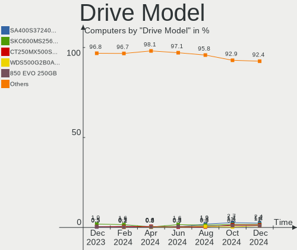
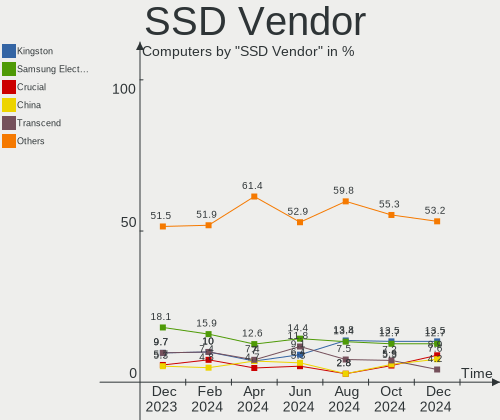
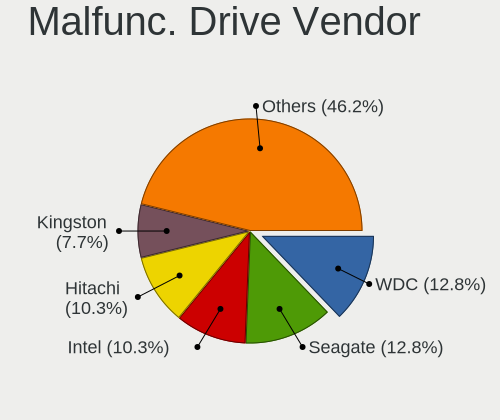
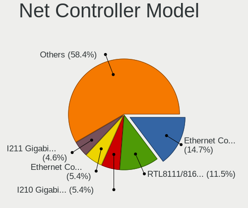

OPNsense Hardware Trends
------------------------

A project to identify most popular hardware characteristics and track their change
over time based on data collected by OPNsense users at https://BSD-Hardware.info.

Anyone can contribute to the study by uploading probes of their computers by
the [hw-probe](https://github.com/linuxhw/hw-probe/blob/master/INSTALL.BSD.md) tool:

    hw-probe -all -upload

Full-feature report is available here: https://bsd-hardware.info/?view=trends

Period: Apr, 2021.

Contents
--------

- [ OS                       ](#os)
- [ OS Family                ](#os-family)
- [ Arch                     ](#arch)
- [ DE                       ](#de)
- [ Display Server           ](#display-server)
- [ Display Manager          ](#display-manager)
- [ OS Lang                  ](#os-lang)
- [ Boot Mode                ](#boot-mode)
- [ Filesystem               ](#filesystem)
- [ Part. scheme             ](#part-scheme)
- [ Country                  ](#country)
- [ City                     ](#city)
- [ Vendor                   ](#vendor)
- [ Model                    ](#model)
- [ Model Family             ](#model-family)
- [ MFG Year                 ](#mfg-year)
- [ Form Factor              ](#form-factor)
- [ Coreboot                 ](#coreboot)
- [ RAM Size                 ](#ram-size)
- [ RAM Used                 ](#ram-used)
- [ Has CD-ROM               ](#has-cd-rom)
- [ Total Drives             ](#total-drives)
- [ Has Ethernet             ](#has-ethernet)
- [ Has WiFi                 ](#has-wifi)
- [ Has Bluetooth            ](#has-bluetooth)
- [ Drive Vendor             ](#drive-vendor)
- [ Drive Model              ](#drive-model)
- [ HDD Vendor               ](#hdd-vendor)
- [ SSD Vendor               ](#ssd-vendor)
- [ Drive Kind               ](#drive-kind)
- [ Drive Connector          ](#drive-connector)
- [ Drive Size               ](#drive-size)
- [ Space Total              ](#space-total)
- [ Space Used               ](#space-used)
- [ Malfunc. Drives          ](#malfunc-drives)
- [ Malfunc. Drive Vendor    ](#malfunc-drive-vendor)
- [ Malfunc. HDD Vendor      ](#malfunc-hdd-vendor)
- [ Malfunc. Drive Kind      ](#malfunc-drive-kind)
- [ Failed Drives            ](#failed-drives)
- [ Failed Drive Vendor      ](#failed-drive-vendor)
- [ Drive Status             ](#drive-status)
- [ Storage Vendor           ](#storage-vendor)
- [ Storage Model            ](#storage-model)
- [ Storage Kind             ](#storage-kind)
- [ CPU Vendor               ](#cpu-vendor)
- [ CPU Model                ](#cpu-model)
- [ CPU Model Family         ](#cpu-model-family)
- [ CPU Cores                ](#cpu-cores)
- [ CPU Sockets              ](#cpu-sockets)
- [ CPU Threads              ](#cpu-threads)
- [ CPU Microarch            ](#cpu-microarch)
- [ GPU Vendor               ](#gpu-vendor)
- [ GPU Model                ](#gpu-model)
- [ GPU Combo                ](#gpu-combo)
- [ GPU Driver               ](#gpu-driver)
- [ GPU Memory               ](#gpu-memory)
- [ Monitor Vendor           ](#monitor-vendor)
- [ Monitor Model            ](#monitor-model)
- [ Monitor Resolution       ](#monitor-resolution)
- [ Monitor Diagonal         ](#monitor-diagonal)
- [ Monitor Width            ](#monitor-width)
- [ Aspect Ratio             ](#aspect-ratio)
- [ Monitor Area             ](#monitor-area)
- [ Pixel Density            ](#pixel-density)
- [ Multiple Monitors        ](#multiple-monitors)
- [ Net Controller Vendor    ](#net-controller-vendor)
- [ Net Controller Model     ](#net-controller-model)
- [ Wireless Vendor          ](#wireless-vendor)
- [ Wireless Model           ](#wireless-model)
- [ Ethernet Vendor          ](#ethernet-vendor)
- [ Ethernet Model           ](#ethernet-model)
- [ Net Controller Kind      ](#net-controller-kind)
- [ Used Controller          ](#used-controller)
- [ NICs                     ](#nics)
- [ IPv6                     ](#ipv6)
- [ Memory Vendor            ](#memory-vendor)
- [ Memory Model             ](#memory-model)
- [ Memory Kind              ](#memory-kind)
- [ Memory Form Factor       ](#memory-form-factor)
- [ Memory Size              ](#memory-size)
- [ Memory Speed             ](#memory-speed)
- [ Sound Vendor             ](#sound-vendor)
- [ Sound Model              ](#sound-model)
- [ Camera Vendor            ](#camera-vendor)
- [ Camera Model             ](#camera-model)
- [ Fingerprint Vendor       ](#fingerprint-vendor)
- [ Fingerprint Model        ](#fingerprint-model)
- [ Chipcard Vendor          ](#chipcard-vendor)
- [ Chipcard Model           ](#chipcard-model)
- [ Printer Vendor           ](#printer-vendor)
- [ Printer Model            ](#printer-model)
- [ Scanner Vendor           ](#scanner-vendor)
- [ Scanner Model            ](#scanner-model)
- [ Bluetooth Vendor         ](#bluetooth-vendor)
- [ Bluetooth Model          ](#bluetooth-model)
- [ Unsupported Devices      ](#unsupported-devices)
- [ Unsupported Device Types ](#unsupported-device-types)

OS
--

Installed operating systems

| Name                   | Computers | Percent |
|------------------------|-----------|---------|
| OPNsense 21.1.4        | 162       | 65.32%  |
| OPNsense 21.1.5        | 54        | 21.77%  |
| OPNsense 21.1          | 13        | 5.24%   |
| OPNsense 21.7          | 6         | 2.42%   |
| OPNsense 21.1.3        | 3         | 1.21%   |
| OPNsense 20.7.8        | 3         | 1.21%   |
| OPNsense 21.1.1        | 2         | 0.81%   |
| OPNsense 20.7          | 2         | 0.81%   |
| OPNsense 21.1.2        | 1         | 0.4%    |
| OPNsense 20.7.5        | 1         | 0.4%    |
| OPNsense 12.1-p15-HBSD | 1         | 0.4%    |

OS Family
---------

OS without a version

| Name     | Computers | Percent |
|----------|-----------|---------|
| OPNsense | 248       | 100%    |

Arch
----

OS architecture (x86_64, i586, etc.)

| Name  | Computers | Percent |
|-------|-----------|---------|
| amd64 | 248       | 100%    |

DE
--

Desktop Environment

| Name    | Computers | Percent |
|---------|-----------|---------|
| Console | 248       | 100%    |

Display Server
--------------

X11 or Wayland

| Name    | Computers | Percent |
|---------|-----------|---------|
| Console | 248       | 100%    |

Display Manager
---------------

SDDM, LightDM, etc.

| Name    | Computers | Percent |
|---------|-----------|---------|
| Console | 248       | 100%    |

OS Lang
-------

Language

| Lang    | Computers | Percent |
|---------|-----------|---------|
| Unknown | 248       | 100%    |

Boot Mode
---------

EFI or BIOS

| Mode | Computers | Percent |
|------|-----------|---------|
| EFI  | 219       | 88.31%  |
| BIOS | 29        | 11.69%  |

Filesystem
----------

Type of filesystem

| Type | Computers | Percent |
|------|-----------|---------|
| Ufs  | 242       | 97.58%  |
| Zfs  | 6         | 2.42%   |

Part. scheme
------------

Scheme of partitioning

| Type | Computers | Percent |
|------|-----------|---------|
| GPT  | 222       | 89.52%  |
| MBR  | 26        | 10.48%  |

Country
-------

Geographic location (country)

| Country      | Computers | Percent |
|--------------|-----------|---------|
| USA          | 79        | 31.85%  |
| Germany      | 58        | 23.39%  |
| Canada       | 13        | 5.24%   |
| UK           | 10        | 4.03%   |
| France       | 9         | 3.63%   |
| Austria      | 9         | 3.63%   |
| Netherlands  | 7         | 2.82%   |
| Switzerland  | 5         | 2.02%   |
| Sweden       | 5         | 2.02%   |
| Australia    | 5         | 2.02%   |
| Brazil       | 4         | 1.61%   |
| Spain        | 3         | 1.21%   |
| Russia       | 3         | 1.21%   |
| Denmark      | 3         | 1.21%   |
| Vietnam      | 2         | 0.81%   |
| South Africa | 2         | 0.81%   |
| Pakistan     | 2         | 0.81%   |
| Lithuania    | 2         | 0.81%   |
| Indonesia    | 2         | 0.81%   |
| Hungary      | 2         | 0.81%   |
| Finland      | 2         | 0.81%   |
| China        | 2         | 0.81%   |
| Belgium      | 2         | 0.81%   |
| Ukraine      | 1         | 0.4%    |
| Thailand     | 1         | 0.4%    |
| Taiwan       | 1         | 0.4%    |
| Slovenia     | 1         | 0.4%    |
| Slovakia     | 1         | 0.4%    |
| Romania      | 1         | 0.4%    |
| Portugal     | 1         | 0.4%    |
| Poland       | 1         | 0.4%    |
| Japan        | 1         | 0.4%    |
| Israel       | 1         | 0.4%    |
| Ireland      | 1         | 0.4%    |
| India        | 1         | 0.4%    |
| Hong Kong    | 1         | 0.4%    |
| Czechia      | 1         | 0.4%    |
| Colombia     | 1         | 0.4%    |
| Chile        | 1         | 0.4%    |
| Argentina    | 1         | 0.4%    |

City
----

Geographic location (city)

| City                  | Computers | Percent |
|-----------------------|-----------|---------|
| Vienna                | 4         | 1.61%   |
| Mountain View         | 3         | 1.21%   |
| Hamburg               | 3         | 1.21%   |
| Frankfurt am Main     | 3         | 1.21%   |
| Cologne               | 3         | 1.21%   |
| Agen                  | 3         | 1.21%   |
| West Valley City      | 2         | 0.81%   |
| Vilnius               | 2         | 0.81%   |
| Vichy                 | 2         | 0.81%   |
| Toronto               | 2         | 0.81%   |
| Stuttgart             | 2         | 0.81%   |
| Pleasant Grove        | 2         | 0.81%   |
| Pasadena              | 2         | 0.81%   |
| Ottawa                | 2         | 0.81%   |
| New York              | 2         | 0.81%   |
| Münster              | 2         | 0.81%   |
| Montreal              | 2         | 0.81%   |
| Langenhagen           | 2         | 0.81%   |
| Lahore                | 2         | 0.81%   |
| Hohenlockstedt        | 2         | 0.81%   |
| Chicago               | 2         | 0.81%   |
| Buford                | 2         | 0.81%   |
| Berlin                | 2         | 0.81%   |
| Alameda               | 2         | 0.81%   |
| Zutphen               | 1         | 0.4%    |
| Zurich                | 1         | 0.4%    |
| Zoetermeer            | 1         | 0.4%    |
| Zhengzhou             | 1         | 0.4%    |
| Zeuthen               | 1         | 0.4%    |
| Zeist                 | 1         | 0.4%    |
| Zaltbommel            | 1         | 0.4%    |
| Yokohama              | 1         | 0.4%    |
| Wroclaw               | 1         | 0.4%    |
| Worms                 | 1         | 0.4%    |
| Woking                | 1         | 0.4%    |
| Winterthur            | 1         | 0.4%    |
| Windsor               | 1         | 0.4%    |
| Wiesbaden             | 1         | 0.4%    |
| Wheelers Hill         | 1         | 0.4%    |
| Well                  | 1         | 0.4%    |
| Waukee                | 1         | 0.4%    |
| Walla Walla           | 1         | 0.4%    |
| Voggenberg            | 1         | 0.4%    |
| Vitacura              | 1         | 0.4%    |
| Vila Nova de Gaia     | 1         | 0.4%    |
| Victoria              | 1         | 0.4%    |
| Ulm                   | 1         | 0.4%    |
| Tuttlingen            | 1         | 0.4%    |
| Turku                 | 1         | 0.4%    |
| Tucker                | 1         | 0.4%    |
| Trier                 | 1         | 0.4%    |
| Trangsund             | 1         | 0.4%    |
| Torrance              | 1         | 0.4%    |
| Terrebonne            | 1         | 0.4%    |
| Tatabánya            | 1         | 0.4%    |
| Taipei                | 1         | 0.4%    |
| Tai Kok Tsui          | 1         | 0.4%    |
| Taby                  | 1         | 0.4%    |
| São Paulo            | 1         | 0.4%    |
| São José dos Campos | 1         | 0.4%    |

Vendor
------

Motherboard manufacturer

| Name                       | Computers | Percent |
|----------------------------|-----------|---------|
| Dell                       | 31        | 12.5%   |
| Unknown                    | 26        | 10.48%  |
| Hewlett-Packard            | 20        | 8.06%   |
| Supermicro                 | 18        | 7.26%   |
| PC Engines                 | 17        | 6.85%   |
| Protectli                  | 15        | 6.05%   |
| ASRock                     | 13        | 5.24%   |
| Lenovo                     | 11        | 4.44%   |
| Intel                      | 10        | 4.03%   |
| AMI                        | 10        | 4.03%   |
| BESSTAR Tech               | 8         | 3.23%   |
| ASUSTek Computer           | 8         | 3.23%   |
| Gigabyte Technology        | 7         | 2.82%   |
| Sophos                     | 6         | 2.42%   |
| Shuttle                    | 6         | 2.42%   |
| MSI                        | 6         | 2.42%   |
| HARDKERNEL                 | 4         | 1.61%   |
| Compulab                   | 4         | 1.61%   |
| ZOTAC                      | 3         | 1.21%   |
| Fujitsu                    | 3         | 1.21%   |
| ShenZhen MinWin Technology | 2         | 0.81%   |
| Deciso                     | 2         | 0.81%   |
| CheckPoint                 | 2         | 0.81%   |
| Biostar                    | 2         | 0.81%   |
| Advantech                  | 2         | 0.81%   |
| Yanling                    | 1         | 0.4%    |
| Wistron                    | 1         | 0.4%    |
| Thomas-Krenn.AG            | 1         | 0.4%    |
| SeeedStudio                | 1         | 0.4%    |
| OmniOS                     | 1         | 0.4%    |
| Maxtang                    | 1         | 0.4%    |
| Jetway                     | 1         | 0.4%    |
| IBM                        | 1         | 0.4%    |
| GEEK+                      | 1         | 0.4%    |
| Barracuda Networks         | 1         | 0.4%    |
| AWOW                       | 1         | 0.4%    |
| Astaro                     | 1         | 0.4%    |

Model
-----

Motherboard model

| Name                                             | Computers | Percent |
|--------------------------------------------------|-----------|---------|
| Unknown                                          | 26        | 10.48%  |
| PC Engines apu2                                  | 8         | 3.23%   |
| AMI Aptio CRB                                    | 8         | 3.23%   |
| Protectli FW4B                                   | 6         | 2.42%   |
| PC Engines apu4                                  | 6         | 2.42%   |
| Intel Q3XXG4-P V1.0                              | 6         | 2.42%   |
| Protectli FW6                                    | 5         | 2.02%   |
| Dell PowerEdge R210 II                           | 5         | 2.02%   |
| BESSTAR Tech X35G                                | 5         | 2.02%   |
| Supermicro Super Server                          | 4         | 1.61%   |
| Sophos SG                                        | 4         | 1.61%   |
| HARDKERNEL ODROID-H2                             | 4         | 1.61%   |
| Dell OptiPlex 3020                               | 4         | 1.61%   |
| PC Engines APU3                                  | 3         | 1.21%   |
| HP t620 PLUS Quad Core TC                        | 3         | 1.21%   |
| HP EliteDesk 800 G1 SFF                          | 3         | 1.21%   |
| Dell OptiPlex 390                                | 3         | 1.21%   |
| Compulab fitlet2                                 | 3         | 1.21%   |
| ZOTAC ZBOX-CI329NANO                             | 2         | 0.81%   |
| Supermicro X9SCL/X9SCM                           | 2         | 0.81%   |
| Supermicro X7SPA-HF                              | 2         | 0.81%   |
| Shuttle DS81D                                    | 2         | 0.81%   |
| ShenZhen MinWin MW-NANO-APL-4L                   | 2         | 0.81%   |
| Protectli FW6D                                   | 2         | 0.81%   |
| Fujitsu ESPRIMO C720                             | 2         | 0.81%   |
| Dell PowerEdge R630                              | 2         | 0.81%   |
| Dell OptiPlex 9010                               | 2         | 0.81%   |
| Deciso Netboard A20                              | 2         | 0.81%   |
| CheckPoint T-110-00                              | 2         | 0.81%   |
| ASUS P8H61-M LX3 PLUS R2.0                       | 2         | 0.81%   |
| ASRock J4105M                                    | 2         | 0.81%   |
| ZOTAC ZBOX-CI327NANO-GS-01                       | 1         | 0.4%    |
| Yanling YL-KBR6L                                 | 1         | 0.4%    |
| Wistron ProLiant ML110 G6                        | 1         | 0.4%    |
| Thomas-Krenn.AG LES network+                     | 1         | 0.4%    |
| Supermicro X8DTU-LN4+                            | 1         | 0.4%    |
| Supermicro X7SLA                                 | 1         | 0.4%    |
| Supermicro X10SLH-N6-ST031                       | 1         | 0.4%    |
| Supermicro SYS-E300-8D                           | 1         | 0.4%    |
| Supermicro SYS-E200-9B                           | 1         | 0.4%    |
| Supermicro SYS-5019C-FL                          | 1         | 0.4%    |
| Supermicro SYS-5018D-FN8T                        | 1         | 0.4%    |
| Supermicro SYS-5017A-EP                          | 1         | 0.4%    |
| Supermicro A1SAi                                 | 1         | 0.4%    |
| Supermicro 1HE Intel Single-CPU RI1102D-F Server | 1         | 0.4%    |
| Sophos XG                                        | 1         | 0.4%    |
| Sophos UTM                                       | 1         | 0.4%    |
| Shuttle TERRA_PC                                 | 1         | 0.4%    |
| Shuttle DS10U                                    | 1         | 0.4%    |
| Shuttle DH170                                    | 1         | 0.4%    |
| Shuttle DH110                                    | 1         | 0.4%    |
| SeeedStudio ODYSSEY-X86J4105                     | 1         | 0.4%    |
| Protectli FW6E                                   | 1         | 0.4%    |
| Protectli FW2B                                   | 1         | 0.4%    |
| OmniOS HVM                                       | 1         | 0.4%    |
| MSI MS-7C09                                      | 1         | 0.4%    |
| MSI MS-7C08                                      | 1         | 0.4%    |
| MSI MS-7A15                                      | 1         | 0.4%    |
| MSI MS-7850                                      | 1         | 0.4%    |
| MSI MS-7733                                      | 1         | 0.4%    |

Model Family
------------

Motherboard model prefix

| Name                           | Computers | Percent |
|--------------------------------|-----------|---------|
| Unknown                        | 26        | 10.48%  |
| Dell OptiPlex                  | 15        | 6.05%   |
| Dell PowerEdge                 | 11        | 4.44%   |
| AMI Aptio                      | 9         | 3.63%   |
| PC Engines APU2                | 8         | 3.23%   |
| Protectli FW4B                 | 6         | 2.42%   |
| PC Engines apu4                | 6         | 2.42%   |
| Lenovo ThinkCentre             | 6         | 2.42%   |
| Intel Q3XXG4-P                 | 6         | 2.42%   |
| Protectli FW6                  | 5         | 2.02%   |
| HP ProLiant                    | 5         | 2.02%   |
| HP EliteDesk                   | 5         | 2.02%   |
| BESSTAR Tech X35G              | 5         | 2.02%   |
| Supermicro Super               | 4         | 1.61%   |
| Sophos SG                      | 4         | 1.61%   |
| HARDKERNEL ODROID-H2           | 4         | 1.61%   |
| PC Engines apu3                | 3         | 1.21%   |
| HP t620                        | 3         | 1.21%   |
| HP Compaq                      | 3         | 1.21%   |
| Compulab fitlet2               | 3         | 1.21%   |
| ASUS P8H61-M                   | 3         | 1.21%   |
| ZOTAC ZBOX-CI329NANO           | 2         | 0.81%   |
| Supermicro X9SCL               | 2         | 0.81%   |
| Supermicro X7SPA-HF            | 2         | 0.81%   |
| Shuttle DS81D                  | 2         | 0.81%   |
| ShenZhen MinWin MW-NANO-APL-4L | 2         | 0.81%   |
| Protectli FW6D                 | 2         | 0.81%   |
| Lenovo ThinkStation            | 2         | 0.81%   |
| Lenovo IdeaCentre              | 2         | 0.81%   |
| Fujitsu ESPRIMO                | 2         | 0.81%   |
| Dell Latitude                  | 2         | 0.81%   |
| Dell Inspiron                  | 2         | 0.81%   |
| Deciso Netboard                | 2         | 0.81%   |
| CheckPoint T-110-00            | 2         | 0.81%   |
| ASRock J4105M                  | 2         | 0.81%   |
| ZOTAC ZBOX-CI327NANO-GS-01     | 1         | 0.4%    |
| Yanling YL-KBR6L               | 1         | 0.4%    |
| Wistron ProLiant               | 1         | 0.4%    |
| Thomas-Krenn.AG LES            | 1         | 0.4%    |
| Supermicro X8DTU-LN4+          | 1         | 0.4%    |
| Supermicro X7SLA               | 1         | 0.4%    |
| Supermicro X10SLH-N6-ST031     | 1         | 0.4%    |
| Supermicro SYS-E300-8D         | 1         | 0.4%    |
| Supermicro SYS-E200-9B         | 1         | 0.4%    |
| Supermicro SYS-5019C-FL        | 1         | 0.4%    |
| Supermicro SYS-5018D-FN8T      | 1         | 0.4%    |
| Supermicro SYS-5017A-EP        | 1         | 0.4%    |
| Supermicro A1SAi               | 1         | 0.4%    |
| Supermicro 1HE                 | 1         | 0.4%    |
| Sophos XG                      | 1         | 0.4%    |
| Sophos UTM                     | 1         | 0.4%    |
| Shuttle TERRA                  | 1         | 0.4%    |
| Shuttle DS10U                  | 1         | 0.4%    |
| Shuttle DH170                  | 1         | 0.4%    |
| Shuttle DH110                  | 1         | 0.4%    |
| SeeedStudio ODYSSEY-X86J4105   | 1         | 0.4%    |
| Protectli FW6E                 | 1         | 0.4%    |
| Protectli FW2B                 | 1         | 0.4%    |
| OmniOS HVM                     | 1         | 0.4%    |
| MSI MS-7C09                    | 1         | 0.4%    |

MFG Year
--------

Motherboard manufacture year

| Year | Computers | Percent |
|------|-----------|---------|
| 2020 | 58        | 23.39%  |
| 2019 | 38        | 15.32%  |
| 2018 | 36        | 14.52%  |
| 2021 | 18        | 7.26%   |
| 2013 | 17        | 6.85%   |
| 2017 | 16        | 6.45%   |
| 2012 | 16        | 6.45%   |
| 2014 | 13        | 5.24%   |
| 2015 | 12        | 4.84%   |
| 2016 | 9         | 3.63%   |
| 2010 | 7         | 2.82%   |
| 2011 | 6         | 2.42%   |
| 2009 | 1         | 0.4%    |
| 2008 | 1         | 0.4%    |

Form Factor
-----------

Physical design of the computer

| Name     | Computers | Percent |
|----------|-----------|---------|
| Desktop  | 183       | 73.79%  |
| Server   | 27        | 10.89%  |
| Mini pc  | 23        | 9.27%   |
| Notebook | 8         | 3.23%   |
| Firewall | 7         | 2.82%   |

Coreboot
--------

Have coreboot on board

| Used | Computers | Percent |
|------|-----------|---------|
| No   | 227       | 91.53%  |
| Yes  | 21        | 8.47%   |

RAM Size
--------

Total RAM memory

| Size in GB  | Computers | Percent |
|-------------|-----------|---------|
| 8.01-16.0   | 91        | 36.69%  |
| 4.01-8.0    | 73        | 29.44%  |
| 16.01-24.0  | 48        | 19.35%  |
| 32.01-64.0  | 15        | 6.05%   |
| 2.01-3.0    | 10        | 4.03%   |
| 64.01-256.0 | 5         | 2.02%   |
| 24.01-32.0  | 4         | 1.61%   |
| 3.01-4.0    | 1         | 0.4%    |
| 1.01-2.0    | 1         | 0.4%    |

RAM Used
--------

Used RAM memory

| Used GB    | Computers | Percent |
|------------|-----------|---------|
| 0.01-0.5   | 142       | 57.26%  |
| 0.51-1.0   | 73        | 29.44%  |
| 1.01-2.0   | 18        | 7.26%   |
| 4.01-8.0   | 6         | 2.42%   |
| 2.01-3.0   | 5         | 2.02%   |
| 8.01-16.0  | 2         | 0.81%   |
| 32.01-64.0 | 1         | 0.4%    |
| 3.01-4.0   | 1         | 0.4%    |

Has CD-ROM
----------

Has CD-ROM on board

| Presented | Computers | Percent |
|-----------|-----------|---------|
| No        | 212       | 85.48%  |
| Yes       | 36        | 14.52%  |

Total Drives
------------

Number of drives on board

| Drives | Computers | Percent |
|--------|-----------|---------|
| 1      | 202       | 81.45%  |
| 0      | 24        | 9.68%   |
| 2      | 19        | 7.66%   |
| 3      | 3         | 1.21%   |

Has Ethernet
------------

Has Ethernet on board

| Presented | Computers | Percent |
|-----------|-----------|---------|
| Yes       | 247       | 99.6%   |
| No        | 1         | 0.4%    |

Has WiFi
--------

Has WiFi module

| Presented | Computers | Percent |
|-----------|-----------|---------|
| No        | 204       | 82.26%  |
| Yes       | 44        | 17.74%  |

Has Bluetooth
-------------

Has Bluetooth module

| Presented | Computers | Percent |
|-----------|-----------|---------|
| No        | 224       | 90.32%  |
| Yes       | 24        | 9.68%   |

Drive Vendor
------------

Hard drive vendors

| Vendor              | Computers | Drives | Percent |
|---------------------|-----------|--------|---------|
| Samsung Electronics | 31        | 32     | 13.08%  |
| Kingston            | 29        | 30     | 12.24%  |
| Seagate             | 24        | 25     | 10.13%  |
| Crucial             | 19        | 22     | 8.02%   |
| Transcend           | 15        | 15     | 6.33%   |
| WDC                 | 14        | 14     | 5.91%   |
| Hoodisk             | 14        | 14     | 5.91%   |
| Toshiba             | 11        | 12     | 4.64%   |
| SanDisk             | 9         | 9      | 3.8%    |
| Phison              | 9         | 9      | 3.8%    |
| Intel               | 9         | 11     | 3.8%    |
| HGST                | 5         | 5      | 2.11%   |
| Hewlett-Packard     | 5         | 7      | 2.11%   |
| A-DATA Technology   | 5         | 5      | 2.11%   |
| FORESEE             | 4         | 4      | 1.69%   |
| Dogfish             | 4         | 4      | 1.69%   |
| Corsair             | 4         | 4      | 1.69%   |
| PLEXTOR             | 3         | 3      | 1.27%   |
| Hitachi             | 3         | 3      | 1.27%   |
| TCSUNBOW            | 2         | 2      | 0.84%   |
| SuperMicro          | 2         | 2      | 0.84%   |
| PNY                 | 2         | 2      | 0.84%   |
| OCZ                 | 2         | 2      | 0.84%   |
| KingSpec            | 2         | 2      | 0.84%   |
| Zheino              | 1         | 1      | 0.42%   |
| SPCC                | 1         | 1      | 0.42%   |
| SK Hynix            | 1         | 1      | 0.42%   |
| LITEONIT            | 1         | 1      | 0.42%   |
| KingDian            | 1         | 1      | 0.42%   |
| Intenso             | 1         | 1      | 0.42%   |
| Indilinx            | 1         | 1      | 0.42%   |
| faspeed             | 1         | 1      | 0.42%   |
| Dell                | 1         | 1      | 0.42%   |
| BIWIN               | 1         | 1      | 0.42%   |

Drive Model
-----------

Hard drive models

| Model                                | Computers | Percent |
|--------------------------------------|-----------|---------|
| Kingston SUV500MS120G 120GB          | 6         | 2.52%   |
| Kingston SA400S37120G 120GB          | 6         | 2.52%   |
| Hoodisk SSD 128GB                    | 5         | 2.1%    |
| Phison SATA SSD 16GB                 | 4         | 1.68%   |
| FORESEE 128GB SSD                    | 4         | 1.68%   |
| Crucial CT120BX500SSD1 120GB         | 4         | 1.68%   |
| Transcend TS128GMSA230S 128GB        | 3         | 1.26%   |
| Toshiba DT01ACA050 500GB             | 3         | 1.26%   |
| Seagate ST500DM002-1BD142 500GB      | 3         | 1.26%   |
| Seagate ST3500418AS 500GB            | 3         | 1.26%   |
| Samsung SSD 840 EVO 250GB            | 3         | 1.26%   |
| Kingston SUV500MS240G 240GB          | 3         | 1.26%   |
| Hoodisk SSD 64GB                     | 3         | 1.26%   |
| Hoodisk SSD 32GB                     | 3         | 1.26%   |
| Crucial CT250MX500SSD1 250GB         | 3         | 1.26%   |
| Crucial CT240BX500SSD1 240GB         | 3         | 1.26%   |
| Transcend TS256GMTS952T2 256GB       | 2         | 0.84%   |
| Toshiba MG03ACA100 1TB               | 2         | 0.84%   |
| TCSUNBOW M1 32GB                     | 2         | 0.84%   |
| Seagate ST500LM021-1KJ152 500GB      | 2         | 0.84%   |
| SanDisk SSD U100 24GB                | 2         | 0.84%   |
| Samsung SSD 970 EVO Plus 250GB       | 2         | 0.84%   |
| Samsung SSD 870 EVO 250GB            | 2         | 0.84%   |
| Samsung SSD 860 EVO 250GB            | 2         | 0.84%   |
| Samsung SSD 840 Series 120GB         | 2         | 0.84%   |
| Samsung SSD 840 PRO Series 256GB     | 2         | 0.84%   |
| Samsung SSD 840 EVO 120GB            | 2         | 0.84%   |
| Phison minisforum 512GB              | 2         | 0.84%   |
| Kingston OM8PDP3256B-A01 256GB       | 2         | 0.84%   |
| Intel SSDSC2KG240G8 240GB            | 2         | 0.84%   |
| Intel SSDSC2BB150G7 150GB            | 2         | 0.84%   |
| Hoodisk SSD 16GB                     | 2         | 0.84%   |
| Hitachi HUA721050KLA330 500GB        | 2         | 0.84%   |
| HGST HTS725032A7E630 320GB           | 2         | 0.84%   |
| HP RAID 0 250GB                      | 2         | 0.84%   |
| Dogfish SSD 128GB                    | 2         | 0.84%   |
| Crucial M4-CT064M4SSD2 64GB          | 2         | 0.84%   |
| Corsair Force 3 SSD 64GB             | 2         | 0.84%   |
| Zheino CHN HFmSATA01M 128 128GB      | 1         | 0.42%   |
| WDC WDS500G2B0B-00YS70 500GB         | 1         | 0.42%   |
| WDC WDS500G1X0E-00AFY0 500GB         | 1         | 0.42%   |
| WDC WDS120G2G0A-00JH30 120GB         | 1         | 0.42%   |
| WDC WD5003ABYZ-011FA0 500GB          | 1         | 0.42%   |
| WDC WD5000LPVX-75V0TT0 500GB         | 1         | 0.42%   |
| WDC WD5000LPVX-22V0TT0 500GB         | 1         | 0.42%   |
| WDC WD5000AAKX-001CA0 500GB          | 1         | 0.42%   |
| WDC WD3200BPVT-75ZEST0 320GB         | 1         | 0.42%   |
| WDC WD2500AAKX-001CA0 250GB          | 1         | 0.42%   |
| WDC WD1600JS-60MHB5 160GB            | 1         | 0.42%   |
| WDC WD1600BEVS-75RST0 160GB          | 1         | 0.42%   |
| WDC WD10EZEX-22MFCA0 1TB             | 1         | 0.42%   |
| WDC WD10EZEX-08WN4A0 1TB             | 1         | 0.42%   |
| WDC PC SN730 SDBQNTY-256G-1001 256GB | 1         | 0.42%   |
| Transcend TS64GMSA370 64GB           | 1         | 0.42%   |
| Transcend TS64GMSA230S 64GB          | 1         | 0.42%   |
| Transcend TS32GSSD370S 32GB          | 1         | 0.42%   |
| Transcend TS32GSSD370 32GB           | 1         | 0.42%   |
| Transcend TS256GSSD320 256GB         | 1         | 0.42%   |
| Transcend TS256GMSA370S 256GB        | 1         | 0.42%   |
| Transcend TS240GMTS420S 240GB        | 1         | 0.42%   |

HDD Vendor
----------

Hard disk drive vendors

| Vendor              | Computers | Drives | Percent |
|---------------------|-----------|--------|---------|
| Seagate             | 23        | 24     | 40.35%  |
| WDC                 | 10        | 10     | 17.54%  |
| Toshiba             | 9         | 10     | 15.79%  |
| HGST                | 5         | 5      | 8.77%   |
| Hewlett-Packard     | 4         | 6      | 7.02%   |
| Hitachi             | 3         | 3      | 5.26%   |
| Samsung Electronics | 2         | 2      | 3.51%   |
| Dell                | 1         | 1      | 1.75%   |

SSD Vendor
----------

Solid state drive vendors

| Vendor              | Computers | Drives | Percent |
|---------------------|-----------|--------|---------|
| Kingston            | 24        | 25     | 15%     |
| Samsung Electronics | 22        | 23     | 13.75%  |
| Crucial             | 18        | 21     | 11.25%  |
| Transcend           | 15        | 15     | 9.38%   |
| Hoodisk             | 14        | 14     | 8.75%   |
| SanDisk             | 9         | 9      | 5.63%   |
| Intel               | 8         | 10     | 5%      |
| Phison              | 7         | 7      | 4.38%   |
| FORESEE             | 4         | 4      | 2.5%    |
| Dogfish             | 4         | 4      | 2.5%    |
| A-DATA Technology   | 4         | 4      | 2.5%    |
| PLEXTOR             | 3         | 3      | 1.88%   |
| Corsair             | 3         | 3      | 1.88%   |
| WDC                 | 2         | 2      | 1.25%   |
| Toshiba             | 2         | 2      | 1.25%   |
| TCSUNBOW            | 2         | 2      | 1.25%   |
| SuperMicro          | 2         | 2      | 1.25%   |
| PNY                 | 2         | 2      | 1.25%   |
| OCZ                 | 2         | 2      | 1.25%   |
| KingSpec            | 2         | 2      | 1.25%   |
| Zheino              | 1         | 1      | 0.63%   |
| SPCC                | 1         | 1      | 0.63%   |
| SK Hynix            | 1         | 1      | 0.63%   |
| Seagate             | 1         | 1      | 0.63%   |
| LITEONIT            | 1         | 1      | 0.63%   |
| KingDian            | 1         | 1      | 0.63%   |
| Intenso             | 1         | 1      | 0.63%   |
| Indilinx            | 1         | 1      | 0.63%   |
| Hewlett-Packard     | 1         | 1      | 0.63%   |
| faspeed             | 1         | 1      | 0.63%   |
| BIWIN               | 1         | 1      | 0.63%   |

Drive Kind
----------

HDD or SSD

| Kind | Computers | Drives | Percent |
|------|-----------|--------|---------|
| SSD  | 157       | 167    | 67.97%  |
| HDD  | 54        | 61     | 23.38%  |
| NVMe | 20        | 20     | 8.66%   |

Drive Connector
---------------

SATA, SAS, NVMe, etc.

| Type | Computers | Drives | Percent |
|------|-----------|--------|---------|
| SATA | 205       | 228    | 91.11%  |
| NVMe | 20        | 20     | 8.89%   |

Drive Size
----------

Size of hard drive

| Size in TB | Computers | Drives | Percent |
|------------|-----------|--------|---------|
| 0.01-0.5   | 192       | 208    | 91.43%  |
| 0.51-1.0   | 18        | 20     | 8.57%   |

Space Total
-----------

Amount of disk space available on the file system

| Size in GB | Computers | Percent |
|------------|-----------|---------|
| 101-250    | 107       | 43.15%  |
| 251-500    | 49        | 19.76%  |
| 21-50      | 30        | 12.1%   |
| 51-100     | 30        | 12.1%   |
| 1-20       | 18        | 7.26%   |
| 501-1000   | 14        | 5.65%   |

Space Used
----------

Amount of used disk space

| Used GB | Computers | Percent |
|---------|-----------|---------|
| 1-20    | 238       | 95.97%  |
| 21-50   | 6         | 2.42%   |
| 101-250 | 2         | 0.81%   |
| 51-100  | 2         | 0.81%   |

Malfunc. Drives
---------------

Drive models with a malfunction

| Model                                        | Computers | Drives | Percent |
|----------------------------------------------|-----------|--------|---------|
| Seagate ST500DM002-1BD142 500GB              | 2         | 2      | 6.45%   |
| Seagate ST3500418AS 500GB                    | 2         | 2      | 6.45%   |
| WDC WD5000AAKX-001CA0 500GB                  | 1         | 1      | 3.23%   |
| WDC WD3200BPVT-75ZEST0 320GB                 | 1         | 1      | 3.23%   |
| WDC WD2500AAKX-001CA0 250GB                  | 1         | 1      | 3.23%   |
| Transcend TS256GSSD320 256GB                 | 1         | 1      | 3.23%   |
| Toshiba MK5061GSYN 500GB                     | 1         | 1      | 3.23%   |
| Toshiba DT01ACA050 500GB                     | 1         | 1      | 3.23%   |
| Seagate ST980816AS 80GB                      | 1         | 1      | 3.23%   |
| Seagate ST500LT012-1DG142 500GB              | 1         | 1      | 3.23%   |
| Seagate ST3160815AS 160GB                    | 1         | 1      | 3.23%   |
| Seagate ST31000340NS 1TB                     | 1         | 1      | 3.23%   |
| Seagate ST1000NM0011 1TB                     | 1         | 1      | 3.23%   |
| Seagate ST1000LX015-1U7172 1TB               | 1         | 1      | 3.23%   |
| Seagate ST1000DL002-9TT153 1TB               | 1         | 1      | 3.23%   |
| SanDisk SSD i110 32GB                        | 1         | 1      | 3.23%   |
| Samsung Electronics SSD 840 PRO Series 256GB | 1         | 1      | 3.23%   |
| Samsung Electronics HM500LI 500GB            | 1         | 1      | 3.23%   |
| Kingston SNS4151S316GD 16GB                  | 1         | 1      | 3.23%   |
| Intenso SSD SATAIII 120GB                    | 1         | 1      | 3.23%   |
| Intel SSDSC2BB150G7 150GB                    | 1         | 1      | 3.23%   |
| Intel SSDSA2M080G2GC 80GB                    | 1         | 1      | 3.23%   |
| Hitachi HUA721050KLA330 500GB                | 1         | 1      | 3.23%   |
| Hitachi HTS541612J9SA00 120GB                | 1         | 1      | 3.23%   |
| HGST HTS545032A7E380 320GB                   | 1         | 1      | 3.23%   |
| Crucial M4-CT128M4SSD1 128GB                 | 1         | 1      | 3.23%   |
| Crucial CT275MX300SSD1 275GB                 | 1         | 1      | 3.23%   |
| Crucial CT128MX100SSD1 128GB                 | 1         | 1      | 3.23%   |
| Corsair CSSD-F80GBP2 90GB                    | 1         | 1      | 3.23%   |

Malfunc. Drive Vendor
---------------------

Vendors of faulty drives

| Vendor              | Computers | Drives | Percent |
|---------------------|-----------|--------|---------|
| Seagate             | 11        | 11     | 35.48%  |
| WDC                 | 3         | 3      | 9.68%   |
| Crucial             | 3         | 3      | 9.68%   |
| Toshiba             | 2         | 2      | 6.45%   |
| Samsung Electronics | 2         | 2      | 6.45%   |
| Intel               | 2         | 2      | 6.45%   |
| Hitachi             | 2         | 2      | 6.45%   |
| Transcend           | 1         | 1      | 3.23%   |
| SanDisk             | 1         | 1      | 3.23%   |
| Kingston            | 1         | 1      | 3.23%   |
| Intenso             | 1         | 1      | 3.23%   |
| HGST                | 1         | 1      | 3.23%   |
| Corsair             | 1         | 1      | 3.23%   |

Malfunc. HDD Vendor
-------------------

Vendors of faulty HDD drives

| Vendor              | Computers | Drives | Percent |
|---------------------|-----------|--------|---------|
| Seagate             | 11        | 11     | 55%     |
| WDC                 | 3         | 3      | 15%     |
| Toshiba             | 2         | 2      | 10%     |
| Hitachi             | 2         | 2      | 10%     |
| Samsung Electronics | 1         | 1      | 5%      |
| HGST                | 1         | 1      | 5%      |

Malfunc. Drive Kind
-------------------

Kinds of faulty drives

| Kind | Computers | Drives | Percent |
|------|-----------|--------|---------|
| HDD  | 20        | 20     | 64.52%  |
| SSD  | 11        | 11     | 35.48%  |

Failed Drives
-------------

Failed drive models

Zero info for selected period =(

Failed Drive Vendor
-------------------

Failed drive vendors

Zero info for selected period =(

Drive Status
------------

Number of failed and malfunc. drives

| Status   | Computers | Drives | Percent |
|----------|-----------|--------|---------|
| Works    | 193       | 213    | 84.65%  |
| Malfunc  | 31        | 31     | 13.6%   |
| Detected | 4         | 4      | 1.75%   |

Storage Vendor
--------------

Storage controller vendors

| Vendor                      | Computers | Percent |
|-----------------------------|-----------|---------|
| Intel                       | 205       | 74.55%  |
| AMD                         | 35        | 12.73%  |
| Samsung Electronics         | 7         | 2.55%   |
| Broadcom / LSI              | 6         | 2.18%   |
| Kingston Technology Company | 5         | 1.82%   |
| Phison Electronics          | 3         | 1.09%   |
| Sandisk                     | 2         | 0.73%   |
| Hewlett-Packard             | 2         | 0.73%   |
| ASMedia Technology          | 2         | 0.73%   |
| VIA Technologies            | 1         | 0.36%   |
| Unknown                     | 1         | 0.36%   |
| Micron Technology           | 1         | 0.36%   |
| Marvell Technology Group    | 1         | 0.36%   |
| JMicron Technology          | 1         | 0.36%   |
| Dell                        | 1         | 0.36%   |
| Chelsio Communications      | 1         | 0.36%   |
| ADATA Technology            | 1         | 0.36%   |

Storage Model
-------------

Storage controller models

| Model                                                                                   | Computers | Percent |
|-----------------------------------------------------------------------------------------|-----------|---------|
| Intel 8 Series/C220 Series Chipset Family 6-port SATA Controller 1 [AHCI mode]          | 30        | 9.77%   |
| AMD FCH SATA Controller [AHCI mode]                                                     | 24        | 7.82%   |
| Intel Sunrise Point-LP SATA Controller [AHCI mode]                                      | 16        | 5.21%   |
| Intel Atom/Celeron/Pentium Processor x5-E8000/J3xxx/N3xxx Series SATA Controller        | 16        | 5.21%   |
| Intel 6 Series/C200 Series Chipset Family 6 port Desktop SATA AHCI Controller           | 14        | 4.56%   |
| Intel Atom Processor E3800 Series SATA AHCI Controller                                  | 13        | 4.23%   |
| Intel Celeron/Pentium Silver Processor SATA Controller                                  | 12        | 3.91%   |
| Intel Celeron N3350/Pentium N4200/Atom E3900 Series SATA AHCI Controller                | 12        | 3.91%   |
| Intel Q170/Q150/B150/H170/H110/Z170/CM236 Chipset SATA Controller [AHCI Mode]           | 10        | 3.26%   |
| AMD FCH SATA Controller [IDE mode]                                                      | 8         | 2.61%   |
| Intel 82801 Mobile SATA Controller [RAID mode]                                          | 6         | 1.95%   |
| Intel 7 Series/C210 Series Chipset Family 6-port SATA Controller [AHCI mode]            | 6         | 1.95%   |
| Intel SATA Controller [RAID mode]                                                       | 5         | 1.63%   |
| Intel 82801HM/HEM (ICH8M/ICH8M-E) IDE Controller                                        | 5         | 1.63%   |
| Intel 82801G (ICH7 Family) IDE Controller                                               | 5         | 1.63%   |
| Intel 8 Series SATA Controller 1 [AHCI mode]                                            | 5         | 1.63%   |
| Intel 6 Series/C200 Series Chipset Family Desktop SATA Controller (IDE mode, ports 4-5) | 5         | 1.63%   |
| Intel 6 Series/C200 Series Chipset Family Desktop SATA Controller (IDE mode, ports 0-3) | 5         | 1.63%   |
| Samsung NVMe SSD Controller SM981/PM981/PM983                                           | 4         | 1.3%    |
| Intel NM10/ICH7 Family SATA Controller [IDE mode]                                       | 4         | 1.3%    |
| Intel NM10/ICH7 Family SATA Controller [AHCI mode]                                      | 4         | 1.3%    |
| Kingston Company OM3PDP3 NVMe SSD                                                       | 3         | 0.98%   |
| Intel Cannon Point-LP SATA Controller [AHCI Mode]                                       | 3         | 0.98%   |
| Intel Cannon Lake PCH SATA AHCI Controller                                              | 3         | 0.98%   |
| Intel Atom processor C2000 AHCI SATA3 Controller                                        | 3         | 0.98%   |
| Intel 82801HM/HEM (ICH8M/ICH8M-E) SATA Controller [IDE mode]                            | 3         | 0.98%   |
| Intel 7 Series Chipset Family 6-port SATA Controller [AHCI mode]                        | 3         | 0.98%   |
| Intel 200 Series PCH SATA controller [AHCI mode]                                        | 3         | 0.98%   |
| Samsung NVMe Controller                                                                 | 2         | 0.65%   |
| Phison PS5013 E13 NVMe Controller                                                       | 2         | 0.65%   |
| Kingston Company A2000 NVMe SSD                                                         | 2         | 0.65%   |
| Intel Wildcat Point-LP SATA Controller [AHCI Mode]                                      | 2         | 0.65%   |
| Intel C610/X99 series chipset sSATA Controller [AHCI mode]                              | 2         | 0.65%   |
| Intel C610/X99 series chipset 6-Port SATA Controller [AHCI mode]                        | 2         | 0.65%   |
| Intel Atom Processor C3000 Series SATA Controller 1                                     | 2         | 0.65%   |
| Intel Atom processor C2000 AHCI SATA2 Controller                                        | 2         | 0.65%   |
| Intel 82801JI (ICH10 Family) SATA AHCI Controller                                       | 2         | 0.65%   |
| Intel 82801JI (ICH10 Family) 2 port SATA IDE Controller #2                              | 2         | 0.65%   |
| Intel 82801IR/IO/IH (ICH9R/DO/DH) 4 port SATA Controller [IDE mode]                     | 2         | 0.65%   |
| Intel 82801I (ICH9 Family) 2 port SATA Controller [IDE mode]                            | 2         | 0.65%   |
| Intel 82801HM/HEM (ICH8M/ICH8M-E) SATA Controller [AHCI mode]                           | 2         | 0.65%   |
| Intel 631xESB/632xESB IDE Controller                                                    | 2         | 0.65%   |
| Intel 5 Series/3400 Series Chipset 6 port SATA AHCI Controller                          | 2         | 0.65%   |
| Intel 5 Series/3400 Series Chipset 4 port SATA IDE Controller                           | 2         | 0.65%   |
| Intel 5 Series/3400 Series Chipset 2 port SATA IDE Controller                           | 2         | 0.65%   |
| Intel 400 Series Chipset Family SATA AHCI Controller                                    | 2         | 0.65%   |
| HP Smart Array G6 controllers                                                           | 2         | 0.65%   |
| Broadcom / LSI SAS1068E PCI-Express Fusion-MPT SAS                                      | 2         | 0.65%   |
| ASMedia ASM1062 Serial ATA Controller                                                   | 2         | 0.65%   |
| AMD Starship/Matisse Chipset SATA Controller [AHCI mode]                                | 2         | 0.65%   |
| AMD FCH IDE Controller                                                                  | 2         | 0.65%   |
| Unknown                                                                                 | 2         | 0.65%   |
| VIA VX900 Series Serial-ATA Controller                                                  | 1         | 0.33%   |
| Sandisk WD Black SN850                                                                  | 1         | 0.33%   |
| Sandisk WD Black SN750 / PC SN730 NVMe SSD                                              | 1         | 0.33%   |
| Samsung NVMe SSD Controller SM951/PM951                                                 | 1         | 0.33%   |
| Phison E12 NVMe Controller                                                              | 1         | 0.33%   |
| Marvell Group 88SE9215 PCIe 2.0 x1 4-port SATA 6 Gb/s Controller                        | 1         | 0.33%   |
| JMicron JMB360 AHCI Controller                                                          | 1         | 0.33%   |
| Intel SSD 660P Series                                                                   | 1         | 0.33%   |

Storage Kind
------------

Kind of storage controller (IDE, SATA, NVMe, SAS, ...)

| Kind | Computers | Percent |
|------|-----------|---------|
| SATA | 201       | 71.28%  |
| IDE  | 37        | 13.12%  |
| NVMe | 21        | 7.45%   |
| RAID | 20        | 7.09%   |
| SCSI | 3         | 1.06%   |

CPU Vendor
----------

Processor vendors

| Vendor | Computers | Percent |
|--------|-----------|---------|
| Intel  | 211       | 85.08%  |
| AMD    | 36        | 14.52%  |
| VIA    | 1         | 0.4%    |

CPU Model
---------

Processor models

| Model                                    | Computers | Percent |
|------------------------------------------|-----------|---------|
| AMD GX-412TC SOC                         | 17        | 6.85%   |
| Intel Celeron CPU J3160 @ 1.60GHz        | 11        | 4.44%   |
| Intel Celeron CPU J1900 @ 1.99GHz        | 8         | 3.23%   |
| Intel Atom CPU D525 @ 1.80GHz            | 6         | 2.42%   |
| Intel Core i3-1005G1 CPU @ 1.20GHz       | 5         | 2.02%   |
| Intel Core i5-7200U CPU @ 2.50GHz        | 4         | 1.61%   |
| Intel Core i5-4590 CPU @ 3.30GHz         | 4         | 1.61%   |
| Intel Core i3-7100U CPU @ 2.40GHz        | 4         | 1.61%   |
| Intel Celeron J4115 CPU @ 1.80GHz        | 4         | 1.61%   |
| Intel Celeron J4105 CPU @ 1.50GHz        | 4         | 1.61%   |
| Intel Celeron CPU J3455 @ 1.50GHz        | 4         | 1.61%   |
| AMD GX-420CA SOC with Radeon HD Graphics | 4         | 1.61%   |
| Intel Xeon CPU E3-1225 v3 @ 3.20GHz      | 3         | 1.21%   |
| Intel Xeon CPU E3-1220 V2 @ 3.10GHz      | 3         | 1.21%   |
| Intel Xeon CPU D-1518 @ 2.20GHz          | 3         | 1.21%   |
| Intel Pentium CPU G4400 @ 3.30GHz        | 3         | 1.21%   |
| Intel Core i5-8250U CPU @ 1.60GHz        | 3         | 1.21%   |
| Intel Core i5-4570 CPU @ 3.20GHz         | 3         | 1.21%   |
| Intel Core i5-3470 CPU @ 3.20GHz         | 3         | 1.21%   |
| Intel Core i3-4130 CPU @ 3.40GHz         | 3         | 1.21%   |
| Intel Xeon CPU X3430 @ 2.40GHz           | 2         | 0.81%   |
| Intel Xeon CPU E5620 @ 2.40GHz           | 2         | 0.81%   |
| Intel Xeon CPU E31220 @ 3.10GHz          | 2         | 0.81%   |
| Intel Xeon CPU E3-1270 V2 @ 3.50GHz      | 2         | 0.81%   |
| Intel Pentium CPU G3220 @ 3.00GHz        | 2         | 0.81%   |
| Intel Core i7-7500U CPU @ 2.70GHz        | 2         | 0.81%   |
| Intel Core i5-8365U CPU @ 1.60GHz        | 2         | 0.81%   |
| Intel Core i5-3570 CPU @ 3.40GHz         | 2         | 0.81%   |
| Intel Core i5-2400 CPU @ 3.10GH          | 2         | 0.81%   |
| Intel Core i3-4030U CPU @ 1.90GHz        | 2         | 0.81%   |
| Intel Core i3-2120 CPU @ 3.30GH          | 2         | 0.81%   |
| Intel Core i3-10100 CPU @ 3.60GHz        | 2         | 0.81%   |
| Intel Celeron N4100 CPU @ 1.10GHz        | 2         | 0.81%   |
| Intel Celeron CPU N3160 @ 1.60GHz        | 2         | 0.81%   |
| Intel Celeron CPU N2940 @ 1.83GHz        | 2         | 0.81%   |
| Intel Celeron CPU N2930 @ 1.83GHz        | 2         | 0.81%   |
| Intel Celeron CPU J3455E @ 1.50GHz       | 2         | 0.81%   |
| Intel Celeron CPU G1850 @ 2.90GHz        | 2         | 0.81%   |
| Intel Atom Processor E3950 @ 1.60GHz     | 2         | 0.81%   |
| Intel Atom Processor E3930 @ 1.30GHz     | 2         | 0.81%   |
| Intel Atom CPU C2758 @ 2.40GHz           | 2         | 0.81%   |
| Intel Atom CPU 330 @ 1.60GHz             | 2         | 0.81%   |
| AMD EPYC 3101 4-Core Processor           | 2         | 0.81%   |
| VIA Nano U3500@1000MHz                   | 1         | 0.4%    |
| Intel Xeon Silver 4110 CPU @ 2.10GHz     | 1         | 0.4%    |
| Intel Xeon MP                            | 1         | 0.4%    |
| Intel Xeon E-2224 CPU @ 3.40GHz          | 1         | 0.4%    |
| Intel Xeon E-2124 CPU @ 3.30GHz          | 1         | 0.4%    |
| Intel Xeon CPU X5650 @ 2.67GHz           | 1         | 0.4%    |
| Intel Xeon CPU E5504 @ 2.00GHz           | 1         | 0.4%    |
| Intel Xeon CPU E5502 @ 1.87GHz           | 1         | 0.4%    |
| Intel Xeon CPU E5-2680 v4 @ 2.40GHz      | 1         | 0.4%    |
| Intel Xeon CPU E5-2630 v3 @ 2.40GHz      | 1         | 0.4%    |
| Intel Xeon CPU E5-2623 v3 @ 3.00GHz      | 1         | 0.4%    |
| Intel Xeon CPU E5-2450 v2 @ 2.50GHz      | 1         | 0.4%    |
| Intel Xeon CPU E31245 @ 3.30GHz          | 1         | 0.4%    |
| Intel Xeon CPU E31240 @ 3.30GHz          | 1         | 0.4%    |
| Intel Xeon CPU E3-1270 v3 @ 3.50GHz      | 1         | 0.4%    |
| Intel Xeon CPU E3-1226 v3 @ 3.30GHz      | 1         | 0.4%    |
| Intel Xeon CPU E3-1225 v5 @ 3.30GHz      | 1         | 0.4%    |

CPU Model Family
----------------

Processor model prefix

| Model                   | Computers | Percent |
|-------------------------|-----------|---------|
| Intel Celeron           | 51        | 20.56%  |
| Intel Core i5           | 42        | 16.94%  |
| Intel Xeon              | 36        | 14.52%  |
| Intel Core i3           | 31        | 12.5%   |
| Intel Atom              | 22        | 8.87%   |
| AMD GX                  | 21        | 8.47%   |
| Intel Pentium           | 11        | 4.44%   |
| Intel Core i7           | 8         | 3.23%   |
| Other                   | 5         | 2.02%   |
| Intel Core 2 Duo        | 2         | 0.81%   |
| AMD Ryzen Embedded      | 2         | 0.81%   |
| AMD Ryzen 7             | 2         | 0.81%   |
| AMD Ryzen 5 PRO         | 2         | 0.81%   |
| AMD EPYC                | 2         | 0.81%   |
| Intel Xeon Silver       | 1         | 0.4%    |
| Intel Pentium Silver    | 1         | 0.4%    |
| Intel Pentium Gold      | 1         | 0.4%    |
| Intel Pentium Dual-Core | 1         | 0.4%    |
| Intel Genuine           | 1         | 0.4%    |
| Intel Core i9           | 1         | 0.4%    |
| AMD Ryzen 7 PRO         | 1         | 0.4%    |
| AMD Ryzen 5             | 1         | 0.4%    |
| AMD FX                  | 1         | 0.4%    |
| AMD A6                  | 1         | 0.4%    |
| AMD A4                  | 1         | 0.4%    |

CPU Cores
---------

Number of processor cores

| Number  | Computers | Percent |
|---------|-----------|---------|
| 4       | 142       | 57.26%  |
| 2       | 79        | 31.85%  |
| 8       | 13        | 5.24%   |
| 16      | 4         | 1.61%   |
| 1       | 3         | 1.21%   |
| 12      | 2         | 0.81%   |
| 6       | 2         | 0.81%   |
| 28      | 1         | 0.4%    |
| 10      | 1         | 0.4%    |
| Unknown | 1         | 0.4%    |

CPU Sockets
-----------

Number of sockets

| Number | Computers | Percent |
|--------|-----------|---------|
| 1      | 238       | 95.97%  |
| 2      | 9         | 3.63%   |
| 4      | 1         | 0.4%    |

CPU Threads
-----------

Threads per core (Hyper-Threading)

| Number  | Computers | Percent |
|---------|-----------|---------|
| 1       | 164       | 66.13%  |
| 2       | 83        | 33.47%  |
| Unknown | 1         | 0.4%    |

CPU Microarch
-------------

Microarchitecture

| Name          | Computers | Percent |
|---------------|-----------|---------|
| Haswell       | 36        | 14.52%  |
| Silvermont    | 33        | 13.31%  |
| KabyLake      | 29        | 11.69%  |
| IvyBridge     | 20        | 8.06%   |
| Puma          | 17        | 6.85%   |
| SandyBridge   | 15        | 6.05%   |
| Goldmont      | 14        | 5.65%   |
| Goldmont plus | 12        | 4.84%   |
| Bonnell       | 12        | 4.84%   |
| Skylake       | 10        | 4.03%   |
| Broadwell     | 6         | 2.42%   |
| Zen           | 5         | 2.02%   |
| Westmere      | 5         | 2.02%   |
| Jaguar        | 5         | 2.02%   |
| IceLake       | 5         | 2.02%   |
| Nehalem       | 4         | 1.61%   |
| Core          | 4         | 1.61%   |
| CometLake     | 3         | 1.21%   |
| Zen+          | 2         | 0.81%   |
| Zen 2         | 2         | 0.81%   |
| Piledriver    | 2         | 0.81%   |
| Penryn        | 2         | 0.81%   |
| Unknown       | 2         | 0.81%   |
| Zen 3         | 1         | 0.4%    |
| Steamroller   | 1         | 0.4%    |
| Excavator     | 1         | 0.4%    |

GPU Vendor
----------

Vendors of graphics cards

| Vendor                     | Computers | Percent |
|----------------------------|-----------|---------|
| Intel                      | 169       | 74.45%  |
| Matrox Electronics Systems | 20        | 8.81%   |
| AMD                        | 19        | 8.37%   |
| ASPEED Technology          | 13        | 5.73%   |
| Nvidia                     | 5         | 2.2%    |
| VIA Technologies           | 1         | 0.44%   |

GPU Model
---------

Graphics card models

| Model                                                                                    | Computers | Percent |
|------------------------------------------------------------------------------------------|-----------|---------|
| Intel Xeon E3-1200 v3/4th Gen Core Processor Integrated Graphics Controller              | 16        | 7.05%   |
| Intel Atom/Celeron/Pentium Processor x5-E8000/J3xxx/N3xxx Integrated Graphics Controller | 16        | 7.05%   |
| Intel Atom Processor Z36xxx/Z37xxx Series Graphics & Display                             | 14        | 6.17%   |
| ASPEED Technology ASPEED Graphics Family                                                 | 13        | 5.73%   |
| Matrox Electronics Systems MGA G200eW WPCM450                                            | 11        | 4.85%   |
| Intel GeminiLake [UHD Graphics 600]                                                      | 11        | 4.85%   |
| Intel 2nd Generation Core Processor Family Integrated Graphics Controller                | 11        | 4.85%   |
| Intel HD Graphics 620                                                                    | 10        | 4.41%   |
| Intel HD Graphics 500                                                                    | 10        | 4.41%   |
| Intel Xeon E3-1200 v2/3rd Gen Core processor Graphics Controller                         | 9         | 3.96%   |
| Intel 4th Generation Core Processor Family Integrated Graphics Controller                | 6         | 2.64%   |
| Intel Iris Plus Graphics G1 (Ice Lake)                                                   | 5         | 2.2%    |
| Intel Atom Processor D4xx/D5xx/N4xx/N5xx Integrated Graphics Controller                  | 5         | 2.2%    |
| Intel Xeon E3-1200 v3 Processor Integrated Graphics Controller                           | 4         | 1.76%   |
| Intel WhiskeyLake-U GT2 [UHD Graphics 620]                                               | 4         | 1.76%   |
| Intel UHD Graphics 620                                                                   | 4         | 1.76%   |
| Intel HD Graphics 530                                                                    | 4         | 1.76%   |
| Intel Haswell-ULT Integrated Graphics Controller                                         | 4         | 1.76%   |
| AMD Kabini [Radeon HD 8400E]                                                             | 4         | 1.76%   |
| Matrox Electronics Systems MGA G200e [Pilot] ServerEngines (SEP1)                        | 3         | 1.32%   |
| Matrox Electronics Systems G200eR2                                                       | 3         | 1.32%   |
| Intel HD Graphics 630                                                                    | 3         | 1.32%   |
| Intel HD Graphics 510                                                                    | 3         | 1.32%   |
| Intel CometLake-S GT2 [UHD Graphics 630]                                                 | 3         | 1.32%   |
| Intel 4 Series Chipset Integrated Graphics Controller                                    | 3         | 1.32%   |
| Intel 3rd Gen Core processor Graphics Controller                                         | 3         | 1.32%   |
| AMD Raven Ridge [Radeon Vega Series / Radeon Vega Mobile Series]                         | 3         | 1.32%   |
| AMD ES1000                                                                               | 3         | 1.32%   |
| Matrox Electronics Systems MGA G200EH                                                    | 2         | 0.88%   |
| Intel HD Graphics 6000                                                                   | 2         | 0.88%   |
| Intel Core Processor Integrated Graphics Controller                                      | 2         | 0.88%   |
| Intel CoffeeLake-S GT2 [UHD Graphics 630]                                                | 2         | 0.88%   |
| Intel Celeron N3350/Pentium N4200/Atom E3900 Series Integrated Graphics Controller       | 2         | 0.88%   |
| Intel Atom Processor D2xxx/N2xxx Integrated Graphics Controller                          | 2         | 0.88%   |
| Intel 82945G/GZ Integrated Graphics Controller                                           | 2         | 0.88%   |
| AMD Renoir                                                                               | 2         | 0.88%   |
| AMD Picasso                                                                              | 2         | 0.88%   |
| VIA Technologies VX900 Graphics [Chrome9 HD]                                             | 1         | 0.44%   |
| Nvidia GT218 [ION]                                                                       | 1         | 0.44%   |
| Nvidia GT218 [GeForce 8400 GS Rev. 3]                                                    | 1         | 0.44%   |
| Nvidia GT218 [GeForce 210]                                                               | 1         | 0.44%   |
| Nvidia G98 [Quadro NVS 295]                                                              | 1         | 0.44%   |
| Nvidia G84GL [Quadro FX 1700]                                                            | 1         | 0.44%   |
| Matrox Electronics Systems MGA G200EV                                                    | 1         | 0.44%   |
| Intel RocketLake-S GT1 [UHD Graphics 730]                                                | 1         | 0.44%   |
| Intel Kaby Lake-U GT1 Integrated Graphics Controller                                     | 1         | 0.44%   |
| Intel Iris Plus Graphics 650                                                             | 1         | 0.44%   |
| Intel HD Graphics P530                                                                   | 1         | 0.44%   |
| Intel HD Graphics 610                                                                    | 1         | 0.44%   |
| Intel Haswell-ULT High Definition Audio Controller [HD Graphics]                         | 1         | 0.44%   |
| Intel GeminiLake [UHD Graphics 605]                                                      | 1         | 0.44%   |
| Intel CoffeeLake-S GT1 [UHD Graphics 610]                                                | 1         | 0.44%   |
| Intel 82Q35 Express Integrated Graphics Controller                                       | 1         | 0.44%   |
| AMD Stoney [Radeon R2/R3/R4/R5 Graphics]                                                 | 1         | 0.44%   |
| AMD Richland [Radeon HD 8470D]                                                           | 1         | 0.44%   |
| AMD Oland [Radeon HD 8570 / R5 430 OEM / R7 240/340 / Radeon 520 OEM]                    | 1         | 0.44%   |
| AMD Kaveri [Radeon R7 Graphics]                                                          | 1         | 0.44%   |
| AMD Kabini [Radeon HD 8330]                                                              | 1         | 0.44%   |

GPU Combo
---------

Combinations of graphics cards

| Name            | Computers | Percent |
|-----------------|-----------|---------|
| 1 x Intel       | 161       | 64.92%  |
| Other           | 23        | 9.27%   |
| 1 x Matrox      | 20        | 8.06%   |
| 1 x AMD         | 19        | 7.66%   |
| 1 x ASPEED      | 11        | 4.44%   |
| 2 x Intel       | 7         | 2.82%   |
| 1 x Nvidia      | 4         | 1.61%   |
| 1 x VIA         | 1         | 0.4%    |
| Nvidia + ASPEED | 1         | 0.4%    |
| Intel + ASPEED  | 1         | 0.4%    |

GPU Driver
----------

Free vs proprietary

| Driver  | Computers | Percent |
|---------|-----------|---------|
| Free    | 225       | 90.73%  |
| Unknown | 23        | 9.27%   |

GPU Memory
----------

Total video memory

| Size in GB | Computers | Percent |
|------------|-----------|---------|
| Unknown    | 248       | 100%    |

Monitor Vendor
--------------

Monitor vendors

Zero info for selected period =(

Monitor Model
-------------

Monitor models

Zero info for selected period =(

Monitor Resolution
------------------

Monitor screen resolution

Zero info for selected period =(

Monitor Diagonal
----------------

Diagonal size in inches

Zero info for selected period =(

Monitor Width
-------------

Physical width

Zero info for selected period =(

Aspect Ratio
------------

Proportional relationship between the width and the height

Zero info for selected period =(

Monitor Area
------------

Area in inch²

Zero info for selected period =(

Pixel Density
-------------

Pixels per inch

Zero info for selected period =(

Multiple Monitors
-----------------

Total monitors connected

| Total | Computers | Percent |
|-------|-----------|---------|
| 0     | 248       | 100%    |

Net Controller Vendor
---------------------

Controller vendors

| Vendor                          | Computers | Percent |
|---------------------------------|-----------|---------|
| Intel                           | 202       | 59.41%  |
| Realtek Semiconductor           | 83        | 24.41%  |
| Broadcom                        | 20        | 5.88%   |
| Qualcomm Atheros                | 10        | 2.94%   |
| Solarflare Communications       | 2         | 0.59%   |
| Ralink Technology               | 2         | 0.59%   |
| Ralink                          | 2         | 0.59%   |
| NetXen Incorporated             | 2         | 0.59%   |
| Mellanox Technologies           | 2         | 0.59%   |
| IMC Networks                    | 2         | 0.59%   |
| Chelsio Communications          | 2         | 0.59%   |
| AMD                             | 2         | 0.59%   |
| VIA Technologies                | 1         | 0.29%   |
| TP-Link                         | 1         | 0.29%   |
| Red Hat                         | 1         | 0.29%   |
| Qualcomm Atheros Communications | 1         | 0.29%   |
| QLogic                          | 1         | 0.29%   |
| Marvell Technology Group        | 1         | 0.29%   |
| IBM                             | 1         | 0.29%   |
| Edimax Technology               | 1         | 0.29%   |
| Digium                          | 1         | 0.29%   |

Net Controller Model
--------------------

Controller models

| Model                                                                                 | Computers | Percent |
|---------------------------------------------------------------------------------------|-----------|---------|
| Realtek RTL8111/8168/8411 PCI Express Gigabit Ethernet Controller                     | 72        | 17.35%  |
| Intel I211 Gigabit Network Connection                                                 | 52        | 12.53%  |
| Intel I210 Gigabit Network Connection                                                 | 37        | 8.92%   |
| Intel I350 Gigabit Network Connection                                                 | 19        | 4.58%   |
| Intel 82574L Gigabit Network Connection                                               | 19        | 4.58%   |
| Intel 82583V Gigabit Network Connection                                               | 15        | 3.61%   |
| Intel 82579LM Gigabit Network Connection (Lewisville)                                 | 13        | 3.13%   |
| Intel 82576 Gigabit Network Connection                                                | 12        | 2.89%   |
| Intel Wi-Fi 6 AX200                                                                   | 9         | 2.17%   |
| Intel Ethernet Connection I217-LM                                                     | 9         | 2.17%   |
| Intel 82580 Gigabit Network Connection                                                | 8         | 1.93%   |
| Intel 82571EB/82571GB Gigabit Ethernet Controller D0/D1 (copper applications)         | 8         | 1.93%   |
| Realtek RTL8125 2.5GbE Controller                                                     | 7         | 1.69%   |
| Intel 82571EB/82571GB Gigabit Ethernet Controller (Copper)                            | 6         | 1.45%   |
| Broadcom NetXtreme II BCM5716 Gigabit Ethernet                                        | 6         | 1.45%   |
| Intel Ethernet Connection (2) I219-LM                                                 | 4         | 0.96%   |
| Intel 82541PI Gigabit Ethernet Controller                                             | 4         | 0.96%   |
| Intel I210 Gigabit Fiber Network Connection                                           | 3         | 0.72%   |
| Intel Ethernet Connection X552 10 GbE SFP+                                            | 3         | 0.72%   |
| Intel Ethernet Connection I354                                                        | 3         | 0.72%   |
| Intel AC 1550i Wireless                                                               | 3         | 0.72%   |
| Intel 82599ES 10-Gigabit SFI/SFP+ Network Connection                                  | 3         | 0.72%   |
| Broadcom NetXtreme BCM5720 Gigabit Ethernet PCIe                                      | 3         | 0.72%   |
| Solarflare SFC9120 10G Ethernet Controller                                            | 2         | 0.48%   |
| Realtek RTL8821CE 802.11ac PCIe Wireless Network Adapter                              | 2         | 0.48%   |
| Realtek RTL8821AE 802.11ac PCIe Wireless Network Adapter                              | 2         | 0.48%   |
| Realtek RTL-8100/8101L/8139 PCI Fast Ethernet Adapter                                 | 2         | 0.48%   |
| Ralink RT5370 Wireless Adapter                                                        | 2         | 0.48%   |
| Qualcomm Atheros AR9485 Wireless Network Adapter                                      | 2         | 0.48%   |
| Qualcomm Atheros AR928X Wireless Network Adapter (PCI-Express)                        | 2         | 0.48%   |
| NetXen Incorporated NX3031 Multifunction 1/10-Gigabit Server Adapter                  | 2         | 0.48%   |
| Intel Wireless 3165                                                                   | 2         | 0.48%   |
| Intel Wireless 3160                                                                   | 2         | 0.48%   |
| Intel Ethernet Controller X710 for 10GbE SFP+                                         | 2         | 0.48%   |
| Intel Ethernet Controller 10-Gigabit X540-AT2                                         | 2         | 0.48%   |
| Intel Ethernet Connection I217-V                                                      | 2         | 0.48%   |
| Intel Ethernet Connection (7) I219-LM                                                 | 2         | 0.48%   |
| Intel Ethernet Connection (2) I219-V                                                  | 2         | 0.48%   |
| Intel 82572EI Gigabit Ethernet Controller (Copper)                                    | 2         | 0.48%   |
| IMC Networks 802.11 n/g/b Wireless LAN USB Mini-Card                                  | 2         | 0.48%   |
| Broadcom NetXtreme II BCM5709 Gigabit Ethernet                                        | 2         | 0.48%   |
| Broadcom NetXtreme II BCM5708 Gigabit Ethernet                                        | 2         | 0.48%   |
| Broadcom NetXtreme BCM5715 Gigabit Ethernet                                           | 2         | 0.48%   |
| Broadcom BCM43225 802.11b/g/n                                                         | 2         | 0.48%   |
| AMD Family 17h Processor 10 Gb Ethernet Controller Port 0                             | 2         | 0.48%   |
| VIA VT6105/VT6106S [Rhine-III]                                                        | 1         | 0.24%   |
| TP-Link RTL8812AU Archer T4U 802.11ac                                                 | 1         | 0.24%   |
| Red Hat Virtio network device                                                         | 1         | 0.24%   |
| Realtek RTL8723BE PCIe Wireless Network Adapter                                       | 1         | 0.24%   |
| Realtek Killer E3000 2.5GbE Controller                                                | 1         | 0.24%   |
| Ralink RT3090 Wireless 802.11n 1T/1R PCIe                                             | 1         | 0.24%   |
| Ralink RT3062 Wireless 802.11n 2T/2R                                                  | 1         | 0.24%   |
| Qualcomm Atheros QCA986x/988x 802.11ac Wireless Network Adapter                       | 1         | 0.24%   |
| Qualcomm Atheros AR9271 802.11n                                                       | 1         | 0.24%   |
| Qualcomm Atheros AR93xx Wireless Network Adapter                                      | 1         | 0.24%   |
| Qualcomm Atheros AR9285 Wireless Network Adapter (PCI-Express)                        | 1         | 0.24%   |
| Qualcomm Atheros AR8152 v1.1 Fast Ethernet                                            | 1         | 0.24%   |
| Qualcomm Atheros AR8151 v2.0 Gigabit Ethernet                                         | 1         | 0.24%   |
| Qualcomm Atheros AR5418 Wireless Network Adapter [AR5008E 802.11(a)bgn] (PCI-Express) | 1         | 0.24%   |
| QLogic cLOM8214 1/10GbE Controller                                                    | 1         | 0.24%   |

Wireless Vendor
---------------

Wireless vendors

| Vendor                          | Computers | Percent |
|---------------------------------|-----------|---------|
| Intel                           | 20        | 44.44%  |
| Qualcomm Atheros                | 8         | 17.78%  |
| Realtek Semiconductor           | 5         | 11.11%  |
| Broadcom                        | 3         | 6.67%   |
| Ralink Technology               | 2         | 4.44%   |
| Ralink                          | 2         | 4.44%   |
| IMC Networks                    | 2         | 4.44%   |
| TP-Link                         | 1         | 2.22%   |
| Qualcomm Atheros Communications | 1         | 2.22%   |
| Edimax Technology               | 1         | 2.22%   |

Wireless Model
--------------

Wireless models

| Model                                                                                 | Computers | Percent |
|---------------------------------------------------------------------------------------|-----------|---------|
| Intel Wi-Fi 6 AX200                                                                   | 9         | 20%     |
| Intel AC 1550i Wireless                                                               | 3         | 6.67%   |
| Realtek RTL8821CE 802.11ac PCIe Wireless Network Adapter                              | 2         | 4.44%   |
| Realtek RTL8821AE 802.11ac PCIe Wireless Network Adapter                              | 2         | 4.44%   |
| Ralink RT5370 Wireless Adapter                                                        | 2         | 4.44%   |
| Qualcomm Atheros AR9485 Wireless Network Adapter                                      | 2         | 4.44%   |
| Qualcomm Atheros AR928X Wireless Network Adapter (PCI-Express)                        | 2         | 4.44%   |
| Intel Wireless 3165                                                                   | 2         | 4.44%   |
| Intel Wireless 3160                                                                   | 2         | 4.44%   |
| IMC Networks 802.11 n/g/b Wireless LAN USB Mini-Card                                  | 2         | 4.44%   |
| Broadcom BCM43225 802.11b/g/n                                                         | 2         | 4.44%   |
| TP-Link RTL8812AU Archer T4U 802.11ac                                                 | 1         | 2.22%   |
| Realtek RTL8723BE PCIe Wireless Network Adapter                                       | 1         | 2.22%   |
| Ralink RT3090 Wireless 802.11n 1T/1R PCIe                                             | 1         | 2.22%   |
| Ralink RT3062 Wireless 802.11n 2T/2R                                                  | 1         | 2.22%   |
| Qualcomm Atheros QCA986x/988x 802.11ac Wireless Network Adapter                       | 1         | 2.22%   |
| Qualcomm Atheros AR9271 802.11n                                                       | 1         | 2.22%   |
| Qualcomm Atheros AR93xx Wireless Network Adapter                                      | 1         | 2.22%   |
| Qualcomm Atheros AR9285 Wireless Network Adapter (PCI-Express)                        | 1         | 2.22%   |
| Qualcomm Atheros AR5418 Wireless Network Adapter [AR5008E 802.11(a)bgn] (PCI-Express) | 1         | 2.22%   |
| Intel Wireless 7265                                                                   | 1         | 2.22%   |
| Intel Wireless 7260                                                                   | 1         | 2.22%   |
| Intel Centrino Ultimate-N 6300                                                        | 1         | 2.22%   |
| Intel Cannon Point-LP CNVi [Wireless-AC]                                              | 1         | 2.22%   |
| Edimax EW-7711UTn nLite Wireless Adapter [Ralink RT3070]                              | 1         | 2.22%   |
| Broadcom BCM4313 802.11bgn Wireless Network Adapter                                   | 1         | 2.22%   |

Ethernet Vendor
---------------

Ethernet vendors

| Vendor                    | Computers | Percent |
|---------------------------|-----------|---------|
| Intel                     | 187       | 63.61%  |
| Realtek Semiconductor     | 80        | 27.21%  |
| Broadcom                  | 17        | 5.78%   |
| Solarflare Communications | 2         | 0.68%   |
| Qualcomm Atheros          | 2         | 0.68%   |
| AMD                       | 2         | 0.68%   |
| VIA Technologies          | 1         | 0.34%   |
| QLogic                    | 1         | 0.34%   |
| Marvell Technology Group  | 1         | 0.34%   |
| Chelsio Communications    | 1         | 0.34%   |

Ethernet Model
--------------

Ethernet models

| Model                                                                         | Computers | Percent |
|-------------------------------------------------------------------------------|-----------|---------|
| Realtek RTL8111/8168/8411 PCI Express Gigabit Ethernet Controller             | 72        | 20%     |
| Intel I211 Gigabit Network Connection                                         | 52        | 14.44%  |
| Intel I210 Gigabit Network Connection                                         | 37        | 10.28%  |
| Intel I350 Gigabit Network Connection                                         | 19        | 5.28%   |
| Intel 82574L Gigabit Network Connection                                       | 19        | 5.28%   |
| Intel 82583V Gigabit Network Connection                                       | 15        | 4.17%   |
| Intel 82579LM Gigabit Network Connection (Lewisville)                         | 13        | 3.61%   |
| Intel 82576 Gigabit Network Connection                                        | 12        | 3.33%   |
| Intel Ethernet Connection I217-LM                                             | 9         | 2.5%    |
| Intel 82580 Gigabit Network Connection                                        | 8         | 2.22%   |
| Intel 82571EB/82571GB Gigabit Ethernet Controller D0/D1 (copper applications) | 8         | 2.22%   |
| Realtek RTL8125 2.5GbE Controller                                             | 7         | 1.94%   |
| Intel 82571EB/82571GB Gigabit Ethernet Controller (Copper)                    | 6         | 1.67%   |
| Broadcom NetXtreme II BCM5716 Gigabit Ethernet                                | 6         | 1.67%   |
| Intel Ethernet Connection (2) I219-LM                                         | 4         | 1.11%   |
| Intel 82541PI Gigabit Ethernet Controller                                     | 4         | 1.11%   |
| Intel I210 Gigabit Fiber Network Connection                                   | 3         | 0.83%   |
| Intel Ethernet Connection X552 10 GbE SFP+                                    | 3         | 0.83%   |
| Intel Ethernet Connection I354                                                | 3         | 0.83%   |
| Intel 82599ES 10-Gigabit SFI/SFP+ Network Connection                          | 3         | 0.83%   |
| Broadcom NetXtreme BCM5720 Gigabit Ethernet PCIe                              | 3         | 0.83%   |
| Solarflare SFC9120 10G Ethernet Controller                                    | 2         | 0.56%   |
| Realtek RTL-8100/8101L/8139 PCI Fast Ethernet Adapter                         | 2         | 0.56%   |
| Intel Ethernet Controller X710 for 10GbE SFP+                                 | 2         | 0.56%   |
| Intel Ethernet Controller 10-Gigabit X540-AT2                                 | 2         | 0.56%   |
| Intel Ethernet Connection I217-V                                              | 2         | 0.56%   |
| Intel Ethernet Connection (7) I219-LM                                         | 2         | 0.56%   |
| Intel Ethernet Connection (2) I219-V                                          | 2         | 0.56%   |
| Intel 82572EI Gigabit Ethernet Controller (Copper)                            | 2         | 0.56%   |
| Broadcom NetXtreme II BCM5709 Gigabit Ethernet                                | 2         | 0.56%   |
| Broadcom NetXtreme II BCM5708 Gigabit Ethernet                                | 2         | 0.56%   |
| Broadcom NetXtreme BCM5715 Gigabit Ethernet                                   | 2         | 0.56%   |
| AMD Family 17h Processor 10 Gb Ethernet Controller Port 0                     | 2         | 0.56%   |
| VIA VT6105/VT6106S [Rhine-III]                                                | 1         | 0.28%   |
| Qualcomm Atheros AR8152 v1.1 Fast Ethernet                                    | 1         | 0.28%   |
| Qualcomm Atheros AR8151 v2.0 Gigabit Ethernet                                 | 1         | 0.28%   |
| QLogic cLOM8214 1/10GbE Controller                                            | 1         | 0.28%   |
| Marvell Group 88E8075 PCI-E Gigabit Ethernet Controller                       | 1         | 0.28%   |
| Intel NM10/ICH7 Family LAN Controller                                         | 1         | 0.28%   |
| Intel Ethernet Controller X710/X557-AT 10GBASE-T                              | 1         | 0.28%   |
| Intel Ethernet Controller 10G X550T                                           | 1         | 0.28%   |
| Intel Ethernet Connection X553 1GbE                                           | 1         | 0.28%   |
| Intel Ethernet Connection X553 10 GbE SFP+                                    | 1         | 0.28%   |
| Intel Ethernet Connection I219-LM                                             | 1         | 0.28%   |
| Intel Ethernet Connection (6) I219-LM                                         | 1         | 0.28%   |
| Intel Ethernet Connection (5) I219-LM                                         | 1         | 0.28%   |
| Intel Ethernet Connection (14) I219-V                                         | 1         | 0.28%   |
| Intel Ethernet Connection (12) I219-V                                         | 1         | 0.28%   |
| Intel Ethernet Connection (11) I219-LM                                        | 1         | 0.28%   |
| Intel 82599 10 Gigabit Network Connection                                     | 1         | 0.28%   |
| Intel 82578DM Gigabit Network Connection                                      | 1         | 0.28%   |
| Intel 82575GB Gigabit Network Connection                                      | 1         | 0.28%   |
| Intel 82571EB Gigabit Ethernet Controller                                     | 1         | 0.28%   |
| Intel 82567V-3 Gigabit Network Connection                                     | 1         | 0.28%   |
| Intel 82566DM-2 Gigabit Network Connection                                    | 1         | 0.28%   |
| Intel 80003ES2LAN Gigabit Ethernet Controller (Copper)                        | 1         | 0.28%   |
| Chelsio T540-5084 Unified Wire Ethernet Controller                            | 1         | 0.28%   |
| Broadcom NetXtreme II BCM57810 10 Gigabit Ethernet                            | 1         | 0.28%   |
| Broadcom NetXtreme BCM57762 Gigabit Ethernet PCIe                             | 1         | 0.28%   |
| Broadcom NetXtreme BCM5723 Gigabit Ethernet PCIe                              | 1         | 0.28%   |

Net Controller Kind
-------------------

Ethernet, WiFi or modem

| Kind     | Computers | Percent |
|----------|-----------|---------|
| Ethernet | 247       | 82.33%  |
| WiFi     | 44        | 14.67%  |
| Unknown  | 8         | 2.67%   |
| Modem    | 1         | 0.33%   |

Used Controller
---------------

Currently used network controller

| Kind     | Computers | Percent |
|----------|-----------|---------|
| Ethernet | 244       | 99.59%  |
| WiFi     | 1         | 0.41%   |

NICs
----

Total network controllers on board

| Total | Computers | Percent |
|-------|-----------|---------|
| 4     | 61        | 24.6%   |
| 3     | 57        | 22.98%  |
| 2     | 47        | 18.95%  |
| 6     | 40        | 16.13%  |
| 5     | 22        | 8.87%   |
| 8     | 8         | 3.23%   |
| 7     | 5         | 2.02%   |
| 1     | 4         | 1.61%   |
| 14    | 1         | 0.4%    |
| 12    | 1         | 0.4%    |
| 10    | 1         | 0.4%    |
| 9     | 1         | 0.4%    |

IPv6
----

IPv6 vs IPv4

| Used | Computers | Percent |
|------|-----------|---------|
| No   | 187       | 75.4%   |
| Yes  | 61        | 24.6%   |

Memory Vendor
-------------

Memory module vendors

| Vendor              | Computers | Percent |
|---------------------|-----------|---------|
| Unknown             | 43        | 17.7%   |
| Samsung Electronics | 41        | 16.87%  |
| Kingston            | 33        | 13.58%  |
| SK Hynix            | 28        | 11.52%  |
| Crucial             | 23        | 9.47%   |
| Micron Technology   | 22        | 9.05%   |
| Corsair             | 12        | 4.94%   |
| Transcend           | 7         | 2.88%   |
| G.Skill             | 6         | 2.47%   |
| Unknown (ABCD)      | 4         | 1.65%   |
| Toshiba             | 3         | 1.23%   |
| Team                | 3         | 1.23%   |
| Ramaxel Technology  | 3         | 1.23%   |
| Patriot             | 2         | 0.82%   |
| ATP                 | 2         | 0.82%   |
| A-DATA Technology   | 2         | 0.82%   |
| Unknown (8C26)      | 1         | 0.41%   |
| Unknown (89F8)      | 1         | 0.41%   |
| Unknown (07FB)      | 1         | 0.41%   |
| Qimonda             | 1         | 0.41%   |
| Nanya Technology    | 1         | 0.41%   |
| GSkill              | 1         | 0.41%   |
| Goldenmars          | 1         | 0.41%   |
| Apacer              | 1         | 0.41%   |
| Apac                | 1         | 0.41%   |

Memory Model
------------

Memory module models

| Model                                                             | Computers | Percent |
|-------------------------------------------------------------------|-----------|---------|
| Unknown RAM Module 4GB SODIMM DDR3 1333MT/s                       | 7         | 2.71%   |
| Unknown RAM Module 8GB DIMM DDR3 1600MT/s                         | 5         | 1.94%   |
| Micron RAM Module 8GB Row Of Chips LPDDR4 3200MT/s                | 5         | 1.94%   |
| Unknown (ABCD) RAM 123456789012345678 1536MB DIMM LPDDR3 2400MT/s | 4         | 1.55%   |
| Kingston RAM 99U5469-045.A00LF 4GB DIMM DDR3 1600MT/s             | 4         | 1.55%   |
| Crucial RAM CT102464BF160B.C16 8GB SODIMM DDR3 1600MT/s           | 4         | 1.55%   |
| SK Hynix RAM HMT351U6CFR8C-PB 4GB DIMM DDR3 1600MT/s              | 3         | 1.16%   |
| Samsung RAM M471B5773CHS-CH9 2GB SODIMM DDR3 1333MT/s             | 3         | 1.16%   |
| Unknown RAM Module 8GB DIMM DDR3 1333MT/s                         | 2         | 0.78%   |
| Unknown RAM Module 8GB 1600MT/s                                   | 2         | 0.78%   |
| Unknown RAM Module 4GB SODIMM DDR3 667MT/s                        | 2         | 0.78%   |
| Unknown RAM Module 2GB SODIMM DDR3 800MT/s                        | 2         | 0.78%   |
| Unknown RAM Module 2GB SODIMM DDR3 1333MT/s                       | 2         | 0.78%   |
| Unknown RAM Module 2GB SODIMM DDR2 800MT/s                        | 2         | 0.78%   |
| Unknown RAM Module 2GB DIMM DDR3 1333MT/s                         | 2         | 0.78%   |
| Unknown RAM Module 2GB DIMM DDR2 667MT/s                          | 2         | 0.78%   |
| Unknown RAM Module 1GB DIMM SDRAM                                 | 2         | 0.78%   |
| Transcend RAM TS1GLH64V6B 8GB SODIMM DDR4 1333MT/s                | 2         | 0.78%   |
| SK Hynix RAM HMT451S6BFR8A-PB 4GB SODIMM DDR3 1600MT/s            | 2         | 0.78%   |
| SK Hynix RAM HMT351U6CFR8C-H9 4GB DIMM DDR3 1333MT/s              | 2         | 0.78%   |
| Samsung RAM M471B5773DH0-CH9 2GB SODIMM DDR3 1333MT/s             | 2         | 0.78%   |
| Samsung RAM M471B5173QH0-YK0 4GB SODIMM DDR3 1600MT/s             | 2         | 0.78%   |
| Samsung RAM M471B5173QH0-YK0 4GB DIMM DDR3 1600MT/s               | 2         | 0.78%   |
| Samsung RAM M471B1G73QH0-YK0 8GB DIMM DDR3 1600MT/s               | 2         | 0.78%   |
| Samsung RAM M471B1G73DB0-YK0 8GB SODIMM DDR3 1600MT/s             | 2         | 0.78%   |
| Samsung RAM M471A2K43CB1-CTD 16GB SODIMM DDR4 2667MT/s            | 2         | 0.78%   |
| Samsung RAM M391B5773DH0-CH9 2GB DIMM DDR3 1333MT/s               | 2         | 0.78%   |
| Samsung RAM M378B5173DB0-CK0 4GB DIMM DDR3 1600MT/s               | 2         | 0.78%   |
| Kingston RAM CBD26D4S9S8K1C-8 8GB SODIMM DDR4 2666MT/s            | 2         | 0.78%   |
| Kingston RAM 99U5700-028.A00G 8GB SODIMM DDR4 2400MT/s            | 2         | 0.78%   |
| Corsair RAM CMZ8GX3M2A1600C9 4GB DIMM DDR3 1600MT/s               | 2         | 0.78%   |
| Corsair RAM CMZ4GX3M1A1600C9 4GB DIMM DDR3 1333MT/s               | 2         | 0.78%   |
| Unknown RAM X4C08QD8BNTDSE-7-TO 8GB DIMM DDR4 2667MT/s            | 1         | 0.39%   |
| Unknown RAM Module 4GB SODIMM DDR3 800MT/s                        | 1         | 0.39%   |
| Unknown RAM Module 4GB DIMM DDR3 1333MT/s                         | 1         | 0.39%   |
| Unknown RAM Module 4GB DIMM DDR3                                  | 1         | 0.39%   |
| Unknown RAM Module 4GB DIMM DDR2 667MT/s                          | 1         | 0.39%   |
| Unknown RAM Module 4GB                                            | 1         | 0.39%   |
| Unknown RAM Module 2GB SODIMM DDR2 667MT/s                        | 1         | 0.39%   |
| Unknown RAM Module 2GB SODIMM DDR 800MT/s                         | 1         | 0.39%   |
| Unknown RAM Module 2GB DIMM SDRAM                                 | 1         | 0.39%   |
| Unknown RAM Module 2GB DIMM DDR3 1332MT/s                         | 1         | 0.39%   |
| Unknown RAM Module 2GB DIMM DDR3 1066MT/s                         | 1         | 0.39%   |
| Unknown RAM Module 2GB DIMM DDR2 800MT/s                          | 1         | 0.39%   |
| Unknown RAM HooDisk NB 4G 1600 4GB DIMM DDR3 1600MT/s             | 1         | 0.39%   |
| Unknown RAM DDR3 8GB 1600MHz 8GB DIMM DDR3 1600MT/s               | 1         | 0.39%   |
| Unknown (8C26) RAM TIMETEC-ED3-1600 8GB DIMM DDR3 1600MT/s        | 1         | 0.39%   |
| Unknown (89F8) RAM M378B5273EBO-YKO 8GB SODIMM DDR3 1333MT/s      | 1         | 0.39%   |
| Unknown (07FB) RAM GMT8G04SCL116P-PBA 8GB SODIMM DDR3 1600MT/s    | 1         | 0.39%   |
| Transcend RAM TS512MLK64V6H 4GB DIMM DDR3 1600MT/s                | 1         | 0.39%   |
| Transcend RAM TS512MLK64V3N 4GB DIMM DDR3 1333MT/s                | 1         | 0.39%   |
| Transcend RAM TS1GLK72V6H 8GB DIMM DDR3 1600MT/s                  | 1         | 0.39%   |
| Transcend RAM TS1GLH64V1H 8GB DIMM DDR4 2133MT/s                  | 1         | 0.39%   |
| Transcend RAM AQD-D3L8GE16-SG 8GB DIMM DDR3 1600MT/s              | 1         | 0.39%   |
| Toshiba RAM KHX2400C14S4/4G 4GB SODIMM DDR4 2400MT/s              | 1         | 0.39%   |
| Toshiba RAM 9965527-021.A00LF 8GB SODIMM DDR3 1600MT/s            | 1         | 0.39%   |
| Toshiba RAM 9905678-024.A00G 4GB DIMM DDR4 2133MT/s               | 1         | 0.39%   |
| Team RAM TEAMGROUP-UD4-2400 4GB DIMM DDR4 2400MT/s                | 1         | 0.39%   |
| Team RAM TEAMGROUP-UD3-1333 4GB DIMM DDR3 1333MT/s                | 1         | 0.39%   |
| Team RAM TEAMGROUP-SD4-2400 8GB SODIMM DDR4 2400MT/s              | 1         | 0.39%   |

Memory Kind
-----------

Memory module kinds

| Kind    | Computers | Percent |
|---------|-----------|---------|
| DDR3    | 140       | 61.4%   |
| DDR4    | 63        | 27.63%  |
| LPDDR4  | 9         | 3.95%   |
| DDR2    | 8         | 3.51%   |
| Unknown | 4         | 1.75%   |
| SDRAM   | 3         | 1.32%   |
| DDR     | 1         | 0.44%   |

Memory Form Factor
------------------

Physical design of the memory module

| Name         | Computers | Percent |
|--------------|-----------|---------|
| DIMM         | 131       | 57.46%  |
| SODIMM       | 88        | 38.6%   |
| Row Of Chips | 5         | 2.19%   |
| Unknown      | 3         | 1.32%   |
| FB-DIMM      | 1         | 0.44%   |

Memory Size
-----------

Memory module size

| Size  | Computers | Percent |
|-------|-----------|---------|
| 4096  | 89        | 37.71%  |
| 8192  | 84        | 35.59%  |
| 2048  | 39        | 16.53%  |
| 16384 | 19        | 8.05%   |
| 1024  | 4         | 1.69%   |
| 32768 | 1         | 0.42%   |

Memory Speed
------------

Memory module speed

| Speed   | Computers | Percent |
|---------|-----------|---------|
| 1600    | 82        | 34.89%  |
| 1333    | 54        | 22.98%  |
| 2400    | 37        | 15.74%  |
| 2667    | 13        | 5.53%   |
| 3200    | 9         | 3.83%   |
| 2133    | 8         | 3.4%    |
| 800     | 7         | 2.98%   |
| 667     | 7         | 2.98%   |
| Unknown | 5         | 2.13%   |
| 2666    | 3         | 1.28%   |
| 1067    | 3         | 1.28%   |
| 1066    | 3         | 1.28%   |
| 2933    | 1         | 0.43%   |
| 1867    | 1         | 0.43%   |
| 1334    | 1         | 0.43%   |
| 1332    | 1         | 0.43%   |

Sound Vendor
------------

Sound card vendors

| Vendor              | Computers | Percent |
|---------------------|-----------|---------|
| Intel               | 137       | 84.57%  |
| AMD                 | 20        | 12.35%  |
| Nvidia              | 3         | 1.85%   |
| VIA Technologies    | 1         | 0.62%   |
| C-Media Electronics | 1         | 0.62%   |

Sound Model
-----------

Sound card models

| Model                                                                                             | Computers | Percent |
|---------------------------------------------------------------------------------------------------|-----------|---------|
| Intel Xeon E3-1200 v3/4th Gen Core Processor HD Audio Controller                                  | 22        | 11.22%  |
| Intel 8 Series/C220 Series Chipset High Definition Audio Controller                               | 18        | 9.18%   |
| Intel Atom/Celeron/Pentium Processor x5-E8000/J3xxx/N3xxx Series High Definition Audio Controller | 14        | 7.14%   |
| Intel Atom Processor Z36xxx/Z37xxx Series High Definition Audio Controller                        | 13        | 6.63%   |
| Intel Sunrise Point-LP HD Audio                                                                   | 11        | 5.61%   |
| Intel 6 Series/C200 Series Chipset Family High Definition Audio Controller                        | 11        | 5.61%   |
| Intel Celeron N3350/Pentium N4200/Atom E3900 Series Audio Cluster                                 | 9         | 4.59%   |
| Intel 100 Series/C230 Series Chipset Family HD Audio Controller                                   | 9         | 4.59%   |
| Intel Celeron/Pentium Silver Processor High Definition Audio                                      | 8         | 4.08%   |
| Intel 7 Series/C216 Chipset Family High Definition Audio Controller                               | 6         | 3.06%   |
| AMD FCH Azalia Controller                                                                         | 6         | 3.06%   |
| Intel Ice Lake-LP Smart Sound Technology Audio Controller                                         | 5         | 2.55%   |
| Intel 8 Series HD Audio Controller                                                                | 5         | 2.55%   |
| AMD Raven/Raven2/Fenghuang HDMI/DP Audio Controller                                               | 5         | 2.55%   |
| AMD Kabini HDMI/DP Audio                                                                          | 5         | 2.55%   |
| AMD Family 17h (Models 10h-1fh) HD Audio Controller                                               | 5         | 2.55%   |
| Intel Haswell-ULT HD Audio Controller                                                             | 4         | 2.04%   |
| Intel Cannon Point-LP High Definition Audio Controller                                            | 4         | 2.04%   |
| Nvidia High Definition Audio Controller                                                           | 3         | 1.53%   |
| Intel NM10/ICH7 Family High Definition Audio Controller                                           | 3         | 1.53%   |
| Intel Cannon Lake PCH cAVS                                                                        | 3         | 1.53%   |
| Intel 200 Series PCH HD Audio                                                                     | 3         | 1.53%   |
| Intel Wildcat Point-LP High Definition Audio Controller                                           | 2         | 1.02%   |
| Intel Comet Lake PCH-V Smart Sound Technology Audio Controller                                    | 2         | 1.02%   |
| Intel Broadwell-U Audio Controller                                                                | 2         | 1.02%   |
| Intel 5 Series/3400 Series Chipset High Definition Audio                                          | 2         | 1.02%   |
| AMD Renoir Radeon High Definition Audio Controller                                                | 2         | 1.02%   |
| AMD Family 17h (Models 00h-0fh) HD Audio Controller                                               | 2         | 1.02%   |
| VIA Technologies VX900/VT8xxx High Definition Audio Controller                                    | 1         | 0.51%   |
| VIA Technologies High Definition Audio Controller                                                 | 1         | 0.51%   |
| Intel 82801H (ICH8 Family) HD Audio Controller                                                    | 1         | 0.51%   |
| Intel 631xESB/632xESB High Definition Audio Controller                                            | 1         | 0.51%   |
| C-Media Electronics CMI8738/CMI8768 PCI Audio                                                     | 1         | 0.51%   |
| AMD Trinity HDMI Audio Controller                                                                 | 1         | 0.51%   |
| AMD Starship/Matisse HD Audio Controller                                                          | 1         | 0.51%   |
| AMD SBx00 Azalia (Intel HDA)                                                                      | 1         | 0.51%   |
| AMD Oland/Hainan/Cape Verde/Pitcairn HDMI Audio [Radeon HD 7000 Series]                           | 1         | 0.51%   |
| AMD Kaveri HDMI/DP Audio Controller                                                               | 1         | 0.51%   |
| AMD High Definition Audio Controller                                                              | 1         | 0.51%   |
| AMD Family 15h (Models 60h-6fh) Audio Controller                                                  | 1         | 0.51%   |

Camera Vendor
-------------

Camera device vendors

| Vendor                        | Computers | Percent |
|-------------------------------|-----------|---------|
| Sunplus Innovation Technology | 1         | 33.33%  |
| Microdia                      | 1         | 33.33%  |
| Chicony Electronics           | 1         | 33.33%  |

Camera Model
------------

Camera device models

| Model                                 | Computers | Percent |
|---------------------------------------|-----------|---------|
| Sunplus Laptop_Integrated_Webcam_1.3M | 1         | 33.33%  |
| Microdia 1.3 MPixel Integrated Webcam | 1         | 33.33%  |
| Chicony HP HD Webcam [Fixed]          | 1         | 33.33%  |

Fingerprint Vendor
------------------

Fingerprint sensor vendors

| Vendor           | Computers | Percent |
|------------------|-----------|---------|
| Validity Sensors | 1         | 50%     |
| Broadcom         | 1         | 50%     |

Fingerprint Model
-----------------

Fingerprint sensor models

| Model                                                                        | Computers | Percent |
|------------------------------------------------------------------------------|-----------|---------|
| Validity Sensors VFS491                                                      | 1         | 50%     |
| Broadcom BCM5880 Secure Applications Processor with fingerprint swipe sensor | 1         | 50%     |

Chipcard Vendor
---------------

Chipcard module vendors

Zero info for selected period =(

Chipcard Model
--------------

Chipcard module models

Zero info for selected period =(

Printer Vendor
--------------

Printer device vendors

Zero info for selected period =(

Printer Model
-------------

Printer device models

Zero info for selected period =(

Scanner Vendor
--------------

Scanner device vendors

Zero info for selected period =(

Scanner Model
-------------

Scanner device models

Zero info for selected period =(

Bluetooth Vendor
----------------

Controller vendors

| Vendor                          | Computers | Percent |
|---------------------------------|-----------|---------|
| Intel                           | 14        | 58.33%  |
| IMC Networks                    | 4         | 16.67%  |
| Broadcom                        | 2         | 8.33%   |
| Realtek Semiconductor           | 1         | 4.17%   |
| Qualcomm Atheros Communications | 1         | 4.17%   |
| Dell                            | 1         | 4.17%   |
| Cambridge Silicon Radio         | 1         | 4.17%   |

Bluetooth Model
---------------

Controller models

| Model                                                | Computers | Percent |
|------------------------------------------------------|-----------|---------|
| Intel AX200 Bluetooth                                | 9         | 37.5%   |
| Intel Bluetooth 9460/9560 Jefferson Peak (JfP)       | 4         | 16.67%  |
| IMC Networks Realtek Bluetooth Adapter               | 2         | 8.33%   |
| IMC Networks Realtek Bluetooth 4.0 + High Speed Chip | 2         | 8.33%   |
| Broadcom HP Bluethunder                              | 2         | 8.33%   |
| Realtek RTL8821A Bluetooth                           | 1         | 4.17%   |
| Qualcomm Atheros AR3011 Bluetooth (no firmware)      | 1         | 4.17%   |
| Intel Bluetooth wireless interface                   | 1         | 4.17%   |
| Dell Dell Wireless 380 Bluetooth 4.0 Module          | 1         | 4.17%   |
| Cambridge Silicon Radio Bluetooth Dongle (HCI mode)  | 1         | 4.17%   |

Unsupported Devices
-------------------

Total unsupported devices on board

| Total | Computers | Percent |
|-------|-----------|---------|
| 1     | 104       | 41.94%  |
| 0     | 95        | 38.31%  |
| 2     | 31        | 12.5%   |
| 3     | 10        | 4.03%   |
| 5     | 5         | 2.02%   |
| 4     | 3         | 1.21%   |

Unsupported Device Types
------------------------

Types of unsupported devices

| Type                     | Computers | Percent |
|--------------------------|-----------|---------|
| Communication controller | 141       | 69.12%  |
| Net/wireless             | 21        | 10.29%  |
| Bluetooth                | 14        | 6.86%   |
| Card reader              | 12        | 5.88%   |
| Network                  | 5         | 2.45%   |
| Net/ethernet             | 4         | 1.96%   |
| Sound                    | 3         | 1.47%   |
| Firewire controller      | 2         | 0.98%   |
| Fingerprint reader       | 2         | 0.98%   |

