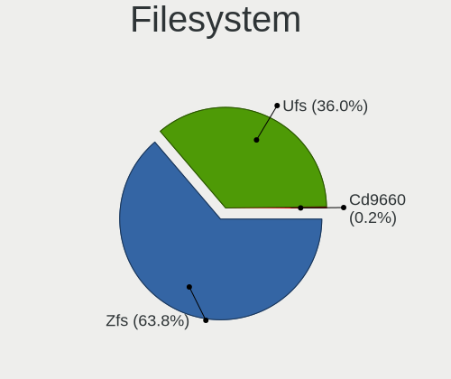
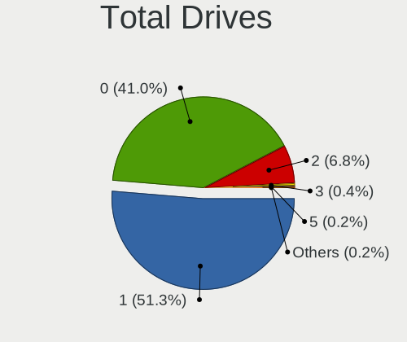
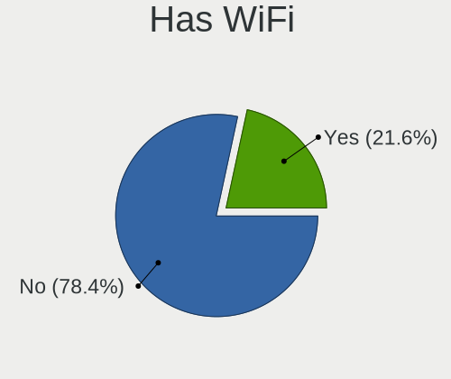
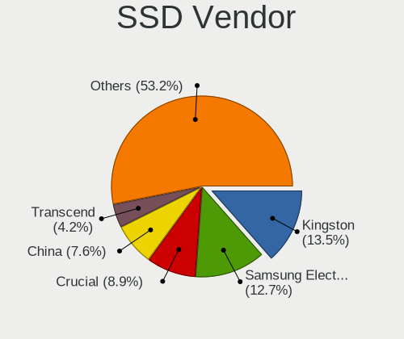
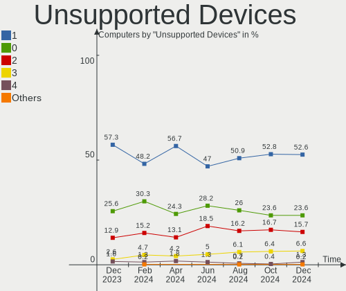

OPNsense - Hardware Trends
--------------------------

A project to identify most popular hardware characteristics and track their change
over time based on data collected by BSD users at https://BSD-Hardware.info.

Anyone can contribute to this report by the [hw-probe](https://github.com/linuxhw/hw-probe/blob/master/INSTALL.BSD.md) tool:

    hw-probe -all -upload

This report is for one last month. Overall report since the beginning of time: [TestDays](https://github.com/bsdhw/TestDays)

Period: Dec, 2024.

Contents
--------

* [ System ](#system)
  - [ OS                       ](#os)
  - [ OS Family                ](#os-family)
  - [ Arch                     ](#arch)
  - [ DE                       ](#de)
  - [ Display Server           ](#display-server)
  - [ Display Manager          ](#display-manager)
  - [ OS Lang                  ](#os-lang)
  - [ Boot Mode                ](#boot-mode)
  - [ Filesystem               ](#filesystem)
  - [ Part. scheme             ](#part-scheme)

* [ Board ](#board)
  - [ Vendor                   ](#vendor)
  - [ Model                    ](#model)
  - [ Model Family             ](#model-family)
  - [ MFG Year                 ](#mfg-year)
  - [ Form Factor              ](#form-factor)
  - [ Coreboot                 ](#coreboot)
  - [ RAM Size                 ](#ram-size)
  - [ RAM Used                 ](#ram-used)
  - [ Total Drives             ](#total-drives)
  - [ Has CD-ROM               ](#has-cd-rom)
  - [ Has Ethernet             ](#has-ethernet)
  - [ Has WiFi                 ](#has-wifi)
  - [ Has Bluetooth            ](#has-bluetooth)

* [ Location ](#location)
  - [ Country                  ](#country)
  - [ City                     ](#city)

* [ Drives ](#drives)
  - [ Drive Vendor             ](#drive-vendor)
  - [ Drive Model              ](#drive-model)
  - [ HDD Vendor               ](#hdd-vendor)
  - [ SSD Vendor               ](#ssd-vendor)
  - [ Drive Kind               ](#drive-kind)
  - [ Drive Connector          ](#drive-connector)
  - [ Drive Size               ](#drive-size)
  - [ Space Total              ](#space-total)
  - [ Space Used               ](#space-used)
  - [ Malfunc. Drives          ](#malfunc-drives)
  - [ Malfunc. Drive Vendor    ](#malfunc-drive-vendor)
  - [ Malfunc. HDD Vendor      ](#malfunc-hdd-vendor)
  - [ Malfunc. Drive Kind      ](#malfunc-drive-kind)
  - [ Failed Drives            ](#failed-drives)
  - [ Failed Drive Vendor      ](#failed-drive-vendor)
  - [ Drive Status             ](#drive-status)

* [ Storage controller ](#storage-controller)
  - [ Storage Vendor           ](#storage-vendor)
  - [ Storage Model            ](#storage-model)
  - [ Storage Kind             ](#storage-kind)

* [ Processor ](#processor)
  - [ CPU Vendor               ](#cpu-vendor)
  - [ CPU Model                ](#cpu-model)
  - [ CPU Model Family         ](#cpu-model-family)
  - [ CPU Cores                ](#cpu-cores)
  - [ CPU Sockets              ](#cpu-sockets)
  - [ CPU Threads              ](#cpu-threads)
  - [ CPU Microarch            ](#cpu-microarch)

* [ Graphics ](#graphics)
  - [ GPU Vendor               ](#gpu-vendor)
  - [ GPU Model                ](#gpu-model)
  - [ GPU Combo                ](#gpu-combo)
  - [ GPU Driver               ](#gpu-driver)
  - [ GPU Memory               ](#gpu-memory)

* [ Monitor ](#monitor)
  - [ Monitor Vendor           ](#monitor-vendor)
  - [ Monitor Model            ](#monitor-model)
  - [ Monitor Resolution       ](#monitor-resolution)
  - [ Monitor Diagonal         ](#monitor-diagonal)
  - [ Monitor Width            ](#monitor-width)
  - [ Aspect Ratio             ](#aspect-ratio)
  - [ Monitor Area             ](#monitor-area)
  - [ Pixel Density            ](#pixel-density)
  - [ Multiple Monitors        ](#multiple-monitors)

* [ Network ](#network)
  - [ Net Controller Vendor    ](#net-controller-vendor)
  - [ Net Controller Model     ](#net-controller-model)
  - [ Wireless Vendor          ](#wireless-vendor)
  - [ Wireless Model           ](#wireless-model)
  - [ Ethernet Vendor          ](#ethernet-vendor)
  - [ Ethernet Model           ](#ethernet-model)
  - [ Net Controller Kind      ](#net-controller-kind)
  - [ Used Controller          ](#used-controller)
  - [ NICs                     ](#nics)
  - [ IPv6                     ](#ipv6)

* [ Bluetooth ](#bluetooth)
  - [ Bluetooth Vendor         ](#bluetooth-vendor)
  - [ Bluetooth Model          ](#bluetooth-model)

* [ Sound ](#sound)
  - [ Sound Vendor             ](#sound-vendor)
  - [ Sound Model              ](#sound-model)

* [ Memory ](#memory)
  - [ Memory Vendor            ](#memory-vendor)
  - [ Memory Model             ](#memory-model)
  - [ Memory Kind              ](#memory-kind)
  - [ Memory Form Factor       ](#memory-form-factor)
  - [ Memory Size              ](#memory-size)
  - [ Memory Speed             ](#memory-speed)

* [ Printers & scanners ](#printers--scanners)
  - [ Printer Vendor           ](#printer-vendor)
  - [ Printer Model            ](#printer-model)
  - [ Scanner Vendor           ](#scanner-vendor)
  - [ Scanner Model            ](#scanner-model)

* [ Camera ](#camera)
  - [ Camera Vendor            ](#camera-vendor)
  - [ Camera Model             ](#camera-model)

* [ Security ](#security)
  - [ Fingerprint Vendor       ](#fingerprint-vendor)
  - [ Fingerprint Model        ](#fingerprint-model)
  - [ Chipcard Vendor          ](#chipcard-vendor)
  - [ Chipcard Model           ](#chipcard-model)

* [ Unsupported ](#unsupported)
  - [ Unsupported Devices      ](#unsupported-devices)
  - [ Unsupported Device Types ](#unsupported-device-types)

System
------

OS
--

Installed operating systems

| Name             | Computers | Percent |
|------------------|-----------|---------|
| OPNsense 24.7.11 | 194       | 42.36%  |
| OPNsense 24.7.10 | 179       | 39.08%  |
| OPNsense 24.7.9  | 40        | 8.73%   |
| OPNsense 25.1    | 10        | 2.18%   |
| OPNsense 24.7.8  | 9         | 1.97%   |
| OPNsense 24.10.1 | 6         | 1.31%   |
| OPNsense 24.1.10 | 6         | 1.31%   |
| OPNsense 23.7.12 | 5         | 1.09%   |
| OPNsense 24.7    | 3         | 0.66%   |
| OPNsense 24.7.7  | 2         | 0.44%   |
| OPNsense 24.7.4  | 1         | 0.22%   |
| OPNsense 24.7.3  | 1         | 0.22%   |
| OPNsense 24.4    | 1         | 0.22%   |
| OPNsense 24.1.9  | 1         | 0.22%   |

OS Family
---------

OS without a version

| Name     | Computers | Percent |
|----------|-----------|---------|
| OPNsense | 458       | 100%    |

Arch
----

OS architecture (x86_64, i586, etc.)

| Name  | Computers | Percent |
|-------|-----------|---------|
| amd64 | 458       | 100%    |

DE
--

Desktop Environment

| Name    | Computers | Percent |
|---------|-----------|---------|
| Console | 458       | 100%    |

Display Server
--------------

X11 or Wayland

| Name    | Computers | Percent |
|---------|-----------|---------|
| Console | 458       | 100%    |

Display Manager
---------------

SDDM, LightDM, etc.

| Name    | Computers | Percent |
|---------|-----------|---------|
| Console | 458       | 100%    |

OS Lang
-------

Language

| Lang    | Computers | Percent |
|---------|-----------|---------|
| Unknown | 452       | 98.69%  |
| C       | 6         | 1.31%   |

Boot Mode
---------

EFI or BIOS

| Mode | Computers | Percent |
|------|-----------|---------|
| EFI  | 449       | 98.03%  |
| BIOS | 9         | 1.97%   |

Filesystem
----------

Type of filesystem

| Type   | Computers | Percent |
|--------|-----------|---------|
| Zfs    | 292       | 63.76%  |
| Ufs    | 165       | 36.03%  |
| Cd9660 | 1         | 0.22%   |

Part. scheme
------------

Scheme of partitioning

| Type    | Computers | Percent |
|---------|-----------|---------|
| GPT     | 451       | 98.47%  |
| Unknown | 4         | 0.87%   |
| BSD     | 2         | 0.44%   |
| MBR     | 1         | 0.22%   |

Board
-----

Vendor
------

Motherboard manufacturer

| Name                                 | Computers | Percent |
|--------------------------------------|-----------|---------|
| Unknown                              | 110       | 24.02%  |
| Dell                                 | 49        | 10.7%   |
| Protectli                            | 29        | 6.33%   |
| Supermicro                           | 23        | 5.02%   |
| Intel                                | 21        | 4.59%   |
| Hewlett-Packard                      | 21        | 4.59%   |
| ASUSTek Computer                     | 20        | 4.37%   |
| Lenovo                               | 15        | 3.28%   |
| Sophos                               | 14        | 3.06%   |
| ASRock                               | 14        | 3.06%   |
| AMI                                  | 11        | 2.4%    |
| Techvision                           | 10        | 2.18%   |
| Gigabyte Technology                  | 10        | 2.18%   |
| Fujitsu                              | 10        | 2.18%   |
| AZW                                  | 10        | 2.18%   |
| PC Engines                           | 8         | 1.75%   |
| MSI                                  | 8         | 1.75%   |
| Deciso                               | 8         | 1.75%   |
| Shenzhen Meigao Electronic Equipment | 6         | 1.31%   |
| IceWhale Technology                  | 4         | 0.87%   |
| GoWin Solution                       | 4         | 0.87%   |
| BESSTAR Tech                         | 4         | 0.87%   |
| ZOTAC                                | 3         | 0.66%   |
| AAEON                                | 3         | 0.66%   |
| MW                                   | 2         | 0.44%   |
| Inventec                             | 2         | 0.44%   |
| HPE                                  | 2         | 0.44%   |
| Hardkernel                           | 2         | 0.44%   |
| CncTion                              | 2         | 0.44%   |
| Apple                                | 2         | 0.44%   |
| Advantech                            | 2         | 0.44%   |
| VGKE                                 | 1         | 0.22%   |
| Trigkey                              | 1         | 0.22%   |
| SJRC                                 | 1         | 0.22%   |
| Silicom                              | 1         | 0.22%   |
| SHENZHEN YOUDISI E-COMMERCE          | 1         | 0.22%   |
| Shenzhen Simo Innovation Technology  | 1         | 0.22%   |
| ShenZhen MinWin Technology           | 1         | 0.22%   |
| Quanmax                              | 1         | 0.22%   |
| Pegatron                             | 1         | 0.22%   |

Model
-----

Motherboard model

| Name                                              | Computers | Percent |
|---------------------------------------------------|-----------|---------|
| Unknown                                           | 110       | 24.02%  |
| Techvision TVI7309X                               | 10        | 2.18%   |
| AZW EQ                                            | 9         | 1.97%   |
| AMI Aptio CRB                                     | 9         | 1.97%   |
| Supermicro Super Server                           | 7         | 1.53%   |
| Protectli FW6                                     | 7         | 1.53%   |
| Sophos XG                                         | 6         | 1.31%   |
| Sophos SG                                         | 5         | 1.09%   |
| Shenzhen Meigao Electronic Equipment Venus Series | 5         | 1.09%   |
| Protectli VP2420                                  | 5         | 1.09%   |
| Protectli V1410                                   | 5         | 1.09%   |
| PC Engines APU2                                   | 5         | 1.09%   |
| IceWhale ZimaBoard 832 ZMB                        | 4         | 0.87%   |
| HP EliteDesk 800 G1 SFF                           | 4         | 0.87%   |
| GoWin Solution R86S                               | 4         | 0.87%   |
| Fujitsu FUTRO S920                                | 4         | 0.87%   |
| Dell OptiPlex 5070                                | 4         | 0.87%   |
| Sophos UTM                                        | 3         | 0.66%   |
| Protectli FW4B                                    | 3         | 0.66%   |
| PC Engines apu4                                   | 3         | 0.66%   |
| Dell PowerEdge R210 II                            | 3         | 0.66%   |
| Dell OptiPlex 7050                                | 3         | 0.66%   |
| Dell OptiPlex 7020                                | 3         | 0.66%   |
| Dell OptiPlex 5040                                | 3         | 0.66%   |
| Dell OptiPlex 3020                                | 3         | 0.66%   |
| Deciso Netboard A20                               | 3         | 0.66%   |
| BESSTAR Tech GK41                                 | 3         | 0.66%   |
| AAEON UP-APL01                                    | 3         | 0.66%   |
| Supermicro SYS-5018A-FTN4                         | 2         | 0.44%   |
| Protectli VP6630                                  | 2         | 0.44%   |
| MW GMLK-2_5G4L                                    | 2         | 0.44%   |
| Intel QHSW02                                      | 2         | 0.44%   |
| Intel MAHOBAY                                     | 2         | 0.44%   |
| Intel Jasper Lake Client Platform                 | 2         | 0.44%   |
| Hardkernel ODROID-H4                              | 2         | 0.44%   |
| Dell Wyse 5070 Thin Client                        | 2         | 0.44%   |
| Dell OptiPlex 7040                                | 2         | 0.44%   |
| Dell OptiPlex 7010                                | 2         | 0.44%   |
| Dell OptiPlex 3070                                | 2         | 0.44%   |
| Dell OptiPlex 3050                                | 2         | 0.44%   |

Model Family
------------

Motherboard model prefix

| Name                                       | Computers | Percent |
|--------------------------------------------|-----------|---------|
| Unknown                                    | 110       | 24.02%  |
| Dell OptiPlex                              | 30        | 6.55%   |
| Techvision TVI7309X                        | 10        | 2.18%   |
| AZW EQ                                     | 9         | 1.97%   |
| AMI Aptio                                  | 9         | 1.97%   |
| Lenovo ThinkCentre                         | 8         | 1.75%   |
| Supermicro Super                           | 7         | 1.53%   |
| Protectli FW6                              | 7         | 1.53%   |
| Fujitsu FUTRO                              | 7         | 1.53%   |
| Dell PowerEdge                             | 7         | 1.53%   |
| Sophos XG                                  | 6         | 1.31%   |
| HP EliteDesk                               | 6         | 1.31%   |
| Sophos SG                                  | 5         | 1.09%   |
| Shenzhen Meigao Electronic Equipment Venus | 5         | 1.09%   |
| Protectli VP2420                           | 5         | 1.09%   |
| Protectli V1410                            | 5         | 1.09%   |
| PC Engines APU2                            | 5         | 1.09%   |
| Lenovo ThinkStation                        | 4         | 0.87%   |
| IceWhale ZimaBoard                         | 4         | 0.87%   |
| GoWin Solution R86S                        | 4         | 0.87%   |
| Dell Inspiron                              | 4         | 0.87%   |
| ASUS PRIME                                 | 4         | 0.87%   |
| Sophos UTM                                 | 3         | 0.66%   |
| Protectli FW4B                             | 3         | 0.66%   |
| PC Engines apu4                            | 3         | 0.66%   |
| HP ProLiant                                | 3         | 0.66%   |
| Dell Wyse                                  | 3         | 0.66%   |
| Deciso Netboard                            | 3         | 0.66%   |
| BESSTAR Tech GK41                          | 3         | 0.66%   |
| AAEON UP-APL01                             | 3         | 0.66%   |
| Supermicro SYS-5018A-FTN4                  | 2         | 0.44%   |
| Protectli VP6630                           | 2         | 0.44%   |
| MW GMLK-2                                  | 2         | 0.44%   |
| Intel QHSW02                               | 2         | 0.44%   |
| Intel MAHOBAY                              | 2         | 0.44%   |
| Intel Jasper                               | 2         | 0.44%   |
| HPE ProLiant                               | 2         | 0.44%   |
| HP Compaq                                  | 2         | 0.44%   |
| Hardkernel ODROID-H4                       | 2         | 0.44%   |
| Dell Vostro                                | 2         | 0.44%   |

MFG Year
--------

Motherboard manufacture year

| Year | Computers | Percent |
|------|-----------|---------|
| 2023 | 87        | 19%     |
| 2022 | 64        | 13.97%  |
| 2024 | 55        | 12.01%  |
| 2018 | 41        | 8.95%   |
| 2014 | 35        | 7.64%   |
| 2016 | 28        | 6.11%   |
| 2021 | 26        | 5.68%   |
| 2019 | 24        | 5.24%   |
| 2017 | 24        | 5.24%   |
| 2020 | 16        | 3.49%   |
| 2015 | 14        | 3.06%   |
| 2012 | 12        | 2.62%   |
| 2011 | 11        | 2.4%    |
| 2013 | 9         | 1.97%   |
| 2008 | 5         | 1.09%   |
| 2007 | 4         | 0.87%   |
| 2009 | 2         | 0.44%   |
| 2010 | 1         | 0.22%   |

Form Factor
-----------

Physical design of the computer

| Name     | Computers | Percent |
|----------|-----------|---------|
| Desktop  | 359       | 78.38%  |
| Mini pc  | 34        | 7.42%   |
| Server   | 31        | 6.77%   |
| Notebook | 17        | 3.71%   |
| Firewall | 16        | 3.49%   |
| Tablet   | 1         | 0.22%   |

Coreboot
--------

Have coreboot on board

| Used | Computers | Percent |
|------|-----------|---------|
| No   | 447       | 97.6%   |
| Yes  | 11        | 2.4%    |

RAM Size
--------

Total RAM memory

| Size in GB  | Computers | Percent |
|-------------|-----------|---------|
| 8.01-16.0   | 167       | 36.46%  |
| 16.01-24.0  | 150       | 32.75%  |
| 32.01-64.0  | 65        | 14.19%  |
| 4.01-8.0    | 45        | 9.83%   |
| 64.01-256.0 | 12        | 2.62%   |
| 24.01-32.0  | 9         | 1.97%   |
| 2.01-3.0    | 9         | 1.97%   |
| 3.01-4.0    | 1         | 0.22%   |

RAM Used
--------

Used RAM memory

| Used GB  | Computers | Percent |
|----------|-----------|---------|
| 0.51-1.0 | 212       | 46.29%  |
| 0.01-0.5 | 165       | 36.03%  |
| 1.01-2.0 | 74        | 16.16%  |
| 2.01-3.0 | 5         | 1.09%   |
| 3.01-4.0 | 2         | 0.44%   |

Total Drives
------------

Number of drives on board

| Drives | Computers | Percent |
|--------|-----------|---------|
| 1      | 235       | 51.31%  |
| 0      | 188       | 41.05%  |
| 2      | 31        | 6.77%   |
| 3      | 2         | 0.44%   |
| 5      | 1         | 0.22%   |
| 4      | 1         | 0.22%   |

Has CD-ROM
----------

Has CD-ROM on board

| Presented | Computers | Percent |
|-----------|-----------|---------|
| No        | 418       | 91.27%  |
| Yes       | 40        | 8.73%   |

Has Ethernet
------------

Has Ethernet on board

| Presented | Computers | Percent |
|-----------|-----------|---------|
| Yes       | 458       | 100%    |

Has WiFi
--------

Has WiFi module

| Presented | Computers | Percent |
|-----------|-----------|---------|
| No        | 359       | 78.38%  |
| Yes       | 99        | 21.62%  |

Has Bluetooth
-------------

Has Bluetooth module

| Presented | Computers | Percent |
|-----------|-----------|---------|
| No        | 385       | 84.06%  |
| Yes       | 73        | 15.94%  |

Location
--------

Country
-------

Geographic location (country)

| Country         | Computers | Percent |
|-----------------|-----------|---------|
| USA             | 158       | 34.5%   |
| Germany         | 80        | 17.47%  |
| UK              | 23        | 5.02%   |
| Canada          | 21        | 4.59%   |
| France          | 11        | 2.4%    |
| Australia       | 11        | 2.4%    |
| Italy           | 10        | 2.18%   |
| Russia          | 9         | 1.97%   |
| Brazil          | 9         | 1.97%   |
| Switzerland     | 8         | 1.75%   |
| Netherlands     | 8         | 1.75%   |
| Austria         | 8         | 1.75%   |
| Spain           | 7         | 1.53%   |
| Portugal        | 7         | 1.53%   |
| Sweden          | 6         | 1.31%   |
| South Korea     | 5         | 1.09%   |
| Poland          | 5         | 1.09%   |
| Norway          | 5         | 1.09%   |
| Finland         | 5         | 1.09%   |
| Czechia         | 4         | 0.87%   |
| China           | 4         | 0.87%   |
| Belgium         | 4         | 0.87%   |
| Vietnam         | 3         | 0.66%   |
| Indonesia       | 3         | 0.66%   |
| Ukraine         | 2         | 0.44%   |
| Turkey          | 2         | 0.44%   |
| The Netherlands | 2         | 0.44%   |
| Slovakia        | 2         | 0.44%   |
| Singapore       | 2         | 0.44%   |
| Lithuania       | 2         | 0.44%   |
| Japan           | 2         | 0.44%   |
| Israel          | 2         | 0.44%   |
| Ireland         | 2         | 0.44%   |
| India           | 2         | 0.44%   |
| Hungary         | 2         | 0.44%   |
| Hong Kong       | 2         | 0.44%   |
| Denmark         | 2         | 0.44%   |
| Chile           | 2         | 0.44%   |
| Bulgaria        | 2         | 0.44%   |
| Thailand        | 1         | 0.22%   |

City
----

Geographic location (city)

| City                  | Computers | Percent |
|-----------------------|-----------|---------|
| Berlin                | 6         | 1.31%   |
| Cologne               | 5         | 1.09%   |
| Vienna                | 4         | 0.87%   |
| Toronto               | 4         | 0.87%   |
| Sydney                | 4         | 0.87%   |
| Portland              | 4         | 0.87%   |
| Moscow                | 4         | 0.87%   |
| Mannheim              | 4         | 0.87%   |
| Lisbon                | 4         | 0.87%   |
| Denver                | 4         | 0.87%   |
| Stockholm             | 3         | 0.66%   |
| Salt Lake City        | 3         | 0.66%   |
| Philadelphia          | 3         | 0.66%   |
| Oslo                  | 3         | 0.66%   |
| Nottuln               | 3         | 0.66%   |
| Munich                | 3         | 0.66%   |
| Ho Chi Minh City      | 3         | 0.66%   |
| Dortmund              | 3         | 0.66%   |
| Austin                | 3         | 0.66%   |
| Warsaw                | 2         | 0.44%   |
| Vilnius               | 2         | 0.44%   |
| Victoria              | 2         | 0.44%   |
| Vancouver             | 2         | 0.44%   |
| Turin                 | 2         | 0.44%   |
| Tampa                 | 2         | 0.44%   |
| St Petersburg         | 2         | 0.44%   |
| Singapore             | 2         | 0.44%   |
| Seattle               | 2         | 0.44%   |
| Sao Paulo             | 2         | 0.44%   |
| Saint Paul            | 2         | 0.44%   |
| Sacramento            | 2         | 0.44%   |
| Rome                  | 2         | 0.44%   |
| Porto                 | 2         | 0.44%   |
| Phoenix               | 2         | 0.44%   |
| Paris                 | 2         | 0.44%   |
| Oakland               | 2         | 0.44%   |
| Neustadt an der Aisch | 2         | 0.44%   |
| Neumünster           | 2         | 0.44%   |
| Montreal              | 2         | 0.44%   |
| Mesa                  | 2         | 0.44%   |

Drives
------

Drive Vendor
------------

Hard drive vendors

| Vendor              | Computers | Drives | Percent |
|---------------------|-----------|--------|---------|
| Kingston            | 33        | 37     | 11.74%  |
| Samsung Electronics | 31        | 32     | 11.03%  |
| Crucial             | 21        | 23     | 7.47%   |
| Seagate             | 19        | 24     | 6.76%   |
| China               | 18        | 18     | 6.41%   |
| WDC                 | 17        | 19     | 6.05%   |
| Transcend           | 10        | 10     | 3.56%   |
| SanDisk             | 10        | 10     | 3.56%   |
| Protectli           | 10        | 10     | 3.56%   |
| A-DATA Technology   | 9         | 9      | 3.2%    |
| Intel               | 8         | 10     | 2.85%   |
| Team                | 6         | 6      | 2.14%   |
| SPCC                | 6         | 8      | 2.14%   |
| Hoodisk             | 5         | 5      | 1.78%   |
| Hitachi             | 5         | 8      | 1.78%   |
| FORESEE             | 5         | 5      | 1.78%   |
| Toshiba             | 4         | 4      | 1.42%   |
| PNY                 | 4         | 4      | 1.42%   |
| OCZ                 | 4         | 4      | 1.42%   |
| Apacer              | 4         | 4      | 1.42%   |
| SK hynix            | 3         | 3      | 1.07%   |
| ShiJi               | 3         | 3      | 1.07%   |
| Micron Technology   | 3         | 5      | 1.07%   |
| KingSpec            | 3         | 4      | 1.07%   |
| Hewlett-Packard     | 3         | 3      | 1.07%   |
| Patriot             | 2         | 4      | 0.71%   |
| Netac               | 2         | 2      | 0.71%   |
| Lexar               | 2         | 2      | 0.71%   |
| HGST                | 2         | 2      | 0.71%   |
| Dogfish             | 2         | 2      | 0.71%   |
| Corsair             | 2         | 2      | 0.71%   |
| ATP                 | 2         | 2      | 0.71%   |
| Advantech           | 2         | 3      | 0.71%   |
| ZOTAC               | 1         | 1      | 0.36%   |
| Wicgtyp             | 1         | 1      | 0.36%   |
| VICK                | 1         | 1      | 0.36%   |
| SHAREVDI            | 1         | 1      | 0.36%   |
| S3+                 | 1         | 1      | 0.36%   |
| Plextor             | 1         | 2      | 0.36%   |
| Phison              | 1         | 1      | 0.36%   |

Drive Model
-----------

Hard drive models

| Model                           | Computers | Percent |
|---------------------------------|-----------|---------|
| Kingston SA400S37240G 240GB     | 7         | 2.43%   |
| Kingston SKC600MS256G 256GB     | 5         | 1.74%   |
| Crucial CT250MX500SSD1 250GB    | 4         | 1.39%   |
| WDC WDS500G2B0A-00SM50 500GB    | 3         | 1.04%   |
| Samsung SSD 850 EVO 250GB       | 3         | 1.04%   |
| Kingston SV300S37A120G 120GB    | 3         | 1.04%   |
| Kingston SA400S37120G 120GB     | 3         | 1.04%   |
| HP RAID 1(1+0) 240GB            | 3         | 1.04%   |
| Crucial CT1000MX500SSD1 1TB     | 3         | 1.04%   |
| China SATA SSD 240GB            | 3         | 1.04%   |
| A-DATA ASU800SS-128GT 128GB     | 3         | 1.04%   |
| Transcend TS256GMTS952T2 256GB  | 2         | 0.69%   |
| Transcend TS128GMSA230S 128GB   | 2         | 0.69%   |
| SPCC Solid State Disk 256GB     | 2         | 0.69%   |
| SPCC Solid State Disk 128GB     | 2         | 0.69%   |
| Seagate ST1000NM0033-9ZM173 1TB | 2         | 0.69%   |
| Samsung SSD 870 EVO 250GB       | 2         | 0.69%   |
| Samsung SSD 860 EVO 250GB       | 2         | 0.69%   |
| Samsung SSD 830 Series 128GB    | 2         | 0.69%   |
| Protectli 64GB mSATA            | 2         | 0.69%   |
| Protectli 480GB M.2             | 2         | 0.69%   |
| Protectli 240GB mSATA           | 2         | 0.69%   |
| Protectli 240GB M.2             | 2         | 0.69%   |
| PNY CS900 240GB SSD             | 2         | 0.69%   |
| Kingston SV300S37A240G 240GB    | 2         | 0.69%   |
| Kingston SHFS37A120G 120GB      | 2         | 0.69%   |
| Kingston SA400S37480G 480GB     | 2         | 0.69%   |
| KingSpec P3-128 128GB           | 2         | 0.69%   |
| Hoodisk SSD 128GB               | 2         | 0.69%   |
| FORESEE 512GB SSD               | 2         | 0.69%   |
| FORESEE 128GB SSD               | 2         | 0.69%   |
| Crucial CT500MX500SSD1 500GB    | 2         | 0.69%   |
| Crucial CT240BX500SSD1 240GB    | 2         | 0.69%   |
| China SATA SSD 32GB             | 2         | 0.69%   |
| China SATA SSD 256GB            | 2         | 0.69%   |
| China SATA SSD 16GB             | 2         | 0.69%   |
| China SATA SSD 120GB            | 2         | 0.69%   |
| China FPT310M4SSD256G 256GB     | 2         | 0.69%   |
| ATP SATA III mSATA 64GB         | 2         | 0.69%   |
| Apacer 32GB SATA Flash Drive    | 2         | 0.69%   |

HDD Vendor
----------

Hard disk drive vendors

| Vendor              | Computers | Drives | Percent |
|---------------------|-----------|--------|---------|
| Seagate             | 19        | 24     | 43.18%  |
| WDC                 | 12        | 14     | 27.27%  |
| Hitachi             | 5         | 8      | 11.36%  |
| Toshiba             | 3         | 3      | 6.82%   |
| HGST                | 2         | 2      | 4.55%   |
| Samsung Electronics | 1         | 1      | 2.27%   |
| MARVELL             | 1         | 1      | 2.27%   |
| Apple               | 1         | 1      | 2.27%   |

SSD Vendor
----------

Solid state drive vendors

| Vendor              | Computers | Drives | Percent |
|---------------------|-----------|--------|---------|
| Kingston            | 32        | 36     | 13.5%   |
| Samsung Electronics | 30        | 31     | 12.66%  |
| Crucial             | 21        | 23     | 8.86%   |
| China               | 18        | 18     | 7.59%   |
| Transcend           | 10        | 10     | 4.22%   |
| SanDisk             | 10        | 10     | 4.22%   |
| Protectli           | 10        | 10     | 4.22%   |
| A-DATA Technology   | 9         | 9      | 3.8%    |
| Intel               | 8         | 10     | 3.38%   |
| Team                | 6         | 6      | 2.53%   |
| SPCC                | 6         | 8      | 2.53%   |
| WDC                 | 5         | 5      | 2.11%   |
| Hoodisk             | 5         | 5      | 2.11%   |
| FORESEE             | 5         | 5      | 2.11%   |
| PNY                 | 4         | 4      | 1.69%   |
| OCZ                 | 4         | 4      | 1.69%   |
| Apacer              | 4         | 4      | 1.69%   |
| SK hynix            | 3         | 3      | 1.27%   |
| ShiJi               | 3         | 3      | 1.27%   |
| Micron Technology   | 3         | 5      | 1.27%   |
| KingSpec            | 3         | 4      | 1.27%   |
| Hewlett-Packard     | 3         | 3      | 1.27%   |
| Patriot             | 2         | 4      | 0.84%   |
| Netac               | 2         | 2      | 0.84%   |
| Lexar               | 2         | 2      | 0.84%   |
| Dogfish             | 2         | 2      | 0.84%   |
| Corsair             | 2         | 2      | 0.84%   |
| ATP                 | 2         | 2      | 0.84%   |
| Advantech           | 2         | 3      | 0.84%   |
| ZOTAC               | 1         | 1      | 0.42%   |
| Wicgtyp             | 1         | 1      | 0.42%   |
| VICK                | 1         | 1      | 0.42%   |
| Toshiba             | 1         | 1      | 0.42%   |
| SHAREVDI            | 1         | 1      | 0.42%   |
| S3+                 | 1         | 1      | 0.42%   |
| Plextor             | 1         | 2      | 0.42%   |
| Phison              | 1         | 1      | 0.42%   |
| Mushkin             | 1         | 2      | 0.42%   |
| LITEON              | 1         | 1      | 0.42%   |
| KUU                 | 1         | 1      | 0.42%   |

Drive Kind
----------

HDD or SSD

| Kind | Computers | Drives | Percent |
|------|-----------|--------|---------|
| SSD  | 233       | 256    | 84.42%  |
| HDD  | 42        | 54     | 15.22%  |
| NVMe | 1         | 1      | 0.36%   |

Drive Connector
---------------

SATA, SAS, NVMe, etc.

| Type | Computers | Drives | Percent |
|------|-----------|--------|---------|
| SATA | 268       | 310    | 99.63%  |
| NVMe | 1         | 1      | 0.37%   |

Drive Size
----------

Size of hard drive

| Size in TB | Computers | Drives | Percent |
|------------|-----------|--------|---------|
| 0.01-0.5   | 234       | 254    | 84.48%  |
| 0.51-1.0   | 37        | 44     | 13.36%  |
| 1.01-2.0   | 3         | 6      | 1.08%   |
| 3.01-4.0   | 1         | 1      | 0.36%   |
| 2.01-3.0   | 1         | 4      | 0.36%   |
| 4.01-10.0  | 1         | 1      | 0.36%   |

Space Total
-----------

Amount of disk space available on the file system

| Size in GB     | Computers | Percent |
|----------------|-----------|---------|
| 101-250        | 230       | 50.22%  |
| 251-500        | 92        | 20.09%  |
| 51-100         | 44        | 9.61%   |
| 501-1000       | 40        | 8.73%   |
| 21-50          | 33        | 7.21%   |
| 1-20           | 17        | 3.71%   |
| More than 3000 | 2         | 0.44%   |

Space Used
----------

Amount of used disk space

| Used GB | Computers | Percent |
|---------|-----------|---------|
| 1-20    | 423       | 92.36%  |
| 21-50   | 21        | 4.59%   |
| 51-100  | 10        | 2.18%   |
| 101-250 | 3         | 0.66%   |
| 251-500 | 1         | 0.22%   |

Malfunc. Drives
---------------

Drive models with a malfunction

| Model                                      | Computers | Drives | Percent |
|--------------------------------------------|-----------|--------|---------|
| WDC WD5000AAKX-603CA0 500GB                | 1         | 1      | 2.56%   |
| WDC WD5000AAKS-22A7B2 500GB                | 1         | 1      | 2.56%   |
| WDC WD5000AAKS-00V1A0 500GB                | 1         | 1      | 2.56%   |
| WDC WD40EZRZ-00GXCB0 4TB                   | 1         | 1      | 2.56%   |
| WDC WD1500ADFD-00NLR1 150GB                | 1         | 1      | 2.56%   |
| Transcend TS256GMTS830S 256GB              | 1         | 1      | 2.56%   |
| Toshiba THNSNK256GVN8 M.2 2280 256GB       | 1         | 1      | 2.56%   |
| Team XS2 SSD 64GB                          | 1         | 1      | 2.56%   |
| SK hynix HFS064G3AMNB-2200A 64GB           | 1         | 1      | 2.56%   |
| Seagate ST98823AS 80GB                     | 1         | 1      | 2.56%   |
| Seagate ST500DM002-1BD142 500GB            | 1         | 1      | 2.56%   |
| Seagate ST3160815AS 160GB                  | 1         | 1      | 2.56%   |
| Seagate ST1000NM0033-9ZM173 1TB            | 1         | 2      | 2.56%   |
| Seagate ST1000DM010-2EP102 1TB             | 1         | 1      | 2.56%   |
| SanDisk SD7SB3Q128G1001 128GB              | 1         | 1      | 2.56%   |
| Patriot Burst Elite 240GB                  | 1         | 2      | 2.56%   |
| Micron Technology MTFDDAK128MAM-1J1 128GB  | 1         | 2      | 2.56%   |
| Micron Technology M500_MTFDDAK480MAV 480GB | 1         | 2      | 2.56%   |
| LITEON CV8-8E128-HP 128GB                  | 1         | 1      | 2.56%   |
| Kingston SUV500MS120G 120GB                | 1         | 1      | 2.56%   |
| Kingston SNS4151S316GD 16GB                | 1         | 1      | 2.56%   |
| Kingston SHFS37A120G 120GB                 | 1         | 1      | 2.56%   |
| KingSpec P4-120 120GB                      | 1         | 1      | 2.56%   |
| Intel SSDSC2BW180H6 180GB                  | 1         | 1      | 2.56%   |
| Intel SSDSA2M120G2GC 120GB                 | 1         | 1      | 2.56%   |
| Intel SSDSA2M080G2GC 80GB                  | 1         | 1      | 2.56%   |
| Intel SSDMAEMC040G2 40GB                   | 1         | 2      | 2.56%   |
| Hitachi HUA723020ALA641 2TB                | 1         | 3      | 2.56%   |
| Hitachi HUA722050CLA330 500GB              | 1         | 1      | 2.56%   |
| Hitachi HTS545050B9A300 500GB              | 1         | 1      | 2.56%   |
| Hitachi HTS541680J9SA00 80GB               | 1         | 1      | 2.56%   |
| HGST HTS541075A9E680 752GB                 | 1         | 1      | 2.56%   |
| Crucial CT512M550SSD1 512GB                | 1         | 2      | 2.56%   |
| Crucial CT275MX300SSD1 275GB               | 1         | 1      | 2.56%   |
| Crucial CT128MX100SSD1 128GB               | 1         | 1      | 2.56%   |
| Corsair Force GS 180GB                     | 1         | 1      | 2.56%   |
| Corsair Force 3 SSD 120GB                  | 1         | 1      | 2.56%   |
| Apacer 64GB SATA Flash Drive               | 1         | 1      | 2.56%   |
| A-DATA Technology ASU800SS-256GT 256GB     | 1         | 1      | 2.56%   |

Malfunc. Drive Vendor
---------------------

Vendors of faulty drives

| Vendor            | Computers | Drives | Percent |
|-------------------|-----------|--------|---------|
| WDC               | 5         | 5      | 12.82%  |
| Seagate           | 5         | 6      | 12.82%  |
| Intel             | 4         | 5      | 10.26%  |
| Hitachi           | 4         | 6      | 10.26%  |
| Kingston          | 3         | 3      | 7.69%   |
| Crucial           | 3         | 4      | 7.69%   |
| Micron Technology | 2         | 4      | 5.13%   |
| Corsair           | 2         | 2      | 5.13%   |
| Transcend         | 1         | 1      | 2.56%   |
| Toshiba           | 1         | 1      | 2.56%   |
| Team              | 1         | 1      | 2.56%   |
| SK hynix          | 1         | 1      | 2.56%   |
| SanDisk           | 1         | 1      | 2.56%   |
| Patriot           | 1         | 2      | 2.56%   |
| LITEON            | 1         | 1      | 2.56%   |
| KingSpec          | 1         | 1      | 2.56%   |
| HGST              | 1         | 1      | 2.56%   |
| Apacer            | 1         | 1      | 2.56%   |
| A-DATA Technology | 1         | 1      | 2.56%   |

Malfunc. HDD Vendor
-------------------

Vendors of faulty HDD drives

| Vendor  | Computers | Drives | Percent |
|---------|-----------|--------|---------|
| WDC     | 5         | 5      | 33.33%  |
| Seagate | 5         | 6      | 33.33%  |
| Hitachi | 4         | 6      | 26.67%  |
| HGST    | 1         | 1      | 6.67%   |

Malfunc. Drive Kind
-------------------

Kinds of faulty drives

| Kind | Computers | Drives | Percent |
|------|-----------|--------|---------|
| SSD  | 24        | 29     | 63.16%  |
| HDD  | 14        | 18     | 36.84%  |

Failed Drives
-------------

Failed drive models

Zero info for selected period =(

Failed Drive Vendor
-------------------

Failed drive vendors

Zero info for selected period =(

Drive Status
------------

Number of failed and malfunc. drives

| Status   | Computers | Drives | Percent |
|----------|-----------|--------|---------|
| Works    | 232       | 260    | 84.98%  |
| Malfunc  | 37        | 47     | 13.55%  |
| Detected | 4         | 4      | 1.47%   |

Storage controller
------------------

Storage Vendor
--------------

Storage controller vendors

| Vendor                                  | Computers | Percent |
|-----------------------------------------|-----------|---------|
| Intel                                   | 370       | 63.14%  |
| AMD                                     | 47        | 8.02%   |
| Samsung Electronics                     | 32        | 5.46%   |
| Silicon Motion                          | 18        | 3.07%   |
| MAXIO Technology (Hangzhou)             | 18        | 3.07%   |
| Phison Electronics                      | 13        | 2.22%   |
| SanDisk                                 | 12        | 2.05%   |
| Micron Technology                       | 11        | 1.88%   |
| Kingston Technology Company             | 9         | 1.54%   |
| Transcend                               | 6         | 1.02%   |
| SK hynix                                | 6         | 1.02%   |
| Micron/Crucial Technology               | 4         | 0.68%   |
| Chelsio Communications                  | 4         | 0.68%   |
| ASMedia Technology                      | 4         | 0.68%   |
| Toshiba                                 | 3         | 0.51%   |
| Shenzhen Longsys Electronics            | 3         | 0.51%   |
| KIOXIA                                  | 3         | 0.51%   |
| Hosin Global Electronics                | 3         | 0.51%   |
| Hewlett-Packard                         | 3         | 0.51%   |
| Broadcom / LSI                          | 3         | 0.51%   |
| Shenzhen Unionmemory Information System | 2         | 0.34%   |
| Realtek Semiconductor                   | 2         | 0.34%   |
| Nvidia                                  | 2         | 0.34%   |
| INNOGRIT                                | 2         | 0.34%   |
| Union Memory (Shenzhen)                 | 1         | 0.17%   |
| Netac Technology                        | 1         | 0.17%   |
| Marvell Technology Group                | 1         | 0.17%   |
| Lenovo                                  | 1         | 0.17%   |
| JMicron Technology                      | 1         | 0.17%   |
| Unknown                                 | 1         | 0.17%   |

Storage Model
-------------

Storage controller models

| Model                                                                            | Computers | Percent |
|----------------------------------------------------------------------------------|-----------|---------|
| Intel Alder Lake-N SATA AHCI Controller                                          | 67        | 10.69%  |
| AMD FCH SATA Controller [AHCI mode]                                              | 29        | 4.63%   |
| Intel Q170/Q150/B150/H170/H110/Z170/CM236 Chipset SATA Controller [AHCI Mode]    | 28        | 4.47%   |
| Intel 8 Series/C220 Series Chipset Family 6-port SATA Controller 1 [AHCI mode]   | 27        | 4.31%   |
| Intel Jasper Lake SATA AHCI Controller                                           | 25        | 3.99%   |
| Intel Celeron/Pentium Silver Processor SATA Controller                           | 25        | 3.99%   |
| Silicon Motion SM2263EN/SM2263XT (DRAM-less) NVMe SSD Controllers                | 18        | 2.87%   |
| MAXIO (Hangzhou) NVMe SSD Controller MAP1202 (DRAM-less)                         | 17        | 2.71%   |
| Intel Atom Processor E3800 Series SATA AHCI Controller                           | 15        | 2.39%   |
| Intel Cannon Lake PCH SATA AHCI Controller                                       | 14        | 2.23%   |
| Intel Atom/Celeron/Pentium Processor x5-E8000/J3xxx/N3xxx Series SATA Controller | 14        | 2.23%   |
| Intel Atom Processor C3000 Series SATA Controller 0                              | 14        | 2.23%   |
| Intel 6 Series/C200 Series Chipset Family 6 port Desktop SATA AHCI Controller    | 13        | 2.07%   |
| Samsung NVMe SSD Controller SM981/PM981/PM983                                    | 12        | 1.91%   |
| Intel Sunrise Point-LP SATA Controller [AHCI mode]                               | 12        | 1.91%   |
| Intel Atom Processor C3000 Series SATA Controller 1                              | 12        | 1.91%   |
| Intel SATA Controller [RAID mode]                                                | 10        | 1.59%   |
| Intel 200 Series PCH SATA controller [AHCI mode]                                 | 10        | 1.59%   |
| Intel 7 Series/C210 Series Chipset Family 6-port SATA Controller [AHCI mode]     | 9         | 1.44%   |
| Intel Elkhart Lake SATA AHCI                                                     | 8         | 1.28%   |
| Intel Celeron N3350/Pentium N4200/Atom E3900 Series SATA AHCI Controller         | 7         | 1.12%   |
| AMD 500 Series Chipset SATA Controller                                           | 7         | 1.12%   |
| Samsung NVMe SSD Controller SM961/PM961/SM963                                    | 6         | 0.96%   |
| Micron 2550 NVMe SSD (DRAM-less)                                                 | 6         | 0.96%   |
| Phison PS5013-E13 PCIe3 NVMe Controller (DRAM-less)                              | 5         | 0.8%    |
| Intel Alder Lake-P SATA AHCI Controller                                          | 5         | 0.8%    |
| Samsung NVMe SSD Controller PM9A1/PM9A3/980PRO                                   | 4         | 0.64%   |
| Samsung NVMe SSD Controller 980 (DRAM-less)                                      | 4         | 0.64%   |
| Phison PS5015-E15 PCIe3 NVMe Controller (DRAM-less)                              | 4         | 0.64%   |
| Micron/Crucial P2 [Nick P2] / P3 / P3 Plus NVMe PCIe SSD (DRAM-less)             | 4         | 0.64%   |
| Intel NVMe Optane Memory Series                                                  | 4         | 0.64%   |
| Intel Comet Lake SATA AHCI Controller                                            | 4         | 0.64%   |
| Intel Atom processor C2000 AHCI SATA3 Controller                                 | 4         | 0.64%   |
| Intel 7 Series Chipset Family 6-port SATA Controller [AHCI mode]                 | 4         | 0.64%   |
| AMD SB7x0/SB8x0/SB9x0 SATA Controller [AHCI mode]                                | 4         | 0.64%   |
| AMD 400 Series Chipset SATA Controller                                           | 4         | 0.64%   |
| Transcend NVMe PCIe SSD 220S/240S/MTE710T                                        | 3         | 0.48%   |
| SK hynix BC501 NVMe Solid State Drive                                            | 3         | 0.48%   |
| Phison E12 NVMe Controller                                                       | 3         | 0.48%   |
| Micron 2450 NVMe SSD [HendrixV] (DRAM-less)                                      | 3         | 0.48%   |

Storage Kind
------------

Kind of storage controller (IDE, SATA, NVMe, SAS, ...)

| Kind | Computers | Percent |
|------|-----------|---------|
| SATA | 393       | 66.16%  |
| NVMe | 155       | 26.09%  |
| IDE  | 20        | 3.37%   |
| RAID | 19        | 3.2%    |
| SCSI | 5         | 0.84%   |
| SAS  | 2         | 0.34%   |

Processor
---------

CPU Vendor
----------

Processor vendors

| Vendor | Computers | Percent |
|--------|-----------|---------|
| Intel  | 403       | 87.99%  |
| AMD    | 55        | 12.01%  |

CPU Model
---------

Processor models

| Model                                     | Computers | Percent |
|-------------------------------------------|-----------|---------|
| Intel N100                                | 66        | 14.41%  |
| Intel Celeron N5105 @ 2.00GHz             | 24        | 5.24%   |
| Intel Celeron J4125 CPU @ 2.00GHz         | 17        | 3.71%   |
| Intel Core i3-N305                        | 10        | 2.18%   |
| Intel Celeron CPU J1900 @ 1.99GHz         | 10        | 2.18%   |
| Intel Atom CPU C3758R @ 2.40GHz           | 8         | 1.75%   |
| AMD GX-412TC SOC                          | 8         | 1.75%   |
| Intel Core i5-4590 CPU @ 3.30GHz          | 7         | 1.53%   |
| Intel Celeron CPU J3160 @ 1.60GHz         | 6         | 1.31%   |
| Intel Core i5-9500 CPU @ 3.00GHz          | 5         | 1.09%   |
| Intel Celeron J6412 @ 2.00GHz             | 5         | 1.09%   |
| Intel Pentium Silver J5005 CPU @ 1.50GHz  | 4         | 0.87%   |
| Intel N95                                 | 4         | 0.87%   |
| Intel Core i5-7500 CPU @ 3.40GHz          | 4         | 0.87%   |
| Intel Core i5-6500 CPU @ 3.20GHz          | 4         | 0.87%   |
| Intel Celeron CPU G3900 @ 2.80GHz         | 4         | 0.87%   |
| AMD EPYC 3201 8-Core Processor            | 4         | 0.87%   |
| Intel Pentium Silver N6005 @ 2.00GHz      | 3         | 0.66%   |
| Intel N97                                 | 3         | 0.66%   |
| Intel Core i7-8550U CPU @ 1.80GHz         | 3         | 0.66%   |
| Intel Core i7-6700 CPU @ 3.40GHz          | 3         | 0.66%   |
| Intel Core i5-8400 CPU @ 2.80GHz          | 3         | 0.66%   |
| Intel Core i5-7200U CPU @ 2.50GHz         | 3         | 0.66%   |
| Intel Core i5-6500T CPU @ 2.50GHz         | 3         | 0.66%   |
| Intel Core i5-3470 CPU @ 3.20GHz          | 3         | 0.66%   |
| Intel Core i5-10400 CPU @ 2.90GHz         | 3         | 0.66%   |
| Intel Celeron N5100 @ 1.10GHz             | 3         | 0.66%   |
| Intel Celeron J6413 @ 1.80GHz             | 3         | 0.66%   |
| Intel Celeron CPU N3450 @ 1.10GHz         | 3         | 0.66%   |
| Intel Celeron CPU N2930 @ 1.83GHz         | 3         | 0.66%   |
| Intel 12th Gen Core i5-12600H             | 3         | 0.66%   |
| Intel 12th Gen Core i3-1215U              | 3         | 0.66%   |
| AMD Ryzen Embedded V1500B                 | 3         | 0.66%   |
| AMD GX-222GC SOC with Radeon R5E Graphics | 3         | 0.66%   |
| Intel Xeon E-2224 CPU @ 3.40GHz           | 2         | 0.44%   |
| Intel Xeon D-2123IT CPU @ 2.20GHz         | 2         | 0.44%   |
| Intel Xeon CPU E31220 @ 3.10GHz           | 2         | 0.44%   |
| Intel Pentium Gold 8505                   | 2         | 0.44%   |
| Intel Pentium CPU N3700 @ 1.60GHz         | 2         | 0.44%   |
| Intel Core i5-8250U CPU @ 1.60GHz         | 2         | 0.44%   |

CPU Model Family
----------------

Processor model prefix

| Model                   | Computers | Percent |
|-------------------------|-----------|---------|
| Intel Celeron           | 101       | 22.05%  |
| Other                   | 92        | 20.09%  |
| Intel Core i5           | 63        | 13.76%  |
| Intel Xeon              | 40        | 8.73%   |
| Intel Core i3           | 34        | 7.42%   |
| Intel Atom              | 25        | 5.46%   |
| Intel Core i7           | 23        | 5.02%   |
| AMD GX                  | 17        | 3.71%   |
| Intel Pentium Silver    | 8         | 1.75%   |
| Intel Pentium           | 8         | 1.75%   |
| AMD EPYC                | 6         | 1.31%   |
| Intel Pentium Gold      | 5         | 1.09%   |
| AMD Ryzen 7             | 5         | 1.09%   |
| AMD Ryzen 5             | 5         | 1.09%   |
| AMD Ryzen Embedded      | 4         | 0.87%   |
| Intel Core 2 Quad       | 2         | 0.44%   |
| AMD Ryzen 5 PRO         | 2         | 0.44%   |
| AMD Opteron             | 2         | 0.44%   |
| AMD FX                  | 2         | 0.44%   |
| AMD Embedded            | 2         | 0.44%   |
| AMD Athlon 64 X2        | 2         | 0.44%   |
| Intel Pentium Dual-Core | 1         | 0.22%   |
| Intel Core i9           | 1         | 0.22%   |
| Intel Core 2 Duo        | 1         | 0.22%   |
| AMD Ryzen 3 PRO         | 1         | 0.22%   |
| AMD Ryzen 3             | 1         | 0.22%   |
| AMD G                   | 1         | 0.22%   |
| AMD E                   | 1         | 0.22%   |
| AMD Athlon II X3        | 1         | 0.22%   |
| AMD A8                  | 1         | 0.22%   |
| AMD A4                  | 1         | 0.22%   |

CPU Cores
---------

Number of processor cores

| Number  | Computers | Percent |
|---------|-----------|---------|
| 4       | 290       | 63.32%  |
| 2       | 72        | 15.72%  |
| 8       | 44        | 9.61%   |
| 6       | 26        | 5.68%   |
| 1       | 5         | 1.09%   |
| 12      | 4         | 0.87%   |
| 10      | 4         | 0.87%   |
| Unknown | 4         | 0.87%   |
| 20      | 3         | 0.66%   |
| 16      | 3         | 0.66%   |
| 3       | 2         | 0.44%   |
| 14      | 1         | 0.22%   |

CPU Sockets
-----------

Number of sockets

| Number  | Computers | Percent |
|---------|-----------|---------|
| 1       | 450       | 98.25%  |
| 2       | 7         | 1.53%   |
| Unknown | 1         | 0.22%   |

CPU Threads
-----------

Threads per core (Hyper-Threading)

| Number  | Computers | Percent |
|---------|-----------|---------|
| 1       | 321       | 70.09%  |
| 2       | 133       | 29.04%  |
| Unknown | 4         | 0.87%   |

CPU Microarch
-------------

Microarchitecture

| Name          | Computers | Percent |
|---------------|-----------|---------|
| Unknown       | 145       | 31.66%  |
| KabyLake      | 51        | 11.14%  |
| Silvermont    | 33        | 7.21%   |
| Haswell       | 32        | 6.99%   |
| Skylake       | 30        | 6.55%   |
| Goldmont plus | 25        | 5.46%   |
| Goldmont      | 23        | 5.02%   |
| IvyBridge     | 17        | 3.71%   |
| SandyBridge   | 14        | 3.06%   |
| Puma          | 12        | 2.62%   |
| Zen           | 10        | 2.18%   |
| CometLake     | 8         | 1.75%   |
| Broadwell     | 7         | 1.53%   |
| Zen 3         | 6         | 1.31%   |
| Zen 2         | 6         | 1.31%   |
| Nehalem       | 5         | 1.09%   |
| Jaguar        | 5         | 1.09%   |
| Penryn        | 4         | 0.87%   |
| Excavator     | 4         | 0.87%   |
| Bonnell       | 4         | 0.87%   |
| Core          | 3         | 0.66%   |
| Zen+          | 2         | 0.44%   |
| Steamroller   | 2         | 0.44%   |
| K8 Hammer     | 2         | 0.44%   |
| K10           | 2         | 0.44%   |
| Bobcat        | 2         | 0.44%   |
| Westmere      | 1         | 0.22%   |
| Piledriver    | 1         | 0.22%   |
| IceLake       | 1         | 0.22%   |
| Bulldozer     | 1         | 0.22%   |

Graphics
--------

GPU Vendor
----------

Vendors of graphics cards

| Vendor                     | Computers | Percent |
|----------------------------|-----------|---------|
| Intel                      | 338       | 77.52%  |
| ASPEED Technology          | 36        | 8.26%   |
| AMD                        | 34        | 7.8%    |
| Matrox Electronics Systems | 18        | 4.13%   |
| Nvidia                     | 10        | 2.29%   |

GPU Model
---------

Graphics card models

| Model                                                                                    | Computers | Percent |
|------------------------------------------------------------------------------------------|-----------|---------|
| Intel Alder Lake-N [UHD Graphics]                                                        | 84        | 19.18%  |
| ASPEED Technology ASPEED Graphics Family                                                 | 36        | 8.22%   |
| Intel JasperLake [UHD Graphics]                                                          | 32        | 7.31%   |
| Intel GeminiLake [UHD Graphics 600]                                                      | 20        | 4.57%   |
| Intel Xeon E3-1200 v3/4th Gen Core Processor Integrated Graphics Controller              | 19        | 4.34%   |
| Intel CoffeeLake-S GT2 [UHD Graphics 630]                                                | 17        | 3.88%   |
| Intel HD Graphics 530                                                                    | 16        | 3.65%   |
| Intel Atom Processor Z36xxx/Z37xxx Series Graphics & Display                             | 15        | 3.42%   |
| Intel Atom/Celeron/Pentium Processor x5-E8000/J3xxx/N3xxx Integrated Graphics Controller | 14        | 3.2%    |
| Matrox Electronics Systems MGA G200eW WPCM450                                            | 11        | 2.51%   |
| Intel HD Graphics 630                                                                    | 11        | 2.51%   |
| Intel Xeon E3-1200 v2/3rd Gen Core processor Graphics Controller                         | 8         | 1.83%   |
| Intel Elkhart Lake [UHD Graphics Gen11 16EU]                                             | 8         | 1.83%   |
| Intel HD Graphics 500                                                                    | 7         | 1.6%    |
| Intel 2nd Generation Core Processor Family Integrated Graphics Controller                | 7         | 1.6%    |
| Intel HD Graphics 510                                                                    | 6         | 1.37%   |
| Intel CometLake-S GT2 [UHD Graphics 630]                                                 | 6         | 1.37%   |
| Matrox Electronics Systems G200eR2                                                       | 5         | 1.14%   |
| Intel UHD Graphics 620                                                                   | 5         | 1.14%   |
| Intel GeminiLake [UHD Graphics 605]                                                      | 5         | 1.14%   |
| Intel Alder Lake-UP3 GT1 [UHD Graphics]                                                  | 5         | 1.14%   |
| Intel HD Graphics 620                                                                    | 4         | 0.91%   |
| AMD Renoir [Radeon Vega Series / Radeon Vega Mobile Series]                              | 4         | 0.91%   |
| AMD Mullins [Radeon R4/R5 Graphics]                                                      | 4         | 0.91%   |
| AMD ES1000                                                                               | 4         | 0.91%   |
| AMD Cezanne [Radeon Vega Series / Radeon Vega Mobile Series]                             | 4         | 0.91%   |
| Intel WhiskeyLake-U GT2 [UHD Graphics 620]                                               | 3         | 0.68%   |
| Intel Haswell-ULT Integrated Graphics Controller                                         | 3         | 0.68%   |
| Intel Atom Processor D4xx/D5xx/N4xx/N5xx Integrated Graphics Controller                  | 3         | 0.68%   |
| Intel AlderLake-S GT1                                                                    | 3         | 0.68%   |
| Intel Alder Lake-S GT1 [UHD Graphics 730]                                                | 3         | 0.68%   |
| Intel Alder Lake-P GT2 [Iris Xe Graphics]                                                | 3         | 0.68%   |
| Nvidia GT218 [GeForce 210]                                                               | 2         | 0.46%   |
| Nvidia GF108 [GeForce GT 730]                                                            | 2         | 0.46%   |
| Intel RocketLake-S GT1 [UHD Graphics 750]                                                | 2         | 0.46%   |
| Intel Raptor Lake-P [Iris Xe Graphics]                                                   | 2         | 0.46%   |
| Intel HD Graphics 610                                                                    | 2         | 0.46%   |
| Intel HD Graphics 5500                                                                   | 2         | 0.46%   |
| Intel Comet Lake-U GT2 [UHD Graphics 620]                                                | 2         | 0.46%   |
| Intel Comet Lake UHD Graphics                                                            | 2         | 0.46%   |

GPU Combo
---------

Combinations of graphics cards

| Name           | Computers | Percent |
|----------------|-----------|---------|
| 1 x Intel      | 332       | 72.49%  |
| 1 x ASPEED     | 35        | 7.64%   |
| 1 x AMD        | 33        | 7.21%   |
| Other          | 24        | 5.24%   |
| 1 x Matrox     | 18        | 3.93%   |
| 1 x Nvidia     | 9         | 1.97%   |
| 2 x Intel      | 4         | 0.87%   |
| 2 x AMD        | 1         | 0.22%   |
| Intel + Nvidia | 1         | 0.22%   |
| Intel + ASPEED | 1         | 0.22%   |

GPU Driver
----------

Free vs proprietary

| Driver  | Computers | Percent |
|---------|-----------|---------|
| Free    | 434       | 94.76%  |
| Unknown | 24        | 5.24%   |

GPU Memory
----------

Total video memory

| Size in GB | Computers | Percent |
|------------|-----------|---------|
| Unknown    | 458       | 100%    |

Monitor
-------

Monitor Vendor
--------------

Monitor vendors

Zero info for selected period =(

Monitor Model
-------------

Monitor models

Zero info for selected period =(

Monitor Resolution
------------------

Monitor screen resolution

Zero info for selected period =(

Monitor Diagonal
----------------

Diagonal size in inches

Zero info for selected period =(

Monitor Width
-------------

Physical width

Zero info for selected period =(

Aspect Ratio
------------

Proportional relationship between the width and the height

Zero info for selected period =(

Monitor Area
------------

Area in inch²

Zero info for selected period =(

Pixel Density
-------------

Pixels per inch

Zero info for selected period =(

Multiple Monitors
-----------------

Total monitors connected

| Total | Computers | Percent |
|-------|-----------|---------|
| 0     | 458       | 100%    |

Network
-------

Net Controller Vendor
---------------------

Controller vendors

| Vendor                    | Computers | Percent |
|---------------------------|-----------|---------|
| Intel                     | 404       | 63.52%  |
| Realtek Semiconductor     | 120       | 18.87%  |
| Broadcom                  | 31        | 4.87%   |
| Qualcomm Atheros          | 22        | 3.46%   |
| Mellanox Technologies     | 9         | 1.42%   |
| AMD                       | 8         | 1.26%   |
| D-Link System             | 6         | 0.94%   |
| IMC Networks              | 5         | 0.79%   |
| MediaTek                  | 4         | 0.63%   |
| Chelsio Communications    | 4         | 0.63%   |
| TP-Link                   | 2         | 0.31%   |
| IBM                       | 2         | 0.31%   |
| Emulex                    | 2         | 0.31%   |
| U-Blox                    | 1         | 0.16%   |
| Solarflare Communications | 1         | 0.16%   |
| sipeed                    | 1         | 0.16%   |
| Ralink Technology         | 1         | 0.16%   |
| NetXen Incorporated       | 1         | 0.16%   |
| National Semiconductor    | 1         | 0.16%   |
| Motorola PCS              | 1         | 0.16%   |
| Microsoft                 | 1         | 0.16%   |
| Lenovo                    | 1         | 0.16%   |
| Huawei Technologies       | 1         | 0.16%   |
| Google                    | 1         | 0.16%   |
| Edimax Technology         | 1         | 0.16%   |
| Davicom Semiconductor     | 1         | 0.16%   |
| D-Link                    | 1         | 0.16%   |
| BUFFALO                   | 1         | 0.16%   |
| American Megatrends       | 1         | 0.16%   |
| 3Com                      | 1         | 0.16%   |

Net Controller Model
--------------------

Controller models

| Model                                                                  | Computers | Percent |
|------------------------------------------------------------------------|-----------|---------|
| Intel Ethernet Controller I226-V                                       | 124       | 14.74%  |
| Realtek RTL8111/8168/8211/8411 PCI Express Gigabit Ethernet Controller | 97        | 11.53%  |
| Intel I210 Gigabit Network Connection                                  | 45        | 5.35%   |
| Intel Ethernet Controller I225-V                                       | 45        | 5.35%   |
| Intel I211 Gigabit Network Connection                                  | 39        | 4.64%   |
| Intel I350 Gigabit Network Connection                                  | 33        | 3.92%   |
| Intel 82599ES 10-Gigabit SFI/SFP+ Network Connection                   | 25        | 2.97%   |
| Realtek RTL8125 2.5GbE Controller                                      | 16        | 1.9%    |
| Intel Ethernet Controller 10-Gigabit X540-AT2                          | 16        | 1.9%    |
| Intel 82574L Gigabit Network Connection                                | 14        | 1.66%   |
| Intel Ethernet Controller X710 for 10GbE SFP+                          | 13        | 1.55%   |
| Intel Ethernet Connection X553 10 GbE SFP+                             | 12        | 1.43%   |
| Intel Ethernet Connection I217-LM                                      | 11        | 1.31%   |
| Intel CNVi: Wi-Fi                                                      | 10        | 1.19%   |
| Realtek RTL8821CE 802.11ac PCIe Wireless Network Adapter               | 9         | 1.07%   |
| Intel Ethernet Connection (2) I219-V                                   | 9         | 1.07%   |
| Intel Ethernet Connection (2) I219-LM                                  | 9         | 1.07%   |
| Intel 82583V Gigabit Network Connection                                | 9         | 1.07%   |
| Intel 82580 Gigabit Network Connection                                 | 9         | 1.07%   |
| Intel 82579LM Gigabit Network Connection (Lewisville)                  | 9         | 1.07%   |
| Intel I210 Gigabit Fiber Network Connection                            | 8         | 0.95%   |
| Intel 82576 Gigabit Network Connection                                 | 8         | 0.95%   |
| AMD XGMAC 10GbE Controller                                             | 8         | 0.95%   |
| Intel Ethernet Connection (7) I219-V                                   | 7         | 0.83%   |
| Intel Wi-Fi 6 AX200                                                    | 6         | 0.71%   |
| Intel Ethernet Controller I226-LM                                      | 6         | 0.71%   |
| Intel 82575EB Gigabit Network Connection                               | 6         | 0.71%   |
| Broadcom NetXtreme BCM5720 Gigabit Ethernet PCIe                       | 6         | 0.71%   |
| Mellanox MT27500 Family [ConnectX-3]                                   | 5         | 0.59%   |
| Intel Ethernet Controller X550                                         | 5         | 0.59%   |
| Intel 82571EB/82571GB Gigabit Ethernet Controller (Copper)             | 5         | 0.59%   |
| IMC Networks 802.11 n/g/b Wireless LAN USB Mini-Card                   | 5         | 0.59%   |
| Broadcom NetXtreme II BCM5716 Gigabit Ethernet                         | 5         | 0.59%   |
| Realtek RTL8169 PCI Gigabit Ethernet Controller                        | 4         | 0.48%   |
| Realtek RTL8111/8168/8411 PCI Express Gigabit Ethernet Controller      | 4         | 0.48%   |
| Qualcomm Atheros QCA986x/988x 802.11ac Wireless Network Adapter        | 4         | 0.48%   |
| Qualcomm Atheros QCA9377 802.11ac Wireless Network Adapter             | 4         | 0.48%   |
| Qualcomm Atheros AR93xx Wireless Network Adapter                       | 4         | 0.48%   |
| Qualcomm Atheros AR928X Wireless Network Adapter (PCI-Express)         | 4         | 0.48%   |
| MediaTek MT7922 802.11ax PCI Express Wireless Network Adapter          | 4         | 0.48%   |

Wireless Vendor
---------------

Wireless vendors

| Vendor                | Computers | Percent |
|-----------------------|-----------|---------|
| Intel                 | 42        | 41.18%  |
| Qualcomm Atheros      | 20        | 19.61%  |
| Realtek Semiconductor | 19        | 18.63%  |
| IMC Networks          | 5         | 4.9%    |
| Broadcom              | 5         | 4.9%    |
| MediaTek              | 4         | 3.92%   |
| TP-Link               | 2         | 1.96%   |
| Ralink Technology     | 1         | 0.98%   |
| Edimax Technology     | 1         | 0.98%   |
| D-Link System         | 1         | 0.98%   |
| D-Link                | 1         | 0.98%   |
| BUFFALO               | 1         | 0.98%   |

Wireless Model
--------------

Wireless models

| Model                                                                      | Computers | Percent |
|----------------------------------------------------------------------------|-----------|---------|
| Intel CNVi: Wi-Fi                                                          | 10        | 9.62%   |
| Realtek RTL8821CE 802.11ac PCIe Wireless Network Adapter                   | 9         | 8.65%   |
| Intel Wi-Fi 6 AX200                                                        | 6         | 5.77%   |
| IMC Networks 802.11 n/g/b Wireless LAN USB Mini-Card                       | 5         | 4.81%   |
| Qualcomm Atheros QCA986x/988x 802.11ac Wireless Network Adapter            | 4         | 3.85%   |
| Qualcomm Atheros QCA9377 802.11ac Wireless Network Adapter                 | 4         | 3.85%   |
| Qualcomm Atheros AR93xx Wireless Network Adapter                           | 4         | 3.85%   |
| Qualcomm Atheros AR928X Wireless Network Adapter (PCI-Express)             | 4         | 3.85%   |
| MediaTek MT7922 802.11ax PCI Express Wireless Network Adapter              | 4         | 3.85%   |
| Intel Wi-Fi 6 AX201 160MHz                                                 | 4         | 3.85%   |
| Realtek RTL8852BE PCIe 802.11ax Wireless Network Controller                | 3         | 2.88%   |
| Qualcomm Atheros AR9485 Wireless Network Adapter                           | 3         | 2.88%   |
| Realtek RTL8723BE PCIe Wireless Network Adapter                            | 2         | 1.92%   |
| Intel Wireless 7265                                                        | 2         | 1.92%   |
| Intel Wireless 7260                                                        | 2         | 1.92%   |
| Intel Wireless 3165                                                        | 2         | 1.92%   |
| Intel Wi-Fi 6E(802.11ax) AX210/AX1675* 2x2 [Typhoon Peak]                  | 2         | 1.92%   |
| Intel Wi-Fi 5(802.11ac) Wireless-AC 9x6x [Thunder Peak]                    | 2         | 1.92%   |
| Intel Centrino Advanced-N 6205 [Taylor Peak]                               | 2         | 1.92%   |
| Intel Cannon Point-LP CNVi [Wireless-AC]                                   | 2         | 1.92%   |
| Intel Cannon Lake PCH CNVi WiFi                                            | 2         | 1.92%   |
| TP-Link Wireless USB Adapter                                               | 1         | 0.96%   |
| TP-Link AC600 wireless Realtek RTL8811AU [Archer T2U Nano]                 | 1         | 0.96%   |
| Realtek RTL8812AU 802.11a/b/g/n/ac 2T2R DB WLAN Adapter                    | 1         | 0.96%   |
| Realtek RTL8811AU 802.11a/b/g/n/ac WLAN Adapter                            | 1         | 0.96%   |
| Realtek RTL8723AE PCIe Wireless Network Adapter                            | 1         | 0.96%   |
| Realtek RTL8188EE Wireless Network Adapter                                 | 1         | 0.96%   |
| Realtek RTL8188CUS 802.11n WLAN Adapter                                    | 1         | 0.96%   |
| Realtek RTL8188CE 802.11b/g/n WiFi Adapter                                 | 1         | 0.96%   |
| Ralink MT7601U Wireless Adapter                                            | 1         | 0.96%   |
| Qualcomm Atheros QCA9565 / AR9565 Wireless Network Adapter                 | 1         | 0.96%   |
| Qualcomm Atheros QCA6174 802.11ac Wireless Network Adapter                 | 1         | 0.96%   |
| Intel Wireless 3160                                                        | 1         | 0.96%   |
| Intel Tiger Lake PCH CNVi WiFi                                             | 1         | 0.96%   |
| Intel Gemini Lake PCH CNVi WiFi                                            | 1         | 0.96%   |
| Intel Dual Band Wireless-AC 3168NGW [Stone Peak]                           | 1         | 0.96%   |
| Intel Centrino Wireless-N 2230                                             | 1         | 0.96%   |
| Intel Alder Lake-P PCH CNVi WiFi                                           | 1         | 0.96%   |
| Edimax EW-7811Un 802.11n Wireless Adapter [Realtek RTL8188CUS]             | 1         | 0.96%   |
| D-Link System AirPlus G DWL-G122 Wireless Adapter(rev.C1) [Ralink RT2571W] | 1         | 0.96%   |

Ethernet Vendor
---------------

Ethernet vendors

| Vendor                    | Computers | Percent |
|---------------------------|-----------|---------|
| Intel                     | 389       | 69.09%  |
| Realtek Semiconductor     | 112       | 19.89%  |
| Broadcom                  | 28        | 4.97%   |
| AMD                       | 8         | 1.42%   |
| D-Link System             | 5         | 0.89%   |
| Chelsio Communications    | 4         | 0.71%   |
| Qualcomm Atheros          | 3         | 0.53%   |
| IBM                       | 2         | 0.36%   |
| Emulex                    | 2         | 0.36%   |
| Solarflare Communications | 1         | 0.18%   |
| sipeed                    | 1         | 0.18%   |
| National Semiconductor    | 1         | 0.18%   |
| Motorola PCS              | 1         | 0.18%   |
| Microsoft                 | 1         | 0.18%   |
| Lenovo                    | 1         | 0.18%   |
| Google                    | 1         | 0.18%   |
| Davicom Semiconductor     | 1         | 0.18%   |
| American Megatrends       | 1         | 0.18%   |
| 3Com                      | 1         | 0.18%   |

Ethernet Model
--------------

Ethernet models

| Model                                                                         | Computers | Percent |
|-------------------------------------------------------------------------------|-----------|---------|
| Intel Ethernet Controller I226-V                                              | 124       | 17.17%  |
| Realtek RTL8111/8168/8211/8411 PCI Express Gigabit Ethernet Controller        | 97        | 13.43%  |
| Intel I210 Gigabit Network Connection                                         | 45        | 6.23%   |
| Intel Ethernet Controller I225-V                                              | 45        | 6.23%   |
| Intel I211 Gigabit Network Connection                                         | 39        | 5.4%    |
| Intel I350 Gigabit Network Connection                                         | 33        | 4.57%   |
| Intel 82599ES 10-Gigabit SFI/SFP+ Network Connection                          | 25        | 3.46%   |
| Realtek RTL8125 2.5GbE Controller                                             | 16        | 2.22%   |
| Intel Ethernet Controller 10-Gigabit X540-AT2                                 | 16        | 2.22%   |
| Intel 82574L Gigabit Network Connection                                       | 14        | 1.94%   |
| Intel Ethernet Controller X710 for 10GbE SFP+                                 | 13        | 1.8%    |
| Intel Ethernet Connection X553 10 GbE SFP+                                    | 12        | 1.66%   |
| Intel Ethernet Connection I217-LM                                             | 11        | 1.52%   |
| Intel Ethernet Connection (2) I219-V                                          | 9         | 1.25%   |
| Intel Ethernet Connection (2) I219-LM                                         | 9         | 1.25%   |
| Intel 82583V Gigabit Network Connection                                       | 9         | 1.25%   |
| Intel 82580 Gigabit Network Connection                                        | 9         | 1.25%   |
| Intel 82579LM Gigabit Network Connection (Lewisville)                         | 9         | 1.25%   |
| Intel I210 Gigabit Fiber Network Connection                                   | 8         | 1.11%   |
| Intel 82576 Gigabit Network Connection                                        | 8         | 1.11%   |
| AMD XGMAC 10GbE Controller                                                    | 8         | 1.11%   |
| Intel Ethernet Connection (7) I219-V                                          | 7         | 0.97%   |
| Intel Ethernet Controller I226-LM                                             | 6         | 0.83%   |
| Intel 82575EB Gigabit Network Connection                                      | 6         | 0.83%   |
| Broadcom NetXtreme BCM5720 Gigabit Ethernet PCIe                              | 6         | 0.83%   |
| Intel Ethernet Controller X550                                                | 5         | 0.69%   |
| Intel 82571EB/82571GB Gigabit Ethernet Controller (Copper)                    | 5         | 0.69%   |
| Broadcom NetXtreme II BCM5716 Gigabit Ethernet                                | 5         | 0.69%   |
| Realtek RTL8169 PCI Gigabit Ethernet Controller                               | 4         | 0.55%   |
| Realtek RTL8111/8168/8411 PCI Express Gigabit Ethernet Controller             | 4         | 0.55%   |
| Intel Ethernet Controller I225-LM                                             | 4         | 0.55%   |
| Intel Ethernet Connection X553 1GbE                                           | 4         | 0.55%   |
| Intel Ethernet Connection I354                                                | 4         | 0.55%   |
| Intel 82579V Gigabit Network Connection                                       | 4         | 0.55%   |
| Intel 82571EB/82571GB Gigabit Ethernet Controller D0/D1 (copper applications) | 4         | 0.55%   |
| Broadcom NetXtreme BCM5719 Gigabit Ethernet PCIe                              | 4         | 0.55%   |
| Intel Ethernet Connection (5) I219-LM                                         | 3         | 0.42%   |
| D-Link System DGE-528T Gigabit Ethernet Adapter                               | 3         | 0.42%   |
| Broadcom NetXtreme II BCM5709 Gigabit Ethernet                                | 3         | 0.42%   |
| Realtek RTL810xE PCI Express Fast Ethernet controller                         | 2         | 0.28%   |

Net Controller Kind
-------------------

Ethernet, WiFi or modem

| Kind     | Computers | Percent |
|----------|-----------|---------|
| Ethernet | 458       | 80.07%  |
| WiFi     | 99        | 17.31%  |
| Unknown  | 14        | 2.45%   |
| Modem    | 1         | 0.17%   |

Used Controller
---------------

Currently used network controller

| Kind     | Computers | Percent |
|----------|-----------|---------|
| Ethernet | 458       | 100%    |

NICs
----

Total network controllers on board

| Total | Computers | Percent |
|-------|-----------|---------|
| 4     | 141       | 30.79%  |
| 3     | 77        | 16.81%  |
| 6     | 64        | 13.97%  |
| 2     | 58        | 12.66%  |
| 5     | 52        | 11.35%  |
| 9     | 17        | 3.71%   |
| 1     | 12        | 2.62%   |
| 8     | 11        | 2.4%    |
| 7     | 11        | 2.4%    |
| 10    | 9         | 1.97%   |
| 12    | 3         | 0.66%   |
| 17    | 1         | 0.22%   |
| 15    | 1         | 0.22%   |
| 11    | 1         | 0.22%   |

IPv6
----

IPv6 vs IPv4

| Used | Computers | Percent |
|------|-----------|---------|
| No   | 330       | 72.05%  |
| Yes  | 128       | 27.95%  |

Bluetooth
---------

Bluetooth Vendor
----------------

Controller vendors

| Vendor                          | Computers | Percent |
|---------------------------------|-----------|---------|
| Intel                           | 43        | 58.9%   |
| Realtek Semiconductor           | 11        | 15.07%  |
| IMC Networks                    | 7         | 9.59%   |
| MediaTek                        | 5         | 6.85%   |
| Qualcomm Atheros Communications | 2         | 2.74%   |
| ASUSTek Computer                | 2         | 2.74%   |
| Apple                           | 2         | 2.74%   |
| Broadcom                        | 1         | 1.37%   |

Bluetooth Model
---------------

Controller models

| Model                                                | Computers | Percent |
|------------------------------------------------------|-----------|---------|
| Intel AX201 Bluetooth                                | 14        | 19.18%  |
| Realtek Bluetooth Adapter                            | 10        | 13.7%   |
| Intel Bluetooth wireless interface                   | 10        | 13.7%   |
| Intel Bluetooth 9460/9560 Jefferson Peak (JfP)       | 6         | 8.22%   |
| Intel AX200 Bluetooth                                | 6         | 8.22%   |
| MediaTek Wireless_Device                             | 4         | 5.48%   |
| IMC Networks Qualcomm Atheros Bluetooth 4.1          | 3         | 4.11%   |
| Intel Wireless-AC 9260 Bluetooth Adapter             | 2         | 2.74%   |
| Intel AX210 Bluetooth                                | 2         | 2.74%   |
| IMC Networks Realtek Bluetooth Adapter               | 2         | 2.74%   |
| Realtek Dell Wireless 1801 Bluetooth 4.0 LE          | 1         | 1.37%   |
| Qualcomm Atheros QCA61x4 Bluetooth 4.0               | 1         | 1.37%   |
| Qualcomm Atheros AR9462 Bluetooth                    | 1         | 1.37%   |
| MediaTek RZ616 Bluetooth Adapter                     | 1         | 1.37%   |
| Intel Wireless-AC 3168 Bluetooth                     | 1         | 1.37%   |
| Intel Centrino Bluetooth Wireless Transceiver        | 1         | 1.37%   |
| Intel AX211 Bluetooth                                | 1         | 1.37%   |
| IMC Networks Realtek Bluetooth 4.0 + High Speed Chip | 1         | 1.37%   |
| IMC Networks Bluetooth                               | 1         | 1.37%   |
| Broadcom HP Bluethunder                              | 1         | 1.37%   |
| ASUS Broadcom BCM20702A0 Bluetooth                   | 1         | 1.37%   |
| ASUS Bluetooth USB module                            | 1         | 1.37%   |
| Apple Broadcom Built-in Bluetooth                    | 1         | 1.37%   |
| Apple Bluetooth Host Controller                      | 1         | 1.37%   |

Sound
-----

Sound Vendor
------------

Sound card vendors

| Vendor                                       | Computers | Percent |
|----------------------------------------------|-----------|---------|
| Intel                                        | 292       | 83.19%  |
| AMD                                          | 40        | 11.4%   |
| Nvidia                                       | 7         | 1.99%   |
| Zoran Co. Personal Media Division (Nogatech) | 6         | 1.71%   |
| C-Media Electronics                          | 3         | 0.85%   |
| Lenovo                                       | 1         | 0.28%   |
| KTMicro                                      | 1         | 0.28%   |
| ESS Technology                               | 1         | 0.28%   |

Sound Model
-----------

Sound card models

| Model                                                                                             | Computers | Percent |
|---------------------------------------------------------------------------------------------------|-----------|---------|
| Intel Alder Lake-N PCH High Definition Audio Controller                                           | 76        | 19.05%  |
| Intel Jasper Lake HD Audio                                                                        | 32        | 8.02%   |
| Intel Xeon E3-1200 v3/4th Gen Core Processor HD Audio Controller                                  | 22        | 5.51%   |
| Intel 100 Series/C230 Series Chipset Family HD Audio Controller                                   | 22        | 5.51%   |
| Intel Celeron/Pentium Silver Processor High Definition Audio                                      | 19        | 4.76%   |
| AMD Family 17h/19h/1ah HD Audio Controller                                                        | 15        | 3.76%   |
| Intel 8 Series/C220 Series Chipset High Definition Audio Controller                               | 14        | 3.51%   |
| Intel Atom/Celeron/Pentium Processor x5-E8000/J3xxx/N3xxx Series High Definition Audio Controller | 13        | 3.26%   |
| Intel Atom Processor Z36xxx/Z37xxx Series High Definition Audio Controller                        | 13        | 3.26%   |
| Intel Cannon Lake PCH cAVS                                                                        | 12        | 3.01%   |
| Intel 200 Series PCH HD Audio                                                                     | 12        | 3.01%   |
| Intel 7 Series/C216 Chipset Family High Definition Audio Controller                               | 10        | 2.51%   |
| AMD Renoir Radeon High Definition Audio Controller                                                | 10        | 2.51%   |
| AMD FCH Azalia Controller                                                                         | 9         | 2.26%   |
| Intel Elkhart Lake High Density Audio bus interface                                               | 8         | 2.01%   |
| AMD Kabini HDMI/DP Audio                                                                          | 8         | 2.01%   |
| Intel Alder Lake PCH-P High Definition Audio Controller                                           | 7         | 1.75%   |
| Zoran Co. Personal Media Division (Nogatech) USB Audio and HID                                    | 6         | 1.5%    |
| Intel Sunrise Point-LP HD Audio                                                                   | 6         | 1.5%    |
| Intel Celeron N3350/Pentium N4200/Atom E3900 Series Audio Cluster                                 | 6         | 1.5%    |
| Intel Alder Lake-S HD Audio Controller                                                            | 4         | 1%      |
| Intel 6 Series/C200 Series Chipset Family High Definition Audio Controller                        | 4         | 1%      |
| AMD SBx00 Azalia (Intel HDA)                                                                      | 4         | 1%      |
| Intel Wildcat Point-LP High Definition Audio Controller                                           | 3         | 0.75%   |
| Intel Haswell-ULT HD Audio Controller                                                             | 3         | 0.75%   |
| Intel Comet Lake PCH-V cAVS                                                                       | 3         | 0.75%   |
| Intel Comet Lake PCH-LP cAVS                                                                      | 3         | 0.75%   |
| Intel Cannon Point-LP High Definition Audio Controller                                            | 3         | 0.75%   |
| Intel Broadwell-U Audio Controller                                                                | 3         | 0.75%   |
| Intel 9 Series Chipset Family HD Audio Controller                                                 | 3         | 0.75%   |
| Intel 82801JI (ICH10 Family) HD Audio Controller                                                  | 3         | 0.75%   |
| Intel 8 Series HD Audio Controller                                                                | 3         | 0.75%   |
| C-Media Electronics Audio Adapter (Unitek Y-247A)                                                 | 3         | 0.75%   |
| AMD Family 17h (Models 00h-0fh) HD Audio Controller                                               | 3         | 0.75%   |
| AMD Family 15h (Models 60h-6fh) Audio Controller                                                  | 3         | 0.75%   |
| Nvidia High Definition Audio Controller                                                           | 2         | 0.5%    |
| Nvidia GF108 High Definition Audio Controller                                                     | 2         | 0.5%    |
| Intel Tiger Lake-H HD Audio Controller                                                            | 2         | 0.5%    |
| Intel Raptor Lake-P/U/H cAVS                                                                      | 2         | 0.5%    |
| AMD Wrestler HDMI Audio                                                                           | 2         | 0.5%    |

Memory
------

Memory Vendor
-------------

Memory module vendors

| Vendor                                  | Computers | Percent |
|-----------------------------------------|-----------|---------|
| Samsung Electronics                     | 94        | 19.42%  |
| Crucial                                 | 68        | 14.05%  |
| Micron Technology                       | 58        | 11.98%  |
| SK hynix                                | 56        | 11.57%  |
| Kingston                                | 49        | 10.12%  |
| Unknown                                 | 21        | 4.34%   |
| Unknown                                 | 21        | 4.34%   |
| Corsair                                 | 18        | 3.72%   |
| G.Skill                                 | 16        | 3.31%   |
| Transcend                               | 13        | 2.69%   |
| Unknown (ABCD)                          | 9         | 1.86%   |
| A-DATA Technology                       | 9         | 1.86%   |
| Team                                    | 8         | 1.65%   |
| Toshiba                                 | 5         | 1.03%   |
| Ramaxel Technology                      | 4         | 0.83%   |
| Kimtigo                                 | 4         | 0.83%   |
| Patriot                                 | 3         | 0.62%   |
| Timetec                                 | 2         | 0.41%   |
| Patriot Memory (PDP Systems)            | 2         | 0.41%   |
| Juhor                                   | 2         | 0.41%   |
| Innodisk                                | 2         | 0.41%   |
| Essencore Limited                       | 2         | 0.41%   |
| Elpida                                  | 2         | 0.41%   |
| Vasekey                                 | 1         | 0.21%   |
| Unknown (0x0C26)                        | 1         | 0.21%   |
| Unknown (0B38)                          | 1         | 0.21%   |
| Unknown (08C8)                          | 1         | 0.21%   |
| Unknown (0000BA000000)                  | 1         | 0.21%   |
| Smart Modular                           | 1         | 0.21%   |
| Silicon Power Computer & Communications | 1         | 0.21%   |
| Samsung / Micron                        | 1         | 0.21%   |
| RZX                                     | 1         | 0.21%   |
| PNY                                     | 1         | 0.21%   |
| Nanya Technology                        | 1         | 0.21%   |
| KingSpec                                | 1         | 0.21%   |
| HPE                                     | 1         | 0.21%   |
| Atermiter                               | 1         | 0.21%   |
| Apacer                                  | 1         | 0.21%   |
| 0C26000000AD                            | 1         | 0.21%   |

Memory Model
------------

Memory module models

| Model                                                          | Computers | Percent |
|----------------------------------------------------------------|-----------|---------|
| Unknown                                                        | 21        | 4.11%   |
| Unknown (ABCD) RAM 123456789012345678 2GB DIMM LPDDR4 2133MT/s | 9         | 1.76%   |
| Crucial RAM CT16G48C40S5.M8A1 16GB SODIMM DDR5 4800MT/s        | 9         | 1.76%   |
| Crucial RAM CT16G56C46S5.M8G1 16GB SODIMM DDR5 5600MT/s        | 8         | 1.57%   |
| Micron RAM 53D512M64D4RQ-046 8GB Row Of Chips LPDDR4 4800MT/s  | 6         | 1.17%   |
| Samsung RAM M471A1K43CB1-CTD 8GB SODIMM DDR4 2667MT/s          | 5         | 0.98%   |
| Samsung RAM M425R1GB4BB0-CWMOD 8GB SODIMM DDR5 5600MT/s        | 5         | 0.98%   |
| Samsung RAM M425R1GB4BB0-CQKOL 8GB SODIMM DDR5 4800MT/s        | 5         | 0.98%   |
| Samsung RAM M378B5173DB0-CK0 4GB DIMM DDR3 1600MT/s            | 5         | 0.98%   |
| Crucial RAM CT8G48C40S5.M4A1 8GB SODIMM DDR5 4800MT/s          | 5         | 0.98%   |
| Unknown RAM Module 4GB SODIMM DDR3 1333MT/s                    | 4         | 0.78%   |
| Transcend RAM TS1GLH64V6BL 8GB SODIMM DDR4 2667MT/s            | 4         | 0.78%   |
| SK hynix RAM HMT451S6BFR8A-PB 4GB SODIMM DDR3 1600MT/s         | 4         | 0.78%   |
| Samsung RAM Module 2GB Row Of Chips LPDDR5 6400MT/s            | 4         | 0.78%   |
| Micron RAM Module 8GB Row Of Chips LPDDR4 3200MT/s             | 4         | 0.78%   |
| Team RAM TEAMGROUP-UD4-3200 8GB DIMM DDR4 3200MT/s             | 3         | 0.59%   |
| SK hynix RAM HMT451U6AFR8C-PB 4GB DIMM DDR3 1600MT/s           | 3         | 0.59%   |
| SK hynix RAM HMCG88AGBSA092N 32GB SODIMM DDR5 5600MT/s         | 3         | 0.59%   |
| Samsung RAM M471B5173EB0-YK0 4GB SODIMM DDR3 1600MT/s          | 3         | 0.59%   |
| Micron RAM Module 4GB Row Of Chips LPDDR5 6400MT/s             | 3         | 0.59%   |
| Crucial RAM CT16G56C46S5.M8D1 16GB SODIMM DDR5 5600MT/s        | 3         | 0.59%   |
| Unknown RAM Module 8GB DIMM DDR3 1600MT/s                      | 2         | 0.39%   |
| Unknown RAM Module 2GB SODIMM DDR2 667MT/s                     | 2         | 0.39%   |
| Unknown RAM AW24P64F8BLK0S 8GB DIMM DDR3 1600MT/s              | 2         | 0.39%   |
| Transcend RAM TS1GLH64V6B3 8GB SODIMM DDR4 1333MT/s            | 2         | 0.39%   |
| Toshiba RAM K4YRP4-MIE 4GB SODIMM DDR4 2400MT/s                | 2         | 0.39%   |
| Toshiba RAM 9965527-021.A00LF 8GB SODIMM DDR3 1600MT/s         | 2         | 0.39%   |
| Team RAM SD5-4800 16GB SODIMM DDR5 4800MT/s                    | 2         | 0.39%   |
| SK hynix RAM HMT451U6BFR8A-PB 4GB DIMM DDR3 1600MT/s           | 2         | 0.39%   |
| SK hynix RAM HMT41GU7AFR8A-PB 8GB DIMM DDR3 1600MT/s           | 2         | 0.39%   |
| SK hynix RAM HMT41GS6AFR8A-PB 8GB SODIMM DDR3 1600MT/s         | 2         | 0.39%   |
| SK hynix RAM HMT325U7EFR8A-PB 2GB DIMM DDR3 1600MT/s           | 2         | 0.39%   |
| SK hynix RAM HMA851S6DJR6N-XN 4GB SODIMM DDR4 3200MT/s         | 2         | 0.39%   |
| SK hynix RAM HMA851S6AFR6N-UH 4GB SODIMM DDR4 2400MT/s         | 2         | 0.39%   |
| SK hynix RAM HMA81GU7AFR8N-UH 8GB DIMM DDR4 2400MT/s           | 2         | 0.39%   |
| SK hynix RAM HMA81GS6AFR8N-UH 8GB SODIMM DDR4 2400MT/s         | 2         | 0.39%   |
| Samsung RAM Module 4GB Row Of Chips LPDDR5 6400MT/s            | 2         | 0.39%   |
| Samsung RAM M471B1G73QH0-YK0 8GB DIMM DDR3 1600MT/s            | 2         | 0.39%   |
| Samsung RAM M471B1G73EB0-YK0 8GB SODIMM DDR3 1600MT/s          | 2         | 0.39%   |
| Samsung RAM M471B1G73DB0-YK0 8GB SODIMM DDR3 1600MT/s          | 2         | 0.39%   |

Memory Kind
-----------

Memory module kinds

| Kind    | Computers | Percent |
|---------|-----------|---------|
| DDR4    | 192       | 43.34%  |
| DDR3    | 123       | 27.77%  |
| DDR5    | 74        | 16.7%   |
| LPDDR4  | 24        | 5.42%   |
| LPDDR5  | 11        | 2.48%   |
| DDR2    | 11        | 2.48%   |
| Unknown | 4         | 0.9%    |
| SDRAM   | 2         | 0.45%   |
| LPDDR3  | 1         | 0.23%   |
| DRAM    | 1         | 0.23%   |

Memory Form Factor
------------------

Physical design of the memory module

| Name         | Computers | Percent |
|--------------|-----------|---------|
| SODIMM       | 218       | 49.43%  |
| DIMM         | 193       | 43.76%  |
| Row Of Chips | 25        | 5.67%   |
| Chip         | 2         | 0.45%   |
| Unknown      | 2         | 0.45%   |
| FB-DIMM      | 1         | 0.23%   |

Memory Size
-----------

Memory module size

| Size  | Computers | Percent |
|-------|-----------|---------|
| 8192  | 175       | 37.8%   |
| 16384 | 119       | 25.7%   |
| 4096  | 92        | 19.87%  |
| 32768 | 39        | 8.42%   |
| 2048  | 30        | 6.48%   |
| 1024  | 7         | 1.51%   |
| 3072  | 1         | 0.22%   |

Memory Speed
------------

Memory module speed

| Speed   | Computers | Percent |
|---------|-----------|---------|
| 1600    | 95        | 20.47%  |
| 3200    | 72        | 15.52%  |
| 2400    | 55        | 11.85%  |
| 2667    | 53        | 11.42%  |
| 4800    | 47        | 10.13%  |
| 1333    | 34        | 7.33%   |
| 5600    | 31        | 6.68%   |
| 2133    | 19        | 4.09%   |
| 2666    | 11        | 2.37%   |
| 6400    | 10        | 2.16%   |
| 800     | 7         | 1.51%   |
| 667     | 7         | 1.51%   |
| 3600    | 3         | 0.65%   |
| 3000    | 3         | 0.65%   |
| 1866    | 3         | 0.65%   |
| Unknown | 3         | 0.65%   |
| 4267    | 2         | 0.43%   |
| 1067    | 2         | 0.43%   |
| 6000    | 1         | 0.22%   |
| 5200    | 1         | 0.22%   |
| 4000    | 1         | 0.22%   |
| 1896    | 1         | 0.22%   |
| 1400    | 1         | 0.22%   |
| 1334    | 1         | 0.22%   |
| 533     | 1         | 0.22%   |

Printers & scanners
-------------------

Printer Vendor
--------------

Printer device vendors

Zero info for selected period =(

Printer Model
-------------

Printer device models

Zero info for selected period =(

Scanner Vendor
--------------

Scanner device vendors

Zero info for selected period =(

Scanner Model
-------------

Scanner device models

Zero info for selected period =(

Camera
------

Camera Vendor
-------------

Camera device vendors

| Vendor                                 | Computers | Percent |
|----------------------------------------|-----------|---------|
| Realtek Semiconductor                  | 1         | 33.33%  |
| IMC Networks                           | 1         | 33.33%  |
| Cheng Uei Precision Industry (Foxlink) | 1         | 33.33%  |

Camera Model
------------

Camera device models

| Model                                                | Computers | Percent |
|------------------------------------------------------|-----------|---------|
| Realtek Integrated_Webcam_HD                         | 1         | 33.33%  |
| IMC Networks Integrated Camera                       | 1         | 33.33%  |
| Cheng Uei Precision Industry (Foxlink) HP Webcam-101 | 1         | 33.33%  |

Security
--------

Fingerprint Vendor
------------------

Fingerprint sensor vendors

| Vendor    | Computers | Percent |
|-----------|-----------|---------|
| Synaptics | 1         | 100%    |

Fingerprint Model
-----------------

Fingerprint sensor models

| Model                                             | Computers | Percent |
|---------------------------------------------------|-----------|---------|
| Synaptics Prometheus MIS Touch Fingerprint Reader | 1         | 100%    |

Chipcard Vendor
---------------

Chipcard module vendors

Zero info for selected period =(

Chipcard Model
--------------

Chipcard module models

Zero info for selected period =(

Unsupported
-----------

Unsupported Devices
-------------------

Total unsupported devices on board

| Total | Computers | Percent |
|-------|-----------|---------|
| 1     | 241       | 52.62%  |
| 0     | 108       | 23.58%  |
| 2     | 72        | 15.72%  |
| 3     | 30        | 6.55%   |
| 4     | 6         | 1.31%   |
| 5     | 1         | 0.22%   |

Unsupported Device Types
------------------------

Types of unsupported devices

| Type                     | Computers | Percent |
|--------------------------|-----------|---------|
| Communication controller | 335       | 77.91%  |
| Bluetooth                | 43        | 10%     |
| Net/wireless             | 31        | 7.21%   |
| Card reader              | 7         | 1.63%   |
| Network                  | 5         | 1.16%   |
| Firewire controller      | 4         | 0.93%   |
| Net/ethernet             | 3         | 0.7%    |
| Storage/raid             | 1         | 0.23%   |
| Fingerprint reader       | 1         | 0.23%   |

