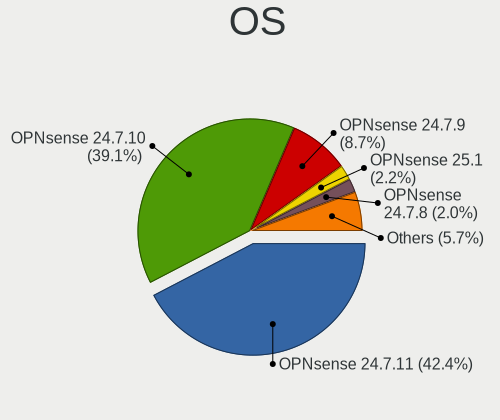
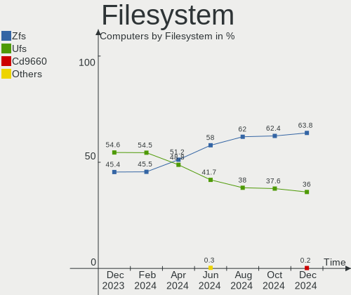
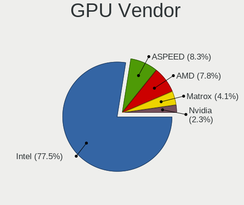

OPNsense - Hardware Trends
--------------------------

A project to identify most popular hardware characteristics and track their change
over time based on data collected by BSD users at https://BSD-Hardware.info.

Anyone can contribute to this report by the [hw-probe](https://github.com/linuxhw/hw-probe/blob/master/INSTALL.BSD.md) tool:

    hw-probe -all -upload

This report is for one last month. Overall report since the beginning of time: [TestDays](https://github.com/bsdhw/TestDays)

Period: May, 2023.

Contents
--------

* [ System ](#system)
  - [ OS                       ](#os)
  - [ OS Family                ](#os-family)
  - [ Arch                     ](#arch)
  - [ DE                       ](#de)
  - [ Display Server           ](#display-server)
  - [ Display Manager          ](#display-manager)
  - [ OS Lang                  ](#os-lang)
  - [ Boot Mode                ](#boot-mode)
  - [ Filesystem               ](#filesystem)
  - [ Part. scheme             ](#part-scheme)

* [ Board ](#board)
  - [ Vendor                   ](#vendor)
  - [ Model                    ](#model)
  - [ Model Family             ](#model-family)
  - [ MFG Year                 ](#mfg-year)
  - [ Form Factor              ](#form-factor)
  - [ Coreboot                 ](#coreboot)
  - [ RAM Size                 ](#ram-size)
  - [ RAM Used                 ](#ram-used)
  - [ Total Drives             ](#total-drives)
  - [ Has CD-ROM               ](#has-cd-rom)
  - [ Has Ethernet             ](#has-ethernet)
  - [ Has WiFi                 ](#has-wifi)
  - [ Has Bluetooth            ](#has-bluetooth)

* [ Location ](#location)
  - [ Country                  ](#country)
  - [ City                     ](#city)

* [ Drives ](#drives)
  - [ Drive Vendor             ](#drive-vendor)
  - [ Drive Model              ](#drive-model)
  - [ HDD Vendor               ](#hdd-vendor)
  - [ SSD Vendor               ](#ssd-vendor)
  - [ Drive Kind               ](#drive-kind)
  - [ Drive Connector          ](#drive-connector)
  - [ Drive Size               ](#drive-size)
  - [ Space Total              ](#space-total)
  - [ Space Used               ](#space-used)
  - [ Malfunc. Drives          ](#malfunc-drives)
  - [ Malfunc. Drive Vendor    ](#malfunc-drive-vendor)
  - [ Malfunc. HDD Vendor      ](#malfunc-hdd-vendor)
  - [ Malfunc. Drive Kind      ](#malfunc-drive-kind)
  - [ Failed Drives            ](#failed-drives)
  - [ Failed Drive Vendor      ](#failed-drive-vendor)
  - [ Drive Status             ](#drive-status)

* [ Storage controller ](#storage-controller)
  - [ Storage Vendor           ](#storage-vendor)
  - [ Storage Model            ](#storage-model)
  - [ Storage Kind             ](#storage-kind)

* [ Processor ](#processor)
  - [ CPU Vendor               ](#cpu-vendor)
  - [ CPU Model                ](#cpu-model)
  - [ CPU Model Family         ](#cpu-model-family)
  - [ CPU Cores                ](#cpu-cores)
  - [ CPU Sockets              ](#cpu-sockets)
  - [ CPU Threads              ](#cpu-threads)
  - [ CPU Microarch            ](#cpu-microarch)

* [ Graphics ](#graphics)
  - [ GPU Vendor               ](#gpu-vendor)
  - [ GPU Model                ](#gpu-model)
  - [ GPU Combo                ](#gpu-combo)
  - [ GPU Driver               ](#gpu-driver)
  - [ GPU Memory               ](#gpu-memory)

* [ Monitor ](#monitor)
  - [ Monitor Vendor           ](#monitor-vendor)
  - [ Monitor Model            ](#monitor-model)
  - [ Monitor Resolution       ](#monitor-resolution)
  - [ Monitor Diagonal         ](#monitor-diagonal)
  - [ Monitor Width            ](#monitor-width)
  - [ Aspect Ratio             ](#aspect-ratio)
  - [ Monitor Area             ](#monitor-area)
  - [ Pixel Density            ](#pixel-density)
  - [ Multiple Monitors        ](#multiple-monitors)

* [ Network ](#network)
  - [ Net Controller Vendor    ](#net-controller-vendor)
  - [ Net Controller Model     ](#net-controller-model)
  - [ Wireless Vendor          ](#wireless-vendor)
  - [ Wireless Model           ](#wireless-model)
  - [ Ethernet Vendor          ](#ethernet-vendor)
  - [ Ethernet Model           ](#ethernet-model)
  - [ Net Controller Kind      ](#net-controller-kind)
  - [ Used Controller          ](#used-controller)
  - [ NICs                     ](#nics)
  - [ IPv6                     ](#ipv6)

* [ Bluetooth ](#bluetooth)
  - [ Bluetooth Vendor         ](#bluetooth-vendor)
  - [ Bluetooth Model          ](#bluetooth-model)

* [ Sound ](#sound)
  - [ Sound Vendor             ](#sound-vendor)
  - [ Sound Model              ](#sound-model)

* [ Memory ](#memory)
  - [ Memory Vendor            ](#memory-vendor)
  - [ Memory Model             ](#memory-model)
  - [ Memory Kind              ](#memory-kind)
  - [ Memory Form Factor       ](#memory-form-factor)
  - [ Memory Size              ](#memory-size)
  - [ Memory Speed             ](#memory-speed)

* [ Printers & scanners ](#printers--scanners)
  - [ Printer Vendor           ](#printer-vendor)
  - [ Printer Model            ](#printer-model)
  - [ Scanner Vendor           ](#scanner-vendor)
  - [ Scanner Model            ](#scanner-model)

* [ Camera ](#camera)
  - [ Camera Vendor            ](#camera-vendor)
  - [ Camera Model             ](#camera-model)

* [ Security ](#security)
  - [ Fingerprint Vendor       ](#fingerprint-vendor)
  - [ Fingerprint Model        ](#fingerprint-model)
  - [ Chipcard Vendor          ](#chipcard-vendor)
  - [ Chipcard Model           ](#chipcard-model)

* [ Unsupported ](#unsupported)
  - [ Unsupported Devices      ](#unsupported-devices)
  - [ Unsupported Device Types ](#unsupported-device-types)

System
------

OS
--

Installed operating systems

| Name             | Computers | Percent |
|------------------|-----------|---------|
| OPNsense 23.1.7  | 184       | 60.13%  |
| OPNsense 23.1.8  | 69        | 22.55%  |
| OPNsense 23.1.6  | 32        | 10.46%  |
| OPNsense 22.7.11 | 7         | 2.29%   |
| OPNsense 23.1    | 4         | 1.31%   |
| OPNsense 23.4    | 3         | 0.98%   |
| OPNsense 23.1.9  | 2         | 0.65%   |
| OPNsense 23.7    | 1         | 0.33%   |
| OPNsense 23.1.5  | 1         | 0.33%   |
| OPNsense 23.1.1  | 1         | 0.33%   |
| OPNsense 22.7.10 | 1         | 0.33%   |
| OPNsense 22.10.2 | 1         | 0.33%   |

OS Family
---------

OS without a version

| Name     | Computers | Percent |
|----------|-----------|---------|
| OPNsense | 306       | 100%    |

Arch
----

OS architecture (x86_64, i586, etc.)

| Name  | Computers | Percent |
|-------|-----------|---------|
| amd64 | 306       | 100%    |

DE
--

Desktop Environment

| Name    | Computers | Percent |
|---------|-----------|---------|
| Console | 305       | 99.67%  |
| Fluxbox | 1         | 0.33%   |

Display Server
--------------

X11 or Wayland

| Name    | Computers | Percent |
|---------|-----------|---------|
| Console | 305       | 99.67%  |
| X11     | 1         | 0.33%   |

Display Manager
---------------

SDDM, LightDM, etc.

| Name    | Computers | Percent |
|---------|-----------|---------|
| Console | 305       | 99.67%  |
| SLiM    | 1         | 0.33%   |

OS Lang
-------

Language

| Lang    | Computers | Percent |
|---------|-----------|---------|
| Unknown | 301       | 98.37%  |
| C       | 5         | 1.63%   |

Boot Mode
---------

EFI or BIOS

| Mode | Computers | Percent |
|------|-----------|---------|
| EFI  | 292       | 95.42%  |
| BIOS | 14        | 4.58%   |

Filesystem
----------

Type of filesystem

| Type | Computers | Percent |
|------|-----------|---------|
| Ufs  | 177       | 57.84%  |
| Zfs  | 129       | 42.16%  |

Part. scheme
------------

Scheme of partitioning

| Type    | Computers | Percent |
|---------|-----------|---------|
| GPT     | 297       | 97.06%  |
| MBR     | 6         | 1.96%   |
| Unknown | 3         | 0.98%   |

Board
-----

Vendor
------

Motherboard manufacturer

| Name                       | Computers | Percent |
|----------------------------|-----------|---------|
| Unknown                    | 45        | 14.71%  |
| Dell                       | 32        | 10.46%  |
| Intel                      | 28        | 9.15%   |
| Supermicro                 | 22        | 7.19%   |
| Hewlett-Packard            | 22        | 7.19%   |
| Protectli                  | 15        | 4.9%    |
| ASUSTek Computer           | 13        | 4.25%   |
| Lenovo                     | 12        | 3.92%   |
| AMI                        | 10        | 3.27%   |
| PC Engines                 | 9         | 2.94%   |
| Gigabyte Technology        | 9         | 2.94%   |
| ASRock                     | 9         | 2.94%   |
| Fujitsu                    | 8         | 2.61%   |
| Techvision                 | 7         | 2.29%   |
| Sophos                     | 6         | 1.96%   |
| MW                         | 6         | 1.96%   |
| CWWK                       | 6         | 1.96%   |
| MSI                        | 5         | 1.63%   |
| ZOTAC                      | 3         | 0.98%   |
| Deciso                     | 3         | 0.98%   |
| Hardkernel                 | 2         | 0.65%   |
| ASRockRack                 | 2         | 0.65%   |
| Apple                      | 2         | 0.65%   |
| Acer                       | 2         | 0.65%   |
| YENTEK                     | 1         | 0.33%   |
| Shuttle                    | 1         | 0.33%   |
| ShenZhen MinWin Technology | 1         | 0.33%   |
| ReachingTech               | 1         | 0.33%   |
| NU591R                     | 1         | 0.33%   |
| NORCO                      | 1         | 0.33%   |
| Nitrokey                   | 1         | 0.33%   |
| Medion                     | 1         | 0.33%   |
| Lanner                     | 1         | 0.33%   |
| JHZD                       | 1         | 0.33%   |
| Inventec                   | 1         | 0.33%   |
| IGEL Technology            | 1         | 0.33%   |
| IceWhale Technology        | 1         | 0.33%   |
| GuoGuang                   | 1         | 0.33%   |
| GoWin Solution             | 1         | 0.33%   |
| Google                     | 1         | 0.33%   |

Model
-----

Motherboard model

| Name                                     | Computers | Percent |
|------------------------------------------|-----------|---------|
| Unknown                                  | 46        | 15.03%  |
| AMI Aptio CRB                            | 8         | 2.61%   |
| Techvision TVI7309X                      | 7         | 2.29%   |
| Protectli FW6                            | 7         | 2.29%   |
| Dell OptiPlex 7040                       | 7         | 2.29%   |
| MW GMLK-2_5G4L                           | 6         | 1.96%   |
| Supermicro Super Server                  | 5         | 1.63%   |
| Sophos SG                                | 5         | 1.63%   |
| Intel Q3XXG4-P V1.0                      | 5         | 1.63%   |
| Fujitsu FUTRO S920                       | 5         | 1.63%   |
| PC Engines apu4                          | 4         | 1.31%   |
| Intel Jasper Lake Client Platform        | 4         | 1.31%   |
| HP EliteDesk 800 G3 SFF                  | 4         | 1.31%   |
| Supermicro X8SIL                         | 3         | 0.98%   |
| Supermicro X10SLH-N6-ST031               | 3         | 0.98%   |
| Protectli FW4B                           | 3         | 0.98%   |
| CWWK CW-MBX-AD12                         | 3         | 0.98%   |
| Protectli VP2420                         | 2         | 0.65%   |
| PC Engines apu6                          | 2         | 0.65%   |
| PC Engines APU2                          | 2         | 0.65%   |
| Intel S1200KP AAG34877-201               | 2         | 0.65%   |
| Intel CRESCENTBAY                        | 2         | 0.65%   |
| HP ProDesk 600 G3 SFF                    | 2         | 0.65%   |
| HP ProDesk 600 G1 SFF                    | 2         | 0.65%   |
| HP Compaq Elite 8300 SFF                 | 2         | 0.65%   |
| Dell Wyse 5070 Extended Thin Client      | 2         | 0.65%   |
| Dell PowerEdge R210 II                   | 2         | 0.65%   |
| Dell OptiPlex 7010                       | 2         | 0.65%   |
| Dell OptiPlex 390                        | 2         | 0.65%   |
| Dell OptiPlex 3040                       | 2         | 0.65%   |
| CWWK CW-AD4L-N V1                        | 2         | 0.65%   |
| ZOTAC ZBOX-CI622/CI642/CI662NANO         | 1         | 0.33%   |
| ZOTAC ZBOX-CI325NANO                     | 1         | 0.33%   |
| YENTEK R250                              | 1         | 0.33%   |
| Supermicro X9SRE/X9SRE-3F/X9SRi/X9SRi-3F | 1         | 0.33%   |
| Supermicro X7SBL                         | 1         | 0.33%   |
| Supermicro SYS-E302-9D                   | 1         | 0.33%   |
| Supermicro SYS-E300-9C                   | 1         | 0.33%   |
| Supermicro SYS-E100-12T-C                | 1         | 0.33%   |
| Supermicro SYS-6028R-TRT                 | 1         | 0.33%   |

Model Family
------------

Motherboard model prefix

| Name                       | Computers | Percent |
|----------------------------|-----------|---------|
| Unknown                    | 46        | 15.03%  |
| Dell OptiPlex              | 21        | 6.86%   |
| Lenovo ThinkCentre         | 8         | 2.61%   |
| AMI Aptio                  | 8         | 2.61%   |
| Techvision TVI7309X        | 7         | 2.29%   |
| Protectli FW6              | 7         | 2.29%   |
| Dell PowerEdge             | 7         | 2.29%   |
| MW GMLK-2                  | 6         | 1.96%   |
| Supermicro Super           | 5         | 1.63%   |
| Sophos SG                  | 5         | 1.63%   |
| Intel Q3XXG4-P             | 5         | 1.63%   |
| HP ProDesk                 | 5         | 1.63%   |
| HP EliteDesk               | 5         | 1.63%   |
| Fujitsu FUTRO              | 5         | 1.63%   |
| PC Engines apu4            | 4         | 1.31%   |
| Intel Jasper               | 4         | 1.31%   |
| HP ProLiant                | 4         | 1.31%   |
| ASUS PRIME                 | 4         | 1.31%   |
| Supermicro X8SIL           | 3         | 0.98%   |
| Supermicro X10SLH-N6-ST031 | 3         | 0.98%   |
| Protectli FW4B             | 3         | 0.98%   |
| HP Compaq                  | 3         | 0.98%   |
| CWWK CW-MBX-AD12           | 3         | 0.98%   |
| Protectli VP2420           | 2         | 0.65%   |
| PC Engines apu6            | 2         | 0.65%   |
| PC Engines APU2            | 2         | 0.65%   |
| Intel S1200KP              | 2         | 0.65%   |
| Intel CRESCENTBAY          | 2         | 0.65%   |
| Dell Wyse                  | 2         | 0.65%   |
| CWWK CW-AD4L-N             | 2         | 0.65%   |
| ASUS TUF                   | 2         | 0.65%   |
| Acer Aspire                | 2         | 0.65%   |
| ZOTAC ZBOX-CI622           | 1         | 0.33%   |
| ZOTAC ZBOX-CI325NANO       | 1         | 0.33%   |
| YENTEK R250                | 1         | 0.33%   |
| Supermicro X9SRE           | 1         | 0.33%   |
| Supermicro X7SBL           | 1         | 0.33%   |
| Supermicro SYS-E302-9D     | 1         | 0.33%   |
| Supermicro SYS-E300-9C     | 1         | 0.33%   |
| Supermicro SYS-E100-12T-C  | 1         | 0.33%   |

MFG Year
--------

Motherboard manufacture year

| Year | Computers | Percent |
|------|-----------|---------|
| 2022 | 56        | 18.3%   |
| 2018 | 34        | 11.11%  |
| 2021 | 32        | 10.46%  |
| 2019 | 23        | 7.52%   |
| 2020 | 22        | 7.19%   |
| 2016 | 21        | 6.86%   |
| 2014 | 20        | 6.54%   |
| 2017 | 17        | 5.56%   |
| 2023 | 16        | 5.23%   |
| 2013 | 16        | 5.23%   |
| 2015 | 14        | 4.58%   |
| 2012 | 14        | 4.58%   |
| 2011 | 5         | 1.63%   |
| 2009 | 5         | 1.63%   |
| 2008 | 5         | 1.63%   |
| 2010 | 3         | 0.98%   |
| 2006 | 2         | 0.65%   |
| 2007 | 1         | 0.33%   |

Form Factor
-----------

Physical design of the computer

| Name     | Computers | Percent |
|----------|-----------|---------|
| Desktop  | 242       | 79.08%  |
| Mini pc  | 25        | 8.17%   |
| Server   | 23        | 7.52%   |
| Firewall | 8         | 2.61%   |
| Notebook | 8         | 2.61%   |

Coreboot
--------

Have coreboot on board

| Used | Computers | Percent |
|------|-----------|---------|
| No   | 291       | 95.1%   |
| Yes  | 15        | 4.9%    |

RAM Size
--------

Total RAM memory

| Size in GB  | Computers | Percent |
|-------------|-----------|---------|
| 8.01-16.0   | 131       | 42.81%  |
| 16.01-24.0  | 79        | 25.82%  |
| 4.01-8.0    | 52        | 16.99%  |
| 32.01-64.0  | 28        | 9.15%   |
| 64.01-256.0 | 9         | 2.94%   |
| 2.01-3.0    | 4         | 1.31%   |
| 24.01-32.0  | 2         | 0.65%   |
| 3.01-4.0    | 1         | 0.33%   |

RAM Used
--------

Used RAM memory

| Used GB  | Computers | Percent |
|----------|-----------|---------|
| 0.01-0.5 | 163       | 53.27%  |
| 0.51-1.0 | 107       | 34.97%  |
| 1.01-2.0 | 29        | 9.48%   |
| 3.01-4.0 | 3         | 0.98%   |
| 2.01-3.0 | 3         | 0.98%   |
| 4.01-8.0 | 1         | 0.33%   |

Total Drives
------------

Number of drives on board

| Drives | Computers | Percent |
|--------|-----------|---------|
| 1      | 244       | 79.74%  |
| 2      | 29        | 9.48%   |
| 0      | 26        | 8.5%    |
| 3      | 4         | 1.31%   |
| 4      | 3         | 0.98%   |

Has CD-ROM
----------

Has CD-ROM on board

| Presented | Computers | Percent |
|-----------|-----------|---------|
| No        | 266       | 86.93%  |
| Yes       | 40        | 13.07%  |

Has Ethernet
------------

Has Ethernet on board

| Presented | Computers | Percent |
|-----------|-----------|---------|
| Yes       | 305       | 99.67%  |
| No        | 1         | 0.33%   |

Has WiFi
--------

Has WiFi module

| Presented | Computers | Percent |
|-----------|-----------|---------|
| No        | 251       | 82.03%  |
| Yes       | 55        | 17.97%  |

Has Bluetooth
-------------

Has Bluetooth module

| Presented | Computers | Percent |
|-----------|-----------|---------|
| No        | 271       | 88.56%  |
| Yes       | 35        | 11.44%  |

Location
--------

Country
-------

Geographic location (country)

| Country            | Computers | Percent |
|--------------------|-----------|---------|
| USA                | 108       | 35.29%  |
| Germany            | 42        | 13.73%  |
| France             | 17        | 5.56%   |
| Netherlands        | 13        | 4.25%   |
| UK                 | 11        | 3.59%   |
| Poland             | 11        | 3.59%   |
| Brazil             | 10        | 3.27%   |
| Australia          | 10        | 3.27%   |
| Canada             | 9         | 2.94%   |
| Switzerland        | 7         | 2.29%   |
| Russia             | 6         | 1.96%   |
| Italy              | 6         | 1.96%   |
| Austria            | 6         | 1.96%   |
| Belgium            | 5         | 1.63%   |
| Sweden             | 3         | 0.98%   |
| South Africa       | 3         | 0.98%   |
| Slovakia           | 3         | 0.98%   |
| Romania            | 3         | 0.98%   |
| New Zealand        | 3         | 0.98%   |
| China              | 3         | 0.98%   |
| Spain              | 2         | 0.65%   |
| Norway             | 2         | 0.65%   |
| Lithuania          | 2         | 0.65%   |
| Bulgaria           | 2         | 0.65%   |
| Argentina          | 2         | 0.65%   |
| Vietnam            | 1         | 0.33%   |
| Turkey             | 1         | 0.33%   |
| Taiwan             | 1         | 0.33%   |
| South Korea        | 1         | 0.33%   |
| Singapore          | 1         | 0.33%   |
| Peru               | 1         | 0.33%   |
| Paraguay           | 1         | 0.33%   |
| New Caledonia      | 1         | 0.33%   |
| Israel             | 1         | 0.33%   |
| Ireland            | 1         | 0.33%   |
| India              | 1         | 0.33%   |
| Greece             | 1         | 0.33%   |
| Dominican Republic | 1         | 0.33%   |
| Denmark            | 1         | 0.33%   |
| Czechia            | 1         | 0.33%   |

City
----

Geographic location (city)

| City                | Computers | Percent |
|---------------------|-----------|---------|
| Sydney              | 4         | 1.31%   |
| South San Francisco | 4         | 1.31%   |
| Paris               | 4         | 1.31%   |
| Denver              | 4         | 1.31%   |
| Wroclaw             | 3         | 0.98%   |
| Warsaw              | 3         | 0.98%   |
| St Petersburg       | 3         | 0.98%   |
| Gothenburg          | 3         | 0.98%   |
| Vilnius             | 2         | 0.65%   |
| Vienna              | 2         | 0.65%   |
| The Hague           | 2         | 0.65%   |
| Southall            | 2         | 0.65%   |
| Seattle             | 2         | 0.65%   |
| Sao Paulo           | 2         | 0.65%   |
| Rochester           | 2         | 0.65%   |
| Police              | 2         | 0.65%   |
| Pezinok             | 2         | 0.65%   |
| Mountain View       | 2         | 0.65%   |
| Martins Ferry       | 2         | 0.65%   |
| Mankato             | 2         | 0.65%   |
| Kraaifontein        | 2         | 0.65%   |
| Hoofddorp           | 2         | 0.65%   |
| Frankfurt (Oder)    | 2         | 0.65%   |
| Chicago             | 2         | 0.65%   |
| Calgary             | 2         | 0.65%   |
| Brussels            | 2         | 0.65%   |
| Brooklyn            | 2         | 0.65%   |
| Brookfield          | 2         | 0.65%   |
| Brisbane            | 2         | 0.65%   |
| Boston              | 2         | 0.65%   |
| Berlin              | 2         | 0.65%   |
| Bangor              | 2         | 0.65%   |
| Austin              | 2         | 0.65%   |
| Auckland            | 2         | 0.65%   |
| Atlanta             | 2         | 0.65%   |
| Zurich              | 1         | 0.33%   |
| Zhongli District    | 1         | 0.33%   |
| Zaandam             | 1         | 0.33%   |
| Xi'an               | 1         | 0.33%   |
| Woodbury            | 1         | 0.33%   |

Drives
------

Drive Vendor
------------

Hard drive vendors

| Vendor              | Computers | Drives | Percent |
|---------------------|-----------|--------|---------|
| Samsung Electronics | 56        | 59     | 18.48%  |
| Kingston            | 29        | 34     | 9.57%   |
| Transcend           | 22        | 23     | 7.26%   |
| China               | 19        | 21     | 6.27%   |
| WDC                 | 18        | 22     | 5.94%   |
| Crucial             | 14        | 14     | 4.62%   |
| Intel               | 12        | 12     | 3.96%   |
| Toshiba             | 9         | 11     | 2.97%   |
| SanDisk             | 9         | 9      | 2.97%   |
| SPCC                | 7         | 7      | 2.31%   |
| Seagate             | 7         | 11     | 2.31%   |
| Phison              | 6         | 6      | 1.98%   |
| FORESEE             | 6         | 6      | 1.98%   |
| Protectli           | 5         | 5      | 1.65%   |
| Hoodisk             | 5         | 5      | 1.65%   |
| A-DATA Technology   | 5         | 6      | 1.65%   |
| SK hynix            | 4         | 4      | 1.32%   |
| ShiJi               | 4         | 4      | 1.32%   |
| Patriot             | 4         | 6      | 1.32%   |
| Dogfish             | 4         | 4      | 1.32%   |
| UMIS                | 3         | 3      | 0.99%   |
| Lexar               | 3         | 3      | 0.99%   |
| KIOXIA              | 3         | 3      | 0.99%   |
| Hitachi             | 3         | 3      | 0.99%   |
| Silicon Motion      | 2         | 2      | 0.66%   |
| PNY                 | 2         | 2      | 0.66%   |
| OCZ                 | 2         | 2      | 0.66%   |
| LITEONIT            | 2         | 2      | 0.66%   |
| Kston               | 2         | 2      | 0.66%   |
| Intenso             | 2         | 2      | 0.66%   |
| Innodisk            | 2         | 2      | 0.66%   |
| HGST                | 2         | 2      | 0.66%   |
| Hewlett-Packard     | 2         | 3      | 0.66%   |
| GOODRAM             | 2         | 2      | 0.66%   |
| Fanxiang            | 2         | 2      | 0.66%   |
| Corsair             | 2         | 2      | 0.66%   |
| Apple               | 2         | 2      | 0.66%   |
| ZTC                 | 1         | 1      | 0.33%   |
| VICKTER             | 1         | 1      | 0.33%   |
| Vaseky              | 1         | 1      | 0.33%   |

Drive Model
-----------

Hard drive models

| Model                           | Computers | Percent |
|---------------------------------|-----------|---------|
| Kingston SA400S37120G 120GB     | 7         | 2.3%    |
| Transcend TS128GMSA230S 128GB   | 5         | 1.64%   |
| Samsung SSD 970 EVO Plus 1TB    | 4         | 1.31%   |
| Kingston SA400S37240G 240GB     | 4         | 1.31%   |
| FORESEE 128GB SSD               | 4         | 1.31%   |
| Transcend TS64GMSA230S 64GB     | 3         | 0.98%   |
| SPCC Solid State Disk 128GB     | 3         | 0.98%   |
| ShiJi SSD 128GB                 | 3         | 0.98%   |
| Samsung SSD 860 EVO mSATA 250GB | 3         | 0.98%   |
| Samsung SSD 860 EVO 250GB       | 3         | 0.98%   |
| Samsung SSD 850 EVO 250GB       | 3         | 0.98%   |
| Samsung SSD 850 EVO 120GB       | 3         | 0.98%   |
| Kingston SUV500MS120G 120GB     | 3         | 0.98%   |
| Crucial CT240BX500SSD1 240GB    | 3         | 0.98%   |
| China SATA SSD 32GB             | 3         | 0.98%   |
| UMIS RPJTJ128MED1MWX 128GB      | 2         | 0.66%   |
| Transcend TS64GSSD370 64GB      | 2         | 0.66%   |
| Transcend TS256GMTS952T2 256GB  | 2         | 0.66%   |
| Transcend TS256GMSA230S 256GB   | 2         | 0.66%   |
| Toshiba MK6475GSX 640GB         | 2         | 0.66%   |
| SK hynix SC311 SATA 128GB       | 2         | 0.66%   |
| Samsung SSD 980 500GB           | 2         | 0.66%   |
| Samsung SSD 970 EVO Plus 500GB  | 2         | 0.66%   |
| Samsung SSD 970 EVO Plus 250GB  | 2         | 0.66%   |
| Samsung SSD 960 EVO 250GB       | 2         | 0.66%   |
| Samsung SSD 860 EVO 500GB       | 2         | 0.66%   |
| Protectli 240GB mSATA           | 2         | 0.66%   |
| Phison PCIe SSD 256GB           | 2         | 0.66%   |
| Kston SSD 128GB                 | 2         | 0.66%   |
| KIOXIA KXG60ZNV256G 256GB       | 2         | 0.66%   |
| Kingston SV300S37A240G 240GB    | 2         | 0.66%   |
| Intel SSDSC2BW180A4 180GB       | 2         | 0.66%   |
| Hoodisk SSD 128GB               | 2         | 0.66%   |
| HP RAID 1(1+0) 1TB              | 2         | 0.66%   |
| FORESEE 64GB SSD                | 2         | 0.66%   |
| Dogfish SSD 128GB               | 2         | 0.66%   |
| Crucial CT250MX500SSD1 250GB    | 2         | 0.66%   |
| China SATA SSD 16GB             | 2         | 0.66%   |
| ZTC SM201-128G                  | 1         | 0.33%   |
| WDC WDS100T2B0C-00PXH0 1TB      | 1         | 0.33%   |

HDD Vendor
----------

Hard disk drive vendors

| Vendor          | Computers | Drives | Percent |
|-----------------|-----------|--------|---------|
| WDC             | 15        | 19     | 40.54%  |
| Seagate         | 7         | 11     | 18.92%  |
| Toshiba         | 6         | 8      | 16.22%  |
| Hitachi         | 3         | 3      | 8.11%   |
| HGST            | 2         | 2      | 5.41%   |
| Hewlett-Packard | 2         | 3      | 5.41%   |
| China           | 1         | 1      | 2.7%    |
| Apple           | 1         | 1      | 2.7%    |

SSD Vendor
----------

Solid state drive vendors

| Vendor              | Computers | Drives | Percent |
|---------------------|-----------|--------|---------|
| Samsung Electronics | 34        | 36     | 16.35%  |
| Kingston            | 27        | 32     | 12.98%  |
| Transcend           | 21        | 22     | 10.1%   |
| China               | 18        | 20     | 8.65%   |
| Crucial             | 12        | 12     | 5.77%   |
| Intel               | 10        | 10     | 4.81%   |
| SanDisk             | 9         | 9      | 4.33%   |
| FORESEE             | 6         | 6      | 2.88%   |
| SPCC                | 5         | 5      | 2.4%    |
| Protectli           | 5         | 5      | 2.4%    |
| Hoodisk             | 5         | 5      | 2.4%    |
| SK hynix            | 4         | 4      | 1.92%   |
| ShiJi               | 4         | 4      | 1.92%   |
| Dogfish             | 4         | 4      | 1.92%   |
| Patriot             | 3         | 5      | 1.44%   |
| A-DATA Technology   | 3         | 4      | 1.44%   |
| PNY                 | 2         | 2      | 0.96%   |
| Phison              | 2         | 2      | 0.96%   |
| OCZ                 | 2         | 2      | 0.96%   |
| LITEONIT            | 2         | 2      | 0.96%   |
| Kston               | 2         | 2      | 0.96%   |
| Intenso             | 2         | 2      | 0.96%   |
| Innodisk            | 2         | 2      | 0.96%   |
| ZTC                 | 1         | 1      | 0.48%   |
| VICKTER             | 1         | 1      | 0.48%   |
| Vaseky              | 1         | 1      | 0.48%   |
| Toshiba             | 1         | 1      | 0.48%   |
| Team                | 1         | 1      | 0.48%   |
| TCSUNBOW            | 1         | 1      | 0.48%   |
| SSSTC               | 1         | 1      | 0.48%   |
| SHAREVDI            | 1         | 1      | 0.48%   |
| Pccooler            | 1         | 1      | 0.48%   |
| ORTIAL              | 1         | 1      | 0.48%   |
| Mushkin             | 1         | 1      | 0.48%   |
| Maximus             | 1         | 1      | 0.48%   |
| LuminouTek          | 1         | 1      | 0.48%   |
| LSI                 | 1         | 1      | 0.48%   |
| Lexar               | 1         | 1      | 0.48%   |
| JWX                 | 1         | 1      | 0.48%   |
| INDMEM              | 1         | 1      | 0.48%   |

Drive Kind
----------

HDD or SSD

| Kind | Computers | Drives | Percent |
|------|-----------|--------|---------|
| SSD  | 199       | 221    | 69.1%   |
| NVMe | 56        | 59     | 19.44%  |
| HDD  | 33        | 48     | 11.46%  |

Drive Connector
---------------

SATA, SAS, NVMe, etc.

| Type | Computers | Drives | Percent |
|------|-----------|--------|---------|
| SATA | 227       | 269    | 80.21%  |
| NVMe | 56        | 59     | 19.79%  |

Drive Size
----------

Size of hard drive

| Size in TB | Computers | Drives | Percent |
|------------|-----------|--------|---------|
| 0.01-0.5   | 210       | 239    | 90.13%  |
| 0.51-1.0   | 18        | 22     | 7.73%   |
| 1.01-2.0   | 5         | 8      | 2.15%   |

Space Total
-----------

Amount of disk space available on the file system

| Size in GB | Computers | Percent |
|------------|-----------|---------|
| 101-250    | 162       | 52.94%  |
| 251-500    | 41        | 13.4%   |
| 51-100     | 34        | 11.11%  |
| 21-50      | 28        | 9.15%   |
| 501-1000   | 21        | 6.86%   |
| 1-20       | 13        | 4.25%   |
| 1001-2000  | 6         | 1.96%   |
| Unknown    | 1         | 0.33%   |

Space Used
----------

Amount of used disk space

| Used GB | Computers | Percent |
|---------|-----------|---------|
| 1-20    | 291       | 95.1%   |
| 21-50   | 12        | 3.92%   |
| 51-100  | 2         | 0.65%   |
| Unknown | 1         | 0.33%   |

Malfunc. Drives
---------------

Drive models with a malfunction

| Model                              | Computers | Drives | Percent |
|------------------------------------|-----------|--------|---------|
| WDC WD5000LPVX-22V0TT0 500GB       | 1         | 1      | 5%      |
| WDC WD3200AAKS-75L9A0 320GB        | 1         | 1      | 5%      |
| WDC WD2500AAJS-75M0A0 250GB        | 1         | 1      | 5%      |
| Transcend TS128GMSA230S 128GB      | 1         | 1      | 5%      |
| Toshiba MQ01ABD050 500GB           | 1         | 1      | 5%      |
| Toshiba MK1246GSX 120GB            | 1         | 1      | 5%      |
| SSSTC CVB-8D128-HP 128GB           | 1         | 1      | 5%      |
| ShiJi SSD 32GB                     | 1         | 1      | 5%      |
| Seagate ST9160314AS 160GB          | 1         | 1      | 5%      |
| Seagate ST3750330AS 752GB          | 1         | 1      | 5%      |
| SanDisk SDSSDP064G 64GB            | 1         | 1      | 5%      |
| SanDisk SD8TB8U-256G-1006 256GB    | 1         | 1      | 5%      |
| PNY SSD2SC120GM1DH16T2-T 120GB     | 1         | 1      | 5%      |
| Intel SSDSC2BB480G4 480GB          | 1         | 1      | 5%      |
| Hitachi HTS543232A7A384 320GB      | 1         | 1      | 5%      |
| HGST HTS541075A9E680 752GB         | 1         | 1      | 5%      |
| GK SM2244LTAB ,TC58TEG6DDKTA00 8GB | 1         | 1      | 5%      |
| Crucial CT480BX500SSD1 480GB       | 1         | 1      | 5%      |
| Crucial CT1050MX300SSD4 1TB        | 1         | 1      | 5%      |
| Centerm SSD 8GB                    | 1         | 1      | 5%      |

Malfunc. Drive Vendor
---------------------

Vendors of faulty drives

| Vendor    | Computers | Drives | Percent |
|-----------|-----------|--------|---------|
| WDC       | 3         | 3      | 15%     |
| Toshiba   | 2         | 2      | 10%     |
| Seagate   | 2         | 2      | 10%     |
| SanDisk   | 2         | 2      | 10%     |
| Crucial   | 2         | 2      | 10%     |
| Transcend | 1         | 1      | 5%      |
| SSSTC     | 1         | 1      | 5%      |
| ShiJi     | 1         | 1      | 5%      |
| PNY       | 1         | 1      | 5%      |
| Intel     | 1         | 1      | 5%      |
| Hitachi   | 1         | 1      | 5%      |
| HGST      | 1         | 1      | 5%      |
| GK        | 1         | 1      | 5%      |
| Centerm   | 1         | 1      | 5%      |

Malfunc. HDD Vendor
-------------------

Vendors of faulty HDD drives

| Vendor  | Computers | Drives | Percent |
|---------|-----------|--------|---------|
| WDC     | 3         | 3      | 33.33%  |
| Toshiba | 2         | 2      | 22.22%  |
| Seagate | 2         | 2      | 22.22%  |
| Hitachi | 1         | 1      | 11.11%  |
| HGST    | 1         | 1      | 11.11%  |

Malfunc. Drive Kind
-------------------

Kinds of faulty drives

| Kind | Computers | Drives | Percent |
|------|-----------|--------|---------|
| SSD  | 11        | 11     | 57.89%  |
| HDD  | 8         | 9      | 42.11%  |

Failed Drives
-------------

Failed drive models

| Model                                | Computers | Drives | Percent |
|--------------------------------------|-----------|--------|---------|
| Seagate ST3160318AS 160GB            | 1         | 1      | 50%     |
| Samsung Electronics PM981 NVMe 256GB | 1         | 1      | 50%     |

Failed Drive Vendor
-------------------

Failed drive vendors

| Vendor              | Computers | Drives | Percent |
|---------------------|-----------|--------|---------|
| Seagate             | 1         | 1      | 50%     |
| Samsung Electronics | 1         | 1      | 50%     |

Drive Status
------------

Number of failed and malfunc. drives

| Status   | Computers | Drives | Percent |
|----------|-----------|--------|---------|
| Works    | 260       | 302    | 91.55%  |
| Malfunc  | 19        | 20     | 6.69%   |
| Detected | 3         | 4      | 1.06%   |
| Failed   | 2         | 2      | 0.7%    |

Storage controller
------------------

Storage Vendor
--------------

Storage controller vendors

| Vendor                                  | Computers | Percent |
|-----------------------------------------|-----------|---------|
| Intel                                   | 256       | 68.63%  |
| AMD                                     | 34        | 9.12%   |
| Samsung Electronics                     | 23        | 6.17%   |
| SanDisk                                 | 9         | 2.41%   |
| Phison Electronics                      | 7         | 1.88%   |
| Broadcom / LSI                          | 7         | 1.88%   |
| MAXIO Technology (Hangzhou)             | 6         | 1.61%   |
| Silicon Motion                          | 4         | 1.07%   |
| Hewlett-Packard                         | 3         | 0.8%    |
| ASMedia Technology                      | 3         | 0.8%    |
| Toshiba                                 | 2         | 0.54%   |
| Shenzhen Unionmemory Information System | 2         | 0.54%   |
| Micron/Crucial Technology               | 2         | 0.54%   |
| Marvell Technology Group                | 2         | 0.54%   |
| KIOXIA                                  | 2         | 0.54%   |
| Kingston Technology Company             | 2         | 0.54%   |
| ADATA Technology                        | 2         | 0.54%   |
| Union Memory (Shenzhen)                 | 1         | 0.27%   |
| Transcend                               | 1         | 0.27%   |
| Shenzhen Longsys Electronics            | 1         | 0.27%   |
| Lite-On Technology                      | 1         | 0.27%   |
| JMicron Technology                      | 1         | 0.27%   |
| Dell                                    | 1         | 0.27%   |
| Adaptec                                 | 1         | 0.27%   |

Storage Model
-------------

Storage controller models

| Model                                                                                   | Computers | Percent |
|-----------------------------------------------------------------------------------------|-----------|---------|
| Intel Celeron/Pentium Silver Processor SATA Controller                                  | 31        | 7.64%   |
| AMD FCH SATA Controller [AHCI mode]                                                     | 23        | 5.67%   |
| Intel 8 Series/C220 Series Chipset Family 6-port SATA Controller 1 [AHCI mode]          | 20        | 4.93%   |
| Intel Jasper Lake SATA AHCI Controller                                                  | 18        | 4.43%   |
| Intel Q170/Q150/B150/H170/H110/Z170/CM236 Chipset SATA Controller [AHCI Mode]           | 15        | 3.69%   |
| Intel Atom/Celeron/Pentium Processor x5-E8000/J3xxx/N3xxx Series SATA Controller        | 15        | 3.69%   |
| Intel Atom Processor E3800 Series SATA AHCI Controller                                  | 14        | 3.45%   |
| Samsung NVMe SSD Controller SM981/PM981/PM983                                           | 13        | 3.2%    |
| Intel 200 Series PCH SATA controller [AHCI mode]                                        | 13        | 3.2%    |
| Intel Sunrise Point-LP SATA Controller [AHCI mode]                                      | 12        | 2.96%   |
| Intel SATA Controller [RAID mode]                                                       | 12        | 2.96%   |
| Intel 6 Series/C200 Series Chipset Family 6 port Desktop SATA AHCI Controller           | 12        | 2.96%   |
| Intel Cannon Lake PCH SATA AHCI Controller                                              | 10        | 2.46%   |
| Unknown                                                                                 | 8         | 1.97%   |
| MAXIO (Hangzhou) NVMe SSD Controller MAP1202                                            | 6         | 1.48%   |
| Intel 8 Series SATA Controller 1 [AHCI mode]                                            | 6         | 1.48%   |
| Samsung NVMe SSD Controller SM961/PM961/SM963                                           | 5         | 1.23%   |
| Intel Wildcat Point-LP SATA Controller [AHCI Mode]                                      | 5         | 1.23%   |
| Intel Elkhart Lake SATA AHCI                                                            | 5         | 1.23%   |
| Intel Alder Lake-P SATA AHCI Controller                                                 | 5         | 1.23%   |
| Silicon Motion SM2263EN/SM2263XT SSD Controller                                         | 4         | 0.99%   |
| SanDisk WD Blue SN570 NVMe SSD 1TB                                                      | 4         | 0.99%   |
| Phison PS5013 E13 NVMe Controller                                                       | 4         | 0.99%   |
| Intel Atom processor C2000 AHCI SATA3 Controller                                        | 4         | 0.99%   |
| Intel 7 Series/C210 Series Chipset Family 6-port SATA Controller [AHCI mode]            | 4         | 0.99%   |
| Intel 500 Series Chipset Family SATA AHCI Controller                                    | 4         | 0.99%   |
| AMD 500 Series Chipset SATA Controller                                                  | 4         | 0.99%   |
| Samsung NVMe SSD Controller 980                                                         | 3         | 0.74%   |
| Intel Celeron N3350/Pentium N4200/Atom E3900 Series SATA AHCI Controller                | 3         | 0.74%   |
| Intel C600/X79 series chipset 6-Port SATA AHCI Controller                               | 3         | 0.74%   |
| Intel 6 Series/C200 Series Chipset Family Desktop SATA Controller (IDE mode, ports 4-5) | 3         | 0.74%   |
| Intel 6 Series/C200 Series Chipset Family Desktop SATA Controller (IDE mode, ports 0-3) | 3         | 0.74%   |
| AMD SB7x0/SB8x0/SB9x0 SATA Controller [AHCI mode]                                       | 3         | 0.74%   |
| AMD SB7x0/SB8x0/SB9x0 IDE Controller                                                    | 3         | 0.74%   |
| AMD FCH SATA Controller [IDE mode]                                                      | 3         | 0.74%   |
| Toshiba XG6 NVMe SSD Controller                                                         | 2         | 0.49%   |
| SanDisk WD Blue SN550 NVMe SSD                                                          | 2         | 0.49%   |
| Phison E12 NVMe Controller                                                              | 2         | 0.49%   |
| Intel Tiger Lake-LP SATA Controller                                                     | 2         | 0.49%   |
| Intel NM10/ICH7 Family SATA Controller [IDE mode]                                       | 2         | 0.49%   |

Storage Kind
------------

Kind of storage controller (IDE, SATA, NVMe, SAS, ...)

| Kind | Computers | Percent |
|------|-----------|---------|
| SATA | 258       | 68.07%  |
| NVMe | 64        | 16.89%  |
| IDE  | 27        | 7.12%   |
| RAID | 22        | 5.8%    |
| SAS  | 6         | 1.58%   |
| SCSI | 2         | 0.53%   |

Processor
---------

CPU Vendor
----------

Processor vendors

| Vendor | Computers | Percent |
|--------|-----------|---------|
| Intel  | 268       | 87.58%  |
| AMD    | 38        | 12.42%  |

CPU Model
---------

Processor models

| Model                                    | Computers | Percent |
|------------------------------------------|-----------|---------|
| Intel Celeron J4125 CPU @ 2.00GHz        | 24        | 7.84%   |
| Intel Celeron N5105 @ 2.00GHz            | 12        | 3.92%   |
| Intel Celeron CPU J1900 @ 1.99GHz        | 10        | 3.27%   |
| AMD GX-412TC SOC                         | 9         | 2.94%   |
| Intel Pentium Silver N6005 @ 2.00GHz     | 8         | 2.61%   |
| Intel Celeron CPU J3160 @ 1.60GHz        | 6         | 1.96%   |
| Intel Core i5-6500 CPU @ 3.20GHz         | 5         | 1.63%   |
| Intel Core i5-3470 CPU @ 3.20GHz         | 5         | 1.63%   |
| Intel Core i5-6500T CPU @ 2.50GHz        | 4         | 1.31%   |
| AMD GX-415GA SOC with Radeon HD Graphics | 4         | 1.31%   |
| Intel Pentium Silver J5005 CPU @ 1.50GHz | 3         | 0.98%   |
| Intel Core i7-8550U CPU @ 1.80GHz        | 3         | 0.98%   |
| Intel Core i7-7500U CPU @ 2.70GHz        | 3         | 0.98%   |
| Intel Core i7-6700 CPU @ 3.40GHz         | 3         | 0.98%   |
| Intel Core i5-7500 CPU @ 3.40GHz         | 3         | 0.98%   |
| Intel Core i3-4130 CPU @ 3.40GHz         | 3         | 0.98%   |
| Intel Celeron N5095 @ 2.00GHz            | 3         | 0.98%   |
| Intel Celeron J6412 @ 2.00GHz            | 3         | 0.98%   |
| Intel 12th Gen Core i3-1215U             | 3         | 0.98%   |
| AMD Ryzen 5 5600G with Radeon Graphics   | 3         | 0.98%   |
| Intel Xeon CPU X3430 @ 2.40GHz           | 2         | 0.65%   |
| Intel Xeon CPU E5-2630L v2 @ 2.40GHz     | 2         | 0.65%   |
| Intel Xeon CPU E31220 @ 3.10GHz          | 2         | 0.65%   |
| Intel Xeon CPU E3-1270 v3 @ 3.50GHz      | 2         | 0.65%   |
| Intel Xeon CPU E3-1225 V2 @ 3.20GHz      | 2         | 0.65%   |
| Intel Xeon CPU D-1521 @ 2.40GHz          | 2         | 0.65%   |
| Intel Xeon                               | 2         | 0.65%   |
| Intel Pentium CPU N3700 @ 1.60GHz        | 2         | 0.65%   |
| Intel N200                               | 2         | 0.65%   |
| Intel Core i7-7700T CPU @ 2.90GHz        | 2         | 0.65%   |
| Intel Core i5-8500T CPU @ 2.10GHz        | 2         | 0.65%   |
| Intel Core i5-8500 CPU @ 3.00GHz         | 2         | 0.65%   |
| Intel Core i5-8400T CPU @ 1.70GHz        | 2         | 0.65%   |
| Intel Core i5-4590 CPU @ 3.30GHz         | 2         | 0.65%   |
| Intel Core i5-4570S CPU @ 2.90GHz        | 2         | 0.65%   |
| Intel Core i3-7100U CPU @ 2.40GHz        | 2         | 0.65%   |
| Intel Core i3-7100 CPU @ 3.90GHz         | 2         | 0.65%   |
| Intel Core i3-4360 CPU @ 3.70GHz         | 2         | 0.65%   |
| Intel Core i3-4330 CPU @ 3.50GHz         | 2         | 0.65%   |
| Intel Core i3-2120 CPU @ 3.30GHz         | 2         | 0.65%   |

CPU Model Family
----------------

Processor model prefix

| Model                   | Computers | Percent |
|-------------------------|-----------|---------|
| Intel Celeron           | 78        | 25.49%  |
| Intel Core i5           | 54        | 17.65%  |
| Intel Xeon              | 37        | 12.09%  |
| Intel Core i3           | 25        | 8.17%   |
| Intel Core i7           | 23        | 7.52%   |
| Other                   | 18        | 5.88%   |
| AMD GX                  | 15        | 4.9%    |
| Intel Pentium Silver    | 11        | 3.59%   |
| Intel Atom              | 11        | 3.59%   |
| Intel Pentium           | 8         | 2.61%   |
| AMD Ryzen 7             | 6         | 1.96%   |
| AMD Ryzen 5             | 3         | 0.98%   |
| Intel Pentium Dual-Core | 2         | 0.65%   |
| Intel Core 2 Quad       | 2         | 0.65%   |
| AMD Ryzen Embedded      | 2         | 0.65%   |
| AMD Ryzen 5 PRO         | 2         | 0.65%   |
| AMD FX                  | 2         | 0.65%   |
| AMD EPYC                | 2         | 0.65%   |
| Intel Pentium Gold      | 1         | 0.33%   |
| Intel Core 2 Duo        | 1         | 0.33%   |
| AMD Turion II Neo       | 1         | 0.33%   |
| AMD Athlon              | 1         | 0.33%   |
| AMD A6                  | 1         | 0.33%   |

CPU Cores
---------

Number of processor cores

| Number  | Computers | Percent |
|---------|-----------|---------|
| 4       | 194       | 63.4%   |
| 2       | 64        | 20.92%  |
| 6       | 17        | 5.56%   |
| 8       | 13        | 4.25%   |
| 16      | 7         | 2.29%   |
| 12      | 6         | 1.96%   |
| Unknown | 2         | 0.65%   |
| 28      | 1         | 0.33%   |
| 10      | 1         | 0.33%   |
| 1       | 1         | 0.33%   |

CPU Sockets
-----------

Number of sockets

| Number | Computers | Percent |
|--------|-----------|---------|
| 1      | 299       | 97.71%  |
| 2      | 7         | 2.29%   |

CPU Threads
-----------

Threads per core (Hyper-Threading)

| Number  | Computers | Percent |
|---------|-----------|---------|
| 1       | 206       | 67.32%  |
| 2       | 98        | 32.03%  |
| Unknown | 2         | 0.65%   |

CPU Microarch
-------------

Microarchitecture

| Name          | Computers | Percent |
|---------------|-----------|---------|
| Unknown       | 43        | 14.05%  |
| KabyLake      | 38        | 12.42%  |
| Silvermont    | 33        | 10.78%  |
| Haswell       | 32        | 10.46%  |
| Goldmont plus | 31        | 10.13%  |
| Skylake       | 23        | 7.52%   |
| IvyBridge     | 20        | 6.54%   |
| SandyBridge   | 12        | 3.92%   |
| Puma          | 10        | 3.27%   |
| Broadwell     | 10        | 3.27%   |
| Jaguar        | 6         | 1.96%   |
| Zen 3         | 5         | 1.63%   |
| Zen           | 5         | 1.63%   |
| Penryn        | 5         | 1.63%   |
| Goldmont      | 4         | 1.31%   |
| CometLake     | 4         | 1.31%   |
| Zen 2         | 3         | 0.98%   |
| TigerLake     | 3         | 0.98%   |
| Nehalem       | 3         | 0.98%   |
| Core          | 3         | 0.98%   |
| Bonnell       | 3         | 0.98%   |
| K8 Hammer     | 2         | 0.65%   |
| Zen+          | 1         | 0.33%   |
| Westmere      | 1         | 0.33%   |
| Steamroller   | 1         | 0.33%   |
| Piledriver    | 1         | 0.33%   |
| NetBurst      | 1         | 0.33%   |
| K10           | 1         | 0.33%   |
| Excavator     | 1         | 0.33%   |
| Bulldozer     | 1         | 0.33%   |

Graphics
--------

GPU Vendor
----------

Vendors of graphics cards

| Vendor                                       | Computers | Percent |
|----------------------------------------------|-----------|---------|
| Intel                                        | 221       | 75.43%  |
| AMD                                          | 29        | 9.9%    |
| ASPEED Technology                            | 20        | 6.83%   |
| Matrox Electronics Systems                   | 16        | 5.46%   |
| Nvidia                                       | 6         | 2.05%   |
| XGI Technology (eXtreme Graphics Innovation) | 1         | 0.34%   |

GPU Model
---------

Graphics card models

| Model                                                                                    | Computers | Percent |
|------------------------------------------------------------------------------------------|-----------|---------|
| Intel GeminiLake [UHD Graphics 600]                                                      | 28        | 9.56%   |
| Intel JasperLake [UHD Graphics]                                                          | 24        | 8.19%   |
| ASPEED Technology ASPEED Graphics Family                                                 | 20        | 6.83%   |
| Intel HD Graphics 530                                                                    | 15        | 5.12%   |
| Intel Atom/Celeron/Pentium Processor x5-E8000/J3xxx/N3xxx Integrated Graphics Controller | 15        | 5.12%   |
| Intel Atom Processor Z36xxx/Z37xxx Series Graphics & Display                             | 14        | 4.78%   |
| Intel Xeon E3-1200 v3/4th Gen Core Processor Integrated Graphics Controller              | 12        | 4.1%    |
| Intel Xeon E3-1200 v2/3rd Gen Core processor Graphics Controller                         | 11        | 3.75%   |
| Intel CoffeeLake-S GT2 [UHD Graphics 630]                                                | 10        | 3.41%   |
| Matrox Electronics Systems MGA G200eW WPCM450                                            | 9         | 3.07%   |
| Intel HD Graphics 630                                                                    | 8         | 2.73%   |
| Intel 2nd Generation Core Processor Family Integrated Graphics Controller                | 8         | 2.73%   |
| Intel HD Graphics 620                                                                    | 5         | 1.71%   |
| Intel Haswell-ULT Integrated Graphics Controller                                         | 5         | 1.71%   |
| Intel Elkhart Lake [UHD Graphics Gen11 16EU]                                             | 5         | 1.71%   |
| Intel UHD Graphics 620                                                                   | 4         | 1.37%   |
| Intel Alder Lake-N [UHD Graphics]                                                        | 4         | 1.37%   |
| Intel 4th Generation Core Processor Family Integrated Graphics Controller                | 4         | 1.37%   |
| Intel 4 Series Chipset Integrated Graphics Controller                                    | 4         | 1.37%   |
| AMD Kabini [Radeon HD 8330E]                                                             | 4         | 1.37%   |
| Matrox Electronics Systems MGA G200e [Pilot] ServerEngines (SEP1)                        | 3         | 1.02%   |
| Intel HD Graphics 5500                                                                   | 3         | 1.02%   |
| Intel GeminiLake [UHD Graphics 605]                                                      | 3         | 1.02%   |
| Intel CometLake-S GT2 [UHD Graphics 630]                                                 | 3         | 1.02%   |
| Intel Alder Lake-UP3 GT1 [UHD Graphics]                                                  | 3         | 1.02%   |
| AMD ES1000                                                                               | 3         | 1.02%   |
| AMD Cezanne [Radeon Vega Series / Radeon Vega Mobile Series]                             | 3         | 1.02%   |
| Matrox Electronics Systems MGA G200EH                                                    | 2         | 0.68%   |
| Matrox Electronics Systems G200eR2                                                       | 2         | 0.68%   |
| Intel Xeon E3-1200 v3 Processor Integrated Graphics Controller                           | 2         | 0.68%   |
| Intel TigerLake-LP GT2 [Iris Xe Graphics]                                                | 2         | 0.68%   |
| Intel RocketLake-S GT1 [UHD Graphics 730]                                                | 2         | 0.68%   |
| Intel HD Graphics 610                                                                    | 2         | 0.68%   |
| Intel HD Graphics 6000                                                                   | 2         | 0.68%   |
| Intel HD Graphics 510                                                                    | 2         | 0.68%   |
| Intel HD Graphics 500                                                                    | 2         | 0.68%   |
| Intel Atom Processor D2xxx/N2xxx Integrated Graphics Controller                          | 2         | 0.68%   |
| Intel 3rd Gen Core processor Graphics Controller                                         | 2         | 0.68%   |
| AMD RS780L [Radeon 3000]                                                                 | 2         | 0.68%   |
| AMD Renoir                                                                               | 2         | 0.68%   |

GPU Combo
---------

Combinations of graphics cards

| Name            | Computers | Percent |
|-----------------|-----------|---------|
| 1 x Intel       | 214       | 69.93%  |
| 1 x AMD         | 29        | 9.48%   |
| Other           | 17        | 5.56%   |
| 1 x ASPEED      | 17        | 5.56%   |
| 1 x Matrox      | 16        | 5.23%   |
| 2 x Intel       | 4         | 1.31%   |
| 1 x Nvidia      | 4         | 1.31%   |
| Intel + ASPEED  | 2         | 0.65%   |
| 1 x XGI         | 1         | 0.33%   |
| Nvidia + ASPEED | 1         | 0.33%   |
| Intel + Nvidia  | 1         | 0.33%   |

GPU Driver
----------

Free vs proprietary

| Driver  | Computers | Percent |
|---------|-----------|---------|
| Free    | 289       | 94.44%  |
| Unknown | 17        | 5.56%   |

GPU Memory
----------

Total video memory

| Size in GB | Computers | Percent |
|------------|-----------|---------|
| Unknown    | 306       | 100%    |

Monitor
-------

Monitor Vendor
--------------

Monitor vendors

Zero info for selected period =(

Monitor Model
-------------

Monitor models

Zero info for selected period =(

Monitor Resolution
------------------

Monitor screen resolution

Zero info for selected period =(

Monitor Diagonal
----------------

Diagonal size in inches

Zero info for selected period =(

Monitor Width
-------------

Physical width

Zero info for selected period =(

Aspect Ratio
------------

Proportional relationship between the width and the height

Zero info for selected period =(

Monitor Area
------------

Area in inch

Zero info for selected period =(

Pixel Density
-------------

Pixels per inch

Zero info for selected period =(

Multiple Monitors
-----------------

Total monitors connected

| Total | Computers | Percent |
|-------|-----------|---------|
| 0     | 306       | 100%    |

Network
-------

Net Controller Vendor
---------------------

Controller vendors

| Vendor                            | Computers | Percent |
|-----------------------------------|-----------|---------|
| Intel                             | 257       | 62.68%  |
| Realtek Semiconductor             | 88        | 21.46%  |
| Broadcom                          | 25        | 6.1%    |
| Qualcomm Atheros                  | 6         | 1.46%   |
| U-Blox                            | 5         | 1.22%   |
| Mellanox Technologies             | 4         | 0.98%   |
| D-Link System                     | 3         | 0.73%   |
| Aquantia                          | 3         | 0.73%   |
| AMD                               | 3         | 0.73%   |
| MediaTek                          | 2         | 0.49%   |
| IMC Networks                      | 2         | 0.49%   |
| ASUSTek Computer                  | 2         | 0.49%   |
| TP-Link                           | 1         | 0.24%   |
| Texas Instruments                 | 1         | 0.24%   |
| Sundance Technology Inc / IC Plus | 1         | 0.24%   |
| Samsung Electronics               | 1         | 0.24%   |
| Ralink Technology                 | 1         | 0.24%   |
| Marvell Technology Group          | 1         | 0.24%   |
| ICS Advent                        | 1         | 0.24%   |
| Emulex                            | 1         | 0.24%   |
| Edimax Technology                 | 1         | 0.24%   |
| American Megatrends               | 1         | 0.24%   |

Net Controller Model
--------------------

Controller models

| Model                                                                         | Computers | Percent |
|-------------------------------------------------------------------------------|-----------|---------|
| Realtek RTL8111/8168/8411 PCI Express Gigabit Ethernet Controller             | 76        | 14.15%  |
| Intel I211 Gigabit Network Connection                                         | 51        | 9.5%    |
| Intel Ethernet Controller I226-V                                              | 33        | 6.15%   |
| Intel Ethernet Controller I225-V                                              | 27        | 5.03%   |
| Intel I350 Gigabit Network Connection                                         | 26        | 4.84%   |
| Intel I210 Gigabit Network Connection                                         | 26        | 4.84%   |
| Intel 82579LM Gigabit Network Connection (Lewisville)                         | 14        | 2.61%   |
| Intel Ethernet Controller 10-Gigabit X540-AT2                                 | 12        | 2.23%   |
| Intel 82599ES 10-Gigabit SFI/SFP+ Network Connection                          | 12        | 2.23%   |
| Intel 82580 Gigabit Network Connection                                        | 11        | 2.05%   |
| Intel 82574L Gigabit Network Connection                                       | 11        | 2.05%   |
| Intel Ethernet Connection I217-LM                                             | 10        | 1.86%   |
| Intel Ethernet Connection (2) I219-LM                                         | 9         | 1.68%   |
| Intel 82576 Gigabit Network Connection                                        | 9         | 1.68%   |
| Intel 82583V Gigabit Network Connection                                       | 7         | 1.3%    |
| Intel Ethernet Connection (7) I219-LM                                         | 6         | 1.12%   |
| Intel Ethernet Connection (5) I219-LM                                         | 6         | 1.12%   |
| Realtek RTL8125 2.5GbE Controller                                             | 5         | 0.93%   |
| Intel Ethernet Controller X710 for 10GbE SFP+                                 | 5         | 0.93%   |
| Intel Ethernet Controller X550                                                | 5         | 0.93%   |
| Intel Ethernet Controller I225-LM                                             | 5         | 0.93%   |
| Intel 82571EB/82571GB Gigabit Ethernet Controller D0/D1 (copper applications) | 5         | 0.93%   |
| Intel 82571EB/82571GB Gigabit Ethernet Controller (Copper)                    | 5         | 0.93%   |
| Broadcom NetXtreme BCM5720 Gigabit Ethernet PCIe                              | 5         | 0.93%   |
| Broadcom NetXtreme BCM5719 Gigabit Ethernet PCIe                              | 5         | 0.93%   |
| Realtek RTL8821CE 802.11ac PCIe Wireless Network Adapter                      | 4         | 0.74%   |
| Intel Wireless 8260                                                           | 4         | 0.74%   |
| Intel Ethernet Connection I354                                                | 4         | 0.74%   |
| U-Blox [u-blox 7]                                                             | 3         | 0.56%   |
| Realtek RTL-8100/8101L/8139 PCI Fast Ethernet Adapter                         | 3         | 0.56%   |
| Intel Wireless 7265                                                           | 3         | 0.56%   |
| Intel I210 Gigabit Fiber Network Connection                                   | 3         | 0.56%   |
| Intel Ethernet Connection X552/X557-AT 10GBASE-T                              | 3         | 0.56%   |
| Intel Ethernet Connection (2) I219-V                                          | 3         | 0.56%   |
| Intel 82575GB Gigabit Network Connection                                      | 3         | 0.56%   |
| Intel 82575EB Gigabit Network Connection                                      | 3         | 0.56%   |
| Broadcom NetXtreme II BCM5716 Gigabit Ethernet                                | 3         | 0.56%   |
| Aquantia AQC107 NBase-T/IEEE 802.3bz Ethernet Controller [AQtion]             | 3         | 0.56%   |
| AMD Family 17h Processor 10 Gb Ethernet Controller Port 0                     | 3         | 0.56%   |
| U-Blox [u-blox 8]                                                             | 2         | 0.37%   |

Wireless Vendor
---------------

Wireless vendors

| Vendor                | Computers | Percent |
|-----------------------|-----------|---------|
| Intel                 | 26        | 47.27%  |
| Realtek Semiconductor | 9         | 16.36%  |
| Qualcomm Atheros      | 6         | 10.91%  |
| Broadcom              | 5         | 9.09%   |
| IMC Networks          | 2         | 3.64%   |
| ASUSTek Computer      | 2         | 3.64%   |
| TP-Link               | 1         | 1.82%   |
| Ralink Technology     | 1         | 1.82%   |
| MediaTek              | 1         | 1.82%   |
| Edimax Technology     | 1         | 1.82%   |
| D-Link System         | 1         | 1.82%   |

Wireless Model
--------------

Wireless models

| Model                                                                   | Computers | Percent |
|-------------------------------------------------------------------------|-----------|---------|
| Realtek RTL8821CE 802.11ac PCIe Wireless Network Adapter                | 4         | 7.27%   |
| Intel Wireless 8260                                                     | 4         | 7.27%   |
| Intel Wireless 7265                                                     | 3         | 5.45%   |
| Qualcomm Atheros AR93xx Wireless Network Adapter                        | 2         | 3.64%   |
| Intel Wireless 8265 / 8275                                              | 2         | 3.64%   |
| Intel Wireless 3160                                                     | 2         | 3.64%   |
| Intel Wi-Fi 6 AX200                                                     | 2         | 3.64%   |
| Intel Tiger Lake PCH CNVi WiFi                                          | 2         | 3.64%   |
| Intel Dual Band Wireless-AC 3168NGW [Stone Peak]                        | 2         | 3.64%   |
| Intel Centrino Advanced-N 6235                                          | 2         | 3.64%   |
| IMC Networks 802.11 n/g/b Wireless LAN USB Mini-Card                    | 2         | 3.64%   |
| Broadcom BCM43228 802.11a/b/g/n                                         | 2         | 3.64%   |
| TP-Link AC600 wireless Realtek RTL8811AU [Archer T2U Nano]              | 1         | 1.82%   |
| Realtek RTL8852BE PCIe 802.11ax Wireless Network Controller             | 1         | 1.82%   |
| Realtek RTL8812AU 802.11a/b/g/n/ac 2T2R DB WLAN Adapter                 | 1         | 1.82%   |
| Realtek RTL8191SU 802.11n Wireless Adapter                              | 1         | 1.82%   |
| Realtek RTL8191SEvA Wireless LAN Controller                             | 1         | 1.82%   |
| Realtek RTL8188EE Wireless Network Adapter                              | 1         | 1.82%   |
| Ralink RT2870/RT3070 Wireless Adapter                                   | 1         | 1.82%   |
| Qualcomm Atheros QCA9377 802.11ac Wireless Network Adapter              | 1         | 1.82%   |
| Qualcomm Atheros AR928X Wireless Network Adapter (PCI-Express)          | 1         | 1.82%   |
| Qualcomm Atheros AR9287 Wireless Network Adapter (PCI-Express)          | 1         | 1.82%   |
| Qualcomm Atheros AR242x / AR542x Wireless Network Adapter (PCI-Express) | 1         | 1.82%   |
| MediaTek MT7921K (RZ608) Wi-Fi 6E 80MHz                                 | 1         | 1.82%   |
| Intel Wireless-AC 9260                                                  | 1         | 1.82%   |
| Intel Wireless 7260                                                     | 1         | 1.82%   |
| Intel Wireless 3165                                                     | 1         | 1.82%   |
| Intel Wi-Fi 6 AX210/AX211/AX411 160MHz                                  | 1         | 1.82%   |
| Intel Comet Lake PCH-LP CNVi WiFi                                       | 1         | 1.82%   |
| Intel Centrino Wireless-N 1000 [Condor Peak]                            | 1         | 1.82%   |
| Intel Cannon Point-LP CNVi [Wireless-AC]                                | 1         | 1.82%   |
| Edimax EW-7811Un 802.11n Wireless Adapter [Realtek RTL8188CUS]          | 1         | 1.82%   |
| D-Link System WUA-1340                                                  | 1         | 1.82%   |
| Broadcom BCM43602 802.11ac Wireless LAN SoC                             | 1         | 1.82%   |
| Broadcom BCM4360 802.11ac Wireless Network Adapter                      | 1         | 1.82%   |
| Broadcom BCM43224 802.11a/b/g/n                                         | 1         | 1.82%   |
| ASUS USB-AC56 802.11a/b/g/n/ac Wireless Adapter [Realtek RTL8812AU]     | 1         | 1.82%   |
| ASUS USB-AC53 Nano USB Wieless Adapter                                  | 1         | 1.82%   |

Ethernet Vendor
---------------

Ethernet vendors

| Vendor                            | Computers | Percent |
|-----------------------------------|-----------|---------|
| Intel                             | 247       | 66.94%  |
| Realtek Semiconductor             | 86        | 23.31%  |
| Broadcom                          | 22        | 5.96%   |
| Aquantia                          | 3         | 0.81%   |
| AMD                               | 3         | 0.81%   |
| D-Link System                     | 2         | 0.54%   |
| Sundance Technology Inc / IC Plus | 1         | 0.27%   |
| Samsung Electronics               | 1         | 0.27%   |
| MediaTek                          | 1         | 0.27%   |
| Marvell Technology Group          | 1         | 0.27%   |
| ICS Advent                        | 1         | 0.27%   |
| American Megatrends               | 1         | 0.27%   |

Ethernet Model
--------------

Ethernet models

| Model                                                                         | Computers | Percent |
|-------------------------------------------------------------------------------|-----------|---------|
| Realtek RTL8111/8168/8411 PCI Express Gigabit Ethernet Controller             | 76        | 16.17%  |
| Intel I211 Gigabit Network Connection                                         | 51        | 10.85%  |
| Intel Ethernet Controller I226-V                                              | 33        | 7.02%   |
| Intel Ethernet Controller I225-V                                              | 27        | 5.74%   |
| Intel I350 Gigabit Network Connection                                         | 26        | 5.53%   |
| Intel I210 Gigabit Network Connection                                         | 26        | 5.53%   |
| Intel 82579LM Gigabit Network Connection (Lewisville)                         | 14        | 2.98%   |
| Intel Ethernet Controller 10-Gigabit X540-AT2                                 | 12        | 2.55%   |
| Intel 82599ES 10-Gigabit SFI/SFP+ Network Connection                          | 12        | 2.55%   |
| Intel 82580 Gigabit Network Connection                                        | 11        | 2.34%   |
| Intel 82574L Gigabit Network Connection                                       | 11        | 2.34%   |
| Intel Ethernet Connection I217-LM                                             | 10        | 2.13%   |
| Intel Ethernet Connection (2) I219-LM                                         | 9         | 1.91%   |
| Intel 82576 Gigabit Network Connection                                        | 9         | 1.91%   |
| Intel 82583V Gigabit Network Connection                                       | 7         | 1.49%   |
| Intel Ethernet Connection (7) I219-LM                                         | 6         | 1.28%   |
| Intel Ethernet Connection (5) I219-LM                                         | 6         | 1.28%   |
| Realtek RTL8125 2.5GbE Controller                                             | 5         | 1.06%   |
| Intel Ethernet Controller X710 for 10GbE SFP+                                 | 5         | 1.06%   |
| Intel Ethernet Controller X550                                                | 5         | 1.06%   |
| Intel Ethernet Controller I225-LM                                             | 5         | 1.06%   |
| Intel 82571EB/82571GB Gigabit Ethernet Controller D0/D1 (copper applications) | 5         | 1.06%   |
| Intel 82571EB/82571GB Gigabit Ethernet Controller (Copper)                    | 5         | 1.06%   |
| Broadcom NetXtreme BCM5720 Gigabit Ethernet PCIe                              | 5         | 1.06%   |
| Broadcom NetXtreme BCM5719 Gigabit Ethernet PCIe                              | 5         | 1.06%   |
| Intel Ethernet Connection I354                                                | 4         | 0.85%   |
| Realtek RTL-8100/8101L/8139 PCI Fast Ethernet Adapter                         | 3         | 0.64%   |
| Intel I210 Gigabit Fiber Network Connection                                   | 3         | 0.64%   |
| Intel Ethernet Connection X552/X557-AT 10GBASE-T                              | 3         | 0.64%   |
| Intel Ethernet Connection (2) I219-V                                          | 3         | 0.64%   |
| Intel 82575GB Gigabit Network Connection                                      | 3         | 0.64%   |
| Intel 82575EB Gigabit Network Connection                                      | 3         | 0.64%   |
| Broadcom NetXtreme II BCM5716 Gigabit Ethernet                                | 3         | 0.64%   |
| Aquantia AQC107 NBase-T/IEEE 802.3bz Ethernet Controller [AQtion]             | 3         | 0.64%   |
| AMD Family 17h Processor 10 Gb Ethernet Controller Port 0                     | 3         | 0.64%   |
| Realtek RTL-8110SC/8169SC Gigabit Ethernet                                    | 2         | 0.43%   |
| Intel I350 Gigabit Fiber Network Connection                                   | 2         | 0.43%   |
| Intel Ethernet Controller X710 for 10GBASE-T                                  | 2         | 0.43%   |
| Intel Ethernet Connection X722 for 10GbE SFP+                                 | 2         | 0.43%   |
| Intel Ethernet Connection (7) I219-V                                          | 2         | 0.43%   |

Net Controller Kind
-------------------

Ethernet, WiFi or modem

| Kind     | Computers | Percent |
|----------|-----------|---------|
| Ethernet | 305       | 81.99%  |
| WiFi     | 55        | 14.78%  |
| Modem    | 6         | 1.61%   |
| Unknown  | 6         | 1.61%   |

Used Controller
---------------

Currently used network controller

| Kind     | Computers | Percent |
|----------|-----------|---------|
| Ethernet | 302       | 100%    |

NICs
----

Total network controllers on board

| Total | Computers | Percent |
|-------|-----------|---------|
| 4     | 96        | 31.37%  |
| 3     | 57        | 18.63%  |
| 2     | 45        | 14.71%  |
| 6     | 41        | 13.4%   |
| 5     | 28        | 9.15%   |
| 10    | 10        | 3.27%   |
| 1     | 9         | 2.94%   |
| 8     | 5         | 1.63%   |
| 7     | 5         | 1.63%   |
| 9     | 4         | 1.31%   |
| 13    | 2         | 0.65%   |
| 12    | 2         | 0.65%   |
| 11    | 1         | 0.33%   |
| 0     | 1         | 0.33%   |

IPv6
----

IPv6 vs IPv4

| Used | Computers | Percent |
|------|-----------|---------|
| No   | 243       | 79.41%  |
| Yes  | 63        | 20.59%  |

Bluetooth
---------

Bluetooth Vendor
----------------

Controller vendors

| Vendor                          | Computers | Percent |
|---------------------------------|-----------|---------|
| Intel                           | 24        | 68.57%  |
| Realtek Semiconductor           | 5         | 14.29%  |
| Apple                           | 2         | 5.71%   |
| Qualcomm Atheros Communications | 1         | 2.86%   |
| MediaTek                        | 1         | 2.86%   |
| IMC Networks                    | 1         | 2.86%   |
| Cambridge Silicon Radio         | 1         | 2.86%   |

Bluetooth Model
---------------

Controller models

| Model                                               | Computers | Percent |
|-----------------------------------------------------|-----------|---------|
| Intel Bluetooth wireless interface                  | 13        | 37.14%  |
| Realtek Bluetooth Adapter                           | 5         | 14.29%  |
| Intel Wireless-AC 3168 Bluetooth                    | 3         | 8.57%   |
| Intel Centrino Bluetooth Wireless Transceiver       | 2         | 5.71%   |
| Intel Bluetooth 9460/9560 Jefferson Peak (JfP)      | 2         | 5.71%   |
| Intel AX200 Bluetooth                               | 2         | 5.71%   |
| Apple Bluetooth Host Controller                     | 2         | 5.71%   |
| Qualcomm Atheros AR3011 Bluetooth (no firmware)     | 1         | 2.86%   |
| MediaTek RZ608 Bluetooth Adapter                    | 1         | 2.86%   |
| Intel AX210 Bluetooth                               | 1         | 2.86%   |
| Intel AX201 Bluetooth                               | 1         | 2.86%   |
| IMC Networks Qualcomm Atheros Bluetooth 4.1         | 1         | 2.86%   |
| Cambridge Silicon Radio Bluetooth Dongle (HCI mode) | 1         | 2.86%   |

Sound
-----

Sound Vendor
------------

Sound card vendors

| Vendor                                       | Computers | Percent |
|----------------------------------------------|-----------|---------|
| Intel                                        | 191       | 82.33%  |
| AMD                                          | 29        | 12.5%   |
| Nvidia                                       | 5         | 2.16%   |
| C-Media Electronics                          | 4         | 1.72%   |
| Zoran Co. Personal Media Division (Nogatech) | 2         | 0.86%   |
| Nordic Semiconductor ASA                     | 1         | 0.43%   |

Sound Model
-----------

Sound card models

| Model                                                                                             | Computers | Percent |
|---------------------------------------------------------------------------------------------------|-----------|---------|
| Intel Celeron/Pentium Silver Processor High Definition Audio                                      | 29        | 10.78%  |
| Intel Jasper Lake HD Audio                                                                        | 23        | 8.55%   |
| Intel Xeon E3-1200 v3/4th Gen Core Processor HD Audio Controller                                  | 15        | 5.58%   |
| Intel Atom/Celeron/Pentium Processor x5-E8000/J3xxx/N3xxx Series High Definition Audio Controller | 13        | 4.83%   |
| Intel 100 Series/C230 Series Chipset Family HD Audio Controller                                   | 13        | 4.83%   |
| Intel 8 Series/C220 Series Chipset High Definition Audio Controller                               | 12        | 4.46%   |
| Intel 200 Series PCH HD Audio                                                                     | 11        | 4.09%   |
| Intel Atom Processor Z36xxx/Z37xxx Series High Definition Audio Controller                        | 10        | 3.72%   |
| Intel 6 Series/C200 Series Chipset Family High Definition Audio Controller                        | 10        | 3.72%   |
| Intel Sunrise Point-LP HD Audio                                                                   | 9         | 3.35%   |
| Intel 7 Series/C216 Chipset Family High Definition Audio Controller                               | 9         | 3.35%   |
| AMD Kabini HDMI/DP Audio                                                                          | 8         | 2.97%   |
| AMD FCH Azalia Controller                                                                         | 7         | 2.6%    |
| AMD Family 17h/19h HD Audio Controller                                                            | 7         | 2.6%    |
| Intel Haswell-ULT HD Audio Controller                                                             | 6         | 2.23%   |
| Intel Cannon Lake PCH cAVS                                                                        | 6         | 2.23%   |
| AMD Renoir Radeon High Definition Audio Controller                                                | 6         | 2.23%   |
| Intel Wildcat Point-LP High Definition Audio Controller                                           | 5         | 1.86%   |
| Intel Elkhart Lake High Density Audio bus interface                                               | 5         | 1.86%   |
| Intel Broadwell-U Audio Controller                                                                | 5         | 1.86%   |
| Intel Alder Lake PCH-P High Definition Audio Controller                                           | 5         | 1.86%   |
| Intel 8 Series HD Audio Controller                                                                | 5         | 1.86%   |
| C-Media Electronics Audio Adapter (Unitek Y-247A)                                                 | 4         | 1.49%   |
| AMD Oland/Hainan/Cape Verde/Pitcairn HDMI Audio [Radeon HD 7000 Series]                           | 4         | 1.49%   |
| AMD Family 17h (Models 00h-0fh) HD Audio Controller                                               | 4         | 1.49%   |
| Intel Tiger Lake-LP Smart Sound Technology Audio Controller                                       | 3         | 1.12%   |
| Intel NM10/ICH7 Family High Definition Audio Controller                                           | 3         | 1.12%   |
| Zoran Co. Personal Media Division (Nogatech) USB Audio and HID                                    | 2         | 0.74%   |
| Intel Tiger Lake-H HD Audio Controller                                                            | 2         | 0.74%   |
| Intel Smart Sound Technology (SST) Audio Controller                                               | 2         | 0.74%   |
| Intel Comet Lake PCH-V cAVS                                                                       | 2         | 0.74%   |
| Intel Celeron N3350/Pentium N4200/Atom E3900 Series Audio Cluster                                 | 2         | 0.74%   |
| Intel Cannon Point-LP High Definition Audio Controller                                            | 2         | 0.74%   |
| AMD Starship/Matisse HD Audio Controller                                                          | 2         | 0.74%   |
| AMD SBx00 Azalia (Intel HDA)                                                                      | 2         | 0.74%   |
| Nvidia GP107GL High Definition Audio Controller                                                   | 1         | 0.37%   |
| Nvidia GM107 High Definition Audio Controller [GeForce 940MX]                                     | 1         | 0.37%   |
| Nvidia GK208 HDMI/DP Audio Controller                                                             | 1         | 0.37%   |
| Nvidia GK107 HDMI Audio Controller                                                                | 1         | 0.37%   |
| Nvidia GF108 High Definition Audio Controller                                                     | 1         | 0.37%   |

Memory
------

Memory Vendor
-------------

Memory module vendors

| Vendor                                  | Computers | Percent |
|-----------------------------------------|-----------|---------|
| Samsung Electronics                     | 49        | 15.31%  |
| Crucial                                 | 47        | 14.69%  |
| SK hynix                                | 45        | 14.06%  |
| Kingston                                | 28        | 8.75%   |
| Micron Technology                       | 26        | 8.13%   |
| Unknown                                 | 24        | 7.5%    |
| Corsair                                 | 14        | 4.38%   |
| G.Skill                                 | 12        | 3.75%   |
| Unknown                                 | 10        | 3.13%   |
| Transcend                               | 7         | 2.19%   |
| Unknown (ABCD)                          | 5         | 1.56%   |
| Ramaxel Technology                      | 4         | 1.25%   |
| Patriot                                 | 4         | 1.25%   |
| Kimtigo                                 | 4         | 1.25%   |
| A-DATA Technology                       | 4         | 1.25%   |
| SK_Hynix                                | 3         | 0.94%   |
| Silicon Power                           | 3         | 0.94%   |
| Nanya Technology                        | 3         | 0.94%   |
| tigo                                    | 2         | 0.63%   |
| Team                                    | 2         | 0.63%   |
| Smart                                   | 2         | 0.63%   |
| Innodisk                                | 2         | 0.63%   |
| Hewlett-Packard                         | 2         | 0.63%   |
| Avant                                   | 2         | 0.63%   |
| Apacer                                  | 2         | 0.63%   |
| Wilk                                    | 1         | 0.31%   |
| Uroad                                   | 1         | 0.31%   |
| Unknown (D386)                          | 1         | 0.31%   |
| Unknown (AB)                            | 1         | 0.31%   |
| Unknown (0x0B45)                        | 1         | 0.31%   |
| Unknown (0x0B15)                        | 1         | 0.31%   |
| Unknown (07FB)                          | 1         | 0.31%   |
| Silicon Power Computer & Communications | 1         | 0.31%   |
| Ramsta                                  | 1         | 0.31%   |
| Hikvision                               | 1         | 0.31%   |
| GOODRAM                                 | 1         | 0.31%   |
| Galaxy                                  | 1         | 0.31%   |
| ATP                                     | 1         | 0.31%   |
| AMD                                     | 1         | 0.31%   |

Memory Model
------------

Memory module models

| Model                                                          | Computers | Percent |
|----------------------------------------------------------------|-----------|---------|
| Unknown                                                        | 10        | 2.97%   |
| Unknown RAM Module 4GB SODIMM DDR3 1333MT/s                    | 5         | 1.48%   |
| Unknown (ABCD) RAM 123456789012345678 2GB DIMM LPDDR4 2400MT/s | 5         | 1.48%   |
| SK hynix RAM HMA81GS6AFR8N-UH 8GB SODIMM DDR4 2400MT/s         | 5         | 1.48%   |
| Unknown RAM Module 8GB 1600MT/s                                | 3         | 0.89%   |
| SK hynix RAM HMT451U6AFR8C-PB 4GB DIMM DDR3 1600MT/s           | 3         | 0.89%   |
| Samsung RAM 53D512M64D4RQ-046 4GB Row Of Chips LPDDR4 3200MT/s | 3         | 0.89%   |
| Samsung RAM 3UH7H70AM~AGCL 8GB Row Of Chips LPDDR4 2933MT/s    | 3         | 0.89%   |
| Micron RAM 8ATF1G64HZ-3G2R1 8GB SODIMM DDR4 3200MT/s           | 3         | 0.89%   |
| Crucial RAM CT8G4SFRA32A.M8FR 8GB SODIMM DDR4 3200MT/s         | 3         | 0.89%   |
| Corsair RAM CMSX32GX4M2A3200C22 16GB SODIMM DDR4 3200MT/s      | 3         | 0.89%   |
| Unknown RAM Module 8GB DIMM 1333MT/s                           | 2         | 0.59%   |
| Unknown RAM Module 2GB DIMM DDR2 800MT/s                       | 2         | 0.59%   |
| Transcend RAM TS1GLH64V6BL 8GB SODIMM DDR4 2667MT/s            | 2         | 0.59%   |
| SK hynix RAM Module 8GB DIMM DDR4 2400MT/s                     | 2         | 0.59%   |
| SK hynix RAM Module 8GB DIMM DDR4 2133MT/s                     | 2         | 0.59%   |
| SK hynix RAM HMT451U6BFR8C-PB 4GB DIMM DDR3 1600MT/s           | 2         | 0.59%   |
| SK hynix RAM HMT451U6BFR8A-PB 4GB DIMM DDR3 1600MT/s           | 2         | 0.59%   |
| SK hynix RAM HMT451U6AFR8A-PB 4GB DIMM DDR3 1600MT/s           | 2         | 0.59%   |
| SK hynix RAM HMT351S6EFR8A-PB 4GB SODIMM DDR3 1600MT/s         | 2         | 0.59%   |
| SK hynix RAM HMA81GS6CJR8N-VK 8GB SODIMM DDR4 2667MT/s         | 2         | 0.59%   |
| SK hynix RAM HMA451U6AFR8N-TF 4GB DIMM DDR4 2133MT/s           | 2         | 0.59%   |
| Silicon Power RAM Module 8GB DIMM DDR3 1600MT/s                | 2         | 0.59%   |
| Samsung RAM M471B5173QH0-YK0 4GB SODIMM DDR3 1600MT/s          | 2         | 0.59%   |
| Samsung RAM M471B1G73DB0-YK0 8GB DIMM DDR3 1600MT/s            | 2         | 0.59%   |
| Samsung RAM M471A5244CB0-CTD 4GB SODIMM DDR4 2667MT/s          | 2         | 0.59%   |
| Samsung RAM M471A2K43BB1-CPB 16GB SODIMM DDR4 2133MT/s         | 2         | 0.59%   |
| Samsung RAM M471A1K43CB1-CTD 8GB SODIMM DDR4 2667MT/s          | 2         | 0.59%   |
| Samsung RAM M471A1K43BB1-CRC 8GB SODIMM DDR4 2400MT/s          | 2         | 0.59%   |
| Micron RAM 16KTF1G64HZ-1G6E1 8GB DIMM DDR3 1600MT/s            | 2         | 0.59%   |
| Micron RAM 16ATF1G64HZ-2G1B1 8GB SODIMM DDR4 2133MT/s          | 2         | 0.59%   |
| Kimtigo RAM KT8GS3EDF 8GB SODIMM DDR3 1600MT/s                 | 2         | 0.59%   |
| Crucial RAM CT8G4SFRA32A.M4FF 8GB SODIMM DDR4 3200MT/s         | 2         | 0.59%   |
| Crucial RAM CT8G4DFD824A.M16FB 8GB DIMM DDR4 2400MT/s          | 2         | 0.59%   |
| Crucial RAM CT51272BA1067.M18F 4GB DIMM DDR3 1066MT/s          | 2         | 0.59%   |
| Crucial RAM CT16G4SFD824A.C16FDD 16GB SODIMM DDR4 2400MT/s     | 2         | 0.59%   |
| Crucial RAM CT102464BF160B.C16 8GB SODIMM DDR3 1600MT/s        | 2         | 0.59%   |
| Crucial RAM BLS4G3D1609DS1S00. 4GB DIMM DDR3 1600MT/s          | 2         | 0.59%   |
| Wilk RAM IR2400D464L15S/8G 8GB DIMM DDR4 2400MT/s              | 1         | 0.3%    |
| Uroad RAM WJD4G8M16N12800 4GB DIMM DDR3 1600MT/s               | 1         | 0.3%    |

Memory Kind
-----------

Memory module kinds

| Kind    | Computers | Percent |
|---------|-----------|---------|
| DDR4    | 145       | 49.32%  |
| DDR3    | 115       | 39.12%  |
| LPDDR4  | 13        | 4.42%   |
| DDR2    | 9         | 3.06%   |
| Unknown | 7         | 2.38%   |
| DDR5    | 3         | 1.02%   |
| SDRAM   | 1         | 0.34%   |
| LPDDR5  | 1         | 0.34%   |

Memory Form Factor
------------------

Physical design of the memory module

| Name         | Computers | Percent |
|--------------|-----------|---------|
| DIMM         | 151       | 51.36%  |
| SODIMM       | 128       | 43.54%  |
| Row Of Chips | 9         | 3.06%   |
| Unknown      | 4         | 1.36%   |
| FB-DIMM      | 2         | 0.68%   |

Memory Size
-----------

Memory module size

| Size  | Computers | Percent |
|-------|-----------|---------|
| 8192  | 140       | 45.75%  |
| 4096  | 91        | 29.74%  |
| 16384 | 44        | 14.38%  |
| 2048  | 21        | 6.86%   |
| 32768 | 6         | 1.96%   |
| 1024  | 3         | 0.98%   |
| 65536 | 1         | 0.33%   |

Memory Speed
------------

Memory module speed

| Speed   | Computers | Percent |
|---------|-----------|---------|
| 1600    | 90        | 29.7%   |
| 2400    | 54        | 17.82%  |
| 3200    | 38        | 12.54%  |
| 2667    | 29        | 9.57%   |
| 1333    | 27        | 8.91%   |
| 2133    | 25        | 8.25%   |
| 2666    | 8         | 2.64%   |
| 800     | 6         | 1.98%   |
| 2933    | 4         | 1.32%   |
| 1066    | 4         | 1.32%   |
| 667     | 3         | 0.99%   |
| 4800    | 2         | 0.66%   |
| 4267    | 2         | 0.66%   |
| 3600    | 2         | 0.66%   |
| Unknown | 2         | 0.66%   |
| 6400    | 1         | 0.33%   |
| 5600    | 1         | 0.33%   |
| 1867    | 1         | 0.33%   |
| 1334    | 1         | 0.33%   |
| 1200    | 1         | 0.33%   |
| 400     | 1         | 0.33%   |
| 333     | 1         | 0.33%   |

Printers & scanners
-------------------

Printer Vendor
--------------

Printer device vendors

Zero info for selected period =(

Printer Model
-------------

Printer device models

Zero info for selected period =(

Scanner Vendor
--------------

Scanner device vendors

Zero info for selected period =(

Scanner Model
-------------

Scanner device models

Zero info for selected period =(

Camera
------

Camera Vendor
-------------

Camera device vendors

| Vendor | Computers | Percent |
|--------|-----------|---------|
| Quanta | 1         | 100%    |

Camera Model
------------

Camera device models

| Model                    | Computers | Percent |
|--------------------------|-----------|---------|
| Quanta Integrated Webcam | 1         | 100%    |

Security
--------

Fingerprint Vendor
------------------

Fingerprint sensor vendors

Zero info for selected period =(

Fingerprint Model
-----------------

Fingerprint sensor models

Zero info for selected period =(

Chipcard Vendor
---------------

Chipcard module vendors

Zero info for selected period =(

Chipcard Model
--------------

Chipcard module models

Zero info for selected period =(

Unsupported
-----------

Unsupported Devices
-------------------

Total unsupported devices on board

| Total | Computers | Percent |
|-------|-----------|---------|
| 1     | 158       | 51.63%  |
| 0     | 86        | 28.1%   |
| 2     | 43        | 14.05%  |
| 3     | 18        | 5.88%   |
| 6     | 1         | 0.33%   |

Unsupported Device Types
------------------------

Types of unsupported devices

| Type                     | Computers | Percent |
|--------------------------|-----------|---------|
| Communication controller | 206       | 80.47%  |
| Bluetooth                | 19        | 7.42%   |
| Net/wireless             | 14        | 5.47%   |
| Sound                    | 5         | 1.95%   |
| Network                  | 3         | 1.17%   |
| Net/ethernet             | 3         | 1.17%   |
| Card reader              | 3         | 1.17%   |
| Storage/raid             | 1         | 0.39%   |
| Storage                  | 1         | 0.39%   |
| Firewire controller      | 1         | 0.39%   |

