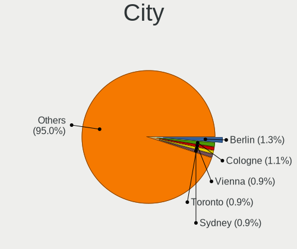
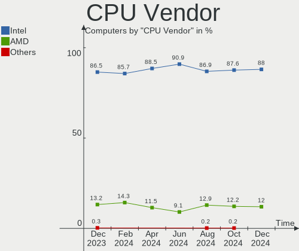
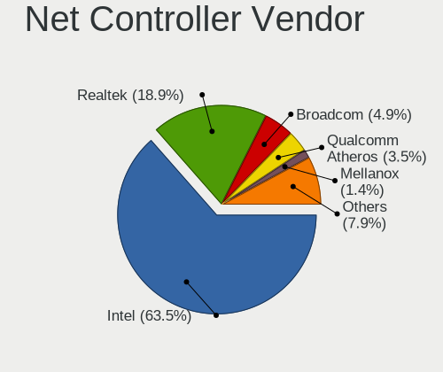
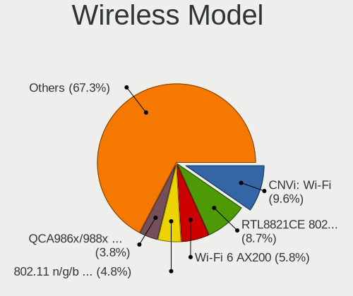
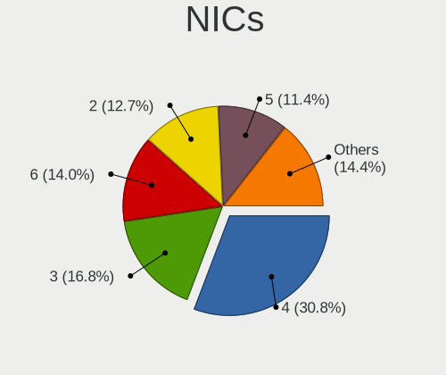
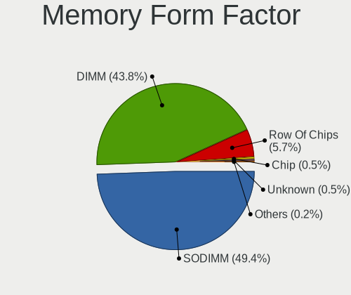
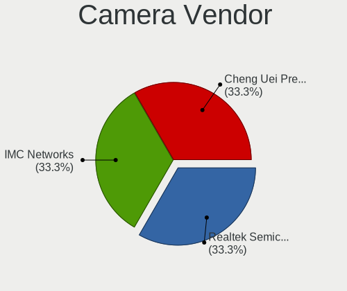

OPNsense Hardware Trends
------------------------

A project to identify most popular hardware characteristics and track their change
over time based on data collected by OPNsense users at https://BSD-Hardware.info.

Anyone can contribute to the study by uploading probes of their computers by
the [hw-probe](https://github.com/linuxhw/hw-probe/blob/master/INSTALL.BSD.md) tool:

    hw-probe -all -upload

Full-feature report is available here: https://bsd-hardware.info/?view=trends

Period: Mar, 2021.

Contents
--------

- [ OS                       ](#os)
- [ OS Family                ](#os-family)
- [ Arch                     ](#arch)
- [ DE                       ](#de)
- [ Display Server           ](#display-server)
- [ Display Manager          ](#display-manager)
- [ OS Lang                  ](#os-lang)
- [ Boot Mode                ](#boot-mode)
- [ Filesystem               ](#filesystem)
- [ Part. scheme             ](#part-scheme)
- [ Country                  ](#country)
- [ City                     ](#city)
- [ Vendor                   ](#vendor)
- [ Model                    ](#model)
- [ Model Family             ](#model-family)
- [ MFG Year                 ](#mfg-year)
- [ Form Factor              ](#form-factor)
- [ Coreboot                 ](#coreboot)
- [ RAM Size                 ](#ram-size)
- [ RAM Used                 ](#ram-used)
- [ Has CD-ROM               ](#has-cd-rom)
- [ Total Drives             ](#total-drives)
- [ Has Ethernet             ](#has-ethernet)
- [ Has WiFi                 ](#has-wifi)
- [ Has Bluetooth            ](#has-bluetooth)
- [ Drive Vendor             ](#drive-vendor)
- [ Drive Model              ](#drive-model)
- [ HDD Vendor               ](#hdd-vendor)
- [ SSD Vendor               ](#ssd-vendor)
- [ Drive Kind               ](#drive-kind)
- [ Drive Connector          ](#drive-connector)
- [ Drive Size               ](#drive-size)
- [ Space Total              ](#space-total)
- [ Space Used               ](#space-used)
- [ Malfunc. Drives          ](#malfunc-drives)
- [ Malfunc. Drive Vendor    ](#malfunc-drive-vendor)
- [ Malfunc. HDD Vendor      ](#malfunc-hdd-vendor)
- [ Malfunc. Drive Kind      ](#malfunc-drive-kind)
- [ Failed Drives            ](#failed-drives)
- [ Failed Drive Vendor      ](#failed-drive-vendor)
- [ Drive Status             ](#drive-status)
- [ Storage Vendor           ](#storage-vendor)
- [ Storage Model            ](#storage-model)
- [ Storage Kind             ](#storage-kind)
- [ CPU Vendor               ](#cpu-vendor)
- [ CPU Model                ](#cpu-model)
- [ CPU Model Family         ](#cpu-model-family)
- [ CPU Cores                ](#cpu-cores)
- [ CPU Sockets              ](#cpu-sockets)
- [ CPU Threads              ](#cpu-threads)
- [ CPU Microarch            ](#cpu-microarch)
- [ GPU Vendor               ](#gpu-vendor)
- [ GPU Model                ](#gpu-model)
- [ GPU Combo                ](#gpu-combo)
- [ GPU Driver               ](#gpu-driver)
- [ GPU Memory               ](#gpu-memory)
- [ Monitor Vendor           ](#monitor-vendor)
- [ Monitor Model            ](#monitor-model)
- [ Monitor Resolution       ](#monitor-resolution)
- [ Monitor Diagonal         ](#monitor-diagonal)
- [ Monitor Width            ](#monitor-width)
- [ Aspect Ratio             ](#aspect-ratio)
- [ Monitor Area             ](#monitor-area)
- [ Pixel Density            ](#pixel-density)
- [ Multiple Monitors        ](#multiple-monitors)
- [ Net Controller Vendor    ](#net-controller-vendor)
- [ Net Controller Model     ](#net-controller-model)
- [ Wireless Vendor          ](#wireless-vendor)
- [ Wireless Model           ](#wireless-model)
- [ Ethernet Vendor          ](#ethernet-vendor)
- [ Ethernet Model           ](#ethernet-model)
- [ Net Controller Kind      ](#net-controller-kind)
- [ Used Controller          ](#used-controller)
- [ NICs                     ](#nics)
- [ IPv6                     ](#ipv6)
- [ Memory Vendor            ](#memory-vendor)
- [ Memory Model             ](#memory-model)
- [ Memory Kind              ](#memory-kind)
- [ Memory Form Factor       ](#memory-form-factor)
- [ Memory Size              ](#memory-size)
- [ Memory Speed             ](#memory-speed)
- [ Sound Vendor             ](#sound-vendor)
- [ Sound Model              ](#sound-model)
- [ Camera Vendor            ](#camera-vendor)
- [ Camera Model             ](#camera-model)
- [ Fingerprint Vendor       ](#fingerprint-vendor)
- [ Fingerprint Model        ](#fingerprint-model)
- [ Chipcard Vendor          ](#chipcard-vendor)
- [ Chipcard Model           ](#chipcard-model)
- [ Printer Vendor           ](#printer-vendor)
- [ Printer Model            ](#printer-model)
- [ Scanner Vendor           ](#scanner-vendor)
- [ Scanner Model            ](#scanner-model)
- [ Bluetooth Vendor         ](#bluetooth-vendor)
- [ Bluetooth Model          ](#bluetooth-model)
- [ Unsupported Devices      ](#unsupported-devices)
- [ Unsupported Device Types ](#unsupported-device-types)

OS
--

Installed operating systems

| Name            | Computers | Percent |
|-----------------|-----------|---------|
| OPNsense 21.1.3 | 201       | 60.73%  |
| OPNsense 21.1.2 | 85        | 25.68%  |
| OPNsense 21.1   | 17        | 5.14%   |
| OPNsense 21.1.4 | 12        | 3.63%   |
| OPNsense 21.1.1 | 7         | 2.11%   |
| OPNsense 20.7.8 | 4         | 1.21%   |
| OPNsense 21.7   | 3         | 0.91%   |
| OPNsense 20.7.7 | 1         | 0.3%    |
| OPNsense 20.7.3 | 1         | 0.3%    |

OS Family
---------

OS without a version

| Name     | Computers | Percent |
|----------|-----------|---------|
| OPNsense | 331       | 100%    |

Arch
----

OS architecture (x86_64, i586, etc.)

| Name  | Computers | Percent |
|-------|-----------|---------|
| amd64 | 331       | 100%    |

DE
--

Desktop Environment

| Name    | Computers | Percent |
|---------|-----------|---------|
| Console | 331       | 100%    |

Display Server
--------------

X11 or Wayland

| Name    | Computers | Percent |
|---------|-----------|---------|
| Console | 331       | 100%    |

Display Manager
---------------

SDDM, LightDM, etc.

| Name    | Computers | Percent |
|---------|-----------|---------|
| Console | 331       | 100%    |

OS Lang
-------

Language

| Lang    | Computers | Percent |
|---------|-----------|---------|
| Unknown | 331       | 100%    |

Boot Mode
---------

EFI or BIOS

| Mode | Computers | Percent |
|------|-----------|---------|
| EFI  | 279       | 84.29%  |
| BIOS | 52        | 15.71%  |

Filesystem
----------

Type of filesystem

| Type | Computers | Percent |
|------|-----------|---------|
| Ufs  | 325       | 98.19%  |
| Zfs  | 6         | 1.81%   |

Part. scheme
------------

Scheme of partitioning

| Type    | Computers | Percent |
|---------|-----------|---------|
| GPT     | 282       | 85.2%   |
| MBR     | 44        | 13.29%  |
| Unknown | 5         | 1.51%   |

Country
-------

Geographic location (country)

| Country      | Computers | Percent |
|--------------|-----------|---------|
| USA          | 87        | 26.28%  |
| Germany      | 72        | 21.75%  |
| Canada       | 17        | 5.14%   |
| Netherlands  | 15        | 4.53%   |
| UK           | 11        | 3.32%   |
| France       | 11        | 3.32%   |
| Austria      | 11        | 3.32%   |
| Sweden       | 10        | 3.02%   |
| Brazil       | 9         | 2.72%   |
| Australia    | 8         | 2.42%   |
| Switzerland  | 7         | 2.11%   |
| Poland       | 7         | 2.11%   |
| Italy        | 6         | 1.81%   |
| China        | 5         | 1.51%   |
| Romania      | 4         | 1.21%   |
| Belgium      | 4         | 1.21%   |
| Spain        | 3         | 0.91%   |
| South Africa | 3         | 0.91%   |
| Russia       | 3         | 0.91%   |
| Norway       | 3         | 0.91%   |
| Bulgaria     | 3         | 0.91%   |
| Turkey       | 2         | 0.6%    |
| Thailand     | 2         | 0.6%    |
| Slovakia     | 2         | 0.6%    |
| Portugal     | 2         | 0.6%    |
| New Zealand  | 2         | 0.6%    |
| India        | 2         | 0.6%    |
| Finland      | 2         | 0.6%    |
| Denmark      | 2         | 0.6%    |
| Czechia      | 2         | 0.6%    |
| Taiwan       | 1         | 0.3%    |
| South Korea  | 1         | 0.3%    |
| Singapore    | 1         | 0.3%    |
| Pakistan     | 1         | 0.3%    |
| Oman         | 1         | 0.3%    |
| Mexico       | 1         | 0.3%    |
| Luxembourg   | 1         | 0.3%    |
| Latvia       | 1         | 0.3%    |
| Indonesia    | 1         | 0.3%    |
| Estonia      | 1         | 0.3%    |
| Egypt        | 1         | 0.3%    |
| Costa Rica   | 1         | 0.3%    |
| Colombia     | 1         | 0.3%    |
| Argentina    | 1         | 0.3%    |

City
----

Geographic location (city)

| City                  | Computers | Percent |
|-----------------------|-----------|---------|
| Vienna                | 5         | 1.51%   |
| Munich                | 5         | 1.51%   |
| Berlin                | 5         | 1.51%   |
| Hamburg               | 4         | 1.21%   |
| Cologne               | 4         | 1.21%   |
| Chicago               | 4         | 1.21%   |
| Las Vegas             | 3         | 0.91%   |
| Dallas                | 3         | 0.91%   |
| Columbus              | 3         | 0.91%   |
| Victoria              | 2         | 0.6%    |
| Toronto               | 2         | 0.6%    |
| São José dos Campos | 2         | 0.6%    |
| Stockholm             | 2         | 0.6%    |
| Salt Lake City        | 2         | 0.6%    |
| Rousse                | 2         | 0.6%    |
| Prague                | 2         | 0.6%    |
| Portland              | 2         | 0.6%    |
| Moscow                | 2         | 0.6%    |
| Melbourne             | 2         | 0.6%    |
| Mannheim              | 2         | 0.6%    |
| Malmo                 | 2         | 0.6%    |
| Ludwigshafen am Rhein | 2         | 0.6%    |
| Hanover               | 2         | 0.6%    |
| Gordola               | 2         | 0.6%    |
| Gettorf               | 2         | 0.6%    |
| Fort Lauderdale       | 2         | 0.6%    |
| Denver                | 2         | 0.6%    |
| Bielefeld             | 2         | 0.6%    |
| Bangkok               | 2         | 0.6%    |
| Älvängen            | 1         | 0.3%    |
| Zurich                | 1         | 0.3%    |
| Zoetermeer            | 1         | 0.3%    |
| Xi'an                 | 1         | 0.3%    |
| Wschowa               | 1         | 0.3%    |
| Wolfratshausen        | 1         | 0.3%    |
| Woking                | 1         | 0.3%    |
| Wittingen             | 1         | 0.3%    |
| Winnipeg              | 1         | 0.3%    |
| Wetzikon              | 1         | 0.3%    |
| Wettswil              | 1         | 0.3%    |
| Westland              | 1         | 0.3%    |
| Watford               | 1         | 0.3%    |
| Washington            | 1         | 0.3%    |
| Warsaw                | 1         | 0.3%    |
| Vlaardingen           | 1         | 0.3%    |
| Vitória da Conquista | 1         | 0.3%    |
| Vichy                 | 1         | 0.3%    |
| Viarmes               | 1         | 0.3%    |
| Vaughan               | 1         | 0.3%    |
| Varna                 | 1         | 0.3%    |
| Vancouver             | 1         | 0.3%    |
| Valencia              | 1         | 0.3%    |
| Vaasa                 | 1         | 0.3%    |
| Târgu Jiu            | 1         | 0.3%    |
| Turtle Creek          | 1         | 0.3%    |
| Tucson                | 1         | 0.3%    |
| Todtnau               | 1         | 0.3%    |
| Tielt                 | 1         | 0.3%    |
| The Hague             | 1         | 0.3%    |
| Tempe                 | 1         | 0.3%    |

Vendor
------

Motherboard manufacturer

| Name                       | Computers | Percent |
|----------------------------|-----------|---------|
| Dell                       | 50        | 15.11%  |
| Unknown                    | 39        | 11.78%  |
| ASUSTek Computer           | 23        | 6.95%   |
| Hewlett-Packard            | 22        | 6.65%   |
| Supermicro                 | 20        | 6.04%   |
| PC Engines                 | 18        | 5.44%   |
| Intel                      | 18        | 5.44%   |
| Protectli                  | 15        | 4.53%   |
| AMI                        | 15        | 4.53%   |
| Lenovo                     | 12        | 3.63%   |
| ASRock                     | 12        | 3.63%   |
| Gigabyte Technology        | 11        | 3.32%   |
| Shuttle                    | 8         | 2.42%   |
| ZOTAC                      | 7         | 2.11%   |
| MSI                        | 7         | 2.11%   |
| Sophos                     | 4         | 1.21%   |
| HARDKERNEL                 | 4         | 1.21%   |
| Fujitsu                    | 4         | 1.21%   |
| Thomas-Krenn.AG            | 3         | 0.91%   |
| Deciso                     | 3         | 0.91%   |
| Compulab                   | 3         | 0.91%   |
| BESSTAR Tech               | 3         | 0.91%   |
| ShenZhen MinWin Technology | 2         | 0.6%    |
| SeeedStudio                | 2         | 0.6%    |
| IBM                        | 2         | 0.6%    |
| ECS                        | 2         | 0.6%    |
| AWOW                       | 2         | 0.6%    |
| ASRockRack                 | 2         | 0.6%    |
| TYAN Computer              | 1         | 0.3%    |
| SECO                       | 1         | 0.3%    |
| Quanmax                    | 1         | 0.3%    |
| Pegatron                   | 1         | 0.3%    |
| OEM                        | 1         | 0.3%    |
| NU941                      | 1         | 0.3%    |
| NF541                      | 1         | 0.3%    |
| MiTAC                      | 1         | 0.3%    |
| Inventec                   | 1         | 0.3%    |
| HPE                        | 1         | 0.3%    |
| DFI                        | 1         | 0.3%    |
| Biostar                    | 1         | 0.3%    |
| Barracuda Networks         | 1         | 0.3%    |
| AZW                        | 1         | 0.3%    |
| Advantech                  | 1         | 0.3%    |
| ADI                        | 1         | 0.3%    |
| Acer                       | 1         | 0.3%    |
| AAEON                      | 1         | 0.3%    |

Model
-----

Motherboard model

| Name                                             | Computers | Percent |
|--------------------------------------------------|-----------|---------|
| Unknown                                          | 39        | 11.78%  |
| AMI Aptio CRB                                    | 12        | 3.63%   |
| Supermicro Super Server                          | 9         | 2.72%   |
| Protectli FW4B                                   | 8         | 2.42%   |
| Intel Q3XXG4-P V1.0                              | 7         | 2.11%   |
| PC Engines apu4                                  | 6         | 1.81%   |
| PC Engines apu2                                  | 6         | 1.81%   |
| Dell OptiPlex 3020                               | 5         | 1.51%   |
| HARDKERNEL ODROID-H2                             | 4         | 1.21%   |
| Dell OptiPlex 9020                               | 4         | 1.21%   |
| Thomas-Krenn.AG LES network+                     | 3         | 0.91%   |
| Protectli FW6                                    | 3         | 0.91%   |
| PC Engines APU                                   | 3         | 0.91%   |
| HP Compaq Elite 8300 SFF                         | 3         | 0.91%   |
| Dell PowerEdge R610                              | 3         | 0.91%   |
| Dell PowerEdge R210 II                           | 3         | 0.91%   |
| Compulab fitlet2                                 | 3         | 0.91%   |
| Supermicro X9SCL/X9SCM                           | 2         | 0.6%    |
| Supermicro A1SAi                                 | 2         | 0.6%    |
| Sophos UTM                                       | 2         | 0.6%    |
| Sophos SG                                        | 2         | 0.6%    |
| Shuttle DS10U                                    | 2         | 0.6%    |
| ShenZhen MinWin MW-NANO-APL-4L                   | 2         | 0.6%    |
| SeeedStudio ODYSSEY-X86J4105                     | 2         | 0.6%    |
| Protectli FW1                                    | 2         | 0.6%    |
| PC Engines APU3                                  | 2         | 0.6%    |
| Lenovo ThinkCentre M90n-1 11AHS0B200             | 2         | 0.6%    |
| Fujitsu FUTRO S920                               | 2         | 0.6%    |
| Dell OptiPlex 790                                | 2         | 0.6%    |
| Dell OptiPlex 7010                               | 2         | 0.6%    |
| Dell OptiPlex 5040                               | 2         | 0.6%    |
| Dell OptiPlex 380                                | 2         | 0.6%    |
| Deciso Netboard A20                              | 2         | 0.6%    |
| BESSTAR Tech DMAF5                               | 2         | 0.6%    |
| AWOW PC BOX                                      | 2         | 0.6%    |
| ASUS P8H61-M LE/USB3                             | 2         | 0.6%    |
| ASUS P5Q-E                                       | 2         | 0.6%    |
| ASUS H110M-K                                     | 2         | 0.6%    |
| ASUS All Series                                  | 2         | 0.6%    |
| ASRock B75M                                      | 2         | 0.6%    |
| ZOTAC ZBOX-MI640/MI660/MI620NANO                 | 1         | 0.3%    |
| ZOTAC ZBOX-MI522NANO/MI542NANO                   | 1         | 0.3%    |
| ZOTAC ZBOX-ID88/ID89/ID90                        | 1         | 0.3%    |
| ZOTAC ZBOX-CI527/CI547NANO                       | 1         | 0.3%    |
| ZOTAC ZBOX-CI527/CI547                           | 1         | 0.3%    |
| ZOTAC ZBOX-CI341                                 | 1         | 0.3%    |
| ZOTAC ZBOX-CI329NANO                             | 1         | 0.3%    |
| TYAN S2925                                       | 1         | 0.3%    |
| Supermicro X8DTU-LN4+                            | 1         | 0.3%    |
| Supermicro X8DTU                                 | 1         | 0.3%    |
| Supermicro X7SLA                                 | 1         | 0.3%    |
| Supermicro X10SLH-N6-ST031                       | 1         | 0.3%    |
| Supermicro SYS-E300-9A                           | 1         | 0.3%    |
| Supermicro 1HE Intel Single-CPU RI1104H+ Server  | 1         | 0.3%    |
| Supermicro 1HE Intel Single-CPU RI1102D-F Server | 1         | 0.3%    |
| Shuttle SZ270                                    | 1         | 0.3%    |
| Shuttle SH55J                                    | 1         | 0.3%    |
| Shuttle DS81D                                    | 1         | 0.3%    |
| Shuttle DS67U                                    | 1         | 0.3%    |
| Shuttle DH310                                    | 1         | 0.3%    |

Model Family
------------

Motherboard model prefix

| Name                           | Computers | Percent |
|--------------------------------|-----------|---------|
| Unknown                        | 39        | 11.78%  |
| Dell OptiPlex                  | 24        | 7.25%   |
| Dell PowerEdge                 | 16        | 4.83%   |
| AMI Aptio                      | 12        | 3.63%   |
| Supermicro Super               | 9         | 2.72%   |
| Lenovo ThinkCentre             | 9         | 2.72%   |
| Protectli FW4B                 | 8         | 2.42%   |
| Intel Q3XXG4-P                 | 7         | 2.11%   |
| PC Engines apu4                | 6         | 1.81%   |
| PC Engines apu2                | 6         | 1.81%   |
| HP ProLiant                    | 6         | 1.81%   |
| HP Compaq                      | 5         | 1.51%   |
| HARDKERNEL ODROID-H2           | 4         | 1.21%   |
| Dell Latitude                  | 4         | 1.21%   |
| ASUS P8H61-M                   | 4         | 1.21%   |
| Thomas-Krenn.AG LES            | 3         | 0.91%   |
| Protectli FW6                  | 3         | 0.91%   |
| PC Engines APU                 | 3         | 0.91%   |
| HP ProDesk                     | 3         | 0.91%   |
| HP EliteDesk                   | 3         | 0.91%   |
| Dell Inspiron                  | 3         | 0.91%   |
| Compulab fitlet2               | 3         | 0.91%   |
| ZOTAC ZBOX-CI527               | 2         | 0.6%    |
| Supermicro X9SCL               | 2         | 0.6%    |
| Supermicro A1SAi               | 2         | 0.6%    |
| Supermicro 1HE                 | 2         | 0.6%    |
| Sophos UTM                     | 2         | 0.6%    |
| Sophos SG                      | 2         | 0.6%    |
| Shuttle DS10U                  | 2         | 0.6%    |
| ShenZhen MinWin MW-NANO-APL-4L | 2         | 0.6%    |
| SeeedStudio ODYSSEY-X86J4105   | 2         | 0.6%    |
| Protectli FW1                  | 2         | 0.6%    |
| PC Engines APU3                | 2         | 0.6%    |
| Lenovo ThinkPad                | 2         | 0.6%    |
| IBM System                     | 2         | 0.6%    |
| HP t620                        | 2         | 0.6%    |
| Fujitsu FUTRO                  | 2         | 0.6%    |
| Dell Precision                 | 2         | 0.6%    |
| Deciso Netboard                | 2         | 0.6%    |
| BESSTAR Tech DMAF5             | 2         | 0.6%    |
| AWOW PC                        | 2         | 0.6%    |
| ASUS P5Q-E                     | 2         | 0.6%    |
| ASUS H110M-K                   | 2         | 0.6%    |
| ASUS All                       | 2         | 0.6%    |
| ASRock B75M                    | 2         | 0.6%    |
| ZOTAC ZBOX-MI640               | 1         | 0.3%    |
| ZOTAC ZBOX-MI522NANO           | 1         | 0.3%    |
| ZOTAC ZBOX-ID88                | 1         | 0.3%    |
| ZOTAC ZBOX-CI341               | 1         | 0.3%    |
| ZOTAC ZBOX-CI329NANO           | 1         | 0.3%    |
| TYAN S2925                     | 1         | 0.3%    |
| Supermicro X8DTU-LN4+          | 1         | 0.3%    |
| Supermicro X8DTU               | 1         | 0.3%    |
| Supermicro X7SLA               | 1         | 0.3%    |
| Supermicro X10SLH-N6-ST031     | 1         | 0.3%    |
| Supermicro SYS-E300-9A         | 1         | 0.3%    |
| Shuttle SZ270                  | 1         | 0.3%    |
| Shuttle SH55J                  | 1         | 0.3%    |
| Shuttle DS81D                  | 1         | 0.3%    |
| Shuttle DS67U                  | 1         | 0.3%    |

MFG Year
--------

Motherboard manufacture year

| Year | Computers | Percent |
|------|-----------|---------|
| 2020 | 65        | 19.64%  |
| 2019 | 58        | 17.52%  |
| 2018 | 49        | 14.8%   |
| 2014 | 23        | 6.95%   |
| 2016 | 18        | 5.44%   |
| 2012 | 18        | 5.44%   |
| 2017 | 16        | 4.83%   |
| 2021 | 15        | 4.53%   |
| 2015 | 15        | 4.53%   |
| 2011 | 14        | 4.23%   |
| 2010 | 14        | 4.23%   |
| 2013 | 12        | 3.63%   |
| 2009 | 7         | 2.11%   |
| 2008 | 4         | 1.21%   |
| 2007 | 3         | 0.91%   |

Form Factor
-----------

Physical design of the computer

| Name     | Computers | Percent |
|----------|-----------|---------|
| Desktop  | 234       | 70.69%  |
| Server   | 41        | 12.39%  |
| Mini pc  | 34        | 10.27%  |
| Notebook | 16        | 4.83%   |
| Firewall | 6         | 1.81%   |

Coreboot
--------

Have coreboot on board

| Used | Computers | Percent |
|------|-----------|---------|
| No   | 310       | 93.66%  |
| Yes  | 21        | 6.34%   |

RAM Size
--------

Total RAM memory

| Size in GB  | Computers | Percent |
|-------------|-----------|---------|
| 8.01-16.0   | 129       | 38.97%  |
| 4.01-8.0    | 88        | 26.59%  |
| 16.01-24.0  | 69        | 20.85%  |
| 32.01-64.0  | 19        | 5.74%   |
| 2.01-3.0    | 12        | 3.63%   |
| 64.01-256.0 | 7         | 2.11%   |
| 3.01-4.0    | 2         | 0.6%    |
| 24.01-32.0  | 2         | 0.6%    |
| 1.01-2.0    | 2         | 0.6%    |
| 0.51-1.0    | 1         | 0.3%    |

RAM Used
--------

Used RAM memory

| Used GB    | Computers | Percent |
|------------|-----------|---------|
| 0.01-0.5   | 197       | 59.52%  |
| 0.51-1.0   | 87        | 26.28%  |
| 1.01-2.0   | 27        | 8.16%   |
| 4.01-8.0   | 8         | 2.42%   |
| 3.01-4.0   | 4         | 1.21%   |
| 2.01-3.0   | 4         | 1.21%   |
| 8.01-16.0  | 3         | 0.91%   |
| 32.01-64.0 | 1         | 0.3%    |

Has CD-ROM
----------

Has CD-ROM on board

| Presented | Computers | Percent |
|-----------|-----------|---------|
| No        | 277       | 83.69%  |
| Yes       | 54        | 16.31%  |

Total Drives
------------

Number of drives on board

| Drives | Computers | Percent |
|--------|-----------|---------|
| 1      | 261       | 78.85%  |
| 0      | 44        | 13.29%  |
| 2      | 24        | 7.25%   |
| 3      | 2         | 0.6%    |

Has Ethernet
------------

Has Ethernet on board

| Presented | Computers | Percent |
|-----------|-----------|---------|
| Yes       | 330       | 99.7%   |
| No        | 1         | 0.3%    |

Has WiFi
--------

Has WiFi module

| Presented | Computers | Percent |
|-----------|-----------|---------|
| No        | 265       | 80.06%  |
| Yes       | 66        | 19.94%  |

Has Bluetooth
-------------

Has Bluetooth module

| Presented | Computers | Percent |
|-----------|-----------|---------|
| No        | 297       | 89.73%  |
| Yes       | 34        | 10.27%  |

Drive Vendor
------------

Hard drive vendors

| Vendor              | Computers | Drives | Percent |
|---------------------|-----------|--------|---------|
| Samsung Electronics | 52        | 58     | 17.28%  |
| Kingston            | 36        | 38     | 11.96%  |
| WDC                 | 26        | 27     | 8.64%   |
| Seagate             | 22        | 24     | 7.31%   |
| SanDisk             | 20        | 21     | 6.64%   |
| Transcend           | 16        | 16     | 5.32%   |
| Intel               | 16        | 19     | 5.32%   |
| Crucial             | 16        | 17     | 5.32%   |
| Phison              | 12        | 12     | 3.99%   |
| Hoodisk             | 11        | 11     | 3.65%   |
| Toshiba             | 7         | 7      | 2.33%   |
| OCZ                 | 4         | 4      | 1.33%   |
| Hewlett-Packard     | 4         | 5      | 1.33%   |
| FORESEE             | 4         | 4      | 1.33%   |
| Apacer              | 4         | 4      | 1.33%   |
| SPCC                | 3         | 3      | 1%      |
| Micron Technology   | 3         | 3      | 1%      |
| Hitachi             | 3         | 3      | 1%      |
| Dogfish             | 3         | 3      | 1%      |
| A-DATA Technology   | 3         | 3      | 1%      |
| PLEXTOR             | 2         | 2      | 0.66%   |
| Mushkin             | 2         | 2      | 0.66%   |
| KingDian            | 2         | 2      | 0.66%   |
| Intenso             | 2         | 2      | 0.66%   |
| Innodisk            | 2         | 2      | 0.66%   |
| HGST                | 2         | 2      | 0.66%   |
| Drevo               | 2         | 2      | 0.66%   |
| Corsair             | 2         | 2      | 0.66%   |
| China               | 2         | 2      | 0.66%   |
| BIWIN               | 2         | 2      | 0.66%   |
| ZTC                 | 1         | 1      | 0.33%   |
| V-GeN               | 1         | 1      | 0.33%   |
| TCSUNBOW            | 1         | 1      | 0.33%   |
| SK Hynix            | 1         | 1      | 0.33%   |
| PNY                 | 1         | 1      | 0.33%   |
| Patriot             | 1         | 1      | 0.33%   |
| Maxtor              | 1         | 1      | 0.33%   |
| LSILOGIC            | 1         | 1      | 0.33%   |
| LITEON              | 1         | 1      | 0.33%   |
| Kston               | 1         | 1      | 0.33%   |
| KingSpec            | 1         | 1      | 0.33%   |
| INDMEM              | 1         | 1      | 0.33%   |
| HPE                 | 1         | 1      | 0.33%   |
| Gigabyte Technology | 1         | 1      | 0.33%   |
| EMTEC               | 1         | 1      | 0.33%   |
| Apple               | 1         | 1      | 0.33%   |

Drive Model
-----------

Hard drive models

| Model                            | Computers | Percent |
|----------------------------------|-----------|---------|
| Phison SATA SSD 16GB             | 12        | 3.95%   |
| Kingston SA400S37240G 240GB      | 8         | 2.63%   |
| Kingston SUV500MS120G 120GB      | 6         | 1.97%   |
| Kingston SA400S37120G 120GB      | 6         | 1.97%   |
| Crucial CT120BX500SSD1 120GB     | 6         | 1.97%   |
| Kingston SUV500MS240G 240GB      | 4         | 1.32%   |
| Hoodisk SSD 32GB                 | 4         | 1.32%   |
| HP RAID 1(1+0) 73GB              | 4         | 1.32%   |
| Transcend TS64GMSA230S 64GB      | 3         | 0.99%   |
| Transcend TS128GMSA230S 128GB    | 3         | 0.99%   |
| SanDisk SDSSDA240G 240GB         | 3         | 0.99%   |
| Samsung SSD 970 EVO Plus 250GB   | 3         | 0.99%   |
| Samsung SSD 860 PRO 256GB        | 3         | 0.99%   |
| Samsung SSD 860 EVO 250GB        | 3         | 0.99%   |
| Kingston SV300S37A120G 120GB     | 3         | 0.99%   |
| Intel SSDSC2KG240G8 240GB        | 3         | 0.99%   |
| Hoodisk SSD 128GB                | 3         | 0.99%   |
| FORESEE 128GB SSD                | 3         | 0.99%   |
| Crucial CT240BX500SSD1 240GB     | 3         | 0.99%   |
| Apacer 16GB SATA Flash Drive     | 3         | 0.99%   |
| WDC WDS120G2G0A-00JH30 120GB     | 2         | 0.66%   |
| Transcend TS256GMTS952T2 256GB   | 2         | 0.66%   |
| SPCC Solid State Disk 128GB      | 2         | 0.66%   |
| Seagate ST500DM002-1BD142 500GB  | 2         | 0.66%   |
| Seagate ST250DM000-1BD141 250GB  | 2         | 0.66%   |
| Seagate ST1000DM003-1CH162 1TB   | 2         | 0.66%   |
| SanDisk SSD PLUS 240 GB          | 2         | 0.66%   |
| SanDisk SDSA6MM-016G-1006 16GB   | 2         | 0.66%   |
| Samsung SSD 970 EVO 500GB        | 2         | 0.66%   |
| Samsung SSD 960 EVO 250GB        | 2         | 0.66%   |
| Samsung SSD 870 EVO 250GB        | 2         | 0.66%   |
| Samsung SSD 850 PRO 512GB        | 2         | 0.66%   |
| Samsung SSD 850 EVO 250GB        | 2         | 0.66%   |
| Samsung SSD 840 PRO Series 128GB | 2         | 0.66%   |
| Samsung SSD 840 EVO 250GB        | 2         | 0.66%   |
| Samsung SSD 840 EVO 120GB        | 2         | 0.66%   |
| Samsung MZALQ128HBHQ-000L1 128GB | 2         | 0.66%   |
| Mushkin MKNSSDEC60GB 64GB        | 2         | 0.66%   |
| Micron MTFDDAK128MAM-1J1 128GB   | 2         | 0.66%   |
| Intenso SSD Sata III 120GB       | 2         | 0.66%   |
| Intel SSDSA2CT040G3 40GB         | 2         | 0.66%   |
| Hoodisk SSD 64GB                 | 2         | 0.66%   |
| Hoodisk SSD 16GB                 | 2         | 0.66%   |
| Crucial CT500MX500SSD1 500GB     | 2         | 0.66%   |
| BIWIN SSD 128GB                  | 2         | 0.66%   |
| A-DATA SX300 128GB               | 2         | 0.66%   |
| ZTC SM201-064G                   | 1         | 0.33%   |
| WDC WDS500G1X0E-00AFY0 500GB     | 1         | 0.33%   |
| WDC WDS250G2B0C-00PXH0 250GB     | 1         | 0.33%   |
| WDC WDS250G2B0A-00SM50 250GB     | 1         | 0.33%   |
| WDC WDS240G2G0B-00EPW0 240GB     | 1         | 0.33%   |
| WDC WDS240G2G0A-00JH30 240GB     | 1         | 0.33%   |
| WDC WDS120G2G0B-00EPW0 120GB     | 1         | 0.33%   |
| WDC WD800JD-60LSA5 80GB          | 1         | 0.33%   |
| WDC WD5000HHTZ-75N21V0 500GB     | 1         | 0.33%   |
| WDC WD5000AAKX-75U6AA0 500GB     | 1         | 0.33%   |
| WDC WD5000AAKX-08U6AA0 500GB     | 1         | 0.33%   |
| WDC WD5000AAKX-001CA0 500GB      | 1         | 0.33%   |
| WDC WD5000AAKS-00UU3A0 500GB     | 1         | 0.33%   |
| WDC WD2500JS-22NCB1 250GB        | 1         | 0.33%   |

HDD Vendor
----------

Hard disk drive vendors

| Vendor              | Computers | Drives | Percent |
|---------------------|-----------|--------|---------|
| Seagate             | 19        | 21     | 34.55%  |
| WDC                 | 18        | 18     | 32.73%  |
| Samsung Electronics | 4         | 4      | 7.27%   |
| Hewlett-Packard     | 4         | 5      | 7.27%   |
| Hitachi             | 3         | 3      | 5.45%   |
| Toshiba             | 2         | 2      | 3.64%   |
| HGST                | 2         | 2      | 3.64%   |
| Maxtor              | 1         | 1      | 1.82%   |
| LSILOGIC            | 1         | 1      | 1.82%   |
| Apple               | 1         | 1      | 1.82%   |

SSD Vendor
----------

Solid state drive vendors

| Vendor              | Computers | Drives | Percent |
|---------------------|-----------|--------|---------|
| Samsung Electronics | 35        | 41     | 15.7%   |
| Kingston            | 34        | 36     | 15.25%  |
| SanDisk             | 20        | 21     | 8.97%   |
| Transcend           | 16        | 16     | 7.17%   |
| Intel               | 15        | 18     | 6.73%   |
| Crucial             | 15        | 16     | 6.73%   |
| Phison              | 12        | 12     | 5.38%   |
| Hoodisk             | 11        | 11     | 4.93%   |
| WDC                 | 6         | 7      | 2.69%   |
| Toshiba             | 5         | 5      | 2.24%   |
| OCZ                 | 4         | 4      | 1.79%   |
| FORESEE             | 4         | 4      | 1.79%   |
| Apacer              | 4         | 4      | 1.79%   |
| SPCC                | 3         | 3      | 1.35%   |
| Micron Technology   | 3         | 3      | 1.35%   |
| Dogfish             | 3         | 3      | 1.35%   |
| Seagate             | 2         | 2      | 0.9%    |
| PLEXTOR             | 2         | 2      | 0.9%    |
| Mushkin             | 2         | 2      | 0.9%    |
| KingDian            | 2         | 2      | 0.9%    |
| Intenso             | 2         | 2      | 0.9%    |
| InnoDisk            | 2         | 2      | 0.9%    |
| Drevo               | 2         | 2      | 0.9%    |
| China               | 2         | 2      | 0.9%    |
| BIWIN               | 2         | 2      | 0.9%    |
| A-DATA Technology   | 2         | 2      | 0.9%    |
| ZTC                 | 1         | 1      | 0.45%   |
| V-GeN               | 1         | 1      | 0.45%   |
| TCSUNBOW            | 1         | 1      | 0.45%   |
| SK Hynix            | 1         | 1      | 0.45%   |
| PNY                 | 1         | 1      | 0.45%   |
| Patriot             | 1         | 1      | 0.45%   |
| LITEON              | 1         | 1      | 0.45%   |
| Kston               | 1         | 1      | 0.45%   |
| KingSpec            | 1         | 1      | 0.45%   |
| INDMEM              | 1         | 1      | 0.45%   |
| HPE                 | 1         | 1      | 0.45%   |
| Gigabyte Technology | 1         | 1      | 0.45%   |
| Corsair             | 1         | 1      | 0.45%   |

Drive Kind
----------

HDD or SSD

| Kind | Computers | Drives | Percent |
|------|-----------|--------|---------|
| SSD  | 219       | 237    | 74.49%  |
| HDD  | 52        | 58     | 17.69%  |
| NVMe | 23        | 23     | 7.82%   |

Drive Connector
---------------

SATA, SAS, NVMe, etc.

| Type | Computers | Drives | Percent |
|------|-----------|--------|---------|
| SATA | 265       | 295    | 92.01%  |
| NVMe | 23        | 23     | 7.99%   |

Drive Size
----------

Size of hard drive

| Size in TB | Computers | Drives | Percent |
|------------|-----------|--------|---------|
| 0.01-0.5   | 254       | 275    | 93.73%  |
| 0.51-1.0   | 12        | 15     | 4.43%   |
| 1.01-2.0   | 3         | 3      | 1.11%   |
| 3.01-4.0   | 1         | 1      | 0.37%   |
| 2.01-3.0   | 1         | 1      | 0.37%   |

Space Total
-----------

Amount of disk space available on the file system

| Size in GB | Computers | Percent |
|------------|-----------|---------|
| 101-250    | 147       | 44.41%  |
| 21-50      | 48        | 14.5%   |
| 51-100     | 44        | 13.29%  |
| 251-500    | 43        | 12.99%  |
| 1-20       | 35        | 10.57%  |
| 501-1000   | 10        | 3.02%   |
| 1001-2000  | 4         | 1.21%   |

Space Used
----------

Amount of used disk space

| Used GB | Computers | Percent |
|---------|-----------|---------|
| 1-20    | 323       | 97.58%  |
| 21-50   | 5         | 1.51%   |
| 51-100  | 2         | 0.6%    |
| 101-250 | 1         | 0.3%    |

Malfunc. Drives
---------------

Drive models with a malfunction

| Model                                            | Computers | Drives | Percent |
|--------------------------------------------------|-----------|--------|---------|
| Kingston SV300S37A120G 120GB                     | 2         | 2      | 4.65%   |
| ZTC SM201-064G                                   | 1         | 1      | 2.33%   |
| WDC WDS240G2G0A-00JH30 240GB                     | 1         | 1      | 2.33%   |
| WDC WD800JD-60LSA5 80GB                          | 1         | 1      | 2.33%   |
| WDC WD5000AAKX-001CA0 500GB                      | 1         | 1      | 2.33%   |
| WDC WD5000AAKS-00UU3A0 500GB                     | 1         | 1      | 2.33%   |
| WDC WD2500JS-22NCB1 250GB                        | 1         | 1      | 2.33%   |
| WDC WD1600BEVS-00UST0 160GB                      | 1         | 1      | 2.33%   |
| WDC WD1600AAJS-75M0A0 160GB                      | 1         | 1      | 2.33%   |
| Transcend TS32GMSM610 32GB                       | 1         | 1      | 2.33%   |
| Toshiba THNSNK256GVN8 M.2 2280 256GB             | 1         | 1      | 2.33%   |
| SK Hynix HFS256G3AMNB-2200A 256GB                | 1         | 1      | 2.33%   |
| Seagate ST9500325AS 500GB                        | 1         | 1      | 2.33%   |
| Seagate ST9320320AS 320GB                        | 1         | 1      | 2.33%   |
| Seagate ST500LT012-9WS142 500GB                  | 1         | 1      | 2.33%   |
| Seagate ST500DM002-1BD142 500GB                  | 1         | 1      | 2.33%   |
| Seagate ST3320418AS 320GB                        | 1         | 1      | 2.33%   |
| Seagate ST1000LM024 HN-M101MBB 1TB               | 1         | 1      | 2.33%   |
| Seagate ST1000DL002-9TT153 1TB                   | 1         | 1      | 2.33%   |
| SanDisk SSD PLUS 240 GB                          | 1         | 1      | 2.33%   |
| Samsung Electronics SSD SM841 2.5-inch 7mm 512GB | 1         | 1      | 2.33%   |
| Samsung Electronics SSD 840 PRO Series 128GB     | 1         | 1      | 2.33%   |
| Samsung Electronics HM321HI 320GB                | 1         | 1      | 2.33%   |
| Samsung Electronics HM121HI 120GB                | 1         | 1      | 2.33%   |
| OCZ VERTEX3 120GB                                | 1         | 1      | 2.33%   |
| OCZ AGILITY3 120GB                               | 1         | 1      | 2.33%   |
| Micron Technology P300-MTFDBAC050SAL 50GB        | 1         | 1      | 2.33%   |
| Kingston SNV425S2128GB                           | 1         | 1      | 2.33%   |
| KingDian S200 60GB                               | 1         | 1      | 2.33%   |
| Intel SSDSC2CW120A3 120GB                        | 1         | 1      | 2.33%   |
| Intel SSDSC2CT120A3 120GB                        | 1         | 1      | 2.33%   |
| Intel SSDSA2M120G2GC 120GB                       | 1         | 1      | 2.33%   |
| Hitachi HUA722020ALA331 2TB                      | 1         | 1      | 2.33%   |
| Hitachi HTS543232A7A384 320GB                    | 1         | 1      | 2.33%   |
| Hitachi HDS723015BLA642 1.5TB                    | 1         | 1      | 2.33%   |
| HGST HTS725050A7E630 500GB                       | 1         | 1      | 2.33%   |
| Crucial CT500MX500SSD1 500GB                     | 1         | 1      | 2.33%   |
| Crucial CT275MX300SSD1 275GB                     | 1         | 1      | 2.33%   |
| Crucial CT240M500SSD1 240GB                      | 1         | 1      | 2.33%   |
| Corsair Force 3 SSD 120GB                        | 1         | 1      | 2.33%   |
| China SATA3 240GB SSD                            | 1         | 1      | 2.33%   |
| A-DATA Technology SX300 128GB                    | 1         | 1      | 2.33%   |

Malfunc. Drive Vendor
---------------------

Vendors of faulty drives

| Vendor              | Computers | Drives | Percent |
|---------------------|-----------|--------|---------|
| WDC                 | 7         | 7      | 16.28%  |
| Seagate             | 7         | 7      | 16.28%  |
| Samsung Electronics | 4         | 4      | 9.3%    |
| Kingston            | 3         | 3      | 6.98%   |
| Intel               | 3         | 3      | 6.98%   |
| Hitachi             | 3         | 3      | 6.98%   |
| Crucial             | 3         | 3      | 6.98%   |
| OCZ                 | 2         | 2      | 4.65%   |
| ZTC                 | 1         | 1      | 2.33%   |
| Transcend           | 1         | 1      | 2.33%   |
| Toshiba             | 1         | 1      | 2.33%   |
| SK Hynix            | 1         | 1      | 2.33%   |
| SanDisk             | 1         | 1      | 2.33%   |
| Micron Technology   | 1         | 1      | 2.33%   |
| KingDian            | 1         | 1      | 2.33%   |
| HGST                | 1         | 1      | 2.33%   |
| Corsair             | 1         | 1      | 2.33%   |
| China               | 1         | 1      | 2.33%   |
| A-DATA Technology   | 1         | 1      | 2.33%   |

Malfunc. HDD Vendor
-------------------

Vendors of faulty HDD drives

| Vendor              | Computers | Drives | Percent |
|---------------------|-----------|--------|---------|
| Seagate             | 7         | 7      | 36.84%  |
| WDC                 | 6         | 6      | 31.58%  |
| Hitachi             | 3         | 3      | 15.79%  |
| Samsung Electronics | 2         | 2      | 10.53%  |
| HGST                | 1         | 1      | 5.26%   |

Malfunc. Drive Kind
-------------------

Kinds of faulty drives

| Kind | Computers | Drives | Percent |
|------|-----------|--------|---------|
| SSD  | 24        | 24     | 55.81%  |
| HDD  | 19        | 19     | 44.19%  |

Failed Drives
-------------

Failed drive models

Zero info for selected period =(

Failed Drive Vendor
-------------------

Failed drive vendors

Zero info for selected period =(

Drive Status
------------

Number of failed and malfunc. drives

| Status   | Computers | Drives | Percent |
|----------|-----------|--------|---------|
| Works    | 241       | 267    | 83.1%   |
| Malfunc  | 42        | 43     | 14.48%  |
| Detected | 7         | 8      | 2.41%   |

Storage Vendor
--------------

Storage controller vendors

| Vendor                      | Computers | Percent |
|-----------------------------|-----------|---------|
| Intel                       | 281       | 76.57%  |
| AMD                         | 36        | 9.81%   |
| Samsung Electronics         | 13        | 3.54%   |
| Broadcom / LSI              | 12        | 3.27%   |
| Marvell Technology Group    | 5         | 1.36%   |
| Hewlett-Packard             | 4         | 1.09%   |
| ASMedia Technology          | 3         | 0.82%   |
| Sandisk                     | 2         | 0.54%   |
| Phison Electronics          | 2         | 0.54%   |
| Kingston Technology Company | 2         | 0.54%   |
| Silicon Image               | 1         | 0.27%   |
| Seagate Technology          | 1         | 0.27%   |
| Nvidia                      | 1         | 0.27%   |
| Micron/Crucial Technology   | 1         | 0.27%   |
| JMicron Technology          | 1         | 0.27%   |
| Chelsio Communications      | 1         | 0.27%   |
| ADATA Technology            | 1         | 0.27%   |

Storage Model
-------------

Storage controller models

| Model                                                                                   | Computers | Percent |
|-----------------------------------------------------------------------------------------|-----------|---------|
| Intel Sunrise Point-LP SATA Controller [AHCI mode]                                      | 25        | 6.04%   |
| Intel 8 Series/C220 Series Chipset Family 6-port SATA Controller 1 [AHCI mode]          | 25        | 6.04%   |
| AMD FCH SATA Controller [AHCI mode]                                                     | 23        | 5.56%   |
| Intel Atom/Celeron/Pentium Processor x5-E8000/J3xxx/N3xxx Series SATA Controller        | 22        | 5.31%   |
| Intel Atom Processor E3800 Series SATA AHCI Controller                                  | 22        | 5.31%   |
| Intel 6 Series/C200 Series Chipset Family 6 port Desktop SATA AHCI Controller           | 16        | 3.86%   |
| Intel Q170/Q150/B150/H170/H110/Z170/CM236 Chipset SATA Controller [AHCI Mode]           | 12        | 2.9%    |
| Intel 7 Series/C210 Series Chipset Family 6-port SATA Controller [AHCI mode]            | 12        | 2.9%    |
| Intel 82801G (ICH7 Family) IDE Controller                                               | 11        | 2.66%   |
| Intel NM10/ICH7 Family SATA Controller [IDE mode]                                       | 10        | 2.42%   |
| Intel Cannon Point-LP SATA Controller [AHCI Mode]                                       | 10        | 2.42%   |
| Intel Wildcat Point-LP SATA Controller [AHCI Mode]                                      | 9         | 2.17%   |
| Intel Celeron/Pentium Silver Processor SATA Controller                                  | 9         | 2.17%   |
| Intel Celeron N3350/Pentium N4200/Atom E3900 Series SATA AHCI Controller                | 9         | 2.17%   |
| Samsung NVMe SSD Controller SM981/PM981/PM983                                           | 8         | 1.93%   |
| AMD FCH SATA Controller [IDE mode]                                                      | 8         | 1.93%   |
| Intel Cannon Lake PCH SATA AHCI Controller                                              | 7         | 1.69%   |
| Intel 82801JI (ICH10 Family) 4 port SATA IDE Controller #1                              | 7         | 1.69%   |
| Intel 5 Series/3400 Series Chipset 6 port SATA AHCI Controller                          | 7         | 1.69%   |
| Intel Atom processor C2000 AHCI SATA3 Controller                                        | 6         | 1.45%   |
| Intel 6 Series/C200 Series Chipset Family Desktop SATA Controller (IDE mode, ports 4-5) | 6         | 1.45%   |
| Intel 6 Series/C200 Series Chipset Family Desktop SATA Controller (IDE mode, ports 0-3) | 6         | 1.45%   |
| Intel SATA Controller [RAID mode]                                                       | 5         | 1.21%   |
| Intel NM10/ICH7 Family SATA Controller [AHCI mode]                                      | 5         | 1.21%   |
| Intel Atom Processor C3000 Series SATA Controller 1                                     | 5         | 1.21%   |
| AMD SB7x0/SB8x0/SB9x0 SATA Controller [AHCI mode]                                       | 5         | 1.21%   |
| Intel 82801JI (ICH10 Family) SATA AHCI Controller                                       | 4         | 0.97%   |
| Intel 82801JI (ICH10 Family) 2 port SATA IDE Controller #2                              | 4         | 0.97%   |
| Intel 82801HM/HEM (ICH8M/ICH8M-E) IDE Controller                                        | 4         | 0.97%   |
| Intel 82801 Mobile SATA Controller [RAID mode]                                          | 4         | 0.97%   |
| Intel 8 Series SATA Controller 1 [AHCI mode]                                            | 4         | 0.97%   |
| Intel 7 Series Chipset Family 6-port SATA Controller [AHCI mode]                        | 4         | 0.97%   |
| Samsung NVMe Controller                                                                 | 3         | 0.72%   |
| Intel Atom Processor C3000 Series SATA Controller 0                                     | 3         | 0.72%   |
| Intel Atom processor C2000 AHCI SATA2 Controller                                        | 3         | 0.72%   |
| Intel 82801IR/IO/IH (ICH9R/DO/DH) 4 port SATA Controller [IDE mode]                     | 3         | 0.72%   |
| Intel 82801HM/HEM (ICH8M/ICH8M-E) SATA Controller [AHCI mode]                           | 3         | 0.72%   |
| Intel 200 Series PCH SATA controller [AHCI mode]                                        | 3         | 0.72%   |
| Broadcom / LSI SAS1068E PCI-Express Fusion-MPT SAS                                      | 3         | 0.72%   |
| Broadcom / LSI MegaRAID SAS 1078                                                        | 3         | 0.72%   |
| ASMedia ASM1062 Serial ATA Controller                                                   | 3         | 0.72%   |
| Samsung NVMe SSD Controller SM961/PM961/SM963                                           | 2         | 0.48%   |
| Marvell Group 88SE9230 PCIe 2.0 x2 4-port SATA 6 Gb/s RAID Controller                   | 2         | 0.48%   |
| Kingston Company OM3PDP3 NVMe SSD                                                       | 2         | 0.48%   |
| Intel Comet Lake SATA AHCI Controller                                                   | 2         | 0.48%   |
| Intel Cannon Lake Mobile PCH SATA AHCI Controller                                       | 2         | 0.48%   |
| Intel C620 Series Chipset Family SSATA Controller [AHCI mode]                           | 2         | 0.48%   |
| Intel C620 Series Chipset Family SATA Controller [AHCI mode]                            | 2         | 0.48%   |
| Intel C600/X79 series chipset SATA RAID Controller                                      | 2         | 0.48%   |
| Intel C600/X79 series chipset 6-Port SATA AHCI Controller                               | 2         | 0.48%   |
| Intel 82801IB (ICH9) 2 port SATA Controller [IDE mode]                                  | 2         | 0.48%   |
| Intel 82801I (ICH9 Family) 2 port SATA Controller [IDE mode]                            | 2         | 0.48%   |
| Intel 8 Series/C220 Series Chipset Family 4-port SATA Controller 1 [IDE mode]           | 2         | 0.48%   |
| Intel 631xESB/632xESB IDE Controller                                                    | 2         | 0.48%   |
| Intel 400 Series Chipset Family SATA AHCI Controller                                    | 2         | 0.48%   |
| HP Smart Array G6 controllers                                                           | 2         | 0.48%   |
| Broadcom / LSI MegaRAID SAS 2108 [Liberator]                                            | 2         | 0.48%   |
| Broadcom / LSI MegaRAID SAS 2008 [Falcon]                                               | 2         | 0.48%   |
| AMD FCH IDE Controller                                                                  | 2         | 0.48%   |
| Silicon Image SiI 3114 [SATALink/SATARaid] Serial ATA Controller                        | 1         | 0.24%   |

Storage Kind
------------

Kind of storage controller (IDE, SATA, NVMe, SAS, ...)

| Kind | Computers | Percent |
|------|-----------|---------|
| SATA | 265       | 71.62%  |
| IDE  | 50        | 13.51%  |
| RAID | 27        | 7.3%    |
| NVMe | 23        | 6.22%   |
| SCSI | 5         | 1.35%   |

CPU Vendor
----------

Processor vendors

| Vendor | Computers | Percent |
|--------|-----------|---------|
| Intel  | 294       | 88.82%  |
| AMD    | 37        | 11.18%  |

CPU Model
---------

Processor models

| Model                                         | Computers | Percent |
|-----------------------------------------------|-----------|---------|
| Intel Celeron CPU J1900 @ 1.99GHz             | 15        | 4.53%   |
| AMD GX-412TC SOC                              | 14        | 4.23%   |
| Intel Celeron CPU J3160 @ 1.60GHz             | 13        | 3.93%   |
| Intel Core i3-7100U CPU @ 2.40GHz             | 7         | 2.11%   |
| Intel Core i5-8365U CPU @ 1.60GHz             | 6         | 1.81%   |
| Intel Core i5-7200U CPU @ 2.50GHz             | 6         | 1.81%   |
| Intel Core i5-4590 CPU @ 3.30GHz              | 5         | 1.51%   |
| Intel Core i5-3470 CPU @ 3.20GHz              | 5         | 1.51%   |
| Intel Core i5-2400 CPU @ 3.10GHz              | 5         | 1.51%   |
| Intel Celeron CPU J3455 @ 1.50GHz             | 5         | 1.51%   |
| Intel Core i5-4570 CPU @ 3.20GHz              | 4         | 1.21%   |
| Intel Celeron J4105 CPU @ 1.50GHz             | 4         | 1.21%   |
| Intel Celeron CPU N3160 @ 1.60GHz             | 4         | 1.21%   |
| AMD G-T40E Processor                          | 4         | 1.21%   |
| Intel Xeon CPU X5650 @ 2.67GHz                | 3         | 0.91%   |
| Intel Core i7-3770 CPU @ 3.40GHz              | 3         | 0.91%   |
| Intel Core i5-7267U CPU @ 3.10GHz             | 3         | 0.91%   |
| Intel Core i3-8145U CPU @ 2.10GHz             | 3         | 0.91%   |
| Intel Core i3-6100 CPU @ 3.70GHz              | 3         | 0.91%   |
| Intel Core i3-3220 CPU @ 3.30GHz              | 3         | 0.91%   |
| Intel Core 2 Duo                              | 3         | 0.91%   |
| Intel Celeron J4115 CPU @ 1.80GHz             | 3         | 0.91%   |
| Intel Celeron CPU 3855U @ 1.60GHz             | 3         | 0.91%   |
| Intel Atom CPU E3845 @ 1.91GHz                | 3         | 0.91%   |
| Intel Atom CPU C2358 @ 1.74GHz                | 3         | 0.91%   |
| Intel Xeon CPU E5-2450L 0 @ 1.80GHz           | 2         | 0.6%    |
| Intel Xeon CPU E31220 @ 3.10GHz               | 2         | 0.6%    |
| Intel Xeon CPU D-1518 @ 2.20GHz               | 2         | 0.6%    |
| Intel Pentium Dual CPU E2180 @ 2.00GHz        | 2         | 0.6%    |
| Intel Pentium CPU N3700 @ 1.60GHz             | 2         | 0.6%    |
| Intel Pentium CPU G4560 @ 3.50GHz             | 2         | 0.6%    |
| Intel Core i7-5550U CPU @ 2.00GHz             | 2         | 0.6%    |
| Intel Core i7-4790K CPU @ 4.00GHz             | 2         | 0.6%    |
| Intel Core i7-4770 CPU @ 3.40GHz              | 2         | 0.6%    |
| Intel Core i7-2600 CPU @ 3.40GHz              | 2         | 0.6%    |
| Intel Core i5-6500 CPU @ 3.20GHz              | 2         | 0.6%    |
| Intel Core i5-2400 CPU @ 3.10GH               | 2         | 0.6%    |
| Intel Core i5-10400F CPU @ 2.90GHz            | 2         | 0.6%    |
| Intel Core i3-7100 CPU @ 3.90GHz              | 2         | 0.6%    |
| Intel Core i3-6100U CPU @ 2.30GHz             | 2         | 0.6%    |
| Intel Core i3-5010U CPU @ 2.10GHz             | 2         | 0.6%    |
| Intel Core i3-4160 CPU @ 3.60GHz              | 2         | 0.6%    |
| Intel Core i3-3217U CPU @ 1.80GHz             | 2         | 0.6%    |
| Intel Celeron N4100 CPU @ 1.10GHz             | 2         | 0.6%    |
| Intel Celeron J4125 CPU @ 2.00GHz             | 2         | 0.6%    |
| Intel Celeron CPU N3150 @ 1.60GHz             | 2         | 0.6%    |
| Intel Celeron CPU J3455E @ 1.50GHz            | 2         | 0.6%    |
| Intel Celeron CPU 1037U @ 1.80GHz             | 2         | 0.6%    |
| Intel Atom CPU D525 @ 1.80GHz                 | 2         | 0.6%    |
| Intel Atom CPU D2550 @ 1.86GHz                | 2         | 0.6%    |
| Intel Atom CPU C3758 @ 2.20GHz                | 2         | 0.6%    |
| AMD Ryzen 5 3550H with Radeon Vega Mobile Gfx | 2         | 0.6%    |
| AMD RX-427BB with AMD Radeon R7 Graphics      | 2         | 0.6%    |
| AMD EPYC 3101 4-Core Processor                | 2         | 0.6%    |
| AMD A4-5000 APU with Radeon HD Graphics       | 2         | 0.6%    |
| Intel Xeon Silver 4215R CPU @ 3.20GHz         | 1         | 0.3%    |
| Intel Xeon Platinum 8260L CPU @ 2.40GHz       | 1         | 0.3%    |
| Intel Xeon Phi CPU 7210 @ 1.30GHz             | 1         | 0.3%    |
| Intel Xeon E-2274G CPU @ 4.00GHz              | 1         | 0.3%    |
| Intel Xeon E-2236 CPU @ 3.40GHz               | 1         | 0.3%    |

CPU Model Family
----------------

Processor model prefix

| Model                   | Computers | Percent |
|-------------------------|-----------|---------|
| Intel Celeron           | 65        | 19.64%  |
| Intel Core i5           | 62        | 18.73%  |
| Intel Core i3           | 47        | 14.2%   |
| Intel Xeon              | 39        | 11.78%  |
| Intel Atom              | 25        | 7.55%   |
| Intel Core i7           | 21        | 6.34%   |
| AMD GX                  | 19        | 5.74%   |
| Intel Pentium           | 11        | 3.32%   |
| Intel Core 2 Duo        | 8         | 2.42%   |
| Intel Pentium Dual      | 4         | 1.21%   |
| AMD G                   | 4         | 1.21%   |
| Other                   | 3         | 0.91%   |
| Intel Pentium Gold      | 3         | 0.91%   |
| Intel Core 2 Quad       | 3         | 0.91%   |
| AMD EPYC                | 3         | 0.91%   |
| AMD Ryzen 5             | 2         | 0.6%    |
| AMD A4                  | 2         | 0.6%    |
| Intel Xeon Silver       | 1         | 0.3%    |
| Intel Xeon Platinum     | 1         | 0.3%    |
| Intel Pentium Dual-Core | 1         | 0.3%    |
| Intel Pentium 4         | 1         | 0.3%    |
| Intel Genuine           | 1         | 0.3%    |
| Intel Core i9           | 1         | 0.3%    |
| AMD Ryzen 7             | 1         | 0.3%    |
| AMD Opteron             | 1         | 0.3%    |
| AMD FX                  | 1         | 0.3%    |
| AMD Athlon              | 1         | 0.3%    |

CPU Cores
---------

Number of processor cores

| Number  | Computers | Percent |
|---------|-----------|---------|
| 4       | 178       | 53.78%  |
| 2       | 113       | 34.14%  |
| 8       | 15        | 4.53%   |
| Unknown | 8         | 2.42%   |
| 6       | 6         | 1.81%   |
| 12      | 5         | 1.51%   |
| 1       | 2         | 0.6%    |
| 64      | 1         | 0.3%    |
| 24      | 1         | 0.3%    |
| 16      | 1         | 0.3%    |
| 10      | 1         | 0.3%    |

CPU Sockets
-----------

Number of sockets

| Number | Computers | Percent |
|--------|-----------|---------|
| 1      | 322       | 97.28%  |
| 2      | 9         | 2.72%   |

CPU Threads
-----------

Threads per core (Hyper-Threading)

| Number  | Computers | Percent |
|---------|-----------|---------|
| 1       | 190       | 57.4%   |
| 2       | 132       | 39.88%  |
| Unknown | 8         | 2.42%   |
| 4       | 1         | 0.3%    |

CPU Microarch
-------------

Microarchitecture

| Name          | Computers | Percent |
|---------------|-----------|---------|
| Silvermont    | 52        | 15.71%  |
| KabyLake      | 49        | 14.8%   |
| Haswell       | 30        | 9.06%   |
| IvyBridge     | 25        | 7.55%   |
| SandyBridge   | 22        | 6.65%   |
| Skylake       | 20        | 6.04%   |
| Puma          | 15        | 4.53%   |
| Goldmont      | 14        | 4.23%   |
| Penryn        | 13        | 3.93%   |
| Goldmont plus | 12        | 3.63%   |
| Broadwell     | 12        | 3.63%   |
| Westmere      | 11        | 3.32%   |
| Core          | 9         | 2.72%   |
| Nehalem       | 8         | 2.42%   |
| Bonnell       | 8         | 2.42%   |
| Jaguar        | 7         | 2.11%   |
| CometLake     | 6         | 1.81%   |
| Bobcat        | 4         | 1.21%   |
| Zen+          | 3         | 0.91%   |
| Zen           | 3         | 0.91%   |
| Steamroller   | 2         | 0.6%    |
| Piledriver    | 1         | 0.3%    |
| NetBurst      | 1         | 0.3%    |
| K8 Hammer     | 1         | 0.3%    |
| IceLake       | 1         | 0.3%    |
| Excavator     | 1         | 0.3%    |
| Unknown       | 1         | 0.3%    |

GPU Vendor
----------

Vendors of graphics cards

| Vendor                                       | Computers | Percent |
|----------------------------------------------|-----------|---------|
| Intel                                        | 230       | 74.43%  |
| Matrox Electronics Systems                   | 24        | 7.77%   |
| ASPEED Technology                            | 23        | 7.44%   |
| AMD                                          | 20        | 6.47%   |
| Nvidia                                       | 11        | 3.56%   |
| XGI Technology (eXtreme Graphics Innovation) | 1         | 0.32%   |

GPU Model
---------

Graphics card models

| Model                                                                                    | Computers | Percent |
|------------------------------------------------------------------------------------------|-----------|---------|
| Intel Atom/Celeron/Pentium Processor x5-E8000/J3xxx/N3xxx Integrated Graphics Controller | 23        | 7.42%   |
| Intel Atom Processor Z36xxx/Z37xxx Series Graphics & Display                             | 23        | 7.42%   |
| ASPEED Technology ASPEED Graphics Family                                                 | 23        | 7.42%   |
| Intel Xeon E3-1200 v3/4th Gen Core Processor Integrated Graphics Controller              | 17        | 5.48%   |
| Intel Xeon E3-1200 v2/3rd Gen Core processor Graphics Controller                         | 16        | 5.16%   |
| Intel 2nd Generation Core Processor Family Integrated Graphics Controller                | 15        | 4.84%   |
| Matrox Electronics Systems MGA G200eW WPCM450                                            | 14        | 4.52%   |
| Intel HD Graphics 620                                                                    | 13        | 4.19%   |
| Intel GeminiLake [UHD Graphics 600]                                                      | 12        | 3.87%   |
| Intel WhiskeyLake-U GT2 [UHD Graphics 620]                                               | 11        | 3.55%   |
| Intel HD Graphics 530                                                                    | 8         | 2.58%   |
| Intel HD Graphics 500                                                                    | 8         | 2.58%   |
| Intel 4 Series Chipset Integrated Graphics Controller                                    | 8         | 2.58%   |
| Intel HD Graphics 5500                                                                   | 6         | 1.94%   |
| AMD ES1000                                                                               | 6         | 1.94%   |
| Intel CometLake-S GT2 [UHD Graphics 630]                                                 | 5         | 1.61%   |
| Intel Atom Processor D4xx/D5xx/N4xx/N5xx Integrated Graphics Controller                  | 5         | 1.61%   |
| Intel 3rd Gen Core processor Graphics Controller                                         | 5         | 1.61%   |
| Intel Skylake GT2 [HD Graphics 520]                                                      | 4         | 1.29%   |
| Intel HD Graphics 630                                                                    | 4         | 1.29%   |
| Intel HD Graphics 510                                                                    | 4         | 1.29%   |
| Intel Haswell-ULT Integrated Graphics Controller                                         | 4         | 1.29%   |
| Intel 4th Generation Core Processor Family Integrated Graphics Controller                | 4         | 1.29%   |
| Matrox Electronics Systems MGA G200EH                                                    | 3         | 0.97%   |
| Matrox Electronics Systems G200eR2                                                       | 3         | 0.97%   |
| Intel Iris Plus Graphics 650                                                             | 3         | 0.97%   |
| Intel HD Graphics 6000                                                                   | 3         | 0.97%   |
| Intel 82945G/GZ Integrated Graphics Controller                                           | 3         | 0.97%   |
| Nvidia GK208B [GeForce GT 710]                                                           | 2         | 0.65%   |
| Nvidia GF108 [GeForce GT 530]                                                            | 2         | 0.65%   |
| Matrox Electronics Systems MGA G200EV                                                    | 2         | 0.65%   |
| Matrox Electronics Systems Integrated Matrox G200eW3 Graphics Controller                 | 2         | 0.65%   |
| Intel UHD Graphics 620                                                                   | 2         | 0.65%   |
| Intel HD Graphics 610                                                                    | 2         | 0.65%   |
| Intel Core Processor Integrated Graphics Controller                                      | 2         | 0.65%   |
| Intel CoffeeLake-S GT2 [UHD Graphics 630]                                                | 2         | 0.65%   |
| Intel CoffeeLake-H GT2 [UHD Graphics 630]                                                | 2         | 0.65%   |
| Intel Atom Processor D2xxx/N2xxx Integrated Graphics Controller                          | 2         | 0.65%   |
| Intel 82G33/G31 Express Integrated Graphics Controller                                   | 2         | 0.65%   |
| AMD Picasso                                                                              | 2         | 0.65%   |
| AMD Kaveri [Radeon R7 Graphics]                                                          | 2         | 0.65%   |
| AMD Kabini [Radeon HD 8330]                                                              | 2         | 0.65%   |
| XGI Technology (eXtreme Graphics Innovation) Z7/Z9 (XG20 core)                           | 1         | 0.32%   |
| Nvidia GT218 [GeForce 8400 GS Rev. 3]                                                    | 1         | 0.32%   |
| Nvidia GP106 [GeForce GTX 1060 6GB]                                                      | 1         | 0.32%   |
| Nvidia GM107 [GeForce GTX 750 Ti]                                                        | 1         | 0.32%   |
| Nvidia GK107GLM [Quadro K1100M]                                                          | 1         | 0.32%   |
| Nvidia GF117M [GeForce 610M/710M/810M/820M / GT 620M/625M/630M/720M]                     | 1         | 0.32%   |
| Nvidia GF106GL [Quadro 2000]                                                             | 1         | 0.32%   |
| Nvidia G96C [GeForce 9500 GT]                                                            | 1         | 0.32%   |
| Intel Xeon E3-1200 v3 Processor Integrated Graphics Controller                           | 1         | 0.32%   |
| Intel Mobile GM965/GL960 Integrated Graphics Controller (secondary)                      | 1         | 0.32%   |
| Intel Mobile GM965/GL960 Integrated Graphics Controller (primary)                        | 1         | 0.32%   |
| Intel Mobile 945GSE Express Integrated Graphics Controller                               | 1         | 0.32%   |
| Intel Kaby Lake-U GT1 Integrated Graphics Controller                                     | 1         | 0.32%   |
| Intel Iris Plus Graphics G1 (Ice Lake)                                                   | 1         | 0.32%   |
| Intel CometLake-U GT2 [UHD Graphics]                                                     | 1         | 0.32%   |
| Intel CoffeeLake-S GT2 [UHD Graphics P630]                                               | 1         | 0.32%   |
| Intel CoffeeLake-S GT1 [UHD Graphics 610]                                                | 1         | 0.32%   |
| Intel Coffee Lake UHD 610 Graphics Controller                                            | 1         | 0.32%   |

GPU Combo
---------

Combinations of graphics cards

| Name           | Computers | Percent |
|----------------|-----------|---------|
| 1 x Intel      | 214       | 64.65%  |
| Other          | 29        | 8.76%   |
| 1 x Matrox     | 24        | 7.25%   |
| 1 x ASPEED     | 20        | 6.04%   |
| 1 x AMD        | 20        | 6.04%   |
| 2 x Intel      | 10        | 3.02%   |
| 1 x Nvidia     | 8         | 2.42%   |
| Intel + ASPEED | 3         | 0.91%   |
| Intel + Nvidia | 2         | 0.6%    |
| 1 x XGI        | 1         | 0.3%    |

GPU Driver
----------

Free vs proprietary

| Driver  | Computers | Percent |
|---------|-----------|---------|
| Free    | 303       | 91.54%  |
| Unknown | 28        | 8.46%   |

GPU Memory
----------

Total video memory

| Size in GB | Computers | Percent |
|------------|-----------|---------|
| Unknown    | 331       | 100%    |

Monitor Vendor
--------------

Monitor vendors

Zero info for selected period =(

Monitor Model
-------------

Monitor models

Zero info for selected period =(

Monitor Resolution
------------------

Monitor screen resolution

Zero info for selected period =(

Monitor Diagonal
----------------

Diagonal size in inches

Zero info for selected period =(

Monitor Width
-------------

Physical width

Zero info for selected period =(

Aspect Ratio
------------

Proportional relationship between the width and the height

Zero info for selected period =(

Monitor Area
------------

Area in inch²

Zero info for selected period =(

Pixel Density
-------------

Pixels per inch

Zero info for selected period =(

Multiple Monitors
-----------------

Total monitors connected

| Total | Computers | Percent |
|-------|-----------|---------|
| 0     | 331       | 100%    |

Net Controller Vendor
---------------------

Controller vendors

| Vendor                         | Computers | Percent |
|--------------------------------|-----------|---------|
| Intel                          | 278       | 58.4%   |
| Realtek Semiconductor          | 112       | 23.53%  |
| Broadcom Inc. and subsidiaries | 37        | 7.77%   |
| Qualcomm Atheros               | 13        | 2.73%   |
| Ralink Technology              | 7         | 1.47%   |
| IMC Networks                   | 4         | 0.84%   |
| U-Blox                         | 3         | 0.63%   |
| Mellanox Technologies          | 3         | 0.63%   |
| Marvell Technology Group       | 3         | 0.63%   |
| Solarflare Communications      | 2         | 0.42%   |
| IBM                            | 2         | 0.42%   |
| AMD                            | 2         | 0.42%   |
| VIA Technologies               | 1         | 0.21%   |
| TP-Link                        | 1         | 0.21%   |
| Silicom                        | 1         | 0.21%   |
| Realtek                        | 1         | 0.21%   |
| Ralink                         | 1         | 0.21%   |
| Microsoft                      | 1         | 0.21%   |
| Digital Equipment              | 1         | 0.21%   |
| D-Link System                  | 1         | 0.21%   |
| Chelsio Communications         | 1         | 0.21%   |
| Aquantia                       | 1         | 0.21%   |

Net Controller Model
--------------------

Controller models

| Model                                                                         | Computers | Percent |
|-------------------------------------------------------------------------------|-----------|---------|
| Realtek RTL8111/8168/8411 PCI Express Gigabit Ethernet Controller             | 95        | 16.32%  |
| Intel I211 Gigabit Network Connection                                         | 65        | 11.17%  |
| Intel I210 Gigabit Network Connection                                         | 46        | 7.9%    |
| Intel I350 Gigabit Network Connection                                         | 30        | 5.15%   |
| Intel 82574L Gigabit Network Connection                                       | 28        | 4.81%   |
| Intel 82579LM Gigabit Network Connection (Lewisville)                         | 22        | 3.78%   |
| Intel 82576 Gigabit Network Connection                                        | 17        | 2.92%   |
| Intel 82583V Gigabit Network Connection                                       | 15        | 2.58%   |
| Broadcom Inc. and subsidiaries NetXtreme II BCM5709 Gigabit Ethernet          | 12        | 2.06%   |
| Intel Ethernet Connection I217-LM                                             | 10        | 1.72%   |
| Intel 82571EB/82571GB Gigabit Ethernet Controller (Copper)                    | 10        | 1.72%   |
| Intel 82571EB/82571GB Gigabit Ethernet Controller D0/D1 (copper applications) | 9         | 1.55%   |
| Ralink RT5370 Wireless Adapter                                                | 7         | 1.2%    |
| Intel 82580 Gigabit Network Connection                                        | 7         | 1.2%    |
| Broadcom Inc. and subsidiaries NetXtreme BCM5720 Gigabit Ethernet PCIe        | 7         | 1.2%    |
| Realtek RTL8125 2.5GbE Controller                                             | 6         | 1.03%   |
| Intel Ethernet Connection I354                                                | 6         | 1.03%   |
| Intel Ethernet Connection I219-LM                                             | 6         | 1.03%   |
| Realtek RTL-8100/8101L/8139 PCI Fast Ethernet Adapter                         | 5         | 0.86%   |
| Intel Wireless 3165                                                           | 5         | 0.86%   |
| Intel NM10/ICH7 Family LAN Controller                                         | 5         | 0.86%   |
| Intel Ethernet Controller 10G X550T                                           | 5         | 0.86%   |
| Intel Ethernet Connection (2) I219-V                                          | 5         | 0.86%   |
| Broadcom Inc. and subsidiaries NetXtreme II BCM5716 Gigabit Ethernet          | 5         | 0.86%   |
| Qualcomm Atheros AR928X Wireless Network Adapter (PCI-Express)                | 4         | 0.69%   |
| Intel Ethernet Connection (7) I219-LM                                         | 4         | 0.69%   |
| IMC Networks 802.11 n/g/b Wireless LAN USB Mini-Card                          | 4         | 0.69%   |
| U-Blox [u-blox 7]                                                             | 3         | 0.52%   |
| Realtek RTL8169 PCI Gigabit Ethernet Controller                               | 3         | 0.52%   |
| Qualcomm Atheros AR9462 Wireless Network Adapter                              | 3         | 0.52%   |
| Marvell Group 88E8056 PCI-E Gigabit Ethernet Controller                       | 3         | 0.52%   |
| Intel Wireless 7265                                                           | 3         | 0.52%   |
| Intel Wireless 7260                                                           | 3         | 0.52%   |
| Intel Wireless 3160                                                           | 3         | 0.52%   |
| Intel Wi-Fi 6 AX200                                                           | 3         | 0.52%   |
| Intel Ethernet Controller X710 for 10GbE SFP+                                 | 3         | 0.52%   |
| Intel Ethernet Connection X553 10 GbE SFP+                                    | 3         | 0.52%   |
| Intel 82579V Gigabit Network Connection                                       | 3         | 0.52%   |
| Intel 82575GB Gigabit Network Connection                                      | 3         | 0.52%   |
| Broadcom Inc. and subsidiaries NetXtreme BCM5719 Gigabit Ethernet PCIe        | 3         | 0.52%   |
| Solarflare SFC9120 10G Ethernet Controller                                    | 2         | 0.34%   |
| Realtek RTL8821CE 802.11ac PCIe Wireless Network Adapter                      | 2         | 0.34%   |
| Realtek RTL8821AE 802.11ac PCIe Wireless Network Adapter                      | 2         | 0.34%   |
| Qualcomm Atheros AR93xx Wireless Network Adapter                              | 2         | 0.34%   |
| Mellanox MT26448 [ConnectX EN 10GigE, PCIe 2.0 5GT/s]                         | 2         | 0.34%   |
| Marvell Group 88E8001 Gigabit Ethernet Controller                             | 2         | 0.34%   |
| Intel Wireless 8260                                                           | 2         | 0.34%   |
| Intel Ethernet Connection X553/X557-AT 10GBASE-T                              | 2         | 0.34%   |
| Intel Ethernet Connection X552/X557-AT 10GBASE-T                              | 2         | 0.34%   |
| Intel Ethernet Connection (6) I219-LM                                         | 2         | 0.34%   |
| Intel Ethernet Connection (2) I219-LM                                         | 2         | 0.34%   |
| Intel Ethernet Connection (11) I219-V                                         | 2         | 0.34%   |
| Intel Centrino Ultimate-N 6300                                                | 2         | 0.34%   |
| Intel Cannon Point-LP CNVi [Wireless-AC]                                      | 2         | 0.34%   |
| Intel AC 1550i Wireless                                                       | 2         | 0.34%   |
| Intel 82599 10 Gigabit Network Connection                                     | 2         | 0.34%   |
| Intel 82573L Gigabit Ethernet Controller                                      | 2         | 0.34%   |
| IBM IBM USB Remote NDIS Network Device                                        | 2         | 0.34%   |
| Broadcom Inc. and subsidiaries NetXtreme II BCM57810 10 Gigabit Ethernet      | 2         | 0.34%   |
| Broadcom Inc. and subsidiaries NetLink BCM57780 Gigabit Ethernet PCIe         | 2         | 0.34%   |

Wireless Vendor
---------------

Wireless vendors

| Vendor                         | Computers | Percent |
|--------------------------------|-----------|---------|
| Intel                          | 32        | 47.06%  |
| Qualcomm Atheros               | 12        | 17.65%  |
| Realtek Semiconductor          | 7         | 10.29%  |
| Ralink Technology              | 7         | 10.29%  |
| IMC Networks                   | 4         | 5.88%   |
| Broadcom Inc. and subsidiaries | 4         | 5.88%   |
| TP-Link                        | 1         | 1.47%   |
| Ralink                         | 1         | 1.47%   |

Wireless Model
--------------

Wireless models

| Model                                                                    | Computers | Percent |
|--------------------------------------------------------------------------|-----------|---------|
| Ralink RT5370 Wireless Adapter                                           | 7         | 10.29%  |
| Intel Wireless 3165                                                      | 5         | 7.35%   |
| Qualcomm Atheros AR928X Wireless Network Adapter (PCI-Express)           | 4         | 5.88%   |
| IMC Networks 802.11 n/g/b Wireless LAN USB Mini-Card                     | 4         | 5.88%   |
| Qualcomm Atheros AR9462 Wireless Network Adapter                         | 3         | 4.41%   |
| Intel Wireless 7265                                                      | 3         | 4.41%   |
| Intel Wireless 7260                                                      | 3         | 4.41%   |
| Intel Wireless 3160                                                      | 3         | 4.41%   |
| Intel Wi-Fi 6 AX200                                                      | 3         | 4.41%   |
| Realtek RTL8821CE 802.11ac PCIe Wireless Network Adapter                 | 2         | 2.94%   |
| Realtek RTL8821AE 802.11ac PCIe Wireless Network Adapter                 | 2         | 2.94%   |
| Qualcomm Atheros AR93xx Wireless Network Adapter                         | 2         | 2.94%   |
| Intel Wireless 8260                                                      | 2         | 2.94%   |
| Intel Cannon Point-LP CNVi [Wireless-AC]                                 | 2         | 2.94%   |
| Intel AC 1550i Wireless                                                  | 2         | 2.94%   |
| TP-Link TL-WN821N v5/v6 [RTL8192EU]                                      | 1         | 1.47%   |
| Realtek RTL8822BE 802.11a/b/g/n/ac WiFi adapter                          | 1         | 1.47%   |
| Realtek RTL8188EUS 802.11n Wireless Network Adapter                      | 1         | 1.47%   |
| Realtek RTL8188CUS 802.11n WLAN Adapter                                  | 1         | 1.47%   |
| Ralink RT2561/RT61 rev B 802.11g                                         | 1         | 1.47%   |
| Qualcomm Atheros QCA9377 802.11ac Wireless Network Adapter               | 1         | 1.47%   |
| Qualcomm Atheros AR9287 Wireless Network Adapter (PCI-Express)           | 1         | 1.47%   |
| Qualcomm Atheros AR9227 Wireless Network Adapter                         | 1         | 1.47%   |
| Intel Wireless-AC 9560 [Jefferson Peak]                                  | 1         | 1.47%   |
| Intel Wireless 8265 / 8275                                               | 1         | 1.47%   |
| Intel WiFi Link 5100                                                     | 1         | 1.47%   |
| Intel Dual Band Wireless-AC 3168NGW [Stone Peak]                         | 1         | 1.47%   |
| Intel Comet Lake PCH-LP CNVi WiFi                                        | 1         | 1.47%   |
| Intel Centrino Wireless-N 135                                            | 1         | 1.47%   |
| Intel Centrino Wireless-N 100                                            | 1         | 1.47%   |
| Intel Centrino Ultimate-N 6300                                           | 1         | 1.47%   |
| Intel Centrino Advanced-N 6205 [Taylor Peak]                             | 1         | 1.47%   |
| Broadcom Inc. and subsidiaries BCM4352 802.11ac Wireless Network Adapter | 1         | 1.47%   |
| Broadcom Inc. and subsidiaries BCM43228 802.11a/b/g/n                    | 1         | 1.47%   |
| Broadcom Inc. and subsidiaries BCM43225 802.11b/g/n                      | 1         | 1.47%   |
| Broadcom Inc. and subsidiaries BCM43224 802.11a/b/g/n                    | 1         | 1.47%   |

Ethernet Vendor
---------------

Ethernet vendors

| Vendor                         | Computers | Percent |
|--------------------------------|-----------|---------|
| Intel                          | 259       | 62.56%  |
| Realtek Semiconductor          | 107       | 25.85%  |
| Broadcom Inc. and subsidiaries | 33        | 7.97%   |
| Marvell Technology Group       | 3         | 0.72%   |
| Solarflare Communications      | 2         | 0.48%   |
| AMD                            | 2         | 0.48%   |
| VIA Technologies               | 1         | 0.24%   |
| Silicom                        | 1         | 0.24%   |
| Realtek                        | 1         | 0.24%   |
| Qualcomm Atheros               | 1         | 0.24%   |
| Microsoft                      | 1         | 0.24%   |
| Digital Equipment              | 1         | 0.24%   |
| Chelsio Communications         | 1         | 0.24%   |
| Aquantia                       | 1         | 0.24%   |

Ethernet Model
--------------

Ethernet models

| Model                                                                             | Computers | Percent |
|-----------------------------------------------------------------------------------|-----------|---------|
| Realtek RTL8111/8168/8411 PCI Express Gigabit Ethernet Controller                 | 95        | 18.89%  |
| Intel I211 Gigabit Network Connection                                             | 65        | 12.92%  |
| Intel I210 Gigabit Network Connection                                             | 46        | 9.15%   |
| Intel I350 Gigabit Network Connection                                             | 30        | 5.96%   |
| Intel 82574L Gigabit Network Connection                                           | 28        | 5.57%   |
| Intel 82579LM Gigabit Network Connection (Lewisville)                             | 22        | 4.37%   |
| Intel 82576 Gigabit Network Connection                                            | 17        | 3.38%   |
| Intel 82583V Gigabit Network Connection                                           | 15        | 2.98%   |
| Broadcom Inc. and subsidiaries NetXtreme II BCM5709 Gigabit Ethernet              | 12        | 2.39%   |
| Intel Ethernet Connection I217-LM                                                 | 10        | 1.99%   |
| Intel 82571EB/82571GB Gigabit Ethernet Controller (Copper)                        | 10        | 1.99%   |
| Intel 82571EB/82571GB Gigabit Ethernet Controller D0/D1 (copper applications)     | 9         | 1.79%   |
| Intel 82580 Gigabit Network Connection                                            | 7         | 1.39%   |
| Broadcom Inc. and subsidiaries NetXtreme BCM5720 Gigabit Ethernet PCIe            | 7         | 1.39%   |
| Realtek RTL8125 2.5GbE Controller                                                 | 6         | 1.19%   |
| Intel Ethernet Connection I354                                                    | 6         | 1.19%   |
| Intel Ethernet Connection I219-LM                                                 | 6         | 1.19%   |
| Realtek RTL-8100/8101L/8139 PCI Fast Ethernet Adapter                             | 5         | 0.99%   |
| Intel NM10/ICH7 Family LAN Controller                                             | 5         | 0.99%   |
| Intel Ethernet Controller 10G X550T                                               | 5         | 0.99%   |
| Intel Ethernet Connection (2) I219-V                                              | 5         | 0.99%   |
| Broadcom Inc. and subsidiaries NetXtreme II BCM5716 Gigabit Ethernet              | 5         | 0.99%   |
| Intel Ethernet Connection (7) I219-LM                                             | 4         | 0.8%    |
| Realtek RTL8169 PCI Gigabit Ethernet Controller                                   | 3         | 0.6%    |
| Marvell Group 88E8056 PCI-E Gigabit Ethernet Controller                           | 3         | 0.6%    |
| Intel Ethernet Controller X710 for 10GbE SFP+                                     | 3         | 0.6%    |
| Intel Ethernet Connection X553 10 GbE SFP+                                        | 3         | 0.6%    |
| Intel 82579V Gigabit Network Connection                                           | 3         | 0.6%    |
| Intel 82575GB Gigabit Network Connection                                          | 3         | 0.6%    |
| Broadcom Inc. and subsidiaries NetXtreme BCM5719 Gigabit Ethernet PCIe            | 3         | 0.6%    |
| Solarflare SFC9120 10G Ethernet Controller                                        | 2         | 0.4%    |
| Marvell Group 88E8001 Gigabit Ethernet Controller                                 | 2         | 0.4%    |
| Intel Ethernet Connection X553/X557-AT 10GBASE-T                                  | 2         | 0.4%    |
| Intel Ethernet Connection X552/X557-AT 10GBASE-T                                  | 2         | 0.4%    |
| Intel Ethernet Connection (6) I219-LM                                             | 2         | 0.4%    |
| Intel Ethernet Connection (2) I219-LM                                             | 2         | 0.4%    |
| Intel Ethernet Connection (11) I219-V                                             | 2         | 0.4%    |
| Intel 82599 10 Gigabit Network Connection                                         | 2         | 0.4%    |
| Intel 82573L Gigabit Ethernet Controller                                          | 2         | 0.4%    |
| Broadcom Inc. and subsidiaries NetXtreme II BCM57810 10 Gigabit Ethernet          | 2         | 0.4%    |
| Broadcom Inc. and subsidiaries NetLink BCM57780 Gigabit Ethernet PCIe             | 2         | 0.4%    |
| AMD Family 17h Processor 10 Gb Ethernet Controller Port 0                         | 2         | 0.4%    |
| VIA VT6105/VT6106S [Rhine-III]                                                    | 1         | 0.2%    |
| Silicom Silicom Dual port Copper Ethernet PCI-E Intel based Bypass Server Adapter | 1         | 0.2%    |
| Realtek RTL810xE PCI Express Fast Ethernet controller                             | 1         | 0.2%    |
| Realtek RTL-8100/8101L/8139 PCI Fast Ethernet Adapter                             | 1         | 0.2%    |
| Qualcomm Atheros AR8151 v2.0 Gigabit Ethernet                                     | 1         | 0.2%    |
| Microsoft RTL8153 GigE [Surface Ethernet Adapter]                                 | 1         | 0.2%    |
| Intel I210 Gigabit Fiber Network Connection                                       | 1         | 0.2%    |
| Intel Ethernet Controller 10-Gigabit X540-AT2                                     | 1         | 0.2%    |
| Intel Ethernet Connection X722 for 10GbE SFP+                                     | 1         | 0.2%    |
| Intel Ethernet Connection X722 for 10GBASE-T                                      | 1         | 0.2%    |
| Intel Ethernet Connection X553 1GbE                                               | 1         | 0.2%    |
| Intel Ethernet Connection X552 10 GbE SFP+                                        | 1         | 0.2%    |
| Intel Ethernet Connection I218-V                                                  | 1         | 0.2%    |
| Intel Ethernet Connection I218-LM                                                 | 1         | 0.2%    |
| Intel Ethernet Connection (7) I219-V                                              | 1         | 0.2%    |
| Intel Ethernet Connection (6) I219-V                                              | 1         | 0.2%    |
| Intel Ethernet Connection (5) I219-LM                                             | 1         | 0.2%    |
| Intel Ethernet Connection (3) I218-V                                              | 1         | 0.2%    |

Net Controller Kind
-------------------

Ethernet, WiFi or modem

| Kind     | Computers | Percent |
|----------|-----------|---------|
| Ethernet | 330       | 81.08%  |
| WiFi     | 66        | 16.22%  |
| Modem    | 6         | 1.47%   |
| Unknown  | 5         | 1.23%   |

Used Controller
---------------

Currently used network controller

| Kind     | Computers | Percent |
|----------|-----------|---------|
| Ethernet | 326       | 99.09%  |
| WiFi     | 3         | 0.91%   |

NICs
----

Total network controllers on board

| Total | Computers | Percent |
|-------|-----------|---------|
| 4     | 74        | 22.36%  |
| 3     | 67        | 20.24%  |
| 2     | 67        | 20.24%  |
| 6     | 48        | 14.5%   |
| 5     | 28        | 8.46%   |
| 7     | 15        | 4.53%   |
| 1     | 15        | 4.53%   |
| 8     | 11        | 3.32%   |
| 10    | 3         | 0.91%   |
| 14    | 1         | 0.3%    |
| 13    | 1         | 0.3%    |
| 9     | 1         | 0.3%    |

IPv6
----

IPv6 vs IPv4

| Used | Computers | Percent |
|------|-----------|---------|
| No   | 274       | 82.78%  |
| Yes  | 57        | 17.22%  |

Memory Vendor
-------------

Memory module vendors

| Vendor              | Computers | Percent |
|---------------------|-----------|---------|
| Samsung Electronics | 69        | 20.23%  |
| Unknown             | 49        | 14.37%  |
| Kingston            | 49        | 14.37%  |
| SK Hynix            | 48        | 14.08%  |
| Micron Technology   | 28        | 8.21%   |
| Crucial             | 23        | 6.74%   |
| Corsair             | 20        | 5.87%   |
| Transcend           | 10        | 2.93%   |
| Unknown (ABCD)      | 8         | 2.35%   |
| G.Skill             | 8         | 2.35%   |
| Nanya Technology    | 3         | 0.88%   |
| Elpida              | 3         | 0.88%   |
| Apacer              | 3         | 0.88%   |
| Toshiba             | 2         | 0.59%   |
| Atermiter           | 2         | 0.59%   |
| A-DATA Technology   | 2         | 0.59%   |
| Unknown (07FB)      | 1         | 0.29%   |
| Tigo                | 1         | 0.29%   |
| Teikon              | 1         | 0.29%   |
| Super Talent        | 1         | 0.29%   |
| Silicon Power       | 1         | 0.29%   |
| Ramaxel Technology  | 1         | 0.29%   |
| Qimonda             | 1         | 0.29%   |
| Patriot             | 1         | 0.29%   |
| Nany                | 1         | 0.29%   |
| Intel               | 1         | 0.29%   |
| Hewlett-Packard     | 1         | 0.29%   |
| Avant               | 1         | 0.29%   |
| ATP                 | 1         | 0.29%   |
| 0194000000CE        | 1         | 0.29%   |

Memory Model
------------

Memory module models

| Model                                                             | Computers | Percent |
|-------------------------------------------------------------------|-----------|---------|
| Unknown (ABCD) RAM 123456789012345678 1536MB DIMM LPDDR3 2400MT/s | 8         | 2.19%   |
| Unknown RAM Module 4GB DIMM DDR3 1333MT/s                         | 6         | 1.64%   |
| Unknown RAM Module 4GB SODIMM DDR3 1333MT/s                       | 4         | 1.1%    |
| Unknown RAM Module 2GB DIMM DDR2 800MT/s                          | 4         | 1.1%    |
| Unknown RAM Module 1GB DIMM SDRAM                                 | 4         | 1.1%    |
| SK Hynix RAM HMT451U6AFR8C-PB 4GB DIMM DDR3 1600MT/s              | 4         | 1.1%    |
| Samsung RAM M378B5173QH0-CK0 4GB DIMM DDR3 1600MT/s               | 4         | 1.1%    |
| Unknown RAM Module 2GB DIMM SDRAM                                 | 3         | 0.82%   |
| Samsung RAM M471B1G73QH0-YK0 8GB DIMM DDR3 1600MT/s               | 3         | 0.82%   |
| Samsung RAM M378B5673FH0-CH9 2GB DIMM DDR3 1333MT/s               | 3         | 0.82%   |
| Micron RAM 16KTF1G64HZ-1G6E1 8GB SODIMM DDR3 1600MT/s             | 3         | 0.82%   |
| Kingston RAM KHX1600C9D3/4GX 4GB DIMM DDR3 1600MT/s               | 3         | 0.82%   |
| Kingston RAM 99U5428-018.A00LF 8GB DIMM DDR3 1600MT/s             | 3         | 0.82%   |
| Crucial RAM CT102464BF160B.M16 8GB DIMM DDR3 1600MT/s             | 3         | 0.82%   |
| Unknown RAM X4B08QD8BNWESO-7-TN1 8GB DIMM DDR4 3200MT/s           | 2         | 0.55%   |
| Unknown RAM Module 8GB DIMM DDR3 1600MT/s                         | 2         | 0.55%   |
| Unknown RAM Module 8GB 1600MT/s                                   | 2         | 0.55%   |
| Unknown RAM Module 4GB SODIMM DDR3 667MT/s                        | 2         | 0.55%   |
| Unknown RAM Module 2GB SODIMM DDR2 667MT/s                        | 2         | 0.55%   |
| Unknown RAM Module 2GB DIMM DDR3 1333MT/s                         | 2         | 0.55%   |
| Transcend RAM TS1GLH64V6B 8GB SODIMM DDR4 1333MT/s                | 2         | 0.55%   |
| SK Hynix RAM HMT451U6BFR8C-PB 4GB DIMM DDR3 1600MT/s              | 2         | 0.55%   |
| SK Hynix RAM HMT451U6BFR8A-PB 4GB DIMM DDR3 1600MT/s              | 2         | 0.55%   |
| SK Hynix RAM HMT41GU6MFR8C-PB 8GB DIMM DDR3 1600MT/s              | 2         | 0.55%   |
| SK Hynix RAM HMT351U6EFR8C-PB 4GB DIMM DDR3 1600MT/s              | 2         | 0.55%   |
| SK Hynix RAM HMT351S6CFR8C-PB 4GB DIMM DDR3 1600MT/s              | 2         | 0.55%   |
| SK Hynix RAM HMT325U6CFR8C-H9 2GB DIMM DDR3 1333MT/s              | 2         | 0.55%   |
| Samsung RAM M471B5273CH0-CH9 4GB SODIMM DDR3 1333MT/s             | 2         | 0.55%   |
| Samsung RAM M471B5173EB0-YK0 4GB SODIMM DDR3 1600MT/s             | 2         | 0.55%   |
| Samsung RAM M471B5173EB0-YK0 4GB DIMM DDR3 1600MT/s               | 2         | 0.55%   |
| Samsung RAM M471B5173DB0-YK0 4GB SODIMM DDR3 1600MT/s             | 2         | 0.55%   |
| Samsung RAM M471A5244CB0-CTD 4GB SODIMM DDR4 2667MT/s             | 2         | 0.55%   |
| Samsung RAM M471A1K43CB1-CTD 8GB SODIMM DDR4 2667MT/s             | 2         | 0.55%   |
| Samsung RAM M471A1K43CB1-CRC 8GB SODIMM DDR4 2400MT/s             | 2         | 0.55%   |
| Samsung RAM M471A1K43BB0-CPB 8GB SODIMM DDR4 2133MT/s             | 2         | 0.55%   |
| Samsung RAM M393A2G40DB0-CPB 16GB DIMM DDR4 2133MT/s              | 2         | 0.55%   |
| Samsung RAM M391B5773DH0-YK0 2GB DIMM DDR2 1333MT/s               | 2         | 0.55%   |
| Samsung RAM M391A1K43BB2-CTD 8GB DIMM DDR4 2667MT/s               | 2         | 0.55%   |
| Samsung RAM M378B5173DB0-CK0 4GB DIMM DDR3 1600MT/s               | 2         | 0.55%   |
| Micron RAM Module 2GB DIMM DDR3 1333MT/s                          | 2         | 0.55%   |
| Micron RAM 8KTF25664AZ-1G4M1 2GB DIMM DDR3 1333MT/s               | 2         | 0.55%   |
| Micron RAM 8JTF51264AZ-1G6E1 4GB DIMM DDR3 1600MT/s               | 2         | 0.55%   |
| Micron RAM 8ATF1G64HZ-2G3E1 8GB SODIMM DDR4 2400MT/s              | 2         | 0.55%   |
| Micron RAM 4ATF51264HZ-2G3E1 4GB SODIMM DDR4 2400MT/s             | 2         | 0.55%   |
| Kingston RAM KHX2666C15S4/8G 8GB SODIMM DDR4 2667MT/s             | 2         | 0.55%   |
| Kingston RAM KHX2400C14S4/8G 8GB SODIMM DDR4 2400MT/s             | 2         | 0.55%   |
| Kingston RAM KHX2133C13S4/8G 8GB SODIMM DDR4 2133MT/s             | 2         | 0.55%   |
| Kingston RAM CBD26D4S9S1ME-8 8GB SODIMM DDR4 2667MT/s             | 2         | 0.55%   |
| Crucial RAM CT8G4DFS8266.M8FJ 8GB DIMM DDR4 2666MT/s              | 2         | 0.55%   |
| Crucial RAM CT102464BF160B.C16 8GB SODIMM DDR3 1600MT/s           | 2         | 0.55%   |
| Corsair RAM CMZ8GX3M2A1600C9 4GB DIMM DDR3 1600MT/s               | 2         | 0.55%   |
| Corsair RAM CMZ4GX3M1A1600C9 4GB DIMM DDR3 1333MT/s               | 2         | 0.55%   |
| Corsair RAM CMSX16GX4M2A2400C16 8GB SODIMM DDR4 2400MT/s          | 2         | 0.55%   |
| Unknown RAM XinJuHuo 8GB SODIMM DDR3 1600MT/s                     | 1         | 0.27%   |
| Unknown RAM WPBH16D316SWA-8G 8GB DIMM DDR3 1600MT/s               | 1         | 0.27%   |
| Unknown RAM TIMETEC-SD3-1866 8GB SODIMM DDR3 1866MT/s             | 1         | 0.27%   |
| Unknown RAM TIMETEC-SD3-1600 8GB DIMM DDR3 1600MT/s               | 1         | 0.27%   |
| Unknown RAM SG564568FG8N6KF-Z1 2GB DIMM DDR2 800MT/s              | 1         | 0.27%   |
| Unknown RAM Module 8GB SODIMM DDR3 1600MT/s                       | 1         | 0.27%   |
| Unknown RAM Module 8GB DIMM DDR3 1066MT/s                         | 1         | 0.27%   |

Memory Kind
-----------

Memory module kinds

| Kind    | Computers | Percent |
|---------|-----------|---------|
| DDR3    | 179       | 58.5%   |
| DDR4    | 87        | 28.43%  |
| DDR2    | 16        | 5.23%   |
| LPDDR4  | 9         | 2.94%   |
| SDRAM   | 7         | 2.29%   |
| Unknown | 7         | 2.29%   |
| DRAM    | 1         | 0.33%   |

Memory Form Factor
------------------

Physical design of the memory module

| Name         | Computers | Percent |
|--------------|-----------|---------|
| DIMM         | 201       | 65.69%  |
| SODIMM       | 99        | 32.35%  |
| Chip         | 2         | 0.65%   |
| Unknown      | 2         | 0.65%   |
| Row Of Chips | 1         | 0.33%   |
| FB-DIMM      | 1         | 0.33%   |

Memory Size
-----------

Memory module size

| Size  | Computers | Percent |
|-------|-----------|---------|
| 8192  | 112       | 34.89%  |
| 4096  | 110       | 34.27%  |
| 2048  | 57        | 17.76%  |
| 16384 | 27        | 8.41%   |
| 1024  | 10        | 3.12%   |
| 32768 | 3         | 0.93%   |
| 512   | 2         | 0.62%   |

Memory Speed
------------

Memory module speed

| Speed   | Computers | Percent |
|---------|-----------|---------|
| 1600    | 102       | 32.18%  |
| 1333    | 72        | 22.71%  |
| 2400    | 43        | 13.56%  |
| 2667    | 25        | 7.89%   |
| 2133    | 17        | 5.36%   |
| 667     | 12        | 3.79%   |
| 800     | 9         | 2.84%   |
| Unknown | 9         | 2.84%   |
| 1066    | 8         | 2.52%   |
| 2666    | 5         | 1.58%   |
| 3200    | 4         | 1.26%   |
| 1067    | 3         | 0.95%   |
| 1867    | 2         | 0.63%   |
| 6400    | 1         | 0.32%   |
| 3000    | 1         | 0.32%   |
| 2800    | 1         | 0.32%   |
| 1866    | 1         | 0.32%   |
| 1334    | 1         | 0.32%   |
| 400     | 1         | 0.32%   |

Sound Vendor
------------

Sound card vendors

| Vendor              | Computers | Percent |
|---------------------|-----------|---------|
| Intel               | 180       | 87.8%   |
| AMD                 | 16        | 7.8%    |
| Nvidia              | 8         | 3.9%    |
| C-Media Electronics | 1         | 0.49%   |

Sound Model
-----------

Sound card models

| Model                                                                                             | Computers | Percent |
|---------------------------------------------------------------------------------------------------|-----------|---------|
| Intel Xeon E3-1200 v3/4th Gen Core Processor HD Audio Controller                                  | 19        | 7.92%   |
| Intel Atom/Celeron/Pentium Processor x5-E8000/J3xxx/N3xxx Series High Definition Audio Controller | 19        | 7.92%   |
| Intel 8 Series/C220 Series Chipset High Definition Audio Controller                               | 19        | 7.92%   |
| Intel 6 Series/C200 Series Chipset Family High Definition Audio Controller                        | 18        | 7.5%    |
| Intel Atom Processor Z36xxx/Z37xxx Series High Definition Audio Controller                        | 17        | 7.08%   |
| Intel Sunrise Point-LP HD Audio                                                                   | 15        | 6.25%   |
| Intel Cannon Point-LP High Definition Audio Controller                                            | 11        | 4.58%   |
| Intel 7 Series/C216 Chipset Family High Definition Audio Controller                               | 11        | 4.58%   |
| Intel Celeron/Pentium Silver Processor High Definition Audio                                      | 10        | 4.17%   |
| Intel Celeron N3350/Pentium N4200/Atom E3900 Series Audio Cluster                                 | 8         | 3.33%   |
| Intel 100 Series/C230 Series Chipset Family HD Audio Controller                                   | 8         | 3.33%   |
| AMD FCH Azalia Controller                                                                         | 8         | 3.33%   |
| Intel Wildcat Point-LP High Definition Audio Controller                                           | 7         | 2.92%   |
| Intel Cannon Lake PCH cAVS                                                                        | 7         | 2.92%   |
| Intel Broadwell-U Audio Controller                                                                | 7         | 2.92%   |
| AMD Kabini HDMI/DP Audio                                                                          | 6         | 2.5%    |
| Intel NM10/ICH7 Family High Definition Audio Controller                                           | 5         | 2.08%   |
| Intel Haswell-ULT HD Audio Controller                                                             | 4         | 1.67%   |
| Intel 8 Series HD Audio Controller                                                                | 4         | 1.67%   |
| Intel 82801JI (ICH10 Family) HD Audio Controller                                                  | 3         | 1.25%   |
| Intel 5 Series/3400 Series Chipset High Definition Audio                                          | 3         | 1.25%   |
| Intel 200 Series PCH HD Audio                                                                     | 3         | 1.25%   |
| AMD Family 17h (Models 00h-0fh) HD Audio Controller                                               | 3         | 1.25%   |
| Nvidia GK208 HDMI/DP Audio Controller                                                             | 2         | 0.83%   |
| Nvidia GF108 High Definition Audio Controller                                                     | 2         | 0.83%   |
| Intel Comet Lake PCH cAVS                                                                         | 2         | 0.83%   |
| Intel 82801H (ICH8 Family) HD Audio Controller                                                    | 2         | 0.83%   |
| AMD Raven/Raven2/Fenghuang HDMI/DP Audio Controller                                               | 2         | 0.83%   |
| AMD Kaveri HDMI/DP Audio Controller                                                               | 2         | 0.83%   |
| AMD Family 17h (Models 10h-1fh) HD Audio Controller                                               | 2         | 0.83%   |
| Nvidia High Definition Audio Controller                                                           | 1         | 0.42%   |
| Nvidia GP106 High Definition Audio Controller                                                     | 1         | 0.42%   |
| Nvidia GM107 High Definition Audio Controller [GeForce 940MX]                                     | 1         | 0.42%   |
| Nvidia GF106 High Definition Audio Controller                                                     | 1         | 0.42%   |
| Intel Ice Lake-LP Smart Sound Technology Audio Controller                                         | 1         | 0.42%   |
| Intel Comet Lake PCH-V Smart Sound Technology Audio Controller                                    | 1         | 0.42%   |
| Intel 82801JD/DO (ICH10 Family) HD Audio Controller                                               | 1         | 0.42%   |
| Intel 82801I (ICH9 Family) HD Audio Controller                                                    | 1         | 0.42%   |
| C-Media Electronics Audio Adapter                                                                 | 1         | 0.42%   |
| AMD SBx00 Azalia (Intel HDA)                                                                      | 1         | 0.42%   |
| AMD Caicos HDMI Audio [Radeon HD 6450 / 7450/8450/8490 OEM / R5 230/235/235X OEM]                 | 1         | 0.42%   |

Camera Vendor
-------------

Camera device vendors

| Vendor                        | Computers | Percent |
|-------------------------------|-----------|---------|
| Realtek Semiconductor         | 3         | 30%     |
| Chicony Electronics           | 3         | 30%     |
| Sunplus Innovation Technology | 2         | 20%     |
| Suyin                         | 1         | 10%     |
| Microdia                      | 1         | 10%     |

Camera Model
------------

Camera device models

| Model                                    | Computers | Percent |
|------------------------------------------|-----------|---------|
| Realtek Integrated_Webcam_HD             | 2         | 20%     |
| Suyin UVC 1.3MPixel WebCam               | 1         | 10%     |
| Sunplus Laptop_Integrated_Webcam_HD      | 1         | 10%     |
| Sunplus Laptop_Integrated_Webcam_1.3M    | 1         | 10%     |
| Realtek Integrated Webcam HD             | 1         | 10%     |
| Microdia Laptop_Integrated_Webcam_HD     | 1         | 10%     |
| Chicony Lenovo Integrated Camera (0.3MP) | 1         | 10%     |
| Chicony Integrated Camera                | 1         | 10%     |
| Chicony HP HD Webcam [Fixed]             | 1         | 10%     |

Fingerprint Vendor
------------------

Fingerprint sensor vendors

| Vendor           | Computers | Percent |
|------------------|-----------|---------|
| Validity Sensors | 1         | 33.33%  |
| Upek             | 1         | 33.33%  |
| Broadcom         | 1         | 33.33%  |

Fingerprint Model
-----------------

Fingerprint sensor models

| Model                                                                        | Computers | Percent |
|------------------------------------------------------------------------------|-----------|---------|
| Validity Sensors VFS471 Fingerprint Reader                                   | 1         | 33.33%  |
| Upek Biometric Touchchip/Touchstrip Fingerprint Sensor                       | 1         | 33.33%  |
| Broadcom BCM5880 Secure Applications Processor with fingerprint swipe sensor | 1         | 33.33%  |

Chipcard Vendor
---------------

Chipcard module vendors

Zero info for selected period =(

Chipcard Model
--------------

Chipcard module models

Zero info for selected period =(

Printer Vendor
--------------

Printer device vendors

Zero info for selected period =(

Printer Model
-------------

Printer device models

Zero info for selected period =(

Scanner Vendor
--------------

Scanner device vendors

Zero info for selected period =(

Scanner Model
-------------

Scanner device models

Zero info for selected period =(

Bluetooth Vendor
----------------

Controller vendors

| Vendor                          | Computers | Percent |
|---------------------------------|-----------|---------|
| Intel                           | 21        | 58.33%  |
| IMC Networks                    | 3         | 8.33%   |
| Broadcom                        | 3         | 8.33%   |
| Dell                            | 2         | 5.56%   |
| Cambridge Silicon Radio         | 2         | 5.56%   |
| Realtek Semiconductor           | 1         | 2.78%   |
| Qualcomm Atheros Communications | 1         | 2.78%   |
| Lite-On Technology              | 1         | 2.78%   |
| Foxconn / Hon Hai               | 1         | 2.78%   |
| ASUSTek Computer                | 1         | 2.78%   |

Bluetooth Model
---------------

Controller models

| Model                                                | Computers | Percent |
|------------------------------------------------------|-----------|---------|
| Intel Bluetooth wireless interface                   | 9         | 25%     |
| Intel Bluetooth 9460/9560 Jefferson Peak (JfP)       | 5         | 13.89%  |
| Intel AX200 Bluetooth                                | 4         | 11.11%  |
| IMC Networks Realtek Bluetooth Adapter               | 2         | 5.56%   |
| Cambridge Silicon Radio Bluetooth Dongle (HCI mode)  | 2         | 5.56%   |
| Realtek RTL8821A Bluetooth                           | 1         | 2.78%   |
| Qualcomm Atheros AR3012 Bluetooth 4.0                | 1         | 2.78%   |
| Lite-On Bluetooth USB Module                         | 1         | 2.78%   |
| Intel Wireless-AC 3168 Bluetooth                     | 1         | 2.78%   |
| Intel Intel Wireless Bluetooth                       | 1         | 2.78%   |
| Intel Centrino Bluetooth Wireless Transceiver        | 1         | 2.78%   |
| IMC Networks Realtek Bluetooth 4.0 + High Speed Chip | 1         | 2.78%   |
| Foxconn / Hon Hai Bluetooth USB Module               | 1         | 2.78%   |
| Dell Dell Wireless 380 Bluetooth 4.0 Module          | 1         | 2.78%   |
| Dell Broadcom BCM20702A0 Bluetooth                   | 1         | 2.78%   |
| Broadcom HP Bluethunder                              | 1         | 2.78%   |
| Broadcom BCM2045B (BDC-2.1)                          | 1         | 2.78%   |
| Broadcom BCM2045 Bluetooth                           | 1         | 2.78%   |
| ASUS Bluetooth Controller                            | 1         | 2.78%   |

Unsupported Devices
-------------------

Total unsupported devices on board

| Total | Computers | Percent |
|-------|-----------|---------|
| 0     | 140       | 42.3%   |
| 1     | 129       | 38.97%  |
| 2     | 38        | 11.48%  |
| 3     | 16        | 4.83%   |
| 4     | 8         | 2.42%   |

Unsupported Device Types
------------------------

Types of unsupported devices

| Type                     | Computers | Percent |
|--------------------------|-----------|---------|
| Communication controller | 183       | 73.79%  |
| Net/wireless             | 17        | 6.85%   |
| Card reader              | 16        | 6.45%   |
| Bluetooth                | 15        | 6.05%   |
| Net/ethernet             | 9         | 3.63%   |
| Firewire controller      | 4         | 1.61%   |
| Fingerprint reader       | 3         | 1.21%   |
| Storage/raid             | 1         | 0.4%    |

