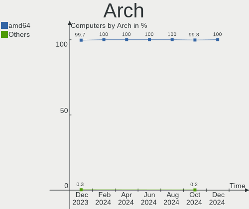
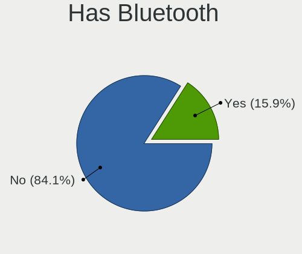
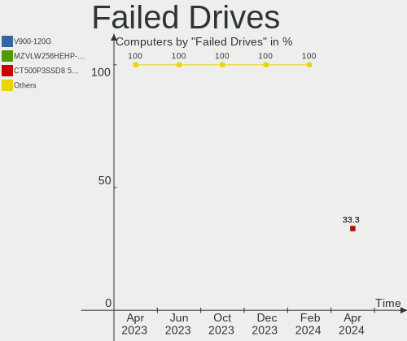
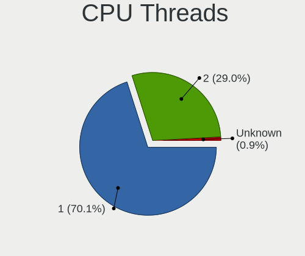
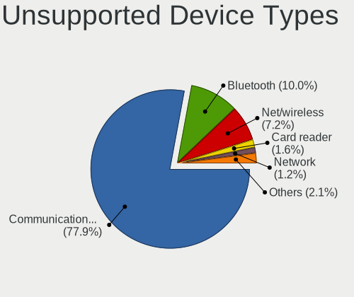

OPNsense - Hardware Trends
--------------------------

A project to identify most popular hardware characteristics and track their change
over time based on data collected by BSD users at https://BSD-Hardware.info.

Anyone can contribute to this report by the [hw-probe](https://github.com/linuxhw/hw-probe/blob/master/INSTALL.BSD.md) tool:

    hw-probe -all -upload

This report is for one last month. Overall report since the beginning of time: [TestDays](https://github.com/bsdhw/TestDays)

Period: Dec, 2025.

Contents
--------

* [ System ](#system)
  - [ OS                       ](#os)
  - [ OS Family                ](#os-family)
  - [ Arch                     ](#arch)
  - [ DE                       ](#de)
  - [ Display Server           ](#display-server)
  - [ Display Manager          ](#display-manager)
  - [ OS Lang                  ](#os-lang)
  - [ Boot Mode                ](#boot-mode)
  - [ Filesystem               ](#filesystem)
  - [ Part. scheme             ](#part-scheme)

* [ Board ](#board)
  - [ Vendor                   ](#vendor)
  - [ Model                    ](#model)
  - [ Model Family             ](#model-family)
  - [ MFG Year                 ](#mfg-year)
  - [ Form Factor              ](#form-factor)
  - [ Coreboot                 ](#coreboot)
  - [ RAM Size                 ](#ram-size)
  - [ RAM Used                 ](#ram-used)
  - [ Total Drives             ](#total-drives)
  - [ Has CD-ROM               ](#has-cd-rom)
  - [ Has Ethernet             ](#has-ethernet)
  - [ Has WiFi                 ](#has-wifi)
  - [ Has Bluetooth            ](#has-bluetooth)

* [ Location ](#location)
  - [ Country                  ](#country)
  - [ City                     ](#city)

* [ Drives ](#drives)
  - [ Drive Vendor             ](#drive-vendor)
  - [ Drive Model              ](#drive-model)
  - [ HDD Vendor               ](#hdd-vendor)
  - [ SSD Vendor               ](#ssd-vendor)
  - [ Drive Kind               ](#drive-kind)
  - [ Drive Connector          ](#drive-connector)
  - [ Drive Size               ](#drive-size)
  - [ Space Total              ](#space-total)
  - [ Space Used               ](#space-used)
  - [ Malfunc. Drives          ](#malfunc-drives)
  - [ Malfunc. Drive Vendor    ](#malfunc-drive-vendor)
  - [ Malfunc. HDD Vendor      ](#malfunc-hdd-vendor)
  - [ Malfunc. Drive Kind      ](#malfunc-drive-kind)
  - [ Failed Drives            ](#failed-drives)
  - [ Failed Drive Vendor      ](#failed-drive-vendor)
  - [ Drive Status             ](#drive-status)

* [ Storage controller ](#storage-controller)
  - [ Storage Vendor           ](#storage-vendor)
  - [ Storage Model            ](#storage-model)
  - [ Storage Kind             ](#storage-kind)

* [ Processor ](#processor)
  - [ CPU Vendor               ](#cpu-vendor)
  - [ CPU Model                ](#cpu-model)
  - [ CPU Model Family         ](#cpu-model-family)
  - [ CPU Cores                ](#cpu-cores)
  - [ CPU Sockets              ](#cpu-sockets)
  - [ CPU Threads              ](#cpu-threads)
  - [ CPU Microarch            ](#cpu-microarch)

* [ Graphics ](#graphics)
  - [ GPU Vendor               ](#gpu-vendor)
  - [ GPU Model                ](#gpu-model)
  - [ GPU Combo                ](#gpu-combo)
  - [ GPU Driver               ](#gpu-driver)
  - [ GPU Memory               ](#gpu-memory)

* [ Monitor ](#monitor)
  - [ Monitor Vendor           ](#monitor-vendor)
  - [ Monitor Model            ](#monitor-model)
  - [ Monitor Resolution       ](#monitor-resolution)
  - [ Monitor Diagonal         ](#monitor-diagonal)
  - [ Monitor Width            ](#monitor-width)
  - [ Aspect Ratio             ](#aspect-ratio)
  - [ Monitor Area             ](#monitor-area)
  - [ Pixel Density            ](#pixel-density)
  - [ Multiple Monitors        ](#multiple-monitors)

* [ Network ](#network)
  - [ Net Controller Vendor    ](#net-controller-vendor)
  - [ Net Controller Model     ](#net-controller-model)
  - [ Wireless Vendor          ](#wireless-vendor)
  - [ Wireless Model           ](#wireless-model)
  - [ Ethernet Vendor          ](#ethernet-vendor)
  - [ Ethernet Model           ](#ethernet-model)
  - [ Net Controller Kind      ](#net-controller-kind)
  - [ Used Controller          ](#used-controller)
  - [ NICs                     ](#nics)
  - [ IPv6                     ](#ipv6)

* [ Bluetooth ](#bluetooth)
  - [ Bluetooth Vendor         ](#bluetooth-vendor)
  - [ Bluetooth Model          ](#bluetooth-model)

* [ Sound ](#sound)
  - [ Sound Vendor             ](#sound-vendor)
  - [ Sound Model              ](#sound-model)

* [ Memory ](#memory)
  - [ Memory Vendor            ](#memory-vendor)
  - [ Memory Model             ](#memory-model)
  - [ Memory Kind              ](#memory-kind)
  - [ Memory Form Factor       ](#memory-form-factor)
  - [ Memory Size              ](#memory-size)
  - [ Memory Speed             ](#memory-speed)

* [ Printers & scanners ](#printers--scanners)
  - [ Printer Vendor           ](#printer-vendor)
  - [ Printer Model            ](#printer-model)
  - [ Scanner Vendor           ](#scanner-vendor)
  - [ Scanner Model            ](#scanner-model)

* [ Camera ](#camera)
  - [ Camera Vendor            ](#camera-vendor)
  - [ Camera Model             ](#camera-model)

* [ Security ](#security)
  - [ Fingerprint Vendor       ](#fingerprint-vendor)
  - [ Fingerprint Model        ](#fingerprint-model)
  - [ Chipcard Vendor          ](#chipcard-vendor)
  - [ Chipcard Model           ](#chipcard-model)

* [ Unsupported ](#unsupported)
  - [ Unsupported Devices      ](#unsupported-devices)
  - [ Unsupported Device Types ](#unsupported-device-types)

System
------

OS
--

Installed operating systems

| Name             | Computers | Percent |
|------------------|-----------|---------|
| OPNsense 25.7.9  | 146       | 38.42%  |
| OPNsense 25.7.10 | 138       | 36.32%  |
| OPNsense 25.7.8  | 40        | 10.53%  |
| OPNsense 25.10.1 | 11        | 2.89%   |
| OPNsense 25.1.12 | 10        | 2.63%   |
| OPNsense 25.7.7  | 8         | 2.11%   |
| OPNsense 25.10   | 4         | 1.05%   |
| OPNsense 26.1    | 3         | 0.79%   |
| OPNsense 25.7.6  | 3         | 0.79%   |
| OPNsense 25.7.5  | 2         | 0.53%   |
| OPNsense 25.7.4  | 2         | 0.53%   |
| OPNsense 25.7.3  | 2         | 0.53%   |
| OPNsense 25.7.2  | 2         | 0.53%   |
| OPNsense 25.1.5  | 2         | 0.53%   |
| OPNsense 25.1    | 2         | 0.53%   |
| OPNsense 25.4.3  | 1         | 0.26%   |
| OPNsense 25.1.8  | 1         | 0.26%   |
| OPNsense 25.1.11 | 1         | 0.26%   |
| OPNsense 24.7.12 | 1         | 0.26%   |
| OPNsense 22.7.11 | 1         | 0.26%   |

OS Family
---------

OS without a version

| Name     | Computers | Percent |
|----------|-----------|---------|
| OPNsense | 380       | 100%    |

Arch
----

OS architecture (x86_64, i586, etc.)

| Name  | Computers | Percent |
|-------|-----------|---------|
| amd64 | 380       | 100%    |

DE
--

Desktop Environment

| Name    | Computers | Percent |
|---------|-----------|---------|
| Console | 380       | 100%    |

Display Server
--------------

X11 or Wayland

| Name    | Computers | Percent |
|---------|-----------|---------|
| Console | 380       | 100%    |

Display Manager
---------------

SDDM, LightDM, etc.

| Name    | Computers | Percent |
|---------|-----------|---------|
| Console | 380       | 100%    |

OS Lang
-------

Language

| Lang    | Computers | Percent |
|---------|-----------|---------|
| Unknown | 374       | 98.42%  |
| C       | 6         | 1.58%   |

Boot Mode
---------

EFI or BIOS

| Mode | Computers | Percent |
|------|-----------|---------|
| EFI  | 374       | 98.42%  |
| BIOS | 6         | 1.58%   |

Filesystem
----------

Type of filesystem

| Type | Computers | Percent |
|------|-----------|---------|
| Zfs  | 281       | 73.95%  |
| Ufs  | 99        | 26.05%  |

Part. scheme
------------

Scheme of partitioning

| Type    | Computers | Percent |
|---------|-----------|---------|
| GPT     | 377       | 99.21%  |
| MBR     | 1         | 0.26%   |
| BSD     | 1         | 0.26%   |
| Unknown | 1         | 0.26%   |

Board
-----

Vendor
------

Motherboard manufacturer

| Name                                 | Computers | Percent |
|--------------------------------------|-----------|---------|
| Unknown                              | 75        | 19.74%  |
| Dell                                 | 32        | 8.42%   |
| Protectli                            | 27        | 7.11%   |
| Hewlett-Packard                      | 27        | 7.11%   |
| Lenovo                               | 21        | 5.53%   |
| Supermicro                           | 19        | 5%      |
| Deciso                               | 18        | 4.74%   |
| Intel                                | 15        | 3.95%   |
| Sophos                               | 10        | 2.63%   |
| ASUSTek Computer                     | 10        | 2.63%   |
| Gigabyte Technology                  | 9         | 2.37%   |
| Fujitsu                              | 9         | 2.37%   |
| AMI                                  | 9         | 2.37%   |
| Techvision                           | 8         | 2.11%   |
| MSI                                  | 8         | 2.11%   |
| ASRock                               | 8         | 2.11%   |
| PC Engines                           | 7         | 1.84%   |
| Shenzhen Meigao Electronic Equipment | 6         | 1.58%   |
| TianBei                              | 4         | 1.05%   |
| AZW                                  | 4         | 1.05%   |
| ASRockRack                           | 4         | 1.05%   |
| CWWK                                 | 3         | 0.79%   |
| AWOW                                 | 3         | 0.79%   |
| Acer                                 | 3         | 0.79%   |
| SLIMBOOK                             | 2         | 0.53%   |
| Shuttle                              | 2         | 0.53%   |
| OEM                                  | 2         | 0.53%   |
| MW                                   | 2         | 0.53%   |
| Datto                                | 2         | 0.53%   |
| Biostar                              | 2         | 0.53%   |
| Apple                                | 2         | 0.53%   |
| YF                                   | 1         | 0.26%   |
| Yanling                              | 1         | 0.26%   |
| Wistron                              | 1         | 0.26%   |
| Trigkey                              | 1         | 0.26%   |
| Thomas-Krenn.AG                      | 1         | 0.26%   |
| Teknoservice                         | 1         | 0.26%   |
| SZQFTX                               | 1         | 0.26%   |
| Stonesoft ==                         | 1         | 0.26%   |
| Star Labs                            | 1         | 0.26%   |

Model
-----

Motherboard model

| Name                                              | Computers | Percent |
|---------------------------------------------------|-----------|---------|
| Unknown                                           | 76        | 20%     |
| Techvision TVI7309X                               | 8         | 2.11%   |
| Protectli V1410                                   | 6         | 1.58%   |
| PC Engines APU2                                   | 6         | 1.58%   |
| Sophos SG                                         | 5         | 1.32%   |
| Shenzhen Meigao Electronic Equipment Venus Series | 5         | 1.32%   |
| Protectli VP2420                                  | 5         | 1.32%   |
| AMI Aptio CRB                                     | 5         | 1.32%   |
| Sophos XG                                         | 4         | 1.05%   |
| Dell OptiPlex 3050                                | 4         | 1.05%   |
| TianBei N1 PRO                                    | 3         | 0.79%   |
| Supermicro Super Server                           | 3         | 0.79%   |
| Supermicro A1SAi                                  | 3         | 0.79%   |
| Protectli FW6                                     | 3         | 0.79%   |
| Intel BKHD-1264-SFP                               | 3         | 0.79%   |
| HP t730 Thin Client                               | 3         | 0.79%   |
| Dell OptiPlex 7010                                | 3         | 0.79%   |
| Deciso OPNsense Rack Security Appliance           | 3         | 0.79%   |
| Deciso NetBoard-A20                               | 3         | 0.79%   |
| Deciso NetBoard-A10                               | 3         | 0.79%   |
| Deciso Netboard A20                               | 3         | 0.79%   |
| AZW EQ                                            | 3         | 0.79%   |
| Supermicro X10SLM-F                               | 2         | 0.53%   |
| SLIMBOOK ZERO-N100-4RJ                            | 2         | 0.53%   |
| Protectli VP6630                                  | 2         | 0.53%   |
| Protectli FW4B                                    | 2         | 0.53%   |
| MW GMLK-2_5G4L                                    | 2         | 0.53%   |
| Lenovo ThinkCentre M720q 10T7002CUS               | 2         | 0.53%   |
| Intel Jasper Lake Client Platform                 | 2         | 0.53%   |
| HP Slim Desktop S01-pF1xxx                        | 2         | 0.53%   |
| HP EliteDesk 805 G6 Small Form Factor PC          | 2         | 0.53%   |
| HP EliteDesk 800 G3 SFF                           | 2         | 0.53%   |
| Fujitsu FUTRO S930                                | 2         | 0.53%   |
| Dell PowerEdge R440                               | 2         | 0.53%   |
| Dell OptiPlex 9020                                | 2         | 0.53%   |
| Dell OptiPlex 3010                                | 2         | 0.53%   |
| Deciso NetBoard-A10_Gen.3                         | 2         | 0.53%   |
| Deciso Netboard A8V2                              | 2         | 0.53%   |
| ASRock Q1900-ITX                                  | 2         | 0.53%   |
| YF ADLNN01                                        | 1         | 0.26%   |

Model Family
------------

Motherboard model prefix

| Name                                       | Computers | Percent |
|--------------------------------------------|-----------|---------|
| Unknown                                    | 76        | 20%     |
| Dell OptiPlex                              | 20        | 5.26%   |
| Lenovo ThinkCentre                         | 18        | 4.74%   |
| HP EliteDesk                               | 9         | 2.37%   |
| Techvision TVI7309X                        | 8         | 2.11%   |
| Protectli V1410                            | 6         | 1.58%   |
| PC Engines APU2                            | 6         | 1.58%   |
| Sophos SG                                  | 5         | 1.32%   |
| Shenzhen Meigao Electronic Equipment Venus | 5         | 1.32%   |
| Protectli VP2420                           | 5         | 1.32%   |
| HP ProDesk                                 | 5         | 1.32%   |
| Dell PowerEdge                             | 5         | 1.32%   |
| Deciso NetBoard-A10                        | 5         | 1.32%   |
| Deciso Netboard                            | 5         | 1.32%   |
| AMI Aptio                                  | 5         | 1.32%   |
| Sophos XG                                  | 4         | 1.05%   |
| TianBei N1                                 | 3         | 0.79%   |
| Supermicro Super                           | 3         | 0.79%   |
| Supermicro A1SAi                           | 3         | 0.79%   |
| Protectli FW6                              | 3         | 0.79%   |
| Intel BKHD-1264-SFP                        | 3         | 0.79%   |
| HP t730                                    | 3         | 0.79%   |
| Fujitsu FUTRO                              | 3         | 0.79%   |
| Deciso OPNsense                            | 3         | 0.79%   |
| Deciso NetBoard-A20                        | 3         | 0.79%   |
| AZW EQ                                     | 3         | 0.79%   |
| Supermicro X10SLM-F                        | 2         | 0.53%   |
| SLIMBOOK ZERO-N100-4RJ                     | 2         | 0.53%   |
| Protectli VP6630                           | 2         | 0.53%   |
| Protectli FW4B                             | 2         | 0.53%   |
| MW GMLK-2                                  | 2         | 0.53%   |
| Intel NUC5i5RYB                            | 2         | 0.53%   |
| Intel Jasper                               | 2         | 0.53%   |
| HP Slim                                    | 2         | 0.53%   |
| HP ProLiant                                | 2         | 0.53%   |
| Fujitsu PRIMERGY                           | 2         | 0.53%   |
| Fujitsu ESPRIMO                            | 2         | 0.53%   |
| Dell Wyse                                  | 2         | 0.53%   |
| Dell Precision                             | 2         | 0.53%   |
| ASRock Q1900-ITX                           | 2         | 0.53%   |

MFG Year
--------

Motherboard manufacture year

| Year | Computers | Percent |
|------|-----------|---------|
| 2024 | 67        | 17.63%  |
| 2023 | 39        | 10.26%  |
| 2025 | 36        | 9.47%   |
| 2022 | 36        | 9.47%   |
| 2021 | 28        | 7.37%   |
| 2016 | 27        | 7.11%   |
| 2018 | 26        | 6.84%   |
| 2014 | 26        | 6.84%   |
| 2013 | 20        | 5.26%   |
| 2020 | 18        | 4.74%   |
| 2019 | 18        | 4.74%   |
| 2017 | 16        | 4.21%   |
| 2015 | 11        | 2.89%   |
| 2012 | 4         | 1.05%   |
| 2010 | 4         | 1.05%   |
| 2009 | 2         | 0.53%   |
| 2011 | 1         | 0.26%   |
| 2008 | 1         | 0.26%   |

Form Factor
-----------

Physical design of the computer

| Name     | Computers | Percent |
|----------|-----------|---------|
| Desktop  | 269       | 70.79%  |
| Mini pc  | 55        | 14.47%  |
| Server   | 26        | 6.84%   |
| Notebook | 19        | 5%      |
| Firewall | 11        | 2.89%   |

Coreboot
--------

Have coreboot on board

| Used | Computers | Percent |
|------|-----------|---------|
| No   | 367       | 96.58%  |
| Yes  | 13        | 3.42%   |

RAM Size
--------

Total RAM memory

| Size in GB  | Computers | Percent |
|-------------|-----------|---------|
| 8.01-16.0   | 138       | 36.32%  |
| 16.01-24.0  | 123       | 32.37%  |
| 32.01-64.0  | 59        | 15.53%  |
| 4.01-8.0    | 36        | 9.47%   |
| 64.01-256.0 | 17        | 4.47%   |
| 2.01-3.0    | 4         | 1.05%   |
| 24.01-32.0  | 2         | 0.53%   |
| 3.01-4.0    | 1         | 0.26%   |

RAM Used
--------

Used RAM memory

| Used GB  | Computers | Percent |
|----------|-----------|---------|
| 0.51-1.0 | 182       | 47.89%  |
| 0.01-0.5 | 114       | 30%     |
| 1.01-2.0 | 72        | 18.95%  |
| 2.01-3.0 | 5         | 1.32%   |
| 4.01-8.0 | 4         | 1.05%   |
| 3.01-4.0 | 3         | 0.79%   |

Total Drives
------------

Number of drives on board

| Drives | Computers | Percent |
|--------|-----------|---------|
| 1      | 184       | 48.42%  |
| 0      | 167       | 43.95%  |
| 2      | 28        | 7.37%   |
| 4      | 1         | 0.26%   |

Has CD-ROM
----------

Has CD-ROM on board

| Presented | Computers | Percent |
|-----------|-----------|---------|
| No        | 352       | 92.63%  |
| Yes       | 28        | 7.37%   |

Has Ethernet
------------

Has Ethernet on board

| Presented | Computers | Percent |
|-----------|-----------|---------|
| Yes       | 380       | 100%    |

Has WiFi
--------

Has WiFi module

| Presented | Computers | Percent |
|-----------|-----------|---------|
| No        | 304       | 80%     |
| Yes       | 76        | 20%     |

Has Bluetooth
-------------

Has Bluetooth module

| Presented | Computers | Percent |
|-----------|-----------|---------|
| No        | 320       | 84.21%  |
| Yes       | 60        | 15.79%  |

Location
--------

Country
-------

Geographic location (country)

| Country         | Computers | Percent |
|-----------------|-----------|---------|
| USA             | 130       | 34.21%  |
| Germany         | 60        | 15.79%  |
| UK              | 21        | 5.53%   |
| Canada          | 19        | 5%      |
| Australia       | 15        | 3.95%   |
| Poland          | 13        | 3.42%   |
| Brazil          | 10        | 2.63%   |
| Italy           | 9         | 2.37%   |
| France          | 9         | 2.37%   |
| Netherlands     | 8         | 2.11%   |
| Austria         | 8         | 2.11%   |
| Sweden          | 7         | 1.84%   |
| Russia          | 7         | 1.84%   |
| China           | 5         | 1.32%   |
| Vietnam         | 4         | 1.05%   |
| Switzerland     | 4         | 1.05%   |
| Portugal        | 4         | 1.05%   |
| Belgium         | 4         | 1.05%   |
| Thailand        | 3         | 0.79%   |
| Spain           | 3         | 0.79%   |
| South Africa    | 3         | 0.79%   |
| Norway          | 3         | 0.79%   |
| Finland         | 3         | 0.79%   |
| The Netherlands | 2         | 0.53%   |
| Taiwan          | 2         | 0.53%   |
| Puerto Rico     | 2         | 0.53%   |
| New Zealand     | 2         | 0.53%   |
| Malaysia        | 2         | 0.53%   |
| Israel          | 2         | 0.53%   |
| Slovenia        | 1         | 0.26%   |
| Slovakia        | 1         | 0.26%   |
| Singapore       | 1         | 0.26%   |
| Romania         | 1         | 0.26%   |
| Luxembourg      | 1         | 0.26%   |
| Lithuania       | 1         | 0.26%   |
| Jordan          | 1         | 0.26%   |
| Japan           | 1         | 0.26%   |
| Ireland         | 1         | 0.26%   |
| Hungary         | 1         | 0.26%   |
| Hong Kong       | 1         | 0.26%   |

City
----

Geographic location (city)

| City             | Computers | Percent |
|------------------|-----------|---------|
| Berlin           | 10        | 2.63%   |
| Vienna           | 5         | 1.32%   |
| Seattle          | 5         | 1.32%   |
| Melbourne        | 5         | 1.32%   |
| Sydney           | 4         | 1.05%   |
| Zurich           | 3         | 0.79%   |
| Queens           | 3         | 0.79%   |
| Pontotoc         | 3         | 0.79%   |
| Paris            | 3         | 0.79%   |
| Lisbon           | 3         | 0.79%   |
| Helsinki         | 3         | 0.79%   |
| Denver           | 3         | 0.79%   |
| Zielona Góra    | 2         | 0.53%   |
| Wroclaw          | 2         | 0.53%   |
| Winnipeg         | 2         | 0.53%   |
| Warsaw           | 2         | 0.53%   |
| St Petersburg    | 2         | 0.53%   |
| Springville      | 2         | 0.53%   |
| Southwark        | 2         | 0.53%   |
| Santa Ana        | 2         | 0.53%   |
| San Antonio      | 2         | 0.53%   |
| Reading          | 2         | 0.53%   |
| Philadelphia     | 2         | 0.53%   |
| Oslo             | 2         | 0.53%   |
| Orlando          | 2         | 0.53%   |
| Nuremberg        | 2         | 0.53%   |
| Mountain View    | 2         | 0.53%   |
| Moscow           | 2         | 0.53%   |
| Montreal         | 2         | 0.53%   |
| Miami            | 2         | 0.53%   |
| Manchester       | 2         | 0.53%   |
| Madison          | 2         | 0.53%   |
| Launceston       | 2         | 0.53%   |
| Krakow           | 2         | 0.53%   |
| Jacksonville     | 2         | 0.53%   |
| Ho Chi Minh City | 2         | 0.53%   |
| Harish           | 2         | 0.53%   |
| Hanover          | 2         | 0.53%   |
| Hanoi            | 2         | 0.53%   |
| Glasgow          | 2         | 0.53%   |

Drives
------

Drive Vendor
------------

Hard drive vendors

| Vendor              | Computers | Drives | Percent |
|---------------------|-----------|--------|---------|
| Samsung Electronics | 31        | 35     | 13.72%  |
| Transcend           | 18        | 20     | 7.96%   |
| Kingston            | 18        | 19     | 7.96%   |
| China               | 16        | 16     | 7.08%   |
| WDC                 | 15        | 16     | 6.64%   |
| Crucial             | 14        | 17     | 6.19%   |
| SanDisk             | 13        | 14     | 5.75%   |
| Intel               | 12        | 13     | 5.31%   |
| A-DATA Technology   | 12        | 13     | 5.31%   |
| Protectli           | 7         | 7      | 3.1%    |
| Seagate             | 6         | 7      | 2.65%   |
| FORESEE             | 5         | 5      | 2.21%   |
| Patriot             | 4         | 5      | 1.77%   |
| Micron Technology   | 4         | 4      | 1.77%   |
| KingSpec            | 4         | 5      | 1.77%   |
| Team                | 3         | 3      | 1.33%   |
| SPCC                | 3         | 3      | 1.33%   |
| SK hynix            | 3         | 3      | 1.33%   |
| Hoodisk             | 3         | 3      | 1.33%   |
| ShiJi               | 2         | 2      | 0.88%   |
| PNY                 | 2         | 2      | 0.88%   |
| OCZ                 | 2         | 2      | 0.88%   |
| LITEONIT            | 2         | 2      | 0.88%   |
| Lexar               | 2         | 2      | 0.88%   |
| Hitachi             | 2         | 2      | 0.88%   |
| Apple               | 2         | 2      | 0.88%   |
| VICK                | 1         | 1      | 0.44%   |
| Verbatim            | 1         | 1      | 0.44%   |
| UMIS                | 1         | 1      | 0.44%   |
| Toshiba             | 1         | 1      | 0.44%   |
| PUSKILL             | 1         | 1      | 0.44%   |
| Netac               | 1         | 2      | 0.44%   |
| LuminouTek          | 1         | 1      | 0.44%   |
| LITEON              | 1         | 1      | 0.44%   |
| Kston               | 1         | 1      | 0.44%   |
| Intenso             | 1         | 1      | 0.44%   |
| Innodisk            | 1         | 1      | 0.44%   |
| HP Phison           | 1         | 1      | 0.44%   |
| HGST                | 1         | 1      | 0.44%   |
| Hanstor             | 1         | 1      | 0.44%   |

Drive Model
-----------

Hard drive models

| Model                            | Computers | Percent |
|----------------------------------|-----------|---------|
| Kingston SA400S37240G 240GB      | 4         | 1.74%   |
| Crucial CT240BX500SSD1 240GB     | 4         | 1.74%   |
| Samsung SSD 870 EVO 500GB        | 3         | 1.3%    |
| Kingston SA400S37480G 480GB      | 3         | 1.3%    |
| A-DATA IM2S3134N-064GM 64GB      | 3         | 1.3%    |
| WDC WDS100T2B0A-00SM50 1TB       | 2         | 0.87%   |
| Transcend TS64GMSA230S 64GB      | 2         | 0.87%   |
| Transcend TS32GSSD370S 32GB      | 2         | 0.87%   |
| Transcend TS256GMSA230S 256GB    | 2         | 0.87%   |
| Transcend TS128GMSA230S 128GB    | 2         | 0.87%   |
| SK hynix SC311 SATA 128GB        | 2         | 0.87%   |
| Seagate ST3250312AS 250GB        | 2         | 0.87%   |
| SanDisk SDSSDA120G 120GB         | 2         | 0.87%   |
| Samsung SSD 860 EVO mSATA 250GB  | 2         | 0.87%   |
| Samsung SSD 850 EVO 250GB        | 2         | 0.87%   |
| Samsung SSD 840 EVO 500GB        | 2         | 0.87%   |
| Samsung MZ7LN256HMJP-000H1 256GB | 2         | 0.87%   |
| Protectli 64GB mSATA             | 2         | 0.87%   |
| Protectli 1TB M.2                | 2         | 0.87%   |
| Protectli 120GB M.2              | 2         | 0.87%   |
| Patriot Burst Elite 120GB        | 2         | 0.87%   |
| Kingston SUV500MS120G 120GB      | 2         | 0.87%   |
| Kingston SKC600MS256G 256GB      | 2         | 0.87%   |
| Kingston SA400S37120G 120GB      | 2         | 0.87%   |
| KingSpec P3-128 128GB            | 2         | 0.87%   |
| KingSpec MT-128 128GB            | 2         | 0.87%   |
| Hoodisk SSD 128GB                | 2         | 0.87%   |
| FORESEE 512GB SSD                | 2         | 0.87%   |
| FORESEE 128GB SSD                | 2         | 0.87%   |
| Crucial CT250MX500SSD1 250GB     | 2         | 0.87%   |
| China SATA SSD 16GB              | 2         | 0.87%   |
| China SATA SSD 128GB             | 2         | 0.87%   |
| China FPT310M4SSD256G 256GB      | 2         | 0.87%   |
| A-DATA SU650 120GB               | 2         | 0.87%   |
| A-DATA SP550 240GB               | 2         | 0.87%   |
| WDC WDS500G1R0A-68A4W0 500GB     | 1         | 0.43%   |
| WDC WDS480G2G0A-00JH30 480GB     | 1         | 0.43%   |
| WDC WDS240G1G0B-00RC30 240GB     | 1         | 0.43%   |
| WDC WDS100T1R0A-68A4W0 1TB       | 1         | 0.43%   |
| WDC WD5000LPSX-00A6WT0 500GB     | 1         | 0.43%   |

HDD Vendor
----------

Hard disk drive vendors

| Vendor              | Computers | Drives | Percent |
|---------------------|-----------|--------|---------|
| WDC                 | 8         | 8      | 42.11%  |
| Seagate             | 5         | 6      | 26.32%  |
| Hitachi             | 2         | 2      | 10.53%  |
| Apple               | 2         | 2      | 10.53%  |
| Samsung Electronics | 1         | 1      | 5.26%   |
| HGST                | 1         | 1      | 5.26%   |

SSD Vendor
----------

Solid state drive vendors

| Vendor              | Computers | Drives | Percent |
|---------------------|-----------|--------|---------|
| Samsung Electronics | 30        | 34     | 14.56%  |
| Transcend           | 18        | 20     | 8.74%   |
| Kingston            | 18        | 19     | 8.74%   |
| China               | 16        | 16     | 7.77%   |
| Crucial             | 14        | 17     | 6.8%    |
| SanDisk             | 13        | 14     | 6.31%   |
| Intel               | 12        | 13     | 5.83%   |
| A-DATA Technology   | 12        | 13     | 5.83%   |
| Protectli           | 7         | 7      | 3.4%    |
| WDC                 | 6         | 7      | 2.91%   |
| FORESEE             | 5         | 5      | 2.43%   |
| Patriot             | 4         | 5      | 1.94%   |
| Micron Technology   | 4         | 4      | 1.94%   |
| KingSpec            | 4         | 5      | 1.94%   |
| Team                | 3         | 3      | 1.46%   |
| SPCC                | 3         | 3      | 1.46%   |
| SK hynix            | 3         | 3      | 1.46%   |
| Hoodisk             | 3         | 3      | 1.46%   |
| ShiJi               | 2         | 2      | 0.97%   |
| PNY                 | 2         | 2      | 0.97%   |
| OCZ                 | 2         | 2      | 0.97%   |
| LITEONIT            | 2         | 2      | 0.97%   |
| Lexar               | 2         | 2      | 0.97%   |
| VICK                | 1         | 1      | 0.49%   |
| Verbatim            | 1         | 1      | 0.49%   |
| UMIS                | 1         | 1      | 0.49%   |
| Toshiba             | 1         | 1      | 0.49%   |
| Seagate             | 1         | 1      | 0.49%   |
| PUSKILL             | 1         | 1      | 0.49%   |
| Netac               | 1         | 2      | 0.49%   |
| LuminouTek          | 1         | 1      | 0.49%   |
| LITEON              | 1         | 1      | 0.49%   |
| Kston               | 1         | 1      | 0.49%   |
| Intenso             | 1         | 1      | 0.49%   |
| Innodisk            | 1         | 1      | 0.49%   |
| HP Phison           | 1         | 1      | 0.49%   |
| Hanstor             | 1         | 1      | 0.49%   |
| GOFATOO             | 1         | 1      | 0.49%   |
| FIKWOT              | 1         | 1      | 0.49%   |
| FCS                 | 1         | 1      | 0.49%   |

Drive Kind
----------

HDD or SSD

| Kind | Computers | Drives | Percent |
|------|-----------|--------|---------|
| SSD  | 197       | 223    | 91.63%  |
| HDD  | 17        | 20     | 7.91%   |
| NVMe | 1         | 1      | 0.47%   |

Drive Connector
---------------

SATA, SAS, NVMe, etc.

| Type | Computers | Drives | Percent |
|------|-----------|--------|---------|
| SATA | 212       | 243    | 99.53%  |
| NVMe | 1         | 1      | 0.47%   |

Drive Size
----------

Size of hard drive

| Size in TB | Computers | Drives | Percent |
|------------|-----------|--------|---------|
| 0.01-0.5   | 191       | 215    | 89.67%  |
| 0.51-1.0   | 16        | 20     | 7.51%   |
| 1.01-2.0   | 4         | 5      | 1.88%   |
| 2.01-3.0   | 1         | 1      | 0.47%   |
| 4.01-10.0  | 1         | 2      | 0.47%   |

Space Total
-----------

Amount of disk space available on the file system

| Size in GB | Computers | Percent |
|------------|-----------|---------|
| 101-250    | 178       | 46.84%  |
| 251-500    | 92        | 24.21%  |
| 51-100     | 40        | 10.53%  |
| 501-1000   | 29        | 7.63%   |
| 21-50      | 19        | 5%      |
| 1-20       | 14        | 3.68%   |
| 1001-2000  | 8         | 2.11%   |

Space Used
----------

Amount of used disk space

| Used GB | Computers | Percent |
|---------|-----------|---------|
| 1-20    | 356       | 93.68%  |
| 21-50   | 16        | 4.21%   |
| 51-100  | 5         | 1.32%   |
| 251-500 | 2         | 0.53%   |
| 101-250 | 1         | 0.26%   |

Malfunc. Drives
---------------

Drive models with a malfunction

| Model                                           | Computers | Drives | Percent |
|-------------------------------------------------|-----------|--------|---------|
| WDC WDS480G2G0A-00JH30 480GB                    | 1         | 1      | 4.17%   |
| WDC WD5000AAKX-75U6AA0 500GB                    | 1         | 1      | 4.17%   |
| WDC WD3200BEVT-11ZCT0 320GB                     | 1         | 1      | 4.17%   |
| WDC WD10EZEX-21M2NA0 1TB                        | 1         | 1      | 4.17%   |
| Seagate ST3250312AS 250GB                       | 1         | 1      | 4.17%   |
| SanDisk SDSA6PM-064G-1006 64GB                  | 1         | 1      | 4.17%   |
| SanDisk SD8SBAT128G 128GB                       | 1         | 1      | 4.17%   |
| Samsung Electronics SSD 860 EVO 500GB           | 1         | 1      | 4.17%   |
| Samsung Electronics SSD 850 PRO 256GB           | 1         | 1      | 4.17%   |
| Samsung Electronics HD161HJ 160GB               | 1         | 1      | 4.17%   |
| PNY CS900 SSD 120GB                             | 1         | 1      | 4.17%   |
| Micron Technology MTFDDAK256MAY-1AH12ABHA 256GB | 1         | 1      | 4.17%   |
| Micron Technology MTFDDAK256MAM-1K12 256GB      | 1         | 1      | 4.17%   |
| Kingston SV300S37A120G 120GB                    | 1         | 1      | 4.17%   |
| Intel SSDSC2BX400G4R 400GB                      | 1         | 1      | 4.17%   |
| Intel SSDSC2BB480G6R 480GB                      | 1         | 1      | 4.17%   |
| HP Phison PSSBN016GA27MC0 16GB                  | 1         | 1      | 4.17%   |
| Hitachi HTS541612J9SA00 120GB                   | 1         | 1      | 4.17%   |
| FCS SSD 480GB                                   | 1         | 1      | 4.17%   |
| Crucial CT275MX300SSD4 275GB                    | 1         | 1      | 4.17%   |
| China SH00M256GB                                | 1         | 1      | 4.17%   |
| China SATA SSD 128GB                            | 1         | 1      | 4.17%   |
| China BK-32GB MSATA SSD                         | 1         | 1      | 4.17%   |
| Apple HDD HTS727550A9E362 500GB                 | 1         | 1      | 4.17%   |

Malfunc. Drive Vendor
---------------------

Vendors of faulty drives

| Vendor              | Computers | Drives | Percent |
|---------------------|-----------|--------|---------|
| WDC                 | 4         | 4      | 16.67%  |
| Samsung Electronics | 3         | 3      | 12.5%   |
| China               | 3         | 3      | 12.5%   |
| SanDisk             | 2         | 2      | 8.33%   |
| Micron Technology   | 2         | 2      | 8.33%   |
| Intel               | 2         | 2      | 8.33%   |
| Seagate             | 1         | 1      | 4.17%   |
| PNY                 | 1         | 1      | 4.17%   |
| Kingston            | 1         | 1      | 4.17%   |
| HP Phison           | 1         | 1      | 4.17%   |
| Hitachi             | 1         | 1      | 4.17%   |
| FCS                 | 1         | 1      | 4.17%   |
| Crucial             | 1         | 1      | 4.17%   |
| Apple               | 1         | 1      | 4.17%   |

Malfunc. HDD Vendor
-------------------

Vendors of faulty HDD drives

| Vendor              | Computers | Drives | Percent |
|---------------------|-----------|--------|---------|
| WDC                 | 3         | 3      | 42.86%  |
| Seagate             | 1         | 1      | 14.29%  |
| Samsung Electronics | 1         | 1      | 14.29%  |
| Hitachi             | 1         | 1      | 14.29%  |
| Apple               | 1         | 1      | 14.29%  |

Malfunc. Drive Kind
-------------------

Kinds of faulty drives

| Kind | Computers | Drives | Percent |
|------|-----------|--------|---------|
| SSD  | 17        | 17     | 70.83%  |
| HDD  | 7         | 7      | 29.17%  |

Failed Drives
-------------

Failed drive models

| Model                                        | Computers | Drives | Percent |
|----------------------------------------------|-----------|--------|---------|
| Samsung Electronics MZ7LN128HCHP-000H1 128GB | 1         | 1      | 100%    |

Failed Drive Vendor
-------------------

Failed drive vendors

| Vendor              | Computers | Drives | Percent |
|---------------------|-----------|--------|---------|
| Samsung Electronics | 1         | 1      | 100%    |

Drive Status
------------

Number of failed and malfunc. drives

| Status   | Computers | Drives | Percent |
|----------|-----------|--------|---------|
| Works    | 189       | 215    | 87.1%   |
| Malfunc  | 24        | 24     | 11.06%  |
| Detected | 3         | 4      | 1.38%   |
| Failed   | 1         | 1      | 0.46%   |

Storage controller
------------------

Storage Vendor
--------------

Storage controller vendors

| Vendor                          | Computers | Percent |
|---------------------------------|-----------|---------|
| Intel                           | 285       | 56.77%  |
| AMD                             | 41        | 8.17%   |
| Samsung Electronics             | 22        | 4.38%   |
| MAXIO Technology (Hangzhou)     | 22        | 4.38%   |
| SanDisk                         | 18        | 3.59%   |
| Transcend                       | 17        | 3.39%   |
| Silicon Motion                  | 10        | 1.99%   |
| Phison Electronics              | 10        | 1.99%   |
| Micron/Crucial Technology       | 10        | 1.99%   |
| Toshiba                         | 9         | 1.79%   |
| Kingston Technology Company     | 8         | 1.59%   |
| SK hynix                        | 6         | 1.2%    |
| Shenzhen Longsys Electronics    | 6         | 1.2%    |
| INNOGRIT                        | 6         | 1.2%    |
| ASMedia Technology              | 6         | 1.2%    |
| Realtek Semiconductor           | 4         | 0.8%    |
| Broadcom / LSI                  | 4         | 0.8%    |
| Hosin Global Electronics        | 3         | 0.6%    |
| Chelsio Communications          | 3         | 0.6%    |
| ADATA Technology                | 2         | 0.4%    |
| Union Memory (Shenzhen)         | 1         | 0.2%    |
| Solidigm                        | 1         | 0.2%    |
| Shenzhen Techwinsemi Technology | 1         | 0.2%    |
| Seagate Technology              | 1         | 0.2%    |
| Micron Technology               | 1         | 0.2%    |
| Lite-On Technology              | 1         | 0.2%    |
| JMicron Technology              | 1         | 0.2%    |
| Biwin Storage Technology        | 1         | 0.2%    |
| ATP ELECTRONICS                 | 1         | 0.2%    |
| Unknown                         | 1         | 0.2%    |

Storage Model
-------------

Storage controller models

| Model                                                                            | Computers | Percent |
|----------------------------------------------------------------------------------|-----------|---------|
| Intel Alder Lake-N SATA AHCI Controller                                          | 42        | 7.76%   |
| Intel 8 Series/C220 Series Chipset Family 6-port SATA Controller 1 [AHCI mode]   | 33        | 6.1%    |
| AMD FCH SATA Controller [AHCI mode]                                              | 23        | 4.25%   |
| MAXIO (Hangzhou) NVMe SSD Controller MAP1202 (DRAM-less)                         | 21        | 3.88%   |
| Intel Celeron/Pentium Silver Processor SATA Controller                           | 19        | 3.51%   |
| Intel Cannon Lake PCH SATA AHCI Controller                                       | 17        | 3.14%   |
| Intel Jasper Lake SATA AHCI Controller                                           | 16        | 2.96%   |
| Intel Q170/Q150/B150/H170/H110/Z170/CM236 Chipset SATA Controller [AHCI Mode]    | 13        | 2.4%    |
| Intel Sunrise Point-LP SATA Controller [AHCI mode]                               | 11        | 2.03%   |
| Intel Elkhart Lake SATA AHCI                                                     | 11        | 2.03%   |
| Intel 200 Series PCH SATA controller [AHCI mode]                                 | 11        | 2.03%   |
| Samsung NVMe SSD Controller SM981/PM981/PM983                                    | 9         | 1.66%   |
| Intel Atom Processor E3800 Series SATA AHCI Controller                           | 9         | 1.66%   |
| Silicon Motion SM2263EN/SM2263XT (DRAM-less) NVMe SSD Controllers                | 8         | 1.48%   |
| Intel Celeron N3350/Pentium N4200/Atom E3900 Series SATA AHCI Controller         | 8         | 1.48%   |
| Intel Atom/Celeron/Pentium Processor x5-E8000/J3xxx/N3xxx Series SATA Controller | 8         | 1.48%   |
| Intel Alder Lake-P SATA AHCI Controller                                          | 8         | 1.48%   |
| AMD FCH SATA Controller [IDE mode]                                               | 8         | 1.48%   |
| Transcend NVMe PCIe SSD 220S/240S/MTE710T                                        | 7         | 1.29%   |
| Intel Atom Processor C3000 Series SATA Controller 0                              | 7         | 1.29%   |
| Micron/Crucial P310 NVMe PCIe SSD (DRAM-less)                                    | 6         | 1.11%   |
| Intel SATA Controller [RAID mode]                                                | 6         | 1.11%   |
| Intel Atom Processor C3000 Series SATA Controller 1                              | 6         | 1.11%   |
| Intel Atom processor C2000 AHCI SATA2 Controller                                 | 6         | 1.11%   |
| Intel 7 Series/C210 Series Chipset Family 6-port SATA Controller [AHCI mode]     | 6         | 1.11%   |
| AMD 400 Series Chipset SATA Controller                                           | 6         | 1.11%   |
| Phison PS5013-E13 PCIe3 NVMe Controller (DRAM-less)                              | 5         | 0.92%   |
| Intel Wildcat Point-LP SATA Controller [AHCI Mode]                               | 5         | 0.92%   |
| Intel Atom processor C2000 AHCI SATA3 Controller                                 | 5         | 0.92%   |
| ASMedia ASM1061/ASM1062 Serial ATA Controller                                    | 5         | 0.92%   |
| Transcend NVMe PCIe SSD 110Q (DRAM-less)                                         | 4         | 0.74%   |
| SanDisk Extreme Pro / WD Black SN750 / PC SN730 / Red SN700 NVMe SSD             | 4         | 0.74%   |
| Realtek RTS5765DL NVMe SSD Controller (DRAM-less)                                | 4         | 0.74%   |
| Intel Tiger Lake-LP SATA Controller                                              | 4         | 0.74%   |
| Intel Comet Lake SATA AHCI Controller                                            | 4         | 0.74%   |
| INNOGRIT NVMe SSD Controller IG5216 [Shasta+] (DRAM-less)                        | 4         | 0.74%   |
| Transcend NVMe PCIe SSD 250H                                                     | 3         | 0.55%   |
| Transcend NVMe PCIe SSD 110S/112S/120S/MTE300S/MTE400S/MTE652T2 (DRAM-less)      | 3         | 0.55%   |
| Toshiba XG5 NVMe SSD Controller                                                  | 3         | 0.55%   |
| Shenzhen Longsys Lexar NM610 PRO NVME SSD (DRAM-less)                            | 3         | 0.55%   |

Storage Kind
------------

Kind of storage controller (IDE, SATA, NVMe, SAS, ...)

| Kind | Computers | Percent |
|------|-----------|---------|
| SATA | 308       | 61.11%  |
| NVMe | 162       | 32.14%  |
| IDE  | 18        | 3.57%   |
| RAID | 12        | 2.38%   |
| SCSI | 3         | 0.6%    |
| SAS  | 1         | 0.2%    |

Processor
---------

CPU Vendor
----------

Processor vendors

| Vendor | Computers | Percent |
|--------|-----------|---------|
| Intel  | 318       | 83.68%  |
| AMD    | 62        | 16.32%  |

CPU Model
---------

Processor models

| Model                                    | Computers | Percent |
|------------------------------------------|-----------|---------|
| Intel N150                               | 25        | 6.58%   |
| Intel N100                               | 20        | 5.26%   |
| Intel Celeron N5105 @ 2.00GHz            | 13        | 3.42%   |
| Intel Celeron J4125 CPU @ 2.00GHz        | 13        | 3.42%   |
| Intel Core i3-N305                       | 10        | 2.63%   |
| Intel Celeron J6412 @ 2.00GHz            | 7         | 1.84%   |
| AMD Ryzen Embedded V1500B                | 7         | 1.84%   |
| Intel Celeron CPU J1900 @ 1.99GHz        | 6         | 1.58%   |
| AMD GX-412TC SOC                         | 6         | 1.58%   |
| Intel Core i5-8400T CPU @ 1.70GHz        | 5         | 1.32%   |
| Intel Celeron J6413 @ 1.80GHz            | 5         | 1.32%   |
| AMD EPYC 3201 8-Core Processor           | 5         | 1.32%   |
| Intel Core i7-6700 CPU @ 3.40GHz         | 4         | 1.05%   |
| Intel Core i5-6500 CPU @ 3.20GHz         | 4         | 1.05%   |
| Intel Core 3 N355                        | 4         | 1.05%   |
| Intel Celeron N5100 @ 1.10GHz            | 4         | 1.05%   |
| Intel Celeron CPU J3160 @ 1.60GHz        | 4         | 1.05%   |
| Intel Atom CPU C3558 @ 2.20GHz           | 4         | 1.05%   |
| Intel Core i5-8500T CPU @ 2.10GHz        | 3         | 0.79%   |
| Intel Core i5-7500 CPU @ 3.40GHz         | 3         | 0.79%   |
| Intel Core i5-4590 CPU @ 3.30GHz         | 3         | 0.79%   |
| Intel Core i3-8100T CPU @ 3.10GHz        | 3         | 0.79%   |
| Intel Core i3-7100 CPU @ 3.90GHz         | 3         | 0.79%   |
| Intel Core i3-4130 CPU @ 3.40GHz         | 3         | 0.79%   |
| Intel Celeron CPU 3865U @ 1.80GHz        | 3         | 0.79%   |
| Intel Atom CPU C2758 @ 2.40GHz           | 3         | 0.79%   |
| Intel 12th Gen Core i5-12600H            | 3         | 0.79%   |
| Intel 12th Gen Core i3-1215U             | 3         | 0.79%   |
| AMD Ryzen 5 3600 6-Core Processor        | 3         | 0.79%   |
| AMD RX-427BB with AMD Radeon R7 Graphics | 3         | 0.79%   |
| AMD EPYC 3451 16-Core Processor          | 3         | 0.79%   |
| Intel Xeon CPU X3430 @ 2.40GHz           | 2         | 0.53%   |
| Intel Xeon CPU E3-1281 v3 @ 3.70GHz      | 2         | 0.53%   |
| Intel Xeon CPU E3-1230 v6 @ 3.50GHz      | 2         | 0.53%   |
| Intel Xeon CPU E3-1225 v3 @ 3.20GHz      | 2         | 0.53%   |
| Intel Xeon CPU D-1518 @ 2.20GHz          | 2         | 0.53%   |
| Intel Pentium Gold 8505                  | 2         | 0.53%   |
| Intel N95                                | 2         | 0.53%   |
| Intel N200                               | 2         | 0.53%   |
| Intel Core i7-8550U CPU @ 1.80GHz        | 2         | 0.53%   |

CPU Model Family
----------------

Processor model prefix

| Model                   | Computers | Percent |
|-------------------------|-----------|---------|
| Intel Celeron           | 73        | 19.21%  |
| Other                   | 68        | 17.89%  |
| Intel Core i5           | 49        | 12.89%  |
| Intel Core i3           | 35        | 9.21%   |
| Intel Xeon              | 24        | 6.32%   |
| Intel Core i7           | 23        | 6.05%   |
| Intel Atom              | 21        | 5.53%   |
| AMD GX                  | 13        | 3.42%   |
| AMD EPYC                | 10        | 2.63%   |
| AMD Ryzen 5             | 9         | 2.37%   |
| AMD Ryzen Embedded      | 8         | 2.11%   |
| Intel Pentium           | 7         | 1.84%   |
| Intel Pentium Silver    | 4         | 1.05%   |
| Intel Pentium Gold      | 4         | 1.05%   |
| Intel Core              | 4         | 1.05%   |
| AMD Ryzen 7             | 4         | 1.05%   |
| AMD Ryzen 9             | 3         | 0.79%   |
| AMD Ryzen 5 PRO         | 3         | 0.79%   |
| Intel Pentium Dual-Core | 2         | 0.53%   |
| Intel Core i9           | 2         | 0.53%   |
| AMD A8                  | 2         | 0.53%   |
| Intel Xeon Silver       | 1         | 0.26%   |
| Intel Xeon Gold         | 1         | 0.26%   |
| Intel Xeon Bronze       | 1         | 0.26%   |
| Intel Pentium Dual      | 1         | 0.26%   |
| Intel Core 2 Duo        | 1         | 0.26%   |
| AMD Ryzen 3 PRO         | 1         | 0.26%   |
| AMD Ryzen 3             | 1         | 0.26%   |
| AMD G                   | 1         | 0.26%   |
| AMD FX                  | 1         | 0.26%   |
| AMD Embedded            | 1         | 0.26%   |
| AMD Athlon              | 1         | 0.26%   |
| AMD A4                  | 1         | 0.26%   |

CPU Cores
---------

Number of processor cores

| Number  | Computers | Percent |
|---------|-----------|---------|
| 4       | 218       | 57.37%  |
| 2       | 64        | 16.84%  |
| 8       | 39        | 10.26%  |
| 6       | 34        | 8.95%   |
| 16      | 9         | 2.37%   |
| 1       | 4         | 1.05%   |
| 12      | 3         | 0.79%   |
| 10      | 3         | 0.79%   |
| Unknown | 2         | 0.53%   |
| 28      | 1         | 0.26%   |
| 24      | 1         | 0.26%   |
| 20      | 1         | 0.26%   |
| 3       | 1         | 0.26%   |

CPU Sockets
-----------

Number of sockets

| Number | Computers | Percent |
|--------|-----------|---------|
| 1      | 378       | 99.47%  |
| 2      | 2         | 0.53%   |

CPU Threads
-----------

Threads per core (Hyper-Threading)

| Number  | Computers | Percent |
|---------|-----------|---------|
| 1       | 251       | 66.05%  |
| 2       | 127       | 33.42%  |
| Unknown | 2         | 0.53%   |

CPU Microarch
-------------

Microarchitecture

| Name          | Computers | Percent |
|---------------|-----------|---------|
| Unknown       | 118       | 31.05%  |
| KabyLake      | 46        | 12.11%  |
| Haswell       | 33        | 8.68%   |
| Silvermont    | 24        | 6.32%   |
| Zen           | 19        | 5%      |
| Skylake       | 19        | 5%      |
| Goldmont plus | 19        | 5%      |
| Goldmont      | 16        | 4.21%   |
| Broadwell     | 11        | 2.89%   |
| Puma          | 10        | 2.63%   |
| IvyBridge     | 8         | 2.11%   |
| CometLake     | 8         | 2.11%   |
| Zen 2         | 7         | 1.84%   |
| Zen 3         | 6         | 1.58%   |
| SandyBridge   | 6         | 1.58%   |
| TigerLake     | 5         | 1.32%   |
| Steamroller   | 5         | 1.32%   |
| Penryn        | 4         | 1.05%   |
| Jaguar        | 4         | 1.05%   |
| Zen+          | 2         | 0.53%   |
| Nehalem       | 2         | 0.53%   |
| Excavator     | 2         | 0.53%   |
| Bonnell       | 2         | 0.53%   |
| Westmere      | 1         | 0.26%   |
| Core          | 1         | 0.26%   |
| Bulldozer     | 1         | 0.26%   |
| Bobcat        | 1         | 0.26%   |

Graphics
--------

GPU Vendor
----------

Vendors of graphics cards

| Vendor                     | Computers | Percent |
|----------------------------|-----------|---------|
| Intel                      | 273       | 77.34%  |
| ASPEED Technology          | 32        | 9.07%   |
| AMD                        | 30        | 8.5%    |
| Matrox Electronics Systems | 9         | 2.55%   |
| Nvidia                     | 8         | 2.27%   |
| RDC Semiconductor          | 1         | 0.28%   |

GPU Model
---------

Graphics card models

| Model                                                                                    | Computers | Percent |
|------------------------------------------------------------------------------------------|-----------|---------|
| Intel Alder Lake-N [UHD Graphics]                                                        | 34        | 9.6%    |
| ASPEED Technology ASPEED Graphics Family                                                 | 32        | 9.04%   |
| Intel Alder Lake-N [Intel Graphics]                                                      | 29        | 8.19%   |
| Intel CoffeeLake-S GT2 [UHD Graphics 630]                                                | 21        | 5.93%   |
| Intel JasperLake [UHD Graphics]                                                          | 19        | 5.37%   |
| Intel Xeon E3-1200 v3/4th Gen Core Processor Integrated Graphics Controller              | 17        | 4.8%    |
| Intel GeminiLake [UHD Graphics 600]                                                      | 16        | 4.52%   |
| Intel Skylake-S GT2 [HD Graphics 530]                                                    | 13        | 3.67%   |
| Intel Elkhart Lake [UHD Graphics Gen11 16EU]                                             | 12        | 3.39%   |
| Intel Atom/Celeron/Pentium Processor x5-E8000/J3xxx/N3xxx Integrated Graphics Controller | 9         | 2.54%   |
| Intel Atom Processor Z36xxx/Z37xxx Series Graphics & Display                             | 9         | 2.54%   |
| Intel Kaby Lake-S GT2 [HD Graphics 630]                                                  | 8         | 2.26%   |
| Intel Apollo Lake GT1 [HD Graphics 500]                                                  | 8         | 2.26%   |
| Intel Xeon E3-1200 v2/3rd Gen Core processor Graphics Controller                         | 6         | 1.69%   |
| Intel Alder Lake-UP3 GT1 [UHD Graphics]                                                  | 5         | 1.41%   |
| Intel Alder Lake-P GT2 [Iris Xe Graphics]                                                | 5         | 1.41%   |
| Intel 4th Generation Core Processor Family Integrated Graphics Controller                | 5         | 1.41%   |
| AMD Kaveri [Radeon R7 Graphics]                                                          | 5         | 1.41%   |
| Intel Tiger Lake-LP GT2 [UHD Graphics G4]                                                | 4         | 1.13%   |
| Intel Kaby Lake-U GT1 [HD Graphics 610]                                                  | 4         | 1.13%   |
| Nvidia GK208B [GeForce GT 710]                                                           | 3         | 0.85%   |
| Matrox Electronics Systems MGA G200e [Pilot] ServerEngines (SEP1)                        | 3         | 0.85%   |
| Intel Kaby Lake-U GT2 [HD Graphics 620]                                                  | 3         | 0.85%   |
| Intel Kaby Lake-R GT2 [UHD Graphics 620]                                                 | 3         | 0.85%   |
| Intel GeminiLake [UHD Graphics 605]                                                      | 3         | 0.85%   |
| Intel CometLake-S GT2 [UHD Graphics 630]                                                 | 3         | 0.85%   |
| Intel Comet Lake UHD Graphics                                                            | 3         | 0.85%   |
| Intel Broadwell-U GT2 [HD Graphics 5500]                                                 | 3         | 0.85%   |
| Intel 4 Series Chipset Integrated Graphics Controller                                    | 3         | 0.85%   |
| AMD Renoir [Radeon Vega Series / Radeon Vega Mobile Series]                              | 3         | 0.85%   |
| AMD Raven Ridge [Radeon Vega Series / Radeon Vega Mobile Series]                         | 3         | 0.85%   |
| AMD Cezanne [Radeon Vega Series / Radeon Vega Mobile Series]                             | 3         | 0.85%   |
| Matrox Electronics Systems MGA G200EH                                                    | 2         | 0.56%   |
| Matrox Electronics Systems Integrated Matrox G200eW3 Graphics Controller                 | 2         | 0.56%   |
| Intel Xeon E3-1200 v3 Processor Integrated Graphics Controller                           | 2         | 0.56%   |
| Intel Haswell-ULT Integrated Graphics Controller                                         | 2         | 0.56%   |
| Intel Coffee Lake-U GT2 [UHD Graphics 620]                                               | 2         | 0.56%   |
| Intel Broadwell-U GT3 [HD Graphics 6000]                                                 | 2         | 0.56%   |
| Intel 82G33/G31 Express Integrated Graphics Controller                                   | 2         | 0.56%   |
| Intel 2nd Generation Core Processor Family Integrated Graphics Controller                | 2         | 0.56%   |

GPU Combo
---------

Combinations of graphics cards

| Name                  | Computers | Percent |
|-----------------------|-----------|---------|
| 1 x Intel             | 266       | 70%     |
| Other                 | 33        | 8.68%   |
| 1 x ASPEED            | 29        | 7.63%   |
| 1 x AMD               | 28        | 7.37%   |
| 1 x Matrox            | 9         | 2.37%   |
| 1 x Nvidia            | 5         | 1.32%   |
| 2 x Intel             | 3         | 0.79%   |
| Intel + Nvidia        | 3         | 0.79%   |
| AMD + ASPEED          | 2         | 0.53%   |
| 1 x RDC Semiconductor | 1         | 0.26%   |
| Intel + ASPEED        | 1         | 0.26%   |

GPU Driver
----------

Free vs proprietary

| Driver  | Computers | Percent |
|---------|-----------|---------|
| Free    | 347       | 91.32%  |
| Unknown | 33        | 8.68%   |

GPU Memory
----------

Total video memory

| Size in GB | Computers | Percent |
|------------|-----------|---------|
| Unknown    | 380       | 100%    |

Monitor
-------

Monitor Vendor
--------------

Monitor vendors

Zero info for selected period =(

Monitor Model
-------------

Monitor models

Zero info for selected period =(

Monitor Resolution
------------------

Monitor screen resolution

Zero info for selected period =(

Monitor Diagonal
----------------

Diagonal size in inches

Zero info for selected period =(

Monitor Width
-------------

Physical width

Zero info for selected period =(

Aspect Ratio
------------

Proportional relationship between the width and the height

Zero info for selected period =(

Monitor Area
------------

Area in inch²

Zero info for selected period =(

Pixel Density
-------------

Pixels per inch

Zero info for selected period =(

Multiple Monitors
-----------------

Total monitors connected

| Total | Computers | Percent |
|-------|-----------|---------|
| 0     | 380       | 100%    |

Network
-------

Net Controller Vendor
---------------------

Controller vendors

| Vendor                     | Computers | Percent |
|----------------------------|-----------|---------|
| Intel                      | 331       | 63.78%  |
| Realtek Semiconductor      | 104       | 20.04%  |
| Broadcom                   | 22        | 4.24%   |
| AMD                        | 16        | 3.08%   |
| Mellanox Technologies      | 7         | 1.35%   |
| MediaTek                   | 7         | 1.35%   |
| Qualcomm Atheros           | 5         | 0.96%   |
| TP-Link                    | 4         | 0.77%   |
| American Megatrends        | 4         | 0.77%   |
| IMC Networks               | 3         | 0.58%   |
| Chelsio Communications     | 3         | 0.58%   |
| Insyde Software            | 2         | 0.39%   |
| Aquantia                   | 2         | 0.39%   |
| ZTE WCDMA Technologies MSM | 1         | 0.19%   |
| Solarflare Communications  | 1         | 0.19%   |
| sipeed                     | 1         | 0.19%   |
| Sierra Wireless            | 1         | 0.19%   |
| Marvell Technology Group   | 1         | 0.19%   |
| Espressif                  | 1         | 0.19%   |
| Edimax Technology          | 1         | 0.19%   |
| Dell                       | 1         | 0.19%   |
| 3Com                       | 1         | 0.19%   |

Net Controller Model
--------------------

Controller models

| Model                                                                         | Computers | Percent |
|-------------------------------------------------------------------------------|-----------|---------|
| Intel Ethernet Controller I226-V                                              | 118       | 16.32%  |
| Realtek RTL8111/8168/8211/8411 PCI Express Gigabit Ethernet Controller        | 85        | 11.76%  |
| Intel I210 Gigabit Network Connection                                         | 50        | 6.92%   |
| Intel Ethernet Controller I225-V                                              | 34        | 4.7%    |
| Intel I350 Gigabit Network Connection                                         | 27        | 3.73%   |
| Intel 82599ES 10-Gigabit SFI/SFP+ Network Connection                          | 26        | 3.6%    |
| Intel I211 Gigabit Network Connection                                         | 24        | 3.32%   |
| Realtek RTL8125 2.5GbE Controller                                             | 19        | 2.63%   |
| AMD XGMAC 10GbE Controller                                                    | 16        | 2.21%   |
| Intel Ethernet Controller X710 for 10GbE SFP+                                 | 15        | 2.07%   |
| Intel Ethernet Connection I217-LM                                             | 13        | 1.8%    |
| Intel Ethernet Controller 10-Gigabit X540-AT2                                 | 11        | 1.52%   |
| Realtek RTL8821CE 802.11ac PCIe Wireless Network Adapter                      | 10        | 1.38%   |
| Intel 82576 Gigabit Network Connection                                        | 10        | 1.38%   |
| Intel Ethernet Controller X550                                                | 9         | 1.24%   |
| Intel Ethernet Connection (7) I219-V                                          | 9         | 1.24%   |
| Intel Ethernet Connection (2) I219-LM                                         | 7         | 0.97%   |
| Broadcom NetXtreme BCM5720 Gigabit Ethernet PCIe                              | 7         | 0.97%   |
| Realtek USB 2.5GbE Controller                                                 | 6         | 0.83%   |
| Intel Ethernet Controller X710 for 10GBASE-T                                  | 6         | 0.83%   |
| Intel Ethernet Connection (7) I219-LM                                         | 6         | 0.83%   |
| Intel Alder Lake-N PCH CNVi WiFi                                              | 6         | 0.83%   |
| Intel 82579LM Gigabit Network Connection (Lewisville)                         | 6         | 0.83%   |
| Realtek RTL8111/8168/8411 PCI Express Gigabit Ethernet Controller             | 5         | 0.69%   |
| Intel Wireless 3165                                                           | 5         | 0.69%   |
| Intel I210 Gigabit Fiber Network Connection                                   | 5         | 0.69%   |
| Intel Ethernet Controller I226-LM                                             | 5         | 0.69%   |
| Intel Ethernet Connection X553 10 GbE SFP+                                    | 5         | 0.69%   |
| Intel Ethernet Connection I354                                                | 5         | 0.69%   |
| Intel 82571EB/82571GB Gigabit Ethernet Controller D0/D1 (copper applications) | 5         | 0.69%   |
| Intel 82571EB/82571GB Gigabit Ethernet Controller (Copper)                    | 5         | 0.69%   |
| Broadcom NetXtreme II BCM5709 Gigabit Ethernet                                | 5         | 0.69%   |
| MediaTek MT7922 802.11ax PCI Express Wireless Network Adapter                 | 4         | 0.55%   |
| Intel Wireless 7265                                                           | 4         | 0.55%   |
| Intel Ethernet Connection X552 10 GbE SFP+                                    | 4         | 0.55%   |
| Intel 82583V Gigabit Network Connection                                       | 4         | 0.55%   |
| Intel 82580 Gigabit Network Connection                                        | 4         | 0.55%   |
| Intel 82574L Gigabit Network Connection                                       | 4         | 0.55%   |
| American Megatrends Virtual Ethernet                                          | 4         | 0.55%   |
| Mellanox MT27710 Family [ConnectX-4 Lx]                                       | 3         | 0.41%   |

Wireless Vendor
---------------

Wireless vendors

| Vendor                   | Computers | Percent |
|--------------------------|-----------|---------|
| Intel                    | 32        | 42.11%  |
| Realtek Semiconductor    | 18        | 23.68%  |
| MediaTek                 | 7         | 9.21%   |
| Qualcomm Atheros         | 5         | 6.58%   |
| TP-Link                  | 4         | 5.26%   |
| IMC Networks             | 3         | 3.95%   |
| Broadcom                 | 3         | 3.95%   |
| Sierra Wireless          | 1         | 1.32%   |
| Marvell Technology Group | 1         | 1.32%   |
| Edimax Technology        | 1         | 1.32%   |
| Dell                     | 1         | 1.32%   |

Wireless Model
--------------

Wireless models

| Model                                                                | Computers | Percent |
|----------------------------------------------------------------------|-----------|---------|
| Realtek RTL8821CE 802.11ac PCIe Wireless Network Adapter             | 10        | 12.82%  |
| Intel Alder Lake-N PCH CNVi WiFi                                     | 6         | 7.69%   |
| Intel Wireless 3165                                                  | 5         | 6.41%   |
| MediaTek MT7922 802.11ax PCI Express Wireless Network Adapter        | 4         | 5.13%   |
| Intel Wireless 7265                                                  | 4         | 5.13%   |
| Intel Wi-Fi 6 AX200                                                  | 3         | 3.85%   |
| IMC Networks 802.11 n/g/b Wireless LAN USB Mini-Card                 | 3         | 3.85%   |
| TP-Link TL-WN722N v2/v3 [Realtek RTL8188EUS]                         | 2         | 2.56%   |
| Realtek 8811CU Wireless LAN 802.11ac USB NIC                         | 2         | 2.56%   |
| Intel Wireless 8265 / 8275                                           | 2         | 2.56%   |
| Intel Wireless 7260                                                  | 2         | 2.56%   |
| TP-Link Archer T3U [Realtek RTL8812BU]                               | 1         | 1.28%   |
| TP-Link AC600 wireless Realtek RTL8811AU [Archer T2U Nano]           | 1         | 1.28%   |
| Sierra Wireless EM7345 4G LTE                                        | 1         | 1.28%   |
| Realtek RTL8852AE 802.11ax PCIe Wireless Network Adapter             | 1         | 1.28%   |
| Realtek RTL8851BE PCIe 802.11ax Wireless Network Controller          | 1         | 1.28%   |
| Realtek RTL8822CE 802.11ac PCIe Wireless Network Adapter             | 1         | 1.28%   |
| Realtek RTL8822BE 802.11a/b/g/n/ac WiFi adapter                      | 1         | 1.28%   |
| Realtek RTL8188FTV 802.11b/g/n 1T1R 2.4G WLAN Adapter                | 1         | 1.28%   |
| Realtek RTL8188EUS 802.11n Wireless Network Adapter                  | 1         | 1.28%   |
| Realtek RTL8188EE Wireless Network Adapter                           | 1         | 1.28%   |
| Realtek RTL8188CUS 802.11n WLAN Adapter                              | 1         | 1.28%   |
| Qualcomm Atheros QCA986x/988x 802.11ac Wireless Network Adapter      | 1         | 1.28%   |
| Qualcomm Atheros QCA9377 802.11ac Wireless Network Adapter           | 1         | 1.28%   |
| Qualcomm Atheros QCA6174 802.11ac Wireless Network Adapter           | 1         | 1.28%   |
| Qualcomm Atheros AR9485 Wireless Network Adapter                     | 1         | 1.28%   |
| Qualcomm Atheros AR9462 Wireless Network Adapter                     | 1         | 1.28%   |
| MediaTek Wi-Fi 6 MT7920 Wireless Network Adapter                     | 1         | 1.28%   |
| MediaTek MT7921K (RZ608) Wi-Fi 6E 80MHz                              | 1         | 1.28%   |
| MediaTek MT7921 802.11ax PCIe Wireless Network Adapter [Filogic 330] | 1         | 1.28%   |
| Marvell Group 88W8897 [AVASTAR] 802.11ac Wireless                    | 1         | 1.28%   |
| Intel Wireless 8260                                                  | 1         | 1.28%   |
| Intel Wi-Fi 7(802.11be) AX1775*/AX1790*/BE20*/BE401/BE1750* 2x2      | 1         | 1.28%   |
| Intel Wi-Fi 6 AX201                                                  | 1         | 1.28%   |
| Intel Tiger Lake PCH CNVi WiFi                                       | 1         | 1.28%   |
| Intel Dual Band Wireless-AC 3168NGW [Stone Peak]                     | 1         | 1.28%   |
| Intel Comet Lake PCH CNVi WiFi                                       | 1         | 1.28%   |
| Intel Centrino Wireless-N 2230                                       | 1         | 1.28%   |
| Intel Cannon Lake PCH CNVi WiFi                                      | 1         | 1.28%   |
| Intel Alder Lake-S PCH CNVi WiFi                                     | 1         | 1.28%   |

Ethernet Vendor
---------------

Ethernet vendors

| Vendor                     | Computers | Percent |
|----------------------------|-----------|---------|
| Intel                      | 322       | 68.51%  |
| Realtek Semiconductor      | 96        | 20.43%  |
| Broadcom                   | 21        | 4.47%   |
| AMD                        | 16        | 3.4%    |
| American Megatrends        | 4         | 0.85%   |
| Chelsio Communications     | 3         | 0.64%   |
| Insyde Software            | 2         | 0.43%   |
| Aquantia                   | 2         | 0.43%   |
| ZTE WCDMA Technologies MSM | 1         | 0.21%   |
| Solarflare Communications  | 1         | 0.21%   |
| sipeed                     | 1         | 0.21%   |
| 3Com                       | 1         | 0.21%   |

Ethernet Model
--------------

Ethernet models

| Model                                                                         | Computers | Percent |
|-------------------------------------------------------------------------------|-----------|---------|
| Intel Ethernet Controller I226-V                                              | 118       | 18.58%  |
| Realtek RTL8111/8168/8211/8411 PCI Express Gigabit Ethernet Controller        | 85        | 13.39%  |
| Intel I210 Gigabit Network Connection                                         | 50        | 7.87%   |
| Intel Ethernet Controller I225-V                                              | 34        | 5.35%   |
| Intel I350 Gigabit Network Connection                                         | 27        | 4.25%   |
| Intel 82599ES 10-Gigabit SFI/SFP+ Network Connection                          | 26        | 4.09%   |
| Intel I211 Gigabit Network Connection                                         | 24        | 3.78%   |
| Realtek RTL8125 2.5GbE Controller                                             | 18        | 2.83%   |
| AMD XGMAC 10GbE Controller                                                    | 16        | 2.52%   |
| Intel Ethernet Controller X710 for 10GbE SFP+                                 | 15        | 2.36%   |
| Intel Ethernet Connection I217-LM                                             | 13        | 2.05%   |
| Intel Ethernet Controller 10-Gigabit X540-AT2                                 | 11        | 1.73%   |
| Intel 82576 Gigabit Network Connection                                        | 10        | 1.57%   |
| Intel Ethernet Controller X550                                                | 9         | 1.42%   |
| Intel Ethernet Connection (7) I219-V                                          | 9         | 1.42%   |
| Intel Ethernet Connection (2) I219-LM                                         | 7         | 1.1%    |
| Broadcom NetXtreme BCM5720 Gigabit Ethernet PCIe                              | 7         | 1.1%    |
| Realtek USB 2.5GbE Controller                                                 | 6         | 0.94%   |
| Intel Ethernet Controller X710 for 10GBASE-T                                  | 6         | 0.94%   |
| Intel Ethernet Connection (7) I219-LM                                         | 6         | 0.94%   |
| Intel 82579LM Gigabit Network Connection (Lewisville)                         | 6         | 0.94%   |
| Realtek RTL8111/8168/8411 PCI Express Gigabit Ethernet Controller             | 5         | 0.79%   |
| Intel I210 Gigabit Fiber Network Connection                                   | 5         | 0.79%   |
| Intel Ethernet Controller I226-LM                                             | 5         | 0.79%   |
| Intel Ethernet Connection X553 10 GbE SFP+                                    | 5         | 0.79%   |
| Intel Ethernet Connection I354                                                | 5         | 0.79%   |
| Intel 82571EB/82571GB Gigabit Ethernet Controller D0/D1 (copper applications) | 5         | 0.79%   |
| Intel 82571EB/82571GB Gigabit Ethernet Controller (Copper)                    | 5         | 0.79%   |
| Broadcom NetXtreme II BCM5709 Gigabit Ethernet                                | 5         | 0.79%   |
| Intel Ethernet Connection X552 10 GbE SFP+                                    | 4         | 0.63%   |
| Intel 82583V Gigabit Network Connection                                       | 4         | 0.63%   |
| Intel 82580 Gigabit Network Connection                                        | 4         | 0.63%   |
| Intel 82574L Gigabit Network Connection                                       | 4         | 0.63%   |
| American Megatrends Virtual Ethernet                                          | 4         | 0.63%   |
| Intel Ethernet Controller E810-C for SFP                                      | 3         | 0.47%   |
| Intel Ethernet Connection X553 1GbE                                           | 3         | 0.47%   |
| Intel Ethernet Connection (5) I219-LM                                         | 3         | 0.47%   |
| Intel DH8900CC Series Gigabit Network Connection                              | 3         | 0.47%   |
| Realtek RTL810xE PCI Express Fast Ethernet controller                         | 2         | 0.31%   |
| Intel I350 Gigabit Fiber Network Connection                                   | 2         | 0.31%   |

Net Controller Kind
-------------------

Ethernet, WiFi or modem

| Kind     | Computers | Percent |
|----------|-----------|---------|
| Ethernet | 380       | 81.55%  |
| WiFi     | 76        | 16.31%  |
| Unknown  | 9         | 1.93%   |
| Modem    | 1         | 0.21%   |

Used Controller
---------------

Currently used network controller

| Kind     | Computers | Percent |
|----------|-----------|---------|
| Ethernet | 375       | 100%    |

NICs
----

Total network controllers on board

| Total | Computers | Percent |
|-------|-----------|---------|
| 4     | 107       | 28.16%  |
| 3     | 80        | 21.05%  |
| 6     | 61        | 16.05%  |
| 2     | 45        | 11.84%  |
| 5     | 43        | 11.32%  |
| 9     | 10        | 2.63%   |
| 7     | 8         | 2.11%   |
| 1     | 8         | 2.11%   |
| 8     | 7         | 1.84%   |
| 12    | 5         | 1.32%   |
| 10    | 3         | 0.79%   |
| 18    | 1         | 0.26%   |
| 16    | 1         | 0.26%   |
| 11    | 1         | 0.26%   |

IPv6
----

IPv6 vs IPv4

| Used | Computers | Percent |
|------|-----------|---------|
| No   | 272       | 71.58%  |
| Yes  | 108       | 28.42%  |

Bluetooth
---------

Bluetooth Vendor
----------------

Controller vendors

| Vendor                          | Computers | Percent |
|---------------------------------|-----------|---------|
| Intel                           | 30        | 50%     |
| Realtek Semiconductor           | 13        | 21.67%  |
| MediaTek                        | 8         | 13.33%  |
| Qualcomm Atheros Communications | 3         | 5%      |
| Apple                           | 2         | 3.33%   |
| Lite-On Technology              | 1         | 1.67%   |
| IMC Networks                    | 1         | 1.67%   |
| Broadcom                        | 1         | 1.67%   |
| ASUSTek Computer                | 1         | 1.67%   |

Bluetooth Model
---------------

Controller models

| Model                                          | Computers | Percent |
|------------------------------------------------|-----------|---------|
| Intel Bluetooth wireless interface             | 12        | 20%     |
| Realtek Bluetooth Adapter                      | 10        | 16.67%  |
| Intel AX201 Bluetooth                          | 9         | 15%     |
| MediaTek Wireless_Device                       | 5         | 8.33%   |
| Intel AX200 Bluetooth                          | 3         | 5%      |
| MediaTek RZ608 Bluetooth Adapter               | 2         | 3.33%   |
| Intel Bluetooth 9460/9560 Jefferson Peak (JfP) | 2         | 3.33%   |
| Apple Bluetooth Host Controller                | 2         | 3.33%   |
| Realtek Wireless Bluetooth Adapter             | 1         | 1.67%   |
| Realtek Bluetooth Radio                        | 1         | 1.67%   |
| Realtek Bluetooth 4.2 Adapter                  | 1         | 1.67%   |
| Qualcomm Atheros QCA61x4 Bluetooth 4.0         | 1         | 1.67%   |
| Qualcomm Atheros Dell Wireless 1901 Bluetooth  | 1         | 1.67%   |
| Qualcomm Atheros AR3012 Bluetooth 4.0          | 1         | 1.67%   |
| MediaTek Bluetooth Adapter                     | 1         | 1.67%   |
| Lite-On Qualcomm Atheros QCA9377 Bluetooth     | 1         | 1.67%   |
| Intel Wireless-AC 3168 Bluetooth               | 1         | 1.67%   |
| Intel Centrino Bluetooth Wireless Transceiver  | 1         | 1.67%   |
| Intel BE200 Bluetooth                          | 1         | 1.67%   |
| Intel AX211 Bluetooth                          | 1         | 1.67%   |
| IMC Networks Wireless_Device                   | 1         | 1.67%   |
| Broadcom BCM43142 Bluetooth 4.0                | 1         | 1.67%   |
| ASUS Bluetooth Controller                      | 1         | 1.67%   |

Sound
-----

Sound Vendor
------------

Sound card vendors

| Vendor                                       | Computers | Percent |
|----------------------------------------------|-----------|---------|
| Intel                                        | 240       | 80.54%  |
| AMD                                          | 43        | 14.43%  |
| Nvidia                                       | 8         | 2.68%   |
| C-Media Electronics                          | 3         | 1.01%   |
| Zoran Co. Personal Media Division (Nogatech) | 2         | 0.67%   |
| Walmart                                      | 1         | 0.34%   |
| MosArt Semiconductor                         | 1         | 0.34%   |

Sound Model
-----------

Sound card models

| Model                                                                                             | Computers | Percent |
|---------------------------------------------------------------------------------------------------|-----------|---------|
| Intel Alder Lake-N PCH High Definition Audio Controller                                           | 60        | 17.24%  |
| Intel Xeon E3-1200 v3/4th Gen Core Processor HD Audio Controller                                  | 21        | 6.03%   |
| AMD Ryzen HD Audio Controller                                                                     | 21        | 6.03%   |
| Intel Jasper Lake HD Audio                                                                        | 18        | 5.17%   |
| Intel 8 Series/C220 Series Chipset High Definition Audio Controller                               | 18        | 5.17%   |
| Intel Celeron/Pentium Silver Processor High Definition Audio                                      | 15        | 4.31%   |
| Intel Cannon Lake PCH cAVS                                                                        | 15        | 4.31%   |
| Intel 200 Series PCH HD Audio                                                                     | 13        | 3.74%   |
| Intel Elkhart Lake High Density Audio bus interface                                               | 11        | 3.16%   |
| AMD FCH Azalia Controller                                                                         | 11        | 3.16%   |
| Intel Alder Lake PCH-P High Definition Audio Controller                                           | 10        | 2.87%   |
| Intel Atom/Celeron/Pentium Processor x5-E8000/J3xxx/N3xxx Series High Definition Audio Controller | 9         | 2.59%   |
| AMD Renoir/Cezanne HDMI/DP Audio Controller                                                       | 9         | 2.59%   |
| Intel Sunrise Point-LP HD Audio                                                                   | 8         | 2.3%    |
| Intel Atom Processor Z36xxx/Z37xxx Series High Definition Audio Controller                        | 7         | 2.01%   |
| Intel 7 Series/C216 Chipset Family High Definition Audio Controller                               | 7         | 2.01%   |
| Intel 100 Series/C230 Series Chipset Family HD Audio Controller                                   | 6         | 1.72%   |
| AMD Kabini HDMI/DP Audio                                                                          | 6         | 1.72%   |
| Intel Tiger Lake-LP Smart Sound Technology Audio Controller                                       | 5         | 1.44%   |
| Intel Broadwell-U Audio Controller                                                                | 5         | 1.44%   |
| AMD Kaveri HDMI/DP Audio Controller                                                               | 5         | 1.44%   |
| Nvidia GK208 HDMI/DP Audio Controller                                                             | 4         | 1.15%   |
| Intel Wildcat Point-LP High Definition Audio Controller                                           | 4         | 1.15%   |
| Intel Celeron N3350/Pentium N4200/Atom E3900 Series Audio Cluster                                 | 4         | 1.15%   |
| AMD Starship/Matisse HD Audio Controller                                                          | 4         | 1.15%   |
| Intel Comet Lake PCH-LP cAVS                                                                      | 3         | 0.86%   |
| Intel Cannon Point-LP High Definition Audio Controller                                            | 3         | 0.86%   |
| Intel Alder Lake-S HD Audio Controller                                                            | 3         | 0.86%   |
| Intel 6 Series/C200 Series Chipset Family High Definition Audio Controller                        | 3         | 0.86%   |
| C-Media Electronics Audio Adapter (Unitek Y-247A)                                                 | 3         | 0.86%   |
| AMD Raven/Raven2/Fenghuang HDMI/DP Audio Controller                                               | 3         | 0.86%   |
| AMD Radeon High Definition Audio Controller                                                       | 3         | 0.86%   |
| Zoran Co. Personal Media Division (Nogatech) USB Audio and HID                                    | 2         | 0.57%   |
| Intel Haswell-ULT HD Audio Controller                                                             | 2         | 0.57%   |
| Intel Comet Lake PCH-V cAVS                                                                       | 2         | 0.57%   |
| Intel Comet Lake PCH cAVS                                                                         | 2         | 0.57%   |
| Intel 8 Series HD Audio Controller                                                                | 2         | 0.57%   |
| AMD High Definition Audio Controller                                                              | 2         | 0.57%   |
| AMD Family 17h (Models 00h-0fh) HD Audio Controller                                               | 2         | 0.57%   |
| AMD Family 15h (Models 60h-6fh) Audio Controller                                                  | 2         | 0.57%   |

Memory
------

Memory Vendor
-------------

Memory module vendors

| Vendor                                  | Computers | Percent |
|-----------------------------------------|-----------|---------|
| Samsung Electronics                     | 85        | 21.36%  |
| SK hynix                                | 54        | 13.57%  |
| Micron Technology                       | 48        | 12.06%  |
| Kingston                                | 38        | 9.55%   |
| Crucial                                 | 36        | 9.05%   |
| Unknown                                 | 19        | 4.77%   |
| Unknown                                 | 18        | 4.52%   |
| Transcend                               | 17        | 4.27%   |
| Corsair                                 | 12        | 3.02%   |
| G.Skill                                 | 9         | 2.26%   |
| Ramaxel Technology                      | 7         | 1.76%   |
| A-DATA Technology                       | 6         | 1.51%   |
| Team                                    | 5         | 1.26%   |
| Toshiba                                 | 4         | 1.01%   |
| Timetec                                 | 4         | 1.01%   |
| Unknown (ABCD)                          | 3         | 0.75%   |
| Hoodisk                                 | 3         | 0.75%   |
| Unknown (0x0080)                        | 2         | 0.5%    |
| Silicon Power Computer & Communications | 2         | 0.5%    |
| Patriot                                 | 2         | 0.5%    |
| Nanya Technology                        | 2         | 0.5%    |
| Apacer                                  | 2         | 0.5%    |
| Unknown (768A)                          | 1         | 0.25%   |
| Unknown (0x0FBA)                        | 1         | 0.25%   |
| Unknown (0x0CAB)                        | 1         | 0.25%   |
| Unknown (0x0C32)                        | 1         | 0.25%   |
| Unknown (0x0C26)                        | 1         | 0.25%   |
| Unknown (0x0B45)                        | 1         | 0.25%   |
| Unknown (0x0702)                        | 1         | 0.25%   |
| Unknown (08C8)                          | 1         | 0.25%   |
| SK_Hynix                                | 1         | 0.25%   |
| Qimonda                                 | 1         | 0.25%   |
| PNY                                     | 1         | 0.25%   |
| Lexar Co Limited                        | 1         | 0.25%   |
| Kimtigo Semiconductor (HK) Limited      | 1         | 0.25%   |
| Kimtigo                                 | 1         | 0.25%   |
| Hewlett-Packard                         | 1         | 0.25%   |
| GSkill                                  | 1         | 0.25%   |
| Gowe                                    | 1         | 0.25%   |
| GLOWAY                                  | 1         | 0.25%   |

Memory Model
------------

Memory module models

| Model                                                         | Computers | Percent |
|---------------------------------------------------------------|-----------|---------|
| Unknown                                                       | 19        | 4.53%   |
| Transcend RAM TS1GLH64V6BL 8GB SODIMM DDR4 2667MT/s           | 7         | 1.67%   |
| Samsung RAM M471A1K43CB1-CTD 8GB SODIMM DDR4 3200MT/s         | 7         | 1.67%   |
| Samsung RAM M425R1GB4BB0-CQKOL 8GB SODIMM DDR5 4800MT/s       | 7         | 1.67%   |
| SK hynix RAM HMA81GU6AFR8N-UH 8GB DIMM DDR4 2400MT/s          | 6         | 1.43%   |
| Micron RAM 53D512M64D4RQ-046 8GB Row Of Chips LPDDR4 4800MT/s | 6         | 1.43%   |
| Unknown RAM Module 4GB SODIMM DDR3 1333MT/s                   | 4         | 0.95%   |
| SK hynix RAM HMT451U6AFR8C-PB 4GB DIMM DDR3 1600MT/s          | 4         | 0.95%   |
| SK hynix RAM HMA81GS6AFR8N-UH 8GB SODIMM DDR4 2400MT/s        | 4         | 0.95%   |
| Unknown RAM Module 4GB DIMM DDR3 1600MT/s                     | 3         | 0.72%   |
| Unknown (ABCD) RAM 123456789012345678 8GB DIMM DDR4 2400MT/s  | 3         | 0.72%   |
| SK hynix RAM Module 3GB Row Of Chips LPDDR5 4800MT/s          | 3         | 0.72%   |
| SK hynix RAM HMT451U6BFR8A-PB 4GB DIMM DDR3 1600MT/s          | 3         | 0.72%   |
| SK hynix RAM HMT41GS6BFR8A-PB 8GB SODIMM DDR3 1600MT/s        | 3         | 0.72%   |
| Samsung RAM M471B1G73EB0-YK0 8GB DIMM DDR3 1600MT/s           | 3         | 0.72%   |
| Samsung RAM M471A1K43CB1-CRC 8GB SODIMM DDR4 2667MT/s         | 3         | 0.72%   |
| Samsung RAM M425R1GB4BB0-CQKOD 8GB SODIMM DDR5 4800MT/s       | 3         | 0.72%   |
| Hoodisk RAM 16G 2666 16GB SODIMM DDR4 2667MT/s                | 3         | 0.72%   |
| Unknown RAM Module 8GB 1600MT/s                               | 2         | 0.48%   |
| Transcend RAM TS512MLH64V6HL 4GB SODIMM DDR4 2667MT/s         | 2         | 0.48%   |
| Transcend RAM TS2GLH64V2E1 16GB DIMM DDR4 1600MT/s            | 2         | 0.48%   |
| Timetec RAM SD4-2666 16GB SODIMM DDR4 2667MT/s                | 2         | 0.48%   |
| SK hynix RAM HMT41GU7MFR8C-H9 8GB DIMM DDR3 1333MT/s          | 2         | 0.48%   |
| SK hynix RAM HMT41GU7BFR8A-PB 8GB DIMM DDR3 1600MT/s          | 2         | 0.48%   |
| SK hynix RAM HMCG66MEBSA092N 8GB SODIMM DDR5 4800MT/s         | 2         | 0.48%   |
| SK hynix RAM HMA851S6AFR6N-UH 4GB SODIMM DDR4 2400MT/s        | 2         | 0.48%   |
| Samsung RAM Module 8GB DIMM DDR4 3200MT/s                     | 2         | 0.48%   |
| Samsung RAM Module 2GB Row Of Chips LPDDR5 6400MT/s           | 2         | 0.48%   |
| Samsung RAM M471B5273DH0-CK0 8GB SODIMM DDR3 1600MT/s         | 2         | 0.48%   |
| Samsung RAM M471B5173QH0-YK0 4GB SODIMM DDR3 1600MT/s         | 2         | 0.48%   |
| Samsung RAM M471B5173EB0-YK0 4GB SODIMM DDR3 1600MT/s         | 2         | 0.48%   |
| Samsung RAM M471B1G73EB0-YK0 8GB SODIMM DDR3 1600MT/s         | 2         | 0.48%   |
| Samsung RAM M471B1G73DB0-YK0 8GB DIMM DDR3 1600MT/s           | 2         | 0.48%   |
| Samsung RAM M471A5244CB0-CWE 4GB SODIMM DDR4 3200MT/s         | 2         | 0.48%   |
| Samsung RAM M471A5244CB0-CTD 4GB SODIMM DDR4 3200MT/s         | 2         | 0.48%   |
| Samsung RAM M471A5244CB0-CRC 4GB SODIMM DDR4 2400MT/s         | 2         | 0.48%   |
| Samsung RAM M471A2K43CB1-CTD 16GB SODIMM DDR4 2667MT/s        | 2         | 0.48%   |
| Samsung RAM M471A1K43DB1-CWE 8GB SODIMM DDR4 3200MT/s         | 2         | 0.48%   |
| Samsung RAM M471A1K43DB1-CTD 8GB SODIMM DDR4 2667MT/s         | 2         | 0.48%   |
| Samsung RAM M425R2GA3BB0-CQKOL 16GB SODIMM DDR5 4800MT/s      | 2         | 0.48%   |

Memory Kind
-----------

Memory module kinds

| Kind    | Computers | Percent |
|---------|-----------|---------|
| DDR4    | 182       | 49.32%  |
| DDR3    | 93        | 25.2%   |
| DDR5    | 62        | 16.8%   |
| LPDDR4  | 13        | 3.52%   |
| LPDDR5  | 8         | 2.17%   |
| SDRAM   | 4         | 1.08%   |
| DDR2    | 3         | 0.81%   |
| Unknown | 3         | 0.81%   |
| LPDDR3  | 1         | 0.27%   |

Memory Form Factor
------------------

Physical design of the memory module

| Name         | Computers | Percent |
|--------------|-----------|---------|
| SODIMM       | 197       | 53.68%  |
| DIMM         | 148       | 40.33%  |
| Row Of Chips | 18        | 4.9%    |
| Unknown      | 4         | 1.09%   |

Memory Size
-----------

Memory module size

| Size  | Computers | Percent |
|-------|-----------|---------|
| 8192  | 160       | 41.03%  |
| 16384 | 101       | 25.9%   |
| 4096  | 73        | 18.72%  |
| 32768 | 27        | 6.92%   |
| 2048  | 20        | 5.13%   |
| 1024  | 4         | 1.03%   |
| 3072  | 3         | 0.77%   |
| 49152 | 1         | 0.26%   |
| 6144  | 1         | 0.26%   |

Memory Speed
------------

Memory module speed

| Speed   | Computers | Percent |
|---------|-----------|---------|
| 1600    | 77        | 19.69%  |
| 3200    | 72        | 18.41%  |
| 2667    | 52        | 13.3%   |
| 4800    | 46        | 11.76%  |
| 2400    | 39        | 9.97%   |
| 1333    | 29        | 7.42%   |
| 5600    | 23        | 5.88%   |
| 2133    | 22        | 5.63%   |
| 6400    | 4         | 1.02%   |
| Unknown | 4         | 1.02%   |
| 3733    | 3         | 0.77%   |
| 2933    | 3         | 0.77%   |
| 1067    | 3         | 0.77%   |
| 3600    | 2         | 0.51%   |
| 1066    | 2         | 0.51%   |
| 667     | 2         | 0.51%   |
| 6000    | 1         | 0.26%   |
| 5200    | 1         | 0.26%   |
| 4267    | 1         | 0.26%   |
| 4000    | 1         | 0.26%   |
| 2800    | 1         | 0.26%   |
| 2666    | 1         | 0.26%   |
| 1866    | 1         | 0.26%   |
| 800     | 1         | 0.26%   |

Printers & scanners
-------------------

Printer Vendor
--------------

Printer device vendors

Zero info for selected period =(

Printer Model
-------------

Printer device models

Zero info for selected period =(

Scanner Vendor
--------------

Scanner device vendors

Zero info for selected period =(

Scanner Model
-------------

Scanner device models

Zero info for selected period =(

Camera
------

Camera Vendor
-------------

Camera device vendors

| Vendor             | Computers | Percent |
|--------------------|-----------|---------|
| Lite-On Technology | 1         | 100%    |

Camera Model
------------

Camera device models

| Model                     | Computers | Percent |
|---------------------------|-----------|---------|
| Lite-On Integrated Camera | 1         | 100%    |

Security
--------

Fingerprint Vendor
------------------

Fingerprint sensor vendors

Zero info for selected period =(

Fingerprint Model
-----------------

Fingerprint sensor models

Zero info for selected period =(

Chipcard Vendor
---------------

Chipcard module vendors

Zero info for selected period =(

Chipcard Model
--------------

Chipcard module models

Zero info for selected period =(

Unsupported
-----------

Unsupported Devices
-------------------

Total unsupported devices on board

| Total | Computers | Percent |
|-------|-----------|---------|
| 1     | 186       | 48.95%  |
| 0     | 99        | 26.05%  |
| 2     | 61        | 16.05%  |
| 3     | 24        | 6.32%   |
| 4     | 8         | 2.11%   |
| 5     | 2         | 0.53%   |

Unsupported Device Types
------------------------

Types of unsupported devices

| Type                     | Computers | Percent |
|--------------------------|-----------|---------|
| Communication controller | 265       | 75.5%   |
| Bluetooth                | 41        | 11.68%  |
| Net/wireless             | 26        | 7.41%   |
| Net/ethernet             | 8         | 2.28%   |
| Card reader              | 6         | 1.71%   |
| Network                  | 2         | 0.57%   |
| Firewire controller      | 2         | 0.57%   |
| Storage/raid             | 1         | 0.28%   |

