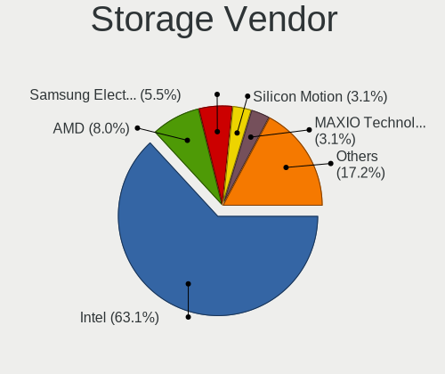
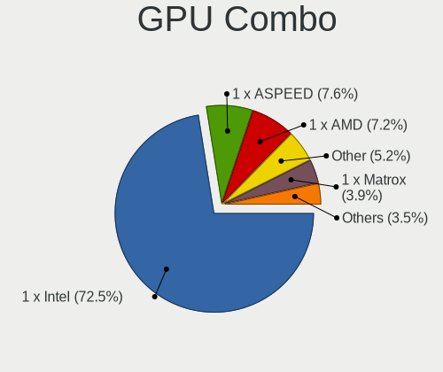

OPNsense - Hardware Trends
--------------------------

A project to identify most popular hardware characteristics and track their change
over time based on data collected by BSD users at https://BSD-Hardware.info.

Anyone can contribute to this report by the [hw-probe](https://github.com/linuxhw/hw-probe/blob/master/INSTALL.BSD.md) tool:

    hw-probe -all -upload

This report is for one last month. Overall report since the beginning of time: [TestCoverage](https://github.com/bsdhw/TestCoverage)

Period: Dec, 2022.

Contents
--------

* [ System ](#system)
  - [ OS                       ](#os)
  - [ OS Family                ](#os-family)
  - [ Arch                     ](#arch)
  - [ DE                       ](#de)
  - [ Display Server           ](#display-server)
  - [ Display Manager          ](#display-manager)
  - [ OS Lang                  ](#os-lang)
  - [ Boot Mode                ](#boot-mode)
  - [ Filesystem               ](#filesystem)
  - [ Part. scheme             ](#part-scheme)

* [ Board ](#board)
  - [ Vendor                   ](#vendor)
  - [ Model                    ](#model)
  - [ Model Family             ](#model-family)
  - [ MFG Year                 ](#mfg-year)
  - [ Form Factor              ](#form-factor)
  - [ Coreboot                 ](#coreboot)
  - [ RAM Size                 ](#ram-size)
  - [ RAM Used                 ](#ram-used)
  - [ Total Drives             ](#total-drives)
  - [ Has CD-ROM               ](#has-cd-rom)
  - [ Has Ethernet             ](#has-ethernet)
  - [ Has WiFi                 ](#has-wifi)
  - [ Has Bluetooth            ](#has-bluetooth)

* [ Location ](#location)
  - [ Country                  ](#country)
  - [ City                     ](#city)

* [ Drives ](#drives)
  - [ Drive Vendor             ](#drive-vendor)
  - [ Drive Model              ](#drive-model)
  - [ HDD Vendor               ](#hdd-vendor)
  - [ SSD Vendor               ](#ssd-vendor)
  - [ Drive Kind               ](#drive-kind)
  - [ Drive Connector          ](#drive-connector)
  - [ Drive Size               ](#drive-size)
  - [ Space Total              ](#space-total)
  - [ Space Used               ](#space-used)
  - [ Malfunc. Drives          ](#malfunc-drives)
  - [ Malfunc. Drive Vendor    ](#malfunc-drive-vendor)
  - [ Malfunc. HDD Vendor      ](#malfunc-hdd-vendor)
  - [ Malfunc. Drive Kind      ](#malfunc-drive-kind)
  - [ Failed Drives            ](#failed-drives)
  - [ Failed Drive Vendor      ](#failed-drive-vendor)
  - [ Drive Status             ](#drive-status)

* [ Storage controller ](#storage-controller)
  - [ Storage Vendor           ](#storage-vendor)
  - [ Storage Model            ](#storage-model)
  - [ Storage Kind             ](#storage-kind)

* [ Processor ](#processor)
  - [ CPU Vendor               ](#cpu-vendor)
  - [ CPU Model                ](#cpu-model)
  - [ CPU Model Family         ](#cpu-model-family)
  - [ CPU Cores                ](#cpu-cores)
  - [ CPU Sockets              ](#cpu-sockets)
  - [ CPU Threads              ](#cpu-threads)
  - [ CPU Microarch            ](#cpu-microarch)

* [ Graphics ](#graphics)
  - [ GPU Vendor               ](#gpu-vendor)
  - [ GPU Model                ](#gpu-model)
  - [ GPU Combo                ](#gpu-combo)
  - [ GPU Driver               ](#gpu-driver)
  - [ GPU Memory               ](#gpu-memory)

* [ Monitor ](#monitor)
  - [ Monitor Vendor           ](#monitor-vendor)
  - [ Monitor Model            ](#monitor-model)
  - [ Monitor Resolution       ](#monitor-resolution)
  - [ Monitor Diagonal         ](#monitor-diagonal)
  - [ Monitor Width            ](#monitor-width)
  - [ Aspect Ratio             ](#aspect-ratio)
  - [ Monitor Area             ](#monitor-area)
  - [ Pixel Density            ](#pixel-density)
  - [ Multiple Monitors        ](#multiple-monitors)

* [ Network ](#network)
  - [ Net Controller Vendor    ](#net-controller-vendor)
  - [ Net Controller Model     ](#net-controller-model)
  - [ Wireless Vendor          ](#wireless-vendor)
  - [ Wireless Model           ](#wireless-model)
  - [ Ethernet Vendor          ](#ethernet-vendor)
  - [ Ethernet Model           ](#ethernet-model)
  - [ Net Controller Kind      ](#net-controller-kind)
  - [ Used Controller          ](#used-controller)
  - [ NICs                     ](#nics)
  - [ IPv6                     ](#ipv6)

* [ Bluetooth ](#bluetooth)
  - [ Bluetooth Vendor         ](#bluetooth-vendor)
  - [ Bluetooth Model          ](#bluetooth-model)

* [ Sound ](#sound)
  - [ Sound Vendor             ](#sound-vendor)
  - [ Sound Model              ](#sound-model)

* [ Memory ](#memory)
  - [ Memory Vendor            ](#memory-vendor)
  - [ Memory Model             ](#memory-model)
  - [ Memory Kind              ](#memory-kind)
  - [ Memory Form Factor       ](#memory-form-factor)
  - [ Memory Size              ](#memory-size)
  - [ Memory Speed             ](#memory-speed)

* [ Printers & scanners ](#printers--scanners)
  - [ Printer Vendor           ](#printer-vendor)
  - [ Printer Model            ](#printer-model)
  - [ Scanner Vendor           ](#scanner-vendor)
  - [ Scanner Model            ](#scanner-model)

* [ Camera ](#camera)
  - [ Camera Vendor            ](#camera-vendor)
  - [ Camera Model             ](#camera-model)

* [ Security ](#security)
  - [ Fingerprint Vendor       ](#fingerprint-vendor)
  - [ Fingerprint Model        ](#fingerprint-model)
  - [ Chipcard Vendor          ](#chipcard-vendor)
  - [ Chipcard Model           ](#chipcard-model)

* [ Unsupported ](#unsupported)
  - [ Unsupported Devices      ](#unsupported-devices)
  - [ Unsupported Device Types ](#unsupported-device-types)

System
------

OS
--

Installed operating systems

| Name             | Computers | Percent |
|------------------|-----------|---------|
| OPNsense 22.7.9  | 169       | 56.33%  |
| OPNsense 22.7.10 | 95        | 31.67%  |
| OPNsense 22.7.8  | 12        | 4%      |
| OPNsense 22.1.10 | 7         | 2.33%   |
| OPNsense 23.1    | 6         | 2%      |
| OPNsense 22.7.6  | 4         | 1.33%   |
| OPNsense 22.7.7  | 3         | 1%      |
| OPNsense 22.10   | 2         | 0.67%   |
| OPNsense 22.7.2  | 1         | 0.33%   |
| OPNsense 22.1.6  | 1         | 0.33%   |

OS Family
---------

OS without a version

| Name     | Computers | Percent |
|----------|-----------|---------|
| OPNsense | 300       | 100%    |

Arch
----

OS architecture (x86_64, i586, etc.)

| Name  | Computers | Percent |
|-------|-----------|---------|
| amd64 | 300       | 100%    |

DE
--

Desktop Environment

| Name    | Computers | Percent |
|---------|-----------|---------|
| Console | 300       | 100%    |

Display Server
--------------

X11 or Wayland

| Name    | Computers | Percent |
|---------|-----------|---------|
| Console | 300       | 100%    |

Display Manager
---------------

SDDM, LightDM, etc.

| Name    | Computers | Percent |
|---------|-----------|---------|
| Console | 300       | 100%    |

OS Lang
-------

Language

| Lang    | Computers | Percent |
|---------|-----------|---------|
| Unknown | 295       | 98.33%  |
| C       | 5         | 1.67%   |

Boot Mode
---------

EFI or BIOS

| Mode | Computers | Percent |
|------|-----------|---------|
| EFI  | 283       | 94.33%  |
| BIOS | 17        | 5.67%   |

Filesystem
----------

Type of filesystem

| Type | Computers | Percent |
|------|-----------|---------|
| Ufs  | 186       | 62%     |
| Zfs  | 114       | 38%     |

Part. scheme
------------

Scheme of partitioning

| Type    | Computers | Percent |
|---------|-----------|---------|
| GPT     | 290       | 96.67%  |
| MBR     | 6         | 2%      |
| Unknown | 4         | 1.33%   |

Board
-----

Vendor
------

Motherboard manufacturer

| Name                       | Computers | Percent |
|----------------------------|-----------|---------|
| Unknown                    | 42        | 14%     |
| Dell                       | 34        | 11.33%  |
| Intel                      | 20        | 6.67%   |
| Supermicro                 | 17        | 5.67%   |
| Hewlett-Packard            | 15        | 5%      |
| Fujitsu                    | 15        | 5%      |
| Lenovo                     | 14        | 4.67%   |
| ASUSTek Computer           | 14        | 4.67%   |
| AMI                        | 14        | 4.67%   |
| Protectli                  | 13        | 4.33%   |
| PC Engines                 | 10        | 3.33%   |
| MSI                        | 10        | 3.33%   |
| ASRock                     | 10        | 3.33%   |
| ZOTAC                      | 9         | 3%      |
| Sophos                     | 8         | 2.67%   |
| Gigabyte Technology        | 8         | 2.67%   |
| Techvision                 | 7         | 2.33%   |
| Shuttle                    | 4         | 1.33%   |
| Deciso                     | 4         | 1.33%   |
| MW                         | 3         | 1%      |
| CncTion                    | 3         | 1%      |
| Hardkernel                 | 2         | 0.67%   |
| Biostar                    | 2         | 0.67%   |
| Acer                       | 2         | 0.67%   |
| YANYU                      | 1         | 0.33%   |
| Thomas-Krenn.AG            | 1         | 0.33%   |
| ShenZhen MinWin Technology | 1         | 0.33%   |
| Pegatron                   | 1         | 0.33%   |
| OEM                        | 1         | 0.33%   |
| NF541                      | 1         | 0.33%   |
| Lanner                     | 1         | 0.33%   |
| JGINYUE                    | 1         | 0.33%   |
| Intel BOX4A200             | 1         | 0.33%   |
| GoWin Solution             | 1         | 0.33%   |
| DFI                        | 1         | 0.33%   |
| CompuLab                   | 1         | 0.33%   |
| Cisco                      | 1         | 0.33%   |
| BESSTAR Tech               | 1         | 0.33%   |
| AZW                        | 1         | 0.33%   |
| AWOW                       | 1         | 0.33%   |

Model
-----

Motherboard model

| Name                                             | Computers | Percent |
|--------------------------------------------------|-----------|---------|
| Unknown                                          | 42        | 14%     |
| AMI Aptio CRB                                    | 10        | 3.33%   |
| Supermicro Super Server                          | 8         | 2.67%   |
| Techvision TVI7309X                              | 7         | 2.33%   |
| Protectli FW4B                                   | 7         | 2.33%   |
| Fujitsu FUTRO S920                               | 7         | 2.33%   |
| Intel Q3XXG4-P V1.0                              | 6         | 2%      |
| Sophos SG                                        | 5         | 1.67%   |
| PC Engines APU2                                  | 5         | 1.67%   |
| Dell OptiPlex 7010                               | 5         | 1.67%   |
| ZOTAC ZBOX-MI640/MI660/MI620NANO                 | 4         | 1.33%   |
| ZOTAC ZBOX-CI329NANO                             | 4         | 1.33%   |
| Supermicro X10SLH-N6-ST031                       | 3         | 1%      |
| Protectli FW6                                    | 3         | 1%      |
| MW GMLK-2_5G4L                                   | 3         | 1%      |
| Dell PowerEdge R210 II                           | 3         | 1%      |
| Dell OptiPlex 7020                               | 3         | 1%      |
| CncTion N5105-4L                                 | 3         | 1%      |
| ASUS All Series                                  | 3         | 1%      |
| Supermicro 1HE Intel Single-CPU RI1102D-F Server | 2         | 0.67%   |
| Sophos XG                                        | 2         | 0.67%   |
| PC Engines apu4                                  | 2         | 0.67%   |
| PC Engines APU3                                  | 2         | 0.67%   |
| MSI MS-7D20                                      | 2         | 0.67%   |
| Lenovo ThinkCentre M720q 10T7004BMB              | 2         | 0.67%   |
| Intel SHARKBAY                                   | 2         | 0.67%   |
| HP t620 PLUS Quad Core TC                        | 2         | 0.67%   |
| HP Compaq 8200 Elite SFF PC                      | 2         | 0.67%   |
| Dell Wyse 5070 Extended Thin Client              | 2         | 0.67%   |
| Dell OptiPlex 3020                               | 2         | 0.67%   |
| Deciso NetBoard-A10                              | 2         | 0.67%   |
| AMI SG                                           | 2         | 0.67%   |
| ZOTAC ZBOX-CI341                                 | 1         | 0.33%   |
| YANYU R250                                       | 1         | 0.33%   |
| Thomas-Krenn.AG P9A-I/2550/4L                    | 1         | 0.33%   |
| Supermicro X10SLM+-LN4F                          | 1         | 0.33%   |
| Supermicro X10SLL-F                              | 1         | 0.33%   |
| Supermicro SYS-E300-9D-4CN8TP                    | 1         | 0.33%   |
| Supermicro A1SRM-2758F                           | 1         | 0.33%   |
| Sophos UTM                                       | 1         | 0.33%   |

Model Family
------------

Motherboard model prefix

| Name                       | Computers | Percent |
|----------------------------|-----------|---------|
| Unknown                    | 42        | 14%     |
| Dell OptiPlex              | 17        | 5.67%   |
| Lenovo ThinkCentre         | 12        | 4%      |
| AMI Aptio                  | 10        | 3.33%   |
| Supermicro Super           | 8         | 2.67%   |
| Fujitsu FUTRO              | 8         | 2.67%   |
| Techvision TVI7309X        | 7         | 2.33%   |
| Protectli FW4B             | 7         | 2.33%   |
| Dell PowerEdge             | 7         | 2.33%   |
| Intel Q3XXG4-P             | 6         | 2%      |
| Sophos SG                  | 5         | 1.67%   |
| PC Engines APU2            | 5         | 1.67%   |
| HP EliteDesk               | 5         | 1.67%   |
| ZOTAC ZBOX-MI640           | 4         | 1.33%   |
| ZOTAC ZBOX-CI329NANO       | 4         | 1.33%   |
| Fujitsu ESPRIMO            | 4         | 1.33%   |
| ASUS PRIME                 | 4         | 1.33%   |
| Supermicro X10SLH-N6-ST031 | 3         | 1%      |
| Protectli FW6              | 3         | 1%      |
| MW GMLK-2                  | 3         | 1%      |
| HP ProLiant                | 3         | 1%      |
| Dell Wyse                  | 3         | 1%      |
| Dell Inspiron              | 3         | 1%      |
| CncTion N5105-4L           | 3         | 1%      |
| ASUS All                   | 3         | 1%      |
| Supermicro 1HE             | 2         | 0.67%   |
| Sophos XG                  | 2         | 0.67%   |
| PC Engines apu4            | 2         | 0.67%   |
| PC Engines APU3            | 2         | 0.67%   |
| MSI MS-7D20                | 2         | 0.67%   |
| Intel SHARKBAY             | 2         | 0.67%   |
| HP t620                    | 2         | 0.67%   |
| HP ProDesk                 | 2         | 0.67%   |
| HP Compaq                  | 2         | 0.67%   |
| Dell Precision             | 2         | 0.67%   |
| Deciso NetBoard-A10        | 2         | 0.67%   |
| AMI SG                     | 2         | 0.67%   |
| ZOTAC ZBOX-CI341           | 1         | 0.33%   |
| YANYU R250                 | 1         | 0.33%   |
| Thomas-Krenn.AG P9A-I      | 1         | 0.33%   |

MFG Year
--------

Motherboard manufacture year

| Year | Computers | Percent |
|------|-----------|---------|
| 2022 | 61        | 20.33%  |
| 2018 | 37        | 12.33%  |
| 2019 | 34        | 11.33%  |
| 2014 | 31        | 10.33%  |
| 2016 | 27        | 9%      |
| 2021 | 24        | 8%      |
| 2020 | 21        | 7%      |
| 2017 | 16        | 5.33%   |
| 2012 | 14        | 4.67%   |
| 2015 | 12        | 4%      |
| 2013 | 11        | 3.67%   |
| 2010 | 5         | 1.67%   |
| 2011 | 4         | 1.33%   |
| 2009 | 2         | 0.67%   |
| 2008 | 1         | 0.33%   |

Form Factor
-----------

Physical design of the computer

| Name     | Computers | Percent |
|----------|-----------|---------|
| Desktop  | 219       | 73%     |
| Mini pc  | 39        | 13%     |
| Server   | 26        | 8.67%   |
| Firewall | 10        | 3.33%   |
| Notebook | 6         | 2%      |

Coreboot
--------

Have coreboot on board

| Used | Computers | Percent |
|------|-----------|---------|
| No   | 288       | 96%     |
| Yes  | 12        | 4%      |

RAM Size
--------

Total RAM memory

| Size in GB  | Computers | Percent |
|-------------|-----------|---------|
| 8.01-16.0   | 138       | 46%     |
| 4.01-8.0    | 63        | 21%     |
| 16.01-24.0  | 60        | 20%     |
| 32.01-64.0  | 21        | 7%      |
| 2.01-3.0    | 11        | 3.67%   |
| 24.01-32.0  | 3         | 1%      |
| 64.01-256.0 | 3         | 1%      |
| 3.01-4.0    | 1         | 0.33%   |

RAM Used
--------

Used RAM memory

| Used GB  | Computers | Percent |
|----------|-----------|---------|
| 0.01-0.5 | 185       | 61.67%  |
| 0.51-1.0 | 87        | 29%     |
| 1.01-2.0 | 26        | 8.67%   |
| 3.01-4.0 | 2         | 0.67%   |

Total Drives
------------

Number of drives on board

| Drives | Computers | Percent |
|--------|-----------|---------|
| 1      | 243       | 81%     |
| 0      | 29        | 9.67%   |
| 2      | 24        | 8%      |
| 3      | 3         | 1%      |
| 5      | 1         | 0.33%   |

Has CD-ROM
----------

Has CD-ROM on board

| Presented | Computers | Percent |
|-----------|-----------|---------|
| No        | 277       | 92.33%  |
| Yes       | 23        | 7.67%   |

Has Ethernet
------------

Has Ethernet on board

| Presented | Computers | Percent |
|-----------|-----------|---------|
| Yes       | 299       | 99.67%  |
| No        | 1         | 0.33%   |

Has WiFi
--------

Has WiFi module

| Presented | Computers | Percent |
|-----------|-----------|---------|
| No        | 242       | 80.67%  |
| Yes       | 58        | 19.33%  |

Has Bluetooth
-------------

Has Bluetooth module

| Presented | Computers | Percent |
|-----------|-----------|---------|
| No        | 260       | 86.67%  |
| Yes       | 40        | 13.33%  |

Location
--------

Country
-------

Geographic location (country)

| Country      | Computers | Percent |
|--------------|-----------|---------|
| USA          | 81        | 27%     |
| Germany      | 77        | 25.67%  |
| Canada       | 15        | 5%      |
| France       | 14        | 4.67%   |
| UK           | 10        | 3.33%   |
| Australia    | 9         | 3%      |
| Netherlands  | 7         | 2.33%   |
| Sweden       | 5         | 1.67%   |
| Poland       | 5         | 1.67%   |
| Italy        | 5         | 1.67%   |
| Belgium      | 5         | 1.67%   |
| Austria      | 5         | 1.67%   |
| Switzerland  | 4         | 1.33%   |
| Norway       | 4         | 1.33%   |
| Finland      | 4         | 1.33%   |
| Denmark      | 4         | 1.33%   |
| Czechia      | 4         | 1.33%   |
| Brazil       | 4         | 1.33%   |
| South Korea  | 3         | 1%      |
| South Africa | 2         | 0.67%   |
| Russia       | 2         | 0.67%   |
| Romania      | 2         | 0.67%   |
| Paraguay     | 2         | 0.67%   |
| Malaysia     | 2         | 0.67%   |
| Lithuania    | 2         | 0.67%   |
| India        | 2         | 0.67%   |
| Colombia     | 2         | 0.67%   |
| China        | 2         | 0.67%   |
| Bulgaria     | 2         | 0.67%   |
| Turkey       | 1         | 0.33%   |
| Thailand     | 1         | 0.33%   |
| Taiwan       | 1         | 0.33%   |
| Spain        | 1         | 0.33%   |
| Portugal     | 1         | 0.33%   |
| Peru         | 1         | 0.33%   |
| New Zealand  | 1         | 0.33%   |
| Israel       | 1         | 0.33%   |
| Ireland      | 1         | 0.33%   |
| Indonesia    | 1         | 0.33%   |
| Hungary      | 1         | 0.33%   |

City
----

Geographic location (city)

| City              | Computers | Percent |
|-------------------|-----------|---------|
| London            | 5         | 1.67%   |
| Berlin            | 5         | 1.67%   |
| Hamburg           | 4         | 1.33%   |
| Victoria          | 3         | 1%      |
| Paris             | 3         | 1%      |
| Chicago           | 3         | 1%      |
| Bonn              | 3         | 1%      |
| Würzburg         | 2         | 0.67%   |
| Ulm               | 2         | 0.67%   |
| Tempe             | 2         | 0.67%   |
| Sydney            | 2         | 0.67%   |
| Stockholm         | 2         | 0.67%   |
| St Petersburg     | 2         | 0.67%   |
| South Burlington  | 2         | 0.67%   |
| Sofia             | 2         | 0.67%   |
| Seattle           | 2         | 0.67%   |
| Perth             | 2         | 0.67%   |
| Munich            | 2         | 0.67%   |
| Melbourne         | 2         | 0.67%   |
| Littleton         | 2         | 0.67%   |
| Kortrijk          | 2         | 0.67%   |
| Jistebnik         | 2         | 0.67%   |
| Helsinki          | 2         | 0.67%   |
| Frankfurt am Main | 2         | 0.67%   |
| Cologne           | 2         | 0.67%   |
| Clermont-Ferrand  | 2         | 0.67%   |
| Calgary           | 2         | 0.67%   |
| Borken            | 2         | 0.67%   |
| Bogotá           | 2         | 0.67%   |
| Austin            | 2         | 0.67%   |
| Asunción         | 2         | 0.67%   |
| Amsterdam         | 2         | 0.67%   |
| Adelaide          | 2         | 0.67%   |
| Zwickau           | 1         | 0.33%   |
| Wroclaw           | 1         | 0.33%   |
| Witten            | 1         | 0.33%   |
| Winnipeg          | 1         | 0.33%   |
| Willich           | 1         | 0.33%   |
| West Hartford     | 1         | 0.33%   |
| West Columbia     | 1         | 0.33%   |

Drives
------

Drive Vendor
------------

Hard drive vendors

| Vendor              | Computers | Drives | Percent |
|---------------------|-----------|--------|---------|
| Samsung Electronics | 40        | 44     | 13.89%  |
| Kingston            | 32        | 34     | 11.11%  |
| Transcend           | 27        | 28     | 9.38%   |
| WDC                 | 20        | 22     | 6.94%   |
| Intel               | 14        | 14     | 4.86%   |
| SanDisk             | 13        | 13     | 4.51%   |
| Hoodisk             | 11        | 11     | 3.82%   |
| Crucial             | 11        | 11     | 3.82%   |
| China               | 11        | 15     | 3.82%   |
| A-DATA Technology   | 9         | 10     | 3.13%   |
| Toshiba             | 8         | 9      | 2.78%   |
| Seagate             | 8         | 9      | 2.78%   |
| Innodisk            | 7         | 7      | 2.43%   |
| SPCC                | 4         | 4      | 1.39%   |
| SK hynix            | 4         | 4      | 1.39%   |
| PNY                 | 4         | 4      | 1.39%   |
| HGST                | 4         | 5      | 1.39%   |
| Gigabyte Technology | 4         | 4      | 1.39%   |
| FORESEE             | 4         | 4      | 1.39%   |
| ShiJi               | 3         | 3      | 1.04%   |
| Phison              | 3         | 3      | 1.04%   |
| OCZ                 | 3         | 3      | 1.04%   |
| Micron Technology   | 3         | 3      | 1.04%   |
| Intenso             | 3         | 3      | 1.04%   |
| Corsair             | 3         | 3      | 1.04%   |
| Team                | 2         | 2      | 0.69%   |
| Supermicro          | 2         | 2      | 0.69%   |
| Silicon Motion      | 2         | 2      | 0.69%   |
| Protectli           | 2         | 2      | 0.69%   |
| LITEONIT            | 2         | 2      | 0.69%   |
| LITEON              | 2         | 2      | 0.69%   |
| Hitachi             | 2         | 2      | 0.69%   |
| Dogfish             | 2         | 2      | 0.69%   |
| BIWIN               | 2         | 2      | 0.69%   |
| Apacer              | 2         | 2      | 0.69%   |
| Advantech           | 2         | 3      | 0.69%   |
| Zheino              | 1         | 1      | 0.35%   |
| YMTC                | 1         | 1      | 0.35%   |
| Vaseky              | 1         | 1      | 0.35%   |
| TEXTORM             | 1         | 1      | 0.35%   |

Drive Model
-----------

Hard drive models

| Model                            | Computers | Percent |
|----------------------------------|-----------|---------|
| Kingston SA400S37240G 240GB      | 7         | 2.41%   |
| Samsung SSD 850 EVO 120GB        | 5         | 1.72%   |
| Samsung SSD 840 EVO 120GB        | 5         | 1.72%   |
| Kingston SUV500MS120G 120GB      | 4         | 1.37%   |
| Kingston SA400S37120G 120GB      | 4         | 1.37%   |
| Hoodisk SSD 64GB                 | 4         | 1.37%   |
| WDC WDS240G2G0A-00JH30 240GB     | 3         | 1.03%   |
| Transcend TS64GSSD370 64GB       | 3         | 1.03%   |
| Transcend TS128GMSA230S 128GB    | 3         | 1.03%   |
| Samsung SSD 970 EVO Plus 250GB   | 3         | 1.03%   |
| Samsung SSD 850 EVO 500GB        | 3         | 1.03%   |
| Kingston SUV400S37120G 120GB     | 3         | 1.03%   |
| Kingston SKC600MS256G 256GB      | 3         | 1.03%   |
| Hoodisk SSD 128GB                | 3         | 1.03%   |
| HGST HTS725050A7E630 500GB       | 3         | 1.03%   |
| Crucial CT240BX500SSD1 240GB     | 3         | 1.03%   |
| Crucial CT120BX500SSD1 120GB     | 3         | 1.03%   |
| Transcend TS64GMTS400SD 64GB     | 2         | 0.69%   |
| Transcend TS64GMSA230S 64GB      | 2         | 0.69%   |
| Transcend TS256GMTE652T2 256GB   | 2         | 0.69%   |
| Transcend TS256GMSA230S 256GB    | 2         | 0.69%   |
| Transcend TS128GSSD230S 128GB    | 2         | 0.69%   |
| Transcend TS120GMTS420S 120GB    | 2         | 0.69%   |
| Seagate ST500DM002-1BD142 500GB  | 2         | 0.69%   |
| SanDisk SDSSDA120G 120GB         | 2         | 0.69%   |
| Samsung SSD 860 EVO 500GB        | 2         | 0.69%   |
| Samsung MZ7LN256HMJP-000H1 256GB | 2         | 0.69%   |
| Kingston SV300S37A120G 120GB     | 2         | 0.69%   |
| Innodisk DEMSR- 08GB mSATA 3ME3  | 2         | 0.69%   |
| Hoodisk SSD 32GB                 | 2         | 0.69%   |
| Gigabyte GP-GSM2NE3256GNTD 256GB | 2         | 0.69%   |
| FORESEE 64GB SSD                 | 2         | 0.69%   |
| China SATA SSD 32GB              | 2         | 0.69%   |
| China SATA SSD 256GB             | 2         | 0.69%   |
| China 256GB QLC SATA SSD         | 2         | 0.69%   |
| BIWIN SSD 128GB                  | 2         | 0.69%   |
| Apacer 32GB SATA Flash Drive     | 2         | 0.69%   |
| A-DATA SU650 120GB               | 2         | 0.69%   |
| A-DATA IM2S3134N-064GM 64GB      | 2         | 0.69%   |
| Zheino CHN MSATAQ3 480 480GB     | 1         | 0.34%   |

HDD Vendor
----------

Hard disk drive vendors

| Vendor  | Computers | Drives | Percent |
|---------|-----------|--------|---------|
| WDC     | 9         | 10     | 34.62%  |
| Seagate | 8         | 9      | 30.77%  |
| HGST    | 4         | 5      | 15.38%  |
| Hitachi | 2         | 2      | 7.69%   |
| Toshiba | 1         | 1      | 3.85%   |
| Fujitsu | 1         | 1      | 3.85%   |
| Apple   | 1         | 1      | 3.85%   |

SSD Vendor
----------

Solid state drive vendors

| Vendor              | Computers | Drives | Percent |
|---------------------|-----------|--------|---------|
| Kingston            | 31        | 33     | 14.16%  |
| Samsung Electronics | 28        | 30     | 12.79%  |
| Transcend           | 25        | 26     | 11.42%  |
| SanDisk             | 13        | 13     | 5.94%   |
| Hoodisk             | 11        | 11     | 5.02%   |
| China               | 11        | 15     | 5.02%   |
| Intel               | 10        | 10     | 4.57%   |
| Crucial             | 9         | 9      | 4.11%   |
| A-DATA Technology   | 8         | 9      | 3.65%   |
| Toshiba             | 7         | 8      | 3.2%    |
| Innodisk            | 7         | 7      | 3.2%    |
| WDC                 | 4         | 5      | 1.83%   |
| PNY                 | 4         | 4      | 1.83%   |
| SPCC                | 3         | 3      | 1.37%   |
| SK hynix            | 3         | 3      | 1.37%   |
| ShiJi               | 3         | 3      | 1.37%   |
| OCZ                 | 3         | 3      | 1.37%   |
| Micron Technology   | 3         | 3      | 1.37%   |
| Intenso             | 3         | 3      | 1.37%   |
| FORESEE             | 3         | 3      | 1.37%   |
| Corsair             | 3         | 3      | 1.37%   |
| Team                | 2         | 2      | 0.91%   |
| Supermicro          | 2         | 2      | 0.91%   |
| Protectli           | 2         | 2      | 0.91%   |
| LITEONIT            | 2         | 2      | 0.91%   |
| LITEON              | 2         | 2      | 0.91%   |
| Dogfish             | 2         | 2      | 0.91%   |
| BIWIN               | 2         | 2      | 0.91%   |
| Apacer              | 2         | 2      | 0.91%   |
| Advantech           | 2         | 3      | 0.91%   |
| Zheino              | 1         | 1      | 0.46%   |
| Vaseky              | 1         | 1      | 0.46%   |
| TEXTORM             | 1         | 1      | 0.46%   |
| KingDian            | 1         | 1      | 0.46%   |
| Hewlett-Packard     | 1         | 1      | 0.46%   |
| Gigastone           | 1         | 1      | 0.46%   |
| Gigabyte Technology | 1         | 1      | 0.46%   |
| Emtec               | 1         | 1      | 0.46%   |
| BORY                | 1         | 1      | 0.46%   |

Drive Kind
----------

HDD or SSD

| Kind | Computers | Drives | Percent |
|------|-----------|--------|---------|
| SSD  | 212       | 232    | 75.99%  |
| NVMe | 43        | 45     | 15.41%  |
| HDD  | 24        | 29     | 8.6%    |

Drive Connector
---------------

SATA, SAS, NVMe, etc.

| Type | Computers | Drives | Percent |
|------|-----------|--------|---------|
| SATA | 232       | 261    | 84.36%  |
| NVMe | 43        | 45     | 15.64%  |

Drive Size
----------

Size of hard drive

| Size in TB | Computers | Drives | Percent |
|------------|-----------|--------|---------|
| 0.01-0.5   | 227       | 248    | 95.38%  |
| 0.51-1.0   | 7         | 8      | 2.94%   |
| 1.01-2.0   | 3         | 4      | 1.26%   |
| 2.01-3.0   | 1         | 1      | 0.42%   |

Space Total
-----------

Amount of disk space available on the file system

| Size in GB | Computers | Percent |
|------------|-----------|---------|
| 101-250    | 157       | 52.33%  |
| 51-100     | 46        | 15.33%  |
| 251-500    | 41        | 13.67%  |
| 21-50      | 32        | 10.67%  |
| 1-20       | 16        | 5.33%   |
| 501-1000   | 7         | 2.33%   |
| 1001-2000  | 1         | 0.33%   |

Space Used
----------

Amount of used disk space

| Used GB | Computers | Percent |
|---------|-----------|---------|
| 1-20    | 288       | 96%     |
| 21-50   | 11        | 3.67%   |
| 51-100  | 1         | 0.33%   |

Malfunc. Drives
---------------

Drive models with a malfunction

| Model                             | Computers | Drives | Percent |
|-----------------------------------|-----------|--------|---------|
| HGST HTS725050A7E630 500GB        | 3         | 4      | 9.68%   |
| WDC WDS240G2G0A-00JH30 240GB      | 2         | 3      | 6.45%   |
| WDC WDS120G2G0A-00JH30 120GB      | 1         | 1      | 3.23%   |
| WDC WD5000AAKX-00ERMA0 500GB      | 1         | 1      | 3.23%   |
| WDC WD3200AAKX-001CA0 320GB       | 1         | 1      | 3.23%   |
| Toshiba MQ01ABF050 500GB          | 1         | 1      | 3.23%   |
| Toshiba KSG60ZSE256G SATA 256GB   | 1         | 1      | 3.23%   |
| SK hynix SC308 SATA 128GB         | 1         | 1      | 3.23%   |
| ShiJi SSD 32GB                    | 1         | 1      | 3.23%   |
| Seagate ST500DM002-1BD142 500GB   | 1         | 1      | 3.23%   |
| SanDisk SD8TB8U-256G-1006 256GB   | 1         | 1      | 3.23%   |
| PNY CS1311 120GB SSD              | 1         | 1      | 3.23%   |
| OCZ VERTEX 32GB                   | 1         | 1      | 3.23%   |
| Micron Technology 1100 SATA 256GB | 1         | 1      | 3.23%   |
| LITEONIT LCT-128M3S 128GB         | 1         | 1      | 3.23%   |
| Kingston SV300S37A60G 64GB        | 1         | 1      | 3.23%   |
| Kingston SV300S37A120G 120GB      | 1         | 1      | 3.23%   |
| Kingston SMS200S360G 64GB         | 1         | 1      | 3.23%   |
| Kingston SMS200S3120G 120GB       | 1         | 1      | 3.23%   |
| Kingston SHFS37A120G 120GB        | 1         | 1      | 3.23%   |
| KingDian S100 32GB                | 1         | 1      | 3.23%   |
| Intel SSDSC2CT120A3 120GB         | 1         | 1      | 3.23%   |
| Intel SSDPEKKW128G7 128GB         | 1         | 1      | 3.23%   |
| Intel SSDMCEAW240A4 240GB         | 1         | 1      | 3.23%   |
| Hitachi HTS542520K9A300 200GB     | 1         | 1      | 3.23%   |
| Crucial CT480BX500SSD1 480GB      | 1         | 1      | 3.23%   |
| Corsair Neutron GTX SSD 240GB     | 1         | 1      | 3.23%   |
| A-DATA Technology SU800 1TB       | 1         | 1      | 3.23%   |

Malfunc. Drive Vendor
---------------------

Vendors of faulty drives

| Vendor            | Computers | Drives | Percent |
|-------------------|-----------|--------|---------|
| WDC               | 5         | 6      | 16.13%  |
| Kingston          | 5         | 5      | 16.13%  |
| Intel             | 3         | 3      | 9.68%   |
| HGST              | 3         | 4      | 9.68%   |
| Toshiba           | 2         | 2      | 6.45%   |
| SK hynix          | 1         | 1      | 3.23%   |
| ShiJi             | 1         | 1      | 3.23%   |
| Seagate           | 1         | 1      | 3.23%   |
| SanDisk           | 1         | 1      | 3.23%   |
| PNY               | 1         | 1      | 3.23%   |
| OCZ               | 1         | 1      | 3.23%   |
| Micron Technology | 1         | 1      | 3.23%   |
| LITEONIT          | 1         | 1      | 3.23%   |
| KingDian          | 1         | 1      | 3.23%   |
| Hitachi           | 1         | 1      | 3.23%   |
| Crucial           | 1         | 1      | 3.23%   |
| Corsair           | 1         | 1      | 3.23%   |
| A-DATA Technology | 1         | 1      | 3.23%   |

Malfunc. HDD Vendor
-------------------

Vendors of faulty HDD drives

| Vendor  | Computers | Drives | Percent |
|---------|-----------|--------|---------|
| HGST    | 3         | 4      | 37.5%   |
| WDC     | 2         | 2      | 25%     |
| Toshiba | 1         | 1      | 12.5%   |
| Seagate | 1         | 1      | 12.5%   |
| Hitachi | 1         | 1      | 12.5%   |

Malfunc. Drive Kind
-------------------

Kinds of faulty drives

| Kind | Computers | Drives | Percent |
|------|-----------|--------|---------|
| SSD  | 22        | 23     | 70.97%  |
| HDD  | 8         | 9      | 25.81%  |
| NVMe | 1         | 1      | 3.23%   |

Failed Drives
-------------

Failed drive models

| Model                       | Computers | Drives | Percent |
|-----------------------------|-----------|--------|---------|
| Transcend TS32GSSD370S 32GB | 1         | 1      | 33.33%  |
| Seagate ST3500418AS 500GB   | 1         | 1      | 33.33%  |
| Crucial CT250P2SSD8 250GB   | 1         | 1      | 33.33%  |

Failed Drive Vendor
-------------------

Failed drive vendors

| Vendor    | Computers | Drives | Percent |
|-----------|-----------|--------|---------|
| Transcend | 1         | 1      | 33.33%  |
| Seagate   | 1         | 1      | 33.33%  |
| Crucial   | 1         | 1      | 33.33%  |

Drive Status
------------

Number of failed and malfunc. drives

| Status  | Computers | Drives | Percent |
|---------|-----------|--------|---------|
| Works   | 243       | 270    | 87.73%  |
| Malfunc | 31        | 33     | 11.19%  |
| Failed  | 3         | 3      | 1.08%   |

Storage controller
------------------

Storage Vendor
--------------

Storage controller vendors

| Vendor                       | Computers | Percent |
|------------------------------|-----------|---------|
| Intel                        | 247       | 72.65%  |
| AMD                          | 43        | 12.65%  |
| Samsung Electronics          | 12        | 3.53%   |
| Phison Electronics           | 8         | 2.35%   |
| SanDisk                      | 7         | 2.06%   |
| ASMedia Technology           | 5         | 1.47%   |
| Silicon Motion               | 3         | 0.88%   |
| Transcend                    | 2         | 0.59%   |
| Micron/Crucial Technology    | 2         | 0.59%   |
| MAXIO Technology (Hangzhou)  | 2         | 0.59%   |
| Yangtze Memory Technologies  | 1         | 0.29%   |
| SK hynix                     | 1         | 0.29%   |
| Shenzhen Longsys Electronics | 1         | 0.29%   |
| Micron Technology            | 1         | 0.29%   |
| Kingston Technology Company  | 1         | 0.29%   |
| Hewlett-Packard              | 1         | 0.29%   |
| Broadcom / LSI               | 1         | 0.29%   |
| ADATA Technology             | 1         | 0.29%   |
| 3ware                        | 1         | 0.29%   |

Storage Model
-------------

Storage controller models

| Model                                                                            | Computers | Percent |
|----------------------------------------------------------------------------------|-----------|---------|
| Intel 8 Series/C220 Series Chipset Family 6-port SATA Controller 1 [AHCI mode]   | 35        | 9.54%   |
| AMD FCH SATA Controller [AHCI mode]                                              | 35        | 9.54%   |
| Intel Celeron/Pentium Silver Processor SATA Controller                           | 31        | 8.45%   |
| Intel Jasper Lake SATA AHCI Controller                                           | 22        | 5.99%   |
| Intel Atom/Celeron/Pentium Processor x5-E8000/J3xxx/N3xxx Series SATA Controller | 18        | 4.9%    |
| Intel Atom Processor E3800 Series SATA AHCI Controller                           | 14        | 3.81%   |
| Intel Q170/Q150/B150/H170/H110/Z170/CM236 Chipset SATA Controller [AHCI Mode]    | 13        | 3.54%   |
| Intel Sunrise Point-LP SATA Controller [AHCI mode]                               | 12        | 3.27%   |
| Unknown                                                                          | 12        | 3.27%   |
| Intel Cannon Lake PCH SATA AHCI Controller                                       | 10        | 2.72%   |
| Intel 7 Series/C210 Series Chipset Family 6-port SATA Controller [AHCI mode]     | 9         | 2.45%   |
| Intel 8 Series SATA Controller 1 [AHCI mode]                                     | 8         | 2.18%   |
| Intel 200 Series PCH SATA controller [AHCI mode]                                 | 8         | 2.18%   |
| Intel 6 Series/C200 Series Chipset Family 6 port Desktop SATA AHCI Controller    | 7         | 1.91%   |
| Samsung NVMe SSD Controller SM981/PM981/PM983                                    | 6         | 1.63%   |
| Intel Celeron N3350/Pentium N4200/Atom E3900 Series SATA AHCI Controller         | 5         | 1.36%   |
| ASMedia ASM1062 Serial ATA Controller                                            | 5         | 1.36%   |
| Phison PS5013 E13 NVMe Controller                                                | 4         | 1.09%   |
| Intel Wildcat Point-LP SATA Controller [AHCI Mode]                               | 4         | 1.09%   |
| Intel SATA Controller [RAID mode]                                                | 4         | 1.09%   |
| Intel 500 Series Chipset Family SATA AHCI Controller                             | 4         | 1.09%   |
| AMD FCH SATA Controller D                                                        | 4         | 1.09%   |
| Silicon Motion SM2263EN/SM2263XT SSD Controller                                  | 3         | 0.82%   |
| SanDisk WD Blue SN500 / PC SN520 NVMe SSD                                        | 3         | 0.82%   |
| Samsung NVMe SSD Controller SM961/PM961/SM963                                    | 3         | 0.82%   |
| Intel NM10/ICH7 Family SATA Controller [IDE mode]                                | 3         | 0.82%   |
| Intel C600/X79 series chipset 6-Port SATA AHCI Controller                        | 3         | 0.82%   |
| Intel Atom Processor C3000 Series SATA Controller 0                              | 3         | 0.82%   |
| Intel Atom processor C2000 AHCI SATA3 Controller                                 | 3         | 0.82%   |
| Intel 82801HM/HEM (ICH8M/ICH8M-E) IDE Controller                                 | 3         | 0.82%   |
| AMD FCH SATA Controller [IDE mode]                                               | 3         | 0.82%   |
| AMD 400 Series Chipset SATA Controller                                           | 3         | 0.82%   |
| Samsung NVMe SSD Controller PM9A1/PM9A3/980PRO                                   | 2         | 0.54%   |
| Samsung NVMe SSD Controller 980                                                  | 2         | 0.54%   |
| Phison E12 NVMe Controller                                                       | 2         | 0.54%   |
| Micron/Crucial P2 NVMe PCIe SSD                                                  | 2         | 0.54%   |
| MAXIO (Hangzhou) NVMe SSD Controller MAP1202                                     | 2         | 0.54%   |
| Intel Tiger Lake-LP SATA Controller                                              | 2         | 0.54%   |
| Intel Comet Lake SATA AHCI Controller                                            | 2         | 0.54%   |
| Intel Cannon Point-LP SATA Controller [AHCI Mode]                                | 2         | 0.54%   |

Storage Kind
------------

Kind of storage controller (IDE, SATA, NVMe, SAS, ...)

| Kind | Computers | Percent |
|------|-----------|---------|
| SATA | 273       | 79.36%  |
| NVMe | 46        | 13.37%  |
| IDE  | 18        | 5.23%   |
| RAID | 6         | 1.74%   |
| SAS  | 1         | 0.29%   |

Processor
---------

CPU Vendor
----------

Processor vendors

| Vendor | Computers | Percent |
|--------|-----------|---------|
| Intel  | 254       | 84.67%  |
| AMD    | 46        | 15.33%  |

CPU Model
---------

Processor models

| Model                                     | Computers | Percent |
|-------------------------------------------|-----------|---------|
| Intel Celeron N5105 @ 2.00GHz             | 18        | 6%      |
| Intel Celeron J4125 CPU @ 2.00GHz         | 16        | 5.33%   |
| AMD GX-412TC SOC                          | 9         | 3%      |
| Intel Pentium CPU N3700 @ 1.60GHz         | 7         | 2.33%   |
| Intel Celeron CPU J3160 @ 1.60GHz         | 7         | 2.33%   |
| Intel Pentium Silver N6005 @ 2.00GHz      | 6         | 2%      |
| Intel Core i3-4160 CPU @ 3.60GHz          | 6         | 2%      |
| Intel Core i5-6500 CPU @ 3.20GHz          | 5         | 1.67%   |
| Intel Celeron N4100 CPU @ 1.10GHz         | 5         | 1.67%   |
| Intel Core i5-8400T CPU @ 1.70GHz         | 4         | 1.33%   |
| Intel Core i5-3470 CPU @ 3.20GHz          | 4         | 1.33%   |
| Intel Core i3-8130U CPU @ 2.20GHz         | 4         | 1.33%   |
| Intel Core i3-6100 CPU @ 3.70GHz          | 4         | 1.33%   |
| Intel Celeron J4105 CPU @ 1.50GHz         | 4         | 1.33%   |
| Intel Celeron CPU J1900 @ 1.99GHz         | 4         | 1.33%   |
| AMD GX-420CA SOC with Radeon HD Graphics  | 4         | 1.33%   |
| AMD GX-415GA SOC with Radeon HD Graphics  | 4         | 1.33%   |
| Intel Xeon CPU D-1518 @ 2.20GHz           | 3         | 1%      |
| Intel Core i5-4590 CPU @ 3.30GHz          | 3         | 1%      |
| Intel Celeron J6413 @ 1.80GHz             | 3         | 1%      |
| Intel Celeron CPU G1820 @ 2.70GHz         | 3         | 1%      |
| Intel Atom CPU E3827 @ 1.74GHz            | 3         | 1%      |
| AMD GX-222GC SOC with Radeon R5E Graphics | 3         | 1%      |
| Intel Xeon E-2234 CPU @ 3.60GHz           | 2         | 0.67%   |
| Intel Xeon CPU E3-1270 v3 @ 3.50GHz       | 2         | 0.67%   |
| Intel Xeon CPU E3-1240 V2 @ 3.40GHz       | 2         | 0.67%   |
| Intel Xeon CPU E3-1220 v3 @ 3.10GHz       | 2         | 0.67%   |
| Intel Xeon CPU D-1537 @ 1.70GHz           | 2         | 0.67%   |
| Intel Pentium Silver J5005 CPU @ 1.50GHz  | 2         | 0.67%   |
| Intel Core i5-8250U CPU @ 1.60GHz         | 2         | 0.67%   |
| Intel Core i5-4570S CPU @ 2.90GHz         | 2         | 0.67%   |
| Intel Core i5-3550 CPU @ 3.30GHz          | 2         | 0.67%   |
| Intel Core i5-10400 CPU @ 2.90GHz         | 2         | 0.67%   |
| Intel Core i3-8145U CPU @ 2.10GHz         | 2         | 0.67%   |
| Intel Core i3-7100U CPU @ 2.40GHz         | 2         | 0.67%   |
| Intel Core i3-4130 CPU @ 3.40GHz          | 2         | 0.67%   |
| Intel Celeron J4005 CPU @ 2.00GHz         | 2         | 0.67%   |
| Intel Celeron CPU J3455 @ 1.50GHz         | 2         | 0.67%   |
| Intel Celeron CPU J1800 @ 2.41GHz         | 2         | 0.67%   |
| Intel Celeron CPU G1610T @ 2.30GHz        | 2         | 0.67%   |

CPU Model Family
----------------

Processor model prefix

| Model                   | Computers | Percent |
|-------------------------|-----------|---------|
| Intel Celeron           | 79        | 26.33%  |
| Intel Core i5           | 48        | 16%     |
| Intel Core i3           | 32        | 10.67%  |
| Intel Xeon              | 26        | 8.67%   |
| AMD GX                  | 25        | 8.33%   |
| Intel Atom              | 18        | 6%      |
| Intel Pentium           | 15        | 5%      |
| Intel Core i7           | 15        | 5%      |
| Intel Pentium Silver    | 10        | 3.33%   |
| Other                   | 6         | 2%      |
| AMD Ryzen 5             | 5         | 1.67%   |
| Intel Pentium Dual-Core | 3         | 1%      |
| Intel Core 2 Duo        | 2         | 0.67%   |
| AMD Ryzen Embedded      | 2         | 0.67%   |
| AMD Ryzen 7             | 2         | 0.67%   |
| AMD EPYC                | 2         | 0.67%   |
| AMD Athlon              | 2         | 0.67%   |
| AMD A8                  | 2         | 0.67%   |
| Intel Pentium Gold      | 1         | 0.33%   |
| AMD G                   | 1         | 0.33%   |
| AMD FX                  | 1         | 0.33%   |
| AMD E2                  | 1         | 0.33%   |
| AMD E                   | 1         | 0.33%   |
| AMD A10                 | 1         | 0.33%   |

CPU Cores
---------

Number of processor cores

| Number | Computers | Percent |
|--------|-----------|---------|
| 4      | 184       | 61.33%  |
| 2      | 85        | 28.33%  |
| 6      | 14        | 4.67%   |
| 8      | 7         | 2.33%   |
| 12     | 5         | 1.67%   |
| 16     | 3         | 1%      |
| 20     | 1         | 0.33%   |
| 1      | 1         | 0.33%   |

CPU Sockets
-----------

Number of sockets

| Number | Computers | Percent |
|--------|-----------|---------|
| 1      | 297       | 99%     |
| 2      | 3         | 1%      |

CPU Threads
-----------

Threads per core (Hyper-Threading)

| Number | Computers | Percent |
|--------|-----------|---------|
| 1      | 207       | 69%     |
| 2      | 93        | 31%     |

CPU Microarch
-------------

Microarchitecture

| Name          | Computers | Percent |
|---------------|-----------|---------|
| Haswell       | 43        | 14.33%  |
| Silvermont    | 36        | 12%     |
| KabyLake      | 34        | 11.33%  |
| Goldmont plus | 31        | 10.33%  |
| Unknown       | 31        | 10.33%  |
| IvyBridge     | 16        | 5.33%   |
| Skylake       | 15        | 5%      |
| Puma          | 14        | 4.67%   |
| Jaguar        | 11        | 3.67%   |
| Broadwell     | 11        | 3.67%   |
| Goldmont      | 8         | 2.67%   |
| Zen           | 7         | 2.33%   |
| SandyBridge   | 7         | 2.33%   |
| Penryn        | 6         | 2%      |
| CometLake     | 4         | 1.33%   |
| Bonnell       | 4         | 1.33%   |
| Zen 2         | 3         | 1%      |
| Westmere      | 3         | 1%      |
| TigerLake     | 3         | 1%      |
| Zen+          | 2         | 0.67%   |
| Steamroller   | 2         | 0.67%   |
| Nehalem       | 2         | 0.67%   |
| K10 Llano     | 2         | 0.67%   |
| Bobcat        | 2         | 0.67%   |
| Zen 3         | 1         | 0.33%   |
| Piledriver    | 1         | 0.33%   |
| Excavator     | 1         | 0.33%   |

Graphics
--------

GPU Vendor
----------

Vendors of graphics cards

| Vendor                     | Computers | Percent |
|----------------------------|-----------|---------|
| Intel                      | 213       | 75.8%   |
| AMD                        | 30        | 10.68%  |
| ASPEED Technology          | 23        | 8.19%   |
| Matrox Electronics Systems | 11        | 3.91%   |
| Nvidia                     | 4         | 1.42%   |

GPU Model
---------

Graphics card models

| Model                                                                                    | Computers | Percent |
|------------------------------------------------------------------------------------------|-----------|---------|
| Intel GeminiLake [UHD Graphics 600]                                                      | 27        | 9.61%   |
| Intel JasperLake [UHD Graphics]                                                          | 25        | 8.9%    |
| ASPEED Technology ASPEED Graphics Family                                                 | 23        | 8.19%   |
| Intel Atom/Celeron/Pentium Processor x5-E8000/J3xxx/N3xxx Integrated Graphics Controller | 19        | 6.76%   |
| Intel Xeon E3-1200 v3/4th Gen Core Processor Integrated Graphics Controller              | 15        | 5.34%   |
| Intel Atom Processor Z36xxx/Z37xxx Series Graphics & Display                             | 14        | 4.98%   |
| Intel HD Graphics 530                                                                    | 12        | 4.27%   |
| Intel CoffeeLake-S GT2 [UHD Graphics 630]                                                | 9         | 3.2%    |
| Intel 4th Generation Core Processor Family Integrated Graphics Controller                | 9         | 3.2%    |
| Intel Xeon E3-1200 v2/3rd Gen Core processor Graphics Controller                         | 8         | 2.85%   |
| Intel UHD Graphics 620                                                                   | 7         | 2.49%   |
| Matrox Electronics Systems MGA G200eW WPCM450                                            | 6         | 2.14%   |
| Intel Haswell-ULT Integrated Graphics Controller                                         | 6         | 2.14%   |
| Intel HD Graphics 500                                                                    | 5         | 1.78%   |
| AMD Mullins [Radeon R4/R5 Graphics]                                                      | 5         | 1.78%   |
| Intel HD Graphics 630                                                                    | 4         | 1.42%   |
| Intel HD Graphics 620                                                                    | 4         | 1.42%   |
| Intel GeminiLake [UHD Graphics 605]                                                      | 4         | 1.42%   |
| Intel Elkhart Lake [UHD Graphics Gen11 16EU]                                             | 4         | 1.42%   |
| Intel CometLake-S GT2 [UHD Graphics 630]                                                 | 4         | 1.42%   |
| Intel 4 Series Chipset Integrated Graphics Controller                                    | 4         | 1.42%   |
| Intel 2nd Generation Core Processor Family Integrated Graphics Controller                | 4         | 1.42%   |
| AMD Kabini [Radeon HD 8400E]                                                             | 4         | 1.42%   |
| AMD Kabini [Radeon HD 8330E]                                                             | 4         | 1.42%   |
| Matrox Electronics Systems MGA G200EH                                                    | 3         | 1.07%   |
| Intel Atom Processor D4xx/D5xx/N4xx/N5xx Integrated Graphics Controller                  | 3         | 1.07%   |
| AMD Raven Ridge [Radeon Vega Series / Radeon Vega Mobile Series]                         | 3         | 1.07%   |
| Intel WhiskeyLake-U GT2 [UHD Graphics 620]                                               | 2         | 0.71%   |
| Intel TigerLake-LP GT2 [Iris Xe Graphics]                                                | 2         | 0.71%   |
| Intel RocketLake-S GT1 [UHD Graphics 750]                                                | 2         | 0.71%   |
| Intel HD Graphics 510                                                                    | 2         | 0.71%   |
| Intel HD Graphics                                                                        | 2         | 0.71%   |
| Intel Haswell-ULT High Definition Audio Controller [HD Graphics]                         | 2         | 0.71%   |
| Intel 3rd Gen Core processor Graphics Controller                                         | 2         | 0.71%   |
| AMD Renoir                                                                               | 2         | 0.71%   |
| AMD Kaveri [Radeon R7 Graphics]                                                          | 2         | 0.71%   |
| Nvidia GP107 [GeForce GTX 1050 Ti]                                                       | 1         | 0.36%   |
| Nvidia GP102 [GeForce GTX 1080 Ti]                                                       | 1         | 0.36%   |
| Nvidia GM107 [GeForce GTX 750 Ti]                                                        | 1         | 0.36%   |
| Nvidia GF108GL [Quadro 600]                                                              | 1         | 0.36%   |

GPU Combo
---------

Combinations of graphics cards

| Name           | Computers | Percent |
|----------------|-----------|---------|
| 1 x Intel      | 206       | 68.67%  |
| 1 x AMD        | 30        | 10%     |
| Other          | 21        | 7%      |
| 1 x ASPEED     | 21        | 7%      |
| 1 x Matrox     | 11        | 3.67%   |
| 2 x Intel      | 5         | 1.67%   |
| 1 x Nvidia     | 4         | 1.33%   |
| Intel + ASPEED | 2         | 0.67%   |

GPU Driver
----------

Free vs proprietary

| Driver  | Computers | Percent |
|---------|-----------|---------|
| Free    | 279       | 93%     |
| Unknown | 21        | 7%      |

GPU Memory
----------

Total video memory

| Size in GB | Computers | Percent |
|------------|-----------|---------|
| Unknown    | 300       | 100%    |

Monitor
-------

Monitor Vendor
--------------

Monitor vendors

Zero info for selected period =(

Monitor Model
-------------

Monitor models

Zero info for selected period =(

Monitor Resolution
------------------

Monitor screen resolution

Zero info for selected period =(

Monitor Diagonal
----------------

Diagonal size in inches

Zero info for selected period =(

Monitor Width
-------------

Physical width

Zero info for selected period =(

Aspect Ratio
------------

Proportional relationship between the width and the height

Zero info for selected period =(

Monitor Area
------------

Area in inch²

Zero info for selected period =(

Pixel Density
-------------

Pixels per inch

Zero info for selected period =(

Multiple Monitors
-----------------

Total monitors connected

| Total | Computers | Percent |
|-------|-----------|---------|
| 0     | 300       | 100%    |

Network
-------

Net Controller Vendor
---------------------

Controller vendors

| Vendor                     | Computers | Percent |
|----------------------------|-----------|---------|
| Intel                      | 255       | 62.35%  |
| Realtek Semiconductor      | 95        | 23.23%  |
| Broadcom                   | 23        | 5.62%   |
| Qualcomm Atheros           | 13        | 3.18%   |
| AMD                        | 3         | 0.73%   |
| SysKonnect                 | 2         | 0.49%   |
| Mellanox Technologies      | 2         | 0.49%   |
| IMC Networks               | 2         | 0.49%   |
| ZTE WCDMA Technologies MSM | 1         | 0.24%   |
| U-Blox                     | 1         | 0.24%   |
| TP-Link                    | 1         | 0.24%   |
| Tehuti Networks            | 1         | 0.24%   |
| T & A Mobile Phones        | 1         | 0.24%   |
| Solarflare Communications  | 1         | 0.24%   |
| Ralink Technology          | 1         | 0.24%   |
| QLogic                     | 1         | 0.24%   |
| NetXen Incorporated        | 1         | 0.24%   |
| Marvell Technology Group   | 1         | 0.24%   |
| Chelsio Communications     | 1         | 0.24%   |
| ASUSTek Computer           | 1         | 0.24%   |
| Apple                      | 1         | 0.24%   |
| 3Com                       | 1         | 0.24%   |

Net Controller Model
--------------------

Controller models

| Model                                                                         | Computers | Percent |
|-------------------------------------------------------------------------------|-----------|---------|
| Realtek RTL8111/8168/8411 PCI Express Gigabit Ethernet Controller             | 89        | 17.45%  |
| Intel I211 Gigabit Network Connection                                         | 53        | 10.39%  |
| Intel Ethernet Controller I225-V                                              | 35        | 6.86%   |
| Intel I210 Gigabit Network Connection                                         | 34        | 6.67%   |
| Intel I350 Gigabit Network Connection                                         | 25        | 4.9%    |
| Intel Ethernet Controller I226-V                                              | 16        | 3.14%   |
| Intel 82580 Gigabit Network Connection                                        | 12        | 2.35%   |
| Intel 82579LM Gigabit Network Connection (Lewisville)                         | 12        | 2.35%   |
| Intel 82574L Gigabit Network Connection                                       | 12        | 2.35%   |
| Intel 82571EB/82571GB Gigabit Ethernet Controller D0/D1 (copper applications) | 9         | 1.76%   |
| Intel 82571EB/82571GB Gigabit Ethernet Controller (Copper)                    | 9         | 1.76%   |
| Realtek RTL8125 2.5GbE Controller                                             | 7         | 1.37%   |
| Intel Wireless 3165                                                           | 7         | 1.37%   |
| Intel Ethernet Connection I217-LM                                             | 7         | 1.37%   |
| Intel 82576 Gigabit Network Connection                                        | 7         | 1.37%   |
| Intel Wireless 7260                                                           | 5         | 0.98%   |
| Intel Gemini Lake PCH CNVi WiFi                                               | 5         | 0.98%   |
| Intel Ethernet Controller 10-Gigabit X540-AT2                                 | 5         | 0.98%   |
| Intel Ethernet Connection (7) I219-V                                          | 5         | 0.98%   |
| Intel 82583V Gigabit Network Connection                                       | 5         | 0.98%   |
| Broadcom NetXtreme BCM5719 Gigabit Ethernet PCIe                              | 5         | 0.98%   |
| Qualcomm Atheros AR9462 Wireless Network Adapter                              | 4         | 0.78%   |
| Intel Ethernet Connection X552 10 GbE SFP+                                    | 4         | 0.78%   |
| Intel Ethernet Connection I217-V                                              | 4         | 0.78%   |
| Intel Ethernet Connection (2) I219-LM                                         | 4         | 0.78%   |
| Intel 82599ES 10-Gigabit SFI/SFP+ Network Connection                          | 4         | 0.78%   |
| Broadcom NetXtreme II BCM5716 Gigabit Ethernet                                | 4         | 0.78%   |
| Qualcomm Atheros QCA986x/988x 802.11ac Wireless Network Adapter               | 3         | 0.59%   |
| Intel Wireless 8265 / 8275                                                    | 3         | 0.59%   |
| Intel Wi-Fi 6 AX200                                                           | 3         | 0.59%   |
| Intel Ethernet Connection X553 1GbE                                           | 3         | 0.59%   |
| Intel Ethernet Connection I354                                                | 3         | 0.59%   |
| Intel Ethernet Connection (6) I219-V                                          | 3         | 0.59%   |
| Intel Ethernet Connection (5) I219-LM                                         | 3         | 0.59%   |
| Broadcom NetXtreme II BCM57810 10 Gigabit Ethernet                            | 3         | 0.59%   |
| Broadcom NetXtreme BCM5721 Gigabit Ethernet PCI Express                       | 3         | 0.59%   |
| Broadcom NetXtreme BCM5720 Gigabit Ethernet PCIe                              | 3         | 0.59%   |
| AMD Family 17h Processor 10 Gb Ethernet Controller Port 0                     | 3         | 0.59%   |
| SysKonnect SK-98xx V2.0 Gigabit Ethernet Adapter [Marvell 88E8001]            | 2         | 0.39%   |
| Realtek RTL8169 PCI Gigabit Ethernet Controller                               | 2         | 0.39%   |

Wireless Vendor
---------------

Wireless vendors

| Vendor                   | Computers | Percent |
|--------------------------|-----------|---------|
| Intel                    | 32        | 54.24%  |
| Qualcomm Atheros         | 12        | 20.34%  |
| Realtek Semiconductor    | 5         | 8.47%   |
| Broadcom                 | 4         | 6.78%   |
| IMC Networks             | 2         | 3.39%   |
| TP-Link                  | 1         | 1.69%   |
| Ralink Technology        | 1         | 1.69%   |
| Marvell Technology Group | 1         | 1.69%   |
| ASUSTek Computer         | 1         | 1.69%   |

Wireless Model
--------------

Wireless models

| Model                                                           | Computers | Percent |
|-----------------------------------------------------------------|-----------|---------|
| Intel Wireless 3165                                             | 7         | 11.86%  |
| Intel Wireless 7260                                             | 5         | 8.47%   |
| Intel Gemini Lake PCH CNVi WiFi                                 | 5         | 8.47%   |
| Qualcomm Atheros AR9462 Wireless Network Adapter                | 4         | 6.78%   |
| Qualcomm Atheros QCA986x/988x 802.11ac Wireless Network Adapter | 3         | 5.08%   |
| Intel Wireless 8265 / 8275                                      | 3         | 5.08%   |
| Intel Wi-Fi 6 AX200                                             | 3         | 5.08%   |
| Qualcomm Atheros QCA6174 802.11ac Wireless Network Adapter      | 2         | 3.39%   |
| Qualcomm Atheros AR93xx Wireless Network Adapter                | 2         | 3.39%   |
| Intel Dual Band Wireless-AC 3168NGW [Stone Peak]                | 2         | 3.39%   |
| IMC Networks 802.11 n/g/b Wireless LAN USB Mini-Card            | 2         | 3.39%   |
| Broadcom BCM4360 802.11ac Wireless Network Adapter              | 2         | 3.39%   |
| TP-Link 802.11ac WLAN Adapter 802.11ac WLAN Adapter             | 1         | 1.69%   |
| Realtek RTL8822CE 802.11ac PCIe Wireless Network Adapter        | 1         | 1.69%   |
| Realtek RTL8821CE 802.11ac PCIe Wireless Network Adapter        | 1         | 1.69%   |
| Realtek RTL8821AE 802.11ac PCIe Wireless Network Adapter        | 1         | 1.69%   |
| Realtek RTL8812AE 802.11ac PCIe Wireless Network Adapter        | 1         | 1.69%   |
| Realtek RTL8188EE Wireless Network Adapter                      | 1         | 1.69%   |
| Ralink RT2870/RT3070 Wireless Adapter                           | 1         | 1.69%   |
| Qualcomm Atheros AR9285 Wireless Network Adapter (PCI-Express)  | 1         | 1.69%   |
| Marvell Group 88W8897 [AVASTAR] 802.11ac Wireless               | 1         | 1.69%   |
| Intel Wireless-AC 9260                                          | 1         | 1.69%   |
| Intel Wireless 3160                                             | 1         | 1.69%   |
| Intel Wi-Fi 6 AX210/AX211/AX411 160MHz                          | 1         | 1.69%   |
| Intel Wi-Fi 6 AX201 160MHz                                      | 1         | 1.69%   |
| Intel Comet Lake PCH-LP CNVi WiFi                               | 1         | 1.69%   |
| Intel Centrino Advanced-N 6235                                  | 1         | 1.69%   |
| Intel Cannon Point-LP CNVi [Wireless-AC]                        | 1         | 1.69%   |
| Broadcom BCM4350 802.11ac Wireless Network Adapter              | 1         | 1.69%   |
| Broadcom BCM43228 802.11a/b/g/n                                 | 1         | 1.69%   |
| ASUS 802.11ax WLAN Adapter 802.11ax WLAN Adapter                | 1         | 1.69%   |

Ethernet Vendor
---------------

Ethernet vendors

| Vendor                    | Computers | Percent |
|---------------------------|-----------|---------|
| Intel                     | 237       | 65.29%  |
| Realtek Semiconductor     | 93        | 25.62%  |
| Broadcom                  | 21        | 5.79%   |
| AMD                       | 3         | 0.83%   |
| SysKonnect                | 2         | 0.55%   |
| Tehuti Networks           | 1         | 0.28%   |
| T & A Mobile Phones       | 1         | 0.28%   |
| Solarflare Communications | 1         | 0.28%   |
| Qualcomm Atheros          | 1         | 0.28%   |
| QLogic                    | 1         | 0.28%   |
| Apple                     | 1         | 0.28%   |
| 3Com                      | 1         | 0.28%   |

Ethernet Model
--------------

Ethernet models

| Model                                                                         | Computers | Percent |
|-------------------------------------------------------------------------------|-----------|---------|
| Realtek RTL8111/8168/8411 PCI Express Gigabit Ethernet Controller             | 89        | 20.05%  |
| Intel I211 Gigabit Network Connection                                         | 53        | 11.94%  |
| Intel Ethernet Controller I225-V                                              | 35        | 7.88%   |
| Intel I210 Gigabit Network Connection                                         | 34        | 7.66%   |
| Intel I350 Gigabit Network Connection                                         | 25        | 5.63%   |
| Intel Ethernet Controller I226-V                                              | 16        | 3.6%    |
| Intel 82580 Gigabit Network Connection                                        | 12        | 2.7%    |
| Intel 82579LM Gigabit Network Connection (Lewisville)                         | 12        | 2.7%    |
| Intel 82574L Gigabit Network Connection                                       | 12        | 2.7%    |
| Intel 82571EB/82571GB Gigabit Ethernet Controller D0/D1 (copper applications) | 9         | 2.03%   |
| Intel 82571EB/82571GB Gigabit Ethernet Controller (Copper)                    | 9         | 2.03%   |
| Realtek RTL8125 2.5GbE Controller                                             | 7         | 1.58%   |
| Intel Ethernet Connection I217-LM                                             | 7         | 1.58%   |
| Intel 82576 Gigabit Network Connection                                        | 7         | 1.58%   |
| Intel Ethernet Controller 10-Gigabit X540-AT2                                 | 5         | 1.13%   |
| Intel Ethernet Connection (7) I219-V                                          | 5         | 1.13%   |
| Intel 82583V Gigabit Network Connection                                       | 5         | 1.13%   |
| Broadcom NetXtreme BCM5719 Gigabit Ethernet PCIe                              | 5         | 1.13%   |
| Intel Ethernet Connection X552 10 GbE SFP+                                    | 4         | 0.9%    |
| Intel Ethernet Connection I217-V                                              | 4         | 0.9%    |
| Intel Ethernet Connection (2) I219-LM                                         | 4         | 0.9%    |
| Intel 82599ES 10-Gigabit SFI/SFP+ Network Connection                          | 4         | 0.9%    |
| Broadcom NetXtreme II BCM5716 Gigabit Ethernet                                | 4         | 0.9%    |
| Intel Ethernet Connection X553 1GbE                                           | 3         | 0.68%   |
| Intel Ethernet Connection I354                                                | 3         | 0.68%   |
| Intel Ethernet Connection (6) I219-V                                          | 3         | 0.68%   |
| Intel Ethernet Connection (5) I219-LM                                         | 3         | 0.68%   |
| Broadcom NetXtreme II BCM57810 10 Gigabit Ethernet                            | 3         | 0.68%   |
| Broadcom NetXtreme BCM5721 Gigabit Ethernet PCI Express                       | 3         | 0.68%   |
| Broadcom NetXtreme BCM5720 Gigabit Ethernet PCIe                              | 3         | 0.68%   |
| AMD Family 17h Processor 10 Gb Ethernet Controller Port 0                     | 3         | 0.68%   |
| SysKonnect SK-98xx V2.0 Gigabit Ethernet Adapter [Marvell 88E8001]            | 2         | 0.45%   |
| Realtek RTL8169 PCI Gigabit Ethernet Controller                               | 2         | 0.45%   |
| Intel I350 Gigabit Fiber Network Connection                                   | 2         | 0.45%   |
| Intel I210 Gigabit Fiber Network Connection                                   | 2         | 0.45%   |
| Intel Ethernet Controller X710 for 10GbE SFP+                                 | 2         | 0.45%   |
| Intel Ethernet Controller X550                                                | 2         | 0.45%   |
| Intel Ethernet Connection (2) I219-V                                          | 2         | 0.45%   |
| Intel Ethernet Connection (2) I218-V                                          | 2         | 0.45%   |
| Intel Ethernet 10G 2P X520 Adapter                                            | 2         | 0.45%   |

Net Controller Kind
-------------------

Ethernet, WiFi or modem

| Kind     | Computers | Percent |
|----------|-----------|---------|
| Ethernet | 299       | 82.14%  |
| WiFi     | 58        | 15.93%  |
| Unknown  | 5         | 1.37%   |
| Modem    | 2         | 0.55%   |

Used Controller
---------------

Currently used network controller

| Kind     | Computers | Percent |
|----------|-----------|---------|
| Ethernet | 298       | 99.67%  |
| WiFi     | 1         | 0.33%   |

NICs
----

Total network controllers on board

| Total | Computers | Percent |
|-------|-----------|---------|
| 4     | 84        | 28%     |
| 3     | 57        | 19%     |
| 2     | 55        | 18.33%  |
| 6     | 36        | 12%     |
| 5     | 34        | 11.33%  |
| 8     | 13        | 4.33%   |
| 1     | 7         | 2.33%   |
| 7     | 5         | 1.67%   |
| 10    | 3         | 1%      |
| 9     | 3         | 1%      |
| 14    | 2         | 0.67%   |
| 15    | 1         | 0.33%   |

IPv6
----

IPv6 vs IPv4

| Used | Computers | Percent |
|------|-----------|---------|
| No   | 226       | 75.33%  |
| Yes  | 74        | 24.67%  |

Bluetooth
---------

Bluetooth Vendor
----------------

Controller vendors

| Vendor                          | Computers | Percent |
|---------------------------------|-----------|---------|
| Intel                           | 28        | 70%     |
| Qualcomm Atheros Communications | 5         | 12.5%   |
| IMC Networks                    | 3         | 7.5%    |
| ASUSTek Computer                | 2         | 5%      |
| Foxconn / Hon Hai               | 1         | 2.5%    |
| Apple                           | 1         | 2.5%    |

Bluetooth Model
---------------

Controller models

| Model                                                      | Computers | Percent |
|------------------------------------------------------------|-----------|---------|
| Intel Bluetooth wireless interface                         | 11        | 27.5%   |
| Intel Bluetooth 9460/9560 Jefferson Peak (JfP)             | 6         | 15%     |
| Intel AX200 Bluetooth                                      | 3         | 7.5%    |
| Qualcomm Atheros AR3012 Bluetooth 4.0                      | 2         | 5%      |
| Intel Wireless-AC 3168 Bluetooth                           | 2         | 5%      |
| Intel Centrino Bluetooth Wireless Transceiver              | 2         | 5%      |
| Intel AX201 Bluetooth                                      | 2         | 5%      |
| Qualcomm Atheros QCA61x4 Bluetooth 4.0                     | 1         | 2.5%    |
| Qualcomm Atheros Atheros AR9462 Bluetooth 3.0 + HS Adapter | 1         | 2.5%    |
| Qualcomm Atheros AR3011 Bluetooth (no firmware)            | 1         | 2.5%    |
| Intel Wireless-AC 9260 Bluetooth Adapter                   | 1         | 2.5%    |
| Intel AX210 Bluetooth                                      | 1         | 2.5%    |
| IMC Networks Realtek Bluetooth Adapter                     | 1         | 2.5%    |
| IMC Networks Realtek Bluetooth 4.0 + High Speed Chip       | 1         | 2.5%    |
| IMC Networks Bluetooth Radio                               | 1         | 2.5%    |
| Foxconn / Hon Hai Bluetooth USB Module                     | 1         | 2.5%    |
| ASUS Qualcomm Bluetooth 4.1                                | 1         | 2.5%    |
| ASUS Broadcom BCM20702 Single-Chip Bluetooth 4.0 + LE      | 1         | 2.5%    |
| Apple Bluetooth Host Controller                            | 1         | 2.5%    |

Sound
-----

Sound Vendor
------------

Sound card vendors

| Vendor  | Computers | Percent |
|---------|-----------|---------|
| Intel   | 181       | 82.27%  |
| AMD     | 34        | 15.45%  |
| Nvidia  | 4         | 1.82%   |
| KTMicro | 1         | 0.45%   |

Sound Model
-----------

Sound card models

| Model                                                                                             | Computers | Percent |
|---------------------------------------------------------------------------------------------------|-----------|---------|
| Intel Celeron/Pentium Silver Processor High Definition Audio                                      | 28        | 10.61%  |
| Intel Jasper Lake HD Audio                                                                        | 25        | 9.47%   |
| Intel Xeon E3-1200 v3/4th Gen Core Processor HD Audio Controller                                  | 21        | 7.95%   |
| AMD Kabini HDMI/DP Audio                                                                          | 16        | 6.06%   |
| AMD FCH Azalia Controller                                                                         | 16        | 6.06%   |
| Intel Atom/Celeron/Pentium Processor x5-E8000/J3xxx/N3xxx Series High Definition Audio Controller | 15        | 5.68%   |
| Intel 8 Series/C220 Series Chipset High Definition Audio Controller                               | 14        | 5.3%    |
| Intel 7 Series/C216 Chipset Family High Definition Audio Controller                               | 11        | 4.17%   |
| Intel 100 Series/C230 Series Chipset Family HD Audio Controller                                   | 10        | 3.79%   |
| Intel Sunrise Point-LP HD Audio                                                                   | 8         | 3.03%   |
| Intel Haswell-ULT HD Audio Controller                                                             | 8         | 3.03%   |
| Intel Atom Processor Z36xxx/Z37xxx Series High Definition Audio Controller                        | 8         | 3.03%   |
| Intel 8 Series HD Audio Controller                                                                | 8         | 3.03%   |
| Intel Cannon Lake PCH cAVS                                                                        | 7         | 2.65%   |
| Intel 200 Series PCH HD Audio                                                                     | 6         | 2.27%   |
| AMD Family 17h/19h HD Audio Controller                                                            | 6         | 2.27%   |
| Unknown                                                                                           | 6         | 2.27%   |
| Intel Wildcat Point-LP High Definition Audio Controller                                           | 4         | 1.52%   |
| Intel Broadwell-U Audio Controller                                                                | 4         | 1.52%   |
| Intel Tiger Lake-LP Smart Sound Technology Audio Controller                                       | 3         | 1.14%   |
| Intel NM10/ICH7 Family High Definition Audio Controller                                           | 3         | 1.14%   |
| Intel Celeron N3350/Pentium N4200/Atom E3900 Series Audio Cluster                                 | 3         | 1.14%   |
| Intel Cannon Point-LP High Definition Audio Controller                                            | 3         | 1.14%   |
| AMD Renoir Radeon High Definition Audio Controller                                                | 3         | 1.14%   |
| AMD Family 17h (Models 00h-0fh) HD Audio Controller                                               | 3         | 1.14%   |
| Intel 9 Series Chipset Family HD Audio Controller                                                 | 2         | 0.76%   |
| Intel 6 Series/C200 Series Chipset Family High Definition Audio Controller                        | 2         | 0.76%   |
| AMD Raven/Raven2/Fenghuang HDMI/DP Audio Controller                                               | 2         | 0.76%   |
| AMD Kaveri HDMI/DP Audio Controller                                                               | 2         | 0.76%   |
| Nvidia GP107GL High Definition Audio Controller                                                   | 1         | 0.38%   |
| Nvidia GP102 HDMI Audio Controller                                                                | 1         | 0.38%   |
| Nvidia GM107 High Definition Audio Controller [GeForce 940MX]                                     | 1         | 0.38%   |
| Nvidia GF108 High Definition Audio Controller                                                     | 1         | 0.38%   |
| KTMicro KT USB Audio                                                                              | 1         | 0.38%   |
| Intel Comet Lake PCH-V cAVS                                                                       | 1         | 0.38%   |
| Intel Comet Lake PCH-LP cAVS                                                                      | 1         | 0.38%   |
| Intel Comet Lake PCH cAVS                                                                         | 1         | 0.38%   |
| Intel C610/X99 series chipset HD Audio Controller                                                 | 1         | 0.38%   |
| Intel C600/X79 series chipset High Definition Audio Controller                                    | 1         | 0.38%   |
| Intel 82801JI (ICH10 Family) HD Audio Controller                                                  | 1         | 0.38%   |

Memory
------

Memory Vendor
-------------

Memory module vendors

| Vendor                                  | Computers | Percent |
|-----------------------------------------|-----------|---------|
| Samsung Electronics                     | 52        | 16.2%   |
| SK hynix                                | 43        | 13.4%   |
| Kingston                                | 43        | 13.4%   |
| Crucial                                 | 36        | 11.21%  |
| Micron Technology                       | 28        | 8.72%   |
| Unknown                                 | 19        | 5.92%   |
| Unknown                                 | 16        | 4.98%   |
| G.Skill                                 | 15        | 4.67%   |
| Transcend                               | 9         | 2.8%    |
| Corsair                                 | 8         | 2.49%   |
| A-DATA Technology                       | 6         | 1.87%   |
| Ramaxel Technology                      | 5         | 1.56%   |
| Nanya Technology                        | 5         | 1.56%   |
| Unknown (ABCD)                          | 4         | 1.25%   |
| Kimtigo                                 | 3         | 0.93%   |
| Avant                                   | 3         | 0.93%   |
| Team                                    | 2         | 0.62%   |
| Shenzhen Jinge Information              | 2         | 0.62%   |
| PNY                                     | 2         | 0.62%   |
| Lexar Co Limited                        | 2         | 0.62%   |
| Apacer                                  | 2         | 0.62%   |
| Unknown (0x0DD5)                        | 1         | 0.31%   |
| Unknown (0B45)                          | 1         | 0.31%   |
| Unknown (0B38)                          | 1         | 0.31%   |
| Toshiba                                 | 1         | 0.31%   |
| Smart Modular                           | 1         | 0.31%   |
| Smart                                   | 1         | 0.31%   |
| Silicon Power Computer & Communications | 1         | 0.31%   |
| Patriot Memory                          | 1         | 0.31%   |
| Patriot                                 | 1         | 0.31%   |
| Hewlett-Packard                         | 1         | 0.31%   |
| Heoriady                                | 1         | 0.31%   |
| GeIL                                    | 1         | 0.31%   |
| DSL Memory                              | 1         | 0.31%   |
| CSX                                     | 1         | 0.31%   |
| Centon                                  | 1         | 0.31%   |
| ATP                                     | 1         | 0.31%   |

Memory Model
------------

Memory module models

| Model                                                        | Computers | Percent |
|--------------------------------------------------------------|-----------|---------|
| Unknown                                                      | 16        | 4.76%   |
| Unknown RAM Module 4GB SODIMM DDR3 1333MT/s                  | 7         | 2.08%   |
| Unknown (ABCD) RAM 123456789012345678 4GB DIMM DDR4 2400MT/s | 4         | 1.19%   |
| SK hynix RAM HMT451U6BFR8A-PB 4GB DIMM DDR3 1600MT/s         | 4         | 1.19%   |
| Samsung RAM M471A1K43CB1-CTD 8GB SODIMM DDR4 2667MT/s        | 4         | 1.19%   |
| Crucial RAM CT8G4SFRA266.C8FJ 8GB SODIMM DDR4 2667MT/s       | 4         | 1.19%   |
| Transcend RAM TS1GLH64V6BL 8GB SODIMM DDR4 2667MT/s          | 3         | 0.89%   |
| SK hynix RAM HMT451S6BFR8A-PB 4GB SODIMM DDR3 1600MT/s       | 3         | 0.89%   |
| SK hynix RAM HMT41GS6BFR8A-PB 8GB SODIMM DDR3 1600MT/s       | 3         | 0.89%   |
| Samsung RAM Module 8GB DIMM DDR4 2133MT/s                    | 3         | 0.89%   |
| Samsung RAM M471B5173QH0-YK0 4GB SODIMM DDR3 1600MT/s        | 3         | 0.89%   |
| Samsung RAM M471B1G73QH0-YK0 8GB DIMM DDR3 1600MT/s          | 3         | 0.89%   |
| Samsung RAM M471B1G73DB0-YK0 8GB DIMM DDR3 1600MT/s          | 3         | 0.89%   |
| Micron RAM 8JTF51264AZ-1G6E1 4GB DIMM DDR3 1600MT/s          | 3         | 0.89%   |
| G.Skill RAM F4-2400C16-8GRS 8GB SODIMM DDR4 2400MT/s         | 3         | 0.89%   |
| Crucial RAM CT102464BF160B.M16 8GB SODIMM DDR3 1600MT/s      | 3         | 0.89%   |
| Unknown RAM Module 2GB DIMM DDR2 800MT/s                     | 2         | 0.6%    |
| Team RAM TEAMGROUP-SD4-3200 8GB SODIMM DDR4 3200MT/s         | 2         | 0.6%    |
| SK hynix RAM HYMP125U64CP8-S6 2GB DIMM DDR2 800MT/s          | 2         | 0.6%    |
| SK hynix RAM HMT325U6CFR8C-PB 2GB DIMM DDR3 1600MT/s         | 2         | 0.6%    |
| SK hynix RAM HMA81GU6AFR8N-UH 8GB DIMM DDR4 2400MT/s         | 2         | 0.6%    |
| Samsung RAM M471B5173DB0-YK0 4GB SODIMM DDR3 1600MT/s        | 2         | 0.6%    |
| Samsung RAM M471B1G73QH0-YK0 8GB SODIMM DDR3 1867MT/s        | 2         | 0.6%    |
| Samsung RAM M471A5244CB0-CWE 4GB SODIMM DDR4 3200MT/s        | 2         | 0.6%    |
| Samsung RAM M471A1K43DB1-CWE 8GB SODIMM DDR4 3200MT/s        | 2         | 0.6%    |
| Samsung RAM M471A1K43DB1-CTD 8GB SODIMM DDR4 2667MT/s        | 2         | 0.6%    |
| Samsung RAM M471A1K43BB1-CRC 8GB SODIMM DDR4 2400MT/s        | 2         | 0.6%    |
| Samsung RAM M378B5173QH0-CK0 4GB DIMM DDR3 1600MT/s          | 2         | 0.6%    |
| Ramaxel RAM RMT3170EB68F9W1600 4GB SODIMM DDR3 1600MT/s      | 2         | 0.6%    |
| Micron RAM 9ASF1G72PZ-2G6J1 8GB DIMM DDR4 2667MT/s           | 2         | 0.6%    |
| Micron RAM 4ATF51264HZ-2G6E1 4GB SODIMM DDR4 2667MT/s        | 2         | 0.6%    |
| Kingston RAM KR1P74-HYC 4GB DIMM DDR3 1333MT/s               | 2         | 0.6%    |
| Kingston RAM KHX1600C9S3L/4G 4GB SODIMM DDR3 1600MT/s        | 2         | 0.6%    |
| Kingston RAM KF2666C15S4/8G 8GB SODIMM DDR4 2667MT/s         | 2         | 0.6%    |
| Kingston RAM ACR26D4U9S8ME-8 8GB DIMM DDR4 2667MT/s          | 2         | 0.6%    |
| Kingston RAM 99U5471-020.A00LF 4GB DIMM DDR3 1333MT/s        | 2         | 0.6%    |
| Kingston RAM 9905584-015.A00LF 4GB DIMM DDR3 1600MT/s        | 2         | 0.6%    |
| Kimtigo RAM KT8GS3EDF 8GB SODIMM DDR3 1600MT/s               | 2         | 0.6%    |
| G.Skill RAM F4-2400C16-4GRS 4GB SODIMM DDR4 2400MT/s         | 2         | 0.6%    |
| Crucial RAM CT8G4SFS824A.C8FP 8GB SODIMM DDR4 2400MT/s       | 2         | 0.6%    |

Memory Kind
-----------

Memory module kinds

| Kind    | Computers | Percent |
|---------|-----------|---------|
| DDR3    | 138       | 48.08%  |
| DDR4    | 134       | 46.69%  |
| DDR2    | 7         | 2.44%   |
| LPDDR4  | 5         | 1.74%   |
| Unknown | 3         | 1.05%   |

Memory Form Factor
------------------

Physical design of the memory module

| Name         | Computers | Percent |
|--------------|-----------|---------|
| DIMM         | 149       | 51.92%  |
| SODIMM       | 136       | 47.39%  |
| Row Of Chips | 1         | 0.35%   |
| Unknown      | 1         | 0.35%   |

Memory Size
-----------

Memory module size

| Size  | Computers | Percent |
|-------|-----------|---------|
| 8192  | 128       | 42.52%  |
| 4096  | 105       | 34.88%  |
| 2048  | 30        | 9.97%   |
| 16384 | 29        | 9.63%   |
| 32768 | 5         | 1.66%   |
| 1024  | 4         | 1.33%   |

Memory Speed
------------

Memory module speed

| Speed   | Computers | Percent |
|---------|-----------|---------|
| 1600    | 94        | 30.42%  |
| 2667    | 44        | 14.24%  |
| 2400    | 44        | 14.24%  |
| 1333    | 38        | 12.3%   |
| 3200    | 27        | 8.74%   |
| 2133    | 22        | 7.12%   |
| 1867    | 8         | 2.59%   |
| 2666    | 6         | 1.94%   |
| 1067    | 5         | 1.62%   |
| 800     | 5         | 1.62%   |
| 1066    | 4         | 1.29%   |
| 667     | 3         | 0.97%   |
| 2933    | 2         | 0.65%   |
| 1334    | 2         | 0.65%   |
| 3600    | 1         | 0.32%   |
| 3000    | 1         | 0.32%   |
| 2600    | 1         | 0.32%   |
| 1866    | 1         | 0.32%   |
| Unknown | 1         | 0.32%   |

Printers & scanners
-------------------

Printer Vendor
--------------

Printer device vendors

Zero info for selected period =(

Printer Model
-------------

Printer device models

Zero info for selected period =(

Scanner Vendor
--------------

Scanner device vendors

Zero info for selected period =(

Scanner Model
-------------

Scanner device models

Zero info for selected period =(

Camera
------

Camera Vendor
-------------

Camera device vendors

| Vendor   | Computers | Percent |
|----------|-----------|---------|
| Logitech | 1         | 100%    |

Camera Model
------------

Camera device models

| Model                       | Computers | Percent |
|-----------------------------|-----------|---------|
| Logitech HD Pro Webcam C920 | 1         | 100%    |

Security
--------

Fingerprint Vendor
------------------

Fingerprint sensor vendors

Zero info for selected period =(

Fingerprint Model
-----------------

Fingerprint sensor models

Zero info for selected period =(

Chipcard Vendor
---------------

Chipcard module vendors

Zero info for selected period =(

Chipcard Model
--------------

Chipcard module models

Zero info for selected period =(

Unsupported
-----------

Unsupported Devices
-------------------

Total unsupported devices on board

| Total | Computers | Percent |
|-------|-----------|---------|
| 1     | 141       | 47%     |
| 0     | 94        | 31.33%  |
| 2     | 53        | 17.67%  |
| 3     | 12        | 4%      |

Unsupported Device Types
------------------------

Types of unsupported devices

| Type                     | Computers | Percent |
|--------------------------|-----------|---------|
| Communication controller | 192       | 77.42%  |
| Bluetooth                | 30        | 12.1%   |
| Net/wireless             | 16        | 6.45%   |
| Net/ethernet             | 3         | 1.21%   |
| Card reader              | 3         | 1.21%   |
| Network                  | 2         | 0.81%   |
| Sound                    | 1         | 0.4%    |
| Firewire controller      | 1         | 0.4%    |

