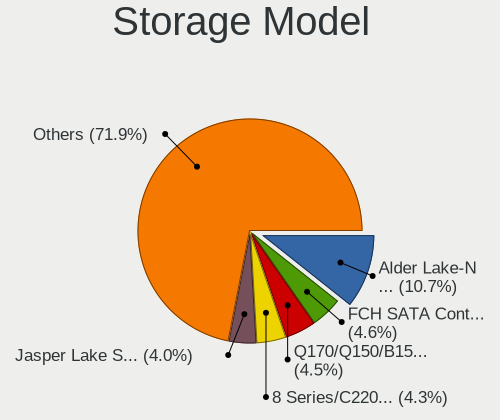
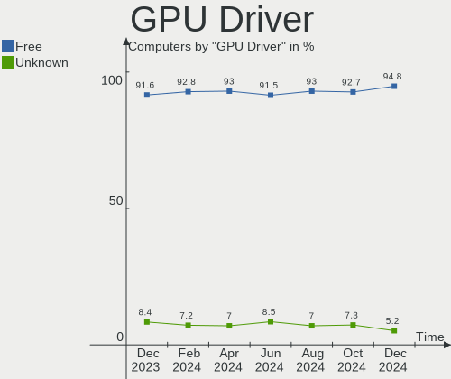
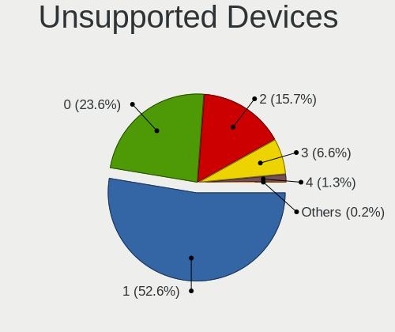

OPNsense Hardware Trends
------------------------

A project to identify most popular hardware characteristics and track their change
over time based on data collected by OPNsense users at https://BSD-Hardware.info.

Anyone can contribute to this report by the [hw-probe](https://github.com/linuxhw/hw-probe/blob/master/INSTALL.BSD.md) tool:

    hw-probe -all -upload

Full-feature report is available here: https://bsd-hardware.info/?view=trends

Period: Jul, 2021.

Contents
--------

* [ System ](#system)
  - [ OS                       ](#os)
  - [ OS Family                ](#os-family)
  - [ Arch                     ](#arch)
  - [ DE                       ](#de)
  - [ Display Server           ](#display-server)
  - [ Display Manager          ](#display-manager)
  - [ OS Lang                  ](#os-lang)
  - [ Boot Mode                ](#boot-mode)
  - [ Filesystem               ](#filesystem)
  - [ Part. scheme             ](#part-scheme)

* [ Board ](#board)
  - [ Vendor                   ](#vendor)
  - [ Model                    ](#model)
  - [ Model Family             ](#model-family)
  - [ MFG Year                 ](#mfg-year)
  - [ Form Factor              ](#form-factor)
  - [ Coreboot                 ](#coreboot)
  - [ RAM Size                 ](#ram-size)
  - [ RAM Used                 ](#ram-used)
  - [ Total Drives             ](#total-drives)
  - [ Has CD-ROM               ](#has-cd-rom)
  - [ Has Ethernet             ](#has-ethernet)
  - [ Has WiFi                 ](#has-wifi)
  - [ Has Bluetooth            ](#has-bluetooth)

* [ Location ](#location)
  - [ Country                  ](#country)
  - [ City                     ](#city)

* [ Drives ](#drives)
  - [ Drive Vendor             ](#drive-vendor)
  - [ Drive Model              ](#drive-model)
  - [ HDD Vendor               ](#hdd-vendor)
  - [ SSD Vendor               ](#ssd-vendor)
  - [ Drive Kind               ](#drive-kind)
  - [ Drive Connector          ](#drive-connector)
  - [ Drive Size               ](#drive-size)
  - [ Space Total              ](#space-total)
  - [ Space Used               ](#space-used)
  - [ Malfunc. Drives          ](#malfunc-drives)
  - [ Malfunc. Drive Vendor    ](#malfunc-drive-vendor)
  - [ Malfunc. HDD Vendor      ](#malfunc-hdd-vendor)
  - [ Malfunc. Drive Kind      ](#malfunc-drive-kind)
  - [ Failed Drives            ](#failed-drives)
  - [ Failed Drive Vendor      ](#failed-drive-vendor)
  - [ Drive Status             ](#drive-status)

* [ Storage controller ](#storage-controller)
  - [ Storage Vendor           ](#storage-vendor)
  - [ Storage Model            ](#storage-model)
  - [ Storage Kind             ](#storage-kind)

* [ Processor ](#processor)
  - [ CPU Vendor               ](#cpu-vendor)
  - [ CPU Model                ](#cpu-model)
  - [ CPU Model Family         ](#cpu-model-family)
  - [ CPU Cores                ](#cpu-cores)
  - [ CPU Sockets              ](#cpu-sockets)
  - [ CPU Threads              ](#cpu-threads)
  - [ CPU Microarch            ](#cpu-microarch)

* [ Graphics ](#graphics)
  - [ GPU Vendor               ](#gpu-vendor)
  - [ GPU Model                ](#gpu-model)
  - [ GPU Combo                ](#gpu-combo)
  - [ GPU Driver               ](#gpu-driver)
  - [ GPU Memory               ](#gpu-memory)

* [ Monitor ](#monitor)
  - [ Monitor Vendor           ](#monitor-vendor)
  - [ Monitor Model            ](#monitor-model)
  - [ Monitor Resolution       ](#monitor-resolution)
  - [ Monitor Diagonal         ](#monitor-diagonal)
  - [ Monitor Width            ](#monitor-width)
  - [ Aspect Ratio             ](#aspect-ratio)
  - [ Monitor Area             ](#monitor-area)
  - [ Pixel Density            ](#pixel-density)
  - [ Multiple Monitors        ](#multiple-monitors)

* [ Network ](#network)
  - [ Net Controller Vendor    ](#net-controller-vendor)
  - [ Net Controller Model     ](#net-controller-model)
  - [ Wireless Vendor          ](#wireless-vendor)
  - [ Wireless Model           ](#wireless-model)
  - [ Ethernet Vendor          ](#ethernet-vendor)
  - [ Ethernet Model           ](#ethernet-model)
  - [ Net Controller Kind      ](#net-controller-kind)
  - [ Used Controller          ](#used-controller)
  - [ NICs                     ](#nics)
  - [ IPv6                     ](#ipv6)

* [ Bluetooth ](#bluetooth)
  - [ Bluetooth Vendor         ](#bluetooth-vendor)
  - [ Bluetooth Model          ](#bluetooth-model)

* [ Sound ](#sound)
  - [ Sound Vendor             ](#sound-vendor)
  - [ Sound Model              ](#sound-model)

* [ Memory ](#memory)
  - [ Memory Vendor            ](#memory-vendor)
  - [ Memory Model             ](#memory-model)
  - [ Memory Kind              ](#memory-kind)
  - [ Memory Form Factor       ](#memory-form-factor)
  - [ Memory Size              ](#memory-size)
  - [ Memory Speed             ](#memory-speed)

* [ Printers & scanners ](#printers-scanners)
  - [ Printer Vendor           ](#printer-vendor)
  - [ Printer Model            ](#printer-model)
  - [ Scanner Vendor           ](#scanner-vendor)
  - [ Scanner Model            ](#scanner-model)

* [ Camera ](#camera)
  - [ Camera Vendor            ](#camera-vendor)
  - [ Camera Model             ](#camera-model)

* [ Security ](#security)
  - [ Fingerprint Vendor       ](#fingerprint-vendor)
  - [ Fingerprint Model        ](#fingerprint-model)
  - [ Chipcard Vendor          ](#chipcard-vendor)
  - [ Chipcard Model           ](#chipcard-model)

* [ Unsupported ](#unsupported)
  - [ Unsupported Devices      ](#unsupported-devices)
  - [ Unsupported Device Types ](#unsupported-device-types)

System
------

OS
--

Installed operating systems

| Name                   | Computers | Percent |
|------------------------|-----------|---------|
| OPNsense 21.1.8        | 117       | 52.94%  |
| OPNsense 21.1.7        | 48        | 21.72%  |
| OPNsense 21.7          | 32        | 14.48%  |
| OPNsense 21.1.9        | 12        | 5.43%   |
| OPNsense 21.1          | 5         | 2.26%   |
| OPNsense 21.1.6        | 2         | 0.9%    |
| OPNsense 21.1.5        | 1         | 0.45%   |
| OPNsense 21.1.4        | 1         | 0.45%   |
| OPNsense 21.1.3        | 1         | 0.45%   |
| OPNsense 21.1.2        | 1         | 0.45%   |
| OPNsense 12.1-p19-HBSD | 1         | 0.45%   |

OS Family
---------

OS without a version

| Name     | Computers | Percent |
|----------|-----------|---------|
| OPNsense | 221       | 100%    |

Arch
----

OS architecture (x86_64, i586, etc.)

| Name  | Computers | Percent |
|-------|-----------|---------|
| amd64 | 221       | 100%    |

DE
--

Desktop Environment

| Name    | Computers | Percent |
|---------|-----------|---------|
| Console | 221       | 100%    |

Display Server
--------------

X11 or Wayland

| Name    | Computers | Percent |
|---------|-----------|---------|
| Console | 221       | 100%    |

Display Manager
---------------

SDDM, LightDM, etc.

| Name    | Computers | Percent |
|---------|-----------|---------|
| Console | 221       | 100%    |

OS Lang
-------

Language

| Lang    | Computers | Percent |
|---------|-----------|---------|
| Unknown | 221       | 100%    |

Boot Mode
---------

EFI or BIOS

| Mode | Computers | Percent |
|------|-----------|---------|
| EFI  | 198       | 89.59%  |
| BIOS | 23        | 10.41%  |

Filesystem
----------

Type of filesystem

| Type | Computers | Percent |
|------|-----------|---------|
| Ufs  | 213       | 96.38%  |
| Zfs  | 8         | 3.62%   |

Part. scheme
------------

Scheme of partitioning

| Type    | Computers | Percent |
|---------|-----------|---------|
| GPT     | 198       | 89.59%  |
| MBR     | 19        | 8.6%    |
| Unknown | 4         | 1.81%   |

Board
-----

Vendor
------

Motherboard manufacturer

| Name                | Computers | Percent |
|---------------------|-----------|---------|
| Unknown             | 32        | 14.48%  |
| Dell                | 26        | 11.76%  |
| Supermicro          | 23        | 10.41%  |
| Hewlett-Packard     | 19        | 8.6%    |
| ASUSTek Computer    | 17        | 7.69%   |
| Protectli           | 14        | 6.33%   |
| PC Engines          | 12        | 5.43%   |
| AMI                 | 11        | 4.98%   |
| Intel               | 10        | 4.52%   |
| ASRock              | 10        | 4.52%   |
| Gigabyte Technology | 6         | 2.71%   |
| Sophos              | 4         | 1.81%   |
| MSI                 | 4         | 1.81%   |
| Fujitsu             | 4         | 1.81%   |
| SeeedStudio         | 2         | 0.9%    |
| NEXCOM              | 2         | 0.9%    |
| Lenovo              | 2         | 0.9%    |
| IBM                 | 2         | 0.9%    |
| Biostar             | 2         | 0.9%    |
| ZOTAC               | 1         | 0.45%   |
| Yanling             | 1         | 0.45%   |
| Wistron             | 1         | 0.45%   |
| Thomas-Krenn.AG     | 1         | 0.45%   |
| Shuttle             | 1         | 0.45%   |
| NF841               | 1         | 0.45%   |
| NF541               | 1         | 0.45%   |
| HPE                 | 1         | 0.45%   |
| GuoGuang            | 1         | 0.45%   |
| Foxconn             | 1         | 0.45%   |
| Deciso              | 1         | 0.45%   |
| Compulab            | 1         | 0.45%   |
| CheckPoint          | 1         | 0.45%   |
| BESSTAR Tech        | 1         | 0.45%   |
| Barracuda Networks  | 1         | 0.45%   |
| AWOW                | 1         | 0.45%   |
| ASRockRack          | 1         | 0.45%   |
| Apple               | 1         | 0.45%   |
| Acer                | 1         | 0.45%   |

Model
-----

Motherboard model

| Name                                             | Computers | Percent |
|--------------------------------------------------|-----------|---------|
| Unknown                                          | 32        | 14.48%  |
| Protectli FW4B                                   | 10        | 4.52%   |
| AMI Aptio CRB                                    | 8         | 3.62%   |
| Supermicro Super Server                          | 7         | 3.17%   |
| PC Engines APU2                                  | 7         | 3.17%   |
| Intel Q3XXG4-P V1.0                              | 6         | 2.71%   |
| PC Engines apu4                                  | 5         | 2.26%   |
| Dell OptiPlex 990                                | 4         | 1.81%   |
| Supermicro X9SCL/X9SCM                           | 3         | 1.36%   |
| HP t620 PLUS Quad Core TC                        | 3         | 1.36%   |
| Dell OptiPlex 790                                | 3         | 1.36%   |
| Supermicro 1HE Intel Single-CPU RI1102D-F Server | 2         | 0.9%    |
| Sophos XG                                        | 2         | 0.9%    |
| SeeedStudio ODYSSEY-X86J4125                     | 2         | 0.9%    |
| Protectli FW6                                    | 2         | 0.9%    |
| NEXCOM ASG                                       | 2         | 0.9%    |
| HP t730 Thin Client                              | 2         | 0.9%    |
| Fujitsu ESPRIMO_D756                             | 2         | 0.9%    |
| Dell Wyse 5070 Extended Thin Client              | 2         | 0.9%    |
| Dell OptiPlex 7010                               | 2         | 0.9%    |
| Dell OptiPlex 3040                               | 2         | 0.9%    |
| ASRock B365M Pro4                                | 2         | 0.9%    |
| ZOTAC ZBOX-CI323NANO                             | 1         | 0.45%   |
| Yanling NS-1U8L                                  | 1         | 0.45%   |
| Wistron ProLiant ML110 G6                        | 1         | 0.45%   |
| Thomas-Krenn.AG LES network+                     | 1         | 0.45%   |
| Supermicro X8DTU-LN4+                            | 1         | 0.45%   |
| Supermicro X8DTU                                 | 1         | 0.45%   |
| Supermicro X7SBL                                 | 1         | 0.45%   |
| Supermicro X10SLL-F                              | 1         | 0.45%   |
| Supermicro SYS-5018D-FN8T                        | 1         | 0.45%   |
| Supermicro SYS-5018A-MLTN4                       | 1         | 0.45%   |
| Supermicro SYS-1019D-4C-FHN13TP                  | 1         | 0.45%   |
| Supermicro Pro546267                             | 1         | 0.45%   |
| Supermicro PDSML                                 | 1         | 0.45%   |
| Supermicro GN#16664                              | 1         | 0.45%   |
| Supermicro 1HE Intel Single-CPU RI1102A-F Server | 1         | 0.45%   |
| Sophos UTM                                       | 1         | 0.45%   |
| Sophos SG                                        | 1         | 0.45%   |
| Shuttle DS10U                                    | 1         | 0.45%   |
| Protectli FW6D                                   | 1         | 0.45%   |
| Protectli FW4A                                   | 1         | 0.45%   |
| NF841 1.0                                        | 1         | 0.45%   |
| NF541 1.0                                        | 1         | 0.45%   |
| MSI MS-S0891                                     | 1         | 0.45%   |
| MSI MS-7C08                                      | 1         | 0.45%   |
| MSI MS-7850                                      | 1         | 0.45%   |
| MSI MS-7816                                      | 1         | 0.45%   |
| Lenovo ThinkCentre M93p 10AAS0GN00               | 1         | 0.45%   |
| Lenovo ThinkCentre E73 10AU003FUK                | 1         | 0.45%   |
| Intel NUC10i7FNK                                 | 1         | 0.45%   |
| Intel NDISB533                                   | 1         | 0.45%   |
| Intel Granite Well                               | 1         | 0.45%   |
| Intel D33217GKE G76540-207                       | 1         | 0.45%   |
| IBM System x3650 M4: -[7915AC1]-                 | 1         | 0.45%   |
| IBM System x3550 M4: -[7914B3M]-                 | 1         | 0.45%   |
| HPE ProLiant DL20 Gen10                          | 1         | 0.45%   |
| HP Z230 SFF Workstation                          | 1         | 0.45%   |
| HP ProLiant ML350 G6                             | 1         | 0.45%   |
| HP ProLiant MicroServer Gen8                     | 1         | 0.45%   |

Model Family
------------

Motherboard model prefix

| Name                            | Computers | Percent |
|---------------------------------|-----------|---------|
| Unknown                         | 32        | 14.48%  |
| Dell OptiPlex                   | 15        | 6.79%   |
| Protectli FW4B                  | 10        | 4.52%   |
| AMI Aptio                       | 8         | 3.62%   |
| Supermicro Super                | 7         | 3.17%   |
| PC Engines APU2                 | 7         | 3.17%   |
| Intel Q3XXG4-P                  | 6         | 2.71%   |
| Dell PowerEdge                  | 6         | 2.71%   |
| PC Engines apu4                 | 5         | 2.26%   |
| HP ProLiant                     | 5         | 2.26%   |
| HP Compaq                       | 4         | 1.81%   |
| Supermicro X9SCL                | 3         | 1.36%   |
| Supermicro 1HE                  | 3         | 1.36%   |
| HP t620                         | 3         | 1.36%   |
| Sophos XG                       | 2         | 0.9%    |
| SeeedStudio ODYSSEY-X86J4125    | 2         | 0.9%    |
| Protectli FW6                   | 2         | 0.9%    |
| NEXCOM ASG                      | 2         | 0.9%    |
| Lenovo ThinkCentre              | 2         | 0.9%    |
| IBM System                      | 2         | 0.9%    |
| HP t730                         | 2         | 0.9%    |
| HP ProDesk                      | 2         | 0.9%    |
| Fujitsu ESPRIMO                 | 2         | 0.9%    |
| Dell Wyse                       | 2         | 0.9%    |
| ASUS PRIME                      | 2         | 0.9%    |
| ASRock B365M                    | 2         | 0.9%    |
| ZOTAC ZBOX-CI323NANO            | 1         | 0.45%   |
| Yanling NS-1U8L                 | 1         | 0.45%   |
| Wistron ProLiant                | 1         | 0.45%   |
| Thomas-Krenn.AG LES             | 1         | 0.45%   |
| Supermicro X8DTU-LN4+           | 1         | 0.45%   |
| Supermicro X8DTU                | 1         | 0.45%   |
| Supermicro X7SBL                | 1         | 0.45%   |
| Supermicro X10SLL-F             | 1         | 0.45%   |
| Supermicro SYS-5018D-FN8T       | 1         | 0.45%   |
| Supermicro SYS-5018A-MLTN4      | 1         | 0.45%   |
| Supermicro SYS-1019D-4C-FHN13TP | 1         | 0.45%   |
| Supermicro Pro546267            | 1         | 0.45%   |
| Supermicro PDSML                | 1         | 0.45%   |
| Supermicro GN#16664             | 1         | 0.45%   |
| Sophos UTM                      | 1         | 0.45%   |
| Sophos SG                       | 1         | 0.45%   |
| Shuttle DS10U                   | 1         | 0.45%   |
| Protectli FW6D                  | 1         | 0.45%   |
| Protectli FW4A                  | 1         | 0.45%   |
| NF841 1.0                       | 1         | 0.45%   |
| NF541 1.0                       | 1         | 0.45%   |
| MSI MS-S0891                    | 1         | 0.45%   |
| MSI MS-7C08                     | 1         | 0.45%   |
| MSI MS-7850                     | 1         | 0.45%   |
| MSI MS-7816                     | 1         | 0.45%   |
| Intel NUC10i7FNK                | 1         | 0.45%   |
| Intel NDISB533                  | 1         | 0.45%   |
| Intel Granite                   | 1         | 0.45%   |
| Intel D33217GKE                 | 1         | 0.45%   |
| HPE ProLiant                    | 1         | 0.45%   |
| HP Z230                         | 1         | 0.45%   |
| HP EliteDesk                    | 1         | 0.45%   |
| HP 860-012nf                    | 1         | 0.45%   |
| GuoGuang IC2M1028V-6            | 1         | 0.45%   |

MFG Year
--------

Motherboard manufacture year

| Year | Computers | Percent |
|------|-----------|---------|
| 2020 | 42        | 19%     |
| 2019 | 38        | 17.19%  |
| 2021 | 31        | 14.03%  |
| 2018 | 30        | 13.57%  |
| 2013 | 16        | 7.24%   |
| 2015 | 12        | 5.43%   |
| 2014 | 11        | 4.98%   |
| 2012 | 10        | 4.52%   |
| 2017 | 9         | 4.07%   |
| 2011 | 7         | 3.17%   |
| 2016 | 4         | 1.81%   |
| 2009 | 4         | 1.81%   |
| 2010 | 3         | 1.36%   |
| 2008 | 2         | 0.9%    |
| 2007 | 1         | 0.45%   |
| 2006 | 1         | 0.45%   |

Form Factor
-----------

Physical design of the computer

| Name     | Computers | Percent |
|----------|-----------|---------|
| Desktop  | 161       | 72.85%  |
| Server   | 28        | 12.67%  |
| Mini pc  | 22        | 9.95%   |
| Firewall | 5         | 2.26%   |
| Notebook | 5         | 2.26%   |

Coreboot
--------

Have coreboot on board

| Used | Computers | Percent |
|------|-----------|---------|
| No   | 206       | 93.21%  |
| Yes  | 15        | 6.79%   |

RAM Size
--------

Total RAM memory

| Size in GB  | Computers | Percent |
|-------------|-----------|---------|
| 8.01-16.0   | 86        | 38.91%  |
| 4.01-8.0    | 57        | 25.79%  |
| 16.01-24.0  | 50        | 22.62%  |
| 32.01-64.0  | 12        | 5.43%   |
| 2.01-3.0    | 5         | 2.26%   |
| 64.01-256.0 | 4         | 1.81%   |
| 0.51-1.0    | 3         | 1.36%   |
| 3.01-4.0    | 2         | 0.9%    |
| 24.01-32.0  | 2         | 0.9%    |

RAM Used
--------

Used RAM memory

| Used GB    | Computers | Percent |
|------------|-----------|---------|
| 0.01-0.5   | 128       | 57.92%  |
| 0.51-1.0   | 64        | 28.96%  |
| 1.01-2.0   | 15        | 6.79%   |
| 2.01-3.0   | 5         | 2.26%   |
| 4.01-8.0   | 4         | 1.81%   |
| 8.01-16.0  | 2         | 0.9%    |
| 3.01-4.0   | 1         | 0.45%   |
| 24.01-32.0 | 1         | 0.45%   |
| 16.01-24.0 | 1         | 0.45%   |

Total Drives
------------

Number of drives on board

| Drives | Computers | Percent |
|--------|-----------|---------|
| 1      | 189       | 85.52%  |
| 0      | 17        | 7.69%   |
| 2      | 12        | 5.43%   |
| 3      | 3         | 1.36%   |

Has CD-ROM
----------

Has CD-ROM on board

| Presented | Computers | Percent |
|-----------|-----------|---------|
| No        | 190       | 85.97%  |
| Yes       | 31        | 14.03%  |

Has Ethernet
------------

Has Ethernet on board

| Presented | Computers | Percent |
|-----------|-----------|---------|
| Yes       | 221       | 100%    |

Has WiFi
--------

Has WiFi module

| Presented | Computers | Percent |
|-----------|-----------|---------|
| No        | 181       | 81.9%   |
| Yes       | 40        | 18.1%   |

Has Bluetooth
-------------

Has Bluetooth module

| Presented | Computers | Percent |
|-----------|-----------|---------|
| No        | 203       | 91.86%  |
| Yes       | 18        | 8.14%   |

Location
--------

Country
-------

Geographic location (country)

| Country      | Computers | Percent |
|--------------|-----------|---------|
| USA          | 80        | 36.2%   |
| Germany      | 42        | 19%     |
| UK           | 12        | 5.43%   |
| Austria      | 8         | 3.62%   |
| Switzerland  | 6         | 2.71%   |
| France       | 6         | 2.71%   |
| Canada       | 6         | 2.71%   |
| Sweden       | 5         | 2.26%   |
| Poland       | 4         | 1.81%   |
| Norway       | 4         | 1.81%   |
| Netherlands  | 4         | 1.81%   |
| China        | 4         | 1.81%   |
| Taiwan       | 3         | 1.36%   |
| Spain        | 3         | 1.36%   |
| Italy        | 3         | 1.36%   |
| Australia    | 3         | 1.36%   |
| South Africa | 2         | 0.9%    |
| Singapore    | 2         | 0.9%    |
| Denmark      | 2         | 0.9%    |
| Brazil       | 2         | 0.9%    |
| Belgium      | 2         | 0.9%    |
| Ukraine      | 1         | 0.45%   |
| UAE          | 1         | 0.45%   |
| Thailand     | 1         | 0.45%   |
| Russia       | 1         | 0.45%   |
| Romania      | 1         | 0.45%   |
| Portugal     | 1         | 0.45%   |
| New Zealand  | 1         | 0.45%   |
| Latvia       | 1         | 0.45%   |
| Israel       | 1         | 0.45%   |
| Greece       | 1         | 0.45%   |
| Finland      | 1         | 0.45%   |
| Estonia      | 1         | 0.45%   |
| Egypt        | 1         | 0.45%   |
| Colombia     | 1         | 0.45%   |
| Chile        | 1         | 0.45%   |
| Cabo Verde   | 1         | 0.45%   |
| Bulgaria     | 1         | 0.45%   |
| Belarus      | 1         | 0.45%   |

City
----

Geographic location (city)

| City                 | Computers | Percent |
|----------------------|-----------|---------|
| Vienna               | 4         | 1.81%   |
| Vaulx-en-Velin       | 2         | 0.9%    |
| Toronto              | 2         | 0.9%    |
| Stockholm            | 2         | 0.9%    |
| Singapore            | 2         | 0.9%    |
| Shanghai             | 2         | 0.9%    |
| San Jose             | 2         | 0.9%    |
| Karlsruhe            | 2         | 0.9%    |
| Franklin             | 2         | 0.9%    |
| Frankfurt am Main    | 2         | 0.9%    |
| Dresden              | 2         | 0.9%    |
| Denver               | 2         | 0.9%    |
| Dallas               | 2         | 0.9%    |
| Canal Fulton         | 2         | 0.9%    |
| Bremerhaven          | 2         | 0.9%    |
| Bergen               | 2         | 0.9%    |
| Auburn               | 2         | 0.9%    |
| Åhus                | 1         | 0.45%   |
| Zurich               | 1         | 0.45%   |
| Zaltbommel           | 1         | 0.45%   |
| Yuanlin              | 1         | 0.45%   |
| Wroclaw              | 1         | 0.45%   |
| Worms                | 1         | 0.45%   |
| Woodmead             | 1         | 0.45%   |
| Westland             | 1         | 0.45%   |
| West Valley City     | 1         | 0.45%   |
| West Fargo           | 1         | 0.45%   |
| Waverly              | 1         | 0.45%   |
| Warminster           | 1         | 0.45%   |
| Vila Nova de Gaia    | 1         | 0.45%   |
| Vigo                 | 1         | 0.45%   |
| Vauvillers           | 1         | 0.45%   |
| Varna                | 1         | 0.45%   |
| Tucker               | 1         | 0.45%   |
| Trumann              | 1         | 0.45%   |
| Trelleborg           | 1         | 0.45%   |
| Tongchuanshi         | 1         | 0.45%   |
| Tobique First Nation | 1         | 0.45%   |
| Tielt-Winge          | 1         | 0.45%   |
| The Hague            | 1         | 0.45%   |
| Tel Aviv             | 1         | 0.45%   |
| Tapa                 | 1         | 0.45%   |
| Taipei               | 1         | 0.45%   |
| Szczecin             | 1         | 0.45%   |
| Suwanee              | 1         | 0.45%   |
| Sulzbach             | 1         | 0.45%   |
| Stuttgart            | 1         | 0.45%   |
| Statesboro           | 1         | 0.45%   |
| Sonthofen            | 1         | 0.45%   |
| Simi Valley          | 1         | 0.45%   |
| Silver Spring        | 1         | 0.45%   |
| Seesen               | 1         | 0.45%   |
| Schoten              | 1         | 0.45%   |
| Santiago             | 1         | 0.45%   |
| San Francisco        | 1         | 0.45%   |
| Saint Paul           | 1         | 0.45%   |
| Saarbr??cken         | 1         | 0.45%   |
| Royal Oak            | 1         | 0.45%   |
| Rosharon             | 1         | 0.45%   |
| Rome                 | 1         | 0.45%   |

Drives
------

Drive Vendor
------------

Hard drive vendors

| Vendor              | Computers | Drives | Percent |
|---------------------|-----------|--------|---------|
| Samsung Electronics | 27        | 28     | 12.62%  |
| Transcend           | 17        | 17     | 7.94%   |
| Kingston            | 17        | 19     | 7.94%   |
| Seagate             | 15        | 15     | 7.01%   |
| Intel               | 15        | 17     | 7.01%   |
| WDC                 | 14        | 15     | 6.54%   |
| Hoodisk             | 14        | 14     | 6.54%   |
| SanDisk             | 12        | 12     | 5.61%   |
| OCZ                 | 7         | 7      | 3.27%   |
| Hewlett-Packard     | 7         | 9      | 3.27%   |
| Crucial             | 7         | 7      | 3.27%   |
| ATP                 | 6         | 6      | 2.8%    |
| Micron Technology   | 5         | 5      | 2.34%   |
| A-DATA Technology   | 5         | 5      | 2.34%   |
| SPCC                | 4         | 4      | 1.87%   |
| Phison              | 4         | 4      | 1.87%   |
| Corsair             | 4         | 4      | 1.87%   |
| Protectli           | 3         | 3      | 1.4%    |
| China               | 3         | 3      | 1.4%    |
| PNY                 | 2         | 2      | 0.93%   |
| Kston               | 2         | 2      | 0.93%   |
| KingSpec            | 2         | 2      | 0.93%   |
| KingDian            | 2         | 2      | 0.93%   |
| Hitachi             | 2         | 3      | 0.93%   |
| FORESEE             | 2         | 2      | 0.93%   |
| Apacer              | 2         | 2      | 0.93%   |
| XrayDisk            | 1         | 1      | 0.47%   |
| Toshiba             | 1         | 1      | 0.47%   |
| TCSUNBOW            | 1         | 1      | 0.47%   |
| SK Hynix            | 1         | 1      | 0.47%   |
| PLEXTOR             | 1         | 1      | 0.47%   |
| Patriot             | 1         | 1      | 0.47%   |
| MEMXPRO             | 1         | 1      | 0.47%   |
| LITEON              | 1         | 1      | 0.47%   |
| KLEVV               | 1         | 2      | 0.47%   |
| Indilinx            | 1         | 1      | 0.47%   |
| HPE                 | 1         | 1      | 0.47%   |
| HGST                | 1         | 1      | 0.47%   |
| Dell                | 1         | 1      | 0.47%   |
| BIWIN               | 1         | 1      | 0.47%   |

Drive Model
-----------

Hard drive models

| Model                             | Computers | Percent |
|-----------------------------------|-----------|---------|
| Hoodisk SSD 64GB                  | 8         | 3.67%   |
| Samsung SSD 850 EVO 250GB         | 4         | 1.83%   |
| Transcend TS128GMSA230S 128GB     | 3         | 1.38%   |
| Samsung SSD 840 EVO 120GB         | 3         | 1.38%   |
| Phison SATA SSD 16GB              | 3         | 1.38%   |
| Kingston SUV500MS240G 240GB       | 3         | 1.38%   |
| Kingston SUV500MS120G 120GB       | 3         | 1.38%   |
| Kingston SA400S37240G 240GB       | 3         | 1.38%   |
| Kingston SA400S37120G 120GB       | 3         | 1.38%   |
| Transcend TS64GMSA370 64GB        | 2         | 0.92%   |
| SPCC Solid State Disk 128GB       | 2         | 0.92%   |
| Seagate ST3160318AS 160GB         | 2         | 0.92%   |
| SanDisk SSD PLUS 120 GB           | 2         | 0.92%   |
| Samsung SSD 970 EVO Plus 250GB    | 2         | 0.92%   |
| Samsung SSD 970 EVO 500GB         | 2         | 0.92%   |
| Protectli 120GB mSATA             | 2         | 0.92%   |
| OCZ AGILITY3 64GB                 | 2         | 0.92%   |
| Intel SSDSC2KW256G8 256GB         | 2         | 0.92%   |
| Intel SSDSC2KG240G8 240GB         | 2         | 0.92%   |
| Hoodisk SSD 32GB                  | 2         | 0.92%   |
| Hoodisk SSD 16GB                  | 2         | 0.92%   |
| HP RAID 1(1+0) 146GB              | 2         | 0.92%   |
| HP RAID 0 450GB                   | 2         | 0.92%   |
| ATP SATA III mSATA 64GB           | 2         | 0.92%   |
| ATP NVMe M.2 2280 SSD 240GB       | 2         | 0.92%   |
| A-DATA SU650 120GB                | 2         | 0.92%   |
| XrayDisk SSD 128GB                | 1         | 0.46%   |
| WDC WDS500G3X0C-00SJG0 500GB      | 1         | 0.46%   |
| WDC WDS500G1X0E-00AFY0 500GB      | 1         | 0.46%   |
| WDC WDS250G2B0A-00SM50 250GB      | 1         | 0.46%   |
| WDC WDS240G2G0A-00JH30 240GB      | 1         | 0.46%   |
| WDC WDS120G2G0B-00EPW0 120GB      | 1         | 0.46%   |
| WDC WDS120G2G0A-00JH30 120GB      | 1         | 0.46%   |
| WDC WD5003AZEX-00K3CA0 500GB      | 1         | 0.46%   |
| WDC WD5000LPVT-80G33T2 500GB      | 1         | 0.46%   |
| WDC WD5000AAKX-001CA0 500GB       | 1         | 0.46%   |
| WDC WD5000AAKS-00V1A0 500GB       | 1         | 0.46%   |
| WDC WD2500JS-75NCB3 250GB         | 1         | 0.46%   |
| WDC WD2500BEKT-75PVMT0 250GB      | 1         | 0.46%   |
| WDC WD2500AAKX-75U6AA0 250GB      | 1         | 0.46%   |
| WDC WD2500AAKX-603CA0 250GB       | 1         | 0.46%   |
| WDC WD1600BEVS-75RST0 160GB       | 1         | 0.46%   |
| Transcend TS8GCF170 8GB           | 1         | 0.46%   |
| Transcend TS64GSSD370 64GB        | 1         | 0.46%   |
| Transcend TS64GSSD340 64GB        | 1         | 0.46%   |
| Transcend TS64GMSA230S 64GB       | 1         | 0.46%   |
| Transcend TS4GCF150 4GB           | 1         | 0.46%   |
| Transcend TS32GSSD370S 32GB       | 1         | 0.46%   |
| Transcend TS32GMSA370S 32GB       | 1         | 0.46%   |
| Transcend TS256GMSA452T 256GB     | 1         | 0.46%   |
| Transcend TS256GMSA230S 256GB     | 1         | 0.46%   |
| Transcend TS16GMSA370 16GB        | 1         | 0.46%   |
| Transcend TS128GMSA370S 128GB     | 1         | 0.46%   |
| Transcend TS120GMTS420S 120GB     | 1         | 0.46%   |
| Toshiba MG03ACA100 1TB            | 1         | 0.46%   |
| TCSUNBOW M1 32GB                  | 1         | 0.46%   |
| SPCC Solid State Disk 120GB       | 1         | 0.46%   |
| SPCC M.2 PCIe SSD 256GB           | 1         | 0.46%   |
| SK Hynix HFS256G3AMNB-2200A 256GB | 1         | 0.46%   |
| Seagate ST9320320AS 320GB         | 1         | 0.46%   |

HDD Vendor
----------

Hard disk drive vendors

| Vendor          | Computers | Drives | Percent |
|-----------------|-----------|--------|---------|
| Seagate         | 14        | 14     | 43.75%  |
| WDC             | 8         | 9      | 25%     |
| Hewlett-Packard | 5         | 6      | 15.63%  |
| Hitachi         | 2         | 3      | 6.25%   |
| Toshiba         | 1         | 1      | 3.13%   |
| HGST            | 1         | 1      | 3.13%   |
| Dell            | 1         | 1      | 3.13%   |

SSD Vendor
----------

Solid state drive vendors

| Vendor              | Computers | Drives | Percent |
|---------------------|-----------|--------|---------|
| Samsung Electronics | 21        | 22     | 12.65%  |
| Transcend           | 17        | 17     | 10.24%  |
| Kingston            | 15        | 17     | 9.04%   |
| Intel               | 15        | 17     | 9.04%   |
| Hoodisk             | 14        | 14     | 8.43%   |
| SanDisk             | 12        | 12     | 7.23%   |
| OCZ                 | 7         | 7      | 4.22%   |
| Crucial             | 7         | 7      | 4.22%   |
| Micron Technology   | 5         | 5      | 3.01%   |
| WDC                 | 4         | 4      | 2.41%   |
| ATP                 | 4         | 4      | 2.41%   |
| A-DATA Technology   | 4         | 4      | 2.41%   |
| SPCC                | 3         | 3      | 1.81%   |
| Protectli           | 3         | 3      | 1.81%   |
| Phison              | 3         | 3      | 1.81%   |
| Corsair             | 3         | 3      | 1.81%   |
| China               | 3         | 3      | 1.81%   |
| PNY                 | 2         | 2      | 1.2%    |
| Kston               | 2         | 2      | 1.2%    |
| KingSpec            | 2         | 2      | 1.2%    |
| KingDian            | 2         | 2      | 1.2%    |
| Hewlett-Packard     | 2         | 3      | 1.2%    |
| FORESEE             | 2         | 2      | 1.2%    |
| Apacer              | 2         | 2      | 1.2%    |
| XrayDisk            | 1         | 1      | 0.6%    |
| TCSUNBOW            | 1         | 1      | 0.6%    |
| SK Hynix            | 1         | 1      | 0.6%    |
| Seagate             | 1         | 1      | 0.6%    |
| PLEXTOR             | 1         | 1      | 0.6%    |
| Patriot             | 1         | 1      | 0.6%    |
| MEMXPRO             | 1         | 1      | 0.6%    |
| LITEON              | 1         | 1      | 0.6%    |
| KLEVV               | 1         | 2      | 0.6%    |
| Indilinx            | 1         | 1      | 0.6%    |
| HPE                 | 1         | 1      | 0.6%    |
| BIWIN               | 1         | 1      | 0.6%    |

Drive Kind
----------

HDD or SSD

| Kind | Computers | Drives | Percent |
|------|-----------|--------|---------|
| SSD  | 165       | 173    | 77.83%  |
| HDD  | 31        | 35     | 14.62%  |
| NVMe | 16        | 16     | 7.55%   |

Drive Connector
---------------

SATA, SAS, NVMe, etc.

| Type | Computers | Drives | Percent |
|------|-----------|--------|---------|
| SATA | 190       | 208    | 92.23%  |
| NVMe | 16        | 16     | 7.77%   |

Drive Size
----------

Size of hard drive

| Size in TB | Computers | Drives | Percent |
|------------|-----------|--------|---------|
| 0.01-0.5   | 181       | 196    | 93.78%  |
| 0.51-1.0   | 10        | 10     | 5.18%   |
| 2.01-3.0   | 1         | 1      | 0.52%   |
| 1.01-2.0   | 1         | 1      | 0.52%   |

Space Total
-----------

Amount of disk space available on the file system

| Size in GB | Computers | Percent |
|------------|-----------|---------|
| 101-250    | 89        | 40.27%  |
| 21-50      | 44        | 19.91%  |
| 51-100     | 32        | 14.48%  |
| 251-500    | 25        | 11.31%  |
| 1-20       | 17        | 7.69%   |
| 501-1000   | 11        | 4.98%   |
| 1001-2000  | 3         | 1.36%   |

Space Used
----------

Amount of used disk space

| Used GB | Computers | Percent |
|---------|-----------|---------|
| 1-20    | 213       | 96.38%  |
| 21-50   | 6         | 2.71%   |
| 51-100  | 2         | 0.9%    |

Malfunc. Drives
---------------

Drive models with a malfunction

| Model                             | Computers | Drives | Percent |
|-----------------------------------|-----------|--------|---------|
| WDC WD5000AAKX-001CA0 500GB       | 1         | 1      | 5%      |
| WDC WD5000AAKS-00V1A0 500GB       | 1         | 1      | 5%      |
| SK Hynix HFS256G3AMNB-2200A 256GB | 1         | 1      | 5%      |
| Seagate ST9320320AS 320GB         | 1         | 1      | 5%      |
| Seagate ST3500418AS 500GB         | 1         | 1      | 5%      |
| Seagate ST3500413AS 500GB         | 1         | 1      | 5%      |
| Seagate ST3160318AS 160GB         | 1         | 1      | 5%      |
| Seagate ST31000340NS 1TB          | 1         | 1      | 5%      |
| Seagate ST1000DL002-9TT153 1TB    | 1         | 1      | 5%      |
| SanDisk SSD PLUS 120 GB           | 1         | 1      | 5%      |
| Kingston SUV400S37120G 120GB      | 1         | 1      | 5%      |
| Intel SSDSC2BX200G4R 200GB        | 1         | 1      | 5%      |
| Intel SSDSC2BF256A5 SATA 256GB    | 1         | 1      | 5%      |
| Intel SSDSA2M160G2GN 160GB        | 1         | 1      | 5%      |
| Intel SSDSA2BW160G3H 160GB        | 1         | 1      | 5%      |
| Hitachi HUA722020ALA331 2TB       | 1         | 1      | 5%      |
| Hitachi HDS721050CLA660 500GB     | 1         | 2      | 5%      |
| Hewlett-Packard VB0250EAVER 250GB | 1         | 1      | 5%      |
| Crucial CT128M550SSD3 128GB       | 1         | 1      | 5%      |
| A-DATA Technology SU650 120GB     | 1         | 1      | 5%      |

Malfunc. Drive Vendor
---------------------

Vendors of faulty drives

| Vendor            | Computers | Drives | Percent |
|-------------------|-----------|--------|---------|
| Seagate           | 6         | 6      | 30%     |
| Intel             | 4         | 4      | 20%     |
| WDC               | 2         | 2      | 10%     |
| Hitachi           | 2         | 3      | 10%     |
| SK Hynix          | 1         | 1      | 5%      |
| SanDisk           | 1         | 1      | 5%      |
| Kingston          | 1         | 1      | 5%      |
| Hewlett-Packard   | 1         | 1      | 5%      |
| Crucial           | 1         | 1      | 5%      |
| A-DATA Technology | 1         | 1      | 5%      |

Malfunc. HDD Vendor
-------------------

Vendors of faulty HDD drives

| Vendor          | Computers | Drives | Percent |
|-----------------|-----------|--------|---------|
| Seagate         | 6         | 6      | 54.55%  |
| WDC             | 2         | 2      | 18.18%  |
| Hitachi         | 2         | 3      | 18.18%  |
| Hewlett-Packard | 1         | 1      | 9.09%   |

Malfunc. Drive Kind
-------------------

Kinds of faulty drives

| Kind | Computers | Drives | Percent |
|------|-----------|--------|---------|
| HDD  | 11        | 12     | 55%     |
| SSD  | 9         | 9      | 45%     |

Failed Drives
-------------

Failed drive models

Zero info for selected period =(

Failed Drive Vendor
-------------------

Failed drive vendors

Zero info for selected period =(

Drive Status
------------

Number of failed and malfunc. drives

| Status   | Computers | Drives | Percent |
|----------|-----------|--------|---------|
| Works    | 181       | 195    | 87.02%  |
| Malfunc  | 20        | 21     | 9.62%   |
| Detected | 7         | 8      | 3.37%   |

Storage controller
------------------

Storage Vendor
--------------

Storage controller vendors

| Vendor                      | Computers | Percent |
|-----------------------------|-----------|---------|
| Intel                       | 188       | 75.2%   |
| AMD                         | 27        | 10.8%   |
| Broadcom / LSI              | 9         | 3.6%    |
| Samsung Electronics         | 6         | 2.4%    |
| Hewlett-Packard             | 4         | 1.6%    |
| Phison Electronics          | 3         | 1.2%    |
| ASMedia Technology          | 3         | 1.2%    |
| Sandisk                     | 2         | 0.8%    |
| Kingston Technology Company | 2         | 0.8%    |
| ATP ELECTRONICS             | 2         | 0.8%    |
| Marvell Technology Group    | 1         | 0.4%    |
| JMicron Technology          | 1         | 0.4%    |
| ADATA Technology            | 1         | 0.4%    |
| Adaptec                     | 1         | 0.4%    |

Storage Model
-------------

Storage controller models

| Model                                                                            | Computers | Percent |
|----------------------------------------------------------------------------------|-----------|---------|
| AMD FCH SATA Controller [AHCI mode]                                              | 23        | 8.33%   |
| Intel Atom/Celeron/Pentium Processor x5-E8000/J3xxx/N3xxx Series SATA Controller | 18        | 6.52%   |
| Intel 8 Series/C220 Series Chipset Family 6-port SATA Controller 1 [AHCI mode]   | 17        | 6.16%   |
| Intel Atom Processor E3800 Series SATA AHCI Controller                           | 16        | 5.8%    |
| Intel Sunrise Point-LP SATA Controller [AHCI mode]                               | 15        | 5.43%   |
| Intel 6 Series/C200 Series Chipset Family 6 port Desktop SATA AHCI Controller    | 13        | 4.71%   |
| Intel Q170/Q150/B150/H170/H110/Z170/CM236 Chipset SATA Controller [AHCI Mode]    | 10        | 3.62%   |
| Intel SATA Controller [RAID mode]                                                | 8         | 2.9%    |
| Intel 7 Series/C210 Series Chipset Family 6-port SATA Controller [AHCI mode]     | 8         | 2.9%    |
| Intel Cannon Lake PCH SATA AHCI Controller                                       | 7         | 2.54%   |
| Intel NM10/ICH7 Family SATA Controller [AHCI mode]                               | 6         | 2.17%   |
| Samsung NVMe SSD Controller SM981/PM981/PM983                                    | 5         | 1.81%   |
| Intel Celeron/Pentium Silver Processor SATA Controller                           | 5         | 1.81%   |
| Intel Celeron N3350/Pentium N4200/Atom E3900 Series SATA AHCI Controller         | 5         | 1.81%   |
| Intel 82801HM/HEM (ICH8M/ICH8M-E) IDE Controller                                 | 5         | 1.81%   |
| Intel 82801G (ICH7 Family) IDE Controller                                        | 5         | 1.81%   |
| Intel 8 Series SATA Controller 1 [AHCI mode]                                     | 5         | 1.81%   |
| Intel 200 Series PCH SATA controller [AHCI mode]                                 | 5         | 1.81%   |
| Intel Wildcat Point-LP SATA Controller [AHCI Mode]                               | 4         | 1.45%   |
| Intel Cannon Point-LP SATA Controller [AHCI Mode]                                | 3         | 1.09%   |
| Intel Atom Processor C3000 Series SATA Controller 0                              | 3         | 1.09%   |
| Intel Atom processor C2000 AHCI SATA3 Controller                                 | 3         | 1.09%   |
| Intel 82801JI (ICH10 Family) 2 port SATA IDE Controller #2                       | 3         | 1.09%   |
| Intel 82801HM/HEM (ICH8M/ICH8M-E) SATA Controller [IDE mode]                     | 3         | 1.09%   |
| Broadcom / LSI MegaRAID SAS-3 3108 [Invader]                                     | 3         | 1.09%   |
| ASMedia ASM1062 Serial ATA Controller                                            | 3         | 1.09%   |
| AMD FCH IDE Controller                                                           | 3         | 1.09%   |
| Phison E12 NVMe Controller                                                       | 2         | 0.72%   |
| Intel NM10/ICH7 Family SATA Controller [IDE mode]                                | 2         | 0.72%   |
| Intel Comet Lake SATA AHCI Controller                                            | 2         | 0.72%   |
| Intel C620 Series Chipset Family SSATA Controller [AHCI mode]                    | 2         | 0.72%   |
| Intel C600/X79 series chipset SATA RAID Controller                               | 2         | 0.72%   |
| Intel C600/X79 series chipset 6-Port SATA AHCI Controller                        | 2         | 0.72%   |
| Intel Atom Processor C3000 Series SATA Controller 1                              | 2         | 0.72%   |
| Intel 82801JI (ICH10 Family) SATA AHCI Controller                                | 2         | 0.72%   |
| Intel 82801JI (ICH10 Family) 4 port SATA IDE Controller #1                       | 2         | 0.72%   |
| Intel 82801HM/HEM (ICH8M/ICH8M-E) SATA Controller [AHCI mode]                    | 2         | 0.72%   |
| Intel 7 Series Chipset Family 6-port SATA Controller [AHCI mode]                 | 2         | 0.72%   |
| Intel 500 Series Chipset Family SATA AHCI Controller                             | 2         | 0.72%   |
| Intel 5 Series/3400 Series Chipset 6 port SATA AHCI Controller                   | 2         | 0.72%   |
| Intel 400 Series Chipset Family SATA AHCI Controller                             | 2         | 0.72%   |
| HP Smart Array Gen8 Controllers                                                  | 2         | 0.72%   |
| Broadcom / LSI MegaRAID SAS 2208 [Thunderbolt]                                   | 2         | 0.72%   |
| AMD SB7x0/SB8x0/SB9x0 SATA Controller [AHCI mode]                                | 2         | 0.72%   |
| AMD FCH SATA Controller [IDE mode]                                               | 2         | 0.72%   |
| AMD 400 Series Chipset SATA Controller                                           | 2         | 0.72%   |
| Unknown                                                                          | 2         | 0.72%   |
| Sandisk WD Black SN850                                                           | 1         | 0.36%   |
| Sandisk WD Black SN750 / PC SN730 NVMe SSD                                       | 1         | 0.36%   |
| Samsung NVMe SSD Controller SM951/PM951                                          | 1         | 0.36%   |
| Phison PS5013 E13 NVMe Controller                                                | 1         | 0.36%   |
| Marvell Group 88SE9215 PCIe 2.0 x1 4-port SATA 6 Gb/s Controller                 | 1         | 0.36%   |
| Kingston Company KC2000 NVMe SSD                                                 | 1         | 0.36%   |
| Kingston Company A2000 NVMe SSD                                                  | 1         | 0.36%   |
| JMicron JMB368 IDE controller                                                    | 1         | 0.36%   |
| Intel C620 Series Chipset Family SATA Controller [AHCI mode]                     | 1         | 0.36%   |
| Intel C610/X99 series chipset sSATA Controller [AHCI mode]                       | 1         | 0.36%   |
| Intel C610/X99 series chipset 6-Port SATA Controller [AHCI mode]                 | 1         | 0.36%   |
| Intel Atom processor C2000 AHCI SATA2 Controller                                 | 1         | 0.36%   |
| Intel 82801IR/IO/IH (ICH9R/DO/DH) 6 port SATA Controller [AHCI mode]             | 1         | 0.36%   |

Storage Kind
------------

Kind of storage controller (IDE, SATA, NVMe, SAS, ...)

| Kind | Computers | Percent |
|------|-----------|---------|
| SATA | 189       | 73.83%  |
| IDE  | 27        | 10.55%  |
| RAID | 23        | 8.98%   |
| NVMe | 16        | 6.25%   |
| SAS  | 1         | 0.39%   |

Processor
---------

CPU Vendor
----------

Processor vendors

| Vendor | Computers | Percent |
|--------|-----------|---------|
| Intel  | 194       | 87.78%  |
| AMD    | 27        | 12.22%  |

CPU Model
---------

Processor models

| Model                                    | Computers | Percent |
|------------------------------------------|-----------|---------|
| Intel Celeron CPU J3160 @ 1.60GHz        | 15        | 6.79%   |
| AMD GX-412TC SOC                         | 12        | 5.43%   |
| Intel Celeron CPU J1900 @ 1.99GHz        | 7         | 3.17%   |
| Intel Core i5-7200U CPU @ 2.50GHz        | 6         | 2.71%   |
| Intel Xeon CPU D-1518 @ 2.20GHz          | 5         | 2.26%   |
| Intel Core i5-3470 CPU @ 3.20GHz         | 5         | 2.26%   |
| Intel Atom CPU D525 @ 1.80GHz            | 5         | 2.26%   |
| Intel Core i5-2400 CPU @ 3.10GH          | 4         | 1.81%   |
| Intel Core i3-4130 CPU @ 3.40GHz         | 4         | 1.81%   |
| Intel Atom CPU E3845 @ 1.91GHz           | 4         | 1.81%   |
| Intel Core i7-7500U CPU @ 2.70GHz        | 3         | 1.36%   |
| Intel Core i5-7500 CPU @ 3.40GHz         | 3         | 1.36%   |
| Intel Celeron CPU J3455 @ 1.50GHz        | 3         | 1.36%   |
| Intel Atom CPU C3558 @ 2.20GHz           | 3         | 1.36%   |
| AMD GX-420CA SOC with Radeon HD Graphics | 3         | 1.36%   |
| Intel Xeon E-2224 CPU @ 3.40GHz          | 2         | 0.9%    |
| Intel Xeon D-2123IT CPU @ 2.20GHz        | 2         | 0.9%    |
| Intel Pentium Silver J5005 CPU @ 1.50GHz | 2         | 0.9%    |
| Intel Core i7-9700K CPU @ 3.60GHz        | 2         | 0.9%    |
| Intel Core i7-2600 CPU @ 3.40GH          | 2         | 0.9%    |
| Intel Core i5-6500 CPU @ 3.20GHz         | 2         | 0.9%    |
| Intel Core i5-6400 CPU @ 2.70GHz         | 2         | 0.9%    |
| Intel Core i5-5300U CPU @ 2.30GHz        | 2         | 0.9%    |
| Intel Core i5-4200U CPU @ 1.60GHz        | 2         | 0.9%    |
| Intel Core i5-3570 CPU @ 3.40GHz         | 2         | 0.9%    |
| Intel Core i3-9100F CPU @ 3.60GHz        | 2         | 0.9%    |
| Intel Core i3-6100 CPU @ 3.70GHz         | 2         | 0.9%    |
| Intel Core i3-2100 CPU @ 3.10GH          | 2         | 0.9%    |
| Intel Celeron J4125 CPU @ 2.00GHz        | 2         | 0.9%    |
| Intel Celeron CPU J1800 @ 2.41GHz        | 2         | 0.9%    |
| Intel Celeron                            | 2         | 0.9%    |
| Intel Atom CPU D2550 @ 1.86GHz           | 2         | 0.9%    |
| Intel Atom CPU C2558 @ 2.40GHz           | 2         | 0.9%    |
| AMD RX-427BB with AMD Radeon R7 Graphics | 2         | 0.9%    |
| Intel Xeon E-2246G CPU @ 3.60GHz         | 1         | 0.45%   |
| Intel Xeon E-2236 CPU @ 3.40GHz          | 1         | 0.45%   |
| Intel Xeon E-2144G CPU @ 3.60GHz         | 1         | 0.45%   |
| Intel Xeon E-2136 CPU @ 3.30GHz          | 1         | 0.45%   |
| Intel Xeon CPU X5650 @ 2.67GHz           | 1         | 0.45%   |
| Intel Xeon CPU X3430 @ 2.40GHz           | 1         | 0.45%   |
| Intel Xeon CPU E5606 @ 2.13GHz           | 1         | 0.45%   |
| Intel Xeon CPU E5530 @ 2.40GHz           | 1         | 0.45%   |
| Intel Xeon CPU E5520 @ 2.27GHz           | 1         | 0.45%   |
| Intel Xeon CPU E5-2640 v2 @ 2.00GHz      | 1         | 0.45%   |
| Intel Xeon CPU E5-2630 v3 @ 2.40GHz      | 1         | 0.45%   |
| Intel Xeon CPU E5-2630 v2 @ 2.60GHz      | 1         | 0.45%   |
| Intel Xeon CPU E5-2620 v3 @ 2.40GHz      | 1         | 0.45%   |
| Intel Xeon CPU E5-2620 0 @ 2.00GHz       | 1         | 0.45%   |
| Intel Xeon CPU E5-2609 v2 @ 2.50GHz      | 1         | 0.45%   |
| Intel Xeon CPU E5-2430 0 @ 2.20GHz       | 1         | 0.45%   |
| Intel Xeon CPU E31225 @ 3.10GHz          | 1         | 0.45%   |
| Intel Xeon CPU E3-1270 v3 @ 3.50GHz      | 1         | 0.45%   |
| Intel Xeon CPU E3-1230 V2 @ 3.30GHz      | 1         | 0.45%   |
| Intel Xeon CPU E3-1220L v3 @ 1.10GHz     | 1         | 0.45%   |
| Intel Xeon CPU E3-1220L V2 @ 2.30GHz     | 1         | 0.45%   |
| Intel Xeon CPU E3-1220 v6 @ 3.00GHz      | 1         | 0.45%   |
| Intel Xeon CPU E3-1220 V2 @ 3.10GHz      | 1         | 0.45%   |
| Intel Xeon CPU D-1537 @ 1.70GHz          | 1         | 0.45%   |
| Intel Xeon CPU D-1521 @ 2.40GHz          | 1         | 0.45%   |
| Intel Xeon                               | 1         | 0.45%   |

CPU Model Family
----------------

Processor model prefix

| Model                | Computers | Percent |
|----------------------|-----------|---------|
| Intel Core i5        | 47        | 21.27%  |
| Intel Celeron        | 40        | 18.1%   |
| Intel Xeon           | 35        | 15.84%  |
| Intel Core i3        | 21        | 9.5%    |
| Intel Atom           | 20        | 9.05%   |
| AMD GX               | 16        | 7.24%   |
| Intel Core i7        | 14        | 6.33%   |
| Other                | 5         | 2.26%   |
| Intel Pentium        | 5         | 2.26%   |
| Intel Core 2 Duo     | 3         | 1.36%   |
| Intel Pentium Silver | 2         | 0.9%    |
| Intel Core 2 Quad    | 2         | 0.9%    |
| AMD Ryzen 7          | 2         | 0.9%    |
| Intel Pentium Dual   | 1         | 0.45%   |
| Intel Core i9        | 1         | 0.45%   |
| AMD Ryzen 5          | 1         | 0.45%   |
| AMD Ryzen 3          | 1         | 0.45%   |
| AMD G                | 1         | 0.45%   |
| AMD E                | 1         | 0.45%   |
| AMD Athlon           | 1         | 0.45%   |
| AMD A6               | 1         | 0.45%   |
| AMD A10              | 1         | 0.45%   |

CPU Cores
---------

Number of processor cores

| Number  | Computers | Percent |
|---------|-----------|---------|
| 4       | 121       | 54.75%  |
| 2       | 68        | 30.77%  |
| 6       | 9         | 4.07%   |
| 8       | 7         | 3.17%   |
| 12      | 5         | 2.26%   |
| Unknown | 5         | 2.26%   |
| 16      | 4         | 1.81%   |
| 10      | 1         | 0.45%   |
| 1       | 1         | 0.45%   |

CPU Sockets
-----------

Number of sockets

| Number | Computers | Percent |
|--------|-----------|---------|
| 1      | 212       | 95.93%  |
| 2      | 9         | 4.07%   |

CPU Threads
-----------

Threads per core (Hyper-Threading)

| Number  | Computers | Percent |
|---------|-----------|---------|
| 1       | 129       | 58.37%  |
| 2       | 87        | 39.37%  |
| Unknown | 5         | 2.26%   |

CPU Microarch
-------------

Microarchitecture

| Name          | Computers | Percent |
|---------------|-----------|---------|
| Silvermont    | 39        | 17.65%  |
| KabyLake      | 35        | 15.84%  |
| IvyBridge     | 20        | 9.05%   |
| Haswell       | 20        | 9.05%   |
| SandyBridge   | 15        | 6.79%   |
| Puma          | 13        | 5.88%   |
| Broadwell     | 11        | 4.98%   |
| Skylake       | 10        | 4.52%   |
| Goldmont      | 8         | 3.62%   |
| Bonnell       | 8         | 3.62%   |
| Core          | 6         | 2.71%   |
| Jaguar        | 5         | 2.26%   |
| Goldmont plus | 5         | 2.26%   |
| CometLake     | 5         | 2.26%   |
| Penryn        | 4         | 1.81%   |
| Westmere      | 3         | 1.36%   |
| Nehalem       | 3         | 1.36%   |
| Steamroller   | 2         | 0.9%    |
| Bobcat        | 2         | 0.9%    |
| Unknown       | 2         | 0.9%    |
| Zen+          | 1         | 0.45%   |
| Zen 3         | 1         | 0.45%   |
| Zen 2         | 1         | 0.45%   |
| Zen           | 1         | 0.45%   |
| Piledriver    | 1         | 0.45%   |

Graphics
--------

GPU Vendor
----------

Vendors of graphics cards

| Vendor                                       | Computers | Percent |
|----------------------------------------------|-----------|---------|
| Intel                                        | 141       | 69.12%  |
| ASPEED Technology                            | 24        | 11.76%  |
| Matrox Electronics Systems                   | 18        | 8.82%   |
| AMD                                          | 16        | 7.84%   |
| Nvidia                                       | 3         | 1.47%   |
| XGI Technology (eXtreme Graphics Innovation) | 2         | 0.98%   |

GPU Model
---------

Graphics card models

| Model                                                                                    | Computers | Percent |
|------------------------------------------------------------------------------------------|-----------|---------|
| ASPEED Technology ASPEED Graphics Family                                                 | 24        | 11.71%  |
| Intel Atom/Celeron/Pentium Processor x5-E8000/J3xxx/N3xxx Integrated Graphics Controller | 19        | 9.27%   |
| Intel Atom Processor Z36xxx/Z37xxx Series Graphics & Display                             | 17        | 8.29%   |
| Intel HD Graphics 620                                                                    | 11        | 5.37%   |
| Intel Xeon E3-1200 v2/3rd Gen Core processor Graphics Controller                         | 10        | 4.88%   |
| Intel 2nd Generation Core Processor Family Integrated Graphics Controller                | 9         | 4.39%   |
| Matrox Electronics Systems MGA G200eW WPCM450                                            | 7         | 3.41%   |
| Intel Xeon E3-1200 v3/4th Gen Core Processor Integrated Graphics Controller              | 6         | 2.93%   |
| Intel HD Graphics 530                                                                    | 6         | 2.93%   |
| Matrox Electronics Systems G200eR2                                                       | 5         | 2.44%   |
| Intel Haswell-ULT Integrated Graphics Controller                                         | 5         | 2.44%   |
| Intel CoffeeLake-S GT2 [UHD Graphics 630]                                                | 5         | 2.44%   |
| Intel Atom Processor D4xx/D5xx/N4xx/N5xx Integrated Graphics Controller                  | 5         | 2.44%   |
| Intel 4th Generation Core Processor Family Integrated Graphics Controller                | 5         | 2.44%   |
| Intel HD Graphics 630                                                                    | 4         | 1.95%   |
| Intel HD Graphics 500                                                                    | 4         | 1.95%   |
| Intel 4 Series Chipset Integrated Graphics Controller                                    | 4         | 1.95%   |
| Intel GeminiLake [UHD Graphics 600]                                                      | 3         | 1.46%   |
| Intel CometLake-S GT2 [UHD Graphics 630]                                                 | 3         | 1.46%   |
| Intel Atom Processor D2xxx/N2xxx Integrated Graphics Controller                          | 3         | 1.46%   |
| AMD Kabini [Radeon HD 8400E]                                                             | 3         | 1.46%   |
| Matrox Electronics Systems MGA G200EH                                                    | 2         | 0.98%   |
| Matrox Electronics Systems Integrated Matrox G200eW3 Graphics Controller                 | 2         | 0.98%   |
| Intel WhiskeyLake-U GT2 [UHD Graphics 620]                                               | 2         | 0.98%   |
| Intel Skylake GT2 [HD Graphics 520]                                                      | 2         | 0.98%   |
| Intel HD Graphics 6000                                                                   | 2         | 0.98%   |
| Intel HD Graphics 5500                                                                   | 2         | 0.98%   |
| Intel GeminiLake [UHD Graphics 605]                                                      | 2         | 0.98%   |
| Intel Comet Lake UHD Graphics                                                            | 2         | 0.98%   |
| Intel 3rd Gen Core processor Graphics Controller                                         | 2         | 0.98%   |
| AMD Kaveri [Radeon R7 Graphics]                                                          | 2         | 0.98%   |
| AMD ES1000                                                                               | 2         | 0.98%   |
| XGI Technology (eXtreme Graphics Innovation) Z9s/Z9m (XG21 core)                         | 1         | 0.49%   |
| XGI Technology (eXtreme Graphics Innovation) Z7/Z9 (XG20 core)                           | 1         | 0.49%   |
| Nvidia GT218 [GeForce 8400 GS Rev. 3]                                                    | 1         | 0.49%   |
| Nvidia GT218 [GeForce 210]                                                               | 1         | 0.49%   |
| Nvidia G98 [Quadro NVS 295]                                                              | 1         | 0.49%   |
| Matrox Electronics Systems MGA G200eH3                                                   | 1         | 0.49%   |
| Matrox Electronics Systems MGA G200e [Pilot] ServerEngines (SEP1)                        | 1         | 0.49%   |
| Intel UHD Graphics 620                                                                   | 1         | 0.49%   |
| Intel RocketLake-S GT1 [UHD Graphics 750]                                                | 1         | 0.49%   |
| Intel RocketLake-S GT1 [UHD Graphics 730]                                                | 1         | 0.49%   |
| Intel Mobile GM965/GL960 Integrated Graphics Controller (secondary)                      | 1         | 0.49%   |
| Intel Mobile GM965/GL960 Integrated Graphics Controller (primary)                        | 1         | 0.49%   |
| Intel Iris Plus Graphics 650                                                             | 1         | 0.49%   |
| Intel Core Processor Integrated Graphics Controller                                      | 1         | 0.49%   |
| Intel Coffee Lake UHD 610 Graphics Controller                                            | 1         | 0.49%   |
| Intel Celeron N3350/Pentium N4200/Atom E3900 Series Integrated Graphics Controller       | 1         | 0.49%   |
| AMD Wrestler [Radeon HD 6310]                                                            | 1         | 0.49%   |
| AMD Wrestler [Radeon HD 6250]                                                            | 1         | 0.49%   |
| AMD RV620 GL [FirePro 2260]                                                              | 1         | 0.49%   |
| AMD Richland [Radeon HD 8470D]                                                           | 1         | 0.49%   |
| AMD Renoir                                                                               | 1         | 0.49%   |
| AMD Mullins [Radeon R6 Graphics]                                                         | 1         | 0.49%   |
| AMD Kabini [Radeon HD 8400 / R3 Series]                                                  | 1         | 0.49%   |
| AMD Cedar [Radeon HD 5000/6000/7350/8350 Series]                                         | 1         | 0.49%   |
| AMD Caicos XT [Radeon HD 7470/8470 / R5 235/310 OEM]                                     | 1         | 0.49%   |

GPU Combo
---------

Combinations of graphics cards

| Name           | Computers | Percent |
|----------------|-----------|---------|
| 1 x Intel      | 131       | 59.28%  |
| 1 x ASPEED     | 23        | 10.41%  |
| Other          | 18        | 8.14%   |
| 1 x Matrox     | 18        | 8.14%   |
| 1 x AMD        | 16        | 7.24%   |
| 2 x Intel      | 9         | 4.07%   |
| 1 x Nvidia     | 3         | 1.36%   |
| 1 x XGI        | 2         | 0.9%    |
| Intel + ASPEED | 1         | 0.45%   |

GPU Driver
----------

Free vs proprietary

| Driver  | Computers | Percent |
|---------|-----------|---------|
| Free    | 203       | 91.86%  |
| Unknown | 18        | 8.14%   |

GPU Memory
----------

Total video memory

| Size in GB | Computers | Percent |
|------------|-----------|---------|
| Unknown    | 221       | 100%    |

Monitor
-------

Monitor Vendor
--------------

Monitor vendors

Zero info for selected period =(

Monitor Model
-------------

Monitor models

Zero info for selected period =(

Monitor Resolution
------------------

Monitor screen resolution

Zero info for selected period =(

Monitor Diagonal
----------------

Diagonal size in inches

Zero info for selected period =(

Monitor Width
-------------

Physical width

Zero info for selected period =(

Aspect Ratio
------------

Proportional relationship between the width and the height

Zero info for selected period =(

Monitor Area
------------

Area in inch²

Zero info for selected period =(

Pixel Density
-------------

Pixels per inch

Zero info for selected period =(

Multiple Monitors
-----------------

Total monitors connected

| Total | Computers | Percent |
|-------|-----------|---------|
| 0     | 221       | 100%    |

Network
-------

Net Controller Vendor
---------------------

Controller vendors

| Vendor                    | Computers | Percent |
|---------------------------|-----------|---------|
| Intel                     | 193       | 62.66%  |
| Realtek Semiconductor     | 58        | 18.83%  |
| Broadcom                  | 19        | 6.17%   |
| Qualcomm Atheros          | 15        | 4.87%   |
| U-Blox                    | 2         | 0.65%   |
| Solarflare Communications | 2         | 0.65%   |
| Seeed Technology          | 2         | 0.65%   |
| Mellanox Technologies     | 2         | 0.65%   |
| IMC Networks              | 2         | 0.65%   |
| IBM                       | 2         | 0.65%   |
| VIA Technologies          | 1         | 0.32%   |
| TP-Link                   | 1         | 0.32%   |
| Realtek                   | 1         | 0.32%   |
| Ralink Technology         | 1         | 0.32%   |
| QLogic                    | 1         | 0.32%   |
| NetGear                   | 1         | 0.32%   |
| MediaTek                  | 1         | 0.32%   |
| Marvell Technology Group  | 1         | 0.32%   |
| Emulex                    | 1         | 0.32%   |
| Apple                     | 1         | 0.32%   |
| American Megatrends       | 1         | 0.32%   |

Net Controller Model
--------------------

Controller models

| Model                                                                         | Computers | Percent |
|-------------------------------------------------------------------------------|-----------|---------|
| Realtek RTL8111/8168/8411 PCI Express Gigabit Ethernet Controller             | 50        | 12.32%  |
| Intel I210 Gigabit Network Connection                                         | 46        | 11.33%  |
| Intel I211 Gigabit Network Connection                                         | 42        | 10.34%  |
| Intel I350 Gigabit Network Connection                                         | 31        | 7.64%   |
| Intel 82574L Gigabit Network Connection                                       | 18        | 4.43%   |
| Intel 82579LM Gigabit Network Connection (Lewisville)                         | 17        | 4.19%   |
| Intel 82583V Gigabit Network Connection                                       | 10        | 2.46%   |
| Intel 82580 Gigabit Network Connection                                        | 9         | 2.22%   |
| Intel 82571EB/82571GB Gigabit Ethernet Controller (Copper)                    | 9         | 2.22%   |
| Intel 82576 Gigabit Network Connection                                        | 8         | 1.97%   |
| Intel 82571EB/82571GB Gigabit Ethernet Controller D0/D1 (copper applications) | 8         | 1.97%   |
| Intel Ethernet Connection (2) I219-V                                          | 7         | 1.72%   |
| Broadcom NetXtreme BCM5720 Gigabit Ethernet PCIe                              | 7         | 1.72%   |
| Intel Ethernet Connection X552 10 GbE SFP+                                    | 6         | 1.48%   |
| Intel Ethernet Connection I217-LM                                             | 6         | 1.48%   |
| Intel 82599ES 10-Gigabit SFI/SFP+ Network Connection                          | 6         | 1.48%   |
| Realtek RTL8125 2.5GbE Controller                                             | 5         | 1.23%   |
| Qualcomm Atheros AR93xx Wireless Network Adapter                              | 4         | 0.99%   |
| Intel Ethernet Controller 10G X550T                                           | 4         | 0.99%   |
| Broadcom NetXtreme II BCM5709 Gigabit Ethernet                                | 4         | 0.99%   |
| Qualcomm Atheros AR9485 Wireless Network Adapter                              | 3         | 0.74%   |
| Intel I210 Gigabit Fiber Network Connection                                   | 3         | 0.74%   |
| Intel Gemini Lake PCH CNVi WiFi                                               | 3         | 0.74%   |
| Intel Ethernet Connection X722 for 10GbE SFP+                                 | 3         | 0.74%   |
| Intel Ethernet Connection X553 1GbE                                           | 3         | 0.74%   |
| Intel Ethernet Connection I354                                                | 3         | 0.74%   |
| Intel 82579V Gigabit Network Connection                                       | 3         | 0.74%   |
| U-Blox [u-blox 7]                                                             | 2         | 0.49%   |
| Solarflare SFC9120 10G Ethernet Controller                                    | 2         | 0.49%   |
| Seeed Seeeduino_Cortex_M0+                                                    | 2         | 0.49%   |
| Realtek RTL8169 PCI Gigabit Ethernet Controller                               | 2         | 0.49%   |
| Qualcomm Atheros QCA6174 802.11ac Wireless Network Adapter                    | 2         | 0.49%   |
| Qualcomm Atheros AR928X Wireless Network Adapter (PCI-Express)                | 2         | 0.49%   |
| Intel Wireless 3165                                                           | 2         | 0.49%   |
| Intel Wi-Fi 6 AX200                                                           | 2         | 0.49%   |
| Intel Ethernet Connection X722 for 10GBASE-T                                  | 2         | 0.49%   |
| Intel 82573L Gigabit Ethernet Controller                                      | 2         | 0.49%   |
| IMC Networks 802.11 n/g/b Wireless LAN USB Mini-Card                          | 2         | 0.49%   |
| IBM IBM USB Remote NDIS Network Device                                        | 2         | 0.49%   |
| VIA VT6105/VT6106S [Rhine-III]                                                | 1         | 0.25%   |
| TP-Link RTL8812AU Archer T4U 802.11ac                                         | 1         | 0.25%   |
| Realtek RTL8822CE 802.11ac PCIe Wireless Network Adapter                      | 1         | 0.25%   |
| Realtek RTL8821CE 802.11ac PCIe Wireless Network Adapter                      | 1         | 0.25%   |
| Realtek RTL8821AE 802.11ac PCIe Wireless Network Adapter                      | 1         | 0.25%   |
| Realtek RTL8723AE PCIe Wireless Network Adapter                               | 1         | 0.25%   |
| Realtek RTL-8100/8101L/8139 PCI Fast Ethernet Adapter                         | 1         | 0.25%   |
| Realtek Killer E3000 2.5GbE Controller                                        | 1         | 0.25%   |
| Realtek RTL-8100/8101L/8139 PCI Fast Ethernet Adapter                         | 1         | 0.25%   |
| Ralink RT5370 Wireless Adapter                                                | 1         | 0.25%   |
| Qualcomm Atheros QCA9565 / AR9565 Wireless Network Adapter                    | 1         | 0.25%   |
| Qualcomm Atheros AR9285 Wireless Network Adapter (PCI-Express)                | 1         | 0.25%   |
| Qualcomm Atheros AR8151 v2.0 Gigabit Ethernet                                 | 1         | 0.25%   |
| Qualcomm Atheros AR8121/AR8113/AR8114 Gigabit or Fast Ethernet                | 1         | 0.25%   |
| QLogic ISP4032-based iSCSI TOE IPv6 HBA                                       | 1         | 0.25%   |
| QLogic ISP4032-based Ethernet IPv6 NIC                                        | 1         | 0.25%   |
| NetGear WNDA3100v2 802.11abgn [Broadcom BCM4323]                              | 1         | 0.25%   |
| Mellanox MT27500 Family [ConnectX-3]                                          | 1         | 0.25%   |
| Mellanox MT26448 [ConnectX EN 10GigE, PCIe 2.0 5GT/s]                         | 1         | 0.25%   |
| MediaTek 802.11ac Wireless LAN Card                                           | 1         | 0.25%   |
| Marvell Group 88E8053 PCI-E Gigabit Ethernet Controller                       | 1         | 0.25%   |

Wireless Vendor
---------------

Wireless vendors

| Vendor                | Computers | Percent |
|-----------------------|-----------|---------|
| Intel                 | 15        | 37.5%   |
| Qualcomm Atheros      | 13        | 32.5%   |
| Realtek Semiconductor | 4         | 10%     |
| IMC Networks          | 2         | 5%      |
| Broadcom              | 2         | 5%      |
| TP-Link               | 1         | 2.5%    |
| Ralink Technology     | 1         | 2.5%    |
| NetGear               | 1         | 2.5%    |
| MediaTek              | 1         | 2.5%    |

Wireless Model
--------------

Wireless models

| Model                                                          | Computers | Percent |
|----------------------------------------------------------------|-----------|---------|
| Qualcomm Atheros AR93xx Wireless Network Adapter               | 4         | 10%     |
| Qualcomm Atheros AR9485 Wireless Network Adapter               | 3         | 7.5%    |
| Intel Gemini Lake PCH CNVi WiFi                                | 3         | 7.5%    |
| Qualcomm Atheros QCA6174 802.11ac Wireless Network Adapter     | 2         | 5%      |
| Qualcomm Atheros AR928X Wireless Network Adapter (PCI-Express) | 2         | 5%      |
| Intel Wireless 3165                                            | 2         | 5%      |
| Intel Wi-Fi 6 AX200                                            | 2         | 5%      |
| IMC Networks 802.11 n/g/b Wireless LAN USB Mini-Card           | 2         | 5%      |
| TP-Link RTL8812AU Archer T4U 802.11ac                          | 1         | 2.5%    |
| Realtek RTL8822CE 802.11ac PCIe Wireless Network Adapter       | 1         | 2.5%    |
| Realtek RTL8821CE 802.11ac PCIe Wireless Network Adapter       | 1         | 2.5%    |
| Realtek RTL8821AE 802.11ac PCIe Wireless Network Adapter       | 1         | 2.5%    |
| Realtek RTL8723AE PCIe Wireless Network Adapter                | 1         | 2.5%    |
| Ralink RT5370 Wireless Adapter                                 | 1         | 2.5%    |
| Qualcomm Atheros QCA9565 / AR9565 Wireless Network Adapter     | 1         | 2.5%    |
| Qualcomm Atheros AR9285 Wireless Network Adapter (PCI-Express) | 1         | 2.5%    |
| NetGear WNDA3100v2 802.11abgn [Broadcom BCM4323]               | 1         | 2.5%    |
| MediaTek 802.11ac Wireless LAN Card                            | 1         | 2.5%    |
| Intel Wireless 8260                                            | 1         | 2.5%    |
| Intel Wireless 7265                                            | 1         | 2.5%    |
| Intel Wireless 7260                                            | 1         | 2.5%    |
| Intel Wireless 3160                                            | 1         | 2.5%    |
| Intel Wi-Fi 6 AX210/AX211/AX411 160MHz                         | 1         | 2.5%    |
| Intel Dual Band Wireless-AC 3168NGW [Stone Peak]               | 1         | 2.5%    |
| Intel Comet Lake PCH-LP CNVi WiFi                              | 1         | 2.5%    |
| Intel Centrino Advanced-N 6205 [Taylor Peak]                   | 1         | 2.5%    |
| Broadcom BCM4360 802.11ac Wireless Network Adapter             | 1         | 2.5%    |
| Broadcom BCM43224 802.11a/b/g/n                                | 1         | 2.5%    |

Ethernet Vendor
---------------

Ethernet vendors

| Vendor                    | Computers | Percent |
|---------------------------|-----------|---------|
| Intel                     | 189       | 68.48%  |
| Realtek Semiconductor     | 56        | 20.29%  |
| Broadcom                  | 18        | 6.52%   |
| Solarflare Communications | 2         | 0.72%   |
| Qualcomm Atheros          | 2         | 0.72%   |
| IBM                       | 2         | 0.72%   |
| VIA Technologies          | 1         | 0.36%   |
| Realtek                   | 1         | 0.36%   |
| QLogic                    | 1         | 0.36%   |
| Marvell Technology Group  | 1         | 0.36%   |
| Emulex                    | 1         | 0.36%   |
| Apple                     | 1         | 0.36%   |
| American Megatrends       | 1         | 0.36%   |

Ethernet Model
--------------

Ethernet models

| Model                                                                         | Computers | Percent |
|-------------------------------------------------------------------------------|-----------|---------|
| Realtek RTL8111/8168/8411 PCI Express Gigabit Ethernet Controller             | 50        | 13.97%  |
| Intel I210 Gigabit Network Connection                                         | 46        | 12.85%  |
| Intel I211 Gigabit Network Connection                                         | 42        | 11.73%  |
| Intel I350 Gigabit Network Connection                                         | 31        | 8.66%   |
| Intel 82574L Gigabit Network Connection                                       | 18        | 5.03%   |
| Intel 82579LM Gigabit Network Connection (Lewisville)                         | 17        | 4.75%   |
| Intel 82583V Gigabit Network Connection                                       | 10        | 2.79%   |
| Intel 82580 Gigabit Network Connection                                        | 9         | 2.51%   |
| Intel 82571EB/82571GB Gigabit Ethernet Controller (Copper)                    | 9         | 2.51%   |
| Intel 82576 Gigabit Network Connection                                        | 8         | 2.23%   |
| Intel 82571EB/82571GB Gigabit Ethernet Controller D0/D1 (copper applications) | 8         | 2.23%   |
| Intel Ethernet Connection (2) I219-V                                          | 7         | 1.96%   |
| Broadcom NetXtreme BCM5720 Gigabit Ethernet PCIe                              | 7         | 1.96%   |
| Intel Ethernet Connection X552 10 GbE SFP+                                    | 6         | 1.68%   |
| Intel Ethernet Connection I217-LM                                             | 6         | 1.68%   |
| Intel 82599ES 10-Gigabit SFI/SFP+ Network Connection                          | 6         | 1.68%   |
| Realtek RTL8125 2.5GbE Controller                                             | 5         | 1.4%    |
| Intel Ethernet Controller 10G X550T                                           | 4         | 1.12%   |
| Broadcom NetXtreme II BCM5709 Gigabit Ethernet                                | 4         | 1.12%   |
| Intel I210 Gigabit Fiber Network Connection                                   | 3         | 0.84%   |
| Intel Ethernet Connection X722 for 10GbE SFP+                                 | 3         | 0.84%   |
| Intel Ethernet Connection X553 1GbE                                           | 3         | 0.84%   |
| Intel Ethernet Connection I354                                                | 3         | 0.84%   |
| Intel 82579V Gigabit Network Connection                                       | 3         | 0.84%   |
| Solarflare SFC9120 10G Ethernet Controller                                    | 2         | 0.56%   |
| Realtek RTL8169 PCI Gigabit Ethernet Controller                               | 2         | 0.56%   |
| Intel Ethernet Connection X722 for 10GBASE-T                                  | 2         | 0.56%   |
| Intel 82573L Gigabit Ethernet Controller                                      | 2         | 0.56%   |
| IBM IBM USB Remote NDIS Network Device                                        | 2         | 0.56%   |
| VIA VT6105/VT6106S [Rhine-III]                                                | 1         | 0.28%   |
| Realtek RTL-8100/8101L/8139 PCI Fast Ethernet Adapter                         | 1         | 0.28%   |
| Realtek RTL-8100/8101L/8139 PCI Fast Ethernet Adapter                         | 1         | 0.28%   |
| Qualcomm Atheros AR8151 v2.0 Gigabit Ethernet                                 | 1         | 0.28%   |
| Qualcomm Atheros AR8121/AR8113/AR8114 Gigabit or Fast Ethernet                | 1         | 0.28%   |
| QLogic ISP4032-based Ethernet IPv6 NIC                                        | 1         | 0.28%   |
| Marvell Group 88E8053 PCI-E Gigabit Ethernet Controller                       | 1         | 0.28%   |
| Intel I350 Gigabit Fiber Network Connection                                   | 1         | 0.28%   |
| Intel Ethernet Controller X710 for 10GbE SFP+                                 | 1         | 0.28%   |
| Intel Ethernet Controller I225-V                                              | 1         | 0.28%   |
| Intel Ethernet Controller 10-Gigabit X540-AT2                                 | 1         | 0.28%   |
| Intel Ethernet Connection X552/X557-AT 10GBASE-T                              | 1         | 0.28%   |
| Intel Ethernet Connection I219-LM                                             | 1         | 0.28%   |
| Intel Ethernet Connection I217-V                                              | 1         | 0.28%   |
| Intel Ethernet Connection (7) I219-LM                                         | 1         | 0.28%   |
| Intel Ethernet Connection (6) I219-LM                                         | 1         | 0.28%   |
| Intel Ethernet Connection (14) I219-V                                         | 1         | 0.28%   |
| Intel Ethernet Connection (11) I219-V                                         | 1         | 0.28%   |
| Intel Ethernet Connection (11) I219-LM                                        | 1         | 0.28%   |
| Intel Ethernet Connection (10) I219-V                                         | 1         | 0.28%   |
| Intel 82577LM Gigabit Network Connection                                      | 1         | 0.28%   |
| Intel 82576NS Gigabit Network Connection                                      | 1         | 0.28%   |
| Intel 82575GB Gigabit Network Connection                                      | 1         | 0.28%   |
| Intel 82573E Gigabit Ethernet Controller (Copper)                             | 1         | 0.28%   |
| Intel 82572EI Gigabit Ethernet Controller (Copper)                            | 1         | 0.28%   |
| Intel 82567LM-2 Gigabit Network Connection                                    | 1         | 0.28%   |
| Intel 82546EB Gigabit Ethernet Controller (Copper)                            | 1         | 0.28%   |
| Intel 82541PI Gigabit Ethernet Controller                                     | 1         | 0.28%   |
| Emulex OneConnect 10Gb NIC (be3)                                              | 1         | 0.28%   |
| Broadcom NetXtreme II BCM57810 10 Gigabit Ethernet Multi Function             | 1         | 0.28%   |
| Broadcom NetXtreme II BCM57810 10 Gigabit Ethernet                            | 1         | 0.28%   |

Net Controller Kind
-------------------

Ethernet, WiFi or modem

| Kind     | Computers | Percent |
|----------|-----------|---------|
| Ethernet | 221       | 82.16%  |
| WiFi     | 40        | 14.87%  |
| Modem    | 4         | 1.49%   |
| Unknown  | 4         | 1.49%   |

Used Controller
---------------

Currently used network controller

| Kind     | Computers | Percent |
|----------|-----------|---------|
| Ethernet | 219       | 100%    |

NICs
----

Total network controllers on board

| Total | Computers | Percent |
|-------|-----------|---------|
| 4     | 57        | 25.79%  |
| 3     | 40        | 18.1%   |
| 6     | 35        | 15.84%  |
| 2     | 33        | 14.93%  |
| 5     | 19        | 8.6%    |
| 8     | 16        | 7.24%   |
| 10    | 7         | 3.17%   |
| 7     | 5         | 2.26%   |
| 1     | 5         | 2.26%   |
| 14    | 1         | 0.45%   |
| 13    | 1         | 0.45%   |
| 12    | 1         | 0.45%   |
| 9     | 1         | 0.45%   |

IPv6
----

IPv6 vs IPv4

| Used | Computers | Percent |
|------|-----------|---------|
| No   | 167       | 75.57%  |
| Yes  | 54        | 24.43%  |

Bluetooth
---------

Bluetooth Vendor
----------------

Controller vendors

| Vendor                          | Computers | Percent |
|---------------------------------|-----------|---------|
| Intel                           | 10        | 55.56%  |
| Qualcomm Atheros Communications | 4         | 22.22%  |
| IMC Networks                    | 3         | 16.67%  |
| Apple                           | 1         | 5.56%   |

Bluetooth Model
---------------

Controller models

| Model                                                | Computers | Percent |
|------------------------------------------------------|-----------|---------|
| Intel Bluetooth 9460/9560 Jefferson Peak (JfP)       | 3         | 16.67%  |
| Intel Bluetooth wireless interface                   | 2         | 11.11%  |
| Intel AX200 Bluetooth                                | 2         | 11.11%  |
| Qualcomm Atheros QCA61x4 Bluetooth 4.0               | 1         | 5.56%   |
| Qualcomm Atheros AR3012 Bluetooth 4.0                | 1         | 5.56%   |
| Qualcomm Atheros AR3012 Bluetooth                    | 1         | 5.56%   |
| Qualcomm Atheros AR3011 Bluetooth (no firmware)      | 1         | 5.56%   |
| Intel Wireless-AC 3168 Bluetooth                     | 1         | 5.56%   |
| Intel AX210 Bluetooth                                | 1         | 5.56%   |
| Intel AX201 Bluetooth                                | 1         | 5.56%   |
| IMC Networks Realtek Bluetooth Adapter               | 1         | 5.56%   |
| IMC Networks Realtek Bluetooth 4.0 + High Speed Chip | 1         | 5.56%   |
| IMC Networks Bluetooth Radio                         | 1         | 5.56%   |
| Apple Bluetooth Host Controller                      | 1         | 5.56%   |

Sound
-----

Sound Vendor
------------

Sound card vendors

| Vendor | Computers | Percent |
|--------|-----------|---------|
| Intel  | 118       | 86.76%  |
| AMD    | 16        | 11.76%  |
| Nvidia | 2         | 1.47%   |

Sound Model
-----------

Sound card models

| Model                                                                                             | Computers | Percent |
|---------------------------------------------------------------------------------------------------|-----------|---------|
| Intel Atom/Celeron/Pentium Processor x5-E8000/J3xxx/N3xxx Series High Definition Audio Controller | 16        | 9.76%   |
| Intel Sunrise Point-LP HD Audio                                                                   | 12        | 7.32%   |
| Intel 6 Series/C200 Series Chipset Family High Definition Audio Controller                        | 12        | 7.32%   |
| Intel Xeon E3-1200 v3/4th Gen Core Processor HD Audio Controller                                  | 11        | 6.71%   |
| Intel Atom Processor Z36xxx/Z37xxx Series High Definition Audio Controller                        | 11        | 6.71%   |
| Intel 7 Series/C216 Chipset Family High Definition Audio Controller                               | 11        | 6.71%   |
| Intel 8 Series/C220 Series Chipset High Definition Audio Controller                               | 9         | 5.49%   |
| AMD FCH Azalia Controller                                                                         | 9         | 5.49%   |
| Intel Haswell-ULT HD Audio Controller                                                             | 5         | 3.05%   |
| Intel Celeron/Pentium Silver Processor High Definition Audio                                      | 5         | 3.05%   |
| Intel 8 Series HD Audio Controller                                                                | 5         | 3.05%   |
| Intel 200 Series PCH HD Audio                                                                     | 5         | 3.05%   |
| Intel 100 Series/C230 Series Chipset Family HD Audio Controller                                   | 5         | 3.05%   |
| AMD Kabini HDMI/DP Audio                                                                          | 5         | 3.05%   |
| Intel Celeron N3350/Pentium N4200/Atom E3900 Series Audio Cluster                                 | 4         | 2.44%   |
| Intel Broadwell-U Audio Controller                                                                | 4         | 2.44%   |
| Intel Wildcat Point-LP High Definition Audio Controller                                           | 3         | 1.83%   |
| Intel NM10/ICH7 Family High Definition Audio Controller                                           | 3         | 1.83%   |
| Intel Cannon Point-LP High Definition Audio Controller                                            | 3         | 1.83%   |
| Nvidia High Definition Audio Controller                                                           | 2         | 1.22%   |
| Intel Tiger Lake-H HD Audio Controller                                                            | 2         | 1.22%   |
| Intel Comet Lake PCH-V Smart Sound Technology Audio Controller                                    | 2         | 1.22%   |
| Intel Comet Lake PCH cAVS                                                                         | 2         | 1.22%   |
| Intel 82801H (ICH8 Family) HD Audio Controller                                                    | 2         | 1.22%   |
| AMD Wrestler HDMI Audio                                                                           | 2         | 1.22%   |
| AMD Kaveri HDMI/DP Audio Controller                                                               | 2         | 1.22%   |
| AMD Family 17h (Models 10h-1fh) HD Audio Controller                                               | 2         | 1.22%   |
| Intel Cannon Lake PCH cAVS                                                                        | 1         | 0.61%   |
| Intel 82801JI (ICH10 Family) HD Audio Controller                                                  | 1         | 0.61%   |
| Intel 5 Series/3400 Series Chipset High Definition Audio                                          | 1         | 0.61%   |
| AMD Trinity HDMI Audio Controller                                                                 | 1         | 0.61%   |
| AMD Starship/Matisse HD Audio Controller                                                          | 1         | 0.61%   |
| AMD SBx00 Azalia (Intel HDA)                                                                      | 1         | 0.61%   |
| AMD RV620 HDMI Audio [Radeon HD 3450/3470/3550/3570]                                              | 1         | 0.61%   |
| AMD Renoir Radeon High Definition Audio Controller                                                | 1         | 0.61%   |
| AMD Family 17h (Models 00h-0fh) HD Audio Controller                                               | 1         | 0.61%   |
| AMD Caicos HDMI Audio [Radeon HD 6450 / 7450/8450/8490 OEM / R5 230/235/235X OEM]                 | 1         | 0.61%   |

Memory
------

Memory Vendor
-------------

Memory module vendors

| Vendor              | Computers | Percent |
|---------------------|-----------|---------|
| Unknown             | 49        | 21.03%  |
| Samsung Electronics | 47        | 20.17%  |
| SK Hynix            | 24        | 10.3%   |
| Kingston            | 21        | 9.01%   |
| Crucial             | 21        | 9.01%   |
| Corsair             | 11        | 4.72%   |
| Micron Technology   | 10        | 4.29%   |
| G.Skill             | 9         | 3.86%   |
| Unknown (ABCD)      | 4         | 1.72%   |
| Transcend           | 3         | 1.29%   |
| PNY                 | 3         | 1.29%   |
| Apacer              | 3         | 1.29%   |
| Team                | 2         | 0.86%   |
| Super Talent        | 2         | 0.86%   |
| Patriot             | 2         | 0.86%   |
| Kimtigo             | 2         | 0.86%   |
| Innodisk            | 2         | 0.86%   |
| ATP                 | 2         | 0.86%   |
| Unknown (07FB)      | 1         | 0.43%   |
| Toshiba             | 1         | 0.43%   |
| Tigo                | 1         | 0.43%   |
| Teikon              | 1         | 0.43%   |
| Silicon Power       | 1         | 0.43%   |
| Ramaxel Technology  | 1         | 0.43%   |
| PUSKILL             | 1         | 0.43%   |
| Nanya Technology    | 1         | 0.43%   |
| KLEVV               | 1         | 0.43%   |
| HPE                 | 1         | 0.43%   |
| Hewlett-Packard     | 1         | 0.43%   |
| GSkill              | 1         | 0.43%   |
| Exceleram           | 1         | 0.43%   |
| Elpida              | 1         | 0.43%   |
| Cors                | 1         | 0.43%   |
| A-DATA Technology   | 1         | 0.43%   |

Memory Model
------------

Memory module models

| Model                                                             | Computers | Percent |
|-------------------------------------------------------------------|-----------|---------|
| Unknown RAM Module 4GB SODIMM DDR3 1333MT/s                       | 7         | 2.81%   |
| Unknown RAM Module 8GB DIMM DDR3 1600MT/s                         | 5         | 2.01%   |
| Unknown (ABCD) RAM 123456789012345678 1536MB DIMM LPDDR3 2400MT/s | 4         | 1.61%   |
| Samsung RAM M471B5173DB0-YK0 4GB SODIMM DDR3 1600MT/s             | 4         | 1.61%   |
| Samsung RAM M471B5173QH0-YK0 4GB SODIMM DDR3 1600MT/s             | 3         | 1.2%    |
| Samsung RAM M378B1G73EB0-YK0 8GB DIMM DDR3 1600MT/s               | 3         | 1.2%    |
| Kingston RAM KHX2666C16/8G 8GB DIMM DDR4 2667MT/s                 | 3         | 1.2%    |
| Crucial RAM CT102464BF160B.M16 8GB DIMM DDR3 1600MT/s             | 3         | 1.2%    |
| Unknown RAM Module 8GB DIMM DDR3 1333MT/s                         | 2         | 0.8%    |
| Unknown RAM Module 8GB 1600MT/s                                   | 2         | 0.8%    |
| Unknown RAM Module 4GB SODIMM DDR3 667MT/s                        | 2         | 0.8%    |
| Unknown RAM Module 4GB DIMM DDR3 1600MT/s                         | 2         | 0.8%    |
| Unknown RAM Module 4GB DIMM DDR3 1333MT/s                         | 2         | 0.8%    |
| Unknown RAM Module 4GB DIMM DDR2 800MT/s                          | 2         | 0.8%    |
| Unknown RAM Module 2GB SODIMM DDR2 800MT/s                        | 2         | 0.8%    |
| Unknown RAM Module 2GB DIMM DDR2 800MT/s                          | 2         | 0.8%    |
| Unknown RAM AW24P64F8BLK0S 8GB DIMM DDR3 1600MT/s                 | 2         | 0.8%    |
| Super Talent RAM SUPERTALENT02 4GB DIMM DDR3 1333MT/s             | 2         | 0.8%    |
| SK Hynix RAM HMT351U6CFR8C-PB 4GB DIMM DDR3 1600MT/s              | 2         | 0.8%    |
| SK Hynix RAM HMA82GS6AFR8N-UH 16GB SODIMM DDR4 2400MT/s           | 2         | 0.8%    |
| Samsung RAM M471B5173QH0-YK0 4GB DIMM DDR3 1600MT/s               | 2         | 0.8%    |
| Samsung RAM M471B1G73DB0-YK0 8GB DIMM DDR3 1600MT/s               | 2         | 0.8%    |
| Samsung RAM M378B5173DB0-CK0 4GB DIMM DDR3 1600MT/s               | 2         | 0.8%    |
| Micron RAM 18ASF2G72PDZ-2G6E1 16GB DIMM DDR4 2667MT/s             | 2         | 0.8%    |
| G.Skill RAM F4-3200C16-4GVKB 4GB DIMM DDR4 2667MT/s               | 2         | 0.8%    |
| Crucial RAM CT16G4SFRA266.C16FJ 16GB SODIMM DDR4 2667MT/s         | 2         | 0.8%    |
| Corsair RAM CMSO8GX3M2C1600C11 4GB DIMM DDR3 1600MT/s             | 2         | 0.8%    |
| Corsair RAM CML8GX3M2A1600C9 4GB DIMM DDR3 1600MT/s               | 2         | 0.8%    |
| Unknown RAM X4C08QD8BNTDSE-7-TO 8GB DIMM DDR4 2667MT/s            | 1         | 0.4%    |
| Unknown RAM X4B08QD8BNVFSO-7-TO1 8GB DIMM DDR4 2933MT/s           | 1         | 0.4%    |
| Unknown RAM Module 8GB SODIMM DDR3 1600MT/s                       | 1         | 0.4%    |
| Unknown RAM Module 8GB DIMM DDR4 2667MT/s                         | 1         | 0.4%    |
| Unknown RAM Module 8GB DIMM DDR3 1067MT/s                         | 1         | 0.4%    |
| Unknown RAM Module 8GB DIMM DDR3                                  | 1         | 0.4%    |
| Unknown RAM Module 512MB DIMM DDR2 667MT/s                        | 1         | 0.4%    |
| Unknown RAM Module 4GB SODIMM DDR3 800MT/s                        | 1         | 0.4%    |
| Unknown RAM Module 4GB DIMM 400MT/s                               | 1         | 0.4%    |
| Unknown RAM Module 2GB SODIMM DDR3 800MT/s                        | 1         | 0.4%    |
| Unknown RAM Module 2GB SODIMM DDR3 1333MT/s                       | 1         | 0.4%    |
| Unknown RAM Module 2GB SODIMM DDR2 667MT/s                        | 1         | 0.4%    |
| Unknown RAM Module 2GB FB-DIMM DDR2 667MT/s                       | 1         | 0.4%    |
| Unknown RAM Module 2GB DIMM DDR3 1600MT/s                         | 1         | 0.4%    |
| Unknown RAM Module 2GB DIMM DDR3 1332MT/s                         | 1         | 0.4%    |
| Unknown RAM Module 2GB DIMM DDR 1066MT/s                          | 1         | 0.4%    |
| Unknown RAM Module 1GB SODIMM DDR2 667MT/s                        | 1         | 0.4%    |
| Unknown RAM Module 1GB DIMM DDR2 1033MT/s                         | 1         | 0.4%    |
| Unknown RAM Module 1GB DIMM 667MT/s                               | 1         | 0.4%    |
| Unknown RAM HooDisk NB 4G 1600 4GB DIMM DDR3 1600MT/s             | 1         | 0.4%    |
| Unknown RAM DDR3 NB 4G 1600 4GB DIMM DDR3 1600MT/s                | 1         | 0.4%    |
| Unknown RAM AW24P64F8BLK0S 8GB SODIMM DDR3 1600MT/s               | 1         | 0.4%    |
| Unknown (07FB) RAM GSA8G4SCL156P-21 8GB SODIMM DDR4 2133MT/s      | 1         | 0.4%    |
| Transcend RAM TS512MSK64W6H 4GB SODIMM DDR3 1600MT/s              | 1         | 0.4%    |
| Transcend RAM TS4L30BA20SNS1 4GB SODIMM DDR3 800MT/s              | 1         | 0.4%    |
| Transcend RAM TS128MSK64V1U 1GB SODIMM DDR3 1066MT/s              | 1         | 0.4%    |
| Toshiba RAM 9965432-068.A00LF 4GB DIMM DDR3 1600MT/s              | 1         | 0.4%    |
| Tigo RAM 1600Mhz-4G 4GB SODIMM DDR3 1600MT/s                      | 1         | 0.4%    |
| Teikon RAM TMTS8G58DFRBFTZ-16 8GB SODIMM DDR3 1600MT/s            | 1         | 0.4%    |
| Team RAM TEAMGROUP-SD4-2400 8GB SODIMM DDR4 2400MT/s              | 1         | 0.4%    |
| Team RAM TEAMGROUP-SD3-1600 8GB DIMM DDR3 1600MT/s                | 1         | 0.4%    |
| SK Hynix RAM Module 4GB SODIMM DDR3 1600MT/s                      | 1         | 0.4%    |

Memory Kind
-----------

Memory module kinds

| Kind    | Computers | Percent |
|---------|-----------|---------|
| DDR3    | 129       | 59.72%  |
| DDR4    | 67        | 31.02%  |
| DDR2    | 10        | 4.63%   |
| Unknown | 5         | 2.31%   |
| LPDDR4  | 4         | 1.85%   |
| DDR     | 1         | 0.46%   |

Memory Form Factor
------------------

Physical design of the memory module

| Name    | Computers | Percent |
|---------|-----------|---------|
| DIMM    | 149       | 68.98%  |
| SODIMM  | 64        | 29.63%  |
| Unknown | 2         | 0.93%   |
| FB-DIMM | 1         | 0.46%   |

Memory Size
-----------

Memory module size

| Size  | Computers | Percent |
|-------|-----------|---------|
| 4096  | 92        | 40%     |
| 8192  | 82        | 35.65%  |
| 2048  | 26        | 11.3%   |
| 16384 | 21        | 9.13%   |
| 1024  | 5         | 2.17%   |
| 32768 | 3         | 1.3%    |
| 512   | 1         | 0.43%   |

Memory Speed
------------

Memory module speed

| Speed   | Computers | Percent |
|---------|-----------|---------|
| 1600    | 83        | 36.73%  |
| 1333    | 38        | 16.81%  |
| 2400    | 25        | 11.06%  |
| 2667    | 23        | 10.18%  |
| 2133    | 14        | 6.19%   |
| 800     | 9         | 3.98%   |
| 2666    | 7         | 3.1%    |
| 1066    | 6         | 2.65%   |
| 667     | 6         | 2.65%   |
| 3200    | 4         | 1.77%   |
| 1067    | 2         | 0.88%   |
| 3600    | 1         | 0.44%   |
| 2933    | 1         | 0.44%   |
| 1867    | 1         | 0.44%   |
| 1866    | 1         | 0.44%   |
| 1334    | 1         | 0.44%   |
| 1332    | 1         | 0.44%   |
| 1033    | 1         | 0.44%   |
| 400     | 1         | 0.44%   |
| Unknown | 1         | 0.44%   |

Printers & scanners
-------------------

Printer Vendor
--------------

Printer device vendors

Zero info for selected period =(

Printer Model
-------------

Printer device models

Zero info for selected period =(

Scanner Vendor
--------------

Scanner device vendors

Zero info for selected period =(

Scanner Model
-------------

Scanner device models

Zero info for selected period =(

Camera
------

Camera Vendor
-------------

Camera device vendors

| Vendor | Computers | Percent |
|--------|-----------|---------|
| Suyin  | 1         | 100%    |

Camera Model
------------

Camera device models

| Model                      | Computers | Percent |
|----------------------------|-----------|---------|
| Suyin UVC 1.3MPixel WebCam | 1         | 100%    |

Security
--------

Fingerprint Vendor
------------------

Fingerprint sensor vendors

| Vendor    | Computers | Percent |
|-----------|-----------|---------|
| AuthenTec | 1         | 100%    |

Fingerprint Model
-----------------

Fingerprint sensor models

| Model                                | Computers | Percent |
|--------------------------------------|-----------|---------|
| AuthenTec AES2550 Fingerprint Sensor | 1         | 100%    |

Chipcard Vendor
---------------

Chipcard module vendors

Zero info for selected period =(

Chipcard Model
--------------

Chipcard module models

Zero info for selected period =(

Unsupported
-----------

Unsupported Devices
-------------------

Total unsupported devices on board

| Total | Computers | Percent |
|-------|-----------|---------|
| 0     | 93        | 42.08%  |
| 1     | 83        | 37.56%  |
| 2     | 24        | 10.86%  |
| 3     | 16        | 7.24%   |
| 4     | 4         | 1.81%   |
| 5     | 1         | 0.45%   |

Unsupported Device Types
------------------------

Types of unsupported devices

| Type                     | Computers | Percent |
|--------------------------|-----------|---------|
| Communication controller | 119       | 73.01%  |
| Net/wireless             | 17        | 10.43%  |
| Bluetooth                | 9         | 5.52%   |
| Card reader              | 7         | 4.29%   |
| Net/ethernet             | 4         | 2.45%   |
| Network                  | 3         | 1.84%   |
| Sound                    | 2         | 1.23%   |
| Storage/raid             | 1         | 0.61%   |
| Fingerprint reader       | 1         | 0.61%   |

