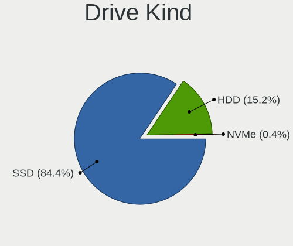
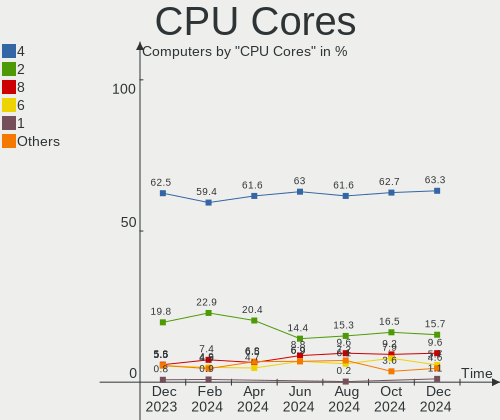
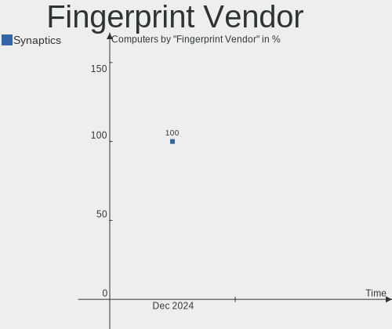

OPNsense Hardware Trends
------------------------

A project to identify most popular hardware characteristics and track their change
over time based on data collected by OPNsense users at https://BSD-Hardware.info.

Anyone can contribute to this report by the [hw-probe](https://github.com/linuxhw/hw-probe/blob/master/INSTALL.BSD.md) tool:

    hw-probe -all -upload

Full-feature report is available here: https://bsd-hardware.info/?view=trends

Period: Mar, 2022.

Contents
--------

* [ System ](#system)
  - [ OS                       ](#os)
  - [ OS Family                ](#os-family)
  - [ Arch                     ](#arch)
  - [ DE                       ](#de)
  - [ Display Server           ](#display-server)
  - [ Display Manager          ](#display-manager)
  - [ OS Lang                  ](#os-lang)
  - [ Boot Mode                ](#boot-mode)
  - [ Filesystem               ](#filesystem)
  - [ Part. scheme             ](#part-scheme)

* [ Board ](#board)
  - [ Vendor                   ](#vendor)
  - [ Model                    ](#model)
  - [ Model Family             ](#model-family)
  - [ MFG Year                 ](#mfg-year)
  - [ Form Factor              ](#form-factor)
  - [ Coreboot                 ](#coreboot)
  - [ RAM Size                 ](#ram-size)
  - [ RAM Used                 ](#ram-used)
  - [ Total Drives             ](#total-drives)
  - [ Has CD-ROM               ](#has-cd-rom)
  - [ Has Ethernet             ](#has-ethernet)
  - [ Has WiFi                 ](#has-wifi)
  - [ Has Bluetooth            ](#has-bluetooth)

* [ Location ](#location)
  - [ Country                  ](#country)
  - [ City                     ](#city)

* [ Drives ](#drives)
  - [ Drive Vendor             ](#drive-vendor)
  - [ Drive Model              ](#drive-model)
  - [ HDD Vendor               ](#hdd-vendor)
  - [ SSD Vendor               ](#ssd-vendor)
  - [ Drive Kind               ](#drive-kind)
  - [ Drive Connector          ](#drive-connector)
  - [ Drive Size               ](#drive-size)
  - [ Space Total              ](#space-total)
  - [ Space Used               ](#space-used)
  - [ Malfunc. Drives          ](#malfunc-drives)
  - [ Malfunc. Drive Vendor    ](#malfunc-drive-vendor)
  - [ Malfunc. HDD Vendor      ](#malfunc-hdd-vendor)
  - [ Malfunc. Drive Kind      ](#malfunc-drive-kind)
  - [ Failed Drives            ](#failed-drives)
  - [ Failed Drive Vendor      ](#failed-drive-vendor)
  - [ Drive Status             ](#drive-status)

* [ Storage controller ](#storage-controller)
  - [ Storage Vendor           ](#storage-vendor)
  - [ Storage Model            ](#storage-model)
  - [ Storage Kind             ](#storage-kind)

* [ Processor ](#processor)
  - [ CPU Vendor               ](#cpu-vendor)
  - [ CPU Model                ](#cpu-model)
  - [ CPU Model Family         ](#cpu-model-family)
  - [ CPU Cores                ](#cpu-cores)
  - [ CPU Sockets              ](#cpu-sockets)
  - [ CPU Threads              ](#cpu-threads)
  - [ CPU Microarch            ](#cpu-microarch)

* [ Graphics ](#graphics)
  - [ GPU Vendor               ](#gpu-vendor)
  - [ GPU Model                ](#gpu-model)
  - [ GPU Combo                ](#gpu-combo)
  - [ GPU Driver               ](#gpu-driver)
  - [ GPU Memory               ](#gpu-memory)

* [ Monitor ](#monitor)
  - [ Monitor Vendor           ](#monitor-vendor)
  - [ Monitor Model            ](#monitor-model)
  - [ Monitor Resolution       ](#monitor-resolution)
  - [ Monitor Diagonal         ](#monitor-diagonal)
  - [ Monitor Width            ](#monitor-width)
  - [ Aspect Ratio             ](#aspect-ratio)
  - [ Monitor Area             ](#monitor-area)
  - [ Pixel Density            ](#pixel-density)
  - [ Multiple Monitors        ](#multiple-monitors)

* [ Network ](#network)
  - [ Net Controller Vendor    ](#net-controller-vendor)
  - [ Net Controller Model     ](#net-controller-model)
  - [ Wireless Vendor          ](#wireless-vendor)
  - [ Wireless Model           ](#wireless-model)
  - [ Ethernet Vendor          ](#ethernet-vendor)
  - [ Ethernet Model           ](#ethernet-model)
  - [ Net Controller Kind      ](#net-controller-kind)
  - [ Used Controller          ](#used-controller)
  - [ NICs                     ](#nics)
  - [ IPv6                     ](#ipv6)

* [ Bluetooth ](#bluetooth)
  - [ Bluetooth Vendor         ](#bluetooth-vendor)
  - [ Bluetooth Model          ](#bluetooth-model)

* [ Sound ](#sound)
  - [ Sound Vendor             ](#sound-vendor)
  - [ Sound Model              ](#sound-model)

* [ Memory ](#memory)
  - [ Memory Vendor            ](#memory-vendor)
  - [ Memory Model             ](#memory-model)
  - [ Memory Kind              ](#memory-kind)
  - [ Memory Form Factor       ](#memory-form-factor)
  - [ Memory Size              ](#memory-size)
  - [ Memory Speed             ](#memory-speed)

* [ Printers & scanners ](#printers--scanners)
  - [ Printer Vendor           ](#printer-vendor)
  - [ Printer Model            ](#printer-model)
  - [ Scanner Vendor           ](#scanner-vendor)
  - [ Scanner Model            ](#scanner-model)

* [ Camera ](#camera)
  - [ Camera Vendor            ](#camera-vendor)
  - [ Camera Model             ](#camera-model)

* [ Security ](#security)
  - [ Fingerprint Vendor       ](#fingerprint-vendor)
  - [ Fingerprint Model        ](#fingerprint-model)
  - [ Chipcard Vendor          ](#chipcard-vendor)
  - [ Chipcard Model           ](#chipcard-model)

* [ Unsupported ](#unsupported)
  - [ Unsupported Devices      ](#unsupported-devices)
  - [ Unsupported Device Types ](#unsupported-device-types)

System
------

OS
--

Installed operating systems

| Name            | Computers | Percent |
|-----------------|-----------|---------|
| OPNsense 22.1.2 | 117       | 39%     |
| OPNsense 22.1.3 | 74        | 24.67%  |
| OPNsense 22.1.4 | 63        | 21%     |
| OPNsense 21.7.8 | 19        | 6.33%   |
| OPNsense 22.1.1 | 11        | 3.67%   |
| OPNsense 22.1   | 7         | 2.33%   |
| OPNsense 22.7   | 2         | 0.67%   |
| OPNsense 21.7.7 | 2         | 0.67%   |
| OPNsense 21.7.6 | 2         | 0.67%   |
| OPNsense 21.7   | 1         | 0.33%   |
| OPNsense 21.1.8 | 1         | 0.33%   |
| OPNsense 21.1   | 1         | 0.33%   |

OS Family
---------

OS without a version

| Name     | Computers | Percent |
|----------|-----------|---------|
| OPNsense | 300       | 100%    |

Arch
----

OS architecture (x86_64, i586, etc.)

| Name  | Computers | Percent |
|-------|-----------|---------|
| amd64 | 297       | 99%     |
| arm64 | 3         | 1%      |

DE
--

Desktop Environment

| Name    | Computers | Percent |
|---------|-----------|---------|
| Console | 300       | 100%    |

Display Server
--------------

X11 or Wayland

| Name    | Computers | Percent |
|---------|-----------|---------|
| Console | 300       | 100%    |

Display Manager
---------------

SDDM, LightDM, etc.

| Name    | Computers | Percent |
|---------|-----------|---------|
| Console | 300       | 100%    |

OS Lang
-------

Language

| Lang    | Computers | Percent |
|---------|-----------|---------|
| Unknown | 296       | 98.67%  |
| C       | 4         | 1.33%   |

Boot Mode
---------

EFI or BIOS

| Mode | Computers | Percent |
|------|-----------|---------|
| EFI  | 280       | 93.33%  |
| BIOS | 20        | 6.67%   |

Filesystem
----------

Type of filesystem

| Type | Computers | Percent |
|------|-----------|---------|
| Ufs  | 202       | 67.33%  |
| Zfs  | 98        | 32.67%  |

Part. scheme
------------

Scheme of partitioning

| Type    | Computers | Percent |
|---------|-----------|---------|
| GPT     | 287       | 95.67%  |
| MBR     | 9         | 3%      |
| Unknown | 4         | 1.33%   |

Board
-----

Vendor
------

Motherboard manufacturer

| Name                       | Computers | Percent |
|----------------------------|-----------|---------|
| Unknown                    | 36        | 12%     |
| Dell                       | 32        | 10.67%  |
| Supermicro                 | 25        | 8.33%   |
| Hewlett-Packard            | 24        | 8%      |
| Protectli                  | 23        | 7.67%   |
| PC Engines                 | 16        | 5.33%   |
| Intel                      | 16        | 5.33%   |
| ASRock                     | 14        | 4.67%   |
| ASUSTek Computer           | 12        | 4%      |
| MSI                        | 10        | 3.33%   |
| Gigabyte Technology        | 10        | 3.33%   |
| AMI                        | 9         | 3%      |
| Lenovo                     | 8         | 2.67%   |
| ZOTAC                      | 6         | 2%      |
| Fujitsu                    | 6         | 2%      |
| BESSTAR Tech               | 6         | 2%      |
| Sophos                     | 4         | 1.33%   |
| Inventec                   | 3         | 1%      |
| Deciso                     | 3         | 1%      |
| ASRockRack                 | 3         | 1%      |
| Seeed Studio               | 2         | 0.67%   |
| Foxconn                    | 2         | 0.67%   |
| Biostar                    | 2         | 0.67%   |
| AWOW                       | 2         | 0.67%   |
| Thomas-Krenn.AG            | 1         | 0.33%   |
| SIEMENS                    | 1         | 0.33%   |
| ShenZhen MinWin Technology | 1         | 0.33%   |
| Secudos                    | 1         | 0.33%   |
| PAIQ                       | 1         | 0.33%   |
| NF541                      | 1         | 0.33%   |
| MW                         | 1         | 0.33%   |
| Lanner                     | 1         | 0.33%   |
| HPE                        | 1         | 0.33%   |
| HARDKERNEL                 | 1         | 0.33%   |
| GEEK+                      | 1         | 0.33%   |
| Fujitsu Siemens            | 1         | 0.33%   |
| friendlyelec               | 1         | 0.33%   |
| Datto                      | 1         | 0.33%   |
| CNCTION-IAF-E3845          | 1         | 0.33%   |
| CNCTION-IAF                | 1         | 0.33%   |
| Cisco                      | 1         | 0.33%   |
| CheckPoint                 | 1         | 0.33%   |
| Beckhoff Automation        | 1         | 0.33%   |
| Barracuda Networks         | 1         | 0.33%   |
| AZW                        | 1         | 0.33%   |
| Apple                      | 1         | 0.33%   |
| AOPEN                      | 1         | 0.33%   |
| AEWIN                      | 1         | 0.33%   |
| Acer                       | 1         | 0.33%   |
| AAEON                      | 1         | 0.33%   |

Model
-----

Motherboard model

| Name                                             | Computers | Percent |
|--------------------------------------------------|-----------|---------|
| Unknown                                          | 39        | 13%     |
| Supermicro Super Server                          | 8         | 2.67%   |
| Protectli FW6                                    | 8         | 2.67%   |
| AMI Aptio CRB                                    | 8         | 2.67%   |
| Protectli VP2410                                 | 6         | 2%      |
| PC Engines apu4                                  | 6         | 2%      |
| Intel Q3XXG4-P V1.0                              | 6         | 2%      |
| Protectli FW4B                                   | 5         | 1.67%   |
| PC Engines APU2                                  | 5         | 1.67%   |
| HP t730 Thin Client                              | 5         | 1.67%   |
| BESSTAR Tech GK41                                | 4         | 1.33%   |
| ASUS All Series                                  | 4         | 1.33%   |
| HP t620 PLUS Quad Core TC                        | 3         | 1%      |
| ZOTAC ZBOX-CI329NANO                             | 2         | 0.67%   |
| ZOTAC ZBOX-CI323NANO                             | 2         | 0.67%   |
| Supermicro X9SCL/X9SCM                           | 2         | 0.67%   |
| Supermicro A1SAi                                 | 2         | 0.67%   |
| Sophos SG                                        | 2         | 0.67%   |
| Seeed Studio ODYSSEY-X86J4105                    | 2         | 0.67%   |
| Protectli FW2B                                   | 2         | 0.67%   |
| PC Engines APU3                                  | 2         | 0.67%   |
| PC Engines APU                                   | 2         | 0.67%   |
| Lenovo ThinkCentre E73 10AU003DUK                | 2         | 0.67%   |
| HP ProLiant MicroServer Gen8                     | 2         | 0.67%   |
| Gigabyte N3150ND3V                               | 2         | 0.67%   |
| Dell Precision 3440                              | 2         | 0.67%   |
| Dell PowerEdge R610                              | 2         | 0.67%   |
| Dell PowerEdge R210 II                           | 2         | 0.67%   |
| Dell OptiPlex 7010                               | 2         | 0.67%   |
| Dell OptiPlex 5050                               | 2         | 0.67%   |
| Dell OptiPlex 3020                               | 2         | 0.67%   |
| Deciso Netboard A20                              | 2         | 0.67%   |
| ZOTAC ZBOX-ID92/ZBOX-IQ01                        | 1         | 0.33%   |
| ZOTAC ZBOX-CI341                                 | 1         | 0.33%   |
| Thomas-Krenn.AG P9A-I/C2750/4L                   | 1         | 0.33%   |
| Supermicro X9SCAA/-L                             | 1         | 0.33%   |
| Supermicro X9SAE                                 | 1         | 0.33%   |
| Supermicro X8DTU-LN4+                            | 1         | 0.33%   |
| Supermicro X7SPA-H                               | 1         | 0.33%   |
| Supermicro X10SLL-F                              | 1         | 0.33%   |
| Supermicro X10SLH-N6-ST031                       | 1         | 0.33%   |
| Supermicro X10SLH-F/X10SLM+-F                    | 1         | 0.33%   |
| Supermicro TS-150                                | 1         | 0.33%   |
| Supermicro SYS-6028R-TRT                         | 1         | 0.33%   |
| Supermicro SYS-5018A-TN4                         | 1         | 0.33%   |
| Supermicro SwyxExpress                           | 1         | 0.33%   |
| Supermicro HYVE-ZEUS                             | 1         | 0.33%   |
| Supermicro 1HE Intel Single-CPU RI1101H-F Server | 1         | 0.33%   |
| Sophos XG                                        | 1         | 0.33%   |
| Sophos UTM                                       | 1         | 0.33%   |
| SIEMENS SIMATIC IPC127E                          | 1         | 0.33%   |
| ShenZhen MinWin MW-NANO-APL-4L                   | 1         | 0.33%   |
| Protectli FW4A                                   | 1         | 0.33%   |
| Protectli FW2                                    | 1         | 0.33%   |
| PC Engines apu1                                  | 1         | 0.33%   |
| PAIQ EC3-BT19D4L                                 | 1         | 0.33%   |
| NF541 1.0                                        | 1         | 0.33%   |
| MW GMLK-2_5G4L                                   | 1         | 0.33%   |
| MSI MS-7850                                      | 1         | 0.33%   |
| MSI MS-7808                                      | 1         | 0.33%   |

Model Family
------------

Motherboard model prefix

| Name                           | Computers | Percent |
|--------------------------------|-----------|---------|
| Unknown                        | 39        | 13%     |
| Dell OptiPlex                  | 16        | 5.33%   |
| Dell PowerEdge                 | 9         | 3%      |
| Supermicro Super               | 8         | 2.67%   |
| Protectli FW6                  | 8         | 2.67%   |
| AMI Aptio                      | 8         | 2.67%   |
| Protectli VP2410               | 6         | 2%      |
| PC Engines apu4                | 6         | 2%      |
| Intel Q3XXG4-P                 | 6         | 2%      |
| Protectli FW4B                 | 5         | 1.67%   |
| PC Engines APU2                | 5         | 1.67%   |
| Lenovo ThinkCentre             | 5         | 1.67%   |
| HP t730                        | 5         | 1.67%   |
| HP ProLiant                    | 5         | 1.67%   |
| HP EliteDesk                   | 4         | 1.33%   |
| Dell Precision                 | 4         | 1.33%   |
| BESSTAR Tech GK41              | 4         | 1.33%   |
| ASUS All                       | 4         | 1.33%   |
| HP t620                        | 3         | 1%      |
| Fujitsu ESPRIMO                | 3         | 1%      |
| Deciso Netboard                | 3         | 1%      |
| ZOTAC ZBOX-CI329NANO           | 2         | 0.67%   |
| ZOTAC ZBOX-CI323NANO           | 2         | 0.67%   |
| Supermicro X9SCL               | 2         | 0.67%   |
| Supermicro A1SAi               | 2         | 0.67%   |
| Sophos SG                      | 2         | 0.67%   |
| Seeed Studio ODYSSEY-X86J4105  | 2         | 0.67%   |
| Protectli FW2B                 | 2         | 0.67%   |
| PC Engines APU3                | 2         | 0.67%   |
| PC Engines APU                 | 2         | 0.67%   |
| Lenovo ThinkPad                | 2         | 0.67%   |
| HP Compaq                      | 2         | 0.67%   |
| Gigabyte N3150ND3V             | 2         | 0.67%   |
| Fujitsu FUTRO                  | 2         | 0.67%   |
| Dell Inspiron                  | 2         | 0.67%   |
| ASUS PRIME                     | 2         | 0.67%   |
| ASRock B450M                   | 2         | 0.67%   |
| ZOTAC ZBOX-ID92                | 1         | 0.33%   |
| ZOTAC ZBOX-CI341               | 1         | 0.33%   |
| Thomas-Krenn.AG P9A-I          | 1         | 0.33%   |
| Supermicro X9SCAA              | 1         | 0.33%   |
| Supermicro X9SAE               | 1         | 0.33%   |
| Supermicro X8DTU-LN4+          | 1         | 0.33%   |
| Supermicro X7SPA-H             | 1         | 0.33%   |
| Supermicro X10SLL-F            | 1         | 0.33%   |
| Supermicro X10SLH-N6-ST031     | 1         | 0.33%   |
| Supermicro X10SLH-F            | 1         | 0.33%   |
| Supermicro TS-150              | 1         | 0.33%   |
| Supermicro SYS-6028R-TRT       | 1         | 0.33%   |
| Supermicro SYS-5018A-TN4       | 1         | 0.33%   |
| Supermicro SwyxExpress         | 1         | 0.33%   |
| Supermicro HYVE-ZEUS           | 1         | 0.33%   |
| Supermicro 1HE                 | 1         | 0.33%   |
| Sophos XG                      | 1         | 0.33%   |
| Sophos UTM                     | 1         | 0.33%   |
| SIEMENS SIMATIC                | 1         | 0.33%   |
| ShenZhen MinWin MW-NANO-APL-4L | 1         | 0.33%   |
| Protectli FW4A                 | 1         | 0.33%   |
| Protectli FW2                  | 1         | 0.33%   |
| PC Engines apu1                | 1         | 0.33%   |

MFG Year
--------

Motherboard manufacture year

| Year    | Computers | Percent |
|---------|-----------|---------|
| 2021    | 49        | 16.33%  |
| 2019    | 41        | 13.67%  |
| 2020    | 33        | 11%     |
| 2014    | 33        | 11%     |
| 2018    | 29        | 9.67%   |
| 2016    | 23        | 7.67%   |
| 2012    | 18        | 6%      |
| 2017    | 17        | 5.67%   |
| 2015    | 17        | 5.67%   |
| 2013    | 17        | 5.67%   |
| 2011    | 11        | 3.67%   |
| 2010    | 5         | 1.67%   |
| 2022    | 3         | 1%      |
| 2009    | 3         | 1%      |
| Unknown | 1         | 0.33%   |

Form Factor
-----------

Physical design of the computer

| Name        | Computers | Percent |
|-------------|-----------|---------|
| Desktop     | 214       | 71.33%  |
| Mini pc     | 39        | 13%     |
| Server      | 28        | 9.33%   |
| Firewall    | 9         | 3%      |
| Notebook    | 9         | 3%      |
| Convertible | 1         | 0.33%   |

Coreboot
--------

Have coreboot on board

| Used | Computers | Percent |
|------|-----------|---------|
| No   | 276       | 92%     |
| Yes  | 24        | 8%      |

RAM Size
--------

Total RAM memory

| Size in GB  | Computers | Percent |
|-------------|-----------|---------|
| 8.01-16.0   | 105       | 35%     |
| 4.01-8.0    | 84        | 28%     |
| 16.01-24.0  | 70        | 23.33%  |
| 32.01-64.0  | 24        | 8%      |
| 2.01-3.0    | 7         | 2.33%   |
| 64.01-256.0 | 6         | 2%      |
| 24.01-32.0  | 2         | 0.67%   |
| 3.01-4.0    | 1         | 0.33%   |
| 0.51-1.0    | 1         | 0.33%   |

RAM Used
--------

Used RAM memory

| Used GB   | Computers | Percent |
|-----------|-----------|---------|
| 0.01-0.5  | 156       | 52%     |
| 0.51-1.0  | 104       | 34.67%  |
| 1.01-2.0  | 24        | 8%      |
| 3.01-4.0  | 7         | 2.33%   |
| 4.01-8.0  | 4         | 1.33%   |
| 2.01-3.0  | 3         | 1%      |
| 8.01-16.0 | 1         | 0.33%   |
| 0         | 1         | 0.33%   |

Total Drives
------------

Number of drives on board

| Drives | Computers | Percent |
|--------|-----------|---------|
| 1      | 239       | 79.67%  |
| 2      | 29        | 9.67%   |
| 0      | 26        | 8.67%   |
| 4      | 3         | 1%      |
| 3      | 3         | 1%      |

Has CD-ROM
----------

Has CD-ROM on board

| Presented | Computers | Percent |
|-----------|-----------|---------|
| No        | 254       | 84.67%  |
| Yes       | 46        | 15.33%  |

Has Ethernet
------------

Has Ethernet on board

| Presented | Computers | Percent |
|-----------|-----------|---------|
| Yes       | 298       | 99.33%  |
| No        | 2         | 0.67%   |

Has WiFi
--------

Has WiFi module

| Presented | Computers | Percent |
|-----------|-----------|---------|
| No        | 246       | 82%     |
| Yes       | 54        | 18%     |

Has Bluetooth
-------------

Has Bluetooth module

| Presented | Computers | Percent |
|-----------|-----------|---------|
| No        | 270       | 90%     |
| Yes       | 30        | 10%     |

Location
--------

Country
-------

Geographic location (country)

| Country      | Computers | Percent |
|--------------|-----------|---------|
| USA          | 103       | 34.33%  |
| Germany      | 55        | 18.33%  |
| UK           | 16        | 5.33%   |
| France       | 14        | 4.67%   |
| Canada       | 10        | 3.33%   |
| Netherlands  | 9         | 3%      |
| Romania      | 8         | 2.67%   |
| Switzerland  | 7         | 2.33%   |
| Poland       | 7         | 2.33%   |
| Australia    | 7         | 2.33%   |
| China        | 6         | 2%      |
| Austria      | 6         | 2%      |
| Sweden       | 4         | 1.33%   |
| Spain        | 3         | 1%      |
| Portugal     | 3         | 1%      |
| Norway       | 3         | 1%      |
| Japan        | 3         | 1%      |
| Finland      | 3         | 1%      |
| Czechia      | 3         | 1%      |
| South Korea  | 2         | 0.67%   |
| Slovenia     | 2         | 0.67%   |
| Russia       | 2         | 0.67%   |
| Italy        | 2         | 0.67%   |
| India        | 2         | 0.67%   |
| Brazil       | 2         | 0.67%   |
| Argentina    | 2         | 0.67%   |
| South Africa | 1         | 0.33%   |
| Slovakia     | 1         | 0.33%   |
| Singapore    | 1         | 0.33%   |
| Paraguay     | 1         | 0.33%   |
| Madagascar   | 1         | 0.33%   |
| Luxembourg   | 1         | 0.33%   |
| Lithuania    | 1         | 0.33%   |
| Latvia       | 1         | 0.33%   |
| Israel       | 1         | 0.33%   |
| Isle of Man  | 1         | 0.33%   |
| Indonesia    | 1         | 0.33%   |
| Hong Kong    | 1         | 0.33%   |
| Egypt        | 1         | 0.33%   |
| Denmark      | 1         | 0.33%   |
| Cyprus       | 1         | 0.33%   |
| Belgium      | 1         | 0.33%   |

City
----

Geographic location (city)

| City              | Computers | Percent |
|-------------------|-----------|---------|
| Bucharest         | 6         | 2%      |
| Hamburg           | 5         | 1.67%   |
| Berlin            | 5         | 1.67%   |
| Munich            | 3         | 1%      |
| Hamm              | 3         | 1%      |
| Brisbane          | 3         | 1%      |
| Victoria          | 2         | 0.67%   |
| Toulouse          | 2         | 0.67%   |
| Surrey            | 2         | 0.67%   |
| Stuttgart         | 2         | 0.67%   |
| St. Moritz        | 2         | 0.67%   |
| Springfield       | 2         | 0.67%   |
| Seattle           | 2         | 0.67%   |
| Reutlingen        | 2         | 0.67%   |
| Portland          | 2         | 0.67%   |
| Oakland           | 2         | 0.67%   |
| National Park     | 2         | 0.67%   |
| Montfermeil       | 2         | 0.67%   |
| Milwaukee         | 2         | 0.67%   |
| Mettmenstetten    | 2         | 0.67%   |
| Melbourne         | 2         | 0.67%   |
| Mannheim          | 2         | 0.67%   |
| Madrid            | 2         | 0.67%   |
| Las Vegas         | 2         | 0.67%   |
| Krakow            | 2         | 0.67%   |
| Houston           | 2         | 0.67%   |
| Herford           | 2         | 0.67%   |
| Yafa              | 1         | 0.33%   |
| Wuppertal         | 1         | 0.33%   |
| Wroclaw           | 1         | 0.33%   |
| Woodstock         | 1         | 0.33%   |
| Weissach          | 1         | 0.33%   |
| Weidlingbach      | 1         | 0.33%   |
| Warsaw            | 1         | 0.33%   |
| Warminster        | 1         | 0.33%   |
| Venda do Pinheiro | 1         | 0.33%   |
| Vaasa             | 1         | 0.33%   |
| Union City        | 1         | 0.33%   |
| Tucson            | 1         | 0.33%   |
| Torrance          | 1         | 0.33%   |
| Timișoara        | 1         | 0.33%   |
| Thionville        | 1         | 0.33%   |
| Tamm              | 1         | 0.33%   |
| Tai Po            | 1         | 0.33%   |
| Sydney            | 1         | 0.33%   |
| Swindon           | 1         | 0.33%   |
| Swansea           | 1         | 0.33%   |
| Sundsvall         | 1         | 0.33%   |
| Stratford         | 1         | 0.33%   |
| Stoke Newington   | 1         | 0.33%   |
| Stockholm         | 1         | 0.33%   |
| Steckborn         | 1         | 0.33%   |
| Statesboro        | 1         | 0.33%   |
| Sparks            | 1         | 0.33%   |
| Southfield        | 1         | 0.33%   |
| South Jordan      | 1         | 0.33%   |
| Soest             | 1         | 0.33%   |
| Singapore         | 1         | 0.33%   |
| Shinnston         | 1         | 0.33%   |
| Shanghai          | 1         | 0.33%   |

Drives
------

Drive Vendor
------------

Hard drive vendors

| Vendor              | Computers | Drives | Percent |
|---------------------|-----------|--------|---------|
| Samsung Electronics | 45        | 51     | 15.1%   |
| Transcend           | 27        | 27     | 9.06%   |
| Kingston            | 24        | 25     | 8.05%   |
| WDC                 | 23        | 27     | 7.72%   |
| China               | 19        | 19     | 6.38%   |
| SanDisk             | 17        | 18     | 5.7%    |
| Seagate             | 15        | 16     | 5.03%   |
| Intel               | 12        | 15     | 4.03%   |
| Crucial             | 11        | 12     | 3.69%   |
| Phison              | 8         | 8      | 2.68%   |
| Protectli           | 7         | 7      | 2.35%   |
| Toshiba             | 6         | 10     | 2.01%   |
| Hoodisk             | 6         | 6      | 2.01%   |
| Hitachi             | 5         | 6      | 1.68%   |
| Dogfish             | 5         | 5      | 1.68%   |
| Micron Technology   | 4         | 4      | 1.34%   |
| FORESEE             | 4         | 4      | 1.34%   |
| Apacer              | 4         | 4      | 1.34%   |
| SPCC                | 3         | 4      | 1.01%   |
| SK Hynix            | 3         | 3      | 1.01%   |
| Innodisk            | 3         | 3      | 1.01%   |
| HGST                | 3         | 3      | 1.01%   |
| Gigabyte Technology | 3         | 3      | 1.01%   |
| A-DATA Technology   | 3         | 3      | 1.01%   |
| PNY                 | 2         | 3      | 0.67%   |
| OCZ                 | 2         | 2      | 0.67%   |
| LITEON              | 2         | 3      | 0.67%   |
| Kston               | 2         | 2      | 0.67%   |
| Hewlett-Packard     | 2         | 2      | 0.67%   |
| Wicgtyp             | 1         | 1      | 0.34%   |
| Verbatim            | 1         | 1      | 0.34%   |
| Valuetech           | 1         | 2      | 0.34%   |
| UDinfo              | 1         | 1      | 0.34%   |
| Team                | 1         | 1      | 0.34%   |
| SSSTC               | 1         | 1      | 0.34%   |
| ShiJi               | 1         | 1      | 0.34%   |
| Pioneer             | 1         | 1      | 0.34%   |
| Patriot             | 1         | 2      | 0.34%   |
| Netac               | 1         | 1      | 0.34%   |
| MyDigitalSSD        | 1         | 1      | 0.34%   |
| Mushkin             | 1         | 2      | 0.34%   |
| Marvell             | 1         | 1      | 0.34%   |
| LITEONIT            | 1         | 1      | 0.34%   |
| Lexar               | 1         | 1      | 0.34%   |
| Leven               | 1         | 1      | 0.34%   |
| KIOXIA-EXCERIA      | 1         | 1      | 0.34%   |
| KIOXIA              | 1         | 1      | 0.34%   |
| KingSpec            | 1         | 1      | 0.34%   |
| Intenso             | 1         | 1      | 0.34%   |
| Integral            | 1         | 1      | 0.34%   |
| HPE                 | 1         | 1      | 0.34%   |
| HCiPC               | 1         | 1      | 0.34%   |
| faspeed             | 1         | 1      | 0.34%   |
| Corsair             | 1         | 1      | 0.34%   |
| BIWIN               | 1         | 1      | 0.34%   |
| Biostar             | 1         | 1      | 0.34%   |
| AirDisk             | 1         | 1      | 0.34%   |

Drive Model
-----------

Hard drive models

| Model                           | Computers | Percent |
|---------------------------------|-----------|---------|
| Transcend TS64GMSA230S 64GB     | 5         | 1.64%   |
| Transcend TS32GSSD370S 32GB     | 4         | 1.32%   |
| Kingston SUV500MS120G 120GB     | 4         | 1.32%   |
| FORESEE 128GB SSD               | 4         | 1.32%   |
| China SATA SSD 16GB             | 4         | 1.32%   |
| Samsung SSD 860 EVO 500GB       | 3         | 0.99%   |
| Samsung SSD 850 EVO 500GB       | 3         | 0.99%   |
| Protectli 120GB mSATA           | 3         | 0.99%   |
| Phison SATA SSD 16GB            | 3         | 0.99%   |
| Kingston SKC600MS256G 256GB     | 3         | 0.99%   |
| Kingston SA400M8240G 240GB      | 3         | 0.99%   |
| Dogfish SSD 128GB               | 3         | 0.99%   |
| Crucial CT240BX500SSD1 240GB    | 3         | 0.99%   |
| China SATA SSD 120GB            | 3         | 0.99%   |
| WDC WDS240G2G0A-00JH30 240GB    | 2         | 0.66%   |
| WDC WD5003ABYZ-011FA0 500GB     | 2         | 0.66%   |
| WDC WD2003FYYS-02W0B0 2TB       | 2         | 0.66%   |
| Transcend TS64GSSD370 64GB      | 2         | 0.66%   |
| Transcend TS64GMSA370 64GB      | 2         | 0.66%   |
| Transcend TS32GMSA370 32GB      | 2         | 0.66%   |
| Transcend TS128GMSA230S 128GB   | 2         | 0.66%   |
| Toshiba MG03ACA100 1TB          | 2         | 0.66%   |
| SPCC Solid State Disk 256GB     | 2         | 0.66%   |
| Seagate ST3160815AS 160GB       | 2         | 0.66%   |
| Seagate ST250DM000-1BD141 250GB | 2         | 0.66%   |
| Seagate ST1000DM010-2EP102 1TB  | 2         | 0.66%   |
| SanDisk SDSSDA240G 240GB        | 2         | 0.66%   |
| SanDisk SDSSDA120G 120GB        | 2         | 0.66%   |
| Samsung SSD 870 EVO 500GB       | 2         | 0.66%   |
| Samsung SSD 870 EVO 250GB       | 2         | 0.66%   |
| Samsung SSD 860 EVO 250GB       | 2         | 0.66%   |
| Samsung SSD 850 PRO 256GB       | 2         | 0.66%   |
| Samsung SSD 840 Series 250GB    | 2         | 0.66%   |
| Samsung SSD 840 EVO 250GB       | 2         | 0.66%   |
| Samsung SSD 840 EVO 120GB       | 2         | 0.66%   |
| Kingston SUV500MS240G 240GB     | 2         | 0.66%   |
| Kingston SA400S37120G 120GB     | 2         | 0.66%   |
| Intel SSDSC2BB080G4 80GB        | 2         | 0.66%   |
| Hoodisk SSD 64GB                | 2         | 0.66%   |
| Hoodisk SSD 512GB               | 2         | 0.66%   |
| Hoodisk SSD 32GB                | 2         | 0.66%   |
| Dogfish SSD 256GB               | 2         | 0.66%   |
| Crucial M4-CT128M4SSD2 128GB    | 2         | 0.66%   |
| Crucial CT500P1SSD8 500GB       | 2         | 0.66%   |
| China M10C 256GB                | 2         | 0.66%   |
| Apacer 16GB SATA Flash Drive    | 2         | 0.66%   |
| Wicgtyp M900-128 128GB          | 1         | 0.33%   |
| WDC WDS500G2B0A-00SM50 500GB    | 1         | 0.33%   |
| WDC WDS500G1R0B-68A4Z0 500GB    | 1         | 0.33%   |
| WDC WDS240G2G0B-00EPW0 240GB    | 1         | 0.33%   |
| WDC WDS120G2G0A-00JH30 120GB    | 1         | 0.33%   |
| WDC WDS100T2B0A-00SM50 1TB      | 1         | 0.33%   |
| WDC WD5003ABYX-18WERA0 500GB    | 1         | 0.33%   |
| WDC WD5000LPCX-24C6HT0 500GB    | 1         | 0.33%   |
| WDC WD5000AVDS-63U7B1 500GB     | 1         | 0.33%   |
| WDC WD5000AAKX-083CA1 500GB     | 1         | 0.33%   |
| WDC WD5000AAKX-001CA0 500GB     | 1         | 0.33%   |
| WDC WD5000AAKS-07V0A0 500GB     | 1         | 0.33%   |
| WDC WD3200LPVX-60V0TT0 320GB    | 1         | 0.33%   |
| WDC WD3200BEVT-22A23T0 320GB    | 1         | 0.33%   |

HDD Vendor
----------

Hard disk drive vendors

| Vendor          | Computers | Drives | Percent |
|-----------------|-----------|--------|---------|
| WDC             | 16        | 20     | 34.78%  |
| Seagate         | 15        | 16     | 32.61%  |
| Toshiba         | 5         | 9      | 10.87%  |
| Hitachi         | 5         | 6      | 10.87%  |
| HGST            | 3         | 3      | 6.52%   |
| Hewlett-Packard | 2         | 2      | 4.35%   |

SSD Vendor
----------

Solid state drive vendors

| Vendor              | Computers | Drives | Percent |
|---------------------|-----------|--------|---------|
| Samsung Electronics | 35        | 40     | 15.63%  |
| Transcend           | 26        | 26     | 11.61%  |
| Kingston            | 23        | 24     | 10.27%  |
| China               | 19        | 19     | 8.48%   |
| SanDisk             | 17        | 18     | 7.59%   |
| Intel               | 9         | 11     | 4.02%   |
| Crucial             | 8         | 8      | 3.57%   |
| WDC                 | 7         | 7      | 3.13%   |
| Protectli           | 7         | 7      | 3.13%   |
| Phison              | 7         | 7      | 3.13%   |
| Hoodisk             | 6         | 6      | 2.68%   |
| Dogfish             | 5         | 5      | 2.23%   |
| Micron Technology   | 4         | 4      | 1.79%   |
| FORESEE             | 4         | 4      | 1.79%   |
| Apacer              | 4         | 4      | 1.79%   |
| SPCC                | 3         | 4      | 1.34%   |
| InnoDisk            | 3         | 3      | 1.34%   |
| PNY                 | 2         | 3      | 0.89%   |
| OCZ                 | 2         | 2      | 0.89%   |
| LITEON              | 2         | 3      | 0.89%   |
| Kston               | 2         | 2      | 0.89%   |
| A-DATA Technology   | 2         | 2      | 0.89%   |
| Wicgtyp             | 1         | 1      | 0.45%   |
| Verbatim            | 1         | 1      | 0.45%   |
| Valuetech           | 1         | 2      | 0.45%   |
| UDinfo              | 1         | 1      | 0.45%   |
| Toshiba             | 1         | 1      | 0.45%   |
| ShiJi               | 1         | 1      | 0.45%   |
| Pioneer             | 1         | 1      | 0.45%   |
| Patriot             | 1         | 2      | 0.45%   |
| Netac               | 1         | 1      | 0.45%   |
| MyDigitalSSD        | 1         | 1      | 0.45%   |
| Mushkin             | 1         | 2      | 0.45%   |
| Marvell             | 1         | 1      | 0.45%   |
| LITEONIT            | 1         | 1      | 0.45%   |
| Lexar               | 1         | 1      | 0.45%   |
| Leven               | 1         | 1      | 0.45%   |
| KIOXIA-EXCERIA      | 1         | 1      | 0.45%   |
| KingSpec            | 1         | 1      | 0.45%   |
| Intenso             | 1         | 1      | 0.45%   |
| Integral            | 1         | 1      | 0.45%   |
| HPE                 | 1         | 1      | 0.45%   |
| HCiPC               | 1         | 1      | 0.45%   |
| Gigabyte Technology | 1         | 1      | 0.45%   |
| faspeed             | 1         | 1      | 0.45%   |
| Corsair             | 1         | 1      | 0.45%   |
| BIWIN               | 1         | 1      | 0.45%   |
| Biostar             | 1         | 1      | 0.45%   |
| AirDisk             | 1         | 1      | 0.45%   |

Drive Kind
----------

HDD or SSD

| Kind | Computers | Drives | Percent |
|------|-----------|--------|---------|
| SSD  | 213       | 239    | 74.74%  |
| HDD  | 43        | 56     | 15.09%  |
| NVMe | 29        | 31     | 10.18%  |

Drive Connector
---------------

SATA, SAS, NVMe, etc.

| Type | Computers | Drives | Percent |
|------|-----------|--------|---------|
| SATA | 249       | 295    | 89.57%  |
| NVMe | 29        | 31     | 10.43%  |

Drive Size
----------

Size of hard drive

| Size in TB | Computers | Drives | Percent |
|------------|-----------|--------|---------|
| 0.01-0.5   | 228       | 267    | 90.12%  |
| 0.51-1.0   | 19        | 21     | 7.51%   |
| 1.01-2.0   | 6         | 7      | 2.37%   |

Space Total
-----------

Amount of disk space available on the file system

| Size in GB | Computers | Percent |
|------------|-----------|---------|
| 101-250    | 149       | 49.67%  |
| 21-50      | 42        | 14%     |
| 251-500    | 38        | 12.67%  |
| 51-100     | 30        | 10%     |
| 1-20       | 21        | 7%      |
| 501-1000   | 13        | 4.33%   |
| 1001-2000  | 6         | 2%      |
| Unknown    | 1         | 0.33%   |

Space Used
----------

Amount of used disk space

| Used GB | Computers | Percent |
|---------|-----------|---------|
| 1-20    | 286       | 95.33%  |
| 21-50   | 10        | 3.33%   |
| 51-100  | 3         | 1%      |
| Unknown | 1         | 0.33%   |

Malfunc. Drives
---------------

Drive models with a malfunction

| Model                                            | Computers | Drives | Percent |
|--------------------------------------------------|-----------|--------|---------|
| WDC WD5000AAKX-083CA1 500GB                      | 1         | 1      | 3.45%   |
| WDC WD3200BEVT-22A23T0 320GB                     | 1         | 1      | 3.45%   |
| WDC WD2503ABYX-01WERA1 256GB                     | 1         | 1      | 3.45%   |
| WDC WD2500AAKX-321CA0 250GB                      | 1         | 1      | 3.45%   |
| WDC WD2500AAJS-75M0A0 250GB                      | 1         | 1      | 3.45%   |
| WDC WD2500AAJS-60B4A0 250GB                      | 1         | 2      | 3.45%   |
| Toshiba MK1655GSX 160GB                          | 1         | 1      | 3.45%   |
| SPCC Solid State Disk 256GB                      | 1         | 1      | 3.45%   |
| Seagate ST9320423AS 320GB                        | 1         | 1      | 3.45%   |
| Seagate ST3500418AS 500GB                        | 1         | 1      | 3.45%   |
| Seagate ST3500413AS 500GB                        | 1         | 1      | 3.45%   |
| Seagate ST3160815AS 160GB                        | 1         | 1      | 3.45%   |
| Seagate ST2000DM001-1E6164 2TB                   | 1         | 1      | 3.45%   |
| Seagate ST1000NM0011 1TB                         | 1         | 1      | 3.45%   |
| SanDisk SDSSDA240G 240GB                         | 1         | 2      | 3.45%   |
| SanDisk SDCFHS-016G                              | 1         | 1      | 3.45%   |
| Samsung Electronics SSD PM810 2.5-inch 7mm 128GB | 1         | 1      | 3.45%   |
| Micron Technology 5100_MTFDDAK240TCB 240GB       | 1         | 1      | 3.45%   |
| Marvell SATAIII 16GB                             | 1         | 1      | 3.45%   |
| Kingston SNS4151S316GD 16GB                      | 1         | 1      | 3.45%   |
| Intel SSDSC2BB120G4 120GB                        | 1         | 2      | 3.45%   |
| Intel SSDSA2BW160G3H 160GB                       | 1         | 1      | 3.45%   |
| Innodisk 2.5-inch SATA SSD 3ME2 128GB            | 1         | 1      | 3.45%   |
| Hitachi HTS541040G9SA00 40GB                     | 1         | 1      | 3.45%   |
| Hitachi HDT725032VLA360 320GB                    | 1         | 2      | 3.45%   |
| Dogfish SSD 128GB                                | 1         | 1      | 3.45%   |
| China XJH-32GB                                   | 1         | 1      | 3.45%   |
| China NGFF 2280 128GB SSD                        | 1         | 1      | 3.45%   |
| Apacer 16GB SATA Flash Drive                     | 1         | 1      | 3.45%   |

Malfunc. Drive Vendor
---------------------

Vendors of faulty drives

| Vendor              | Computers | Drives | Percent |
|---------------------|-----------|--------|---------|
| WDC                 | 6         | 7      | 20.69%  |
| Seagate             | 6         | 6      | 20.69%  |
| SanDisk             | 2         | 3      | 6.9%    |
| Intel               | 2         | 3      | 6.9%    |
| Hitachi             | 2         | 3      | 6.9%    |
| China               | 2         | 2      | 6.9%    |
| Toshiba             | 1         | 1      | 3.45%   |
| SPCC                | 1         | 1      | 3.45%   |
| Samsung Electronics | 1         | 1      | 3.45%   |
| Micron Technology   | 1         | 1      | 3.45%   |
| Marvell             | 1         | 1      | 3.45%   |
| Kingston            | 1         | 1      | 3.45%   |
| Innodisk            | 1         | 1      | 3.45%   |
| Dogfish             | 1         | 1      | 3.45%   |
| Apacer              | 1         | 1      | 3.45%   |

Malfunc. HDD Vendor
-------------------

Vendors of faulty HDD drives

| Vendor  | Computers | Drives | Percent |
|---------|-----------|--------|---------|
| WDC     | 6         | 7      | 40%     |
| Seagate | 6         | 6      | 40%     |
| Hitachi | 2         | 3      | 13.33%  |
| Toshiba | 1         | 1      | 6.67%   |

Malfunc. Drive Kind
-------------------

Kinds of faulty drives

| Kind | Computers | Drives | Percent |
|------|-----------|--------|---------|
| HDD  | 15        | 17     | 51.72%  |
| SSD  | 14        | 16     | 48.28%  |

Failed Drives
-------------

Failed drive models

Zero info for selected period =(

Failed Drive Vendor
-------------------

Failed drive vendors

Zero info for selected period =(

Drive Status
------------

Number of failed and malfunc. drives

| Status   | Computers | Drives | Percent |
|----------|-----------|--------|---------|
| Works    | 245       | 287    | 87.5%   |
| Malfunc  | 29        | 33     | 10.36%  |
| Detected | 6         | 6      | 2.14%   |

Storage controller
------------------

Storage Vendor
--------------

Storage controller vendors

| Vendor                         | Computers | Percent |
|--------------------------------|-----------|---------|
| Intel                          | 240       | 70.59%  |
| AMD                            | 52        | 15.29%  |
| Samsung Electronics            | 11        | 3.24%   |
| Broadcom / LSI                 | 9         | 2.65%   |
| ASMedia Technology             | 6         | 1.76%   |
| SK Hynix                       | 3         | 0.88%   |
| Phison Electronics             | 3         | 0.88%   |
| Micron/Crucial Technology      | 3         | 0.88%   |
| Chelsio Communications         | 3         | 0.88%   |
| Shenzhen Longsys Electronics   | 2         | 0.59%   |
| Hewlett-Packard                | 2         | 0.59%   |
| Solid State Storage Technology | 1         | 0.29%   |
| Marvell Technology Group       | 1         | 0.29%   |
| KIOXIA                         | 1         | 0.29%   |
| Kingston Technology Company    | 1         | 0.29%   |
| ADATA Technology               | 1         | 0.29%   |
| Unknown                        | 1         | 0.29%   |

Storage Model
-------------

Storage controller models

| Model                                                                                   | Computers | Percent |
|-----------------------------------------------------------------------------------------|-----------|---------|
| AMD FCH SATA Controller [AHCI mode]                                                     | 35        | 9.09%   |
| Intel 8 Series/C220 Series Chipset Family 6-port SATA Controller 1 [AHCI mode]          | 31        | 8.05%   |
| Intel Celeron/Pentium Silver Processor SATA Controller                                  | 27        | 7.01%   |
| Intel Atom Processor E3800 Series SATA AHCI Controller                                  | 20        | 5.19%   |
| Intel Sunrise Point-LP SATA Controller [AHCI mode]                                      | 18        | 4.68%   |
| Intel Atom/Celeron/Pentium Processor x5-E8000/J3xxx/N3xxx Series SATA Controller        | 16        | 4.16%   |
| Intel 6 Series/C200 Series Chipset Family 6 port Desktop SATA AHCI Controller           | 14        | 3.64%   |
| Intel Atom processor C2000 AHCI SATA3 Controller                                        | 9         | 2.34%   |
| Intel Celeron N3350/Pentium N4200/Atom E3900 Series SATA AHCI Controller                | 8         | 2.08%   |
| Intel 7 Series/C210 Series Chipset Family 6-port SATA Controller [AHCI mode]            | 8         | 2.08%   |
| AMD SB7x0/SB8x0/SB9x0 SATA Controller [AHCI mode]                                       | 7         | 1.82%   |
| AMD FCH SATA Controller [IDE mode]                                                      | 7         | 1.82%   |
| Intel Comet Lake SATA AHCI Controller                                                   | 6         | 1.56%   |
| Intel Cannon Lake PCH SATA AHCI Controller                                              | 6         | 1.56%   |
| Intel 200 Series PCH SATA controller [AHCI mode]                                        | 6         | 1.56%   |
| ASMedia ASM1062 Serial ATA Controller                                                   | 6         | 1.56%   |
| Intel Wildcat Point-LP SATA Controller [AHCI Mode]                                      | 5         | 1.3%    |
| Intel Q170/Q150/B150/H170/H110/Z170/CM236 Chipset SATA Controller [AHCI Mode]           | 5         | 1.3%    |
| Intel NM10/ICH7 Family SATA Controller [IDE mode]                                       | 5         | 1.3%    |
| Intel Atom processor C2000 AHCI SATA2 Controller                                        | 5         | 1.3%    |
| AMD FCH IDE Controller                                                                  | 5         | 1.3%    |
| Intel C620 Series Chipset Family SSATA Controller [AHCI mode]                           | 4         | 1.04%   |
| Intel C620 Series Chipset Family SATA Controller [AHCI mode]                            | 4         | 1.04%   |
| Intel C600/X79 series chipset 6-Port SATA AHCI Controller                               | 4         | 1.04%   |
| Intel 82801G (ICH7 Family) IDE Controller                                               | 4         | 1.04%   |
| Samsung NVMe SSD Controller SM961/PM961/SM963                                           | 3         | 0.78%   |
| Samsung NVMe SSD Controller PM9A1/PM9A3/980PRO                                          | 3         | 0.78%   |
| Intel SATA Controller [RAID mode]                                                       | 3         | 0.78%   |
| Intel NM10/ICH7 Family SATA Controller [AHCI mode]                                      | 3         | 0.78%   |
| Intel C610/X99 series chipset sSATA Controller [AHCI mode]                              | 3         | 0.78%   |
| Intel C610/X99 series chipset 6-Port SATA Controller [AHCI mode]                        | 3         | 0.78%   |
| Intel C602 chipset 4-Port SATA Storage Control Unit                                     | 3         | 0.78%   |
| Intel 82801JI (ICH10 Family) SATA AHCI Controller                                       | 3         | 0.78%   |
| Intel 500 Series Chipset Family SATA AHCI Controller                                    | 3         | 0.78%   |
| Intel 5 Series/3400 Series Chipset 6 port SATA AHCI Controller                          | 3         | 0.78%   |
| Unknown                                                                                 | 3         | 0.78%   |
| SK Hynix BC501 NVMe Solid State Drive                                                   | 2         | 0.52%   |
| Samsung NVMe SSD Controller SM981/PM981/PM983                                           | 2         | 0.52%   |
| Samsung NVMe SSD Controller 980                                                         | 2         | 0.52%   |
| Phison PS5013 E13 NVMe Controller                                                       | 2         | 0.52%   |
| Intel Tiger Lake-LP SATA Controller [AHCI mode]                                         | 2         | 0.52%   |
| Intel NVMe Optane Memory Series                                                         | 2         | 0.52%   |
| Intel Cannon Point-LP SATA Controller [AHCI Mode]                                       | 2         | 0.52%   |
| Intel C600/X79 series chipset SATA RAID Controller                                      | 2         | 0.52%   |
| Intel C600/X79 series chipset IDE-r Controller                                          | 2         | 0.52%   |
| Intel Atom Processor C3000 Series SATA Controller 0                                     | 2         | 0.52%   |
| Intel 82801JI (ICH10 Family) 4 port SATA IDE Controller #1                              | 2         | 0.52%   |
| Intel 82801IR/IO/IH (ICH9R/DO/DH) 6 port SATA Controller [AHCI mode]                    | 2         | 0.52%   |
| Intel 82801IB (ICH9) 2 port SATA Controller [IDE mode]                                  | 2         | 0.52%   |
| Intel 8 Series SATA Controller 1 [AHCI mode]                                            | 2         | 0.52%   |
| Intel 6 Series/C200 Series Chipset Family Desktop SATA Controller (IDE mode, ports 4-5) | 2         | 0.52%   |
| Intel 6 Series/C200 Series Chipset Family Desktop SATA Controller (IDE mode, ports 0-3) | 2         | 0.52%   |
| Intel 400 Series Chipset Family SATA AHCI Controller                                    | 2         | 0.52%   |
| Intel 4 Series Chipset PT IDER Controller                                               | 2         | 0.52%   |
| HP Smart Array G6 controllers                                                           | 2         | 0.52%   |
| Broadcom / LSI MegaRAID SAS 2208 [Thunderbolt]                                          | 2         | 0.52%   |
| Broadcom / LSI MegaRAID SAS 1078                                                        | 2         | 0.52%   |
| AMD 400 Series Chipset SATA Controller                                                  | 2         | 0.52%   |
| SK Hynix hynix unknown                                                                  | 1         | 0.26%   |
| Shenzhen Longsys SM2263EN/SM2263XT-based OEM SSD                                        | 1         | 0.26%   |

Storage Kind
------------

Kind of storage controller (IDE, SATA, NVMe, SAS, ...)

| Kind | Computers | Percent |
|------|-----------|---------|
| SATA | 267       | 75.85%  |
| IDE  | 31        | 8.81%   |
| NVMe | 30        | 8.52%   |
| RAID | 17        | 4.83%   |
| SCSI | 4         | 1.14%   |
| SAS  | 3         | 0.85%   |

Processor
---------

CPU Vendor
----------

Processor vendors

| Vendor | Computers | Percent |
|--------|-----------|---------|
| Intel  | 244       | 81.33%  |
| AMD    | 53        | 17.67%  |
| ARM    | 3         | 1%      |

CPU Model
---------

Processor models

| Model                                    | Computers | Percent |
|------------------------------------------|-----------|---------|
| Intel Celeron J4125 CPU @ 2.00GHz        | 20        | 6.67%   |
| AMD GX-412TC SOC                         | 13        | 4.33%   |
| Intel Celeron CPU J1900 @ 1.99GHz        | 10        | 3.33%   |
| Intel Celeron CPU J3160 @ 1.60GHz        | 8         | 2.67%   |
| Intel Celeron CPU N3150 @ 1.60GHz        | 5         | 1.67%   |
| AMD RX-427BB with AMD Radeon R7 Graphics | 5         | 1.67%   |
| Intel Core i7-3770 CPU @ 3.40GHz         | 4         | 1.33%   |
| Intel Core i3-7100U CPU @ 2.40GHz        | 4         | 1.33%   |
| Intel Atom CPU C2358 @ 1.74GHz           | 4         | 1.33%   |
| Intel Core i7-4770 CPU @ 3.40GHz         | 3         | 1%      |
| Intel Core i5-8250U CPU @ 1.60GHz        | 3         | 1%      |
| Intel Core i5-7200U CPU @ 2.50GHz        | 3         | 1%      |
| Intel Core i5-6500 CPU @ 3.20GHz         | 3         | 1%      |
| Intel Core i3-4150 CPU @ 3.50GHz         | 3         | 1%      |
| Intel Core i3-3220 CPU @ 3.30GHz         | 3         | 1%      |
| Intel Core 2 Duo                         | 3         | 1%      |
| Intel Celeron N4100 CPU @ 1.10GHz        | 3         | 1%      |
| Intel Celeron J4105 CPU @ 1.50GHz        | 3         | 1%      |
| Intel Celeron CPU J3455 @ 1.50GHz        | 3         | 1%      |
| Intel Atom CPU D525 @ 1.80GHz            | 3         | 1%      |
| ARM Cortex-A53 r0p4                      | 3         | 1%      |
| AMD GX-420CA SOC with Radeon HD Graphics | 3         | 1%      |
| AMD GX-415GA SOC with Radeon HD Graphics | 3         | 1%      |
| AMD G-T40E Processor                     | 3         | 1%      |
| Intel Xeon D-2123IT CPU @ 2.20GHz        | 2         | 0.67%   |
| Intel Xeon CPU X5650 @ 2.67GHz           | 2         | 0.67%   |
| Intel Xeon CPU E3-1226 v3 @ 3.30GHz      | 2         | 0.67%   |
| Intel Core i5-8500T CPU @ 2.10GHz        | 2         | 0.67%   |
| Intel Core i5-7500 CPU @ 3.40GHz         | 2         | 0.67%   |
| Intel Core i5-4590 CPU @ 3.30GHz         | 2         | 0.67%   |
| Intel Core i5-4570 CPU @ 3.20GHz         | 2         | 0.67%   |
| Intel Core i5-4430 CPU @ 3.00GHz         | 2         | 0.67%   |
| Intel Core i5-3570 CPU @ 3.40GHz         | 2         | 0.67%   |
| Intel Core i5-3470 CPU @ 3.20GHz         | 2         | 0.67%   |
| Intel Core i5-2400 CPU @ 3.10GHz         | 2         | 0.67%   |
| Intel Core i5-10500 CPU @ 3.10GHz        | 2         | 0.67%   |
| Intel Core i3-2120 CPU @ 3.30GHz         | 2         | 0.67%   |
| Intel Core i3-10110U CPU @ 2.10GHz       | 2         | 0.67%   |
| Intel Celeron CPU N2930 @ 1.83GHz        | 2         | 0.67%   |
| Intel Celeron CPU J3060 @ 1.60GHz        | 2         | 0.67%   |
| Intel Celeron CPU J1800 @ 2.41GHz        | 2         | 0.67%   |
| Intel Celeron CPU 3865U @ 1.80GHz        | 2         | 0.67%   |
| Intel Atom CPU E3845 @ 1.91GHz           | 2         | 0.67%   |
| Intel Atom CPU C3558 @ 2.20GHz           | 2         | 0.67%   |
| Intel 11th Gen Core i7-1165G7 @ 2.80GHz  | 2         | 0.67%   |
| AMD EPYC 3201 8-Core Processor           | 2         | 0.67%   |
| Intel Xeon Silver 4208 CPU @ 2.10GHz     | 1         | 0.33%   |
| Intel Xeon E-2314 CPU @ 2.80GHz          | 1         | 0.33%   |
| Intel Xeon E-2236 CPU @ 3.40GHz          | 1         | 0.33%   |
| Intel Xeon E-2224G CPU @ 3.50GHz         | 1         | 0.33%   |
| Intel Xeon E-2224 CPU @ 3.40GHz          | 1         | 0.33%   |
| Intel Xeon D-2141I CPU @ 2.20GHz         | 1         | 0.33%   |
| Intel Xeon CPU X3430 @ 2.40GHz           | 1         | 0.33%   |
| Intel Xeon CPU E5645 @ 2.40GHz           | 1         | 0.33%   |
| Intel Xeon CPU E5620 @ 2.40GHz           | 1         | 0.33%   |
| Intel Xeon CPU E5506 @ 2.13GHz           | 1         | 0.33%   |
| Intel Xeon CPU E5504 @ 2.00GHz           | 1         | 0.33%   |
| Intel Xeon CPU E5503 @ 2.00GHz           | 1         | 0.33%   |
| Intel Xeon CPU E5-2670 @ 2.60GHz         | 1         | 0.33%   |
| Intel Xeon CPU E5-2670 0 @ 2.60GHz       | 1         | 0.33%   |

CPU Model Family
----------------

Processor model prefix

| Model                   | Computers | Percent |
|-------------------------|-----------|---------|
| Intel Celeron           | 68        | 22.67%  |
| Intel Core i5           | 48        | 16%     |
| Intel Xeon              | 36        | 12%     |
| Intel Core i3           | 25        | 8.33%   |
| Intel Atom              | 23        | 7.67%   |
| AMD GX                  | 22        | 7.33%   |
| Intel Core i7           | 20        | 6.67%   |
| Other                   | 10        | 3.33%   |
| Intel Pentium           | 9         | 3%      |
| AMD G                   | 5         | 1.67%   |
| AMD EPYC                | 5         | 1.67%   |
| Intel Core 2 Duo        | 4         | 1.33%   |
| ARM Cortex              | 3         | 1%      |
| AMD Ryzen 7             | 3         | 1%      |
| AMD Ryzen 5             | 3         | 1%      |
| Intel Pentium Dual-Core | 2         | 0.67%   |
| Intel Core 2 Quad       | 2         | 0.67%   |
| AMD A8                  | 2         | 0.67%   |
| Intel Xeon Silver       | 1         | 0.33%   |
| Intel Pentium Gold      | 1         | 0.33%   |
| Intel Genuine           | 1         | 0.33%   |
| AMD Sempron             | 1         | 0.33%   |
| AMD Ryzen 9             | 1         | 0.33%   |
| AMD Ryzen 3             | 1         | 0.33%   |
| AMD Phenom II X6        | 1         | 0.33%   |
| AMD FX                  | 1         | 0.33%   |
| AMD Athlon II X2        | 1         | 0.33%   |
| AMD A4                  | 1         | 0.33%   |

CPU Cores
---------

Number of processor cores

| Number  | Computers | Percent |
|---------|-----------|---------|
| 4       | 169       | 56.33%  |
| 2       | 85        | 28.33%  |
| 8       | 15        | 5%      |
| 6       | 14        | 4.67%   |
| 16      | 6         | 2%      |
| 12      | 5         | 1.67%   |
| Unknown | 3         | 1%      |
| 128     | 1         | 0.33%   |
| 28      | 1         | 0.33%   |
| 10      | 1         | 0.33%   |

CPU Sockets
-----------

Number of sockets

| Number  | Computers | Percent |
|---------|-----------|---------|
| 1       | 289       | 96.33%  |
| 2       | 8         | 2.67%   |
| Unknown | 3         | 1%      |

CPU Threads
-----------

Threads per core (Hyper-Threading)

| Number  | Computers | Percent |
|---------|-----------|---------|
| 1       | 196       | 65.33%  |
| 2       | 101       | 33.67%  |
| Unknown | 3         | 1%      |

CPU Microarch
-------------

Microarchitecture

| Name          | Computers | Percent |
|---------------|-----------|---------|
| Silvermont    | 46        | 15.33%  |
| KabyLake      | 36        | 12%     |
| Haswell       | 35        | 11.67%  |
| Goldmont plus | 27        | 9%      |
| IvyBridge     | 19        | 6.33%   |
| SandyBridge   | 15        | 5%      |
| Puma          | 14        | 4.67%   |
| Skylake       | 13        | 4.33%   |
| Goldmont      | 10        | 3.33%   |
| Jaguar        | 9         | 3%      |
| Broadwell     | 8         | 2.67%   |
| Westmere      | 6         | 2%      |
| Steamroller   | 6         | 2%      |
| Penryn        | 6         | 2%      |
| Unknown       | 6         | 2%      |
| Zen           | 5         | 1.67%   |
| Nehalem       | 5         | 1.67%   |
| CometLake     | 5         | 1.67%   |
| Bonnell       | 5         | 1.67%   |
| Bobcat        | 5         | 1.67%   |
| Piledriver    | 4         | 1.33%   |
| Zen+          | 3         | 1%      |
| Zen 2         | 3         | 1%      |
| Zen 3         | 2         | 0.67%   |
| TigerLake     | 2         | 0.67%   |
| K10           | 2         | 0.67%   |
| Core          | 2         | 0.67%   |
| IceLake       | 1         | 0.33%   |

Graphics
--------

GPU Vendor
----------

Vendors of graphics cards

| Vendor                     | Computers | Percent |
|----------------------------|-----------|---------|
| Intel                      | 191       | 69.45%  |
| AMD                        | 31        | 11.27%  |
| ASPEED Technology          | 26        | 9.45%   |
| Matrox Electronics Systems | 18        | 6.55%   |
| Nvidia                     | 9         | 3.27%   |

GPU Model
---------

Graphics card models

| Model                                                                                    | Computers | Percent |
|------------------------------------------------------------------------------------------|-----------|---------|
| Intel GeminiLake [UHD Graphics 600]                                                      | 27        | 9.82%   |
| ASPEED Technology ASPEED Graphics Family                                                 | 26        | 9.45%   |
| Intel Xeon E3-1200 v3/4th Gen Core Processor Integrated Graphics Controller              | 20        | 7.27%   |
| Intel Atom Processor Z36xxx/Z37xxx Series Graphics & Display                             | 20        | 7.27%   |
| Intel Atom/Celeron/Pentium Processor x5-E8000/J3xxx/N3xxx Integrated Graphics Controller | 17        | 6.18%   |
| Matrox Electronics Systems MGA G200eW WPCM450                                            | 9         | 3.27%   |
| Intel HD Graphics 620                                                                    | 8         | 2.91%   |
| Intel HD Graphics 630                                                                    | 7         | 2.55%   |
| Intel HD Graphics 500                                                                    | 7         | 2.55%   |
| Intel 2nd Generation Core Processor Family Integrated Graphics Controller                | 7         | 2.55%   |
| Intel 4 Series Chipset Integrated Graphics Controller                                    | 6         | 2.18%   |
| AMD Kaveri [Radeon R7 Graphics]                                                          | 6         | 2.18%   |
| Intel Xeon E3-1200 v2/3rd Gen Core processor Graphics Controller                         | 5         | 1.82%   |
| Intel IvyBridge GT2 [HD Graphics 4000]                                                   | 5         | 1.82%   |
| Intel 4th Generation Core Processor Family Integrated Graphics Controller                | 5         | 1.82%   |
| Intel HD Graphics 530                                                                    | 4         | 1.45%   |
| Intel CometLake-U GT2 [UHD Graphics]                                                     | 4         | 1.45%   |
| Intel CometLake-S GT2 [UHD Graphics 630]                                                 | 4         | 1.45%   |
| Intel CoffeeLake-S GT2 [UHD Graphics 630]                                                | 4         | 1.45%   |
| Intel UHD Graphics 620                                                                   | 3         | 1.09%   |
| Intel Kaby Lake-U GT1 Integrated Graphics Controller                                     | 3         | 1.09%   |
| Intel Atom Processor D4xx/D5xx/N4xx/N5xx Integrated Graphics Controller                  | 3         | 1.09%   |
| AMD Kabini [Radeon HD 8400E]                                                             | 3         | 1.09%   |
| AMD Kabini [Radeon HD 8330E]                                                             | 3         | 1.09%   |
| Matrox Electronics Systems MGA G200EH                                                    | 2         | 0.73%   |
| Matrox Electronics Systems MGA G200e [Pilot] ServerEngines (SEP1)                        | 2         | 0.73%   |
| Matrox Electronics Systems Integrated Matrox G200eW3 Graphics Controller                 | 2         | 0.73%   |
| Matrox Electronics Systems G200eR2                                                       | 2         | 0.73%   |
| Intel Xeon E3-1200 v3 Processor Integrated Graphics Controller                           | 2         | 0.73%   |
| Intel WhiskeyLake-U GT2 [UHD Graphics 620]                                               | 2         | 0.73%   |
| Intel TigerLake-LP GT2 [Iris Xe Graphics]                                                | 2         | 0.73%   |
| Intel Skylake GT2 [HD Graphics 520]                                                      | 2         | 0.73%   |
| Intel Iris Plus Graphics 650                                                             | 2         | 0.73%   |
| Intel HD Graphics 6000                                                                   | 2         | 0.73%   |
| Intel HD Graphics 5500                                                                   | 2         | 0.73%   |
| Intel HD Graphics 510                                                                    | 2         | 0.73%   |
| Intel Haswell-ULT Integrated Graphics Controller                                         | 2         | 0.73%   |
| Intel Core Processor Integrated Graphics Controller                                      | 2         | 0.73%   |
| Intel Atom Processor D2xxx/N2xxx Integrated Graphics Controller                          | 2         | 0.73%   |
| AMD ES1000                                                                               | 2         | 0.73%   |
| Nvidia TU116 [GeForce GTX 1650 SUPER]                                                    | 1         | 0.36%   |
| Nvidia GT218M [ION 2]                                                                    | 1         | 0.36%   |
| Nvidia GP104 [GeForce GTX 1080]                                                          | 1         | 0.36%   |
| Nvidia GK208B [GeForce GT 710]                                                           | 1         | 0.36%   |
| Nvidia GK208 [GeForce GT 635]                                                            | 1         | 0.36%   |
| Nvidia GK107GL [Quadro K600]                                                             | 1         | 0.36%   |
| Nvidia GF108GL [Quadro 600]                                                              | 1         | 0.36%   |
| Nvidia GF106GL [Quadro 2000]                                                             | 1         | 0.36%   |
| Nvidia G86 [GeForce 8500 GT]                                                             | 1         | 0.36%   |
| Matrox Electronics Systems MGA G200eH3                                                   | 1         | 0.36%   |
| Intel RocketLake-S GT1 [UHD Graphics 750]                                                | 1         | 0.36%   |
| Intel RocketLake-S GT1 [UHD Graphics 730]                                                | 1         | 0.36%   |
| Intel Iris Plus Graphics G1 (Ice Lake)                                                   | 1         | 0.36%   |
| Intel HD Graphics                                                                        | 1         | 0.36%   |
| Intel CometLake-S GT1 [UHD Graphics 610]                                                 | 1         | 0.36%   |
| Intel CoffeeLake-S GT2 [UHD Graphics P630]                                               | 1         | 0.36%   |
| Intel Celeron N3350/Pentium N4200/Atom E3900 Series Integrated Graphics Controller       | 1         | 0.36%   |
| Intel 82Q35 Express Integrated Graphics Controller                                       | 1         | 0.36%   |
| Intel 82G33/G31 Express Integrated Graphics Controller                                   | 1         | 0.36%   |
| Intel 3rd Gen Core processor Graphics Controller                                         | 1         | 0.36%   |

GPU Combo
---------

Combinations of graphics cards

| Name                   | Computers | Percent |
|------------------------|-----------|---------|
| 1 x Intel              | 182       | 60.67%  |
| 1 x AMD                | 29        | 9.67%   |
| Other                  | 28        | 9.33%   |
| 1 x ASPEED             | 26        | 8.67%   |
| 1 x Matrox             | 18        | 6%      |
| 1 x Nvidia             | 8         | 2.67%   |
| 2 x Intel              | 6         | 2%      |
| Intel + AMD            | 2         | 0.67%   |
| 2 x Intel + 1 x Nvidia | 1         | 0.33%   |

GPU Driver
----------

Free vs proprietary

| Driver  | Computers | Percent |
|---------|-----------|---------|
| Free    | 272       | 90.67%  |
| Unknown | 28        | 9.33%   |

GPU Memory
----------

Total video memory

| Size in GB | Computers | Percent |
|------------|-----------|---------|
| Unknown    | 300       | 100%    |

Monitor
-------

Monitor Vendor
--------------

Monitor vendors

Zero info for selected period =(

Monitor Model
-------------

Monitor models

Zero info for selected period =(

Monitor Resolution
------------------

Monitor screen resolution

Zero info for selected period =(

Monitor Diagonal
----------------

Diagonal size in inches

Zero info for selected period =(

Monitor Width
-------------

Physical width

Zero info for selected period =(

Aspect Ratio
------------

Proportional relationship between the width and the height

Zero info for selected period =(

Monitor Area
------------

Area in inch²

Zero info for selected period =(

Pixel Density
-------------

Pixels per inch

Zero info for selected period =(

Multiple Monitors
-----------------

Total monitors connected

| Total | Computers | Percent |
|-------|-----------|---------|
| 0     | 300       | 100%    |

Network
-------

Net Controller Vendor
---------------------

Controller vendors

| Vendor                          | Computers | Percent |
|---------------------------------|-----------|---------|
| Intel                           | 248       | 58.08%  |
| Realtek Semiconductor           | 104       | 24.36%  |
| Broadcom                        | 25        | 5.85%   |
| Qualcomm Atheros                | 20        | 4.68%   |
| Chelsio Communications          | 4         | 0.94%   |
| IMC Networks                    | 3         | 0.7%    |
| American Megatrends             | 3         | 0.7%    |
| Ralink                          | 2         | 0.47%   |
| Mellanox Technologies           | 2         | 0.47%   |
| Dell                            | 2         | 0.47%   |
| Aquantia                        | 2         | 0.47%   |
| AMD                             | 2         | 0.47%   |
| ZTE WCDMA Technologies MSM      | 1         | 0.23%   |
| U-Blox                          | 1         | 0.23%   |
| Qualcomm Atheros Communications | 1         | 0.23%   |
| Novatel Wireless                | 1         | 0.23%   |
| MEDIATEK                        | 1         | 0.23%   |
| Insyde Software                 | 1         | 0.23%   |
| Huawei Technologies             | 1         | 0.23%   |
| Emulex                          | 1         | 0.23%   |
| D-Link System                   | 1         | 0.23%   |
| ASUSTek Computer                | 1         | 0.23%   |

Net Controller Model
--------------------

Controller models

| Model                                                                         | Computers | Percent |
|-------------------------------------------------------------------------------|-----------|---------|
| Realtek RTL8111/8168/8411 PCI Express Gigabit Ethernet Controller             | 94        | 18.22%  |
| Intel I211 Gigabit Network Connection                                         | 61        | 11.82%  |
| Intel I210 Gigabit Network Connection                                         | 47        | 9.11%   |
| Intel I350 Gigabit Network Connection                                         | 28        | 5.43%   |
| Intel 82574L Gigabit Network Connection                                       | 18        | 3.49%   |
| Intel Ethernet Connection I217-LM                                             | 12        | 2.33%   |
| Intel 82583V Gigabit Network Connection                                       | 11        | 2.13%   |
| Intel 82579LM Gigabit Network Connection (Lewisville)                         | 11        | 2.13%   |
| Intel 82571EB/82571GB Gigabit Ethernet Controller D0/D1 (copper applications) | 10        | 1.94%   |
| Intel Ethernet Connection I354                                                | 9         | 1.74%   |
| Intel 82580 Gigabit Network Connection                                        | 9         | 1.74%   |
| Intel 82599ES 10-Gigabit SFI/SFP+ Network Connection                          | 8         | 1.55%   |
| Intel 82576 Gigabit Network Connection                                        | 8         | 1.55%   |
| Realtek RTL8125 2.5GbE Controller                                             | 6         | 1.16%   |
| Intel Ethernet Controller 10-Gigabit X540-AT2                                 | 6         | 1.16%   |
| Intel 82571EB/82571GB Gigabit Ethernet Controller (Copper)                    | 6         | 1.16%   |
| Broadcom NetXtreme BCM5720 Gigabit Ethernet PCIe                              | 6         | 1.16%   |
| Qualcomm Atheros QCA9377 802.11ac Wireless Network Adapter                    | 5         | 0.97%   |
| Qualcomm Atheros AR928X Wireless Network Adapter (PCI-Express)                | 5         | 0.97%   |
| Intel Wireless 3160                                                           | 5         | 0.97%   |
| Intel 82572EI Gigabit Ethernet Controller (Copper)                            | 5         | 0.97%   |
| Broadcom NetXtreme II BCM5709 Gigabit Ethernet                                | 5         | 0.97%   |
| Intel Wireless 3165                                                           | 4         | 0.78%   |
| Intel Ethernet Connection (2) I219-LM                                         | 4         | 0.78%   |
| Intel 82579V Gigabit Network Connection                                       | 4         | 0.78%   |
| Intel Wireless 8265 / 8275                                                    | 3         | 0.58%   |
| Intel Gemini Lake PCH CNVi WiFi                                               | 3         | 0.58%   |
| Intel Ethernet Controller I225-LM                                             | 3         | 0.58%   |
| Intel Ethernet Controller 10G X550T                                           | 3         | 0.58%   |
| Intel Ethernet Connection X722 for 10GBASE-T                                  | 3         | 0.58%   |
| IMC Networks 802.11 n/g/b Wireless LAN USB Mini-Card                          | 3         | 0.58%   |
| Broadcom NetXtreme II BCM5716 Gigabit Ethernet                                | 3         | 0.58%   |
| Broadcom NetLink BCM57781 Gigabit Ethernet PCIe                               | 3         | 0.58%   |
| American Megatrends Virtual Ethernet                                          | 3         | 0.58%   |
| Realtek RTL8188EUS 802.11n Wireless Network Adapter                           | 2         | 0.39%   |
| Realtek RTL8169 PCI Gigabit Ethernet Controller                               | 2         | 0.39%   |
| Realtek RTL810xE PCI Express Fast Ethernet controller                         | 2         | 0.39%   |
| Qualcomm Atheros AR93xx Wireless Network Adapter                              | 2         | 0.39%   |
| Qualcomm Atheros AR9285 Wireless Network Adapter (PCI-Express)                | 2         | 0.39%   |
| Mellanox MT27710 Family [ConnectX-4 Lx]                                       | 2         | 0.39%   |
| Intel Wi-Fi 6 AX200                                                           | 2         | 0.39%   |
| Intel Ethernet Controller I225-V                                              | 2         | 0.39%   |
| Intel Ethernet Connection X722 for 10GbE SFP+                                 | 2         | 0.39%   |
| Intel Ethernet Connection X553 1GbE                                           | 2         | 0.39%   |
| Intel Ethernet Connection (5) I219-V                                          | 2         | 0.39%   |
| Intel Ethernet Connection (2) I219-V                                          | 2         | 0.39%   |
| Intel Ethernet Connection (14) I219-V                                         | 2         | 0.39%   |
| Intel Ethernet Connection (11) I219-LM                                        | 2         | 0.39%   |
| Intel Centrino Wireless-N 1000 [Condor Peak]                                  | 2         | 0.39%   |
| Intel 82577LM Gigabit Network Connection                                      | 2         | 0.39%   |
| Broadcom NetXtreme BCM5719 Gigabit Ethernet PCIe                              | 2         | 0.39%   |
| AMD Family 17h Processor 10 Gb Ethernet Controller Port 0                     | 2         | 0.39%   |
| Unknown                                                                       | 2         | 0.39%   |
| ZTE WCDMA MSM ZTE MSM                                                         | 1         | 0.19%   |
| U-Blox [u-blox 7]                                                             | 1         | 0.19%   |
| Realtek RTL88x2bu [AC1200 Techkey]                                            | 1         | 0.19%   |
| Realtek RTL8821CE 802.11ac PCIe Wireless Network Adapter                      | 1         | 0.19%   |
| Realtek RTL8192CE PCIe Wireless Network Adapter                               | 1         | 0.19%   |
| Realtek RTL-8100/8101L/8139 PCI Fast Ethernet Adapter                         | 1         | 0.19%   |
| Realtek Killer E3000 2.5GbE Controller                                        | 1         | 0.19%   |

Wireless Vendor
---------------

Wireless vendors

| Vendor                          | Computers | Percent |
|---------------------------------|-----------|---------|
| Intel                           | 22        | 39.29%  |
| Qualcomm Atheros                | 18        | 32.14%  |
| Realtek Semiconductor           | 5         | 8.93%   |
| IMC Networks                    | 3         | 5.36%   |
| Broadcom                        | 3         | 5.36%   |
| Ralink                          | 2         | 3.57%   |
| Qualcomm Atheros Communications | 1         | 1.79%   |
| Dell                            | 1         | 1.79%   |
| ASUSTek Computer                | 1         | 1.79%   |

Wireless Model
--------------

Wireless models

| Model                                                           | Computers | Percent |
|-----------------------------------------------------------------|-----------|---------|
| Qualcomm Atheros QCA9377 802.11ac Wireless Network Adapter      | 5         | 8.93%   |
| Qualcomm Atheros AR928X Wireless Network Adapter (PCI-Express)  | 5         | 8.93%   |
| Intel Wireless 3160                                             | 5         | 8.93%   |
| Intel Wireless 3165                                             | 4         | 7.14%   |
| Intel Wireless 8265 / 8275                                      | 3         | 5.36%   |
| Intel Gemini Lake PCH CNVi WiFi                                 | 3         | 5.36%   |
| IMC Networks 802.11 n/g/b Wireless LAN USB Mini-Card            | 3         | 5.36%   |
| Realtek RTL8188EUS 802.11n Wireless Network Adapter             | 2         | 3.57%   |
| Qualcomm Atheros AR93xx Wireless Network Adapter                | 2         | 3.57%   |
| Qualcomm Atheros AR9285 Wireless Network Adapter (PCI-Express)  | 2         | 3.57%   |
| Intel Wi-Fi 6 AX200                                             | 2         | 3.57%   |
| Intel Centrino Wireless-N 1000 [Condor Peak]                    | 2         | 3.57%   |
| Realtek RTL88x2bu [AC1200 Techkey]                              | 1         | 1.79%   |
| Realtek RTL8821CE 802.11ac PCIe Wireless Network Adapter        | 1         | 1.79%   |
| Realtek RTL8192CE PCIe Wireless Network Adapter                 | 1         | 1.79%   |
| Ralink RT5390R 802.11bgn PCIe Wireless Network Adapter          | 1         | 1.79%   |
| Ralink RT5390 Wireless 802.11n 1T/1R PCIe                       | 1         | 1.79%   |
| Qualcomm Atheros QCA986x/988x 802.11ac Wireless Network Adapter | 1         | 1.79%   |
| Qualcomm Atheros QCA6174 802.11ac Wireless Network Adapter      | 1         | 1.79%   |
| Qualcomm Atheros AR9271 802.11n                                 | 1         | 1.79%   |
| Qualcomm Atheros AR922X Wireless Network Adapter                | 1         | 1.79%   |
| Qualcomm Atheros AR9227 Wireless Network Adapter                | 1         | 1.79%   |
| Intel Wireless 7265                                             | 1         | 1.79%   |
| Intel Dual Band Wireless-AC 3168NGW [Stone Peak]                | 1         | 1.79%   |
| Intel Centrino Wireless-N 2230                                  | 1         | 1.79%   |
| Dell Dell Wireless 5550 HSPA+ Mini-Card Network Adapter         | 1         | 1.79%   |
| Broadcom BCM4331 802.11a/b/g/n                                  | 1         | 1.79%   |
| Broadcom BCM43228 802.11a/b/g/n                                 | 1         | 1.79%   |
| Broadcom BCM4313 802.11bgn Wireless Network Adapter             | 1         | 1.79%   |
| ASUS WL-167G v2 802.11g Adapter [Ralink RT2571W]                | 1         | 1.79%   |

Ethernet Vendor
---------------

Ethernet vendors

| Vendor                 | Computers | Percent |
|------------------------|-----------|---------|
| Intel                  | 236       | 62.43%  |
| Realtek Semiconductor  | 102       | 26.98%  |
| Broadcom               | 23        | 6.08%   |
| Qualcomm Atheros       | 3         | 0.79%   |
| Chelsio Communications | 3         | 0.79%   |
| American Megatrends    | 3         | 0.79%   |
| Aquantia               | 2         | 0.53%   |
| AMD                    | 2         | 0.53%   |
| Novatel Wireless       | 1         | 0.26%   |
| Insyde Software        | 1         | 0.26%   |
| Emulex                 | 1         | 0.26%   |
| D-Link System          | 1         | 0.26%   |

Ethernet Model
--------------

Ethernet models

| Model                                                                         | Computers | Percent |
|-------------------------------------------------------------------------------|-----------|---------|
| Realtek RTL8111/8168/8411 PCI Express Gigabit Ethernet Controller             | 94        | 20.98%  |
| Intel I211 Gigabit Network Connection                                         | 61        | 13.62%  |
| Intel I210 Gigabit Network Connection                                         | 47        | 10.49%  |
| Intel I350 Gigabit Network Connection                                         | 28        | 6.25%   |
| Intel 82574L Gigabit Network Connection                                       | 18        | 4.02%   |
| Intel Ethernet Connection I217-LM                                             | 12        | 2.68%   |
| Intel 82583V Gigabit Network Connection                                       | 11        | 2.46%   |
| Intel 82579LM Gigabit Network Connection (Lewisville)                         | 11        | 2.46%   |
| Intel 82571EB/82571GB Gigabit Ethernet Controller D0/D1 (copper applications) | 10        | 2.23%   |
| Intel Ethernet Connection I354                                                | 9         | 2.01%   |
| Intel 82580 Gigabit Network Connection                                        | 9         | 2.01%   |
| Intel 82599ES 10-Gigabit SFI/SFP+ Network Connection                          | 8         | 1.79%   |
| Intel 82576 Gigabit Network Connection                                        | 8         | 1.79%   |
| Realtek RTL8125 2.5GbE Controller                                             | 6         | 1.34%   |
| Intel Ethernet Controller 10-Gigabit X540-AT2                                 | 6         | 1.34%   |
| Intel 82571EB/82571GB Gigabit Ethernet Controller (Copper)                    | 6         | 1.34%   |
| Broadcom NetXtreme BCM5720 Gigabit Ethernet PCIe                              | 6         | 1.34%   |
| Intel 82572EI Gigabit Ethernet Controller (Copper)                            | 5         | 1.12%   |
| Broadcom NetXtreme II BCM5709 Gigabit Ethernet                                | 5         | 1.12%   |
| Intel Ethernet Connection (2) I219-LM                                         | 4         | 0.89%   |
| Intel 82579V Gigabit Network Connection                                       | 4         | 0.89%   |
| Intel Ethernet Controller I225-LM                                             | 3         | 0.67%   |
| Intel Ethernet Controller 10G X550T                                           | 3         | 0.67%   |
| Intel Ethernet Connection X722 for 10GBASE-T                                  | 3         | 0.67%   |
| Broadcom NetXtreme II BCM5716 Gigabit Ethernet                                | 3         | 0.67%   |
| Broadcom NetLink BCM57781 Gigabit Ethernet PCIe                               | 3         | 0.67%   |
| American Megatrends Virtual Ethernet                                          | 3         | 0.67%   |
| Realtek RTL8169 PCI Gigabit Ethernet Controller                               | 2         | 0.45%   |
| Realtek RTL810xE PCI Express Fast Ethernet controller                         | 2         | 0.45%   |
| Intel Ethernet Controller I225-V                                              | 2         | 0.45%   |
| Intel Ethernet Connection X722 for 10GbE SFP+                                 | 2         | 0.45%   |
| Intel Ethernet Connection X553 1GbE                                           | 2         | 0.45%   |
| Intel Ethernet Connection (5) I219-V                                          | 2         | 0.45%   |
| Intel Ethernet Connection (2) I219-V                                          | 2         | 0.45%   |
| Intel Ethernet Connection (14) I219-V                                         | 2         | 0.45%   |
| Intel Ethernet Connection (11) I219-LM                                        | 2         | 0.45%   |
| Intel 82577LM Gigabit Network Connection                                      | 2         | 0.45%   |
| Broadcom NetXtreme BCM5719 Gigabit Ethernet PCIe                              | 2         | 0.45%   |
| AMD Family 17h Processor 10 Gb Ethernet Controller Port 0                     | 2         | 0.45%   |
| Realtek RTL-8100/8101L/8139 PCI Fast Ethernet Adapter                         | 1         | 0.22%   |
| Qualcomm Atheros AR8161 Gigabit Ethernet                                      | 1         | 0.22%   |
| Qualcomm Atheros AR8152 v2.0 Fast Ethernet                                    | 1         | 0.22%   |
| Qualcomm Atheros AR8151 v2.0 Gigabit Ethernet                                 | 1         | 0.22%   |
| Novatel Wireless MiFi 8800L RNDIS Control RNDIS Ethernet Data                 | 1         | 0.22%   |
| Intel I210 Gigabit Fiber Network Connection                                   | 1         | 0.22%   |
| Intel Ethernet Controller X710 for 10GbE SFP+                                 | 1         | 0.22%   |
| Intel Ethernet Controller E810-C for QSFP                                     | 1         | 0.22%   |
| Intel Ethernet Connection X552/X557-AT 10GBASE-T                              | 1         | 0.22%   |
| Intel Ethernet Connection I217-V                                              | 1         | 0.22%   |
| Intel Ethernet Connection (7) I219-V                                          | 1         | 0.22%   |
| Intel Ethernet Connection (7) I219-LM                                         | 1         | 0.22%   |
| Intel Ethernet Connection (6) I219-V                                          | 1         | 0.22%   |
| Intel Ethernet Connection (5) I219-LM                                         | 1         | 0.22%   |
| Intel Ethernet Connection (2) I218-V                                          | 1         | 0.22%   |
| Intel Ethernet Connection (12) I219-V                                         | 1         | 0.22%   |
| Intel 82599 10 Gigabit Network Connection                                     | 1         | 0.22%   |
| Intel 82578DM Gigabit Network Connection                                      | 1         | 0.22%   |
| Intel 82576NS Gigabit Network Connection                                      | 1         | 0.22%   |
| Intel 82575GB Gigabit Network Connection                                      | 1         | 0.22%   |
| Intel 82571EB Gigabit Ethernet Controller                                     | 1         | 0.22%   |

Net Controller Kind
-------------------

Ethernet, WiFi or modem

| Kind     | Computers | Percent |
|----------|-----------|---------|
| Ethernet | 298       | 82.09%  |
| WiFi     | 54        | 14.88%  |
| Unknown  | 9         | 2.48%   |
| Modem    | 2         | 0.55%   |

Used Controller
---------------

Currently used network controller

| Kind     | Computers | Percent |
|----------|-----------|---------|
| Ethernet | 295       | 100%    |

NICs
----

Total network controllers on board

| Total | Computers | Percent |
|-------|-----------|---------|
| 4     | 76        | 25.33%  |
| 3     | 60        | 20%     |
| 2     | 54        | 18%     |
| 6     | 48        | 16%     |
| 5     | 28        | 9.33%   |
| 1     | 10        | 3.33%   |
| 9     | 6         | 2%      |
| 8     | 6         | 2%      |
| 7     | 5         | 1.67%   |
| 10    | 3         | 1%      |
| 14    | 2         | 0.67%   |
| 0     | 2         | 0.67%   |

IPv6
----

IPv6 vs IPv4

| Used | Computers | Percent |
|------|-----------|---------|
| No   | 226       | 75.33%  |
| Yes  | 74        | 24.67%  |

Bluetooth
---------

Bluetooth Vendor
----------------

Controller vendors

| Vendor                          | Computers | Percent |
|---------------------------------|-----------|---------|
| Intel                           | 19        | 63.33%  |
| IMC Networks                    | 6         | 20%     |
| Qualcomm Atheros Communications | 1         | 3.33%   |
| MediaTek                        | 1         | 3.33%   |
| Dynex                           | 1         | 3.33%   |
| Broadcom                        | 1         | 3.33%   |
| Apple                           | 1         | 3.33%   |

Bluetooth Model
---------------

Controller models

| Model                                                    | Computers | Percent |
|----------------------------------------------------------|-----------|---------|
| Intel Bluetooth wireless interface                       | 11        | 36.67%  |
| IMC Networks Qualcomm Atheros Bluetooth 4.1              | 4         | 13.33%  |
| Intel Bluetooth 9460/9560 Jefferson Peak (JfP)           | 3         | 10%     |
| Intel AX200 Bluetooth                                    | 2         | 6.67%   |
| Qualcomm Atheros QCA61x4 Bluetooth 4.0                   | 1         | 3.33%   |
| MediaTek Wireless_Device                                 | 1         | 3.33%   |
| Intel Wireless-AC 3168 Bluetooth                         | 1         | 3.33%   |
| Intel Centrino Bluetooth Wireless Transceiver            | 1         | 3.33%   |
| Intel AX210 Bluetooth                                    | 1         | 3.33%   |
| IMC Networks Realtek Bluetooth Adapter                   | 1         | 3.33%   |
| IMC Networks Bluetooth module                            | 1         | 3.33%   |
| Dynex Bluetooth 4.0 Adapter [Broadcom, 1.12, BCM20702A0] | 1         | 3.33%   |
| Broadcom BCM2045B (BDC-2.1)                              | 1         | 3.33%   |
| Apple Bluetooth Host Controller                          | 1         | 3.33%   |

Sound
-----

Sound Vendor
------------

Sound card vendors

| Vendor              | Computers | Percent |
|---------------------|-----------|---------|
| Intel               | 160       | 77.67%  |
| AMD                 | 36        | 17.48%  |
| Nvidia              | 7         | 3.4%    |
| C-Media Electronics | 2         | 0.97%   |
| Genesys Logic       | 1         | 0.49%   |

Sound Model
-----------

Sound card models

| Model                                                                                             | Computers | Percent |
|---------------------------------------------------------------------------------------------------|-----------|---------|
| Intel Celeron/Pentium Silver Processor High Definition Audio                                      | 25        | 10.25%  |
| Intel Xeon E3-1200 v3/4th Gen Core Processor HD Audio Controller                                  | 22        | 9.02%   |
| Intel Atom/Celeron/Pentium Processor x5-E8000/J3xxx/N3xxx Series High Definition Audio Controller | 15        | 6.15%   |
| Intel 8 Series/C220 Series Chipset High Definition Audio Controller                               | 15        | 6.15%   |
| AMD FCH Azalia Controller                                                                         | 13        | 5.33%   |
| Intel Sunrise Point-LP HD Audio                                                                   | 12        | 4.92%   |
| Intel Atom Processor Z36xxx/Z37xxx Series High Definition Audio Controller                        | 12        | 4.92%   |
| Intel 6 Series/C200 Series Chipset Family High Definition Audio Controller                        | 9         | 3.69%   |
| AMD Kabini HDMI/DP Audio                                                                          | 8         | 3.28%   |
| Intel 7 Series/C216 Chipset Family High Definition Audio Controller                               | 7         | 2.87%   |
| Intel NM10/ICH7 Family High Definition Audio Controller                                           | 6         | 2.46%   |
| Intel Celeron N3350/Pentium N4200/Atom E3900 Series Audio Cluster                                 | 6         | 2.46%   |
| Intel 200 Series PCH HD Audio                                                                     | 6         | 2.46%   |
| AMD Kaveri HDMI/DP Audio Controller                                                               | 6         | 2.46%   |
| Intel Wildcat Point-LP High Definition Audio Controller                                           | 5         | 2.05%   |
| Intel Cannon Lake PCH cAVS                                                                        | 5         | 2.05%   |
| Intel C600/X79 series chipset High Definition Audio Controller                                    | 5         | 2.05%   |
| AMD SBx00 Azalia (Intel HDA)                                                                      | 5         | 2.05%   |
| Intel Comet Lake PCH-LP cAVS                                                                      | 4         | 1.64%   |
| Intel Broadwell-U Audio Controller                                                                | 4         | 1.64%   |
| AMD Family 17h (Models 00h-0fh) HD Audio Controller                                               | 4         | 1.64%   |
| Intel 100 Series/C230 Series Chipset Family HD Audio Controller                                   | 3         | 1.23%   |
| AMD Starship/Matisse HD Audio Controller                                                          | 3         | 1.23%   |
| Nvidia GK208 HDMI/DP Audio Controller                                                             | 2         | 0.82%   |
| Intel Tiger Lake-LP Smart Sound Technology Audio Controller                                       | 2         | 0.82%   |
| Intel Haswell-ULT HD Audio Controller                                                             | 2         | 0.82%   |
| Intel Comet Lake PCH-V cAVS                                                                       | 2         | 0.82%   |
| Intel Comet Lake PCH cAVS                                                                         | 2         | 0.82%   |
| Intel Cannon Point-LP High Definition Audio Controller                                            | 2         | 0.82%   |
| Intel 8 Series HD Audio Controller                                                                | 2         | 0.82%   |
| Intel 5 Series/3400 Series Chipset High Definition Audio                                          | 2         | 0.82%   |
| AMD Wrestler HDMI Audio                                                                           | 2         | 0.82%   |
| AMD Renoir Radeon High Definition Audio Controller                                                | 2         | 0.82%   |
| AMD Family 17h/19h HD Audio Controller                                                            | 2         | 0.82%   |
| Nvidia TU116 High Definition Audio Controller                                                     | 1         | 0.41%   |
| Nvidia GP104 High Definition Audio Controller                                                     | 1         | 0.41%   |
| Nvidia GK107 HDMI Audio Controller                                                                | 1         | 0.41%   |
| Nvidia GF108 High Definition Audio Controller                                                     | 1         | 0.41%   |
| Nvidia GF106 High Definition Audio Controller                                                     | 1         | 0.41%   |
| Intel Tiger Lake-H HD Audio Controller                                                            | 1         | 0.41%   |
| Intel Ice Lake-LP Smart Sound Technology Audio Controller                                         | 1         | 0.41%   |
| Intel CM238 HD Audio Controller                                                                   | 1         | 0.41%   |
| Intel C610/X99 series chipset HD Audio Controller                                                 | 1         | 0.41%   |
| Intel 9 Series Chipset Family HD Audio Controller                                                 | 1         | 0.41%   |
| Intel 82801JD/DO (ICH10 Family) HD Audio Controller                                               | 1         | 0.41%   |
| Intel 82801I (ICH9 Family) HD Audio Controller                                                    | 1         | 0.41%   |
| Genesys Logic USB Ear-Microphone                                                                  | 1         | 0.41%   |
| C-Media Electronics Cmedia Audio                                                                  | 1         | 0.41%   |
| C-Media Electronics Audio Adapter (Unitek Y-247A)                                                 | 1         | 0.41%   |
| AMD Turks HDMI Audio [Radeon HD 6500/6600 / 6700M Series]                                         | 1         | 0.41%   |
| AMD Trinity HDMI Audio Controller                                                                 | 1         | 0.41%   |
| AMD RV710/730 HDMI Audio [Radeon HD 4000 series]                                                  | 1         | 0.41%   |
| AMD Redwood HDMI Audio [Radeon HD 5000 Series]                                                    | 1         | 0.41%   |
| AMD Raven/Raven2/Fenghuang HDMI/DP Audio Controller                                               | 1         | 0.41%   |
| AMD Polaris 22 HDMI Audio                                                                         | 1         | 0.41%   |
| AMD Cedar HDMI Audio [Radeon HD 5400/6300/7300 Series]                                            | 1         | 0.41%   |

Memory
------

Memory Vendor
-------------

Memory module vendors

| Vendor              | Computers | Percent |
|---------------------|-----------|---------|
| SK Hynix            | 42        | 13.59%  |
| Unknown             | 41        | 13.27%  |
| Samsung Electronics | 40        | 12.94%  |
| Crucial             | 36        | 11.65%  |
| Kingston            | 34        | 11%     |
| Micron Technology   | 27        | 8.74%   |
| Corsair             | 16        | 5.18%   |
| Unknown             | 13        | 4.21%   |
| Unknown (ABCD)      | 11        | 3.56%   |
| G.Skill             | 10        | 3.24%   |
| Transcend           | 5         | 1.62%   |
| Kimtigo             | 4         | 1.29%   |
| Ramaxel Technology  | 3         | 0.97%   |
| Patriot             | 3         | 0.97%   |
| Apacer              | 3         | 0.97%   |
| Team                | 2         | 0.65%   |
| Super Talent        | 2         | 0.65%   |
| A-DATA Technology   | 2         | 0.65%   |
| Unknown (07FB)      | 1         | 0.32%   |
| Toshiba             | 1         | 0.32%   |
| Sesame              | 1         | 0.32%   |
| PNY                 | 1         | 0.32%   |
| Pioneer             | 1         | 0.32%   |
| OCZ                 | 1         | 0.32%   |
| Nanya Technology    | 1         | 0.32%   |
| Innodisk            | 1         | 0.32%   |
| HPE                 | 1         | 0.32%   |
| Hewlett-Packard     | 1         | 0.32%   |
| GOODRAM             | 1         | 0.32%   |
| Goldenmars          | 1         | 0.32%   |
| GeIL                | 1         | 0.32%   |
| Elpida              | 1         | 0.32%   |
| ATP                 | 1         | 0.32%   |

Memory Model
------------

Memory module models

| Model                                                          | Computers | Percent |
|----------------------------------------------------------------|-----------|---------|
| Unknown                                                        | 13        | 3.95%   |
| Unknown (ABCD) RAM 123456789012345678 2GB DIMM LPDDR4 2400MT/s | 11        | 3.34%   |
| Unknown RAM Module 4GB SODIMM DDR3 1333MT/s                    | 8         | 2.43%   |
| SK Hynix RAM HMT451S6BFR8A-PB 4GB SODIMM DDR3 1600MT/s         | 4         | 1.22%   |
| SK Hynix RAM HMT351U6CFR8C-PB 4GB DIMM DDR3 1600MT/s           | 4         | 1.22%   |
| Unknown RAM Module 8GB DIMM DDR3 1600MT/s                      | 3         | 0.91%   |
| Unknown RAM Module 4GB DIMM DDR3 1600MT/s                      | 3         | 0.91%   |
| Unknown RAM Module 4GB DIMM DDR3 1333MT/s                      | 3         | 0.91%   |
| SK Hynix RAM HMT451U6AFR8C-PB 4GB DIMM DDR3 1600MT/s           | 3         | 0.91%   |
| Samsung RAM M471A1K43BB1-CRC 8GB SODIMM DDR4 2400MT/s          | 3         | 0.91%   |
| Crucial RAM CT51264BF160B.C16F 4GB DIMM DDR3 1600MT/s          | 3         | 0.91%   |
| Unknown RAM Module 2GB SODIMM DDR3 800MT/s                     | 2         | 0.61%   |
| Unknown RAM Module 2GB SODIMM DDR3 1600MT/s                    | 2         | 0.61%   |
| Unknown RAM Module 2GB DIMM DDR3 1333MT/s                      | 2         | 0.61%   |
| Unknown RAM Module 2GB DIMM DDR2 800MT/s                       | 2         | 0.61%   |
| Team RAM Elite-1600 8GB DIMM DDR3 1600MT/s                     | 2         | 0.61%   |
| Super Talent RAM SUPERTALENT02 2GB DIMM DDR3 1333MT/s          | 2         | 0.61%   |
| SK Hynix RAM HMT41GS6BFR8A-PB 8GB SODIMM DDR3 1600MT/s         | 2         | 0.61%   |
| SK Hynix RAM HMA851U6AFR6N-UH 4GB DIMM DDR4 2400MT/s           | 2         | 0.61%   |
| SK Hynix RAM HMA81GU6CJR8N-XN 8GB DIMM DDR4 3200MT/s           | 2         | 0.61%   |
| Samsung RAM M471B5173QH0-YK0 4GB SODIMM DDR3 1600MT/s          | 2         | 0.61%   |
| Samsung RAM M471A1K43CB1-CTD 8GB SODIMM DDR4 2667MT/s          | 2         | 0.61%   |
| Samsung RAM M391B5173QH0-YK0 4GB DIMM DDR3 1600MT/s            | 2         | 0.61%   |
| Samsung RAM M391B1G73QH0-YK0 8GB DIMM DDR3 1600MT/s            | 2         | 0.61%   |
| Samsung RAM M378B5173QH0-CK0 4GB DIMM DDR3 1600MT/s            | 2         | 0.61%   |
| Samsung RAM M378B5173DB0-CK0 4GB DIMM DDR3 1600MT/s            | 2         | 0.61%   |
| Ramaxel RAM RMR5040ED58E9W1600 4GB DIMM DDR3 1600MT/s          | 2         | 0.61%   |
| Micron RAM 8JTF51264AZ-1G6E1 4GB DIMM DDR3 1600MT/s            | 2         | 0.61%   |
| Kingston RAM 9965745-020.A00G 32GB DIMM DDR4 3200MT/s          | 2         | 0.61%   |
| Kimtigo RAM KT8GS3EDF 8GB SODIMM DDR3 1600MT/s                 | 2         | 0.61%   |
| Crucial RAM CT8G4SFS824A.M8FRS 8GB SODIMM DDR4 2400MT/s        | 2         | 0.61%   |
| Crucial RAM CT8G4DFRA266.C8FB 8GB DIMM DDR4 2666MT/s           | 2         | 0.61%   |
| Corsair RAM CM3X2G1333C9 2GB DIMM DDR3 1333MT/s                | 2         | 0.61%   |
| Unknown RAM XinJuHuo 8GB SODIMM DDR3 1600MT/s                  | 1         | 0.3%    |
| Unknown RAM TE416G26D819K-VKC 16GB DIMM DDR4 2666MT/s          | 1         | 0.3%    |
| Unknown RAM Module 8GB SODIMM DDR3 1600MT/s                    | 1         | 0.3%    |
| Unknown RAM Module 8GB SODIMM DDR3 1333MT/s                    | 1         | 0.3%    |
| Unknown RAM Module 8GB DIMM DDR3 1333MT/s                      | 1         | 0.3%    |
| Unknown RAM Module 8GB 1600MT/s                                | 1         | 0.3%    |
| Unknown RAM Module 4GB SODIMM DDR3 667MT/s                     | 1         | 0.3%    |
| Unknown RAM Module 4GB SODIMM DDR2 800MT/s                     | 1         | 0.3%    |
| Unknown RAM Module 4GB DIMM DDR3 800MT/s                       | 1         | 0.3%    |
| Unknown RAM Module 4GB DIMM DDR3 65535MT/s                     | 1         | 0.3%    |
| Unknown RAM Module 4GB DIMM DDR3 1067MT/s                      | 1         | 0.3%    |
| Unknown RAM Module 4GB 1600MT/s                                | 1         | 0.3%    |
| Unknown RAM Module 2GB DIMM DDR3 1066MT/s                      | 1         | 0.3%    |
| Unknown RAM Module 2GB DIMM 1066MT/s                           | 1         | 0.3%    |
| Unknown RAM Module 2GB DIMM                                    | 1         | 0.3%    |
| Unknown RAM Module 16GB DIMM DDR4 2667MT/s                     | 1         | 0.3%    |
| Unknown RAM IM38GS48A16-BBBHB0 8GB DIMM DDR3 1600MT/s          | 1         | 0.3%    |
| Unknown (07FB) RAM GSA8G4SCL196P-26 8GB SODIMM DDR4 2667MT/s   | 1         | 0.3%    |
| Transcend RAM TS512MSK64W3N 4GB DIMM DDR3 1333MT/s             | 1         | 0.3%    |
| Transcend RAM TS512MLK72V6H 4GB DIMM DDR3 1600MT/s             | 1         | 0.3%    |
| Transcend RAM TS512MLK64W6H 4GB DIMM DDR3 1600MT/s             | 1         | 0.3%    |
| Transcend RAM TS512MLK64V6H 4GB DIMM DDR3 1600MT/s             | 1         | 0.3%    |
| Transcend RAM TS1GLH64V6B3 8GB SODIMM DDR4 1333MT/s            | 1         | 0.3%    |
| Toshiba RAM 9965527-025.A00LF 8GB SODIMM DDR3 1600MT/s         | 1         | 0.3%    |
| SK Hynix RAM Module 8GB SODIMM DDR4 2400MT/s                   | 1         | 0.3%    |
| SK Hynix RAM Module 8GB DIMM DDR4 2133MT/s                     | 1         | 0.3%    |
| SK Hynix RAM Module 4GB DIMM DDR3 800MT/s                      | 1         | 0.3%    |

Memory Kind
-----------

Memory module kinds

| Kind    | Computers | Percent |
|---------|-----------|---------|
| DDR3    | 165       | 58.93%  |
| DDR4    | 89        | 31.79%  |
| LPDDR4  | 13        | 4.64%   |
| DDR2    | 7         | 2.5%    |
| Unknown | 4         | 1.43%   |
| SDRAM   | 1         | 0.36%   |
| LPDDR3  | 1         | 0.36%   |

Memory Form Factor
------------------

Physical design of the memory module

| Name         | Computers | Percent |
|--------------|-----------|---------|
| DIMM         | 173       | 61.79%  |
| SODIMM       | 99        | 35.36%  |
| Unknown      | 6         | 2.14%   |
| Row Of Chips | 2         | 0.71%   |

Memory Size
-----------

Memory module size

| Size  | Computers | Percent |
|-------|-----------|---------|
| 4096  | 110       | 37.16%  |
| 8192  | 98        | 33.11%  |
| 16384 | 40        | 13.51%  |
| 2048  | 39        | 13.18%  |
| 32768 | 6         | 2.03%   |
| 1024  | 3         | 1.01%   |

Memory Speed
------------

Memory module speed

| Speed   | Computers | Percent |
|---------|-----------|---------|
| 1600    | 111       | 37.12%  |
| 1333    | 53        | 17.73%  |
| 2400    | 45        | 15.05%  |
| 2667    | 23        | 7.69%   |
| 3200    | 14        | 4.68%   |
| 2133    | 12        | 4.01%   |
| 800     | 10        | 3.34%   |
| 2666    | 7         | 2.34%   |
| 1066    | 5         | 1.67%   |
| 2933    | 4         | 1.34%   |
| 1334    | 3         | 1%      |
| 667     | 3         | 1%      |
| 65535   | 2         | 0.67%   |
| 3000    | 2         | 0.67%   |
| 1867    | 2         | 0.67%   |
| 1067    | 2         | 0.67%   |
| Unknown | 1         | 0.33%   |

Printers & scanners
-------------------

Printer Vendor
--------------

Printer device vendors

Zero info for selected period =(

Printer Model
-------------

Printer device models

Zero info for selected period =(

Scanner Vendor
--------------

Scanner device vendors

Zero info for selected period =(

Scanner Model
-------------

Scanner device models

Zero info for selected period =(

Camera
------

Camera Vendor
-------------

Camera device vendors

| Vendor       | Computers | Percent |
|--------------|-----------|---------|
| IMC Networks | 1         | 100%    |

Camera Model
------------

Camera device models

| Model                               | Computers | Percent |
|-------------------------------------|-----------|---------|
| IMC Networks USB2.0 UVC 1.3M WebCam | 1         | 100%    |

Security
--------

Fingerprint Vendor
------------------

Fingerprint sensor vendors

| Vendor | Computers | Percent |
|--------|-----------|---------|
| Upek   | 1         | 100%    |

Fingerprint Model
-----------------

Fingerprint sensor models

| Model                                                  | Computers | Percent |
|--------------------------------------------------------|-----------|---------|
| Upek Biometric Touchchip/Touchstrip Fingerprint Sensor | 1         | 100%    |

Chipcard Vendor
---------------

Chipcard module vendors

Zero info for selected period =(

Chipcard Model
--------------

Chipcard module models

Zero info for selected period =(

Unsupported
-----------

Unsupported Devices
-------------------

Total unsupported devices on board

| Total | Computers | Percent |
|-------|-----------|---------|
| 0     | 122       | 40.67%  |
| 1     | 118       | 39.33%  |
| 2     | 45        | 15%     |
| 3     | 11        | 3.67%   |
| 4     | 3         | 1%      |
| 5     | 1         | 0.33%   |

Unsupported Device Types
------------------------

Types of unsupported devices

| Type                     | Computers | Percent |
|--------------------------|-----------|---------|
| Communication controller | 164       | 73.87%  |
| Bluetooth                | 19        | 8.56%   |
| Net/wireless             | 14        | 6.31%   |
| Card reader              | 7         | 3.15%   |
| Network                  | 6         | 2.7%    |
| Firewire controller      | 6         | 2.7%    |
| Net/ethernet             | 4         | 1.8%    |
| Sound                    | 1         | 0.45%   |
| Fingerprint reader       | 1         | 0.45%   |

