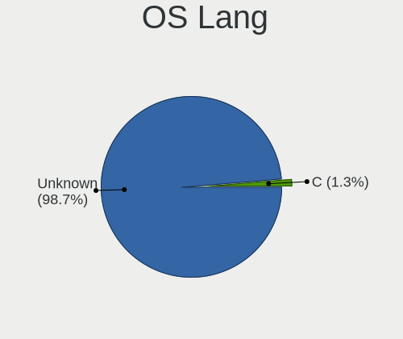
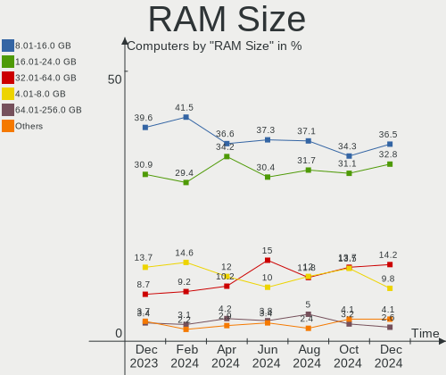
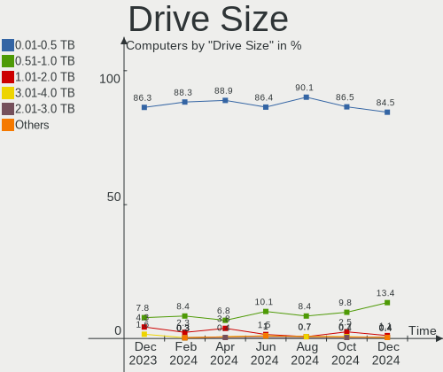
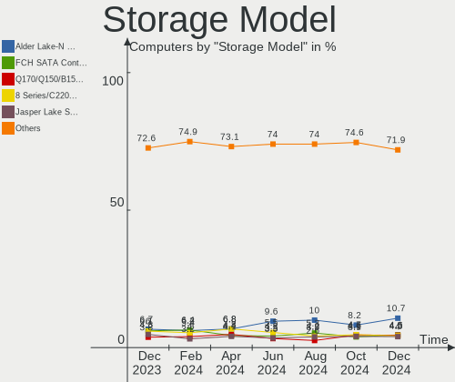
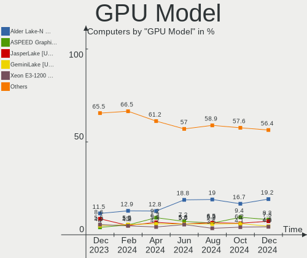

OPNsense - Hardware Trends
--------------------------

A project to identify most popular hardware characteristics and track their change
over time based on data collected by BSD users at https://BSD-Hardware.info.

Anyone can contribute to this report by the [hw-probe](https://github.com/linuxhw/hw-probe/blob/master/INSTALL.BSD.md) tool:

    hw-probe -all -upload

This report is for one last month. Overall report since the beginning of time: [TestDays](https://github.com/bsdhw/TestDays)

Period: Nov, 2023.

Contents
--------

* [ System ](#system)
  - [ OS                       ](#os)
  - [ OS Family                ](#os-family)
  - [ Arch                     ](#arch)
  - [ DE                       ](#de)
  - [ Display Server           ](#display-server)
  - [ Display Manager          ](#display-manager)
  - [ OS Lang                  ](#os-lang)
  - [ Boot Mode                ](#boot-mode)
  - [ Filesystem               ](#filesystem)
  - [ Part. scheme             ](#part-scheme)

* [ Board ](#board)
  - [ Vendor                   ](#vendor)
  - [ Model                    ](#model)
  - [ Model Family             ](#model-family)
  - [ MFG Year                 ](#mfg-year)
  - [ Form Factor              ](#form-factor)
  - [ Coreboot                 ](#coreboot)
  - [ RAM Size                 ](#ram-size)
  - [ RAM Used                 ](#ram-used)
  - [ Total Drives             ](#total-drives)
  - [ Has CD-ROM               ](#has-cd-rom)
  - [ Has Ethernet             ](#has-ethernet)
  - [ Has WiFi                 ](#has-wifi)
  - [ Has Bluetooth            ](#has-bluetooth)

* [ Location ](#location)
  - [ Country                  ](#country)
  - [ City                     ](#city)

* [ Drives ](#drives)
  - [ Drive Vendor             ](#drive-vendor)
  - [ Drive Model              ](#drive-model)
  - [ HDD Vendor               ](#hdd-vendor)
  - [ SSD Vendor               ](#ssd-vendor)
  - [ Drive Kind               ](#drive-kind)
  - [ Drive Connector          ](#drive-connector)
  - [ Drive Size               ](#drive-size)
  - [ Space Total              ](#space-total)
  - [ Space Used               ](#space-used)
  - [ Malfunc. Drives          ](#malfunc-drives)
  - [ Malfunc. Drive Vendor    ](#malfunc-drive-vendor)
  - [ Malfunc. HDD Vendor      ](#malfunc-hdd-vendor)
  - [ Malfunc. Drive Kind      ](#malfunc-drive-kind)
  - [ Failed Drives            ](#failed-drives)
  - [ Failed Drive Vendor      ](#failed-drive-vendor)
  - [ Drive Status             ](#drive-status)

* [ Storage controller ](#storage-controller)
  - [ Storage Vendor           ](#storage-vendor)
  - [ Storage Model            ](#storage-model)
  - [ Storage Kind             ](#storage-kind)

* [ Processor ](#processor)
  - [ CPU Vendor               ](#cpu-vendor)
  - [ CPU Model                ](#cpu-model)
  - [ CPU Model Family         ](#cpu-model-family)
  - [ CPU Cores                ](#cpu-cores)
  - [ CPU Sockets              ](#cpu-sockets)
  - [ CPU Threads              ](#cpu-threads)
  - [ CPU Microarch            ](#cpu-microarch)

* [ Graphics ](#graphics)
  - [ GPU Vendor               ](#gpu-vendor)
  - [ GPU Model                ](#gpu-model)
  - [ GPU Combo                ](#gpu-combo)
  - [ GPU Driver               ](#gpu-driver)
  - [ GPU Memory               ](#gpu-memory)

* [ Monitor ](#monitor)
  - [ Monitor Vendor           ](#monitor-vendor)
  - [ Monitor Model            ](#monitor-model)
  - [ Monitor Resolution       ](#monitor-resolution)
  - [ Monitor Diagonal         ](#monitor-diagonal)
  - [ Monitor Width            ](#monitor-width)
  - [ Aspect Ratio             ](#aspect-ratio)
  - [ Monitor Area             ](#monitor-area)
  - [ Pixel Density            ](#pixel-density)
  - [ Multiple Monitors        ](#multiple-monitors)

* [ Network ](#network)
  - [ Net Controller Vendor    ](#net-controller-vendor)
  - [ Net Controller Model     ](#net-controller-model)
  - [ Wireless Vendor          ](#wireless-vendor)
  - [ Wireless Model           ](#wireless-model)
  - [ Ethernet Vendor          ](#ethernet-vendor)
  - [ Ethernet Model           ](#ethernet-model)
  - [ Net Controller Kind      ](#net-controller-kind)
  - [ Used Controller          ](#used-controller)
  - [ NICs                     ](#nics)
  - [ IPv6                     ](#ipv6)

* [ Bluetooth ](#bluetooth)
  - [ Bluetooth Vendor         ](#bluetooth-vendor)
  - [ Bluetooth Model          ](#bluetooth-model)

* [ Sound ](#sound)
  - [ Sound Vendor             ](#sound-vendor)
  - [ Sound Model              ](#sound-model)

* [ Memory ](#memory)
  - [ Memory Vendor            ](#memory-vendor)
  - [ Memory Model             ](#memory-model)
  - [ Memory Kind              ](#memory-kind)
  - [ Memory Form Factor       ](#memory-form-factor)
  - [ Memory Size              ](#memory-size)
  - [ Memory Speed             ](#memory-speed)

* [ Printers & scanners ](#printers--scanners)
  - [ Printer Vendor           ](#printer-vendor)
  - [ Printer Model            ](#printer-model)
  - [ Scanner Vendor           ](#scanner-vendor)
  - [ Scanner Model            ](#scanner-model)

* [ Camera ](#camera)
  - [ Camera Vendor            ](#camera-vendor)
  - [ Camera Model             ](#camera-model)

* [ Security ](#security)
  - [ Fingerprint Vendor       ](#fingerprint-vendor)
  - [ Fingerprint Model        ](#fingerprint-model)
  - [ Chipcard Vendor          ](#chipcard-vendor)
  - [ Chipcard Model           ](#chipcard-model)

* [ Unsupported ](#unsupported)
  - [ Unsupported Devices      ](#unsupported-devices)
  - [ Unsupported Device Types ](#unsupported-device-types)

System
------

OS
--

Installed operating systems

| Name             | Computers | Percent |
|------------------|-----------|---------|
| OPNsense 23.7.8  | 133       | 36.54%  |
| OPNsense 23.7.7  | 116       | 31.87%  |
| OPNsense 23.7.9  | 84        | 23.08%  |
| OPNsense 23.7.5  | 7         | 1.92%   |
| OPNsense 23.1.11 | 7         | 1.92%   |
| OPNsense 24.1    | 5         | 1.37%   |
| OPNsense 23.7.6  | 3         | 0.82%   |
| OPNsense 23.7.2  | 2         | 0.55%   |
| OPNsense 22.7.11 | 2         | 0.55%   |
| OPNsense 23.7.1  | 1         | 0.27%   |
| OPNsense 23.10   | 1         | 0.27%   |
| OPNsense 22.7.6  | 1         | 0.27%   |
| OPNsense 22.7    | 1         | 0.27%   |
| OPNsense 22.1.10 | 1         | 0.27%   |

OS Family
---------

OS without a version

| Name     | Computers | Percent |
|----------|-----------|---------|
| OPNsense | 364       | 100%    |

Arch
----

OS architecture (x86_64, i586, etc.)

| Name  | Computers | Percent |
|-------|-----------|---------|
| amd64 | 361       | 99.18%  |
| arm64 | 3         | 0.82%   |

DE
--

Desktop Environment

| Name    | Computers | Percent |
|---------|-----------|---------|
| Console | 364       | 100%    |

Display Server
--------------

X11 or Wayland

| Name    | Computers | Percent |
|---------|-----------|---------|
| Console | 364       | 100%    |

Display Manager
---------------

SDDM, LightDM, etc.

| Name    | Computers | Percent |
|---------|-----------|---------|
| Console | 364       | 100%    |

OS Lang
-------

Language

| Lang    | Computers | Percent |
|---------|-----------|---------|
| Unknown | 361       | 99.18%  |
| C       | 3         | 0.82%   |

Boot Mode
---------

EFI or BIOS

| Mode | Computers | Percent |
|------|-----------|---------|
| EFI  | 350       | 96.15%  |
| BIOS | 14        | 3.85%   |

Filesystem
----------

Type of filesystem

| Type | Computers | Percent |
|------|-----------|---------|
| Ufs  | 202       | 55.49%  |
| Zfs  | 162       | 44.51%  |

Part. scheme
------------

Scheme of partitioning

| Type    | Computers | Percent |
|---------|-----------|---------|
| GPT     | 354       | 97.25%  |
| MBR     | 7         | 1.92%   |
| Unknown | 3         | 0.82%   |

Board
-----

Vendor
------

Motherboard manufacturer

| Name                                 | Computers | Percent |
|--------------------------------------|-----------|---------|
| Unknown                              | 57        | 15.66%  |
| Dell                                 | 40        | 10.99%  |
| Hewlett-Packard                      | 32        | 8.79%   |
| Intel                                | 24        | 6.59%   |
| Protectli                            | 21        | 5.77%   |
| Lenovo                               | 17        | 4.67%   |
| Techvision                           | 14        | 3.85%   |
| Supermicro                           | 14        | 3.85%   |
| Fujitsu                              | 12        | 3.3%    |
| PC Engines                           | 11        | 3.02%   |
| ASUSTek Computer                     | 10        | 2.75%   |
| Gigabyte Technology                  | 8         | 2.2%    |
| ASRock                               | 8         | 2.2%    |
| AMI                                  | 8         | 2.2%    |
| Sophos                               | 7         | 1.92%   |
| MSI                                  | 7         | 1.92%   |
| CWWK                                 | 7         | 1.92%   |
| Deciso                               | 6         | 1.65%   |
| AZW                                  | 5         | 1.37%   |
| ZOTAC                                | 4         | 1.1%    |
| MW                                   | 4         | 1.1%    |
| CncTion                              | 4         | 1.1%    |
| IceWhale Technology                  | 3         | 0.82%   |
| Cisco                                | 3         | 0.82%   |
| BESSTAR Tech                         | 3         | 0.82%   |
| YANYU                                | 2         | 0.55%   |
| Yanling                              | 2         | 0.55%   |
| Shuttle                              | 2         | 0.55%   |
| ShenZhen MinWin Technology           | 2         | 0.55%   |
| Shenzhen Meigao Electronic Equipment | 2         | 0.55%   |
| PICO PC                              | 2         | 0.55%   |
| Advantech                            | 2         | 0.55%   |
| YENTEK                               | 1         | 0.27%   |
| WTM                                  | 1         | 0.27%   |
| TYAN Computer                        | 1         | 0.27%   |
| Thomas-Krenn.AG                      | 1         | 0.27%   |
| Silver Peak Systems                  | 1         | 0.27%   |
| Raspberry Pi Foundation              | 1         | 0.27%   |
| Pegatron                             | 1         | 0.27%   |
| NU591R                               | 1         | 0.27%   |

Model
-----

Motherboard model

| Name                                              | Computers | Percent |
|---------------------------------------------------|-----------|---------|
| Unknown                                           | 58        | 15.93%  |
| Techvision TVI7309X                               | 14        | 3.85%   |
| Protectli FW6                                     | 9         | 2.47%   |
| Protectli VP2420                                  | 7         | 1.92%   |
| Dell Wyse 5070 Extended Thin Client               | 6         | 1.65%   |
| Intel Q3XXG4-P V1.0                               | 5         | 1.37%   |
| AZW EQ                                            | 5         | 1.37%   |
| AMI Aptio CRB                                     | 5         | 1.37%   |
| Sophos SG                                         | 4         | 1.1%    |
| PC Engines apu4                                   | 4         | 1.1%    |
| MW GMLK-2_5G4L                                    | 4         | 1.1%    |
| HP t620 PLUS Quad Core TC                         | 4         | 1.1%    |
| Fujitsu FUTRO S920                                | 4         | 1.1%    |
| Protectli FW4B                                    | 3         | 0.82%   |
| PC Engines APU2                                   | 3         | 0.82%   |
| Intel QHSW02                                      | 3         | 0.82%   |
| Dell OptiPlex 9020                                | 3         | 0.82%   |
| CWWK CW-MBX-AD12                                  | 3         | 0.82%   |
| CncTion N5105-4L                                  | 3         | 0.82%   |
| Supermicro 1HE Intel Single-CPU RI1102D-F Server  | 2         | 0.55%   |
| Sophos XG                                         | 2         | 0.55%   |
| Shenzhen Meigao Electronic Equipment Venus Series | 2         | 0.55%   |
| PICO PC MNHO-113                                  | 2         | 0.55%   |
| PC Engines APU3                                   | 2         | 0.55%   |
| IceWhale ZimaBoard 832 ZMB                        | 2         | 0.55%   |
| HP t730 Thin Client                               | 2         | 0.55%   |
| HP EliteDesk 800 G1 SFF                           | 2         | 0.55%   |
| HP Compaq 8200 Elite SFF PC                       | 2         | 0.55%   |
| Dell Wyse 5070 Thin Client                        | 2         | 0.55%   |
| Dell PowerEdge R610                               | 2         | 0.55%   |
| Dell PowerEdge R230                               | 2         | 0.55%   |
| Dell PowerEdge R210 II                            | 2         | 0.55%   |
| Dell OptiPlex 7040                                | 2         | 0.55%   |
| Dell OptiPlex 7010                                | 2         | 0.55%   |
| Dell OptiPlex 3050                                | 2         | 0.55%   |
| Dell OptiPlex 3020                                | 2         | 0.55%   |
| CWWK CW-ADLN-6L                                   | 2         | 0.55%   |
| Cisco SALEEN                                      | 2         | 0.55%   |
| BESSTAR Tech GK41                                 | 2         | 0.55%   |
| Advantech DTADB                                   | 2         | 0.55%   |

Model Family
------------

Motherboard model prefix

| Name                                       | Computers | Percent |
|--------------------------------------------|-----------|---------|
| Unknown                                    | 58        | 15.93%  |
| Dell OptiPlex                              | 19        | 5.22%   |
| Techvision TVI7309X                        | 14        | 3.85%   |
| Lenovo ThinkCentre                         | 12        | 3.3%    |
| Dell PowerEdge                             | 11        | 3.02%   |
| Protectli FW6                              | 9         | 2.47%   |
| HP EliteDesk                               | 8         | 2.2%    |
| Dell Wyse                                  | 8         | 2.2%    |
| Protectli VP2420                           | 7         | 1.92%   |
| Fujitsu FUTRO                              | 6         | 1.65%   |
| Intel Q3XXG4-P                             | 5         | 1.37%   |
| HP ProLiant                                | 5         | 1.37%   |
| HP Compaq                                  | 5         | 1.37%   |
| AZW EQ                                     | 5         | 1.37%   |
| AMI Aptio                                  | 5         | 1.37%   |
| Sophos SG                                  | 4         | 1.1%    |
| PC Engines apu4                            | 4         | 1.1%    |
| MW GMLK-2                                  | 4         | 1.1%    |
| HP t620                                    | 4         | 1.1%    |
| HP ProDesk                                 | 4         | 1.1%    |
| Deciso Netboard                            | 4         | 1.1%    |
| Protectli FW4B                             | 3         | 0.82%   |
| PC Engines APU2                            | 3         | 0.82%   |
| Intel QHSW02                               | 3         | 0.82%   |
| IceWhale ZimaBoard                         | 3         | 0.82%   |
| Fujitsu ESPRIMO                            | 3         | 0.82%   |
| CWWK CW-MBX-AD12                           | 3         | 0.82%   |
| CncTion N5105-4L                           | 3         | 0.82%   |
| ASUS PRIME                                 | 3         | 0.82%   |
| Supermicro 1HE                             | 2         | 0.55%   |
| Sophos XG                                  | 2         | 0.55%   |
| Shenzhen Meigao Electronic Equipment Venus | 2         | 0.55%   |
| PICO PC MNHO-113                           | 2         | 0.55%   |
| PC Engines APU3                            | 2         | 0.55%   |
| Intel NUC5i5RYB                            | 2         | 0.55%   |
| HP t730                                    | 2         | 0.55%   |
| Dell Precision                             | 2         | 0.55%   |
| CWWK CW-ADLN-6L                            | 2         | 0.55%   |
| Cisco SALEEN                               | 2         | 0.55%   |
| BESSTAR Tech GK41                          | 2         | 0.55%   |

MFG Year
--------

Motherboard manufacture year

| Year    | Computers | Percent |
|---------|-----------|---------|
| 2022    | 60        | 16.48%  |
| 2023    | 45        | 12.36%  |
| 2018    | 37        | 10.16%  |
| 2021    | 36        | 9.89%   |
| 2014    | 29        | 7.97%   |
| 2016    | 28        | 7.69%   |
| 2019    | 23        | 6.32%   |
| 2017    | 22        | 6.04%   |
| 2020    | 21        | 5.77%   |
| 2015    | 18        | 4.95%   |
| 2013    | 12        | 3.3%    |
| 2012    | 11        | 3.02%   |
| 2011    | 8         | 2.2%    |
| 2008    | 5         | 1.37%   |
| 2010    | 3         | 0.82%   |
| 2009    | 3         | 0.82%   |
| Unknown | 2         | 0.55%   |
| 2007    | 1         | 0.27%   |

Form Factor
-----------

Physical design of the computer

| Name           | Computers | Percent |
|----------------|-----------|---------|
| Desktop        | 281       | 77.2%   |
| Mini pc        | 39        | 10.71%  |
| Server         | 26        | 7.14%   |
| Firewall       | 8         | 2.2%    |
| Notebook       | 7         | 1.92%   |
| System on chip | 1         | 0.27%   |
| Tablet         | 1         | 0.27%   |
| All in one     | 1         | 0.27%   |

Coreboot
--------

Have coreboot on board

| Used | Computers | Percent |
|------|-----------|---------|
| No   | 347       | 95.33%  |
| Yes  | 17        | 4.67%   |

RAM Size
--------

Total RAM memory

| Size in GB  | Computers | Percent |
|-------------|-----------|---------|
| 8.01-16.0   | 145       | 39.84%  |
| 16.01-24.0  | 116       | 31.87%  |
| 4.01-8.0    | 46        | 12.64%  |
| 32.01-64.0  | 33        | 9.07%   |
| 64.01-256.0 | 11        | 3.02%   |
| 24.01-32.0  | 6         | 1.65%   |
| 2.01-3.0    | 4         | 1.1%    |
| 3.01-4.0    | 1         | 0.27%   |
| 1.01-2.0    | 1         | 0.27%   |
| 0.51-1.0    | 1         | 0.27%   |

RAM Used
--------

Used RAM memory

| Used GB    | Computers | Percent |
|------------|-----------|---------|
| 0.01-0.5   | 154       | 42.31%  |
| 0.51-1.0   | 152       | 41.76%  |
| 1.01-2.0   | 42        | 11.54%  |
| 2.01-3.0   | 12        | 3.3%    |
| 3.01-4.0   | 2         | 0.55%   |
| 16.01-24.0 | 1         | 0.27%   |
| 8.01-16.0  | 1         | 0.27%   |

Total Drives
------------

Number of drives on board

| Drives | Computers | Percent |
|--------|-----------|---------|
| 1      | 281       | 77.2%   |
| 0      | 48        | 13.19%  |
| 2      | 35        | 9.62%   |

Has CD-ROM
----------

Has CD-ROM on board

| Presented | Computers | Percent |
|-----------|-----------|---------|
| No        | 328       | 90.11%  |
| Yes       | 36        | 9.89%   |

Has Ethernet
------------

Has Ethernet on board

| Presented | Computers | Percent |
|-----------|-----------|---------|
| Yes       | 361       | 99.18%  |
| No        | 3         | 0.82%   |

Has WiFi
--------

Has WiFi module

| Presented | Computers | Percent |
|-----------|-----------|---------|
| No        | 308       | 84.62%  |
| Yes       | 56        | 15.38%  |

Has Bluetooth
-------------

Has Bluetooth module

| Presented | Computers | Percent |
|-----------|-----------|---------|
| No        | 324       | 89.01%  |
| Yes       | 40        | 10.99%  |

Location
--------

Country
-------

Geographic location (country)

| Country      | Computers | Percent |
|--------------|-----------|---------|
| USA          | 111       | 30.49%  |
| Germany      | 65        | 17.86%  |
| Canada       | 19        | 5.22%   |
| UK           | 16        | 4.4%    |
| Australia    | 12        | 3.3%    |
| Poland       | 10        | 2.75%   |
| Netherlands  | 10        | 2.75%   |
| Sweden       | 9         | 2.47%   |
| Italy        | 9         | 2.47%   |
| France       | 9         | 2.47%   |
| Russia       | 7         | 1.92%   |
| Spain        | 6         | 1.65%   |
| Austria      | 6         | 1.65%   |
| Switzerland  | 5         | 1.37%   |
| South Africa | 5         | 1.37%   |
| Singapore    | 5         | 1.37%   |
| Finland      | 5         | 1.37%   |
| South Korea  | 4         | 1.1%    |
| Czechia      | 4         | 1.1%    |
| Vietnam      | 3         | 0.82%   |
| Taiwan       | 3         | 0.82%   |
| Slovakia     | 3         | 0.82%   |
| Romania      | 3         | 0.82%   |
| New Zealand  | 3         | 0.82%   |
| Bulgaria     | 3         | 0.82%   |
| Belgium      | 3         | 0.82%   |
| Norway       | 2         | 0.55%   |
| Mexico       | 2         | 0.55%   |
| Japan        | 2         | 0.55%   |
| India        | 2         | 0.55%   |
| China        | 2         | 0.55%   |
| Brazil       | 2         | 0.55%   |
| Turkey       | 1         | 0.27%   |
| Portugal     | 1         | 0.27%   |
| Moldova      | 1         | 0.27%   |
| Malta        | 1         | 0.27%   |
| Latvia       | 1         | 0.27%   |
| Israel       | 1         | 0.27%   |
| Ireland      | 1         | 0.27%   |
| Hungary      | 1         | 0.27%   |

City
----

Geographic location (city)

| City                     | Computers | Percent |
|--------------------------|-----------|---------|
| Berlin                   | 7         | 1.92%   |
| Singapore                | 5         | 1.37%   |
| Helsinki                 | 4         | 1.1%    |
| Vancouver                | 3         | 0.82%   |
| Sydney                   | 3         | 0.82%   |
| Melbourne                | 3         | 0.82%   |
| Leipzig                  | 3         | 0.82%   |
| Hamburg                  | 3         | 0.82%   |
| Calgary                  | 3         | 0.82%   |
| Zurich                   | 2         | 0.55%   |
| Warsaw                   | 2         | 0.55%   |
| Sofia                    | 2         | 0.55%   |
| Seattle                  | 2         | 0.55%   |
| Sainte-Marthe-sur-le-Lac | 2         | 0.55%   |
| Pretoria                 | 2         | 0.55%   |
| Portland                 | 2         | 0.55%   |
| Pittsburgh               | 2         | 0.55%   |
| Peoria                   | 2         | 0.55%   |
| Oklahoma City            | 2         | 0.55%   |
| Nottuln                  | 2         | 0.55%   |
| New York                 | 2         | 0.55%   |
| Münster                 | 2         | 0.55%   |
| Moscow                   | 2         | 0.55%   |
| London                   | 2         | 0.55%   |
| Lodz                     | 2         | 0.55%   |
| Koenigswinter            | 2         | 0.55%   |
| Ho Chi Minh City         | 2         | 0.55%   |
| Hanover                  | 2         | 0.55%   |
| Graz                     | 2         | 0.55%   |
| Düsseldorf              | 2         | 0.55%   |
| Duluth                   | 2         | 0.55%   |
| Dearborn Heights         | 2         | 0.55%   |
| Chennai                  | 2         | 0.55%   |
| Bristow                  | 2         | 0.55%   |
| Brisbane                 | 2         | 0.55%   |
| Boston                   | 2         | 0.55%   |
| Auckland                 | 2         | 0.55%   |
| Atlanta                  | 2         | 0.55%   |
| Zhangjiakou              | 1         | 0.27%   |
| Yongsan-dong             | 1         | 0.27%   |

Drives
------

Drive Vendor
------------

Hard drive vendors

| Vendor              | Computers | Drives | Percent |
|---------------------|-----------|--------|---------|
| Samsung Electronics | 67        | 71     | 20.18%  |
| Kingston            | 22        | 23     | 6.63%   |
| WDC                 | 21        | 21     | 6.33%   |
| China               | 20        | 23     | 6.02%   |
| Transcend           | 17        | 18     | 5.12%   |
| Intel               | 16        | 20     | 4.82%   |
| Seagate             | 12        | 13     | 3.61%   |
| Micron Technology   | 11        | 12     | 3.31%   |
| Protectli           | 10        | 10     | 3.01%   |
| Crucial             | 10        | 10     | 3.01%   |
| A-DATA Technology   | 10        | 11     | 3.01%   |
| SanDisk             | 9         | 9      | 2.71%   |
| Toshiba             | 8         | 8      | 2.41%   |
| SPCC                | 8         | 8      | 2.41%   |
| SK hynix            | 7         | 7      | 2.11%   |
| Hoodisk             | 7         | 7      | 2.11%   |
| Silicon Motion      | 6         | 6      | 1.81%   |
| PNY                 | 5         | 6      | 1.51%   |
| Fanxiang            | 5         | 5      | 1.51%   |
| FORESEE             | 4         | 4      | 1.2%    |
| VICKTER             | 3         | 3      | 0.9%    |
| Phison              | 3         | 3      | 0.9%    |
| Lexar               | 3         | 3      | 0.9%    |
| Leven               | 3         | 3      | 0.9%    |
| Innodisk            | 3         | 3      | 0.9%    |
| Hewlett-Packard     | 3         | 5      | 0.9%    |
| Dogfish             | 3         | 3      | 0.9%    |
| Apacer              | 3         | 3      | 0.9%    |
| Team                | 2         | 2      | 0.6%    |
| KIOXIA              | 2         | 2      | 0.6%    |
| Corsair             | 2         | 2      | 0.6%    |
| BORY                | 2         | 2      | 0.6%    |
| TCSUNBOW            | 1         | 1      | 0.3%    |
| Smartbuy            | 1         | 1      | 0.3%    |
| SHAREVDI            | 1         | 1      | 0.3%    |
| SemsoTai            | 1         | 1      | 0.3%    |
| SCY                 | 1         | 1      | 0.3%    |
| Patriot             | 1         | 2      | 0.3%    |
| OCZ                 | 1         | 1      | 0.3%    |
| Maxtor              | 1         | 1      | 0.3%    |

Drive Model
-----------

Hard drive models

| Model                            | Computers | Percent |
|----------------------------------|-----------|---------|
| Kingston SKC600MS256G 256GB      | 5         | 1.5%    |
| Samsung SSD 870 EVO 250GB        | 4         | 1.2%    |
| Crucial CT500P3SSD8 500GB        | 4         | 1.2%    |
| Samsung SSD 980 500GB            | 3         | 0.9%    |
| Samsung SSD 980 250GB            | 3         | 0.9%    |
| Samsung SSD 860 EVO 500GB        | 3         | 0.9%    |
| Samsung SSD 850 PRO 256GB        | 3         | 0.9%    |
| Protectli 64GB mSATA             | 3         | 0.9%    |
| Protectli 120GB mSATA            | 3         | 0.9%    |
| Hoodisk SSD 32GB                 | 3         | 0.9%    |
| Hoodisk SSD 128GB                | 3         | 0.9%    |
| Fanxiang S501 128GB              | 3         | 0.9%    |
| China SATA SSD 256GB             | 3         | 0.9%    |
| A-DATA IM2S3134N-064GM 64GB      | 3         | 0.9%    |
| WDC WDS240G2G0A-00JH30 240GB     | 2         | 0.6%    |
| VICKTER SSD 64GB                 | 2         | 0.6%    |
| Transcend TS64GSSD370 64GB       | 2         | 0.6%    |
| Transcend TS128GMTE110S 128GB    | 2         | 0.6%    |
| Transcend TS128GMSA230S 128GB    | 2         | 0.6%    |
| SPCC Solid State Disk 128GB      | 2         | 0.6%    |
| Silicon Motion GV128 128GB       | 2         | 0.6%    |
| Seagate ST500DM002-1BD142 500GB  | 2         | 0.6%    |
| SanDisk SDSSDP128G 128GB         | 2         | 0.6%    |
| Samsung SSD 970 PRO 512GB        | 2         | 0.6%    |
| Samsung SSD 970 EVO Plus 250GB   | 2         | 0.6%    |
| Samsung SSD 870 EVO 1TB          | 2         | 0.6%    |
| Samsung SSD 860 EVO 250GB        | 2         | 0.6%    |
| Samsung SSD 850 EVO mSATA 500GB  | 2         | 0.6%    |
| Samsung PM961 NVMe 256GB         | 2         | 0.6%    |
| Samsung MZVLW256HEHP-000L7 256GB | 2         | 0.6%    |
| Samsung MZVLW256HEHP-000H1 256GB | 2         | 0.6%    |
| Protectli 480GB M.2              | 2         | 0.6%    |
| Phison PCIe SSD 512GB            | 2         | 0.6%    |
| Lexar 128GB SSD                  | 2         | 0.6%    |
| Kingston SV300S37A120G 120GB     | 2         | 0.6%    |
| Kingston SMS200S360G 64GB        | 2         | 0.6%    |
| Kingston SKC600MS512G 512GB      | 2         | 0.6%    |
| Kingston SHFS37A120G 120GB       | 2         | 0.6%    |
| Kingston SA400S37240G 240GB      | 2         | 0.6%    |
| Kingston SA2000M8250G 250GB      | 2         | 0.6%    |

HDD Vendor
----------

Hard disk drive vendors

| Vendor          | Computers | Drives | Percent |
|-----------------|-----------|--------|---------|
| Seagate         | 12        | 13     | 41.38%  |
| WDC             | 8         | 8      | 27.59%  |
| Toshiba         | 3         | 3      | 10.34%  |
| Hewlett-Packard | 2         | 4      | 6.9%    |
| Maxtor          | 1         | 1      | 3.45%   |
| Hitachi         | 1         | 1      | 3.45%   |
| HGST            | 1         | 1      | 3.45%   |
| China           | 1         | 1      | 3.45%   |

SSD Vendor
----------

Solid state drive vendors

| Vendor              | Computers | Drives | Percent |
|---------------------|-----------|--------|---------|
| Samsung Electronics | 40        | 43     | 18.43%  |
| Kingston            | 19        | 20     | 8.76%   |
| China               | 19        | 22     | 8.76%   |
| Transcend           | 13        | 13     | 5.99%   |
| Protectli           | 10        | 10     | 4.61%   |
| A-DATA Technology   | 10        | 11     | 4.61%   |
| SanDisk             | 9         | 9      | 4.15%   |
| WDC                 | 8         | 8      | 3.69%   |
| Micron Technology   | 8         | 9      | 3.69%   |
| Intel               | 8         | 11     | 3.69%   |
| Hoodisk             | 7         | 7      | 3.23%   |
| SPCC                | 6         | 6      | 2.76%   |
| PNY                 | 4         | 5      | 1.84%   |
| FORESEE             | 4         | 4      | 1.84%   |
| Crucial             | 4         | 4      | 1.84%   |
| VICKTER             | 3         | 3      | 1.38%   |
| Leven               | 3         | 3      | 1.38%   |
| Innodisk            | 3         | 3      | 1.38%   |
| Dogfish             | 3         | 3      | 1.38%   |
| Apacer              | 3         | 3      | 1.38%   |
| Toshiba             | 2         | 2      | 0.92%   |
| Team                | 2         | 2      | 0.92%   |
| SK hynix            | 2         | 2      | 0.92%   |
| Lexar               | 2         | 2      | 0.92%   |
| BORY                | 2         | 2      | 0.92%   |
| TCSUNBOW            | 1         | 1      | 0.46%   |
| Smartbuy            | 1         | 1      | 0.46%   |
| SHAREVDI            | 1         | 1      | 0.46%   |
| SemsoTai            | 1         | 1      | 0.46%   |
| SCY                 | 1         | 1      | 0.46%   |
| Patriot             | 1         | 2      | 0.46%   |
| OCZ                 | 1         | 1      | 0.46%   |
| LuminouTek          | 1         | 1      | 0.46%   |
| LITEONIT            | 1         | 1      | 0.46%   |
| LITEON              | 1         | 1      | 0.46%   |
| Kingsand            | 1         | 1      | 0.46%   |
| Intenso             | 1         | 1      | 0.46%   |
| HPE                 | 1         | 2      | 0.46%   |
| Hewlett-Packard     | 1         | 1      | 0.46%   |
| GOODRAM             | 1         | 1      | 0.46%   |

Drive Kind
----------

HDD or SSD

| Kind | Computers | Drives | Percent |
|------|-----------|--------|---------|
| SSD  | 210       | 232    | 65.02%  |
| NVMe | 84        | 89     | 26.01%  |
| HDD  | 29        | 32     | 8.98%   |

Drive Connector
---------------

SATA, SAS, NVMe, etc.

| Type | Computers | Drives | Percent |
|------|-----------|--------|---------|
| SATA | 235       | 264    | 73.67%  |
| NVMe | 84        | 89     | 26.33%  |

Drive Size
----------

Size of hard drive

| Size in TB | Computers | Drives | Percent |
|------------|-----------|--------|---------|
| 0.01-0.5   | 213       | 235    | 89.12%  |
| 0.51-1.0   | 23        | 26     | 9.62%   |
| 1.01-2.0   | 2         | 2      | 0.84%   |
| 4.01-10.0  | 1         | 1      | 0.42%   |

Space Total
-----------

Amount of disk space available on the file system

| Size in GB     | Computers | Percent |
|----------------|-----------|---------|
| 101-250        | 201       | 55.22%  |
| 251-500        | 62        | 17.03%  |
| 51-100         | 32        | 8.79%   |
| 21-50          | 26        | 7.14%   |
| 1-20           | 21        | 5.77%   |
| 501-1000       | 20        | 5.49%   |
| More than 3000 | 1         | 0.27%   |
| 1001-2000      | 1         | 0.27%   |

Space Used
----------

Amount of used disk space

| Used GB | Computers | Percent |
|---------|-----------|---------|
| 1-20    | 352       | 96.7%   |
| 21-50   | 9         | 2.47%   |
| 101-250 | 2         | 0.55%   |
| 51-100  | 1         | 0.27%   |

Malfunc. Drives
---------------

Drive models with a malfunction

| Model                                   | Computers | Drives | Percent |
|-----------------------------------------|-----------|--------|---------|
| Kingston SV300S37A120G 120GB            | 2         | 2      | 7.14%   |
| Kingston SHFS37A120G 120GB              | 2         | 2      | 7.14%   |
| WDC WD5000AAKX-001CA0 500GB             | 1         | 1      | 3.57%   |
| WDC WD2500AAJS-00L7A0 250GB             | 1         | 1      | 3.57%   |
| Toshiba THNSNK128GCS8 SATA 128GB        | 1         | 1      | 3.57%   |
| Toshiba MQ01ABD100 1TB                  | 1         | 1      | 3.57%   |
| SPCC Solid State Disk 512GB             | 1         | 1      | 3.57%   |
| SPCC Solid State Disk 120GB             | 1         | 1      | 3.57%   |
| SK hynix HFS120G32TND-N1A2A 120GB       | 1         | 1      | 3.57%   |
| Seagate ST98823AS 80GB                  | 1         | 1      | 3.57%   |
| Seagate ST5000DM000-1FK178 5TB          | 1         | 1      | 3.57%   |
| Seagate ST1000DM010-2EP102 1TB          | 1         | 1      | 3.57%   |
| SanDisk SD6SF1M032G1022 32GB            | 1         | 1      | 3.57%   |
| Samsung Electronics SSD 870 EVO 250GB   | 1         | 1      | 3.57%   |
| Patriot Burst Elite 120GB               | 1         | 2      | 3.57%   |
| OCZ VERTEX4 512GB                       | 1         | 1      | 3.57%   |
| Kingston SMS200S360G 64GB               | 1         | 1      | 3.57%   |
| Hitachi HDS722580VLSA80 82GB            | 1         | 1      | 3.57%   |
| HGST HTS725050A7E630 500GB              | 1         | 1      | 3.57%   |
| Hewlett-Packard SSD S700 Pro 128GB      | 1         | 1      | 3.57%   |
| Gigabyte Technology GP-GM30512G-G 512GB | 1         | 1      | 3.57%   |
| Crucial CT128MX100SSD1 128GB            | 1         | 1      | 3.57%   |
| Corsair Force LS SSD 240GB              | 1         | 1      | 3.57%   |
| China CF 2GB                            | 1         | 1      | 3.57%   |
| Apacer 16GB SATA Flash Drive            | 1         | 1      | 3.57%   |
| A-DATA Technology SP600 32GB            | 1         | 1      | 3.57%   |

Malfunc. Drive Vendor
---------------------

Vendors of faulty drives

| Vendor              | Computers | Drives | Percent |
|---------------------|-----------|--------|---------|
| Kingston            | 5         | 5      | 17.86%  |
| Seagate             | 3         | 3      | 10.71%  |
| WDC                 | 2         | 2      | 7.14%   |
| Toshiba             | 2         | 2      | 7.14%   |
| SPCC                | 2         | 2      | 7.14%   |
| SK hynix            | 1         | 1      | 3.57%   |
| SanDisk             | 1         | 1      | 3.57%   |
| Samsung Electronics | 1         | 1      | 3.57%   |
| Patriot             | 1         | 2      | 3.57%   |
| OCZ                 | 1         | 1      | 3.57%   |
| Hitachi             | 1         | 1      | 3.57%   |
| HGST                | 1         | 1      | 3.57%   |
| Hewlett-Packard     | 1         | 1      | 3.57%   |
| Gigabyte Technology | 1         | 1      | 3.57%   |
| Crucial             | 1         | 1      | 3.57%   |
| Corsair             | 1         | 1      | 3.57%   |
| China               | 1         | 1      | 3.57%   |
| Apacer              | 1         | 1      | 3.57%   |
| A-DATA Technology   | 1         | 1      | 3.57%   |

Malfunc. HDD Vendor
-------------------

Vendors of faulty HDD drives

| Vendor  | Computers | Drives | Percent |
|---------|-----------|--------|---------|
| Seagate | 3         | 3      | 33.33%  |
| WDC     | 2         | 2      | 22.22%  |
| Toshiba | 1         | 1      | 11.11%  |
| Hitachi | 1         | 1      | 11.11%  |
| HGST    | 1         | 1      | 11.11%  |
| China   | 1         | 1      | 11.11%  |

Malfunc. Drive Kind
-------------------

Kinds of faulty drives

| Kind | Computers | Drives | Percent |
|------|-----------|--------|---------|
| SSD  | 18        | 19     | 64.29%  |
| HDD  | 9         | 9      | 32.14%  |
| NVMe | 1         | 1      | 3.57%   |

Failed Drives
-------------

Failed drive models

| Model                                        | Computers | Drives | Percent |
|----------------------------------------------|-----------|--------|---------|
| Samsung Electronics PM961 NVMe 256GB         | 1         | 1      | 33.33%  |
| Samsung Electronics MZVLW256HEHP-000H1 256GB | 1         | 1      | 33.33%  |
| Intel SSDPEKKW128G7 128GB                    | 1         | 1      | 33.33%  |

Failed Drive Vendor
-------------------

Failed drive vendors

| Vendor              | Computers | Drives | Percent |
|---------------------|-----------|--------|---------|
| Samsung Electronics | 2         | 2      | 66.67%  |
| Intel               | 1         | 1      | 33.33%  |

Drive Status
------------

Number of failed and malfunc. drives

| Status   | Computers | Drives | Percent |
|----------|-----------|--------|---------|
| Works    | 287       | 318    | 89.69%  |
| Malfunc  | 28        | 29     | 8.75%   |
| Failed   | 3         | 3      | 0.94%   |
| Detected | 2         | 3      | 0.63%   |

Storage controller
------------------

Storage Vendor
--------------

Storage controller vendors

| Vendor                        | Computers | Percent |
|-------------------------------|-----------|---------|
| Intel                         | 304       | 66.67%  |
| AMD                           | 44        | 9.65%   |
| Samsung Electronics           | 27        | 5.92%   |
| Silicon Motion                | 13        | 2.85%   |
| SanDisk                       | 10        | 2.19%   |
| Broadcom / LSI                | 9         | 1.97%   |
| Micron/Crucial Technology     | 6         | 1.32%   |
| SK hynix                      | 5         | 1.1%    |
| Phison Electronics            | 5         | 1.1%    |
| Toshiba                       | 4         | 0.88%   |
| Transcend                     | 3         | 0.66%   |
| Micron Technology             | 3         | 0.66%   |
| MAXIO Technology (Hangzhou)   | 3         | 0.66%   |
| Kingston Technology Company   | 3         | 0.66%   |
| ASMedia Technology            | 3         | 0.66%   |
| Realtek Semiconductor         | 2         | 0.44%   |
| Marvell Technology Group      | 2         | 0.44%   |
| Hosin Global Electronics      | 2         | 0.44%   |
| Hewlett-Packard               | 2         | 0.44%   |
| Chelsio Communications        | 2         | 0.44%   |
| Shenzhen Longsys Electronics  | 1         | 0.22%   |
| KIOXIA                        | 1         | 0.22%   |
| JMicron Technology            | 1         | 0.22%   |
| Integrated Technology Express | 1         | 0.22%   |

Storage Model
-------------

Storage controller models

| Model                                                                            | Computers | Percent |
|----------------------------------------------------------------------------------|-----------|---------|
| Intel Jasper Lake SATA AHCI Controller                                           | 33        | 6.78%   |
| AMD FCH SATA Controller [AHCI mode]                                              | 26        | 5.34%   |
| Intel Celeron/Pentium Silver Processor SATA Controller                           | 25        | 5.13%   |
| Intel 8 Series/C220 Series Chipset Family 6-port SATA Controller 1 [AHCI mode]   | 24        | 4.93%   |
| Intel Sunrise Point-LP SATA Controller [AHCI mode]                               | 19        | 3.9%    |
| Intel Q170/Q150/B150/H170/H110/Z170/CM236 Chipset SATA Controller [AHCI Mode]    | 18        | 3.7%    |
| Intel 6 Series/C200 Series Chipset Family 6 port Desktop SATA AHCI Controller    | 18        | 3.7%    |
| Intel unknown                                                                    | 17        | 3.49%   |
| Intel SATA Controller [RAID mode]                                                | 14        | 2.87%   |
| Silicon Motion SM2263EN/SM2263XT (DRAM-less) NVMe SSD Controllers                | 13        | 2.67%   |
| Intel Cannon Lake PCH SATA AHCI Controller                                       | 13        | 2.67%   |
| Intel Elkhart Lake SATA AHCI                                                     | 11        | 2.26%   |
| Samsung NVMe SSD Controller SM981/PM981/PM983                                    | 10        | 2.05%   |
| Intel Atom/Celeron/Pentium Processor x5-E8000/J3xxx/N3xxx Series SATA Controller | 10        | 2.05%   |
| Intel Atom Processor E3800 Series SATA AHCI Controller                           | 10        | 2.05%   |
| Intel 200 Series PCH SATA controller [AHCI mode]                                 | 10        | 2.05%   |
| Intel Wildcat Point-LP SATA Controller [AHCI Mode]                               | 9         | 1.85%   |
| Samsung NVMe SSD Controller SM961/PM961/SM963                                    | 8         | 1.64%   |
| Intel Alder Lake-P SATA AHCI Controller                                          | 8         | 1.64%   |
| Samsung NVMe SSD Controller 980 (DRAM-less)                                      | 7         | 1.44%   |
| Intel Celeron N3350/Pentium N4200/Atom E3900 Series SATA AHCI Controller         | 7         | 1.44%   |
| AMD FCH SATA Controller [IDE mode]                                               | 6         | 1.23%   |
| Micron/Crucial P2 [Nick P2] / P3 / P3 Plus NVMe PCIe SSD (DRAM-less)             | 5         | 1.03%   |
| Intel 8 Series SATA Controller 1 [AHCI mode]                                     | 5         | 1.03%   |
| AMD 400 Series Chipset SATA Controller                                           | 5         | 1.03%   |
| SanDisk Ultra 3D / WD Blue SN570 NVMe SSD (DRAM-less)                            | 4         | 0.82%   |
| Intel 7 Series/C210 Series Chipset Family 6-port SATA Controller [AHCI mode]     | 4         | 0.82%   |
| AMD SB7x0/SB8x0/SB9x0 SATA Controller [AHCI mode]                                | 4         | 0.82%   |
| AMD FCH IDE Controller                                                           | 4         | 0.82%   |
| SK hynix Gold P31/BC711/PC711 NVMe Solid State Drive                             | 3         | 0.62%   |
| Phison PS5013-E13 PCIe3 NVMe Controller (DRAM-less)                              | 3         | 0.62%   |
| MAXIO (Hangzhou) NVMe SSD Controller MAP1202                                     | 3         | 0.62%   |
| Intel NVMe Optane Memory Series                                                  | 3         | 0.62%   |
| Intel DH89xxCC 4 Port SATA AHCI Controller                                       | 3         | 0.62%   |
| Intel Comet Lake SATA AHCI Controller                                            | 3         | 0.62%   |
| Intel Cannon Point-LP SATA Controller [AHCI Mode]                                | 3         | 0.62%   |
| Intel C610/X99 series chipset 6-Port SATA Controller [AHCI mode]                 | 3         | 0.62%   |
| Intel 82801IB (ICH9) 2 port SATA Controller [IDE mode]                           | 3         | 0.62%   |
| Intel 7 Series Chipset Family 6-port SATA Controller [AHCI mode]                 | 3         | 0.62%   |
| Broadcom / LSI MegaRAID SAS 2108 [Liberator]                                     | 3         | 0.62%   |

Storage Kind
------------

Kind of storage controller (IDE, SATA, NVMe, SAS, ...)

| Kind | Computers | Percent |
|------|-----------|---------|
| SATA | 318       | 68.39%  |
| NVMe | 94        | 20.22%  |
| RAID | 26        | 5.59%   |
| IDE  | 23        | 4.95%   |
| SCSI | 3         | 0.65%   |
| SAS  | 1         | 0.22%   |

Processor
---------

CPU Vendor
----------

Processor vendors

| Vendor | Computers | Percent |
|--------|-----------|---------|
| Intel  | 315       | 86.54%  |
| AMD    | 46        | 12.64%  |
| ARM    | 3         | 0.82%   |

CPU Model
---------

Processor models

| Model                                    | Computers | Percent |
|------------------------------------------|-----------|---------|
| Intel Celeron N5105 @ 2.00GHz            | 27        | 7.42%   |
| Intel N100                               | 16        | 4.4%    |
| Intel Celeron J4125 CPU @ 2.00GHz        | 12        | 3.3%    |
| Intel Celeron J6412 @ 2.00GHz            | 9         | 2.47%   |
| AMD GX-412TC SOC                         | 9         | 2.47%   |
| Intel Celeron CPU J1900 @ 1.99GHz        | 8         | 2.2%    |
| Intel Pentium Silver J5005 CPU @ 1.50GHz | 7         | 1.92%   |
| Intel Core i5-6500 CPU @ 3.20GHz         | 7         | 1.92%   |
| Intel Core i5-8250U CPU @ 1.60GHz        | 5         | 1.37%   |
| Intel Core i5-5250U CPU @ 1.60GHz        | 5         | 1.37%   |
| Intel Core i5-4570 CPU @ 3.20GHz         | 5         | 1.37%   |
| Intel Celeron CPU 3865U @ 1.80GHz        | 5         | 1.37%   |
| Intel Pentium Silver N6005 @ 2.00GHz     | 4         | 1.1%    |
| Intel Core i7-6700 CPU @ 3.40GHz         | 4         | 1.1%    |
| Intel Core i5-2400 CPU @ 3.10GHz         | 4         | 1.1%    |
| Intel Celeron J4105 CPU @ 1.50GHz        | 4         | 1.1%    |
| Intel Celeron CPU N3450 @ 1.10GHz        | 4         | 1.1%    |
| AMD GX-420CA SOC with Radeon HD Graphics | 4         | 1.1%    |
| Intel Xeon CPU D-1518 @ 2.20GHz          | 3         | 0.82%   |
| Intel N95                                | 3         | 0.82%   |
| Intel Core i5-7500 CPU @ 3.40GHz         | 3         | 0.82%   |
| Intel Core i5-4590 CPU @ 3.30GHz         | 3         | 0.82%   |
| Intel Core i5-3470 CPU @ 3.20GHz         | 3         | 0.82%   |
| Intel Core i3-N305                       | 3         | 0.82%   |
| Intel Celeron CPU J3160 @ 1.60GHz        | 3         | 0.82%   |
| AMD RX-427BB with AMD Radeon R7 Graphics | 3         | 0.82%   |
| Intel Xeon CPU X3430 @ 2.40GHz           | 2         | 0.55%   |
| Intel Xeon CPU E3-1240 V2 @ 3.40GHz      | 2         | 0.55%   |
| Intel Xeon CPU E3-1231 v3 @ 3.40GHz      | 2         | 0.55%   |
| Intel Xeon CPU E3-1230 V2 @ 3.30GHz      | 2         | 0.55%   |
| Intel Core i7-8700 CPU @ 3.20GHz         | 2         | 0.55%   |
| Intel Core i7-4770 CPU @ 3.40GHz         | 2         | 0.55%   |
| Intel Core i7-10700 CPU @ 2.90GHz        | 2         | 0.55%   |
| Intel Core i5-9500T CPU @ 2.20GHz        | 2         | 0.55%   |
| Intel Core i5-9500 CPU @ 3.00GHz         | 2         | 0.55%   |
| Intel Core i5-8500T CPU @ 2.10GHz        | 2         | 0.55%   |
| Intel Core i5-7400 CPU @ 3.00GHz         | 2         | 0.55%   |
| Intel Core i5-7200U CPU @ 2.50GHz        | 2         | 0.55%   |
| Intel Core i5-6200U CPU @ 2.30GHz        | 2         | 0.55%   |
| Intel Core i5-4590T CPU @ 2.00GHz        | 2         | 0.55%   |

CPU Model Family
----------------

Processor model prefix

| Model                   | Computers | Percent |
|-------------------------|-----------|---------|
| Intel Celeron           | 90        | 24.73%  |
| Intel Core i5           | 74        | 20.33%  |
| Intel Xeon              | 38        | 10.44%  |
| Other                   | 36        | 9.89%   |
| Intel Core i7           | 23        | 6.32%   |
| AMD GX                  | 22        | 6.04%   |
| Intel Core i3           | 21        | 5.77%   |
| Intel Pentium Silver    | 12        | 3.3%    |
| Intel Atom              | 10        | 2.75%   |
| Intel Pentium           | 7         | 1.92%   |
| AMD Ryzen 5             | 5         | 1.37%   |
| Intel Core 2 Duo        | 3         | 0.82%   |
| ARM Cortex              | 3         | 0.82%   |
| AMD G                   | 3         | 0.82%   |
| Intel Core 2 Quad       | 2         | 0.55%   |
| AMD Ryzen Embedded      | 2         | 0.55%   |
| AMD Athlon              | 2         | 0.55%   |
| AMD A10                 | 2         | 0.55%   |
| Intel Pentium Gold      | 1         | 0.27%   |
| Intel Pentium Dual-Core | 1         | 0.27%   |
| Intel Genuine           | 1         | 0.27%   |
| AMD Ryzen 7 PRO         | 1         | 0.27%   |
| AMD Ryzen 7             | 1         | 0.27%   |
| AMD Ryzen 5 PRO         | 1         | 0.27%   |
| AMD Ryzen 3             | 1         | 0.27%   |
| AMD Opteron             | 1         | 0.27%   |
| AMD A8                  | 1         | 0.27%   |

CPU Cores
---------

Number of processor cores

| Number  | Computers | Percent |
|---------|-----------|---------|
| 4       | 242       | 66.48%  |
| 2       | 66        | 18.13%  |
| 8       | 20        | 5.49%   |
| 6       | 19        | 5.22%   |
| 12      | 7         | 1.92%   |
| 16      | 4         | 1.1%    |
| 10      | 3         | 0.82%   |
| Unknown | 3         | 0.82%   |

CPU Sockets
-----------

Number of sockets

| Number  | Computers | Percent |
|---------|-----------|---------|
| 1       | 354       | 97.25%  |
| 2       | 7         | 1.92%   |
| Unknown | 3         | 0.82%   |

CPU Threads
-----------

Threads per core (Hyper-Threading)

| Number  | Computers | Percent |
|---------|-----------|---------|
| 1       | 257       | 70.6%   |
| 2       | 104       | 28.57%  |
| Unknown | 3         | 0.82%   |

CPU Microarch
-------------

Microarchitecture

| Name          | Computers | Percent |
|---------------|-----------|---------|
| Unknown       | 83        | 22.8%   |
| KabyLake      | 49        | 13.46%  |
| Haswell       | 33        | 9.07%   |
| Goldmont plus | 25        | 6.87%   |
| Skylake       | 24        | 6.59%   |
| Silvermont    | 21        | 5.77%   |
| IvyBridge     | 18        | 4.95%   |
| SandyBridge   | 15        | 4.12%   |
| Puma          | 15        | 4.12%   |
| Broadwell     | 12        | 3.3%    |
| Goldmont      | 11        | 3.02%   |
| Jaguar        | 9         | 2.47%   |
| Westmere      | 6         | 1.65%   |
| Penryn        | 6         | 1.65%   |
| CometLake     | 6         | 1.65%   |
| Zen+          | 4         | 1.1%    |
| Steamroller   | 4         | 1.1%    |
| Nehalem       | 4         | 1.1%    |
| Zen 3         | 3         | 0.82%   |
| Zen           | 3         | 0.82%   |
| Bobcat        | 3         | 0.82%   |
| Zen 2         | 2         | 0.55%   |
| Piledriver    | 2         | 0.55%   |
| Core          | 2         | 0.55%   |
| Bonnell       | 2         | 0.55%   |
| TigerLake     | 1         | 0.27%   |
| Excavator     | 1         | 0.27%   |

Graphics
--------

GPU Vendor
----------

Vendors of graphics cards

| Vendor                     | Computers | Percent |
|----------------------------|-----------|---------|
| Intel                      | 268       | 77.91%  |
| AMD                        | 33        | 9.59%   |
| Matrox Electronics Systems | 21        | 6.1%    |
| ASPEED Technology          | 18        | 5.23%   |
| Nvidia                     | 4         | 1.16%   |

GPU Model
---------

Graphics card models

| Model                                                                                    | Computers | Percent |
|------------------------------------------------------------------------------------------|-----------|---------|
| Intel JasperLake [UHD Graphics]                                                          | 35        | 10.17%  |
| Intel Alder Lake-N [UHD Graphics]                                                        | 22        | 6.4%    |
| Intel GeminiLake [UHD Graphics 600]                                                      | 18        | 5.23%   |
| ASPEED Technology ASPEED Graphics Family                                                 | 18        | 5.23%   |
| Intel Xeon E3-1200 v3/4th Gen Core Processor Integrated Graphics Controller              | 15        | 4.36%   |
| Intel CoffeeLake-S GT2 [UHD Graphics 630]                                                | 15        | 4.36%   |
| Intel HD Graphics 530                                                                    | 14        | 4.07%   |
| Intel HD Graphics 630                                                                    | 12        | 3.49%   |
| Intel Elkhart Lake [UHD Graphics Gen11 16EU]                                             | 11        | 3.2%    |
| Intel 2nd Generation Core Processor Family Integrated Graphics Controller                | 11        | 3.2%    |
| Intel Atom/Celeron/Pentium Processor x5-E8000/J3xxx/N3xxx Integrated Graphics Controller | 10        | 2.91%   |
| Intel Atom Processor Z36xxx/Z37xxx Series Graphics & Display                             | 10        | 2.91%   |
| Matrox Electronics Systems MGA G200eW WPCM450                                            | 9         | 2.62%   |
| Intel HD Graphics 500                                                                    | 7         | 2.03%   |
| Intel GeminiLake [UHD Graphics 605]                                                      | 7         | 2.03%   |
| Intel UHD Graphics 620                                                                   | 6         | 1.74%   |
| Intel HD Graphics 610                                                                    | 5         | 1.45%   |
| Intel HD Graphics 6000                                                                   | 5         | 1.45%   |
| Intel Haswell-ULT Integrated Graphics Controller                                         | 5         | 1.45%   |
| Matrox Electronics Systems MGA G200EH                                                    | 4         | 1.16%   |
| Matrox Electronics Systems G200eR2                                                       | 4         | 1.16%   |
| Intel Xeon E3-1200 v2/3rd Gen Core processor Graphics Controller                         | 4         | 1.16%   |
| Intel 4 Series Chipset Integrated Graphics Controller                                    | 4         | 1.16%   |
| AMD Picasso/Raven 2 [Radeon Vega Series / Radeon Vega Mobile Series]                     | 4         | 1.16%   |
| AMD Mullins [Radeon R4/R5 Graphics]                                                      | 4         | 1.16%   |
| AMD Kaveri [Radeon R7 Graphics]                                                          | 4         | 1.16%   |
| AMD Kabini [Radeon HD 8400E]                                                             | 4         | 1.16%   |
| Intel Skylake GT2 [HD Graphics 520]                                                      | 3         | 0.87%   |
| Intel IvyBridge GT2 [HD Graphics 4000]                                                   | 3         | 0.87%   |
| Intel HD Graphics 620                                                                    | 3         | 0.87%   |
| Intel CometLake-S GT2 [UHD Graphics 630]                                                 | 3         | 0.87%   |
| Intel Alder Lake-UP3 GT2 [Iris Xe Graphics]                                              | 3         | 0.87%   |
| Intel 4th Generation Core Processor Family Integrated Graphics Controller                | 3         | 0.87%   |
| Intel 3rd Gen Core processor Graphics Controller                                         | 3         | 0.87%   |
| AMD Cezanne [Radeon Vega Series / Radeon Vega Mobile Series]                             | 3         | 0.87%   |
| Matrox Electronics Systems MGA G200e [Pilot] ServerEngines (SEP1)                        | 2         | 0.58%   |
| Intel Xeon E3-1200 v3 Processor Integrated Graphics Controller                           | 2         | 0.58%   |
| Intel WhiskeyLake-U GT2 [UHD Graphics 620]                                               | 2         | 0.58%   |
| Intel Raptor Lake-P [Iris Xe Graphics]                                                   | 2         | 0.58%   |
| Intel HD Graphics 5500                                                                   | 2         | 0.58%   |

GPU Combo
---------

Combinations of graphics cards

| Name           | Computers | Percent |
|----------------|-----------|---------|
| 1 x Intel      | 260       | 71.43%  |
| 1 x AMD        | 32        | 8.79%   |
| Other          | 25        | 6.87%   |
| 1 x Matrox     | 21        | 5.77%   |
| 1 x ASPEED     | 15        | 4.12%   |
| 2 x Intel      | 4         | 1.1%    |
| 1 x Nvidia     | 4         | 1.1%    |
| Intel + ASPEED | 3         | 0.82%   |

GPU Driver
----------

Free vs proprietary

| Driver  | Computers | Percent |
|---------|-----------|---------|
| Free    | 339       | 93.13%  |
| Unknown | 25        | 6.87%   |

GPU Memory
----------

Total video memory

| Size in GB | Computers | Percent |
|------------|-----------|---------|
| Unknown    | 364       | 100%    |

Monitor
-------

Monitor Vendor
--------------

Monitor vendors

Zero info for selected period =(

Monitor Model
-------------

Monitor models

Zero info for selected period =(

Monitor Resolution
------------------

Monitor screen resolution

Zero info for selected period =(

Monitor Diagonal
----------------

Diagonal size in inches

Zero info for selected period =(

Monitor Width
-------------

Physical width

Zero info for selected period =(

Aspect Ratio
------------

Proportional relationship between the width and the height

Zero info for selected period =(

Monitor Area
------------

Area in inch²

Zero info for selected period =(

Pixel Density
-------------

Pixels per inch

Zero info for selected period =(

Multiple Monitors
-----------------

Total monitors connected

| Total | Computers | Percent |
|-------|-----------|---------|
| 0     | 364       | 100%    |

Network
-------

Net Controller Vendor
---------------------

Controller vendors

| Vendor                                | Computers | Percent |
|---------------------------------------|-----------|---------|
| Intel                                 | 318       | 68.68%  |
| Realtek Semiconductor                 | 86        | 18.57%  |
| Broadcom                              | 22        | 4.75%   |
| Qualcomm Atheros                      | 14        | 3.02%   |
| Mellanox Technologies                 | 3         | 0.65%   |
| MediaTek                              | 3         | 0.65%   |
| Chelsio Communications                | 3         | 0.65%   |
| Ralink Technology                     | 2         | 0.43%   |
| IMC Networks                          | 2         | 0.43%   |
| Huawei Technologies                   | 2         | 0.43%   |
| AMD                                   | 2         | 0.43%   |
| U-Blox                                | 1         | 0.22%   |
| TP-Link                               | 1         | 0.22%   |
| Google                                | 1         | 0.22%   |
| D-Link System                         | 1         | 0.22%   |
| Belkin Components                     | 1         | 0.22%   |
| 802.11g Adapter [Linksys WUSB54GC v3] | 1         | 0.22%   |

Net Controller Model
--------------------

Controller models

| Model                                                                         | Computers | Percent |
|-------------------------------------------------------------------------------|-----------|---------|
| Realtek RTL8111/8168/8411 PCI Express Gigabit Ethernet Controller             | 78        | 12.77%  |
| Intel I211 Gigabit Network Connection                                         | 62        | 10.15%  |
| Intel Ethernet Controller I226-V                                              | 54        | 8.84%   |
| Intel Ethernet Controller I225-V                                              | 47        | 7.69%   |
| Intel I350 Gigabit Network Connection                                         | 31        | 5.07%   |
| Intel I210 Gigabit Network Connection                                         | 25        | 4.09%   |
| Intel 82599ES 10-Gigabit SFI/SFP+ Network Connection                          | 21        | 3.44%   |
| Intel Ethernet Connection I217-LM                                             | 16        | 2.62%   |
| Intel 82574L Gigabit Network Connection                                       | 16        | 2.62%   |
| Intel 82576 Gigabit Network Connection                                        | 12        | 1.96%   |
| Intel 82583V Gigabit Network Connection                                       | 10        | 1.64%   |
| Intel 82580 Gigabit Network Connection                                        | 10        | 1.64%   |
| Intel Ethernet Connection (2) I219-V                                          | 9         | 1.47%   |
| Intel 82571EB/82571GB Gigabit Ethernet Controller D0/D1 (copper applications) | 9         | 1.47%   |
| Intel Ethernet Controller 10-Gigabit X540-AT2                                 | 8         | 1.31%   |
| Intel 82579LM Gigabit Network Connection (Lewisville)                         | 8         | 1.31%   |
| Broadcom NetXtreme BCM5720 Gigabit Ethernet PCIe                              | 7         | 1.15%   |
| Realtek RTL8125 2.5GbE Controller                                             | 6         | 0.98%   |
| Intel Ethernet Connection (7) I219-V                                          | 6         | 0.98%   |
| Intel Ethernet Connection (2) I219-LM                                         | 6         | 0.98%   |
| Intel 82571EB/82571GB Gigabit Ethernet Controller (Copper)                    | 6         | 0.98%   |
| Intel Wi-Fi 6 AX210/AX211/AX411 160MHz                                        | 5         | 0.82%   |
| Intel Ethernet Connection (7) I219-LM                                         | 5         | 0.82%   |
| Broadcom NetXtreme BCM5719 Gigabit Ethernet PCIe                              | 5         | 0.82%   |
| Realtek RTL8821CE 802.11ac PCIe Wireless Network Adapter                      | 4         | 0.65%   |
| Qualcomm Atheros QCA9377 802.11ac Wireless Network Adapter                    | 4         | 0.65%   |
| Intel I210 Gigabit Fiber Network Connection                                   | 4         | 0.65%   |
| Intel CNVi: Wi-Fi                                                             | 4         | 0.65%   |
| Intel 82575GB Gigabit Network Connection                                      | 4         | 0.65%   |
| Intel 82575EB Gigabit Network Connection                                      | 4         | 0.65%   |
| Broadcom NetXtreme II BCM5709 Gigabit Ethernet                                | 4         | 0.65%   |
| Mellanox MT27500 Family [ConnectX-3]                                          | 3         | 0.49%   |
| Intel Ethernet Controller X710 for 10GbE SFP+                                 | 3         | 0.49%   |
| Intel Ethernet Controller X710 for 10GBASE-T                                  | 3         | 0.49%   |
| Intel Ethernet Connection X552 10 GbE SFP+                                    | 3         | 0.49%   |
| Intel Ethernet Connection (5) I219-LM                                         | 3         | 0.49%   |
| Intel DH8900CC Series Gigabit Network Connection                              | 3         | 0.49%   |
| Broadcom NetXtreme II BCM5716 Gigabit Ethernet                                | 3         | 0.49%   |
| Realtek RTL8822CE 802.11ac PCIe Wireless Network Adapter                      | 2         | 0.33%   |
| Realtek RTL8169 PCI Gigabit Ethernet Controller                               | 2         | 0.33%   |

Wireless Vendor
---------------

Wireless vendors

| Vendor                                | Computers | Percent |
|---------------------------------------|-----------|---------|
| Intel                                 | 29        | 49.15%  |
| Qualcomm Atheros                      | 13        | 22.03%  |
| Realtek Semiconductor                 | 7         | 11.86%  |
| MediaTek                              | 3         | 5.08%   |
| Ralink Technology                     | 2         | 3.39%   |
| IMC Networks                          | 2         | 3.39%   |
| TP-Link                               | 1         | 1.69%   |
| Belkin Components                     | 1         | 1.69%   |
| 802.11g Adapter [Linksys WUSB54GC v3] | 1         | 1.69%   |

Wireless Model
--------------

Wireless models

| Model                                                                                                  | Computers | Percent |
|--------------------------------------------------------------------------------------------------------|-----------|---------|
| Intel Wi-Fi 6 AX210/AX211/AX411 160MHz                                                                 | 5         | 8.33%   |
| Realtek RTL8821CE 802.11ac PCIe Wireless Network Adapter                                               | 4         | 6.67%   |
| Qualcomm Atheros QCA9377 802.11ac Wireless Network Adapter                                             | 4         | 6.67%   |
| Intel CNVi: Wi-Fi                                                                                      | 4         | 6.67%   |
| Realtek RTL8822CE 802.11ac PCIe Wireless Network Adapter                                               | 2         | 3.33%   |
| Qualcomm Atheros AR93xx Wireless Network Adapter                                                       | 2         | 3.33%   |
| Qualcomm Atheros AR928X Wireless Network Adapter (PCI-Express)                                         | 2         | 3.33%   |
| MediaTek MT7921K (RZ608) Wi-Fi 6E 80MHz                                                                | 2         | 3.33%   |
| Intel Wireless-AC 9260                                                                                 | 2         | 3.33%   |
| Intel Wireless 8260                                                                                    | 2         | 3.33%   |
| Intel Wireless 3160                                                                                    | 2         | 3.33%   |
| Intel Wi-Fi 6 AX201 160MHz                                                                             | 2         | 3.33%   |
| Intel Wi-Fi 6 AX200                                                                                    | 2         | 3.33%   |
| Intel Gemini Lake PCH CNVi WiFi                                                                        | 2         | 3.33%   |
| Intel Centrino Advanced-N 6205 [Taylor Peak]                                                           | 2         | 3.33%   |
| IMC Networks 802.11 n/g/b Wireless LAN USB Mini-Card                                                   | 2         | 3.33%   |
| TP-Link Archer T4U ver.3                                                                               | 1         | 1.67%   |
| Realtek 8811CU Wireless LAN 802.11ac USB NIC                                                           | 1         | 1.67%   |
| Ralink RT5572 Wireless Adapter                                                                         | 1         | 1.67%   |
| Ralink RT2870/RT3070 Wireless Adapter                                                                  | 1         | 1.67%   |
| Qualcomm Atheros QCA986x/988x 802.11ac Wireless Network Adapter                                        | 1         | 1.67%   |
| Qualcomm Atheros QCA9565 / AR9565 Wireless Network Adapter                                             | 1         | 1.67%   |
| Qualcomm Atheros QCA6174 802.11ac Wireless Network Adapter                                             | 1         | 1.67%   |
| Qualcomm Atheros AR9287 Wireless Network Adapter (PCI-Express)                                         | 1         | 1.67%   |
| Qualcomm Atheros AR242x / AR542x Wireless Network Adapter (PCI-Express)                                | 1         | 1.67%   |
| MediaTek MT7922 802.11ax PCI Express Wireless Network Adapter                                          | 1         | 1.67%   |
| Intel Wireless 8265 / 8275                                                                             | 1         | 1.67%   |
| Intel Wireless 7265                                                                                    | 1         | 1.67%   |
| Intel Wireless 3165                                                                                    | 1         | 1.67%   |
| Intel Dual Band Wireless-AC 3168NGW [Stone Peak]                                                       | 1         | 1.67%   |
| Intel Comet Lake PCH-LP CNVi WiFi                                                                      | 1         | 1.67%   |
| Intel Cannon Point-LP CNVi [Wireless-AC]                                                               | 1         | 1.67%   |
| Intel Cannon Lake PCH CNVi WiFi                                                                        | 1         | 1.67%   |
| Belkin Components F7D2102 802.11n N300 Micro Wireless Adapter v3000 [Realtek RTL8192CU]                | 1         | 1.67%   |
| 802.11g Adapter [Linksys WUSB54GC v3] WUSB600N v2 Dual-Band Wireless-N Network Adapter [Ralink RT3572] | 1         | 1.67%   |

Ethernet Vendor
---------------

Ethernet vendors

| Vendor                 | Computers | Percent |
|------------------------|-----------|---------|
| Intel                  | 312       | 73.24%  |
| Realtek Semiconductor  | 85        | 19.95%  |
| Broadcom               | 22        | 5.16%   |
| Chelsio Communications | 2         | 0.47%   |
| AMD                    | 2         | 0.47%   |
| Qualcomm Atheros       | 1         | 0.23%   |
| Google                 | 1         | 0.23%   |
| D-Link System          | 1         | 0.23%   |

Ethernet Model
--------------

Ethernet models

| Model                                                                         | Computers | Percent |
|-------------------------------------------------------------------------------|-----------|---------|
| Realtek RTL8111/8168/8411 PCI Express Gigabit Ethernet Controller             | 78        | 14.44%  |
| Intel I211 Gigabit Network Connection                                         | 62        | 11.48%  |
| Intel Ethernet Controller I226-V                                              | 54        | 10%     |
| Intel Ethernet Controller I225-V                                              | 47        | 8.7%    |
| Intel I350 Gigabit Network Connection                                         | 31        | 5.74%   |
| Intel I210 Gigabit Network Connection                                         | 25        | 4.63%   |
| Intel 82599ES 10-Gigabit SFI/SFP+ Network Connection                          | 21        | 3.89%   |
| Intel Ethernet Connection I217-LM                                             | 16        | 2.96%   |
| Intel 82574L Gigabit Network Connection                                       | 16        | 2.96%   |
| Intel 82576 Gigabit Network Connection                                        | 12        | 2.22%   |
| Intel 82583V Gigabit Network Connection                                       | 10        | 1.85%   |
| Intel 82580 Gigabit Network Connection                                        | 10        | 1.85%   |
| Intel Ethernet Connection (2) I219-V                                          | 9         | 1.67%   |
| Intel 82571EB/82571GB Gigabit Ethernet Controller D0/D1 (copper applications) | 9         | 1.67%   |
| Intel Ethernet Controller 10-Gigabit X540-AT2                                 | 8         | 1.48%   |
| Intel 82579LM Gigabit Network Connection (Lewisville)                         | 8         | 1.48%   |
| Broadcom NetXtreme BCM5720 Gigabit Ethernet PCIe                              | 7         | 1.3%    |
| Realtek RTL8125 2.5GbE Controller                                             | 6         | 1.11%   |
| Intel Ethernet Connection (7) I219-V                                          | 6         | 1.11%   |
| Intel Ethernet Connection (2) I219-LM                                         | 6         | 1.11%   |
| Intel 82571EB/82571GB Gigabit Ethernet Controller (Copper)                    | 6         | 1.11%   |
| Intel Ethernet Connection (7) I219-LM                                         | 5         | 0.93%   |
| Broadcom NetXtreme BCM5719 Gigabit Ethernet PCIe                              | 5         | 0.93%   |
| Intel I210 Gigabit Fiber Network Connection                                   | 4         | 0.74%   |
| Intel 82575GB Gigabit Network Connection                                      | 4         | 0.74%   |
| Intel 82575EB Gigabit Network Connection                                      | 4         | 0.74%   |
| Broadcom NetXtreme II BCM5709 Gigabit Ethernet                                | 4         | 0.74%   |
| Intel Ethernet Controller X710 for 10GbE SFP+                                 | 3         | 0.56%   |
| Intel Ethernet Controller X710 for 10GBASE-T                                  | 3         | 0.56%   |
| Intel Ethernet Connection X552 10 GbE SFP+                                    | 3         | 0.56%   |
| Intel Ethernet Connection (5) I219-LM                                         | 3         | 0.56%   |
| Intel DH8900CC Series Gigabit Network Connection                              | 3         | 0.56%   |
| Broadcom NetXtreme II BCM5716 Gigabit Ethernet                                | 3         | 0.56%   |
| Realtek RTL8169 PCI Gigabit Ethernet Controller                               | 2         | 0.37%   |
| Intel Ethernet Controller XXV710 for 25GbE SFP28                              | 2         | 0.37%   |
| Intel Ethernet Controller X550                                                | 2         | 0.37%   |
| Intel Ethernet Connection X722 for 10GbE SFP+                                 | 2         | 0.37%   |
| Intel Ethernet Connection X722 for 10GBASE-T                                  | 2         | 0.37%   |
| Intel Ethernet Connection X553 1GbE                                           | 2         | 0.37%   |
| Intel Ethernet Connection X553 10 GbE SFP+                                    | 2         | 0.37%   |

Net Controller Kind
-------------------

Ethernet, WiFi or modem

| Kind     | Computers | Percent |
|----------|-----------|---------|
| Ethernet | 361       | 84.54%  |
| WiFi     | 56        | 13.11%  |
| Unknown  | 9         | 2.11%   |
| Modem    | 1         | 0.23%   |

Used Controller
---------------

Currently used network controller

| Kind     | Computers | Percent |
|----------|-----------|---------|
| Ethernet | 360       | 100%    |

NICs
----

Total network controllers on board

| Total | Computers | Percent |
|-------|-----------|---------|
| 4     | 97        | 26.65%  |
| 6     | 66        | 18.13%  |
| 3     | 66        | 18.13%  |
| 2     | 43        | 11.81%  |
| 5     | 39        | 10.71%  |
| 1     | 14        | 3.85%   |
| 8     | 11        | 3.02%   |
| 7     | 11        | 3.02%   |
| 9     | 7         | 1.92%   |
| 10    | 4         | 1.1%    |
| 12    | 3         | 0.82%   |
| 0     | 2         | 0.55%   |
| 15    | 1         | 0.27%   |

IPv6
----

IPv6 vs IPv4

| Used | Computers | Percent |
|------|-----------|---------|
| No   | 292       | 80.22%  |
| Yes  | 72        | 19.78%  |

Bluetooth
---------

Bluetooth Vendor
----------------

Controller vendors

| Vendor                          | Computers | Percent |
|---------------------------------|-----------|---------|
| Intel                           | 27        | 67.5%   |
| Realtek Semiconductor           | 5         | 12.5%   |
| IMC Networks                    | 3         | 7.5%    |
| Qualcomm Atheros Communications | 2         | 5%      |
| MediaTek                        | 2         | 5%      |
| Foxconn / Hon Hai               | 1         | 2.5%    |

Bluetooth Model
---------------

Controller models

| Model                                          | Computers | Percent |
|------------------------------------------------|-----------|---------|
| Intel Bluetooth wireless interface             | 9         | 22.5%   |
| Intel AX201 Bluetooth                          | 6         | 15%     |
| Intel Bluetooth 9460/9560 Jefferson Peak (JfP) | 5         | 12.5%   |
| Realtek Bluetooth Adapter                      | 4         | 10%     |
| Intel AX210 Bluetooth                          | 3         | 7.5%    |
| MediaTek RZ608 Bluetooth Adapter               | 2         | 5%      |
| Intel AX200 Bluetooth                          | 2         | 5%      |
| IMC Networks Qualcomm Atheros Bluetooth 4.1    | 2         | 5%      |
| Realtek Bluetooth 4.2 Adapter                  | 1         | 2.5%    |
| Qualcomm Atheros QCA61x4 Bluetooth 4.0         | 1         | 2.5%    |
| Qualcomm Atheros AR3012 Bluetooth              | 1         | 2.5%    |
| Intel Wireless-AC 9260 Bluetooth Adapter       | 1         | 2.5%    |
| Intel Wireless-AC 3168 Bluetooth               | 1         | 2.5%    |
| IMC Networks Realtek Bluetooth Adapter         | 1         | 2.5%    |
| Foxconn / Hon Hai Bluetooth Adapter            | 1         | 2.5%    |

Sound
-----

Sound Vendor
------------

Sound card vendors

| Vendor                                       | Computers | Percent |
|----------------------------------------------|-----------|---------|
| Intel                                        | 223       | 83.83%  |
| AMD                                          | 34        | 12.78%  |
| Nvidia                                       | 4         | 1.5%    |
| Zoran Co. Personal Media Division (Nogatech) | 3         | 1.13%   |
| Generalplus Technology                       | 1         | 0.38%   |
| C-Media Electronics                          | 1         | 0.38%   |

Sound Model
-----------

Sound card models

| Model                                                                                             | Computers | Percent |
|---------------------------------------------------------------------------------------------------|-----------|---------|
| Intel Jasper Lake HD Audio                                                                        | 35        | 11.29%  |
| Intel Celeron/Pentium Silver Processor High Definition Audio                                      | 20        | 6.45%   |
| Intel Alder Lake-N HD Graphics SGPC                                                               | 20        | 6.45%   |
| Intel Xeon E3-1200 v3/4th Gen Core Processor HD Audio Controller                                  | 16        | 5.16%   |
| Intel 8 Series/C220 Series Chipset High Definition Audio Controller                               | 16        | 5.16%   |
| Intel Sunrise Point-LP HD Audio                                                                   | 13        | 4.19%   |
| Intel 100 Series/C230 Series Chipset Family HD Audio Controller                                   | 13        | 4.19%   |
| AMD FCH Azalia Controller                                                                         | 13        | 4.19%   |
| AMD Kabini HDMI/DP Audio                                                                          | 11        | 3.55%   |
| Intel Elkhart Lake High Density Audio bus interface                                               | 10        | 3.23%   |
| Intel Atom/Celeron/Pentium Processor x5-E8000/J3xxx/N3xxx Series High Definition Audio Controller | 10        | 3.23%   |
| Intel Cannon Lake PCH cAVS                                                                        | 9         | 2.9%    |
| Intel 6 Series/C200 Series Chipset Family High Definition Audio Controller                        | 9         | 2.9%    |
| AMD Family 17h/19h HD Audio Controller                                                            | 9         | 2.9%    |
| Intel Wildcat Point-LP High Definition Audio Controller                                           | 8         | 2.58%   |
| Intel 200 Series PCH HD Audio                                                                     | 7         | 2.26%   |
| Intel Celeron N3350/Pentium N4200/Atom E3900 Series Audio Cluster                                 | 6         | 1.94%   |
| Intel Broadwell-U Audio Controller                                                                | 6         | 1.94%   |
| Intel Atom Processor Z36xxx/Z37xxx Series High Definition Audio Controller                        | 6         | 1.94%   |
| Intel Alder Lake PCH-P High Definition Audio Controller                                           | 5         | 1.61%   |
| Intel 8 Series HD Audio Controller                                                                | 5         | 1.61%   |
| Intel 7 Series/C216 Chipset Family High Definition Audio Controller                               | 5         | 1.61%   |
| AMD Raven/Raven2/Fenghuang HDMI/DP Audio Controller                                               | 5         | 1.61%   |
| Intel Haswell-ULT HD Audio Controller                                                             | 4         | 1.29%   |
| AMD Renoir Radeon High Definition Audio Controller                                                | 4         | 1.29%   |
| Zoran Co. Personal Media Division (Nogatech) USB Audio and HID                                    | 3         | 0.97%   |
| Intel Raptor Lake-P/U/H cAVS                                                                      | 3         | 0.97%   |
| Intel Comet Lake PCH cAVS                                                                         | 3         | 0.97%   |
| Intel Cannon Point-LP High Definition Audio Controller                                            | 3         | 0.97%   |
| AMD Kaveri HDMI/DP Audio Controller                                                               | 3         | 0.97%   |
| Nvidia GK208 HDMI/DP Audio Controller                                                             | 2         | 0.65%   |
| Intel Comet Lake PCH-LP cAVS                                                                      | 2         | 0.65%   |
| Intel Alder Lake-S HD Audio Controller                                                            | 2         | 0.65%   |
| Intel 82801JI (ICH10 Family) HD Audio Controller                                                  | 2         | 0.65%   |
| Intel 82801JD/DO (ICH10 Family) HD Audio Controller                                               | 2         | 0.65%   |
| Intel 82801I (ICH9 Family) HD Audio Controller                                                    | 2         | 0.65%   |
| AMD SBx00 Azalia (Intel HDA)                                                                      | 2         | 0.65%   |
| Nvidia High Definition Audio Controller                                                           | 1         | 0.32%   |
| Nvidia GF119 HDMI Audio Controller                                                                | 1         | 0.32%   |
| Intel Tiger Lake-LP Smart Sound Technology Audio Controller                                       | 1         | 0.32%   |

Memory
------

Memory Vendor
-------------

Memory module vendors

| Vendor                     | Computers | Percent |
|----------------------------|-----------|---------|
| Samsung Electronics        | 72        | 18.95%  |
| Crucial                    | 58        | 15.26%  |
| SK hynix                   | 41        | 10.79%  |
| Micron Technology          | 38        | 10%     |
| Unknown                    | 25        | 6.58%   |
| Kingston                   | 23        | 6.05%   |
| Corsair                    | 15        | 3.95%   |
| Unknown                    | 12        | 3.16%   |
| G.Skill                    | 11        | 2.89%   |
| A-DATA Technology          | 8         | 2.11%   |
| Ramaxel Technology         | 7         | 1.84%   |
| Unknown (ABCD)             | 6         | 1.58%   |
| Transcend                  | 5         | 1.32%   |
| Toshiba                    | 5         | 1.32%   |
| Apacer                     | 4         | 1.05%   |
| Wodposit                   | 3         | 0.79%   |
| Teikon                     | 3         | 0.79%   |
| Team                       | 3         | 0.79%   |
| Nanya Technology           | 3         | 0.79%   |
| Kimtigo                    | 3         | 0.79%   |
| Hewlett-Packard            | 3         | 0.79%   |
| SK_Hynix                   | 2         | 0.53%   |
| PNY                        | 2         | 0.53%   |
| Patriot                    | 2         | 0.53%   |
| ATP                        | 2         | 0.53%   |
| Unknown (AB)               | 1         | 0.26%   |
| Unknown (0x0E9D)           | 1         | 0.26%   |
| Unknown (0x0C26)           | 1         | 0.26%   |
| Unknown (0x0B45)           | 1         | 0.26%   |
| Unknown (0000000009B85)    | 1         | 0.26%   |
| Timetec                    | 1         | 0.26%   |
| Smart Modular              | 1         | 0.26%   |
| Smart                      | 1         | 0.26%   |
| Silicon Power              | 1         | 0.26%   |
| Shenzhen Jinge Information | 1         | 0.26%   |
| Netac                      | 1         | 0.26%   |
| KLEVV                      | 1         | 0.26%   |
| Kingmax                    | 1         | 0.26%   |
| KingFast                   | 1         | 0.26%   |
| Innodisk                   | 1         | 0.26%   |

Memory Model
------------

Memory module models

| Model                                                          | Computers | Percent |
|----------------------------------------------------------------|-----------|---------|
| Unknown                                                        | 12        | 3.02%   |
| Unknown (ABCD) RAM 123456789012345678 2GB DIMM LPDDR4 2400MT/s | 6         | 1.51%   |
| Crucial RAM CT16G4SFRA32A.M16FR 16GB SODIMM DDR4 3200MT/s      | 5         | 1.26%   |
| Unknown RAM Module 4GB SODIMM DDR3 1333MT/s                    | 4         | 1.01%   |
| Toshiba RAM KKN2NM-MIE 4GB SODIMM DDR4 2666MT/s                | 4         | 1.01%   |
| SK hynix RAM HMT451S6BFR8A-PB 4GB SODIMM DDR3 1600MT/s         | 4         | 1.01%   |
| Crucial RAM CT8G4SFRA32A.M4FF 8GB SODIMM DDR4 3200MT/s         | 4         | 1.01%   |
| SK hynix RAM HMT151R7BFR4C-H9 4GB DIMM DDR3 1333MT/s           | 3         | 0.75%   |
| SK hynix RAM HMA81GS6AFR8N-UH 8GB SODIMM DDR4 2400MT/s         | 3         | 0.75%   |
| Samsung RAM M471A1K43CB1-CWE 8GB SODIMM DDR4 3200MT/s          | 3         | 0.75%   |
| Samsung RAM M471A1K43CB1-CRC 8GB SODIMM DDR4 2667MT/s          | 3         | 0.75%   |
| Crucial RAM CT8G48C40S5.M4A1 8GB SODIMM DDR5 4800MT/s          | 3         | 0.75%   |
| Crucial RAM CT16G48C40S5.M8A1 16GB SODIMM DDR5 4800MT/s        | 3         | 0.75%   |
| Wodposit RAM WPBH26D408SWA-8G 8GB SODIMM DDR4 2400MT/s         | 2         | 0.5%    |
| Unknown RAM Module 8GB DIMM DDR3 1600MT/s                      | 2         | 0.5%    |
| Unknown RAM Module 4GB SODIMM DDR3 667MT/s                     | 2         | 0.5%    |
| Unknown RAM Module 4GB DIMM DDR3 1600MT/s                      | 2         | 0.5%    |
| Unknown RAM Module 4GB DIMM DDR3 1333MT/s                      | 2         | 0.5%    |
| SK_Hynix RAM HMA851S6CJR6N-UH 4GB SODIMM DDR4 2400MT/s         | 2         | 0.5%    |
| SK hynix RAM Module 4GB DIMM DDR3 1333MT/s                     | 2         | 0.5%    |
| SK hynix RAM HMT451U6AFR8C-PB 4GB DIMM DDR3 1600MT/s           | 2         | 0.5%    |
| SK hynix RAM HMT41GU6BFR8A-PB 8GB DIMM DDR3 1600MT/s           | 2         | 0.5%    |
| SK hynix RAM HMA851S6AFR6N-UH 4GB SODIMM DDR4 2400MT/s         | 2         | 0.5%    |
| Samsung RAM M471B5173QH0-YK0 4GB SODIMM DDR3 1600MT/s          | 2         | 0.5%    |
| Samsung RAM M471B5173EB0-YK0 4GB SODIMM DDR3 1600MT/s          | 2         | 0.5%    |
| Samsung RAM M471B1G73QH0-YK0 8GB DIMM DDR3 1600MT/s            | 2         | 0.5%    |
| Samsung RAM M471B1G73EB0-YK0 8GB SODIMM DDR3 1600MT/s          | 2         | 0.5%    |
| Samsung RAM M471A5244CB0-CRC 4GB SODIMM DDR4 2400MT/s          | 2         | 0.5%    |
| Samsung RAM M471A1K43DB1-CWE 8GB SODIMM DDR4 3200MT/s          | 2         | 0.5%    |
| Samsung RAM M471A1K43DB1-CTD 8GB SODIMM DDR4 2667MT/s          | 2         | 0.5%    |
| Samsung RAM M471A1K43CB1-CTD 8GB SODIMM DDR4 2667MT/s          | 2         | 0.5%    |
| Samsung RAM M425R1GB4BB0-CQKOL 8GB SODIMM DDR5 4800MT/s        | 2         | 0.5%    |
| Samsung RAM M391B1G73QH0-YK0 8GB DIMM DDR3 1600MT/s            | 2         | 0.5%    |
| Samsung RAM M378A1K43CB2-CTD 8GB DIMM DDR4 2667MT/s            | 2         | 0.5%    |
| Samsung RAM M378A1K43CB2-CRC 8GB DIMM DDR4 2667MT/s            | 2         | 0.5%    |
| Ramaxel RAM RMSA3260ME78HAF-2666 8GB SODIMM DDR4 2667MT/s      | 2         | 0.5%    |
| Ramaxel RAM RMR5030MN68F9F1600 4GB DIMM DDR3 1600MT/s          | 2         | 0.5%    |
| Patriot RAM PSD38G1600L2S 8GB SODIMM DDR3 1600MT/s             | 2         | 0.5%    |
| Micron RAM Module 8GB SODIMM DDR4 3200MT/s                     | 2         | 0.5%    |
| Micron RAM Module 8GB Row Of Chips LPDDR4 3200MT/s             | 2         | 0.5%    |

Memory Kind
-----------

Memory module kinds

| Kind    | Computers | Percent |
|---------|-----------|---------|
| DDR4    | 174       | 50.29%  |
| DDR3    | 127       | 36.71%  |
| DDR5    | 22        | 6.36%   |
| LPDDR4  | 9         | 2.6%    |
| DDR2    | 5         | 1.45%   |
| LPDDR5  | 3         | 0.87%   |
| Unknown | 3         | 0.87%   |
| SDRAM   | 2         | 0.58%   |
| LPDDR3  | 1         | 0.29%   |

Memory Form Factor
------------------

Physical design of the memory module

| Name         | Computers | Percent |
|--------------|-----------|---------|
| SODIMM       | 178       | 51.74%  |
| DIMM         | 155       | 45.06%  |
| Row Of Chips | 7         | 2.03%   |
| FB-DIMM      | 2         | 0.58%   |
| RIMM         | 1         | 0.29%   |
| Unknown      | 1         | 0.29%   |

Memory Size
-----------

Memory module size

| Size  | Computers | Percent |
|-------|-----------|---------|
| 8192  | 155       | 43.54%  |
| 4096  | 98        | 27.53%  |
| 16384 | 61        | 17.13%  |
| 2048  | 24        | 6.74%   |
| 32768 | 16        | 4.49%   |
| 1024  | 2         | 0.56%   |

Memory Speed
------------

Memory module speed

| Speed   | Computers | Percent |
|---------|-----------|---------|
| 1600    | 90        | 24.73%  |
| 3200    | 62        | 17.03%  |
| 2667    | 47        | 12.91%  |
| 2400    | 43        | 11.81%  |
| 1333    | 34        | 9.34%   |
| 2133    | 25        | 6.87%   |
| 4800    | 20        | 5.49%   |
| 2666    | 7         | 1.92%   |
| 667     | 6         | 1.65%   |
| 3000    | 4         | 1.1%    |
| 1066    | 4         | 1.1%    |
| 800     | 4         | 1.1%    |
| 6400    | 3         | 0.82%   |
| 1867    | 3         | 0.82%   |
| 1866    | 3         | 0.82%   |
| Unknown | 3         | 0.82%   |
| 5600    | 2         | 0.55%   |
| 2933    | 2         | 0.55%   |
| 5200    | 1         | 0.27%   |
| 1400    | 1         | 0.27%   |

Printers & scanners
-------------------

Printer Vendor
--------------

Printer device vendors

Zero info for selected period =(

Printer Model
-------------

Printer device models

Zero info for selected period =(

Scanner Vendor
--------------

Scanner device vendors

Zero info for selected period =(

Scanner Model
-------------

Scanner device models

Zero info for selected period =(

Camera
------

Camera Vendor
-------------

Camera device vendors

Zero info for selected period =(

Camera Model
------------

Camera device models

Zero info for selected period =(

Security
--------

Fingerprint Vendor
------------------

Fingerprint sensor vendors

Zero info for selected period =(

Fingerprint Model
-----------------

Fingerprint sensor models

Zero info for selected period =(

Chipcard Vendor
---------------

Chipcard module vendors

Zero info for selected period =(

Chipcard Model
--------------

Chipcard module models

Zero info for selected period =(

Unsupported
-----------

Unsupported Devices
-------------------

Total unsupported devices on board

| Total | Computers | Percent |
|-------|-----------|---------|
| 1     | 194       | 53.3%   |
| 0     | 101       | 27.75%  |
| 2     | 51        | 14.01%  |
| 3     | 14        | 3.85%   |
| 4     | 4         | 1.1%    |

Unsupported Device Types
------------------------

Types of unsupported devices

| Type                     | Computers | Percent |
|--------------------------|-----------|---------|
| Communication controller | 254       | 82.74%  |
| Bluetooth                | 26        | 8.47%   |
| Net/wireless             | 15        | 4.89%   |
| Network                  | 4         | 1.3%    |
| Net/ethernet             | 3         | 0.98%   |
| Card reader              | 3         | 0.98%   |
| Sound                    | 1         | 0.33%   |
| Firewire controller      | 1         | 0.33%   |

