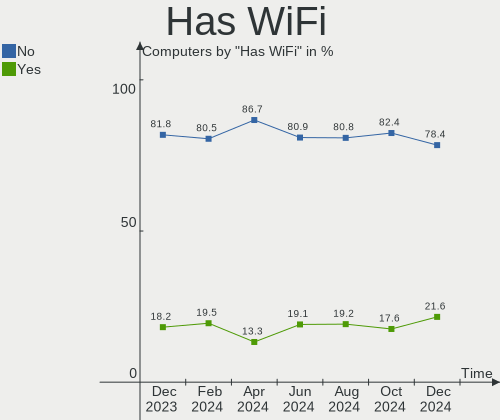
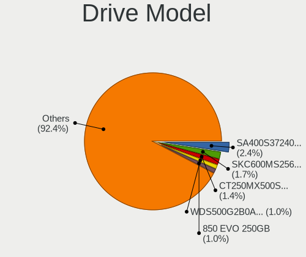
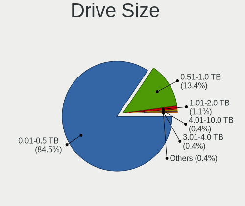

OPNsense Hardware Trends
------------------------

A project to identify most popular hardware characteristics and track their change
over time based on data collected by OPNsense users at https://BSD-Hardware.info.

Anyone can contribute to the study by uploading probes of their computers by
the [hw-probe](https://github.com/linuxhw/hw-probe/blob/master/INSTALL.BSD.md) tool:

    hw-probe -all -upload

Full-feature report is available here: https://bsd-hardware.info/?view=trends

Period: May, 2021.

Contents
--------

- [ OS                       ](#os)
- [ OS Family                ](#os-family)
- [ Arch                     ](#arch)
- [ DE                       ](#de)
- [ Display Server           ](#display-server)
- [ Display Manager          ](#display-manager)
- [ OS Lang                  ](#os-lang)
- [ Boot Mode                ](#boot-mode)
- [ Filesystem               ](#filesystem)
- [ Part. scheme             ](#part-scheme)
- [ Country                  ](#country)
- [ City                     ](#city)
- [ Vendor                   ](#vendor)
- [ Model                    ](#model)
- [ Model Family             ](#model-family)
- [ MFG Year                 ](#mfg-year)
- [ Form Factor              ](#form-factor)
- [ Coreboot                 ](#coreboot)
- [ RAM Size                 ](#ram-size)
- [ RAM Used                 ](#ram-used)
- [ Has CD-ROM               ](#has-cd-rom)
- [ Total Drives             ](#total-drives)
- [ Has Ethernet             ](#has-ethernet)
- [ Has WiFi                 ](#has-wifi)
- [ Has Bluetooth            ](#has-bluetooth)
- [ Drive Vendor             ](#drive-vendor)
- [ Drive Model              ](#drive-model)
- [ HDD Vendor               ](#hdd-vendor)
- [ SSD Vendor               ](#ssd-vendor)
- [ Drive Kind               ](#drive-kind)
- [ Drive Connector          ](#drive-connector)
- [ Drive Size               ](#drive-size)
- [ Space Total              ](#space-total)
- [ Space Used               ](#space-used)
- [ Malfunc. Drives          ](#malfunc-drives)
- [ Malfunc. Drive Vendor    ](#malfunc-drive-vendor)
- [ Malfunc. HDD Vendor      ](#malfunc-hdd-vendor)
- [ Malfunc. Drive Kind      ](#malfunc-drive-kind)
- [ Failed Drives            ](#failed-drives)
- [ Failed Drive Vendor      ](#failed-drive-vendor)
- [ Drive Status             ](#drive-status)
- [ Storage Vendor           ](#storage-vendor)
- [ Storage Model            ](#storage-model)
- [ Storage Kind             ](#storage-kind)
- [ CPU Vendor               ](#cpu-vendor)
- [ CPU Model                ](#cpu-model)
- [ CPU Model Family         ](#cpu-model-family)
- [ CPU Cores                ](#cpu-cores)
- [ CPU Sockets              ](#cpu-sockets)
- [ CPU Threads              ](#cpu-threads)
- [ CPU Microarch            ](#cpu-microarch)
- [ GPU Vendor               ](#gpu-vendor)
- [ GPU Model                ](#gpu-model)
- [ GPU Combo                ](#gpu-combo)
- [ GPU Driver               ](#gpu-driver)
- [ GPU Memory               ](#gpu-memory)
- [ Monitor Vendor           ](#monitor-vendor)
- [ Monitor Model            ](#monitor-model)
- [ Monitor Resolution       ](#monitor-resolution)
- [ Monitor Diagonal         ](#monitor-diagonal)
- [ Monitor Width            ](#monitor-width)
- [ Aspect Ratio             ](#aspect-ratio)
- [ Monitor Area             ](#monitor-area)
- [ Pixel Density            ](#pixel-density)
- [ Multiple Monitors        ](#multiple-monitors)
- [ Net Controller Vendor    ](#net-controller-vendor)
- [ Net Controller Model     ](#net-controller-model)
- [ Wireless Vendor          ](#wireless-vendor)
- [ Wireless Model           ](#wireless-model)
- [ Ethernet Vendor          ](#ethernet-vendor)
- [ Ethernet Model           ](#ethernet-model)
- [ Net Controller Kind      ](#net-controller-kind)
- [ Used Controller          ](#used-controller)
- [ NICs                     ](#nics)
- [ IPv6                     ](#ipv6)
- [ Memory Vendor            ](#memory-vendor)
- [ Memory Model             ](#memory-model)
- [ Memory Kind              ](#memory-kind)
- [ Memory Form Factor       ](#memory-form-factor)
- [ Memory Size              ](#memory-size)
- [ Memory Speed             ](#memory-speed)
- [ Sound Vendor             ](#sound-vendor)
- [ Sound Model              ](#sound-model)
- [ Camera Vendor            ](#camera-vendor)
- [ Camera Model             ](#camera-model)
- [ Fingerprint Vendor       ](#fingerprint-vendor)
- [ Fingerprint Model        ](#fingerprint-model)
- [ Chipcard Vendor          ](#chipcard-vendor)
- [ Chipcard Model           ](#chipcard-model)
- [ Printer Vendor           ](#printer-vendor)
- [ Printer Model            ](#printer-model)
- [ Scanner Vendor           ](#scanner-vendor)
- [ Scanner Model            ](#scanner-model)
- [ Bluetooth Vendor         ](#bluetooth-vendor)
- [ Bluetooth Model          ](#bluetooth-model)
- [ Unsupported Devices      ](#unsupported-devices)
- [ Unsupported Device Types ](#unsupported-device-types)

OS
--

Installed operating systems

| Name                   | Computers | Percent |
|------------------------|-----------|---------|
| OPNsense 21.1.5        | 171       | 75.66%  |
| OPNsense 21.1.6        | 35        | 15.49%  |
| OPNsense 21.7          | 5         | 2.21%   |
| OPNsense 21.1.4        | 4         | 1.77%   |
| OPNsense 21.1          | 4         | 1.77%   |
| OPNsense 21.1.3        | 2         | 0.88%   |
| OPNsense 20.7.8        | 2         | 0.88%   |
| OPNsense 21.1.2        | 1         | 0.44%   |
| OPNsense 20.7          | 1         | 0.44%   |
| OPNsense 12.1-p16-HBSD | 1         | 0.44%   |

OS Family
---------

OS without a version

| Name     | Computers | Percent |
|----------|-----------|---------|
| OPNsense | 226       | 100%    |

Arch
----

OS architecture (x86_64, i586, etc.)

| Name  | Computers | Percent |
|-------|-----------|---------|
| amd64 | 226       | 100%    |

DE
--

Desktop Environment

| Name    | Computers | Percent |
|---------|-----------|---------|
| Console | 226       | 100%    |

Display Server
--------------

X11 or Wayland

| Name    | Computers | Percent |
|---------|-----------|---------|
| Console | 226       | 100%    |

Display Manager
---------------

SDDM, LightDM, etc.

| Name    | Computers | Percent |
|---------|-----------|---------|
| Console | 226       | 100%    |

OS Lang
-------

Language

| Lang    | Computers | Percent |
|---------|-----------|---------|
| Unknown | 226       | 100%    |

Boot Mode
---------

EFI or BIOS

| Mode | Computers | Percent |
|------|-----------|---------|
| EFI  | 195       | 86.28%  |
| BIOS | 31        | 13.72%  |

Filesystem
----------

Type of filesystem

| Type | Computers | Percent |
|------|-----------|---------|
| Ufs  | 223       | 98.67%  |
| Zfs  | 3         | 1.33%   |

Part. scheme
------------

Scheme of partitioning

| Type    | Computers | Percent |
|---------|-----------|---------|
| GPT     | 198       | 87.61%  |
| MBR     | 27        | 11.95%  |
| Unknown | 1         | 0.44%   |

Country
-------

Geographic location (country)

| Country                | Computers | Percent |
|------------------------|-----------|---------|
| USA                    | 68        | 30.09%  |
| Germany                | 58        | 25.66%  |
| France                 | 11        | 4.87%   |
| UK                     | 10        | 4.42%   |
| Canada                 | 9         | 3.98%   |
| Australia              | 8         | 3.54%   |
| Switzerland            | 6         | 2.65%   |
| Brazil                 | 5         | 2.21%   |
| Austria                | 5         | 2.21%   |
| Poland                 | 4         | 1.77%   |
| Netherlands            | 4         | 1.77%   |
| Taiwan                 | 3         | 1.33%   |
| Sweden                 | 3         | 1.33%   |
| Russia                 | 3         | 1.33%   |
| Japan                  | 2         | 0.88%   |
| Italy                  | 2         | 0.88%   |
| Greece                 | 2         | 0.88%   |
| Denmark                | 2         | 0.88%   |
| Belgium                | 2         | 0.88%   |
| Ukraine                | 1         | 0.44%   |
| Thailand               | 1         | 0.44%   |
| Spain                  | 1         | 0.44%   |
| South Korea            | 1         | 0.44%   |
| South Africa           | 1         | 0.44%   |
| Slovakia               | 1         | 0.44%   |
| Romania                | 1         | 0.44%   |
| Portugal               | 1         | 0.44%   |
| Pakistan               | 1         | 0.44%   |
| Liechtenstein          | 1         | 0.44%   |
| Indonesia              | 1         | 0.44%   |
| Hungary                | 1         | 0.44%   |
| Guadeloupe             | 1         | 0.44%   |
| Egypt                  | 1         | 0.44%   |
| Czechia                | 1         | 0.44%   |
| Costa Rica             | 1         | 0.44%   |
| China                  | 1         | 0.44%   |
| Bosnia and Herzegovina | 1         | 0.44%   |
| Argentina              | 1         | 0.44%   |

City
----

Geographic location (city)

| City              | Computers | Percent |
|-------------------|-----------|---------|
| Munich            | 5         | 2.21%   |
| Hamburg           | 4         | 1.77%   |
| Vienna            | 3         | 1.33%   |
| Raleigh           | 3         | 1.33%   |
| Ottawa            | 3         | 1.33%   |
| London            | 3         | 1.33%   |
| Berlin            | 3         | 1.33%   |
| Zurich            | 2         | 0.88%   |
| Wuppertal         | 2         | 0.88%   |
| Taipei            | 2         | 0.88%   |
| São Paulo        | 2         | 0.88%   |
| Stuttgart         | 2         | 0.88%   |
| Royal Oak         | 2         | 0.88%   |
| Paris             | 2         | 0.88%   |
| North Bend        | 2         | 0.88%   |
| New Albany        | 2         | 0.88%   |
| Layton            | 2         | 0.88%   |
| Iowa City         | 2         | 0.88%   |
| Hohenlockstedt    | 2         | 0.88%   |
| Frankfurt am Main | 2         | 0.88%   |
| El Dorado Hills   | 2         | 0.88%   |
| Dallas            | 2         | 0.88%   |
| Athens            | 2         | 0.88%   |
| Zufikon           | 1         | 0.44%   |
| Zeuthen           | 1         | 0.44%   |
| Wylie             | 1         | 0.44%   |
| Wroclaw           | 1         | 0.44%   |
| Wolfsburg         | 1         | 0.44%   |
| Windsor           | 1         | 0.44%   |
| Wiesbaden         | 1         | 0.44%   |
| Westland          | 1         | 0.44%   |
| West Hartford     | 1         | 0.44%   |
| Waverly           | 1         | 0.44%   |
| Warwick           | 1         | 0.44%   |
| Warminster        | 1         | 0.44%   |
| Viterbo           | 1         | 0.44%   |
| Villaz            | 1         | 0.44%   |
| Victoria          | 1         | 0.44%   |
| Tucker            | 1         | 0.44%   |
| Toulouse          | 1         | 0.44%   |
| Taby              | 1         | 0.44%   |
| Sydney            | 1         | 0.44%   |
| Straubenhardt     | 1         | 0.44%   |
| Stockbridge       | 1         | 0.44%   |
| Speyer            | 1         | 0.44%   |
| Southport         | 1         | 0.44%   |
| Sneek             | 1         | 0.44%   |
| Simi Valley       | 1         | 0.44%   |
| Shirokanedai      | 1         | 0.44%   |
| Sertolovo         | 1         | 0.44%   |
| Sector 4          | 1         | 0.44%   |
| Seaside           | 1         | 0.44%   |
| Scunthorpe        | 1         | 0.44%   |
| Schwechat         | 1         | 0.44%   |
| Schaan            | 1         | 0.44%   |
| Sao Jose          | 1         | 0.44%   |
| San Diego         | 1         | 0.44%   |
| San Antonio       | 1         | 0.44%   |
| Salem             | 1         | 0.44%   |
| Sainte-Julie      | 1         | 0.44%   |

Vendor
------

Motherboard manufacturer

| Name                | Computers | Percent |
|---------------------|-----------|---------|
| Dell                | 26        | 11.5%   |
| Unknown             | 23        | 10.18%  |
| Supermicro          | 16        | 7.08%   |
| Hewlett-Packard     | 16        | 7.08%   |
| ASUSTek Computer    | 16        | 7.08%   |
| Protectli           | 15        | 6.64%   |
| PC Engines          | 12        | 5.31%   |
| MSI                 | 11        | 4.87%   |
| Intel               | 10        | 4.42%   |
| ASRock              | 9         | 3.98%   |
| AMI                 | 9         | 3.98%   |
| Shuttle             | 7         | 3.1%    |
| Lenovo              | 6         | 2.65%   |
| Gigabyte Technology | 6         | 2.65%   |
| Fujitsu             | 5         | 2.21%   |
| ZOTAC               | 4         | 1.77%   |
| SeeedStudio         | 4         | 1.77%   |
| AWOW                | 3         | 1.33%   |
| ASRockRack          | 3         | 1.33%   |
| Sophos              | 2         | 0.88%   |
| BESSTAR Tech        | 2         | 0.88%   |
| Advantech           | 2         | 0.88%   |
| Yanling             | 1         | 0.44%   |
| Thomas-Krenn.AG     | 1         | 0.44%   |
| Nuage Networks      | 1         | 0.44%   |
| NU941               | 1         | 0.44%   |
| NU591               | 1         | 0.44%   |
| NEXCOM              | 1         | 0.44%   |
| Lex                 | 1         | 0.44%   |
| Kontron Europe      | 1         | 0.44%   |
| Jetway              | 1         | 0.44%   |
| Inventec            | 1         | 0.44%   |
| IBM                 | 1         | 0.44%   |
| Google              | 1         | 0.44%   |
| Foxconn             | 1         | 0.44%   |
| Deciso              | 1         | 0.44%   |
| Compulab            | 1         | 0.44%   |
| CheckPoint          | 1         | 0.44%   |
| Biostar             | 1         | 0.44%   |
| Barracuda Networks  | 1         | 0.44%   |
| Apple               | 1         | 0.44%   |

Model
-----

Motherboard model

| Name                                           | Computers | Percent |
|------------------------------------------------|-----------|---------|
| Unknown                                        | 23        | 10.18%  |
| Protectli FW4B                                 | 9         | 3.98%   |
| AMI Aptio CRB                                  | 8         | 3.54%   |
| PC Engines apu4                                | 6         | 2.65%   |
| Supermicro Super Server                        | 5         | 2.21%   |
| PC Engines apu2                                | 5         | 2.21%   |
| ASUS All Series                                | 5         | 2.21%   |
| Protectli FW6                                  | 4         | 1.77%   |
| Intel Q3XXG4-P V1.0                            | 4         | 1.77%   |
| SeeedStudio ODYSSEY-X86J4105                   | 3         | 1.33%   |
| HP t730 Thin Client                            | 3         | 1.33%   |
| Dell PowerEdge R210 II                         | 3         | 1.33%   |
| AWOW PC BOX                                    | 3         | 1.33%   |
| ZOTAC ZBOX-CI327NANO-GS-01                     | 2         | 0.88%   |
| Supermicro X9SCL/X9SCM                         | 2         | 0.88%   |
| Supermicro A1SAi                               | 2         | 0.88%   |
| MSI MS-7C08                                    | 2         | 0.88%   |
| HP Z230 SFF Workstation                        | 2         | 0.88%   |
| Gigabyte B365M DS3H                            | 2         | 0.88%   |
| Dell Wyse 5070 Extended Thin Client            | 2         | 0.88%   |
| Dell OptiPlex 9020                             | 2         | 0.88%   |
| Dell OptiPlex 780                              | 2         | 0.88%   |
| Dell OptiPlex 7010                             | 2         | 0.88%   |
| ZOTAC ZBOX-MI522NANO/MI542NANO                 | 1         | 0.44%   |
| ZOTAC ZBOX-CI323NANO                           | 1         | 0.44%   |
| Yanling YL-KBR6L                               | 1         | 0.44%   |
| Thomas-Krenn.AG LES network+                   | 1         | 0.44%   |
| Supermicro X8DTU-LN4+                          | 1         | 0.44%   |
| Supermicro X10SLH-N6-ST031                     | 1         | 0.44%   |
| Supermicro SYS-E301-9D-8CN8TP                  | 1         | 0.44%   |
| Supermicro SYS-5019A-FTN4                      | 1         | 0.44%   |
| Supermicro SYS-5018A-TN4                       | 1         | 0.44%   |
| Supermicro IB-1050                             | 1         | 0.44%   |
| Supermicro 1HE Intel Single-CPU RI1104H Server | 1         | 0.44%   |
| Sophos XG                                      | 1         | 0.44%   |
| Sophos SG                                      | 1         | 0.44%   |
| Shuttle XS35V5                                 | 1         | 0.44%   |
| Shuttle TERRA_PC                               | 1         | 0.44%   |
| Shuttle DS81D                                  | 1         | 0.44%   |
| Shuttle DS10U                                  | 1         | 0.44%   |
| Shuttle DH370                                  | 1         | 0.44%   |
| Shuttle DH310V2                                | 1         | 0.44%   |
| Shuttle DH110                                  | 1         | 0.44%   |
| SeeedStudio ODYSSEY-X86J4125                   | 1         | 0.44%   |
| Protectli LES compact 4L                       | 1         | 0.44%   |
| Protectli FW6E                                 | 1         | 0.44%   |
| PC Engines APU                                 | 1         | 0.44%   |
| Nuage Networks 7850 NSG-E                      | 1         | 0.44%   |
| NU941 1.0                                      | 1         | 0.44%   |
| NU591 LES v3                                   | 1         | 0.44%   |
| NEXCOM ASG                                     | 1         | 0.44%   |
| MSI MS-S0891                                   | 1         | 0.44%   |
| MSI MS-9A45                                    | 1         | 0.44%   |
| MSI MS-9877                                    | 1         | 0.44%   |
| MSI MS-7851                                    | 1         | 0.44%   |
| MSI MS-7850                                    | 1         | 0.44%   |
| MSI MS-7846                                    | 1         | 0.44%   |
| MSI MS-7758                                    | 1         | 0.44%   |
| MSI MS-7721                                    | 1         | 0.44%   |
| MSI MS-7673                                    | 1         | 0.44%   |

Model Family
------------

Motherboard model prefix

| Name                          | Computers | Percent |
|-------------------------------|-----------|---------|
| Unknown                       | 23        | 10.18%  |
| Dell PowerEdge                | 11        | 4.87%   |
| Dell OptiPlex                 | 10        | 4.42%   |
| Protectli FW4B                | 9         | 3.98%   |
| AMI Aptio                     | 8         | 3.54%   |
| PC Engines apu4               | 6         | 2.65%   |
| HP ProLiant                   | 6         | 2.65%   |
| Supermicro Super              | 5         | 2.21%   |
| PC Engines apu2               | 5         | 2.21%   |
| ASUS All                      | 5         | 2.21%   |
| Protectli FW6                 | 4         | 1.77%   |
| Lenovo ThinkCentre            | 4         | 1.77%   |
| Intel Q3XXG4-P                | 4         | 1.77%   |
| SeeedStudio ODYSSEY-X86J4105  | 3         | 1.33%   |
| HP t730                       | 3         | 1.33%   |
| AWOW PC                       | 3         | 1.33%   |
| ZOTAC ZBOX-CI327NANO-GS-01    | 2         | 0.88%   |
| Supermicro X9SCL              | 2         | 0.88%   |
| Supermicro A1SAi              | 2         | 0.88%   |
| MSI MS-7C08                   | 2         | 0.88%   |
| HP Z230                       | 2         | 0.88%   |
| HP Compaq                     | 2         | 0.88%   |
| Gigabyte B365M                | 2         | 0.88%   |
| Fujitsu PRIMERGY              | 2         | 0.88%   |
| Fujitsu FUTRO                 | 2         | 0.88%   |
| Dell Wyse                     | 2         | 0.88%   |
| Dell Latitude                 | 2         | 0.88%   |
| ZOTAC ZBOX-MI522NANO          | 1         | 0.44%   |
| ZOTAC ZBOX-CI323NANO          | 1         | 0.44%   |
| Yanling YL-KBR6L              | 1         | 0.44%   |
| Thomas-Krenn.AG LES           | 1         | 0.44%   |
| Supermicro X8DTU-LN4+         | 1         | 0.44%   |
| Supermicro X10SLH-N6-ST031    | 1         | 0.44%   |
| Supermicro SYS-E301-9D-8CN8TP | 1         | 0.44%   |
| Supermicro SYS-5019A-FTN4     | 1         | 0.44%   |
| Supermicro SYS-5018A-TN4      | 1         | 0.44%   |
| Supermicro IB-1050            | 1         | 0.44%   |
| Supermicro 1HE                | 1         | 0.44%   |
| Sophos XG                     | 1         | 0.44%   |
| Sophos SG                     | 1         | 0.44%   |
| Shuttle XS35V5                | 1         | 0.44%   |
| Shuttle TERRA                 | 1         | 0.44%   |
| Shuttle DS81D                 | 1         | 0.44%   |
| Shuttle DS10U                 | 1         | 0.44%   |
| Shuttle DH370                 | 1         | 0.44%   |
| Shuttle DH310V2               | 1         | 0.44%   |
| Shuttle DH110                 | 1         | 0.44%   |
| SeeedStudio ODYSSEY-X86J4125  | 1         | 0.44%   |
| Protectli LES                 | 1         | 0.44%   |
| Protectli FW6E                | 1         | 0.44%   |
| PC Engines APU                | 1         | 0.44%   |
| Nuage Networks 7850           | 1         | 0.44%   |
| NU941 1.0                     | 1         | 0.44%   |
| NU591 LES                     | 1         | 0.44%   |
| NEXCOM ASG                    | 1         | 0.44%   |
| MSI MS-S0891                  | 1         | 0.44%   |
| MSI MS-9A45                   | 1         | 0.44%   |
| MSI MS-9877                   | 1         | 0.44%   |
| MSI MS-7851                   | 1         | 0.44%   |
| MSI MS-7850                   | 1         | 0.44%   |

MFG Year
--------

Motherboard manufacture year

| Year | Computers | Percent |
|------|-----------|---------|
| 2020 | 51        | 22.57%  |
| 2019 | 34        | 15.04%  |
| 2018 | 32        | 14.16%  |
| 2015 | 19        | 8.41%   |
| 2021 | 16        | 7.08%   |
| 2016 | 15        | 6.64%   |
| 2014 | 13        | 5.75%   |
| 2013 | 13        | 5.75%   |
| 2011 | 9         | 3.98%   |
| 2012 | 8         | 3.54%   |
| 2010 | 8         | 3.54%   |
| 2017 | 4         | 1.77%   |
| 2009 | 2         | 0.88%   |
| 2008 | 2         | 0.88%   |

Form Factor
-----------

Physical design of the computer

| Name     | Computers | Percent |
|----------|-----------|---------|
| Desktop  | 159       | 70.35%  |
| Mini pc  | 30        | 13.27%  |
| Server   | 26        | 11.5%   |
| Notebook | 8         | 3.54%   |
| Firewall | 3         | 1.33%   |

Coreboot
--------

Have coreboot on board

| Used | Computers | Percent |
|------|-----------|---------|
| No   | 206       | 91.15%  |
| Yes  | 20        | 8.85%   |

RAM Size
--------

Total RAM memory

| Size in GB  | Computers | Percent |
|-------------|-----------|---------|
| 8.01-16.0   | 82        | 36.28%  |
| 4.01-8.0    | 59        | 26.11%  |
| 16.01-24.0  | 44        | 19.47%  |
| 32.01-64.0  | 17        | 7.52%   |
| 2.01-3.0    | 10        | 4.42%   |
| 64.01-256.0 | 9         | 3.98%   |
| 24.01-32.0  | 3         | 1.33%   |
| 3.01-4.0    | 2         | 0.88%   |

RAM Used
--------

Used RAM memory

| Used GB    | Computers | Percent |
|------------|-----------|---------|
| 0.01-0.5   | 136       | 60.18%  |
| 0.51-1.0   | 49        | 21.68%  |
| 1.01-2.0   | 26        | 11.5%   |
| 4.01-8.0   | 4         | 1.77%   |
| 3.01-4.0   | 4         | 1.77%   |
| 2.01-3.0   | 3         | 1.33%   |
| 8.01-16.0  | 3         | 1.33%   |
| 32.01-64.0 | 1         | 0.44%   |

Has CD-ROM
----------

Has CD-ROM on board

| Presented | Computers | Percent |
|-----------|-----------|---------|
| No        | 189       | 83.63%  |
| Yes       | 37        | 16.37%  |

Total Drives
------------

Number of drives on board

| Drives | Computers | Percent |
|--------|-----------|---------|
| 1      | 192       | 84.96%  |
| 2      | 18        | 7.96%   |
| 0      | 14        | 6.19%   |
| 3      | 2         | 0.88%   |

Has Ethernet
------------

Has Ethernet on board

| Presented | Computers | Percent |
|-----------|-----------|---------|
| Yes       | 226       | 100%    |

Has WiFi
--------

Has WiFi module

| Presented | Computers | Percent |
|-----------|-----------|---------|
| No        | 180       | 79.65%  |
| Yes       | 46        | 20.35%  |

Has Bluetooth
-------------

Has Bluetooth module

| Presented | Computers | Percent |
|-----------|-----------|---------|
| No        | 200       | 88.5%   |
| Yes       | 26        | 11.5%   |

Drive Vendor
------------

Hard drive vendors

| Vendor              | Computers | Drives | Percent |
|---------------------|-----------|--------|---------|
| Samsung Electronics | 37        | 38     | 16.37%  |
| Kingston            | 22        | 23     | 9.73%   |
| Seagate             | 17        | 18     | 7.52%   |
| WDC                 | 16        | 17     | 7.08%   |
| Transcend           | 13        | 13     | 5.75%   |
| SanDisk             | 13        | 14     | 5.75%   |
| Hoodisk             | 11        | 11     | 4.87%   |
| Toshiba             | 10        | 10     | 4.42%   |
| Crucial             | 9         | 9      | 3.98%   |
| Dogfish             | 7         | 7      | 3.1%    |
| Phison              | 6         | 6      | 2.65%   |
| Intel               | 6         | 6      | 2.65%   |
| FORESEE             | 6         | 6      | 2.65%   |
| Hewlett-Packard     | 5         | 7      | 2.21%   |
| A-DATA Technology   | 5         | 5      | 2.21%   |
| ATP                 | 4         | 4      | 1.77%   |
| Protectli           | 3         | 3      | 1.33%   |
| China               | 3         | 3      | 1.33%   |
| BIWIN               | 3         | 3      | 1.33%   |
| SK Hynix            | 2         | 2      | 0.88%   |
| PNY                 | 2         | 2      | 0.88%   |
| PLEXTOR             | 2         | 2      | 0.88%   |
| HPE                 | 2         | 2      | 0.88%   |
| HGST                | 2         | 2      | 0.88%   |
| Gigabyte Technology | 2         | 2      | 0.88%   |
| Corsair             | 2         | 2      | 0.88%   |
| Apacer              | 2         | 2      | 0.88%   |
| ZTC                 | 1         | 1      | 0.44%   |
| SPCC                | 1         | 1      | 0.44%   |
| Smartbuy            | 1         | 1      | 0.44%   |
| Patriot             | 1         | 1      | 0.44%   |
| OCZ                 | 1         | 1      | 0.44%   |
| Micron Technology   | 1         | 2      | 0.44%   |
| LSILOGIC            | 1         | 1      | 0.44%   |
| LITEON              | 1         | 1      | 0.44%   |
| Kston               | 1         | 1      | 0.44%   |
| Intenso             | 1         | 1      | 0.44%   |
| HP Phison           | 1         | 1      | 0.44%   |
| Hitachi             | 1         | 1      | 0.44%   |
| Dell                | 1         | 1      | 0.44%   |
| BAITITON            | 1         | 1      | 0.44%   |

Drive Model
-----------

Hard drive models

| Model                            | Computers | Percent |
|----------------------------------|-----------|---------|
| Kingston SUV500MS120G 120GB      | 5         | 2.19%   |
| Phison SATA SSD 16GB             | 4         | 1.75%   |
| Hoodisk SSD 32GB                 | 4         | 1.75%   |
| FORESEE 128GB SSD                | 4         | 1.75%   |
| Transcend TS128GMSA230S 128GB    | 3         | 1.32%   |
| Seagate ST500LM021-1KJ152 500GB  | 3         | 1.32%   |
| Kingston SA400S37240G 240GB      | 3         | 1.32%   |
| Hoodisk SSD 64GB                 | 3         | 1.32%   |
| Hoodisk SSD 128GB                | 3         | 1.32%   |
| SanDisk SSD PLUS 120GB           | 2         | 0.88%   |
| SanDisk SDSA6MM-032G-1006 32GB   | 2         | 0.88%   |
| Samsung SSD 870 EVO 250GB        | 2         | 0.88%   |
| Samsung SSD 860 PRO 256GB        | 2         | 0.88%   |
| Samsung SSD 860 EVO M.2 250GB    | 2         | 0.88%   |
| Samsung SSD 860 EVO 500GB        | 2         | 0.88%   |
| Samsung SSD 850 EVO 250GB        | 2         | 0.88%   |
| Samsung SSD 840 PRO Series 256GB | 2         | 0.88%   |
| Samsung SSD 840 PRO Series 128GB | 2         | 0.88%   |
| Protectli 120GB mSATA            | 2         | 0.88%   |
| Kingston SUV500MS240G 240GB      | 2         | 0.88%   |
| Kingston SA2000M8250G 250GB      | 2         | 0.88%   |
| HPE MK0400GCTZA 400GB            | 2         | 0.88%   |
| HP RAID 0 240GB                  | 2         | 0.88%   |
| FORESEE 64GB SSD                 | 2         | 0.88%   |
| Dogfish SSD 256GB                | 2         | 0.88%   |
| Dogfish SSD 128GB                | 2         | 0.88%   |
| Crucial CT240BX500SSD1 240GB     | 2         | 0.88%   |
| Crucial CT120BX500SSD1 120GB     | 2         | 0.88%   |
| BIWIN SSD 128GB                  | 2         | 0.88%   |
| ZTC SM201-064G                   | 1         | 0.44%   |
| WDC WDS500G1X0E-00AFY0 500GB     | 1         | 0.44%   |
| WDC WDS120G2G0A-00JH30 120GB     | 1         | 0.44%   |
| WDC WD5000LPVX-75V0TT0 500GB     | 1         | 0.44%   |
| WDC WD5000LPVX-22V0TT0 500GB     | 1         | 0.44%   |
| WDC WD5000AAKS-22V1A0 500GB      | 1         | 0.44%   |
| WDC WD5000AAKS-00UU3A0 500GB     | 1         | 0.44%   |
| WDC WD5000AAKS-00TMA0 500GB      | 1         | 0.44%   |
| WDC WD5000AAKS-00A7B2 500GB      | 1         | 0.44%   |
| WDC WD3200BPVT-22JJ5T0 320GB     | 1         | 0.44%   |
| WDC WD3200BEKX-75B7WT0 320GB     | 1         | 0.44%   |
| WDC WD3000BLFS-60YBU2 304GB      | 1         | 0.44%   |
| WDC WD2500BEVS-08VAT2 250GB      | 1         | 0.44%   |
| WDC WD2500AAKX-75U6AA0 250GB     | 1         | 0.44%   |
| WDC WD20EARX-00PASB0 2TB         | 1         | 0.44%   |
| WDC WD2000JB-00FUA0 200GB        | 1         | 0.44%   |
| WDC WD10EZEX-22BN5A0 1TB         | 1         | 0.44%   |
| Transcend TS64GSSD340 64GB       | 1         | 0.44%   |
| Transcend TS64GMTS400SD 64GB     | 1         | 0.44%   |
| Transcend TS32GSSD370S 32GB      | 1         | 0.44%   |
| Transcend TS32GSSD370 32GB       | 1         | 0.44%   |
| Transcend TS32GMSA370 32GB       | 1         | 0.44%   |
| Transcend TS256GMTS952T2 256GB   | 1         | 0.44%   |
| Transcend TS256GMTS430S 256GB    | 1         | 0.44%   |
| Transcend TS16GMTS400 16GB       | 1         | 0.44%   |
| Transcend TS128GMSA370S 128GB    | 1         | 0.44%   |
| Transcend TS128GMSA370 128GB     | 1         | 0.44%   |
| Toshiba TL100 240GB              | 1         | 0.44%   |
| Toshiba THNSNJ128GCSY 128GB      | 1         | 0.44%   |
| Toshiba THNSN5256GPUK NVMe 256GB | 1         | 0.44%   |
| Toshiba MQ01ABF032 320GB         | 1         | 0.44%   |

HDD Vendor
----------

Hard disk drive vendors

| Vendor              | Computers | Drives | Percent |
|---------------------|-----------|--------|---------|
| Seagate             | 15        | 16     | 31.25%  |
| WDC                 | 14        | 15     | 29.17%  |
| Toshiba             | 6         | 6      | 12.5%   |
| Hewlett-Packard     | 5         | 7      | 10.42%  |
| Samsung Electronics | 3         | 3      | 6.25%   |
| HGST                | 2         | 2      | 4.17%   |
| LSILOGIC            | 1         | 1      | 2.08%   |
| Hitachi             | 1         | 1      | 2.08%   |
| Dell                | 1         | 1      | 2.08%   |

SSD Vendor
----------

Solid state drive vendors

| Vendor              | Computers | Drives | Percent |
|---------------------|-----------|--------|---------|
| Samsung Electronics | 29        | 29     | 18.24%  |
| Kingston            | 18        | 19     | 11.32%  |
| Transcend           | 13        | 13     | 8.18%   |
| SanDisk             | 13        | 14     | 8.18%   |
| Hoodisk             | 11        | 11     | 6.92%   |
| Crucial             | 9         | 9      | 5.66%   |
| Dogfish             | 7         | 7      | 4.4%    |
| Phison              | 6         | 6      | 3.77%   |
| Intel               | 6         | 6      | 3.77%   |
| FORESEE             | 6         | 6      | 3.77%   |
| Protectli           | 3         | 3      | 1.89%   |
| China               | 3         | 3      | 1.89%   |
| BIWIN               | 3         | 3      | 1.89%   |
| ATP                 | 3         | 3      | 1.89%   |
| A-DATA Technology   | 3         | 3      | 1.89%   |
| Toshiba             | 2         | 2      | 1.26%   |
| PNY                 | 2         | 2      | 1.26%   |
| PLEXTOR             | 2         | 2      | 1.26%   |
| HPE                 | 2         | 2      | 1.26%   |
| Corsair             | 2         | 2      | 1.26%   |
| Apacer              | 2         | 2      | 1.26%   |
| ZTC                 | 1         | 1      | 0.63%   |
| WDC                 | 1         | 1      | 0.63%   |
| Smartbuy            | 1         | 1      | 0.63%   |
| SK Hynix            | 1         | 1      | 0.63%   |
| Seagate             | 1         | 1      | 0.63%   |
| Patriot             | 1         | 1      | 0.63%   |
| OCZ                 | 1         | 1      | 0.63%   |
| Micron Technology   | 1         | 2      | 0.63%   |
| LITEON              | 1         | 1      | 0.63%   |
| Kston               | 1         | 1      | 0.63%   |
| Intenso             | 1         | 1      | 0.63%   |
| HP Phison           | 1         | 1      | 0.63%   |
| Gigabyte Technology | 1         | 1      | 0.63%   |
| BAITITON            | 1         | 1      | 0.63%   |

Drive Kind
----------

HDD or SSD

| Kind | Computers | Drives | Percent |
|------|-----------|--------|---------|
| SSD  | 154       | 162    | 69.37%  |
| HDD  | 48        | 52     | 21.62%  |
| NVMe | 20        | 20     | 9.01%   |

Drive Connector
---------------

SATA, SAS, NVMe, etc.

| Type | Computers | Drives | Percent |
|------|-----------|--------|---------|
| SATA | 194       | 214    | 90.65%  |
| NVMe | 20        | 20     | 9.35%   |

Drive Size
----------

Size of hard drive

| Size in TB | Computers | Drives | Percent |
|------------|-----------|--------|---------|
| 0.01-0.5   | 183       | 195    | 91.04%  |
| 0.51-1.0   | 16        | 17     | 7.96%   |
| 1.01-2.0   | 2         | 2      | 1%      |

Space Total
-----------

Amount of disk space available on the file system

| Size in GB | Computers | Percent |
|------------|-----------|---------|
| 101-250    | 97        | 42.92%  |
| 251-500    | 40        | 17.7%   |
| 21-50      | 35        | 15.49%  |
| 51-100     | 26        | 11.5%   |
| 1-20       | 15        | 6.64%   |
| 501-1000   | 12        | 5.31%   |
| 1001-2000  | 1         | 0.44%   |

Space Used
----------

Amount of used disk space

| Used GB | Computers | Percent |
|---------|-----------|---------|
| 1-20    | 220       | 97.35%  |
| 21-50   | 5         | 2.21%   |
| 51-100  | 1         | 0.44%   |

Malfunc. Drives
---------------

Drive models with a malfunction

| Model                                        | Computers | Drives | Percent |
|----------------------------------------------|-----------|--------|---------|
| Seagate ST500LM021-1KJ152 500GB              | 2         | 2      | 7.41%   |
| ZTC SM201-064G                               | 1         | 1      | 3.7%    |
| WDC WD5000LPVX-22V0TT0 500GB                 | 1         | 1      | 3.7%    |
| WDC WD5000AAKS-22V1A0 500GB                  | 1         | 1      | 3.7%    |
| WDC WD3000BLFS-60YBU2 304GB                  | 1         | 2      | 3.7%    |
| Toshiba MK2555GSX 250GB                      | 1         | 1      | 3.7%    |
| SK Hynix SC308 SATA 256GB                    | 1         | 1      | 3.7%    |
| Seagate ST500LT012-9WS142 500GB              | 1         | 1      | 3.7%    |
| Seagate ST500LM000-SSHD-8GB                  | 1         | 1      | 3.7%    |
| Seagate ST500DM002-1BD142 500GB              | 1         | 2      | 3.7%    |
| SanDisk SSD i110 32GB                        | 1         | 1      | 3.7%    |
| Samsung Electronics SSD 840 PRO Series 256GB | 1         | 1      | 3.7%    |
| Samsung Electronics HM160HI 160GB            | 1         | 1      | 3.7%    |
| Kston SSD 128GB                              | 1         | 1      | 3.7%    |
| Kingston SV300S37A120G 120GB                 | 1         | 1      | 3.7%    |
| Intenso SSD SATAIII 120GB                    | 1         | 1      | 3.7%    |
| HP Phison PSSBN032GA27MC0 32GB               | 1         | 1      | 3.7%    |
| Hitachi HDS721050CLA660 500GB                | 1         | 1      | 3.7%    |
| DOGFISH SSD 480GB                            | 1         | 1      | 3.7%    |
| Dogfish SSD 120GB                            | 1         | 1      | 3.7%    |
| Crucial M4-CT128M4SSD1 128GB                 | 1         | 1      | 3.7%    |
| Crucial CT512M550SSD1 512GB                  | 1         | 1      | 3.7%    |
| Crucial CT500MX500SSD1 500GB                 | 1         | 1      | 3.7%    |
| Crucial CT240M500SSD1 240GB                  | 1         | 1      | 3.7%    |
| Corsair Force 3 SSD 120GB                    | 1         | 1      | 3.7%    |
| Apacer 16GB SATA Flash Drive                 | 1         | 1      | 3.7%    |

Malfunc. Drive Vendor
---------------------

Vendors of faulty drives

| Vendor              | Computers | Drives | Percent |
|---------------------|-----------|--------|---------|
| Seagate             | 5         | 6      | 18.52%  |
| Crucial             | 4         | 4      | 14.81%  |
| WDC                 | 3         | 4      | 11.11%  |
| Samsung Electronics | 2         | 2      | 7.41%   |
| Dogfish             | 2         | 2      | 7.41%   |
| ZTC                 | 1         | 1      | 3.7%    |
| Toshiba             | 1         | 1      | 3.7%    |
| SK Hynix            | 1         | 1      | 3.7%    |
| SanDisk             | 1         | 1      | 3.7%    |
| Kston               | 1         | 1      | 3.7%    |
| Kingston            | 1         | 1      | 3.7%    |
| Intenso             | 1         | 1      | 3.7%    |
| HP Phison           | 1         | 1      | 3.7%    |
| Hitachi             | 1         | 1      | 3.7%    |
| Corsair             | 1         | 1      | 3.7%    |
| Apacer              | 1         | 1      | 3.7%    |

Malfunc. HDD Vendor
-------------------

Vendors of faulty HDD drives

| Vendor              | Computers | Drives | Percent |
|---------------------|-----------|--------|---------|
| Seagate             | 5         | 6      | 45.45%  |
| WDC                 | 3         | 4      | 27.27%  |
| Toshiba             | 1         | 1      | 9.09%   |
| Samsung Electronics | 1         | 1      | 9.09%   |
| Hitachi             | 1         | 1      | 9.09%   |

Malfunc. Drive Kind
-------------------

Kinds of faulty drives

| Kind | Computers | Drives | Percent |
|------|-----------|--------|---------|
| SSD  | 16        | 16     | 59.26%  |
| HDD  | 11        | 13     | 40.74%  |

Failed Drives
-------------

Failed drive models

Zero info for selected period =(

Failed Drive Vendor
-------------------

Failed drive vendors

Zero info for selected period =(

Drive Status
------------

Number of failed and malfunc. drives

| Status   | Computers | Drives | Percent |
|----------|-----------|--------|---------|
| Works    | 182       | 198    | 84.26%  |
| Malfunc  | 27        | 29     | 12.5%   |
| Detected | 7         | 7      | 3.24%   |

Storage Vendor
--------------

Storage controller vendors

| Vendor                      | Computers | Percent |
|-----------------------------|-----------|---------|
| Intel                       | 187       | 72.2%   |
| AMD                         | 33        | 12.74%  |
| Broadcom / LSI              | 8         | 3.09%   |
| Samsung Electronics         | 6         | 2.32%   |
| ASMedia Technology          | 5         | 1.93%   |
| Kingston Technology Company | 4         | 1.54%   |
| Hewlett-Packard             | 3         | 1.16%   |
| Toshiba                     | 2         | 0.77%   |
| Phison Electronics          | 2         | 0.77%   |
| SK Hynix                    | 1         | 0.39%   |
| Seagate Technology          | 1         | 0.39%   |
| Sandisk                     | 1         | 0.39%   |
| Realtek Semiconductor       | 1         | 0.39%   |
| Marvell Technology Group    | 1         | 0.39%   |
| JMicron Technology          | 1         | 0.39%   |
| Chelsio Communications      | 1         | 0.39%   |
| ATP ELECTRONICS             | 1         | 0.39%   |
| ADATA Technology            | 1         | 0.39%   |

Storage Model
-------------

Storage controller models

| Model                                                                                   | Computers | Percent |
|-----------------------------------------------------------------------------------------|-----------|---------|
| Intel 8 Series/C220 Series Chipset Family 6-port SATA Controller 1 [AHCI mode]          | 27        | 9.18%   |
| AMD FCH SATA Controller [AHCI mode]                                                     | 26        | 8.84%   |
| Intel Atom/Celeron/Pentium Processor x5-E8000/J3xxx/N3xxx Series SATA Controller        | 18        | 6.12%   |
| Intel Atom Processor E3800 Series SATA AHCI Controller                                  | 14        | 4.76%   |
| Intel Sunrise Point-LP SATA Controller [AHCI mode]                                      | 13        | 4.42%   |
| Intel 6 Series/C200 Series Chipset Family 6 port Desktop SATA AHCI Controller           | 13        | 4.42%   |
| Intel Celeron/Pentium Silver Processor SATA Controller                                  | 8         | 2.72%   |
| Intel Celeron N3350/Pentium N4200/Atom E3900 Series SATA AHCI Controller                | 8         | 2.72%   |
| Intel NM10/ICH7 Family SATA Controller [IDE mode]                                       | 7         | 2.38%   |
| Intel Atom processor C2000 AHCI SATA3 Controller                                        | 7         | 2.38%   |
| Intel 82801G (ICH7 Family) IDE Controller                                               | 7         | 2.38%   |
| Intel 8 Series SATA Controller 1 [AHCI mode]                                            | 6         | 2.04%   |
| Intel Atom processor C2000 AHCI SATA2 Controller                                        | 5         | 1.7%    |
| Intel 7 Series/C210 Series Chipset Family 6-port SATA Controller [AHCI mode]            | 5         | 1.7%    |
| Intel 200 Series PCH SATA controller [AHCI mode]                                        | 5         | 1.7%    |
| ASMedia ASM1062 Serial ATA Controller                                                   | 5         | 1.7%    |
| Intel Wildcat Point-LP SATA Controller [AHCI Mode]                                      | 4         | 1.36%   |
| Intel SATA Controller [RAID mode]                                                       | 4         | 1.36%   |
| Intel Q170/Q150/B150/H170/H110/Z170/CM236 Chipset SATA Controller [AHCI Mode]           | 4         | 1.36%   |
| Intel Cannon Lake PCH SATA AHCI Controller                                              | 4         | 1.36%   |
| AMD FCH IDE Controller                                                                  | 4         | 1.36%   |
| Samsung NVMe SSD Controller SM981/PM981/PM983                                           | 3         | 1.02%   |
| Intel NM10/ICH7 Family SATA Controller [AHCI mode]                                      | 3         | 1.02%   |
| Intel Comet Lake SATA AHCI Controller                                                   | 3         | 1.02%   |
| Intel Cannon Point-LP SATA Controller [AHCI Mode]                                       | 3         | 1.02%   |
| Intel C600/X79 series chipset 6-Port SATA AHCI Controller                               | 3         | 1.02%   |
| Intel Atom Processor C3000 Series SATA Controller 1                                     | 3         | 1.02%   |
| Intel 82801JI (ICH10 Family) 4 port SATA IDE Controller #1                              | 3         | 1.02%   |
| Intel 82801JI (ICH10 Family) 2 port SATA IDE Controller #2                              | 3         | 1.02%   |
| Intel 82801 Mobile SATA Controller [RAID mode]                                          | 3         | 1.02%   |
| AMD SB7x0/SB8x0/SB9x0 SATA Controller [IDE mode]                                        | 3         | 1.02%   |
| AMD 400 Series Chipset SATA Controller                                                  | 3         | 1.02%   |
| Samsung NVMe Controller                                                                 | 2         | 0.68%   |
| Kingston Company A2000 NVMe SSD                                                         | 2         | 0.68%   |
| Intel 82801JI (ICH10 Family) SATA AHCI Controller                                       | 2         | 0.68%   |
| Intel 82801HM/HEM (ICH8M/ICH8M-E) SATA Controller [IDE mode]                            | 2         | 0.68%   |
| Intel 82801HM/HEM (ICH8M/ICH8M-E) IDE Controller                                        | 2         | 0.68%   |
| Intel 6 Series/C200 Series Chipset Family Desktop SATA Controller (IDE mode, ports 4-5) | 2         | 0.68%   |
| Intel 6 Series/C200 Series Chipset Family Desktop SATA Controller (IDE mode, ports 0-3) | 2         | 0.68%   |
| HP Smart Array G6 controllers                                                           | 2         | 0.68%   |
| Broadcom / LSI SAS1068E PCI-Express Fusion-MPT SAS                                      | 2         | 0.68%   |
| AMD SB7x0/SB8x0/SB9x0 IDE Controller                                                    | 2         | 0.68%   |
| Unknown                                                                                 | 2         | 0.68%   |
| Toshiba XG4 NVMe SSD Controller                                                         | 1         | 0.34%   |
| Toshiba BG3 NVMe SSD Controller                                                         | 1         | 0.34%   |
| SK Hynix hynix unknown                                                                  | 1         | 0.34%   |
| Seagate FireCuda 520 SSD                                                                | 1         | 0.34%   |
| Sandisk WD Black SN850                                                                  | 1         | 0.34%   |
| Samsung NVMe SSD Controller SM961/PM961/SM963                                           | 1         | 0.34%   |
| Phison PS5013 E13 NVMe Controller                                                       | 1         | 0.34%   |
| Phison E16 PCIe4 NVMe Controller                                                        | 1         | 0.34%   |
| Marvell Group 88SE9172 SATA III 6Gb/s RAID Controller                                   | 1         | 0.34%   |
| Marvell Group 88SE9172 SATA 6Gb/s Controller                                            | 1         | 0.34%   |
| Kingston Company U-SNS8154P3 NVMe SSD                                                   | 1         | 0.34%   |
| Kingston Company OM3PDP3 NVMe SSD                                                       | 1         | 0.34%   |
| JMicron JMB363 SATA/IDE Controller                                                      | 1         | 0.34%   |
| Intel C620 Series Chipset Family SSATA Controller [AHCI mode]                           | 1         | 0.34%   |
| Intel C620 Series Chipset Family SATA Controller [AHCI mode]                            | 1         | 0.34%   |
| Intel C600/X79 series chipset 4-Port SATA Storage Control Unit                          | 1         | 0.34%   |
| Intel Atom Processor C3000 Series SATA Controller 0                                     | 1         | 0.34%   |

Storage Kind
------------

Kind of storage controller (IDE, SATA, NVMe, SAS, ...)

| Kind | Computers | Percent |
|------|-----------|---------|
| SATA | 192       | 73%     |
| IDE  | 31        | 11.79%  |
| NVMe | 20        | 7.6%    |
| RAID | 14        | 5.32%   |
| SAS  | 3         | 1.14%   |
| SCSI | 3         | 1.14%   |

CPU Vendor
----------

Processor vendors

| Vendor | Computers | Percent |
|--------|-----------|---------|
| Intel  | 193       | 85.4%   |
| AMD    | 33        | 14.6%   |

CPU Model
---------

Processor models

| Model                                    | Computers | Percent |
|------------------------------------------|-----------|---------|
| Intel Celeron CPU J3160 @ 1.60GHz        | 12        | 5.31%   |
| AMD GX-412TC SOC                         | 11        | 4.87%   |
| Intel Celeron CPU J1900 @ 1.99GHz        | 7         | 3.1%    |
| Intel Core i5-7200U CPU @ 2.50GHz        | 5         | 2.21%   |
| Intel Celeron J4105 CPU @ 1.50GHz        | 4         | 1.77%   |
| Intel Core i7-7500U CPU @ 2.70GHz        | 3         | 1.33%   |
| Intel Core i5-4570 CPU @ 3.20GHz         | 3         | 1.33%   |
| Intel Core i5-10210U CPU @ 1.60GHz       | 3         | 1.33%   |
| Intel Core i3-4005U CPU @ 1.70GHz        | 3         | 1.33%   |
| Intel Celeron CPU N3450 @ 1.10GHz        | 3         | 1.33%   |
| Intel Celeron CPU N2940 @ 1.83GHz        | 3         | 1.33%   |
| Intel Celeron CPU J3455E @ 1.50GHz       | 3         | 1.33%   |
| Intel Atom CPU D525 @ 1.80GHz            | 3         | 1.33%   |
| Intel Atom CPU C2358 @ 1.74GHz           | 3         | 1.33%   |
| AMD RX-427BB with AMD Radeon R7 Graphics | 3         | 1.33%   |
| Intel Xeon CPU E31220 @ 3.10GHz          | 2         | 0.88%   |
| Intel Xeon CPU E3-1265L v3 @ 2.50GHz     | 2         | 0.88%   |
| Intel Xeon CPU D-1518 @ 2.20GHz          | 2         | 0.88%   |
| Intel Pentium Silver J5005 CPU @ 1.50GHz | 2         | 0.88%   |
| Intel Pentium CPU N3700 @ 1.60GHz        | 2         | 0.88%   |
| Intel Core i7-4770K CPU @ 3.50GHz        | 2         | 0.88%   |
| Intel Core i5-8365U CPU @ 1.60GHz        | 2         | 0.88%   |
| Intel Core i5-2400 CPU @ 3.10GHz         | 2         | 0.88%   |
| Intel Core i3-9100F CPU @ 3.60GHz        | 2         | 0.88%   |
| Intel Core i3-9100 CPU @ 3.60GHz         | 2         | 0.88%   |
| Intel Core i3-4170 CPU @ 3.70GHz         | 2         | 0.88%   |
| Intel Core i3-3240 CPU @ 3.40GHz         | 2         | 0.88%   |
| Intel Celeron J4125 CPU @ 2.00GHz        | 2         | 0.88%   |
| Intel Celeron CPU N3160 @ 1.60GHz        | 2         | 0.88%   |
| Intel Atom CPU D2550 @ 1.86GHz           | 2         | 0.88%   |
| Intel Atom CPU C3558 @ 2.20GHz           | 2         | 0.88%   |
| Intel Atom CPU C2758 @ 2.40GHz           | 2         | 0.88%   |
| Intel Xeon E-2224G CPU @ 3.50GHz         | 1         | 0.44%   |
| Intel Xeon E-2224 CPU @ 3.40GHz          | 1         | 0.44%   |
| Intel Xeon D-2146NT CPU @ 2.30GHz        | 1         | 0.44%   |
| Intel Xeon CPU X5650 @ 2.67GHz           | 1         | 0.44%   |
| Intel Xeon CPU X5550 @ 2.67GHz           | 1         | 0.44%   |
| Intel Xeon CPU E5620 @ 2.40GHz           | 1         | 0.44%   |
| Intel Xeon CPU E5530 @ 2.40GHz           | 1         | 0.44%   |
| Intel Xeon CPU E5506 @ 2.13GHz           | 1         | 0.44%   |
| Intel Xeon CPU E5504 @ 2.00GHz           | 1         | 0.44%   |
| Intel Xeon CPU E5-2650 v3 @ 2.30GHz      | 1         | 0.44%   |
| Intel Xeon CPU E5-2630 v3 @ 2.40GHz      | 1         | 0.44%   |
| Intel Xeon CPU E5-2620 v2 @ 2.10GHz      | 1         | 0.44%   |
| Intel Xeon CPU E5-2430 v2 @ 2.50GHz      | 1         | 0.44%   |
| Intel Xeon CPU E5-2407 0 @ 2.20GHz       | 1         | 0.44%   |
| Intel Xeon CPU E31260L @ 2.40GHz         | 1         | 0.44%   |
| Intel Xeon CPU E31245 @ 3.30GHz          | 1         | 0.44%   |
| Intel Xeon CPU E3-1290 V2 @ 3.70GHz      | 1         | 0.44%   |
| Intel Xeon CPU E3-1280 v5 @ 3.70GHz      | 1         | 0.44%   |
| Intel Xeon CPU E3-1270 v6 @ 3.80GHz      | 1         | 0.44%   |
| Intel Xeon CPU E3-1270 v3 @ 3.50GHz      | 1         | 0.44%   |
| Intel Xeon CPU E3-1240L v3 @ 2.00GHz     | 1         | 0.44%   |
| Intel Xeon CPU E3-1240 V2 @ 3.40GHz      | 1         | 0.44%   |
| Intel Xeon CPU E3-1226 v3 @ 3.30GHz      | 1         | 0.44%   |
| Intel Xeon CPU E3-1225 v3 @ 3.20GHz      | 1         | 0.44%   |
| Intel Xeon CPU E3-1220L v3 @ 1.10GHz     | 1         | 0.44%   |
| Intel Xeon CPU E3-1220 v5 @ 3.00GHz      | 1         | 0.44%   |
| Intel Xeon CPU E3-1220 v3 @ 3.10GHz      | 1         | 0.44%   |
| Intel Xeon CPU E3-1220 V2 @ 3.10GHz      | 1         | 0.44%   |

CPU Model Family
----------------

Processor model prefix

| Model                   | Computers | Percent |
|-------------------------|-----------|---------|
| Intel Celeron           | 50        | 22.12%  |
| Intel Xeon              | 36        | 15.93%  |
| Intel Core i5           | 30        | 13.27%  |
| Intel Core i3           | 25        | 11.06%  |
| Intel Atom              | 19        | 8.41%   |
| Intel Core i7           | 14        | 6.19%   |
| AMD GX                  | 14        | 6.19%   |
| Intel Pentium           | 7         | 3.1%    |
| Other                   | 6         | 2.65%   |
| AMD Ryzen 5             | 4         | 1.77%   |
| Intel Core 2 Quad       | 3         | 1.33%   |
| Intel Pentium Silver    | 2         | 0.88%   |
| Intel Core 2 Duo        | 2         | 0.88%   |
| AMD G                   | 2         | 0.88%   |
| Intel Pentium Dual-Core | 1         | 0.44%   |
| Intel Pentium Dual      | 1         | 0.44%   |
| Intel Core i9           | 1         | 0.44%   |
| AMD Ryzen 7             | 1         | 0.44%   |
| AMD Ryzen 5 PRO         | 1         | 0.44%   |
| AMD Ryzen 3             | 1         | 0.44%   |
| AMD FX                  | 1         | 0.44%   |
| AMD EPYC                | 1         | 0.44%   |
| AMD Athlon Dual Core    | 1         | 0.44%   |
| AMD Athlon              | 1         | 0.44%   |
| AMD A6                  | 1         | 0.44%   |
| AMD A4                  | 1         | 0.44%   |

CPU Cores
---------

Number of processor cores

| Number  | Computers | Percent |
|---------|-----------|---------|
| 4       | 124       | 54.87%  |
| 2       | 71        | 31.42%  |
| 8       | 13        | 5.75%   |
| 6       | 6         | 2.65%   |
| 12      | 5         | 2.21%   |
| Unknown | 3         | 1.33%   |
| 16      | 2         | 0.88%   |
| 10      | 1         | 0.44%   |
| 1       | 1         | 0.44%   |

CPU Sockets
-----------

Number of sockets

| Number | Computers | Percent |
|--------|-----------|---------|
| 1      | 218       | 96.46%  |
| 2      | 8         | 3.54%   |

CPU Threads
-----------

Threads per core (Hyper-Threading)

| Number  | Computers | Percent |
|---------|-----------|---------|
| 1       | 144       | 63.72%  |
| 2       | 79        | 34.96%  |
| Unknown | 3         | 1.33%   |

CPU Microarch
-------------

Microarchitecture

| Name          | Computers | Percent |
|---------------|-----------|---------|
| Silvermont    | 39        | 17.26%  |
| Haswell       | 37        | 16.37%  |
| KabyLake      | 29        | 12.83%  |
| IvyBridge     | 15        | 6.64%   |
| SandyBridge   | 13        | 5.75%   |
| Puma          | 12        | 5.31%   |
| Goldmont      | 11        | 4.87%   |
| Penryn        | 8         | 3.54%   |
| Goldmont plus | 8         | 3.54%   |
| Bonnell       | 7         | 3.1%    |
| Broadwell     | 6         | 2.65%   |
| Skylake       | 5         | 2.21%   |
| Nehalem       | 5         | 2.21%   |
| Zen 2         | 4         | 1.77%   |
| Core          | 4         | 1.77%   |
| Westmere      | 3         | 1.33%   |
| Steamroller   | 3         | 1.33%   |
| Jaguar        | 3         | 1.33%   |
| Zen           | 2         | 0.88%   |
| Piledriver    | 2         | 0.88%   |
| K8 Hammer     | 2         | 0.88%   |
| Bobcat        | 2         | 0.88%   |
| Zen+          | 1         | 0.44%   |
| Zen 3         | 1         | 0.44%   |
| IceLake       | 1         | 0.44%   |
| CometLake     | 1         | 0.44%   |
| Bulldozer     | 1         | 0.44%   |
| Unknown       | 1         | 0.44%   |

GPU Vendor
----------

Vendors of graphics cards

| Vendor                     | Computers | Percent |
|----------------------------|-----------|---------|
| Intel                      | 143       | 67.14%  |
| AMD                        | 22        | 10.33%  |
| ASPEED Technology          | 19        | 8.92%   |
| Matrox Electronics Systems | 18        | 8.45%   |
| Nvidia                     | 11        | 5.16%   |

GPU Model
---------

Graphics card models

| Model                                                                                    | Computers | Percent |
|------------------------------------------------------------------------------------------|-----------|---------|
| ASPEED Technology ASPEED Graphics Family                                                 | 19        | 8.92%   |
| Intel Atom/Celeron/Pentium Processor x5-E8000/J3xxx/N3xxx Integrated Graphics Controller | 18        | 8.45%   |
| Intel Xeon E3-1200 v3/4th Gen Core Processor Integrated Graphics Controller              | 15        | 7.04%   |
| Intel Atom Processor Z36xxx/Z37xxx Series Graphics & Display                             | 14        | 6.57%   |
| Intel HD Graphics 620                                                                    | 9         | 4.23%   |
| Matrox Electronics Systems MGA G200eW WPCM450                                            | 8         | 3.76%   |
| Intel HD Graphics 500                                                                    | 8         | 3.76%   |
| Intel 4 Series Chipset Integrated Graphics Controller                                    | 7         | 3.29%   |
| Intel 2nd Generation Core Processor Family Integrated Graphics Controller                | 7         | 3.29%   |
| Intel Haswell-ULT Integrated Graphics Controller                                         | 6         | 2.82%   |
| Intel GeminiLake [UHD Graphics 600]                                                      | 6         | 2.82%   |
| Intel Xeon E3-1200 v2/3rd Gen Core processor Graphics Controller                         | 5         | 2.35%   |
| Intel Atom Processor D4xx/D5xx/N4xx/N5xx Integrated Graphics Controller                  | 5         | 2.35%   |
| Intel 4th Generation Core Processor Family Integrated Graphics Controller                | 5         | 2.35%   |
| Matrox Electronics Systems G200eR2                                                       | 4         | 1.88%   |
| Intel CoffeeLake-S GT2 [UHD Graphics 630]                                                | 4         | 1.88%   |
| AMD ES1000                                                                               | 4         | 1.88%   |
| Nvidia GK208B [GeForce GT 710]                                                           | 3         | 1.41%   |
| Matrox Electronics Systems MGA G200EH                                                    | 3         | 1.41%   |
| Intel Xeon E3-1200 v3 Processor Integrated Graphics Controller                           | 3         | 1.41%   |
| Intel WhiskeyLake-U GT2 [UHD Graphics 620]                                               | 3         | 1.41%   |
| Intel CometLake-U GT2 [UHD Graphics]                                                     | 3         | 1.41%   |
| AMD Kaveri [Radeon R7 Graphics]                                                          | 3         | 1.41%   |
| Nvidia G98 [Quadro NVS 295]                                                              | 2         | 0.94%   |
| Intel HD Graphics 5500                                                                   | 2         | 0.94%   |
| Intel GeminiLake [UHD Graphics 605]                                                      | 2         | 0.94%   |
| Intel Atom Processor D2xxx/N2xxx Integrated Graphics Controller                          | 2         | 0.94%   |
| Intel 3rd Gen Core processor Graphics Controller                                         | 2         | 0.94%   |
| AMD Renoir                                                                               | 2         | 0.94%   |
| Nvidia GP108 [GeForce GT 1030]                                                           | 1         | 0.47%   |
| Nvidia GK107GLM [Quadro K1100M]                                                          | 1         | 0.47%   |
| Nvidia GF108GL [Quadro 600]                                                              | 1         | 0.47%   |
| Nvidia GF108 [GeForce GT 430]                                                            | 1         | 0.47%   |
| Nvidia GF106GL [Quadro 2000]                                                             | 1         | 0.47%   |
| Nvidia G86 [GeForce 8500 GT]                                                             | 1         | 0.47%   |
| Matrox Electronics Systems MGA G200EV                                                    | 1         | 0.47%   |
| Matrox Electronics Systems MGA G200e [Pilot] ServerEngines (SEP1)                        | 1         | 0.47%   |
| Matrox Electronics Systems Integrated Matrox G200eW3 Graphics Controller                 | 1         | 0.47%   |
| Intel UHD Graphics 620                                                                   | 1         | 0.47%   |
| Intel Skylake GT2 [HD Graphics 520]                                                      | 1         | 0.47%   |
| Intel RocketLake-S GT1 [UHD Graphics 730]                                                | 1         | 0.47%   |
| Intel Mobile 4 Series Chipset Integrated Graphics Controller                             | 1         | 0.47%   |
| Intel Kaby Lake-U GT1 Integrated Graphics Controller                                     | 1         | 0.47%   |
| Intel Iris Plus Graphics G1 (Ice Lake)                                                   | 1         | 0.47%   |
| Intel Iris Plus Graphics 650                                                             | 1         | 0.47%   |
| Intel HD Graphics 610                                                                    | 1         | 0.47%   |
| Intel HD Graphics 6000                                                                   | 1         | 0.47%   |
| Intel HD Graphics 510                                                                    | 1         | 0.47%   |
| Intel HD Graphics                                                                        | 1         | 0.47%   |
| Intel Core Processor Integrated Graphics Controller                                      | 1         | 0.47%   |
| Intel CometLake-S GT2 [UHD Graphics 630]                                                 | 1         | 0.47%   |
| Intel CoffeeLake-S GT2 [UHD Graphics P630]                                               | 1         | 0.47%   |
| Intel CoffeeLake-S GT1 [UHD Graphics 610]                                                | 1         | 0.47%   |
| Intel 82G33/G31 Express Integrated Graphics Controller                                   | 1         | 0.47%   |
| Intel 4th Gen Core Processor Integrated Graphics Controller                              | 1         | 0.47%   |
| AMD Wrestler [Radeon HD 6320]                                                            | 1         | 0.47%   |
| AMD Whistler [Radeon HD 6630M/6650M/6750M/7670M/7690M]                                   | 1         | 0.47%   |
| AMD Turks GL [FirePro V3900]                                                             | 1         | 0.47%   |
| AMD RV620 GL [FirePro 2260]                                                              | 1         | 0.47%   |
| AMD RS780 [Radeon HD 3200]                                                               | 1         | 0.47%   |

GPU Combo
---------

Combinations of graphics cards

| Name           | Computers | Percent |
|----------------|-----------|---------|
| 1 x Intel      | 132       | 58.41%  |
| 1 x AMD        | 21        | 9.29%   |
| 1 x Matrox     | 18        | 7.96%   |
| 1 x ASPEED     | 18        | 7.96%   |
| Other          | 17        | 7.52%   |
| 1 x Nvidia     | 10        | 4.42%   |
| 2 x Intel      | 7         | 3.1%    |
| Intel + Nvidia | 1         | 0.44%   |
| Intel + ASPEED | 1         | 0.44%   |
| Intel + AMD    | 1         | 0.44%   |

GPU Driver
----------

Free vs proprietary

| Driver  | Computers | Percent |
|---------|-----------|---------|
| Free    | 209       | 92.48%  |
| Unknown | 17        | 7.52%   |

GPU Memory
----------

Total video memory

| Size in GB | Computers | Percent |
|------------|-----------|---------|
| Unknown    | 226       | 100%    |

Monitor Vendor
--------------

Monitor vendors

Zero info for selected period =(

Monitor Model
-------------

Monitor models

Zero info for selected period =(

Monitor Resolution
------------------

Monitor screen resolution

Zero info for selected period =(

Monitor Diagonal
----------------

Diagonal size in inches

Zero info for selected period =(

Monitor Width
-------------

Physical width

Zero info for selected period =(

Aspect Ratio
------------

Proportional relationship between the width and the height

Zero info for selected period =(

Monitor Area
------------

Area in inch²

Zero info for selected period =(

Pixel Density
-------------

Pixels per inch

Zero info for selected period =(

Multiple Monitors
-----------------

Total monitors connected

| Total | Computers | Percent |
|-------|-----------|---------|
| 0     | 226       | 100%    |

Net Controller Vendor
---------------------

Controller vendors

| Vendor                   | Computers | Percent |
|--------------------------|-----------|---------|
| Intel                    | 199       | 61.99%  |
| Realtek Semiconductor    | 65        | 20.25%  |
| Broadcom                 | 23        | 7.17%   |
| Qualcomm Atheros         | 12        | 3.74%   |
| IMC Networks             | 4         | 1.25%   |
| American Megatrends      | 3         | 0.93%   |
| Ralink Technology        | 2         | 0.62%   |
| QLogic                   | 2         | 0.62%   |
| VIA Technologies         | 1         | 0.31%   |
| U-Blox                   | 1         | 0.31%   |
| Seeed Technology         | 1         | 0.31%   |
| Ralink                   | 1         | 0.31%   |
| Marvell Technology Group | 1         | 0.31%   |
| IBM                      | 1         | 0.31%   |
| Edimax Technology        | 1         | 0.31%   |
| Digium                   | 1         | 0.31%   |
| D-Link System            | 1         | 0.31%   |
| Chelsio Communications   | 1         | 0.31%   |
| AMD                      | 1         | 0.31%   |

Net Controller Model
--------------------

Controller models

| Model                                                                         | Computers | Percent |
|-------------------------------------------------------------------------------|-----------|---------|
| Realtek RTL8111/8168/8411 PCI Express Gigabit Ethernet Controller             | 56        | 13.97%  |
| Intel I211 Gigabit Network Connection                                         | 46        | 11.47%  |
| Intel I210 Gigabit Network Connection                                         | 32        | 7.98%   |
| Intel I350 Gigabit Network Connection                                         | 24        | 5.99%   |
| Intel 82574L Gigabit Network Connection                                       | 18        | 4.49%   |
| Intel 82580 Gigabit Network Connection                                        | 12        | 2.99%   |
| Intel 82583V Gigabit Network Connection                                       | 11        | 2.74%   |
| Intel Ethernet Connection I217-LM                                             | 9         | 2.24%   |
| Intel 82579LM Gigabit Network Connection (Lewisville)                         | 9         | 2.24%   |
| Intel Ethernet Connection I217-V                                              | 8         | 2%      |
| Intel Ethernet Connection I354                                                | 7         | 1.75%   |
| Intel 82576 Gigabit Network Connection                                        | 7         | 1.75%   |
| Broadcom NetXtreme BCM5720 Gigabit Ethernet PCIe                              | 7         | 1.75%   |
| Intel 82571EB/82571GB Gigabit Ethernet Controller D0/D1 (copper applications) | 6         | 1.5%    |
| Realtek RTL8125 2.5GbE Controller                                             | 5         | 1.25%   |
| Intel 82571EB/82571GB Gigabit Ethernet Controller (Copper)                    | 5         | 1.25%   |
| Intel Wi-Fi 6 AX200                                                           | 4         | 1%      |
| Intel Gemini Lake PCH CNVi WiFi                                               | 4         | 1%      |
| IMC Networks 802.11 n/g/b Wireless LAN USB Mini-Card                          | 4         | 1%      |
| Broadcom NetXtreme II BCM5716 Gigabit Ethernet                                | 4         | 1%      |
| Broadcom NetXtreme II BCM5709 Gigabit Ethernet                                | 4         | 1%      |
| Qualcomm Atheros AR93xx Wireless Network Adapter                              | 3         | 0.75%   |
| Intel Wireless 7265                                                           | 3         | 0.75%   |
| Intel Wireless 3160                                                           | 3         | 0.75%   |
| Intel Ethernet Controller X710 for 10GbE SFP+                                 | 3         | 0.75%   |
| Intel Ethernet Controller 10-Gigabit X540-AT2                                 | 3         | 0.75%   |
| Intel Ethernet Connection X553 1GbE                                           | 3         | 0.75%   |
| Intel 82599ES 10-Gigabit SFI/SFP+ Network Connection                          | 3         | 0.75%   |
| Intel 82572EI Gigabit Ethernet Controller (Copper)                            | 3         | 0.75%   |
| Intel 82541PI Gigabit Ethernet Controller                                     | 3         | 0.75%   |
| American Megatrends Virtual Ethernet                                          | 3         | 0.75%   |
| Realtek RTL8169 PCI Gigabit Ethernet Controller                               | 2         | 0.5%    |
| Realtek RTL-8100/8101L/8139 PCI Fast Ethernet Adapter                         | 2         | 0.5%    |
| Ralink RT5370 Wireless Adapter                                                | 2         | 0.5%    |
| Qualcomm Atheros AR9485 Wireless Network Adapter                              | 2         | 0.5%    |
| Qualcomm Atheros AR8151 v2.0 Gigabit Ethernet                                 | 2         | 0.5%    |
| QLogic cLOM8214 1/10GbE Controller                                            | 2         | 0.5%    |
| Intel Wireless 8260                                                           | 2         | 0.5%    |
| Intel Wireless 3165                                                           | 2         | 0.5%    |
| Intel NM10/ICH7 Family LAN Controller                                         | 2         | 0.5%    |
| Intel Ethernet Connection X722 for 10GbE SFP+                                 | 2         | 0.5%    |
| Intel Ethernet Connection X552 10 GbE SFP+                                    | 2         | 0.5%    |
| Intel Ethernet Connection (2) I219-V                                          | 2         | 0.5%    |
| Intel 82579V Gigabit Network Connection                                       | 2         | 0.5%    |
| Intel 82575GB Gigabit Network Connection                                      | 2         | 0.5%    |
| Intel 82567LM-3 Gigabit Network Connection                                    | 2         | 0.5%    |
| Broadcom NetXtreme BCM5719 Gigabit Ethernet PCIe                              | 2         | 0.5%    |
| VIA VT6105/VT6106S [Rhine-III]                                                | 1         | 0.25%   |
| U-Blox [u-blox 7]                                                             | 1         | 0.25%   |
| Seeed Seeeduino_Cortex_M0+                                                    | 1         | 0.25%   |
| Realtek RTL8821CE 802.11ac PCIe Wireless Network Adapter                      | 1         | 0.25%   |
| Realtek RTL8723BE PCIe Wireless Network Adapter                               | 1         | 0.25%   |
| Realtek RTL8191SEvA Wireless LAN Controller                                   | 1         | 0.25%   |
| Realtek RTL8188EE Wireless Network Adapter                                    | 1         | 0.25%   |
| Realtek RTL-8110SC/8169SC Gigabit Ethernet                                    | 1         | 0.25%   |
| Realtek Killer E3000 2.5GbE Controller                                        | 1         | 0.25%   |
| Ralink RT3062 Wireless 802.11n 2T/2R                                          | 1         | 0.25%   |
| Qualcomm Atheros QCA9377 802.11ac Wireless Network Adapter                    | 1         | 0.25%   |
| Qualcomm Atheros QCA8171 Gigabit Ethernet                                     | 1         | 0.25%   |
| Qualcomm Atheros AR9462 Wireless Network Adapter                              | 1         | 0.25%   |

Wireless Vendor
---------------

Wireless vendors

| Vendor                | Computers | Percent |
|-----------------------|-----------|---------|
| Intel                 | 22        | 47.83%  |
| Qualcomm Atheros      | 8         | 17.39%  |
| Realtek Semiconductor | 4         | 8.7%    |
| IMC Networks          | 4         | 8.7%    |
| Broadcom              | 4         | 8.7%    |
| Ralink Technology     | 2         | 4.35%   |
| Ralink                | 1         | 2.17%   |
| Edimax Technology     | 1         | 2.17%   |

Wireless Model
--------------

Wireless models

| Model                                                          | Computers | Percent |
|----------------------------------------------------------------|-----------|---------|
| Intel Wi-Fi 6 AX200                                            | 4         | 8.7%    |
| Intel Gemini Lake PCH CNVi WiFi                                | 4         | 8.7%    |
| IMC Networks 802.11 n/g/b Wireless LAN USB Mini-Card           | 4         | 8.7%    |
| Qualcomm Atheros AR93xx Wireless Network Adapter               | 3         | 6.52%   |
| Intel Wireless 7265                                            | 3         | 6.52%   |
| Intel Wireless 3160                                            | 3         | 6.52%   |
| Ralink RT5370 Wireless Adapter                                 | 2         | 4.35%   |
| Qualcomm Atheros AR9485 Wireless Network Adapter               | 2         | 4.35%   |
| Intel Wireless 8260                                            | 2         | 4.35%   |
| Intel Wireless 3165                                            | 2         | 4.35%   |
| Realtek RTL8821CE 802.11ac PCIe Wireless Network Adapter       | 1         | 2.17%   |
| Realtek RTL8723BE PCIe Wireless Network Adapter                | 1         | 2.17%   |
| Realtek RTL8191SEvA Wireless LAN Controller                    | 1         | 2.17%   |
| Realtek RTL8188EE Wireless Network Adapter                     | 1         | 2.17%   |
| Ralink RT3062 Wireless 802.11n 2T/2R                           | 1         | 2.17%   |
| Qualcomm Atheros QCA9377 802.11ac Wireless Network Adapter     | 1         | 2.17%   |
| Qualcomm Atheros AR9462 Wireless Network Adapter               | 1         | 2.17%   |
| Qualcomm Atheros AR9285 Wireless Network Adapter (PCI-Express) | 1         | 2.17%   |
| Intel Wireless 7260                                            | 1         | 2.17%   |
| Intel Dual Band Wireless-AC 3168NGW [Stone Peak]               | 1         | 2.17%   |
| Intel Comet Lake PCH-LP CNVi WiFi                              | 1         | 2.17%   |
| Intel Centrino Wireless-N 1000 [Condor Peak]                   | 1         | 2.17%   |
| Edimax EW-7811Un 802.11n Wireless Adapter [Realtek RTL8188CUS] | 1         | 2.17%   |
| Broadcom BCM4352 802.11ac Wireless Network Adapter             | 1         | 2.17%   |
| Broadcom BCM4331 802.11a/b/g/n                                 | 1         | 2.17%   |
| Broadcom BCM43225 802.11b/g/n                                  | 1         | 2.17%   |
| Broadcom BCM4313 802.11bgn Wireless Network Adapter            | 1         | 2.17%   |

Ethernet Vendor
---------------

Ethernet vendors

| Vendor                   | Computers | Percent |
|--------------------------|-----------|---------|
| Intel                    | 186       | 66.19%  |
| Realtek Semiconductor    | 61        | 21.71%  |
| Broadcom                 | 20        | 7.12%   |
| Qualcomm Atheros         | 4         | 1.42%   |
| American Megatrends      | 3         | 1.07%   |
| QLogic                   | 2         | 0.71%   |
| VIA Technologies         | 1         | 0.36%   |
| Marvell Technology Group | 1         | 0.36%   |
| D-Link System            | 1         | 0.36%   |
| Chelsio Communications   | 1         | 0.36%   |
| AMD                      | 1         | 0.36%   |

Ethernet Model
--------------

Ethernet models

| Model                                                                         | Computers | Percent |
|-------------------------------------------------------------------------------|-----------|---------|
| Realtek RTL8111/8168/8411 PCI Express Gigabit Ethernet Controller             | 56        | 16.09%  |
| Intel I211 Gigabit Network Connection                                         | 46        | 13.22%  |
| Intel I210 Gigabit Network Connection                                         | 32        | 9.2%    |
| Intel I350 Gigabit Network Connection                                         | 24        | 6.9%    |
| Intel 82574L Gigabit Network Connection                                       | 18        | 5.17%   |
| Intel 82580 Gigabit Network Connection                                        | 12        | 3.45%   |
| Intel 82583V Gigabit Network Connection                                       | 11        | 3.16%   |
| Intel Ethernet Connection I217-LM                                             | 9         | 2.59%   |
| Intel 82579LM Gigabit Network Connection (Lewisville)                         | 9         | 2.59%   |
| Intel Ethernet Connection I217-V                                              | 8         | 2.3%    |
| Intel Ethernet Connection I354                                                | 7         | 2.01%   |
| Intel 82576 Gigabit Network Connection                                        | 7         | 2.01%   |
| Broadcom NetXtreme BCM5720 Gigabit Ethernet PCIe                              | 7         | 2.01%   |
| Intel 82571EB/82571GB Gigabit Ethernet Controller D0/D1 (copper applications) | 6         | 1.72%   |
| Realtek RTL8125 2.5GbE Controller                                             | 5         | 1.44%   |
| Intel 82571EB/82571GB Gigabit Ethernet Controller (Copper)                    | 5         | 1.44%   |
| Broadcom NetXtreme II BCM5716 Gigabit Ethernet                                | 4         | 1.15%   |
| Broadcom NetXtreme II BCM5709 Gigabit Ethernet                                | 4         | 1.15%   |
| Intel Ethernet Controller X710 for 10GbE SFP+                                 | 3         | 0.86%   |
| Intel Ethernet Controller 10-Gigabit X540-AT2                                 | 3         | 0.86%   |
| Intel Ethernet Connection X553 1GbE                                           | 3         | 0.86%   |
| Intel 82599ES 10-Gigabit SFI/SFP+ Network Connection                          | 3         | 0.86%   |
| Intel 82572EI Gigabit Ethernet Controller (Copper)                            | 3         | 0.86%   |
| Intel 82541PI Gigabit Ethernet Controller                                     | 3         | 0.86%   |
| American Megatrends Virtual Ethernet                                          | 3         | 0.86%   |
| Realtek RTL8169 PCI Gigabit Ethernet Controller                               | 2         | 0.57%   |
| Realtek RTL-8100/8101L/8139 PCI Fast Ethernet Adapter                         | 2         | 0.57%   |
| Qualcomm Atheros AR8151 v2.0 Gigabit Ethernet                                 | 2         | 0.57%   |
| QLogic cLOM8214 1/10GbE Controller                                            | 2         | 0.57%   |
| Intel NM10/ICH7 Family LAN Controller                                         | 2         | 0.57%   |
| Intel Ethernet Connection X722 for 10GbE SFP+                                 | 2         | 0.57%   |
| Intel Ethernet Connection X552 10 GbE SFP+                                    | 2         | 0.57%   |
| Intel Ethernet Connection (2) I219-V                                          | 2         | 0.57%   |
| Intel 82579V Gigabit Network Connection                                       | 2         | 0.57%   |
| Intel 82575GB Gigabit Network Connection                                      | 2         | 0.57%   |
| Intel 82567LM-3 Gigabit Network Connection                                    | 2         | 0.57%   |
| Broadcom NetXtreme BCM5719 Gigabit Ethernet PCIe                              | 2         | 0.57%   |
| VIA VT6105/VT6106S [Rhine-III]                                                | 1         | 0.29%   |
| Realtek RTL-8110SC/8169SC Gigabit Ethernet                                    | 1         | 0.29%   |
| Qualcomm Atheros QCA8171 Gigabit Ethernet                                     | 1         | 0.29%   |
| Qualcomm Atheros AR8161 Gigabit Ethernet                                      | 1         | 0.29%   |
| Marvell Group 88E8056 PCI-E Gigabit Ethernet Controller                       | 1         | 0.29%   |
| Intel Ethernet Controller 10G X550T                                           | 1         | 0.29%   |
| Intel Ethernet Connection X722 for 10GBASE-T                                  | 1         | 0.29%   |
| Intel Ethernet Connection I219-V                                              | 1         | 0.29%   |
| Intel Ethernet Connection I219-LM                                             | 1         | 0.29%   |
| Intel Ethernet Connection I218-V                                              | 1         | 0.29%   |
| Intel Ethernet Connection (7) I219-V                                          | 1         | 0.29%   |
| Intel Ethernet Connection (7) I219-LM                                         | 1         | 0.29%   |
| Intel Ethernet Connection (6) I219-LM                                         | 1         | 0.29%   |
| Intel Ethernet Connection (2) I219-LM                                         | 1         | 0.29%   |
| Intel Ethernet Connection (2) I218-V                                          | 1         | 0.29%   |
| Intel Ethernet Connection (14) I219-V                                         | 1         | 0.29%   |
| Intel Ethernet Connection (11) I219-V                                         | 1         | 0.29%   |
| Intel Ethernet Connection (10) I219-V                                         | 1         | 0.29%   |
| Intel 82578DM Gigabit Network Connection                                      | 1         | 0.29%   |
| Intel 82575EB Gigabit Network Connection                                      | 1         | 0.29%   |
| Intel 82573L Gigabit Ethernet Controller                                      | 1         | 0.29%   |
| Intel 82573E Gigabit Ethernet Controller (Copper)                             | 1         | 0.29%   |
| Intel 82567V-3 Gigabit Network Connection                                     | 1         | 0.29%   |

Net Controller Kind
-------------------

Ethernet, WiFi or modem

| Kind     | Computers | Percent |
|----------|-----------|---------|
| Ethernet | 226       | 81.29%  |
| WiFi     | 46        | 16.55%  |
| Modem    | 3         | 1.08%   |
| Unknown  | 3         | 1.08%   |

Used Controller
---------------

Currently used network controller

| Kind     | Computers | Percent |
|----------|-----------|---------|
| Ethernet | 226       | 99.56%  |
| WiFi     | 1         | 0.44%   |

NICs
----

Total network controllers on board

| Total | Computers | Percent |
|-------|-----------|---------|
| 4     | 67        | 29.65%  |
| 2     | 43        | 19.03%  |
| 3     | 37        | 16.37%  |
| 6     | 33        | 14.6%   |
| 5     | 21        | 9.29%   |
| 8     | 7         | 3.1%    |
| 7     | 7         | 3.1%    |
| 1     | 4         | 1.77%   |
| 9     | 3         | 1.33%   |
| 10    | 2         | 0.88%   |
| 16    | 1         | 0.44%   |
| 14    | 1         | 0.44%   |

IPv6
----

IPv6 vs IPv4

| Used | Computers | Percent |
|------|-----------|---------|
| No   | 174       | 76.99%  |
| Yes  | 52        | 23.01%  |

Memory Vendor
-------------

Memory module vendors

| Vendor              | Computers | Percent |
|---------------------|-----------|---------|
| Unknown             | 45        | 19.4%   |
| Samsung Electronics | 43        | 18.53%  |
| SK Hynix            | 29        | 12.5%   |
| Kingston            | 23        | 9.91%   |
| Crucial             | 18        | 7.76%   |
| Corsair             | 14        | 6.03%   |
| Micron Technology   | 11        | 4.74%   |
| Unknown (ABCD)      | 8         | 3.45%   |
| G.Skill             | 8         | 3.45%   |
| Transcend           | 7         | 3.02%   |
| Patriot             | 4         | 1.72%   |
| PNY                 | 3         | 1.29%   |
| ATP                 | 3         | 1.29%   |
| Ramaxel Technology  | 2         | 0.86%   |
| Nanya Technology    | 2         | 0.86%   |
| Elpida              | 2         | 0.86%   |
| A-DATA Technology   | 2         | 0.86%   |
| Toshiba             | 1         | 0.43%   |
| Smart               | 1         | 0.43%   |
| Kimtigo             | 1         | 0.43%   |
| Hewlett-Packard     | 1         | 0.43%   |
| GOODRAM             | 1         | 0.43%   |
| Goldenmars          | 1         | 0.43%   |
| Atermiter           | 1         | 0.43%   |
| 019400000A07        | 1         | 0.43%   |

Memory Model
------------

Memory module models

| Model                                                          | Computers | Percent |
|----------------------------------------------------------------|-----------|---------|
| Unknown RAM Module 4GB SODIMM DDR3 1333MT/s                    | 8         | 3.27%   |
| Unknown (ABCD) RAM 123456789012345678 2GB DIMM LPDDR4 2400MT/s | 8         | 3.27%   |
| Unknown RAM Module 8GB 1600MT/s                                | 3         | 1.22%   |
| Samsung RAM M471B5173EB0-YK0 4GB SODIMM DDR3 1600MT/s          | 3         | 1.22%   |
| Unknown RAM Module 4GB SODIMM DDR3 667MT/s                     | 2         | 0.82%   |
| Unknown RAM Module 4GB DIMM DDR2 800MT/s                       | 2         | 0.82%   |
| Unknown RAM Module 2GB SODIMM DDR2 800MT/s                     | 2         | 0.82%   |
| Unknown RAM Module 2GB DIMM DDR3 1333MT/s                      | 2         | 0.82%   |
| Unknown RAM Module 2GB DIMM DDR2 667MT/s                       | 2         | 0.82%   |
| Unknown RAM Module 1GB DIMM SDRAM                              | 2         | 0.82%   |
| SK Hynix RAM HMT451U6BFR8A-PB 4GB DIMM DDR3 1600MT/s           | 2         | 0.82%   |
| SK Hynix RAM HMT451U6AFR8C-PB 4GB DIMM DDR3 1600MT/s           | 2         | 0.82%   |
| SK Hynix RAM HMT451S6BFR8A-PB 4GB SODIMM DDR3 1600MT/s         | 2         | 0.82%   |
| SK Hynix RAM HMT351U6CFR8C-PB 4GB DIMM DDR3 1600MT/s           | 2         | 0.82%   |
| Samsung RAM M471B5773DH0-CH9 2GB SODIMM DDR3 1333MT/s          | 2         | 0.82%   |
| Samsung RAM M471B5173QH0-YK0 4GB SODIMM DDR3 1600MT/s          | 2         | 0.82%   |
| Samsung RAM M471B5173DB0-YK0 4GB SODIMM DDR3 1600MT/s          | 2         | 0.82%   |
| Samsung RAM M471B1G73QH0-YK0 8GB DIMM DDR3 1600MT/s            | 2         | 0.82%   |
| Samsung RAM M378B5173DB0-CK0 4GB DIMM DDR3 1600MT/s            | 2         | 0.82%   |
| Patriot RAM PSD38G1600L2S 8GB DIMM DDR3 1600MT/s               | 2         | 0.82%   |
| Kingston RAM KHX2400C15/8G 8GB DIMM DDR4 2400MT/s              | 2         | 0.82%   |
| Crucial RAM CT51264BF160BJ.M8F 4GB DIMM DDR3 1600MT/s          | 2         | 0.82%   |
| Crucial RAM CT51264BA160B.C16F 4GB DIMM DDR3 1600MT/s          | 2         | 0.82%   |
| Crucial RAM CT102464BF160B.M16 8GB DIMM DDR3 1600MT/s          | 2         | 0.82%   |
| Corsair RAM CMZ16GX3M4A1600C9 4GB DIMM DDR3 1600MT/s           | 2         | 0.82%   |
| Corsair RAM CMSO8GX3M1C1600C11 8GB SODIMM DDR3 1600MT/s        | 2         | 0.82%   |
| ATP RAM AW12P6438BLK0S 4GB DIMM DDR3 1600MT/s                  | 2         | 0.82%   |
| Unknown RAM X4C16QE8BNTDSE-7-TN1 16GB DIMM DDR4 2667MT/s       | 1         | 0.41%   |
| Unknown RAM R3 4G 1600 CL11 4GB DIMM DDR3 1600MT/s             | 1         | 0.41%   |
| Unknown RAM Module 8GB SODIMM DDR3 1600MT/s                    | 1         | 0.41%   |
| Unknown RAM Module 8GB DIMM DDR4 2666MT/s                      | 1         | 0.41%   |
| Unknown RAM Module 8GB DIMM DDR3 1600MT/s                      | 1         | 0.41%   |
| Unknown RAM Module 8GB DIMM DDR3 1333MT/s                      | 1         | 0.41%   |
| Unknown RAM Module 8GB DIMM 1333MT/s                           | 1         | 0.41%   |
| Unknown RAM Module 4GB DIMM SDRAM                              | 1         | 0.41%   |
| Unknown RAM Module 4GB DIMM DDR3 1333MT/s                      | 1         | 0.41%   |
| Unknown RAM Module 4GB DIMM 400MT/s                            | 1         | 0.41%   |
| Unknown RAM Module 4GB DIMM 1600MT/s                           | 1         | 0.41%   |
| Unknown RAM Module 4GB DIMM 1333MT/s                           | 1         | 0.41%   |
| Unknown RAM Module 4096MB DIMM DDR3 1333MT/s                   | 1         | 0.41%   |
| Unknown RAM Module 2GB SODIMM DDR3 800MT/s                     | 1         | 0.41%   |
| Unknown RAM Module 2GB FB-DIMM DDR2 667MT/s                    | 1         | 0.41%   |
| Unknown RAM Module 2GB DIMM DDR2                               | 1         | 0.41%   |
| Unknown RAM Module 2GB DIMM DDR 667MT/s                        | 1         | 0.41%   |
| Unknown RAM Module 2GB DIMM 800MT/s                            | 1         | 0.41%   |
| Unknown RAM Module 2GB DIMM 1066MT/s                           | 1         | 0.41%   |
| Unknown RAM Module 1GB DIMM DDR2 800MT/s                       | 1         | 0.41%   |
| Unknown RAM Module 1GB DIMM DDR 667MT/s                        | 1         | 0.41%   |
| Unknown RAM KT8GS3EDF 8GB SODIMM DDR3 1600MT/s                 | 1         | 0.41%   |
| Unknown RAM BRAN12882G16C1333L 2GB DIMM DDR3 1333MT/s          | 1         | 0.41%   |
| Transcend RAM TS512MSK64W6H 4GB SODIMM DDR3 1600MT/s           | 1         | 0.41%   |
| Transcend RAM TS512MSK64W3N 4GB DIMM DDR3 1333MT/s             | 1         | 0.41%   |
| Transcend RAM TS512MSK64V6N 4GB SODIMM DDR3 1600MT/s           | 1         | 0.41%   |
| Transcend RAM TS512MLK64W6H 4GB DIMM DDR3 1600MT/s             | 1         | 0.41%   |
| Transcend RAM TS256MLK64W6N 2GB DIMM DDR3 1600MT/s             | 1         | 0.41%   |
| Transcend RAM TS1GLK64W6H 8GB DIMM DDR3 1600MT/s               | 1         | 0.41%   |
| Transcend RAM TS1GLH64V6B 8GB SODIMM DDR4 1333MT/s             | 1         | 0.41%   |
| Transcend RAM AQD-D3L8GE16-SG 8GB DIMM DDR3 1600MT/s           | 1         | 0.41%   |
| Toshiba RAM 9965526-021.A00LF 4GB SODIMM DDR3 1600MT/s         | 1         | 0.41%   |
| Toshiba RAM 9965526-017.A00LF 4GB SODIMM DDR3 1600MT/s         | 1         | 0.41%   |

Memory Kind
-----------

Memory module kinds

| Kind    | Computers | Percent |
|---------|-----------|---------|
| DDR3    | 137       | 61.71%  |
| DDR4    | 52        | 23.42%  |
| Unknown | 11        | 4.95%   |
| LPDDR4  | 9         | 4.05%   |
| DDR2    | 9         | 4.05%   |
| SDRAM   | 3         | 1.35%   |
| DDR     | 1         | 0.45%   |

Memory Form Factor
------------------

Physical design of the memory module

| Name         | Computers | Percent |
|--------------|-----------|---------|
| DIMM         | 141       | 63.8%   |
| SODIMM       | 71        | 32.13%  |
| Unknown      | 6         | 2.71%   |
| Row Of Chips | 1         | 0.45%   |
| RIMM         | 1         | 0.45%   |
| FB-DIMM      | 1         | 0.45%   |

Memory Size
-----------

Memory module size

| Size  | Computers | Percent |
|-------|-----------|---------|
| 8192  | 85        | 37.44%  |
| 4096  | 81        | 35.68%  |
| 2048  | 30        | 13.22%  |
| 16384 | 23        | 10.13%  |
| 32768 | 4         | 1.76%   |
| 1024  | 4         | 1.76%   |

Memory Speed
------------

Memory module speed

| Speed   | Computers | Percent |
|---------|-----------|---------|
| 1600    | 92        | 40.89%  |
| 1333    | 41        | 18.22%  |
| 2400    | 20        | 8.89%   |
| 2667    | 16        | 7.11%   |
| 2133    | 14        | 6.22%   |
| 800     | 11        | 4.89%   |
| 1066    | 7         | 3.11%   |
| 667     | 6         | 2.67%   |
| 2666    | 5         | 2.22%   |
| 3200    | 4         | 1.78%   |
| Unknown | 4         | 1.78%   |
| 2933    | 2         | 0.89%   |
| 1867    | 1         | 0.44%   |
| 1866    | 1         | 0.44%   |
| 400     | 1         | 0.44%   |

Sound Vendor
------------

Sound card vendors

| Vendor | Computers | Percent |
|--------|-----------|---------|
| Intel  | 121       | 80.13%  |
| AMD    | 23        | 15.23%  |
| Nvidia | 7         | 4.64%   |

Sound Model
-----------

Sound card models

| Model                                                                                             | Computers | Percent |
|---------------------------------------------------------------------------------------------------|-----------|---------|
| Intel Xeon E3-1200 v3/4th Gen Core Processor HD Audio Controller                                  | 21        | 11.05%  |
| Intel 8 Series/C220 Series Chipset High Definition Audio Controller                               | 19        | 10%     |
| Intel Atom/Celeron/Pentium Processor x5-E8000/J3xxx/N3xxx Series High Definition Audio Controller | 14        | 7.37%   |
| Intel Atom Processor Z36xxx/Z37xxx Series High Definition Audio Controller                        | 14        | 7.37%   |
| Intel Sunrise Point-LP HD Audio                                                                   | 8         | 4.21%   |
| AMD FCH Azalia Controller                                                                         | 8         | 4.21%   |
| Intel Celeron N3350/Pentium N4200/Atom E3900 Series Audio Cluster                                 | 7         | 3.68%   |
| Intel 7 Series/C216 Chipset Family High Definition Audio Controller                               | 7         | 3.68%   |
| Intel 6 Series/C200 Series Chipset Family High Definition Audio Controller                        | 7         | 3.68%   |
| Intel Celeron/Pentium Silver Processor High Definition Audio                                      | 6         | 3.16%   |
| Intel 8 Series HD Audio Controller                                                                | 6         | 3.16%   |
| Intel Haswell-ULT HD Audio Controller                                                             | 5         | 2.63%   |
| Intel 200 Series PCH HD Audio                                                                     | 5         | 2.63%   |
| Intel Wildcat Point-LP High Definition Audio Controller                                           | 4         | 2.11%   |
| Intel Broadwell-U Audio Controller                                                                | 4         | 2.11%   |
| AMD Kabini HDMI/DP Audio                                                                          | 4         | 2.11%   |
| Nvidia GK208 HDMI/DP Audio Controller                                                             | 3         | 1.58%   |
| Intel NM10/ICH7 Family High Definition Audio Controller                                           | 3         | 1.58%   |
| Intel Cannon Point-LP High Definition Audio Controller                                            | 3         | 1.58%   |
| Intel Cannon Lake PCH cAVS                                                                        | 3         | 1.58%   |
| AMD Starship/Matisse HD Audio Controller                                                          | 3         | 1.58%   |
| AMD SBx00 Azalia (Intel HDA)                                                                      | 3         | 1.58%   |
| AMD Kaveri HDMI/DP Audio Controller                                                               | 3         | 1.58%   |
| Nvidia GF108 High Definition Audio Controller                                                     | 2         | 1.05%   |
| Intel Comet Lake PCH-LP cAVS                                                                      | 2         | 1.05%   |
| Intel 82801JD/DO (ICH10 Family) HD Audio Controller                                               | 2         | 1.05%   |
| Intel 82801H (ICH8 Family) HD Audio Controller                                                    | 2         | 1.05%   |
| AMD Turks HDMI Audio [Radeon HD 6500/6600 / 6700M Series]                                         | 2         | 1.05%   |
| AMD Trinity HDMI Audio Controller                                                                 | 2         | 1.05%   |
| AMD Renoir Radeon High Definition Audio Controller                                                | 2         | 1.05%   |
| AMD Family 17h (Models 00h-0fh) HD Audio Controller                                               | 2         | 1.05%   |
| Nvidia GP108 High Definition Audio Controller                                                     | 1         | 0.53%   |
| Nvidia GF106 High Definition Audio Controller                                                     | 1         | 0.53%   |
| Intel Tiger Lake-H HD Audio Controller                                                            | 1         | 0.53%   |
| Intel Ice Lake-LP Smart Sound Technology Audio Controller                                         | 1         | 0.53%   |
| Intel Comet Lake PCH cAVS                                                                         | 1         | 0.53%   |
| Intel C600/X79 series chipset High Definition Audio Controller                                    | 1         | 0.53%   |
| Intel 9 Series Chipset Family HD Audio Controller                                                 | 1         | 0.53%   |
| Intel 82801I (ICH9 Family) HD Audio Controller                                                    | 1         | 0.53%   |
| Intel 5 Series/3400 Series Chipset High Definition Audio                                          | 1         | 0.53%   |
| AMD Wrestler HDMI Audio                                                                           | 1         | 0.53%   |
| AMD RV620 HDMI Audio [Radeon HD 3450/3470/3550/3570]                                              | 1         | 0.53%   |
| AMD RS780 HDMI Audio [Radeon 3000/3100 / HD 3200/3300]                                            | 1         | 0.53%   |
| AMD Family 17h (Models 10h-1fh) HD Audio Controller                                               | 1         | 0.53%   |
| AMD Caicos HDMI Audio [Radeon HD 6450 / 7450/8450/8490 OEM / R5 230/235/235X OEM]                 | 1         | 0.53%   |

Camera Vendor
-------------

Camera device vendors

| Vendor                        | Computers | Percent |
|-------------------------------|-----------|---------|
| Sunplus Innovation Technology | 1         | 33.33%  |
| Lenovo                        | 1         | 33.33%  |
| Apple                         | 1         | 33.33%  |

Camera Model
------------

Camera device models

| Model                               | Computers | Percent |
|-------------------------------------|-----------|---------|
| Sunplus Laptop_Integrated_Webcam_HD | 1         | 33.33%  |
| Lenovo Integrated Camera            | 1         | 33.33%  |
| Apple FaceTime HD Camera            | 1         | 33.33%  |

Fingerprint Vendor
------------------

Fingerprint sensor vendors

Zero info for selected period =(

Fingerprint Model
-----------------

Fingerprint sensor models

Zero info for selected period =(

Chipcard Vendor
---------------

Chipcard module vendors

Zero info for selected period =(

Chipcard Model
--------------

Chipcard module models

Zero info for selected period =(

Printer Vendor
--------------

Printer device vendors

Zero info for selected period =(

Printer Model
-------------

Printer device models

Zero info for selected period =(

Scanner Vendor
--------------

Scanner device vendors

Zero info for selected period =(

Scanner Model
-------------

Scanner device models

Zero info for selected period =(

Bluetooth Vendor
----------------

Controller vendors

| Vendor                          | Computers | Percent |
|---------------------------------|-----------|---------|
| Intel                           | 16        | 59.26%  |
| IMC Networks                    | 3         | 11.11%  |
| Broadcom                        | 3         | 11.11%  |
| Dell                            | 2         | 7.41%   |
| Qualcomm Atheros Communications | 1         | 3.7%    |
| Cambridge Silicon Radio         | 1         | 3.7%    |
| Apple                           | 1         | 3.7%    |

Bluetooth Model
---------------

Controller models

| Model                                                | Computers | Percent |
|------------------------------------------------------|-----------|---------|
| Intel Bluetooth wireless interface                   | 6         | 22.22%  |
| Intel Bluetooth 9460/9560 Jefferson Peak (JfP)       | 4         | 14.81%  |
| Intel AX200 Bluetooth                                | 4         | 14.81%  |
| Qualcomm Atheros AR3012 Bluetooth 4.0                | 1         | 3.7%    |
| Intel Wireless-AC 3168 Bluetooth                     | 1         | 3.7%    |
| Intel Intel Wireless Bluetooth                       | 1         | 3.7%    |
| IMC Networks Realtek Bluetooth Adapter               | 1         | 3.7%    |
| IMC Networks Realtek Bluetooth 4.0 + High Speed Chip | 1         | 3.7%    |
| IMC Networks Qualcomm Atheros Bluetooth 4.1          | 1         | 3.7%    |
| Dell Dell Wireless 380 Bluetooth 4.0 Module          | 1         | 3.7%    |
| Dell Broadcom BCM20702A0 Bluetooth                   | 1         | 3.7%    |
| Cambridge Silicon Radio Bluetooth Dongle (HCI mode)  | 1         | 3.7%    |
| Broadcom HP Bluethunder                              | 1         | 3.7%    |
| Broadcom BCM20702A0 Bluetooth 4.0                    | 1         | 3.7%    |
| Broadcom BCM2045B (BDC-2.1)                          | 1         | 3.7%    |
| Apple Bluetooth Host Controller                      | 1         | 3.7%    |

Unsupported Devices
-------------------

Total unsupported devices on board

| Total | Computers | Percent |
|-------|-----------|---------|
| 0     | 96        | 42.48%  |
| 1     | 89        | 39.38%  |
| 2     | 25        | 11.06%  |
| 3     | 10        | 4.42%   |
| 4     | 5         | 2.21%   |
| 5     | 1         | 0.44%   |

Unsupported Device Types
------------------------

Types of unsupported devices

| Type                     | Computers | Percent |
|--------------------------|-----------|---------|
| Communication controller | 121       | 69.14%  |
| Net/wireless             | 16        | 9.14%   |
| Card reader              | 14        | 8%      |
| Bluetooth                | 13        | 7.43%   |
| Sound                    | 3         | 1.71%   |
| Network                  | 3         | 1.71%   |
| Net/ethernet             | 3         | 1.71%   |
| Firewire controller      | 2         | 1.14%   |

