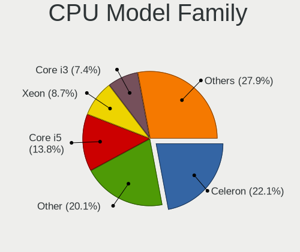
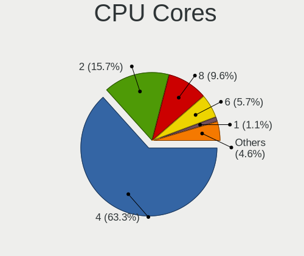
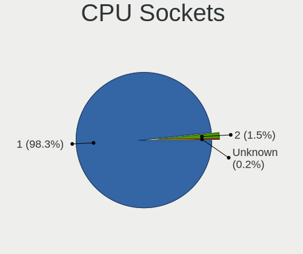
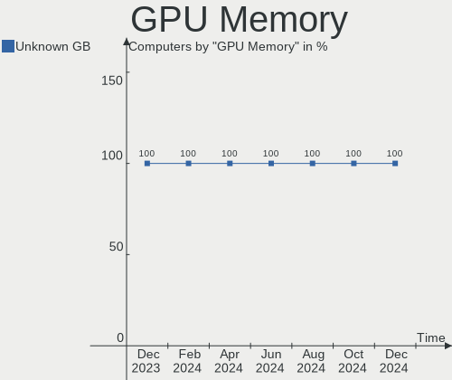
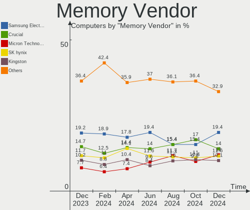

OPNsense Hardware Trends
------------------------

A project to identify most popular hardware characteristics and track their change
over time based on data collected by OPNsense users at https://BSD-Hardware.info.

Anyone can contribute to this report by the [hw-probe](https://github.com/linuxhw/hw-probe/blob/master/INSTALL.BSD.md) tool:

    hw-probe -all -upload

Full-feature report is available here: https://bsd-hardware.info/?view=trends

Period: Feb, 2022.

Contents
--------

* [ System ](#system)
  - [ OS                       ](#os)
  - [ OS Family                ](#os-family)
  - [ Arch                     ](#arch)
  - [ DE                       ](#de)
  - [ Display Server           ](#display-server)
  - [ Display Manager          ](#display-manager)
  - [ OS Lang                  ](#os-lang)
  - [ Boot Mode                ](#boot-mode)
  - [ Filesystem               ](#filesystem)
  - [ Part. scheme             ](#part-scheme)

* [ Board ](#board)
  - [ Vendor                   ](#vendor)
  - [ Model                    ](#model)
  - [ Model Family             ](#model-family)
  - [ MFG Year                 ](#mfg-year)
  - [ Form Factor              ](#form-factor)
  - [ Coreboot                 ](#coreboot)
  - [ RAM Size                 ](#ram-size)
  - [ RAM Used                 ](#ram-used)
  - [ Total Drives             ](#total-drives)
  - [ Has CD-ROM               ](#has-cd-rom)
  - [ Has Ethernet             ](#has-ethernet)
  - [ Has WiFi                 ](#has-wifi)
  - [ Has Bluetooth            ](#has-bluetooth)

* [ Location ](#location)
  - [ Country                  ](#country)
  - [ City                     ](#city)

* [ Drives ](#drives)
  - [ Drive Vendor             ](#drive-vendor)
  - [ Drive Model              ](#drive-model)
  - [ HDD Vendor               ](#hdd-vendor)
  - [ SSD Vendor               ](#ssd-vendor)
  - [ Drive Kind               ](#drive-kind)
  - [ Drive Connector          ](#drive-connector)
  - [ Drive Size               ](#drive-size)
  - [ Space Total              ](#space-total)
  - [ Space Used               ](#space-used)
  - [ Malfunc. Drives          ](#malfunc-drives)
  - [ Malfunc. Drive Vendor    ](#malfunc-drive-vendor)
  - [ Malfunc. HDD Vendor      ](#malfunc-hdd-vendor)
  - [ Malfunc. Drive Kind      ](#malfunc-drive-kind)
  - [ Failed Drives            ](#failed-drives)
  - [ Failed Drive Vendor      ](#failed-drive-vendor)
  - [ Drive Status             ](#drive-status)

* [ Storage controller ](#storage-controller)
  - [ Storage Vendor           ](#storage-vendor)
  - [ Storage Model            ](#storage-model)
  - [ Storage Kind             ](#storage-kind)

* [ Processor ](#processor)
  - [ CPU Vendor               ](#cpu-vendor)
  - [ CPU Model                ](#cpu-model)
  - [ CPU Model Family         ](#cpu-model-family)
  - [ CPU Cores                ](#cpu-cores)
  - [ CPU Sockets              ](#cpu-sockets)
  - [ CPU Threads              ](#cpu-threads)
  - [ CPU Microarch            ](#cpu-microarch)

* [ Graphics ](#graphics)
  - [ GPU Vendor               ](#gpu-vendor)
  - [ GPU Model                ](#gpu-model)
  - [ GPU Combo                ](#gpu-combo)
  - [ GPU Driver               ](#gpu-driver)
  - [ GPU Memory               ](#gpu-memory)

* [ Monitor ](#monitor)
  - [ Monitor Vendor           ](#monitor-vendor)
  - [ Monitor Model            ](#monitor-model)
  - [ Monitor Resolution       ](#monitor-resolution)
  - [ Monitor Diagonal         ](#monitor-diagonal)
  - [ Monitor Width            ](#monitor-width)
  - [ Aspect Ratio             ](#aspect-ratio)
  - [ Monitor Area             ](#monitor-area)
  - [ Pixel Density            ](#pixel-density)
  - [ Multiple Monitors        ](#multiple-monitors)

* [ Network ](#network)
  - [ Net Controller Vendor    ](#net-controller-vendor)
  - [ Net Controller Model     ](#net-controller-model)
  - [ Wireless Vendor          ](#wireless-vendor)
  - [ Wireless Model           ](#wireless-model)
  - [ Ethernet Vendor          ](#ethernet-vendor)
  - [ Ethernet Model           ](#ethernet-model)
  - [ Net Controller Kind      ](#net-controller-kind)
  - [ Used Controller          ](#used-controller)
  - [ NICs                     ](#nics)
  - [ IPv6                     ](#ipv6)

* [ Bluetooth ](#bluetooth)
  - [ Bluetooth Vendor         ](#bluetooth-vendor)
  - [ Bluetooth Model          ](#bluetooth-model)

* [ Sound ](#sound)
  - [ Sound Vendor             ](#sound-vendor)
  - [ Sound Model              ](#sound-model)

* [ Memory ](#memory)
  - [ Memory Vendor            ](#memory-vendor)
  - [ Memory Model             ](#memory-model)
  - [ Memory Kind              ](#memory-kind)
  - [ Memory Form Factor       ](#memory-form-factor)
  - [ Memory Size              ](#memory-size)
  - [ Memory Speed             ](#memory-speed)

* [ Printers & scanners ](#printers--scanners)
  - [ Printer Vendor           ](#printer-vendor)
  - [ Printer Model            ](#printer-model)
  - [ Scanner Vendor           ](#scanner-vendor)
  - [ Scanner Model            ](#scanner-model)

* [ Camera ](#camera)
  - [ Camera Vendor            ](#camera-vendor)
  - [ Camera Model             ](#camera-model)

* [ Security ](#security)
  - [ Fingerprint Vendor       ](#fingerprint-vendor)
  - [ Fingerprint Model        ](#fingerprint-model)
  - [ Chipcard Vendor          ](#chipcard-vendor)
  - [ Chipcard Model           ](#chipcard-model)

* [ Unsupported ](#unsupported)
  - [ Unsupported Devices      ](#unsupported-devices)
  - [ Unsupported Device Types ](#unsupported-device-types)

System
------

OS
--

Installed operating systems

| Name            | Computers | Percent |
|-----------------|-----------|---------|
| OPNsense 22.1   | 136       | 48.4%   |
| OPNsense 22.1.1 | 107       | 38.08%  |
| OPNsense 21.7.8 | 28        | 9.96%   |
| OPNsense 21.7.7 | 2         | 0.71%   |
| OPNsense 21.7.4 | 2         | 0.71%   |
| OPNsense 20.7.8 | 2         | 0.71%   |
| OPNsense 22.7   | 1         | 0.36%   |
| OPNsense 21.7.3 | 1         | 0.36%   |
| OPNsense 21.1.9 | 1         | 0.36%   |
| OPNsense 20.7   | 1         | 0.36%   |

OS Family
---------

OS without a version

| Name     | Computers | Percent |
|----------|-----------|---------|
| OPNsense | 281       | 100%    |

Arch
----

OS architecture (x86_64, i586, etc.)

| Name  | Computers | Percent |
|-------|-----------|---------|
| amd64 | 281       | 100%    |

DE
--

Desktop Environment

| Name    | Computers | Percent |
|---------|-----------|---------|
| Console | 281       | 100%    |

Display Server
--------------

X11 or Wayland

| Name    | Computers | Percent |
|---------|-----------|---------|
| Console | 281       | 100%    |

Display Manager
---------------

SDDM, LightDM, etc.

| Name    | Computers | Percent |
|---------|-----------|---------|
| Console | 281       | 100%    |

OS Lang
-------

Language

| Lang    | Computers | Percent |
|---------|-----------|---------|
| Unknown | 277       | 98.58%  |
| C       | 4         | 1.42%   |

Boot Mode
---------

EFI or BIOS

| Mode | Computers | Percent |
|------|-----------|---------|
| EFI  | 273       | 97.15%  |
| BIOS | 8         | 2.85%   |

Filesystem
----------

Type of filesystem

| Type | Computers | Percent |
|------|-----------|---------|
| Ufs  | 188       | 66.9%   |
| Zfs  | 93        | 33.1%   |

Part. scheme
------------

Scheme of partitioning

| Type    | Computers | Percent |
|---------|-----------|---------|
| GPT     | 275       | 97.86%  |
| MBR     | 5         | 1.78%   |
| Unknown | 1         | 0.36%   |

Board
-----

Vendor
------

Motherboard manufacturer

| Name                | Computers | Percent |
|---------------------|-----------|---------|
| Dell                | 30        | 10.68%  |
| Supermicro          | 25        | 8.9%    |
| Protectli           | 22        | 7.83%   |
| Hewlett-Packard     | 21        | 7.47%   |
| Unknown             | 21        | 7.47%   |
| ASRock              | 20        | 7.12%   |
| Intel               | 18        | 6.41%   |
| PC Engines          | 14        | 4.98%   |
| ASUSTek Computer    | 11        | 3.91%   |
| AMI                 | 10        | 3.56%   |
| Sophos              | 9         | 3.2%    |
| MSI                 | 9         | 3.2%    |
| Lenovo              | 6         | 2.14%   |
| ZOTAC               | 5         | 1.78%   |
| SeeedStudio         | 5         | 1.78%   |
| Gigabyte Technology | 5         | 1.78%   |
| Shuttle             | 4         | 1.42%   |
| Fujitsu             | 4         | 1.42%   |
| BESSTAR Tech        | 4         | 1.42%   |
| MW                  | 3         | 1.07%   |
| CompuLab            | 3         | 1.07%   |
| CheckPoint          | 3         | 1.07%   |
| Biostar             | 3         | 1.07%   |
| Apple               | 3         | 1.07%   |
| Pegatron            | 2         | 0.71%   |
| HPE                 | 2         | 0.71%   |
| HARDKERNEL          | 2         | 0.71%   |
| Deciso              | 2         | 0.71%   |
| AZW                 | 2         | 0.71%   |
| AWOW                | 2         | 0.71%   |
| Acer                | 2         | 0.71%   |
| AAEON               | 2         | 0.71%   |
| YANYU               | 1         | 0.36%   |
| Thomas-Krenn.AG     | 1         | 0.36%   |
| Samsung Electronics | 1         | 0.36%   |
| PAIQ                | 1         | 0.36%   |
| Fujitsu Siemens     | 1         | 0.36%   |
| ECS                 | 1         | 0.36%   |
| AOpen               | 1         | 0.36%   |

Model
-----

Motherboard model

| Name                                                                                     | Computers | Percent |
|------------------------------------------------------------------------------------------|-----------|---------|
| Unknown                                                                                  | 21        | 7.47%   |
| AMI Aptio CRB                                                                            | 10        | 3.56%   |
| Intel Q3XXG4-P V1.0                                                                      | 9         | 3.2%    |
| Protectli FW4B                                                                           | 8         | 2.85%   |
| PC Engines APU2                                                                          | 8         | 2.85%   |
| Protectli FW6                                                                            | 7         | 2.49%   |
| Supermicro Super Server                                                                  | 5         | 1.78%   |
| Sophos XG                                                                                | 5         | 1.78%   |
| PC Engines apu4                                                                          | 5         | 1.78%   |
| SeeedStudio ODYSSEY-X86J4105                                                             | 4         | 1.42%   |
| HP t620 PLUS Quad Core TC                                                                | 4         | 1.42%   |
| ASUS All Series                                                                          | 4         | 1.42%   |
| Supermicro A1SAi                                                                         | 3         | 1.07%   |
| MW GMLK-2_5G4L                                                                           | 3         | 1.07%   |
| Supermicro X9SCL/X9SCM                                                                   | 2         | 0.71%   |
| Supermicro HYVE-ZEUS                                                                     | 2         | 0.71%   |
| Sophos UTM                                                                               | 2         | 0.71%   |
| Sophos SG                                                                                | 2         | 0.71%   |
| Shuttle DS77U                                                                            | 2         | 0.71%   |
| Protectli VP2410                                                                         | 2         | 0.71%   |
| Intel MAHOBAY                                                                            | 2         | 0.71%   |
| HP t730 Thin Client                                                                      | 2         | 0.71%   |
| HP ProDesk 600 G3 SFF                                                                    | 2         | 0.71%   |
| HARDKERNEL ODROID-H2                                                                     | 2         | 0.71%   |
| Dell PowerEdge R710                                                                      | 2         | 0.71%   |
| Dell PowerEdge R210 II                                                                   | 2         | 0.71%   |
| Dell PowerEdge R210                                                                      | 2         | 0.71%   |
| Dell OptiPlex 3020                                                                       | 2         | 0.71%   |
| Deciso Netboard A20                                                                      | 2         | 0.71%   |
| CompuLab fitlet2                                                                         | 2         | 0.71%   |
| CheckPoint T-110-00                                                                      | 2         | 0.71%   |
| AZW GK55                                                                                 | 2         | 0.71%   |
| AWOW PC BOX                                                                              | 2         | 0.71%   |
| ASRock AM1H-ITX                                                                          | 2         | 0.71%   |
| Apple Macmini5,1                                                                         | 2         | 0.71%   |
| ZOTAC ZBOX-MI623/MI643                                                                   | 1         | 0.36%   |
| ZOTAC ZBOX-MI522NANO/MI542NANO                                                           | 1         | 0.36%   |
| ZOTAC ZBOX-CI329NANO                                                                     | 1         | 0.36%   |
| ZOTAC ZBOX-CI327NANO-GS-01                                                               | 1         | 0.36%   |
| ZOTAC B410                                                                               | 1         | 0.36%   |
| YANYU M9F baytrail                                                                       | 1         | 0.36%   |
| Thomas-Krenn.AG LES network 6L                                                           | 1         | 0.36%   |
| Supermicro X8SIL                                                                         | 1         | 0.36%   |
| Supermicro X8DTU-LN4+                                                                    | 1         | 0.36%   |
| Supermicro X7SPA-H                                                                       | 1         | 0.36%   |
| Supermicro X10SLM+-LN4F                                                                  | 1         | 0.36%   |
| Supermicro X10SLL-F                                                                      | 1         | 0.36%   |
| Supermicro X10SLH-N6-ST031                                                               | 1         | 0.36%   |
| Supermicro X10SLH-F/X10SLM+-F                                                            | 1         | 0.36%   |
| Supermicro X10SBA-L                                                                      | 1         | 0.36%   |
| Supermicro SYS-E300-9D-8CN8TP                                                            | 1         | 0.36%   |
| Supermicro SYS-E200-9B                                                                   | 1         | 0.36%   |
| Supermicro SYS-1019D-4C-FHN13TP                                                          | 1         | 0.36%   |
| Supermicro pro379410                                                                     | 1         | 0.36%   |
| Supermicro AS -E301-9D-8CN4                                                              | 1         | 0.36%   |
| Shuttle DS10U                                                                            | 1         | 0.36%   |
| Shuttle DH170                                                                            | 1         | 0.36%   |
| SeeedStudio ODYSSEY-X86J4125                                                             | 1         | 0.36%   |
| Samsung 350V5C/350V5X/350V4C/350V4X/351V5C/351V5X/351V4C/351V4X/3540VC/3540VX/3440VC/344 | 1         | 0.36%   |
| Protectli FW6E                                                                           | 1         | 0.36%   |

Model Family
------------

Motherboard model prefix

| Name                            | Computers | Percent |
|---------------------------------|-----------|---------|
| Unknown                         | 21        | 7.47%   |
| Dell PowerEdge                  | 13        | 4.63%   |
| Dell OptiPlex                   | 12        | 4.27%   |
| AMI Aptio                       | 10        | 3.56%   |
| Intel Q3XXG4-P                  | 9         | 3.2%    |
| Protectli FW4B                  | 8         | 2.85%   |
| PC Engines APU2                 | 8         | 2.85%   |
| Protectli FW6                   | 7         | 2.49%   |
| HP ProDesk                      | 6         | 2.14%   |
| Supermicro Super                | 5         | 1.78%   |
| Sophos XG                       | 5         | 1.78%   |
| PC Engines apu4                 | 5         | 1.78%   |
| SeeedStudio ODYSSEY-X86J4105    | 4         | 1.42%   |
| Lenovo ThinkCentre              | 4         | 1.42%   |
| HP t620                         | 4         | 1.42%   |
| ASUS All                        | 4         | 1.42%   |
| Supermicro A1SAi                | 3         | 1.07%   |
| MW GMLK-2                       | 3         | 1.07%   |
| HP ProLiant                     | 3         | 1.07%   |
| Apple Macmini5                  | 3         | 1.07%   |
| Supermicro X9SCL                | 2         | 0.71%   |
| Supermicro HYVE-ZEUS            | 2         | 0.71%   |
| Sophos UTM                      | 2         | 0.71%   |
| Sophos SG                       | 2         | 0.71%   |
| Shuttle DS77U                   | 2         | 0.71%   |
| Protectli VP2410                | 2         | 0.71%   |
| Intel MAHOBAY                   | 2         | 0.71%   |
| HPE ProLiant                    | 2         | 0.71%   |
| HP t730                         | 2         | 0.71%   |
| HP Compaq                       | 2         | 0.71%   |
| HARDKERNEL ODROID-H2            | 2         | 0.71%   |
| Fujitsu FUTRO                   | 2         | 0.71%   |
| Dell Inspiron                   | 2         | 0.71%   |
| Deciso Netboard                 | 2         | 0.71%   |
| CompuLab fitlet2                | 2         | 0.71%   |
| CheckPoint T-110-00             | 2         | 0.71%   |
| AZW GK55                        | 2         | 0.71%   |
| AWOW PC                         | 2         | 0.71%   |
| ASUS PRIME                      | 2         | 0.71%   |
| ASRock AM1H-ITX                 | 2         | 0.71%   |
| ZOTAC ZBOX-MI623                | 1         | 0.36%   |
| ZOTAC ZBOX-MI522NANO            | 1         | 0.36%   |
| ZOTAC ZBOX-CI329NANO            | 1         | 0.36%   |
| ZOTAC ZBOX-CI327NANO-GS-01      | 1         | 0.36%   |
| ZOTAC B410                      | 1         | 0.36%   |
| YANYU M9F                       | 1         | 0.36%   |
| Thomas-Krenn.AG LES             | 1         | 0.36%   |
| Supermicro X8SIL                | 1         | 0.36%   |
| Supermicro X8DTU-LN4+           | 1         | 0.36%   |
| Supermicro X7SPA-H              | 1         | 0.36%   |
| Supermicro X10SLM+-LN4F         | 1         | 0.36%   |
| Supermicro X10SLL-F             | 1         | 0.36%   |
| Supermicro X10SLH-N6-ST031      | 1         | 0.36%   |
| Supermicro X10SLH-F             | 1         | 0.36%   |
| Supermicro X10SBA-L             | 1         | 0.36%   |
| Supermicro SYS-E300-9D-8CN8TP   | 1         | 0.36%   |
| Supermicro SYS-E200-9B          | 1         | 0.36%   |
| Supermicro SYS-1019D-4C-FHN13TP | 1         | 0.36%   |
| Supermicro pro379410            | 1         | 0.36%   |
| Supermicro AS                   | 1         | 0.36%   |

MFG Year
--------

Motherboard manufacture year

| Year | Computers | Percent |
|------|-----------|---------|
| 2018 | 52        | 18.51%  |
| 2016 | 39        | 13.88%  |
| 2020 | 36        | 12.81%  |
| 2021 | 32        | 11.39%  |
| 2019 | 31        | 11.03%  |
| 2014 | 24        | 8.54%   |
| 2012 | 18        | 6.41%   |
| 2015 | 11        | 3.91%   |
| 2013 | 10        | 3.56%   |
| 2017 | 9         | 3.2%    |
| 2011 | 9         | 3.2%    |
| 2010 | 4         | 1.42%   |
| 2009 | 2         | 0.71%   |
| 2008 | 2         | 0.71%   |
| 2007 | 1         | 0.36%   |
| 2005 | 1         | 0.36%   |

Form Factor
-----------

Physical design of the computer

| Name       | Computers | Percent |
|------------|-----------|---------|
| Desktop    | 200       | 71.17%  |
| Mini pc    | 34        | 12.1%   |
| Server     | 29        | 10.32%  |
| Firewall   | 9         | 3.2%    |
| Notebook   | 8         | 2.85%   |
| All in one | 1         | 0.36%   |

Coreboot
--------

Have coreboot on board

| Used | Computers | Percent |
|------|-----------|---------|
| No   | 264       | 93.95%  |
| Yes  | 17        | 6.05%   |

RAM Size
--------

Total RAM memory

| Size in GB      | Computers | Percent |
|-----------------|-----------|---------|
| 8.01-16.0       | 129       | 45.91%  |
| 4.01-8.0        | 58        | 20.64%  |
| 16.01-24.0      | 47        | 16.73%  |
| 32.01-64.0      | 21        | 7.47%   |
| 2.01-3.0        | 13        | 4.63%   |
| 64.01-256.0     | 9         | 3.2%    |
| 24.01-32.0      | 2         | 0.71%   |
| More than 256.0 | 1         | 0.36%   |
| 3.01-4.0        | 1         | 0.36%   |

RAM Used
--------

Used RAM memory

| Used GB     | Computers | Percent |
|-------------|-----------|---------|
| 0.01-0.5    | 165       | 58.72%  |
| 0.51-1.0    | 73        | 25.98%  |
| 1.01-2.0    | 28        | 9.96%   |
| 2.01-3.0    | 7         | 2.49%   |
| 3.01-4.0    | 3         | 1.07%   |
| 4.01-8.0    | 2         | 0.71%   |
| 24.01-32.0  | 1         | 0.36%   |
| 64.01-256.0 | 1         | 0.36%   |
| 8.01-16.0   | 1         | 0.36%   |

Total Drives
------------

Number of drives on board

| Drives | Computers | Percent |
|--------|-----------|---------|
| 1      | 231       | 82.21%  |
| 2      | 27        | 9.61%   |
| 0      | 20        | 7.12%   |
| 25     | 1         | 0.36%   |
| 4      | 1         | 0.36%   |
| 3      | 1         | 0.36%   |

Has CD-ROM
----------

Has CD-ROM on board

| Presented | Computers | Percent |
|-----------|-----------|---------|
| No        | 250       | 88.97%  |
| Yes       | 31        | 11.03%  |

Has Ethernet
------------

Has Ethernet on board

| Presented | Computers | Percent |
|-----------|-----------|---------|
| Yes       | 280       | 99.64%  |
| No        | 1         | 0.36%   |

Has WiFi
--------

Has WiFi module

| Presented | Computers | Percent |
|-----------|-----------|---------|
| No        | 224       | 79.72%  |
| Yes       | 57        | 20.28%  |

Has Bluetooth
-------------

Has Bluetooth module

| Presented | Computers | Percent |
|-----------|-----------|---------|
| No        | 247       | 87.9%   |
| Yes       | 34        | 12.1%   |

Location
--------

Country
-------

Geographic location (country)

| Country       | Computers | Percent |
|---------------|-----------|---------|
| USA           | 88        | 31.32%  |
| Germany       | 65        | 23.13%  |
| France        | 15        | 5.34%   |
| Canada        | 13        | 4.63%   |
| UK            | 10        | 3.56%   |
| Netherlands   | 10        | 3.56%   |
| Austria       | 10        | 3.56%   |
| Switzerland   | 7         | 2.49%   |
| Australia     | 7         | 2.49%   |
| Poland        | 6         | 2.14%   |
| Hong Kong     | 5         | 1.78%   |
| Spain         | 4         | 1.42%   |
| Russia        | 4         | 1.42%   |
| Italy         | 4         | 1.42%   |
| Sweden        | 3         | 1.07%   |
| Portugal      | 3         | 1.07%   |
| Finland       | 3         | 1.07%   |
| Ukraine       | 2         | 0.71%   |
| Taiwan        | 2         | 0.71%   |
| Romania       | 2         | 0.71%   |
| Israel        | 2         | 0.71%   |
| Indonesia     | 2         | 0.71%   |
| Denmark       | 2         | 0.71%   |
| Brazil        | 2         | 0.71%   |
| South Korea   | 1         | 0.36%   |
| Slovakia      | 1         | 0.36%   |
| Peru          | 1         | 0.36%   |
| Liechtenstein | 1         | 0.36%   |
| Ireland       | 1         | 0.36%   |
| Guatemala     | 1         | 0.36%   |
| Estonia       | 1         | 0.36%   |
| Czechia       | 1         | 0.36%   |
| Colombia      | 1         | 0.36%   |
| Unknown       | 1         | 0.36%   |

City
----

Geographic location (city)

| City                 | Computers | Percent |
|----------------------|-----------|---------|
| Berlin               | 5         | 1.78%   |
| Vienna               | 4         | 1.42%   |
| Paris                | 4         | 1.42%   |
| Munich               | 4         | 1.42%   |
| Quarry Bay           | 3         | 1.07%   |
| Oakland              | 3         | 1.07%   |
| Moscow               | 3         | 1.07%   |
| Hanover              | 3         | 1.07%   |
| Amsterdam            | 3         | 1.07%   |
| Victoria             | 2         | 0.71%   |
| Tel Aviv             | 2         | 0.71%   |
| Poznan               | 2         | 0.71%   |
| Paderborn            | 2         | 0.71%   |
| Montreal             | 2         | 0.71%   |
| Milan                | 2         | 0.71%   |
| Melbourne            | 2         | 0.71%   |
| Innsbruck            | 2         | 0.71%   |
| Herford              | 2         | 0.71%   |
| Hamburg              | 2         | 0.71%   |
| Hagerstown           | 2         | 0.71%   |
| Graz                 | 2         | 0.71%   |
| Frankfurt am Main    | 2         | 0.71%   |
| Denver               | 2         | 0.71%   |
| Cary                 | 2         | 0.71%   |
| Calgary              | 2         | 0.71%   |
| Buckeye              | 2         | 0.71%   |
| Bucharest            | 2         | 0.71%   |
| Bad Vilbel           | 2         | 0.71%   |
| Zwickau              | 1         | 0.36%   |
| Zurich               | 1         | 0.36%   |
| Zeven                | 1         | 0.36%   |
| Zeist                | 1         | 0.36%   |
| York                 | 1         | 0.36%   |
| Woodstock            | 1         | 0.36%   |
| Wollongong           | 1         | 0.36%   |
| Windsor              | 1         | 0.36%   |
| Willich              | 1         | 0.36%   |
| Wentorf bei Hamburg  | 1         | 0.36%   |
| Wendell              | 1         | 0.36%   |
| Würzburg          | 1         | 0.36%   |
| Watford              | 1         | 0.36%   |
| Watertown            | 1         | 0.36%   |
| Walla Walla          | 1         | 0.36%   |
| Vila Real            | 1         | 0.36%   |
| Vancouver            | 1         | 0.36%   |
| Urbandale            | 1         | 0.36%   |
| Upper Marlboro       | 1         | 0.36%   |
| Uhorske              | 1         | 0.36%   |
| Traunstein           | 1         | 0.36%   |
| Tournon-sur-Rhône | 1         | 0.36%   |
| Toulouse             | 1         | 0.36%   |
| Todtnau              | 1         | 0.36%   |
| Teteringen           | 1         | 0.36%   |
| Tallinn              | 1         | 0.36%   |
| Taipei               | 1         | 0.36%   |
| Suwanee              | 1         | 0.36%   |
| Suderfahrenstedt     | 1         | 0.36%   |
| Stuttgart            | 1         | 0.36%   |
| Statesboro           | 1         | 0.36%   |
| Stary Sacz           | 1         | 0.36%   |

Drives
------

Drive Vendor
------------

Hard drive vendors

| Vendor              | Computers | Drives | Percent |
|---------------------|-----------|--------|---------|
| Samsung Electronics | 46        | 48     | 16.43%  |
| Transcend           | 27        | 27     | 9.64%   |
| WDC                 | 26        | 30     | 9.29%   |
| Kingston            | 21        | 23     | 7.5%    |
| Seagate             | 15        | 17     | 5.36%   |
| SanDisk             | 15        | 15     | 5.36%   |
| Intel               | 15        | 16     | 5.36%   |
| Crucial             | 12        | 12     | 4.29%   |
| Hoodisk             | 10        | 10     | 3.57%   |
| Phison              | 8         | 9      | 2.86%   |
| Toshiba             | 7         | 8      | 2.5%    |
| FORESEE             | 6         | 6      | 2.14%   |
| SPCC                | 5         | 5      | 1.79%   |
| Dogfish             | 5         | 5      | 1.79%   |
| A-DATA Technology   | 5         | 6      | 1.79%   |
| Protectli           | 4         | 4      | 1.43%   |
| LITEONIT            | 4         | 4      | 1.43%   |
| Intenso             | 3         | 3      | 1.07%   |
| BIWIN               | 3         | 3      | 1.07%   |
| SK Hynix            | 2         | 2      | 0.71%   |
| Patriot             | 2         | 2      | 0.71%   |
| OCZ                 | 2         | 2      | 0.71%   |
| Netac               | 2         | 2      | 0.71%   |
| Hitachi             | 2         | 2      | 0.71%   |
| Hewlett-Packard     | 2         | 3      | 0.71%   |
| Gigabyte Technology | 2         | 2      | 0.71%   |
| Corsair             | 2         | 2      | 0.71%   |
| China               | 2         | 2      | 0.71%   |
| Zheino              | 1         | 1      | 0.36%   |
| VisionTek           | 1         | 1      | 0.36%   |
| V-GeN               | 1         | 1      | 0.36%   |
| SSSTC               | 1         | 1      | 0.36%   |
| Silicon Motion      | 1         | 1      | 0.36%   |
| PNY                 | 1         | 1      | 0.36%   |
| NETAPP              | 1         | 2      | 0.36%   |
| Mushkin             | 1         | 1      | 0.36%   |
| Micron Technology   | 1         | 1      | 0.36%   |
| Micro Center        | 1         | 1      | 0.36%   |
| MAXTOR              | 1         | 1      | 0.36%   |
| LITEON              | 1         | 1      | 0.36%   |
| Leven               | 1         | 1      | 0.36%   |
| Kston               | 1         | 1      | 0.36%   |
| Innodisk            | 1         | 1      | 0.36%   |
| Indilinx            | 1         | 1      | 0.36%   |
| HGST                | 1         | 1      | 0.36%   |
| GOODRAM             | 1         | 1      | 0.36%   |
| Fujitsu             | 1         | 1      | 0.36%   |
| faspeed             | 1         | 1      | 0.36%   |
| Drevo               | 1         | 1      | 0.36%   |
| Dell                | 1         | 23     | 0.36%   |
| Biostar             | 1         | 1      | 0.36%   |
| Apple               | 1         | 1      | 0.36%   |
| Apacer              | 1         | 1      | 0.36%   |

Drive Model
-----------

Hard drive models

| Model                             | Computers | Percent |
|-----------------------------------|-----------|---------|
| Transcend TS256GMSA230S 256GB     | 8         | 2.83%   |
| Kingston SA400S37240G 240GB       | 5         | 1.77%   |
| Transcend TS64GMSA370 64GB        | 4         | 1.41%   |
| FORESEE 128GB SSD                 | 4         | 1.41%   |
| SPCC Solid State Disk 128GB       | 3         | 1.06%   |
| Seagate ST500DM002-1BD142 500GB   | 3         | 1.06%   |
| Samsung SSD 870 EVO 250GB         | 3         | 1.06%   |
| Samsung SSD 860 EVO 500GB         | 3         | 1.06%   |
| Samsung SSD 850 EVO 500GB         | 3         | 1.06%   |
| Kingston SUV500MS120G 120GB       | 3         | 1.06%   |
| Kingston SA400S37120G 120GB       | 3         | 1.06%   |
| Hoodisk SSD 128GB                 | 3         | 1.06%   |
| Dogfish SSD 128GB                 | 3         | 1.06%   |
| BIWIN SSD 128GB                   | 3         | 1.06%   |
| WDC WDS240G2G0A-00JH30 240GB      | 2         | 0.71%   |
| WDC WDS120G2G0B-00EPW0 120GB      | 2         | 0.71%   |
| WDC WD2503ABYX-01WERA1 256GB      | 2         | 0.71%   |
| WDC WD10EZEX-22MFCA0 1TB          | 2         | 0.71%   |
| Transcend TS64GMTS400SD 64GB      | 2         | 0.71%   |
| Transcend TS64GMSA230S 64GB       | 2         | 0.71%   |
| Transcend TS256GMTS952T2 256GB    | 2         | 0.71%   |
| Transcend TS128GMSA230S 128GB     | 2         | 0.71%   |
| Toshiba MQ01ACF050 500GB          | 2         | 0.71%   |
| Toshiba DT01ACA100 1TB            | 2         | 0.71%   |
| Seagate XA960LE10063 960GB        | 2         | 0.71%   |
| Seagate ST1000DM010-2EP102 1TB    | 2         | 0.71%   |
| SanDisk X400 M.2 2280 128GB       | 2         | 0.71%   |
| SanDisk SSD PLUS 240GB            | 2         | 0.71%   |
| SanDisk SDSA6MM-016G-1006 16GB    | 2         | 0.71%   |
| Samsung SSD 970 EVO Plus 250GB    | 2         | 0.71%   |
| Samsung SSD 860 EVO 250GB         | 2         | 0.71%   |
| Samsung SSD 850 EVO 250GB         | 2         | 0.71%   |
| Samsung SSD 840 EVO 250GB         | 2         | 0.71%   |
| Phison SATA SSD 32GB              | 2         | 0.71%   |
| Phison SATA SSD 128GB             | 2         | 0.71%   |
| LITEONIT LCS-256M6S 2.5 7mm 256GB | 2         | 0.71%   |
| Kingston SMS200S330G 32GB         | 2         | 0.71%   |
| Kingston SKC600MS256G 256GB       | 2         | 0.71%   |
| Intel SSDSC2KW256G8 256GB         | 2         | 0.71%   |
| Hoodisk SSD 64GB                  | 2         | 0.71%   |
| Hoodisk SSD 32GB                  | 2         | 0.71%   |
| Hoodisk SSD 256GB                 | 2         | 0.71%   |
| FORESEE 64GB SSD                  | 2         | 0.71%   |
| Crucial CT500P1SSD8 500GB         | 2         | 0.71%   |
| Crucial CT250MX500SSD1 250GB      | 2         | 0.71%   |
| Crucial CT120BX500SSD1 120GB      | 2         | 0.71%   |
| China NGFF 2280 256GB SSD         | 2         | 0.71%   |
| Zheino CHN mSATAM1 064 64GB       | 1         | 0.35%   |
| WDC WDS500G2B0C-00PXH0 500GB      | 1         | 0.35%   |
| WDC WDS500G1X0E-00AFY0 500GB      | 1         | 0.35%   |
| WDC WDS500G1R0B-68A4Z0 500GB      | 1         | 0.35%   |
| WDC WDS250G2B0C-00PXH0 250GB      | 1         | 0.35%   |
| WDC WDS250G2B0A-00SM50 250GB      | 1         | 0.35%   |
| WDC WDS240G1G0A-00SS50 240GB      | 1         | 0.35%   |
| WDC WD5003AZEX-00K3CA0 500GB      | 1         | 0.35%   |
| WDC WD5000LPVX-22V0TT0 500GB      | 1         | 0.35%   |
| WDC WD5000AZLX-60K2TA0 500GB      | 1         | 0.35%   |
| WDC WD5000AAKX-75U6AA0 500GB      | 1         | 0.35%   |
| WDC WD3200BUDT-63DPZY0 320GB      | 1         | 0.35%   |
| WDC WD3200AVVS-63L2B0 320GB       | 1         | 0.35%   |

HDD Vendor
----------

Hard disk drive vendors

| Vendor          | Computers | Drives | Percent |
|-----------------|-----------|--------|---------|
| WDC             | 16        | 19     | 40%     |
| Seagate         | 10        | 10     | 25%     |
| Toshiba         | 5         | 6      | 12.5%   |
| Hitachi         | 2         | 2      | 5%      |
| NETAPP          | 1         | 2      | 2.5%    |
| MAXTOR          | 1         | 1      | 2.5%    |
| HGST            | 1         | 1      | 2.5%    |
| Hewlett-Packard | 1         | 2      | 2.5%    |
| Fujitsu         | 1         | 1      | 2.5%    |
| Dell            | 1         | 23     | 2.5%    |
| Apple           | 1         | 1      | 2.5%    |

SSD Vendor
----------

Solid state drive vendors

| Vendor              | Computers | Drives | Percent |
|---------------------|-----------|--------|---------|
| Samsung Electronics | 35        | 36     | 16.43%  |
| Transcend           | 26        | 26     | 12.21%  |
| Kingston            | 21        | 23     | 9.86%   |
| SanDisk             | 15        | 15     | 7.04%   |
| Intel               | 15        | 16     | 7.04%   |
| Hoodisk             | 10        | 10     | 4.69%   |
| Crucial             | 10        | 10     | 4.69%   |
| WDC                 | 7         | 8      | 3.29%   |
| Phison              | 6         | 7      | 2.82%   |
| FORESEE             | 6         | 6      | 2.82%   |
| SPCC                | 5         | 5      | 2.35%   |
| Dogfish             | 5         | 5      | 2.35%   |
| A-DATA Technology   | 5         | 6      | 2.35%   |
| Seagate             | 4         | 6      | 1.88%   |
| Protectli           | 4         | 4      | 1.88%   |
| LITEONIT            | 4         | 4      | 1.88%   |
| Intenso             | 3         | 3      | 1.41%   |
| BIWIN               | 3         | 3      | 1.41%   |
| Patriot             | 2         | 2      | 0.94%   |
| OCZ                 | 2         | 2      | 0.94%   |
| Netac               | 2         | 2      | 0.94%   |
| Corsair             | 2         | 2      | 0.94%   |
| China               | 2         | 2      | 0.94%   |
| Zheino              | 1         | 1      | 0.47%   |
| VisionTek           | 1         | 1      | 0.47%   |
| V-GeN               | 1         | 1      | 0.47%   |
| Toshiba             | 1         | 1      | 0.47%   |
| PNY                 | 1         | 1      | 0.47%   |
| Mushkin             | 1         | 1      | 0.47%   |
| Micro Center        | 1         | 1      | 0.47%   |
| LITEON              | 1         | 1      | 0.47%   |
| Leven               | 1         | 1      | 0.47%   |
| Kston               | 1         | 1      | 0.47%   |
| Innodisk            | 1         | 1      | 0.47%   |
| Indilinx            | 1         | 1      | 0.47%   |
| Hewlett-Packard     | 1         | 1      | 0.47%   |
| GOODRAM             | 1         | 1      | 0.47%   |
| Gigabyte Technology | 1         | 1      | 0.47%   |
| faspeed             | 1         | 1      | 0.47%   |
| Drevo               | 1         | 1      | 0.47%   |
| Biostar             | 1         | 1      | 0.47%   |
| Apacer              | 1         | 1      | 0.47%   |

Drive Kind
----------

HDD or SSD

| Kind | Computers | Drives | Percent |
|------|-----------|--------|---------|
| SSD  | 205       | 222    | 76.21%  |
| HDD  | 37        | 68     | 13.75%  |
| NVMe | 27        | 28     | 10.04%  |

Drive Connector
---------------

SATA, SAS, NVMe, etc.

| Type | Computers | Drives | Percent |
|------|-----------|--------|---------|
| SATA | 239       | 290    | 89.85%  |
| NVMe | 27        | 28     | 10.15%  |

Drive Size
----------

Size of hard drive

| Size in TB | Computers | Drives | Percent |
|------------|-----------|--------|---------|
| 0.01-0.5   | 224       | 267    | 91.43%  |
| 0.51-1.0   | 18        | 20     | 7.35%   |
| 1.01-2.0   | 2         | 2      | 0.82%   |
| 3.01-4.0   | 1         | 1      | 0.41%   |

Space Total
-----------

Amount of disk space available on the file system

| Size in GB | Computers | Percent |
|------------|-----------|---------|
| 101-250    | 146       | 51.96%  |
| 251-500    | 40        | 14.23%  |
| 21-50      | 37        | 13.17%  |
| 51-100     | 32        | 11.39%  |
| 501-1000   | 13        | 4.63%   |
| 1-20       | 11        | 3.91%   |
| 1001-2000  | 2         | 0.71%   |

Space Used
----------

Amount of used disk space

| Used GB | Computers | Percent |
|---------|-----------|---------|
| 1-20    | 271       | 96.44%  |
| 21-50   | 8         | 2.85%   |
| 101-250 | 1         | 0.36%   |
| 51-100  | 1         | 0.36%   |

Malfunc. Drives
---------------

Drive models with a malfunction

| Model                                            | Computers | Drives | Percent |
|--------------------------------------------------|-----------|--------|---------|
| Seagate ST500DM002-1BD142 500GB                  | 2         | 2      | 11.76%  |
| WDC WD3200AAVS-00ZTB0 320GB                      | 1         | 1      | 5.88%   |
| VisionTek mSATA 120GB                            | 1         | 1      | 5.88%   |
| Toshiba THNSNK256GVN8 M.2 2280 256GB             | 1         | 1      | 5.88%   |
| SPCC Solid State Disk 128GB                      | 1         | 1      | 5.88%   |
| Seagate ST9320423AS 320GB                        | 1         | 1      | 5.88%   |
| Seagate ST3160318AS 160GB                        | 1         | 1      | 5.88%   |
| SanDisk SD8TB8U-256G-1006 256GB                  | 1         | 1      | 5.88%   |
| Samsung Electronics SSD RBX Series 128GB M       | 1         | 1      | 5.88%   |
| Samsung Electronics SSD PM810 2.5-inch 7mm 256GB | 1         | 1      | 5.88%   |
| Samsung Electronics SSD 960 PRO 512GB            | 1         | 1      | 5.88%   |
| Kingston SHFS37A120G 120GB                       | 1         | 2      | 5.88%   |
| Intel SSDSA2BW160G3H 160GB                       | 1         | 1      | 5.88%   |
| Intel SSDMCEAW240A4 240GB                        | 1         | 1      | 5.88%   |
| Intel SSDMCEAC060B3 64GB                         | 1         | 1      | 5.88%   |
| Dogfish SSD 128GB                                | 1         | 1      | 5.88%   |

Malfunc. Drive Vendor
---------------------

Vendors of faulty drives

| Vendor              | Computers | Drives | Percent |
|---------------------|-----------|--------|---------|
| Seagate             | 4         | 4      | 23.53%  |
| Samsung Electronics | 3         | 3      | 17.65%  |
| Intel               | 3         | 3      | 17.65%  |
| WDC                 | 1         | 1      | 5.88%   |
| VisionTek           | 1         | 1      | 5.88%   |
| Toshiba             | 1         | 1      | 5.88%   |
| SPCC                | 1         | 1      | 5.88%   |
| SanDisk             | 1         | 1      | 5.88%   |
| Kingston            | 1         | 2      | 5.88%   |
| Dogfish             | 1         | 1      | 5.88%   |

Malfunc. HDD Vendor
-------------------

Vendors of faulty HDD drives

| Vendor  | Computers | Drives | Percent |
|---------|-----------|--------|---------|
| Seagate | 4         | 4      | 80%     |
| WDC     | 1         | 1      | 20%     |

Malfunc. Drive Kind
-------------------

Kinds of faulty drives

| Kind | Computers | Drives | Percent |
|------|-----------|--------|---------|
| SSD  | 11        | 12     | 64.71%  |
| HDD  | 5         | 5      | 29.41%  |
| NVMe | 1         | 1      | 5.88%   |

Failed Drives
-------------

Failed drive models

Zero info for selected period =(

Failed Drive Vendor
-------------------

Failed drive vendors

Zero info for selected period =(

Drive Status
------------

Number of failed and malfunc. drives

| Status   | Computers | Drives | Percent |
|----------|-----------|--------|---------|
| Works    | 244       | 296    | 92.42%  |
| Malfunc  | 17        | 18     | 6.44%   |
| Detected | 3         | 4      | 1.14%   |

Storage controller
------------------

Storage Vendor
--------------

Storage controller vendors

| Vendor                           | Computers | Percent |
|----------------------------------|-----------|---------|
| Intel                            | 229       | 72.47%  |
| AMD                              | 45        | 14.24%  |
| Samsung Electronics              | 11        | 3.48%   |
| Broadcom / LSI                   | 6         | 1.9%    |
| Sandisk                          | 3         | 0.95%   |
| Phison Electronics               | 3         | 0.95%   |
| Chelsio Communications           | 3         | 0.95%   |
| ASMedia Technology               | 3         | 0.95%   |
| SK Hynix                         | 2         | 0.63%   |
| Micron/Crucial Technology        | 2         | 0.63%   |
| Toshiba                          | 1         | 0.32%   |
| Solid State Storage Technology   | 1         | 0.32%   |
| Silicon Motion                   | 1         | 0.32%   |
| Silicon Integrated Systems [SiS] | 1         | 0.32%   |
| Seagate Technology               | 1         | 0.32%   |
| Micron Technology                | 1         | 0.32%   |
| Marvell Technology Group         | 1         | 0.32%   |
| Hewlett-Packard                  | 1         | 0.32%   |
| Unknown                          | 1         | 0.32%   |

Storage Model
-------------

Storage controller models

| Model                                                                                   | Computers | Percent |
|-----------------------------------------------------------------------------------------|-----------|---------|
| AMD FCH SATA Controller [AHCI mode]                                                     | 34        | 9.8%    |
| Intel Sunrise Point-LP SATA Controller [AHCI mode]                                      | 25        | 7.2%    |
| Intel 8 Series/C220 Series Chipset Family 6-port SATA Controller 1 [AHCI mode]          | 24        | 6.92%   |
| Intel Celeron/Pentium Silver Processor SATA Controller                                  | 23        | 6.63%   |
| Intel Atom Processor E3800 Series SATA AHCI Controller                                  | 18        | 5.19%   |
| Intel Atom/Celeron/Pentium Processor x5-E8000/J3xxx/N3xxx Series SATA Controller        | 15        | 4.32%   |
| Intel 6 Series/C200 Series Chipset Family 6 port Desktop SATA AHCI Controller           | 15        | 4.32%   |
| Intel Q170/Q150/B150/H170/H110/Z170/CM236 Chipset SATA Controller [AHCI Mode]           | 10        | 2.88%   |
| Intel Cannon Lake PCH SATA AHCI Controller                                              | 8         | 2.31%   |
| Samsung NVMe SSD Controller SM981/PM981/PM983                                           | 7         | 2.02%   |
| Intel Celeron N3350/Pentium N4200/Atom E3900 Series SATA AHCI Controller                | 7         | 2.02%   |
| Intel Wildcat Point-LP SATA Controller [AHCI Mode]                                      | 6         | 1.73%   |
| AMD FCH SATA Controller [IDE mode]                                                      | 6         | 1.73%   |
| Intel C600/X79 series chipset 6-Port SATA AHCI Controller                               | 5         | 1.44%   |
| Intel 8 Series SATA Controller 1 [AHCI mode]                                            | 5         | 1.44%   |
| Intel 200 Series PCH SATA controller [AHCI mode]                                        | 5         | 1.44%   |
| Intel Comet Lake SATA AHCI Controller                                                   | 4         | 1.15%   |
| Intel Atom processor C2000 AHCI SATA3 Controller                                        | 4         | 1.15%   |
| Intel 82801HM/HEM (ICH8M/ICH8M-E) IDE Controller                                        | 4         | 1.15%   |
| Intel 82801G (ICH7 Family) IDE Controller                                               | 4         | 1.15%   |
| Intel 7 Series/C210 Series Chipset Family 6-port SATA Controller [AHCI mode]            | 4         | 1.15%   |
| Intel 6 Series/C200 Series Chipset Family 6 port Mobile SATA AHCI Controller            | 4         | 1.15%   |
| Unknown                                                                                 | 4         | 1.15%   |
| Intel NM10/ICH7 Family SATA Controller [IDE mode]                                       | 3         | 0.86%   |
| Intel Atom processor C2000 AHCI SATA2 Controller                                        | 3         | 0.86%   |
| Intel 82801JI (ICH10 Family) 4 port SATA IDE Controller #1                              | 3         | 0.86%   |
| Intel 82801IR/IO/IH (ICH9R/DO/DH) 4 port SATA Controller [IDE mode]                     | 3         | 0.86%   |
| Intel 82801IB (ICH9) 2 port SATA Controller [IDE mode]                                  | 3         | 0.86%   |
| Intel 82801HM/HEM (ICH8M/ICH8M-E) SATA Controller [IDE mode]                            | 3         | 0.86%   |
| ASMedia ASM1062 Serial ATA Controller                                                   | 3         | 0.86%   |
| AMD SB7x0/SB8x0/SB9x0 SATA Controller [AHCI mode]                                       | 3         | 0.86%   |
| SK Hynix Gold P31 SSD                                                                   | 2         | 0.58%   |
| Sandisk WD Blue SN550 NVMe SSD                                                          | 2         | 0.58%   |
| Phison E12 NVMe Controller                                                              | 2         | 0.58%   |
| Intel NM10/ICH7 Family SATA Controller [AHCI mode]                                      | 2         | 0.58%   |
| Intel Cannon Point-LP SATA Controller [AHCI Mode]                                       | 2         | 0.58%   |
| Intel C620 Series Chipset Family SSATA Controller [AHCI mode]                           | 2         | 0.58%   |
| Intel C602 chipset 4-Port SATA Storage Control Unit                                     | 2         | 0.58%   |
| Intel Atom Processor C3000 Series SATA Controller 0                                     | 2         | 0.58%   |
| Intel 82Q35 Express PT IDER Controller                                                  | 2         | 0.58%   |
| Intel 82801I (ICH9 Family) 2 port SATA Controller [IDE mode]                            | 2         | 0.58%   |
| Intel 7 Series Chipset Family 6-port SATA Controller [AHCI mode]                        | 2         | 0.58%   |
| Intel 6 Series/C200 Series Chipset Family Desktop SATA Controller (IDE mode, ports 4-5) | 2         | 0.58%   |
| Intel 6 Series/C200 Series Chipset Family Desktop SATA Controller (IDE mode, ports 0-3) | 2         | 0.58%   |
| Intel 500 Series Chipset Family SATA AHCI Controller                                    | 2         | 0.58%   |
| Intel 5 Series/3400 Series Chipset 6 port SATA AHCI Controller                          | 2         | 0.58%   |
| Intel 400 Series Chipset Family SATA AHCI Controller                                    | 2         | 0.58%   |
| Broadcom / LSI MegaRAID SAS 2108 [Liberator]                                            | 2         | 0.58%   |
| Broadcom / LSI MegaRAID SAS 1078                                                        | 2         | 0.58%   |
| AMD FCH IDE Controller                                                                  | 2         | 0.58%   |
| AMD 400 Series Chipset SATA Controller                                                  | 2         | 0.58%   |
| Toshiba XG4 NVMe SSD Controller                                                         | 1         | 0.29%   |
| Silicon Motion SM2263EN/SM2263XT SSD Controller                                         | 1         | 0.29%   |
| Silicon Integrated Systems [SiS] AHCI IDE Controller (0106)                             | 1         | 0.29%   |
| Seagate FireCuda 520 SSD                                                                | 1         | 0.29%   |
| Sandisk WD PC SN810 / Black SN850 NVMe SSD                                              | 1         | 0.29%   |
| Samsung NVMe SSD Controller SM961/PM961/SM963                                           | 1         | 0.29%   |
| Samsung NVMe SSD Controller SM951/PM951                                                 | 1         | 0.29%   |
| Samsung NVMe SSD Controller PM9A1/PM9A3/980PRO                                          | 1         | 0.29%   |
| Samsung NVMe SSD Controller 980                                                         | 1         | 0.29%   |

Storage Kind
------------

Kind of storage controller (IDE, SATA, NVMe, SAS, ...)

| Kind | Computers | Percent |
|------|-----------|---------|
| SATA | 247       | 76.71%  |
| IDE  | 32        | 9.94%   |
| NVMe | 27        | 8.39%   |
| RAID | 11        | 3.42%   |
| SCSI | 3         | 0.93%   |
| SAS  | 2         | 0.62%   |

Processor
---------

CPU Vendor
----------

Processor vendors

| Vendor | Computers | Percent |
|--------|-----------|---------|
| Intel  | 234       | 83.27%  |
| AMD    | 47        | 16.73%  |

CPU Model
---------

Processor models

| Model                                    | Computers | Percent |
|------------------------------------------|-----------|---------|
| AMD GX-412TC SOC                         | 13        | 4.63%   |
| Intel Celeron CPU J1900 @ 1.99GHz        | 12        | 4.27%   |
| Intel Celeron J4125 CPU @ 2.00GHz        | 10        | 3.56%   |
| Intel Celeron CPU J3160 @ 1.60GHz        | 9         | 3.2%    |
| Intel Celeron J4105 CPU @ 1.50GHz        | 8         | 2.85%   |
| Intel Core i5-4570 CPU @ 3.20GHz         | 6         | 2.14%   |
| Intel Core i5-7200U CPU @ 2.50GHz        | 5         | 1.78%   |
| Intel Core i3-7100U CPU @ 2.40GHz        | 4         | 1.42%   |
| Intel Atom CPU E3845 @ 1.91GHz           | 4         | 1.42%   |
| Intel Atom CPU D525 @ 1.80GHz            | 4         | 1.42%   |
| AMD GX-420CA SOC with Radeon HD Graphics | 4         | 1.42%   |
| AMD Athlon 5350 APU with Radeon R3       | 4         | 1.42%   |
| Intel Core i7-8550U CPU @ 1.80GHz        | 3         | 1.07%   |
| Intel Celeron CPU J3455 @ 1.50GHz        | 3         | 1.07%   |
| Intel Celeron CPU J1800 @ 2.41GHz        | 3         | 1.07%   |
| Intel Celeron CPU 3865U @ 1.80GHz        | 3         | 1.07%   |
| Intel Xeon CPU E5-2650 v2 @ 2.60GHz      | 2         | 0.71%   |
| Intel Xeon CPU E31220 @ 3.10GHz          | 2         | 0.71%   |
| Intel Xeon CPU E3-1270 v3 @ 3.50GHz      | 2         | 0.71%   |
| Intel Xeon CPU E3-1230 V2 @ 3.30GHz      | 2         | 0.71%   |
| Intel Pentium CPU N3700 @ 1.60GHz        | 2         | 0.71%   |
| Intel Core i7-6700 CPU @ 3.40GHz         | 2         | 0.71%   |
| Intel Core i5-9400 CPU @ 2.90GHz         | 2         | 0.71%   |
| Intel Core i5-8250U CPU @ 1.60GHz        | 2         | 0.71%   |
| Intel Core i5-6500T CPU @ 2.50GHz        | 2         | 0.71%   |
| Intel Core i5-6500 CPU @ 3.20GHz         | 2         | 0.71%   |
| Intel Core i5-5200U CPU @ 2.20GHz        | 2         | 0.71%   |
| Intel Core i5-4300Y CPU @ 1.60GHz        | 2         | 0.71%   |
| Intel Core i5-3470 CPU @ 3.20GHz         | 2         | 0.71%   |
| Intel Core i5-2415M CPU @ 2.30GHz        | 2         | 0.71%   |
| Intel Core i5-10400 CPU @ 2.90GHz        | 2         | 0.71%   |
| Intel Core i3-4130 CPU @ 3.40GHz         | 2         | 0.71%   |
| Intel Core i3-2120 CPU @ 3.30GHz         | 2         | 0.71%   |
| Intel Core i3-10110U CPU @ 2.10GHz       | 2         | 0.71%   |
| Intel Core 2 Duo                         | 2         | 0.71%   |
| Intel Celeron CPU J3455E @ 1.50GHz       | 2         | 0.71%   |
| Intel Celeron CPU G1840 @ 2.80GHz        | 2         | 0.71%   |
| Intel Atom CPU C3508 @ 1.60GHz           | 2         | 0.71%   |
| Intel Atom CPU C2358 @ 1.74GHz           | 2         | 0.71%   |
| AMD RX-427BB with AMD Radeon R7 Graphics | 2         | 0.71%   |
| AMD EPYC 3201 8-Core Processor           | 2         | 0.71%   |
| Intel Xeon E-2236 CPU @ 3.40GHz          | 1         | 0.36%   |
| Intel Xeon E-2224G CPU @ 3.50GHz         | 1         | 0.36%   |
| Intel Xeon E-2224 CPU @ 3.40GHz          | 1         | 0.36%   |
| Intel Xeon D-2146NT CPU @ 2.30GHz        | 1         | 0.36%   |
| Intel Xeon D-2123IT CPU @ 2.20GHz        | 1         | 0.36%   |
| Intel Xeon CPU X5680 @ 3.33GHz           | 1         | 0.36%   |
| Intel Xeon CPU X5670 @ 2.93GHz           | 1         | 0.36%   |
| Intel Xeon CPU X5650 @ 2.67GHz           | 1         | 0.36%   |
| Intel Xeon CPU X3470 @ 2.93GHz           | 1         | 0.36%   |
| Intel Xeon CPU X3450 @ 2.67GHz           | 1         | 0.36%   |
| Intel Xeon CPU X3430 @ 2.40GHz           | 1         | 0.36%   |
| Intel Xeon CPU X3210 @ 2.13GHz           | 1         | 0.36%   |
| Intel Xeon CPU E5645 @ 2.40GHz           | 1         | 0.36%   |
| Intel Xeon CPU E5620 @ 2.40GHz           | 1         | 0.36%   |
| Intel Xeon CPU E5-2637 v2 @ 3.50GHz      | 1         | 0.36%   |
| Intel Xeon CPU E5-2407 0 @ 2.20GHz       | 1         | 0.36%   |
| Intel Xeon CPU E5-1607 0 @ 3.00GHz       | 1         | 0.36%   |
| Intel Xeon CPU E31220 @ 3.10GH           | 1         | 0.36%   |
| Intel Xeon CPU E3-1275 V2 @ 3.50GHz      | 1         | 0.36%   |

CPU Model Family
----------------

Processor model prefix

| Model                   | Computers | Percent |
|-------------------------|-----------|---------|
| Intel Celeron           | 69        | 24.56%  |
| Intel Core i5           | 51        | 18.15%  |
| Intel Xeon              | 35        | 12.46%  |
| Intel Core i3           | 23        | 8.19%   |
| Intel Atom              | 20        | 7.12%   |
| AMD GX                  | 18        | 6.41%   |
| Intel Core i7           | 16        | 5.69%   |
| Intel Pentium           | 9         | 3.2%    |
| AMD Athlon              | 6         | 2.14%   |
| Intel Core 2 Duo        | 4         | 1.42%   |
| AMD EPYC                | 4         | 1.42%   |
| Other                   | 3         | 1.07%   |
| AMD Ryzen Embedded      | 3         | 1.07%   |
| Intel Pentium Silver    | 2         | 0.71%   |
| AMD Ryzen 7             | 2         | 0.71%   |
| AMD Ryzen 3             | 2         | 0.71%   |
| AMD Opteron             | 2         | 0.71%   |
| AMD G                   | 2         | 0.71%   |
| Intel Pentium Gold      | 1         | 0.36%   |
| Intel Pentium Dual-Core | 1         | 0.36%   |
| Intel Pentium 4         | 1         | 0.36%   |
| Intel Core 2            | 1         | 0.36%   |
| AMD Ryzen 9             | 1         | 0.36%   |
| AMD Ryzen 5 PRO         | 1         | 0.36%   |
| AMD Ryzen 5             | 1         | 0.36%   |
| AMD E2                  | 1         | 0.36%   |
| AMD C-70                | 1         | 0.36%   |
| AMD C-60                | 1         | 0.36%   |

CPU Cores
---------

Number of processor cores

| Number  | Computers | Percent |
|---------|-----------|---------|
| 4       | 161       | 57.3%   |
| 2       | 83        | 29.54%  |
| 8       | 14        | 4.98%   |
| 6       | 10        | 3.56%   |
| 12      | 5         | 1.78%   |
| 16      | 3         | 1.07%   |
| 1       | 2         | 0.71%   |
| Unknown | 2         | 0.71%   |
| 64      | 1         | 0.36%   |

CPU Sockets
-----------

Number of sockets

| Number | Computers | Percent |
|--------|-----------|---------|
| 1      | 274       | 97.51%  |
| 2      | 6         | 2.14%   |
| 4      | 1         | 0.36%   |

CPU Threads
-----------

Threads per core (Hyper-Threading)

| Number  | Computers | Percent |
|---------|-----------|---------|
| 1       | 182       | 64.77%  |
| 2       | 97        | 34.52%  |
| Unknown | 2         | 0.71%   |

CPU Microarch
-------------

Microarchitecture

| Name          | Computers | Percent |
|---------------|-----------|---------|
| KabyLake      | 41        | 14.59%  |
| Silvermont    | 40        | 14.23%  |
| Haswell       | 28        | 9.96%   |
| Goldmont plus | 23        | 8.19%   |
| SandyBridge   | 18        | 6.41%   |
| Skylake       | 17        | 6.05%   |
| IvyBridge     | 15        | 5.34%   |
| Puma          | 13        | 4.63%   |
| Jaguar        | 10        | 3.56%   |
| Goldmont      | 10        | 3.56%   |
| Broadwell     | 8         | 2.85%   |
| Zen           | 7         | 2.49%   |
| Bonnell       | 7         | 2.49%   |
| Penryn        | 6         | 2.14%   |
| CometLake     | 6         | 2.14%   |
| Westmere      | 5         | 1.78%   |
| Zen+          | 4         | 1.42%   |
| Bobcat        | 4         | 1.42%   |
| Zen 2         | 3         | 1.07%   |
| Nehalem       | 3         | 1.07%   |
| Core          | 3         | 1.07%   |
| Unknown       | 3         | 1.07%   |
| Steamroller   | 2         | 0.71%   |
| Zen 3         | 1         | 0.36%   |
| Piledriver    | 1         | 0.36%   |
| NetBurst      | 1         | 0.36%   |
| K10 Llano     | 1         | 0.36%   |
| Excavator     | 1         | 0.36%   |

Graphics
--------

GPU Vendor
----------

Vendors of graphics cards

| Vendor                           | Computers | Percent |
|----------------------------------|-----------|---------|
| Intel                            | 189       | 70.52%  |
| AMD                              | 34        | 12.69%  |
| ASPEED Technology                | 22        | 8.21%   |
| Matrox Electronics Systems       | 21        | 7.84%   |
| Silicon Integrated Systems [SiS] | 1         | 0.37%   |
| Nvidia                           | 1         | 0.37%   |

GPU Model
---------

Graphics card models

| Model                                                                                    | Computers | Percent |
|------------------------------------------------------------------------------------------|-----------|---------|
| ASPEED Technology ASPEED Graphics Family                                                 | 22        | 8.21%   |
| Intel GeminiLake [UHD Graphics 600]                                                      | 21        | 7.84%   |
| Intel Atom Processor Z36xxx/Z37xxx Series Graphics & Display                             | 20        | 7.46%   |
| Matrox Electronics Systems MGA G200eW WPCM450                                            | 15        | 5.6%    |
| Intel Atom/Celeron/Pentium Processor x5-E8000/J3xxx/N3xxx Integrated Graphics Controller | 15        | 5.6%    |
| Intel 2nd Generation Core Processor Family Integrated Graphics Controller                | 13        | 4.85%   |
| Intel Xeon E3-1200 v3/4th Gen Core Processor Integrated Graphics Controller              | 12        | 4.48%   |
| Intel HD Graphics 620                                                                    | 10        | 3.73%   |
| Intel HD Graphics 530                                                                    | 9         | 3.36%   |
| Intel HD Graphics 500                                                                    | 7         | 2.61%   |
| Intel UHD Graphics 620                                                                   | 5         | 1.87%   |
| Intel Kaby Lake-U GT1 Integrated Graphics Controller                                     | 5         | 1.87%   |
| Intel CometLake-S GT2 [UHD Graphics 630]                                                 | 5         | 1.87%   |
| Intel CoffeeLake-S GT2 [UHD Graphics 630]                                                | 5         | 1.87%   |
| Intel Atom Processor D4xx/D5xx/N4xx/N5xx Integrated Graphics Controller                  | 5         | 1.87%   |
| Intel 4 Series Chipset Integrated Graphics Controller                                    | 5         | 1.87%   |
| AMD Kabini [Radeon HD 8400 / R3 Series]                                                  | 5         | 1.87%   |
| Intel HD Graphics 5500                                                                   | 4         | 1.49%   |
| Intel 4th Generation Core Processor Family Integrated Graphics Controller                | 4         | 1.49%   |
| AMD Picasso/Raven 2 [Radeon Vega Series / Radeon Vega Mobile Series]                     | 4         | 1.49%   |
| AMD Kabini [Radeon HD 8400E]                                                             | 4         | 1.49%   |
| Intel Xeon E3-1200 v2/3rd Gen Core processor Graphics Controller                         | 3         | 1.12%   |
| Intel Skylake GT2 [HD Graphics 520]                                                      | 3         | 1.12%   |
| Intel HD Graphics 630                                                                    | 3         | 1.12%   |
| Intel Haswell-ULT Integrated Graphics Controller                                         | 3         | 1.12%   |
| Intel CometLake-U GT2 [UHD Graphics]                                                     | 3         | 1.12%   |
| Intel 3rd Gen Core processor Graphics Controller                                         | 3         | 1.12%   |
| AMD Renoir                                                                               | 3         | 1.12%   |
| AMD Raven Ridge [Radeon Vega Series / Radeon Vega Mobile Series]                         | 3         | 1.12%   |
| Matrox Electronics Systems MGA G200EH                                                    | 2         | 0.75%   |
| Matrox Electronics Systems G200eR2                                                       | 2         | 0.75%   |
| Intel WhiskeyLake-U GT2 [UHD Graphics 620]                                               | 2         | 0.75%   |
| Intel IvyBridge GT2 [HD Graphics 4000]                                                   | 2         | 0.75%   |
| Intel HD Graphics 510                                                                    | 2         | 0.75%   |
| Intel Haswell-ULT High Definition Audio Controller [HD Graphics]                         | 2         | 0.75%   |
| Intel GeminiLake [UHD Graphics 605]                                                      | 2         | 0.75%   |
| Intel 82Q35 Express Integrated Graphics Controller                                       | 2         | 0.75%   |
| AMD Kaveri [Radeon R7 Graphics]                                                          | 2         | 0.75%   |
| AMD ES1000                                                                               | 2         | 0.75%   |
| Silicon Integrated Systems [SiS] 771/671 PCIE VGA Display Adapter                        | 1         | 0.37%   |
| Nvidia GT218 [GeForce 8400 GS Rev. 3]                                                    | 1         | 0.37%   |
| Matrox Electronics Systems MGA G200eH3                                                   | 1         | 0.37%   |
| Matrox Electronics Systems MGA G200e [Pilot] ServerEngines (SEP1)                        | 1         | 0.37%   |
| Intel Xeon E3-1200 v3 Processor Integrated Graphics Controller                           | 1         | 0.37%   |
| Intel RocketLake-S GT1 [UHD Graphics 730]                                                | 1         | 0.37%   |
| Intel JasperLake [UHD Graphics]                                                          | 1         | 0.37%   |
| Intel Iris Plus Graphics 650                                                             | 1         | 0.37%   |
| Intel HD Graphics P530                                                                   | 1         | 0.37%   |
| Intel HD Graphics 6000                                                                   | 1         | 0.37%   |
| Intel HD Graphics                                                                        | 1         | 0.37%   |
| Intel E7221 Integrated Graphics Controller                                               | 1         | 0.37%   |
| Intel CoffeeLake-S GT2 [UHD Graphics P630]                                               | 1         | 0.37%   |
| Intel CoffeeLake-S GT1 [UHD Graphics 610]                                                | 1         | 0.37%   |
| Intel CoffeeLake-H GT2 [UHD Graphics 630]                                                | 1         | 0.37%   |
| Intel Atom Processor D2xxx/N2xxx Integrated Graphics Controller                          | 1         | 0.37%   |
| Intel 82945G/GZ Integrated Graphics Controller                                           | 1         | 0.37%   |
| AMD Wrestler [Radeon HD 7290]                                                            | 1         | 0.37%   |
| AMD Wrestler [Radeon HD 6290]                                                            | 1         | 0.37%   |
| AMD Wrestler [Radeon HD 6250]                                                            | 1         | 0.37%   |
| AMD Wani [Radeon R5/R6/R7 Graphics]                                                      | 1         | 0.37%   |

GPU Combo
---------

Combinations of graphics cards

| Name           | Computers | Percent |
|----------------|-----------|---------|
| 1 x Intel      | 174       | 61.92%  |
| 1 x AMD        | 32        | 11.39%  |
| 1 x Matrox     | 21        | 7.47%   |
| 1 x ASPEED     | 19        | 6.76%   |
| Other          | 18        | 6.41%   |
| 2 x Intel      | 10        | 3.56%   |
| Intel + ASPEED | 3         | 1.07%   |
| Intel + AMD    | 2         | 0.71%   |
| 1 x SiS        | 1         | 0.36%   |
| 1 x Nvidia     | 1         | 0.36%   |

GPU Driver
----------

Free vs proprietary

| Driver  | Computers | Percent |
|---------|-----------|---------|
| Free    | 263       | 93.59%  |
| Unknown | 18        | 6.41%   |

GPU Memory
----------

Total video memory

| Size in GB | Computers | Percent |
|------------|-----------|---------|
| Unknown    | 281       | 100%    |

Monitor
-------

Monitor Vendor
--------------

Monitor vendors

Zero info for selected period =(

Monitor Model
-------------

Monitor models

Zero info for selected period =(

Monitor Resolution
------------------

Monitor screen resolution

Zero info for selected period =(

Monitor Diagonal
----------------

Diagonal size in inches

Zero info for selected period =(

Monitor Width
-------------

Physical width

Zero info for selected period =(

Aspect Ratio
------------

Proportional relationship between the width and the height

Zero info for selected period =(

Monitor Area
------------

Area in inch²

Zero info for selected period =(

Pixel Density
-------------

Pixels per inch

Zero info for selected period =(

Multiple Monitors
-----------------

Total monitors connected

| Total | Computers | Percent |
|-------|-----------|---------|
| 0     | 281       | 100%    |

Network
-------

Net Controller Vendor
---------------------

Controller vendors

| Vendor                          | Computers | Percent |
|---------------------------------|-----------|---------|
| Intel                           | 241       | 61.17%  |
| Realtek Semiconductor           | 87        | 22.08%  |
| Broadcom                        | 31        | 7.87%   |
| Qualcomm Atheros                | 12        | 3.05%   |
| Chelsio Communications          | 3         | 0.76%   |
| TP-Link                         | 2         | 0.51%   |
| Mellanox Technologies           | 2         | 0.51%   |
| MEDIATEK                        | 2         | 0.51%   |
| Aquantia                        | 2         | 0.51%   |
| Apple                           | 2         | 0.51%   |
| AMD                             | 2         | 0.51%   |
| Ralink Technology               | 1         | 0.25%   |
| Ralink                          | 1         | 0.25%   |
| Qualcomm Atheros Communications | 1         | 0.25%   |
| Napatech A/S                    | 1         | 0.25%   |
| IMC Networks                    | 1         | 0.25%   |
| ICS Advent                      | 1         | 0.25%   |
| D-Link System                   | 1         | 0.25%   |
| Belkin Components               | 1         | 0.25%   |

Net Controller Model
--------------------

Controller models

| Model                                                                         | Computers | Percent |
|-------------------------------------------------------------------------------|-----------|---------|
| Realtek RTL8111/8168/8411 PCI Express Gigabit Ethernet Controller             | 74        | 14.65%  |
| Intel I211 Gigabit Network Connection                                         | 61        | 12.08%  |
| Intel I210 Gigabit Network Connection                                         | 42        | 8.32%   |
| Intel I350 Gigabit Network Connection                                         | 29        | 5.74%   |
| Intel 82583V Gigabit Network Connection                                       | 17        | 3.37%   |
| Intel 82574L Gigabit Network Connection                                       | 17        | 3.37%   |
| Intel 82579LM Gigabit Network Connection (Lewisville)                         | 12        | 2.38%   |
| Intel 82576 Gigabit Network Connection                                        | 12        | 2.38%   |
| Intel 82571EB/82571GB Gigabit Ethernet Controller (Copper)                    | 10        | 1.98%   |
| Intel 82571EB/82571GB Gigabit Ethernet Controller D0/D1 (copper applications) | 9         | 1.78%   |
| Intel Ethernet Connection (2) I219-LM                                         | 8         | 1.58%   |
| Broadcom NetXtreme II BCM5709 Gigabit Ethernet                                | 7         | 1.39%   |
| Intel Wireless 3165                                                           | 6         | 1.19%   |
| Intel Ethernet Controller 10-Gigabit X540-AT2                                 | 6         | 1.19%   |
| Broadcom NetXtreme II BCM57810 10 Gigabit Ethernet                            | 6         | 1.19%   |
| Intel Gemini Lake PCH CNVi WiFi                                               | 5         | 0.99%   |
| Intel Ethernet Controller I225-V                                              | 5         | 0.99%   |
| Intel Ethernet Connection I354                                                | 5         | 0.99%   |
| Intel 82575GB Gigabit Network Connection                                      | 5         | 0.99%   |
| Realtek RTL8125 2.5GbE Controller                                             | 4         | 0.79%   |
| Realtek RTL810xE PCI Express Fast Ethernet controller                         | 4         | 0.79%   |
| Intel Ethernet Connection (7) I219-LM                                         | 4         | 0.79%   |
| Intel Dual Band Wireless-AC 3168NGW [Stone Peak]                              | 4         | 0.79%   |
| Intel 82599ES 10-Gigabit SFI/SFP+ Network Connection                          | 4         | 0.79%   |
| Broadcom NetXtreme II BCM5716 Gigabit Ethernet                                | 4         | 0.79%   |
| Broadcom NetXtreme BCM5720 Gigabit Ethernet PCIe                              | 4         | 0.79%   |
| Realtek RTL8188EE Wireless Network Adapter                                    | 3         | 0.59%   |
| Realtek RTL-8100/8101L/8139 PCI Fast Ethernet Adapter                         | 3         | 0.59%   |
| Intel I350 Gigabit Fiber Network Connection                                   | 3         | 0.59%   |
| Intel I210 Gigabit Fiber Network Connection                                   | 3         | 0.59%   |
| Intel Ethernet Connection X722 for 10GbE SFP+                                 | 3         | 0.59%   |
| Intel Ethernet Connection I219-LM                                             | 3         | 0.59%   |
| Intel Ethernet Connection I217-LM                                             | 3         | 0.59%   |
| Intel Ethernet Connection (5) I219-LM                                         | 3         | 0.59%   |
| Intel Cannon Lake PCH CNVi WiFi                                               | 3         | 0.59%   |
| Intel 82580 Gigabit Network Connection                                        | 3         | 0.59%   |
| Intel 82572EI Gigabit Ethernet Controller (Copper)                            | 3         | 0.59%   |
| Broadcom NetXtreme BCM57765 Gigabit Ethernet PCIe                             | 3         | 0.59%   |
| Broadcom BCM4331 802.11a/b/g/n                                                | 3         | 0.59%   |
| Broadcom BCM43228 802.11a/b/g/n                                               | 3         | 0.59%   |
| Unknown                                                                       | 3         | 0.59%   |
| Realtek RTL8821CE 802.11ac PCIe Wireless Network Adapter                      | 2         | 0.4%    |
| Qualcomm Atheros AR9485 Wireless Network Adapter                              | 2         | 0.4%    |
| Qualcomm Atheros AR9285 Wireless Network Adapter (PCI-Express)                | 2         | 0.4%    |
| Intel Wireless 7265                                                           | 2         | 0.4%    |
| Intel Ethernet Controller X710 for 10GbE SFP+                                 | 2         | 0.4%    |
| Intel Ethernet Connection X722 for 10GBASE-T                                  | 2         | 0.4%    |
| Intel Ethernet Connection X553 1GbE                                           | 2         | 0.4%    |
| Intel Ethernet 10G 2P X520 Adapter                                            | 2         | 0.4%    |
| Intel 82566DM-2 Gigabit Network Connection                                    | 2         | 0.4%    |
| Broadcom NetXtreme BCM57762 Gigabit Ethernet PCIe                             | 2         | 0.4%    |
| Broadcom NetXtreme BCM5721 Gigabit Ethernet PCI Express                       | 2         | 0.4%    |
| Broadcom NetXtreme BCM5719 Gigabit Ethernet PCIe                              | 2         | 0.4%    |
| Aquantia AQC107 NBase-T/IEEE 802.3bz Ethernet Controller [AQtion]             | 2         | 0.4%    |
| Apple Ethernet Adapter [A1277]                                                | 2         | 0.4%    |
| AMD Family 17h Processor 10 Gb Ethernet Controller Port 0                     | 2         | 0.4%    |
| TP-Link TP-Link Wireless MU-MIMO USB Adapter                                  | 1         | 0.2%    |
| TP-Link TL-WN821N v5/v6 [RTL8192EU]                                           | 1         | 0.2%    |
| TP-Link RTL8812AU Archer T4U 802.11ac                                         | 1         | 0.2%    |
| Realtek RTL88x2bu [AC1200 Techkey]                                            | 1         | 0.2%    |

Wireless Vendor
---------------

Wireless vendors

| Vendor                          | Computers | Percent |
|---------------------------------|-----------|---------|
| Intel                           | 26        | 43.33%  |
| Realtek Semiconductor           | 10        | 16.67%  |
| Qualcomm Atheros                | 9         | 15%     |
| Broadcom                        | 7         | 11.67%  |
| TP-Link                         | 2         | 3.33%   |
| Ralink Technology               | 1         | 1.67%   |
| Ralink                          | 1         | 1.67%   |
| Qualcomm Atheros Communications | 1         | 1.67%   |
| MEDIATEK                        | 1         | 1.67%   |
| IMC Networks                    | 1         | 1.67%   |
| Belkin Components               | 1         | 1.67%   |

Wireless Model
--------------

Wireless models

| Model                                                               | Computers | Percent |
|---------------------------------------------------------------------|-----------|---------|
| Intel Wireless 3165                                                 | 6         | 9.68%   |
| Intel Gemini Lake PCH CNVi WiFi                                     | 5         | 8.06%   |
| Intel Dual Band Wireless-AC 3168NGW [Stone Peak]                    | 4         | 6.45%   |
| Realtek RTL8188EE Wireless Network Adapter                          | 3         | 4.84%   |
| Intel Cannon Lake PCH CNVi WiFi                                     | 3         | 4.84%   |
| Broadcom BCM4331 802.11a/b/g/n                                      | 3         | 4.84%   |
| Broadcom BCM43228 802.11a/b/g/n                                     | 3         | 4.84%   |
| Realtek RTL8821CE 802.11ac PCIe Wireless Network Adapter            | 2         | 3.23%   |
| Qualcomm Atheros AR9485 Wireless Network Adapter                    | 2         | 3.23%   |
| Qualcomm Atheros AR9285 Wireless Network Adapter (PCI-Express)      | 2         | 3.23%   |
| Intel Wireless 7265                                                 | 2         | 3.23%   |
| TP-Link TP-Link Wireless MU-MIMO USB Adapter                        | 1         | 1.61%   |
| TP-Link TL-WN821N v5/v6 [RTL8192EU]                                 | 1         | 1.61%   |
| TP-Link RTL8812AU Archer T4U 802.11ac                               | 1         | 1.61%   |
| Realtek RTL88x2bu [AC1200 Techkey]                                  | 1         | 1.61%   |
| Realtek RTL8814AU 802.11a/b/g/n/ac Wireless Adapter                 | 1         | 1.61%   |
| Realtek RTL8812AU 802.11a/b/g/n/ac 2T2R DB WLAN Adapter             | 1         | 1.61%   |
| Realtek RTL8723AE PCIe Wireless Network Adapter                     | 1         | 1.61%   |
| Realtek RTL8192EE PCIe Wireless Network Adapter                     | 1         | 1.61%   |
| Realtek RTL8188EUS 802.11n Wireless Network Adapter                 | 1         | 1.61%   |
| Ralink RT5370 Wireless Adapter                                      | 1         | 1.61%   |
| Ralink RT2561/RT61 802.11g PCI                                      | 1         | 1.61%   |
| Qualcomm Atheros QCA9377 802.11ac Wireless Network Adapter          | 1         | 1.61%   |
| Qualcomm Atheros AR9271 802.11n                                     | 1         | 1.61%   |
| Qualcomm Atheros AR9462 Wireless Network Adapter                    | 1         | 1.61%   |
| Qualcomm Atheros AR93xx Wireless Network Adapter                    | 1         | 1.61%   |
| Qualcomm Atheros AR928X Wireless Network Adapter (PCI-Express)      | 1         | 1.61%   |
| Qualcomm Atheros AR9287 Wireless Network Adapter (PCI-Express)      | 1         | 1.61%   |
| MEDIATEK MT7612E 802.11acbgn PCI Express Wireless Network Adapter   | 1         | 1.61%   |
| Intel Wireless 8265 / 8275                                          | 1         | 1.61%   |
| Intel Wireless 8260                                                 | 1         | 1.61%   |
| Intel Wireless 7260                                                 | 1         | 1.61%   |
| Intel Wireless 3160                                                 | 1         | 1.61%   |
| Intel Wi-Fi 6 AX200                                                 | 1         | 1.61%   |
| Intel Comet Lake PCH-LP CNVi WiFi                                   | 1         | 1.61%   |
| IMC Networks 802.11 n/g/b Wireless LAN USB Mini-Card                | 1         | 1.61%   |
| Broadcom BCM4313 802.11bgn Wireless Network Adapter                 | 1         | 1.61%   |
| Belkin Components F5D8055 N+ Wireless Adapter v2000 [Ralink RT3072] | 1         | 1.61%   |

Ethernet Vendor
---------------

Ethernet vendors

| Vendor                 | Computers | Percent |
|------------------------|-----------|---------|
| Intel                  | 226       | 64.94%  |
| Realtek Semiconductor  | 81        | 23.28%  |
| Broadcom               | 27        | 7.76%   |
| Qualcomm Atheros       | 3         | 0.86%   |
| Chelsio Communications | 3         | 0.86%   |
| Aquantia               | 2         | 0.57%   |
| Apple                  | 2         | 0.57%   |
| AMD                    | 2         | 0.57%   |
| ICS Advent             | 1         | 0.29%   |
| D-Link System          | 1         | 0.29%   |

Ethernet Model
--------------

Ethernet models

| Model                                                                         | Computers | Percent |
|-------------------------------------------------------------------------------|-----------|---------|
| Realtek RTL8111/8168/8411 PCI Express Gigabit Ethernet Controller             | 74        | 17.01%  |
| Intel I211 Gigabit Network Connection                                         | 61        | 14.02%  |
| Intel I210 Gigabit Network Connection                                         | 42        | 9.66%   |
| Intel I350 Gigabit Network Connection                                         | 29        | 6.67%   |
| Intel 82583V Gigabit Network Connection                                       | 17        | 3.91%   |
| Intel 82574L Gigabit Network Connection                                       | 17        | 3.91%   |
| Intel 82579LM Gigabit Network Connection (Lewisville)                         | 12        | 2.76%   |
| Intel 82576 Gigabit Network Connection                                        | 12        | 2.76%   |
| Intel 82571EB/82571GB Gigabit Ethernet Controller (Copper)                    | 10        | 2.3%    |
| Intel 82571EB/82571GB Gigabit Ethernet Controller D0/D1 (copper applications) | 9         | 2.07%   |
| Intel Ethernet Connection (2) I219-LM                                         | 8         | 1.84%   |
| Broadcom NetXtreme II BCM5709 Gigabit Ethernet                                | 7         | 1.61%   |
| Intel Ethernet Controller 10-Gigabit X540-AT2                                 | 6         | 1.38%   |
| Broadcom NetXtreme II BCM57810 10 Gigabit Ethernet                            | 6         | 1.38%   |
| Intel Ethernet Controller I225-V                                              | 5         | 1.15%   |
| Intel Ethernet Connection I354                                                | 5         | 1.15%   |
| Intel 82575GB Gigabit Network Connection                                      | 5         | 1.15%   |
| Realtek RTL8125 2.5GbE Controller                                             | 4         | 0.92%   |
| Realtek RTL810xE PCI Express Fast Ethernet controller                         | 4         | 0.92%   |
| Intel Ethernet Connection (7) I219-LM                                         | 4         | 0.92%   |
| Intel 82599ES 10-Gigabit SFI/SFP+ Network Connection                          | 4         | 0.92%   |
| Broadcom NetXtreme II BCM5716 Gigabit Ethernet                                | 4         | 0.92%   |
| Broadcom NetXtreme BCM5720 Gigabit Ethernet PCIe                              | 4         | 0.92%   |
| Realtek RTL-8100/8101L/8139 PCI Fast Ethernet Adapter                         | 3         | 0.69%   |
| Intel I350 Gigabit Fiber Network Connection                                   | 3         | 0.69%   |
| Intel I210 Gigabit Fiber Network Connection                                   | 3         | 0.69%   |
| Intel Ethernet Connection X722 for 10GbE SFP+                                 | 3         | 0.69%   |
| Intel Ethernet Connection I219-LM                                             | 3         | 0.69%   |
| Intel Ethernet Connection I217-LM                                             | 3         | 0.69%   |
| Intel Ethernet Connection (5) I219-LM                                         | 3         | 0.69%   |
| Intel 82580 Gigabit Network Connection                                        | 3         | 0.69%   |
| Intel 82572EI Gigabit Ethernet Controller (Copper)                            | 3         | 0.69%   |
| Broadcom NetXtreme BCM57765 Gigabit Ethernet PCIe                             | 3         | 0.69%   |
| Intel Ethernet Controller X710 for 10GbE SFP+                                 | 2         | 0.46%   |
| Intel Ethernet Connection X722 for 10GBASE-T                                  | 2         | 0.46%   |
| Intel Ethernet Connection X553 1GbE                                           | 2         | 0.46%   |
| Intel Ethernet 10G 2P X520 Adapter                                            | 2         | 0.46%   |
| Intel 82566DM-2 Gigabit Network Connection                                    | 2         | 0.46%   |
| Broadcom NetXtreme BCM57762 Gigabit Ethernet PCIe                             | 2         | 0.46%   |
| Broadcom NetXtreme BCM5721 Gigabit Ethernet PCI Express                       | 2         | 0.46%   |
| Broadcom NetXtreme BCM5719 Gigabit Ethernet PCIe                              | 2         | 0.46%   |
| Aquantia AQC107 NBase-T/IEEE 802.3bz Ethernet Controller [AQtion]             | 2         | 0.46%   |
| Apple Ethernet Adapter [A1277]                                                | 2         | 0.46%   |
| AMD Family 17h Processor 10 Gb Ethernet Controller Port 0                     | 2         | 0.46%   |
| Realtek RTL8169 PCI Gigabit Ethernet Controller                               | 1         | 0.23%   |
| Qualcomm Atheros QCA8171 Gigabit Ethernet                                     | 1         | 0.23%   |
| Qualcomm Atheros AR8161 Gigabit Ethernet                                      | 1         | 0.23%   |
| Qualcomm Atheros AR8131 Gigabit Ethernet                                      | 1         | 0.23%   |
| Intel Ethernet Controller 10G X550T                                           | 1         | 0.23%   |
| Intel Ethernet Connection X553 10 GbE SFP+                                    | 1         | 0.23%   |
| Intel Ethernet Connection X552/X557-AT 10GBASE-T                              | 1         | 0.23%   |
| Intel Ethernet Connection X552 10 GbE SFP+                                    | 1         | 0.23%   |
| Intel Ethernet Connection I219-V                                              | 1         | 0.23%   |
| Intel Ethernet Connection I217-V                                              | 1         | 0.23%   |
| Intel Ethernet Connection (7) I219-V                                          | 1         | 0.23%   |
| Intel Ethernet Connection (6) I219-V                                          | 1         | 0.23%   |
| Intel Ethernet Connection (6) I219-LM                                         | 1         | 0.23%   |
| Intel Ethernet Connection (5) I219-V                                          | 1         | 0.23%   |
| Intel Ethernet Connection (2) I218-V                                          | 1         | 0.23%   |
| Intel Ethernet Connection (14) I219-V                                         | 1         | 0.23%   |

Net Controller Kind
-------------------

Ethernet, WiFi or modem

| Kind     | Computers | Percent |
|----------|-----------|---------|
| Ethernet | 280       | 81.16%  |
| WiFi     | 57        | 16.52%  |
| Unknown  | 8         | 2.32%   |

Used Controller
---------------

Currently used network controller

| Kind     | Computers | Percent |
|----------|-----------|---------|
| Ethernet | 280       | 99.64%  |
| WiFi     | 1         | 0.36%   |

NICs
----

Total network controllers on board

| Total | Computers | Percent |
|-------|-----------|---------|
| 3     | 63        | 22.42%  |
| 4     | 60        | 21.35%  |
| 2     | 47        | 16.73%  |
| 6     | 37        | 13.17%  |
| 5     | 36        | 12.81%  |
| 8     | 15        | 5.34%   |
| 7     | 6         | 2.14%   |
| 10    | 5         | 1.78%   |
| 9     | 4         | 1.42%   |
| 1     | 4         | 1.42%   |
| 12    | 2         | 0.71%   |
| 13    | 1         | 0.36%   |
| 11    | 1         | 0.36%   |

IPv6
----

IPv6 vs IPv4

| Used | Computers | Percent |
|------|-----------|---------|
| No   | 227       | 80.78%  |
| Yes  | 54        | 19.22%  |

Bluetooth
---------

Bluetooth Vendor
----------------

Controller vendors

| Vendor                          | Computers | Percent |
|---------------------------------|-----------|---------|
| Intel                           | 24        | 70.59%  |
| Apple                           | 3         | 8.82%   |
| Realtek Semiconductor           | 2         | 5.88%   |
| Qualcomm Atheros Communications | 2         | 5.88%   |
| IMC Networks                    | 2         | 5.88%   |
| MediaTek                        | 1         | 2.94%   |

Bluetooth Model
---------------

Controller models

| Model                                                      | Computers | Percent |
|------------------------------------------------------------|-----------|---------|
| Intel Bluetooth wireless interface                         | 10        | 29.41%  |
| Intel Bluetooth 9460/9560 Jefferson Peak (JfP)             | 9         | 26.47%  |
| Intel Wireless-AC 3168 Bluetooth                           | 4         | 11.76%  |
| Apple Bluetooth Host Controller                            | 3         | 8.82%   |
| Realtek RTL8723A Bluetooth                                 | 1         | 2.94%   |
| Realtek  Bluetooth 4.2 Adapter                             | 1         | 2.94%   |
| Qualcomm Atheros Atheros AR9462 Bluetooth 3.0 + HS Adapter | 1         | 2.94%   |
| Qualcomm Atheros AR3012 Bluetooth 4.0                      | 1         | 2.94%   |
| MediaTek Wireless_Device                                   | 1         | 2.94%   |
| Intel AX200 Bluetooth                                      | 1         | 2.94%   |
| IMC Networks Realtek Bluetooth Adapter                     | 1         | 2.94%   |
| IMC Networks Qualcomm Atheros Bluetooth 4.1                | 1         | 2.94%   |

Sound
-----

Sound Vendor
------------

Sound card vendors

| Vendor                           | Computers | Percent |
|----------------------------------|-----------|---------|
| Intel                            | 140       | 79.55%  |
| AMD                              | 32        | 18.18%  |
| Silicon Integrated Systems [SiS] | 1         | 0.57%   |
| Nvidia                           | 1         | 0.57%   |
| Logitech                         | 1         | 0.57%   |
| C-Media Electronics              | 1         | 0.57%   |

Sound Model
-----------

Sound card models

| Model                                                                                                                                                                                      | Computers | Percent |
|--------------------------------------------------------------------------------------------------------------------------------------------------------------------------------------------|-----------|---------|
| Intel Celeron/Pentium Silver Processor High Definition Audio                                                                                                                               | 18        | 8.41%   |
| Intel Xeon E3-1200 v3/4th Gen Core Processor HD Audio Controller                                                                                                                           | 15        | 7.01%   |
| Intel Atom Processor Z36xxx/Z37xxx Series High Definition Audio Controller                                                                                                                 | 15        | 7.01%   |
| Intel Sunrise Point-LP HD Audio                                                                                                                                                            | 14        | 6.54%   |
| Intel 8 Series/C220 Series Chipset High Definition Audio Controller                                                                                                                        | 12        | 5.61%   |
| AMD FCH Azalia Controller                                                                                                                                                                  | 12        | 5.61%   |
| Intel Atom/Celeron/Pentium Processor x5-E8000/J3xxx/N3xxx Series High Definition Audio Controller                                                                                          | 10        | 4.67%   |
| AMD Kabini HDMI/DP Audio                                                                                                                                                                   | 10        | 4.67%   |
| Intel 6 Series/C200 Series Chipset Family High Definition Audio Controller                                                                                                                 | 9         | 4.21%   |
| Intel 100 Series/C230 Series Chipset Family HD Audio Controller                                                                                                                            | 7         | 3.27%   |
| AMD Raven/Raven2/Fenghuang HDMI/DP Audio Controller                                                                                                                                        | 7         | 3.27%   |
| Intel Wildcat Point-LP High Definition Audio Controller                                                                                                                                    | 6         | 2.8%    |
| Intel Broadwell-U Audio Controller                                                                                                                                                         | 6         | 2.8%    |
| Intel 7 Series/C216 Chipset Family High Definition Audio Controller                                                                                                                        | 6         | 2.8%    |
| AMD Family 17h/19h HD Audio Controller                                                                                                                                                     | 6         | 2.8%    |
| Intel 200 Series PCH HD Audio                                                                                                                                                              | 5         | 2.34%   |
| Intel Haswell-ULT HD Audio Controller                                                                                                                                                      | 4         | 1.87%   |
| Intel Celeron N3350/Pentium N4200/Atom E3900 Series Audio Cluster                                                                                                                          | 4         | 1.87%   |
| Intel 8 Series HD Audio Controller                                                                                                                                                         | 4         | 1.87%   |
| AMD Renoir Radeon High Definition Audio Controller                                                                                                                                         | 4         | 1.87%   |
| Intel Comet Lake PCH-V cAVS                                                                                                                                                                | 3         | 1.4%    |
| Intel Comet Lake PCH-LP cAVS                                                                                                                                                               | 3         | 1.4%    |
| Intel Cannon Lake PCH cAVS                                                                                                                                                                 | 3         | 1.4%    |
| AMD Family 17h (Models 00h-0fh) HD Audio Controller                                                                                                                                        | 3         | 1.4%    |
| Intel NM10/ICH7 Family High Definition Audio Controller                                                                                                                                    | 2         | 0.93%   |
| Intel Comet Lake PCH cAVS                                                                                                                                                                  | 2         | 0.93%   |
| Intel Cannon Point-LP High Definition Audio Controller                                                                                                                                     | 2         | 0.93%   |
| Intel 82801I (ICH9 Family) HD Audio Controller                                                                                                                                             | 2         | 0.93%   |
| AMD Wrestler HDMI Audio                                                                                                                                                                    | 2         | 0.93%   |
| AMD Kaveri HDMI/DP Audio Controller                                                                                                                                                        | 2         | 0.93%   |
| Silicon Integrated Systems [SiS] Azalia Audio Controller                                                                                                                                   | 1         | 0.47%   |
| Nvidia High Definition Audio Controller                                                                                                                                                    | 1         | 0.47%   |
| Logitech Blue Microphones Yeti Stereo Microphone Yeti Stereo Microphone Yeti Stereo Microphone Yeti Stereo Microphone Yeti Stereo Microphone Yeti Stereo Microphone Yeti Stereo Microphone | 1         | 0.47%   |
| Intel Tiger Lake-H HD Audio Controller                                                                                                                                                     | 1         | 0.47%   |
| Intel Jasper Lake HD Audio                                                                                                                                                                 | 1         | 0.47%   |
| Intel CM238 HD Audio Controller                                                                                                                                                            | 1         | 0.47%   |
| Intel C600/X79 series chipset High Definition Audio Controller                                                                                                                             | 1         | 0.47%   |
| Intel 9 Series Chipset Family HD Audio Controller                                                                                                                                          | 1         | 0.47%   |
| Intel 82801JI (ICH10 Family) HD Audio Controller                                                                                                                                           | 1         | 0.47%   |
| Intel 82801JD/DO (ICH10 Family) HD Audio Controller                                                                                                                                        | 1         | 0.47%   |
| Intel 82801H (ICH8 Family) HD Audio Controller                                                                                                                                             | 1         | 0.47%   |
| C-Media Electronics Audio Adapter (Unitek Y-247A)                                                                                                                                          | 1         | 0.47%   |
| AMD SBx00 Azalia (Intel HDA)                                                                                                                                                               | 1         | 0.47%   |
| AMD Polaris 22 HDMI Audio                                                                                                                                                                  | 1         | 0.47%   |
| AMD Cedar HDMI Audio [Radeon HD 5400/6300/7300 Series]                                                                                                                                     | 1         | 0.47%   |
| AMD Caicos HDMI Audio [Radeon HD 6450 / 7450/8450/8490 OEM / R5 230/235/235X OEM]                                                                                                          | 1         | 0.47%   |

Memory
------

Memory Vendor
-------------

Memory module vendors

| Vendor              | Computers | Percent |
|---------------------|-----------|---------|
| Kingston            | 52        | 17.69%  |
| Samsung Electronics | 50        | 17.01%  |
| Crucial             | 39        | 13.27%  |
| SK Hynix            | 29        | 9.86%   |
| Unknown             | 27        | 9.18%   |
| G.Skill             | 17        | 5.78%   |
| Micron Technology   | 16        | 5.44%   |
| Corsair             | 13        | 4.42%   |
| Unknown (ABCD)      | 9         | 3.06%   |
| Nanya Technology    | 5         | 1.7%    |
| A-DATA Technology   | 5         | 1.7%    |
| Transcend           | 4         | 1.36%   |
| Unknown             | 4         | 1.36%   |
| Toshiba             | 3         | 1.02%   |
| Ramaxel Technology  | 2         | 0.68%   |
| PNY                 | 2         | 0.68%   |
| Patriot             | 2         | 0.68%   |
| Elpida              | 2         | 0.68%   |
| TIMETEC             | 1         | 0.34%   |
| Tigo                | 1         | 0.34%   |
| Neo Forza           | 1         | 0.34%   |
| Kimtigo             | 1         | 0.34%   |
| InnoDisk            | 1         | 0.34%   |
| HPE                 | 1         | 0.34%   |
| Hewlett-Packard     | 1         | 0.34%   |
| Goldenmars          | 1         | 0.34%   |
| GeIL                | 1         | 0.34%   |
| Exceleram           | 1         | 0.34%   |
| ATP                 | 1         | 0.34%   |
| Apacer              | 1         | 0.34%   |
| 019400B300CE        | 1         | 0.34%   |

Memory Model
------------

Memory module models

| Model                                                        | Computers | Percent |
|--------------------------------------------------------------|-----------|---------|
| Unknown (ABCD) RAM 123456789012345678 4GB DIMM DDR4 2400MT/s | 9         | 2.94%   |
| Unknown RAM Module 4GB SODIMM DDR3 1333MT/s                  | 7         | 2.29%   |
| Samsung RAM M471B1G73QH0-YK0 8GB DIMM DDR3 1600MT/s          | 4         | 1.31%   |
| Unknown                                                      | 4         | 1.31%   |
| Unknown RAM Module 2GB SODIMM DDR2 800MT/s                   | 3         | 0.98%   |
| SK Hynix RAM HMT351U6CFR8C-PB 4GB DIMM DDR3 1600MT/s         | 3         | 0.98%   |
| Samsung RAM M471A1K43CB1-CTD 8GB SODIMM DDR4 2667MT/s        | 3         | 0.98%   |
| Kingston RAM 99U5469-045.A00LF 4GB DIMM DDR3 1600MT/s        | 3         | 0.98%   |
| Crucial RAM CT102464BF160B.C16 8GB SODIMM DDR3 1600MT/s      | 3         | 0.98%   |
| Crucial RAM CT102464BF160B.C16 8GB DIMM DDR3 1600MT/s        | 3         | 0.98%   |
| Crucial RAM BLS4G3D1609DS1S00. 4GB DIMM DDR3 1600MT/s        | 3         | 0.98%   |
| Unknown RAM Module 8GB 1600MT/s                              | 2         | 0.65%   |
| Unknown RAM Module 4GB DIMM DDR3 1600MT/s                    | 2         | 0.65%   |
| Unknown RAM Module 4GB DIMM DDR3 1333MT/s                    | 2         | 0.65%   |
| Unknown RAM Module 2GB DIMM DDR3 1600MT/s                    | 2         | 0.65%   |
| SK Hynix RAM HMT451U6AFR8C-PB 4GB DIMM DDR3 1600MT/s         | 2         | 0.65%   |
| SK Hynix RAM HMT451S6BFR8A-PB 4GB SODIMM DDR3 1600MT/s       | 2         | 0.65%   |
| Samsung RAM Module 8GB SODIMM DDR4 2133MT/s                  | 2         | 0.65%   |
| Samsung RAM Module 4GB DIMM DDR4 2133MT/s                    | 2         | 0.65%   |
| Samsung RAM M471B1G73DB0-YK0 8GB SODIMM DDR3 1600MT/s        | 2         | 0.65%   |
| Samsung RAM M471B1G73DB0-YK0 8GB DIMM DDR3 1600MT/s          | 2         | 0.65%   |
| Samsung RAM M391B5273CH0-CH9 4GB DIMM DDR3 1333MT/s          | 2         | 0.65%   |
| Kingston RAM Module 4GB SODIMM DDR3 1333MT/s                 | 2         | 0.65%   |
| Kingston RAM KHX2400C14S4/8G 8GB SODIMM DDR4 2400MT/s        | 2         | 0.65%   |
| Kingston RAM 9965516-113.A00LF 8GB DIMM DDR3 1600MT/s        | 2         | 0.65%   |
| Kingston RAM 9965516-100.A00LF 8GB DIMM DDR3 1600MT/s        | 2         | 0.65%   |
| G.Skill RAM F4-3200C22-16GRS 16GB SODIMM DDR4 3200MT/s       | 2         | 0.65%   |
| G.Skill RAM F4-2400C16-4GRS 4GB SODIMM DDR4 2400MT/s         | 2         | 0.65%   |
| G.Skill RAM F4-2400C16-16GRS 16GB SODIMM DDR4 2400MT/s       | 2         | 0.65%   |
| Crucial RAM CT8G4SFS824A.M8FD 8GB SODIMM DDR4 2400MT/s       | 2         | 0.65%   |
| Crucial RAM CT8G4SFRA266.M8FRS 8GB SODIMM DDR4 2667MT/s      | 2         | 0.65%   |
| Crucial RAM CT16G4SFD824A.C16FDD 16GB SODIMM DDR4 2400MT/s   | 2         | 0.65%   |
| Crucial RAM CT102464BF160B.M16 8GB SODIMM DDR3 1600MT/s      | 2         | 0.65%   |
| Corsair RAM CMSO4GX3M1C1600C11 4GB DIMM DDR3 1600MT/s        | 2         | 0.65%   |
| A-DATA RAM Module 4GB DIMM DDR4 1866MT/s                     | 2         | 0.65%   |
| Unknown RAM Module 8GB DIMM DDR3 1333MT/s                    | 1         | 0.33%   |
| Unknown RAM Module 512MB DIMM DDR 400MT/s                    | 1         | 0.33%   |
| Unknown RAM Module 4GB SODIMM DDR3 667MT/s                   | 1         | 0.33%   |
| Unknown RAM Module 4GB DIMM SDRAM                            | 1         | 0.33%   |
| Unknown RAM Module 4GB DIMM DDR3 1066MT/s                    | 1         | 0.33%   |
| Unknown RAM Module 4GB DIMM DDR3                             | 1         | 0.33%   |
| Unknown RAM Module 2GB SODIMM DDR3 800MT/s                   | 1         | 0.33%   |
| Unknown RAM Module 2GB SODIMM DDR2 667MT/s                   | 1         | 0.33%   |
| Unknown RAM Module 2GB DIMM                                  | 1         | 0.33%   |
| Unknown RAM Module 1GB DIMM DDR2 800MT/s                     | 1         | 0.33%   |
| Transcend RAM TS256MSK64W6N 2GB DIMM DDR3 1333MT/s           | 1         | 0.33%   |
| Transcend RAM TS1GLK72V6H 8GB DIMM DDR3 1600MT/s             | 1         | 0.33%   |
| Transcend RAM TS1GLK64V6H 8GB DIMM DDR3 1600MT/s             | 1         | 0.33%   |
| Transcend RAM TS1GLH64V6B3 8GB SODIMM DDR4 1333MT/s          | 1         | 0.33%   |
| Toshiba RAM KHX2400C14S4/4G 4GB SODIMM DDR4 2400MT/s         | 1         | 0.33%   |
| Toshiba RAM 9965526-017.A00LF 4GB SODIMM DDR3 1600MT/s       | 1         | 0.33%   |
| Toshiba RAM 9965526-013.A00LF 4GB SODIMM DDR3 1600MT/s       | 1         | 0.33%   |
| Toshiba RAM 9905678-024.A00G 4GB DIMM DDR4 2133MT/s          | 1         | 0.33%   |
| TIMETEC RAM SD3-1600 8GB SODIMM DDR3 1600MT/s                | 1         | 0.33%   |
| Tigo RAM 1600Mhz-8G 8GB SODIMM DDR3 1600MT/s                 | 1         | 0.33%   |
| SK Hynix RAM Module 8GB DIMM DDR4 2133MT/s                   | 1         | 0.33%   |
| SK Hynix RAM HMT451U7AFR8A-PB 4GB DIMM DDR3 1600MT/s         | 1         | 0.33%   |
| SK Hynix RAM HMT451S6DFR8A-PB 4GB SODIMM DDR3 1600MT/s       | 1         | 0.33%   |
| SK Hynix RAM HMT42GR7MFR4C-PB 16GB DIMM DDR3 1600MT/s        | 1         | 0.33%   |
| SK Hynix RAM HMT41GU7MFR8C-PB 8GB DIMM DDR3 1600MT/s         | 1         | 0.33%   |

Memory Kind
-----------

Memory module kinds

| Kind    | Computers | Percent |
|---------|-----------|---------|
| DDR3    | 148       | 54.81%  |
| DDR4    | 98        | 36.3%   |
| DDR2    | 10        | 3.7%    |
| LPDDR4  | 9         | 3.33%   |
| Unknown | 3         | 1.11%   |
| SDRAM   | 1         | 0.37%   |
| DDR     | 1         | 0.37%   |

Memory Form Factor
------------------

Physical design of the memory module

| Name    | Computers | Percent |
|---------|-----------|---------|
| DIMM    | 157       | 58.15%  |
| SODIMM  | 111       | 41.11%  |
| Unknown | 2         | 0.74%   |

Memory Size
-----------

Memory module size

| Size  | Computers | Percent |
|-------|-----------|---------|
| 8192  | 114       | 40.57%  |
| 4096  | 100       | 35.59%  |
| 16384 | 38        | 13.52%  |
| 2048  | 23        | 8.19%   |
| 32768 | 2         | 0.71%   |
| 1024  | 2         | 0.71%   |
| 32767 | 1         | 0.36%   |
| 512   | 1         | 0.36%   |

Memory Speed
------------

Memory module speed

| Speed   | Computers | Percent |
|---------|-----------|---------|
| 1600    | 98        | 35%     |
| 2400    | 46        | 16.43%  |
| 1333    | 43        | 15.36%  |
| 2667    | 25        | 8.93%   |
| 2133    | 18        | 6.43%   |
| 3200    | 12        | 4.29%   |
| 800     | 11        | 3.93%   |
| 667     | 5         | 1.79%   |
| 2666    | 4         | 1.43%   |
| 1866    | 3         | 1.07%   |
| 1066    | 3         | 1.07%   |
| Unknown | 3         | 1.07%   |
| 1867    | 2         | 0.71%   |
| 1067    | 2         | 0.71%   |
| 3600    | 1         | 0.36%   |
| 3534    | 1         | 0.36%   |
| 2600    | 1         | 0.36%   |
| 1200    | 1         | 0.36%   |
| 400     | 1         | 0.36%   |

Printers & scanners
-------------------

Printer Vendor
--------------

Printer device vendors

Zero info for selected period =(

Printer Model
-------------

Printer device models

Zero info for selected period =(

Scanner Vendor
--------------

Scanner device vendors

Zero info for selected period =(

Scanner Model
-------------

Scanner device models

Zero info for selected period =(

Camera
------

Camera Vendor
-------------

Camera device vendors

| Vendor                  | Computers | Percent |
|-------------------------|-----------|---------|
| Z-Star Microelectronics | 1         | 33.33%  |
| Suyin                   | 1         | 33.33%  |
| Chicony Electronics     | 1         | 33.33%  |

Camera Model
------------

Camera device models

| Model                        | Computers | Percent |
|------------------------------|-----------|---------|
| Z-Star WebCam SC-03FFL11739P | 1         | 33.33%  |
| Suyin HD WebCam              | 1         | 33.33%  |
| Chicony Integrated Camera    | 1         | 33.33%  |

Security
--------

Fingerprint Vendor
------------------

Fingerprint sensor vendors

Zero info for selected period =(

Fingerprint Model
-----------------

Fingerprint sensor models

Zero info for selected period =(

Chipcard Vendor
---------------

Chipcard module vendors

Zero info for selected period =(

Chipcard Model
--------------

Chipcard module models

Zero info for selected period =(

Unsupported
-----------

Unsupported Devices
-------------------

Total unsupported devices on board

| Total | Computers | Percent |
|-------|-----------|---------|
| 1     | 111       | 39.5%   |
| 0     | 107       | 38.08%  |
| 2     | 41        | 14.59%  |
| 3     | 16        | 5.69%   |
| 4     | 6         | 2.14%   |

Unsupported Device Types
------------------------

Types of unsupported devices

| Type                     | Computers | Percent |
|--------------------------|-----------|---------|
| Communication controller | 162       | 71.68%  |
| Bluetooth                | 24        | 10.62%  |
| Net/wireless             | 16        | 7.08%   |
| Card reader              | 12        | 5.31%   |
| Network                  | 7         | 3.1%    |
| Firewire controller      | 3         | 1.33%   |
| Net/ethernet             | 2         | 0.88%   |

