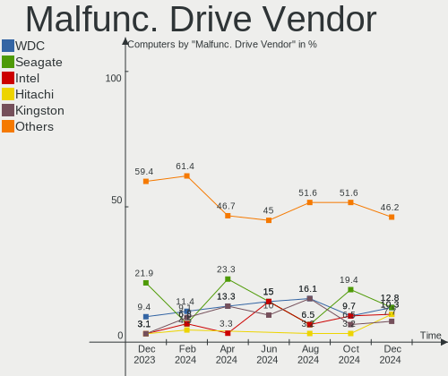
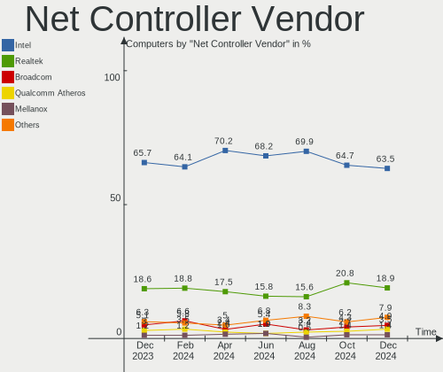

OPNsense - Hardware Trends
--------------------------

A project to identify most popular hardware characteristics and track their change
over time based on data collected by BSD users at https://BSD-Hardware.info.

Anyone can contribute to this report by the [hw-probe](https://github.com/linuxhw/hw-probe/blob/master/INSTALL.BSD.md) tool:

    hw-probe -all -upload

This report is for one last month. Overall report since the beginning of time: [TestCoverage](https://github.com/bsdhw/TestCoverage)

Period: Jul, 2022.

Contents
--------

* [ System ](#system)
  - [ OS                       ](#os)
  - [ OS Family                ](#os-family)
  - [ Arch                     ](#arch)
  - [ DE                       ](#de)
  - [ Display Server           ](#display-server)
  - [ Display Manager          ](#display-manager)
  - [ OS Lang                  ](#os-lang)
  - [ Boot Mode                ](#boot-mode)
  - [ Filesystem               ](#filesystem)
  - [ Part. scheme             ](#part-scheme)

* [ Board ](#board)
  - [ Vendor                   ](#vendor)
  - [ Model                    ](#model)
  - [ Model Family             ](#model-family)
  - [ MFG Year                 ](#mfg-year)
  - [ Form Factor              ](#form-factor)
  - [ Coreboot                 ](#coreboot)
  - [ RAM Size                 ](#ram-size)
  - [ RAM Used                 ](#ram-used)
  - [ Total Drives             ](#total-drives)
  - [ Has CD-ROM               ](#has-cd-rom)
  - [ Has Ethernet             ](#has-ethernet)
  - [ Has WiFi                 ](#has-wifi)
  - [ Has Bluetooth            ](#has-bluetooth)

* [ Location ](#location)
  - [ Country                  ](#country)
  - [ City                     ](#city)

* [ Drives ](#drives)
  - [ Drive Vendor             ](#drive-vendor)
  - [ Drive Model              ](#drive-model)
  - [ HDD Vendor               ](#hdd-vendor)
  - [ SSD Vendor               ](#ssd-vendor)
  - [ Drive Kind               ](#drive-kind)
  - [ Drive Connector          ](#drive-connector)
  - [ Drive Size               ](#drive-size)
  - [ Space Total              ](#space-total)
  - [ Space Used               ](#space-used)
  - [ Malfunc. Drives          ](#malfunc-drives)
  - [ Malfunc. Drive Vendor    ](#malfunc-drive-vendor)
  - [ Malfunc. HDD Vendor      ](#malfunc-hdd-vendor)
  - [ Malfunc. Drive Kind      ](#malfunc-drive-kind)
  - [ Failed Drives            ](#failed-drives)
  - [ Failed Drive Vendor      ](#failed-drive-vendor)
  - [ Drive Status             ](#drive-status)

* [ Storage controller ](#storage-controller)
  - [ Storage Vendor           ](#storage-vendor)
  - [ Storage Model            ](#storage-model)
  - [ Storage Kind             ](#storage-kind)

* [ Processor ](#processor)
  - [ CPU Vendor               ](#cpu-vendor)
  - [ CPU Model                ](#cpu-model)
  - [ CPU Model Family         ](#cpu-model-family)
  - [ CPU Cores                ](#cpu-cores)
  - [ CPU Sockets              ](#cpu-sockets)
  - [ CPU Threads              ](#cpu-threads)
  - [ CPU Microarch            ](#cpu-microarch)

* [ Graphics ](#graphics)
  - [ GPU Vendor               ](#gpu-vendor)
  - [ GPU Model                ](#gpu-model)
  - [ GPU Combo                ](#gpu-combo)
  - [ GPU Driver               ](#gpu-driver)
  - [ GPU Memory               ](#gpu-memory)

* [ Monitor ](#monitor)
  - [ Monitor Vendor           ](#monitor-vendor)
  - [ Monitor Model            ](#monitor-model)
  - [ Monitor Resolution       ](#monitor-resolution)
  - [ Monitor Diagonal         ](#monitor-diagonal)
  - [ Monitor Width            ](#monitor-width)
  - [ Aspect Ratio             ](#aspect-ratio)
  - [ Monitor Area             ](#monitor-area)
  - [ Pixel Density            ](#pixel-density)
  - [ Multiple Monitors        ](#multiple-monitors)

* [ Network ](#network)
  - [ Net Controller Vendor    ](#net-controller-vendor)
  - [ Net Controller Model     ](#net-controller-model)
  - [ Wireless Vendor          ](#wireless-vendor)
  - [ Wireless Model           ](#wireless-model)
  - [ Ethernet Vendor          ](#ethernet-vendor)
  - [ Ethernet Model           ](#ethernet-model)
  - [ Net Controller Kind      ](#net-controller-kind)
  - [ Used Controller          ](#used-controller)
  - [ NICs                     ](#nics)
  - [ IPv6                     ](#ipv6)

* [ Bluetooth ](#bluetooth)
  - [ Bluetooth Vendor         ](#bluetooth-vendor)
  - [ Bluetooth Model          ](#bluetooth-model)

* [ Sound ](#sound)
  - [ Sound Vendor             ](#sound-vendor)
  - [ Sound Model              ](#sound-model)

* [ Memory ](#memory)
  - [ Memory Vendor            ](#memory-vendor)
  - [ Memory Model             ](#memory-model)
  - [ Memory Kind              ](#memory-kind)
  - [ Memory Form Factor       ](#memory-form-factor)
  - [ Memory Size              ](#memory-size)
  - [ Memory Speed             ](#memory-speed)

* [ Printers & scanners ](#printers--scanners)
  - [ Printer Vendor           ](#printer-vendor)
  - [ Printer Model            ](#printer-model)
  - [ Scanner Vendor           ](#scanner-vendor)
  - [ Scanner Model            ](#scanner-model)

* [ Camera ](#camera)
  - [ Camera Vendor            ](#camera-vendor)
  - [ Camera Model             ](#camera-model)

* [ Security ](#security)
  - [ Fingerprint Vendor       ](#fingerprint-vendor)
  - [ Fingerprint Model        ](#fingerprint-model)
  - [ Chipcard Vendor          ](#chipcard-vendor)
  - [ Chipcard Model           ](#chipcard-model)

* [ Unsupported ](#unsupported)
  - [ Unsupported Devices      ](#unsupported-devices)
  - [ Unsupported Device Types ](#unsupported-device-types)

System
------

OS
--

Installed operating systems

| Name             | Computers | Percent |
|------------------|-----------|---------|
| OPNsense 22.1.10 | 128       | 56.64%  |
| OPNsense 22.1.9  | 43        | 19.03%  |
| OPNsense 22.7    | 42        | 18.58%  |
| OPNsense 22.1.8  | 4         | 1.77%   |
| OPNsense 21.7.8  | 3         | 1.33%   |
| OPNsense 22.4.1  | 2         | 0.88%   |
| OPNsense 21.1    | 2         | 0.88%   |
| OPNsense 22.4.2  | 1         | 0.44%   |
| OPNsense 22.1.5  | 1         | 0.44%   |

OS Family
---------

OS without a version

| Name     | Computers | Percent |
|----------|-----------|---------|
| OPNsense | 226       | 100%    |

Arch
----

OS architecture (x86_64, i586, etc.)

| Name  | Computers | Percent |
|-------|-----------|---------|
| amd64 | 226       | 100%    |

DE
--

Desktop Environment

| Name    | Computers | Percent |
|---------|-----------|---------|
| Console | 226       | 100%    |

Display Server
--------------

X11 or Wayland

| Name    | Computers | Percent |
|---------|-----------|---------|
| Console | 226       | 100%    |

Display Manager
---------------

SDDM, LightDM, etc.

| Name    | Computers | Percent |
|---------|-----------|---------|
| Console | 226       | 100%    |

OS Lang
-------

Language

| Lang    | Computers | Percent |
|---------|-----------|---------|
| Unknown | 222       | 98.23%  |
| C       | 4         | 1.77%   |

Boot Mode
---------

EFI or BIOS

| Mode | Computers | Percent |
|------|-----------|---------|
| EFI  | 218       | 96.46%  |
| BIOS | 8         | 3.54%   |

Filesystem
----------

Type of filesystem

| Type | Computers | Percent |
|------|-----------|---------|
| Ufs  | 146       | 64.6%   |
| Zfs  | 80        | 35.4%   |

Part. scheme
------------

Scheme of partitioning

| Type    | Computers | Percent |
|---------|-----------|---------|
| GPT     | 218       | 96.46%  |
| MBR     | 5         | 2.21%   |
| Unknown | 3         | 1.33%   |

Board
-----

Vendor
------

Motherboard manufacturer

| Name                          | Computers | Percent |
|-------------------------------|-----------|---------|
| Dell                          | 25        | 11.06%  |
| Hewlett-Packard               | 24        | 10.62%  |
| Unknown                       | 17        | 7.52%   |
| Protectli                     | 16        | 7.08%   |
| Intel                         | 15        | 6.64%   |
| Supermicro                    | 13        | 5.75%   |
| ASUSTek Computer              | 10        | 4.42%   |
| ASRock                        | 10        | 4.42%   |
| Deciso                        | 9         | 3.98%   |
| Fujitsu                       | 8         | 3.54%   |
| Lenovo                        | 7         | 3.1%    |
| Gigabyte Technology           | 7         | 3.1%    |
| AMI                           | 7         | 3.1%    |
| PC Engines                    | 6         | 2.65%   |
| AWOW                          | 5         | 2.21%   |
| Sophos                        | 4         | 1.77%   |
| MW                            | 4         | 1.77%   |
| Biostar                       | 4         | 1.77%   |
| Acer                          | 3         | 1.33%   |
| ZOTAC                         | 2         | 0.88%   |
| Techvision                    | 2         | 0.88%   |
| Shuttle                       | 2         | 0.88%   |
| Secudos                       | 2         | 0.88%   |
| AZW                           | 2         | 0.88%   |
| AMD                           | 2         | 0.88%   |
| AAEON                         | 2         | 0.88%   |
| YANYU                         | 1         | 0.44%   |
| Wistron                       | 1         | 0.44%   |
| WesternDigital                | 1         | 0.44%   |
| SmbiosType2_BoardManufacturer | 1         | 0.44%   |
| Positivo                      | 1         | 0.44%   |
| Pegatron                      | 1         | 0.44%   |
| Nitrokey                      | 1         | 0.44%   |
| NF541S                        | 1         | 0.44%   |
| NF541                         | 1         | 0.44%   |
| MSI                           | 1         | 0.44%   |
| MiTAC                         | 1         | 0.44%   |
| Kraftway                      | 1         | 0.44%   |
| IP3 Tech                      | 1         | 0.44%   |
| Inventec                      | 1         | 0.44%   |
| Firewalla                     | 1         | 0.44%   |
| Datto                         | 1         | 0.44%   |
| CompuLab                      | 1         | 0.44%   |
| CNCTION-IAF                   | 1         | 0.44%   |

Model
-----

Motherboard model

| Name                                                        | Computers | Percent |
|-------------------------------------------------------------|-----------|---------|
| Unknown                                                     | 20        | 8.85%   |
| Intel Q3XXG4-P V1.0                                         | 7         | 3.1%    |
| Protectli FW6                                               | 6         | 2.65%   |
| Fujitsu FUTRO S920                                          | 5         | 2.21%   |
| Protectli FW4B                                              | 4         | 1.77%   |
| PC Engines APU2                                             | 4         | 1.77%   |
| MW GMLK-2_5G4L                                              | 4         | 1.77%   |
| HP t620 PLUS Quad Core TC                                   | 4         | 1.77%   |
| Deciso Netboard A20                                         | 4         | 1.77%   |
| AWOW PC BOX                                                 | 4         | 1.77%   |
| Supermicro X10SLH-N6-ST031                                  | 3         | 1.33%   |
| Protectli VP2410                                            | 3         | 1.33%   |
| HP Compaq Elite 8300 SFF                                    | 3         | 1.33%   |
| AMI Aptio CRB                                               | 3         | 1.33%   |
| Techvision TVI7309X                                         | 2         | 0.88%   |
| Supermicro 1HE Intel Single-CPU RI1102H-XE Server           | 2         | 0.88%   |
| Sophos SG                                                   | 2         | 0.88%   |
| Intel CRESCENTBAY                                           | 2         | 0.88%   |
| HP ProDesk 600 G1 SFF                                       | 2         | 0.88%   |
| Dell OptiPlex 9020                                          | 2         | 0.88%   |
| Dell OptiPlex 5040                                          | 2         | 0.88%   |
| Dell OptiPlex 3040                                          | 2         | 0.88%   |
| Deciso Netboard A10 GEN2 Model G                            | 2         | 0.88%   |
| ZOTAC ZBOX-CI329NANO                                        | 1         | 0.44%   |
| YANYU H87SL VER:1.3                                         | 1         | 0.44%   |
| Wistron ProLiant ML110 G6                                   | 1         | 0.44%   |
| WesternDigital WDBNFA0320KBK-40                             | 1         | 0.44%   |
| Supermicro X10SBA                                           | 1         | 0.44%   |
| Supermicro SYS-E50-9AP-N5                                   | 1         | 0.44%   |
| Supermicro SYS-E300-9D-4CN8TP                               | 1         | 0.44%   |
| Supermicro SYS-E200-9B                                      | 1         | 0.44%   |
| Supermicro SYS-5019D-FN8TP-2-NC041                          | 1         | 0.44%   |
| Supermicro SYS-1019S-MP                                     | 1         | 0.44%   |
| Supermicro Super Server                                     | 1         | 0.44%   |
| Supermicro A1SAi                                            | 1         | 0.44%   |
| Sophos XG                                                   | 1         | 0.44%   |
| Sophos UTM                                                  | 1         | 0.44%   |
| SmbiosType2_BoardManufacturer SmbiosType1_SystemProductName | 1         | 0.44%   |
| Shuttle DS437                                               | 1         | 0.44%   |
| Shuttle DH310                                               | 1         | 0.44%   |
| Protectli FW6E                                              | 1         | 0.44%   |
| Protectli FW4A                                              | 1         | 0.44%   |
| Protectli FW2                                               | 1         | 0.44%   |
| Positivo POS-EINM70CS                                       | 1         | 0.44%   |
| Pegatron h8-1102nl                                          | 1         | 0.44%   |
| PC Engines apu4                                             | 1         | 0.44%   |
| PC Engines APU3                                             | 1         | 0.44%   |
| Nitrokey NitroWall                                          | 1         | 0.44%   |
| NF541S 1.0                                                  | 1         | 0.44%   |
| NF541 1.0                                                   | 1         | 0.44%   |
| MSI MS-7C95                                                 | 1         | 0.44%   |
| MiTAC PH11CMI                                               | 1         | 0.44%   |
| Lenovo ThinkCentre M93p 10AAS3UM00                          | 1         | 0.44%   |
| Lenovo ThinkCentre M93p 10A8S16X0J                          | 1         | 0.44%   |
| Lenovo ThinkCentre M93p 10A8S08J01                          | 1         | 0.44%   |
| Lenovo ThinkCentre M91 4518E4U                              | 1         | 0.44%   |
| Lenovo ThinkCentre M83 10AHS35Q00                           | 1         | 0.44%   |
| Lenovo ThinkCentre M720q 10T8S9MV00                         | 1         | 0.44%   |
| Lenovo IdeaCentre 300S-11IBR 90DQ004GUS                     | 1         | 0.44%   |
| Kraftway GEG                                                | 1         | 0.44%   |

Model Family
------------

Motherboard model prefix

| Name                                      | Computers | Percent |
|-------------------------------------------|-----------|---------|
| Unknown                                   | 20        | 8.85%   |
| Dell OptiPlex                             | 14        | 6.19%   |
| Intel Q3XXG4-P                            | 7         | 3.1%    |
| HP Compaq                                 | 7         | 3.1%    |
| Deciso Netboard                           | 7         | 3.1%    |
| Protectli FW6                             | 6         | 2.65%   |
| Lenovo ThinkCentre                        | 6         | 2.65%   |
| Dell PowerEdge                            | 6         | 2.65%   |
| HP ProDesk                                | 5         | 2.21%   |
| Fujitsu FUTRO                             | 5         | 2.21%   |
| Protectli FW4B                            | 4         | 1.77%   |
| PC Engines APU2                           | 4         | 1.77%   |
| MW GMLK-2                                 | 4         | 1.77%   |
| HP t620                                   | 4         | 1.77%   |
| AWOW PC                                   | 4         | 1.77%   |
| Supermicro X10SLH-N6-ST031                | 3         | 1.33%   |
| Protectli VP2410                          | 3         | 1.33%   |
| Dell Inspiron                             | 3         | 1.33%   |
| AMI Aptio                                 | 3         | 1.33%   |
| Techvision TVI7309X                       | 2         | 0.88%   |
| Supermicro 1HE                            | 2         | 0.88%   |
| Sophos SG                                 | 2         | 0.88%   |
| Intel CRESCENTBAY                         | 2         | 0.88%   |
| HP ProLiant                               | 2         | 0.88%   |
| HP EliteDesk                              | 2         | 0.88%   |
| Fujitsu PRIMERGY                          | 2         | 0.88%   |
| ASUS ROG                                  | 2         | 0.88%   |
| ASUS M5A78L-M                             | 2         | 0.88%   |
| ZOTAC ZBOX-CI329NANO                      | 1         | 0.44%   |
| YANYU H87SL                               | 1         | 0.44%   |
| Wistron ProLiant                          | 1         | 0.44%   |
| WesternDigital WDBNFA0320KBK-40           | 1         | 0.44%   |
| Supermicro X10SBA                         | 1         | 0.44%   |
| Supermicro SYS-E50-9AP-N5                 | 1         | 0.44%   |
| Supermicro SYS-E300-9D-4CN8TP             | 1         | 0.44%   |
| Supermicro SYS-E200-9B                    | 1         | 0.44%   |
| Supermicro SYS-5019D-FN8TP-2-NC041        | 1         | 0.44%   |
| Supermicro SYS-1019S-MP                   | 1         | 0.44%   |
| Supermicro Super                          | 1         | 0.44%   |
| Supermicro A1SAi                          | 1         | 0.44%   |
| Sophos XG                                 | 1         | 0.44%   |
| Sophos UTM                                | 1         | 0.44%   |
| SmbiosType2_BoardManufacturer SmbiosType1 | 1         | 0.44%   |
| Shuttle DS437                             | 1         | 0.44%   |
| Shuttle DH310                             | 1         | 0.44%   |
| Protectli FW6E                            | 1         | 0.44%   |
| Protectli FW4A                            | 1         | 0.44%   |
| Protectli FW2                             | 1         | 0.44%   |
| Positivo POS-EINM70CS                     | 1         | 0.44%   |
| Pegatron h8-1102nl                        | 1         | 0.44%   |
| PC Engines apu4                           | 1         | 0.44%   |
| PC Engines APU3                           | 1         | 0.44%   |
| Nitrokey NitroWall                        | 1         | 0.44%   |
| NF541S 1.0                                | 1         | 0.44%   |
| NF541 1.0                                 | 1         | 0.44%   |
| MSI MS-7C95                               | 1         | 0.44%   |
| MiTAC PH11CMI                             | 1         | 0.44%   |
| Lenovo IdeaCentre                         | 1         | 0.44%   |
| Kraftway GEG                              | 1         | 0.44%   |
| IP3 Tech CoreBox                          | 1         | 0.44%   |

MFG Year
--------

Motherboard manufacture year

| Year | Computers | Percent |
|------|-----------|---------|
| 2021 | 31        | 13.72%  |
| 2020 | 26        | 11.5%   |
| 2018 | 26        | 11.5%   |
| 2016 | 25        | 11.06%  |
| 2019 | 24        | 10.62%  |
| 2014 | 22        | 9.73%   |
| 2013 | 15        | 6.64%   |
| 2017 | 14        | 6.19%   |
| 2012 | 12        | 5.31%   |
| 2022 | 10        | 4.42%   |
| 2011 | 10        | 4.42%   |
| 2015 | 4         | 1.77%   |
| 2010 | 3         | 1.33%   |
| 2009 | 2         | 0.88%   |
| 2008 | 1         | 0.44%   |
| 2007 | 1         | 0.44%   |

Form Factor
-----------

Physical design of the computer

| Name     | Computers | Percent |
|----------|-----------|---------|
| Desktop  | 175       | 77.43%  |
| Mini pc  | 19        | 8.41%   |
| Server   | 17        | 7.52%   |
| Notebook | 9         | 3.98%   |
| Firewall | 6         | 2.65%   |

Coreboot
--------

Have coreboot on board

| Used | Computers | Percent |
|------|-----------|---------|
| No   | 213       | 94.25%  |
| Yes  | 13        | 5.75%   |

RAM Size
--------

Total RAM memory

| Size in GB  | Computers | Percent |
|-------------|-----------|---------|
| 8.01-16.0   | 109       | 48.23%  |
| 4.01-8.0    | 51        | 22.57%  |
| 16.01-24.0  | 38        | 16.81%  |
| 32.01-64.0  | 13        | 5.75%   |
| 2.01-3.0    | 9         | 3.98%   |
| 24.01-32.0  | 3         | 1.33%   |
| 64.01-256.0 | 3         | 1.33%   |

RAM Used
--------

Used RAM memory

| Used GB  | Computers | Percent |
|----------|-----------|---------|
| 0.01-0.5 | 145       | 64.16%  |
| 0.51-1.0 | 57        | 25.22%  |
| 1.01-2.0 | 18        | 7.96%   |
| 3.01-4.0 | 3         | 1.33%   |
| 4.01-8.0 | 2         | 0.88%   |
| 2.01-3.0 | 1         | 0.44%   |

Total Drives
------------

Number of drives on board

| Drives | Computers | Percent |
|--------|-----------|---------|
| 1      | 192       | 84.96%  |
| 0      | 18        | 7.96%   |
| 2      | 13        | 5.75%   |
| 3      | 2         | 0.88%   |
| 4      | 1         | 0.44%   |

Has CD-ROM
----------

Has CD-ROM on board

| Presented | Computers | Percent |
|-----------|-----------|---------|
| No        | 188       | 83.19%  |
| Yes       | 38        | 16.81%  |

Has Ethernet
------------

Has Ethernet on board

| Presented | Computers | Percent |
|-----------|-----------|---------|
| Yes       | 226       | 100%    |

Has WiFi
--------

Has WiFi module

| Presented | Computers | Percent |
|-----------|-----------|---------|
| No        | 197       | 87.17%  |
| Yes       | 29        | 12.83%  |

Has Bluetooth
-------------

Has Bluetooth module

| Presented | Computers | Percent |
|-----------|-----------|---------|
| No        | 208       | 92.04%  |
| Yes       | 18        | 7.96%   |

Location
--------

Country
-------

Geographic location (country)

| Country      | Computers | Percent |
|--------------|-----------|---------|
| USA          | 81        | 35.84%  |
| Germany      | 40        | 17.7%   |
| Canada       | 14        | 6.19%   |
| France       | 11        | 4.87%   |
| UK           | 9         | 3.98%   |
| Switzerland  | 8         | 3.54%   |
| Austria      | 8         | 3.54%   |
| Italy        | 7         | 3.1%    |
| Brazil       | 6         | 2.65%   |
| Russia       | 5         | 2.21%   |
| Netherlands  | 5         | 2.21%   |
| Australia    | 5         | 2.21%   |
| Finland      | 4         | 1.77%   |
| Sweden       | 3         | 1.33%   |
| Poland       | 3         | 1.33%   |
| Hungary      | 3         | 1.33%   |
| Spain        | 2         | 0.88%   |
| China        | 2         | 0.88%   |
| South Korea  | 1         | 0.44%   |
| South Africa | 1         | 0.44%   |
| Portugal     | 1         | 0.44%   |
| Philippines  | 1         | 0.44%   |
| Peru         | 1         | 0.44%   |
| Norway       | 1         | 0.44%   |
| New Zealand  | 1         | 0.44%   |
| Kenya        | 1         | 0.44%   |
| Indonesia    | 1         | 0.44%   |
| Belgium      | 1         | 0.44%   |

City
----

Geographic location (city)

| City                  | Computers | Percent |
|-----------------------|-----------|---------|
| Vienna                | 4         | 1.77%   |
| Munich                | 4         | 1.77%   |
| Zurich                | 3         | 1.33%   |
| Seattle               | 3         | 1.33%   |
| Mountain View         | 3         | 1.33%   |
| Melbourne             | 3         | 1.33%   |
| Graz                  | 3         | 1.33%   |
| Budapest              | 3         | 1.33%   |
| Wexford               | 2         | 0.88%   |
| Victoria              | 2         | 0.88%   |
| Toronto               | 2         | 0.88%   |
| Stuttgart             | 2         | 0.88%   |
| Stockholm             | 2         | 0.88%   |
| Salt Lake City        | 2         | 0.88%   |
| Renton                | 2         | 0.88%   |
| Perth                 | 2         | 0.88%   |
| Madrid                | 2         | 0.88%   |
| Lipetsk               | 2         | 0.88%   |
| Frankfurt am Main     | 2         | 0.88%   |
| Fougeres              | 2         | 0.88%   |
| Columbus              | 2         | 0.88%   |
| Cary                  | 2         | 0.88%   |
| Berlin                | 2         | 0.88%   |
| Austin                | 2         | 0.88%   |
| Zell am Harmersbach   | 1         | 0.44%   |
| Zeitz                 | 1         | 0.44%   |
| Winterthur            | 1         | 0.44%   |
| Wickliffe             | 1         | 0.44%   |
| Wichita Falls         | 1         | 0.44%   |
| Wettringen            | 1         | 0.44%   |
| Wentorf bei Hamburg   | 1         | 0.44%   |
| Warsaw                | 1         | 0.44%   |
| Viry-Châtillon       | 1         | 0.44%   |
| Venice                | 1         | 0.44%   |
| Västerås            | 1         | 0.44%   |
| Vantaa                | 1         | 0.44%   |
| Vancouver             | 1         | 0.44%   |
| Vaasa                 | 1         | 0.44%   |
| Utrecht               | 1         | 0.44%   |
| Todtnau               | 1         | 0.44%   |
| Sydney                | 1         | 0.44%   |
| Surgut                | 1         | 0.44%   |
| Statesboro            | 1         | 0.44%   |
| St. Gallen            | 1         | 0.44%   |
| South Hamilton        | 1         | 0.44%   |
| Skjaerhalden          | 1         | 0.44%   |
| Silver Spring         | 1         | 0.44%   |
| Sidney                | 1         | 0.44%   |
| Schnecksville         | 1         | 0.44%   |
| Schluesslberg         | 1         | 0.44%   |
| Sarnia                | 1         | 0.44%   |
| Sao Paulo             | 1         | 0.44%   |
| Sao Goncalo           | 1         | 0.44%   |
| San Marcos            | 1         | 0.44%   |
| San Diego             | 1         | 0.44%   |
| Salzburg              | 1         | 0.44%   |
| Saint-Priest-en-Jarez | 1         | 0.44%   |
| Rozenburg             | 1         | 0.44%   |
| Roswell               | 1         | 0.44%   |
| Riihimäki            | 1         | 0.44%   |

Drives
------

Drive Vendor
------------

Hard drive vendors

| Vendor              | Computers | Drives | Percent |
|---------------------|-----------|--------|---------|
| Samsung Electronics | 28        | 31     | 12.84%  |
| Transcend           | 26        | 27     | 11.93%  |
| WDC                 | 18        | 19     | 8.26%   |
| Kingston            | 15        | 15     | 6.88%   |
| Seagate             | 14        | 16     | 6.42%   |
| SanDisk             | 13        | 13     | 5.96%   |
| Crucial             | 11        | 11     | 5.05%   |
| Intel               | 10        | 10     | 4.59%   |
| China               | 9         | 9      | 4.13%   |
| Hitachi             | 5         | 5      | 2.29%   |
| SPCC                | 4         | 4      | 1.83%   |
| Protectli           | 4         | 4      | 1.83%   |
| Dogfish             | 4         | 4      | 1.83%   |
| Toshiba             | 3         | 6      | 1.38%   |
| PNY                 | 3         | 3      | 1.38%   |
| Intenso             | 3         | 4      | 1.38%   |
| Innodisk            | 3         | 3      | 1.38%   |
| Hoodisk             | 3         | 3      | 1.38%   |
| FORESEE             | 3         | 3      | 1.38%   |
| A-DATA Technology   | 3         | 3      | 1.38%   |
| Team                | 2         | 2      | 0.92%   |
| SK hynix            | 2         | 2      | 0.92%   |
| OCZ                 | 2         | 2      | 0.92%   |
| Micron Technology   | 2         | 2      | 0.92%   |
| Lexar               | 2         | 3      | 0.92%   |
| KingSpec            | 2         | 2      | 0.92%   |
| BORY                | 2         | 2      | 0.92%   |
| BIWIN               | 2         | 2      | 0.92%   |
| Apacer              | 2         | 2      | 0.92%   |
| Vaseky              | 1         | 1      | 0.46%   |
| Supermicro          | 1         | 1      | 0.46%   |
| ShiJi               | 1         | 1      | 0.46%   |
| SATADOM             | 1         | 1      | 0.46%   |
| Plextor             | 1         | 1      | 0.46%   |
| Phison              | 1         | 1      | 0.46%   |
| Pccooler            | 1         | 1      | 0.46%   |
| Patriot             | 1         | 1      | 0.46%   |
| LITEONIT            | 1         | 1      | 0.46%   |
| LITEON              | 1         | 1      | 0.46%   |
| KIOXIA              | 1         | 1      | 0.46%   |
| INDMEM              | 1         | 1      | 0.46%   |
| Indilinx            | 1         | 1      | 0.46%   |
| HPE                 | 1         | 1      | 0.46%   |
| Hewlett-Packard     | 1         | 1      | 0.46%   |
| Drevo               | 1         | 1      | 0.46%   |
| CWDISK              | 1         | 1      | 0.46%   |
| BlueRay             | 1         | 1      | 0.46%   |

Drive Model
-----------

Hard drive models

| Model                                | Computers | Percent |
|--------------------------------------|-----------|---------|
| Transcend TS256GMTS952T2 256GB       | 4         | 1.8%    |
| Transcend TS256GSSD230S 256GB        | 3         | 1.35%   |
| Transcend TS128GMSA230S 128GB        | 3         | 1.35%   |
| Samsung MZYLN256HCHP-000L2 256GB     | 3         | 1.35%   |
| Kingston SA400S37240G 240GB          | 3         | 1.35%   |
| Dogfish SSD 128GB                    | 3         | 1.35%   |
| WDC WDS120G2G0A-00JH30 120GB         | 2         | 0.9%    |
| Transcend TS64GMSA370 64GB           | 2         | 0.9%    |
| Transcend TS256GMTE652T2 256GB       | 2         | 0.9%    |
| Transcend TS240GSSD220S 240GB        | 2         | 0.9%    |
| Transcend TS128GMSA370 128GB         | 2         | 0.9%    |
| SPCC Solid State Disk 128GB          | 2         | 0.9%    |
| Seagate ST500DM002-1BD142 500GB      | 2         | 0.9%    |
| Seagate ST3500413AS 500GB            | 2         | 0.9%    |
| SanDisk X400 M.2 2280 128GB          | 2         | 0.9%    |
| SanDisk SDSSDRC032G 32GB             | 2         | 0.9%    |
| Samsung SSD 860 EVO M.2 250GB        | 2         | 0.9%    |
| Samsung SSD 850 EVO mSATA 250GB      | 2         | 0.9%    |
| Samsung MZ7TY128HDHP-000L1 128GB     | 2         | 0.9%    |
| Protectli 120GB mSATA                | 2         | 0.9%    |
| PNY CS900 120GB SSD                  | 2         | 0.9%    |
| Kingston SV300S37A60G 64GB           | 2         | 0.9%    |
| Kingston SV300S37A240G 240GB         | 2         | 0.9%    |
| Kingston SUV500MS120G 120GB          | 2         | 0.9%    |
| Kingston SKC600MS256G 256GB          | 2         | 0.9%    |
| Innodisk DEMSR- 08GB mSATA 3ME3      | 2         | 0.9%    |
| Hoodisk SSD 32GB                     | 2         | 0.9%    |
| FORESEE 128GB SSD                    | 2         | 0.9%    |
| Crucial CT500P2SSD8 500GB            | 2         | 0.9%    |
| China SATA SSD 16GB                  | 2         | 0.9%    |
| BORY M500 128G                       | 2         | 0.9%    |
| BIWIN SSD 128GB                      | 2         | 0.9%    |
| WDC WDS500G1X0E-00AFY0 500GB         | 1         | 0.45%   |
| WDC WDS250G2X0C-00L350 250GB         | 1         | 0.45%   |
| WDC WDS250G2B0A-00SM50 250GB         | 1         | 0.45%   |
| WDC WDBRPG0010BNC-WRSN 1TB           | 1         | 0.45%   |
| WDC WD800JD-60LSA5 80GB              | 1         | 0.45%   |
| WDC WD6400AAKS-22A7B2 640GB          | 1         | 0.45%   |
| WDC WD5000LPVT-80G33T2 500GB         | 1         | 0.45%   |
| WDC WD5000AZLX-22JKKA0 500GB         | 1         | 0.45%   |
| WDC WD5000AAKX-22ERMA0 500GB         | 1         | 0.45%   |
| WDC WD2503ABYX-01WERA1 256GB         | 1         | 0.45%   |
| WDC WD2500AAKX-753CA1 250GB          | 1         | 0.45%   |
| WDC WD2500AAKX-753CA0 250GB          | 1         | 0.45%   |
| WDC WD2500AAJS-07M0A0 250GB          | 1         | 0.45%   |
| WDC WD1500HLFS-01G6U4 150GB          | 1         | 0.45%   |
| WDC WD10EFRX-68FYTN0 1TB             | 1         | 0.45%   |
| WDC PC SN530 SDBPNPZ-256G-1006 256GB | 1         | 0.45%   |
| WDC PC SN530 SDBPMPZ-256G-1101 256GB | 1         | 0.45%   |
| Vaseky V800-64G                      | 1         | 0.45%   |
| Transcend TS64GSSD420K 64GB          | 1         | 0.45%   |
| Transcend TS64GMTS400SD 64GB         | 1         | 0.45%   |
| Transcend TS64GMTS400S 64GB          | 1         | 0.45%   |
| Transcend TS64GMSA230S 64GB          | 1         | 0.45%   |
| Transcend TS32GMSA370 32GB           | 1         | 0.45%   |
| Transcend TS16GMSA372M 16GB          | 1         | 0.45%   |
| Transcend TS128GSSD420K 128GB        | 1         | 0.45%   |
| Transcend TS128GMTS550T 128GB        | 1         | 0.45%   |
| Transcend TS128GMTE110S 128GB        | 1         | 0.45%   |
| Toshiba THNSNH128GBST                | 1         | 0.45%   |

HDD Vendor
----------

Hard disk drive vendors

| Vendor              | Computers | Drives | Percent |
|---------------------|-----------|--------|---------|
| Seagate             | 12        | 14     | 37.5%   |
| WDC                 | 10        | 11     | 31.25%  |
| Hitachi             | 5         | 5      | 15.63%  |
| Samsung Electronics | 2         | 2      | 6.25%   |
| Toshiba             | 1         | 4      | 3.13%   |
| HPE                 | 1         | 1      | 3.13%   |
| Hewlett-Packard     | 1         | 1      | 3.13%   |

SSD Vendor
----------

Solid state drive vendors

| Vendor              | Computers | Drives | Percent |
|---------------------|-----------|--------|---------|
| Transcend           | 23        | 24     | 14.38%  |
| Samsung Electronics | 21        | 23     | 13.13%  |
| SanDisk             | 13        | 13     | 8.13%   |
| Kingston            | 13        | 13     | 8.13%   |
| Intel               | 9         | 9      | 5.63%   |
| China               | 9         | 9      | 5.63%   |
| Crucial             | 8         | 8      | 5%      |
| SPCC                | 4         | 4      | 2.5%    |
| Protectli           | 4         | 4      | 2.5%    |
| Dogfish             | 4         | 4      | 2.5%    |
| WDC                 | 3         | 3      | 1.88%   |
| PNY                 | 3         | 3      | 1.88%   |
| Intenso             | 3         | 4      | 1.88%   |
| Innodisk            | 3         | 3      | 1.88%   |
| Hoodisk             | 3         | 3      | 1.88%   |
| FORESEE             | 3         | 3      | 1.88%   |
| Toshiba             | 2         | 2      | 1.25%   |
| Seagate             | 2         | 2      | 1.25%   |
| OCZ                 | 2         | 2      | 1.25%   |
| Micron Technology   | 2         | 2      | 1.25%   |
| KingSpec            | 2         | 2      | 1.25%   |
| BORY                | 2         | 2      | 1.25%   |
| BIWIN               | 2         | 2      | 1.25%   |
| Apacer              | 2         | 2      | 1.25%   |
| A-DATA Technology   | 2         | 2      | 1.25%   |
| Vaseky              | 1         | 1      | 0.63%   |
| Team                | 1         | 1      | 0.63%   |
| Supermicro          | 1         | 1      | 0.63%   |
| SK hynix            | 1         | 1      | 0.63%   |
| ShiJi               | 1         | 1      | 0.63%   |
| SATADOM             | 1         | 1      | 0.63%   |
| Pccooler            | 1         | 1      | 0.63%   |
| Patriot             | 1         | 1      | 0.63%   |
| LITEONIT            | 1         | 1      | 0.63%   |
| LITEON              | 1         | 1      | 0.63%   |
| Lexar               | 1         | 2      | 0.63%   |
| INDMEM              | 1         | 1      | 0.63%   |
| Indilinx            | 1         | 1      | 0.63%   |
| Drevo               | 1         | 1      | 0.63%   |
| CWDISK              | 1         | 1      | 0.63%   |
| BlueRay             | 1         | 1      | 0.63%   |

Drive Kind
----------

HDD or SSD

| Kind | Computers | Drives | Percent |
|------|-----------|--------|---------|
| SSD  | 157       | 165    | 73.36%  |
| HDD  | 32        | 38     | 14.95%  |
| NVMe | 25        | 27     | 11.68%  |

Drive Connector
---------------

SATA, SAS, NVMe, etc.

| Type | Computers | Drives | Percent |
|------|-----------|--------|---------|
| SATA | 184       | 203    | 88.04%  |
| NVMe | 25        | 27     | 11.96%  |

Drive Size
----------

Size of hard drive

| Size in TB | Computers | Drives | Percent |
|------------|-----------|--------|---------|
| 0.01-0.5   | 171       | 185    | 91.44%  |
| 0.51-1.0   | 13        | 14     | 6.95%   |
| 1.01-2.0   | 3         | 4      | 1.6%    |

Space Total
-----------

Amount of disk space available on the file system

| Size in GB | Computers | Percent |
|------------|-----------|---------|
| 101-250    | 123       | 54.42%  |
| 21-50      | 26        | 11.5%   |
| 251-500    | 24        | 10.62%  |
| 51-100     | 20        | 8.85%   |
| 1-20       | 17        | 7.52%   |
| 501-1000   | 13        | 5.75%   |
| 1001-2000  | 3         | 1.33%   |

Space Used
----------

Amount of used disk space

| Used GB | Computers | Percent |
|---------|-----------|---------|
| 1-20    | 218       | 96.46%  |
| 21-50   | 6         | 2.65%   |
| 51-100  | 2         | 0.88%   |

Malfunc. Drives
---------------

Drive models with a malfunction

| Model                                            | Computers | Drives | Percent |
|--------------------------------------------------|-----------|--------|---------|
| Seagate ST500DM002-1BD142 500GB                  | 2         | 2      | 7.69%   |
| Kingston SV300S37A60G 64GB                       | 2         | 2      | 7.69%   |
| Dogfish SSD 128GB                                | 2         | 2      | 7.69%   |
| WDC WDS120G2G0A-00JH30 120GB                     | 1         | 1      | 3.85%   |
| WDC WD800JD-60LSA5 80GB                          | 1         | 1      | 3.85%   |
| WDC WD6400AAKS-22A7B2 640GB                      | 1         | 1      | 3.85%   |
| WDC WD2500AAKX-753CA0 250GB                      | 1         | 1      | 3.85%   |
| WDC WD1500HLFS-01G6U4 150GB                      | 1         | 1      | 3.85%   |
| Toshiba KSG60ZMV256G M.2 2280 256GB              | 1         | 1      | 3.85%   |
| SK hynix SC210 mSATA 256GB                       | 1         | 1      | 3.85%   |
| Seagate ST500LT012-9WS142 500GB                  | 1         | 1      | 3.85%   |
| Seagate ST500LM021-1KJ152 500GB                  | 1         | 1      | 3.85%   |
| Seagate ST31000340NS 1TB                         | 1         | 1      | 3.85%   |
| Seagate ST2000LM007-1R8174 2TB                   | 1         | 2      | 3.85%   |
| SanDisk SD8TB8U-256G-1006 256GB                  | 1         | 1      | 3.85%   |
| Samsung Electronics SSD PM810 2.5-inch 7mm 128GB | 1         | 1      | 3.85%   |
| Samsung Electronics SSD 870 EVO 250GB            | 1         | 1      | 3.85%   |
| Kingston SV300S37A240G 240GB                     | 1         | 1      | 3.85%   |
| HPE MB0500EBNCR 500GB                            | 1         | 1      | 3.85%   |
| Hitachi HDS723015BLA642 1.5TB                    | 1         | 1      | 3.85%   |
| Hitachi HDS721050CLA660 500GB                    | 1         | 1      | 3.85%   |
| Crucial CT1050MX300SSD1 1TB                      | 1         | 1      | 3.85%   |
| China JWX 16GB MSATA                             | 1         | 1      | 3.85%   |

Malfunc. Drive Vendor
---------------------

Vendors of faulty drives

| Vendor              | Computers | Drives | Percent |
|---------------------|-----------|--------|---------|
| Seagate             | 6         | 7      | 23.08%  |
| WDC                 | 5         | 5      | 19.23%  |
| Kingston            | 3         | 3      | 11.54%  |
| Samsung Electronics | 2         | 2      | 7.69%   |
| Hitachi             | 2         | 2      | 7.69%   |
| Dogfish             | 2         | 2      | 7.69%   |
| Toshiba             | 1         | 1      | 3.85%   |
| SK hynix            | 1         | 1      | 3.85%   |
| SanDisk             | 1         | 1      | 3.85%   |
| HPE                 | 1         | 1      | 3.85%   |
| Crucial             | 1         | 1      | 3.85%   |
| China               | 1         | 1      | 3.85%   |

Malfunc. HDD Vendor
-------------------

Vendors of faulty HDD drives

| Vendor  | Computers | Drives | Percent |
|---------|-----------|--------|---------|
| Seagate | 6         | 7      | 46.15%  |
| WDC     | 4         | 4      | 30.77%  |
| Hitachi | 2         | 2      | 15.38%  |
| HPE     | 1         | 1      | 7.69%   |

Malfunc. Drive Kind
-------------------

Kinds of faulty drives

| Kind | Computers | Drives | Percent |
|------|-----------|--------|---------|
| HDD  | 13        | 14     | 52%     |
| SSD  | 12        | 13     | 48%     |

Failed Drives
-------------

Failed drive models

| Model                                        | Computers | Drives | Percent |
|----------------------------------------------|-----------|--------|---------|
| Samsung Electronics MZYLN256HCHP-000L2 256GB | 2         | 2      | 100%    |

Failed Drive Vendor
-------------------

Failed drive vendors

| Vendor              | Computers | Drives | Percent |
|---------------------|-----------|--------|---------|
| Samsung Electronics | 2         | 2      | 100%    |

Drive Status
------------

Number of failed and malfunc. drives

| Status   | Computers | Drives | Percent |
|----------|-----------|--------|---------|
| Works    | 181       | 198    | 85.78%  |
| Malfunc  | 25        | 27     | 11.85%  |
| Detected | 3         | 3      | 1.42%   |
| Failed   | 2         | 2      | 0.95%   |

Storage controller
------------------

Storage Vendor
--------------

Storage controller vendors

| Vendor                       | Computers | Percent |
|------------------------------|-----------|---------|
| Intel                        | 184       | 69.7%   |
| AMD                          | 38        | 14.39%  |
| SanDisk                      | 6         | 2.27%   |
| Samsung Electronics          | 5         | 1.89%   |
| Chelsio Communications       | 4         | 1.52%   |
| Broadcom / LSI               | 4         | 1.52%   |
| ASMedia Technology           | 4         | 1.52%   |
| Micron/Crucial Technology    | 3         | 1.14%   |
| Unknown                      | 3         | 1.14%   |
| Shenzhen Longsys Electronics | 2         | 0.76%   |
| Phison Electronics           | 2         | 0.76%   |
| Kingston Technology Company  | 2         | 0.76%   |
| SK hynix                     | 1         | 0.38%   |
| Nvidia                       | 1         | 0.38%   |
| Marvell Technology Group     | 1         | 0.38%   |
| Lite-On Technology           | 1         | 0.38%   |
| KIOXIA                       | 1         | 0.38%   |
| Hewlett-Packard              | 1         | 0.38%   |
| ADATA Technology             | 1         | 0.38%   |

Storage Model
-------------

Storage controller models

| Model                                                                                   | Computers | Percent |
|-----------------------------------------------------------------------------------------|-----------|---------|
| AMD FCH SATA Controller [AHCI mode]                                                     | 24        | 8.3%    |
| Intel 8 Series/C220 Series Chipset Family 6-port SATA Controller 1 [AHCI mode]          | 18        | 6.23%   |
| Intel Celeron/Pentium Silver Processor SATA Controller                                  | 16        | 5.54%   |
| Intel Atom Processor E3800 Series SATA AHCI Controller                                  | 13        | 4.5%    |
| Intel Sunrise Point-LP SATA Controller [AHCI mode]                                      | 12        | 4.15%   |
| Intel Atom/Celeron/Pentium Processor x5-E8000/J3xxx/N3xxx Series SATA Controller        | 12        | 4.15%   |
| Intel Q170/Q150/B150/H170/H110/Z170/CM236 Chipset SATA Controller [AHCI Mode]           | 11        | 3.81%   |
| Intel Celeron N3350/Pentium N4200/Atom E3900 Series SATA AHCI Controller                | 11        | 3.81%   |
| Intel 6 Series/C200 Series Chipset Family 6 port Desktop SATA AHCI Controller           | 11        | 3.81%   |
| Intel Cannon Lake PCH SATA AHCI Controller                                              | 10        | 3.46%   |
| Intel 7 Series/C210 Series Chipset Family 6-port SATA Controller [AHCI mode]            | 9         | 3.11%   |
| Intel Wildcat Point-LP SATA Controller [AHCI Mode]                                      | 6         | 2.08%   |
| Intel 8 Series SATA Controller 1 [AHCI mode]                                            | 6         | 2.08%   |
| Unknown                                                                                 | 6         | 2.08%   |
| AMD SB7x0/SB8x0/SB9x0 SATA Controller [AHCI mode]                                       | 5         | 1.73%   |
| AMD FCH SATA Controller [IDE mode]                                                      | 5         | 1.73%   |
| Intel SATA Controller [RAID mode]                                                       | 4         | 1.38%   |
| Intel NM10/ICH7 Family SATA Controller [IDE mode]                                       | 4         | 1.38%   |
| Intel 7 Series Chipset Family 6-port SATA Controller [AHCI mode]                        | 4         | 1.38%   |
| ASMedia ASM1062 Serial ATA Controller                                                   | 4         | 1.38%   |
| Samsung NVMe SSD Controller SM981/PM981/PM983                                           | 3         | 1.04%   |
| Micron/Crucial P2 NVMe PCIe SSD                                                         | 3         | 1.04%   |
| Intel Jasper Lake SATA AHCI Controller                                                  | 3         | 1.04%   |
| Intel C620 Series Chipset Family SSATA Controller [AHCI mode]                           | 3         | 1.04%   |
| Intel C620 Series Chipset Family SATA Controller [AHCI mode]                            | 3         | 1.04%   |
| Intel 82801G (ICH7 Family) IDE Controller                                               | 3         | 1.04%   |
| Intel 200 Series PCH SATA controller [AHCI mode]                                        | 3         | 1.04%   |
| Chelsio T520-CR Unified Wire Storage Controller                                         | 3         | 1.04%   |
| AMD SB7x0/SB8x0/SB9x0 IDE Controller                                                    | 3         | 1.04%   |
| AMD 500 Series Chipset SATA Controller                                                  | 3         | 1.04%   |
| Samsung NVMe SSD Controller 980                                                         | 2         | 0.69%   |
| Kingston Company U-SNS8154P3 NVMe SSD                                                   | 2         | 0.69%   |
| Intel Comet Lake SATA AHCI Controller                                                   | 2         | 0.69%   |
| Intel C600/X79 series chipset 6-Port SATA AHCI Controller                               | 2         | 0.69%   |
| Intel Atom Processor C3000 Series SATA Controller 0                                     | 2         | 0.69%   |
| Intel Atom processor C2000 AHCI SATA3 Controller                                        | 2         | 0.69%   |
| Intel 82801JI (ICH10 Family) 4 port SATA IDE Controller #1                              | 2         | 0.69%   |
| Intel 6 Series/C200 Series Chipset Family Desktop SATA Controller (IDE mode, ports 4-5) | 2         | 0.69%   |
| Intel 6 Series/C200 Series Chipset Family Desktop SATA Controller (IDE mode, ports 0-3) | 2         | 0.69%   |
| Intel 500 Series Chipset Family SATA AHCI Controller                                    | 2         | 0.69%   |
| Intel 5 Series/3400 Series Chipset 6 port SATA AHCI Controller                          | 2         | 0.69%   |
| Intel 400 Series Chipset Family SATA AHCI Controller                                    | 2         | 0.69%   |
| SK hynix Gold P31 SSD                                                                   | 1         | 0.35%   |
| SanDisk WD PC SN810 / Black SN850 NVMe SSD                                              | 1         | 0.35%   |
| SanDisk WD Blue SN570 NVMe SSD                                                          | 1         | 0.35%   |
| SanDisk WD Blue SN550 NVMe SSD                                                          | 1         | 0.35%   |
| SanDisk WD Black SN750 / PC SN730 NVMe SSD                                              | 1         | 0.35%   |
| SanDisk WD Black 2018/SN750 / PC SN720 NVMe SSD                                         | 1         | 0.35%   |
| SanDisk PC SN530                                                                        | 1         | 0.35%   |
| Phison PS5013 E13 NVMe Controller                                                       | 1         | 0.35%   |
| Phison E12 NVMe Controller                                                              | 1         | 0.35%   |
| Nvidia MCP61 SATA Controller                                                            | 1         | 0.35%   |
| Nvidia MCP61 IDE                                                                        | 1         | 0.35%   |
| Marvell Group 88SE9230 PCIe 2.0 x2 4-port SATA 6 Gb/s RAID Controller                   | 1         | 0.35%   |
| KIOXIA NVMe SSD Controller BG4                                                          | 1         | 0.35%   |
| Intel Ice Lake-LP SATA Controller [AHCI mode]                                           | 1         | 0.35%   |
| Intel DH89xxCC 4 Port SATA AHCI Controller                                              | 1         | 0.35%   |
| Intel C610/X99 series chipset sSATA Controller [AHCI mode]                              | 1         | 0.35%   |
| Intel C610/X99 series chipset 6-Port SATA Controller [AHCI mode]                        | 1         | 0.35%   |
| Intel C602 chipset 4-Port SATA Storage Control Unit                                     | 1         | 0.35%   |

Storage Kind
------------

Kind of storage controller (IDE, SATA, NVMe, SAS, ...)

| Kind | Computers | Percent |
|------|-----------|---------|
| SATA | 201       | 75.85%  |
| NVMe | 26        | 9.81%   |
| IDE  | 22        | 8.3%    |
| RAID | 8         | 3.02%   |
| SAS  | 4         | 1.51%   |
| SCSI | 4         | 1.51%   |

Processor
---------

CPU Vendor
----------

Processor vendors

| Vendor | Computers | Percent |
|--------|-----------|---------|
| Intel  | 185       | 81.86%  |
| AMD    | 41        | 18.14%  |

CPU Model
---------

Processor models

| Model                                     | Computers | Percent |
|-------------------------------------------|-----------|---------|
| Intel Celeron J4125 CPU @ 2.00GHz         | 12        | 5.31%   |
| Intel Celeron CPU J3160 @ 1.60GHz         | 6         | 2.65%   |
| Intel Celeron CPU J1900 @ 1.99GHz         | 6         | 2.65%   |
| AMD GX-412TC SOC                          | 6         | 2.65%   |
| Intel Core i5-7200U CPU @ 2.50GHz         | 5         | 2.21%   |
| Intel Core i5-3470 CPU @ 3.20GHz          | 5         | 2.21%   |
| Intel Core i3-8100 CPU @ 3.60GHz          | 4         | 1.77%   |
| AMD GX-420CA SOC with Radeon HD Graphics  | 4         | 1.77%   |
| Intel Xeon D-2123IT CPU @ 2.20GHz         | 3         | 1.33%   |
| Intel Xeon CPU E3-1270 v3 @ 3.50GHz       | 3         | 1.33%   |
| Intel Core i5-6500 CPU @ 3.20GHz          | 3         | 1.33%   |
| Intel Core i5-4570 CPU @ 3.20GHz          | 3         | 1.33%   |
| Intel Celeron N5105 @ 2.00GHz             | 3         | 1.33%   |
| Intel Celeron CPU J3455 @ 1.50GHz         | 3         | 1.33%   |
| Intel Celeron CPU 3865U @ 1.80GHz         | 3         | 1.33%   |
| Intel Atom Processor E3930 @ 1.30GHz      | 3         | 1.33%   |
| Intel Atom CPU E3845 @ 1.91GHz            | 3         | 1.33%   |
| AMD GX-420MC SOC                          | 3         | 1.33%   |
| AMD EPYC 3201 8-Core Processor            | 3         | 1.33%   |
| Intel Pentium CPU N3700 @ 1.60GHz         | 2         | 0.88%   |
| Intel Core i7-5550U CPU @ 2.00GHz         | 2         | 0.88%   |
| Intel Core i7-2600 CPU @ 3.40GHz          | 2         | 0.88%   |
| Intel Core i5-5250U CPU @ 1.60GHz         | 2         | 0.88%   |
| Intel Core i5-4670K CPU @ 3.40GHz         | 2         | 0.88%   |
| Intel Core i5-4670 CPU @ 3.40GHz          | 2         | 0.88%   |
| Intel Core i5-3570 CPU @ 3.40GHz          | 2         | 0.88%   |
| Intel Core i5-2400 CPU @ 3.10GHz          | 2         | 0.88%   |
| Intel Core i3-8100T CPU @ 3.10GHz         | 2         | 0.88%   |
| Intel Core i3-6100 CPU @ 3.70GHz          | 2         | 0.88%   |
| Intel Core i3-4150 CPU @ 3.50GHz          | 2         | 0.88%   |
| Intel Core i3-4010U CPU @ 1.70GHz         | 2         | 0.88%   |
| Intel Celeron CPU J3455E @ 1.50GHz        | 2         | 0.88%   |
| Intel Celeron CPU G3900 @ 2.80GHz         | 2         | 0.88%   |
| Intel Celeron CPU 847 @ 1.10GHz           | 2         | 0.88%   |
| Intel Celeron CPU 1037U @ 1.80GHz         | 2         | 0.88%   |
| Intel Atom CPU E3826 @ 1.46GHz            | 2         | 0.88%   |
| Intel Atom CPU C3558 @ 2.20GHz            | 2         | 0.88%   |
| Intel Atom CPU C2358 @ 1.74GHz            | 2         | 0.88%   |
| AMD Ryzen Embedded V1500B                 | 2         | 0.88%   |
| AMD Ryzen 5 3600 6-Core Processor         | 2         | 0.88%   |
| AMD GX-415GA SOC with Radeon HD Graphics  | 2         | 0.88%   |
| AMD GX-222GC SOC with Radeon R5E Graphics | 2         | 0.88%   |
| Intel Xeon CPU X5690 @ 3.47GHz            | 1         | 0.44%   |
| Intel Xeon CPU X3430 @ 2.40GHz            | 1         | 0.44%   |
| Intel Xeon CPU E5645 @ 2.40GHz            | 1         | 0.44%   |
| Intel Xeon CPU E5640 @ 2.67GHz            | 1         | 0.44%   |
| Intel Xeon CPU E5-2697A v4 @ 2.60GHz      | 1         | 0.44%   |
| Intel Xeon CPU E5-2689 0 @ 2.60GHz        | 1         | 0.44%   |
| Intel Xeon CPU E5-2430 v2 @ 2.50GHz       | 1         | 0.44%   |
| Intel Xeon CPU E5-1620 @ 3.60GHz          | 1         | 0.44%   |
| Intel Xeon CPU E31235 @ 3.20GHz           | 1         | 0.44%   |
| Intel Xeon CPU E31220 @ 3.10GHz           | 1         | 0.44%   |
| Intel Xeon CPU E3-1515M v5 @ 2.80GHz      | 1         | 0.44%   |
| Intel Xeon CPU E3-1275L v3 @ 2.70GHz      | 1         | 0.44%   |
| Intel Xeon CPU E3-1270 V2 @ 3.50GHz       | 1         | 0.44%   |
| Intel Xeon CPU E3-1230 v5 @ 3.40GHz       | 1         | 0.44%   |
| Intel Xeon CPU E3-1225 V2 @ 3.20GHz       | 1         | 0.44%   |
| Intel Xeon CPU E3-1220 v5 @ 3.00GHz       | 1         | 0.44%   |
| Intel Xeon CPU E3-1220 V2 @ 3.10GHz       | 1         | 0.44%   |
| Intel Pentium Silver J5005 CPU @ 1.50GHz  | 1         | 0.44%   |

CPU Model Family
----------------

Processor model prefix

| Model                   | Computers | Percent |
|-------------------------|-----------|---------|
| Intel Celeron           | 52        | 23.01%  |
| Intel Core i5           | 41        | 18.14%  |
| Intel Core i3           | 24        | 10.62%  |
| Intel Xeon              | 23        | 10.18%  |
| AMD GX                  | 19        | 8.41%   |
| Intel Atom              | 17        | 7.52%   |
| Intel Core i7           | 11        | 4.87%   |
| Intel Pentium           | 8         | 3.54%   |
| Other                   | 5         | 2.21%   |
| AMD FX                  | 4         | 1.77%   |
| AMD EPYC                | 4         | 1.77%   |
| AMD Ryzen 5             | 3         | 1.33%   |
| Intel Pentium Dual-Core | 2         | 0.88%   |
| Intel Pentium Dual      | 2         | 0.88%   |
| AMD Ryzen Embedded      | 2         | 0.88%   |
| AMD G                   | 2         | 0.88%   |
| Intel Pentium Silver    | 1         | 0.44%   |
| Intel Pentium Gold      | 1         | 0.44%   |
| AMD Ryzen Threadripper  | 1         | 0.44%   |
| AMD Ryzen 7             | 1         | 0.44%   |
| AMD Ryzen 5 PRO         | 1         | 0.44%   |
| AMD E                   | 1         | 0.44%   |
| AMD Athlon II X2        | 1         | 0.44%   |

CPU Cores
---------

Number of processor cores

| Number  | Computers | Percent |
|---------|-----------|---------|
| 4       | 131       | 57.96%  |
| 2       | 69        | 30.53%  |
| 8       | 8         | 3.54%   |
| 12      | 6         | 2.65%   |
| 6       | 5         | 2.21%   |
| 1       | 3         | 1.33%   |
| 32      | 2         | 0.88%   |
| 16      | 1         | 0.44%   |
| Unknown | 1         | 0.44%   |

CPU Sockets
-----------

Number of sockets

| Number | Computers | Percent |
|--------|-----------|---------|
| 1      | 222       | 98.23%  |
| 2      | 4         | 1.77%   |

CPU Threads
-----------

Threads per core (Hyper-Threading)

| Number  | Computers | Percent |
|---------|-----------|---------|
| 1       | 156       | 69.03%  |
| 2       | 69        | 30.53%  |
| Unknown | 1         | 0.44%   |

CPU Microarch
-------------

Microarchitecture

| Name          | Computers | Percent |
|---------------|-----------|---------|
| Silvermont    | 28        | 12.39%  |
| KabyLake      | 26        | 11.5%   |
| Haswell       | 25        | 11.06%  |
| IvyBridge     | 18        | 7.96%   |
| Skylake       | 16        | 7.08%   |
| SandyBridge   | 16        | 7.08%   |
| Goldmont plus | 16        | 7.08%   |
| Puma          | 13        | 5.75%   |
| Goldmont      | 13        | 5.75%   |
| Zen           | 7         | 3.1%    |
| Jaguar        | 7         | 3.1%    |
| Broadwell     | 7         | 3.1%    |
| Unknown       | 5         | 2.21%   |
| Westmere      | 4         | 1.77%   |
| Zen 2         | 3         | 1.33%   |
| Bobcat        | 3         | 1.33%   |
| Piledriver    | 2         | 0.88%   |
| Penryn        | 2         | 0.88%   |
| Core          | 2         | 0.88%   |
| CometLake     | 2         | 0.88%   |
| Bonnell       | 2         | 0.88%   |
| Zen+          | 1         | 0.44%   |
| Zen 3         | 1         | 0.44%   |
| TigerLake     | 1         | 0.44%   |
| Steamroller   | 1         | 0.44%   |
| Nehalem       | 1         | 0.44%   |
| K10           | 1         | 0.44%   |
| IceLake       | 1         | 0.44%   |
| Excavator     | 1         | 0.44%   |
| Bulldozer     | 1         | 0.44%   |

Graphics
--------

GPU Vendor
----------

Vendors of graphics cards

| Vendor                     | Computers | Percent |
|----------------------------|-----------|---------|
| Intel                      | 152       | 75.25%  |
| AMD                        | 22        | 10.89%  |
| ASPEED Technology          | 10        | 4.95%   |
| Nvidia                     | 9         | 4.46%   |
| Matrox Electronics Systems | 9         | 4.46%   |

GPU Model
---------

Graphics card models

| Model                                                                                    | Computers | Percent |
|------------------------------------------------------------------------------------------|-----------|---------|
| Intel GeminiLake [UHD Graphics 600]                                                      | 15        | 7.39%   |
| Intel Atom/Celeron/Pentium Processor x5-E8000/J3xxx/N3xxx Integrated Graphics Controller | 12        | 5.91%   |
| Intel Atom Processor Z36xxx/Z37xxx Series Graphics & Display                             | 12        | 5.91%   |
| Intel Xeon E3-1200 v3/4th Gen Core Processor Integrated Graphics Controller              | 11        | 5.42%   |
| Intel Xeon E3-1200 v2/3rd Gen Core processor Graphics Controller                         | 10        | 4.93%   |
| Intel HD Graphics 500                                                                    | 10        | 4.93%   |
| ASPEED Technology ASPEED Graphics Family                                                 | 10        | 4.93%   |
| Intel CoffeeLake-S GT2 [UHD Graphics 630]                                                | 9         | 4.43%   |
| Intel 2nd Generation Core Processor Family Integrated Graphics Controller                | 9         | 4.43%   |
| Intel HD Graphics 530                                                                    | 6         | 2.96%   |
| Intel HD Graphics 620                                                                    | 5         | 2.46%   |
| Intel Haswell-ULT Integrated Graphics Controller                                         | 5         | 2.46%   |
| Matrox Electronics Systems MGA G200eW WPCM450                                            | 4         | 1.97%   |
| Intel HD Graphics 6000                                                                   | 4         | 1.97%   |
| Intel 4th Generation Core Processor Family Integrated Graphics Controller                | 4         | 1.97%   |
| AMD Mullins [Radeon R4/R5 Graphics]                                                      | 4         | 1.97%   |
| AMD Kabini [Radeon HD 8400E]                                                             | 4         | 1.97%   |
| Intel Kaby Lake-U GT1 Integrated Graphics Controller                                     | 3         | 1.48%   |
| Intel JasperLake [UHD Graphics]                                                          | 3         | 1.48%   |
| Intel 3rd Gen Core processor Graphics Controller                                         | 3         | 1.48%   |
| AMD ES1000                                                                               | 3         | 1.48%   |
| Nvidia GK208B [GeForce GT 710]                                                           | 2         | 0.99%   |
| Matrox Electronics Systems MGA G200e [Pilot] ServerEngines (SEP1)                        | 2         | 0.99%   |
| Matrox Electronics Systems G200eR2                                                       | 2         | 0.99%   |
| Intel UHD Graphics 620                                                                   | 2         | 0.99%   |
| Intel IvyBridge GT2 [HD Graphics 4000]                                                   | 2         | 0.99%   |
| Intel HD Graphics 5500                                                                   | 2         | 0.99%   |
| Intel HD Graphics 510                                                                    | 2         | 0.99%   |
| Intel CometLake-U GT2 [UHD Graphics]                                                     | 2         | 0.99%   |
| Intel CometLake-S GT2 [UHD Graphics 630]                                                 | 2         | 0.99%   |
| Intel 4 Series Chipset Integrated Graphics Controller                                    | 2         | 0.99%   |
| AMD RS780L [Radeon 3000]                                                                 | 2         | 0.99%   |
| AMD Kabini [Radeon HD 8330E]                                                             | 2         | 0.99%   |
| Nvidia GT218 [GeForce 310]                                                               | 1         | 0.49%   |
| Nvidia GP107 [GeForce GTX 1050 Ti]                                                       | 1         | 0.49%   |
| Nvidia GK208B [GeForce GT 730]                                                           | 1         | 0.49%   |
| Nvidia GK104 [GeForce GTX 680]                                                           | 1         | 0.49%   |
| Nvidia GF108 [GeForce GT 530]                                                            | 1         | 0.49%   |
| Nvidia GF106GL [Quadro 2000]                                                             | 1         | 0.49%   |
| Nvidia C61 [GeForce 7025 / nForce 630a]                                                  | 1         | 0.49%   |
| Matrox Electronics Systems MGA G200EH                                                    | 1         | 0.49%   |
| Intel Xeon E3-1200 v3 Processor Integrated Graphics Controller                           | 1         | 0.49%   |
| Intel Xeon E3-1200 Processor Family Integrated Graphics Controller                       | 1         | 0.49%   |
| Intel Tiger Lake UHD Graphics                                                            | 1         | 0.49%   |
| Intel Skylake GT2 [HD Graphics 520]                                                      | 1         | 0.49%   |
| Intel RocketLake-S GT1 [UHD Graphics 750]                                                | 1         | 0.49%   |
| Intel RocketLake-S GT1 [UHD Graphics 730]                                                | 1         | 0.49%   |
| Intel Iris Pro Graphics P580                                                             | 1         | 0.49%   |
| Intel Iris Plus Graphics G1 (Ice Lake)                                                   | 1         | 0.49%   |
| Intel Iris Plus Graphics 640                                                             | 1         | 0.49%   |
| Intel HD Graphics 630                                                                    | 1         | 0.49%   |
| Intel HD Graphics 610                                                                    | 1         | 0.49%   |
| Intel Haswell-ULT High Definition Audio Controller [HD Graphics]                         | 1         | 0.49%   |
| Intel GeminiLake [UHD Graphics 605]                                                      | 1         | 0.49%   |
| Intel CoffeeLake-S GT1 [UHD Graphics 610]                                                | 1         | 0.49%   |
| Intel Celeron N3350/Pentium N4200/Atom E3900 Series Integrated Graphics Controller       | 1         | 0.49%   |
| Intel Atom Processor D4xx/D5xx/N4xx/N5xx Integrated Graphics Controller                  | 1         | 0.49%   |
| Intel Atom Processor D2xxx/N2xxx Integrated Graphics Controller                          | 1         | 0.49%   |
| Intel 82G33/G31 Express Integrated Graphics Controller                                   | 1         | 0.49%   |
| AMD Wrestler [Radeon HD 6320]                                                            | 1         | 0.49%   |

GPU Combo
---------

Combinations of graphics cards

| Name           | Computers | Percent |
|----------------|-----------|---------|
| 1 x Intel      | 150       | 66.37%  |
| Other          | 25        | 11.06%  |
| 1 x AMD        | 22        | 9.73%   |
| 1 x Nvidia     | 9         | 3.98%   |
| 1 x Matrox     | 9         | 3.98%   |
| 1 x ASPEED     | 9         | 3.98%   |
| 2 x Intel      | 1         | 0.44%   |
| Intel + ASPEED | 1         | 0.44%   |

GPU Driver
----------

Free vs proprietary

| Driver  | Computers | Percent |
|---------|-----------|---------|
| Free    | 201       | 88.94%  |
| Unknown | 25        | 11.06%  |

GPU Memory
----------

Total video memory

| Size in GB | Computers | Percent |
|------------|-----------|---------|
| Unknown    | 226       | 100%    |

Monitor
-------

Monitor Vendor
--------------

Monitor vendors

Zero info for selected period =(

Monitor Model
-------------

Monitor models

Zero info for selected period =(

Monitor Resolution
------------------

Monitor screen resolution

Zero info for selected period =(

Monitor Diagonal
----------------

Diagonal size in inches

Zero info for selected period =(

Monitor Width
-------------

Physical width

Zero info for selected period =(

Aspect Ratio
------------

Proportional relationship between the width and the height

Zero info for selected period =(

Monitor Area
------------

Area in inch²

Zero info for selected period =(

Pixel Density
-------------

Pixels per inch

Zero info for selected period =(

Multiple Monitors
-----------------

Total monitors connected

| Total | Computers | Percent |
|-------|-----------|---------|
| 0     | 226       | 100%    |

Network
-------

Net Controller Vendor
---------------------

Controller vendors

| Vendor                     | Computers | Percent |
|----------------------------|-----------|---------|
| Intel                      | 194       | 59.33%  |
| Realtek Semiconductor      | 83        | 25.38%  |
| Broadcom                   | 15        | 4.59%   |
| Qualcomm Atheros           | 6         | 1.83%   |
| AMD                        | 6         | 1.83%   |
| Chelsio Communications     | 5         | 1.53%   |
| D-Link System              | 4         | 1.22%   |
| Mellanox Technologies      | 3         | 0.92%   |
| Novatel Wireless           | 2         | 0.61%   |
| ZTE WCDMA Technologies MSM | 1         | 0.31%   |
| U-Blox                     | 1         | 0.31%   |
| Silicom                    | 1         | 0.31%   |
| QLogic                     | 1         | 0.31%   |
| Mercucys                   | 1         | 0.31%   |
| IMC Networks               | 1         | 0.31%   |
| Huawei Technologies        | 1         | 0.31%   |
| Emulex                     | 1         | 0.31%   |
| Aquantia                   | 1         | 0.31%   |

Net Controller Model
--------------------

Controller models

| Model                                                                         | Computers | Percent |
|-------------------------------------------------------------------------------|-----------|---------|
| Realtek RTL8111/8168/8411 PCI Express Gigabit Ethernet Controller             | 74        | 18.32%  |
| Intel I211 Gigabit Network Connection                                         | 44        | 10.89%  |
| Intel I210 Gigabit Network Connection                                         | 33        | 8.17%   |
| Intel I350 Gigabit Network Connection                                         | 16        | 3.96%   |
| Intel 82579LM Gigabit Network Connection (Lewisville)                         | 16        | 3.96%   |
| Intel Ethernet Controller I225-V                                              | 14        | 3.47%   |
| Intel 82583V Gigabit Network Connection                                       | 11        | 2.72%   |
| Intel Ethernet Connection I217-LM                                             | 10        | 2.48%   |
| Realtek RTL8125 2.5GbE Controller                                             | 9         | 2.23%   |
| Intel 82574L Gigabit Network Connection                                       | 9         | 2.23%   |
| Intel 82580 Gigabit Network Connection                                        | 8         | 1.98%   |
| Intel 82576 Gigabit Network Connection                                        | 8         | 1.98%   |
| Intel 82571EB/82571GB Gigabit Ethernet Controller (Copper)                    | 8         | 1.98%   |
| AMD Family 17h Processor 10 Gb Ethernet Controller Port 0                     | 6         | 1.49%   |
| Intel Ethernet Controller 10-Gigabit X540-AT2                                 | 5         | 1.24%   |
| Intel 82599ES 10-Gigabit SFI/SFP+ Network Connection                          | 5         | 1.24%   |
| Intel 82571EB/82571GB Gigabit Ethernet Controller D0/D1 (copper applications) | 5         | 1.24%   |
| Intel Wireless 3165                                                           | 4         | 0.99%   |
| Intel Ethernet Connection X722 for 10GbE SFP+                                 | 4         | 0.99%   |
| D-Link System DGE-528T Gigabit Ethernet Adapter                               | 4         | 0.99%   |
| Broadcom NetXtreme BCM5720 Gigabit Ethernet PCIe                              | 4         | 0.99%   |
| Intel Wi-Fi 6 AX200                                                           | 3         | 0.74%   |
| Intel Ethernet Controller X710 for 10GbE SFP+                                 | 3         | 0.74%   |
| Intel Ethernet Connection X722 for 10GBASE-T                                  | 3         | 0.74%   |
| Intel Ethernet Connection I354                                                | 3         | 0.74%   |
| Intel 82575EB Gigabit Network Connection                                      | 3         | 0.74%   |
| Intel 82541PI Gigabit Ethernet Controller                                     | 3         | 0.74%   |
| Chelsio T520-CR Unified Wire Ethernet Controller                              | 3         | 0.74%   |
| Broadcom NetXtreme II BCM5709 Gigabit Ethernet                                | 3         | 0.74%   |
| Realtek RTL810xE PCI Express Fast Ethernet controller                         | 2         | 0.5%    |
| Qualcomm Atheros AR928X Wireless Network Adapter (PCI-Express)                | 2         | 0.5%    |
| Novatel Wireless MiFi 8800L RNDIS Control RNDIS Ethernet Data                 | 2         | 0.5%    |
| Mellanox MT27500 Family [ConnectX-3]                                          | 2         | 0.5%    |
| Intel Wireless 7265                                                           | 2         | 0.5%    |
| Intel Ethernet Controller I225-LM                                             | 2         | 0.5%    |
| Intel Ethernet Connection X553 1GbE                                           | 2         | 0.5%    |
| Intel Ethernet Connection (7) I219-V                                          | 2         | 0.5%    |
| Intel Ethernet Connection (2) I219-V                                          | 2         | 0.5%    |
| Intel Ethernet Connection (2) I219-LM                                         | 2         | 0.5%    |
| Intel Ethernet 10G 2P X520 Adapter                                            | 2         | 0.5%    |
| Intel Dual Band Wireless-AC 3168NGW [Stone Peak]                              | 2         | 0.5%    |
| Intel DH8900CC Null Device                                                    | 2         | 0.5%    |
| Intel 82599 10 Gigabit Network Connection                                     | 2         | 0.5%    |
| Intel 82579V Gigabit Network Connection                                       | 2         | 0.5%    |
| Intel 82572EI Gigabit Ethernet Controller (Copper)                            | 2         | 0.5%    |
| Broadcom NetXtreme II BCM5716 Gigabit Ethernet                                | 2         | 0.5%    |
| Broadcom NetXtreme BCM5719 Gigabit Ethernet PCIe                              | 2         | 0.5%    |
| ZTE WCDMA MSM AT Interface                                                    | 1         | 0.25%   |
| U-Blox [u-blox 7]                                                             | 1         | 0.25%   |
| Silicom Quad port Copper Giga Ethernet 546GB Bypass Server Adapter (PXG4BPI)  | 1         | 0.25%   |
| Realtek RTL8821CE 802.11ac PCIe Wireless Network Adapter                      | 1         | 0.25%   |
| Realtek RTL8192CU 802.11n WLAN Adapter                                        | 1         | 0.25%   |
| Realtek RTL8188EUS 802.11n Wireless Network Adapter                           | 1         | 0.25%   |
| Realtek RTL8188CE 802.11b/g/n WiFi Adapter                                    | 1         | 0.25%   |
| Realtek RTL8169 PCI Gigabit Ethernet Controller                               | 1         | 0.25%   |
| Realtek Killer E3000 2.5GbE Controller                                        | 1         | 0.25%   |
| Realtek 802.11ax WLAN Adapter 802.11ax WLAN Adapter                           | 1         | 0.25%   |
| Qualcomm Atheros QCA986x/988x 802.11ac Wireless Network Adapter               | 1         | 0.25%   |
| Qualcomm Atheros QCA9377 802.11ac Wireless Network Adapter                    | 1         | 0.25%   |
| Qualcomm Atheros Killer E220x Gigabit Ethernet Controller                     | 1         | 0.25%   |

Wireless Vendor
---------------

Wireless vendors

| Vendor                | Computers | Percent |
|-----------------------|-----------|---------|
| Intel                 | 17        | 58.62%  |
| Realtek Semiconductor | 5         | 17.24%  |
| Qualcomm Atheros      | 5         | 17.24%  |
| Mercucys              | 1         | 3.45%   |
| IMC Networks          | 1         | 3.45%   |

Wireless Model
--------------

Wireless models

| Model                                                           | Computers | Percent |
|-----------------------------------------------------------------|-----------|---------|
| Intel Wireless 3165                                             | 4         | 13.79%  |
| Intel Wi-Fi 6 AX200                                             | 3         | 10.34%  |
| Qualcomm Atheros AR928X Wireless Network Adapter (PCI-Express)  | 2         | 6.9%    |
| Intel Wireless 7265                                             | 2         | 6.9%    |
| Intel Dual Band Wireless-AC 3168NGW [Stone Peak]                | 2         | 6.9%    |
| Realtek RTL8821CE 802.11ac PCIe Wireless Network Adapter        | 1         | 3.45%   |
| Realtek RTL8192CU 802.11n WLAN Adapter                          | 1         | 3.45%   |
| Realtek RTL8188EUS 802.11n Wireless Network Adapter             | 1         | 3.45%   |
| Realtek RTL8188CE 802.11b/g/n WiFi Adapter                      | 1         | 3.45%   |
| Realtek 802.11ax WLAN Adapter 802.11ax WLAN Adapter             | 1         | 3.45%   |
| Qualcomm Atheros QCA986x/988x 802.11ac Wireless Network Adapter | 1         | 3.45%   |
| Qualcomm Atheros QCA9377 802.11ac Wireless Network Adapter      | 1         | 3.45%   |
| Qualcomm Atheros AR93xx Wireless Network Adapter                | 1         | 3.45%   |
| Mercucys MW300UM RTL8192EU wifi                                 | 1         | 3.45%   |
| Intel Wireless 8260                                             | 1         | 3.45%   |
| Intel Wireless 7260                                             | 1         | 3.45%   |
| Intel Wireless 3160                                             | 1         | 3.45%   |
| Intel Ice Lake-LP PCH CNVi WiFi                                 | 1         | 3.45%   |
| Intel Gemini Lake PCH CNVi WiFi                                 | 1         | 3.45%   |
| Intel Centrino Advanced-N 6235                                  | 1         | 3.45%   |
| IMC Networks 802.11 n/g/b Wireless LAN USB Mini-Card            | 1         | 3.45%   |

Ethernet Vendor
---------------

Ethernet vendors

| Vendor                     | Computers | Percent |
|----------------------------|-----------|---------|
| Intel                      | 186       | 60.98%  |
| Realtek Semiconductor      | 82        | 26.89%  |
| Broadcom                   | 15        | 4.92%   |
| AMD                        | 6         | 1.97%   |
| D-Link System              | 4         | 1.31%   |
| Chelsio Communications     | 4         | 1.31%   |
| Novatel Wireless           | 2         | 0.66%   |
| ZTE WCDMA Technologies MSM | 1         | 0.33%   |
| Silicom                    | 1         | 0.33%   |
| Qualcomm Atheros           | 1         | 0.33%   |
| QLogic                     | 1         | 0.33%   |
| Emulex                     | 1         | 0.33%   |
| Aquantia                   | 1         | 0.33%   |

Ethernet Model
--------------

Ethernet models

| Model                                                                         | Computers | Percent |
|-------------------------------------------------------------------------------|-----------|---------|
| Realtek RTL8111/8168/8411 PCI Express Gigabit Ethernet Controller             | 74        | 20.22%  |
| Intel I211 Gigabit Network Connection                                         | 44        | 12.02%  |
| Intel I210 Gigabit Network Connection                                         | 33        | 9.02%   |
| Intel I350 Gigabit Network Connection                                         | 16        | 4.37%   |
| Intel 82579LM Gigabit Network Connection (Lewisville)                         | 16        | 4.37%   |
| Intel Ethernet Controller I225-V                                              | 14        | 3.83%   |
| Intel 82583V Gigabit Network Connection                                       | 11        | 3.01%   |
| Intel Ethernet Connection I217-LM                                             | 10        | 2.73%   |
| Realtek RTL8125 2.5GbE Controller                                             | 9         | 2.46%   |
| Intel 82574L Gigabit Network Connection                                       | 9         | 2.46%   |
| Intel 82580 Gigabit Network Connection                                        | 8         | 2.19%   |
| Intel 82576 Gigabit Network Connection                                        | 8         | 2.19%   |
| Intel 82571EB/82571GB Gigabit Ethernet Controller (Copper)                    | 8         | 2.19%   |
| AMD Family 17h Processor 10 Gb Ethernet Controller Port 0                     | 6         | 1.64%   |
| Intel Ethernet Controller 10-Gigabit X540-AT2                                 | 5         | 1.37%   |
| Intel 82599ES 10-Gigabit SFI/SFP+ Network Connection                          | 5         | 1.37%   |
| Intel 82571EB/82571GB Gigabit Ethernet Controller D0/D1 (copper applications) | 5         | 1.37%   |
| Intel Ethernet Connection X722 for 10GbE SFP+                                 | 4         | 1.09%   |
| D-Link System DGE-528T Gigabit Ethernet Adapter                               | 4         | 1.09%   |
| Broadcom NetXtreme BCM5720 Gigabit Ethernet PCIe                              | 4         | 1.09%   |
| Intel Ethernet Controller X710 for 10GbE SFP+                                 | 3         | 0.82%   |
| Intel Ethernet Connection X722 for 10GBASE-T                                  | 3         | 0.82%   |
| Intel Ethernet Connection I354                                                | 3         | 0.82%   |
| Intel 82575EB Gigabit Network Connection                                      | 3         | 0.82%   |
| Intel 82541PI Gigabit Ethernet Controller                                     | 3         | 0.82%   |
| Chelsio T520-CR Unified Wire Ethernet Controller                              | 3         | 0.82%   |
| Broadcom NetXtreme II BCM5709 Gigabit Ethernet                                | 3         | 0.82%   |
| Realtek RTL810xE PCI Express Fast Ethernet controller                         | 2         | 0.55%   |
| Novatel Wireless MiFi 8800L RNDIS Control RNDIS Ethernet Data                 | 2         | 0.55%   |
| Intel Ethernet Controller I225-LM                                             | 2         | 0.55%   |
| Intel Ethernet Connection X553 1GbE                                           | 2         | 0.55%   |
| Intel Ethernet Connection (7) I219-V                                          | 2         | 0.55%   |
| Intel Ethernet Connection (2) I219-V                                          | 2         | 0.55%   |
| Intel Ethernet Connection (2) I219-LM                                         | 2         | 0.55%   |
| Intel Ethernet 10G 2P X520 Adapter                                            | 2         | 0.55%   |
| Intel 82599 10 Gigabit Network Connection                                     | 2         | 0.55%   |
| Intel 82579V Gigabit Network Connection                                       | 2         | 0.55%   |
| Intel 82572EI Gigabit Ethernet Controller (Copper)                            | 2         | 0.55%   |
| Broadcom NetXtreme II BCM5716 Gigabit Ethernet                                | 2         | 0.55%   |
| Broadcom NetXtreme BCM5719 Gigabit Ethernet PCIe                              | 2         | 0.55%   |
| ZTE WCDMA MSM AT Interface                                                    | 1         | 0.27%   |
| Silicom Quad port Copper Giga Ethernet 546GB Bypass Server Adapter (PXG4BPI)  | 1         | 0.27%   |
| Realtek RTL8169 PCI Gigabit Ethernet Controller                               | 1         | 0.27%   |
| Qualcomm Atheros Killer E220x Gigabit Ethernet Controller                     | 1         | 0.27%   |
| QLogic cLOM8214 1/10GbE Controller                                            | 1         | 0.27%   |
| Intel I210 Gigabit Fiber Network Connection                                   | 1         | 0.27%   |
| Intel Ethernet Controller X710/X557-AT 10GBASE-T                              | 1         | 0.27%   |
| Intel Ethernet Controller X550                                                | 1         | 0.27%   |
| Intel Ethernet Connection I218-V                                              | 1         | 0.27%   |
| Intel Ethernet Connection I217-V                                              | 1         | 0.27%   |
| Intel Ethernet Connection (7) I219-LM                                         | 1         | 0.27%   |
| Intel Ethernet Connection (5) I219-LM                                         | 1         | 0.27%   |
| Intel Ethernet Connection (2) I218-V                                          | 1         | 0.27%   |
| Intel Ethernet Connection (14) I219-V                                         | 1         | 0.27%   |
| Intel Ethernet Connection (13) I219-LM                                        | 1         | 0.27%   |
| Intel Ethernet Connection (12) I219-V                                         | 1         | 0.27%   |
| Intel DH8900CC Series Gigabit Network Connection                              | 1         | 0.27%   |
| Intel 82580 Gigabit Fiber Network Connection                                  | 1         | 0.27%   |
| Intel 82575GB Gigabit Network Connection                                      | 1         | 0.27%   |
| Emulex OneConnect 10Gb NIC (be3)                                              | 1         | 0.27%   |

Net Controller Kind
-------------------

Ethernet, WiFi or modem

| Kind     | Computers | Percent |
|----------|-----------|---------|
| Ethernet | 226       | 85.61%  |
| WiFi     | 29        | 10.98%  |
| Unknown  | 8         | 3.03%   |
| Modem    | 1         | 0.38%   |

Used Controller
---------------

Currently used network controller

| Kind     | Computers | Percent |
|----------|-----------|---------|
| Ethernet | 224       | 100%    |

NICs
----

Total network controllers on board

| Total | Computers | Percent |
|-------|-----------|---------|
| 4     | 57        | 25.22%  |
| 3     | 45        | 19.91%  |
| 5     | 34        | 15.04%  |
| 6     | 31        | 13.72%  |
| 2     | 31        | 13.72%  |
| 8     | 8         | 3.54%   |
| 1     | 6         | 2.65%   |
| 7     | 5         | 2.21%   |
| 12    | 2         | 0.88%   |
| 11    | 2         | 0.88%   |
| 9     | 2         | 0.88%   |
| 15    | 1         | 0.44%   |
| 14    | 1         | 0.44%   |
| 10    | 1         | 0.44%   |

IPv6
----

IPv6 vs IPv4

| Used | Computers | Percent |
|------|-----------|---------|
| No   | 177       | 78.32%  |
| Yes  | 49        | 21.68%  |

Bluetooth
---------

Bluetooth Vendor
----------------

Controller vendors

| Vendor                  | Computers | Percent |
|-------------------------|-----------|---------|
| Intel                   | 15        | 83.33%  |
| Realtek Semiconductor   | 1         | 5.56%   |
| Lite-On Technology      | 1         | 5.56%   |
| Cambridge Silicon Radio | 1         | 5.56%   |

Bluetooth Model
---------------

Controller models

| Model                                               | Computers | Percent |
|-----------------------------------------------------|-----------|---------|
| Intel Bluetooth wireless interface                  | 7         | 38.89%  |
| Intel AX200 Bluetooth                               | 3         | 16.67%  |
| Intel Wireless-AC 3168 Bluetooth                    | 2         | 11.11%  |
| Realtek  Bluetooth 4.2 Adapter                      | 1         | 5.56%   |
| Lite-On Qualcomm Atheros QCA9377 Bluetooth          | 1         | 5.56%   |
| Intel Centrino Bluetooth Wireless Transceiver       | 1         | 5.56%   |
| Intel Bluetooth 9460/9560 Jefferson Peak (JfP)      | 1         | 5.56%   |
| Intel AX201 Bluetooth                               | 1         | 5.56%   |
| Cambridge Silicon Radio Bluetooth Dongle (HCI mode) | 1         | 5.56%   |

Sound
-----

Sound Vendor
------------

Sound card vendors

| Vendor              | Computers | Percent |
|---------------------|-----------|---------|
| Intel               | 127       | 75.15%  |
| AMD                 | 31        | 18.34%  |
| Nvidia              | 9         | 5.33%   |
| C-Media Electronics | 2         | 1.18%   |

Sound Model
-----------

Sound card models

| Model                                                                                             | Computers | Percent |
|---------------------------------------------------------------------------------------------------|-----------|---------|
| Intel Xeon E3-1200 v3/4th Gen Core Processor HD Audio Controller                                  | 15        | 7.32%   |
| Intel Celeron/Pentium Silver Processor High Definition Audio                                      | 15        | 7.32%   |
| Intel 8 Series/C220 Series Chipset High Definition Audio Controller                               | 14        | 6.83%   |
| Intel 7 Series/C216 Chipset Family High Definition Audio Controller                               | 14        | 6.83%   |
| AMD Kabini HDMI/DP Audio                                                                          | 11        | 5.37%   |
| Intel Atom/Celeron/Pentium Processor x5-E8000/J3xxx/N3xxx Series High Definition Audio Controller | 10        | 4.88%   |
| AMD FCH Azalia Controller                                                                         | 10        | 4.88%   |
| Intel Celeron N3350/Pentium N4200/Atom E3900 Series Audio Cluster                                 | 8         | 3.9%    |
| Intel 6 Series/C200 Series Chipset Family High Definition Audio Controller                        | 8         | 3.9%    |
| Intel 100 Series/C230 Series Chipset Family HD Audio Controller                                   | 8         | 3.9%    |
| Intel Cannon Lake PCH cAVS                                                                        | 7         | 3.41%   |
| Intel Sunrise Point-LP HD Audio                                                                   | 6         | 2.93%   |
| Intel Haswell-ULT HD Audio Controller                                                             | 6         | 2.93%   |
| AMD Family 17h (Models 00h-0fh) HD Audio Controller                                               | 6         | 2.93%   |
| Intel Wildcat Point-LP High Definition Audio Controller                                           | 5         | 2.44%   |
| Intel Broadwell-U Audio Controller                                                                | 5         | 2.44%   |
| Intel Atom Processor Z36xxx/Z37xxx Series High Definition Audio Controller                        | 5         | 2.44%   |
| Intel 8 Series HD Audio Controller                                                                | 5         | 2.44%   |
| AMD SBx00 Azalia (Intel HDA)                                                                      | 4         | 1.95%   |
| Nvidia GK208 HDMI/DP Audio Controller                                                             | 3         | 1.46%   |
| Intel NM10/ICH7 Family High Definition Audio Controller                                           | 3         | 1.46%   |
| Intel Jasper Lake HD Audio                                                                        | 3         | 1.46%   |
| Intel 200 Series PCH HD Audio                                                                     | 3         | 1.46%   |
| AMD Family 17h/19h HD Audio Controller                                                            | 3         | 1.46%   |
| Intel Comet Lake PCH-V cAVS                                                                       | 2         | 0.98%   |
| Intel Comet Lake PCH-LP cAVS                                                                      | 2         | 0.98%   |
| Intel C600/X79 series chipset High Definition Audio Controller                                    | 2         | 0.98%   |
| C-Media Electronics Audio Adapter (Unitek Y-247A)                                                 | 2         | 0.98%   |
| AMD Wrestler HDMI Audio                                                                           | 2         | 0.98%   |
| AMD Starship/Matisse HD Audio Controller                                                          | 2         | 0.98%   |
| AMD Renoir Radeon High Definition Audio Controller                                                | 2         | 0.98%   |
| Nvidia MCP61 High Definition Audio                                                                | 1         | 0.49%   |
| Nvidia High Definition Audio Controller                                                           | 1         | 0.49%   |
| Nvidia GP107GL High Definition Audio Controller                                                   | 1         | 0.49%   |
| Nvidia GK104 HDMI Audio Controller                                                                | 1         | 0.49%   |
| Nvidia GF108 High Definition Audio Controller                                                     | 1         | 0.49%   |
| Nvidia GF106 High Definition Audio Controller                                                     | 1         | 0.49%   |
| Intel Tiger Lake-LP Smart Sound Technology Audio Controller                                       | 1         | 0.49%   |
| Intel Tiger Lake-H HD Audio Controller                                                            | 1         | 0.49%   |
| Intel Ice Lake-LP Smart Sound Technology Audio Controller                                         | 1         | 0.49%   |
| Intel 9 Series Chipset Family HD Audio Controller                                                 | 1         | 0.49%   |
| AMD Turks HDMI Audio [Radeon HD 6500/6600 / 6700M Series]                                         | 1         | 0.49%   |
| AMD RS780 HDMI Audio [Radeon 3000/3100 / HD 3200/3300]                                            | 1         | 0.49%   |
| AMD Kaveri HDMI/DP Audio Controller                                                               | 1         | 0.49%   |
| AMD Family 15h (Models 60h-6fh) Audio Controller                                                  | 1         | 0.49%   |

Memory
------

Memory Vendor
-------------

Memory module vendors

| Vendor              | Computers | Percent |
|---------------------|-----------|---------|
| Samsung Electronics | 40        | 16.67%  |
| Crucial             | 31        | 12.92%  |
| Kingston            | 30        | 12.5%   |
| SK hynix            | 29        | 12.08%  |
| Unknown             | 18        | 7.5%    |
| Micron Technology   | 17        | 7.08%   |
| Unknown             | 15        | 6.25%   |
| Transcend           | 11        | 4.58%   |
| Corsair             | 11        | 4.58%   |
| Unknown (ABCD)      | 6         | 2.5%    |
| G.Skill             | 6         | 2.5%    |
| Ramaxel Technology  | 4         | 1.67%   |
| Team                | 3         | 1.25%   |
| Patriot             | 3         | 1.25%   |
| A-DATA Technology   | 3         | 1.25%   |
| Unifosa             | 2         | 0.83%   |
| Elpida              | 2         | 0.83%   |
| Unknown (0B38)      | 1         | 0.42%   |
| Toshiba             | 1         | 0.42%   |
| Super Talent        | 1         | 0.42%   |
| SK_Hynix            | 1         | 0.42%   |
| Silicon Power       | 1         | 0.42%   |
| PNY                 | 1         | 0.42%   |
| Nanya Technology    | 1         | 0.42%   |
| Innodisk            | 1         | 0.42%   |
| Hewlett-Packard     | 1         | 0.42%   |

Memory Model
------------

Memory module models

| Model                                                             | Computers | Percent |
|-------------------------------------------------------------------|-----------|---------|
| Unknown                                                           | 15        | 6%      |
| Unknown (ABCD) RAM 123456789012345678 1536MB DIMM LPDDR4 2400MT/s | 6         | 2.4%    |
| Samsung RAM M471B5173EB0-YK0 4GB SODIMM DDR3 1600MT/s             | 4         | 1.6%    |
| Unknown RAM Module 4GB DIMM DDR3 1600MT/s                         | 3         | 1.2%    |
| Unknown RAM Module 4GB DIMM DDR3 1333MT/s                         | 3         | 1.2%    |
| Transcend RAM TS1GLH64V6B3 8GB SODIMM DDR4 1333MT/s               | 3         | 1.2%    |
| SK hynix RAM HMT451U6BFR8A-PB 4GB DIMM DDR3 1600MT/s              | 3         | 1.2%    |
| Samsung RAM M391B5273DH0-CK0 4GB DIMM DDR3 1600MT/s               | 3         | 1.2%    |
| Crucial RAM CT102464BF160B.M16 8GB DIMM DDR3 1600MT/s             | 3         | 1.2%    |
| Unknown RAM Module 8GB DIMM DDR3 1600MT/s                         | 2         | 0.8%    |
| Unknown RAM Module 8GB 1600MT/s                                   | 2         | 0.8%    |
| Unknown RAM Module 4GB DIMM 667MT/s                               | 2         | 0.8%    |
| Unknown RAM Module 2GB SODIMM DDR3 1333MT/s                       | 2         | 0.8%    |
| Transcend RAM TS1GLH64V6BL 8GB SODIMM DDR4 2667MT/s               | 2         | 0.8%    |
| SK hynix RAM HMT451U6BFR8C-PB 4GB DIMM DDR3 1600MT/s              | 2         | 0.8%    |
| SK hynix RAM HMT351U6EFR8C-PB 4GB DIMM DDR3 1600MT/s              | 2         | 0.8%    |
| SK hynix RAM HMT325U6CFR8C-PB 2GB DIMM DDR3 1600MT/s              | 2         | 0.8%    |
| Samsung RAM M471B5173QH0-YK0 4GB SODIMM DDR3 1600MT/s             | 2         | 0.8%    |
| Samsung RAM M471B1G73DB0-YK0 8GB DIMM DDR3 1600MT/s               | 2         | 0.8%    |
| Samsung RAM M391B1G73QH0-YK0 8GB DIMM DDR3 1600MT/s               | 2         | 0.8%    |
| Samsung RAM M378B1G73DB0-CK0 8GB DIMM DDR3 1600MT/s               | 2         | 0.8%    |
| Micron RAM 8KTF51264HZ-1G9P1 4GB SODIMM DDR3 1867MT/s             | 2         | 0.8%    |
| Crucial RAM CT8G4SFS824A.M8FRS 8GB DIMM DDR4 2400MT/s             | 2         | 0.8%    |
| Crucial RAM CT204864BF160B.M16 16GB SODIMM DDR3 1600MT/s          | 2         | 0.8%    |
| Crucial RAM CT102464BF160B.M16 8GB SODIMM DDR3 1600MT/s           | 2         | 0.8%    |
| Crucial RAM CT102464BF160B.C16 8GB DIMM DDR3 1600MT/s             | 2         | 0.8%    |
| Unknown RAM Module 4GB SODIMM DDR3 1333MT/s                       | 1         | 0.4%    |
| Unknown RAM Module 2GB SODIMM DDR2 667MT/s                        | 1         | 0.4%    |
| Unknown RAM Module 2GB DIMM DDR3 1067MT/s                         | 1         | 0.4%    |
| Unknown RAM Module 2GB DIMM DDR2 667MT/s                          | 1         | 0.4%    |
| Unknown (0B38) RAM GHA8G04SCL196P-26 8GB SODIMM DDR4 2667MT/s     | 1         | 0.4%    |
| Unifosa RAM HU6B4303EP0200 2GB SODIMM DDR3 1333MT/s               | 1         | 0.4%    |
| Unifosa RAM GU512303EP0202 2GB DIMM DDR3 1333MT/s                 | 1         | 0.4%    |
| Transcend RAM TS512MSK64W3N 4GB DIMM DDR3 1333MT/s                | 1         | 0.4%    |
| Transcend RAM TS512MSK64V3H 4GB SODIMM DDR3 667MT/s               | 1         | 0.4%    |
| Transcend RAM TS256MSK64W6X 2GB DIMM DDR3 1066MT/s                | 1         | 0.4%    |
| Transcend RAM TS1GLK72V6H 8GB DIMM DDR3 1600MT/s                  | 1         | 0.4%    |
| Transcend RAM TS1GLK64V6H 8GB DIMM DDR3 1600MT/s                  | 1         | 0.4%    |
| Transcend RAM TS1GLH64V6B 8GB SODIMM DDR4 1333MT/s                | 1         | 0.4%    |
| Toshiba RAM KHX2400C15/8G 8GB DIMM DDR4 2400MT/s                  | 1         | 0.4%    |
| Team RAM TEAMGROUP-SD4-2400 8GB SODIMM DDR4 2400MT/s              | 1         | 0.4%    |
| Team RAM TEAMGROUP-SD3-1600 8GB DIMM DDR3 1600MT/s                | 1         | 0.4%    |
| Team RAM Elite-1600 4GB DIMM DDR3 1600MT/s                        | 1         | 0.4%    |
| Super Talent RAM SUPERTALENT02 4GB DIMM DDR3 1600MT/s             | 1         | 0.4%    |
| SK_Hynix RAM HMA851S6DJR6N-VK 4GB SODIMM DDR4 2400MT/s            | 1         | 0.4%    |
| SK hynix RAM Module 4GB DIMM DDR3 1333MT/s                        | 1         | 0.4%    |
| SK hynix RAM HMT451U7AFR8A-PB 4GB DIMM DDR3 1333MT/s              | 1         | 0.4%    |
| SK hynix RAM HMT451U6DFR8A-PB 4GB DIMM DDR3 1600MT/s              | 1         | 0.4%    |
| SK hynix RAM HMT451S6AFR8A-PB 4GB SODIMM DDR3 1600MT/s            | 1         | 0.4%    |
| SK hynix RAM HMT451S6AFR8A-PB 4GB DIMM DDR3 1600MT/s              | 1         | 0.4%    |
| SK hynix RAM HMT41GS6AFR8A-PB 8GB SODIMM DDR3 1600MT/s            | 1         | 0.4%    |
| SK hynix RAM HMT351U7BFR8A-H9 4GB DIMM DDR3 1333MT/s              | 1         | 0.4%    |
| SK hynix RAM HMT351U6CFR8C-PB 4GB DIMM DDR3 1600MT/s              | 1         | 0.4%    |
| SK hynix RAM HMT351U6CFR8C-H9 4GB DIMM DDR3 1333MT/s              | 1         | 0.4%    |
| SK hynix RAM HMT351S6CFR8C-H9 4GB DIMM DDR3 1333MT/s              | 1         | 0.4%    |
| SK hynix RAM HMT325U6EFR8C-PB 2GB DIMM DDR3 1600MT/s              | 1         | 0.4%    |
| SK hynix RAM HMT325U6CFR8C-H9 2GB DIMM DDR3 1333MT/s              | 1         | 0.4%    |
| SK hynix RAM HMT325U6BFR8C-H9 2GB DIMM DDR3 1333MT/s              | 1         | 0.4%    |
| SK hynix RAM HMT325S6CFR8C-H9 2GB SODIMM DDR3 1333MT/s            | 1         | 0.4%    |
| SK hynix RAM HMAA8GL7MMR4N-UH 64GB DIMM DDR4 2400MT/s             | 1         | 0.4%    |

Memory Kind
-----------

Memory module kinds

| Kind    | Computers | Percent |
|---------|-----------|---------|
| DDR3    | 122       | 57.82%  |
| DDR4    | 73        | 34.6%   |
| LPDDR4  | 7         | 3.32%   |
| Unknown | 5         | 2.37%   |
| DDR2    | 4         | 1.9%    |

Memory Form Factor
------------------

Physical design of the memory module

| Name         | Computers | Percent |
|--------------|-----------|---------|
| DIMM         | 129       | 61.14%  |
| SODIMM       | 78        | 36.97%  |
| Unknown      | 3         | 1.42%   |
| Row Of Chips | 1         | 0.47%   |

Memory Size
-----------

Memory module size

| Size  | Computers | Percent |
|-------|-----------|---------|
| 8192  | 92        | 41.07%  |
| 4096  | 81        | 36.16%  |
| 2048  | 23        | 10.27%  |
| 16384 | 19        | 8.48%   |
| 32768 | 3         | 1.34%   |
| 1024  | 3         | 1.34%   |
| 65536 | 2         | 0.89%   |
| 6144  | 1         | 0.45%   |

Memory Speed
------------

Memory module speed

| Speed | Computers | Percent |
|-------|-----------|---------|
| 1600  | 87        | 38.5%   |
| 2400  | 36        | 15.93%  |
| 1333  | 35        | 15.49%  |
| 2667  | 14        | 6.19%   |
| 2133  | 14        | 6.19%   |
| 3200  | 6         | 2.65%   |
| 2666  | 6         | 2.65%   |
| 667   | 6         | 2.65%   |
| 1067  | 4         | 1.77%   |
| 3600  | 3         | 1.33%   |
| 1867  | 3         | 1.33%   |
| 1866  | 3         | 1.33%   |
| 1334  | 2         | 0.88%   |
| 1066  | 2         | 0.88%   |
| 4000  | 1         | 0.44%   |
| 2933  | 1         | 0.44%   |
| 1332  | 1         | 0.44%   |
| 800   | 1         | 0.44%   |
| 400   | 1         | 0.44%   |

Printers & scanners
-------------------

Printer Vendor
--------------

Printer device vendors

Zero info for selected period =(

Printer Model
-------------

Printer device models

Zero info for selected period =(

Scanner Vendor
--------------

Scanner device vendors

Zero info for selected period =(

Scanner Model
-------------

Scanner device models

Zero info for selected period =(

Camera
------

Camera Vendor
-------------

Camera device vendors

Zero info for selected period =(

Camera Model
------------

Camera device models

Zero info for selected period =(

Security
--------

Fingerprint Vendor
------------------

Fingerprint sensor vendors

Zero info for selected period =(

Fingerprint Model
-----------------

Fingerprint sensor models

Zero info for selected period =(

Chipcard Vendor
---------------

Chipcard module vendors

Zero info for selected period =(

Chipcard Model
--------------

Chipcard module models

Zero info for selected period =(

Unsupported
-----------

Unsupported Devices
-------------------

Total unsupported devices on board

| Total | Computers | Percent |
|-------|-----------|---------|
| 1     | 107       | 47.35%  |
| 0     | 81        | 35.84%  |
| 2     | 22        | 9.73%   |
| 3     | 10        | 4.42%   |
| 4     | 5         | 2.21%   |
| 5     | 1         | 0.44%   |

Unsupported Device Types
------------------------

Types of unsupported devices

| Type                     | Computers | Percent |
|--------------------------|-----------|---------|
| Communication controller | 134       | 76.14%  |
| Bluetooth                | 13        | 7.39%   |
| Net/wireless             | 10        | 5.68%   |
| Card reader              | 8         | 4.55%   |
| Net/ethernet             | 6         | 3.41%   |
| Network                  | 3         | 1.7%    |
| Firewire controller      | 2         | 1.14%   |

