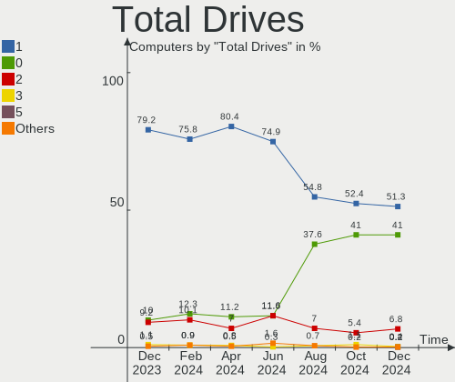
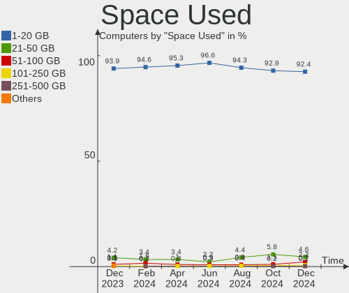
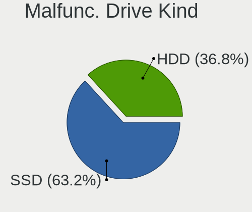
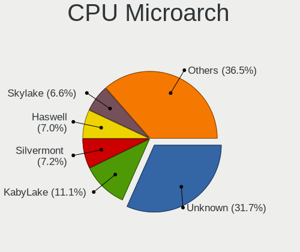
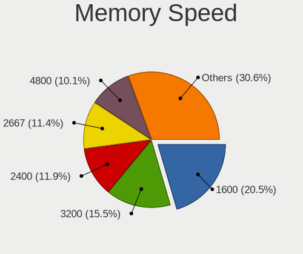

OPNsense - Hardware Trends
--------------------------

A project to identify most popular hardware characteristics and track their change
over time based on data collected by BSD users at https://BSD-Hardware.info.

Anyone can contribute to this report by the [hw-probe](https://github.com/linuxhw/hw-probe/blob/master/INSTALL.BSD.md) tool:

    hw-probe -all -upload

This report is for one last month. Overall report since the beginning of time: [TestDays](https://github.com/bsdhw/TestDays)

Period: Aug, 2023.

Contents
--------

* [ System ](#system)
  - [ OS                       ](#os)
  - [ OS Family                ](#os-family)
  - [ Arch                     ](#arch)
  - [ DE                       ](#de)
  - [ Display Server           ](#display-server)
  - [ Display Manager          ](#display-manager)
  - [ OS Lang                  ](#os-lang)
  - [ Boot Mode                ](#boot-mode)
  - [ Filesystem               ](#filesystem)
  - [ Part. scheme             ](#part-scheme)

* [ Board ](#board)
  - [ Vendor                   ](#vendor)
  - [ Model                    ](#model)
  - [ Model Family             ](#model-family)
  - [ MFG Year                 ](#mfg-year)
  - [ Form Factor              ](#form-factor)
  - [ Coreboot                 ](#coreboot)
  - [ RAM Size                 ](#ram-size)
  - [ RAM Used                 ](#ram-used)
  - [ Total Drives             ](#total-drives)
  - [ Has CD-ROM               ](#has-cd-rom)
  - [ Has Ethernet             ](#has-ethernet)
  - [ Has WiFi                 ](#has-wifi)
  - [ Has Bluetooth            ](#has-bluetooth)

* [ Location ](#location)
  - [ Country                  ](#country)
  - [ City                     ](#city)

* [ Drives ](#drives)
  - [ Drive Vendor             ](#drive-vendor)
  - [ Drive Model              ](#drive-model)
  - [ HDD Vendor               ](#hdd-vendor)
  - [ SSD Vendor               ](#ssd-vendor)
  - [ Drive Kind               ](#drive-kind)
  - [ Drive Connector          ](#drive-connector)
  - [ Drive Size               ](#drive-size)
  - [ Space Total              ](#space-total)
  - [ Space Used               ](#space-used)
  - [ Malfunc. Drives          ](#malfunc-drives)
  - [ Malfunc. Drive Vendor    ](#malfunc-drive-vendor)
  - [ Malfunc. HDD Vendor      ](#malfunc-hdd-vendor)
  - [ Malfunc. Drive Kind      ](#malfunc-drive-kind)
  - [ Failed Drives            ](#failed-drives)
  - [ Failed Drive Vendor      ](#failed-drive-vendor)
  - [ Drive Status             ](#drive-status)

* [ Storage controller ](#storage-controller)
  - [ Storage Vendor           ](#storage-vendor)
  - [ Storage Model            ](#storage-model)
  - [ Storage Kind             ](#storage-kind)

* [ Processor ](#processor)
  - [ CPU Vendor               ](#cpu-vendor)
  - [ CPU Model                ](#cpu-model)
  - [ CPU Model Family         ](#cpu-model-family)
  - [ CPU Cores                ](#cpu-cores)
  - [ CPU Sockets              ](#cpu-sockets)
  - [ CPU Threads              ](#cpu-threads)
  - [ CPU Microarch            ](#cpu-microarch)

* [ Graphics ](#graphics)
  - [ GPU Vendor               ](#gpu-vendor)
  - [ GPU Model                ](#gpu-model)
  - [ GPU Combo                ](#gpu-combo)
  - [ GPU Driver               ](#gpu-driver)
  - [ GPU Memory               ](#gpu-memory)

* [ Monitor ](#monitor)
  - [ Monitor Vendor           ](#monitor-vendor)
  - [ Monitor Model            ](#monitor-model)
  - [ Monitor Resolution       ](#monitor-resolution)
  - [ Monitor Diagonal         ](#monitor-diagonal)
  - [ Monitor Width            ](#monitor-width)
  - [ Aspect Ratio             ](#aspect-ratio)
  - [ Monitor Area             ](#monitor-area)
  - [ Pixel Density            ](#pixel-density)
  - [ Multiple Monitors        ](#multiple-monitors)

* [ Network ](#network)
  - [ Net Controller Vendor    ](#net-controller-vendor)
  - [ Net Controller Model     ](#net-controller-model)
  - [ Wireless Vendor          ](#wireless-vendor)
  - [ Wireless Model           ](#wireless-model)
  - [ Ethernet Vendor          ](#ethernet-vendor)
  - [ Ethernet Model           ](#ethernet-model)
  - [ Net Controller Kind      ](#net-controller-kind)
  - [ Used Controller          ](#used-controller)
  - [ NICs                     ](#nics)
  - [ IPv6                     ](#ipv6)

* [ Bluetooth ](#bluetooth)
  - [ Bluetooth Vendor         ](#bluetooth-vendor)
  - [ Bluetooth Model          ](#bluetooth-model)

* [ Sound ](#sound)
  - [ Sound Vendor             ](#sound-vendor)
  - [ Sound Model              ](#sound-model)

* [ Memory ](#memory)
  - [ Memory Vendor            ](#memory-vendor)
  - [ Memory Model             ](#memory-model)
  - [ Memory Kind              ](#memory-kind)
  - [ Memory Form Factor       ](#memory-form-factor)
  - [ Memory Size              ](#memory-size)
  - [ Memory Speed             ](#memory-speed)

* [ Printers & scanners ](#printers--scanners)
  - [ Printer Vendor           ](#printer-vendor)
  - [ Printer Model            ](#printer-model)
  - [ Scanner Vendor           ](#scanner-vendor)
  - [ Scanner Model            ](#scanner-model)

* [ Camera ](#camera)
  - [ Camera Vendor            ](#camera-vendor)
  - [ Camera Model             ](#camera-model)

* [ Security ](#security)
  - [ Fingerprint Vendor       ](#fingerprint-vendor)
  - [ Fingerprint Model        ](#fingerprint-model)
  - [ Chipcard Vendor          ](#chipcard-vendor)
  - [ Chipcard Model           ](#chipcard-model)

* [ Unsupported ](#unsupported)
  - [ Unsupported Devices      ](#unsupported-devices)
  - [ Unsupported Device Types ](#unsupported-device-types)

System
------

OS
--

Installed operating systems

| Name             | Computers | Percent |
|------------------|-----------|---------|
| OPNsense 23.7.1  | 158       | 42.36%  |
| OPNsense 23.7    | 80        | 21.45%  |
| OPNsense 23.7.2  | 66        | 17.69%  |
| OPNsense 23.1.11 | 37        | 9.92%   |
| OPNsense 23.7.3  | 12        | 3.22%   |
| OPNsense 23.4.2  | 5         | 1.34%   |
| OPNsense 22.7.11 | 3         | 0.8%    |
| OPNsense 24.1    | 2         | 0.54%   |
| OPNsense 22.1.10 | 2         | 0.54%   |
| OPNsense 21.7.8  | 2         | 0.54%   |
| OPNsense 23.4.1  | 1         | 0.27%   |
| OPNsense 23.1.9  | 1         | 0.27%   |
| OPNsense 23.1.7  | 1         | 0.27%   |
| OPNsense 23.1.10 | 1         | 0.27%   |
| OPNsense 23.1.1  | 1         | 0.27%   |
| OPNsense 23.1    | 1         | 0.27%   |

OS Family
---------

OS without a version

| Name     | Computers | Percent |
|----------|-----------|---------|
| OPNsense | 373       | 100%    |

Arch
----

OS architecture (x86_64, i586, etc.)

| Name  | Computers | Percent |
|-------|-----------|---------|
| amd64 | 371       | 99.46%  |
| arm64 | 2         | 0.54%   |

DE
--

Desktop Environment

| Name    | Computers | Percent |
|---------|-----------|---------|
| Console | 373       | 100%    |

Display Server
--------------

X11 or Wayland

| Name    | Computers | Percent |
|---------|-----------|---------|
| Console | 373       | 100%    |

Display Manager
---------------

SDDM, LightDM, etc.

| Name    | Computers | Percent |
|---------|-----------|---------|
| Console | 373       | 100%    |

OS Lang
-------

Language

| Lang    | Computers | Percent |
|---------|-----------|---------|
| Unknown | 362       | 97.05%  |
| C       | 11        | 2.95%   |

Boot Mode
---------

EFI or BIOS

| Mode | Computers | Percent |
|------|-----------|---------|
| EFI  | 360       | 96.51%  |
| BIOS | 13        | 3.49%   |

Filesystem
----------

Type of filesystem

| Type | Computers | Percent |
|------|-----------|---------|
| Ufs  | 210       | 56.3%   |
| Zfs  | 163       | 43.7%   |

Part. scheme
------------

Scheme of partitioning

| Type    | Computers | Percent |
|---------|-----------|---------|
| GPT     | 363       | 97.32%  |
| MBR     | 5         | 1.34%   |
| Unknown | 5         | 1.34%   |

Board
-----

Vendor
------

Motherboard manufacturer

| Name                       | Computers | Percent |
|----------------------------|-----------|---------|
| Unknown                    | 59        | 15.82%  |
| Dell                       | 37        | 9.92%   |
| Hewlett-Packard            | 25        | 6.7%    |
| Supermicro                 | 24        | 6.43%   |
| Protectli                  | 24        | 6.43%   |
| Intel                      | 23        | 6.17%   |
| Techvision                 | 17        | 4.56%   |
| PC Engines                 | 13        | 3.49%   |
| ASUSTek Computer           | 13        | 3.49%   |
| ASRock                     | 12        | 3.22%   |
| Lenovo                     | 11        | 2.95%   |
| AMI                        | 11        | 2.95%   |
| Fujitsu                    | 10        | 2.68%   |
| Gigabyte Technology        | 9         | 2.41%   |
| CncTion                    | 8         | 2.14%   |
| Sophos                     | 7         | 1.88%   |
| MW                         | 7         | 1.88%   |
| CWWK                       | 7         | 1.88%   |
| MSI                        | 5         | 1.34%   |
| IceWhale Technology        | 5         | 1.34%   |
| Deciso                     | 5         | 1.34%   |
| ZOTAC                      | 3         | 0.8%    |
| Hardkernel                 | 3         | 0.8%    |
| AZW                        | 3         | 0.8%    |
| Acer                       | 3         | 0.8%    |
| Shuttle                    | 2         | 0.54%   |
| IGEL Technology            | 2         | 0.54%   |
| HPE                        | 2         | 0.54%   |
| CompuLab                   | 2         | 0.54%   |
| Cisco                      | 2         | 0.54%   |
| BESSTAR Tech               | 2         | 0.54%   |
| Advantech                  | 2         | 0.54%   |
| YANYU                      | 1         | 0.27%   |
| WeiBu                      | 1         | 0.27%   |
| ShenZhen MinWin Technology | 1         | 0.27%   |
| Premio                     | 1         | 0.27%   |
| PICO PC                    | 1         | 0.27%   |
| Pegatron                   | 1         | 0.27%   |
| Lanner                     | 1         | 0.27%   |
| Inventec                   | 1         | 0.27%   |

Model
-----

Motherboard model

| Name                                | Computers | Percent |
|-------------------------------------|-----------|---------|
| Unknown                             | 61        | 16.35%  |
| Techvision TVI7309X                 | 17        | 4.56%   |
| Supermicro Super Server             | 7         | 1.88%   |
| Protectli FW4B                      | 7         | 1.88%   |
| PC Engines APU2                     | 7         | 1.88%   |
| MW GMLK-2_5G4L                      | 7         | 1.88%   |
| Intel Q3XXG4-P V1.0                 | 7         | 1.88%   |
| Fujitsu FUTRO S920                  | 6         | 1.61%   |
| Protectli VP2420                    | 5         | 1.34%   |
| AMI Aptio CRB                       | 5         | 1.34%   |
| Protectli FW6                       | 4         | 1.07%   |
| PC Engines apu4                     | 4         | 1.07%   |
| Dell OptiPlex 7010                  | 4         | 1.07%   |
| Deciso NetBoard-A20                 | 4         | 1.07%   |
| Sophos SG                           | 3         | 0.8%    |
| Protectli VP2410                    | 3         | 0.8%    |
| Intel SKYBAY                        | 3         | 0.8%    |
| IceWhale ZimaBoard 832 ZMB          | 3         | 0.8%    |
| Dell PowerEdge R340                 | 3         | 0.8%    |
| Dell OptiPlex 7060                  | 3         | 0.8%    |
| Dell OptiPlex 3060                  | 3         | 0.8%    |
| CWWK CW-MBX-AD12                    | 3         | 0.8%    |
| CWWK CW-AD4L-N V1                   | 3         | 0.8%    |
| CncTion N5105-4L                    | 3         | 0.8%    |
| AZW EQ                              | 3         | 0.8%    |
| AMI SG                              | 3         | 0.8%    |
| Supermicro X10SLL-F                 | 2         | 0.54%   |
| Supermicro SYS-E300-9D-8CN8TP       | 2         | 0.54%   |
| Supermicro SYS-5018A-FTN4           | 2         | 0.54%   |
| Sophos XG                           | 2         | 0.54%   |
| Sophos UTM                          | 2         | 0.54%   |
| Intel Jasper Lake Client Platform   | 2         | 0.54%   |
| IceWhale ZimaBoard 432 ZMB          | 2         | 0.54%   |
| HP t730 Thin Client                 | 2         | 0.54%   |
| HP t620 PLUS Quad Core TC           | 2         | 0.54%   |
| HP ProLiant DL380 G7                | 2         | 0.54%   |
| Hardkernel ODROID-H3                | 2         | 0.54%   |
| Dell Wyse 5070 Extended Thin Client | 2         | 0.54%   |
| Dell PowerEdge R210 II              | 2         | 0.54%   |
| Dell OptiPlex 3050                  | 2         | 0.54%   |

Model Family
------------

Motherboard model prefix

| Name                          | Computers | Percent |
|-------------------------------|-----------|---------|
| Unknown                       | 61        | 16.35%  |
| Dell OptiPlex                 | 22        | 5.9%    |
| Techvision TVI7309X           | 17        | 4.56%   |
| Dell PowerEdge                | 9         | 2.41%   |
| Lenovo ThinkCentre            | 8         | 2.14%   |
| Supermicro Super              | 7         | 1.88%   |
| Protectli FW4B                | 7         | 1.88%   |
| PC Engines APU2               | 7         | 1.88%   |
| MW GMLK-2                     | 7         | 1.88%   |
| Intel Q3XXG4-P                | 7         | 1.88%   |
| HP EliteDesk                  | 7         | 1.88%   |
| Fujitsu FUTRO                 | 7         | 1.88%   |
| ASUS PRIME                    | 6         | 1.61%   |
| Protectli VP2420              | 5         | 1.34%   |
| IceWhale ZimaBoard            | 5         | 1.34%   |
| HP ProLiant                   | 5         | 1.34%   |
| AMI Aptio                     | 5         | 1.34%   |
| Protectli FW6                 | 4         | 1.07%   |
| PC Engines apu4               | 4         | 1.07%   |
| HP ProDesk                    | 4         | 1.07%   |
| Deciso NetBoard-A20           | 4         | 1.07%   |
| Sophos SG                     | 3         | 0.8%    |
| Protectli VP2410              | 3         | 0.8%    |
| Intel SKYBAY                  | 3         | 0.8%    |
| HP Compaq                     | 3         | 0.8%    |
| Dell Wyse                     | 3         | 0.8%    |
| CWWK CW-MBX-AD12              | 3         | 0.8%    |
| CWWK CW-AD4L-N                | 3         | 0.8%    |
| CncTion N5105-4L              | 3         | 0.8%    |
| AZW EQ                        | 3         | 0.8%    |
| AMI SG                        | 3         | 0.8%    |
| Acer Aspire                   | 3         | 0.8%    |
| Supermicro X10SLL-F           | 2         | 0.54%   |
| Supermicro SYS-E300-9D-8CN8TP | 2         | 0.54%   |
| Supermicro SYS-5018A-FTN4     | 2         | 0.54%   |
| Sophos XG                     | 2         | 0.54%   |
| Sophos UTM                    | 2         | 0.54%   |
| Intel Jasper                  | 2         | 0.54%   |
| HPE ProLiant                  | 2         | 0.54%   |
| HP t730                       | 2         | 0.54%   |

MFG Year
--------

Motherboard manufacture year

| Year    | Computers | Percent |
|---------|-----------|---------|
| 2022    | 69        | 18.5%   |
| 2023    | 42        | 11.26%  |
| 2018    | 42        | 11.26%  |
| 2021    | 38        | 10.19%  |
| 2016    | 30        | 8.04%   |
| 2017    | 28        | 7.51%   |
| 2020    | 23        | 6.17%   |
| 2019    | 22        | 5.9%    |
| 2014    | 20        | 5.36%   |
| 2012    | 13        | 3.49%   |
| 2011    | 13        | 3.49%   |
| 2015    | 11        | 2.95%   |
| 2013    | 10        | 2.68%   |
| 2010    | 6         | 1.61%   |
| 2008    | 2         | 0.54%   |
| Unknown | 2         | 0.54%   |
| 2009    | 1         | 0.27%   |
| 2006    | 1         | 0.27%   |

Form Factor
-----------

Physical design of the computer

| Name     | Computers | Percent |
|----------|-----------|---------|
| Desktop  | 298       | 79.89%  |
| Server   | 31        | 8.31%   |
| Mini pc  | 27        | 7.24%   |
| Notebook | 10        | 2.68%   |
| Firewall | 7         | 1.88%   |

Coreboot
--------

Have coreboot on board

| Used | Computers | Percent |
|------|-----------|---------|
| No   | 356       | 95.44%  |
| Yes  | 17        | 4.56%   |

RAM Size
--------

Total RAM memory

| Size in GB  | Computers | Percent |
|-------------|-----------|---------|
| 8.01-16.0   | 133       | 35.66%  |
| 16.01-24.0  | 106       | 28.42%  |
| 4.01-8.0    | 66        | 17.69%  |
| 32.01-64.0  | 37        | 9.92%   |
| 64.01-256.0 | 19        | 5.09%   |
| 2.01-3.0    | 9         | 2.41%   |
| 24.01-32.0  | 3         | 0.8%    |

RAM Used
--------

Used RAM memory

| Used GB    | Computers | Percent |
|------------|-----------|---------|
| 0.01-0.5   | 181       | 48.53%  |
| 0.51-1.0   | 129       | 34.58%  |
| 1.01-2.0   | 43        | 11.53%  |
| 2.01-3.0   | 13        | 3.49%   |
| 3.01-4.0   | 4         | 1.07%   |
| 4.01-8.0   | 1         | 0.27%   |
| 32.01-64.0 | 1         | 0.27%   |
| 8.01-16.0  | 1         | 0.27%   |

Total Drives
------------

Number of drives on board

| Drives | Computers | Percent |
|--------|-----------|---------|
| 1      | 297       | 79.62%  |
| 0      | 39        | 10.46%  |
| 2      | 32        | 8.58%   |
| 3      | 5         | 1.34%   |

Has CD-ROM
----------

Has CD-ROM on board

| Presented | Computers | Percent |
|-----------|-----------|---------|
| No        | 337       | 90.35%  |
| Yes       | 36        | 9.65%   |

Has Ethernet
------------

Has Ethernet on board

| Presented | Computers | Percent |
|-----------|-----------|---------|
| Yes       | 372       | 99.73%  |
| No        | 1         | 0.27%   |

Has WiFi
--------

Has WiFi module

| Presented | Computers | Percent |
|-----------|-----------|---------|
| No        | 318       | 85.25%  |
| Yes       | 55        | 14.75%  |

Has Bluetooth
-------------

Has Bluetooth module

| Presented | Computers | Percent |
|-----------|-----------|---------|
| No        | 339       | 90.88%  |
| Yes       | 34        | 9.12%   |

Location
--------

Country
-------

Geographic location (country)

| Country      | Computers | Percent |
|--------------|-----------|---------|
| USA          | 125       | 33.51%  |
| Germany      | 66        | 17.69%  |
| UK           | 20        | 5.36%   |
| Canada       | 14        | 3.75%   |
| France       | 11        | 2.95%   |
| Switzerland  | 9         | 2.41%   |
| Netherlands  | 9         | 2.41%   |
| Australia    | 9         | 2.41%   |
| Italy        | 7         | 1.88%   |
| Austria      | 7         | 1.88%   |
| Russia       | 6         | 1.61%   |
| Poland       | 6         | 1.61%   |
| India        | 6         | 1.61%   |
| Denmark      | 5         | 1.34%   |
| Belgium      | 5         | 1.34%   |
| Sweden       | 4         | 1.07%   |
| Singapore    | 4         | 1.07%   |
| Norway       | 4         | 1.07%   |
| Brazil       | 4         | 1.07%   |
| South Korea  | 3         | 0.8%    |
| Romania      | 3         | 0.8%    |
| Japan        | 3         | 0.8%    |
| Hungary      | 3         | 0.8%    |
| Hong Kong    | 3         | 0.8%    |
| Finland      | 3         | 0.8%    |
| China        | 3         | 0.8%    |
| Turkey       | 2         | 0.54%   |
| Spain        | 2         | 0.54%   |
| South Africa | 2         | 0.54%   |
| Paraguay     | 2         | 0.54%   |
| New Zealand  | 2         | 0.54%   |
| Israel       | 2         | 0.54%   |
| Bulgaria     | 2         | 0.54%   |
| Argentina    | 2         | 0.54%   |
| Vietnam      | 1         | 0.27%   |
| Taiwan       | 1         | 0.27%   |
| Slovakia     | 1         | 0.27%   |
| Qatar        | 1         | 0.27%   |
| Portugal     | 1         | 0.27%   |
| Philippines  | 1         | 0.27%   |

City
----

Geographic location (city)

| City            | Computers | Percent |
|-----------------|-----------|---------|
| Singapore       | 4         | 1.07%   |
| London          | 4         | 1.07%   |
| Hamburg         | 4         | 1.07%   |
| Vienna          | 3         | 0.8%    |
| St Petersburg   | 3         | 0.8%    |
| Seattle         | 3         | 0.8%    |
| Palo Alto       | 3         | 0.8%    |
| Brisbane        | 3         | 0.8%    |
| Akron           | 3         | 0.8%    |
| Zurich          | 2         | 0.54%   |
| Woking          | 2         | 0.54%   |
| Victoria        | 2         | 0.54%   |
| Vancouver       | 2         | 0.54%   |
| Stuttgart       | 2         | 0.54%   |
| Shenzhen        | 2         | 0.54%   |
| Scarborough     | 2         | 0.54%   |
| Perry Hall      | 2         | 0.54%   |
| Ogden           | 2         | 0.54%   |
| Nottuln         | 2         | 0.54%   |
| North Vancouver | 2         | 0.54%   |
| New York        | 2         | 0.54%   |
| Munich          | 2         | 0.54%   |
| Mountain View   | 2         | 0.54%   |
| Milan           | 2         | 0.54%   |
| Lincoln         | 2         | 0.54%   |
| Lichtaart       | 2         | 0.54%   |
| Helsinki        | 2         | 0.54%   |
| Frankenfeld     | 2         | 0.54%   |
| Coventry        | 2         | 0.54%   |
| Copenhagen      | 2         | 0.54%   |
| Columbus        | 2         | 0.54%   |
| Columbia        | 2         | 0.54%   |
| Chennai         | 2         | 0.54%   |
| Champlin        | 2         | 0.54%   |
| Bucharest       | 2         | 0.54%   |
| Berlin          | 2         | 0.54%   |
| Bengaluru       | 2         | 0.54%   |
| Auckland        | 2         | 0.54%   |
| Arvada          | 2         | 0.54%   |
| Amsterdam       | 2         | 0.54%   |

Drives
------

Drive Vendor
------------

Hard drive vendors

| Vendor              | Computers | Drives | Percent |
|---------------------|-----------|--------|---------|
| Samsung Electronics | 58        | 68     | 16.43%  |
| Kingston            | 33        | 36     | 9.35%   |
| Transcend           | 27        | 27     | 7.65%   |
| WDC                 | 25        | 25     | 7.08%   |
| Crucial             | 22        | 26     | 6.23%   |
| Hoodisk             | 17        | 17     | 4.82%   |
| Intel               | 13        | 15     | 3.68%   |
| China               | 13        | 13     | 3.68%   |
| Micron Technology   | 12        | 12     | 3.4%    |
| Seagate             | 11        | 12     | 3.12%   |
| SanDisk             | 11        | 11     | 3.12%   |
| SPCC                | 6         | 6      | 1.7%    |
| SK hynix            | 6         | 8      | 1.7%    |
| Hewlett-Packard     | 6         | 8      | 1.7%    |
| Fanxiang            | 6         | 6      | 1.7%    |
| A-DATA Technology   | 6         | 6      | 1.7%    |
| Toshiba             | 5         | 5      | 1.42%   |
| Team                | 5         | 6      | 1.42%   |
| Silicon Motion      | 5         | 5      | 1.42%   |
| Protectli           | 5         | 5      | 1.42%   |
| Innodisk            | 5         | 5      | 1.42%   |
| PNY                 | 4         | 4      | 1.13%   |
| Patriot             | 4         | 6      | 1.13%   |
| BR                  | 3         | 3      | 0.85%   |
| Plextor             | 2         | 2      | 0.57%   |
| LITEON              | 2         | 2      | 0.57%   |
| Lexar               | 2         | 2      | 0.57%   |
| KIOXIA              | 2         | 2      | 0.57%   |
| JWX                 | 2         | 2      | 0.57%   |
| Intenso             | 2         | 2      | 0.57%   |
| FORESEE             | 2         | 2      | 0.57%   |
| BORY                | 2         | 2      | 0.57%   |
| BIWIN               | 2         | 2      | 0.57%   |
| Apacer              | 2         | 2      | 0.57%   |
| Wicgtyp             | 1         | 1      | 0.28%   |
| VICKTER             | 1         | 1      | 0.28%   |
| Verbatim            | 1         | 1      | 0.28%   |
| V-GeN               | 1         | 1      | 0.28%   |
| UMIS                | 1         | 1      | 0.28%   |
| Teclast             | 1         | 1      | 0.28%   |

Drive Model
-----------

Hard drive models

| Model                           | Computers | Percent |
|---------------------------------|-----------|---------|
| Hoodisk SSD 64GB                | 7         | 1.97%   |
| Transcend TS128GMSA230S 128GB   | 6         | 1.69%   |
| Kingston SKC600MS256G 256GB     | 5         | 1.41%   |
| Kingston SA400S37240G 240GB     | 5         | 1.41%   |
| Transcend TS256GMSA230S 256GB   | 4         | 1.13%   |
| Samsung SSD 870 EVO 250GB       | 4         | 1.13%   |
| Samsung SSD 850 EVO 250GB       | 4         | 1.13%   |
| Kingston SUV500MS120G 120GB     | 4         | 1.13%   |
| Hoodisk SSD 32GB                | 4         | 1.13%   |
| Hoodisk SSD 128GB               | 4         | 1.13%   |
| Transcend TS64GSSD370S 64GB     | 3         | 0.85%   |
| SPCC Solid State Disk 128GB     | 3         | 0.85%   |
| Samsung SSD 970 EVO Plus 500GB  | 3         | 0.85%   |
| Samsung SSD 870 EVO 500GB       | 3         | 0.85%   |
| Samsung SSD 860 EVO mSATA 250GB | 3         | 0.85%   |
| Samsung SSD 850 EVO 500GB       | 3         | 0.85%   |
| PNY CS900 120GB SSD             | 3         | 0.85%   |
| Kingston SNV2S250G 250GB        | 3         | 0.85%   |
| Fanxiang S501 128GB             | 3         | 0.85%   |
| Crucial CT240BX500SSD1 240GB    | 3         | 0.85%   |
| WDC WDS500G1R0B-68A4Z0 500GB    | 2         | 0.56%   |
| Transcend TS64GSSD370 64GB      | 2         | 0.56%   |
| Transcend TS256GMTS952T2 256GB  | 2         | 0.56%   |
| Transcend TS128GMSA370 128GB    | 2         | 0.56%   |
| Toshiba MQ01ABD050 500GB        | 2         | 0.56%   |
| Team TM8FP6512G 512GB           | 2         | 0.56%   |
| SPCC M.2 PCIe SSD 256GB         | 2         | 0.56%   |
| SK hynix HFS960G3H2X069N 960GB  | 2         | 0.56%   |
| SanDisk SSD PLUS 120GB          | 2         | 0.56%   |
| Samsung SSD 980 500GB           | 2         | 0.56%   |
| Samsung SSD 980 250GB           | 2         | 0.56%   |
| Samsung SSD 860 EVO 250GB       | 2         | 0.56%   |
| Samsung SSD 840 EVO 250GB       | 2         | 0.56%   |
| Samsung SSD 840 EVO 120GB       | 2         | 0.56%   |
| Protectli 240GB M.2             | 2         | 0.56%   |
| Kingston SUV500MS240G 240GB     | 2         | 0.56%   |
| Kingston SNV2S500G 500GB        | 2         | 0.56%   |
| Intel SSDPEKNU010TZ 1TB         | 2         | 0.56%   |
| Innodisk DEMSR- 08GB mSATA 3ME3 | 2         | 0.56%   |
| HP RAID 1(1+0) 146GB            | 2         | 0.56%   |

HDD Vendor
----------

Hard disk drive vendors

| Vendor          | Computers | Drives | Percent |
|-----------------|-----------|--------|---------|
| WDC             | 13        | 13     | 41.94%  |
| Seagate         | 10        | 10     | 32.26%  |
| Hewlett-Packard | 3         | 3      | 9.68%   |
| Toshiba         | 2         | 2      | 6.45%   |
| Lexar           | 1         | 1      | 3.23%   |
| Hitachi         | 1         | 1      | 3.23%   |
| HGST            | 1         | 1      | 3.23%   |

SSD Vendor
----------

Solid state drive vendors

| Vendor              | Computers | Drives | Percent |
|---------------------|-----------|--------|---------|
| Samsung Electronics | 39        | 48     | 16.25%  |
| Kingston            | 28        | 31     | 11.67%  |
| Transcend           | 25        | 25     | 10.42%  |
| Hoodisk             | 17        | 17     | 7.08%   |
| Crucial             | 17        | 21     | 7.08%   |
| China               | 13        | 13     | 5.42%   |
| SanDisk             | 11        | 11     | 4.58%   |
| Intel               | 9         | 10     | 3.75%   |
| Micron Technology   | 8         | 8      | 3.33%   |
| Protectli           | 5         | 5      | 2.08%   |
| Innodisk            | 5         | 5      | 2.08%   |
| A-DATA Technology   | 5         | 5      | 2.08%   |
| WDC                 | 4         | 4      | 1.67%   |
| SPCC                | 4         | 4      | 1.67%   |
| SK hynix            | 4         | 6      | 1.67%   |
| PNY                 | 3         | 3      | 1.25%   |
| Plextor             | 2         | 2      | 0.83%   |
| Patriot             | 2         | 4      | 0.83%   |
| LITEON              | 2         | 2      | 0.83%   |
| JWX                 | 2         | 2      | 0.83%   |
| Intenso             | 2         | 2      | 0.83%   |
| Hewlett-Packard     | 2         | 4      | 0.83%   |
| FORESEE             | 2         | 2      | 0.83%   |
| BORY                | 2         | 2      | 0.83%   |
| BIWIN               | 2         | 2      | 0.83%   |
| Apacer              | 2         | 2      | 0.83%   |
| Wicgtyp             | 1         | 1      | 0.42%   |
| VICKTER             | 1         | 1      | 0.42%   |
| Verbatim            | 1         | 1      | 0.42%   |
| V-GeN               | 1         | 1      | 0.42%   |
| Toshiba             | 1         | 1      | 0.42%   |
| Team                | 1         | 1      | 0.42%   |
| TCSUNBOW            | 1         | 1      | 0.42%   |
| ShiJi               | 1         | 1      | 0.42%   |
| SHAREVDI            | 1         | 1      | 0.42%   |
| Seagate             | 1         | 2      | 0.42%   |
| SCY                 | 1         | 1      | 0.42%   |
| Qunion              | 1         | 1      | 0.42%   |
| Pccooler            | 1         | 1      | 0.42%   |
| OCZ                 | 1         | 1      | 0.42%   |

Drive Kind
----------

HDD or SSD

| Kind | Computers | Drives | Percent |
|------|-----------|--------|---------|
| SSD  | 233       | 264    | 67.73%  |
| NVMe | 82        | 85     | 23.84%  |
| HDD  | 29        | 31     | 8.43%   |

Drive Connector
---------------

SATA, SAS, NVMe, etc.

| Type | Computers | Drives | Percent |
|------|-----------|--------|---------|
| SATA | 258       | 295    | 75.88%  |
| NVMe | 82        | 85     | 24.12%  |

Drive Size
----------

Size of hard drive

| Size in TB | Computers | Drives | Percent |
|------------|-----------|--------|---------|
| 0.01-0.5   | 233       | 257    | 88.93%  |
| 0.51-1.0   | 23        | 30     | 8.78%   |
| 1.01-2.0   | 4         | 5      | 1.53%   |
| 3.01-4.0   | 1         | 2      | 0.38%   |
| 4.01-10.0  | 1         | 1      | 0.38%   |

Space Total
-----------

Amount of disk space available on the file system

| Size in GB     | Computers | Percent |
|----------------|-----------|---------|
| 101-250        | 191       | 51.21%  |
| 251-500        | 63        | 16.89%  |
| 51-100         | 33        | 8.85%   |
| 21-50          | 30        | 8.04%   |
| 501-1000       | 27        | 7.24%   |
| 1-20           | 21        | 5.63%   |
| 2001-3000      | 3         | 0.8%    |
| 1001-2000      | 3         | 0.8%    |
| More than 3000 | 2         | 0.54%   |

Space Used
----------

Amount of used disk space

| Used GB | Computers | Percent |
|---------|-----------|---------|
| 1-20    | 351       | 94.1%   |
| 21-50   | 18        | 4.83%   |
| 51-100  | 4         | 1.07%   |

Malfunc. Drives
---------------

Drive models with a malfunction

| Model                                  | Computers | Drives | Percent |
|----------------------------------------|-----------|--------|---------|
| WDC WD5003ABYX-18WERA0 500GB           | 1         | 1      | 3.13%   |
| WDC WD3200AAKS-75L9A0 320GB            | 1         | 1      | 3.13%   |
| WDC WD2503ABYX-01WERA1 256GB           | 1         | 1      | 3.13%   |
| V-GeN V-GEN08AS19FS120IT 120GB         | 1         | 1      | 3.13%   |
| Toshiba THNSNK256GVN8 M.2 2280 256GB   | 1         | 1      | 3.13%   |
| Toshiba MQ01ABD050 500GB               | 1         | 1      | 3.13%   |
| SPCC M.2 PCIe SSD 256GB                | 1         | 1      | 3.13%   |
| SK hynix HFS064G3AMNB-2220A 64GB       | 1         | 1      | 3.13%   |
| Seagate ST9500420AS 500GB              | 1         | 1      | 3.13%   |
| Seagate ST5000DM000-1FK178 5TB         | 1         | 1      | 3.13%   |
| Seagate ST3750330AS 752GB              | 1         | 1      | 3.13%   |
| Seagate ST31000524AS 1TB               | 1         | 1      | 3.13%   |
| SanDisk SSD U100 64GB                  | 1         | 1      | 3.13%   |
| SanDisk SSD PLUS 120GB                 | 1         | 1      | 3.13%   |
| SanDisk SD8TB8U-256G-1006 256GB        | 1         | 1      | 3.13%   |
| Samsung Electronics SSD 870 EVO 500GB  | 1         | 1      | 3.13%   |
| Samsung Electronics SSD 870 EVO 250GB  | 1         | 1      | 3.13%   |
| Samsung Electronics SSD 840 EVO 120GB  | 1         | 1      | 3.13%   |
| Plextor PX-128M5Pro 128GB              | 1         | 1      | 3.13%   |
| Micron Technology 1100 SATA 256GB      | 1         | 1      | 3.13%   |
| Kingston SV300S37A60G 64GB             | 1         | 1      | 3.13%   |
| Kingston SUV500MS-256G                 | 1         | 1      | 3.13%   |
| Kingston SNS4151S316GD 16GB            | 1         | 1      | 3.13%   |
| Kingston SHFS37A120G 120GB             | 1         | 1      | 3.13%   |
| Kingston SA400S37240G 240GB            | 1         | 1      | 3.13%   |
| Intel SSDSC2CW120A3 120GB              | 1         | 1      | 3.13%   |
| HP Phison PSSBN016GA27BC0 16GB         | 1         | 1      | 3.13%   |
| HGST HUS726020ALE614 2TB               | 1         | 1      | 3.13%   |
| Crucial CT512M550SSD1 512GB            | 1         | 2      | 3.13%   |
| Crucial CT480BX500SSD1 480GB           | 1         | 1      | 3.13%   |
| Crucial CT120M500SSD1 120GB            | 1         | 1      | 3.13%   |
| A-DATA Technology ASU800SS-128GT 128GB | 1         | 1      | 3.13%   |

Malfunc. Drive Vendor
---------------------

Vendors of faulty drives

| Vendor              | Computers | Drives | Percent |
|---------------------|-----------|--------|---------|
| Kingston            | 5         | 5      | 15.63%  |
| Seagate             | 4         | 4      | 12.5%   |
| WDC                 | 3         | 3      | 9.38%   |
| SanDisk             | 3         | 3      | 9.38%   |
| Samsung Electronics | 3         | 3      | 9.38%   |
| Crucial             | 3         | 4      | 9.38%   |
| Toshiba             | 2         | 2      | 6.25%   |
| V-GeN               | 1         | 1      | 3.13%   |
| SPCC                | 1         | 1      | 3.13%   |
| SK hynix            | 1         | 1      | 3.13%   |
| Plextor             | 1         | 1      | 3.13%   |
| Micron Technology   | 1         | 1      | 3.13%   |
| Intel               | 1         | 1      | 3.13%   |
| HP Phison           | 1         | 1      | 3.13%   |
| HGST                | 1         | 1      | 3.13%   |
| A-DATA Technology   | 1         | 1      | 3.13%   |

Malfunc. HDD Vendor
-------------------

Vendors of faulty HDD drives

| Vendor  | Computers | Drives | Percent |
|---------|-----------|--------|---------|
| Seagate | 4         | 4      | 44.44%  |
| WDC     | 3         | 3      | 33.33%  |
| Toshiba | 1         | 1      | 11.11%  |
| HGST    | 1         | 1      | 11.11%  |

Malfunc. Drive Kind
-------------------

Kinds of faulty drives

| Kind | Computers | Drives | Percent |
|------|-----------|--------|---------|
| SSD  | 22        | 23     | 70.97%  |
| HDD  | 8         | 9      | 25.81%  |
| NVMe | 1         | 1      | 3.23%   |

Failed Drives
-------------

Failed drive models

Zero info for selected period =(

Failed Drive Vendor
-------------------

Failed drive vendors

Zero info for selected period =(

Drive Status
------------

Number of failed and malfunc. drives

| Status   | Computers | Drives | Percent |
|----------|-----------|--------|---------|
| Works    | 300       | 338    | 88.76%  |
| Malfunc  | 31        | 33     | 9.17%   |
| Detected | 7         | 9      | 2.07%   |

Storage controller
------------------

Storage Vendor
--------------

Storage controller vendors

| Vendor                                  | Computers | Percent |
|-----------------------------------------|-----------|---------|
| Intel                                   | 298       | 64.5%   |
| AMD                                     | 52        | 11.26%  |
| Samsung Electronics                     | 19        | 4.11%   |
| SanDisk                                 | 15        | 3.25%   |
| Silicon Motion                          | 14        | 3.03%   |
| MAXIO Technology (Hangzhou)             | 8         | 1.73%   |
| Phison Electronics                      | 5         | 1.08%   |
| Micron/Crucial Technology               | 5         | 1.08%   |
| Kingston Technology Company             | 5         | 1.08%   |
| Hewlett-Packard                         | 5         | 1.08%   |
| Broadcom / LSI                          | 5         | 1.08%   |
| Micron Technology                       | 4         | 0.87%   |
| Hosin Global Electronics                | 4         | 0.87%   |
| ASMedia Technology                      | 4         | 0.87%   |
| Toshiba                                 | 3         | 0.65%   |
| Realtek Semiconductor                   | 3         | 0.65%   |
| Transcend                               | 2         | 0.43%   |
| SK hynix                                | 2         | 0.43%   |
| JMicron Technology                      | 2         | 0.43%   |
| Chelsio Communications                  | 2         | 0.43%   |
| Solidigm                                | 1         | 0.22%   |
| Shenzhen Unionmemory Information System | 1         | 0.22%   |
| KIOXIA                                  | 1         | 0.22%   |
| INNOGRIT                                | 1         | 0.22%   |
| HGST                                    | 1         | 0.22%   |

Storage Model
-------------

Storage controller models

| Model                                                                            | Computers | Percent |
|----------------------------------------------------------------------------------|-----------|---------|
| AMD FCH SATA Controller [AHCI mode]                                              | 37        | 7.41%   |
| Intel Jasper Lake SATA AHCI Controller                                           | 34        | 6.81%   |
| Intel Celeron/Pentium Silver Processor SATA Controller                           | 26        | 5.21%   |
| Intel Sunrise Point-LP SATA Controller [AHCI mode]                               | 19        | 3.81%   |
| Intel 8 Series/C220 Series Chipset Family 6-port SATA Controller 1 [AHCI mode]   | 19        | 3.81%   |
| Intel Cannon Lake PCH SATA AHCI Controller                                       | 18        | 3.61%   |
| Intel Atom Processor E3800 Series SATA AHCI Controller                           | 18        | 3.61%   |
| Intel Atom/Celeron/Pentium Processor x5-E8000/J3xxx/N3xxx Series SATA Controller | 16        | 3.21%   |
| Silicon Motion SM2263EN/SM2263XT (DRAM-less) NVMe SSD Controllers                | 14        | 2.81%   |
| Unknown                                                                          | 14        | 2.81%   |
| Intel Q170/Q150/B150/H170/H110/Z170/CM236 Chipset SATA Controller [AHCI Mode]    | 13        | 2.61%   |
| Intel 6 Series/C200 Series Chipset Family 6 port Desktop SATA AHCI Controller    | 12        | 2.4%    |
| Intel 200 Series PCH SATA controller [AHCI mode]                                 | 10        | 2%      |
| Samsung NVMe SSD Controller SM981/PM981/PM983                                    | 8         | 1.6%    |
| MAXIO (Hangzhou) NVMe SSD Controller MAP1202                                     | 8         | 1.6%    |
| Intel Elkhart Lake SATA AHCI                                                     | 8         | 1.6%    |
| Intel Celeron N3350/Pentium N4200/Atom E3900 Series SATA AHCI Controller         | 8         | 1.6%    |
| Samsung NVMe SSD Controller 980                                                  | 7         | 1.4%    |
| SanDisk WD Blue SN570 NVMe SSD 1TB                                               | 6         | 1.2%    |
| Intel Alder Lake-S PCH SATA Controller [AHCI Mode]                               | 6         | 1.2%    |
| Phison PS5013 E13 NVMe Controller                                                | 5         | 1%      |
| Micron/Crucial P2 [Nick P2] / P3 / P3 Plus NVMe PCIe SSD (DRAM-less)             | 5         | 1%      |
| Intel NM10/ICH7 Family SATA Controller [AHCI mode]                               | 5         | 1%      |
| Intel Comet Lake SATA AHCI Controller                                            | 5         | 1%      |
| Intel C620 Series Chipset Family SSATA Controller [AHCI mode]                    | 5         | 1%      |
| Intel C600/X79 series chipset 6-Port SATA AHCI Controller                        | 5         | 1%      |
| Intel 8 Series SATA Controller 1 [AHCI mode]                                     | 5         | 1%      |
| Intel 7 Series/C210 Series Chipset Family 6-port SATA Controller [AHCI mode]     | 5         | 1%      |
| Intel 500 Series Chipset Family SATA AHCI Controller                             | 5         | 1%      |
| AMD SB7x0/SB8x0/SB9x0 SATA Controller [AHCI mode]                                | 5         | 1%      |
| AMD 500 Series Chipset SATA Controller                                           | 5         | 1%      |
| Kingston Company unknown                                                         | 4         | 0.8%    |
| Intel Wildcat Point-LP SATA Controller [AHCI Mode]                               | 4         | 0.8%    |
| Intel C620 Series Chipset Family SATA Controller [AHCI mode]                     | 4         | 0.8%    |
| Intel Atom processor C2000 AHCI SATA3 Controller                                 | 4         | 0.8%    |
| Intel Alder Lake-P SATA AHCI Controller                                          | 4         | 0.8%    |
| Intel 5 Series/3400 Series Chipset 6 port SATA AHCI Controller                   | 4         | 0.8%    |
| ASMedia ASM1062 Serial ATA Controller                                            | 4         | 0.8%    |
| Samsung NVMe SSD Controller SM961/PM961/SM963                                    | 3         | 0.6%    |
| Intel Volume Management Device NVMe RAID Controller                              | 3         | 0.6%    |

Storage Kind
------------

Kind of storage controller (IDE, SATA, NVMe, SAS, ...)

| Kind | Computers | Percent |
|------|-----------|---------|
| SATA | 327       | 68.99%  |
| NVMe | 98        | 20.68%  |
| IDE  | 25        | 5.27%   |
| RAID | 18        | 3.8%    |
| SAS  | 4         | 0.84%   |
| SCSI | 2         | 0.42%   |

Processor
---------

CPU Vendor
----------

Processor vendors

| Vendor | Computers | Percent |
|--------|-----------|---------|
| Intel  | 316       | 84.72%  |
| AMD    | 55        | 14.75%  |
| ARM    | 2         | 0.54%   |

CPU Model
---------

Processor models

| Model                                     | Computers | Percent |
|-------------------------------------------|-----------|---------|
| Intel Celeron N5105 @ 2.00GHz             | 27        | 7.24%   |
| Intel Celeron J4125 CPU @ 2.00GHz         | 20        | 5.36%   |
| Intel N100                                | 14        | 3.75%   |
| AMD GX-412TC SOC                          | 12        | 3.22%   |
| Intel Celeron CPU J3160 @ 1.60GHz         | 9         | 2.41%   |
| Intel Celeron CPU J1900 @ 1.99GHz         | 7         | 1.88%   |
| Intel Pentium Silver N6005 @ 2.00GHz      | 6         | 1.61%   |
| Intel Core i5-8500 CPU @ 3.00GHz          | 6         | 1.61%   |
| Intel Core i5-6500 CPU @ 3.20GHz          | 5         | 1.34%   |
| Intel Celeron J6412 @ 2.00GHz             | 5         | 1.34%   |
| Intel Celeron CPU N3450 @ 1.10GHz         | 5         | 1.34%   |
| Intel Core i7-8550U CPU @ 1.80GHz         | 4         | 1.07%   |
| Intel Core i5-6600 CPU @ 3.30GHz          | 4         | 1.07%   |
| Intel Core i5-3570 CPU @ 3.40GHz          | 4         | 1.07%   |
| AMD Ryzen 7 5700G with Radeon Graphics    | 4         | 1.07%   |
| AMD GX-222GC SOC with Radeon R5E Graphics | 4         | 1.07%   |
| Intel Xeon D-2146NT CPU @ 2.30GHz         | 3         | 0.8%    |
| Intel Pentium CPU N3700 @ 1.60GHz         | 3         | 0.8%    |
| Intel Core i7-7500U CPU @ 2.70GHz         | 3         | 0.8%    |
| Intel Core i7-6700 CPU @ 3.40GHz          | 3         | 0.8%    |
| Intel Core i5-9500 CPU @ 3.00GHz          | 3         | 0.8%    |
| Intel Core i5-6200U CPU @ 2.30GHz         | 3         | 0.8%    |
| Intel Core i5-4590T CPU @ 2.00GHz         | 3         | 0.8%    |
| Intel Core i5-3470 CPU @ 3.20GHz          | 3         | 0.8%    |
| Intel Core i3-N305                        | 3         | 0.8%    |
| Intel Core i3-10100 CPU @ 3.60GHz         | 3         | 0.8%    |
| Intel Celeron N5100 @ 1.10GHz             | 3         | 0.8%    |
| Intel Celeron J6413 @ 1.80GHz             | 3         | 0.8%    |
| Intel Celeron J4105 CPU @ 1.50GHz         | 3         | 0.8%    |
| Intel Atom CPU E3845 @ 1.91GHz            | 3         | 0.8%    |
| Intel Atom CPU E3827 @ 1.74GHz            | 3         | 0.8%    |
| Intel Atom CPU D525 @ 1.80GHz             | 3         | 0.8%    |
| Intel Atom CPU D510 @ 1.66GHz             | 3         | 0.8%    |
| Intel Atom CPU C3558 @ 2.20GHz            | 3         | 0.8%    |
| Intel Atom CPU C2758 @ 2.40GHz            | 3         | 0.8%    |
| Intel Xeon E-2314 CPU @ 2.80GHz           | 2         | 0.54%   |
| Intel Xeon E-2288G CPU @ 3.70GHz          | 2         | 0.54%   |
| Intel Xeon CPU X3430 @ 2.40GHz            | 2         | 0.54%   |
| Intel Xeon                                | 2         | 0.54%   |
| Intel Pentium Silver N6000 @ 1.10GHz      | 2         | 0.54%   |

CPU Model Family
----------------

Processor model prefix

| Model                   | Computers | Percent |
|-------------------------|-----------|---------|
| Intel Celeron           | 98        | 26.27%  |
| Intel Core i5           | 61        | 16.35%  |
| Intel Xeon              | 38        | 10.19%  |
| Other                   | 32        | 8.58%   |
| Intel Atom              | 23        | 6.17%   |
| Intel Core i3           | 22        | 5.9%    |
| AMD GX                  | 21        | 5.63%   |
| Intel Core i7           | 20        | 5.36%   |
| Intel Pentium Silver    | 10        | 2.68%   |
| Intel Pentium           | 10        | 2.68%   |
| AMD EPYC                | 6         | 1.61%   |
| AMD Ryzen 7             | 5         | 1.34%   |
| Intel Pentium Dual-Core | 3         | 0.8%    |
| AMD Ryzen 5             | 3         | 0.8%    |
| Intel Pentium Gold      | 2         | 0.54%   |
| ARM Cortex              | 2         | 0.54%   |
| AMD G                   | 2         | 0.54%   |
| AMD FX                  | 2         | 0.54%   |
| AMD Athlon              | 2         | 0.54%   |
| Intel Xeon Silver       | 1         | 0.27%   |
| Intel Core 2 Duo        | 1         | 0.27%   |
| AMD Ryzen Embedded      | 1         | 0.27%   |
| AMD Ryzen 7 PRO         | 1         | 0.27%   |
| AMD Ryzen 5 PRO         | 1         | 0.27%   |
| AMD Phenom II X4        | 1         | 0.27%   |
| AMD Opteron             | 1         | 0.27%   |
| AMD E2                  | 1         | 0.27%   |
| AMD E                   | 1         | 0.27%   |
| AMD A8                  | 1         | 0.27%   |
| AMD A6                  | 1         | 0.27%   |

CPU Cores
---------

Number of processor cores

| Number  | Computers | Percent |
|---------|-----------|---------|
| 4       | 231       | 61.93%  |
| 2       | 73        | 19.57%  |
| 8       | 23        | 6.17%   |
| 6       | 22        | 5.9%    |
| 12      | 12        | 3.22%   |
| 16      | 7         | 1.88%   |
| Unknown | 3         | 0.8%    |
| 20      | 1         | 0.27%   |
| 1       | 1         | 0.27%   |

CPU Sockets
-----------

Number of sockets

| Number  | Computers | Percent |
|---------|-----------|---------|
| 1       | 365       | 97.86%  |
| 2       | 6         | 1.61%   |
| Unknown | 2         | 0.54%   |

CPU Threads
-----------

Threads per core (Hyper-Threading)

| Number  | Computers | Percent |
|---------|-----------|---------|
| 1       | 272       | 72.92%  |
| 2       | 98        | 26.27%  |
| Unknown | 3         | 0.8%    |

CPU Microarch
-------------

Microarchitecture

| Name          | Computers | Percent |
|---------------|-----------|---------|
| Unknown       | 86        | 23.06%  |
| KabyLake      | 42        | 11.26%  |
| Silvermont    | 38        | 10.19%  |
| Skylake       | 32        | 8.58%   |
| Goldmont plus | 26        | 6.97%   |
| Haswell       | 24        | 6.43%   |
| Puma          | 18        | 4.83%   |
| IvyBridge     | 14        | 3.75%   |
| SandyBridge   | 12        | 3.22%   |
| Goldmont      | 11        | 2.95%   |
| Zen           | 7         | 1.88%   |
| CometLake     | 6         | 1.61%   |
| Broadwell     | 6         | 1.61%   |
| Bonnell       | 6         | 1.61%   |
| Zen 3         | 5         | 1.34%   |
| Penryn        | 5         | 1.34%   |
| Jaguar        | 5         | 1.34%   |
| Zen 2         | 4         | 1.07%   |
| Westmere      | 4         | 1.07%   |
| Piledriver    | 3         | 0.8%    |
| Nehalem       | 3         | 0.8%    |
| Excavator     | 3         | 0.8%    |
| Bobcat        | 3         | 0.8%    |
| Zen+          | 2         | 0.54%   |
| Steamroller   | 2         | 0.54%   |
| TigerLake     | 1         | 0.27%   |
| NetBurst      | 1         | 0.27%   |
| K10 Llano     | 1         | 0.27%   |
| K10           | 1         | 0.27%   |
| IceLake       | 1         | 0.27%   |
| Bulldozer     | 1         | 0.27%   |

Graphics
--------

GPU Vendor
----------

Vendors of graphics cards

| Vendor                     | Computers | Percent |
|----------------------------|-----------|---------|
| Intel                      | 264       | 74.37%  |
| AMD                        | 41        | 11.55%  |
| ASPEED Technology          | 27        | 7.61%   |
| Matrox Electronics Systems | 19        | 5.35%   |
| Nvidia                     | 4         | 1.13%   |

GPU Model
---------

Graphics card models

| Model                                                                                    | Computers | Percent |
|------------------------------------------------------------------------------------------|-----------|---------|
| Intel JasperLake [UHD Graphics]                                                          | 40        | 11.2%   |
| ASPEED Technology ASPEED Graphics Family                                                 | 27        | 7.56%   |
| Intel GeminiLake [UHD Graphics 600]                                                      | 24        | 6.72%   |
| Intel Atom Processor Z36xxx/Z37xxx Series Graphics & Display                             | 18        | 5.04%   |
| Intel Alder Lake-N [UHD Graphics]                                                        | 18        | 5.04%   |
| Intel Atom/Celeron/Pentium Processor x5-E8000/J3xxx/N3xxx Integrated Graphics Controller | 16        | 4.48%   |
| Intel HD Graphics 530                                                                    | 15        | 4.2%    |
| Intel CoffeeLake-S GT2 [UHD Graphics 630]                                                | 15        | 4.2%    |
| Intel Xeon E3-1200 v3/4th Gen Core Processor Integrated Graphics Controller              | 10        | 2.8%    |
| Matrox Electronics Systems MGA G200eW WPCM450                                            | 8         | 2.24%   |
| Intel Elkhart Lake [UHD Graphics Gen11 16EU]                                             | 8         | 2.24%   |
| Intel Xeon E3-1200 v2/3rd Gen Core processor Graphics Controller                         | 7         | 1.96%   |
| Intel HD Graphics 500                                                                    | 7         | 1.96%   |
| Intel HD Graphics 630                                                                    | 6         | 1.68%   |
| Intel UHD Graphics 620                                                                   | 5         | 1.4%    |
| Intel Skylake GT2 [HD Graphics 520]                                                      | 5         | 1.4%    |
| Intel HD Graphics 620                                                                    | 5         | 1.4%    |
| Intel HD Graphics 510                                                                    | 5         | 1.4%    |
| Intel Atom Processor D4xx/D5xx/N4xx/N5xx Integrated Graphics Controller                  | 5         | 1.4%    |
| Intel 2nd Generation Core Processor Family Integrated Graphics Controller                | 5         | 1.4%    |
| AMD Mullins [Radeon R4/R5 Graphics]                                                      | 5         | 1.4%    |
| AMD Cezanne [Radeon Vega Series / Radeon Vega Mobile Series]                             | 5         | 1.4%    |
| Intel HD Graphics 5500                                                                   | 4         | 1.12%   |
| Intel Haswell-ULT Integrated Graphics Controller                                         | 4         | 1.12%   |
| Intel CometLake-S GT2 [UHD Graphics 630]                                                 | 4         | 1.12%   |
| Matrox Electronics Systems MGA G200EH                                                    | 3         | 0.84%   |
| Matrox Electronics Systems Integrated Matrox G200eW3 Graphics Controller                 | 3         | 0.84%   |
| Intel Alder Lake-UP3 GT1 [UHD Graphics]                                                  | 3         | 0.84%   |
| Intel Alder Lake-S GT1 [UHD Graphics 730]                                                | 3         | 0.84%   |
| Intel 4 Series Chipset Integrated Graphics Controller                                    | 3         | 0.84%   |
| AMD Renoir                                                                               | 3         | 0.84%   |
| AMD Park [Mobility Radeon HD 5430]                                                       | 3         | 0.84%   |
| Matrox Electronics Systems MGA G200eH3                                                   | 2         | 0.56%   |
| Matrox Electronics Systems MGA G200e [Pilot] ServerEngines (SEP1)                        | 2         | 0.56%   |
| Intel WhiskeyLake-U GT2 [UHD Graphics 620]                                               | 2         | 0.56%   |
| Intel GeminiLake [UHD Graphics 605]                                                      | 2         | 0.56%   |
| Intel Comet Lake UHD Graphics                                                            | 2         | 0.56%   |
| Intel Alder Lake-UP3 GT2 [Iris Xe Graphics]                                              | 2         | 0.56%   |
| Intel Alder Lake-S GT1 [UHD Graphics 770]                                                | 2         | 0.56%   |
| Intel 82G33/G31 Express Integrated Graphics Controller                                   | 2         | 0.56%   |

GPU Combo
---------

Combinations of graphics cards

| Name        | Computers | Percent |
|-------------|-----------|---------|
| 1 x Intel   | 253       | 67.83%  |
| 1 x AMD     | 39        | 10.46%  |
| 1 x ASPEED  | 27        | 7.24%   |
| Other       | 20        | 5.36%   |
| 1 x Matrox  | 19        | 5.09%   |
| 2 x Intel   | 9         | 2.41%   |
| 1 x Nvidia  | 4         | 1.07%   |
| Intel + AMD | 2         | 0.54%   |

GPU Driver
----------

Free vs proprietary

| Driver  | Computers | Percent |
|---------|-----------|---------|
| Free    | 353       | 94.64%  |
| Unknown | 20        | 5.36%   |

GPU Memory
----------

Total video memory

| Size in GB | Computers | Percent |
|------------|-----------|---------|
| Unknown    | 373       | 100%    |

Monitor
-------

Monitor Vendor
--------------

Monitor vendors

Zero info for selected period =(

Monitor Model
-------------

Monitor models

Zero info for selected period =(

Monitor Resolution
------------------

Monitor screen resolution

Zero info for selected period =(

Monitor Diagonal
----------------

Diagonal size in inches

Zero info for selected period =(

Monitor Width
-------------

Physical width

Zero info for selected period =(

Aspect Ratio
------------

Proportional relationship between the width and the height

Zero info for selected period =(

Monitor Area
------------

Area in inch

Zero info for selected period =(

Pixel Density
-------------

Pixels per inch

Zero info for selected period =(

Multiple Monitors
-----------------

Total monitors connected

| Total | Computers | Percent |
|-------|-----------|---------|
| 0     | 373       | 100%    |

Network
-------

Net Controller Vendor
---------------------

Controller vendors

| Vendor                    | Computers | Percent |
|---------------------------|-----------|---------|
| Intel                     | 323       | 65.38%  |
| Realtek Semiconductor     | 100       | 20.24%  |
| Broadcom                  | 26        | 5.26%   |
| Qualcomm Atheros          | 8         | 1.62%   |
| Mellanox Technologies     | 7         | 1.42%   |
| AMD                       | 5         | 1.01%   |
| U-Blox                    | 3         | 0.61%   |
| Ralink Technology         | 3         | 0.61%   |
| Insyde Software           | 3         | 0.61%   |
| TP-Link                   | 2         | 0.4%    |
| Ralink                    | 2         | 0.4%    |
| Chelsio Communications    | 2         | 0.4%    |
| Solarflare Communications | 1         | 0.2%    |
| Samsung Electronics       | 1         | 0.2%    |
| Novatel Wireless          | 1         | 0.2%    |
| NetXen Incorporated       | 1         | 0.2%    |
| Microsoft                 | 1         | 0.2%    |
| IMC Networks              | 1         | 0.2%    |
| Huawei Technologies       | 1         | 0.2%    |
| Edimax Technology         | 1         | 0.2%    |
| ASUSTek Computer          | 1         | 0.2%    |
| Aquantia                  | 1         | 0.2%    |

Net Controller Model
--------------------

Controller models

| Model                                                                         | Computers | Percent |
|-------------------------------------------------------------------------------|-----------|---------|
| Realtek RTL8111/8168/8411 PCI Express Gigabit Ethernet Controller             | 88        | 14.15%  |
| Intel I211 Gigabit Network Connection                                         | 55        | 8.84%   |
| Intel Ethernet Controller I226-V                                              | 50        | 8.04%   |
| Intel I210 Gigabit Network Connection                                         | 39        | 6.27%   |
| Intel Ethernet Controller I225-V                                              | 39        | 6.27%   |
| Intel I350 Gigabit Network Connection                                         | 32        | 5.14%   |
| Intel 82574L Gigabit Network Connection                                       | 19        | 3.05%   |
| Intel 82583V Gigabit Network Connection                                       | 14        | 2.25%   |
| Intel 82599ES 10-Gigabit SFI/SFP+ Network Connection                          | 13        | 2.09%   |
| Intel 82580 Gigabit Network Connection                                        | 13        | 2.09%   |
| Intel 82579LM Gigabit Network Connection (Lewisville)                         | 11        | 1.77%   |
| Intel Ethernet Connection I217-LM                                             | 10        | 1.61%   |
| Intel 82576 Gigabit Network Connection                                        | 9         | 1.45%   |
| Broadcom NetXtreme BCM5719 Gigabit Ethernet PCIe                              | 9         | 1.45%   |
| Realtek RTL8125 2.5GbE Controller                                             | 8         | 1.29%   |
| Intel Ethernet Controller X710 for 10GbE SFP+                                 | 7         | 1.13%   |
| Intel Ethernet Connection (2) I219-LM                                         | 7         | 1.13%   |
| Realtek RTL8821CE 802.11ac PCIe Wireless Network Adapter                      | 6         | 0.96%   |
| Intel Ethernet Connection (7) I219-LM                                         | 6         | 0.96%   |
| Broadcom NetXtreme BCM5720 Gigabit Ethernet PCIe                              | 6         | 0.96%   |
| Mellanox MT27500 Family [ConnectX-3]                                          | 5         | 0.8%    |
| Intel I210 Gigabit Fiber Network Connection                                   | 5         | 0.8%    |
| Intel 82575EB Gigabit Network Connection                                      | 5         | 0.8%    |
| Intel 82571EB/82571GB Gigabit Ethernet Controller D0/D1 (copper applications) | 5         | 0.8%    |
| AMD Family 17h Processor 10 Gb Ethernet Controller Port 0                     | 5         | 0.8%    |
| Intel Wi-Fi 6 AX200                                                           | 4         | 0.64%   |
| Intel Ethernet Controller X710 for 10GBASE-T                                  | 4         | 0.64%   |
| Intel Ethernet Connection X722 for 10GbE SFP+                                 | 4         | 0.64%   |
| Intel Ethernet Connection X722 for 10GBASE-T                                  | 4         | 0.64%   |
| Intel Ethernet Connection I354                                                | 4         | 0.64%   |
| Intel 82571EB/82571GB Gigabit Ethernet Controller (Copper)                    | 4         | 0.64%   |
| Broadcom NetXtreme II BCM5709 Gigabit Ethernet                                | 4         | 0.64%   |
| Realtek RTL8169 PCI Gigabit Ethernet Controller                               | 3         | 0.48%   |
| Qualcomm Atheros AR93xx Wireless Network Adapter                              | 3         | 0.48%   |
| Qualcomm Atheros AR9287 Wireless Network Adapter (PCI-Express)                | 3         | 0.48%   |
| Intel Ethernet Controller I225-LM                                             | 3         | 0.48%   |
| Intel Ethernet Controller 10-Gigabit X540-AT2                                 | 3         | 0.48%   |
| Intel Ethernet Connection X553 1GbE                                           | 3         | 0.48%   |
| Intel Ethernet Connection (5) I219-LM                                         | 3         | 0.48%   |
| Intel Ethernet Connection (2) I219-V                                          | 3         | 0.48%   |

Wireless Vendor
---------------

Wireless vendors

| Vendor                | Computers | Percent |
|-----------------------|-----------|---------|
| Intel                 | 26        | 44.83%  |
| Realtek Semiconductor | 12        | 20.69%  |
| Qualcomm Atheros      | 8         | 13.79%  |
| Ralink Technology     | 3         | 5.17%   |
| TP-Link               | 2         | 3.45%   |
| Ralink                | 2         | 3.45%   |
| Broadcom              | 2         | 3.45%   |
| IMC Networks          | 1         | 1.72%   |
| Edimax Technology     | 1         | 1.72%   |
| ASUSTek Computer      | 1         | 1.72%   |

Wireless Model
--------------

Wireless models

| Model                                                               | Computers | Percent |
|---------------------------------------------------------------------|-----------|---------|
| Realtek RTL8821CE 802.11ac PCIe Wireless Network Adapter            | 6         | 10.34%  |
| Intel Wi-Fi 6 AX200                                                 | 4         | 6.9%    |
| Qualcomm Atheros AR93xx Wireless Network Adapter                    | 3         | 5.17%   |
| Qualcomm Atheros AR9287 Wireless Network Adapter (PCI-Express)      | 3         | 5.17%   |
| Intel CNVi: Wi-Fi                                                   | 3         | 5.17%   |
| Realtek RTL8822CE 802.11ac PCIe Wireless Network Adapter            | 2         | 3.45%   |
| Realtek RTL8188EUS 802.11n Wireless Network Adapter                 | 2         | 3.45%   |
| Intel Wireless 8265 / 8275                                          | 2         | 3.45%   |
| Intel Wireless 7265                                                 | 2         | 3.45%   |
| TP-Link Archer T3U [Realtek RTL8812BU]                              | 1         | 1.72%   |
| TP-Link Archer T2U PLUS [RTL8821AU]                                 | 1         | 1.72%   |
| Realtek RTL8812AU 802.11a/b/g/n/ac 2T2R DB WLAN Adapter             | 1         | 1.72%   |
| Realtek RTL8192CU 802.11n WLAN Adapter                              | 1         | 1.72%   |
| Ralink RT5572 Wireless Adapter                                      | 1         | 1.72%   |
| Ralink RT5370 Wireless Adapter                                      | 1         | 1.72%   |
| Ralink RT2870/RT3070 Wireless Adapter                               | 1         | 1.72%   |
| Ralink RT5390 Wireless 802.11n 1T/1R PCIe                           | 1         | 1.72%   |
| Ralink RT2800 802.11n PCI                                           | 1         | 1.72%   |
| Qualcomm Atheros QCA9377 802.11ac Wireless Network Adapter          | 1         | 1.72%   |
| Qualcomm Atheros AR9485 Wireless Network Adapter                    | 1         | 1.72%   |
| Intel Wireless-AC 9260                                              | 1         | 1.72%   |
| Intel Wireless 8260                                                 | 1         | 1.72%   |
| Intel Wireless 3165                                                 | 1         | 1.72%   |
| Intel Wireless 3160                                                 | 1         | 1.72%   |
| Intel Wi-Fi 6 AX210/AX211/AX411 160MHz                              | 1         | 1.72%   |
| Intel Wi-Fi 6 AX201 160MHz                                          | 1         | 1.72%   |
| Intel Wi-Fi 6 AX201                                                 | 1         | 1.72%   |
| Intel Tiger Lake PCH CNVi WiFi                                      | 1         | 1.72%   |
| Intel Gemini Lake PCH CNVi WiFi                                     | 1         | 1.72%   |
| Intel Dual Band Wireless-AC 3165 Plus Bluetooth                     | 1         | 1.72%   |
| Intel Comet Lake PCH-LP CNVi WiFi                                   | 1         | 1.72%   |
| Intel Centrino Wireless-N 105                                       | 1         | 1.72%   |
| Intel Centrino Wireless-N 1000 [Condor Peak]                        | 1         | 1.72%   |
| Intel Cannon Lake PCH CNVi WiFi                                     | 1         | 1.72%   |
| Intel Alder Lake-S PCH CNVi WiFi                                    | 1         | 1.72%   |
| IMC Networks 802.11 n/g/b Wireless LAN USB Mini-Card                | 1         | 1.72%   |
| Edimax EW-7811Un 802.11n Wireless Adapter [Realtek RTL8188CUS]      | 1         | 1.72%   |
| Broadcom BCM43224 802.11a/b/g/n                                     | 1         | 1.72%   |
| Broadcom BCM43142 802.11b/g/n                                       | 1         | 1.72%   |
| ASUS USB-AC56 802.11a/b/g/n/ac Wireless Adapter [Realtek RTL8812AU] | 1         | 1.72%   |

Ethernet Vendor
---------------

Ethernet vendors

| Vendor                    | Computers | Percent |
|---------------------------|-----------|---------|
| Intel                     | 314       | 69.62%  |
| Realtek Semiconductor     | 97        | 21.51%  |
| Broadcom                  | 25        | 5.54%   |
| AMD                       | 5         | 1.11%   |
| Insyde Software           | 3         | 0.67%   |
| Chelsio Communications    | 2         | 0.44%   |
| Solarflare Communications | 1         | 0.22%   |
| Samsung Electronics       | 1         | 0.22%   |
| Novatel Wireless          | 1         | 0.22%   |
| Microsoft                 | 1         | 0.22%   |
| Aquantia                  | 1         | 0.22%   |

Ethernet Model
--------------

Ethernet models

| Model                                                                         | Computers | Percent |
|-------------------------------------------------------------------------------|-----------|---------|
| Realtek RTL8111/8168/8411 PCI Express Gigabit Ethernet Controller             | 88        | 16%     |
| Intel I211 Gigabit Network Connection                                         | 55        | 10%     |
| Intel Ethernet Controller I226-V                                              | 50        | 9.09%   |
| Intel I210 Gigabit Network Connection                                         | 39        | 7.09%   |
| Intel Ethernet Controller I225-V                                              | 39        | 7.09%   |
| Intel I350 Gigabit Network Connection                                         | 32        | 5.82%   |
| Intel 82574L Gigabit Network Connection                                       | 19        | 3.45%   |
| Intel 82583V Gigabit Network Connection                                       | 14        | 2.55%   |
| Intel 82599ES 10-Gigabit SFI/SFP+ Network Connection                          | 13        | 2.36%   |
| Intel 82580 Gigabit Network Connection                                        | 13        | 2.36%   |
| Intel 82579LM Gigabit Network Connection (Lewisville)                         | 11        | 2%      |
| Intel Ethernet Connection I217-LM                                             | 10        | 1.82%   |
| Intel 82576 Gigabit Network Connection                                        | 9         | 1.64%   |
| Broadcom NetXtreme BCM5719 Gigabit Ethernet PCIe                              | 9         | 1.64%   |
| Realtek RTL8125 2.5GbE Controller                                             | 8         | 1.45%   |
| Intel Ethernet Controller X710 for 10GbE SFP+                                 | 7         | 1.27%   |
| Intel Ethernet Connection (2) I219-LM                                         | 7         | 1.27%   |
| Intel Ethernet Connection (7) I219-LM                                         | 6         | 1.09%   |
| Broadcom NetXtreme BCM5720 Gigabit Ethernet PCIe                              | 6         | 1.09%   |
| Intel I210 Gigabit Fiber Network Connection                                   | 5         | 0.91%   |
| Intel 82575EB Gigabit Network Connection                                      | 5         | 0.91%   |
| Intel 82571EB/82571GB Gigabit Ethernet Controller D0/D1 (copper applications) | 5         | 0.91%   |
| AMD Family 17h Processor 10 Gb Ethernet Controller Port 0                     | 5         | 0.91%   |
| Intel Ethernet Controller X710 for 10GBASE-T                                  | 4         | 0.73%   |
| Intel Ethernet Connection X722 for 10GbE SFP+                                 | 4         | 0.73%   |
| Intel Ethernet Connection X722 for 10GBASE-T                                  | 4         | 0.73%   |
| Intel Ethernet Connection I354                                                | 4         | 0.73%   |
| Intel 82571EB/82571GB Gigabit Ethernet Controller (Copper)                    | 4         | 0.73%   |
| Broadcom NetXtreme II BCM5709 Gigabit Ethernet                                | 4         | 0.73%   |
| Realtek RTL8169 PCI Gigabit Ethernet Controller                               | 3         | 0.55%   |
| Intel Ethernet Controller I225-LM                                             | 3         | 0.55%   |
| Intel Ethernet Controller 10-Gigabit X540-AT2                                 | 3         | 0.55%   |
| Intel Ethernet Connection X553 1GbE                                           | 3         | 0.55%   |
| Intel Ethernet Connection (5) I219-LM                                         | 3         | 0.55%   |
| Intel Ethernet Connection (2) I219-V                                          | 3         | 0.55%   |
| Intel Ethernet Connection (17) I219-V                                         | 3         | 0.55%   |
| Insyde Software RNDIS/Ethernet Gadget                                         | 3         | 0.55%   |
| Broadcom NetXtreme II BCM5716 Gigabit Ethernet                                | 3         | 0.55%   |
| Intel Ethernet Controller X550                                                | 2         | 0.36%   |
| Intel Ethernet Connection (7) I219-V                                          | 2         | 0.36%   |

Net Controller Kind
-------------------

Ethernet, WiFi or modem

| Kind     | Computers | Percent |
|----------|-----------|---------|
| Ethernet | 372       | 84.35%  |
| WiFi     | 55        | 12.47%  |
| Unknown  | 11        | 2.49%   |
| Modem    | 3         | 0.68%   |

Used Controller
---------------

Currently used network controller

| Kind     | Computers | Percent |
|----------|-----------|---------|
| Ethernet | 367       | 100%    |

NICs
----

Total network controllers on board

| Total | Computers | Percent |
|-------|-----------|---------|
| 4     | 132       | 35.39%  |
| 6     | 58        | 15.55%  |
| 3     | 54        | 14.48%  |
| 2     | 52        | 13.94%  |
| 5     | 37        | 9.92%   |
| 8     | 14        | 3.75%   |
| 1     | 11        | 2.95%   |
| 9     | 5         | 1.34%   |
| 7     | 4         | 1.07%   |
| 15    | 2         | 0.54%   |
| 10    | 2         | 0.54%   |
| 13    | 1         | 0.27%   |
| 12    | 1         | 0.27%   |

IPv6
----

IPv6 vs IPv4

| Used | Computers | Percent |
|------|-----------|---------|
| No   | 281       | 75.34%  |
| Yes  | 92        | 24.66%  |

Bluetooth
---------

Bluetooth Vendor
----------------

Controller vendors

| Vendor                | Computers | Percent |
|-----------------------|-----------|---------|
| Intel                 | 24        | 70.59%  |
| Realtek Semiconductor | 7         | 20.59%  |
| IMC Networks          | 2         | 5.88%   |
| Broadcom              | 1         | 2.94%   |

Bluetooth Model
---------------

Controller models

| Model                                          | Computers | Percent |
|------------------------------------------------|-----------|---------|
| Intel Bluetooth wireless interface             | 8         | 23.53%  |
| Realtek Bluetooth Adapter                      | 6         | 17.65%  |
| Intel AX201 Bluetooth                          | 5         | 14.71%  |
| Intel Bluetooth 9460/9560 Jefferson Peak (JfP) | 4         | 11.76%  |
| Intel AX200 Bluetooth                          | 4         | 11.76%  |
| Realtek  Bluetooth 4.2 Adapter                 | 1         | 2.94%   |
| Intel Wireless-AC 9260 Bluetooth Adapter       | 1         | 2.94%   |
| Intel Centrino Bluetooth Wireless Transceiver  | 1         | 2.94%   |
| Intel AX210 Bluetooth                          | 1         | 2.94%   |
| IMC Networks Realtek Bluetooth Adapter         | 1         | 2.94%   |
| IMC Networks Qualcomm Atheros Bluetooth 4.1    | 1         | 2.94%   |
| Broadcom BCM43142 Bluetooth 4.0                | 1         | 2.94%   |

Sound
-----

Sound Vendor
------------

Sound card vendors

| Vendor                                       | Computers | Percent |
|----------------------------------------------|-----------|---------|
| Intel                                        | 225       | 80.65%  |
| AMD                                          | 44        | 15.77%  |
| Nvidia                                       | 4         | 1.43%   |
| Zoran Co. Personal Media Division (Nogatech) | 2         | 0.72%   |
| C-Media Electronics                          | 2         | 0.72%   |
| Realtek Semiconductor                        | 1         | 0.36%   |
| Generalplus Technology                       | 1         | 0.36%   |

Sound Model
-----------

Sound card models

| Model                                                                                             | Computers | Percent |
|---------------------------------------------------------------------------------------------------|-----------|---------|
| Intel Jasper Lake HD Audio                                                                        | 40        | 12.35%  |
| Intel Celeron/Pentium Silver Processor High Definition Audio                                      | 25        | 7.72%   |
| Intel Alder Lake-N HD Graphics SGPC                                                               | 17        | 5.25%   |
| Intel Atom/Celeron/Pentium Processor x5-E8000/J3xxx/N3xxx Series High Definition Audio Controller | 14        | 4.32%   |
| AMD FCH Azalia Controller                                                                         | 14        | 4.32%   |
| Intel 8 Series/C220 Series Chipset High Definition Audio Controller                               | 13        | 4.01%   |
| AMD Kabini HDMI/DP Audio                                                                          | 12        | 3.7%    |
| Intel Xeon E3-1200 v3/4th Gen Core Processor HD Audio Controller                                  | 11        | 3.4%    |
| Intel Sunrise Point-LP HD Audio                                                                   | 11        | 3.4%    |
| Intel 100 Series/C230 Series Chipset Family HD Audio Controller                                   | 11        | 3.4%    |
| Intel Cannon Lake PCH cAVS                                                                        | 10        | 3.09%   |
| Intel 200 Series PCH HD Audio                                                                     | 10        | 3.09%   |
| Intel Atom Processor Z36xxx/Z37xxx Series High Definition Audio Controller                        | 9         | 2.78%   |
| Intel Elkhart Lake High Density Audio bus interface                                               | 8         | 2.47%   |
| AMD Renoir Radeon High Definition Audio Controller                                                | 8         | 2.47%   |
| Intel Celeron N3350/Pentium N4200/Atom E3900 Series Audio Cluster                                 | 7         | 2.16%   |
| Intel Alder Lake-S HD Audio Controller                                                            | 6         | 1.85%   |
| Intel 7 Series/C216 Chipset Family High Definition Audio Controller                               | 6         | 1.85%   |
| AMD Family 17h/19h HD Audio Controller                                                            | 6         | 1.85%   |
| Intel Haswell-ULT HD Audio Controller                                                             | 5         | 1.54%   |
| Intel 8 Series HD Audio Controller                                                                | 5         | 1.54%   |
| AMD SBx00 Azalia (Intel HDA)                                                                      | 5         | 1.54%   |
| AMD Family 17h (Models 00h-0fh) HD Audio Controller                                               | 5         | 1.54%   |
| AMD Cedar HDMI Audio [Radeon HD 5400/6300/7300 Series]                                            | 5         | 1.54%   |
| Intel Wildcat Point-LP High Definition Audio Controller                                           | 4         | 1.23%   |
| Intel Alder Lake PCH-P High Definition Audio Controller                                           | 4         | 1.23%   |
| Intel 6 Series/C200 Series Chipset Family High Definition Audio Controller                        | 4         | 1.23%   |
| Intel NM10/ICH7 Family High Definition Audio Controller                                           | 3         | 0.93%   |
| Intel Comet Lake PCH-LP cAVS                                                                      | 3         | 0.93%   |
| Intel Broadwell-U Audio Controller                                                                | 3         | 0.93%   |
| AMD Family 15h (Models 60h-6fh) Audio Controller                                                  | 3         | 0.93%   |
| Zoran Co. Personal Media Division (Nogatech) USB Audio and HID                                    | 2         | 0.62%   |
| Nvidia High Definition Audio Controller                                                           | 2         | 0.62%   |
| Intel Smart Sound Technology (SST) Audio Controller                                               | 2         | 0.62%   |
| Intel CM238 HD Audio Controller                                                                   | 2         | 0.62%   |
| Intel Cannon Point-LP High Definition Audio Controller                                            | 2         | 0.62%   |
| Intel 82801H (ICH8 Family) HD Audio Controller                                                    | 2         | 0.62%   |
| Intel 700 Series Chipset Family Precise Touch and Stylus Port #1                                  | 2         | 0.62%   |
| C-Media Electronics Audio Adapter (Unitek Y-247A)                                                 | 2         | 0.62%   |
| AMD Wrestler HDMI Audio                                                                           | 2         | 0.62%   |

Memory
------

Memory Vendor
-------------

Memory module vendors

| Vendor                                  | Computers | Percent |
|-----------------------------------------|-----------|---------|
| Samsung Electronics                     | 69        | 17.47%  |
| Crucial                                 | 48        | 12.15%  |
| SK hynix                                | 44        | 11.14%  |
| Kingston                                | 38        | 9.62%   |
| Unknown                                 | 34        | 8.61%   |
| Micron Technology                       | 34        | 8.61%   |
| G.Skill                                 | 20        | 5.06%   |
| Unknown                                 | 12        | 3.04%   |
| Corsair                                 | 11        | 2.78%   |
| Team                                    | 9         | 2.28%   |
| Unknown (ABCD)                          | 8         | 2.03%   |
| Transcend                               | 8         | 2.03%   |
| Ramaxel Technology                      | 8         | 2.03%   |
| Kimtigo                                 | 8         | 2.03%   |
| A-DATA Technology                       | 5         | 1.27%   |
| Wodposit                                | 3         | 0.76%   |
| Timetec                                 | 3         | 0.76%   |
| Nanya Technology                        | 3         | 0.76%   |
| Unknown (AB)                            | 2         | 0.51%   |
| Unknown (000000000A07)                  | 2         | 0.51%   |
| Unknown (000000000A02)                  | 2         | 0.51%   |
| Patriot                                 | 2         | 0.51%   |
| Hewlett-Packard                         | 2         | 0.51%   |
| Avant                                   | 2         | 0.51%   |
| Wilk                                    | 1         | 0.25%   |
| Unknown (0x0B45)                        | 1         | 0.25%   |
| Unknown (07FB)                          | 1         | 0.25%   |
| Toshiba                                 | 1         | 0.25%   |
| TakeMS                                  | 1         | 0.25%   |
| Smart Modular                           | 1         | 0.25%   |
| Silicon Power Computer & Communications | 1         | 0.25%   |
| PUSKILL                                 | 1         | 0.25%   |
| PNY                                     | 1         | 0.25%   |
| Patriot Memory (PDP Systems)            | 1         | 0.25%   |
| Lexar Co Limited                        | 1         | 0.25%   |
| Innodisk                                | 1         | 0.25%   |
| HPE                                     | 1         | 0.25%   |
| Hikvision                               | 1         | 0.25%   |
| Elpida                                  | 1         | 0.25%   |
| Centon                                  | 1         | 0.25%   |

Memory Model
------------

Memory module models

| Model                                                          | Computers | Percent |
|----------------------------------------------------------------|-----------|---------|
| Unknown                                                        | 12        | 2.84%   |
| Unknown (ABCD) RAM 123456789012345678 2GB DIMM LPDDR4 2400MT/s | 8         | 1.9%    |
| Unknown RAM Module 4GB SODIMM DDR3 1333MT/s                    | 6         | 1.42%   |
| Samsung RAM M471A1K43CB1-CTD 8GB SODIMM DDR4 2667MT/s          | 5         | 1.18%   |
| Crucial RAM CT16G48C40S5.M8A1 16GB SODIMM DDR5 4800MT/s        | 5         | 1.18%   |
| Team RAM TEAMGROUP-SD4-3200 8GB SODIMM DDR4 3200MT/s           | 4         | 0.95%   |
| Samsung RAM M378B5173DB0-CK0 4GB DIMM DDR3 1600MT/s            | 4         | 0.95%   |
| Micron RAM 8KTF51264HZ-1G9P1 4GB SODIMM DDR3 1867MT/s          | 4         | 0.95%   |
| Micron RAM 8ATF1G64AZ-2G6E1 8GB DIMM DDR4 2667MT/s             | 4         | 0.95%   |
| Kimtigo RAM KT8GS3EDF 8GB SODIMM DDR3 1600MT/s                 | 4         | 0.95%   |
| Unknown RAM Module 4GB DIMM DDR3 1333MT/s                      | 3         | 0.71%   |
| SK hynix RAM HMT451S6BFR8A-PB 4GB SODIMM DDR3 1600MT/s         | 3         | 0.71%   |
| Micron RAM 8ATF1G64HZ-3G2R1 8GB SODIMM DDR4 3200MT/s           | 3         | 0.71%   |
| Crucial RAM CT32G4SFD832A.M16FF 32GB SODIMM DDR4 3200MT/s      | 3         | 0.71%   |
| Crucial RAM CT16G4SFRA32A.M16FR 16GB SODIMM DDR4 3200MT/s      | 3         | 0.71%   |
| Crucial RAM CT102464BF160B.C16 8GB DIMM DDR3 1600MT/s          | 3         | 0.71%   |
| Wodposit RAM WPBH26D408SWA-8G 8GB SODIMM DDR4 2400MT/s         | 2         | 0.47%   |
| Unknown RAM Module 8GB SODIMM DDR4 2400MT/s                    | 2         | 0.47%   |
| Unknown RAM Module 8GB DIMM DDR3 1333MT/s                      | 2         | 0.47%   |
| Unknown RAM Module 4GB SODIMM DDR3 667MT/s                     | 2         | 0.47%   |
| Unknown RAM Module 2GB SODIMM DDR3 1333MT/s                    | 2         | 0.47%   |
| Unknown RAM Module 2GB DIMM DDR2 800MT/s                       | 2         | 0.47%   |
| Unknown RAM Module 1GB SODIMM DDR2 667MT/s                     | 2         | 0.47%   |
| Unknown (AB) RAM Module 2GB DIMM LPDDR4 1600MT/s               | 2         | 0.47%   |
| Unknown (000000000A07) RAM Module 16GB DIMM DDR4 2666MT/s      | 2         | 0.47%   |
| Unknown (000000000A02) RAM Module 16GB DIMM DDR4 2666MT/s      | 2         | 0.47%   |
| Transcend RAM TS1GLH64V6BL 8GB SODIMM DDR4 2667MT/s            | 2         | 0.47%   |
| Timetec RAM SD3-1600 8GB DIMM DDR3 1600MT/s                    | 2         | 0.47%   |
| SK hynix RAM Module 8GB SODIMM DDR4 2667MT/s                   | 2         | 0.47%   |
| SK hynix RAM Module 16GB SODIMM DDR4 3200MT/s                  | 2         | 0.47%   |
| SK hynix RAM HMT451U6BFR8A-PB 4GB DIMM DDR3 1600MT/s           | 2         | 0.47%   |
| SK hynix RAM HMT451U6AFR8C-PB 4GB DIMM DDR3 1600MT/s           | 2         | 0.47%   |
| SK hynix RAM HMAA4GR7CJR8N-XN 32GB DIMM DDR4 3200MT/s          | 2         | 0.47%   |
| SK hynix RAM HMA851S6AFR6N-UH 4GB SODIMM DDR4 2400MT/s         | 2         | 0.47%   |
| SK hynix RAM HMA81GS6AFR8N-UH 8GB SODIMM DDR4 2400MT/s         | 2         | 0.47%   |
| Samsung RAM M471B5173EB0-YK0 4GB SODIMM DDR3 1600MT/s          | 2         | 0.47%   |
| Samsung RAM M471B1G73QH0-YK0 8GB DIMM DDR3 1600MT/s            | 2         | 0.47%   |
| Samsung RAM M471A2K43BB1-CPB 16GB SODIMM DDR4 2133MT/s         | 2         | 0.47%   |
| Samsung RAM M471A1K43EB1-CWE 8GB SODIMM DDR4 3200MT/s          | 2         | 0.47%   |
| Samsung RAM M471A1K43CB1-CWE 8GB SODIMM DDR4 3200MT/s          | 2         | 0.47%   |

Memory Kind
-----------

Memory module kinds

| Kind    | Computers | Percent |
|---------|-----------|---------|
| DDR4    | 184       | 50.83%  |
| DDR3    | 132       | 36.46%  |
| DDR5    | 16        | 4.42%   |
| LPDDR4  | 14        | 3.87%   |
| DDR2    | 9         | 2.49%   |
| Unknown | 5         | 1.38%   |
| LPDDR5  | 2         | 0.55%   |

Memory Form Factor
------------------

Physical design of the memory module

| Name         | Computers | Percent |
|--------------|-----------|---------|
| SODIMM       | 180       | 49.86%  |
| DIMM         | 168       | 46.54%  |
| Row Of Chips | 8         | 2.22%   |
| Unknown      | 5         | 1.39%   |

Memory Size
-----------

Memory module size

| Size  | Computers | Percent |
|-------|-----------|---------|
| 8192  | 151       | 39.22%  |
| 4096  | 99        | 25.71%  |
| 16384 | 74        | 19.22%  |
| 2048  | 30        | 7.79%   |
| 32768 | 25        | 6.49%   |
| 1024  | 6         | 1.56%   |

Memory Speed
------------

Memory module speed

| Speed | Computers | Percent |
|-------|-----------|---------|
| 1600  | 93        | 23.79%  |
| 3200  | 71        | 18.16%  |
| 2400  | 51        | 13.04%  |
| 2667  | 42        | 10.74%  |
| 1333  | 42        | 10.74%  |
| 2133  | 22        | 5.63%   |
| 2666  | 14        | 3.58%   |
| 4800  | 13        | 3.32%   |
| 667   | 9         | 2.3%    |
| 1867  | 7         | 1.79%   |
| 800   | 6         | 1.53%   |
| 5600  | 3         | 0.77%   |
| 2933  | 3         | 0.77%   |
| 1066  | 3         | 0.77%   |
| 6400  | 2         | 0.51%   |
| 3000  | 2         | 0.51%   |
| 1067  | 2         | 0.51%   |
| 4000  | 1         | 0.26%   |
| 3600  | 1         | 0.26%   |
| 1866  | 1         | 0.26%   |
| 1400  | 1         | 0.26%   |
| 1033  | 1         | 0.26%   |
| 400   | 1         | 0.26%   |

Printers & scanners
-------------------

Printer Vendor
--------------

Printer device vendors

Zero info for selected period =(

Printer Model
-------------

Printer device models

Zero info for selected period =(

Scanner Vendor
--------------

Scanner device vendors

Zero info for selected period =(

Scanner Model
-------------

Scanner device models

Zero info for selected period =(

Camera
------

Camera Vendor
-------------

Camera device vendors

Zero info for selected period =(

Camera Model
------------

Camera device models

Zero info for selected period =(

Security
--------

Fingerprint Vendor
------------------

Fingerprint sensor vendors

Zero info for selected period =(

Fingerprint Model
-----------------

Fingerprint sensor models

Zero info for selected period =(

Chipcard Vendor
---------------

Chipcard module vendors

Zero info for selected period =(

Chipcard Model
--------------

Chipcard module models

Zero info for selected period =(

Unsupported
-----------

Unsupported Devices
-------------------

Total unsupported devices on board

| Total | Computers | Percent |
|-------|-----------|---------|
| 1     | 191       | 51.21%  |
| 0     | 118       | 31.64%  |
| 2     | 39        | 10.46%  |
| 3     | 20        | 5.36%   |
| 4     | 4         | 1.07%   |
| 9     | 1         | 0.27%   |

Unsupported Device Types
------------------------

Types of unsupported devices

| Type                     | Computers | Percent |
|--------------------------|-----------|---------|
| Communication controller | 245       | 84.48%  |
| Bluetooth                | 22        | 7.59%   |
| Net/wireless             | 10        | 3.45%   |
| Network                  | 4         | 1.38%   |
| Net/ethernet             | 4         | 1.38%   |
| Sound                    | 2         | 0.69%   |
| Card reader              | 2         | 0.69%   |
| Firewire controller      | 1         | 0.34%   |

